# غوطه‌وری در تاریخچه‌ی ایجاد Bitcoin


به این دوره که به تاریخچه ایجاد Bitcoin اختصاص دارد خوش آمدید! به عنوان یک کاربر، ممکن است از خود پرسیده باشید که ابزاری که استفاده می‌کنید از کجا آمده است. علاوه بر این، ممکن است گاهی اوقات ارجاعات به افراد و رویدادهایی که تاریخچه کوتاه ارزهای دیجیتال را رقم زده‌اند را درک نکنید. در نهایت، مطالعه این تاریخ به شما امکان می‌دهد تا Bitcoin را بهتر درک کنید، با آشکار کردن زمینه‌ای که شکل‌گیری آهسته آن را شکل داده است.


در این دوره، شما با سفر طراحی، راه‌اندازی و ساخت اولیه اقتصادی آن آشنا خواهید شد. در بخش اول، به زمینه فنی که در آن مفهوم Bitcoin پدیدار شد، خواهیم پرداخت. در بخش دوم، بر تولد و بوت‌استرپینگ آن تمرکز خواهیم کرد. در بخش سوم، مطالعه خواهیم کرد که چگونه Bitcoin در زمینه استفاده اقتصادی، تولید Mining و توسعه نرم‌افزار به بزرگی دست یافت. در بخش چهارم، به سادگی دنبال خواهیم کرد که چگونه Satoshi ناکاموتو، خالق Bitcoin، به تدریج ناپدید شد و چگونه جامعه کنترل را به دست گرفت و ارز دیجیتال را به یک پروژه واقعاً جمعی تبدیل کرد.


این دوره، البته، بر روی شخصیت Satoshi ناکاموتو متمرکز است که شما با کلمات و اعمال او آشنا خواهید شد، اما همچنین شامل شخصیت‌های دیگری است که در توسعه Bitcoin در سال‌های اولیه وجود آن شرکت داشتند. به این ترتیب، شما با افرادی مانند هال فینی، مارتی مالمی، لازلو هانیچ، گوین آندرسن، جف گارزیک یا امیر تاکی آشنا خواهید شد که پیشگامان اساسی در این رشد بودند. امیدواریم که این غوطه‌وری در تاریخ آغازین Bitcoin برای شما مفید باشد!


+++

# مقدمه

<partId>41dc2815-c63a-4ce1-9b88-e7b3825e958e</partId>


## بررسی کلی دوره

<chapterId>85290407-1aa3-4cb4-890a-aed23441afb7</chapterId>

به دوره HIS201 خوش آمدید!

این دوره قصد دارد داستان ایجاد Bitcoin را به گونه‌ای که هرگز قبلاً نخوانده‌اید، برای شما بازگو کند. این داستان اغلب نادیده گرفته می‌شود، با وجود اینکه پر از جزئیات جذاب است. ما تلاش خواهیم کرد تا آن را با تمام پیچیدگی‌هایش توصیف کنیم، از زمان تصور آن توسط Satoshi ناکاموتو تا ناپدید شدن اولیه او و انتقال به جامعه.


**بررسی اجمالی**


Bitcoin توسط فردی (یا گروهی) با استفاده از نام مستعار Satoshi ناکاموتو طراحی شد. در تاریخ 31 اکتبر 2008، او یک وایت پیپر را که مدل خود را توصیف می‌کرد، از طریق یک لیست ایمیل ناشناخته در اینترنت به اشتراک گذاشت. در تاریخ 8 ژانویه 2008، او مفهوم خود را با انتشار کد منبع نرم‌افزار و راه‌اندازی شبکه با Mining اولین بلوک‌های زنجیره پیاده‌سازی کرد. او مشتاق به جذب تعداد قابل توجهی از کاربران بود و به همین دلیل، خلق خود را از طریق کانال‌های ارتباطی مختلف تبلیغ کرد.


پس از شروعی دشوار، راه‌اندازی سیستم سرانجام در اکتبر 2009 انجام شد، زمانی که واحد حساب – که به آن Bitcoin نیز گفته می‌شود – قیمتی پیدا کرد. اولین خدمات تجاری در ابتدای سال 2010 ظاهر شدند، که با خدمات Exchange که به دلار متصل می‌شدند، آغاز شد. همچنین در همین زمان بود که Mining با کارت گرافیک، که کارآمدتر بود، به‌طور اولیه پیاده‌سازی شد و اولین Exchange برای یک کالای فیزیکی، به‌طور خاص یک پیتزا، انجام شد، که به ابتکار لازلو هانیچز بود.


این پروژه واقعاً در تابستان ۲۰۱۰ پس از انتشار مقاله‌ای در سایت بسیار محبوب Slashdot به اوج خود رسید. Exchange با دلار، Bitcoin Mining، و توسعه نرم‌افزار به طور قابل توجهی در این دوره بهبود یافت. از پاییز، Satoshi ناکاموتو به تدریج شروع به کناره‌گیری کرد، نوشتن عمومی را متوقف کرد و به تدریج وظایف خود را واگذار کرد. او در نهایت در بهار ۲۰۱۱ به طور کامل ناپدید شد، پس از اینکه دسترسی خود را به دستیارانش، مارتی مالمی و گاوین آندرسن، واگذار کرد. جامعه در نهایت پروژه را به دست گرفت و توانست آن را به چیزی که امروز هست برساند.


علاوه بر این روایت، Bitcoin همچنین دارای پیشینه‌ای است. در واقع، این یک شیء نیست که از هیچ به وجود آمده باشد. ایجاد آن بخشی از یک زمینه خاص است: جستجو برای راهی جهت انتقال ویژگی‌های پول نقد به فضای سایبری. به ویژه، Elements فنی که آن را تشکیل می‌دهند، نتیجه دهه‌ها تحقیق و آزمایش است که پیش از آن انجام شده است. Bitcoin بر اساس:


- امضای دیجیتال، ناشی از رمزنگاری نامتقارن که در سال ۱۹۷۶ متولد شد؛
- اجماع توزیع‌شده، که در دهه ۱۹۸۰ پس از توسعه‌های اولیه اینترنت توسعه یافت؛
- مُهر زمانی اسناد، که در اوایل دهه ۹۰ با ظهور اولین توابع قوی Hash اختراع شد؛
- Proof of Work، که در دهه ۹۰ توصیف و پیاده‌سازی شد.


در طراحی Bitcoin، Satoshi ناکاموتو به شدت از مدل eCash الهام گرفته بود، مفهومی که توسط رمزنگار دیوید چام در سال 1982 پیشنهاد شد و از طریق شرکت او DigiCash در دهه 90 اجرا شد. این مدل که به فرآیند امضای کور متکی بود، به کاربران اجازه می‌داد تا به صورت نسبتاً محرمانه مبادله کنند. با این حال، این مدل بر یک شبکه متمرکز از بانک‌ها متکی بود که برای جلوگیری از دوبار خرج کردن مداخله می‌کردند. بنابراین، زمانی که DigiCash ورشکست شد، سیستم فروپاشید. Bitcoin این مشکل را با حذف نیاز به یک شخص ثالث مورد اعتماد برطرف کرد.


Bitcoin در یک زمینه خاص ظهور کرد: بسته شدن سیستم‌های ارز خصوصی توسط دولت فدرال ایالات متحده، مانند ارز دیجیتال طلا e-gold در سال 2008 و سیستم Liberty Reserve در سال 2013. با تکیه بر مدلی که ریسک را در میان شرکت‌کنندگان خود توزیع می‌کرد، مشابه سیستم‌های اشتراک‌گذاری همتا به همتا مانند BitTorrent، Satoshi ناکاموتو یک مدل قوی از ارز دیجیتال ایجاد کرد که می‌توانست در برابر حملات مستقیم از سوی دولت مقاومت کند.


ایجاد Bitcoin نیز در زمینه بسته شدن سیستم‌های ارز خصوصی مانند e-gold و Liberty Reserve توسط دولت بود. این یک مدل قوی از ارز دیجیتال بود که می‌توانست در برابر حملات مستقیم دولت فدرال ایالات متحده مقاومت کند. با توزیع ریسک در میان شرکت‌کنندگان خود، مشابه سیستم‌های اشتراک‌گذاری همتا به همتا مانند BitTorrent، بقای خود را تضمین کرد.


در نهایت، پروژه Bitcoin وارث روحیه جنبش Cypherpunk است، جنبشی از رمزنگاران شورشی دهه ۹۰ که به دنبال حفظ حریم خصوصی و آزادی افراد در اینترنت از طریق استفاده فعال از رمزنگاری بودند. Bitcoin در راستای پروژه‌هایی مانند b-money، bit gold یا RPOW است که توسط این افراد در اواخر دهه ۹۰ و اوایل دهه ۲۰۰۰ تصور شده بود. Satoshi ناکاموتو به آنها اشاره کرد، اگرچه قبل از طراحی Bitcoin از آنها آگاه نبود و احتمالاً بخشی از جنبش اصلی نبود.


**طرح درس**


این دوره به چهار بخش تقسیم شده است که به ترتیب بر روی منشأ Bitcoin (3 فصل)، ظهور آهسته آن (3 فصل)، ظهور اولیه آن (3 فصل)، و شکل‌گیری جامعه آن (4 فصل) تمرکز دارد. در مجموع، شامل 12 فصل است که به شرح زیر می‌باشند (دوره مربوطه نیز مشخص شده است):


- eCash: پول الکترونیکی چومیان (۱۹۷۶–۱۹۹۸)
- ارزهای دیجیتال خصوصی (۱۹۹۶–۲۰۱۳)
- مدل‌های غیرمتمرکز قبل از ناکاموتو (۱۹۸۲–۲۰۱۲)
- تولد Bitcoin (اوت 2008–ژانویه 2009)
- ارائه به جهان (ژانویه ۲۰۰۹–اکتبر ۲۰۰۹)
- راه‌اندازی ارز دیجیتال (اکتبر ۲۰۰۹–آوریل ۲۰۱۰)
- کارت‌های گرافیک، پیتزاها، و بیت‌کوین‌های رایگان (آوریل ۲۰۱۰–ژوئن ۲۰۱۰)
- اسلش‌داتینگ بزرگ (ژوئن ۲۰۱۰–ژوئیه ۲۰۱۰)
- اولین مشکلات فنی (جولای ۲۰۱۰–سپتامبر ۲۰۱۰)
- هجوم طلای دیجیتال (سپتامبر ۲۰۱۰–اکتبر ۲۰۱۰)
- شکوفایی اکوسیستم (اکتبر ۲۰۱۰–دسامبر ۲۰۱۰)
- ناپدید شدن Satoshi (دسامبر 2010–آوریل 2011)
- جامعه کنترل را به دست می‌گیرد (آوریل ۲۰۱۱–سپتامبر ۲۰۱۱)


**جزئیات**


همه تاریخ‌ها و زمان‌ها بر اساس منطقه زمانی UTC (مطابق با نصف‌النهار گرینویچ) ارائه شده‌اند و بنابراین ممکن است با تاریخ‌های آمریکایی متفاوت باشند. احتمالاً Satoshi ناکاموتو در ایالات متحده بود وقتی که روی پروژه‌اش کار می‌کرد. با این حال، Bitcoin یک پروژه بین‌المللی است که به‌طور خاص شامل مشارکت‌های توسعه‌دهنده فنلاندی، مارتی مالمی (زمان اروپای شرقی، UTC+2 / UTC+3) می‌شود و بنابراین ما به منطقه زمانی جهانی اشاره خواهیم کرد. بنابراین، می‌گوییم که راه‌اندازی مؤثر شبکه اصلی در ۹ ژانویه ساعت ۲:۵۴ صبح انجام شد، نه ۸ ژانویه ساعت ۶:۵۴ بعد از ظهر، که با منطقه زمانی ساحل شرقی (زمان اقیانوس آرام، UTC-8 / UTC-7) مطابقت دارد.


محتوا به طور جزئی از کتاب فرانسوی [*L'Élégance de Bitcoin*](https://bitcoinbook.shop/products/lelegance-de-Bitcoin) (2024)، نوشته شده توسط نویسنده این دوره، اقتباس شده است. علاوه بر منابع مستقیم بایگانی شده در اینترنت، ما به تعدادی از آثار مرجع نیز تکیه می‌کنیم. در اینجا مهم‌ترین آن‌ها آمده است:


- [*کتاب Genesis*](https://store.bitcoinmagazine.com/products/the-Genesis-book) نوشته آرون ون ویروم، منتشر شده در سال 2024؛
- [*طلای دیجیتال*](https://www.amazon.com/Digital-Gold-Bitcoin-Millionaires-Reinvent/dp/006236250X) نوشته ناتانیل پاپر، منتشر شده در سال ۲۰۱۴؛
- [*کتاب Satoshi*](https://www.bookofsatoshi.com/) نوشته فیل شامپاین، منتشر شده در سال ۲۰۱۴؛
- [*پول نقد دیجیتال*](https://press.princeton.edu/books/hardcover/9780691179490/digital-cash) نوشته فین برانتون، منتشر شده در سال ۲۰۱۹؛
- [*این ماشین اسرار را می‌کشد*](https://penguinrandomhouselibrary.com/book/?isbn=9780142180495) نوشته اندی گرینبرگ، منتشر شده در سال ۲۰۱۲.


توجه داشته باشید که برای نسخه‌های غیرانگلیسی این دوره، بیشتر نقل‌قول‌ها از انگلیسی آمریکایی گرفته شده و برای این مناسبت ترجمه شده‌اند. اصطلاح *coin* به طور کلی به عنوان "واحد" (و نه "قطعه") ترجمه می‌شود وقتی که به واحد حساب اشاره دارد.


آماده‌اید تا به کاوش در حماسه شگفت‌انگیز خلق Bitcoin بپردازید؟ پس بیایید با هم به این داستان فوق‌العاده شیرجه بزنیم!

# خاستگاه‌های Bitcoin

<partId>25a75ed6-f34b-4c9a-8224-e099a3e774dc</partId>


## eCash: پول دیجیتال چومیان

<chapterId>e443d2ab-68ce-45c0-aec7-30b88d3acdc8</chapterId>


قبل از پرداختن به داستان واقعی خلق Bitcoin توسط Satoshi ناکاموتو، مناسب است که درباره آنچه پیش از آن رخ داده صحبت کنیم. ما موضوع Address را در سه مرحله بررسی خواهیم کرد: ابتدا، مفهوم پول دیجیتال چامی که معمولاً *eCash* نامیده می‌شود را معرفی خواهیم کرد؛ سپس درباره ارزهای خصوصی مبتنی بر سیستم‌های متمرکز مانند e-gold صحبت خواهیم کرد؛ و در نهایت، مدل‌های فنی که قبل از پیاده‌سازی سیستم توزیع‌شده قوی که Bitcoin است تصور شده بودند را توصیف خواهیم کرد.


بیایید با اولین مفهوم، eCash، شروع کنیم. eCash از کارهای دیوید چام، دانشمند کامپیوتر و رمزنگار آمریکایی متولد ۱۹۵۵، نشأت می‌گیرد که به عنوان پیشگام در زمینه ارتباطات ناشناس و پیشرو در جنبش سایفرپانک‌ها شناخته می‌شود. او در دهه ۱۹۸۰ سهم عمده‌ای در توسعه رمزنگاری داشت. او مدل پول دیجیتال خود (که به عنوان "Chaumian" شناخته می‌شود) را در همان زمان توسعه داد و تلاش کرد تا آن را در دهه ۱۹۹۰ از طریق شرکت خود، DigiCash، پیاده‌سازی کند.


اقدام دیوید چام به دنبال یک انقلاب مفهومی صورت گرفت: رونمایی از رمزنگاری نامتقارن در سال ۱۹۷۶ توسط ویتفیلد دیفی و مارتین هلمن. ایده ارز دیجیتال نیز از این کشف بنیادی پدید آمد. علاوه بر پنهان‌سازی اطلاعات موجود در یک پیام، رمزنگاری نامتقارن امکان ایجاد فرآیندهای امضا را فراهم کرد. بنابراین، این امکان به وجود آمد که یک فرد به صورت ریاضی ثابت کند که مالک مقدار معینی از واحدهای حساب دیجیتال است.


در این فصل، ما بررسی خواهیم کرد که رمزنگاری نامتقارن چه کمکی کرده است، چگونه دیوید چام از آن برای طراحی eCash استفاده کرد، و چگونه مفهوم او به دنبال آن پیاده‌سازی شد.


### ظهور رمزنگاری مدرن


رمزنگاری رشته‌ای است که هدف آن تأمین امنیت ارتباطات در حضور اشخاص ثالث مخرب با اطمینان از محرمانگی، اصالت و یکپارچگی اطلاعات منتقل شده می‌باشد.

برای قرن‌ها، تنها روش پنهان‌سازی محتوای یک پیام شامل نوعی رمزنگاری بود که به یک کلید منحصر به فرد برای رمزگذاری و رمزگشایی پیام متکی بود. این به عنوان رمزنگاری *متقارن* شناخته می‌شود. [رمز سزار](https://fr.wikipedia.org/wiki/Chiffrement_par_décalage)، که شامل جایگزینی هر حرف در یک متن با حرف دیگری در فاصله ثابت در الفبا است، معروف‌ترین مثال است (فاصله انتخاب شده سپس به عنوان کلید می‌شود). با توسعه مخابرات و ساخت اولین ماشین‌های محاسباتی و کامپیوترها در طول قرن بیستم، الگوریتم‌های رمزنگاری به طور قابل توجهی پیچیده‌تر شده‌اند. با این حال، حتی اگر این نوع رمزنگاری بسیار خوب عمل کند، یک عیب عمده دارد: نیاز به Exchange کلید به صورت امن قبل از اینکه ارتباط برقرار شود.


برای حل این مشکل، رمزنگاری *نامتقارن* که به عنوان رمزنگاری کلید عمومی نیز شناخته می‌شود، توسعه یافت. این روش به دو کلید مجزا متکی است: یک کلید خصوصی که باید مخفی بماند و یک کلید عمومی که از کلید خصوصی مشتق می‌شود. به طور نظری، کلید خصوصی نمی‌تواند به راحتی از کلید عمومی پیدا شود، به این معنی که کلید عمومی می‌تواند بدون نگرانی با همه به اشتراک گذاشته شود.


این نوع رمزنگاری امکان پیاده‌سازی هر دو الگوریتم رمزنگاری و فرآیندهای امضا را فراهم می‌کند. رمزنگاری نامتقارن شامل استفاده از کلید عمومی به عنوان کلید رمزنگاری و کلید خصوصی به عنوان کلید رمزگشایی است. کاربر یک جفت کلید تولید می‌کند، کلید خصوصی را نگه می‌دارد و کلید عمومی را با مخاطبان خود به اشتراک می‌گذارد تا بتوانند پیام‌ها را ارسال کنند. این نوع رمزنگاری مشابه یک صندوق پستی است که گیرنده برای دریافت نامه‌ها استفاده می‌کند و تنها او کلید آن را دارد.


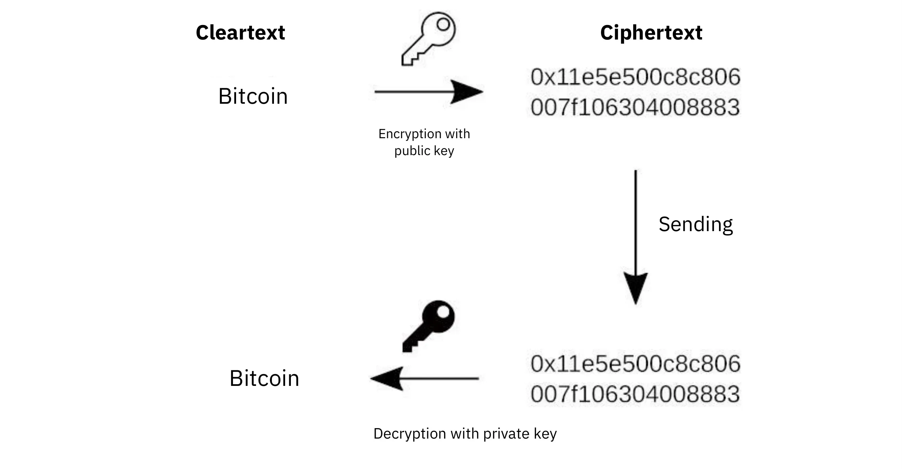


امضاهای دیجیتال، از سوی دیگر، به استفاده از کلید خصوصی به عنوان کلید امضا و کلید عمومی به عنوان کلید تأیید متکی هستند. کاربر یک جفت کلید تولید می‌کند، پیامی را با کلید خصوصی امضا می‌کند و آن را به همکاران خود ارسال می‌کند، که می‌توانند با استفاده از کلید عمومی، اصالت آن را تأیید کنند. بنابراین، آنها هرگز نیازی به دانستن کلید خصوصی ندارند.


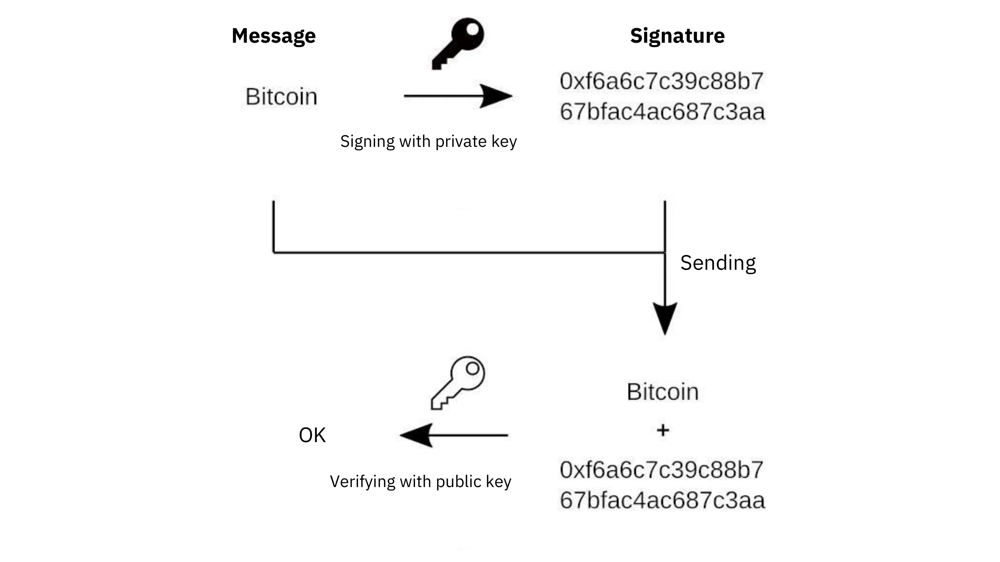


رمزنگاری نامتقارن به‌طور مستقل توسط چندین محقق در دهه ۱۹۷۰ کشف شد. با این حال، اولین کسانی که یافته‌های خود را ارائه دادند، ویتفیلد دیفی و مارتین هلمن، دو رمزنگار از دانشگاه استنفورد بودند. در نوامبر ۱۹۷۶، آن‌ها مقاله‌ای با عنوان "[جهت‌های جدید در رمزنگاری](https://ee.stanford.edu/~hellman/publications/24.pdf)" در مجله *IEEE Transactions on Information Theory* منتشر کردند که یک الگوریتم کلید Exchange (برای انتقال کلیدهای مخفی برای رمزنگاری متقارن) و همچنین یک فرآیند امضای دیجیتال را توصیف می‌کرد. در مقدمه این مقاله، آن‌ها نوشتند:

> "ما امروز در آستانه یک انقلاب در رمزنگاری ایستاده‌ایم. توسعه سخت‌افزار دیجیتال ارزان، آن را از محدودیت‌های طراحی محاسبات مکانیکی آزاد کرده و هزینه دستگاه‌های رمزنگاری با کیفیت بالا را به حدی کاهش داده که می‌توانند در کاربردهای تجاری مانند دستگاه‌های خودپرداز و ترمینال‌های کامپیوتری استفاده شوند. به نوبه خود، چنین کاربردهایی نیاز به انواع جدیدی از سیستم‌های رمزنگاری را ایجاد می‌کنند که نیاز به کانال‌های توزیع کلید امن و Supply معادل امضای کتبی را به حداقل می‌رسانند. همزمان، پیشرفت‌های نظری در نظریه اطلاعات و علوم کامپیوتر نوید ارائه سیستم‌های رمزنگاری اثباتاً امن را می‌دهند و این هنر باستانی را به یک علم تبدیل می‌کنند."

در اینجا عکسی از سال ۱۹۷۷ وجود دارد که توسط چاک پینتر برای سرویس خبری استنفورد گرفته شده است، جایی که می‌توانید ویتفیلد دیفی (در سمت راست) و مارتین هلمن (در مرکز) را ببینید. شخص سمت چپ رمزنگار رالف مرکل است که در آستانه انجام همان کشف بود.


مقاله دیفی و هلمن راه را برای انبوهی از نوآوری‌ها هموار کرد. یکی از این نوآوری‌ها [سیستم رمزنگاری RSA](https://people.csail.mit.edu/rivest/Rsapaper.pdf) بود که در سال ۱۹۷۷ توسط رمزنگاران رونالد ریوت، آدی شامیر و لئونارد ادلمن طراحی شد (که نام خود را به آن دادند) و در سال ۱۹۸۳ توسط MIT به ثبت رسید. این سیستم به لطف تبادل نقش کلیدها، امکان رمزگذاری و امضای پیام‌ها را فراهم می‌کند. RSA برای اولین بار به صورت عمومی در [مقاله‌ای از مارتین گاردنر](https://simson.net/ref/1977/Gardner_RSA.pdf) که در مجله *Scientific American* در آگوست ۱۹۷۷ منتشر شد، ارائه گردید و عنوان آن "بازی‌های ریاضی: نوع جدیدی از رمز که شکستن آن میلیون‌ها سال طول می‌کشد" بود.


کشف رمزنگاری نامتقارن همچنین انگیزه‌ای برای ایجاد توابع یک‌طرفه بود که با آسان کردن محاسبه یک تصویر (جهت رو به جلو) و بسیار دشوار کردن به‌دست‌آوردن یک پیش‌تصویر (جهت معکوس) مشخص می‌شوند. به‌ویژه، این امر منجر به توسعه اولین توابع رمزنگاری Hash شد که یک پیام با اندازه متغیر را به یک خلاصه با اندازه ثابت تبدیل می‌کردند. بین سال‌های ۱۹۸۹ و ۱۹۹۱، چندین الگوریتم هش (MD2، MD4 و MD5) توسط رونالد ریوت برای MIT طراحی شدند.


رمزنگاری پایه Elements از Bitcoin از این تحقیق نشأت می‌گیرد. طرح امضای ECDSA، که اجازه تأیید خرج کردن یک تراکنش سنتی را می‌دهد، در سال 1992 برای NIST ایجاد شد. تابع SHA-256 Hash، که در چندین جای پروتکل استفاده می‌شود، در سال 2001 به عنوان بخشی از مجموعه الگوریتم SHA-2 که توسط NSA عمومی شد، منتشر شد. برای اطلاعات بیشتر در این زمینه، می‌توانید به دوره [Crypto 301](../crypto301/fr.md) ارائه شده توسط Loïc Morel مراجعه کنید.


### امضاهای کور و پول الکترونیکی


این انقلاب در زمینه رمزنگاری همچنین دیوید چام جوان، یک دانشمند کامپیوتر از ساحل غربی و سپس دانشجوی دکترا در دانشگاه برکلی را نیز الهام بخشید. او به سرعت به حفاظت از حریم خصوصی علاقه‌مند شد. او واقعاً نگران آینده آزادی و محرمانگی در جامعه‌ای بود که به طور فزاینده‌ای کامپیوتری می‌شد.


دیوید چام در دهه ۹۰ (منبع: [Elixxir](https://www.youtube.com/watch?v=X45NmCBpYUw))


در [مقاله بنیادی](https://www.cs.ru.nl/~jhh/pub/secsem/chaum1985bigbrother.pdf) خود، "امنیت بدون شناسایی: سیستم‌های تراکنش برای منسوخ کردن برادر بزرگ" که در سال ۱۹۸۵ در *Communications of the ACM* منتشر شد، او نوشت:

> "پایه‌های یک جامعه پرونده‌ای در حال شکل‌گیری است، جایی که می‌توان از کامپیوترها برای استنتاج سبک زندگی، عادات، مکان‌ها و ارتباطات افراد از داده‌های جمع‌آوری‌شده در معاملات عادی مصرف‌کننده استفاده کرد. عدم اطمینان درباره اینکه آیا داده‌ها در برابر سوءاستفاده توسط کسانی که آن‌ها را نگهداری یا دسترسی دارند امن باقی خواهند ماند یا نه، می‌تواند اثر 'سردکننده' داشته باشد و باعث شود افراد فعالیت‌های قابل مشاهده خود را تغییر دهند. با گسترش روزافزون کامپیوتری شدن، پتانسیل این مشکلات به‌طور چشمگیری افزایش خواهد یافت."

این وسواس به حفاظت از حریم خصوصی، علاقه او به حوزه رمزنگاری را توضیح می‌دهد که او از سال ۱۹۷۹ به آن کمک کرده است. در سال ۱۹۸۱، او مبانی ارتباط ناشناس از طریق شبکه‌های میکس را توصیف کرد که به‌ویژه به خدمات رله ایمیل (Mixmaster) و شبکه ناشناس Tor خدمت می‌کرد. در سال ۱۹۸۲، او در تأسیس انجمن بین‌المللی تحقیقات رمزنگاری (IACR) در کنفرانس سالانه CRYPTO '82 شرکت کرد. در همان سال (و این چیزی است که در اینجا برای ما جالب است)، در یک [مقاله](https://sceweb.sce.uhcl.edu/yang/teaching/csci5234WebSecurityFall2011/Chaum-blind-signatures.PDF) با عنوان "امضای کور برای پرداخت‌های غیرقابل ردیابی" او فرآیند امضای کور را منتشر کرد که در قلب مدل ارز دیجیتال او که به حریم خصوصی احترام می‌گذارد، یعنی eCash، قرار دارد.


همان‌طور که دیوید چام [توضیح داد](https://chaum.com/wp-content/uploads/2022/01/05-07-96-DigiCash_s-Ecash%E2%84%A2-to-be-Issued-by-Deutsche-Bank.pdf) در یک بیانیه مطبوعاتی در سال ۱۹۹۶:


> "اکَش یک شکل دیجیتالی از پول نقد است که در اینترنت کار می‌کند، جایی که پول نقد کاغذی نمی‌تواند. مانند پول نقد، به مصرف‌کنندگان حریم خصوصی واقعی در خریدهایشان ارائه می‌دهد."

مدل eCash یک مفهوم ارز دیجیتال است که به مشتریان اجازه می‌دهد پرداخت‌هایی نسبتاً محرمانه انجام دهند. این نوعی پول نقد است، به این معنا که کاربران می‌توانند به‌طور مستقیم اسکناس‌های دیجیتال را نگه‌دارند، به‌جای اینکه در حسابی که توسط یک شخص ثالث مورد اعتماد مدیریت می‌شود، نگه‌داری کنند. با این حال، سیستم به سرورهایی به نام بانک‌ها یا ضرابخانه‌ها متکی است که با هر تراکنش، اسکناس‌های کاربران را صادر و جایگزین می‌کنند. هنگامی که یک اسکناس منتقل می‌شود، گیرنده آن را به بانک خود ارسال می‌کند که مسئول تأیید آن و ارائه یک یا چند اسکناس دیگر در ازای آن است. هر بانک یک ثبت از اسکناس‌های خرج‌شده را نگه‌داری می‌کند تا از دوبار خرج کردن جلوگیری کند. هر سیستم eCash توسط یک مرجع مرکزی که مجوزها را صادر می‌کند، نظارت می‌شود.


یادداشت‌های دیجیتال می‌توانند بدون ضمانت صادر شوند یا پشتیبانی شوند. در حالت اول، آن‌ها یک ارز پایه تشکیل می‌دهند که باید به خودی خود ارزش کسب کند. در حالت دوم، آن‌ها توسط ارز دیگری (معمولاً دلار) پشتیبانی می‌شوند و کاربر می‌تواند در هر زمان یادداشت‌های خود را به بانک خود بازگرداند تا مبلغ مربوطه را بازیابی کند.


در عملیات فنی خود، مدل eCash بر اساس فرآیند امضای کور استوار است که به امضاکننده اجازه می‌دهد چیزی را امضا کند بدون اینکه ببیند چه چیزی را امضا می‌کند. هر اسکناس توسط یک کاربر تولید می‌شود و سپس توسط یک بانک امضا می‌شود تا اصالت آن تضمین شود، بدون اینکه بانک بتواند اسکناس را شناسایی کند. هر اسکناس نمایانگر مقدار مشخصی از واحدهای پولی (ارزش اسمی) است و هر بانک در سیستم دارای یک کلید خصوصی برای امضای هر نوع ارزش اسمی است. فرآیند ریاضی درگیر (که در اینجا توضیح نخواهیم داد) مشابه امضای یک اسکناس فیزیکی بر روی [کاغذ کاربن](https://fr.wikipedia.org/wiki/Papier_carbone) قرار داده شده در یک پاکت مهر و موم شده است.


در اینجا یک تصویر از مراحل مختلف درگیر در ایجاد و جایگزینی یک یادداشت Chaumian (از *L'Élégance de Bitcoin*) آورده شده است:


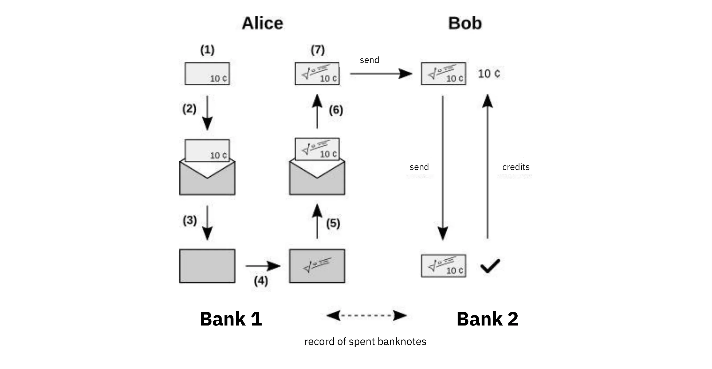


اقدامات (هر کدام مربوط به یک عملیات ریاضی یا انتقال اطلاعات) به شرح زیر است:


1. کاربری به نام Alice یک یادداشت کاغذ کربنی ایجاد می‌کند؛

۲. او آن را در یک پاکت مهر و موم شده قرار می‌دهد؛

۳. Alice پاکت حاوی یادداشت خود را به بانک ارسال می‌کند و مبلغ مورد نظر را اعلام می‌کند؛

۴. بانک پاکت را امضا می‌کند و مقدار واحدهایی را که اسکناس نشان می‌دهد مشخص می‌کند، که این کار باعث امضای یادداشت کاغذ کاربنی داخل می‌شود؛

۵. بانک پاکت را به Alice بازمی‌گرداند؛

6. Alice پاکت را باز می‌کند تا یادداشت امضا شده‌اش را بردارد.

۷. تأیید می‌کند که امضای بانک معتبر است.

انتقال یادداشت امضا شده با دادن آن به کاربر دیگری از سیستم که ما او را Bob می‌نامیم، انجام می‌شود. مراحل به شرح زیر است:


- Alice یادداشت را به Bob ارسال می‌کند؛
- Bob تأیید می‌کند که واقعاً توسط بانک Alice امضا شده است؛
- او بلافاصله یادداشت دریافت شده را به بانک خود ارسال می‌کند؛
- چک‌های بانکی Bob بررسی می‌کنند که آیا یادداشت قبلاً استفاده نشده است و در صورت استفاده، یادداشت جدیدی امضا می‌کنند یا حساب Bob را اعتبار می‌دهند (اگر پشتوانه‌ای وجود داشته باشد).


همه اینها نشان می‌دهد که هیچ بانکی در سیستم نمی‌تواند پرداخت را به هویت Alice مرتبط کند، که توضیح می‌دهد چرا ما درباره محرمانگی مشتری صحبت می‌کنیم. با این حال، تاجر (در اینجا، Bob) موظف است از طریق یک بانک برای تأیید پرداخت اقدام کند و بنابراین بانک او می‌تواند از مبالغ دریافتی آگاه باشد. علاوه بر این، سیستم به یک شخص ثالث مورد اعتماد – مرجع مرکزی که بانک‌های شرکت‌کننده را تعیین می‌کند – وابسته است که این امر آن را به‌طور ذاتی شکننده می‌کند.


### پیاده‌سازی‌های eCash


در سال 1990، دیوید چام شرکت خود، DigiCash B.V.، را برای پیاده‌سازی ایده پول الکترونیکی تأسیس کرد. این شرکت در آمستردام، هلند مستقر بود و حق امتیاز اختراع او را در اختیار داشت. در آن زمان، اینترنت هنوز در مراحل ابتدایی خود بود (وب هنوز در حال توسعه بود) و تجارت الکترونیک وجود نداشت؛ بنابراین، مدل eCash یک فرصت فوق‌العاده محسوب می‌شد.


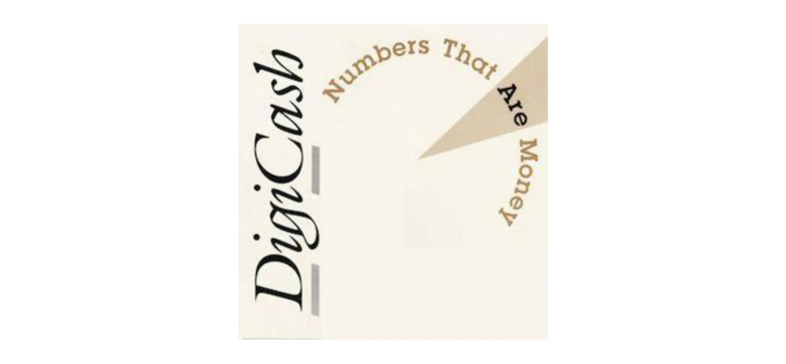


با این حال، این شرکت دیوید چام نبود که اولین بار مدل را آزمایش کرد: این سایفرپانک‌ها بودند که آن را بدون توجه به پتنت‌ها پیاده‌سازی کردند و برای انجام این کار اجازه‌ای نخواستند. بنابراین، پروتکلی به نام Magic Money در فهرست پستی سایفرپانک‌ها در تاریخ ۴ فوریه ۱۹۹۴ توسط توسعه‌دهنده‌ای ناشناس با نام Pr0duct Cypher [پیشنهاد شد](https://cypherpunks.venona.com/date/1994/02/msg00247.html). این پروتکل امکان ایجاد ارز شخصی را با راه‌اندازی یک سرور ایمیل که به عنوان یک ضرابخانه eCash عمل می‌کرد، فراهم می‌کرد. سایفرپانک‌ها با آن سرگرم شدند و انواع واحدهای حساب مانند Tacky Tokens، GhostMarks، DigiFrancs و NexusBucks را ایجاد کردند. با این حال، کاربرد این توکن‌ها حداقل بود و مبادلات بسیار نادر بودند.

در سمت DigiCash، پس از چند سال توسعه، یک نمونه اولیه در ماه مه ۱۹۹۴ در اولین کنفرانس بین‌المللی وب جهانی در CERN در ژنو [ارائه شد](https://chaum.com/wp-content/uploads/2022/01/05-27-94-World_s-first-electronic-cash-payment-over-computer-networks.pdf). سپس شرکت یک آزمایش را آغاز کرد که در ۱۹ اکتبر همان سال شروع شد و واحدهایی به نام "CyberBucks" صادر شد که توسط هیچ ارز دیگری پشتیبانی نمی‌شدند. در این آزمایش، بازرگانان مختلف CyberBucks را پذیرفتند. سایفرپانک‌ها نیز به آن روی آوردند و از آن برای انجام مبادلات واقعی استفاده کردند. به این ترتیب، CyberBucks در بازار ارزش پیدا کرد. با این حال، این ارزش زمانی که eCash در سیستم بانکی سنتی به کار گرفته شد، فروپاشید.


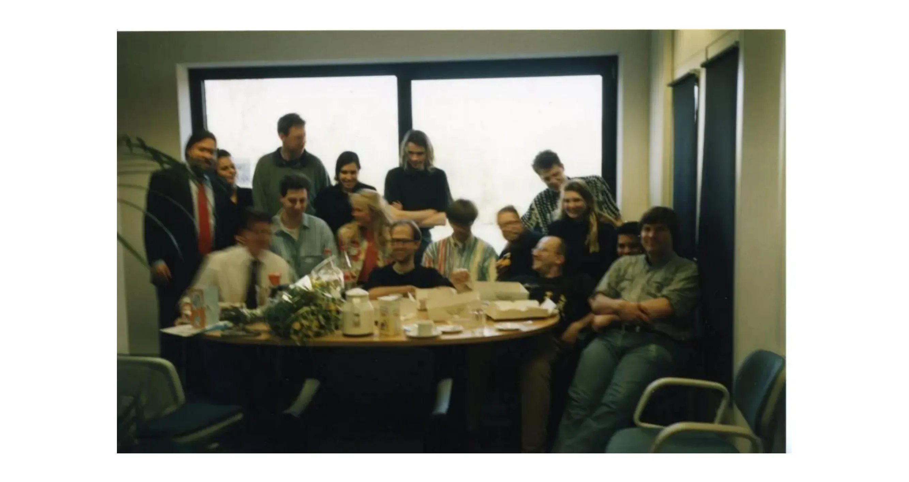

عکس (تار) از تیم DigiCash در سال ۱۹۹۵: دیوید چام در سمت چپ قرار دارد (منبع: [Chaum.com](https://chaum.com/ecash/))


معرفی eCash به سیستم بانکی در اکتبر 1995 با آغاز همکاری DigiCash با بانک Mark Twain، یک بانک کوچک در میزوری، آغاز شد. برخلاف CyberBucks که نرخ Exchange آن شناور بود، واحد حساب توسط دلار آمریکا پشتیبانی می‌شد. بین سال‌های 1996 و 1998، شش بانک از بانک Mark Twain پیروی کردند: بانک Merita در فنلاند، بانک Deutsche در آلمان، بانک Advance در استرالیا، بانک Austria در اتریش، بانک Den norske در نروژ و بانک Credit Suisse در سوئیس. سپس مطبوعات آینده روشنی برای این سیستم وعده دادند.


با این حال، اوضاع طبق برنامه پیش نرفت. به دلیل طبیعت لجوج و مشکوک خود، دیوید چام می‌خواست کنترل شرکتش را حفظ کند و از همکاری با بازیگران بزرگ مالی مانند ING و ABN AMRO، ویزا، نت‌اسکیپ و مایکروسافت خودداری کرد. او در سال ۱۹۹۷ از سمت خود کناره‌گیری کرد و در همان سال شرکت دفتر مرکزی خود را به کالیفرنیا منتقل کرد. در طول سال ۱۹۹۸، بانک‌های شریک اعلام کردند که eCash را رها می‌کنند. در نهایت، دیجی‌کش در نوامبر ۱۹۹۸ ورشکسته شد و این پیاده‌سازی پول الکترونیکی چامی به پایان رسید.


### میراث مدل دیوید چام


با این حال، توسعه مدل eCash بی‌ثمر نبود. این مدل پایه‌گذار چندین ابتکار عمل شد.

در طول دهه ۱۹۹۰، راه‌حل‌های فنی دیگری برای انجام پرداخت‌ها در اینترنت از روندی که eCash آغاز کرده بود، بهره‌برداری کردند: این موضوع در مورد CyberCash، First Virtual یا Open Market صدق می‌کرد که از معایب پرداخت‌های کارت اعتباری که در آن زمان غیرعملی، پرهزینه و ناامن بودند، بهره‌مند شدند. سیستم‌های پرداخت خرد نیز ظهور کردند، مانند CyberCoin (مدیریت شده توسط CyberCash)، NetBill و MilliCent. این سیستم‌ها هرگز واقعاً موفق نشدند، اما راه را برای توسعه PayPal از سال ۱۹۹۹ هموار کردند، موردی که در فصل بعدی به آن خواهیم پرداخت.

سیستم‌های متمرکز جایگزین دیگری نیز به‌طور موازی ظاهر شدند، مانند e-gold و Liberty Reserve. این‌ها ارزهای دیجیتال خصوصی را مدیریت می‌کردند و از ابهام قانونی که می‌توانست در فضای سایبری وجود داشته باشد، بهره‌مند شدند. ما در فصل بعدی نیز درباره این موضوع صحبت خواهیم کرد.


سپس، eCash الهام‌بخش سایفرپانک‌هایی شد که مدل‌های خودشان مانند b-money، bit gold و RPOW را توسعه دادند. آنها Proof of Work و سایر Elements را اضافه کردند که بعدها در Bitcoin یافت شدند. ما این مفاهیم را در فصل ۳ مطالعه خواهیم کرد.


در نهایت، مدل دیوید چام تأثیر قابل توجهی بر Satoshi ناکاموتو داشت زمانی که او مفهوم ارز خود را توسعه داد. این امر با ارجاعات متعدد در [وایت پیپر](assets/pdf/Bitcoin-20090324.pdf) (عنوان، توصیف مسئله در بخش ۲، نام PDF [ارسال‌شده](https://gwern.net/doc/Bitcoin/2008-nakamoto) به وی دای در آگوست ۲۰۰۸)، و همچنین مداخلات خصوصی و عمومی او مشهود است. به این معنا، eCash پیشگام اصلی Bitcoin است، حتی اگر تنها پیشگام نباشد.


با Bitcoin، Satoshi ناکاموتو یک ارز دیجیتال قوی و محرمانه ایجاد کرد، پول الکترونیکی واقعی. با این کار، او [پیش‌بینی](https://www.youtube.com/watch?v=mlwxdyLnMXM&t=872s) میلتون فریدمن، برنده جایزه نوبل اقتصاد و بنیان‌گذار مکتب شیکاگو را محقق کرد، که در مصاحبه‌ای با بنیاد اتحادیه مالیات‌دهندگان ملی در سال 1999 گفت:


> "من فکر می‌کنم که اینترنت یکی از نیروهای اصلی برای کاهش نقش دولت خواهد بود. تنها چیزی که کم است، اما به زودی توسعه خواهد یافت، یک پول الکترونیکی قابل اعتماد است، روشی که از طریق آن بتوانید در اینترنت وجوه را از A به B منتقل کنید بدون اینکه A، B را بشناسد یا B، A را بشناسد."

## ارزهای دیجیتال خصوصی

<chapterId>43035fa3-2805-4331-a6fb-070931d749cf</chapterId>


در فصل قبلی، اولین شکل پول الکترونیکی که از ظهور اینترنت و رمزنگاری مدرن پدید آمد را بررسی کردیم: مدل eCash دیوید چام. این مدل تأثیر قابل‌توجهی بر Satoshi ناکاموتو داشت و یک نقطه عطف کلیدی در مسیری بود که به Bitcoin منتهی شد. با این حال، داستان منشأ ارزهای دیجیتال با eCash به پایان نمی‌رسد؛ بلکه شامل آزمایش‌هایی با ارزهای خصوصی که از اواخر دهه ۱۹۹۰ در اینترنت فعالیت می‌کردند نیز می‌شود.


در این فصل، به بررسی آنچه در حوزه ارزهای خصوصی در ایالات متحده انجام شده است، خواهیم پرداخت. ابتدا به بررسی مورد دلار لیبرتی خواهیم پرداخت. سپس، سیستم‌های متمرکز مانند ای‌گلد و لیبرتی رزرو را بررسی خواهیم کرد. در نهایت، درباره پی‌پال صحبت خواهیم کرد که رویکردی متفاوت دارد، اما با این حال به عنوان مثالی روشن از مدل مبتنی بر یک شخص ثالث مورد اعتماد عمل می‌کند.


در همه موارد، این سیستم‌ها در نهایت توسط مقامات تعطیل شدند یا مجبور به رعایت مقررات مالی شدند. به همین دلیل است که Satoshi ناکاموتو، که درک خوبی از این سیستم‌ها داشت، به شدت نیاز به یک سیستم جایگزین که به یک مرجع مرکزی متکی نباشد را درک کرد.


### آزادی پولی در ایالات متحده و دلار آزادی


تاریخ ایالات متحده از ابتدا با تنوع پولی زیادی مشخص شده بود. از قرن هفدهم تا اواسط قرن نوزدهم، مستعمره انگلیسی که به جمهوری مستقل تبدیل شد، واقعاً اجازه گردش آزاد ارزهای خارجی را می‌داد (دلار آمریکا تا سال 1792 به طور رسمی ایجاد نشد)، و همچنین [ضرب سکه خصوصی](https://fee.org/articles/private-coinage-in-america/) طلا و نقره. یک [آزادی نسبی بانکی](https://iea.org.uk/wp-content/uploads/2023/12/Dowd-Free-Banking-Interactive.pdf) نیز بین سال‌های 1837 و 1863 حاکم بود.


با این حال، اوضاع با جنگ داخلی تغییر کرد، جنگی که توسط اتحادیه پیروز شد، در فرآیندی از تمرکز قدرت. بنابراین، قانونی از کنگره در ۸ ژوئن ۱۸۶۴، ضرب سکه‌های خصوصی را ممنوع کرد. این قانون که به بخش ۴۸۶ از عنوان ۱۸ کد ایالات متحده (*18 U.S. Code § 486*) تبدیل شده است، [بیان می‌کند](https://www.law.cornell.edu/uscode/text/18/486):

"هر کسی، به جز آنچه که به موجب قانون مجاز است، که سکه‌های طلا، نقره یا فلزات دیگر، یا آلیاژهای فلزی را که برای استفاده به عنوان ارز جاری در نظر گرفته شده‌اند، تولید، توزیع یا تلاش به توزیع یا انتقال کند، چه این سکه‌ها شبیه سکه‌های ایالات متحده یا کشورهای خارجی باشند یا طراحی اصلی داشته باشند، تحت این عنوان جریمه خواهد شد یا به حبس تا پنج سال یا هر دو محکوم خواهد شد."


برای اجرای این محدودیت‌ها، یک آژانس دولتی در سال ۱۸۶۵ توسط آبراهام لینکلن تأسیس شد: سرویس مخفی. مأموریت اولیه سرویس مخفی مبارزه با جعل و تقلب مالی به طور کلی بود. به طور غیرمستقیم، این امر به تقویت درآمدهای دولت فدرال کمک کرد، با سپردن انحصار تولید ارز به ضرابخانه ایالات متحده.


اوضاع پس از آن حتی محدودتر شد. بانک مرکزی، که به نام فدرال رزرو ایالات متحده شناخته می‌شود، در سال ۱۹۱۳ و پس از وحشت بانکی سال ۱۹۰۷ تأسیس شد. سپس، استاندارد طلای کلاسیک در سال ۱۹۳۳ به عنوان بخشی از طرح جدید اف.دی. روزولت کنار گذاشته شد، با [فرمان اجرایی ۶۱۰۲](https://fr.wikipedia.org/wiki/Executive_Order_6102) که افراد و شرکت‌های مستقر در ایالات متحده را از نگهداری طلا منع می‌کرد. ارجاع به طلا در سیستم پولی سرانجام در سال ۱۹۷۱ کنار گذاشته شد، زمانی که ریچارد نیکسون پایان قابلیت تبدیل دلار به طلا در سطح بین‌المللی را اعلام کرد.

با لغو ممنوعیت مالکیت طلا و توسعه اینترنت از دهه ۱۹۷۰، ایده استفاده از ارزهای خصوصی دوباره مطرح شد. این موضوع با برنارد ون نوتهاوس که در سال ۱۹۹۸ دلار لیبرتی را راه‌اندازی کرد، به واقعیت پیوست. این ارز بر پایه طلا و نقره بود و به صورت سکه‌های نقره و اسکناس‌های نماینده موجود بود. این سیستم توسط یک سازمان غیرانتفاعی به نام NORFED (مخفف سازمان ملی برای لغو فدرال رزرو و کد درآمد داخلی) مدیریت می‌شد. از سال ۲۰۰۳، دلار لیبرتی به صورت دیجیتال نیز در دسترس بود، از طریق سیستمی مشابه با e-gold (به بخش بعدی مراجعه کنید). این سیستم به سطحی از موفقیت دست یافت. علاوه بر سکه‌های در گردش، خزانه‌های NORFED حدود ۸ میلیون دلار در فلزات گرانبها برای تضمین قابلیت تبدیل ارز داشتند، که شامل ۶ میلیون دلار برای پشتیبانی از واحد دیجیتال بود.


دلار آزادی (10 دلار) نقره از سال 2003 (منبع: [Numista](https://en.numista.com/catalogue/exonumia242820.html))


در سپتامبر 2006، ضرابخانه ایالات متحده یک [بیانیه مطبوعاتی](https://www.usmint.gov/news/press-releases/20060914-liberty-dollars-not-legal-tender-united-states-mint-warns-consumers) منتشر کرد که به‌طور مشترک با وزارت دادگستری نوشته شده بود و در آن نتیجه‌گیری شد که استفاده از سکه‌های NORFED بخش 486 از عنوان 18 کد ایالات متحده را نقض کرده و "یک جرم فدرال" محسوب می‌شود. در نتیجه، پس از یورش FBI به محل‌های NORFED در سال 2007، این نقض‌ها علیه NotHaus و همکارانش مطرح شد که در سال 2009 دستگیر و در مارس 2011 محاکمه شدند. در سال 2014، برنارد ون نات‌هاوس در تجدیدنظر به شش ماه حبس خانگی و سه سال آزادی مشروط محکوم شد.


### ای‌گلد: طلا در وب

یک مثال نمادین از ارز الکترونیکی خصوصی، سیستم ای-گلد است. این سیستم چیزی بود که به عنوان "ارز دیجیتال طلا" شناخته می‌شود، به این معنی که ارزی که به صورت الکترونیکی منتقل می‌شود و به طور کامل توسط مقدار معادل طلا که به صورت امن ذخیره شده است، پشتیبانی می‌شود. این سیستم توسط داگلاس جکسون و بری داونی در سال ۱۹۹۶ تأسیس شد. داگلاس جکسون یک انکولوژیست آمریکایی بود که در فلوریدا زندگی می‌کرد و پیرو اقتصاددان اتریشی، فریدریش فون هایک بود و می‌خواست با ای-گلد "[پول بهتری](https://blog.bettermoney.com/)" ایجاد کند.

اصل بر این بود که هر واحد از ای-گلد می‌توانست به طلای واقعی تبدیل شود. ذخایر طلا توسط شرکتی به نام Gold & Silver Reserve Inc. (G&SR) که در ایالات متحده واقع شده بود، مدیریت می‌شد. سیستم کامپیوتری توسط شرکت دومی به نام e-gold Ltd. که در سنت کیتس و نویس در کارائیب ثبت شده بود، مدیریت می‌شد. طلا تنها فلز درگیر نبود: کاربران می‌توانستند همچنین ای-نقره، ای-پلاتین و ای-پالادیوم را که بر اساس همان مدل ساخته شده بودند، نگهداری کنند.


سیستم e-gold از وب نوظهور و به‌ویژه مرورگر بسیار جدید Netscape بهره‌برداری کرد. هر مشتری می‌توانست از طریق وب‌سایت به حساب خود دسترسی پیدا کند، بدون اینکه نیاز به استفاده از نرم‌افزار اختصاصی داشته باشد. برای آن زمان، این پلتفرم بسیار کارآمد بود و از یک سیستم تسویه ناخالص آنی الهام گرفته از انتقال بین‌بانکی استفاده می‌کرد. این تصویری است از نحوه ارسال e-gold در سال 2005 (تصویر از یک [آموزش](https://www.geocities.ws/rizuan_mahrol/setpbystep.html) آن زمان):


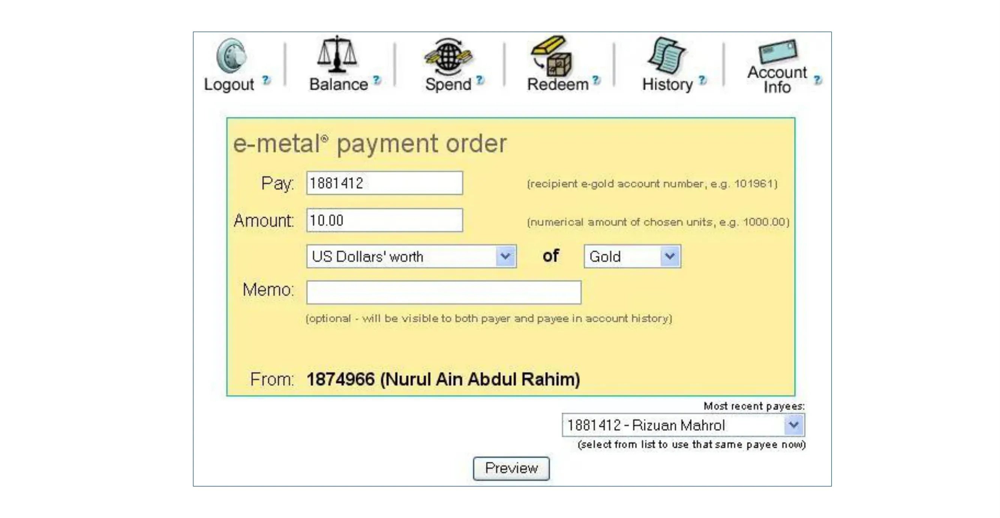


سیستم ای‌گلد با موفقیت بزرگی روبرو شد: در اوج خود در سال ۲۰۰۶، [تضمین](https://web.archive.org/web/20060907024202if_/http://www.e-gold.com:80/examiner.html) ۳.۶ تن طلا، به ارزش بیش از ۸۰ میلیون دلار، [پردازش](https://web.archive.org/web/20060208044937/http://www.e-gold.com/stats.html) ۷۵,۰۰۰ تراکنش در روز، با حجم سالانه ۳ میلیارد دلار، و مدیریت بیش از ۲.۷ میلیون حساب را انجام می‌داد.

این موفقیت به طور ناگهانی با مداخله دولت متوقف شد. پس از تحقیقی که توسط سرویس مخفی انجام شد، داگلاس جکسون، دو شرکت او و همکارانش در تاریخ ۲۷ آوریل ۲۰۰۷ توسط وزارت دادگستری به اتهام تسهیل پولشویی و اداره یک کسب‌وکار انتقال پول بدون مجوز [متهم شدند](https://www.justice.gov/archive/opa/pr/2007/April/07_crm_301.html). در نوامبر ۲۰۰۸، داگلاس جکسون مجرم شناخته شد و به ۳ سال آزادی مشروط، شامل ۶ ماه حبس خانگی تحت نظارت الکترونیکی محکوم شد. پس از تلاش ناموفق برای دریافت مجوز، e-gold مجبور شد در نوامبر ۲۰۰۹ به طور دائمی تعطیل شود.


سیستم‌های دیگری با پیروی از همان مدل ایجاد شدند. می‌توانیم به GoldMoney اشاره کنیم که توسط جیمز ترک و پسرش در فوریه 2001 تأسیس شد و امروزه با مقررات مالی سازگار شده است. e-Bullion، سیستمی که توسط جیمز فاید در ژوئیه 2001 تأسیس شد، در سال 2008 درهای خود را بست. در نهایت، یکی از آخرین ارزهای دیجیتال طلا Pecunix بود که توسط سایمون دیویس در پاناما در سال 2002 تأسیس شد و در سال 2015 به عنوان بخشی از یک خروج کلاهبرداری عملیات خود را متوقف کرد.


### لیبرتی رزرو، جایگزینی برای فدرال رزرو


نمونه دیگری از سیستم ارز خصوصی متمرکز، لیبرتی رزرو است که به کاربران خود اجازه می‌داد ارزهای الکترونیکی متصل به دلار آمریکا، یورو یا طلا را نگهداری و انتقال دهند. این سیستم توسط آرتور بودوفسکی، یک آمریکایی با اصالت اوکراینی، و ولادیمیر کاتس، یک مهاجر روسی از سن پترزبورگ، ایجاد شد. در سال ۲۰۰۶، آرتور بودوفسکی به کاستاریکا، که در آن زمان به عنوان بهشت مالیاتی شناخته می‌شد، مهاجرت کرد و شرکت خود، لیبرتی رزرو S.A. را ثبت کرد.


لوگوی Liberty Reserve در سال 2009 (منبع: [ویکی‌مدیا](https://commons.wikimedia.org/wiki/File:LR_Logo-1-.webp))


سیستم بسیار شبیه به e-gold بود، با این تفاوت که وجوه (عمدتاً به دلار) در حساب‌های بانکی فراساحلی نگهداری می‌شدند، نه در خزانه‌های خصوصی. Liberty Reserve از تعطیلی e-gold در آوریل 2007 پس از کیفرخواست داگلاس جکسون و همکارانش بسیار بهره‌مند شد. در ماه مه 2013، [طبق گزارش وزارت دادگستری ایالات متحده](https://www.justice.gov/sites/default/files/usao-sdny/legacy/2015/03/25/Liberty%20Reserve%2C%20et%20al.%20Indictment%20-%20Redacted_0.pdf)، این پلتفرم بیش از یک میلیون کاربر در سراسر جهان داشت، از جمله بیش از 200,000 نفر در ایالات متحده، و سالانه 12 میلیون تراکنش مالی پردازش می‌کرد، با حجم ترکیبی بیش از 1.4 میلیارد دلار. استفاده عمدتاً برای فعالیت‌های مجرمانه بود، اما [به این موارد محدود نمی‌شد](https://web.archive.org/web/20150422023243/https://www.theatlantic.com/magazine/archive/2015/05/bank-of-the-underworld/389555/): Liberty Reserve همچنین توسط معامله‌گران فارکس یا برای انتقالات خارجی استفاده می‌شد.


با این حال، سیستم در نهایت به سرنوشت مشابهی با e-gold دچار شد. در سال 2009، *Superintendencia General de Entidades Financieras* کاستاریکا به Liberty Reserve علاقه‌مند شد و از آن خواست تا مجوز بگیرد (که شرکت موفق به انجام آن نشد). سپس، در نوامبر 2011، FinCEN ایالات متحده یک [اعلان](https://www.justice.gov/sites/default/files/usao-sdny/legacy/2015/03/25/Liberty%20Reserve%2C%20et%20al.%20Indictment%20-%20Redacted_0.pdf#page=12) صادر کرد که بیان می‌کرد این سیستم "توسط مجرمان برای انجام تراکنش‌های ناشناس جهت انتقال پول به صورت جهانی استفاده می‌شود." در نهایت، Liberty Reserve در پایان یک عملیات بین‌المللی تعطیل شد: در 24 مه 2013، آرتور بودوفسکی و همکاران اصلی‌اش در حوزه‌های قضایی مختلف (اسپانیا، ایالات متحده، کاستاریکا) متهم و دستگیر شدند و سایت اصلی توسط وزارت دادگستری توقیف شد. در سال 2016، پس از استرداد به ایالات متحده، آرتور بودوفسکی به جرم پولشویی به 20 سال زندان محکوم شد.


این مثال نشان می‌دهد که آربیتراژ قضایی به تنهایی برای محافظت از ارز در برابر مداخله دولت کافی نیست.


### پی‌پال و چشم‌انداز پیتر تیل

در نهایت، باید به مورد پی‌پال بپردازیم. اگرچه خالقان آن قصد نداشتند که آن را به عنوان یک ارز مستقل از سیستم موجود ایجاد کنند، اما با این حال پیش‌بینی می‌کردند که این محصول تأثیری بر جامعه خواهد داشت، همسو با ایدئولوژی مخرب سیلیکون ولی. محصول پی‌پال توسط شرکت Confinity Inc. توسعه یافت که در دسامبر ۱۹۹۸ در سان‌فرانسیسکو توسط مکس لوچین و پیتر تیل، که چند ماه قبل در دانشگاه استنفورد با یکدیگر آشنا شده بودند، تأسیس شد. این شرکت که در ابتدا FieldLink نام داشت، هدفش توسعه سیستم‌های پرداخت امن بر روی کامپیوترهای دستی PalmPilot بود.


پی‌پال در اکتبر ۱۹۹۹ توسط یک مهندس شرکت ایجاد شد. این سرویس امکان پرداخت آسان و بدون هزینه بین آدرس‌های ایمیل را فراهم می‌کرد و برای انتقال پرداخت‌های ساده بین افراد ("pay pal") طراحی شده بود. مدل کسب‌وکار آن بر اساس کسب سود از وجوه مشتریان که در بانک‌ها نگهداری می‌شد، بود که هزینه‌های عملیاتی را پوشش می‌داد و به سهامداران پاداش می‌داد. بنابراین، این یک سرویس بود که بر روی سیستم بانکی ساخته شده بود، مشابه Liberty Reserve.


در اوج حباب اینترنت، محصول از ماه‌های اول رشد سریعی را تجربه کرد، به ویژه به لطف سیستم ارجاع آن. این موفقیت توجه رقبا را جلب کرد، که سرمایه بسیار بیشتری داشتند، ایده را کپی کردند و نسخه خود از این سرویس را راه‌اندازی کردند، که به ضرر Confinity بود. به همین دلیل شرکت مجبور شد با یکی از آنها، بانک آنلاین X.com که متعلق به ایلان ماسک بود، ادغام شود تا در مارس 2000 به PayPal Inc. تبدیل شود.


چشم‌انداز اصلی پی‌پال انقلابی بود و با دیدگاه لیبرترین پیتر تیل هم‌خوانی داشت. این چیزی است که او در پاییز ۱۹۹۹ گفت، همان‌طور که اریک جکسون در سال ۲۰۱۲ در *جنگ‌های پی‌پال* گزارش داد:


> "البته، چیزی که ما آن را 'راحت' برای کاربران آمریکایی می‌نامیم، برای جهان در حال توسعه انقلابی خواهد بود. بسیاری از دولت‌های این کشورها با ارزهای خود به‌طور بی‌پروا رفتار می‌کنند. آنها از تورم و گاهی کاهش ارزش کلی ارز، مانند آنچه سال گذشته در روسیه و چندین کشور جنوب شرق آسیا دیدیم، برای گرفتن ثروت از شهروندان خود استفاده می‌کنند. بیشتر مردم عادی در آنجا هرگز فرصتی برای باز کردن یک حساب خارجی یا دسترسی به بیش از چند اسکناس از یک ارز پایدار مانند دلار آمریکا ندارند. در نهایت، پی‌پال قادر خواهد بود این وضعیت را تغییر دهد. در آینده، زمانی که خدمات خود را در خارج از ایالات متحده در دسترس قرار دهیم و نفوذ اینترنت به تمام طبقات اقتصادی مردم گسترش یابد، پی‌پال به شهروندان در سراسر جهان کنترل مستقیم‌تری بر ارزهای خود نسبت به گذشته خواهد داد. برای دولت‌های فاسد تقریباً غیرممکن خواهد بود که از طریق روش‌های قدیمی خود ثروت مردم را بدزدند، زیرا اگر تلاش کنند، مردم به دلار، پوند یا ین روی خواهند آورد و در واقع ارز محلی بی‌ارزش را با چیزی امن‌تر جایگزین خواهند کرد."


پیتر تیل در ۲۰ اکتبر ۱۹۹۹، در سخنرانی خود در اوکلند، کالیفرنیا برای مؤسسه مستقل (منبع: [یوتیوب](https://www.youtube.com/watch?v=e-X8D1gOU1E))


با این حال، اوضاع در جهت مطلوب پیش نرفت و پی‌پال مجبور شد با انواع مقررات مالی سازگار شود، تا جایی که اکنون این سرویس به خاطر سانسور پرداخت و مسدود کردن حساب‌ها در سراسر جهان مشهور است. باور اینکه چنین سیستمی می‌تواند قدرت‌های مستقر را به چالش بکشد، ساده‌لوحانه بود.


### گزینه‌های متمرکز و Bitcoin

بنابراین، مشاهده می‌کنیم که تلاش‌ها برای ایجاد خدمات متمرکز به عنوان جایگزین‌هایی برای سیستم موجود، به یک شکل یا شکل دیگر در نهایت متوقف شده‌اند. نقطه ضعف این مدل‌ها این است که به یک شخص ثالث مورد اعتماد وابسته هستند که ممکن است ورشکسته شود، با وجوه فرار کند، یا تحت کنترل مقامات قرار گیرد. در حالت اخیر، خدمات مورد نظر با یک دوراهی مواجه می‌شود: تطبیق با رعایت مقررات مالی، همان‌طور که GoldMoney و PayPal انجام دادند، یا نابودی با امتناع از رعایت، سرنوشتی که e-gold، Liberty Reserve و Liberty Dollar تجربه کردند.

بسته شدن این سیستم‌ها همزمان با ایجاد و روزهای اولیه Bitcoin بود. در نتیجه، Satoshi ناکاموتو و کاربران اولیه Bitcoin به خوبی از آن‌ها آگاه بودند. در مورد Satoshi، او [از مدل](https://www.metzdowd.com/pipermail/cryptography/2009-January/015041.html) استفاده شده توسط e-gold آگاه بود و چندین بار در مداخلات عمومی و خصوصی خود به Pecunix و Liberty Reserve [اشاره کرد](https://bitcointalk.org/index.php?topic=87.msg807#msg807).


این به دلیل شکنندگی سیستم‌های متمرکز است که طرفداران آزادی – از جمله به‌ویژه سایفرپانک‌ها – به دنبال ایجاد یک ارز *غیرمتمرکز* بودند. لازم بود راهی پیدا شود تا از قرار دادن زیرساخت کل سیستم بر روی یک نقطه واحد جلوگیری شود. به همین دلیل، چندین مدل "کاهش اعتماد" در اواخر دهه ۱۹۹۰ و اوایل دهه ۲۰۰۰ ظهور کردند، قبل از کشف Bitcoin. فصل بعدی به این مدل‌ها اختصاص خواهد داشت.


## مدل‌های غیرمتمرکز قبل از ناکاموتو

<chapterId>a104f23c-e9c3-4457-a194-d87cc5f35f13</chapterId>


Bitcoin نمایانگر یک مدل غیرمتمرکز از ارز دیجیتال است. با این کار، نیاز به یک شخص ثالث مورد اعتماد را که می‌تواند به عنوان نقطه شکست واحد در سیستم عمل کند، از بین می‌برد. همان‌طور که مثال‌های eCash، ارزهای دیجیتال طلا و Liberty Reserve نشان می‌دهند، تمرکز یک سیستم که قصد دارد جایگزینی برای سیستم موجود باشد، به‌طور اجتناب‌ناپذیری به بسته شدن آن به یک شکل یا شکل دیگر منجر می‌شود.

با این حال، Bitcoin اولین مفهوم ارز غیرمتمرکز نبود که پیشنهاد شده بود. از اواخر دهه ۱۹۹۰، چنین مدل‌هایی توسط سایفرپانک‌ها توصیف شده بود، افرادی که به آزادی و حریم خصوصی افراد در اینترنت علاقه‌مند بودند و معتقد بودند (مانند دیوید چام) که سیستم‌های نظارتی به آینده‌ای دیستوپیایی منجر می‌شوند. آنها [خواستار](https://cypherpunks.venona.com/date/1993/03/msg00392.html) "نوشتن کد" بودند و "پول الکترونیکی" را به عنوان عنصری اساسی برای ایده‌آل خود در نظر می‌گرفتند. (*متن اصلی: "سایفرپانک‌ها کد می‌نویسند. (...) ما با رمزنگاری، با سیستم‌های ارسال ناشناس ایمیل، با امضاهای دیجیتال و با پول الکترونیکی از حریم خصوصی خود دفاع می‌کنیم."*)


در این فصل، ما به بررسی ظهور تکنیک‌های بنیادی مختلف Elements که بعدها در Bitcoin استفاده شدند، خواهیم پرداخت: اجماع توزیع‌شده، زمان‌سنجی، و Proof of Work. سپس، درباره b-money، بیت گلد، و RPOW که به ترتیب توسط سایفرپانک‌ها وی دای، نیک سابو، و هال فینی طراحی شده‌اند، صحبت خواهیم کرد. در نهایت، به بررسی مورد ریپل خواهیم پرداخت که مدل آن کمی متفاوت است، اما جایگاه خود را در تاریخچه ایجاد Bitcoin دارد.


### اجماع توزیع‌شده


با ظهور کامپیوترها در دهه ۱۹۵۰، امکان اتصال آنها به یکدیگر پدیدار شد. اینگونه بود که اولین شبکه‌های کامپیوتری شکل گرفتند و به توسعه اینترنت، "شبکه شبکه‌ها"، در دهه ۱۹۷۰ منجر شدند. سوال زیرساخت این شبکه‌ها به طور اجتناب‌ناپذیری مطرح شد. به همین دلیل، دانشمند کامپیوتر لهستانی-آمریکایی، پل باران، در مقاله بنیادی خود در سال ۱۹۶۴ (که به توصیف سوئیچینگ بسته‌ها می‌پرداخت)، سه نوع شبکه را فهرست کرد: شبکه متمرکز، که به یک گره واحد متکی است؛ شبکه توزیع‌شده، که در آن هر نقطه یک گره است؛ و شبکه غیرمتمرکز (غیرتوزیع‌شده)، که به یک شبکه توزیع‌شده از چندین گره متکی است.


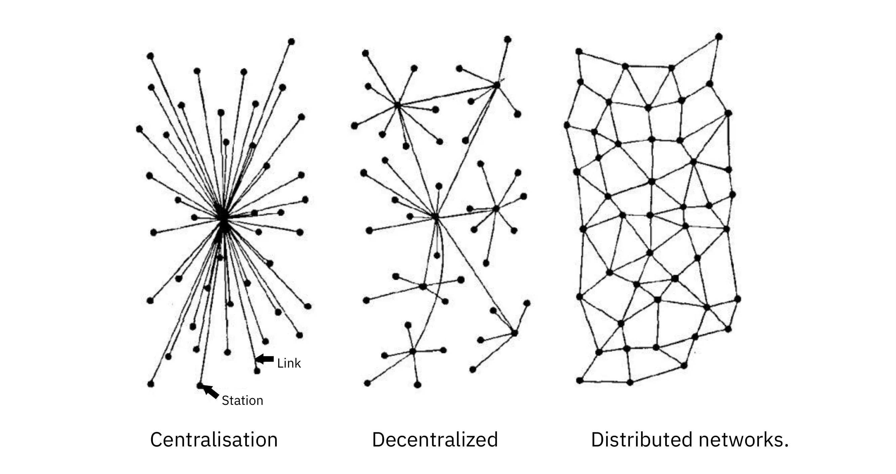


دو مدل خالص می‌توانند از این ملاحظات استخراج شوند: مدل کلاینت-سرور، که در آن یک سرور مرکزی به درخواست‌های کلاینت‌ها پاسخ می‌دهد، و مدل همتا به همتا، که در آن هر گره نقش یکسانی در سیستم دارد. این مدل اخیر به‌ویژه برای اشتراک‌گذاری فایل در دهه ۲۰۰۰ مفید بود، با ایجاد BitTorrent و سایر پروتکل‌های مشابه. شبکه Tor غیرمتمرکز است، نه صرفاً همتا به همتا.

مشکلی که در معماری‌های توزیع‌شده با آن مواجه می‌شویم، مسئله اجماع توزیع‌شده است که معمولاً به عنوان مسئله ژنرال‌های بیزانسی شناخته می‌شود و توسط لزلی لمپورت، رابرت شستاک و مارشال پیز در یک [مقاله](https://lamport.azurewebsites.net/pubs/byz.pdf) که در سال ۱۹۸۲ منتشر شد، رسمی‌سازی شده است. این مسئله به چالش قابلیت اطمینان انتقال و یکپارچگی شرکت‌کنندگان در سیستم‌های همتا به همتا می‌پردازد و در مواردی که اجزای یک سیستم کامپیوتری نیاز به توافق دارند، کاربرد دارد.


مشکل به صورت یک استعاره بیان شده است که شامل ژنرال‌های ارتش امپراتوری بیزانس می‌شود، که با نیروهای خود در حال محاصره یک شهر دشمن هستند و قصد حمله دارند و تنها می‌توانند از طریق پیام‌رسان‌ها ارتباط برقرار کنند. هدف این است که یک استراتژی (یعنی، یک الگوریتم) پیدا شود که بتواند حضور خائنان را مدیریت کند و اطمینان حاصل کند که همه ژنرال‌های وفادار بر روی یک نقشه نبرد توافق دارند تا حمله موفقیت‌آمیز باشد. در اینجا یک تصویر (منبع: *L'Élégance de Bitcoin*) آورده شده است:


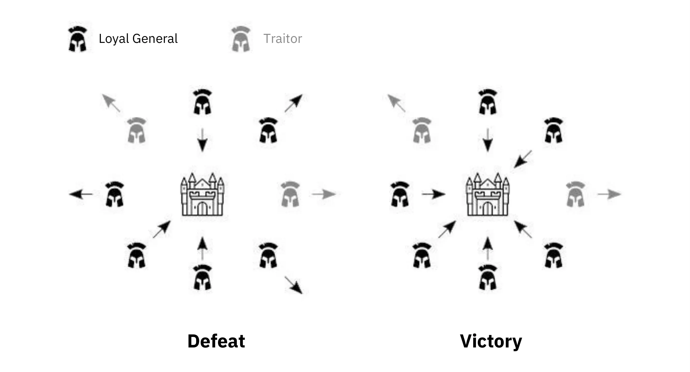


حل این مشکل برای سیستم‌های توزیع‌شده‌ای که واحد حساب را مدیریت می‌کنند، مهم است. چنین سیستم‌هایی واقعاً نیاز دارند که شرکت‌کنندگان بر روی Ownership واحدهای حساب توافق کنند، یعنی بر روی اینکه چه کسی مالک چه چیزی است.


قبل Bitcoin، مسئله به‌طور کامل توسط الگوریتم‌های به‌اصطلاح "کلاسیک" حل می‌شد که نیاز داشتند گره‌ها از پیش شناخته شده باشند و دو تا از آن‌ها صادق باشند. شناخته‌شده‌ترین آن‌ها احتمالاً الگوریتم اجماع [PBFT](https://css.csail.mit.edu/6.824/2014/papers/castro-practicalbft.pdf) (مخفف Practical Byzantine Fault Tolerance) است که توسط میگل کاسترو و باربارا لیسکوف در سال 1999 توسعه یافت و به تعداد معینی از شرکت‌کنندگان اجازه می‌داد با مدیریت هزاران درخواست در ثانیه و با تأخیری کمتر از یک میلی‌ثانیه به توافق برسند.


با الگوریتم اجماع Bitcoin، ناکاموتو در Satoshi آن را به صورت احتمالی حل کرد و با قربانی کردن قطعیت نهایی تراکنش‌ها، امکان حذف برخی محدودیت‌ها را فراهم کرد. در 13 نوامبر 2008، او [نوشت](https://www.metzdowd.com/pipermail/cryptography/2008-November/014849.html) که "زنجیره Proof-of-Work یک راه‌حل برای مسئله ژنرال‌های بیزانسی است."


### مهر زمانی سند

برچسب‌گذاری زمانی تکنیکی است که شامل ارتباط دادن تاریخ و زمان با اطلاعاتی مانند یک رویداد یا یک سند می‌شود. از دیدگاه قانونی، این می‌تواند، به عنوان مثال، وجود یک Contract قبل از یک تاریخ معین را تضمین کند. در دنیای واقعی، روش‌های متعددی برای Timestamp کردن چیزی وجود دارد، مانند ارسال یک سند در یک پاکت مهر و موم شده یا ثبت یک جدول زمانی در یک دفترچه یادداشت.

با این حال، زمان‌سنجی به‌ویژه در دنیای دیجیتال مفید است، جایی که فایل‌ها (متن، تصویر، صدا یا ویدئو) به‌راحتی قابل تغییر هستند. زمان‌سنجی می‌تواند توسط خدمات متمرکز انجام شود، که مسئول ذخیره‌سازی اسناد دریافت‌شده (یا اثر انگشت آن‌ها) و ارتباط آن‌ها با تاریخ و زمان دریافت هستند. به این امر زمان‌سنجی قابل‌اعتماد گفته می‌شود.


در سال 1991، یک تکنیک محرمانه و امن برای زمان‌سنجی توسط استوارت هابر و اسکات استورنتا، دو محقق که برای Bell Communications Research Inc. (که معمولاً "Bellcore" نامیده می‌شود) کار می‌کردند، پیشنهاد شد. این کنسرسیوم تحقیق و توسعه در نیوجرسی واقع شده است. در [مقاله آن‌ها](http://www.staroceans.org/e-book/Haber_Stornetta.pdf) با عنوان "چگونه یک سند دیجیتال را زمان‌سنجی کنیم"، آن‌ها توضیح دادند که چگونه یک سرویس زمان‌سنجی معتبر می‌تواند از یک تابع یک‌طرفه (مانند تابع MD4 Hash) و یک الگوریتم امضا برای افزایش محرمانگی اسناد مشتری و قابلیت اطمینان گواهی استفاده کند. به‌ویژه، ایده این بود که اطلاعات را با درگیر کردن Timestamp قبلی در کاربرد تابع یک‌طرفه زنجیره کنند.


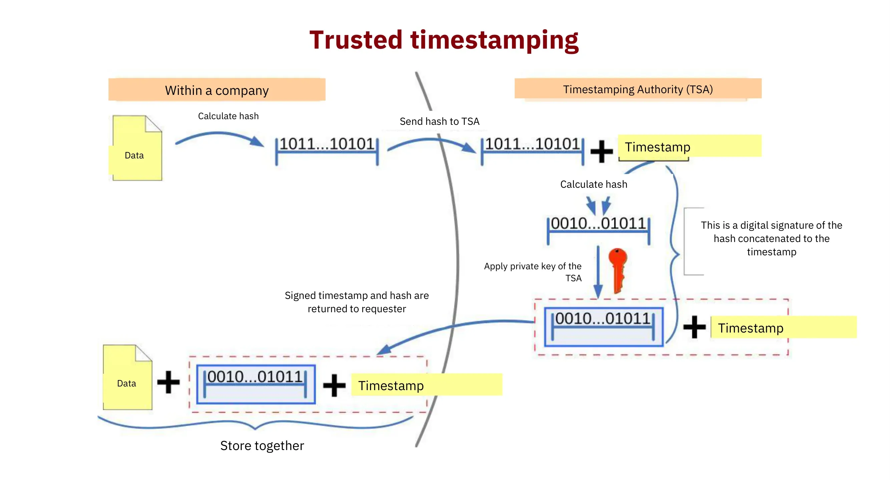

مثالی از زمان‌سنجی معتبر (منبع: [ویکی‌مدیا](https://en.m.wikipedia.org/wiki/File:Trusted_timestamping.svg))


هابر و استورنتا ایده خود را با انتشار اثر انگشت‌های رمزنگاری‌شده (که از هش کردن داده‌های مفید به دست می‌آمد) در آگهی‌های طبقه‌بندی‌شده نیویورک تایمز از سال ۱۹۹۲ پیاده‌سازی کردند. سپس در سال ۱۹۹۴ شرکت خود، Surety Technologies، را تأسیس کردند تا به طور کامل به این فعالیت بپردازند. به این ترتیب، آن‌ها به خاطر ایجاد اولین زنجیره Timestamp شناخته می‌شوند، که در آن اثر انگشت قبلی در محاسبه اثر انگشت جدیدی که قرار بود در روزنامه منتشر شود، در نظر گرفته می‌شد و این امر پیش‌بینی‌کننده Bitcoin Blockchain بود.

سه مقاله توسط هابر و استورنتا توسط Satoshi ناکاموتو در [مقاله سفید Bitcoin](assets/pdf/Bitcoin-20090324.pdf) ذکر شده است: مقاله 1991 که قبلاً به آن اشاره شد، یک [مقاله](https://www.math.columbia.edu/~bayer/papers/Timestamp_BHS93.pdf) از سال 1993 که پروتکل‌های پیشنهادی در مقاله قبلی را بهبود بخشید، به‌ویژه از طریق استفاده از درخت‌های مرکل، و یک [مقاله](https://cdn.nakamotoinstitute.org/docs/secure-names-bit-strings.pdf) از سال 1997 که روشی برای نام‌گذاری جهانی فایل‌ها با استفاده از توابع یک‌طرفه ارائه داد. همچنین یک [مقاله](https://cdn.nakamotoinstitute.org/docs/secure-timestamping-service.pdf) که یک سیستم زمان‌سنجی جدید را توصیف می‌کند و در سال 1999 توسط هانری ماسیا، زاویه سررت-آویلا و ژان-ژاک کویسکاتر، سه نفر که برای گروه تحقیقاتی رمزنگاری در دانشگاه کاتولیک لوون در بلژیک کار می‌کردند، نوشته شده بود، ذکر شده است.

### Proof of Work و Hashcash


Proof of Work فرآیندی است که به یک دستگاه کامپیوتری اجازه می‌دهد به صورت عینی و قابل اندازه‌گیری نشان دهد که انرژی مصرف کرده است، تا برای دسترسی به یک سرویس یا امتیاز انتخاب شود. این اساساً مکانیزمی برای مقاومت در برابر حملات Sybil است که باعث می‌شود برای یک مهاجم دشوار باشد که هویت‌ها را به طور بیش از حد تکثیر کند تا هر سیستم اعتباری را مختل یا کنترل کند.


مفهوم Proof of Work اولین بار در سال 1992 توسط دانشمندان کامپیوتر سینتیا دورک و مونی نائور توصیف شد که در آن زمان در مرکز تحقیقاتی IBM Almaden، واقع در جنوب سن خوزه در کالیفرنیا، کار می‌کردند. در یک [مقاله تحقیقاتی](https://www.wisdom.weizmann.ac.il/~naor/PAPERS/pvp.pdf) با عنوان "قیمت‌گذاری از طریق پردازش یا مبارزه با هرزنامه"، آنها روشی برای مبارزه با هرزنامه در صندوق‌های ورودی ایمیل ارائه دادند. مدل شامل مجبور کردن کاربران به حل یک معمای رمزنگاری برای هر ایمیل ارسال شده بود، به منظور محدود کردن توانایی ارسال ایمیل‌های انبوه در حالی که به ارسال‌کنندگان گاه‌به‌گاه اجازه می‌داد بدون مانع باشند. با این حال، آنها هرگز به اندازه‌ای پیش نرفتند که ایده خود را پیاده‌سازی کنند.

با محبوبیت اینترنت در دهه ۱۹۹۰، مشکل ایمیل‌های ناخواسته به طور فزاینده‌ای جدی شد، از جمله در لیست پستی سایفرپانک‌ها. به همین دلیل، مفهوم ارائه شده توسط دوورک و نائور توسط آدام بک جوان بریتانیایی در سال ۱۹۹۷ با هش‌کش پیاده‌سازی شد، الگوریتمی که اثبات‌های ساده‌ای از کار با استفاده از یک تابع Hash تولید می‌کند. به طور خاص، این شامل یافتن یک برخورد جزئی از تابع Hash مورد نظر است، یعنی به دست آوردن دو پیام که ردپایی با همان بیت‌های داده شروع می‌شود (توجه: از نسخه ۱.۰ که در سال ۲۰۰۲ منتشر شد، این شامل کشف یک برخورد جزئی برای چاپ صفر است، یعنی یافتن یک پیش‌تصویر که ردپایش با تعداد معینی از صفرهای باینری شروع می‌شود). از آنجا که تابع Hash یک‌طرفه است، چنین دستاوردی تنها با آزمایش امکان‌های مختلف یکی یکی قابل تحقق است که نیاز به صرف انرژی دارد.


آدام بک در سال 2001 (منبع: [آرشیو صفحه شخصی آدام بک](https://web.archive.org/web/20040404011747/http://www.cypherspace.org/adam/))


اما سایفرپانک‌ها خود را به در نظر گرفتن Proof of Work به عنوان یک وسیله ساده برای محدود کردن اسپم محدود نکردند؛ آنها همچنین می‌خواستند از آن به عنوان راهی برای تضمین هزینه تولید یک ارز دیجیتال استفاده کنند. بنابراین، در سال ۱۹۹۷، آدام بک [این ایده را خود تصور کرد](https://cypherpunks.venona.com/date/1997/04/msg00822.html)، اما او آگاه بود که اثبات‌های کار به دست آمده نمی‌توانند به صورت کاملاً توزیع‌شده منتقل شوند (به دلیل مشکل Double-spending) و بنابراین لازم است از یک سیستم متمرکز مانند eCash استفاده شود. به طور مشابه، در سال ۱۹۹۶، رمزنگاران رونالد ریوت و آدی شامیر [MicroMint](https://people.csail.mit.edu/rivest/pubs/RS96a.pdf) را توصیف کردند، یک سیستم پرداخت خرد متمرکز که سکه‌های آن به دلیل تولید اثبات‌های کار قرار بود غیرقابل جعل باشند.


باید یک ترتیب مناسب پیدا می‌شد که به چنین مدلی اجازه دهد به‌طور قوی و پایدار عمل کند. این همان چیزی است که سایفرپانک‌ها وی دای، نیک سابو و هال فینی سعی کردند با پروتکل‌های خود – b-money، bit gold و RPOW – توسعه دهند که در ادامه به بررسی آن‌ها خواهیم پرداخت. و این همان چیزی است که Satoshi ناکاموتو با گنجاندن Hashcash در طراحی Bitcoin خود انجام داد.


### b-money: استیبل‌کوین غیرمتمرکز

اولین پروتکلی که از جنبش Cypherpunk پدیدار شد، b-money بود، یک مدل ارز دیجیتال غیرمتمرکز که توسط وی دای در سال ۱۹۹۸ مفهوم‌سازی شد. او یک رمزنگار جوان چینی-آمریکایی بود که در سیاتل زندگی می‌کرد و برای مایکروسافت کار می‌کرد و از سال ۱۹۹۴ در لیست پستی درگیر شد. او به‌طور قابل‌توجهی با ایجاد کتابخانه متن‌باز Crypto++ که بعدها در نرم‌افزار Bitcoin استفاده شد، نامی برای خود دست و پا کرد.


وی دای متن توصیفی b-money را در ۲۶ نوامبر ۱۹۹۸ در صفحه شخصی خود منتشر کرد و همان روز لینک آن را در لیست پستی Cypherpunk به اشتراک گذاشت. او در [ایمیل](https://cypherpunks.venona.com/date/1998/11/msg00941.html) خود، b-money را به عنوان "یک پروتکل جدید برای اجرای پولی Exchange و Contract برای نام‌های مستعار" توصیف کرد.


در مفهوم او، سیستم بر اساس یک شبکه نظیر به نظیر غیرقابل ردیابی بود. هر شرکت‌کننده با یک "نام مستعار دیجیتال" شناسایی می‌شد، یعنی یک کلید عمومی، و هر پیام تراکنش توسط فرستنده امضا و برای گیرنده رمزگذاری می‌شد. هر شرکت‌کننده یک پایگاه داده را نگهداری می‌کرد که مقادیر واحدهای b-money را که توسط هر نام مستعار نگهداری می‌شد، فهرست می‌کرد.


ایجاد ارز برای همه شرکت‌کنندگان باز بود و از طریق Proof of Work با پخش راه‌حل یک مسئله محاسباتی شناخته‌شده و قبلاً حل‌نشده انجام می‌شد. تعداد واحدهای ایجادشده به هزینه این تلاش نسبت به یک سبد استاندارد کالا (شامل، به عنوان مثال، فلزات گران‌بها) بستگی داشت تا ارزش واحد را در یک نقطه تعادل "پایدار" حفظ کند. سیستم همچنین امکان ایجاد و اجرای قراردادها را به‌طور مستقیم در شبکه ارائه می‌داد، به لطف یک فرآیند سپرده‌گذاری ابتدایی.


اگرچه بسیار مبتکرانه بود، مفهوم b-money که توسط وی دای ارائه شد، به طور کامل عملیاتی نبود. بنابراین دارای نقص‌های عمده‌ای بود، مانند آسیب‌پذیری در برابر حملات سیبیل بر روی شبکه (هر کسی به طور نظری می‌توانست گره‌های جدیدی به شبکه اضافه کند)، تمرکز شبکه در صورتی که سرورها از پیش انتخاب شده باشند، و مسئله مربوط به تثبیت واحد حساب (چه کسی قیمت‌های قابل مشاهده در بازار را تعیین می‌کند؟).

پس از انتشار در لیست، b-money توجه سایفرپانک‌ها و به‌ویژه [توجه آدام بک](https://cypherpunks.venona.com/date/1998/12/msg00203.html) را به خود جلب کرد. با این حال، وی دای هرگز مدل خود را پیاده‌سازی نکرد، نه تنها به این دلیل که ناکارآمد بود، بلکه به دلیل [سرخوردگی](https://www.lesswrong.com/posts/YdfpDyRpNyypivgdu/aalwa-ask-any-lesswronger-anything#XKwphuwm366RegQ3d) این رمزنگار نسبت به کریپتو-آنارشی. با این وجود، b-money در نهایت در مقاله سفید Bitcoin ذکر شد و به یکی از پیشگامان آن تبدیل شد.


### بیت گلد: طلای دیجیتال قبل از Bitcoin


مدل دوم که از ایده‌های سایفرپانک‌ها پدید آمد، ایده بیت گلد بود که توسط نیک سابو در سال ۱۹۹۸ تصور شد. او یک دانشمند کامپیوتر آمریکایی با اصالت مجارستانی بود که به‌طور خاص به مدت شش ماه به عنوان مشاور برای DigiCash کار کرده بود. او به عنوان یک Cypherpunk شناخته می‌شود که در سال ۱۹۹۵ مفهوم Smart contract را رسمی‌سازی کرده است.


در سال ۱۹۹۴، نیک سابو یک لیست پستی خصوصی به نام libtech-l ایجاد کرد که هدف آن، همان‌طور که از نامش پیداست، میزبانی بحث‌هایی درباره تکنیک‌های آزادی‌بخش بود که به حفاظت از آزادی‌های فردی در برابر حملات مقامات می‌پرداخت. سایفرپانک‌هایی مانند وی دای و هال فینی به این لیست دسترسی داشتند، همچنین اقتصاددانانی مانند لری وایت و جورج سلجین که از طرفداران رقابت ارزی هایکی و بانکداری آزاد بودند.


نیک سابو در سال 1997 (منبع: [Adrien Chen](https://twitter.com/AdrianChen/status/456922865992863744/photo/1))


نیک سابو ابتدا مفهوم خود را در لیست libtech-l توصیف کرد، قبل از اینکه یک [پیش‌نویس](https://web.archive.org/web/20140406003811/http://szabo.best.vwh.net/bitgold.html) از یک مقاله سفید را در سال 1999 در وب‌سایت شخصی خود منتشر کند. او سپس بیت گلد را در سال 2005 در یک [مقاله](https://unenumerated.blogspot.com/2005/12/bit-gold.html) منتشر شده در وبلاگ خود، Unenumerated، ارائه داد.


پروتکل قرار بود مدیریت ایجاد و تبادل یک منبع مجازی به نام بیت گلد را بر عهده داشته باشد. برخلاف ای-گلد، که توسط طلای فیزیکی تضمین شده بود، یا بی-مانی که به‌طور نظری به یک سبد کالاها شاخص شده بود، بیت گلد نباید توسط هیچ دارایی دیگری پشتیبانی می‌شد، بلکه دارای کمبود غیرقابل جعل ذاتی خود بود و بدین ترتیب یک طلای کاملاً دیجیتال را تشکیل می‌داد.

عنصر مرکزی پروتکل این بود که ایجاد پول از طریق Proof of Work انجام می‌شد: بیت‌های بیت گلد با استفاده از قدرت محاسباتی کامپیوترها ایجاد می‌شدند و هر راه‌حل از دیگری محاسبه می‌شد، که منجر به تشکیل زنجیره‌ای از اثبات‌های کار می‌شد. تاریخ و زمان تولید این اثبات‌های کار با استفاده از چندین سرور Timestamp تأیید می‌شد. سیستم به یک رجیستری عمومی از عناوین مالکیت متکی بود که به دارایی‌ها و مبادلات کاربران اشاره می‌کرد، که با کلیدهای عمومی خود شناسایی می‌شدند و تراکنش‌ها را با استفاده از کلیدهای خصوصی خود مجاز می‌کردند. رجیستری توسط شبکه‌ای از سرورها به نام "باشگاه مالکیت" تأیید و نگهداری می‌شد، که توسط یک الگوریتم اجماع کلاسیک به نام [سیستم کوئوروم بیزانسی](https://dahliamalkhi.wordpress.com/wp-content/uploads/2015/12/byzquorums-distcomputing1998.pdf) هماهنگ می‌شد.


شباهت بیت گلد به Bitcoin چشمگیر است. سه جزء تشکیل‌دهنده Elements سیستم (تولید اثبات‌های کار، زمان‌سنجی آن‌ها و مدیریت ثبت مالکیت)، که در بیت گلد جدا بودند، در Bitcoin به‌عنوان یک مفهوم واحد یافت می‌شوند: Blockchain. به همین دلیل بسیاری آن را به‌عنوان پیش‌نویسی از Bitcoin دیده‌اند و گمانه‌زنی کرده‌اند که نیک سابو می‌تواند Satoshi باشد.


با این حال، دیدگاه‌های این دو مرد متفاوت بود. در بیت گلد، نحوه تولید قطعات طلای دیجیتال به گونه‌ای بود که قابل تعویض نبودند، به این معنی که نمی‌توانستند با یکدیگر مخلوط شوند: آنها باید در بازاری خارجی به سیستم ارزیابی می‌شدند تا به عنوان مبنایی برای یک واحد حساب همگن واقعی استفاده شوند. مدل بیت گلد به عنوان یک سیستم تسویه برای مدیریت یک ارز ذخیره نادر تصور شده بود، که بر اساس آن یک اقتصاد بانکداری آزاد ساخته می‌شد، در صورت امکان با استفاده از مدل چومیان. بنابراین، در آوریل ۲۰۰۸، در یک [نظر](https://web.archive.org/web/20171227190431/http://unenumerated.blogspot.com/2008/04/bit-gold-markets.html?showComment=1207799580000#c3741843833998921269) در وبلاگ خود، نیک سابو هنوز هم درخواست کمک برای پیاده‌سازی مفهوم خود را داشت. با این حال، این پیاده‌سازی هرگز انجام نشد.


### RPOW: اثبات کار قابل استفاده مجدد

سومین سیستمی که از ذهن سایفرپانک‌ها پدید آمد، سیستم RPOW یا همان اثبات کار قابل استفاده مجدد بود که توسط هال فینی در سال 2004 توسعه یافت. هال فینی یک دانشمند کامپیوتر و رمزنگار آمریکایی بود که در منطقه لس آنجلس زندگی می‌کرد. او از روزهای اولیه یک Cypherpunk بود و به ایده‌های دیوید چام و مدل معروف eCash او علاقه‌مند بود. او از سال 1996 بر روی توسعه نرم‌افزار رمزنگاری PGP با فیل زیمرمن کار می‌کرد.


برای طراحی سیستم RPOW خود، هال فینی ایده‌های پشت eCash و بیت گلد را به کار گرفت. ویژگی منحصربه‌فرد سیستم او این بود که بر اساس یک سرور شفاف طراحی شده بود که انتقال اثبات‌های کار تولید شده توسط Hashcash را امکان‌پذیر می‌کرد. این سرور از IBM 4758 Secure Cryptographic Coprocessor، یک عنصر امنیتی مقاوم در برابر دستکاری، استفاده می‌کرد که از طریق یک فرآیند احراز هویت طراحی شده توسط IBM، امکان تأیید برنامه‌های در حال اجرا بر روی ماشین را فراهم می‌کرد. یک کاربر خارجی می‌توانست در هر زمان اطمینان حاصل کند که سرور RPOW برنامه صحیحی را اجرا می‌کند که کد آن نیز به صورت عمومی در دسترس بود.


توکن‌های قابل استفاده مجدد Proof of Work توسط سرور مدیریت می‌شدند که مسئول امضای آن‌ها با استفاده از رمزنگاری RSA بود. این توکن‌ها با تولید یک Proof of Work از طریق Hashcash یا از یک RPOW token قبلی ایجاد می‌شدند. در طول یک پرداخت، فرستنده توکن‌های RPOW خود را به گیرنده می‌داد که به سرعت با سرور ارتباط برقرار می‌کرد تا یک یا چند توکن جدید دریافت کند که مجموع ارزش آن‌ها برابر با ارزش ورودی بود. عملکرد RPOWها به این ترتیب مشابه بلیت‌های دیجیتال در eCash بود.


در اینجا یک تصویرسازی [طراحی شده](https://nakamotoinstitute.org/finney/rpow/slides/slide004.html) توسط خود هال فینی آمده است:


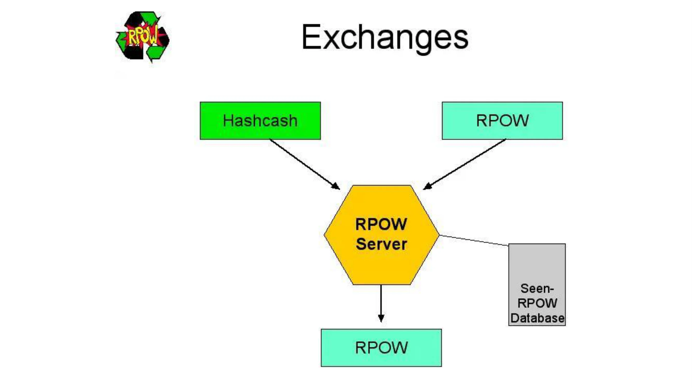


هال فینی نه تنها مدل را طراحی کرد بلکه شخصاً آن را پیاده‌سازی کرد. در ۱۵ اوت ۲۰۰۴، او [راه‌اندازی](https://lists.cpunks.org/pipermail/cypherpunks-legacy/2004-August/134945.html) سیستم RPOW را در لیست پستی سایفرپانکس اعلام کرد و علاوه بر آن، عملکرد آن را در وب‌سایت اختصاصی (rpow.net) مستند کرد. او سپس آن را در کنفرانس CodeCon 2005 که در سان‌فرانسیسکو برگزار شد، [ارائه](https://web.archive.org/web/20050204193327/http://rpow.net/slides/slide001.html) کرد و در آنجا درباره استفاده‌های احتمالی از توکن‌های Proof-of-Work بحث کرد، از جمله: انتقال ارزش، تنظیم اسپم، تجارت در بازی‌های ویدئویی، قمار آنلاین مانند پوکر، و جلوگیری از دزدی در پروتکل‌های اشتراک فایل مانند بیت‌تورنت.

با این حال، RPOW دارای نقص‌های ذاتی بود که ممکن است توضیح دهد چرا به موفقیت مورد انتظار نرسید:


- مدل امنیتی آن نسبتاً ضعیف بود، زیرا به یک سرور مرکزی متکی بود؛
- سیاست پولی آن (بر اساس هشینگ) به دلیل افزایش نمایی در عملکرد محاسباتی به‌طور خاص جذاب نبود.


بنابراین، استفاده واقعی از RPOW به صورت حکایتی بود، اما هال فینی شایسته اعتبار است برای "[هموار کردن راه](https://mmalmi.github.io/Satoshi/#email-24)" (*اصلی: "این مشعل را حمل کرد"*) به Bitcoin با راه‌اندازی یک اثبات مفهوم تجربی، چهار سال قبل از ورود Satoshi ناکاموتو.


### ریپل: غیرمتمرکزسازی اعتبار


مدل کمتر شناخته شده دیگری از Bitcoin، اما همچنان مهم در اینجا، پروتکل اعتبار توزیع شده Ripple است که توسط توسعه‌دهنده کانادایی رایان فوگر در سال 2004 طراحی شد. این کانادایی جوان از مفهوم [سیستم تجارت محلی Exchange](https://fr.wikipedia.org/wiki/Syst%C3%A8me_d%27%C3%A9change_local) (LETS) الهام گرفت، چیزی که او در ونکوور تجربه کرده بود قبل از طراحی پروتکل خود. او مقاله سفید Ripple را در تاریخ 14 آوریل 2004 منتشر کرد و سپس آن را از طریق یک اثبات مفهوم به نام RipplePay پیاده‌سازی کرد که بر روی یک سرور مرکزی عمل می‌کرد و به کاربران اجازه می‌داد تنها با یک ایمیل Address متصل شوند.


رایان فوگر حدود سال 2010 (منبع: [Crunchbase](https://www.crunchbase.com/person/ryan-fugger))


مفهوم ریپل بر اساس این ایده بود که پول اساساً از IOUها، یعنی اعتبار، تشکیل شده است. این ایده درباره ایجاد یک شبکه همتا به همتا بود که پیوندهای آن روابط اعتباری بین افراد باشد. پرداخت‌ها سپس با مسیریابی یک سری وام‌ها انجام می‌شد، به طوری که همه شرکت‌کنندگان به عنوان بانکدارانی که به یکدیگر پول قرض می‌دهند عمل می‌کردند. Alice می‌توانست با قرض دادن 10 دلار به Bob و درخواست از Bob برای انجام همین کار برای کارول، و سپس کارول برای انجام همین کار برای دیوید، 10 دلار به دیوید پرداخت کند: حساب دیوید سپس با 10 دلار از ایجاد پول توسط Alice اعتبار داده می‌شد. سیستم به نوعی با امواج کار می‌کرد، که نام پروژه را توضیح می‌دهد.


در اینجا یک ویدیوی معرفی از Ripple که در سال 2011 ساخته شده است:


:::video id=056364f2-a222-4d79-a4a1-cb0dc4cea751:::


با وجود اشتیاق جامعه‌اش و چند هزار کاربر، ریپل دارای نقص‌های عمده‌ای بود که مانع از موفقیت آن شد. به‌ویژه، آن از "مشکل Commitment غیرمتمرکز" رنج می‌برد: در طول یک پرداخت، شرکت‌کنندگان نمی‌توانستند به‌طور امنی برای اطمینان از زنجیره وام متعهد شوند، مشکلی که بعداً توسط لایتنینگ حل شد. (*اصلی: "مشکل تعهد غیرمتمرکز"*)


با دیدن اینکه پروژه‌اش به جایی نمی‌رسد، رایان فوگر در نوامبر ۲۰۱۲ کنترل ریپل را به رهبران شرکت OpenCoin Inc.، کریس لارسن و جد مک‌کالب واگذار کرد. این شرکت در سال ۲۰۱۳ به ریپل لبز تغییر نام داد. آن‌ها آن را به پروتکلی تبدیل کردند که به طور قابل توجهی با مفهوم اولیه متفاوت بود، بر اساس یک الگوریتم اجماع و یک واحد حساب بومی به نام XRP. رایان فوگر در نهایت نام اثبات مفهوم خود را در سال ۲۰۲۰ به [Rumplepay](https://rumplepay.com/) تغییر داد تا از ایجاد سردرگمی جلوگیری کند.


ریپل، به اصطلاح، هم‌عصر با Bitcoin بود و مشخص شد که بسیاری از افرادی که به دومی علاقه‌مند بودند، به اولی نیز علاقه داشتند. در واقع، ریپل یک مدل نوآورانه بود که بر اساس معماری توزیع‌شده بنا شده بود، ویژگی‌ای که با Bitcoin مشترک بود. در این باره، Satoshi ناکاموتو [نوشت](https://diyhpl.us/~bryan/irc/Bitcoin-Satoshi/p2presearch-again/p2pfoundation.net/backups/p2p_research-archives/2009-February.txt.gz) که "ریپل منحصر به فرد است زیرا اعتماد را پخش می‌کند به جای اینکه آن را متمرکز کند."


### Bitcoin، اوج یک جستجو

بنابراین، تا پایان دهه ۲۰۰۰، تمام اجزای Elements از Bitcoin شناخته شده بودند و چندین تلاش برای ترکیب آن‌ها انجام شده بود. با این حال، مجموعه‌های پیشنهادی قانع‌کننده نبودند. سایفرپانک‌ها، به‌ویژه، به تدریج علاقه خود را به این موضوع از دست دادند و معتقد بودند که طراحی یک ارز دیجیتال واقعاً غیرمتمرکز غیرممکن است. Satoshi ناکاموتو ثابت کرد که آن‌ها اشتباه می‌کردند.


Bitcoin واقعاً یک ترکیب مبتکرانه از تمام این مفاهیم است. این بر اساس امضای دیجیتال است که از رمزنگاری نامتقارن پیشنهاد شده توسط دیفی و هلمن در سال 1976 نشأت می‌گیرد. این "پول الکترونیکی" به معنای مدل eCash دیوید چام است که در دهه 90 پیاده‌سازی شد. با الگوریتم اجماع نوآورانه‌اش، به طور قوی مسئله ژنرال‌های بیزانسی را که توسط لمپورت، شاستاک و پیس در سال 1982 بیان شده بود، حل می‌کند. با مدیریت Blockchain خود در یک شبکه همتا به همتا، این یک نوع "سرور توزیع شده Timestamp" است که مفهوم هابر و استورنتا از سال 1991 را بازبینی می‌کند. برای انتخاب بلوک‌های تراکنش و برای تولید واحدها، از Proof of Work استفاده می‌کند، با استفاده از فرآیندی مشابه با Hashcash که توسط آدام بک در سال 1997 پیشنهاد شد. در نهایت، در طراحی خود، پروژه‌های b-money، bit gold، RPOW و Ripple را به یاد می‌آورد که به نوعی به Satoshi ناکاموتو ادای احترام کرده‌اند.


بنابراین Bitcoin نقطه اوج جستجو برای ارز سایبری است، ارزی که به‌طور کامل در اینترنت وجود دارد و تحت کنترل دولت‌ها نیست. در ادامه این دوره، ما شرح خواهیم داد که چگونه به وجود آمد و رویدادهای مهم سال‌های اولیه آن چه بودند. این داستان منحصر به فرد است و اگر تا اینجا آمده‌اید، مطمئناً برای شما جالب خواهد بود. آماده باشید!


# ظهور آهسته Bitcoin

<partId>7db760c0-dcce-4564-9c71-53873ee66d6d</partId>


## تولد Bitcoin

<chapterId>3d141918-e9c2-46e8-8c03-2bb4eb9b2150</chapterId>


پس از آموختن اینکه Bitcoin از کجا آمده است، اکنون بر تاریخچه خود آن تمرکز خواهیم کرد. این موضوع در طول سال‌ها موضوع مقالات، پادکست‌ها و ویدئوهای متعددی بوده است، به‌طوری‌که تقریباً به نوعی افسانه بنیان‌گذار تبدیل شده است. همان‌طور که دیده‌ایم، Bitcoin از زمینه‌ای که در آن ایجاد شده جدا نیست؛ همین امر در مورد رویدادهایی که در سال‌های اولیه آن رخ داده نیز صادق است، که آن را به آنچه امروز با ویژگی‌ها و نقص‌هایش است، شکل داده‌اند.

Bitcoin توسط Satoshi ناکاموتو، فردی ناشناس که ادعا می‌کند ژاپنی است، ایجاد شد. او زمان زیادی را صرف طراحی دقیق آن کرد قبل از اینکه آن را به عموم معرفی کند. سپس، آن‌ها هر کاری انجام دادند تا اطمینان حاصل کنند که Bitcoin تحت بهترین شرایط راه‌اندازی شده، به خوبی در بحث‌ها ارائه شده و توسط تعداد فزاینده‌ای از مردم استفاده می‌شود. در نهایت، تلاش خالق به همان اندازه در راه‌اندازی اقتصادی سیستم بود که در طراحی اولیه آن، اگر نگوییم بیشتر.


این فصل به تولد Bitcoin می‌پردازد که بین پاییز 2008 و زمستان 2009 رخ داد. این دوره با دو رویداد مهم مشخص شد: انتشار وایت پیپر، سند بنیادی که توضیحات فنی سیستم را ارائه می‌دهد، در 31 اکتبر 2008؛ و راه‌اندازی شبکه نمونه اولیه در 9 ژانویه 2009، کمی بیش از دو ماه بعد. بنابراین، ما بر اقدامات Satoshi ناکاموتو در این دوره و تعاملات اندکی که او با پذیرندگان اولیه و اولین مخالفان Bitcoin داشت، تمرکز خواهیم کرد.


### اکتشاف


بر اساس [شهادت](https://www.metzdowd.com/pipermail/cryptography/2008-November/014863.html) [خودش](https://bitcointalk.org/index.php?topic=13.msg46#msg46)، Satoshi ناکاموتو در بهار ۲۰۰۷ شروع به کار بر روی Bitcoin کرد. پس از انجام تحقیقات مختلف در زمینه ارزهای دیجیتال، او در نهایت راهی برای حل مشکل Double-spending بدون نیاز به یک شخص ثالث مورد اعتماد پیدا کرد. او بیش از یک سال مدل خود را مخفی نگه داشت و می‌خواست آن را بهبود بخشد تا از استحکام آن اطمینان حاصل کند. همان‌طور که بعداً [نوشت](https://bitcointalk.org/index.php?topic=195.msg1617#msg1617):


> "در مقطعی، متقاعد شدم که راهی برای انجام این کار بدون نیاز به هیچ اعتمادی وجود دارد و نمی‌توانستم از فکر کردن به آن دست بکشم. &nbsp;بخش بیشتری از کار طراحی بود تا کدنویسی."

برای اطمینان از عملکرد صحیح، Satoshi [یک نمونه اولیه را برنامه‌ریزی کرد](https://www.metzdowd.com/pipermail/cryptography/2008-November/014832.html) قبل از اینکه مقاله سفید را تهیه کند. این رویکرد برخلاف آن چیزی است که معمولاً در جامعه علمی انجام می‌شود، جایی که مفاهیم به‌طور رسمی در مقالات علمی ارائه می‌شوند قبل از اینکه پیاده‌سازی شوند. خالق Bitcoin [اظهار داشت](https://www.metzdowd.com/pipermail/cryptography/2008-November/014832.html):


> "من در واقع این کار را به صورت معکوس انجام دادم. &nbsp;باید تمام کد را می‌نوشتم تا بتوانم خودم را متقاعد کنم که می‌توانم هر مشکلی را حل کنم، سپس مقاله را نوشتم."

### آمادگی


این در آگوست 2008 بود که Satoshi تصمیم گرفت برای راه‌اندازی Bitcoin آماده شود. در روز 18ام، او نام دامنه Bitcoin.org را از طریق سرویس ناشناس AnonymousSpeech رزرو کرد (همچنین [Netcoin.org](https://twitter.com/orweinberger/status/1573234325046558720)، احتمالاً هنوز نام نهایی برای مفهوم خود را انتخاب نکرده بود). این نام دامنه میزبان سایت اصلی Bitcoin می‌شد. با این حال، Satoshi نتوانست نام دامنه Bitcoin.com را رزرو کند، که در آن زمان توسط یک [سفته‌باز](https://mmalmi.github.io/Satoshi/#email-28) نگهداری می‌شد و بین سال‌های 2009 و 2011 توسط شرکتی به نام Bitcoin Ltd. که در زمینه پرداخت‌های خرد تخصص داشت، [استفاده می‌شد](https://web.archive.org/web/20090719065532/http://www.Bitcoin.com/).


در 20 آگوست، خالق Bitcoin با ارسال یک ایمیل به آدام بک [تماس گرفت](https://s3.documentcloud.org/documents/24439625/adam-back-exhibit-ab1-1.pdf) و از او درخواست مشاوره کرد که چگونه مقاله‌اش درباره Hashcash را در وایت‌پیپر ذکر کند. این Hard نیست که این را به عنوان بهانه‌ای برای اطمینان از آگاهی مخترع Hashcash از سیستم جدیدش ببیند.


آدام بک در سال ۲۰۱۲ (منبع: [صفحه شخصی آدام بک](http://www.cypherspace.org/adam/))


ایمیل حاوی لینکی به پیش‌نویس مقاله سفید بود. نام فایل PDF `ecash.pdf` و عنوان آن "پول الکترونیکی بدون شخص ثالث مورد اعتماد" بود. چکیده همانند نسخه اول است که قرار بود در اکتبر منتشر شود، با یک کلمه تفاوت. متأسفانه، ما به کل سند دسترسی نداریم.

روز بعد از خواندن خلاصه‌ای که توسط Satoshi ارسال شده بود (اما نه خود مقاله)، آدام بک او را به پیشنهاد ب-مانی وی دای هدایت می‌کند، که به نظر می‌رسد شباهت‌هایی با مفهوم او دارد. Satoshi با تشکر از او برای اشاره، پاسخ می‌دهد و مشخص می‌کند که "ایده‌های من دقیقا از همان نقطه شروع می‌شود." آدام بک همچنین به وجود MicroMint اشاره می‌کند، اما Satoshi پاسخی نمی‌دهد.


روز بعد، در ۲۲ اوت، Satoshi ایمیلی به وی دای ارسال می‌کند و می‌گوید که "در حال آماده‌سازی برای انتشار مقاله‌ای است که ایده‌های شما را به یک سیستم کامل و عملی گسترش می‌دهد" و از او سال انتشار صفحه‌اش درباره b-money را می‌پرسد تا در وایت پیپر به آن ارجاع دهد. همانند Exchange با آدام بک، او پیش‌نویس وایت پیپر را با وی دای به اشتراک می‌گذارد.


با وجود این تعاملات، آدام بک و وی دای بلافاصله به مفهوم Satoshi علاقه‌مند نشدند. تنها سال‌ها بعد بود که آن‌ها به Bitcoin بازگشتند: وی دای در سال‌های ۲۰۱۰-۲۰۱۱ و آدام بک در سال ۲۰۱۳.


از جانب خود، Satoshi آماده‌سازی برای عمومی کردن اختراعش را به پایان می‌رساند. در تاریخ ۳ اکتبر، او نسخه اول وایت‌پیپر Bitcoin را تکمیل می‌کند، اکنون با نامی که انتخاب شده است. در تاریخ ۵ اکتبر، او در پلتفرم مدیریت پروژه SourceForge ثبت‌نام می‌کند، جایی که کد منبع نرم‌افزار متن‌باز میزبانی و تا سال ۲۰۱۱ نگهداری می‌شود.


### انتشار وایت پیپر


در 31 اکتبر 2008، Satoshi ناکاموتو [اولین نسخه از وایت پیپر](assets/pdf/Bitcoin-20081003.pdf) را در یک لیست ایمیل اختصاص داده شده به رمزنگاری، که به سادگی "لیست ایمیل رمزنگاری" نامیده می‌شود، منتشر کرد. این لیست از سال 1996 توسط توسعه‌دهنده پری متزگر مدیریت شده است، [ایجاد](https://cypherpunks.venona.com/date/1996/12/msg00102.html) شده و از سال [2003](https://www.metzdowd.com/pipermail/cryptography/2003-April/004484.html) در سایت شخصی او، Metdowd.com، میزبانی می‌شود. این لیست جانشین لیست سایفرپانکس است، با این تفاوت که تحت نظارت دقیق قرار دارد. در سال 2008، چندین سایفرپانک سابق هنوز در آن شرکت می‌کردند، مانند جان گیل‌مور، هال فینی و لن ساسامن.


در اولین [ایمیل](https://www.metzdowd.com/pipermail/cryptography/2008-October/014810.html) خود که به لیست ارسال شده است، Satoshi به سادگی می‌نویسد:


> "من روی یک سیستم جدید پول الکترونیکی کار کرده‌ام که کاملاً همتا به همتا است و نیازی به شخص ثالث مورد اعتماد ندارد."

همچنین ویژگی‌های اصلی مدل او را فهرست می‌کند:


- "Double-spending با یک شبکه همتا به همتا جلوگیری می‌شود."
- "نه ضرابخانه یا طرف‌های مورد اعتماد دیگر."
- "شرکت‌کنندگان می‌توانند ناشناس باشند."
- "واحدهای جدید از یک Proof-of-Work به سبک Hashcash ساخته می‌شوند."
- "Proof-of-Work که برای تولید واحدهای جدید استفاده می‌شود، همچنین به شبکه اجازه می‌دهد تا از Double-spending جلوگیری کند."


در ایمیل خود، او لینکی به وایت پیپر که قبلاً در Bitcoin.org میزبانی شده است، شامل می‌شود. این یک سند کوتاه 9 صفحه‌ای است که به عنوان یک مقاله علمی ارائه شده و به توصیف عملکرد فنی Bitcoin می‌پردازد. این سند بر مشکل پرداخت‌های آنلاین تمرکز دارد.


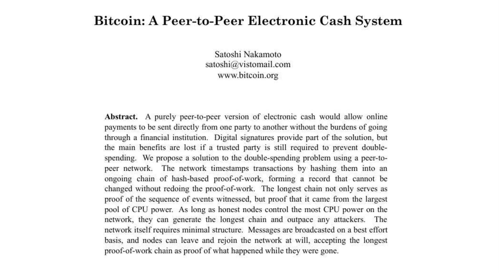


پس از این اعلامیه، Satoshi چندین پاسخ دریافت می‌کند، اما بیشتر آن‌ها شکاک هستند. او به‌طور قابل‌توجهی به‌خاطر سه چیز مورد انتقاد قرار می‌گیرد:


- ابتدا، Cypherpunk جیمز ای. دونالد [چالش‌هایی](https://www.metzdowd.com/pipermail/cryptography/2008-November/014814.html) را در مورد مقیاس‌پذیری سیستم مطرح می‌کند و می‌گوید که "به نظر نمی‌رسد به اندازه مورد نیاز مقیاس‌پذیر باشد." Satoshi [پاسخ می‌دهد](https://www.metzdowd.com/pipermail/cryptography/2008-November/014815.html) که "پهنای باند ممکن است به اندازه‌ای که فکر می‌کنید محدودکننده نباشد."
- نظر دوم منفی از جان آر. لوین، نویسنده کتاب *اینترنت برای مبتدیان* و مشاور متخصص در زیرساخت‌های ایمیل، فیلتر کردن اسپم و پتنت‌های نرم‌افزاری می‌آید. او [امنیت](https://www.metzdowd.com/pipermail/cryptography/2008-November/014817.html) Bitcoin را با اشاره به قدرت محاسباتی "مزارع ماشین زامبی" که از کامپیوترهای کنترل‌شده توسط هکرها تشکیل شده‌اند، نقد می‌کند. او به‌طور خاص اشاره می‌کند که در اینترنت، "آدم‌های خوب به‌طور قابل‌توجهی قدرت محاسباتی کمتری نسبت به آدم‌های بد دارند." Satoshi به‌طور درخشانی [پاسخ می‌دهد](https://www.metzdowd.com/pipermail/cryptography/2008-November/014818.html): "الزام این است که آدم‌های خوب به‌طور جمعی قدرت محاسباتی بیشتری نسبت به هر مهاجم منفرد داشته باشند."


- سرانجام، فردی به نام ری دیلینگر (با استفاده از نام مستعار bear) [درباره](https://www.metzdowd.com/pipermail/cryptography/2008-November/014822.html) ارزش واحد حساب سوال می‌کند و از این واقعیت که "اثبات‌های محاسباتی کار هیچ ارزش ذاتی ندارند" ابراز تاسف کرده و طبیعت تورمی آن‌ها را به دلیل پیشرفت فنی سخت‌افزارهای کامپیوتری نقد می‌کند. Satoshi [پاسخ می‌دهد](https://www.metzdowd.com/pipermail/cryptography/2008-November/014831.html) که "افزایش سرعت سخت‌افزار در نظر گرفته شده است" توسط تنظیم دوره‌ای سختی تولید.

با اینکه شک‌گرایی نگرش غالب در لیست است، اما توسط همه مشترکین لیست پستی به اشتراک گذاشته نمی‌شود. به‌ویژه، یک نفر با اشتیاق خود از دیگران متمایز است: هال فینی، که دیدگاه خوش‌بینانه‌ای نسبت به آینده دارد و هرگز از ایده پول الکترونیکی دست نکشید، علیرغم شکست‌های دهه ۹۰. او چند سال بعد در این مورد [اظهار داشت](https://bitcointalk.org/index.php?topic=155054.msg1643833#msg1643833) که "پیرمردهای رمزنگاری [...] تمایل به بدبینی پیدا می‌کنند" اما او "بیشتر ایده‌آلیست بود" و "همیشه عاشق رمزنگاری، رمز و راز و پارادوکس آن بوده است." (*متن اصلی: "I've noticed that cryptographic graybeards (I was in my mid 50's) tend to get cynical. I was more idealistic; I have always loved crypto, the mystery and the paradox of it."*) بنابراین، در ۷ نوامبر، او در یک [ایمیل](https://www.metzdowd.com/pipermail/cryptography/2008-November/014827.html) به لیست نوشت که "Bitcoin به نظر می‌رسد ایده بسیار امیدوارکننده‌ای باشد" و مدل Satoshi را با بیت گلد نیک سابو مقایسه کرد. (*متن اصلی: "Bitcoin seems to be a very promising idea."*)


هال فینی در سال ۲۰۰۷


### سیاست پولی و کد نرم‌افزار


الگوریتم اجماع توزیع‌شده Bitcoin به تمام گره‌های شبکه اجازه می‌دهد تا بر محتوای یک Ledger توافق کنند، که هال فینی در اولین ایمیل خود به آن به عنوان "زنجیره بلوک" در دو کلمه اشاره می‌کند. Blockchain صحیح انتخاب شده، آن است که بیشترین بلوک‌ها را دارد و تعارضات بر سر بلوک‌های رقابتی بر اساس این اصل ساده حل می‌شوند. این مکانیزم [بعداً](https://sourceforge.net/p/Bitcoin/code/109/) به گونه‌ای اصلاح شد که میزان کار انباشته شده را به جای تعداد بلوک‌ها در نظر بگیرد.


این مکانیزم اجماع اجازه می‌دهد تا انواع قوانین و مشوق‌ها (با استفاده از آخرین عبارت مقاله سفید) درون سیستم اعمال شوند. از آنجا که Bitcoin یک سرویس زمان‌سنجی توزیع‌شده را تشکیل می‌دهد، امکان تعامل این قوانین با گذر زمان نیز وجود دارد. بنابراین الگوریتم تنظیم سختی وارد عمل می‌شود تا تولید بلوک‌های جدید و بیت‌کوین‌های مرتبط با آن‌ها را تنظیم کند: اگر تعداد بلوک‌های تولید شده در یک دوره معین بیش از حد باشد، سختی تولید افزایش می‌یابد؛ در حالت مخالف، کاهش می‌یابد. بنابراین Bitcoin با RPOW متفاوت است، جایی که خود اثبات‌های کار واحدهای حساب را تشکیل می‌دادند.

با تشکر از این تنظیم دشواری، Bitcoin می‌تواند سیاست پولی داشته باشد، به این معنی که مقدار واحدهای جدید صادر شده توسط پروتکل می‌تواند از پیش تعیین شود. در ابتدا، برنامه‌ریزی شده است که انتشار پولی ثابت باشد تا گره‌های تولیدکننده را تشویق کند که قدرت محاسباتی خود را به شبکه اختصاص دهند و هیچ کارمزدی برای تراکنش‌ها وجود ندارد. همانطور که Satoshi ناکاموتو در بخش "انگیزه" از [وایت پیپر](assets/pdf/Bitcoin-20081003.pdf) می‌نویسد:

> "افزودن مداوم مقدار ثابتی از سکه‌های جدید مشابه با تلاش معدنچیان طلا برای افزودن طلا به گردش است."

این ویژگی، که توسط Satoshi [در لیست پستی](https://www.metzdowd.com/pipermail/cryptography/2008-November/014831.html) و [در مکاتبات خصوصی او](https://mmalmi.github.io/Satoshi/#email-3) تأیید شده است، از دید جیمز ای. دونالد پنهان نمی‌ماند. در ۹ نوامبر، او [انتقاد می‌کند](https://www.metzdowd.com/pipermail/cryptography/2008-November/014837.html) از "کار ردیابی مالکیت" (یعنی، Mining) به دلیل "پرداخت از طریق سیگنیوراج" و "نیاز به تورم"، حتی با اینکه او اشاره می‌کند که "تورم قابل پیش‌بینی کمتر از تورمی که به طور متناوب برای انتقال ثروت از یک بلوک رأی‌گیری به دیگری تغییر می‌کند، قابل اعتراض است." (*متن اصلی: "در سیستم پیشنهادی، کار ردیابی مالکیت سکه‌ها از طریق سیگنیوراج پرداخت می‌شود که نیاز به تورم دارد. این یک نقص غیرقابل تحمل نیست - تورم قابل پیش‌بینی کمتر از تورمی که به طور متناوب برای انتقال ثروت از یک بلوک رأی‌گیری به دیگری تغییر می‌کند، قابل اعتراض است."*) علاوه بر این، او [اشاره می‌کند](https://www.metzdowd.com/pipermail/cryptography/2008-November/014841.html) که یک نود Mining که "تمام خرج‌هایی که به آن‌ها اهمیت نمی‌دهد را نادیده می‌گیرد" دچار "هیچ پیامد نامطلوبی" نمی‌شود، و بدین ترتیب مشکل سانسور را برجسته می‌کند. (*متن اصلی: "اگر یک نود تمام خرج‌هایی که به آن‌ها اهمیت نمی‌دهد را نادیده بگیرد، دچار هیچ پیامد نامطلوبی نمی‌شود."*)


این اظهارات احتمالاً باعث شد که Satoshi متوجه شود که می‌تواند یک [مکانیزم کارمزد تراکنش](https://www.metzdowd.com/pipermail/cryptography/2008-November/014842.html) را پیاده‌سازی کند که هر دو مشکل را حل می‌کند، با جایگزینی ایجاد واحدهای جدید و [تشویق](https://www.metzdowd.com/pipermail/cryptography/2008-November/014843.html) ماینرها به "شامل کردن تمام تراکنش‌های پرداختی که دریافت می‌کنند." (*اصلی: "گره‌ها انگیزه‌ای برای شامل کردن تمام تراکنش‌های پرداختی که دریافت می‌کنند، خواهند داشت."*)


همزمان، سوالات از طرف مخاطبانش او را ترغیب کرد تا کد منبع مدل خود را به اشتراک بگذارد. در ۱۶ نوامبر، Satoshi کد را به هال فینی، جیمز ای. دونالد و ری دیلینگر ارسال کرد. در ۱۷ام، در پاسخی به جیمز ای. دونالد در لیست پستی، او [نوشت](https://www.metzdowd.com/pipermail/cryptography/2008-November/014863.html) که "فایل‌های اصلی" را برای او ارسال کرده است که "در حال حاضر با درخواست در دسترس هستند" و "انتشار کامل" آنها "به زودی" انجام خواهد شد. (*متن اصلی: "I sent you the main files. &nbsp;(available by request at the moment, full release soon)"*) در این بخش از کد که در سال ۲۰۱۳ توسط ری دیلینگر [عمومی شد](https://bitcointalk.org/index.php?action=printpage;topic=382374.0)، می‌توان دید که تمام اجزای بنیادی Elements از Bitcoin حضور دارند: Blockchain (که در آن زمان هنوز "timechain" نامیده می‌شد)، Proof of Work، مدل نمایندگی سکه (UTXO)، قابلیت برنامه‌ریزی تراکنش، کارمزدهای تراکنش و Halving.


با این حال، برخی پارامترها متفاوت هستند، که نشان می‌دهد آنها به صورت خودجوش انتخاب شده‌اند یا، همانطور که [Satoshi نوشت](https://plan99.net/~mike/Satoshi-emails/thread1.html)، با "حدس تحصیل‌کرده". (*اصلی: "educated guess"*) زمان بلاک، یعنی دوره هدف‌گذاری شده بین هر بلاک، ۱۵ دقیقه به جای ۱۰ دقیقه است. دوره تنظیم سختی ۲,۸۸۰ بلاک (معادل ۳۰ روز برای زمان بلاک ۱۵ دقیقه‌ای) به جای ۲,۰۱۶ بلاک (که معادل ۱۴ روز برای زمان بلاک ۱۰ دقیقه‌ای است) می‌باشد. مکانیزم Halving، که در تابع `GetBlockValue` وجود دارد، تعیین می‌کند که Halving باید هر ۱۰۰,۰۰۰ بلاک، تقریباً هر ۲ سال و ۳۱۱ روز، اتفاق بیفتد:


```cpp
int64 GetBlockValue(int64 nFees)
{
int64 nSubsidy = 10000 * CENT;
for (int i = 100000; i <= nBestHeight; i += 100000)
nSubsidy /= 2;
return nSubsidy + nFees;
}
```


در طول دوره 100,000 بلاک اول، 100 بیت‌کوین ایجاد شده است، 50 در طول دوره دوم و غیره، به طوری که کل مقدار بیت‌کوین‌ها به سمت 20 میلیون همگرا می‌شود. هر Bitcoin (COIN) به 100 سنت (CENT) تقسیم‌پذیر است که خود به 10,000 واحد پایه تقسیم می‌شوند، به این معنی که یک Bitcoin می‌تواند به 1 میلیون واحد کوچکتر تقسیم شود، و نه 100 میلیون همانند نسخه 0.1 که در ژانویه منتشر شد.


هال فینی و ری دیلینگر سپس به بررسی دقیق کد پرداختند. هر یک بر روی بخش خاصی از سیستم تمرکز کردند: ری دیلینگر به بخش اجماع علاقه‌مند بود و هال فینی سیستم اسکریپت را مطالعه کرد. در ۱۰ دسامبر، Satoshi [لیست پستی](https://web.archive.org/web/20131016004654/http://sourceforge.net/p/Bitcoin/mailman/Bitcoin-list/?viewmonth=200812) Bitcoin-list را ایجاد کرد که در SourceForge میزبانی می‌شد. این لیست موفقیت کمی داشت، حتی با وجود اینکه در طول سال‌ها چند ایمیل از افراد علاقه‌مند ارسال شد. با این حال، همه این‌ها نشان می‌دهد که همه چیز برای راه‌اندازی نمونه اولیه آماده بود، رویدادی که یک ماه بعد، در اوایل سال ۲۰۰۹ رخ می‌داد.


### انتشار نرم‌افزار و راه‌اندازی شبکه


در تاریخ ۸ ژانویه ۲۰۰۹، ساعت ۱۹:۲۷، Satoshi ناکاموتو اولین نسخه نرم‌افزار (با شماره 0.1.0) را در لیست پستی Metzdowd.com منتشر کرد. کد منبع C++ به‌صورت آزاد تحت مجوز MIT منتشر شد، به‌طوری‌که هر کسی می‌توانست آن را کپی، تغییر و استفاده کند. این نرم‌افزار به‌طور خاص شامل داده‌های بلوک Genesis است، اولین بلوک زنجیره‌ای که بلوک‌های بعدی باید از آن گسترش یابند. این نرم‌افزار فقط بر روی ویندوز کار می‌کند. در [ایمیل](https://www.metzdowd.com/pipermail/cryptography/2009-January/014994.html) اعلامیه خود، Satoshi نوشت:


> "اعلام اولین انتشار Bitcoin، یک سیستم پول الکترونیکی جدید که از یک شبکه همتا به همتا برای جلوگیری از Double-spending استفاده می‌کند. این سیستم کاملاً غیرمتمرکز است و هیچ سرور یا مرجع مرکزی ندارد."

او مشخص می‌کند که "نرم‌افزار هنوز در مرحله آلفا و آزمایشی است" و اینکه "هیچ تضمینی وجود ندارد که وضعیت سیستم در صورت لزوم در نقطه‌ای نیاز به راه‌اندازی مجدد نداشته باشد." (*اصلی: "The software is still alpha and experimental. There's no guarantee the system's state won't have to be restarted at some point if it becomes necessary"*) دو راه برای به‌دست آوردن بیت‌کوین وجود دارد: دریافت وجه از شخص دیگر، یا فعال‌سازی تولید سکه توسط CPU. همچنین دو راه برای ارسال واحدها وجود دارد: استفاده از IP گیرنده Address، یا از طریق Bitcoin Address، که امکان ارسال پرداخت به صورت آفلاین را فراهم می‌کند. در نهایت، ایمیل سیاست پولی نهایی Bitcoin را توصیف می‌کند که در فصل بعدی به آن خواهیم پرداخت.

کدی که منتشر شده است کمی پیچیده‌تر از آنچه ارائه شده و برای توسعه آینده Interface نوشته شده است که امکان ارائه قابلیت‌های بیشتری نسبت به انتقال بیت‌کوین‌ها را فراهم می‌کند. Satoshi واقعاً [یکپارچه شده است](https://plan99.net/~mike/Satoshi-emails/thread4.html) در کلاینت با اصول یک "بازار به سبک eBay" (*اصلی: "یک بازار به سبک eBay که در کلاینت ساخته شده است"*) که [می‌تواند](https://plan99.net/~mike/Satoshi-emails/thread1.html) به طور قابل توجهی "ارائه ارز Exchange را برای هر کسی آسان کند" (*اصلی: "ارائه ارز Exchange را برای هر کسی آسان کند"*). کد همچنین [برخی از توابع](https://github.com/trottier/original-Bitcoin/blob/4184ab26345d19e87045ce7d9291e60e7d36e096/src/uibase.cpp#L1573-L1731) را شامل می‌شود که به تنظیم احتمالی یک برنامه پوکر به طور مستقیم در نرم‌افزار اختصاص داده شده‌اند. پوکر آنلاین از سال 2003 در ایالات متحده با رونق فوق‌العاده‌ای مواجه بود (به لطف "اثر مانی‌میکر") اما پس از تصویب [قانون اجرای غیرقانونی قمار اینترنتی](https://www.pgt.com/news/what-if-poker-wasnt-part-of-the-uigea-back-in-2006) در سال 2006 قربانی نوعی سانسور مالی شد که این افزودن را توضیح می‌دهد.


چند ساعت پس از اعلام، در شب از ۸ ژانویه تا ۹ ژانویه، Satoshi شروع به استخراج می‌کند. بلوک دوم زنجیره، بلوک ۱، توسط او در ۹ ژانویه ساعت ۲:۵۴ صبح تأیید می‌شود. تولید این بلوک نشان‌دهنده راه‌اندازی مؤثر شبکه است و لینک‌های دیگری در ساعات بعد به زنجیره اضافه می‌شوند.


پس از انجام این کار، Satoshi خود را موظف می‌داند تا افراد مختلفی را که با آن‌ها درباره این راه‌اندازی ارتباط برقرار کرده است، مطلع کند. در ساعت 5:21 صبح، او یک [ایمیل](https://www.coindesk.com/markets/2020/11/26/previously-unpublished-emails-of-Satoshi-nakamoto-present-a-new-puzzle/) به Hal Finney ارسال می‌کند و به او اطلاع می‌دهد که "نسخه Bitcoin v0.1 با EXE و کد منبع کامل در Sourceforge موجود است." (*اصلی: "the Bitcoin v0.1 release with EXE and full sourcecode is up on Sourceforge"*) روز بعد، او با ارسال یک ایمیل شخصی‌سازی شده با Adam Back و Wei Dai تماس می‌گیرد. در این ایمیل‌های آخر، او به‌ویژه توضیحی را که توسط Hal Finney در لیست پستی منتشر شده و به Proof of Work و b-money اشاره می‌کند، شامل می‌شود.


در تاریخ 10 ژانویه، هال فینی تلاش کرد فایل اجرایی نرم‌افزار را راه‌اندازی کند اما با یک مشکل فنی مواجه شد که کامپیوترش را خراب کرد. او با [Satoshi تماس گرفت](https://web.archive.org/web/20140821141611/http://sourceforge.net/p/Bitcoin/mailman/message/21295694/) و شروع به تبادل نظر با او در این مورد کرد. با وجود مشکلات، هال فینی موفق شد نرم‌افزار را به کار بیندازد. در شب 10 تا 11 ژانویه، در ساعت 1 بامداد، او اولین بلاک خود را پیدا کرد (بلاک [78](https://Mempool.space/block/00000000a2886c95400fd3b263b9920af80b118b28fee5d2a162a18e4d9d8b2f)) و به این ترتیب 50 بیت‌کوین به دست آورد. یک ساعت بعد، او یک [ایمیل تحسین‌آمیز](https://www.metzdowd.com/pipermail/cryptography/2009-January/015004.html) به *لیست پستی رمزنگاری* ارسال کرد که در آن به Satoshi بابت انتشار نسخه آلفا تبریک گفت و به سیاست پولی واحد حساب اشاره کرد. سرانجام، در ساعت 3:33 بامداد، او تجربه خود را در [توییتر](https://twitter.com/halfin/status/1110302988) (یک شبکه اجتماعی نوظهور در آن زمان) به اشتراک گذاشت و اعلام کرد که "\[در حال اجرای \[بیت‌کوین است". این اولین توییت درباره Bitcoin است.


از این تبادلات بین Satoshi و Hal Finney نسخه 0.1.3 پدید آمد، که در [12 ژانویه](https://web.archive.org/web/20171124135217/https://sourceforge.net/p/Bitcoin/mailman/message/21313152/) منتشر شد و بسیار پایدارتر از نسخه‌های قبلی بود. Satoshi همچنین از گفتگوی خود با Hal Finney استفاده کرد تا به او مقداری بیت‌کوین بدهد: او [10 بیت‌کوین](https://Mempool.space/tx/f4184fc596403b9d638783cf57adfe4c75c605f6356fbc91338530e9831e9e16) را از طریق IP خود Address در شب 11 تا 12 ژانویه، ساعت 3:30 صبح به او ارسال کرد. این اولین انتقال از یک شخص به شخص دیگر در شبکه بود.

اما هال فینی تنها فردی نیست که در آن زمان Bitcoin را امتحان می‌کند. این موضوع همچنین برای داستین دی. تراممل، یک پژوهشگر امنیت کامپیوتر آمریکایی که در آن زمان به ارزهای دیجیتال (و به‌ویژه نسخه الکترونیکی دلار لیبرتی) علاقه‌مند بود و از طریق لیست پستی Bitcoin را کشف می‌کند، صدق می‌کند. در ۱۱ ژانویه، او نرم‌افزار را روی یکی از ماشین‌های کاری خود اجرا می‌کند (اما به دلیل یک مشکل فنی تا ۱۳ام اولین [بلوک](https://Mempool.space/block/00000000d3ec2f50772c2d42d4afb054c283555766a0ca1d8da65b9b5058a49e) خود را استخراج نمی‌کند). در شب ۱۱ تا ۱۲ ژانویه، او با Satoshi تماس می‌گیرد و در روزهای بعدی به‌طور گسترده با او [ارتباط](https://www.dustintrammell.com/s/Satoshi_Nakamoto.zip) برقرار می‌کند. در ۱۵ ژانویه، داستین تراممل همچنین [۲۵ بیت‌کوین](https://Mempool.space/tx/d71fd2f64c0b34465b7518d240c00e83f6a5b10138a7079d1252858fe7e6b577) از او دریافت می‌کند.


داستین ترامِل (منبع: [بایگانی وبلاگ داستین ترامِل](https://web.archive.org/web/20100419181845/http://blog.dustintrammell.com/))


سپس، افراد دیگری تلاش می‌کنند تا نرم‌افزار را راه‌اندازی کنند. این مورد برای نیکلاس بوم، یک وکیل بریتانیایی، صدق می‌کند که در تاریخ ۲۵ ژانویه ایمیلی در لیست Bitcoin ارسال می‌کند زیرا با یک مشکل فنی مواجه شده و به صورت خصوصی با Satoshi تبادل نظر می‌کند. جف کین موفق می‌شود نسخه 0.1.3 را در تاریخ ۳۰ ژانویه راه‌اندازی کند. نیکلاس بوم به همراه داستین ترامل در اعتبارنامه‌های نسخه 0.1.5 نرم‌افزار که اوایل فوریه منتشر شد، ذکر خواهد شد.


از 9 ژانویه 2009، شبکه متوقف نخواهد شد. بلوک پس از بلوک، زنجیره به طولانی شدن ادامه خواهد داد. و Bitcoin در نهایت به موفقیت خواهد رسید.


### یک طراحی پیشرو


آنچه می‌توانیم از این گزارش درباره طراحی Bitcoin برداشت کنیم این است که این فرآیند به‌صورت تدریجی انجام شده است. بین اولین ایده در بهار 2007 و راه‌اندازی واقعی شبکه در زمستان 2009، در واقع بیش از یک سال و نیم گذشته بود. علاوه بر این، برخی از مدل‌های Elements تکامل یافتند، همان‌طور که با سیاست پولی و مکانیزم کارمزد تراکنش که پس از انتشار اولین نسخه از وایت پیپر در 31 اکتبر 2008 ظاهر شد، مشاهده کردیم.


با این حال، این کار کافی نبود و پایداری از سوی Satoshi لازم بود تا سیستم او را راه‌اندازی کند. از ابتدا، او به خوبی می‌دانست که تعداد کمی از افراد مدل او را به طور جدی در نظر گرفته‌اند و جذب کاربران و مشارکت‌کنندگان جدید پیچیده خواهد بود. به همین دلیل او سعی کرد تا با فروش ایده‌اش به بهترین شکل ممکن، هیجان generate را برانگیزد. ما این جنبه را در فصل بعدی که بخش زیادی از سال ۲۰۰۹ را پوشش می‌دهد، بررسی خواهیم کرد.


## ارائه به جهان

<chapterId>28be3515-d9da-4d91-b7ff-f8691d51c562</chapterId>


پس از بررسی نحوه طراحی و راه‌اندازی Bitcoin توسط Satoshi ناکاموتو، بیایید بر نحوه ارائه عمومی آن تمرکز کنیم. پس از راه‌اندازی آن در اوایل سال 2009، شبکه عملیاتی بود، اما تعداد کمی از نودهای تولیدکننده وجود داشت (Satoshi اکثریت بلوک‌ها را استخراج کرد) و فعالیت تقریباً وجود نداشت (در ماه ژانویه 32 تراکنش واقعی انجام شد). پروژه تنها یک وب‌سایت پایه و یک صفحه در SourceForge برای دانلود نرم‌افزار داشت. علاوه بر این، ارتباطات درباره Bitcoin محدود به لیست پستی رمزنگاری Metzdowd بود که در بهترین حالت توسط چند صد نفر علاقه‌مند به رمزنگاری دنبال می‌شد.


بنابراین، چالش این دوره ترویج Bitcoin بود تا بتواند یک توده بحرانی از کاربران را جذب کند، که سپس می‌توانستند به نوعی به این هدف کمک کنند. به همین دلیل، اولویت Satoshi بهبود سایت و تعامل با افراد مختلف بود. او می‌خواست کشف خود را به جهان معرفی کند.


در این فصل، به بررسی کدهای فرهنگی که از تلاش‌های ارتباطی Satoshi پدید آمدند، مانند بی‌اعتمادی به سیستم بانکی و محدودیت ۲۱ میلیونی خواهیم پرداخت. همچنین به گفتگوهایی که Satoshi با مخالفان خود برای دفاع از اختراعش داشت، اشاره خواهیم کرد. در نهایت، درباره کمکی که از دیگران دریافت کرد، به ویژه کمک‌های اساسی Martti Malmi، اولین دست راست او، صحبت خواهیم کرد.


### بلوک Genesis

راه‌اندازی در ژانویه 2009 به Satoshi ناکاموتو فرصت داد تا پارامترهای ثابت سیستم خود را تعیین کند. همان‌طور که او بعداً [نوشت](https://bitcointalk.org/index.php?topic=195.msg1611#msg1611)، ماهیت Bitcoin به گونه‌ای است که "پس از انتشار نسخه 0.1"، عملکرد اساسی آن "برای بقیه عمرش ثابت شد"، که این امر ضروری می‌کرد تا قبل از گسترش سیستم، همه چیز به درستی تنظیم شود. (*اصلی: "پس از انتشار نسخه 0.1، طراحی اصلی برای بقیه عمرش ثابت شد"*) به‌ویژه، دو Elements بنیادی اهمیت فرهنگی قابل‌توجهی دارند: محتوای بلوک Genesis و محدودیت 21 میلیون واحد.


بلوک Genesis بلوک پایه Bitcoin Blockchain است که باید از آن گسترش یابد. بنابراین، این بلوک به صورت سخت‌افزاری در نرم‌افزار کدگذاری شده است. قبل از راه‌اندازی شبکه، Satoshi این لینک اول را با تولید Proof of Work مورد نیاز و ثبت زمان آن در تاریخ 3 ژانویه 2009، ساعت 18:15:05 به وقت UTC ساخت. در این بلوک (و به‌طور خاص در تراکنش پاداش)، او پیام زیر را نوشت:


```
The Times 03/Jan/2009 Chancellor on brink of second bailout for banks
```


این تیتر از روزنامه بریتانیایی *The Times* در آن روز است که نشان می‌دهد صدراعظم خزانه‌داری (یعنی وزیر دارایی بریتانیا) در آستانه نجات بانک‌ها برای بار دوم بود. حضور این تیتر در بلوک دو نقش دارد:


- از یک سو، این امر از تاریخ‌گذاری معکوس راه‌اندازی شبکه جلوگیری می‌کند، زیرا ثابت می‌کند که سیستم نمی‌توانسته قبل از ۳ ژانویه شروع شده باشد، زیرا Satoshi نمی‌توانسته قبل از انتشار روزنامه از تیتر خبر داشته باشد؛
- از سوی دیگر، این به‌طور نمادین نشان می‌دهد که Bitcoin در برابر چه چیزی ایستاده است، با اشاره به زمینه پولی و مالی آن زمان.


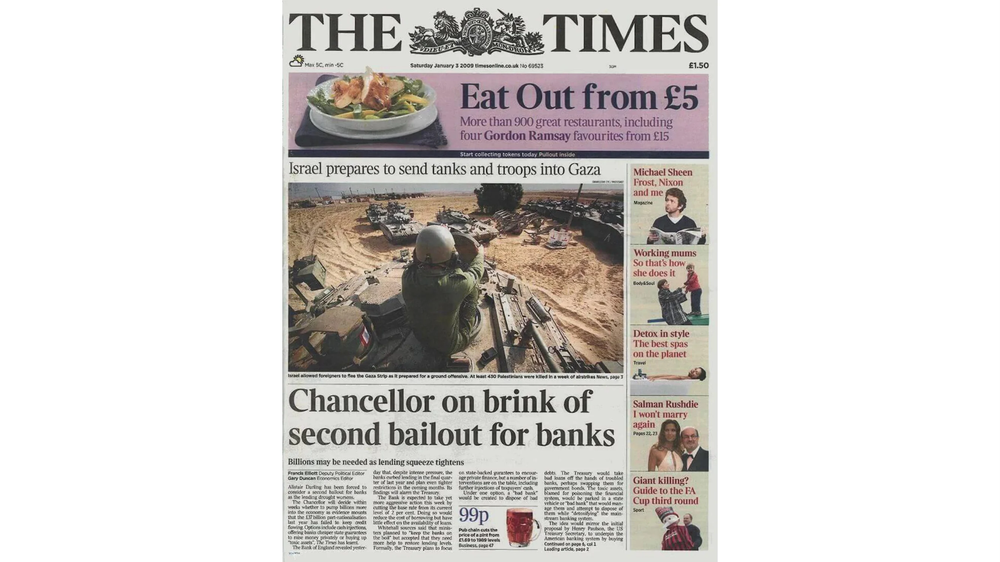


در آن زمان، جهان واقعاً تحت تأثیر کامل بحران مالی قرار داشت که در سال ۲۰۰۷ با ترکیدن حباب وام‌های رهنی بی‌اعتبار در ایالات متحده آغاز شد. دولت‌ها برای جلوگیری از ورشکستگی‌های بیشتر پس از سقوط بانک سرمایه‌گذاری لمن برادرز در ۱۵ سپتامبر ۲۰۰۸، به نجات مؤسسات مالی پرداختند و بانک‌های مرکزی با تزریق نقدینگی به بازارهای مالی به تسهیل کمی پرداختند. این استفاده از پول عمومی که برای این مناسبت ایجاد شده بود، باعث ناآرامی تعدادی از شهروندان شد که متوجه شدند سیستم بانکی در واقع سیستمی از سودهای خصوصی و زیان‌های اجتماعی است.


از سوی دیگر، Bitcoin به یک شخص ثالث مورد اعتماد متکی نیست و بنابراین تحت تأثیر تمایلات یک بانک مرکزی قرار نمی‌گیرد. به این ترتیب، با ارزهای دولتی مانند دلار یا یورو که مقدار آن‌ها می‌تواند به‌طور دلخواه توسط کسانی که کنترل ایجاد پول را دارند تغییر کند، تفاوت دارد؛ سیاست پولی Bitcoin واقعاً از پیش برنامه‌ریزی شده و در پروتکل نوشته شده است تا به‌طور نظری هرگز تغییر نکند.


### محدودیت ۲۱ میلیون


این ما را به عنصر دوم ارائه شده توسط Satoshi در روز راه‌اندازی شبکه می‌رساند: محدودیت ۲۱ میلیون. در ۸ ژانویه، در [ایمیل معرفی](https://www.metzdowd.com/pipermail/cryptography/2009-January/014994.html) خود، این سیاست پولی را به شرح زیر توصیف کرد:


> "مجموع گردش 21,000,000 واحد خواهد بود. &nbsp;آن‌ها به گره‌های شبکه توزیع خواهند شد زمانی که بلوک‌ها را ایجاد می‌کنند، با این مقدار که هر 4 سال نصف می‌شود.
>

> چهار سال اول: ۱۰,۵۰۰,۰۰۰ واحد
> ۴ سال آینده: ۵,۲۵۰,۰۰۰ واحد
> ۴ سال آینده: ۲,۶۲۵,۰۰۰ واحد
> چهار سال آینده: ۱,۳۱۲,۵۰۰ واحد
> و غیره.
>

> وقتی که آن به پایان برسد، سیستم می‌تواند در صورت لزوم از هزینه‌های تراکنش پشتیبانی کند. &nbsp;این بر اساس رقابت بازار آزاد است و احتمالاً همیشه گره‌هایی وجود خواهند داشت که مایل به پردازش تراکنش‌ها به صورت رایگان باشند."

چند روز بعد، هال فینی [به این سیاست پولی](https://www.metzdowd.com/pipermail/cryptography/2009-January/015004.html) در لیست پستی واکنش مثبتی نشان داد و از این واقعیت که "سیستم می‌تواند به گونه‌ای تنظیم شود که تنها تعداد معینی واحد تولید شود" هیجان‌زده شد. او در ایمیل خود تخمین زد که اگر Bitcoin "به سیستم پرداخت غالب در سراسر جهان تبدیل شود"، هر واحد "ارزشی حدود ۱۰ میلیون دلار" خواهد داشت. او نتیجه‌گیری کرد که "امکان تولید واحدها امروز با چند سنت زمان محاسباتی" می‌تواند "یک شرط بسیار خوب" باشد. حتی اگر این تخمین قابل بحث باشد (زیرا بر اساس ارزشیابی Bitcoin است که معادل کل ثروت جهانی خواهد بود)، استدلال او منطقی است.


در ۱۶ ژانویه، Satoshi این ایده "سرمایه‌گذاری بلندمدت" را در ایمیلی که با لیست پستی به اشتراک گذاشت، بازبینی کرد و موارد استفاده احتمالی را توصیف کرد. او [بیان کرد](https://www.metzdowd.com/pipermail/cryptography/2009-January/015014.html) که "ممکن است منطقی باشد که مقداری از آن را تهیه کنید در صورتی که مورد توجه قرار گیرد. اگر تعداد کافی از افراد به همین شکل فکر کنند، این به یک پیش‌گویی خودمحقق‌شونده تبدیل می‌شود." او یک ماه بعد این ادعا را [تکرار کرد](https://p2pfoundation.ning.com/xn/detail/2003008:Comment:9562) و توضیح داد که مقدار محدود واحدها احتمالاً یک "حلقه بازخورد مثبت" ایجاد می‌کند به این معنا که "هرچه کاربران بیشتری وجود داشته باشند، ارزش بیشتر می‌شود که می‌تواند کاربران بیشتری را جذب کند که می‌خواهند از افزایش ارزش بهره‌مند شوند." بنابراین، عنصر سفته‌بازی از ابتدا وجود دارد، با هدف راه‌اندازی سیستم.


### مقررات، شبکه‌های زامبی، و بوم‌شناسی


در پی این موضوع، بحث دیگری در لیست پستی شکل می‌گیرد. Satoshi به محدودیت اسپم به عنوان یک مورد استفاده اشاره کرد که واکنش‌های مختلفی از سوی مشارکت‌کنندگان برانگیخت. خالق Bitcoin ترجیح داد به این انتقادات به صورت خصوصی پاسخ دهد، اما هال فینی تصمیم گرفت به صورت عمومی اعتراض کند. او واقعاً زمانی برای تأمل در این مسائل داشت وقتی که سعی کرده بود ارز دیجیتال خود را با RPOW توسعه دهد.

اول، مسئله تنظیم‌گری و احتمال ممنوعیت Bitcoin توسط دولت‌ها مطرح می‌شود. این موضوع توسط [جاناتان تورنبورگ](https://www.metzdowd.com/pipermail/cryptography/2009-January/015016.html)، محقق دپارتمان نجوم دانشگاه ایندیانا در بلومینگتون و یکی از اعضای دائمی لیست پستی، مطرح شده است. در ایمیل خود که به موارد استفاده پیشنهادی توسط Satoshi پاسخ می‌دهد، او وضعیت نظارت مالی جهانی را تشریح کرده و اشاره می‌کند که Bitcoin می‌تواند انتقال مبالغی بالاتر از حد مجاز توسط مقامات را ممکن سازد. نتیجه منطقی استدلال او این است که "هیچ دولت بزرگی احتمالاً اجازه نخواهد داد که Bitcoin به شکل فعلی خود در مقیاس بزرگ عمل کند."


این سوال برای هال فینی جالب است، که در تاریخ ۲۱ ژانویه یک [توییت](https://twitter.com/halfin/status/1136749815) می‌نویسد و بیان می‌کند که "در حال بررسی راه‌هایی برای افزودن ناشناس بودن بیشتر به Bitcoin است." سپس، در تاریخ ۲۴ام، او به جاناتان تورنبورگ [پاسخ](https://www.metzdowd.com/pipermail/cryptography/2009-January/015036.html) می‌دهد و می‌نویسد که "قطعاً نکته‌ای معتبر است، و یکی که در طول سال‌ها در بحث‌ها درباره پول الکترونیکی به طور گسترده مورد بحث قرار گرفته است. Bitcoin چند ویژگی مثبت دارد: یکی این است که توزیع شده است، بدون نقطه شکست واحد، بدون 'ضرابخانه'، بدون شرکتی با مدیرانی که می‌توانند احضار و دستگیر و تعطیل شوند."


سپس، در همان ایمیل، جاناتان تورنبورگ به موضوع شبکه‌های کامپیوتری زامبی می‌پردازد که می‌توانند به‌راحتی "فیلترهای ایمیل پولی را دور بزنند"، اشاره به مورد استفاده‌ای که توسط Satoshi برجسته شده بود. Satoshi به‌طور خصوصی به او [پاسخ داد](https://mmalmi.github.io/Satoshi/#email-3) و توضیح داد که در این مورد، می‌توان با راه‌اندازی آدرس‌های ایمیل پرداخت به ازای ارسال و جمع‌آوری تمام پول اسپم "سود خوبی کسب کرد"، نظری که او در تاریخ ۲۵ام در لیست [منتشر کرد](https://www.metzdowd.com/pipermail/cryptography/2009-January/015041.html). از سوی دیگر، هال فینی یادآور می‌شود که Proof of Work "عمدتاً به‌منظور اطمینان از قابلیت اطمینان پایگاه داده تاریخچه تراکنش‌ها هدف‌گذاری شده است"، و اضافه می‌کند که اگر توکن‌های Proof of Work مفید باشند، ماشین‌ها دیگر بیکار نخواهند ماند و انگل‌گرایی کاهش خواهد یافت.


در نهایت، آخرین نظر از جان گیل‌مور، یکی از اعضای بنیان‌گذار سایفرپانک‌ها و نگهدارنده اولین لیست پستی این جنبش از سال ۱۹۹۲ تا ۱۹۹۷، می‌آید. در ایمیلی که در ۲۵ ژانویه ارسال شده، او به پیامدهای زیست‌محیطی فرضی Bitcoin اشاره می‌کند و [می‌نویسد](https://www.metzdowd.com/pipermail/cryptography/2009-January/015042.html) که "آخرین چیزی که نیاز داریم این است که سیستمی را پیاده‌سازی کنیم که برای سوزاندن تمام چرخه‌های موجود طراحی شده، برق مصرف می‌کند و دی‌اکسید کربن تولید می‌کند، در سراسر اینترنت، به منظور تولید مقادیر کمی بیت‌باکس برای ارسال ایمیل‌ها یا اسپم‌ها." Satoshi به صورت خصوصی به او [پاسخ می‌دهد](https://mmalmi.github.io/Satoshi/#email-3) که "انتخاب بین آزادی اقتصادی و حفظ محیط زیست، کنایه‌آمیز خواهد بود." او اضافه می‌کند که "Proof of Work تنها راه‌حلی است که [او] پیدا کرده تا یک سیستم نقدی الکترونیکی همتا به همتا کار کند" و حتی اگر انرژی زیادی مصرف کند، "هنوز هم کمتر از فعالیت‌های بانکی سنتی که نیاز به کار و منابع زیادی دارد، هدر می‌دهد."


جان گیل‌مور در سال ۲۰۰۷ (منبع: [Flickr](https://www.flickr.com/photos/35034362831@N01/2115939762/))


در تاریخ 27ام، هال فینی [اشاره می‌کند](https://www.metzdowd.com/pipermail/cryptography/2009-January/015056.html) به روش‌هایی برای کاهش اتلاف انرژی مرتبط با محاسبه Proof of Work. یک ساعت بعد، او در توییتر [می‌نویسد](https://twitter.com/halfin/status/1153096538) "در حال فکر کردن به چگونگی کاهش انتشار CO2 از یک پیاده‌سازی گسترده Bitcoin."

حمایت دیگری از Cypherpunk زوکو ویلکاکس-اوهرن می‌آید، که در آن زمان بر روی Tahoe-LAFS کار می‌کرد، سیستمی برای اشتراک‌گذاری فایل که جانشین [Mojo Nation](https://www.salon.com/2000/10/09/mojo_nation/) است، پروژه‌ای که در اوایل دهه 2000 محبوب بود. در 26 ژانویه، در جریان بحث در لیست پستی، او لینکی به پستی که همان روز در وبلاگش منتشر کرده بود با عنوان "[پول غیرمتمرکز](https://web.archive.org/web/20090303195936/http://testgrid.allmydata.org:3567/uri/URI:DIR2-RO:j74uhg25nwdpjpacl6rkat2yhm:kav7ijeft5h7r7rxdp5bgtlt3viv32yabqajkrdykozia5544jqa/wiki.html#%5B%5BDecentralized%20Money%5D%5D)" به اشتراک گذاشت، جایی که او به پروژه‌های مختلف ارز دیجیتال (DigiCash، bit gold، b-money) اشاره می‌کند و از Bitcoin تمجید می‌کند. او به طور قابل توجهی می‌نویسد:


> "چیزی که من می‌خواهم، ارزی است که همه بتوانند به‌صورت ارزان و راحت از آن استفاده کنند، اما **هیچ‌کس** قدرت دستکاری آن را نداشته باشد. &nbsp;هیچ‌کس قدرت افزایش یا کاهش ارزش ارز Supply را ندارد، هیچ‌کس قدرت نظارت، مالیات‌گیری یا جلوگیری از تراکنش‌ها را ندارد. &nbsp;واقعاً معادل دیجیتالی طلا، در زمان‌ها و مکان‌هایی که طلا ارز جهانی بود."

چند هفته بعد، لینکی به این متن در [Bitcoin.org](https://web.archive.org/web/20090303195936/http://Bitcoin.org/) اضافه شد. و Satoshi یک سال و نیم بعد به طور شخصی از زوکو برای این کمک کوچک [تشکر کرد](https://bitcointalk.org/index.php?topic=890.msg10723#msg10723).


### همتا به همتا و بی‌اعتمادی به بانک‌های مرکزی


همان‌طور که گفتیم، در حالی که ارتباطات Satoshi در ابتدا به لیست پستی رمزنگاری محدود بود، بعدها به افق‌های دیگری گسترش یافت. در فوریه 2009، او در انجمن و لیست پستی بنیاد P2P شرکت کرد، سازمانی که در سال 2007 تأسیس شد و به مطالعه تأثیر زیرساخت‌های همتا به همتا بر جامعه می‌پردازد. او با چندین نفر از اعضای آن تعامل داشت، همیشه با هدف ترویج مدل خود.

در 11 فوریه، Satoshi یک [پیام معرفی](https://p2pfoundation.ning.com/forum/topics/Bitcoin-open-source) منتشر کرد که Bitcoin را در انجمن (p2pfoundation.ning.com) معرفی می‌کند و یک [نسخه](https://diyhpl.us/~bryan/irc/Bitcoin-Satoshi/p2presearch-again/p2pfoundation.net/backups/p2p_research-archives/2009-February/001347.html) از آن را از طریق ایمیل به لیست (P2P-research) ارسال کرد. در این متن، او نوشت:


> "مشکل اساسی با ارزهای متعارف این است که تمام اعتمادی که برای کارکرد آن‌ها لازم است. ما باید به بانک مرکزی اعتماد کنیم که ارز را تضعیف نکند، اما تاریخ ارزهای فیات پر از نقض این اعتماد است. ما باید به بانک‌ها اعتماد کنیم که پول ما را نگه دارند و به صورت الکترونیکی انتقال دهند، اما آن‌ها آن را در امواج حباب‌های اعتباری با کسری ناچیز در ذخیره وام می‌دهند. ما باید به آن‌ها اعتماد کنیم که حریم خصوصی ما را حفظ کنند و اجازه ندهند که سارقان هویت حساب‌های ما را خالی کنند. هزینه‌های بالای آن‌ها باعث می‌شود که پرداخت‌های خرد غیرممکن شود."

در [پروفایل](https://p2pfoundation.ning.com/profile/SatoshiNakamoto) خود، او ادعا می‌کند که یک مرد ژاپنی است، اما این همه ماجرا نیست. یک به‌روزرسانی Interface در سال ۲۰۱۱ سن او را فاش کرد: ۳۵ ساله، که به این معنی است که او در سال ۲۰۰۹، ۳۲ یا ۳۳ ساله بوده است. سپس، در سال ۲۰۱۴، [کشف شد](https://www.reddit.com/r/Bitcoin/comments/229qvr/happy_birthday_satoshi_nakamoto/) که او تاریخ تولد خاصی را نشان داده بود: ۵ آوریل ۱۹۷۵. این تاریخ، که به ظاهر بی‌ضرر است، احتمالاً به ممنوعیت مالکیت طلا توسط شهروندان آمریکایی بین سال‌های ۱۹۳۳ و ۱۹۷۵ در ایالات متحده اشاره دارد. روز ۵ آوریل به روزی مربوط می‌شود که این ممنوعیت توسط [دستور اجرایی ۶۱۰۲](https://www.presidency.ucsb.edu/documents/executive-order-6102-forbidding-the-hoarding-gold-coin-gold-bullion-and-gold-certificates) که توسط رئیس‌جمهور فرانکلین دلانو روزولت در ۵ آوریل ۱۹۳۳ امضا شد، برقرار شد و سال ۱۹۷۵ به لغو آن با تصویب [قانون عمومی ۹۳-۳۷۳](https://www.govtrack.us/congress/bills/93/s2665/text) مربوط می‌شود. این جزئیات بسیار مهم است زیرا این ممنوعیت به استاندارد طلای کلاسیک پایان داد (جایی که می‌توانستید در Exchange برای یک اسکناس نماینده طلا دریافت کنید)، اجازه کاهش ارزش دلار را داد (از طریق قانون ذخیره طلای ۱۹۳۴)، و تسهیل ایجاد رژیم پولی نرخ شناور Exchange را که پس از شوک نیکسون در سال ۱۹۷۱ می‌شناسیم، فراهم کرد.

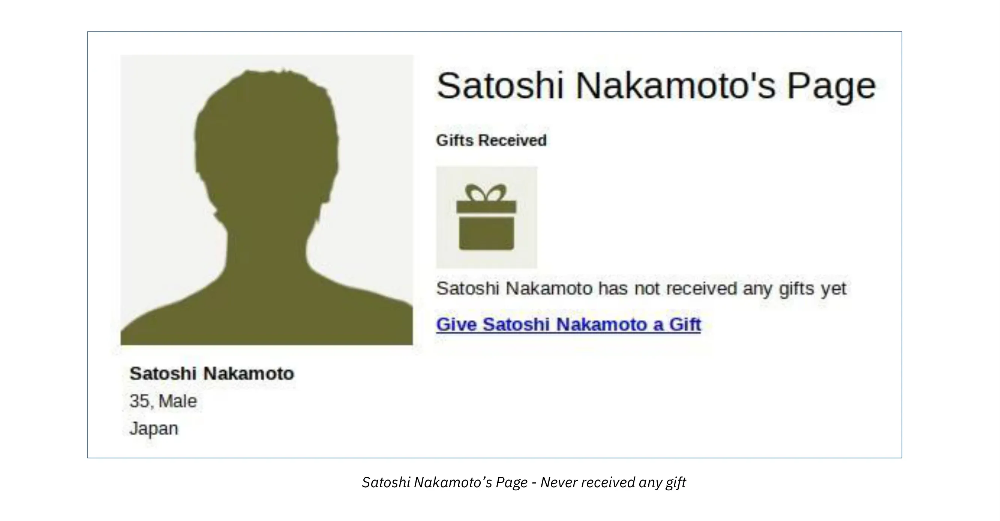


Satoshi نمایه ناکاموتو در انجمن بنیاد P2P در تاریخ ۱۷ مارس ۲۰۱۱ (منبع: [گرفتن از انجمن](https://web.archive.org/web/20110317060514/http://p2pfoundation.ning.com:80/profile/SatoshiNakamoto))


این تنها اشاره به فلزات گران‌بها در ارتباطات Satoshi نیست. خالق Bitcoin [می‌نویسد](https://p2pfoundation.ning.com/forum/topics/Bitcoin-open-source?commentId=2003008:Comment:9562) در نظرات در تاریخ ۱۸ فوریه:


> "در پاسخ به سوال سپ، واقعاً هیچ‌کس وجود ندارد که به عنوان یک بانک مرکزی یا فدرال رزرو عمل کند تا پول Supply را با افزایش جمعیت کاربران تنظیم کند. این نیاز به یک طرف مورد اعتماد داشت تا ارزش را تعیین کند، زیرا من راهی نمی‌شناسم که نرم‌افزار بتواند ارزش واقعی چیزها را بداند. اگر راه هوشمندانه‌ای وجود داشت، یا اگر می‌خواستیم به کسی اعتماد کنیم تا به طور فعال پول Supply را مدیریت کند و آن را به چیزی متصل کند، قوانین می‌توانستند برای آن برنامه‌ریزی شوند. از این نظر، بیشتر شبیه یک فلز گران‌بها است."

Satoshi ناکاموتو همچنین در لیست پستی فعال است، جایی که او ایده‌هایی را با مارتین ون استینبرگن، یک مشاور مدیریت پروژه هلندی، تبادل می‌کند. در ۱۳ فوریه، او به موضوع برنامه‌پذیری Bitcoin می‌پردازد و [به او می‌نویسد](https://diyhpl.us/~bryan/irc/Bitcoin-Satoshi/p2presearch-again/p2pfoundation.net/backups/p2p_research-archives/2009-February/001362.html):


> "من Bitcoin به عنوان یک سنگ بنا می‌بینم، به عنوان اولین قدم اگر بخواهید ارزهای اجتماعی قابل برنامه‌ریزی P2P را همانطور که در ایده‌های مارک \[Fawzi\] و دیگران که اینجا بحث شده است، پیاده‌سازی کنید. اول، یک ارز P2P پایه و عادی باید کار کند. وقتی که این ارز تثبیت و اثبات شد، حرکت به مرحله بعد، یعنی ارز پویا و خودکار، آسان است.

من واقعاً ایده جوامع مجازی را دوست دارم، بدون تعلق جغرافیایی، که با پارادایم‌های اقتصادی جدید آزمایش می‌کنند."


همه این‌ها نشان می‌دهد که خالق Bitcoin به دنبال تطبیق با مخاطبان خود است و در حال انجام هر کاری است که می‌تواند تا مردم را به کشف خود علاقه‌مند کند.


### مایک هرن و ۲۱ میلیون

استراتژی ارتباطی Satoshi به تدریج در حال به ثمر نشستن است. در آوریل 2009، افراد دیگری شروع به علاقه‌مند شدن به اختراع او کردند. این شامل مایک هرن، توسعه‌دهنده بریتانیایی که برای گوگل در سوئیس کار می‌کند و اوقات فراغت خود را صرف نرم‌افزارهای متن‌باز می‌کند، می‌شود. او سپس به سیستم‌های پرداخت دیجیتال، به‌ویژه به ریپل، پروژه‌ای از رایان فوگر، علاقه‌مند شد. دقیقاً در گروه گوگل ریپل بود که او از طریق [رشته بحث](https://groups.google.com/g/rippleusers/c/1GsQzGv9Y14) ایجاد شده در مارس توسط چارلز ان. وایبل، یک دانشمند کامپیوتر و کارآفرین جوان آمریکایی، درباره Bitcoin شنید.


در 12 آوریل، مایک هرن یک [ایمیل](https://plan99.net/~mike/Satoshi-emails/thread1.html) به Satoshi ارسال کرد که در آن مجموعه‌ای از سوالات درباره Bitcoin مطرح کرد. او اشاره کرد که "به ندرت با ایده‌های واقعاً انقلابی مواجه می‌شویم" و از ذکر ریپل غافل نشد.


مایک هرن و Satoshi ناکاموتو جنبه‌های مختلفی از Bitcoin را مورد بحث قرار دادند، از جمله مقیاس‌پذیری، پرداخت‌های خرد، نحوه کار نرم‌افزار و عدم وجود بازپرداخت. به‌ویژه، مایک هرن از Satoshi پرسید که چرا او تعداد "24 میلیون" (*sic*) را برای کل مقدار بیت‌کوین‌ها انتخاب کرده و آیا می‌توان آن‌ها را تقسیم کرد. سپس Satoshi توضیح زیر را ارائه داد:


> "انتخاب من برای تعداد سکه‌ها و برنامه توزیع یک حدس تحصیل‌کرده بود. این یک انتخاب دشوار بود زیرا وقتی شبکه راه‌اندازی می‌شود، قفل می‌شود و ما با آن گیر می‌افتیم. من می‌خواستم چیزی را انتخاب کنم که قیمت‌ها را مشابه ارزهای موجود کند، اما بدون دانستن آینده، این بسیار Hard است. در نهایت چیزی در وسط را انتخاب کردم. اگر Bitcoin یک بازار کوچک باقی بماند، ارزش هر واحد آن کمتر از ارزهای موجود خواهد بود. اگر تصور کنید که برای بخشی از تجارت جهانی استفاده می‌شود، تنها 21 میلیون سکه برای کل جهان وجود خواهد داشت، بنابراین ارزش هر واحد بسیار بیشتر خواهد بود. مقادیر اعداد صحیح 64 بیتی با 8 رقم اعشار هستند، بنابراین 1 سکه به صورت داخلی به عنوان 100000000 نمایش داده می‌شود. اگر قیمت‌های معمولی کوچک شوند، دانه‌بندی زیادی وجود دارد. برای مثال، اگر 0.001 به ارزش 1 یورو باشد، ممکن است تغییر مکان نمایش نقطه اعشار آسان‌تر باشد، بنابراین اگر 1 Bitcoin داشتید، اکنون به صورت 1000 نمایش داده می‌شود و 0.001 به صورت 1 نمایش داده می‌شود."

او بعدها به مایک هرن توضیح داد که "به 100 بیت‌کوین [در هر بلاک] و 42 میلیون فکر کرده بود"، اما 42 میلیون به نظرش زیاد می‌آمد. ("به 100 بیت‌کوین و 42 میلیون فکر کرده بودم، اما 42 میلیون به نظرم زیاد می‌آمد.")


پس از تماس با Satoshi، مایک هرن شروع به استفاده از نرم‌افزار بر روی رایانه شخصی خود کرد. او چند بلاک استخراج کرد، از جمله [بلاک 11,157](https://Mempool.space/block/00000000a630e2695d98b11707d053b12c583f58976f8b4ae6a6f289ee32797b). همزمان با بحث‌هایشان، این دو مرد برخی مبادلات مالی انجام دادند. در 18 آوریل، مایک هرن 32.51 بیت‌کوین به Satoshi ارسال کرد که او همان روز آن را بازگرداند. آنها همچنین 50 بیت‌کوین از تلاش‌های شخصی Mining خود به یکدیگر ارسال کردند.


### مارتتی مالمی و ارائه Bitcoin


ارتباط Satoshi همچنین توجه یک دانشجوی جوان علوم کامپیوتر فنلاندی به نام مارتتی مالمی را جلب کرد. او در اوایل آوریل، از طریق متنی در انجمن بنیاد P2P، Bitcoin را کشف کرد. در نهم، او شروع به استفاده از نرم‌افزار کرد و اولین بلاک خود را استخراج کرد (بلاک 10,351). در عصر، او یک ارائه کوتاه از Bitcoin نوشت که در آن از فرضیه آنارشیستی که "ارز P2P می‌تواند دولت را منقرض کند؟" حمایت کرد. او متن خود را تحت نام مستعار Trickster(n) در دو انجمن لیبرترین با حساسیت‌های مختلف منتشر کرد: anti-state.com (ASC) و انجمن Freedomain Radio (رسانه آنارکو-کاپیتالیست استفان مولینیو). مارتتی نوشت:


> "سیستم ناشناس است و هیچ دولتی نمی‌تواند معاملات را مالیات دهد یا از آنها جلوگیری کند. هیچ بانک مرکزی وجود ندارد که بتواند با ایجاد نامحدود پول جدید، ارز را تضعیف کند. پذیرش گسترده چنین سیستمی به نظر می‌رسد که می‌تواند تأثیر مخربی بر توانایی دولت در تغذیه از شهروندانش داشته باشد."


مارتتی مالمی در سال ۲۰۱۳ (منبع: [بیزنس اینسایدر](https://www.businessinsider.com/bitcoins-martti-malmi-not-worried-about-liberty-reserve-2013-5))


سپس مارتتی یک [ایمیل](https://mmalmi.github.io/Satoshi/#email-1) به Satoshi ارسال می‌کند و بیان می‌کند که او نویسنده این متن است، جایی که می‌نویسد "دوست دارد با Bitcoin کمک کند" حتی اگر "هنوز تجربه زیادی در توسعه ندارد." Satoshi ناکاموتو در ۲ مه پاسخ می‌دهد و به او می‌گوید که "درک او از Bitcoin" "کاملاً درست است."


خالق Bitcoin او را برای مشارکت در [صفحه وب](https://web.archive.org/web/20090511173000/http://Bitcoin.sourceforge.net/) در SourceForge، پلتفرمی که پروژه در آن میزبانی می‌شود، به‌ویژه با نوشتن بخش [سؤالات متداول](https://mmalmi.github.io/Satoshi/#email-4) (FAQ) به کار گرفت. در صفحه اصلی (Bitcoin.sourceforge.net)، او Bitcoin را به عنوان یک "ارز دیجیتال ناشناس مبتنی بر شبکه همتا به همتا" معرفی می‌کند که به "هیچ مرجع مرکزی برای صدور پول جدید یا نظارت بر تراکنش‌ها" وابسته نیست. او مزایای زیر را برجسته می‌کند:


- "انتقال پول به‌راحتی از طریق اینترنت، بدون نیاز به اعتماد به اشخاص ثالث."
- "هیچ شخص ثالثی نمی‌تواند تراکنش‌های شما را متوقف یا کنترل کند."
- "از خود در برابر بی‌ثباتی ناشی از بانکداری ذخیره کسری و سیاست‌های ضعیف بانک‌های مرکزی محافظت کنید. تورم محدود پول سیستم Bitcoin به طور مساوی (بر اساس قدرت محاسباتی) در سراسر شبکه توزیع می‌شود، به جای اینکه توسط بانک‌ها انحصار شود."
- "ارزش Bitcoin احتمالاً افزایش خواهد یافت زیرا رشد اقتصاد Bitcoin از نرخ تورم پیشی می‌گیرد - Bitcoin را به عنوان یک سرمایه‌گذاری در نظر بگیرید و امروز یک نود راه‌اندازی کنید!"


Satoshi [با این ارائه](https://mmalmi.github.io/Satoshi/#email-5) به طور کلی موافق است، اگرچه برخی ملاحظات دارد. او به طور خاص با اعلام Bitcoin به عنوان یک "سرمایه‌گذاری" احساس "ناراحتی" می‌کند، احتمالاً از پیامدهای قانونی چنین بیانیه‌ای نگران است. این صفحه در تاریخ [6 مه منتشر شد](https://mmalmi.github.io/Satoshi/#email-9) و دو روز بعد، مارتتی مالمی با به اشتراک گذاشتن لینکی در پلتفرم‌های [Hackernews](https://news.ycombinator.com/item?id=599852) و [Reddit](https://www.reddit.com/r/business/comments/8itlf/bitcoin_a_peertopeer_network_based_anonymous/) آن را تبلیغ کرد. نسخه‌ای کمی اصلاح‌شده از این توضیحات تا پایان سال 2009 در وب‌سایت اصلی [یافت شد](https://web.archive.org/web/20100106082749/http://www.Bitcoin.org/).


بهار ۲۰۰۹ همچنین شاهد ظهور کلمه "رمزارز" بود که در ابتدا برای اشاره به Bitcoin استفاده می‌شد. در ۱۱ مه، Satoshi به Martti Malmi [نوشت](https://mmalmi.github.io/Satoshi/#email-19):


> "کسی واژه 'رمزارز' را ابداع کرد... شاید این واژه‌ای باشد که باید برای توصیف Bitcoin استفاده کنیم، آیا آن را دوست دارید؟"

فین جوان موافقت می‌کند و پیشنهاد می‌دهد که "رمزارز P2P" می‌تواند شعار Bitcoin باشد. این پیشنهاد اجرا خواهد شد: عنوان صفحه معرفی به "رمزارز Bitcoin P2P" تبدیل خواهد شد و اعلام نسخه 0.3 در ژوئیه 2010 پروژه را به عنوان "Bitcoin، رمزارز P2P" توصیف خواهد کرد.


### دو انجمن اختصاص داده شده به Bitcoin


مارتتی مالمی همچنین یک انجمن و یک ویکی راه‌اندازی می‌کند که همچنان در صفحه SourceForge قرار دارند. این Elements در تاریخ 9 ژوئن [باز می‌شوند](https://mmalmi.github.io/Satoshi/#email-17). در تاریخ 13ام، مالمی [وجود](https://web.archive.org/web/20131016004650/http://sourceforge.net/p/Bitcoin/mailman/Bitcoin-list/?viewmonth=200906) صفحه SourceForge، انجمن و ویکی را در لیست پستی Bitcoin اعلام می‌کند:


> "وب‌سایت/پورتال جدید Bitcoin در Bitcoin.sourceforge.net راه‌اندازی شده است. انجمن‌ها و یک ویکی شامل می‌شوند، بنابراین شما به شرکت در بحث‌ها و مستندسازی ویکی خوش‌آمدید."

این انجمن مخاطبان خود را پیدا می‌کند. به نظر می‌رسد که حتی [منجر](https://mmalmi.github.io/Satoshi/#email-27) به ایجاد یک کانال IRC اختصاصی برای توسعه (#Bitcoin-dev) در ماه اوت می‌شود. با این حال، ما آرشیوی نداریم زیرا فقط برای اعضای آن قابل دسترسی بود.


در طول ماه‌ها، افراد بیشتری ثبت‌نام کرده و در این اولین انجمن شرکت می‌کنند، و این باعث می‌شود Satoshi متوجه شود که زیرساخت نرم‌افزاری که توسط مالمی راه‌اندازی شده کافی نیست. در ۵ نوامبر، او به جوان فنلاندی می‌نویسد تا پیشنهاد ایجاد یک انجمن جدید را بدهد که بتواند ترافیک بالاتری را مدیریت کند:


> "حالا که انجمن در Bitcoin.sourceforge.net در حال رونق گرفتن است، واقعاً باید به دنبال جایی باشیم که نرم‌افزار کامل انجمن را به صورت رایگان میزبانی کند."

پس از برخی بحث‌ها در مورد راه‌حل فنی برای اتخاذ، مارتتی مالمی [فروم](https://mmalmi.github.io/Satoshi/#email-93) را در سرور خود در ۱۷ نوامبر نصب می‌کند و Satoshi در ۱۹ نوامبر شروع به [پیکربندی](https://mmalmi.github.io/Satoshi/#email-99) آن می‌کند. از ۲۲ام، خالق Bitcoin برخی از پرسش و پاسخ‌ها را از فروم قدیمی که موضوعاتی مانند حریم خصوصی، Mining و لینوکس را پوشش می‌دهند، منتقل می‌کند. او همچنین یک [پیام خوش‌آمدگویی](https://bitcointalk.org/index.php?topic=5.msg28#msg28) منتشر می‌کند. در ۲۵ام، فروم در Address Bitcoin.org/smf [راه‌اندازی](https://mmalmi.github.io/Satoshi/#email-110) می‌شود.


اولین کاربران در ابتدای ماه آینده شروع به ثبت‌نام می‌کنند. در ۹ دسامبر، [اولین پیام](https://bitcointalk.org/index.php?topic=12.msg40#msg40) ارسال شده توسط کسی غیر از Satoshi ظاهر می‌شود که واقعاً بحث‌ها را آغاز می‌کند. به عنوان یک مثال، در اینجا یک [تصویر](https://web.archive.org/web/20100529193636/http://www.Bitcoin.org/smf/) از انجمن در ۲۹ مه ۲۰۱۰ آمده است:


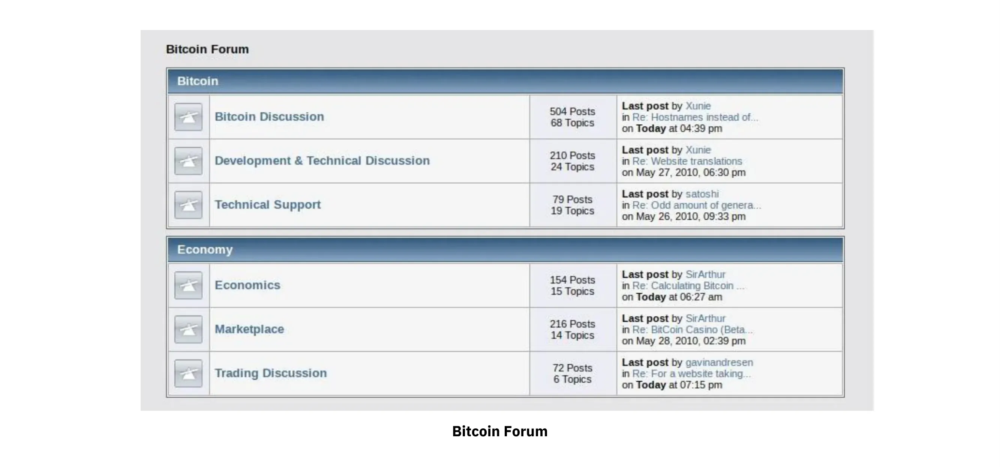


راه‌اندازی انجمن جدید فرصتی بود برای انتشار [نسخه 0.2](https://bitcointalk.org/index.php?topic=16.msg73#msg73) نرم‌افزار، که Satoshi ناکاموتو و مارتتی مالمی ماه‌ها روی آن کار کرده بودند و در 16 دسامبر انجام شد. این نسخه شامل بهبودهایی مانند کوچک‌سازی به نوار وظیفه، راه‌اندازی خودکار در هنگام شروع، یا چندرشته‌ای برای تولید Mining است. نرم‌افزار همچنین برای لینوکس تطبیق داده شد، که به لطف مشارکت مالمی و آزمایش‌هایی که توسط NewLibertyStandard تازه‌وارد انجام شد (که مورد او در فصل بعدی بررسی خواهد شد) انجام شد.


در این انجمن، که در آگوست 2011 به BitcoinTalk تبدیل شد، Satoshi مجموعاً 539 پیام نوشت. از این طریق، او توانست توضیحات فنی ارائه دهد، مکانیسم‌های اقتصادی مختلف را توضیح دهد و به طور کلی دیدگاه خود را در مورد Bitcoin به اشتراک بگذارد. این مجموعه پیام‌ها بخش عمده‌ای از مجموعه‌ای را تشکیل می‌دهد که او به جا گذاشت.


### ارتباطات در مراحل


بنابراین، بخش اول سال 2009 به ارتباطات اختصاص یافت. Satoshi مطمئن شد که از طریق روش‌های مختلف و در مکان‌های گوناگون به کشف خود توجه جلب کند. او توسط افراد دیگر، از جمله مارتتی مالمی، برای انتشار پیام کمک شد.


تبلیغ Bitcoin نیز از چندین مرحله عبور کرد: ابتدا، Satoshi بر پرداخت‌های آنلاین تمرکز کرد؛ سپس بر سیاست پولی ثابت و محدودیت ۲۱ میلیون واحد تأکید کرد؛ و در نهایت، به برنامه‌پذیری مدل خود اشاره کرد.

در پاییز 2009، به نظر می‌رسید که Bitcoin آماده رشد بود. و دقیقاً در همان زمان بود که بوت‌استرپ اقتصادی سیستم واقعاً اتفاق افتاد. این موضوع، موضوع فصل بعدی است.


## راه‌اندازی ارز دیجیتال

<chapterId>6b3418a7-125e-4ea1-a03a-f36090fac8a4</chapterId>


در فصل‌های قبلی، مشاهده کردیم که چگونه Satoshi ناکاموتو ایده خود را پیاده‌سازی کرد و چگونه درباره آن ارتباط برقرار کرد تا Bitcoin را به جهان معرفی کند. با این حال، همه چیز به او بستگی نداشت: لازم بود که مردم به واحد حساب ارزش اختصاص دهند. از آنجا که این امر امکان پرداخت به ماینرها از طریق کارمزد تراکنش‌ها و پاداش به بازرگانان از طریق کاهش طبیعی ارزش را فراهم می‌کرد، این قدردانی برای امنیت سیستم ضروری بود.


ظهور ارزش Bitcoin، با این حال، کار آسانی نبود. در واقع، این موضوع به دادن اهمیت اقتصادی به شیئی بود که قبلاً به دلایل کاملاً ذهنی هیچ ارزشی نداشت. هال فینی این موضوع را به خوبی در [ایمیل](https://www.metzdowd.com/pipermail/cryptography/2009-January/015004.html) خود در تاریخ 11 ژانویه 2009، که به لیست پستی رمزنگاری ارسال شده بود، توضیح داد، جایی که او نوشت:


> "یکی از مشکلات فوری با هر ارز جدید این است که چگونه آن را ارزش‌گذاری کنیم. حتی با نادیده گرفتن مشکل عملی که تقریباً هیچ‌کس در ابتدا آن را قبول نخواهد کرد، همچنان دشواری در ارائه یک استدلال منطقی به نفع یک ارزش خاص غیرصفر برای واحدها وجود دارد."

بنابراین، پدیده پولی نیاز به ارزیابی اولیه به دلایل غیر پولی داشت. همانطور که [Satoshi نوشت](https://mmalmi.github.io/Satoshi/#email-1) به مارتتی، لازم بود یک "جرقه" برای شعله‌ور کردن احتراق یک ماده قابل اشتعال وجود داشته باشد.


این بوت‌استرپ اقتصادی Bitcoin به تدریج از ابتدا با فعالیت Mining صورت گرفت. با این حال، تا اکتبر 2009 که اولین Exchange در برابر دلار رخ داد، به‌طور واقعی ظاهر نشد. در این فصل، ما به دنبال توصیف چگونگی وقوع این بوت‌استرپ و دلایلی که بازیگران مختلف را به اختصاص ارزش به واحد حساب واداشت، خواهیم بود.


### اولین معدنچیان

از ژانویه 2009، آغاز Bitcoin در چندین مرحله گسترش یافت: ورود اولین معدن‌کاران، ظهور Exchange با دلار، و توسعه اولین خدماتی که Bitcoin را می‌پذیرفتند. کسانی که گره‌های تولیدی را مستقر می‌کنند، در واقع اولین کسانی هستند که به طور غیرمستقیم به واحد حساب ارزش می‌دهند. آن‌ها واقعاً قدرت محاسباتی خود را برای افزودن Proof of Work به بلوک‌های تراکنش و در نتیجه اتصال آن‌ها به زنجیره، اختصاص می‌دهند که این کار از نظر زمان (به دلیل نگهداری نرم‌افزار) و انرژی (به دلیل برق مصرفی در این فرآیند) هزینه‌بر است. این تلاش با بیت‌کوین‌ها پاداش داده می‌شود، به طوری که تولید سکه‌ها به این روش نوعی Exchange اقتصادی محسوب می‌شود.


با این حال، همان‌طور که در مقدمه اشاره کردیم، بیت‌کوین‌ها در بازار ارزشی ندارند. بنابراین، ماینرها باید دلایل ذهنی برای انجام چنین تلاشی پیدا کنند. دلایل اصلی سه‌گانه هستند: کنجکاوی فنی، انگیزه ایدئولوژیک، و علاقه به سفته‌بازی.


اولین دلیل، که احتمالاً کم‌اهمیت‌ترین است، کنجکاوی فنی است. پذیرندگان اولیه Bitcoin اغلب علاقه‌مندان به کامپیوتر هستند و بیشتر اوقات در حرفه‌هایی مرتبط با برنامه‌نویسی یا مهندسی کار می‌کنند. آن‌ها دوست دارند بدانند که چیزها "زیر کاپوت" چگونه کار می‌کنند، که این باعث می‌شود نرم‌افزار و generate را راه‌اندازی کرده و مقداری بیت‌کوین استخراج کنند. این به‌ویژه در مورد مایک هرن صدق می‌کند که پس از مطرح کردن سوالاتش به Satoshi در ۱۲ آوریل ۲۰۰۹، [به سرعت](https://plan99.net/~mike/Satoshi-emails/thread1.html) به "آزمایش برنامه" روی کامپیوترش می‌پردازد و چند بلاک تولید می‌کند. (*اصلی: "I tried the app"*)


دومین دلیل برای Mining انگیزه ایدئولوژیک است. بسیاری از کاربران اولیه نرم‌افزار این کار را "برای هدفی خوب" انجام می‌دهند، به دلیل باورهای شخصی‌شان. آن‌ها قدرت محاسباتی خود را در دسترس قرار می‌دهند تا به تولد یک ارز دیجیتال قوی که به هیچ مرجع مرکزی وابسته نیست، کمک کنند. هال فینی اولین کسی است که این مفهوم را در ۱۳ نوامبر ۲۰۰۸ با [نوشتن](https://www.metzdowd.com/pipermail/cryptography/2008-November/014848.html) برجسته می‌کند:


> "سیستم Bitcoin به طور قابل توجهی با جنبش آزادی‌خواه آمریکایی همسو است، که از بازار آزاد بدون محدودیت حمایت می‌کند و به شدت با دولت، به ویژه در مورد کنترل آن بر ارز، خصومت دارد ("[پایان فدرال رزرو](https://en.wikipedia.org/wiki/End_the_Fed)"). به همین دلیل است که Satoshi به [هال فینی](https://www.metzdowd.com/pipermail/cryptography/2008-November/014853.html) پاسخ می‌دهد و بیان می‌کند که استدلال او "برای دیدگاه آزادی‌خواهانه بسیار جذاب است اگر بتوانیم آن را به درستی توضیح دهیم."

سومین نیروی محرک پشت تصمیم به شروع Mining، علاقه‌ی سفته‌بازی است. همان‌طور که در فصل قبلی توضیح داده شد، سیاست پولی Bitcoin یکی از نقاط قوت اصلی آن است. اگر مقدار بیت‌کوین‌های در گردش به یک مقدار ثابت (۲۱ میلیون واحد) نزدیک شود، قیمت واحد آن‌ها می‌تواند بسیار بالا برود زیرا افراد بیشتری به این اقتصاد می‌پیوندند. این استدلال به‌خصوص، داستین ترامل را متقاعد می‌کند که از همان ابتدا شروع به تولید بیت‌کوین کند، همان‌طور که در [مکاتبات خصوصی](https://www.dustintrammell.com/s/Satoshi_Nakamoto.zip) خود با Satoshi به اشتراک می‌گذارد:


> "این یکی از دلایلی بود که من را وادار کرد تا به سرعت یک نود راه‌اندازی کنم. سیستم‌های من وقتی بیکار هستند کار زیادی انجام نمی‌دهند، پس چرا بیت‌کوین ایجاد نکنم؟ و اگر روزی ارزشمند شوند...؟ آن یک امتیاز خواهد بود!"

دو دلیل آخر بسیار مهم‌تر هستند زیرا مردم را به استخراج مداوم ترغیب می‌کنند. بنابراین، در طول سال ۲۰۰۹، چندین نفر که با این دلایل انگیزه گرفته بودند، با اختصاص قدرت محاسباتی خود به شبکه، تعداد قابل توجهی بلوک تولید کردند. در میان این افراد، به‌ویژه:


- هال فینی، که کامپیوتر خود را بین راه‌اندازی شبکه و مارس 2009 اجرا کرد و موفق به جمع‌آوری بیش از 10,000 بیت‌کوین شد.
- داستین تراممل، که تعداد قابل‌توجهی از بلاک‌ها را در طول سال‌های 2009 و اوایل 2010 استخراج می‌کند و بدین ترتیب بیش از 70,000 بیت‌کوین به دست می‌آورد، همان‌طور که فعالیت مرتبط با [Address](https://Mempool.space/Address/12higDjoCCNXSA95xZMWUdPvXNmkAduhWv) نشان می‌دهد؛ - یک مهندس بریتانیایی به نام جیمز هاولز، که بین فوریه و آوریل با کامپیوتر خود [8,000 بیت‌کوین تولید می‌کند](https://Mempool.space/Address/198aMn6ZYAczwrE5NvNTUMyJ5qkfy4g3Hi) (او کامپیوتر خود را در سال 2013 به محل دفن زباله می‌فرستد و چند ماه بعد به اشتباه خود پی می‌برد؛ سپس مورد او توسط *گاردین* [منتشر می‌شود](https://www.theguardian.com/technology/2013/nov/27/Hard-drive-Bitcoin-landfill-site)).
- مارتتی مالمی، که بین آوریل 2009 و 2010 به تولید بلاک‌ها در شبکه کمک می‌کند و بدین ترتیب [بیش از 55,000 بیت‌کوین به دست می‌آورد](https://twitter.com/marttimalmi/status/1339908783187832834)؛
- یک NewLibertyStandard خاص، که تعداد قابل توجهی بیت‌کوین از سپتامبر 2009 تولید می‌کند تا سرویس نوپای Exchange خود را تأمین کند...


### اولین سرویس Exchange و اولین قیمت


در پایان سپتامبر 2009، فردی با استفاده از نام مستعار NewLibertyStandard (که آن را به اختصار NLS می‌نامیم) Bitcoin را کشف می‌کند. او نرم‌افزار را امتحان کرده و Mining را شروع می‌کند. اولین بلوکی که تولید می‌کند [بلوک 23,940](https://Mempool.space/block/000000002f74e369b0cab9c836d7777aabb66ae11741910c61da819f17605a50) است. او کاربر لینوکس است و بنابراین از "شبیه‌ساز" Wine برای اجرای نرم‌افزار استفاده می‌کند. او به آزادی سیاسی و فلزات گران‌بها علاقه‌مند است، همان‌طور که از [آواتار](https://bitcointalk.org/index.php?action=profile;u=26) او در انجمن که یک عقاب آمریکایی را نشان می‌دهد و کلمه "liberty" بر روی آن حک شده است، مشخص است. او Bitcoin را به عنوان معادل طلا در دنیای دیجیتال می‌بیند: در [صفحه شخصی](https://web.archive.org/web/20091229132559/http://newlibertystandard.wetpaint.com/) خود، او خلق Satoshi توسط ناکاموتو را به عنوان "یک انقلاب اقتصادی" و "استاندارد طلای ارز دیجیتال" معرفی می‌کند.


در اکتبر 2009، اولین سرویس ارز Exchange تأسیس شد که به مردم اجازه می‌داد دلارهای خود را به بیت‌کوین تبدیل کنند و بیت‌کوین‌های خود را به دلار بازگردانند. خالق این سرویس در انجمن اختصاصی Bitcoin در SourceForge ثبت‌نام کرد و افتتاح سرویس خود را در آنجا اعلام کرد. برای تخمین نرخ Exchange، او آن را بر اساس هزینه انرژی مورد نیاز برای به دست آوردن یک واحد، با در نظر گرفتن قیمت برق در محل خود و فرکانس تولید شخصی‌اش، پایه‌گذاری کرد. در صفحه خود، او [نوشت](https://web.archive.org/web/20091229132610/http://newlibertystandard.wetpaint.com/page/Exchange+Rate):


> "نرخ Exchange ما با تقسیم $1.00 بر مقدار متوسط برق مورد نیاز برای اجرای یک کامپیوتر با استفاده بالای CPU برای یک سال، 1331.5 کیلووات ساعت، ضرب در هزینه متوسط برق مسکونی در ایالات متحده برای سال گذشته، $0.1136، همه تقسیم بر 12 ماه، تقسیم بر تعداد بیت‌کوین‌های تولید شده توسط کامپیوتر من در 30 روز گذشته محاسبه می‌شود."

در اینجا نرخ‌های شاخص Exchange از خدمات NLS آمده است که همچنین در صفحه شخصی NLS منتشر شده است:


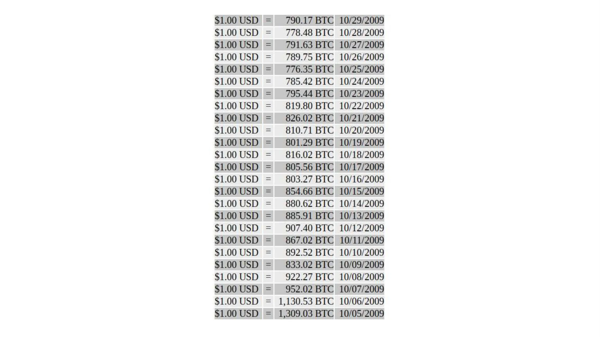


تراکنش‌ها از طریق ایمیل به آدرس newlibertystandard@gmail.com تسویه می‌شوند. انتقال دلار به‌طور انحصاری از طریق PayPal انجام می‌شود و برای عملیات هزینه‌هایی دریافت می‌شود.


در ۸ اکتبر، مارتتی مالمی [Satoshi را از وجود سرویس NLS مطلع کرد](https://mmalmi.github.io/Satoshi/#email-34). خالق Bitcoin به این خبر واکنش مثبتی نشان داد، زیرا او مدتی بود که [به دنبال راهی بود](https://mmalmi.github.io/Satoshi/#email-28) تا ارزش بیت‌کوین‌ها را تضمین کند و به این ترتیب Mining را پاداش دهد و دینامیک اقتصادی سیستم را راه‌اندازی کند. در ۱۶ اکتبر، او به دست راست خود [نوشت](https://mmalmi.github.io/Satoshi/#email-35):

"دلگرم‌کننده است که می‌بینیم افراد بیشتری به موضوعاتی مانند سایت NewLibertyStandard علاقه‌مند می‌شوند. من از رویکرد او برای تخمین ارزش بر اساس برق خوشم می‌آید. دیدن توضیحاتی که مردم انتخاب می‌کنند آموزنده است. آن‌ها ممکن است به کشف راهی ساده‌تر برای درک [Bitcoin] کمک کنند که آن را برای عموم قابل دسترس‌تر کند. بسیاری از مفاهیم پیچیده در جهان دارای توضیحی ساده هستند که ۸۰٪ از مردم را راضی می‌کند و توضیح کاملی که ۲۰٪ دیگر را که نقص‌های توضیح ساده را می‌بینند، راضی می‌کند."


پس از اعلام NLS، مارتتی مالمی با او تماس گرفت. این دو توافق کردند که یک Exchange بسازند. در شب ۱۱ تا ۱۲ اکتبر ۲۰۰۹، اولین فروش بیت‌کوین‌ها به دلار نهایی شد: مارتتی [۵,۰۵۰ بیت‌کوین](https://twitter.com/marttimalmi/status/423455561703624704) از تلاش‌های Mining خود به NLS منتقل کرد، که سپس ۵.۰۲ دلار به حساب پی‌پال او منتقل کرد. این معادل قیمت واحد حدود ۰.۰۰۱ دلار است.


در هفته‌های بعد، NLS بیت‌کوین‌های بیشتری برای Supply خدمات خود جمع‌آوری کرد. در ۱۹ نوامبر، شخصی [خرید](https://Mempool.space/tx/67fc73c770d5001be14f65c95f2f37e04e26c3f8c6a49519d2e63c594ea26756) حدود ۲۲,۵۰۰ بیت‌کوینی که او مالک آن بود را انجام داد و اولین فروش Bitcoin خود را به پایان رساند. چند ساعت بعد، Satoshi از این عملیات مالی در یک [ایمیل](https://mmalmi.github.io/Satoshi/#email-99) نوشته شده به Martti Malmi هیجان‌زده بود.


در ماه‌های پس از آن، سرویس NLS به یک عنصر مرکزی در توسعه اقتصادی Bitcoin تبدیل شد و به عنوان یک معیار برای Exchange بین Bitcoin و دلار عمل کرد. با این حال، در نیمه اول سال 2010، با ظهور سایر خدمات Exchange کارآمدتر، با رقابت مواجه شد.


### آغازهای اقتصاد

آغاز سال 2010 با اولین گام‌های مبادلات تجاری در ارزهای دیجیتال مشخص می‌شود. NewLibertyStandard، که اولین کسی است که واقعاً پذیرش دریافت Bitcoin در Exchange برای یک کالای اقتصادی دیگر (در این مورد دلار) را قبول می‌کند، همچنین اولین مروج این رونق اقتصادی است. در 19 ژانویه 2010، درست پس از ثبت‌نام در انجمن جدید، او [متن زیر را نوشت](https://bitcointalk.org/index.php?topic=15.msg111#msg111):


> "افراد از من بیت‌کوین خریده‌اند و به من بیت‌کوین فروخته‌اند. Supply و تقاضا، حتی اگر کم هم باشند، از قبل وجود دارند و این تمام چیزی است که واقعاً نیاز است. پیشنهاد دادن بیت‌کوین به Exchange برای ارز دیگر در نهایت تفاوتی با مبادله بیت‌کوین برای کالا یا خدمات ندارد. ارزها کالا هستند و مبادله آن‌ها یک خدمت است. سعی کرده‌ام به چیزی فکر کنم که بتوان با بیت‌کوین خرید یا فروخت، به‌جز دلار آمریکا، اما چیزی پیدا نکردم. لطفاً احساس راحتی کنید و ما را در جریان بگذارید که تصمیم دارید چه چیزی را برای بیت‌کوین بفروشید. در مورد مسئله کاهش بودجه، من یک کمک مالی روزانه را در بودجه‌ام برنامه‌ریزی کرده‌ام. شما می‌توانید تمام دلارها یا بیت‌کوین‌های من را امروز بخرید، اما همیشه فردا و پس‌فردا بیشتر خواهد بود. هر کسی که کالاها را با استفاده از بیت‌کوین خرید و فروش می‌کند، از جمله مبادله‌کنندگان، اقتصاد Bitcoin را پیش می‌برد. بگذارید همه سهم خود را انجام دهند. چیزی را در Exchange برای بیت‌کوین بخرید یا بفروشید!"

تلاش هماهنگی عمدتاً در انجمن انجام می‌شود. در ۲۷ ژانویه، کاربری هلندی با نام giik یک [موضوع](https://bitcointalk.org/index.php?topic=30.0) با عنوان "ما بیت‌کوین قبول می‌کنیم" ایجاد کرد که در آن پیشنهاد داد خدمات مختلفی که Bitcoin را قبول می‌کنند، فهرست شوند. در همین زمان بود که انجمن جدید شروع به محبوبیت کرد و پیام‌ها شروع به افزایش کردند. در ۷ فوریه، Satoshi به Martti Malmi [اشاره کرد](https://mmalmi.github.io/Satoshi/#email-153) که "انجمن واقعاً در حال رشد است. &nbsp;انتظار نداشتم که اینقدر سریع فعالیت زیاد شود."


در ۵ فوریه، NLS [پیشنهاد کرد](https://bitcointalk.org/index.php?topic=41.msg238#msg238) که Bitcoin، مانند ارزهایی که در بازار خارجی Exchange معامله می‌شوند، نماد تیکر BTC و نماد بات تایلندی (฿) را بپذیرد. تا آن زمان، هیچ رویه‌ای تثبیت نشده بود: به عنوان مثال، Satoshi و Martti از حروف `bc` برای توصیف واحدها در [مکاتبات خود](https://mmalmi.github.io/Satoshi/#email-119) استفاده می‌کردند. استفاده از نماد BTC به سرعت استاندارد شد. در ۲۴ فوریه، نماد ارز (حرف بزرگ B که با دو خط عمودی قطع شده است) توسط Satoshi [طراحی شد](https://bitcointalk.org/index.php?topic=64.msg504#msg504) که سپس اولین لوگوی واقعی Bitcoin را ایجاد کرد.


به تدریج، مردم شروع به پذیرش Bitcoin کردند. این موضوع برای کاربر SmokeTooMuch در دسامبر 2009 اتفاق افتاد، که تازه وارد شده بود و [وجود](https://web.archive.org/web/20191215200234/https://bitcointalk.org/index.php?topic=15.msg65#msg65) یک سرویس فروش کارت هدیه paysafecard به نام BTC 2 PSC را گزارش کرد. این سرویس بعداً به طور مثبت توسط Satoshi در 4 فوریه 2010 [ذکر شد](https://mmalmi.github.io/Satoshi/#email-141). این موضوع همچنین برای NLS اتفاق افتاد که در 9 فوریه [فروشگاه آنلاین](https://bitcointalk.org/index.php?topic=30.msg305#msg305) خود، Liberty Swap Variety Shop، را افتتاح کرد، جایی که او تمبر و برچسب برای فروش ارائه می‌کرد.


Exchange با دلار نیز توسعه یافت و در عرض دو ماه، حداقل سه پلتفرم درهای خود را باز کردند:


- BitcoinFX (bitcoinfx.cz.cc)، یک سرویس برای فروش بیت‌کوین‌ها به دلارهای Liberty Reserve، که در [15 فوریه اعلام شد](https://bitcointalk.org/index.php?topic=30.msg194#msg194)؛
- پلتفرم BitcoinExchange (bitcoinexchange.com) متعلق به Martti Malmi، که به‌طور منحصربه‌فردی [Supply و تقاضا](https://mmalmi.github.io/Satoshi/#email-25) را با در نظر گرفتن یوروها و بیت‌کوین‌های واریز شده توسط کاربران ارزیابی می‌کند و در تاریخ ۲ مارس ۲۰۱۰ [برای عموم باز شد](https://bitcointalk.org/index.php?topic=68.msg591#msg591)؛
- بازار Bitcoin (bitcoinmarket.com)، یک بازار همتا به همتا با استفاده از PayPal است که توسط فردی به نام dwdollar در 16 مارس [راه‌اندازی](https://bitcointalk.org/index.php?topic=20.msg726#msg726) شده و قبل از ظهور Mt. Gox در ماه ژوئیه موفقیت قابل توجهی خواهد داشت.


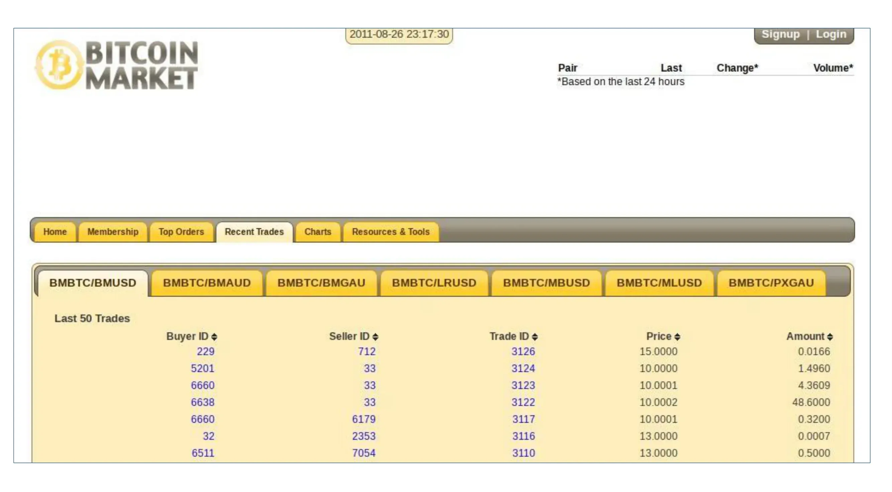

[بایگانی](https://web.archive.org/web/20110826231728/https://www.bitcoinmarket.com/market/trades/) بازار Bitcoin Interface بعداً (اوت 2011)


در 11 مارس، اولین بازی پوکر با استفاده از بیت‌کوین توسط مدیر BitcoinFX [سازماندهی](https://bitcointalk.org/index.php?topic=80.msg781#msg781) می‌شود و رابطه قوی که بین قمار و ارزهای دیجیتال وجود خواهد داشت را افتتاح می‌کند. این بازی توسط dwdollar برنده می‌شود که [600 BTC](https://Mempool.space/tx/6477a88f0196e1fcf6c608e446be62c708556f34a79d169fbb05b1fee92f5761) کسب می‌کند.


سایر خدماتی که Bitcoin را می‌پذیرند، مانند سرویس تماس صوتی از طریق اینترنت [Link2VoIP](https://bitcointalk.org/index.php?topic=30.msg733#msg733) در 16 مارس، سرویس میزبانی وب [Vekja.net](https://bitcointalk.org/index.php?topic=30.msg1008#msg1008) در 23 آوریل، یا فروشنده نام دامنه [Privacy Shark](https://bitcointalk.org/index.php?topic=30.msg1035#msg1035) در 30 آوریل ظهور می‌کنند. این گسترش خدمات باعث می‌شود که مارتتی مالمی در نهایت یک [صفحه](https://web.archive.org/web/20100517040312/http://www.Bitcoin.org:80/trade) را در وب‌سایت Bitcoin.org برای فهرست کردن بازرگانان میزبانی کند.


اولین سرویس نگهداری اختصاصی Bitcoin نیز ظاهر می‌شود: MyBitcoin، یک برنامه وب که استفاده آسان و آرام از ارزهای دیجیتال را به ویژه بر روی موبایل امکان‌پذیر می‌سازد. به لطف این سرویس، کاربران واقعاً نیازی به دانلود کامل داده‌های زنجیره برای ارسال و دریافت تراکنش‌ها ندارند و همچنین نیازی به نگهداری بیت‌کوین‌های خود با ذخیره کلیدهای خصوصی‌شان نیست.


در آن زمان، کیف‌پول‌های سبک‌وزن (که به عنوان "SPV" شناخته می‌شوند) وجود نداشتند، بنابراین خود ناکاموتو Satoshi استفاده از این نوع نرم‌افزار را قابل قبول دانست، حتی اگر این استفاده برخلاف اصل حذف واسطه‌ها در قلب Bitcoin بود. در ۱۸ مه ۲۰۱۰، او در انجمن [نوشت](https://bitcointalk.org/index.php?topic=125.msg1149#msg1149):


> "در همین حال، سایت‌هایی مانند [vekja.net](http://vekja.net) و [www.mybitcoin.com](http://www.mybitcoin.com) در حال آزمایش با سیستم‌های مبتنی بر حساب هستند. &nbsp;شما یک حساب کاربری در یک وب‌سایت ایجاد می‌کنید، بیت‌کوین‌های خود را در آنجا نگه می‌دارید و آن‌ها را انتقال می‌دهید. &nbsp;ایجاد یک حساب کاربری در یک وب‌سایت بسیار آسان‌تر از نصب نرم‌افزار و یادگیری استفاده از آن است و برای اکثر مردم روشی آشناتر است. &nbsp;تنها عیب این است که باید به سایت اعتماد کنید، اما این برای مقادیر کم که برای پرداخت‌های خرد و هزینه‌های متفرقه در نظر گرفته شده‌اند، مشکلی ندارد. &nbsp;این یک راه آسان برای شروع است و اگر مقادیر دریافتی بیشتر شوند، می‌توانید به نرم‌افزار واقعی Bitcoin تغییر دهید."

سرانجام، در ۱۹ مه، کاربری با نام Teppy شروع به [پذیرفتن](https://bitcointalk.org/index.php?topic=30.msg1159#msg1159) Bitcoin برای بازی چندنفره گسترده‌ای که مدیریت می‌کرد، *A Tale in the Desert*، کرد.


### منشأ ارزش Bitcoin


در بهار سال ۲۰۱۰، به نظر می‌رسید که Bitcoin واقعاً در ذهن بسیاری از مردم ارزش پیدا کرده است. حتی با اینکه استفاده از سیستم در مراحل ابتدایی خود بود، تقاضا برای Bitcoin وجود داشت، چه از دیدگاه Mining، Exchange با دلار، یا فروش خدمات. این راه‌اندازی اقتصادی به‌طور قطعی با یک رویداد نمادین که در ۲۲ مه رخ داد، مهر و موم شد: اولین خرید یک کالای فیزیکی با بیت‌کوین، به‌طور خاص یک پیتزا، که در فصل بعدی به آن خواهیم پرداخت.


سوال در مورد منشأ ارزش Bitcoin همچنان موضوعی است که بسیاری از افراد در توضیح آن دچار مشکل شده‌اند. ظهور این ارزش به‌ویژه طرفداران مکتب اتریشی را که تفسیری محدود از [قضیه بازگشت](https://en.wikipedia.org/wiki/Regression_theorem) لودویگ فون میزس داشتند، نگران کرد. این موضوع برای فردی به نام xc نیز صادق بود که در [فروم](https://bitcointalk.org/index.php?topic=583.msg5984#msg5984) تلاش کرد انتقال ارزش را در تبدیل با دلار پایه‌گذاری کند.


با این حال، این سوال هرگز Satoshi را آزار نداد، کسی که ایجاد یک ارز جدید را به عنوان چالشی می‌دید که قطعاً دشوار بود اما غیرممکن نبود. او به این ترتیب [دیدگاه](https://bitcointalk.org/index.php?topic=583.msg11405#msg11405) خود را در انجمن در تاریخ ۲۷ اوت ۲۰۱۰، در پاسخ به xc بیان کرد:


> "به عنوان یک آزمایش فکری، تصور کنید فلزی پایه به اندازه طلا کمیاب بود اما با ویژگی‌های زیر:
> \- خاکستری کسل‌کننده در رنگ
> \- رسانای خوبی برای برق نیست
> \- نه به‌طور خاص قوی، اما نه انعطاف‌پذیر یا به‌راحتی شکل‌پذیر
> \- برای هیچ منظور عملی یا تزئینی مفید نیست
>

> و با یک ویژگی خاص و جادویی:
> \- می‌تواند از طریق یک کانال ارتباطی منتقل شود
>

> اگر به هر دلیلی این فلز ارزشی پیدا کند، هر کسی که بخواهد ثروتی را در مسافت طولانی منتقل کند می‌تواند مقداری از آن را بخرد، آن را ارسال کند و گیرنده آن را بفروشد.
>

> شاید همان‌طور که پیشنهاد داده‌اید، بتواند به‌صورت چرخشی یک ارزش اولیه به دست آورد، با پیش‌بینی مردم از پتانسیل مفید بودن آن برای Exchange. (من قطعاً مقداری از آن را می‌خواهم) شاید کلکسیونرها، یا هر دلیل تصادفی دیگری، بتواند جرقه‌ای برای آن باشد."

# اولین ظهور Bitcoin

<partId>557d792d-34d5-4a10-8977-82afdcfe402b</partId>

## کارت‌های گرافیک، پیتزاها، و بیت‌کوین‌های رایگان

<chapterId>9cd228a4-58d3-46a3-9935-06098bafc954</chapterId>


در بخش قبلی، بررسی کردیم که چگونه Bitcoin به وجود آمد، چگونه به عموم معرفی شد و چگونه به‌صورت اقتصادی آغاز شد. در بهار ۲۰۱۰، زمانی که تجارت با بیت‌کوین‌ها تازه شروع به شکوفایی کرده بود، هدف Satoshi ناکاموتو و چند نفری که از او حمایت می‌کردند، زنده نگه‌داشتن این شعله بود. خوشبختانه، افراد دیگری به این تلاش پیوستند، به‌ویژه Miner لازلو هانیچ و توسعه‌دهنده گوین آندرسن که به خاطر اقداماتشان برجسته شدند.


در این فصل، به اولین استقرار Mining توسط واحد پردازش گرافیکی (GPU)، ثروت انباشته شده توسط Satoshi ناکاموتو، اولین خرید کالای فیزیکی با بیت‌کوین، تأسیس Bitcoin Faucet که واحدهای رایگان ارائه می‌دهد، و تکامل نرم‌افزار و شبکه قبل از Slashdot خواهیم پرداخت.


### Mining توسط واحد پردازش گرافیکی


تقاضای فزاینده برای Bitcoin با افزایش تدریجی فعالیت Mining در شبکه همراه بود. در طول سال 2009، سختی در شبکه در حداقل کف 1 بود که نیاز داشت تمام نودها حدود 4.3 میلیارد محاسبه برای استخراج یک بلوک انجام دهند. با این حال، در دسامبر 2009، این وضعیت به لطف الگوریتم تنظیم تغییر کرد و عامل سختی از 1 به 1.18 افزایش یافت.


Satoshi ناکاموتو درباره این افزایش سختی بسیار نگران بود و از فوریه 2010 یک [تاریخچه](https://bitcointalk.org/index.php?topic=43.msg249#msg249) در انجمن نگه داشت. اینجا به این شکل بود:


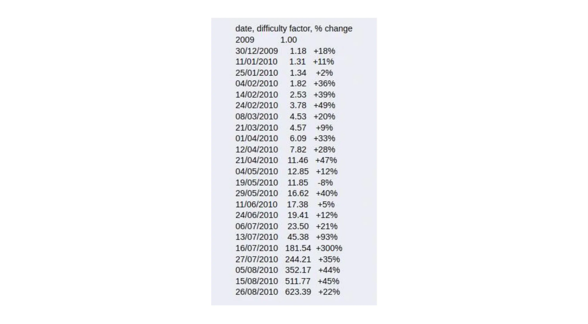


با وجود این اشتیاق نسبت به افزایش قدرت محاسباتی در شبکه، Satoshi با این حال به دنبال کند کردن تخصصی‌سازی Mining بود تا توزیع واحدها را ترجیح دهد. تا آن زمان، ماینرها از واحدهای پردازش مرکزی (CPU) خود برای استخراج بیت‌کوین‌های جدید استفاده می‌کردند. با این حال، این پردازنده‌ها برای انجام عملیات تکراری ناکارآمد بودند، در مقایسه با واحدهای پردازش گرافیکی (GPU) که بسیار مناسب‌تر برای این نوع محاسبات تکراری هستند. در نتیجه، همه در آن زمان می‌دانستند که این تحول اجتناب‌ناپذیر است، از جمله خود Satoshi. در ۱۹ دسامبر ۲۰۰۹، او [اظهار داشت](https://bitcointalk.org/index.php?topic=12.msg54#msg54) به شرح زیر:

"ما باید یک توافق جنتلمنانه داشته باشیم تا مسابقه تسلیحاتی GPU را تا جایی که می‌توانیم به تعویق بیندازیم، به خاطر خیر شبکه. برای کاربران جدید بسیار آسان‌تر است که به سرعت وارد شوند اگر نگران درایورهای GPU و سازگاری نباشند. این خوب است که هر کسی فقط با یک CPU می‌تواند در حال حاضر به طور نسبتاً برابر رقابت کند."


با این حال، چند ماه بعد، جعبه پاندورا باز شد. مسبب این مشکل لازلو هانیچ، توسعه‌دهنده ۲۸ ساله آمریکایی با اصالت مجارستانی است که در فلوریدا زندگی می‌کند. او در آوریل ۲۰۱۰ به Bitcoin پی برد. در روز نهم، او [۳۳۰۰ بیت‌کوین](https://Mempool.space/tx/faf172f5dc06b0ae03268555dddcd65be47e9a8a8bb44a122b12bfaf735f9a81#vout=1) را از NLS به قیمت حدود ۲۰ دلار خریداری کرد و سپس با انجام چند انتقال، سیستم را آزمایش کرد. در روز هجدهم، او تلاش کرد با افزایش تعداد تراکنش‌ها از [Address عمومی خود](https://Mempool.space/Address/1XPTgDRhN8RFnzniWCddobD9iKZatrvH4) شبکه را شلوغ کند، اما شبکه مقاومت کرد.


لاسلو هانیچ با پسرش در ماه مه ۲۰۱۸ (منبع: [The Telegraph](https://www.telegraph.co.uk/technology/2018/05/22/inside-story-behind-famous-2010-Bitcoin-pizza-purchase-today/))


سپس، او [کد نرم‌افزار را تطبیق داد](https://bitcointalk.org/index.php?topic=116.msg972#msg972) تا بر روی سیستم‌عامل Mac OS X کار کند. سپس او بر روی بهینه‌سازی Mining با استفاده از محیط OpenCL کار کرد که اجازه می‌دهد [استفاده از GPU](https://bitcointalk.org/index.php?topic=124.msg1100#msg1100) در تولید بیت‌کوین‌ها ممکن شود. در تاریخ ۱۰ مه، او [اجرایی خود را منتشر کرد](https://bitcointalk.org/index.php?topic=124.msg1100#msg1100) و [پیشنهاد داد](https://bitcointalk.org/index.php?topic=133.msg1103#msg1103) که پچ‌هایی بنویسد تا سایر ماینرها نیز بتوانند این کار را انجام دهند. این بهینه‌سازی به سرعت به او اجازه داد تا جایگاه قابل توجهی در تولید بلاک‌ها پیدا کند.

در پایان ماه آوریل، لازلو با Satoshi تماس گرفت تا نظر او را بپرسد، اما او تنها در ۱۷ مه پاسخ داد. سپس خالق Bitcoin از او [درخواست کرد](https://www.reddit.com/r/Bitcoin/comments/36vnmr/heres_what_satoshi_wrote_to_the_man_responsible/) تا عملیات خود را کندتر کند تا Mining برای بیشترین تعداد افراد قابل دسترسی باقی بماند:

> "یک جاذبه بزرگ برای کاربران جدید این است که هر کسی با یک کامپیوتر می‌تواند generate مقداری سکه رایگان به دست آورد. وقتی 5000 کاربر وجود داشته باشد، ممکن است این انگیزه کاهش یابد، اما فعلاً این موضوع همچنان صادق است. GPUها به طور زودهنگام این انگیزه را محدود به کسانی می‌کنند که سخت‌افزار GPU پیشرفته دارند. این اجتناب‌ناپذیر است که در نهایت خوشه‌های محاسباتی GPU تمام سکه‌های تولید شده را تصاحب کنند، اما من نمی‌خواهم آن روز را تسریع کنم. (...) نمی‌خواهم شبیه یک سوسیالیست به نظر برسم، برایم مهم نیست که ثروت متمرکز شود، اما فعلاً با دادن آن پول به 100% مردم رشد بیشتری به دست می‌آوریم تا اینکه آن را به 20% بدهیم. علاوه بر این، هرچه بیشتر بتوانیم مسابقه تسلیحاتی GPU را به تأخیر بیندازیم، کتابخانه‌های OpenCL بالغ‌تر می‌شوند و افراد بیشتری کارت‌های ویدئویی سازگار با OpenCL خواهند داشت."

لازلو واقعاً به این هشدار توجهی نکرد و به استخراج بلاک‌ها با کارت گرافیک خود ادامه داد و در ماه‌های بعد ده‌ها هزار بیت‌کوین تولید کرد. با این حال، تا اکتبر بود که GPU Mining به طور گسترده‌ای مورد استفاده قرار گرفت.


### بیت‌کوین‌های Satoshi


این افزایش در Mining نیز پیامد قابل توجهی داشت: Satoshi تولید بلاک‌ها را متوقف کرد. از زمان راه‌اندازی شبکه، او واقعاً Mining بوده است تا سرعت تأیید کافی و سطح امنیت قابل قبولی را تضمین کند. با قدرت جدید مستقر شده، او می‌توانست این وظیفه را رها کند و به سایر اعضای شبکه اجازه دهد تا از کل بیت‌کوین‌های ایجاد شده بهره‌مند شوند.


فعالیت Satoshi در Mining دارای الگوی مشخصی است که شناسایی بلوک‌هایی که احتمالاً او پیدا کرده را ممکن می‌سازد، هرچند با چند مورد مثبت کاذب. این الگوی Mining توسط توسعه‌دهنده سرجیو لرنر در سال ۲۰۱۳ برجسته شد و به نام الگوی پاتوشی شناخته شده است.


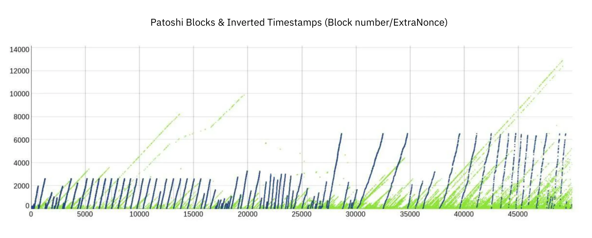


الگوی پاتوشی بین بلوک‌های ۰ و ۵۰,۰۰۰ همان‌طور که در وب‌سایت [satoshiblocks.info](http://satoshiblocks.info/) مشاهده می‌شود: هر نقطه به یک بلوک مربوط می‌شود، خطوط آبی از بلوک‌های Satoshi تشکیل شده‌اند، خطوط دیگر نمایانگر خروجی سایر ماینرها هستند.


بر اساس مطالعه‌ای توسط Whale Alert که در سال 2020 منتشر شد، Satoshi حدود 22,500 بلاک استخراج کرد و به این ترتیب 1,122,693 بیت‌کوین جمع‌آوری کرد که بیش از 5% از 21 میلیون واحد برنامه‌ریزی شده است. در بخش عمده‌ای از سال 2009، شبکه به قدرت محاسباتی بنیان‌گذار خود متکی بود. این وابستگی در آگوست 2009 نشان داده شد، که بدترین دوره از نظر فعالیت Mining بود و با زمانی از "وقفه" برای Satoshi همزمان شد، جایی که احتمالاً کمتر به نظارت بر ماشین‌های خود پرداخت. در واقع، در طول این آگوست، تنها 1,564 بلاک از 4,464 بلاک مورد انتظار تولید شد که معادل با زمان متوسط 28 دقیقه و 30 ثانیه بود.


با افزایش قدرت محاسباتی در پاییز 2009، نسبت قدرت محاسباتی Satoshi به قدرت کل شبکه به تدریج کاهش یافت. این نسبت از 75% در مارس 2009 به 60% در سپتامبر، سپس به 15% در دسامبر کاهش یافت و در ماه مه به 0% رسید. در زیر نموداری که توسط [Organofcorti](https://organofcorti.blogspot.com/2014/08/167-satoshis-Hashrate.html) در سال 2014 تهیه شده است:


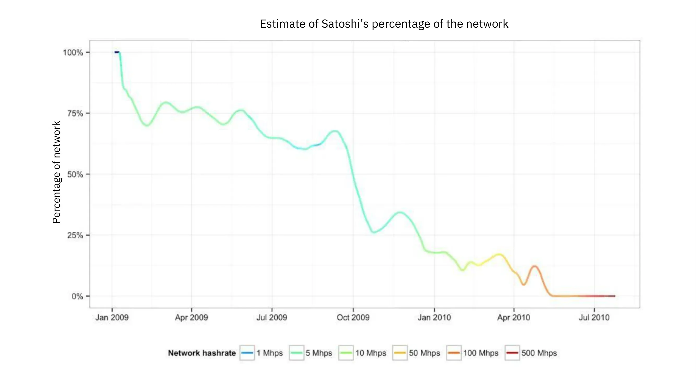


علاوه بر این، کاهش تسلط Satoshi در Mining صرفاً منفعل نیست: او خود تولیدش را در همان دوره کاهش می‌دهد. در واقع، هدف اعلام شده Satoshi این است که همه مشارکت کنند: او برای کسب سود مالی استخراج نمی‌کند، بلکه برای اطمینان از عملکرد شبکه تا زمانی که مشوق‌ها اثر کنند. بنابراین، او نرخ Hash خود (تعداد محاسبات انجام شده در هر ثانیه) را سه بار در این دوره Mining کاهش می‌دهد: بار اول از 4.5 به 2.5 MH/s در ژوئن 2009، بار دوم از 2.5 به 1 MH/s در اکتبر، و بار سوم از 1 به 0 MH/s در مه 2010. در اینجا نموداری از تکامل نرخ Hash او در این دوره آمده است ([Organofcorti](https://organofcorti.blogspot.com/2014/08/167-satoshis-Hashrate.html)):


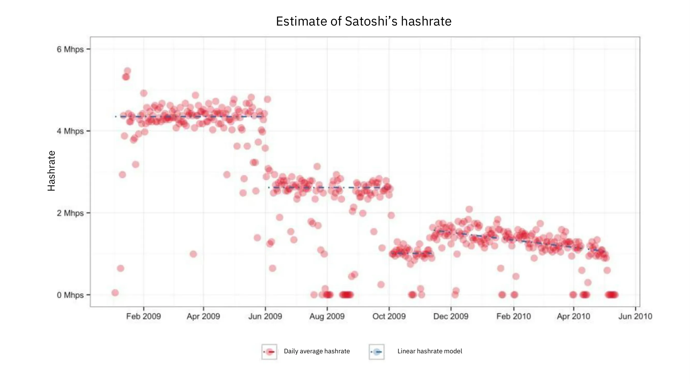


Satoshi's Mining بنابراین به وضوح نوع‌دوستانه است، همان‌طور که [Jameson Lopp اشاره می‌کند](https://blog.lopp.net/was-Satoshi-a-greedy-Miner/). زمانی که او Mining را در ۳ مه ۲۰۱۰ متوقف می‌کند (آخرین بلاک او [بلاک ۵۴,۳۱۶](https://Mempool.space/block/000000000d1e2cf92a7e6afdbed6d34fc3ac2cc863d9a236ca4db394a94ece2e) است)، این یک دستاورد دیگر در توسعه آهسته Bitcoin محسوب می‌شود: تصاحب تأیید تراکنش توسط بازیگران اقتصادی.


### روز پیتزا Bitcoin


مه ۲۰۱۰ همچنین با یک رویداد بنیادی مشخص می‌شود: اولین خرید کالای فیزیکی با بیت‌کوین. لازلو هانیچ اولین قدم را برمی‌دارد. او با جمع‌آوری بیش از ۲۰,۰۰۰ بیت‌کوین از طریق الگوریتم خود، به دنبال بازگرداندن آنها به اقتصاد با خرید پیتزا است. در ۱۸ مه، او [اعلان](https://bitcointalk.org/index.php?topic=137.msg1141#msg1141) زیر را در انجمن می‌نویسد:


> "من ۱۰,۰۰۰ بیت‌کوین برای چند پیتزا پرداخت می‌کنم... شاید ۲ پیتزای بزرگ که مقداری برای روز بعد باقی بماند. دوست دارم پیتزای باقی‌مانده برای بعداً داشته باشم. می‌توانید خودتان پیتزا را درست کنید و به خانه‌ام بیاورید یا از یک مکان تحویل سفارش دهید، اما هدف من این است که غذا در Exchange برای بیت‌کوین تحویل داده شود، جایی که نیازی به سفارش یا آماده‌سازی آن توسط خودم نباشد، مثل سفارش یک 'پلاتر صبحانه' در هتل یا چیزی شبیه به آن، آنها فقط چیزی برای خوردن می‌آورند و شما خوشحالید! (...) اگر علاقه‌مند هستید لطفاً به من اطلاع دهید تا بتوانیم معامله‌ای انجام دهیم."

این پیشنهاد پس از چهار روز پذیرفته شد. یک جوان کالیفرنیایی به نام جرمی استوردیوانت بود که Exchange را در سرویس پیام‌رسانی فوری IRC پذیرفت.


جرمی استوردیوانت در مه ۲۰۱۸ (منبع: [The Telegraph](https://www.telegraph.co.uk/technology/2018/05/22/inside-story-behind-famous-2010-Bitcoin-pizza-purchase-today/))


در 22 مه، او دو پیتزا از Papa John's سفارش داد که به لاسلو در جکسون‌ویل، فلوریدا تحویل داده شد. او [10,000 بیت‌کوین](https://Mempool.space/tx/a1075db55d416d3ca199f55b6084e2115b9345e16c5cf302fc80e9d5fbf5d48d) در Exchange دریافت کرد که در نرخ بازار Bitcoin حدود 44 دلار ارزش داشت. اینجا عکسی از این دو پیتزا است که توسط خود لاسلو [به اشتراک گذاشته شده است](https://web.archive.org/web/20110703134805/http://heliacal.net/~solar/Bitcoin/pizza/):


این اولین خرید کالای فیزیکی با بیت‌کوین را به پایان می‌رساند، حتی اگر این خرید به صورت غیرمستقیم باشد. لازلو توسط [مارتتی مالمی](https://bitcointalk.org/index.php?topic=137.msg1196#msg1196) که می‌نویسد "گام بزرگی برداشته شده است" تبریک گفته می‌شود. NLS نیز یک [نظر مثبت](https://bitcointalk.org/index.php?topic=137.msg1197#msg1197) در این مورد اضافه می‌کند.


در ۱۲ ژوئن، لازلو هانیچ [پیشنهاد خود را تکرار می‌کند](https://bitcointalk.org/index.php?topic=137.msg1526#msg1526) و در انجمن می‌نویسد:


> "این یک پیشنهاد باز است، به هر حال... من 10,000 بیت‌کوین را برای 2 تا از این پیتزاها در هر زمانی معامله می‌کنم، تا زمانی که بودجه داشته باشم."

او بدین ترتیب چندین معامله دیگر از همان نوع را انجام داد، تا اینکه در ۴ آگوست نوشت که واقعاً نمی‌تواند "به انجام این کار ادامه دهد" زیرا دیگر نمی‌تواند "generate هزاران واحد در روز" را انجام دهد. دلیل: افزایش قیمت ناشی از هجوم کاربران از Slashdot در ۱۱ جولای، که همچنین باعث شد اعضای انجمن او را به تمسخر بگیرند و بگویند که بهتر بود بیت‌کوین‌هایش را نگه می‌داشت. چند ماه بعد در نوامبر، زمانی که قیمت Bitcoin در حدود ۲۵ سنت بود، کاربر ribuck به شکلی تقریباً پیشگویانه نوشت: "آیا این در نهایت به اولین پیتزای میلیون دلاری جهان تبدیل خواهد شد؟"


با این حال، افزایش قدرت خرید ارز دیجیتال از نمادگرایی این رویداد نکاست، رویدادی که هر ساله در این تاریخ به عنوان روز پیتزا Bitcoin توسط جامعه Bitcoin گرامی داشته می‌شود.


### گاوین آندرسن و Bitcoin Faucet


در این دوره، شاهد ورود یک شخصیت کلیدی در تاریخ Bitcoin بودیم: گوین آندرسن، توسعه‌دهنده ۴۴ ساله‌ای که در استرالیا متولد شده و در سال ۲۰۰۴ تابعیت ایالات متحده را به دست آورده بود و در آن زمان در امهرست، ماساچوست زندگی می‌کرد. او پس از بازگشت از سفری به استرالیا و به طور موقت بیکار، در پایان ماه مه از طریق یک [مقاله](https://www.infoworld.com/article/2627013/open-source-innovation-on-the-cutting-edge.html?page=3) نوشته نیل مک‌آلیستر که در InfoWorld منتشر شده بود، با Bitcoin آشنا شد. این مقاله پروژه Satoshi ناکاموتو را به عنوان یک "نوآوری متن‌باز" معرفی کرده بود.


گاوین آندرسن در تاونزویل، کوئینزلند، استرالیا (منبع: [آرشیو CIO](https://web.archive.org/web/20110326160734/http://www.cio.com.au/article/380394/open_source_identity_bitcoin_technical_lead_gavin_andresen/))


کنجکاو و خلاق، او به سرعت شروع به کار بر روی یک پروژه شخصی کرد: یک "Bitcoin Faucet" که به هر کسی که درخواست کند بیت‌کوین می‌دهد. در ۱۱ ژوئن، او [سرویس خود را راه‌اندازی کرد](https://bitcointalk.org/index.php?topic=183.msg1488#msg1488) و آن را در انجمن به صورت زیر معرفی کرد:

"برای اولین پروژه برنامه‌نویسی Bitcoin خود، تصمیم گرفتم کاری انجام دهم که واقعاً احمقانه به نظر می‌رسد: من یک وب‌سایت ایجاد کردم که بیت‌کوین توزیع می‌کند. (...) چرا؟ زیرا می‌خواهم پروژه Bitcoin موفق شود و فکر می‌کنم اگر مردم بتوانند چند واحد برای امتحان کردن دریافت کنند، شانس بیشتری برای موفقیت دارد."


Satoshi واکنش مثبتی به راه‌اندازی این سرویس نشان داد، حتی اگر در ابتدا متوجه آن نشد. یک هفته بعد، در ۱۸ ژوئن، او [به خالق آن تبریک گفت](https://bitcointalk.org/index.php?topic=183.msg1620#msg1620) و نوشت که این یک "انتخاب عالی برای یک پروژه اول" بوده و او "برنامه‌ریزی کرده بود که دقیقاً همین کار را انجام دهد اگر کسی دیگر آن را انجام ندهد، بنابراین وقتی که برای انسان‌های فانی بیش از حد Hard شود تا generate 50BTC، کاربران جدید بتوانند بلافاصله تعدادی سکه برای بازی کردن دریافت کنند."


مشارکت گاوین آندرسن به اینجا ختم نشد. او علاقه زیادی به نحوه کار Bitcoin پیدا کرد و تصمیم گرفت کد را تجزیه و تحلیل کند. او [سیستم اسکریپت داخلی](https://bitcointalk.org/index.php?topic=195.msg1606#msg1606) در پروتکل را کشف کرد، چیزی که به سرعت در انجمن به اشتراک گذاشت. او نگرانی خود را درباره این ویژگی ابراز کرد، زیرا این امر امنیت سیستم را کاهش می‌داد ("پیچیدگی دشمن امنیت است") و توسعه یک پیاده‌سازی نرم‌افزاری دوم را دشوارتر می‌کرد. Satoshi [دلیل](https://bitcointalk.org/index.php?topic=195.msg1611#msg1611) ادغام این مکانیزم را توضیح داد، که او آن را اسکریپت نامید:


> ماهیت Bitcoin به گونه‌ای است که وقتی نسخه 0.1 منتشر شد، طراحی اصلی برای بقیه عمرش ثابت شد. &nbsp;به همین دلیل، می‌خواستم آن را طوری طراحی کنم که از هر نوع تراکنشی که می‌توانستم به آن فکر کنم، پشتیبانی کند. (...) &nbsp;راه‌حل، اسکریپت بود که مسئله را به گونه‌ای تعمیم می‌دهد که طرف‌های تراکنش می‌توانند تراکنش خود را به عنوان یک گزاره توصیف کنند که شبکه گره‌ها آن را ارزیابی می‌کند. &nbsp;گره‌ها فقط به اندازه‌ای نیاز دارند که تراکنش را بفهمند تا ارزیابی کنند که آیا شرایط فرستنده برآورده شده است یا خیر.

گوین همچنین با [پیاده‌سازی](https://sourceforge.net/p/Bitcoin/code/101/) راه‌اندازی خودکار در بوت برای لینوکس، که بر روی API تمرکز داشت (او برای بهبود آن در نسخه 0.3.3 [اعتبار](https://bitcointalk.org/index.php?topic=570.msg5707#msg5707) دریافت کرد)، و شرکت در استقرار شبکه آزمایشی (که آن را در 9 ژوئن [تصور](https://bitcointalk.org/index.php?topic=240.msg2104#msg2104) کرده بود) در توسعه نرم‌افزار درگیر شد. او به صورت خصوصی ایده‌های Exchange را با Satoshi به اشتراک می‌گذاشت و به تدریج به دست راست او تبدیل شد، زیرا مارتی مالمی با شغل جدید تمام‌وقت خود [بسیار مشغول](https://mmalmi.github.io/Satoshi/#email-191) بود.


### بهاری پر از رویدادهای بنیادی


بهار 2010 دوره‌ای سرشار از رویدادهای بنیادی بود. ابتدا، در پایان آوریل، توسعه‌دهنده لازلو هانیچز GPU Mining را توسعه داد، بهینه‌سازی‌ای که در کوتاه‌مدت با Satoshi مخالفت می‌کرد (اگرچه او به ناگزیری آن در بلندمدت اذعان داشت). این توسعه همزمان با توقف تولید بلوک‌ها توسط Satoshi بود، احتمالاً برآورد می‌کرد که نرخ Hash شبکه کافی است. سپس، 22 می با Exchange پیتزاهای معروف بین لازلو هانیچز و جرمی استوردیوانت مشخص شد، که اولین خرید کالای فیزیکی با بیت‌کوین‌ها را تشکیل می‌داد. در نهایت، در ژوئن، گاوین آندرسن وارد شد، که Bitcoin Faucet را ایجاد کرد و به سرعت در توسعه نرم‌افزار درگیر شد. همه این Elements نشان‌دهنده پیشرفت امیدوارکننده‌ای از اقتصاد پیرامون Bitcoin بودند.


با این حال، تا پایان ژوئن، فعالیت در شبکه همچنان بسیار محدود بود. کاربران جدید کمی وجود داشتند و شعله پدیده پولی به سختی خاموش نمی‌شد. در ۳۰ ژوئن، در لیست پستی Bitcoin-list، جیمز ای. دونالد از Cypherpunk (که به نظر نمی‌رسید آخرین پیشرفت‌ها را دنبال کرده باشد و از وجود انجمن آگاهی نداشت) [اعلام کرد](https://web.archive.org/web/20131016002646/http://sourceforge.net/p/Bitcoin/mailman/Bitcoin-list/?viewmonth=201006) که "Bitcoin \[تقریباً مرده بود\]." اگرچه او اشتباه می‌کرد، نظر او نشان‌دهنده کمبود ارتباطات بود: افراد بسیار کمی از پروژه آگاه بودند و در این زمینه نیاز به تلاش بیشتری بود. Bitcoin به "یک اکولوژی از کاربران برای مفید بودن" نیاز داشت و این توده بحرانی هنوز وجود نداشت. دو هفته بعد، رویدادی در این جهت حرکت خواهد کرد که در فصل بعدی به آن Address خواهیم پرداخت. (*متن اصلی: "بله - Bitcoin تقریباً مرده بود. &nbsp;مشکل این است که Bitcoin، برای مفید بودن، به یک اکولوژی از کاربران نیاز دارد."*)


## بزرگ Slashdotting

<chapterId>2eef715e-b018-445b-b360-1c6e1c1df462</chapterId>


در ابتدای تابستان ۲۰۱۰، علیرغم برخی پیشرفت‌های اولیه امیدوارکننده، Bitcoin بر پایه‌ای متزلزل استوار بود. نرم‌افزار توسعه‌دهندگان کمی به جز Satoshi ناکاموتو داشت. ماینرها آماتورهایی با رایانه‌های شخصی خود بودند. حدود بیست سرویس مرتبط با Bitcoin وجود داشت و مبادلات واقعی به همان اندازه نادر بودند. با این حال، اوضاع قرار بود در نیمه دوم سال به شدت تغییر کند.


در این فصل، قصد داریم به بحث درباره "هجوم بزرگ اسلش‌دات" بپردازیم، یعنی هجوم ناگهانی کاربران که پس از انتشار ارائه‌ای از Bitcoin در وب‌سایت محبوب اسلش‌دات در ۱۱ ژوئیه ۲۰۱۰ رخ داد. خواهیم دید که چگونه این متن به عنوان آخرین تلاش برای ارتباط از سوی Satoshi به وجود آمد و اثرات مستقیم این محبوبیت Bitcoin چه بود.


### نسخه 0.3 نرم‌افزار

آغاز تابستان 2010 با انتشار نسخه 0.3 از نرم‌افزار مشخص شد که توسط Satoshi ناکاموتو و مارتتی مالمی به مدت طولانی آماده شده بود. در مقایسه با نسخه 0.2 که در دسامبر سال قبل منتشر شده بود، این نسخه شامل بهبودهای مهمی مانند یک [daemon](https://fr.wikipedia.org/wiki/Daemon_\(informatique\)) (که به bitcoind تبدیل می‌شود)، کنترل خط فرمان، یک API (از طریق JSON-RPC)، بهینه‌سازی تولید واحد، و یک "هش‌متر" که نرخ Hash کاربر را تخمین می‌زند، می‌باشد. همچنین شامل پشتیبانی از Mac OS X با همکاری لازلو هانیچز و ترجمه رابط گرافیکی Interface به زبان‌های آلمانی، هلندی و ایتالیایی است.

در ۲۲ ژوئن، Satoshi از اعضای [انجمن](https://bitcointalk.org/index.php?topic=199.msg1654#msg1654) می‌خواهد که این نسخه از نرم‌افزار را آزمایش کنند. او انتشار این نسخه را به عنوان یک لحظه محوری در توسعه Bitcoin می‌بیند و حتی [در نظر دارد](https://bitcointalk.org/index.php?topic=217.msg1803#msg1803) که با حرکت مستقیم به شماره‌گذاری نسخه ۱.۳، جنبه "بتا" را حذف کند. با این حال، او به سرعت [تصمیم](https://bitcointalk.org/index.php?topic=217.msg1928#msg1928) خود را تغییر می‌دهد.


در تاریخ 6 ژوئیه، Satoshi ناکاموتو انتشار نسخه 0.3 نرم‌افزار را اعلام می‌کند. با دانستن اینکه این نسخه ممکن است برای پیشرفت Bitcoin مهم باشد، او با دقت ارائه را آماده می‌کند و [می‌نویسد](https://bitcointalk.org/index.php?topic=238.msg2004#msg2004):


> "در اینجا نسخه 0.3 از Bitcoin، ارز دیجیتال همتا به همتا است! &nbsp;Bitcoin یک ارز دیجیتال است که از رمزنگاری و یک شبکه توزیع‌شده برای جایگزینی نیاز به یک سرور مرکزی قابل اعتماد استفاده می‌کند. &nbsp;از ریسک تورم دلخواه ارزهای مدیریت‌شده مرکزی فرار کنید! &nbsp;کل گردش Bitcoin به 21 میلیون واحد محدود شده است. &nbsp;واحدها به تدریج بر اساس قدرت محاسباتی که ارائه می‌دهند به گره‌های شبکه توزیع می‌شوند، بنابراین می‌توانید با مشارکت دادن زمان بیکار CPU خود، سهمی از آنها دریافت کنید."

### ارائه‌ای برای Slashdot

به مناسبت انتشار نسخه جدید نرم‌افزار، کاربری در انجمن به نام Teppy (مدیر MMORPG که از ماه مه شروع به پذیرش Bitcoin کرده است) [پیشنهاد می‌کند](https://bitcointalk.org/index.php?topic=199.msg1662#msg1662) که در Slashdot، یک سایت خبری بسیار محبوب که موضوعاتی برای علاقه‌مندان به کامپیوتر، بازی‌های ویدئویی، علم، اینترنت و غیره را پوشش می‌دهد و نام خود را از دو کاراکتر `/.` گرفته است، تبلیغ کنند. در ۲۲ ژوئن، او در انجمن می‌پرسد که آیا باید "برای کمی تبلیغات تلاش کنیم" و مشخص می‌کند که "Slashdot جای خوبی است اگر بتوانیم به آن دست پیدا کنیم." (*متن اصلی: "Should we try for some publicity? Slashdot is good if we can get it."*) Martti Malmi [نظر می‌دهد](https://bitcointalk.org/index.php?topic=199.msg1664#msg1664) و می‌نویسد که "رسیدن به Slashdot، با میلیون‌ها خواننده فنی و ماهر، فوق‌العاده خواهد بود، شاید بهترین چیزی که می‌توان تصور کرد!"


در 5 ژوئیه، تپی یک ارائه می‌نویسد که قصد دارد خودش آن را به Slashdot ارسال کند و آن را در [انجمن](https://bitcointalk.org/index.php?topic=234.msg1969#msg1969) منتشر می‌کند:


> "این فناوری مخرب چگونه است؟ Bitcoin یک ارز دیجیتال ناشناس برای خریدار و فروشنده است که هیچ بانک مرکزی و هیچ کارمزد تراکنشی ندارد. با استفاده از مفهومی مشابه با Hashcash، مشتریان با سوزاندن چرخه‌های CPU تلاش می‌کنند تا برخی از ۲۱,۰۰۰,۰۰۰ بیت‌کوینی که در نهایت پیدا خواهند شد را کشف کنند. انتظار می‌رود که با گذشت زمان، ارزش بازار بیت‌کوین‌ها با انرژی مورد نیاز برای generate آنها به برابری برسد و در نتیجه یک ارز مبتنی بر انرژی خارج از دسترس هر دولتی ایجاد شود."

چندین عضو انجمن پیشنهاداتی برای بهبود این متن ارائه می‌دهند. Satoshi چند ساعت پس از پیام اول [خودش مداخله می‌کند](https://bitcointalk.org/index.php?topic=234.msg1976#msg1976) تا نظرش را بیان کند. او می‌نویسد که "واقعاً از تلاش‌ها قدردانی می‌کند"، اما "مشکلات زیادی وجود دارد"، سپس فهرست Elements که او را آزار می‌دهند را ارائه می‌دهد:


- در مورد عدم تأثیر دولت، او با احتیاط می‌نویسد که او "قطعاً در چنین تحریک یا ادعایی شرکت نمی‌کند"؛ (*اصل: "'توسعه‌دهندگان انتظار دارند که این منجر به ارزی پایدار از نظر انرژی خارج از دسترس هر دولتی شود.' – من قطعاً چنین تحریک یا ادعایی نمی‌کنم."*)
- در مورد پشتیبانی توسط انرژی، او معتقد است که ارز "با توجه به انرژی پایدار نیست" و اضافه می‌کند: "این موضوع مورد بحث قرار گرفته است. این به هزینه انرژی مرتبط نیست. برآورد مبتنی بر انرژی NLS نقطه شروع خوبی بود، اما نیروهای بازار به طور فزاینده‌ای غالب خواهند شد."
- در مورد جنبه ناشناس سیستم، او بیان می‌کند که نمی‌خواهد "جنبه 'ناشناس' را برجسته کند" و اینکه او "قصد داشت صفحه اصلی را در این زمینه تغییر دهد." (*متن اصلی "ما نمی‌خواهیم با 'ناشناس' شروع کنیم. (من قصد داشتم صفحه اصلی را ویرایش کنم)"*)


در یک [ایمیل](https://mmalmi.github.io/Satoshi/#email-197) که چند ساعت بعد به مارتتی مالمی ارسال شد، Satoshi دو دلیل اصلی برای توضیح این قصد برای کم اهمیت جلوه دادن ناشناس بودن ارائه می‌دهد: خطر برای کاربر و برداشت عمومی. او می‌نویسد:


> "فکر می‌کنم باید جنبه ناشناس بودن را کمتر کنیم. با محبوبیت آدرس‌های Bitcoin به جای ارسال از طریق IP، نمی‌توانیم این تصور را ایجاد کنیم که همه چیز به‌طور خودکار ناشناس است. امکان استفاده از نام مستعار وجود دارد، اما باید مراقب باشید. [...] علاوه بر این، 'ناشناس' کمی مشکوک به نظر می‌رسد. فکر می‌کنم افرادی که به دنبال ناشناس بودن هستند، بدون اینکه ما آن را تبلیغ کنیم، خودشان متوجه خواهند شد."

او پیام خود را در انجمن اینگونه به پایان می‌رساند:


> "متأسفم که مثل یک مانع عمل می‌کنم. نوشتن توضیحی از این چیز برای عموم مردم واقعاً Hard است. هیچ چیزی برای مقایسه با آن وجود ندارد."

متعاقباً، تپی ارائه را با در نظر گرفتن پیشنهادات به‌روزرسانی کرد. بنابراین، در اوایل ژوئیه مشاهده شد که گفتمان پیرامون Bitcoin به‌خوبی تنظیم شده بود، که نشان می‌داد آماده‌ی یک هجوم بی‌سابقه است.


### اسلش‌دات‌شده!


در 11 ژوئیه 2010، نسخه بازبینی شده‌ای از ارائه Bitcoin که توسط تپی نوشته شده بود، در [اسلش‌دات](https://news.slashdot.org/story/10/07/11/1747245/Bitcoin-Releases-Version-03) منتشر شد. متن آن به شرح زیر بود:


> "این فناوری مخرب چگونه است؟ Bitcoin یک ارز دیجیتال مبتنی بر شبکه همتا به همتا است که هیچ بانک مرکزی و هیچ کارمزد تراکنشی ندارد. با استفاده از مفهوم Proof-of-Work، نودها چرخه‌های CPU را برای جستجوی بسته‌های سکه می‌سوزانند و یافته‌های خود را به شبکه پخش می‌کنند. تحلیل مصرف انرژی نشان می‌دهد که ارزش بازار بیت‌کوین‌ها از ارزش انرژی مورد نیاز برای generate آن‌ها بیشتر است که نشان‌دهنده تقاضای سالم است. جامعه امیدوار است که این ارز خارج از دسترس هر دولتی باقی بماند."


انتشار این مطلب مورد توجه قرار گرفت و نزدیک به 500 نظر در چند روز ارسال شد. برای Bitcoin، این موفقیت منجر به هجوم گسترده‌ای از بازدیدکنندگان به سایت و انجمن شد. استفاده از Blockchain افزایش یافت: تعداد تراکنش‌های انجام شده در شبکه از 42 در 10 ژوئیه به 1,641 در 12 ژوئیه افزایش یافت و در 14 ژوئیه به 5,554 رسید که یک رکورد بی‌سابقه بود. سیستم با وجود بار افزایش یافته، پایدار ماند. در 14 ژوئیه، توسعه‌دهنده گاوین آندرسن [در انجمن نوشت](https://bitcointalk.org/index.php?topic=286.msg2745#msg2745):


> "من فکر می‌کنم Satoshi کار فوق‌العاده‌ای انجام داد: در دو روز گذشته که Bitcoin 'slashdotted' شد، من هیچ مشکلی در مورد از دست رفتن تراکنش‌های Bitcoin، یا قطعی شبکه به دلیل بار، یا هر مشکلی در مورد عملکردهای اساسی نشنیدم.

اولین پیامد این هجوم این است که قیمت Bitcoin با افزایش چشمگیری مواجه شد و از $0.008 به $0.08 در یک هفته رسید، که یک افزایش ده برابری است!


یکی دیگر از اثرات هجوم مردم از Slashdot افزایش قدرت محاسباتی به‌کارگرفته‌شده در شبکه است. بسیاری از افراد نرم‌افزار را راه‌اندازی کرده و با پردازنده‌های مرکزی خود بلاک تولید می‌کنند. بین ۱۱ جولای و ۱۷ جولای، نرخ Hash از 0.22 GH/s به 2.78 GH/s افزایش یافت.


### ایجاد Mt. Gox


در میان کسانی که به لطف Slashdot به Bitcoin پی بردند، جد مک‌کیلب، کارآفرین و برنامه‌نویس ۳۵ ساله آمریکایی بود که به خاطر هم‌بنیان‌گذاری و توسعه نرم‌افزار اشتراک‌گذاری فایل همتا به همتا eDonkey2000 در دهه ۲۰۰۰ شناخته می‌شود. او با درک اینکه چقدر دشوار بود تا Bitcoin را در Exchange با دلار به دست آورد، تصمیم گرفت "به صورت ناگهانی" یک بازار کارآمد ایجاد کند. برای این کار، او یکی از پروژه‌های قدیمی خود را که در سال ۲۰۰۷ توسعه داده بود، بازسازی کرد: Magic The Gathering Online Exchange (MTGOX)، وب‌سایتی که امکان خرید و فروش کارت‌ها برای بازی آنلاین *Magic: The Gathering Online* را فراهم می‌کرد. او از نام دامنه این پروژه (mtgox.com) دوباره استفاده کرد که به نام پلتفرم جدید تبدیل شد: Mt. Gox، که به صورت "Mount Gox" تلفظ می‌شود.


جد مک‌کالب در سال ۲۰۱۳ (منبع: Ariel Zambelich برای [Wired](https://web.archive.org/web/20131001233752/http://www.wired.com/wiredenterprise/2013/09/jed_mccaleb/))


یک هفته بعد، در ۱۸ ژوئیه، جد مک‌کالب پلتفرم Exchange خود را راه‌اندازی کرد و [آن را در انجمن اعلام کرد](https://bitcointalk.org/index.php?topic=444.msg3866#msg3866). به لطف تخصص او، او اطمینان حاصل کرد که این پلتفرم به عنوان یک بازار خودکار عمل می‌کند، مشابه با صرافی‌های آنلاین مدرن. [به گفته او](https://bitcointalk.org/index.php?topic=444.msg3891#msg3891)، این پلتفرم از بازار Bitcoin متمایز بود زیرا "همیشه آنلاین، خودکار" بود، "سایت سریع‌تر بود و میزبانی اختصاصی داشت" و "Interface کاربرپسندتر بود." در نتیجه، Mt. Gox به سرعت به وسیله اصلی برای کسب Bitcoin تبدیل شد و به عنوان معیار برای نقل‌قول‌های دلاری خود را تثبیت کرد.


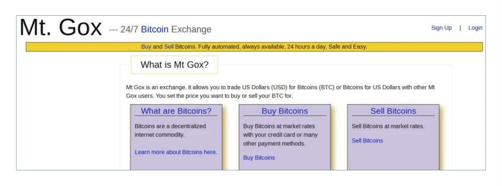

Interface از پلتفرم Mt. Gox در فوریه 2011 (منبع: [آرشیو Mt. Gox](https://web.archive.org/web/20110203031942/http://mtgox.com/))


در ابتدا، این پلتفرم پرداخت‌ها را از طریق پی‌پال می‌پذیرفت. با این حال، در اکتبر ۲۰۱۰، پس از درخواست‌های بازپرداخت بیش از حد، پی‌پال [حساب](https://bitcointalk.org/index.php?topic=1419.msg16421#msg16421) جد مک‌کالب را مسدود کرد که او را مجبور به تعلیق موقت واریزها و برداشت‌ها در پلتفرم کرد. چند هفته بعد، او با افزودن لیبرتی رزرو به عنوان یک روش پرداخت، انتقالات را [بازگرداند](https://bitcointalk.org/index.php?topic=1699.msg20700#msg20700). متعاقباً، او همچنین تراکنش‌ها را از طریق [پکسوم](https://bitcointalk.org/index.php?topic=2052.msg27809#msg27809) بنا به درخواست پذیرفت و انتقالات بانکی [به دلار](https://bitcointalk.org/index.php?topic=4187.msg60610#msg60610) (ACH) و [به یورو](https://bitcointalk.org/index.php?topic=2515.msg34040#msg34040) (SEPA) را نیز قبول کرد.


### اثر شتاب‌دهنده‌ی Slashdotting


انتشار مقدمه‌ای بر Bitcoin در Slashdot تأثیر چشمگیری بر پروژه Satoshi ناکاموتو داشت. هجوم افراد علاقه‌مند منجر به افزایش رکورد قیمت و نرخ Hash شد. علاوه بر این، باعث شد که شخصی به نام جد مک‌کالب به کشف Bitcoin بپردازد و یک بازار شایسته برای تجارت واحد حساب با نام Mt. Gox ایجاد کند.

در ماه‌های بعد، بهبودهای فنی، اقتصادی و Mining همچنان رونق یافتند و Slashdot را به نقطه شروع واقعی Bitcoin به عنوان یک جنبش اجتماعی تبدیل کردند. با این حال، تغییرات مهم‌تر در سطح نرم‌افزار و پروتکل رخ داد: واقعاً آسیب‌پذیری‌های عمده‌ای وجود داشت که نیاز به رفع داشتند. فصل بعدی بر روی این مسائل فنی تمرکز دارد که گامی حیاتی در توسعه Bitcoin محسوب می‌شوند.


## اولین مشکلات فنی

<chapterId>30cc4fe4-22b0-429e-9874-029c9137c0aa</chapterId>


همان‌طور که در فصل قبل ذکر شد، هجوم کاربران از Slashdot در ۱۱ ژوئیه ۲۰۱۰، موج عظیمی از علاقه به پروژه Satoshi ناکاموتو ایجاد کرد. استفاده از شبکه به شدت افزایش یافت؛ نرخ Exchange ده برابر شد و قدرت محاسباتی اختصاص داده شده به سیستم نیز به همین میزان افزایش یافت. بنابراین، Bitcoin در طول تابستان رشد بی‌سابقه‌ای را تجربه کرد.


با این حال، این موفقیت با مشکلات فنی همراه بود، با کشف تعدادی از آسیب‌پذیری‌ها در نرم‌افزار. محبوبیت بیشتر به معنای تعداد بیشتری از افرادی بود که کد را بررسی می‌کردند و احتمال بیشتری برای بروز ناهنجاری‌های عملیاتی وجود داشت. و این دقیقاً همان چیزی است که در ۱۵ اوت با حادثه سرریز ارزش اتفاق افتاد، اولین "خرابی" در تاریخ Bitcoin، که حدود ۱۵ ساعت به طول انجامید. این دوره به طور طبیعی با بهبود نرم‌افزار مشخص شد، به منظور پیش‌بینی تهدیدات مختلف و اصلاح نقص‌ها تا حد ممکن.


### بهبود نرم‌افزار


هجوم کاربران از Slashdot همچنین نیاز به بهبود نرم‌افزار را ضروری کرد. آسیب‌پذیری‌های یافت‌شده باید اصلاح می‌شدند و ویژگی‌های جدید باید ادغام می‌شدند. Satoshi تحت فشار بود: در ۱۸ ژوئیه، او به صورت خصوصی به Martti Malmi [اعتماد کرد](https://mmalmi.github.io/Satoshi/#email-210) که "دارم عقلم را از دست می‌دهم، کارهای زیادی هست که باید انجام شود." در عرض دو ماه، نه کمتر از ۸ زیرنسخه از نرم‌افزار منتشر شد!

با این حال، خالق Bitcoin به تنهایی روی کد کار نمی‌کند. او می‌تواند روی گاوین آندرسن حساب کند که در ماه ژوئن به تیم پیوست و به طور فزاینده‌ای در توسعه درگیر می‌شود (او از تاریخ ۹ ژوئیه در مخزن SourceForge [اعتبار داده شده](https://sourceforge.net/p/Bitcoin/code/101/) است). همچنین افرادی هستند که به نحوه کار سیستم کنجکاو هستند و زمانی که با مشکلاتی مواجه می‌شوند، آن‌ها را گزارش می‌دهند، مانند کریستین دکر (cdecker) یا مایکل مارکارت (که با نام مستعار Theymos شناخته می‌شود). Satoshi همچنین توسط ماینرها پشتیبانی می‌شود که کد را برای یافتن راه‌هایی برای بهینه‌سازی تولید واحدها تغییر می‌دهند، مانند ArtForz (اولین کسی که یک مزرعه Mining راه‌اندازی کرد، همان‌طور که در فصل بعد خواهیم دید)، توسعه‌دهنده آلمانی نیلز اشنایدر (tcatm)، مایکل براون (knightmb)، یا BlackEye.


در نهایت، می‌توانیم به جف گارزیک (با استفاده از نام مستعار jgarzik در انجمن) اشاره کنیم، که یک توسعه‌دهنده آمریکایی، مشارکت‌کننده در دنیای نرم‌افزار آزاد، به‌ویژه برای توزیع Red Hat، و یک پیرو لیبرترین مکتب اقتصادی اتریشی است. او از طریق مقاله‌ای که در Slashdot منتشر شد، با Bitcoin آشنا شد و تقریباً بلافاصله در Bitcoin درگیر شد.


جف گارزیک در سال ۲۰۱۳ (منبع: [بنسون ساموئل](https://bensonsamuel.com/Bitcoin-3/talking-Bitcoin-with-jeff-garzik/))


هدف اول Satoshi این است که نرم‌افزار و پروتکل را امن‌تر کند تا با افزایش اخیر استفاده مقابله کند. به همراه گوین آندرسن، آن‌ها به بررسی حملات مختلفی که ممکن است رخ دهد (از جمله حملات انکار سرویس) می‌پردازند و تلاش می‌کنند تا آسیب‌پذیری‌های کشف شده را اصلاح کنند. به این ترتیب، یک سیستم از نقاط بازرسی در ۱۷ ژوئیه اضافه می‌شود ([v0.3.2](https://bitcointalk.org/index.php?topic=437.msg3807#msg3807)) که از بازنویسی زنجیره قبل از یک تاریخ معین جلوگیری می‌کند و مفهوم کار در ۲۵ ژوئیه یکپارچه می‌شود ([v0.3.3](https://bitcointalk.org/index.php?topic=570.msg5707#msg5707)) تا مکانیزم انتخاب زنجیره صحیح توسط نودها را بهبود بخشد.


گاوین و Satoshi همچنین چندین باگ را برطرف کردند. مهم‌ترین آن‌ها "باگ 1 RETURN" بود، یک آسیب‌پذیری در سیستم اسکریپت که امکان خرج کردن بیت‌کوین‌ها از هر Address را با استفاده از یک اسکریپت خاص فراهم می‌کرد. این آسیب‌پذیری توسط ArtForz در ۲۸ ژوئیه گزارش شد که به جای سوءاستفاده از این نقص و ثروتمند شدن به‌طور مخفیانه، تصمیم گرفت کشف خود را با Satoshi و گاوین به اشتراک بگذارد. Satoshi به سرعت این اصلاحیه را در نرم‌افزار ([v0.3.6](https://bitcointalk.org/index.php?topic=626.msg6451#msg6451)) گنجاند و به همه کاربران توصیه کرد که نرم‌افزار خود را ارتقا دهند. به این ترتیب، Bitcoin از یک وضعیت بالقوه فاجعه‌بار نجات یافت. این آسیب‌پذیری بعداً در MITRE تحت شناسه [CVE-2010-5141](https://cve.mitre.org/cgi-bin/cvename.cgi?name=CVE-2010-5141) ثبت شد.


هدف دوم بهبود عملکرد سیستم از طریق ایجاد تغییرات در پروتکل یا بهینه‌سازی عملکرد نرم‌افزار بود. در این دسته‌بندی، اضافه کردن کدهای عملیاتی `OP_NOP` به سیستم اسکریپت داخلی قرار می‌گیرد که به‌طور مخفیانه توسط Satoshi در ۲۹ ژوئیه (نسخه 0.3.6) انجام شد، با تنها [نظر](https://sourceforge.net/p/Bitcoin/code/119/) که کلمه "گسترش" بود. این کدهای عملیاتی دستورالعمل‌های خاموشی هستند که اگر در یک اسکریپت حضور داشته باشند، تأثیری ندارند اما تراکنش را نیز باطل نمی‌کنند. در نتیجه، می‌توان رفتار این دستورالعمل‌ها را بدون ناسازگار کردن اسکریپت‌ها با نسخه قدیمی‌تر پروتکل تغییر داد، به همین دلیل نظر Satoshi این بود. این کدهای عملیاتی به‌طور خاص اجازه می‌دادند تا آنچه که در سال‌های ۲۰۱۵ و ۲۰۱۶ به عنوان "فورک‌های Soft" شناخته می‌شد، با تبدیل دستورالعمل‌های `OP_NOP2` و `OP_NOP3` به `OP_CHECKLOCKTIMEVERIFY` و `OP_CHECKSEQUENCEVERIFY` (به ترتیب) انجام شود.


ماینرها همچنین اکتشافات خود را به اشتراک می‌گذارند تا به‌طور مستقیم یا غیرمستقیم، تولید بیت‌کوین‌ها را با نرم‌افزار اصلی بهبود بخشند. ابتدا، [بهینه‌سازی شخصی لازلو](https://bitcointalk.org/index.php?topic=199.msg1686#msg1686) در تاریخ ۶ ژوئیه (نسخه 0.3.0) به نرم‌افزار اضافه شد. سپس، [ذخیره‌سازی زمینه‌ای](https://bitcointalk.org/index.php?topic=501.msg5815#msg5815) برای تابع SHA-256 Hash توسط نیلز اشنایدر و [بهینه‌سازی محاسبه آن](https://bitcointalk.org/index.php?topic=453.msg5774#msg5774) توسط بلک‌آی در تاریخ ۲۹ ژوئیه (نسخه 0.3.6) به نرم‌افزار اضافه شدند. در نهایت، [موازی‌سازی محاسبه بر روی یک پردازنده](https://bitcointalk.org/index.php?topic=648.msg6722#msg6722) که توسط نیلز اشنایدر (دوباره) پیشنهاد شده بود، در تاریخ ۱۵ اوت (نسخه 0.3.10) [به کد اضافه شد](https://bitcointalk.org/index.php?topic=827.msg9590#msg9590).


همه این بهبودها به این معناست که Bitcoin روز به روز قوی‌تر می‌شود، هم از نظر عملکرد نرم‌افزاری و هم عملکرد Mining. با این حال، این حرکت نوآورانه تا حدی توسط رویدادی که جامعه را به شدت تحت تأثیر قرار می‌دهد، خدشه‌دار شده است. این حادثه سرریز ارزش است که در ماه اوت رخ داد و شبکه را برای حدود پانزده ساعت مختل کرد.


### حادثه سرریز ارزش


در ۱۵ اوت ۲۰۱۰، حدود ساعت ۵ بعد از ظهر (UTC)، یک بلاک حاوی تراکنشی که بیش از ۱۸۴ *میلیارد* بیت‌کوین ایجاد کرده بود، در ارتفاع ۷۴,۶۳۸ به زنجیره اضافه شد. این صدور فوق‌العاده بالا از یک آسیب‌پذیری سرریز حافظه در نمایش مقادیر سوءاستفاده کرد: مهاجم دو خروجی تراکنش به مقدار ۹۲,۲۳۳,۷۲۰,۳۶۸.۵۴۲۷۷۰۳۹ BTC ایجاد کرد، که مقداری نزدیک به حداکثر واحدهایی است که می‌توان توسط یک عدد صحیح ۶۴ بیتی علامت‌دار (فرمت استفاده شده در پروتکل) نمایش داد.


یک ساعت بعد، مشکل توسط جف گارزیک شناسایی شد که در انجمن به جامعه درباره یک "بلوک عجیب" [هشدار داد](https://bitcointalk.org/index.php?topic=822.msg9474#msg9474). پاسخ Satoshi حدود ساعت ۹ شب آمد: او یک اصلاحیه کد اولیه را در انجمن [منتشر کرد](https://bitcointalk.org/index.php?topic=823.msg9530#msg9530) و به مردم [توصیه کرد](https://bitcointalk.org/index.php?topic=823.msg9531#msg9531) که "تولید را متوقف کنند". پس از انجام برخی اصلاحات و بارگذاری آنها در Sourceforge، او در نهایت یک پچ برای ویندوز، لینوکس و مک اواس ایکس را در ساعت ۱۱:۴۸ شب [منتشر کرد](https://bitcointalk.org/index.php?topic=827.msg9590#msg9590).


این وصله به ماینرها اجازه داد تا تراکنش متهم را به عنوان نامعتبر رد کنند و یک شاخه جایگزین ایجاد کنند که آن را شامل نمی‌شود. [اولین بلاک](https://Mempool.space/block/000000000069e1affe7161ab4bcbeacebb4ddf155b50e807f42de971b688a09b) این شاخه در ساعت ۱۱:۵۳ شب پیدا شد.


صبح روز بعد، کمی بعد از ساعت ۸ صبح، وضعیت بحرانی حل شد. زنجیره صحیح طولانی‌تر از زنجیره دیگر شد، که به این معنی بود که همه نودها باید از این زنجیره پیروی کنند، چه پچ را اعمال کرده باشند یا نه. این حادثه فعالیت شبکه را برای حدود ۱۵ ساعت مختل کرد، اما واکنش جامعه مثال‌زدنی بود. Satoshi [نوشت](https://bitcointalk.org/index.php?topic=823.msg9734#msg9734) حدود ساعت ۱ بعد از ظهر:


> "به نظر می‌رسد که ما زنجیره‌ی بد را در جایی حدود 74689 پشت سر گذاشتیم. &nbsp;گره‌های 0.3.9 و پایین‌تر برای چند ساعت گذشته با شماره بلوک فعلی پاسخ داده‌اند. (...) از همه برای پاسخ سریع تشکر می‌کنم!"

### سیستم هشدار

پس از کشف باگ 1 RETURN در ماه ژوئیه، Satoshi ناکاموتو هر کاری که ممکن بود انجام داد تا شبکه را در برابر حوادث محافظت کند. در 3 اوت، او یک مکانیزم هشدار به نرم‌افزار اضافه کرد که در صورت شکاف زنجیره‌ای فعال می‌شود ([v0.3.8](https://bitcointalk.org/index.php?topic=696.msg7364#msg7364)). با این حال، این مکانیزم برای شناسایی باگ سرریز ارزش که در 15ام ظاهر شد، مفید نبود و Satoshi را وادار کرد تا [برنامه خود](https://bitcointalk.org/index.php?topic=823.msg9586#msg9586) را برای توسعه یک مکانیزم پیشرفته‌تر تسریع کند.


در روزهای پس از حادثه، Satoshi به این ترتیب یک سیستم هشدار مؤثر در شبکه ایجاد کرد که به او اجازه می‌داد با یک کلید خصوصی، در صورت بروز مشکلات فنی به نودها هشدار دهد و برخی از دستورات API را به حالت تعلیق درآورد. در ۲۲ اوت، او [سیستم خود را](https://bitcointalk.org/index.php?topic=898.msg10722#msg10722) در انجمن معرفی کرد. این اعلامیه نگرانی‌هایی را در میان اعضا برانگیخت که در این سیستم یک عنصر متمرکزکننده و یک آسیب‌پذیری که یک دولت می‌تواند از آن سوءاستفاده کند، می‌دیدند. Satoshi دو روز بعد [پاسخ داد](https://bitcointalk.org/index.php?topic=898.msg11074#msg11074) و این ملاحظات را "پارانوئید" خواند و مشخص کرد که سیستم می‌تواند به صورت دستی توسط کاربران غیرفعال شود و به هر حال موقتی خواهد بود.


در ۲۷ آگوست، سیستم هشدار به طور رسمی در نرم‌افزار ادغام شد ([v0.3.11](https://bitcointalk.org/index.php?topic=941.msg11439#msg11439)). امکان تعلیق قابلیت‌ها در دسامبر [حذف شد](https://bitcointalk.org/index.php?topic=2228.msg29479#msg29479). در سال‌های بعد، سیستم هشدار چندین بار استفاده شد، به ویژه برای Fork تصادفی در سال ۲۰۱۳، قبل از اینکه به طور قطعی در سال ۲۰۱۷ از نرم‌افزار [حذف شود](https://Bitcoin.org/en/alert/2016-11-01-alert-retirement).


### محدودیت اندازه بلوک


عنصر دیگری که بخشی از تلاش برای بهبود پروتکل به منظور مقاوم‌سازی در برابر حملات است، افزودن محدودیت اندازه بلوک تراکنش است. این محدودیت یک پارامتر است که ظرفیت تراکنشی سیستم را با الزام به اینکه هر بلوک کوچکتر از این اندازه باشد، محدود می‌کند. هدف اولیه آن جلوگیری از حملات انکار سرویس علیه شبکه بود.


این پارامتر به‌طور [مخفیانه](https://sourceforge.net/p/Bitcoin/code/103/) توسط Satoshi در تاریخ ۱۵ ژوئیه به کد اضافه شد به صورت ثابت `MAX_BLOCK_SIZE` (نسخه 0.3.1)، که سپس به ۱ مگابایت (۱,۰۰۰,۰۰۰ بایت) تنظیم شد. برنامه‌نویسی اجرای این محدودیت در تاریخ ۷ سپتامبر توسط خالق Bitcoin انجام شد، باز هم بدون هیچ اعلام عمومی از سوی او (نسخه 0.3.12). این محدودیت مقرر کرد که حد اندازه (که همچنین تعداد اپراتورهای امضا در بلوک‌ها را محدود می‌کند) از بلوک ۷۹,۴۰۰ به اجرا درآید. فعال‌سازی در تاریخ ۱۲ سپتامبر [رخ داد](https://Mempool.space/block/000000000021d821ec06be7173f413690bc5c4bc648dfa70b3b6763236f055b7). این محدودیت در آن زمان کاملاً بی‌ضرر بود: اجازه می‌داد تا ۷ تراکنش استاندارد در ثانیه انجام شود، که برای حمایت از فعالیت اقتصادی آن زمان بیش از حد کافی بود، حتی پس از slashdotting.


اگرچه Satoshi به وجود محدودیت اندازه بلاک اشاره نکرده بود، اما چندین نفر به مرور زمان متوجه حضور آن در کد شدند. به همین دلیل، به این موضوع به زودی در ۱۲ اوت توسط یکی از اعضای فروم روسی‌زبان با نام مستعار throughput اشاره شد که [بیان کرد](https://bitcointalk.org/index.php?topic=788.msg8873#msg8873) که "یکی دیگر از جنبه‌های جالب این است که اندازه بایت بلاک (بنابراین تعداد تراکنش‌ها در آن) محدود است." بعداً، در ۳۰ سپتامبر، Theymos به یکی دیگر از اعضا [اشاره کرد](https://bitcointalk.org/index.php?topic=1314.msg14748#msg14748) که "Bitcoin اجازه بلاک‌های بیش از ۱ مگابایت را نمی‌دهد، بنابراین با فرض اندازه متوسط تراکنش (نسبتاً کوچک) ۲۱۶ بایت، Bitcoin تنها می‌تواند ۴,۶۲۹ تراکنش را هر ۱۰ دقیقه پردازش کند."

در نهایت، حضور این پارامتر بر جف گارزیک تأثیر می‌گذارد که [اعلام می‌کند](https://bitcointalk.org/index.php?topic=1314.msg14750#msg14750) "بسیار بیشتر نگران مقیاس‌پذیری است تا تعطیلی دولت" و [می‌پرسد](https://bitcointalk.org/index.php?topic=1341.msg15107#msg15107) چگونه ممکن است "Bitcoin را به سرمایه‌گذاران جدی بفروشیم، با محدودیت‌های داخلی مانند محدودیت 463 تراکنش در دقیقه." در نتیجه، در 3 اکتبر، او پیشنهادی در انجمن برای افزایش محدودیت اندازه بلوک به 7.168 مگابایت ارائه می‌دهد تا "با نرخ تراکنش متوسط پی‌پال مطابقت داشته باشد." Theymos پاسخ می‌دهد که "اعمال این پچ شما را با سایر مشتریان Bitcoin ناسازگار می‌کند." این پیام توسط Satoshi ناکاموتو تأیید می‌شود که [توصیه می‌کند](https://bitcointalk.org/index.php?topic=1347.msg15139#msg15139) از این پچ استفاده نکنید و بیان می‌کند: "ما می‌توانیم تغییر را بعداً در صورت نزدیک شدن به نیاز به آن، مرحله‌بندی کنیم." وی روز بعد [افکار خود را روشن می‌کند](https://bitcointalk.org/index.php?topic=1347.msg15366#msg15366) و راهنمایی‌هایی در مورد چگونگی ایجاد چنین تغییری در پروتکل ارائه می‌دهد.


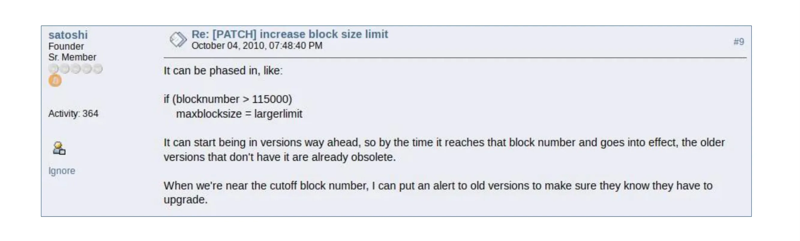


این بحث آغازگر مناظره‌ای درباره مقیاس‌پذیری است که در نهایت به یک جنگ داخلی واقعی بین سال‌های ۲۰۱۵ تا ۲۰۱۷ منجر شد، که به عنوان جنگ اندازه بلوک شناخته می‌شود.


### الگوهای استاندارد اسکریپت


در سپتامبر، Satoshi همچنین یک مفهوم جدید در کد معرفی می‌کند: تراکنش‌های غیر استاندارد. این‌ها تراکنش‌هایی هستند که نودهای با پیکربندی پیش‌فرض آن‌ها را انتقال نمی‌دهند، در ممپول‌های خود نگه نمی‌دارند و در بلاک‌هایی که تولید می‌کنند، شامل نمی‌کنند. با این حال، این تراکنش‌ها کاملاً معتبر باقی می‌مانند و بلاک‌هایی که آن‌ها را شامل می‌شوند توسط کل شبکه پذیرفته می‌شوند.


این تمایز هنجاری به محدود کردن بهره‌برداری از آسیب‌پذیری‌های احتمالی در سیستم اسکریپت‌نویسی Bitcoin کمک می‌کند، که بسیار غنی است و به اندازه کافی بررسی نشده است، به بهای محدودیت موقت در برنامه‌پذیری. در حال حاضر، دو نوع اسکریپت خروجی به عنوان استاندارد توسط شبکه شناسایی شده‌اند:


- رسید توسط کلید عمومی (*pubkey*)، استفاده شده توسط ماینرها و برای انتقالات از طریق یک IP Address؛
- دریافت از طریق اثر انگشت کلید عمومی (*pubkey Hash*)، استفاده شده برای انتقالات از طریق Bitcoin Address.

در 7 سپتامبر، در نسخه 0.3.12، Satoshi [محدودیتی](https://bitcointalk.org/index.php?topic=999.msg12240#msg12240) را شامل شد که نیاز داشت تراکنش‌ها نه خیلی بزرگ باشند و نه شامل تعداد زیادی اپراتور امضا. این، همان‌طور که او توضیح داد، یک کاربرد ابتدایی از تمایز بود. این موضوع سه ماه بعد توسط گوین اندرسن [رسمی شد](https://bitcointalk.org/index.php?topic=2129.msg27744#msg27744) که تابع `IsStandard` را به کد اضافه کرد، تابعی که ماهیت استاندارد یک تراکنش را بررسی می‌کند. دسترسی به برنامه‌پذیری در سال 2012 از طریق ادغام P2SH در پروتکل دوباره معرفی شد.


### تابستان توسعه


در طول تابستان ۲۰۱۰، دوره‌ای پر از رویدادها، Satoshi خود را به توسعه نرم‌افزار Bitcoin اختصاص داد. انتشار متن مقدماتی Bitcoin در Slashdot منجر به هجوم بی‌سابقه کاربران شد که سیستم را نیز در معرض خطر قرار داد. در نتیجه، بنیان‌گذار و کسانی که به او کمک می‌کردند (از جمله به‌طور خاص گاوین آندرسن) تلاش کردند تا حد امکان آسیب‌پذیری‌ها را اصلاح کنند. با این حال، شبکه از یک حادثه بزرگ، حادثه سرریز ارزش، در امان نماند که منجر به ایجاد یک سیستم هشدار توسط Satoshi در نرم‌افزار شد. در نهایت، این دوره همچنین با اضافه شدن محدودیت اندازه بلوک، یک عنصر اساسی در تاریخ Bitcoin، مشخص شد.


در ماه‌های پس از آن، بهبودهای فنی، اقتصادی و Mining به ظهور خود ادامه دادند و به تدریج Bitcoin را به یک پروژه جمعی تبدیل کردند. "جامعه Bitcoin" سرانجام به عنوان یک نهاد خودمختار به وجود آمد. این چیزی است که در بخش بعدی این دوره به مطالعه آن خواهیم پرداخت.


# جامعه Bitcoin

<partId>811e7c15-497a-46df-b67b-27eefbc73a63</partId>


## هجوم طلای دیجیتال

<chapterId>8e9899ca-e7a7-471b-8e69-847a56714d3b</chapterId>


در بخش قبلی، ما تأثیر انتشار ارائه Bitcoin در سایت Slashdot (slashdotting) و چگونگی مدیریت مشکلات فنی اولیه توسط Satoshi و دستیارانش را بررسی کردیم. تا پایان تابستان، پروژه از طوفان عبور کرده بود و آماده استقبال از تعداد بیشتری از افراد بود. بنابراین، پاییز 2010 دوره‌ای از موفقیت برای Bitcoin را رقم زد.

این دوره به‌ویژه یک عصر طلایی برای Mining بود که با ظهور اولین مزارع GPU و اولین تعاونی شاهد بهبودهای قابل‌توجهی بود. منابع به‌کار گرفته شده در حال افزایش بود و عملکرد الگوریتم‌های اختصاصی بهبود می‌یافت. این تا حدی یک "تب طلای دیجیتال" بود، همان‌طور که یک وبلاگ‌نویس آن زمان (با نام مستعار jimbobway) [نوشت](https://web.archive.org/web/20100828094955/http://www.bitcoinblogger.com/2010/08/bitcoins-new-digital-gold-rush.html)، اشاره کرد که "هزاران کاربر اینترنتی" در حال Mining بیت‌کوین‌ها "به امید ثروت" بودند و بسیاری از آن‌ها تلاش می‌کردند "ابزارهای نرم‌افزاری و سخت‌افزاری برای استخراج بیت‌کوین‌ها به‌طور مؤثرتر توسعه دهند" به امید اینکه بسیار ثروتمند شوند. (*اصلی: "Bitcoins: A New Digital Gold Rush (...) Thousands of users on the Internet are now Mining for bitcoins in hopes of fortune. Many are trying to develop software and hardware tools to mine for bitcoins more efficiently in hopes of becoming filthy rich."*)


### اولین مزرعه GPU


پس از اینکه Bitcoin در ژوئیه 2010 در سایت Slashdot مطرح شد، پاداش مالی بالایی که از افزایش قیمت و امکان رشدهای آینده به دست آمد، افراد را تشویق کرد تا به طور فشرده‌تری به تولید بیت‌کوین بپردازند. به همین دلیل [نرخ Hash](https://bitinfocharts.com/comparison/Bitcoin-Hashrate.html#alltime) شبکه که در 11 ژوئیه 0.22 GH/s بود، در 17 ژوئیه به 2.78 GH/s رسید، سپس در 15 اوت به 5.79 GH/s و در نهایت در 19 سپتامبر به 9.94 GH/s و در 29 سپتامبر به 12.58 GH/s افزایش یافت.


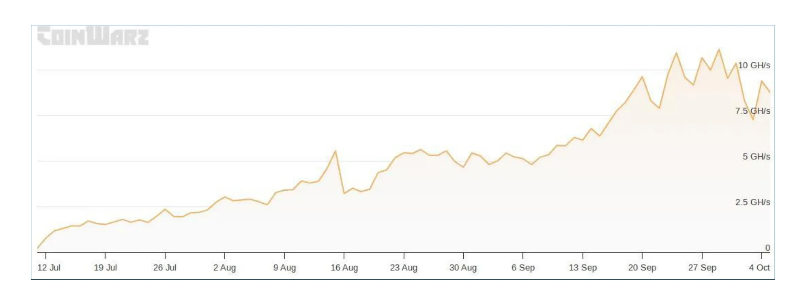

نرخ کل شبکه Hash از 11 ژوئیه تا 5 اکتبر 2010 (منبع: [CoinWarz](https://www.coinwarz.com/Mining/Bitcoin/Hashrate-chart))


بزرگترین Miner این دوره یک توسعه‌دهنده آلمانی بود که با نام ArtForz شناخته می‌شد. پس از آشنایی با Bitcoin از طریق Slashdot، او به سرعت در توسعه نرم‌افزار درگیر شد و زمان زیادی را در کانال IRC #Bitcoin-dev سپری کرد. به‌ویژه، او الگوریتم Mining خود را با استفاده از OpenCL توسعه داد که آن را با کارت گرافیک کامپیوترش اجرا می‌کرد.

او شروع به تولید بیت‌کوین در ۱۹ ژوئیه کرد. در ۲۵ ژوئیه، در یک موضوع که کاربران را درباره دارایی‌های Bitcoin خود بررسی می‌کرد، ArtForz [اظهار داشت](https://web.archive.org/web/20151121004205/https://bitcointalk.org/index.php?topic=564.msg5617#msg5617) که در ۶ روز ۱۷۰۰ بیت‌کوین تولید کرده است، که معادل ۴٪ از نرخ Hash یا ۸۰ MH/s است. به تدریج، او یک مزرعه بزرگ Mining ساخت که به نام "ArtFarm" شناخته می‌شد. در ماه اوت، مزرعه او [شامل](https://www.ofnumbers.com/2014/04/20/how-artforz-changed-the-history-of-Bitcoin-Mining/) ۶ کارت گرافیک ATI Radeon HD 5770 بود که به او اجازه داد از ۷۶ MH/s در ۹ اوت به حدود ۴۵۰ MH/s در ۱۳ اوت برسد.


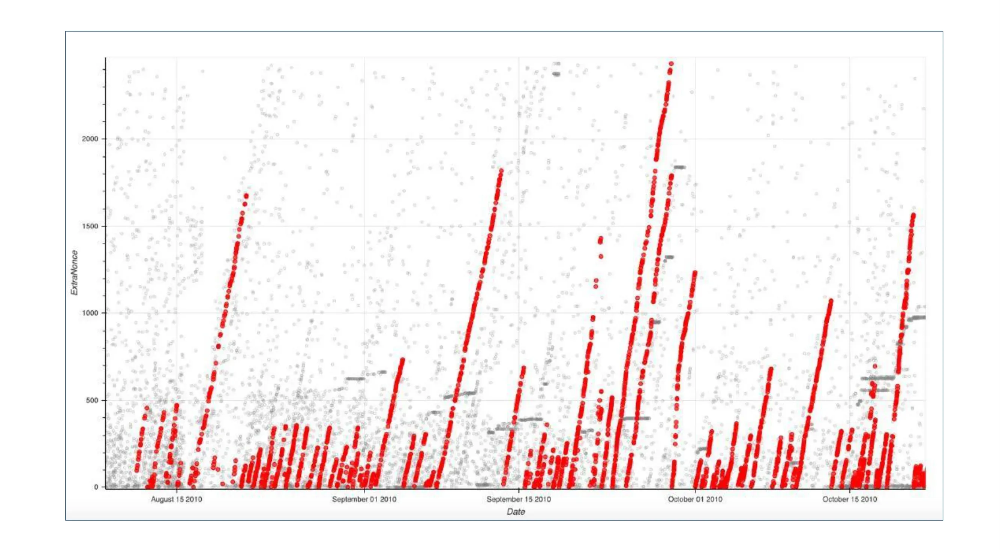

تولید Mining توسط ArtForz بین آگوست و اکتبر 2010 (منبع: Blackburn et al., "[همکاری در میان یک گروه ناشناس از Bitcoin در طول شکست‌های تمرکززدایی محافظت کرد](https://arxiv.org/pdf/2206.02871)")


در طول هفته‌ها، ArtForz توانست کنترل بخش قابل توجهی از قدرت محاسباتی شبکه را به دست آورد. در ۲ سپتامبر، Miner puddinpop [اظهار داشت](https://bitcointalk.org/index.php?topic=133.msg11957#msg11957) که او "حدود ۱۲ کارت ۵۷۷۰ با استفاده از کلاینت OpenCL خود دارد" و اینکه او "بیش از ۱ Ghash/s دارد"، که به او "۲۰٪ از ظرفیت Hash شبکه" را می‌دهد. (*اصلی: "ArtForz، در IRC، حدود ۱۲ کارت ۵۷۷۰ دارد که کلاینت OpenCL خودش را اجرا می‌کند. کل شبکه چیزی حدود ۵-۶Ghash/s انجام می‌دهد، و او به تنهایی اظهار داشته که بیش از ۱Ghash/s دارد."*) در ۲۳ سپتامبر، ArtForz [اعلام کرد](https://web.archive.org/web/20180118035138/http://bitcoinstats.com:80/irc/Bitcoin-dev/logs/2010/09/23#l1285234390.0) که نرخ Hash نزدیک به ۲ GH/s دارد، که همچنان ۲۰٪ از هشینگ را نمایندگی می‌کند. در ۳ اکتبر، theymos [اظهار داشت](https://bitcointalk.org/index.php?topic=1327.msg15118#msg15118) که ArtForz "۲۰ تا ۳۰٪ از قدرت محاسباتی شبکه را دارد." (*اصلی: "او ۲۰-۳۰٪ از قدرت CPU شبکه را دارد"*)

با این حال، این موقعیت به سرعت در طول پاییز توسط افراد دیگری که سیستم‌های خود را به‌روزرسانی کردند، به چالش کشیده شد. در نتیجه، ArtForz به تدریج از فعالیت‌های Mining فاصله گرفت تا بر توسعه نرم‌افزار تمرکز کند. در آگوست 2011، او [اظهار داشت](https://bitcointalk.org/index.php?topic=37904.msg478671#msg478671) که کمتر از 1% از قدرت محاسباتی شبکه را در اختیار دارد.


### Mining تخصص


تا پایان تابستان ۲۰۱۰، مثال ArtForz الهام‌بخش سایر ماینرها شد که به سرعت به توسعه روش‌های خود برای generate بیت‌کوین با پردازنده‌های گرافیکی‌شان پرداختند. برای انجام این کار، ماینرها از محیط‌های برنامه‌نویسی مانند CUDA یا OpenCL استفاده کردند. این امر به آن‌ها اجازه داد تا به قدرت محاسباتی اندازه‌گیری شده در MH/s دست یابند و بخش قابل توجهی از کل قدرت را نمایندگی کنند.


در 2 سپتامبر، Miner puddinpop [لینک](https://bitcointalk.org/index.php?topic=133.msg11940#msg11940) اجرایی کلاینت Mining خود را به اشتراک گذاشت که از الگوریتمی با استفاده از CUDA بهره می‌برد. او 10% کارمزد برای هر کسی که از آن استفاده می‌کرد، در نظر گرفت. این رویکرد به‌ویژه توسط اعضای انجمن که طرفدار نرم‌افزارهای رایگان بودند، به‌خوبی پذیرفته نشد.


در تاریخ ۶ سپتامبر، پس از پیشنهاد یکی از اعضای انجمن، او [اظهار داشت](https://bitcointalk.org/index.php?topic=133.msg12107#msg12107) که "شاید مایل باشد کد را به صورت منبع باز منتشر کند" اگر "یک کمک مالی قابل توجه" دریافت کند. در تاریخ ۱۵ام، جف گارزیک یک [پیشنهاد](https://bitcointalk.org/index.php?topic=133.msg12921#msg12921) در این زمینه ارائه داد و پیشنهاد کرد که ۱۰,۰۰۰ بیت‌کوین به پودینپاپ بدهد که در آن زمان حدود ۶۰۰ دلار بود. پودینپاپ پذیرفت: تراکنش در تاریخ ۱۸ام [انجام شد](https://Mempool.space/tx/f79314da84567196905f6e061e2bc9f3ee8b30d40f7b80dac90fcb1f4b4c71ea) و الگوریتم به زودی توسط پودینپاپ تحت یک مجوز آزاد [منتشر شد](https://bitcointalk.org/index.php?topic=133.msg13135#msg13135).

الگوریتم‌های دیگری نیز در همان زمان عمومی شدند. در 9 سپتامبر، یکی از اعضای انجمن با نام nelisky [الگوریتم Mining خود را](https://bitcointalk.org/index.php?topic=1009.msg12264#msg12264) با استفاده از CUDA به اشتراک گذاشت. در 1 اکتبر، فردی به نام m0mchil که در فوریه به انجمن پیوسته بود، [الگوریتم خود](https://web.archive.org/web/20101206143359/http://www.Bitcoin.org/smf/index.php?topic=1334.0) (POCLBM) را منتشر کرد و آن را به عنوان "OpenCL Miner برای عموم" توصیف کرد.


این بهبود به افراد با مهارت فنی بالا اجازه داد تا مقدار زیادی بیت‌کوین با generate استخراج کنند. علاوه بر ArtForz، نیلز اشنایدر (tcatm) به‌طور قابل‌توجهی به یکی از معدن‌کاران اصلی این دوره تبدیل شد. در ۳ اکتبر ۲۰۱۰، او [ادعا کرد](https://bitcointalk.org/index.php?topic=1327.msg15111#msg15111) که نرخ هش ۹۸۳ MH/s را با استفاده از ۳ پردازنده گرافیکی تولید کرده است. این عدد باعث [شگفتی](https://bitcointalk.org/index.php?topic=1327.msg15112#msg15112) خود Satoshi شد.


### اولین استخرهای Mining


افزایش چشمگیر نرخ Hash به دلیل تخصص Mining منجر به دشوار شدن generate بیت‌کوین‌ها با یک پردازنده مرکزی شد، که به تدریج کمتر و کمتر مقرون به صرفه شد. در واقع، امکان تولید بیت‌کوین‌ها بیشتر به واریانس وابسته شد، به طوری که برخی افراد هرگز نتوانستند یک بلوک تولید کنند. راه‌حل این مشکل، Mining تعاونی است.


در 1 اکتبر، m0mchil [یک تغییر](https://bitcointalk.org/index.php?topic=1333.msg14840#msg14840) در API منتشر کرد که به نودهای کلاینت اجازه می‌دهد تا از طریق یک تابع جدید به نام `getwork` یک بلوک کاندید را بازیابی کنند و در صورت یافتن یک راه‌حل، Proof of Work را برگردانند. او نوشت که این اصلاح "راه را برای ماینرهای خارجی Bitcoin باز می‌کند" و "اجازه می‌دهد تا چندین ماینر برای یک کلاینت تنظیم شوند."

در همان روز، ایده "Mining مشترک" برای اولین بار توسط یکی از اعضای انجمن در یک موضوع با عنوان "چگونه الیگارشی‌های GPU را سرنگون کنیم" [ذکر شد](https://bitcointalk.org/index.php?topic=1332.msg14838#msg14838). در ۱۳ اکتبر، puddinpop یک مدل از این نوع را [پیشنهاد کرد](https://bitcointalk.org/index.php?topic=1458.msg16906#msg16906). قدرت محاسباتی Miner با استفاده از یک meta-Hash اندازه‌گیری می‌شود، که اثر یک بافر شامل اولین بایت از هر بلوک Hash است. سپس سرور می‌تواند به صورت دوره‌ای تأیید کند که مشتری محاسبه را طبق تعریف انجام می‌دهد. این مدل پیچیده است و [اجازه خطا نمی‌دهد](https://bitcointalk.org/index.php?topic=1458.msg17015#msg17015).


با این حال، روش بسیار ساده‌تری برای اندازه‌گیری نرخ Hash یک مشتری وجود دارد: Proof of Work جزئی. این روش توسط ریباک، نیلز اشنایدر و گوین اندرسن پس از توضیحات پودین‌پاپ [پیشنهاد شد](https://bitcointalk.org/index.php?topic=1458.msg16951#msg16951). این روش شامل بازیابی اثبات‌های جزئی کار با درجه‌ای پایین‌تر از سختی شبکه است که از همان بلوک کاندید تولید شده‌اند. اثبات‌های جزئی جمع‌آوری‌شده امکان تخمین احتمالی از توان مصرف‌شده را فراهم می‌کنند.


در تاریخ ۲۳ نوامبر، نسخه‌ای اصلاح‌شده از تابع `getwork` به [کد](https://bitcointalk.org/index.php?topic=1901.msg23876#msg23876) اضافه شد و در تاریخ ۲۵ نوامبر، در نسخه جدید نرم‌افزار اصلی ([v0.3.17](https://bitcointalk.org/index.php?topic=1946.msg24460#msg24460)) گنجانده شد. در همان روز، جف گارزیک (که [طرفدار](https://bitcointalk.org/index.php?topic=1688.msg20532#msg20532) ایده جداسازی مدیریت زنجیره و Mining در نرم‌افزار بود) [نرم‌افزار](https://bitcointalk.org/index.php?topic=1925.msg24217#msg24217) CPU Mining خود را که از این تابع بهره می‌برد، به اشتراک گذاشت.


در 27 نوامبر، یک توسعه‌دهنده جوان چک به نام مارک پالاتینوس، با استفاده از نام مستعار slush، [توضیحی](https://web.archive.org/web/20101206144824/http://www.Bitcoin.org/smf/index.php?topic=1976.0) درباره "Mining تعاونی" در انجمن منتشر کرد، مدلی که از `getwork` و منطق جف گارزیک بهره می‌برد. این مدل بر اساس اثبات‌های جزئی کار تولید شده توسط ماینرها (پرداخت به ازای سهم) است. روز بعد، Satoshi ناکاموتو [این مفهوم را تأیید کرد](https://bitcointalk.org/index.php?topic=1976.msg25119#msg25119).


مارک پالاتینوس (اسلاش) در کنفرانس Z-DAY در پراگ در تاریخ ۱۱ مه ۲۰۱۳


دو مدل برآورد در ماه دسامبر پیاده‌سازی شدند. ابتدا، مفهوم puddinpop در ۱ دسامبر توسط کاربر doublec اعمال شد که [از مردم دعوت کرد](https://bitcointalk.org/index.php?topic=2027.msg25859#msg25859) به سرور Mining مشترک او متصل شوند. گروه تشکیل شده [اولین بلاک خود](https://bitcointalk.org/index.php?topic=2027.msg26688#msg26688) (۹۵,۴۲۰) را در ۴ دسامبر تولید کرد. پس از تولید یک بلاک اضافی چند روز بعد، سرور doublec در ۱۵ دسامبر [خاموش شد](https://bluishcoder.co.nz/Bitcoin-pool/). این سرویس به دلیل ظهور یک همکاری بسیار کارآمدتر: Bitcoin.cz Mining، در ۱۷ دسامبر به طور دائمی بسته شد.


پس از بررسی انجمن، مارک پالاتینوس تصمیم گرفت مدل تعاونی Mining خود را پیاده‌سازی کند و به طور قابل توجهی آزمایش‌هایی را در شبکه آزمایشی انجام داد. او همچنین اطمینان حاصل کرد که سرور می‌تواند برای هر دو گروه ماینرهای CPU (که از نرم‌افزار جف گارزیک استفاده می‌کنند) و ماینرهای GPU (که از کلاینت‌های m0mchil و puddinpop استفاده می‌کنند) قابل دسترسی باشد.


در طول شب 15 تا 16 دسامبر، تعاونی سرانجام توسط مارک پالاتینوس در شبکه اصلی [راه‌اندازی شد](https://bitcointalk.org/index.php?topic=1976.msg30520#msg30520). اولین بلوک در صبح روز 16ام [یافت شد](https://bitcointalk.org/index.php?topic=1976.msg30655#msg30655) (97,834). به دنبال آن، بلوک‌های بسیاری دیگر تولید شدند. گروه Mining از همان ابتدا با موفقیت روبرو شد: در عرض چند روز، نرخ Hash آن به 4 GH/s رسید که 3.5٪ از کل قدرت شبکه است.


تعاونی به یک معیار در Bitcoin Mining تبدیل می‌شد. این [تعاونی](https://en.Bitcoin.it/w/index.php?title=Slush_Pool&action=history) در طول سال‌ها چندین نام داشت: Bitcoin Pooled Mining (BPM)، Bitcoin.cz Mining، و در نهایت Slush Pool، به افتخار خالق آن. در سپتامبر 2022 به Braiins Pool تبدیل شد.


لوگوی تعاونی Slush در سپتامبر 2011 (منبع: [آرشیو](https://web.archive.org/web/20110923151034/http://Mining.Bitcoin.cz:80/) سایت)


### جهش بزرگ به جلو در Mining

بنابراین، نیمه دوم سال 2010 دوره‌ای از رشد قابل توجه برای Mining را نشان داد. این رشد با پذیرش نسل GPU (واحد پردازش گرافیکی) تخصص یافت. چندین فرد بر روی ساخت مزارع واقعی Mining تمرکز کردند، مانند ArtForz و "ArtFarm" او. این رونق در نهایت به ظهور تعاونی‌ها منجر شد که به معدنچیان کوچک اجازه می‌داد قدرت محاسباتی خود را برای کاهش واریانس پاداش‌ها به اشتراک بگذارند.


با این حال، پاییز تنها برای Mining موفقیت‌آمیز نبود. این فصل همچنین برای جامعه و اکوسیستم اقتصادی مرتبط نیز موفقیت‌آمیز بود. این موضوعی است که در فصل بعدی به آن خواهیم پرداخت.


## شکوفایی اکوسیستم

<chapterId>0404f877-8b5c-4c7f-81ab-a4e6d9b3da9c</chapterId>


در فصل قبلی، بررسی کردیم که چگونه Mining در نیمه دوم سال 2010 توسعه یافت. تا پاییز، این پیشرفت به خوبی تثبیت شده بود. با این حال، Mining تنها جنبه‌ای از Bitcoin نبود که موفقیت یافت: اکوسیستم آن نیز موفق بود.


در اینجا، ابتدا به Address آغاز صادرات بین‌المللی Bitcoin با توسعه جوامع روسی و فرانسوی خواهیم پرداخت. سپس بهبودهای ارتباطی و رشد اقتصادی را که به‌طور قابل‌توجهی منجر به افزایش جدید قیمت واحد Bitcoin شد، مورد بحث قرار خواهیم داد. در نهایت، به دو رویداد بسیار نمادین که پیش از خروج Satoshi رخ دادند اشاره خواهیم کرد: پذیرش Bitcoin توسط بنیاد مرز الکترونیک و بازگشت Hal Finney.


### Bitcoin در زبان‌های دیگر


Bitcoin یک پروژه بین‌المللی است و به همین دلیل باید برای تعداد بیشتری از افراد خارج از حوزه انگلیسی‌زبان قابل دسترسی باشد. به همین دلیل، جامعه [هماهنگ شد](https://bitcointalk.org/index.php?topic=151.msg1259#msg1259) و از ماه مه 2010 شروع به ترجمه وب‌سایت و Interface گرافیکی نرم‌افزار به چندین زبان کرد. زبان‌های ایتالیایی، آلمانی و هلندی به طور قابل توجهی شامل شدند.


اما این تمام ماجرا نیست. در پایان ماه ژوئیه، مارتی مالمی شروع به ایجاد زیر‌فروم‌هایی برای غیرانگلیسی‌زبانان کرد. جامعه روسی اولین جامعه‌ای بود که شکل گرفت: پس از درخواست از سوی کاربری به نام بیت‌کوینکس، زیر‌فروم اختصاصی در ۲۸ ژوئیه [ایجاد شد](https://bitcointalk.org/index.php?topic=151.msg6241#msg6241). سپس، [رشته‌های بحث](https://web.archive.org/web/20101018144227/http://www.Bitcoin.org:80/smf/index.php?board=11.0) اختصاص داده شده به سایر جوامع زبانی ایجاد شدند: ایتالیایی، هلندی، ژاپنی و کاتالان در ماه اوت؛ اسپانیایی در سپتامبر؛ و در نهایت آلمانی در اکتبر. با این حال، هیچ گروهی به اندازه جامعه روسی فعال نبود و تنها چند پیام رد و بدل شد.


این با جامعه فرانسوی بود که اوضاع تغییر کرد، به ویژه از طریق اقدامات یک فرد: لوسین گروندین، که با نام مستعار گروندیلو نیز شناخته می‌شود. در ۲۶ سپتامبر، او Bitcoin را کشف کرد و بلافاصله نسبت به پروژه مشتاق شد. اواخر شب، او [در IRC نوشت](https://web.archive.org/web/20131201235643/http://www.bitcoinstats.com/irc/Bitcoin-dev/logs/2010/09/26#l1285544830):


> "من نمی‌توانم بخوابم! مدام به این چیزهای عالی فکر می‌کنم. برای من Bitcoin "طلای فضای مجازی" است. من فقط شگفت‌زده‌ام."

چند روز بعد، در تاریخ ۳۰ام، او یک [خبرنامه](https://linuxfr.org/news/connaissez-vous-les-bitcoins) به زبان فرانسوی در LinuxFr.org (DLFP) منتشر کرد. این خبرنامه با عنوان "آیا بیت‌کوین‌ها را می‌شناسید؟"، احتمالاً اولین معرفی Bitcoin به زبان مولیر است. این مقاله به تعداد زیادی از افراد رسید و نزدیک به ۳۵۰ نظر ایجاد کرد. در اینجا اولین پاراگراف همان‌طور که در آن زمان [ظاهر شد](https://web.archive.org/web/20101003105210/http://linuxfr.org/2010/09/30/27430.html) آمده است:


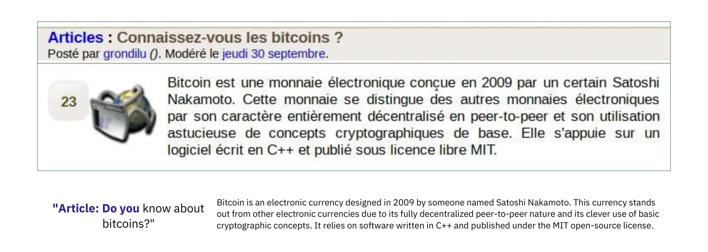


> **مقالات: آیا بیت‌کوین را می‌شناسید؟** بیت‌کوین یک پول الکترونیکی است که در سال 2009 توسط فردی به نام ساتوشی ناکاموتو طراحی شد. این پول با سایر پول‌های الکترونیکی تفاوت دارد زیرا کاملاً غیرمتمرکز و همتا‌به‌همتا است و از مفاهیم پایه‌ای رمزنگاری به‌طور هوشمندانه استفاده می‌کند. این پول بر نرم‌افزاری متکی است که به زبان ++C نوشته شده و تحت مجوز آزاد MIT منتشر شده است.

به‌ویژه، این گزارش توجه یک شخص خاص به نام پلوم، با نام واقعی لیونل دریکو، یک وبلاگ‌نویس بلژیکی ۲۹ ساله و حامی نرم‌افزار آزاد را جلب می‌کند. در ۲۵ اکتبر، او [مقاله‌ای](https://ploum.net/monnaie-de-geek-monnaie-de-singe/) در وبلاگ خود منتشر کرد با عنوان "پول گیک، پول میمون؟"، که در آن از تمرکززدایی حمایت کرده و اصل Bitcoin را تأیید می‌کند. بسیاری از کاربران اینترنت فرانسوی‌زبان از طریق این روش با Bitcoin آشنا شدند، از جمله [آموری سشه](https://www.reddit.com/r/Bitcoincash/comments/6y7ssg/ama_i_am_amaury_s%C3%A9chet_udeadalnix_bitcoin_abc/dml9h55/)، توسعه‌دهنده‌ای که در سال ۲۰۱۷ Bitcoin Cash را ایجاد کرد.


لیونل دریکو (پلوم) در سال ۲۰۱۲، سپس به عنوان نامزد تحت پرچم حزب دزدان دریایی برای انتخابات کمونال و استانی بلژیک (منبع: [Framablog](https://framablog.org/2012/10/10/lionel-dricot-ploum-parti-pirate-belgique/))


در همان روز، Ploum موضوع [بحث](https://bitcointalk.org/index.php?topic=1567.0) "French" را در انجمن Bitcoin باز کرد. پیام‌های اعضای فرانسوی‌زبان انجمن در ماه‌های بعد افزایش یافت. به‌ویژه، دیوید فرانسوا ([davout](https://bitcointalk.org/index.php?topic=1567.msg21218#msg21218)) که در ۱۷ اکتبر ثبت‌نام کرده و بنیان‌گذار آینده Bitcoin-Central بود، و مارک کارپلز ([MagicalTux](https://bitcointalk.org/index.php?topic=1567.msg29336#msg29336)) که در ۷ نوامبر ثبت‌نام کرده و مالک آینده پلتفرم Mt. Gox بود، شرکت کردند. همچنین، ژان-لوک که در ۲۳ دسامبر سایت [Bitcoin.fr](https://web.archive.org/web/20110107145746/http://www.Bitcoin.fr:80/) را باز کرد و در ژانویه شروع به [تبلیغ](https://bitcointalk.org/index.php?topic=1567.msg37524#msg37524) آن کرد، نیز درگیر بود. یک [زیر‌انجمن فرانسوی](https://web.archive.org/web/20110217005824/http://www.Bitcoin.org/smf/index.php?board=13.0) در نهایت توسط Martti Malmi در ۱ فوریه ۲۰۱۱ ایجاد شد.


### توسعه ارتباطات

علاوه بر توسعه جوامع زبانی، نوآوری خاصی در روش‌های استفاده شده برای ارتباط درباره Bitcoin وجود دارد. در تاریخ ۴ اکتبر، یک استرالیایی ۳۸ ساله با استفاده از نام مستعار noagendamarket [ابتکاری](https://bitcointalk.org/index.php?topic=1355.msg15217#msg15217) به نام BitcoinMedia راه‌اندازی کرد. ایده این است که با ایجاد محتوای مختلف و تبلیغ آن‌ها در مکان‌هایی که احتمال جذب مخاطب وجود دارد، Bitcoin را ترویج دهد. اگرچه این ابتکار به موفقیت مورد انتظار نرسید، اما شایستگی تولید اولین ویدیوهایی که درباره Bitcoin صحبت می‌کنند را دارد. اولین ویدیوی کانال، [منتشر شده](https://bitcointalk.org/index.php?topic=1355.msg15461#msg15461) در ۵ اکتبر، یک داستان جستجوی گوگل است که با استفاده از ابزار یوتیوب ایجاد شده است (تصویر زیر را ببینید). ویدیوهای دیگر با Xtranormal تولید خواهند شد، ابزاری آسان برای ایجاد توالی‌های ویدیویی از مجموعه‌ای از شخصیت‌ها و تنظیمات از پیش طراحی شده.


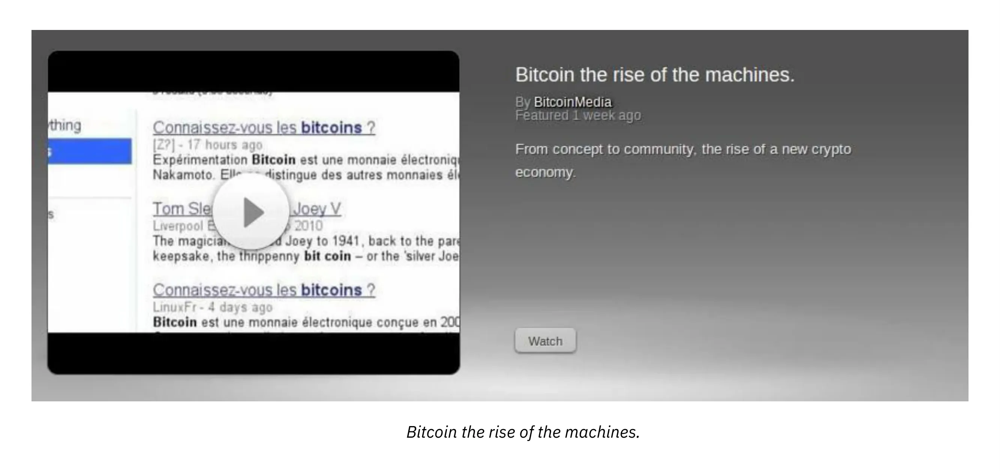


پست‌های وبلاگ درباره Bitcoin در این دوره به شدت در حال افزایش هستند. این به‌ویژه در مورد جان ماتونیس صدق می‌کند، که وبلاگ *آینده پولی* را اداره می‌کند و در آن به موضوعات مرتبط با ارزهای دیجیتال، بانکداری آزاد و رمزنگاری می‌پردازد. او در ماه مارس Bitcoin را کشف کرد و با Satoshi [مبادله](https://web.archive.org/web/20140511100607/https://bitcoinfoundation.org/forum/index.php?/topic/54-my-first-message-to-Satoshi/#entry514) کرد، پس از آن شروع به نوشتن در این زمینه کرد. در ماه اکتبر، او [مقاله سوم](https://themonetaryfuture.blogspot.com/2010/10/rally-in-Bitcoin.html) خود را منتشر می‌کند که در آن درباره افزایش قیمت و جزئیات نوآوری‌های اکوسیستم صحبت می‌کند.


عکس پروفایل جان ماتونیس در سال ۲۰۱۱ (منبع: [Forbes](https://www.forbes.com/sites/jonmatonis/))


در همین زمان است که لوگوی جدید Bitcoin پیشنهاد می‌شود. در تاریخ ۱ نوامبر، یکی از اعضای انجمن با استفاده از نام مستعار bitboy [گرافیک Elements](https://bitcointalk.org/index.php?topic=1631.0) را برای برجسته کردن ارز دیجیتال منتشر کرد. یکی از این Elements ها لوگوی نارنجی است که حرف B در آن خط خورده و کمی کج شده است:


### اقتصادی در حال رشد

این دوره همچنین با رشد چشمگیر اکوسیستم در سطح اقتصادی مشخص می‌شود. در پاییز 2010، پلتفرم‌هایی مانند Mt. Gox، Bitcoin Market و چند مورد دیگر وجود دارند، اما این کافی نیست. اینگونه است که مبادلات خارج از بورس شروع به تکثیر می‌کنند. علاوه بر مبادلاتی که از طریق پیام‌های خصوصی در انجمن انجام می‌شود، یک سیستم کمی دقیق‌تر به کار گرفته می‌شود: #Bitcoin-otc. این یک کانال IRC در Freenode است که توسط کاربری با نام nanotube در 18 اکتبر [باز شده](https://bitcointalk.org/index.php?topic=1491.msg17508#msg17508) است. دفتر سفارشات در [وب‌سایت مرتبط](https://web.archive.org/web/20101027090714/http://Bitcoin-otc.com/vieworderbook.php) میزبانی می‌شود و مبادلات به صورت مستقیم بین طرفین، بدون سپرده‌گذاری امانی، از طریق روش‌های پرداخت مختلف (PayPal، Liberty Reserve) انجام می‌شود. تعداد خدماتی که Bitcoin را می‌پذیرند نیز افزایش می‌یابد، حتی اگر نسبتاً کم باقی بماند، همانطور که صفحه فهرست سایت رسمی [گواهی می‌دهد](https://web.archive.org/web/20101120224505/http://www.Bitcoin.org/trade).

همه این Elements ها باعث افزایش شدید قیمت شدند. در حالی که از ماه اوت در حدود 6¢ تثبیت شده بود، در ابتدای اکتبر شروع به افزایش کرد. به 10¢ رسید و در پایان ماه به 20¢ رسید. در 6 نوامبر، حتی از 50¢ نیز فراتر رفت که باعث [هیجان](https://bitcointalk.org/index.php?topic=1681.0) اعضای انجمن شد.


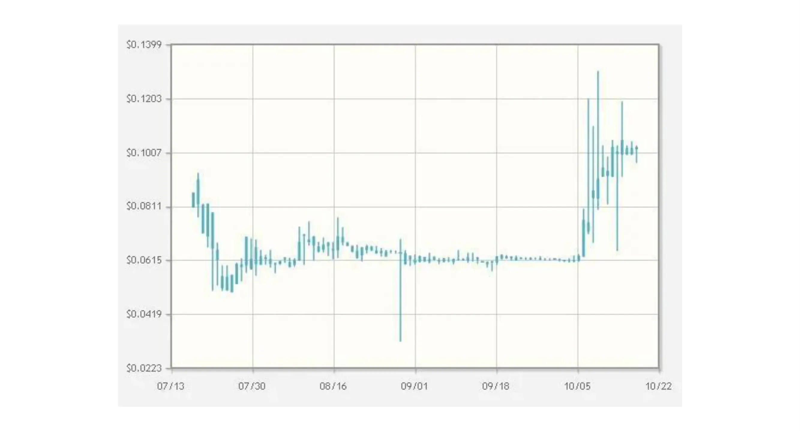

قیمت BTC بین 18 ژوئیه و 18 اکتبر 2010 در Mt. Gox (منبع: [*The Monetary Future*](https://themonetaryfuture.blogspot.com/2010/10/rally-in-Bitcoin.html))


ظهور Bitcoin به این معناست که چیزها شروع به اندازه‌گیری می‌شوند، چه از نظر قیمت، فعالیت در زنجیره، یا Mining. همه می‌دانند که اکوسیستم در حال تجربه رشد است، اما هیچ‌کس نمی‌داند چگونه آن را به درستی تخمین بزند. به همین دلیل خدماتی در نیمه دوم سال 2010 و اوایل 2011 ظهور می‌کنند که از جمله مهم‌ترین آن‌ها عبارتند از:


- Bitcoin Watch ([bitcoinwatch.com](https://web.archive.org/web/20100816161306/http://www.bitcoinwatch.com/))، یک گردآورنده آمار [توسعه‌یافته](https://bitcointalk.org/index.php?topic=734.msg7954#msg7954) توسط جف گارزیک (jgarzik)؛
- نمودارهای Bitcoin ([bitcoincharts.com](https://web.archive.org/web/20101119023257/http://bitcoincharts.com/markets/))، یک ابزار ردیابی قیمت و نمایش نمودار Interface که توسط نیلز اشنایدر (tcatm) در ۴ نوامبر [راه‌اندازی شد](https://bitcointalk.org/index.php?topic=1659.0)؛
- Bitcoin Block explorer ([blockexplorer.com](https://web.archive.org/web/20101128030227/http://blockexplorer.com/))، یک Block explorer [راه‌اندازی شده](https://bitcointalk.org/index.php?topic=1727.msg21124#msg21124) توسط Theymos در 10 نوامبر، که به هر کسی اجازه می‌دهد تا با استفاده از یک مرورگر وب به محتوای بلوک‌ها و تراکنش‌های Bitcoin دسترسی پیدا کند؛
- نمودارهای شبکه Bitcoin ([Bitcoin.sipa.be](https://web.archive.org/web/20110310155417/http://Bitcoin.sipa.be))، سایتی که نمودارهای تکامل نرخ Bitcoin Hash را نمایش می‌دهد [راه‌اندازی شد](https://bitcointalk.org/index.php?topic=3024.msg42173#msg42173) توسط Pieter Wuille (sipa) در 28 ژانویه 2011؛
- مانیتور Bitcoin ([bitcoinmonitor.com](https://web.archive.org/web/20110605105433/http://www.bitcoinmonitor.com/))، ابزاری برای نمایش بلادرنگ تراکنش‌ها، بلاک‌ها و عملیات Exchange، [آنلاین شد](https://bitcointalk.org/index.php?topic=3218.msg45150#msg45150) توسط Jan Vornberger (jav) در تاریخ ۶ فوریه ۲۰۱۱.


یکی از آخرین عناصر نشان‌دهنده موفقیت Bitcoin این است که برخی به دنبال آزمایش محدودیت‌های آن بودند. بین ۱۵ تا ۲۶ نوامبر، فردی واقعاً با ایجاد سیلی از تراکنش‌ها، که هر روز به هزاران مورد می‌رسید، خود را سرگرم کرد. این فعالیت استثنایی در تاریخ ۱۹ام توسط جف گارزیک [گزارش شد](https://bitcointalk.org/index.php?topic=1850.msg22870#msg22870). این امر Satoshi را مجبور کرد تا اقداماتی را با [بازگرداندن](https://bitcointalk.org/index.php?topic=1946.msg24460#msg24460) کارمزد تراکنش Interface و افزودن محدودیت‌هایی بر تراکنش‌های رایگان، اجرا کند.


### بنیاد مرز الکترونیکی Bitcoin را می‌پذیرد


در پایان سال ۲۰۱۰، یک رویداد مهم پذیرش Bitcoin توسط بنیاد مرز الکترونیک بود، یک سازمان بین‌المللی برای حفاظت از آزادی‌ها در اینترنت که در سال ۱۹۰۰ توسط میچ کاپور، جان گیل‌مور و جان پری بارلو تأسیس شد. این موضوع به‌ویژه برای پذیرندگان اولیه Bitcoin که در قلب خود سایفرپانک بودند، اهمیت داشت. آن‌ها مشتاق بودند که این بنیاد Bitcoin را بپذیرد.


این عضو انجمن به نام Kiba بود که در تاریخ ۱۳ اوت ۲۰۱۰ با [پیشنهاد](https://bitcointalk.org/index.php?topic=804.msg9021#msg9021) تماس با EFF و پیشنهاد پذیرش یک کمک مالی، [جمع‌آوری‌شده](https://bitcointalk.org/index.php?topic=778.msg8578#msg8578) از جامعه، ابتکار عمل را به دست گرفت. برای این منظور، او یک [حساب](https://Mempool.space/Address/1MCwBbhNGp5hRm5rC1Aims2YFRe2SXPYKt) در MyBitcoin ایجاد کرد که در آن وجوه را جمع‌آوری کرد و قصد داشت دسترسی را به EFF منتقل کند. او یک ایمیل (اصلاح‌شده توسط جامعه) تهیه کرد که در پایان اوت ارسال کرد.


دو هفته بعد، در غیاب پاسخی، عضو دیگری از انجمن به کمک او آمد. این عضو که از نام مستعار BrightAnarchist استفاده می‌کرد، یکی از بنیان‌گذاران را می‌شناخت و در ۱۳ سپتامبر به او ایمیلی فرستاد. او همان روز پاسخی دریافت کرد و در [انجمن نوشت](https://bitcointalk.org/index.php?topic=804.msg12631#msg12631) که "EFF قطعاً به دریافت بیت‌کوین‌ها علاقه‌مند است!" سپس حساب به سازمان منتقل شد.


EFF مدتی طول کشید تا شروع به پذیرش کمک‌های مالی عمومی کند. پس از مذاکره، جامعه آن‌ها را متقاعد کرد تا یک کمک مالی Address را در وب‌سایت خود منتشر کنند. در 9 نوامبر، Address در [صفحه کمک مالی](https://web.archive.org/web/20101130105838/http://www.eff.org/helpout) ظاهر شد. کاربران Bitcoin [شروع به](https://Mempool.space/tx/8ca2d206bc41b9ffa36cf4ea9ce9d3b0751fd653b6ec8f2979bfdddc4a631731) انتقال وجوه کردند.


چند روز بعد، یک [پست](https://web.archive.org/web/20101117060233/http://www.bitcoinblogger.com/2010/11/Bitcoin-gains-legal-protection-through.html) توسط بلاگر jimbobway در این باره نوشته شد که توجه‌ها را به Bitcoin جلب کرد. این مقاله در HackerNews [به اشتراک گذاشته شد](https://news.ycombinator.com/item?id=1905522). همچنین توسط BitcoinMedia با استفاده از Xtranormal به ویدیو تبدیل شد:


:::video id=03dfd302-1e05-4cad-a91a-e5e65f1d0932:::


این خبر بسیار خوبی برای Bitcoin است زیرا هر دو ابتکار عمل ارزش‌های مشترکی دارند. علاوه بر این، EFF به خاطر ارائه حفاظت قانونی برای پروژه‌های حفظ حریم خصوصی و اشتراک‌گذاری داده‌ها مانند Tor و BitTorrent مشهور است. خود ناکاموتو Satoshi از این موضوع آگاه است و به‌ویژه از اقدامات این سازمان حمایت می‌کند، همان‌طور که در [نظر](https://mmalmi.github.io/Satoshi/#email-254) او که در یکی از ایمیل‌هایش به گاوین اندرسن در تاریخ ۶ ژانویه ۲۰۱۱ ارسال شده، نشان داده شده است:

> "EFF واقعاً مهم است. &nbsp;ما می‌خواهیم روابط خوبی با آن‌ها حفظ کنیم. &nbsp;ما نوع پروژه‌ای هستیم که آن‌ها قدردانی می‌کنند؛ آن‌ها به پروژه TOR کمک کرده‌اند و کارهای زیادی برای حفاظت از اشتراک‌گذاری فایل P2P انجام داده‌اند."

### بازگشت هال فینی


پس از کناره‌گیری از Bitcoin در آوریل 2009، هال فینی به سرعت متوجه شد که به بیماری ALS مبتلا شده است، [تشخیص](https://www.lesswrong.com/posts/bshZiaLefDejvPKuS/dying-outside) در آگوست 2009 انجام شد. او سبک زندگی خود را به‌طور متناسب تغییر می‌دهد، اما مهارت‌های حرکتی‌اش به تدریج کاهش می‌یابد.


در ۳۰ نوامبر، او در انجمن Bitcoin ثبت‌نام می‌کند و شروع به شرکت در بحث‌ها می‌کند، به‌ویژه در مورد پروژه BitDNS. او در اهدای کمک‌های کوچک به پروژه‌های مختلفی که در اکوسیستم در حال شکوفایی هستند، تردیدی ندارد.


علاوه بر این، او کد را مطالعه می‌کند، که از زمان راه‌اندازی به آن نگاه نکرده است، و متوجه تمام کارهایی که انجام شده می‌شود. این آگاهی او را بر آن می‌دارد تا در تاریخ ۱۱ دسامبر [نظر زیر را در انجمن بنویسد](https://bitcointalk.org/index.php?topic=2188.msg29223#msg29223):

> "به نظر من این یک کار چشمگیر است، اگرچه آرزو می‌کردم نظرات بیشتری وجود داشت. من بیشتر ماژول‌های init، main، script و کمی از net را مطالعه کرده‌ام. این یک ماشین قدرتمند است."

دو ساعت بعد، Satoshi [پاسخ می‌دهد](https://bitcointalk.org/index.php?topic=2188.msg29259#msg29259):

> "این از طرف تو خیلی ارزش داره، هال. &nbsp;ممنون."

این سپس پیام ماقبل آخر عمومی از خالق Bitcoin بود که چند ماه بعد ناپدید شد.


### یک لحظه محوری

در طول پاییز ۲۰۱۰، اکوسیستم اطراف Bitcoin به طور قابل توجهی تکامل یافت. ارتباطات بهبود یافت و اقتصاد توسعه پیدا کرد. در آن زمان، به نظر می‌رسید که Bitcoin آماده است تا به تنهایی پیشرفت کند. و دقیقاً در همین دوره بود که Satoshi تصمیم گرفت ناپدید شود و کنترل پروژه را به جامعه واگذار کند.


## ناپدید شدن Satoshi

<chapterId>f7735239-4887-468f-9f06-1b07d00b30d9</chapterId>


ما دیدیم که چگونه Bitcoin پس از انتشار متن در Slashdot در ژوئیه 2010 به پرواز درآمد. در پاییز، با پیشرفت‌های مختلف در نرم‌افزار، Mining، و اقتصاد، احساس می‌شد که پروژه بالاخره در مسیر درستی قرار گرفته است. به همین دلیل این دوره با کناره‌گیری تدریجی Satoshi ناکاموتو همزمان شد.


خروج خالق Bitcoin به دو دلیل تسریع شد: از یک سو، چالش فزاینده‌ای نسبت به وضعیت او که خواستار مدیریت غیرمتمرکزتر و مبتنی بر اجماع بود؛ و از سوی دیگر، ترس تقریباً پارانویایی او از مقامات دولتی. این انگیزه اخیر به‌طور خاص در دسامبر ۲۰۱۰ در زمینه محاصره مالی ویکی‌لیکس که دیگر نمی‌توانست از طریق روش‌های سنتی بودجه دریافت کند و برای آن Bitcoin یک روش جایگزین مرتبط ارائه می‌داد، بیان شد. در این فصل، به‌طور مفصل به شرح چگونگی این ناپدید شدن خواهیم پرداخت.


### چالش به وضعیت بنیان‌گذار


از نیمه دوم سال 2010، جامعه توسعه‌دهندگان در کانال #Bitcoin-dev گرد هم آمدند که لاگ‌های آن در سایت کریستین دکر، [آمار Bitcoin](https://web.archive.org/web/20131201235340/http://www.bitcoinstats.com/irc/Bitcoin-dev/logs/2010/09) منتشر شده است. این کانال مکان ایده‌آلی برای افرادی بود که با جنبه‌های فنی راحت‌تر بودند تا جزئیات Exchange درباره Bitcoin را به اشتراک بگذارند و به صورت غیررسمی‌تر بحث کنند. این کانال معدنچیان متخصص (مانند ArtForz، Diablo-D3، knightmb، یا Nils Schneider)، توسعه‌دهندگانی که به پروتکل علاقه‌مند بودند (مانند Gavin Andresen، Jeff Garzik، یا Wladimir van der Laan)، یا افرادی که خدماتی روی Bitcoin نگهداری می‌کردند (مانند Jed McCaleb، Michael Marquardt، یا nanotube) را گرد هم آورد.


Satoshi ناکاموتو، با این حال، هرگز به آن متصل نشد، بنابراین صحبت در آنجا آزادتر از انجمن بود. اغلب اتفاق می‌افتاد که تصمیمات توسعه Satoshi مورد سوال قرار می‌گرفت، یا حتی وضعیت او در رابطه با Bitcoin مورد انتقاد قرار می‌گرفت.

Satoshi واقعاً رهبر تعیین‌شده پروژه است، چیزی که در دنیای نرم‌افزارهای متن‌باز به عنوان "[دیکتاتور خیرخواه برای همیشه](https://fr.wikipedia.org/wiki/Benevolent_Dictator_for_Life)" شناخته می‌شود. نقش او تضمین ثبات توسعه باز با اتخاذ تصمیماتی برای همه است که خطر شورش و تقسیم را محدود می‌کند. همان‌طور که [توضیح داده شده](https://buildingbitcoin.org/Bitcoin-dev/log-2010-09-27.html#l-528) توسط گوین اندرسن، او "نگهبان" است: "تمام کدها از طریق او عبور می‌کنند."


با این حال، کد منبع Bitcoin همچنان رایگان است، بنابراین هر کسی می‌تواند آن را کپی و اصلاح کند، که از تکامل پروتکل به صورت کاملاً دلخواه جلوگیری می‌کند. همانطور که توسط [جف گارزیک](https://buildingbitcoin.org/Bitcoin-dev/log-2010-11-19.html#l-1538) در ۱۹ نوامبر بیان شده است:


> "Satoshi اعداد جادویی را از هیچ به دست آورد و ما به طور جمعی از آن جهت حمایت می‌کنیم. [...] لحظه‌ای که Satoshi کاری دیوانه‌وار انجام دهد که توسط جامعه پشتیبانی نشود، همان لحظه‌ای است که پروتکل/کدبیس واقعاً منشعب می‌شود."

بنابراین، نقش Satoshi به عنوان یک رهبر مانع از انتقاد نمی‌شود. به همین دلیل تنش‌ها به تدریج از ماه ژوئیه در جامعه پدیدار می‌شوند. به عنوان مثال، اعتراضاتی در طول [استقرار](https://bitcointalk.org/index.php?topic=898.msg10745#msg10745) سیستم هشدار در ماه اوت یا [تغییر](https://bitcointalk.org/index.php?topic=1901.msg24050#msg24050) عملکرد `getwork` مومچیل در ماه نوامبر به وجود می‌آید. ناامیدی از این تصمیم‌گیری دیکتاتورانه گاهی اوقات [بسیار آشکارتر](https://buildingbitcoin.org/Bitcoin-dev/log-2010-11-24.html#l-384) در IRC بیان می‌شود.


گاوین، که به Satoshi نزدیک است اما با سایر توسعه‌دهندگان نیز گفتگو می‌کند، به وضوح مشکل ایجاد شده توسط این وضعیت را می‌بیند. در ۲۷ سپتامبر ۲۰۱۰، در IRC، گاوین [اعلام می‌کند](https://buildingbitcoin.org/Bitcoin-dev/log-2010-09-27.html#l-522) که مایل است "بتواند \[Satoshi\] را متقاعد کند تا به یک مدل توسعه‌ی مشارکتی‌تر تغییر رویه دهد." (*متن اصلی: "I just wish I could convince him to switch to a more collaborative development model."*) در اکتبر، گاوین [دسترسی](https://sourceforge.net/p/Bitcoin/code/165/) نوشتن به مخزن در SourceForge را به دست می‌آورد که اوضاع را بهبود می‌بخشد. و در دسامبر، مشکل با کناره‌گیری ناگهانی Satoshi پس از انفجار ماجرای ویکی‌لیکس خود به خود حل می‌شود.

### ماجرای ویکی‌لیکس


رویداد محرک برای خروج Satoshi ماجرای ویکی‌لیکس است. ویکی‌لیکس یک سازمان غیر دولتی است که توسط Cypherpunk جولیان آسانژ در سال 2006 تأسیس شد و هدف آن دادن صدا به افشاگران و نشت‌های اطلاعاتی در حالی که از منابع آن‌ها محافظت می‌کند، می‌باشد. در طول سال 2010، اسناد محرمانه‌ای که توسط این سازمان غیر دولتی فاش شده‌اند، توسط رسانه‌های بزرگ منتشر می‌شوند و در افکار عمومی جنجال به پا می‌کنند. این اسناد به‌ویژه به اقدامات افراطی نظامی آمریکا، مانند تلفات غیرنظامیان و اعمال شکنجه که در افغانستان (دفترچه جنگ افغانستان) و عراق (گزارش‌های جنگ عراق) انجام شده‌اند، مربوط می‌شوند.


تأمین مالی ویکی‌لیکس عمدتاً بر اساس کمک‌های عمومی است، بنابراین این سازمان برای دریافت پرداخت‌های آنلاین به پردازشگرهای پرداخت وابسته است. با این حال، پس از این افشاگری‌ها، فشار بر این واسطه‌ها که از واکنش نهادهای نظارتی هراس دارند، افزایش می‌یابد. به همین دلیل است که شرکت پرداخت آنلاین مانی‌بوکرز [حساب](https://www.theguardian.com/media/2010/oct/14/wikileaks-says-funding-is-blocked) این سازمان غیردولتی را در ۱۴ اکتبر مسدود می‌کند.


این وضعیت راهی سلطنتی برای استفاده از Bitcoin باز می‌کند که به هیچ شخص ثالث معتبری متکی نیست و در برابر سانسور مالی بسیار بهتر مقاومت می‌کند. این فرضیه در نوامبر توسط امیر تاکی، یک بریتانیایی ۲۲ ساله با اصالت ایرانی که از نام مستعار genjix استفاده می‌کند، در انجمن مطرح می‌شود.


امیر تاکی در دسامبر ۲۰۱۲ در براتیسلاوا (منبع: [Mitch Altman](https://www.flickr.com/photos/maltman23/8272321106/))


هکر، آنارشیست، و [بازیکن پوکر](https://bitcointalk.org/index.php?topic=1487.0)، او به تازگی درباره مدل Satoshi ناکاموتو یاد گرفته است. او در وضعیت ویکی‌لیکس فرصتی برای نشان دادن کاربرد Bitcoin می‌بیند. در ۱۰ نوامبر، او [پیام](https://bitcointalk.org/index.php?topic=1735.msg21271#msg21271) زیر را در انجمن می‌نویسد:


> "می‌خواستم نامه‌ای به ویکی‌لیکس درباره Bitcoin بفرستم چون متأسفانه در گذشته چندین بار اتفاق افتاده که بودجه‌هایشان توقیف شده است. [...] کسی می‌داند که پیام را کجا باید برایشان ارسال کرد؟"

واکنش‌ها به این پیشنهاد متفاوت است. [طبق گفته](https://bitcointalk.org/index.php?topic=1735.msg21283#msg21283) یکی از کاربران (ShadowOfHarbringer)، "این ممکن است برای ویکی‌لیکس خوب باشد، اما لزوماً برای Bitcoin خوب نیست." کاربر دیگری (creighto) [می‌نویسد](https://bitcointalk.org/index.php?topic=1735.msg21415#msg21415) که "هرچه دیرتر بهتر. هرچه دولت‌ها بیشتر برای اقدام صبر کنند، شبکه Bitcoin قوی‌تر می‌شود و آسیب رساندن به آن سخت‌تر می‌شود."


چند هفته بعد، در تاریخ ۳ دسامبر، پی‌پال تصمیم می‌گیرد حساب ویکی‌لیکس را مسدود کند و یک [بیانیه](https://web.archive.org/web/20101206112350/https://www.thepaypalblog.com/2010/12/paypal-statement-regarding-wikileaks/) را شبانه منتشر می‌کند. صبح روز بعد، توسعه‌دهنده ولادیمیر ون در لان [این خبر](https://bitcointalk.org/index.php?topic=1735.msg26737#msg26737) را در انجمن منتقل می‌کند:


> "پی‌پال به تازگی آن‌ها را مسدود کرده است و آن‌ها در تلاشند تا سایر بانک‌های آمریکایی را نیز به انجام همین کار ترغیب کنند. این می‌تواند لحظه‌ای عالی برای باز کردن کمک‌های مالی Bitcoin باشد."
تکامل این وضعیت بحث را تشدید می‌کند. یک فرد به‌ویژه به پذیرش Bitcoin توسط ویکی‌لیکس تمایل دارد: رابرت اس. هورنینگ، مهندس کامپیوتر ساکن یوتا، که یک [بلاگر](https://www.blogger.com/profile/12496217305843430098) و مشارکت‌کننده در ویکی‌پدیا است و Bitcoin را پس از انتشار در اسلش‌دات در ماه ژوئیه کشف کرد. در آن روز، او یک متن طولانی نوشت که در آن توضیح می‌دهد حمایت از ویکی‌لیکس کار اخلاقی درستی است و به هر حال دولت دیر یا زود درباره Bitcoin خواهد شنید. او نتیجه‌گیری می‌کند:

> "اساساً، بگذارید بیاید. &nbsp;بیایید ویکی‌لیکس را تشویق کنیم که از بیت‌کوین‌ها استفاده کند و من آماده‌ام با هرگونه ریسک یا پیامدی از آن عمل روبرو شوم."

### خروج ناگهانی Satoshi


Satoshi نظر رابرت هورنینگ را به اشتراک نمی‌گذارد و با ایده ارتقاء Bitcoin به ویکی‌لیکس مخالف است. همان‌طور که کلمات و اعمال او نشان می‌دهند، او با احتیاط زیادی نسبت به مقامات دولتی عمل می‌کند، که گاهی به [پارانویا](https://mmalmi.github.io/Satoshi/#email-158) نزدیک می‌شود. در نتیجه، در ۵ دسامبر، او به این هیجان با [پاسخ](https://bitcointalk.org/index.php?topic=1735.msg26999#msg26999) تند به مروج اصلی واکنش نشان می‌دهد:


> "نه، نگو 'بیا شروع کن'.
>

> پروژه باید به تدریج رشد کند تا نرم‌افزار در طول مسیر تقویت شود.
>

> من این درخواست را از ویکی‌لیکس دارم که سعی نکند از Bitcoin استفاده کند. &nbsp;Bitcoin یک جامعه کوچک بتا در مراحل ابتدایی خود است. &nbsp;شما بیش از پول خرد به دست نخواهید آورد و فشاری که وارد می‌کنید احتمالاً در این مرحله ما را نابود خواهد کرد."

در روزهای پس از آن، یک محاصره مالی واقعی علیه ویکی‌لیکس سازماندهی می‌شود که شامل مسترکارت و ویزا، اما همچنین وسترن یونیون، بانک آمریکا و دیگر بازیگران است، که [بقای مالی](https://wikileaks.org/Banking-Blockade.html) این سازمان غیردولتی را به خطر می‌اندازد. این حمله پذیرش Bitcoin را حتی بیشتر مرتبط می‌کند و این ایده به طور طبیعی گسترش می‌یابد.


در 11 دسامبر، مقاله‌ای که به امکان استفاده از Bitcoin توسط ویکی‌لیکس می‌پردازد، در [PC World](https://www.pcworld.com/article/499375/could_wikileaks_scandal_lead_to_new_virtual_currency.html) منتشر شد، یکی از بزرگترین وب‌سایت‌های آمریکایی که به محاسبات اختصاص دارد. این متن که توسط روزنامه‌نگار [Keir Thomas](https://www.keirthomas.com/how-i-caused-the-Bitcoin-guy-to-go-into-hiding/) نوشته شده است، با عنوان "آیا رسوایی ویکی‌لیکس می‌تواند به ارز مجازی جدیدی منجر شود؟" منتشر شده است. جعبه پاندورا باز شده است: مقاله PC World توسط بسیاری از افراد خوانده خواهد شد، از جمله احتمالاً مقامات ویکی‌لیکس، که این امر NGO را به بررسی این روش پرداخت سوق خواهد داد. مقاله به سرعت در انجمن ذکر می‌شود و واکنش خالق Bitcoin بی‌تردید است. او [می‌نویسد](https://bitcointalk.org/index.php?topic=2216.msg29280#msg29280):


> "خوب بود اگر این توجه در هر زمینه دیگری جلب می‌شد. ویکی‌لیکس لانه زنبور را تحریک کرده است و حالا دسته زنبورها به سمت ما می‌آیند."

روز بعد، Satoshi [آخرین پیام عمومی](https://bitcointalk.org/index.php?topic=2228.msg29479#msg29479) خود را در انجمن منتشر می‌کند و انتشار نسخه جدیدی از نرم‌افزار (v0.3.19) را اعلام می‌کند که به‌طور قابل‌توجهی مدیریت حملات انکار سرویس را بهبود می‌بخشد. سپس، او از کانون توجه کنار می‌رود و تنها به‌صورت خصوصی با نزدیک‌ترین همکارانش ارتباط برقرار می‌کند.


در روزهای پس از آن، مقاله منتشر شده در PC World تأثیر خود را می‌گذارد. در ۱۴ دسامبر، اختراع Satoshi توسط بنیاد مرز الکترونیک در یک [متن](https://www.eff.org/deeplinks/2010/12/constructive-direct-action-against-censorship) در مورد سانسور ویکی‌لیکس ذکر می‌شود (بعدها، سازمان [Bitcoin را به عنوان](https://www.eff.org/deeplinks/2011/01/Bitcoin-step-toward-censorship-resistant) "ارز دیجیتال مقاوم در برابر سانسور" توصیف خواهد کرد). در ۲۳ام، ارز دیجیتال در برنامه Keiser Report، یک برنامه مالی به میزبانی مکس کایزر و استیسی هربرت در کانال روسی RT، دوباره در زمینه ویکی‌لیکس [ذکر می‌شود](https://web.archive.org/web/20180226161051/http://www.youtube.com/watch?v=VMngK0t5WkY). این پوشش رسانه‌ای به طور قابل توجهی توجه به Bitcoin را افزایش می‌دهد و ترس‌های Satoshi را تأیید می‌کند.


### تحویل دسترسی و آخرین ایمیل‌ها

از ابتدای دسامبر، Satoshi شروع به سازماندهی جانشینی خود کرد. از آنجا که او قصد داشت ترک کند یا حداقل کنار بکشد، نیاز داشت مسئولیت‌های مختلف را به افرادی که به آن‌ها اعتماد داشت، به‌ویژه مارتتی مالمی و گاوین آندرسن منتقل کند. با این حال، او هرگز به‌طور صریح قصد خود را به آن‌ها اعلام نکرد.


ابتدا، او می‌خواست آدرس‌های ایمیل آن‌ها را به [صفحه تماس](https://web.archive.org/web/20101215111454/http://www.Bitcoin.org/contact) سایت اضافه کند. در ۷ دسامبر، او [ایمیلی](https://mmalmi.github.io/Satoshi/#email-245) به مارتتی فرستاد و پرسید آیا می‌تواند "او را به لیست توسعه‌دهندگان پروژه در صفحه تماس اضافه کند"، درخواستی که جوان فنلاندی پذیرفت. خالق Bitcoin همین درخواست را از گاوین کرد که او نیز پذیرفت. Satoshi آدرس‌های آن‌ها را به صفحه اضافه کرد و آدرس خود را حذف کرد. گاوین [چند سال بعد گفت](https://www.huffingtonpost.co.uk/entry/gavin-andresen-bitcoin_n_3093316):


> "\[Satoshi\] با پرسیدن اینکه آیا می‌تواند ایمیل من Address را در صفحه اصلی Bitcoin قرار دهد، مرا فریب داد و من گفتم بله، بدون اینکه متوجه شوم وقتی ایمیل من Address را آنجا قرار داد، ایمیل خودش را برمی‌دارد."

اما این همه ماجرا نبود. Satoshi همچنین می‌خواست کنترل خود بر نرم‌افزار را به گاوین آندرسن منتقل کند. گاوین که قبلاً دسترسی نوشتن به مخزن در SourceForge [در اکتبر](https://sourceforge.net/p/Bitcoin/code/165/) به او اعطا شده بود، به نگهدارنده اصلی مخزن تبدیل شد. در ۱۹ دسامبر، او [مخزن](https://api.github.com/repos/Bitcoin/Bitcoin) را در GitHub ایجاد کرد، احتمالاً با Git راحت‌تر بود. در همان روز، او پیامی طولانی در انجمن نوشت و توضیح داد که بیشتر در توسعه درگیر خواهد شد. او [اعلام کرد](https://bitcointalk.org/index.php?topic=2367.msg31651#msg31651):


> "با برکت Satoshi و با اکراه فراوان، قصد دارم مدیریت پروژه فعال‌تری برای Bitcoin آغاز کنم."

Satoshi کنترل وب‌سایت، انجمن و ویکی را به مارتتی که قبلاً در حال مدیریت مشترک این‌ها با Elements بود، منتقل کرد. سپس، او به طور قطعی در بهار 2011 ناپدید شد.

در میان آخرین افرادی که با Satoshi ارتباط برقرار کردند، مایک هرن، مهندس گوگل بود که دو سال قبل به او نزدیک شده بود. هرن در دسامبر 2010 دوباره با خالق Bitcoin تماس گرفت تا سوالات فنی بیشتری از او بپرسد. او [در حال کار](https://plan99.net/~mike/Satoshi-emails/thread3.html) بر روی "پیاده‌سازی جاوا برای تأیید پرداخت ساده‌شده، با هدف ساخت یک کلاینت که بر روی گوشی‌های اندروید اجرا شود" بود. (*متن اصلی: "I have been working on a Java implementation of the simplified payment verification, with an eye to building a client that runs on Android phones."*) این دو نفر تا 23 آوریل پیام‌هایی را با هم رد و بدل کردند. در [آخرین ایمیل](https://plan99.net/~mike/Satoshi-emails/thread5.html) خود به مایک هرن، Satoshi اعلام کرد که او "به چیزهای دیگری پرداخته است" و اینکه Bitcoin "در دستان خوبی با گاوین و دیگران است." (*متن اصلی: "I've moved on to other things. &nbsp;It's in good hands with Gavin and everyone."*).


در تاریخ ۲۶ آوریل ۲۰۱۱، Satoshi یک [پیام نهایی](http://gavinandresen.ninja/eleven-years-ago-today) از طریق ایمیل به گاوین ارسال کرد که در آن نوشت:


> "کاش شما مدام درباره من به عنوان یک شخصیت مرموز و سایه‌وار صحبت نمی‌کردید، مطبوعات فقط آن را به زاویه‌ای از ارز دزدان دریایی تبدیل می‌کنند. &nbsp;شاید به جای آن درباره پروژه متن‌باز صحبت کنید و به توسعه‌دهندگان خود اعتبار بیشتری بدهید؛ این به انگیزه دادن به آن‌ها کمک می‌کند."

در اینجا، Satoshi به [مقاله‌ای](https://www.forbes.com/forbes/2011/0509/technology-psilocybin-bitcoins-gavin-andresen-crypto-currency.html) نوشته اندی گرینبرگ که چند روز قبل در وب‌سایت فوربز منتشر شده بود، اشاره می‌کرد. در این مقاله، او به عنوان "یک شخصیت مرموز و وسواس‌دار حریم خصوصی" (*اصلی: "a mysterious, privacy-obsessed figure"*) معرفی شده بود و Bitcoin به عنوان وسیله‌ای برای تهیه مواد مخدر غیرقانونی برجسته شده بود (در واقع، این دوره‌ای بود که پلتفرم سیلک رود شروع به موفقیت کرد). در ایمیل خود به گوین، Satoshi همچنین کلید هشدار را پیوست کرده بود که می‌توانست برای هشدار به شبکه در صورت بروز مشکلات فنی استفاده شود.


سرانجام، در اوایل ماه مه، او نیز با مارتتی خداحافظی کرد. آخرین کلمات او برای اولین دست راستش این بود:


> "من به چیزهای دیگری پرداخته‌ام و احتمالاً در آینده حضور نخواهم داشت."
> طلای دیجیتال ص. 81

### سیا، ویکی‌لیکس، و EFF

در تاریخ ۲۶ آوریل ۲۰۱۱، گاوین آندرسن یک [ایمیل نهایی](http://gavinandresen.ninja/eleven-years-ago-today) به Satoshi ناکاموتو ارسال کرد که به آن پاسخی داده نشد. در این ایمیل، او [اشاره کرد](http://gavinandresen.ninja/eleven-years-ago-today) که توسط In-Q-Tel، یک صندوق سرمایه‌گذاری خطرپذیر آمریکایی که توسط CIA مدیریت می‌شود، دعوت شده بود تا Bitcoin را ارائه دهد. او به خوبی از نوع واکنشی که این بازدید generate ایجاد می‌کرد آگاه بود اما تصمیم گرفت که به هر حال برود. او تصمیم خود را با نوشتن به Satoshi توجیه کرد:


> "امیدوارم که با صحبت مستقیم با 'آنها' و مهم‌تر از آن، گوش دادن به سوالات/نگرانی‌هایشان، آنها به Bitcoin همان‌طور که من فکر می‌کنم نگاه کنند – به عنوان یک پول ساده‌تر، کارآمدتر و کمتر تحت تأثیر هوس‌های سیاسی. نه به عنوان یک ابزار قدرتمند بازار سیاه که توسط آنارشیست‌ها برای سرنگونی سیستم استفاده خواهد شد."

روز بعد، گاوین [خبر را](https://bitcointalk.org/index.php?topic=6652.msg97181#msg97181) با شفافیت کامل در انجمن اعلام کرد. او مشخص کرد که برای این سفر ۳,۰۰۰ دلار دریافت کرده است. با این حال، این موضوع جامعه را به‌طور خاصی تحت تأثیر قرار نداد، زیرا آن‌ها رویکرد او را درک کردند، حتی اگر به‌وضوح بی‌اعتمادی لازم بود. بازدید گاوین از مقر سیا در تاریخ ۱۴ ژوئن [انجام شد](https://twitter.com/gavinandresen/status/80785477342478336).


به طور نمادین، ۱۴ ژوئن همچنین تاریخی است که ویکی‌لیکس [شروع به](https://twitter.com/wikileaks/status/80774521350668288) پذیرش کمک‌های مالی به صورت بیت‌کوین کرد. این خبر در وب‌سایت فوربز گزارش شد.


به‌طور متناقض، این خبر به‌طور جزئی پذیرش موجود یک سازمان را به تعویق انداخت: بنیاد مرز الکترونیک. در ۲۰ ژوئن، EFF [اعلام کرد](https://www.eff.org/deeplinks/2011/06/eff-and-Bitcoin) که واقعاً از پذیرش کمک‌های Bitcoin صرف‌نظر کرده است، به دلیل پیچیدگی‌های قانونی که این پذیرش به همراه داشت. این سازمان [بیت‌کوین‌های](https://bitcointalk.org/index.php?topic=20185.msg456413#msg456413) دریافت‌شده را به Bitcoin Faucet گاوین آندرسن بازگرداند. بنابراین، Bitcoin یک سازمان را به بهای دیگری به دست آورد.


### راز Satoshi

بنابراین، ناپدید شدن Satoshi به طور ناگهانی پس از رشد جامعه‌ای که پس از رویداد اسلش‌داتینگ و مهم‌تر از همه، به دلیل ماجرای ویکی‌لیکس به وجود آمد، رخ داد. خالق Bitcoin کنترل پروژه را به مارتتی مالمی و گاوین آندرسن، دو مردی که او را در تلاش‌های توسعه و ارتباطاتش حمایت کردند، واگذار کرد.


آنچه که بعداً بر سر او آمد، همچنان ناشناخته باقی مانده است. چند پیام از حساب‌های مختلف او ([بنیاد P2P](https://p2pfoundation.ning.com/forum/topics/Bitcoin-open-source?commentId=2003008:Comment:52186)، [Vistomail](https://lists.linuxfoundation.org/pipermail/Bitcoin-dev/2015-August/010238.html)) ظاهر شده‌اند، اما احتمالاً این حساب‌ها هک شده‌اند. بنابراین، هویت Satoshi ناکاموتو همچنان ناشناخته باقی مانده است، زیرا او توانسته است با استفاده از تور و خدماتی که به حریم خصوصی احترام می‌گذارند، ناشناس باقی بماند.


در طول سال‌ها، سرنخ‌هایی درباره او ارائه شده و نام‌های شخصیت‌های شناخته‌شده‌ای مانند نیک سابو، هال فینی، آدام بک یا لن ساسامن ذکر شده است. در سال ۲۰۱۴، حتی باور بر این بود که او در شخص دوریان پرنتیس Satoshi ناکاموتو، یک مهندس مخابرات، شهروند آمریکایی طبیعی‌شده با اصالت ژاپنی، که با مادرش در تمپل سیتی در حومه لس‌آنجلس زندگی می‌کند، پیدا شده است. با این حال، Satoshi تا به امروز یک [راز](https://www.youtube.com/watch?v=0ETcLj5jBy4) باقی مانده است.


این جنبه مرموز پیرامون خالق Bitcoin به خوبی توسط هال فینی در ژوئن ۲۰۱۳ خلاصه شد، که در [یکی از آخرین پیام‌هایش](https://bitcointalk.org/index.php?topic=234330.msg2479328#msg2479328) در انجمن قبل از مرگش در ۲۰۱۴، نقل قولی از فیلم تازه منتشر شده *مرد پولادین* را به اشتراک گذاشت:


> "چگونه کسی را پیدا می‌کنید که تمام عمرش را صرف پوشاندن ردپایش کرده است؟
>

> برای برخی، او یک فرشته نگهبان بود. برای دیگران، \[یک معما،\] یک شبح، همیشه تا حدی جدا.
>

> "S" مخفف چیست؟


## جامعه‌ای که کنترل را به دست می‌گیرد

<chapterId>16c5e6d6-2412-48c6-9687-6af92cf0d89a</chapterId>


پس از خروج Satoshi ناکاموتو، ادامه کار بدون او ضروری شد. خوشبختانه، Bitcoin یک پروژه باز بود که هر کسی می‌توانست به آن کمک کند، بنابراین ناپدید شدن بنیان‌گذار آن برایش مهلک نبود. همان‌طور که توسعه‌دهنده جف گارزیک در ژوئیه 2010 نوشت (در مورد احتمال غیبت بنیان‌گذار):


> "مردم به شدت نگران قوانین و قانون‌گذاری هستند. اما نیازی به هیچ برنامه تداوم دولت در اینجا نیست. تا زمانی که کد منبع باز بماند، این کافی است. اگر نیازی باشد و علاقه کافی وجود داشته باشد، جامعه فراهم خواهد کرد. به جامعه اعتماد کنید."

با این حال، این ناپدید شدن بدون چالش نبود. غیبت Satoshi به این معنا بود که دیگر مرجعی وجود نداشت که از آن جهت‌گیری صورت گیرد. هماهنگی ضروری بود، هم از دیدگاه توسعه نرم‌افزار و هم ارتباطات خارجی. اعضای جامعه نوپای Bitcoin بنابراین مجبور بودند تلاش‌های زیادی برای استانداردسازی این رویه‌ها انجام دهند.


### توسعه جامعه


همان‌طور که بازگو کرده‌ایم، گوین آندرسن در دسامبر ۲۰۱۰ با ایجاد مخزن GitHub هدایت پروژه را به دست گرفت. در ۱۳ ژانویه ۲۰۱۱، او با ایجاد یک موضوع با عنوان "کمک مورد نیاز برای توسعه Core Bitcoin" در انجمن درخواست کمک کرد. در ماه‌های بعد، بسیاری از برنامه‌نویسان به این پروژه پیوستند و شروع به حل مشکلات کردند. از جمله آن‌ها می‌توان به جف گارزیک، پیتر ویل (sipa)، و ولادیمیر ون در لان (wumpus, laanwj) اشاره کرد. همچنین توسعه‌دهندگان جدیدی مانند لوک-جی‌آر یا مت کورالو (BlueMatt) نیز درگیر شدند. افراد دیگری نیز بدون مشارکت مستقیم در نرم‌افزار اصلی کمک کردند، مانند مایک هرن (که از دسامبر در جامعه فعال بود)، که در مارس ۲۰۱۱ یک پیاده‌سازی نرم‌افزاری جدید به نام BitCoinJ را عمومی کرد تا تأیید پرداخت ساده‌شده (SPV) را همان‌طور که در وایت‌پیپر توصیف شده بود، پیاده‌سازی کند.


هدف کلی این است که توسعه پایدار پروژه تضمین شود. این شامل ایجاد مشروعیت خاصی با مخاطبان گسترده‌تر است. در ۱۹ مه، مایک هرن [پیشنهاد می‌کند](https://web.archive.org/web/20110522075653/http://forum.Bitcoin.org:80/index.php?topic=8954.0) که افرادی که در پروژه دخیل هستند از "نام واقعی" خود، یعنی نام مدنی‌شان استفاده کنند تا مردم مشکوک نشوند. گاوین، مایک و دیگران نام مستعار خود را در انجمن تغییر می‌دهند تا نام کاملشان را نمایش دهند. لیستی از توسعه‌دهندگان اصلی نیز در صفحه اصلی وب‌سایت [منتشر می‌شود](https://web.archive.org/web/20110530221415/http://www.Bitcoin.org:80/). تا پایان ماه مه، توسعه‌دهندگانی که به این صورت معرفی شده‌اند عبارتند از گاوین آندرسن، مارتی مالمی، امیر تاکی، پیتر ویل، نیلز اشنایدر و جف گارزیک.


هماهنگی نیز بهبود می‌یابد. علاوه بر انجمن و کانال IRC به نام #Bitcoin-dev، یک لیست پستی اختصاصی برای توسعه به نام "Bitcoin-development" ظاهر می‌شود. این لیست در ۱۲ ژوئن توسط جف گارزیک [راه‌اندازی](https://lists.linuxfoundation.org/pipermail/Bitcoin-dev/2011-June/000000.html) می‌شود. این امکان را فراهم می‌کند تا بحث‌های رسمی درباره تغییراتی که باید در Bitcoin انجام شود، صورت گیرد. در ماه اوت، بحث‌هایی درباره [نقشه راه](https://lists.linuxfoundation.org/pipermail/Bitcoin-dev/2011-August/000333.html) پروژه آغاز می‌شود. این لیست در ابتدا بر روی SourceForge میزبانی می‌شود؛ و در ژوئن ۲۰۱۵ به سایت بنیاد لینوکس [منتقل](https://lists.linuxfoundation.org/pipermail/Bitcoin-dev/2015-June/008975.html) خواهد شد، و در نهایت در ابتدای سال ۲۰۲۴ به Google Group [مهاجرت](https://groups.google.com/g/bitcoindev/c/aewBuV6k-LI) خواهد کرد.


در ۱۹ سپتامبر ۲۰۱۱، امیر تاکی [سیستم پیشنهادات بهبود Bitcoin](https://lists.linuxfoundation.org/pipermail/Bitcoin-dev/2011-September/000554.html) را افتتاح کرد که بر اساس پیشنهادات بهبود پایتون (PEP) خاص زبان برنامه‌نویسی پایتون مدل‌سازی شده است. این BIPها اسنادی هستند که تغییرات ممکن در پروتکل را توصیف می‌کنند یا اطلاعات عمومی را به جامعه ارائه می‌دهند. او این فرآیند را از طریق BIP-1 توضیح می‌دهد که بعداً توسط BIP-2 لوک-جونیور جایگزین خواهد شد. این پیشنهادات در ابتدا در [ویکی Bitcoin](https://en.Bitcoin.it/w/index.php?title=Bitcoin_Improvement_Proposals&oldid=20743) میزبانی می‌شوند.


تحت نظارت گوین آندرسن، چندین نسخه از نرم‌افزار در طول ماه‌ها منتشر شد: [v0.3.20](https://bitcointalk.org/index.php?topic=4167.msg60365#msg60365) در ۵ مارس، [v0.3.21](https://bitcointalk.org/index.php?topic=6642.msg97074#msg97074) در ۲۷ آوریل، [v0.3.22](https://bitcointalk.org/index.php?topic=12269.msg170790#msg170790) در ۵ ژوئن، [v0.3.23](https://bitcointalk.org/index.php?topic=16553.msg215364#msg215364) در ۱۳ ژوئن، و [v0.3.24](https://bitcointalk.org/index.php?topic=27187.msg342270#msg342270) در ۸ ژوئیه. در ۲۳ سپتامبر ۲۰۱۱، نسخه جدید اصلی، نسخه 0.4، به طور رسمی [منتشر شد](https://bitcointalk.org/index.php?topic=45410.msg541446#msg541446) که به طور نمادین نشان می‌داد که جانشینی توسعه به خوبی در حال پیشرفت است.


### وب‌سایت، انجمن، و ویکی


توسعه نرم‌افزار تنها چیزی نیست که در غیاب Satoshi نیاز به مدیریت دارد. ابزارهای ارتباطی عمومی مانند وب‌سایت، انجمن و ویکی نیز وجود دارند. این‌ها واقعاً "ویترین‌های فروشگاه" پروژه هستند و نحوه مدیریت آن‌ها بسیار مهم است.


همان‌طور که اشاره کردیم، پس از خروج او، Satoshi کنترل سایت را به Martti Malmi واگذار کرد که شامل انجمن (Bitcoin.org/smf) و [ویکی](https://web.archive.org/web/20110102000201/http://www.Bitcoin.org/wiki/doku.php) (Bitcoin.org/wiki) می‌شد. با این حال، Martti زمان کمی برای اختصاص به این وظیفه داشت. از بهار 2010، او با یک [کارآموزی](https://mmalmi.github.io/Satoshi/#email-191) و سپس یک شغل تمام‌وقت مشغول بود و به تدریج از این کار کناره‌گیری کرد.


به دلیل کمبود زمان، مارتتی مجبور شد به تدریج پلتفرم Exchange خود، BitcoinExchange، را تعطیل کند. این پلتفرم در طول یک [تغییر سرور](https://mmalmi.github.io/Satoshi/#email-240) در دسامبر 2010 به صورت آفلاین درآمد. در ژانویه، او [تصمیم گرفت](https://bitcointalk.org/index.php?topic=2179.msg37575#msg37575) که آن را دوباره باز نکند. در اوایل آگوست، او [نام دامنه](https://bitcointalk.org/index.php?topic=34357.msg427698#msg427698) را به قیمت 250 بیت‌کوین، معادل 2,365 دلار در آن زمان، فروخت. سپس لینک به Mt. Gox هدایت می‌شد.


اما در درجه اول مدیریت وب‌سایت است که مارتتی نیاز دارد به دیگران واگذار کند. در پایان سال ۲۰۱۰ و ابتدای سال ۲۰۱۱، Bitcoin.org با [برخی](https://bitcointalk.org/index.php?topic=2026.msg25845#msg25845) [مشکلات](https://bitcointalk.org/index.php?topic=3328.msg46775#msg46775) مواجه شد. در ۲۸ مارس، مارتتی [اعلانیه‌ای](https://bitcointalk.org/index.php?topic=5052.msg73922#msg73922) در انجمن منتشر کرد و درخواست کمک فنی کرد و چندین پاسخ دریافت کرد. سپس میزبانی [قوی‌تر](https://bitcointalk.org/index.php?topic=13375.msg184002#msg184002) شد و از آفلاین شدن سایت با هر هجوم گسترده بازدیدکنندگان جلوگیری شد.


ظاهر آن نیز تغییر کرد. در دسامبر 2010، وب‌سایت هنوز شبیه به آنچه در دوران Satoshi بود به نظر می‌رسید. در اینجا یک [عکس فوری](https://web.archive.org/web/20101110005546/http://www.Bitcoin.org/) از 5 دسامبر آمده است:


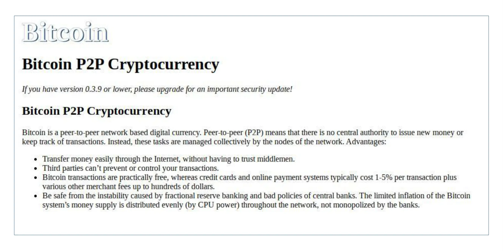


بنابراین، در اوایل سال ۲۰۱۱ یک لمس رنگ [اضافه شد](https://web.archive.org/web/20110216125441/http://www.Bitcoin.org/):


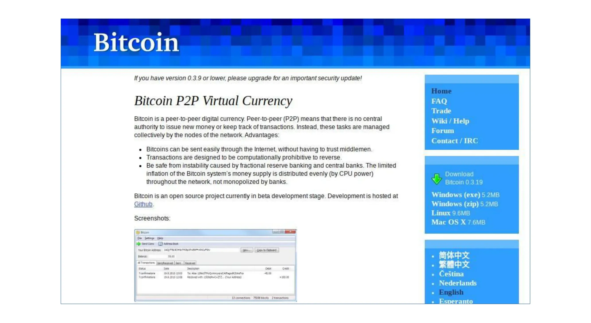


در ماه آوریل، پس از یک بازطراحی [سازماندهی شده](https://bitcointalk.org/index.php?topic=4223.msg80581#msg80581) توسط جامعه، طرح‌بندی وب‌سایت تغییر کرد. اینجا چیزی است که آن زمان [به نظر می‌رسید](https://web.archive.org/web/20110411071904/http://www.Bitcoin.org/):


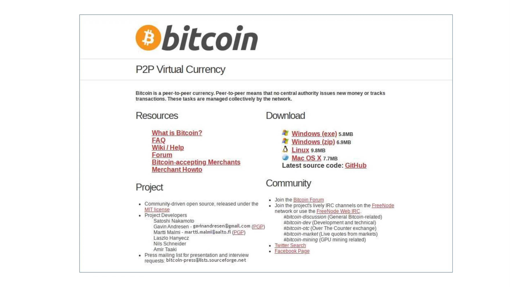


سرانجام، در سپتامبر ۲۰۱۱، تغییری جدید توسط نیلز اشنایدر [ایجاد شد](https://buildingbitcoin.org/Bitcoin-dev/log-2011-08-31.html#l-691). یک مخزن جدید در GitHub برای این مناسبت [ایجاد شد](https://github.com/Bitcoin/Bitcoin.org). این طراحی مدت بیشتری باقی ماند: تا سال ۲۰۱۳ تغییر نکرد. اینجا آن را مشاهده می‌کنید (توجه داشته باشید که Bitcoin-the-software به عنوان "یک پروژه متن‌باز مبتنی بر جامعه" توصیف شده است):


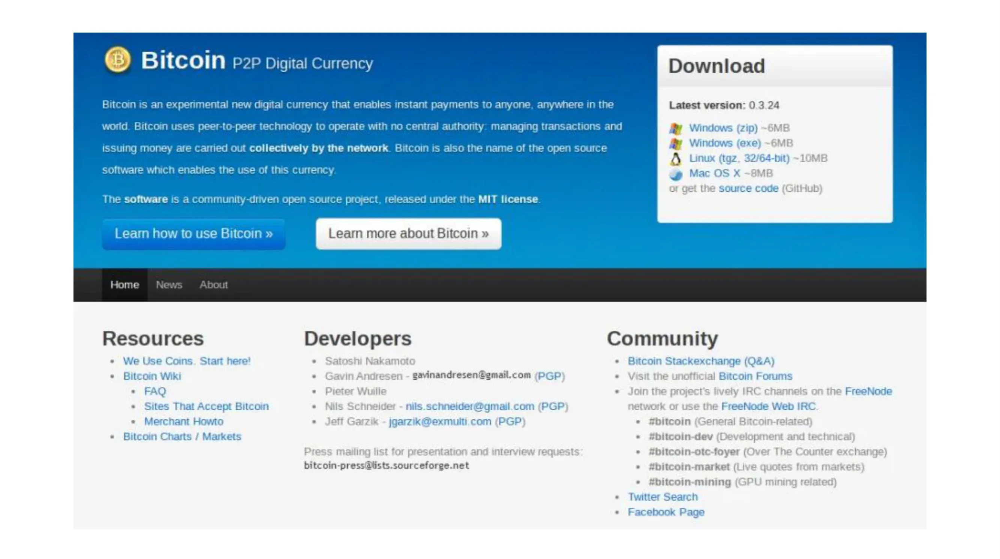


در مورد ویکی، در ابتدا بر اساس DokuWiki، یک موتور رایگان که در وب‌سایت ادغام شده بود، ساخته شد. با این حال، در دسامبر 2010، مارک کارپلِس، یک توسعه‌دهنده فرانسوی که در ژاپن زندگی می‌کند و در انجمن با نام مستعار MagicalTux فعالیت می‌کند، یک ویکی جدید در Address Bitcoin.it ایجاد کرد. این ویکی بر اساس موتور MediaWiki است که او آن را زیباتر و استفاده از آن را آسان‌تر می‌داند. ایده اولیه جایگزینی مستندات موجود نیست، بلکه همان‌طور که مارک در IRC [بیان می‌کند](https://buildingbitcoin.org/Bitcoin-dev/log-2010-12-16.html#l-2848)، توسعه "یک ویکی کمتر رسمی و بیشتر جامعه‌محور" است.


این ویکی جدید به [Martti Malmi](https://bitcointalk.org/index.php?topic=2321.msg30873#msg30873) و [Gavin Andresen](https://bitcointalk.org/index.php?topic=2321.msg31535#msg31535) جذابیت دارد، بنابراین آنها به سرعت در نظر می‌گیرند که آن را به ویکی اصلی تبدیل کنند. اینجا یک [عکس فوری](https://web.archive.org/web/20110521044430/https://en.Bitcoin.it/wiki/Main_Page) گرفته شده در ۲۱ مه است:


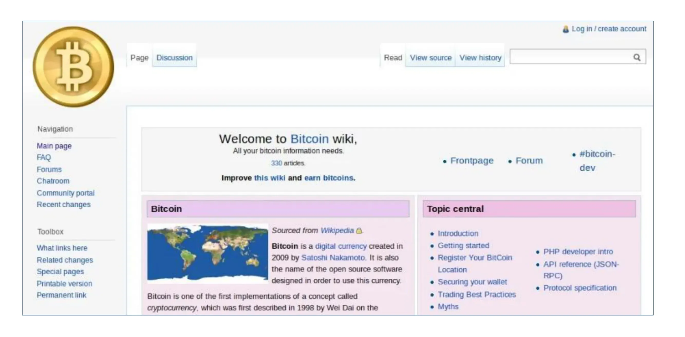


چند روز پس از راه‌اندازی، لینک با عنوان "wiki" در صفحه اصلی Bitcoin.org به [Bitcoin.it](https://bitcointalk.org/index.php?topic=2321.msg30872#msg30872) اشاره می‌کند. محتوا به تدریج از نسخه DokuWiki منتقل می‌شود. در 31 ژانویه، مارتتی در [فروم](https://bitcointalk.org/index.php?topic=293.msg42789#msg42789) اعلام می‌کند که این ویکی جدید است.


عنصر سوم انجمن Bitcoin است. این انجمن توسط مارتتی اداره می‌شود، اما او به سرعت مدیران جدیدی را جذب می‌کند. یکی از آن‌ها Theymos (نام واقعی مایکل مارکاردت) است که مسئولیت‌های اضافی، به ویژه مدیریت مشترک انجمن را به عهده می‌گیرد. این انجمن بر روی موتور Simple Machines Forum فعالیت می‌کند و ظاهر آن در طول سال‌ها تغییر نمی‌کند. با این حال، URL آن دو بار تغییر می‌کند. ابتدا در ۱۷ مه، انجمن به [forum.Bitcoin.org](https://bitcointalk.org/index.php?topic=8696.msg125963#msg125963) منتقل می‌شود. سپس، در ۱ اوت، به یک دامنه سطح بالا جدید: [bitcointalk.org](https://bitcointalk.org/index.php?topic=33393.msg417531#msg417531) منتقل می‌شود. در طول سال‌ها، به نام BitcoinTalk شناخته خواهد شد.

با افزایش ارزش در تابستان ۲۰۱۱، مارتی مالمی [بخش قابل توجهی از بیت‌کوین‌های خود را فروخت](https://twitter.com/marttimalmi/status/1339908793736556544) تا یک آپارتمان راحت در نزدیکی هلسینکی برای خود بخرد. سپس، او [شغل خود را ترک کرد](https://x.com/marttimalmi/status/1339908797968637952) تا چند ماه را در ژاپن بگذراند. او وب‌سایت و انجمن را رها کرد و [آن‌ها را](https://bitcointalk.org/index.php?topic=5129680.msg50617107#msg50617107) [به دست](https://bitcointalk.org/index.php?topic=1603627.msg16115993#msg16115993) Theymos و شخصی به نام Cøbra سپرد، که توسط مارتی به عنوان "کسی که توسط Satoshi مورد اعتماد است" [توصیف شده بود](https://forum.Bitcoin.com/ama-ask-me-anything/i-m-martti-malmi-early-Bitcoin-developer-and-the-original-founder-of-the-bitcointalk-org-forums-ama-t2770.html#p8222). این دو نفر در سال‌های بعد هر دو پلتفرم را به صورت مشترک مدیریت می‌کردند.


### کنفرانس‌ها و جلسات


این فقط جنبه فنی نیست که تحت تأثیر خروج بنیان‌گذار و نیاز به همکاری قرار می‌گیرد: جنبه اجتماعی نیز وجود دارد که با ایجاد پیوند بین اعضا به تقویت جامعه کمک می‌کند. به همین دلیل است که ملاقات‌ها و کنفرانس‌ها "در دنیای واقعی" سازماندهی می‌شوند. این رویدادها همچنین این مزیت را دارند که Bitcoin را به افرادی معرفی کنند که ممکن است در برابر محتوای آنلاین مقاومت بیشتری داشته باشند.


اولین گردهمایی‌های کاربران Bitcoin توسط بروس واگنر، مجری مستقر در نیویورک یک [کانال یوتیوب](https://www.youtube.com/@vlogwrap) که مناظرات تلویزیونی در موضوعات فنی را به نمایش می‌گذارد، آغاز شد، جایی که او در آوریل 2011 برنامه‌ای به نام *نمایش Bitcoin* ایجاد کرد. اولین جلسه [در تاریخ](https://bitcointalk.org/index.php?topic=1891.msg29174#msg29174) 11 دسامبر 2010 (UTC) در نیویورک برگزار شد. به دنبال آن، جلسه‌ای از همان نوع [در واشنگتن دی.سی.](https://web.archive.org/web/20110413231434/http://Bitcoin.meetup.com/) برگزار شد. یک گردهمایی نیز در تاریخ 5 فوریه 2011 در زوریخ، سوئیس توسط مایک هرن با حضور کریستین دکر و استفان توماس (justmoon) [سازماندهی شد](https://bitcointalk.org/index.php?topic=2716.msg36886#msg36886).

فوریه همچنین نشان‌دهنده [اولین ارائه فیلم‌برداری شده](https://www.youtube.com/watch?v=koIq58UoNfE) از Bitcoin است که توسط گاوین آندرسن در تاریخ ۸ فوریه در یک رویداد سازمان‌دهی شده در زادگاهش امهرست، ماساچوست انجام شد. این ارائه با عنوان "پول‌سازی" توسط نگهدارنده اصلی جدید پروژه شامل زبان‌های متعدد Elements است که نحوه ارائه ارزهای دیجیتال در سال‌های آینده را مشخص می‌کند.


:::video id=92b9aa30-1479-4d4f-b57f-f07b660145f2:::


با اینکه اولین رویدادها در ایالات متحده برگزار شد، جامعه فرانسوی عقب نماند. در ۲۵ مه، به مناسبت بازدید گوین آندرسن از پاریس، ناهاری در منطقه لا دفانس ترتیب داده شد که شخصیت‌های برجسته‌ای مانند لوسین گروندین، دیوید فرانسوا و جان ماتونیس (که او نیز در حال بازدید بود) در آن شرکت کردند.


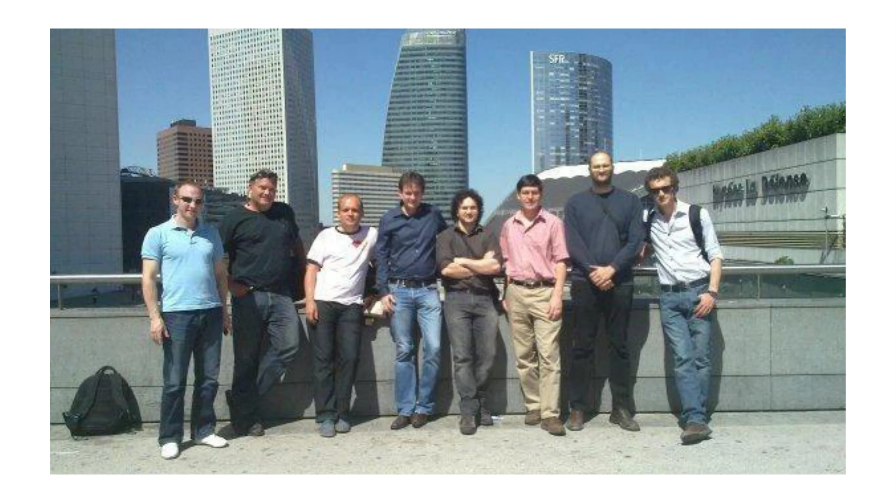

ملاقات در لا دفانس پاریس با گوین آندرسن، با پیراهن صورتی (منبع: [آرشیو انجمن](https://web.archive.org/web/20140715000000*/https://bitcointalk.org/index.php?topic=5587.40))


یک ماه بعد، در ۱۵ ژوئن، اولین ارائه عمومی Bitcoin به زبان فرانسوی [در پاریس برگزار شد](https://bitcointalk.org/index.php?topic=11384.msg225831#msg225831). این ارائه توسط رنو لیفشیتز (nono2357)، یک کارشناس جوان امنیت سایبری که یک سال قبل Bitcoin را کشف کرده بود، انجام شد. [محتوای ارائه شده](https://prezi.com/tikwkjt9ouey/Bitcoin-une-monnaie-electronique-pour-tous/) از کیفیت بسیار بالایی برخوردار بود و حضور مخاطبان به قدری خوب بود که اتاق پر شد.


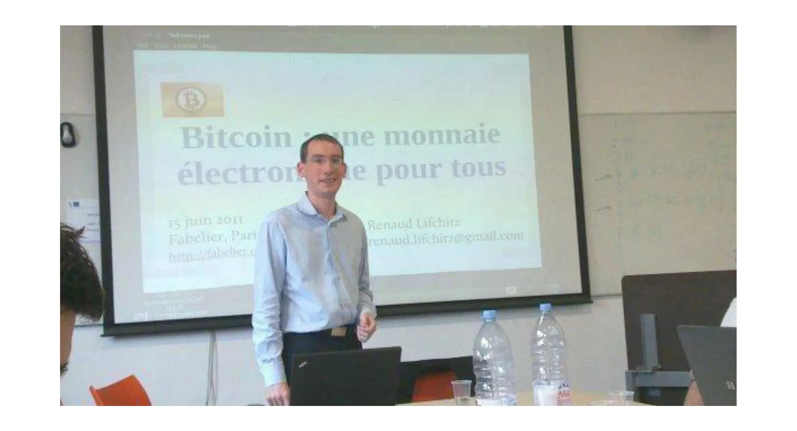

ارائه Bitcoin توسط رنو لیفشیتز در 15 ژوئن 2011 (منبع: [آرشیو فروم](https://web.archive.org/web/20140406141205/https://bitcointalk.org/index.php?topic=11384.0))


پس از این تجربه، جامعه پاریسی [یک گردهمایی اجتماعی](https://bitcointalk.org/index.php?topic=21991.msg276443#msg276443) سازماندهی کرد که در تاریخ ۱۱ ژوئیه برگزار شد. این رویداد افرادی مانند پیر نوازا و امیلین دوتانگ را گرد هم آورد.

در جبهه بین‌المللی، اولین کنفرانس جمعی درباره Bitcoin از ۱۹ تا ۲۱ اوت در نیویورک برگزار شد. این نشست که توسط بروس واگنر سازماندهی شده بود، شخصیت‌هایی مانند راجر ور، جسی پاول، جد مک‌کالب، مارک کارپلز و چارلی لی را گرد هم آورد. اگرچه واگنر وعده سه روز رویداد را داده بود، تنها چهار ارائه انجام شد: ارائه خودش و ارائه‌های گاوین آندرسن، جف گارزیک و استفان توماس.


:::video id=bca0217c-29ee-49b2-8d16-d9efe6f390da:::


اواخر سال، در ماه نوامبر، یک کنفرانس اروپایی [در پراگ برگزار خواهد شد](https://bitcointalk.org/index.php?topic=40272.msg490901#msg490901). سخنرانان برجسته شامل توسعه‌دهنده امیر تاکی، بنیان‌گذار حزب دزدان دریایی سوئد ریک فالک‌وینگه، و مجری مکس کایزر خواهند بود. سال بعد، رویدادی مشابه [در لندن سازماندهی خواهد شد](https://blog.bitmex.com/london-2012-the-2nd-Bitcoin-conference/).


### پوشش رسانه‌ای


سال ۲۰۱۱ همچنین سالی بود که پوشش رسانه‌ای به طور قابل توجهی گسترش یافت. پرونده ویکی‌لیکس و مقاله‌ای که در دسامبر در PC World منتشر شد، توجه زیادی را به Bitcoin جلب کرد، به طوری که همه نوع رسانه‌ای به این موضوع پرداختند. همان‌طور که گاوین آندرسن در آن زمان [نوشت](https://bitcointalk.org/index.php?topic=8940.msg129623#msg129623)، "بهمنی از علاقه مطبوعاتی به \[B\]itcoin" وجود داشت.


اولین ویدیوها در مورد این موضوع در یوتیوب شروع به گسترش کردند. در ۲۲ مارس، اولین ویدیوی با کیفیت بالا درباره Bitcoin ظاهر شد. این ویدیو که به سادگی با عنوان "Bitcoin چیست؟" نامگذاری شده بود، توسط استفان توماس (justmoon) به لطف [تأمین مالی جمعی](https://bitcointalk.org/index.php?topic=697.msg70001#msg70001) از جامعه تولید شد. این ویدیو در پورتال WeUseCoins که به آموزش و ترویج ارزهای دیجیتال اختصاص دارد، منتشر شد. ویدیوهای معرفی مستقل دیگری نیز به دنبال آن آمدند، مانند [ویدیوی howtovanish](https://www.youtube.com/watch?v=LSLByqTusaQ) در آوریل، [ویدیوی Reason](https://www.youtube.com/watch?v=yYTqvYqXRbY)، یا [ویدیوی Rocketboom](https://www.youtube.com/watch?v=9LaSrxtWfgc) در ژوئن.


:::video id=6147a351-da80-4331-9d79-d3156889ac62:::


در ماه آوریل، موضوع ارز دیجیتال توسط رسانه‌های اصلی جریان اصلی مانند [The Atlantic](https://www.theatlantic.com/business/archive/2011/04/how-to-start-your-own-private-currency/73327/)، [Time Magazine](https://techland.time.com/2011/04/16/online-cash-Bitcoin-could-challenge-governments/)، و [Forbes](https://www.forbes.com/forbes/2011/0509/technology-psilocybin-bitcoins-gavin-andresen-crypto-currency.html) پوشش داده شد. در ماه مه، این حرکت شتاب گرفت و Bitcoin تقریباً در همه جا ذکر شد، به ویژه در [Wired UK](https://web.archive.org/web/20110517122859/http://www.wired.co.uk/news/archive/2011-05/16/Bitcoin-P2P-currency)، در [Slate](https://slate.com/business/2011/05/Bitcoin-why-the-new-electronic-currency-is-a-favorite-of-libertarian-hipsters-and-criminals.html)، در [Gizmodo](https://gizmodo.com/what-is-Bitcoin-5803124)، و در [TechCrunch](https://techcrunch.com/2011/05/20/Bitcoin-ven-and-the-end-of-currency/).


گاوین آندرسن در فوربز در آوریل ۲۰۱۱ (منبع: [آرشیو فوربز](https://web.archive.org/web/20110502052302/https://www.forbes.com/forbes/2011/0509/technology-psilocybin-bitcoins-gavin-andresen-crypto-currency.html))


رادیو همچنین برای بحث در مورد ارزهای دیجیتال استفاده شد. یک قسمت از برنامه رادیویی CBC کانادا به موضوع ارز و Bitcoin در ۲۷ فوریه [اختصاص داده شد](https://web.archive.org/web/20110227214049/http://www.cbc.ca/spark/2011/02/spark-139-february-27-march-2-2011/). Bitcoin همچنین در چندین قسمت از FreeTalkLive، یک برنامه با گرایش لیبرترین در ایالات متحده، ذکر شد. به‌ویژه، این موضوع به‌طور گسترده‌تری در ۱۶ مارس ۲۰۱۱، به‌خصوص در زمینه ظهور Silk Road [مورد بحث قرار گرفت](https://web.archive.org/web/20110318163416/http://www.freetalklive.com/content/podcast_2011_03_16). در نهایت، در ۲۴ مه، Bitcoin موضوع یک [بخش کوتاه](https://www.npr.org/2011/05/24/136620231/what-are-bitcoins) در رادیوی ملی عمومی ایالات متحده بود.


وبلاگ‌نویسان فردی نیز علاقه‌مند هستند. این مورد برای ریک فالک‌وینگه، بنیان‌گذار حزب دزدان دریایی سوئد، صدق می‌کند که [چندین](https://falkvinge.net/2011/05/11/with-the-napster-of-banking-round-the-corner-bring-out-your-popcorn/) [مقاله](https://falkvinge.net/2011/05/19/the-information-policy-case-for-flat-tax-and-basic-income/) درباره ایجاد Satoshi ناکاموتو در ماه مه منتشر می‌کند. او Bitcoin (و سیستم‌های مرتبط مانند ریپل) را به عنوان "نپستر بانکداری" توصیف می‌کند. استدلال‌های او توسط بسیاری از افراد مانند متقابل‌گرا [کوین کارسون](https://c4ss.org/content/7149) در ایالات متحده یا وبلاگ‌نویس لیبرال [h16](https://h16free.com/2011/05/30/8585-revolution-numerique-aujourdhui-musique-et-cinema-et-demain) در فرانسه تکرار می‌شود. در روز ۲۹ام، ریک فالک‌وینگه [اعلام کرد](https://falkvinge.net/2011/05/29/why-im-putting-all-my-savings-into-Bitcoin/) که "تمام پس‌اندازهایش را در Bitcoin سرمایه‌گذاری می‌کند"!


### اولین حباب


رواج Bitcoin به این معناست که قیمت آن به طور قابل توجهی افزایش می‌یابد. در حالی که در دسامبر 2010 به 20 سنت کاهش یافته بود، در 9 فوریه 2011 به برابری با دلار رسید. در آن زمان، هال فینی [اظهار داشت](https://bitcointalk.org/index.php?topic=2734.msg37307#msg37307) که اعضای جامعه "واقعاً خوش‌شانس هستند که در آغاز یک پدیده جدید و احتمالاً انفجاری قرار دارند." او حس خوبی داشت، زیرا آنچه در ادامه اتفاق می‌افتد بسیار سریع است.


عکس منتشر شده توسط jimbobway در انجمن در روز برابری با دلار (منبع: [Bitcointalk](https://bitcointalk.org/index.php?topic=2734.msg37144#msg37144))


در واقع، جنون رسانه‌ای بهاری به تدریج منجر به ایجاد پدیده‌ای بی‌سابقه در حدس و گمان می‌شود. پس از چندین ماه رکود در حدود ۱ دلار، قیمت افزایش می‌یابد و در پایان آوریل به ۳ دلار می‌رسد. در ماه مه، به ۸ دلار می‌رسد. سرانجام، در ۸ ژوئن، قیمت Bitcoin به بالاترین حد تاریخی خود یعنی ۳۲ دلار در Mt. Gox می‌رسد! این افزایش معادل افزایش ۱۶۰ برابری در ۶ ماه است.


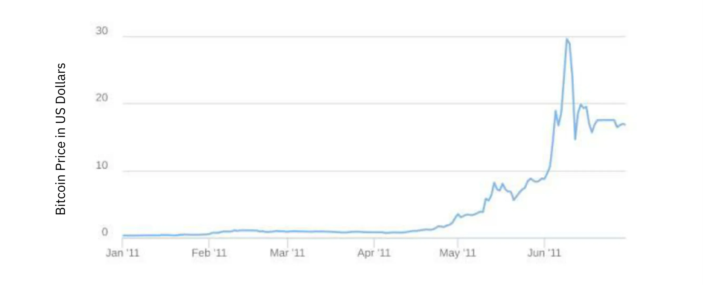

میانگین قیمت BTC بین ۱ ژانویه و ۳۰ ژوئن ۲۰۱۱ (منبع: [Bitbo.io](https://calendar.bitbo.io/price/))


به طور طبیعی، این حرکت سفته‌بازانه یادآور یک حباب مالی است، یعنی ارزش‌گذاری بیش از حد یک محصول مالی در مقایسه با ارزش بنیادی آن. در مورد ارزی مانند Bitcoin، این موضوع به یک اشتیاق گذرا مربوط می‌شود که منجر به افزایش سرسام‌آور قیمت و سپس کاهش شدید ناشی از عدم اعتقاد شرکت‌کنندگان جدید می‌شود. این‌گونه است که تکامل قیمت به عنوان یک "حباب" توسط یک ستون‌نویس رویترز در تاریخ ۲۷ مه، در یکی از اولین "آگهی‌های ترحیم" Bitcoin توصیف می‌شود.


با این حال، این حرکت گمانه‌زنی باعث می‌شود که مطبوعات اصلی به پوشش موضوع بپردازند، که همیشه به‌طور بی‌طرفانه این کار را انجام نمی‌دهند. بنابراین، مقالاتی در [نیویورک تایمز](https://www.nytimes.com/2011/05/30/business/economy/30views.html)، در [اکونومیست](https://www.economist.com/babbage/2011/06/13/bits-and-Bob)، در روزنامه بریتانیایی [گاردین](https://www.theguardian.com/technology/2011/jun/12/Bitcoin-online-currency-us-government)، در سایت خبری آلمانی [اشپیگل آنلاین](https://www.spiegel.de/netzwelt/netzpolitik/hacker-waehrung-Bitcoin-geld-aus-der-steckdose-a-765382.html)، در روزنامه ایتالیایی [لا رپوبلیکا](https://www.repubblica.it/tecnologia/2011/05/31/news/bitcoin_moneta_elettronica_hacker_cia-17030027/)، یا در روزنامه فرانسوی [لوموند](https://www.lemonde.fr/technologies/article/2011/06/17/Bitcoin-les-deux-faces-de-la-monnaie-virtuelle_1537285_651865.html) منتشر می‌شوند. این امر پوشش رسانه‌ای Bitcoin را تقویت می‌کند. اکنون در کانون توجه قرار دارد و هر کسی که حتی کمی کنجکاو باشد، از آن شنیده است. اولین دوره Bitcoin، که با حضور Satoshi و با احتیاط پروژه مشخص می‌شد، اکنون به پایان رسیده است.


### نتیجه‌گیری کلی درباره ایجاد Bitcoin


بنابراین، در نیمه اول سال 2011، پروژه توانست بدون حضور بنیان‌گذار خود Satoshi ناکاموتو رشد کند. این لحظه آغاز Bitcoin به عنوان یک پروژه کاملاً جامعه‌محور را نشان داد و دوره ایجاد Bitcoin را که از سال 2007 تا 2011 به طول انجامید، به پایان رساند. از این رویداد می‌توانیم چندین نکته را برداشت کنیم.


اولاً، Bitcoin از هیچ‌جا ظاهر نشد. به عنوان پول دیجیتال که در فضای سایبری عمل می‌کند، نتیجه دهه‌ها تحقیق و آزمایش است که به ایجاد آن منجر شد. پیش از آن به‌طور قابل‌توجهی مدل eCash دیوید چام، ارزهای دیجیتال خصوصی مانند e-gold و مفاهیم سایفرپانک‌ها وجود داشتند. حضور هال فینی در زمان ظهور Bitcoin و ناپدید شدن Satoshi بسیار نمادین بود: به عنوان فردی که شاهد آزمایش‌های اولیه پول الکترونیکی در دهه ۹۰ بود و در سال ۲۰۰۴ با RPOW به دنبال ایجاد مدل خود بود، او نمایانگر تداوم جستجویی بود که دقیقاً به Bitcoin منجر شد.


ثانیاً، Bitcoin در یک روز ساخته نشد. حتی پس از انتشار نسخه 0.1 نرم‌افزار در ژانویه 2009، پروژه هنوز آماده نبود. آسیب‌پذیری‌های زیادی باید اصلاح می‌شد. یکی از آنها باعث یک حادثه بزرگ در آگوست 2010 شد، زمانی که شبکه برای حدود پانزده ساعت فلج شد، اما بدترین حالت جلوگیری شد. حتی پس از خروج Satoshi، نرم‌افزار باید توسط جامعه بهبود می‌یافت.


سوم، Bitcoin به صورت ارگانیک رشد کرد. این پروژه توانست به طور مخفیانه توسعه یابد و به تدریج افراد را جذب کند. برای نزدیک به یک سال و نیم، این یک پروژه بسیار محرمانه بود که تنها برای علاقه‌مندان و کنجکاوان شناخته شده بود. تنها پس از رویداد "اسلش‌داتینگ" در ژوئیه ۲۰۱۰ بود که شروع به انفجار کرد. تب و تاب سفته‌بازی درباره آن واقعاً تا سال ۲۰۱۱ شکل نگرفت، زمانی که قیمت به صورت نمایی به ۳۲ دلار افزایش یافت.


چهارم، Bitcoin یک خلق نوع‌دوستانه بود. Satoshi ناکاموتو Bitcoin را به جهان عرضه کرد. او برنامه را تحت یک مجوز رایگان منتشر کرد. او نه به دنبال شهرت بود، نه سود و نه قدرت. او امنیت شبکه Mining را برای بیش از یک سال تضمین کرد، بدون اینکه هیچ‌گونه جبرانی بخواهد. حتی با اینکه بیش از یک میلیون بیت‌کوین جمع‌آوری کرد، هرگز آن‌ها را خرج نکرد. او در نهایت ناپدید شد، عمدتاً به دلیل ترس‌های مرتبط با توجه ایجاد شده توسط پرونده ویکی‌لیکس، و پروژه را به جامعه‌ای واگذار کرد، بدون یک چهره غالب.


در سال 2011، Satoshi ناپدید شد، اما Bitcoin زنده ماند. ارز دیجیتال حتی به طور قطعی از نظر رسانه‌ای و اقتصادی اوج گرفت. ماشین راه‌اندازی شد و هیچ‌کس نمی‌توانست آن را متوقف کند.


# بخش نهایی

<partId>89532d9b-af1f-49f3-b87a-b11987e303d5</partId>

## بررسی‌ها و رتبه‌بندی‌ها

<chapterId>8f27cc89-8759-4a4f-aff2-c1d3d9ecf14e</chapterId>

<isCourseReview>true</isCourseReview>
## امتحان نهایی

<chapterId>d61dbdf3-b482-412b-b725-0a19006603b7</chapterId>

<isCourseExam>true</isCourseExam>
## نتیجه‌گیری

<chapterId>9c501c44-0f1a-449e-8ab3-a5873abe4db6</chapterId>

<isCourseConclusion>true</isCourseConclusion>