# Machen Sie einen Ausflug in den Wilden Westen der Finanzen

Willkommen zu diesem Kurs, der sich mit der Geschichte von Bitcoin zwischen Frühjahr 2011 und Sommer 2012 beschäftigt! Obwohl Sie aufgrund des tragischen Schicksals von Silk Road und Mt. Gox vielleicht ab und zu von dieser Zeit gehört haben, ist es wahrscheinlich, dass Sie damit nicht vertraut sind, da Bitcoin von der breiten Öffentlichkeit noch weitgehend ignoriert wurde und es zu dieser Zeit nur wenige Nutzer gab. Dieser Kurs ist daher eine Gelegenheit für Sie, sich mit der bahnbrechenden, gemeinschaftsbasierten Ära der Kryptowährungsgeschichte vertraut zu machen, die Bitcoin geprägt hat. Sie werden im Detail über die Ereignisse, Charaktere, Marktplätze, Finanzdienstleistungen und Softwareprojekte lernen, die sie geprägt haben.

Insbesondere der Zeitraum vom Frühjahr 2011 bis zum Sommer 2012 war von einer Haltung des Misstrauens unter den beteiligten Akteuren und einem praktisch völligen Fehlen finanzieller Regulierung geprägt, so dass wir ihn hier als den "Wilden Westen der Finanzen" bezeichnen. Es war eine Zeit der Freiheit und Vielfalt, in der viele manchmal verrückte Projekte entstanden, die mehr oder weniger erfolgreich waren, aber im Allgemeinen darauf abzielten, die Nutzung von Bitcoin zu verbessern. Obwohl sie kurz war (kaum anderthalb Jahre), war sie eine Phase des Lernens und des Aufbaus, voller "Premieren" und Experimente, die später zu grundlegenden Elementen der technischen, wirtschaftlichen und kulturellen Struktur von Bitcoin wurden.

+++

# Einführung

<partId>a4a46ce3-6430-5ac7-bc4d-ab1e68e94390</partId>

## Überblick über den Kurs

<chapterId>ce630c81-dd1d-59a0-afea-8e6d3313e8ad</chapterId>

Dieser Kurs zielt darauf ab, den ersten Teil der zweiten Phase der Bitcoin-Geschichte (2011-2014) abzudecken. Er folgt auf die erste Phase (2008-2011), die als "Proof-of-Concept"-Phase bekannt ist und durch die Anwesenheit von Satoshi und die relative Diskretion des Projekts gekennzeichnet ist, und geht der dritten Phase (2014-2018) voraus, die insbesondere durch den *Blocksize-Krieg* gekennzeichnet ist - ein interner Konflikt, der die Gemeinschaft mehrere Jahre lang zerrissen hat. Wir werden versuchen, die Originalität dieser Periode zu erfassen, und wie sie einen notwendigen Schritt in der Konstruktion von Bitcoin darstellt.

### Der Wilde Westen der Finanzen

Die Geschichte, die wir hier erzählen, konzentriert sich auf den Zeitraum zwischen dem Weggang von Satoshi Nakamoto im Frühjahr 2011 und der Gründung der Stiftung Bitcoin im September 2012. Dieser Teil der Geschichte von Bitcoin entspricht der Ära, die als "Wilder Westen des Finanzwesens" bekannt ist und die durch das Fehlen von Regulierung aufgrund der beispiellosen Natur dieser Innovation, der Kryptowährung, gekennzeichnet war. Zu diesem Zeitpunkt hatte sich Bitcoin bereits als praktikabel erwiesen und fand zunehmend Beachtung in den Medien. In dieser Zeit verbreitete sich die Nutzung von Bitcoin auch bei Menschen, die sich ursprünglich nicht für Kryptowährungen interessierten. Illegale Anwendungsfälle häuften sich und gaben dieser "sündigen Phase" (um den Begriff des französischen Soziologen Maël Rolland zu verwenden (https://theses.fr/2024EHES0127)) einen besonderen Charakter.

Der Begriff "Wilder Westen" wurde von Branchenvertretern und Journalisten in dieser Zeit immer wieder verwendet. Bereits im November 2010 sprach Gavin Andresen [von](https://bitcointalk.org/index.php?topic=1647.msg20650#msg20650) von den "Wildwest-Tagen der Open-Source-Währung" und sagte, er erwarte, dass "die Leute von Betrügern, Nachahmern, Ponzi-Schneeballsystemen und Preisblasen verbrannt werden". In einem Artikel, der am 2. April 2012 auf Reuters veröffentlicht wurde, schrieb die Journalistin Naomi O'Leary [https://www.reuters.com/article/2012/04/01/traders-bitcoin-idUSL6E8ET5K620120401/], dass "Bitcoin zum Wilden Westen der Finanzwelt geworden ist, mit einer Vielzahl von Websites, die lose regulierte Nachbildungen der Dienstleistungen anbieten, die denjenigen in der Finanzindustrie vertraut sind." Ab 2013 verbreitete sich dieser Verweis auf den Wilden Westen in der gesamten Community, wobei er in positiver Form aus dem Munde von Erik Voorhees und [Charlie Shrem] (https://calvinayre.com/2013/07/03/conference/bitcoin-london-recap-bl-video), den beiden Hauptvertretern des Tauschunternehmens BitInstant, oder in eher abwertender Form von Leuten wie [Brian Armstrong] (https://a16z.com/bringing-bitcoin-to-everyone/), dem Mitbegründer der Plattform Coinbase, geäußert wurde. Es wurde auch von Bitcoin-Gegnern aufgegriffen, wie Benjamin Lawsky, Superintendent des New York State Department of Financial Services, der im August 2013 [auf](https://www.cbsnews.com/news/ny-regulator-may-crack-down-on-bitcoin/) Kryptowährungen als "einen virtuellen Wilden Westen für Drogenhändler und andere Kriminelle" bezeichnete.

Der Ferne Westen hat ein starkes Image in der amerikanischen Vorstellungswelt und damit im gesamten amerikanisierten Westen, insbesondere dank des Westerns, einem Filmgenre, das Mitte des 20. Jahrhunderts sehr beliebt war. Jahrhunderts sehr populär war. Er verkörpert das Ideal der Unabhängigkeit, sowohl in Bezug auf die positiven (Freiheit) als auch die negativen (Gefahr) Eigenschaften. Es ist die ursprüngliche Grundlage des "amerikanischen Traums": sich in einem unbekannten Land niederzulassen und nach Erfolg zu streben, um mit wenig Geld Wohlstand zu schaffen. Es war nur natürlich, dass Bitcoin mit diesem Raum der Freiheit verglichen wurde, und zwar durch seine Unabhängigkeit von dem bestehenden politischen System: Bitcoin ließ alles zu, das Beste und das Schlimmste. Dieser Vergleich inspirierte insbesondere Erik Voorhees, der in einem Interview 2013 [argumentierte] (https://bitcoinmagazine.com/culture/erik-voorhees-new-frontier-1374794545), dass Bitcoin die neue Grenze sei, der Mittler zwischen der etablierten Zivilisation und den unerforschten Gebieten. Er sagte:

> "Absolut, Bitcoin ist der Wilde Westen des Finanzwesens, und das ist auch gut so. Er repräsentiert eine ganze Legion von Abenteurern und Unternehmern, von Risikoträgern, Erfindern und Problemlösern. Es ist das Grenzland. Bei der Gestaltung dieser neuen Landschaft werden riesige Mengen an Wohlstand geschaffen und vernichtet werden. Ich glaube, dass die Auswirkungen dieses Abenteuers tiefgreifend sein werden, denn während der 'Wilde Westen' ein spezifisch amerikanisches Phänomen war, ist Bitcoin ein globales Phänomen
>

Nicht umsonst bezeichnete der Blogger Jimbobway [die](https://web.archive.org/web/20100828094955/http://www.bitcoinblogger.com/2010/08/bitcoins-new-digital-gold-rush.html) die Entwicklung von Bitcoin mining im Jahr 2010 als "digitalen Goldrausch", eine Analogie, die in den folgenden Jahren von anderen [wiederholt](https://www.hpcwire.com/2012/10/09/digital_gold_rush_powered_by_gpus/) wurde. Im Jahr 2013 [bezog sich](https://web.archive.org/web/20130328041052/http://motherboard.vice.com/blog/engineering-the-bitcoin-gold-rush-an-interview-with-yifu-guo-creator-of-the-first-asic-based-miner) auch der Journalist Alec Liu in einem Artikel für Motherload über Yifu Guo, den Erfinder eines der ersten funktionsfähigen ASIC, darauf. In einer Bewegung, die mindestens bis 2014 andauerte, konnten Einzelpersonen dank immer ausgefeilterer Werkzeuge selbst Bitcoins schürfen, bis sich Spezialausrüstung verbreitete und die ersten Farmen im industriellen Maßstab entwickelt wurden.

Der "Wilde Westen der Kryptowährungen" war eine Zeit, in der, wie [Michael del Castillo] (https://www.forbes.com/sites/michaeldelcastillo/2019/01/03/bitcoins-last-gunslinger/) erklärte, "Bitcoin als unreguliert und *unregulierbar* galt". Diese Eigenschaft bedeutete, dass Verwendungszwecke, die normalerweise in der Öffentlichkeit verpönt sind - illegal, unmoralisch oder wahrscheinlich so - als erste florierten.

Im Mittelpunkt des Drogenhandels stand die Plattform Silk Road, die in dieser Zeit ihre Blütezeit erlebte und 2012 bis zu 20 % des Geschäfts der Kette monopolisierte. Sie wurde von einem jungen Texaner namens Ross Ulbricht gegründet und war der erste Online-Marktplatz, der Tor und Bitcoin nutzte. Er ermöglichte es den Nutzern, Produkte aller Art zu kaufen, darunter auch Drogen, daher der Spitzname "Amazon der Drogen". Ross Ulbricht selbst [meinte](https://antilop.cc/sr/users/dpr/threads/20110622-0106-Keep_your_guard_up.html), dass Silk Road nicht "Wal-Mart oder sogar Amazon.com" sei, sondern "der Ferne Westen" und dass es "genauso viele Gauner wie ehrliche Geschäftsleute" gebe. Die Plattform begann im Juni 2011 nach einem auf Gawker veröffentlichten Artikel so sehr an Fahrt zu gewinnen, dass sie die Aufmerksamkeit der Behörden auf sich zog.

Neben der Silk Road wurde Bitcoin zu einer Währung für Laster und Kriminalität im Allgemeinen und erwarb einen Ruf, der später nur schwer wieder rückgängig gemacht werden konnte. Das Online-Glücksspiel entwickelte sich beträchtlich, mit der Schaffung von Poker-, Wett- und Casino-Plattformen aller Art. Es kam zu zahlreichen Hacks, die zu astronomischen Verlusten und zum Konkurs großer Unternehmen in diesem Bereich wie Bitcoinica führten. Mehrere Betrügereien wurden begangen, wie zum Beispiel das Schneeballsystem Bitcoin Savings & Trust, das im August 2012 zusammenbrach.

Auf der finanziellen Seite wuchsen die Tauschplattformen enorm, die anfangs ohne Banklizenz oder KYC-Verfahren (Know-Your-Customer) arbeiteten. Sie überbrückten die Lücke zwischen staatlichen Währungen und Bitcoin, manchmal über alternative Systeme wie Liberty Reserve. An diesem Punkt kam die fremdfinanzierte Spekulation auf. Online-Börsen wie GLBSE ermöglichten die Entwicklung von Projekten durch die Ausgabe von Aktien ohne Registrierung bei den Behörden. Schließlich ermöglichte die durch Bitcoin geschaffene monetäre Freiheit vielen Einzelpersonen, ihre eigenen Kryptowährungen zu starten, je nach Projekt mit mehr oder weniger guten Absichten.

Bitcoin zog alle Arten von atypischen Profilen und Nonkonformisten an. Für Naomi O'Leary waren die Bitcoin-Nutzer "eine seltsame Mischung aus Superfreaks, Anarchisten, Libertären, Betrügern und Devisenhändlern". Im Jahr 2017 bezeichnete der Libertäre Bruce Fenton in einem nostalgischen Artikel über die "letzten Tage des Wilden Westens von Bitcoin" (https://www.coindesk.com/markets/2017/04/18/miami-2014-the-last-days-of-bitcoins-wild-west) die Bitcoin-Gemeinschaft als "die interessanteste und eklektischste Gruppe von Geeks, Genies und Rebellen, die ich je gesehen habe".

Ein mit dem Wilden Westen verbundenes Thema, das damals verwendet wurde, war das der Piraterie. Tatsächlich nimmt die Piraterie selbst einen wichtigen Platz in der amerikanischen Geschichte ein (man denke an die Seeräuber in der Karibik im 17. Jahrhundert). Die Vorstellung eines unabhängigen Mannes, der über die Meere segelt, war für die frühen Kryptowährungsenthusiasten besonders aufschlussreich, und so eigneten sich einige von ihnen diese Symbolik an, im Guten wie im Schlechten. Anfang 2012 nannte sich Ross Ulbricht Dread Pirate Roberts, in Anlehnung an den bunten Piraten aus dem Film *Die Braut des Prinzen*. In ähnlicher Weise verwendete der Manager von Bitcoin Savings & Trust, Trendon Shavers, das Pseudonym PirateAt40, in Anlehnung an Jimmy Buffetts Lied "*A Pirate Looks At Forty*".

Ein letztes auffälliges Merkmal des Zeitraums war wahrscheinlich das Alter der Hauptförderer von Bitcoin: Die meisten von ihnen waren tatsächlich jung, sogar sehr jung. Viele von ihnen waren *Millenials*, Mitglieder der Generation Y: Geboren zwischen 1981 und 1996, waren sie 2011, als Satoshi für immer verschwand, zwischen 16 und 31 Jahre alt. Ihre relative Jugend machte sie besonders enthusiastisch, so dass sie der Treibstoff waren, mit dem Bitcoin abheben konnte. Allerdings waren sie auch besonders unreif und rücksichtslos, vor allem, wenn es um behördliche Maßnahmen ging. Obwohl sie von Mitgliedern der vorherigen Generation beaufsichtigt wurden (die oft diskreter waren), machten sie eine beträchtliche Anzahl von Fehlern, was dazu führte, dass einige von ihnen von den Behörden unterdrückt wurden oder hinter Gittern landeten.

### Gliederung des Kurses

Dieser Kurs ist in vier Teile gegliedert, die sich jeweils auf die wirtschaftliche Konstruktion von Bitcoin während der großen Blase von 2011 (4 Kapitel), seine technische Entwicklung (3 Kapitel) und die Exzesse, die sich aus seiner freien und nicht zählbaren Natur ergeben (4 Kapitel), konzentrieren. Insgesamt umfasst der Bericht 11 Kapitel, die im Folgenden aufgeführt sind (der jeweilige Zeitraum ist in Klammern angegeben):

- Seidenstraße, der Amazonas der Drogen (Januar-November 2011)
- Mt. Gox-Übernahme (März-August 2011)
- Bitcoin und politischer Aktivismus (März-November 2011)
- Der erste Bärenmarkt (Juni 2011-April 2012)
- Verstärkte Nutzung von Bitcoin (März 2011-November 2011)
- Der Aufstieg der mining-Pools (Februar 2011-September 2012)
- Der Kampf um Pay to Script Hash (August 2011-April 2012)
- Das Aufkommen alternativer Kryptowährungen (April 2011-August 2012)
- Legaler und illegaler Handel (Januar-September 2012)
- Die Währung des Lasters: Glücksspiel und Sexarbeit (August 2011-August 2012)
- Die Währung des Verbrechens: Piraterie und Betrug (März-September 2012)

### Einzelheiten

Die Lektüre des ersten Kurses über die Geschichte von Bitcoin (mit dem Titel *Die Geschichte der Entstehung von Bitcoin*) ist eine Voraussetzung, vor allem, wenn Sie völlig neu in diesem Thema sind. Obwohl die Erzählung nicht ganz chronologisch ist, knüpft dieser zweite Kurs dort an, wo der vorherige aufgehört hat, etwa im Frühjahr 2011. Sie können auf den folgenden Link klicken, um den ersten Kurs zu verfolgen:

https://planb.academy/courses/a51c7ceb-e079-4ac3-bf69-6700b985a082

Alle Daten und Zeiten sind in der UTC-Zeitzone (entsprechend dem Greenwich-Meridian) angegeben und können daher von amerikanischen Daten abweichen.

Zusätzlich zu den Quellen, die direkt im verlinkten Text angegeben sind, haben wir die folgenden Referenzwerke herangezogen:

- [*Digital Gold: Bitcoin and the Inside Story of the Misfits and Millionaires Trying to Reinvent Money*] (https://www.amazon.com/Digital-Gold-Bitcoin-Millionaires-Reinvent/dp/006236250X) von Nathaniel Popper, veröffentlicht 2014;
- [*Pay the Devil in Bitcoin: The Creation of a Cryptocurrency and How Half a Billion Dollars of It Vanished from Japan*] (https://www.goodreads.com/book/show/36238082-pay-the-devil-in-bitcoin) von Jake Adelstein und Nathalie Stucky, veröffentlicht 2017, nur in elektronischer Fassung; und genauer gesagt die französische Übersetzung, veröffentlicht 2019, deren Inhalt leicht abweicht: [*J'ai vendu mon âme en bitcoins*] (https://www.editions-marchialy.fr/livre/j-ai-vendu-mon-ame-en-bitcoins/);
- [*American Kingpin: The Epic Hunt for the Criminal Mastermind behind the Silk Road Drugs Empire*] (https://www.amazon.fr/American-Kingpin-Criminal-Mastermind-Behind/dp/1591848148/) von Nick Bilton, veröffentlicht 2017.

Wir haben uns auch von den Dokumentarfilmen inspirieren lassen, die diesen Teil der Bitcoin-Geschichte behandeln, nämlich:

- [*The Bitcoin Phenomenon*] (https://www.youtube.com/watch?v=6pWblf8COH4), unter der Regie von Bhu Srinivasan, veröffentlicht am 12. April 2014;
- [*The Rise and Rise of Bitcoin*] (https://www.youtube.com/watch?v=Yh1dOmQJoWQ), unter der Regie von Nicholas Mross, veröffentlicht am 10. Oktober 2014;
- [*Deep Web*] (https://www.youtube.com/watch?v=L7emWKAMEvI), unter der Regie von Alex Winter, zur Veröffentlichung am 31. Mai 2015.

Schließlich haben wir auf eine Reihe von Archiven und Inhalten zurückgegriffen, die im Internet verfügbar sind, darunter:

- Von Vitalik Buterin verfasste Artikel für [Bitcoin Weekly] (https://web.archive.org/web/20111101152804/http://bitcoinweekly.com/articles) und [Bitcoin Magazine] (https://bitcoinmagazine.com/authors/vitalik-buterin);
- Das [Seidenstraßen-Archiv](https://antilop.cc/sr/) zusammengestellt von [Moustache](https://twitter.com/lamoustache);
- Episoden der [*Bitcoin Show*] (https://www.youtube.com/watch?v=tBou4h0t5-A&list=PL7A7844F28DBED26A), unter der Regie von Bruce Wagner zwischen April 2011 und Februar 2012;
- Der Podcast [*Untold Stories*] (https://www.youtube.com/playlist?list=PLvER9nHSRN3xyQdrUAXKIgZ_hxeLI-kzy) aus dieser Zeit, in dem Charlie Shrem eine Reihe von Teilnehmern aus dieser Zeit zu Gast hatte.

### Danke

Vielen Dank an Loïc Morel für sein sorgfältiges Korrekturlesen!

# Die große Blase von 2011

<partId>eb634403-627b-5b21-a0b7-11a4ca8aa2d1</partId>

## Seidenstraße, der Amazonas der Drogen

<chapterId>23e6297e-75b3-5c7f-bc29-ce1f6c1b56a4</chapterId>

Die Frage nach der Beziehung zwischen [Kryptowährung](https://planb.academy/resources/glossary/cryptocurrency) und Autorität tauchte in der Geschichte von Bitcoin recht schnell auf. Im Dezember 2010 zog sich Satoshi Nakamoto nach der Veröffentlichung eines Artikels in der PC World, in dem WikiLeaks zur Verwendung von Bitcoin ermutigt wurde, aus dem Blickfeld der Öffentlichkeit zurück. Wie zur Bestätigung seiner Intuition lenkte der Artikel die Aufmerksamkeit massiv auf Bitcoin, dessen Preis innerhalb weniger Monate von 0,20 $ auf 32 $ anstieg. Satoshi kommunizierte weiterhin privat mit seinen engsten Mitarbeitern und verschwand schließlich im Frühjahr 2011. Symbolischerweise informierte die letzte Nachricht von Gavin Andresen, dem Entwickler, der das Projekt übernommen hatte, den Schöpfer von Bitcoin darüber, dass er von In-Q-Tel, einem von der CIA verwalteten Investmentfonds, kontaktiert worden war. Die Büchse der Pandora war wirklich offen.

Satoshi Nakamoto tat gut daran, zu diesem Zeitpunkt zurückzutreten, denn die folgenden Jahre waren durch die Verbreitung der illegalen Nutzung von Bitcoin gekennzeichnet. Es ist nur logisch, dass die Gesetzlosen ein Interesse daran hatten, die Zensurresistenz von Bitcoin zu nutzen, um der staatlichen Kontrolle zu entgehen. Der beliebteste Anwendungsfall war wahrscheinlich der Online-Drogenhandel, der über einen innovativen Marktplatz abgewickelt wurde: Silk Road.

Diese Plattform, die schnell als "Amazonas der Drogen" bezeichnet wurde, wurde von einem 26-jährigen Texaner namens Ross Ulbricht gegründet. Seine starken libertären Ideale inspirierten die Idee für das Projekt. Silk Road war ein durchschlagender Erfolg und spielte schließlich eine so wichtige Rolle für die Wirtschaft von Bitcoin, dass wir ihr hier ein ganzes Kapitel widmen. Wir stellen zunächst Ross Ulbricht vor, den Drahtzieher hinter Silk Road, und sprechen dann über die Anfänge des Marktplatzes, bevor wir auf die ersten Erfolge im Jahr 2011 zurückblicken.

### Ross Ulbricht, Libertarismus und Agorismus

Ross William Ulbricht wurde 1984 geboren und wuchs in Austin, Texas, auf, wo er eine ereignislose Jugend in einer liebevollen Familie verbrachte. Er war viele Jahre lang Pfadfinder, was ihm eine Vorliebe für Outdoor-Aktivitäten wie Wandern und Camping sowie für Sport vermittelte. Als brillanter Schüler erhielt er ein Vollstipendium für die Universität, wo er einen Bachelor-Abschluss in Physik und einen Master-Abschluss in Materialwissenschaften und Ingenieurwesen mit Schwerpunkt Kristallographie erwarb.

*Ross Ulbricht, zu einem unbestimmten Zeitpunkt (Quelle: FreeRoss.org)*

Während seiner Studienzeit experimentierte Ross mit verschiedenen Drogen, insbesondere mit Psychedelika. Vor allem aber interessierte er sich in dieser Zeit intensiv für libertäre Ideen und die österreichische Schule der Ökonomie und las insbesondere Ludwig von Mises und Murray Rothbard, aber auch Joseph Salerno und Lew Rockwell. Über den Club *College Libertarians* [nahm er](http://web.archive.org/web/20171024194209/http://www.collegian.psu.edu:80/archives/article_1cb3e5e4-6ed2-5bb8-b980-1df989c663f9.html) an Debatten teil, die sich für eine Liberalisierung des Gesundheitssystems und die Legalisierung von Drogen aussprachen. In 2008, he [supported](https://web.archive.org/web/20170804183125/http://www.collegian.psu.edu:80/archives/article_239513a3-a577-5732-bab0-9cc27c5d4610.html) Die Kampagne des Libertären Ron Paul bei den Vorwahlen der Republikanischen Partei.

Er war auch ein leidenschaftlicher Verfechter des Agorismus, einer politischen Philosophie, die in den 1970er Jahren von Samuel Edward Konkin III theoretisiert wurde und in gewisser Weise eine direkte Anwendung der libertären Doktrin darstellte. Der Kern des Agorismus (ein Begriff, der vom altgriechischen άγορά, *agora*, abgeleitet ist und "Marktplatz" bedeutet) lag in der Förderung der Schattenwirtschaft (die Konkin als "Gegenwirtschaft" bezeichnet) als friedliches Mittel zur Verringerung des Einflusses des Staates. Die Idee war, die libertäre Theorie, die auf dem Prinzip der Nicht-Aggression basiert, mit der Praxis des Schwarzmarktes, die auf dem Streben nach Profit basiert, zu vereinen.

Die Entdeckung der agoristischen Philosophie durch Ross war eine Offenbarung. Libertäre Ideen faszinierten ihn, lösten aber auch ein Gefühl der Ohnmacht aus, da sie die Allgegenwärtigkeit des Staates aufzeigten. Der Agorismus war eine rettende Gnade. In einer [langen Nachricht] (https://antilop.cc/sr/users/dpr/threads/20120320-1103-chat.html), die am 20. März 2012 veröffentlicht wurde, erklärte er:

> "Ich las alles, was ich konnte, um mein Verständnis von Wirtschaft und Freiheit zu vertiefen, aber es war alles intellektuell, es gab keinen Aufruf zum Handeln, außer dass ich den Menschen um mich herum erzählte, was ich gelernt hatte, und sie hoffentlich dazu brachte, das Licht zu sehen.  Das war so, bis ich "Alongside night" und die Werke von Samuel Edward Konkin III las.
Endlich das fehlende Puzzlestück!  Plötzlich war es so klar: Jede Maßnahme, die man außerhalb der staatlichen Kontrolle ergreift, stärkt den Markt und schwächt den Staat.  Ich sah, wie der Staat parasitär von den produktiven Menschen der Welt lebt und wie schnell er zusammenbrechen würde, wenn er nicht über seine Steuereinnahmen verfügte.  Keine Soldaten, wenn man sie nicht bezahlen kann.  Kein Drogenkrieg, ohne dass Milliarden von Dollar von den Menschen abgezweigt werden, die man unterdrückt."

### Die Entstehungsgeschichte der Seidenstraße

Die Idee eines Online-Marktplatzes nahm im Jahr 2009 in Ross Ulbrichts Kopf Gestalt an. Nachdem er ihn "Underground Brokers" nennen wollte, entschied er sich für den eingängigeren Namen "Silk Road", eine Anspielung auf die Seidenstraße, ein Netz von Handelswegen, das Europa und Asien bis ins 15. Das Projekt des jungen Texaners [war](https://antilop.cc/sr/exhibits/GX-240A.pdf), "eine Website zu erstellen, auf der die Leute alles anonym kaufen konnten, ohne jegliche Spur, die zu ihnen zurückführen könnte".

Wie bereits erläutert, war sein Ansatz in erster Linie revolutionär und nicht opportunistisch. Er sah den Markt als ein Mittel, um die Rolle des Staates in der Gesellschaft zu reduzieren. Im März 2010 hieß es auf seiner [Linkedin-Seite] (https://web.archive.org/web/20100309115348/https://www.linkedin.com/in/rossulbricht/):

> "Jetzt haben sich meine Ziele verschoben. Ich möchte die Wirtschaftstheorie als Mittel zur Abschaffung von Zwang und Aggression unter den Menschen nutzen. So wie die Sklaverei fast überall abgeschafft worden ist, glaube ich, dass Gewalt, Zwang und alle Formen der Gewaltanwendung durch eine Person gegenüber einer anderen ein Ende haben können. Die am weitesten verbreitete und systematischste Form der Gewaltanwendung findet sich bei Institutionen und Regierungen, daher ist dies mein derzeitiger Ansatzpunkt. Der beste Weg, eine Regierung zu ändern, ist jedoch, die Meinung der Regierten zu ändern. Zu diesem Zweck entwickle ich eine Wirtschaftssimulation, mit der die Menschen aus erster Hand erfahren können, wie es wäre, in einer Welt ohne systemische Gewaltanwendung zu leben."

Die Idee war nicht wirklich neu. Es war nicht nur ein agoristischer Ansatz, sondern auch eine Illustration der Absicht der [Cypherpunks](https://planb.academy/resources/glossary/cypherpunks), "Schwarzmärkte" zu nutzen, um ihre wirtschaftliche Freiheit auszuüben, was wir in Tim Mays [*Cyphernomicon*] (https://ia801307.us.archive.org/7/items/cyphernomicon/cyphernomicon.txt) finden.

Außerdem war die Idee bereits in die Praxis umgesetzt worden, denn es existierten bereits mehrere rudimentäre Marktplätze, wie die Plattform [Adamflowers](https://sg.news.yahoo.com/police-bust-online-narcotics-farmers-market-013544208.html), die um 2006 ins Leben gerufen wurde. Diese Marktplätze wurden im einfachen Web gehostet und nutzten herkömmliche Zahlungsmethoden wie PayPal oder Western Union. Aber Silk Road hob sich von diesen Plattformen durch zwei technische Innovationen ab: Tor und Bitcoin.

Tor (ein lexikalisiertes Akronym für *The Onion Router*) ist ein vertrauliches Overlay-Netzwerk (auch als Darknet bezeichnet), das auf dem Onion-Routing basiert und anonymes und relativ unauffindbares Surfen und Kommunizieren im Internet ermöglicht. Der in den 2000er Jahren entwickelte Browser wurde um 2010 herum sehr populär und eignete sich gut für die Entwicklung eines Online-Schwarzmarktes.

Bitcoin war auch ein gutes Werkzeug, da es nicht über Nacht von den Behörden abgeschaltet werden konnte (im Gegensatz zu zentralisierten Systemen wie Liberty Reserve), und Transaktionen, die über das Netzwerk liefen, unterlagen nicht dem Ermessen einer vertrauenswürdigen dritten Partei. Als Ross sein Projekt im Jahr 2009 entwickelte, [plante] er (https://antilop.cc/sr/exhibits/253456462-Silk-Road-exhibits-GX-270.pdf) die Verwendung von Pecunix, einem digitalen Goldwährungssystem im Stil von E-Gold. Doch 2010 entdeckte er Bitcoin, das trotz seiner kurzen Existenz für ihn die richtige Wahl zu sein schien.

Im Forum wurde bereits die Idee geäußert, Bitcoin für diesen Zweck zu verwenden. Im Juni 2010 schlug Teppy, der Administrator des MMORPGs *A Tale in the Desert* und die Person, die hinter der Bitcoin-Präsentation auf Slashdot einen Monat später stand, [vor](https://bitcointalk.org/index.php?topic=175.msg1430#msg1430) das Konzept eines "Heroin-Ladens", der es den Nutzern ermöglichen würde, Drogen durch Zahlung in Bitcoins zu erwerben. Er schrieb:

> "Als Libertärer liebe ich an dem Bitcoin-Projekt vor allem die Möglichkeit, dass es wirklich umwälzend sein könnte. Ich denke, dass die Drogenprohibition eines der sozial schädlichsten Dinge ist, die die USA je getan haben, und deshalb möchte ich ein Gedankenexperiment darüber machen, wie ein Heroinladen funktionieren könnte, der Bitcoin akzeptiert und dabei die Drogenprohibition beendet. Wir gehen davon aus, dass das Drogengeschäft sehr bekannt ist und dass die Strafverfolgungsbehörden der Entdeckung des Betreibers hohe Priorität einräumen. Wir gehen auch davon aus, dass Heroin billig ist, wenn es in großen Mengen gekauft wird; der Straßenpreis spiegelt das Risiko wider, das Straßendealer eingehen müssen, um ihr Produkt zu verkaufen."

Nach seinen Universitätsjahren kehrte Ross in seine Heimatstadt Austin zurück. Da ihn der wissenschaftliche Weg nicht sonderlich reizte, arbeitete er in einer Reihe von lebensmittelbezogenen Jobs. Im Jahr 2010 leitete er [Good Wagon Books] (https://web.archive.org/web/20101107054013/http://goodwagon.com/), ein Geschäft für den Wiederverkauf gebrauchter Bücher, das ihm ein Freund geschenkt hatte. Er hatte ein paar Angestellte, aber die Arbeit interessierte ihn nicht. Er war viel mehr von seinem persönlichen Projekt besessen.

Im Sommer 2010 beschloss Ross, halluzinogene Pilze zu züchten, um sie als erstes Produkt über seine Website zu verkaufen. Er mietete einen Raum in Bastrop, am Stadtrand von Austin, kaufte die notwendige Ausrüstung und verwandelte sich wie Walter White in der Fernsehserie *Breaking Bad* von einem einfachen Chemie-Hobbyisten in einen Drogenproduzenten.

Um die Website zu erstellen, bat er [https://antilop.cc/sr/files/2015_01_22_Ulbricht_trial_transcript_W2_D3.pdf] Richard Bates, einen Studienfreund, der für PayPal und eBay gearbeitet hatte, um Hilfe. Ross erzählte ihm zunächst nichts von seinem Projekt, aber Richard erklärte sich bereit, ihm einige Computerratschläge zu geben. Ende 2010 war die Silk-Road-Plattform bereit für den Start.

### Der Start der Plattform

Nachdem er die Plattform eingerichtet hatte, widmete Ross Ulbricht seine Aufmerksamkeit der Werbung für sie. Am 27. Januar 2011 meldete er sich unter dem Pseudonym Altoid im Forum von *The Shroomery* an, einer Website, die sich mit halluzinogenen Pilzen befasst, und [veröffentlichte](https://www.shroomery.org/forums/showflat.php/Number/13860995) dort eine Nachricht, in der er den Marktplatz erwähnte und behauptete, er sei zufällig darüber gestolpert. Am 29. Januar [wiederholte](https://bitcointalk.org/index.php?topic=175.msg42670#msg42670) er dieses Manöver im Bitcoin-Forum, in dem Thread, der Teppys "Heroinladen" gewidmet war. Er schrieb:

> "Hat jemand schon Silk Road gesehen?  Das ist so etwas wie ein anonymes Amazon.com.  Ich glaube nicht, dass sie dort Heroin haben, aber sie verkaufen andere Sachen.  Sie benutzen im Grunde Bitcoin und Tor, um anonyme Transaktionen zu vermitteln."

In der Nachricht gab er die Adresse der Website auf Tor an (`tydgccykixpbu6uz.onion`, dann `ianxz6zefk72ulzz.onion`) sowie einen Link zu einem [Wordpress-Blog](https://web.archive.org/web/20110204025853/http://silkroad420.wordpress.com/) mit detaillierten Anweisungen, wie man auf die Plattform zugreifen kann. Letzterer wurde [bald gesperrt](https://web.archive.org/web/20110309130446/http://silkroad420.wordpress.com/), so dass Ross gezwungen war, eine neue Zwischen-Website unter [Silkroadmarket.org](https://web.archive.org/web/20110304201806/http://silkroadmarket.org/) einzurichten.

Ein Forumsmitglied, das das Pseudonym ShadowOfHarbringer verwendet, zitierte seinen Beitrag und antwortete:

> "So, jetzt geht's los, der erste Bitcoin-Drogeriemarkt. Wir gehen schneller in tiefes Wasser, als ich dachte. Ich frage mich, wie lange es dauern wird, bis die Behörden anfangen, Bitcoin zu untersuchen."

Die Plattform stieß jedoch bald auf technische Probleme und wurde vorübergehend vom Netz genommen. Im Februar bat Ross seinen Freund Richard erneut um technischen Rat. Am 1. März machte er schließlich eine offizielle [Ankündigung](https://bitcointalk.org/index.php?topic=3984.msg57080#msg57080) mit einem eigenen Konto im Bitcoin-Forum, in der er erklärte, dass seit dem Start "28 Transaktionen getätigt wurden".

Damals gab es im Bitcoin-Forum einen *Marktplatz*, auf dem man Dinge in Bitcoins kaufen und verkaufen konnte. Es gab jedoch keine Regeln, die illegale Drogen verboten. Martti Malmi, der [an](https://bitcointalk.org/index.php?topic=175.msg42790#msg42790) der Gründung von Silk Road teilnahm, verbot schließlich [https://bitcointalk.org/index.php?topic=3535.msg51426#msg51426] den Verkauf illegaler Waren am 19. Februar.

Silk Road erregte die Aufmerksamkeit von Bitcoin-Nutzern und insbesondere von Agoristen, die [der Ansicht](https://web.archive.org/web/20110606111034/http://www.bitcoinweekly.com/articles/counter-economics-and-bitcoin) waren, dass "Bitcoin aufgrund seiner Anonymität und Sicherheit ideal für die Verwendung in gegenwirtschaftlichen Aktivitäten geeignet ist". Der Marktplatz wurde auch an zahlreichen Stellen erwähnt, darunter in der Radiosendung [*Free Talk Live*](https://bitcointalk.org/index.php?topic=3984.msg66567#msg66567) und auf [4Chan](https://bitcointalk.org/index.php?topic=3984.msg68196#msg68196).

### Wie Silk Road funktioniert

Silk Road war ein Marktplatz, d. h. er fungierte als Vermittler zwischen Käufern und Verkäufern, ähnlich wie Amazon oder eBay. Es gab ein Reputationssystem, um Betrug zu vermeiden. Exchange wurden in Bitcoins getätigt, und in den ersten Tagen wurden Bitcoins als Rechnungseinheit verwendet und nicht der Dollar. Darüber hinaus verwendete Silk Road ein Treuhandsystem, das es den Administratoren (anfangs nur Ross) ermöglichte, bei Streitigkeiten zwischen einem Verkäufer und einem Käufer zu schlichten.

*Screenshot von Silk Road im Mai 2011 (Quelle: [Archiv](https://web.archive.org/web/20110603015735/http://gawker.com/5805928/the-underground-website-where-you-can-buy-any-drug-imaginable) von Gawker)*

Die Produkte wurden mit der Post (im Falle der USA mit dem *United States Postal Service*) versandt, wobei systematische Durchsuchungen in den meisten Ländern der Welt verboten sind. Für den Fall einer unerwarteten Kontrolle wurden die Pakete geschickt getarnt, um als normale Sendungen zu erscheinen. Produkte mit Gerüchen, die von Spürhunden entdeckt werden könnten, wurden in Vakuumbeutel verpackt.

Im Einklang mit der libertären Philosophie von Ross durften die Produkte, die auf der Website [https://antilop.cc/sr/exhibits/GX-120_Redacted.pdf] angeboten werden konnten, nicht durch die Schädigung anderer erlangt worden sein: Drogen, Medikamente, Edelmetallmünzen, aber niemals gestohlene Bankkarten, Kinderpornografie oder die Dienste von Auftragskillern. Insgesamt wurde die Website hauptsächlich für den illegalen Drogenhandel genutzt, insbesondere für den Verkauf kleiner Mengen Cannabis. Auch legale Produkte wie Bücher, Kunst, elektronische Bauteile, Gold usw. waren auf der Website zu finden, machten aber nur einen kleinen Teil des über die Plattform abgewickelten Handels aus.

Anfänglich validierte Ross Ulbricht alle Verkäufe von Hand. Als Autodidakt in Informatik war die Website, die er einrichtete, voller Fehler und Unzulänglichkeiten. Mit der Zunahme des Verkehrsaufkommens im Zusammenhang mit dem Start wurden diese Probleme schwer zu ertragen. Also beschloss Ross, den Code der Plattform neu zu schreiben, während er weiterhin Bestellungen manuell verwaltete und in seinem offiziellen Leben einen Job ausübte. Die Arbeitsbelastung war enorm: [in seinem Tagebuch](https://antilop.cc/sr/exhibits/253456476-Silk-Road-exhibits-GX-240B.pdf) erklärte er, dass "das Umschreiben der Website die stressigsten Monate waren, die ich je erlebt habe."

Die neue Version von Silk Road [wurde schließlich] (https://bitcointalk.org/index.php?topic=3984.msg128554#msg128554) am 18. Mai 2011 veröffentlicht. Sie enthielt eine automatisierte Zahlungsabwicklung und einen Bitcoin-Shuffler, mit dem die verarbeiteten Bitcoins anonymisiert werden konnten. Sie litt jedoch auch unter einem Fehler, der damals einen Verlust von mehreren "Tausend Dollar" verursachte, was Ross dazu veranlasste, das gesamte Verarbeitungsverfahren zu überarbeiten, um das Problem zu beheben. Trotzdem gewann die Website durch Mundpropaganda an Popularität.

### Der Gawker-Artikel

Die Existenz der Seidenstraße war im Bitcoin-Forum von Anfang an bekannt. Sie entging jedoch zunächst dem Radar der allgemeinen Presse. So wurde der hypothetische Fall von Drogenhandel zwar im April von Andy Greenberg in seinem Artikel für Forbes [erwähnt] (https://www.forbes.com/forbes/2011/0509/technology-psilocybin-bitcoins-gavin-andresen-crypto-currency.html), doch war dem Journalisten die Plattform noch nicht bekannt.

Die erste Erwähnung von Silk Road in den Mainstream-Medien erfolgte am 1. Juni 2011, als ein Artikel von Adrien Chen [veröffentlicht](https://www.gawkerarchives.com/the-underground-website-where-you-can-buy-any-drug-imag-30818160) auf Gawker, einem beliebten Blog mit mehreren Autoren, erschien. Der Artikel mit dem Titel "The Underground Website Where You Can Buy Any Drug Imaginable" (Die Untergrund-Website, auf der man jede erdenkliche Droge kaufen kann) stellte die Plattform in einem positiven Licht dar und enthielt Erfahrungsberichte von mehreren zufriedenen Nutzern.

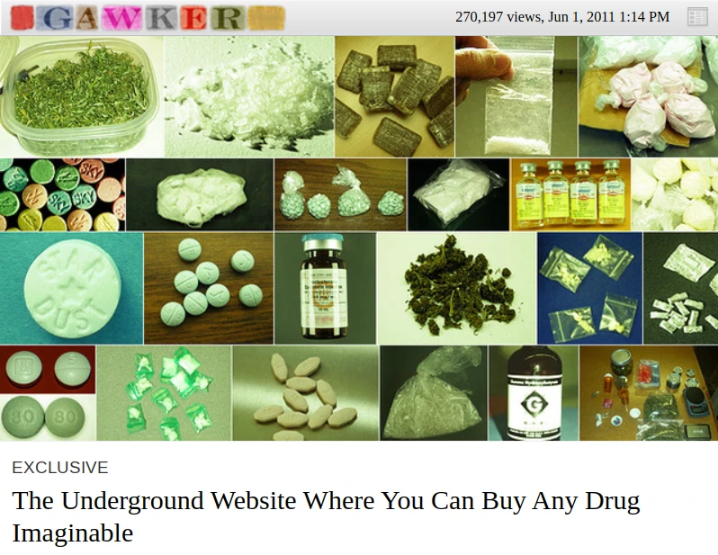

*Artikel vom 1. Juni 2011 über Silk Road (Quelle: [Archiv](https://web.archive.org/web/20110603015735/http://gawker.com/5805928/the-underground-website-where-you-can-buy-any-drug-imaginable) von Gawker)*

Der Autor fügte sogar einige Zitate von Ross Ulbricht ein, den er per E-Mail interviewte und als "Silk Road's administrator" vorstellte. So konnte Ross Ulbricht seine wahren Beweggründe mitteilen und überließ es nicht dem Journalisten, über das Thema zu spekulieren. In dem Artikel erklärte er:

> "Der Staat ist die Hauptquelle von Gewalt, Unterdrückung, Diebstahl und allen Formen von Zwang. \Hört auf, den Staat mit euren Steuergeldern zu finanzieren und lenkt eure produktiven Energien auf den Schwarzmarkt."

Durch diesen Artikel wurde die Existenz von Silk Road einer breiten Öffentlichkeit bekannt, da die Geschichte von der Mainstream-Presse aufgegriffen wurde, z. B. von [*The Atlantic*] (https://www.theatlantic.com/technology/archive/2011/06/libertarian-dream-a-site-where-you-buy-drugs-with-digital-dollars/239776/). Infolge dieser beispiellosen Publicity explodierte der Verkehr auf der Plattform. Die Server konnten kaum noch mithalten, so dass Ross [gezwungen war](https://bitcointalk.org/index.php?topic=3984.msg189007#msg189007), die Registrierungen einzufrieren.

es entstanden auch [Wettbewerber] (https://gwern.net/dnm-survival), die das Modell von Silk Road kopierten, wie Black Market Reloaded, das Ende Juni auf den Markt kam. Dennoch blieb Silk Road bis zu seiner Schließung die Nummer eins, dank seines "First-Mover-Vorteils" und seiner einzigartigen Philosophie.

### Reaktionen auf die Popularität der Website

Nicht jeder begrüßte die Publicity, die generated durch den Gawker-Artikel erhielt. Die Tatsache, dass Silk Road im Rampenlicht stand, hatte den Nebeneffekt, dass die Aufmerksamkeit auf Bitcoin zunahm (nicht zuletzt, weil die Kunden Bitcoins erwerben mussten, um Produkte zu kaufen). Und es stellte sich heraus, dass ein Teil der Bitcoin-Gemeinschaft dieser Verbindung zwischen Kryptowährung und Drogenhandel feindlich gegenüberstand.

Insbesondere der Programmierer Jeff Garzik, der damals an der Entwicklung der Software beteiligt war, nahm diese unwillkommene Verbindung übel. Nach der Veröffentlichung des Artikels wandte er sich persönlich [an](https://www.theatlantic.com/technology/archive/2011/06/libertarian-dream-a-site-where-you-buy-drugs-with-digital-dollars/239776/) Adrien Chen per E-Mail, um zu erklären, dass Bitcoin nicht so anonym sei, wie es schien, da alle Transaktionen permanent auf der [Blockchain](https://planb.academy/resources/glossary/blockchain) aufgezeichnet würden. Er beendete seine E-Mail mit dieser Einschätzung:

> "Der Versuch, größere illegale Transaktionen mit Bitcoin durchzuführen, ist angesichts der bestehenden statistischen Analysetechniken, die von den Strafverfolgungsbehörden vor Ort eingesetzt werden, ziemlich dumm."

Der Gawker-Artikel hat auch die Aufmerksamkeit der Behörden auf sich gezogen. Am 5. Juni, wenige Tage nach seiner Veröffentlichung, mischten sich die Senatoren Chuck Schumer (New York) und Joe Manchin (West Virginia) in den öffentlichen Diskurs ein und forderten die Schließung der Plattform. In einem [offenen Brief](https://web.archive.org/web/20180918162447/https://www.manchin.senate.gov/newsroom/press-releases/manchin-urges-federal-law-enforcement-to-shut-down-online-black-market-for-illegal-drugs), der an den Generalstaatsanwalt des Justizministeriums und den Administrator der DEA gerichtet war, schrieben sie:

> wir schreiben, um unsere große Besorgnis über die Entdeckung eines Online-Marktplatzes für illegale Drogen, bekannt als "Silk Road", auszudrücken  Diese im Februar gestartete Untergrund-Website ermöglicht es den Nutzern, ihre Identitäten zu verbergen und illegale Drogen wie Kokain, Heroin, Ecstasy und Marihuana frei zu kaufen und zu verkaufen. (...) Gemäß 21 U.S.C. 853(a)(2) ist der Generalstaatsanwalt befugt, solche Einrichtungen, die an der Lieferung und dem Vertrieb von kontrollierten Substanzen beteiligt sind, durch Beschlagnahme des Domainnamens der Website zu schließen. Die Drug Enforcement Administration war und ist auch weiterhin rigoros bei der Durchsetzung unserer Gesetze und Vorschriften für kontrollierte Substanzen.  Im Rahmen dieser wichtigen Aufgabe bitten wir Sie dringend, sofort zu handeln und das Silk Road-Netzwerk zu schließen

Darüber hinaus beschuldigte Senator Schumer in einer Pressekonferenz (https://web.archive.org/web/20120804222559/http://www.nbcnewyork.com/news/local/123187958.html) Bitcoin, "eine Online-Form der Geldwäsche zu sein, die dazu dient, die Quelle des Geldes zu verschleiern und zu verschleiern, wer die Droge sowohl verkauft als auch kauft". Dies führte zu einer Reaktion von Gavin Andresen, dem Hauptverantwortlichen für die Software, der Silk Road nicht befürwortet, aber bedauert, dass so etwas über Bitcoin gesagt wird. In seinem Blog [schrieb er](https://gavinthink.blogspot.com/2011/06/but-you-can-use-it-to-buy-drugs.html):

> "Zweitens kann niemand kontrollieren, was mit Bitcoins gekauft wird, genauso wenig wie meine Bank vor Ort kontrollieren kann, was ich mit dem Bargeld mache, das ich an ihrem Geldautomaten abhebe. Ich frage mich, ob die Senatoren Schumer und Manchin alles Bargeld durch eine von der Regierung ausgegebene Chipkarte ersetzen wollen. Schließlich wäre es dann für Kriminelle viel schwieriger, mit dem anonymen Kauf illegaler Waren durchzukommen, und wenn wir alle gesetzestreue Bürger sind, dann sollten wir uns keine Sorgen machen, dass die Regierung über alle unsere Einkäufe Bescheid weiß... oder?"

### Der Erfolg des Amazonas der Drogen

Mit der Aufmerksamkeit der Presse nahm Silk Road Fahrt auf und wurde schließlich profitabel. Bis zum Ende des Sommers war die Aktivität der Website auf fast 10 % des in der Bitcoin-Kette gehandelten Volumens [angewachsen](https://www.chainalysis.com/blog/silk-road-doj-seizure-november-2020/). Die Website, die sich durch Verkaufsprovisionen finanzierte, erwirtschaftete damals [Einnahmen](https://antilop.cc/sr/exhibits/253456480-Silk-Road-exhibits-GX-250.pdf) in Höhe von mehreren zehntausend Dollar pro Monat, wobei die Betriebskosten weitaus geringer waren. Ross konnte es sich nun leisten, sich selbst ein großzügiges Gehalt zu zahlen und beendete sein offizielles Arbeitsverhältnis.

Angesichts des wachsenden Erfolgs seines Projekts musste er auch lernen, zu delegieren. Also stellte er Mitarbeiter ein, um Streitigkeiten auf der Website zu schlichten und Forumsdiskussionen zu moderieren. In seinem Tagebuch [schrieb er] (https://antilop.cc/sr/exhibits/253456476-Silk-Road-exhibits-GX-240B.pdf), dass "nachdem ich etwa 100.000 $ und bis zu 20-25.000 $ monatlich verdient hatte, beschloss ich, dass es an der Zeit war, ein paar Leute einzustellen, die mir helfen sollten, die Website auf die nächste Stufe zu heben". So begann er, Leute zu bezahlen, deren offizielle Identität er nicht kannte, denen er aber vertraute.

Im Laufe des Sommers traf er seinen Freund Richard in Austin, und die beiden Männer [planten](https://antilop.cc/sr/files/2015_01_22_Ulbricht_trial_transcript_W2_D3.pdf#page=120), eine Bitcoin-Tauschplattform zu eröffnen. Ross war es gewohnt, Bitcoin zu benutzen und dachte bereits darüber nach, wie diese Plattform ihm ermöglichen könnte, das Geld zu waschen, das er mit Silk Road verdient hatte. Sie wird jedoch nie das Licht der Welt erblicken.

Bei diesem Ansatz machte Ross einen grundlegenden Fehler. Am 11. Oktober veröffentlichte er eine [Anzeige] (https://bitcointalk.org/index.php?topic=47811.msg568744#msg568744) im Bitcoin-Forum, in der er erklärte: "Ich suche den besten und klügsten IT-Profi in der Bitcoin-Gemeinschaft, der als leitender Entwickler in einem von einem Risikounternehmen unterstützten Bitcoin-Startup-Unternehmen fungieren soll". Er verwendete das Pseudonym Altoid (mit dem er zuvor für Silk Road geworben hatte). In der Nachricht gab er seine E-Mail-Adresse bekannt, die seinen offiziellen Namen enthält: "rossulbricht@gmail.com". Dieser Fehler sollte ihn teuer zu stehen kommen, da er zwei Jahre später im Rahmen der polizeilichen Ermittlungen gegen Silk Road identifiziert und verhaftet werden konnte...

### Ein zentrales Element bei der Konstruktion von Bitcoin

Ross Ulbricht setzte damit eine innovative Idee um, die auf seinen libertären und agoristischen Überzeugungen basiert und den Widerstand von Bitcoin gegen die Zensur nutzt. Nach einer Vorbereitungszeit von über einem Jahr stellte er den Prototyp im Januar 2011 vor. Die Anfänge waren schwierig, aber seine Bemühungen zahlten sich schließlich aus: Im Juni 2011 war Silk Road dank eines auf Gawker veröffentlichten Artikels weltweit bekannt.

Das Aufkommen der Seidenstraße war ein wesentliches Element beim Aufbau von Bitcoin. Der Erfolg der Plattform zeigte, dass Bitcoin einen eigenen Zweck hatte, der sich von den traditionellen staatlichen Währungen und Online-Zahlungsdiensten unterschied. Darüber hinaus führte die Nutzung von Silk Road dazu, dass sich eine Reihe von Menschen für Bitcoin interessierten, wie z. B. [Peter McCormack] (https://www.youtube.com/watch?v=3aDMnE6dnHk), der spätere Moderator des Podcasts *What Bitcoin Did*. Silk Road öffnete schließlich die Tür für alle Arten von illegalen Verwendungen, im Guten wie im Schlechten.

Etwas mehr als ein Jahr nach dem Verkauf von Laszlos Pizzen wurde Silk Road also zum Inbegriff des Bitcoin-Handels. Gleichzeitig wurde diese Nutzung jedoch durch eine andere Art von Aktivität in Frage gestellt: Spekulation. Und die Spekulation war auf Mt. Gox, der wichtigsten Devisenhandelsplattform des Ökosystems, die damals von dem Franzosen Mark Karpelès betrieben wurde, in vollem Gange.

## Mt. Gox-Übernahme

<chapterId>451293d5-d691-5c36-91dd-4ee5e6dcc9e3</chapterId>

Der Zeitraum, der im Frühjahr 2011 begann, war durch die Entwicklung von Tauschaktivitäten zwischen Bitcoin und traditionellen Währungen wie dem Dollar und dem Euro gekennzeichnet. Diese Art von Dienstleistung spielte eine wesentliche Rolle in der Wirtschaft von Bitcoin, die zu klein war, um in einem geschlossenen Kreislauf zu funktionieren. Die Minerer mussten ihre Belohnungen verkaufen, um ihre Stromrechnungen zu bezahlen. Die Händler, einschließlich der Seidenstraßenverkäufer, mussten Dollars sammeln, um ihre Lieferanten zu bezahlen. Ihre Kunden, die in der Regel keine Bitcoins besaßen, mussten sich diese vorher beschaffen. Es gab auch eine starke spekulative Nachfrage von Leuten, die Kryptowährungen als Investition betrachteten.

Die erste große Tauschplattform war Mt. Gox, die im Juli 2010 von dem Unternehmer Jed McCaleb "aus Jux und Dollerei" gegründet wurde. Dank ihres automatisierten Betriebs etablierte sie sich schnell als wichtigste Möglichkeit, Dollar in Bitcoins zu tauschen und umgekehrt. Anfang 2011 beschloss Jed McCaleb angesichts des Umfangs der Aufgabe, die Plattform an eine technisch qualifiziertere und motiviertere Person zu übergeben: Den französischen Entwickler Mark Karpelès.

Zusammen mit Silk Road war die Plattform in diesem Teil der Geschichte von Bitcoin von zentraler Bedeutung. Sie war der Hauptschauplatz der ersten echten Spekulationsblase des Bitcoin-Preises, die im Juni mit 32 $ ihren Höhepunkt erreichte. Es wurde auch Opfer eines massiven Hacks und stand in Verbindung mit mehreren Vorfällen, die sich damals im Ökosystem ereigneten. In diesem Kapitel werden wir über die Umstände der Übernahme von Mt. Gox, seinen kometenhaften Erfolg ab dem Frühjahr, die gleichzeitig auftauchenden Konkurrenten, die aufgetretenen Probleme und die Folgen für die Wirtschaft von Bitcoin sprechen. Doch zunächst wollen wir den neuen Eigentümer, Mark Karpelès, vorstellen.

### Mark Karpelès, der Geek

Mark Karpelès wurde 1985 in Frankreich geboren. Als Einzelkind wurde er von seiner alleinerziehenden Mutter großgezogen. Er interessierte sich schnell für Computer, Videospiele und Manga. In seinen Zwanzigern war er bereits ein Geek (https://web.archive.org/web/20140302234940/http://blog.magicaltux.net/2006/02/12/pensees-nocturnes/): 2007 trat er sogar in dem französischen Dokumentarfilm *Suck my Geek* auf, der sich an alle richtet, die sich für Fantasy, Technologie und Computer begeistern. Im Jahr 2009 wollte er Frankreich verlassen, wo er sich nie wirklich zu Hause gefühlt hatte, und zog [im Juni 2009] (https://web.archive.org/web/20090628035138/http://blog.magicaltux.net/2009/06/18/arrived-in-japan/) nach Japan, weil ihn die dortige Kultur faszinierte. Dort gründete er Tibanne Co. Ltd (benannt nach seiner Katze Tibane), mit der er freiberuflich arbeitete. Insbesondere betrieb er einen Hosting-Dienst namens [KalyHost](https://web.archive.org/web/20101231201212/https://www.kalyhost.com/).

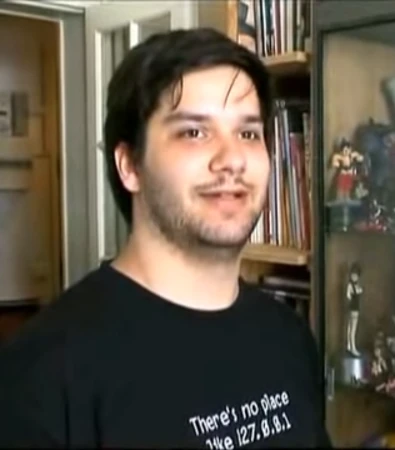

*Mark Karpelès in Suck My Geek im Jahr 2007 (Quelle: [MrReportageTV](https://www.youtube.com/watch?v=cAOLU4_4QGg) auf Youtube)*

Er erfuhr im Herbst 2010 von Bitcoin durch einen französischen Kunden mit Sitz in Peru (William Waisse [alias](https://bitcointalk.org/index.php?topic=1719.msg21107#msg21107) Neofutur), der ihn fragte, ob er eine Rechnung in Bitcoins bezahlen könne. Mark war offen für diese Möglichkeit und entwickelte schnell eine Leidenschaft für dieses System. Im Gegensatz zu Martti Malmi, Ross Ulbricht oder Roger Ver war der junge Franzose weder ein ideologisch motivierter Libertärer noch ein profitgieriger Spekulant. Sein Interesse an Bitcoin beruhte vielmehr auf technischer Neugierde. Wie er [im Jahr 2014] (https://web.archive.org/web/20140918220234/http://www.thedailybeast.com/articles/2014/09/17/mt-gox-s-karpeles-on-losing-a-half-billion-bucks-in-bitcoins.html) sagen würde:

> "Was mich an bitcoin interessierte, waren die technologischen Aspekte. Mit anderen Worten, die Tatsache, dass eine globale Datenbank auf sichere Weise verwaltet wird. Die Tatsache, dass jeder Kunde ein gesichertes privates wallet hat. Ein völlig dezentrales System zu haben. Außerdem kann man mit bitcoin eine öffentliche Datenbank haben."

Sobald er es entdeckt hatte, vertiefte er sich in die Funktionsweise von Bitcoin und begann, Programme zu schreiben, um es zu nutzen. Im November [begann](https://bitcointalk.org/index.php?topic=30.msg20699#msg20699) er, Bitcoin-Zahlungen mit KalyHost zu akzeptieren (Ross Ulbricht [würde](https://cdn.arstechnica.net/wp-content/uploads/2015/01/Govt.motion.1.19.pdf) diesen Dienst nutzen, um die Webseite Silkroadmarket.org zu hosten). Im Dezember 2010 [erstellte](https://bitcointalk.org/index.php?topic=2321.msg30872#msg30872) er ein neues Wiki, Bitcoin.it, das bald das Hauptwiki von Bitcoin werden sollte. Er wollte auch eine Software-Implementierung mit dem Namen [QBitcoin](https://web.archive.org/web/20110326023018/http://bitcoinweekly.com/articles/interview-with-magicaltux-on-qbitcoin) entwickeln, hat dies aber nicht weiter verfolgt.

### Der Kauf von Mt. Gox

Anfang 2011 verwaltete Jed McCaleb Mt. Gox so gut er konnte. Die Plattform war keineswegs sicher, wie einige Community-Mitglieder, wie [Casascius] (https://bitcointalk.org/index.php?topic=4187.msg66477#msg66477), feststellten. Außerdem war sich Jed nicht sicher, ob sein Unternehmen die gesetzlichen Bestimmungen einhalten würde. Der Artikel in der PC World hatte sich bereits auf den Preis ausgewirkt, und er befürchtete zu Recht, dass sich der Aufwärtstrend fortsetzen würde. Daher begann er, sich nach einem Käufer umzusehen.

Seine Wahl fiel auf Mark Karpelès, der in der Entwicklergemeinschaft aktiv war, insbesondere im IRC-Kanal \#bitcoin-dev. Der Franzose half Martti Malmi, Bitcoin.org zu hosten, und half Jed, den Euro zu akzeptieren, wodurch er seine technischen Fähigkeiten unter Beweis stellte. Am 18. Januar bot Jed Mark die Chance, Mt. Gox zu übernehmen. In seiner E-Mail [schrieb er](https://web.archive.org/web/20170602025506/http://www.thedailybeast.com/behind-the-biggest-bitcoin-heist-in-history-inside-the-implosion-of-mt-gox):

> "Hallo Mark,
>

> Bitte behalte das alles vertraulich, ich möchte keine Panik auslösen und ich bin mir noch nicht sicher, ob ich es tun werde, aber ich denke, ich könnte versuchen, mtgox zu verkaufen. Ich habe einfach diese anderen Projekte, denen ich gerne mehr Zeit widmen würde. Wären Sie daran interessiert? Es könnte sehr wenig im Voraus sein und nur eine Auszahlung basierend auf den Einnahmen oder so. Es gibt auch eine Investmentgruppe, die mtgox finanzieren will. Wahrscheinlich um die $158k. Sie könnten es also höchstwahrscheinlich mit etwas Bargeld übernehmen."

Nach Gesprächen über die Bedingungen der Vereinbarung wurde der Vertrag schließlich am 3. Februar unterzeichnet. Jed McCaleb behielt 12 % des Unternehmens und 50 % der Einnahmen für sechs Monate, danach wurde der Rest an das Unternehmen von Mark Karpelès, Tibanne Co. Ltd. Eine Klausel im Vertrag befreite Jed von jeglicher rechtlichen Haftung.

Am 6. März machte Jed McCaleb den Transfer [offiziell](https://bitcointalk.org/index.php?topic=4187.msg60610#msg60610) im Bitcoin Forum bekannt. In seiner letzten Nachricht mit dem Mt. Gox-Konto erklärte er:

> "Ich habe mtgox aus einer Laune heraus gegründet, nachdem ich letzten Sommer über Bitcoins gelesen hatte. Es war interessant und hat Spaß gemacht. Ich bin immer noch sehr zuversichtlich, dass Bitcoins eine große Zukunft haben. Aber um mtgox wirklich zu dem zu machen, was es sein könnte, bräuchte ich mehr Zeit als ich im Moment habe. Deshalb habe ich mich entschlossen, die Fackel an jemanden weiterzugeben, der besser in der Lage ist, die Seite auf die nächste Stufe zu heben

In den folgenden Monaten half Jed Mark weiterhin bei der Verwaltung der Plattform. Allerdings wurde er bald von einem [neuen Projekt](https://bitcointalk.org/index.php?topic=10193.msg146250#msg146250) für digitale Währungen absorbiert, das 2012 in der Neugestaltung von Ripple und 2014 in der Gründung von Stellar mündete.

### Die ersten Vorfälle

Wie wir bereits Anfang 2011 feststellten, war die Mt. Gox-Plattform nicht sicher. Und sie war logischerweise einer Reihe von Angriffen mit unterschiedlichem Schweregrad ausgesetzt, einschließlich einer XML-Injektion, die es einem böswilligen Benutzer ermöglichte, eine nicht autorisierte [Abhebung] (https://blog.bitmex.com/wp-content/uploads/2018/02/CrackingMtGox.pdf) von 50.000 US-Dollar von seinem Liberty Reserve-Konto vorzunehmen. Als Mt. Gox den Besitzer wechselte, war die Plattform bereits ein vergiftetes Geschenk für Mark Karpelès. Doch damit war der Ärger noch nicht vorbei.

Am 1. März 2011, gerade als der Transfer offiziell gemacht werden sollte, lösten sich 80.000 Bitcoins [in Luft auf](https://mempool.space/tx/e67a0550848b7932d7796aeea16ab0e48a5cfe81c4e8cca2c5b03e0416850114), dank eines bösartigen Zugriffs auf die [wallet](https://planb.academy/resources/glossary/wallet).dat-Datei der Website. Am 3. Mai bemerkte Jed McCaleb die Abhebung und [informierte](https://web.archive.org/web/20200427200314/https://courts.ms.gov/appellatecourts/docket/sendPDF.php?f=dc00001_live.SCT.17.M.1681.102741.5.pdf&c=87490&a=N&s=2) Mark im IRC, dass "etwas Schlimmes passiert ist". Es war ein großer Verlust (ein Bitcoin wurde damals für 0,92 $ verkauft), der in den folgenden Monaten mit dem beispiellosen Preisanstieg immer größer wurde.

Dieses Problem wurde [erwähnt] (https://web.archive.org/web/20170602025506/http://www.thedailybeast.com/web/20170602025506/http://www.thedailybeast.com/behind-the-biggest-bitcoin-heist-in-history-inside-the-implosion-of-mt-gox) von Jed am 18. April in einer E-Mail an Mark, in der er schrieb:

> "Ich kann nicht sagen, wie groß das Problem sein wird, dass mir 80k BTC fehlen, wenn der Preis auf 100 Dollar oder so steigt. Das ist eine ziemliche Menge, die wir zu diesem Zeitpunkt schulden, aber mtgox sollte eine Menge BTC (Bitcoin) verdient haben, um dorthin zu gelangen. Hinzu kommt, dass der BTC (Bitcoin)-Saldo wahrscheinlich nie unter 80.000 fallen wird. Sie brauchen sich also nicht wirklich Sorgen zu machen."

### Das Management der ersten Spekulationsblase

Im späten Frühjahr 2011 kam es zur ersten Spekulationsblase im Preis von Bitcoin. Wie im [letzten Kapitel](https://planb.academy/courses/a51c7ceb-e079-4ac3-bf69-6700b985a082/16c5e6d6-2412-48c6-9687-6af92cf0d89a) unseres ersten Kurses über die Geschichte von Bitcoin beschrieben, war diese Blase durch die Verbreitung von Gruppen, die sich um Bitcoin bildeten, durch die Aufmerksamkeit der Medien, die sowohl von unabhängigen Bloggern als auch von Online-Nachrichtenagenturen ausging, und durch eine hohe Aktivität auf Tauschplattformen gekennzeichnet. Ein Jahr später [würde](https://web.archive.org/web/20120613180823/https://bitcoinmagazine.net/anniversary-of-the-great-bubble-of-2011) sie von Vitalik Buterin, dem jungen Chefredakteur des Bitcoin Magazins, als "die große Blase von 2011" bezeichnet.

Im April, nach der Veröffentlichung [des Forbes-Artikels] (https://www.forbes.com/forbes/2011/0509/technology-psilocybin-bitcoins-gavin-andresen-crypto-currency.html), übertraf der Preis seinen früheren Höchststand und erreichte 3 $. Die spekulative Begeisterung setzte sich im Mai fort und trieb den Preis auf 10 $. Schließlich trug die Veröffentlichung des Gawker-Artikels dazu bei, Bitcoin weithin bekannt zu machen, und löste die letzte spekulative Episode aus, wobei der Preis am 8. Juni kurzzeitig 32 $ erreichte.

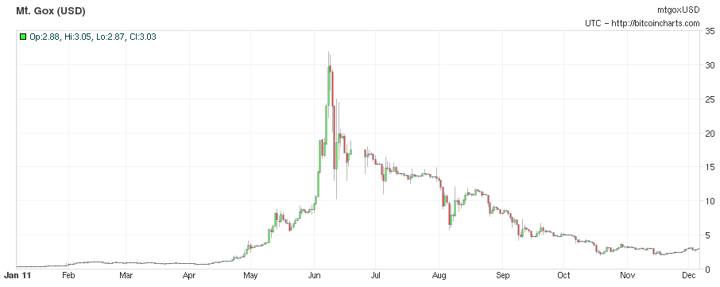

*Der Preis von Bitcoin auf Mt. Gox im Jahr 2011 (Quelle: Bitcoin Charts via [Bitcoin.com](https://news.bitcoin.com/look-bitcoin-bubble-will-next-one/))*

Dieser phänomenale Anstieg kam vor allem Mt. Gox zugute, das einen explosionsartigen Anstieg des Datenverkehrs verzeichnete. Zwischen der tatsächlichen Übernahme durch Mark im März und Ende Mai stieg die Zahl der Benutzerkonten von 3.000 auf 60.000. Im gleichen Zeitraum stieg das tägliche Handelsvolumen von einigen tausend Dollar auf mehrere *hundert* tausend Dollar. Im Juni überstieg es für einige Tage sogar zwei Millionen Dollar!

Die Verwaltung dieses Wachstums war jedoch ein Alptraum: Mark erhielt unzählige E-Mails und Support-Tickets. Er musste [mehrere](https://bitcointalk.org/index.php?topic=9808.msg141011#msg141011) Zahlungsmethoden verwalten, die letzten beiden waren [SEPA-Überweisungen](https://bitcointalk.org/index.php?topic=5461.msg80087#msg80087) (Mark hatte ein Konto bei einer französischen Bank eröffnet) und der Dienst [Dwolla](https://bitcointalk.org/index.php?topic=8280.msg120637#msg120637). Einige Einzahlungen gingen auf dem Weg verloren.

Im Laufe der Zeit wurden die Dinge besser. Im Juni stellte Mark Karpelès einen Mitarbeiter ein, der ihn unterstützen sollte, einen gewissen Adam Turner, [dessen](https://www.reddit.com/r/Bitcoin/comments/3fe92x/im_ashley_barr_aka_adam_turner_the_first_mtgox/) bürgerlicher Name Ashley Barr ist. Außerdem beschloss er, das Unternehmen in einem Büro im prestigeträchtigen Cerulean Tower in Tokio anzusiedeln - ein echtes Zeichen des Erfolgs.

*Das Büro von Mt. Gox im Juni 2011 (Quelle: Mark Karpelès auf [Twitter](https://twitter.com/MagicalTux/status/1310018500602130432))*

### Die Konkurrenten von Mt. Gox

Der Erfolg von Mt. Gox inspirierte Nachahmer, sowohl in den Vereinigten Staaten als auch anderswo. Als die Preise und die Nachfrage stiegen, wurde der Start einer Börsenplattform rentabel. Infolgedessen entstanden im Laufe des Jahres, insbesondere ab dem Frühjahr, zahlreiche Konkurrenten, die auf demselben Modell aufbauen und eine automatische Auftragsverwaltung anbieten (https://web.archive.org/web/20110727192503/https://bitcoincharts.com/markets/).

Abgesehen von Bitcoin Market (erwähnt in HIS201) war die erste Plattform, die wirklich mit Mt. Gox konkurrierte, Bitcoin-Central, eine Plattform mit Sitz in Frankreich. Sie wurde [gestartet] (https://bitcointalk.org/index.php?topic=2519.msg34080#msg34080) am 29. Dezember 2010 von David François, einem erfahrenen Webentwickler, der Bitcoin im Oktober entdeckte und im Forum das Pseudonym Davout verwendete. Im Einklang mit dem Gemeinschaftsethos wurde der Quellcode des Marktplatzes [offen](https://bitcointalk.org/index.php?topic=2721.msg36980#msg36980) und [unter einer Open-Source-Lizenz](https://github.com/davout/bitcoin-central/blob/master/LICENSE) (AGPL) veröffentlicht. Die Plattform akzeptierte anfangs nur Liberty Reserve Dollar und Euro sowie [herkömmliche Euro-Überweisungen](https://bitcointalk.org/index.php?topic=2584.msg35109#msg35109). Der Betrieb des Systems war anfangs etwas experimentell, wurde aber im Laufe der Monate verbessert. David François fügte einen [API](https://bitcointalk.org/index.php?topic=3174.msg44575#msg44575), [SEPA-Überweisungen](https://bitcointalk.org/index.php?topic=37494.msg459909#msg459909) und andere Währungen hinzu, wie [Gold über Pecunix](https://bitcointalk.org/index.php?topic=3098.msg43315#msg43315), den [Kanadischen Dollar](https://bitcointalk.org/index.php?topic=40239.msg490360#msg490360) und die Indische Rupie.

Eine zweite Plattform war Britcoin, die am 26. März von Amir Taaki (alias Genjix), dem jungen britischen Entwickler iranischer Herkunft, der im November 2010 einen Brief an WikiLeaks senden wollte, in dem er Bitcoin empfahl, [gestartet](https://bitcointalk.org/index.php?topic=4984.msg73066#msg73066) wurde. Wie der Name schon sagt, war die Plattform in Großbritannien angesiedelt und integrierte den Austausch zwischen Pfund Sterling und Bitcoin. Wie David François [veröffentlichte](https://bitcointalk.org/index.php?topic=4579.msg67047#msg67047) Amir die zugrunde liegende Software [unter einer Open-Source-Lizenz](https://github.com/dooglus/intersango/blob/master/LICENSE) (AGPL), die er "Intersango" nannte (vom Esperanto *interŝanĝo* für Austausch). Amir wurde bald von Donald Norman und Patrick Strateman (auch bekannt unter dem Pseudonym Phantomcircuit) [https://web.archive.org/web/20120129171120/https://britcoin.co.uk/about-us.php] unterstützt, um die Plattform zu verwalten.

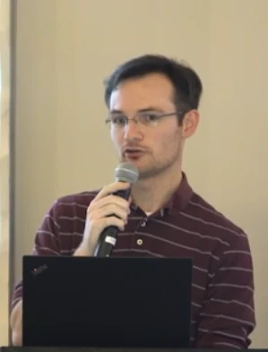

*Patrick Strateman im Jahr 2016 (Quelle: [SF Bitcoin Developers](https://www.youtube.com/watch?v=Y6kibPzbrIc))*

Im April gründeten die drei Männer [Bitcoin Consultancy] (https://web.archive.org/web/20110513023005/http://bitcoinconsultancy.com/), ein Unternehmen, das Softwareentwicklung und technische Beratung anbietet. Unterstützt wurden sie dabei von anderen wie Nils Schneider (Tcatm) und Denis Rojo (Jaromil). Diese Organisation hatte auch großen Einfluss, da sie die ersten europäischen Konferenzen in Prag und London organisierte. Hinter dem seriösen Äußeren verbarg sich jedoch ein von der *Hacker*-Philosophie beeinflusster Geist, wie die Persönlichkeit von Amir Taaki vermuten lässt.

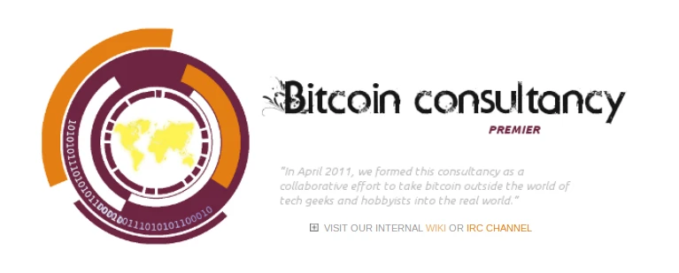

*Bitcoin Consultancy Website, 13. Mai 2011 (Quelle: [Archiv](https://web.archive.org/web/20110513023005/http://bitcoinconsultancy.com/))*

Am 6. Juni startete Bitcoin Consultancy [https://bitcointalk.org/index.php?topic=26543.msg332466#msg332466] eine neue, auf den europäischen Markt ausgerichtete Devisenhandelsplattform namens Intersango (wie die dahinter stehende Software). Britcoin und Intersango fusionierten schließlich einige Monate später zu einer einzigen Website.

In Osteuropa wurde am 4. April die Bitomat-Plattform mit Sitz in Polen [gestartet](https://forum.bitcoin.pl/viewtopic.php?f=7&t=166#p871). Die Schnittstelle war rudimentär, ermöglichte es aber polnischen Nutzern, ihre Zlotys in Bitcoins zu tauschen. Ebenfalls erwähnenswert ist Cavirtex, [eröffnet](https://bitcointalk.org/index.php?topic=25312.msg314448#msg314448) am 2. Juli, das in Kanada tätig war.

Eine weitere Plattform war VirWoX (*Virtual World Exchange*) mit Sitz in Österreich. Sie wurde 2007 eröffnet und war ein führender Marktplatz für den Umtausch von virtuellen Währungen aus Videospielen, darunter der Linden-Dollar aus *Second Life*. Am 27. April 2011 nahm die Website [https://web.archive.org/web/20110511075334/https://www.virwox.com/] Bitcoin in ihr Angebot auf, wobei sie zunächst nur den Tausch mit dem Linden-Dollar anbot, der es den Nutzern ermöglichte, Nakamotos Kryptowährung zu erwerben.

Der letzte Marktplatz, der in diesem Zeitraum erschien, war TradeHill, eine Plattform, die von Jered Kenna, einem ehemaligen Marine, der zum Unternehmer wurde, und Adam Stradling, einem Berater für Finanztechnologie, gegründet wurde. Sie wurde am 8. Juni 2011 ins Leben gerufen und [angekündigt] (https://bitcointalk.org/index.php?topic=13650.msg186776#msg186776) im Forum von Bruce Wagner, dem Moderator der *Bitcoin Show*, der eng mit der Plattform zusammenarbeitete. TradeHill hatte seinen Sitz in den USA und erleichterte den Umtausch mit dem US-Dollar, so dass es schnell zur zweitgrößten Plattform in Bezug auf das Volumen wurde, weit hinter Mt. Gox, das die Benchmark blieb.

### Juni-Hacks

Der finanzielle Erfolg von Bitcoin zog unweigerlich Hacker an. Das Fehlen von Mittelsmännern und die relative Anonymität von Bitcoin war ein perfektes Merkmal für Diebe, die sich der Bitcoins anderer Leute bemächtigen können, ohne zu riskieren, dass ihre Beute eingefroren wird. Am 13. Juni fand der erste groß angelegte Hack statt: Ein aktives Mitglied der Community mit dem Pseudonym Allinvain [wurde](https://mempool.space/tx/4885ddf124a0f97b5a3775a12de0274d342d12842ebe59520359f976721ac8c3) um 25.000 Bitcoins beraubt, die ihm persönlich gehörten, was fast 500.000 Dollar entspricht! Er [teilte](https://bitcointalk.org/index.php?topic=16457.msg214423#msg214423) seine Erfahrung im Bitcoin-Forum mit, und die Geschichte wurde [in der Online-Presse](https://www.forbes.com/sites/timworstall/2011/06/17/bitcoin-the-first-500000-theft/) weitergegeben. Es [schien](https://web.archive.org/web/20110618151605/https://www.wired.com/threatlevel/2011/06/bitcoin-malware/), dass er das Opfer eines Trojaners (Malware) namens Coinbit war, der die Datei "wallet.dat" von einem Computer mit Windows abrief. Dies [brachte](https://gavinthink.blogspot.com/2011/06/why-arent-bitcoin-wallets-encrypted.html) die Frage der wallet-Verschlüsselung wieder auf den Tisch, eine Funktion, die einige Monate später in der Software [implementiert](https://bitcointalk.org/index.php?topic=45410.msg541446#msg541446) werden sollte.

Wie wir bereits angedeutet haben, war Mt. Gox ein ideales Ziel. Es war regelmäßig das Ziel von Denial-of-Service-Angriffen (z. B. am [1. Mai] (https://bitcointalk.org/index.php?topic=6931.msg101451#msg101451)). Darüber hinaus war Mt. Gox bereits im Mai nur knapp einer Katastrophe entgangen, als ein Hacker 300.000 BTC erbeutete, bevor er 297.000 davon zurückgab.

Infolgedessen begann am 16. Juni ein massiver Hack. Einem Hacker (möglicherweise [von](https://www.theguardian.com/technology/2011/jun/22/lulzsec-rogue-suspected-of-bitcoin-hack) der Gruppe LulzSec) gelang es, die Datenbank mit den Pseudonymen der Nutzer und den kryptografischen Fingerabdrücken ihrer Passwörter (mit MD5 gehasht, [meist ungesalzen](https://news.ycombinator.com/item?id=2671669) in die Hände zu bekommen. Dadurch konnte er auf Konten zugreifen, die durch schwache (d.h. kurze oder leicht zu erratende) Passwörter gesichert waren, und Abhebungen unter dem täglichen Limit von 1.000 Dollar vornehmen. Die Beschwerden [häuften sich](https://bitcointalk.org/index.php?topic=18050.0) im Forum und veranlassten Mark Karpelès am 18. Juni zu einer [Reaktion](https://bitcointalk.org/index.php?topic=18858.msg236884#msg236884). Karpelès spielte die Diebstähle herunter, indem er darauf hinwies, dass es sich nur um wenige Fälle handelte und er die Idee unterstützte, dass "dies ein Problem zu sein scheint, das hauptsächlich von Benutzern ausgeht".

Am Sonntag, dem 19. Juni, holte die Realität Mark jedoch ein. Gegen 17.00 Uhr verschaffte sich der Hacker Zugang zu Jed McCalebs persönlichem Konto, auf dem sich eine Menge Geld befand. Da das tägliche Abhebungslimit bei 1.000 Dollar lag, versuchte er, den Preis so niedrig wie möglich zu halten, um so viele Bitcoins wie möglich abzuheben, und begann, Bitcoins von dem Konto zu verkaufen. Diese Aktion löste einen Flash-Crash aus: Der Preis, der sich im Laufe des Tages um 17,5 $ bewegte, fiel um 17.51 Uhr allmählich auf 0,01 $. Dem Piraten gelang es, 2.000 BTC zu stehlen, was beim aktuellen Preis 35.000 $ entspricht.

*Bitcoin Bericht Band 8

Einige Mt. Gox-Benutzer gerieten in Panik und verkauften ihre Bestände, um zu retten, was zu retten war. Andere [nutzten](https://www.youtube.com/watch?v=jrikj7fy4MU) die Gelegenheit, Bitcoins zu niedrigen Preisen zu kaufen. Als Mark davon erfuhr, nahm er die Plattform sofort vom Netz und [kündigte](https://news.ycombinator.com/item?id=2671549) die Annullierung aller Tauschvorgänge an, die während des Massenverkaufs stattfanden, und [berief sich](https://bitcointalk.org/index.php?topic=20535.msg256505#msg256505) auf "höhere Gewalt".

Einigen Kunden ist es jedoch gelungen, Geld abzuheben. Dies war der Fall bei einem gewissen Kevin Day, alias Toasty, der es [schaffte](https://bitcointalk.org/index.php?topic=20207.msg252680#msg252680), 259.685 Bitcoins zu einem Stückpreis von 0,0101 $ zu kaufen, also insgesamt 2.623 $, und 643 davon von der Plattform abzuheben. Aufgrund dieses außergewöhnlichen Kaufauftrags wurde er von Mark Karpelès [verdächtigt](https://bitcointalk.org/index.php?topic=20250.msg253411#msg253411), in geheimer Absprache mit dem Piraten zu handeln. Um seine Gutgläubigkeit zu beweisen, [erschien](https://www.youtube.com/watch?v=skBbFDcVuY4) er am Tag nach dem Hack in der *Bitcoin Show* und [platzierte](https://bitcointalk.org/index.php?topic=20775.msg259984#msg259984) die Bitcoins schließlich auf einem Treuhandkonto bei ClearCoin, einem von Gavin Andresen betriebenen Treuhandservice. Die Gelder wurden einen Monat später von diesem Konto [freigegeben](https://mempool.space/tx/b95fb3675d580fea982c02adbffae4224606470ce3f5e6685c3977da337d52f1), ohne dass bekannt wurde, ob Mt. Gox erfolgreich war oder nicht.

Doch der Flash-Absturz war nicht das einzige dramatische Ereignis an diesem Tag. Einige Stunden später, [gegen 19.30 Uhr](https://news.ycombinator.com/item?id=2671612), veröffentlichte der Hacker [die Benutzerdatenbank](https://bitcointalk.org/index.php?topic=19576.msg244940#msg244940). Dies würde es anderen, erfahreneren und böswilligeren Personen ermöglichen, sie vollständig auszunutzen. Sie wären in der Lage, auf Konten bei anderen Diensten wie [GMail](https://bitcointalk.org/index.php?topic=19641.msg245714#msg245714), [TradeHill](https://www.youtube.com/watch?v=8ygb9D9vnL4&t=253s) und MyBitcoin zuzugreifen.

### Die Folgen der Piraterie

Das Ergebnis war katastrophal für Mark, für Mt. Gox und Bitcoin im Allgemeinen... Die Börsenplattform wurde eine Zeit lang abgeschaltet, wodurch der Zugang zum liquidesten Markt im Ökosystem verloren ging. Der spekulative Enthusiasmus ließ nach, und der Preis begann zu fallen. Am 5. Juli wurde ein Bitcoin für nur 13 Dollar gehandelt.

Die Hacks schadeten dem öffentlichen Image von Bitcoin. Obwohl ein einzelner Hack wie der von Allinvain nicht repräsentativ für den Rest des Netzwerks war, und obwohl Mt. Gox nur ein von Kryptowährungen betriebener Tauschdienst war, neigen gewöhnliche Menschen dazu, Bitcoin als Ganzes mit diesen Ereignissen gleichzusetzen. Am 20. Juni [schrieb](https://www.forbes.com/sites/timworstall/2011/06/20/so-thats-the-end-of-bitcoin-then/) Tim Worstall einen Artikel für Forbes, in dem er "das Ende des Bitcoin-Experiments" ankündigte. Damit war dies einer der ersten "Bitcoin-Nachrufe", die von der Presse veröffentlicht wurden (die ab 2014 auf der Website von Jordan Tuwiner [aufgeführt](https://web.archive.org/web/20150106024100/http://bitcoinobituaries.com/) wurden). Er behauptete:

> "Bitcoin sind nicht sicher, wie sowohl der jüngste Diebstahl als auch dieses Passwortproblem zeigen. Sie sind weder liquide noch ein Wertaufbewahrungsmittel, wie der Preisverfall zeigt, und wenn sie nichts von alledem sind, dann sind sie auch kein gutes Tauschmittel, denn wer würde sie annehmen wollen?"

Um die Situation zu verbessern und die Kunden zu beruhigen, traten Mark Karpelès und Adam Turner am 21. Juni [https://www.youtube.com/watch?v=-0XvP841jaM] in Bruce Wagners *Bitcoin Show* auf. Am 23. Dezember [verschob](https://bitcointalk.org/index.php?topic=21436.msg268800#msg268800) Mark 424.242 Bitcoins auf die Blockchain, um die Zahlungsfähigkeit des Unternehmens zu beweisen, und am 27. Dezember wurde die Plattform schließlich wieder geöffnet. Da er die Notwendigkeit einer besseren Kommunikation erkannt hat, wird Mark [https://www.youtube.com/watch?v=wG-Wt0dAm_U] im Juli auch in einer Episode der *Bitcoin Show* auf Französisch auftreten, die von David François moderiert wird!

Eine letzte Folge des Mt. Gox-Hacks war die beschleunigte Entwicklung der Zwei-Faktor-Authentifizierung (*Zwei-Faktor-Authentifizierung*) als Mittel für den Zugriff auf ein Konto. Bei diesem Verfahren wird in der Regel ein einfaches Passwort durch die Anforderung ergänzt, Informationen von einem Drittanbietergerät, z. B. einem Mobiltelefon, bereitzustellen. Ab dem 7. Juli schlug Mt. Gox [vor] (https://bitcointalk.org/index.php?topic=26917.msg338630#msg338630) seinen Kunden vor, spezielle YubiKeys zu bestellen, bei denen es sich um spezielle USB-Schlüssel handelt, die Einmal-Passwörter vergeben. Die Verteilung dieser Schlüssel begann in der folgenden Woche.

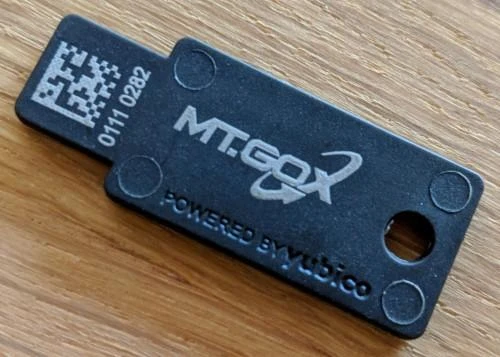

*YubiKey für Mt. Gox (Quelle: [Tech Solvency](https://www.techsolvency.com/mfa/security-keys/yubikeys/rare/))*

Auch konkurrierende Plattformen führten eine doppelte Authentifizierungslösung ein. Bitcoin-Central [entschied sich](https://bitcointalk.org/index.php?topic=21422.msg307138#msg307138) am 30. Juni für Google Authenticator. TradeHill [wechselte](https://bitcointalk.org/index.php?topic=28447.msg357955#msg357955) am 13. Juli zum Dienst Duo Security.

### Die Schließung von MyBitcoin

Im Sommer 2011 wandten sich die meisten neuen Nutzer von Kryptowährungen an MyBitcoin, die Depotanwendung zur Verwaltung von Bitcoins, ohne sich um die Ausführung komplexer Software kümmern zu müssen. Sie war online in Form einer Weboberfläche verfügbar, und man brauchte nur ein Passwort, um auf sein Konto zuzugreifen. Die Anwendung wurde von den damaligen [Tutorials](https://web.archive.org/web/20110613053345/http://bitcoinme.com/index.php/accept) als einfache Lösung für den Empfang von Bitcoins [beworben](https://www.youtube.com/watch?v=ejiqbzqmxSE). Bruce Wagner [präsentierte](https://web.archive.org/web/20110424221921/http://www.bitcoinme.com/) sie auf seiner BitcoinMe.com-Website als "superschnellen und einfachen Einstieg in die Nutzung von Bitcoin". Es war so einfach zu benutzen, dass viele Leute den Ratschlag von [Satoshi](https://bitcointalk.org/index.php?topic=125.msg1149#msg1149) nicht befolgten, einfach "Kleingeld" auf der App aufzubewahren und sie als Sparkonto zu benutzen.

In den Tagen nach dem 19. Juni litt MyBitcoin unter den Folgen des Datenlecks bei Mt. Gox. Böswillige Personen verschafften sich Zugang zu zahlreichen Konten, die durch ein schwaches, bei Mt. Gox wiederverwendetes Passwort geschützt waren. So verlor beispielsweise [BrightAnarchist] (https://bitcointalk.org/index.php?topic=20427.msg255193#msg255193), das Forumsmitglied, das die EFF 2010 dazu gedrängt hatte, Bitcoin zu akzeptieren, sein gesamtes Kapital. Am 25. Juni erklärte Tom Williams, der anonyme Präsident von MyBitcoin, [https://bitcointalk.org/index.php?topic=22221.msg279396#msg279396], dass 1 % der von dem Datenleck bei Mt. Gox betroffenen Nutzer betroffen waren und dass 4.019 Bitcoins gestohlen wurden, was einem Wert von 70.000 Dollar entspricht.

Die Rückschläge der Anwendung waren jedoch noch nicht zu Ende. Am 29. Juli wurde MyBitcoin plötzlich abgeschaltet. Fast 78.740 Bitcoins fehlten im wallet der Anwendung, ein Betrag, der zu diesem Zeitpunkt mehr als einer Million Dollar entsprach und 51 % der Gelder auf den Kundenkonten ausmachte, was den Dienst zwang, den Rest zu erstatten und zu verschwinden. Obwohl MyBitcoin [behauptete](https://web.archive.org/web/20111018173154/https://www.mybitcoin.com/), gehackt worden zu sein (noch einer!), gab es Beweise [die darauf hindeuten](https://observer.com/2011/08/search-for-owners-of-mybitcoin-loses-steam/), dass sein Manager, Tom Williams, hinter dem Diebstahl steckte.

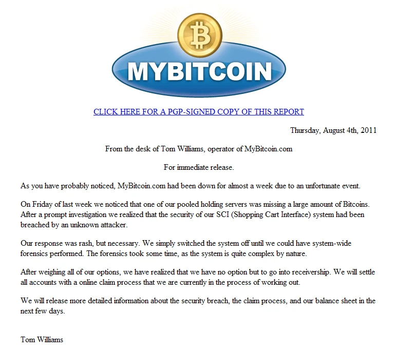

*Tom Williams Ankündigung vom 4. August 2011 (Quelle: [Bitcoin Wiki](https://en.bitcoin.it/wiki/MyBitcoin))*

Einige einzelne Verluste waren [hoch](https://bitcointalk.org/index.php?topic=33389.msg417455#msg417455). Besonders betroffen war Bruce Wagner: Er [behauptete](https://www.youtube.com/watch?v=4FZldY-ZBBE&t=88s), zusammen mit seiner Ehefrau über 25.000 Bitcoins oder über 300.000 Dollar zum Zeitpunkt der Schließung verloren zu haben. Er widmete diesem Ereignis eine Reihe von Sendungen. Darüber hinaus schadete Bruce' Rat, Bitcoins zu verwenden, seinem Ruf, und die *Bitcoin Show* wurde einige Monate später eingestellt.

Trotz dieses Vertrauensverlustes gewannen die wallet der Verwahrstellen weiter an Popularität. Dies war der Fall bei Instawallet, das [seit April](https://bitcointalk.org/index.php?topic=6785.msg99378#msg99378) existierte. Als Reaktion darauf startete Bitcoin Consultancy [im August](https://bitcointalk.org/index.php?topic=35599.msg439954#msg439954) seinen eigenen Dienst Vibanko.

### Bitomat's Konkurs

Zeitgleich mit diesem Ereignis trat auf der polnischen Bitomat-Plattform ein größeres Problem auf. Am 26. Juli erhöhte der Administrator (https://www.reddit.com/r/Bitcoin/comments/j4t58/3rd_largest_bitcoin_exchange_has_lost_its/c2957nt/) die Ressourcen des Servers, was den (ungewöhnlichen) Effekt hatte, dass die virtuelle Maschine neu gestartet und die vorhandenen Daten, einschließlich der privaten wallet-Schlüssel des Systems, gelöscht wurden. Der Verlust belief sich auf 17.000 Bitcoins, was damals etwa 235.000 Dollar entsprach. Obwohl das Handelsvolumen nicht riesig war, handelte es sich um die drittgrößte Börsenplattform hinter TradeHill und Mt. Gox, was den Vorfall bedeutsam machte.

Um seine Kunden nicht zu schädigen, bot der Verwalter an, die Plattform für 17.000 BTC zu verkaufen. Das gefiel Mark Karpelès, der auf dem polnischen Markt Fuß fassen wollte. Am 11. August kündigte Mt. Gox [https://web.archive.org/web/20120426023056/http://support.mtgox.com/entries/20357051-mt-gox-the-world-s-largest-bitcoin-exchange-to-acquire-bitomat-pl-compensate-loss-of-bitcoins] die Übernahme von Bitomat an, um "das Vertrauen in die Bitcoin-Wirtschaft wiederherzustellen". Dies führte jedoch zu einer Erhöhung der Verbindlichkeiten von Mt. Gox um 17.000 BTC.

Diese Verluste wurden durch das Fehlverhalten von Mt. Gox im Oktober 2011 noch verschlimmert: Etwa 2.609 Bitcoins (im Wert von über 8.000 Dollar) [wurden](https://bitcointalk.org/index.php?topic=50206.msg598125#msg598125) an eine ungültige Adresse gesendet, so dass sie nicht ausgegeben werden konnten. Dieser Programmierfehler [offenbarte](https://www.righto.com/2014/03/the-programming-error-that-cost-mt-gox.html) Marks allgemeine Nachlässigkeit und war ein Vorbote des tragischen Schicksals der Börsenplattform.

### Fragiles Wachstum

2011 war Mt. Gox das Herzstück der Wirtschaft von Bitcoin. Wie das gesamte Ökosystem florierte auch die Plattform in der ersten Jahreshälfte. Unter der Leitung von Mark Karpelès nahm sie eine neue Dimension an. Er eröffnete Büros und stellte einen Mitarbeiter ein.

Hinter diesem schillernden Wachstum verbarg sich jedoch eine große Schwäche. Die Plattform von Mt. Gox wurde in dieser Zeit mehrfach gehackt, was dazu führte, dass sie im Laufe der Monate Verluste anhäufte: Ende des Sommers waren mehr als hunderttausend Bitcoins nicht mehr auffindbar. Dies war ein Vorbote für einen starken Rückgang. In den nächsten zweieinhalb Jahren sollte Mt. Gox jedoch zunächst zu einer massiven Plattform heranwachsen.

## Bitcoin und politischer Aktivismus

<chapterId>5545c513-74de-57e8-929e-a75406ed5829</chapterId>

Bitcoin ist ein inhärent politisches Objekt, da es als Instrument der Befreiung dient und Aktivitäten außerhalb des gesetzlichen Rahmens ermöglicht. Aus diesem Grund hat es natürlich ideologisch motivierte Personen angezogen, die oft zu seinen leidenschaftlichsten Befürwortern wurden. Darüber hinaus wurde ihr Aufstieg durch die große Skepsis und Wut gegenüber dem Bankensystem begünstigt, die aus der Finanzkrise von 2008 resultierte: Aktivisten sahen in der Kryptowährung eine Alternative zu den Finanzinstituten, die sie für korrupt hielten.

Bitcoin profitierte insbesondere von der amerikanischen libertären Bewegung, die sowohl für wirtschaftliche Freiheit (typisch für die Republikaner) als auch für moralische Freiheit (typisch für die Demokraten) eintrat und somit eine Art politischen dritten Weg in den USA darstellte. Viele Libertäre wurden so zu großen Förderern der Kryptowährung und unterstützten insbesondere deren wirtschaftliche Entwicklung im Bundesstaat New Hampshire.

In diesem Kapitel untersuchen wir zunächst die Beziehung zwischen Bitcoin und dem amerikanischen Libertarismus, der sich nicht einstimmig dafür aussprach. Dann analysieren wir die starke Beteiligung bestimmter Persönlichkeiten, wie Ian Freeman, Roger Ver und Erik Voorhees. Schließlich werden wir sehen, wie Bitcoin in politische Bewegungen wie das *Free State Project* oder *Occupy Wall Street* Ende 2011 integriert wurde.

### Die Beziehung zum amerikanischen Libertarismus

Die Nähe des amerikanischen Libertarismus zu Bitcoin [scheint](https://www.metzdowd.com/pipermail/cryptography/2008-November/014853.html) ziemlich natürlich. Libertäre halten staatliche Eingriffe für unerwünscht, auch im Bereich des Geldes, während Kryptowährungen ihrerseits eine Alternative zum staatlichen Geld bieten, da sie nicht zensierbar und nicht inflationär sind. Aus diesem Grund waren viele Mitglieder der Gemeinschaft damals selbst Libertäre: Sie sahen Bitcoin als Lösung für die Probleme, die sie anprangerten.

Während dieses Zeitraums in der Geschichte von Bitcoin wurde die libertäre Sphäre durch Ron Pauls Kampagne für die Präsidentschaftswahlen 2012 geprägt. Ron Paul war ein libertärer Politiker, der den 14. Bezirk des Staates Texas im Repräsentantenhaus vertrat. Wegen seiner Gewohnheit, gegen alle Gesetze zu stimmen, die die Freiheit der Bürger einschränken oder die Staatsausgaben erhöhen, erhielt er den Spitznamen "Doctor No". Nachdem er 2008 für die republikanische Nominierung kandidiert hatte, tat er dies auch 2012. Obwohl er wenig Aussicht auf Erfolg hatte, begeisterten seine Kandidaturen eine große Anzahl von Libertären und [inspirierten](https://reason.com/2012/05/11/welcome-to-ron-pauls-revolution-the-webs/) eine echte Basisbewegung. Ron Pauls zweite Kampagne für die Präsidentschaftswahlen fiel ungefähr in den Zeitraum, der uns interessiert: Sie [begann](https://web.archive.org/web/20110516130810/http://politicalticker.blogs.cnn.com/2011/05/13/breaking-rep-ron-paul-announces-third-bid-for-presidency/) im Mai 2011 und endete im August 2012 mit dem *Republican National Convention*, auf dem Mitt Romney offiziell als Kandidat der Republikanischen Partei nominiert wurde. In den Diskussionen dieser Zeit gab es viele Verweise auf den Politiker.

Es besteht auch eine enge Verbindung zwischen dem Libertarismus und der österreichischen Schule des ökonomischen Denkens, deren rationale Methode auf individuellem und nicht auf gesellschaftlichem Verhalten basiert. In der Tat sind Libertäre sehr oft Anhänger der Theorien dieser Tradition, die staatliche Eingriffe weitgehend ablehnen. Insbesondere stimmen sie der Behauptung zu, dass die Verschlechterung des Währungssystems im 20. Jahrhundert vom Goldstandard (feste Wechselkurse) zu einem System von Fiat-Währungen (freie Wechselkurse) zu einer Explosion der öffentlichen Ausgaben geführt hat. Aus diesem Grund sind sie auch Fans von Edelmetallen, die sie als "echtes Geld" betrachten, im Gegensatz zu Federal Reserve Bills (d.h. Dollars), die "falsches Geld" sind. Diejenigen, die auf Gold schwören, werden gemeinhin als "Goldbugs" bezeichnet.

Einige Aktivisten waren schnell von Bitcoin überzeugt, wie [Stefan Molyneux](https://odysee.com/@freedomain:b/stefan-molyneux-in-2011-bitcoins-digital:e) oder [Adam Kokesh](https://web.archive.org/web/20120517174507/https://bitcoinmagazine.net/adam-kokesh-on-bitcoin-and-free-market-money), die sich im Sommer 2011 dafür interessierten. Dies war jedoch nicht bei allen Libertären der Fall. Viele von ihnen sind tief in der österreichischen Tradition verwurzelt, für die nur Edelmetalle die Grundlage einer gesunden Wirtschaft bilden können, was sie dazu bringt, Bitcoin von vornherein abzulehnen. Wie wir in [Kapitel 6](https://planb.academy/courses/a51c7ceb-e079-4ac3-bf69-6700b985a082/6b3418a7-125e-4ea1-a03a-f36090fac8a4) unseres ersten Kurses gesehen haben, widerspricht Bitcoin dem Regressionstheorem von Ludwig von Mises, da es keinen inneren Wert hat und durch nichts Konkretes gedeckt ist. Sie sind der Meinung, dass er im Laufe der Zeit nicht zu einer Währung werden kann und dass es keinen Sinn hat, sich um seine Verwendung zu bemühen. Wie Satoshi Nakamoto [schrieb] (https://mmalmi.github.io/satoshi/#email-1) "sind sie so sehr daran gewöhnt, Anti-Fiat-Geld zu sein, dass alles, was nicht Gold ist, nicht gut genug ist. Sie räumen ein, dass etwas brennbar ist, argumentieren aber, dass es nie brennen wird, weil es nie einen Funken geben wird".

Am 9. Juni schrieb David Kramer, Blogger bei Lewrockwell.com, [https://web.archive.org/web/20110612114125/http://www.lewrockwell.com/blog/lewrw/archives/89471.html] in einem Artikel mit dem Titel "Just Another Bogus Medium of Exchange" Folgendes:

> "Ein Tauschmittel entsteht aus etwas, das einen materiellen Nutzen/Wert auf dem Markt hatte, bevor es zu einem Tauschmittel wurde, d. h. es war auch ein Gut, das gegen andere Waren und Dienstleistungen getauscht wurde. Im Laufe der Jahrhunderte setzten sich die Rohstoffe Gold und Silber als die beiden bevorzugten Tauschmittel durch, wobei Gold aufgrund seiner größeren Knappheit gegenüber Silber an erster Stelle stand. Welchen materiellen Nutzen/Wert hatte Bitcoin zuvor? Null. Es sind nur Bits in einem Computer

Im Laufe des Monats Juni wurde die Kritik immer lauter. Peter Schiff, Sohn des Anti-Steuer-Aktivisten Irwin Schiff und überzeugter Befürworter des Goldstandards, [kritisierte](https://www.youtube.com/watch?v=vTr_hTC90oQ), dass Bitcoin keinen "fundamentalen intrinsischen Wert" habe. Doug Casey, libertärer Finanzier und Autor, [behauptete](https://www.lewrockwell.com/2011/06/doug-casey/the-bitcoin-flap/), dass "sie wie staatliche Fiat-Währungen ein Schwindel sind, der nur so lange funktioniert, wie die Menschen Vertrauen in sie haben, unabhängig davon, ob dieses Vertrauen gut angelegt ist oder nicht".

Andere Libertäre, wie die Blogger [Michael Suede] (https://web.archive.org/web/20110609055336/http://www.libertariannews.org/2011/06/06/libertarian-goldbugs-hating-on-bitcoin-free-market-money/) und [Jon Matonis] (https://themonetaryfuture.blogspot.com/2011/06/why-are-libertarians-against-bitcoin.html) und der junge Herausgeber [Vitalik Buterin] (https://web.archive.org/web/20110617050611/http://bitcoinweekly.com/articles/bitcoin-and-the-goldbugs), waren der Meinung, dass diese Ablehnung kontraproduktiv für die Freiheit war. Aber ihre Argumente überzeugten selbst die hartnäckigsten Figuren wie Peter Schiff nicht unbedingt, und Bitcoin fand innerhalb der libertären Bewegung nie einhellige Unterstützung.

### Free Talk Live Radiosendung

Zu den ersten, die sich in der libertären Szene für Bitcoin interessierten, gehörten die Free Talk Live-Moderatoren Ian Freeman und Mark Edge. Free Talk Live ist ein libertäres freies Radioprogramm, das es seit 2002 gibt und das in der Stadt Keene, New Hampshire, aufgezeichnet wird. Es wurde in den gesamten USA über das Genesis Communications Network ausgestrahlt (dasselbe Netzwerk, das von Alex Jones, dem Moderator von *InfoWars*, genutzt wird). Sie ist auch als Podcast im Internet verfügbar.

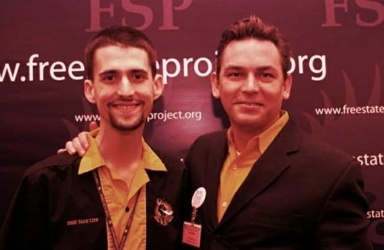

*Ian Freeman und Mark Edge, Gastgeber von Free Talk Live (Quelle: Mark Edge für [Decrypt](https://decrypt.co/61894/fbi-raids-new-hampshire-bitcoin-operations-charges-radio-host))*

Am 28. Dezember 2010, im Anschluss an den Artikel in der PC World, wurde das Thema Bitcoin in der Sendung von einem der Zuhörer angesprochen (einem gewissen Jeremy West, dem zukünftigen Manager des Geschenkkartenverkaufsdienstes [Spend Bitcoin](https://bitcointalk.org/index.php?topic=24653.msg306101#msg306101)). Dies veranlasste Ian Freeman und Mark Edge, sich für Kryptowährungen zu interessieren und sich am 8. Februar mit Gavin Andresen [zu treffen](https://cointelegraph.com/news/meet-the-man-who-introduced-roger-ver-to-bitcoin). An diesem Tag aßen die drei Personen in Keene zu Mittag, und Gavin bezahlte seine Mahlzeit in Bitcoins, indem er 25 BTC an Mark [schickte](https://mempool.space/tx/8dc70b8e15632becb2a070ea1ad01f292486487c5d97671535c2732e2c9131fb).

Beide Gastgeber waren begeistert von Nakamotos System und den Möglichkeiten, die sich daraus ergeben. Insbesondere der Seidenstraßen-Marktplatz [hat](https://bitcointalk.org/index.php?topic=3984.msg66567#msg66567) die Neugier von Ian Freeman geweckt, der einige Monate später im Bitcoin-Forum [schrieb](https://bitcointalk.org/index.php?topic=12895.msg178537#msg178537): "Ich danke der Seidenstraße dafür, dass sie mir einen Grund gegeben hat, zumindest einen Teil der Vision von Bitcoin zu verstehen". Am 16. März war die Hälfte des Programms von Free Talk Live (http://traffic.libsyn.com/ftl/FTL2011-03-16.mp3) Bitcoin und Silk Road gewidmet, was die Aufmerksamkeit des libertären Publikums auf sich zog.

### Roger Ver, der Jesus von Bitcoin

Einer der treuesten Zuhörer von Free Talk Live war Roger Ver, und die Erwähnung von Bitcoin in der Sendung stieß nicht auf taube Ohren. Roger Ver ist ein amerikanischer Geschäftsmann, der in den späten 90er Jahren einen Online-Händler für Computerkomponenten namens MemoryDealers gründete und damit innerhalb weniger Jahre zum Millionär wurde. Gleichzeitig entwickelte er libertäre Überzeugungen, vor allem durch seine Lektüre von Ludwig von Mises, Murray Rothbard und Henry Hazlitt. Er vertrat auch eine optimistische Sicht des technischen Fortschritts, da er von dem transhumanistischen Zukunftsforscher Ray Kurzweil beeinflusst wurde.

Roger Ver war ein Mann der Tat. Im Jahr 2000 kandidierte er auf der Liste der Libertarian Party für die kalifornische Staatsversammlung. Seine Offenheit kam jedoch bei den Behörden nicht gut an, und 2002 wurde er wegen des Verkaufs von Feuerwerkskörpern ohne Lizenz verhaftet und kam für fünf Monate ins Gefängnis. Diese traumatische Erfahrung veranlasste ihn, nach Japan zu ziehen, wo er seinen ständigen Wohnsitz nahm. Im Jahr 2011 lebte er in Tokio.

*Roger Ver auf dem Money2020-Kongress im Oktober 2012 (Quelle: [Digital Trends](https://web.archive.org/web/20121212165432/http://www.digitaltrends.com/cool-tech/the-future-of-money-its-not-in-your-hands/))*

Er erfuhr von Bitcoin im Dezember 2010 über Free Talk Live und kaufte einige davon. Doch erst nach der Sendung vom 16. März 2011 verliebte er sich in die Kryptowährung. Dann erlebte er eine Art Epiphanie: Er las alles, was er zu diesem Thema finden konnte, und zwar so viel, dass er mehrere schlaflose Nächte hintereinander hatte. Er [vertraute] (https://londonlovesbusiness.com/meet-bitcoin-jesus-roger-ver-the-millionaire-who-distributes-free-bitcoins/) sich einige Jahre später der Online-Zeitschrift *London Loves Business* an:

> "Ich erkannte, dass es die beste Form von Geld ist, die die ganze Welt je gesehen hat. Ich war buchstäblich so aufgeregt, weil ich das Gefühl hatte, dass die Berufung meines Lebens in Form von Bitcoin gekommen war. Ich verließ mein Haus über eine Woche lang nicht und verbrachte jede wache Minute damit, alles zu lesen, was ich über Bitcoin finden konnte. Durch den Schlafmangel wurde ich so krank, dass mein Freund mich ins Krankenhaus bringen musste."

Nach dieser Erfahrung engagierte sich Roger Ver in der Gemeinschaft. Am 26. April [begann](https://bitcointalk.org/index.php?topic=4667.msg95746#msg95746) er, Bitcoin-Zahlungen über sein Unternehmen MemoryDealers zu akzeptieren. Am 4. Juni nutzte er eine Plakatwand, die ihm gehörte, um für Bitcoin und sein Unternehmen zu werben. Die Werbetafel war von einer stark befahrenen Autobahn in Sunnyvale, Silicon Valley, aus zu sehen, was die Aufmerksamkeit (https://www.instagram.com/p/FNIFl/) auf Bitcoin zu einem Zeitpunkt lenkte, als die spekulative Begeisterung auf ihrem Höhepunkt war.

*Werbetafel für Bitcoin in Sunnyvale (Quelle: Roger Ver auf [Bitcointalk](https://web.archive.org/web/20130524003126/https://bitcointalk.org/index.php?topic=7961.40))*

Im Juni, nach den ersten Problemen von Mt. Gox, bot Roger Mark Karpelès an, zu ihm zu kommen und ihm zu helfen, da er ganz in der Nähe der Büros des Unternehmens in Tokio wohnte. Mark akzeptierte, und Roger erschien im Cerulean Tower. Er wurde von mehreren Personen begleitet, darunter Jesse Powell, ein Schulfreund und Unternehmer aus San Francisco, der sich ebenfalls für Bitcoin interessierte (letzterer wird 2013 die Plattform Kraken entwickeln). Trotz der [nonchalanten Haltung] von Mark Karpelès (https://www.wired.com/2014/03/bitcoin-exchange/) gelang es ihnen, die Situation zu stabilisieren und die Plattform nach einer Woche wieder zu öffnen.

Doch Roger Ver's Engagement für Bitcoin hörte damit nicht auf. Wie bereits erwähnt, war er von dem revolutionären Potenzial von Bitcoin fest überzeugt und fühlte sich in dieser Hinsicht zu einer Mission berufen. Er versuchte, das Wort zu verbreiten. Er [erschien](https://www.youtube.com/watch?v=IG_AvbfCEs4) in Bruce Wagners *Bitcoin Show* im Juni. Er [sendete](https://www.youtube.com/watch?v=5pV9ptoCMyc) Werbung für Bitcoin im Radio Free Talk Live und ersetzte damit die Werbung für sein Unternehmen, die er zuvor über dieses Medium gemacht hatte. Im Laufe der Monate etablierte er sich als einer der eifrigsten Promoter von Bitcoin, bis zu dem Punkt, an dem er im Februar 2012 vom kanadischen Händler GoWest [den Spitznamen](https://web.archive.org/web/20120218230448/http://www.thebitcointrader.com/2012/02/bitcoin-jesus-is-getting-ready-to.html) "*Bitcoin Jesus*" erhielt. Der Spitzname blieb haften, obwohl Roger ihn nie beanspruchte.

Darüber hinaus war Roger besonders optimistisch, was den Marktpreis der Kryptowährung anging, und spekulierte in diese Richtung, indem er ab Mai eine Menge Bitcoins kaufte. Am 4. August 2011 schloss er die [öffentliche Wette] (https://www.youtube.com/watch?v=gfydIbhduu0) ab, dass der Dollarpreis, der sich damals bei etwa 10 Dollar stabilisierte, innerhalb von zwei Jahren um das 100-fache steigen würde (eine Vorhersage, die sich einige Monate später bewahrheiten sollte). Er investierte auch in Ökosystem-Unternehmen wie BitPay, Blockchain.info und BitInstant.

### Erik Voorhees, Ira Miller und ihre Projekte

Aber Roger war nicht der einzige glühende Libertäre, der an Bitcoin beteiligt war; es gab auch Erik Voorhees. Erik Voorhees wurde 1984 geboren und wuchs in Colorado auf. Er ist der Sohn von Jacques Voorhees, der CEO der Diamantenhandelsplattform Polygon war, bevor er sie 2004 für 8,4 Millionen Dollar verkaufte. Sein Vater, ebenfalls ein Libertärer, vererbte ihm eine liberale und unternehmerische Ader. Nach seinem Abschluss in Betriebswirtschaft und politischer Ökonomie an der University of Puget-Sound lebte Erik eine Zeit lang in Dubai, wo er als Kommunikationsmanager für ein Immobilienunternehmen tätig war. Besonders betroffen war er von der Krise 2008, die ihn veranlasste, sich für das Bankensystem und Geld zu interessieren.

*Erik Voorhees auf dem Colorado Renaissance Festival in Larkspur im Juni 2007 (Quelle: [Forbes](https://www.forbes.com/sites/michaeldelcastillo/2019/01/03/bitcoins-last-gunslinger/))*

Im Jahr 2011 zog er nach Portsmouth, New Hampshire, als Teil des *Free State Project* (das wir im nächsten Abschnitt beschreiben werden). Dort [erfuhr](https://www.maxraskin.com/interviews/erik-voorhees) er von Bitcoin durch einen Artikel, den der lokale Politiker [Keith Ammon](https://bitcoinmagazine.com/politics/rep-keith-ammon-is-new-hampshires-premier-bitcoin-advocate), der auch sein Freund war, auf Facebook geteilt hatte. Damals war es Mai: Der Preis lag bei 5 Dollar und stieg sehr schnell an. Nachdem er sich ein paar Stunden mit der Frage beschäftigt hatte, war er von dem Konzept überzeugt und verliebte sich in es. Er [vertraute](https://bitcoinmagazine.com/culture/erik-voorhees-new-frontier-1374794545) im Jahr 2013:

> "Dieser Tag war einer der wichtigsten Tage in meinem Leben. Es war wie die Entdeckung einer großen Wahrheit, wie ein Blick in die Zukunft. Ich gab alles auf, was ich tat, und sprang in den Kaninchenbau

Seine Motivation war vor allem ideologischer Natur: Er war verführt von der Unaufhaltsamkeit des Systems und der Unmöglichkeit, mehr Geld als geplant zu schaffen. Er [sah](https://silverunderground.com/2011/06/bitcoin-the-separation-of-money-and-state/) Bitcoin als die Verkörperung der "Trennung von Geld und Staat". Er war auch von der von Samuel Konkin propagierten agoristischen Praxis überzeugt und [glaubte](https://bitcointalk.org/index.php?topic=34657.msg431717#msg431717), dass "Bitcoin für den [Agorismus](https://planb.academy/resources/glossary/agorism) das ist, was Kiemen für Fische sind", d. h. ein wesentliches Zahnrad.

Im Juni kaufte Erik Voorhees eine große Menge Bitcoins zu einem Zeitpunkt, als der Preis am höchsten war. Er probierte auch [https://bitcointalk.org/index.php?topic=24198.msg300745#msg300745] die GPU [mining](https://planb.academy/resources/glossary/mining) aus, aber seine Freundin mochte sie nicht, und er war gezwungen, seine Maschinen zu verkaufen. Im August reiste er nach New York, um an einer von Bruce Wagner organisierten Konferenz teilzunehmen, wo er viele der Akteure des Ökosystems traf.

Eine der Personen, die er auf der Konferenz traf, war Ira Miller, auch bekannt als Bearbones im Forum. Dieser war ein junger Entwickler, der ursprünglich aus Illinois stammte und jetzt in Denver, Colorado, lebte. Trotz seines eher technischen Profils war Ira Miller auch politisch engagiert. Den Fußstapfen seiner Familie folgend, [war](https://isysd.medium.com/change-by-example-not-politics-or-money-e232c25d58a7) Ira Miller zunächst ein Sozialdemokrat (*liberal* im amerikanischen Sinne) und wählte 2008 Barack Obama. Allerdings war er von den gebrochenen Versprechen und der freiheitsfeindlichen Politik der Demokraten zutiefst enttäuscht. Da ihm auch das republikanische Lager nicht gefiel, wandte er sich dem Libertarismus zu und unterstützte vor allem Ron Paul.

*Ira Miller im November 2011 (Quelle: [Bitcoin Show](https://www.youtube.com/watch?v=VuLAhZsFc1A) auf Youtube)*

Mit Bitcoin wollte Ira Miller "alternative Systeme aufbauen, die mit dem schrecklich korrupten Status quo konkurrieren". Im Jahr 2011 machte er Nägel mit Köpfen. Im Mai startete er [BitMunchies](https://bitcointalk.org/index.php?topic=7078.msg103566#msg103566), einen Online-Shop, der sich auf Lebensmittel spezialisiert hat (*the munchies* ist Slang für "die Platte"). Im Sommer entwickelte er außerdem [BTCinch](https://bitcointalk.org/index.php?topic=40088.msg488726#msg488726), einen Zahlungsprozessor, der es Händlern ermöglicht, Bitcoins in Dollar umzuwandeln und umgekehrt.

Die beiden Männer verstehen sich sehr gut und ihre Fähigkeiten ergänzen sich gegenseitig. Im August suchte Erik Voorhees einen Programmierer, um eine seiner Ideen zu entwickeln, und Ira sagte zu. Es handelte sich um FeedZeBirds (wörtlich: "füttere die Vögel"), eine Werbeplattform, die es den Nutzern ermöglicht, Inhalte auf Twitter durch den Kauf von Retweets aufzuwerten, und die sie am 23. November [starteten](https://bitcointalk.org/index.php?topic=52638.msg628165#msg628165). Es handelte sich um eine fragwürdige Nutzung (Twitter hat diese Art von Verhalten sicherlich nicht gefördert), bei der die Zensurresistenz von Bitcoin und das Fehlen von [Transaktionsgebühren](https://planb.academy/resources/glossary/transaction-fees) ausgenutzt wurden. Am 28. November traten die beiden Partner [auf](https://www.youtube.com/watch?v=VuLAhZsFc1A) in der *Bitcoin Show* auf, um ihr Produkt zu bewerben. In der Folge entwickelten sie auch den Paysius-Zahlungsprozessor und den E-Mail-Überweisungsdienst Coinapult.

### Das Free State Project in New Hampshire

Wie bereits angedeutet, hatten diese Personen mehr oder weniger enge Verbindungen zum *Free State Project*. Das *Free State Project* ist eine politische Migrationsbewegung, die darauf abzielt, Libertäre in einem Staat zusammenzubringen, um die lokale Regierung zu beeinflussen. Es wurde [initiiert] (https://web.archive.org/web/20010727113202/http://www.webleyweb.com/tle/libe131-20010723-03.html) im Juli 2001 von dem Yale-Doktoranden Jason Sorens, der das Scheitern der libertären Bemühungen an den Wahlurnen beklagte und "Libertäre aller Couleur" einlud, in einen kleinen Staat zu ziehen. Im Jahr 2003 wurde der Staat New Hampshire wegen seiner individualistischen Kultur ausgewählt, dessen offizielles Motto "*Live Free or Die*" lautet. Die Menschen mussten eine Absichtserklärung unterschreiben, wobei eine Zielvorgabe von 20.000 Personen galt. Diese Schwelle sollte 2016 erreicht werden, aber die motiviertesten Personen zogen in der Zwischenzeit um.

*Willkommensschild am Eingang zu New Hampshire im Jahr 2018 (Quelle: [New Hampshire Public Radio](https://www.nhpr.org/the-exchange/2018-02-28/its-tax-season-how-does-new-hampshires-complex-unique-tax-system-work))*

Im Jahr 2011 war New Hampshire bereits zu einer Brutstätte des Libertarismus geworden. *Das Free State Project* organisiert dort jährlich zwei Veranstaltungen. Die erste ist das *New Hampshire Liberty Forum*, ein klassischer Kongress mit einigen der größten Namen des Libertarismus, der in dieser Zeit im Crowne Plaza Hotel in Nashua, im Süden des Staates, stattfand.

Die zweite Veranstaltung ist das *Porcupine Freedom Festival* (besser bekannt als "PorcFest"), ein einwöchiges Festival, das im Sommer auf einem Campingplatz in der Nähe von Lancaster, weiter nördlich, stattfindet. Die Atmosphäre ist entspannter, so sehr, dass die Veranstaltung 2011 von dem libertären Autor Roderick T. Long als "Woodstock für rationale Menschen" bezeichnet wurde (https://aaeblog.com/2011/06/way-long-gone-part-2/). Die diesjährige Ausgabe, die im Juni stattfand, war ein Erfolg und [versammelte](https://mises.org/mises-daily/porcfest-2011) über 1.000 Menschen.

Bitcoin zog im Frühjahr natürlich die Aufmerksamkeit der Bewegung auf sich, die darin ein pragmatisches Werkzeug für lokale Aktionen sah. Im Oktober wurden dank der Bekehrungsaktionen von Roger Ver, Erik Voorhees und Ira Miller Bitcoin-Bruchteile [verteilt] (https://bitcointalk.org/index.php?topic=47350.msg563649#msg563649) an Projektmitglieder. Diese Aktion hatte einen erzieherischen Zweck: den Unterzeichnern des *Free State Project* sollte klar gemacht werden, dass sie Geld von einem Ende der Welt zum anderen bewegen können, ohne ihre Identität preisgeben zu müssen. Darüber hinaus kündigte der Organisator des Liberty Forum, Chris Lawless, an, dass die Konferenz Bitcoin als Zahlungsmittel für die Anmeldung akzeptieren würde.

Dank dieser Konzentration von Libertären würde New Hampshire im Laufe der Jahre zu einer zentralen Drehscheibe für die Einführung von Kryptowährungen werden. Zusätzlich zu seiner institutionellen Umwandlung würde es [https://www.forbes.com/sites/kashmirhill/2014/06/12/the-free-state-project-a-libertarian-testing-ground-for-bitcoin-3d-printers-and-drones/] ein wahres "Versuchsgelände" für Bitcoin und andere freiheitsfördernde technische Innovationen wie 3D-Drucker werden.

### Die Occupy-Wall-Street-Bewegung

Der Libertarismus war jedoch nicht die einzige politische Ideologie, die Affinitäten zu Bitcoin hatte. Auf der anderen Seite des politischen Spektrums (wenn man bedenkt, dass die wirtschaftlichen Positionen des Libertarismus eher rechts angesiedelt sind) gab es die gesamte antikapitalistische, finanzfeindliche Bewegung, die zwangsläufig ein Interesse an Kryptowährungen fand.

Doch ähnlich wie die Libertären lehnte auch diese politische Familie Bitcoin ab, weil es nicht ihrer Vorstellung von Geld entsprach. Es war zu starr und unterlag zu wenig der politischen Kontrolle. Bitcoin war keine soziale Währung, die demokratisch verwaltet werden kann (https://diyhpl.us/~bryan/irc/bitcoin-satoshi/p2presearch-again/p2pfoundation.net/backups/p2p_research-archives/2009-February/001362.html), wie es sich die Aktivisten durch lokale Währungen vorstellten. Yánis Varoufákis, libertärer Marxist und zukünftiger Finanzminister Griechenlands, [kritisierte](https://www.yanisvaroufakis.eu/2013/04/22/bitcoin-and-the-dangerous-fantasy-of-apolitical-money/) sie 2013 wegen ihres deflationären und inegalitären Charakters und schrieb, dass "es keine entpolitisierte Währung geben kann, die in der Lage ist, eine fortgeschrittene, industrielle Gesellschaft 'anzutreiben'".

Im September 2011 erschütterte die Bewegung *Occupy Wall Street* das politische Leben in den Vereinigten Staaten. Angesichts der katastrophalen wirtschaftlichen Rezession, die durch die Subprime-Krise ausgelöst wurde, rief die kanadische Stiftung *Adbusters* (unter dem Antrieb des Gründers Kalle Lasn und des Herausgebers Micah White) [https://web.archive.org/web/20110717094726/https://www.adbusters.org/blogs/adbusters-blog/occupywallstreet.html] dazu auf, die Wall Street, das symbolische Zentrum des New Yorker Finanzwesens, in einer Art Sit-in zu "besetzen". Die Hauptforderung war, den Einfluss des Großkapitals und der Geldmächte auf die Politik des Landes zu verringern, ein Einfluss, der für die Krise verantwortlich gemacht wird. Der Protestslogan [lautete](http://occupywallst.org/) "Das Einzige, was wir alle gemeinsam haben, ist, dass wir die 99% sind, die die Gier und Korruption der 1% nicht länger tolerieren werden". Der Protest begann am 17. September im Zuccotti Park, unweit des New Yorker Finanzdistrikts, und brachte über tausend Menschen zusammen. Im Laufe der Wochen gewann die Bewegung an Schwung und breitete sich auf andere Großstädte des Landes, wie Chicago und Los Angeles, sowie auf die internationale Ebene aus.

Die Bewegung musste sich selbst finanzieren: Die Demonstranten [benötigten](https://web.archive.org/web/20111120054617/http://www.expanton.com/index.php/77-other/24-welcome) Lebensmittel, wasserfeste Kleidung und Ausrüstung, damit die Veranstaltung live im Internet übertragen werden konnte. Das Ziel war, dass die Menschen so lange wie möglich vor Ort bleiben. Die Finanzierung gestaltete sich jedoch aufgrund des radikalen Charakters des Protests schwierig: Einige der Aktionen waren tatsächlich illegal, wie die zahlreichen Verhaftungen zeigten. Infolgedessen reagierte die Bewegung empfindlich auf finanzielle Zensur, was sich zum Beispiel darin zeigte, dass das PayPal-Konto von \#FeedtheProtest, einer Nachrichtengruppe, die über die Ereignisse berichtete, am 26. September ohne Vorankündigung [eingefroren](https://web.archive.org/web/20110928152351/http://feedtheprotest.com/node/219) wurde.

Daher beschlossen die verschiedenen Organisationen innerhalb der Bewegung, Bitcoin zu akzeptieren, die sie als anonyme digitale Währung betrachteten und die ihren Wert durch die Akzeptanz von WikiLeaks bewiesen hatte. Die Generalversammlung der Demonstranten in New York [erhielt](https://web.archive.org/web/20111004195625/http://nycga.cc/donate/) bereits am 19. September Spenden in Höhe von insgesamt 686 BTC oder über 3.000 Dollar zum Zeitpunkt des Eingangs. #FeedtheProtest [akzeptierte](https://web.archive.org/web/20111004164350/http://feedtheprotest.com/node/223) auch Bitcoin vom 27. September, als Reaktion auf die Schließung seines Kontos. Die Mitglieder der Bitcoin-Gemeinschaft [interessierten](https://observer.com/2011/10/bitcoin-community-takes-an-interest-in-occupy-wall-street/) sich ihrerseits für *Occupy Wall Street*, da auch sie gegen die traditionelle Finanzwelt waren. Sie warben daher bei der Bewegung für die Nutzung von Bitcoin (auch wenn das bedeutete, persönlich dorthin zu gehen, wie [Matt Cropp](https://web.archive.org/web/20110929140153/http://btcbusiness.net/?q=node/22)) und spendeten auch eine Reihe von Spenden.

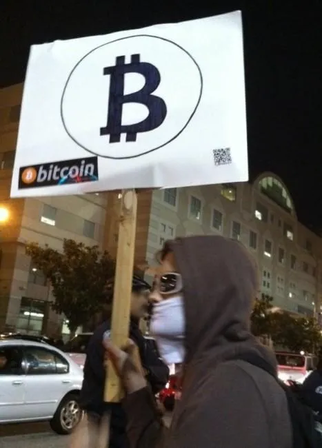

*Pokerspieler Prahlad Friedman protestiert bei Occupy Los Angeles im November 2011 (Quelle: [Bryan Micon](https://twitter.com/BryanMicon/status/139154625638055936) auf Twitter)*

*Occupy Wall Street* veranlasste viele Menschen dazu, Fragen über Kryptowährungen zu stellen, und das Thema wurde sogar in der allgemeinen Presse [erwähnt] (https://www.huffpost.com/entry/occupy-wall-street-money-donated-tension_n_1029377). Die Bewegung endete formell in der Nacht vom 14. auf den 15. November, als die NYPD die Demonstranten aus dem Zuccotti Park vertrieb, wo das Zelten nicht mehr erlaubt war. Die Idee, Bitcoin als politisches Instrument zu nutzen, blieb jedoch bestehen.

### Die Rolle der Ideologie

Die politische Ideologie war ein wesentliches Element beim Aufbau von Bitcoin in den Anfangsjahren. Sie trug dazu bei, die Leidenschaft aufrechtzuerhalten, die die frühen Nutzer in die Kryptowährung eingeflößt hatten, und lockte engagierte Unternehmer an, die den Erfolg des Projekts sehen wollten. Es war insbesondere der amerikanischen libertären Bewegung zu verdanken, dass Bitcoin trotz ihrer internen Spaltungen florieren konnte, sei es durch Personen wie Roger Ver oder Erik Voorhees oder durch das *Free State Project*. Die eher linksgerichtete *Occupy Wall Street*-Bewegung spielte auch eine Schlüsselrolle beim Aufstieg von Bitcoin als Währung des Ungehorsams.

Dieser ideologische Aspekt stand jedoch im Widerspruch zu einer weitaus attraktiveren Kraft: der des finanziellen Interesses. Im Laufe der Jahre kam es zu einem Spannungsverhältnis zwischen den beiden Aspekten, das sich ab 2013 in einem Diskurswechsel und einem phänomenalen Anstieg des Wechselkurses äußerte. Doch bevor dies geschehen konnte, mussten die Instrumente entwickelt werden, die es den Finanzakteuren ermöglichen, in das Ökosystem zu investieren. Und diese Entwicklung sollte weitgehend während des ersten echten "Bärenmarktes" in der Geschichte von Bitcoin stattfinden.

## Der erste Bärenmarkt

<chapterId>e1a056ad-b7da-5bf0-ac17-0243d7bea605</chapterId>

Im Juni 2011 wurde der Spekulationswahn durch das Hacken von Mt. Gox, das die Plattform für eine Woche außer Betrieb setzte, jäh gestoppt. Das Fiasko der Abschaltung von MyBitcoin Ende Juli ließ die Blase endgültig platzen und führte zum ersten echten Bärenmarkt für Bitcoin. In den darauffolgenden Tagen stieg der Preis auf 6 $ und fiel schließlich im November auf 2 $.

Das Platzen der "großen Blase von 2011" erregte natürlich die Aufmerksamkeit der Presse, die Bitcoin schnell für unrentabel erklärte. Aber es war auch förderlich für den wirtschaftlichen Aufbau, und die Zeit der Preisstagnation ermöglichte die Entwicklung von Finanzprojekten, die später Früchte trugen.

In diesem Kapitel werden wir nur einige dieser Projekte analysieren. Wir werden analysieren, wie die Bitcoinica-Margin-Handelsplattform Bitcoin-Benutzern Leverage und Leerverkäufe ermöglichte. Wir werden die Rolle des BitInstant-Sofortkauf- und -verkaufsdienstes analysieren, der den Devisenhandel für Amerikaner flüssiger macht. Schließlich werden wir erklären, wie die unabhängigen Börsen GLBSE und MPEx das Fundraising innerhalb des Ökosystems ermöglicht haben. Doch zunächst wollen wir ein wenig über die Behandlung der sich auflösenden Blase durch die Medien sprechen, die nicht gerade freundlich zu Bitcoin war.

### Medienberichterstattung über den Rückgang

Nachdem der Kurs am 8. Juni einen Höchststand von 32 $ erreicht hatte, brachten das Hacken von Mt. Gox und die Schließung von MyBitcoin die spekulative Bewegung endgültig zum Stillstand. Der Preis brach Anfang August auf 6 $ ein. Die Exposition von Bitcoin gegenüber der Welt und der fallende Wechselkurs boten einen guten Grund, die Kryptowährung zu kritisieren, was Journalisten, die nach Sensationen dürsteten, schnell taten.

Am 7. August veröffentlichte Timothy Lee, Autor der Tech-Nachrichtenseite Arstechnica und Bitcoin-Skeptiker (https://timothyblee.com/2011/04/19/bitcoins-collusion-problem/) seit April, (https://www.forbes.com/sites/timothylee/2011/08/07/the-bitcoin-crash/) einen Artikel mit dem Titel "The Bitcoin Crash" (Der Bitcoin-Crash), in dem er erklärte, dass Bitcoin, "die Währung, überhaupt keinen fundamentalen Wert zu haben scheint" und dass "es keinen logischen Haltepunkt für den Preisverfall von Bitcoin gibt", da der Prozess seiner Meinung nach "am Ende ist". Sein Argument wurde [abgerufen] (https://www.theatlantic.com/technology/archive/2011/08/the-bitcoin-economy-is-collapsing-with-no-sign-of-recovery/243253/) am folgenden Tag von Nicholas Jackson in *The Atlantic*, für den "The Bitcoin Economy Is Collapsing With No Sign of Recovery" (Die Bitcoin-Wirtschaft bricht ohne Anzeichen einer Erholung zusammen), und von Adrian Covert auf Gizmodo, der [argumentierte] (https://gizmodo.com/the-bitcoin-is-dying-whatever-5828710), dass "die Flitterwochen vorbei sind" und dass "The Bitcoin Is Dying" (Das Bitcoin stirbt).

In der Zwischenzeit tauchten andere Kritikpunkte auf, die eher die makroökonomische Ebene betrafen. Im September veröffentlichte James Surowiecki, ein amerikanischer Journalist, der durch die Veröffentlichung von *The Wisdom of Crowds* im Jahr 2004 bekannt wurde, [https://www.technologyreview.com/2011/08/23/191860/cryptocurrency/] eine Anklage gegen Bitcoin in der *MIT Technology Review*. Er kritisierte die feste Begrenzung der Anzahl der Bitcoins mit dem Argument, dass sie das Horten fördere, sie daran hindere, ein Tauschmittel zu werden, und schließlich zu einer Situation führe, in der "die große Mehrheit der Bitcoins von Leuten gehalten wird, die hoffen, sie an andere Leute zu verkaufen". Am 7. September wiederholte Paul Krugman, neokeynesianischer Wirtschaftswissenschaftler und Träger des Wirtschaftsnobelpreises 2008, (https://archive.nytimes.com/krugman.blogs.nytimes.com/2011/09/07/golden-cyberfetters/) diese Argumentation in einem auf der Website der *New York Times* veröffentlichten Artikel mit dem Titel "Golden Cyberfetters". Der Titel war eine Anspielung auf Barry Eichengreens Buch *Goldene Fesseln* aus dem Jahr 1992, in dem er argumentierte, dass die Große Depression der 1930er Jahre die Folge des übermäßig restriktiven Goldstandards war. In dem Artikel argumentierte Paul Krugman, dass "Bitcoin seine eigene private Goldstandard-Welt geschaffen hat, in der die Geldmenge fixiert ist und nicht durch die Druckerpresse vermehrt wird" und dass die daraus resultierende Deflation dazu führte, dass "der tatsächliche Wert der Transaktionen in Bitcoin eher gesunken als gestiegen ist. In der Tat ist das reale Bruttoprodukt von Bitcoin stark gesunken".

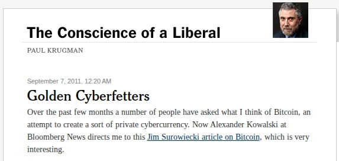

*Der erste Artikel von Paul Krugman über Bitcoin (Quelle: [Archiv](https://web.archive.org/web/20110909021607/http://krugman.blogs.nytimes.com/2011/09/07/golden-cyberfetters/) aus der New York Times)*

Am 17. Oktober fiel der Preis von BTC deutlich unter 3,2 $, was einem Rückgang von mehr als 90 % gegenüber dem Höhepunkt der Blase entspricht, woran Timothy Lee (https://arstechnica.com/tech-policy/2011/10/bitcoin-implodes-down-more-than-90-percent-from-june-peak/) die Leser am folgenden Tag erinnerte. Noch auf Arstechnica beschrieb er die Probleme, die mit der Verwendung von Kryptowährungen verbunden sind, wie Hacks und Volatilität. Von Bitcoin hielt er nicht viel, denn er erklärte: "Aber der Wert einer Währung beruht auf ihrem Ruf, und fünf Monate schlechter Nachrichten und Abwertung haben ernsthaften Schaden angerichtet". Im gleichen Sinne wurde am 21. Oktober ein Artikel in *The Economist* mit dem [Titel](https://web.archive.org/web/20181019113320/https://www.economist.com/babbage/2011/10/21/the-bursting-of-the-bitcoin-bubble) "The bursting of the Bitcoin bubble" veröffentlicht.

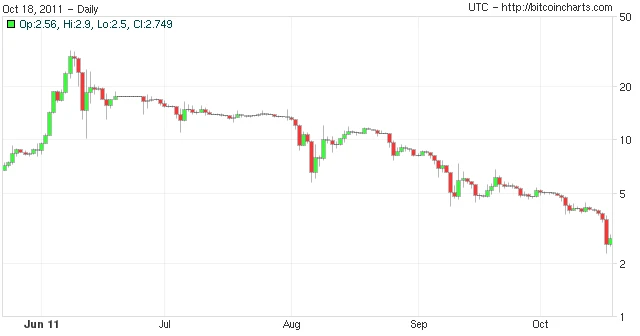

*Der Preis von Bitcoin auf Mt. Gox zwischen Juni und Oktober 2011 (Quelle: Bitcoin Charts via [Arstechnica](https://arstechnica.com/tech-policy/2011/10/bitcoin-implodes-down-more-than-90-percent-from-june-peak/))*

Im darauffolgenden Monat erholte sich der Wechselkurs nur mühsam und erreichte am 18. November einen neuen Tiefstand von etwa 2 $. Am 23. November veröffentlichte der Redakteur Benjamin Wallace [https://web.archive.org/web/20111124022726/http://www.wired.com/magazine/2011/11/mf_bitcoin/all/1] in der Zeitschrift Wired einen Artikel mit dem Titel "The Rise and Fall of Bitcoin" (Aufstieg und Fall von Bitcoin), der abgesehen von seinem bewusst aufreizenden Titel ein sehr gut ausgearbeiteter Artikel war, der sich mit den Problemen der Bitcoin-Nutzer befasste. Es war eine schwierige Zeit, insbesondere für Miner, die im Sommer Grafikprozessoren kauften, aber [feststellen](https://bitcointalk.org/index.php?topic=47480.msg565196#msg565196) mussten, dass es nicht mehr rentabel war, damit zu schürfen. Einige waren sogar gezwungen, ihre Geräte zu [verkaufen](https://bitcointalk.org/index.php?topic=48767.msg580225#msg580225).

Doch trotz des Preisverfalls und der Kritik war der Kern der Gemeinschaft immer noch aktiv und nahm die extreme Preisvolatilität philosophisch. Die eifrigsten Befürworter von Bitcoin waren entschlossen, sich an seinem Aufbau zu beteiligen und es zum Blühen zu bringen. Einige Mitglieder der Gemeinschaft, wie z. B. [Amir Taaki] (https://www.wired.com/2011/11/mf-bitcoin/), verglichen das Phänomen mit dem "Hype-Zyklus von Gartner", der beschreibt, wie die Einführung einer neuen Technik einen "Höhepunkt übertriebener Erwartungen" durchläuft, dann durch eine "Grube der Ernüchterung" geht, um schließlich ein "Plateau der Produktivität" zu erreichen, wie es beim Web und der Internet-Blase der Fall war.

Allmählich kletterte der Preis wieder auf über 4 $ Ende Dezember, so dass die Online-Presse gezwungen war, zuzugeben, dass Bitcoin nicht tot war. Am 21. Dezember schrieb Timothy Lee [https://arstechnica.com/tech-policy/2011/12/bitcoins-comeback-should-western-union-be-afraid/], dass "die offensichtliche Stabilität der Währung im letzten Monat ihn dazu inspiriert hat, sie ein zweites Mal zu betrachten". Insbesondere dachte er über den Wert von Bitcoin nach, den er nicht so sehr als "alternative Währung", sondern als "Metawährung" ansah, die einen "kostengünstigen und regulierungsfreien Transfer von Vermögen zwischen Nationen" ermöglicht und mit Western Union konkurriert.

### BitInstant, eine zentrale Drehscheibe für den Bitcoin-Austausch

Während der Baisse vervielfachte sich die Zahl der Devisenhandelsplattformen. Neben den Plattformen, die während der Haussephase der Blase gegründet wurden, entstanden im Sommer mehrere weitere Plattformen. Dazu gehörten BTC-e, [gestartet](https://bitcointalk.org/index.php?topic=29698.msg437237#msg437237) von den Russen Alexander Vinnik und Aleksandr Bilyuchenko am 7. August; Bitstamp, [gestartet](https://web.archive.org/web/20140430233930/https://bitcointalk.org/index.php?topic=20292.220) von den Slowenen Nejc Kodrič und Damijan Merlak am 19. August; und Crypto X Change, [eingeweiht](https://bitcointalk.org/index.php?topic=51457.msg613057#msg613057) am 10. November von den Australiern Ken und Colin Armitt.

Die Plattform von Mt. Gox blieb jedoch weitgehend dominant. Dies stellte für (viele) westliche Kunden ein Problem dar, da die Plattform ihren Sitz in Japan hatte und Ein- und Auszahlungen internationale Überweisungen erforderten, die Tage dauern konnten. Und PayPal zensierte alle Bitcoin-Austauschaktivitäten.

Dies war das Problem, das ein 23-jähriger walisischer Entwickler namens Gareth Nelson (im Forum auch als GarethNelsonUK bekannt) mit einem sofortigen Währungsumtauschdienst namens BitInstant zu lösen suchte. Gareth entdeckte Bitcoin im Frühjahr. Nachdem er [Interesse](https://bitcointalk.org/index.php?topic=8780.msg131564#msg131564) an mining geweckt hatte, [stieß](https://bitcointalk.org/index.php?topic=9198.msg132990#msg132990) er selbst auf die Schwierigkeit, Geld an Mt. Gox zu senden, und führte einen außerbörslichen Austausch durch, um Bitcoins zu erhalten.

*Gareth Nelson ca. 2011-2012 (Quelle: [Archiv](https://web.archive.org/web/20130118073422/https://www.bitinstant.com/aboutus) von BitInstant.com)*

Am 13. Juni gegen 4 Uhr morgens veröffentlichte Gareth Nelson [https://bitcointalk.org/index.php?topic=16134.msg210887#msg210887] im Forum eine Idee für einen "schnellen Zahlungsdienst für Mt. Gox". Die Idee war, einen Vermittler einzurichten, der Gelder an die Börsenplattform überweist, sobald sie im Herkunftsland, typischerweise den USA, eingegangen sind. Er schrieb:

> "Wie Sie wissen, ist mtgox bekanntlich langsam bei Ein- und Auszahlungen. Ich habe darüber nachgedacht, dieses Problem zu lösen, indem ich eine neue Website einrichte, die den mtgox API nutzt, um die Zahlungen zu beschleunigen (wenn die Nutzer auf meiner Website bezahlen, erhalten sie sofort mtgox USD abzüglich einer kleinen Gebühr von 1,5 %)."

Er wusste, dass er über die technischen Fähigkeiten verfügte, um diese Idee in die Praxis umzusetzen, aber es fehlte ihm das Geld, um sie lebensfähig zu machen. In seiner Nachricht teilte er also mit, dass er auf der Suche nach Investoren sei, um das Projekt auf die Beine zu stellen. Und das erregte sofort die Aufmerksamkeit eines 21-jährigen New Yorkers namens Charlie Shrem.

Charlie Shrem stammt aus einer streng syrisch-orthodoxen jüdischen Familie (https://fortune.com/2017/06/26/bitcoin-blockchain-cryptocurrency-market/) und wuchs im Midwood-Viertel von Brooklyn auf. Sein Vater arbeitete in einem Juweliergeschäft. Als schüchternes und unbeholfenes Kind flüchtete er sich in Computer, brachte sich selbst das Programmieren bei und machte sich in Hackerforen einen Namen. Während seiner Highschool- und Universitätszeit half er bei der Gründung einer Reihe von Unternehmen, darunter *Epiphany Design and Production*, ein Drucker- und Computerreparaturservice, und [Daily Checkout](https://web.archive.org/web/20110618225450/http://www.dailycheckout.com/), eine im März 2009 gegründete E-Commerce-Website für Elektronik. Damals entdeckte er sein kommerzielles Gespür.

*Charlie Shrem im November 2011 (Quelle: [Bitcoin Show](https://www.youtube.com/watch?v=PxMazut6-0U) auf Youtube)*

Im Jahr 2011 besuchte Charlie das *Brooklyn College*, wo er einen Abschluss in Wirtschaft und Finanzen erwarb. Er wohnte immer noch im Keller des Familienhauses. Ihm zufolge hörte er zum ersten Mal [von](https://www.youtube.com/watch?v=XM2712vOyus&t=96s) Bitcoin im Jahr 2009, als das PayPal-Konto der Wohltätigkeitsorganisation, für die er arbeitete, Tikvot, eingefroren wurde. Er sah auch, dass es in den Hackerkreisen, die er im IRC besuchte, erwähnt wurde. Seine Aufmerksamkeit wurde jedoch erst geweckt, als er durch den am 1. Juni 2011 veröffentlichten Gawker-Artikel auf Silk Road aufmerksam wurde. Ein paar Stunden nach Erscheinen des Artikels [veröffentlichte](https://twitter.com/CharlieShrem/status/76021290842079232) er einen Tweet, dass er Bitcoin kaufen wolle; da er selbst Cannabis konsumiert, wollte er die Plattform wahrscheinlich ausprobieren. Am 10. Juni [registrierte](https://web.archive.org/web/20111127073246/https://bitcointalk.org/index.php?action=profile;u=21181) er sich im Bitcoin-Forum unter dem Pseudonym Yankee.

Als Gareth also am 13. Juni seine Anzeige veröffentlichte, war Charlie ganz Ohr. Er setzte sich mit Gareth in Verbindung und sie wurden sich schnell einig. Charlie seinerseits bat seine Eltern um ein Darlehen von 10.000 Dollar; sein Vater lehnte ab, aber seine Mutter stimmte zu. Am selben Abend gab Gareth [bekannt] (https://bitcointalk.org/index.php?topic=16472.msg214518#msg214518), dass er in Charlie Shrem einen Investor gefunden hatte und gab den Namen des Projekts bekannt: BitInstant.

Sie entwickelten den Dienst über den Sommer hinweg. Am 23. August, nach einer zweiwöchigen [Beta-Phase](https://bitcointalk.org/index.php?topic=36184.msg469342#msg469342), öffnete BitInstant [seine](https://bitcointalk.org/index.php?topic=38914.msg476106#msg476106) Türen für die breite Öffentlichkeit. Das Unternehmen profitierte von einer Partnerschaft mit der Devisenhandelsplattform TradeHill, die sofortige Überweisungen an letztere unter Verwendung von Liberty Reserve oder Dwolla ermöglicht. Am 21. November wurde schließlich Mt. Gox [hinzugefügt](https://bitcointalk.org/index.php?topic=52476.msg626239#msg626239) als eine Option zu dem Dienst.

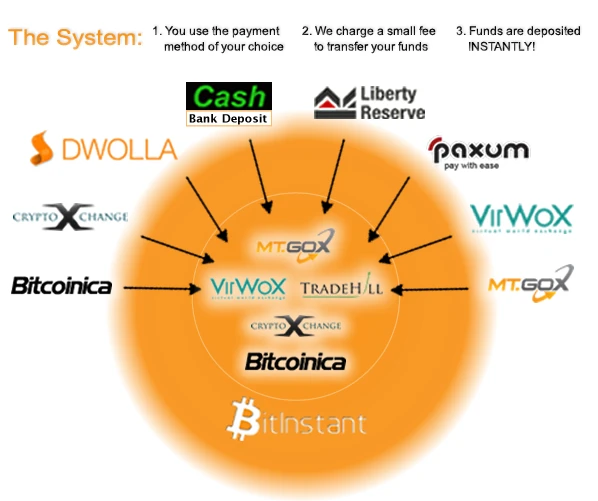

*BitInstant website capture, 26. Januar 2012 (Quelle: [Archiv](https://web.archive.org/web/20120126191036/https://bitinstant.com/) von Bitinstant.com)*

Zur gleichen Zeit warb Charlie Shrem als Mitgründer für das Startup. Im August nahm er an der Konferenz von Bruce Wagner in New York teil und traf mehrere Akteure des Ökosystems persönlich. Im September nahm er [an](https://bitcointalk.org/index.php?topic=41932.msg510329#msg510329) der *Open Video Conference* teil, die von der Mozilla Foundation und der New York Law School organisiert wurde, und sprach bei einem Workshop über alternative Währungen. Im folgenden Monat [erschien](https://www.youtube.com/watch?v=PxMazut6-0U) er in der *Bitcoin Show*, um BitInstant vorzustellen.

Im Dezember hat BitInstant [realisiert](https://observer.com/2011/12/brooklyn-based-bitcoin-startup-bitinstant-raises-seed-round/) eine Finanzierungsrunde von Angel-Investoren (oder *Business Angels*). Der wichtigste von ihnen war kein Geringerer als Roger Ver, der für 120.000 Dollar 15 % des Unternehmens erwarb und schnell zum Marketingleiter wurde. Roger Ver riet Charlie Shrem, Erik Voorhees einzustellen, der im Februar 2012 Leiter der Kommunikations- und Marketingabteilung des Unternehmens wurde. Auch Ira Miller stieß als Entwickler zum Team. Obwohl Charlie Shrem als solcher nicht politisch motiviert war, hatte die Verbindung mit diesen Personen den Effekt, dass sich seine Wahrnehmung der Politik veränderte.

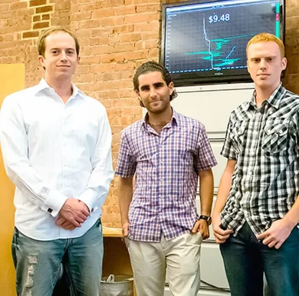

*Erik Voorhees, Charlie Shrem und Ira Miller in den Büros von BitInstant im Februar 2012 (Quelle: Brian Patrick Eha für [Fortune](https://fortune.com/2017/06/26/bitcoin-blockchain-cryptocurrency-market/))*

Anfang 2012 diversifizierte BitInstant seine Geldüberweisungsmethoden, um mit den wichtigsten Plattformen im Ökosystem zu interagieren, und fügte insbesondere Bareinzahlungen zu seinem Angebot hinzu, und begann populär zu werden. Am 2. Januar belief sich das seit der Eröffnung transferierte Volumen [auf](https://bitcointalk.org/index.php?topic=56392.msg671272#msg671272) 1,2 Millionen Dollar, was ein guter Start war. Als Zeichen für eine gute Geschäftsentwicklung wurde Ende März eine neue Schnittstelle [in Betrieb genommen](https://bitcointalk.org/index.php?topic=74624.msg826565#msg826565).

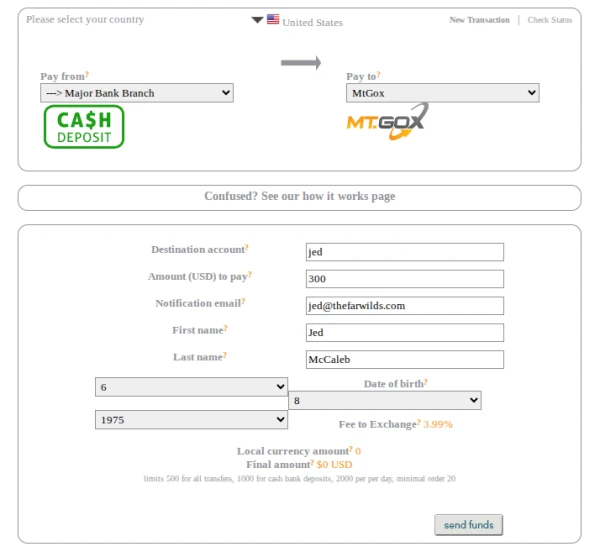

*Interface von BitInstant im Juni 2012 (Quelle: [Archiv](https://web.archive.org/web/20120630110945/https://www.bitinstant.com/) von Bitinstant.com)*

### Margenhandel mit Bitcoinica

Ende des Sommers 2011 boten die bestehenden Tauschplattformen lediglich die Möglichkeit, traditionelle Währungen gegen Bitcoin zu tauschen, ohne dabei fortgeschrittene Finanzoperationen zu integrieren. Insbesondere fehlte ihnen eine Plattform für *Margin Trading*, *Leverage* und *Short Selling*. Die Bitcoinica-Plattform wurde geschaffen, um diesen Bedarf zu decken.

Bitcoinica wurde am 8. September 2011 von einem 17-jährigen Chinesen namens Zhou Tong, dessen richtiger Name Ryan Tong Zhou war, [gestartet] (https://bitcointalk.org/index.php?topic=81581.msg897948#msg897948). Er war ein begabter Schüler in Singapur. Er ließ sich von der persönlichen Entwicklung inspirieren, las Robert Kiyosakis *Richer Vater, armer Vater* und interessierte sich für das Leben von erfolgreichen Unternehmern wie Tony Hsieh (von Zappos) und Steve Jobs (von Apple). Er hatte auch einen Hintergrund in der Webentwicklung.

*Zhou Tong im Januar 2010 (Quelle: Zhou Tong auf [Flickr](https://www.flickr.com/photos/zhoutong/4359164894/))*

Er [hörte] (https://bitcointalk.org/index.php?topic=67521.msg785510#msg785510) Ende 2010 von Bitcoin, interessierte sich aber erst im darauffolgenden Sommer, als die Spekulationsblase tobte, wirklich dafür. Im August kaufte er seine ersten Bitcoins zu je 8 Dollar. Und er investierte in die Bitcoin-Wirtschaft und entwickelte Bitcoinica innerhalb einer Woche.

Er präsentierte Bitcoinica als "fortschrittliche Bitcoin Handelsplattform", die "Elegant. Professionell. Revolutionär". Die Plattform verwaltete zunächst keine wallet, die Bitcoins wurden auf einem speziellen Konto bei Mt. Gox gehalten. Ein- und Auszahlungen erfolgten in Bitcoins, durch einlösbare Mt. Gox-Codes oder durch internationale Banküberweisungen.

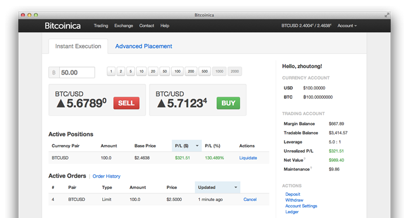

*Interface von Bitcoinica im Februar 2012 (Quelle: [Archiv](https://web.archive.org/web/20120209171119/http://bitcoinica.com/) von Bitcoinica.com)*

Es war von Anfang an ein Erfolg. In den ersten 24 Stunden wurden 3.724 Bitcoins von 290 verschiedenen Nutzern getauscht, was einem Wert von 19.000 $ entspricht. Das Volumen in den ersten 7 Tagen [betrug](https://web.archive.org/web/20111019032441/http://blog.bitcoinica.com/) 160.865 Bitcoins oder über 800.000 $, was Bitcoinica nach Mt. Gox zur zweitgrößten Handelsplattform in Bezug auf die umgetauschten Dollar macht.

Die Plattform diente vor allem der Spekulation: Die Hebelwirkung ermöglichte es, Gewinne (und Verluste) zu vervielfachen, was für große Akteure, die bereit waren, alles auf eine Kursbewegung zu setzen, geeignet war. Der spekulative Erfolg war so groß, dass die Liquidation auf der Plattform ihren eigenen [Spitznamen](https://bitcointalk.org/index.php?topic=49445.msg588749#msg588749) erhielt: "get Zhou Tonged". Dieser Ausdruck [gab dem Youtube-Kanal *Zhou Tonged* seinen Namen](https://www.youtube.com/watch?v=kdvTkddp1F0), der im März 2012 gestartet wurde, um musikalische Parodien über Bitcoin und den Handel zu zeigen. Die Plattform hatte auch den Vorteil, dass sie Leerverkäufe anbot, so dass Wirtschaftsakteure (wie Händler, die Bitcoin in Reserve halten) sich gegen einen möglichen Preisverfall absichern konnten.

Anfang März 2012 akzeptierte Bitcoinica [https://bitcointalk.org/index.php?topic=67521.msg785510#msg785510] mehr als ein Dutzend Ein- und Auszahlungsmethoden, darunter Bitcoin direkt, Liberty Reserve, PerfectMoney, Pecunix sowie SEPA-Überweisungen in Euro. Es hatte nun fast so viel Volumen wie Mt. Gox.

### Emission von Finanztiteln bei der GLBSE

Im Jahr 2011 veranlasste die fehlende Genehmigungspflicht von Bitcoin die Mitglieder der Gemeinschaft dazu, sich Verwendungszwecke vorzustellen, die über den einfachen Geldaustausch und die Spekulation hinausgehen. Sie versuchten, Investitionen zu liberalisieren, indem sie ein Mittel zur Ausgabe von Aktien und Anleihen für Unternehmen im Ökosystem bereitstellten. Ziel war es, die von der *Securities and Exchange Commission* in den Vereinigten Staaten (dem amerikanischen Äquivalent der AMF) auferlegten Vorschriften zu umgehen, indem [man](http://trilema.com/2012/the-reasons-why-bitcoin-securities-cant-be-regulated-by-the-sec/) den innovativen Charakter von Bitcoin und die rechtliche Unklarheit, die es umgibt, ausnutzt. Die Idee war, ein alternatives Modell zum klassischen Finanzsystem zu schaffen, das sich nach dem agoristischen Ansatz selbst verstärken könnte.

Eine der an dieser Bewegung beteiligten Personen war James McCarthy, der im Bitcoin-Forum das Pseudonym Nefario verwendete, in Anlehnung an die gleichnamige Figur aus dem Zeichentrickfilm *Despicable Me*. Nefario war ein in China lebender Ire, der als Englischprofessor an einer Universität arbeitete. Er interessierte sich für die [österreichische Schule](https://planb.academy/resources/glossary/austrian-school) und die Ideen der Cypherpunks und [erklärte](https://web.archive.org/web/20110607050421/http://bitcoinweekly.com/articles/interview-with-nefario-founder-of-bitcoin-global) sich selbst als "so etwas wie ein Cypherpunk". Er [entdeckte](https://bitcointalk.org/index.php?topic=2502.msg33800#msg33800) im Jahr 2010 die Existenz von Bitcoin und baute über tausend davon ab. Daraufhin beteiligte er sich an mehreren Projekten, darunter das Online-Magazin-Projekt Bitcoin Weekly.

*James McCarthy (Nefario) im Februar 2012 (Quelle: [Archiv](https://web.archive.org/web/20121008033716/https://www.tedxleeds.com/nefario-james-mccarthy/) von TEDxLeeds)*

Im April 2011 startete James [https://bitcointalk.org/index.php?topic=6500.msg94943#msg94943] GLBSE (ausgesprochen: glib-zee), ein Akronym für *GLobal Bitcoin Stock Exchange*. Die Benutzer interagierten mit dem Server der Plattform über eine Befehlszeilenschnittstelle. Der Client war eine modifizierte Version der von Amir Taaki entwickelten Software. Der Website zufolge ermöglichte die Plattform (https://web.archive.org/web/20110427033244/http://glbse.com/) "die Ausgabe von Aktien zur Kapitalerhöhung, die Zahlung von Dividenden an die Aktionäre, die Vorlage von Beschlüssen bei den Aktionären und die Einholung ihrer Stimmen, die Ausgabe und den Verkauf von Anleihen, die Aufnahme von Krediten und deren Rückzahlung, die Ausgabe von Terminkontrakten, den Meta-Handel mit nicht börsennotierten Unternehmen (an anderen Börsen) und den Handel mit allen oben genannten Aspekten mit anderen Händlern auf dem Markt".

*GLBSE-Website, 17. August 2011 (Quelle: [Archiv](https://web.archive.org/web/20110817072049/http://glbse.com/))*

Das erste "IPO" (*Initial Public Offering*) wurde [ab dem 30. April] (https://bitcointalk.org/index.php?topic=6838.msg100170#msg100170) von einem Projekt namens Ubitex durchgeführt, einer Plattform für den persönlichen Austausch von Devisen, die Käufer und Verkäufer in derselben Region miteinander verbindet. Bei der Operation wurde eine bestimmte Anzahl von Aktien (in diesem Fall 1.000) für Bitcoins verkauft, wobei die Aktionäre von den Gewinnen des Unternehmens profitieren sollten. Der einzige Entwickler des Projekts, Nathaniel Theis alias Cuddlefish im Forum, sammelte auf diese Weise 1.100 BTC, was etwa 10.000 Dollar entspricht. Er war jedoch [erst 14 Jahre alt](https://bitcointalk.org/index.php?topic=6584.msg707259#msg707259) und nicht sehr reif: Er richtete den Dienst kurzzeitig ein, verschwand dann aber plötzlich, als sein Computer [im Juli](https://bitcointalk.org/index.php?topic=6584.msg414585#msg414585) kaputt ging, gab kein Lebenszeichen von sich und zahlte den Investoren nichts zurück.

Trotzdem setzte die GLBSE ihren Betrieb fort. Im Frühherbst waren etwa 30 Vermögenswerte zum Austausch [verfügbar](https://web.archive.org/web/20110923234458/http://charts.glbse.com/markets/). Im März 2012 wurde eine Version 2 der Plattform [veröffentlicht](https://bitcointalk.org/index.php?topic=73910.msg817887#msg817887).

### MPEx: Optionen und Aktien

Ein weiteres Projekt dieser Art, das einige Zeit später entstand, war MPEx, die Schöpfung einer höchst umstrittenen Persönlichkeit namens Mircea Popescu. Der Rumäne, der ursprünglich aus Siebenbürgen stammt, war ein produktiver Autor auf seinem Blog [Trilema] (http://trilema.com/archives-categories/): Er schrieb über alle Themen (Philosophie, Politik, Sexualität) in einem bewusst provokativen Stil, zunächst auf Rumänisch. Im Sommer 2011 begann er sich für Bitcoin zu interessieren und begann, in seinem Blog [talk](http://trilema.com/2011/ce-este-bitcoin/) darüber zu schreiben.

*Mircea Popescu, unbestimmtes Datum (Quelle: Mircea Popescu für [Wired](https://web.archive.org/web/20140405150603/https://www.wired.com/2014/01/openbsd/))*

Im August [eröffnete](https://bitcointalk.org/index.php?topic=15672.msg444367#msg444367) Mircea Popescu's BTC Options Trading Emporium" (MPOE), das [bot](https://web.archive.org/web/20110824221522/http://polimedia.us/bitcoin/options.php) BTC *Aufruf*- und *Einsatz*-Optionen anbot. Es kopierte einen ähnlichen Dienst namens Bitoption.org, der im Mai [gestartet](https://bitcointalk.org/index.php?topic=9611.msg138413#msg138413) wurde. Die Plattform war insgesamt profitabel und machte in sechs Monaten über 140 BTC an Nettogewinnen.

Ende Februar 2012 führte er ein [Fundraising](http://trilema.com/2012/sa-ne-jucam-de-a-investitiile-n-bitcoini/#comment-78745) durch, indem er Aktien und Anleihen ausgab und so mehr als 3.200 Bitcoins bzw. damals etwa 16.000 Dollar einnahm. Am 11. April wurde die Plattform nach einer Betaphase [schließlich](https://bitcointalk.org/index.php?topic=76239.msg845954#msg845954) zu einer Bitcoin-Börse, die die Ausgabe und den Handel verschiedener Aktien ermöglichte, und wurde in MPEx (für "Mircea Popescu's Exchange") umbenannt.

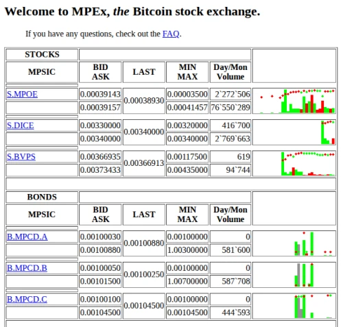

*Aufzeichnung von MPEx, August 2012 (Quelle: [Archiv](https://web.archive.org/web/20120829092213/http://polimedia.us/bitcoin/mpex.php) von Polymedia.us)*

Die Plattform sollte einen gewissen Erfolg erzielen und insbesondere den "Börsengang" von SatoshiDICE, dem von Erik Voorhees betriebenen Online-Kasino, beherbergen. Sie entwickelte sich im Laufe der Zeit weiter und [integrierte](http://trilema.com/2012/futures-on-mpex/) Terminkontrakte im Dezember.

### Eine Bauphase

Der Bärenmarkt, der auf das Platzen der großen Blase von 2011 folgte, war eine schwierige Zeit für die Bitcoin-Gemeinschaft. Der Dollarkurs fiel von seinem Höchststand im Juni um über 90 %, und die Online-Presse nutzte die Gelegenheit, die Kryptowährung zu verunglimpfen.

Trotz niedriger Moral war es eine gute Zeit zum Aufbauen. Eine Vielzahl von Finanzdienstleistungen wie BitInstant, Bitcoinica und GLBSE trugen zum späteren Erfolg von Bitcoin bei. Die beteiligten Unternehmer wurden schnell zu Säulen der Gemeinschaft und unterstützten Nakamotos Schöpfung nachdrücklich.

Darüber hinaus wurde dieser wirtschaftliche Fortschritt von einer technischen Entwicklung begleitet, die von den Programmierern unterstützt wurde. Neben der Entwicklung der Hauptsoftware (ein Thema, mit dem wir uns später befassen werden), war dieser Zeitraum auch durch eine Verbesserung der Nutzung von Bitcoin aufgrund der Entwicklung von wallet gekennzeichnet. Dies ist das Thema des nächsten Kapitels.

# Technische Entwicklung

<partId>8786cbbb-dbe9-51de-86ca-b835ba2529c5</partId>

## Verstärkte Nutzung von Bitcoin

<chapterId>e73d02f8-c1cb-562b-ac80-8a6a672599fd</chapterId>

Der Wilde Westen des Finanzwesens war eine Zeit, in der Bitcoin auf ein breiteres Publikum ausgeweitet wurde, das weniger computerkundig und nicht bereit war, ein schweres Programm auf einem festen Computer auszuführen. Aus diesem Grund war es eine Zeit, in der die Benutzerfreundlichkeit verbessert wurde, wie das Auftauchen von leichtgewichtigen wallet und die Vervielfachung der Möglichkeiten, Bitcoins zu speichern, zeigt.

Als Satoshi im Dezember 2010 in den Ruhestand ging, konnten Neueinsteiger nur zwischen der Hauptsoftware und Verwahrungsanwendungen wie MyBitcoin wählen. Doch ab 2011 erschienen alternative Lösungen. Leichtgewichtige Software-wallet wie *Bitcoin, Wallet für Android* und Electrum führten eine vereinfachte Zahlungsverifizierung ein. Web-wallets, wie Blockchain.info, ermöglichten die Verwaltung von Geldern über einen Browser. Papier-wallet boten die Möglichkeit, Gelder offline zu speichern. Einige Enthusiasten, wie der emblematische Casascius, entwickelten physische Träger, die eine Art Verkörperung der virtuellen Einheiten in der realen Welt darstellten.

Die persönliche Verwahrung von Bitcoins war ein komplexes Problem, das dem Dilemma zwischen Verlust und Diebstahl unterlag. Um seine Bitcoins zu besitzen, musste man sowohl den Zugang zu seinen privaten Schlüsseln aufrechterhalten als auch verhindern, dass andere auf sie zugreifen - zwei Bedingungen, die nie wirklich gleichzeitig erfüllt werden konnten. So macht ein zu leichter Zugang den wallet zu anfällig für Diebstahl, wie der Hack der 25.000 BTC von Allinvain im Juni 2011 zeigte. Umgekehrt macht ein zu schwieriger Zugang den Verlust von Bitcoins wahrscheinlicher, wie bei den etwa 7.000 BTC von Stefan Thomas [verloren] (https://bitcointalk.org/index.php?topic=5400.msg259238#msg259238) aufgrund einer zu komplexen Verschlüsselung zu sehen war. Es sind diese Einschränkungen, die die wallet-Designer versucht haben, anzugehen.

In diesem Kapitel werden wir die verschiedenen Arten der Nutzung von Bitcoin untersuchen, die im genannten Zeitraum entstanden sind. Zunächst werden wir auf verwahrende Anwendungen und alternative Softwareimplementierungen eingehen. Dann werden wir den Fall der leichtgewichtigen wallet genauer untersuchen, der unter anderem zur Entwicklung einer deterministischen Struktur für die Speicherung privater Schlüssel führte. Wir werden Papier-wallets und physische Formen der Repräsentation privater Schlüssel vorstellen, die dazu dienten, Kryptowährungen vor Hacks zu schützen. Abschließend werden wir das Aufkommen der ersten Bitcoin-Mixing-Dienste erörtern, die eine verbesserte Privatsphäre der Nutzer ermöglichten.

### Anwendungen für die Verwahrung

Im Jahr 2011 war Instawallet nach dem berüchtigten MyBitcoin die beliebteste Depotanwendung. Es handelte sich um eine einfach zu bedienende Webanwendung (https://bitcointalk.org/index.php?topic=6785.msg99378#msg99378), die am 29. April 2011 von Jan Vornberger, alias Jav, einem jungen deutschen Entwickler, gestartet wurde. Es handelte sich um einen Verwahrungsdienst: Die Gelder wurden "serverseitig" gehalten, was bedeutet, dass Jav sie verwaltete. Es war keine Registrierung erforderlich; der Zugang erfolgte über eine URL, z. B. `https://instawallet.org/w/rq2SB02ai6BnWaEBywAlP52cw7qwUAA`, die bei der ersten Interaktion mit dem Dienst generated war und im Webbrowser gespeichert wurde. Den Nutzern wurde eine Bitcoin-Adresse zugewiesen, die es ihnen ermöglichte, Geld zu senden und zu empfangen. Überweisungen zwischen Instawallet-Nutzern wurden intern verarbeitet und erfolgten daher sofort. Darüber hinaus hat der Dienst ab Ende Juli [integriert](https://bitcointalk.org/index.php?topic=32818.msg409974#msg409974) ein Zertifizierungsverfahren (die so genannte "grüne Adresse"), mit dem anderen Marktteilnehmern nachgewiesen werden kann, dass eine Transaktion von Instawallet ausgestellt wurde, um eine schnellere Bearbeitung im Rahmen einer Vertrauensbeziehung zu gewährleisten.

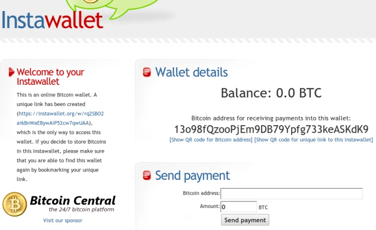

*Interface von Instawallet im Juni 2012 (Quelle: [Bitcoin Magazin](https://web.archive.org/web/20120922131335/http://bitcoinmagazine.net/bitcoin-wallet-options/))*

Am 2. März 2012 [kündigte](https://bitcointalk.org/index.php?topic=67085.msg780164#msg780164) Jav die Schließung von Instawallet mit den Worten an: "Ich habe nicht die Zeit und die Ressourcen, um die Seite weiterhin zu unterstützen". Der Dienst wurde jedoch einige Tage später von Paymium [wiederaufgenommen](https://bitcointalk.org/index.php?topic=67602.msg786523#msg786523), der ihn bis zu seinem fatalen Hack im April 2013 am Laufen hielt.

Paymium SAS war ein französisches Unternehmen (https://web.archive.org/web/20111120231150/http://www.paymium.com/), das im Juni 2011 von Gonzague Grandval, Pierre Noizat (auch bekannt als Boussac im Forum) und David François gegründet wurde. Es konzentrierte sich zunächst auf den Zahlungsverkehr und sein Hauptprodukt war eine Anwendung zur Verhinderung von Bankkartenbetrug. Dank der Anziehungskraft von Pierre Noizat und David François auf Bitcoin wurde es nach und nach zu einem Unternehmen, das sich auf Bitcoin konzentriert.

Anfang 2012 entwickelte Paymium seine eigene Custodial-App: Paytunia. Die Paytunia-App wurde wie folgt beschrieben: "Paytunia ist eine bahnbrechende Anwendung, die auf dem quelloffenen Bitcoin-Protokoll für sichere, einfache Online-Zahlungen und Geldtransfers basiert"). Sie wurde [auf den Markt gebracht] (https://bitcointalk.org/index.php?topic=75550.msg836770#msg836770) im April 2012 auf Android. Nutzer von Bitcoin-Central (der von David François betriebenen Geldwechselplattform) [konnten](https://web.archive.org/web/20120514233205/https://bitcoin-central.net/) auch mit ihrem bestehenden Konto darauf zugreifen, da beide Dienste im Hintergrund das gleiche System nutzen. Wie bei Instawallet erfolgten die Überweisungen zwischen Paytunia-Nutzern [sofort](https://bitcointalk.org/index.php?topic=75550.msg836948#msg836948).

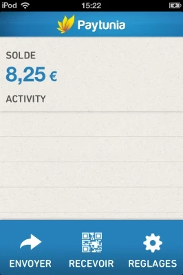

*Interface (auf Französisch) aus dem Antrag von Paytunia vom November 2012 (Quelle: [eeNews Europe](https://www.eenewseurope.com/en/bitcoin-enabled-euro-payment-solution-operates-as-a-mobile-e-wallet/))*

### Alternative Software-Implementierungen

Es war auch ein guter Zeitpunkt, um das Bitcoin-Protokoll neu zu schreiben. Die Hauptsoftware, die damals einfach "Bitcoin" genannt wurde, war eine vollständige Implementierung, da sie die Pflege der gesamten Blockchain und die Weiterleitung neuer Transaktionen und Blöcke erforderte. Aber sie war die einzige, die es gab, so dass das gesamte Netzwerk nur von ihr abhing. Daher der Wunsch, alternative Implementierungen von Bitcoin zu entwickeln.

Satoshi Nakamoto war im Wesentlichen dagegen, das Protokoll umzuschreiben, um den Betrieb von mining nicht zu gefährden. In einer [Nachricht] (https://bitcointalk.org/index.php?topic=195.msg1611#msg1611), die im Juni 2010 im Forum veröffentlicht wurde, schrieb er:

> "Ich glaube nicht, dass eine zweite, kompatible Implementierung von Bitcoin jemals eine gute Idee sein wird. Ein Großteil des Designs hängt davon ab, dass alle Knoten exakt identische Ergebnisse im Gleichschritt erhalten, so dass eine zweite Implementierung eine Gefahr für das Netzwerk darstellen würde. Die MIT-Lizenz ist mit allen anderen Lizenzen und kommerziellen Nutzungen kompatibel, so dass es aus lizenzrechtlicher Sicht keinen Grund gibt, sie umzuschreiben."

Diese Feststellung galt jedoch nicht für Teilimplementierungen, die die Blockchain lesen und den Nutzern Dienste anbieten sollten. Als der Entwickler Mike Hearn im März 2011 mit seinem Java-Implementierungsprojekt an ihn herantrat, hatte er keine Einwände gegen diese Neuprogrammierung des Protokolls, [weil er](https://plan99.net/~mike/satoshi-emails/thread4.html) glaubte, dass "viel Komplexität in einer sauberen Neufassung mit nur Client-Anforderungen zurückgelassen werden kann".

Die Software-Implementierung von Mike Hearn ist BitCoinJ. Dabei handelt es sich um eine Implementierung von Simplified Payment Verification (SPV), wie im White Paper beschrieben, die vor allem mit Thin-Clients interagiert, insbesondere mit solchen auf Telefonen, die das Android-Betriebssystem verwenden. Mike entwickelte dieses Projekt [ab](https://plan99.net/~mike/satoshi-emails/thread3.html) Ende 2010 und [veröffentlichte](https://bitcointalk.org/index.php?topic=4236.msg61438#msg61438) eine erste Version am 7. März 2011. Da er als Ingenieur bei Google arbeitete, musste der Code dem multinationalen Unternehmen zugeschrieben werden, aber die Lizenz (Apache 2) war offen.

Die Neufassung des Bitcoin-Protokolls war damit noch nicht abgeschlossen. Im Juli 2011, nach dem Ausscheiden von Satoshi, starteten Amir Taaki und Patrick Strateman von Bitcoin Consultancy [https://bitcointalk.org/index.php?topic=30646.msg384791#msg384791] Libbitcoin, eine C++-Implementierung, die auf größtmögliche Erweiterbarkeit, Skalierbarkeit und Konfigurierbarkeit abzielt. Ihr Ziel war es, "Bitcoin neu zu schreiben, es super-pluggable, sehr einfach zu machen und alles auf jeder Ebene zu hacken, und sehr konfigurierbar". Der Code wird unter einer offenen Copyleft-Lizenz (AGPL) veröffentlicht, die diejenigen, die die Software weiterverwenden, dazu verpflichtet, ihre Arbeit unter derselben Lizenz zu veröffentlichen.

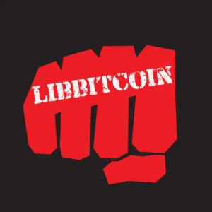

*Libbitcoin-Logo im September 2013 (Quelle: [Archiv](https://web.archive.org/web/20130913065137/http://libbitcoin.dyne.org/) von Libbitcoin.dyne.org)*

Im Oktober gelang es der Software [managed](https://bitcointalk.org/index.php?topic=30646.msg553961#msg553961), eine vollständige Überprüfung der Blockchain durchzuführen. Amir Taaki hat auch ein "Zen von Libbitcoin" verfasst, das dem Zen von Python nachempfunden ist, einer Sammlung von Prinzipien, die das Design der Programmiersprache Python beeinflusst haben. Außerdem wird er im September 2013 ein [Manifest](https://libbitcoin.dyne.org/libbitcoin-manifesto.pdf) (*The Libbitcoin Manifesto*) veröffentlichen.

### Leichte wallets

Das Problem mit vollständigen Implementierungen ist, dass sie ressourcenintensiv und für viele Menschen unpraktisch sind. Darüber hinaus können sie nicht auf mobilen Geräten verwendet werden. Deshalb greifen neue und gelegentliche Nutzer auf den einfachen Ausweg zurück: Depotanwendungen. Im November 2010 rief ein Forumsmitglied (Kiba) ein kollektives [Kopfgeld] (https://bitcointalk.org/index.php?topic=1812.msg22319#msg22319) für die Entwicklung eines Bitcoin-Mobilclients ins Leben. Am 29. Juli 2011 bestätigte die Schließung von MyBitcoin den Bedarf an einer Zwischenlösung. Dies war der Auslöser für die Entwicklung des *leichtgewichtigen wallets*.

Die erste Idee bestand darin, einen Knoten als entfernten Server zu verwenden, dem der Benutzer volles Vertrauen entgegenbringt. Im Februar 2011 brachte Amir Taaki [https://bitcointalk.org/index.php?topic=3451.msg48538#msg48538] einen Software-Client auf den Markt, mit dem ein wallet lokal verwaltet werden kann, indem er sich mit einem bestehenden Knoten namens Spesmilo verbindet. Der Client lief zunächst unter Linux, wurde aber bald auf Windows portiert. Der Name war eine Anspielung auf Spesmilo, die alte internationale Währungseinheit, die 1907 vom Schweizer Mathematiker René de Saussure (dem Bruder des Linguisten Ferdinand) im Rahmen des Esperanto-Projekts vorgeschlagen wurde.

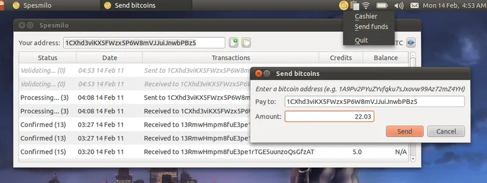

*Interface von Spesmilo im Februar 2011 (Quelle: [Bitcoin Wiki](https://en.bitcoin.it/w/index.php?title=Spesmilo&oldid=8271))*

Amir [war](https://bitcointalk.org/index.php?topic=1568.msg19443#msg19443) selbst Esperanto-Sprecher und übersetzte die Software vom ersten Tag an ins Esperanto. Zu ihm gesellte sich der Entwickler Luke-Jr, der ihm bei der Wartung der Software half. Letzterer [fügte](https://gitlab.com/bitcoin/spesmilo/-/commit/b889211e98111b243de2b11fe88caf91d069b2a5) dem Programm das [tonale Zahlensystem](https://en.bitcoin.it/wiki/Tonal_Bitcoin) hinzu, ein von John W. Nystrom im 19. Jahrhundert vorgeschlagenes Hexadezimalsystem, bei dem die Einheit "Bitcoin" 65,536 satoshis entspricht. Das Spesmilo-Projekt wurde jedoch im November 2011 zugunsten eines weitaus ehrgeizigeren Projekts aufgegeben (siehe unten): Electrum.

*Andreas Schildbach auf der re:publica-Konferenz in Berlin im Mai 2016 (Quelle: Holger Bleich auf [Twitter](https://twitter.com/_robinhob/status/727167827132727300))*

Die andere, bequemere Idee war die Verwendung einer vereinfachten Zahlungsverifizierung (SPV), die es ermöglichte, Transaktionen als zur Blockchain gehörig zu verifizieren, ohne den gesamten Datensatz herunterladen zu müssen. Am 11. März 2011, ein paar Tage nach der Veröffentlichung von BitCoinJ, [enthüllte] (https://bitcointalk.org/index.php?topic=4384.msg64142#msg64142) ein Berliner Entwickler namens Andreas Schildbach, im Forum Goonie genannt, den Prototyp eines wallet für Telefone mit Android, basierend auf Mike Hearns Implementierung. Unter dem bescheidenen Namen *Bitcoin Wallet für Android* wurde es das erste funktionierende Modell eines leichtgewichtigen wallet für Mobiltelefone.

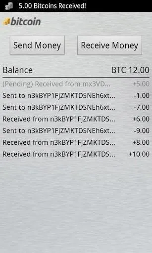

*Interface von Bitcoin Wallet für Android im Juli 2011 (Quelle: Brandon Iles für [Wired](https://web.archive.org/web/20110710020745/https://www.wired.com/gadgetlab/2011/07/bitcoin-android-app/))*

Ein weiteres auf BitCoinJ basierendes wallet für den PC war MultiBit, das im September 2011 vom britischen Entwickler Jim Burton [erstellt](https://bitcointalk.org/index.php?topic=43616.msg520542#msg520542) wurde. Sein besonderes Merkmal war die Möglichkeit, mehrere Konten innerhalb der Schnittstelle zu verwalten.

### Deterministische wallets

Die Bemühungen zur Verbesserung der Bitcoin-Benutzbarkeit führten auch zum Aufkommen *deterministischer wallet*. Dabei handelt es sich um wallet, bei denen die Schlüsselableitung angewandt wird: Anstatt einzeln nach dem Zufallsprinzip abgeleitet zu werden, wie es in der Hauptsoftware der Fall war, werden die privaten Schlüssel deterministisch aus Informationen (seed genannt) abgeleitet, wobei kryptografische Funktionen verwendet werden. Die Kenntnis dieser Informationen ermöglicht es dem Benutzer, alle seine Gelder wiederherzustellen, was die wallet-Sicherung erheblich vereinfacht. Es besteht keine Notwendigkeit, die Datei `wallet.dat` immer und immer wieder zu speichern!

Deterministische wallet sind größtenteils das Geistesprodukt des amerikanischen Entwicklers Gregory Maxwell. Als Befürworter freier Software war er seit 2004 [Mitwirkender](https://commons.wikimedia.org/wiki/User:Gmaxwell) bei Wikipedia und arbeitete für die Stiftung Xiph.org, wo er an der Entwicklung des Audiocodecs Opus beteiligt war. Im Mai 2011 begann er, sich mit Bitcoin zu beschäftigen, und [versuchte sich](https://bitcointalk.org/index.php?topic=7171.msg119591#msg119591) an mining. Er schrieb auch viel und wurde schnell sehr aktiv im Forum und im IRC-Kanal \#bitcoin-dev, wo er das Pseudonym Gmaxwell verwendete.

*Gregory Maxwell im Jahr 2006 (Quelle: [Wikimedia](https://commons.wikimedia.org/wiki/File:Gmaxwell-boat.webp))*

Gregory Maxwell hatte viele Ideen, wie man die Verwendung von Bitcoin verbessern könnte, und die Schlüsselableitung war eine davon. Er war nicht der erste, der diese Idee hatte (Casascius [machte](https://bitcointalk.org/index.php?topic=6897.msg100975#msg100975) einen ähnlichen Vorschlag im April), aber er war der erste, der sie formalisierte. Am 18. Juni, nach [Diskussionen](https://buildingbitcoin.org/bitcoin-dev/log-2011-06-08.html#l-1089) im IRC, schrieb er eine Beschreibung im Forum. Er [schrieb](https://bitcointalk.org/index.php?topic=19137.msg239768#msg239768):

> "Bitcoin sollte wirklich deterministische wallets anbieten und standardmäßig verwenden.   Die zusätzliche Sicherheit der aktuellen Vor-generated ist ziemlich gering, wenn man bedenkt, wie die meisten Leute Bitcoin verwenden, und die Haftung für Schäden aufgrund unzureichender Backups und des erhöhten Drucks, einen einzelnen wallet online zu halten, ist enorm."

Zwei Arten der Ableitung wurden ins Auge gefasst. Die eine Art (Typ 1) war einfach und generierte private Schlüssel direkt von der seed. Die andere (Typ 2) war komplexer, ermöglichte aber die Ableitung von Adressen aus einem öffentlichen Hauptschlüssel, der von der seed stammt, ohne auf die seed selbst zuzugreifen. Dies ermöglichte es der Zahlungsverarbeitungssoftware, für jede Transaktion eine generate-Adresse zu erzeugen, ohne die privaten Schlüssel preiszugeben.

Später, im Februar 2012, erfolgte die Standardisierung mit der [Veröffentlichung](https://en.bitcoin.it/w/index.php?title=BIP_0032&oldid=26198) von [BIP](https://planb.academy/resources/glossary/bip) 32. Darin wurde die allgemeine Struktur von *Hierarchical Deterministic Wallets*, HD Wallets, beschrieben, bei denen Ableitungen methodisch zur Ableitung von seed-Schlüsseln und Adressen verwendet werden. Sie wurde im Laufe der Jahre schrittweise von den meisten wallet übernommen.

https://planb.academy/courses/46b0ced2-9028-4a61-8fbc-3b005ee8d70f

### BitcoinSpinner, Electrum und Waffenlager

Im Laufe des Jahres 2011 erschienen weitere Software-wallets. Im Sommer entwickelte ein dänischer Entwickler namens Jan Møller eine Java-Schnittstelle namens BCCAPI (für *BitCoin Client API*). Diese wurde am 23. August [angekündigt] (https://bitcointalk.org/index.php?topic=36892.msg453652#msg453652). Es handelte sich um eine Softwareschnittstelle zur Verbindung eines auf einem Android-Telefon laufenden Clients mit einem Server. Auf der Client-Seite wurde eine deterministische Generierung von privaten Schlüsseln implementiert, ohne dass regelmäßige Backups erforderlich waren.

Einige Monate später wurde diese Schnittstelle verwendet, um ein leichtgewichtiges wallet namens BitcoinSpinner zu erstellen, das auf Google Play verfügbar ist. Es wurde [angekündigt](https://bitcointalk.org/index.php?topic=52674.msg628527#msg628527) von Jan am 23. November. Es wurde offiziell von der dänischen Firma Miracle A/S verwaltet, der Jan Ende Dezember beitrat (https://bitcointalk.org/index.php?topic=53353.msg672264#msg672264).

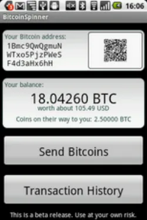

*Interface von BitcoinSpinner im Juni 2012 (Quelle: [Bitcoin Magazin](https://web.archive.org/web/20120922131335/http://bitcoinmagazine.net/bitcoin-wallet-options/))*

Die BCCAPI [litt](https://bitcointalk.org/index.php?topic=46493.msg571018#msg571018) jedoch unter einigen Mängeln, so dass sie nicht jedermanns Geschmack entsprach. Zum einen war die Software-Infrastruktur des Servers, die auf BitCoinJ basierte, nicht öffentlich, was die Einrichtung zusätzlicher Server verhinderte. Andererseits speicherte das System Transaktionen, die mit Adressen verknüpft waren, die von einem wallet verwaltet wurden, um den Gesamtsaldo zu ermitteln, was zwar die Bandbreite reduzierte, aber ein Vertraulichkeitsproblem darstellte.

Diese Unzulänglichkeiten störten besonders den Franzosen Thomas Voegtlin, der damals Computerforscher war und im Forum das Pseudonym ThomasV verwendete. Er war daran interessiert, einen Beitrag zu leisten und [suchte](https://bitcointalk.org/index.php?topic=46493.msg569756#msg569756) nach "Servern, die keine Benutzertreue erfordern" (im Original: "I am thinking about servers you don't have to be faithful to"). Am 20. Oktober [beschloss er](https://bitcointalk.org/index.php?topic=46493.msg585227#msg585227), es "von Grund auf in Python zu machen".

Das Ergebnis war die Electrum, die am 5. November [herauskam] (https://bitcointalk.org/index.php?topic=50936.msg607510#msg607510). Sein Name bezieht sich auf Elektrum, eine natürliche Legierung aus Gold und Silber, die zur Prägung der ersten Münzen in Lydien und Griechenland verwendet wurde.

*Thomas Voegtlin im Jahr 2006 (Quelle: [Archiv](https://web.archive.org/web/20060516200739/http://www.loria.fr/%7Evoegtlin/) von seiner persönlichen Seite)*

Der Client stellt eine Verbindung zu einem Netz von Spezialservern her, um die Transaktionen abzurufen. Die Server führen die Software (bitcoind) aus und indizieren alle Transaktionen mit Hilfe des ABE-[Block](https://planb.academy/resources/glossary/block)-Explorer-Codes. In diesem wallet hat der seed die Form einer hexadezimalen Zeichenkette. Seit dem 10. November [wurde] (https://bitcointalk.org/index.php?topic=51397.msg612674#msg612674) es auch als mnemonische Phrase mit 12 Wörtern dargestellt. Jedes Wort wird aus einer vordefinierten Liste ausgewählt, so dass die Informationsbits dargestellt werden können. Diese Art von Satz wird durch BIP 39 standardisiert, der 2013 [verfasst](https://github.com/trezor/python-mnemonic/blob/217999150812f7d356169661e4ac0b2e09fecd1d/BIP_0039.txt) wurde.

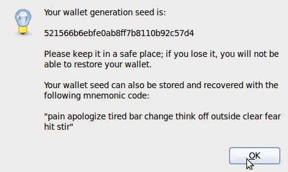

*Electrum seed und mnemonischer Satz im Jahr 2012 (Quelle: [Archiv] (https://web.archive.org/web/20120826021721/http://electrum-desktop.com:80/seed.html) von der Electrum-Website)*

Am 16. Dezember [integrierte](https://bitcointalk.org/index.php?topic=50936.msg652435#msg652435) Electrum die Typ-2-Ableitung, so dass Adressen kalt generated werden, ohne Zugang zum seed. Im Oktober 2012 [fügte](https://bitcointalk.org/index.php?topic=50936.msg1302941#msg1302941) Thomas Voegtlin dem Electrum auch eine vereinfachte Zahlungsüberprüfung hinzu, was ihn zu einem der besten leichtgewichtigen wallet im Ökosystem macht.

Ein dritter fortschrittlicher wallet [kam] (https://bitcointalk.org/index.php?topic=56424.msg671650#msg671650) Anfang 2012 heraus: Armory. Diese Software wurde ab Juli 2011 von dem amerikanischen Ingenieur Alan Reiner entwickelt, der sich im Forum den Namen Etotheipi gab (in Anlehnung an die mathematische Identität von Euler). Sie hatte [zunächst](https://github.com/etotheipi/BitcoinArmory/blob/d68259dcf4116473d82458770e5ad73b95238797/README) die Form einer Python-Softwarebibliothek namens PyBtcEngine, bevor sie im November zu einem vollwertigen Client wurde.

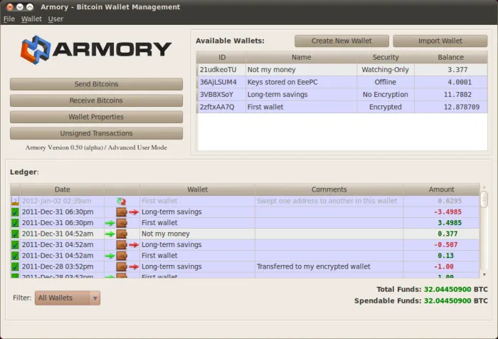

*Interface aus dem Arsenal wallet im Januar 2012 (Quelle: [Archiv](https://web.archive.org/web/20120225130943/http://bitcoinarmory.com/) von der Armory-Website)*

Am 3. Januar 2012 wurde Armory als "der fortschrittlichste Bitcoin-Client, den es gibt" vorgestellt: Er [integrierte](https://web.archive.org/web/20120113212542/http://bitcoinarmory.com/index.php/start-page/sample-page/features) zahlreiche Funktionen, wie eine Schnittstelle für mehrere Konten, eine deterministische Infrastruktur mit Papier-Backup, eine Teileauswahl und einen Adressimport. Vor allem aber [bot](https://web.archive.org/web/20120115015741/http://bitcoinarmory.com/index.php/using-offline-wallets-in-armory) er die Möglichkeit, Gelder offline zu verwalten, eine Praxis, die als Cold Storage bekannt ist (unten beschrieben). Im Februar und März [führte Alan Reiner](https://web.archive.org/web/20120515220140/https://bitcointalk.org/index.php?topic=64449.0) eine Crowdfunding-Kampagne durch, die über 4.000 Dollar einbrachte. Im Laufe der Monate wurde Armory zum Maßstab für Sicherheit.

### Web wallets

Eine hybride Form der wallet kam auf: die *Web-wallet*, die es ermöglichte, über einen Browser auf Gelder zuzugreifen, indem eine Verbindung zu einem Dienst hergestellt wurde, der eine verschlüsselte Kopie der privaten Schlüssel speicherte.

Seit März 2011 hatte Stefan Thomas (justmoon), der deutsche Produzent des Videos "*Was ist Bitcoin?*" und Manager von WeUseCoins, an einer Javascript-Bibliothek (in [Node](https://planb.academy/resources/glossary/node).js) gearbeitet, um mit dem Bitcoin-Protokoll zu interagieren. Diese Bibliothek mit dem Namen BitcoinJS wurde am 5. Mai [veröffentlicht] (https://bitcointalk.org/index.php?topic=7357.msg108003#msg108003). Sie ermöglichte Webentwicklern die Bereitstellung von Clients, die im Browser des Benutzers laufen.

*Vorstellung der BitcoinJS-Bibliothek durch Stefan Thomas (WeUseCoins) und Eric Brigham (Trucoin)*

Der erste Entwickler, der diese Bibliothek nutzte, war ein Forumsmitglied, das sich DogIsland nannte und [im August](https://bitcointalk.org/index.php?topic=36169.msg445796#msg445796) ein Web-wallet-Konzept namens StrongCoin vorstellte. Die Schnittstelle ermöglichte es Benutzern, ein Konto zu erstellen und sich mit einem Benutzernamen und einem Passwort anzumelden. Die privaten Schlüssel werden mit AES verschlüsselt, bevor sie an den Server gesendet werden, so dass nur der Nutzer Zugriff auf die Gelder hat. Der Dienst [wurde](https://twitter.com/strongcoin/status/122263762035146753) am 7. Oktober offiziell eröffnet, hatte aber [den Nachteil](https://web.archive.org/web/20111113070337/http://www.thebitcointrader.com/2011/11/bitcoins-killer-app-is-here.html), dass eine Gebühr von 1 % (bis zu 312 GW) auf jeden gesendeten Betrag erhoben wurde.

Die BitcoinJS-Bibliothek wurde auch [verwendet](https://web.archive.org/web/20180611012256/https://github.com/zootreeves/blockchain.info) von Benjamin Reeves, einem jungen britischen Entwickler, der in York lebt und im Forum als Piuk bekannt ist. Er lebte sehr zurückgezogen, war aber auch ein Workaholic. Im August [entwickelte er](https://bitcointalk.org/index.php?topic=40264.msg500726#msg500726) einen Block-Explorer, der "verwaiste Blöcke enthält, die zum Aufspüren möglicher doppelter Ausgaben verwendet werden können" und "das tatsächliche Volumen der getätigten BTC-Transaktionen (und nicht nur der gesendeten BTC) schätzt", und den er auf seiner persönlichen Website bereitstellt. Es konkurriert mit dem Bitcoin Block Explorer (BBE) von Theymos und mit [ABE] (https://bitcointalk.org/index.php?topic=22785.msg286515#msg286515), einer Open-Source-Alternative, die von den Benutzern gehostet werden soll. Im Oktober erhielt die Website [https://bitcointalk.org/index.php?topic=40264.msg576916#msg576916] ihren eigenen Domänennamen: Blockchain.info. Sie wurde schnell zum bevorzugten Explorer der Community-Mitglieder.

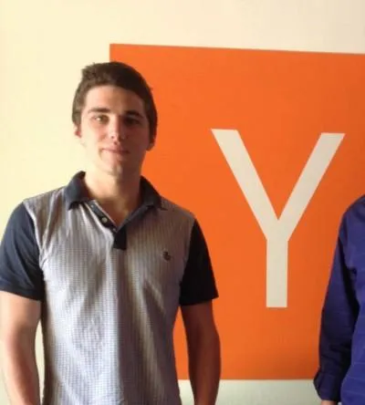

*Ben Reeves in den Büros von Y Combinator in San Francisco im April 2012 (Quelle: [Imgur](https://imgur.com/U5iUy))*

Am 1. Dezember [integrierte] Ben Reeves (http://bitcointalk.org/index.php?topic=40264.msg636996#msg636996) eine wallet-Funktionalität in die Plattform. Diese Funktion, die einfach "Mein Wallet" genannt wurde, ähnelte der von StrongCoin: Benutzer haben mit einem Login und einem Passwort Zugang zu ihrem wallet; ihre privaten Schlüssel werden verschlüsselt und auf dem Server gespeichert. Es wurde jedoch keine Provision erhoben. Darüber hinaus profitierte der Dienst von der Übersichtlichkeit des Block-Explorers, der die Details der durchgeführten Transaktionen anzeigt.

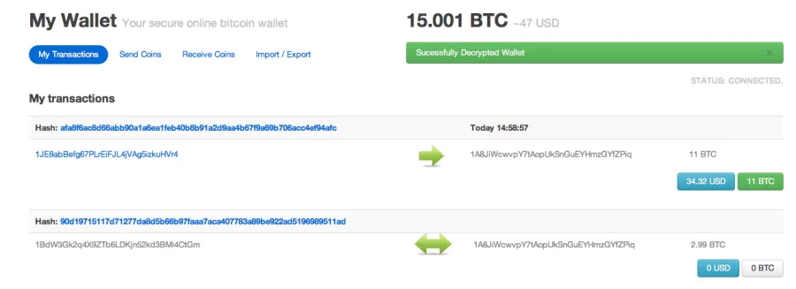

*Interface von My Wallet im Dezember 2011 (Quelle: [Bitcointalk](https://web.archive.org/web/20120519160806/https://bitcointalk.org/index.php?topic=40264.140))*

Die praktische Handhabung des wallet macht ihn sehr beliebt. Der Dienst zog schnell Tausende von Nutzern an und erreichte im März 2012 [5.000](https://bitcointalk.org/index.php?topic=40264.msg790252#msg790252) offene Konten. Das tägliche Volumen auf der Blockchain, das die Bitcoins zählt, die durch von Blockchain.info (My Wallet und API) ausgestellte Transaktionen bewegt werden, und die tatsächlichen Überweisungen überschätzt, wuchs stetig. Anfang Mai explodierte es dank der Aktivität generated des Online-Würfelspiels SatoshiDICE und überstieg 18.000 Bitcoins, was zu diesem Zeitpunkt 90.000 Dollar entsprach! Bis Juli wurde das Gesamtvolumen, das von Blockchain.info bewegt wurde, auf 13,6 Millionen Dollar [geschätzt](https://web.archive.org/web/20120720035456/https://blockchain.info/wallet/).

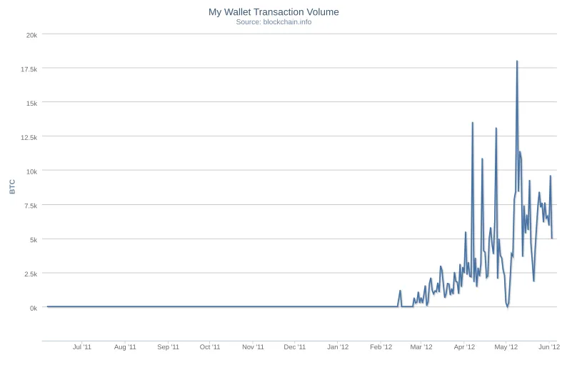

*Tägliches Volumen der von Blockchain.info ausgegebenen Transaktionen (Quelle: [Archiv](https://web.archive.org/web/20120604084256/http://blockchain.info/charts/my-wallet-transaction-volume))*

### Cold Speicher und Papier wallets

2011 kamen auch die wallet aus Papier auf, eine Anwendung des Konzepts der kalten Lagerung. Bitcoin zu halten bedeutet einfach, bestimmte Informationen vor Risiken zu schützen, sei es vor versehentlichem Verlust oder vor der Neugier anderer (Diebstahl). Diese Informationen - der private Schlüssel - können [generated](https://bitcointalk.org/index.php?topic=1610.msg19131#msg19131) von Geräten gespeichert werden, die nie mit dem Internet verbunden sind. Dies wird als kalte Speicherung bezeichnet [seit 2011](https://en.bitcoin.it/w/index.php?title=Cold_storage&oldid=16769).

Die Cold-Speicherung kann durch die Speicherung Ihrer privaten Schlüssel auf einem digitalen Sicherungsmedium, wie z. B. einem USB-Stick, erfolgen. Eine viel praktischere Methode ist jedoch das Papier-wallet, bei dem es sich einfach um ein Blatt Papier handelt, das den privaten Schlüssel und die öffentliche Adresse enthält. Der Schlüssel kann von jeder Software generated werden, sofern das Gerät, auf dem er sich befindet, offline bleibt.

Ein Papier wallet kann auch mit Hilfe eines speziellen Tools generated werden. Diese Art von Werkzeug wurde im Sommer 2011 eingeführt. Das wichtigste war BitAddress, entwickelt von einem gewissen Pointbiz, das im September [auf den Markt](https://web.archive.org/web/20111102021042/https://bitcointalk.org/index.php?topic=43496.0) gebracht wurde. Dabei handelte es sich um ein browserbasiertes Tool, das in Javascript codiert war. Die Schnittstelle lud den Benutzer ein, Entropie zu erzeugen, um die Generierung von Pseudozufallszahlen zu optimieren. Der resultierende private Schlüssel und die Adresse konnten dann zur sicheren Aufbewahrung ausgedruckt werden. Natürlich kann (und sollte!) das Tool auch ohne Internetverbindung verwendet werden, indem die HTML-Seite gespeichert wird.

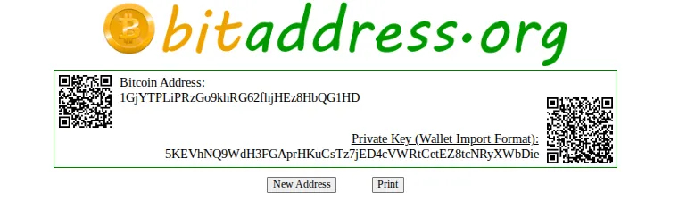

*Papier wallet generated mit BitAddress im September 2011 (Quelle: [capture](https://web.archive.org/web/20120519160806/https://bitcointalk.org/index.php?topic=40264.140) von BitAddress.org)*

Ein weiteres Tool, das zu dieser Zeit erschien, war VanityGen, [erstellt](https://web.archive.org/web/20111104120932/https://bitcointalk.org/index.php?topic=25804.0) im Juli von einem Forumsmitglied, das sich Samr7 nannte. Es handelte sich um ein Programm zur Erstellung einer personalisierten Adresse (*Vanity-Adresse*), die mit bestimmten Zeichen beginnt, indem eine große Anzahl privater Schlüssel getestet wird. Dies ist nützlich, um die Spendenadressen von Einzelpersonen zu identifizieren. Die Adresse von Pointbiz für seine BitAddress-Wartung, `1NiNja1bUmhSoTXozBRBEtR8LeF9TGbZBN`, enthielt zum Beispiel das Wort "Ninja".

Die wirksamste Methode zum Schutz vor Diebstahl ist schließlich das "Brain-wallet", bei dem man sich eine geheime Phrase merkt, die Zugang zu den unter der entsprechenden Adresse gespeicherten Bitcoins gibt. Die geheime Phrase kann zum Beispiel mit SHA-256 gehasht werden, um den privaten Schlüssel zu erhalten, der die Ausgabe der Gelder ermöglicht. Diese Methode wurde [vorgeschlagen](https://bitcointalk.org/index.php?topic=35082.msg436289#msg436289) von Casascius im August 2011 und [hervorgehoben](https://www.forbes.com/sites/jonmatonis/2012/03/12/brainwallet-the-ultimate-in-mobile-money/) in Forbes von Jon Matonis im März 2012. Sie ist jedoch sehr unsicher, wenn die Entropie nicht ausreichend ist. Und es unterliegt natürlich den Beschränkungen des menschlichen Gedächtnisses; es handelt sich eher um eine praktische Demonstration der Leistungsfähigkeit von Bitcoin als um eine nachhaltige Anwendung.

### Physische Formen der Repräsentation privater Schlüssel

Eine weitere Möglichkeit der kalten Speicherung ist die physische Speicherung von privaten Schlüsseln, bei der private Schlüssel oder Signaturen in bestimmte Objekte eingebettet werden. Diese Idee tauchte bereits im Sommer 2010 mit dem [Vorschlag] (https://bitcointalk.org/index.php?topic=737.msg7990#msg7990) von Gavin Andresen auf, "Bitcoins zu drucken" (Original: "Printing bitcoins"), damit sie persönlich ausgetauscht werden können, wurde aber erst 2011 umgesetzt.

Die ersten Objekte dieser Art sind die von Doug Feigelson (alias Llama) im Mai 2011 vorgestellten Bitbills (https://bitcointalk.org/index.php?topic=7724.msg112655#msg112655), bei denen es sich um Plastikkarten mit QR-Codes handelt, die die Adresse bzw. den privaten Schlüssel darstellen. Der private Schlüssel ist durch einen Aufkleber abgedeckt, so dass er nicht gelesen werden kann, ohne Anzeichen von Manipulation zu zeigen. Die Karte ist mit Hologrammen versehen, um Fälschungen zu verhindern. Bitbills sind nach Aussage ihres Entwicklers "die erste physische Verkörperung von Bitcoins". Sie [boten] (https://web.archive.org/web/20110511215306/http://bitbills.com/) eine gute Möglichkeit, "Bitcoins persönlich zu überweisen, genau wie Bargeld!" (Original: "Mit Bitbills können Sie Bitcoins persönlich überweisen, genau wie Bargeld!").

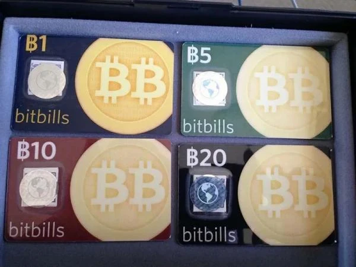

*Von Charlie Lee im April 2013 versteigerte Bitbills (Quelle: Inversor Inteligente auf [Substack](https://inversorinteligente.substack.com/p/casascius-monedas-fisicas-de-bitcoin))*

Der erste *Bitcoin Geldautomat*, [entworfen](https://bitcointalk.org/index.php?topic=5122.msg461848#msg461848) von dem Unternehmer Todd Bethell, enthielt eine Funktion, mit der Geld auf eine speziell gedruckte Bitbills-Karte gesendet werden konnte. Er wurde am 17. August 2013 in San Diego, Kalifornien, zum ersten Mal öffentlich [getestet](https://web.archive.org/web/20110827115138/http://bitcoinatm.com/). Ein Einführungsvideo wurde im September veröffentlicht:

Bitbills hatte einen gewissen Erfolg, aber Doug Feigelson hatte Mühe, mit der Nachfrage Schritt zu halten. Im Mai 2012 wurde die Produktion von Bitbills endgültig eingestellt (https://web.archive.org/web/20120508074832/http://bitbills.com/order). Aber es gab einen Konkurrenten: "physische Darstellungen von Bitcoin", hergestellt von Mike Caldwell, auch bekannt als Casascius.

Mike Caldwell war ein 33-jähriger amerikanischer Entwickler, der in den Vororten von Salt Lake City, Utah, lebte und eine Firma für Geschäftsautomatisierung namens [Swipeclock] (https://www.linkedin.com/company/swipeclock/) betrieb. Sein Pseudonym, Casascius, ist eine latinisierte Form von CASAS, den Initialen des Sprichworts *Die Dinge beim Namen nennen*. Als Rationalist war er von der [Kryptographie](https://planb.academy/resources/glossary/cryptography) fasziniert und fühlte sich von der technischen Seite von Bitcoin angezogen. Eine Zeit lang versuchte er sich auch an mining.

*Mike Caldwell, alias Casascius, im Jahr 2013 (Quelle: [IMDb](https://www.imdb.com/fr/name/nm5669287/))*

Casascius interessierte sich besonders für die Bitcoin-Speicherung und damit für wallet. Er entwickelte ein [Dienstprogramm](https://bitcointalk.org/index.php?topic=25141.msg312005#msg312005), um einen privaten Schlüssel in eine Bitcoin-Adresse umzuwandeln, benutzerdefinierte generate-Schlüssel zu erstellen und eine seed-Ableitung zu erzeugen. Aber vor allem wollte er, wie er [erklärte](https://bitcointalk.org/index.php?topic=2657.msg36011#msg36011), "einen echten, greifbaren Bitcoin herstellen, der tatsächlich BTC vermittelt". So begann er im Juni mit dem [Verkauf](https://bitcointalk.org/index.php?topic=21878.msg275000#msg275000) von wallet aus Papier auf seiner persönlichen Website.

Am 19. August teilte Casascius öffentlich [https://bitcointalk.org/index.php?topic=38048.msg467209#msg467209] seinen Plan, "echte physische Repräsentationen von Bitcoin" herzustellen. Am 6. September begann er mit deren Produktion. Am 6. September [kündigte](https://bitcointalk.org/index.php?topic=41892.msg509883#msg509883) er den Verkauf von "Casascius physical representations of bitcoin" an, besser bekannt als "Casascius coins". Der private Schlüssel wurde durch ein personalisiertes Hologramm verdeckt, so dass er nicht abgerufen werden konnte, ohne die Münze zu beschädigen. Die ersten acht Zeichen der öffentlichen Adresse Bitcoin waren auf der Außenseite sichtbar und vom Hersteller auf das Hologramm vorgedruckt. Überraschenderweise enthielten die ersten Münzen einen Druckfehler: Casascius wurde Casacius buchstabiert.

*Casascius' erste Bitcoins im Jahr 2011 (Quelle: [casascius.com](https://www.casascius.com/casasciusphysicalbitcoins.webp))*

Anfänglich in 1 und 25 BTC Münzen erhältlich, wurden Casascius-Bitcoins schnell in anderen Stückelungen und als Barren angeboten, die bis zu 1.000 BTC reichen! Physische Darstellungen von Bitcoin wurden [verkauft](https://web.archive.org/web/20111107191637/https://www.casascius.com/) auf Casascius' persönlicher Website, aber [auch](https://web.archive.org/web/20111028171555/http://www.memorydealers.com/bieq.html) auf MemoryDealers (Roger Ver's online store) ab Oktober. Sie wurden auch [verfügbar](https://odysee.com/@adamkokesh:2/moment-in-monetary-history-bitcoin-by:9) über einen Geldautomaten auf dem PorcFest im Juni 2012 gemacht.

Auf diese Weise dienten sie einem pädagogischen Zweck und sprachen ein anderes Publikum an, darunter auch Münzsammler. Im Jahr 2013 erklärte Mike Caldwell [selbst](https://bitcointalk.org/index.php?topic=41892.msg3727984#msg3727984):

> "Mein Ziel bei der Einführung des Casascius Coin war es, ein Lehrmittel zu schaffen, das der Weltöffentlichkeit hilft, eine virtuelle Münze mit einem funktionalen Objekt zum Anfassen zu visualisieren

Casascius-Bitcoins werden in den zwei Jahren, in denen sie verteilt wurden, ein großer Erfolg sein. Laut [Uberbills] (https://casascius.uberbills.com/) werden 27.910 Münzen und Barren produziert, wobei insgesamt 98.284 BTC auf diesen Medien gespeichert sind.

### Die ersten Münzmischungsdienste

Schließlich wurden in dieser Zeit auch Fragen zur Vertraulichkeit von Bitcoin gestellt. Da Bitcoin anfangs als "anonym" dargestellt wurde, dachten viele Menschen, sie hätten nichts zu befürchten. Aber das Register ist öffentlich, so dass die Gelder zurückverfolgt und mit einer Identität in Verbindung gebracht werden können, was zu einem Fragezeichen führt.

Mit der Popularisierung von Silk Road und seiner Übernahme durch WikiLeaks im Sommer 2011 wuchsen die Bedenken hinsichtlich der Anonymität [stetig](https://bitcointalk.org/index.php?topic=175.msg57305#msg57305)(https://web.archive.org/web/20110610205500/http://bitcoinweekly.com/articles/the-battle-is-on-silk-road-vs-government-and-bitcoin-anonymity). Am 24. Juli veröffentlichten Martin Harrigan und Fergal Reid, zwei irische Forscher vom University College Dublin, (https://web.archive.org/web/20110725131444/https://anonymity-in-bitcoin.blogspot.com/2011/07/bitcoin-is-not-anonymous.html) eine Studie, die zeigte, dass Bitcoin nicht so anonym war, wie sich die meisten Leute vorstellten. Die Durchführung vertraulicher Transaktionen war nicht unmöglich, aber schwieriger, als es auf den ersten Blick erscheinen mag.

Um dieses Problem zu lösen und die Rückverfolgbarkeit der Gelder zu unterbrechen, wurde die Lösung in der Münzmischung gesehen, die es ermöglichte, die Transaktionsspuren zu verschleiern. Diese Art des Mischens wurde von zentralisierten Mischern durchgeführt, die als *Mixer* oder *Tumblers* bekannt sind. Drei von ihnen hoben sich von der Masse ab und erwiesen sich nicht als Betrüger.

Der erste ist BitLaundry. Dieser Dienst wurde [im September 2010](https://bitcointalk.org/index.php?topic=963.msg11823#msg11823) von Peter Vessenes ins Leben gerufen, einem amerikanischen Unternehmer mit einem Abschluss in Kryptographie, der die Existenz von Bitcoin zur Zeit von Slashdotting entdeckte. Der Blender [versorgte](https://maltemoeser.de/paper/money-laundering.pdf#page=5) den Nutzer mit einer Einwegadresse, an die die zu anonymisierenden Gelder geschickt wurden. Die Bitcoins wurden dann in Form von mehreren Münzen ([UTXO](https://planb.academy/resources/glossary/utxo)) zurückgeschickt, und zwar im Rahmen einer Transaktion mit mehreren Eingängen, die auch Bitcoins anderer Nutzer umfasste, so dass das Blending effektiv war. Die Gebühren betrugen etwa 2,5 % des betreffenden Betrags. Im Mai 2011 übertrug Peter Vessenes [https://bitcointalk.org/index.php?topic=963.msg122955#msg122955] den Dienst an Mike Gogulski, einen Aktivisten, der sich dadurch auszeichnet, dass er staatenlos ist, da er seine US-Staatsbürgerschaft aufgegeben hat, ohne eine andere zu besitzen, da er die rechtlichen Komplikationen, die sich aus dieser Tätigkeit ergeben könnten, spürte.

Der zweite Blender war Bitcoin Fog (der "Bitcoin Scrambler"), [erstellt](https://web.archive.org/web/20121102102447/https://bitcointalk.org/index.php?topic=50037.0) im Oktober 2011 von Roman Sterlingov, einem 23-jährigen Russen und Schweden. Im Gegensatz zu BitLaundry mussten die Nutzer dieses Dienstes ein lokales Guthaben auf ihrem Konto halten und dann die Gelder abheben, um die Rückverfolgbarkeit zu verringern, indem sie sie mit den Bitcoins anderer Nutzer vermischten. Die Abhebungen erfolgten zeitversetzt, in mehreren Schritten an verschiedene Adressen, über einen Zeitraum von 6 bis 96 Stunden. Die Gebühren lagen zwischen 1 % und 3 %.

Der dritte war von besonderer Art, denn es handelte sich um den in Ben Reeves' Blockchain.info wallet eingebauten Mixer. Dieser Dienst wurde [implementiert](https://bitcointalk.org/index.php?topic=40264.msg1015499#msg1015499) im Juli 2012 als eine Funktion namens "Anonym senden". Die Provision betrug 1,5 %.

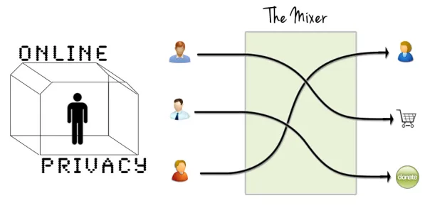

*Illustration der Funktion "Anonym senden" des Blockchain.info wallet (Quelle: [Archiv](https://web.archive.org/web/20120708011906/https://blockchain.info/wallet/send-anonymously))*

Die Verbreitung zentraler Mischer hatte den Effekt, dass sie das Denken über dezentrales Mischen von Münzen katalysierte, was im Sommer 2011 mit einem Vorschlag [proposal](https://bitcointalk.org/index.php?topic=12751.msg315793#msg315793) von Hashcoin begann. Dies führte zur [Formalisierung](https://bitcointalk.org/index.php?topic=279249.msg2983902#msg2983902) von [CoinJoin](https://planb.academy/resources/glossary/coinjoin) durch Gregory Maxwell im Jahr 2013. Aber das ist eine ganz andere Geschichte...

### Eine Zeit des Fortschritts für wallet

Im Zeitraum 2011-2012 wurden zahlreiche Lösungen für die Nutzung von Bitcoin entwickelt. Zusätzlich zu den Verwahrungsanwendungen entstanden Software-wallet wie *Bitcoin Wallet für Android* und Electrum, Web-wallet wie Blockchain.info, Papier-wallet-Generatoren wie BitAddress und physische Darstellungen von Bitcoin wie Bitbills und Casascius Coin. Es wurden mehrere Mischdienste entwickelt, um den Nutzern mehr Vertraulichkeit zu bieten.

Darüber hinaus wurden in diesem Zeitraum deterministische wallet entwickelt, die auf der Ableitung von Schlüsseln aus einem einzigen Datenelement namens seed basieren. Das Modell wurde Anfang 2012 in BIP 32 verbessert und standardisiert, um diese Ableitung um eine Hierarchie zu ergänzen. Doch die Bewegung blieb nicht stehen, denn in der Folge wurden weitere Vorschläge veröffentlicht. BIP 39, veröffentlicht im September 2013, vereinheitlichte die Verwendung der mnemonischen Phrase, in Anlehnung an Electrum. BIP 43 und 44, verfasst im April 2014, standardisierten die Struktur von wallet, die mehrere Kryptowährungen und mehrere Konten besitzen. Diese Vorschläge wurden von Marek Palatinus (Slush) und Pavol Rusnak (Stick) gemacht, die an der Herstellung des ersten Hardware-wallet, Bitcoin Trezor, arbeiteten.

Aber nicht nur bei den wallet, sondern auch bei den mining-Pools wurden erhebliche Fortschritte erzielt. Diese verbreiteten sich im Jahr 2011, als die mining-Schwierigkeiten zunahmen, was schließlich zur Verallgemeinerung dieses mining-Ansatzes führte. Im nächsten Kapitel werden wir uns auf diesen zentralen Aspekt der Bitcoin-Geschichte konzentrieren.

## Der Aufstieg der mining-Pools

<chapterId>7bd97db9-1c72-53f1-800f-6cee80f57908</chapterId>

Die Ära des amerikanischen Wilden Westens war durch den Goldrausch gekennzeichnet, d. h. die große Wanderung von Abenteurern, die nach der Entdeckung von Goldvorkommen in Kalifornien im Jahr 1848 ihr Glück suchten, und es stellte sich heraus, dass Bitcoin zwischen 2010 und 2013 ein ähnliches Phänomen erlebte. Bitcoin wurde von Anfang an mit dem Edelmetall in Verbindung gebracht, die Gewinnung neuer Bitcoins wurde mining genannt, und die Software- und Hardware-Tools wurden als Miner bezeichnet, eine Bezeichnung, die sich auch auf die Akteure erstreckte, die für das Hinzufügen der Blöcke zur Kette verantwortlich waren. Es ist daher nur natürlich, dass die frühen mining-Aktivitäten einer Art "digitalem Goldrausch" unterlagen und begeisterte Menschen anzogen, die durch ihr finanzielles Interesse dazu beitrugen, dass die Aktivitäten im Laufe der Zeit effizienter wurden.

Im Herbst 2010 führte der erste Zustrom von Minern zum weit verbreiteten Einsatz der GPU (Graphics Processing Unit) mining, die weitaus profitabler war als die CPU (Central Processing Unit) mining. Dieser technische Fortschritt erhöhte jedoch den Schwierigkeitsgrad des Netzwerks so sehr, dass kleine Miner nicht mehr hoffen konnten, innerhalb eines angemessenen Zeitrahmens einen Block zu finden. Dies führte zur Gründung von Mining-Gruppen wie BitcoinCZ Mining, dem Slush Pool. Mit dem Preisanstieg im Jahr 2011 hielt der Zustrom von Minern an, und der Pool mining normalisierte sich schnell.

In diesem Kapitel werden wir die Entstehung der verschiedenen mining-Pools analysieren, die oft unterschiedliche Betriebsmodi hatten. Wir werden erörtern, wie dieser Aufstieg zu einer gewissen Zentralisierung der Rechenleistung des Netzwerks führte, was wiederum zur Entwicklung des dezentralen P2Pool-Protokolls führte, das es ermöglichte, generate-Bitcoins ohne direkte Abhängigkeit von einem Betreiber zu erwerben. Schließlich werden wir über das mining-Protokoll von Stratum sprechen, das die rudimentäre Vorgehensweise, die seit 2010 bestand, ersetzt hat.

### Erhöhung der Hash-Rate

Mit dem weit verbreiteten Einsatz der GPU mining und dem Rekordwachstum des Wechselkurses zwischen 2010 und 2011 stieg die Hash-Rate des Netzwerks exponentiell an. Sie stieg in weniger als einem Jahr um den Faktor 1.000. Von nur 10 Gigahashes pro Sekunde (GH/s) im September 2010 erreichte sie 100 GH/s im Dezember, dann 1 TH/s im Mai 2011 und überschritt 10 TH/s im Juni. Sie erreichte einen Spitzenwert von 15,8 TH/s, bevor sie nach dem Platzen der großen Blase im Jahr 2011 drastisch zurückging. Nach einem Tiefststand von 7 GH/s im Dezember stabilisierte sie sich in der ersten Jahreshälfte 2012 zwischen 10 und 15 GH/s.

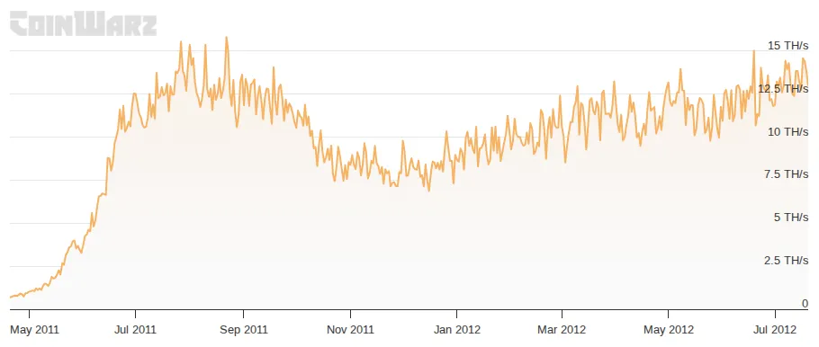

Gesamt-Hash-Rate des Bitcoin-Netzes zwischen April 2011 und Juli 2012 (Quelle: [CoinWarz](https://www.coinwarz.com/mining/bitcoin/hashrate-chart))

Dieser Anstieg der Netzwerk-Rechenleistung bedeutete, dass *mining* allein nicht mehr lebensfähig ist, da die Schwankungen für die meisten Anlagen zu groß waren. Aus diesem Grund waren die meisten Miner gezwungen, mining-Kooperativen oder *mining-Pools* zu bilden, um ihr Einkommen auszugleichen. Sie vermieten ihre Hashing-Leistung an einen Betreiber, der die Spezifikationen für die Blöcke und die zu berücksichtigenden Transaktionen auswählt.

Vor diesem Hintergrund startete Marek Palatinus (besser bekannt als Slush) im Dezember 2010 [https://bitcointalk.org/index.php?topic=1976.msg30520#msg30520] BitcoinCZ Mining, einen "Pool-mining"-Dienst, der in nur wenigen Tagen 3,5 % der Hash-Rate des Netzwerks sammelte. Dieser Erfolg wurde bald nachgeahmt, und 2011 kam es zur Standardisierung von Pool mining, was durch die Eröffnung einer [großen Anzahl](https://en.bitcoin.it/w/index.php?title=Comparison_of_mining_pools&oldid=21595) konkurrierender Pools veranschaulicht wurde.

### Mining-Pools und wie sie vergütet werden

Mining-Pools, die 2011 entstanden sind, haben verschiedene [Vergütungsmethoden] angewandt (https://arxiv.org/abs/1112.4980). Die Berechnung basiert immer auf den von den Teilnehmern bereitgestellten "Anteilen", d. h. den für einen bestimmten Block berechneten Teilnachweisen der Arbeit. Jede mining-Einheit, die am Pool beteiligt ist, wird als "Arbeiter" bezeichnet.

Ursprünglich wandte der Slush Pool ein einfaches proportionales Modell an: Seine Nutzer werden für jeden geschürften Block im Verhältnis zu den Anteilen belohnt, die sie seit dem letzten Block gefunden haben. Von dieser Belohnung wurde eine Provision von 2 % abgezogen, d. h. 1 BTC pro Block. Dieses Modell hatte jedoch einen kleinen Schönheitsfehler, denn die Miner [konnten](https://bitcointalk.org/index.php?topic=3165.msg44357#msg44357) "betrügen" (und etwa 28 % mehr Bitcoins erhalten), indem sie sich vom Pool trennten, sobald eine bestimmte Anzahl von Anteilen in einem Zyklus eingereicht worden war, und ihre Rechenleistung auf ihr eigenes Konto oder in einen anderen Pool umleiteten (eine Praxis, die [https://bitcointalk.org/index.php?topic=26866.msg337932#msg337932] als *Pool Hopping* bekannt ist). Aus diesem Grund führte Slush [am 4. Februar 2011](https://bitcointalk.org/index.php?topic=1976.msg50002#msg50002) ein "betrugssicheres" Punktesystem ein, das den jüngsten Anteilen im Zyklus mehr Gewicht verlieh als den ältesten Anteilen.

Der erste konkurrierende Pool, der 2011 auftauchte, war BitPenny, der sich durch ein klares und einfaches Vergütungsmodell auszeichnete: *Pay Per Share* (PPS). Die Idee bestand darin, die Arbeiter sofort für jeden bereitgestellten Anteil je nach Schwierigkeitsgrad aus dem Guthaben des Pools zu bezahlen. Im Gegensatz zum proportionalen Modell trug der Betreiber die gesamte Varianz, was für ihn riskant war und höhere Provisionen rechtfertigte. Der BitPenny-Pool wurde am 8. Februar [gestartet] (https://bitcointalk.org/index.php?topic=3266.msg45809#msg45809), musste aber am 2. April nach schweren Verlusten geschlossen werden. Er wurde jedoch im August [neu gestartet](https://bitcointalk.org/index.php?topic=36371.msg447984#msg447984), wobei eine komplexere Methode, eine Variante von PPS (*Capped Pay Per Share with Recent Backpay* oder CPPSRB) verwendet wurde.

Am 27. Februar wurde von einem Russen, der sich Tycho nannte, ein neuer Pool namens Deepbit [eröffnet](https://web.archive.org/web/20111127072845/https://bitcointalk.org/index.php?topic=3889.0). Es handelte sich um einen Pool mit Sitz in Europa, der seinen Kunden die Wahl ließ, ob sie nach dem proportionalen Modell oder [nach](https://bitcointalk.org/index.php?topic=3889.msg55799#msg55799) dem PPS-Modell vergütet werden sollten. Die Gebühren betrugen 3 % für das erste und 10 % für das zweite Modell.

In der Folge wurden im Laufe des Jahres Dutzende von Pools eröffnet. Darunter war auch BTC Guild, ein in den USA ansässiger Pool, der im Mai 2011 [gegründet](https://web.archive.org/web/20111127113730/https://bitcointalk.org/index.php?topic=7760.0) wurde. Er wurde von einem kalifornischen Miner betrieben, der sich Eleuthria nannte (eine Verzerrung des griechischen Wortes ἐλευθερία, eleuthería, was "Freiheit" bedeutet), und verwendete ein reines PPS-Modell. Die Gildenpools DeepBit und BTC wurden bald zu ernsthaften Konkurrenten des BitcoinCZ.

Das proportionale Modell und der PPS waren jedoch nicht die einzigen, die übernommen wurden. Neben dem Slush-Score konzipierten Bergleute komplexere Auszahlungsmethoden wie das PPLNS, die geometrische Methode oder das SMPPS, die darauf abzielen, die Unzulänglichkeiten der einfachen Modelle zu korrigieren. Diese Methoden wurden von verschiedenen mining-Gruppen erprobt, die sich von den etablierten Organisationen abheben wollten.

Am 15. Juni [startete](https://bitcointalk.org/index.php?topic=17944.msg227913#msg227913) ein Newcomer unter dem Pseudonym Wuked einen Pool namens Mineco.in. Wuked wandte zunächst eine proportionale Bezahlung an (wie Deepbit), entwickelte aber [schnell](https://en.bitcoin.it/w/index.php?title=Comparison_of_mining_pools&oldid=12816) eine Methode, die [bekannt](https://bitcointalk.org/index.php?topic=39832.msg486012#msg486012) als *Pay Per Last N Shares* (PPLNS). Dabei wurden die Arbeiter für jeden geschürften Block im Verhältnis zu ihren Anteilen an den N letzten in den Pool eingebrachten Anteilen belohnt. Es handelte sich also um eine Variante des proportionalen Modells, bei dem der Bewertungszeitraum nicht der Zyklus der Blockproduktion war, sondern ein vom Zyklus unabhängiges Fenster von N Anteilen.

Ebenfalls im Juni (am 13.) eröffnete ein gewisser Josh Zerlan (alias Inaba) den EclipseTM-Pool, dem das Verdienst zukommt, ab Mitte Juli mit der geometrischen Methode zu experimentieren [integrieren](https://bitcointalk.org/index.php?topic=16385.msg364399#msg364399). Letztere wurde einige Monate zuvor von dem israelischen Mathematiker Meni Rosenfeld [beschrieben](https://bitcointalk.org/index.php?topic=4787.msg69890#msg69890). Das Prinzip bestand darin, eine Punktzahl zu verwenden (um die Teilnehmer zum Bleiben zu bewegen) und die Belohnung pro Anteil geometrisch zu verringern. Im September [übernahm](https://bitcointalk.org/index.php?topic=16385.msg528287#msg528287) EclipseTM die ebenfalls von Meni Rosenfeld konzipierte "doppelte geometrische Methode", die [ein](https://bitcointalk.org/index.php?topic=39497.msg481864#msg481864) Hybridsystem zwischen dem PPLNS-Modell und der geometrischen Methode darstellte. Dieses komplexe System wurde im Dezember auch von Ozcoin [übernommen](https://bitcointalk.org/index.php?topic=14085.msg667220#msg667220), einem australischen mining-Massendienst, der am 9. Juni von einem gewissen Graeme Tee [gestartet](https://bitcointalk.org/index.php?topic=14085.msg193967#msg193967) wurde.

Andere Pools werden in der Lage sein, das Beste aus dieser Situation zu machen. Ein Beispiel war die amerikanische mining-Gruppe BitMinter, [gegründet](https://bitcointalk.org/index.php?topic=22432.msg281686#msg281686) im Juni, die sich dadurch auszeichnete, dass sie ihre eigene mining-Software hatte. Ebenfalls erwähnenswert ist der russische Pool 50BTC.com, [gegründet](https://bitcointalk.org/index.php?topic=54673.msg651025#msg651025) im Dezember, der ein Tool zur Überwachung der Aktivitäten von Minern namens Mining Explorer anbietet.

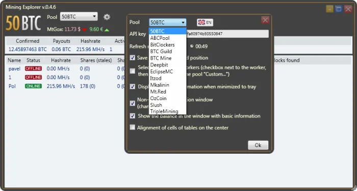

*Das Mining Explorer Tool im Mai 2012 (Quelle: [Archiv](https://web.archive.org/web/20120609002559/http://miningexplorer.org/) von Miningexplorer.org)*

Beachten Sie auch, dass das Aufkommen alternativer Kryptowährungen (die wir in einem späteren Kapitel analysieren werden) wiederum ab dem Frühjahr 2011 zur Gründung spezialisierter Pools führte. So entstanden Pools für Namecoin, wie Bitparking, [eröffnet] (https://bitcointalk.org/index.php?topic=8775.msg127063#msg127063) von DoubleC im Mai 2011, oder NMCBit, [erstellt] (https://bitcointalk.org/index.php?topic=33612.msg419958#msg419958) von einem gewissen Davinci Jeremie (alias DavinciJ15) im August. Die Hinzufügung des mit Namecoin verschmolzenen mining bedeutete, dass im Laufe der Zeit alle Bitcoin mining-Pools dazu veranlasst werden würden, den mining dieser Kryptowährung in ihr Angebot zu integrieren.

### Eligius, Lukas-Jr.'s Pool

Eine originelle mining-Kooperative ist Eligius, die von Entwickler Luke-Jr im April 2011 eröffnet wurde. Luke-Jr (oder Luke Dashjr, [ausgesprochen](https://www.youtube.com/watch?v=JJF5Gnro1GU) "Dasher") ist ein untypischer Charakter in der Bitcoin-Geschichte. Er ist ein gläubiger römisch-katholischer [sedevacantist](https://dashjr.org/catholic/sedevacantist.php), verheiratet und Vater einer großen Familie: 2007 bekam er zwei Kinder und wird bis 2017 drei weitere bekommen. Er ist ein Programmierer für freie Software und hat sein eigenes Betriebssystem entwickelt, das [Utopios](https://web.archive.org/web/20041013023456/http://utopios.org/) heißt und auf der Gentoo-Distribution basiert.

Luke [erfuhr](https://www.youtube.com/watch?v=3sXei0Iwf4Q) am 31. Dezember 2010 im IRC von Bitcoin. Im Januar 2011 richtete er einen Hosting-Dienst, [Lightfoot Hosting](https://bitcointalk.org/index.php?topic=30.msg36268#msg36268), ein, der Bitcoin akzeptierte. Er trug auch zum Spesmilo-Software-Client bei, wie im vorherigen Kapitel erwähnt.

*Avatar verwendet von Luke-Jr aus dem Jahr 2013 (Quelle: [Gravatar](https://secure.gravatar.com/avatar/30aa55ee8573680ee4bbb556dae3160c?s=400))*

Am 27. April [erstellte] Lukas (https://bitcointalk.org/index.php?topic=6667.msg97375#msg97375) einen mining-Pool namens Eligius, den er als "neuen Versuchspool" vorstellte. Der Name ist der lateinische Name des Heiligen Éloi, Bischof von Noyon aus dem 7. Jahrhundert und Finanzminister von König Dagobert I. der Franken. Die serverseitige Software heißt [Eloipool] (https://web.archive.org/web/20120701151930/http://gitorious.org/bitcoin/eloipool). Der Heilige Éloi gilt unter anderem als Schutzpatron der Bergleute.

Ursprünglich hatte sich Luke für ein proportionales Zahlungsmodell entschieden. Bedenken wegen des Pool-Hoppings veranlassten ihn jedoch am 13. Juni zur [Einführung](https://bitcointalk.org/index.php?topic=6667.msg213885#msg213885) seines eigenen Hybridsystems: dem Maximum Pay Per Share (MPPS)-Modell. Dieses [bestand](https://web.archive.org/web/20110615073316/http://eligius.st/wiki/index.php/Maximum_PPS) darin, zusätzlich zu dem mit dem proportionalen System verbundenen Zähler, der als Puffer fungiert, einen an die gefundenen Anteile gebundenen Saldo zu berücksichtigen, um ein Modell zu erhalten, das der Zahlung pro Anteil ähnelt, ohne das damit verbundene Risiko für den Pool. Da dieses Modell fehlerhaft war, war Luke vorübergehend [gezwungen](https://bitcointalk.org/index.php?topic=6667.msg259589#msg259589), zum proportionalen Modell zurückzukehren, um dann ein ähnliches System zu entwerfen, das auf einem kollektiven Puffer [beruht](https://web.archive.org/web/20110627025520/http://eligius.st/wiki/index.php/Shared_Maximum_PPS): das *Shared Maximum Pay Per Share* (SMPPS). Ziel ist es, nie mehr auszuschütten, als dem Pool tatsächlich gehört. Nach einer positiven [Umfrage](https://bitcointalk.org/index.php?topic=21999.msg276565#msg276565) hat Eligius dieses neue Modell am 27. Juni [integriert](https://bitcointalk.org/index.php?topic=6667.msg290347#msg290347).

Eligius hat auch die Praxis des "coinbase signing" eingeführt, die darin besteht, den Namen des Pools (hier "Eligius") in das Eingabefeld der Belohnungstransaktion des geschürften Blocks zu schreiben. Diese Praxis, die den Betrieb von Pools transparenter macht, wurde am Tag der Umstellung auf das MPPS-Modell, in der Nacht vom 13. auf den 14. Juni, mit Block [130 635] (https://mempool.space/block/0000000000000a067d94ff753eec72830f1205ad3a4c216a08a80c832e551a52) eingeweiht. Dies war der zweite Eintrag, der auf diese Weise erfolgte, nach dem emblematischen Zitat aus der *Times*, das Satoshi Nakamoto im Januar 2009 in den Entstehungsblock aufgenommen hatte.

Ab dem 5. August nutzte Luke-Jr dieses spezielle Feld, um in den Blöcken generated am Pool religiöse Botschaften [hinzuzufügen](https://ourbigbook.com/cirosantilli/cool-data-embedded-in-the-bitcoin-blockchain/prayer-wars). Im Einklang mit dem katholischen Glauben des Betreibers waren dies Gebete in lateinischer Sprache: das Gotteslob, das *Je vous salue Marie*, das *Salve Regina*, das *Notre Père*, das Herzensgebet und so weiter. Aber es gab auch Texte in englischer Sprache: das Bußgebet, das Gebet des Glaubens, der Hoffnung und der Nächstenliebe, das Beichtgeheimnis, das Gebet zum Schutzengel, Meditationen aus dem Herz-Jesu-Rosenkranz, Abschnitte aus dem Evangelium, Gedenktage von Heiligen (wie der des Augustinus von Hippo am 28. August).

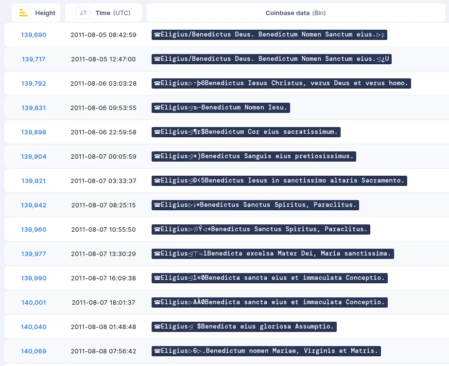

*Göttliche Lobpreisungen in den von Eligius im August 2011 abgebauten Blöcken (Quelle: [Blockchair](https://blockchair.com/))*

Zwei Wochen später wurden diese Gebete von einem Mitglied der Gemeinschaft bemerkt, das eine Nachricht in einer klassischen [Transaktion] (https://mempool.space/tx/9740e7d646f5278603c04706a366716e5e87212c57395e0d24761c0ae784b2c6) schrieb. Er beschuldigte Lukas, "ein PEDOPHIL" zu sein, behauptete, dass "Gott nicht real ist" und forderte ihn auf, "die Blockchain nicht länger mit deinem Unsinn zu verschmutzen". Diese Transaktion wurde später am Tag von Mark Karpelès [geteilt](https://buildingbitcoin.org/bitcoin-dev/log-2011-08-18.html#l-598), was zu einer Diskussion [im IRC](https://buildingbitcoin.org/bitcoin-dev/log-2011-08-18.html#l-851) und [im Forum](https://bitcointalk.org/index.php?topic=38007.msg466841#msg466841) um diese Texteinträge führte. Ozcoin-Betreiber Graeme Tee kritisierte diese Praxis besonders, zumal die Eligius-Mitglieder nichts davon wussten. Er fragte Luke, ob er nicht glaube, dass "das Einfügen von Gebeten einige Leute befremden könnte", wenn man bedenkt, dass "btc multikonfessionell ist", worauf der Sedevakantist unverblümt antwortete, dass "Katholiken nicht an die Religionsfreiheit glauben".

Lukas berücksichtigte dies jedoch und gab den Minderjährigen die Möglichkeit, [anzufordern](https://web.archive.org/web/20111001015612/http://eligius.st/wiki/index.php/FAQ#What_messages_are_included_in_payout_coinbases.3F), ihre eigenen Nachrichten einzutragen, vorbehaltlich seiner Zustimmung. Mehrere humorvolle Einträge wurden hinzugefügt, darunter eine [rickroll](https://mempool.space/block/00000000000005b71bc4c0cf24a6f00e04980c627e9409266983bd37acbe14d3). Anfang September gibt Lukas diese Praxis auf.

### Zentralisierung der mining-Aktivität

Als 2011 die Zahl der Pools zunahm, stellte sich schnell die Frage der Zentralisierung. Die Blockerstellung wurde an einen Betreiber delegiert, der die Parameter auswählte und die zu bestätigenden Transaktionen aussuchte - Maßnahmen, die mit den Präferenzen der Teilnehmer in Konflikt geraten konnten. Darüber hinaus wurden größere Pools gegenüber kleineren bevorzugt, da die Varianz in mining auch für Gruppen von Minern galt, die groß genug sein mussten, um nicht betroffen zu sein. Die daraus resultierende Zentralisierung von mining beunruhigte natürlich die Mitglieder der Gemeinschaft, die darin eine Gefahr für den reibungslosen Ablauf von Bitcoin sahen.

Die transparente Aktivität öffentlicher Pools (wie Deepbit, der seine gefundenen Blöcke täglich [veröffentlichte](https://web.archive.org/web/20110602135526/http://deepbit.net/stats)) ermöglichte es, den Anteil ihrer Hash-Rate an der Gesamtleistung des Netzes abzuschätzen. Dies ermöglichte generate Sektordiagramme, die die Verteilung der Pools veranschaulichten, wie z. B. [Bitcoin Watch](https://web.archive.org/web/20110401115146/http://www.bitcoinwatch.com/) (damals [verwaltet](https://bitcointalk.org/index.php?topic=5016.msg73505#msg73505) von Nils Schneider) oder den Block-Explorer [Blockchain.info](https://web.archive.org/web/20111018232813/http://blockchain.info/pools). Dadurch wurde sichergestellt, dass die Rechenleistung nicht in einem einzigen Pool zentralisiert wurde.

*Bitcoin-Hash-Ratenverteilung am 6. Juli 2011 (Quelle: [Archiv](https://web.archive.org/web/20110706215910/http://www.bitcoinwatch.com/) von Bitcoin Watch)*

Dies geschah jedoch Anfang Juli, als der Anteil von Tychos Pool Deepbit an der gemessenen Hash-Rate (kurzfristig) auf 50 % anstieg. Diese Dominanz rief eine Reaktion einiger Leute im Forum hervor [für die](https://bitcointalk.org/index.php?topic=26630.msg333929#msg333929) "Bitcoin Security \[is\] nearly Breached". Doch diese Behauptung war etwas übertrieben: Die vernünftigeren Nutzer wiesen verärgert darauf hin, [dass](https://bitcointalk.org/index.php?topic=26630.msg333929#msg333929) der Betreiber kein wirtschaftliches Interesse an einem Angriff auf das Netz hatte, dass die Auswirkungen eines solchen Angriffs begrenzt wären und [dass](https://bitcointalk.org/index.php?topic=26630.msg334029#msg334029) es den Teilnehmern freisteht, den Dienst jederzeit zu wechseln, da "der Poolbetreiber die Hardware der Mitglieder des Pools nicht kontrolliert". Es gab also ein Zentralisierungsproblem, aber es war nicht so gravierend, wie es schien.

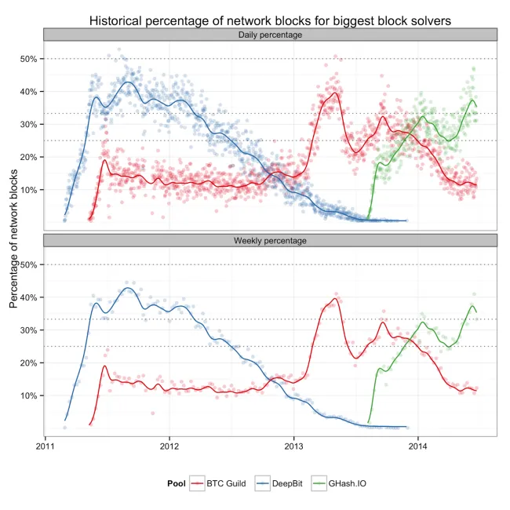

*Prozentualer Anteil der Blockproduktion, gemessen täglich und wöchentlich, zwischen 2011 und 2014 (Quelle: OrganOfCorti für den Blog [Neighbourhood Pool Watch](https://organofcorti.blogspot.com/2014/06/166-fifty-percent-club.html))*

Die Dominanz von Deepbit erreichte im Sommer mit einem gemessenen Anteil an der Rechenleistung [von](https://organofcorti.blogspot.com/2014/06/166-fifty-percent-club.html) 52,86 % am 5. August ihren Höhepunkt und blieb den Rest des Jahres über erhalten. Dies führte dazu, dass sich die von Eligius im Juni initiierte Reward-Transaktion ab November ausbreitete. So übernahmen die Pools BitMinter, BTC Guild und EclipseTM diese Praxis im November, und es schlossen sich kleinere Pools wie NMCBit oder Ozcoin an. Der Slush-Pool [begann](https://mempool.space/block/000000000000032fb1005bc5de7ae276d2a91481619b7c4beb53e1ed63f71501) im Januar damit und signierte seine "Slush"-Blöcke. Die Coinbase-Signatur [wurde im September 2012 dominant](https://organofcorti.blogspot.com/2013/11/162-short-post-on-mapping-historical.html). Deepbit [weigert sich](https://bitcointalk.org/index.php?topic=118245.msg1270292#msg1270292) jedoch, dies zu tun.

### P2Pool, der dezentrale Pool

Eine Möglichkeit, die durch die weit verbreitete Nutzung des Pools mining verursachte Zentralisierung zu bekämpfen, war der dezentrale P2Pool-Dienst. Letzterer wurde am 17. Juni 2011 von Forrest Voight, einem 18-jährigen Entwickler aus Florida, der das Pseudonym ForrestV verwendete und sich [seit März] häufig im IRC aufhielt, [erstellt](https://bitcointalk.org/index.php?topic=61131.msg231927#msg231927). Er stellte P2Pool als einen "dezentralen, DoS-resistenten, Hop-Proof-Pool" vor.

*Forrest Voight um 2011 (Quelle: [Archiv](https://web.archive.org/web/20110816144339/https://forre.st/) von seiner persönlichen Website)*

Das Modell [beruhte] (https://im.forre.st/pb/85341005.txt) auf einer "sharechain", die von teilnehmenden Minern in [Peer-to-Peer](https://planb.academy/resources/glossary/peertopeer-p2p)-Verbindung gepflegt wurde, ähnlich der Blockchain von Bitcoin. Jede Aktie enthält den Fingerabdruck der vorherigen Aktie, der die Aktien miteinander verbindet und die Integrität des Ganzen gewährleistet. Die [Schwierigkeit](https://planb.academy/resources/glossary/difficulty) (die anfangs 600 Mal niedriger ist als die des Hauptnetzes) wird regelmäßig angepasst, um ein durchschnittliches Intervall von 5 Sekunden zu gewährleisten. Die Vergütungsmethode ist die Zahlung gemäß den letzten N Anteilen (PPLNS), die jedes Mal, wenn ein Block gefunden wird, direkt in der Reward-Transaktion erfolgt.

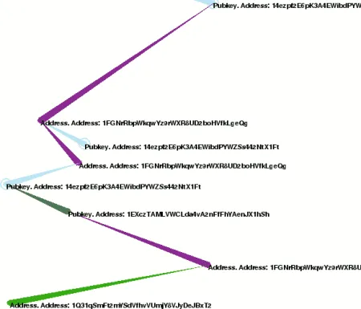

*Sharechain-Visualisierung (Quelle: Gregory Maxwell für [Bitcoin Wiki](https://en.bitcoin.it/wiki/File:P2pool_chain.webp))*

Am 19. Juli 2011 wurde P2Pool nach einem Probelauf im Testnetzwerk auf dem Hauptnetzwerk Bitcoin [bereitgestellt](https://bitcointalk.org/index.php?topic=61131.msg379115#msg379115). Der dezentrale Pool [fand](https://bitcointalk.org/index.php?topic=61131.msg476766#msg476766) seinen ersten Block am 23. August, nach mehreren Upgrades und mehr als einem Monat Hashing! Weitere Blöcke folgten, aber die Aktivität blieb monatelang anekdotisch.

Am 24. August schlug Forrest [vor] (https://bitcointalk.org/index.php?topic=39088.msg478130#msg478130), einen RPC-Aufruf zum Bitcoin-Kommunikationsprotokoll hinzuzufügen, um P2Pool zu vereinfachen. Dabei handelte es sich um den Befehl `getmemorypool` (GMP), der es einem Knoten ermöglichte, die Transaktionsfingerabdrücke eines anderen Knotens abzurufen, um seine eigene Reward-Transaktion zu erstellen. Er wurde [integriert](https://bitcointalk.org/index.php?topic=52480.msg626275#msg626275) in die Hauptsoftware in Version 0.5, die im November veröffentlicht wurde.

Ab Dezember verbesserte sich das System und zog die Aufmerksamkeit der technischen Gemeinschaft auf sich, darunter [Mike Hearn](https://bitcointalk.org/index.php?topic=61131.msg641090#msg641090), [Gregory Maxwell](https://bitcointalk.org/index.php?topic=18313.msg712952#msg712952) und [Charlie Lee](https://bitcointalk.org/index.php?topic=18313.msg712976#msg712976). Darüber hinaus wurden Spenden [getätigt](https://bitcointalk.org/index.php?topic=57027.msg679955#msg679955), um Miner zu ermutigen, den Pool zu nutzen. Infolge dieser neuen Aufmerksamkeit nahm die vom Pool verwaltete Hash-Rate [endlich](https://organofcorti.blogspot.com/2012/11/52-p2pool-achieving-expectations.html) Fahrt auf: Sie stieg von einigen Gigahashes pro Sekunde Anfang 2012 auf 100 GH/s im Februar und 350 GH/s Ende März. Zu diesem Zeitpunkt entsprach das System 3 % der gesamten Rechenleistung des Netzwerks! P2Pool hatte es jedoch schwer, Fuß zu fassen, da sein Betrieb von Natur aus komplexer war als der der anderen Pools.

### Stratum mining-Protokoll

Die Verbreitung des Pools mining trieb auch die Entwicklung neuer Kommunikationsprotokolle voran. Im Jahr 2011 basierten die Pools auf dem rudimentären Befehl `getwork` sowie auf *long polling*, einer [Technik](https://bitcointalk.org/index.php?topic=3889.msg63957#msg63957), die aus der Netzwerkprogrammierung abgeleitet wurde und (unter anderem) die Verringerung veralteter Anteile durch die schnelle Ankündigung neuer Blöcke an die Miner ermöglichte. Dieser Vorgang war jedoch sowohl auf der Server- als auch auf der Client-Seite extrem bandbreitenintensiv, so dass die Situation mit der explodierenden Zahl der Verbindungen unhaltbar wurde.

Das Jahr 2012 stand daher im Zeichen der Festlegung eines Kommunikationsstandards für den Pool mining. Der erste Standard war der RPC-Aufruf "getblocktemplate" (GBT), dessen Hauptfunktion darin bestand, die Blockstruktur an den Teilnehmer zurückzugeben. Dies war eine Verbesserung von `getmemorypool`, das von Luke-Jr am 28. Februar 2012 [vorgeschlagen](https://en.bitcoin.it/w/index.php?title=BIP_0022&oldid=24328) wurde. Der GBT-Befehl ist in BIP [22](https://github.com/bitcoin/bips/blob/master/bip-0022.mediawiki) und [23](https://github.com/bitcoin/bips/blob/master/bip-0023.mediawiki) beschrieben. Die Methode wurde ab Mai von den Pools Eligius und EclipseMC innerhalb ihrer eigenen Serversoftware [verwendet](https://github.com/bitcoin/bitcoin/pull/936#issuecomment-5804140). Sie wurde im August in den Hauptcode der Bitcoin-Software [integriert](https://github.com/bitcoin/bitcoin/pull/936/files) und war in der im September veröffentlichten Version 0.7 [vorhanden](https://bitcointalk.org/index.php?topic=110243.msg1199467#msg1199467).

Parallel dazu erschien jedoch ein weiterer Standard. Eleuthria (BTC Guild) und Slush (BitcoinCZ) arbeiteten an ihren eigenen Modellen, die sie im September 2012 unter [10](https://bitcointalk.org/index.php?topic=108441.msg1178526#msg1178526) bzw. [11](https://bitcointalk.org/index.php?topic=108533.msg1180029#msg1180029) veröffentlichten. Da der Vorschlag von Slush ausgereifter war, zog Eleuthria seinen eigenen zurück.

Der von Slush vorgeschlagene Standard ist das Stratum mining-Protokoll (oder StratumMP). Sein Name [bedeutet](https://bitcointalk.org/index.php?topic=55842.msg667768#msg667768) "Schicht" auf Lateinisch und wurde bereits für die [Server-Software](https://bitcointalk.org/index.php?topic=55842.msg664197#msg664197) des BitcoinCZ verwendet. Stratum [erlaubte](https://web.archive.org/web/20120921014023/http://mining.bitcoin.cz/stratum-mining) den leichtgewichtigen Clients der Teilnehmer, sich mit dem Knoten des Pools zu verbinden und effizient mit ihm zu kommunizieren. Das Protokoll wurde weitgehend von dem für Electrum entwickelten Protokoll inspiriert.

Diese Veröffentlichung hatte Reaktionen von bestimmten Entwicklern in der Gemeinschaft hervorgerufen, wie z. B. von [Luke-Jr] (https://bitcointalk.org/index.php?topic=108854.msg1183283#msg1183283) und [Gregory Maxwell] (https://bitcointalk.org/index.php?topic=108854.msg1183301#msg1183301). Insbesondere wurde Stratum dafür kritisiert, dass es "hinter verschlossenen Türen" entwickelt wurde und mit einem Standard konkurrierte, der seit Monaten offen diskutiert wurde und bereits im Einsatz war, nämlich GMP/GBT. Marek Palatinus [antwortete] (https://bitcointalk.org/index.php?topic=108854.msg1183400#msg1183400), indem er schrieb, dass beide Lösungen ihre Vor- und Nachteile hätten, wobei die eine leichter und einfacher sei als die andere: "Ich sehe den Unterschied zwischen Stratum und GMP als Electrum-Client und Satoshi-Client", erklärte er.

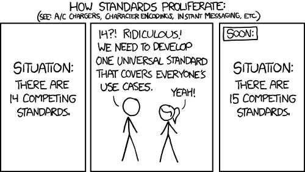

"How standards multiply": humorvoller Comic von Luke-Jr als Reaktion auf die Entwicklung des neuen Stratum-Standards (Quelle: [XKCD](https://xkcd.com/927/))

Im Laufe der Monate hatte sich Stratum als das von den meisten Pools verwendete Protokoll etabliert, beginnend mit BitcoinCZ und BTC Guild. Die Hash-Raten, die Stratum verwenden, erreichten [24 %](https://web.archive.org/web/20121022072300/https://mining.bitcoin.cz/stats/) im Oktober, [45 %](https://web.archive.org/web/20121125081858/https://mining.bitcoin.cz/stats/) im November und [74 %](https://web.archive.org/web/20121225110316/https://mining.bitcoin.cz/stats/) im Dezember! Die Funktion `getwork` wird im Laufe des Jahres 2013 schrittweise [eingestellt](https://bitcointalk.org/index.php?topic=1976.msg1524107#msg1524107).

### FPGA und ASIC mining

Infolgedessen änderte sich die Organisation von mining in den Jahren 2011 und 2012 beträchtlich und wurde zu einem Geschäft von Pools und nicht von Einzelschürfern. Es gab einen regelrechten Wildwuchs an mining-Gruppen, die sowohl hinsichtlich ihrer Philosophie als auch ihrer Vergütungsmethode (proportional, PPS usw.) sehr unterschiedlich waren. Dieser Wandel hatte jedoch zu einer Zentralisierung der mining-Aktivitäten geführt, was die Schaffung des dezentralen Pool-Modells P2Pool im Juli 2011 förderte. Auch die Kommunikation innerhalb der Pools verbesserte sich, was im September 2012 in der Einführung des leichtgewichtigen Stratum-Protokolls gipfelte.

Offensichtlich ging es bei der Entwicklung von mining nicht nur um die Organisation der Hashers, sondern auch um die Hardware selbst. Die Umstellung von der Zentraleinheit (CPU) auf die Grafikverarbeitungseinheit (GPU) war zwar bereits ein Durchbruch, aber sie war nur ein Vorgeschmack auf das Aufkommen spezialisierter integrierter Schaltkreise (ASIC), die die Rechenleistung des Netzes um einen weiteren großen Schritt nach vorn bringen würden.

Diese letzte Entwicklung, [geplant](https://www.metzdowd.com/pipermail/cryptography/2008-November/014815.html) vor langer Zeit von Satoshi Nakamoto, wurde schrittweise dank programmierbarer Logikschaltungen (FPGAs) entwickelt, die es ermöglichten, die Hardware für die [Hash-Funktion](https://planb.academy/resources/glossary/hash-function) von Bitcoin praktisch zu optimieren. Der erste offene FPGA-Algorithmus wurde im Mai 2011 [veröffentlicht] (https://bitcointalk.org/index.php?topic=9047.msg130885#msg130885), und ASIC wandte FPGA-Optimierungen auf die Chips selbst an. Der erste ASIC-Vorverkauf durch das US-Unternehmen Butterfly Labs [fand](https://web.archive.org/web/20120619090952/http://news.yahoo.com/butterfly-labs-announces-next-generation-asic-lineup-054626776.html) im Juni 2012 statt. Schließlich wurde der erste funktionierende ASIC, der Avalon ASIC, im Januar 2013 an die Öffentlichkeit [vertrieben](https://bitcointalk.org/index.php?topic=137534.msg1465887#msg1465887).

Es ist jedoch eine Geschichte, die ein wenig mehr Aufmerksamkeit verdient, was wir in unserem nächsten Kurs über den Aufstieg von Bitcoin tun werden. Kehren wir nun zum Ende des Jahres 2011 zurück, um uns auf die große Kontroverse zu konzentrieren, die die Entwicklung des Protokolls zu dieser Zeit kennzeichnete: den Kampf um die Bezahlung des Hash.

## Der Kampf um Pay to Script Hash

<chapterId>6f6fba00-f9a5-59c7-b780-602127b85fd6</chapterId>

Nach dem Ausscheiden von Satoshi Nakamoto wurde die Softwareentwicklung von der Gemeinschaft übernommen, die sich unter der Aufsicht von Gavin Andresen koordinieren musste. Insbesondere musste die Programmierbarkeit von Bitcoin verbessert werden, da diese durch die Einführung von Relaisregeln im Netz vorübergehend eingeschränkt war.

Im Winter 2011-2012 kam es zu einer Kontroverse über die Einführung der Mehrfachsignatur in Bitcoin. Dabei ging es unter anderem um das als "Pay to [Script](https://planb.academy/resources/glossary/script) Hash" oder P2SH bekannte System. Pete Rizzo und Aaron van Wirdum [würden](https://bitcoinmagazine.com/technical/the-battle-for-p2sh-the-untold-story-of-the-first-bitcoin-war) nennen diesen Konflikt "die Schlacht um P2SH". Dies war der erste größere Streit über die Entwicklung des Protokolls und der erste, der die Frage der Verwaltung aufwirft.

In diesem Kapitel werfen wir einen Blick zurück auf diese einzigartige Episode in der technischen Geschichte von Bitcoin. Zunächst analysieren wir die Entwicklung der Software und die Idee der Multisignatur. Dann werden wir uns die verschiedenen Vorschläge zur Umsetzung dieser Technik ansehen, beginnend mit OP\_EVAL und P2SH. Schließlich werden wir darüber sprechen, wie Pay to Script Hash aktiviert wurde, trotz der vielen Schwierigkeiten, die aufgetreten sind.

### Entwicklung von Bitcoin-Qt

Nach der Veröffentlichung der Version 0.4 der Software am 23. September, die Gavin Andresen als Hauptbetreuer ablöste, wurde die Entwicklung der Hauptimplementierung von Bitcoin fortgesetzt. Insbesondere wurde eine neue grafische Schnittstelle für die Software entwickelt: Bitcoin-Qt, das ab Juni von Wladimir van der Laan [entwickelt](https://bitcointalk.org/index.php?topic=15276.msg203205#msg203205) wurde. Sie basierte auf dem Qt-Grafik-Framework, das die ursprünglich von Satoshi verwendete wxWindows-Bibliothek ersetzte. Die Schnittstelle wurde am 26. September in den Hauptzweig des Codes [aufgenommen](https://bitcointalk.org/index.php?topic=45742.msg545547#msg545547) und [wurde](https://bitcointalk.org/index.php?topic=52480.msg626275#msg626275) das offizielle grafische Erscheinungsbild der Software in Version 0.5, die am 21. November veröffentlicht wurde. Von da an wurde die Software Bitcoin-Qt/bitcoind oder kurz Bitcoin-Qt genannt (bitcoind ist der daemon).

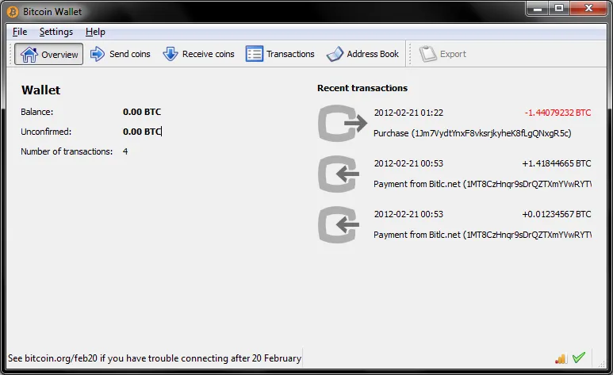

*Aufnahme von Bitcoin-Qt 0.5.2 im Februar 2012 (Quelle: [JimNelin](https://commons.wikimedia.org/wiki/File:Screenshot_of_Bitcoin-qt-0.5.2.webp) für Wikimedia)*

Gavin ist immer noch der Projektleiter, aber er wurde von mehreren Personen unterstützt. Seit Oktober 2011 sind die "nominellen" Entwickler von Bitcoin (d. h. die auf Bitcoin.org [aufgeführten](https://web.archive.org/web/20111022025640/http://www.bitcoin.org/)) Gavin Andresen, Pieter Wuille, Nils Schneider, Jeff Garzik und Wladimir van der Laan. Diese Programmierer sollten Bitcoin auf technischer Ebene vertreten und konnten per E-Mail kontaktiert werden. Sie waren Maintainer, die [profitierten](https://bitcointalk.org/index.php?topic=1774750.msg17700787#msg17700787) vom Schreibzugriff auf das GitHub-Repository. Gregory Maxwell [trat](https://web.archive.org/web/20120223113428/http://www.bitcoin.org/) im Februar 2012 bei, und Nils Schneider hörte im Mai desselben Jahres auf, Beiträge zu leisten. Das resultierende Entwicklerteam [blieb](https://bitcointalk.org/index.php?topic=1774750.msg17700787#msg17700787) bis 2014 bestehen.

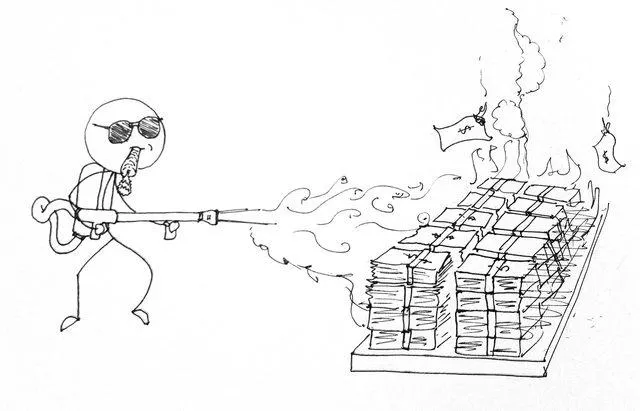

*"Der Gavinator": Zeichnung von Gavin Andresen, der Geldscheine verbrennt, angefertigt von Shazow im April 2011 (Quelle: [Archiv](https://web.archive.org/web/20140426185712/https://bitcointalk.org/index.php?topic=5770.80) von BitcoinTalk)*

Gleichzeitig begann das von Amir Taaki im September 2011 eingeführte System der Bitcoin-Verbesserungsvorschläge (https://gnusha.org/pi/bitcoindev/1316392315.46221.YahooMailNeo@web121014.mail.ne1.yahoo.com/), Früchte zu tragen. Die ersten BIPs wurden bis zum Ende des Jahres geschrieben. Dies ist zum Beispiel der Fall bei BIP 10, der am 28. Oktober von Alan Reiner, dem Entwickler des wallet von Armory, [veröffentlicht](https://gist.github.com/etotheipi/1321518) wurde.

Am 9. Januar 2012 veröffentlichte ein gewisser David Perry, der im Forum als Enmaku bekannt ist, [https://web.archive.org/web/20120830214308/http://codinginmysleep.com/bitcoin-development-history-visually/] eine Visualisierung des Entwicklungsfortschritts der Software, die mit einem Tool namens Gource erstellt wurde. Sie zeigte die Beiträge der Entwickler zur Software: Sie begann mit den Aktionen von Satoshi Nakamoto und Martti Malmi, setzte sich mit der wachsenden Rolle von Gavin Andresen ab Juli 2010 fort und zeigte die Komplexität des Codes, die zu einer Explosion der Entwicklung ab April 2011 führte.

*Visualisierung der Bitcoin-Softwarebeiträge zwischen August 2009 und September 2012*

### Bitcoin Programmierbarkeit

Bitcoin verfügt über ein internes Programmiersystem. Wie wir [in dem Kurs, der der Erstellung von Bitcoin gewidmet war, erörtert haben](https://planb.academy/fr/courses/a51c7ceb-e079-4ac3-bf69-6700b985a082/cartes-graphiques-pizzas-et-bitcoins-gratuits-9cd228a4-58d3-46a3-9935-06098bafc954), hat Satoshi Nakamoto dieses System von Anfang an implementiert, da er der Meinung war, dass sein Modell "für den Rest seiner Lebensdauer in Stein gemeißelt" sei. Er [schrieb](https://bitcointalk.org/index.php?topic=0195.msg1611#msg1611) dies im Juni 2010:

> Das Design unterstützt eine enorme Vielfalt an möglichen Transaktionsarten, die ich vor Jahren entworfen habe.  Escrow-Transaktionen, gebundene Verträge, Schlichtung durch Dritte, Unterschrift durch mehrere Parteien, usw.  Wenn sich Bitcoin in großem Stil durchsetzt, werden wir diese Dinge in Zukunft erforschen wollen, aber sie mussten alle von Anfang an entworfen werden, um sicherzustellen, dass sie später möglich sein würden.

Diese Bandbreite an Möglichkeiten war für eine Reihe von Personen von großem Interesse, nicht zuletzt für Mike Hearn. Letzterer [diskutierte](https://plan99.net/~mike/satoshi-emails/thread4.html) sie 2011 in einem privaten Schriftwechsel mit Satoshi. Im Laufe des Sommers [hob](https://en.bitcoin.it/w/index.php?title=Contract&oldid=16063) Mike Hearn "verteilte Verträge" im Wiki von Bitcoin hervor, wo er mehrere Beispiele wie Anti-Spam, Escrow, Sicherheitenverträge, externe Orakel oder Atomtausch anführte. Er fügte auch einen Verweis auf Nick Szabos bahnbrechenden Artikel von 1997 über *intelligente Verträge* hinzu.

### Multisignatur

Multisignature, ist eine Möglichkeit, mehrere Unterschriften für eine Ausgabe zu verlangen. Sie bildet den Grundstein für den Einsatz von Verträgen, an denen mehrere Personen beteiligt sind. Diese Technik wäre nützlich für die Sicherung von Geldern, was angesichts der zunehmenden Piraterie heutzutage ein sehr wichtiges Thema ist. Sie könnte auch bei Treuhandverträgen eingesetzt werden, um den wirtschaftlichen Austausch für den Verkäufer sicherer zu machen. Solche Verträge wurden von den Nutzern tatsächlich nachgefragt, wie die Existenz von Gavin Andresens Treuhandservice [ClearCoin] (https://clearcoin.blogspot.com/2011/06/ill-be-closing-clearcoin-to-new.html) zwischen Dezember 2010 und Sommer 2011 beweist.

Die Skriptsprache von Bitcoin enthält einen Transaktionscode "OP_CHECKMULTISIG", der es ermöglicht, dass M Unterschriften von N Teilnehmern erforderlich sind, um eine Ausgabe zu genehmigen, wobei M ≤ N. Die öffentlichen Schlüssel aller Unterzeichner werden in das Skript für die Transaktionsausgabe geschrieben. Jede Teilmenge von M Unterschriften kann das Dokument, das das Skript enthält, entsperren.

Interessanterweise enthält die `OP_CHECKMULTISIG`-Implementierung einen Fehler. Er wurde [entdeckt] (https://github.com/bitcoin/bitcoin/pull/319#issuecomment-1472505) am 30. Juni von einem gewissen Bobby Groff (alias Groffer), der versuchte, einen Treuhandmechanismus in die Software zu integrieren. Er schrieb, dass der Operator "ein Element zu viel vom Stapel fallen lässt", also "einen Dummy-Wert schiebt, um das zu umgehen". Dieser Fehler kann jedoch nicht behoben werden, ohne das Protokoll zu ändern und die Kette zu verzweigen. Aus diesem Grund wird er im Code verbleiben.

Am 23. August 2011, ein paar Tage nach der New Yorker Konferenz, [initiierte] (https://gnusha.org/pi/bitcoindev/CABsx9T1uw43JuvhEmJP0KCyojsDi1r7v6BaLBHz7wWazduE5iw@mail.gmail.com/) Gavin Andresen die Diskussion über Multisignatur im BitcoinTalk-Forum und auf der Liste `bitcoin-development`. Er wollte Transaktionen mit mehreren Unterzeichnern standardisieren, was er als "den schnellsten Weg zu sehr sicheren, sehr schwer zu verlierenden Bitcoin wallets" bezeichnete. Seit Dezember 2010 wurden nur zwei Systeme [https://bitcointalk.org/index.php?topic=2129.msg27744#msg27744] als Standard angesehen: P2PK und P2PKH. Die Idee war, ein rohes Multisignatur-Schema hinzuzufügen, bei dem die Anzahl der Teilnehmer maximal 3 betragen kann.

Gavin möchte, dass die betreffenden öffentlichen Schlüssel als Adressen verwendet werden (wie im Fall von P2PKH). Aber diese Adressen würden von den Clients ohnehin nicht unterstützt werden. Auf die Gefahr hin, einen inkompatiblen Client zu veröffentlichen, schlug er daher vor, "die Dinge von Anfang an richtig zu machen, Opcodes zu implementieren oder zu aktivieren, damit die neuen Bitcoin-Adressen klein sein können, und einen Blockchain-Split" für ein paar Monate später zu planen. Aus einem Gefühl der Dringlichkeit heraus sprach er sich für ein schnelles Handeln aus und erklärte, seine größte Sorge sei, dass die Leute in der Debatte selbstgefällig würden und es nach sechs Monaten immer noch keinen Konsens gäbe.

Im Anschluss an Gavins Nachricht schlug Casascius [https://bitcointalk.org/index.php?topic=38954.msg476689#msg476689] vor, den Operator OP\_CHECKSIG (der zur Überprüfung normaler Signaturen verwendet wird) so zu ändern, dass er Skripte mit mehreren Signaturen berücksichtigt. Addresses kann dann der Hash des Skripts sein, und das gesamte Skript wird beim Ausgeben bereitgestellt, genau wie der öffentliche Schlüssel beim Ausgeben einer P2PKH-Ausgabe. Er [formulierte](https://bitcointalk.org/index.php?topic=45211.msg538756#msg538756) diesen Vorschlag einen Monat später neu. Am 1. Oktober machte ein gewisser Jim Babcock, Softwareentwickler und Rationalist, [einen](https://bitcointalk.org/index.php?topic=46429.msg553217#msg553217) ähnlichen Vorschlag. Ihre Beschreibung inspirierte den mysteriösen Nicolas van Saberhagen, alias ByteCoin, der in der Nacht vom 1. auf den 2. Oktober einen neuen Betriebscode namens `OP_EVAL` [konzipierte](https://bitcointalk.org/index.php?topic=46538.msg553689#msg553689). Gavin Andresen [machte](https://bitcointalk.org/index.php?topic=45211.msg553668#msg553668) zur gleichen Zeit einen relativ gleichwertigen Vorschlag (mit `BEGIN_DIGEST` und `END_DIGEST` Operatoren). Aus dieser Fülle von Ideen ging jedoch `OP_EVAL` als Sieger hervor.

### OP_EVAL: ein Skript innerhalb eines Skripts ausführen

Der Operator "OP_EVAL" wird zur Ausführung eines Skripts innerhalb eines Skripts verwendet. Er wird am Ende des sperrenden Skripts ausgeführt, um die Gültigkeit des übergebenen Skripts zu prüfen, dessen Hash mit dem angegebenen Fingerabdruck verglichen wird. Auf diese Weise kann jedes Skript ausgeführt werden.

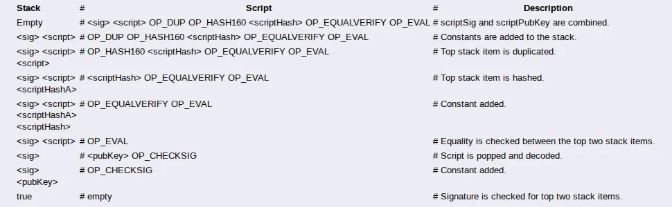

*Technische Funktionsweise des "OP_EVAL"-Betreibers (Quelle: ByteCoin auf [BitcoinTalk](https://bitcointalk.org/index.php?topic=46538.msg553689#msg553689))*

Dazu muss eine Anweisung in die Skriptsprache eingefügt werden, was eine Änderung des Protokolls und damit eine Trennung des Netzwerks erfordert, wenn nicht alle aktualisieren, was schließlich zu einer Spaltung der Kette führt. Am 2. Oktober entdeckte Gavin jedoch eine Möglichkeit, eine solche Situation zu vermeiden, und [schrieb](https://buildingbitcoin.org/bitcoin-dev/log-2011-10-02.html#l-852) im IRC:

> Wahrscheinlich lese ich den Code falsch, aber ich denke, dass OP\_EVAL keine Blockchain-Spaltung verursachen würde!

Seine Idee basiert auf einem Merkmal der internen Programmiersprache von Bitcoin: den "OP_NOP"-Operatoren, die Satoshi im Sommer 2010 hinzugefügt hat. Es handelt sich dabei um stille Anweisungen, die das Skript, in dem sie enthalten sind, nicht ungültig machen. Sie ermöglichen "rückwärtskompatible" Protokolländerungen für ältere Versionen der Software und stellen sicher, dass nur eine Zeichenkette überlebt, wenn die Rechenleistung, die sie anwendet, in der Mehrheit ist. Diese Änderungen werden später als weiche forks bezeichnet. Es ist also möglich, `OP_NOP1` in `OP_EVAL` umzuwandeln und die Änderung von mining-Pools durchführen zu lassen.

Andere Mitglieder der technischen Gemeinschaft bestätigten schnell Gavins Entdeckung. Insbesondere Gregory Maxwell [erklärte] (https://buildingbitcoin.org/bitcoin-dev/log-2011-10-02.html#l-1426), dass "Gavins Feststellung, dass EVAL ohne einen Split durchgeführt werden kann, ihn umgehauen hat".

Zwei Wochen später, am 19. Oktober, [schrieb] (https://bitcointalk.org/index.php?topic=46538.msg583615#msg583615) Gavin Andresen drei Vorschläge zur Verbesserung von Bitcoin, die umgehend in das Bitcoin.it-Wiki aufgenommen wurden:

- Die [BIP 11] (https://en.bitcoin.it/w/index.php?title=BIP_0011&oldid=18340), die rohe Multisignatur-Skriptverfahren beschreibt;
- Die [BIP 12](https://en.bitcoin.it/w/index.php?title=BIP_0012&oldid=18348), die die Anweisung OP\_EVAL und das entsprechende Skriptschema beschreibt;
- In [BIP 13] (https://en.bitcoin.it/w/index.php?title=BIP_0013&oldid=18495), in dem die Adressformatierung für OP\_EVAL beschrieben wird, heißt es: "Diese BIP beschreibt eine neue Art von Bitcoin-Adressen zur Unterstützung beliebig komplexer Transaktionen".

Die Aktivierung von BIP 12 war für den 1. Februar 2012 geplant, vorausgesetzt, dass 50 % der Miner ihre Unterstützung signalisieren, indem sie die Zeichenfolge "OP_EVAL" in die von ihnen produzierten Blöcke vor dem 15. Januar einfügen. Sollte dieser Schwellenwert nicht erreicht werden, würde die Einführung auf einen späteren Zeitpunkt verschoben werden. Damit sollte sichergestellt werden, dass die Umstellung reibungslos verläuft, ohne dass ein konkurrierender Zweig geschaffen wird.

### OP_EVALs Unzulänglichkeiten

Der "OP_EVAL"-Operator hat jedoch auch seine Schwächen. Diese wurden vor allem von Russell O'Connor, einem kanadischen Informatiker, der an der Radboud-Universität in Nijmegen (Niederlande) arbeitet, hervorgehoben.

Einerseits ist die offensichtliche Schwachstelle die Rekursivität. Das Skriptsystem von Bitcoin ist so konzipiert, dass es keine Schleifen macht und sauber aufhört (es ist nicht Turing-komplett). Eine naive Implementierung ermöglicht eine Rekursion, indem das Programm so lange ausgeführt wird, bis die Maschine nicht mehr mithalten kann (das von Gavin angeführte Beispiel ist `<OP_DUP OP_EVAL> OP_DUP OP_EVAL`). Wir müssen daher eine Grenze für die Tiefe der Rekursion einführen.

Das Risiko eines Fehlers blieb jedoch bestehen. Am 27. Dezember 2011 führte Russell O'Connor [eine](https://github.com/bitcoin/bitcoin/issues/729#issue-2660989) Codeüberprüfung durch und fand einen Rekursionsfehler. Er fügte seinem Bericht die folgende Bemerkung hinzu:

> Ganz allgemein ist dieser OP\_EVAL eine sehr große Änderung, die offensichtlich nicht ausreichend geprüft wurde. Ich habe ganze 70 Minuten gebraucht, um diesen Fehler zu finden. Ihr seid noch nicht bereit, dies zu implementieren. (...) Ihr müsst mit dem, was ihr tut, aufhören und Bitcoin wirklich verstehen.

Andererseits macht OP\_EVAL es unmöglich, das Skript vor der Ausführung zu analysieren, selbst wenn die Rekursion festgelegt ist. Folglich kann man die (ressourcenintensiven) Signaturoperatoren nicht zählen, bevor man das Skript selbst ausführt.

Russell O'Connor wies auf die mangelnden Analysemöglichkeiten von `OP_EVAL` hin. Am 29. Dezember [schrieb er] (https://gnusha.org/pi/bitcoindev/alpine.LRH.2.00.1112290111310.22327@theorem.ca/), dass "es mit dem OP\_EVAL-Vorschlag keine Möglichkeit gibt, das Skript statisch zu analysieren (z.B. um die Anzahl der Verwendungen von OP\_CHECKSIG oder OP\_MULTICHECKSIG oder andere Analysen zu zählen), ohne das Skript tatsächlich auszuführen".

Auf der `bitcoin-development` Liste, [bat](https://gnusha.org/pi/bitcoindev/alpine.LRH.2.00.1112291143220.22327@theorem.ca/) Gavin, das Aktivierungsdatum "um zwei Monate" zu verschieben und wies darauf hin, dass "OP\_EVAL einfach noch nicht fertig war". Im gleichen Sinne erinnerte Alan Reiner [https://gnusha.org/pi/bitcoindev/CALf2ePzoC85=16h63ngn-KaEHDSYFqAOkW7UWqB_Jgd2F_pkTQ@mail.gmail.com/] die Entwickler daran, dass sie an einem Objekt "im Wert von über 20 Millionen Dollar" basteln (Original: "I would like to remind everyone that we/you are messing with a $20+ million dollar *thing*"), wobei er sich auf den Gesamtwert aller Bitcoins bezog, und dass "es um mehr als nur ein Stück Software geht".

Es wurde daher beschlossen, die anderen Vorschläge zu prüfen, bevor eine Entscheidung getroffen wird. Einer davon war der Operationscode `OP_CODEHASH`, [entworfen](https://gnusha.org/pi/bitcoindev/alpine.LRH.2.00.1112290111310.22327@theorem.ca/) von Russell O'Connor selbst, der die Erstellung eines für die virtuelle Maschine spezifischen Stacks erforderte, um das Skript zu erhalten. Ein anderer war die Anweisung `OP_CHECKEDEVAL`, [entworfen](https://gnusha.org/pi/bitcoindev/20111229190838.GA29609@ulyssis.org/) von Pieter Wuille.

### Bezahlung nach Skript Hash

Das Prinzip hinter `OP_EVAL` ist es, an einen Skript-Hash zu zahlen und das Skript selbst zur Verfügung zu stellen, wenn die Mittel freigeschaltet werden. Am 2. Januar 2012 kam Gavin Andresen [auf die Idee] (https://buildingbitcoin.org/bitcoin-dev/log-2012-01-02.html#l-760), dieses Prinzip aufzugreifen, mit der Ausnahme, dass die virtuelle Maschine die Form des Skripts erkennen würde. Amir Taaki kommentierte, dass "die Idee ein Hack ist", aber dass sie ihm "gefällt". Gavin [nannte](https://gnusha.org/pi/bitcoindev/CABsx9T3gNNmPen=WtCpG8RCChSwpJ73r7WU2Kz_fP31wAQ+jQg@mail.gmail.com/) seine Idee "pay to script hash", ein Name [in Anlehnung](https://buildingbitcoin.org/bitcoin-dev/log-2011-12-17.html#l-715) an das *Pay to Public Key Hash* (P2PKH) Schema, das eine Standardform des Skripts ist.

Am nächsten Tag, dem 3. Januar um 21:00 UTC, wurde ein Treffen [organisiert](https://bitcointalk.org/index.php?topic=56376.msg670964#msg670964) im IRC-Kanal \#bitcoin-dev von Amir Taaki, um die Entwickler zur Zustimmung zu bewegen. Eine große Mehrheit sprach sich für Pay to Script Hash aus, [darunter](https://gnusha.org/pi/bitcoindev/alpine.LRH.2.00.1201021134030.21247@theorem.ca/) Russell O'Connor. Gavin [würde](https://bitcointalk.org/index.php?topic=56969.msg679219#msg679219) den Vorschlag als "eine einfachere, sicherere, aber weniger leistungsfähige Alternative für die Erstellung von Bitcoin-Adressen für Multisignatur und zukünftige komplexere Transaktionen" beschreiben.

Gavin Andresen schrieb an diesem Abend einen Entwurf von BIP, der am folgenden Tag unter der Nummer 16 online gestellt wurde (https://en.bitcoin.it/w/index.php?title=BIP_0016&oldid=21680). In dem Dokument räumte er ein, dass "die Erkennung einer 'speziellen' Form von scriptPubKey und die Durchführung einer zusätzlichen Validierung, wenn diese erkannt wird, hässlich ist", erklärte aber, dass "die Alternativen entweder hässlicher sind, komplexer zu implementieren sind und/oder die Macht der Ausdruckssprache auf gefährliche Weise erweitern". Er änderte auch das Meldeverfahren, um es automatisch zu machen: in der letzten Januarwoche, wenn 55% der Rechenleistung Pay to Script Hash meldeten (einschließlich der Zeichenkette `/P2SH/` in den erzeugten Blöcken), dann wird das Upgrade um Mitternacht am 15. Februar aktiviert. Gavin stellte daraufhin [eine](https://github.com/bitcoin/bitcoin/pull/748) Anfrage zur Änderung des Software-Codes auf dem GitHub-Repository, die er selbst am 13. Januar als Hauptbetreuer akzeptierte. Er enthielt das Standard-P2SH-Flag.

Gavin wollte schnell handeln, sehr schnell, was unweigerlich zu Spannungen führte. Obwohl er (https://bitcointalk.org/index.php?topic=56969.msg679219#msg679219) einen "Konsens" über Pay to Script Hash heraufbeschwor, waren nicht alle Entwickler einstimmig damit einverstanden, und die allgemeine Gemeinschaft war nicht konsultiert worden. Daher regte sich Widerstand.

### Reaktion von Luke-Jr

Die Schleuder wurde von Entwickler Luke-Jr. angeführt. Während des IRC-Treffens am 3. Januar 2012 sprach er sich [gegen](https://en.bitcoin.it/wiki/User:Genjix/Meetings/3_Jan_2012) P2SH aus, da er der Meinung war, dass "OP_EVAL viel besser war als dieses hässliche Ding". Am 13. Januar [erstellte](https://web.archive.org/web/20130307042411/https://bitcointalk.org/index.php?topic=58579.0) er einen Thread auf BitcoinTalk, in dem er zu Maßnahmen gegen BIP 16 aufrief. Er hielt P2SH für "weitaus schlimmer" als `OP_EVAL`, weil "es im Wesentlichen das Skripting-System, auf dem Bitcoin aufbaut, durch ein einziges spezielles Modell ersetzt". Außerdem wies er darauf hin, dass "Gavin jeden, der den neuesten Bitcoin Code benutzt, dazu zwingt, für BIP 16 zu stimmen", und [erstellte](https://github.com/bitcoin/bitcoin/pull/755) folglich einen *Pull Request*, um diese Kennzeichnung optional zu machen, der angenommen wird. Schließlich schlug er eine Gemeinschaftsabstimmung direkt im Forum vor, die mit überwältigender Mehrheit von P2SH gewonnen wurde.

Diese Haltung verärgerte Gavin Andresen zutiefst, der [darauf] (https://bitcointalk.org/index.php?topic=58579.msg689812#msg689812) in diesem letzten Thread antwortete:

> Luke, du strapazierst meine Geduld. Ich werde mich für ein paar Tage vom Code zurückziehen, um mich zu beruhigen, bevor ich etwas Dummes tue, denn meine Geduld ist am Ende.

Ein anderes Forumsmitglied, ein deutscher Miner mit dem Pseudonym Nachtwind, [schrieb] (https://bitcointalk.org/index.php?topic=58579.msg690009#msg690009), dass Luke durch seine Kommentare eine gewisse "geistige Instabilität" demonstriere. Dieser Miner war an Open Source desinteressiert; er gab zu, dass ihm "die Art und Weise, wie Bitcoin bisher gehandhabt wurde" gefiel und dass er Gavin mehr als Luke vertraute, "die richtige Entscheidung zu treffen" (Original: "i trsut \[sic\] HIM more than you to make the right choice"). Lukes [Antwort] (https://bitcointalk.org/index.php?topic=58579.msg690042#msg690042) ist vernichtend:

> Wenn Sie eine monarchische Währung wollen, warum verwenden Sie dann nicht einfach den USD der Fed? Gavin ist nicht perfekt, und dies ist nur ein Beispiel. Es tut mir leid, dass Sie die Sensibilisierung für ein Problem als "geistige Instabilität" bezeichnen.

Ab dem 12. Januar [entwickelte](https://bitcointalk.org/index.php?topic=56969.msg687795#msg687795) Luke seinen eigenen Operationscode als Alternative zu P2SH, der zunächst `OP_CODEHASHCHECK` (CHC) genannt wurde und dann in `OP_CHECKHASHVERIFY` (CHV) umbenannt wurde. Am 18. Januar [schrieb er](https://en.bitcoin.it/w/index.php?title=BIP_0017&oldid=22435) BIP 17, in dem diese neue Anweisung beschrieben wurde. Darin beschrieb er diese neue Anweisung, die darin bestand, das bei der Entsperrung bereitgestellte Skript auszuführen, es zu hashen und das Ergebnis mit dem der Adresse entsprechenden Fingerabdruck zu vergleichen. Sein Vorschlag [berücksichtigte](https://bitcointalk.org/index.php?topic=60433.msg703923#msg703923) jedoch nicht die Komplexität der virtuellen Maschine.

### Debatte unter Entwicklern

Diese verschiedenen Vorschläge lösten eine Debatte unter den Entwicklern aus. Amir Taaki, der [erklärte](https://github.com/bitcoin/bitcoin/issues/729#issuecomment-3325652) "von Natur aus protokollkonservativ-implementierungsliberal" ist, war besonders vorsichtig bei der Annahme von P2SH. Er sprach sich für einen breiteren Entscheidungsprozess aus. Am 28. Januar [schrieb](https://buildingbitcoin.org/bitcoin-dev/log-2012-01-28.html) er im IRC, dass er es vorziehe, "dass die Leute ein Mitspracherecht haben, auch wenn es für die Entwickler schwieriger wird, ihre Entscheidungen zu erklären".

Am 29. Januar [veröffentlichte](https://web.archive.org/web/20120131212150/http://bitcoinmedia.com/the-truth-behind-bip-16-and-17/) Amir einen langen Artikel auf Bitcoin Media mit dem Titel "Die Wahrheit hinter BIP 16 und 17", in dem er die Situation und die verschiedenen Vorschläge zusammenfasste. Er [machte](https://bitcointalk.org/index.php?topic=61705.msg719790#msg719790) die folgende Bemerkung:

> Meine Sorge ist, dass Bitcoin eines Tages korrumpiert wird. Entwickler: Sehen Sie diese zusätzliche Prüfung als eine Gelegenheit, eine Kultur der Offenheit aufzubauen. Das ist gar nicht so schlecht.

Dies ist jedoch nicht die Meinung von Gavin Andresen, der sich dafür entschied, die Debatte zugunsten von BIP 16 und damit P2SH beizulegen. Er war der Meinung, dass es genug Diskussionen gegeben hatte, und wollte nicht, dass sich die Entwickler weiterhin über Details streiten, wie z. B. "[die Farbe des Fahrradschuppens](https://en.wikipedia.org/wiki/Law_of_triviality)". Am 30. Januar erklärte er [https://buildingbitcoin.org/bitcoin-dev/log-2012-01-30.html#l-1766] im IRC: "Ich habe es satt, meine Zeit mit BIP 17 zu verschwenden".

Luke-Jr [hat](https://buildingbitcoin.org/bitcoin-dev/log-2012-01-30.html#l-2147) auf Anregung eines gewissen Userjj eine Seite im Bitcoin-Wiki erstellt, die die Positionen der Entwickler auflistet. Gavin lehnte CHV kategorisch ab und stand damit im Gegensatz zu den anderen Technikern, die es guthießen oder für besser als nichts hielten.

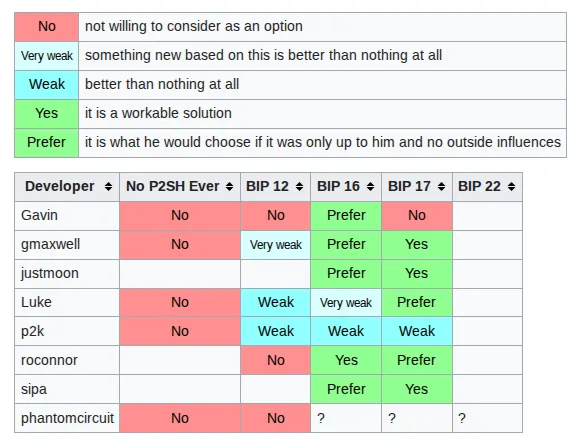

*Meinungen der Entwickler zu den verschiedenen Vorschlägen, 2. Februar 2012 (Quelle: [Bitcoin.it](https://en.bitcoin.it/w/index.php?title=P2SH_Votes&oldid=23259))*

Am 1. Februar 2012 setzte Casascius ein Stück zurück in die Maschine, indem er [einen](https://bitcointalk.org/index.php?topic=62181.msg725161#msg725161) einen BIP (fälschlicherweise der Nummer 22 zugeordnet) vorschlug, der seine Idee der Änderung des Opcodes "OP_CHECKSIG" aufgriff. Gavin [bat](https://bitcointalk.org/index.php?topic=62181.msg725876#msg725876) ihn sofort, damit aufzuhören und wies darauf hin, dass "BIP 16 überwältigende Unterstützung hat, es wird die Lösung sein". Er fügte hinzu:

> Sie schlagen eine nicht rückwärtskompatible Änderung vor, die eine "harte" Blockchain-Aufspaltung bedeuten würde. **Alle sind sich einig, dass das eine schlechte Idee ist. Die Verwirrung und das Potenzial für Hacks, wenn ein signifikanter Teil der Bitcoin-Nutzer auf einer separaten Kette wäre, ist massiv; Sie beschönigen all das in Ihrem Vorschlag.

Ein paar Tage später erklärte Gavin (https://bitcointalk.org/index.php?topic=62181.msg729444#msg729444) (unter Bezugnahme auf die Fernsehsendung *Wer wird Millionär?*):

> Ich habe mein Phone-a-Friend und Ask the Audience benutzt, und ich schließe BIP 16 als meine endgültige Antwort ein

### Miner-Signalisierung

Ein weiteres Problem betraf die Aktivierung des Upgrades durch mining-Pools. Damit die Änderung rückwärtskompatibel ist, muss eine Mehrheit der Hash-Rate sie anwenden. Doch je näher der Januar rückte, desto mehr schwand die Hoffnung auf eine Aktivierung von P2SH.

Damals war die Rechenleistung auf einige [fünfzig](https://en.bitcoin.it/w/index.php?title=Comparison_of_mining_pools&oldid=21595) mining-Pools verteilt, aber drei stachen heraus: DeepBit, BTC Guild und BitcoinCZ Mining (der Pool von Slush). Vor allem DeepBit blieb der dominierende Pool: Anfang 2012 verfügte er allein über rund 30 % der Rechenleistung des Netzes. Auf die beiden anderen entfallen etwa 10-15 %.

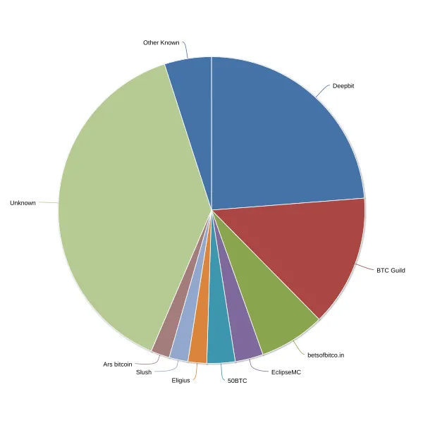

*Anteil der von mining-Pools geschürften Blöcke am Tag des 19. Dezember 2011 (Quelle: [Blockchain.info](https://web.archive.org/web/20111219124912/http://blockchain.info/pools))*

Am 25. Januar, als die Bewertung des Signals begann, stimmten einige kleine Pools [dafür] (https://web.archive.org/web/20120125091902/http://blockchain.info/P2SH) für P2SH. Eligius, der Pool von Luke-Jr., stimmte dagegen. Es schien jedoch, dass der Betreiber von Deepbit, Tycho, sich weigerte, P2SH in seiner Kooperative einzusetzen, wie er [erklärte](https://buildingbitcoin.org/bitcoin-dev/log-2012-01-23.html#l-851) im IRC. Gavin [schrieb](https://bitcointalk.org/index.php?topic=61125.msg712822#msg712822) daraufhin eine lange Nachricht im Forum, in der er die Situation "in Laiensprache" erläuterte und insbesondere darauf hinwies:

> Im Moment sieht es so aus, als ob eine Person/ein Pool (Tycho/deepbit) genug Hashing-Macht hat, um ein Veto gegen jede Änderung einzulegen. Ich glaube, Tycho mochte den ursprünglichen OP\_EVAL-Vorschlag und hatte vor, ihn zu unterstützen, aber er mag/unterstützt weder BIP 16 noch BIP 17 (er mag/unterstützt BIP 11, den Multisignatur-als-Standard-Transaktionen-Teil von all dem), also solange er seine Meinung nicht ändert oder es keinen Massenexodus aus seinem Pool gibt, werden Multisignatur-Bitcoin-Adressen warten müssen.

Tycho antwortete [schriftlich](https://bitcointalk.org/index.php?topic=61125.msg714209#msg714209), dass dies falsch sei und dass er das Upgrade mit den 32 % der ihm zur Verfügung stehenden Rechenleistung nicht blockieren könne. Er [rechtfertigte](https://bitcointalk.org/index.php?topic=61125.msg714231#msg714231) seine Haltung mit drei Gründen: Es gebe keinen "Konsens zwischen Entwicklern oder Minern" darüber, wie die Bezahlung von Skripten umgesetzt werden solle; die vorgeschlagene Lösung sei etwas "hakelig"; und er wolle nicht "die einzige Instanz sein, die darüber entscheidet".

Gavin unterstützte weiterhin die Annahme von P2SH durch die Pools. Dennoch sah er sich am 30. Januar gezwungen zuzugeben, dass die Aktivierung nicht sofort erfolgen würde. Er [verschob](https://bitcointalk.org/index.php?topic=61922.msg722508#msg722508) die Meldung auf die letzte Februarwoche und die endgültige Umstellung auf den 15. März.

Die Rolle der Miner bei der Aktivierung des Upgrades führte zu einer besonderen Vorstellung: dass die Miner die Entwicklung des Protokolls durch ihre Rechenleistung steuern. Diese Auffassung wurde [unterstützt] (https://web.archive.org/web/20120203023138/http://bitcoinmedia.com/cathartic-progress/) von Amir Taaki. Für ihn war die Entscheidungsfindung "genau und korrekt als eine Wahl charakterisiert" und "jede Einheit der mining-Leistung *ist* eine Stimme" in Übereinstimmung mit dem "Eine-CPU-eine-Stimme"-Prinzip, das von Satoshi im Weißbuch dargelegt wurde.

Diese Interpretation wurde von Gregory Maxwell weitgehend bestritten, der [im IRC] (https://buildingbitcoin.org/bitcoin-dev/log-2012-01-28.html#l-1038) und dann [im Forum] (https://bitcointalk.org/index.php?topic=61922.msg723476#msg723476) Einspruch erhob. Er schrieb:

> Das Bitcoin-System ist _NICHT_ für eine Mehrheitswahl vorgesehen. Nicht die Mehrheit der Hashpower, nicht die Mehrheit der Menschen, nicht die Mehrheit des Geldes. Was passiert zum Beispiel, wenn eine Super-Mehrheit - sogar 100% - der derzeitigen Bergleute beschließt, dass die Subvention für immer 50 BTC betragen soll?  **NICHTS**. Miner, die diese Regel in ihrer Software ändern, hören aus der Perspektive des Bitcoin-Netzwerks einfach auf zu existieren.

### BIP 30: Berichtigung von doppelten Vorgängen

Ende Februar schien die Situation immer noch festgefahren zu sein. Die Zahl der Minderjährigen, die sich für P2SH meldeten, war immer noch in der Minderheit, [nähert sich](https://web.archive.org/web/20120307015754/http://blockchain.info/P2SH) 40%. Gavin Andresen sah sich gezwungen, [die](https://gnusha.org/pi/bitcoindev/CABsx9T3748C0LiZETf=dRN5z0-izN=wh6vhuUSB+crXCXcuyAQ@mail.gmail.com/) Evaluierungs- und Aktivierungstermine erneut um zwei Wochen zu verschieben, so dass die Umstellung am 1. April erfolgen konnte. Dieser Zeitpunkt schien der richtige zu sein: Laut Gavin beabsichtigte Tycho, das Upgrade zu unterstützen, nachdem die Änderungen integriert und getestet worden waren.

Doch zunächst musste ein dringenderes Problem gelöst werden: Wie Luke-Jr [schrieb] (https://gnusha.org/pi/bitcoindev/201203061429.16460.luke@dashjr.org/) am 6. März, "hat die Bereitstellung von BIP 30 Priorität". Der Einsatz von P2SH wird daher durch ein Notfall-Update unterbrochen: BIP 30.

Das Problem waren "doppelte Transaktionen" auf der Blockchain: Belohnungstransaktionen mit der gleichen Kennung in verschiedenen Blöcken. Vier im November 2010 geminte Blöcke enthielten solche Transaktionen: Die Transaktion mit der Kennung `d5d27987d2a3dfc724e359870c6644b40e497bdc0589a033220fe15429d88599` war sowohl in den Blöcken [91 812](https://mempool.space/block/00000000000af0aed4792b1acee3d966af36cf5def14935db8de83d6f9306f2f) als auch in [91 842](https://mempool.space/block/00000000000a4d0a398161ffc163c503763b1f4360639393e0e4c8e300e0caec); und die Kennung `e3bf3d07d4b0375638d5f1db5255fe07ba2c4cb067cd81b84ee974b6585fb468` war sowohl in Block [91 722](https://mempool.space/block/00000000000271a2dc26e7667f8419f2e15416dc6955e5a6c6cdf3f2574dd08e) als auch in Block [91 880](https://mempool.space/block/00000000000743f190a18c5577a3c2d2a1f610ae9601ac046a38084ccb7cd721) enthalten. Dieses Problem war bemerkt worden, wurde aber von den Minern selbst gelöst. Im Allgemeinen schien es nicht dringend notwendig zu sein, dieses Problem zu lösen, da man nicht davon ausging, dass es den Betrieb von Bitcoin grundlegend stören würde.

Am 4. Februar 2012 [entdeckte](https://buildingbitcoin.org/bitcoin-dev/log-2012-02-04.html) Russell O'Connor jedoch eine Schwachstelle, die es ermöglichte, alle Transaktionen, die aus einer doppelten Reward-Transaktion entstanden waren, durch eine Reorganisation der Kette vollständig zu löschen, und [beschrieb](https://r6.ca/blog/20120206T005236Z.html) den Angriff in einem Blogbeitrag am folgenden Tag. Um das Problem zu beheben, [schrieb](https://en.bitcoin.it/w/index.php?title=BIP_0030&oldid=24321) Pieter Wuille am 28. Februar eine BIP zu diesem Thema, BIP 30, die es zukünftigen Blöcken verbietet, "eine Transaktion zu enthalten, deren Kennung mit der einer früheren, nicht vollständig ausgegebenen Transaktion in derselben Kette übereinstimmt". Die Regel wurde am 3. März in den Code [eingefügt](https://github.com/bitcoin/bitcoin/commit/a206b0ea12eb4606b93323268fc81a4f1f952531). Die Protokolländerung wurde in die Softwareversion 0.5.3 [aufgenommen](https://bitcointalk.org/index.php?topic=68895.msg803183#msg803183) und trat am 15. März um Mitternacht in Kraft. Sie war auch [vorhanden](https://gnusha.org/pi/bitcoindev/CABsx9T3B0hMfS5kL+RaKwRq5MO0Bfs2EJRrzS6pfNsk+DPjx3w@mail.gmail.com/) in einer vorläufigen Version von Bitcoin-Qt 0.6, die P2SH aktivieren sollte.

### Aktivieren von Pay to Script Hash

Nach der durch die Anwendung von BIP 30 verursachten Unterbrechung (die den Bergleuten große Anstrengungen abverlangte) wurde die Signalisierung für P2SH wieder in Angriff genommen. Am 10. März führte Tycho die ersten Tests zur Implementierung der Signalisierung in Deepbit durch. Am 15. März [erklärte er](https://bitcointalk.org/index.php?topic=3889.msg803685#msg803685), dass er "versucht habe, P2SH so weit wie möglich hinauszuzögern", aber dass "dies bereits nicht produktiv ist". Daraufhin gab er den Kampf auf und führte die Änderung in seinem Pool ein.

Eine Woche später, am 21. März, lag die Signalisierung für P2SH bei über 70 %! Gavin Andresen [schrieb](https://bitcointalk.org/index.php?topic=71226.msg812897#msg812897) im Forum:

> Daher möchte ich ankündigen, dass der Support für BIP16 einen Großteil des mining-Supports erhalten hat, der benötigt wird, um einen potenziellen permanenten fork zu verhindern, und dass er wie geplant am 1. April aktiviert wird. \Wenn Sie also ein Pool-Betreiber, Solo-Miner oder P2Pool-Miner sind, müssen Sie Ihren Bitcoin-Qt/bitcoind vor dem 1. April aktualisieren. Wenn Sie eine Version von bitcoind verwenden, die älter als 0.6 Release Candidate 3 ist, laufen Sie Gefahr, Ihre Hashing-Leistung für ungültige mining-Blöcke zu verschwenden, da frühere Versionen ungültige Ausgaben von BIP16-Transaktionen in ihren Speicherpools akzeptieren und sie in Blöcke setzen, die von der Mehrheit als ungültig angesehen werden.

Zwei weitere vorläufige Versionen wurden in den folgenden Tagen veröffentlicht, und die offizielle Version 0.6 [veröffentlicht](https://bitcointalk.org/index.php?topic=74737.msg827484#msg827484) am 30. März. Sie fügte das Standard-Multisignatur-Schema (BIP 11) hinzu, implementierte Kurzadressen für P2SH (BIP 13) und wandte P2SH selbst an (BIP 16). Das Upgrade fand am 1. April um Mitternacht statt, ohne dass es zu größeren Zwischenfällen kam. Wie erwartet, kam es zu keiner Kettenaufspaltung.

### Die erste große Meinungsverschiedenheit

Die Hash Pay to Script-Schlacht war die erste große Auseinandersetzung in der Geschichte von Bitcoin. Er resultierte aus einer Erweiterung der technischen Gemeinschaft von Bitcoin, was bedeutete, dass es genug Entwickler gab, um die man sich streiten konnte. Gavin Andresen, der einen viel konsensorientierteren Ansatz als Satoshi verfolgte, entschied sich schließlich für P2SH und gegen die anderen Vorschläge. Dies war die erste wichtige Entscheidung der Gemeinschaft bezüglich des Protokolls.

Diese "Schlacht" zeigte, dass die Entwicklung von Bitcoin aufgrund seines offenen und freien Charakters und der damit verbundenen Einsätze nicht reibungslos verlief. Sie warf die Frage nach der Governance von Bitcoin auf und warf einen weitaus gewalttätigeren Konflikt auf: den Blockkrieg, der zwischen 2015 und 2017 stattfand.

Darüber hinaus war die Debatte über die Entwicklung des Protokolls nicht die einzige Folge der offenen und freien Natur von Bitcoin. Sie ermöglichte es auch, mehr oder weniger unterschiedliche Versionen von Bitcoin zu implementieren und den Code oder das Konzept zu übernehmen, die bald als "alternative Kryptowährungen" bezeichnet werden würden. Diese alternativen Kryptowährungen, die auf ihre eigene Weise zum Aufbau von Bitcoin beigetragen haben, werden Gegenstand des nächsten Kapitels sein.

# Übermäßiger Gebrauch

<partId>78390511-d8aa-5cfd-8587-af328aa1e204</partId>

## Das Aufkommen von alternativen Kryptowährungen

<chapterId>514a854c-9316-547a-aece-adad371af369</chapterId>

Die Entstehungszeit von Bitcoin zwischen 2011 und 2012 fiel mit der ersten Welle der Schaffung alternativer Kryptowährungen zusammen, die mit dem Start von Namecoin im April 2011 begann und das ganze Jahr über anhielt. In der Tat ebnete die Entdeckung von Satoshi Nakamoto den Weg für alle möglichen Innovationen, sowohl gute als auch schlechte, die sich in parallelen Projekten niederschlugen, die schnell den Namen *Altcoins* annahmen. Wie der PPCoin-Designer Sunny King [schrieb](https://web.archive.org/web/20130722051950/https://github.com/ppcoin/ppcoin/wiki/History-of-cryptocurrency) im März 2013:

> Das Zeitalter des Internets hat uns schließlich ein neues Phänomen beschert, das als *Kryptowährung* bekannt ist. Satoshi Nakamoto stellte sein bahnbrechendes Werk *Bitcoin* im Jahr 2009 der Welt vor und läutete damit eine neue Ära in der Finanzgeschichte der menschlichen Zivilisation ein. Der wichtigste Durchbruch von Bitcoin ist die Einführung eines *dezentralisierten* öffentlichen Hauptbuchs. Der Begriff *Kryptowährung* bezieht sich dann auf die neue Klasse virtueller Währungen mit einem hohen Grad an *Dezentralisierung* (in der Internet-Terminologie auch als *Peer-to-Peer* bekannt), die somit viel widerstandsfähiger gegen Abschaltversuche sind.

Diese Aufregung war der Experimentierfreude zuträglich. Die dezentrale Verwaltung von Domänennamen wurde mit Namecoin eingeführt. Es entstanden mehrere alternative Modelle: die Kombination von mining mit Namecoin, GPU-Resistenz mit Tenebrix und Litecoin und Proof-of-Stake mit PPCoin. Diese offene Entwicklung ermöglichte es jedoch auch böswilligen Individuen, Bitcoin zu klonen und mit dem Pre-mining ihrer neuen Rechnungseinheit Profit zu machen, was in der Bitcoin-Gemeinschaft nicht ohne Gegenreaktion blieb. In diesem Kapitel beschreiben wir die verschiedenen Aspekte des Aufkommens alternativer Kryptowährungen.

### Dezentralisierte Domainnamen mit BitDNS und Namecoin

Gegen Ende des Jahres 2010 kam die Idee auf, den Bitcoin-Code zu verwenden, um andere Systeme zu starten. Das im Oktober gestartete Testnetzwerk [bildete](https://bitcointalk.org/index.php?topic=1647.msg20643#msg20643), in den Worten von Gavin Andresen, "eine andere Blockchain, die so implementiert wurde, dass die beiden Chains nicht verwechselt werden", und demonstrierte, dass der Start einer anderen Chain "technisch nicht schwierig ist und keine Probleme für den 'echten Bitcoin' verursachen wird".

Der Faktor, der zur Schaffung der ersten alternativen Kryptowährung führte, war das Problem der Domänennamen, ein Thema, das für diejenigen, die damals mit Bitcoin zu tun hatten, besonders wichtig war. Das System der Domänennamen, d. h. leicht zu merkende Zeichenketten wie "apple.com" oder "bitcoin.org", liegt zentral in den Händen der ICANN, der *Internet Corporation for Assigned Names and Numbers*, einer nach kalifornischem Recht gegründeten gemeinnützigen Gesellschaft. Infolgedessen sind diese Namen [Gegenstand](https://web.archive.org/web/20110617160904/http://btlj.org/2011/02/23/four-rounds-of-ice-domain-name-seizures-and-related-controversies-and-opposition/) regelmäßiger Beschlagnahmungen, was ein Problem für die Befürworter der Freiheit darstellt, die [nach](https://web.archive.org/web/20101213122350/http://dot-p2p.org/index.php?title=Main_Page) weniger zensierbaren Lösungen suchen.

Die Umsetzung in die Praxis hat sich jedoch als schwierig erwiesen, und erst das Aufkommen von Bitcoin hat einen Durchbruch ermöglicht. Das Zooko-Dreieck, [theoretisiert](https://web.archive.org/web/20011020191610/http://zooko.com/distnames.html) im Jahr 2001 von dem Cypherpunk Bryce "Zooko" Wilcox, besagt, dass ein Identifikator nur maximal zwei der folgenden Eigenschaften haben darf: Sicherheit (ein Name darf nur einem einzigen Element entsprechen); Dezentralisierung (es dürfen keine zentralen Behörden erforderlich sein, um festzustellen, welcher Name welchem Element entspricht); menschliche Lesbarkeit (die Namen der Elemente müssen sinnvoll sein und man muss sie sich merken können). Aber mit dem Bitcoin-Modell wird dieses Trilemma obsolet, und um es zu lösen: "Sie können BitCoin tatsächlich verwenden, um das Zooko-Dreieck zu quadrieren", um Aaron Swartz' [Ausdruck] zu entlehnen (http://www.aaronsw.com/weblog/squarezooko).

Am 14. November 2010 schlug ein Bitcoin-Nutzer, der sich Appamatto nannte, vor, das Bitcoin-Modell zu nutzen, um ein dezentrales Domain-Namen-System einzurichten. Er nannte seine Idee "BitDNS". Im IRC-Kanal \#bitcoin-dev [schrieb er](https://web.archive.org/web/20101118020511/http://veritas.maximilianeum.ch/bitcoin/irc/logs/2010/11/14#l1150):

> Ich hatte eine Idee für ein Bitcoin-ähnliches DNS-System. Im Grunde genommen kann man mit jedem erzeugten Block einen neuen Namen definieren, und die Transaktionen sind Zuordnungen der Namen zu IP-Adressen.

Ein paar Stunden später schrieb er [https://bitcointalk.org/index.php?topic=1790.msg22019#msg22019] eine ausführlichere Beschreibung im Bitcoin-Forum, in der er schrieb, dass es möglich zu sein scheint, einen Bitcoin-Klon (bitDNS) zu erstellen, der eine Lösung für eine verteilte, autoritätsfreie Namenszuweisung und -übertragung bietet".

Der Thread erregte die Aufmerksamkeit vieler im Forum, darunter Gavin Andresen und Hal Finney, so sehr, dass Satoshi Nakamoto selbst mehrmals dort intervenierte. Er war besonders begeistert von der Idee, eine Blockchain eines Dritten zu verwenden. Am 10. Dezember [schrieb] (https://bitcointalk.org/index.php?topic=1790.msg28917#msg28917) er so:

> Jedes proof-of-work-Quorum-System der Welt in einen Datensatz zu packen, ist nicht sinnvoll.  Bitcoin und BitDNS können separat verwendet werden.  \Die Netzwerke müssen getrennte Schicksale haben.  BitDNS-Benutzer könnten bei der Hinzufügung großer Datenfunktionen völlig liberal sein, da nur relativ wenige Domänenregistrierungsstellen benötigt werden, während Bitcoin-Benutzer die Größe der Kette zunehmend tyrannisch begrenzen könnten, damit es für viele Benutzer und kleine Geräte einfach ist.

Einen Monat später, Anfang 2011, wurde ein ähnlicher Vorschlag [gemacht](http://www.aaronsw.com/weblog/squarezooko) von Aaron Swartz, einem amerikanischen Informatiker und Hacktivisten, der (unter anderem) als Mitbegründer von Reddit im Jahr 2005 bekannt wurde. Er entwickelte sein Konzept unabhängig, inspiriert von den Bemerkungen seines Freundes Dan Kaminsky. Seine Idee wurde [erwähnt](https://bitcointalk.org/index.php?topic=1790.msg35755#msg35755) im Bitcoin Forum zu der Zeit. Er [versuchte](https://web.archive.org/web/20110521214956/https://squaretriangle.jottit.com/faq), sein Konzept in einem System namens "Squaretriangle" umzusetzen, das er als Hommage an den Schöpfer von Bitcoin den Spitznamen "Nakanames" gab.

In der Zwischenzeit wurden in der Bitcoin-Gemeinschaft Anstrengungen zur Einführung von BitDNS unternommen. Am 4. Dezember richtete Kiba [ein](https://bitcointalk.org/index.php?topic=2072.msg26742#msg26742) Belohnungssystem für denjenigen ein, der es als erster einführen würde: Etwa ein Dutzend Forumsmitglieder versprachen insgesamt 3.500 BTC (nur 442 BTC würden letztendlich ausgezahlt werden). Es wurden mehrere Vorschläge gemacht, darunter Ribucks [DomainChain](https://bitcointalk.org/index.php?topic=1790.msg27787#msg27787) Modell und der [Vorschlag](https://web.archive.org/web/20101219214135/https://privwiki.dreamhosters.com/wiki/Bitcoin_DNS_System_Proposal) von Theymos und Nanotube, die beide die Vorteile der Kette von Bitcoin nutzten.

Diese Bemühungen führten schließlich zur Schaffung eines funktionalen, von Bitcoin getrennten Systems: Namecoin. Die Kette wurde [gestartet] (https://bitcointalk.org/index.php?topic=6017.msg88356#msg88356) am 19. April 2011 von einem gewissen Vincent Durham, der im Forum das Pseudonym Vinced verwendete. Die Software war eine modifizierte Version von Bitcoin. Namecoin war also seinem großen Bruder sehr ähnlich: Einheiten, die Namecoins genannt werden, wurden bei jedem Block von Minern im Durchschnitt alle 10 Minuten ausgegeben, sie wurden durch Transaktionen übertragen, die in den Blöcken enthalten waren, die Geldausgabe wurde alle 4 Jahre halbiert usw. Domain-Namen, die [will](https://bitcointalk.org/index.php?topic=6851.msg126500#msg126500) die Endung `.bit` verwenden, waren spezielle token, die nicht gemischt werden konnten (Vitalik Buterin [will](https://ethereum.org/whitepaper/) nannte sie 2014 "nicht-fungible assets") und wurden mit den Einheiten verschoben, um mit einer Adresse verbunden zu werden. Namen wurden durch eine spezielle Art von Transaktion erstellt und erneuert. Domains verfallen nach 12.000 Blöcken, also nach etwa 83 Tagen.

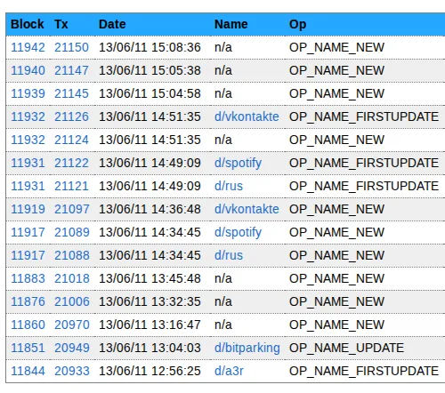

*Auf Namecoin reservierte Namen am 13. Juni 2011 (Quelle: [capture](https://web.archive.org/web/20110613130957/http://explorer.dot-bit.org/) von Explorer.dot-bit.org)*

Namecoin war die Gelegenheit, kombinierte mining oder *merged mining* zu implementieren, was ein [Prozess](https://web.archive.org/web/20110723091126/http://dot-bit.org/Merged_Mining) ist, der darin besteht, die an einer "Mutterkette" (nämlich der von Bitcoin) geleistete Arbeit für die Validierung kleinerer "Hilfs"-Ketten wiederzuverwenden. Dieser Prozess wurde in der BitDNS-Diskussion von Satoshi selbst [vorgeschlagen](https://bitcointalk.org/index.php?topic=1790.msg28696#msg28696). Der Schöpfer von Bitcoin wies darauf hin, dass diese Art von mining "das Problem lösen würde, dass, wenn es mehrere Netzwerke gibt, diese eine Gefahr für einander darstellen, wenn sich die verfügbare CPU-Leistung auf eines konzentriert" und dass es "einfacher" wäre, kleinere Netzwerke zu starten. Kombinierter mining [begann](https://web.archive.org/web/20110925063651/http://dot-bit.org/forum/viewtopic.php?f=5&t=217) im Juli in den Code von Namecoin integriert zu werden und wurde am 8. Oktober auf Blockebene 19.200 im Netzwerk aktiviert.

### Die erste Welle von Nachahmern

Namecoin war jedoch nicht das einzige separate System, das in diesem Jahr eingeführt wurde. In der Tat brachte die große Blase von 2011 eine [erste Welle](https://web.archive.org/web/20130722051950/https://github.com/ppcoin/ppcoin/wiki/History-of-cryptocurrency) alternativer Kryptowährungen hervor.

Einige dieser Projekte waren höchst experimentell, wie die Bitcoins im Testnetz, und konnten jederzeit zurückgesetzt werden. Beispiele hierfür waren die "[BeerTokens](https://web.archive.org/web/20110703101435/http://exchange.beertokens.info/)" und "[Weeds](https://web.archive.org/web/20110505081347/http://exchange.surething.biz/)", die mit der Software [MultiCoin](https://bitcointalk.org/index.php?topic=24209.msg300830#msg300830) von Scott Carlson entwickelt wurden. Andere wiederum waren rein opportunistisch, da ihre Erfinder aus der Begeisterung für Bitcoin Kapital schlagen wollten, vor allem durch die so genannten Pre-mining.

Eine dieser opportunistischen *Altcoins* war Groupcoin / Devcoin, die von einer Person unter dem Pseudonym Unthinkingbit [erdacht](https://bitcointalk.org/index.php?topic=24813.msg308142#msg308142) und am 22. Juli [gestartet](https://explorer.devcoin.org/explorer/block/0000000062558fec003bcbf29e915cddfc34fa257dc87573f28e4520d1c7c11e) wurde. Das Modell [bestand](https://bitcointalk.org/index.php?topic=24813.msg422068#msg422068) darin, 90 % der neu geschaffenen Einheiten an Entwickler zu verteilen, die in der Welt der freien Software tätig sind; die restlichen 10 % waren für die Miner des Systems reserviert. Obwohl es als "ethische Währung" präsentiert wurde, war es ein Glücksfall für die begünstigten Entwickler, die vom Projektleiter ausgewählt wurden.

Ein weiteres opportunistisches Kryptowährungsprojekt war Ixcoin, eine Kopie von Bitcoin, die sich von ihrem großen Bruder dadurch unterschied, dass sie Geld mit einer schnelleren Rate schuf. Ixcoin wurde [gestartet] (https://bitcointalk.org/index.php?topic=36218.msg446303#msg446303) am 10. August von einer Person namens Thomas Nasakioto. Dies war das erste Beispiel für "vor-mining": In den vorangegangenen drei Monaten hatte der Gründer die ersten 6.055 Blöcke der Kette im Geheimen geschürft und so vor dem Start über 580.000 ixcoins erzeugt. Obwohl er den ersten Händlern, die seine neue Kryptowährung verwenden, Belohnungen [anbot] (https://bitcointalk.org/index.php?topic=36220.msg446305#msg446305), behielt er einen großen Teil der bereits geminten Einheiten. Leute im Forum, wie [Gavin Andresen](https://bitcointalk.org/index.php?topic=36218.msg451681#msg451681), begannen sich zu wundern [und fragten](https://bitcointalk.org/index.php?topic=36218.msg446352#msg446352), ganz zu Recht, "wer hat diese 580k ixcoins?".

Die Situation [motivierte](https://bitcointalk.org/index.php?topic=36425.msg448463#msg448463) die Entwicklung von I0coin, einem fork von Ixcoin "mit 0 vorgenerierten Blöcken", dessen Netzwerk am 16. August [gestartet](https://bitcointalk.org/index.php?topic=36425.msg460733#msg460733) wurde. I0coin hatte eine Blockzeit von 5 Minuten anstelle von 10 Minuten. Er [sammelte](https://bitcointalk.org/index.php?topic=36425.msg461312#msg461312) vom ersten Tag an 1 TH/s an Rechenleistung, und jeder war begierig darauf, seine Einheiten zu bekommen, bevor sie an Wert gewannen.

Eine dritte Kryptowährung, die wir als opportunistisch einstufen, war SolidCoin. Sie wurde am 21. August 2011 von einer Person unter den Pseudonymen CoinHunter und RealSolid [lanciert](https://bitcointalk.org/index.php?topic=38453.msg471183#msg471183), die sich für Bitcoin wegen seines "Potenzials, durch Spekulationen Geld zu verdienen", wegen seiner einfachen Rückzahlung und wegen seiner Anonymität [interessierte](https://bitcointalk.org/index.php?topic=15672.msg381911#msg381911). SolidCoin unterschied sich von Bitcoin durch eine niedrigere Blockzeit (3 Minuten statt 10), feste Gebühren pro Transaktion und einen geänderten Anpassungsalgorithmus, der es einfacher machte, die Schwierigkeit von mining zu verringern als zu erhöhen. Im Oktober wurde nach einem Spam-Angriff auf das Netzwerk (dem System fehlte der geeignete Gebührenmechanismus) die SolidCoin-Version 2.0 veröffentlicht. Sie [änderte] (https://web.archive.org/web/20111015164358/http://solidcoin.info/solidcoin-most-secure-currency.php) das Protokoll, um "vertrauenswürdige Knoten" (die eine bestimmte Anzahl von gebundenen SLCs besitzen) in den Konsens einzubeziehen, als Schutz vor 51%-Angriffen.

Generell wurde SolidCoin als Konkurrent zu Bitcoin dargestellt, im Gegensatz zu den anderen Kryptowährungen, die von ihren Erfindern als komplementär angesehen wurden. Der Gründer von SolidCoin kritisierte das Modell von Nakamoto, indem er insbesondere die "Konzentration von Bitcoin auf elitäre Early Adopters" anprangerte, "die kein Interesse oder den Wunsch haben, Bitcoin von 'normalen' Menschen nutzen zu lassen". In einem Artikel, der den "Bitcoin-Zusammenbruch" vorhersagte, [beschuldigte](https://web.archive.org/web/20110925064226/https://solidcoin.info/solidcoin-ready-for-bitcoin-collapse.php) Bitcoin für seine technische Stagnation, die aus einer möglichen "Regierungsbeteiligung" resultiert, und hebt SolidCoin als die Kryptowährung der Innovation hervor.

Im September wurde eine weitere opportunistische Kryptowährung [lanciert] (https://bitcointalk.org/index.php?topic=42417.msg516279#msg516279) von einem Forumsmitglied, das sich Lolcust nennt: GeistGeld (dessen Name auf Deutsch "geistige Währung" bedeutet). Sie wurde als experimentelle Währung vorgestellt, da die Blockerzeugung sehr schnell war (die Blockzeit beträgt 15 Sekunden) und wahrscheinlich viele verwaiste Blöcke erzeugte. Ihr Schöpfer hatte jedoch über 7 Millionen Einheiten für sich selbst [reserviert](https://bitcointalk.org/index.php?topic=42417.msg524007#msg524007).

Infolge dieser Verbreitung entstanden mehrere Bitcoin-Austauschdienste. Es gab *Bitparking Namecoin Exchange*, das von Doublec im Juni [gestartet](https://bitcointalk.org/index.php?topic=11530.msg162730#msg162730) wurde. Moonco.in [startete](https://bitcointalk.org/index.php?topic=31768.msg399398#msg399398) seinen Namecoin-Bitcoin-Austauschdienst im Juli. Ein Dienst namens Solidcoin24 für den Austausch zwischen Solidcoin und anderen Kryptowährungen (BTC, NMC) wurde Ende August [eröffnet](https://bitcointalk.org/index.php?topic=40471.msg493032#msg493032). Schließlich hat sich die russische Austauschplattform BTC-e, die im August eröffnet wurde, schnell auf den Handel mit alternativen Kryptowährungen [spezialisiert](https://web.archive.org/web/20111017024937/https://bitcointalk.org/index.php?topic=40889.0) und die wichtigsten Kryptowährungen integriert, sobald sie veröffentlicht wurden.

Im Forum wurde aufgrund der Vervielfachung der Threads über *Altcoins* im September ein Unterbereich mit dem Titel "Alternative Währungen" eingerichtet. Außerdem wurde eine Website, Allchains.info, [eröffnet](https://bitcointalk.org/index.php?topic=41546.msg505943#msg505943), auf der die Wechselkurse, der Schwierigkeitsgrad und die Hash-Raten der verschiedenen Ketten aufgelistet sind.

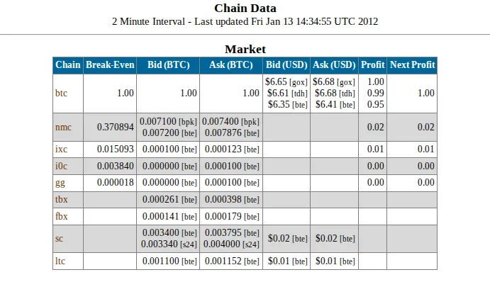

*Exchange-Raten zwischen verschiedenen alternativen Kryptowährungen im Januar 2012 (Quelle: [capture](https://web.archive.org/web/20120113143526/http://allchains.info/) von Allchains.info)*

### Tenebrix: GPU-Widerstand

Bis Herbst 2011 verwendeten alle alternativen Kryptowährungen die Hash-Funktion von Bitcoin, die doppelte SHA-256, für mining. Dies kam den etablierten Minern der BTC-Kette zugute, da sie bereits über die Hardware für generate-Einheiten in großen Mengen verfügten. Neueinsteiger hatten nicht die Möglichkeit, diese neuen Kryptowährungen mit ihren Hauptprozessoren zu minen, was das bereits bestehende Problem der Varianz noch verschärfte.

Am 26. September 2011 [startete](https://bitcointalk.org/index.php?topic=45667.msg544675#msg544675) Lolcust Tenebrix, das er als "eine CPU-freundliche, GPU-feindliche Kryptowährung" vorstellte. Unterstützt wurde er von dem deutschen Miner ArtForz, der [https://bitcointalk.org/index.php?topic=46063.msg549768#msg549768] SHA-256 durch Scrypt ersetzte, eine Funktion zur Ableitung von Schlüsseln, die ursprünglich 2009 von dem kanadischen Informatiker Colin Percival für den Online-Backup-Dienst Tarsnap [entwickelt](https://web.archive.org/web/20090928073214/http://www.tarsnap.com/scrypt.html) wurde. Dank ihres hohen Speicherbedarfs hat sie die Effizienz von Grafikprozessoren in mining drastisch reduziert, so dass Kernprozessoren gewinnbringend eingesetzt werden können. Die Kryptowährung wurde Tenebrix genannt, weil "sie eine Kryptowährung ist, die im Schatten jeder größeren GPU-mining-Operation gedeiht und friedlich die überschüssigen CPU-Zyklen der Miner-Rigs genießt".)

Wie GeistGeld verwendete auch Tenebrix eine modifizierte Version der MultiCoin-Software. Die Ausgabe von Einheiten (von Lolcust "Brix" genannt) war konstant, so dass die Gesamtmenge nicht gedeckelt war. Auch hier waren über 7 Millionen Einheiten von Lolcust "vorgebaut" worden, was (unter der Annahme einer Emissionsrate von 5 Brix pro Minute) einer mining-Produktion von 2,5 Jahren entspricht. Aus diesem Grund ergriff ein gewisser Michael McLees [die Initiative](https://bitcointalk.org/index.php?topic=46342.msg552146#msg552146) einige Tage später die Entwicklung von Fairbrix, einer Kopie von Tenebrix ohne massive Vor-mining (nur 3.775 Einheiten). Nach einigen technischen Problemen wurde Fairbrix am 2. Oktober von einem Programmierer namens Charlie Lee [gestartet](https://bitcointalk.org/index.php?topic=46528.msg554186#msg554186).

### Litecoin, die Ergänzung zu Bitcoin

Charlie Lee [ist](https://web.archive.org/web/20130831040759/http://www.wired.com/wiredenterprise/2013/08/litecoin/) ein amerikanischer Entwickler chinesischer Herkunft, der 1977 in der Elfenbeinküste geboren wurde und im Alter von 13 Jahren mit seiner Familie in die USA zog. Als fleißiger Student erwarb er am MIT einen Master-Abschluss in Computerwissenschaften. Im Jahr 2011 lebte er im Silicon Valley und arbeitete als Entwickler für Google, vor allem für ChromeOS. Während er der Federal Reserve skeptisch gegenübersteht, begeistert er sich für Edelmetalle.

*Charlie Lee im März 2013 (Quelle: [Archiv](https://web.archive.org/web/20130331071808/http://www.bitcoin2013.com/bitcoin-2013-panelists.html) von Bitcoin2013.com)*

Charlie entdeckte Bitcoin im Juni 2011 durch [Lesen](https://twitter.com/satoshilite/status/1020131826369585152) eines Artikels über Silk Road. Bald darauf kontaktierte er Mike Hearn (der auch für Google arbeitete, aus Zürich), der ihn von der Solidität von Bitcoin überzeugte. Im August nahm er an der Konferenz von Bruce Wagner in New York teil. Er interessierte sich auch für alternative Kryptowährungen und gründete daraufhin am 2. Oktober Fairbrix.

Allerdings war er mit dem Projekt nicht zufrieden. Fairbrix basierte auf dem MultiCoin-Client und litt unter zahlreichen Fehlern. Also beschloss Charlie, eine neue Kryptowährung auf den Markt zu bringen, wobei er den Quellcode von Bitcoin kopierte. Er [nannte sie](https://bitcointalk.org/index.php?topic=47417.msg564414#msg564414) Litecoin und präsentierte sie als "eine Lite-Version von Bitcoin". Er hoffte, damit "eine Münze zu schaffen, die das Silber zum Gold von Bitcoin ist".

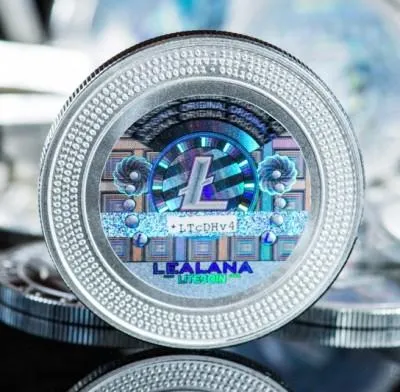

*Physische Litecoin, bekannt als "Lealana's", wurden 2013 verkauft (Quelle: [Wired](https://web.archive.org/web/20130831040759/http://www.wired.com/wiredenterprise/2013/08/litecoin/))*

Litecoin verwendet den Scrypt-proof-of-work-Algorithmus, ebenso wie Tenebrix. Die Blockzeit beträgt 2 Minuten 30, viermal weniger als bei Bitcoin, was bedeutet, dass die Emissionsobergrenze 84 Millionen Einheiten beträgt (statt 21) und die Schwierigkeitsanpassung alle 3,5 Tage erfolgt (statt 2 Wochen). Halving findet alle 840.000 Blöcke statt, d. h. etwa alle 4 Jahre.

Die Kette [startete] (https://litecoinspace.org/block/dec173dda2735ff11376b68bdfda804cede230c1fa6f1a11765cddfd8edf4398) gegen 3 Uhr morgens am 13. Oktober. Der Start verlief jedoch nicht wie geplant: Über 10.000 Blöcke wurden in weniger als 24 Stunden (statt in 12,5 Tagen) abgebaut, was 500.000 Litecoins oder 0,6 % der geplanten Gesamtmenge entspricht. Das Problem war, dass die mining-Schwierigkeit zu niedrig war und der Anpassungsalgorithmus begrenzt ist: Die Schwierigkeit kann nur mit 4 multipliziert (oder geteilt) werden. Darüber hinaus war der Genesis-Block mit einem Zeitstempel vom 9. Oktober versehen, so dass die erste Anpassung tatsächlich nach unten erfolgte. Tenebrix hatte den gleichen Fehler (6.048 Blöcke wurden in 2 Tagen statt in 21 Tagen geschürft), aber dieser wurde schneller behoben und die Auswirkungen waren nicht so groß wie bei Litecoin. Charlie hat einfach die gleichen Parameter verwendet.

Nach der Entdeckung dieses beschleunigten mining beschuldigte ein Forumsmitglied mit dem Pseudonym Localhost [Charlie](https://bitcointalk.org/index.php?topic=47417.msg574959#msg574959), [nicht zuzuhören](https://bitcointalk.org/index.php?topic=47417.msg570772#msg570772), als er ihn auf das Problem aufmerksam machte. Der Entwickler [verteidigte sich](https://bitcointalk.org/index.php?topic=47417.msg574976#msg574976), indem er schrieb, dass es nicht möglich sein wird, diesen Vorfall zu reproduzieren. Er erklärte weiter, dass "der Start mit einem niedrigeren Schwierigkeitsgrad die Leute begeistert und sie sich für diese Münze interessieren" und dass "man eine Gemeinschaft und Unterstützung braucht, um eine erfolgreiche Münze zu starten.

Trotz dieses Rückschlags ist Litecoin eine Erfolgsgeschichte. Zusammen mit dem Namecoin ist er eine der wenigen Kryptowährungen, die nicht innerhalb weniger Monate nach ihrer Entstehung in die wirtschaftliche Bedeutungslosigkeit fielen und im Mai 2013 den zweiten Platz im Kryptowährungs-Ranking (https://coinmarketcap.com/historical/20130526/) belegten. Am Ende des Sommers 2012 lag sein Preis [bei](https://web.archive.org/web/20120831211413/http://www.ltc-charts.com/) $0,038, während der Preis von Namecoin, obwohl er viermal seltener ist, [bei](https://web.archive.org/web/20120901055814/http://allchains.info/) $0,019 lag. Dennoch bleibt Litecoin neben Bitcoin ein wirtschaftlicher Zwerg: Sein Gesamtwert (der Preis multipliziert mit der Anzahl der im Umlauf befindlichen Einheiten) liegt bei 380.000 Dollar, während der seines großen Bruders bei fast 100 Millionen Dollar liegt.

### Die ersten Reaktionen auf Ablehnung

Die Möglichkeit, durch das Klonen von Bitcoin Geld zu verdienen und vom steigenden Wert der Einheiten zu profitieren, war offensichtlich. Bereits im November 2010, noch bevor die Idee von BitDNS aufkam, wurde diese Möglichkeit im Forum angesprochen. Ribuck, ein aktives Forumsmitglied zu dieser Zeit, [schrieb](https://bitcointalk.org/index.php?topic=1647.msg20646#msg20646) eine Anklage gegen zukünftige Bitcoin-Kopien und prägte dabei den Begriff "[Shitcoin](https://planb.academy/resources/glossary/shitcoin)":

> "Wenn bitcoin wirklich durchstartet, sehe ich viele Nachahmer, die schnell reich werden wollen: gitcoin, nitcoin, witcoin, titcoin, shitcoin.... Einige von ihnen werden sicher Nutzer mit Versprechungen wie "Warum Bitcoin verwenden, wo man nur alle paar Monate 50 Bitcoins generate kann? Verwenden Sie stattdessen shitcoin, und Sie erhalten alle 2 Minuten 51 shitcoins". Natürlich werden die billigen Nachahmer genauso schnell wieder verschwinden wie die "Internetwährungen" aus den 1990er Jahren wie Flooz und Beez, aber viele Leute werden auf dem Weg dorthin verbrannt werden.

Gavin Andresen [genehmigte](https://bitcointalk.org/index.php?topic=1647.msg20650#msg20650) diesen Text. Er antwortete, dass sich die Gemeinschaft in den "Wildwest-Tagen der Open-Source-Währung" befinde und dass er "erwartet, dass die Leute von Betrügern, Nachahmern, Ponzi-Schemata und Preisblasen verbrannt werden". Er fügte hinzu, dass er "nicht glaubt, dass man viel gegen diese unehrlichen Praktiken tun kann", "außer die Leute zu warnen, mit ihrem Geld vorsichtig zu sein".

Diese Reaktion wurde durch die erste Welle alternativer Kryptowährungen bestätigt, die sich in nur wenigen Monaten vervielfachten. Dies veranlasste viele an Bitcoin beteiligte Personen zu reagieren. Im August 2011 erklärte der Electrum-Entwickler Thomas Voegtlin [https://bitcointalk.org/index.php?topic=37592.msg463263#msg463263], dass die meisten Bitcoin-Klone nutzlos seien, da sie dieselbe Marktnische wie Bitcoin besetzten und nicht von dessen Netzwerkeffekt profitierten. Er [verstand](https://bitcointalk.org/index.php?topic=38453.msg471316#msg471316), dass "diese alternativen Blockchains von Leuten lanciert werden, die versuchen, schnelles Geld zu machen, bevor der Wert auf Null sinkt. In ähnlicher Weise veröffentlichte Gavin [Anfang September](https://bitcointalk.org/index.php?topic=42465.msg516789#msg516789) eine skeptische Warnung im Forum, in der er die Leute aufforderte, sich die richtigen Fragen zu stellen, bevor sie sich auf diese Kryptowährungen einlassen.

Nach der ersten Welle der Schaffung alternativer Kryptowährungen tauchte ein Ausdruck [auf](https://buildingbitcoin.org/bitcoin-dev/log-2011-04-05.html#l-2226), der Verzweiflung signalisierte: "*noch eine Kryptowährung*". Der Ausdruck *noch eine* war in der Welt der freien Software bereits weit verbreitet und wurde, wenn er abwertend verwendet wurde, benutzt, um "etwas zu beschreiben, von dem es schon viel zu viele gibt" [laut](http://catb.org/jargon/html/Y/Yet-Another.html) einem Aktivisten für freie Software Eric S. Raymond. Variationen des Ausdrucks wurden gegen [Namecoin](https://bitcointalk.org/index.php?topic=6017.msg89440#msg89440) im April 2011, [Tenebrix](https://bitcointalk.org/index.php?topic=45667.msg545150#msg545150) im September und [Liquidcoin](https://buildingbitcoin.org/bitcoin-dev/log-2012-01-23.html#l-1429) im Januar 2012 verwendet. Coiledcoin, ein *Altcoin*, der sich von Bitcoin dadurch unterscheidet, dass er OP_EVAL implementiert, [verwendete](https://bitcointalk.org/index.php?topic=56675.msg675166#msg675166) den Begriff humorvoll, als er am 5. Januar 2012 auf den Markt kam. Eine Kryptowährung, die sich YACoin ("yet another coin") nennt, wird sogar im Mai 2013 [eingeführt](https://bitcointalk.org/index.php?topic=206577.msg2161742#msg2161742).

Einer der schärfsten Kritiker alternativer Kryptowährungen war wahrscheinlich Lukas jr. Er war sehr gegen diese Nachahmungen, manchmal sogar pathologisch. Er [meinte] (https://web.archive.org/web/20120115215038/http://bitcoinmedia.com/luke-dashjr-throws-book-at-solidcoin), dass nicht alle alternativen Kryptowährungen "Betrug" seien: "Ich betrachte nicht alle alternativen Ketten als Betrug. Insbesondere Namecoin wurde mit einem legitimen Zweck entwickelt", aber "diese Systeme sind standardmäßig mehr oder weniger Pump-and-Dump-Schneeballsysteme", bis sie einen anderen Anwendungsfall für Bitcoin entwickeln.

Er hat seinen Worten Taten folgen lassen. Im November 2011 [bearbeitete](https://en.bitcoin.it/w/index.php?title=Litecoin&oldid=18952) er die neu hinzugefügte Litecoin-Seite auf dem Bitcoin-Wiki und schrieb, dass "Litecoin ein Betrug ist". Am 6. Januar 2012 [führte er](https://bitcointalk.org/index.php?topic=56675.msg676981#msg676981) einen Zensurangriff gegen Coiledcoin durch (der sich als tödlich herausstellte), indem er seinen mining-Pool, Eligius, benutzte, ohne die Teilnehmer zu informieren. In seiner [Erklärungsnachricht](https://bitcointalk.org/index.php?topic=56830.msg678004#msg678004) stellte er klar, dass kein Mitglied des Pools geschädigt wurde, da die Coiledcoin-Kette in Kombination mit der von Bitcoin geschürft wurde. Er rechtfertigte seine Aktion, indem er schrieb, dass er sich verpflichtet fühlte, "zum Bitcoin-Ökosystem beizutragen und es zu schützen", und dass "Pyramidensysteme, die auf forks der Bitcoin-Software aufbauen, letztendlich den Ruf von Bitcoin diskreditieren und schädigen". Schließlich reichte er am 9. Januar 2012 [https://web.archive.org/web/20120115205346/http://solidcointalk.org/topic/510-bitcoin-developers-attempt-to-kill-open-source-project-sends-dmca-to-linode-and-github/] eine DMCA-Abmahnung gegen SolidCoin bei Linode (Website-Host) und GitHub (Code-Host) wegen unrechtmäßiger Verwendung seines in der Bitcoin-Software enthaltenen Codes ein.

### PPCoin, oder die Versuchung des Nachweises des Einsatzes

Ab dem Frühjahr 2012 wurde es ruhiger. Dennoch tauchten im Laufe des Jahres einige alternative Kryptowährungen auf, wie [Timekoin] von Michael Brown (https://bitcointalk.org/index.php?topic=88467.msg974001#msg974001), [Qubic] von Come-From-Beyond (https://bitcointalk.org/index.php?topic=112676.msg1218867#msg1218867) und [Freicoin] von Jorge Timón (https://bitcointalk.org/index.php?topic=133020.msg1416459#msg1416459). Die wichtigste Kryptowährung, die zu dieser Zeit aufkam, war jedoch PPCoin (für "Peer-to-Peer Coin"), die mit ihrer Implementierung des Proof-of-Stake-Verfahrens Neuland betrat.

Proof of stake ist eine Alternative zu [proof of work](https://planb.academy/resources/glossary/proof-of-work), bei der die Wahrscheinlichkeit, einen Block zu erzeugen, durch den Besitz von Einheiten und nicht durch die aufgewendete Elektrizität bestimmt wird. Es wurde erstmals [beschrieben](https://www.links.org/files/decentralised-currencies.pdf) im Juli 2011 von dem britischen Entwickler und Aktivisten Ben Laurie, und sein Name wurde [geprägt](https://bitcointalk.org/index.php?topic=27787.msg349645#msg349645) von einem gewissen QuantumMechanic im Bitcoin-Forum.

PPCoin war die Idee einer Gruppe von Personen unter der Leitung eines Entwicklers [mit](https://talk.peercoin.net/t/transcript-of-sunny-king-interview-with-vitalik-buterin-from-bitcoinmagazine/463) der "Stiftidentität" Sunny King, der [2010](https://bitcointalk.org/index.php?topic=15672.msg1076876#msg1076876) von Bitcoin erfuhr und sich 2011 an der großen Blase beteiligte. Im Oktober 2011 kamen Mitglieder der Gruppe auf die Idee, das Konzept des "Münzalters" zu verwenden, um ein hybrides Proof-of-Stake-System zu implementieren: Einige Blöcke in der Kette würden durch Proof-of-Holding abgebaut werden, was bedeutet, dass ein UTXO umso mehr Einfluss auf den Prozess hat, je älter er ist. In dem [White Paper] (https://web.archive.org/web/20121021014644/http://www.ppcoin.org/static/ppcoin-paper.pdf) wird ihre Lösung als "langfristig energieeffizient" beschrieben.

Sie setzten ihre Pläne im August 2012 in die Tat um: Die neue Kryptowährung wurde am 10. August [angekündigt] (https://bitcointalk.org/index.php?topic=99735.msg1091012#msg1091012) und am 19. August [eingeführt] (https://bitcointalk.org/index.php?topic=101820.msg1113938#msg1113938). Die Geldpolitik war recht vorteilhaft: Es gab keine Vor-mining, die Geldschöpfungsrate über Proof of Stake war auf 1 % pro Jahr begrenzt, und die Geldschöpfungsrate über proof of work hing von der Schwierigkeit des Netzwerks ab (so dass sie nach einigen Monaten deutlich reduziert wurde).

PPCoin war relativ erfolgreich und belegte im Mai 2013 den vierten Platz in der Rangliste der Kryptowährungen. Sein Konsenssystem blieb jedoch ein hybrides Modell: Für ein reines Proof-of-Stake-System mussten wir auf die [NXT](https://bitcointalk.org/index.php?topic=303898.msg3253022#msg3253022) Plattform warten, die im November 2013 eingeführt wurde. PPCoin [würde](https://bitcointalk.org/index.php?topic=114994.msg3713127#msg3713127) Ende 2013 schrittweise in Peercoin umbenannt werden.

### Eine schwankende Beziehung zu Bitcoin

Das Jahr 2011 war durch das Aufkommen alternativer Kryptowährungen gekennzeichnet, die ein fruchtbares Experimentierfeld boten und es ermöglichten, verschiedene Dinge auszuprobieren, sei es in Bezug auf den Nutzen, mining oder den Konsensalgorithmus selbst. Der Grundsatz der Offenheit wurde jedoch schon bald missbraucht, um Systeme zu lancieren, die darauf abzielten, ihre Gründer zu entlohnen, insbesondere durch Premining, was die führenden Köpfe der Gemeinschaft nicht kalt ließ.

Diese erste Welle alternativer Kryptowährungen legte den Grundstein für das, was im Jahr 2013 und danach geschah. Sie förderte die Neugestaltung des Ripple-Projekts mit einer eigenen digitalen Einheit. Sie ebnete den Weg für eine Bewegung zur Verbesserung von Bitcoin, genannt "Bitcoin 2.0", die 2014-2015 zur Gründung von Ethereum führen sollte. Und schließlich führte es zu den Anfängen einer ablehnenden Bewegung, die im Laufe der Jahre wuchs und im November 2014 den Namen "Bitcoin-Maximalismus" erhielt.

Die Entstehung der ersten alternativen Kryptowährungen war also von Exzessen und Gier geprägt, ganz im Sinne der Wildwest-Periode der Finanzwelt. Dies war jedoch bei weitem nicht der einzige Exzess, der durch die freie Nutzung von Bitcoin möglich wurde. Vor allem in der ersten Jahreshälfte 2012 gab es zahlreiche Aktivitäten, die allgemein als unmoralisch gelten oder für illegal erklärt wurden, wie der Drogenhandel mit Silk Road (dessen Marktanteil zu dieser Zeit seinen Höhepunkt erreichte), Glücksspiele mit SatoshiDICE und Diebstahl mit Bitcoinica-Hacks. Die nächsten drei Kapitel werden sich mit diesen Exzessen befassen, aber auch mit den "anständigeren" Handelsaktivitäten, die sich parallel dazu entwickelten.

## Handel, legal und illegal

<chapterId>7e41ce76-c69f-5ef0-9a7c-c6bdf34a87cc</chapterId>

Nachdem die große Blase von 2011 geplatzt war und sich der Preis stabilisiert hatte, verlief das erste Halbjahr 2012 aus spekulativer Sicht eher ruhig. Dennoch war es heilsam für die reale Wirtschaftstätigkeit, da die Gemeinschaft damals versuchte, die Verwendung von Bitcoin als Zahlungsmittel voranzutreiben, was das erklärte Ziel des Weißbuchs war.

Der Austausch von Waren und Dienstleistungen gegen Bitcoins - allgemein als "Handel" bezeichnet - kann sowohl legal als auch illegal erfolgen. Im Berichtszeitraum haben beide Aspekte zugenommen. Einerseits nahm der Handel mit illegalen Waren dank der blühenden Aktivität der Seidenstraße zu, dem Marktplatz mit dem Spitznamen "Amazonas der Drogen", auf den damals ein großer Teil der Transaktionen in der Bitcoin-Kette entfiel. Andererseits wurden beträchtliche Anstrengungen unternommen, um allgemein akzeptierte Geschäftsunternehmungen hervorzuheben, insbesondere durch das Wachstum des Zahlungsabwicklers BitPay.

In diesem Kapitel werden wir zunächst die wirtschaftliche und kulturelle Entwicklung der Silk Road Anfang 2012 beschreiben, die durch das Auftauchen der Figur des Dread Pirate Roberts in Ross Ulbrichts Kommunikation geprägt war. Im zweiten Teil werden wir analysieren, wie der Bargeldtausch dank Vermittlern wie BitInstant und LocalBitcoins zu einer verwandten Aktivität auf der Silk Road wurde. Im dritten Teil werden wir den konventionellen Handel, das Aufkommen von BitPay und die praktische Anwendung von Bitcoin beim PorcFest 2012 analysieren.

### Die Vision hinter Silk Road

Nach dem anfänglichen Erfolg im Sommer 2011 war der Silk Road-Marktplatz profitabel geworden und wuchs weiter. Die Gemeinschaft wuchs, nicht zuletzt dank des über Tor zugänglichen Forums, das es den Verkäufern ermöglichte, für sich zu werben, Erfahrungen auszutauschen und sich gegenseitig Ratschläge zu geben. Ross konnte sich auch frei äußern und seine langfristige Vision für die Plattform skizzieren. Während Silk Road auf dem richtigen Weg zu sein schien, wurden die Botschaften von Ross immer nachdrücklicher, und was als eine Ansammlung von Wirtschaftsakteuren begann, entwickelte sich zu einer echten Bewegung.

Anfang 2012 wurden die Gebühren pauschal auf 6,23 % festgesetzt, was bei der Einführung des Dienstes hilfreich war, aber kleinere Verkäufe zum Nachteil größerer Transaktionen begünstigte. Aus diesem Grund beschloss Ross, das Provisionssystem zu ändern und eine gleitende Skala anzuwenden, die von 15 % für die kleinsten Verkäufe bis zu 3,7 % für die größten Transaktionen reicht. Er kündigte dies im Forum am 9. Januar 2012 in einem Beitrag [mit dem Titel](https://antilop.cc/sr/users/dpr/threads/20120109-0301-State_of_the_Road_Address.html) "State of the Road address" an, in Anlehnung an die feierlichen Ansprachen, die die Präsidenten der Vereinigten Staaten von Amerika regelmäßig halten. Er begründete seine Entscheidung mit seiner Vision; insbesondere erklärte er, dass Silk Road "zu einer Kraft heranwachsen soll, mit der man rechnen muss, die die Mächtigen herausfordern kann und den Menschen endlich die Möglichkeit gibt, sich für die Freiheit statt für die Tyrannei zu entscheiden".

Diese Entscheidung wurde von einigen angefochten, und der Seidenstraßen-Verwalter wurde unter anderem der Habgier bezichtigt. Aber die Änderung war unwiderruflich. Wie [schrieb](https://antilop.cc/sr/users/dpr/messages/20120110-0201-536-Re_State_of_the_Road_Address.txt) Ross am nächsten Tag in demselben Thread:

> Ob es Ihnen nun gefällt oder nicht, ich bin der Kapitän dieses Schiffes.  Sie sind freiwillig hier, und wenn Ihnen die Spielregeln nicht gefallen oder Sie Ihrem Kapitän nicht trauen, können Sie das Schiff verlassen.  Für diejenigen, die bleiben, werden wir von Silk Road weiterhin alles in unserer Macht Stehende tun, um diesen Markt reibungslos und sicher am Laufen zu halten, und ich danke Ihnen nochmals für Ihre Unterstützung!

Die Analogie des Kapitäns gefiel den Mitgliedern des Silk-Road-Forums, die sie in ihren Nachrichten sowohl positiv als auch negativ verwendeten, so sehr, dass Ross sie nutzte, um sich ein einzigartiges Image zu verschaffen. Einen Monat später beschloss er, seinen Namen im Forum und in seinen offiziellen Mitteilungen zu ändern. Bis dahin hatte sich Ross unter dem Pseudonym "Silk Road" präsentiert. Sein neuer Name, der am 5. Februar enthüllt wurde, lautete Dread Pirate Roberts (oft abgekürzt als DPR). Dies ist eine Anspielung auf den Film *Die Braut des Prinzen*, eine Komödie aus dem Jahr 1987, die mittelalterliche Märchen parodiert und in der die von Roberts gespielte Figur als skrupelloser Pirat dargestellt wird. Die Enthüllung im Film [ist] (https://www.youtube.com/watch?v=aHZGqBVBCRw), dass der Name "Dread Pirate Roberts" nur ein Titel ist und dass der tatsächliche Pirat den Titel von dem Mann geerbt hat, der ihn gefangen genommen hat, der wiederum den Titel von seinem Vorgänger geerbt hat usw., wobei der Name seinen Feinden "die nötige Angst einjagen" soll.

*Die Figur des Dread Pirate Roberts in [Die Braut des Prinzen] (https://www.imdb.com/title/tt0093779/)*

Ross' Entscheidung folgte dem Vorschlag eines seiner engsten Mitarbeiter, Roger Thomas Clark alias Variety Jones, einem im Vereinigten Königreich lebenden Kanadier, der große Mengen von Cannabis seed auf der Website verkaufte (und auch ein starker Konsument war). Clark trat im November an Ross heran und wurde schnell sein Sicherheitsberater; Ross bezeichnete ihn (https://antilop.cc/sr/exhibits/253456476-Silk-Road-exhibits-GX-240B.pdf) in seinem Tagebuch sogar als "Mentor". Die Verwendung eines Pseudonyms dieser Art erleichterte den Übergang zwischen zwei Personen oder verwischte die Spuren der Identität des Administrators. Diese Technik wurde in einem Interview zwischen DPR und Andy Greenberg im August 2013 [verwendet] (https://www.forbes.com/sites/andygreenberg/2013/08/14/an-interview-with-a-digital-drug-lord-the-silk-roads-dread-pirate-roberts-qa/), in dem Variety Jones behauptete, Nachfolger von Ross zu sein.

Die Namensänderung bestätigte Ross' Status als Anführer der Bewegung, die Silk Road war. Von da an legte er seine Vision der Welt in [langen Nachrichten](https://www.forbes.com/sites/andygreenberg/2013/04/29/collected-quotations-of-the-dread-pirate-roberts-founder-of-the-drug-site-silk-road-and-radical-libertarian/?sh=2a35d6091b0c), die er im Forum veröffentlichte, zu so unterschiedlichen Themen wie dem Krieg gegen Drogen, der Zentralbank und dem Mindestlohn ausführlich dar. Er [organisierte](https://antilop.cc/sr/users/dpr/threads/20120814-2208-_DPR_s_Book_Club.html) sogar einen "DPR's book club", in dem er Bücher empfahl, die ihn inspiriert hatten.

Ross' erste Entscheidung als DPR bestand darin, den Verkauf von Schusswaffen auf Silk Road zu verbieten, da sich einige Silk-Road-Verkäufer damit unwohl fühlten, und [eine](https://antilop.cc/sr/users/dpr/threads/20120226-0702-A_brand_new_annonymous_market.html) separate Plattform für diese Art von Produkten zu schaffen. Die Schwesterplattform mit dem Namen *The Armory* ([nicht zu verwechseln](https://bitcointalk.org/index.php?topic=64449.msg774427#msg774427) mit Alan Reiners wallet) wurde am 26. Februar 2012 eröffnet. Das Experiment war jedoch nur von kurzer Dauer, da es im August mangels ausreichender Umsätze [geschlossen](https://bitcointalk.org/index.php?topic=66587.msg1079466#msg1079466) wurde.

### Der stille Aufstieg des Amazonas der Drogen

Die Aktivitäten auf der Hauptplattform florierten jedoch entgegen den Vorstellungen der Mitglieder der Bitcoin-Gemeinschaft, die dem Beispiel von Vitalik Buterin folgten, der im Juli 2012 [fälschlicherweise](https://bitcoinmagazine.com/culture/the-silk-road-report) erklärte, dass die Seidenstraße "weit davon entfernt ist, das wirtschaftliche Kraftzentrum von Bitcoin zu sein". Laut einem Bericht von Nicolas Christin, einem Forscher an der Carnegie-Mellon University in Pittsburgh, der im August veröffentlicht wurde (https://arxiv.org/pdf/1207.7139), verzeichnete die Plattform ein außerordentliches Wachstum. Zwischen März und Juli hat sich die Zahl der Verkäufer von 300 auf über 550 fast verdoppelt, und fast 97,8 % der Kunden haben eine positive Bewertung ihrer Transaktionen abgegeben.

Das tägliche Verkaufsvolumen verdoppelte sich ebenfalls und stieg von 8.000 BTC im März auf 15.000 BTC im Mai, bevor es im Juli wieder auf 11.000 BTC zu fallen schien. Dies war darauf zurückzuführen, dass der Bitcoin-Preis, der monatelang bei etwa 5 $ stagniert hatte, im Laufe des Sommers wieder zu steigen begann und im Juli die 8 $-Marke überschritt. Das monatliche Volumen entsprach einem Rekordumsatz von 1,9 Millionen Dollar. Im Vergleich dazu belief sich das Tauschvolumen bei Mt. Gox zur gleichen Zeit auf fast 60.000 Bitcoins.

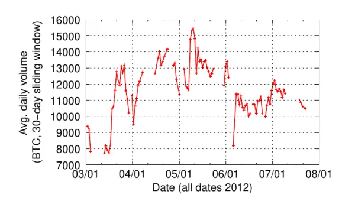

*Tägliches Seidenstraßenvolumen (in BTC) zwischen März und Juli 2012 (Quelle: [Nicolas Christin](https://arxiv.org/pdf/1207.7139))*

Infolgedessen waren die Provisionen von Dread Pirate Roberts enorm. Von 3.000 Dollar pro Tag im März stiegen sie auf über 6.000 Dollar pro Tag im Juli. Während des gemessenen Zeitraums betrugen sie durchschnittlich 143.000 Dollar, was einem Jahreseinkommen von 1,7 Millionen Dollar entspricht.

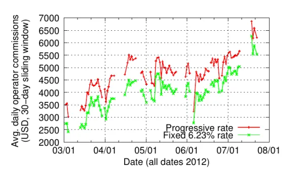

*Tägliche Provisionen generated von Silk Road (in Dollar) zwischen März und Juli 2012 (Quelle: [Nicolas Christin](https://arxiv.org/pdf/1207.7139))*

All dies bedeutet, dass Silk Road einen herausragenden Platz bei den wirtschaftlichen Aktivitäten mit Kryptowährung einnahm. Eine *a posteriori* Studie [würde zeigen](https://www.chainalysis.com/blog/silk-road-doj-seizure-november-2020/), dass der Anteil der Aktivitäten an den Gesamtaktivitäten auf der Bitcoin-Kette während des gesamten Jahres 2012 zwischen 10 % und 20 % schwankte. Dieser Anteil erreichte im Februar und dann wieder im September 2012 seinen Höhepunkt, bevor er zugunsten anderer Aktivitäten wie Glücksspiel, konventioneller Handel und Spekulation rasch unter 5 % fiel.

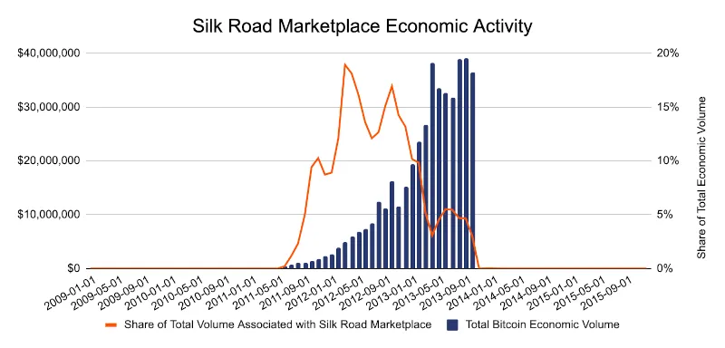

*Entwicklung der wirtschaftlichen Aktivität der Seidenstraße während ihrer Existenz zwischen Januar 2011 und Oktober 2013 (Quelle: [Chainalysis](https://www.chainalysis.com/blog/silk-road-doj-seizure-november-2020/))*

Die Studie von Nicolas Christin wirkte sich positiv auf den Amazonas der Drogen aus. Anfang November 2012 sprach Ross [sprach](https://antilop.cc/sr/users/dpr/threads/20121102-0011-explosive_growth.html) daher von "explosivem Wachstum". Er schrieb, Silk Road befinde sich "in Bezug auf die Zahl der Nutzer, die auf Silk Road zugreifen, in unerforschtem Gebiet". Ross konnte es sich daher leisten, seine Einnahmen in erheblichem Umfang in sein Projekt zu reinvestieren: Er stellte zahlreiche Mitarbeiter ein, um die Plattform voranzutreiben. Außerdem stieg der Bitcoin-Kurs allmählich an, was die Kaufkraft der Inhaber erhöhte und den Verkehr auf der Silk Road ankurbelte.

Der Erfolg von Silk Road zog schließlich auch Konkurrenten an. Neben Black Market Reloaded (das seit Juni 2011 geöffnet war) wurden 2013 eine [Vielzahl](https://gwern.net/dnm-survival) weiterer Plattformen eröffnet, darunter Sheep Marketplace im Februar und Atlantis im März 2013. Leider entpuppten sich viele dieser Plattformen als Exit-Betrügereien, da ihre Manager eine weniger ethische Einstellung hatten als der Liberalist Ross Ulbricht.

### Bareinzahlung mit BitInstant

Eine weitere Aktivität, die im Laufe des Jahres 2012 stetig zunahm, war der Tausch zwischen Bitcoin und physischem Bargeld. Diese Aktivität ermöglichte es, Bitcoin völlig vertraulich zu kaufen oder zu verkaufen, ohne Spuren einer Banküberweisung zu hinterlassen. Es gab viele Gründe für diese Art von Transaktionen, aber der wichtigste stand offensichtlich im Zusammenhang mit den Aktivitäten auf der Silk Road. Käufer konnten Bitcoin kaufen, um Drogen zu erwerben; Verkäufer konnten ihre Bitcoins gegen Bargeld verkaufen, um ihre Lieferanten zu bezahlen und ihren Lebensunterhalt zu verdienen. Das Gleiche gilt für jede Art von illegaler Aktivität.

Einer der ersten großen Dienste, der Bareinzahlungen anbot, war BitInstant, betrieben von Charlie Shrem und Gareth Nelson, der diese Zahlungsmethode am 21. Dezember 2011 [hinzufügte](https://bitcointalk.org/index.php?topic=55308.msg657631#msg657631). US-Bürger konnten in über 10.000 Filialen bekannter Bankengruppen (Chase, CitiBank, Bank of America, Wells Fargo) Geldscheine einzahlen, die ihnen wenige Minuten später auf der Wechselplattform ihrer Wahl in Dollar gutgeschrieben wurden. Später sollten weitere Filialen hinzukommen, darunter die der Supermarktketten Walmart und 7-Eleven. Die anfängliche Gebühr betrug 5 %.

Der Dienst war ein sofortiger Erfolg: Innerhalb von fünf Tagen wurden auf diese Weise über 30.000 Dollar [überwiesen](https://bitcointalk.org/index.php?topic=56392.msg671272#msg671272). Vor allem ein gewisser Robert Faiella, ein floridianischer Klempner in den Fünfzigern, der sich unter dem Pseudonym BTCKing [vorstellte](https://antilop.cc/sr/vendors/16af931d32.htm), wurde davon angezogen. Im Dezember [eröffnete](https://www.justice.gov/sites/default/files/usao-sdny/legacy/2015/03/25/Faiella%2C%20Robert%20M.%20and%20Charlie%20Shrem%20Complaint.pdf#page=10) er einen Bitcoin-Weiterverkaufsdienst, der auf Silk Road gehostet wurde und den Bareinzahlungsdienst von BitInstant betrieb. Er lieferte Bitcoins direkt an Käufer und verlangte eine zusätzliche Gebühr für seine Arbeit.

*Robert M. Faiella, alias BTCKing, im September 2014 (Quelle: Craig Ruttle für [CBC](https://www.cbc.ca/news/science/robert-faiella-sentenced-to-4-years-for-enabling-silk-road-transactions-1.2921103))*

BitInstant und sein Vermittler (TrustCash) bemerkten schnell die Aktivitäten von BTCKing, da seine Kunden bei Einzahlungen mehrere Fehler machten. Insbesondere überschritt eine Einzahlung das vom Unternehmen festgelegte Limit von 1.000 $, was zur Schließung des ersten Kontos führte. Nachdem Charlie Shrem verstanden hatte, was BTCKing tat, und sich bewusst war, dass er "uns eine Menge Geschäfte bringt", nahm er persönlich Kontakt mit ihm auf und riet ihm, die Einzahlungen über eine andere E-Mail-Adresse vorzunehmen. Dieses Arrangement passte jedoch dem Mitbegründer Gareth Nelson nicht, der dem Geschäft skeptisch gegenüberstand. In einem Gespräch mit ihm im Januar 2012 rechtfertigte Charlie [https://www.justice.gov/sites/default/files/usao-sdny/legacy/2015/03/25/Faiella%2C%20Robert%20M.%20and%20Charlie%20Shrem%20Complaint.pdf#page=17] seine Entscheidung wie folgt:

> Er hat nicht gegen ein Gesetz verstoßen, und Silk Road selbst ist nicht illegal. Wir haben auch keine Regeln gegen Wiederverkäufer. Wir machen gute Gewinne mit ihm.

Das Geschäft von BTCKing war ein großer Segen für BitInstant, so sehr, dass Charlie ihm nach einigen Monaten einen Provisionsrabatt gewährte. Im August und September 2012 belief sich der Umsatz von BTCKing auf 40.000 Dollar pro Woche. BitInstant war also untrennbar mit Silk Road verbunden, wie auch alle anderen Tauschplattformen dieser Zeit, einschließlich der berüchtigten Mt. Gox.

*Offizieller BitInstant-Song, vorgetragen von ZhouTonged im April 2012*

### LocalBitcoins und Bargeldtausch

Bareinzahlungen waren nicht die einzige Möglichkeit, Dollar und Bitcoins zu tauschen; es gab auch Peer-to-Peer-Tauschdienste. Diese Plattformen ermöglichten es insbesondere, miteinander in Kontakt zu treten, um einen Austausch persönlich vorzunehmen. Sie sind seit 2011 mit Plattformen wie [Bitcoin.local](https://bitcointalk.org/index.php?topic=3795.msg53889#msg53889) (Tradebitcoin.com) oder [BTC NEAR ME](https://bitcointalk.org/index.php?topic=7107.msg104204#msg104204) aufgetaucht. Die wichtigste davon war jedoch LocalBitcoins, die im Juni 2012 von einer Person namens Jeremias Kangas gegründet wurde.

Jeremias Kangas war ein finnischer Programmierer und Hacker in seinen frühen Dreißigern. Er leitete das Unternehmen [Kangas Bros. Innovations Oy](https://web.archive.org/web/20101030185646/http://kangasbros.fi/) mit seinem jüngeren Bruder Nikolaus, mit dem sie eine Reihe von iPhone- und Webanwendungen veröffentlichten. Er [hörte](https://bensonsamuel.wordpress.com/2013/01/01/universal-bitcoin-exchange/) Ende 2010 durch Hacker News von Bitcoin und war sofort von Nakamotos Modell fasziniert, das er [beschrieb](https://web.archive.org/web/20120517205800/http://blog.kangasbros.fi/?p=85) als "eine großartige und verrückte Innovation" und "ein revolutionäres Konzept". Im Jahr 2011, nach einer Reise nach Indien, begann er Vollzeit an Bitcoin zu arbeiten und entwickelte mehrere Programme wie die Software-Implementierung [django-bitcoin](https://bitcointalk.org/index.php?topic=30448.msg382233#msg382233) oder die Verwahrungsanwendung [Easywallet.org](https://bitcointalk.org/index.php?topic=75665.msg838319#msg838319). Außerdem [entwickelte er](https://bitcointalk.org/index.php?topic=87553.msg1035076#msg1035076) zusammen mit Stefan Thomas während eines Hackathons den Online-Zahlungsprozessor Acceptbit, eine Lösung, die die Funktionalität des öffentlichen Hauptschlüssels von Electrum nutzte, um generate neue Adressen zu erhalten, ohne auf den entsprechenden privaten Schlüssel zugreifen zu müssen.

*Jeremias Kangas um 2012 (Quelle: [Blogger](https://www.blogger.com/profile/12265387388248206585))*

Am 22. Mai [bemerkte er] (https://bitcointalk.org/index.php?topic=82968.msg914432#msg914432) im Bitcoin-Forum, dass "Geldtauschbörsen bereits existieren", aber dass "sie scheiße sind", und dass "wenn es kein gutes Geschäftsmodell gibt, man beschissene Seiten bekommt"). Deshalb beschloss er, mit der Hilfe seines Bruders seine eigene Vermittlungsplattform zu entwickeln. Die Plattform mit dem Namen LocalBitcoins wurde am 7. Juni [gestartet] (https://bitcointalk.org/index.php?topic=86012.msg946497#msg946497). Sie wurde von einem [Leitfaden](https://web.archive.org/web/20120616084213/https://localbitcoins.com/cash_exchange_howto) begleitet, der erklärte, wie man ein Geldwechsler wird.

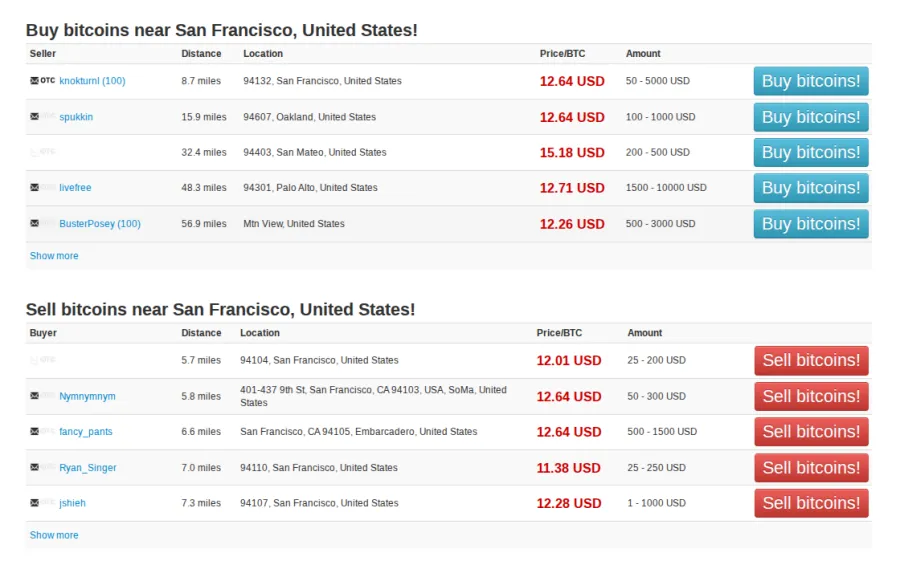

*Interface von LocalBitcoins im September 2012 (Quelle: [Archiv](https://web.archive.org/web/20120919184133/https://localbitcoins.com/) von LocalBitcoins.com)*

Im Laufe des Sommers [integrierten](https://bitcointalk.org/index.php?topic=94793.msg1048453#msg1048453) die beiden Brüder ein Treuhandsystem in die Plattform: Bitcoins wurden von der Plattform verwahrt und konnten [per SMS](https://web.archive.org/web/20120817100941/http://localbitcoins.blogspot.fi/2012/08/sms-escrow-buy-and-sell-bitcoins-with.html) freigeschaltet werden, um an den Käufer ausgezahlt zu werden, sobald der Verkäufer den Erhalt des Geldes bestätigt hatte. Sie erlaubten es den Verkäufern auch, [ihr Profil](https://web.archive.org/web/20120817125105/http://localbitcoins.blogspot.fi/2012/08/now-you-can-connect-your-bitcoin-otc.html) mit einem Konto bei \#bitcoin-otc zu verknüpfen, dem 2010 eröffneten IRC-Kanal für den Freiverkehr. Mit der Zeit wurde die Plattform auch für den Austausch von Banküberweisungen genutzt.

LocalBitcoins zog die Aufmerksamkeit der Gemeinschaft auf sich, und Jeremias nahm an mehreren Konferenzen teil, darunter die Assembly Summer 2012 und die Bitcoin-Konferenz in London. Im September [gab es](https://web.archive.org/web/20120920110200/https://localbitcoins.com/statistics) Changemaker in 74 verschiedenen Ländern und über 300 Städten. Am 14. Juni 2013, ein Jahr nach der Gründung, hatte die Website [https://bitcoinmagazine.com/culture/jeremias-kangas-bitcoin-cannot-be-shut-down-1371225649] rund 44.000 Nutzer, und das tägliche Tauschvolumen erreichte mehrere zehntausend Dollar!

### Wachstum des Handels

Während der Verkehr auf der Seidenstraße und der Bargeldaustausch florierten, blühte auch der konventionelle Handel. Im Jahr 2012 waren Hunderte von Händlern [referenziert](https://web.archive.org/web/20120724114927/https://en.bitcoin.it/wiki/Trade) auf dem Bitcoin-Wiki. Zwar gab es auch einige stationäre Geschäfte (in der Regel Bars und Restaurants in Großstädten, wie das kultige [Room77](https://www.youtube.com/watch?v=rzKdW-au110) in Berlin), doch die meisten Bitcoin-Käufe wurden online getätigt.

Große Online-Shops florierten daher im Laufe des Jahres. Dies war der Fall bei Coinabul, einem Gold- und Silberverkaufsdienst in den USA, der im Oktober 2011 von Jay Shore und Jon Holmquist eröffnet wurde. In nur wenigen Monaten zog die Plattform viele Kunden an und [überschritt](https://bitcoinmagazine.com/business/coinabul-celebrates-six-months-of-gold-1335646624) im April 2012 ein monatliches Volumen von 6.000 Bitcoins (zu diesem Zeitpunkt 30.000 $), mit einem [Gesamtvolumen](https://bitcoinmagazine.com/business/coinabul-celebrates-one-year-in-business-1350442160) von 120.000 Bitcoins im Oktober. Ebenfalls erwähnenswert ist Bitmit.net, [genannt](https://www.coindesk.com/markets/2013/10/28/bitmit-is-still-the-ebay-of-bitcoin-despite-setbacks) das "eBay des Bitcoins", ein Marktplatz, auf dem Privatpersonen Gegenstände zum Verkauf oder zur Versteigerung anbieten können, der im September 2011 von einem Deutschen namens Tosaki [gestartet](https://bitcointalk.org/index.php?topic=41592.msg506512#msg506512) wurde.

*Mit Bitcoins gekaufte Artikel der Forschergruppe, die die Studie "A Fistful of Bitcoin" durchführte, die im August 2013 vorab veröffentlicht wurde (Quelle: [Sarah Meiklejohn](https://cseweb.ucsd.edu/~smeiklejohn/files/imc13.pdf))*

Dieses Wachstum des Handels machte es notwendig, den Bezahlvorgang zu standardisieren, so dass alle wallet miteinander kompatibel sein können. Die Verwendung eines Smartphones und das Lesen eines QR-Codes durch dessen Kamera machten die Zahlung problemlos. Allerdings musste man sich auf die Daten einigen, die in den QR-Code aufgenommen werden sollten: Deshalb wurde ein URI-Schema entwickelt, um Zahlungsanforderungen zu formalisieren. Nach diesem Schema hat eine Anfrage beispielsweise die Form `bitcoin:175tWpb8K1S7NmH4Zx6rewF9WQrcZv245W?amount=20.3&label=Luke-Jr` und enthält somit die Adresse des Empfängers (175tWp...), den zu zahlenden Betrag (20,3 Bitcoins) und die Transaktionsbeschreibung (Luke-Jr).

Die Verwendung dieser Art von Schema wurde bereits im Februar 2010 [vorgeschlagen](https://bitcointalk.org/index.php?topic=55.msg377#msg377) und von Satoshi Nakamoto selbst [genehmigt](https://bitcointalk.org/index.php?topic=55.msg481#msg481). Ein Standardschema wurde von Nils Schneider im Januar 2011 [entworfen](https://en.bitcoin.it/w/index.php?title=BIP_0020&oldid=1649) und von Luke-Jr. [ergänzt](https://en.bitcoin.it/w/index.php?title=BIP_0020&oldid=1820), um BIP 20.

Im Januar 2012 wurde diese frühere Arbeit von Matt Corallo [aufgegriffen](https://en.bitcoin.it/w/index.php?title=BIP_0021&oldid=23000), um mit BIP 21 eine endgültige Form anzunehmen. Der letztgenannte Standard wurde im Laufe des Jahres von der Gemeinschaft angenommen, [insbesondere](https://bitcointalk.org/index.php?topic=88969.msg981026#msg981026) von BitPay im Juni. Er wurde schließlich im September 2012 von Dave Thaler, der damals als Softwarearchitekt für Microsoft Research arbeitete, bei der Internet Assigned Numbers Authority (IANA) [registriert](https://www.iana.org/assignments/uri-schemes/prov/bitcoin).

Das kommerzielle Wachstum erforderte auch die Schaffung von Instrumenten, die einen einfachen und unkomplizierten Empfang von Bitcoin ermöglichen würden. Händlerdienste wie [BitWillet] (https://www.reddit.com/r/Bitcoin/comments/ibfxf/my_weekend_project_accept_bitcoin_on_your_website/) und [Bitcoin.com] (https://bitcointalk.org/index.php?topic=37883.msg465207#msg465207) (entwickelt von der Börsenplattform Tradehill) wurden 2011 eingeführt. Der wichtigste Dienst, der in diesem Zeitraum aufkam, war jedoch der BitPay-Zahlungsprozessor.

### BitPay, der erste Zahlungsabwickler

BitPay war der erste Bitcoin-Zahlungsabwickler, der diesen Namen verdiente. Es wurde im Sommer 2011 von Stephen Pair und Tony Gallippi, zwei amerikanischen Freunden, die auf die 40 zugehen, ins Leben gerufen. Die beiden Männer lernten sich etwa zwanzig Jahre zuvor am Georgia Institute of Technology kennen, wo sie 1994 ihren Abschluss gemacht hatten.

Stephen Pair, oder [Steve](https://bitcointalk.org/index.php?action=profile;u=4399) im Forum, arbeitete für IBM als Software-Ingenieur und Entwicklungsleiter. Als leidenschaftlicher Kryptograph interessierte er sich in den 90er Jahren für das eCash-Modell von David Chaum, dann für Linden Dollars und Ripple. Anfang 2011 begeisterte er sich für Bitcoins und [minte](https://bitcointalk.org/index.php?topic=4209.msg60980#msg60980) einige mit seinen Grafikkarten, bevor er feststellte, dass es profitabler gewesen wäre, sie zu kaufen.

Tony Gallippi, auch bekannt als [Tonygal](https://bitcointalk.org/index.php?action=profile;u=16035), war in der Zwischenzeit in den Bereichen Vertrieb und Marketing in der Robotik- und Finanzbranche tätig. Im Jahr 2011 war er [Herausgeber](https://bitcointalk.org/index.php?topic=44076.msg526713#msg526713) eines Online-Magazins für Erwachsene namens STARE Magazine. Stephen erzählte ihm im Februar von Bitcoin und er [beantragte](https://bitcointalk.org/index.php?topic=10636.msg152388#msg152388) im Mai die Annahme der Kryptowährung in seinem Unternehmen.

Gemeinsam entwickeln sie einen Zahlungsprozessor namens BitPay, den sie zunächst Bit-Pay nennen. Stephen kümmerte sich um die technische Seite und Tony um die geschäftliche Seite. Sie [testeten](https://bitcointalk.org/index.php?topic=25375.msg315757#msg315757) die Software Anfang Juli 2011 und setzten sie für den Verkauf des STARE-Magazins ein.

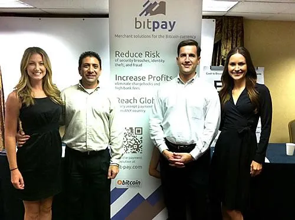

*Das BitPay-Team auf der CES in Las Vegas im Januar 2012, von links nach rechts: Stephanie, Tony Gallippi, Stephen Pair, Alison Skipper (Quelle: [Archiv](https://web.archive.org/web/20120513020703/https://bit-pay.com/aboutUs.html) von der BitPay-Website)*

Das Prinzip von BitPay bestand darin, Händlern die Möglichkeit zu geben, Zahlungen in Bitcoins anzunehmen und diese sofort in Dollar umzuwandeln, um sich gegen die Volatilität abzusichern. Das Geschäftsmodell war also das Gegenteil von BitInstant: BitPay schoss die Dollar gegen eine Provision (die Bearbeitungsgebühren betragen insgesamt 1 %) an seine Kunden vor und kümmerte sich später um den Verkauf der Bitcoins. Das Ziel der Gründer war es, die Verwendung von Bitcoin als Zahlungsmittel zu [erleichtern](https://bitcointalk.org/index.php?topic=25665.msg319196#msg319196), um dem Oligopol der Netzwerke Visa und Mastercard [entgegenzuwirken](https://bitcointalk.org/index.php?topic=36729.msg454397#msg454397). Die Vorteile, die Anfang 2012 auf der Website des Unternehmens [aufgelistet](https://web.archive.org/web/20120210233724/https://bit-pay.com/) wurden, lauteten wie folgt: "KEIN RISIKO von Rückbuchungen oder Identitätsdiebstahl. KEIN HASSEL der PCI-Compliance. KEINE GRENZEN Akzeptieren Sie eine Zahlung aus JEDEM Land". Vitalik Buterin [meinte](https://web.archive.org/web/20120104013914/http://bitcoinweekly.com/articles/bitcoin-for-merchants-part-ii), dass BitPay "eine der wichtigsten Innovationen für Bitcoin-Unternehmen" sei.

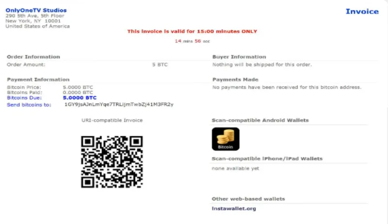

*Zahlungsaufforderung über BitPay im Juli 2011 (Quelle: [Bitcoin Show](https://www.youtube.com/watch?v=UZAnM4FjTOg) auf Youtube)*

Stephen Pair und Tony Gallippi [starteten](https://bitcointalk.org/index.php?topic=32467.msg405469#msg405469) ihren Betadienst Ende Juli 2011 und begannen, ihn ziemlich aggressiv zu bewerben! Sie [erschienen](https://www.youtube.com/watch?v=UZAnM4FjTOg) am 27. Juli in Bruce Wagners *Bitcoin Show* und [gingen](https://bitcointalk.org/index.php?topic=32791.msg409542#msg409542) Ende August zur New Yorker Konferenz. Ab September drehten sie Werbevideos, von denen [das erste](https://web.archive.org/web/20140314092556/https://www.youtube.com/watch?v=YZ-pqo0cLcE) eine Parodie auf eine PayPal-Werbung (mit attraktiven Frauen) war. Tony Gallippi hielt auf der Prager Konferenz im November einen [Vortrag](https://web.archive.org/web/20140522091140/https://www.youtube.com/watch?v=cTX5yY0DozQ) über die Einführung von Bitcoin. Im Dezember schließlich [starteten sie](https://bitcointalk.org/index.php?topic=53680.msg639819#msg639819) eine Initiative namens LoveBitcoin.org, die "für die *Nutzbarkeit* von Bitcoin als Alternative zu PayPal, Debitkarten, Western Union und Überweisungen wirbt".

Im Januar 2012 nahmen sie [teil](https://bitcointalk.org/index.php?topic=56706.msg675586#msg675586) an der *Consumer Electronics Show* in Las Vegas, der größten Messe für technologische Innovationen in der Unterhaltungselektronik, und besetzten dort einen Stand mit Roger Ver. Sie brachten auch neue Produkte auf den Markt, wie die [Einzahlungskarte](https://bitcointalk.org/index.php?topic=57303.msg682576#msg682576), mit der "jeder Bitcoins *erhalten* kann, ohne einen wallet zu besitzen oder etwas über Bitcoins wissen zu müssen"; oder [Limocoin](https://bitcointalk.org/index.php?topic=63370.msg741514#msg741514), "ein Bitcoin-Zahlungssystem, das für Limousinen- und Taxifahrer und Unternehmen entwickelt wurde".

Im Laufe des Jahres 2012 wurde der Dienst erweitert. Er expandierte international, in [Nordamerika](https://bitcointalk.org/index.php?topic=69425.msg809043#msg809043) und [Europa](https://bitcointalk.org/index.php?topic=76562.msg849944#msg849944). Die Zahl der auf der Plattform registrierten Händler [stieg](https://web.archive.org/web/20120928213117/http://www.economist.com/node/21563752) von 100 im März auf über 1.000 im September. Das monatliche Transaktionsvolumen [sprang](https://bitcoinmagazine.com/business/bitpay-exceeds-1000-merchants-accepting-bitcoin-1347393248) von 10.000 $ im März auf 550.000 $ im September, mit einem Tageshöchstwert von 250.000 $ am 24. Juni, der durch den Vorverkauf des ASIC von Butterfly Labs erzielt wurde.

Der Erfolg von BitPay [wurde](https://www.forbes.com/sites/jonmatonis/2013/01/07/largest-bitcoin-payment-processor-raises-510000-angel-round/) mit dem Auftreten der Zahlungsdienstleister WalletBit, Paysius und AcceptBit nachgeahmt. Aber vor allem der Dienst Coinbase, der Anfang des Jahres von einem gewissen Brian Armstrong ins Leben gerufen wurde und über den wir in der nächsten Lektion sprechen werden, würde ihn herausfordern.

### PorcFest 2012

Ein wichtiges Ereignis bei der kommerziellen Einführung von Bitcoin war das *Porcupine Freedom Festival* im Jahr 2012, das vom 18. bis 24. Juni wieder auf demselben Campingplatz im Bundesstaat New Hampshire stattfand. In diesem Jahr konnten die Teilnehmer ihre Eintrittskarten in Bitcoins reservieren. Das Festival [versammelte](https://zerogov.com/2012/06/26/porcfest-2012-after-action-review/) fast 1.000 Menschen.

Vertreter von BitInstant [waren anwesend](https://web.archive.org/web/20120701024814/http://blog.bitinstant.com/blog/2012/6/27/porcfest-2012-bitinstant-and-the-bernanke-bitcoin-exchange.html), um Bitcoin zu ehren. Es waren vier von ihnen: Roger Ver (in Begleitung seiner japanischen Verlobten, Ayaka), Erik Voorhees, Charlie Shrem und Ira Miller. Sie waren dafür verantwortlich, den anderen Bitcoin zu erklären, und organisierten einen runden Tisch zu diesem Thema, an dem über 80 Personen teilnahmen. An der Medienfront beantworteten [Roger] (https://www.youtube.com/watch?v=nDmAm5wbasU) und [Erik] (https://www.youtube.com/watch?v=FfRdPVcyR6s) Fragen der wenigen anwesenden unabhängigen Medien und traten unter anderem in der Radiosendung Free Talk Live auf.

Am wichtigsten war jedoch, dass Mitglieder von BitInstant einen Stand mit dem Namen "*Bernankes Bitcoin Exchange*" besetzten, an dem sie den Umtausch mit dem Dollar abwickelten und den Neugierigen beibrachten, wie man Bitcoin verwendet. Sie zeigten den Leuten, wie man mit BitcoinSpinner, Blockchain.info oder Instawallet problemlos Bitcoin annehmen und ausgeben kann. Im Laufe der Woche verkauften sie Bitcoins im Wert von 2.500 Dollar und Coin von Casascius im Wert von einigen hundert Dollar, die für Numismatikliebhaber interessant sind.

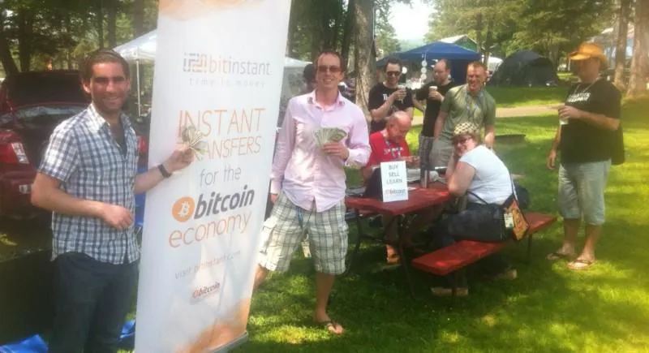

*Der BitInstant-Stand auf dem PorcFest am 21. Juni 2012 (Quelle: Charlie Shrem auf [Twitter](https://twitter.com/CharlieShrem/status/215824423616385025))*

Ihr Stand befand sich auf dem Teil des Geländes [genannt](https://web.archive.org/web/20120606043337/http://happyporcupine.info/agoravalley/) das *Agora-Tal*, ein für den Handel reservierter Bereich, der etwa vierzig aufgelistete Stände umfasste. Die Verkäufer boten alles an, von Speisen und Getränken bis hin zu Büchern, Kleidung, Messern, Hüten und vielem mehr. Wie bei früheren Ausgaben akzeptierten die Händler in der Regel Silber- und Kupfermünzen sowie Dollar (oder "Federal Reserve Notes", wie sie es nennen) als Zahlungsmittel. Doch in diesem Jahr akzeptierten mehr als die Hälfte von ihnen auch Bitcoin. Mit Hilfe von BitInstant [kletterte](https://bitcointalk.org/index.php?topic=89714.msg987575#msg987575) dieser Prozentsatz bis zum Ende der Veranstaltung auf 80 %.

[Videotour durch das Agora-Tal beim PorcFest 2012, unter der Regie von Johnson Rice] (https://www.youtube.com/watch?v=HTiEmGvXyTw)

Insbesondere ein gewisser George Mandrik, ein Libertärer griechischer Herkunft, [bot](https://twitter.com/Mandrik/status/1488885417151807489) Gyros (griechische Sandwiches, die dem Döner ähneln) und Baklava (traditionelle orientalische Süßspeisen) sowie in Kokosnussöl gebackene Paleo-Pfannkuchen zum Verkauf an. Dank einer BitPay-Einzahlungskarte machte er eine Menge Umsatz, was die Aufmerksamkeit von Tony Gallippi [erregte] (https://bitcointalk.org/index.php?topic=89714.msg987946#msg987946). Dank dieses Engagements wurde Mandrik später von BitInstant als Leiter des Kundendienstes eingestellt.

Die Einführung von Bitcoin beim PorcFest war ein großer Erfolg. Josh Harvey (alias Ben-Abuya im Forum) [sprach](https://bitcointalk.org/index.php?topic=89714.msg987575#msg987575) über die Ausgabe 2012 als "größte Bitcoin-Veranstaltung aller Zeiten". Er schrieb: "Ich glaube, dies war das größte Experiment in der Bitcoin-Nutzung von Person zu Person bis heute". Charlie Shrem [kommentierte](https://bitcointalk.org/index.php?topic=89714.msg987603#msg987603), dass es das beste Wochenende seines Lebens war.

Nach diesem Ereignis wurde die Beziehung zwischen Bitcoin und der libertären Sphäre verschmolzen. BitPay [sponserte](https://bitcointalk.org/index.php?topic=100459.msg1096865#msg1096865) das Paul Festival, ein Musikfestival, das im August in Florida stattfand (ein paar Tage vor der *Republican National Convention*), um Ron Paul zu ehren. Im darauffolgenden Jahr wurde das PorcFest (https://bitcoinmagazine.com/industry-events/bitcoin-at-porcfest-part-1-a-social-experiment-1371713328) mehr dem Bitcoin gewidmet.

### Der Übergang zum konventionellen Handel

Während die wirtschaftlichen Aktivitäten weitgehend vom Drogenhandel auf der Silk Road und den damit verbundenen Devisengeschäften dominiert wurden, wurden nach und nach auch immer mehr konventionelle Händler einbezogen. Ende 2012 wurde dieser Trend deutlich, als WordPress, der weltweit größte Website-Hoster, [begann](https://bitcoinmagazine.com/culture/wordpress-accepts-bitcoin-1353043485) Bitcoin-Zahlungen über BitPay zu akzeptieren. Bitcoin gewann plötzlich an Legitimität in der Öffentlichkeit.

Dieses Ereignis ebnete somit den Weg für eine breitere Akzeptanz, was insbesondere dazu führte, dass sich die Zahl der BitPay-Händler innerhalb weniger Monate [verdoppelte](https://www.forbes.com/sites/jonmatonis/2013/01/07/largest-bitcoin-payment-processor-raises-510000-angel-round/). Im März 2013 übertraf das über den Zahlungsabwickler ausgetauschte Volumen sogar das von Silk Road (https://bitcoinmagazine.com/technical/bitpay-processes-5-million-in-march-eclipses-silk-road-1364929315), insbesondere dank der Aktivitäten von Bitcoin Store, dem Online-Shop von Roger Ver, der im November 2012 (https://bitcointalk.org/index.php?topic=122190.msg1314366#msg1314366) eröffnet wurde, und Avalon Labs, der ASIC-Herstellungsfirma, die von einem gewissen Yifu Guo gegründet wurde.

Trotz dieser allmählichen Entwicklung blieb diese Zeit mit dem Wilden Westen verbunden und wurde auch durch den großen Erfolg der Kryptowährung Glücksspiel und durch die ersten Experimente von Sexarbeiterinnen mit Bitcoin veranschaulicht. Das folgende kurze Kapitel ist dieser "Lasterwährung" gewidmet, die Bitcoin von diesem Zeitpunkt an einnahm.

## Die Währung des Lasters: Glücksspiel und Sexarbeit

<chapterId>4355fe11-f6d7-5b8b-bbf0-838af9de25b2</chapterId>

Bitcoin ist eine Währung, für die keine Genehmigung erforderlich ist. Dies erklärt, warum es zwangsläufig für Praktiken verwendet wurde, die als Laster gelten und oft moralisch verurteilt, wenn nicht sogar gesetzlich verboten sind. Es gab natürlich den Drogenkonsum, der durch den Seidenstraßen-Marktplatz vorangetrieben wurde, den wir in diesem Kurs bereits ausführlich besprochen haben. Aber das war nicht die einzige Aktivität dieser Art: Glücksspiel und Sexarbeit erlebten ebenfalls eine Art Synergie mit Bitcoin.

Dieses Kapitel ist in drei Abschnitte unterteilt. Der erste befasst sich mit Bitcoin-Poker, das im Frühjahr 2011 so richtig durchstartete. Der zweite Abschnitt ist dem Würfelspiel SatoshiDICE gewidmet, das seit seiner Veröffentlichung im April 2012 ein großer Erfolg war. Im dritten werden wir den ersten Fall von bezahltem Porno mit Bitcoin, dem Subreddit r/GirlsGoneBitcoin, analysieren.

### Bitcoin Schürhaken

Einer der wachsenden Bereiche der Bitcoin-Wirtschaft zwischen 2011 und 2012 war das Online-Glücksspiel, genauer gesagt Poker. Das Jahr 2011 war gekennzeichnet durch ein hartes Durchgreifen beim Online-Poker, was dazu beitrug, Bitcoin als alternative Währung ins Licht zu rücken.

Am 15. April fand ein Ereignis statt, das unter Pokerspielern als "Schwarzer Freitag" bekannt werden sollte: Die Websites von PokerStars, Full Tilt Poker und Absolute Poker (die drei führenden Plattformen in den USA) wurden vom FBI geschlossen. Den Plattformen wurde vorgeworfen, den *Unlawful Internet Gambling Enforcement Act* zu umgehen, der es Banken untersagt, Überweisungen an Online-Glücksspielplattformen zu validieren. Zu diesem Zweck gaben sich die drei Plattformen (https://web.archive.org/web/20110419230512/http://www.justice.gov/usao/nys/pressreleases/April11/scheinbergetalindictmentpr.pdf) als Händler aus, die "Waren wie Schmuck und Golfbälle" an die Spieler verkauften, um den Verdacht ihrer Banken nicht zu wecken. Die Schließung am 15. April war eine Katastrophe für die Pokerwelt, die in Bezug auf die Online-Aktivitäten um mehrere Jahre zurückgeworfen wurde.

Bitcoin war perfekt geeignet. Glücksspiel war eine der Möglichkeiten, die Satoshi ins Auge fasste, als es Funktionen für eine mögliche Pokeranwendung in Version 0.1 des Softwarecodes integrierte (wie wir in [Kapitel 4](https://planb.academy/courses/a51c7ceb-e079-4ac3-bf69-6700b985a082/3d141918-e9c2-46e8-8c03-2bb4eb9b2150) des Kurses zur Erstellung von Bitcoin gesehen haben). Bitcoin sollte das Problem [lösen](https://web.archive.org/web/20110429052748/http://bitcoinweekly.com/articles/bitcoin-poker), "indem es das Problem der Rückbuchungen und die Möglichkeiten der Regierungen, Zahlungen zu unterbinden, reduziert".

Eine auf Bitcoin basierende Online-Pokerplattform gab es bereits: Betco.in, [gestartet](https://bitcointalk.org/index.php?topic=840.msg9795#msg9795) im August 2010 von Pavel Karoukin, einem belarussischen Entwickler, der damals in den USA lebte und das Pseudonym Hippich verwendete. Die Schnittstelle war rudimentär, aber funktionell.

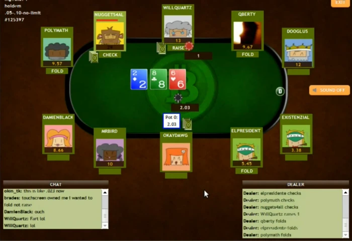

*Betco.in Kundenerfassung im Jahr 2011 (Quelle: [Hippich](https://www.youtube.com/watch?v=N6SjCgOY61E) auf Youtube)*

Im Jahr 2011, mit dem "Schwarzen Freitag", vermehrten sich die Plattformen: Moonco.in [eröffnet] (https://bitcointalk.org/index.php?topic=23002.msg289530#msg289530) im Juni (driftete aber schnell in eine Wettseite ab und wurde im September gehackt) und BTC auf Tilt [gestartet] (https://web.archive.org/web/20110722145251/http://btcontilt.com/nice-start) im Juli.

Der symbolträchtigste Bahnsteig [öffnete seine Türen] (https://web.archive.org/web/20111128155416/https://bitcointalk.org/index.php?topic=40077.0) Ende August: Seals mit Clubs. Sie wurde von einem anonymen Entwickler, FreeMoney, ins Leben gerufen, der Bitcoin im Juli 2010 beim Slashdotting entdeckte.

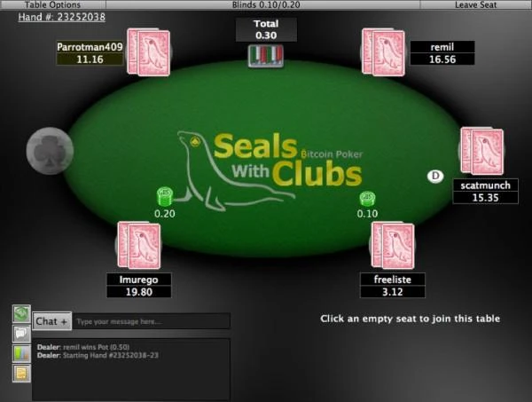

*Kundenerfassung von Seals mit Clubs im Jahr 2013 (Quelle: [ThePokerBank.com](https://www.thepokerbank.com/rooms/sealswithclubs/))*

Die Plattform wurde insbesondere von dem professionellen Glücksspieler Bryan Micon unterstützt, der Bitcoin im Juni entdeckte und [erklärte](https://bitcointalk.org/index.php?topic=11941.msg167263#msg167263), "völlig begeistert von Bitcoins" zu sein. Er [begleitete](https://bitcointalk.org/index.php?topic=40077.msg704795#msg704795) die Entwicklung von Seals mit Clubs ab Januar 2012. Im März [hob er](https://web.archive.org/web/20120308103542/https://www.youtube.com/watch?v=QXNb9h12AE8) sie auf seinem Youtube-Kanal hervor. Normale Spieler wurden auf die Existenz der Plattform aufmerksam, als sie im September 2012 im TwoPlusTwo-Forum, einem der beliebtesten Foren für Diskussionen über Poker, [erwähnt](https://forumserver.twoplustwo.com/28/discussion-poker-sites/seals-clubs-closed-see-new-swcpoker-thread-1248197/) wurde.

Neben Poker nahm das Glücksspiel mit Bitcoin im Jahr 2011 auch allgemein enorm zu. Virtuelle Casinos vervielfachten sich, so sehr, dass im August auf Bitcointalk ein Unterforum [eröffnet](https://bitcointalk.org/index.php?topic=39621.msg483368#msg483368) wurde, das diesem Bereich gewidmet war. Eine Zählungsseite (Betwithbtc.com) wurde im September von dem Händler GoWest [erstellt](https://bitcointalk.org/index.php?topic=45566.msg543768#msg543768). Neben Poker gab es auch Blackjack, Roulette, Spielautomaten, Lotto, Sportwetten und andere originelle Spiele.

### SatoshiDICE, das wirklich faire Würfelspiel

Aber all diese Spiele basierten auf einer zentralen Plattform und waren nicht überprüfbar. In diesem Zusammenhang stach 2012 ein neuartiges Konzept hervor: ein Würfelspiel, dessen Fairness vom Nutzer überprüft werden konnte. Dies war SatoshiDICE, das im April von einem gewissen Fireduck entwickelt wurde.

Fireduck, eigentlicher Name Joseph Gleason, war ein amerikanischer Entwickler [Alter 30] (http://fireduck.com/index-single.html). Er begann sich im Sommer 2011 für Bitcoin zu interessieren und besuchte daraufhin das Bitcoin-Unterforum auf Reddit (r/Bitcoin). Darüber hinaus engagierte er sich durch die Entwicklung mehrerer Software-Tools: Er [programmierte](https://www.reddit.com/r/Bitcoin/comments/im5h6/using_bitcoin_for_crypto_timestamping_hashes_not/) ein Zeitstempel-Tool, [stellte](https://www.reddit.com/r/Namecoin/comments/iw8cd/unable_to_download_blocks/) einen Knoten für Namecoin bereit und [startete](https://www.reddit.com/r/Bitcoin/comments/j6ahv/buy_bitcoins_via_google_checkout/) einen rudimentären Tauschdienst, der mit dem kurzlebigen Online-Zahlungssystem Google Checkout kompatibel war.

*Joseph Gleason, alias Fireduck, im Februar 2014 (Quelle: Fireduck1209k auf [Twitter](https://twitter.com/Fireduck1209k))*

Im Jahr 2012 fand Fireduck einen Weg, das Wetten von Geld auf dezentrale Weise überprüfbar zu machen. Am 9. April startete er ein Online-Casino, das auf seiner persönlichen Website 1209k.com gehostet wurde. Auf r/Bitcoin [präsentierte er es] (https://www.reddit.com/r/Bitcoin/comments/s1dn3/my_verifiable_bitcoin_casino/) als "überprüfbares Bitcoin Casino". Die Website stützte sich auf feste Adressen, von denen jede eine vordefinierte Chance bot, den Einsatz des Spielers mit einer bestimmten Zahl zu multiplizieren. Der Nutzer schickt den Betrag an die Adresse und erhält bei einer günstigen Ziehung den entsprechenden Gewinn an seine persönliche Adresse. Die Adresse "194udqXac9hGs5RvevjHR5L3EJaGXDzahe" bietet beispielsweise eine 50/50-Chance auf die Verdoppelung des Einsatzes, abzüglich der Casinogebühren von 1-3%.

Das Spiel hat die Form eines Würfelspiels. Bei jeder Transaktion wird ein Los gezogen, und das Ergebnis liegt zwischen 0 und 65.536. Diese "Glückszahl" wird [ermittelt](https://web.archive.org/web/20120507154620/http://satoshidice.com/secrets.php), indem die ersten beiden Bytes des (mit HMAC-SHA-512 berechneten) Digest der geheimen Informationen und die Kennung der eingehenden Transaktion ausgewählt werden. Liegt diese Zahl deutlich unter einem mit der Adresse verbundenen Zielwert (32.768 für die Adresse, die den Einsatz verdoppelt), dann ist der Wurf ein Gewinn und der Spieler erhält die erwartete Auszahlung. Ist die Zahl höher, erhält die Person einen kleinen Teil des Betrags, um zu bestätigen, dass das System funktioniert hat. Jede Wette generated daher zwei Transaktionen auf der Blockchain hinzugefügt.

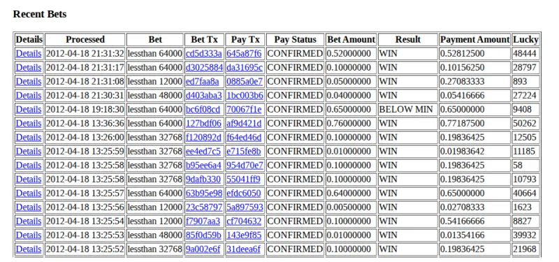

*Einige Wetten vom 18. April 2012 (Quelle: [Archiv](https://web.archive.org/web/20120419202740/http://1209k.com/bitcasino) von 1209k.com)*

Das Verfahren war transparent und gewährleistete, dass die Nutzer überprüfen konnten, dass das Casino nicht betrogen hatte. Zu diesem Zweck werden die Fingerabdrücke der Tagesgeheimnisse auf der Kette veröffentlicht (zum Beispiel wurden die Geheimnisse für den 18. April in der Transaktion `428bcc630b00fe431623b4e1fb0f726493dc0a2ead86ace9f65cd51bc8092459` [gespeichert](https://mempool.space/tx/428bcc630b00fe431623b4e1fb0f726493dc0a2ead86ace9f65cd51bc8092459)). Die Geheimnisse wurden in den darauffolgenden Tagen gelüftet, so dass die Spieler selbst nachrechnen konnten. Dies macht das System "nachweislich fair".

Die Bedienung war einfach (man brauchte nur einen wallet zum Spielen), sofort (bei kleinen Einsätzen) und leicht überprüfbar. Diese Merkmale sorgten dafür, dass das Spiel von Anfang an eine große Zahl von Spielern anzog. In nur 10 Tagen bearbeitete das Online-Casino [https://web.archive.org/web/20120419202743/http://1209k.com/bitcasino/report.php] fast 5.000 BTC an Wetten, was einem Gegenwert von über 24.000 Dollar entspricht. Aber dieser plötzliche Erfolg erschreckte Fireduck, der rechtliche Konsequenzen befürchtete, so dass er versuchte, die Website an jemanden zu verkaufen, der die rechtlichen Risiken übernehmen und ihm ein monatliches Gehalt für die technische Seite zahlen würde. In einer Ankündigung, die am 17. April im Bitcoin Subreddit veröffentlicht wurde, schrieb er [https://www.reddit.com/r/Bitcoin/comments/segz0/anyone_want_to_run_my_bitcoin_casino/], dass er "seit etwas mehr als einer Woche ein Bitcoin-Casino betreibt. Es hat 146 BTC mit einer Investition von etwa 45 BTC gemacht, um es in Gang zu bringen" und dass er nach einem Käufer suche.

Erik Voorhees, der als überzeugter Libertärer keine Skrupel hatte, sich über Vorschriften hinwegzusetzen, ergriff die Gelegenheit fast sofort. Nach Gesprächen mit Fireduck in den Kommentaren und privat, erwarb er das Konzept [für](https://www.forbes.com/sites/michaeldelcastillo/2019/01/03/bitcoins-last-gunslinger/) 40 Bitcoins, was zum Zeitpunkt des Austauschs etwa 200 Dollar entsprach. Am nächsten Tag war die Plattform [betriebsbereit](https://www.reddit.com/r/Bitcoin/comments/segz0/comment/c4dwi5q/) auf einer neuen Website: Satoshidice.com. Am 24. April, nach einer kleinen grafischen Überarbeitung, [kündigte](https://bitcointalk.org/index.php?topic=77870.msg865877#msg865877) Erik den Start der Plattform im Bitcoin Forum an.

*SatoshiDICE-Logo (Quelle: [capture](https://web.archive.org/web/20120804125615/http://satoshidice.com/) von Satoshidice.com)*

In den folgenden Monaten war SatoshiDICE ein phänomenaler Erfolg. Die Leute wurden süchtig nach dem Spiel, vor allem, weil es so einfach und unmittelbar war. Da jede Wette (Gewinn oder Verlust) zwei Transaktionen generated, explodierte die Aktivität auf der Bitcoin-Blockchain. Die Anzahl der täglichen Transaktionen, die bis dahin bei etwa 7.000 lag, [stieg] (https://bitinfocharts.com/comparison/bitcoin-transactions.html#alltime) rapide an und übertraf bereits am 4. Mai (mit geringem Abstand) den bisherigen Rekord von 13.900 Transaktionen. Erik Voorhees selbst [freute sich](https://bitcointalk.org/index.php?topic=79285.msg881416#msg881416) im Forum. Am 19. Mai wurde die Zahl von 35.000 Transaktionen überschritten; am 14. Juni erreichte sie 61.782 tägliche Transaktionen, was den Rekord für 2012 bedeuten würde!

Dieser Anstieg hat zu einer Reaktion der technischen Gemeinschaft geführt, die über den plötzlichen Zustrom von Transaktionen besorgt war. Dies war der Fall von Matt Corallo, der [schrieb](https://bitcointalk.org/index.php?topic=87444.msg961132#msg961132) am 13. Juni auf dem Forum:

> In den letzten ~24 Stunden hat die Anzahl der satoshidice-Transaktionen enorm zugenommen, was dazu führt, dass der Transaktionsspeicherpool (derzeit) bei etwa 9000 Transaktionen liegt.  Satoshidice-Spam macht bereits einen großen Teil der aktuellen Transaktionen aus, aber jetzt ist es einfach lächerlich.  Ist es an der Zeit, Transaktionen, die sehr häufige Adressen verwenden, zu depriorisieren?

Entwickler Luke-Jr [sprach](https://bitcointalk.org/index.php?topic=23768.msg968819#msg968819) über "SatoshiDice missbraucht die Blockchain".

Der Erfolg von SatoshiDICE zog auch Konkurrenten an: Das Verfahren wurde von mehreren Online-Casinos nachgeahmt und verbessert, die auch die Tatsache hervorhoben, dass sie "nachweislich fair" waren. Eines dieser Casinos war Bitzino (https://www.reddit.com/r/Bitcoin/comments/usa0j/i_coded_up_my_very_own_bitcoin_casino_in_order_to/), das am 8. Juni von einem Mann namens Larry Taad gegründet wurde und eine Vielzahl von Einzelspieler-Spielen wie Blackjack, Roulette und Videopoker anbot.

Trotz des öffentlichen Aufschreis entwickelte sich SatoshiDICE immer stärker. Im Laufe der Monate entfiel [auf](https://web.archive.org/web/20130823202809/http://lsvp.com/2013/08/23/at-least-half-of-all-bitcoin-transactions-are-for-online-gambling/) fast die Hälfte der in der Kette durchgeführten Transaktionen, was etwa 5 % des Wirtschaftsvolumens entspricht.

Dies motivierte Erik Voorhees, noch weiter zu gehen. Ab dem 24. August [führte er] (https://web.archive.org/web/20121024050433/https://bitcointalk.org/index.php?topic=101902.0) einen informellen Börsengang an Mircea Popescus Online-Börse MPEx durch. Er gab 100 Millionen Aktien (mit dem Börsenkürzel S.DICE) aus und verkaufte 10 davon, um 34.500 Bitcoins oder 371.910 Dollar zum Zeitpunkt des Verkaufs zu erhalten. Diese Aktien hatten Anspruch auf Dividenden aus den Einnahmen der Website. Die Aktien würden auch auf der GLBSE [vertreten] (https://bitcointalk.org/index.php?topic=102181.msg1119046#msg1119046) sein. Dank der Investoren wurde die Website im Oktober [renoviert](https://bitcointalk.org/index.php?topic=77870.msg1250779#msg1250779), und im November wurden Apps für Android und PC [verfügbar gemacht](https://bitcointalk.org/index.php?topic=124093.msg1333063#msg1333063). Im Februar 2013 verkaufte Erik weitere 3 Millionen Aktien für 6.100 Bitcoins, was zum Zeitpunkt des Verkaufs etwa 337.827 $ entsprach.

Die Gewinne aus dem Online-Spiel [wären](https://web.archive.org/web/20130125023019/https://www.forbes.com/sites/jonmatonis/2013/01/22/bitcoin-casinos-release-2012-earnings/) enorm. In acht Monaten würde SatoshiDICE 33.310 Bitcoins verdienen, was sich (bei steigendem Aktienkurs) auf über 500.000 Dollar belaufen würde. Im Januar 2013 wäre das Unternehmen mit einer Kapitalisierung von fast 9 Millionen Dollar bewertet. In ähnlicher Weise würde BitZino einen Gewinn von etwa 10.000 Bitcoins erzielen. Seals mit Clubs hingegen würde im Durchschnitt schätzungsweise 600 Bitcoins pro Monat einbringen.

### Sexarbeit

Das Glücksspiel war nicht die einzige Tätigkeit, die von Bitcoin profitiert; es gab auch die so genannte Sexarbeit. Dazu gehören Tätigkeiten mit direktem Körperkontakt (Prostitution im engeren Sinne), aber auch indirekte sexuelle Stimulation wie Striptease, Telefonsex oder Pornografie. Seit den 2000er Jahren hat sich ein neues Phänomen entwickelt: das der Camgirls, die sich Live-Übertragungen im Internet zunutze machen, um direkt mit ihren Kunden zu interagieren, die ihnen ihre Wünsche mitteilen können.

Die Verwendung von Bitcoin ist für die Sexarbeit geeignet. In einer Branche, die größtenteils auf Bargeld basiert, scheint Bitcoin [eine](https://web.archive.org/web/20131217032819/http://internationalsocialistnetwork.org/index.php/ideas-and-arguments/301-mistress-magpie-a-left-defence-of-bitcoin) sicherere Option zu sein. Online ermöglicht Bitcoin nicht nur Überweisungen an Orten, an denen Prostitution verboten ist, sondern vermeidet durch seine relative Anonymität auch die soziale Verwarnung durch die Gesellschaft. Satoshi hat dies verstanden. Im Jahr 2009 [erwähnte](https://www.metzdowd.com/pipermail/cryptography/2009-January/015014.html) er die Verwendung von "Micropayments für Erotikseiten", und 2010 [schrieb](https://bitcointalk.org/index.php?topic=671.msg13844#msg13844) er, dass "Bitcoin für Leute praktisch wäre, die keine Kreditkarte haben oder die Karten, die sie haben, nicht benutzen wollen, die entweder nicht wollen, dass der Ehepartner sie auf der Rechnung sieht, oder die sich nicht trauen, ihre Nummer an 'Porno-Typen' zu geben, oder die Angst vor wiederkehrenden Rechnungen haben".

Es ist daher logisch, dass diese Verwendung in diesem Zeitraum aufkam, auch wenn sie mehr oder weniger im Anfangsstadium blieb. Im Januar 2012 startete Tony Gallippi [https://web.archive.org/web/20120128135530/https://bitcointalk.org/index.php?topic=57260.0] einen Dienst namens PimpCoin, der es ermöglichte, eine Einzahlungskarte so anzupassen, dass sie Bitcoin für Sexarbeit akzeptierte.

Am 26. März 2012 wurde ein Unterforum auf Reddit mit dem Namen r/GirlsGoneBitcoin [eröffnet] (https://bitcointalk.org/index.php?topic=73666.msg816065#msg816065) von Julian Tosh, alias "Tuxavant", einem in Las Vegas lebenden Linux- und Datenschutzbeauftragten. Es wurde durch das Unterforum r/GoneWild für Erwachsene inspiriert, in dem Benutzer Nacktfotos von sich selbst posten. Das Schöne an r/GirlsGoneBitcoin war, dass die Mädchen ihren Fotos eine Adresse hinzufügen konnten, um ein Trinkgeld in Bitcoins zu erhalten. Ein Benutzer mit dem Pseudonym LadyBytes erstellte ein [Tutorial](https://www.dailymotion.com/video/xpsy75) (NSFW), um zu zeigen, wie einfach sie Bitcoin verwenden können.

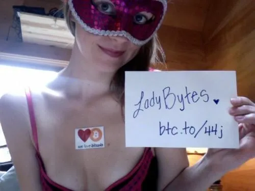

*LadyBytes im März 2012 (Quelle: [Imgur](https://web.archive.org/web/20120401012310/http://imgur.com/a/JDVRZ))*

Das Subreddit wird weiter wachsen und bis zum Ende des Jahres fast 2.000 Mitglieder [zählen] (https://subredditstats.com/r/girlsgonebitcoin).

### Währung des Lasters, Währung des Verbrechens

Bitcoin wurde zu einer Währung des Lasters. Neben dem Drogenhandel zeichnete es sich schnell durch die Unterstützung von Glücksspiel und Pornografie aus. Insbesondere der Erfolg von SatoshiDICE führte zu einem explosionsartigen Anstieg der Zahl der auf der Blockchain durchgeführten Transaktionen, was die Fähigkeit von Bitcoin, diese Art von Aktivitäten zu unterstützen, unter Beweis stellte.

Aber diese neue Form der Währung war nicht nur für das Laster geeignet: Sie war auch die ideale Währung für Internetkriminalität. Im Jahr 2012 kam es zu einer Reihe von Bitcoin-Hacks und -Diebstählen. Mehr darüber erfahren wir im nächsten Kapitel, das unseren Kurs über den Wilden Westen der Finanzen abschließt.

## Die Währung des Verbrechens: Raubkopien und Betrug

<chapterId>bd76cd10-1887-5f41-974a-2d419cf67b08</chapterId>

Aufgrund seiner Widerstandsfähigkeit gegen Zensur und seiner relativen Anonymität eignet sich Bitcoin gut für kriminelle Aktivitäten. Dieser Aspekt kann als bedauerlich angesehen werden, ist aber untrennbar mit dem Ideal der Unabhängigkeit und Freiheit verbunden, das die Kryptowährung verkörpert. Aus diesem Grund wurde Bitcoin so schnell mit zwielichtigen Geschäften in Verbindung gebracht, über die in der Mainstream-Presse ausführlich berichtet wurde.

Bitcoin eignet sich besonders für die im Internet grassierende Cyberkriminalität, für die es bisher keine digitale und gleichzeitig schwer fassbare Währung gab. Ab 2011 kam es zu einer Reihe von Diebstählen und Betrügereien mit der Kryptowährung. Im Mai 2012 hatten sich diese dramatischen Ereignisse so sehr vervielfacht, dass eine "Liste der wichtigsten Bitcoin-Raubüberfälle, Diebstähle, Hacks, Betrügereien und Verluste" (https://bitcointalk.org/index.php?topic=83794.msg923918#msg923918) in das Forum gestellt wurde. Diese Liste, die regelmäßig aktualisiert wurde, wurde im Laufe der Jahre so umfangreich, dass 2014 ein [zweiter Thread](https://bitcointalk.org/index.php?topic=576337.msg6289796#msg6289796) eröffnet werden sollte, um alle Vorfälle zu erfassen.

In diesem letzten Kapitel, das dem Wilden Westen der Finanzen gewidmet ist, werden wir uns auf die Beschreibung der wichtigsten Ereignisse konzentrieren, die in der ersten Hälfte des Jahres 2012 stattfanden. Wir werden natürlich über die drei Hacks von Bitcoinica sprechen, die schließlich zu seinem Untergang führten und seine Nutzer ruinierten. Wir werden die Geschichte von Tony76s Betrug vom 20. April auf der Silk Road erzählen. Wir werden das Wachstum und den Zusammenbruch des ersten Ponzi-Schemas, Bitcoin Savings & Trust, analysieren. Und wir werden die Hacks von BTC-e und Bitfloor analysieren, die im Sommer 2012 stattfanden.

Wir schließen das Kapitel mit einer allgemeinen Schlussfolgerung zu diesem hoffentlich lehrreichen Kurs ab. Aber vorher wollen wir noch zur Sache kommen!

### Linode und Betco.in Hacks

Die Internetkriminalität im Zusammenhang mit Bitcoin hat seit der Popularisierung der Kryptowährung im Jahr 2011 zugenommen. Der Sommer 2011 war besonders heiß, mit der Infektion des Computers von Allinvain (was zu einem Verlust von 25.000 BTC oder 500.000 $ führte), dem Mt. Gox-Hack und seinen Auswirkungen (mit mindestens 6019 BTC oder 105.000 $) und dem MyBitcoin-Diebstahl (von 78.740 BTC oder 1.000.000 $). Wir könnten auch Bitcoin mining von Zombie-Maschinen erwähnen, die in diesem Zeitraum erstmals [auftauchten](https://cryptome.org/2012/05/fbi-bitcoin.pdf): Die Praxis war [nicht sehr profitabel](https://web.archive.org/web/20110618210349/http://www.symantec.com/connect/blogs/bitcoin-botnet-mining), aber eine Vorahnung der Cryptolocker-Ransomware von 2013.

Im Jahr 2012 nahm die "Kryptokriminalität" eine ganz neue Dimension an, und es folgten Diebstähle aller Art. Das erste Ereignis war der Angriff auf den Hosting-Dienst Linode am 1. März. An diesem Tag griff ein Hacker [auf](https://web.archive.org/web/20120302143922/http://status.linode.com/2012/03/manager-security-incident.html) das Kundendienstportal des Unternehmens zu und übernahm die Kontrolle über acht Konten, die alle mit Bitcoin verbunden waren. Durch den Zugriff auf das aktive wallet, das auf den Servern von Linode gehostet wird, konnte er die Bitcoins der betroffenen Kunden erbeuten.

Zu diesen Kunden gehörte die Handelsplattform Bitcoinica, die von dem jungen Chinesen Zhou Tong betrieben wird. Sie [verlor](https://bitcointalk.org/index.php?topic=66979.msg778578#msg778578) 43.554 Bitcoins oder über 210.000 $. Das Unternehmen blieb jedoch dank des Geldes der Anleger zahlungsfähig.

Der Hacker [erlangte] (https://bitcointalk.org/index.php?topic=66916.msg777575#msg777575) auch 3.094 Bitcoins, die zu BitcoinCZ Mining, dem mining-Pool von Slush, gehörten. Diese Bitcoins, die zu diesem Zeitpunkt mehr als 15.000 Dollar wert waren, befanden sich auf dem heißen wallet des mining-Pools zur Auszahlung an seine Mitglieder. Slush hat den Verlust persönlich gedeckt.

Der dritte Betroffene schließlich war Gavin Andresens *Bitcoin-Hahn*. Der Dienst [verlor](https://gavintech.blogspot.com/2012/03/bitcoin-faucet-hacked.html) nur 5 BTC (ca. 25 $), aber dieser Vorfall wird Gavin dazu veranlassen, seine Sicherheit zu verbessern, was ihn dazu veranlasst, ihn im Laufe des Jahres "zur Wartung" zu [schließen](https://web.archive.org/web/20121005191343/https://freebitcoins.appspot.com/). Der Bitcoin-Hahn wird nie wieder geöffnet.

Einen Monat später wurde die Online-Pokerplattform Betco.in, die seit 2010 von Pavel Karoukin betrieben wird, gehackt. Am 11. April wurde das gesamte Geld, das auf Pavels Server und persönlichem Computer gespeichert war, [abgeschöpft](https://bitcointalk.org/index.php?topic=68066.msg848855#msg848855): insgesamt 3.171 Bitcoins, also fast 16.000 Dollar. Infolgedessen war er [gezwungen](https://bitcointalk.org/index.php?topic=82100.msg904821#msg904821), den Dienst zu schließen und ihn zum Verkauf anzubieten, nachdem er die Nutzer so gut wie möglich entschädigt hatte.

### Tony76s Betrug

Aufgrund seiner berüchtigten Aktivitäten war auch der Silk-Road-Marktplatz nicht vor bedauerlichen Vorfällen gefeit. Am 20. April 2012 wurde ein großer Betrug, der später als "The Great 420 Scam" (https://eileenormsby.com/2012/05/30/the-great-420-scam/) bezeichnet wurde, von einem Verkäufer mit dem Pseudonym Tony76 verübt. Es handelte sich um einen kanadischen Verkäufer, der seit Januar 2012 auf der Website registriert war und regelmäßig MDMA, Kokain und Heroin nach Kanada und in die USA verschickte. Zu diesem Zeitpunkt hatte er (https://www.forbes.com/sites/runasandvik/2013/11/22/alleged-dread-pirate-roberts-murder-target-led-massive-bitcoin-scam-on-silk-road/) mehr als 500 Verkäufe getätigt, und sein Bewertungs-Thread im Silk-Road-Forum enthielt mehr als 1.000 Beiträge.

Dank dieses tadellosen Rufs gelang es ihm, seinen Betrug durchzuziehen. Das Reputationssystem der Plattform war nicht perfekt: Bitcoins konnten auf einem Treuhandkonto hinterlegt werden, aber das braucht Zeit und setzt den Verkäufer Wechselkursschwankungen aus. Aus diesem Grund fordern vertrauenswürdige Verkäufer die Nutzer häufig auf, sich für einen frühen Abschluss zu entscheiden. Tony76 verlangte systematisch, dass diese Option aktiviert wird.

Der 20. April war ein symbolträchtiges Datum für Cannabiskonsumenten in Nordamerika. Daher wurden auf Silk Road zahlreiche Rabatte auf der Website veröffentlicht. Am 17. April kündigte Tony76 [https://antilop.cc/sr/users/tony76/messages/20120417-0804-26-Tony76_MASSIVE_4_20_SALE_When_i_say_massive_I_mean_massive.txt] seine Teilnahme an und begründete dies damit, dass "all diese unglaublichen Angebote von anderen Verkäufern" "mich dazu gebracht haben, es zu versuchen" und "meine wettbewerbsorientierte Seite ein wenig geweckt haben". Er kündigte auch an, dass er zum ersten Mal Aufträge für internationale Käufer öffnen würde. Am Vorabend des verhängnisvollen Tages bot er alle möglichen Produkte zu reduzierten Preisen an: Cannabis, MDMA, LSD, Ketamin, Kokain und Heroin.

Sein guter Ruf führte zu einem stetigen Strom von Aufträgen. Während des 20. April und darüber hinaus interagierte er weiterhin mit Kunden, verschwand aber am 25. April vollständig aus dem Forum. Nach einer Woche begannen die Nutzer, sich Sorgen zu machen. Bald merkten sie, dass sie betrogen worden waren.

Es wurde [geschätzt] (https://web.archive.org/web/20150321011113/http://www.dailydot.com/crime/tony76-420-sale-silk-road/), dass Tony76 auf diese Weise zwischen 100.000 und 250.000 $ erlangte, was einem Betrag von mehreren zehntausend Bitcoins entspricht. Dieser Vorfall war der größte Raub in der Geschichte von Silk Road, wenn man von der Beschlagnahmung durch US-Behörden im Oktober 2013 absieht.

### Der Fall von Bitcoinica

das Jahr 2012 war auch durch den Zusammenbruch der Margenhandelsplattform Bitcoinica gekennzeichnet, der auf zwei weitere Hacks folgte.

Wie wir in einem früheren Kapitel erläutert haben, war Bitcoinica seit seinem Start im September 2011 ein großer Erfolg. Sie wurde von Zhou Tong, mit richtigem Namen Ryan Zhou, geleitet, der damals erst 17 Jahre alt war. Im November bot ein amerikanischer Investmentfonds [an](https://bitcointalk.org/index.php?topic=81581.msg897948#msg897948), die Plattform "zu einem guten Preis" zu kaufen und ihm ein großzügiges Gehalt zu zahlen: Es handelte sich um die Wendon Group, vertreten durch einen gewissen Tihan Seale und [verbunden](https://bitcointalk.org/index.php?topic=196150.msg2038900#msg2038900) mit Peter Vessenes' CoinLab-Inkubator. Zhou Tong akzeptierte "aufgrund regulatorischer Bedenken": Er war rechtlich gesehen noch minderjährig und konnte daher kein Unternehmen gründen, um sein Geschäft ordnungsgemäß zu betreiben. Die Übergabe fand im Januar 2012 statt.

Zhou Tong leitete die Plattform bis zum Frühjahr weiter. Im März/April wurde Bitcoinica LP in Neuseeland gegründet und [registriert](https://web.archive.org/web/20120505125011/https://www.bitcoinica.com/posts/registered-financial-services-provider) als Finanzdienstleister bei der Finanzmarktaufsicht. Am 24. April stießen dank der Verhandlungen von Tihan Seale die Mitglieder von Bitcoin Consultancy (Amir Taaki, Patrick Strateman und Donald Norman), die bereits mehrere Projekte, darunter die Devisenplattform Intersango, verwalteten, zu Zhou Tong [https://bitcointalk.org/index.php?topic=77958.msg867160#msg867160]. Sie gründeten zu diesem Zweck ein spezielles Unternehmen, die Bitcoinica Consultancy Ltd. Trotz des Verlusts von 43.000 Bitcoins beim Linode-Hack (der durch den Investitionsfonds gedeckt wurde) schien Bitcoinica also auf dem richtigen Weg zu sein.

Die Dinge liefen jedoch nicht wie geplant, da es kurz darauf zu einem zweiten Hack [kam](https://bitcoinica.blogspot.com/2012/05/bitcoinica-security-breach.html). Am 11. Mai 2012 verschaffte sich ein Hacker Zugriff auf den Bitcoinica-E-Mail-Server (der von Rackspace gehostet wurde) und nutzte die Funktion "Passwort vergessen", um sich mit einem der Administratorkonten bei der Plattform anzumelden. Es gelang ihm, 18.574 Bitcoins oder fast 92.000 US-Dollar abzuheben (https://bitcointalk.org/index.php?topic=81045.0). Darüber hinaus gelangte er in den Besitz der Benutzerdatenbank, die er kopierte und vom Server löschte. Es gab [kein Backup](https://bitcointalk.org/index.php?topic=81045.msg921159#msg921159) dieser Datenbank, so dass der Vorfall katastrophal war. Der Betrieb der Plattform wurde innerhalb einer Stunde eingestellt.

Am 13. Mai [veröffentlichte] (https://bitcointalk.org/index.php?topic=81581.msg897948#msg897948) Zhou Tong eine lange Nachricht im Bitcoin-Forum, in der er ankündigte, dass er "Bitcoin verlassen" werde. Er erklärte, dass "dies nichts mit dem Bitcoinica-Hack zu tun hat" und dass dies auf dem Mangel an Bedeutung seiner Arbeit beruhte. Er hatte das Gefühl, dass er es nicht geschafft hatte, "generate einen Wert für die Gesellschaft zu geben", da "Spekulation ein Nullsummenspiel" sei. Er wollte "Produkte bauen, die den Menschen Zeit, Geld und Kopfschmerzen ersparen", und Bitcoin "trägt nicht dazu bei, mein wirkliches Bedürfnis zu erfüllen". Zu dieser Zeit zog er nach Australien, um sein Studium fortzusetzen, und er wollte weiterhin unternehmerisch tätig sein, insbesondere mit einem Projekt namens [NameTerrific] (https://bitcointalk.org/index.php?topic=82566.msg910076#msg910076). Er blieb jedoch Bitcoin verbunden und behauptete, eine Casascius-Münze im Wert von 1.000 Bitcoins zu besitzen. Er kehrte 2013 zurück und war Mitbegründer von CoinJar, einer australischen Tauschplattform.

*Ryan Zhou, alias "Zhou Tong", im Jahr 2012 (Quelle: [Archiv](https://web.archive.org/web/20120617170206/http://coinabul.tumblr.com/post/24022841613/10qs-zhou-tong-bitcoinica) aus Coinabul's blog)*

Das Krisenmanagement wurde vollständig der Bitcoin-Beratungsfirma anvertraut. In einem am 15. Mai veröffentlichten Blog-Post [kündigte] (https://bitcoinica.blogspot.com/2012/05/bitcoinica-hack-post-mortem.html) an, dass "wir uns entschieden haben, Bitcoinica so lange offline zu lassen, bis eine neue Plattform gebaut und getestet werden kann, in die die besten Sicherheitsverfahren von Grund auf integriert sind", und zwar für einen Zeitraum, "der in Monaten gemessen wird". Dennoch mussten sie den Nutzern eine Möglichkeit bieten, ihre Bitcoins wiederzuerlangen, was in Ermangelung einer Datenbank eine komplexe Aufgabe war (gelinde gesagt)! Der Plan sah vor, 50 % der Gelder an die Gläubiger auszuzahlen und die verbleibende Hälfte zu einem späteren Zeitpunkt zu zahlen, um die Auswirkungen eines Fehlers zu begrenzen. Jeder Gläubiger muss relevante Informationen [zur Verfügung stellen] (https://bitcointalk.org/index.php?topic=84042.msg1001751#msg1001751), wie z. B. Kopien der von Bitcoinica gesendeten E-Mails, die verwendeten Mt. Gox-Codes, die Kennungen der Ein- und Auszahlungstransaktionen, eine Kopie seines Personalausweises usw.

Das Verfahren verlief langsam. Die ersten Zahlungen [erfolgten](https://web.archive.org/web/20120720064802/https://bitcoinica.com/) am 13. Juni und [betrafen](https://bitcointalk.org/index.php?topic=84042.msg970495#msg970495) weniger als 1 % der Kunden. Bis Anfang Juli waren 27 % der Gelder [ausgezahlt](https://bitcointalk.org/index.php?topic=84042.msg1001019#msg1001019) (54 %, wenn man die Teilrückzahlungen berücksichtigt). Bis Mitte Juli war dieser Prozentsatz (https://bitcointalk.org/index.php?topic=93074.msg1027282#msg1027282) auf 38 % gestiegen (76 % wurden zu 50 % zurückgezahlt).

Doch dann geschah wieder etwas Unerwartetes. Am 7. Juli [veröffentlichte] (https://www.reddit.com/r/Bitcoin/comments/w6xen/bitcoinica_press_release/) Amir Taaki, der mit dem Management von Bitcoinica in Konflikt stand (https://bitcointalk.org/index.php?topic=196150.msg2038900#msg2038900), den vollständigen Quellcode der Plattform. Dieser Quellcode enthielt einen API-Schlüssel, der zufällig auch das Passwort für den Zugang zu Bitcoinicas LastPass-Safe war, in dem sich einige seiner Passwörter befanden, darunter auch das seines Mt.Gox-Kontos. Am 13. Juli nutzte ein Hacker diese Schwachstelle aus und [schaffte es](https://bitcointalk.org/index.php?topic=93074.msg1027282#msg1027282), 40.000 Bitcoins und 40.000 LR-USD von Mt. Gox abzuheben (die Obergrenze), was fast 350.000 $ entspricht! Damit belief sich der Gesamtverlust der Plattform (in Dollar) auf über 650.000 Dollar.

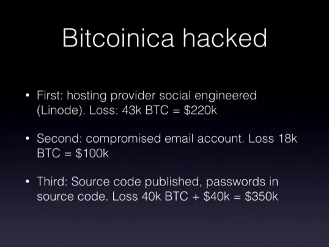

*Bitcoinica-Hacks, zusammengefasst von Jeremias Kangas auf der Assembly Summer 2014 (Quelle: Mitschnitt von [AssemblyTV] (https://www.youtube.com/watch?v=CgcK3xZpjdI))*

Amir Taaki wies darauf hin, dass das bei diesem jüngsten Hack gestohlene Geld einem Drittel der noch zu erstattenden Gelder entsprach, was bedeutet, dass die Plattform bankrott war. Dies versetzte die Nutzer, die auf ihre Rückzahlung warteten, in Panik, darunter Roger Ver (der 25.000 Bitcoins auf der Plattform [behielt](https://bitcointalk.org/index.php?topic=93110.msg1027941#msg1027941)) oder der französische Händler Émilien Dutang (der [hatte](https://bitcointalk.org/index.php?topic=93074.msg1027322#msg1027322) etwas mehr als 5.000). Zhou Tong, der von seinem Verkauf im Januar stark profitiert hatte, [zeigte](https://bitcointalk.org/index.php?topic=93100.msg1027825#msg1027825) sich großzügig und versprach, 5.000 BTC zur Rückerstattung beizutragen. Zwei Tage später wurden die Gläubiger, die einen Antrag gestellt hatten (darunter Roger und Émilien), dank der Spende von Zhou Tong und der freiwilligen Beiträge der Gemeinschaft mit 6,24 % entschädigt.

Am 26. Juli kam es zu einer neuen Entwicklung: Zhou Tong wurde [verdächtigt] (https://bitcointalk.org/index.php?topic=95738.msg1054890#msg1054890), für den dritten Hack von Roberto Gutierrez (CEO der AurumXchange-Plattform), Charlie Shrem (BitInstant) und Mark Karpelès (Mt. Gox) verantwortlich zu sein. Es stellte sich heraus, dass das Konto von Zhou Tong von dem Hacker benutzt wurde, um Mt. Gox-Codes auf AurumXChange zu verkaufen, was den Chinesen direkt mit dem Diebstahl in Verbindung brachte. Zhou Tong leugnete die Verantwortung und [beschuldigte](https://bitcointalk.org/index.php?topic=95795.msg1055627#msg1055627) stattdessen einen ehemaligen Mitarbeiter von ihm, einen gewissen Chen Jianhai, der sich angeblich Zugang zu seinem Konto verschafft hatte.

Letztendlich hätte dieser jüngste Hack den Todesstoß für die Margenhandelsplattform bedeutet. Die Liquidation von Bitcoinica wurde am 1. August 2012 von Tihan Seale [angekündigt](https://bitcointalk.org/index.php?topic=97272.msg1071263#msg1071263) und im Oktober wirksam [gemacht](https://bitcointalk.org/index.php?topic=121474.msg1309937#msg1309937). Ein zuverlässiger Ersatz würde ebenfalls im Oktober mit der Gründung von Bitfinex entstehen.

### Das erste Schneeballsystem: Bitcoin Savings & Trust

Bitcoin kann auch dazu verwendet werden, alte Systeme wiederzubeleben, insbesondere solche, die auf der Verlockung von Gewinn basieren. Ponzi-Pyramiden, die auf den Zustrom neuer Teilnehmer angewiesen sind, um diejenigen zu bezahlen, die ihre Zinsen einfordern, sind ein solches System.

Im Internetzeitalter nahmen Pyramidensysteme häufig die Form von *High-Yield-Investment-Programmen* (HYIPs) an, die für kurze Zeit ungewöhnlich hohe Zinssätze versprachen, um ihre Kunden zu schnellen Einzahlungen zu bewegen. Sie waren im Bereich der alternativen Währungen wie E-Gold und Liberty Reserve sehr erfolgreich. In den Jahren 2011-2012 war eines der größten dieser Systeme [https://www.themoscowtimes.com/2012/06/17/mavrodi-closes-mmm-2011-a15491] das MMM-2011-Pyramidensystem, das vom Russen Sergei Mavrodi betrieben wurde.

Es war klar, dass die Bitcoin-Gemeinschaft gegen diese Art von Betrug nicht immun war, und die Programme mit hohen Renditen häuften sich im Laufe der Monate. Da war zum Beispiel die brasilianische Website [Bitcoin Rain] (https://bitcointalk.org/index.php?topic=178336.msg11470642#msg11470642), die im Oktober 2011 eröffnet wurde und 12 % Rendite *pro Monat* oder 290 % pro Jahr versprach. Aber das wichtigste dieser Programme war Bitcoin Savings & Trust.

Der Fonds wurde von Trendon Shavers, einem 29-jährigen texanischen Vater, gegründet. Er nannte sich im Bitcoin-Forum und im IRC PirateAt40, in Anlehnung an Jimmy Buffetts Lied "*A Pirate Looks At Forty*" aus dem Jahr 1974, in dem ein moderner Drogendealer beklagt, zu spät geboren zu sein, um ein Seeräuber zu sein.

*Trendon Shavers beim Verlassen des Bundesgerichts in Manhattan im November 2014 (Quelle: Brendan McDermid für [Reuters](https://www.reuters.com/article/world/us/texan-gets-one-and-a-half-years-in-prison-for-running-bitcoin-ponzi-scheme-idUSKCN1012W7/))*

Ende 2011 war Trendon auf dem OTC-Börsenkanal \#bitcoin-otc aktiv, wo er sich einen [guten Ruf] erwarb (https://web.archive.org/web/20111031165817/http://bitcoin-otc.com/viewratingdetail.php?nick=pirateat40). Er verkaufte Bitcoin zu einem höheren Kurs als auf Mt. Gox; und angesichts der starken Nachfrage begann er, Kredite von vertrauenswürdigen Personen aufzunehmen. Am 3. November 2011 kündigte er [über](https://bitcointalk.org/index.php?topic=50822.msg607752#msg607752) im Forum an, "Kreditgeber zu suchen", um als lokaler Wiederverkäufer zu agieren ([über](https://gwern.net/doc/bitcoin/pirateat40/secvs.pirateat401.pdf) Geldtauschdienste und Craiglist). Er bot zwei Möglichkeiten an, Geld zu leihen. Bei der einen Methode, die als "Lagerung" bezeichnet wurde und in "Sparen" umbenannt werden sollte, konnte man Geld gegen einen Zinssatz auf einem Konto hinterlegen, das an eine bestimmte Adresse geschickt oder wieder angelegt werden konnte. Der versprochene Zinssatz betrug 1 % *pro Tag*, was eine 37-fache Steigerung der ursprünglichen Investition in nur einem Jahr bedeutete!

Trendon behauptete, er habe "meine eigene maßgeschneiderte Verwaltungssoftware entwickelt, um Einzahlungen, Abhebungen und Zinszahlungen zu überwachen". Er verwaltete die Kundeninvestitionen zunächst über private Nachrichten im Forum, bevor er anderthalb Monate später eine Schnittstelle bei Btclending.com [einrichtete](https://bitcointalk.org/index.php?topic=50822.msg649434#msg649434). Zur gleichen Zeit [eröffnete](https://bitcointalk.org/index.php?topic=55819.msg664029#msg664029) Trendon einen mining-Cloud-Dienst namens GPUMAX, der es den Nutzern ermöglichte, mining-Strom zu verleihen und zu leihen.

Anfang 2012 wurde der Anlageplan (https://web.archive.org/web/20120326140927/https://bitcointalk.org/index.php?topic=50822.msg605957#msg605957) vereinfacht und bot wöchentliche Zinszahlungen. Die Zinssätze wurden je nach Anlagebetrag gestaffelt, um größere Einlagen zu fördern: 100 BTC brachten 4,2 % *pro Woche*, während 1.000 BTC (und mehr) 7 % brachten. Anmeldungen [gingen](https://bitcointalk.org/index.php?topic=50822.msg736031#msg736031) jetzt nur noch über Empfehlung (damit bestehende Mitglieder mehr verdienen können). Ein Mindestbetrag von 100 BTC (ca. $570) [wurde](https://bitcointalk.org/index.php?topic=50822.msg738835#msg738835) eingeführt, um die Notwendigkeit zu beseitigen, mit kleinen Kreditgebern zu handeln. Diese neue Eintrittsbarriere führte zum Aufkommen von Vermittlern, [insbesondere](https://bitcointalk.org/index.php?topic=76594.msg850275#msg850275) durch die [Ausgabe](https://bitcointalk.org/index.php?topic=91252.msg1063296#msg1063296) von Anleihen (bekannt als "Pirate Passthroughts" oder PPT) an der GLBSE.

Im Januar wurde der Name des Fonds [in](https://bitcointalk.org/index.php?topic=50822.msg678316#msg678316) First Pirate Savings & Trust geändert, in Anlehnung an den Namen bestimmter amerikanischer Banken. Im April änderte der Dienst seinen Namen erneut und [wurde](https://bitcointalk.org/index.php?topic=50822.msg844657#msg844657) Bitcoin Savings & Trust (BTCS&T). Die Schnittstelle wurde aufgerüstet und unter BTCST.com gehostet.

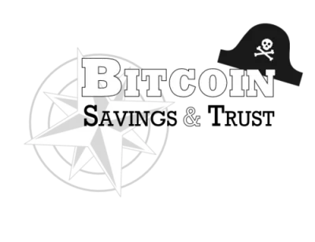

*Inoffizielles Bitcoin Savings & Trust Logo entworfen von JohnBigheart (Quelle: [Archiv](https://web.archive.org/web/20140429144117/https://bitcointalk.org/index.php?topic=76689.0) von Bitcointalk.org)*

Trendon [erklärte] (https://web.archive.org/web/20120326140927/https://bitcointalk.org/index.php?topic=50822.msg605957#msg605957), dass seine Einnahmen aus drei Gewinnquellen stammten. Die erste war der lokale Weiterverkauf von Bitcoins, da der Wechselkurs auf den OTC-Märkten höher war als auf Mt. Gox. Die zweite war die "Marktarbitrage" zwischen den verschiedenen Börsenplattformen, die (in Wirklichkeit) eher einer Spekulation und Preismanipulation glich. Die dritte Einnahmequelle war das Verleihen von Bitcoins an Personen, mit denen Trendon in Kontakt stand. Dies wurde schnell zur Haupttätigkeit seines Systems.

Der Erfolg von Bitcoin Savings & Trust war phänomenal. In der Spitze erreichte die Gesamtzahl der vom Fonds verwalteten Bitcoins [https://bitcointalk.org/index.php?topic=101339.msg1111794#msg1111794] über 500.000 Bitcoins, was etwa 5 % der 9,7 Millionen im Umlauf befindlichen Bitcoins entspricht!

Natürlich erregte die relativ undurchsichtige Funktionsweise von BTCS&T Misstrauen. Bereits im November kam die erste Reaktion auf die Ankündigung im Forum von einem gewissen ElectricMucus, der [bemerkte] (https://bitcointalk.org/index.php?topic=50822.msg605977#msg605977), dass das Angebot von Trendon "wie ein klassischer HYIP-Betrug riecht". Als die Monate vergingen und BTCS&T immer erfolgreicher wurde, wurden mehr und mehr Anschuldigungen von bekannten Mitgliedern der Gemeinschaft erhoben, darunter [Matthew N. Wright](https://bitcointalk.org/index.php?topic=50822.msg681014#msg681014), [Mircea Popescu](https://bitcointalk.org/index.php?topic=50822.msg855012#msg855012) und [Vitalik Buterin](https://bitcoinmagazine.com/business/ponzi-schemes-the-danger-of-high-interest-savings-funds-1338461999). Ein Forumsnutzer (Vandroiy) ging sogar so weit, mit Trendon um 5.000 BTC zu [wetten](https://bitcointalk.org/index.php?topic=91661.msg1013589#msg1013589), dass BTCS&T vor Oktober 2013 ausfallen würde.

Das Ende kam im Sommer. Im Juni stieg der Bitcoin-Preis von 5 $ auf 6,5 $ und setzte Trendon, dessen Schulden auf Bitcoins lauteten, unter Druck. Anfang Juli kündigte er [https://bitcointalk.org/index.php?topic=50822.msg1004091#msg1004091] angesichts der Unsicherheit an, den Zinssatz auf 3,9 % für alle Beträge zu senken und die Registrierung für alle zu öffnen, was am 14. August in Kraft trat. Leider verstärkte diese Senkung die Zahl der Abhebungen durch Kunden, die spürten, dass etwas nicht stimmte.

Am 17. August 2012 traf Trendon schließlich die [Entscheidung](https://bitcointalk.org/index.php?topic=50822.msg605957#msg605957), BTCS&T zu schließen. Er entschädigte seine engsten Mitarbeiter, aber die Mehrheit der Menschen wurde verletzt. Die Auswirkungen dieser Schließung waren vor allem auf dem Markt zu spüren. Der Kurs von Mt. Gox stürzte sofort ab und halbierte sich innerhalb von 48 Stunden von einem lokalen Höchststand von 15,4 $ am 17. auf kurzzeitig unter 8 $ am 19. Juni. In den darauffolgenden Tagen stabilisierte er sich bei etwa 10 $, bevor er sich wieder auf ein akzeptables Niveau erholte.

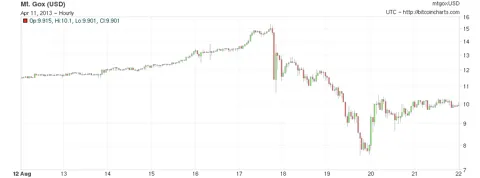

*BTC-Preisentwicklung auf Mt. Gox zwischen dem 12. und 22. August (Quelle: Bitcoin Charts via [Forbes](https://www.forbes.com/sites/timothylee/2013/04/11/an-illustrated-history-of-bitcoin-crashes/))*

Die Verluste waren kolossal. Laut [weiterer Analyse] (https://gwern.net/doc/bitcoin/pirateat40/gov.uscourts.txed.146063.4.5.pdf) der SEC-Ermittlerin Daphne Downes beliefen sie sich auf rund 263.000 Bitcoins oder 1,8 Millionen Dollar zum Zeitpunkt ihrer Investition in BTCS&T.

Trendon behauptete später, nicht verantwortlich zu sein: "Einer meiner größten Kunden beschloss, [mir](https://pastebin.com/DVNsx7xz) das Leben schwer zu machen", indem er [https://gwern.net/doc/bitcoin/pirateat40/secvs.pirateat401.pdf#page=64] 202.000 Bitcoins als Teil eines ungesicherten Kredits stahl. Die Aktivität des Fonds [Adresse](https://bitcointalk.org/index.php?topic=94675.msg1047007#msg1047007) würde diese Information jedoch nicht bestätigen.

### Der BTC-e und die BitFloor-Hacks

Nicht zuletzt setzte sich die Serie von Hackerangriffen 2012 im Sommer fort. Es fanden zwei Diebstähle statt: BTC-e im Juli und BitFloor Anfang September. Diese beiden Vorfälle trugen dazu bei, das Gefühl der Unsicherheit im Zusammenhang mit Börsenplattformen zu verstärken.

Der BTC-e-Hack [ereignete sich] (https://web.archive.org/web/20120731215829/https://btc-e.com/news/81) in der Nacht vom 30. auf den 31. Juli, gegen Mitternacht. Der API-Schlüssel, der mit dem Liberty Reserve-Konto von BTC-e verknüpft ist, wurde kompromittiert, was dem Hacker ermöglichte, fiktive Einzahlungen vorzunehmen, mit denen er Bitcoins, Namecoins und Litecoins erhielt, wobei er deren Preis überhöhte. Es gelang ihm, den Gegenwert von 4.500 Bitcoins abzuheben, was über 42.000 Dollar entspricht. Die Verluste wurden jedoch von der Plattform ausgeglichen. Alle nach dem Hack durchgeführten Tauschvorgänge wurden storniert, und die Aktivität [wurde] (https://web.archive.org/web/20121119010409/https://btc-e.com/news/82) gegen 15 Uhr wieder aufgenommen.

Der Bitfloor-Hack, der im September stattfand, war von größerer Bedeutung. BitFloor war eine amerikanische Börsenplattform mit Sitz in New York. Sie wurde im Oktober 2011 von einem 25-Jährigen namens Roman Shtylman mit der Hilfe eines Freundes [gegründet](https://bitcointalk.org/index.php?topic=47109.msg578260#msg578260). Der Plattform gelang es schnell, Nutzer anzuziehen, indem sie Liquiditätsanbieter (*Maker*) mit "Rabatten" belohnte, die bei der Ausführung von Börsengeschäften gutgeschrieben wurden (https://bitcointalk.org/index.php?topic=51078.msg608833#msg608833). Im Mai 2012 begann BitFloor auch mit der [Annahme](https://bitcointalk.org/index.php?topic=81915.msg902211#msg902211) von Bareinzahlungen, ein sehr attraktives Merkmal, wie wir erklärt haben.

*Roman Shtylman im Februar 2012 (Quelle: [Bitcoin Show](https://www.youtube.com/watch?v=F7SsavHX6tc) auf Youtube)*

Ende des Sommers 2012 war BitFloor eine aufstrebende Plattform: Sie [war](https://web.archive.org/web/20120902173725/https://bitcoincharts.com/markets/) die viertgrößte Plattform in Bezug auf das Dollar-Handelsvolumen, hinter BTC-e, Bitstamp und vor allem Mt. Gox. Im August sagte ein Bitcointalk-Mitglied [voraus](https://bitcointalk.org/index.php?topic=93655.msg1073739#msg1073739), dass "BitFloor die Nummer 2 im BTC-Handelsvolumen sein wird" und fügte hinzu, dass "Börsen auf Platz 2 eine schreckliche Erfolgsbilanz haben".

Er hätte nicht mehr Recht haben können. In der Nacht vom 3. auf den 4. September 2012 verschaffte sich ein Hacker [Zugriff](https://bitcointalk.org/index.php?topic=105818.msg1159510#msg1159510) auf einige Server von Bitfloor und gelangte in den Besitz eines unverschlüsselten Backups der wallet Schlüssel. Der überwiegende Teil der Bitcoins der Plattform wurde abgezogen: etwas mehr als 24.000 BTC oder etwa 250.000 $ zu diesem Zeitpunkt. Die Exchange-Aktivität wurde daraufhin eingestellt.

Am 21. September hat Bitfloor seine Türen wieder geöffnet. Roman Shtylman [kündigte](https://web.archive.org/web/20141014070427/https://plus.google.com/109620439233076225324/posts/bLJRDHApjSP) dies auf dem Google+ Blog der Plattform an, wo er erklärte, dass er "sich dafür einsetzt, dass Bitfloor lebendig, stark und für das Bitcoin-Ökosystem wachsend bleibt". Die Bitcoin-Guthaben der Kunden wurden jedoch nicht wiederhergestellt. Der Plan war, die Rückerstattung mit den Einnahmen aus den Umtauschgebühren vorzunehmen.

Im Laufe der Monate erholte sich Bitfloor und [schaffte es](https://bitcoinmagazine.com/markets/bitfloor-shuts-down-1366351632), 2,7 % der Bitcoins an seine Gläubiger zurückzuzahlen. Dennoch wurde die Plattform im April 2013 endgültig geschlossen, nachdem ihr US-Bankkonto aufgelöst worden war. Das Hacken der Plattform wäre somit einer der größten Diebstähle des Jahres 2012 gewesen, neben den Vorfällen im Zusammenhang mit Bitcoinica und dem Zusammenbruch von Bitcoin Savings & Trust.

### Der Niedergang des Wilden Westens

Wie dem auch sei, Bitcoin war in den Jahren 2011 und 2012 in der Tat eine Kriminalitätswährung, die insbesondere bei Diebstählen aller Art eingesetzt wurde. Dies zeigte sich bereits im Sommer 2011 mit dem Allinvain-Trojaner, dem Mt.-Gox-Hack, dem MyBitcoin-Diebstahl und dem Bitomat-Verlust. Zu den bemerkenswerten Vorfällen im Jahr 2012 gehörten der Linode-Hack, der Tony76-Betrug auf der Silk Road, die Bitcoinica-Hacks, der Zusammenbruch von Bitcoin Savings & Trust und der Bitfloor-Hack. In den darauffolgenden Jahren verbesserten die Plattformen ihre Sicherheit und das Misstrauen wurde immer größer, aber das hielt die Hacks und Betrügereien nicht davon ab, sich zu vermehren.

Die Raubüberfälle waren nicht die einzigen verwerflichen Taten. Erwähnenswert ist auch die [Erpressung] (https://bitcoinmagazine.com/culture/mitt-romney-blackmailed-for-bitcoins-1346924114) gegen den republikanischen Präsidentschaftskandidaten Mitt Romney, die im September 2012 von Michael Brown (alias Knightmb) durchgeführt wurde. Dieser forderte 1 Million Dollar in Bitcoins und drohte, falls dies nicht gelingen sollte, einige Steuerunterlagen des Politikers zu veröffentlichen.

Die Medien neigten dazu, diese schmutzigen Angelegenheiten hervorzuheben, wahrscheinlich aufgrund ihrer natürlichen negativen Einstellung und ihrer Übereinstimmung mit dem konventionellen Finanzsystem. Bitcoin musste in einem spektakulären Licht dargestellt werden, so wie Hollywoods Western den Wilden Westen als ein Land gesetzloser Menschen darstellten, die stehlen, betrügen und morden, obwohl die Realität viel subtiler war (Banküberfälle im Wilden Westen waren beispielsweise [selten](https://fee.org/articles/the-non-existent-frontier-bank-robbery/)). Die meisten Interaktionen innerhalb der Bitcoin-Gemeinschaft erfolgten auf freiwilliger Basis; Hacks, Diebstähle und andere Betrügereien blieben in der Minderheit und waren einmalige Ereignisse, obwohl ihre Auswirkungen auf die Bitcoin-Wirtschaft manchmal verheerend waren.

Das katastrophale Image von Bitcoin wirkte auf die Bevölkerung abstoßend und ermutigte wiederum den Staat zum Eingreifen. Illegale und kriminelle Aktivitäten weckten das Interesse der staatlichen Behörden, insbesondere des FBI. In einem [internen Bericht] (https://cryptome.org/2012/05/fbi-bitcoin.pdf) der Behörde, der im Mai 2012 durchgesickert ist, findet sich daher folgende Überlegung:

> Bitcoin wird wahrscheinlich weiterhin Cyber-Kriminelle anziehen, die es als Mittel zum Verschieben oder Stehlen von Geldern sowie als Mittel für Spenden an illegale Gruppen betrachten. Wenn sich Bitcoin stabilisiert und an Popularität gewinnt, wird es zu einem zunehmend nützlichen Werkzeug für verschiedene illegale Aktivitäten außerhalb des Cyberbereichs.

Der Hornissenschwarm, den Satoshi Nakamoto im Dezember 2010 befürchtet hatte, war eingetroffen und brachte staatliche Repression und alles, was damit einhergeht, mit sich. In den kommenden Jahren würden viele Akteure im Ökosystem von den Behörden zur Rechenschaft gezogen werden. Die Regulierung von Devisenhandelsplattformen, die 2012 noch in den Kinderschuhen steckte, sollte Fuß fassen. Die Finanzaufsicht würde sich mit der Verallgemeinerung des Kundenwissens und dem Aufkommen der Kettenanalyse weiterentwickeln.

Um diese Risiken zu beseitigen, waren Kommunikationsmaßnahmen erforderlich. Die Bitcoin-Gemeinschaft musste ihr Image verbessern. Es musste klargestellt werden, dass sie nicht *nur* von Kriminellen genutzt wurde, dass Bitcoin nicht ausschließlich zur Geldwäsche und Terrorismusfinanzierung verwendet wurde. Der Diskurs musste überarbeitet werden, um nicht aufzufallen und in den Augen der breiten Bevölkerung akzeptabel zu werden. Die Behörden mussten durch Lobbyarbeit umworben werden, um ein vollständiges Verbot zu vermeiden. All dies führte zur Gründung der Bitcoin-Stiftung am 27. September 2012, einem entscheidenden Datum in der Geschichte von Bitcoin.

Ende 2012 war der Wilde Westen des Finanzwesens bereits im Niedergang begriffen. Der Anteil des konventionellen Handels wurde im März 2013 dem des Drogenhandels gleichgestellt, als das Volumen von BitPay das der Silk Road übertraf. Vor allem aber nahm die Spekulation stark zu, was zu einem enormen Anstieg des Wechselkurses führte: Während er das ganze Jahr 2012 hindurch zwischen 5 und 15 Dollar stagnierte, schoss der Bitcoin-Preis ab Januar 2013 in die Höhe, übertraf im Februar den früheren Höchststand von 32 Dollar, erreichte im April 266 Dollar und erreichte zum Jahresende einen Höchststand von 1.240 Dollar.

Dieser Aufstieg ging mit der Entstehung einer neuen Art des Umgangs mit Bitcoin einher, zumal gerade der erste *Halving* stattgefunden hatte: Statt einer Tauschwährung, die illegale Aktivitäten erleichtert, wurde er allmählich als Anlageinstrument betrachtet, wie digitales Gold in einem Tresor. Diese Verschiebung des Diskurses führte natürlich zu einer Reihe von Spannungen.

Der Anstieg der Spekulationen war auch eine gute Nachricht für Mt. Gox, das dadurch erheblich größer und reicher wurde. Die marktführende Devisenhandelsplattform wurde jedoch dilettantisch geführt und war auf eine solche Nachfrage völlig unvorbereitet. Und so sollte sie ein tragisches Schicksal ereilen...

---

Der Kurs über den Aufbau von Bitcoin zwischen Frühjahr 2011 und Sommer 2012 endet hier. Die nächste Periode der Kryptowährungsgeschichte, die des unwiderstehlichen Aufstiegs von Bitcoin, wird im nächsten Kurs behandelt werden, so Gott will.
# Conclusion

<partId>85b5b21d-2754-41ad-9e25-21350488cfd3</partId>

## Reviews & Ratings

<chapterId>52d64403-1669-4852-ae4f-17ecfe1dc315</chapterId>
<isCourseReview>true</isCourseReview>

## Final Exam

<chapterId>080fb5af-dfff-4600-95cb-61455831080f</chapterId>
<isCourseExam>true</isCourseExam>

## Conclusion

<chapterId>cd50980c-0c9e-43e5-97ec-4db79388335b</chapterId>
<isCourseConclusion>true</isCourseConclusion>
