# Eine Reise in die Wirtschaftsgeschichte der Freiheit

Dieser Kurs erforscht die Geburt der Wirtschaftswissenschaft im Frankreich des 18. Jahrhunderts durch die Linse des Laissez-faire. Sie werden entdecken, wie Denker den Merkantilismus herausforderten, indem sie argumentierten, dass der Staat private Rechte schützen, aber niemals Märkte durch Regulierungen manipulieren sollte.

Sie werden lernen, wie visionäre Reformer diese Vision erweiterten, um freien Handel und uneingeschränkten Warenverkehr zu fordern, und damit die intellektuellen Grundlagen des modernen Kapitalismus legten. Durch das Studium dieser bahnbrechenden Ökonomen werden Sie die zeitlosen Prinzipien verstehen, die die globale politische Ökonomie geprägt haben und bis heute politische Debatten beeinflussen. Melden Sie sich jetzt an, um die Ideen zu meistern, die die moderne Wirtschaft aufgebaut haben.
+++
# Einführung

<partId>06d67531-19f1-4f8d-bf8f-77bbcc743672</partId>

## Überblick über den Kurs

<chapterId>202db3c6-0320-494d-8057-adc6f6563048</chapterId>

Willkommen bei HIS204!

Dieser Kurs soll die französischen Ursprünge des Konzepts des *Laissez-faire* - "Lass es geschehen" - erforschen, wie es sich im 18. Jahrhundert durch eine reiche intellektuelle Tradition entwickelte. Jahrhundert durch eine reiche intellektuelle Tradition entwickelt hat. Indem wir den Gedanken der frühen französischen Wirtschaftsdenker nachgehen, werden wir die Grundlagen einer auf wirtschaftlicher Freiheit basierenden politischen Ökonomie aufdecken, die von einem Misstrauen gegenüber staatlichen Eingriffen und dem Glauben an eine natürliche Ordnung geprägt ist, die Wachstum und Wohlstand begünstigt.

**Abschnitt 2: Die Vorläufer**

In diesem Abschnitt beginnen wir an der Wende vom 17. zum 18. Jahrhundert, einer Zeit, die von der exzessiven Herrschaft der absoluten Monarchie und den ersten Forderungen nach einer rationaleren und gerechteren Regelung der öffentlichen Angelegenheiten geprägt war. Anhand der Persönlichkeiten Vauban, Boisguilbert und Cantillon entdecken wir die frühe Kritik am staatlichen Interventionismus und einen ersten Entwurf dessen, was später zur liberalen politischen Ökonomie werden sollte.

**Sektion 3: Reformer und Denker des frühen 18. Jahrhunderts**

Dieser Abschnitt befasst sich mit denjenigen, die in den ersten Jahrzehnten des 18. Jahrhunderts versuchten, die französische Wirtschaft im Lichte neuer Prinzipien zu reformieren. Denker wie der Abt von Saint-Pierre, der Marquis d'Argenson und Gournay (und seine Anhänger) forderten die Beseitigung korporatistischer Hindernisse, die Liberalisierung des Handels und die Förderung des Wettbewerbs als Motor der Entwicklung. Ihre oft kühnen Vorschläge waren ein Vorbote der großen Ideen der Physiokraten.

**Abschnitt 4: Die physiokratische Schule**

Dieser Abschnitt befasst sich mit einem der wichtigsten Momente des französischen Wirtschaftsdenkens: der physiokratischen Schule. Wir werden ihre Ursprünge, lehrmäßigen Grundlagen und wichtigsten Errungenschaften untersuchen und uns dabei auf Schlüsselfiguren wie Quesnay und Dupont de Nemours konzentrieren. Die Idee des Laissez-faire wird in dieser Schule zu einem kohärenten System, das auf der Vorstellung einer natürlichen Ordnung beruht, der sich der Staat unterordnen muss, um den Wohlstand aller zu gewährleisten.

**Abschnitt 5: Die Aufklärung und die politische Ökonomie**

Schließlich werden wir sehen, wie sich das wirtschaftsliberale Denken innerhalb der breiteren Aufklärungsbewegung verbreitete. Persönlichkeiten wie Voltaire, Turgot, Condillac und Condorcet erweiterten und bereicherten die Laissez-faire-Tradition. Ihre Schriften bildeten eine Brücke für die Laissez-faire-Tradition in die revolutionäre Zeit und darüber hinaus, wo liberale Ideen neue Resonanz fanden.

Sind Sie bereit, die französischen Wurzeln des Wirtschaftsliberalismus wiederzuentdecken? Auf geht's!

# Die Vorläufer

<partId>91565b10-6010-53cb-a2f4-9c2306c7ef8c</partId>

## Historischer Hintergrund

<chapterId>6a5fd101-6dfd-5d77-96c7-9e1aa4a19758</chapterId>

Zu Beginn des 18. Jahrhunderts befand sich Frankreich in einem besorgniserregenden Zustand. Die Landbevölkerung produzierte kaum genug zum Überleben und wurde stark besteuert.

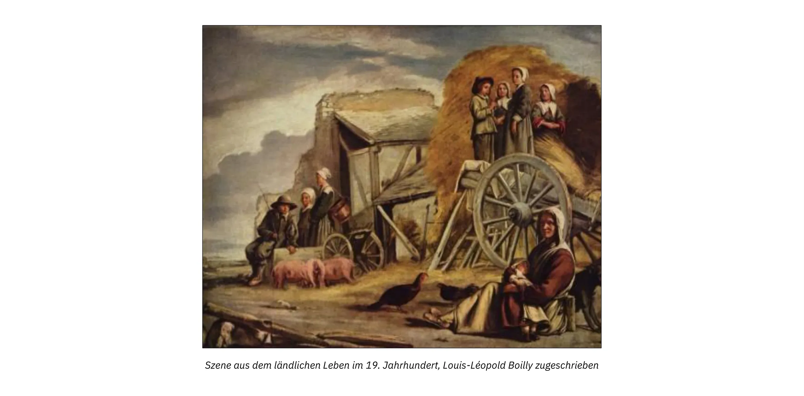

Die städtischen Handwerker, die in starren Zünften zusammengeschlossen waren, hatten Mühe, Innovationen zu entwickeln oder sich gegenseitig zu unterstützen. In der Zwischenzeit übertrafen andere europäische Nationen Frankreich bald in allen Bereichen und machten seinen Produkten den Rang streitig. Die kommerziellen Erfolge Englands und Hollands waren in aller Munde.

Aber wie konnte man eine Lösung für die Krankheit der damaligen Zeit finden? Es gab noch keine Wirtschaftswissenschaft und somit auch keine spezielle Medizin, die man anwenden konnte. Die Grundsätze der Wirtschaftspolitik wurden immer noch willkürlich angewandt und wechselten zwischen restriktiven Phasen und liberaleren Perioden. Gewiss, wir haben Vorbilder, historische Referenzen, denen wir folgen können. Zu ihnen gehörte *Sully*, der Minister von Heinrich IV., der sich für die Landwirtschaft einsetzte und eine größere Handelsfreiheit innerhalb Frankreichs förderte.

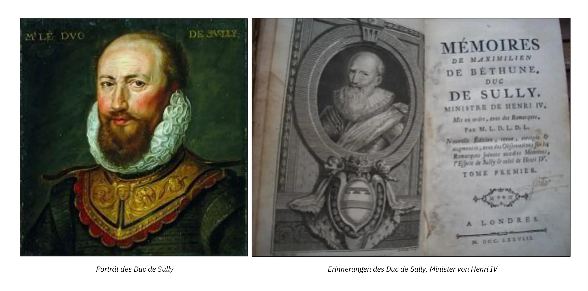

Doch dann kam Colbert, der Minister Ludwigs XIV., der zwischen Regulierung und Freiheit schwankte, letztlich aber die Regulierung durchsetzte. Ganz am Ende des 17. Jahrhunderts überholte Colbert Sully: Die Minister beriefen sich nun auf sein Erbe und versuchten, das anzuwenden, was sie für seine Maximen hielten.

In den Köpfen der Staatsmänner am Ende des 17. Jahrhunderts waren Colberts Maximen vier.

(1) **Die Industrie muss durch Zünfte reguliert und gebunden werden**. Diese Vorschriften legen zum Beispiel fest, wie Laken und Tücher hergestellt werden müssen, ihre Größe und ihr Gewicht.

Es gab Hunderte solcher Vorschriften, die in speziellen Bänden für jeden Industriezweig zusammengefasst waren. In den Augen von Colberts Anhängern reichte dies jedoch nicht aus: Sie waren der Ansicht, dass auch die Industrie von Unternehmen überwacht werden müsse.

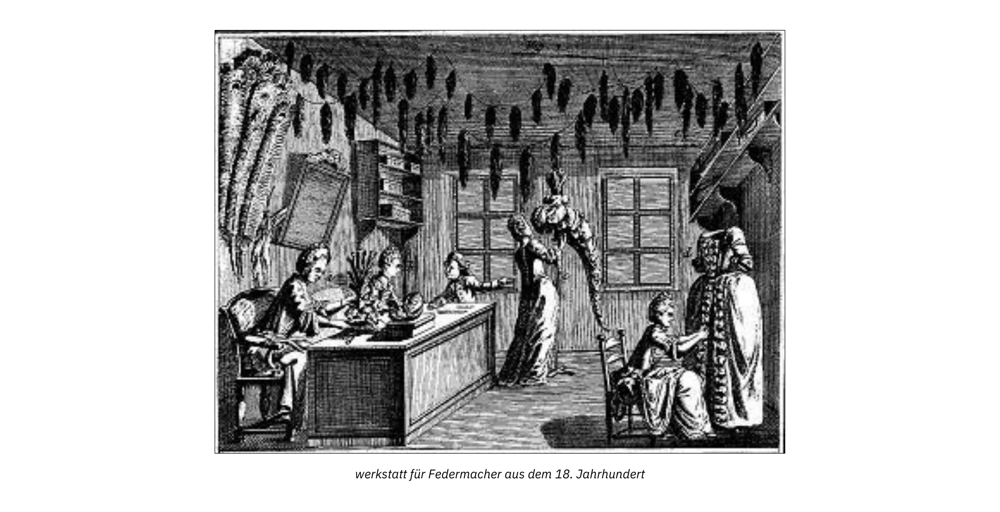

Wer ein Handwerk ausüben wollte, musste zunächst mehrere Jahre als Lehrling, dann als Geselle verbringen, bevor er versuchen konnte, den Status eines Meisters zu erlangen, indem er ein "Meisterstück" herstellte und einen beträchtlichen Betrag an die Zunft zahlte. Der Wettbewerb innerhalb der einzelnen Berufe war daher streng begrenzt.

(2) **Handel ist ein Nullsummenspiel**. Wenn es um den Handel geht, haben die Anhänger Colberts die gleichen Vorurteile wie die barbarischen Völker der Antike. Nach Ansicht des Ministers von Ludwig XIV. ist der Handel "ein ewiger Krieg". Und warum? Der Grund ist einfach: Für Colbert und seine Nachfolger bedeutete jede Vermehrung des Reichtums eines Landes die Verarmung eines anderen. Ihrer Ansicht nach konnte man den Engländern oder den Niederländern nicht erlauben, reich zu werden, denn das würde bedeuten, dass sie Frankreichs Wohlstand stehlen würden.

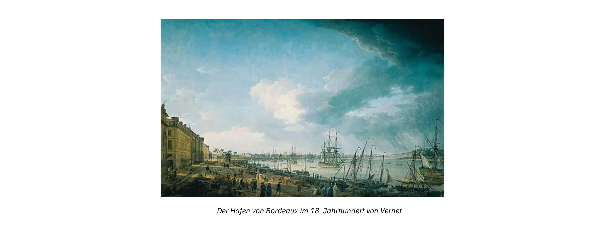

Die Produkte dieser Länder mussten daher verboten oder stark besteuert werden, ohne Skrupel, denn der Handel ist ein Krieg, in dem wir nur den Ruin unserer Feinde wünschen können.

> "Die Franzosen können ihren Handel nur steigern, indem sie die Niederländer unterdrücken".
> *Colbert*

(3) **Wenn dem Staat das Geld ausgeht, erhebt er mehr Steuern**. Colbert und seine Jünger waren weit davon entfernt zu glauben, dass das Vermögen der Steuerzahler eine begrenzte Ressource sei. Ihrer Ansicht nach konnten die öffentlichen Ausgaben nie ein Problem sein, solange genug eingenommen wurde. Und wenn sich das Volk auflehnte, dann nur, weil die Minister es schlecht gemacht hatten, denn, wie Colbert zynisch bemerkte, "die Kunst der Besteuerung besteht darin, die Gänse zu rupfen, ohne sie zu sehr schreien zu lassen".

(4) **Wohlstand ist vor allem Gold und Silber**. Vor den Anfängen der Wirtschaftswissenschaft folgten viele Autoren einem vorherrschenden Dogma über die Natur des Reichtums, das als *Merkantilismus* bekannt wurde. Colbert und seine Nachfolger setzten diesen Weg fort. Kurz gesagt, glaubten die Merkantilisten, dass das wahre Zeichen für den Wohlstand einer Nation die Anhäufung von Edelmetallen, Silber und Gold, sei.

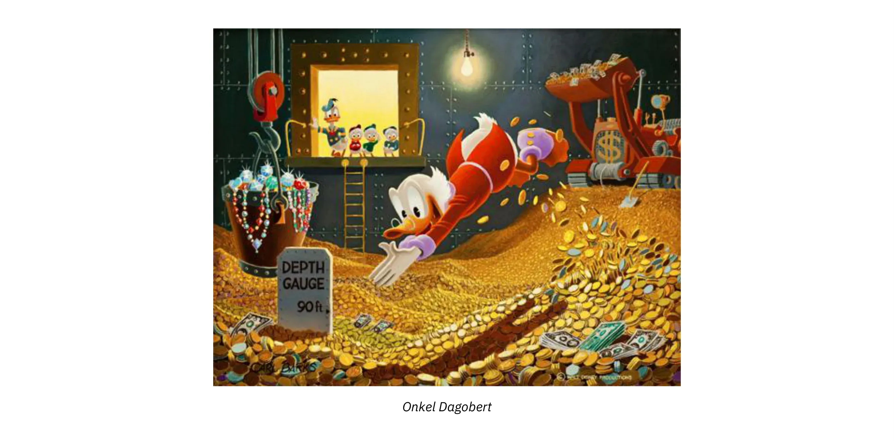

> "Nur der Reichtum des Geldes innerhalb des Staates macht den Unterschied zu seiner Größe und Macht aus".
> *Colbert*

Die Konsequenz dieser Idee ist, Exporte um jeden Preis zu begünstigen, was ausländisches Gold und Silber einbringt, und Importe auf ein Minimum zu beschränken, um sie nicht ins Ausland zu schicken.

Dies sind die vier Grundsätze, die die französische Regierung mehrere Jahrzehnte lang leiteten, als das Land ins 18. Sie sollten jedoch schon bald in Frage gestellt werden. Zwischen 1690 und 1710 waren mehrere Schriftsteller von der katastrophalen Lage Frankreichs zutiefst erschüttert. Auf der Suche nach den Ursachen kamen sie zu dem Schluss, dass die von Colbert geerbten Maximen die Schuld daran trugen, da sie sie als trügerische Argumente ansahen. Damit legten sie den Grundstein für die Wirtschaftswissenschaft.

## Vauban

<chapterId>ee9c1e0e-96cc-5026-a5e2-963d68122786</chapterId>

Heute, da der Steuerdruck in unserem Land weiter zunimmt und die nationalen Wirtschaftskräfte zu ersticken droht, werden Stimmen laut, die eine Veränderung fordern. Ob bewusst oder unbewusst, diese Rufe nach Reformen erinnern oft an die Arbeit französischer Ökonomen, die seit dem 17. Jahrhundert das Steuersystem des Landes als chaotisch, despotisch und überzogen kritisiert haben.

Der erste dieser Steuerreformer, sowohl chronologisch als auch in Bezug auf seine Verdienste, ist der große Marschall Sébastien Le Prestre Vauban, der berühmte Erbauer von Festungen und Zitadellen.

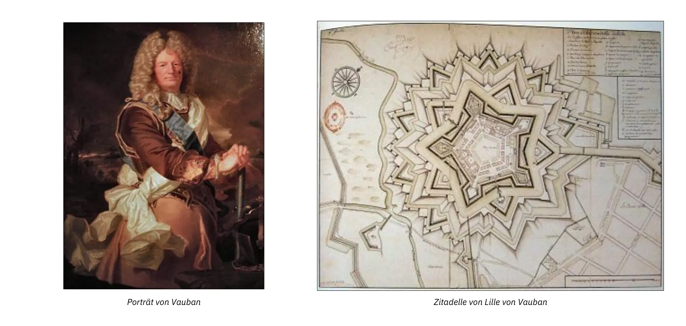

Auch wenn wir es leider vergessen haben, war Vauban nicht nur ein Militär, sondern auch ein Wirtschaftswissenschaftler. Er interessierte sich für das Schicksal der Bauern und schlug 1695 (Projet de capitation - "Projekt für eine Kopfsteuer") und 1707 (Projet d'une Dime Royale - "Königlicher Zehnt") kühne Steuerreformen vor: die meisten bestehenden Steuern sollten durch eine einkommensabhängige Steuer ersetzt werden, eine Pauschalsteuer, die ihrer Zeit voraus war.

Vauban gelangte zu diesen Ideen durch Neugierde. Er war ein scharfer Beobachter, der das soziale Leben und die wirtschaftliche Realität rigoros, fast wissenschaftlich, zu studieren suchte. Er bestand besonders auf der Notwendigkeit, durch Volkszählungen zu zählen.

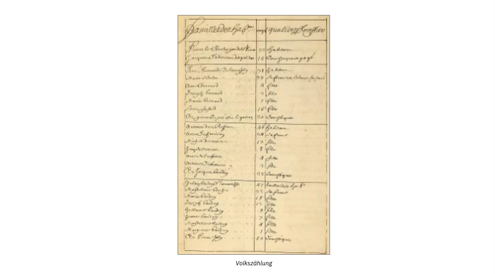

Sein zweites großes Verdienst war seine bewegende und ehrliche Beschreibung des Elends, das die Massen ertragen mussten. Er schrieb: "Lasst euch nicht täuschen, das Herz des Reiches ist ruiniert. Alles leidet, alles erträgt, alles stöhnt. Man braucht sich nur umzusehen und das Herz der Provinzen zu untersuchen, was man findet, ist noch schlimmer als das, was ich sage". Vaubans düstere Beobachtungen sind keineswegs übertrieben, sondern spiegeln das Leben zu Beginn des 18. Jahrhunderts genau wider. Alexis de Tocqueville war sich dieser Gedanken sehr wohl bewusst und beschrieb Vaubans *Royal Tithe* später als "beängstigend", weil er wahr war.

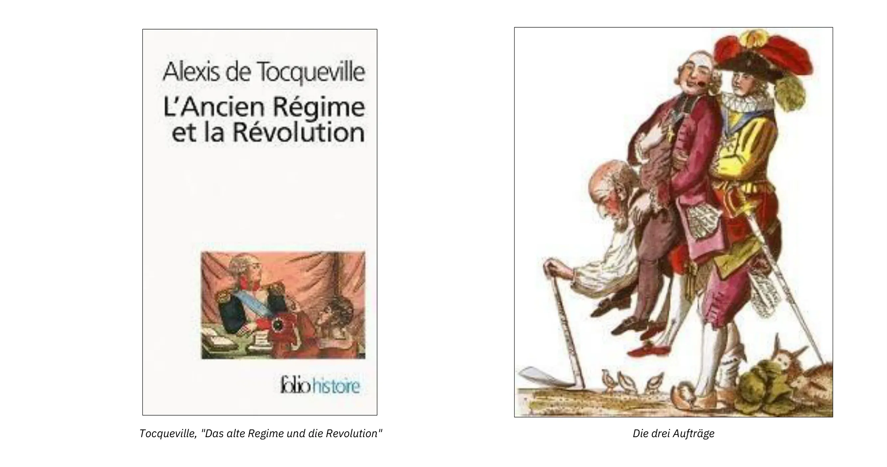

Das andere große Verdienst Vaubans als Ökonom bestand darin, dass er eine weitreichende Steuerreform vorschlug, um das von ihm beobachtete und beschriebene Übel zu beseitigen oder zumindest in seiner Intensität zu verringern. Zu Recht: Die französische Wirtschaft unter dem Ancien Régime war durch eine ungleiche, instabile und unleserliche Besteuerung gelähmt.

In seinen verschiedenen politischen und wirtschaftlichen Schriften verfolgte Vauban vor allem das Ziel, das Leid der unteren Bevölkerungsschichten zu lindern, die durch ihre Arbeit die oberen stützen und unterstützen".

Er verstand, dass die erdrückende und entmutigende Besteuerung die Bauern überforderte, ein Konzept, das er mit einer Klarsichtigkeit zum Ausdruck brachte, die wir auch in unserer Zeit noch gut beobachten können:

> "Der Bauer lässt das wenige Land, das er hat, verkümmern und bearbeitet es nur halbherzig, weil er befürchtet, dass es noch stärker besteuert wird, wenn es das produziert, was es bei richtiger Düngung und Bewirtschaftung produzieren könnte".

Vauban erkannte die Wahrheit: Die Besteuerung unter dem Ancien Régime war nicht nur irrational, sondern auch grausam streng. Es war dieses ungerechte Steuersystem, das er überwinden wollte.

Sein Lösungsvorschlag, eine pauschale, proportionale Steuer auf alle Einkommen, hätte eine gerechte Verteilung der Steuerlast auf alle sozialen Schichten ermöglicht. Auf der Grundlage einer Staatstheorie, die die öffentliche Gewalt als notwendig für den Schutz der individuellen Rechte und des Eigentums ansah, verlangte Vaubans Steuerreform, dass alle Bürger einen streng proportionalen Beitrag zu ihrem Einkommen leisten, z. B. 10 % ihres Einkommens

In Die königliche Zehntabgabe, dem einzigen seiner wirtschaftlichen Werke, das zu seinen Lebzeiten gedruckt wurde, stellte Vauban klar:

> "Da jeder in einem Staat seinen Schutz braucht, um zu überleben, ist es nur recht, dass alle entsprechend ihrem Einkommen zu seinem Unterhalt und seinen Kosten beitragen [...]. Nichts ist ungerechter als die Befreiung derjenigen, die am meisten zahlen können, und die Abwälzung der Last auf die am wenigsten Fähigen, die unter der Last zusammenbrechen; einer Last, die ganz leicht wäre, wenn sie von allen nach ihren Kräften proportional getragen würde. Deshalb ist jede Steuerbefreiung eine Unordnung, die korrigiert werden muss."

Kurz vor seinem Tod wurde die Idee Vaubans von den Ministern Ludwigs XIV. übernommen. Vauban hatte jedoch eine proportionale Steuer gefordert, die alle oder fast alle bestehenden Steuern ersetzen sollte. Stattdessen wurde, wie so oft, seine Steuer eingeführt, aber alle anderen wurden ebenfalls beibehalten.

## Boisguilbert

<chapterId>200149c6-b5fc-566e-ab0e-bafb1c3fed3c</chapterId>

Nur wenige französische Wirtschaftswissenschaftler der Vergangenheit genießen heute in ihrem Heimatland die Anerkennung, die ihren Leistungen entspricht, und Boisguilbert ist keine Ausnahme.

Von den Lesern seiner Zeit nicht geschätzt und aufgrund seines exzentrischen Charakters und seiner überwältigenden Leidenschaft von den mächtigen Kreisen distanziert, hinterließ Boisguilbert im 18. Jahrhundert kaum Spuren. Zu Beginn des letzten Jahrhunderts wurde sein Werk jedoch langsam wiederentdeckt.

Diese Wiederentdeckung zeigt jedoch, dass wir uns in einer Art Sackgasse befinden. Das wahre Verdienst von Boisguilbert ist dadurch verloren gegangen, dass man ihn als Wegbereiter zahlreicher Theorien und als Vorläufer zahlreicher Denker dargestellt hat. Er soll das Konzept der Unterbeschäftigung, das später von Keynes verteidigt wurde, erfasst, das Saysche Gesetz vorweggenommen, den Weg für die allgemeine Gleichgewichtstheorie von Walras geebnet und sogar die Klassenanalyse der Marxisten vorweggenommen haben. wem oder was könnte Boisguilbert nicht vorausgegangen sein?", fragte schließlich ein Kommentator.

(Pierre Le Pesant de) Boisguilbert wurde 1646 in Rouen geboren. Nach seiner Ausbildung in Port-Royal in Paris begann Boisguilbert eine erfolglose literarische Karriere, bevor er verschiedene Ämter übernahm, darunter das des Generalleutnants von Rouen. In dieser Zeit verfasste er mehrere Bücher, in denen er für seine Ideen eintrat, darunter "Détail de la France" (1695), das er im folgenden Jahr unter einem deutlicheren Titel neu veröffentlichte: [*France Ruined under the Reign of Louis XIV, by Whom and How, with the Means to Restore It](https://archive.org/details/bub_gb_0jUaWNbTJa8C/page/n23/mode/2up)*.

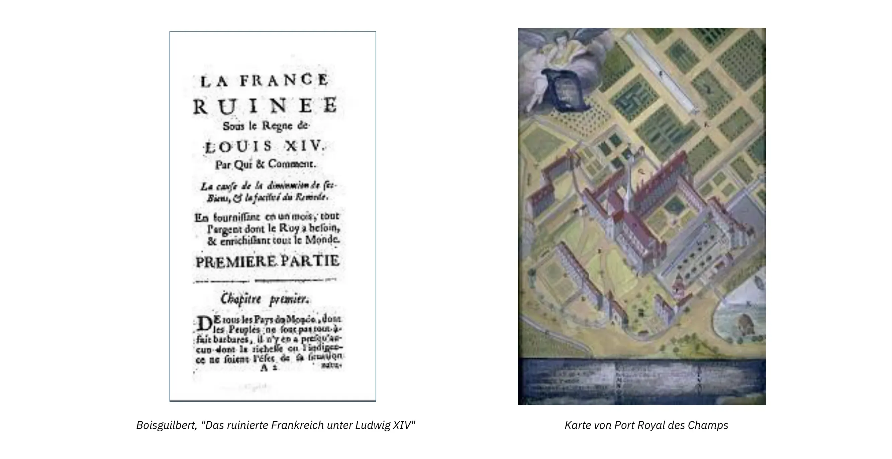

Und dies ist die Grundlage der Bücher von Boisguilbert: Die französische Armut und ihre Ursachen.

Dieses Elend des französischen Volkes am Ende des 18. Jahrhunderts beschreibt Boisguilbert, ebenso wie Vauban, sehr ausführlich. Er schreibt:

> "Die unfruchtbaren oder schlecht kultivierten Böden, die für alle sichtbar sind, sind die Leiche Frankreichs".

Er beschrieb entwurzelte Weinberge, Bauern, die ihre Felder aufgaben, und wiederkehrende Hungersnöte.

Boisguilbert sieht zwei Hauptursachen für dieses Unglück. Denn wenn die Menschen im Elend leben, dann deshalb, weil sie daran gehindert werden, das Notwendige zu konsumieren, und der Ruin des Konsums hat zwei Ursachen.

Erstens konnten sich die Menschen aufgrund der willkürlichen Besteuerung den Konsum der Grundbedürfnisse nicht mehr leisten. Die taille, die damalige persönliche Steuer, wurde für jeden Einzelnen blind berechnet und stieg oder fiel ohne Grund. Aufgrund der zahlreichen Privilegien fiel die Last auf die armen Bauern, die dadurch in den Ruin getrieben wurden. Um hier Abhilfe zu schaffen, schlug Boisguilbert eine proportionale Steuer auf alle Einkommen vor, ähnlich wie Vauban es vorgeschlagen hatte.

Der zweite Grund für die Misere Frankreichs ist, dass zu viele Hindernisse den freien Handel mit Waren, insbesondere mit landwirtschaftlichen Gütern, behinderten. Es gab Zölle an den Grenzen und sogar innerhalb des Landes, zwischen verschiedenen Regionen, die den gesamten Handel lähmten. Diese Beschränkungen verhinderten die Bildung eines Gleichgewichtspreises und schränkten die Marktchancen ein. Infolgedessen konnten die Bauern nicht von ihrer Produktion leben, da sie nicht gewinnbringend verkaufen konnten und unter unrentablen Agrarpreisen litten - ein Anliegen, das auch heute noch von großer Bedeutung ist und im Mittelpunkt der Theorie von Boisguilbert steht. Was die Handelsbeschränkungen betrifft, so plädierte Boisguilbert für die Freigabe der Wege, d. h. für die Einführung des Freihandels.

Und die Freiheit ist tatsächlich seine letzte Schlussfolgerung. "Es geht nicht darum, zu handeln", sagt er, "sondern einfach damit aufzuhören, wie wir so gewaltsam gegen die Natur zu handeln, die immer zur Freiheit und Vollkommenheit tendiert". Alles wird gut, wiederholt er unermüdlich, "solange wir der Natur ihren Lauf lassen, das heißt, ihr ihre Freiheit lassen, und niemand in diesen Handel eingreift, außer um allen Schutz zu gewähren und Gewalt zu verhindern".

Dieser letzte Abschnitt ist wesentlich. Boisguilbert war der erste, der eindeutig eine Laissez-faire-Wirtschaftspolitik forderte, sie zu seinem Credo machte und ein echtes System um sie herum aufbaute. Seiner Meinung nach gibt es eine natürliche Ordnung der Dinge, die nicht durch unzeitgemäße staatliche Eingriffe korrumpiert oder gar zerstört werden darf. Der Staat darf seiner Ansicht nach nicht in wirtschaftliche Angelegenheiten eingreifen, sondern muss die Dinge natürlich ablaufen lassen. Andernfalls wird er Elend verursachen.

Boisguilbert kritisiert sogar die "*guten Seelen*", wie er sie nennt, die es gut meinen, aber großen Schaden anrichten. Sie wollten billiges Brot für das Volk, aber indem sie die Preise drückten, ruinierten sie die Landwirte, die mit solchen Gewinnspannen nicht überleben konnten. Diese Bauern verließen daraufhin ihr Land und stürzten noch tiefer in die Armut. Wie wir alle wissen, ist die Hölle oft mit guten Vorsätzen gepflastert.

## Cantillon

<chapterId>bc206d41-6a64-5688-a489-40fcfa0e5397</chapterId>

Richard Cantillon, Autor des "Essay on the Nature of Trade in General" (geschrieben um 1730, veröffentlicht 1755), gilt als einer der Pioniere der modernen Wirtschaftswissenschaft. Der Wirtschaftswissenschaftler Murray Rothbard bezeichnet Cantillon in seiner History of Economic Thought sogar als Begründer der modernen Wirtschaftswissenschaften.

Richard Cantillon wurde in Irland geboren und ließ sich als junger Mann in Paris nieder, wo er die französische Staatsbürgerschaft erwarb. Er arbeitete als Bankier und machte während der Ära von John Law ein Vermögen.

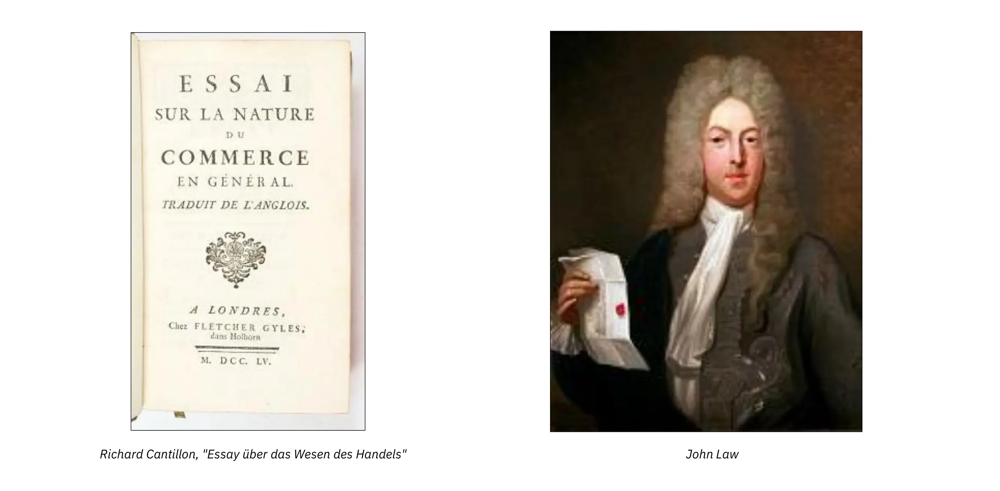

Bei dieser Gelegenheit begann er auch, sich mit der Wirtschaftstheorie zu befassen. Um 1730 verfasste Cantillon seinen "Essay on the Nature of Commerce in General".

Dieses Buch kann als einer der ersten Versuche angesehen werden, eine allgemeine Wirtschaftstheorie aufzustellen. Cantillon ist darauf bedacht, die "allgemeinen Gesetze der Wirtschaft" zu identifizieren, die in der Natur der Dinge liegen und nicht in den besonderen Gegebenheiten dieses oder jenes Landes. Dieser Ansatz war revolutionär.

Wir können die großen Verdienste von Cantillons Essay in fünf Bereichen zusammenfassen: die Theorie des Reichtums, der Begriff des Unternehmers, die Kritik an wertlosen Währungen, die "Cantillon-Effekte" und schließlich die Verteidigung der Freiheit.

Erstens, seine **Theorie des Reichtums**.

Im Gegensatz zur damals vorherrschenden merkantilistischen Sichtweise stützte Cantillon seine Analyse auf die Erkenntnis, dass der Reichtum aus den Produkten besteht, die dem Genuss des Menschen dienen. Dieser Reichtum, so argumentierte er, kommt aus der Natur und wird durch menschliche Arbeit erzeugt. Seine Ideen über die Natur des Reichtums hatten einen starken Einfluss auf Beccaria und Adam Smith und, über Smith, auf die gesamte englische klassische Schule des Denkens.

Zweitens: **der Unternehmer**.

Obwohl er ihn nicht klar definierte, betrachtete Cantillon den Unternehmer als den wichtigsten und zentralen Akteur der Wirtschaftstätigkeit. Für Cantillon zeichnet sich der Unternehmer dadurch aus, dass er Risiken eingeht und unter Unsicherheit handelt. Diese Ideen wurden später von Turgot und vor allem von Say erweitert, um schließlich die besondere Stellung des Unternehmers in der Wirtschaft anzuerkennen, diesmal im Gegensatz zu den Behauptungen der englischen Schule.

Dritter Punkt: **Währung**.

Als Reaktion auf die Erfahrung von John Law erklärt Cantillon, was passiert oder passieren muss, wenn eine Währung keinen realen Wert hat.

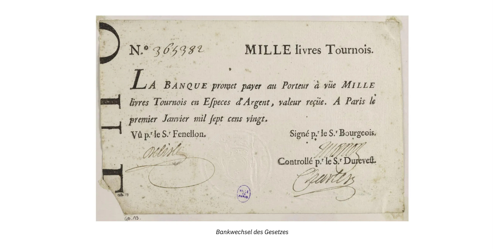

Er sieht zwei Hauptfolgen der Ersetzung einer Währung ohne realen Wert wie Papiergeld durch eine metallische Währung. Die erste Folge ist das, was er als "Ablehnung der Bevölkerung" bezeichnet, d.h. ein wachsendes Misstrauen gegenüber wertlosem Geld. Die zweite Folge ist die Inflation: Die Schwächung des Geldes verteuert die Waren.

Viertens ging Cantillon in seiner Analyse der **Inflation** weiter als seine Zeitgenossen. Nachdem er den Zusammenbruch des Lawschen Systems beobachtet hatte, erkannte Cantillon, dass die Geldinflation nicht alle gleichermaßen betrifft. Im Gegenteil, sie bereichert einige und verarmt andere. Er kam zu dem Schluss, dass die Inflation einen Umverteilungseffekt hat: Diejenigen, die neu ausgegebenes Geld erhalten, profitieren zuerst von der gestiegenen Kaufkraft, während diejenigen, die es später erhalten, durch die Ausgabe des neuen Geldes aufgrund des Anstiegs der Inflationsraten ärmer werden.

Fünftens war Cantillon trotz einiger Reste merkantilistischen Denkens insgesamt **völlig liberal**. Er verteidigte das Privateigentum als Grundpfeiler der Zivilisation und vertrat die Ansicht, dass keine Gesellschaft ohne private Ownership von Land und Arbeitsprodukten funktionieren kann. Er betrachtete auch die materielle Ungleichheit zwischen den Menschen als natürlich und legitim. Cantillon zufolge ist es nicht schlimm, wenn ein effizienter und mutiger Arbeiter oder ein außergewöhnlich begabter Mensch mehr verdient als jemand, der inkompetent oder faul ist.  Schließlich vertrat Cantillon die Ansicht, dass die Preise immer frei, durch das Spiel von Supply und Nachfrage, ohne Eingriffe der öffentlichen Hand bestimmt werden sollten.

Unter diesen fünf wichtigen Ideen in seinem Essay ist die wichtigste zweifellos diejenige, die heute seinen Namen trägt: der **Cantillon-Effekt**.

Mit dieser Theorie über die Auswirkungen der Inflation gibt uns Cantillon Antworten auf eine Reihe zeitgenössischer Übel. Sie hilft uns, die Folgen der jüngsten expansiven und inflationären Geldpolitik zu verstehen, die die Mittelschicht und den ländlichen Raum verarmt hat, während sich die Finanzmarktakteure und der Staat, seine Behörden und seine Beamten aufgrund ihrer gemeinsamen Nähe zur Quelle des neuen Problems, den Zentralbanken und Geschäftsbanken, bereichert haben.

# Reformer und Denker des frühen 18. Jahrhunderts

<partId>1f7b50d4-ce93-5db3-8396-43c1fa5419ff</partId>

## Der Abt von Saint-Pierre

<chapterId>13478fe2-4c12-593c-a410-54c2cfb7ef7f</chapterId>

Von allen Autoren, die wir in das Pantheon der französischen Laissez-faire-Denker des 18. Jahrhunderts aufnehmen wollen, ist der Abt von Saint-Pierre zweifellos der am meisten übersehene.

Um fair zu sein, ist das zum Teil seine eigene Schuld. Er hat viel geschrieben, aber sein Stil ist schwer zu lesen und steckt voller Wiederholungen. Sogar Jean-Jacques Rousseau versuchte, sein Werk zusammenzufassen: Er begann damit, gab die Aufgabe aber bald auf, da er erkannte, dass sie seine Kräfte überstieg. Mitte des 19. Jahrhunderts ehrte ihn Gustave de Molinari mit der Veröffentlichung eines umfassenden Werks über ihn, in dem er den Pazifisten und Ökonomen, der der Abt von Saint-Pierre war, würdigte. Dies reichte jedoch nicht aus, um ihn aus der Vergessenheit zu holen, in der er bis heute verharrt.

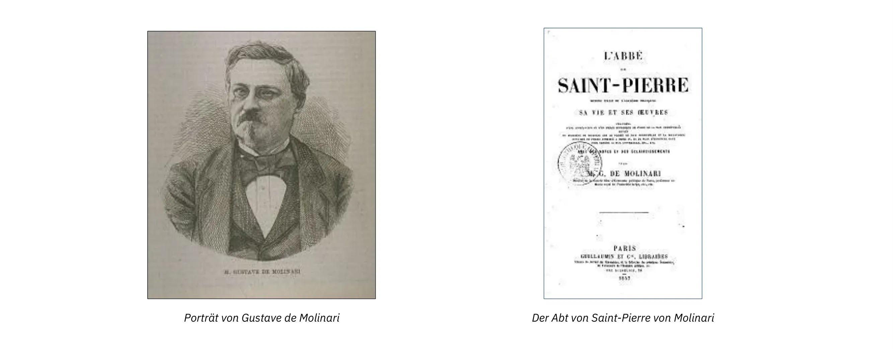

Der Abt von Saint-Pierre hat über Wirtschaft geschrieben, aber eigentlich ist er eher als Pazifist von Interesse. Er ist der Autor eines Projekts für den ewigen Frieden, das dem bekannten Projekt von Emmanuel Kant vorausgeht.

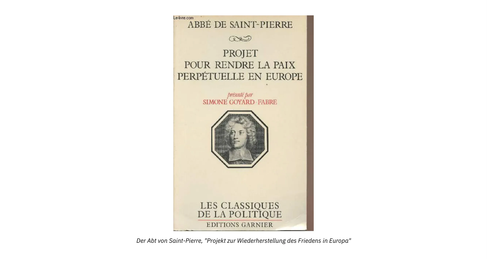

In diesem Werk vertrat er die Ansicht, dass Kriege nicht nur für die Verlierer, sondern auch für die Gewinner und sogar für diejenigen, die nicht an ihnen teilnehmen, zerstörerisch sind, da ihr Handel beeinträchtigt wird.

Um die Geißel des Krieges zu bekämpfen, empfahl er die Schaffung einer Art europäischen Völkerbundes. Ein europäischer Rat würde gebildet, um die Probleme der einzelnen Nationen zu lösen. Die Nationen würden also auf ein Schiedsverfahren zurückgreifen, um den Griff zu den Waffen zu vermeiden. Sollte eine Nation nicht weise genug sein, den Frieden zu akzeptieren, und sollte sie die anderen europäischen Nationen bedrohen, würde der europäische Völkerbund über ein Mittel verfügen, um zu reagieren. Für solche Fälle würde eine europäische Armee gebildet, deren Truppen von den einzelnen Ländern gestellt würden.

Es gibt auch eine Episode im Leben des Abtes von Saint-Pierre, die den kritischen Geist der französischen Laissez-faire-Bewegung perfekt veranschaulicht. Er trat 1695 der Académie Française bei, wurde aber 1718 ausgeschlossen, weil er es gewagt hatte, die Herrschaft von Ludwig XIV. zu kritisieren. Damit schloss er sich Persönlichkeiten wie Vauban und Boisguilbert an, die es ebenfalls gewagt hatten, sich gegen die Missstände auszusprechen, die sich hinter dem Glanz der Herrschaft des Sonnenkönigs verbargen.

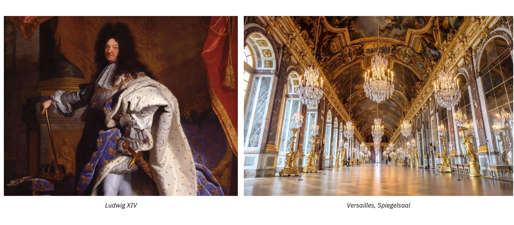

Der Abt von Saint-Pierre vertrat die Ansicht, dass die Herrschaft Ludwigs XIV. mit ihrem luxuriösen Hofstaat und ihrer Besessenheit von militärischen Eroberungen nicht das Zeichen eines tugendhaften Königs war. Er weigerte sich zu akzeptieren, dass Ludwig XIV. den Titel "**Louis der Große**" verdiente.

"Seine Nachbarn und sein Volk gleichzeitig zu ruinieren, ist keine Größe", sagte er. Dieser Standpunkt verärgert die Académie Française zutiefst, die seit langem damit beschäftigt ist, den König in jeder möglichen literarischen Form zu verherrlichen. Die Académie Française beschloss daraufhin fast einstimmig, ihn auszuschließen.

In Bezug auf wirtschaftliches Denken wandte er konsequent das Nützlichkeitsprinzip an, ähnlich wie es später Jeremy Bentham tun sollte, und bot oft fundierte Einsichten. Fairerweise muss man sagen, dass er noch immer von merkantilistischen Ideen beeinflusst war, die zu dieser Zeit noch niemand vollständig abgelegt hatte.

Dennoch machte der Abt von Saint-Pierre einige genaue Beobachtungen über die Wirtschaft. Noch vor *Condillac*, dem die Idee oft zugeschrieben wird, stellte er klar, dass in jedem Exchange beide Parteien profitieren. Dies findet sich in seinem 1733 veröffentlichten ["Projekt zur Verbesserung des französischen Handels"](https://www.institutcoppet.org/projet-pour-perfectionner-le-commerce-de-france/), wo er schreibt:

> "Wenn ein Verkauf zwischen Kaufleuten zustande kommt, profitiert der Verkäufer und auch der Käufer; denn gäbe es nicht einen realen oder vermeintlichen Vorteil auf beiden Seiten, würde weder der Verkäufer zu einem solchen Preis verkaufen, noch der Käufer seinerseits zu einem solchen Preis kaufen.

Noch vor Vinzenz de Gournay betonte er den Wert der Arbeit und wie wichtig es ist, sie attraktiv zu halten. "Alle Arbeit ist schwer", schrieb er. "Und wenn ein Mann sieht, dass seine Arbeit nichts oder nicht genug einbringt, wird er müßig und macht sich nicht die Mühe, sich unnötig anzustrengen". Genau dieses Argument wurde später vom Marquis d'Argenson, Vincent de Gournay und den Physiokraten aufgegriffen, als sie lästige Vorschriften und Zunftsysteme kritisierten. Sie argumentierten, dass solche Beschränkungen die Arbeiter entmutigten, unnötige Schwierigkeiten verursachten und schließlich Müßiggang unter solchen Bedingungen attraktiver erscheinen ließen als produktive Anstrengungen.

## Der Marquis d'Argenson

<chapterId>e9960ab4-72ec-5afd-8e97-bf89c83b62bc</chapterId>

Der Marquis d'Argenson ist ein vergessener Begründer der Doktrin des Laissez-faire.

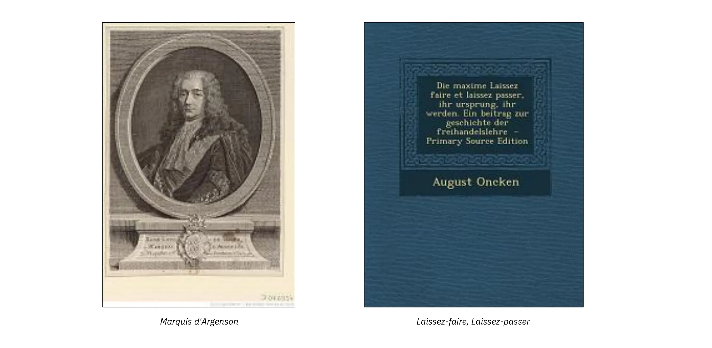

Sie wurde von August Oncken, Autor eines Buches über die Laissez-faire- und Laissez-passer-Doktrin, wiederentdeckt, der zu dem Schluss kam, dass d'Argenson eine wichtige Rolle bei der Entstehung dieser Idee spielte.

René-Louis Voyer, Marquis d'Argenson, wurde 1694 geboren. Er begann seine politische Karriere als parlamentarischer Berater und war dann Mitglied des Staatsrats.

Dreißig Jahre vor Adam Smith verteidigte d'Argenson bereits die Vorteile der Arbeitsteilung und Spezialisierung.

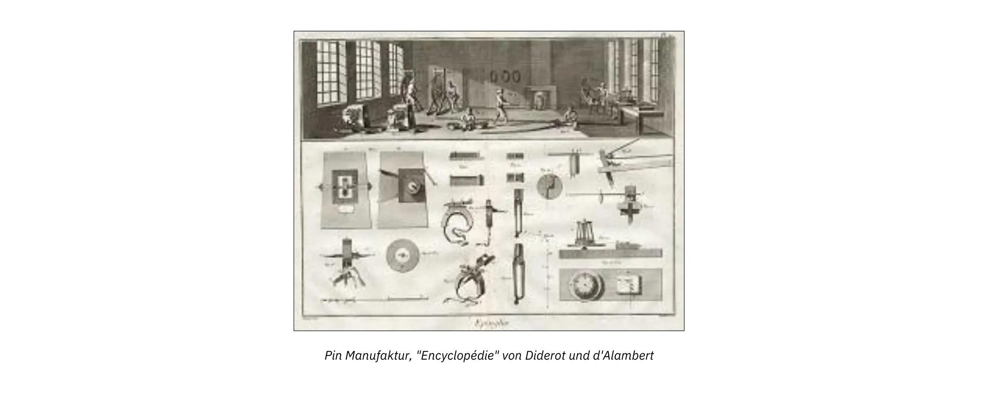

Er übte scharfe Kritik an Verordnungen, die seiner Meinung nach versuchten, die natürlichen Vorlieben der verschiedenen Regionen zu verändern. So war er beispielsweise verblüfft, dass die Regierung in Tours, einer damals armen Stadt, Stoffe und Samtstoffe in der gleichen Qualität herstellen lassen wollte wie im wohlhabenden Genua, das für seine Luxusgüter berühmt war. Er schloss daraus:

> "Jeder Ort muss die Möglichkeit haben, seine eigenen Fabriken zu wählen. Freiheit! Freiheit!"

Er erkannte auch ein anderes zentrales Prinzip von Smith an: die Idee, dass spontane Ordnung aus dem Streben nach Eigeninteresse entsteht. Der Marquis d'Argenson glaubte, dass das unmittelbare persönliche Interesse die menschliche Energie antreibt. Er schrieb, dass schlechte Handwerkskunst und Betrug einen Fabrikanten in Misskredit bringen würden, während Fleiß und gute Absichten zu Wohlstand führen würden. Der beste Beurteiler des Nutzens sei das Individuum, die breite Öffentlichkeit, die Waren kaufe und sich um ein gutes Geschäft bemühe. "Jeder spürt sein eigenes Interesse", sagte er, "jeder ergreift die Maßnahmen, die für ihn vorteilhaft sind, und in dieser allgemeinen Übereinstimmung entdecken wir die Wahrheit."

Noch vor Adam Smith verstand er, dass das Eigeninteresse durch den Aufbau einer spontanen natürlichen Ordnung zum allgemeinen Interesse führt.

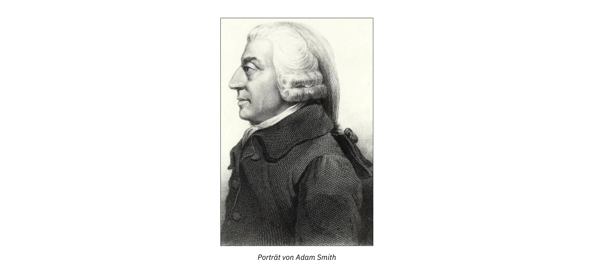

Er verglich die Gesellschaft mit einem Bienenstock, in dem jedes Insekt seinem Instinkt folgt. "Aus ihren Handlungen", so sagte er genau, "resultiert eine große Anhäufung für die Bedürfnisse der kleinen Gesellschaft; aber dies wurde nicht durch Befehle oder durch Generäle herbeigeführt, die jedes Individuum zwangen, den Ansichten ihres Führers zu folgen". Dies ist vielleicht der Ausdruck, der im französischen Wirtschaftsdenken dem berühmten Konzept der "unsichtbaren Hand" von Adam Smith am nächsten kommt.

Der Marquis d'Argenson war stets empört über die Ideen der Minister seiner Zeit. Die einzige Frage, die sie stellten, war: "Sollen wir so oder so regeln? Sollen wir die Wirtschaft in diese oder jene Richtung lenken?". Darauf antwortete d'Argenson: "Sollten wir nicht zuerst fragen, ob es überhaupt angebracht ist, etwas zu lenken, oder ob man die Dinge sich selbst überlassen sollte?"

Um die Wahrheit zu sagen, war er erstaunt, dass die Menschen die schädlichen Auswirkungen von übermäßiger Regulierung jeglicher Art auf die Wirtschaft nicht verstehen, oder besser gesagt, nicht sehen können. Seiner Meinung nach reichte es aus, einfach die Augen zu öffnen. "So viele Dinge funktionieren heute einigermaßen gut", schrieb er bitter, "einfach weil es ihnen gelungen ist, dem Zugriff des Gesetzes zu entgehen".

Manchmal war er verzweifelt darüber, wie wenig seine Ideen verstanden wurden.

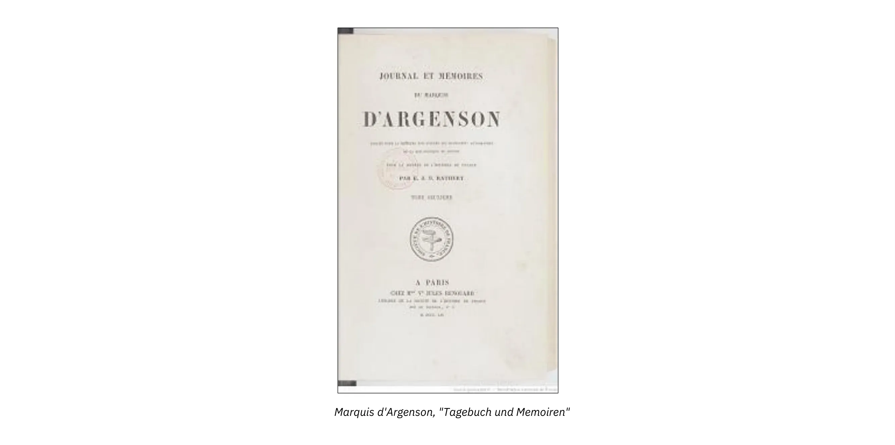

Das Ideal der Wirtschaftspolitik, das er vertrat, stand also im Gegensatz zu den Tendenzen seiner Zeit. Sein Ideal definiert eine im Wesentlichen negative Rolle des Staates. "Alles, was der Handel braucht, ist die Beseitigung von Hindernissen. Er verlangt nur nach guten Richtern, der Bestrafung von Monopolen, dem gleichen Schutz für alle Bürger, stabilen Währungen, Straßen und Kanälen". Dies war die Definition eines Minimalstaates, die eine der Grundlagen der französischen Tradition in der politischen Ökonomie werden sollte.

Diese Vision der Rolle des Staates in der Wirtschaftstätigkeit wurde natürlich durch die Untersuchung von zwei wichtigen Themen veranschaulicht, die die Ökonomen und Sozialdenker seiner Zeit bewegten: die Regulierung der Industrie und der Weizenhandel.

Vor allem die Vorschriften für die Industrie erregten seinen ganzen Unmut, weil sie Privilegien für die einen auf Kosten der anderen darstellten. "Die wahre Ursache für den Niedergang unserer Fabriken", schreibt er, "ist der übermäßige Schutz, der ihnen gewährt wird". Und mit einem nicht minder lebhaften Credo kritisierte er den dirigistischen Eifer der Staatsmänner seiner Zeit:

> Wer die Industrie gegen ihren Willen steuert, will ihren Ruin.

Auf die Frage des Handels mit Lebensmitteln hatte d'Argenson keine andere Antwort als die Freiheit. Die Weizenknappheit sei auf das Monopol und die übertriebenen Vorsichtsmaßnahmen der Regierung zurückzuführen. Man müsse es nur zulassen, und in einem Land, in dem die Häfen offen seien, werde es nie einen Mangel an Weizen geben. Die Ausländer, die wie alle anderen Menschen von der Verlockung des Gewinns angezogen werden, würden uns mit dem versorgen, was wir brauchen, und uns den Überschuss wegnehmen. "Lasst es zu", sagte er, "und alles wird gut".

## Vinzenz von Gournay

<chapterId>e8ae40dc-7450-552f-9ddc-9e02936cf425</chapterId>

Vincent de Gournay war einer der ersten Vertreter des Laissez-faire in Frankreich und einer seiner frühesten Fürsprecher in der öffentlichen Verwaltung und in intellektuellen Kreisen. Aus diesem Grund verdient er in der Geschichte des wirtschaftlichen Denkens weit mehr Anerkennung, als ihm normalerweise zuteil wird. Ich habe versucht, seine Beiträge in einem kürzlich erschienenen Buch hervorzuheben.

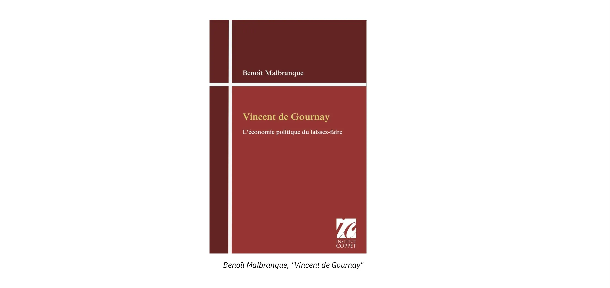

Gournay stammte aus einer Kaufmannsfamilie und wurde selbst ein erfolgreicher Kaufmann, der ein beträchtliches Vermögen anhäufte, bevor er eine Stelle in der französischen Verwaltung erhielt. Im Handelsministerium war er ein glühender Verfechter der freien Arbeit und des freien Handels.

Obwohl er im Kreise der führenden Ökonomen seiner Zeit gut eingeführt war, schrieb Gournay wenig oder, besser gesagt, veröffentlichte wenig. Er schrieb hauptsächlich Verwaltungsbriefe und Memoiren, die entweder unveröffentlicht blieben oder von anderen Autoren nach einer gewissen Bearbeitung veröffentlicht wurden.

Was wir haben, ist Folgendes:

1. [Die Bemerkungen](https://archive.org/details/traitessurlecomm0000chil) zu einer Übersetzung eines Buches des englischen Wirtschaftswissenschaftlers Josiah Child;

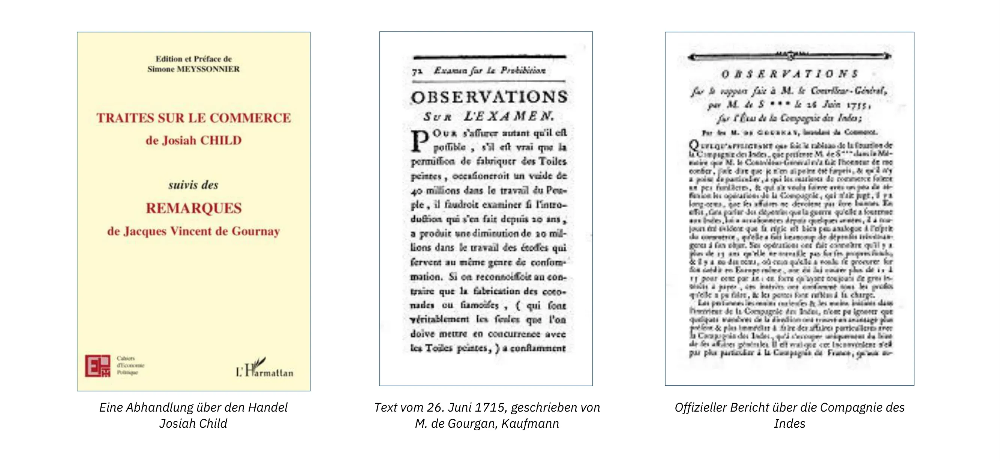

2. "Beobachtungen" im Rahmen der Prüfung der Vor- und Nachteile des Verbots von bedruckten Stoffen;

3. "Beobachtungen über die Ostindien-Kompanie", von Abt Morellet seiner Denkschrift über den gegenwärtigen Zustand der Ostindien-Kompanie (1769) beigefügt;

4. Und vor allem verschiedene Memoiren aus seiner Zeit als Intendant des Handels.

Diese Schriften zeigen einen deutlichen ausländischen Einfluss und das Vorhandensein einiger wichtiger strukturierender Ideen. Der ausländische Einfluss besteht bei Gournay in der Anerkennung der englischen und niederländischen Überlegenheit. Gournay ist davon überzeugt, dass diese beiden Nationen die Wirtschaft weit besser verstehen als Frankreich und dass Frankreich ihrem Beispiel folgen muss. "Diese beiden Nationen sind die wohlhabendsten", sagte er, "und sie folgen einem völlig anderen System als wir. Wir verbieten die Einfuhr ausländischer Waren, wir schränken die Wirtschaftstätigkeit durch drakonische Vorschriften ein, während sie das Gegenteil tun. Wenn es ihnen besser geht", schloss Gournay, "dann liegt das daran, dass Frankreich sich von falschen Prinzipien leiten lässt".

Seine Reformvorschläge konzentrierten sich auf mehrere Kernpunkte.

Erstens war er der Meinung, dass die Arbeit geschützt und gefördert werden müsse. Damals wurden die französischen Arbeiter wie Kriminelle behandelt, ständig überwacht und in Angst gehalten, eine der Tausenden von Vorschriften nicht zu befolgen. Diese übermäßige Belästigung hielt die Menschen von der Arbeit ab und trieb sie stattdessen zum Müßiggang. Doch, so Gournay, "Arbeit ist edel und der einzige Weg, eine Nation zu bereichern".

Zweitens kritisierte er das restriktive System der Zünfte, das die Hersteller einschränkte. Die Teilnahme an einem Handwerk war sowohl zeitaufwändig als auch teuer, und jeder neue Arbeiter musste sich peinlich genau an die in den Statuten seiner Zunft festgelegte Routine halten. Ein solches System ließ keinen Raum für Spitzenleistungen, Innovation und Fortschritt.

Drittens war der Handel in Frankreich durch restriktive Gesetze eingeschränkt. Gournay ist der Ansicht, dass es für die Verbraucher von großem Nutzen wäre, wenn die Häfen frei miteinander konkurrieren könnten und alle Waren, wie z. B. Getreide und gedruckte Leinwände, ohne Einschränkungen eingeführt werden dürften. Er war einer der ersten, der auf den wahren Ursprung des Schmuggels hinwies: Es gab ihn nur, weil ein nützlicher und vorteilhafter Handel verboten war. Er fügte eine scharfe Beobachtung hinzu: Der Schmuggel war ein "freier" Beruf, ohne Vorschriften, ohne Zünfte, ohne konfiskatorische Steuern. Dennoch trieb der Staat mit seiner übermäßigen Regulierung viele ehrliche Arbeiter in die Illegalität.

Schließlich stellt Gournay fest, dass die Zinssätze in England und den Niederlanden, die wohlhabender sind als Frankreich, niedriger sind. Er plädiert für niedrigere Zinssätze auch in Frankreich, damit die Wirtschaftstätigkeit dort zu ebenso günstigen Bedingungen wie anderswo finanziert werden kann. Gournay strebte jedoch keine gesetzgeberischen Zwangsmaßnahmen an, sondern betonte vielmehr die Notwendigkeit, den Geldverleih zu legalisieren, der von der katholischen Kirche noch immer verurteilt wurde.

In all diesen Punkten spielte Gournay eine Schlüsselrolle in den intellektuellen Debatten der Mitte des 18. Jahrhunderts. Seine Verteidigung der wirtschaftlichen Freiheit ging den Physiokraten um ein Jahrzehnt und Adam Smith um zwanzig Jahre voraus. Am nachhaltigsten aber war sein Einfluss auf Turgot. Gournay nahm den jungen Turgot unter seine Fittiche und bildete ihn mit seinen Ideen aus.

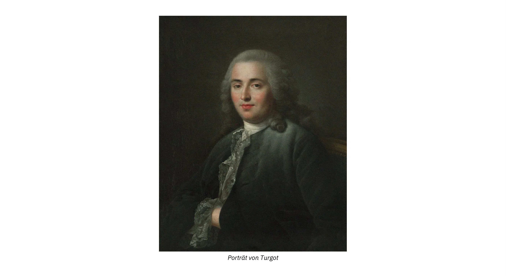

Jahre später schrieb Turgot, ein zukünftiger Minister unter Ludwig XVI., nach dem Tod seines Freundes eine Lobrede auf ihn. Und wenn Turgot die Physiokratie von François Quesnay nie vollständig übernommen hat, dann deshalb, weil er eine unüberwindliche Bindung an seinen ersten Meister Vincent de Gournay bewahrt hat.

## Der Gournay-Kreis

<chapterId>b86ba6bd-8f3a-5d8f-b098-4d0413f00deb</chapterId>

Wenn es um die Anfänge der Wirtschaftswissenschaft geht, tendiert die Geschichte dazu, eine erste Denkschule hervorzuheben: die Physiokraten, angeführt von François Quesnay und seinen Jüngern. Fast ein Jahrzehnt vor ihrem Aufstieg gab es jedoch eine andere, weniger formelle, aber ebenso wichtige Gruppe um den Ökonomen Vincent de Gournay.

Wie wir im vorigen Teil gesehen haben, war Gournay vom Beispiel ausländischer Nationen wie England und Holland fasziniert. Er bewunderte ihre Ökonomen - Persönlichkeiten wie Josiah Child, Johan de Witt und David Hume - ebenso sehr.

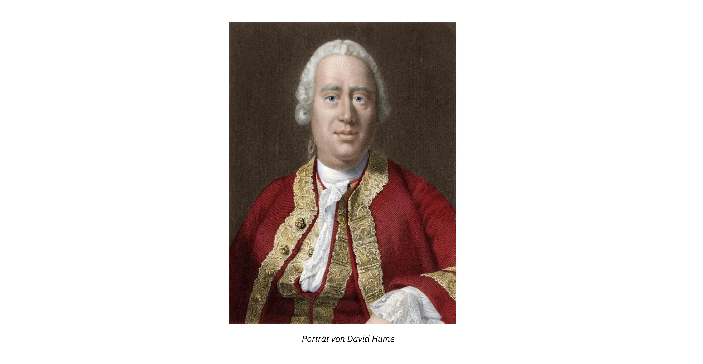

Diese Bewunderung veranlasste ihn, ihre ökonomischen Schriften zu übersetzen und Übersetzungen in Auftrag zu geben.

Es stellte sich heraus, dass Gournay durch seine Position in der oberen Verwaltung mit allen damals in Frankreich bekannten Wirtschaftsexperten in Kontakt kam. Auf diese Weise stellte er eine Gruppe von äußerst fähigen Übersetzern zusammen. Er übersetzte persönlich die Werke von Child und Culpeper. Abt Le Blanc übersetzte die Politischen Reden von David Hume. Véron de Forbonnais übersetzte den spanischen Ökonomen Geronymo de Uztariz. Turgot arbeitete an den Schriften von Josiah Tucker, und Montesquieus Sohn übersetzte Joshua Gee.

Dank der Zusammenarbeit mehrerer Mitglieder des Gournay-Kreises konnten zahlreiche Autoren Originalwerke unter ihrem eigenen Namen veröffentlichen. Diese Bücher und die Übersetzungen wurden zu einem bemerkenswerten Erfolg. Einige bemerkenswerte Beispiele sind:

- Herbert's Essay on the [General Police of Grain](https://archive.org/details/essaisurlapolice00herb/page/n7/mode/2up) (6 Ausgaben in 4 Jahren)

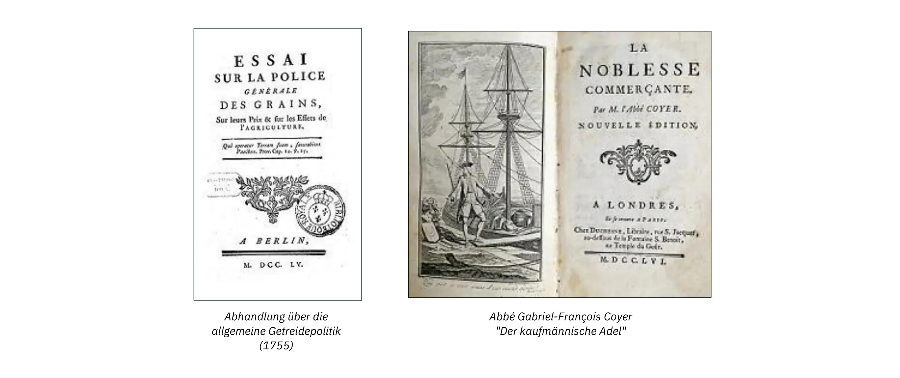

- Coyer's [Noblesse commerçante](https://archive.org/details/lanoblessecommer00coye/page/n3/mode/2up) (5 Ausgaben in 2 Jahren)

- Plumard de Dangeul's [Bemerkungen zu den Vorteilen und Nachteilen Frankreichs und Großbritanniens](https://archive.org/details/bim_eighteenth-century_remarks-on-the-advantage_plumard-de-dangeul-loui_1754) (3 Auflagen im ersten Jahr)
- Cliquot-Blervache und Gournay's [Memoiren über die Berufe](https://www.amazon.com/Memoire-sur-corps-metiers-French/dp/1978196903) (2 Ausgaben in 1758)

Die Gruppe spielte auch eine entscheidende Rolle bei der Veröffentlichung von

- [Essay über die Natur des Handels im Allgemeinen](https://archive.org/details/essayonnatureofc0000cant) von Richard Cantillon.

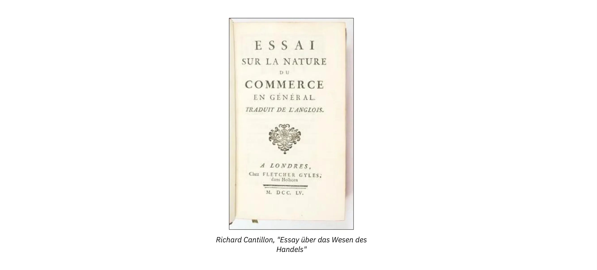

Dieses letzte Buch, das um 1730 geschrieben wurde, blieb nach dem Tod des Autors als Manuskript erhalten. Gournay veröffentlichte es mit Hilfe seiner Freunde, die Ökonomen waren, im Jahr 1755. Laut dem Abt Morellet, einem Mitglied des Kreises, empfahl Gournay es allen ihm bekannten Ökonomen.

Das intellektuelle Schaffen des Gournay-Kreises hatte großen Einfluss auf die Ideengeschichte. In diesem Sinne können sie als die Begründer der Wirtschaftswissenschaft in Frankreich angesehen werden. Christine Théré vom INED, die die Geschichte der ökonomischen Publikationen untersucht hat, stellte fest, dass zwischen 1750 und 1759 nicht weniger als **349** Werke zur Ökonomie veröffentlicht wurden, im Vergleich zu nur **83** im gesamten vorangegangenen Jahrzehnt (1740-1749). Diese Revolution in den 1750er Jahren ist weitgehend auf den Gournay-Kreis zurückzuführen.

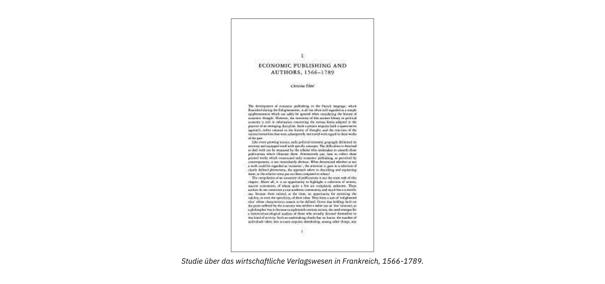

Um die französische Bevölkerung für wirtschaftliche Diskussionen zu sensibilisieren, bemühten sich Gournay und seine Freunde, diese durch Romane zugänglich zu machen. Nach den *Memoir on the Trades*, die die Zünfte kritisierten, halfen Gournay und Cliquot-Blervache Gabriel-François Coyer bei der Abfassung eines kurzen satirischen Romans mit dem Titel Chinki: [A Cochinchinese Tale Applicable to Other Nations](https://www.institutcoppet.org/wp-content/uploads/2013/06/Coyer-Chinki-Histoire-cochinchinoise.pdf).

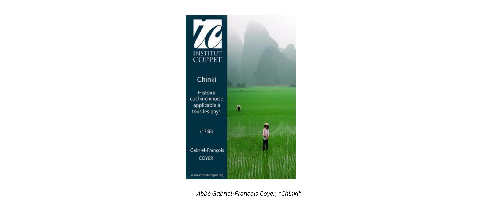

Die Geschichte handelt von der Hauptfigur Chinki, der aufgrund überhöhter Steuern sein Land verlassen muss und versucht, in der Stadt eine handwerkliche Arbeit für seine Kinder zu finden. Aber alle Berufe sind ihnen wegen missbräuchlicher Zunftvorschriften verwehrt, und so schildert die Geschichte seine wachsende Enttäuschung in humorvollen Tönen.

Der Kreis um Gournay stand also am Anfang einer intensiven Welle von Veröffentlichungen. Dieser wichtige Beitrag ist bei den Wirtschaftshistorikern in Vergessenheit geraten, während er für die Zeitgenossen sehr deutlich war. Die Physiokraten, die ihre Schule in den 1760er Jahren organisierten, würden später die Gruppe von Gournay als ihre direkten Vorläufer präsentieren. Der Wirtschaftswissenschaftler Jacques Accarias de Serionne brachte dies 1767 in seiner Würdigung noch deutlicher zum Ausdruck. Er schrieb: "Eine kleine Anzahl von Franzosen, sowohl Philosophen als auch Bürger, begann vor einigen Jahren, englische Schriftsteller zu imitieren. Sie übersetzten zunächst ihre Vorbilder und übertrafen sie bald in vielerlei Hinsicht. Sie brachten den ganzen Charme und Reichtum der Literatur in die Behandlung nützlicher Themen ein; sie entfachten und verbreiteten den Geschmack für die Wissenschaften, die für den Wohlstand des Staates am wichtigsten waren".

Und in der Tat wurden in den 1750er Jahren wirtschaftliche Fragen zum Modethema. Voltaire bemerkte berühmt, dass die Franzosen um 1750 keine Romane mehr schrieben, um über die Freiheit des Getreidehandels zu diskutieren. Dieser Trend wurde auch vom Mercure de France festgestellt, der in einer Ausgabe von 1758, einige Monate vor Gournays Tod, schrieb "Die politische Ökonomie ist jetzt die Wissenschaft, die in Mode ist. Bücher, die sich mit der Landwirtschaft, der Bevölkerung, der Industrie, dem Handel und dem Finanzwesen befassen, sind jetzt in den Händen unzähliger Menschen, die vor nicht allzu langer Zeit nur oberflächlich Romane gelesen haben". Eine bessere Würdigung Gournays und der Arbeit seines Kreises von Wirtschaftswissenschaftlern kann man kaum geben.

## Mirabeau

<chapterId>2d2f802b-e3b6-556f-9025-a1b1dc4409ca</chapterId>

Frankreich hat zwei berühmte Männer namens Mirabeau gekannt, einen Vater und einen Sohn, aber es war der Sohn, der wirklich Geschichte schrieb. Als Revolutionstribun und eine der zentralen Figuren in den Ereignissen der Französischen Revolution blieb er berühmt.

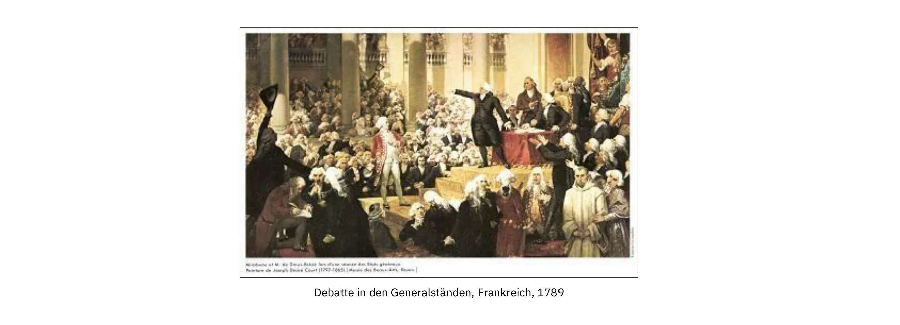

Durch sein Talent und seinen Platz in der französischen Geschichte stellte er seinen Vater in den Schatten, einen Ökonomen und Pfeiler der Schule von François Quesnay, der bereits 1758 ihr erstes Mitglied gewesen war.

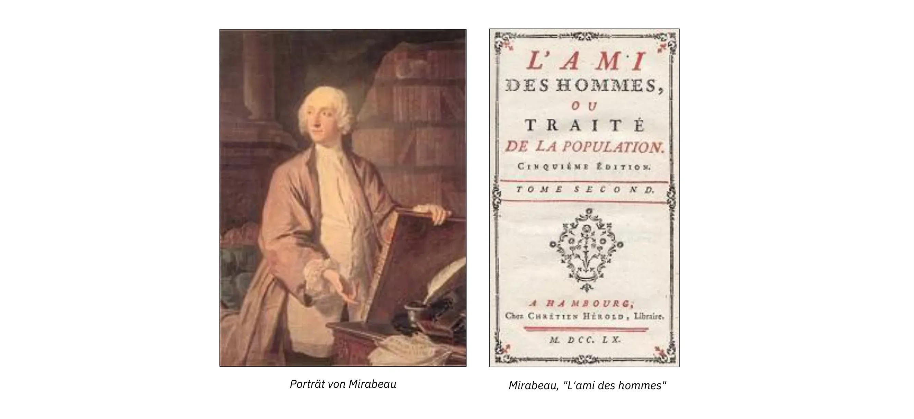

Der Marquis de Mirabeau hatte nämlich schon vor seiner Annahme der Physiokratie dank eines Buches mit dem Titel "Der Menschenfreund. Abhandlung über die Bevölkerung [FR: L'ami des hommes, ou, Traité de la population](https://archive.org/details/lamideshommesou00unkngoog). Obwohl die erste Ausgabe 1756 veröffentlicht wurde, erlangte sie um 1757, ein Jahr vor seinem Treffen mit Quesnay, Berühmtheit.

Zwischen 1757 und 1760 wurden mehr als 20 Auflagen veröffentlicht, was es wahrscheinlich zum erfolgreichsten Wirtschaftsbuch der Geschichte macht. Einige Leser dachten sogar, das Buch sei von Montesquieu geschrieben worden, weil es so scharfsinnig ist. Der Dauphin, der Vater König Ludwigs XVI., behauptete sogar, es auswendig gelernt zu haben. Eine Zeit lang war es das Buch, das in Versailles von allen gelesen wurde.

Heute ist es ein Buch, das nicht mehr gelesen wird, aber viele beziehen sich noch darauf. Schon im 19. Jahrhundert sagte Edmond Roussel:

> L'Ami des Hommes ist eines jener Bücher, über die alle reden, die aber kaum jemand kennt. In jeder Generation sollte es ein mutiger Bürger lesen, damit alle anderen es nicht lesen müssen.

Zu Beginn seiner Karriere als Wirtschaftswissenschaftler ließ sich Mirabeau von Richard Cantillon inspirieren. Er hatte 15 Jahre lang ein Manuskript von Cantillons "Essay on the Nature of Commerce in General" besessen und es geduldig analysiert und kommentiert.

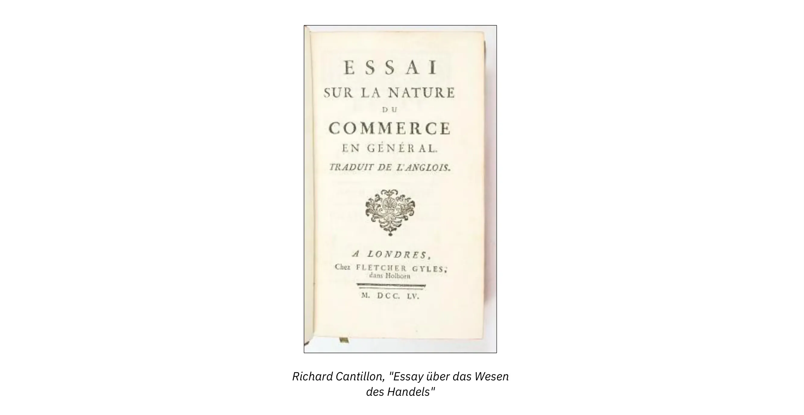

L'Ami des Hommes war ursprünglich als einfacher Kommentar zu Cantillons Essay gedacht. Da Mirabeau aber einen etwas eklektischen, d. h. offen gesagt etwas verrückten Geist hatte, wich er schnell von seinem ursprünglichen Plan ab. Das Buch behandelt einfach alle wirtschaftlichen Fragen, die er kannte, wobei er sich gelegentlich von Cantillon entfernt. Es ist ein schwer zu lesendes Buch, mit einem bizarren Plan und Abschweifungen in jedem Kapitel. Mirabeau selbst gab zu, dass es ein Chaos war und dass sein Stil apokalyptisch war.

Trotz des Chaos, das hier herrscht, sind einige Ideen erwähnenswert:

- Mirabeau bekämpft das merkantilistische Vorurteil über die Natur des Reichtums.
- Er lobt die Landwirtschaft und kritisiert ihre Abschaffung.
- Er beklagt sich über die Lage der Menschen, insbesondere der Bauern.
- Schließlich verteidigt er die Freiheit des Handels und die Brüderlichkeit der Nationen im Frieden.

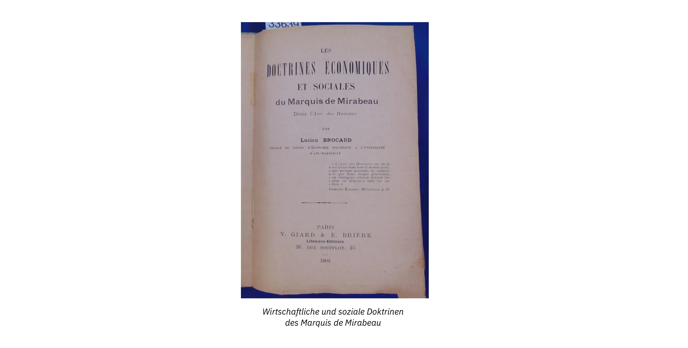

Es ist Hard, Mirabeaus Ansichten entweder als liberal oder als antiliberal zu bezeichnen. Er schwankte oft hin und her, manchmal ohne es zu merken, zwischen der einen und der anderen Sichtweise. Dennoch dominierten liberale Ideen häufig seine Schriften. Einer seiner berühmtesten Sätze war:

> Das wahre und einzige Prinzip der politischen Ökonomie besteht darin, alles frei sein zu lassen.

Nachdem er seinen größten Erfolg hinter sich hatte, wurde Mirabeau umworben. François Quesnay, der sich gerade für Wirtschaft interessiert hatte, lud ihn zu seinem Entresol nach Versailles ein.

Sie debattierten heftig, und schließlich geschah etwas, was normalerweise in Debatten nie vorkommt: Mirabeau gab unumwunden zu, dass er sich geirrt hatte. Er stimmte den Ideen Quesnays zu und erklärte sich bereit, sie zu verbreiten.

Gemeinsam bildeten sie den Kern der späteren physiokratischen Schule, die durch die regelmäßigen Rekruten, die sie mitbrachten, verstärkt wurde. Kurz nach Mirabeaus Bekehrung wird er von Quesnay angeworben, um seine Ideen zur Besteuerung zu verteidigen. Dies führte zur ["Theorie der Besteuerung"](https://archive.org/details/thoriedelimpot00mira), für die Mirabeau für einige Tage ins Gefängnis von Vincennes und dann ins Exil nach Bignon geschickt wurde.

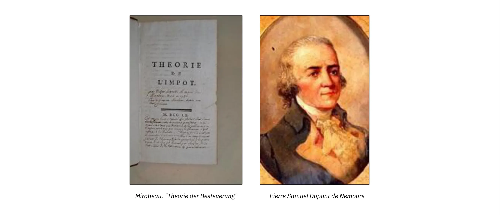

Mirabeau spielte auch eine entscheidende Rolle bei der Anwerbung neuer Mitglieder für die Schule von Quesnay. Er überzeugte sogar den jungen Dupont de Nemours.

Auch die Physiokraten trafen sich jeden Dienstag im Haus von Mirabeau. Persönlichkeiten wie Turgot und Adam Smith scheinen ein- oder mehrmals an diesen Treffen teilgenommen zu haben.

Zeit seines Lebens blieb Mirabeau ein unermüdlicher Schriftsteller. Er verfasste zahlreiche ökonomische Werke, in denen er die Lehre von Quesnay verteidigte. Gegen Ende seines Lebens ließ sein Einfluss jedoch nach. Sein Schreibstil verschlechterte sich so sehr, dass sein eigener Bruder ihm schrieb, er könne seine Prosa nicht mehr verstehen. Seine Ideen, die inzwischen völlig liberal waren, kollidierten mit der sozialistischen oder proto-kommunistischen Reaktion von Denkern wie Mably und sogar Rousseau. Er hatte Mühe, Leser und Verleger zu finden, und starb 1789, am Vorabend des Sturms auf die Bastille, weitgehend unbemerkt.

## Quesnay

<chapterId>7a35f20b-5ea0-544d-b290-bcd9c6f7f11a</chapterId>

François Quesnay ist einer der berühmtesten französischen Wirtschaftswissenschaftler.

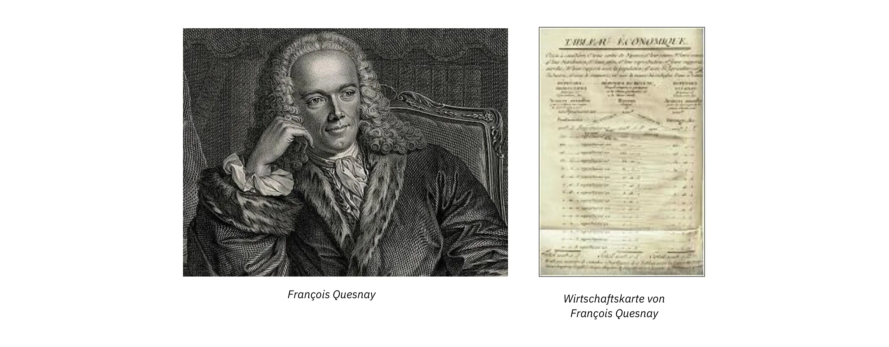

Sein Name taucht in jedem Lehrbuch der Wirtschaftswissenschaften und der Geschichte des wirtschaftlichen Denkens auf. Es heißt, dass er das "Tableau Économique" zur schematischen Darstellung der Wirtschaft schuf, dass er der Anführer der physiokratischen Schule war, dass er irrigerweise glaubte, nur Land sei produktiv, und dass schließlich Adam Smith kam, um die Sache richtig zu stellen. So oder so ähnlich fassen die Lehrbücher François Quesnay zusammen.

Es ist schade, ihn darauf zu reduzieren, denn Quesnay war auch der erste Wirtschaftswissenschaftler, der versuchte, die Verteidigung der wirtschaftlichen Freiheit auf wissenschaftliche Grundsätze zu stützen. Er war einer der meistbeachteten und einflussreichsten Ökonomen seiner Zeit. Darüber hinaus begründete er die Physiokratie, eine viel umfassendere Lehre als die vereinfachende Vorstellung, dass nur die Natur Reichtum hervorbringt, eine Vorstellung, die oft falsch dargestellt wird.

Wir werden die Physiokratie in den nächsten drei Kapiteln ausführlicher behandeln. Werfen wir zunächst einen genaueren Blick auf François Quesnay selbst.

Quesnay wurde 1694 in Méré in einer Bauernfamilie geboren, die ihm das Lesen nicht beibringen konnte. Er wird von einem Einheimischen ausgebildet und studiert schließlich an der Chirurgischen Hochschule und anschließend an der Medizinischen Fakultät. Im Alter von 24 Jahren wird er Chirurg in Mantes.

Berühmt wurde er 1730, im Alter von 36 Jahren, als er sich gegen die gängige Praxis des Aderlasses wandte, die seiner Meinung nach auf fehlerhaften Theorien und Vorurteilen beruhte. Er wagte es auch, das System der Zünfte in Frage zu stellen, das vorschrieb, dass nur Chirurgen Operationen durchführen und nur Ärzte Medikamente verschreiben durften. Dadurch waren die Armen oft gezwungen, doppelt zu zahlen und zwei Personen hinzuzuziehen, was Quesnay als empörend empfand.

Im Jahr 1740 wurde er Sekretär der Akademie für Chirurgie. Im Jahr 1748, im Alter von 54 Jahren, wurde er der Leibarzt von Madame de Pompadour und zog nach Versailles.

Er war sehr eng mit Madame de Pompadour verbunden. Quesnay sagte sogar, als die Ungnade der Favoritin bekannt wurde, dass er ohne sie nicht Arzt in Versailles bleiben wolle:

"Ich war Madame de Pompadour in ihrer Blütezeit zugetan und werde es auch in ihrer Ungnade sein".

Danach veröffentlichte er mehrere medizinische Bücher: Treatise on Suppuration (1749), Treatise on Gangrene (1749) und Treatise on Continuous Fevers (1753), die alle zu seinen Lebzeiten mehrfach nachgedruckt wurden.

Im Alter von 60 Jahren begann er, nachdem er in die wirtschaftlichen Debatten der damaligen Zeit eingeführt worden war, über Wirtschaft zu schreiben. Im Jahr 1755 schrieb er die Artikel "Bauern" und "Getreide" für die *Encyclopédie*.

Sie wurden 1757 veröffentlicht. Im selben Jahr traf er den berühmten Mirabeau und schaffte es, ihn zu seinen wirtschaftlichen Ideen zu bekehren - der Kern der Physiokratie war geboren. Quesnay schuf daraufhin das Tableau Économique, das auf den königlichen Pressen gedruckt wurde, Berichten zufolge in Anwesenheit des Königs selbst im Schloss von Versailles. Von diesem Zeitpunkt an empfing er regelmäßig Ökonomen und Philosophen in seiner Wohnung in Versailles, wo sie ungehindert miteinander diskutierten. Quesnay leistete auch einen Beitrag zu Mirabeaus Theorie der Besteuerung, die 1759 veröffentlicht wurde.

Die Zensur schlug bald zu. Mirabeau wurde inhaftiert, und Quesnay wurde gemaßregelt. Danach erkannte Quesnay, dass er nicht öffentlich publizieren konnte und Jünger brauchte, um seine Ideen zu verbreiten.

Er hat sie schnell gefunden: Baudeau, Dupont de Nemours, Le Trosne, Mercier de la Rivière und andere. Dies sind die Männer, die das Denken von Quesnay verbreiten und popularisieren werden. Doch Quesnay, der Jünger brauchte, war mit dem sektiererischen Aspekt seiner Gruppe nicht ganz zufrieden. Das bezeugen seine Briefe an Mirabeau, in denen er ihm mitteilt:

> "Denkt selbst nach. Ich habe gemerkt, dass meine miserablen Entwürfe euch faul machen. Jetzt seid ihr an der Reihe zu denken. Ihr wisst genauso viel wie ich".

Doch seine Schüler waren ihm treu ergeben und trugen wesentlich zu Quesnays Popularität bei. Nach seinem Tod hielt Mirabeau die Grabrede mit den Worten: "Wir haben unseren Vater verloren, denn wir haben ihm alles zu verdanken". In Wahrheit war es Quesnay, der ihnen alles verdankte, denn ohne sie wäre er in Versailles geblieben, wo sein Denken, obwohl es viel zu verführen und zu beunruhigen hatte, nur wenige interessierte.

Dank der Arbeit seiner Mitarbeiter fanden seine Ideen eine Plattform: zunächst in Zeitungen wie dem *Journal of Agriculture* und dem *Ephémérides du Citoyen*.

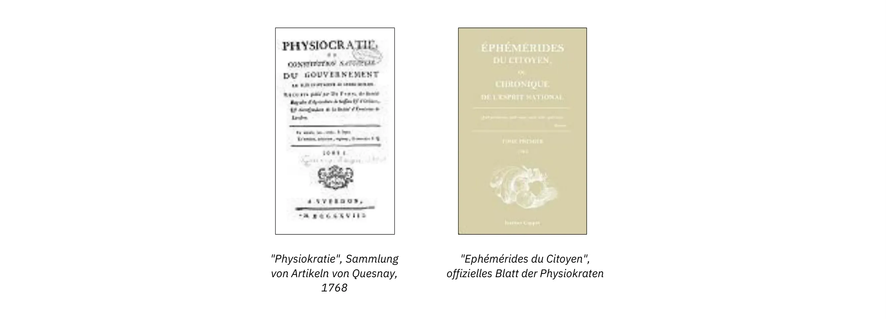

Dann durch Bücher, nicht nur durch die seiner Schüler, sondern auch durch einen wichtigen Sammelband, der 1768 von Dupont de Nemours unter dem Titel *Physiocracy* veröffentlicht wurde.

In diesem Buch sind die wichtigsten Beiträge von Quesnay zusammengefasst. Darin wird das Wirtschaftsideal des Anführers der Physiokraten dargelegt: ein Modell der Agrarwirtschaft, in dem das Gesetz jedem das Recht auf Eigentum und die Freiheit zum Handel garantiert.

# Die physiokratische Schule

<partId>27af82c1-ad82-5c3b-8ce9-c674b67bbf7c</partId>

## Geschichte der Physiokraten

<chapterId>4236ff8b-b53a-59e7-92c0-f96f9afa1c00</chapterId>

Die Physiokratie kam in Frankreich und sogar in ganz Europa für knapp ein Jahrzehnt in Mode. Nach einer langen Entwicklungsphase erlangte sie Mitte der 1760er Jahre an Bedeutung. Als Turgot 1776 an die Macht kam, hatte die Bewegung bereits an Popularität verloren, und der Minister hielt seine Unterstützung für Quesnays Schule weitgehend geheim.

Seine Ursprünge liegen in der Entwicklung der wirtschaftlichen Ideen in den 1750er Jahren. Mehrere Autoren trugen dazu bei, die Kluft zwischen Boisguilbert und dem, was später als Physiokratie bekannt werden sollte, zu überbrücken. Wie bereits erwähnt, waren Vincent de Gournay und sein Kreis von Ökonomen für zahlreiche Veröffentlichungen verantwortlich, die den französischen Lesern ausländisches wirtschaftliches Denken nahebrachten und ihre Leidenschaft für die Ökonomie entfachten. Die Grundlagen der Physiokratie waren bereits in Büchern wie "Détail de la France" von Boisguilbert und ["Essay on the Nature of Trade in General"](https://archive.org/details/essaisurlanature0000cant) von Cantillon enthalten.

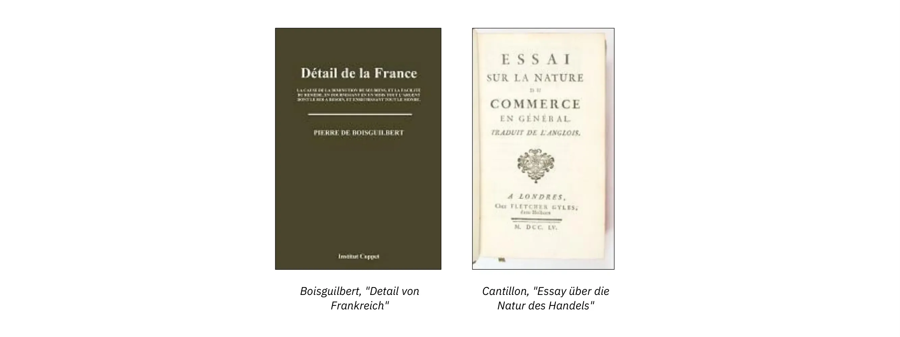

Das Konzept des Laissez-faire hatte seit Boisguilbert mehrere Verfechter, insbesondere Vincent de Gournay und den Marquis d'Argenson.

Nun galt es, diese Ideen in eine kohärente, vollständige Lehre zu verwandeln, und der Marquis de Mirabeau war der erste, der dies versuchte. Inspiriert von Cantillons Essay begann er, eine umfassende Abhandlung über wirtschaftliche Fragen mit dem Titel "L'Ami des Hommes" zu schreiben, die sehr erfolgreich war.

So konnte 1756 die Geschichte der Physiokratie beginnen. François Quesnay, damals Chirurg und inzwischen Leibarzt von Madame de Pompadour, lud Mirabeau nach Versailles ein, um über wirtschaftliche Ideen zu diskutieren.

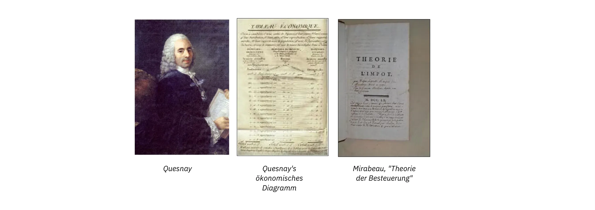

Am Ende ihres Gesprächs war Mirabeau mit Quesnays Ideen einverstanden. Von da an schrieben sie: Quesnay schuf das *Tableau économique* (1758), um den Fluss des Reichtums in der Wirtschaft zu veranschaulichen, und gemeinsam veröffentlichten sie die Theorie der Besteuerung (1759).

Ihre Bemühungen stießen nicht auf Gegenliebe. Am Hof herrschte Gleichgültigkeit vor. Der König erkannte Quesnays Neigung zur Theorie an und nannte ihn liebevoll "meinen Denker". Doch abgesehen von diesem Kompliment blieb ihre Arbeit ergebnislos. Ihre Theorie der Besteuerung beleidigte die Steuerverwalter, die sie kritisierten, so sehr, dass sie Mirabeaus Inhaftierung forderten und durchsetzten. Madame de Pompadour ließ ihn schließlich frei, aber er lebte noch einige Wochen im Exil auf seinem Anwesen in Bignon.

Die erste Hälfte der 1760er Jahre verlief daher in relativer Stille. Aufgrund seiner Stellung in Versailles war Quesnay gezwungen, nicht mehr zu schreiben oder zumindest nichts mehr unter seinem eigenen Namen zu veröffentlichen. Mirabeau, der bereits einmal verurteilt worden war, war gewarnt und wusste, dass der Liebling des Königs ihn nicht ewig schützen konnte.

Nach diesem kurzen Schweigen begannen die beiden Ökonomen, Schüler zu rekrutieren, denn nur so konnten sie ihre Ideen bekannt machen. Bis 1765 waren ihre Erfolge beachtlich. Dupont de Nemours, Abeille, Mercier de la Rivière, Le Trosne und Baudeau schlossen sich ihnen schnell an. Sie bildeten eine Schule: Sie hatten ihre eigene Zeitschrift, *Les Éphémérides du Citoyen*, und trafen sich sogar jeden Dienstag im Haus von Mirabeau.

Zwischen 1765 und 1775 stand die vereinigte Gruppe der Physiokraten auf dem Höhepunkt ihres Ruhmes. Die literarische und philosophische Welt hatte nur Augen für sie, so dass sich ihre Ideen schnell und weit verbreiteten. Man nannte sie "die Ökonomen" oder, spöttischer, "die Sekte der Ökonomen". Unabhängig vom Tonfall war ihre Berühmtheit unbestritten. 1774, nach einer Reise nach Metz, schreibt M. de Vaublanc in seinen Memoiren über sein Erstaunen: Alle um ihn herum sprachen über Ökonomie und dachten wie die Schüler von Quesnay. "Es war in Mode", stellt er fest. "Jeder war ein Ökonom".

Doch um 1770 begann ihre Popularität zu schwinden. Die Gruppe erlebte ihre ersten Abtrünnigen, und ihre Fähigkeit, der Kritik zu widerstehen, wurde schwächer. Und die Kritiker waren zahlreich: Condillac, Mably, Voltaire, Galiani, Linguet, Graslin und sogar Adam Smith in Schottland stellten ihre Ansichten in Frage.

Ihre Zeitung erschien nicht mehr regelmäßig. Damit endete die aktivste Zeit der Bewegung.

Die Physiokratie sollte bis zur Revolution weiterhin Einfluss ausüben. In Frankreich zunächst durch Turgot, der eher ein Weggefährte als ein Schüler war, sowie durch ihren Vertreter Dupont de Nemours, dessen Leben und Werk wir später untersuchen werden. Aber auch in ganz Europa, wo die physiokratische Doktrin mit Begeisterung aufgenommen wurde. In Deutschland, durch den Markgrafen von Baden, und in Italien, durch Leopold von Toskana, inspirierten die physiokratischen Theorien sogar Wirtschaftsreformen zugunsten von Privateigentum und Freiheit.

## Die Grundlagen der Lehre der Physiokraten

<chapterId>4dbe5436-0578-57c2-b054-03ed00aa091a</chapterId>

Der Begriff Physiokratie, der soviel wie "Regierung durch die Natur" bedeutet, wurde von Dupont de Nemours geprägt und als Titel für *Physiocracy* verwendet, eine Sammlung von Artikeln von Quesnay, die 1768 veröffentlicht wurde.

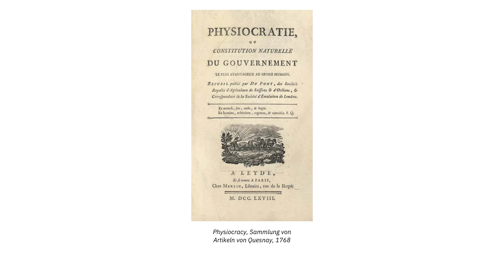

Dies ist eine obskure Phrase. Kein Schüler von Quesnay hat uns seine wahre Bedeutung verraten. Dennoch war ihr Denksystem alles andere als obskur. In der Tat war es um einige sehr klare Prinzipien herum aufgebaut, die wir hier umreißen werden.

### Erster Grundsatz: Nur die Landwirtschaft ist produktiv

Diese erste Idee ist diejenige, die die Aufmerksamkeit der Historiker auf sich gezogen hat. In Lehrbüchern oder Wirtschaftskursen werden die Physiokraten heute so zusammengefasst. Sie sollen naiv geglaubt haben, dass nur die Landwirtschaft produktiv ist. Auf dieser Grundlage wird ihre Doktrin als irrelevant abgetan, und die Analyse geht schnell zu Adam Smith über.

Es ist jedoch unfair, die Physiokraten dafür zu kritisieren, dass sie der Landwirtschaft eine unverhältnismäßig große Bedeutung beimaßen, da Mitte des 18. Jahrhunderts 90 % der Bevölkerung in der Landwirtschaft beschäftigt waren und diese die Grundlage der französischen Wirtschaft bildete.

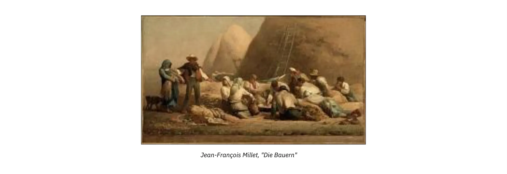

Die Idee der Physiokraten ist eigentlich sehr subtil. Ihrer Meinung nach gibt es einen Unterschied zwischen Produktion und Gewinn. Der Industrielle und der Kaufmann mögen Gewinne erzielen, aber nur der Landwirt produziert wirklich, denn Produktion ist die Schaffung von nützlichem Material und nicht das Hinzufügen von Nutzen zu bereits vorhandenem Material.

Wir sollten auch versuchen zu verstehen, warum sie Industrie und Handwerk als unproduktiv ablehnten. Zu jener Zeit waren diese Berufe in das Zunftwesen eingebunden, das Innovation, Investitionen und Fortschritt verbot.

### Zweiter Grundsatz: Rechtsdespotismus statt Demokratie

Heute sagen wir, um jemanden zu beleidigen, er sei kein Demokrat. Die Historiker verzeihen den Physiokraten zwar ihre strenge Auffassung von landwirtschaftlicher Produktivität, nicht aber ihre Ablehnung der Demokratie, zumal sie auf dem Höhepunkt der Ideen der Aufklärung lebten. Von der Mitte des 18. Jahrhunderts bis kurz vor der Revolution galten die Physiokraten als Feinde des Fortschritts.

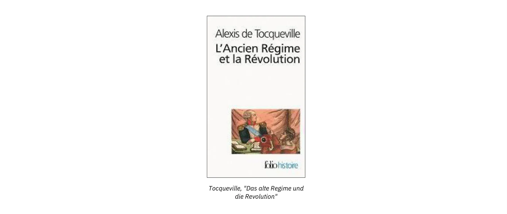

Tocqueville beharrte auf dieser Idee:

> Die Physiokraten waren in der Tat sehr für den freien Warenverkehr, für das Laissez-faire oder Laissez-passer im Handel und in der Industrie; aber politische Freiheiten im eigentlichen Sinne zogen sie nicht in Betracht, und selbst wenn ihnen solche Ideen in den Sinn kamen, lehnten sie sie zunächst ab.

Liberal in der Wirtschaft, waren die Physiokraten daher nicht liberal in politischen Fragen. Quesnay schreibt in seinen *Maximen*: "Die souveräne Autorität soll einzigartig und allen Individuen der Gesellschaft und allen ungerechten Unternehmungen privater Interessen überlegen sein." Und später, in derselben Maxime: "Das System der Kontrolle und des Gleichgewichts in der Regierung ist eine verhängnisvolle Vorstellung, die nur Zwietracht unter den Großen und Unterdrückung der Kleinen offenbart".

Tocqueville bemerkte treffend, dass die Physiokraten die Demokratie ablehnten, sobald sie ihre Formen sahen. Sie standen der Demokratie, die zu einer Konstante in der französischen politischen Ökonomie werden sollte, skeptisch gegenüber, weil die Demokratie alles andere als ein perfektes System ist: Sie ermöglicht potenziell die Unterdrückung von Minderheiten durch die Mehrheit und kann zu einem Instrument der Usurpation, Tyrannei und Plünderung werden.

### Dritter Grundsatz: absolute Achtung des Privateigentums

Die Physiokraten glaubten, dass die Menschen die Ergebnisse ihrer Arbeit besitzen und behalten sollten. Ihrer Ansicht nach waren Eigentumsrechte die Grundlage einer Gesellschaft. Der Staat hatte ihrer Meinung nach vor allem eine Aufgabe: das Eigentum der Menschen zu schützen. Aus wirtschaftlicher Sicht vertraten die Physiokraten außerdem die Ansicht, dass die Unverletzlichkeit des Eigentums Arbeit und Anstrengung fördert und eine Voraussetzung für wirtschaftlichen Fortschritt ist.

Quesnay hat es einfach ausgedrückt:

> Die Sicherheit des Eigentums ist die wesentliche Grundlage der wirtschaftlichen Ordnung und der Sicherheit der Gesellschaft; die Gewissheit des dauerhaften Besitzes ist es, die die Arbeit und den Einsatz des Reichtums zur Verbesserung und Kultivierung des Bodens sowie für Handels- und Industrieunternehmen fördert.

### Vierter Grundsatz: absolute Handelsfreiheit

In seinen bereits zitierten *Maxims* stellt Quesnay fest:

> Es soll völlige Handelsfreiheit herrschen, denn die zuverlässigste, genaueste und für die Nation und den Staat günstigste Regelung des Binnen- und Außenhandels liegt in der völligen Freiheit des Wettbewerbs.

Die Physiokraten hatten die Schäden gesehen, die durch staatliche Eingriffe verursacht wurden, insbesondere im Getreidehandel. Man müsse anerkennen, dass die Behörde niemals in der Lage sein werde, den Handel so gut zu verwalten wie der Einzelne, weil sie auf jeden Bedarf reagieren und auf jede Änderung der Nachfrage oder der Supply eingehen müsse. All dies übersteigt bei weitem die Möglichkeiten selbst der klügsten Regierung, die man sich vorstellen kann. Daher ist es notwendig, die Dinge sein zu lassen und sie fließen zu lassen.

Da der Handel von Natur aus nützlich ist, muss er völlig und vollkommen frei sein. Eines ihrer Mitglieder, Le Trosne, schrieb sogar ein Pamphlet mit dem Titel [*Die Freiheit des Getreidehandels: Immer nützlich, niemals schädlich*](https://www.institutcoppet.org/liberte-commerce-grains-toujours-utile-jamais-nuisible/).

### Fünfter Grundsatz: Alle Menschen sind Brüder

Die Physiokraten waren nicht nur erbitterte Gegner der Sklaverei, sondern auch große Pazifisten. "Unsere Außenpolitik heißt Frieden", sagte Mirabeau schlicht. In der verfassungsgebenden Versammlung von 1790 setzte Dupont de Nemours diese pazifistische Haltung fort, als er einen Gesetzentwurf zum Verbot von Angriffskriegen vorlegte.

## Die Errungenschaften und Einflüsse der Physiokraten

<chapterId>5b911105-796a-5e2e-a501-c7a364fc758e</chapterId>

Wie wir im ersten der drei den Physiokraten gewidmeten Kapitel gesehen haben, waren die Anhänger von Quesnay in Frankreich etwa ein Jahrzehnt lang in aller Munde. Diese Begeisterung für ihre Ideen nahm schon zu ihrer Zeit Gestalt an und hielt bis zum Ende des Jahrhunderts an. Im Folgenden werden wir einige ihrer Errungenschaften und den Einfluss, den sie auf ihre Nachfolger im Bereich des wirtschaftlichen Denkens ausübten, untersuchen.

Ihr größtes Verdienst nach der Gournay-Gruppe war die Popularisierung der wirtschaftlichen Ideen. Voltaires berühmter Ausspruch ist bekannt: Um 1750 begann das Volk, das von Poesie und Romanen gesättigt war, über Getreide nachzudenken. Die Physiokraten beteiligten sich an dieser Bewegung und veröffentlichten buchstäblich Hunderte von Artikeln, Flugblättern und Büchern über die Freiheit des Getreidehandels. Der starke Impuls, den die Physiokraten den wirtschaftlichen Diskussionen gaben, zeigt sich auch in der beeindruckenden Zahl der wirtschaftlichen Werke und Pamphlete, die zwischen 1760 und 1775 in Frankreich veröffentlicht wurden. Ein weiterer Beleg für die Verbreitung wirtschaftlicher Ideen in Frankreich ist die in einem früheren Vortrag zitierte Bemerkung von M. de Vaublanc, der 1774 in Metz sagte, dass die Menschen von nichts anderem als von Wirtschaft sprachen. "Es war Mode", sagte er. "Jeder war ein Ökonom".

Die Verteidigung ihrer Ideen in Büchern, Pamphleten und in ihrer Zeitschrift *Les Éphémérides du Citoyen* hatte schnell Auswirkungen auf die französische Wirtschaftspolitik. Im Jahr 1763 wurde durch ein Edikt die Freiheit des Getreidehandels gewährt, die Quesnay und Mirabeau nachdrücklich gefordert hatten. Bei mehreren Gelegenheiten lockerten die Behörden auch die Vorschriften für die Handwerkszünfte, um eine größere Arbeitsfreiheit zu gewährleisten.

Im Ausland stellte sich der Erfolg sehr früh ein. In Deutschland interessierte sich der Markgraf von Baden für die Ideen der Physiokraten und führte einen regelmäßigen Briefwechsel mit Mirabeau und Dupont de Nemours.

Er beauftragte den Ökonomen Johann August Schlettwein, einen überzeugten Physiokraten, mit der Durchführung einer Steuerreform und der Liberalisierung des Getreidehandels. Im April 1770 fand ein erster Versuch in dem kleinen Dorf Dietlingen statt. Die Dorfbewohner schienen die Maßnahmen begeistert aufgenommen zu haben, aber die zuständigen Beamten waren nicht sehr wohlwollend, was die weitere Umsetzung verzögerte.

In Russland bereitete Katharina II. eine Gesetzesreform vor und bat Diderot, ihr einen brillanten Kopf zu schicken, der sie unterstützen sollte.

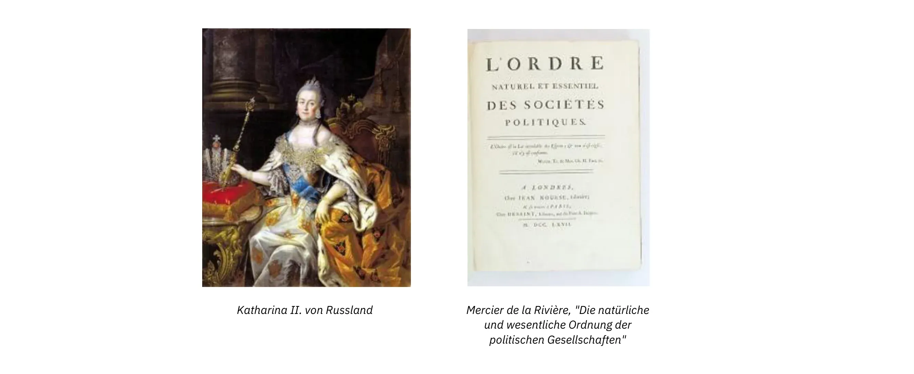

Beeindruckt von der Lektüre des 1767 erschienenen Buches [*Die natürliche und wesentliche Ordnung der politischen Gesellschaften*](https://archive.org/details/lordrenaturelete00mercuoft), schickte er ihr den Autor, den Physiologen Mercier de la Rivière.

Obwohl er Frankreich gefeiert verließ, war sein Empfang in Sankt Petersburg kühl (abgesehen vom Klima), und die Kaiserin war enttäuscht von ihm.

Auch in Schweden mit Gustav III. und in Italien mit Leopold von Toskana fanden die Physiokraten Anhänger, die bereit waren, ihre Ideen in die Praxis umzusetzen.

In Frankreich hatten die Physiokraten mit der Ernennung von Turgot zum Generalkontrolleur der Finanzen im Jahr 1774 einen spektakulären Erfolg.

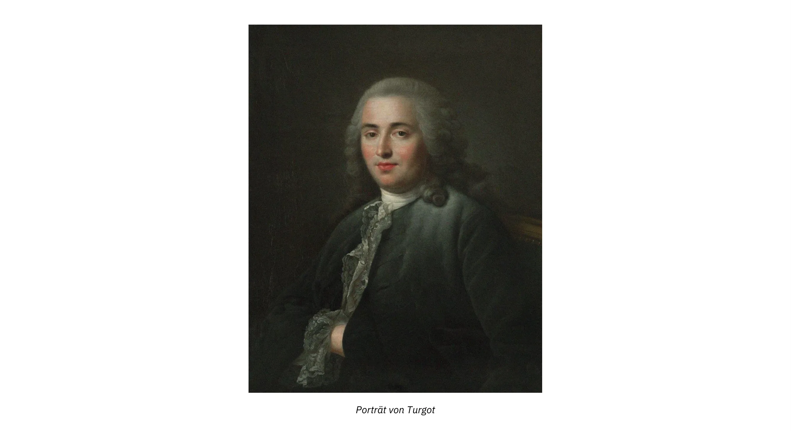

Turgot, der sich des Niedergangs seines Ruhmes bewusst ist, stellt sich nie als treuer Anhänger der Physiokraten dar, auch nicht als Enzyklopädist, obwohl er einer war und sie von den Mitgliedern des Klerus verachtet wurden. Nach seiner Machtübernahme erließ Turgot sechs berühmte Edikte, die den Beginn der praktischen Umsetzung des physiokratischen Programms darstellten: Handelsfreiheit, Arbeitsfreiheit und das Ende der Monopole.

Zur Zeit der Französischen Revolution hatten die Physiokraten weniger Anhänger. Der Marquis de Mirabeau starb am 13. Juli 1789 - ein wahres Symbol. Abeille war weitergezogen, aber Dupont de Nemours blieb ihm treu. Dupont de Nemours wurde in die Versammlung berufen, wo er die Stimme der Physiokraten vertrat und Wirtschaftsreformen zugunsten des Ownership-Eigentums und des Freihandels forderte.

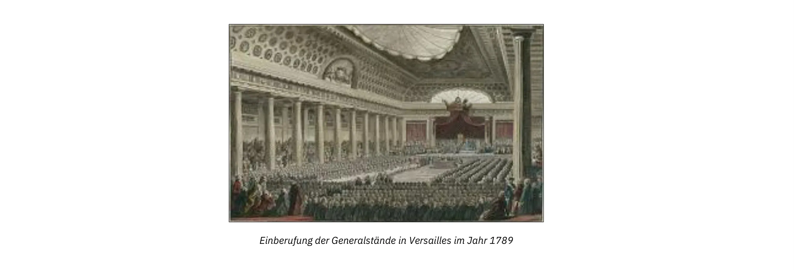

Er kämpfte auch erfolglos gegen die Assignaten. Trotz dieses Scheiterns bleibt das physiokratische Gedankengut in der intellektuellen Debatte sehr präsent und beeinflusst die ersten Errungenschaften der Revolution. Wie Joseph Rambaud sagte, ist alles, was die Revolution zugunsten der Freiheiten tat, den Physiokraten zu verdanken.

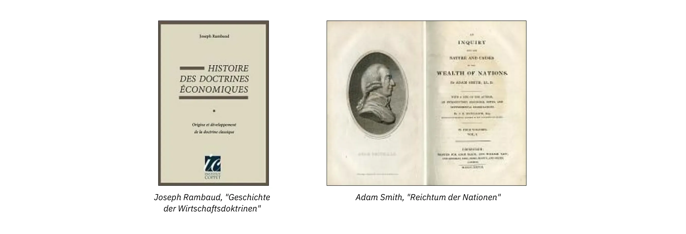

Die Physiokraten hatten auch einen großen Einfluss auf die Geschichte des wirtschaftlichen Denkens. Adam Smith, der Frankreich besuchte und mit vielen von ihnen zusammentraf, war von ihrer Arbeit tief beeindruckt. Er erwog sogar, Quesnay *The Wealth of Nations* zu widmen.

Leider starb Quesnay zwei Jahre vor der Veröffentlichung von Smiths Buch, und Smith entfernte die Widmung. Obwohl Smith nicht mit ihrer Vorstellung übereinstimmte, dass nur die Landwirtschaft produktiv sei, übernahm er viele ihrer Argumente für freie Märkte und führte sie in seinem eigenen Werk weiter.

## Dupont de Nemours

<chapterId>6d585e0f-93b8-5b0a-a0a8-7f6e4a5bc68e</chapterId>

In den Vereinigten Staaten kennen wir das Unternehmen DuPont, auch bekannt als "E.I. du Pont de Nemours and Company", ein multinationales Unternehmen im Bereich der Chemie und Biologie.

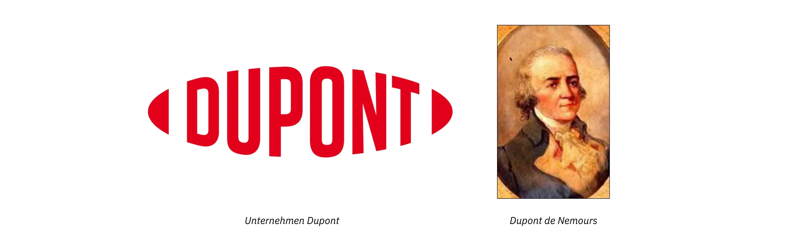

Heute hat das Unternehmen einen Umsatz von über 35.000 Milliarden Dollar und beschäftigt weltweit fast 65.000 Mitarbeiter. Es stellt sich heraus, dass dieses Unternehmen eng mit dem Schicksal von Samuel-Pierre Dupont de Nemours, einem französischen Wirtschaftswissenschaftler der physiokratischen Schule, verbunden ist.

Der 1739 geborene Dupont de Nemours wandte sich im Alter von 24 Jahren an die Physiokraten. Zu dieser Zeit war er noch dabei, seinen Lebensweg zu finden. Eines Tages stieß er auf ein kurzes Pamphlet mit dem Titel The Wealth of the State. Er hielt die darin enthaltenen wirtschaftlichen Ideen für unsinnig und schrieb eine kritische Antwort mit dem Titel Reflections on the Wealth of the State, die 1763 veröffentlicht wurde. Das Werk fand großen Anklang, und die Leser lobten es mit Worten wie: "Sie müssen ein Schüler von Mirabeau sein!" Ironischerweise wusste Dupont nicht einmal, wer Mirabeau war.

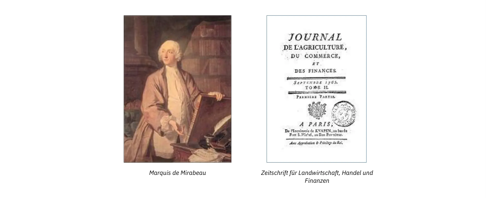

Neugierig geworden, beginnt er Mirabeaus Werke *Volksfreund* und *Theorie der Besteuerung* zu lesen. Er lernt Mirabeau und François Quesnay kennen und tritt in deren Schule ein.

Im Jahr 1765 wurde Dupont die Stelle des Herausgebers des *Journal de l'agriculture, du commerce et des finances* angeboten, der führenden Zeitschrift seiner Zeit auf dem Gebiet des wirtschaftlichen Denkens.

Dafür gab es zwei Gründe: Mirabeau und Quesnay mussten schweigen, und Dupont wurde als ihr aufstrebender Stern angesehen.

Die Mitglieder der physiokratischen Schule sind sich einig, dass Dupont de Nemours schnell zu Quesnays Liebling wurde. Quesnay sagte einmal: "Kümmere dich um diesen jungen Mann, er wird derjenige sein, der spricht, wenn wir tot sind. Ein anderer Physiokrat, Abeille, wurde sogar eifersüchtig auf die Aufmerksamkeit, die Dupont erhielt, und distanzierte sich von Quesnays Schule.

Dupont de Nemours bewahrte sich stets seine Hochachtung für Quesnay.

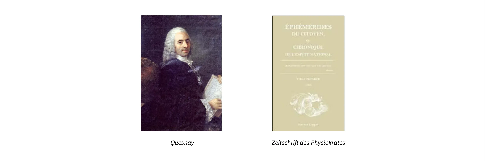

Später sagte er: "Ich war nur ein Junge, als Quesnay mir die Arme reichte - er machte mich zum Mann." Es war Quesnay, der ihn zu einem bedeutenden Wirtschaftswissenschaftler in der Literaturszene seiner Zeit machte.

Nach dem *Journal de l'agriculture, du commerce et des finances* wurde Dupont zum Herausgeber von *Les Éphémérides du Citoyen* ernannt, das zum offiziellen Organ der Physiokraten wurde.

Er machte diese Zeitschrift zu einem wichtigen Zentrum der Wirtschaftstheorie und unterstützte sie sogar während des Niedergangs der Physiokraten, indem er fast alle späteren Bände persönlich verfasste. Dupont de Nemours war es auch, der den Begriff "Physiokratie" prägte, der sich von zwei griechischen Wörtern ableitet, die "Regierung der Natur" bedeuten. Er benutzte diesen Begriff als Titel für eine 1768 veröffentlichte Sammlung von Quesnays Artikeln, und der Begriff ging schließlich in die Geschichte ein. Es ist bekannt, dass sich die Physiokraten untereinander als "Ökonomen" bezeichneten, und auch während der Revolution wurden sie als solche bezeichnet.

Als Turgot kurzzeitig französischer Finanzminister war, wurde Dupont sein enger Berater, der einzige Physiokrat, der Zugang zu ihm hatte, da Turgot sich von den anderen fernhielt.

Zur Zeit der Revolution wurde er aus der Vogtei Nemours gewählt und fand sich in der Versammlung wieder, in der auch ein anderer Monsieur Dupont saß. Man nannte ihn Dupont de Nemours, nicht weil er ein Adliger war, sondern einfach um die beiden zu unterscheiden. Der Name blieb natürlich erhalten.

Während der Revolution, im August 1792, griff er zu den Waffen, um den König im Tuilerienpalast gegen die Menge zu verteidigen.

Der König sagte zu ihm: "Monsieur Dupont, wir finden Sie immer dort, wo Sie gebraucht werden!" Nachdem er wie durch ein Wunder dem Terror entkommen war, verurteilt wurde und auf die Guillotine wartete, aber durch den Sturz Robespierres gerettet wurde, wurde er unter Napoleon ins Exil getrieben und fand sein Glück in den Vereinigten Staaten, wo einer seiner Söhne mit Hilfe seines Vaters die Firma Dupont gründete.

Trotz dieses ereignisreichen Lebens, in dem er Dutzende von Artikeln, Broschüren und Büchern veröffentlichte, ist er bis heute relativ wenig bekannt. Vielleicht lag das daran, dass er ein überzeugter Physiokrat blieb, als diese Lehre aus der Mode gekommen war. Wie Schumpeter schrieb, blieb Dupont de Nemours der Physiokratie "während einer ganzen Karriere treu, in der er viele Gelegenheiten hatte, ihr abzuschwören". Er war ein Mann der Überzeugung.

# Die Aufklärung und die politische Ökonomie

<partId>d1c885ad-7cb1-5f81-816c-be312719d9f8</partId>

## Voltaire und die Philosophen

<chapterId>16bcf7bf-dad4-5113-8c64-2800f04ff07b</chapterId>

Im 18. Jahrhundert entstand in Frankreich die Ökonomie als Wissenschaft und die erste Schule des wirtschaftlichen Denkens: Die Physiokratie. Adam Smith wurde in dieser Zeit in Wirtschaftswissenschaften ausgebildet, und französische Wirtschaftswissenschaftler wurden weltweit als führend anerkannt. Allerdings gilt dieses Jahrhundert eher als das Jahrhundert der Philosophie als der Ökonomie. Während die physiokratische Bewegung in ihren Zielen mit der Philosophie der Aufklärung übereinstimmte, verdienen die Haltungen der Philosophen - insbesondere von Diderot und Voltaire - eine genauere Untersuchung. Wir werden sehen, dass die Aufklärer wesentlich zur Verbreitung der Idee des Laissez-faire in Frankreich beigetragen haben.

Die berühmteste Errungenschaft der Aufklärungsphilosophie ist zweifellos die *Encyclopédie* von Diderot und d'Alembert.

Natürlich wurden die wirtschaftlichen Artikel von Ökonomen verfasst. Für die ersten Bände wandte sich Diderot an Forbonnais, dann zog er liberale Ökonomen hinzu: zuerst François Quesnay (der Artikel wie "Grains", "Fermiers", "Hommes" - der letzte unveröffentlicht - beisteuerte), dann Turgot (der "Foires et marchés" schrieb). Diese Schriften sind von großer Bedeutung. In seinen Artikeln legte Quesnay den Grundstein für die spätere physiokratische Doktrin. Zusammen mit seinem *Tableau économique* sind dies seine berühmtesten Werke. Der damals noch junge Turgot entwickelte in seinem Artikel die Idee des Laissez-faire und kritisierte staatliche Eingriffe in die Marktorganisation.

In vielen anderen Artikeln der *Encyclopédie* verteidigen die Philosophen, insbesondere Diderot, das Ideal der Freiheit in allen Bereichen: Religion, Politik und Wirtschaft.

Die Freiheit der Arbeit, insbesondere im Gegensatz zum Zunftwesen, war ein wiederkehrendes Thema in verschiedenen Einträgen wie Arts, Métier und Communauté.

Der Weg Diderots in der Wirtschaftstheorie ist kurios. In der Encyclopédie war er ein entschiedener Verfechter der wirtschaftlichen Freiheit und bemühte sich um die Zusammenarbeit mit liberalen Ökonomen, wie aus einem Brief hervorgeht, in dem er Turgot auffordert, Artikel für ihn zu schreiben. In den Anfangsjahren der Physiokratie war er sowohl ein Anhänger als auch ein Förderer der Schule von Quesnay. In den Jahren 1769 und 1770 schrieb er für *Les Ephémérides du Citoyen*, sehr zum Missfallen seiner antiliberalen Philosophenfreunde wie Melchior Grimm; er distanzierte sich jedoch bald von dieser Gruppe. Begeistert von dem lebhaften Intellekt des Abtes Galiani, half er ihm bei der Veröffentlichung seines Buches über den Getreidehandel in französischer Sprache, als Galiani gerade nach Italien zurückkehren wollte.

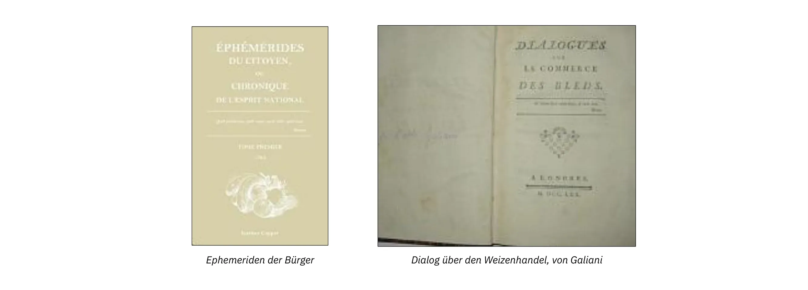

Dieses Buch wurde zum schärfsten Angriff, der je gegen die Ideen der Physiokraten geführt wurde, und versetzte der Bewegung einen schweren Schlag. Später verteidigte Diderot Galiani in seiner *Apologie des Galiani* gegen Abt Morellet, einen engen Verbündeten der Physiokraten. Einige Jahre später, während des Ministeriums von Turgot, wird Diderot als Befürworter der Einführung der Arbeitsfreiheit durch die Abschaffung der Zünfte gesehen. Diderot, Sohn eines Handwerkers, stimmte mit den liberalen Ökonomen überein und schrieb einen vernichtenden Brief an Galiani, der behauptete, dass die Arbeitsfreiheit die französische Industrie innerhalb von zwanzig oder dreißig Jahren ruinieren würde. Im Lichte der Industriellen Revolution zeigt die Geschichte das Gegenteil. Nachdem er auf die Seite der liberalen Ökonomen zurückgekehrt war, genoss Diderot nicht mehr deren Vertrauen und blieb isoliert. Ein sehr aufschlussreicher Moment ist ein Brief, den er 1774 an Dupont de Nemours schickte, in dem er schreibt:

> "Du hattest einmal Freundschaft für mich; jetzt hast du keine mehr, weil du so beschäftigt bist, dass du keine Zeit mehr hast, jemanden zu lieben".

Voltaire schlug einen ähnlichen Weg ein, der durch einen Mangel an Konsistenz in seinen wirtschaftlichen Ansichten gekennzeichnet war. Er bewunderte Vincent de Gournay, korrespondierte mit Ökonomen (u. a. Dupont de Nemours und Turgot) und schätzte die Physiokraten - vor allem wegen ihres Lobes für die Landwirtschaft. Er lobte sie in einer *Diatribe an den Autor der Ephémérides*. Später kritisierte er jedoch ihre Idee einer einheitlichen Grundsteuer in seinem satirischen Werk *Der Mann mit den vierzig Kronen*, das ebenfalls erhebliche Kontroversen auslöste. Schließlich feierte er wie Diderot das Wirken Turgots, nannte es ein goldenes Zeitalter und lobte seine beiden großen Dekrete über die Freiheit der Arbeit und den Freihandel.

Letztendlich ist das Verhältnis der Philosophen zum wirtschaftlichen Denken zwiespältig. Trotz ihres Lobes und ihrer Kritik an liberalen Wirtschaftsideen trugen sie dazu bei, diese Ideen in den breiteren intellektuellen Diskurs der Aufklärung einzubringen. Auf diese Weise trugen sie, ob absichtlich oder nicht, dazu bei, die Idee des Laissez-faire bis zur Revolution voranzutreiben.

## Turgot, der Theoretiker

<chapterId>a8cd8185-8351-556b-8011-3a0c313e8a9d</chapterId>

In einer berühmten Passage aus seiner *History of Economic Thought* lobte der amerikanische Wirtschaftswissenschaftler Murray Rothbard die, wie er es nannte, "Brillanz" von Turgot.

die ihn zusammen mit Cantillon als den größten Ökonomen des 18.

Wie kam Turgot zu einer solchen Berühmtheit? Es war das Ergebnis einer Kombination aus drei Schlüsselfaktoren. **Erstens: sein angesehener familiärer Hintergrund. Er entstammte einer langen Reihe von königlichen Verwaltern, von denen viele hochrangige Regierungsämter innehatten. **Zweitens: das goldene Zeitalter, in dem er geboren und aufgewachsen ist. Turgot war 21, als Montesquieu *L'Esprit des Lois* veröffentlichte, und 24, als der erste Band der *Encyclopédie* erschien.

Er war ein Zeitgenosse der Physiokraten, Voltaire, Diderot, d'Holbach, Adam Smith, Condorcet und anderer. **Drittens: seine intellektuelle Frühreife.** Während seines Studiums an der Sorbonne schrieb er im Alter von 22 Jahren einen Brief über Papiergeld, hielt bemerkenswerte Reden und verfasste mit 24 Jahren eine Liste mit 52 zu schreibenden Werken.

Trotz seiner Jugend leistete Turgot Beiträge zur *Encyclopédie* und verfasste Artikel zu Themen wie "Etymologie", "Existenz", "Ausdehnbarkeit", "Messen" und "Grundlagen". Nur ein Artikel berührte direkt die Wirtschaft - sein Beitrag über "Messen", in dem er die Ursprünge von Messen und Märkten beschrieb und die zunehmenden staatlichen Eingriffe kritisierte, die sie störten und lähmten.

In diesen frühen Jahren wurde er von Vincent de Gournay betreut, der ihn unter seine Fittiche nahm und mit dem ihn eine enge Freundschaft verband. Nach dem Tod von Gournay im Jahr 1759 verfasste Turgot eine Grabrede, in der er eine hervorragende Zusammenfassung der Laissez-faire-Lehre bot. Er schrieb unter anderem:

"In jeder Hinsicht, in der der Handel den Staat betreffen kann, wird das individuelle Interesse, das sich selbst überlassen bleibt, immer sicherer das allgemeine Wohl hervorbringen als die Handlungen der Regierung, die immer fehlerhaft sind und notwendigerweise von einer vagen und ungewissen Theorie geleitet werden".

Als Intendant verfasste er 1767 ein Kompendium der Wirtschaftswissenschaften mit dem Titel *Reflections on the Formation and Distribution of Wealth*.

Arbeitsteilung, Konsumentensouveränität, Privateigentum, die Rolle des Kapitals - praktisch alle wichtigen wirtschaftlichen Themen werden angesprochen. Viele Historiker, zuletzt die Historikerin Anne-Claire Hoyng, haben auf die Ähnlichkeiten zwischen diesem Werk von Turgot und Adam Smiths neun Jahre später veröffentlichtem *The Wealth of Nations* hingewiesen.

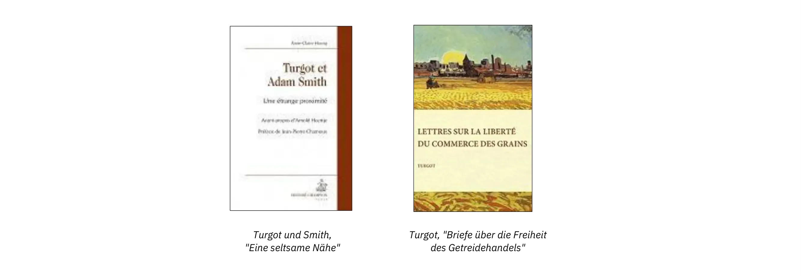

Turgot verteidigte die Freiheit des Getreidehandels in Briefen an Abt Terray, die später dem König übermittelt wurden, von denen aber die Hälfte verloren gegangen ist. Er schrieb:

> Sir, wenn etwas dringend ist, dann ist es nicht, dem wichtigsten aller Berufe neue Beschränkungen aufzuerlegen, sondern die zu beseitigen, die leider bestehen bleiben durften.
> Wenn es jemals eine Zeit gegeben hat, in der die uneingeschränkte, absolute Freiheit, völlig frei von jeder Art von Hindernis, notwendig war, so wage ich zu behaupten, dass dies jetzt der Fall ist, und dass es nie weniger angebracht war, den Erlass einer Verordnung über den Getreidehandel in Erwägung zu ziehen.

1769 schrieb Turgot den Artikel Wert und Geld für das *Dictionnaire de Commerce* von Abbot Morellet, der jedoch nie veröffentlicht wurde. Galiani hatte bereits festgestellt, dass "der Mensch das gemeinsame Maß aller Dinge ist", und damit die subjektive Analyse vorweggenommen, die Turgot dreißig Jahre später in diesem Artikel entwickeln sollte, in dem er diese Aussage weiter ausführt und belegt.

1770, lange vor Bentham, schrieb Turgot eine Denkschrift, in der er sich für die Freiheit von Zinsen und Wucher aussprach.

"Es ist ein Irrtum zu glauben, dass der Geldzins im Handel durch die Gesetze der Fürsten festgesetzt werden sollte", sagt er, "Es ist ein laufender Preis, der sich selbst reguliert, wie der aller anderen Waren", Zur Verteidigung dieser Position widerlegt er die Opposition von Aristoteles und den Kirchenvätern.

Eine bemerkenswerte Zusammenfassung von Turgots Laissez-faire-Doktrin findet sich in einem vergessenen Brief von 1773 an Abt Terray über die Kennzeichnung von Eisen:

> Was die Politik tun muss, ist, sich dem Lauf der Natur und dem Lauf des Handels zu fügen, der nicht weniger notwendig und nicht weniger unwiderstehlich ist als der Lauf der Natur selbst, ohne zu versuchen, ihn zu lenken; denn um ihn zu lenken, ohne ihn zu stören und ohne sich selbst zu schaden, müsste man in der Lage sein, alle Variationen der menschlichen Bedürfnisse, Interessen und der Industrie zu verfolgen; man müsste sie in einer Detailgenauigkeit kennen, die physisch unmöglich zu erreichen ist und bei der selbst die geschickteste, aktivste und sorgfältigste Regierung immer Gefahr läuft, sich zu irren, zumindest zur Hälfte.

Hier finden wir eine sehr klare Aussage zur Doktrin des Laissez-faire sowie eine Vorahnung von Friedrich Hayeks Analyse der Anmaßung von Wissen, d. h. der Unmöglichkeit für einen Staat, die wirtschaftlichen Kräfte vollständig zu erfassen, um sie zu kontrollieren.

## Turgot, der Reformator

<chapterId>9177429f-1679-51c4-bfd2-dd036d24a1cc</chapterId>

Wie wir im vorigen Kapitel kurz in Erinnerung gerufen haben, war Turgot der Sohn einer prominenten Familie, die sich in den oberen Rängen des französischen Staatsdienstes ausgezeichnet hatte.

Sein Vater war Probst der Pariser Kaufleute gewesen und sein Großvater Intendant. Der Jüngste der Turgot-Familie strebte nach einem ausgezeichneten Studium danach, mindestens die gleichen Höhen zu erreichen. Zunächst diente er eine Zeit lang als maître des requêtes, also als Verbindungsmann zwischen den Intendanten und Versailles. Es handelte sich um eine prestigeträchtige Position, für die er eine besondere Altersfreigabe erhalten musste, aber Turgot strebte nach mehr. Der Tod seines Mentors Gournay bestärkte ihn darin, nach Höherem zu streben, und er beantragte eine Ernennung zum Intendanten.

Im Jahr 1759 bewarb er sich zunächst um die Intendanz von Grenoble, die ihm jedoch verweigert wurde. Daraufhin wurde ihm das Amt des Propstes der Kaufleute in Lyon angeboten, das er jedoch ablehnte. Er bewarb sich um die Intendanz der Bretagne, aber auch diese wurde abgelehnt. Schließlich wird ihm 1761 die Intendanz des Limousin angeboten, die er etwas widerstrebend annimmt. Er schrieb an Voltaire: "Ich habe das Pech, Intendant zu sein", was vielleicht bedeutet: Ich habe das Unglück, Intendant im Limousin zu sein.

Im Limousin waren die Bauern arm und lebten in prekären Verhältnissen, insbesondere in Bezug auf Unterkunft und Ernährung. Das allgemeine Bildungsniveau war extrem niedrig. Die wenigen Straßen, die es gab, waren in einem katastrophalen Zustand.

Da die Region so arm war, war sie für die Minister nicht von Interesse. Dies gab Turgot die Freiheit, mit Reformen zu experimentieren. Im Limousin verfolgte er drei große Projekte:

- Die Umverteilung der **taille**, die persönliche Steuer (Turgot wollte so viel Objektivität wie möglich in ihre Bewertung einbringen).
- Die **corvée**, eine Art Arbeitssteuer, bei der die Bauern gezwungen wurden, beim Straßenbau mitzuarbeiten. Bei einer Reise durch die Region stellte Turgot schnell den schlechten Zustand der Straßen fest. Er ersetzte die **corvée** durch eine Geldsteuer.
- Die Rekrutierung von **Milizen**, Bauernarmeen, die in Kriegszeiten mobilisiert werden.

Dies geschah durch Auslosung, was zu Angst und Gewalt aufgrund von Ausreißern führte; Turgot ersetzte diese Zwangsabgaben durch bezahlte Freiwillige.

Diese Reformen waren unbestreitbar erfolgreich, und im Juli 1774 wurde Turgot zum Minister ernannt. Aufgrund seiner mangelnden Erfahrung versetzt ihn der König zunächst in das Marineministerium. Die Ernennung amüsiert viele. Turgot selbst gab zu: "Ich weiß nichts über die Marine", und Voltaire bemerkte: "Ich glaube nicht, dass Turgot ein besserer Seemann ist als ich".

Doch schon einen Monat später wurde Turgot zum Generalkontrolleur der Finanzen ernannt und damit zum Wirtschafts- und Finanzminister Frankreichs.

Wir kennen den Brief, in dem er seine Grundsätze an Ludwig XVI. darlegt: "Kein Bankrott. Keine Steuererhöhungen. Keine neuen Anleihen". Diese Philosophie, die Kritiker heute als sinnlose "Strenge" bezeichnen würden, sollte die Monarchie retten.

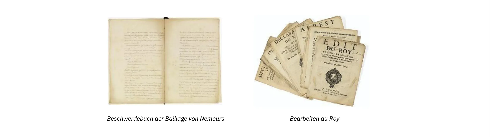

Turgot bereitete sechs königliche Edikte zur Reform der französischen Wirtschaft vor.

Es war das erste - und eines der letzten - Mal, dass ein Wirtschaftsexperte die Freiheit erhielt, die Wirtschaft seines Landes zu reformieren. Drei von Turgots Edikten ragen heraus: Eines schaffte die Zwangsarbeit (corvées) ab, ein anderes löste die Handwerkszünfte (Korporationen) auf, und das dritte führte den freien Handel mit Getreide ein.

Bei seinem Amtsantritt wusste Turgot, dass er auf den Widerstand der privilegierten Klassen stoßen würde. "Ich werde vom größten Teil des Hofes und von allen, die Gefallen an mir finden wollen, gefürchtet, ja sogar gehasst werden", sagte er dem König. Die Privilegierten verbünden sich bald gegen ihn und bewirken seine Entlassung aus dem Amt des Generalkontrolleurs der Finanzen. Voltaire, der Turgots Reformen voll und ganz unterstützte, schrieb in seinem Briefwechsel:

> Ach, welch schreckliche Nachricht ich gehört habe! Was soll aus uns werden? Ich bin am Boden zerstört! Wir werden uns nie davon erholen, dass wir die Geburt und den Tod des goldenen Zeitalters miterlebt haben! Dieser Donnerschlag hat sowohl meinen Verstand als auch mein Herz getroffen.

Seitdem haben viele behauptet, Frankreich sei ein Land, das nicht reformierbar sei. Das Scheitern von Turgot schien dies zu bestätigen: Er war durch ein halbes Jahrhundert liberalen Wirtschaftsdenkens vorbereitet worden; er hatte die Unterstützung von Philosophen der Aufklärung; und der König selbst, mit absoluter Macht ausgestattet, unterstützte ihn.

Am Ende setzten sich die parlements und die privilegierten Klassen durch. Der König konnte nur noch im Stillen lamentieren: "Ich sehe jetzt, dass nur Monsieur Turgot und ich uns um das Volk kümmern."

## Condillac

<chapterId>0ba8dbb5-dcd5-5981-bf85-6c185e0bf192</chapterId>

Ebenso wie der Merkantilismus, der seine offensichtlichste praktische Ausprägung ist, hat auch Montaignes Sophismus lange gebraucht, um zu verschwinden.

Diese Spitzfindigkeit ist die Vorstellung, dass Handel und Exchange ein Nullsummenspiel sind. Was immer eine Partei bei einer Transaktion gewinnt, verliert zwangsläufig die andere Partei. Ihre Befürworter argumentieren, dass dies sowohl zwischen Einzelpersonen als auch zwischen Nationen gilt.

Der Abt von Condillac spielte eine wichtige Rolle bei der endgültigen Abschaffung dieser falschen Vorstellung.

"Definitiv" ist vielleicht übertrieben, denn in der öffentlichen Debatte taucht dieser Sophismus immer wieder auf. Dies ist vielleicht auch der Grund, warum Condillac ein wenig bekannter Ökonom bleibt. Abgesehen von den österreichischen Ökonomen haben nur wenige die Bedeutung seiner Theorie der Exchange verstanden, niemand interessiert sich mehr für ihn.

Für die meisten Wirtschaftshistoriker steht das Jahr 1776 im Zeichen der Veröffentlichung von *The Wealth of Nations*, mit der die Wirtschaftswissenschaft begründet wurde. Die fünfzehn Lektionen, die wir soeben abgeschlossen haben und in denen wir die französische Wirtschaftswissenschaft vor Adam Smith untersucht haben, reichen aus, um den Irrtum dieser Auffassung zu beweisen. Im selben Jahr 1776 erschien ein weiteres Buch, das von den Historikern vielleicht mehr Lob verdient als das von Adam Smith: Es wurde von Condillac verfasst und trägt den schlichten Titel [*Commerce and Government Considered in Their Mutual Relationship*](https://archive.org/details/commercegovernme0000cond).

Für Condillac sind die Physiokraten mitschuldig, wenn die Sophistik von Exchange als Nullsummenspiel fortbesteht, denn sie behaupten, dass Exchange eine Gleichheitsbeziehung ist. Nach Condillac ist dies falsch: Exchange ist eine ungleiche Beziehung, bei der man immer weniger gibt, um mehr zu erhalten.

Zwischen den Ideen der Physiokraten und denen von Condillac könnte man sich keinen perfekteren Gegensatz vorstellen. Der physiokratische Wirtschaftswissenschaftler Le Trosne schrieb:

> Exchange ist seinem Wesen nach ein Contract der Gleichheit, das aus gleichem Wert für gleichen Wert besteht.

Condillac hingegen schrieb:

> Jede Partei der Contract gibt immer etwas von geringerem Wert, um etwas von größerem Wert zu erhalten.

Der Gegensatz besteht jedoch hauptsächlich aus Worten. Beide sind sich einig, dass das Buch einen Franken wert ist, wenn man es gegen ein Buch eintauscht, oder dass der Preis des Buches ein Franken ist.

Der Unterschied liegt darin, dass Condillac behauptet, da wir Exchange einen Franken für das Buch zahlen, bedeute dies, dass der Wert des Buches für uns höher ist als der unserer Ein-Franken-Münze. Wir ziehen das Buch der Münze vor, und deshalb machen wir die Exchange.

Die Theorie von Condillac steht nicht grundsätzlich im Widerspruch zu der der Physiokraten, aber sie sprechen sozusagen nicht dieselbe Sprache. Le Trosne spricht vom Preis, während Condillac vom Wert spricht und umgekehrt.

Condillac hat Recht: Wenn die Preise zwischen den beiden getauschten Gütern gleich sind, sind die Werte nicht gleich, da sonst kein Exchange stattfinden würde.

Um Condillacs Theorie zusammenzufassen, lassen sich drei Thesen aufstellen:

Erster Satz: Wir suchen nach Gütern wegen ihres Nutzens. Dies scheint offensichtlich zu sein, aber es ist ein zentraler Grundsatz der Wirtschaftswissenschaft, dass die Menschen Exchange suchen, um Nutzen zu erwerben, ein Punkt, den Jean-Baptiste Say ebenfalls perfekt entwickelt hat.

Zweite These: Der Wert ist bereits vorhanden und motiviert den Tausch. Das subjektive Urteil, das jeder Mensch über Waren und Dienstleistungen fällt, impliziert, dass dieselben Waren und Dienstleistungen für ihn einen Wert haben, der je nach dem Nutzen, den sie zu bieten scheinen, mehr oder weniger wert ist. Natürlich urteilt jeder Mensch anders als ein anderer, und der Wert variiert von Mensch zu Mensch.

Schließlich die dritte These: Der Preis ist die Folge des Exchange-Prozesses. Produkte haben nicht den Exchange-Wert, den ich ihnen zuschreibe, weil die Bedingungen des Exchange auch von dem subjektiven Wert abhängen, den der Verkäufer diesen Produkten zuschreibt. Die Beziehung zwischen Käufer und Verkäufer oder zwischen der subjektiven Wertschätzung des Käufers und der subjektiven Wertschätzung des Verkäufers legt einen Preis fest.

Diese Ideen von Condillac sind grundlegend. Sie ermöglichen es uns zu verstehen, warum jede Exchange immer zum gegenseitigen Nutzen ist.

Sie entkräften somit die Kritik am Freihandel vollständig, da der Protektionismus nur als ein Mechanismus erscheint, der verhindert, dass die Bevölkerungen sich gegenseitig begünstigen. Laissez-faire ist auch die Schlussfolgerung von Condillacs Werk. Lasst die Menschen tun, was sie wollen, denn wenn die öffentliche Gewalt die Freiheit und das Eigentum schützt, werden sich die Menschen immer gegenseitig bereichern, indem sie miteinander tauschen.

## Condorcet

<chapterId>99e4aba6-da7f-5041-b02f-337158381515</chapterId>

Condorcet ist zweifelsohne der ökonomischste Philosoph der Aufklärung.

Während eines großen Teils seiner Karriere widmete er sich Bereichen, die nichts mit der Ökonomie zu tun hatten, und das zu Recht, denn seine Talente führten zu großen Fortschritten in den Wissenschaften, auf die er sich am meisten konzentrierte. Doch um 1770 fühlte er sich zu wirtschaftlichen Fragen hingezogen, vielleicht weil andere Philosophen, insbesondere Voltaire und Diderot, sich nicht die Mühe machten, ihre Freizeit diesen Fragen zu widmen, und auch weil er mit Turgot befreundet war.

Condorcet machte sich allmählich Ideen des Laissez-faire und der Freiheit zu eigen, zunächst in Bereichen, die nichts mit der politischen Ökonomie zu tun hatten. In seinem *Brief eines Theologen* machte er sich philosophisch über die katholische Religion lustig und brachte seinen Wunsch nach echter Glaubensfreiheit, einschließlich der Freiheit, nicht zu glauben, zum Ausdruck. In seinem Kreuzzug für Toleranz und gegen religiösen Fanatismus kämpfte Condorcet für die Rehabilitierung des Chevalier de la Barre und für die Wiederaufnahme des Prozesses gegen D'Etallonde, der zum Tode verurteilt worden war, weil er ein Kruzifix zerbrochen hatte.

So war er bereit, die Freiheit zu verteidigen, als sein Freund Turgot das Amt des Generalkontrolleurs der Finanzen übernahm.

Von nun an nahm Condorcets Karriere eine Wendung, als er sich in die Wirtschaftsdebatte einschaltete und die liberalen Reformen des neuen Ministers unermüdlich unterstützte. Condorcet befürwortete den Wettbewerb und die Freiheit des Handels und forderte die Abschaffung der Zwangsarbeit, der Zünfte und eine gerechte Besteuerung. Diese Überzeugungen vertrat er bei jeder sich bietenden Gelegenheit öffentlich und tat dies mit offensichtlicher Begeisterung; er schrieb viel und erklärte einmal in seinen Schriften: "Erlauben Sie mir, noch einmal von der Freiheit des Handels zu sprechen; es macht mir Spaß, mich mit diesem Thema zu beschäftigen."

Zwischen 1774 und 1776, während des Ministeriums von Turgot, gab Condorcet zahlreiche Interventionen ab, die alle von seiner Commitment für Laissez-faire geprägt waren. Zu seinen Werken gehören *Briefe eines Bauern aus der Picardie an Herrn Necker*, in denen er den Freihandel verteidigt; *Monopole und Monopolisten*, in denen er sich für den freien Wettbewerb ausspricht; *Überlegungen zu den Corvées*, in denen er deren Abschaffung fordert; und *Überlegungen zum Getreidehandel*, in denen er wiederum den Freihandel lobt und Neckers Buch zum selben Thema kritisiert.

In seinen [*Briefen über den Getreidehandel*](https://archive.org/details/bub_gb_hg8jFw-y6bwC) macht Condorcet mehrere wichtige Aussagen.

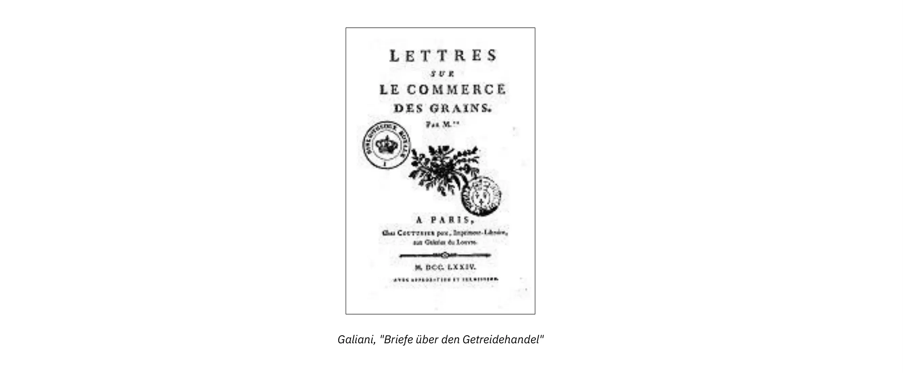

Zunächst zeigt Condorcet deutlich, dass die hohen Getreidepreise nicht auf den Freihandel, sondern auf schlechte Ernten zurückzuführen sind. Dann erklärt er, warum Laissez-faire nicht nur angemessen, sondern die einzig geeignete Politik ist, trotz der gängigen Vorurteile. Er stellt fest: "Wir sind so sehr daran gewöhnt, dass die Regierung in den Getreidehandel eingreift, dass ein Nichtstun wie etwas Außergewöhnliches und Neues erscheint". Später fügt er hinzu: "Fast alle, vor allem diejenigen, die öffentliche Ämter bekleiden, glauben, dass nichts von selbst geschieht und dass alles verloren ist, wenn der Staat nicht in alles eingreift". Condorcet greift damit die Argumente der Physiokraten und von Turgot wieder auf, indem er die Überlegenheit des Freihandels gegenüber allen Formen des Interventionismus aufzeigt.

Die Förderung von Turgots wirtschaftsliberaler Agenda war ein mutiger Akt, denn Condorcet wusste, dass er schnell mit der Zensur konfrontiert werden würde. Dies geschah tatsächlich, und seine Broschüre über die Abschaffung der Zwangsarbeit wurde 1776 zerstört und verboten.

Turgot, der Condorcets loyale Verteidigung seiner Ideen schätzte, ernannte ihn zum Inspektor für Münzwesen. Condorcet trat zurück, sobald sein Freund das Ministerium verließ.

Obwohl er seine ganze Energie darauf verwendete, Turgot zu verteidigen, machte sich Condorcet keine Illusionen über den Ausgang der Amtszeit seines Freundes. Turgot selbst gab in seinem späten Leben zu, dass er es bedauerte, wie er in einem Brief schrieb, "meiner Nation und der Menschheit nicht das Gute getan zu haben, das ich für sehr leicht hielt". Condorcet, der realistischer war, wies auf die vielen Gegner hin, denen Turgot gegenüberstehen würde: die Günstlinge des Königs, die Parlamente, der Klerus, der Adel, die Zünfte usw. Diese Gruppen erwarteten Schmeicheleien, keine Reformen. Condorcet sagte zu Turgot: "Sie sind keineswegs ein Scharlatan, und das ist ein Makel, wenn man bedenkt, wie die Dinge in Paris liegen". Er hatte vollkommen Recht, denn 1776, kaum zwei Jahre nach seiner Ankunft, war Turgot bereits gezwungen, das Amt des Generalkontrolleurs aufzugeben.

## Liberaler Menschenverstand in der Revolution

<chapterId>95e9a90d-e37a-58ff-b1ac-928b42e76ecf</chapterId>

Dupont de Nemours war der jüngste Schüler von François Quesnay, der einmal über ihn sagte: "Wir müssen uns um diesen jungen Mann kümmern, denn er wird noch sprechen, wenn wir schon tot sind". Als die Französische Revolution begann, waren fast alle großen Physiokraten, darunter auch der Marquis de Mirabeau, bereits tot; Mirabeau selbst war am 13. Juli 1789 verstorben.

Dupont de Nemours schrieb die Liste der Missstände für die Vogtei Nemours.

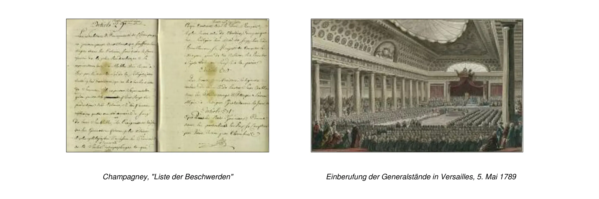

Dieses faszinierende Dokument enthielt alle Klagen der liberalen Ökonomen gegen Handelsbeschränkungen, Monopole und Angriffe auf das Eigentum. Dupont de Nemours wurde auch in die Nationalversammlung gewählt.

Während der Revolution wurde er zur Stimme der liberalen Vernunft, die sich gegen die wachsende Flut des Populismus und der interventionistischen Demagogie behauptete, die sich schließlich durchsetzte.

Bereits im November 1789, als es darum ging, der Caisse d'Escompte ein Monopol zu gewähren (wodurch sie zu einer öffentlichen Bank - der Bank von Frankreich - werden könnte), sprach sich Dupont de Nemours für den Wettbewerb aus.

"Es wäre besser", sagt er, "das Bankgeschäft den Gesetzen des freien Handels zu überlassen". Und er fügt hinzu:

> "Ich verstehe nicht, was der Minister meinte, als er davon sprach, der Caisse d'Escompte ein Privileg zu gewähren. Wenn dieses Privileg Exklusivität beinhaltet, müssen Sie es ablehnen, denn Sie sind hierher gekommen, um exklusive Privilegien zu zerstören, nicht um neue zu schaffen."

Trotz seiner Warnungen ignorierte die Versammlung seine Einwände und unternahm einen weiteren Schritt zur Errichtung einer Zentralbank und eines Bankenmonopols.

1790 folgte Dupont de Nemours in der verfassungsgebenden Versammlung der pazifistischen Tradition seiner physiokratischen Freunde und schlug ein Gesetz vor, das Angriffskriege verbot. Der erste Artikel lautete: "Die französische Nation wird sich nicht erlauben, einen Angriffskrieg zu führen, um das Territorium anderer zu erobern oder die Rechte oder die Freiheit einer anderen Nation zu verletzen".

Dieser Vorschlag wurde abgelehnt.

Im selben Jahr, 1790, begannen die Debatten über die Ausgabe einer neuen Papierwährung zur Deckung der Staatsausgaben.

Dupont de Nemours lehnte dies entschieden ab und veröffentlichte eine Broschüre mit dem Titel [*Effects of Assignats on the Price of Bread*](https://archive.org/details/effetdesassignat00dupo). Der Titel war zutreffend, denn er erklärte, dass die Ausgabe von Assignaten unweigerlich zu einer Inflation führen würde, also zu einem Anstieg der Preise für Waren, einschließlich Brot.

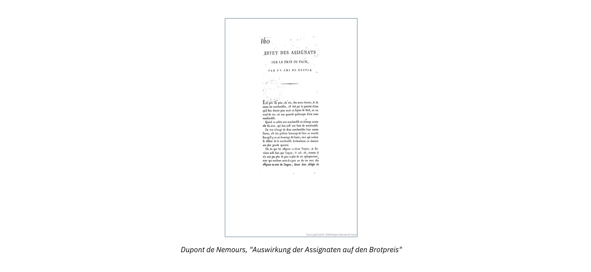

Er unterzeichnete das Pamphlet als "Freund des Volkes". Das Werk erregte großes Aufsehen, da die Versammlung gefragt wurde, wer es geschrieben habe. Dupont de Nemours stand daraufhin auf und gab zu, dass es sein Werk sei. Er schäme sich nicht, den Titel "Freund des Volkes" zu verwenden, denn der Kampf gegen die Assignaten diene wirklich dem Volk.

Wieder einmal wurde sein Rat ignoriert, und die Assignaten wurden ausgestellt.

Wir alle kennen die darauf folgende Katastrophe, den wirtschaftlichen Ruin und das Leid der Menschen, von denen viele alles verloren, als die Assignate wertlos wurden und verbrannt werden mussten.

Einige Jahre später befasste sich die Versammlung mit der Idee, eine echte Bank von Frankreich zu gründen, die das Monopol für die Geldherstellung erhalten sollte.

Dupont de Nemours, der die Idee einer öffentlichen Bank nach wie vor strikt ablehnt, da er in ihr nichts anderes als ein Monopol sieht, erinnert die Versammlung an die katastrophalen Erfahrungen der Assignaten. Er sagte ihnen:

> "Bereiten Sie sich nicht auf ein Bedauern vor, wie es meine Kollegen in der verfassungsgebenden Versammlung gequält hat. Damals wurde mein Vorschlag, die Assignaten nur auf die Bezahlung von nationalen Gütern zu beschränken und sie nicht zu einer Umlaufwährung zu machen, abgelehnt. Heute sagen sie: 'Ach, hätten wir doch nur auf Dupont de Nemours gehört!'"

Aber wieder einmal hörte niemand auf ihn.

## Schlussfolgerung: Die Weitergabe der Fackel

<chapterId>ada8082f-db96-5e52-954f-719b47998153</chapterId>

Das französische Wirtschaftsdenken des 18. Jahrhunderts steht oft im Schatten der berühmteren Ökonomen des 19. Jahrhunderts. Doch wenn es um die Verteidigung der Freiheit geht, beginnt alles im 18. In diesem Jahrhundert wurde das zu seiner Zeit so revolutionäre Prinzip des Laissez-faire zum ersten Mal von einer Reihe von Denkern, von Boisguilbert bis Dupont de Nemours, klar formuliert.

Sicherlich haben Persönlichkeiten wie Jean-Baptiste Say, Frédéric Bastiat, Gustave de Molinari und Yves Guyot die Geschichte des französischen Wirtschaftsdenkens nachhaltig geprägt. Aber wenn wir sie isoliert betrachten, entgeht uns etwas Wesentliches. Diese Denker des 19. Jahrhunderts sind nicht aus dem Nichts aufgetaucht, sondern haben die von ihren Vorgängern der Aufklärung im 18.

Boisguilbert behauptet, dass wohlmeinende Seelen, die glauben, sie könnten alles regeln, indem sie die Regierung einschalten, die Wirtschaft unweigerlich auf den Kopf stellen, und dass es daher besser ist, die natürliche Ordnung der Dinge ihren Lauf nehmen zu lassen.

Cantillon bestand darauf, dass Geld niemals zu politischen Zwecken manipuliert werden dürfe. Wenn man dem Staat erlaubt, das Geld nach Belieben zu verwalten, ebnet man den Weg für eine immense finanzielle und wirtschaftliche Unordnung.

Vincent de Gournay behauptet, dass eine übermäßige Regulierung der Arbeit die Anstrengungen der Arbeiter und Handwerker entmutigt und sie zu Faulheit und Untätigkeit treibt. Nur dank des freien Wettbewerbs kann die Wirtschaft wachsen und eine Nation gedeihen.

Der Marquis d'Argenson behauptet, dass keine Regierung in der Lage ist, alles vorherzusehen und zu messen, und dass man sich daher auf das Eigeninteresse des Einzelnen verlassen muss.

Quesnay und die Physiokraten behaupten, dass das Privateigentum die Grundlage der menschlichen Gesellschaft ist. Ohne Privateigentum verliert der Mensch die Motivation, sich anzustrengen, zu arbeiten, da er die Früchte seiner Arbeit nicht genießen und nichts anhäufen kann.

Condillac behauptet, dass Exchange immer zum gegenseitigen Nutzen ist und daher ausnahmslos immer frei sein sollte. Die einzige Aufgabe des Staates muss es sein, Freiheit und Eigentum zu schützen.

All diese Ideen wurden von den Ökonomen des 19. Jahrhunderts aufgegriffen. Jahrhunderts aufgegriffen. Einige, wie Jean-Baptiste Say, gaben diesen Ideen durch eine strenge *Abhandlung über die politische Ökonomie* einen wissenschaftlichen Ausdruck. Andere hingegen versuchten, diese grundlegenden Maximen zu popularisieren, indem sie sich in das Reich der Märchen, Romane und amüsanten Kurzgeschichten vorwagten, wie es Frédéric Bastiat so gekonnt tun sollte.

## Biografie

<chapterId>17cf2865-e53c-5f3b-a5c2-a43560efaf01</chapterId>

**AUSWAHLBIBLIOGRAPHIE**

Im Folgenden finden Sie eine Auswahl von über dreißig Schriften:

1. Pierre Clément, Histoire de Colbert et de son administration, Paris, 1874

2. Vauban, Projet d'une dîme royale, 1707; Nachdruck Institut Coppet, 2014; Anne Blanchard, Vauban, Fayard, 1996

3.	Boisguilbert, Détail de la France, 1695; neu aufgelegt vom Institut Coppet, 2014

4. Félix Cadet, Pierre de Boisguilbert: Vorläufer der Ökonomen, Institut Coppet, 2014

5. Pierre de Boisguilbert ou la naissance de l'économie politique, Paris, INED, 1966

6. Richard Cantillon, Essai sur la nature du commerce en général, 1755; nachgedruckt vom Institut Coppet, 2015

7. Antoin Murphy, Richard Cantillon, Bankier und Wirtschaftswissenschaftler, Oxford, 1986

8. Gustave de Molinari, Der Abt von Saint-Pierre, Paris, 1859

9. Abt von Saint-Pierre, Abrégé du projet de paix perpétuelle, Rotterdam, 1729

10. Abt von Saint-Pierre, "Projet pour perfectionner le commerce de la France", in Les rêves d'un homme de bien, Paris, 1775, S.199

11. André Alem, Le marquis d'Argenson et l'économie politique au début du XVIIIe siècle, Institut Coppet, 2015

12. Journal et mémoires du marquis d'Argenson, Ausgabe Rathery, 9 Bände, Paris, 1859-1867

13. Benoît Malbranque, Vincent de Gournay: die politische Ökonomie des Laissez-faire, Institut Coppet, 2016

14. Vincent de Gournay, Anmerkungen zur Traduktion von Josiah Child, L'Harmattan, 2008

15. Christine Théré & Loïc Charles (Hrsg.), Le cercle de Gournay, INED, 2005

16. Antoin Murphy, "Le développement des idées économiques en France (1750-1756)", Revue d'histoire moderne et contemporaine, tome XXXIII, Oktober-Dezember 1986

17. Henri Ripert, Le marquis de Mirabeau: ses théories politiques et économiques, Paris, 1901

18. Lucien Brocard, Les doctrines économiques et sociales du marquis de Mirabeau in L'Ami des Hommes, Paris, 1902

19. Humbert de Montlaur, Mirabeau, l'Ami des Hommes, Perrin, 1992

20. Yves Guyot, François Quesnay et la Physiocratie, Institut Coppet, 2014

21. François Quesnay, Œuvres économiques complètes et autres textes, 2 Bände, INED, 2005

22. Georges Weulersse, Le mouvement physiocratique en France (de 1756 à 1770), 2 Bände, Paris, 1910

23. Georges Weulersse, La Physiocratie à la fin du règne de Louis XV (1770-1774), P.U.F., 1959

24. Georges Weulersse, La Physiocratie sous les ministères de Turgot et de Necker (1774-1781), P.U.F., 1950

25. Georges Weulersse, La physiocratie à l'aube de la révolution (1781-1792), EHESS, 1985

26. P. Jolly, Du Pont de Nemours, soldat de la liberté, Paris, P.U.F., 1956

27. Voltaires wirtschaftliche Schriften, Institut Coppet, 2013

28. Gustave Schelle (Hrsg.), Œuvres de Turgot et documents le concernant, Paris, 1913-1924

29. Benoît Malbranque, Le libéralisme à l'essai : Turgot intendant du Limousin (1761-1774), Institut Coppet, 2015

30. Pierre Foncin, Essai sur le ministère de Turgot, Paris, 1877

31. Auguste Lebeau, Condillac économiste, Paris, 1903

32. Condillac, Der Handel und die Regierung in Bezug auf das eine und das andere, 1776

33. Condorcet, Mélanges d'économie politique, in Eugène Daire (Hrsg.), Mélanges d'économie politique, Paris, 1847

34. P. Jolly, Du Pont de Nemours, soldat de la liberté, Paris, P.U.F., 1956

35. Eli Heckscher, Merkantilismus, 2 Bände. London: Allen and Unwin. 1935

# Letzter Abschnitt

<partId>385bffab-aea1-5bcd-9569-62b3f30665b7</partId>

## Rezensionen und Bewertungen

<chapterId>a1e689d9-abd0-5dcb-ba56-a8d355d0a84f</chapterId>

<isCourseReview>true</isCourseReview>

## Abschlussprüfung

<chapterId>bdb7fd98-33e7-11f0-9fe6-b785c859ffc5</chapterId>

<isCourseExam>true</isCourseExam>

## Schlussfolgerung

<chapterId>3b366ff6-03c8-5f6a-b4c0-ba8186e65d7e</chapterId>

<isCourseConclusion>true</isCourseConclusion>