# A Journey into the Economic History of Freedom

This course explores the birth of economic science in 18th-century France through the lens of laissez-faire. You'll discover how thinkers challenged mercantilism by arguing the State should protect private rights, but never manipulate markets through regulations.

You will learn how visionary reformers extended this vision to demand free trade and unrestricted circulation of goods, laying the intellectual foundations of modern capitalism. By studying these pioneering economists, you'll understand the timeless principles that shaped global political economy and continue to influence policy debates today. Join now to master the ideas that built the modern economy.
+++
# Introduction
<partId>06d67531-19f1-4f8d-bf8f-77bbcc743672</partId>

## Course overview
<chapterId>202db3c6-0320-494d-8057-adc6f6563048</chapterId>

Welcome to HIS204!

This course is designed to explore the French origins of the concept of *laissez-faire*—"let it happen"—as it developed in the 18th century through a rich intellectual tradition. By tracing the thoughts of early French economic thinkers, we'll uncover the foundations of a political economy built on economic freedom, marked by a mistrust of State interference and a belief in a natural order that favors growth and prosperity.

**Section 2: The Forerunners** 

In this section we begin at the turn of the 17th and 18th centuries, a time shaped by the excessive rule of absolute monarchy and the first calls for a more rational and fair way to govern public affairs. Through the figures of Vauban, Boisguilbert, and Cantillon, we discover early criticisms of state interventionism and a first outline of what would later become liberal political economy.

**Section 3: Reformers and Thinkers of the Early 18th Century**

This section focuses on those who, in the first decades of the 18th century, attempted to reform the French economy in the light of new principles. Thinkers like the Abbot of Saint-Pierre, the Marquis d'Argenson, and Gournay (along with his followers) called for dismantling corporatist obstacles, liberalizing trade, and encouraging competition as the driver of development. Their often bold proposals foreshadowed the great Physiocratic ideas.

**Section 4: The Physiocratic School** 

This section explores one of the most important moments in French economic thought: the Physiocratic school. We'll examine its origins, doctrinal foundations and main achievements, focusing on key figures like Quesnay and Dupont de Nemours. The idea of laissez-faire becomes a coherent system right in this school, rooted in the idea of a natural order to which the State must submit to guarantee prosperity for all.

**Section 5: The Enlightenment and Political Economy** 

Finally, we'll see how liberal economic thinking spread within the broader Enlightenment movement. Figures like Voltaire, Turgot, Condillac, and Condorcet expanded and enriched the laissez-faire tradition, their writings created a bridge for the laissez-faire tradition to cross into the revolutionary period and beyond, where liberal ideas found new resonance.

Ready to rediscover the French roots of economic liberalism? Let's go!

# The Forerunners

<partId>91565b10-6010-53cb-a2f4-9c2306c7ef8c</partId>

## Historical Background

<chapterId>6a5fd101-6dfd-5d77-96c7-9e1aa4a19758</chapterId>

At the dawn of the 18th century, France was in a worrying state. Rural populations were barely producing enough to survive and were heavily taxed.

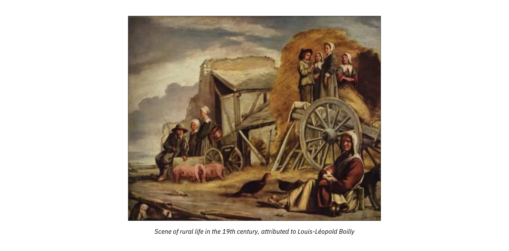

Urban artisans, locked into rigid guilds, struggled to innovate or even support one another. Meanwhile, other European nations soon surpassed France on every front, outcompeting its products. The commercial successes of England and Holland were on everyone's mind.

But how could we find a solution to the illness of the era? There was, as yet, no science of economics and therefore no special medicine to apply. The principles of economic policy were still applied haphazardly, shifting between restrictive phases and more liberal periods. Certainly, we have models, historical references to follow. Among them was *Sully*, Henri IV's minister, who advocated for agriculture and promoted greater freedom of trade within France.

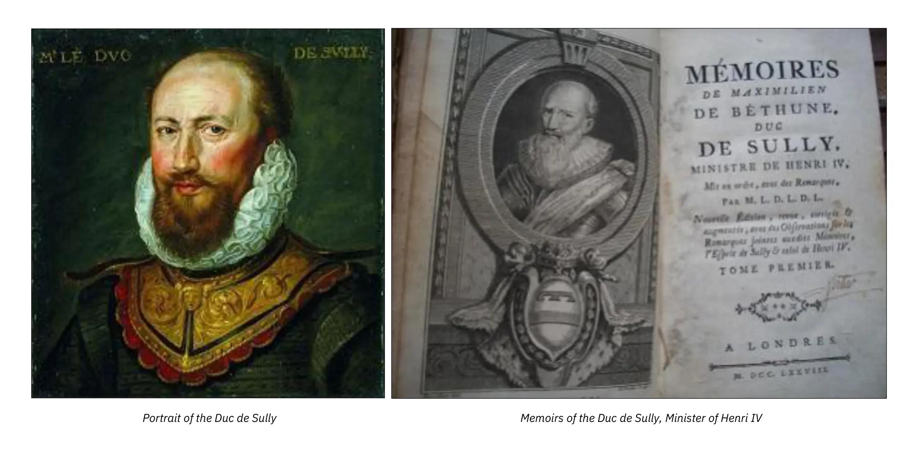

But then came Colbert, Louis XIV's minister, who wavered between regulation and freedom, yet ultimately enforced regulation. At the very end of the 17th century, Colbert overtook Sully: ministers now invoked his legacy and try to apply what they claimed were his maxims.

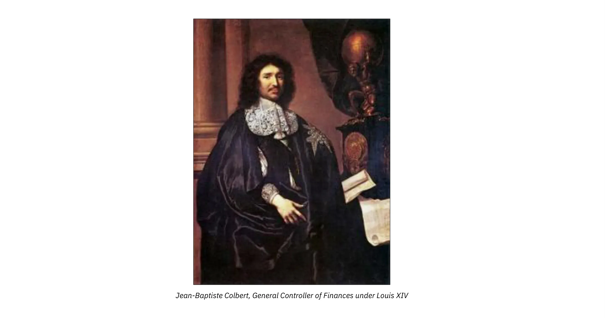

In the minds of statesmen at the end of the 17th century, Colbert's maxims were four.

(1) **Industry Must Be Regulated and Bound Within Guilds**. These regulations specify, for example, how sheets and cloths should be made, their size and weight.
There were hundreds of such rules, compiled in dedicated volumes for each type of industry. Yet in the eyes of Colbert's followers, this was still insufficient: industry, they believed, also needed to be supervised by corporations.

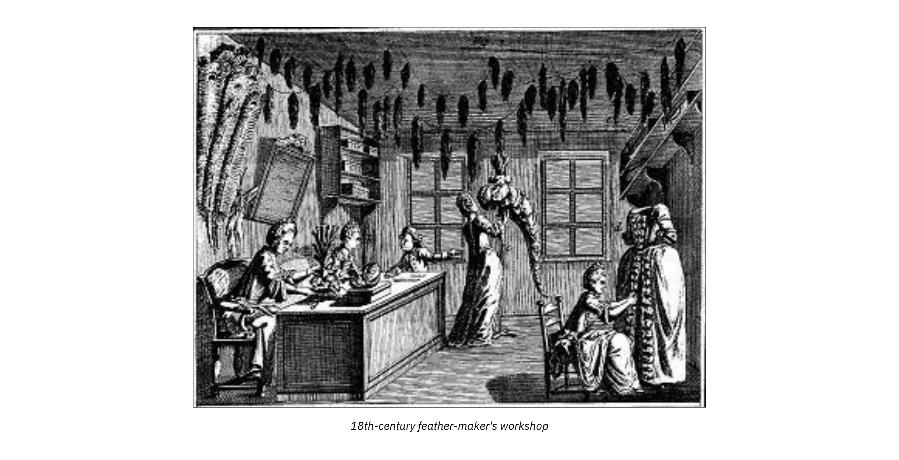

Anyone wishing to practice a trade had to first spend several years as an apprentice, then as a journeyman, before attempting to attain the status of master by producing a "masterpiece" and paying a substantial amount to the guild. Competition within each trade was therefore strictly limited.

(2) **Trade Is a Zero-Sum Game**. When it comes to commerce, Colbert's disciples shared the same prejudices as the barbarian people of Antiquity. According to Louis XIV's minister, trade is "a perpetual war". Why? The reason is simple: for Colbert and his successors, any increase in wealth for one country meant the impoverishment of another. In their view, the English or the Dutch could not be allowed to grow rich, because that would mean they were stealing France's prosperity.

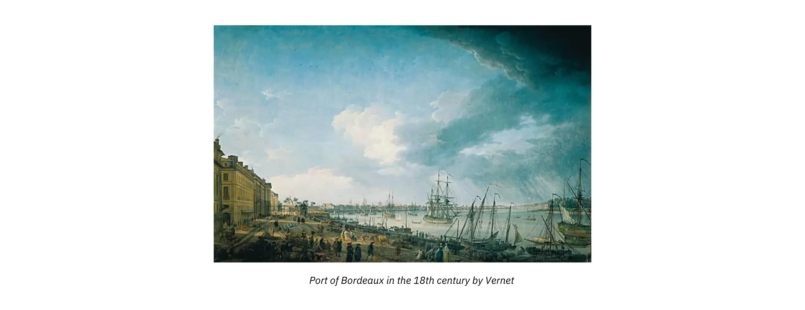

These countries' products, therefore, had to be banned or heavily taxed, without scruples, because trade is a war in which we can only wish for the ruin of our enemies.

> "The French can only increase their commerce by crushing the Dutch".
> *Colbert*

(3) **When the State is short of money, Raise More Taxes**. Colbert and his disciples were far from believing that taxpayers' wealth was a limited resource. In their view, public spending could never be a problem, as long as enough was collected. And if the people revolted, it was merely because the ministers had gone about it poorly, for, as Colbert cynically remarked, "the art of taxation consists in plucking the geese without making them scream too much".

(4) **Wealth is, above all, gold and silver**. Before the birth of economic science, many writers followed one dominant dogma about the nature of wealth, what came to be known as *mercantilism*. Colbert and his successors continued along this path. In short, mercantilists believed that the true sign of a nation's prosperity was the accumulation of precious metals, silver and gold.

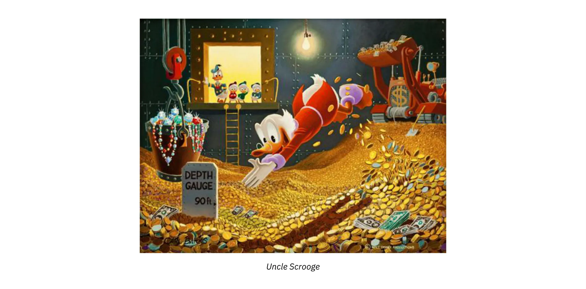

> "Only the abundance of money within the state makes the difference to its greatness and power".
> *Colbert*

The consequence of this idea is to favor exports at all costs, which brought in foreign gold and silver, and to limit imports to a minimum, to avoid sending them abroad.

These are the four principles that guided the French government for several decades, as the country entered the 18th century. However, they were soon to be profoundly challenged. Between 1690 and 1710, several writers were deeply struck by the disastrous State of France. In seeking its causes, they concluded that the very maxims inherited from Colbert were to blame, viewing them as than fallacious arguments. In doing so, they laid the foundations of economic science.

## Vauban

<chapterId>ee9c1e0e-96cc-5026-a5e2-963d68122786</chapterId>

Today, as the tax pressure in our country continues to grow, threatening to suffocate national economic forces, voices are rising in favor of change. Whether consciously or not, these calls for reform often echo the work of French economists who, since the 17th century, have criticized the nation's tax system as chaotic, despotic, excessive.

The first of these tax reformers, chronologically and in terms of merit, is the great marshal Sébastien Le Prestre Vauban, famous builder of strongholds and citadels.

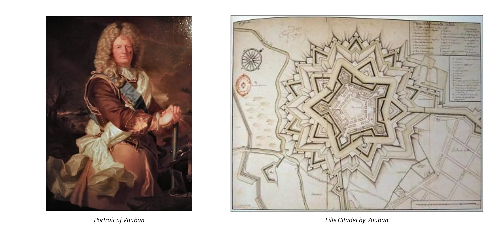

Though we have sadly forgotten it, Vauban was more than a military man; he was also an economist. He took an interest in the fate of the peasants, he proposed bold tax reforms in 1695 (Projet de capitation - "the Project for a Capitation") and again in 1707 (Projet d'une Dime Royale - "the Royal Tithe"): to replace most existing taxes with a tax proportional to income, a flat tax before its time.

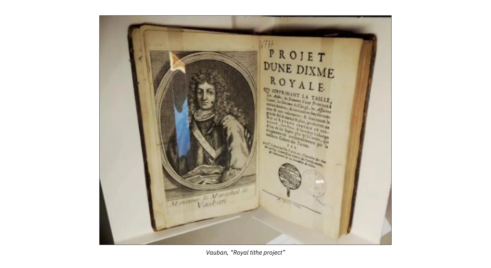

Vauban arrived at these ideas through curiosity. He was a keen observer, striving to study social life and economic reality rigorously, almost scientifically. He insisted particularly on the need to count, through censuses.

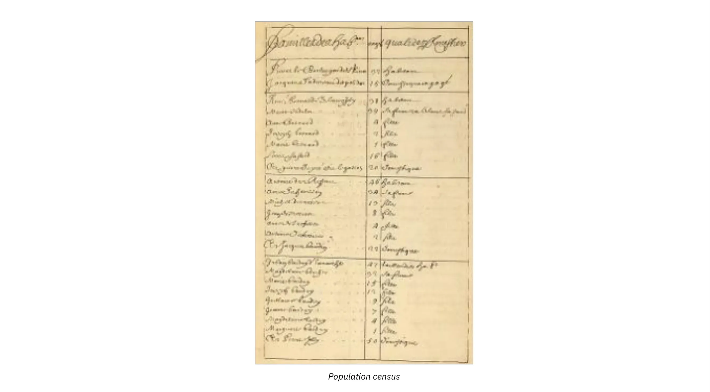

His second great merit was his moving and honest description of the misery endured by the masses. He wrote: "Let us not be deceived; the heart of the kingdom is ruined. Everything suffers, everything endures, everything groans. You only have to look and examine the heart of the provinces, what you'll find is even worse than what I'm saying". Far from exaggeration, Vauban's gloomy observations were an accurate reflection of early 18th-century life. Alexis de Tocqueville was well aware of these ideas, and would later describe Vauban's *Royal Tithe* as "frightening", because it was true.

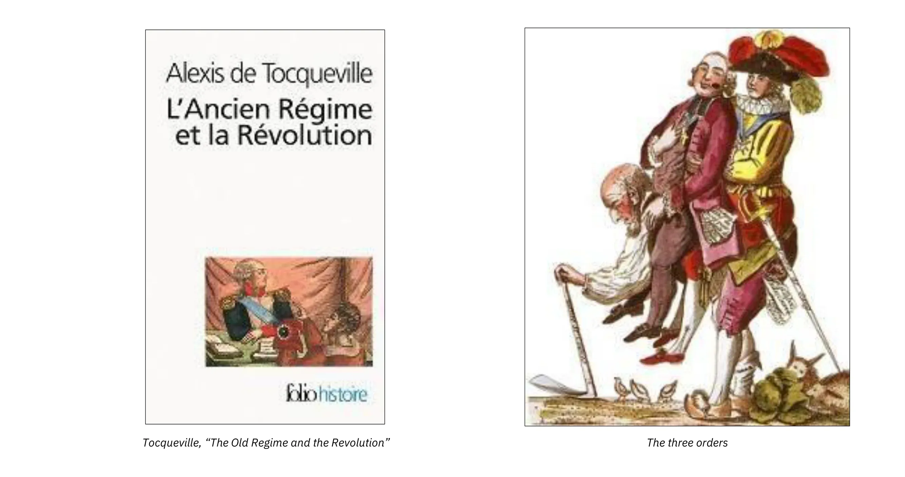

Vauban's other great merit as an economist was proposing a far-reaching tax reform aimed at eradicating, or at least reducing the intensity of the evil he observed and described. He was right to do so; the French economy under the Ancien Régime was paralyzed by taxation, which was unequal, unstable and illegible.

Across his various political and economic writings, Vauban's overarching ambition was to relieve the suffering of what he called "the lower part of the people, who, by their labor, sustain and support the upper".

He understood that oppressive and disincentivizing taxation was overwhelming peasants, a concept he expressed with clear-sightedness, something that we can still observe perfectly in our time:

> "The farmer lets the little land he has wither away, working it only half-heartedly, for fear that if it produced what it could with proper manure and cultivation, it would be taxed even more heavily".

Vauban saw the truth: taxation under the Ancien Régime was not only irrational but also cruelly strict. It was this tax system, unjust in its distribution, that he sought to overcome.

His proposed solution, a flat, proportional tax on all incomes, would have allowed the tax burden to be shared fairly among all social classes. Grounded in a theory of the State that saw public authority as necessary to protect individual rights and property, Vauban's tax reform demanded that all citizens contribute in strict proportion to what they earn, for instance, 10% of their income

In The Royal Tithe, the only one of his economic works printed in his lifetime, Vauban stated clearly:

> "Since everyone in a State needs its protection to survive, it is only right that all contribute, according to their income, to its upkeep and expenses [...]. Nothing is more unjust than exempting those most able to pay, and shifting the burden onto those least able, who collapse beneath the weight; weight that would be quite light if borne proportionally by all according to their own strength. Therefore, every exemption from taxation is a disorder that must be corrected."

Shortly before his death, Vauban's idea was adopted by Louis XIV's ministers. However, Vauban had called for a proportional tax to replace all, or nearly all, existing taxes. Instead, as so often happens, his tax was implemented, but all the others were kept as well.

## Boisguilbert

<chapterId>200149c6-b5fc-566e-ab0e-bafb1c3fed3c</chapterId>

Few French economists from the past enjoy recognition in their homeland today that matches their contributions, and Boisguilbert is no exception.

Unappreciated by the readers of his time, distanced from power circles due to his eccentric nature and overwhelming passion, Boisguilbert left little mark on the 18th century. Yet, at the beginning of the last century, there has been a slow rediscovery of his work.

However, this rediscovery shows that we are getting into a kind of dead end. Boisguilbert's true merit has been lost by presenting him as the pioneer of numerous theories and the forerunner of many thinkers. He is said to have grasped the concept of underemployment later defended by Keynes, anticipated Say's law, paved the way for Walras's general equilibrium theory, and even foreshadowed the class analysis of the Marxists. 'Who or what could Boisguilbert not be the precursor of?' one commentator ultimately asked.

(Pierre Le Pesant de) Boisguilbert was born in Rouen in 1646. Educated at Port-Royal in Paris, Boisguilbert began an unsuccessful literary career before taking on various roles, including that of Lieutenant-General of Rouen. It was during this time that he wrote several books to advocate for his ideas, among them "Détail de la France" in 1695, which he republished the following year under a much more explicit title: [*France Ruined under the Reign of Louis XIV, by Whom and How, with the Means to Restore It](https://archive.org/details/bub_gb_0jUaWNbTJa8C/page/n23/mode/2up)*.

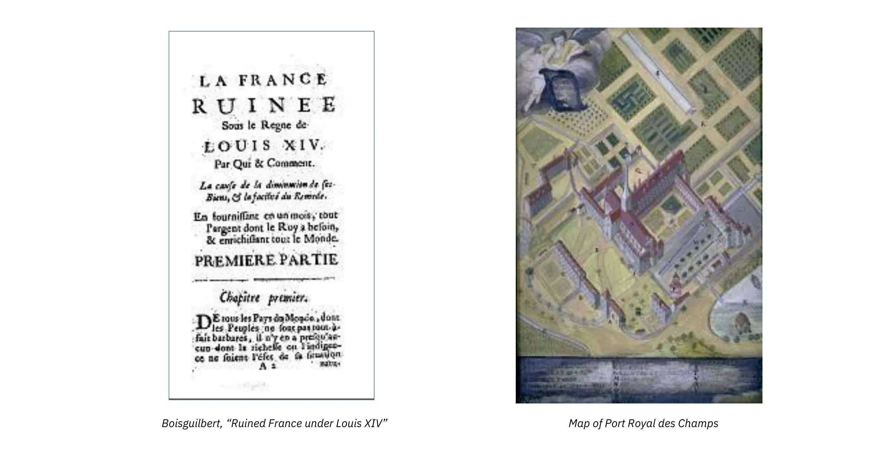

And this is the basis of Boisguilbert's books: French poverty and its causes.

This misery of the French people at the end of the 18th century, Boisguilbert describes in detail, as did Vauban. He writes:

> "The barren or poorly cultivated lands, visible to all, are the corpse of France".

He described uprooted vineyards, peasants who abandoned fields, and recurring famines. 

Boisguilbert finds two main causes for this misfortune. For if the people live in destitution, it is because they are prevented from consuming what is necessary, and the ruin of consumption has two causes.

First, the people could no longer afford to consume basic necessities due to arbitrary taxation. The taille, a personal tax of that time, was calculated blindly for each individual, rising or falling without reason. Because of the numerous privileges, the burden fell on the poor peasants, who found themselves ruined. To correct this, Boisguilbert recommended a proportional tax on all incomes, much like Vauban's proposal.

The second reason for France's misery is that too many obstacles prevented the free trade of goods, especially agricultural ones. There were customs duties at the borders and even within the country, between different regions, which paralyzed all commerce. These restrictions prevented the establishment of an equilibrium price and limited market opportunities. As a result, peasants could not make a living from their production, because they were unable to sell profitably and suffer from unremunerative agricultural prices, a concern that remains highly relevant today and lies at the heart of Boisguilbert's theory. On the matter of trade restrictions, Boisguilbert advocated for clearing the roads, in other words, establishing free trade.

And freedom is indeed his final conclusion. "It is not a matter of acting", he says, "but simply of ceasing to act like we so violently do against nature, which always tends toward liberty and perfection". Everything will be well, he repeats tirelessly, "as long as we let nature take its course, that is, give it its freedom, and that no one interferes in this commerce except to offer protection to all and to prevent violence".

This last passage is essential. Boisguilbert was the first to clearly demand a laissez-faire economic policy, to make it his credo, and to build a real system around it. According to him, there is a natural order of things, and it should not be corrupted, not destroyed, by untimely public interventions. The State, in his view, must not act in economic matters, but rather, let things act naturally. Otherwise, it will cause misery.

Boisguilbert even criticized the "*good souls*", as he called them, those who meant well but did great harm. They wanted cheap bread for the people, but by forcing down prices, they ruined farmers, who couldn't survive on such margins. These farmers then abandoned their lands, plunging deeper into poverty. As we all know, 'hell is often paved with good intentions'.

## Cantillon

<chapterId>bc206d41-6a64-5688-a489-40fcfa0e5397</chapterId>

Author of the "Essay on the Nature of Trade in General" (written around 1730, published in 1755), Richard Cantillon is regarded as one of the pioneers of modern economic science. In his History of Economic Thought, economist Murray Rothbard even refers to Cantillon as the founder of modern economics.

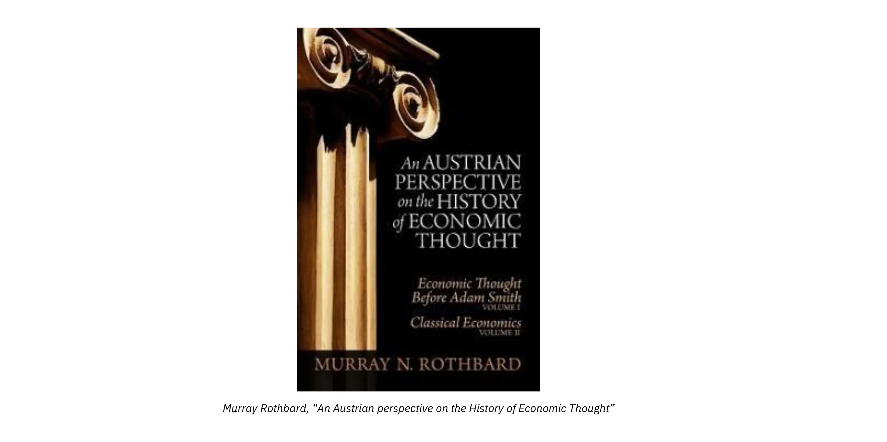

Born in Ireland, Richard Cantillon settled in Paris as a young man and acquired French nationality. He worked as a banker and made a fortune during the John Law era.

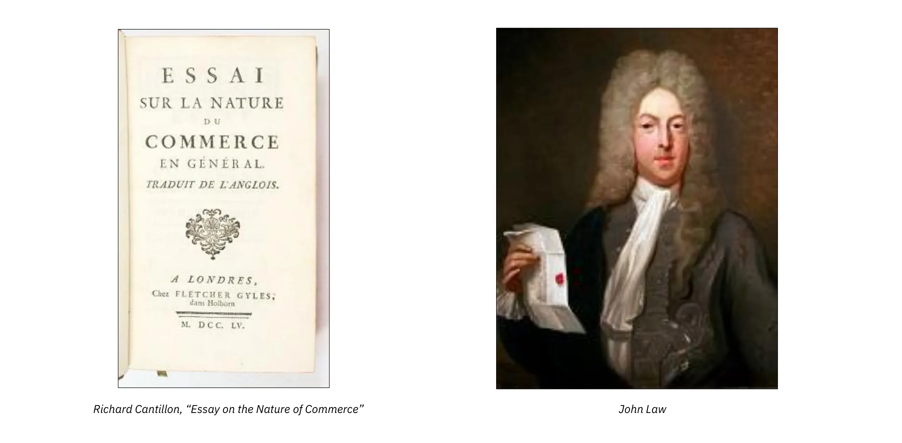

It was also on this occasion that he began to study economic theory. Around 1730, Cantillon composed his Essay on the Nature of Commerce in General.

This book can be seen as one of the first attempts at creating a general theory of economics. Cantillon is careful to identify what he calls "general laws of the economy", those which are in the nature of things, and not in the particular facts of this or that country. This approach was revolutionary.

We can summarize the great merits of Cantillon's Essay in five areas: the theory of wealth, the notion of the entrepreneur, the critique of worthless currencies, the "Cantillon Effects", and finally the defense of freedom.

First, his **theory of wealth**.
Unlike the mercantilist view dominant at the time, Cantillon based his analysis on the recognition that wealth is formed by the products that are proper to the enjoyment of man. This wealth, he argued, comes from nature and is produced through human labor. His ideas on the nature of wealth had a strong influence on Beccaria and Adam Smith, and, through Smith, on the entire English classical school of thought.

Second, **the entrepreneur**.
Although he didn't define it clearly, Cantillon viewed the entrepreneur as a main and central player in economic activity. For Cantillon, what characterizes the entrepreneur is that he takes on risk and acts in uncertainty. These ideas would later be expanded by Turgot and, more significantly, by Say, to finally recognize the entrepreneur's special place in the economy, contrary this time to the assertions of the English school.

Third point, **currency**.
In reaction to the John Law experience, Cantillon explains what happens or must happen when currency has no real value.

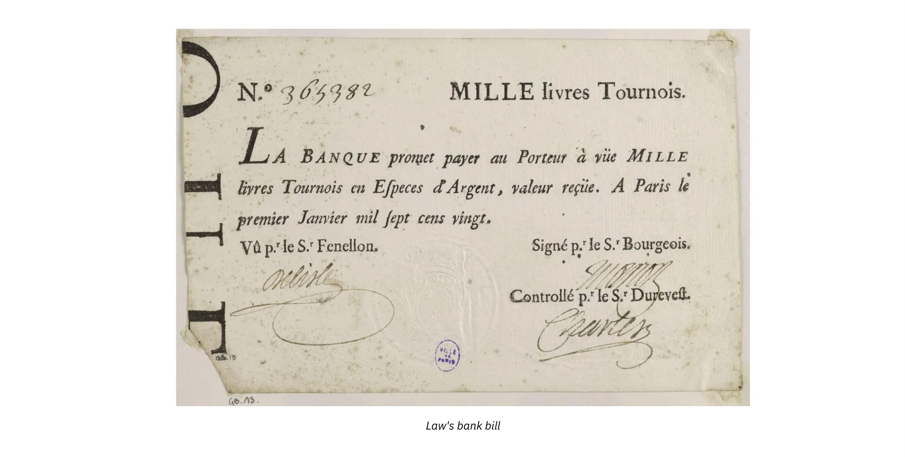

He sees two main consequences of substituting a currency without real value like paper money for a metallic one. The first consequence is what he calls "popular rejection", which means a growing distrust of worthless money. The second consequence is inflation: monetary weakening makes goods more expensive.

Fourth, in his analysis of **inflation**, Cantillon went further than his contemporaries. Having observed the collapse of Law's system, Cantillon realized that monetary inflation doesn't affect everyone equally. On the contrary, it enriches some while impoverishing others. He concluded that inflation has redistributive effect: those who receive newly issued money first benefit from increased purchasing power, while those who receive it later become poorer as a result of the new money being issued due to the rise of inflation rates.

Fifth, despite a few remnants of mercantilist thought, Cantillon's overall perspective was **fully liberal**.He defended private property as a fundamental pillar of civilization, arguing that no society can function without private ownership of land and the products of labor. He also saw material inequality between people as natural and legitimate. According to Cantillon, there's nothing wrong with an efficient and courageous worker, or an exceptionally gifted one earning more than someone who is incompetent or lazy.  Finally, Cantillon believed that prices should always be determined freely, by the play of supply and demand, without intervention by public authorities.

Among these five major ideas in his Essay, the most important is undoubtedly the one that now bears his name: the **Cantillon Effect**.
With this theory about the effects of inflation, Cantillon provides us with answers to a number of contemporary ills. It helps us understand the consequences of recent expansionary and inflationary monetary policies, which have impoverished the middle class and rural world, while enriching financial market operators and the State, its agencies and its officials, due to their joint proximity to the source of the new issue: central banks and commercial banks.

# Reformers and Thinkers of the Early 18th Century

<partId>1f7b50d4-ce93-5db3-8396-43c1fa5419ff</partId>

## The Abbot of Saint-Pierre

<chapterId>13478fe2-4c12-593c-a410-54c2cfb7ef7f</chapterId>

Of all the authors we've chosen to include in the pantheon of 18th-century French laissez-faire thinkers, Abbot of Saint-Pierre is undoubtedly the most overlooked.

To be fair, it's partly his own fault. He wrote a great deal, but his style is hard to read and is full of repetitions. Even Jean-Jacques Rousseau tried to summarize his work: he began to do so, but soon abandoned the task, as he realized that it was beyond his strength. In the mid-19th century, Gustave de Molinari honored him by publishing a comprehensive work on him, in which he paid tribute to the pacifist and economist that the Abbot of Saint-Pierre was. But this was not enough to bring him out of oblivion, as he still remains in it today.

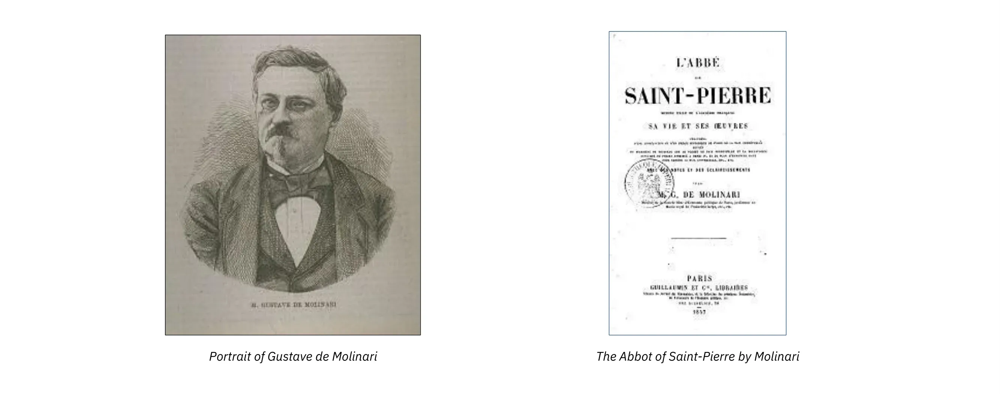

The Abbot of Saint-Pierre wrote about economics, but it's rather as a pacifist that he is usually of interest. He is the author of a Project for Perpetual Peace, which predates the well-known one by Emmanuel Kant.

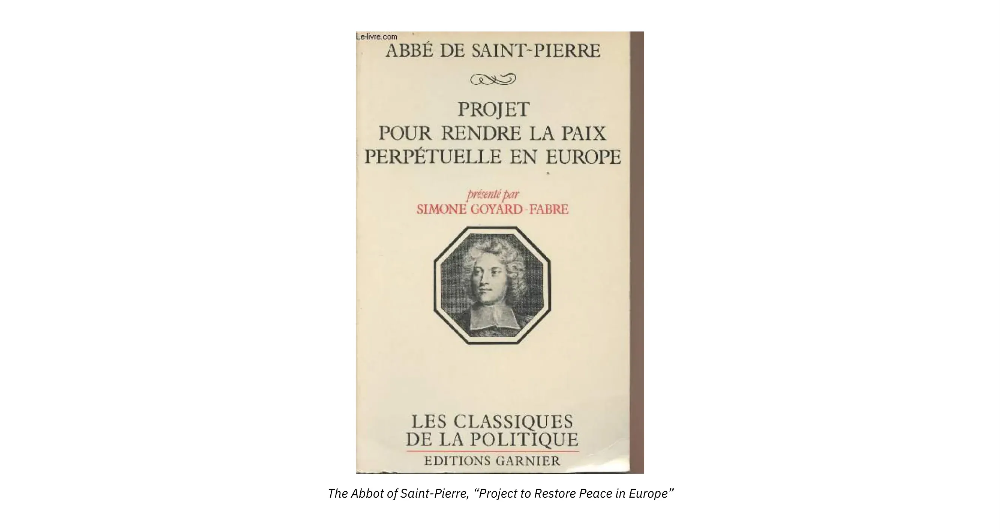

In this work, he argued that war is destructive, not only for those who lose it, but also for the winners, and even for those who don't take part in them, since their commerce is affected.

To combat the scourge of war, he recommended the creation of a kind of European League of Nations. A European council would be formed to resolve the problems of each nation. Nations would therefore resort to arbitration, in order to avoid resorting to arms. If a nation was not wise enough to embrace peace, if it threatened the other European nations, the European league of nations would have a means to respond. Facing such events, a European army would be formed, with forces provided by the various countries.

There's also an episode in the life of the Abbot of Saint-Pierre that perfectly illustrates the critical mindset behind the French laissez-faire movement. He joined the Académie Française in 1695, but was expelled in 1718 for daring to criticize the reign of Louis XIV. In that, he aligned with figures like Vauban and Boisguilbert, who had also dared to speak out against the myseries hidden beneath the splendor of the Sun King's reign.

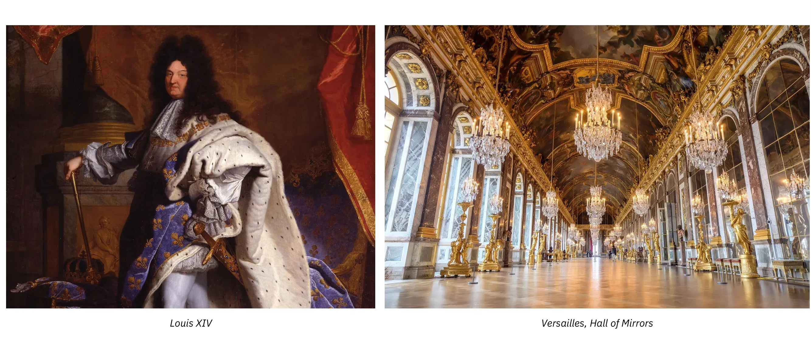

The Abbot of Saint-Pierre argued that the reign of Louis XIV, with its luxurious court and obsession with military conquest, was not the mark of a virtuous king. He refused to accept that Louis XIV deserved the title "**Louis the Great**".

"To ruin one's neighbors and one's people at the same time is not greatness", he said. This position deeply offended the Académie Française, which had long been preoccupied with glorifying the king in every literary form possible. As a result, they voted almost unanimously to expel him.

In terms of economic thinking, he consistently applied the principle of utility, much like Jeremy Bentham would do later, and often offered sound insights. To be fair, he was still influenced by mercantilist ideas, which no one had fully shed at that time.

Still, the Abbot of Saint-Pierre made some accurate observations about the economy. Even before *Condillac*, who is often credited with the idea, he stated plainly that in any exchange, both parties benefit. This can be found in his 1733 ["Project for Improving France's Trade"](https://www.institutcoppet.org/projet-pour-perfectionner-le-commerce-de-france/), where he wrote:

> "When a sale is made between merchants, the seller gains, and so does the buyer; for if there weren't some real or perceived benefit on both sides, neither the seller would sell at such and such a price, nor the buyer, for his part, would buy at such a price".

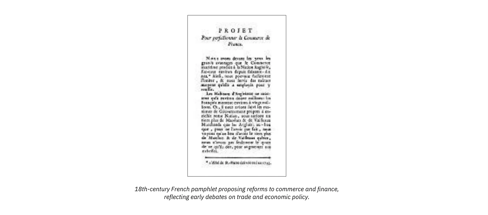

He also emphasized, before Vincent de Gournay did, the value of labor and the importance of keeping it appealing. "All labor is difficult", he wrote. "And when a man sees that his work pays him nothing, or not enough, he becomes idle and won't bother with unnecessary effort". This very argument would later be echoed by the Marquis d'Argenson, Vincent de Gournay, and the Physiocrats as they criticized burdensome regulations and guild systems. They argued that such restrictions discouraged workers, caused needless difficulty, and eventually made idleness seem more appealing than productive effort under such conditions.

## The Marquis d'Argenson

<chapterId>e9960ab4-72ec-5afd-8e97-bf89c83b62bc</chapterId>

The Marquis d'Argenson is a forgotten founder of the doctrine of laissez-faire.

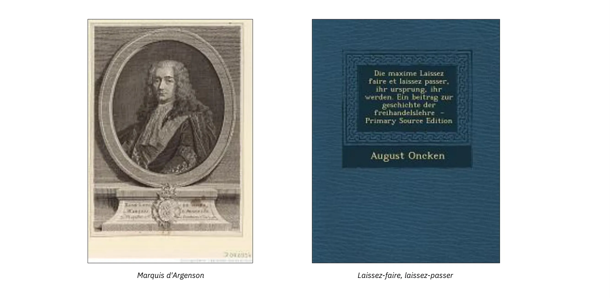

It was rediscovered by August Oncken, author of a book on the laissez-faire, laissez-passer doctrine, concluded that d'Argenson played a major role in the birth of this idea.

René-Louis Voyer, Marquis d'Argenson, was born in 1694. He began his political career as a parliamentary advisor, then served on the Council of State.

Thirty years before Adam Smith, d'Argenson was already defending the benefits of the division of labor and specialization.

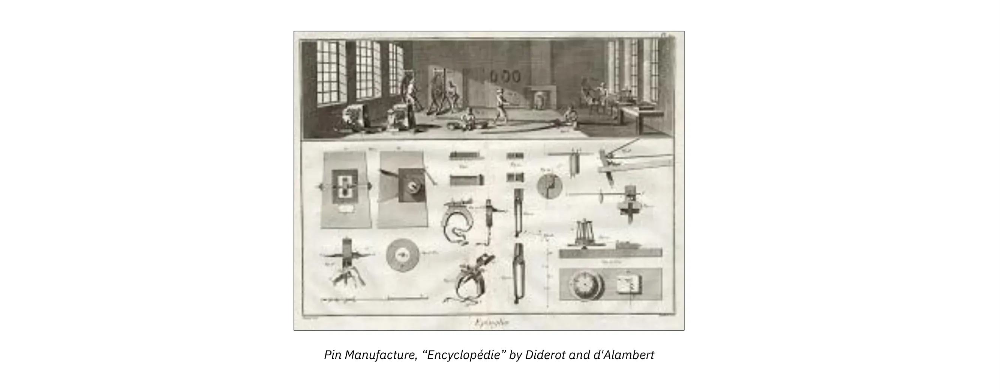

He strongly criticized regulations that, as he saw it, tried to change the natural preferences of different regions. For instance, he was baffled that the government wanted to produce fabrics and velvets in Tours, a poor city at the time, to match the quality of those made in prosperous Genoa, which was famed for its luxury goods. He concluded:

> "Each place must be allowed to choose its own factories. Freedom! Freedom!"

He also recognized another of Smith's central principles: the idea that spontaneous order arises from the pursuit of self-interest. The Marquis d'Argenson believed that immediate personal interest was what drove human energy. He wrote that poor craftsmanship and fraud would discredit a manufacturer, while diligence and good intentions would lead to prosperity. The best judge of utility, he argued, was the individual, the public at large, who buy goods and care about making a good deal. "Everyone senses their own interest," he said, "everyone takes the measures that are profitable to him, and it is in this general agreement that we discover the truth."

Even before Adam Smith, he understood that self-interest leads to general interest through the construction of a spontaneous natural order.

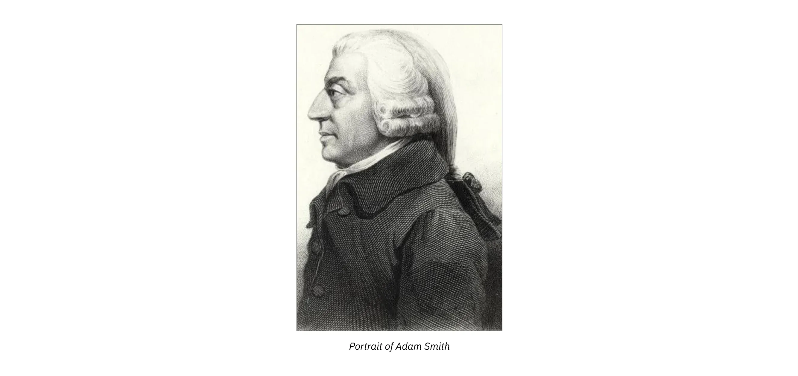

He compared society to a hive of bees where every insect follows its instinct, "From their actions", he said precisely, "resulted a great accumulation for the needs of the small society; but this was not brought about by orders, or by generals, who obliged each individual to follow the views of their leader". This is perhaps the closest expression in French economic thought to Adam Smith's famous concept of the "invisible hand".

The Marquis d'Argenson was always outraged by the ideas of the ministers of his time. The only question they asked was, "Should we regulate this way or that? Should we direct the economy toward this or that?". To which d'Argenson replied: "Shouldn't we first ask whether it's appropriate to direct any of it at all, or whether things should be left to operate on their own?"

To tell the truth, he was astonished that people found it so hard to understand, or rather, to see, the harmful effects of excessive regulation of all kinds on the economy. In his view, it was enough to simply open one's eyes. "So many things are working reasonably well today", he wrote bitterly, "simply because they've managed to escape the reach of the law".
Sometimes, he despaired at how little his ideas were understood.

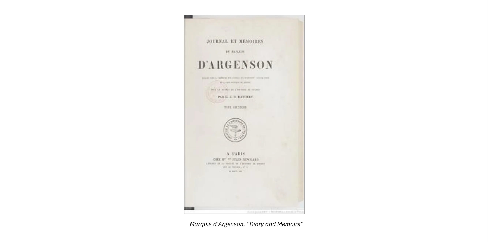

The ideal of economic policy that he defended was therefore contrary to the trends of his time. His ideal defined an essentially negative role for the State. "All commerce needs is the removal of obstacles. It asks only for good judges, punishment of monopolies, equal protection for all citizens, stable currencies, and roads and canals". This was the definition for a minimal State, which would become one of the foundations of the French tradition in political economy.

This vision of the role of the State in economic activity was naturally illustrated by the study of two major issues that stirred the economists and social thinkers of his time: the regulation of industry and the wheat trade.

The regulations on industry, first of all, aroused all his resentment, because they were privileges for some at the expense of others. "The real cause of the decline of our factories", he wrote, "is the excessive protection given to them". And it was with a no less lively credo that he expressed his criticism of the dirigiste zeal of the statesmen of his time:

> To run the industry against its will is to want its ruin.

On the question of trade in subsistence, d'Argenson had no other answer than freedom. According to him, the wheat shortages came from the monopoly and the excessive precautions taken by the government. All we had to do was let it be, and there would never be a wheat shortage in a country where the ports were open. Foreigners, attracted like all other men by the lure of gain, would provide us with what we need and take away our surplus. "Let it be", he said, "and all will be well".

## Vincent de Gournay

<chapterId>e8ae40dc-7450-552f-9ddc-9e02936cf425</chapterId>

Vincent de Gournay was one of the first representatives of laissez-faire in France, and one of its earliest advocates in public administration and intellectual circles. For that reason, he deserves far more recognition in the history of economic thought than he usually receives. I've tried to highlight his contributions in a recent book.

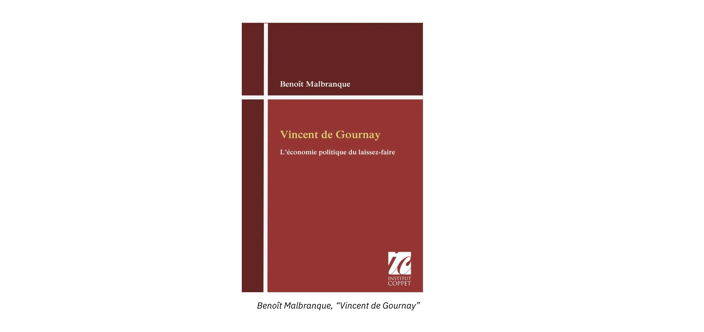

Born into a merchant family, Gournay became a successful merchant himself, amassing considerable wealth before securing a position in the French administration. Within the Bureau of Commerce, he was a fervent advocate of free labor and free trade.

Though he was well inserted in the context of the leading economists of his time, Gournay wrote little or, rather, published little. He wrote mainly administrative letters and memoirs, either unpublished or published by other authors after some editing.

What we do have includes:

1. [The remarks](https://archive.org/details/traitessurlecomm0000chil) on a translation of a book by the English economist Josiah Child;

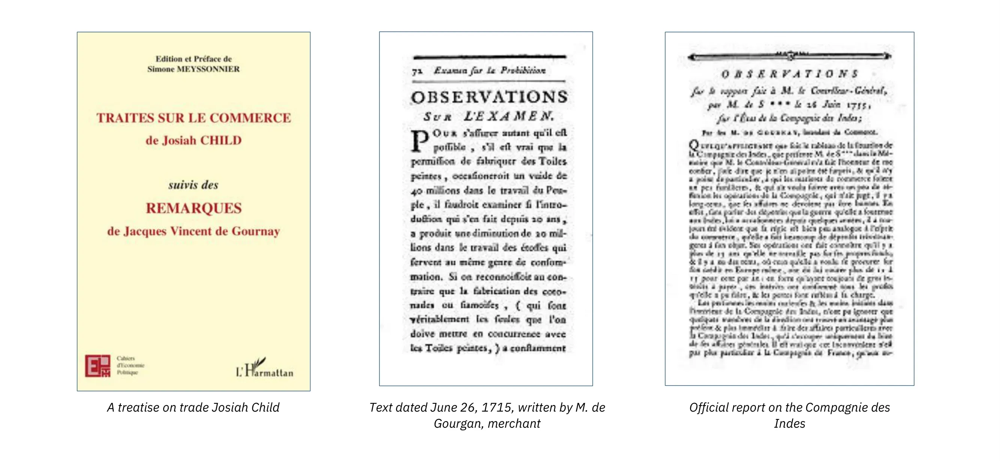

2. "Observations" included in the Examination of the Advantages and Disadvantages of the Prohibition of Printed Fabrics;

3. "Observations on the East India Company", appended by Abbot Morellet to his Memoir on the Current State of the East India Company (1769);

4. And above all, various memoirs from his role as Intendant of Commerce.

These writings demonstrate a clear foreign influence and the presence of some major structuring ideas. The foreign influence, in Gournay, is the recognition of English and Dutch superiority. Gournay was convinced that these two nations understood economics far better than France, and that France must follow their example. "These two nations are the most prosperous", he said, "and they follow a completely different system than we do. We prohibit the entry of foreign goods, we confine economic activity within draconian regulations, while they proceed in the opposite manner. If they are doing better", Gournay concluded, "it is because France is guided by faulty principles".

His reform proposals centered around several key points.

First, he believed labor needed to be protected and encouraged. At the time, French workers were treated like criminals, constantly monitored, and kept in fear of not having complied with one of the thousands of regulations. This excessive annoyance discouraged people from working, pushing them instead toward idleness. Yet, Gournay argued, "work is noble and the only way to enrich a nation".

Secondly, he criticized the restrictive system of guilds that confined manufacturers. Participating in a trade was both time-consuming and expensive, and each new worker must then scrupulously follow the routine established by the statutes of his guild. Such a system left no room for excellence, innovation, or progress.

Third, trade in France was limited by restrictive laws. In Gournay's view, consumers would benefit greatly if ports could compete freely and all goods, such as grain and printed canvases, were allowed to be imported without restriction. He was one of the first to point out the true origin of smuggling: it existed solely because a beneficial and useful trade was prohibited. He added a sharp observation: smuggling was a "free" profession, with no regulations, no guilds, no confiscatory taxes. Yet it was the State's overwhelming regulation that drove many honest workers into illegality.

Finally, Gournay noted that interest rates were lower in England and the Netherlands, countries more prosperous than France. He advocated for lower interest rates in France as well, so that economic activity could be financed there on conditions as advantageous as elsewhere. Gournay did not, however, seek coercive, legislative methods; rather, he emphasized the need to legalize money lending, which was still condemned by the Catholic Church.

On all these points, Gournay played a key role in the intellectual debates of the mid-18th century. His defense of economic liberty predated the Physiocrats by a decade and Adam Smith by twenty years. But his most lasting influence was on Turgot. Gournay took the young Turgot under his wing and trained him with his ideas.

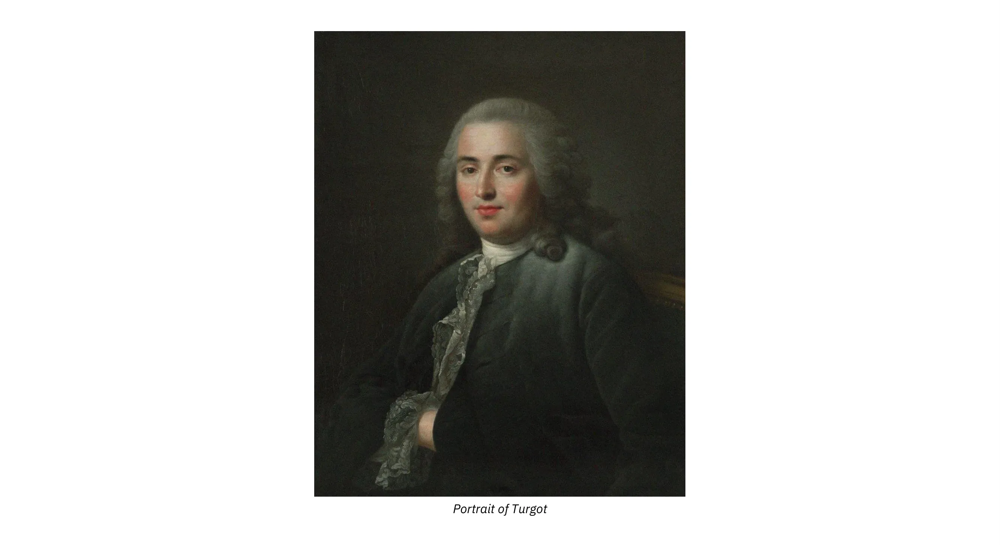

Years later, Turgot, a future minister under Louis XVI, wrote an Éloge (eulogy) in honor of his friend after his death. And if Turgot never completely embraced the Physiocracy of François Quesnay, it was because he preserved an invincible attachment to his first master, Vincent de Gournay.

## The Gournay Circle

<chapterId>b86ba6bd-8f3a-5d8f-b098-4d0413f00deb</chapterId>

When it comes to the early days of economic science, history tends to highlight a first school of thought: the Physiocrats, led by François Quesnay and his disciples. However, nearly a decade before their rise, there was another, less formal but equally important group centered around the economist Vincent de Gournay.

As we saw in the previous part, Gournay was fascinated by the example of foreign nations like England and Holland. He admired their economists—figures such as Josiah Child, Johan de Witt, and David Hume—just as much.

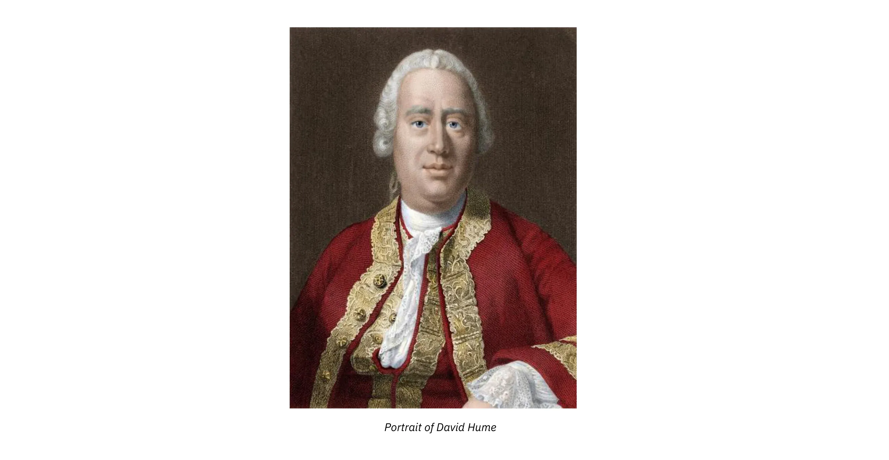

This admiration led him to translate, and assign translations of, their economic writings.

It turned out that his position in the senior administration allowed Gournay to come into contact with all the economic specialists known in France at the time. In this way, he assembled a group of extremely capable translators. He personally translated the works of Child and Culpeper. Abbot Le Blanc translated David Hume's Political Discourses. Véron de Forbonnais translated the Spanish economist Geronymo de Uztariz. Turgot worked on Josiah Tucker's writings, and Montesquieu's son translated Joshua Gee.

Thanks to the collaboration of several members of Gournay's circle, many authors were able to publish original works under their own names. These books, along with the translations, achieved remarkable success. Some notable examples include:

- Herbert's Essay on the [General Police of Grain](https://archive.org/details/essaisurlapolice00herb/page/n7/mode/2up) (6 editions in 4 years)

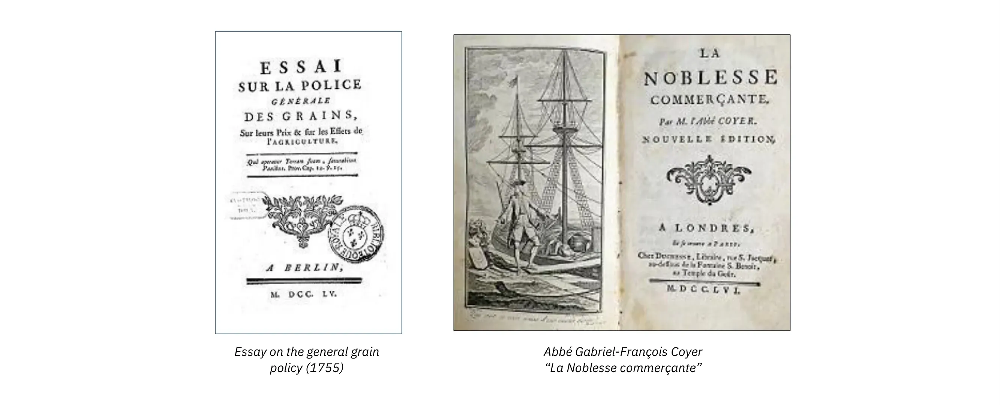

- Coyer's [Noblesse commerçante](https://archive.org/details/lanoblessecommer00coye/page/n3/mode/2up) (5 editions in 2 years)

- Plumard de Dangeul's [Remarks on the Advantages and Disadvantages of France and Great Britain](https://archive.org/details/bim_eighteenth-century_remarks-on-the-advantage_plumard-de-dangeul-loui_1754) (3 editions in its first year)
- Cliquot-Blervache and Gournay's [Memoir on the Trades](https://www.amazon.com/Memoire-sur-corps-metiers-French/dp/1978196903) (2 editions in 1758)
The group also played a pivotal role in the publication of 
- [Essay on the Nature of Trade in General](https://archive.org/details/essayonnatureofc0000cant) by Richard Cantillon.

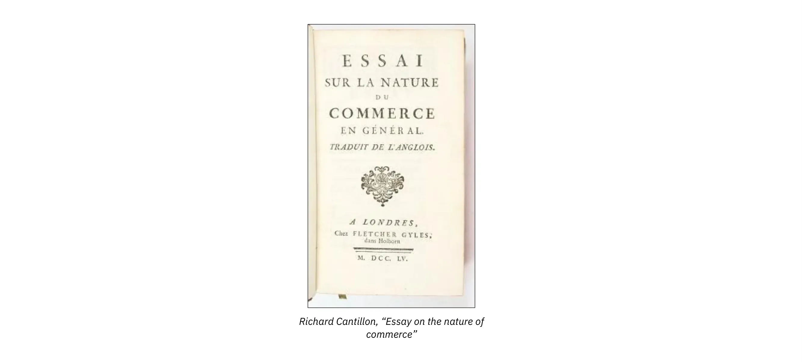

This last book, written around 1730, remained in manuscript after the author's death. Gournay, with the help of his economist friends, published it in 1755. According to the Abbot Morellet, a member of the circle, Gournay recommended it to every economist he knew.

The intellectual output of the Gournay circle had a major impact on the history of ideas. In this sense, they can be considered the founders of economic science in France. Christine Théré of INED, who has studied the history of economic publications, found that between 1750 and 1759, no fewer than **349** works on economics were published, compared to only **83** in the entire previous decade (1740–1749). This revolution in the 1750s is largely due to the Gournay circle.

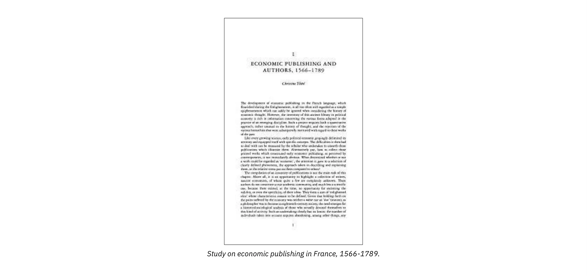

To spread a taste for economic discussions among the French population, Gournay and his friends worked to make them accessible through novels. After the *Memoir on the Trades*, which criticized guilds, Gournay and Cliquot-Blervache helped Gabriel-François Coyer write a short satirical novel called Chinki: [A Cochinchinese Tale Applicable to Other Nations](https://www.institutcoppet.org/wp-content/uploads/2013/06/Coyer-Chinki-Histoire-cochinchinoise.pdf).

The story follows the main character, Chinki, who is forced to leave his land due to excessive taxation and tries to find craft work for his children in the city. But all trades are closed to them because of abusive guild regulations, so the story portrays his growing disappointment through humorous tones.

Gournay's circle was therefore at the origin of an intense wave of publications. While this major contribution has been forgotten by historians of economic thought, it was very clear to contemporaries. The Physiocrats, who organized their school in the 1760s, would later present Gournay's group as their direct forerunners. In 1767, the economist Jacques Accarias de Serionne expressed this even more clearly in his tribute. He wrote: "A small number of Frenchmen, both philosophers and citizens, began a few years ago to imitate English writers. They first translated their models and soon surpassed them in many respects. They brought all the charm and richness of literature to the treatment of useful subjects; they sparked and spread the taste for the sciences that were most essential to the prosperity of the State".

And indeed, in the 1750s, economic questions became fashionable. Voltaire famously remarked that around 1750, the French gave up novels to discuss the freedom of the grain trade. This trend was also noted by the Mercure de France, which wrote in an issue from 1758, a few months before Gournay's death: "Political economy is now the science in fashion. Books dealing with agriculture, population, industry, commerce, and finance are now in the hands of countless people who, not long ago, only superficially read novels". One could hardly pay a better tribute to Gournay and the work of his circle of economists.

## Mirabeau

<chapterId>2d2f802b-e3b6-556f-9025-a1b1dc4409ca</chapterId>

France has known two famous men named Mirabeau, a father and a son, but it was the son who truly made history. A revolutionary tribune and one of the central figures in the events of the French Revolution, he remained famous.

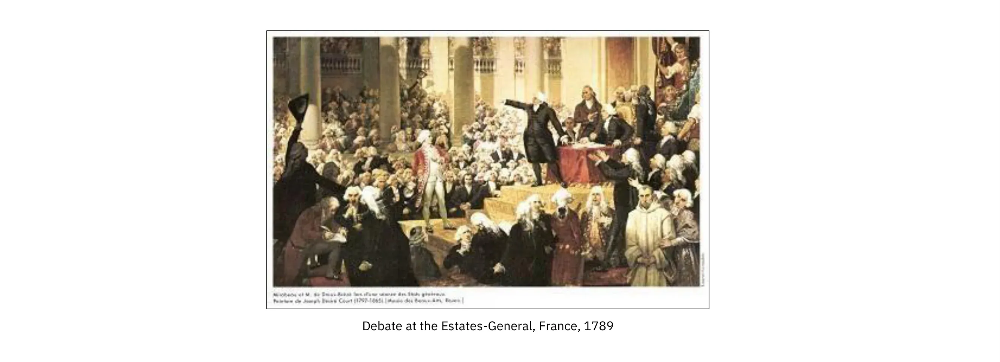

Through his talent and his place in French history, he overshadowed his father, an economist and pillar of François Quesnay's school, who had been its first member as early as 1758.

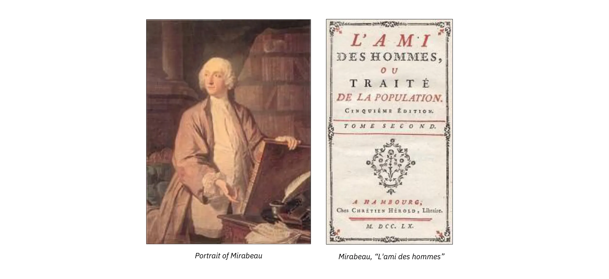

The Marquis de Mirabeau had, in fact, already achieved immense fame even before his adoption of Physiocracy thanks to a book entitled "The Friend of Mankind. Treatise on Population [FR: L'ami des hommes, ou, Traité de la population](https://archive.org/details/lamideshommesou00unkngoog). Even though the first edition was published in 1756, it became famous around 1757, a year before his meeting with Quesnay.

More than 20 editions were published between 1757 and 1760, which probably makes it the most successful economics book in history. Some readers even thought the book had been written by Montesquieu because of its sharp reasoning. The Dauphin, father King Louis XVI, even claimed to have memorized it. For a time, it was the book everyone at Versailles was reading.

Today it's a book that's no longer read, but many still reference it. Even by the 19th century, Edmond Roussel said:

> L'Ami des Hommes is one of those books everyone talks about, that hardly anyone knows about. In every generation, one brave citizen should read it; so that everyone else doesn't have to.

At the start of his career as an economist, Mirabeau drew inspiration from Richard Cantillon. He had owned a manuscript of Cantillon's Essay on the Nature of Commerce in General for 15 years and had patiently analyzed and commented on it.

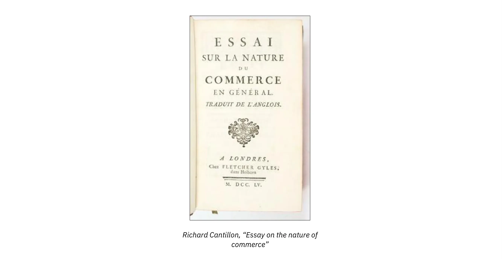

L'Ami des Hommes was originally conceived as a simple commentary on Cantillon's Essay. But since Mirabeau had a somewhat eclectic mind, which is to say, frankly, a bit mad, he quickly strayed from his original plan. The book simply discusses all the economic questions he knew, occasionally moving away from Cantillon. It is a difficult book to read, with a bizarre plan and digressions in every chapter. Mirabeau himself admitted that it was chaos and that his style was apocalyptic.

Despite the chaos that it is, some ideas are worth noting:

- Mirabeau fights the mercantilist prejudice on the nature of wealth.
- He praises agriculture and criticizes its abandonment.
- He complains about the condition of the people, especially the peasants.
- Finally, he defends the freedom of trade and the brotherhood of nations in peace.

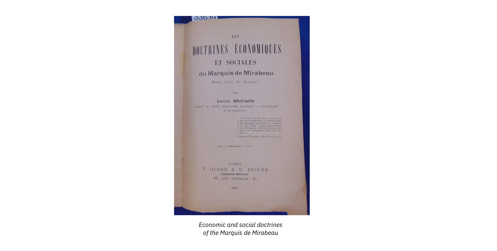

It's hard to label Mirabeau's views as either liberal or anti-liberal. He often drifted back and forth, sometimes without realizing it, between one vision and the other. Still, liberal ideas frequently dominated his writing. One of his most famous lines was:

> The true and only principle of political economy is to let everything be free.

With his greatest success behind him, Mirabeau was courted. François Quesnay, who had just taken an interest in economics, invited him to his entresol at Versailles.

They debated furiously and finally, something that normally never happens in debates, happened: Mirabeau flatly admitted that he had been wrong. He agreed with Quesnay's ideas and said he was ready to spread them.

Together, they formed the core of what would become the Physiocratic school, strengthened by the regular recruits they brought in. Shortly after Mirabeau's conversion, Quesnay enlisted him to defend his his ideas on taxation. This led to the ["Theory of Taxation"](https://archive.org/details/thoriedelimpot00mira), for which Mirabeau was sent for a few days to the Vincennes prison and then exiled to Bignon.

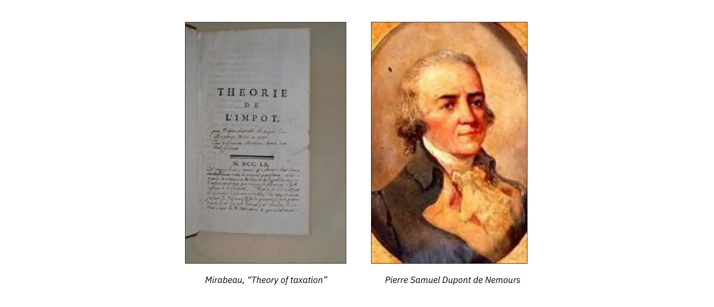

Mirabeau also played a crucial role in recruiting new members for Quesnay's school. He even convinced the young Dupont de Nemours.

It was also at Mirabeau's house that the Physiocrats met every Tuesday. Personalities such as Turgot and Adam Smith appear to have attended these meetings once or several times.

Throughout his life, Mirabeau remained a tireless writer. He authored numerous economic works defending Quesnay's doctrine. However, toward the end of his life, his influence waned. His writing style deteriorated to the point that his own brother wrote to him saying he could no longer understand his prose. His ideas, having become fully liberal, clashed with the socialist or proto-communist reaction of thinkers like Mably and even Rousseau. He struggled to find readers and publishers, and died largely unnoticed in 1789, on the eve of the storming of the Bastille.

## Quesnay

<chapterId>7a35f20b-5ea0-544d-b290-bcd9c6f7f11a</chapterId>

François Quesnay is one of the most famous French economists.

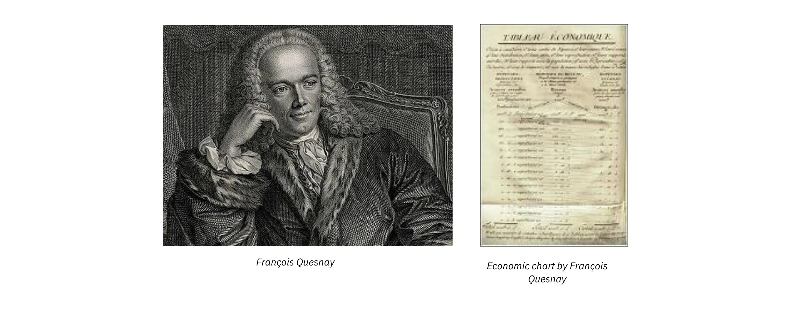

His name appears in every textbook on economics and the history of economic thought. It is stated that he created the "Tableau Économique" to schematically represent the economy, that he was the leader of the Physiocratic school, and that he was mistaken in believing that only land is productive, and finally, that Adam Smith came to set the record straight. This, more or less, is how textbooks tend to summarize François Quesnay.

Reducing him to this is a shame, because Quesnay was also the first economist to attempt to base the defense of economic freedom on scientific principles. He was one of the most listened-to and influential economists of his time. Moreover, he founded Physiocracy, a much richer doctrine than the simplistic idea that only nature produces wealth, a notion that is often misrepresented.

We'll discuss Physiocracy in more detail over the next three chapters. First, let's take a closer look at François Quesnay himself.

Born in 1694 in Méré to a peasant family that couldn't teach Quesnay to read. He was trained by a local man and eventually went on to study at the College of Surgery and then the Faculty of Medicine. At the age of 24, he became a surgeon in Mantes.

He gained fame in 1730, at age 36, for opposing the common practice of bloodletting, which he believed was based on flawed theories and prejudices. He also dared to challenge the system of guilds, which dictated that only surgeons could perform operations and only doctors could prescribe medication. This often forced the poor to pay twice and bring in two people, a situation Quesnay found revolting.

In 1740, he became secretary of the Academy of Surgery. In 1748, at age 54, he became the personal physician to Madame de Pompadour and moved to Versailles.

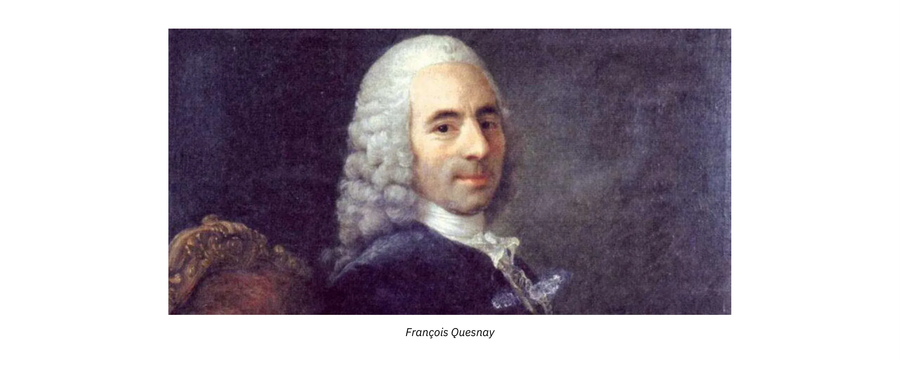

He was very close to Madame de Pompadour. Quesnay even said, at the time when the favorite's disgrace was announced, that he would not want to remain a doctor at Versailles without her:
"I was attached to Madame de Pompadour in her prosperity; I will be so in her disgrace".

Then he published several medical books: Treatise on Suppuration (1749), Treatise on Gangrene (1749), and Treatise on Continuous Fevers (1753), all of which were reprinted several times during his lifetime. 

At the age of 60, having been introduced to the economic debates fashionable at the time, he began writing about economics. In 1755, he wrote the articles "Farmers" and "Grain" for the *Encyclopédie*.

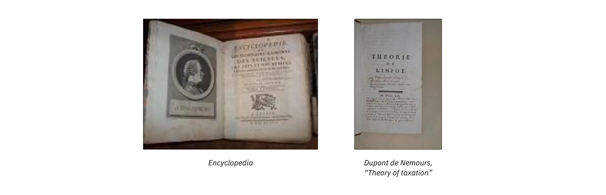

They were published in 1757. That same year, he met the famous Mirabeau and managed to convert him to his economic ideas—the core of Physiocracy was born. Quesnay then created the Tableau Économique, which was printed on the royal presses, reportedly in the presence of the king himself at the Château de Versailles. From that point on, he regularly hosted economists and philosophers in his Versailles apartment, where they engaged in discussions freely. Quesnay also contributed to Mirabeau's Theory of Taxation, published in 1759.

Censorship soon struck. Mirabeau was imprisoned, and Quesnay was reprimanded. After that, Quesnay realized he couldn't publish openly and would need disciples to spread his ideas.

He quickly found them: Baudeau, Dupont de Nemours, Le Trosne, Mercier de la Rivière, and others. These were the men who would spread and popularize the thought of Quesnay. However, Quesnay, who needed disciples, was not entirely satisfied with the sectarian aspect of his group. Witness his letters to Mirabeau, in which he tells him:

> "Think for yourselves. I've realized that my miserable drafts make you lazy. Now it's your turn to think. You know as much as I do".

Still, his disciples were deeply devoted and contributed greatly to Quesnay's popularity. Upon his death, Mirabeau gave his eulogy, saying, "We have lost our father, for we owed him everything". In truth, it was Quesnay who owed them everything, for without them, he would have remained stuck at Versailles, where his thinking, though it had much to seduce or worry, interested few.

Thanks to the work of his collaborators, his ideas found a platform: first through newspapers such as the *Journal of Agriculture* and the *Ephémérides du Citoyen*.

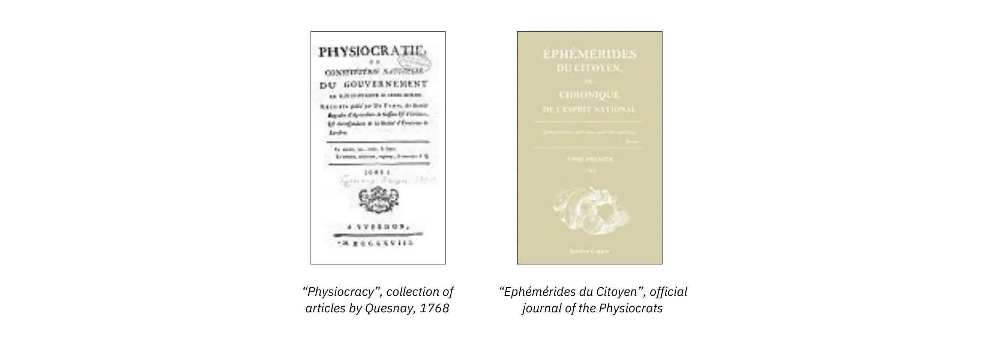

Then through books, not only those of his disciples but also an important anthology published in 1768 by Dupont de Nemours, titled *Physiocracy*.

This book gathered Quesnay's main contributions. It laid out the economic ideal of the Physiocrats' leader: a model of agricultural economy where the law guarantees everyone the right to own property and the freedom to trade.

# The Physiocratic School

<partId>27af82c1-ad82-5c3b-8ce9-c674b67bbf7c</partId>

## History of the Physiocrats

<chapterId>4236ff8b-b53a-59e7-92c0-f96f9afa1c00</chapterId>

Physiocracy became fashionable in France, and even across Europe, for barely a decade. After a long period of development, it gained prominence in the mid-1760s. By the time Turgot came to power in 1776, the movement had already lost its popularity, and the minister kept his support for Quesnay's school mostly hidden.

Its origins lie in the evolution of economic ideas during the 1750s. Several authors helped bridge the gap between Boisguilbert and what would later become known as Physiocracy. As previously discussed, Vincent de Gournay and his circle of economists were behind many publications that introduced French readers to foreign economic thought and helped ignite their passion for economics. The foundations of Physiocracy were already present in books like "Détail de la France" by Boisguilbert and ["Essay on the Nature of Trade in General"](https://archive.org/details/essaisurlanature0000cant) by Cantillon.

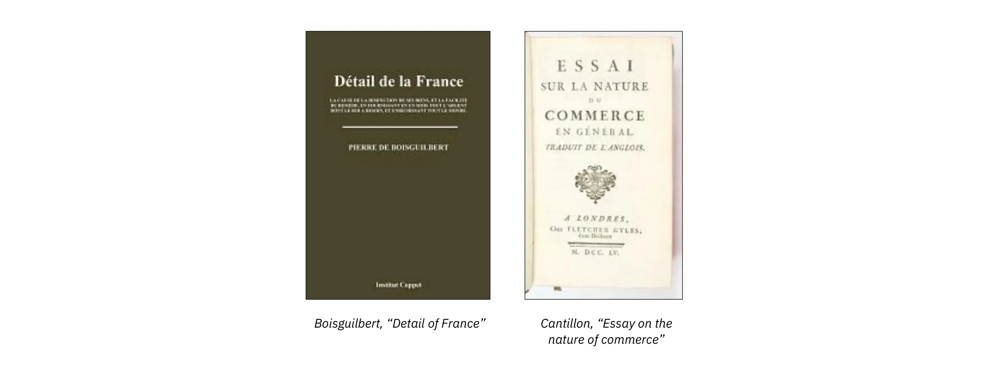

The concept of laissez-faire had several advocates since Boisguilbert, especially Vincent de Gournay and the Marquis d'Argenson.

What remained was to turn this body of ideas into a coherent, complete doctrine, and the Marquis de Mirabeau was the first to try. Inspired by Cantillon's Essay, he began writing a comprehensive treatise on economic matters titled "L'Ami des Hommes", which was very successful.

Thus, in 1756, the story of Physiocracy could begin. François Quesnay, then a surgeon turned personal physician to Madame de Pompadour, invited Mirabeau to Versailles to discuss economic ideas.

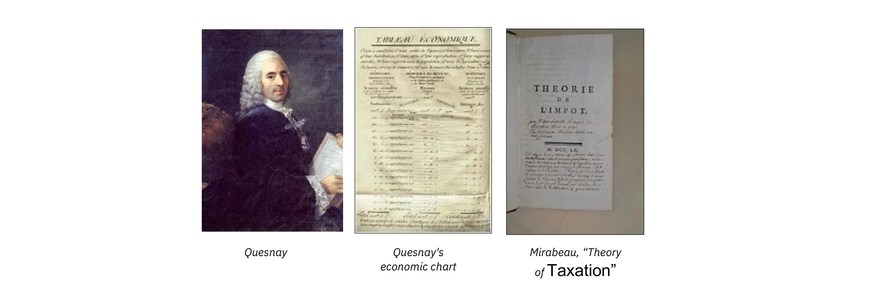

By the end of their conversation, Mirabeau agreed with Quesnay's ideas. From then on, they wrote: Quesnay created the *Tableau économique* (1758) to illustrate the flow of wealth in the economy, and together they published the Theory of Taxation (1759).

Their efforts were not warmly welcomed. At court, the prevailing reaction was indifference. The King acknowledged Quesnay's inclination for theory and affectionately called him "my thinker". But apart from that compliment, their work didn't obtain any result. In fact, their Theory of Taxation offended the tax administrators it criticized, so much so that they demanded and secured Mirabeau's imprisonment. Madame de Pompadour eventually had him released, but he continued living in exile at his estate in Bignon for a few weeks.

The first half of the 1760s thus passed in relative silence. Due to his position at Versailles, Quesnay was forced to stop writing, or at least to publish nothing under his own name. Mirabeau, already condemned once, was warned and well aware that the king's favorite could not protect him forever.

After this brief silence, the two economists began recruiting disciples: this was the only way to popularize their ideas. By 1765, their successes were striking. Dupont de Nemours, Abeille, Mercier de la Rivière, Le Trosne, and Baudeau quickly joined their ranks. They formed a school: they had their own journal, *Les Éphémérides du Citoyen*, and even met every Tuesday at Mirabeau's home.

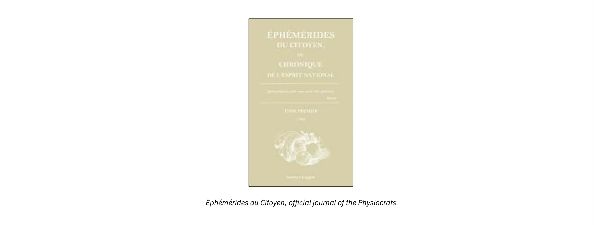

Between 1765 and 1775, the united group of Physiocrats stood at the peak of their fame. The literary and philosophical world had eyes only for them, allowing their ideas to spread widely and rapidly. People called them "the economists", or, more mockingly, "the sect of economists". Regardless of the tone, their notoriety was absolute. In 1774, after a trip to Metz, M. de Vaublanc wrote of his astonishment in his memoirs: everyone around him was talking economics and reasoning like Quesnay's disciples. "It was fashionable", he noted. "Everyone was an economist".

However, by 1770, their popularity began to wane. The group experienced its first defections, and their ability to withstand criticism weakened. And the critics were many, Condillac, Mably, Voltaire, Galiani, Linguet, Graslin, and even Adam Smith in Scotland, all challenged their views.

Their newspaper no longer appeared regularly. This marked the end of the movement's most active period.

Physiocracy would continue to exert influence up through the Revolution. In France, first through Turgot, more of a fellow traveler than a disciple, as well as through its representative Dupont de Nemours, whose life and works we will study later. But also across Europe, where the physiocratic doctrine was received with enthusiasm. In Germany, through the Margrave of Baden, and in Italy, through Leopold of Tuscany, physiocratic theories even inspired economic reforms favoring private property and freedom.

## The foundations of the Physiocrats' doctrine

<chapterId>4dbe5436-0578-57c2-b054-03ed00aa091a</chapterId>
The term Physiocracy, meaning "government by nature", was coined by Dupont de Nemours and used as the title for *Physiocracy*, a collection of articles by Quesnay published in 1768.

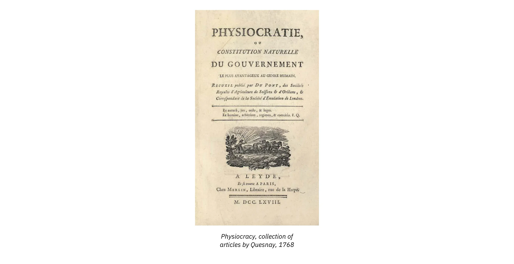

This is an obscure phrase. No student of Quesnay has provided us with its true meaning. Nevertheless, their system of thought was far from obscure. In fact, it was built around a few very clear principles, which we will outline here.

### First principle: only agriculture is productive

This first idea is the one that has caught the attention of historians. Today, in textbooks or economics courses, this is how the Physiocrats are summarized. They are said to have naively believed that only agriculture is productive. On that basis, their doctrine is dismissed as irrelevant, and the analysis quickly moves on to Adam Smith.

However, it is unfair to criticize the Physiocrats for placing disproportionate importance on agriculture, since in the mid-18th century, agriculture employed 90% of the population and formed the foundation of the French economy.

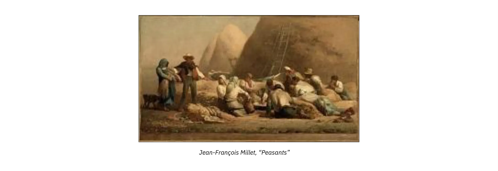

The Physiocrats' idea is actually subtle. According to them, there is a difference between production and gain. The industrialist and the merchant may earn profits, but only the farmer truly produces, because production is the creation of useful material, rather than the addition of utility to pre-existing material.

We should also try to understand why they rejected industry and crafts as unproductive. At the time, these trades were locked within the guild system, which banned innovation, investment, and progress.

### Second principle: legal despotism rather than democracy

Today, to insult someone, we say he's not a democrat. While historians forgive the Physiocrats their strict view on agricultural productivity, they do not forgive their opposition to democracy, especially since they lived during the height of Enlightenment ideas. From the mid-18th century to just before the Revolution, the Physiocrats were seen as enemies of progress.

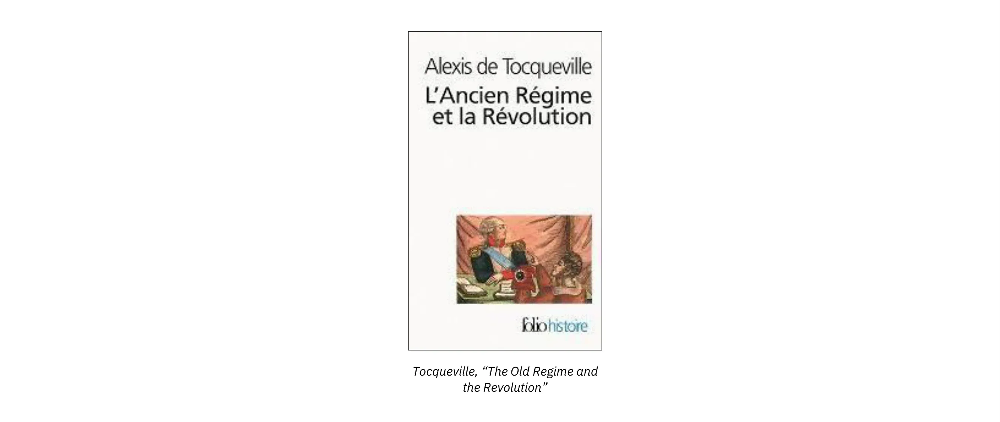

Tocqueville insisted on this idea:

> The Physiocrats were indeed very favorable to free trade of goods, to laissez-faire or laissez-passer in commerce and industry; but as for political freedoms proper, they did not consider them, and even when such ideas happened to cross their minds, they initially rejected them.

Liberal in economics, the Physiocrats were therefore not liberal in political matters. Quesnay writes in his *maxims*: "Let the sovereign authority be unique and superior to all individuals of society and to all unjust enterprises of private interests." And later, in the same maxim: "The system of checks and balances in government is a fatal notion, which only reveals discord among the great and oppression of the small".

Tocqueville aptly noted that the Physiocrats rejected democracy as soon as they saw its forms. They were skeptical of democracy, which would become a constant in French political economy, because democracy is far from a perfect system: it potentially allows the oppression of minorities by the majority, and it can become a tool for usurpation, tyranny, and despoilment.

### Third principle: absolute respect for private property

The Physiocrats believed that people needed to own and keep the results of their labor. In their view, property rights were the very foundation of a society. They thought the State had one main job: to protect people's property. Furthermore, from an economic standpoint, the Physiocrats assert that the inviolability of property encourages work and effort and is a condition for economic progress.

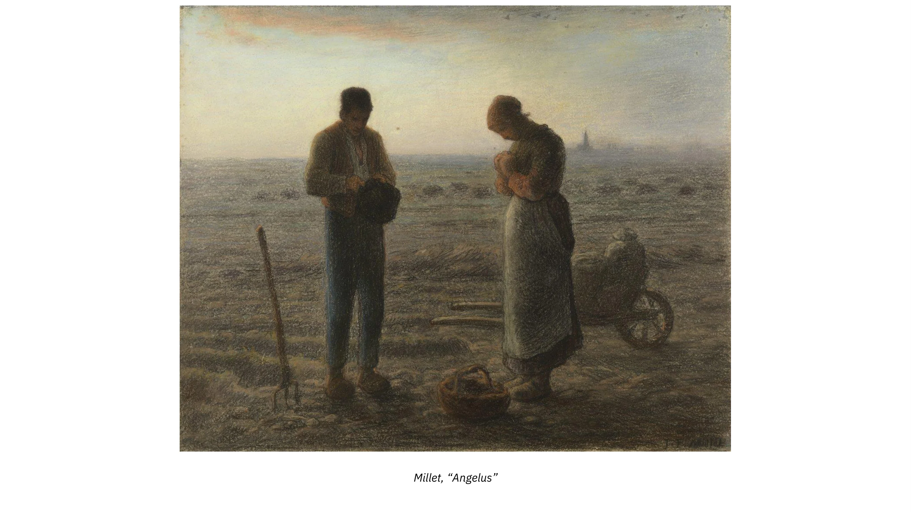

Quesnay put it simply:

> Let the ownership of land and movable wealth be assured to those who are their legitimate possessors, for the security of property is the essential foundation of economic order and the security of society; it is the certainty of permanent possession that encourages labor and the use of wealth in improving and cultivating the land, as well as in commercial and industrial enterprises.

### Fourth principle: absolute freedom of commerce

In his previously cited *Maxims*, Quesnay states:

> Let there be complete freedom of commerce, for the most reliable, precise, and beneficial regulation of both domestic and foreign trade for the nation and the State lies in full freedom of competition.

The Physiocrats had seen the damage caused by government interference, especially in the grain trade. One must acknowledge, they say, that the authority will never be able to manage commerce as well as individuals do, because it would need to respond to every need and react to every change in demand or supply. All of this is far beyond the capabilities of even the wisest government one can conceive. Therefore, it is necessary to let things be and to let them flow.

Beneficial by nature, trade must be entirely and perfectly free. One of their members, Le Trosne, even wrote a pamphlet titled [*The Freedom of the Grain Trade: Always Useful, Never Harmful*](https://www.institutcoppet.org/liberte-commerce-grains-toujours-utile-jamais-nuisible/).

### Fifth principle: All men are brothers

Fierce opponents of slavery, the Physiocrats were also great pacifists. "Our foreign policy is called peace", Mirabeau simply said. In 1790, at the Constituent Assembly, Dupont de Nemours continued this pacifist stance when he proposed a bill banning offensive wars.

## The Physiocrats' achievements and influences

<chapterId>5b911105-796a-5e2e-a501-c7a364fc758e</chapterId>

As we saw in the first of the three chapters devoted to the Physiocrats, Quesnay's followers were all the rage in France for about a decade. This enthusiasm for their ideas took shape both in their time and continued until the end of the century. Here, we will look at some of their achievements and the influence they exerted on their successors in the field of economic thought.

Their greatest accomplishment, following the Gournay group, was to popularize economic ideas. Voltaire's famous saying is well known: around 1750, the nation, satiated with poetry and novels, began to reason about grain. The Physiocrats took part in this movement, publishing literally hundreds of articles, pamphlets, and books about the freedom of the grain trade. The strong momentum given by the Physiocrats to economic discussions is also evident in the impressive number of economic works and pamphlets published in France from 1760 to 1775. As further evidence of the spread of economic ideas in France, one recalls the remark by M. de Vaublanc, cited in a previous lecture, who said in Metz in 1774 that people spoke of nothing but economics. "It was the fashion", he said. "Everyone was an economist".

The defense of their ideas, in books, pamphlets, and in their journal *Les Éphémérides du Citoyen*, quickly had repercussions in France's economic policy. In 1763, an edict granted freedom of the grain trade, which Quesnay and Mirabeau had strongly demanded. On several occasions, authorities also eased the regulations governing trade guilds to guarantee greater freedom to work.

Abroad, success came very early. In Germany, the Margrave of Baden took an interest in physiocratic ideas and maintained a regular correspondence with Mirabeau and Dupont de Nemours.

He tasked the economist Johann August Schlettwein, a convinced physiocrat, with implementing a tax reform and liberalize the grain trade. In April 1770, a first trial took place in the small village of Dietlingen. The villagers seemed to have welcomed the measures enthusiastically, but the officials in charge were not very supportive, which delayed the wider implementation.

In Russia, Catherine II was preparing a legislative reform and asked Diderot to send her a brilliant mind to assist her.

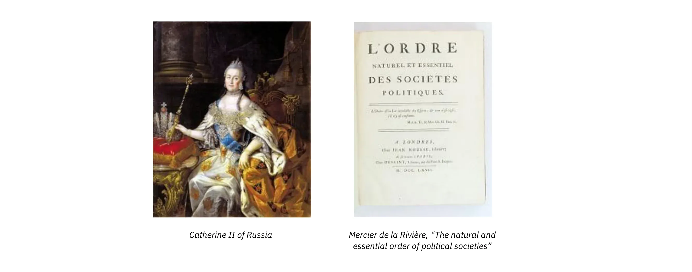

Impressed by the reading of [*The Natural and Essential Order of Political Societies*](https://archive.org/details/lordrenaturelete00mercuoft), published in 1767, he sent her its author, the physiocrat Mercier de la Rivière.

Although he left France celebrated, his reception in Saint Petersburg was cool (climate aside), and the Empress was disappointed in him.

In Sweden, with Gustav III, and in Italy, with Leopold of Tuscany, the Physiocrats also found followers ready to put their ideas into practice.

In France, the Physiocrats enjoyed spectacular success with the appointment of Turgot as Controller-General of Finances in 1774.

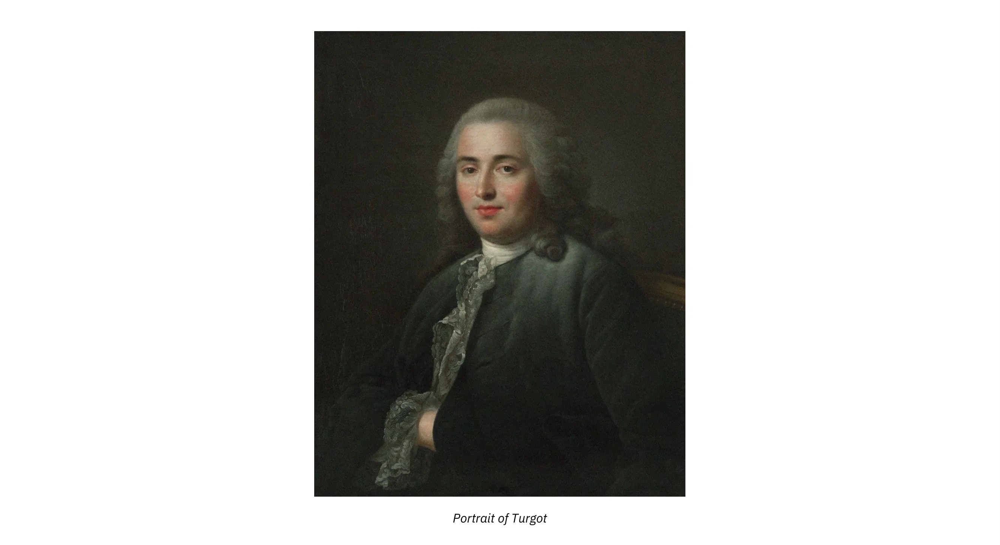

Conscious of the decline in their fame, Turgot never presented himself as a loyal disciple of the Physiocrats, nor, for that matter, as an encyclopedist, although he was one, and since they were despised by the members of the Clergy. Once in power, Turgot issued six famous edicts that constituted the beginning of a practical application of the Physiocratic program: freedom of commerce, freedom of labor, and the end of monopolies.

By the time of the French Revolution, the Physiocrats had fewer followers. The marquis of Mirabeau died on July 13, 1789—quite a symbol. Abeille had moved on, but Dupont de Nemours remained faithful. Appointed to the Assembly, Dupont de Nemours carried the voice of Physiocracy and called for economic reforms in favor of property ownership and free trade.

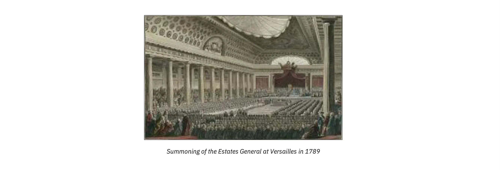

He also fought, unsuccessfully, against the assignats. Despite this failure, Physiocratic thought remained very present in the intellectual debate and influenced the early achievements of the Revolution. As Joseph Rambaud said, everything the Revolution did in favor of liberties was due to the Physiocrats.

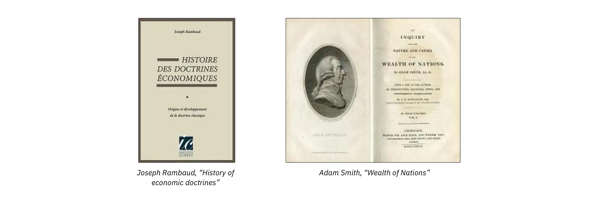

The Physiocrats also had a major influence on the history of economic thought. Adam Smith, who visited France and met many of them, was deeply influenced by their work. He even considered dedicating *The Wealth of Nations* to Quesnay.

Sadly, Quesnay died two years before Smith's book was published, and Smith removed the dedication. Although Smith didn't agree with their idea that only agriculture was productive, he embraced many of their arguments for free markets and carried them forward in his own work.

## Dupont de Nemours

<chapterId>6d585e0f-93b8-5b0a-a0a8-7f6e4a5bc68e</chapterId>

In the United States, we are familiar with the DuPont company, also known as "E.I. du Pont de Nemours and Company", a multinational firm in the field of chemistry and biology.

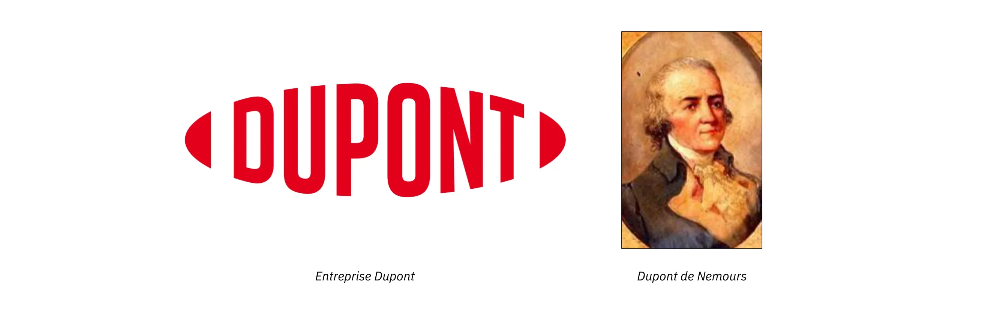

Today, it has sales of over $35,000 billion and employs nearly 65,000 people worldwide. It turns out that this company is closely linked to the destiny of Samuel-Pierre Dupont de Nemours, a French economist of the Physiocratic school.

Born in 1739, Dupont de Nemours approached Physiocrats at the age of 24. At the time, he was still finding his path in life. One day, he came across a short pamphlet titled The Wealth of the State. He found its economic ideas were nonsense and wrote a critical response called Reflections on the Wealth of the State, published in 1763. The piece was well-received, and readers praised it, saying things like, "You must be a disciple of Mirabeau!" Ironically, Dupont didn't even know who Mirabeau was.

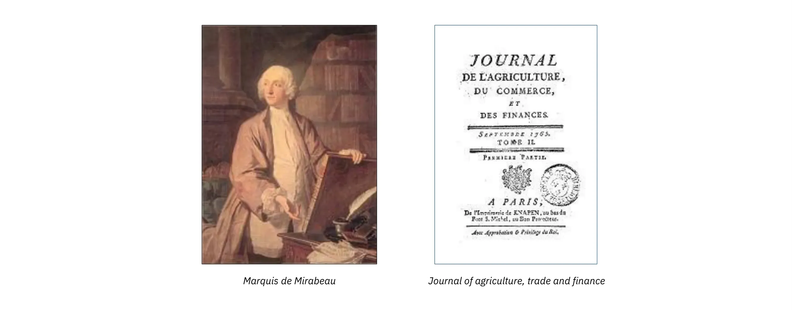

Curious, he began reading Mirabeau's work, *Friend of the People* and *Theory of Taxation*. He met Mirabeau and François Quesnay, then joined their school.
In 1765, Dupont was offered the position of editor of the *Journal de l'agriculture, du commerce et des finances*, the leading periodical of its time in the field of economic thought.

There were two reasons for this: Mirabeau and Quesnay had to remain silent, and Dupont was seen as their rising star.

Members of the Physiocratic school agree that Dupont de Nemours quickly became Quesnay's favorite. Quesnay once said, "Take care of this young man, he'll be the one to speak when we're dead". One fellow Physiocrat, Abeille, even grew jealous of the attention Dupont received and distanced himself from Quesnay's school.

Dupont de Nemours always maintained his high regard for Quesnay.

He would later say, "I was just a boy when Quesnay held out his arms to me—he made me a man." It was Quesnay who made him a major economist on the literary scene of the time.
After the *Journal de l'agriculture, du commerce et des finances*, Dupont was appointed editor of *Les Éphémérides du Citoyen*, which became the official organ of the Physiocrats.

He made this periodical collection a major center for economic theory, supporting it even during the decline of the Physiocrats by personally writing nearly all of the later volumes. It was Dupont de Nemours, moreover, who coined the term "physiocracy", derived from two Greek words meaning "government of nature". He used this term to title a collection of Quesnay's articles published in 1768, and the term ultimately became established in history. It is known that among themselves, the Physiocrats called each other "economists", and they were still referred to as such during the Revolution.

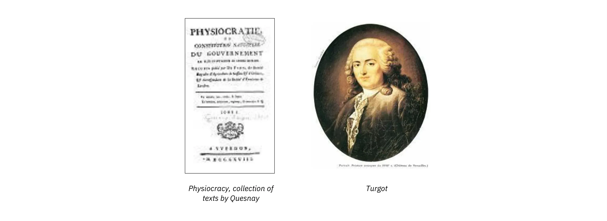

When Turgot briefly served as France's finance minister, Dupont became his close advisor, the only Physiocrat with access to him, as Turgot kept his distance from the others.

At the time of the Revolution, he was elected from the bailiwick of Nemours and found himself at the Assembly, where another Monsieur Dupont was also seated. He was then called Dupont de Nemours, not because he was a noble, but simply to distinguish the two. The name, of course, remained.

During the Revolution, in August 1792, he took up arms to defend the King at the Tuileries Palace against the crowd.

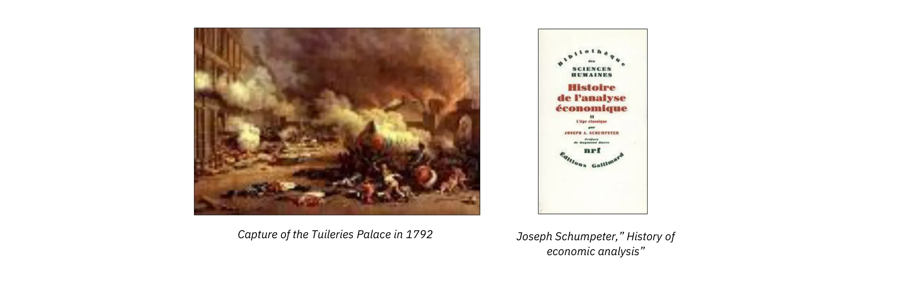

The King said to him: "Monsieur Dupont, we always find you where you are needed!" After miraculously escaping the Terror, condemned and awaiting the guillotine but saved by Robespierre's fall, he was pushed into exile under Napoleon and found happiness in the United States, where one of his sons founded, with his father's assistance, the Dupont company.

Despite this eventful life, during which he published dozens of articles, brochures, and books, he remains relatively little known to this day. Perhaps this was because he remained a staunch Physiocrat when the doctrine had fallen out of fashion. Indeed, as Schumpeter wrote, Dupont de Nemours stayed faithful to Physiocracy "throughout a career during which he had many opportunities to renounce it". He was a man of conviction.

# The Enlightenment and Political Economy

<partId>d1c885ad-7cb1-5f81-816c-be312719d9f8</partId>

## Voltaire and the philosophers

<chapterId>16bcf7bf-dad4-5113-8c64-2800f04ff07b</chapterId>

The 18th century in France saw the emergence of economics as a science and the first school of economic thought: Physiocracy. Adam Smith trained in economics during this period, and French economists were recognized globally as leaders. However, this century is remembered more as the century of philosophy than of economics. While the Physiocratic movement aligned, in its ambitions, with Enlightenment philosophy, the attitudes of the philosophes—especially Diderot and Voltaire—deserve close examination. We will see that the Enlightenment thinkers significantly contributed to spreading the idea of laissez-faire in France.

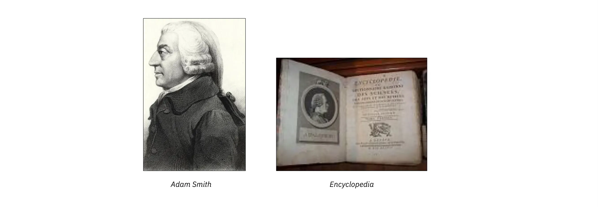

The most famous achievement of Enlightenment philosophy is without a doubt the *Encyclopédie* by Diderot and d'Alembert.

Naturally, the economic articles were written by economists. For the early volumes, Diderot turned to Forbonnais, then enlisted liberal economists: first François Quesnay (who contributed articles like "Grains", "Fermiers", "Hommes"—the last one unpublished), then Turgot (who wrote "Foires et marchés"). These writings are of great importance. In his articles, Quesnay laid the groundwork for what would become Physiocratic doctrine. Along with his *Tableau économique*, these remain his most famous works. Turgot, still young at the time, developed the idea of laissez-faire in his article, criticizing state intervention in market organization.

In many other articles of the *Encyclopédie*, philosophes, especially Diderot, defend the ideal of liberty in all areas: religion, politics, and economics.

Freedom of labor, especially in opposition to the guild system, was a recurring theme in various entries such as Arts, Métier, and Communauté.

Diderot's path in economic theory is a curious one. In the Encyclopédie, he was a staunch advocate for economic freedom and was the one who sought the collaboration of liberal economists, as confirmed by a letter outlining the articles Turgot might write for him. In the early years of Physiocracy, he was both a supporter and a promoter of Quesnay's school. In 1769 and 1770, he wrote for *Les Ephémérides du Citoyen*, to the great dismay of his anti-liberal philosopher friends, like Melchior Grimm; however, he soon distanced himself from the group. Enthralled by the vibrant intellect of Abbot Galiani, he helped him publish his book on the grain trade in French, just as Galiani was about to return to Italy.

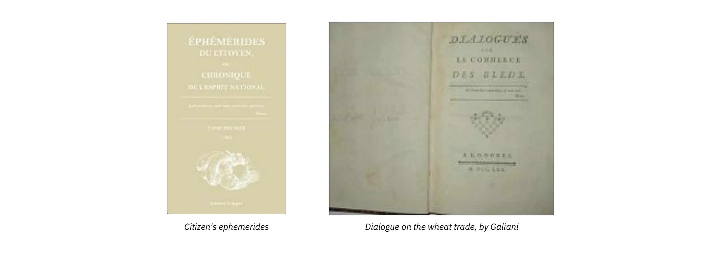

This book would become the fiercest attack ever made against Physiocratic ideas, delivering a major blow to the movement. Later, Diderot defended Galiani against Abbot Morellet, a close ally of the Physiocrats, in his *Apology of Galiani*. A few years later, during Turgot's ministry, Diderot was seen applauding the establishment of freedom of labor through the abolition of guilds. At this point, Diderot, an artisan's son, found himself in agreement with the liberal economists and wrote a scathing letter to Galiani, who claimed that freedom of labor would ruin French industry within twenty or thirty years. In light of the Industrial Revolution, history suggests otherwise. Having returned to the liberal economists' side, Diderot no longer enjoyed their trust and remained isolated. A very telling moment is a letter he sent to Dupont de Nemours in 1774, where he writes:

> "You once had friendship for me; now you no longer do, because you are so busy that you no longer have time to love anyone".

Voltaire followed a similar path, marked by a lack of consistency in his economic views. He admired Vincent de Gournay, corresponded with economists (including Dupont de Nemours and Turgot), and appreciated the Physiocrats-especially for their praise of agriculture. He extolled them in a *Diatribe to the Author of the Ephémérides*. However, he later criticized their idea of a single land tax in his satirical work *The Man of Forty Crowns*, which also stirred significant controversy. Finally, like Diderot, he celebrated Turgot's ministry, calling it a golden age and praising his two great decrees on freedom of labor and free trade.

In the end, the philosophes' relationship with economic thought is mixed. Despite their praises and critiques of liberal economic ideas, they played a role in bringing these ideas into the broader intellectual discourse of the Enlightenment. In this way, whether intentionally or not, they helped advance the notion of laissez-faire right up to the Revolution.

## Turgot, The Theorist

<chapterId>a8cd8185-8351-556b-8011-3a0c313e8a9d</chapterId>

In a famous passage from his *History of Economic Thought*, American economist Murray Rothbard praised what he called the "brilliance" of Turgot.

presenting him as the greatest economist of the 18th century, along with Cantillon.

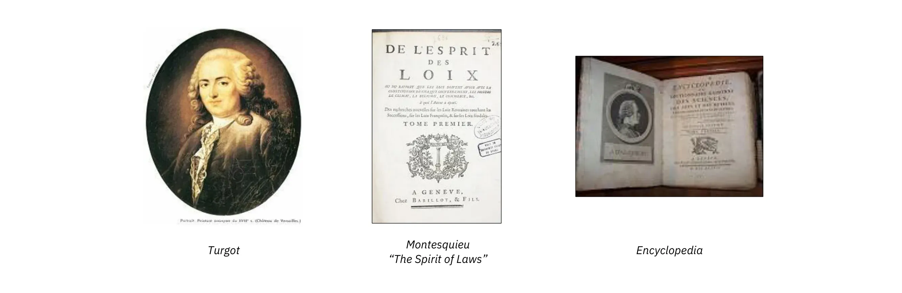

How did Turgot rise to such prominence? It came down to a combination of three key factors. **First**, his prestigious family background. He came from a long line of royal administrators, many of whom held high-ranking government positions. **Second**, the golden age in which he was born and raised. Turgot was 21 when Montesquieu published *L'Esprit des Lois*, and 24 when the first volume of the *Encyclopédie* appeared.

He was a contemporary of the Physiocrats, Voltaire, Diderot, d'Holbach, Adam Smith, Condorcet, and others. **Third**, his intellectual precocity. While a student at the Sorbonne, he wrote a letter on paper money at the age of 22, delivered remarkable speeches, and at 24 composed a list of 52 works to write.

Despite his youth, Turgot contributed to the *Encyclopédie*, authoring articles on topics like "Etymology", "Existence", "Expansibility", "Fairs", and "Foundations". Only one article touched directly on economics—his piece on "Fairs", which detailed the origins of fairs and markets and criticized the growing state interference that disrupted and paralyzed them.

During these early years, he was mentored by Vincent de Gournay, who took him under his wing and formed a close friendship with him. Upon Gournay's death in 1759, Turgot composed a eulogy in which he offered a superb summary of the doctrine of laissez-faire. He notably wrote:

"From every perspective in which commerce may concern the State, individual interest left to itself will always more surely produce the general good than the operations of the government, which are always flawed and necessarily guided by vague and uncertain theory".

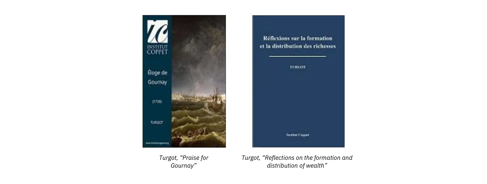

In 1767, while an intendant, he composed a compendium of economics under the title of *Reflections on the Formation and Distribution of Wealth*.

Division of labor, consumer sovereignty, private property, the role of capital, virtually all the major economic themes are addressed. Many historians, the most recent being historian Anne-Claire Hoyng, have pointed out the similarities between this work by Turgot and Adam Smith's *The Wealth of Nations*, published nine years later.

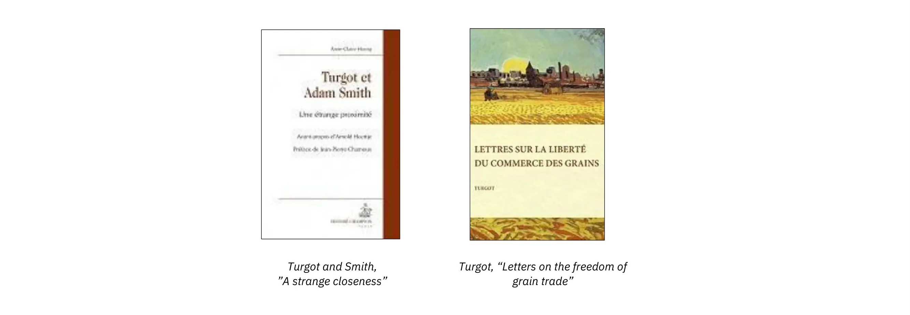

Turgot defended the freedom of the grain trade in letters to Abbot Terray, later communicated to the King, but half of which are now lost. He wrote:

> Sir, if anything is urgent, it is not to impose new restrictions on the most essential of all trades, but to remove those which, unfortunately, have been allowed to remain. 
> If there has ever been a time when the fullest, most absolute freedom, completely free from any kind of obstacle, was necessary, I dare say it is now, and that never has it been less appropriate to consider issuing a regulation on the grain trade.

In 1769, Turgot wrote the article Value and Money for Abbot Morellet's *Dictionnaire de Commerce*, which ultimately was never published. Galiani had already noted that "man is the common measure of all things", anticipating the subjective analysis that Turgot would develop thirty years later in this article, where he expands on and proves this proposition.

In 1770, well before Bentham, Turgot wrote a memorandum advocating for the freedom of interest rates and usury.

"It is a mistake to believe that the interest on money in commerce should be fixed by the laws of princes", he says, "It is a current price which regulates itself, like that of all other goods", In defense of this position, he refutes the opposition of Aristotle and the Church Fathers.

A remarkable summary of Turgot's laissez-faire doctrine can be found in a forgotten 1773 letter to Abbot Terray on the marking of irons:

> What politics must do is to yield to the course of nature and to the course of commerce, which is no less necessary and no less irresistible than the course of nature itself, without attempting to direct it; for to direct it without disrupting it and without harming oneself, one would need to be able to follow all the variations in human needs, interests, and industry; one would need to know them in a level of detail that is physically impossible to obtain, and in which even the most skillful, active, and meticulous government will always risk being wrong,at least by half.

Here we find a very clear statement of the doctrine of laissez-faire, as well as a foreshadowing of Friedrich Hayek's analysis of the pretense of knowledge—that is, the impossibility for a State to fully grasp economic forces in order to control them.

## Turgot, the Reformer

<chapterId>9177429f-1679-51c4-bfd2-dd036d24a1cc</chapterId>

As we briefly recalled in the previous chapter, Turgot was the son of a prominent family that had distinguished itself in the upper ranks of the French civil service.

His father had been the provost of the merchants of Paris and his grandfather an intendant. After excelling in his studies, the youngest of the Turgot family aimed to reach at least those same heights. He first served for a time as maître des requêtes, meaning he was a liaison between the intendants and Versailles. It was a prestigious position, one for which he had to obtain a special age exemption, but Turgot aspired to more. The death of his mentor, Gournay, further encouraged him to aim higher, and he requested an appointment as intendant.

In 1759, he first applied for the intendancy of Grenoble, but it was denied. He was then offered the post of provost of the merchants in Lyon, which he declined. He requested the intendancy of Brittany, but that too was refused. Finally, in 1761, he was offered the intendancy of Limousin and, somewhat reluctantly, accepted. He wrote to Voltaire: "I have the misfortune of being an intendant", perhaps meaning: I have the misfortune of being intendant in Limousin.

In Limousin, the peasants were poor and lived in precarious conditions, especially regarding housing and food. The general level of education was extremely low. The few roads that existed were in a disastrous state.

Because the region was so poor, it was of no interest to the ministers. This gave Turgot the freedom to experiment with reforms. In Limousin, he pursued three major projects:

- **The redistribution of the taille**, the personal tax (Turgot aimed to introduce as much objectivity as possible in its assessment).
- **The corvée**, a form of tax paid in labor, where peasants were forced to work on road construction. Upon touring the region, Turgot quickly noticed the poor condition of the roads. He replaced the corvée with a monetary tax.
- **The recruitment of militias**, peasant armies mobilized during times of war.

This was done by drawing lots, which led to fear and violence because of runaways; Turgot replaced these mandatory levies with paid volunteers.

These reforms were undeniably successful, and in July 1774, Turgot was appointed minister. Due to his lack of experience, the King first placed him at the Ministry of the Navy. The appointment amused many. Turgot himself admitted, "I know nothing about the Navy", and Voltaire remarked, "I don't think Turgot is any more of a sailor than I am".

Just a month later, however, Turgot was appointed Controller-General of Finances, effectively becoming France's economy and finance minister.

We know the letter in which he outlined his principles to Louis XVI: "No bankruptcy. No tax increases. No new loans". This philosophy, which critics today might label as pointless "rigor", was intended to save the monarchy.

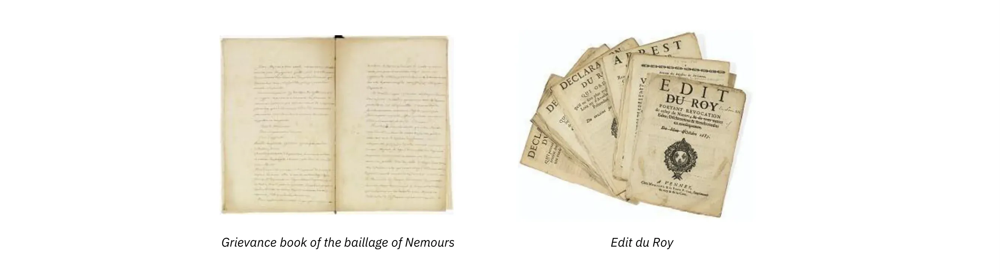

Turgot prepared six royal edicts to reform the French economy.

It was the first—and one of the very last—times an economic expert was granted the freedom to reform his country's economy. Three of Turgot's edicts stand out: one abolished forced labor (corvées), another dissolved the trade guilds (corporations), and the third established free trade in grain.

Upon entering the ministry, Turgot knew he would face resistance from the privileged classes. "I will be feared, even hated, by most of the court and by all who seek favors", he told the King. The privileged soon united against him and brought about his dismissal from the office of Controller-General of Finances. Voltaire, who fully supported Turgot's reforms, wrote in his correspondence:

> Ah! What dreadful news I've heard! What will become of us? I am devastated! We will never recover from having witnessed the birth and death of the golden age! This thunderbolt has struck both my mind and my heart.

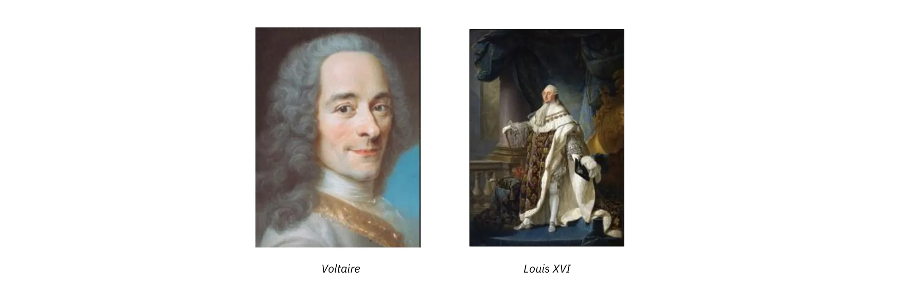

Since then, many have argued that France is a country impossible to reform. Turgot's failure seemed to confirm it: He had been prepared by half a century of liberal economic thought; he had the backing of Enlightenment philosophers; and the King himself, with absolute power, supported him.

In the end, the parlements and the privileged classes won out. All the King could do was privately lament: "I see now that only Monsieur Turgot and I care about the people."

## Condillac

<chapterId>0ba8dbb5-dcd5-5981-bf85-6c185e0bf192</chapterId>

Just like mercantilism, which is its most obvious practical manifestation, Montaigne's sophism took a long time to disappear.

That sophism is the idea that trade and exchange are zero-sum games. Whatever one party gains in a transaction is necessarily lost by the other party. Its supporters argue that this holds true both between individuals and between nations.

Abbot of Condillac played a major role in definitively dismantling this false idea.

"Definitively" is perhaps an exaggeration, because in public debate, this sophism frequently reappears. This is perhaps why, moreover, Condillac remains a little-known economist. Apart from Austrian economists, few have understood the importance of his theory of exchange, no one takes interest in him anymore.

For most historians of economic thought, the year 1776 is marked by the publication of *The Wealth of Nations*, which founded economic science. The fifteen lessons we have just completed, in which we have studied French economic science before Adam Smith, are enough to prove the error of this conception. In that same year 1776, moreover, another book perhaps deserves more praise from historians than Adam Smith's book: it was written by Condillac and is simply titled [*Commerce and Government Considered in Their Mutual Relationship*](https://archive.org/details/commercegovernme0000cond).

For Condillac, if the sophism of exchange seen as a zero-sum game persists, the Physiocrats are partly to blame, because they maintain that exchange is a relationship of equality. According to Condillac, this is false: exchange is an unequal relationship, where one always gives less to obtain more.

Between the ideas of the Physiocrats and those of Condillac, one could not dream of a more perfect opposition. The Physiocrat economist Le Trosne wrote:

> Exchange is by its nature a contract of equality, made of equal value for equal value.

Condillac, on the other hand, wrote:

> Each party to the contract always gives something of lesser value to obtain something of greater value.

However, the opposition is largely one of words. Both agree that when one exchanges a franc for a book, the book is worth a franc, or the price of the book is a franc.

The difference lies in the fact that Condillac asserts that since we exchange a franc for the book, it means that for us, the value of the book is higher than that of our one-franc coin. We prefer the book to the coin, and that is why we make the exchange.

Condillac's theory is not fundamentally contradictory with that of the Physiocrats, but they are not speaking the same language, so to speak. Le Trosne speaks of price while Condillac speaks of value, and vice versa.

Where Condillac is correct is that if prices are equal between the two exchanged goods, values are not equal, otherwise, no exchange would take place.

To summarize Condillac's theory, three propositions can be listed:

First proposition: we seek goods for their utility. This seems obvious, but it is a central tenet of economic science that men exchange to acquire utilities, a point that Jean-Baptiste Say also developed perfectly.

Second proposition: value preexists and motivates exchanges. The subjective judgment each person makes about goods and services implies that these same goods and services have a value for them, worth more or less according to the utility they seem to provide. Naturally, each individual judges differently from another, and value varies from person to person.

Finally, third proposition: price is the consequence of the exchange process. Products do not exchange at the value I attribute to them because the conditions of exchange also depend on the subjective value the seller attributes to those products. The relationship between buyer and seller, or between the buyer's subjective appreciation and the seller's subjective appreciation, establishes a price.

These ideas of Condillac are fundamental. They allow us to understand why every exchange is always mutually beneficial.

They therefore entirely destroy criticisms of free trade, since protectionism appears only as a mechanism that prevents populations from mutually benefiting each other. Laissez-faire is also the conclusion of Condillac's work. Let people do as they please, for if the public power protects liberty and property, men will always enrich one another by exchanging together.

## Condorcet

<chapterId>99e4aba6-da7f-5041-b02f-337158381515</chapterId>

Condorcet is undoubtedly the most economically minded philosopher of the Enlightenment.

For a large part of his career, he devoted himself to fields entirely unrelated to economics, and rightly so, as his talents led to great progress in the sciences he focused on most. But around 1770, he felt drawn to economic questions, perhaps because other philosophers, especially Voltaire and Diderot, did not bother to dedicate their leisure time to them, and also because he had befriended Turgot.

Condorcet gradually embraced ideas of laissez-faire and liberty, initially in areas unrelated to political economy. In his *Letter of a Theologian*, he philosophically mocked the Catholic religion and expressed his wish to see genuine freedom of belief, including freedom not to believe. In his crusade for tolerance and against religious fanaticism, Condorcet fought for the rehabilitation of the Chevalier de la Barre and for the retrial of D'Etallonde, who had been sentenced to death for breaking a crucifix.

He was thus prepared to defend liberty when his friend Turgot rose to the position of Controller-General of Finances.

From then on, Condorcet's career took a turn as he entered the economic debate, tirelessly supporting the liberal reforms of the new minister. Favoring competition and freedom of commerce, Condorcet also called for the abolition of corvées (forced labor), guilds, and for fair taxation. He voiced these convictions publicly whenever opportunity arose, doing so with obvious enthusiasm; he wrote extensively and once declared in his writings: "Allow me to speak again of the freedom of commerce; I enjoy engaging with this subject."

Between 1774 and 1776, during Turgot's ministry, Condorcet made numerous interventions, all marked by his commitment to laissez-faire. His works include *Letters from a Farmer of Picardy to Mr. Necker*, defending free trade; *Monopolies and Monopolists*, advocating free competition; *Reflections on Corvées*, calling for their abolition; and *Reflections on the Grain Trade*, which again praises free trade and critiques Necker's book on the same subject.

In his [*Letters on the Grain Trade*](https://archive.org/details/bub_gb_hg8jFw-y6bwC), Condorcet makes several key points.

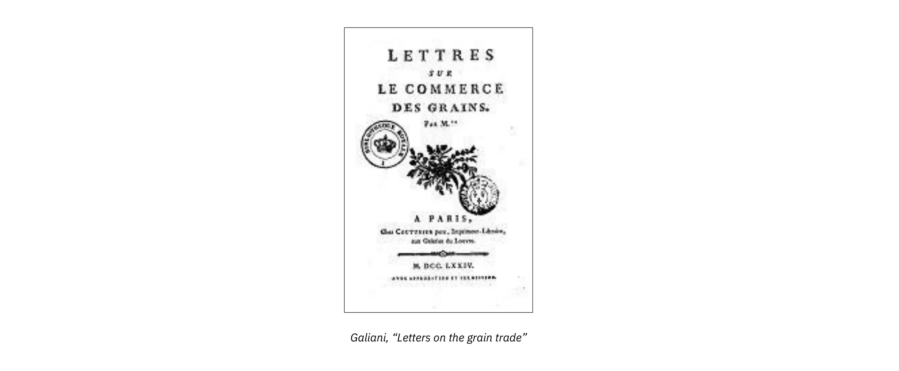

First, the high grain prices at the time were not the result of free trade, but rather of poor harvests, and Condorcet demonstrates this clearly. He then explains why laissez-faire is not only appropriate but the only suitable policy, despite popular prejudice. He notes, "We are so used to seeing the government intervene in the grain trade that doing nothing seems like something extraordinary and new". Later, he adds, "Almost everyone, especially those holding public office, believe that nothing happens on its own and that everything is lost if the government doesn't intervene in everything". Condorcet thus revives the arguments of the Physiocrats and Turgot, showing the superiority of free trade over all forms of interventionism.

Promoting Turgot's liberal economic agenda was a courageous act, as Condorcet knew he would quickly face censorship. Indeed, this happened and his pamphlet on the abolition of forced labor was destroyed and banned in 1776.

Turgot, appreciating Condorcet's loyal defense of his ideas, appointed him Inspector of Coinage. Condorcet resigned as soon as his friend left the ministry.

Although he devoted all his energy to defending Turgot, Condorcet had no illusions about the outcome of his friend's tenure. Turgot himself admitted late in life that he lived with regret, as he wrote in a letter, "for not having been able to do my nation and humanity a good I believed very easy". Condorcet, more realistic, pointed out the many adversaries Turgot would face: the king's favorites, the parliaments, the clergy, the nobility, the guilds, and so on. These groups expected flattery, not reform. Condorcet told Turgot, "You are by no means a charlatan, and that is a flaw, given how things are in Paris". He was perfectly right, for in 1776, barely two years after his arrival, Turgot was already forced to leave the Controller-Generalship.

## Liberal common sense under the Revolution

<chapterId>95e9a90d-e37a-58ff-b1ac-928b42e76ecf</chapterId>

Dupont de Nemours was the youngest disciple of François Quesnay, who once said of him: "We must take care of this young man, for he will speak when we are dead". When the French Revolution began, nearly all the great Physiocrats, including the Marquis de Mirabeau, were already gone; Mirabeau himself had passed away on July 13, 1789.
Dupont de Nemours wrote the list of grievances for the bailiwick of Nemours.

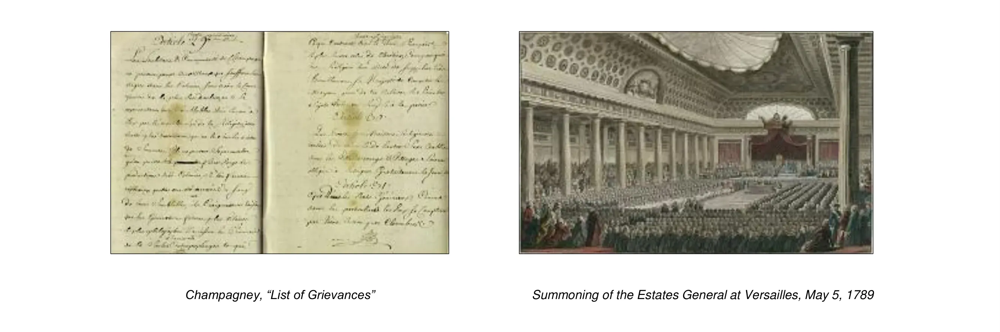

This fascinating document contained all the complaints from liberal economists against trade restrictions, monopolies, and attacks on property. Dupont de Nemours was also elected to the National Assembly.

During the Revolution, he became the voice of liberal common sense, standing firm against the growing tide of populism and interventionist demagoguery, which ultimately prevailed.

As early as November 1789, when there was talk of granting a monopoly to the Caisse d'Escompte (which could turn it into a public bank—the Bank of France), Dupont de Nemours spoke out in defense of competition.

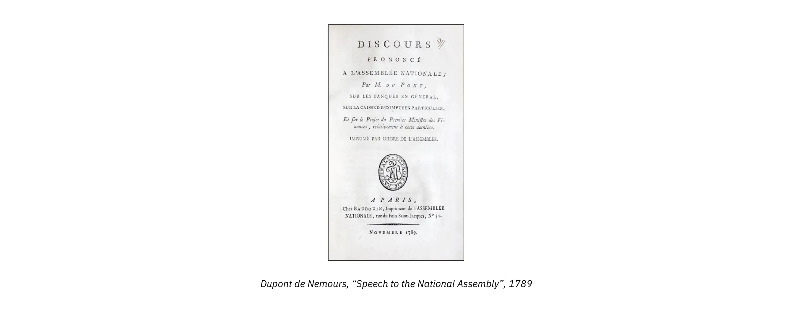

"It would be better", he says, "to leave the banking business to the laws of free trade". And he adds:

> "I do not understand what the minister meant when he spoke of granting a privilege to the Caisse d'Escompte. If this privilege includes exclusivity, you must reject it, for you have come here to destroy exclusive privileges, not to create new ones."

Despite his warnings, the Assembly ignored his objections and took another step toward establishing a central bank and a banking monopoly.
In 1790, at the Constituent Assembly, Dupont de Nemours followed the pacifist tradition of his Physiocrat friends and proposed a law forbidding offensive wars. The first article read: "The French Nation shall not permit itself to engage in any offensive war to seize the territory of others or to infringe upon the rights or liberty of any Nation". 

This proposal was rejected.

That same year, 1790, debates began about issuing new paper currency to cover government expenses.
Dupont de Nemours firmly opposed this and published a pamphlet titled [*Effects of Assignats on the Price of Bread*](https://archive.org/details/effetdesassignat00dupo). The title was accurate, as he explained that issuing assignats would inevitably lead to inflation, an increase in the prices of commodities, including bread.

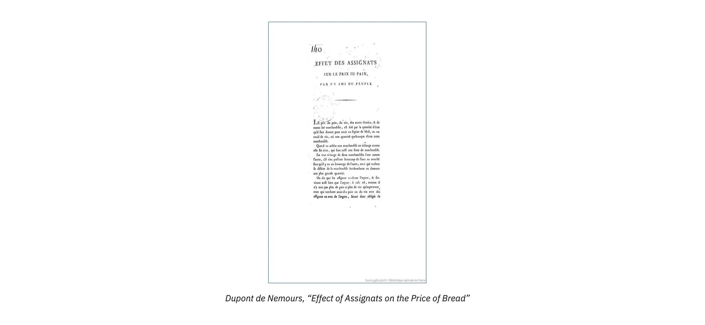

He signed the pamphlet as "a friend of the people". The piece caused quite a stir, as the Assembly was asked who had written it. Dupont de Nemours then stood up and admitted it was his work, saying he was not ashamed to use the title "friend of the people" because fighting against the assignats was truly serving the people.
Once again, his advice was ignored, and the assignats were issued.

We all know the disaster that followed, the economic ruin and suffering endured by the people, many of whom lost everything when the assignats became worthless and had to be burned.
A few years later, the Assembly turned its attention to the idea of creating an actual Bank of France, one that would be granted a monopoly over the production of money.

Dupont de Nemours, still firmly opposed to the idea of a public bank, seeing it as nothing more than a monopoly, reminded the Assembly of the assignats' disastrous experience. He told them:

> "Do not prepare yourselves for regrets like those that tormented my colleagues in the Constituent Assembly. At the time, my proposal to limit assignats only to the payment for national goods and not to make them a circulating currency was rejected. Today, they say: 'Ah, if only we had listened to Dupont de Nemours!'"

But once again, no one listened to him.

## Conclusion: Passing the Torch

<chapterId>ada8082f-db96-5e52-954f-719b47998153</chapterId>

French economic thought in the 18th century is often overshadowed by the more famous economists of the 19th century. Yet, when it comes to the defense of liberty, it is in the 18th century that everything truly begins. This is the century in which the principle of laissez-faire, so revolutionary in its time, was first clearly expressed by a number of thinkers, from Boisguilbert to Dupont de Nemours.
Certainly, figures like Jean-Baptiste Say, Frédéric Bastiat, Gustave de Molinari, and Yves Guyot left a lasting mark on the history of French economic thought. But if we study them in isolation, we miss something essential. These 19th-century thinkers didn't emerge from nowhere; they inherited and built upon the foundations laid by their 18th-century predecessors during the Enlightenment.

Boisguilbert asserts that well-meaning souls who believe they can fix everything by involving the government inevitably turn the economy upside down, and that it is therefore better to let the natural order of things take its course.

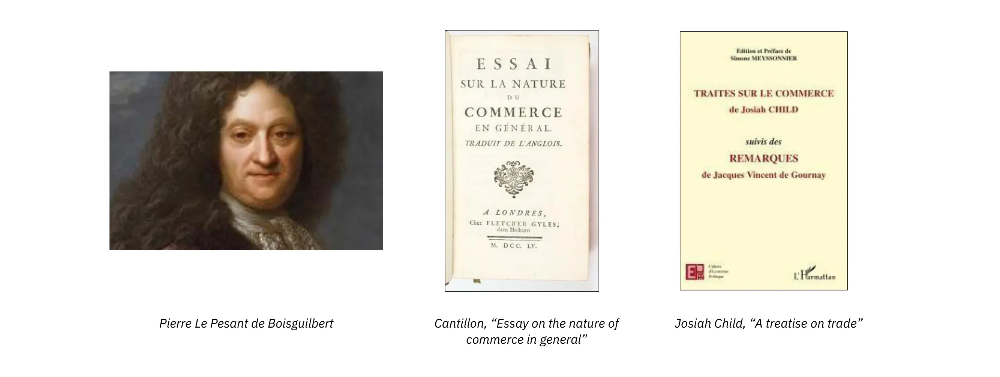

Cantillon insisted that money should never be manipulated for political aims. Allowing the State to manage money as it pleases is to pave the way for immense financial and economic disorder.

Vincent de Gournay asserts that excessive regulation of labor discourages the efforts of workers and craftsmen, pushing them toward laziness and inactivity. It is thanks to free competition that the economy can grow and a nation can prosper.

The Marquis d'Argenson asserts that no government is capable of foreseeing and measuring everything, and that consequently, one must rely on each individual's self-interest.

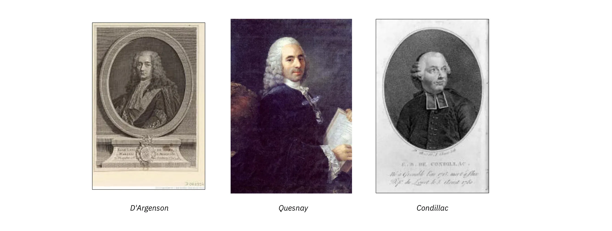

Quesnay and the Physiocrats assert that private property is the foundation of human societies. Without private property, man loses the motivation to make an effort, to work, since he cannot enjoy the fruits of his labor or accumulate anything.

Condillac asserts that exchange is always mutually beneficial and should therefore, without exception, always be free. The sole mission of the State must be to protect liberty and property.

All of these ideas would be taken up by the economists of the 19th century. Some, like Jean-Baptiste Say, would give these ideas a scientific expression through a rigorous *Treatise on Political Economy*. Others, on the contrary, would seek to popularize these fundamental maxims by venturing into the realm of tales, novels, and amusing short stories, as Frédéric Bastiat would do so skillfully.

## Biography

<chapterId>17cf2865-e53c-5f3b-a5c2-a43560efaf01</chapterId>

**SELECTIVE BIBLIOGRAPHY**

Here below, you'll find a selection of over thirty writings:

1. Pierre Clément, Histoire de Colbert et de son administration, Paris, 1874
2. Vauban, Projet d'une dîme royale, 1707; reprint Institut Coppet, 2014; Anne Blanchard, Vauban, Fayard, 1996
3.	Boisguilbert, Détail de la France, 1695; republished by Institut Coppet, 2014
4. Félix Cadet, Pierre de Boisguilbert: precursor of the economists, Institut Coppet, 2014
5. Pierre de Boisguilbert ou la naissance de l'économie politique, Paris, INED, 1966
6. Richard Cantillon, Essai sur la nature du commerce en général, 1755; reprinted by Institut Coppet, 2015
7. Antoin Murphy, Richard Cantillon, banker and economist, Oxford, 1986
8. Gustave de Molinari, L'Abbot of Saint-Pierre, Paris, 1859
9. Abbot of Saint-Pierre, Abrégé du projet de paix perpétuelle, Rotterdam, 1729
10. Abbot of Saint-Pierre, "Projet pour perfectionner le commerce de la France", in Les rêves d'un homme de bien, Paris, 1775, p.199
11. André Alem, Le marquis d'Argenson et l'économie politique au début du XVIIIe siècle, Institut Coppet, 2015
12. Journal et mémoires du marquis d'Argenson, Rathery edition, 9 vols, Paris, 1859-1867
13. Benoît Malbranque, Vincent de Gournay: the political economy of laissez-faire, Institut Coppet, 2016
14. Vincent de Gournay, Remarques sur la traduction de Josiah Child, L'Harmattan, 2008
15. Christine Théré & Loïc Charles (eds.), Le cercle de Gournay, INED, 2005
16. Antoin Murphy, "Le développement des idées économiques en France (1750-1756)", Revue d'histoire moderne et contemporaine, tome XXXIII, October-December 1986
17. Henri Ripert, Le marquis de Mirabeau: ses théories politiques et économiques, Paris, 1901
18. Lucien Brocard, Les doctrines économiques et sociales du marquis de Mirabeau in L'Ami des Hommes, Paris, 1902
19. Humbert de Montlaur, Mirabeau, l'Ami des Hommes, Perrin, 1992
20. Yves Guyot, François Quesnay et la Physiocratie, Institut Coppet, 2014
21. François Quesnay, Œuvres économiques complètes et autres textes, 2 vols, INED, 2005
22. Georges Weulersse, Le mouvement physiocratique en France (de 1756 à 1770), 2 vols, Paris, 1910
23. Georges Weulersse, La Physiocratie à la fin du règne de Louis XV (1770-1774), P.U.F., 1959
24. Georges Weulersse, La Physiocratie sous les ministères de Turgot et de Necker (1774-1781), P.U.F., 1950
25. Georges Weulersse, La physiocratie à l'aube de la révolution (1781-1792), EHESS, 1985
26. P. Jolly, Du Pont de Nemours, soldat de la liberté, Paris, P.U.F., 1956
27. Voltaire's economic writings, Institut Coppet, 2013
28. Gustave Schelle (ed.), Œuvres de Turgot et documents le concernant, Paris, 1913-1924
29. Benoît Malbranque, Le libéralisme à l'essai : Turgot intendant du Limousin (1761-1774), Institut Coppet, 2015
30. Pierre Foncin, Essai sur le ministère de Turgot, Paris, 1877
31. Auguste Lebeau, Condillac économiste, Paris, 1903
32. Condillac, Le commerce et le gouvernement considérés relativement l'un avec l'autre, 1776
33. Condorcet, Mélanges d'économie politique, in Eugène Daire (ed.), Mélanges d'économie politique, Paris, 1847
34. P. Jolly, Du Pont de Nemours, soldat de la liberté, Paris, P.U.F., 1956
35. Eli Heckscher, Mercantilism, 2 vols. London: Allen and Unwin. 1935

# Final section

<partId>385bffab-aea1-5bcd-9569-62b3f30665b7</partId>

## Reviews & Ratings

<chapterId>a1e689d9-abd0-5dcb-ba56-a8d355d0a84f</chapterId>
<isCourseReview>true</isCourseReview>

## Final Exam

<chapterId>bdb7fd98-33e7-11f0-9fe6-b785c859ffc5</chapterId>
<isCourseExam>true</isCourseExam>

## Conclusion

<chapterId>3b366ff6-03c8-5f6a-b4c0-ba8186e65d7e</chapterId>

<isCourseConclusion>true</isCourseConclusion>
