# Un viaje a la historia económica de la libertad

Este curso explora el nacimiento de la ciencia económica en la Francia del siglo XVIII a través de la lente del laissez-faire. Descubrirás cómo los pensadores desafiaron el mercantilismo argumentando que el Estado debería proteger los derechos privados, pero nunca manipular los mercados mediante regulaciones.

Aprenderás cómo los reformadores visionarios extendieron esta visión para exigir el libre comercio y la circulación irrestricta de bienes, sentando las bases intelectuales del capitalismo moderno. Al estudiar a estos economistas pioneros, comprenderás los principios atemporales que dieron forma a la economía política global y continúan influyendo en los debates políticos actuales. Únete ahora para dominar las ideas que construyeron la economía moderna.
+++
# Introducción

<partId>06d67531-19f1-4f8d-bf8f-77bbcc743672</partId>

## Resumen del curso

<chapterId>202db3c6-0320-494d-8057-adc6f6563048</chapterId>

¡Bienvenido a HIS204!

Este curso está diseñado para explorar los orígenes franceses del concepto de *laissez-faire* - "dejar hacer"- tal y como se desarrolló en el siglo XVIII a través de una rica tradición intelectual. Siguiendo el pensamiento de los primeros pensadores económicos franceses, descubriremos los fundamentos de una economía política basada en la libertad económica, marcada por la desconfianza en la interferencia del Estado y la creencia en un orden natural que favorece el crecimiento y la prosperidad.

**Sección 2: Los Precursores**

En esta sección comenzamos en las postrimerías de los siglos XVII y XVIII, una época marcada por el excesivo dominio de la monarquía absoluta y los primeros llamamientos a una forma más racional y justa de gobernar los asuntos públicos. A través de las figuras de Vauban, Boisguilbert y Cantillon, descubrimos las primeras críticas al intervencionismo estatal y un primer esbozo de lo que más tarde se convertiría en la economía política liberal.

**Sección 3: Reformadores y pensadores de principios del siglo XVIII**

Esta sección se centra en quienes, en las primeras décadas del siglo XVIII, intentaron reformar la economía francesa a la luz de nuevos principios. Pensadores como el abad de Saint-Pierre, el marqués d'Argenson y Gournay (junto con sus seguidores) abogaron por desmantelar los obstáculos corporativistas, liberalizar el comercio y fomentar la competencia como motor del desarrollo. Sus propuestas, a menudo audaces, prefiguraban las grandes ideas fisiocráticas.

**Sección 4: La Escuela Fisiocrática**

Esta sección explora uno de los momentos más importantes del pensamiento económico francés: la escuela fisiocrática. Examinaremos sus orígenes, fundamentos doctrinales y principales logros, centrándonos en figuras clave como Quesnay y Dupont de Nemours. La idea del laissez-faire se convierte en un sistema coherente justo en esta escuela, arraigada en la idea de un orden natural al que el Estado debe someterse para garantizar la prosperidad de todos.

**Sección 5: La Ilustración y la economía política**

Por último, veremos cómo se extendió el pensamiento económico liberal dentro del movimiento más amplio de la Ilustración. Figuras como Voltaire, Turgot, Condillac y Condorcet ampliaron y enriquecieron la tradición del laissez-faire, sus escritos crearon un puente para que la tradición del laissez-faire cruzara al periodo revolucionario y más allá, donde las ideas liberales encontraron una nueva resonancia.

¿Listo para redescubrir las raíces francesas del liberalismo económico? Vamos allá

# Los precursores

<partId>91565b10-6010-53cb-a2f4-9c2306c7ef8c</partId>

## Antecedentes históricos

<chapterId>6a5fd101-6dfd-5d77-96c7-9e1aa4a19758</chapterId>

En los albores del siglo XVIII, Francia se encontraba en una situación preocupante. Las poblaciones rurales apenas producían lo suficiente para sobrevivir y estaban sometidas a una fuerte presión fiscal.

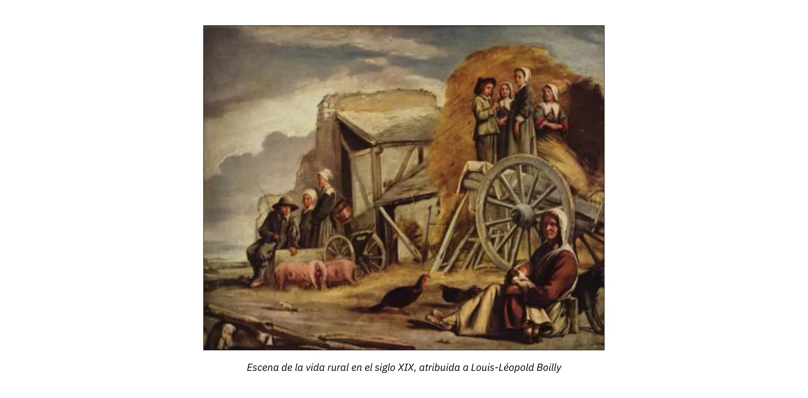

Los artesanos urbanos, encerrados en rígidos gremios, tenían dificultades para innovar o incluso para apoyarse mutuamente. Mientras tanto, otras naciones europeas pronto superaron a Francia en todos los frentes, superando a sus productos. Los éxitos comerciales de Inglaterra y Holanda estaban en la mente de todos.

Pero, ¿cómo encontrar una solución a la enfermedad de la época? Todavía no existía una ciencia económica y, por tanto, no había una medicina especial que aplicar. Los principios de la política económica seguían aplicándose al azar, pasando de fases restrictivas a periodos más liberales. Ciertamente, tenemos modelos, referencias históricas a seguir. Entre ellos, *Sully*, ministro de Enrique IV, que abogó por la agricultura y promovió una mayor libertad de comercio dentro de Francia.

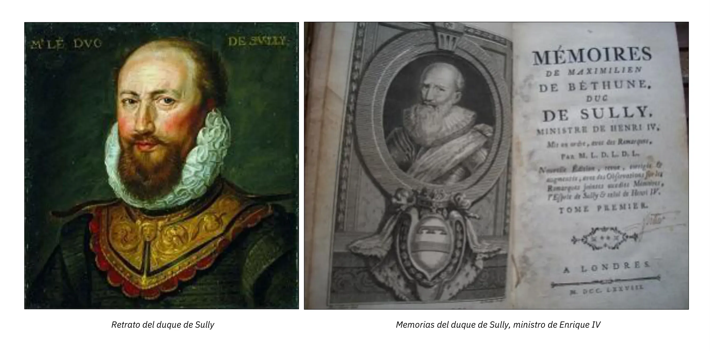

Pero entonces llegó Colbert, ministro de Luis XIV, que vaciló entre la regulación y la libertad, aunque finalmente impuso la regulación. A finales del siglo XVII, Colbert superó a Sully: los ministros invocaban ahora su legado e intentaban aplicar lo que, según ellos, eran sus máximas.

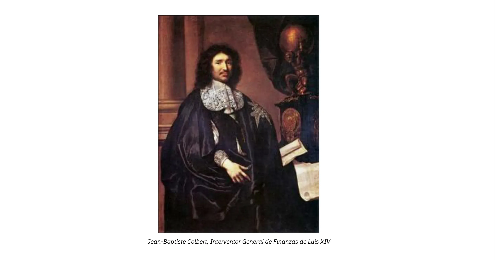

En la mente de los estadistas de finales del siglo XVII, las máximas de Colbert eran cuatro.

(1) **La industria debe regularse y encuadrarse en gremios**. Estos reglamentos especifican, por ejemplo, cómo deben fabricarse las sábanas y los paños, su tamaño y su peso.

Había cientos de normas de este tipo, recopiladas en volúmenes específicos para cada tipo de industria. Sin embargo, a los ojos de los seguidores de Colbert, esto seguía siendo insuficiente: la industria, creían, también necesitaba ser supervisada por las corporaciones.

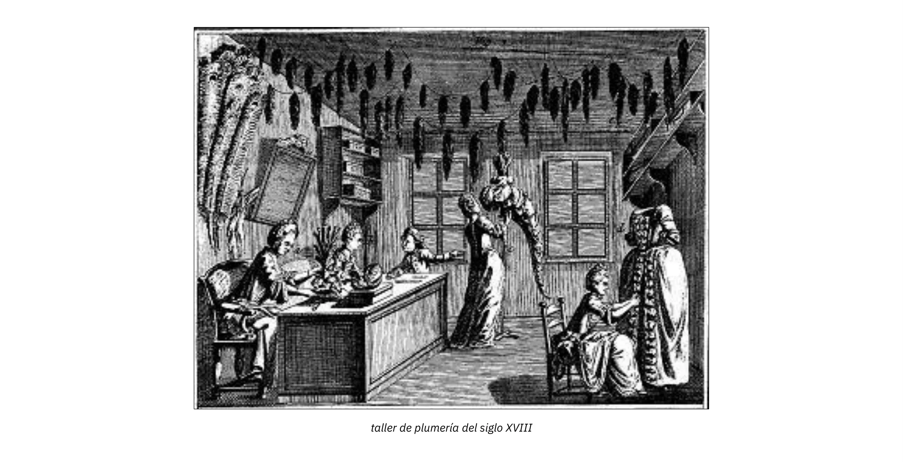

Quien deseaba ejercer un oficio debía pasar primero varios años como aprendiz, luego como oficial, antes de intentar alcanzar la categoría de maestro produciendo una "obra maestra" y pagando una cantidad considerable al gremio. Por tanto, la competencia dentro de cada oficio estaba estrictamente limitada.

(2) **El comercio es un juego de suma cero**. En materia de comercio, los discípulos de Colbert compartían los mismos prejuicios que los pueblos bárbaros de la Antigüedad. Según el ministro de Luis XIV, el comercio es "una guerra perpetua". ¿Por qué? La razón es sencilla: para Colbert y sus sucesores, cualquier aumento de riqueza para un país significaba el empobrecimiento de otro. En su opinión, no se podía permitir que los ingleses o los holandeses se enriquecieran, porque eso significaría que estaban robando la prosperidad de Francia.

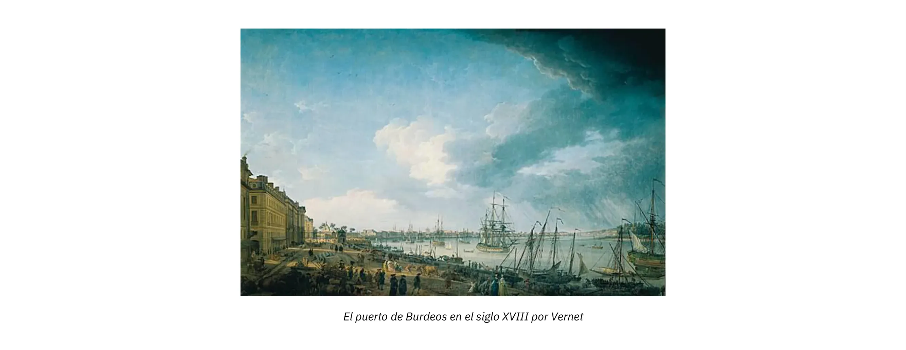

Por tanto, había que prohibir o gravar fuertemente los productos de estos países, sin escrúpulos, porque el comercio es una guerra en la que sólo podemos desear la ruina de nuestros enemigos.

> "Los franceses sólo pueden aumentar su comercio aplastando a los holandeses".
> *Colbert*

(3) **Cuando al Estado le falta dinero, recauda más impuestos**. Colbert y sus discípulos estaban lejos de creer que la riqueza de los contribuyentes fuera un recurso limitado. En su opinión, el gasto público nunca podía ser un problema, siempre que se recaudara lo suficiente. Y si el pueblo se rebelaba, era simplemente porque los ministros lo habían hecho mal, ya que, como señalaba cínicamente Colbert, "el arte de los impuestos consiste en desplumar a las ocas sin hacerlas gritar demasiado".

(4) **La riqueza es, ante todo, oro y plata**. Antes del nacimiento de la ciencia económica, muchos escritores seguían un dogma dominante sobre la naturaleza de la riqueza, lo que llegó a conocerse como *mercantilismo*. Colbert y sus sucesores continuaron por este camino. En resumen, los mercantilistas creían que el verdadero signo de la prosperidad de una nación era la acumulación de metales preciosos, plata y oro.

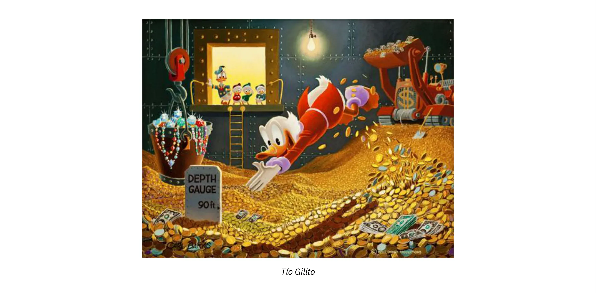

> "Sólo la abundancia de dinero dentro del Estado marca la diferencia de su grandeza y poder".
> *Colbert*

La consecuencia de esta idea es favorecer a toda costa las exportaciones, que traían oro y plata del extranjero, y limitar al mínimo las importaciones, para evitar enviarlas al extranjero.

Estos son los cuatro principios que guiaron al gobierno francés durante varias décadas, cuando el país se adentraba en el siglo XVIII. Sin embargo, pronto iban a ser profundamente cuestionados. Entre 1690 y 1710, varios escritores se sintieron profundamente impresionados por el desastroso Estado de Francia. Al buscar sus causas, llegaron a la conclusión de que las propias máximas heredadas de Colbert eran las culpables, considerándolas más que argumentos falaces. Con ello sentaron las bases de la ciencia económica.

## Vauban

<chapterId>ee9c1e0e-96cc-5026-a5e2-963d68122786</chapterId>

Hoy, mientras la presión fiscal en nuestro país sigue creciendo, amenazando con asfixiar las fuerzas económicas nacionales, se alzan voces a favor del cambio. Conscientemente o no, estos llamamientos a la reforma se hacen eco a menudo del trabajo de los economistas franceses que, desde el siglo XVII, han criticado el sistema fiscal de la nación por caótico, despótico, excesivo.

El primero de estos reformadores fiscales, cronológicamente y por sus méritos, es el gran mariscal Sébastien Le Prestre Vauban, famoso constructor de plazas fuertes y ciudadelas.

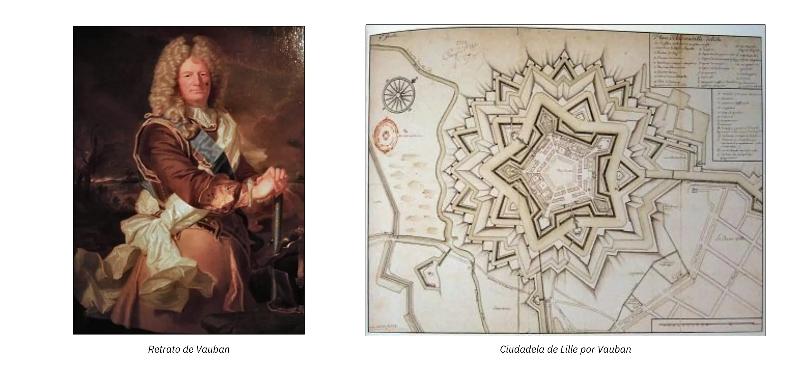

Aunque tristemente lo hayamos olvidado, Vauban era algo más que un militar: era también un economista. Interesado por la suerte de los campesinos, propuso audaces reformas fiscales en 1695 (Projet de capitation - "el Proyecto de Capitación") y de nuevo en 1707 (Projet d'une Dime Royale - "el Diezmo Real"): sustituir la mayoría de los impuestos existentes por un impuesto proporcional a la renta, un impuesto plano antes de tiempo.

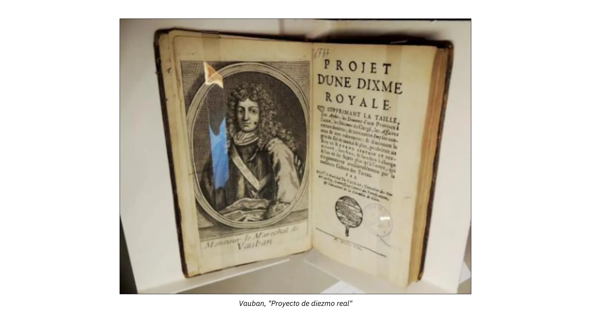

Vauban llegó a estas ideas por curiosidad. Era un gran observador, que se esforzaba por estudiar la vida social y la realidad económica con rigor, casi científicamente. Insistió especialmente en la necesidad de contar, mediante censos.

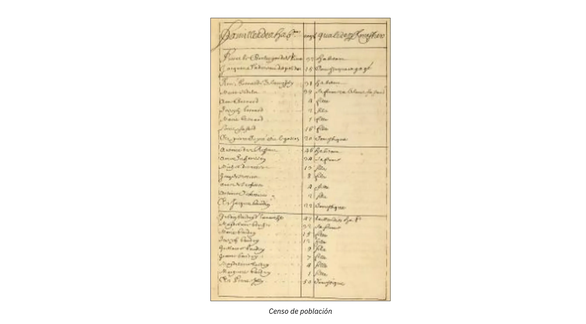

Su segundo gran mérito fue su conmovedora y honesta descripción de la miseria soportada por las masas. Escribió: "No nos engañemos; el corazón del reino está arruinado. Todo sufre, todo soporta, todo gime. Basta con mirar y examinar el corazón de las provincias, lo que encontraréis es aún peor que lo que estoy diciendo". Lejos de exagerar, las sombrías observaciones de Vauban eran un fiel reflejo de la vida de principios del siglo XVIII. Alexis de Tocqueville conocía bien estas ideas, y más tarde describiría el *Diezmo Real* de Vauban como "espantoso", porque era cierto.

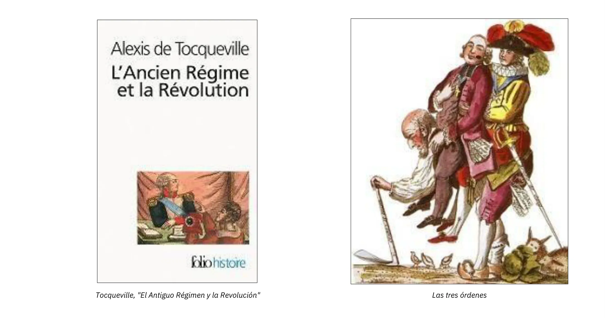

El otro gran mérito de Vauban como economista fue proponer una profunda reforma fiscal destinada a erradicar, o al menos reducir la intensidad del mal que observaba y describía. Tenía razón: la economía francesa del Antiguo Régimen estaba paralizada por una fiscalidad desigual, inestable e ilegible.

A través de sus diversos escritos políticos y económicos, la ambición primordial de Vauban era aliviar el sufrimiento de lo que él llamaba "la parte inferior del pueblo, que, con su trabajo, sostiene y mantiene a la superior".

Comprendió que la fiscalidad opresiva y desincentivadora agobiaba a los campesinos, concepto que expresó con clarividencia, algo que aún podemos observar perfectamente en nuestros días:

> "El agricultor deja marchitar la poca tierra que tiene, trabajándola sólo a medias, por miedo a que si produjera lo que podría con un abono y un cultivo adecuados, se le gravarían aún más los impuestos".

Vauban vio la verdad: la fiscalidad del Antiguo Régimen no sólo era irracional, sino también cruelmente estricta. Vauban se propuso superar este sistema fiscal, injusto en su distribución.

La solución que propuso, un impuesto proporcional a tanto alzado sobre todas las rentas, habría permitido repartir equitativamente la carga fiscal entre todas las clases sociales. Basada en una teoría del Estado que consideraba el poder público necesario para proteger los derechos individuales y la propiedad, la reforma fiscal de Vauban exigía que todos los ciudadanos contribuyeran en estricta proporción a lo que ganaban, por ejemplo, el 10% de sus ingresos

En El diezmo real, la única de sus obras económicas impresa en vida, Vauban afirmaba claramente:

> "Puesto que en un Estado todos necesitan su protección para sobrevivir, es justo que todos contribuyan, según sus ingresos, a su mantenimiento y a sus gastos [...]. Nada es más injusto que eximir a los más capaces de pagar, y hacer recaer la carga sobre los menos capaces, que se hunden bajo el peso; peso que sería bastante ligero si fuera soportado proporcionalmente por todos según sus propias fuerzas. Por tanto, toda exención de impuestos es un desorden que debe corregirse"

Poco antes de su muerte, la idea de Vauban fue adoptada por los ministros de Luis XIV. Sin embargo, Vauban había pedido un impuesto proporcional que sustituyera a todos, o casi todos, los impuestos existentes. En cambio, como sucede a menudo, su impuesto se aplicó, pero se mantuvieron todos los demás.

## Boisguilbert

<chapterId>200149c6-b5fc-566e-ab0e-bafb1c3fed3c</chapterId>

Pocos economistas franceses del pasado gozan hoy de un reconocimiento en su patria a la altura de sus aportaciones, y Boisguilbert no es una excepción.

Poco apreciado por los lectores de su época, alejado de los círculos de poder por su carácter excéntrico y su pasión desbordante, Boisguilbert dejó poca huella en el siglo XVIII. Sin embargo, a principios del siglo pasado se ha producido un lento redescubrimiento de su obra.

Sin embargo, este redescubrimiento demuestra que estamos entrando en una especie de callejón sin salida. El verdadero mérito de Boisguilbert se ha perdido al presentarlo como el pionero de numerosas teorías y el precursor de muchos pensadores. Se le atribuye el concepto de subempleo defendido más tarde por Keynes, la ley de Say, la teoría del equilibrio general de Walras e incluso el análisis de clase de los marxistas. ¿Quién o qué no podría ser el precursor de Boisguilbert?", se preguntaba finalmente un comentarista.

(Pierre Le Pesant de) Boisguilbert nació en Ruán en 1646. Educado en Port-Royal (París), Boisguilbert inició una carrera literaria sin éxito antes de asumir diversas funciones, entre ellas la de Lugarteniente General de Ruán. Durante esta época escribió varios libros para defender sus ideas, entre ellos "Détail de la France" en 1695, que volvió a publicar al año siguiente con un título mucho más explícito: [*Francia arruinada bajo el reinado de Luis XIV, por quién y cómo, con los medios para restaurarla](https://archive.org/details/bub_gb_0jUaWNbTJa8C/page/n23/mode/2up)*.

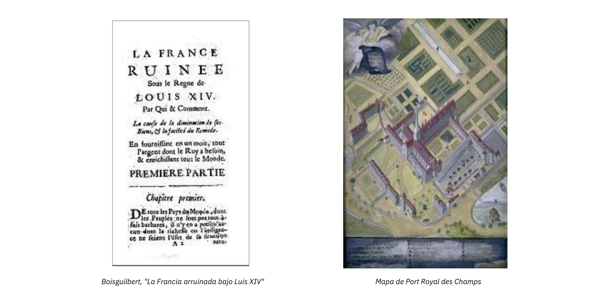

Y ésta es la base de los libros de Boisguilbert: La pobreza francesa y sus causas.

Esta miseria del pueblo francés a finales del siglo XVIII, Boisguilbert la describe detalladamente, al igual que Vauban. Escribe:

> "Las tierras yermas o mal cultivadas, a la vista de todos, son el cadáver de Francia".

Describió viñedos arrancados, campesinos que abandonaban los campos y hambrunas recurrentes.

Boisguilbert encuentra dos causas principales para esta desgracia. Pues si el pueblo vive en la indigencia es porque se le impide consumir lo necesario, y la ruina del consumo tiene dos causas.

En primer lugar, el pueblo ya no podía permitirse consumir artículos de primera necesidad debido a la arbitrariedad de los impuestos. La taille, un impuesto personal de la época, se calculaba a ciegas para cada individuo, subiendo o bajando sin motivo. Debido a los numerosos privilegios, la carga recaía sobre los campesinos pobres, que se veían arruinados. Para corregir esta situación, Boisguilbert recomendó un impuesto proporcional sobre todas las rentas, muy similar a la propuesta de Vauban.

La segunda razón de la miseria de Francia es que demasiados obstáculos impedían el libre comercio de mercancías, sobre todo agrícolas. Había derechos de aduana en las fronteras e incluso dentro del país, entre las distintas regiones, que paralizaban todo el comercio. Estas restricciones impedían el establecimiento de un precio de equilibrio y limitaban las oportunidades del mercado. En consecuencia, los campesinos no podían vivir de su producción, porque no podían vender de forma rentable y sufrían unos precios agrícolas poco remuneradores, una preocupación que sigue siendo muy pertinente hoy en día y que constituye el núcleo de la teoría de Boisguilbert. En cuanto a las restricciones comerciales, Boisguilbert abogaba por despejar los caminos, es decir, establecer el libre comercio.

Y la libertad es, en efecto, su conclusión final. "No se trata de actuar", dice, "sino simplemente de dejar de actuar como lo hacemos tan violentamente contra la naturaleza, que siempre tiende a la libertad y a la perfección". Todo irá bien, repite incansablemente, "siempre que dejemos que la naturaleza siga su curso, es decir, que le demos su libertad, y que nadie interfiera en este comercio salvo para ofrecer protección a todos e impedir la violencia".

Este último pasaje es esencial. Boisguilbert fue el primero en reivindicar claramente una política económica de laissez-faire, en hacer de ella su credo y en construir un verdadero sistema en torno a ella. Según él, existe un orden natural de las cosas, y no debe ser corrompido, ni destruido, por intervenciones públicas intempestivas. El Estado, en su opinión, no debe actuar en materia económica, sino dejar que las cosas actúen de forma natural. De lo contrario, causará miseria.

Boisguilbert llegó a criticar a las "*almas buenas*", como él las llamaba, aquellas que tenían buenas intenciones pero hacían mucho daño. Querían pan barato para el pueblo, pero al forzar los precios a la baja, arruinaron a los agricultores, que no podían sobrevivir con esos márgenes. Estos agricultores abandonaron entonces sus tierras, sumiéndose aún más en la pobreza. Como todos sabemos, "el infierno suele estar empedrado de buenas intenciones".

## Cantillon

<chapterId>bc206d41-6a64-5688-a489-40fcfa0e5397</chapterId>

Autor del "Ensayo sobre la naturaleza del comercio en general" (escrito hacia 1730 y publicado en 1755), Richard Cantillon está considerado uno de los pioneros de la ciencia económica moderna. En su Historia del pensamiento económico, el economista Murray Rothbard se refiere incluso a Cantillon como el fundador de la economía moderna.

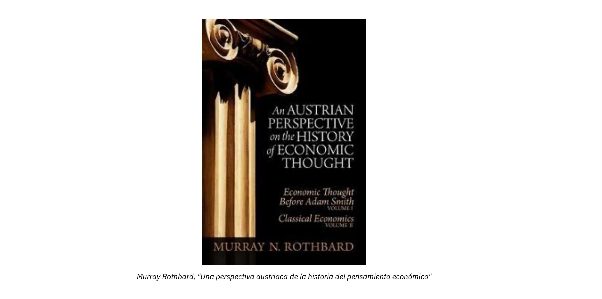

Nacido en Irlanda, Richard Cantillon se instaló de joven en París y adquirió la nacionalidad francesa. Trabajó como banquero y amasó una fortuna durante la época de John Law.

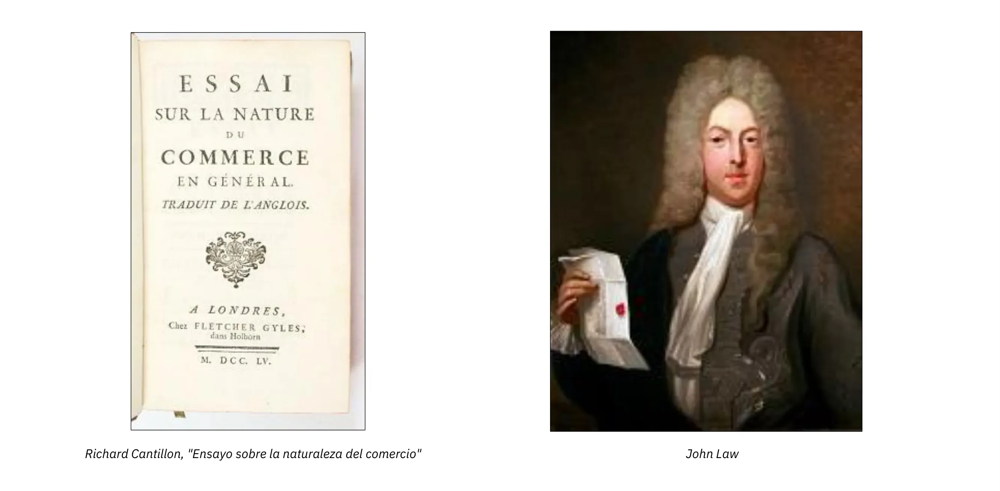

Fue también en esta ocasión cuando comenzó a estudiar teoría económica. Hacia 1730, Cantillon compuso su Ensayo sobre la naturaleza del comercio en general.

Este libro puede considerarse como uno de los primeros intentos de crear una teoría general de la economía. Cantillon se preocupa de identificar lo que él llama "leyes generales de la economía", las que están en la naturaleza de las cosas, y no en los hechos particulares de tal o cual país. Este enfoque fue revolucionario.

Podemos resumir los grandes méritos del Ensayo de Cantillon en cinco ámbitos: la teoría de la riqueza, la noción de empresario, la crítica de las monedas sin valor, los "Efectos Cantillon" y, por último, la defensa de la libertad.

En primer lugar, su **teoría de la riqueza**.

A diferencia de la visión mercantilista dominante en la época, Cantillon basó su análisis en el reconocimiento de que la riqueza está formada por los productos propios del disfrute del hombre. Esta riqueza, sostenía, procede de la naturaleza y se produce mediante el trabajo humano. Sus ideas sobre la naturaleza de la riqueza ejercieron una fuerte influencia en Beccaria y Adam Smith y, a través de Smith, en toda la escuela clásica inglesa de pensamiento.

En segundo lugar, **el empresario**.

Aunque no lo definió claramente, Cantillon consideraba al empresario como un actor principal y central de la actividad económica. Para Cantillon, lo que caracteriza al empresario es que asume riesgos y actúa en la incertidumbre. Estas ideas serían ampliadas posteriormente por Turgot y, más significativamente, por Say, para reconocer finalmente al empresario un lugar especial en la economía, en contra esta vez de las afirmaciones de la escuela inglesa.

Tercer punto, la **divisa**.

Como reacción a la experiencia de John Law, Cantillon explica lo que ocurre o debe ocurrir cuando la moneda carece de valor real.

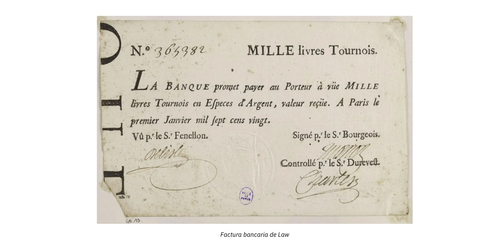

Ve dos consecuencias principales en la sustitución de una moneda sin valor real como el papel moneda por una metálica. La primera consecuencia es lo que denomina "rechazo popular", es decir, una creciente desconfianza hacia el dinero sin valor. La segunda consecuencia es la [inflación](https://planb.academy/resources/glossary/inflation): el debilitamiento monetario encarece los bienes.

En cuarto lugar, en su análisis de la **inflación**, Cantillon fue más lejos que sus contemporáneos. Habiendo observado el colapso del sistema de Law, Cantillon se dio cuenta de que la inflación monetaria no afecta a todos por igual. Al contrario, enriquece a unos y empobrece a otros. Llegó a la conclusión de que la inflación tiene un efecto redistributivo: los que reciben dinero recién emitido se benefician primero de un mayor poder adquisitivo, mientras que los que lo reciben después se empobrecen como consecuencia de la emisión de dinero nuevo por el aumento de las tasas de inflación.

En quinto lugar, a pesar de algunos vestigios del pensamiento mercantilista, la perspectiva general de Cantillon era **plenamente liberal**. Defendía la propiedad privada como pilar fundamental de la civilización, argumentando que ninguna sociedad puede funcionar sin Ownership privado de la tierra y los productos del trabajo. También consideraba natural y legítima la desigualdad material entre las personas. Según Cantillon, no hay nada malo en que un trabajador eficiente y valiente, o excepcionalmente dotado, gane más que alguien incompetente o perezoso.  Por último, Cantillon creía que los precios debían determinarse siempre libremente, por el juego de la Supply y la demanda, sin intervención de los poderes públicos.

Entre estas cinco grandes ideas de su Ensayo, la más importante es sin duda la que ahora lleva su nombre: el **Efecto Cantillón**.

Con esta teoría sobre los efectos de la inflación, Cantillon nos proporciona respuestas a una serie de males contemporáneos. Nos ayuda a comprender las consecuencias de las recientes políticas monetarias expansivas e inflacionistas, que han empobrecido a la clase media y al mundo rural, al tiempo que enriquecían a los operadores de los mercados financieros y al Estado, sus organismos y sus funcionarios, debido a su proximidad conjunta a la fuente de la nueva emisión: los bancos centrales y los bancos comerciales.

# Reformadores y pensadores de principios del siglo XVIII

<partId>1f7b50d4-ce93-5db3-8396-43c1fa5419ff</partId>

## El abad de Saint-Pierre

<chapterId>13478fe2-4c12-593c-a410-54c2cfb7ef7f</chapterId>

De todos los autores que hemos decidido incluir en el panteón de pensadores franceses del laissez-faire del siglo XVIII, el Abad de Saint-Pierre es sin duda el más olvidado.

Para ser justos, en parte es culpa suya. Escribió mucho, pero su estilo es Hard de leer y está lleno de repeticiones. Incluso Jean-Jacques Rousseau intentó resumir su obra: empezó a hacerlo, pero pronto abandonó la tarea, pues se dio cuenta de que estaba por encima de sus fuerzas. A mediados del siglo XIX, Gustave de Molinari le rindió homenaje publicando una obra exhaustiva sobre él, en la que rinde tributo al pacifista y economista que fue el abad de Saint-Pierre. Pero esto no bastó para sacarle del olvido, pues aún hoy permanece en él.

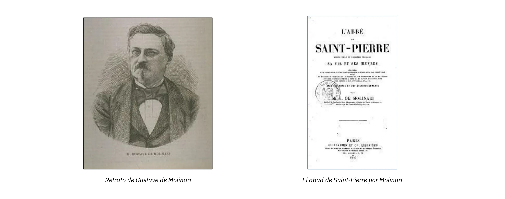

El Abad de Saint-Pierre escribió sobre economía, pero es más bien como pacifista como suele interesar. Es autor de un Proyecto de Paz Perpetua, anterior al conocido de Emmanuel Kant.

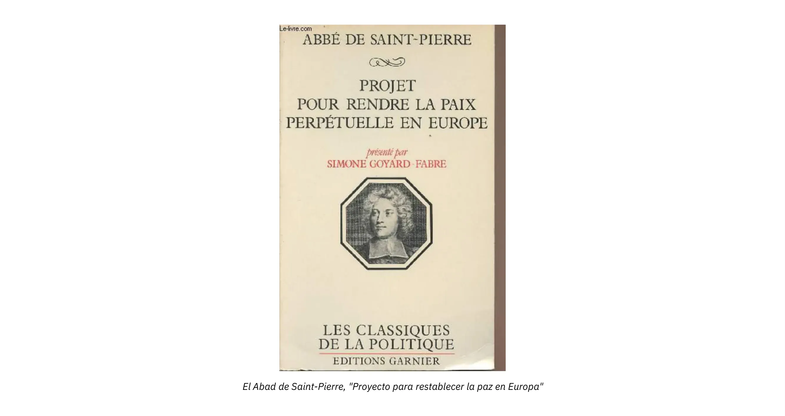

En esta obra sostenía que la guerra es destructiva, no sólo para quienes la pierden, sino también para los vencedores, e incluso para quienes no participan en ellas, ya que su comercio se ve afectado.

Para combatir el azote de la guerra, recomendó la creación de una especie de Liga Europea de Naciones. Se formaría un consejo europeo para resolver los problemas de cada nación. Así, las naciones recurrirían al arbitraje para evitar el recurso a las armas. Si una nación no era lo bastante sabia para abrazar la paz, si amenazaba a las demás naciones europeas, la liga europea de naciones dispondría de medios para responder. Ante tales acontecimientos, se formaría un ejército europeo, con fuerzas aportadas por los distintos países.

También hay un episodio en la vida del Abad de Saint-Pierre que ilustra perfectamente la mentalidad crítica que subyace al movimiento francés del laissez-faire. Ingresó en la Academia Francesa en 1695, pero fue expulsado en 1718 por atreverse a criticar el reinado de Luis XIV. Se alineó así con figuras como Vauban y Boisguilbert, que también se habían atrevido a denunciar las miserias ocultas bajo el esplendor del reinado del Rey Sol.

El abad de Saint-Pierre argumentó que el reinado de Luis XIV, con su lujosa corte y su obsesión por la conquista militar, no era la marca de un rey virtuoso. Se niega a aceptar que Luis XIV merezca el título de "Luis el Grande".

"Arruinar al prójimo y al pueblo al mismo tiempo no es grandeza", dijo. Esta postura ofendió profundamente a la Academia Francesa, que durante mucho tiempo se había preocupado de glorificar al rey en todas las formas literarias posibles. En consecuencia, votaron casi unánimemente su expulsión.

En cuanto al pensamiento económico, aplicó sistemáticamente el principio de utilidad, como haría más tarde Jeremy Bentham, y a menudo ofreció ideas acertadas. Para ser justos, todavía estaba influido por las ideas mercantilistas, de las que nadie se había desprendido del todo en aquella época.

Sin embargo, el Abad de Saint-Pierre hizo algunas observaciones acertadas sobre la economía. Incluso antes que *Condillac*, a quien a menudo se atribuye la idea, afirmó sin rodeos que en cualquier Exchange, ambas partes se benefician. Esto se puede encontrar en su ["Proyecto para mejorar el comercio de Francia"] de 1733 (https://www.institutcoppet.org/projet-pour-perfectionner-le-commerce-de-france/), donde escribió:

> "Cuando se realiza una venta entre comerciantes, el vendedor sale ganando, y también el comprador; pues si no hubiera algún beneficio real o percibido por ambas partes, ni el vendedor vendería a tal o cual precio, ni el comprador, por su parte, compraría a tal precio".

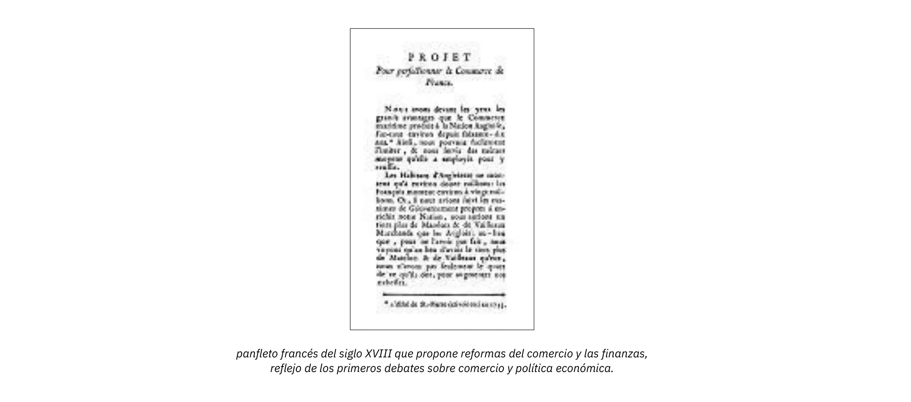

También destacó, antes que Vincent de Gournay, el valor del trabajo y la importancia de mantenerlo atractivo. "Todo trabajo es difícil", escribió. "Y cuando un hombre ve que su trabajo no le paga nada, o no lo suficiente, se vuelve ocioso y no se molestará en realizar esfuerzos innecesarios". Más tarde, el marqués de Argenson, Vincent de Gournay y los fisiócratas se harían eco de este mismo argumento al criticar las regulaciones onerosas y los sistemas gremiales. Argumentaban que tales restricciones desalentaban a los trabajadores, causaban dificultades innecesarias y, a la larga, hacían que la ociosidad pareciera más atractiva que el esfuerzo productivo en tales condiciones.

## El marqués de Argenson

<chapterId>e9960ab4-72ec-5afd-8e97-bf89c83b62bc</chapterId>

El Marqués d'Argenson es un olvidado fundador de la doctrina del laissez-faire.

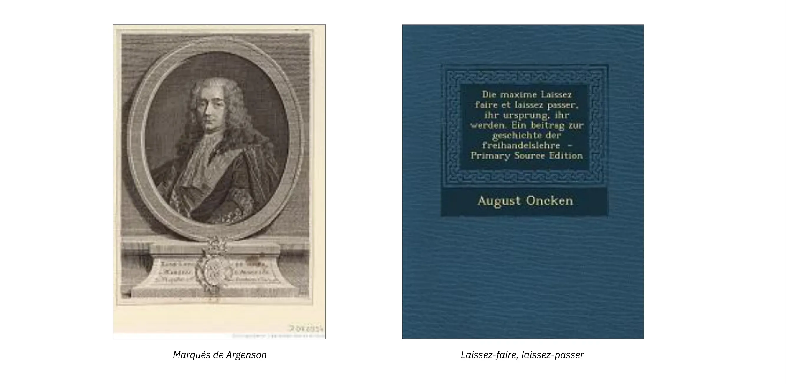

Redescubierta por August Oncken, autor de un libro sobre la doctrina del laissez-faire, laissez-passer, concluyó que d'Argenson desempeñó un papel fundamental en el nacimiento de esta idea.

René-Louis Voyer, marqués de Argenson, nació en 1694. Comenzó su carrera política como asesor parlamentario y luego formó parte del Consejo de Estado.

Treinta años antes que Adam Smith, d'Argenson ya defendía las ventajas de la división del trabajo y la especialización.

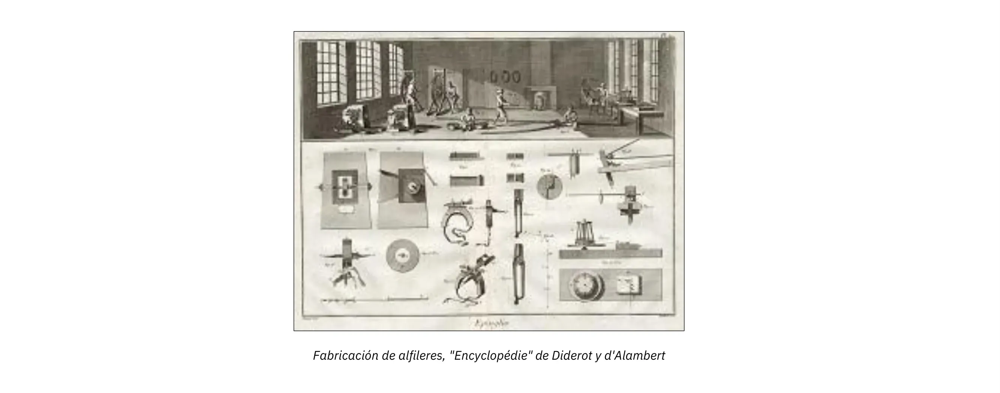

Criticó duramente las normativas que, a su juicio, intentaban cambiar las preferencias naturales de las distintas regiones. Por ejemplo, le desconcertaba que el gobierno quisiera producir telas y terciopelos en Tours, una ciudad pobre en aquella época, para igualar la calidad de los fabricados en la próspera Génova, famosa por sus artículos de lujo. Concluyó:

> "Hay que dejar que cada lugar elija sus propias fábricas. ¡Libertad! ¡Libertad!"

También reconoció otro de los principios centrales de Smith: la idea de que el orden espontáneo surge de la búsqueda del interés propio. El Marqués d'Argenson creía que el interés personal inmediato era lo que impulsaba la energía humana. Escribió que la mala artesanía y el fraude desacreditarían a un fabricante, mientras que la diligencia y las buenas intenciones conducirían a la prosperidad. El mejor juez de la utilidad, argumentaba, era el individuo, el público en general, que compra bienes y se preocupa por hacer un buen negocio. "Cada uno percibe su propio interés", decía, "cada uno toma las medidas que le son rentables, y es en este acuerdo general donde descubrimos la verdad"

Incluso antes que Adam Smith, comprendió que el interés propio conduce al interés general a través de la construcción de un orden natural espontáneo.

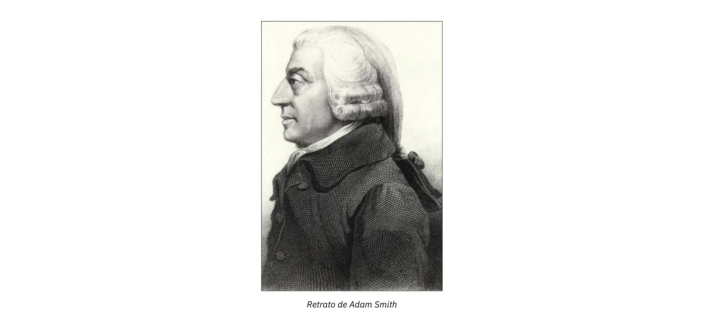

Comparó la sociedad con una colmena de abejas en la que cada insecto sigue su instinto. "De sus acciones", dijo precisamente, "resultó una gran acumulación para las necesidades de la pequeña sociedad; pero esto no se produjo por órdenes, ni por generales, que obligaron a cada individuo a seguir las opiniones de su líder". Esta es quizás la expresión más cercana en el pensamiento económico francés al famoso concepto de Adam Smith de la "mano invisible".

El marqués d'Argenson siempre se sintió ultrajado por las ideas de los ministros de su época. La única pregunta que se hacían era: "¿Debemos regular de esta manera o de aquella? ¿Debemos orientar la economía hacia esto o aquello?". A lo que d'Argenson respondía: "¿No deberíamos preguntarnos primero si es apropiado dirigir algo o si hay que dejar que las cosas funcionen por sí solas?"

A decir verdad, le asombraba que a la gente le pareciera tan Hard entender, o más bien ver, los efectos nocivos del exceso de regulación de todo tipo en la economía. En su opinión, bastaba con abrir los ojos. "Tantas cosas funcionan hoy razonablemente bien", escribía amargamente, "simplemente porque han conseguido escapar al alcance de la ley".

A veces se desesperaba al ver lo poco que se entendían sus ideas.

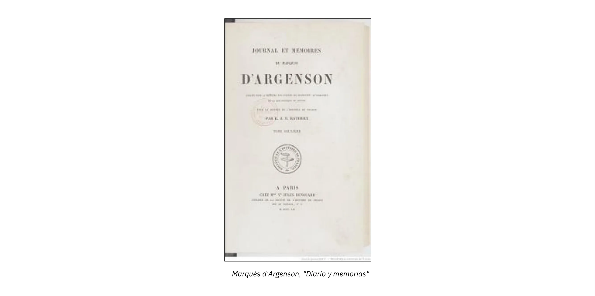

El ideal de política económica que defendía era, pues, contrario a las tendencias de su época. Su ideal definía un papel esencialmente negativo para el Estado. "Todo lo que el comercio necesita es la eliminación de obstáculos. Sólo pide buenos jueces, castigo a los monopolios, protección igual para todos los ciudadanos, monedas estables y carreteras y canales". Esta fue la definición de un Estado mínimo, que se convertiría en uno de los fundamentos de la tradición francesa en economía política.

Esta visión del papel del Estado en la actividad económica se ilustró naturalmente con el estudio de dos grandes cuestiones que agitaron a los economistas y pensadores sociales de su época: la regulación de la industria y el comercio del trigo.

Las regulaciones sobre la industria, en primer lugar, despertaron todo su resentimiento, porque eran privilegios para unos a costa de otros. "La verdadera causa de la decadencia de nuestras fábricas", escribió, "es la excesiva protección que se les da". Y con un credo no menos vivo expresó su crítica al celo dirigista de los estadistas de su tiempo:

> Dirigir la industria contra su voluntad es desear su ruina.

Sobre la cuestión del comercio de subsistencia, d'Argenson no tenía otra respuesta que la libertad. Según él, la escasez de trigo se debía al monopolio y a las excesivas precauciones tomadas por el gobierno. Bastaba con dejar hacer, y nunca habría escasez de trigo en un país donde los puertos estaban abiertos. Los extranjeros, atraídos como todos los hombres por el señuelo de la ganancia, nos proporcionarían lo que necesitáramos y se llevarían nuestro excedente. "Dejadlo ser", dijo, "y todo irá bien".

## Vincent de Gournay

<chapterId>e8ae40dc-7450-552f-9ddc-9e02936cf425</chapterId>

Vincent de Gournay fue uno de los primeros representantes del laissez-faire en Francia y uno de sus primeros defensores en la administración pública y en los círculos intelectuales. Por ello, merece mucho más reconocimiento en la historia del pensamiento económico del que suele recibir. He intentado destacar sus aportaciones en un libro reciente.

Nacido en el seno de una familia de comerciantes, Gournay se convirtió él mismo en un comerciante de éxito, amasando una considerable fortuna antes de conseguir un puesto en la administración francesa. En la Oficina de Comercio, fue un ferviente defensor de la libertad de trabajo y de comercio.

Aunque estaba bien insertado en el contexto de los principales economistas de su época, Gournay escribió poco o, mejor dicho, publicó poco. Escribió sobre todo cartas administrativas y memorias, inéditas o publicadas por otros autores tras cierta edición.

Lo que tenemos incluye:

1. [Las observaciones](https://archive.org/details/traitessurlecomm0000chil) sobre la traducción de un libro del economista inglés Josiah Child;

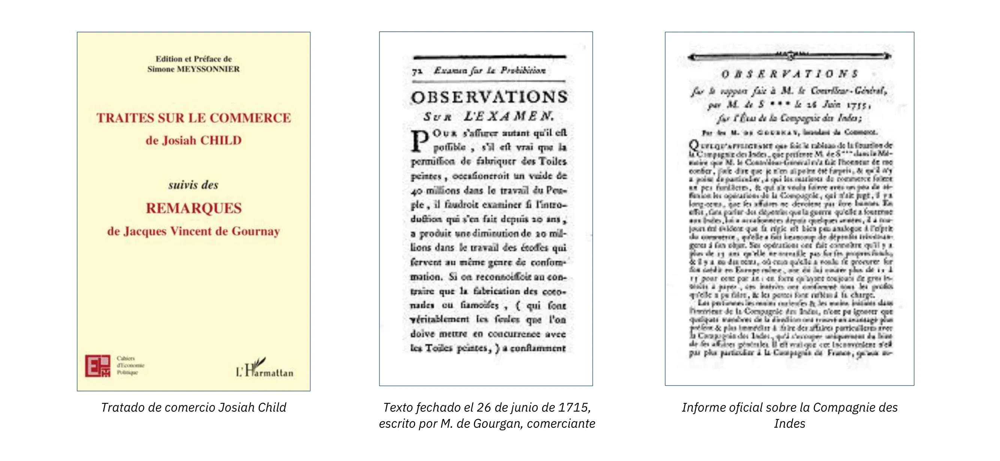

2. "Observaciones" incluidas en el Examen de las ventajas e inconvenientes de la prohibición de tejidos estampados;

3. "Observaciones sobre la Compañía de las Indias Orientales", anexo del abad Morellet a su Memoria sobre el estado actual de la Compañía de las Indias Orientales (1769);

4. Y, sobre todo, varias memorias de su papel como Intendente de Comercio.

Estos escritos demuestran una clara influencia extranjera y la presencia de algunas ideas estructuradoras importantes. La influencia extranjera, en Gournay, es el reconocimiento de la superioridad inglesa y holandesa. Gournay estaba convencido de que estas dos naciones entendían la economía mucho mejor que Francia, y que ésta debía seguir su ejemplo. "Estas dos naciones son las más prósperas", afirma, "y siguen un sistema completamente distinto al nuestro. Prohibimos la entrada de mercancías extranjeras, confinamos la actividad económica en reglamentaciones draconianas, mientras que ellos proceden de manera opuesta. Si a ellos les va mejor", concluyó Gournay, "es porque Francia se guía por principios erróneos".

Sus propuestas de reforma giran en torno a varios puntos clave.

En primer lugar, creía que había que proteger y fomentar el trabajo. En aquella época, los trabajadores franceses eran tratados como delincuentes, vigilados constantemente y atemorizados por no haber cumplido alguno de los miles de reglamentos. Este exceso de molestias disuadía a la gente de trabajar, empujándola en cambio a la ociosidad. Sin embargo, según Gournay, "el trabajo es noble y el único medio de enriquecer a una nación".

En segundo lugar, criticó el restrictivo sistema de gremios que confinaba a los fabricantes. Participar en un oficio era largo y costoso, y cada nuevo trabajador debía luego seguir escrupulosamente la rutina establecida por los estatutos de su gremio. Un sistema así no dejaba margen para la excelencia, la innovación o el progreso.

En tercer lugar, el comercio en Francia estaba limitado por leyes restrictivas. En opinión de Gournay, los consumidores saldrían muy beneficiados si los puertos pudieran competir libremente y se permitiera importar sin restricciones todas las mercancías, como el grano y los lienzos impresos. Fue uno de los primeros en señalar el verdadero origen del contrabando: existía únicamente porque se prohibía un comercio beneficioso y útil. Añadió una aguda observación: el contrabando era una profesión "libre", sin regulaciones, sin gremios, sin impuestos confiscatorios. Sin embargo, fue la abrumadora regulación del Estado la que empujó a muchos trabajadores honrados a la ilegalidad.

Por último, Gournay observa que los tipos de interés son más bajos en Inglaterra y los Países Bajos, países más prósperos que Francia. Gournay aboga por la reducción de los tipos de interés también en Francia, para que la actividad económica pueda financiarse en condiciones tan ventajosas como en otros países. Sin embargo, Gournay no buscaba métodos coercitivos y legislativos, sino que hacía hincapié en la necesidad de legalizar el préstamo de dinero, que seguía siendo condenado por la Iglesia Católica.

En todos estos puntos, Gournay desempeñó un papel clave en los debates intelectuales de mediados del siglo XVIII. Su defensa de la libertad económica precedió en una década a los fisiócratas y en veinte años a Adam Smith. Pero su influencia más duradera fue sobre Turgot. Gournay tomó bajo su protección al joven Turgot y le formó con sus ideas.

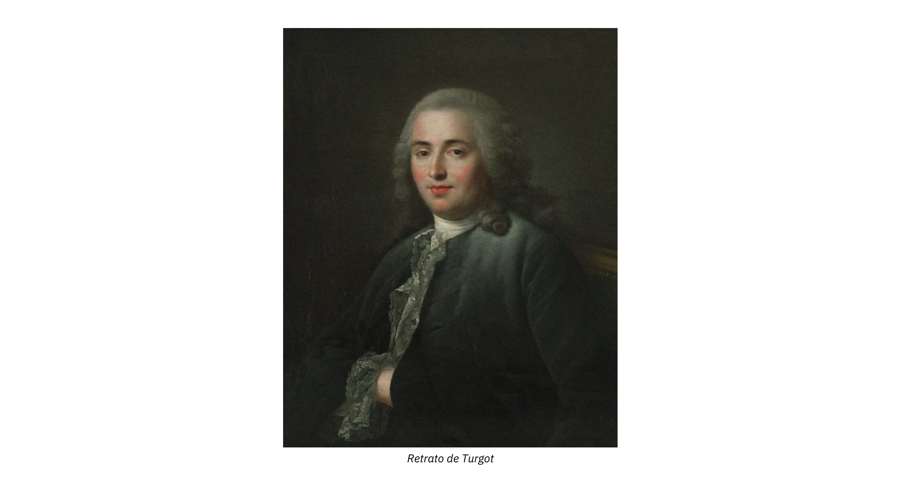

Años más tarde, Turgot, futuro ministro de Luis XVI, escribió un Éloge (elogio) en honor de su amigo tras su muerte. Y si Turgot nunca abrazó del todo la fisiocracia de François Quesnay, fue porque conservó un apego invencible a su primer maestro, Vincent de Gournay.

## Círculo de Gournay

<chapterId>b86ba6bd-8f3a-5d8f-b098-4d0413f00deb</chapterId>

Cuando se habla de los inicios de la ciencia económica, la historia tiende a destacar una primera escuela de pensamiento: los fisiócratas, liderados por François Quesnay y sus discípulos. Sin embargo, casi una década antes de su auge, hubo otro grupo menos formal pero igualmente importante, centrado en torno al economista Vincent de Gournay.

Como vimos en la parte anterior, a Gournay le fascinaba el ejemplo de naciones extranjeras como Inglaterra y Holanda. También admiraba a sus economistas, como Josiah Child, Johan de Witt y David Hume.

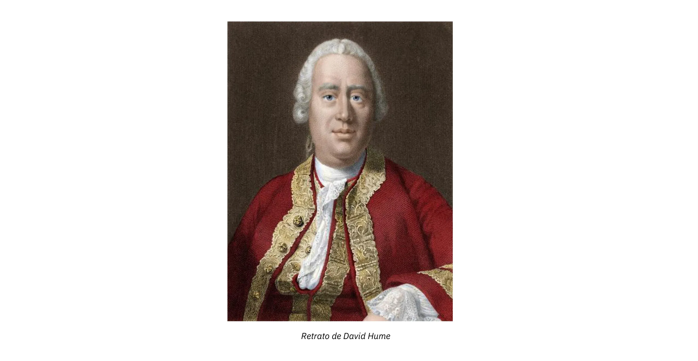

Esta admiración le llevó a traducir y encargar traducciones de sus escritos económicos.

Resulta que su posición en la alta administración permitió a Gournay entrar en contacto con todos los especialistas en economía conocidos en Francia en aquella época. De este modo, reunió a un grupo de traductores muy capaces. Tradujo personalmente las obras de Child y Culpeper. El abad Le Blanc tradujo los Discursos políticos de David Hume. Véron de Forbonnais tradujo al economista español Geronymo de Uztariz. Turgot trabajó en los escritos de Josiah Tucker, y el hijo de Montesquieu tradujo a Joshua Gee.

Gracias a la colaboración de varios miembros del círculo de Gournay, muchos autores pudieron publicar obras originales con su propio nombre. Estos libros, junto con las traducciones, alcanzaron un notable éxito. Algunos ejemplos notables son:

- Herbert's Essay on the [General Police of Grain](https://archive.org/details/essaisurlapolice00herb/page/n7/mode/2up) (6 ediciones en 4 años)

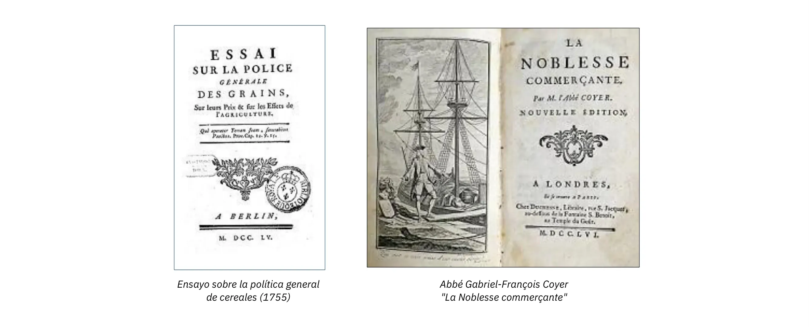

- Coyer's [Noblesse commerçante](https://archive.org/details/lanoblessecommer00coye/page/n3/mode/2up) (5 ediciones en 2 años)

- Plumard de Dangeul's [Remarks on the Advantages and Disadvantages of France and Great Britain](https://archive.org/details/bim_eighteenth-century_remarks-on-the-advantage_plumard-de-dangeul-loui_1754) (3 ediciones en su primer año)
- Cliquot-Blervache y Gournay's [Memoir on the Trades](https://www.amazon.com/Memoire-sur-corps-metiers-French/dp/1978196903) (2 ediciones en 1758)

El grupo también desempeñó un papel fundamental en la publicación de

- [Ensayo sobre la naturaleza del comercio en general](https://archive.org/details/essayonnatureofc0000cant) de Richard Cantillon.

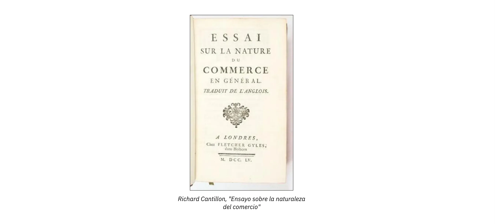

Este último libro, escrito hacia 1730, permaneció manuscrito tras la muerte del autor. Gournay, con la ayuda de sus amigos economistas, lo publicó en 1755. Según el abad Morellet, miembro del círculo, Gournay lo recomendó a todos los economistas que conocía.

La producción intelectual del círculo de Gournay tuvo una gran repercusión en la historia de las ideas. En este sentido, se les puede considerar los fundadores de la ciencia económica en Francia. Christine Théré, del INED, que ha estudiado la historia de las publicaciones económicas, ha constatado que entre 1750 y 1759 se publicaron nada menos que **349** obras sobre economía, frente a sólo **83** en toda la década anterior (1740-1749). Esta revolución de los años 1750 se debe en gran parte al círculo de Gournay.

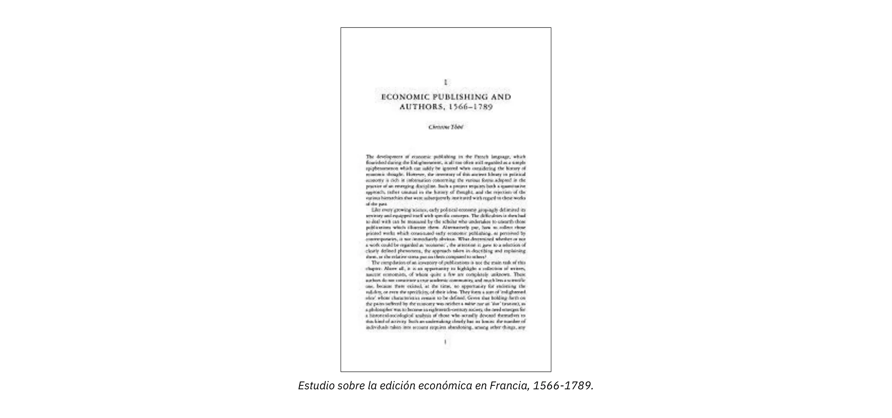

Para difundir el gusto por las discusiones económicas entre la población francesa, Gournay y sus amigos se esforzaron por hacerlas accesibles a través de novelas. Tras el *Memoir on the Trades*, que criticaba a los gremios, Gournay y Cliquot-Blervache ayudaron a Gabriel-François Coyer a escribir una novela satírica corta titulada Chinki: [Un cuento cochinchino aplicable a otras naciones](https://www.institutcoppet.org/wp-content/uploads/2013/06/Coyer-Chinki-Histoire-cochinchinoise.pdf).

La historia sigue al protagonista, Chinki, que se ve obligado a abandonar su tierra debido a los excesivos impuestos e intenta encontrar trabajo artesanal para sus hijos en la ciudad. Pero todos los oficios les están vedados debido a las abusivas regulaciones de los gremios, por lo que la historia retrata su creciente decepción a través de tonos humorísticos.

El círculo de Gournay estuvo, pues, en el origen de una intensa oleada de publicaciones. Aunque esta importante contribución ha sido olvidada por los historiadores del pensamiento económico, estaba muy clara para los contemporáneos. Los fisiócratas, que organizaron su escuela en la década de 1760, presentarían más tarde al grupo de Gournay como sus precursores directos. En 1767, el economista Jacques Accarias de Serionne lo expresó aún más claramente en su homenaje. Escribió: "Un pequeño número de franceses, tanto filósofos como ciudadanos, comenzaron hace algunos años a imitar a los escritores ingleses. Primero tradujeron sus modelos y pronto los superaron en muchos aspectos. Aportaron todo el encanto y la riqueza de la literatura al tratamiento de temas útiles; suscitaron y difundieron el gusto por las ciencias más esenciales para la prosperidad del Estado".

Y, en efecto, en la década de 1750, las cuestiones económicas se pusieron de moda. Voltaire comentó célebremente que, hacia 1750, los franceses renunciaban a las novelas para hablar de la libertad del comercio de cereales. Esta tendencia también fue observada por el Mercure de France, que escribió en un número de 1758, unos meses antes de la muerte de Gournay: "La economía política es ahora la ciencia de moda. Los libros que tratan de agricultura, población, industria, comercio y finanzas están ahora en manos de innumerables personas que, no hace mucho, sólo leían superficialmente novelas". Difícilmente se podría rendir mejor homenaje a Gournay y a la obra de su círculo de economistas.

## Mirabeau

<chapterId>2d2f802b-e3b6-556f-9025-a1b1dc4409ca</chapterId>

Francia ha conocido a dos hombres famosos llamados Mirabeau, un padre y un hijo, pero fue el hijo quien verdaderamente hizo historia. Tribuno revolucionario y una de las figuras centrales de los acontecimientos de la Revolución Francesa, siguió siendo famoso.

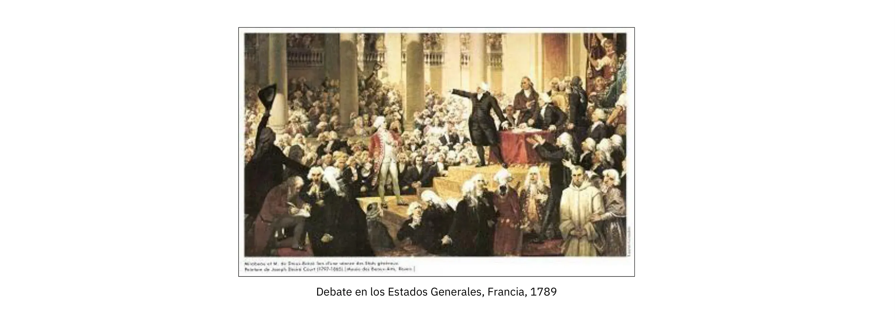

Por su talento y su lugar en la historia de Francia, hizo sombra a su padre, economista y pilar de la escuela de François Quesnay, que había sido su primer miembro ya en 1758.

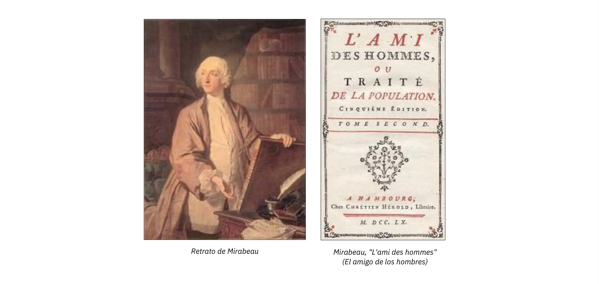

De hecho, el marqués de Mirabeau ya había alcanzado una inmensa fama incluso antes de su adopción de la fisiocracia gracias a un libro titulado "El amigo de la humanidad. Tratado sobre la población [FR: L'ami des hommes, ou, Traité de la population](https://archive.org/details/lamideshommesou00unkngoog). Aunque la primera edición se publicó en 1756, se hizo famoso hacia 1757, un año antes de su encuentro con Quesnay.

Entre 1757 y 1760 se publicaron más de 20 ediciones, lo que probablemente lo convierte en el libro de economía de más éxito de la historia. Algunos lectores llegaron a pensar que el libro había sido escrito por Montesquieu debido a su agudo razonamiento. El Delfín, padre del rey Luis XVI, llegó a afirmar que lo había memorizado. Durante un tiempo, fue el libro que todos leían en Versalles.

Hoy es un libro que ya no se lee, pero muchos siguen haciendo referencia a él. Ya en el siglo XIX, Edmond Roussel decía:

> L'Ami des Hommes es uno de esos libros de los que todo el mundo habla, pero que casi nadie conoce. En cada generación, un ciudadano valiente debería leerlo; para que todos los demás no tengan que hacerlo.

Al principio de su carrera de economista, Mirabeau se inspiró en Richard Cantillon. Hacía 15 años que poseía un manuscrito del Ensayo sobre la naturaleza del comercio en general de Cantillon, que había analizado y comentado pacientemente.

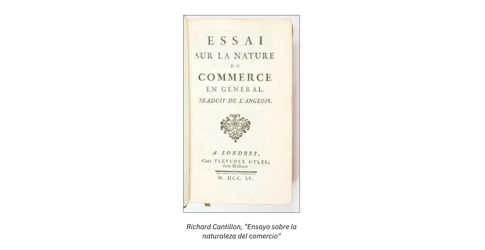

L'Ami des Hommes fue concebido originalmente como un simple comentario sobre el Ensayo de Cantillon. Pero como Mirabeau tenía una mente un tanto ecléctica, es decir, francamente, un poco loca, se desvió rápidamente de su plan original. El libro se limita a tratar todas las cuestiones económicas que conocía, alejándose de vez en cuando de Cantillon. Es un libro difícil de leer, con un plan extraño y digresiones en cada capítulo. El propio Mirabeau admitió que era un caos y que su estilo era apocalíptico.

A pesar del caos que supone, merece la pena destacar algunas ideas:

- Mirabeau combate los prejuicios mercantilistas sobre la naturaleza de la riqueza.
- Elogia la agricultura y critica su abandono.
- Se queja de la condición de la gente, especialmente de los campesinos.
- Por último, defiende la libertad de comercio y la fraternidad de las naciones en paz.

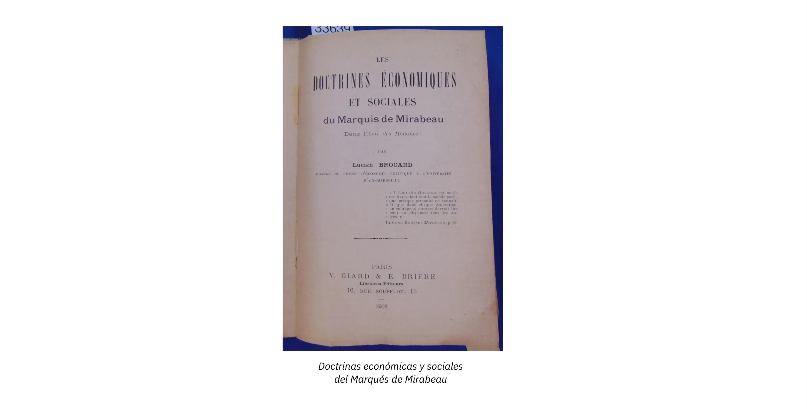

Es Hard etiquetar las opiniones de Mirabeau como liberales o antiliberales. A menudo oscilaba, a veces sin darse cuenta, entre una visión y otra. Sin embargo, las ideas liberales dominaron con frecuencia sus escritos. Una de sus frases más famosas es:

> El verdadero y único principio de la economía política es dejar que todo sea libre.

Con su mayor éxito a sus espaldas, Mirabeau fue cortejado. François Quesnay, que acababa de interesarse por la economía, le invitó a su entresuelo de Versalles.

Debatieron furiosamente y, finalmente, ocurrió algo que normalmente nunca sucede en los debates: Mirabeau admitió rotundamente que se había equivocado. Estuvo de acuerdo con las ideas de Quesnay y dijo que estaba dispuesto a difundirlas.

Juntos formaron el núcleo de lo que se convertiría en la escuela fisiocrática, reforzada por los reclutas regulares que aportaron. Poco después de la conversión de Mirabeau, Quesnay le pidió que defendiera sus ideas sobre la fiscalidad. Esto dio lugar a la ["Teoría de los impuestos"](https://archive.org/details/thoriedelimpot00mira), por la que Mirabeau fue enviado durante unos días a la prisión de Vincennes y luego exiliado a Bignon.

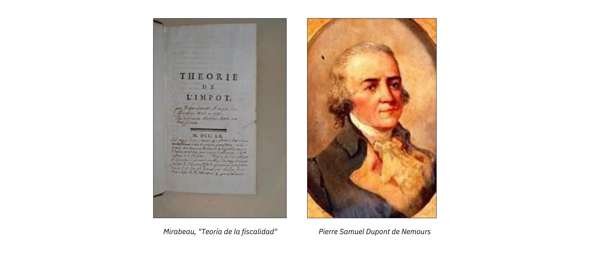

Mirabeau también desempeñó un papel crucial en el reclutamiento de nuevos miembros para la escuela de Quesnay. Incluso convenció al joven Dupont de Nemours.

Fue también en casa de Mirabeau donde los fisiócratas se reunían todos los martes. Personalidades como Turgot y Adam Smith parecen haber asistido a estas reuniones una o varias veces.

Durante toda su vida, Mirabeau fue un escritor incansable. Es autor de numerosas obras económicas que defienden la doctrina de Quesnay. Sin embargo, hacia el final de su vida, su influencia disminuyó. Su estilo se deterioró hasta el punto de que su propio hermano le escribió diciéndole que ya no entendía su prosa. Sus ideas, plenamente liberales, chocaban con la reacción socialista o protocomunista de pensadores como Mably e incluso Rousseau. En 1789, en vísperas de la toma de la Bastilla, murió en gran parte desapercibido.

## Quesnay

<chapterId>7a35f20b-5ea0-544d-b290-bcd9c6f7f11a</chapterId>

François Quesnay es uno de los economistas franceses más famosos.

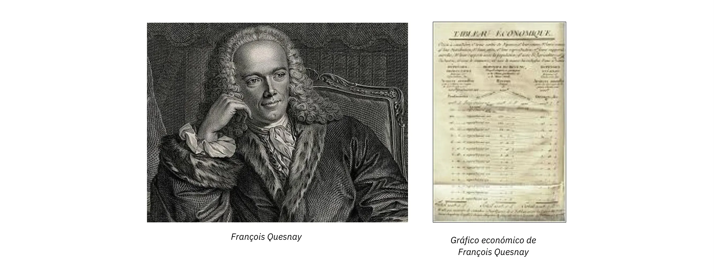

Su nombre figura en todos los manuales de economía y de historia del pensamiento económico. Se afirma que creó el "Tableau Économique" para representar esquemáticamente la economía, que fue el líder de la escuela fisiocrática, que se equivocó al creer que sólo la tierra es productiva y, por último, que Adam Smith vino a poner las cosas en su sitio. Así, más o menos, es como los manuales suelen resumir a François Quesnay.

Reducirlo a esto es una lástima, porque Quesnay fue también el primer economista que intentó basar la defensa de la libertad económica en principios científicos. Fue uno de los economistas más escuchados e influyentes de su época. Además, fundó la fisiocracia, una doctrina mucho más rica que la idea simplista de que sólo la naturaleza produce riqueza, noción que a menudo se tergiversa.

Hablaremos de la fisiocracia con más detalle en los tres próximos capítulos. En primer lugar, echemos un vistazo más de cerca al propio François Quesnay.

Nació en 1694 en Méré, en el seno de una familia campesina que no supo enseñar a Quesnay a leer. Recibió formación de un lugareño y acabó estudiando en el Colegio de Cirugía y luego en la Facultad de Medicina. A los 24 años se convierte en cirujano en Mantes.

Ganó fama en 1730, a los 36 años, por oponerse a la práctica común de la sangría, que en su opinión se basaba en teorías erróneas y prejuicios. También se atrevió a desafiar el sistema de gremios, que dictaba que sólo los cirujanos podían realizar operaciones y sólo los médicos podían recetar medicamentos. Esto obligaba a menudo a los pobres a pagar dos veces y a traer a dos personas, una situación que Quesnay consideraba repugnante.

En 1740 fue nombrado secretario de la Academia de Cirugía. En 1748, a la edad de 54 años, se convirtió en el médico personal de Madame de Pompadour y se trasladó a Versalles.

Estaba muy unido a Madame de Pompadour. Quesnay llegó a decir, en el momento en que se anunció la desgracia de la favorita, que no querría seguir siendo médico en Versalles sin ella:

"Estuve unido a Madame de Pompadour en su prosperidad; lo estaré en su desgracia".

Después publicó varios libros de medicina: Tratado de la supuración (1749), Tratado de la gangrena (1749) y Tratado de las fiebres continuas (1753), todos ellos reimpresos varias veces a lo largo de su vida.

A los 60 años, iniciado en los debates económicos de moda en la época, comienza a escribir sobre economía. En 1755, escribe los artículos "Los campesinos" y "El grano" para la *Encyclopédie*.

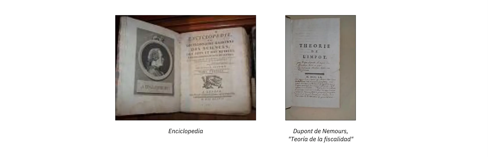

Se publicaron en 1757. Ese mismo año conoció al célebre Mirabeau y logró convertirlo a sus ideas económicas: había nacido el núcleo de la fisiocracia. Quesnay creó entonces el Tableau Économique, que se imprimió en las prensas reales, al parecer en presencia del propio rey en el castillo de Versalles. A partir de entonces, recibía regularmente a economistas y filósofos en su apartamento de Versalles, donde discutían libremente. Quesnay también contribuyó a la Teoría de la fiscalidad de Mirabeau, publicada en 1759.

La censura no tardó en llegar. Mirabeau fue encarcelado y Quesnay amonestado. Después de eso, Quesnay se dio cuenta de que no podía publicar abiertamente y que necesitaría discípulos para difundir sus ideas.

Rápidamente los encontró: Baudeau, Dupont de Nemours, Le Trosne, Mercier de la Rivière y otros. Estos eran los hombres que difundirían y popularizarían el pensamiento de Quesnay. Sin embargo, Quesnay, que necesitaba discípulos, no estaba del todo satisfecho con el aspecto sectario de su grupo. Testigo de ello son sus cartas a Mirabeau, en las que le dice:

> "Pensad por vosotros mismos. Me he dado cuenta de que mis miserables borradores os dan pereza. Ahora os toca pensar a vosotros. Sabéis tanto como yo".

Sin embargo, sus discípulos eran muy devotos y contribuyeron en gran medida a la popularidad de Quesnay. A su muerte, Mirabeau pronunció su panegírico diciendo: "Hemos perdido a nuestro padre, pues se lo debíamos todo". En realidad, era Quesnay quien se lo debía todo a ellos, ya que sin ellos se habría quedado estancado en Versalles, donde su pensamiento, aunque tenía mucho que seducir o preocupar, interesaba a pocos.

Gracias al trabajo de sus colaboradores, sus ideas encontraron una plataforma: primero a través de periódicos como el *Journal of Agriculture* y el *Ephémérides du Citoyen*.

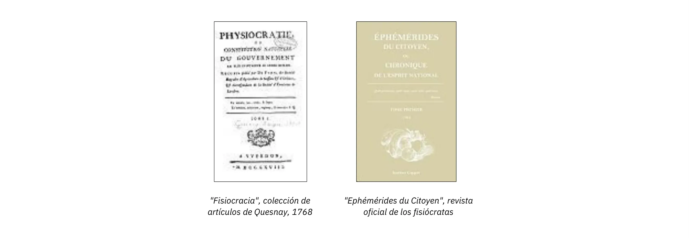

Luego, a través de los libros, no sólo los de sus discípulos, sino también una importante antología publicada en 1768 por Dupont de Nemours, titulada *Fisiocracia*.

Este libro recogía las principales aportaciones de Quesnay. En él se expone el ideal económico del líder de los fisiócratas: un modelo de economía agraria en el que la ley garantiza a todos el derecho a la propiedad y la libertad de comercio.

# La escuela fisiocrática

<partId>27af82c1-ad82-5c3b-8ce9-c674b67bbf7c</partId>

## Historia de los fisiócratas

<chapterId>4236ff8b-b53a-59e7-92c0-f96f9afa1c00</chapterId>

La fisiocracia se puso de moda en Francia, e incluso en toda Europa, durante apenas una década. Tras un largo periodo de desarrollo, cobró protagonismo a mediados de la década de 1760. Cuando Turgot llegó al poder en 1776, el movimiento ya había perdido popularidad, y el ministro mantuvo casi oculto su apoyo a la escuela de Quesnay.

Sus orígenes se encuentran en la evolución de las ideas económicas durante la década de 1750. Varios autores contribuyeron a tender puentes entre Boisguilbert y lo que más tarde se conocería como fisiocracia. Como ya se ha dicho, Vincent de Gournay y su círculo de economistas están detrás de muchas publicaciones que introdujeron a los lectores franceses en el pensamiento económico extranjero y ayudaron a encender su pasión por la economía. Los fundamentos de la fisiocracia ya estaban presentes en libros como "Détail de la France" de Boisguilbert y ["Ensayo sobre la naturaleza del comercio en general"](https://archive.org/details/essaisurlanature0000cant) de Cantillon.

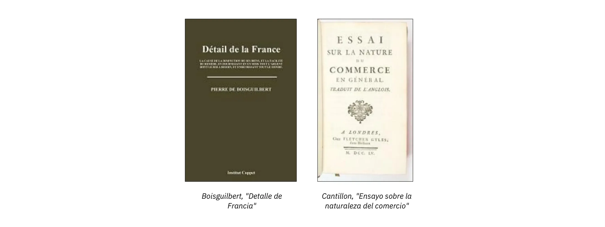

El concepto de laissez-faire tuvo varios defensores desde Boisguilbert, especialmente Vincent de Gournay y el marqués d'Argenson.

Lo que quedaba era convertir este conjunto de ideas en una doctrina coherente y completa, y el marqués de Mirabeau fue el primero en intentarlo. Inspirándose en el Ensayo de Cantillon, comenzó a escribir un tratado exhaustivo sobre asuntos económicos titulado "L'Ami des Hommes", que tuvo mucho éxito.

Así, en 1756, pudo comenzar la historia de la fisiocracia. François Quesnay, entonces cirujano convertido en médico personal de Madame de Pompadour, invitó a Mirabeau a Versalles para discutir ideas económicas.

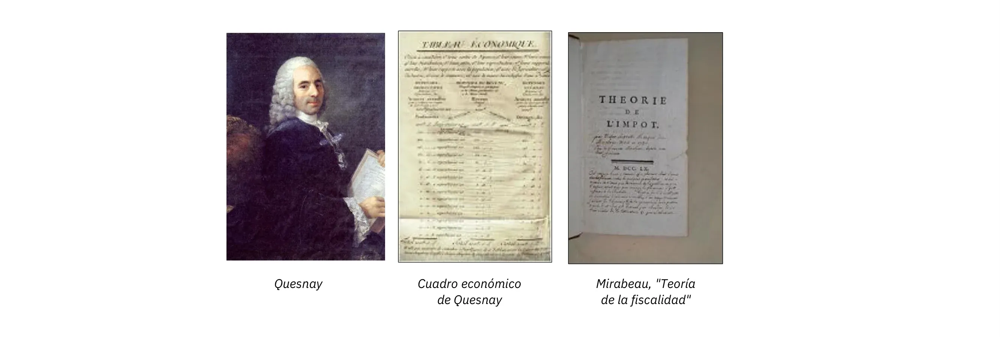

Al final de la conversación, Mirabeau se muestra de acuerdo con las ideas de Quesnay. A partir de entonces, escribieron: Quesnay creó el *Tableau économique* (1758) para ilustrar el flujo de la riqueza en la economía, y juntos publicaron la Teoría de los impuestos (1759).

Sus esfuerzos no fueron bien acogidos. En la corte, la reacción predominante fue la indiferencia. El Rey reconoció la inclinación de Quesnay por la teoría y le llamó cariñosamente "mi pensador". Pero aparte de ese cumplido, su trabajo no obtuvo ningún resultado. De hecho, su Teoría de los Impuestos ofendió a los administradores fiscales a los que criticaba, hasta el punto de que exigieron y consiguieron el encarcelamiento de Mirabeau. Madame de Pompadour acabó liberándolo, pero siguió viviendo en el exilio en su finca de Bignon durante unas semanas.

La primera mitad de la década de 1760 transcurre, pues, en un relativo silencio. Debido a su posición en Versalles, Quesnay se vio obligado a dejar de escribir, o al menos a no publicar nada bajo su propio nombre. Mirabeau, ya condenado en una ocasión, estaba advertido y era muy consciente de que el favorito del rey no podría protegerle eternamente.

Tras este breve silencio, los dos economistas empezaron a reclutar discípulos: era la única manera de popularizar sus ideas. En 1765, sus éxitos son notables. Dupont de Nemours, Abeille, Mercier de la Rivière, Le Trosne y Baudeau se unieron rápidamente a sus filas. Formaron escuela: tenían su propia revista, *Les Éphémérides du Citoyen*, e incluso se reunían todos los martes en casa de Mirabeau.

Entre 1765 y 1775, el grupo unido de los fisiócratas estuvo en la cima de su fama. El mundo literario y filosófico sólo tenía ojos para ellos, lo que permitió que sus ideas se difundieran amplia y rápidamente. La gente les llamaba "los economistas" o, más burlonamente, "la secta de los economistas". Independientemente del tono, su notoriedad era absoluta. En 1774, tras un viaje a Metz, M. de Vaublanc escribió en sus memorias su asombro: todo el mundo a su alrededor hablaba de economía y razonaba como los discípulos de Quesnay. "Estaba de moda", señala. "Todo el mundo era economista".

Sin embargo, hacia 1770, su popularidad empezó a decaer. El grupo experimentó sus primeras deserciones y su capacidad para resistir las críticas se debilitó. Condillac, Mably, Voltaire, Galiani, Linguet, Graslin, e incluso Adam Smith en Escocia, cuestionaron sus puntos de vista.

Su periódico dejó de publicarse con regularidad. Es el fin del periodo más activo del movimiento.

La fisiocracia seguiría ejerciendo su influencia hasta la Revolución. En Francia, primero a través de Turgot, más compañero de viaje que discípulo, así como de su representante Dupont de Nemours, cuya vida y obra estudiaremos más adelante. Pero también en toda Europa, donde la doctrina fisiocrática fue recibida con entusiasmo. En Alemania, a través del Margrave de Baden, y en Italia, a través de Leopoldo de Toscana, las teorías fisiocráticas inspiraron incluso reformas económicas favorables a la propiedad privada y a la libertad.

## Los fundamentos de la doctrina de los fisiócratas

<chapterId>4dbe5436-0578-57c2-b054-03ed00aa091a</chapterId>

El término fisiocracia, que significa "gobierno por la naturaleza", fue acuñado por Dupont de Nemours y utilizado como título de *Fisiocracia*, una colección de artículos de Quesnay publicada en 1768.

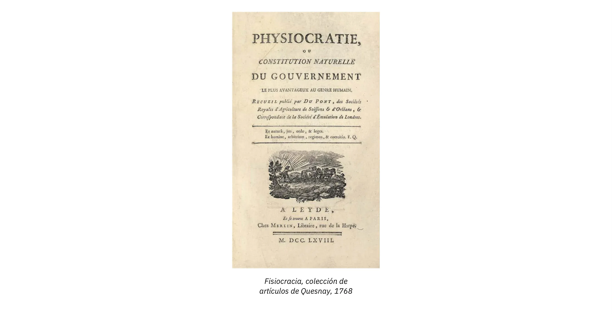

Se trata de una frase oscura. Ningún estudioso de Quesnay nos ha proporcionado su verdadero significado. Sin embargo, su sistema de pensamiento distaba mucho de ser oscuro. De hecho, estaba construido en torno a unos pocos principios muy claros, que esbozaremos aquí.

### Primer principio: sólo la agricultura es productiva

Esta primera idea es la que ha llamado la atención de los historiadores. Hoy, en los libros de texto o en los cursos de economía, así es como se resume a los fisiócratas. Se dice que creían ingenuamente que sólo la agricultura es productiva. Sobre esta base, su doctrina se descarta por irrelevante y el análisis pasa rápidamente a Adam Smith.

Sin embargo, es injusto criticar a los fisiócratas por dar una importancia desproporcionada a la agricultura, ya que a mediados del siglo XVIII la agricultura empleaba al 90% de la población y constituía la base de la economía francesa.

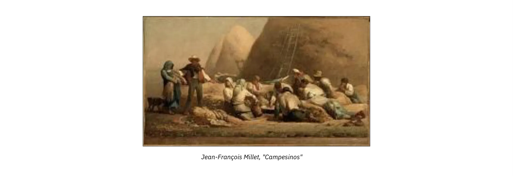

La idea de los fisiócratas es en realidad sutil. Según ellos, hay una diferencia entre producción y ganancia. El industrial y el comerciante pueden obtener beneficios, pero sólo el agricultor produce de verdad, porque la producción es la creación de material útil, más que la adición de utilidad a un material preexistente.

También debemos intentar comprender por qué rechazaban la industria y la artesanía por improductivas. En aquella época, estos oficios estaban encerrados en el sistema gremial, que prohibía la innovación, la inversión y el progreso.

### Segundo principio: despotismo legal en lugar de democracia

Hoy, para insultar a alguien, decimos que no es demócrata. Aunque los historiadores perdonan a los fisiócratas su estricta visión de la productividad agrícola, no perdonan su oposición a la democracia, sobre todo porque vivieron durante el apogeo de las ideas de la Ilustración. Desde mediados del siglo XVIII hasta poco antes de la Revolución, los fisiócratas fueron considerados enemigos del progreso.

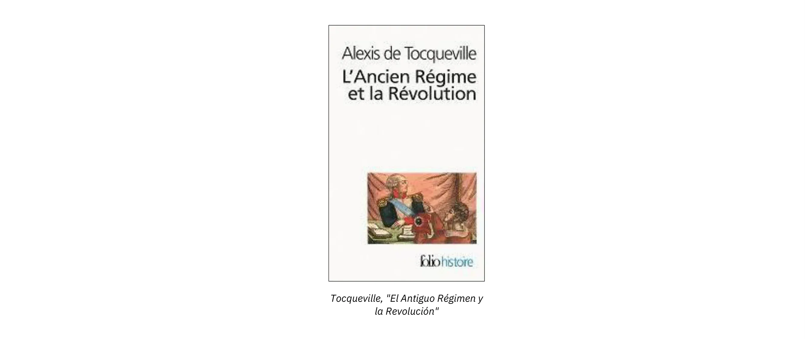

Tocqueville insistió en esta idea:

> Los fisiócratas eran, en efecto, muy favorables al libre comercio de mercancías, al laissez-faire o laissez-passer en el comercio y la industria; pero en cuanto a las libertades políticas propiamente dichas, no las consideraban, e incluso cuando tales ideas se les pasaban por la cabeza, las rechazaban inicialmente.

Liberales en economía, los fisiócratas no lo eran en política. Quesnay escribe en sus *máximas*: "Que la autoridad soberana sea única y superior a todos los individuos de la sociedad y a todas las empresas injustas de los intereses privados" Y más adelante, en la misma máxima: "El sistema de frenos y contrapesos en el gobierno es una noción fatal, que sólo revela discordia entre los grandes y opresión de los pequeños".

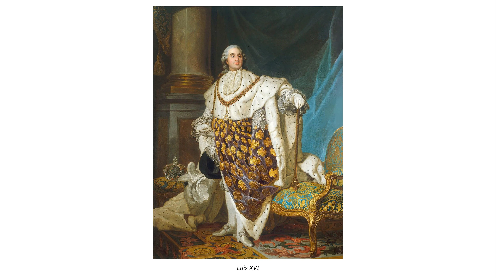

Tocqueville señaló acertadamente que los fisiócratas rechazaban la democracia en cuanto veían sus formas. Se mostraban escépticos ante la democracia, que se convertiría en una constante de la economía política francesa, porque dista mucho de ser un sistema perfecto: permite potencialmente la opresión de las minorías por la mayoría y puede convertirse en una herramienta de usurpación, tiranía y expolio.

### Tercer principio: respeto absoluto de la propiedad privada

Los fisiócratas creían que las personas debían poseer y conservar los resultados de su trabajo. En su opinión, los derechos de propiedad eran la base de la sociedad. Pensaban que el Estado tenía una misión principal: proteger la propiedad de las personas. Además, desde un punto de vista económico, los fisiócratas afirman que la inviolabilidad de la propiedad fomenta el trabajo y el esfuerzo y es una condición para el progreso económico.

Quesnay lo dijo simplemente:

> Que se asegure la Ownership de la tierra y de la riqueza mobiliaria a quienes son sus legítimos poseedores, pues la seguridad de la propiedad es el fundamento esencial del orden económico y de la seguridad de la sociedad; es la certeza de la posesión permanente lo que estimula el trabajo y el empleo de la riqueza en la mejora y el cultivo de la tierra, así como en las empresas comerciales e industriales.

### Cuarto principio: libertad absoluta de comercio

En sus *Maxims* anteriormente citadas, Quesnay afirma:

> Que haya completa libertad de comercio, pues la regulación más fiable, precisa y beneficiosa del comercio interior y exterior para la nación y el Estado reside en la plena libertad de competencia.

Los fisiócratas habían visto los perjuicios causados por la injerencia gubernamental, especialmente en el comercio de cereales. Hay que reconocer, dicen, que la autoridad nunca será capaz de gestionar el comercio tan bien como lo hacen los particulares, porque tendría que responder a cada necesidad y reaccionar a cada cambio en la demanda o en el Supply. Todo esto está muy por encima de las capacidades incluso del gobierno más sabio que se pueda concebir. Todo esto está muy por encima de las capacidades del gobierno más sabio que se pueda concebir. Por lo tanto, hay que dejar que las cosas sean y fluyan.

Beneficioso por naturaleza, el comercio debe ser total y perfectamente libre. Uno de sus miembros, Le Trosne, escribió incluso un panfleto titulado [*La libertad del comercio de cereales: siempre útil, nunca perjudicial*](https://www.institutcoppet.org/liberte-commerce-grains-toujours-utile-jamais-nuisible/).

### Quinto principio: Todos los hombres son hermanos

Férreos opositores a la esclavitud, los fisiócratas eran también grandes pacifistas. "Nuestra política exterior se llama paz", se limita a decir Mirabeau. En 1790, en la Asamblea Constituyente, Dupont de Nemours continuó esta postura pacifista al proponer un proyecto de ley que prohibía las guerras ofensivas.

## Logros e influencias de los fisiócratas

<chapterId>5b911105-796a-5e2e-a501-c7a364fc758e</chapterId>

Como vimos en el primero de los tres capítulos dedicados a los fisiócratas, los seguidores de Quesnay hicieron furor en Francia durante aproximadamente una década. Este entusiasmo por sus ideas se manifestó tanto en su época como hasta finales de siglo. Aquí examinaremos algunos de sus logros y la influencia que ejercieron sobre sus sucesores en el ámbito del pensamiento económico.

Su mayor logro, tras el grupo de Gournay, fue popularizar las ideas económicas. Es conocida la famosa frase de Voltaire: hacia 1750, la nación, saciada de poesía y novelas, empezó a razonar sobre el grano. Los fisiócratas participaron en este movimiento, publicando literalmente cientos de artículos, folletos y libros sobre la libertad del comercio de cereales. El fuerte impulso dado por los fisiócratas a las discusiones económicas también queda patente en el impresionante número de obras y panfletos económicos publicados en Francia entre 1760 y 1775. Como prueba adicional de la difusión de las ideas económicas en Francia, cabe recordar la observación del Sr. de Vaublanc, citada en una conferencia anterior, quien dijo en Metz en 1774 que la gente no hablaba de otra cosa que de economía. "Era la moda", decía. "Todo el mundo era economista".

La defensa de sus ideas, en libros, folletos y en su revista *Les Éphémérides du Citoyen*, tuvo rápidamente repercusiones en la política económica de Francia. En 1763, un edicto concedió la libertad del comercio de cereales, que Quesnay y Mirabeau habían reclamado con insistencia. En varias ocasiones, las autoridades suavizaron también la reglamentación de los gremios para garantizar una mayor libertad de trabajo.

En el extranjero, el éxito llegó muy pronto. En Alemania, el margrave de Baden se interesó por las ideas fisiocráticas y mantuvo una correspondencia regular con Mirabeau y Dupont de Nemours.

Encargó al economista Johann August Schlettwein, un fisiócrata convencido, que llevara a cabo una reforma fiscal y liberalizara el comercio de cereales. En abril de 1770 tuvo lugar un primer ensayo en el pequeño pueblo de Dietlingen. Al parecer, los aldeanos acogieron las medidas con entusiasmo, pero los funcionarios responsables no se mostraron muy partidarios, lo que retrasó una aplicación más amplia.

En Rusia, Catalina II prepara una reforma legislativa y pide a Diderot que le envíe una mente brillante para ayudarla.

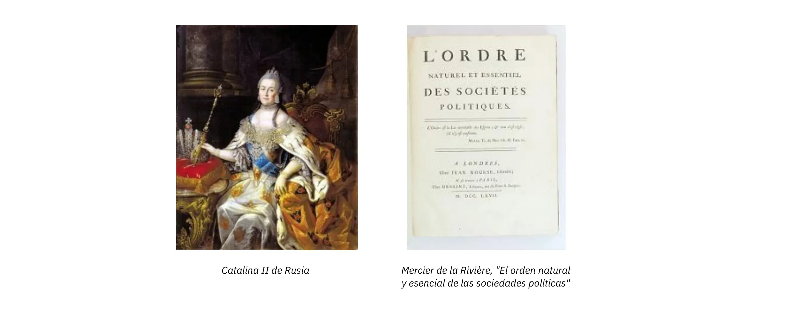

Impresionado por la lectura de [*El orden natural y esencial de las sociedades políticas*](https://archive.org/details/lordrenaturelete00mercuoft), publicado en 1767, le envió a su autor, el fisiócrata Mercier de la Rivière.

Aunque salió de Francia celebrado, su acogida en San Petersburgo fue fría (clima aparte), y la Emperatriz se sintió decepcionada con él.

En Suecia, con Gustavo III, y en Italia, con Leopoldo de Toscana, los fisiócratas también encontraron seguidores dispuestos a poner en práctica sus ideas.

En Francia, los fisiócratas obtienen un éxito espectacular con el nombramiento de Turgot como Interventor General de Finanzas en 1774.

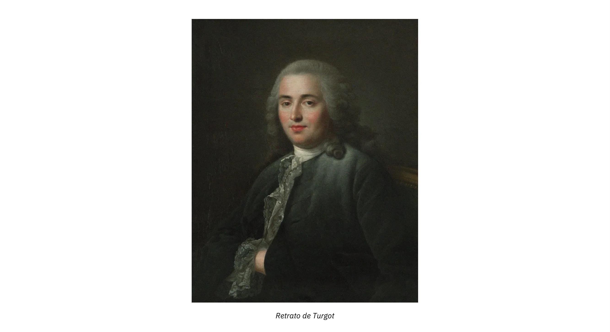

Consciente del declive de su fama, Turgot nunca se presentó como un fiel discípulo de los fisiócratas, ni tampoco como un enciclopedista, aunque lo era, y puesto que eran despreciados por los miembros del Clero. Una vez en el poder, Turgot promulgó seis famosos edictos que constituyeron el inicio de una aplicación práctica del programa fisiócrata: libertad de comercio, libertad de trabajo y fin de los monopolios.

En la época de la Revolución Francesa, los fisiócratas tenían menos seguidores. El marqués de Mirabeau murió el 13 de julio de 1789, todo un símbolo. Abeille se había marchado, pero Dupont de Nemours permaneció fiel. Nombrado miembro de la Asamblea, Dupont de Nemours llevó la voz de la fisiocracia y abogó por reformas económicas en favor de la propiedad Ownership y el libre comercio.

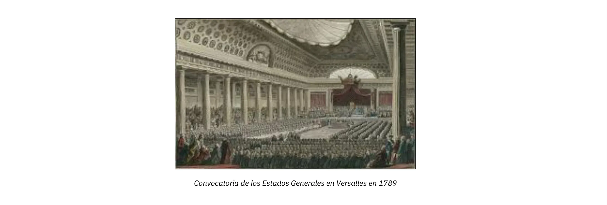

También luchó, sin éxito, contra los assignats. A pesar de este fracaso, el pensamiento fisiocrático siguió muy presente en el debate intelectual e influyó en los primeros logros de la Revolución. Como dijo Joseph Rambaud, todo lo que la Revolución hizo en favor de las libertades se debió a los fisiócratas.

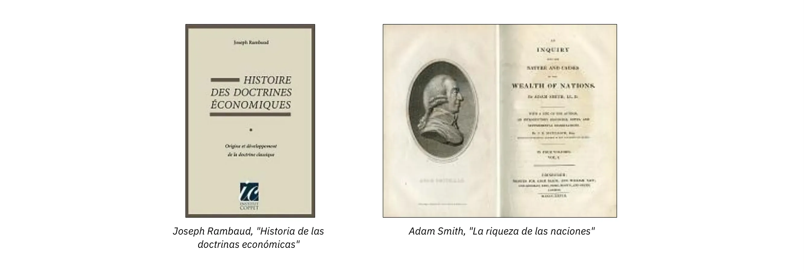

Los fisiócratas también ejercieron una gran influencia en la historia del pensamiento económico. Adam Smith, que visitó Francia y conoció a muchos de ellos, se sintió profundamente influido por su obra. Incluso pensó en dedicar *La riqueza de las naciones* a Quesnay.

Lamentablemente, Quesnay murió dos años antes de que se publicara el libro de Smith, y éste eliminó la dedicatoria. Aunque Smith no estaba de acuerdo con su idea de que sólo la agricultura era productiva, hizo suyos muchos de sus argumentos a favor del libre mercado y los trasladó a su propia obra.

## Dupont de Nemours

<chapterId>6d585e0f-93b8-5b0a-a0a8-7f6e4a5bc68e</chapterId>

En Estados Unidos conocemos la empresa DuPont, también conocida como "E.I. du Pont de Nemours and Company", una multinacional del sector de la química y la biología.

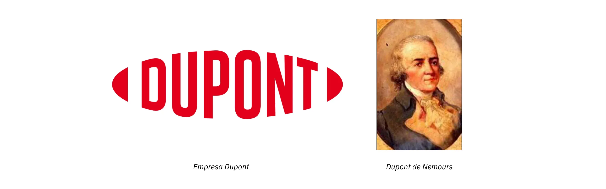

Hoy tiene unas ventas de más de 35 billones de dólares y emplea a casi 65.000 personas en todo el mundo. Resulta que esta empresa está estrechamente ligada al destino de Samuel-Pierre Dupont de Nemours, economista francés de la escuela fisiocrática.

Nacido en 1739, Dupont de Nemours se acercó a los fisiócratas a los 24 años. Por aquel entonces, aún estaba buscando su camino en la vida. Un día se encontró con un breve panfleto titulado La riqueza del Estado. Sus ideas económicas le parecieron disparatadas y escribió una respuesta crítica titulada Reflexiones sobre la riqueza del Estado, publicada en 1763. La obra fue bien recibida, y los lectores la elogiaron, diciendo cosas como: "¡Debes de ser discípulo de Mirabeau!" Irónicamente, Dupont ni siquiera sabía quién era Mirabeau.

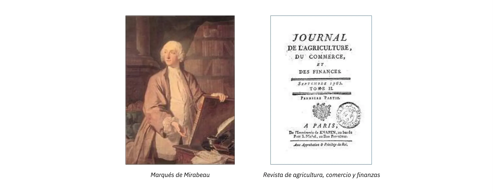

Curioso, comienza a leer las obras de Mirabeau, *Amigo del Pueblo* y *Teoría de los Impuestos*. Conoce a Mirabeau y a François Quesnay, y se une a su escuela.

En 1765, Dupont recibe la oferta de ser redactor jefe del *Journal de l'agriculture, du commerce et des finances*, la principal publicación periódica de su época en el ámbito del pensamiento económico.

Había dos razones para ello: Mirabeau y Quesnay tenían que permanecer en silencio, y Dupont era visto como su estrella en ascenso.

Los miembros de la escuela fisiocrática coinciden en que Dupont de Nemours se convirtió rápidamente en el favorito de Quesnay. Quesnay dijo una vez: "Cuida de este joven, será él quien hable cuando hayamos muerto". Uno de sus compañeros, Abeille, llegó a sentir celos de la atención que recibía Dupont y se distanció de la escuela de Quesnay.

Dupont de Nemours siempre mantuvo su alta estima por Quesnay.

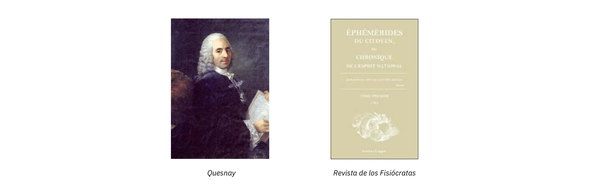

Más tarde diría: "No era más que un niño cuando Quesnay me tendió sus brazos; él me hizo un hombre" Fue Quesnay quien le convirtió en un economista importante en el panorama literario de la época.

Tras el *Journal de l'agriculture, du commerce et des finances*, Dupont fue nombrado redactor jefe de *Les Éphémérides du Citoyen*, que se convirtió en el órgano oficial de los fisiócratas.

Hizo de esta colección periódica un importante centro de teoría económica, apoyándola incluso durante el declive de los fisiócratas al escribir personalmente casi todos los volúmenes posteriores. Fue Dupont de Nemours, además, quien acuñó el término "fisiocracia", derivado de dos palabras griegas que significan "gobierno de la naturaleza". Utilizó este término para titular una colección de artículos de Quesnay publicada en 1768, y el término acabó imponiéndose en la historia. Se sabe que, entre ellos, los fisiócratas se llamaban "economistas", y así se les siguió llamando durante la Revolución.

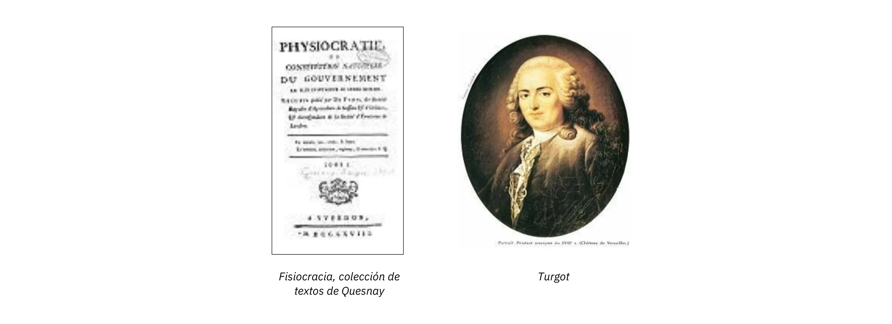

Cuando Turgot ocupó brevemente el cargo de ministro de Finanzas de Francia, Dupont se convirtió en su consejero más cercano, el único fisiócrata con acceso a él, ya que Turgot mantenía las distancias con los demás.

En la época de la Revolución, fue elegido por la bailía de Nemours y se encontró en la Asamblea, donde también estaba sentado otro Monsieur Dupont. Se le llamó entonces Dupont de Nemours, no porque fuera noble, sino simplemente para distinguir a ambos. El nombre, por supuesto, permaneció.

Durante la Revolución, en agosto de 1792, tomó las armas para defender al rey en el palacio de las Tullerías contra la muchedumbre.

El Rey le dijo: "Monsieur Dupont, siempre le encontramos donde se le necesita" Tras escapar milagrosamente del Terror, condenado y a la espera de la guillotina pero salvado por la caída de Robespierre, fue empujado al exilio bajo Napoleón y encontró la felicidad en Estados Unidos, donde uno de sus hijos fundó, con la ayuda de su padre, la empresa Dupont.

A pesar de su agitada vida, en la que publicó decenas de artículos, folletos y libros, sigue siendo relativamente poco conocido. Tal vez se debiera a que siguió siendo un fisiócrata acérrimo cuando la doctrina había pasado de moda. De hecho, como escribió Schumpeter, Dupont de Nemours se mantuvo fiel a la fisiocracia "a lo largo de una carrera en la que tuvo muchas oportunidades de renunciar a ella". Era un hombre de convicciones.

# Ilustración y economía política

<partId>d1c885ad-7cb1-5f81-816c-be312719d9f8</partId>

## Voltaire y los filósofos

<chapterId>16bcf7bf-dad4-5113-8c64-2800f04ff07b</chapterId>

En el siglo XVIII surgió en Francia la economía como ciencia y la primera escuela de pensamiento económico: La fisiocracia. Adam Smith se formó en economía durante este periodo, y los economistas franceses fueron reconocidos mundialmente como líderes. Sin embargo, este siglo se recuerda más como el siglo de la filosofía que de la economía. Aunque el movimiento fisiocrático se alineaba, en sus ambiciones, con la filosofía de la Ilustración, las actitudes de los filósofos -especialmente Diderot y Voltaire- merecen un examen detenido. Veremos que los pensadores de la Ilustración contribuyeron significativamente a difundir la idea del laissez-faire en Francia.

El logro más famoso de la filosofía de la Ilustración es sin duda la *Encyclopédie* de Diderot y d'Alembert.

Naturalmente, los artículos económicos fueron escritos por economistas. Para los primeros volúmenes, Diderot recurrió a Forbonnais, luego a economistas liberales: primero François Quesnay (que contribuyó con artículos como "Grains", "Fermiers", "Hommes" -este último inédito-), luego Turgot (que escribió "Foires et marchés"). Estos escritos son de gran importancia. En sus artículos, Quesnay sentó las bases de lo que se convertiría en la doctrina fisiocrática. Junto con su *Tableau économique*, siguen siendo sus obras más famosas. Turgot, aún joven en aquella época, desarrolló en su artículo la idea del laissez-faire, criticando la intervención del Estado en la organización del mercado.

En muchos otros artículos de la *Encyclopédie*, los filósofos, especialmente Diderot, defienden el ideal de libertad en todos los ámbitos: religión, política y economía.

La libertad de trabajo, especialmente en oposición al sistema gremial, fue un tema recurrente en varias entradas como Arts, Métier y Communauté.

La trayectoria de Diderot en teoría económica es curiosa. En la Encyclopédie, fue un firme defensor de la libertad económica y fue él quien buscó la colaboración de los economistas liberales, como confirma una carta en la que esboza los artículos que Turgot podría escribir para él. En los primeros años de la fisiocracia, fue a la vez partidario y promotor de la escuela de Quesnay. En 1769 y 1770, escribió para *Les Ephémérides du Citoyen*, para gran consternación de sus amigos filósofos antiliberales, como Melchior Grimm; sin embargo, pronto se distanció del grupo. Entusiasmado por el vibrante intelecto del abad Galiani, le ayudó a publicar en francés su libro sobre el comercio de cereales, justo cuando Galiani estaba a punto de regresar a Italia.

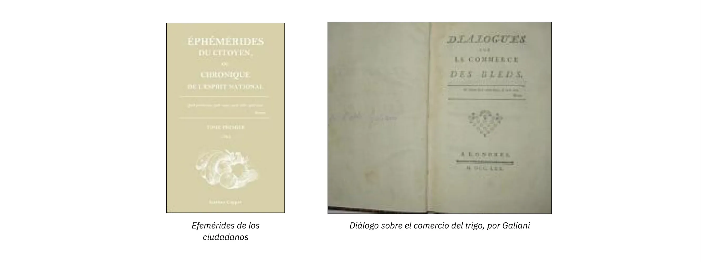

Este libro se convertiría en el ataque más feroz jamás realizado contra las ideas fisiocráticas, asestando un duro golpe al movimiento. Más tarde, Diderot defendió a Galiani frente al abad Morellet, estrecho aliado de los fisiócratas, en su *Apología de Galiani*. Unos años más tarde, durante el ministerio de Turgot, se vio a Diderot aplaudiendo el establecimiento de la libertad de trabajo mediante la abolición de los gremios. En ese momento, Diderot, hijo de artesano, se encontró de acuerdo con los economistas liberales y escribió una carta mordaz a Galiani, quien afirmaba que la libertad del trabajo arruinaría la industria francesa en veinte o treinta años. A la luz de la Revolución Industrial, la historia sugiere lo contrario. Tras volver al bando de los economistas liberales, Diderot dejó de gozar de su confianza y permaneció aislado. Un momento muy revelador es una carta que envió a Dupont de Nemours en 1774, donde escribe:

> "Antes me tenías amistad; ahora ya no, porque estás tan ocupado que ya no tienes tiempo para querer a nadie".

Voltaire siguió un camino similar, marcado por la falta de coherencia en sus opiniones económicas. Admiraba a Vincent de Gournay, mantenía correspondencia con economistas (Dupont de Nemours y Turgot, entre otros) y apreciaba a los fisiócratas, sobre todo por sus elogios a la agricultura. Los alabó en una *Diatriba al autor de las Efemérides*. Sin embargo, más tarde criticó su idea de un impuesto único sobre la tierra en su obra satírica *El hombre de las cuarenta coronas*, que también suscitó una gran polémica. Por último, al igual que Diderot, celebró el ministerio de Turgot, calificándolo de edad de oro y alabando sus dos grandes decretos sobre la libertad de trabajo y el libre comercio.

Al final, la relación de los philosophes con el pensamiento económico es mixta. A pesar de sus alabanzas y críticas a las ideas económicas liberales, desempeñaron un papel en la incorporación de estas ideas al discurso intelectual más amplio de la Ilustración. De este modo, intencionadamente o no, contribuyeron a hacer avanzar la noción de laissez-faire hasta la Revolución.

## Turgot, el teórico

<chapterId>a8cd8185-8351-556b-8011-3a0c313e8a9d</chapterId>

En un famoso pasaje de su *Historia del pensamiento económico*, el economista estadounidense Murray Rothbard alabó lo que llamó la "brillantez" de Turgot.

presentándolo como el mayor economista del siglo XVIII, junto con Cantillon.

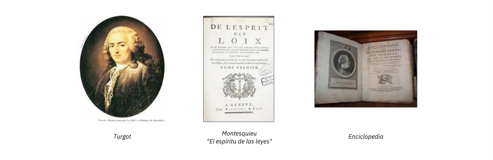

¿Cómo llegó Turgot a ser tan importante? Se debe a una combinación de tres factores clave. **En primer lugar, su prestigioso entorno familiar. Procedía de una larga estirpe de administradores reales, muchos de los cuales ocupaban altos cargos en el gobierno. **En segundo lugar, la edad de oro en la que nació y creció. Turgot tenía 21 años cuando Montesquieu publicó *L'Esprit des Lois*, y 24 cuando apareció el primer volumen de la *Encyclopédie*.

Fue contemporáneo de los fisiócratas, Voltaire, Diderot, d'Holbach, Adam Smith, Condorcet y otros. **En tercer lugar, su precocidad intelectual.** Siendo estudiante en la Sorbona, escribió a los 22 años una carta sobre el papel moneda, pronunció notables discursos y a los 24 compuso una lista de 52 obras por escribir.

A pesar de su juventud, Turgot colaboró en la *Encyclopédie*, escribiendo artículos sobre temas como "Etimología", "Existencia", "Expansibilidad", "Ferias" y "Fundaciones". Sólo un artículo se refería directamente a la economía: "Las ferias", en el que detallaba los orígenes de las ferias y los mercados y criticaba la creciente injerencia del Estado, que los perturbaba y paralizaba.

Durante estos primeros años, tuvo como mentor a Vincent de Gournay, quien le acogió bajo su protección y entabló con él una estrecha amistad. A la muerte de Gournay en 1759, Turgot compuso un panegírico en el que ofrecía un magnífico resumen de la doctrina del laissez-faire. En particular, escribió

"Desde cualquier perspectiva en la que el comercio pueda concernir al Estado, el interés individual dejado a sí mismo producirá siempre con mayor seguridad el bien general que las operaciones del gobierno, que son siempre defectuosas y necesariamente guiadas por una teoría vaga e incierta".

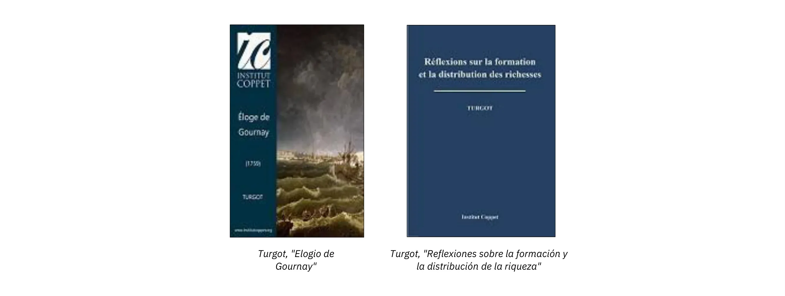

En 1767, siendo intendente, compuso un compendio de economía bajo el título de *Reflexiones sobre la formación y distribución de la riqueza*.

División del trabajo, soberanía del consumidor, propiedad privada, papel del capital... se abordan prácticamente todos los grandes temas económicos. Muchos historiadores, la más reciente la historiadora Anne-Claire Hoyng, han señalado las similitudes entre esta obra de Turgot y *La riqueza de las naciones* de Adam Smith, publicada nueve años más tarde.

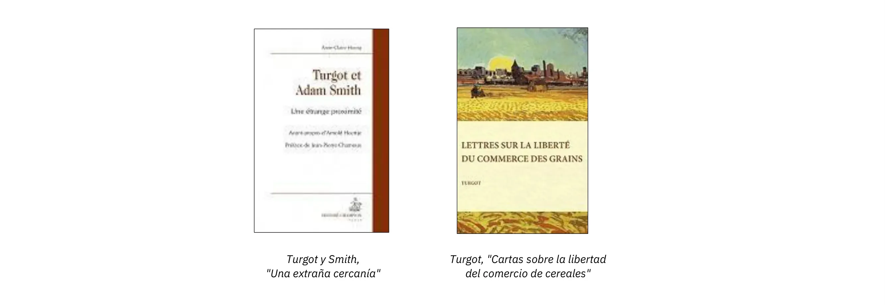

Turgot defendió la libertad del comercio de cereales en cartas al abad Terray, comunicadas más tarde al rey, pero la mitad de las cuales se han perdido. Escribía:

> Señor, si algo es urgente, no es imponer nuevas restricciones al más esencial de todos los oficios, sino eliminar las que, por desgracia, se ha permitido que permanezcan.
> Si alguna vez ha habido un momento en que era necesaria la libertad más plena y absoluta, completamente libre de cualquier tipo de obstáculo, me atrevo a decir que es ahora, y que nunca ha sido menos oportuno considerar la posibilidad de dictar un reglamento sobre el comercio de cereales.

En 1769, Turgot escribió el artículo Valor y dinero para el *Dictionnaire de Commerce* del abad Morellet, que finalmente nunca se publicó. Galiani ya había señalado que "el hombre es la medida común de todas las cosas", anticipando el análisis subjetivo que Turgot desarrollaría treinta años más tarde en este artículo, donde amplía y demuestra esta proposición.

En 1770, mucho antes que Bentham, Turgot escribió un memorándum en el que abogaba por la libertad de los tipos de interés y la usura.

"Es un error creer que el interés del dinero en el comercio deba ser fijado por las leyes de los príncipes", dice, "Es un precio corriente que se regula a sí mismo, como el de todas las demás mercancías", En defensa de esta posición, refuta la oposición de Aristóteles y de los Padres de la Iglesia.

Un resumen notable de la doctrina laissez-faire de Turgot se encuentra en una carta olvidada de 1773 al abad Terray sobre el marcado de los hierros:

> Lo que la política debe hacer es ceder al curso de la naturaleza y al curso del comercio, que no es menos necesario ni menos irresistible que el curso de la naturaleza misma, sin intentar dirigirlo; porque para dirigirlo sin perturbarlo y sin perjudicarse a sí mismo, habría que ser capaz de seguir todas las variaciones de las necesidades, los intereses y la industria humanos; habría que conocerlos con un nivel de detalle que es físicamente imposible obtener, y en el que incluso el gobierno más hábil, activo y meticuloso correrá siempre el riesgo de equivocarse, al menos a medias.

Aquí encontramos una declaración muy clara de la doctrina del laissez-faire, así como un presagio del análisis de Friedrich Hayek sobre la pretensión de conocimiento, es decir, la imposibilidad de que un Estado comprenda plenamente las fuerzas económicas para controlarlas.

## Turgot, el reformador

<chapterId>9177429f-1679-51c4-bfd2-dd036d24a1cc</chapterId>

Como hemos recordado brevemente en el capítulo anterior, Turgot era hijo de una familia prominente que se había distinguido en los altos rangos de la función pública francesa.

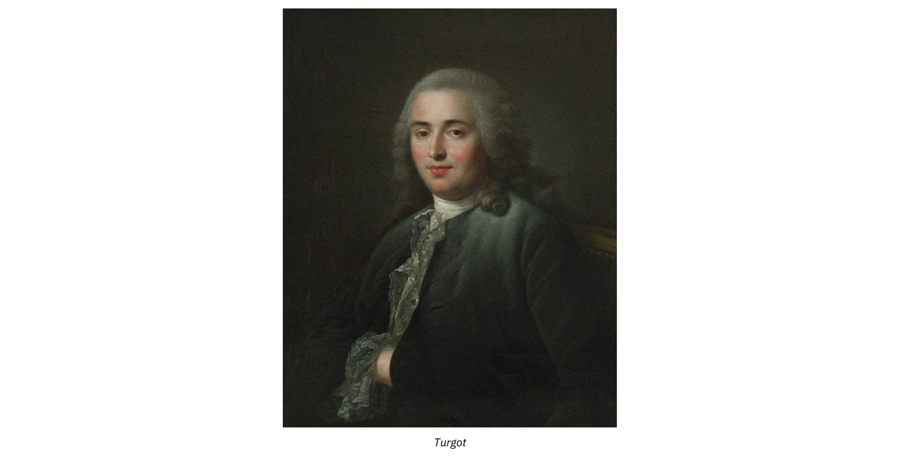

Su padre había sido preboste de los comerciantes de París y su abuelo, intendente. Tras sobresalir en sus estudios, el menor de los Turgot se propuso alcanzar al menos esas mismas cotas. Primero ejerció durante un tiempo de maître des requêtes, es decir, de enlace entre los intendentes y Versalles. Era un puesto prestigioso, para el que tuvo que obtener una exención especial por edad, pero Turgot aspiraba a más. La muerte de su mentor, Gournay, le animó aún más a aspirar a más, y solicitó ser nombrado intendente.

En 1759, solicita por primera vez la intendencia de Grenoble, pero le es denegada. Se le ofreció entonces el cargo de preboste de los comerciantes de Lyon, que rechazó. Solicitó la intendencia de Bretaña, pero también le fue denegada. Finalmente, en 1761, se le ofrece la intendencia de Lemosín, que acepta a regañadientes. Escribe a Voltaire: "Tengo la desgracia de ser intendente", tal vez queriendo decir: Tengo la desgracia de ser intendente de Lemosín".

En Lemosín, los campesinos eran pobres y vivían en condiciones precarias, sobre todo en cuanto a vivienda y alimentación. El nivel general de educación era extremadamente bajo. Las pocas carreteras que existían estaban en un estado desastroso.

Como la región era tan pobre, no interesaba a los ministros. Esto dio a Turgot libertad para experimentar reformas. En Lemosín lleva a cabo tres grandes proyectos:

- La redistribución del **taille**, el impuesto personal (Turgot pretendía introducir la mayor objetividad posible en su evaluación).
- La **corvée**, una forma de impuesto pagado en mano de obra, en la que se obligaba a los campesinos a trabajar en la construcción de carreteras. Al recorrer la región, Turgot no tardó en darse cuenta del mal estado de las carreteras. Sustituyó la **corvée** por un impuesto monetario.
- El reclutamiento de **milicias**, ejércitos campesinos movilizados en tiempos de guerra.

Esto se hacía por sorteo, lo que provocaba miedo y violencia a causa de los fugitivos; Turgot sustituyó estas levas obligatorias por voluntarios remunerados.

Estas reformas tuvieron un éxito innegable y, en julio de 1774, Turgot fue nombrado ministro. Debido a su falta de experiencia, el Rey lo colocó primero en el Ministerio de Marina. El nombramiento divirtió a muchos. El propio Turgot admitió: "No sé nada de la Marina", y Voltaire comentó: "No creo que Turgot sea más marino que yo".

Un mes más tarde, sin embargo, Turgot es nombrado Interventor General de Finanzas, convirtiéndose así en Ministro de Economía y Hacienda de Francia.

Conocemos la carta en la que expuso sus principios a Luis XVI: "Nada de quiebras. Ninguna subida de impuestos. Ningún nuevo préstamo". Esta filosofía, que hoy los críticos podrían tachar de "rigor" inútil, pretendía salvar la monarquía.

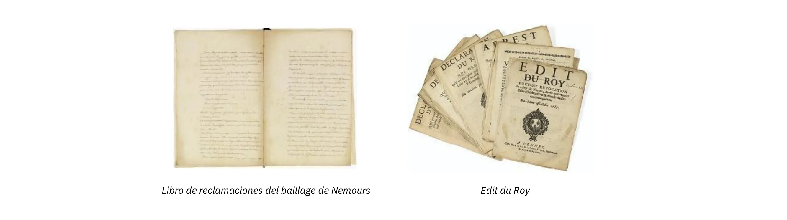

Turgot prepara seis edictos reales para reformar la economía francesa.

Fue la primera -y una de las últimas- vez que se concedió a un experto económico la libertad de reformar la economía de su país. Destacan tres edictos de Turgot: uno abolía el trabajo forzado (corvées), otro disolvía los gremios (corporaciones) y el tercero establecía el libre comercio de cereales.

Al acceder al ministerio, Turgot sabía que se enfrentaría a la resistencia de las clases privilegiadas. "Seré temido, incluso odiado, por la mayoría de la corte y por todos los que buscan favores", le dijo al Rey. Los privilegiados no tardaron en unirse contra él y provocaron su destitución del cargo de Interventor General de Finanzas. Voltaire, que apoyaba plenamente las reformas de Turgot, escribió en su correspondencia:

> ¡Ah! ¡Qué noticias tan terribles he oído! ¿Qué será de nosotros? Estoy desolado Nunca nos recuperaremos de haber presenciado el nacimiento y la muerte de la edad de oro Este rayo ha golpeado tanto mi mente como mi corazón.

Desde entonces, muchos han sostenido que Francia es un país imposible de reformar. El fracaso de Turgot pareció confirmarlo: Había sido preparado por medio siglo de pensamiento económico liberal; contaba con el respaldo de los filósofos de la Ilustración; y el propio Rey, con poder absoluto, le apoyaba.

Al final, los parlamentos y las clases privilegiadas se impusieron. Todo lo que el Rey pudo hacer fue lamentarse en privado: "Ahora veo que sólo Monsieur Turgot y yo nos preocupamos por el pueblo"

## Condillac

<chapterId>0ba8dbb5-dcd5-5981-bf85-6c185e0bf192</chapterId>

Al igual que el mercantilismo, que es su manifestación práctica más evidente, el sofisma de Montaigne tardó mucho tiempo en desaparecer.

Ese sofisma es la idea de que el comercio y Exchange son juegos de suma cero. Lo que una parte gana en una transacción lo pierde necesariamente la otra. Sus partidarios sostienen que esto es cierto tanto entre individuos como entre naciones.

El abad de Condillac desempeñó un papel fundamental en el desmantelamiento definitivo de esta falsa idea.

"Definitivamente" es quizá una exageración, porque en el debate público, este sofisma reaparece con frecuencia. Tal vez por eso, además, Condillac sigue siendo un economista poco conocido. Aparte de los economistas austriacos, pocos han comprendido la importancia de su teoría del Exchange, ya nadie se interesa por él.

Para la mayoría de los historiadores del pensamiento económico, el año 1776 está marcado por la publicación de *La riqueza de las naciones*, que fundó la ciencia económica. Las quince lecciones que acabamos de terminar, en las que hemos estudiado la ciencia económica francesa anterior a Adam Smith, bastan para demostrar lo erróneo de esta concepción. En ese mismo año 1776, además, otro libro merece quizás más elogios de los historiadores que el de Adam Smith: fue escrito por Condillac y se titula simplemente [*Commerce and Government Considered in Their Mutual Relationship*](https://archive.org/details/commercegovernme0000cond).

Para Condillac, si persiste el sofisma de la Exchange vista como un juego de suma cero, los fisiócratas tienen parte de culpa, porque sostienen que la Exchange es una relación de igualdad. Según Condillac, esto es falso: La Exchange es una relación desigual, en la que siempre se da menos para obtener más.

Entre las ideas de los fisiócratas y las de Condillac, no se podría soñar con una oposición más perfecta. El economista fisiócrata Le Trosne escribió:

> Exchange es por naturaleza una Contract de igualdad, hecha de igual valor por igual valor.

Condillac, por su parte, escribió:

> Cada una de las partes del Contract siempre da algo de menor valor para obtener algo de mayor valor.

Sin embargo, la oposición es en gran medida de palabras. Ambos están de acuerdo en que cuando uno cambia un franco por un libro, el libro vale un franco, o el precio del libro es un franco.

La diferencia radica en que Condillac afirma que, puesto que Exchange un franco por el libro, significa que para nosotros el valor del libro es superior al de nuestra moneda de un franco. Preferimos el libro a la moneda, y por eso hacemos el Exchange.

La teoría de Condillac no es fundamentalmente contradictoria con la de los fisiócratas, pero no hablan el mismo idioma, por así decirlo. Le Trosne habla de precio mientras que Condillac habla de valor, y viceversa.

En lo que tiene razón Condillac es en que si los precios son iguales entre las dos mercancías intercambiadas, los valores no son iguales, de lo contrario, no se produciría Exchange.

Para resumir la teoría de Condillac, se pueden enumerar tres proposiciones:

Primera proposición: buscamos los bienes por su utilidad. Esto parece obvio, pero es un principio central de la ciencia económica que los hombres Exchange para adquirir utilidades, un punto que Jean-Baptiste Say también desarrolló perfectamente.

Segunda proposición: el valor preexiste y motiva los intercambios. El juicio subjetivo que cada persona hace de los bienes y servicios implica que esos mismos bienes y servicios tienen para ella un valor, que vale más o menos según la utilidad que parecen proporcionarle. Naturalmente, cada individuo juzga de forma diferente a otro, y el valor varía de una persona a otra.

Por último, tercera proposición: el precio es la consecuencia del proceso de Exchange. Los productos no Exchange al valor que yo les atribuyo porque las condiciones de Exchange dependen también de la apreciación subjetiva que el vendedor atribuye a esos productos. La relación entre comprador y vendedor, o entre la apreciación subjetiva del comprador y la apreciación subjetiva del vendedor, establece un precio.

Estas ideas de Condillac son fundamentales. Nos permiten comprender por qué todo Exchange es siempre mutuamente beneficioso.

Por tanto, destruyen por completo las críticas al libre comercio, ya que el proteccionismo sólo aparece como un mecanismo que impide que las poblaciones se beneficien mutuamente. El laissez-faire es también la conclusión de la obra de Condillac. Dejemos que la gente haga lo que quiera, pues si el poder público protege la libertad y la propiedad, los hombres siempre se enriquecerán mutuamente intercambiando.

## Condorcet

<chapterId>99e4aba6-da7f-5041-b02f-337158381515</chapterId>

Condorcet es sin duda el filósofo más economicista de la Ilustración.

Durante gran parte de su carrera, se dedicó a campos totalmente ajenos a la economía, y con razón, ya que su talento propició grandes avances en las ciencias en las que más se centró. Pero hacia 1770 se sintió atraído por las cuestiones económicas, quizá porque otros filósofos, sobre todo Voltaire y Diderot, no se molestaban en dedicarles su tiempo libre, y también porque se había hecho amigo de Turgot.

Condorcet adoptó gradualmente ideas de laissez-faire y libertad, inicialmente en áreas no relacionadas con la economía política. En su *Carta de un teólogo*, se burló filosóficamente de la religión católica y expresó su deseo de ver una auténtica libertad de creencia, incluida la libertad de no creer. En su cruzada por la tolerancia y contra el fanatismo religioso, Condorcet luchó por la rehabilitación del Caballero de la Barre y por el nuevo juicio de D'Etallonde, condenado a muerte por romper un crucifijo.

Estaba así preparado para defender la libertad cuando su amigo Turgot ascendió al cargo de Interventor General de Finanzas.

A partir de entonces, la carrera de Condorcet dio un giro al entrar en el debate económico, apoyando incansablemente las reformas liberales del nuevo ministro. Partidario de la competencia y de la libertad de comercio, Condorcet abogó también por la abolición de las corvées (trabajos forzados), de los gremios y por una fiscalidad justa. Expresó públicamente estas convicciones siempre que se le presentó la oportunidad, haciéndolo con evidente entusiasmo; escribió extensamente y en una ocasión declaró en sus escritos: "Permítanme hablar de nuevo de la libertad de comercio; disfruto ocupándome de este tema"

Entre 1774 y 1776, durante el ministerio de Turgot, Condorcet realizó numerosas intervenciones, todas ellas marcadas por su Commitment al laissez-faire. Entre sus obras destacan *Letters from a Farmer of Picardy to Mr. Necker*, en la que defiende el libre comercio; *Monopolies and Monopolists*, en la que aboga por la libre competencia; *Reflections on Corvées*, en la que pide su abolición; y *Reflections on the Grain Trade*, en la que de nuevo elogia el libre comercio y critica el libro de Necker sobre el mismo tema.

En sus [*Cartas sobre el comercio de cereales*](https://archive.org/details/bub_gb_hg8jFw-y6bwC), Condorcet expone varios puntos clave.

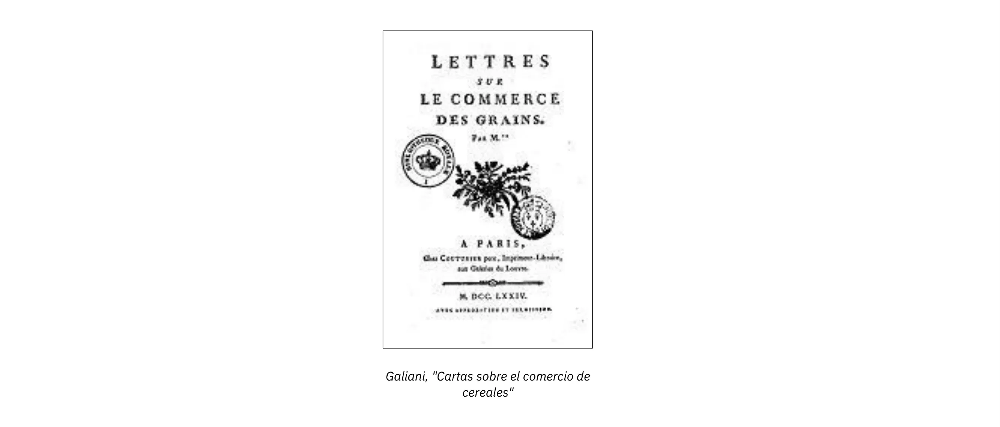

En primer lugar, los elevados precios de los cereales en aquella época no eran consecuencia del libre comercio, sino de las malas cosechas, y Condorcet lo demuestra claramente. A continuación, explica por qué el laissez-faire no sólo es apropiado, sino que es la única política adecuada, a pesar de los prejuicios populares. Estamos tan acostumbrados a que el Estado intervenga en el comercio de cereales que no hacer nada nos parece algo extraordinario y nuevo". Más adelante, añade: "Casi todo el mundo, especialmente los que ocupan cargos públicos, cree que nada ocurre por sí solo y que todo está perdido si el gobierno no interviene en todo". Condorcet recupera así los argumentos de los fisiócratas y de Turgot, mostrando la superioridad del librecambio sobre toda forma de intervencionismo.

Promover el programa económico liberal de Turgot fue un acto de valentía, ya que Condorcet sabía que se enfrentaría rápidamente a la censura. De hecho, así ocurrió y su panfleto sobre la abolición de los trabajos forzados fue destruido y prohibido en 1776.

Turgot, apreciando la leal defensa de sus ideas por parte de Condorcet, le nombró Inspector de Moneda. Condorcet dimitió en cuanto su amigo dejó el ministerio.

Aunque dedicó toda su energía a defender a Turgot, Condorcet no se hacía ilusiones sobre el resultado del mandato de su amigo. El propio Turgot admitió en vida que vivía arrepentido, como escribió en una carta, "por no haber podido hacer a mi nación y a la humanidad un bien que creía muy fácil". Condorcet, más realista, señaló los numerosos adversarios a los que se enfrentaría Turgot: los favoritos del rey, los parlamentos, el clero, la nobleza, los gremios, etcétera. Estos grupos esperaban halagos, no reformas. Condorcet le dijo a Turgot: "Usted no es en absoluto un charlatán, y eso es un defecto, dado cómo están las cosas en París". Tenía toda la razón, pues en 1776, apenas dos años después de su llegada, Turgot ya se había visto obligado a abandonar la Contraloría General.

## El sentido común liberal bajo la Revolución

<chapterId>95e9a90d-e37a-58ff-b1ac-928b42e76ecf</chapterId>

Dupont de Nemours fue el discípulo más joven de François Quesnay, quien en una ocasión dijo de él: "Debemos cuidar a este joven, pues hablará cuando nosotros hayamos muerto". Cuando comenzó la Revolución Francesa, casi todos los grandes fisiócratas, incluido el marqués de Mirabeau, ya habían desaparecido; el propio Mirabeau había fallecido el 13 de julio de 1789.

Dupont de Nemours redactó la lista de agravios para la bailía de Nemours.

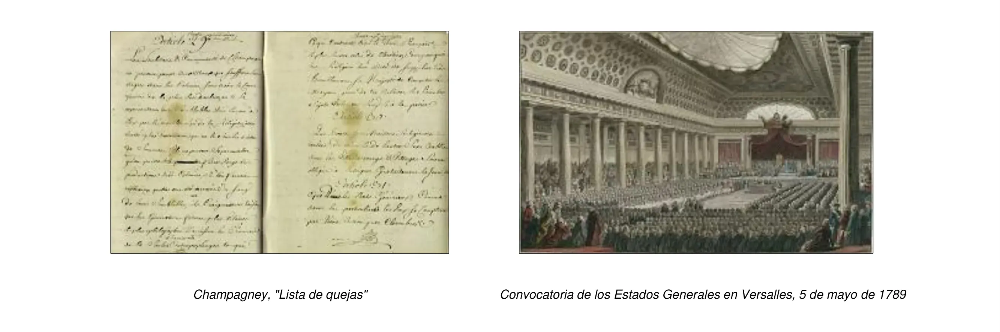

Este fascinante documento contenía todas las quejas de los economistas liberales contra las restricciones comerciales, los monopolios y los ataques a la propiedad. Dupont de Nemours también fue elegido diputado a la Asamblea Nacional.

Durante la Revolución, se convirtió en la voz del sentido común liberal, manteniéndose firme frente a la creciente marea de populismo y demagogia intervencionista, que acabó imponiéndose.

Ya en noviembre de 1789, cuando se hablaba de conceder el monopolio a la Caisse d'Escompte (lo que podría convertirla en un banco público: el Banco de Francia), Dupont de Nemours se pronunció en defensa de la competencia.

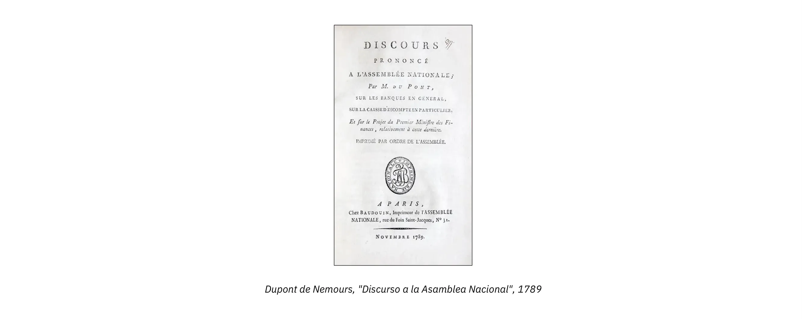

"Sería mejor", dice, "dejar el negocio bancario a las leyes del libre comercio". Y añade:

> "No entiendo qué quiso decir el ministro cuando habló de conceder un privilegio a la Caisse d'Escompte. Si este privilegio incluye la exclusividad, debes rechazarlo, pues has venido aquí a destruir privilegios exclusivos, no a crear nuevos."

A pesar de sus advertencias, la Asamblea hizo caso omiso de sus objeciones y dio un paso más hacia el establecimiento de un banco central y un monopolio bancario.

En 1790, en la Asamblea Constituyente, Dupont de Nemours sigue la tradición pacifista de sus amigos fisiócratas y propone una ley que prohíbe las guerras ofensivas. El primer artículo decía: "La Nación francesa no se permitirá emprender ninguna guerra ofensiva para apoderarse del territorio de otros o para atentar contra los derechos o la libertad de cualquier Nación".

Esta propuesta fue rechazada.

Ese mismo año, 1790, comenzaron los debates sobre la emisión de nuevo papel moneda para cubrir los gastos del gobierno.

Dupont de Nemours se opuso firmemente y publicó un folleto titulado [*Effects of Assignats on the Price of Bread*](https://archive.org/details/effetdesassignat00dupo). El título era acertado, ya que explicaba que la emisión de assignats conduciría inevitablemente a la inflación, un aumento de los precios de los productos básicos, incluido el pan.

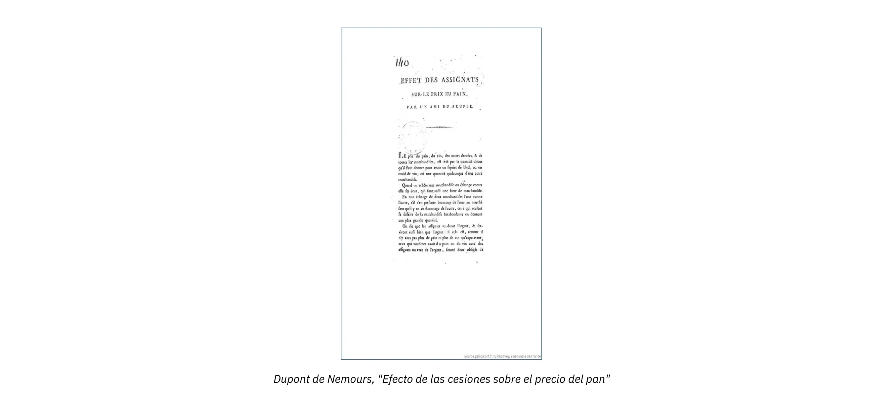

Firmó el panfleto como "amigo del pueblo". La obra causó un gran revuelo, ya que se preguntó a la Asamblea quién la había escrito. Dupont de Nemours se levantó entonces y admitió que era obra suya, afirmando que no se avergonzaba de utilizar el título de "amigo del pueblo" porque luchar contra los asignados era realmente servir al pueblo.

Una vez más, su consejo fue ignorado y se emitieron los assignats.

Todos conocemos el desastre que siguió, la ruina económica y el sufrimiento que padeció la gente, muchos de los cuales lo perdieron todo cuando las cesiones perdieron su valor y tuvieron que ser quemadas.

Unos años más tarde, la Asamblea se centra en la idea de crear un verdadero Banco de Francia, al que se concedería el monopolio de la producción monetaria.

Dupont de Nemours, que seguía oponiéndose firmemente a la idea de un banco público por considerarlo un monopolio, recordó a la Asamblea la desastrosa experiencia de los assignats. Les dijo:

> "No se preparen para lamentaciones como las que atormentaron a mis colegas de la Asamblea Constituyente. En su momento, rechazaron mi propuesta de limitar los assignats únicamente al pago de bienes nacionales y de no convertirlos en moneda circulante. Hoy dicen: '¡Ah, si hubiéramos escuchado a Dupont de Nemours!"

Pero, una vez más, nadie le hizo caso.

## Conclusiones: Pasar la antorcha

<chapterId>ada8082f-db96-5e52-954f-719b47998153</chapterId>

El pensamiento económico francés del siglo XVIII suele quedar eclipsado por los economistas más famosos del siglo XIX. Sin embargo, cuando se trata de la defensa de la libertad, es en el siglo XVIII donde todo comienza verdaderamente. Es el siglo en el que el principio del laissez-faire, tan revolucionario en su época, fue expresado claramente por primera vez por varios pensadores, de Boisguilbert a Dupont de Nemours.

Sin duda, figuras como Jean-Baptiste Say, Frédéric Bastiat, Gustave de Molinari e Yves Guyot dejaron una huella imborrable en la historia del pensamiento económico francés. Pero si los estudiamos de forma aislada, nos perdemos algo esencial. Estos pensadores del siglo XIX no surgieron de la nada; heredaron y construyeron sobre los cimientos establecidos por sus predecesores del siglo XVIII durante la Ilustración.

Boisguilbert afirma que las almas bienintencionadas que creen poder arreglarlo todo implicando al gobierno ponen inevitablemente la economía patas arriba, y que por tanto es mejor dejar que el orden natural de las cosas siga su curso.

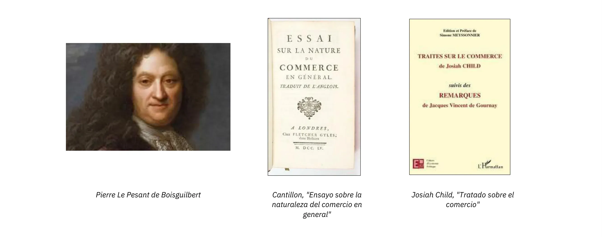

Cantillon insiste en que el dinero nunca debe manipularse con fines políticos. Permitir que el Estado maneje el dinero a su antojo es allanar el camino a un inmenso desorden financiero y económico.

Vincent de Gournay afirma que una regulación excesiva del trabajo desalienta los esfuerzos de los obreros y artesanos, empujándolos hacia la pereza y la inactividad. Gracias a la libre competencia puede crecer la economía y prosperar una nación.

El Marqués d'Argenson afirma que ningún gobierno es capaz de preverlo y medirlo todo y que, en consecuencia, hay que confiar en el interés propio de cada individuo.

Quesnay y los fisiócratas afirman que la propiedad privada es el fundamento de las sociedades humanas. Sin propiedad privada, el hombre pierde la motivación para esforzarse, para trabajar, ya que no puede disfrutar del fruto de su trabajo ni acumular nada.

Condillac afirma que la Exchange es siempre mutuamente beneficiosa y que, por tanto, sin excepción, debe ser siempre libre. La única misión del Estado debe ser proteger la libertad y la propiedad.

Todas estas ideas serían retomadas por los economistas del siglo XIX. Algunos, como Jean-Baptiste Say, darían a estas ideas una expresión científica a través de un riguroso *Tratado de Economía Política*. Otros, por el contrario, intentarían popularizar estas máximas fundamentales aventurándose en el terreno de los cuentos, las novelas y los relatos divertidos, como haría hábilmente Frédéric Bastiat.

## Biografía

<chapterId>17cf2865-e53c-5f3b-a5c2-a43560efaf01</chapterId>

**BIBLIOGRAFÍA SELECTIVA**

A continuación encontrará una selección de más de treinta escritos:

1. Pierre Clément, Histoire de Colbert et de son administration, París, 1874

2. Vauban, Projet d'une dîme royale, 1707; reimpresión Institut Coppet, 2014; Anne Blanchard, Vauban, Fayard, 1996

3.	Boisguilbert, Détail de la France, 1695; reeditado por el Institut Coppet, 2014

4. Félix Cadet, Pierre de Boisguilbert: precursor de los economistas, Institut Coppet, 2014

5. Pierre de Boisguilbert ou la naissance de l'économie politique, París, INED, 1966

6. Richard Cantillon, Essai sur la nature du commerce en général, 1755; reimpreso por el Institut Coppet, 2015

7. Antoin Murphy, Richard Cantillon, banquero y economista, Oxford, 1986

8. Gustave de Molinari, El abad de San Pedro, París, 1859

9. Abad de Saint-Pierre, Abrégé du projet de paix perpétuelle, Rotterdam, 1729

10. Abad de Saint-Pierre, "Projet pour perfectionner le commerce de la France", en Les rêves d'un homme de bien, París, 1775, p.199

11. André Alem, Le marquis d'Argenson et l'économie politique au début du XVIIIe siècle, Institut Coppet, 2015

12. Journal et mémoires du marquis d'Argenson, edición Rathery, 9 vols, París, 1859-1867

13. Benoît Malbranque, Vincent de Gournay: la economía política del laissez-faire, Institut Coppet, 2016

14. Vincent de Gournay, Remarques sur la traduction de Josiah Child, L'Harmattan, 2008

15. Christine Théré & Loïc Charles (eds.), Le cercle de Gournay, INED, 2005

16. Antoin Murphy, "Le développement des idées économiques en France (1750-1756)", Revue d'histoire moderne et contemporaine, tomo XXXIII, octubre-diciembre de 1986

17. Henri Ripert, Le marquis de Mirabeau: ses théories politiques et économiques, París, 1901

18. Lucien Brocard, Les doctrines économiques et sociales du marquis de Mirabeau en L'Ami des Hommes, París, 1902

19. Humbert de Montlaur, Mirabeau, l'Ami des Hommes, Perrin, 1992

20. Yves Guyot, François Quesnay et la Physiocratie, Institut Coppet, 2014

21. François Quesnay, Œuvres économiques complètes et autres textes, 2 vols, INED, 2005

22. Georges Weulersse, Le mouvement physiocratique en France (de 1756 à 1770), 2 vols, París, 1910

23. Georges Weulersse, La Physiocratie à la fin du règne de Louis XV (1770-1774), P.U.F., 1959

24. Georges Weulersse, La Physiocratie sous les ministères de Turgot et de Necker (1774-1781), P.U.F., 1950

25. Georges Weulersse, La physiocratie à l'aube de la révolution (1781-1792), EHESS, 1985

26. P. Jolly, Du Pont de Nemours, soldat de la liberté, París, P.U.F., 1956

27. Los escritos económicos de Voltaire, Institut Coppet, 2013

28. Gustave Schelle (ed.), Œuvres de Turgot et documents le concernant, París, 1913-1924

29. Benoît Malbranque, Le libéralisme à l'essai : Turgot intendant du Limousin (1761-1774), Institut Coppet, 2015

30. Pierre Foncin, Essai sur le ministère de Turgot, París, 1877

31. Auguste Lebeau, Condillac économiste, París, 1903

32. Condillac, Le commerce et le gouvernement considérés relativement l'un avec l'autre, 1776

33. Condorcet, Mélanges d'économie politique, en Eugène Daire (ed.), Mélanges d'économie politique, París, 1847

34. P. Jolly, Du Pont de Nemours, soldat de la liberté, París, P.U.F., 1956

35. Eli Heckscher, Mercantilismo, 2 vols. London: Allen and Unwin. 1935

# Sección final

<partId>385bffab-aea1-5bcd-9569-62b3f30665b7</partId>

## Opiniones y valoraciones

<chapterId>a1e689d9-abd0-5dcb-ba56-a8d355d0a84f</chapterId>

<isCourseReview>true</isCourseReview>

## Examen final

<chapterId>bdb7fd98-33e7-11f0-9fe6-b785c859ffc5</chapterId>

<isCourseExam>true</isCourseExam>

## Conclusión

<chapterId>3b366ff6-03c8-5f6a-b4c0-ba8186e65d7e</chapterId>

<isCourseConclusion>true</isCourseConclusion>