# Teekond vabaduse majandusajalukku

See kursus uurib majandusteaduse sündi 18. sajandi Prantsusmaal laissez-faire'i läbi. Avastada, kuidas mõtlejad vaidlustasid merkantilismi, väites, et riik peaks kaitsma eraõigusi, kuid mitte kunagi manipuleerima turgudega regulatsioonide kaudu.

Õpid, kuidas visionäärsed reformijad laiendasid seda visiooni, nõudes vabakaubandust ja piiramatu kaupade ringlust, luues intellektuaalse aluse kaasaegsele kapitalismile. Neid pioneermajanduseksperte uurides mõistad ajatuid põhimõtteid, mis kujundasid globaalset poliitilist majandust ja mõjutavad jätkuvalt tänaseid poliitilisi arutelusid. Liitu kohe, et omandada ideed, mis ehitasid kaasaegse majanduse.
+++
# Sissejuhatus

<partId>06d67531-19f1-4f8d-bf8f-77bbcc743672</partId>

## Kursuse ülevaade

<chapterId>202db3c6-0320-494d-8057-adc6f6563048</chapterId>

Tere tulemast HIS204!

Selle kursuse eesmärk on uurida *laissez-faire'i* - "lase juhtuda" - kontseptsiooni prantsuse päritolu, mis arenes 18. sajandil välja rikkaliku intellektuaalse traditsiooni kaudu. Jälgides varajaste Prantsuse majandusmõtlejate mõtteid, paljastame majandusliku vabaduse aluseks oleva poliitilise majanduse alused, mida iseloomustab usaldamatus riigi sekkumise vastu ja usk loomulikku korda, mis soodustab majanduskasvu ja heaolu.

**2. jagu: Eelkäijad**

Selles osas alustame 17. ja 18. sajandi vahetusest, ajast, mida kujundas absoluutse monarhia ülemäärane valitsemine ja esimesed üleskutsed ratsionaalsema ja õiglasema viisi järele avalike asjade valitsemiseks. Vauban'i, Boisguilbert'i ja Cantillon'i näitel avastame varajase kriitika riigi sekkumise vastu ja esimesed visandid sellest, millest hiljem sai liberaalne poliitiline ökonoomia.

**3. jagu: 18. sajandi alguse reformijad ja mõtlejad**

Selles osas keskendutakse neile, kes 18. sajandi esimestel aastakümnetel püüdsid Prantsuse majandust uute põhimõtete valguses reformida. Sellised mõtlejad nagu Saint-Pierre'i abt, markii d'Argenson ja Gournay (koos oma järgijatega) kutsusid üles lammutama korporatiivseid takistusi, liberaliseerima kaubandust ja soodustama konkurentsi kui arengu mootoriks. Nende sageli julged ettepanekud ennustasid suuri füsiokraatlikke ideid.

** 4. jagu: Füsiokraatlik koolkond**

Selles peatükis käsitletakse prantsuse majandusmõtte üht kõige olulisemat hetke: füsiokraatlikku koolkonda. Uurime selle päritolu, õpetuslikke aluseid ja peamisi saavutusi, keskendudes sellistele võtmeisikutele nagu Quesnay ja Dupont de Nemours. Laissez-faire'i idee muutub selles koolkonnas ühtseks süsteemiks, mis on juurdunud idees loomulikust korrast, millele riik peab alluma, et tagada jõukus kõigile.

**5. jagu: Valgustus ja poliitiline ökonoomia**

Lõpuks näeme, kuidas liberaalne majandusmõtlemine levis laiemas valgustusliikumise raames. Sellised tegelased nagu Voltaire, Turgot, Condillac ja Condorcet laiendasid ja rikastasid laissez-faire'i traditsiooni, nende kirjutised lõid silla, mille kaudu laissez-faire'i traditsioon jõudis üle revolutsiooniperioodi ja sealt edasi, kus liberaalsed ideed leidsid uut vastukaja.

Kas olete valmis taasavastama majandusliberalismi Prantsuse juuri? Lähme!

# Eelkäijad

<partId>91565b10-6010-53cb-a2f4-9c2306c7ef8c</partId>

## Ajalooline taust

<chapterId>6a5fd101-6dfd-5d77-96c7-9e1aa4a19758</chapterId>

18. sajandi alguses oli Prantsusmaa murettekitavas olukorras. Maapiirkondade elanikud tootsid vaevu piisavalt, et ellu jääda, ja olid tugevalt maksustatud.

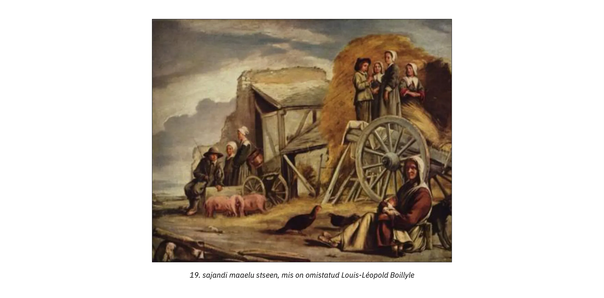

Linnade käsitööliste, kes olid lukustatud jäikadesse kildadesse, oli raske uuendada või isegi üksteist toetada. Samal ajal ületasid teised Euroopa rahvad peagi Prantsusmaad igal rindel, konkureerides selle toodetega. Inglismaa ja Hollandi kaubanduslik edu oli kõigi silmis.

Kuidas aga leida lahendus ajastu haigusele? Seni ei olnud veel olemas majandusteadust ja seega ka spetsiaalset meditsiini, mida rakendada. Majanduspoliitika põhimõtteid rakendati ikka veel juhuslikult, vahetades piiravate faaside ja liberaalsemate perioodide vahel. Kindlasti on meil olemas mudelid, ajaloolised viited, mida järgida. Nende hulgas oli *Sully*, Henri IV minister, kes propageeris põllumajandust ja edendas suuremat kaubandusvabadust Prantsusmaal.

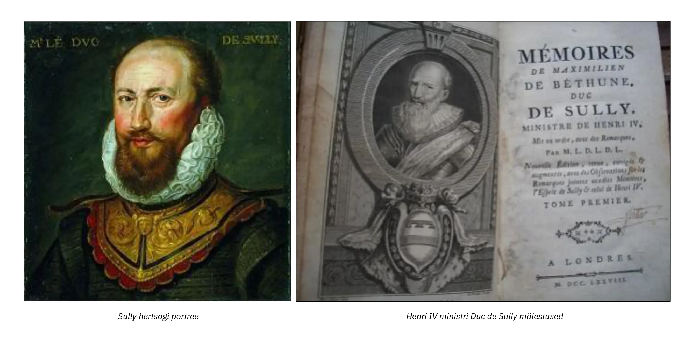

Kuid siis tuli Colbert, Louis XIV minister, kes kõikus reguleerimise ja vabaduse vahel, kuid lõpuks kehtestas siiski reguleerimise. 17. sajandi lõpul möödus Colbert Sullyst: ministrid tuginesid nüüd tema pärandile ja püüdsid rakendada väidetavalt tema põhimõtteid.

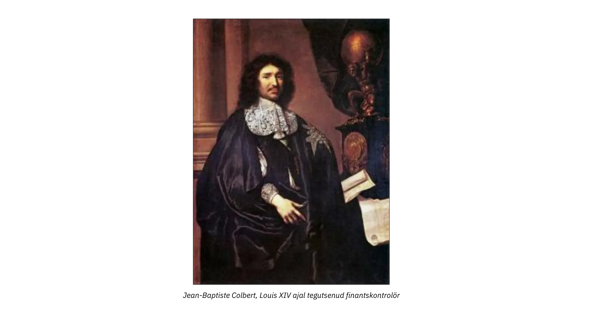

17. sajandi lõpu riigimehi silmas pidades oli Colbert'i maksiimid neli.

(1) **Tööstus peab olema reguleeritud ja seotud kildkondades**. Need eeskirjad määravad näiteks kindlaks, kuidas peavad olema valmistatud linad ja kangad, nende suurus ja kaal.

Selliseid eeskirju oli sadu, mis olid koostatud eraldi köitena iga tööstusharu jaoks. Kuid Colbert'i järgijate silmis oli see siiski ebapiisav: nende arvates pidid tööstust kontrollima ka korporatsioonid.

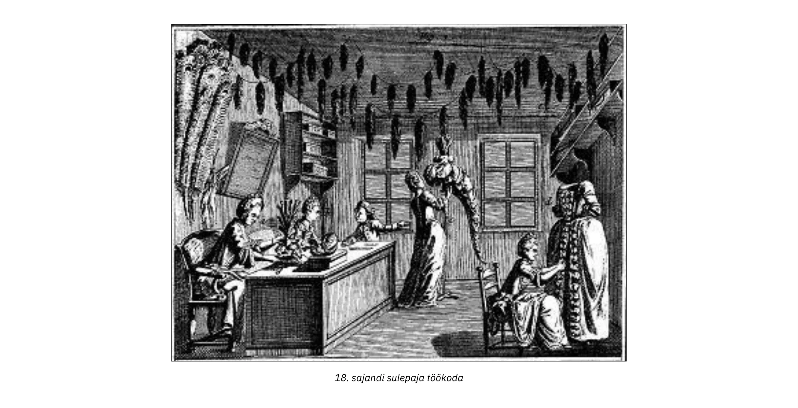

Igaüks, kes soovis ametit praktiseerida, pidi kõigepealt olema mitu aastat õpipoiss, seejärel praktikant, enne kui ta püüdis saavutada meistri staatust, valmistades "meistriteose" ja makstes gildile märkimisväärset summat. Seega oli konkurents igas kutsealas rangelt piiratud.

(2) **Kaubandus on nullsummaline mäng**. Kaubanduse osas jagasid Colberti jüngrid samu eelarvamusi kui antiikajal barbarite inimesed. Louis XIV ministri sõnul on kaubandus "igavene sõda". Miks? Põhjus on lihtne: Colbert'i ja tema järeltulijate jaoks tähendas igasugune rikkuse kasv ühe riigi jaoks teise riigi vaesumist. Nende arvates ei tohtinud lubada inglastel või hollandlastel rikastuda, sest see tähendaks, et nad varastavad Prantsusmaa jõukust.

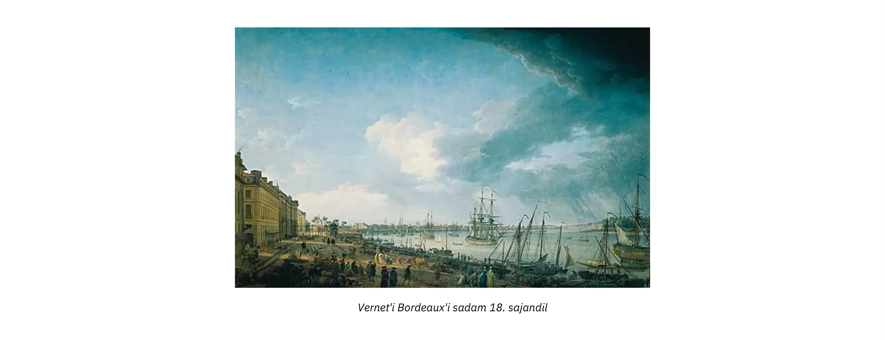

Seetõttu tuli nende riikide tooted keelata või karmilt maksustada, ilma igasuguste kahtluseta, sest kaubandus on sõda, milles me saame soovida ainult oma vaenlaste hävingut.

> "Prantslased saavad oma kaubandust suurendada ainult hollandlaste purustamisega".
> *Colbert*

(3) **Kui riigil napib raha, tõsta rohkem makse**. Colbert ja tema jüngrid ei uskunud kaugeltki, et maksumaksjate rikkus on piiratud ressurss. Nende arvates ei saanud riiklikud kulutused kunagi probleemiks olla, kui koguti piisavalt. Ja kui rahvas mässas, siis ainult seetõttu, et ministrid olid seda halvasti teinud, sest nagu Colbert küüniliselt märkis, "maksustamise kunst seisneb selles, et kitkuda hanesid ilma neid liiga palju karjuma panemata".

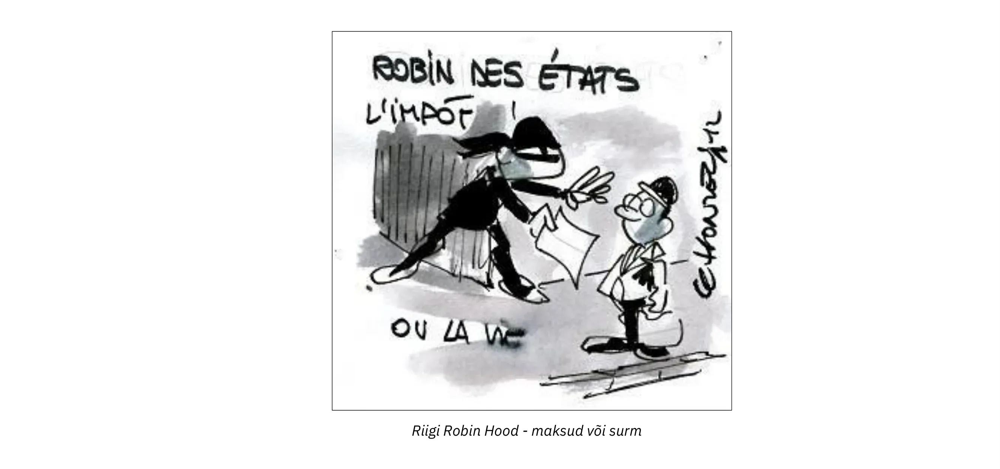

(4) **Rikkus on eelkõige kuld ja hõbe**. Enne majandusteaduse sündi järgisid paljud kirjanikud üht valitsevat dogmat varanduse olemuse kohta, mida hakati nimetama *merkantilismiks*. Colbert ja tema järeltulijad jätkasid seda teed. Lühidalt öeldes uskusid merkantilistid, et riigi jõukuse tõeline märk on väärismetallide, hõbeda ja kulla kogumine.

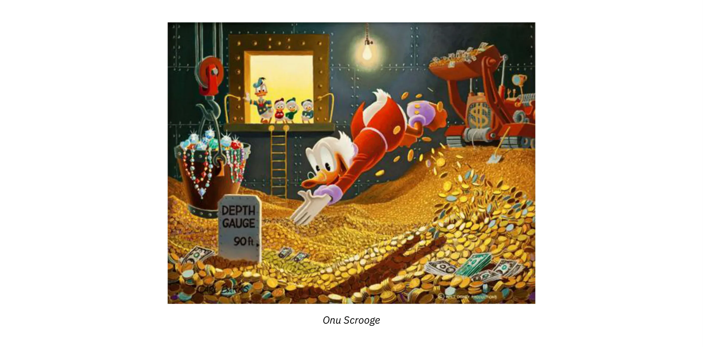

> "Ainult raha rohkus riigi sees teeb vahet tema suurusel ja võimul".
> *Colbert*

Selle idee tagajärjeks on eelistada iga hinna eest eksporti, mis tõi sisse välismaist kulda ja hõbedat, ning piirata importi miinimumini, et vältida selle välismaale saatmist.

Need on neli põhimõtet, millest Prantsuse valitsus juhtis aastakümneid, kui riik astus 18. sajandisse. Kuid peagi hakati neid põhjalikult kahtluse alla seadma. Aastatel 1690-1710 olid mitmed kirjanikud sügavalt vapustatud Prantsusmaa katastroofilisest riigist. Otsides selle põhjusi, jõudsid nad järeldusele, et süüdi olid just Colbertilt päritud maksimumnõuded, pidades neid rohkem kui ekslikke argumente. Sellega panid nad aluse majandusteadusele.

## Vauban

<chapterId>ee9c1e0e-96cc-5026-a5e2-963d68122786</chapterId>

Täna, kui maksusurve meie riigis kasvab jätkuvalt, ähvardades lämmatada riiklikke majandusjõude, tõusevad hääled muutuste kasuks. Kas teadlikult või mitte, need üleskutsed reformi järele kordavad sageli Prantsuse majandusteadlaste tööd, kes on alates 17. sajandist kritiseerinud riigi maksusüsteemi kui kaootilist, despootlikku ja ülemäärast.

Esimene neist maksureformaatoritest, nii kronoloogiliselt kui ka teenete poolest, on suur marssal Sébastien Le Prestre Vauban, kuulus linnuste ja tsitadellide ehitaja.

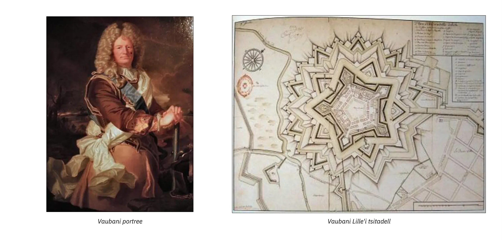

Kuigi me oleme selle kahjuks unustanud, oli Vauban rohkem kui sõjaväelane; ta oli ka majandusteadlane. Ta tundis huvi talupoegade saatuse vastu, ta pakkus 1695. aastal (Projet de capitation - "kapitaatiumi projekt") ja uuesti 1707. aastal (Projet d'une Dime Royale - "kuninglik kümnis") välja julge maksureformi: asendada enamik olemasolevaid makse sissetulekuga proportsionaalse maksuga, ühtse maksuga enne oma aega.

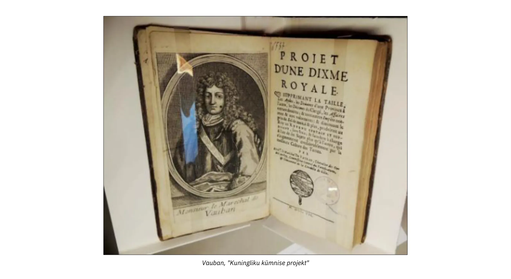

Vauban jõudis nende ideedeni läbi uudishimu. Ta oli innukas vaatleja, kes püüdis sotsiaalset elu ja majanduslikku tegelikkust rangelt, peaaegu teaduslikult uurida. Ta rõhutas eriti vajadust loendada, kasutades selleks rahvaloendusi.

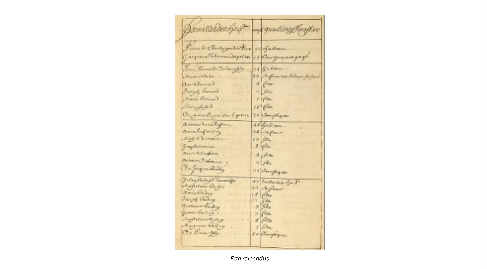

Tema teine suur teene oli tema liigutav ja aus kirjeldus masside kannatatud viletsusest. Ta kirjutas: "Ärme laseme end petta; kuningriigi süda on hävitatud. Kõik kannatab, kõik kannatab, kõik ägiseb. Te peate ainult vaatama ja uurima provintside südant, mida te leiate, on veel hullem kui see, mida ma räägin". Vaubani sünged tähelepanekud ei olnud kaugeltki liialdus, vaid peegeldasid täpselt 18. sajandi alguse elu. Alexis de Tocqueville oli neist mõtetest hästi teadlik ja kirjeldas hiljem Vaubani *Kuninga tiitlit* kui "hirmuäratavat", sest see oli tõsi.

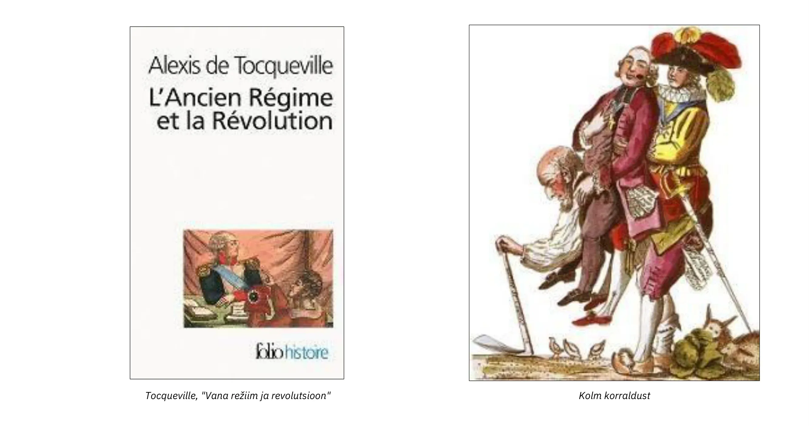

Vauban'i teine suur teene majandusteadlasena oli ettepanek kaugeleulatuva maksureformi kohta, mille eesmärk oli tema poolt täheldatud ja kirjeldatud kurjuse likvideerimine või vähemalt selle intensiivsuse vähendamine. Tal oli õigus; Prantsusmaa majandust Ancien Régime'i ajal halvab ebavõrdne, ebastabiilne ja loetamatu maksustamine.

Vauban'i erinevate poliitiliste ja majanduslike kirjutiste üldine eesmärk oli leevendada selle kannatusi, mida ta nimetas "rahva alumise osa, kes oma tööga toetab ja toetab ülemist osa", kannatusi.

Ta mõistis, et rõhuv ja motivatsiooni pärssiv maksustamine oli talupoegade üle jõu käiv, mida ta väljendas selge silmaringiga, mida me võime ka tänapäeval suurepäraselt jälgida:

> "Põllumees laseb oma vähese maa ära närbuda, töötades seda vaid pooleldi, sest kardab, et kui see toodaks korraliku sõnniku ja harimise korral seda, mida ta võiks toota, siis maksustatakse seda veelgi rohkem."

Vauban nägi tõtt: Ancien Régime'i maksustamine ei olnud mitte ainult ebamõistlik, vaid ka julmalt range. Just seda ebaõiglaselt jaotatud maksusüsteemi püüdis ta ületada.

Tema pakutud lahendus - ühtne, proportsionaalne maks kõikidele sissetulekutele - oleks võimaldanud maksukoormust õiglaselt jagada kõigi ühiskonnaklasside vahel. Vauban'i maksureform, mis põhines riigiteoorial, mis pidas avalikku võimu vajalikuks üksikisiku õiguste ja omandi kaitsmiseks, nõudis, et kõik kodanikud maksaksid oma sissetulekuid rangelt proportsionaalselt, näiteks 10% oma sissetulekust

Kuninglikus tiitlis, mis on ainus tema eluajal trükitud majandusteos, ütles Vauban selgelt välja:

> "Kuna kõik riigi elanikud vajavad selle kaitset, et ellu jääda, on õige, et kõik panustavad vastavalt oma sissetulekutele selle ülalpidamisse ja kuludesse [...]. Pole midagi ebaõiglasemat, kui vabastada need, kes on kõige võimekamad maksma, ja lükata koorem nende peale, kes on kõige vähem võimekamad, kes selle raskuse all kokku varisevad; raskus, mis oleks üsna kerge, kui seda kannaksid proportsionaalselt kõik vastavalt oma jõule. Seepärast on iga maksuvabastus korrarikkumine, mida tuleb parandada."

Vahetult enne oma surma võtsid Louis XIV ministrid Vaubani idee üle. Vauban oli siiski nõudnud proportsionaalse maksu kehtestamist, mis asendaks kõik või peaaegu kõik olemasolevad maksud. Selle asemel, nagu nii sageli juhtub, rakendati tema maks, kuid kõik teised jäeti samuti alles.

## Boisguilbert

<chapterId>200149c6-b5fc-566e-ab0e-bafb1c3fed3c</chapterId>

Vähesed prantsuse majandusteadlased minevikust naudivad tänapäeval oma kodumaal tunnustust, mis vastab nende panusele, ja Boisguilbert ei ole erandiks.

Boisguilbert, keda oma aja lugejad ei hinnanud, kes oli oma ekstsentrilise loomuse ja ülekaaluka kirglikkuse tõttu võimuringkondadest eemal, jättis 18. sajandile vähe jälgi. Ometi on möödunud sajandi alguses tema loomingut aeglaselt taasavastatud.

Kuid see taasavastamine näitab, et me oleme sattumas mingisse ummikusse. Boisguilbert'i tõelised teened on kadunud, kui teda esitatakse paljude teooriate pioneerina ja paljude mõtlejate eelkäijana. Tema kohta öeldakse, et ta on mõistnud alatööhõive kontseptsiooni, mida hiljem Keynes kaitses, ennetas Say'i seadust, sillutas teed Walras' üldisele tasakaaluteooriale ja isegi ennetas marksistide klassianalüüsi. "Kelle või mille eelkäija Boisguilbert ei võiks olla?" küsis lõpuks üks kommentaator.

(Pierre Le Pesant de) Boisguilbert sündis 1646. aastal Rouenis. Boisguilbert sai haridust Port-Royalis Pariisis ja alustas ebaõnnestunud kirjanduskarjääri, enne kui ta asus erinevatele ametikohtadele, sealhulgas Roueni kindralleitnandi ametikohale. Selle aja jooksul kirjutas ta mitu raamatut oma ideede propageerimiseks, nende hulgas 1695. aastal ilmunud "Détail de la France", mille ta järgmisel aastal avaldas uuesti palju selgesõnalisema pealkirja all: [*Louis XIV valitsemise ajal hävitatud Prantsusmaa, kelle poolt ja kuidas, koos selle taastamise vahenditega](https://archive.org/details/bub_gb_0jUaWNbTJa8C/page/n23/mode/2up)*.

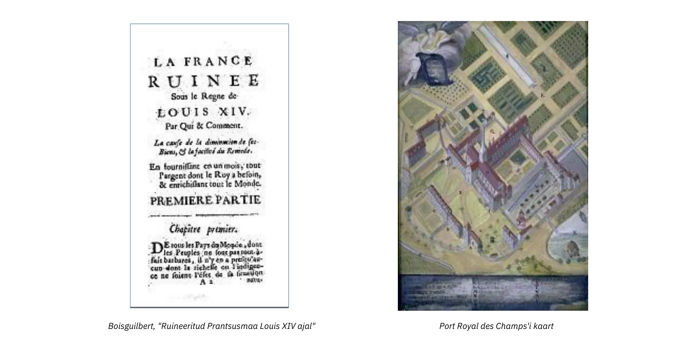

Ja see on Boisguilbert'i raamatute aluseks: Prantsuse vaesus ja selle põhjused.

Seda prantsuse rahva viletsust 18. sajandi lõpus kirjeldab Boisguilbert üksikasjalikult, nagu ka Vauban. Ta kirjutab:

> "Kõigile nähtavad viljatu või halvasti haritud maad on Prantsusmaa laip".

Ta kirjeldas välja juuritud viinamarjaistandusi, põllud hüljanud talupoegi ja korduvaid näljahädasid.

Boisguilbert leiab selle õnnetuse kaks peamist põhjust. Sest kui inimesed elavad viletsuses, siis selle põhjuseks on see, et nad ei saa tarbida seda, mis on vajalik, ja tarbimise hävingul on kaks põhjust.

Esiteks ei saanud inimesed enam lubada endale tarbida põhivajadusi meelevaldse maksustamise tõttu. Taille, tolleaegne isiklik maks, arvutati iga üksikisiku jaoks pimesi, mis tõusis või langes põhjendamatult. Arvukate privileegide tõttu langes koormus vaestele talupoegadele, kes leidsid end hävitatuna. Selle parandamiseks soovitas Boisguilbert kehtestada proportsionaalse maksu kõigile sissetulekutele, mis sarnaneks Vaubani ettepanekule.

Teine põhjus Prantsusmaa viletsuse jaoks on see, et liiga paljud takistused takistasid kaupade, eriti põllumajanduslike kaupade vaba kaubandust. Piiridel ja isegi riigi sees, eri piirkondade vahel, olid tollimaksud, mis halvasid kogu kaubandust. Need piirangud takistasid tasakaaluhinna kujunemist ja piirasid turuvõimalusi. Selle tulemusel ei saanud talupojad oma toodangust ära elada, sest nad ei suutnud kasumlikult müüa ja kannatasid ebatulusate põllumajandushindade all, mis on tänapäevalgi väga oluline ja Boisguilbert'i teooria keskmes. Kaubanduspiirangute küsimuses pooldas Boisguilbert teede vabastamist, teisisõnu vabakaubanduse kehtestamist.

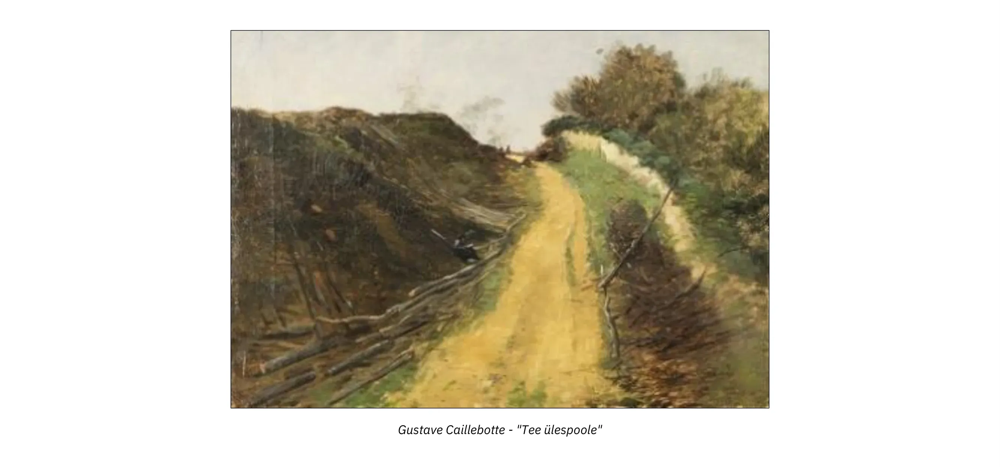

Ja vabadus on tõepoolest tema lõplik järeldus. "Küsimus ei ole tegutsemises," ütleb ta, "vaid lihtsalt selles, et me lõpetame tegutsemise, nagu me nii vägivaldselt teeme looduse vastu, mis kaldub alati vabaduse ja täiuslikkuse poole". Kõik saab olema hästi, kordab ta väsimatult, "kuni me laseme loodusel oma teed käia, st anname talle oma vabaduse, ja et keegi ei sekku sellesse kaubitsemisse, välja arvatud selleks, et pakkuda kõigile kaitset ja hoida ära vägivalda".

See viimane lõik on oluline. Boisguilbert oli esimene, kes nõudis selgelt laissez-faire'i majanduspoliitikat, muutis selle oma kreedoks ja ehitas selle ümber üles reaalse süsteemi. Tema sõnul on olemas loomulik asjade kord ja seda ei tohi rikkuda, mitte hävitada enneaegsete riiklike sekkumistega. Tema arvates ei tohi riik majandusküsimustes tegutseda, vaid peab laskma asjadel toimida loomulikult. Vastasel juhul põhjustab ta viletsust.

Boisguilbert kritiseeris isegi "*hoolaid hingi*", nagu ta neid nimetas, neid, kes mõtlesid head, kuid tegid suurt kahju. Nad tahtsid rahvale odavat leiba, kuid surudes hinnad alla, hävitasid nad põllumehed, kes ei suutnud sellise marginaali juures ellu jääda. Need talunikud jätsid siis oma maad maha, sukeldudes veelgi sügavamale vaesusse. Nagu me kõik teame, on "põrgu sageli sillutatud heade kavatsustega".

## Cantillon

<chapterId>bc206d41-6a64-5688-a489-40fcfa0e5397</chapterId>

Richard Cantillon, kes on kirjutanud teose "Essee kaubanduse üldisest olemusest" (kirjutatud umbes 1730. aastal, avaldatud 1755. aastal), on üks kaasaegse majandusteaduse pioneere. Majandusteadlane Murray Rothbard nimetab oma raamatus "History of Economic Thought" Cantillonit isegi moodsa majandusteaduse rajajaks.

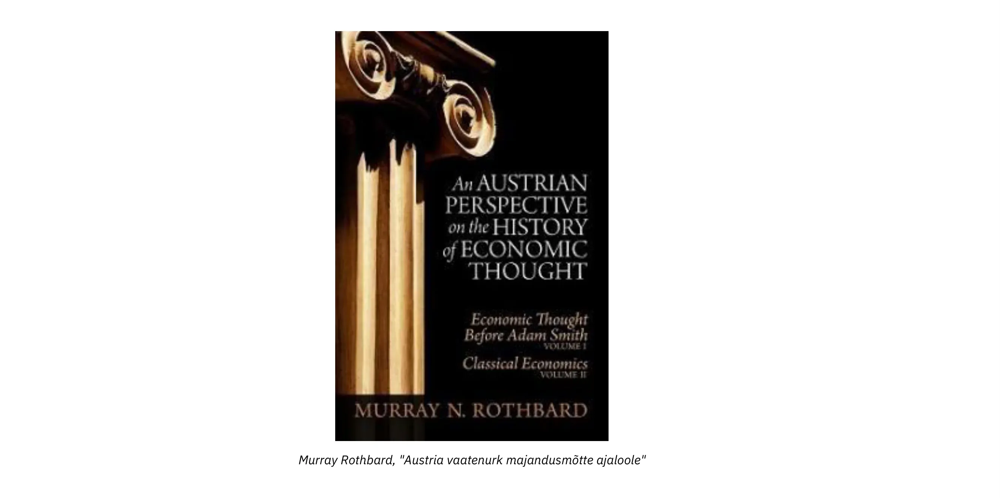

Iirimaal sündinud Richard Cantillon asus noorena elama Pariisi ja omandas Prantsuse kodakondsuse. Ta töötas pankurina ja teenis John Law'i ajastu jooksul varanduse.

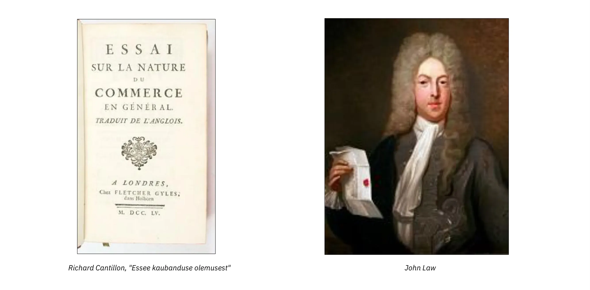

Sel puhul hakkas ta uurima ka majandusteooriat. Um 1730. aasta paiku koostas Cantillon oma "Essee kaubanduse olemusest üldiselt".

Seda raamatut võib pidada üheks esimeseks katseks luua üldine majandusteooria. Cantillon on ettevaatlik, et teha kindlaks need, mida ta nimetab "majanduse üldseadusteks", need, mis peituvad asjade olemusest, mitte selle või teise riigi konkreetsetest faktidest. See lähenemisviis oli revolutsiooniline.

Cantillon'i essee suured teened võib kokku võtta viies valdkonnas: rikkuse teooria, ettevõtja mõiste, väärtusetu valuuta kriitika, "Cantillon'i efektid" ja lõpuks vabaduse kaitse.

Esiteks, tema **varanduse teooria**.

Erinevalt tollal valitsevast merkantilistlikust vaatepunktist lähtus Cantillon oma analüüsis sellest, et rikkus moodustub toodetest, mis on inimese jaoks sobivad. See rikkus, väitis ta, pärineb loodusest ja on toodetud inimtööga. Tema ideed rikkuse olemusest avaldasid tugevat mõju Beccariale ja Adam Smithile ning Smithi kaudu kogu inglise klassikalisele koolkonnale.

Teiseks, **ettevõtja**.

Kuigi ta ei määratlenud seda selgelt, pidas Cantillon ettevõtjat majandustegevuse peamiseks ja keskseks tegijaks. Cantilloni jaoks on ettevõtjat iseloomustav see, et ta võtab riski ja tegutseb ebakindluses. Neid ideid laiendasid hiljem Turgot ja, mis veelgi olulisem, Say, et lõpuks tunnistada ettevõtja erilist kohta majanduses, vastupidiselt seekord inglise koolkonna väidetele.

Kolmas punkt, **valuuta**.

Vastuseks John Law kogemusele selgitab Cantillon, mis juhtub või peab juhtuma, kui raha ei oma tegelikku väärtust.

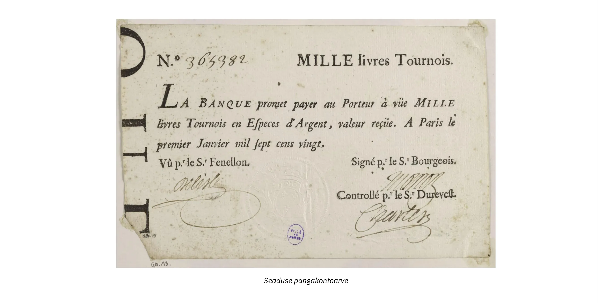

Ta näeb kahte peamist tagajärge, mis kaasnevad sellega, et metallraha asendatakse reaalse väärtuseta rahaga nagu paberraha. Esimene tagajärg on see, mida ta nimetab "rahva tõrjutuseks", mis tähendab kasvavat usaldamatust väärtusetu raha suhtes. Teine tagajärg on inflatsioon: raha nõrgenemine muudab kaubad kallimaks.

Neljandaks läks Cantillon oma **inflatsiooni** analüüsis kaugemale kui tema kaasaegsed. Olles jälginud Law'i süsteemi kokkuvarisemist, mõistis Cantillon, et rahaline inflatsioon ei mõjuta kõiki võrdselt. Vastupidi, see rikastab ühtesid, samal ajal kui teisi vaesustab. Ta jõudis järeldusele, et inflatsioonil on ümberjaotav mõju: need, kes saavad uut emiteeritud raha esimesena, saavad kasu suurenenud ostujõust, samas kui need, kes saavad seda hiljem, vaesuvad uue raha emiteerimise tõttu inflatsioonimäärade tõusu tõttu.

Viiendaks, vaatamata mõningatele merkantilistliku mõtteviisi jäänustele, oli Cantillon üldiselt **täiesti liberaalne**.Ta kaitses eraomandit kui tsivilisatsiooni alustala, väites, et ükski ühiskond ei saa toimida ilma maa ja töötoodete eraviisilise Ownership-ta. Samuti pidas ta inimeste vahelist materiaalset ebavõrdsust loomulikuks ja seaduslikuks. Cantilloni sõnul ei ole midagi halba selles, kui tõhus ja vapper või erakordselt andekas tööline teenib rohkem kui keegi, kes on ebapädev või laisk.  Lõpuks uskus Cantillon, et hinnad peaksid alati olema vabalt, Supply ja nõudluse mänguga määratud, ilma riigiasutuste sekkumiseta.

Tema essee viiest peamisest ideest on kahtlemata kõige olulisem see, mis kannab nüüd tema nime: **Cantillon'i efekt**.

Selle teooriaga inflatsiooni mõju kohta annab Cantillon meile vastused mitmetele tänapäeva hädadele. See aitab meil mõista hiljutise ekspansiivse ja inflatsioonilise rahapoliitika tagajärgi, mis on vaesustanud keskklassi ja maapiirkondi, rikastades samal ajal finantsturgudel tegutsejaid ning riiki, selle asutusi ja ametnikke, tänu nende ühisele lähedusele uue probleemi allikale: keskpankadele ja kommertspankadele.

# 18. sajandi alguse reformijad ja mõtlejad

<partId>1f7b50d4-ce93-5db3-8396-43c1fa5419ff</partId>

## Saint-Pierre'i abt

<chapterId>13478fe2-4c12-593c-a410-54c2cfb7ef7f</chapterId>

Kõigist autoritest, kelle me oleme valinud 18. sajandi prantsuse laissez-faire'i mõtlejate panteonisse, on Saint-Pierre'i abt kahtlemata kõige tähelepanuta jäänud.

Kui aus olla, siis on see osaliselt tema enda süü. Ta kirjutas väga palju, kuid tema stiil on Hard lugeda ja täis kordusi. Isegi Jean-Jacques Rousseau püüdis oma teoseid kokku võtta: ta alustas seda, kuid loobus peagi sellest ülesandest, sest mõistis, et see ületab tema jõuvarusid. 19. sajandi keskel austas Gustave de Molinari teda, avaldades temast põhjaliku teose, milles ta avaldas austust patsifistile ja majandusteadlasele, kes Saint-Pierre'i abt oli. Kuid sellest ei piisanud, et teda unustusest välja tuua, sest ta on selles ikka veel tänapäevani.

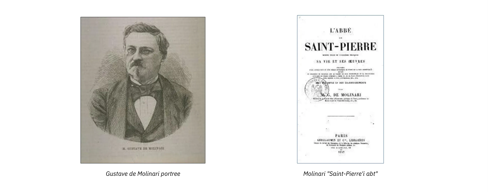

Saint-Pierre'i abt kirjutas majandusest, kuid tavaliselt pakub ta huvi pigem patsifistina. Ta on igavese rahu projekti autor, mis eelnes Emmanuel Kanti tuntud projektile.

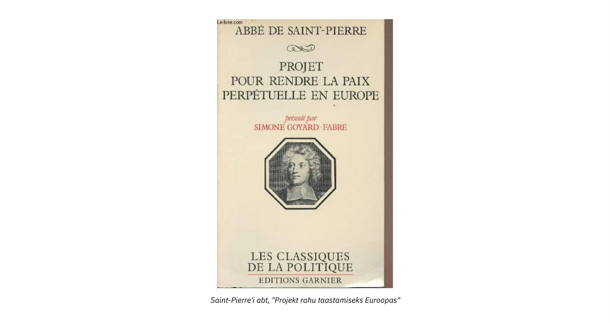

Selles teoses väitis ta, et sõda on hävitav mitte ainult nende jaoks, kes selle kaotavad, vaid ka võitjate jaoks ja isegi nende jaoks, kes neis ei osale, sest nende kaubandus on mõjutatud.

Sõja nuhtluse vastu võitlemiseks soovitas ta luua omamoodi Euroopa Rahvasteliidu. Iga riigi probleemide lahendamiseks moodustataks Euroopa Nõukogu. Rahvused kasutaksid seega arbitraaži, et vältida relvade kasutamist. Kui mõni rahvas ei ole piisavalt tark, et rahu omaks võtta, kui ta ohustab teisi Euroopa rahvaid, oleks Euroopa Rahvaste Liigal vahendid vastamiseks. Selliste sündmuste korral moodustataks Euroopa armee, mille väed annaksid eri riigid.

Saint-Pierre'i abti elus on ka üks episood, mis illustreerib suurepäraselt Prantsuse laissez-faire'i liikumise taga olevat kriitilist mõtteviisi. Ta liitus 1695. aastal Académie Française'iga, kuid 1718. aastal heideti ta välja, kuna julges kritiseerida Louis XIV valitsemist. Sellega ühines ta selliste isikutega nagu Vauban ja Boisguilbert, kes olid samuti julgenud sõna võtta päikesekuninga hiilguse all peidus olevate salakavaluste vastu.

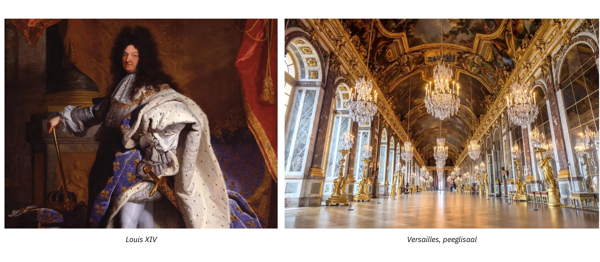

Saint-Pierre'i abt väitis, et Louis XIV valitsemisaeg oma luksusliku õukonna ja sõjaliste vallutuste kinnisideega ei olnud voorusliku kuninga tunnus. Ta keeldus aktsepteerimast, et Louis XIV vääris tiitlit "**Louis Suur**".

"Oma naabreid ja oma rahvast korraga hävitada ei ole suurus," ütles ta. See seisukoht solvas sügavalt Académie Française'i, mis oli pikka aega tegelenud kuninga ülistamisega igas võimalikus kirjanduslikus vormis. Selle tulemusena hääletasid nad peaaegu ühehäälselt tema väljaheitmise poolt.

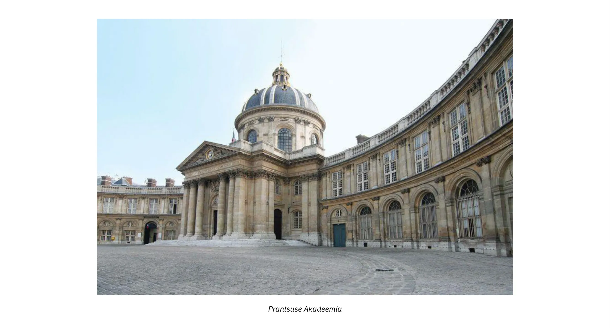

Majanduslikus mõtlemises kohaldas ta järjekindlalt kasulikkuse põhimõtet, nagu Jeremy Bentham hiljem, ja pakkus sageli häid teadmisi. Kui aus olla, oli ta ikka veel mõjutatud merkantilistlikest ideedest, millest keegi polnud tol ajal täielikult lahti saanud.

Siiski tegi Saint-Pierre'i abt mõned täpsed tähelepanekud majanduse kohta. Juba enne *Condillaci*, kellele sageli seda ideed omistatakse, väitis ta selgelt, et igas Exchange-s võidavad mõlemad pooled. Seda võib leida tema 1733. aasta ["Project for Improving France's Trade"](https://www.institutcoppet.org/projet-pour-perfectionner-le-commerce-de-france/), kus ta kirjutas:

> "Kui kaupmeeste vahel toimub müük, võidab sellest nii müüja kui ka ostja; sest kui mõlemal poolel ei oleks mingit reaalset või tajutavat kasu, ei müüks müüja sellise ja sellise hinnaga ega ostja omalt poolt ostaks sellise hinnaga".

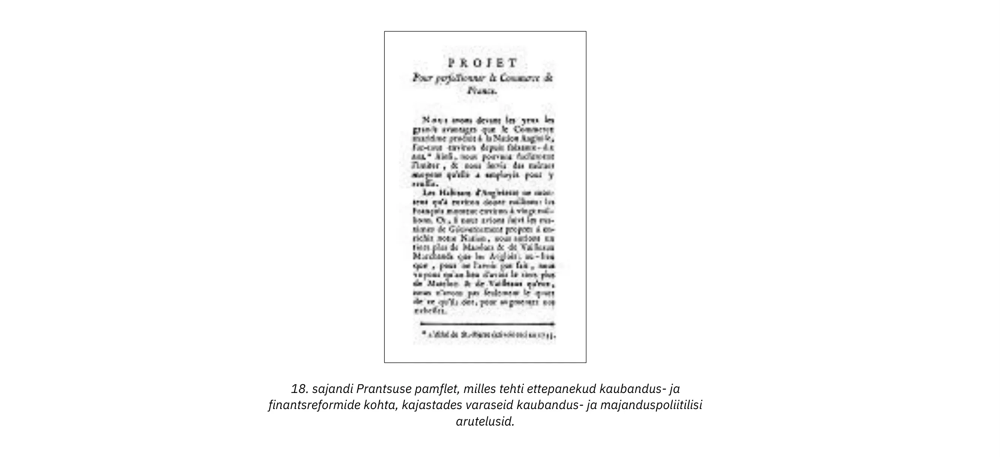

Samuti rõhutas ta enne Vincent de Gournay'd töö väärtust ja selle atraktiivsuse säilitamise tähtsust. "Kogu töö on raske," kirjutas ta. "Ja kui inimene näeb, et tema töö ei maksa talle midagi või ei maksa piisavalt, muutub ta tegevusetuks ega vaeva ennast mittevajaliku vaevaga". Just seda argumenti kordasid hiljem markii d'Argenson, Vincent de Gournay ja füsiokraadid, kui nad kritiseerisid koormavaid eeskirju ja kildkondade süsteeme. Nad väitsid, et sellised piirangud heidutavad töölisi, põhjustavad tarbetuid raskusi ja muudavad lõpuks tegevusetuse sellistes tingimustes ahvatlevamaks kui tootliku töö.

## Markii d'Argenson

<chapterId>e9960ab4-72ec-5afd-8e97-bf89c83b62bc</chapterId>

Markii d'Argenson on unustatud laissez-faire'i doktriini rajaja.

Selle avastas uuesti August Oncken, kes kirjutas raamatu "Laissez-faire, laissez-passer" doktriini kohta ja jõudis järeldusele, et d'Argenson mängis selle idee sünni juures olulist rolli.

René-Louis Voyer, markii d'Argenson, sündis 1694. aastal. Ta alustas oma poliitilist karjääri parlamendinõunikuna, seejärel töötas ta riiginõukogus.

Kolmkümmend aastat enne Adam Smithi kaitses d'Argenson juba tööjaotuse ja spetsialiseerumise eeliseid.

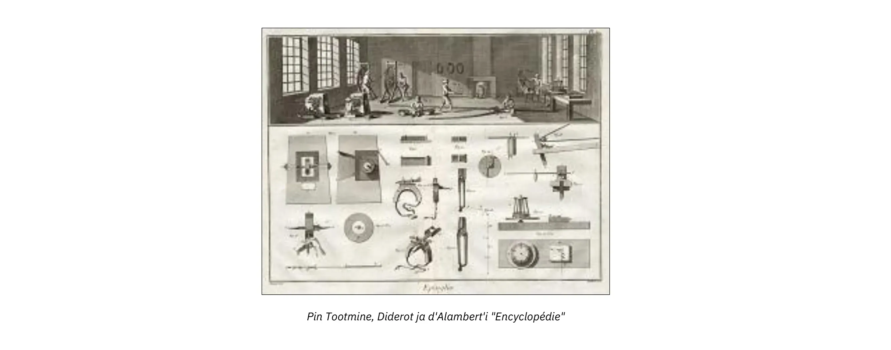

Ta kritiseeris teravalt eeskirju, mis tema arvates püüdsid muuta eri piirkondade loomulikke eelistusi. Näiteks oli ta hämmastunud, et valitsus tahtis, et Toursis, tollases vaeses linnas, toodetakse kangast ja sametkangast sama kvaliteediga kui jõukas Genovas, mis oli kuulus oma luksuskaupade poolest, valmistatud kangast ja sametkangast. Ta jõudis järeldusele:

> "Iga koht peab saama valida oma tehased ise. Vabadus! Vabadus!"

Ta tunnustas ka teist Smithi keskset põhimõtet: ideed, et spontaanne kord tuleneb omakasu ajamisest. Markii d'Argenson uskus, et vahetu isiklik huvi on see, mis juhib inimenergiat. Ta kirjutas, et kehv käsitöö ja pettus diskrediteeriksid tootjat, samas kui töökus ja head kavatsused viiksid õitsenguni. Ta väitis, et kõige paremini hindab kasulikkust üksikisik, üldsus, kes ostab kaupu ja hoolib sellest, et teha head tehingut. "Igaüks tunnetab oma huve," ütles ta, "igaüks võtab meetmeid, mis on talle kasulikud, ja selles üldises kokkuleppes me avastame tõe."

Juba enne Adam Smithi mõistis ta, et omakasupüüdlikkus viib üldise huvini spontaanse loodusliku korra loomise kaudu.

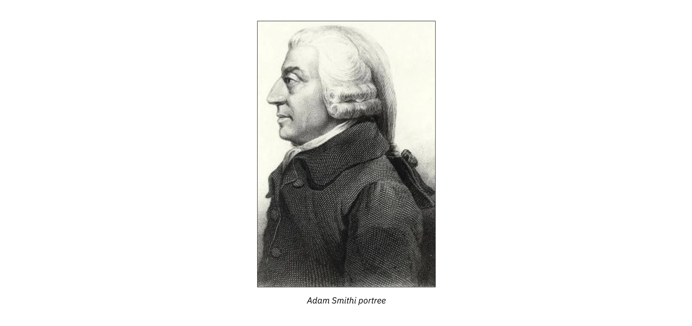

Ta võrdles ühiskonda mesilaspesaga, kus iga putukas järgib oma instinkti: "Nende tegevusest," ütles ta täpselt, "tuleneb suur akumulatsioon väikese ühiskonna vajaduste rahuldamiseks; kuid seda ei toonud kaasa käsud või kindralid, kes kohustasid iga üksikisikut järgima oma juhi seisukohti". See on ehk kõige lähedasem väljend prantsuse majandusmõtlemises Adam Smithi kuulsale "nähtamatu käe" kontseptsioonile.

Markii d'Argenson oli alati nördinud oma aja ministrite ideede üle. Nende ainus küsimus oli: "Kas me peaksime reguleerima nii või teisiti? Kas me peaksime majanduse suunama selle või selle poole?". Sellele vastas d'Argenson: "Kas me ei peaks kõigepealt küsima, kas üldse on kohane midagi suunata või tuleks jätta asjad iseenda toimima?"

Ausalt öeldes oli ta üllatunud, et inimesed leidsid, et see on nii Hard, et mõista või pigem näha igasuguse liigse reguleerimise kahjulikku mõju majandusele. Tema arvates piisab sellest, kui lihtsalt silmad avada. "Nii paljud asjad toimivad tänapäeval mõistlikult hästi," kirjutas ta kibedalt, "lihtsalt seetõttu, et neil on õnnestunud seaduse haardeulatusest pääseda".

Mõnikord oli ta meeleheitel selle üle, kui vähe tema ideid mõisteti.

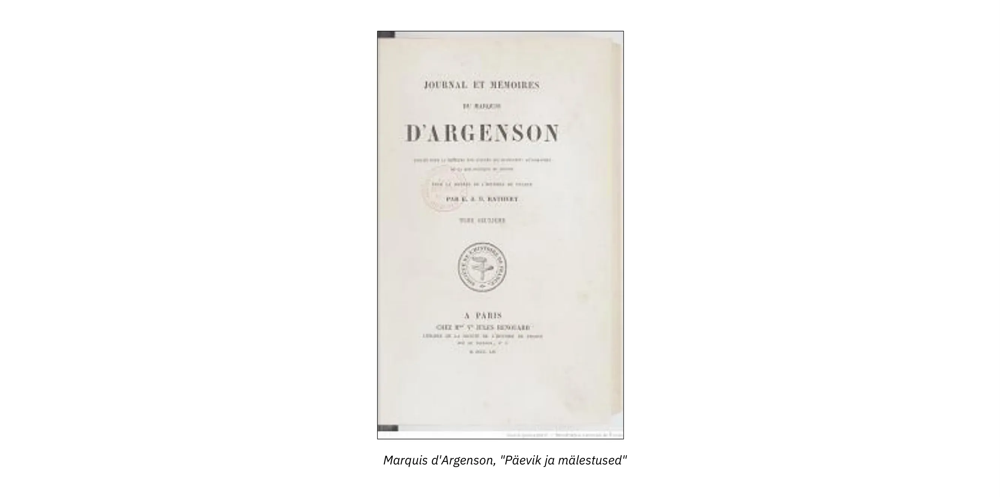

Seega oli majanduspoliitika ideaal, mida ta kaitses, vastuolus oma aja suundumustega. Tema ideaal määratles riigile sisuliselt negatiivse rolli. "Kõik, mida kaubandus vajab, on takistuste kõrvaldamine. Ta küsib ainult häid kohtunikke, monopolide karistamist, võrdset kaitset kõigile kodanikele, stabiilset valuutat ning teid ja kanaleid". See oli minimaalse riigi määratlus, millest sai üks Prantsuse poliitilise ökonoomia traditsiooni alustalasid.

Seda nägemust riigi rollist majandustegevuses illustreeris loomulikult kahe peamise küsimuse uurimine, mis tema aja majandusteadlasi ja sotsiaalseid mõtlejaid liigutasid: tööstuse reguleerimine ja nisukaubandus.

Kõigepealt äratasid kogu tema pahameelt tööstust puudutavad eeskirjad, sest need olid mõnede privileegid teiste arvelt. "Meie tehaste allakäigu tegelik põhjus," kirjutas ta, "on neile antud ülemäärane kaitse". Ja mitte vähem elava kreedoga väljendas ta oma kriitikat oma aja riigimeeste dirigistliku innukuse suhtes:

> Tööstuse juhtimine vastu selle tahtmist tähendab selle hävitamist.

Toimetulekuga kauplemise küsimusele ei olnud d'Argensonil muud vastust kui vabadus. Tema sõnul tulenes nisupuudus monopolist ja valitsuse ülemäärasest ettevaatusest. Tarvis vaid lasta olla, ja nisupuudust ei tekiks kunagi riigis, kus sadamad olid avatud. Välismaalased, keda nagu kõiki teisi mehi meelitab kasu ahvatlus, varustaksid meid sellega, mida vajame, ja võtaksid meie ülejäägi ära. "Las see olla," ütles ta, "ja kõik on hästi".

## Vincent de Gournay

<chapterId>e8ae40dc-7450-552f-9ddc-9e02936cf425</chapterId>

Vincent de Gournay oli üks esimesi laissez-faire'i esindajaid Prantsusmaal ja üks selle esimesi eestkõnelejaid avalikus halduses ja intellektuaalsetes ringkondades. Seetõttu väärib ta majandusmõtte ajaloos palju rohkem tunnustust, kui ta tavaliselt saab. Olen püüdnud tema panust esile tõsta ühes hiljutises raamatus.

Gournay sündis kaupmeheperekonda ja sai ise edukaks kaupmeheks, kogudes märkimisväärset jõukust, enne kui ta sai ametikoha Prantsuse administratsioonis. Kaubandusametis oli ta vaba tööjõu ja vabakaubanduse innukas pooldaja.

Kuigi Gournay oli oma aja juhtivate majandusteadlaste hulka hästi sisse seatud, kirjutas või õigemini avaldas ta vähe. Ta kirjutas peamiselt halduskirju ja memuaare, mis jäid kas avaldamata või avaldati teiste autorite poolt pärast mõningast toimetamist.

See, mis meil on olemas:

1. [märkused](https://archive.org/details/traitessurlecomm0000chil) inglise majandusteadlase Josiah Childi raamatu tõlke kohta;

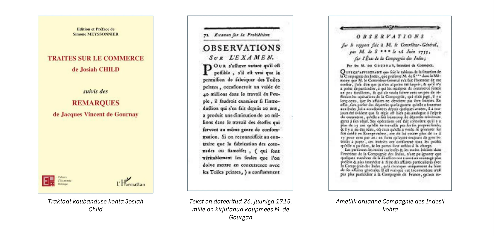

2. "Tähelepanekud", mis sisalduvad trükitud kangaste keelustamise eeliste ja puuduste uurimisel;

3. "Tähelepanekud Ida-India kompanii kohta", mille abt Morellet lisas oma "Memoir on the Current State of the East India Company" (1769);

4. Ja ennekõike mitmesugused mälestused tema rollist kaubandusametnikuna.

Need kirjutised näitavad selget välismaist mõju ja mõnede oluliste struktureerivate ideede olemasolu. Gournay puhul on välismaa mõju inglaste ja hollandlaste üleoleku tunnustamine. Gournay oli veendunud, et need kaks rahvast mõistavad majandust palju paremini kui Prantsusmaa ja et Prantsusmaa peab nende eeskuju järgima. "Need kaks rahvast on kõige jõukamad," ütles ta, "ja nad järgivad täiesti teistsugust süsteemi kui meie. Meie keelame välismaiste kaupade sissetoomise, me piirame majandustegevust drakooniliste määruste raames, samas kui nemad toimivad vastupidiselt. Kui neil läheb paremini," järeldas Gournay, "siis sellepärast, et Prantsusmaa juhindub vigastest põhimõtetest".

Tema reformiettepanekud keskendusid mitmele põhipunktile.

Esiteks uskus ta, et tööjõudu tuleb kaitsta ja julgustada. Tollal koheldi Prantsuse töölisi nagu kurjategijaid, neid jälgiti pidevalt ja hoiti hirmus, et nad ei ole täitnud ühtki tuhandetest eeskirjadest. See liigne tüütus heidutas inimesi töötamast, ajendades neid hoopis tegevusetuse poole. Ometi, väitis Gournay, "töö on üllas ja ainus viis rahva rikastamiseks".

Teiseks kritiseeris ta kildkondade piiravat süsteemi, mis piiras tootjaid. Ametis osalemine oli nii aeganõudev kui ka kallis, ja iga uus töötaja pidi seejärel piinlikult järgima oma gildi põhikirjaga kehtestatud rutiini. Selline süsteem ei jätnud ruumi tipptasemele, uuendustele ega edusammudele.

Kolmandaks piirasid Prantsusmaal toimuvat kaubandust piiravad seadused. Gournay arvates saaksid tarbijad suurt kasu, kui sadamad saaksid vabalt konkureerida ja kõiki kaupu, näiteks teravilja ja trükitud lõuendeid, lubataks importida piiranguteta. Ta oli üks esimesi, kes tõi välja salakaubanduse tegeliku päritolu: see eksisteeris üksnes seetõttu, et kasulik ja kasulik kaubandus oli keelatud. Ta lisas terava tähelepaneku: salakaubandus oli "vaba" elukutse, kus ei olnud mingeid eeskirju, kildasid ega konfiskeeritud makse. Ometi ajas just riigi ülekaalukas reguleerimine paljud ausad töölised ebaseaduslikuks.

Lõpuks märkis Gournay, et intressimäärad olid madalamad Inglismaal ja Madalmaades, mis on Prantsusmaast jõukamad riigid. Ta propageeris madalamaid intressimäärasid ka Prantsusmaal, et majandustegevust saaks rahastada seal sama soodsatel tingimustel kui mujal. Gournay ei püüdnud siiski kasutada sunniviisilisi, seadusandlikke meetodeid; pigem rõhutas ta vajadust legaliseerida rahalaenuandmine, mille katoliku kirik oli endiselt hukka mõistnud.

Kõigis neis punktides mängis Gournay võtmerolli 18. sajandi keskpaiga intellektuaalsetes aruteludes. Tema majandusliku vabaduse kaitsmine eelnes füsiokraatidele kümme aastat ja Adam Smithile kakskümmend aastat. Kuid tema kõige püsivam mõju oli Turgot'le. Gournay võttis noore Turgot' oma tiiva alla ja õpetas teda oma ideedega.

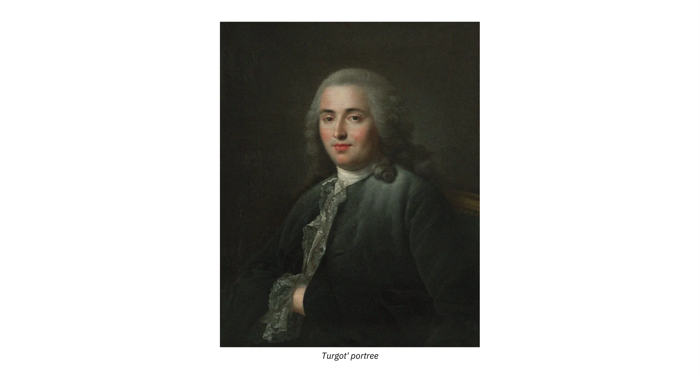

Aastaid hiljem kirjutas Turgot, tulevane minister Louis XVI ajal, oma sõbra surma järel Éloge (ülistus) tema auks. Ja kui Turgot ei võtnud kunagi täielikult omaks François Quesnay' füsiokraatiat, siis selle põhjuseks oli see, et ta säilitas võitmatu kiindumuse oma esimese meistri Vincent de Gournay'sse.

## Gournay ring

<chapterId>b86ba6bd-8f3a-5d8f-b098-4d0413f00deb</chapterId>

Majandusteaduse algusaegade puhul kipub ajalugu esile tõstma esimest koolkonda: füsiokraadid, keda juhtisid François Quesnay ja tema jüngrid. Kuid peaaegu kümme aastat enne nende tõusu eksisteeris veel üks vähem formaalne, kuid sama oluline rühm, mille keskmes oli majandusteadlane Vincent de Gournay.

Nagu nägime eelmises osas, oli Gournay vaimustatud välisriikide nagu Inglismaa ja Hollandi eeskujudest. Ta imetles nende majandusteadlasi - selliseid tegelasi nagu Josiah Child, Johan de Witt ja David Hume - sama palju.

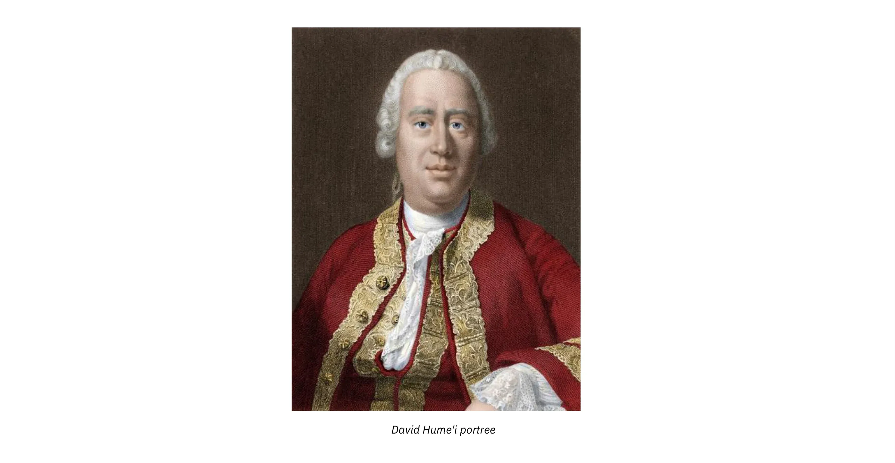

See imetlus ajendas teda tõlkima nende majandusteemalisi kirjutisi ja andma nende tõlkeid.

Selgus, et tema positsioon kõrgemas valitsuses võimaldas Gournay'l saada kontakti kõigi tollal Prantsusmaal tuntud majandusspetsialistidega. Sel viisil kogus ta kokku äärmiselt võimekate tõlkijate rühma. Ta tõlkis isiklikult Childi ja Culpeperi teosed. Abt Le Blanc tõlkis David Hume'i "Poliitilised arutlused". Véron de Forbonnais tõlkis hispaania majandusteadlase Geronymo de Uztarizi. Turgot töötas Josiah Tuckeri kirjutiste kallal ja Montesquieu poeg tõlkis Joshua Gee.

Tänu mitme Gournay ringi liikme koostööle said paljud autorid avaldada originaalseid teoseid oma nime all. Need raamatud saavutasid koos tõlgetega märkimisväärset edu. Mõned märkimisväärsed näited on järgmised:

- Herbert's Essay on the [General Police of Grain](https://archive.org/details/essaisurlapolice00herb/page/n7/mode/2up) (6 väljaannet 4 aasta jooksul)

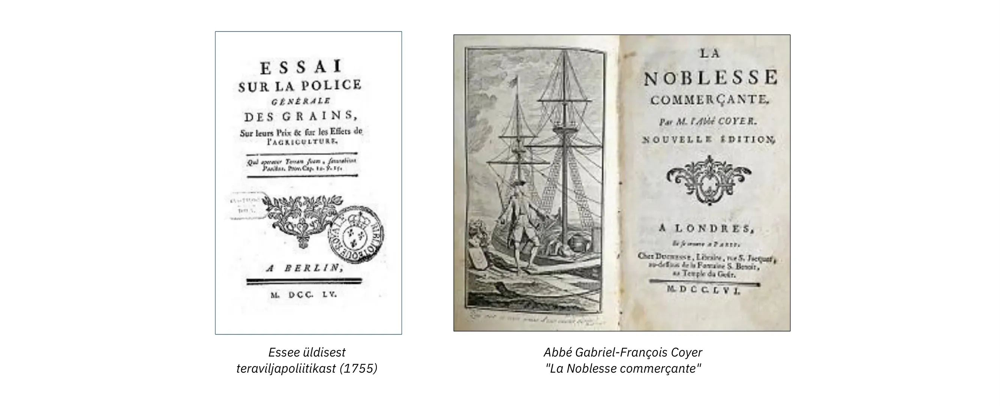

- Coyer's [Noblesse commerçante](https://archive.org/details/lanoblessecommer00coye/page/n3/mode/2up) (5 väljaannet 2 aasta jooksul)

- Plumard de Dangeul'i [märkused Prantsusmaa ja Suurbritannia eeliste ja puuduste kohta](https://archive.org/details/bim_eighteenth-century_remarks-on-the-advantage_plumard-de-dangeul-loui_1754) (3 väljaannet esimesel aastal)
- Cliquot-Blervache'i ja Gournay's [Memoir on the Trades](https://www.amazon.com/Memoire-sur-corps-metiers-French/dp/1978196903) (2 väljaannet 1758)

Rühm mängis ka keskset rolli järgmiste raamatute avaldamisel

- [Essee kaubanduse olemusest üldiselt](https://archive.org/details/essayonnatureofc0000cant) Richard Cantillon.

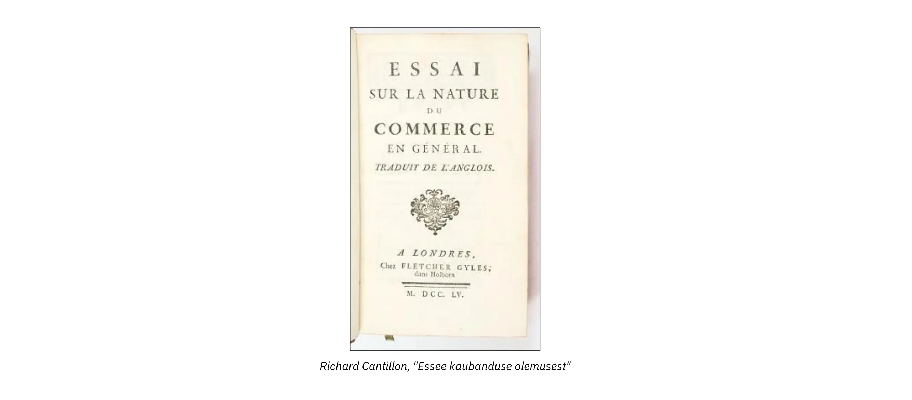

See viimane, umbes 1730. aasta paiku kirjutatud raamat jäi pärast autori surma käsikirjana alles. Gournay avaldas selle 1755. aastal oma majandusteadlastest sõprade abiga. Ringi liikme abt Morellet' sõnul soovitas Gournay seda kõigile oma tuttavatele majandusteadlastele.

Gournay ringkonna intellektuaalne tegevus avaldas suurt mõju ideede ajaloole. Selles mõttes võib neid pidada Prantsusmaa majandusteaduse rajajateks. Christine Théré INEDist, kes on uurinud majandusalaste väljaannete ajalugu, leidis, et aastatel 1750-1759 avaldati mitte vähem kui **349** majandusteemalist teost, võrreldes ainult **83** kogu eelneva kümnendi (1740-1749) jooksul. See revolutsioon 1750. aastatel on suures osas tingitud Gournay ringkonnast.

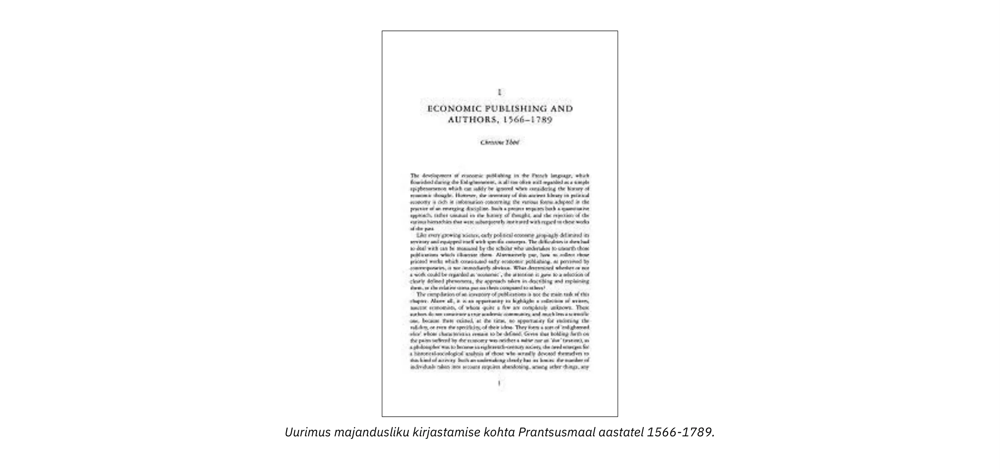

Selleks, et levitada Prantsuse elanikkonna seas majandusaruteluid, tegid Gournay ja tema sõbrad need romaanide kaudu kättesaadavaks. Pärast *Memuaari kaupmeestest*, milles kritiseeriti gildid, aitasid Gournay ja Cliquot-Blervache Gabriel-François Coyer'il kirjutada lühikese satiirilise romaani "Chinki: [Teistele rahvastele kohaldatav kokšinistlik lugu]" (https://www.institutcoppet.org/wp-content/uploads/2013/06/Coyer-Chinki-Histoire-cochinchinoise.pdf).

Lugu jälgib peategelast Chinki, kes on sunnitud oma maalt lahkuma ülemäärase maksustamise tõttu ja püüab leida oma lastele käsitööalast tööd linnas. Kuid kõik ametid on neile kuritarvitavate kildkondade eeskirjade tõttu suletud, nii et lugu kujutab tema kasvavat pettumust läbi humoorikate toonide.

Gournay ringkond oli seega intensiivse trükiste laine algataja. Kuigi majandusmõtte ajaloolased on selle olulise panuse unustanud, oli see kaasaegsetele väga selge. Füsiokraadid, kes organiseerisid oma koolkonna 1760. aastatel, esitasid hiljem Gournay' rühma kui oma otseseid eelkäijaid. 1767. aastal väljendas majandusteadlane Jacques Accarias de Serionne seda veel selgemini oma austusavalduses. Ta kirjutas: "Vähesed prantslased, nii filosoofid kui ka kodanikud, hakkasid mõned aastad tagasi jäljendama inglise kirjanikke. Nad tõlkisid kõigepealt nende eeskujusid ja ületasid neid peagi paljudes aspektides. Nad tõid kogu kirjanduse võlu ja rikkuse kasulike teemade käsitlemisse; nad äratasid ja levitasid maitse teaduste vastu, mis olid riigi õitsengule kõige olulisemad".

Ja tõepoolest, 1750. aastatel muutusid majandusküsimused moes olevaks. Voltaire märkis kuulsalt, et 1750. aasta paiku loobusid prantslased romaanidest, et arutada teraviljakaubanduse vabaduse üle. Seda suundumust märkis ka ajakiri Mercure de France, mis kirjutas ühes 1758. aasta numbris, mõned kuud enne Gournay surma: "Poliitiline ökonoomia on nüüd moes olev teadus. Põllumajandust, rahvastikku, tööstust, kaubandust ja rahandust käsitlevad raamatud on nüüd lugematute inimeste käes, kes veel hiljuti lugesid ainult pealiskaudselt romaane". Vaevalt saaks Gournayle ja tema majandusteadlaste ringile paremat tunnustust avaldada.

## Mirabeau

<chapterId>2d2f802b-e3b6-556f-9025-a1b1dc4409ca</chapterId>

Prantsusmaa on tundnud kahte kuulsat meest nimega Mirabeau, isa ja poeg, kuid just poeg oli see, kes tegi tõeliselt ajalugu. Ta jäi kuulsaks kui revolutsioonitribüün ja Prantsuse revolutsiooni sündmuste üks keskseid tegelasi.

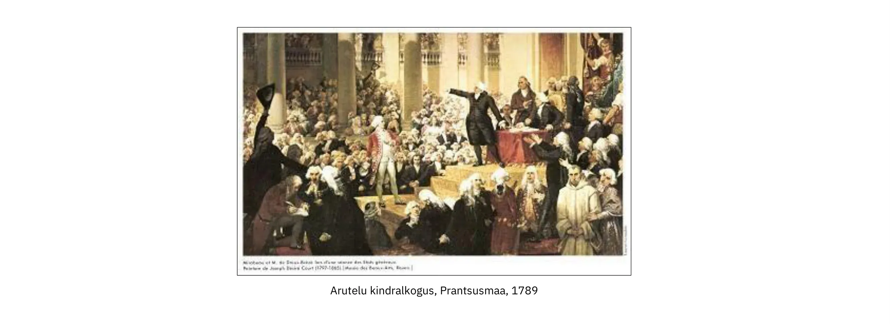

Oma andekuse ja koha tõttu Prantsuse ajaloos varjutas ta oma isa, majandusteadlase ja François Quesnay koolkonna tugisammast, kes oli selle esimene liige juba 1758. aastal.

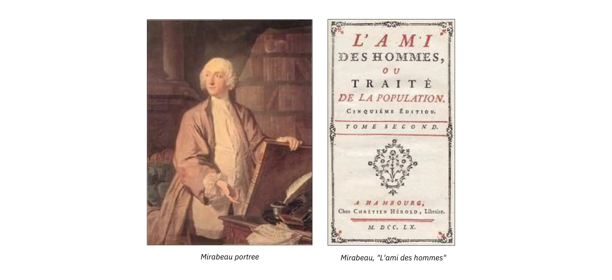

Markii de Mirabeau oli tegelikult juba enne füsiokraatia vastuvõtmist saavutanud tohutu kuulsuse tänu raamatule "Inimkonna sõber. Traktaat rahvastikust [FR: L'ami des hommes, ou, Traité de la population](https://archive.org/details/lamideshommesou00unkngoog). Kuigi esimene väljaanne ilmus 1756. aastal, sai see kuulsaks umbes 1757. aastal, aasta enne tema kohtumist Quesnay'ga.

Aastatel 1757-1760 ilmus sellest rohkem kui 20 väljaannet, mis teeb sellest tõenäoliselt kõige edukama majandusraamatu ajaloos. Mõned lugejad arvasid isegi, et raamatu on kirjutanud Montesquieu, sest see sisaldab teravaid põhjendusi. Dauphin, kuningas Louis XVI isa, väitis isegi, et on selle pähe õppinud. Mõnda aega oli see raamat see, mida kõik Versailles'is lugesid.

Tänapäeval ei loeta seda raamatut enam, kuid paljud viitavad sellele ikka veel. Isegi 19. sajandil ütles Edmond Roussel:

> L'Ami des Hommes on üks neist raamatutest, millest kõik räägivad, kuid mida vaevalt keegi teab. Igas põlvkonnas peaks üks vapper kodanik seda lugema, et kõik teised ei peaks seda tegema.

Majandusteadlase karjääri alguses sai Mirabeau inspiratsiooni Richard Cantillonilt. Ta oli 15 aastat omanud Cantilloni "Essee kaubanduse üldisest olemusest" käsikirja, mida ta oli kannatlikult analüüsinud ja kommenteerinud.

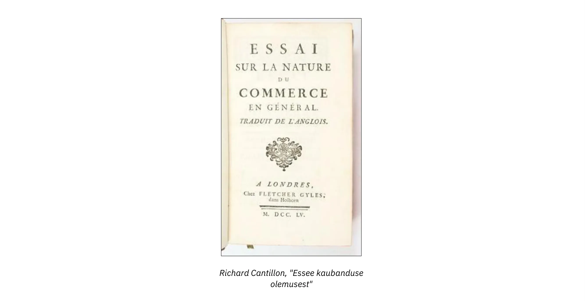

L'Ami des Hommes oli algselt mõeldud lihtsa kommentaarina Cantilloni esseele. Kuid kuna Mirabeau oli mõnevõrra eklektiline, s.t. ausalt öeldes pisut hullumeelne, kaldus ta oma esialgsest plaanist kiiresti kõrvale. Raamatus käsitletakse lihtsalt kõiki talle teadaolevaid majandusküsimusi, eemaldudes aeg-ajalt Cantillonist. See on raskesti loetav raamat, mille plaan on veider ja igas peatükis on kõrvalepõiked. Mirabeau ise tunnistas, et see oli kaos ja tema stiil oli apokalüptiline.

Hoolimata sellest kaosest, mida see on, on mõned ideed märkimist väärt:

- Mirabeau võitleb merkantilistlike eelarvamuste vastu rikkuse olemuse kohta.
- Ta kiidab põllumajandust ja kritiseerib selle hülgamist.
- Ta kurdab inimeste, eriti talupoegade olukorra üle.
- Lõpuks kaitseb ta kaubandusvabadust ja rahvaste vendlust rahus.

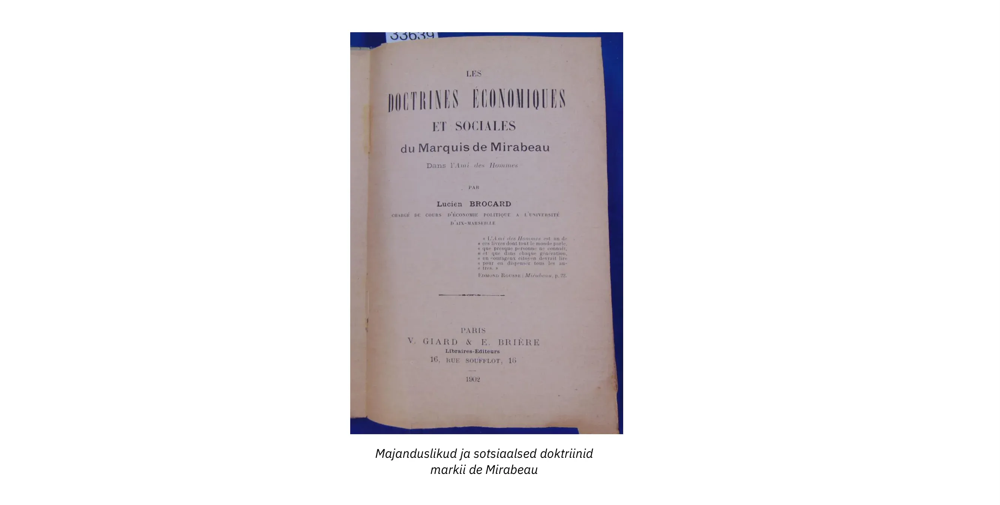

See on Hard, et Mirabeau seisukohti nimetada kas liberaalseks või antiliberaalseks. Ta triivis sageli edasi-tagasi, mõnikord seda teadvustamata, ühe ja teise nägemuse vahel. Siiski domineerisid tema kirjutistes sageli liberaalsed ideed. Üks tema kuulsamaid ridu oli:

> Poliitilise ökonoomia tõeline ja ainus põhimõte on lasta kõik olla vaba.

Oma suurima edu järel oli Mirabeau'le tehtud ettepanek. François Quesnay, kes oli äsja huvi tundnud majandusteaduse vastu, kutsus teda oma entresooli Versailles'sse.

Nad vaidlesid ägedalt ja lõpuks juhtus midagi, mida tavaliselt debattides kunagi ei juhtu: Mirabeau tunnistas otsesõnu, et ta oli eksinud. Ta nõustus Quesnay ideedega ja ütles, et on valmis neid levitama.

Koos moodustasid nad selle tuumiku, millest sai füsiokraatlik koolkond, mida tugevdasid nende poolt sissetoodud regulaarsed värbajad. Varsti pärast Mirabeau pöördumist kutsus Quesnay teda kaitsma oma ideid maksustamise kohta. See viis ["Maksustamise teooria"](https://archive.org/details/thoriedelimpot00mira) koostamiseni, mille eest Mirabeau saadeti mõneks päevaks Vincennes'i vanglasse ja seejärel pagendati Bignonisse.

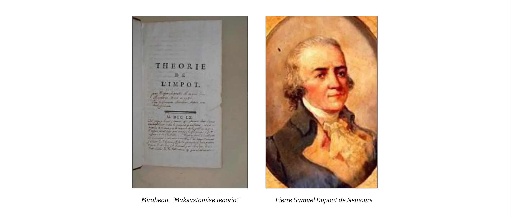

Mirabeau mängis olulist rolli ka uute liikmete värbamisel Quesnay kooli. Ta veenis isegi noort Dupont de Nemours'i.

Samuti kohtusid füsiokraadid igal teisipäeval Mirabeau majas. Näib, et sellised isiksused nagu Turgot ja Adam Smith osalesid neil kohtumistel üks või mitu korda.

Mirabeau jäi kogu oma elu jooksul väsimatuks kirjanikuks. Ta kirjutas arvukalt majandusteoseid, milles kaitses Quesnay doktriini. Kuid elu lõpu poole tema mõju vähenes. Tema kirjutamisstiil halvenes sedavõrd, et tema enda vend kirjutas talle, et ta ei saa enam tema proosast aru. Tema ideed, mis olid muutunud täiesti liberaalseks, sattusid vastuollu selliste mõtlejate nagu Mably ja isegi Rousseau sotsialistliku või protokommunistliku reaktsiooniga. Tal oli raske leida lugejaid ja kirjastajaid ning ta suri 1789. aastal, Bastille'i tormi eelõhtul, suuresti märkamatult.

## Quesnay

<chapterId>7a35f20b-5ea0-544d-b290-bcd9c6f7f11a</chapterId>

François Quesnay on üks kuulsamaid prantsuse majandusteadlasi.

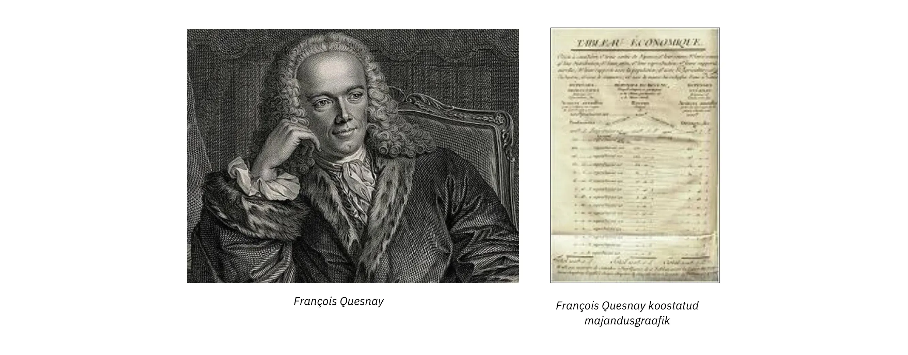

Tema nimi esineb igas majandusteaduse ja majandusmõtte ajaloo õpikus. Öeldakse, et ta lõi "Tableau Économique'i" majanduse skemaatiliseks kujutamiseks, et ta oli füsiokraatliku koolkonna juht, et ta eksis, kui arvas, et ainult maa on tootlik, ja lõpuks, et Adam Smith tuli parandama olukorda. Enam-vähem nii kipuvad õpikud François Quesnayd kokku võtma.

Tema taandamine sellele on häbiväärne, sest Quesnay oli ka esimene majandusteadlane, kes püüdis rajada majandusliku vabaduse kaitsmise teaduslikele põhimõtetele. Ta oli üks oma aja kuulsamaid ja mõjukamaid majandusteadlasi. Pealegi rajas ta füsiokraatia, mis on palju rikkam õpetus kui lihtsustatud idee, et ainult loodus toodab rikkust, mida sageli vääriti tõlgendatakse.

Järgmise kolme peatüki jooksul käsitleme füsiokraatiat üksikasjalikumalt. Kõigepealt vaatleme lähemalt François Quesnayd ennast.

Sündis 1694. aastal Mérés talupoegade peres, kes ei suutnud Quesnay'd lugema õpetada. Teda õpetas üks kohalik mees ja lõpuks läks ta õppima kirurgiakolledžisse ja seejärel arstiteaduskonda. 24-aastaselt sai temast kirurg Mantes'is.

Ta sai 1730. aastal, 36-aastaselt, kuulsaks sellega, et ta oli vastu levinud verejooksu praktikale, mis tema arvates põhines vigastel teooriatel ja eelarvamustel. Samuti julges ta vaidlustada kildkondade süsteemi, mis nägi ette, et ainult kirurgid võivad teha operatsioone ja ainult arstid võivad välja kirjutada ravimeid. See sundis vaeseid sageli maksma kaks korda ja tooma kohale kaks inimest, mida Quesnay pidas vastikuks.

1740. aastal sai temast Kirurgiaakadeemia sekretär. Aastal 1748, 54-aastaselt, sai temast Madame de Pompadouri isiklik arst ja ta kolis Versailles'sse.

Ta oli Madame de Pompadouriga väga lähedane. Quesnay ütles isegi ajal, mil favoriidi häbistamisest teatati, et ta ei tahaks ilma naiseta Versailles'sse arstiks jääda:

"Ma olin Madame de Pompadouriga seotud tema õitsengul, ma olen seda ka tema häbistamisel".

Seejärel avaldas ta mitu meditsiinilist raamatut: (1749), "Traktaat mädanikust" (1749) ja "Traktaat pidevast palavikust" (1753), mida kõiki trükiti tema eluajal mitu korda uuesti.

60-aastaselt, olles tutvunud tollal moes olnud majandusdebattidega, hakkas ta kirjutama majandusteadustest. Aastal 1755 kirjutas ta artiklid "Põllumehed" ja "Teravili" ajakirjale *Encyclopédie*.

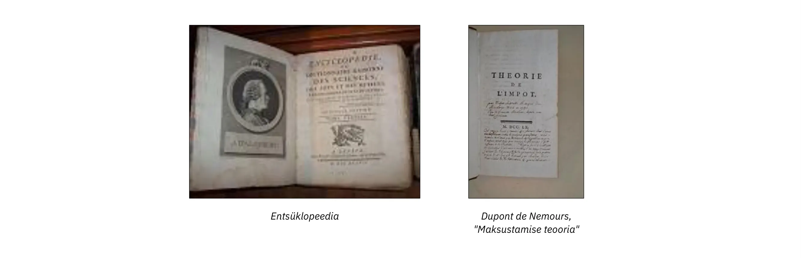

Need avaldati 1757. aastal. Samal aastal kohtus ta kuulsa Mirabeau'ga ja tal õnnestus teda oma majandusideedele ümber pöörata - sündis füsiokraatia tuum. Seejärel koostas Quesnay Tableau Économique'i, mis trükiti kuninglikul trükipressil, väidetavalt kuninga enda juuresolekul Versailles' lossis. Sellest alates võõrustas ta regulaarselt majandusteadlasi ja filosoofe oma Versailles' korteris, kus nad vabalt arutlesid. Quesnay andis oma panuse ka Mirabeau 1759. aastal avaldatud teosesse "Theory of Taxation".

Peagi tabas tsensuur. Mirabeau vangistati ja Quesnay sai noomituse. Pärast seda mõistis Quesnay, et ta ei saa avalikult avaldada ja vajab oma ideede levitamiseks jüngrid.

Ta leidis need kiiresti: Baudeau, Dupont de Nemours, Le Trosne, Mercier de la Rivière ja teised. Need olid mehed, kes levitasid ja populariseerisid Quesnay mõtteid. Quesnay, kes vajas jüngrid, ei olnud siiski täiesti rahul oma grupi sektantliku aspektiga. Olge tunnistajaks tema kirjadele Mirabeau'le, milles ta ütleb talle:

> "Mõelge ise. Ma olen aru saanud, et minu viletsad eelnõud teevad teid laisaks. Nüüd on teie kord mõelda. Te teate sama palju kui mina".

Tema jüngrid olid siiski sügavalt pühendunud ja aitasid suuresti kaasa Quesnay populaarsusele. Tema surma puhul pidas Mirabeau ülistusreferaadi, öeldes: "Me kaotasime oma isa, sest me võlgnesime talle kõik". Tegelikult oli Quesnay neile kõike võlgu, sest ilma nendeta oleks ta jäänud Versailles'sse, kus tema mõtlemine, kuigi see võis paljuski võrgutada või muretseda, huvitas vähe.

Tänu oma kaastöötajate tööle leidsid tema ideed platvormi: kõigepealt selliste ajalehtede kaudu nagu *Agriigiajakiri* ja *Ephémérides du Citoyen*.

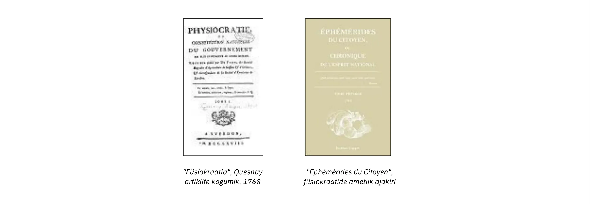

Seejärel raamatute kaudu, mitte ainult tema õpilaste raamatute, vaid ka 1768. aastal Dupont de Nemours'i poolt välja antud olulise kogumiku *Füsiokraatia* kaudu.

See raamat koondas Quesnay peamised panused. Selles sätestati füsiokraatide juhi majandusideaal: põllumajandusliku majanduse mudel, kus seadus tagab kõigile õiguse omada vara ja vabaduse kaubelda.

# Füsiokraatlik koolkond

<partId>27af82c1-ad82-5c3b-8ce9-c674b67bbf7c</partId>

## Füsiokraatide ajalugu

<chapterId>4236ff8b-b53a-59e7-92c0-f96f9afa1c00</chapterId>

Füsiokraatia sai Prantsusmaal ja isegi kogu Euroopas moodi vaevalt kümne aasta jooksul. Pärast pikka arenguperioodi saavutas see tuntuse 1760. aastate keskel. Selleks ajaks, kui Turgot 1776. aastal võimule tuli, oli see liikumine juba oma populaarsust kaotanud ja minister hoidis oma toetust Quesnay koolkonnale enamasti varjatud.

Selle algupära peitub majanduslike ideede arengus 1750ndatel aastatel. Mitmed autorid aitasid ületada lõhet Boisguilbert'i ja selle vahel, mis hiljem sai tuntuks füsiokraatia nime all. Nagu eespool mainitud, olid Vincent de Gournay ja tema majandusteadlaste ring paljude väljaannete taga, mis tutvustasid prantsuse lugejatele välismaist majandusmõtet ja aitasid sütitada nende kirge majanduse vastu. Füsiokraatia alused olid juba olemas sellistes raamatutes nagu Boisguilbert'i "Détail de la France" ja ["Essee kaubanduse üldisest olemusest"] (https://archive.org/details/essaisurlanature0000cant), mille autoriks oli Cantillon.

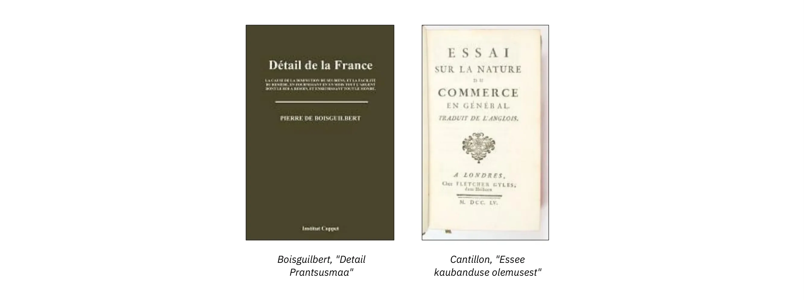

Pärast Boisguilbert'i oli laissez-faire'i kontseptsioonil mitmeid pooldajaid, eriti Vincent de Gournay ja markii d'Argenson.

Mis jäi üle, oli muuta see ideede kogum ühtseks, terviklikuks õpetuseks, ja markii de Mirabeau oli esimene, kes seda proovis. Cantilloni esseest inspireerituna hakkas ta kirjutama põhjalikku majandusküsimusi käsitlevat traktaati pealkirjaga "L'Ami des Hommes", mis oli väga edukas.

Nii võis 1756. aastal alata füsiokraatia lugu. François Quesnay, tollane kirurg, kellest sai Madame de Pompadouri isiklik arst, kutsus Mirabeau'd Versailles'sse, et arutada majanduslikke ideid.

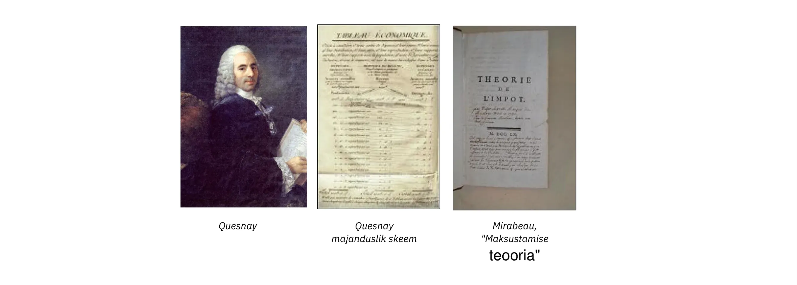

Nende vestluse lõpuks nõustus Mirabeau Quesnay ideedega. Edaspidi kirjutasid nad: Quesnay lõi *Tableau économique* (1758), et illustreerida rikkuse liikumist majanduses, ja koos avaldasid nad "Maksustamise teooria" (1759).

Nende pingutused ei leidnud sooja vastuvõttu. Kohtus oli valdavaks reaktsiooniks ükskõiksus. Kuningas tunnustas Quesnay kalduvust teooriasse ja nimetas teda hellalt "minu mõtlejaks". Kuid peale selle komplimendi ei saavutanud nende töö mingit tulemust. Tegelikult solvas nende maksuteooria maksuhaldureid, keda ta kritiseeris, sedavõrd, et nad nõudsid ja kindlustasid Mirabeau vangistamise. Madame de Pompadour lasi ta lõpuks vabastada, kuid ta elas veel mõned nädalad oma mõisas Bignonis eksiilis.

Seega möödus 1760. aastate esimene pool suhteliselt vaikselt. Oma positsiooni tõttu Versailles's oli Quesnay sunnitud lõpetama kirjutamise või vähemalt mitte midagi oma nime all avaldama. Mirabeau, kes oli juba kord hukka mõistetud, oli hoiatatud ja teadis hästi, et kuninga favoriit ei saa teda igavesti kaitsta.

Pärast seda lühikest vaikust hakkasid kaks majandusteadlast jüngrite värbama: see oli ainus viis nende ideede populariseerimiseks. Aastaks 1765 oli nende edu silmatorkav. Dupont de Nemours, Abeille, Mercier de la Rivière, Le Trosne ja Baudeau liitusid kiiresti nende ridadesse. Nad moodustasid kooli: neil oli oma ajakiri *Les Éphémérides du Citoyen* ja nad kogunesid isegi igal teisipäeval Mirabeau kodus.

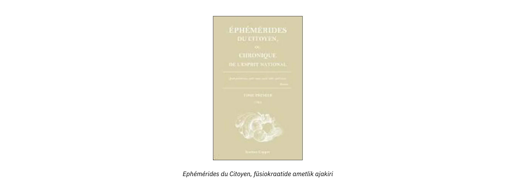

Ajavahemikul 1765-1775 oli füsiokraatide ühendatud rühm oma kuulsuse tipul. Kirjandus- ja filosoofiamaailma silmad olid ainult neil, mis võimaldas nende ideedel laialdaselt ja kiiresti levida. Inimesed nimetasid neid "majandusteadlasteks" või, mõnitavamalt, "majandusteadlaste sekti". Sõltumata toonist oli nende kuulsus absoluutne. 1774. aastal kirjutas M. de Vaublanc pärast reisi Metzis oma mälestustes oma hämmastusest: kõik tema ümber rääkisid majandusteadusest ja arutlesid nagu Quesnay jüngrid. "See oli moes," märkis ta. "Kõik olid majandusteadlased".

Kuid 1770. aastaks hakkas nende populaarsus vähenema. Rühmitus koges esimesi ülejooksikuid ja nende võime kriitikale vastu seista nõrgenes. Ja kriitikuid oli palju: Condillac, Mably, Voltaire, Galiani, Linguet, Graslin ja isegi Adam Smith Šotimaal vaidlustasid nende seisukohti.

Nende ajaleht ei ilmunud enam regulaarselt. Sellega lõppes liikumise kõige aktiivsem periood.

Füsiokraatia jätkab oma mõju kuni revolutsioonini. Prantsusmaal kõigepealt Turgot' kaudu, kes oli pigem kaaslane kui õpilane, ning samuti selle esindaja Dupont de Nemours'i kaudu, kelle elu ja loomingut me hiljem uurime. Aga ka kogu Euroopas, kus füsiokraatlik doktriin võeti vastu entusiastlikult. Saksamaal Badeni markkrahvi kaudu ja Itaalias Toscana Leopoldi kaudu inspireerisid füsiokraatlikud teooriad isegi eraomandit ja vabadust soosivaid majandusreforme.

## Füsiokraatide õpetuse alused

<chapterId>4dbe5436-0578-57c2-b054-03ed00aa091a</chapterId>

Termin "füsiokraatia", mis tähendab "looduse järgi valitsemist", pärineb Dupont de Nemours'i poolt ja seda kasutati Quesnay 1768. aastal avaldatud artiklikogumiku *Füsiokraatia* pealkirjana.

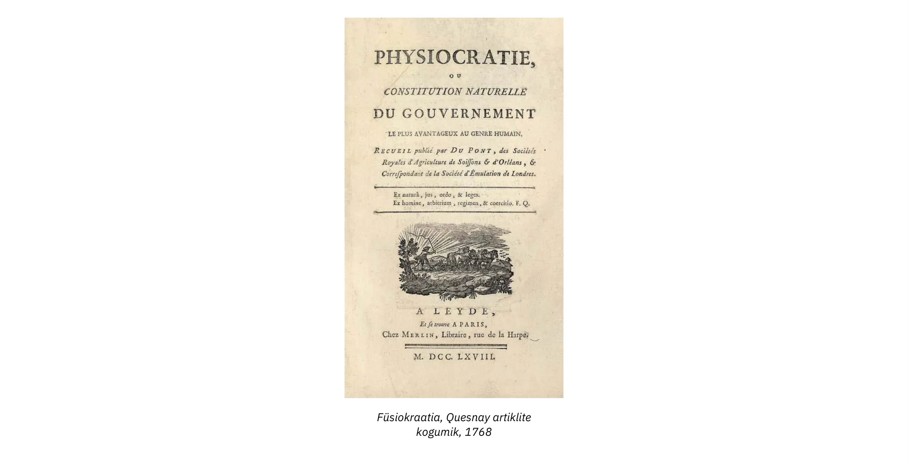

See on ebaselge fraas. Ükski Quesnay õpilane ei ole meile selle tegelikku tähendust andnud. Sellegipoolest ei olnud nende mõttekäik kaugeltki ebaselge. Tegelikult oli see üles ehitatud mõne väga selge põhimõtte ümber, mida me siinkohal kirjeldame.

### Esimene põhimõte: ainult põllumajandus on tootlik

See esimene idee on see, mis on äratanud ajaloolaste tähelepanu. Tänapäeval võetakse õpikutes või majanduskursustel füsiokraadid kokku just nii. Öeldakse, et nad uskusid naiivselt, et ainult põllumajandus on tootlik. Selle põhjal jäetakse nende õpetus kõrvale kui ebaoluline ja analüüs liigub kiiresti edasi Adam Smithi juurde.

Siiski on ebaõiglane kritiseerida füsiokraate selle eest, et nad omistasid põllumajandusele ebaproportsionaalselt suurt tähtsust, sest 18. sajandi keskel töötas põllumajanduses 90% elanikkonnast ja see oli Prantsusmaa majanduse alus.

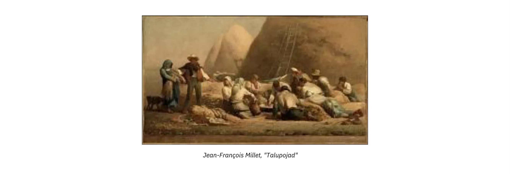

Füsiokraatide idee on tegelikult peen. Nende sõnul on erinevus tootmise ja kasu vahel. Tööstusettevõtja ja kaupmees võivad teenida kasumit, kuid ainult põllumees toodab tõeliselt, sest tootmine on kasuliku materjali loomine, mitte kasulikkuse lisamine olemasolevale materjalile.

Samuti peaksime püüdma mõista, miks nad lükkasid tööstuse ja käsitöö kui ebaproduktiivse tagasi. Tol ajal olid need ametid lukustatud kildkondade süsteemi, mis keelas uuendused, investeeringud ja progressi.

### Teine põhimõte: õiguslik despotism, mitte demokraatia

Tänapäeval ütleme kellegi solvamiseks, et ta ei ole demokraat. Kuigi ajaloolased andestavad füsiokraatidele nende ranged vaated põllumajanduse tootlikkusele, ei andestata nende vastuseisu demokraatiale, eriti kuna nad elasid valgustusajastu ideede kõrgajal. Alates 18. sajandi keskpaigast kuni vahetult enne revolutsiooni peeti füsiokraate progressi vaenlasteks.

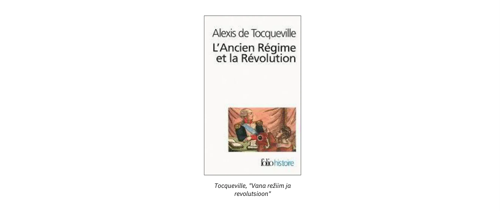

Tocqueville nõudis seda ideed:

> Füsiokraadid pooldasid tõepoolest väga kaupade vaba kaubandust, laissez-faire'i või laissez-passer'i kaubanduses ja tööstuses; kuid mis puutub poliitilistesse vabadustesse, siis nad ei kaalunud neid, ja isegi kui sellised ideed juhtusid neile pähe tulema, lükkasid nad need esialgu tagasi.

Füüsokraadid olid majanduslikult liberaalsed, kuid poliitiliselt ei olnud nad seetõttu liberaalsed. Quesnay kirjutab oma *Maksimites*: "Suveräänne võim olgu ainuüksi ja kõrgemal kõigist ühiskonna üksikisikutest ja kõigist erahuvide ebaõiglastest ettevõtmistest." Ja hiljem, samas maksiimis: "Kontrollide ja tasakaalude süsteem valitsuses on fataalne mõiste, mis paljastab ainult ebakõla suurte seas ja väikeste rõhumise".

Tocqueville märkis tabavalt, et füsiokraadid lükkasid demokraatia tagasi kohe, kui nad nägid selle vorme. Nad suhtusid skeptiliselt demokraatiasse, millest sai Prantsuse poliitilises majanduses püsivaks, sest demokraatia ei ole kaugeltki täiuslik süsteem: see võimaldab potentsiaalselt vähemuste rõhumist enamuse poolt ning võib muutuda usurpatsiooni, türannia ja rüüstamise vahendiks.

### Kolmas põhimõte: eraomandi absoluutne austamine

Füsiokraadid uskusid, et inimesed peavad omama ja hoidma oma töö tulemusi. Nende arvates olid omandiõigused ühiskonna aluseks. Nad arvasid, et riigil on üks peamine ülesanne: kaitsta inimeste omandit. Lisaks sellele väitsid füsiokraadid majanduslikust vaatepunktist, et omandi puutumatus soodustab tööd ja pingutusi ning on majandusliku progressi eelduseks.

Quesnay väljendas seda lihtsalt:

> Tagatagu maa ja vallasvara Ownership neile, kes on nende seaduslikud valdajad, sest omandikindlus on majandusliku korra ja ühiskonna turvalisuse oluline alus; just kindlus püsiva omandiõiguse kohta julgustab tööd ja rikkuse kasutamist maa parandamisel ja harimisel, samuti kaubandus- ja tööstusettevõtetes.

### Neljas põhimõte: absoluutne kaubandusvabadus

Oma varem tsiteeritud *Maksimites* väidab Quesnay:

> Olgu täielik kaubandusvabadus, sest nii sise- kui ka väliskaubanduse kõige usaldusväärsem, täpsem ja kasulikum reguleerimine rahva ja riigi jaoks seisneb täielikus konkurentsivabaduses.

Füsiokraadid olid näinud, millist kahju tekitas valitsuse sekkumine, eriti teraviljakaubanduses. Tuleb tunnistada, ütlevad nad, et asutus ei suuda kunagi juhtida kaubandust sama hästi kui üksikisikud, sest ta peaks reageerima igale vajadusele ja reageerima igale nõudluse või Supply muutusele. Kõik see ületab kaugelt isegi kõige targemate valitsuste võimed, mida saab ette kujutada. Seepärast on vaja lasta asjadel olla ja lasta neil voolata.

Kaubandus peab olema oma olemuselt kasulik, see peab olema täielikult ja täiesti vaba. Üks nende liikmetest, Le Trosne, kirjutas isegi pamfleti pealkirjaga [*Teraviljakaubanduse vabadus: alati kasulik, mitte kunagi kahjulik*](https://www.institutcoppet.org/liberte-commerce-grains-toujours-utile-jamais-nuisible/).

### Viies põhimõte: Kõik inimesed on vennad

Füüsokraadid, kes olid raevukad orjanduse vastased, olid ka suured patsifistid. "Meie välispoliitikat nimetatakse rahuks," ütles Mirabeau lihtsalt. 1790. aastal jätkas Dupont de Nemours Asutavas Kogus seda patsifistlikku seisukohta, kui ta esitas seaduseelnõu, millega keelustati ründavad sõjad.

## Füsiokraatide saavutused ja mõjud

<chapterId>5b911105-796a-5e2e-a501-c7a364fc758e</chapterId>

Nagu me nägime esimeses kolmest füsiokraatidele pühendatud peatükist, olid Quesnay järgijad Prantsusmaal umbes kümnendi vältel ülipopulaarsed. See entusiasm nende ideede vastu kujunes nii nende ajal kui ka jätkus kuni sajandi lõpuni. Siinkohal vaatleme mõningaid nende saavutusi ja mõju, mida nad avaldasid oma järeltulijatele majandusmõtte valdkonnas.

Nende suurim saavutus pärast Gournay gruppi oli majanduslike ideede populariseerimine. Voltaire'i kuulus ütlus on hästi tuntud: 1750. aasta paiku hakkas rahvas, kes oli tüdinenud luulest ja romaanidest, arutlema teravilja üle. Füsiokraadid osalesid selles liikumises, avaldades sõna otseses mõttes sadu artikleid, brošüüre ja raamatuid teraviljakaubanduse vabaduse kohta. Füüsokraatide poolt majandusaruteludele antud tugevat hoogu näitab ka Prantsusmaal aastatel 1760-1775 avaldatud muljetavaldav hulk majandusteoseid ja pamflette. Täiendava tõendina majanduslike ideede levikust Prantsusmaal võib meenutada eelmises loengus viidatud M. de Vaublanci märkust, kes ütles 1774. aastal Metzis, et inimesed ei räägi muust kui majandusest. "See oli moes," ütles ta. "Kõik olid majandusteadlased".

Nende ideede kaitsmine raamatutes, lendlehtedes ja ajakirjas *Les Éphémérides du Citoyen* avaldas kiiresti mõju Prantsusmaa majanduspoliitikale. 1763. aastal anti ediktiga vabadus teraviljakaubandusele, mida Quesnay ja Mirabeau olid tungivalt nõudnud. Mitmel korral leevendasid ametivõimud ka kaubanduskildasid reguleerivaid eeskirju, et tagada suurem töövabadus.

Välismaal saabus edu väga varakult. Saksamaal tundis Badeni markkrahv huvi füsiokraatlike ideede vastu ja pidas regulaarset kirjavahetust Mirabeau ja Dupont de Nemours'iga.

Ta tegi veendunud füsiokraadile, majandusteadlasele Johann August Schlettweinile ülesandeks rakendada maksureformi ja liberaliseerida teraviljakaubandust. Aprillis 1770 toimus esimene katse väikeses Dietlingeni külas. Külaelanikud näisid meetmed entusiastlikult vastu võtvat, kuid vastutavad ametnikud ei olnud väga toetaval seisukohal, mis viivitas laiemat rakendamist.

Venemaal valmistas Katariina II ette seadusandlikku reformi ja palus Diderot'l saata talle abiks geniaalne vaim.

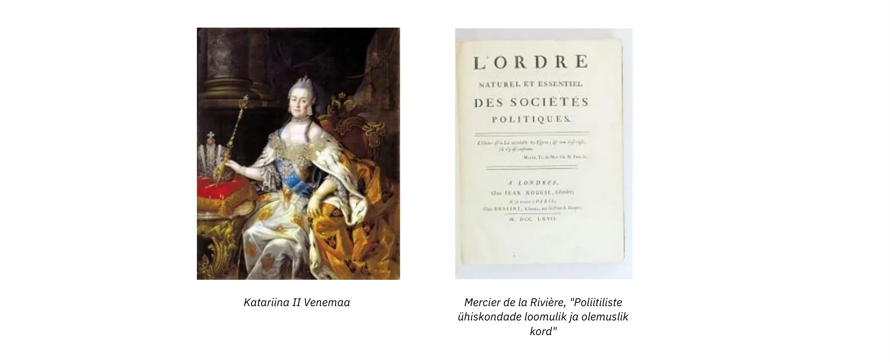

Lugedes 1767. aastal ilmunud raamatut [*Poliitiliste ühiskondade loomulik ja olemuslik kord*] (https://archive.org/details/lordrenaturelete00mercuoft), mille autoriks oli füsiokraat Mercier de la Rivière, saatis ta selle autorile.

Kuigi ta lahkus Prantsusmaalt tähistatud kujul, oli tema vastuvõtt Peterburis jahe (kliimast hoolimata) ja keisrinna oli temas pettunud.

Rootsis Gustav III ja Itaalias Toscana Leopoldi näol leidsid füsiokraadid samuti järgijaid, kes olid valmis oma ideid ellu viima.

Prantsusmaal saavutasid füsiokraadid suurepärast edu, kui Turgot nimetati 1774. aastal finantskontrolöriks.

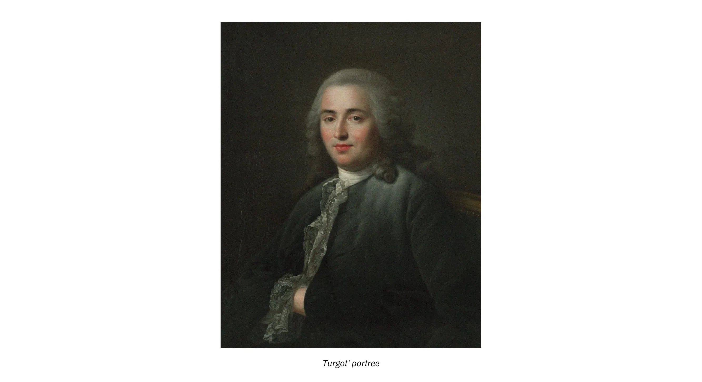

Olles teadlik nende kuulsuse langusest, ei esitanud Turgot end kunagi füsiokraatide lojaalse õpilasena ega ka entsüklopedistina, kuigi ta oli üks neist, ja kuna vaimulikud põlgasid neid. Kui Turgot oli võimul, andis ta välja kuus kuulsat edikti, mis kujutasid endast füsiokraatide programmi praktilise rakendamise algust: kaubandusvabadus, töövabadus ja monopolide kaotamine.

Prantsuse revolutsiooni ajaks oli füsiokraatidel vähem järgijaid. Markii Mirabeau suri 13. juulil 1789 - üsna sümboolne. Abeille oli edasi liikunud, kuid Dupont de Nemours jäi talle truuks. Assambleesse määratud Dupont de Nemours kandis füsiokraatia häält ja nõudis majandusreforme Ownership ja vabakaubanduse kasuks.

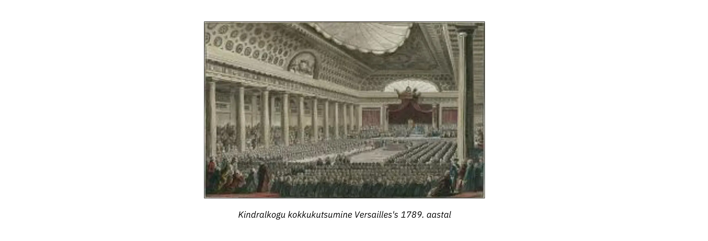

Samuti võitles ta edutult assignatite vastu. Vaatamata sellele ebaõnnestumisele jäi füsiokraatlik mõtteviis intellektuaalses debatis väga oluliseks ja mõjutas revolutsiooni varaseid saavutusi. Nagu Joseph Rambaud ütles, oli kõik, mida revolutsioon tegi vabaduste kasuks, füsiokraatide teene.

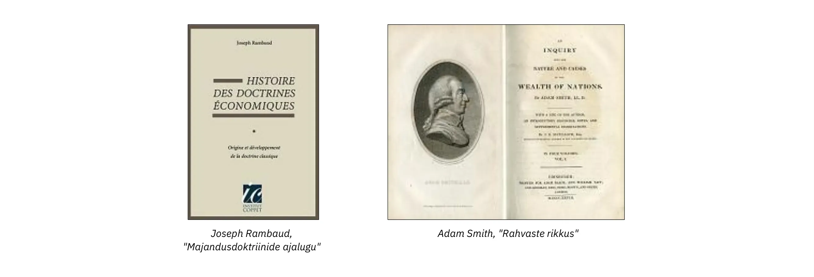

Füsiokraatidel oli suur mõju ka majandusmõtte ajaloole. Adam Smith, kes külastas Prantsusmaad ja kohtus paljude neist, oli nende töödest sügavalt mõjutatud. Ta kaalus isegi *The Wealth of Nations* Quesnayle pühendamist.

Kahjuks suri Quesnay kaks aastat enne Smithi raamatu ilmumist ja Smith eemaldas pühenduse. Kuigi Smith ei nõustunud nende ideega, et ainult põllumajandus on tootlik, võttis ta omaks paljud nende argumendid vabade turgude kohta ja kandis neid oma töös edasi.

## Dupont de Nemours

<chapterId>6d585e0f-93b8-5b0a-a0a8-7f6e4a5bc68e</chapterId>

Ameerika Ühendriikides on meile tuttav DuPont, tuntud ka kui "E.I. du Pont de Nemours and Company", mis on rahvusvaheline ettevõte keemia ja bioloogia valdkonnas.

Tänapäeval on ettevõtte käive üle 35 000 miljardi dollari ja see annab tööd peaaegu 65 000 inimesele üle maailma. Selgub, et see ettevõte on tihedalt seotud füsiokraatlikku koolkonda kuuluva prantsuse majandusteadlase Samuel-Pierre Dupont de Nemours'i saatusega.

1739. aastal sündinud Dupont de Nemours pöördus füsiokraatide poole 24-aastaselt. Sel ajal oli ta alles leidmas oma eluteed. Ühel päeval sattus ta lühikese pamfleti "The Wealth of the State" (Riigi rikkus) peale. Ta leidis, et selle majanduslikud ideed on mõttetud, ja kirjutas kriitilise vastuse pealkirjaga "Reflections on the Wealth of the State", mis avaldati 1763. aastal. Teos võeti hästi vastu ja lugejad kiitsid seda, öeldes näiteks: "Te peate olema Mirabeau õpilane!" Iroonilisel kombel ei teadnud Dupont isegi, kes oli Mirabeau.

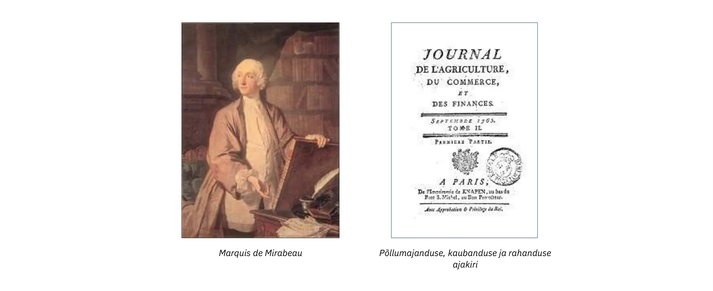

Uudishimulikuna hakkas ta lugema Mirabeau teoseid *Rahva sõber* ja *Maksustamise teooria*. Ta kohtus Mirabeau ja François Quesnayga, seejärel liitus nende kooliga.

1765. aastal pakuti Dupont'ile toimetajakohta ajakirjas *Journal de l'agriculture, du commerce et des finances*, mis oli oma aja juhtiv ajakiri majandusmõtete valdkonnas.

Sellel oli kaks põhjust: Mirabeau ja Quesnay pidid vaikima ning Dupont'd peeti nende tõusva tähena.

Füsiokraatliku koolkonna liikmed nõustuvad, et Dupont de Nemoursist sai kiiresti Quesnay lemmik. Quesnay ütles kord: "Hoolitsege selle noore mehe eest, ta on see, kes räägib, kui me oleme surnud". Üks füsiokraatide kaaslane, Abeille, muutus Dupont'ile osaks saanud tähelepanu pärast isegi kadedaks ja distantseerus Quesnay koolist.

Dupont de Nemours säilitas alati oma kõrge lugupidamise Quesnay suhtes.

Hiljem ütles ta: "Ma olin alles poiss, kui Quesnay ulatas mulle oma käed - ta tegi minust mehe." Ta ütles: "Ma olin alles poiss, kui Quesnay ulatas mulle oma käed - ta tegi minust mehe." Quesnay oli see, kes tegi temast tolleaegse kirjandusmaailma tähtsaima majandusteadlase.

Pärast *Journal de l'agriculture, du commerce et des finances* sai Dupont toimetajaks *Les Éphémérides du Citoyen*, millest sai füsiokraatide ametlik organ.

Ta muutis selle perioodikakogumiku majandusteooria peamiseks keskuseks, toetades seda isegi füsiokraatide languse ajal, kirjutades isiklikult peaaegu kõik hilisemad köited. Peale selle oli Dupont de Nemours see, kes lõi termini "füsiokraatia", mis tuleneb kahest kreeka sõnast, mis tähendab "looduse valitsemist". Ta kasutas seda terminit Quesnay 1768. aastal avaldatud artiklikogumiku pealkirjana ja see termin jäi lõpuks ajalukku. On teada, et omavahel nimetasid füsiokraadid üksteist "majandusteadlasteks" ja neid nimetati nii ka revolutsiooni ajal.

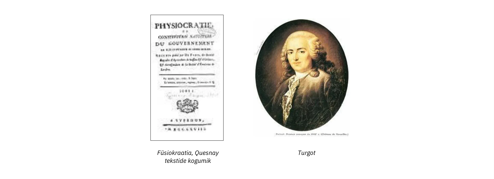

Kui Turgot oli lühikest aega Prantsusmaa rahandusminister, sai Dupont'st tema lähedane nõunik, ainus füsiokraat, kellel oli juurdepääs talle, kuna Turgot hoidis teistest distantsi.

Revolutsiooni ajal valiti ta Nemours'i vallast ja leidis end assamblees, kus istus ka teine Monsieur Dupont. Teda kutsuti siis Dupont de Nemours'ile, mitte sellepärast, et ta oli aadlik, vaid lihtsalt selleks, et neid kahte eristada. Nimi jäi muidugi alles.

Revolutsiooni ajal, 1792. aasta augustis, haaras ta Tuileries' palee juures relva, et kaitsta kuningat rahvahulga vastu.

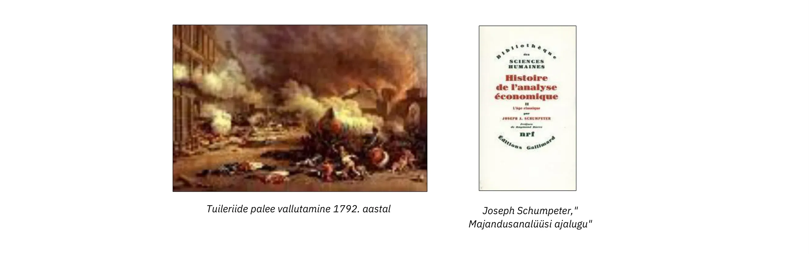

Kuningas ütles talle: "Monsieur Dupont, me leiame teid alati sealt, kus teid vajatakse!" Pärast seda, kui ta pääses imeväel terrorist, mõisteti süüdi ja ootas giljotiini, kuid pääses Robespierre'i langemise tõttu, suruti ta Napoleoni ajal eksiili ja leidis õnne Ameerika Ühendriikides, kus üks tema poegadest asutas isa abiga Dupont'i ettevõtte.

Hoolimata sellest sündmusterohkest elust, mille jooksul ta avaldas kümneid artikleid, brošüüre ja raamatuid, on ta tänaseni suhteliselt vähe tuntud. Võib-olla oli see tingitud sellest, et ta jäi veendunud füsiokraadiks, kui see doktriin oli moest välja langenud. Nagu Schumpeter kirjutas, jäi Dupont de Nemours tõepoolest füsiokraatiale truuks "kogu karjääri jooksul, mille jooksul tal oli palju võimalusi sellest loobuda". Ta oli veendunud mees.

# Valgustus ja poliitiline ökonoomia

<partId>d1c885ad-7cb1-5f81-816c-be312719d9f8</partId>

## Voltaire ja filosoofid

<chapterId>16bcf7bf-dad4-5113-8c64-2800f04ff07b</chapterId>

18. sajandil tekkis Prantsusmaal majandus kui teadus ja esimene majandusmõtte koolkond: Füsiokraatia. Adam Smith õppis sel perioodil majandusteadust ja Prantsuse majandusteadlased olid ülemaailmselt tunnustatud liidrid. Seda sajandit mäletatakse siiski pigem filosoofia kui majandusteaduse sajandina. Kuigi füsiokraatlik liikumine oli oma ambitsioonide poolest kooskõlas valgustusfilosoofiaga, väärivad filosoofide - eriti Diderot' ja Voltaire'i - hoiakud põhjalikku uurimist. Me näeme, et valgustusajastu mõtlejad aitasid oluliselt kaasa laissez-faire'i idee levitamisele Prantsusmaal.

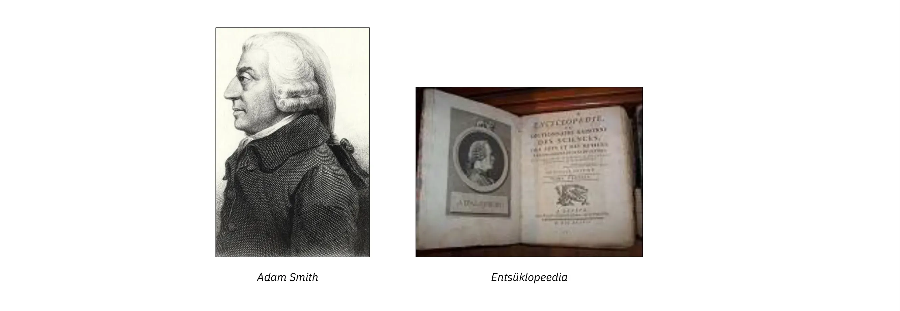

Valgustusfilosoofia kuulsaim saavutus on kahtlemata Diderot' ja d'Alembert' *Encyclopédie*.

Loomulikult kirjutasid majandusartiklid majandusteadlased. Esimeste köite jaoks pöördus Diderot Forbonnais' poole, seejärel võttis ta tööle liberaalseid majandusteadlasi: kõigepealt François Quesnay (kes kirjutas sellised artiklid nagu "Grains", "Fermiers", "Hommes" - viimane jäi avaldamata), seejärel Turgot (kes kirjutas "Foires et marchés"). Need kirjutised on väga olulised. Oma artiklites pani Quesnay aluse sellele, millest sai füsiokraatlik doktriin. Koos oma *Tableau économique'iga* jäävad need tema kõige kuulsamaks teoseks. Turgot, tollal veel noor, arendas oma artiklis laissez-faire'i ideed, kritiseerides riigi sekkumist turukorraldusse.

Paljudes teistes *Encyclopédie* artiklites kaitsevad filosoofid, eriti Diderot, vabaduse ideaali kõigis valdkondades: religioonis, poliitikas ja majanduses.

Töövabadus, eriti vastandudes kildkondade süsteemile, oli korduv teema erinevates kirjetes, nagu Arts, Métier ja Communauté.

Diderot' tee majandusteoorias on kummaline. Encyclopédie's oli ta veendunud majandusliku vabaduse pooldaja ja oli see, kes otsis liberaalsete majandusteadlaste koostööd, mida kinnitab ka kiri, milles kirjeldatakse artikleid, mida Turgot võiks talle kirjutada. Füsiokraatia algusaastatel oli ta nii Quesnay koolkonna toetaja kui ka propageerija. Aastatel 1769 ja 1770 kirjutas ta *Les Ephémérides du Citoyen* jaoks, oma antiliberaalsete filosoofiasõprade, nagu Melchior Grimm, suureks pahameeleks; peagi distantseerus ta siiski sellest rühmitusest. Entusiastlikuna abt Galiani elujõulisest intellektist aitas ta tal avaldada oma raamatu teraviljakaubandusest prantsuse keeles, just siis, kui Galiani oli naasmas Itaaliasse.

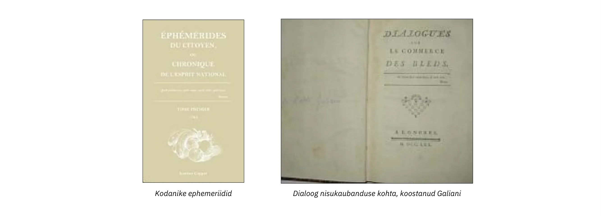

Sellest raamatust sai kõige ägedam rünnak füsiokraatlike ideede vastu, andes sellele liikumisele suure löögi. Hiljem kaitses Diderot oma *Galiani apoloogias* Galiani't füsiokraatide lähedase liitlase, abt Morellet' vastu. Mõned aastad hiljem, Turgot' ministri ajal, nähti Diderot'd aplodeerimas töövabaduse kehtestamisele kildade kaotamise kaudu. Sel hetkel leidis Diderot, käsitöölise poeg, et ta on liberaalsete majandusteadlastega ühel meelel ja kirjutas Galiani'le terava kirja, milles väitis, et töövabadus hävitab Prantsuse tööstuse kahekümne või kolmekümne aasta jooksul. Tööstusrevolutsiooni valguses näitab ajalugu vastupidist. Tulles tagasi liberaalsete majandusteadlaste poolele, ei nautinud Diderot enam nende usaldust ja jäi isoleerituks. Väga kõnekas on tema 1774. aastal Dupont de Nemours'ile saadetud kiri, kus ta kirjutab:

> "Kunagi oli sul minu vastu sõprust, nüüd ei ole seda enam, sest sa oled nii hõivatud, et sul ei ole enam aega kedagi armastada."

Voltaire järgis sarnast teed, mida iseloomustab tema majanduslike vaadete ebajärjekindlus. Ta imetles Vincent de Gournay'd, pidas kirjavahetust majandusteadlastega (sealhulgas Dupont de Nemours' ja Turgot'ga) ning hindas füsiokraate - eriti nende põllumajanduse kiitmise eest. Ta ülistas neid *Diatriibis Ephémérides'i autorile*. Hiljem kritiseeris ta siiski nende ideed ühtse maamaksu kohta oma satiirilises teoses *Nelikümmend krooni mees*, mis samuti tekitas märkimisväärseid vastuolusid. Lõpuks tähistas ta sarnaselt Diderot'ga Turgot' ametiaega, nimetades seda kuldajastuks ja kiites tema kahte suurt dekreeti töövabaduse ja vabakaubanduse kohta.

Lõppkokkuvõttes on filosoofide suhe majandusmõtlemisega segane. Hoolimata sellest, et nad kiitsid ja kritiseerisid liberaalseid majandusideid, mängisid nad rolli nende ideede toomisel valgustusajastu laiemasse intellektuaalsesse diskursusesse. Nii aitasid nad, kas tahtlikult või tahtmatult, edendada laissez-faire'i ideed kuni revolutsioonini.

## Turgot, teoreetik

<chapterId>a8cd8185-8351-556b-8011-3a0c313e8a9d</chapterId>

Ameerika majandusteadlane Murray Rothbard kiitis ühes kuulsas lõigus oma raamatus *History of Economic Thought* seda, mida ta nimetas Turgot' "geniaalsuseks".

esitledes teda koos Cantilloniga 18. sajandi suurima majandusteadlasena.

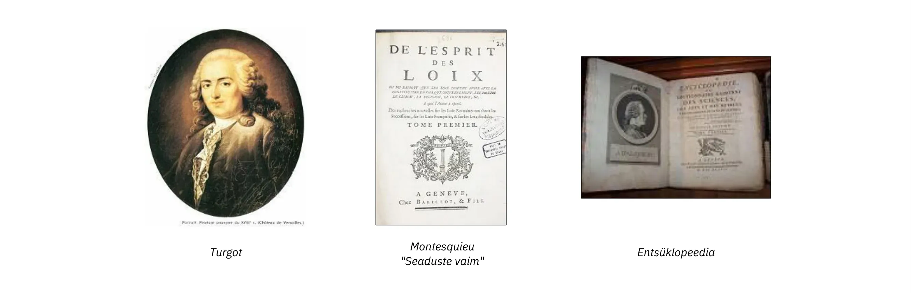

Kuidas tõusis Turgot sellisele kuulsusele? See tulenes kolme võtmeteguri kombinatsioonist. ** Esiteks**, tema prestiižne perekondlik taust. Ta pärines kuninglike administraatorite pikast suguvõsast, kellest paljud olid kõrgetel ametikohtadel. **Teiseks**, kuldne ajastu, mil ta sündis ja kasvas. Turgot oli 21-aastane, kui Montesquieu avaldas *L'Esprit des Lois*, ja 24-aastane, kui ilmus *Encyclopédie* esimene köide.

Ta oli füsiokraatide, Voltaire'i, Diderot', d'Holbachi, Adam Smithi, Condorcet' ja teiste kaasaegne. **Kolmas**, tema intellektuaalne eelsoodumus. Sorbonne'i üliõpilasena kirjutas ta 22-aastaselt kirja paberraha kohta, pidas tähelepanuväärseid kõnesid ja koostas 24-aastaselt nimekirja 52-st kirjutatavast teosest.

Vaatamata oma noorusele andis Turgot oma panuse *Encyclopédie'ile*, kirjutades artikleid sellistel teemadel nagu "Etümoloogia", "Olemasolu", "Laiendatavus", "Messid" ja "Alused". Ainult üks artikkel puudutas otseselt majandust - tema artikkel "Messid", milles kirjeldati üksikasjalikult messide ja turgude päritolu ning kritiseeriti riigi kasvavat sekkumist, mis häiris ja halvas neid.

Nendel esimestel aastatel oli tema juhendajaks Vincent de Gournay, kes võttis ta oma tiiva alla ja sõlmis temaga tiheda sõpruse. Gournay surma korral 1759. aastal kirjutas Turgot ülistusraamatu, milles ta esitas suurepärase kokkuvõtte laissez-faire'i doktriinist. Ta kirjutas eelkõige järgmist:

"Igast vaatenurgast, kus kaubandus võib puudutada riiki, toodab individuaalne huvi, mis on jäetud iseendale, alati kindlamalt üldist hüve kui valitsuse tegevus, mis on alati vigane ja juhindub tingimata ebamäärasest ja ebakindlast teooriast".

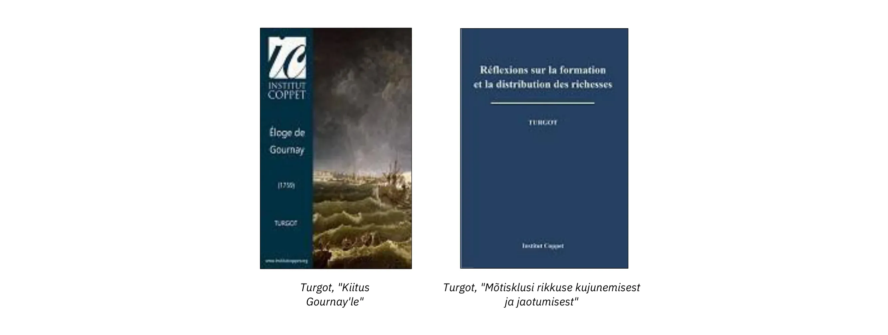

1767. aastal koostas ta intendantuuris olles majandusteadusliku kogumiku pealkirjaga *Reflections on the Formation and Distribution of Wealth*.

Käsitletakse tööjaotust, tarbijate suveräänsust, eraomandit, kapitali rolli, praktiliselt kõiki peamisi majandusteemasid. Paljud ajaloolased, kõige viimasena ajaloolane Anne-Claire Hoyng, on juhtinud tähelepanu sarnasustele Turgot' teose ja üheksa aastat hiljem avaldatud Adam Smithi *The Wealth of Nations* vahel.

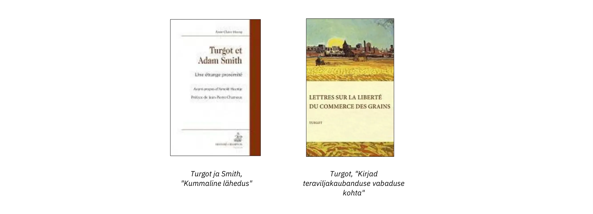

Turgot kaitses teraviljakaubanduse vabadust kirjades abt Terray'le, mis hiljem edastati kuningale, kuid millest pooled on nüüdseks kadunud. Ta kirjutas:

> Härra, kui miski on hädavajalik, siis mitte uute piirangute kehtestamine kõige olulisematele ametitele, vaid nende piirangute kaotamine, mida kahjuks on lubatud alles jätta.
> Kui kunagi on olnud aeg, mil kõige täielikum ja absoluutsem vabadus, mis on täiesti vaba igasugustest takistustest, oli vajalik, siis julgen väita, et see on praegu, ja et kunagi varem ei ole olnud vähem kohane kaaluda teraviljakaubanduse määruse kehtestamist.

1769. aastal kirjutas Turgot artikli "Väärtus ja raha" abt Morellet' *Dictionnaire de Commerce* jaoks, mida lõpuks ei avaldatud. Galiani oli juba märkinud, et "inimene on kõigi asjade ühine mõõt", ennetades subjektiivset analüüsi, mida Turgot arendas kolmkümmend aastat hiljem selles artiklis, kus ta seda väidet laiendab ja tõestab.

Turgot kirjutas 1770. aastal, tunduvalt enne Benthami, memorandumi, milles ta propageeris intressimäärade ja liigkasuvõtmise vabadust.

"On viga arvata, et raha intressi kaubanduses peaksid fikseerima vürstide seadused," ütleb ta, "see on jooksev hind, mis reguleerib ennast ise, nagu kõigi teiste kaupade hinda." Selle seisukoha kaitseks lükkab ta ümber Aristotelese ja kirikuisade vastuseisu.

Turgot' laissez-faire'i doktriini tähelepanuväärne kokkuvõte võib leida 1773. aasta unustatud kirjast abt Terray'le raudade märgistamise kohta:

> Mida poliitika peab tegema, on alluda looduse ja kaubanduse käigule, mis ei ole vähem vajalik ega vähem vastupandamatu kui looduse enda käik, ilma et püüaks seda juhtida; sest selleks, et seda juhtida ilma seda häirimata ja ennast kahjustamata, peaks olema võimeline jälgima kõiki inimvajaduste, huvide ja tööstuse muutusi; neid peaks tundma nii üksikasjalikult, et seda on füüsiliselt võimatu saavutada ja et isegi kõige osavam, aktiivsem ja hoolikam valitsus riskib alati eksida, vähemalt pooleldi.

Siin leiame väga selge avalduse laissez-faire'i doktriini kohta, samuti Friedrich Hayeki analüüsi ettekujutuse teadmiste ettekujutusest - see tähendab, et riik ei suuda täielikult mõista majanduslikke jõude, et neid kontrollida.

## Turgot, reformierakondlane

<chapterId>9177429f-1679-51c4-bfd2-dd036d24a1cc</chapterId>

Nagu me eelmises peatükis lühidalt meelde tuletasime, oli Turgot ühe silmapaistva perekonna poeg, kes oli paistnud silma Prantsusmaa avaliku teenistuse kõrgemates ringkondades.

Tema isa oli olnud Pariisi kaupmeeste proviisor ja tema vanaisa intendant. Pärast suurepäraseid õpinguid püüdis Turgot' pere noorim liige jõuda vähemalt samale kõrgusele. Kõigepealt oli ta mõnda aega maître des requêtes, mis tähendab, et ta oli sidepidajaks intendantide ja Versailles' vahel. See oli prestiižne ametikoht, mille jaoks pidi ta saama erandi vanuse tõttu, kuid Turgot püüdis enamat. Tema mentori Gournay surm julgustas teda veelgi kõrgemale püüdlema ja ta taotles intendantiks nimetamist.

1759. aastal taotles ta esimest korda Grenoble'i intendantuuri, kuid sellest keelduti. Seejärel pakuti talle Lyoni kaupmeeste provosti ametikohta, millest ta keeldus. Ta taotles Bretagne'i intendantuuri, kuid ka sellest keelduti. Lõpuks pakuti talle 1761. aastal Limousini intendantuuri ja ta võttis selle mõnevõrra vastumeelselt vastu. Ta kirjutas Voltaire'ile: "Mul on õnnetus olla intendant", mis võib-olla tähendab: Mul on õnnetus olla Limousini intendant.

Limousinis olid talupojad vaesed ja elasid ebakindlates tingimustes, eriti seoses eluaseme ja toiduga. Üldine haridustase oli äärmiselt madal. Vähesed teed, mis olid olemas, olid katastroofilises seisukorras.

Kuna piirkond oli nii vaene, ei olnud see ministritele huvi pakkunud. See andis Turgot'le vabaduse reformidega eksperimenteerida. Limousinis viis ta ellu kolm suurt projekti:

- **Taille** ümberjaotamine, üksikisiku maks (Turgot püüdis selle hindamisel rakendada võimalikult palju objektiivsust).
- **Corvée**, tööjõumaks, mille puhul talupojad olid sunnitud töötama tee-ehitusel. Turgot märkas piirkonda külastades kiiresti teede kehva seisukorda. Ta asendas corvée rahalise maksuga.
- Sõja ajal mobiliseeritud talurahvaarmeede, **miilitsa** värbamine.

Seda tehti loosimise teel, mis tõi kaasa hirmu ja vägivalda põgenemiste tõttu; Turgot asendas need kohustuslikud maksud tasustatud vabatahtlikega.

Need reformid olid vaieldamatult edukad ja 1774. aasta juulis nimetati Turgot ministriks. Tema vähese kogemuse tõttu paigutas kuningas ta kõigepealt mereväeministeeriumi. Ametisse nimetamine lõbustas paljusid. Turgot ise tunnistas: "Ma ei tea mereväest midagi" ja Voltaire märkis: "Ma ei usu, et Turgot on meremees rohkem kui mina".

Vaid kuu aega hiljem nimetati Turgot aga finantskontrolöriks ja temast sai tegelikult Prantsusmaa majandus- ja rahandusminister.

Me teame kirja, milles ta kirjeldas oma põhimõtteid Louis XVI-le: "Ei pankrotti. Ei mingeid maksutõuse. Ei mingeid uusi laene". See filosoofia, mida kriitikud võivad tänapäeval nimetada mõttetuks "ranguseks", oli mõeldud monarhia päästmiseks.

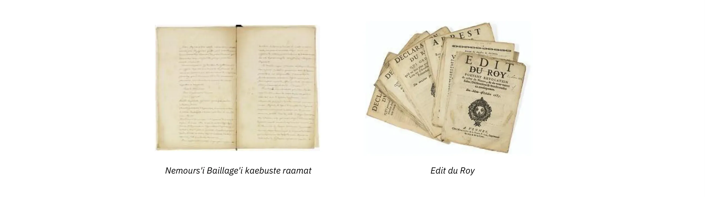

Turgot valmistas ette kuus kuninglikku dekreeti Prantsuse majanduse reformimiseks.

See oli esimene - ja üks viimaseid - kord, kui majanduseksperdile anti vabadus reformida oma riigi majandust. Turgot' kolm edikti paistavad silma: üks neist kaotas sunnitöö (corvées), teine lõpetas kaubanduskildade (korporatsioonide) tegevuse ja kolmas kehtestas vaba teraviljakaubanduse.

Ministeeriumi astudes teadis Turgot, et ta seisab silmitsi privilegeeritud klasside vastuseisuga. "Mind kardab, isegi vihkab suurem osa õukonnast ja kõik, kes otsivad soosingut," ütles ta kuningale. Privilegeeritud koondusid peagi tema vastu ja põhjustasid tema vallandamise finantskontrolöri ametist. Voltaire, kes toetas täielikult Turgot' reforme, kirjutas oma kirjavahetuses:

> Ah! Milliseid kohutavaid uudiseid ma kuulsin! Mis saab meist? Ma olen laastatud! Me ei taastu kunagi sellest, et oleme näinud kuldse ajastu sündi ja surma! See äikesekiir on tabanud nii minu mõistust kui ka südant.

Sellest ajast alates on paljud väitnud, et Prantsusmaa on riik, mida on võimatu reformida. Turgot' läbikukkumine näis seda kinnitavat: Turgot oli ette valmistatud pool sajandit kestnud liberaalsete majandusmõtete kaudu; teda toetasid valgustusfilosoofid ja kuningas ise, kellel oli absoluutne võim, toetas teda.

Lõpuks võitsid parlements ja privilegeeritud klassid. Kõik, mida kuningas sai teha, oli eraviisiline hädaldamine: "Ma näen nüüd, et ainult Monsieur Turgot ja mina hoolime rahvast."

## Condillac

<chapterId>0ba8dbb5-dcd5-5981-bf85-6c185e0bf192</chapterId>

Nii nagu merkantilism, mis on selle kõige ilmsem praktiline ilming, võttis ka Montaigne'i sofism kaua aega, et kaduda.

See sofism on idee, et kaubandus ja Exchange on nullsummalised mängud. Ükskõik, mida üks osapool tehingust võidab, kaotab teine osapool tingimata. Selle toetajad väidavad, et see kehtib nii üksikisikute kui ka riikide vahel.

Condillaci abt mängis olulist rolli selle vale ettekujutuse lõplikul lammutamisel.

"Kindlasti" on ehk liialdus, sest avalikus arutelus tuleb see sofism sageli uuesti esile. Võib-olla ongi see põhjus, miks Condillac jääb vähetuntud majandusteadlaseks. Peale Austria majandusteadlaste on vähesed mõistnud tema Exchange teooria tähtsust, keegi ei tunne tema vastu enam huvi.

Enamiku majandusmõtte ajaloolaste jaoks on 1776. aastat tähistab *The Wealth of Nations*, mis rajas majandusteaduse. Äsja lõpetatud viisteist õppetundi, milles me oleme uurinud Prantsuse majandusteadust enne Adam Smithi, piisab, et tõestada selle arusaama ekslikkust. Samal 1776. aastal ilmus pealegi veel üks raamat, mis väärib ajaloolastelt ehk rohkem kiitust kui Adam Smithi raamat: selle kirjutas Condillac ja selle pealkiri on lihtsalt [*Commerce and Government Considered in Their Mutual Relationship*] (https://archive.org/details/commercegovernme0000cond).

Condillaci jaoks, kui Exchange sofism, mida nähakse nullsummamänguna, püsib, on osaliselt süüdi füsiokraadid, sest nad väidavad, et Exchange on võrdsuse suhe. Condillaci sõnul on see vale: Exchange on ebavõrdne suhe, kus üks annab alati vähem, et saada rohkem.

Füsikorraldajate ja Condillaci ideede vahel ei saanud unistada täiuslikumast vastandusest. Füsiokraatide majandusteadlane Le Trosne kirjutas:

> Exchange on oma olemuselt võrdsuse Contract, mis on tehtud võrdse väärtuse eest võrdse väärtusega.

Condillac seevastu kirjutas:

> Iga Contract osapool annab alati midagi väiksema väärtusega, et saada midagi suurema väärtusega.

Kuid vastuseis on suuresti sõnaline. Mõlemad nõustuvad, et kui vahetada franki raamatu vastu, siis on raamat franki väärt või raamatu hind on franki.

Erinevus seisneb selles, et Condillac väidab, et kuna me Exchange franki raamatu eest, tähendab see, et meie jaoks on raamatu väärtus suurem kui meie ühefrangise mündi väärtus. Me eelistame raamatut mündile ja seetõttu teeme Exchange.

Condillaci teooria ei ole põhimõtteliselt vastuolus füsiokraatide teooriaga, kuid nad ei räägi nii-öelda sama keelt. Le Trosne räägib hinnast, Condillac aga väärtusest ja vastupidi.

Condillacil on õigus selles, et kui kahe vahetatava kauba hinnad on võrdsed, ei ole väärtused võrdsed, sest vastasel juhul ei toimuks Exchange.

Condillaci teooria kokkuvõtteks võib loetleda kolm väidet:

Esimene väide: me otsime kaupu nende kasulikkuse pärast. See näib ilmselge, kuid see on majandusteaduse keskne tõekspidamine, et inimesed Exchange omandavad kasu, mida ka Jean-Baptiste Say töötas suurepäraselt välja.

Teine väide: väärtus on olemas ja motiveerib vahetusi. Iga inimese subjektiivne hinnang kaupade ja teenuste kohta eeldab, et nendel samadel kaupadel ja teenustel on nende jaoks väärtus, mis on väärt rohkem või vähem vastavalt kasulikkusele, mida nad näivad pakkuvat. Loomulikult otsustab iga inimene erinevalt ja väärtus on inimeseti erinev.

Lõpuks, kolmas väide: hind on Exchange protsessi tagajärg. Tooted ei ole Exchange väärtusega, mida ma neile omistan, sest Exchange tingimused sõltuvad ka müüja poolt neile toodetele omistatud subjektiivsest väärtusest. Ostja ja müüja vaheline suhe või ostja subjektiivse väärtuse ja müüja subjektiivse väärtuse suhe määrab hinna.

Need Condillaci ideed on fundamentaalsed. Need võimaldavad meil mõista, miks iga Exchange on alati vastastikku kasulik.

Seega hävitavad nad täielikult vabakaubanduse kriitika, sest protektsionism ilmneb ainult kui mehhanism, mis takistab elanikkonnal üksteist vastastikku kasu saamast. Laissez-faire on ka Condillaci teose järeldus. Las inimesed teevad, mida nad tahavad, sest kui avalik võim kaitseb vabadust ja omandit, siis rikastavad inimesed üksteist alati, kui nad omavahel vahetavad.

## Condorcet

<chapterId>99e4aba6-da7f-5041-b02f-337158381515</chapterId>

Condorcet on kahtlemata valgustusajastu kõige majanduslikult mõtlevam filosoof.

Suure osa oma karjäärist pühendas ta end majandusest täiesti sõltumatutele valdkondadele, ja õigusega, sest tema anded viisid suurele edule nendes teadustes, millele ta enim tähelepanu pööras. Kuid umbes 1770. aasta paiku tundis ta end tõmmatuna majandusküsimuste poole, võib-olla seetõttu, et teised filosoofid, eriti Voltaire ja Diderot, ei viitsinud neile oma vaba aega pühendada, ja ka seetõttu, et ta oli sõbrunenud Turgot'ga.

Condorcet võttis järk-järgult omaks laissez-faire'i ja vabaduse ideed, esialgu valdkondades, mis ei olnud seotud poliitilise majandusega. Oma *Teoloogi kirjas* mõnitas ta filosoofiliselt katoliku usku ja väljendas oma soovi näha tõelist usuvabadust, sealhulgas vabadust mitte uskuda. Oma ristisõjas sallivuse ja usulise fanatismi vastu võitles Condorcet rüütli de la Barre'i rehabiliteerimise ja D'Etallonde'i, kes oli surma mõistetud ristirahu purustamise eest, uuesti kohtusse andmise eest.

Ta oli seega valmis vabadust kaitsma, kui tema sõber Turgot tõusis finantskontrolöri ametikohale.

Edaspidi võttis Condorcet' karjäär uue pöörde, kui ta astus majandusdebatti, toetades väsimatult uue ministri liberaalseid reforme. Condorcet pooldas konkurentsi ja kaubandusvabadust ning nõudis ka corvées (sunnitöö) ja gildide kaotamist ning õiglast maksustamist. Ta väljendas neid veendumusi avalikult iga kord, kui selleks võimalus avanes, tehes seda ilmselge entusiasmiga; ta kirjutas palju ja teatas kord oma kirjutistes: "Lubage mul veel kord rääkida kaubandusvabadusest; mulle meeldib selle teemaga tegeleda."

Aastatel 1774-1776, Turgot' ministri ajal, tegi Condorcet arvukalt sekkumisi, mida kõiki iseloomustas tema Commitment laissez-faire'ile. Tema teoste hulka kuuluvad *Picardia põllumehe kirjad härra Neckerile*, milles ta kaitseb vabakaubandust; *Monopolid ja monopolid*, milles ta pooldab vaba konkurentsi; *Reflections on Corvées*, milles ta nõuab nende kaotamist; ja *Reflections on the Grain Trade*, milles ta taas kiidab vabakaubandust ja kritiseerib Neckeri raamatut samal teemal.

Oma [*Kirjad teraviljakaubanduse kohta*] (https://archive.org/details/bub_gb_hg8jFw-y6bwC) toob Condorcet välja mitu olulist punkti.

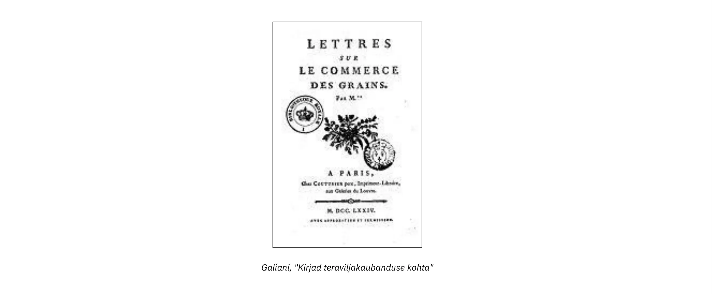

Esiteks ei olnud tollased kõrged teraviljahinnad mitte vabakaubanduse, vaid pigem kehva saagi tulemus, ja Condorcet näitab seda selgelt. Seejärel selgitab ta, miks laissez-faire ei ole mitte ainult asjakohane, vaid ka ainus sobiv poliitika, vaatamata levinud eelarvamustele. Ta märgib: "Me oleme nii harjunud nägema, et valitsus sekkub teraviljakaubandusse, et mitte midagi tegemata jätmine näib olevat midagi erakordset ja uut". Hiljem lisab ta: "Peaaegu kõik, eriti avaliku võimu kandjad, usuvad, et midagi ei juhtu iseenesest ja et kõik on kadunud, kui valitsus ei sekku kõigesse". Condorcet taaselustab seega füsiokraatide ja Turgot' argumendid, näidates vabakaubanduse paremust igasuguse sekkumise üle.

Turgot' liberaalse majandusprogrammi propageerimine oli julge tegu, sest Condorcet teadis, et ta seisab kiiresti silmitsi tsensuuriga. Nii ka juhtus ja tema pamflet sunniviisilise töö kaotamise kohta hävitati ja keelustati 1776. aastal.

Turgot, hinnates Condorcet' lojaalset kaitset tema ideedele, määras ta mündiametnikuks. Condorcet astus tagasi niipea, kui tema sõber oli ministeeriumist lahkunud.

Kuigi ta pühendas kogu oma energia Turgot' kaitsmisele, ei olnud Condorcet'l mingeid illusioone oma sõbra ametiaja tulemuse suhtes. Turgot ise tunnistas elu lõpul, et ta elas kahetsusega, nagu ta ühes kirjas kirjutas, "et ei suutnud teha oma rahvale ja inimkonnale head, mida ma pidasin väga lihtsaks". Condorcet, kes oli realistlikum, juhtis tähelepanu paljudele vastastele, kellega Turgot'l tuli silmitsi seista: kuninga favoriidid, parlamendid, vaimulikkond, aadel, gildid ja nii edasi. Need rühmad ootasid meelitamist, mitte reformi. Condorcet ütles Turgot'le: "Te ei ole sugugi šarlatan, ja see on viga, arvestades, kuidas Pariisis asjad käivad". Tal oli täiesti õigus, sest 1776. aastal, vaevalt kaks aastat pärast tema saabumist, oli Turgot juba sunnitud lahkuma kontroller-generali ametist.

## Liberaalne mõistus revolutsiooni ajal

<chapterId>95e9a90d-e37a-58ff-b1ac-928b42e76ecf</chapterId>

Dupont de Nemours oli François Quesnay noorim õpilane, kes kord ütles tema kohta: "Me peame selle noore mehe eest hoolitsema, sest ta räägib siis, kui meie oleme surnud". Kui Prantsuse revolutsioon algas, olid peaaegu kõik suured füsiokraadid, sealhulgas markii de Mirabeau, juba lahkunud; Mirabeau ise oli surnud 13. juulil 1789. aastal.

Dupont de Nemours kirjutas Nemours'i bailiikide jaoks kaebuste nimekirja.

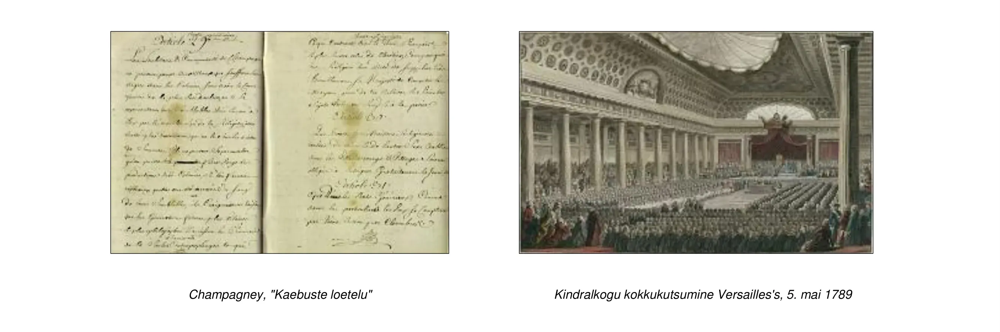

See põnev dokument sisaldas kõiki liberaalsete majandusteadlaste kaebusi kaubanduspiirangute, monopolide ja omandirünnakute vastu. Dupont de Nemours valiti ka Rahvusassambleesse.

Revolutsiooni ajal sai temast liberaalse terve mõistuse hääl, kes seisis kindlalt vastu kasvavale populismile ja sekkumise demagoogiale, mis lõppkokkuvõttes sai võitu.

Juba 1789. aasta novembris, kui räägiti monopoli andmisest Caisse d'Escompte'ile (mis võiks muuta selle avalikuks pangaks - Prantsusmaa pangaks), võttis Dupont de Nemours sõna konkurentsi kaitseks.

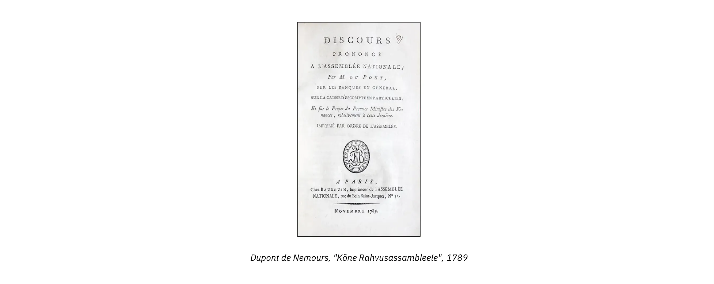

"Parem oleks," ütleb ta, "jätta pangandusäri vabakaubanduse seaduste hooleks". Ja ta lisab:

> "Ma ei mõista, mida minister mõtles, kui ta rääkis Caisse d'Escompte'ile privileegi andmisest. Kui see privileeg sisaldab eksklusiivsust, peate te selle tagasi lükkama, sest te olete tulnud siia, et hävitada eksklusiivseid privileege, mitte luua uusi."

Hoolimata tema hoiatustest ignoreeris assamblee tema vastuväiteid ja astus veel ühe sammu keskpanga ja pangamonopoli loomise suunas.

1790. aastal järgis Dupont de Nemours Asutavas Kogus oma füsiokraatide sõprade patsifistlikku traditsiooni ja esitas seaduseelnõu, millega keelatakse ründavad sõjad. Esimene artikkel kõlas järgmiselt: "Prantsuse rahvas ei tohi lubada endal osaleda üheski ründesõjas, et hõivata teiste territooriumi või rikkuda ühegi rahva õigusi või vabadust".

See ettepanek lükati tagasi.

Samal aastal, 1790, algasid arutelud uue paberraha emiteerimise üle, et katta valitsuse kulusid.

Dupont de Nemours oli sellele kindlalt vastu ja avaldas brošüüri pealkirjaga [*Asignaatide mõju leiva hinnale*](https://archive.org/details/effetdesassignat00dupo). Pealkiri oli täpne, sest ta selgitas, et assignatide väljaandmine toob paratamatult kaasa inflatsiooni, st kaupade, sealhulgas leiva hinna tõusu.

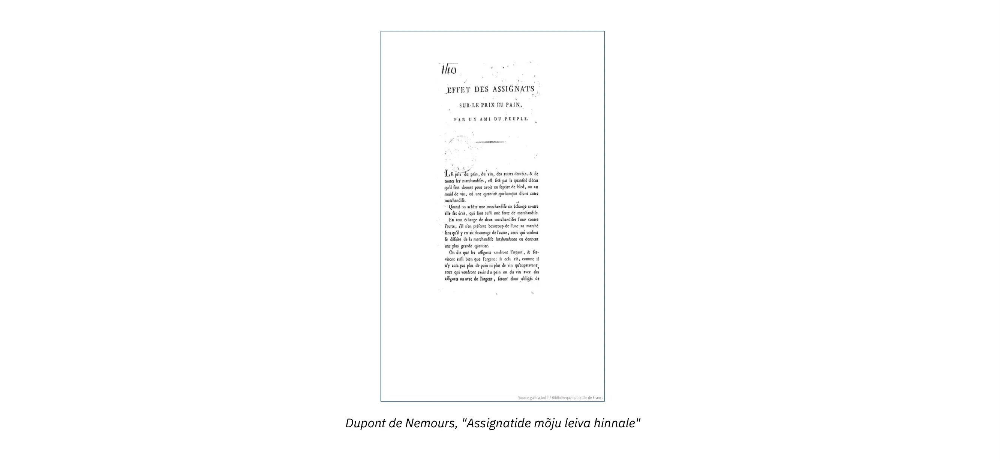

Ta kirjutas voldikule alla kui "rahva sõber". See teos tekitas üsna palju elevust, sest assambleelt küsiti, kes selle kirjutas. Dupont de Nemours tõusis seejärel püsti ja tunnistas, et see on tema töö, öeldes, et ta ei häbene kasutada tiitlit "rahva sõber", sest võitlus assignatite vastu oli tõepoolest rahva teenimine.

Taas kord eirati tema nõuandeid ja assignatid anti välja.

Me kõik teame järgnenud katastroofi, majanduslikku hävingut ja kannatusi, mida kannatasid inimesed, kellest paljud kaotasid kõik, kui assignatid muutusid väärtusetuks ja neid tuli põletada.

Mõned aastad hiljem pööras assamblee tähelepanu ideele luua tõeline Prantsuse Pank, millele oleks antud monopoolne õigus raha tootmisele.

Dupont de Nemours, kes oli endiselt kindlalt avaliku panga idee vastu, pidades seda vaid monopoliks, tuletas assambleele meelde assignatide katastroofilisi kogemusi. Ta ütles neile:

> "Ärge valmistuge kahetsusteks, nagu need, mis piinasid minu kolleege Asutavas Kogus. Toona lükati tagasi minu ettepanek piirata assignati ainult riiklike kaupade eest maksmiseks ja mitte muuta seda ringluses olevaks valuutaks. Täna ütlevad nad: "Ah, kui me oleksime vaid kuulanud Dupont de Nemours'i!"."

Kuid taas kord ei kuulanud teda keegi.

## Kokkuvõte: Torch'i üleandmine

<chapterId>ada8082f-db96-5e52-954f-719b47998153</chapterId>

18. sajandi prantsuse majandusmõtteid varjutavad sageli 19. sajandi kuulsamad majandusteadlased. Ometi, kui tegemist on vabaduse kaitsmisega, algab kõik tõeliselt 18. sajandist. See on sajand, mil mitmed mõtlejad Boisguilbertist Dupont de Nemoursini väljendasid esimest korda selgelt omal ajal nii revolutsioonilist laissez-faire'i põhimõtet.

Kindlasti on sellised isikud nagu Jean-Baptiste Say, Frédéric Bastiat, Gustave de Molinari ja Yves Guyot jätnud püsiva jälje Prantsuse majandusmõtte ajalukku. Kuid kui me uurime neid eraldi, jääb meil midagi olulist kahe silma vahele. Need 19. sajandi mõtlejad ei tekkinud tühjalt kohalt; nad pärisid ja rajasid oma 18. sajandi eelkäijate poolt valgustusajastul rajatud alused.

Boisguilbert väidab, et heade kavatsustega hinged, kes usuvad, et nad saavad kõike parandada valitsuse kaasamisega, keeravad majanduse paratamatult pea peale, ja et seetõttu on parem lasta asjadel loomulikul teel kulgeda.

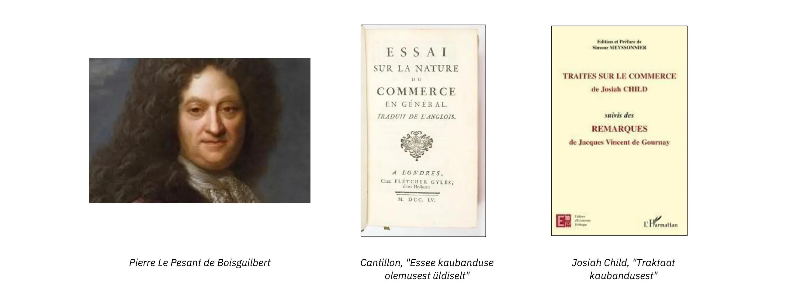

Cantillon rõhutas, et rahaga ei tohiks kunagi manipuleerida poliitiliste eesmärkide saavutamiseks. Kui riigil lubatakse raha hallata nii, nagu talle meeldib, siis sillutatakse teed tohutule finants- ja majanduslikule segadusele.

Vincent de Gournay väidab, et tööjõu liigne reguleerimine heidutab tööliste ja käsitööliste pingutusi, ajendades neid laiskuse ja tegevusetuse poole. Tänu vabale konkurentsile saab majandus kasvada ja rahvas õitseda.

Markii d'Argenson väidab, et ükski valitsus ei ole võimeline kõike ette nägema ja mõõtma ning et järelikult tuleb loota iga üksikisiku omakasupüüdlikkusele.

Quesnay ja füsiokraadid väidavad, et eraomand on inimühiskondade alus. Ilma eraomandita kaotab inimene motivatsiooni pingutamiseks, töötamiseks, sest ta ei saa nautida oma töö vilju ega koguda midagi.

Condillac väidab, et Exchange on alati vastastikku kasulik ja peaks seetõttu olema eranditult alati tasuta. Riigi ainus ülesanne peab olema vabaduse ja omandi kaitsmine.

Kõik need ideed võtsid 19. sajandi majandusteadlased üles. Mõned, nagu Jean-Baptiste Say, andsid neile ideedele teadusliku väljenduse range *Treatise on Political Economy* kaudu. Teised, vastupidi, püüdsid neid põhilisi maksiime populariseerida, minnes muinasjuttude, romaanide ja lõbusate novellide valdkonda, nagu Frédéric Bastiat seda nii osavalt tegi.

## Biograafia

<chapterId>17cf2865-e53c-5f3b-a5c2-a43560efaf01</chapterId>

**VALIKULINE BIBLIOGRAAFIA**

Allpool leiate valiku üle kolmekümne kirjutise:

1. Pierre Clément, Histoire de Colbert et de son administration, Pariis, 1874

2. Vauban, Projet d'une dîme royale, 1707; kordustrükk Institut Coppet, 2014; Anne Blanchard, Vauban, Fayard, 1996

3.	Boisguilbert, Détail de la France, 1695; uuesti välja andnud Institut Coppet, 2014

4. Félix Cadet, Pierre de Boisguilbert: majandusteadlaste eelkäija, Institut Coppet, 2014

5. Pierre de Boisguilbert ou la naissance de l'économie politique, Pariis, INED, 1966

6. Richard Cantillon, Essai sur la nature du commerce en général, 1755; kordustrükk Institut Coppet, 2015

7. Antoin Murphy, Richard Cantillon, pankur ja majandusteadlane, Oxford, 1986

8. Gustave de Molinari, L'Abbot of Saint-Pierre, Pariis, 1859

9. Saint-Pierre'i abt, Abrégé du projet de paix perpétuelle, Rotterdam, 1729

10. Saint-Pierre'i abt, "Projet pour perfectionner le commerce de la France", teoses Les rêves d'un homme de bien, Pariis, 1775, lk 199

11. André Alem, Le marquis d'Argenson et l'économie politique au début du XVIIIe siècle, Institut Coppet, 2015

12. Journal et mémoires du marquis d'Argenson, Rathery väljaanne, 9 köidet, Pariis, 1859-1867

13. Benoît Malbranque, Vincent de Gournay: laissez-faire'i poliitiline ökonoomia, Institut Coppet, 2016

14. Vincent de Gournay, Remarques sur la traduction de Josiah Child, L'Harmattan, 2008

15. Christine Théré & Loïc Charles (toim.), Le cercle de Gournay, INED, 2005

16. Antoin Murphy, "Le développement des idées économiques en France (1750-1756)", Revue d'histoire moderne et contemporaine, tome XXXIII, oktoober-detsember 1986

17. Henri Ripert, Le marquis de Mirabeau: ses théories politiques et économiques, Paris, 1901

18. Lucien Brocard, Les doctrines économiques et sociales du marquis de Mirabeau in L'Ami des Hommes, Pariis, 1902

19. Humbert de Montlaur, Mirabeau, l'Ami des Hommes, Perrin, 1992

20. Yves Guyot, François Quesnay et la Physiocratie, Institut Coppet, 2014

21. François Quesnay, Œuvres économiques complètes et autres textes, 2 vols, INED, 2005

22. Georges Weulersse, Le mouvement physiocratique en France (de 1756 à 1770), 2 vols, Paris, 1910

23. Georges Weulersse, La Physiocratie à la fin du règne de Louis XV (1770-1774), P.U.F., 1959

24. Georges Weulersse, La Physiocratie sous les ministères de Turgot et de Necker (1774-1781), P.U.F., 1950

25. Georges Weulersse, La physiocratie à l'aube de la révolution (1781-1792), EHESS, 1985

26. P. Jolly, Du Pont de Nemours, soldat de la liberté, Pariis, P.U.F., 1956

27. Voltaire'i majanduslikud kirjutised, Institut Coppet, 2013

28. Gustave Schelle (toim.), Œuvres de Turgot et documents le concernant, Pariis, 1913-1924

29. Benoît Malbranque, Le libéralisme à l'essai : Turgot intendant du Limousin (1761-1774), Institut Coppet, 2015

30. Pierre Foncin, Essai sur le ministère de Turgot, Pariis, 1877

31. Auguste Lebeau, Condillac économiste, Pariis, 1903

32. Condillac, Le commerce et le gouvernement considérés relativement l'un avec l'autre, 1776

33. Condorcet, Mélanges d'économie politique, in Eugène Daire (ed.), Mélanges d'économie politique, Pariis, 1847

34. P. Jolly, Du Pont de Nemours, soldat de la liberté, Pariis, P.U.F., 1956

35. Eli Heckscher, Merkantilism, 2 köidet. London: Allen and Unwin. 1935

# Lõpposa

<partId>385bffab-aea1-5bcd-9569-62b3f30665b7</partId>

## Arvamused ja hinnangud

<chapterId>a1e689d9-abd0-5dcb-ba56-a8d355d0a84f</chapterId>

<isCourseReview>true</isCourseReview>

## Lõpueksam

<chapterId>bdb7fd98-33e7-11f0-9fe6-b785c859ffc5</chapterId>

<isCourseExam>true</isCourseExam>

## Kokkuvõte

<chapterId>3b366ff6-03c8-5f6a-b4c0-ba8186e65d7e</chapterId>

<isCourseConclusion>true</isCourseConclusion>