# Sebuah Perjalanan ke dalam Sejarah Ekonomi Kebebasan

Kursus ini mengeksplorasi lahirnya ilmu ekonomi di Prancis abad ke-18 melalui sudut pandang laissez-faire. Anda akan menemukan bagaimana para pemikir menentang merkantilisme dengan berargumen bahwa Negara harus melindungi hak-hak pribadi, tetapi tidak boleh memanipulasi pasar melalui regulasi.

Anda akan mempelajari bagaimana para reformis visioner memperluas visi ini untuk menuntut perdagangan bebas dan sirkulasi barang tanpa batas, meletakkan dasar intelektual kapitalisme modern. Dengan mempelajari para ekonom pionir ini, Anda akan memahami prinsip-prinsip abadi yang membentuk ekonomi politik global dan terus memengaruhi debat kebijakan hingga hari ini. Bergabunglah sekarang untuk menguasai ide-ide yang membangun ekonomi modern.
+++
# Pendahuluan

<partId>06d67531-19f1-4f8d-bf8f-77bbcc743672</partId>

## Gambaran umum kursus

<chapterId>202db3c6-0320-494d-8057-adc6f6563048</chapterId>

Selamat datang di HIS204!

Kursus ini dirancang untuk menjelajahi asal-usul dari konsep _laissez-faire_ — "biarkan terjadi" di Prancis — sebagaimana berkembang pada abad ke-18 melalui tradisi intelektual yang kaya. Dengan menelusuri pemikiran para pemikir ekonomi Prancis awal, kita akan mengungkap fondasi ekonomi politik yang dibangun di atas kebebasan ekonomi, ditandai oleh ketidakpercayaan terhadap campur tangan Negara dan keyakinan pada tatanan alamiah yang mendukung pertumbuhan dan kemakmuran.

**Bagian 2: Para Pelopor**

Di bagian ini kita mulai pada pergantian abad ke-17 dan ke-18, masa yang dibentuk oleh kekuasaan monarki absolut yang berlebihan dan seruan pertama untuk cara yang lebih rasional dan adil dalam mengatur urusan publik. Melalui tokoh-tokoh Vauban, Boisguilbert, dan Cantillon, kita menemukan kritik awal terhadap intervensiisme negara dan garis besar pertama dari apa yang kelak menjadi ekonomi politik liberal.

**Bagian 3: Para Pembaharu dan Pemikir pada Awal Abad ke-18**

Bagian ini berfokus pada mereka yang pada dekade pertama abad ke-18, mencoba mereformasi ekonomi Prancis berdasarkan prinsip-prinsip baru. Para pemikir seperti Kepala Biara Saint-Pierre, Marquis d'Argenson, dan Gournay (bersama para pengikutnya) menyerukan pembongkaran hambatan korporatis, liberalisasi perdagangan, dan mendorong persaingan sebagai pendorong pembangunan. Proposal mereka yang sering kali berani mengisyaratkan ide-ide Fisiokratis yang hebat.

**Bagian 4: Aliran Fisiokratis**

Bagian ini mengeksplorasi salah satu momen paling penting dalam pemikiran ekonomi Prancis: mazhab Fisiokratik. Kita akan menguji asal-usulnya, dasar-dasar doktrinal, dan pencapaian utamanya, berfokus pada tokoh-tokoh kunci seperti Quesnay dan Dupont de Nemours. Ide laissez-faire menjadi sistem yang koheren tepat di mazhab ini, berakar pada gagasan tatanan alamiah di mana Negara harus tunduk untuk menjamin kemakmuran bagi semua orang.

**Bagian 5: Pencerahan dan Ekonomi Politik**

Terakhir, kita akan melihat bagaimana pemikiran ekonomi liberal menyebar dalam gerakan Pencerahan yang lebih luas. Tokoh-tokoh seperti Voltaire, Turgot, Condillac, dan Condorcet memperluas dan memperkaya tradisi laissez-faire, tulisan-tulisan mereka menciptakan jembatan bagi tradisi laissez-faire untuk menyeberang ke masa revolusi dan seterusnya, di mana ide-ide liberal menemukan resonansi baru.

Siap untuk menemukan kembali akar liberalisme ekonomi Prancis? Ayo pergi!

Terakhir, kita akan melihat bagaimana pemikiran ekonomi liberal menyebar di dalam gerakan Pencerahan yang lebih luas. Tokoh-tokoh seperti Voltaire, Turgot, Condillac, dan Condorcet memperluas dan memperkaya tradisi laissez-faire, tulisan-tulisan mereka menciptakan jembatan bagi tradisi laissez-faire untuk melintasi periode revolusioner dan seterusnya, di mana ide-ide liberal menemukan resonansi baru.

Siap untuk menemukan kembali akar Prancis dari liberalisme ekonomi? Mari kita mulai!

# Para Pelopor

<partId>91565b10-6010-53cb-a2f4-9c2306c7ef8c</partId>

## Latar Belakang Sejarah

<chapterId>6a5fd101-6dfd-5d77-96c7-9e1aa4a19758</chapterId>

Pada awal abad ke-18, Prancis berada dalam kondisi yang mengkhawatirkan. Penduduk pedesaan hampir tidak menghasilkan cukup uang untuk bertahan hidup dan dikenai pajak yang tinggi.

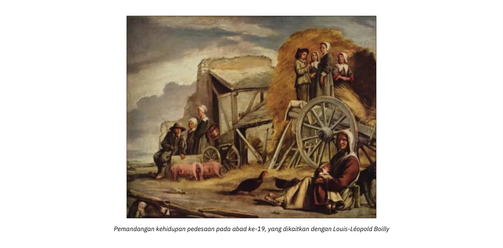

Para pengrajin perkotaan, yang terkunci dalam serikat pekerja yang kaku, kesulitan untuk berinovasi atau bahkan saling mendukung. Sementara itu, negara-negara Eropa lainnya segera melampaui Prancis di setiap lini, mengungguli produk-produknya dalam persaingan. Kesuksesan komersial Inggris dan Belanda ada di benak setiap orang.

Namun, bagaimana kita bisa menemukan solusi untuk penyakit di era tersebut? Belum ada ilmu ekonomi, dan karenanya tidak ada obat khusus untuk diterapkan. Prinsip-prinsip kebijakan ekonomi masih diterapkan secara serampangan, bergeser antara fase restriktif dan periode yang lebih liberal. Tentu, ada model dan referensi historis untuk diikuti. Di antaranya adalah _Sully_, menteri Henri IV, yang mengadvokasi pertanian dan mempromosikan kebebasan perdagangan yang lebih besar di dalam Prancis.

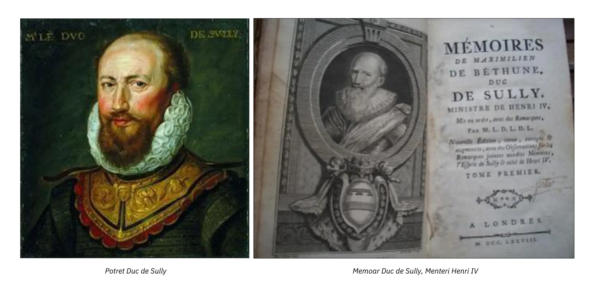

Namun kemudian datanglah Colbert, menteri Louis XIV, yang bimbang antara regulasi dan kebebasan, namun pada akhirnya menegakkan regulasi. Menjelang akhir abad ke-17, Colbert mengambil alih posisi Sully: para menteri kini merujuk pada warisannya dan mencoba menerapkan apa yang mereka klaim sebagai prinsip-prinsipnya.

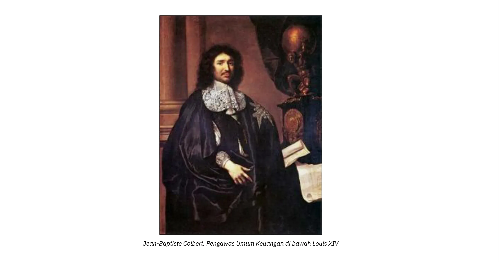

Dalam benak para negarawan di akhir abad ke-17, maksim Colbert terdiri dari empat maksim.

(1) **Industri Harus Diatur dan Terikat Dalam Serikat Pekerja**.

Peraturan-peraturan ini menentukan, misalnya, bagaimana seprai dan kain harus dibuat, ukuran dan beratnya. Ada ratusan aturan semacam itu, yang disusun dalam volume khusus untuk setiap jenis industri. Namun di mata para pengikut Colbert, ini masih belum cukup: mereka percaya industri juga perlu diawasi oleh korporasi.

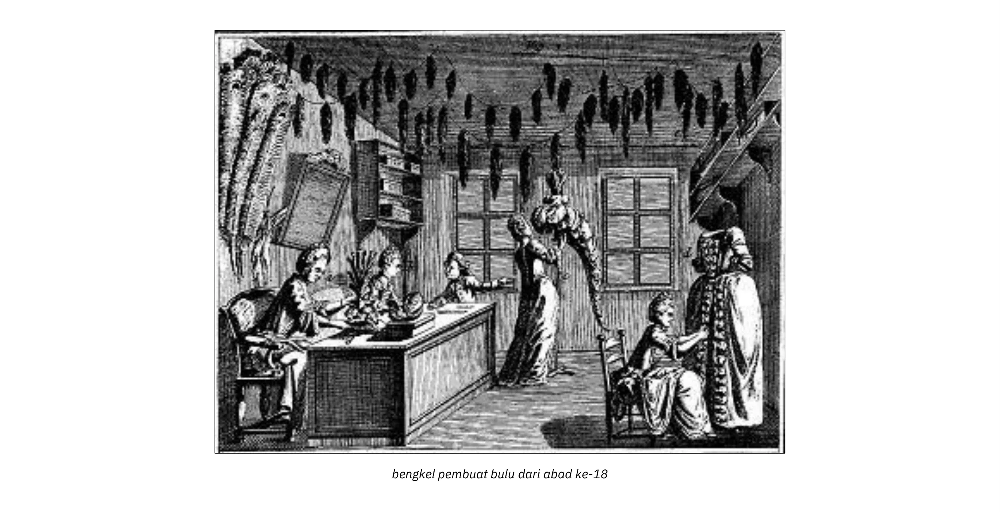

Siapa pun yang ingin menjalankan suatu perdagangan harus terlebih dahulu menghabiskan beberapa tahun sebagai apprentice (magang), lalu sebagai journeyman (pekerja harian), sebelum mencoba mencapai status master dengan menghasilkan "masterpiece" dan membayar sejumlah besar kepada gilda / serikat. Oleh karena itu, persaingan dalam setiap perdagangan sangat dibatasi.

(2) **Perdagangan Adalah Permainan Tanpa Hasil**. 

Dalam hal perdagangan, murid-murid Colbert memiliki prasangka yang sama dengan orang-orang barbar di zaman kuno. Menurut menteri Louis XIV, perdagangan adalah "perang abadi". Mengapa? Alasannya sederhana: bagi Colbert dan penerusnya, setiap peningkatan kekayaan bagi satu negara berarti memiskinkan negara lain. Menurut pandangan mereka, Inggris atau Belanda tidak boleh dibiarkan menjadi kaya, karena itu berarti mereka mencuri kemakmuran Prancis.

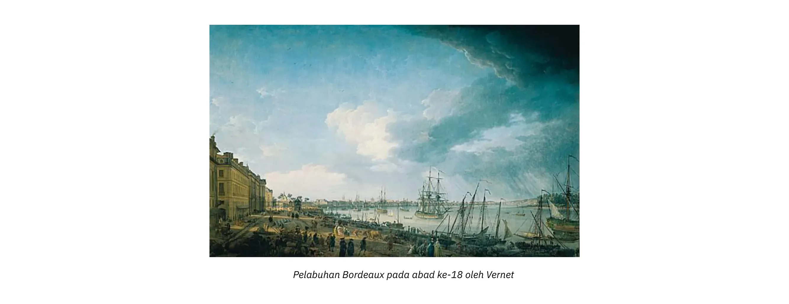

Oleh karena itu, produk-produk negara-negara ini harus dilarang atau dikenakan pajak yang sangat tinggi, tanpa keraguan, karena perdagangan adalah perang di mana kita hanya bisa mengharapkan kehancuran musuh kita.

> "Prancis hanya dapat meningkatkan perdagangan mereka dengan menghancurkan Belanda".
> *Colbert*

(3) **Ketika Negara Kekurangan Uang, Naikkan Pajak Lebih Banyak**.

Colbert dan murid-muridnya jauh dari keyakinan bahwa kekayaan pembayar pajak adalah sumber daya yang terbatas. Menurut pandangan mereka, pengeluaran publik tidak pernah menjadi masalah, selama jumlah yang dikumpulkan mencukupi. Dan jika rakyat memberontak, itu hanya karena para menteri melakukannya dengan buruk, karena, seperti yang disindir Colbert secara sinis, "seni perpajakan terletak pada mencabut bulu angsa tanpa membuatnya terlalu banyak berteriak."

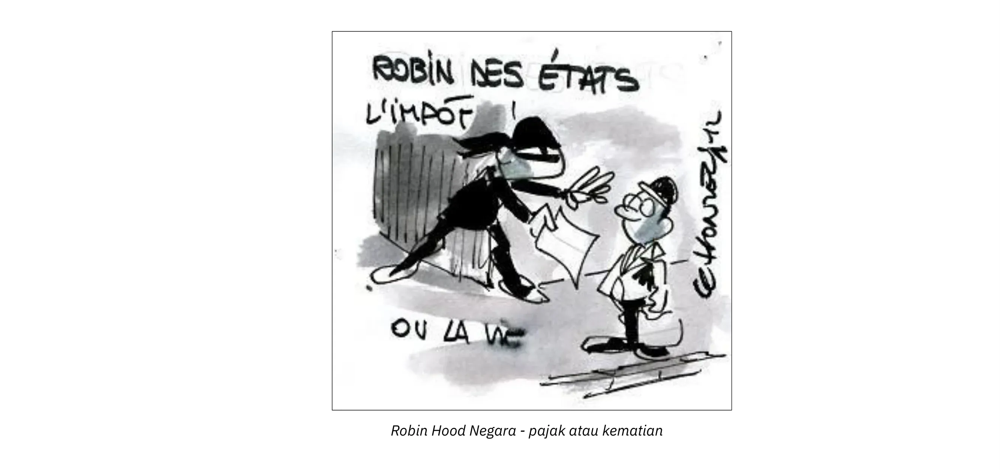

(4) **Kekayaan adalah, di atas segalanya, emas dan perak**. 

Sebelum lahirnya ilmu ekonomi, banyak penulis mengikuti satu dogma dominan tentang sifat kekayaan, yang kemudian dikenal sebagai _merkantilisme_. Colbert dan penerusnya melanjutkan jalur ini. Singkatnya, kaum merkantilis percaya bahwa tanda sejati kemakmuran suatu bangsa adalah akumulasi logam mulia, perak, dan emas.

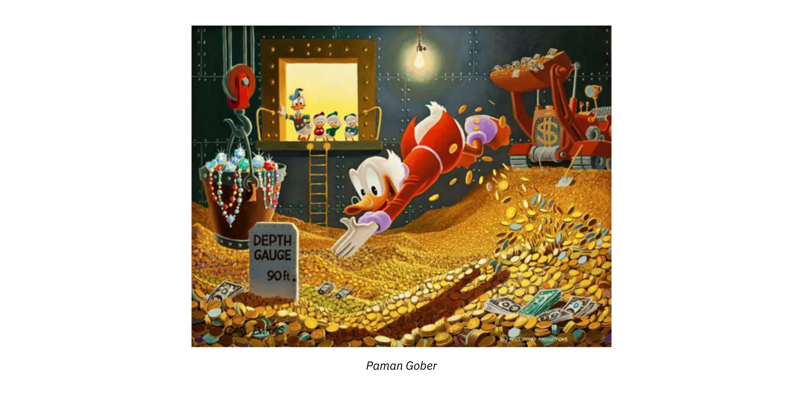

> "Hanya kelimpahan uang di dalam negara yang membuat perbedaan pada kebesaran dan kekuasaannya".
> *Colbert *

Konsekuensi dari ide ini adalah mendukung ekspor dengan segala cara, yang mendatangkan emas dan perak asing, dan membatasi impor seminimal mungkin, untuk menghindari pengiriman emas dan perak ke luar negeri.

Ini adalah empat prinsip yang memandu pemerintah Prancis selama beberapa dekade, saat negara ini memasuki abad ke-18. Namun, prinsip-prinsip tersebut segera mendapat tantangan besar. Antara tahun 1690 dan 1710, beberapa penulis sangat terpukul dengan kondisi Prancis yang penuh bencana. Dalam mencari penyebabnya, mereka menyimpulkan bahwa maksim yang diwarisi dari Colbert adalah penyebabnya, dan menganggapnya sebagai argumen yang salah. Dengan demikian, mereka meletakkan dasar-dasar ilmu ekonomi.

## Vauban

<chapterId>ee9c1e0e-96cc-5026-a5e2-963d68122786</chapterId>

Saat ini, ketika tekanan pajak di negara kita terus meningkat dan mengancam untuk mencekik kekuatan ekonomi nasional, suara-suara yang mendukung perubahan pun bermunculan. Disadari atau tidak, seruan reformasi ini sering kali menggemakan karya para ekonom Prancis yang sejak abad ke-17 telah mengkritik sistem pajak negara ini sebagai sistem pajak yang kacau, lalim, dan berlebihan.

Saat ini, seiring tekanan pajak di negara kita terus meningkat dan berpotensi mencekik kekuatan ekonomi nasional, suara-suara yang menyerukan perubahan semakin menguat. Disadari atau tidak, seruan untuk reformasi ini sering kali menggemakan karya para ekonom Prancis yang, sejak abad ke-17, telah mengkritik sistem perpajakan negara sebagai sesuatu yang kacau, lalim, dan berlebihan.

Reformis pajak pertama, secara kronologis maupun berdasarkan jasa, adalah marsekal besar Sébastien Le Prestre Vauban, yang terkenal sebagai pembangun kastil dan benteng pertahanan (citadels).

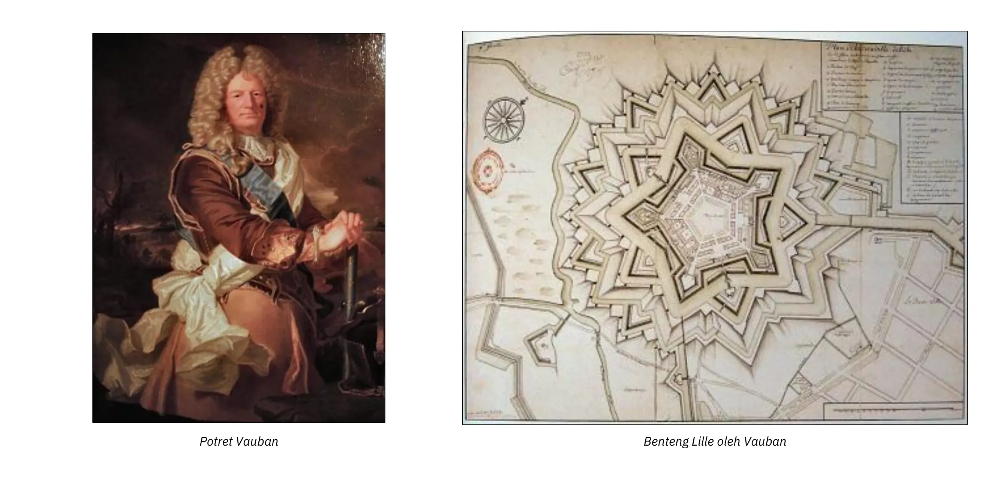

Meskipun beliau terlupakan, Vauban lebih dari sekadar tokoh militer; dia juga seorang ekonom. Ia menaruh perhatian pada nasib para petani dan mengusulkan reformasi pajak yang berani, yaitu Pajak Proporsional (flat tax sebelum masanya). Usulan tersebut diajukan pada tahun 1695 (Projet de capitation - "Proyek untuk Kapitasi") dan kembali pada tahun 1707 (Projet d'une Dime Royale - "Persepuluhan Kerajaan"): untuk mengganti sebagian besar pajak yang ada dengan pajak yang proporsional terhadap pendapatan.

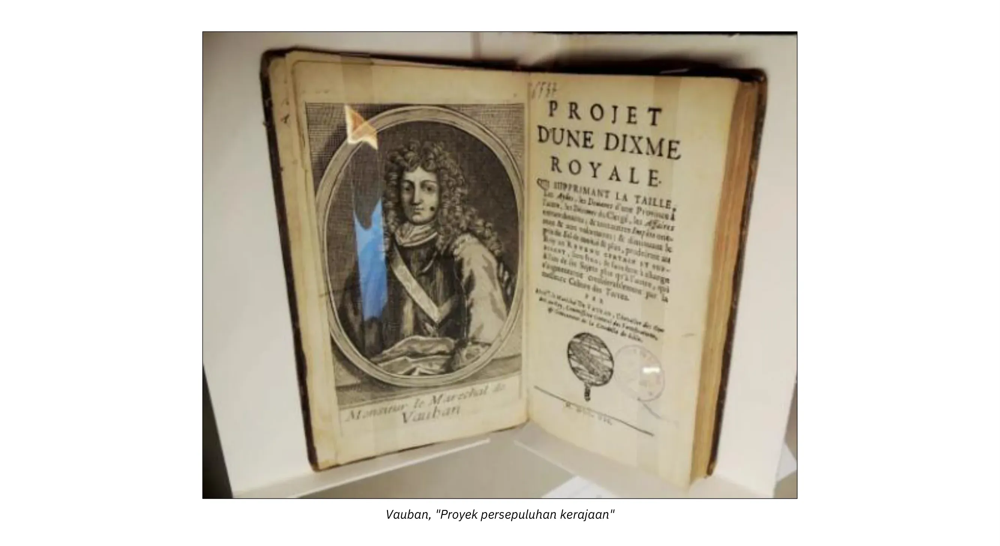

Vauban mencapai gagasan ini melalui keingintahuan. Ia adalah pengamat yang tajam, berusaha mempelajari kehidupan sosial dan realitas ekonomi secara ketat, bahkan hampir secara ilmiah. Ia sangat menekankan perlunya penghitungan melalui sensus.

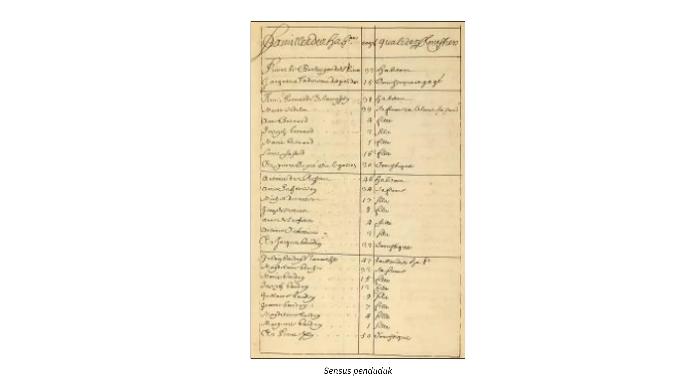

Jasa besar kedua Vauban adalah deskripsinya yang menyentuh dan jujur tentang penderitaan yang dialami oleh masyarakat bawah. Ia menulis: "Janganlah kita tertipu; jantung kerajaan telah hancur. Segalanya menderita, segalanya bertahan, segalanya merintih. Anda hanya perlu melihat dan memeriksa jantung provinsi, apa yang akan Anda temukan bahkan lebih buruk dari apa yang saya katakan."

Jauh dari berlebihan, pengamatan suram Vauban adalah cerminan akurat dari kehidupan awal abad ke-18. Alexis de Tocqueville sangat menyadari ide-ide ini, dan kemudian akan menggambarkan _Royal Tithe_ (Persepuluhan Kerajaan) karya Vauban sebagai hal yang "mengerikan", karena itu benar adanya.

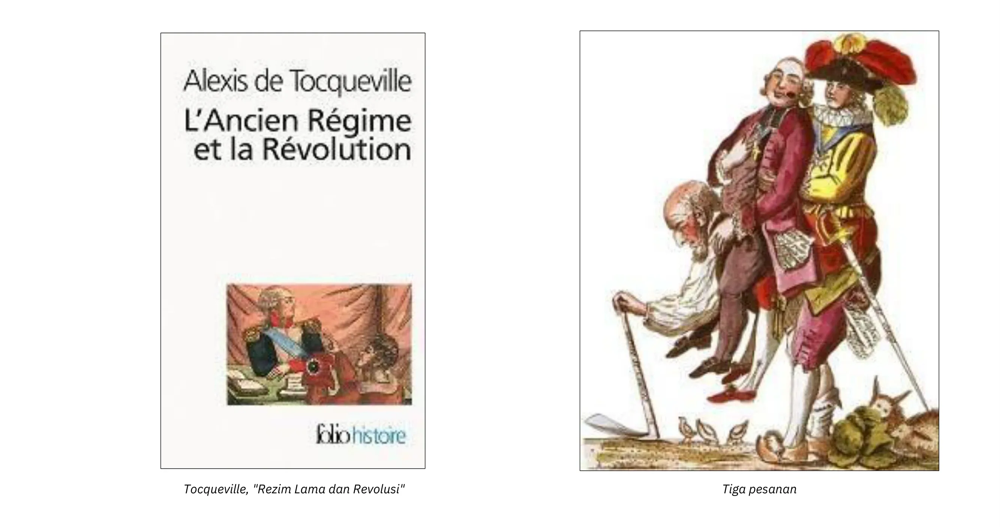

Jasa besar Vauban lainnya sebagai seorang ekonom adalah mengusulkan reformasi pajak yang luas, bertujuan untuk memberantas, atau setidaknya mengurangi intensitas keburukan yang ia amati dan gambarkan. Ia benar melakukan hal itu; ekonomi Prancis di bawah Ancien Régime (Rezim Lama) lumpuh karena sistem perpajakan yang tidak setara, tidak stabil, dan tidak jelas.

Dalam berbagai tulisan politik dan ekonominya, ambisi utama Vauban adalah meringankan penderitaan yang ia sebut sebagai "masyarakat kelas bawah, yang dengan kerja kerasnya menopang dan mendukung kelas atas".

Dia memahami bahwa perpajakan yang menindas dan menghilangkan insentif telah membebani petani. Konsep ini ia ungkapkan dengan jelas, sesuatu yang masih dapat kita amati dengan sempurna di zaman kita:

> "Petani membiarkan lahan kecil yang dimilikinya menjadi layu, menggarapnya hanya dengan setengah hati, karena takut jika lahan tersebut menghasilkan apa yang bisa dihasilkan dengan pupuk dan penanaman yang tepat, maka akan dikenai pajak yang lebih besar lagi".

Vauban melihat kebenaran: perpajakan di bawah Ancien Régime tidak hanya tidak rasional tetapi juga sangat ketat. Sistem pajak yang tidak adil dalam distribusinya inilah yang ia coba atasi.

Solusi yang ia usulkan, yaitu pajak proporsional yang datar (flat) atas semua pendapatan, akan memungkinkan beban pajak dibagi secara adil di antara semua kelas sosial. Berlandaskan pada teori Negara yang memandang otoritas publik diperlukan untuk melindungi hak dan properti individu, reformasi pajak Vauban menuntut agar semua warga negara berkontribusi secara ketat proporsional dengan apa yang mereka peroleh, misalnya, 10% dari pendapatan mereka.

Dalam The Royal Tithe, satu-satunya karya ekonominya yang dicetak semasa hidupnya, Vauban menyatakan dengan jelas:

> "Karena setiap orang dalam suatu Negara membutuhkan perlindungannya untuk bertahan hidup, adalah adil bahwa semua berkontribusi, sesuai dengan pendapatan mereka, untuk pemeliharaan dan pengeluarannya [...]. Tidak ada yang lebih tidak adil daripada membebaskan mereka yang paling mampu membayar, dan mengalihkan beban kepada mereka yang paling tidak mampu, yang ambruk di bawah beban; beban yang akan menjadi cukup ringan jika ditanggung secara proporsional oleh semua orang sesuai dengan kekuatan mereka sendiri. Oleh karena itu, setiap pembebasan dari perpajakan adalah kekacauan yang harus diperbaiki."

Sesaat sebelum kematiannya, ide Vauban diadopsi oleh para menteri Louis XIV. Namun, Vauban telah menyerukan agar pajak proporsional tersebut menggantikan semua, atau hampir semua, pajak yang ada. Sebaliknya, seperti yang sering terjadi, pajaknya diimplementasikan, tetapi semua pajak yang lain juga tetap dipertahankan.

## Boisguilbert

<chapterId>200149c6-b5fc-566e-ab0e-bafb1c3fed3c</chapterId>

Hanya sedikit ekonom Prancis dari masa lalu yang menikmati pengakuan di tanah air mereka hari ini setara dengan kontribusi mereka, dan Boisguilbert tidak terkecuali.

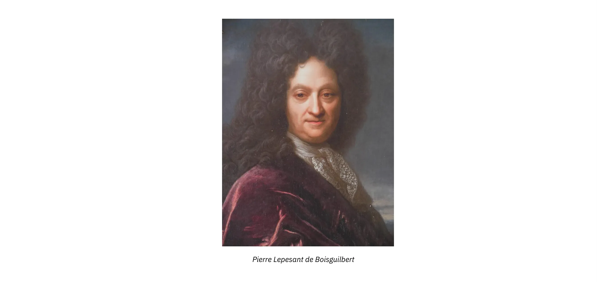

Tidak dihargai oleh para pembaca di zamannya, dan jauh dari lingkaran kekuasaan karena sifatnya yang eksentrik dan semangatnya yang meluap-luap, Boisguilbert meninggalkan sedikit jejak pada abad ke-18. Namun, pada awal abad lalu, terjadi penemuan kembali karyanya secara perlahan.

Sayangnya, penemuan kembali ini justru mengarah pada semacam jalan buntu. Jasa Boisguilbert yang sebenarnya hilang karena ia ditampilkan sebagai pelopor berbagai teori dan pendahulu banyak pemikir. Ia disebut telah memahami konsep pengangguran terselubung yang kemudian dipertahankan oleh Keynes, mengantisipasi hukum Say, membuka jalan bagi teori keseimbangan umum Walras, dan bahkan mengisyaratkan analisis kelas Marxis. "Siapa atau apa yang tidak bisa didahului oleh Boisguilbert?" tanya seorang komentator pada akhirnya.

Boisguilbert (nama lengkap: Pierre Le Pesant de Boisguilbert) lahir di Rouen pada tahun 1646. Setelah menempuh pendidikan di Port-Royal di Paris, Boisguilbert memulai karier sastra yang kurang sukses sebelum mengambil berbagai peran, termasuk Letnan Jenderal di Rouen. Selama masa inilah ia menulis beberapa buku untuk mengadvokasi idenya, di antaranya "Détail de la France" pada tahun 1695, yang ia terbitkan kembali tahun berikutnya dengan judul yang jauh lebih eksplisit: *[Prancis Hancur di Bawah Pemerintahan Louis XIV, oleh Siapa dan Bagaimana, serta Cara untuk Memulihkannya](https://archive.org/details/bub_gb_0jUaWNbTJa8C/page/n23/mode/2up)*.

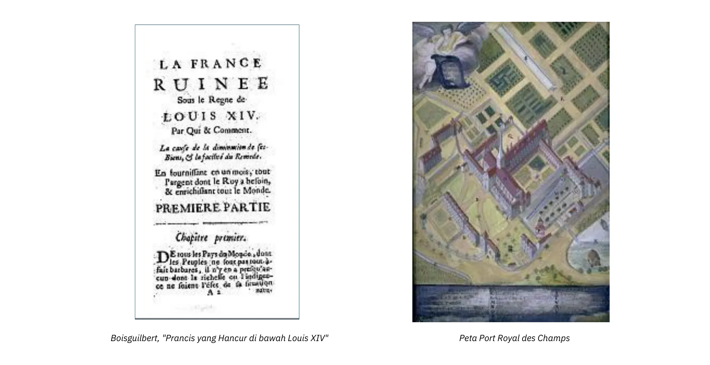

Dan inilah yang menjadi dasar dari buku-buku Boisguilbert: Kemiskinan Prancis dan penyebabnya.

Kesengsaraan rakyat Prancis pada akhir abad ke-18 ini, Boisguilbert menggambarkannya secara rinci, seperti halnya Vauban. Dia menulis:

> "Tanah yang tandus atau tidak digarap dengan baik, yang terlihat oleh semua orang, adalah mayat Prancis."

Dia menggambarkan kebun anggur yang dicabut, petani yang meninggalkan ladang, dan kelaparan yang berulang.

Boisguilbert menemukan dua penyebab utama kemalangan ini. Rakyat hidup dalam kemelaratan karena mereka dicegah mengonsumsi apa yang diperlukan, dan kehancuran konsumsi ini disebabkan oleh dua faktor:

Pertama, rakyat tidak mampu lagi membeli kebutuhan pokok karena sistem perpajakan yang sewenang-wenang. Taille, pajak pribadi pada saat itu, dihitung secara membabi buta untuk setiap individu, naik atau turun tanpa alasan. Karena banyaknya hak istimewa (privileges), beban pajak jatuh pada petani miskin, yang akhirnya menjadi bangkrut. Untuk mengatasi hal ini, Boisguilbert merekomendasikan pajak proporsional pada semua pendapatan, sangat mirip dengan usulan Vauban.

Alasan kedua kemiskinan Prancis adalah terlalu banyak hambatan yang mencegah perdagangan bebas barang, terutama hasil pertanian. Ada bea cukai di perbatasan dan bahkan di dalam negeri, antar wilayah, yang melumpuhkan semua perdagangan. Semua pembatasan ini mencegah terbentuknya harga keseimbangan dan membatasi peluang pasar. Akibatnya, petani tidak bisa hidup dari hasil produksi mereka karena mereka tidak dapat menjual dengan harga yang menguntungkan dan menderita akibat harga pertanian yang tidak memberikan keuntungan, kekhawatiran yang hingga kini masih relevan. Mengenai pembatasan perdagangan, Boisguilbert mengadvokasi membuka jalan, atau dengan kata lain, menetapkan perdagangan bebas.

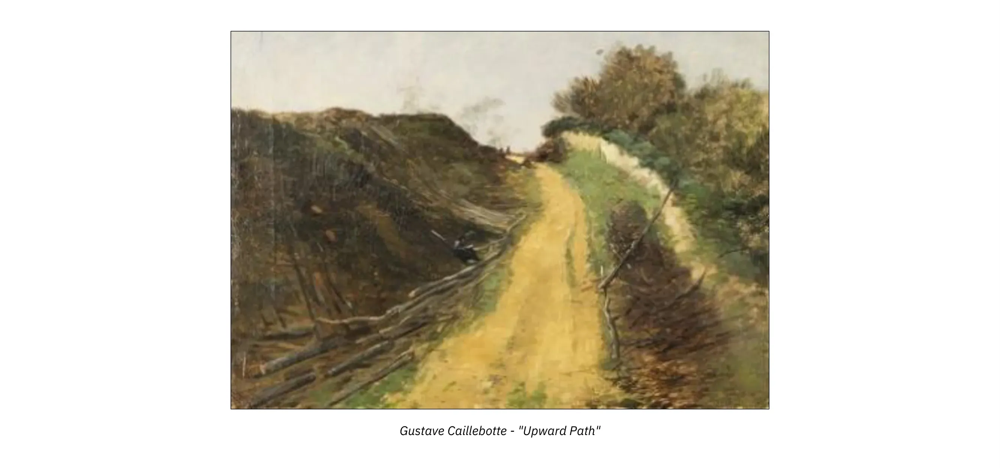

Dan kebebasan memang merupakan kesimpulan akhirnya. "Ini bukan masalah bertindak," katanya, "tetapi hanya berhenti bertindak seperti yang kita lakukan secara keras melawan alam, yang selalu cenderung menuju kebebasan dan kesempurnaan." Semuanya akan baik-baik saja, ia mengulang tanpa lelah, "selama kita membiarkan alam berjalan sebagaimana mestinya, yaitu, memberinya kebebasan, dan tidak ada yang ikut campur dalam perdagangan ini kecuali untuk menawarkan perlindungan kepada semua dan mencegah kekerasan."

Paragraf terakhir ini sangat penting. Boisguilbert adalah yang pertama menuntut secara jelas kebijakan ekonomi laissez-faire, menjadikannya credo-nya, dan membangun sistem nyata di sekitarnya. Menurutnya, ada tatanan alamiah yang tidak boleh dirusak oleh intervensi publik yang tidak tepat waktu. Negara, menurut pandangannya, tidak boleh bertindak dalam masalah ekonomi, melainkan membiarkan segala sesuatu bertindak secara alamiah. Jika tidak, itu akan menyebabkan penderitaan.

Boisguilbert bahkan mengkritik "jiwa-jiwa baik", sebutannya, yaitu mereka yang berniat baik tetapi menyebabkan kerugian besar. Mereka ingin roti murah untuk rakyat, tetapi dengan memaksa harga turun, mereka merugikan petani yang tidak bisa bertahan hidup dengan margin sekecil itu. Para petani ini kemudian meninggalkan tanah mereka, tenggelam lebih dalam dalam kemiskinan. Seperti yang kita semua tahu, 'neraka sering kali diaspal dengan niat baik'.

## Cantillon

<chapterId>bc206d41-6a64-5688-a489-40fcfa0e5397</chapterId>

Richard Cantillon, penulis "Essay on the Nature of Trade in General" (ditulis sekitar tahun 1730, diterbitkan tahun 1755), dianggap sebagai salah satu pelopor ilmu ekonomi modern. Dalam bukunya, History of Economic Thought, ekonom Murray Rothbard bahkan menyebut Cantillon sebagai pendiri ekonomi modern.

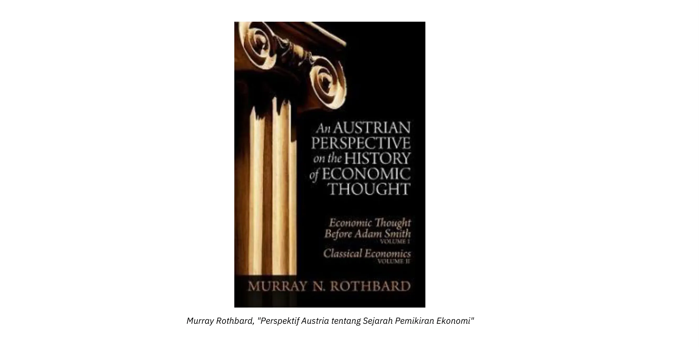

Lahir di Irlandia, Richard Cantillon menetap di Paris saat muda dan memperoleh kewarganegaraan Prancis. Ia bekerja sebagai bankir dan meraup kekayaan besar selama era John Law.

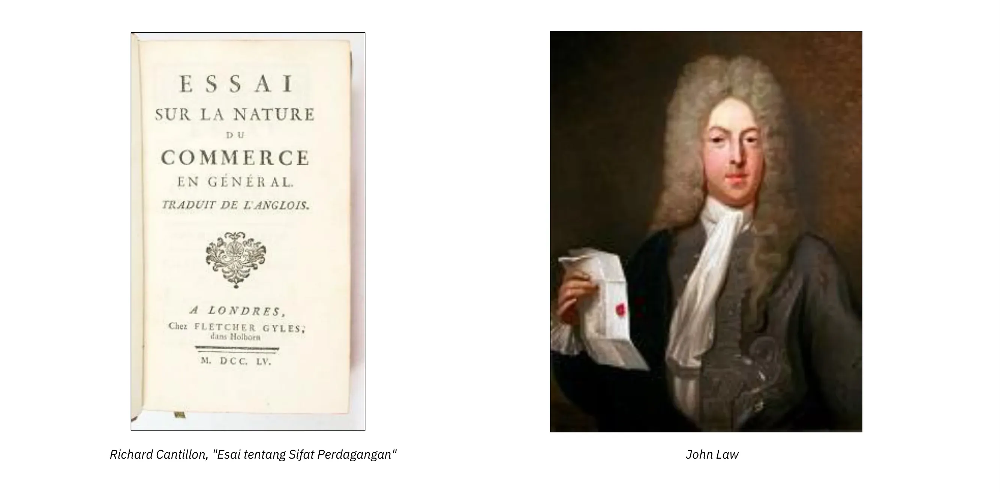

Pada kesempatan inilah ia mulai mempelajari teori ekonomi. Sekitar tahun 1730, Cantillon menyusun esainya yang berjudul "Essay on the Nature of Commerce in General".

Buku ini dapat dilihat sebagai salah satu upaya pertama untuk menciptakan teori umum ekonomi. Cantillon secara cermat mengidentifikasi apa yang ia sebut "hukum-hukum umum ekonomi," yaitu hukum yang melekat pada sifat segala sesuatu, bukan pada fakta-fakta khusus negara tertentu. Pendekatan ini sangat revolusioner.

Jasa besar esai Cantillon dapat dirangkum dalam lima bidang utama: teori kekayaan, gagasan wirausahawan (entrepreneur), kritik terhadap mata uang yang tidak bernilai, "Efek Cantillon," dan terakhir, pembelaan terhadap kebebasan.

Pertama, **teori kekayaan**.

Berbeda dengan pandangan merkantilisme yang dominan saat itu, Cantillon mendasarkan analisisnya pada pengakuan bahwa kekayaan dibentuk oleh produk-produk yang tepat untuk kenikmatan manusia. Kekayaan ini, argumennya, berasal dari alam dan diproduksi melalui kerja manusia. Ide-idenya tentang sifat kekayaan memiliki pengaruh kuat pada Beccaria dan Adam Smith, dan, melalui Smith, pada seluruh mazhab pemikiran klasik Inggris.

Kedua, **pengusaha**.

Meskipun ia tidak mendefinisikannya secara eksplisit, Cantillon memandang wirausahawan sebagai pemain utama dan sentral dalam kegiatan ekonomi. Bagi Cantillon, yang menjadi ciri khas wirausahawan adalah ia mengambil risiko dan bertindak dalam ketidakpastian. Gagasan-gagasan ini kemudian dikembangkan oleh Turgot dan, lebih signifikan, oleh Say, untuk akhirnya mengakui tempat istimewa wirausahawan dalam ekonomi, berlawanan dengan anggapan mazhab Inggris.

Poin ketiga, **mata uang**.

Sebagai reaksi terhadap pengalaman John Law, Cantillon menjelaskan apa yang terjadi atau harus terjadi ketika mata uang tidak memiliki nilai riil.

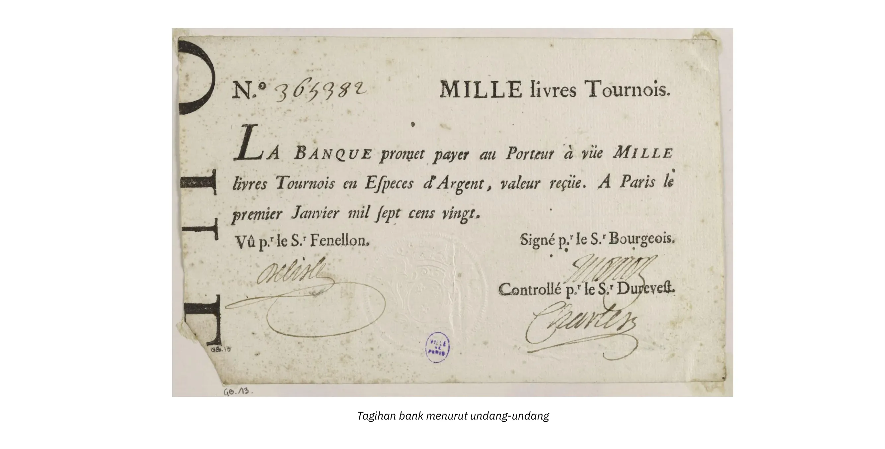

Dia melihat dua konsekuensi utama dari penggantian mata uang berbasis logam dengan mata uang tanpa nilai riil, seperti uang kertas. Konsekuensi pertama adalah apa yang ia sebut "penolakan populer" (popular rejection), yang berarti meningkatnya ketidakpercayaan terhadap uang yang tidak bernilai. Konsekuensi kedua adalah [inflasi](https://planb.academy/resources/glossary/inflation): melemahnya moneter membuat harga barang menjadi lebih mahal.

Keempat, dalam analisisnya tentang inflasi, Cantillon melangkah lebih jauh dari para tokoh sezamannya. Setelah mengamati runtuhnya sistem Law, Cantillon menyadari bahwa inflasi moneter tidak memengaruhi semua orang secara setara. Sebaliknya, inflasi memperkaya sebagian orang sambil memiskinkan sebagian lainnya. Ia menyimpulkan bahwa inflasi memiliki efek redistributif: mereka yang pertama menerima uang yang baru diterbitkan mendapat manfaat dari peningkatan daya beli, sementara mereka yang menerimanya belakangan menjadi lebih miskin akibat penerbitan uang baru tersebut karena kenaikan tingkat inflasi.

Kelima, meskipun memiliki beberapa sisa pemikiran merkantilis, perspektif keseluruhan Cantillon **sepenuhnya liberal**. Ia membela kepemilikan pribadi sebagai pilar fundamental peradaban, dengan alasan bahwa tidak ada masyarakat yang dapat berfungsi tanpa kepemilikan pribadi atas tanah dan produk hasil kerja. Ia juga melihat ketidaksetaraan materi di antara manusia sebagai hal yang alami dan sah. Menurut Cantillon, tidak ada yang salah dengan seorang pekerja yang efisien dan berani, atau seseorang yang sangat berbakat, mendapatkan penghasilan lebih banyak daripada orang yang tidak kompeten atau malas. Akhirnya, Cantillon percaya bahwa harga harus selalu ditentukan secara bebas, melalui permainan penawaran dan permintaan, tanpa campur tangan otoritas publik.

Di antara kelima ide utama dalam Esainya, yang paling penting tidak diragukan lagi adalah ide yang kini menyandang namanya: **Cantillon Effect**.

Dengan teori tentang dampak inflasi ini, Cantillon memberi kita jawaban untuk sejumlah penyakit kontemporer. Teori ini membantu kita memahami konsekuensi dari kebijakan moneter ekspansif dan inflasi baru-baru ini, yang telah memiskinkan kelas menengah dan dunia pedesaan, sementara memperkaya operator pasar keuangan dan Negara beserta lembaga-lembaganya dan para pejabatnya, karena kedekatan mereka dengan sumber penerbitan uang baru: bank sentral dan bank komersial.

# Para Pembaharu dan Pemikir di Awal Abad ke-18

<partId>1f7b50d4-ce93-5db3-8396-43c1fa5419ff</partId>

## Kepala Biara Saint-Pierre

<chapterId>13478fe2-4c12-593c-a410-54c2cfb7ef7f</chapterId>

Dari semua penulis yang kita pilih untuk dimasukkan dalam jajaran pemikir laissez-faire Prancis abad ke-18, Kepala Biara Saint-Pierre tidak diragukan lagi adalah yang paling terabaikan.

Sejujurnya, ini sebagian disebabkan oleh kesalahannya sendiri. Ia banyak menulis, tetapi gayanya sulit dibaca dan penuh pengulangan. Bahkan Jean-Jacques Rousseau pernah mencoba meringkas karyanya, namun segera menghentikan tugas itu karena menyadari hal itu melampaui kemampuannya. Pada pertengahan abad ke-19, Gustave de Molinari menghormatinya dengan menerbitkan karya komprehensif tentangnya, di mana ia memberikan penghargaan kepada tokoh perdamaian dan ekonom yang merupakan Kepala Biara Saint-Pierre. Namun hal ini tidak cukup untuk membuatnya terlupakan, karena ia masih tetap diingat sampai sekarang.

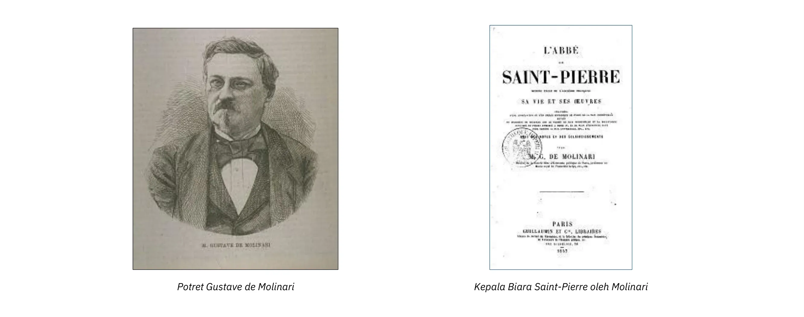

Kepala Biara Saint-Pierre menulis tentang ekonomi, tetapi ia justru lebih sering menarik perhatian sebagai pegiat perdamaian. Ia adalah penulis Project for Perpetual Peace (Proyek Perdamaian Abadi), yang mendahului karya terkenal Emmanuel Kant.

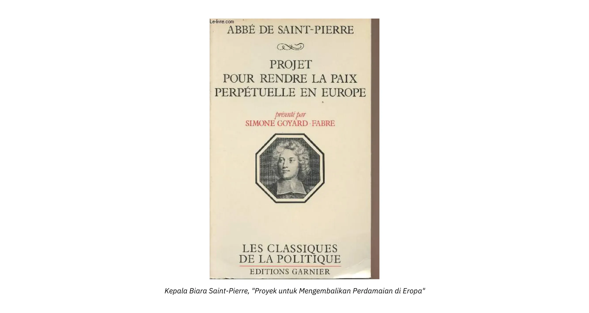

Dalam karya ini, ia berargumen bahwa perang bersifat merusak, tidak hanya bagi mereka yang kalah, tetapi juga bagi para pemenang, dan bahkan bagi mereka yang tidak ikut serta, karena perdagangan mereka ikut terpengaruh.

Untuk memerangi momok perang, ia merekomendasikan pembentukan semacam Liga Bangsa-Bangsa Eropa (European League of Nations). Sebuah dewan Eropa akan dibentuk untuk menyelesaikan masalah setiap negara. Dengan demikian, negara-negara akan beralih ke arbitrase untuk menghindari penggunaan senjata. Jika suatu negara tidak cukup bijaksana untuk menerima perdamaian dan mengancam negara-negara Eropa lainnya, liga bangsa-bangsa Eropa akan memiliki cara untuk merespons. Dalam menghadapi peristiwa tersebut, tentara Eropa akan dibentuk, dengan pasukan yang disediakan oleh berbagai negara.

Ada juga sebuah episode dalam kehidupan Kepala Biara Saint-Pierre yang secara sempurna menggambarkan pola pikir kritis di balik gerakan laissez-faire Prancis. Ia bergabung dengan Académie Française pada tahun 1695, tetapi dikeluarkan pada tahun 1718 karena berani mengkritik pemerintahan Louis XIV. Dalam hal ini, ia sejalan dengan tokoh-tokoh seperti Vauban dan Boisguilbert, yang juga berani berbicara menentang kesengsaraan yang tersembunyi di balik kemegahan pemerintahan "Raja Matahari" (Sun King).

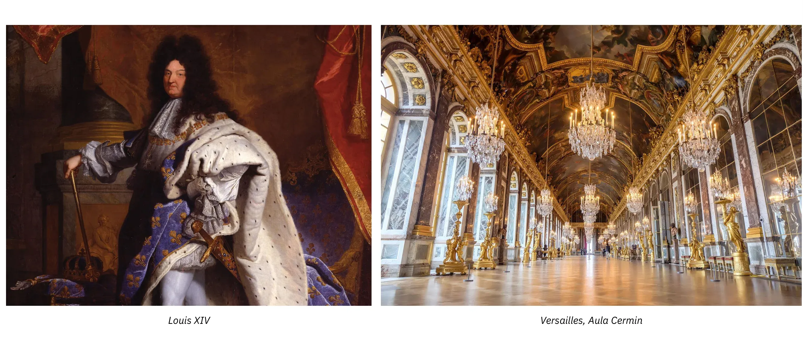

Kepala Biara Saint-Pierre berpendapat bahwa pemerintahan Louis XIV, dengan istananya yang mewah dan obsesi terhadap penaklukan militer, bukanlah tanda dari seorang raja yang berbudi luhur. Ia menolak menerima bahwa Louis XIV layak mendapatkan gelar **"Louis Agung" (Louis the Great)**.

"Menghancurkan tetangga dan rakyat sendiri pada saat yang sama bukanlah keagungan," katanya. Posisi ini sangat menyinggung Académie Française, yang selama ini disibukkan dengan memuliakan raja dalam setiap bentuk literatur yang memungkinkan. Akibatnya, sebagian besar mereka dengan suara bulat memilih untuk mengusirnya.

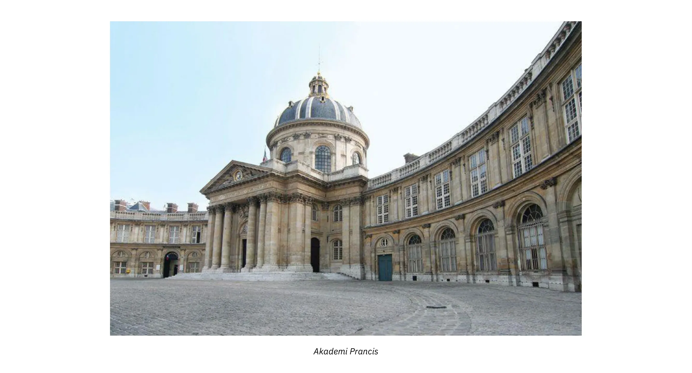

Dalam hal pemikiran ekonomi, ia secara konsisten menerapkan prinsip utilitas (utility), sangat mirip dengan apa yang akan dilakukan Jeremy Bentham di kemudian hari, dan sering kali menawarkan wawasan yang masuk akal. Agar adil, ia masih dipengaruhi oleh ide-ide merkantilis, yang saat itu belum sepenuhnya ditinggalkan oleh siapa pun.

Meskipun demikian, Kepala Biara Saint-Pierre membuat beberapa pengamatan akurat tentang ekonomi. Bahkan sebelum _Condillac_, yang sering dikreditkan dengan gagasan tersebut, ia menyatakan dengan jelas bahwa dalam setiap pertukaran, kedua belah pihak mendapatkan manfaat. Hal ini dapat ditemukan dalam karyanya tahun 1733, ["Project for Improving France's Trade"](https://www.institutcoppet.org/projet-pour-perfectionner-le-commerce-de-france/), di mana ia menulis:

> "Ketika penjualan dilakukan antara pedagang, penjual mendapatkan keuntungan, dan begitu juga pembeli; karena jika tidak ada manfaat nyata atau yang dirasakan di kedua sisi, baik penjual tidak akan menjual pada harga tertentu, maupun pembeli, pada bagiannya, tidak akan membeli pada harga tersebut."

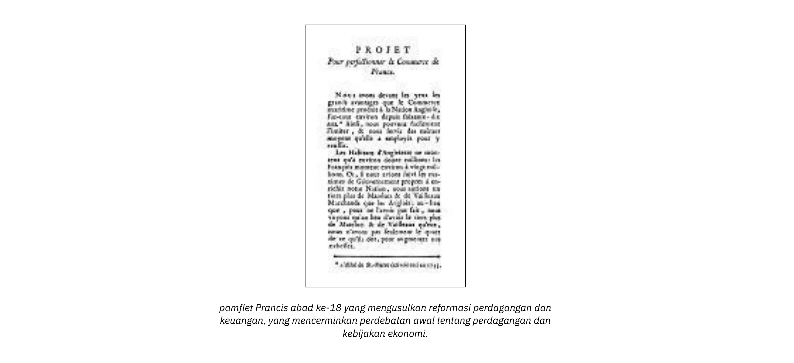

Dia juga menekankan, sebelum Vincent de Gournay melakukannya, tentang nilai tenaga kerja dan pentingnya menjaganya tetap menarik. "Semua pekerjaan itu sulit," tulisnya. "Dan ketika seorang pria melihat bahwa pekerjaannya tidak memberinya imbalan apa pun, atau tidak cukup, ia menjadi malas dan tidak akan repot-repot melakukan upaya yang tidak perlu." Argumen ini kelak akan digaungkan oleh Marquis d'Argenson, Vincent de Gournay, dan kaum Fisiokrat saat mereka mengkritik regulasi yang membebani dan sistem serikat pekerja. Mereka berpendapat bahwa pembatasan tersebut membuat pekerja patah semangat, menyebabkan kesulitan yang tidak perlu, dan pada akhirnya membuat kemalasan tampak lebih menarik daripada upaya produktif di bawah kondisi seperti itu.

## Marquis d'Argenson

<chapterId>e9960ab4-72ec-5afd-8e97-bf89c83b62bc</chapterId>

Marquis d'Argenson adalah pendiri doktrin laissez-faire yang terlupakan.

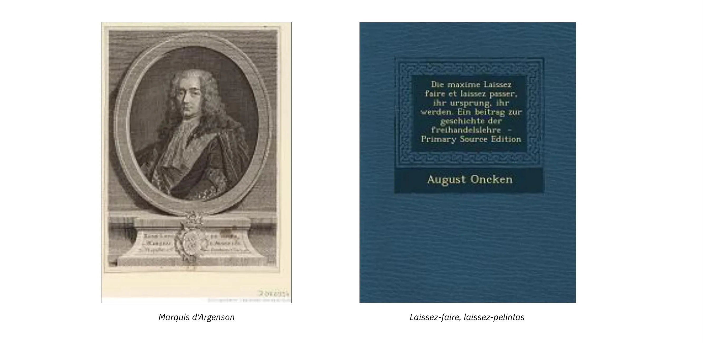

Karyanya ditemukan kembali oleh August Oncken, penulis buku tentang doktrin laissez-faire, laissez-passer, yang menyimpulkan bahwa d'Argenson memainkan peran utama dalam kelahiran gagasan ini.

René-Louis Voyer, Marquis d'Argenson, lahir pada tahun 1694. Ia memulai karier politiknya sebagai penasihat parlemen, kemudian bertugas sebagai anggota Dewan Negara (Council of State).

Tiga puluh tahun sebelum Adam Smith, d'Argenson sudah merancang manfaat dari pembagian kerja (division of labor) dan spesialisasi.

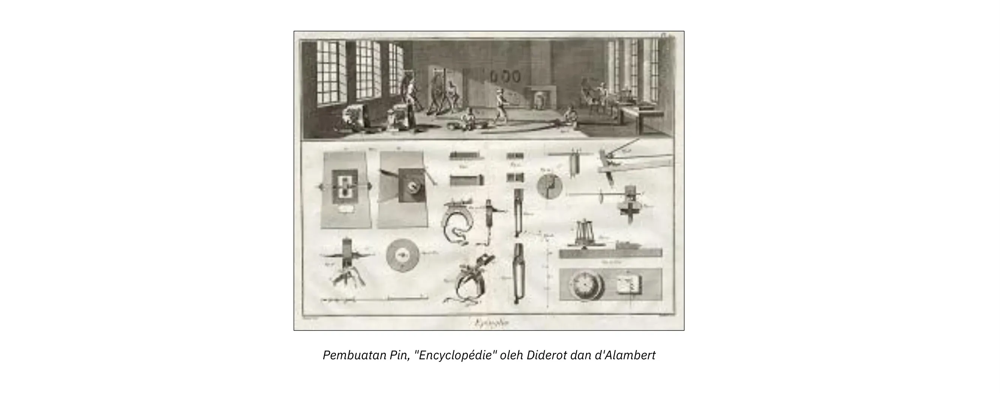

Dia sangat mengkritik regulasi yang, menurut pandangannya, berusaha mengubah preferensi alamiah dari berbagai wilayah. Sebagai contoh, ia bingung bahwa pemerintah ingin memproduksi kain dan beludru di Tours, sebuah kota miskin saat itu, agar menyamai kualitas yang dibuat di Genoa yang makmur, yang terkenal dengan barang-barang mewahnya. Ia menyimpulkan:

> "Setiap tempat harus diizinkan untuk memilih pabriknya sendiri. Kebebasan! Kebebasan!"

Dia juga mengakui prinsip utama Smith lainnya: gagasan bahwa tatanan spontan muncul dari pengejaran kepentingan diri. Marquis d'Argenson percaya bahwa kepentingan pribadi yang mendesak adalah yang mendorong energi manusia. Ia menulis bahwa pengerjaan yang buruk dan penipuan akan mendiskreditkan produsen, sementara ketekunan dan niat baik akan membawa pada kemakmuran. Penilainn terbaik tentang kegunaan (utility), menurutnya, adalah individu, masyarakat luas, yang membeli barang dan peduli untuk membuat kesepakatan yang baik. "Setiap orang mengutamakan kepentingannya sendiri," katanya, "setiap orang mengambil tindakan yang menguntungkan baginya, dan di dalam persetujuan umum inilah cara kita menemukan kebenaran."

Bahkan sebelum Adam Smith, ia memahami bahwa kepentingan diri mengarah pada kepentingan umum melalui pembangunan tatanan alamiah yang spontan.

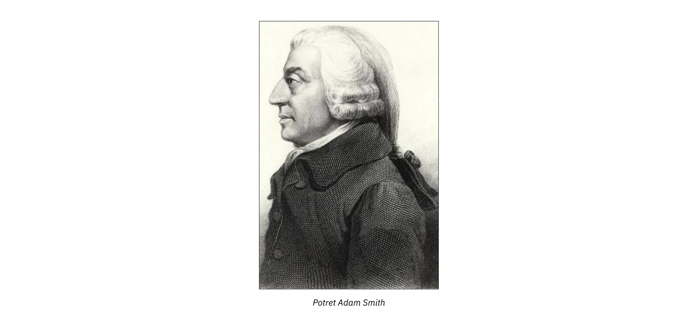

Dia membandingkan masyarakat dengan sarang lebah di mana setiap serangga mengikuti nalurinya. "Dari tindakan mereka," katanya dengan tepat, "menghasilkan akumulasi besar untuk kebutuhan masyarakat kecil; tetapi ini tidak terjadi melalui perintah, atau oleh jenderal, yang mewajibkan setiap individu untuk mengikuti pandangan pemimpin mereka." Ini mungkin merupakan ungkapan yang mendekati dalam pemikiran ekonomi Prancis dengan konsep terkenal Adam Smith tentang "tangan tak terlihat" (invisible hand)

Marquis d'Argenson selalu marah dengan ide-ide para menteri di zamannya. Satu-satunya pertanyaan yang mereka ajukan adalah, "Haruskah kita mengatur dengan cara ini atau itu? Haruskah kita mengarahkan ekonomi ke sana atau ke sini?". D'Argenson menjawab: "Tidakkah seharusnya kita bertanya terlebih dahulu apakah pantas untuk mengarahkan semuanya itu, atau apakah segala sesuatunya harus dibiarkan berjalan dengan sendirinya?"

Sejujurnya, ia heran mengapa orang begitu sulit memahami, atau lebih tepatnya, melihat, efek merugikan dari regulasi berlebihan pada ekonomi. Menurutnya, cukup dengan membuka mata. "Begitu banyak hal berjalan cukup baik hari ini," tulisnya dengan getir, "hanya karena mereka berhasil lolos dari jangkauan hukum." 

Terkadang, ia putus asa melihat betapa sedikitnya idenya dipahami.

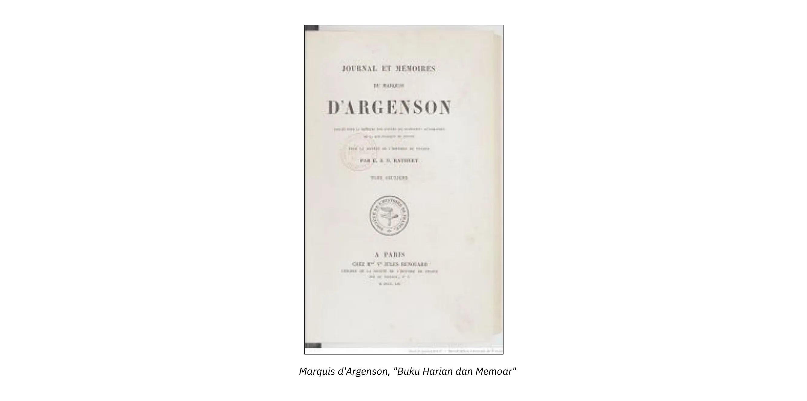

Oleh karena itu, idealisme kebijakan ekonomi yang ia bela bertentangan dengan tren zamannya. Idenya mendefinisikan peran Negara yang pada dasarnya minimal. "Semua yang dibutuhkan perdagangan hanyalah penghapusan hambatan. Perdagangan hanya meminta hakim yang baik, hukuman bagi monopoli, perlindungan yang sama untuk semua warga negara, mata uang yang stabil, serta jalan dan kanal." Ini adalah definisi untuk Negara minimal (minimal State), yang akan menjadi salah satu fondasi tradisi Prancis dalam ekonomi politik.

Visi tentang peran Negara dalam kegiatan ekonomi ini secara alami diilustrasikan dengan kajian terhadap dua isu utama yang menggerakkan para ekonom dan pemikir sosial di zamannya: regulasi industri dan perdagangan gandum.

Regulasi industri, pertama-tama, membangkitkan semua kebenciannya, karena regulasi tersebut memberikan hak istimewa untuk sebagian orang dengan mengorbankan yang lain. "Penyebab sebenarnya dari kemerosotan pabrik=pabrik kita," tulisnya, "adalah perlindungan yang berlebihan yang diberikan kepada mereka. Dan ia mengekspresikan kritiknya terhadap semangat dirigis (dirigiste zeal - kontrol negara) para negarawan di zamannya dengan keyakinan yang sama kuat: 

> Menjalankan industri yang tidak sesuai dengan semestinya sama dengan menginginkan kehancurannya.

Mengenai pertanyaan tentang perdagangan kebutuhan pokok (subsistence), d'Argenson tidak punya jawaban lain selain kebebasan. Menurutnya, kekurangan gandum datang dari monopoli dan tindakan pencegahan berlebihan yang diambil oleh pemerintah. Yang harus kita lakukan hanyalah membiarkannya, dan tidak akan pernah ada kekurangan gandum di negara di mana pelabuhan terbuka. Orang asing, yang tertarik seperti semua orang lain oleh godaan keuntungan, akan menyediakan apa yang kita butuhkan dan mengambil kelebihan kita. "Biarkan saja," katanya, "dan semuanya akan baik-baik saja."

## Vincent de Gournay

<chapterId>e8ae40dc-7450-552f-9ddc-9e02936cf425</chapterId>

Vincent de Gournay adalah salah satu perwakilan awal laissez-faire di Prancis, dan salah satu pendukung awalnya di lingkaran administrasi publik dan intelektual. Karena alasan itu, ia layak mendapatkan pengakuan yang jauh lebih besar dalam sejarah pemikiran ekonomi daripada yang biasanya ia terima. Saya telah mencoba menyoroti kontribusinya dalam sebuah buku baru-baru ini.

Terlahir dari keluarga pedagang, Gournay sendiri menjadi pedagang sukses, mengumpulkan kekayaan yang cukup besar sebelum mendapatkan posisi di pemerintahan Prancis. Di dalam Biro Perdagangan (Bureau of Commerce), ia adalah pendukung gigih untuk kebebasan kerja dan perdagangan bebas.

Meskipun ia sangat terlibat dalam konteks para ekonom terkemuka pada masanya, Gournay hanya sedikit menulis atau, lebih tepatnya, sedikit yang diterbitkan. Ia terutama menulis surat-surat administratif dan memoar, yang sebagian besar tidak diterbitkan atau diterbitkan oleh penulis lain setelah diedit.

Karya-karya yang ada meliputi:

1. (https://archive.org/details/traitessurlecomm0000chil) yang merupakan terjemahan dari sebuah buku karya ekonom Inggris, Josiah Child;

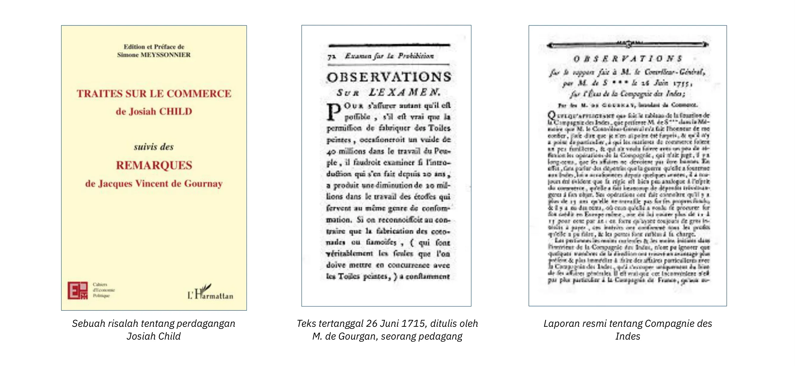

3. "Observasi" yang termasuk dalam Examination of the Advantages and Disadvantages of the Prohibition of Printed Fabrics;

5. "Pengamatan terhadap Perusahaan Hindia Timur", yang dilampirkan oleh Abbot Morellet pada Memoarnya tentang Current State of the East India Company (1769);

7. Dan yang terpenting, berbagai memoar dari perannya sebagai Intendant of Commerce (Pengawas Perdagangan).

Tulisan-tulisan ini menunjukkan pengaruh asing yang jelas dan adanya beberapa ide utama yang terstruktur. Pengaruh asing pada Gournay adalah pengakuan atas keunggulan Inggris dan Belanda. Gournay yakin bahwa kedua negara ini memahami ekonomi jauh lebih baik daripada Prancis, dan Prancis harus mengikuti contoh mereka. "Kedua negara ini adalah yang paling makmur," katanya, "dan mereka mengikuti sistem yang sama sekali berbeda dari kita. Kita melarang masuknya barang-barang asing, kita membatasi kegiatan ekonomi dalam regulasi yang kejam, sementara mereka bertindak sebaliknya. Jika mereka berbuat lebih baik," Gournay menyimpulkan, "itu karena Prancis dipandu oleh prinsip-prinsip yang keliru."

Proposal reformasinya berpusat pada beberapa poin kunci:

Pertama, ia percaya tenaga kerja perlu dilindungi dan didorong. Saat itu, pekerja Prancis diperlakukan seperti penjahat, terus-menerus diawasi, dan dihantui ketakutan karena tidak mematuhi salah satu dari ribuan regulasi. Gangguan yang berlebihan ini membuat orang enggan bekerja, mendorong mereka bermalas-malasan. Namun, Gournay berpendapat, "kerja adalah mulia dan satu-satunya cara untuk memperkaya suatu bangsa."

Kedua, ia mengkritik sistem gilda yang membatasi produsen. Berpartisipasi dalam perdagangan membutuhkan waktu dan biaya, dan setiap pekerja baru harus mengikuti rutinitas yang ditetapkan oleh undang-undang gilda dengan cermat. Sistem seperti itu tidak memberikan ruang untuk keunggulan, inovasi, atau kemajuan.

Ketiga, perdagangan di Prancis dibatasi oleh undang-undang restriktif. Menurut pandangan Gournay, konsumen akan sangat diuntungkan jika pelabuhan dapat bersaing secara bebas dan semua barang, seperti gandum dan kain cetak, diizinkan untuk diimpor tanpa pembatasan. Ia adalah salah satu yang pertama menunjukkan asal mula sebenarnya dari penyelundupan: penyelundupan ada semata-mata karena perdagangan yang bermanfaat dan berguna dilarang. Ia menambahkan pengamatan tajam: penyelundupan adalah profesi yang "bebas", tanpa regulasi, tanpa gilda, tanpa pajak yang bersifat perampasan. Namun, regulasi Negara yang berlebihanlah yang mendorong banyak pekerja jujur masuk ke dalam tindakan ilegal.

Terakhir, Gournay mencatat bahwa suku bunga lebih rendah di Inggris dan Belanda, negara-negara yang lebih makmur daripada Prancis. Ia mengadvokasi suku bunga yang lebih rendah di Prancis juga, sehingga kegiatan ekonomi dapat dibiayai di sana dengan kondisi yang sama menguntungkannya dengan di tempat lain. Namun, Gournay tidak mencari metode legislatif yang memaksa; sebaliknya, ia menekankan perlunya melegalkan peminjaman uang, yang saat itu masih dikutuk oleh Gereja Katolik.

Pada semua poin ini, Gournay memainkan peran kunci dalam debat intelektual pertengahan abad ke-18. Pembelaannya terhadap kebebasan ekonomi mendahului kaum Fisiokrat selama satu dekade dan Adam Smith selama dua puluh tahun. Namun pengaruhnya yang paling besar adalah pada Turgot. Gournay membimbing Turgot muda dan melatihnya dengan ide-idenya.

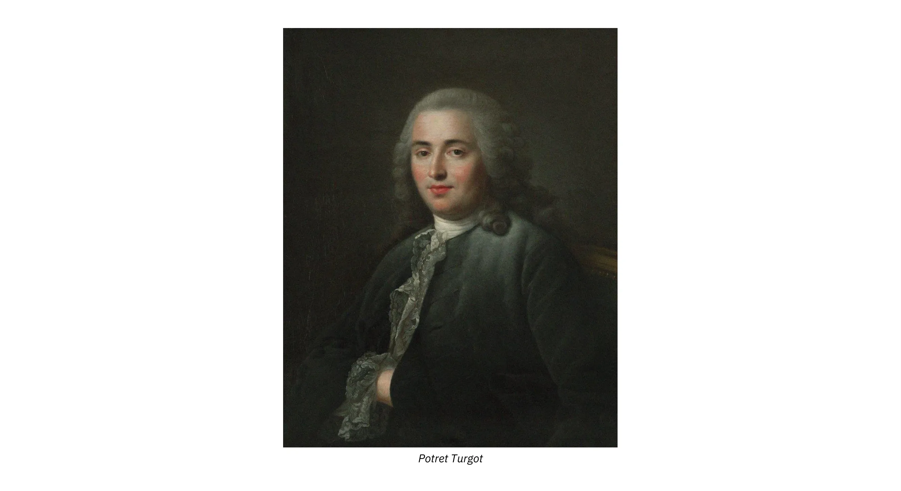

Beberapa tahun kemudian, Turgot, yang kelak menjadi menteri di bawah Louis XVI, menulis Éloge (eulogi atau pujian) sebagai penghormatan kepada sahabatnya setelah kematiannya. Dan sebenarnya Turgot tidak pernah sepenuhnya merangkul Fisiokrasi François Quesnay, itu karena ia mempertahankan keterikatan yang tak terkalahkan pada guru pertamanya, Vincent de Gournay.

## Kelompok Gournay

<chapterId>b86ba6bd-8f3a-5d8f-b098-4d0413f00deb</chapterId>

Dalam sejarah awal ilmu ekonomi, kecenderungan sejarah adalah menyoroti mazhab pemikiran pertama, yaitu Fisiokrat, yang dipimpin oleh François Quesnay dan murid-muridnya. Namun, hampir satu dekade sebelum kemunculan mereka, ada kelompok lain, yang kurang formal tetapi sama pentingnya, yang berpusat di sekitar ekonom Vincent de Gournay.

Seperti yang kita lihat di bagian sebelumnya, Gournay terpesona oleh contoh dari negara-negara asing seperti Inggris dan Belanda. Ia juga sangat mengagumi para ekonom mereka—tokoh-tokoh seperti Josiah Child, Johan de Witt, dan David Hume.

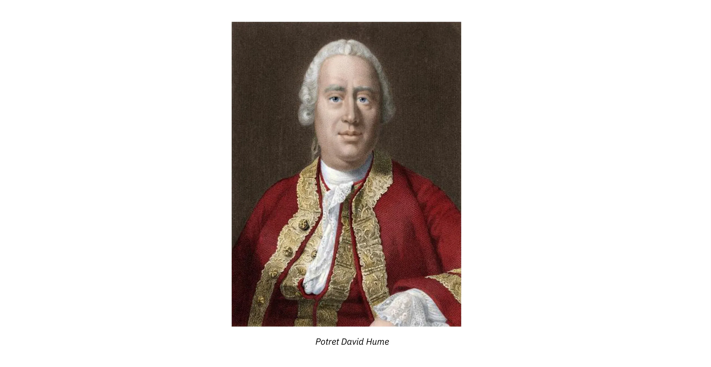

Kekaguman ini mendorongnya untuk menerjemahkan, dan menugaskan penerjemahan, untuk karya-karya ekonomi mereka.

Kebetulan, posisinya di pemerintahan senior memungkinkan Gournay berhubungan dengan semua spesialis ekonomi yang dikenal di Prancis saat itu. Dengan cara ini, ia membentuk kelompok penerjemah yang sangat cakap. Ia secara pribadi menerjemahkan karya Child dan Culpeper. Abbot Le Blanc menerjemahkan Political Discourses milik David Hume. Véron de Forbonnais menerjemahkan karya ekonom Spanyol Geronymo de Uztariz. Turgot mengerjakan tulisan-tulisan Josiah Tucker, dan putra Montesquieu menerjemahkan karya Joshua Gee.

Berkat kolaborasi beberapa anggota kelompok Gournay, banyak penulis dapat menerbitkan karya orisinal dengan nama mereka sendiri. Buku-buku ini, bersama dengan terjemahan-terjemahan tadi, meraih kesuksesan yang luar biasa. Beberapa contoh penting meliputi:

- [Essay on the General Police of Grain](https://archive.org/details/essaisurlapolice00herb/page/n7/mode/2up) karya Herbert (6 edisi dalam 4 tahun)

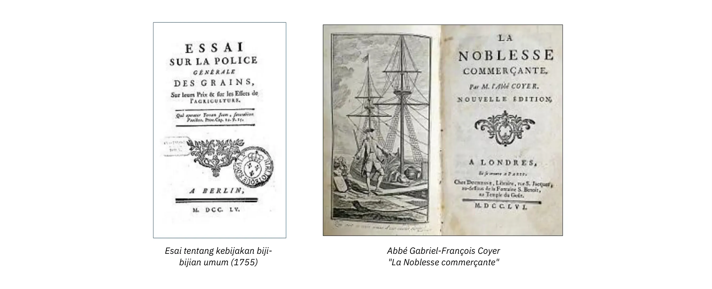

- [Noblesse commerçante](https://archive.org/details/lanoblessecommer00coye/page/n3/mode/2up) karya Coyer (5 edisi dalam 2 tahun)

- [Remarks on the Advantages and Disadvantages of France and Great Britain](https://archive.org/details/bim_eighteenth-century_remarks-on-the-advantage_plumard-de-dangeul-loui_1754) karya Plumard de Dangeul (3 edisi pada tahun pertamanya)
  
- [Memoir on the Trades](https://www.amazon.com/Memoire-sur-corps-metiers-French/dp/1978196903) karya Cliquot-Blervache dan Gournay (2 edisi pada tahun 1758)

Kelompok ini juga memainkan peran penting dalam publikasi 
- [Essay on the Nature of Trade in General](https://archive.org/details/essayonnatureofc0000cant) karya Richard Cantillon.

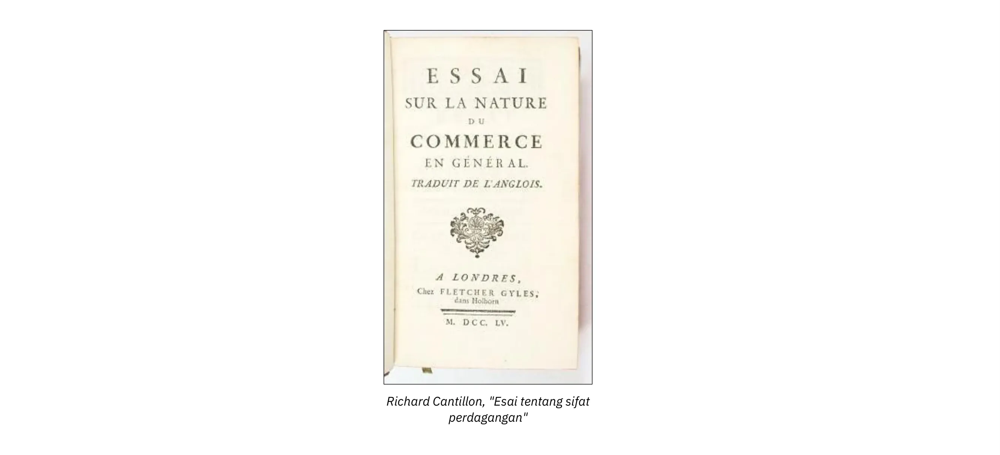

Buku terakhir ini, yang ditulis sekitar tahun 1730, tetap berupa manuskrip setelah penulisnya meninggal. Gournay, dengan bantuan teman-teman ekonomnya, menerbitkannya pada tahun 1755. Menurut Abbot Morellet, seorang anggota kelompok tersebut, Gournay merekomendasikan buku itu kepada setiap ekonom yang ia kenal.

Karya intelektual dari kelompok Gournay memiliki dampak besar pada sejarah ide. Dalam pengertian ini, mereka dapat dianggap sebagai pendiri ilmu ekonomi di Prancis. Christine Théré dari INED, yang telah mempelajari sejarah publikasi ekonomi, menemukan bahwa antara tahun 1750 dan 1759, tidak kurang dari **349** karya tentang ekonomi diterbitkan, dibandingkan dengan hanya **83** karya di seluruh dekade sebelumnya (1740–1749). Revolusi dalam dekade 1750-an ini sebagian besar disebabkan oleh kelompok Gournay.

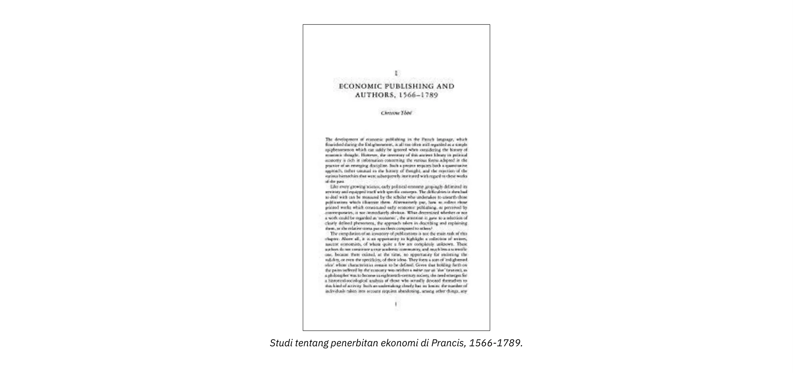

Untuk menyebarkan minat terhadap diskusi ekonomi di kalangan penduduk Prancis, Gournay dan teman-temannya berupaya membuatnya mudah diakses melalui novel. Setelah _Memoir on the Trades_, yang mengkritik gilda, Gournay dan Cliquot-Blervache membantu Gabriel-François Coyer menulis novel satir singkat berjudul [Chinki: A Cochinchinese Tale Applicable to Other Nations](https://www.institutcoppet.org/wp-content/uploads/2013/06/Coyer-Chinki-Histoire-cochinchinoise.pdf).

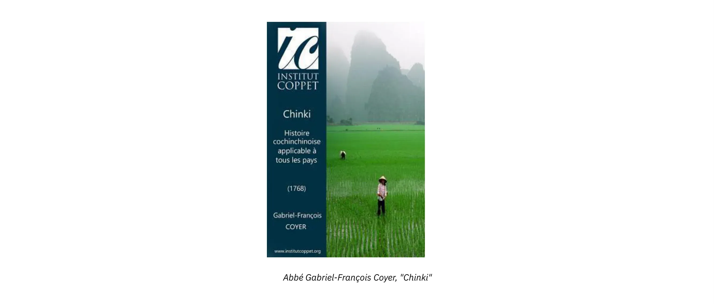

Cerita ini mengikuti karakter utama, Chinki, yang terpaksa meninggalkan tanahnya karena pajak yang berlebihan dan mencoba mencari pekerjaan pengrajin untuk anak-anaknya di kota. Tetapi semua perdagangan tertutup bagi mereka karena regulasi gilda yang sewenang-wenang. Dengan nada humor, cerita ini menggambarkan kekecewaannya yang semakin besar.

Oleh karena itu, kelompok Gournay berada di balik gelombang publikasi yang intens. Meskipun kontribusi besar ini telah dilupakan oleh sejarawan pemikir ekonomi, hal itu sangat jelas bagi orang-orang sezaman mereka. Kaum Fisiokrat, yang mengorganisir mazhab mereka pada tahun 1760-an, kemudian akan mempresentasikan kelompok Gournay sebagai pendahulu langsung mereka. Pada tahun 1767, ekonom Jacques Accarias de Serionne mengungkapkan hal ini dengan lebih jelas dalam penghormatannya. Ia menulis: "Sejumlah kecil orang Prancis, baik filsuf maupun warga negara, beberapa tahun yang lalu mulai meniru penulis Inggris. Mereka pertama-tama menerjemahkan model-model mereka dan segera melampaui mereka dalam banyak hal. Mereka membawa semua pesona dan kekayaan sastra ke dalam pengolahan subjek yang bermanfaat; mereka memicu dan menyebarkan minat terhadap ilmu pengetahuan yang paling penting bagi kemakmuran Negara."

Dan memang, pada tahun 1750-an, isu-isu ekonomi menjadi populer. Voltaire terkenal berujar bahwa sekitar tahun 1750, orang Prancis berhenti membaca novel untuk mulai mendiskusikan kebebasan perdagangan gandum. Tren ini juga dicatat oleh Mercure de France, yang menulis dalam salah satu edisinya dari tahun 1758, beberapa bulan sebelum kematian Gournay: "Ekonomi politik kini menjadi ilmu yang sedang populer. Buku-buku yang membahas pertanian, populasi, industri, perdagangan, dan keuangan kini berada di tangan banyak orang yang, belum lama ini, hanya membaca novel secara sepintas." Sulit untuk memberikan penghormatan yang lebih baik kepada Gournay dan kerja kelompok ekonominya.

## Mirabeau

<chapterId>2d2f802b-e3b6-556f-9025-a1b1dc4409ca</chapterId>

Prancis memiliki dua tokoh terkenal bernama Mirabeau, ayah dan anak, tetapi sang putra lah yang benar-benar tercatat dalam sejarah. Sebagai orator revolusioner dan salah satu tokoh sentral dalam Revolusi Prancis, namanya tetap abadi.

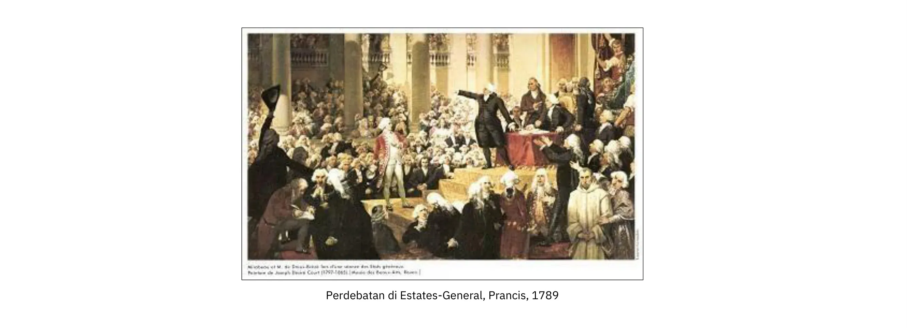

Berkat bakat dan tempatnya dalam sejarah Prancis, ia membayangi ayahnya, seorang ekonom dan pilar utama mazhab François Quesnay, serta menjadi anggota pertama mazhab tersebut sejak tahun 1758.

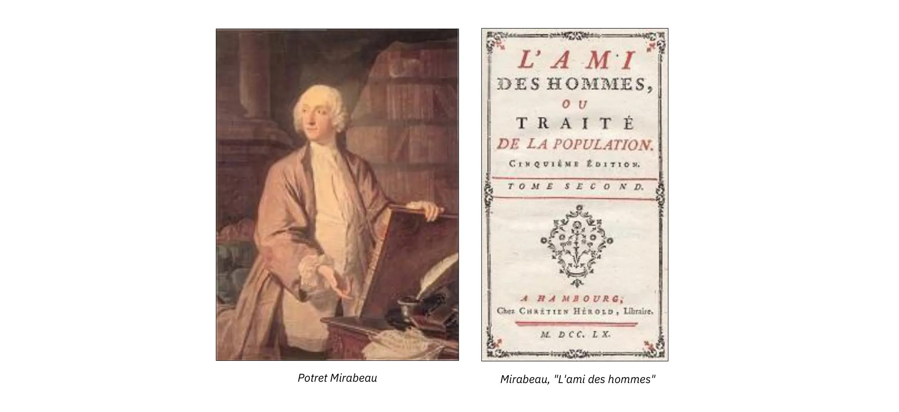

Sebenarnya, Marquis de Mirabeau telah mencapai ketenaran luar biasa bahkan sebelum ia menganut Fisiokrasi, berkat sebuah buku berjudul "Sahabat Umat Manusia. Makalah tentang Populasi" [FR: L'ami des hommes, ou, Traité de la population](https://archive.org/details/lamideshommesou00unkngoog). Meskipun edisi pertamanya diterbitkan pada tahun 1756, buku ini menjadi sangat terkenal sekitar tahun 1757, setahun sebelum pertemuannya dengan Quesnay.

Lebih dari 20 edisi diterbitkan antara tahun 1757 dan 1760, yang menjadikannya kemungkinan sebagai buku ekonomi paling sukses dalam sejarah. Beberapa pembaca bahkan mengira buku itu ditulis oleh Montesquieu karena penalaran tajamnya. Dauphin (Putra Mahkota), ayah dari Raja Louis XVI, bahkan mengaku telah menghafalnya. Untuk sementara waktu, buku itu menjadi bacaan wajib semua orang di Versailles.

Saat ini, buku tersebut sudah tidak dibaca lagi, tetapi banyak orang masih merujuk padanya. Bahkan pada abad ke-19, Edmond Roussel mengatakan:

> L'Ami des Hommes adalah salah satu buku yang dibicarakan semua orang, namun hampir tidak ada yang tahu isinya. Di setiap generasi, satu warga negara yang berani harus membacanya; sehingga orang lain tidak perlu melakukannya.

Pada awal kariernya sebagai ekonom, Mirabeau mendapat inspirasi dari Richard Cantillon. Ia telah memiliki manuskrip Essay on the Nature of Commerce in General karya Cantillon selama 15 tahun dan dengan sabar menganalisis serta mengomentarinya.

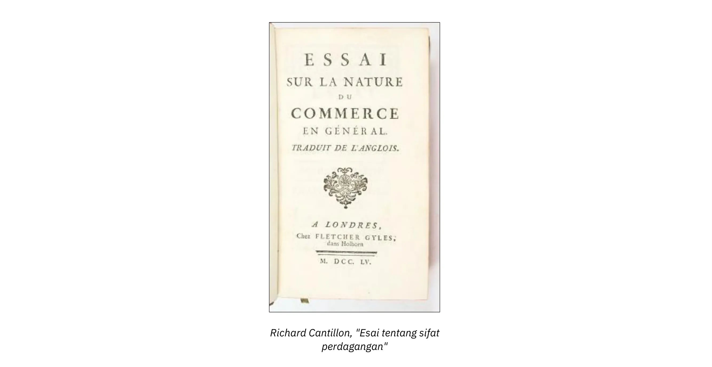

L'Ami des Hommes awalnya disusun sebagai komentar sederhana tentang Esai Cantillon. Namun karena Mirabeau memiliki pemikiran yang agak eklektik—yang bisa dikatakan, sedikit "gila"—ia dengan cepat menyimpang dari rencana awalnya. Buku itu membahas semua pertanyaan ekonomi yang ia ketahui, terkadang menjauh dari Cantillon. Ini adalah buku yang sulit dibaca, dengan rencana yang aneh dan penyimpangan di setiap bab. Mirabeau sendiri mengakui bahwa karyanya adalah kekacauan dan gayanya bersifat apokaliptik.

Terlepas dari kekacauan yang terjadi, ada beberapa ide yang patut diperhatikan:

- Mirabeau melawan prasangka merkantilis tentang sifat kekayaan.
- Dia memuji pertanian dan mengkritik pengabaiannya.
- Ia mengeluhkan kondisi rakyat, terutama para petani.
- Terakhir, ia membela kebebasan perdagangan dan persaudaraan bangsa-bangsa dalam perdamaian.

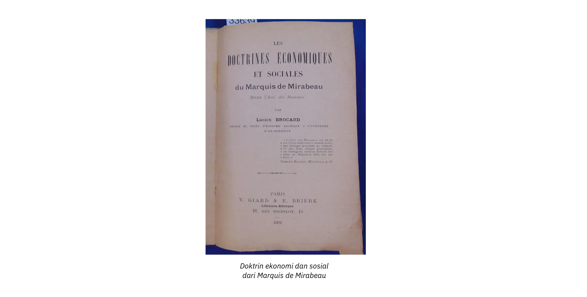

Sulit untuk melabeli pandangan Mirabeau sebagai liberal atau anti-liberal. Ia sering bergeser maju mundur, terkadang tanpa menyadarinya, antara satu visi dengan visi yang lain. Namun, ide-ide liberal sering mendominasi tulisannya. Salah satu kalimatnya yang paling terkenal adalah:

> "Prinsip sejati dan satu-satunya dari ekonomi politik adalah membiarkan segalanya bebas."
.
Dengan kesuksesan terbesar di belakangnya, Mirabeau didekati. François Quesnay, yang baru saja menaruh minat pada ekonomi, mengundangnya ke entresol (lantai mezanin) di Versailles.

Mereka berdebat dengan sengit dan akhirnya, sesuatu yang biasanya tidak pernah terjadi dalam perdebatan, terjadi: Mirabeau secara terang-terangan mengakui bahwa ia telah salah. Ia setuju dengan ide-ide Quesnay dan mengatakan ia siap menyebarkannya.

Bersama-sama, mereka membentuk inti dari apa yang kemudian menjadi mazhab Fisiokratik, diperkuat oleh anggota baru yang mereka rekrut secara berkala. Tak lama setelah pertobatan Mirabeau, Quesnay merekrutnya untuk membela ide-idenya tentang perpajakan. Hal ini menghasilkan ["Theory of Taxation / Teori Perpajakan"](https://archive.org/details/thoriedelimpot00mira), yang menyebabkan Mirabeau dikirim selama beberapa hari ke penjara Vincennes dan kemudian diasingkan ke Bignon.

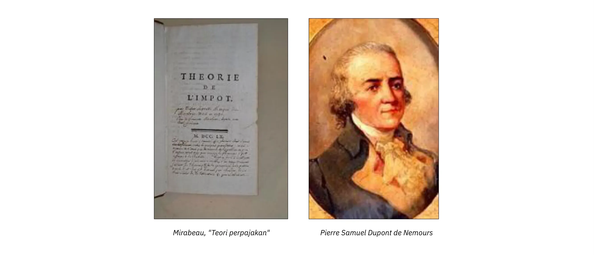

Mirabeau juga memainkan peran penting dalam merekrut anggota baru untuk mazhab Quesnay. Ia bahkan meyakinkan Dupont de Nemours muda. Pertemuan kaum Fisiokrat juga diadakan di rumah Mirabeau setiap hari Selasa. Tokoh-tokoh seperti Turgot dan Adam Smith diketahui pernah menghadiri pertemuan-pertemuan ini satu atau beberapa kali.

Sepanjang hidupnya, Mirabeau tetap menjadi penulis yang tak kenal lelah. Ia menulis banyak karya ekonomi yang membela doktrin Quesnay. Namun, menjelang akhir hidupnya, pengaruhnya berkurang. Gaya penulisannya memburuk hingga saudaranya sendiri menulis surat kepadanya yang mengatakan ia tidak lagi dapat memahami prosa Mirabeau. Ide-idenya, yang telah menjadi sangat liberal, bertentangan dengan reaksi sosialis atau proto-komunis dari para pemikir seperti Mably dan bahkan Rousseau. Ia berjuang untuk menemukan pembaca dan penerbit, dan meninggal tanpa diketahui pada tahun 1789, menjelang badai penyerbuan Bastille.

## Quesnay

<chapterId>7a35f20b-5ea0-544d-b290-bcd9c6f7f11a</chapterId>

François Quesnay adalah salah satu ekonom Prancis yang paling terkenal.

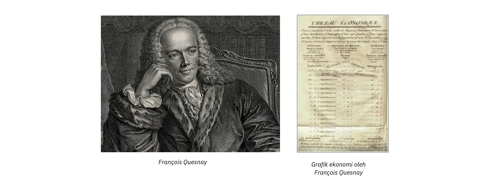

Namanya muncul di setiap buku teks tentang ekonomi dan sejarah pemikiran ekonomi. Disebutkan bahwa ia menciptakan "Tableau Économique" (Tabel Ekonomi) untuk merepresentasikan ekonomi secara skematis, bahwa ia adalah pemimpin mazhab Fisiokratik, dan bahwa ia keliru dalam meyakini hanya tanah yang produktif. Akhirnya, dikatakan bahwa Adam Smith datang untuk meluruskan hal tersebut. Kira-kira begitulah buku teks cenderung meringkas François Quesnay.

Mengecilkannya seperti ini adalah hal yang disayangkan, karena Quesnay juga merupakan ekonom pertama yang berusaha mendasarkan pembelaan kebebasan ekonomi pada prinsip-prinsip ilmiah. Ia adalah salah satu ekonom yang paling didengar dan berpengaruh pada masanya. Terlebih lagi, ia mendirikan Fisiokrasi, sebuah doktrin yang jauh lebih kaya daripada ide sederhana yang sering disalahpahami bahwa hanya alam yang menghasilkan kekayaan.

Kita akan membahas Fisiokrasi lebih detail selama tiga bab berikutnya. Pertama, mari kita lihat lebih dekat sosok François Quesnay itu sendiri.

Lahir pada tahun 1694 di Méré dari keluarga petani yang tidak mampu mengajari Quesnay membaca. Ia dilatih oleh seorang pria lokal dan akhirnya melanjutkan studi di College of Surgery (Sekolah Bedah) dan kemudian Faculty of Medicine (Fakultas Kedokteran). Pada usia 24 tahun, ia menjadi ahli bedah di Mantes.

Ia meraih ketenaran pada tahun 1730, pada usia 36 tahun, karena menentang praktik umum pengeluaran darah (bloodletting), yang ia yakini didasarkan pada teori dan prasangka yang salah. Ia juga berani menantang sistem gilda, yang mendiktekan bahwa hanya ahli bedah yang dapat melakukan operasi dan hanya dokter yang dapat meresepkan obat. Hal ini sering memaksa orang miskin membayar dua kali dan mendatangkan dua orang, sebuah situasi yang dianggap menjijikkan oleh Quesnay.

Pada tahun 1740, ia menjadi sekretaris Akademi Bedah. Pada tahun 1748, pada usia 54 tahun, ia menjadi dokter pribadi Madame de Pompadour dan pindah ke Versailles.

Dia sangat dekat dengan Madame de Pompadour. Quesnay bahkan berkata, pada saat kabar kejatuhan favorite (selir kesayangan Raja) itu diumumkan, bahwa ia tidak akan mau tetap menjadi dokter di Versailles tanpanya:

"Saya terikat pada Madame de Pompadour dalam kemakmurannya; saya akan tetap terikat dalam kejatuhannya."

Kemudian ia menerbitkan beberapa buku medis: Makalah tentang Supurasi (1749), Makalah tentang Gangren (1749), dan Makalah tentang Demam Berkelanjutan (1753), yang semuanya dicetak ulang beberapa kali selama masa hidupnya.

Pada usia 60 tahun, setelah diperkenalkan dengan debat ekonomi yang sedang populer saat itu, ia mulai menulis tentang ekonomi. Pada tahun 1755, ia menulis artikel "Farmers" (Petani) dan "Grain" (Gandum) untuk _Encyclopédie_.

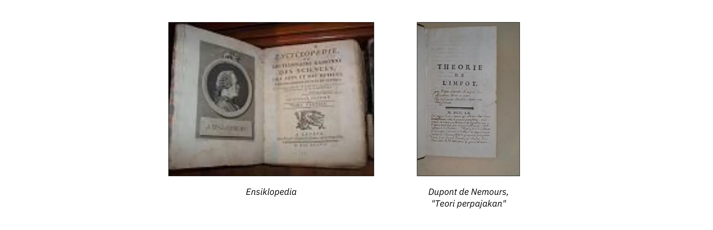

Artikel tersebut diterbitkan pada tahun 1757. Pada tahun yang sama, ia bertemu Mirabeau yang terkenal dan berhasil mengubahnya menjadi pengikut ide-ide ekonominya—inti dari Fisiokrasi pun lahir. Quesnay kemudian menciptakan Tableau Économique, yang dicetak di percetakan kerajaan, kabarnya di hadapan Raja sendiri di Istana Versailles. Sejak saat itu, ia secara teratur menjamu para ekonom dan filsuf di apartemennya di Versailles, tempat mereka terlibat dalam diskusi bebas. Quesnay juga berkontribusi pada Theory of Taxation / Teori Perpajakan milik Mirabeau, yang diterbitkan pada tahun 1759.

Tak lama kemudian, sensor menyerang. Mirabeau dipenjara, dan Quesnay ditegur. Setelah itu, Quesnay menyadari bahwa ia tidak dapat menerbitkan secara terbuka dan akan membutuhkan murid-murid untuk menyebarkan ide-idenya.

Dia dengan cepat menemukan mereka: Baudeau, Dupont de Nemours, Le Trosne, Mercier de la Rivière, dan lain-lain. Merekalah orang-orang yang akan menyebarkan dan mempopulerkan pemikiran Quesnay. Namun, Quesnay, yang membutuhkan murid, tidak sepenuhnya puas dengan aspek sektarian dari kelompoknya. Hal ini terlihat dari surat-suratnya kepada Mirabeau, di mana ia mengatakan kepadanya:

> "Berpikirlah sendiri. Saya menyadari bahwa konsep saya yang menyedihkan membuatmu malas. Sekarang giliran Anda untuk berpikir. Kamu tahu sebanyak yang saya tahu."

Namun, murid-muridnya sangat setia dan berkontribusi besar pada popularitas Quesnay. Setelah kematiannya, Mirabeau menyampaikan pidato, dengan mengatakan, "Kami telah kehilangan ayah kami, karena kami berutang segalanya padanya." Sebenarnya, Quesnay lah yang berutang segalanya pada mereka, karena tanpa mereka, ia akan tetap terperangkap di Versailles, di mana pemikirannya, meskipun memiliki banyak hal untuk memikat atau mengkhawatirkan, hanya menarik sedikit orang.

Berkat kerja keras para kolaboratornya, ide-idenya menemukan platform: pertama melalui surat kabar seperti _Journal of Agriculture dan Ephémérides du Citoyen_.

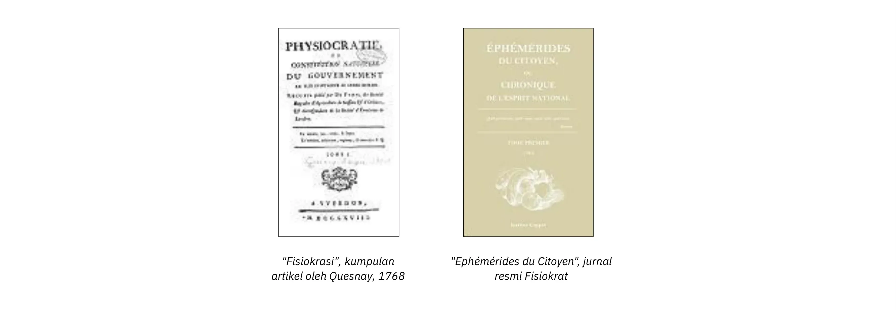

Kemudian melalui buku-buku, tidak hanya dari murid-muridnya tetapi juga sebuah antologi penting yang diterbitkan pada tahun 1768 oleh Dupont de Nemours, berjudul *Physiocracy*.

Kemudian melalui buku-buku, tidak hanya karya murid-muridnya tetapi juga antologi penting yang diterbitkan pada tahun 1768 oleh Dupont de Nemours, berjudul _Physiocracy_.

Buku ini mengumpulkan kontribusi utama Quesnay. Di dalamnya dipaparkan cita-cita ekonomi pemimpin Fisiokrat: model ekonomi pertanian di mana hukum menjamin hak setiap orang untuk memiliki properti dan kebebasan untuk berdagang.

# Sekolah Fisiokratik

<partId>27af82c1-ad82-5c3b-8ce9-c674b67bbf7c</partId>

## Sejarah Fisiokrat

<chapterId>4236ff8b-b53a-59e7-92c0-f96f9afa1c00</chapterId>

Fisiokrasi menjadi populer di Prancis, bahkan di seluruh Eropa, hanya selama kurang lebih satu dekade. Setelah periode perkembangan yang panjang, doktrin ini mulai menonjol pada pertengahan tahun 1760-an. Saat Turgot berkuasa pada tahun 1776, gerakan ini telah kehilangan popularitasnya, dan menteri tersebut menyembunyikan dukungannya terhadap mazhab Quesnay.

Asal-usul Fisiokrasi terletak pada evolusi ide-ide ekonomi selama tahun 1750-an. Beberapa penulis membantu menjembatani kesenjangan antara Boisguilbert dan apa yang kemudian dikenal sebagai Fisiokrasi. Seperti yang telah dibahas sebelumnya, Vincent de Gournay dan kelompok ekonomnya berada di balik banyak publikasi yang memperkenalkan pembaca Prancis pada pemikiran ekonomi asing dan membantu memicu minat mereka terhadap ilmu ekonomi. Fondasi Fisiokrasi sudah ada dalam buku-buku seperti "Détail de la France" karya Boisguilbert dan ["Essay on the Nature of Trade in General"](https://archive.org/details/essaisurlanature0000cant) karya Cantillon.

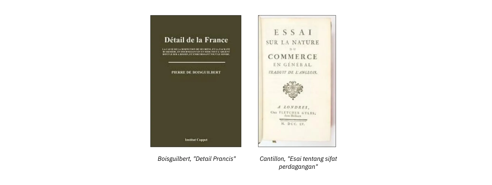

Konsep laissez-faire telah memiliki beberapa pendukung sejak Boisguilbert, terutama Vincent de Gournay dan Marquis d'Argenson.

Yang tersisa adalah mengubah kumpulan ide ini menjadi doktrin yang koheren dan lengkap, dan Marquis de Mirabeau adalah yang pertama mencoba. Terinspirasi oleh Esai Cantillon, ia mulai menulis makalah komprehensif tentang masalah ekonomi berjudul "L'Ami des Hommes", yang sangat sukses.

Dengan demikian, pada tahun 1756, kisah Fisiokrasi dapat dimulai. François Quesnay, yang saat itu adalah seorang ahli bedah yang beralih menjadi dokter pribadi Madame de Pompadour, mengundang Mirabeau ke Versailles untuk mendiskusikan ide-ide ekonomi.

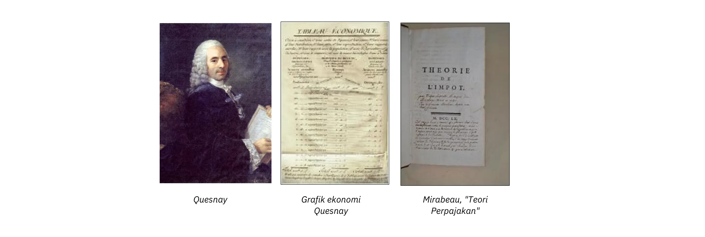

Di akhir percakapan mereka, Mirabeau setuju dengan ide-ide Quesnay. Sejak saat itu, mereka pun mulai menulis: Quesnay menciptakan _Tableau Économique_ (1758) untuk mengilustrasikan aliran kekayaan dalam ekonomi, dan bersama-sama mereka menerbitkan Theory of Taxation / Teori Perpajakan (1759).

Upaya mereka tidak disambut baik. Di istana, reaksi yang berlaku adalah ketidakpedulian. Raja mengakui kecenderungan Quesnay terhadap teori dan dengan penuh kasih memanggilnya "pikiran saya" (mon penseur). Namun terlepas dari pujian itu, karya mereka tidak membuahkan hasil apa pun. Faktanya, Theory of Taxation / Teori Perpajakan mereka menyinggung administrator pajak yang dikritiknya, sedemikian rupa sehingga mereka menuntut dan berhasil memenjarakan Mirabeau. Madame de Pompadour akhirnya membebaskannya, tetapi ia tetap diasingkan di perkebunannya di Bignon selama beberapa minggu.

Paruh pertama tahun 1760-an berlalu relatif dalam keheningan . Karena posisinya di Versailles, Quesnay terpaksa berhenti menulis, atau setidaknya tidak menerbitkan apa pun atas namanya sendiri. Mirabeau, yang sudah dihukum sekali, telah diperingatkan dan sangat sadar bahwa selir Raja tidak dapat melindunginya selamanya.

Setelah keheningan singkat ini, kedua ekonom tersebut mulai merekrut murid: ini adalah satu-satunya cara untuk mempopulerkan ide-ide mereka. Pada tahun 1765, kesuksesan mereka sangat mencolok. Dupont de Nemours, Abeille, Mercier de la Rivière, Le Trosne, dan Baudeau dengan cepat bergabung dalam barisan mereka. Mereka membentuk sebuah mazhab: mereka memiliki jurnal sendiri, Les Éphémérides du Citoyen, dan bahkan bertemu setiap hari Selasa di rumah Mirabeau.

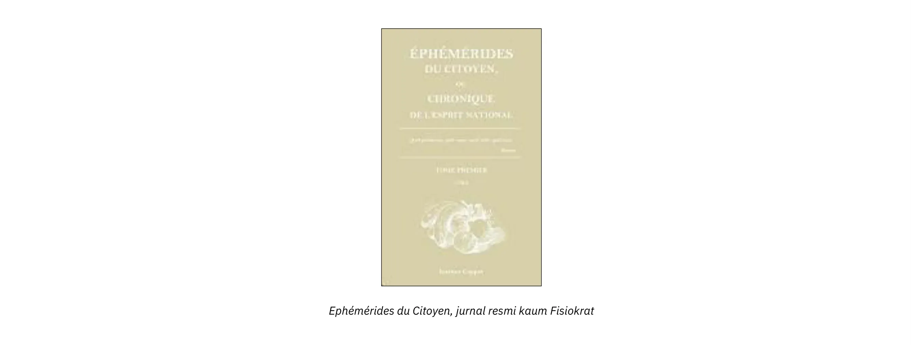

Antara tahun 1765 dan 1775, kelompok Fisiokrat yang bersatu berada di puncak ketenaran mereka. Dunia sastra dan filosofis hanya tertuju pada mereka, memungkinkan ide-ide mereka menyebar secara luas dan cepat. Orang-orang menyebut mereka "para ekonom," atau, lebih tepatnya, "sekte para ekonom." Terlepas dari nadanya, ketenaran mereka benar-benar mutlak. Pada tahun 1774, setelah perjalanan ke Metz, M. de Vaublanc menulis keheranannya dalam memoarnya: semua orang di sekitarnya membicarakan ekonomi dan bernalar seperti murid-murid Quesnay. "Itu sedang trend," catatnya. "Setiap orang adalah seorang ekonom."

Namun, pada tahun 1770, popularitas mereka mulai berkurang. Kelompok itu mengalami pembelotan pertamanya, dan kemampuan mereka untuk menahan kritik melemah. Dan para pengkritiknya pun banyak, seperti Condillac, Mably, Voltaire, Galiani, Linguet, Graslin, dan bahkan Adam Smith di Skotlandia, semuanya menantang pandangan mereka.

Surat kabar mereka tidak lagi terbit secara teratur. Hal ini menandai berakhirnya periode paling aktif dari gerakan ini.

Fisiokrasi terus memberikan pengaruh hingga Revolusi. Di Prancis, pertama melalui Turgot, yang lebih merupakan teman seperjalanan daripada murid, serta melalui perwakilannya Dupont de Nemours, yang kehidupan dan karyanya akan kita pelajari nanti. Tetapi juga di seluruh Eropa, di mana doktrin fisiokratik diterima dengan antusias. Di Jerman, melalui Margrave of Baden, dan di Italia, melalui Leopold dari Tuscany, teori-teori fisiokratik bahkan menginspirasi reformasi ekonomi yang mendukung properti pribadi dan kebebasan.

## Dasar-dasar doktrin Fisiokrat

<chapterId>4dbe5436-0578-57c2-b054-03ed00aa091a</chapterId>

Istilah Fisiokrasi, yang berarti "pemerintahan secara alamiah," diciptakan oleh Dupont de Nemours dan digunakan sebagai judul untuk _Physiocracy_, kumpulan artikel oleh Quesnay yang diterbitkan pada tahun 1768.

Teks asli menyatakan frasa ini tidak jelas dan tidak ada murid Quesnay yang memberikan makna sebenarnya. Meskipun demikian, sistem pemikiran mereka jauh dari tidak jelas dan dibangun di atas beberapa prinsip yang sangat jelas, yang akan kami uraikan di sini.

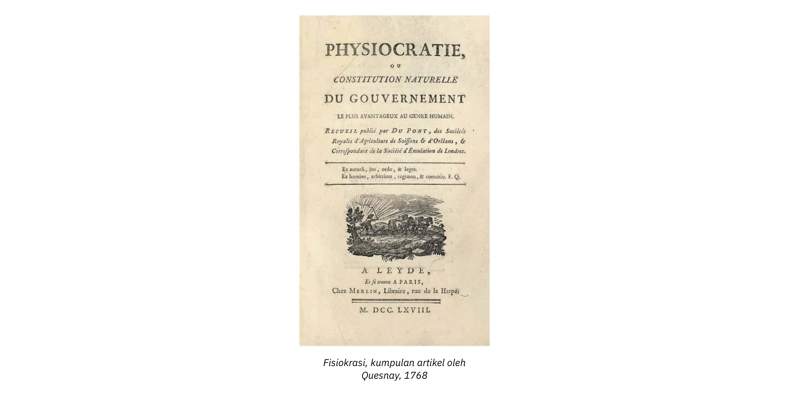

### Prinsip pertama: hanya pertanian yang produktif

Gagasan pertama inilah yang paling menarik perhatian sejarawan. Saat ini, di buku teks atau kursus ekonomi, Fisiokrat didefinisikan demikian: mereka diyakini secara naif percaya bahwa hanya pertanian yang produktif. Atas dasar itu, doktrin mereka sering diabaikan sebagai tidak relevan, dan analisis dengan cepat beralih ke Adam Smith.

Namun, tidak adil mengkritik Fisiokrat karena terlalu mementingkan pertanian, mengingat pada pertengahan abad ke-18, pertanian mempekerjakan 90% populasi dan membentuk fondasi ekonomi Prancis.

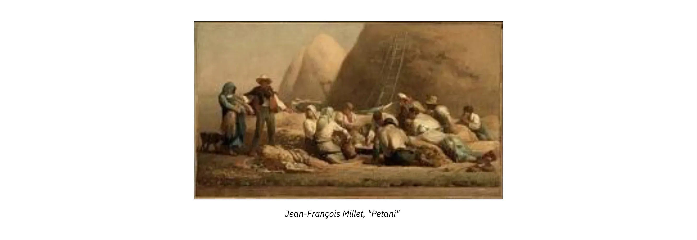

Gagasan kaum Fisiokrat sebenarnya halus. Menurut mereka, ada perbedaan antara produksi dan keuntungan (gain). Industrialis dan pedagang mungkin mendapatkan keuntungan, tetapi hanya petani yang benar-benar memproduksi, karena produksi adalah penciptaan materi yang berguna, dan bukan sekadar penambahan utilitas pada materi yang sudah ada sebelumnya.

Kita juga harus mencoba memahami mengapa mereka menolak industri dan kerajinan sebagai tidak produktif. Pada saat itu, perdagangan ini terkunci dalam sistem gilda, yang melarang inovasi, investasi, dan kemajuan.

### Prinsip kedua: despotisme hukum dan bukan demokrasi

Saat ini, untuk menghina seseorang, kita mengatakan ia bukan seorang demokrat. Sementara sejarawan memaafkan pandangan Fisiokrat yang ketat tentang produktivitas pertanian, mereka tidak memaafkan penolakan mereka terhadap demokrasi, terutama karena mereka hidup selama puncak ide-ide Pencerahan. Dari pertengahan abad ke-18 hingga sebelum Revolusi, Kaum Fisiokrat dipandang sebagai musuh kemajuan.

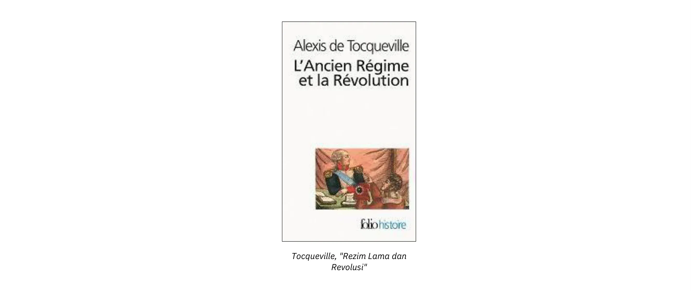

Tocqueville menekankan gagasan ini:

> Kaum Fisiokrat memang sangat mendukung perdagangan barang secara bebas, laissez-faire atau laissez-passer dalam perdagangan dan industri; tetapi untuk kebebasan politik yang sebenarnya, mereka tidak mempertimbangkannya, dan bahkan ketika ide-ide semacam itu kebetulan melintas di benak mereka, pada awalnya mereka menolaknya.

Liberal dalam ekonomi, kaum Fisiokrat karenanya tidak liberal dalam masalah politik. Quesnay menulis dalam _pepatah_-nya: "Biarkan otoritas kedaulatan menjadi unik dan lebih unggul daripada semua individu masyarakat dan daripada semua upaya tidak adil dari kepentingan pribadi." Dan kemudian, dalam pepatah yang sama: "Sistem kontrol dan keseimbangan (checks and balances) dalam pemerintahan adalah gagasan fatal, yang hanya mengungkapkan perselisihan di antara kaum bangsawan dan penindasan terhadap kaum kecil."

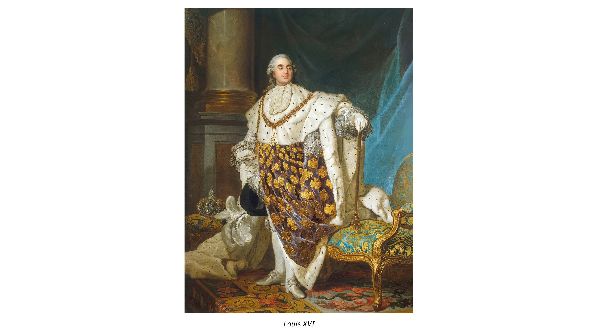

Tocqueville dengan tepat mencatat bahwa kaum Fisiokrat menolak demokrasi segera setelah mereka melihat bentuknya. Mereka skeptis terhadap demokrasi, yang akan menjadi pedoman dalam ekonomi politik Prancis, karena demokrasi bukanlah sistem yang sempurna: demokrasi berpotensi memungkinkan penindasan terhadap minoritas oleh mayoritas, dan dapat menjadi alat perampasan, tirani, dan perampasan.

### Prinsip ketiga: penghormatan mutlak terhadap hak milik pribadi

Kaum Fisiokrat percaya bahwa orang perlu memiliki dan menyimpan hasil kerja mereka. Dalam pandangan mereka, hak milik adalah fondasi utama dari sebuah masyarakat. Mereka berpikir bahwa Negara memiliki satu tugas utama: melindungi hak milik masyarakat. Lebih jauh lagi, dari sudut pandang ekonomi, kaum Fisiokrat menyatakan bahwa hak milik yang tidak dapat diganggu gugat mendorong kerja dan usaha dan merupakan syarat untuk kemajuan ekonomi.

Kaum Fisiokrat percaya bahwa orang perlu memiliki dan mempertahankan hasil kerja mereka. Dalam pandangan mereka, hak milik adalah fondasi masyarakat itu sendiri. Mereka berpikir Negara memiliki satu tugas utama: melindungi properti rakyat. Lebih jauh lagi, ketidaklanggaran properti mendorong kerja dan upaya serta merupakan syarat untuk kemajuan ekonomi.

Quesnay menjelaskannya secara sederhana:

> "Biarkan kepemilikan tanah dan kekayaan bergerak terjamin bagi mereka yang merupakan pemilik sahnya, karena keamanan properti adalah fondasi penting dari tatanan ekonomi dan keamanan masyarakat; kepastian kepemilikan permanen itulah yang mendorong pekerja dan penggunaan kekayaan dalam memperbaiki dan mengolah tanah, serta dalam usaha komersial dan industri."

### Prinsip keempat: kebebasan mutlak untuk berdagang

Dalam _Maxims_ yang telah dikutip sebelumnya, Quesnay menyatakan:

> "Biarkan ada kebebasan penuh dalam perdagangan, karena regulasi perdagangan domestik dan asing yang paling andal, tepat, dan bermanfaat bagi bangsa dan Negara terletak pada kebebasan persaingan yang penuh."

Kaum Fisiokrat telah melihat kerusakan yang disebabkan oleh campur tangan pemerintah, terutama dalam perdagangan gandum. Mereka mengakui bahwa pemerintah tidak akan pernah bisa mengelola perdagangan sebaik yang dilakukan individu, karena pemerintah harus merespons setiap kebutuhan dan bereaksi terhadap setiap perubahan permintaan atau Supply. Semua ini jauh di luar kemampuan pemerintah yang paling bijaksana sekalipun.Oleh karena itu, perlu untuk membiarkan segala sesuatu terjadi dan mengalir (laissez-faire).

Agar bermanfaat secara alamiah, perdagangan haruslah sepenuhnya bebas dan sempurna. Salah satu anggota mereka, Le Trosne, bahkan menulis sebuah pamflet berjudul [*Kebebasan Perdagangan gandum: Selalu Bermanfaat, Tidak Pernah Merugikan / The Freedom of the Grain Trade: Always Useful, Never Harmful*](https://www.institutcoppet.org/liberte-commerce-grains-toujours-utile-jamais-nuisible/).

### Prinsip kelima: Semua manusia adalah saudara

Penentang keras perbudakan, kaum Fisiokrat juga adalah pecinta damai yang hebat. "Kebijakan luar negeri kami disebut perdamaian," kata Mirabeau singkat. Pada tahun 1790, di Majelis Konstituante, Dupont de Nemours melanjutkan sikap cinta damai ini ketika ia mengusulkan rancangan undang-undang yang melarang perang ofensif.

## Pencapaian dan pengaruh Fisiokrat

<chapterId>5b911105-796a-5e2e-a501-c7a364fc758e</chapterId>

Seperti yang kita lihat dalam bab pertama dari tiga bab yang dikhususkan untuk Kaum Fisiokrat, para pengikut Quesnay sangat populer di Prancis selama kurang lebih satu dekade. Antusiasme terhadap ide-ide mereka terwujud baik pada masa mereka dan berlanjut hingga akhir abad ini. Di sini, kita akan melihat beberapa pencapaian mereka dan pengaruh yang mereka berikan pada penerus mereka di bidang pemikiran ekonomi.

Pencapaian terbesar mereka, mengikuti kelompok Gournay, adalah mempopulerkan ide-ide ekonomi. Pepatah Voltaire yang terkenal sangat terkenal: sekitar tahun 1750, bangsa ini, yang sudah kenyang dengan puisi dan novel, mulai berpikir tentang gandum. Kaum Fisiokrat mengambil bagian dalam gerakan ini, menerbitkan ratusan artikel, pamflet, dan buku tentang kebebasan perdagangan gandum. Momentum kuat yang diberikan oleh kaum Fisiokrat terhadap diskusi ekonomi juga terlihat dari banyaknya karya dan pamflet ekonomi yang diterbitkan di Prancis dari tahun 1760 hingga 1775. Sebagai bukti lebih lanjut dari penyebaran ide-ide ekonomi di Prancis, kita dapat mengingat kembali pernyataan M. de Vaublanc, yang dikutip dalam kuliah sebelumnya, yang mengatakan di Metz pada tahun 1774 bahwa orang-orang tidak membicarakan apa pun kecuali ekonomi. "Itu adalah trend", katanya. "Semua orang adalah seorang ekonom".

Pembelaan terhadap ide-ide mereka, dalam buku, pamflet, dan di jurnal mereka _Les Éphémérides du Citoyen_, dengan cepat memiliki dampak dalam kebijakan ekonomi Prancis. Pada tahun 1763, sebuah dekret memberikan kebebasan perdagangan gandum, yang telah dituntut keras oleh Quesnay dan Mirabeau. Pada beberapa kesempatan, pihak berwenang juga melonggarkan regulasi yang mengatur gilda perdagangan untuk menjamin kebebasan yang lebih besar untuk bekerja.

Di luar negeri, kesuksesan datang sangat awal. Di Jerman, Margrave dari Baden menaruh minat pada ide-ide fisiokratis dan mempertahankan korespondensi rutin dengan Mirabeau dan Dupont de Nemours.

Ia menugaskan ekonom Johann August Schlettwein, seorang fisiokrat yang meyakinkan, untuk menerapkan reformasi pajak dan meliberalisasi perdagangan gandum. Pada bulan April 1770, percobaan pertama berlangsung di desa kecil Dietlingen. Penduduk desa tampaknya menyambut langkah-langkah itu dengan antusias, tetapi para pejabat yang bertugas tidak terlalu mendukung, yang menunda implementasi yang lebih luas.

Di Rusia, Catherine II sedang mempersiapkan reformasi legislatif dan meminta Diderot untuk mengiriminya seorang pemikir brilian untuk membantunya.

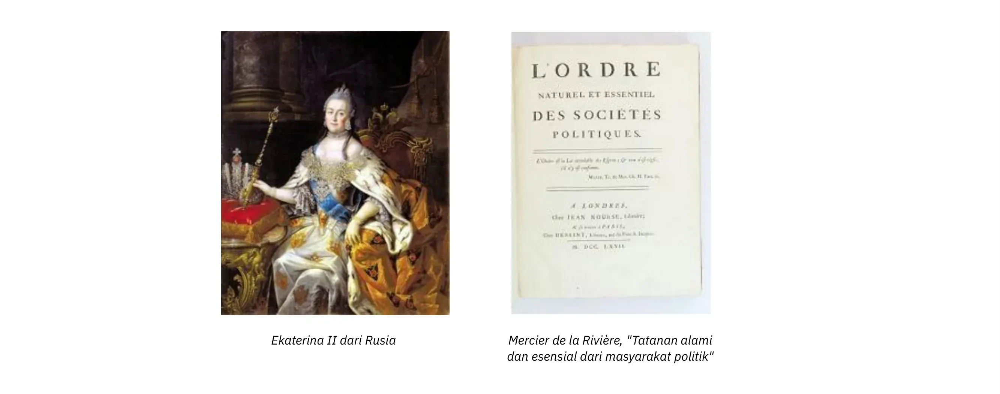

Terkesan dengan pembacaan [The Natural and Essential Order of Political Societies](https://archive.org/details/lordrenaturelete00mercuoft), yang diterbitkan pada tahun 1767, Diderot mengirim penulisnya, sang fisiokrat Mercier de la Rivière, kepadanya.

Meskipun ia meninggalkan Prancis dengan dirayakan, namun penyambutannya di Saint Petersburg berlangsung dingin (terlepas dari iklimnya), dan Permaisuri kecewa dengannya.

Di Swedia, dengan Gustav III, dan di Italia, dengan Leopold dari Tuscany, Kaum Fisiokrat juga menemukan pengikut yang siap mempraktikkan ide-ide mereka.

Di Prancis, Kaum Fisiokrat menikmati kesuksesan spektakuler dengan penunjukan Turgot sebagai Pengawas Jenderal Keuangan (Controller-General of Finances) pada tahun 1774.

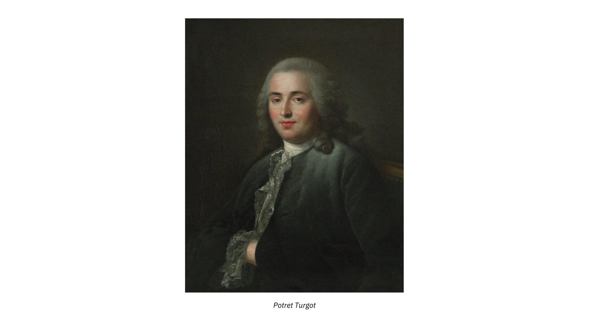

Sadar akan penurunan ketenaran mereka, Turgot tidak pernah menampilkan dirinya sebagai murid setia Kaum Fisiokrat, atau, dalam hal ini, sebagai seorang ensiklopedis, meskipun ia adalah salah satunya, karena mereka dibenci oleh anggota Klerus. Setelah berkuasa, Turgot mengeluarkan enam dekret terkenal yang merupakan awal dari penerapan praktis program Fisiokratik: kebebasan perdagangan, kebebasan kerja, dan berakhirnya monopoli.

Menjelang Revolusi Prancis, Kaum Fisiokrat memiliki lebih sedikit pengikut. Marquis de Mirabeau meninggal pada 13 Juli 1789—sebuah simbol yang cukup jelas. Abeille telah beralih, tetapi Dupont de Nemours tetap setia. Ditunjuk untuk Majelis, Dupont de Nemours membawa suara Fisiokrasi dan menyerukan reformasi ekonomi yang mendukung kepemilikan properti dan perdagangan bebas.

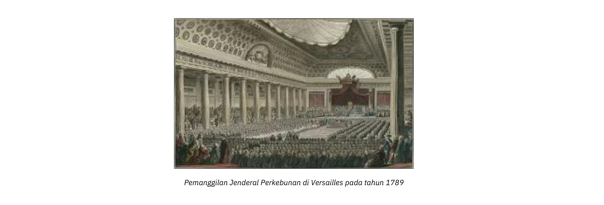

Dia juga berjuang, namun tidak berhasil, melawan assignats (uang kertas Revolusioner). Terlepas dari kegagalan ini, pemikiran Fisiokratik tetap hadir dalam debat intelektual dan memengaruhi pencapaian awal Revolusi. Seperti yang dikatakan Joseph Rambaud, segala sesuatu yang dilakukan Revolusi demi kebebasan adalah berkat Kaum Fisiokrat.

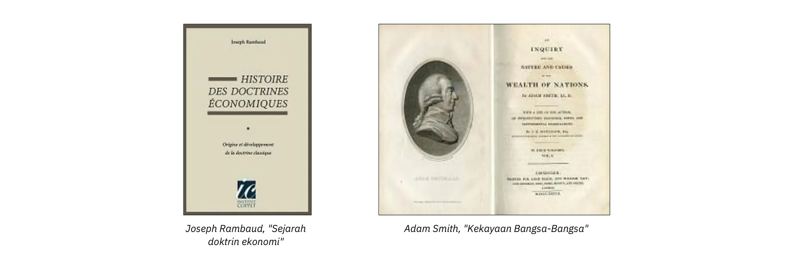

Kaum Fisiokrat juga memiliki pengaruh besar pada sejarah pemikiran ekonomi. Adam Smith, yang mengunjungi Prancis dan bertemu banyak dari mereka, sangat dipengaruhi oleh karya mereka. Ia bahkan mempertimbangkan untuk mendedikasikan _The Wealth of Nations_ kepada Quesnay.

Sayangnya, Quesnay meninggal dua tahun sebelum buku Smith diterbitkan, dan Smith menghapus dedikasi tersebut. Meskipun Smith tidak setuju dengan ide mereka bahwa hanya pertanian yang produktif, ia merangkul banyak argumen mereka untuk pasar bebas dan membawanya lebih jauh dalam karyanya sendiri.

## Dupont de Nemours

<chapterId>6d585e0f-93b8-5b0a-a0a8-7f6e4a5bc68e</chapterId>

Di Amerika Serikat, kita akrab dengan perusahaan DuPont, juga dikenal sebagai "E.I. du Pont de Nemours and Company," sebuah perusahaan multinasional di bidang kimia dan biologi.

Saat ini, perusahaan tersebut memiliki penjualan lebih dari $35 miliar dan mempekerjakan hampir 65.000 orang di seluruh dunia. Ternyata, perusahaan ini terkait erat dengan nasib Samuel-Pierre Dupont de Nemours, seorang ekonom Prancis dari mazhab Fisiokrasi.

Lahir pada tahun 1739, Dupont de Nemours mendekati kaum Fisiokrat pada usia 24 tahun. Saat itu, ia masih mencari jalan hidupnya. Suatu hari, ia menemukan pamflet singkat berjudul The Wealth of the State. Ia menganggap ide-ide ekonominya omong kosong dan menulis tanggapan kritis yang disebut Reflections on the Wealth of the State, yang diterbitkan pada tahun 1763. Tulisan itu diterima dengan baik, dan para pembaca memujinya, mengatakan hal-hal seperti, "Anda pasti murid Mirabeau!" Ironisnya, Dupont bahkan tidak tahu siapa Mirabeau.

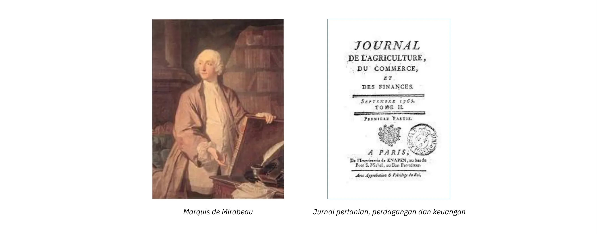

Karena penasaran, ia mulai membaca karya Mirabeau, _Friend of the People dan Theory of Taxation_. Ia bertemu Mirabeau dan François Quesnay, kemudian bergabung dengan mazhab mereka. 

Pada tahun 1765, Dupont ditawari posisi editor _Journal de l'agriculture, du commerce et des finances_, majalah terkemuka pada masanya di bidang pemikiran ekonomi.

Ada dua alasan untuk ini: Mirabeau dan Quesnay harus tetap bungkam (karena pernah ditindak otoritas), dan Dupont dipandang sebagai bintang yang sedang naik daun.

Anggota mazhab Fisiokratik sepakat bahwa Dupont de Nemours dengan cepat menjadi kesayangan Quesnay. Quesnay pernah berkata, "Jaga pemuda ini, dia yang akan berbicara ketika kita mati." Seorang rekan Fisiokrat, Abeille, bahkan menjadi cemburu atas perhatian yang diterima Dupont dan menjauhkan diri dari mazhab Quesnay.

Dupont de Nemours selalu mempertahankan rasa hormatnya yang tinggi terhadap Quesnay.
 
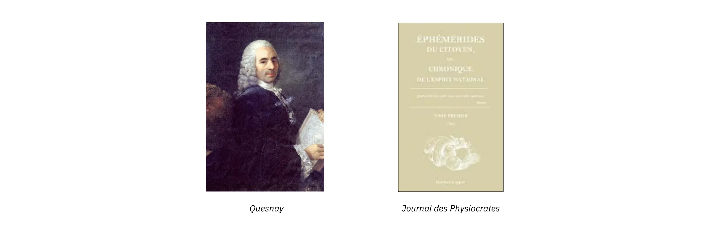

Dia kemudian berkata, "Saya hanyalah seorang anak laki-laki ketika Quesnay mengulurkan tangannya kepada saya—ia menjadikan saya seorang pria." Quesnay-lah yang menjadikannya ekonom utama di kancah sastra saat itu. 

Setelah _Journal de l'agriculture, du commerce et des finances_, Dupont diangkat menjadi editor _Les Éphémérides du Citoyen_, yang menjadi anggota resmi Kaum Fisiokrat.

Ia menjadikan koleksi majalah ini sebagai pusat utama teori ekonomi, mendukungnya bahkan selama kemunduran Kaum Fisiokrat dengan secara pribadi menulis hampir semua volume berikutnya. Dupont de Nemours juga yang menciptakan istilah "fisiokrasi", yang berasal dari dua kata Yunani yang berarti "pemerintahan alam." Ia menggunakan istilah ini untuk memberi judul pada kumpulan artikel Quesnay yang diterbitkan pada tahun 1768, dan istilah itu akhirnya menjadi dasar dalam sejarah. Diketahui bahwa di antara mereka sendiri, Kaum Fisiokrat menyebut satu sama lain "ekonom," dan mereka masih disebut demikian selama Revolusi.

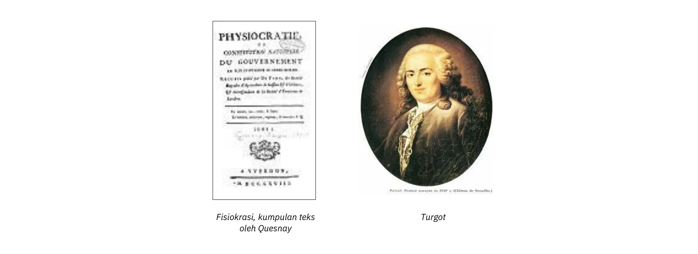

Ketika Turgot sempat menjabat sebagai menteri keuangan Prancis, Dupont menjadi penasihat dekatnya, satu-satunya Fisiokrat yang memiliki akses kepadanya, karena Turgot menjaga jarak dari yang lain.

Pada saat Revolusi, ia terpilih dari bailiwick (wilayah pemilihan) Nemours dan mendapati dirinya berada di Majelis, di mana seorang Tuan Dupont lainnya juga duduk. Ia kemudian dipanggil Dupont de Nemours, bukan karena ia seorang bangsawan, tetapi hanya untuk membedakan keduanya. Nama itu, tentu saja, tetap melekat.

Selama Revolusi, pada Agustus 1792, ia mengangkat senjata untuk membela Raja di Istana Tuileries melawan kerumunan massa.

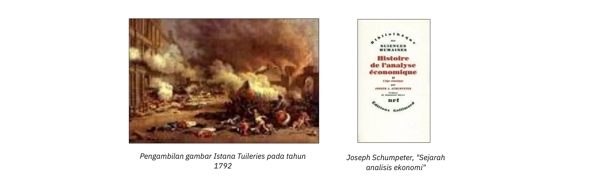

Raja berkata kepadanya: "Monsieur Dupont, kami selalu menemukan Anda di tempat Anda dibutuhkan!" Setelah secara ajaib lolos dari Terror (Periode Teror), divonis dan menunggu gilotin tetapi diselamatkan oleh jatuhnya Robespierre, ia didorong ke pengasingan di bawah Napoleon dan menemukan kebahagiaan di Amerika Serikat, di mana salah satu putranya mendirikan, dengan bantuan ayahnya, perusahaan Dupont yang kita kenal sekarang.

Meskipun hidupnya penuh peristiwa, di mana ia menerbitkan lusinan artikel, brosur, dan buku, ia tetap relatif kurang dikenal hingga hari ini. Mungkin ini karena ia tetap menjadi Fisiokrat yang teguh ketika doktrin tersebut telah kehilangan popularitas. Memang, seperti yang ditulis Schumpeter, Dupont de Nemours tetap setia pada Fisiokrasi "sepanjang karier di mana ia memiliki banyak kesempatan untuk melepaskannya." Ia adalah orang yang berpegang teguh pada keyakinan.

# Pencerahan dan Ekonomi Politik

<partId>d1c885ad-7cb1-5f81-816c-be312719d9f8</partId>

## Voltaire dan para filsuf

<chapterId>16bcf7bf-dad4-5113-8c64-2800f04ff07b</chapterId>

Abad ke-18 di Prancis menyaksikan kemunculan ilmu ekonomi sebagai sebuah pengetahuan dan mazhab pemikiran ekonomi pertama: Fisiokrasi. Adam Smith menimba ilmu ekonomi selama periode ini, dan para ekonom Prancis diakui secara global sebagai pemimpin. Namun, abad ini lebih dikenang sebagai abad filosofi daripada ekonomi. Meskipun gerakan Fisiokratik selaras, dalam ambisinya, dengan filosofi Pencerahan, sikap para philosophes—terutama Diderot dan Voltaire—layak dicermati. Kita akan melihat bahwa para pemikir Pencerahan secara signifikan berkontribusi dalam menyebarkan gagasan laissez-faire di Prancis.

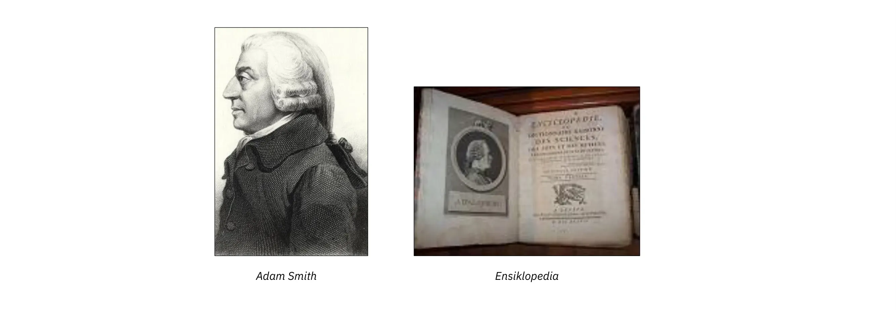

Pencapaian paling terkenal dari filosofi Pencerahan tidak diragukan lagi adalah Encyclopédie oleh Diderot dan d'Alembert.

Secara alami, artikel-artikel ekonomi ditulis oleh para ekonom. Untuk volume-volume awal, Diderot beralih ke Forbonnais, kemudian merekrut ekonom liberal: pertama François Quesnay (yang menyumbangkan artikel seperti "Grains" (Gandum), "Fermiers" (Petani), "Hommes" (Manusia)—yang terakhir tidak diterbitkan), kemudian Turgot (yang menulis "Foires et marchés" (Pekan Raya dan Pasar)). Tulisan-tulisan ini memiliki arti penting. Dalam artikelnya, Quesnay meletakkan dasar untuk apa yang kemudian menjadi doktrin Fisiokratik. Bersama dengan _Tableau économique_-nya, ini tetap menjadi karyanya yang paling terkenal. Turgot, yang masih muda saat itu, mengembangkan ide laissez-faire dalam artikelnya, mengkritik intervensi negara dalam organisasi pasar.

Di banyak artikel lain di _Encyclopédie_, para philosophes, terutama Diderot, membela cita-cita kebebasan di semua bidang: agama, politik, dan ekonomi.

Kebebasan bekerja, terutama dalam penentangan terhadap sistem gilda, adalah tema yang berulang dalam berbagai entri seperti Arts, Métier, dan Communauté.

Jalur Diderot dalam teori ekonomi adalah hal yang menarik. Dalam Encyclopédie, ia adalah pendukung teguh kebebasan ekonomi dan ia yang mencari kolaborasi dari ekonom liberal, sebagaimana dikonfirmasi oleh surat yang menguraikan artikel yang mungkin ditulis Turgot untuknya. Pada tahun-tahun awal Fisiokrasi, ia adalah pendukung sekaligus promotor mazhab Quesnay. Pada tahun 1769 dan 1770, ia menulis untuk _Les Ephémérides du Citoyen_, yang sangat mengecewakan teman-teman filsuf anti-liberalnya, seperti Melchior Grimm; namun, ia segera menjauhkan diri dari kelompok tersebut. Terpesona oleh kecerdasan Abbot Galiani yang bersemangat, ia membantunya menerbitkan bukunya tentang perdagangan gandum dalam bahasa Prancis, tepat saat Galiani akan kembali ke Italia.

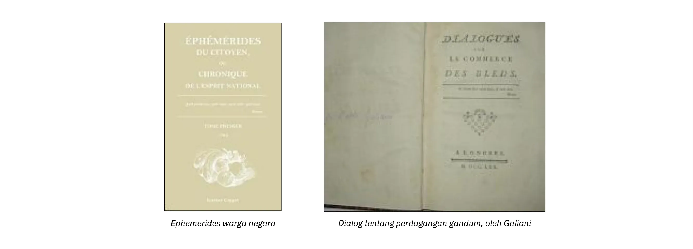

Buku ini akan menjadi serangan paling sengit yang pernah dilancarkan terhadap ide-ide Fisiokratik, memberikan pukulan besar bagi gerakan tersebut. Kemudian, Diderot membela Galiani melawan Abbot Morellet, sekutu dekat Kaum Fisiokrat, dalam _Apology of Galiani_-nya. Beberapa tahun kemudian, selama masa kementerian Turgot, Diderot terlihat memuji pembentukan kebebasan bekerja melalui penghapusan gilda. Pada titik ini, Diderot, putra seorang pengrajin, mendapati dirinya setuju dengan ekonom liberal dan menulis surat pedas kepada Galiani, yang mengklaim bahwa kebebasan bekerja akan merusak industri Prancis dalam waktu dua puluh atau tiga puluh tahun. Mengingat Revolusi Industri, sejarah menunjukkan sebaliknya. Setelah kembali ke sisi ekonom liberal, Diderot tidak lagi mendapatkan kepercayaan mereka dan tetap terisolasi. Momen yang sangat jelas adalah surat yang ia kirimkan kepada Dupont de Nemours pada tahun 1774, di mana ia menulis:

> "Anda pernah memiliki persahabatan untuk saya; sekarang Anda tidak lagi memilikinya, karena Anda begitu sibuk sehingga Anda tidak lagi punya waktu untuk mencintai siapa pun."

Voltaire mengikuti jalur yang serupa, ditandai dengan kurangnya konsistensi dalam pandangan ekonominya. Ia mengagumi Vincent de Gournay, berkorespondensi dengan para ekonom (termasuk Dupont de Nemours dan Turgot), dan menghargai Kaum Fisiokrat—terutama karena pujian mereka terhadap pertanian. Ia memuji mereka dalam _Diatribe to the Author of the Ephémérides_. Namun, ia kemudian mengkritik ide mereka tentang pajak tunggal atas tanah dalam karya satirnya _The Man of Forty Crowns_, yang juga menimbulkan kontroversi signifikan. Akhirnya, seperti Diderot, ia merayakan kementerian Turgot, menyebutnya sebagai zaman keemasan dan memuji dua dekret besarnya tentang kebebasan bekerja dan perdagangan bebas.

Pada akhirnya, hubungan para filsuf dengan pemikiran ekonomi adalah hal yang campur aduk. Meskipun mereka memuji dan mengkritik ide-ide ekonomi liberal, mereka memainkan peran dalam membawa ide-ide ini ke dalam wacana intelektual yang lebih luas pada masa Pencerahan. Dengan cara ini, baik disengaja maupun tidak, mereka membantu memajukan gagasan laissez-faire hingga Revolusi.

## Turgot, Sang Ahli Teori

<chapterId>a8cd8185-8351-556b-8011-3a0c313e8a9d</chapterId>

Dalam bagian terkenal dari _History of Economic Thought_, ekonom Amerika Murray Rothbard memuji apa yang ia sebut sebagai "kecemerlangan" Turgot, menempatkannya sebagai ekonom terbesar abad ke-18, bersama dengan Cantillon.

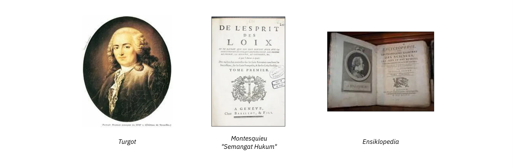

Bagaimana Turgot bisa menjadi begitu terkenal? Hal ini disebabkan oleh kombinasi dari tiga faktor utama. **Pertama, latar belakang keluarganya yang bergengsi. Ia berasal dari garis keturunan panjang administrator kerajaan, yang banyak di antaranya memegang jabatan tinggi di pemerintahan. **Kedua, masa keemasan di mana ia lahir dan dibesarkan. Turgot berusia 21 tahun ketika Montesquieu menerbitkan *L'Esprit des Lois*, dan 24 tahun ketika volume pertama *Encyclopédie* muncul.

Bagaimana Turgot bisa mencapai popularitas seperti itu? Hal ini disebabkan pada kombinasi dari tiga faktor utama:

**Pertama, latar belakang keluarga yang bergengsi.** Ia berasal dari keturunan pejabat kerajaan, banyak di antaranya memegang jabatan tinggi di pemerintahan. **Kedua, zaman keemasan saat kelahiran dan pertumbuhannya.** Turgot berusia 21 tahun ketika Montesquieu menerbitkan _L'Esprit des Lois_, dan 24 tahun ketika volume pertama _Encyclopédie_ muncul. 

Ia adalah orang sezaman dengan Kaum Fisiokrat, Voltaire, Diderot, d'Holbach, Adam Smith, Condorcet, dan lain-lain. **Ketiga, kecerdasan intelektual.** Saat masih menjadi mahasiswa di Sorbonne, ia menulis surat tentang uang kertas pada usia 22 tahun, menyampaikan pidato-pidato yang luar biasa, dan pada usia 24 tahun menyusun daftar 52 karya yang ingin ia tulis.

Meskipun usianya masih muda, Turgot berkontribusi pada _Encyclopédie_, menulis artikel tentang topik seperti "Etimologi," "Keberadaan," "Perluasan," "Pekan Raya", dan "Yayasan." Hanya satu artikel yang secara langsung menyentuh ekonomi—artikelnya tentang "Pekan Raya," yang merinci asal-usul pekan raya dan pasar serta mengkritik campur tangan negara yang semakin meningkat yang mengganggu dan melumpuhkannya.

Selama tahun-tahun awal ini, ia dibimbing oleh Vincent de Gournay, yang membawanya di bawah sayapnya dan menjalin persahabatan yang erat dengannya. Setelah kematian Gournay pada tahun 1759, Turgot menulis sebuah pidato yang berisi ringkasan luar biasa tentang doktrin laissez-faire. Ia secara khusus menulis:

"Dari setiap perspektif di mana perdagangan mungkin menyangkut Negara, kepentingan individu yang dibiarkan sendiri akan selalu lebih pasti menghasilkan kebaikan umum daripada operasi pemerintah, yang selalu cacat dan pasti dipandu oleh teori yang samar dan tidak pasti."

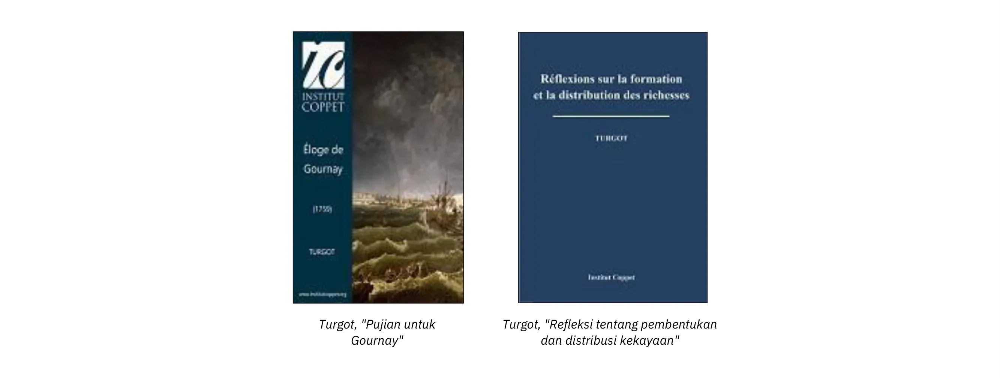

Pada tahun 1767, saat menjabat sebagai intendant (pengawas regional), ia menyusun ringkasan ekonomi dengan judul _Reflections on the Formation and Distribution of Wealth_.

Pembagian kerja, kedaulatan konsumen (consumer sovereignty), properti pribadi, peran modal, hampir semua tema ekonomi utama dibahas. Banyak sejarawan, yang paling baru adalah Anne-Claire Hoyng, telah menunjukkan kesamaan antara karya Turgot ini dan _The Wealth of Nations_ karya Adam Smith, yang diterbitkan sembilan tahun kemudian.

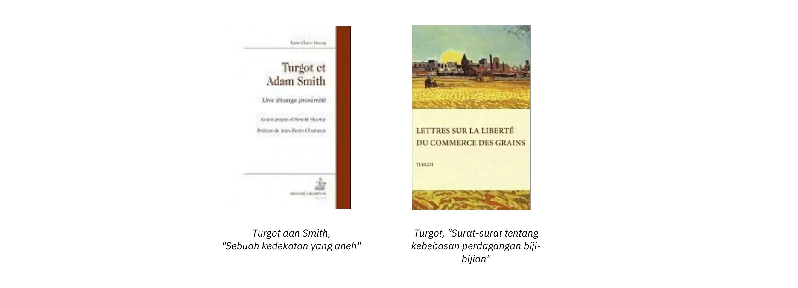

Turgot membela kebebasan perdagangan gandum dalam surat-surat kepada Abbot Terray, yang kemudian dikomunikasikan kepada Raja, tetapi setengahnya kini hilang. Ia menulis:

> Tuan, jika ada sesuatu yang mendesak, itu bukanlah untuk memaksakan pembatasan baru pada hal penting dari semua perdagangan, tetapi untuk menghapus pembatasan, sayangnya, telah diizinkan untuk tetap ada.
> Jika ada masa ketika kebebasan paling penuh, paling absolut, sepenuhnya bebas dari segala jenis rintangan, itu diperlukan, saya berani mengatakan itu adalah sekarang, dan bahwa tidak pernah ada waktu yang lebih tepat untuk mempertimbangkan mengeluarkan regulasi tentang perdagangan gandum.

Pada tahun 1769, Turgot menulis artikel Value and Money untuk _Dictionnaire de Commerce_ milik Abbot Morellet, yang pada akhirnya tidak pernah diterbitkan. Galiani sebelumnya telah mencatat bahwa "manusia adalah ukuran umum dari segala sesuatu," mengantisipasi analisis subjektif yang akan dikembangkan dan dibuktikan oleh Turgot tiga puluh tahun kemudian dalam artikel ini, di mana ia memperluas dan membuktikan proposisi ini..

Pada tahun 1770, jauh sebelum Bentham, Turgot menulis sebuah memorandum yang menganjurkan kebebasan suku bunga dan riba.

"Adalah suatu kesalahan untuk percaya bahwa bunga atas uang dalam perdagangan harus ditetapkan oleh hukum para pangeran," katanya, "Itu adalah harga saat ini yang mengatur dirinya sendiri, seperti halnya semua barang lainnya." Dalam mempertahankan posisi ini, ia menyanggah penentangan Aristoteles dan Bapa Gereja.

Ringkasan yang luar biasa dari doktrin laissez-faire Turgot dapat ditemukan dalam surat tahun 1773 yang terlupakan kepada Kepala Biara Terray tentang penandaan besi:

Ringkasan yang luar biasa tentang doktrin laissez-faire Turgot dapat ditemukan dalam surat yang terlupakan tahun 1773 kepada Abbot Terray tentang penandaan besi:

> Apa yang harus dilakukan politik adalah mengalah pada jalannya alam dan pada jalannya perdagangan, yang tidak kalah perlu dan tidak kalah penting daripada jalannya alam itu sendiri, tanpa mencoba mengarahkannya; karena untuk mengarahkannya tanpa mengganggunya dan tanpa merugikan diri sendiri, seseorang perlu mampu mengikuti semua variasi dalam kebutuhan, kepentingan, dan industri manusia; seseorang perlu mengetahuinya dalam tingkat detail yang secara fisik tidak mungkin diperoleh, dan di mana bahkan pemerintah yang paling terampil, aktif, dan teliti pun akan selalu berisiko salah, setidaknya separuhnya.

Di sini kita menemukan pernyataan yang sangat jelas tentang doktrin laissez-faire, serta bayangan analisis Friedrich Hayek tentang kepura-puraan pengetahuan (pretense of knowledge)—yaitu, ketidakmungkinan bagi Negara untuk sepenuhnya memahami kekuatan ekonomi demi mengendalikannya.

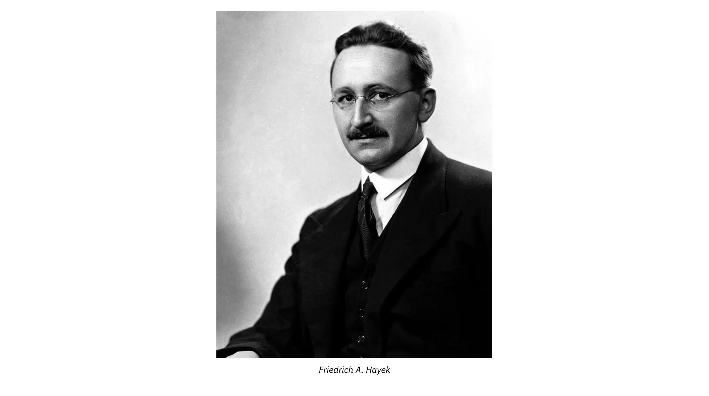

## Turgot, Sang Pembaharu

<chapterId>9177429f-1679-51c4-bfd2-dd036d24a1cc</chapterId>

Seperti yang kita ingat secara singkat di bab sebelumnya, Turgot adalah putra dari keluarga terkemuka yang memiliki reputasi baik dalam jajaran atas pegawai negeri sipil Prancis.

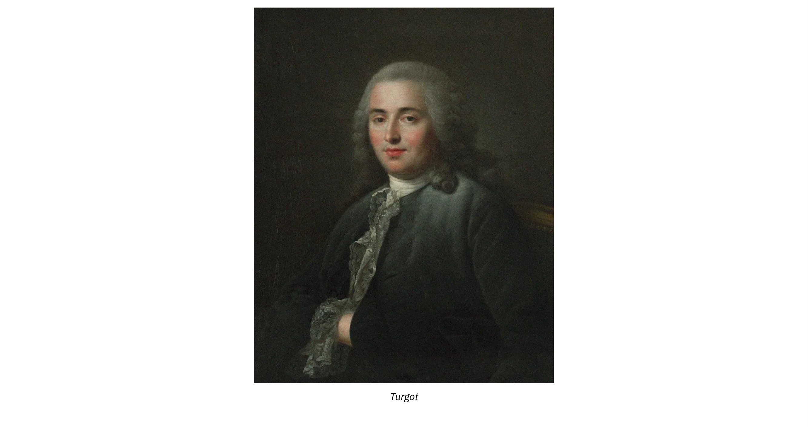

Ayahnya pernah menjadi bendahara pedagang Paris (provost of the merchants of Paris) dan kakeknya seorang intendant (pengawas regional). Setelah unggul dalam studinya, anggota termuda keluarga Turgot bertekad untuk mencapai setidaknya peringkat yang sama. Ia pertama kali menjabat untuk sementara waktu sebagai maître des requêtes, yang berarti ia adalah penghubung antara para intendant dan Versailles. Itu adalah posisi bergengsi, yang untuknya ia harus mendapatkan dispensasi usia khusus, tetapi Turgot berambisi lebih. Kematian mentornya, Gournay, lebih jauh mendorongnya untuk meraih cita-cita lebih tinggi, dan ia meminta penunjukan sebagai intendant.

Pada tahun 1759, ia pertama kali melamar jabatan wali kota Grenoble, tetapi ditolak. Ia kemudian ditawari jabatan bendahara pedagang di Lyon, yang ia tolak. Ia meminta intendancy Brittany, tetapi itu juga ditolak. Akhirnya, pada tahun 1761, ia ditawari intendancy Limousin dan, dengan enggan, ia menerimanya. Ia menulis kepada Voltaire: "Saya mendapat kemalangan menjadi seorang intendant," mungkin maksudnya: Saya mendapat kemalangan menjadi intendant di Limousin.

Di Limousin, para petani miskin dan hidup dalam kondisi genting, terutama terkait perumahan dan makanan. Tingkat pendidikan secara umum sangat rendah. Beberapa jalan yang ada berada dalam keadaan yang rusak parah.

Karena wilayah tersebut begitu miskin, wilayah itu tidak menarik bagi para menteri. Hal ini memberi Turgot kebebasan untuk bereksperimen dengan reformasi. Di Limousin, ia mengejar tiga proyek utama:

- Redistribusi **taille** (pajak perorangan): Turgot bertujuan untuk memperkenalkan objektivitas sebanyak mungkin dalam penilaiannya.
- **Corvée** (kerja paksa): Bentuk pajak yang dibayar dalam bentuk tenaga kerja, di mana petani dipaksa bekerja pada pembangunan jalan. Setelah berkeliling wilayah, Turgot dengan cepat menyadari kondisi jalan yang buruk. Ia mengganti corvée dengan pajak moneter.
- Perekrutan **milisi** : tentara petani yang dimobilisasi selama masa perang. 

Hal ini dilakukan dengan cara undian, yang menyebabkan ketakutan dan kekerasan karena adanya pelarian; Turgot mengganti wajib militer ini dengan sukarelawan yang dibayar.

Reformasi ini tidak dapat disangkal berhasil. Pada bulan Juli 1774, Turgot diangkat menjadi menteri. Karena kurangnya pengalaman, Raja pertama kali menempatkannya di Kementerian Angkatan Laut. Penunjukan itu membuat banyak orang geli. Turgot sendiri mengakui, "Saya tidak tahu apa-apa tentang Angkatan Laut," dan Voltaire berkomentar, "Saya rasa Turgot bukan seorang pelaut seperti dari saya."

Namun, hanya sebulan kemudian, Turgot diangkat sebagai Pengawas Jenderal Keuangan (Controller-General of Finances), secara efektif menjadi menteri ekonomi dan keuangan Prancis.

Kita tahu surat di mana dia menguraikan prinsip-prinsipnya kepada Louis XVI: "Tidak ada kebangkrutan. Tidak ada kenaikan pajak. Tidak ada pinjaman baru". Filosofi ini, yang oleh para kritikus saat ini mungkin dianggap sebagai "kekakuan" yang tidak ada gunanya, dimaksudkan untuk menyelamatkan kerajaan.

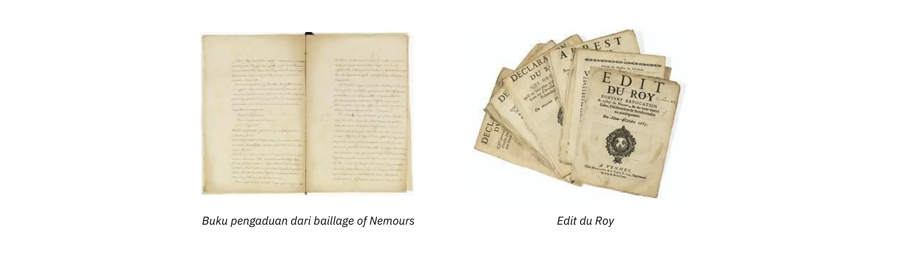

Turgot menyiapkan enam dekrit kerajaan untuk mereformasi ekonomi Prancis.

Itu adalah kali pertama—dan salah satu yang terakhir—seorang ahli ekonomi diberikan kebebasan untuk mereformasi ekonomi negaranya. Tiga dari dekret Turgot yang menonjol adalah: pertama menghapuskan kerja paksa (corvées), yang lain membubarkan gilda perdagangan (corporations), dan yang ketiga menetapkan perdagangan bebas gandum.

Saat memasuki kementerian, Turgot tahu ia akan menghadapi perlawanan dari kelas-kelas istimewa. "Saya akan ditakuti, bahkan dibenci, oleh sebagian besar istana dan oleh semua yang mencari keuntungan," katanya kepada Raja. Kaum istimewa segera bersatu melawannya dan menyebabkan pemecatannya dari jabatan Pengawas Jenderal Keuangan. Voltaire, yang sepenuhnya mendukung reformasi Turgot, menulis dalam korespondensinya:

> Ah! Berita mengerikan apa yang saya dengar! Apa yang akan terjadi pada kita? Saya hancur! Kita tidak akan pernah pulih dari menyaksikan kelahiran dan kematian zaman keemasan! Sambaran petir ini telah menyerang pikiran dan hati saya.

Sejak saat itu, banyak yang berpendapat bahwa Prancis adalah negara yang mustahil untuk direformasi. Kegagalan Turgot tampaknya membenarkannya: Ia telah dipersiapkan oleh setengah abad pemikiran ekonomi liberal; ia mendapat dukungan dari filsuf Pencerahan; dan Raja sendiri, dengan kekuasaan absolut, mendukungnya.

Pada akhirnya, parlemen dan kelas istimewa menang. Yang bisa dilakukan Raja hanyalah meratap secara pribadi: "Saya lihat sekarang bahwa hanya Monsieur Turgot dan saya yang peduli pada rakyat."

## Condillac

<chapterId>0ba8dbb5-dcd5-5981-bf85-6c185e0bf192</chapterId>

Sama seperti Merkantilisme, yang merupakan manifestasi praktisnya yang paling jelas, sofisme Montaigne (Montaigne’s sophism) membutuhkan waktu lama untuk menghilang.

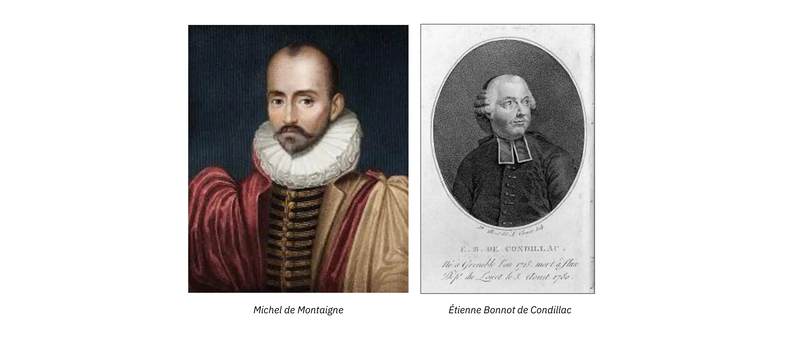

Sofisme itu adalah gagasan bahwa perdagangan dan pertukaran adalah permainan zero-sum (total-nol). Apa pun yang diperoleh satu pihak dalam suatu transaksi niscaya hilang oleh pihak lain. Para pendukungnya berargumen bahwa ini berlaku baik antara individu maupun antara negara.

Abbot of Condillac memainkan peran utama dalam membongkar secara definitif gagasan palsu ini.

"Secara definitif" mungkin berlebihan, karena dalam debat publik, sofisme ini sering muncul kembali. Mungkin inilah sebabnya, Condillac tetap menjadi ekonom yang kurang dikenal. Terlepas dari ekonom Austria, hanya sedikit yang memahami pentingnya teori pertukarannya, dan tidak ada yang lagi tertarik padanya.

Bagi sebagian besar sejarawan pemikiran ekonomi, tahun 1776 ditandai dengan publikasi _The Wealth of Nations_, yang mendirikan ilmu ekonomi. Lima belas pelajaran yang baru saja kita selesaikan, di mana kita telah mempelajari ilmu ekonomi Prancis sebelum Adam Smith, sudah cukup untuk membuktikan kesalahan konsepsi ini. Selain itu, pada tahun yang sama 1776, buku lain mungkin pantas mendapat pujian lebih dari sejarawan daripada buku Adam Smith: buku itu ditulis oleh Condillac dan berjudul sederhana [_Commerce and Government Considered in Their Mutual Relationship_}(https://archive.org/details/commercegovernme0000cond). 

Bagi Condillac, jika pertukaran sofisme yang dilihat sebagai permainan zero-sum bertahan, kaum Fisiokrat sebagian patut disalahkan, karena mereka mempertahankan bahwa pertukaran adalah hubungan kesetaraan. Menurut Condillac, ini salah: pertukaran adalah hubungan yang tidak setara (unequal relationship), di mana seseorang selalu memberi lebih sedikit untuk mendapatkan lebih banyak.

Antara ide-ide Kaum Fisiokrat dan ide-ide Condillac, tidak ada oposisi yang lebih sempurna yang bisa diimpikan. Ekonom Fisiokrat Le Trosne menulis:

> Pertukaran pada dasarnya adalah kontrak kesetaraan, dibuat dari nilai yang sama untuk nilai yang sama.

Condillac, di sisi lain, menulis:

> Setiap pihak dalam kontrak selalu memberikan sesuatu yang bernilai lebih rendah untuk mendapatkan sesuatu yang bernilai lebih tinggi.

Namun, pertentangannya sebagian besar adalah masalah kata-kata. Keduanya setuju bahwa ketika seseorang menukar satu franc dengan sebuah buku, buku itu bernilai satu franc, atau harga buku itu adalah satu franc.

Perbedaannya terletak pada fakta bahwa Condillac menegaskan bahwa karena kita menukar satu franc dengan buku, itu berarti bahwa bagi kita, nilai buku lebih tinggi daripada koin satu franc kita. Kita lebih memilih buku daripada koin, dan itulah mengapa kita melakukan pertukaran.

Teori Condillac pada dasarnya tidak bertentangan dengan Kaum Fisiokrat, tetapi mereka tidak berbicara dalam bahasa yang sama. Le Trosne berbicara tentang harga (price) sementara Condillac berbicara tentang nilai (value), dan sebaliknya.

Di mana Condillac benar adalah bahwa jika harga sama antara kedua barang yang dipertukarkan, nilai tidak sama—jika tidak, tidak ada pertukaran yang akan terjadi.

Untuk meringkas teori Condillac, ada tiga proposisi yang bisa dicantumkan:

Proposisi pertama: Kita mencari barang karena utilitasnya (utility). Ini tampaknya jelas, tetapi ini adalah prinsip prinsip ilmu ekonomi bahwa manusia bertukar untuk memperoleh kegunaannya, sebuah poin yang juga dikembangkan dengan sempurna oleh Jean-Baptiste Say.

Proposisi kedua: Nilai mendahului dan memotivasi pertukaran. Penilaian subjektif yang dibuat setiap orang tentang barang dan jasa menyiratkan bahwa barang dan jasa yang sama ini memiliki nilai bagi mereka, bernilai lebih atau kurang sesuai dengan utilitas yang tampaknya mereka berikan. Tentu saja, setiap individu menilai secara berbeda dari yang lain, dan nilai bervariasi pada setiap orang.

Terakhir, Harga adalah konsekuensi dari proses pertukaran. Produk tidak dipertukarkan pada nilai yang saya berikan kepada mereka karena kondisi pertukaran juga bergantung pada nilai subjektif yang diberikan oleh penjual pada produk tersebut. Hubungan antara pembeli dan penjual, atau antara apresiasi subjektif pembeli dan apresiasi subjektif penjual, menetapkan suatu harga.

Ide-ide Condillac ini fundamental. Ide-ide ini memungkinkan kita untuk memahami mengapa setiap pertukaran selalu saling menguntungkan (mutually beneficial).

Oleh karena itu, ide-ide ini sepenuhnya menghancurkan kritik terhadap perdagangan bebas, karena proteksionisme hanya terlihat sebagai mekanisme yang mencegah populasi saling menguntungkan satu sama lain. Laissez-faire juga merupakan kesimpulan dari karya Condillac. Biarkan orang melakukan apa yang mereka inginkan, karena jika kekuatan publik melindungi kebebasan dan properti, manusia akan selalu saling memperkaya dengan bertukar bersama.

## Condorcet

<chapterId>99e4aba6-da7f-5041-b02f-337158381515</chapterId>

Condorcet tidak diragukan lagi adalah filsuf yang paling berorientasi pada ekonomi pada masa Pencerahan.

Untuk sebagian besar kariernya, ia mengabdikan dirinya pada bidang-bidang yang sama sekali tidak berhubungan dengan ekonomi, dan memang demikian, karena bakatnya menghasilkan kemajuan besar dalam ilmu-ilmu yang paling ia fokuskan. Tetapi sekitar tahun 1770, ia merasa tertarik pada pertanyaan-pertanyaan ekonomi, mungkin karena filsuf lain, terutama Voltaire dan Diderot, tidak mau repot-repot mendedikasikan waktu senggang mereka untuk hal tersebut, dan juga karena ia telah berteman dengan Turgot.

Condorcet secara bertahap merangkul ide-ide laissez-faire dan kebebasan, pada awalnya di bidang-bidang yang tidak terkait dengan ekonomi politik. Dalam _Letter of a Theologian_, ia secara filosofis mencemooh agama Katolik dan menyatakan keinginannya untuk melihat kebebasan berkeyakinan yang tulus, termasuk kebebasan untuk tidak percaya. Dalam kampanyenya untuk toleransi dan melawan fanatisme agama, Condorcet berjuang untuk rehabilitasi Chevalier de la Barre dan untuk pengadilan ulang D'Etallonde, yang telah dijatuhi hukuman mati karena mematahkan salib.

Oleh karena itu, Ia siap untuk membela kebebasan ketika temannya Turgot naik ke posisi Pengawas Jenderal Keuangan (Controller-General of Finances).

Sejak saat itu, karier Condorcet berubah ketika saat ia memasuki debat ekonomi, tanpa lelah mendukung reformasi liberal dari menteri baru. Mendukung persaingan dan kebebasan perdagangan, Condorcet juga menyerukan penghapusan corvée (kerja paksa), gilda, dan pajak yang adil. Ia menyuarakan keyakinan ini secara publik setiap ada kesempatan, melakukannya dengan antusiasme yang jelas; ia menulis secara ekstensif dan pernah menyatakan dalam tulisannya: "Izinkan saya berbicara lagi tentang kebebasan perdagangan; saya senang terlibat dengan subjek ini."

Antara tahun 1774 dan 1776, selama masa kementerian Turgot, Condorcet membuat banyak intervensi, yang semuanya ditandai dengan komitmennya pada laissez-faire. Karya-karyanya meliputi _Letters from a Farmer of Picardy to Mr. Necker_, yang membela perdagangan bebas; _Monopolies and Monopolists_, yang menganjurkan persaingan bebas; _Reflections on Corvées_, yang menyerukan penghapusan mereka; dan _Reflections on the Grain Trade_, yang sekali lagi memuji perdagangan bebas dan mengkritik buku Necker tentang subjek yang sama.

Dalam tulisannya [*Letters on the Grain Trade*](https://archive.org/details/bub_gb_hg8jFw-y6bwC), Condorcet membuat beberapa poin penting.

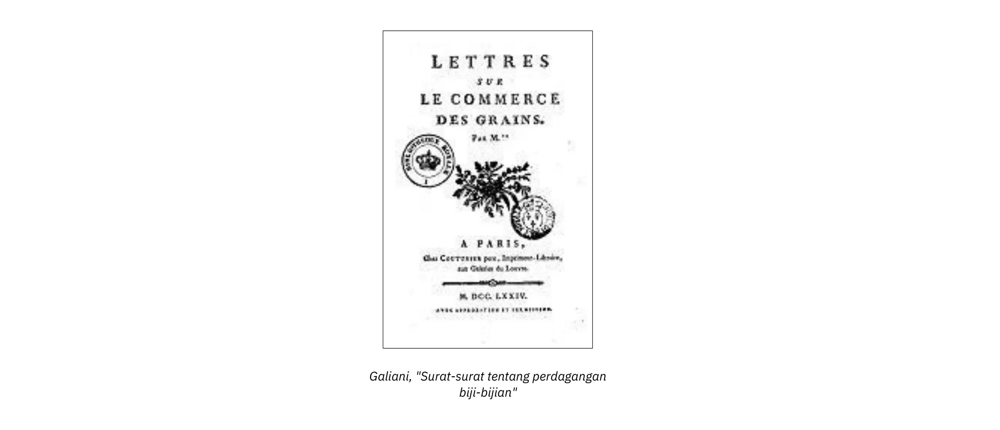

Pertama, harga gandum yang tinggi pada saat itu bukan akibat dari perdagangan bebas, melainkan karena panen yang buruk, dan Condorcet menunjukkannya dengan jelas. Dia kemudian menjelaskan mengapa laissez-faire tidak hanya tepat tetapi merupakan satu-satunya kebijakan yang sesuai, meskipun ada prasangka populer. Ia mencatat, "Kita begitu terbiasa melihat pemerintah campur tangan dalam perdagangan gandum sehingga tidak melakukan apa-apa tampak seperti sesuatu yang luar biasa dan baru." Kemudian, ia menambahkan, "Hampir semua orang, terutama mereka yang memegang jabatan publik, percaya bahwa tidak ada yang terjadi dengan sendirinya dan bahwa segalanya hilang jika pemerintah tidak campur tangan dalam segala hal." Condorcet dengan demikian menghidupkan kembali argumen Kaum Fisiokrat dan Turgot, menunjukkan keunggulan perdagangan bebas di atas semua bentuk intervensiisme.

Mempromosikan agenda ekonomi liberal Turgot adalah tindakan yang berani, karena Condorcet tahu ia akan segera menghadapi sensor. Memang, ini terjadi dan pamfletnya tentang penghapusan kerja paksa dihancurkan dan dilarang pada tahun 1776.

Turgot, menghargai kesetiaan Condorcet terhadap ide-idenya, mengangkatnya sebagai Inspektur Mata Uang (Inspector of Coinage). Condorcet mengundurkan diri segera setelah temannya meninggalkan kementerian.

Meskipun ia mencurahkan seluruh energinya untuk membela Turgot, Condorcet tidak memiliki pandangan tentang hasil masa jabatan temannya. Turgot sendiri mengakui di akhir hayatnya bahwa ia hidup dengan penyesalan, saat ia menulis dalam sebuah surat, "karena tidak mampu melakukan kebaikan bagi bangsa dan kemanusiaan yang saya yakini sangat mudah." Condorcet, yang lebih realistis, menunjukkan banyak musuh yang akan dihadapi Turgot: para pendukung Raja, parlemen, pendeta, kaum bangsawan, gilda, dan sebagainya. Kelompok-kelompok ini mengharapkan sanjungan, bukan reformasi. Condorcet mengatakan kepada Turgot, "Anda sama sekali bukan seorang dukun, dan itu adalah sebuah kelemahan, mengingat bagaimana keadaan di Paris." Ia sepenuhnya benar, karena pada tahun 1776, baru dua tahun setelah kedatangannya, Turgot sudah dipaksa untuk meninggalkan jabatan Pengawas Jenderal.

## Akal sehat liberal di tengah Revolusi

<chapterId>95e9a90d-e37a-58ff-b1ac-928b42e76ecf</chapterId>

Dupont de Nemours adalah murid termuda dari François Quesnay, yang pernah berkata tentangnya: "Kita harus menjaga anak muda ini, karena dia akan berbicara ketika kita sudah mati". Ketika Revolusi Prancis dimulai, hampir semua Fisiokrat besar, termasuk Marquis de Mirabeau, telah tiada; Mirabeau sendiri telah meninggal dunia pada tanggal 13 Juli 1789.

Dupont de Nemours adalah murid termuda François Quesnay, yang pernah berkata tentangnya: "Kita harus menjaga pemuda ini, karena dia akan berbicara ketika kita telah mati." Ketika Revolusi Prancis dimulai, hampir semua Fisiokrat besar, termasuk Marquis de Mirabeau, sudah tiada; Mirabeau sendiri telah meninggal pada 13 Juli 1789.

Dupont de Nemours menulis daftar keluhan (cahier de doléances) untuk bailiwick Nemours.

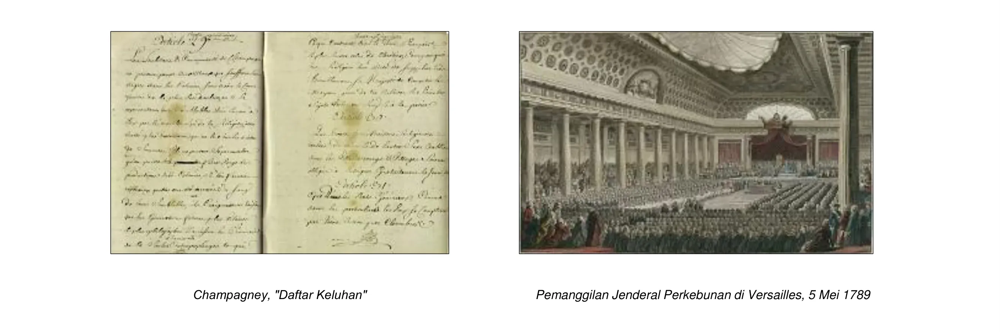

Dokumen menarik ini memuat semua keluhan dari ekonom liberal terhadap pembatasan perdagangan, monopoli, dan serangan terhadap properti. Dupont de Nemours juga terpilih menjadi Majelis Nasional.

Selama Revolusi, ia menjadi suara akal sehat liberal, berdiri teguh melawan gelombang populisme dan hasutan intervensi yang semakin besar, yang pada akhirnya menang.

Sejak November 1789, ketika ada pembicaraan tentang memberikan monopoli kepada Caisse d'Escompte (yang dapat mengubahnya menjadi bank publik—Bank of France), Dupont de Nemours angkat bicara untuk membela persaingan.

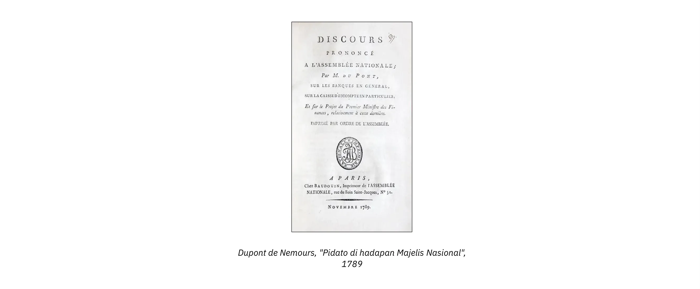

"Akan lebih baik," katanya, "untuk menyerahkan bisnis perbankan pada hukum perdagangan bebas." Dan ia menambahkan:

> "Saya tidak mengerti apa maksud menteri ketika ia berbicara tentang memberikan hak istimewa kepada Caisse d'Escompte. Jika hak istimewa ini mencakup eksklusivitas, Anda harus menolaknya, karena Anda datang ke sini untuk menghancurkan hak istimewa eksklusif, bukan untuk menciptakan yang baru."

Terlepas dari peringatannya, Majelis mengabaikan keberatannya dan mengambil langkah lain menuju pembentukan bank sentral dan monopoli perbankan.

Pada tahun 1790, di Majelis Konstituante, Dupont de Nemours mengikuti tradisi pasifis teman-teman Fisiokratnya dan mengusulkan undang-undang yang melarang perang ofensif. Pasal pertama berbunyi: "Bangsa Prancis tidak akan mengizinkan dirinya untuk terlibat dalam perang ofensif apa pun untuk merebut wilayah orang lain atau untuk melanggar hak atau kebebasan Bangsa mana pun."

Usulan ini ditolak.

Pada tahun yang sama, 1790, perdebatan dimulai tentang penerbitan mata uang kertas baru (assignats) untuk menutupi pengeluaran pemerintah.

Dupont de Nemours dengan tegas menentangnya dan menerbitkan pamflet berjudul [Effects of Assignats on the Price of Bread (Dampak Assignats pada Harga Roti)](https://archive.org/details/effetdesassignat00dupo). Judulnya tepat, karena ia menjelaskan bahwa penerbitan assignats pasti akan mengarah pada inflasi, peningkatan harga komoditas, termasuk roti.

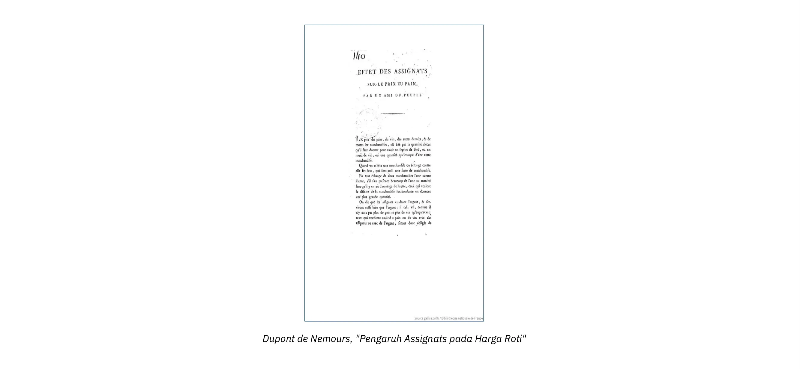

Dia menandatangani pamflet tersebut sebagai "sahabat rakyat" (a friend of the people). Tulisan itu menimbulkan kegemparan, karena Majelis ditanya siapa yang menulisnya. Dupont de Nemours kemudian berdiri dan mengakui bahwa itu adalah karyanya, mengatakan ia tidak malu menggunakan gelar "sahabat rakyat" karena berjuang melawan assignats adalah benar-benar melayani rakyat.

Sekali lagi, nasihatnya diabaikan, dan assignats pun diterbitkan.

Kita semua tahu bencana yang terjadi setelahnya, kehancuran ekonomi dan penderitaan yang dialami oleh masyarakat, banyak dari mereka yang kehilangan segalanya ketika assignat menjadi tidak berharga dan harus dibakar.

Kita semua tahu bencana yang terjadi setelahnya, kehancuran ekonomi dan penderitaan yang dialami oleh rakyat, banyak di antaranya kehilangan segalanya ketika assignats menjadi tidak berharga dan harus dibakar. Beberapa tahun kemudian, Majelis mengalihkan perhatiannya pada gagasan untuk menciptakan Bank of France yang sebenarnya, yang akan diberikan hak monopoli atas produksi uang.

Dupont de Nemours, masih dengan tegas menentang gagasan bank publik, melihatnya tidak lebih dari sekadar monopoli, mengingatkan Majelis akan pengalaman buruk yang dialami oleh para penanggung jawab assignats yang membawa bencana. Dia mengatakan kepada mereka:

> "Jangan persiapkan diri Anda untuk penyesalan seperti yang menyiksa rekan-rekan saya di Majelis Konstituante. Pada saat itu, proposal saya untuk membatasi assignats hanya untuk pembayaran barang nasional dan tidak menjadikannya mata uang yang beredar ditolak. Hari ini, mereka berkata: 'Ah, seandainya saja kami mendengarkan Dupont de Nemours!'"

Namun sekali lagi, tidak ada yang mendengarkannya.

## Kesimpulan: Penyerahan Obor Estafet

<chapterId>ada8082f-db96-5e52-954f-719b47998153</chapterId>

Pemikiran ekonomi Prancis pada abad ke-18 sering kali dibayangi oleh para ekonom abad ke-19 yang lebih terkenal. Namun, ketika berbicara tentang pembelaan kebebasan, di abad ke-18 lah segalanya benar-benar dimulai. Ini adalah abad di mana prinsip laissez-faire, yang begitu revolusioner pada masanya, pertama kali diungkapkan dengan jelas oleh sejumlah pemikir, dari Boisguilbert hingga Dupont de Nemours.

Tentu, tokoh-tokoh seperti Jean-Baptiste Say, Frédéric Bastiat, Gustave de Molinari, dan Yves Guyot meninggalkan jejak abadi pada sejarah pemikiran ekonomi Prancis. Tetapi jika kita mempelajarinya secara terpisah, kita kehilangan sesuatu yang penting. Para pemikir abad ke-19 ini tidak muncul begitu saja; mereka mewarisi dan membangun di atas fondasi yang diletakkan oleh para pendahulu mereka di abad ke-18 selama masa Pencerahan.

Boisguilbert menegaskan bahwa orang-orang yang bermaksud baik yang percaya mereka dapat memperbaiki segalanya dengan melibatkan pemerintah pasti akan membalikkan ekonomi, dan karenanya lebih baik membiarkan tatanan alamiah berjalan.

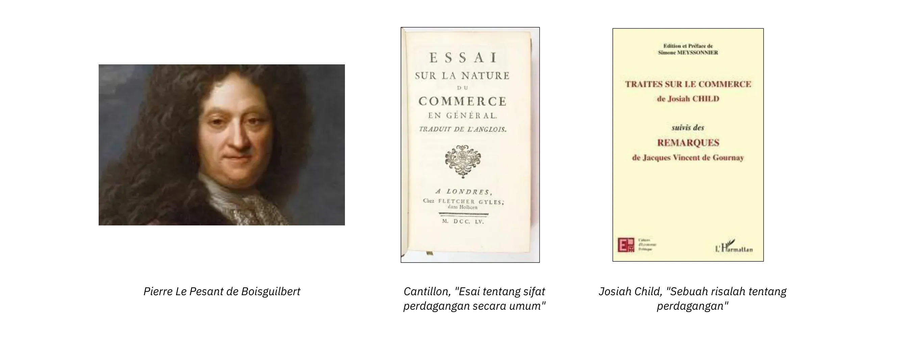

Cantillon bersikeras bahwa uang tidak boleh dimanipulasi untuk tujuan politik. Membiarkan Negara mengelola uang sesuka hati membuka jalan bagi kekacauan finansial dan ekonomi yang besar.

Vincent de Gournay menegaskan bahwa regulasi kerja yang berlebihan melemahkan upaya pekerja dan perajin, mendorong mereka menuju kemalasan dan ketidakaktifan. Berkat persaingan bebaslah ekonomi dapat tumbuh dan suatu bangsa dapat makmur.

Marquis d'Argenson menegaskan bahwa tidak ada pemerintah yang mampu meramalkan dan mengukur segalanya, dan bahwa akibatnya, kita harus bergantung pada kepentingan diri sendiri setiap individu.

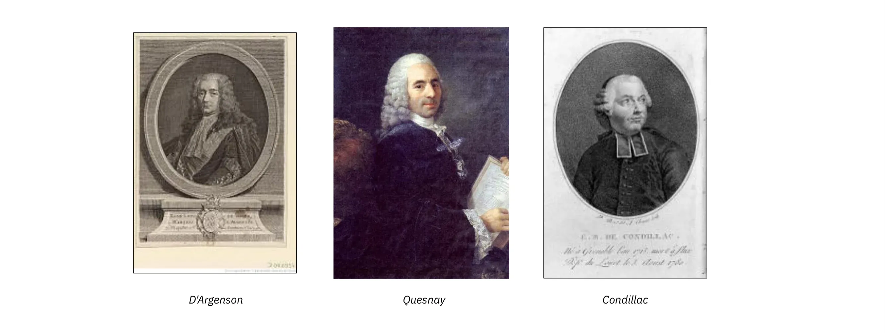

Quesnay dan Kaum Fisiokrat menegaskan bahwa properti pribadi adalah fondasi masyarakat manusia. Tanpa properti pribadi, manusia kehilangan motivasi untuk berusaha, untuk bekerja, karena ia tidak dapat menikmati hasil kerjanya atau mengumpulkan apa pun.

Condillac menegaskan bahwa pertukaran selalu saling menguntungkan dan oleh karena itu, harus selalu bebas tanpa kecuali. Misi tunggal Negara haruslah untuk melindungi kebebasan dan properti.

Semua ide ini akan diambil oleh para ekonom abad ke-19. Beberapa, seperti Jean-Baptiste Say, akan memberikan ide-ide ekspresi ilmiah melalui _Treatise on Political Economy_ yang ketat. Yang lain, sebaliknya, akan berusaha mempopulerkan maksim-maksim mendasar ini dengan menjelajah ke ranah dongeng, novel, dan cerita pendek yang lucu, seperti yang dilakukan Frédéric Bastiat dengan sangat terampil.

## Biografi

<chapterId>17cf2865-e53c-5f3b-a5c2-a43560efaf01</chapterId>

**DAFTAR PUSTAKA SELEKTIF**

Di bawah ini, Anda akan menemukan pilihan lebih dari 30 tulisan:

1. Pierre Clément, Histoire de Colbert et de son administration, Paris, 1874
2. Vauban, Projet d'une dîme royale, 1707; cetak ulang Institut Coppet, 2014; Anne Blanchard, Vauban, Fayard, 1996
3.	Boisguilbert, Détail de la France, 1695; diterbitkan ulang oleh Institut Coppet, 2014
4. Félix Cadet, Pierre de Boisguilbert: pendahulu para ekonom, Institut Coppet, 2014
5. Pierre de Boisguilbert ou la naissance de l'économique politique, Paris, INED, 1966
6. Richard Cantillon, Essai sur la nature du commerce en général, 1755; dicetak ulang oleh Institut Coppet, 2015
7. Antoin Murphy, Richard Cantillon, bankir dan ekonom, Oxford, 1986
8. Gustave de Molinari, Kepala Biara Saint-Pierre, Paris, 1859
9. Kepala Biara Saint-Pierre, Abrégé du projet de paix perpétuelle, Rotterdam, 1729
10. Kepala Biara Saint-Pierre, "Projet pour perfectionner le commerce de la France", dalam Les rêves d'un homme de bien, Paris, 1775, hlm.199
11. André Alem, Le marquis d'Argenson et l'économique politique au début du XVIIIe siècle, Institut Coppet, 2015
12. Journal et mémoires du marquis d'Argenson, edisi Rathery, 9 jilid, Paris, 1859-1867
13. Benoît Malbranque, Vincent de Gournay: ekonomi politik laissez-faire, Institut Coppet, 2016
14. Vincent de Gournay, Remarques sur la traduction de Josiah Child, L'Harmattan, 2008
15. Christine Théré & Loïc Charles (eds.), Le cercle de Gournay, INED, 2005
16. Antoin Murphy, "Le développement des idées économiques en France (1750-1756)", Revue d'histoire moderne et contemporaine, tome XXXIII, Oktober-Desember 1986
17. Henri Ripert, Le marquis de Mirabeau: ses théories politiques et économiques, Paris, 1901
18. Lucien Brocard, Les doctrines économiques et sociales du marquis de Mirabeau dalam L'Ami des Hommes, Paris, 1902
19. Humbert de Montlaur, Mirabeau, l'Ami des Hommes, Perrin, 1992
20. Yves Guyot, François Quesnay et la Physiocratie, Institut Coppet, 2014
21. François Quesnay, Œuvres économiques complètes et autres textes, 2 vols, INED, 2005
22. Georges Weulersse, Le mouvement physiocratique en France (de 1756 à 1770), 2 vols, Paris, 1910
23. Georges Weulersse, La Physiocratie à la fin du règne de Louis XV (1770-1774), P.U.F., 1959
24. Georges Weulersse, La Physiocratie sous les ministères de Turgot et de Necker (1774-1781), P.U.F., 1950
25. Georges Weulersse, La physiocratie à l'aube de la révolution (1781-1792), EHESS, 1985
26. P. Jolly, Du Pont de Nemours, soldat de la liberté, Paris, P.U.F., 1956
27. Tulisan-tulisan ekonomi Voltaire, Institut Coppet, 2013
28. Gustave Schelle (ed.), Œuvres de Turgot et documents le concernant, Paris, 1913-1924
29. Benoît Malbranque, Le libéralisme à l'essai : Turgot intendant du Limousin (1761-1774), Institut Coppet, 2015
30. Pierre Foncin, Essai sur le ministère de Turgot, Paris, 1877
31. Auguste Lebeau, Condillac économiste, Paris, 1903
32. Condillac, Le commerce et le gouvernement considérés relativement l'un avec l'autre, 1776
33. Condorcet, Mélanges d'économi politique, dalam Eugène Daire (ed.), Mélanges d'économi politique, Paris, 1847
34. P. Jolly, Du Pont de Nemours, soldat de la liberté, Paris, P.U.F., 1956
35. Eli Heckscher, Mercantilism, 2 jilid. London: Allen and Unwin. 1935

# Bagian akhir

<partId>385bffab-aea1-5bcd-9569-62b3f30665b7</partId>

## Ulasan & Peringkat

<chapterId>a1e689d9-abd0-5dcb-ba56-a8d355d0a84f</chapterId>

<isCourseReview>true</isCourseReview>

## Ujian akhir

<chapterId>bdb7fd98-33e7-11f0-9fe6-b785c859ffc5</chapterId>

<isCourseExam>true</isCourseExam>

## Kesimpulan

<chapterId>3b366ff6-03c8-5f6a-b4c0-ba8186e65d7e</chapterId>

<isCourseConclusion>true</isCourseConclusion>
