# Un viaggio nella storia economica della libertà

Questo corso esplora la nascita della scienza economica nella Francia del XVIII secolo attraverso la lente del laissez-faire. Scoprirai come i pensatori sfidarono il mercantilismo sostenendo che lo Stato dovrebbe proteggere i diritti privati, ma mai manipolare i mercati attraverso le regolamentazioni.

Imparerai come i riformatori visionari estesero questa visione per chiedere il libero scambio e la libera circolazione delle merci, gettando le fondamenta intellettuali del capitalismo moderno. Studiando questi economisti pionieri, comprenderai i principi senza tempo che hanno plasmato l'economia politica globale e continuano a influenzare i dibattiti politici odierni. Iscriviti ora per padroneggiare le idee che hanno costruito l'economia moderna.
+++
# Introduzione

<partId>06d67531-19f1-4f8d-bf8f-77bbcc743672</partId>

## Panoramica del corso

<chapterId>202db3c6-0320-494d-8057-adc6f6563048</chapterId>

Benvenuti a HIS204!

Il corso si propone di esplorare le origini francesi del concetto di *laissez-faire* - "lasciare che accada" - così come si è sviluppato nel XVIII secolo attraverso una ricca tradizione intellettuale. Ripercorrendo il pensiero dei primi pensatori economici francesi, scopriremo le basi di un'economia politica costruita sulla libertà economica, caratterizzata dalla sfiducia nell'ingerenza dello Stato e dalla fiducia in un ordine naturale che favorisce la crescita e la prosperità.

**Sezione 2: I Precursori**

In questa sezione iniziamo a cavallo tra il XVII e il XVIII secolo, un'epoca caratterizzata dall'eccessivo dominio della monarchia assoluta e dalle prime richieste di un modo più razionale ed equo di governare gli affari pubblici. Attraverso le figure di Vauban, Boisguilbert e Cantillon, scopriamo le prime critiche all'interventismo statale e un primo abbozzo di quella che sarebbe diventata l'economia politica liberale.

**Sezione 3: Riformatori e pensatori del primo Settecento**

Questa sezione si concentra su coloro che, nei primi decenni del XVIII secolo, tentarono di riformare l'economia francese alla luce di nuovi principi. Pensatori come l'Abate di Saint-Pierre, il Marchese d'Argenson e Gournay (insieme ai suoi seguaci) chiedevano di smantellare gli ostacoli corporativi, liberalizzare il commercio e incoraggiare la concorrenza come motore dello sviluppo. Le loro proposte, spesso audaci, prefiguravano le grandi idee fisiocratiche.

**Sezione 4: La scuola fisiocratica**

Questa sezione esplora uno dei momenti più importanti del pensiero economico francese: la scuola fisiocratica. Ne esamineremo le origini, i fondamenti dottrinali e i principali risultati, concentrandoci su figure chiave come Quesnay e Dupont de Nemours. L'idea del laissez-faire diventa un sistema coerente proprio in questa scuola, radicata nell'idea di un ordine naturale a cui lo Stato deve sottomettersi per garantire la prosperità di tutti.

**Sezione 5: L'Illuminismo e l'economia politica**

Infine, vedremo come il pensiero economico liberale si sia diffuso all'interno del più ampio movimento illuminista. Figure come Voltaire, Turgot, Condillac e Condorcet hanno ampliato e arricchito la tradizione del laissez-faire; i loro scritti hanno creato un ponte che la tradizione del laissez-faire ha attraversato nel periodo rivoluzionario e oltre, dove le idee liberali hanno trovato nuova risonanza.

Pronti a riscoprire le radici francesi del liberalismo economico? Andiamo!

# I Precursori

<partId>91565b10-6010-53cb-a2f4-9c2306c7ef8c</partId>

## Contesto storico

<chapterId>6a5fd101-6dfd-5d77-96c7-9e1aa4a19758</chapterId>

All'alba del XVIII secolo, la Francia versava in uno stato preoccupante. Le popolazioni rurali producevano a malapena per sopravvivere ed erano pesantemente tassate.

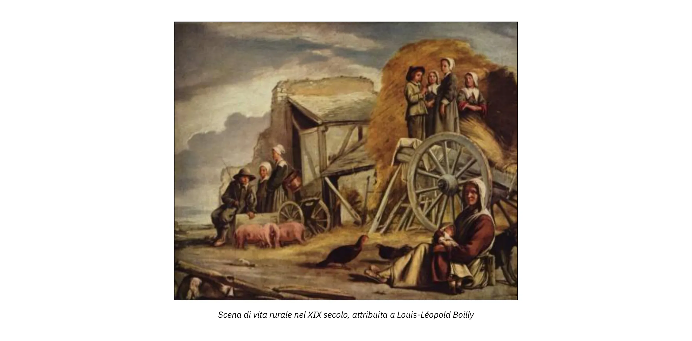

Gli artigiani urbani, chiusi in rigide corporazioni, faticavano a innovare o anche solo a sostenersi a vicenda. Nel frattempo, altre nazioni europee superarono presto la Francia su tutti i fronti, facendo concorrenza ai suoi prodotti. I successi commerciali di Inghilterra e Olanda erano all'attenzione di tutti.

Ma come trovare una soluzione alla malattia dell'epoca? Non esisteva ancora una scienza dell'economia e quindi una medicina speciale da applicare. I principi della politica economica erano ancora applicati in modo aleatorio, passando da fasi restrittive a periodi più liberali. Certo, abbiamo dei modelli, dei riferimenti storici da seguire. Tra questi c'è *Sully*, ministro di Enrico IV, che si schierò a favore dell'agricoltura e promosse una maggiore libertà di commercio all'interno della Francia.

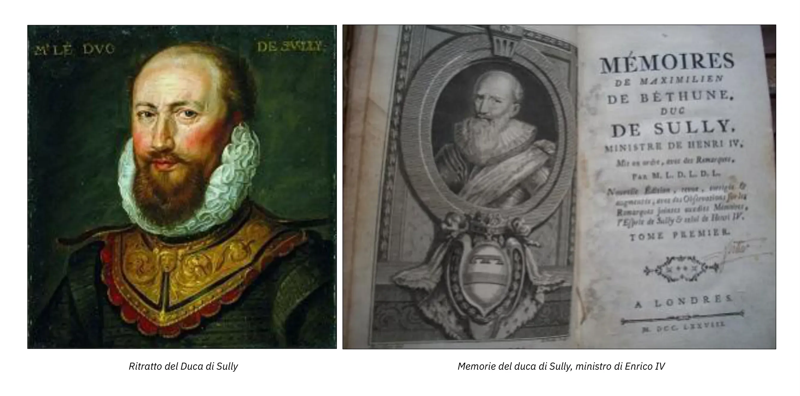

Ma poi arrivò Colbert, ministro di Luigi XIV, che oscillava tra regolamentazione e libertà, ma alla fine fece rispettare la regolamentazione. Proprio alla fine del XVII secolo, Colbert superò Sully: i ministri ora invocavano la sua eredità e cercavano di applicare quelle che sostenevano essere le sue massime.

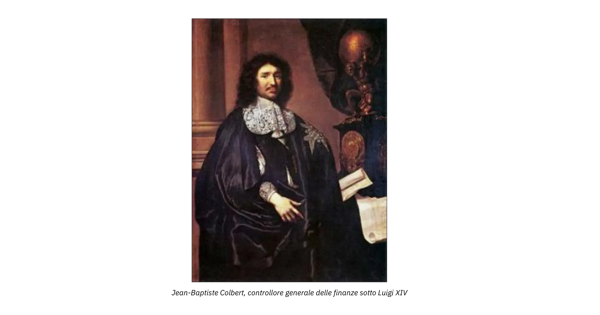

Nella mente degli statisti della fine del XVII secolo, le massime di Colbert erano quattro.

(1) **L'industria deve essere regolamentata e vincolata da corporazioni**. Questi regolamenti specificano, ad esempio, come devono essere fatte le lenzuola e le stoffe, le loro dimensioni e il loro peso.

Esistevano centinaia di norme di questo tipo, raccolte in volumi dedicati per ogni tipo di industria. Tuttavia, agli occhi dei seguaci di Colbert, tutto ciò era ancora insufficiente: l'industria, secondo loro, doveva essere supervisionata anche dalle corporazioni.

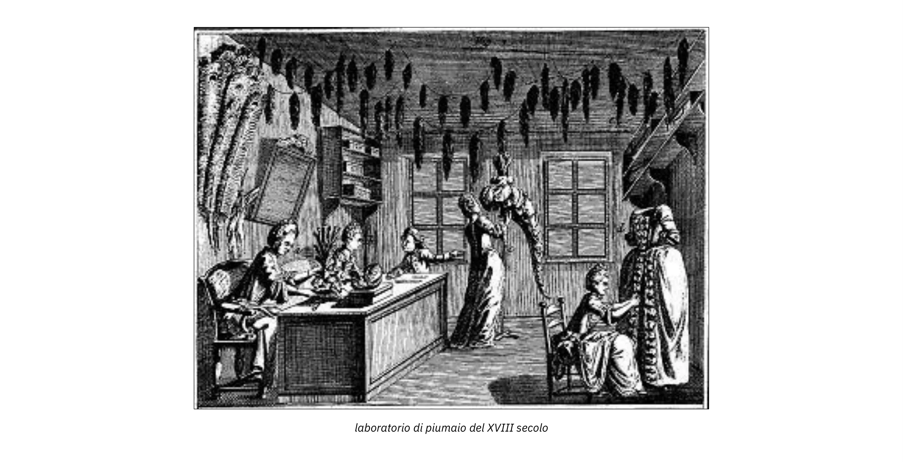

Chiunque volesse praticare un mestiere doveva prima passare diversi anni come apprendista, poi come artigiano, prima di tentare di raggiungere lo status di maestro producendo un "capolavoro" e pagando una somma considerevole alla gilda. La concorrenza all'interno di ogni mestiere era quindi strettamente limitata.

(2) **Il commercio è un gioco a somma zero**. Quando si parla di commercio, i discepoli di Colbert condividono gli stessi pregiudizi dei barbari dell'antichità. Secondo il ministro di Luigi XIV, il commercio è "una guerra perpetua". Perché? La ragione è semplice: per Colbert e i suoi successori, ogni aumento di ricchezza per un Paese significava l'impoverimento di un altro. Secondo loro, non si poteva permettere che gli inglesi o gli olandesi si arricchissero, perché ciò avrebbe significato rubare la prosperità della Francia.

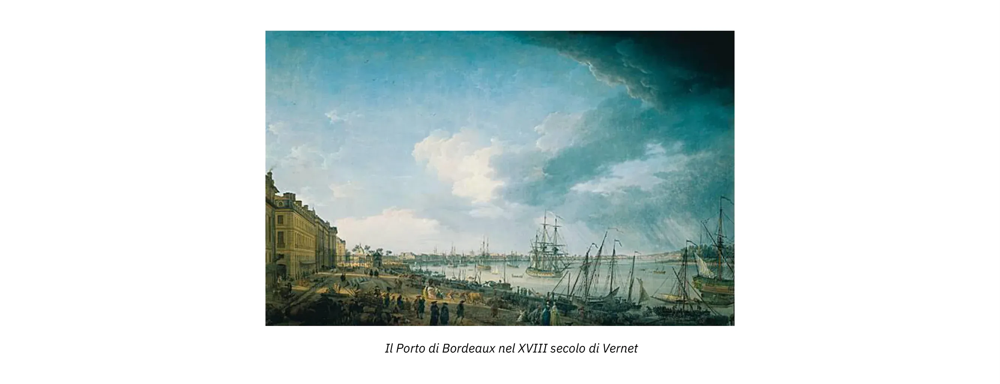

I prodotti di questi Paesi, quindi, dovevano essere vietati o pesantemente tassati, senza scrupoli, perché il commercio è una guerra in cui possiamo solo desiderare la rovina dei nostri nemici.

> "I francesi possono aumentare il loro commercio solo schiacciando gli olandesi".
> *Colbert*

(3) **Quando lo Stato è a corto di denaro, aumenta le tasse**. Colbert e i suoi discepoli erano ben lontani dal credere che la ricchezza dei contribuenti fosse una risorsa limitata. Secondo loro, la spesa pubblica non poteva mai essere un problema, finché si raccoglieva abbastanza. E se il popolo si ribellava, era solo perché i ministri avevano agito male, perché, come osservava cinicamente Colbert, "l'arte della tassazione consiste nello spennare le oche senza farle urlare troppo".

(4) **La ricchezza è soprattutto oro e argento**. Prima della nascita della scienza economica, molti scrittori seguivano un dogma dominante sulla natura della ricchezza, quello che è stato definito *mercantilismo*. Colbert e i suoi successori continuarono su questa strada. In breve, i mercantilisti ritenevano che il vero segno della prosperità di una nazione fosse l'accumulo di metalli preziosi, argento e oro.

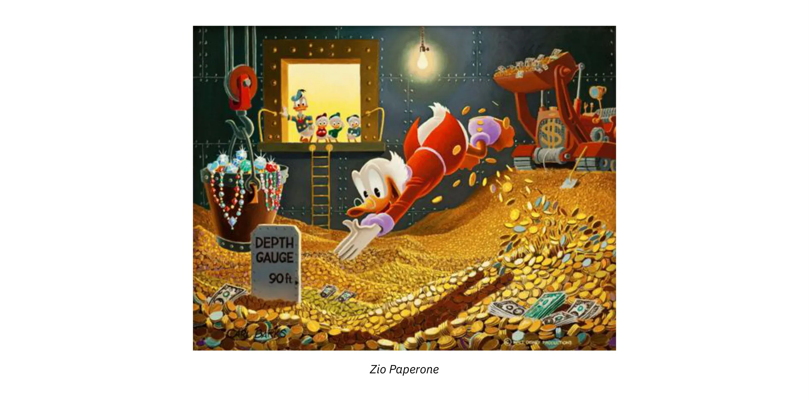

> "Solo l'abbondanza di denaro all'interno dello Stato fa la differenza per la sua grandezza e il suo potere".
> *Colbert*

La conseguenza di questa idea è stata quella di favorire a tutti i costi le esportazioni, che facevano affluire oro e argento dall'estero, e di limitare al minimo le importazioni, per evitare di mandarle all'estero.

Questi sono i quattro principi che hanno guidato il governo francese per diversi decenni, mentre il Paese entrava nel XVIII secolo. Tuttavia, presto sarebbero stati messi profondamente in discussione. Tra il 1690 e il 1710, diversi scrittori furono profondamente colpiti dal disastroso stato della Francia. Cercandone le cause, giunsero alla conclusione che le massime ereditate da Colbert erano da biasimare, considerandole più che argomenti fallaci. Così facendo, gettarono le basi della scienza economica.

## Vauban

<chapterId>ee9c1e0e-96cc-5026-a5e2-963d68122786</chapterId>

Oggi, mentre la pressione fiscale nel nostro Paese continua a crescere, minacciando di soffocare le forze economiche nazionali, si levano voci a favore di un cambiamento. Consapevolmente o meno, questi appelli alla riforma spesso riecheggiano il lavoro degli economisti francesi che, fin dal XVII secolo, hanno criticato il sistema fiscale nazionale come caotico, dispotico, eccessivo.

Il primo di questi riformatori fiscali, in termini cronologici e di merito, è il grande maresciallo Sébastien Le Prestre Vauban, famoso costruttore di fortezze e cittadelle.

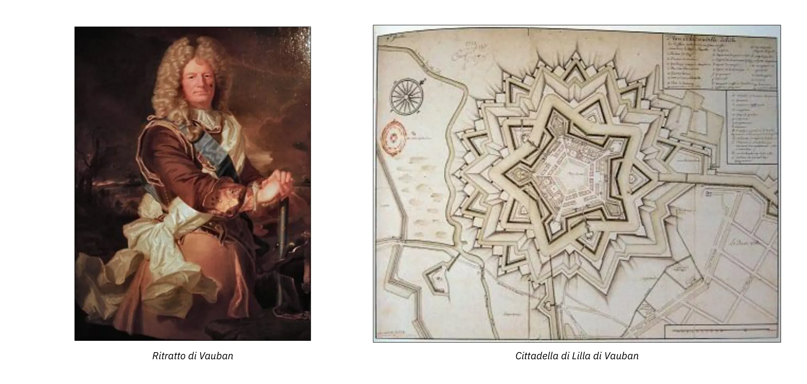

Anche se lo abbiamo tristemente dimenticato, Vauban non era solo un militare, ma anche un economista. Interessato al destino dei contadini, propose un'audace riforma fiscale nel 1695 (Projet de capitation - "Progetto di capitazione") e nel 1707 (Projet d'une Dime Royale - "La decima reale"): sostituire la maggior parte delle imposte esistenti con una tassa proporzionale al reddito, una flat tax in anticipo sui tempi.

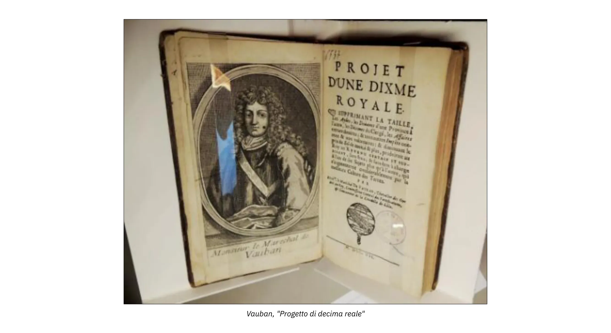

Vauban arrivò a queste idee grazie alla curiosità. Era un osservatore attento, che si sforzava di studiare la vita sociale e la realtà economica in modo rigoroso, quasi scientifico. Insisteva particolarmente sulla necessità di contare, attraverso i censimenti.

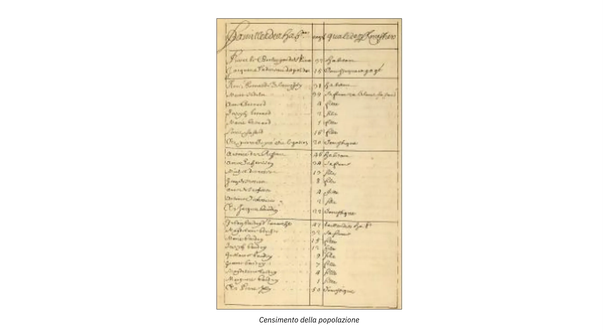

Il suo secondo grande merito fu la descrizione commovente e onesta della miseria sopportata dalle masse. Scriveva: "Non lasciamoci ingannare; il cuore del regno è rovinato. Tutto soffre, tutto sopporta, tutto geme. Basta guardare ed esaminare il cuore delle province, per scoprire che è ancora peggio di quello che sto dicendo". Lungi dall'essere esagerate, le cupe osservazioni di Vauban erano un riflesso accurato della vita dei primi anni del XVIII secolo. Alexis de Tocqueville era ben consapevole di queste idee e in seguito avrebbe descritto la *Royal Tithe* di Vauban come "spaventosa", perché era vera.

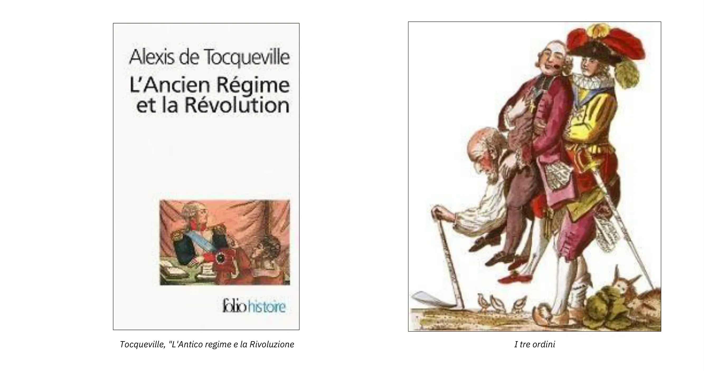

L'altro grande merito di Vauban come economista fu quello di proporre una riforma fiscale di vasta portata volta a sradicare, o almeno a ridurre l'intensità del male che aveva osservato e descritto. Aveva ragione a farlo: l'economia francese sotto l'Ancien Régime era paralizzata dalla tassazione, che era iniqua, instabile e illegale.

Nei suoi vari scritti politici ed economici, l'ambizione principale di Vauban era quella di alleviare le sofferenze di quella che egli chiamava "la parte inferiore del popolo che, con il suo lavoro, sostiene e supporta quella superiore".

Capì che una tassazione opprimente e disincentivante stava schiacciando i contadini, un concetto che espresse con lucidità e che possiamo ancora osservare perfettamente ai giorni nostri:

> "Il contadino lascia appassire la poca terra che ha, lavorandola solo a metà, per paura che, se producesse quanto potrebbe con un concime e una coltivazione adeguati, sarebbe tassato ancora più pesantemente".

Vauban vide la verità: la tassazione dell'Ancien Régime non era solo irrazionale, ma anche crudelmente severa. È questo sistema fiscale, ingiusto nella sua distribuzione, che egli cercò di superare.

La soluzione da lui proposta, una tassa piatta e proporzionale su tutti i redditi, avrebbe permesso di ripartire equamente il carico fiscale tra tutte le classi sociali. Basata su una teoria dello Stato che vedeva l'autorità pubblica come necessaria per proteggere i diritti individuali e la proprietà, la riforma fiscale di Vauban richiedeva che tutti i cittadini contribuissero in modo strettamente proporzionale a ciò che guadagnavano, ad esempio il 10% del loro reddito

Ne La decima reale, l'unica delle sue opere economiche stampata in vita, Vauban affermava chiaramente:

> "Poiché in uno Stato tutti hanno bisogno della sua protezione per sopravvivere, è giusto che tutti contribuiscano, secondo il loro reddito, al suo mantenimento e alle sue spese [...]. Non c'è niente di più ingiusto che esentare chi è più capace di pagare e scaricare il peso su chi è meno capace, che crolla sotto il peso; peso che sarebbe abbastanza leggero se sopportato proporzionalmente da tutti secondo le proprie forze. Pertanto, ogni esenzione dalle tasse è un disordine che deve essere corretto"

Poco prima della sua morte, l'idea di Vauban fu adottata dai ministri di Luigi XIV. Tuttavia, Vauban aveva chiesto una tassa proporzionale che sostituisse tutte, o quasi, le tasse esistenti. Invece, come spesso accade, la sua tassa fu implementata, ma tutte le altre furono mantenute.

## Boisguilbert

<chapterId>200149c6-b5fc-566e-ab0e-bafb1c3fed3c</chapterId>

Pochi economisti francesi del passato godono oggi in patria di un riconoscimento all'altezza dei loro contributi, e Boisguilbert non fa eccezione.

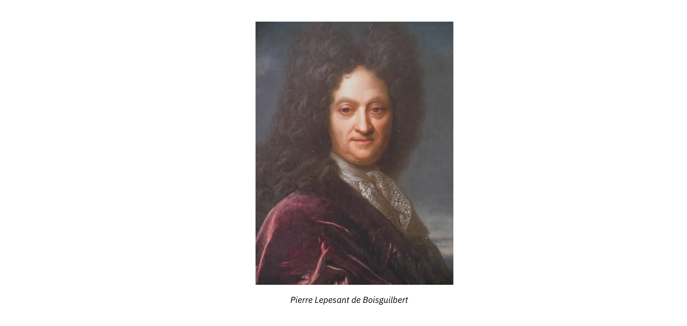

Poco apprezzato dai lettori del suo tempo, allontanato dai circoli di potere a causa del suo carattere eccentrico e della sua passione travolgente, Boisguilbert ha lasciato un'impronta limitata nel XVIII secolo. Eppure, all'inizio del secolo scorso, si è assistito a una lenta riscoperta della sua opera.

Tuttavia, questa riscoperta mostra che stiamo entrando in una sorta di vicolo cieco. Il vero merito di Boisguilbert è stato perso presentandolo come il pioniere di numerose teorie e il precursore di molti pensatori. Si dice che abbia afferrato il concetto di sottoccupazione poi difeso da Keynes, che abbia anticipato la legge di Say, che abbia aperto la strada alla teoria dell'equilibrio generale di Walras e che abbia persino anticipato l'analisi di classe dei marxisti. chi o cosa non potrebbe essere il precursore di Boisguilbert?", si è chiesto un commentatore.

(Pierre Le Pesant de) Boisguilbert nacque a Rouen nel 1646. Educato a Port-Royal a Parigi, Boisguilbert iniziò una carriera letteraria senza successo prima di assumere vari ruoli, tra cui quello di luogotenente generale di Rouen. In questo periodo scrisse diversi libri per sostenere le sue idee, tra cui "Détail de la France" nel 1695, che ripubblicò l'anno successivo con un titolo molto più esplicito: [*La Francia rovinata sotto il regno di Luigi XIV, da chi e come, con i mezzi per restaurarla](https://archive.org/details/bub_gb_0jUaWNbTJa8C/page/n23/mode/2up)*.

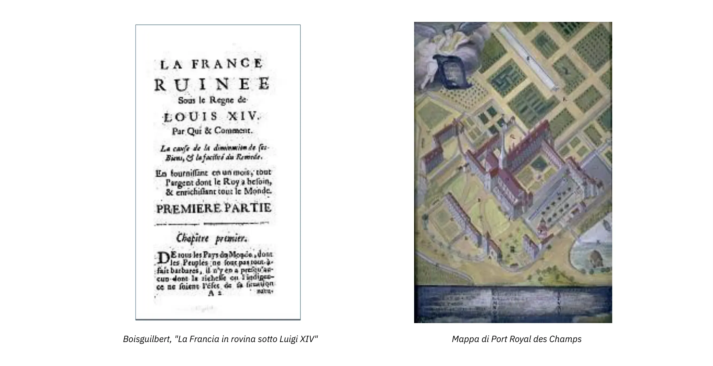

E questa è la base dei libri di Boisguilbert: La povertà francese e le sue cause.

La miseria del popolo francese alla fine del XVIII secolo è descritta dettagliatamente da Boisguilbert, così come da Vauban. Scrive:

> "Le terre brulle o mal coltivate, visibili a tutti, sono il cadavere della Francia".

Ha descritto vigneti sradicati, contadini che hanno abbandonato i campi e carestie ricorrenti.

Boisguilbert trova due cause principali per questa disgrazia. Infatti, se il popolo vive nell'indigenza, è perché gli viene impedito di consumare il necessario, e la rovina del consumo ha due cause.

In primo luogo, il popolo non poteva più permettersi di consumare i beni di prima necessità a causa di una tassazione arbitraria. La taille, l'imposta personale dell'epoca, veniva calcolata alla cieca per ogni individuo, aumentando o diminuendo senza motivo. A causa dei numerosi privilegi, il peso ricadeva sui contadini poveri, che si ritrovavano rovinati. Per rimediare a questa situazione, Boisguilbert raccomandò un'imposta proporzionale su tutti i redditi, proprio come la proposta di Vauban.

La seconda ragione della miseria della Francia è che troppi ostacoli impedivano il libero scambio delle merci, soprattutto quelle agricole. C'erano dazi doganali alle frontiere e anche all'interno del Paese, tra le diverse regioni, che paralizzavano tutti i commerci. Queste restrizioni impedivano di stabilire un prezzo di equilibrio e limitavano le opportunità di mercato. Di conseguenza, i contadini non potevano vivere della loro produzione, perché non erano in grado di vendere con profitto e soffrivano di prezzi agricoli non remunerativi, una preoccupazione che rimane di grande attualità e che è al centro della teoria di Boisguilbert. Per quanto riguarda le restrizioni al commercio, Boisguilbert sosteneva la necessità di liberare le strade, in altre parole di instaurare il libero scambio.

E proprio la libertà è la sua conclusione finale. "Non si tratta di agire", dice, "ma semplicemente di smettere di agire come facciamo con tanta violenza contro la natura, che tende sempre alla libertà e alla perfezione". Tutto andrà bene, ripete instancabilmente, "finché lasceremo che la natura faccia il suo corso, cioè le daremo la sua libertà, e che nessuno interferisca in questo commercio se non per offrire protezione a tutti e impedire la violenza".

Quest'ultimo passaggio è fondamentale. Boisguilbert è stato il primo a rivendicare chiaramente una politica economica del laissez-faire, a farne il suo credo e a costruirvi attorno un vero e proprio sistema. Secondo lui, esiste un ordine naturale delle cose, che non deve essere corrotto, né distrutto, da interventi pubblici inopportuni. Lo Stato, a suo avviso, non deve intervenire nelle questioni economiche, ma lasciare che le cose agiscano naturalmente. Altrimenti, causerà miseria.

Boisguilbert criticava persino le "*anime buone*", come le chiamava, quelle che avevano buone intenzioni ma facevano grandi danni. Volevano un pane a basso costo per il popolo, ma, forzando i prezzi, mandavano in rovina i contadini, che non potevano sopravvivere con tali margini. Questi contadini abbandonarono quindi le loro terre, sprofondando ancora di più nella povertà. Come tutti sappiamo, "l'inferno è spesso lastricato di buone intenzioni".

## Cantillon

<chapterId>bc206d41-6a64-5688-a489-40fcfa0e5397</chapterId>

Autore del "Saggio sulla natura del commercio in generale" (scritto intorno al 1730 e pubblicato nel 1755), Richard Cantillon è considerato uno dei pionieri della scienza economica moderna. Nella sua Storia del pensiero economico, l'economista Murray Rothbard si riferisce a Cantillon come al fondatore dell'economia moderna.

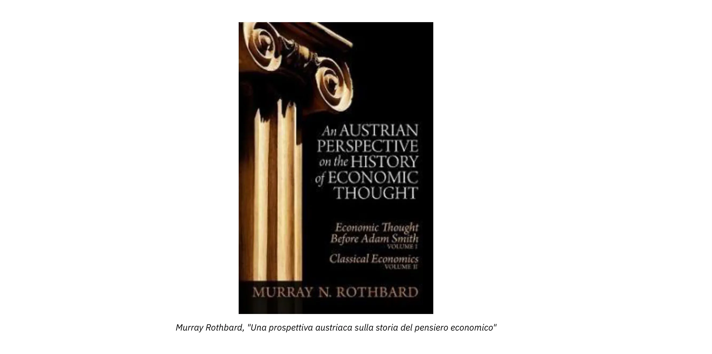

Nato in Irlanda, Richard Cantillon si stabilì a Parigi da giovane e acquisì la cittadinanza francese. Lavorò come banchiere e fece fortuna durante l'epoca di John Law.

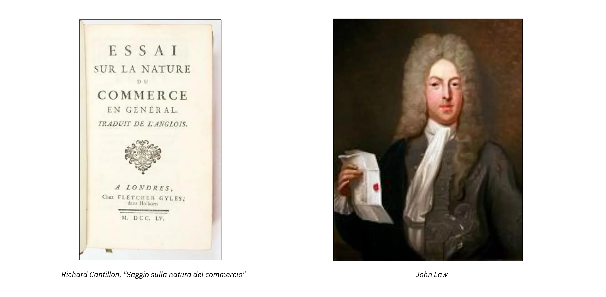

Fu anche in questa occasione che iniziò a studiare la teoria economica. Intorno al 1730, Cantillon compose il suo Saggio sulla natura del commercio in generale.

Questo libro può essere considerato uno dei primi tentativi di creare una teoria generale dell'economia. Cantillon è attento a identificare quelle che chiama "leggi generali dell'economia", quelle che sono nella natura delle cose e non nei fatti particolari di questo o quel Paese. Questo approccio fu rivoluzionario.

Possiamo riassumere i grandi meriti del Saggio di Cantillon in cinque aree: la teoria della ricchezza, la nozione di imprenditore, la critica alle monete senza valore, gli "effetti Cantillon" e infine la difesa della libertà.

In primo luogo, la sua **teoria della ricchezza**.

A differenza della visione mercantilista dominante all'epoca, Cantillon basò la sua analisi sul riconoscimento che la ricchezza è formata dai prodotti che sono propri del godimento dell'uomo. Questa ricchezza, sosteneva, proviene dalla natura ed è prodotta attraverso il lavoro umano. Le sue idee sulla natura della ricchezza ebbero una forte influenza su Beccaria e Adam Smith e, attraverso Smith, sull'intera scuola di pensiero classica inglese.

In secondo luogo, **l'imprenditore**.

Anche se non lo definì chiaramente, Cantillon considerava l'imprenditore come un attore principale e centrale dell'attività economica. Per Cantillon, ciò che caratterizza l'imprenditore è l'assunzione di rischi e l'agire nell'incertezza. Queste idee sarebbero state successivamente ampliate da Turgot e, in modo più significativo, da Say, per riconoscere finalmente il posto speciale dell'imprenditore nell'economia, contrariamente alle affermazioni della scuola inglese.

Terzo punto, la **valuta**.

In reazione all'esperienza di John Law, Cantillon spiega cosa succede o deve succedere quando la moneta non ha un valore reale.

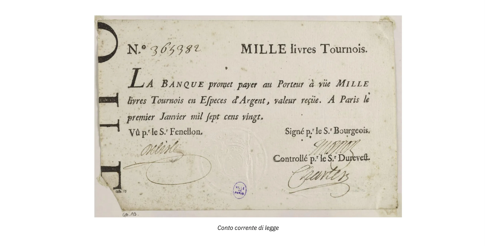

Egli vede due conseguenze principali nella sostituzione di una moneta senza valore reale come la cartamoneta con una metallica. La prima conseguenza è quella che chiama "rifiuto popolare", ovvero una crescente sfiducia nei confronti del denaro senza valore. La seconda conseguenza è l'inflazione: l'indebolimento monetario rende i beni più costosi.

In quarto luogo, nella sua analisi della **inflazione**, Cantillon si spinse oltre i suoi contemporanei. Avendo osservato il crollo del sistema di Law, Cantillon si rese conto che l'inflazione monetaria non colpisce tutti allo stesso modo. Al contrario, arricchisce alcuni impoverendo altri. Egli concluse che l'inflazione ha un effetto redistributivo: coloro che ricevono la moneta di nuova emissione beneficiano per primi dell'aumento del potere d'acquisto, mentre coloro che la ricevono successivamente si impoveriscono a causa dell'emissione di nuova moneta dovuta all'aumento dei tassi d'inflazione.

In quinto luogo, nonostante alcuni residui del pensiero mercantilista, la prospettiva generale di Cantillon era **del tutto liberale**. Egli difendeva la proprietà privata come pilastro fondamentale della civiltà, sostenendo che nessuna società può funzionare senza il Ownership privato della terra e dei prodotti del lavoro. Considerava inoltre naturale e legittima la disuguaglianza materiale tra le persone. Secondo Cantillon, non c'è nulla di male se un lavoratore efficiente e coraggioso, o eccezionalmente dotato, guadagna più di uno incompetente o pigro.  Infine, Cantillon riteneva che i prezzi dovessero essere sempre determinati liberamente, dal gioco della domanda e del mercato, senza l'intervento delle autorità pubbliche.

Tra le cinque idee principali del suo Saggio, la più importante è senza dubbio quella che oggi porta il suo nome: l'**Effetto Cantillon**.

Con questa teoria sugli effetti dell'inflazione, Cantillon ci fornisce risposte a una serie di mali contemporanei. Ci aiuta a comprendere le conseguenze delle recenti politiche monetarie espansive e inflazionistiche, che hanno impoverito la classe media e il mondo rurale, arricchendo al contempo gli operatori dei mercati finanziari e lo Stato, le sue agenzie e i suoi funzionari, grazie alla loro vicinanza congiunta alla fonte della nuova emissione: banche centrali e banche commerciali.

# Riformatori e pensatori del primo Settecento

<partId>1f7b50d4-ce93-5db3-8396-43c1fa5419ff</partId>

## L'abate di Saint-Pierre

<chapterId>13478fe2-4c12-593c-a410-54c2cfb7ef7f</chapterId>

Tra tutti gli autori che abbiamo scelto di includere nel pantheon dei pensatori laissez-faire francesi del XVIII secolo, l'Abate di Saint-Pierre è senza dubbio il più trascurato.

Ad essere onesti, è in parte colpa sua. Ha scritto molto, ma il suo stile è di difficile lettura e pieno di ripetizioni. Persino Jean-Jacques Rousseau tentò di riassumere la sua opera: iniziò a farlo, ma abbandonò presto il compito, perché si rese conto che era al di sopra delle sue forze. A metà del XIX secolo, Gustave de Molinari lo onorò pubblicando un'opera completa su di lui, in cui rendeva omaggio al pacifista ed economista che l'abate di Saint-Pierre era. Ma questo non bastò a farlo uscire dall'oblio, nel quale rimane ancora oggi.

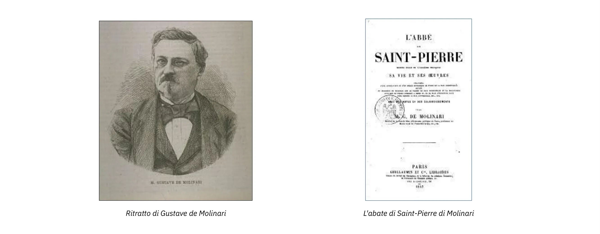

L'abate di Saint-Pierre scrisse di economia, ma è piuttosto come pacifista che è di solito interessante. È l'autore di un Progetto per la pace perpetua, che precede quello ben noto di Emmanuel Kant.

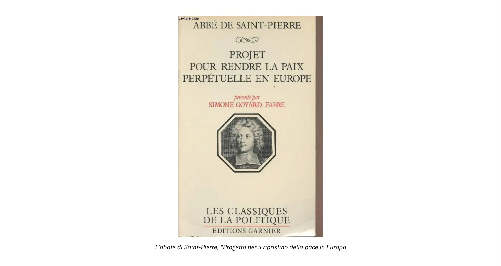

In quest'opera sosteneva che la guerra è distruttiva non solo per chi la perde, ma anche per i vincitori e persino per coloro che non vi prendono parte, poiché il loro commercio ne risente.

Per combattere il flagello della guerra, raccomandò la creazione di una sorta di Lega Europea delle Nazioni. Si sarebbe formato un consiglio europeo per risolvere i problemi di ogni nazione. Le nazioni avrebbero quindi fatto ricorso all'arbitrato, per evitare di ricorrere alle armi. Se una nazione non fosse abbastanza saggia da abbracciare la pace, se minacciasse le altre nazioni europee, la Lega europea delle nazioni avrebbe un mezzo per rispondere. Di fronte a tali eventi, si sarebbe formato un esercito europeo, con forze fornite dai vari Paesi.

C'è anche un episodio della vita dell'abate di Saint-Pierre che illustra perfettamente la mentalità critica alla base del movimento francese del laissez-faire. Entrò a far parte dell'Académie Française nel 1695, ma fu espulso nel 1718 per aver osato criticare il regno di Luigi XIV. In questo modo si allineò a figure come Vauban e Boisguilbert, che avevano osato parlare delle miserie nascoste sotto lo splendore del regno del Re Sole.

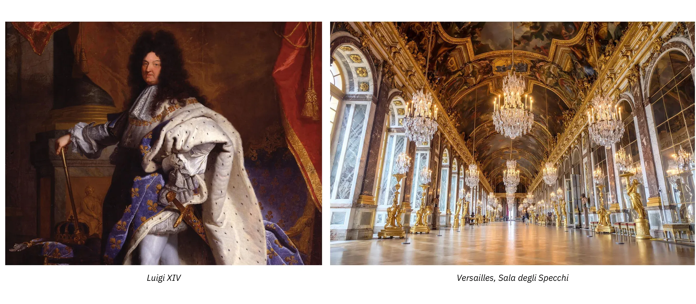

L'abate di Saint-Pierre sosteneva che il regno di Luigi XIV, con la sua corte lussuosa e l'ossessione per la conquista militare, non era il segno di un re virtuoso. Egli rifiutava di accettare che Luigi XIV meritasse il titolo di "**Luigi il Grande**".

"Rovinare i propri vicini e il proprio popolo allo stesso tempo non è grandezza", disse. Questa posizione offese profondamente l'Académie Française, che da tempo si preoccupava di glorificare il re in ogni forma letteraria possibile. Di conseguenza, votarono quasi all'unanimità per la sua espulsione.

In termini di pensiero economico, applicò coerentemente il principio di utilità, come avrebbe fatto più tardi Jeremy Bentham, e spesso offrì valide intuizioni. A dire il vero, era ancora influenzato dalle idee mercantiliste, che all'epoca nessuno aveva ancora completamente abbandonato.

Tuttavia, l'abate di Saint-Pierre fece alcune osservazioni accurate sull'economia. Anche prima di *Condillac*, a cui viene spesso attribuita l'idea, egli affermò chiaramente che in qualsiasi Exchange, entrambe le parti traggono vantaggio. Questo si può trovare nel suo ["Progetto di miglioramento del commercio francese"] del 1733 (https://www.institutcoppet.org/projet-pour-perfectionner-le-commerce-de-france/), dove scrive:

> "Quando si effettua una vendita tra mercanti, il venditore ci guadagna e anche il compratore; infatti, se non ci fosse un vantaggio reale o percepito da entrambe le parti, né il venditore venderebbe a tale e tale prezzo, né il compratore, da parte sua, comprerebbe a tale prezzo".

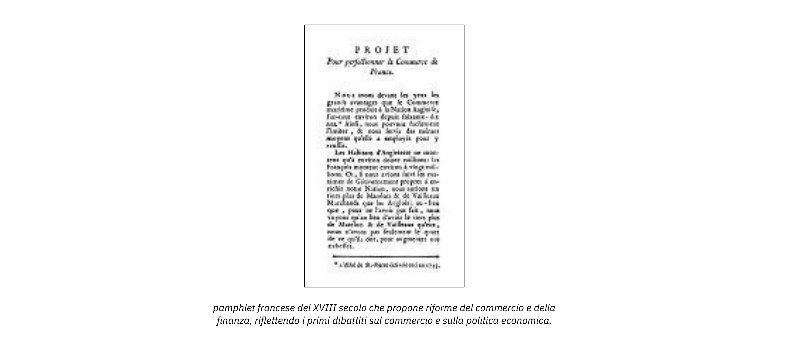

Egli sottolineò anche, prima di Vincent de Gournay, il valore del lavoro e l'importanza di mantenerlo attraente. "Tutti i lavori sono difficili", scrisse. "E quando un uomo vede che il suo lavoro non gli frutta nulla, o non abbastanza, diventa ozioso e non si preoccupa di fare sforzi inutili". Questa stessa argomentazione sarebbe stata ripresa in seguito dal Marchese d'Argenson, da Vincent de Gournay e dai Fisiocratici, che criticavano i regolamenti onerosi e i sistemi di corporazioni. Essi sostenevano che tali restrizioni scoraggiavano i lavoratori, causavano inutili difficoltà e alla fine facevano sembrare l'ozio più attraente dello sforzo produttivo in tali condizioni.

## Il marchese d'Argenson

<chapterId>e9960ab4-72ec-5afd-8e97-bf89c83b62bc</chapterId>

Il marchese d'Argenson è un dimenticato fondatore della dottrina del laissez-faire.

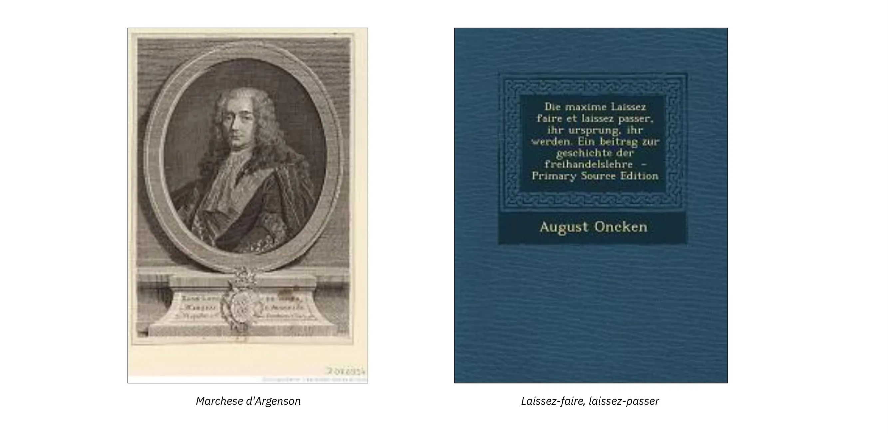

È stato riscoperto da August Oncken, autore di un libro sulla dottrina del laissez-faire, laissez-passer, che ha concluso che d'Argenson ha avuto un ruolo importante nella nascita di questa idea.

René-Louis Voyer, marchese d'Argenson, nacque nel 1694. Iniziò la sua carriera politica come consigliere parlamentare, poi fece parte del Consiglio di Stato.

Trent'anni prima di Adam Smith, d'Argenson difendeva già i benefici della divisione del lavoro e della specializzazione.

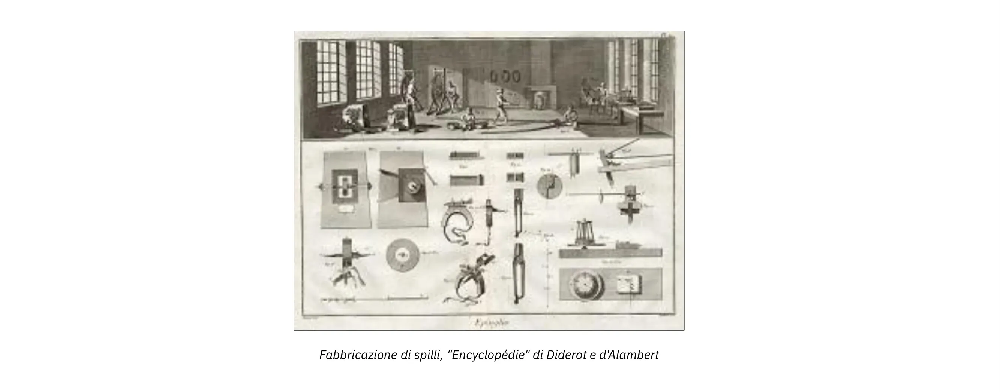

Criticò aspramente i regolamenti che, a suo avviso, cercavano di modificare le preferenze naturali delle diverse regioni. Per esempio, era sconcertato dal fatto che il governo volesse produrre tessuti e velluti a Tours, una città povera all'epoca, per eguagliare la qualità di quelli prodotti nella prospera Genova, famosa per i suoi beni di lusso. Concludeva:

> "Ogni luogo deve poter scegliere le proprie fabbriche. Libertà! Libertà!"

Egli riconobbe anche un altro dei principi centrali di Smith: l'idea che l'ordine spontaneo nasca dal perseguimento dell'interesse personale. Il marchese d'Argenson credeva che fosse l'interesse personale immediato a guidare l'energia umana. Scrisse che la scarsa abilità artigianale e le frodi avrebbero screditato un produttore, mentre la diligenza e le buone intenzioni avrebbero portato alla prosperità. Il miglior giudice dell'utilità, sosteneva, era l'individuo, il pubblico in generale, che acquista beni e si preoccupa di fare un buon affare. "Ognuno percepisce il proprio interesse", diceva, "ognuno prende le misure che gli sono vantaggiose, ed è in questo accordo generale che scopriamo la verità"

Anche prima di Adam Smith, egli comprese che l'interesse personale porta all'interesse generale attraverso la costruzione di un ordine naturale spontaneo.

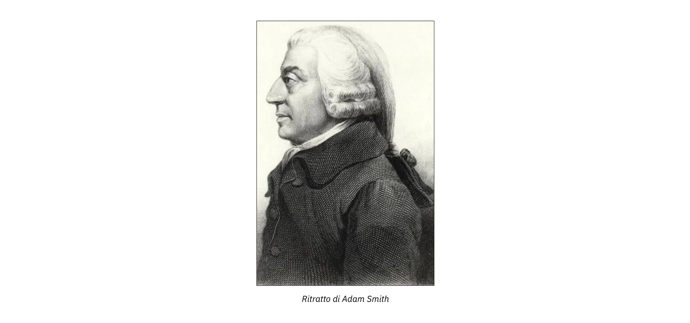

Paragonò la società a un alveare di api in cui ogni insetto segue il proprio istinto: "Dalle loro azioni", disse precisamente, "è derivata una grande accumulazione per i bisogni della piccola società; ma questo non è stato provocato da ordini, o da generali, che hanno obbligato ogni individuo a seguire le opinioni del loro capo". Questa è forse l'espressione più vicina, nel pensiero economico francese, al famoso concetto di "mano invisibile" di Adam Smith.

Il marchese d'Argenson era sempre indignato dalle idee dei ministri del suo tempo. L'unica domanda che si poneva era: "Dobbiamo regolamentare questo o quello? Dobbiamo orientare l'economia verso questo o quello?". Al che d'Argenson rispondeva: "Non dovremmo prima chiederci se è appropriato dirigere qualcosa o se le cose dovrebbero essere lasciate funzionare da sole?"

A dire il vero, era stupito che la gente trovasse così Hard da capire, o meglio, da vedere, gli effetti dannosi dell'eccessiva regolamentazione di ogni tipo sull'economia. A suo avviso, bastava semplicemente aprire gli occhi. "Molte cose oggi funzionano ragionevolmente bene", scriveva amaramente, "semplicemente perché sono riuscite a sfuggire alla portata della legge".

A volte si disperava per la scarsa comprensione delle sue idee.

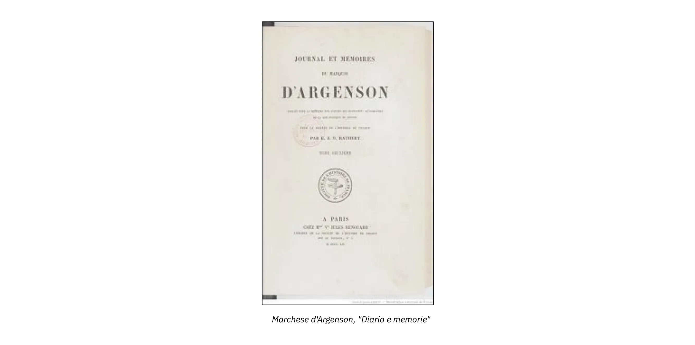

L'ideale di politica economica che difendeva era quindi contrario alle tendenze del suo tempo. Il suo ideale definiva un ruolo essenzialmente negativo per lo Stato. "Tutto ciò di cui il commercio ha bisogno è la rimozione degli ostacoli. Chiede solo buoni giudici, punizione dei monopoli, uguale protezione per tutti i cittadini, monete stabili, strade e canali". Questa era la definizione di Stato minimo, che sarebbe diventata uno dei fondamenti della tradizione francese dell'economia politica.

Questa visione del ruolo dello Stato nell'attività economica fu naturalmente illustrata dallo studio di due grandi questioni che agitavano gli economisti e i pensatori sociali del suo tempo: la regolamentazione dell'industria e il commercio del grano.

I regolamenti sull'industria, innanzitutto, suscitarono tutto il suo risentimento, perché erano privilegi per alcuni a spese di altri. "La vera causa del declino delle nostre fabbriche", scrisse, "è l'eccessiva protezione che viene loro accordata". E con un credo non meno vivace espresse la sua critica allo zelo dirigista degli statisti del suo tempo:

> Gestire l'industria contro la sua volontà significa volerne la rovina.

Sulla questione del commercio di sussistenza, d'Argenson non aveva altra risposta che la libertà. Secondo lui, la carenza di grano derivava dal monopolio e dalle eccessive precauzioni prese dal governo. Bastava lasciar fare e non ci sarebbe mai stata penuria di grano in un Paese dove i porti erano aperti. Gli stranieri, attratti come tutti gli altri uomini dal richiamo del guadagno, ci avrebbero fornito il necessario e portato via il nostro surplus. "Lasciate che sia", disse, "e tutto andrà bene".

## Vincent de Gournay

<chapterId>e8ae40dc-7450-552f-9ddc-9e02936cf425</chapterId>

Vincent de Gournay è stato uno dei primi rappresentanti del laissez-faire in Francia e uno dei suoi primi sostenitori nella pubblica amministrazione e nei circoli intellettuali. Per questo motivo, nella storia del pensiero economico merita molto più riconoscimento di quanto non ne riceva di solito. Ho cercato di mettere in evidenza i suoi contributi in un libro recente.

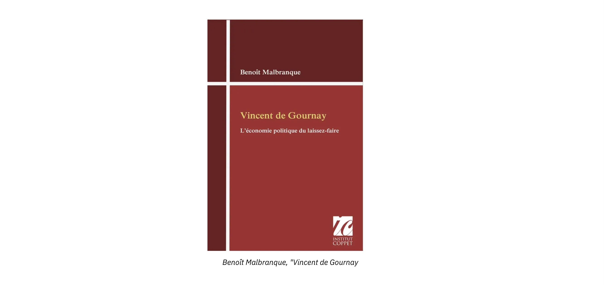

Nato da una famiglia di commercianti, Gournay divenne egli stesso un commerciante di successo, accumulando una notevole ricchezza prima di assicurarsi una posizione nell'amministrazione francese. All'interno dell'Ufficio del Commercio, fu un fervente sostenitore del libero lavoro e del libero commercio.

Pur essendo ben inserito nel contesto dei principali economisti del suo tempo, Gournay scrisse poco o, meglio, pubblicò poco. Scrisse soprattutto lettere amministrative e memorie, inedite o pubblicate da altri autori dopo un certo editing.

Quello che abbiamo comprende:

1. [Le osservazioni](https://archive.org/details/traitessurlecomm0000chil) sulla traduzione di un libro dell'economista inglese Josiah Child;

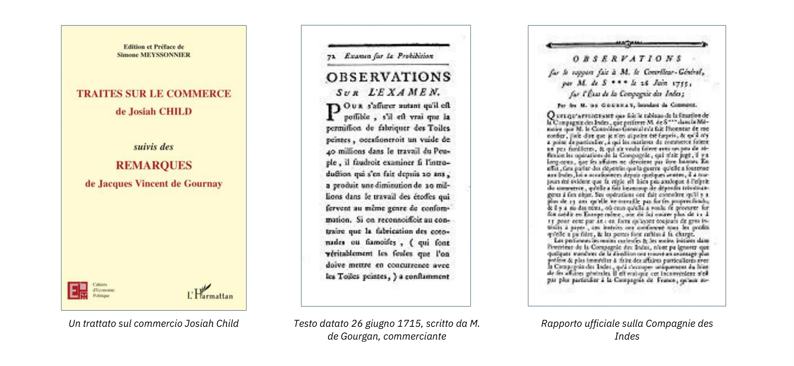

2. "Osservazioni" incluse nell'esame dei vantaggi e degli svantaggi del divieto dei tessuti stampati;

3. "Osservazioni sulla Compagnia delle Indie Orientali", allegate dall'abate Morellet alla sua Memoria sullo stato attuale della Compagnia delle Indie Orientali (1769);

4. E soprattutto, varie memorie del suo ruolo di Intendente di Commercio.

Questi scritti dimostrano una chiara influenza straniera e la presenza di alcune importanti idee strutturanti. L'influenza straniera, in Gournay, è il riconoscimento della superiorità inglese e olandese. Gournay era convinto che queste due nazioni capissero l'economia molto meglio della Francia e che la Francia dovesse seguire il loro esempio. "Queste due nazioni sono le più prospere", diceva, "e seguono un sistema completamente diverso dal nostro. Noi vietiamo l'ingresso di merci straniere, confiniamo l'attività economica all'interno di regolamenti draconiani, mentre loro procedono in modo opposto. Se loro vanno meglio", ha concluso Gournay, "è perché la Francia è guidata da principi sbagliati".

Le sue proposte di riforma si sono concentrate su alcuni punti chiave.

In primo luogo, riteneva che il lavoro dovesse essere protetto e incoraggiato. All'epoca, i lavoratori francesi erano trattati come criminali, costantemente controllati e tenuti in apprensione per non aver rispettato una delle migliaia di norme. Questo eccessivo fastidio scoraggiava le persone a lavorare, spingendole invece all'ozio. Eppure, sosteneva Gournay, "il lavoro è nobile e l'unico modo per arricchire una nazione".

In secondo luogo, criticò il sistema restrittivo delle corporazioni che confinava i fabbricanti. Partecipare a un mestiere richiedeva tempo e denaro, e ogni nuovo lavoratore doveva poi seguire scrupolosamente la routine stabilita dagli statuti della sua corporazione. Questo sistema non lasciava spazio all'eccellenza, all'innovazione o al progresso.

In terzo luogo, il commercio in Francia era limitato da leggi restrittive. Secondo Gournay, i consumatori avrebbero tratto grandi benefici se i porti avessero potuto competere liberamente e se tutte le merci, come il grano e le tele stampate, avessero potuto essere importate senza restrizioni. Fu uno dei primi a sottolineare la vera origine del contrabbando: esso esisteva solo perché un commercio utile e vantaggioso era proibito. Aggiunse un'osservazione acuta: il contrabbando era una professione "libera", senza regolamenti, senza corporazioni, senza tasse confiscatorie. Eppure è stata la regolamentazione opprimente dello Stato a spingere molti lavoratori onesti verso l'illegalità.

Infine, Gournay notò che i tassi di interesse erano più bassi in Inghilterra e nei Paesi Bassi, paesi più prosperi della Francia. Egli auspicava una riduzione dei tassi di interesse anche in Francia, in modo che l'attività economica potesse essere finanziata a condizioni altrettanto vantaggiose che altrove. Tuttavia, Gournay non cercò metodi coercitivi e legislativi; piuttosto, sottolineò la necessità di legalizzare il prestito di denaro, che era ancora condannato dalla Chiesa cattolica.

Su tutti questi punti, Gournay giocò un ruolo chiave nei dibattiti intellettuali della metà del XVIII secolo. La sua difesa della libertà economica precede di un decennio i Fisiocratici e di vent'anni Adam Smith. Ma la sua influenza più duratura fu quella su Turgot. Gournay prese sotto la sua ala il giovane Turgot e lo formò con le sue idee.

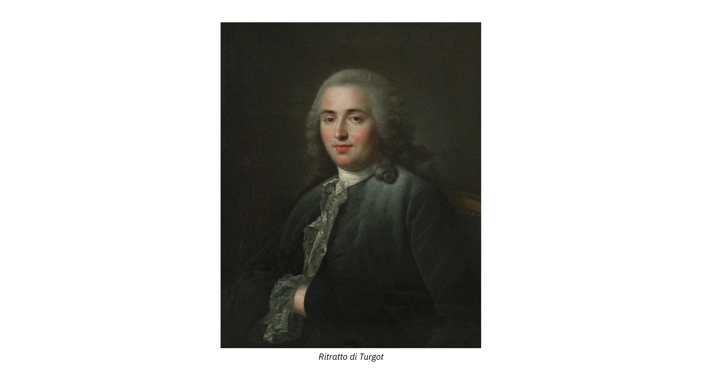

Anni dopo, Turgot, futuro ministro di Luigi XVI, scrisse un Éloge (elogio) in onore dell'amico dopo la sua morte. E se Turgot non abbracciò mai completamente la Fisiocrazia di François Quesnay, fu perché conservò un attaccamento invincibile al suo primo maestro, Vincent de Gournay.

## Il Circolo Gournay

<chapterId>b86ba6bd-8f3a-5d8f-b098-4d0413f00deb</chapterId>

Quando si parla degli albori della scienza economica, la storia tende a mettere in evidenza una prima scuola di pensiero: i Fisiocratici, guidati da François Quesnay e dai suoi discepoli. Tuttavia, quasi un decennio prima della loro ascesa, esisteva un altro gruppo, meno formale ma altrettanto importante, incentrato sull'economista Vincent de Gournay.

Come abbiamo visto nella parte precedente, Gournay era affascinato dall'esempio di nazioni straniere come l'Inghilterra e l'Olanda. E ammirava altrettanto i loro economisti, figure come Josiah Child, Johan de Witt e David Hume.

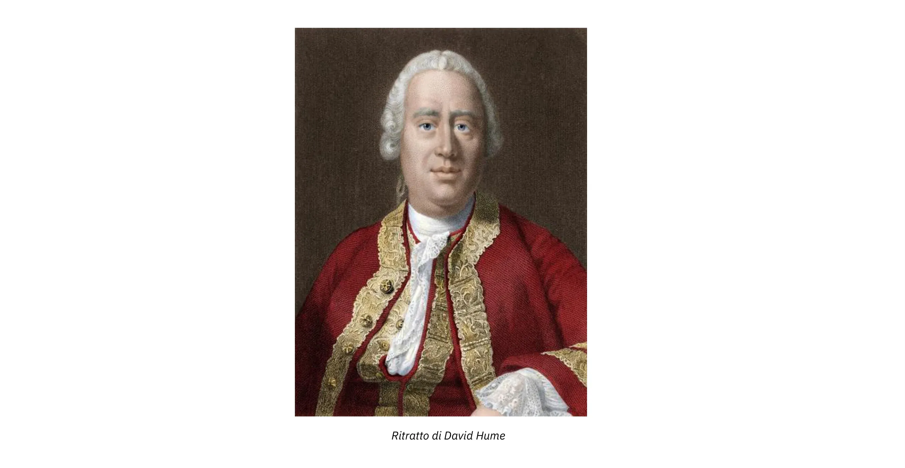

Questa ammirazione lo portò a tradurre e ad assegnare traduzioni dei loro scritti economici.

La sua posizione nell'alta amministrazione permise a Gournay di entrare in contatto con tutti gli specialisti di economia conosciuti in Francia all'epoca. In questo modo, mise insieme un gruppo di traduttori estremamente capaci. Tradusse personalmente le opere di Child e Culpeper. L'abate Le Blanc tradusse i Discorsi politici di David Hume. Véron de Forbonnais tradusse l'economista spagnolo Geronimo de Uztariz. Turgot lavorò sugli scritti di Josiah Tucker e il figlio di Montesquieu tradusse Joshua Gee.

Grazie alla collaborazione di diversi membri della cerchia di Gournay, molti autori poterono pubblicare opere originali con il proprio nome. Questi libri, insieme alle traduzioni, ottennero un notevole successo. Tra gli esempi più significativi ricordiamo:

- Herbert's Essay on the [General Police of Grain](https://archive.org/details/essaisurlapolice00herb/page/n7/mode/2up) (6 edizioni in 4 anni)

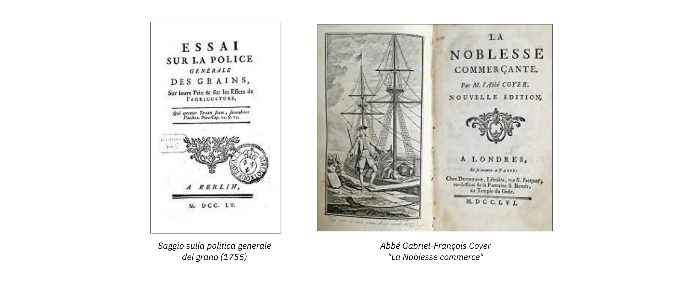

- Coyer [Noblesse commerçante](https://archive.org/details/lanoblessecommer00coye/page/n3/mode/2up) (5 edizioni in 2 anni)

- Plumard de Dangeul [Osservazioni sui vantaggi e gli svantaggi della Francia e della Gran Bretagna](https://archive.org/details/bim_eighteenth-century_remarks-on-the-advantage_plumard-de-dangeul-loui_1754) (3 edizioni nel primo anno)
- Cliquot-Blervache e Gournay [Memorie sui mestieri](https://www.amazon.com/Memoire-sur-corps-metiers-French/dp/1978196903) (2 edizioni nel 1758)

Il gruppo ha inoltre svolto un ruolo fondamentale nella pubblicazione di

- [Saggio sulla natura del commercio in generale] (https://archive.org/details/essayonnatureofc0000cant) di Richard Cantillon.

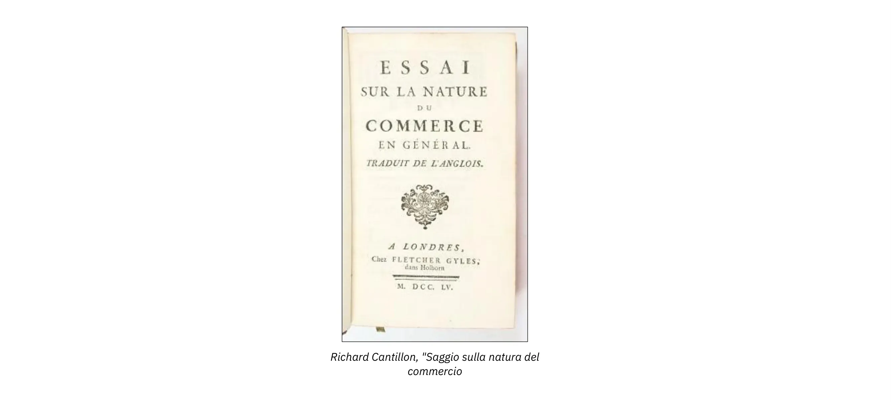

Quest'ultimo libro, scritto intorno al 1730, rimase manoscritto dopo la morte dell'autore. Gournay, con l'aiuto dei suoi amici economisti, lo pubblicò nel 1755. Secondo l'abate Morellet, membro del circolo, Gournay lo raccomandò a tutti gli economisti che conosceva.

La produzione intellettuale del circolo di Gournay ha avuto un grande impatto sulla storia delle idee. In questo senso, possono essere considerati i fondatori della scienza economica in Francia. Christine Théré dell'INED, che ha studiato la storia delle pubblicazioni economiche, ha rilevato che tra il 1750 e il 1759 sono state pubblicate ben **349** opere di economia, rispetto alle sole **83** dell'intero decennio precedente (1740-1749). Questa rivoluzione degli anni 1750 è in gran parte dovuta al circolo di Gournay.

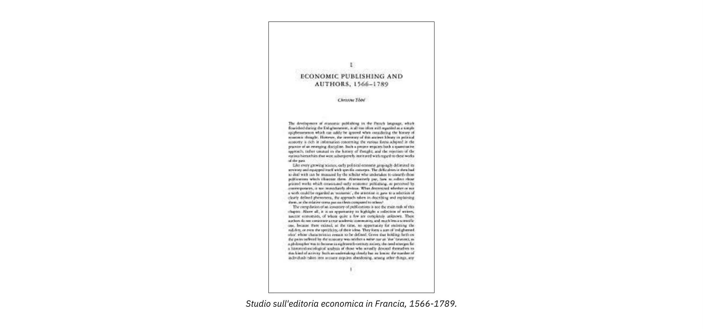

Per diffondere il gusto per le discussioni economiche tra la popolazione francese, Gournay e i suoi amici si adoperarono per renderle accessibili attraverso i romanzi. Dopo il *Memoir sui mestieri*, che criticava le corporazioni, Gournay e Cliquot-Blervache aiutarono Gabriel-François Coyer a scrivere un breve romanzo satirico intitolato Chinki: [Racconto cocinese applicabile ad altre nazioni] (https://www.institutcoppet.org/wp-content/uploads/2013/06/Coyer-Chinki-Histoire-cochinchinoise.pdf).

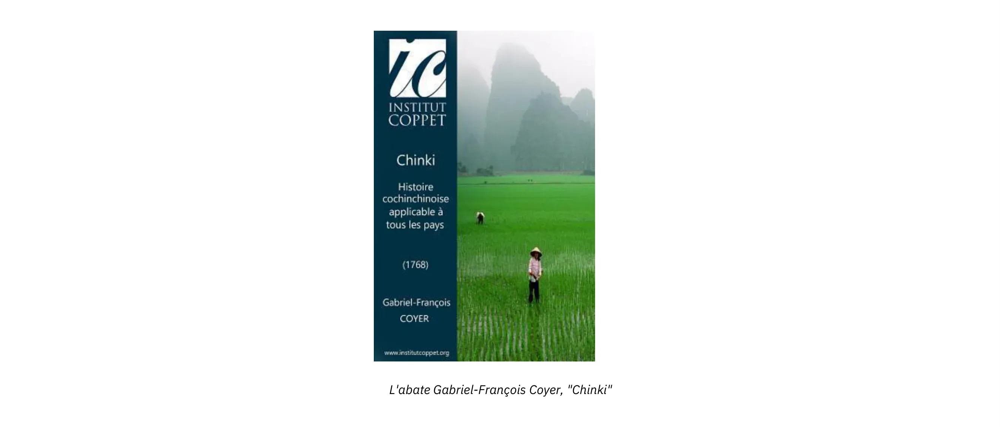

La storia segue il protagonista, Chinki, che è costretto a lasciare la sua terra a causa dell'eccessiva tassazione e cerca di trovare un lavoro artigianale per i suoi figli in città. Ma tutti i mestieri sono loro preclusi a causa dei regolamenti abusivi delle corporazioni, così la storia ritrae la sua crescente delusione attraverso toni umoristici.

Il circolo di Gournay fu quindi all'origine di un'intensa ondata di pubblicazioni. Se questo importante contributo è stato dimenticato dagli storici del pensiero economico, era invece molto chiaro ai contemporanei. I Fisiocratici, che organizzarono la loro scuola negli anni Sessanta del XVII secolo, avrebbero in seguito presentato il gruppo di Gournay come loro diretto precursore. Nel 1767, l'economista Jacques Accarias de Serionne lo espresse ancora più chiaramente nel suo tributo. Scriveva: "Un piccolo numero di francesi, sia filosofi che cittadini, ha cominciato da qualche anno a imitare gli scrittori inglesi. Hanno dapprima tradotto i loro modelli e li hanno presto superati sotto molti aspetti. Hanno portato tutto il fascino e la ricchezza della letteratura nella trattazione di argomenti utili; hanno acceso e diffuso il gusto per le scienze più essenziali per la prosperità dello Stato".

E in effetti, negli anni 1750, le questioni economiche divennero di moda. Voltaire notò che intorno al 1750 i francesi rinunciavano ai romanzi per discutere della libertà del commercio del grano. Questa tendenza fu notata anche dal Mercure de France, che scrisse in un numero del 1758, pochi mesi prima della morte di Gournay: "L'economia politica è ora la scienza di moda. I libri che trattano di agricoltura, popolazione, industria, commercio e finanza sono ora nelle mani di innumerevoli persone che, non molto tempo fa, leggevano solo superficialmente i romanzi". Difficilmente si potrebbe rendere un tributo migliore a Gournay e al lavoro della sua cerchia di economisti.

## Mirabeau

<chapterId>2d2f802b-e3b6-556f-9025-a1b1dc4409ca</chapterId>

La Francia ha conosciuto due uomini famosi di nome Mirabeau, un padre e un figlio, ma è stato il figlio a fare veramente la storia. Tribuno rivoluzionario e una delle figure centrali negli eventi della Rivoluzione francese, è rimasto famoso.

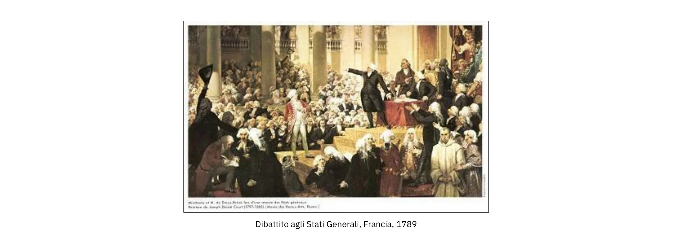

Grazie al suo talento e al suo posto nella storia francese, mise in ombra il padre, economista e pilastro della scuola di François Quesnay, di cui era stato il primo membro già nel 1758.

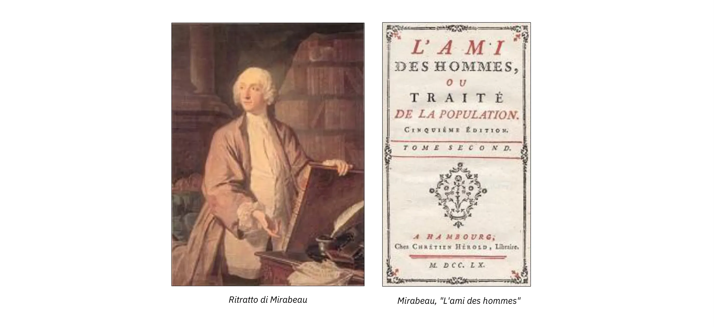

Il marchese di Mirabeau, infatti, aveva già raggiunto un'immensa fama prima ancora di adottare la Fisiocrazia grazie a un libro intitolato "L'amico dell'umanità. Trattato sulla popolazione [FR: L'ami des hommes, ou, Traité de la population](https://archive.org/details/lamideshommesou00unkngoog). Anche se la prima edizione fu pubblicata nel 1756, il libro divenne famoso intorno al 1757, un anno prima del suo incontro con Quesnay.

Tra il 1757 e il 1760 furono pubblicate più di 20 edizioni, il che lo rende probabilmente il libro di economia di maggior successo della storia. Alcuni lettori pensarono addirittura che il libro fosse stato scritto da Montesquieu per la sua acutezza di ragionamento. Il Delfino, padre di Luigi XVI, affermò addirittura di averlo imparato a memoria. Per un certo periodo, era il libro che tutti leggevano a Versailles.

Oggi è un libro che non viene più letto, ma molti lo citano ancora. Già nel XIX secolo, Edmond Roussel diceva:

> L'Ami des Hommes è uno di quei libri di cui tutti parlano e che quasi nessuno conosce. In ogni generazione, un cittadino coraggioso dovrebbe leggerlo, in modo che tutti gli altri non debbano farlo.

All'inizio della sua carriera di economista, Mirabeau si ispirò a Richard Cantillon. Da 15 anni possedeva un manoscritto del Saggio sulla natura del commercio in generale di Cantillon, che aveva pazientemente analizzato e commentato.

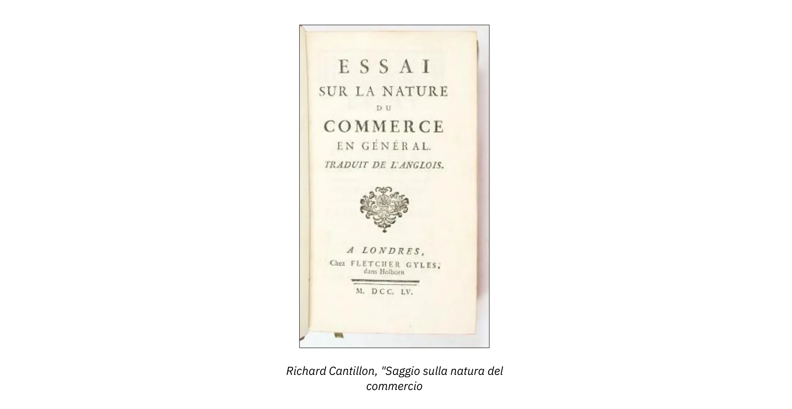

L'Ami des Hommes era stato originariamente concepito come un semplice commento al Saggio di Cantillon. Ma poiché Mirabeau aveva una mente un po' eclettica, cioè francamente un po' folle, si allontanò rapidamente dal suo progetto originario. Il libro si limita a discutere tutte le questioni economiche che conosceva, allontanandosi di tanto in tanto da Cantillon. È un libro difficile da leggere, con un piano bizzarro e digressioni in ogni capitolo. Mirabeau stesso ammise che si trattava di caos e che il suo stile era apocalittico.

Nonostante il caos che regna, alcune idee sono degne di nota:

- Mirabeau combatte il pregiudizio mercantilista sulla natura della ricchezza.
- Elogia l'agricoltura e ne critica l'abbandono.
- Si lamenta delle condizioni del popolo, soprattutto dei contadini.
- Infine, difende la libertà di commercio e la fratellanza delle nazioni in pace.

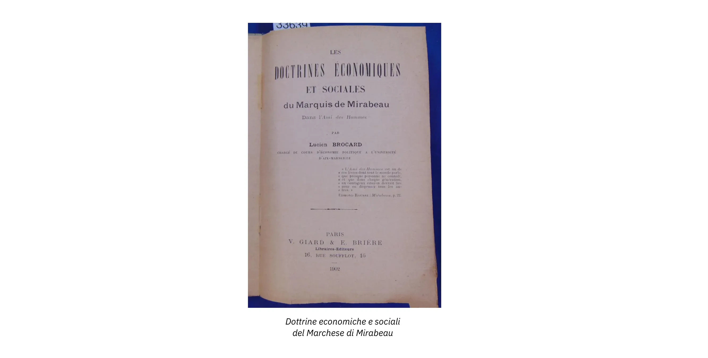

È difficile etichettare le opinioni di Mirabeau come liberali o antiliberali. Spesso si muoveva avanti e indietro, a volte senza rendersene conto, tra una visione e l'altra. Tuttavia, le idee liberali dominavano spesso i suoi scritti. Una delle sue frasi più famose è:

> Il vero e unico principio dell'economia politica è lasciare che tutto sia libero.

Con il suo più grande successo alle spalle, Mirabeau fu corteggiato. François Quesnay, che si era appena interessato di economia, lo invitò al suo entresol a Versailles.

I due discussero furiosamente e alla fine accadde qualcosa che normalmente non accade mai nei dibattiti: Mirabeau ammise apertamente di essersi sbagliato. Concordò con le idee di Quesnay e si disse pronto a diffonderle.

Insieme, formarono il nucleo di quella che sarebbe diventata la scuola fisiocratica, rafforzata dalle regolari reclute che portarono con sé. Poco dopo la conversione di Mirabeau, Quesnay lo arruolò per difendere le sue idee sulla tassazione. Ne nacque la ["Teoria della tassazione"] (https://archive.org/details/thoriedelimpot00mira), per la quale Mirabeau fu inviato per qualche giorno nella prigione di Vincennes e poi esiliato a Bignon.

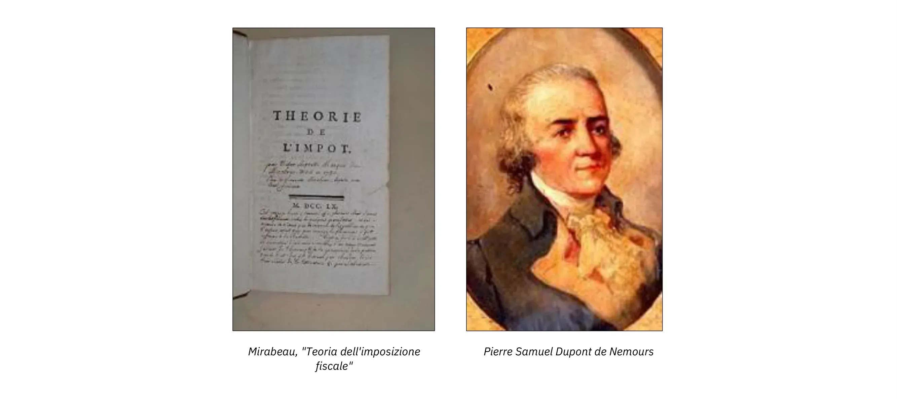

Mirabeau ebbe anche un ruolo cruciale nel reclutare nuovi membri per la scuola di Quesnay. Convinse persino il giovane Dupont de Nemours.

È sempre a casa di Mirabeau che i Fisiocratici si riunivano ogni martedì. Personalità come Turgot e Adam Smith sembrano aver partecipato a queste riunioni una o più volte.

Per tutta la vita, Mirabeau rimase un instancabile scrittore. Fu autore di numerose opere economiche che difendevano la dottrina di Quesnay. Tuttavia, verso la fine della sua vita, la sua influenza andò scemando. Il suo stile di scrittura si deteriorò al punto che il fratello gli scrisse che non riusciva più a capire la sua prosa. Le sue idee, divenute pienamente liberali, si scontrarono con la reazione socialista o proto-comunista di pensatori come Mably e persino Rousseau. Fatica a trovare lettori ed editori e muore sostanzialmente inosservato nel 1789, alla vigilia della presa della Bastiglia.

## Quesnay

<chapterId>7a35f20b-5ea0-544d-b290-bcd9c6f7f11a</chapterId>

François Quesnay è uno dei più famosi economisti francesi.

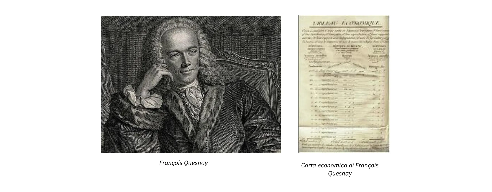

Il suo nome compare in tutti i testi di economia e di storia del pensiero economico. Si dice che abbia creato il "Tableau Économique" per rappresentare schematicamente l'economia, che sia stato il leader della scuola fisiocratica, che si sia sbagliato nel ritenere che solo la terra sia produttiva e che, infine, sia arrivato Adam Smith a mettere le cose in chiaro. Questo, più o meno, è il modo in cui i libri di testo tendono a riassumere François Quesnay.

Ridurlo a questo è un peccato, perché Quesnay fu anche il primo economista a tentare di basare la difesa della libertà economica su principi scientifici. Fu uno degli economisti più ascoltati e influenti del suo tempo. Inoltre, fondò la Fisiocrazia, una dottrina molto più ricca dell'idea semplicistica che solo la natura produce ricchezza, una nozione che viene spesso travisata.

Parleremo della Fisiocrazia in modo più approfondito nei prossimi tre capitoli. In primo luogo, diamo un'occhiata più da vicino a François Quesnay stesso.

Nasce nel 1694 a Méré da una famiglia di contadini che non riesce a insegnare a Quesnay a leggere. Viene istruito da un uomo del posto e prosegue gli studi presso il Collegio di Chirurgia e poi la Facoltà di Medicina. All'età di 24 anni divenne chirurgo a Mantes.

Nel 1730, all'età di 36 anni, divenne famoso per essersi opposto alla pratica comune del salasso, che riteneva basata su teorie errate e pregiudizi. Osò anche sfidare il sistema delle corporazioni, che imponeva che solo i chirurghi potessero eseguire operazioni e solo i medici potessero prescrivere farmaci. Ciò costringeva spesso i poveri a pagare due volte e a far intervenire due persone, una situazione che Quesnay trovava rivoltante.

Nel 1740 divenne segretario dell'Accademia di Chirurgia. Nel 1748, all'età di 54 anni, divenne medico personale di Madame de Pompadour e si trasferì a Versailles.

Era molto legato a Madame de Pompadour. Quesnay disse persino, al momento dell'annuncio della disgrazia della favorita, che non avrebbe voluto rimanere medico a Versailles senza di lei:

"Ero affezionato a Madame de Pompadour nella sua prosperità; lo sarò anche nella sua disgrazia".

In seguito pubblicò diversi libri di medicina: Trattato sulla suppurazione (1749), Trattato sulla cancrena (1749) e Trattato sulle febbri continue (1753), tutti ristampati più volte durante la sua vita.

All'età di 60 anni, dopo essere stato introdotto ai dibattiti economici in voga all'epoca, iniziò a scrivere di economia. Nel 1755 scrisse gli articoli "Contadini" e "Grano" per l'*Encyclopédie*.

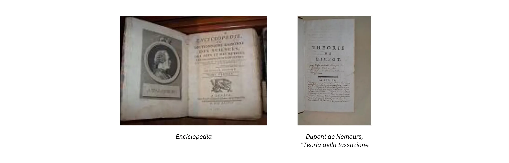

Furono pubblicati nel 1757. Nello stesso anno incontrò il famoso Mirabeau e riuscì a convertirlo alle sue idee economiche: era nato il nucleo della Fisiocrazia. Quesnay creò quindi il Tableau Économique, che fu stampato sui torchi reali, secondo quanto riferito in presenza del re stesso al Castello di Versailles. Da quel momento in poi, ospitò regolarmente economisti e filosofi nel suo appartamento di Versailles, dove si confrontarono liberamente. Quesnay contribuì anche alla Teoria della tassazione di Mirabeau, pubblicata nel 1759.

La censura colpì presto. Mirabeau fu imprigionato e Quesnay fu rimproverato. In seguito, Quesnay si rese conto di non poter pubblicare apertamente e di aver bisogno di discepoli per diffondere le sue idee.

Li trovò subito: Baudeau, Dupont de Nemours, Le Trosne, Mercier de la Rivière e altri. Erano questi gli uomini che avrebbero diffuso e reso popolare il pensiero di Quesnay. Tuttavia, Quesnay, che aveva bisogno di discepoli, non era del tutto soddisfatto dell'aspetto settario del suo gruppo. Lo testimoniano le sue lettere a Mirabeau, in cui gli dice:

> "Pensate per voi stessi. Ho capito che le mie misere bozze vi rendono pigri. Ora tocca a voi pensare. Ne sapete quanto me".

Tuttavia, i suoi discepoli erano profondamente devoti e contribuirono notevolmente alla popolarità di Quesnay. Alla sua morte, Mirabeau fece l'elogio funebre dicendo: "Abbiamo perso nostro padre, perché gli dovevamo tutto". In realtà, era Quesnay che doveva loro tutto, perché senza di loro sarebbe rimasto bloccato a Versailles, dove il suo pensiero, pur avendo molto da sedurre o preoccupare, interessava pochi.

Grazie al lavoro dei suoi collaboratori, le sue idee trovarono una piattaforma: prima attraverso giornali come il *Journal of Agriculture* e l'*Ephémérides du Citoyen*.

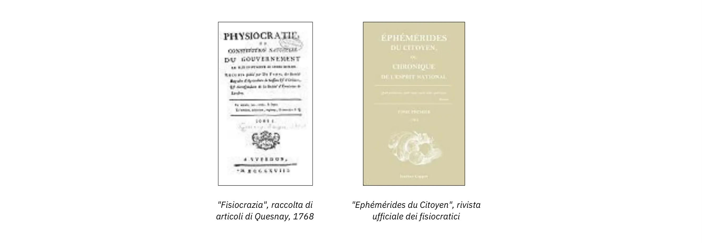

Poi attraverso i libri, non solo quelli dei suoi discepoli ma anche un'importante antologia pubblicata nel 1768 da Dupont de Nemours, intitolata *Fisiocrazia*.

Questo libro raccoglie i principali contributi di Quesnay. In esso viene esposto l'ideale economico del leader dei Fisiocratici: un modello di economia agricola in cui la legge garantisce a tutti il diritto di proprietà e la libertà di commercio.

# La scuola fisiocratica

<partId>27af82c1-ad82-5c3b-8ce9-c674b67bbf7c</partId>

## Storia dei fisiocratici

<chapterId>4236ff8b-b53a-59e7-92c0-f96f9afa1c00</chapterId>

La fisiocrazia divenne di moda in Francia, e anche in tutta Europa, per appena un decennio. Dopo un lungo periodo di sviluppo, essa acquistò importanza a metà degli anni '60 del XVII secolo. Quando Turgot salì al potere nel 1776, il movimento aveva già perso popolarità e il ministro tenne nascosto il suo sostegno alla scuola di Quesnay.

Le sue origini si trovano nell'evoluzione delle idee economiche durante gli anni 1750. Diversi autori contribuirono a colmare il divario tra Boisguilbert e ciò che sarebbe poi diventato noto come Fisiocrazia. Come già detto, Vincent de Gournay e la sua cerchia di economisti furono all'origine di molte pubblicazioni che introdussero i lettori francesi al pensiero economico straniero e contribuirono ad accendere la loro passione per l'economia. Le basi della Fisiocrazia erano già presenti in libri come "Détail de la France" di Boisguilbert e ["Saggio sulla natura del commercio in generale"](https://archive.org/details/essaisurlanature0000cant) di Cantillon.

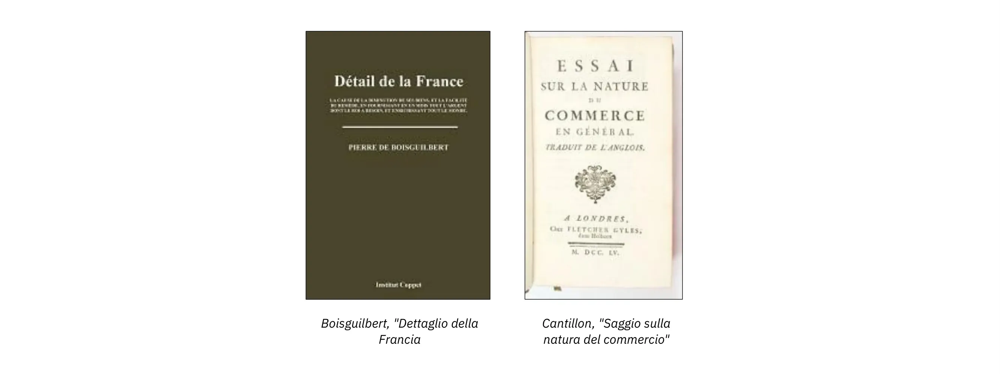

Il concetto di laissez-faire ebbe diversi sostenitori dopo Boisguilbert, in particolare Vincent de Gournay e il marchese d'Argenson.

Non restava che trasformare questo insieme di idee in una dottrina coerente e completa, e il marchese di Mirabeau fu il primo a provarci. Ispirato dal Saggio di Cantillon, iniziò a scrivere un trattato completo sulle questioni economiche intitolato "L'Ami des Hommes", che ebbe molto successo.

Così, nel 1756, poté iniziare la storia della Fisiocrazia. François Quesnay, allora chirurgo diventato medico personale di Madame de Pompadour, invitò Mirabeau a Versailles per discutere di idee economiche.

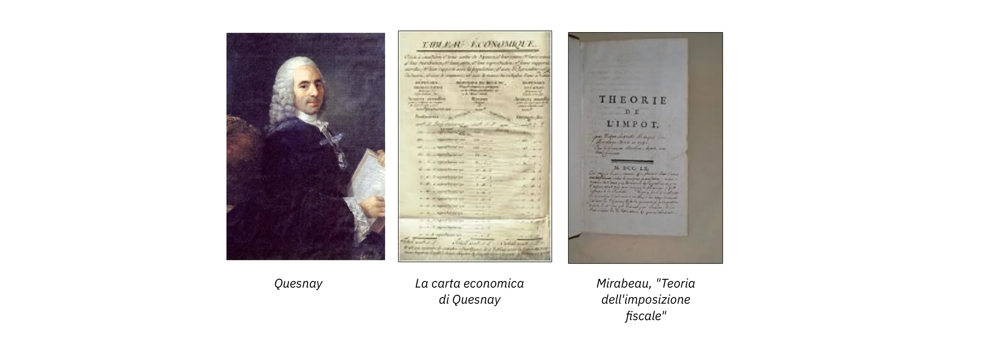

Alla fine della loro conversazione, Mirabeau concorda con le idee di Quesnay. Da quel momento in poi si scrissero: Quesnay creò il *Tableau économique* (1758) per illustrare il flusso della ricchezza nell'economia e insieme pubblicarono la Teoria della tassazione (1759).

I loro sforzi non furono accolti con entusiasmo. A corte, la reazione prevalente fu l'indifferenza. Il re riconobbe l'inclinazione di Quesnay per la teoria e lo chiamò affettuosamente "il mio pensatore". Ma a parte questo complimento, il loro lavoro non ottenne alcun risultato. Anzi, la loro Teoria della tassazione offese gli amministratori fiscali che criticava, tanto che questi chiesero e ottennero l'imprigionamento di Mirabeau. Madame de Pompadour lo fece infine rilasciare, ma egli continuò a vivere in esilio nella sua tenuta di Bignon per alcune settimane.

La prima metà degli anni Sessanta del XVII secolo trascorre quindi in un relativo silenzio. A causa della sua posizione a Versailles, Quesnay fu costretto a smettere di scrivere, o almeno a non pubblicare nulla a suo nome. Mirabeau, già condannato una volta, era avvertito e ben consapevole che il favorito del re non avrebbe potuto proteggerlo per sempre.

Dopo questo breve silenzio, i due economisti iniziarono a reclutare discepoli: era l'unico modo per divulgare le loro idee. Nel 1765, i loro successi erano impressionanti. Dupont de Nemours, Abeille, Mercier de la Rivière, Le Trosne e Baudeau si unirono rapidamente alle loro fila. Formarono una scuola: avevano una loro rivista, *Les Éphémérides du Citoyen*, e si riunivano persino ogni martedì a casa di Mirabeau.

Tra il 1765 e il 1775, il gruppo unito dei Fisiocratici raggiunse l'apice della sua fama. Il mondo letterario e filosofico aveva occhi solo per loro, permettendo alle loro idee di diffondersi ampiamente e rapidamente. La gente li chiamava "gli economisti" o, più beffardamente, "la setta degli economisti". A prescindere dal tono, la loro notorietà era assoluta. Nel 1774, dopo un viaggio a Metz, M. de Vaublanc scrisse nelle sue memorie il suo stupore: tutti intorno a lui parlavano di economia e ragionavano come i discepoli di Quesnay. "Era di moda", annota. "Tutti erano economisti".

Tuttavia, nel 1770 la loro popolarità cominciò a diminuire. Il gruppo subì le prime defezioni e la sua capacità di resistere alle critiche si indebolì. I critici erano molti: Condillac, Mably, Voltaire, Galiani, Linguet, Graslin e persino Adam Smith, in Scozia, mettevano in discussione le loro opinioni.

Il loro giornale non apparve più regolarmente. Questo segna la fine del periodo più attivo del movimento.

La fisiocrazia continuerà a esercitare la sua influenza fino alla Rivoluzione. In Francia, innanzitutto attraverso Turgot, più compagno di viaggio che discepolo, e attraverso il suo rappresentante Dupont de Nemours, la cui vita e le cui opere studieremo più avanti. Ma anche in tutta Europa, dove la dottrina fisiocratica fu accolta con entusiasmo. In Germania, attraverso il Margravio di Baden, e in Italia, attraverso Leopoldo di Toscana, le teorie fisiocratiche ispirarono persino riforme economiche a favore della proprietà privata e della libertà.

## I fondamenti della dottrina dei Fisiocratici

<chapterId>4dbe5436-0578-57c2-b054-03ed00aa091a</chapterId>

Il termine Fisiocrazia, che significa "governo per natura", fu coniato da Dupont de Nemours e utilizzato come titolo di *Fisiocrazia*, una raccolta di articoli di Quesnay pubblicata nel 1768.

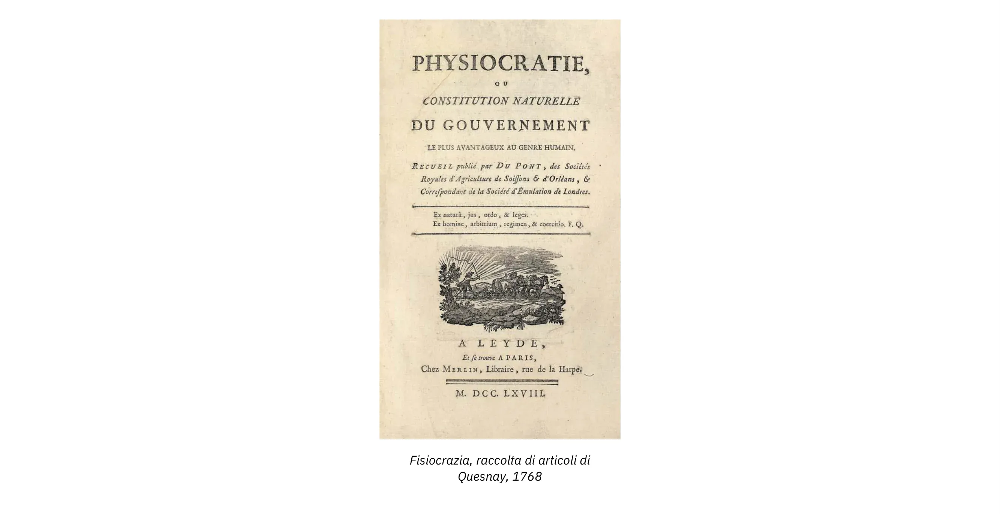

È una frase oscura. Nessuno studente di Quesnay ci ha fornito il suo vero significato. Tuttavia, il loro sistema di pensiero era tutt'altro che oscuro. Anzi, era costruito attorno ad alcuni principi molto chiari, che qui illustreremo.

### Primo principio: solo l'agricoltura è produttiva

Questa prima idea è quella che ha attirato l'attenzione degli storici. Oggi, nei libri di testo o nei corsi di economia, i Fisiocratici vengono riassunti così. Si dice che essi credessero ingenuamente che solo l'agricoltura fosse produttiva. Su questa base, la loro dottrina viene liquidata come irrilevante e l'analisi passa rapidamente ad Adam Smith.

Tuttavia, è ingiusto criticare i Fisiocratici per aver attribuito un'importanza sproporzionata all'agricoltura, poiché a metà del XVIII secolo l'agricoltura occupava il 90% della popolazione e costituiva la base dell'economia francese.

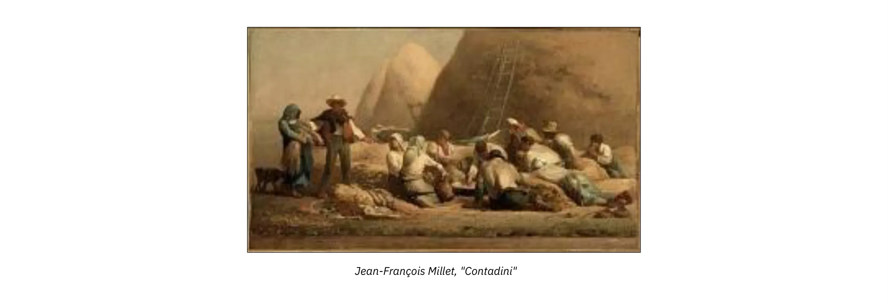

L'idea dei Fisiocratici è in realtà sottile. Secondo loro, c'è una differenza tra produzione e guadagno. L'industriale e il commerciante possono ottenere profitti, ma solo l'agricoltore produce veramente, perché la produzione è la creazione di materiale utile, piuttosto che l'aggiunta di utilità a materiale preesistente.

Dovremmo anche cercare di capire perché rifiutarono l'industria e l'artigianato come improduttivi. All'epoca, questi mestieri erano bloccati all'interno del sistema delle corporazioni, che vietava l'innovazione, gli investimenti e il progresso.

### Secondo principio: dispotismo legale piuttosto che democrazia

Oggi, per insultare qualcuno, diciamo che non è democratico. Se gli storici perdonano ai Fisiocratici la loro rigida visione della produttività agricola, non perdonano invece la loro opposizione alla democrazia, soprattutto perché vissero nel pieno delle idee illuministe. Dalla metà del XVIII secolo fino a poco prima della Rivoluzione, i Fisiocratici furono visti come nemici del progresso.

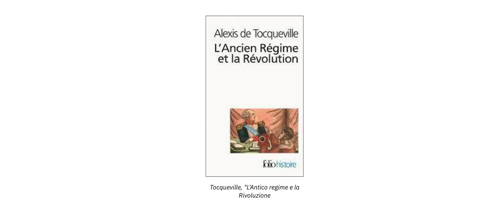

Tocqueville ha insistito su questa idea:

> I Fisiocratici erano infatti molto favorevoli al libero scambio di merci, al laissez-faire o laissez-passer nel commercio e nell'industria; ma per quanto riguarda le libertà politiche propriamente dette, non le prendevano in considerazione, e anche quando tali idee passavano loro per la testa, inizialmente le respingevano.

Liberali in economia, i Fisiocratici non erano quindi liberali in politica. Quesnay scrive nei suoi *massimi*: "L'autorità sovrana sia unica e superiore a tutti gli individui della società e a tutte le imprese ingiuste degli interessi privati" E più avanti, nella stessa massima: "Il sistema di pesi e contrappesi nel governo è una nozione fatale, che rivela solo la discordia tra i grandi e l'oppressione dei piccoli".

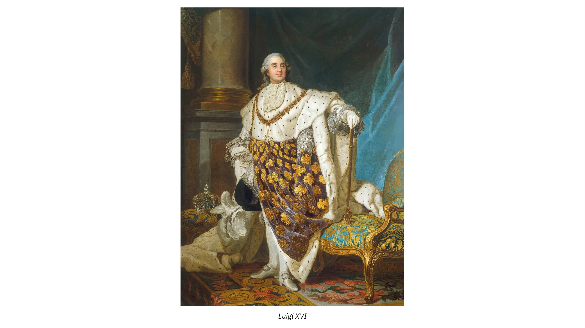

Tocqueville ha giustamente osservato che i Fisiocratici rifiutarono la democrazia non appena ne videro le forme. Erano scettici nei confronti della democrazia, che sarebbe diventata una costante dell'economia politica francese, perché la democrazia è tutt'altro che un sistema perfetto: potenzialmente permette l'oppressione delle minoranze da parte della maggioranza e può diventare uno strumento di usurpazione, tirannia e depredazione.

### Terzo principio: rispetto assoluto della proprietà privata

I fisiocratici ritenevano che le persone dovessero possedere e conservare i risultati del loro lavoro. A loro avviso, i diritti di proprietà erano il fondamento stesso di una società. Ritenevano che lo Stato avesse un compito principale: proteggere la proprietà delle persone. Inoltre, dal punto di vista economico, i fisiocratici affermano che l'inviolabilità della proprietà incoraggia il lavoro e lo sforzo ed è una condizione per il progresso economico.

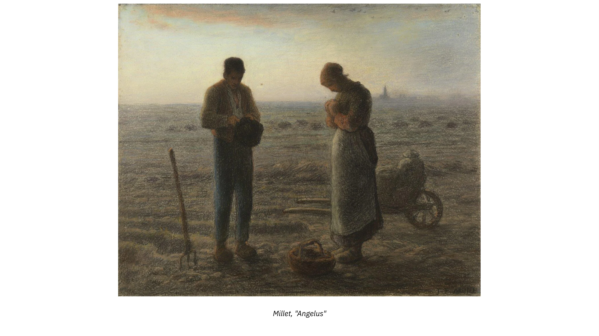

Quesnay lo dice in modo semplice:

> La sicurezza della proprietà è il fondamento essenziale dell'ordine economico e della sicurezza della società; è la certezza del possesso permanente che incoraggia il lavoro e l'uso della ricchezza per migliorare e coltivare la terra, così come per le imprese commerciali e industriali.

### Quarto principio: libertà assoluta di commercio

Nelle sue già citate *Massime*, Quesnay afferma:

> Che ci sia piena libertà di commercio, perché la regolamentazione più affidabile, precisa e vantaggiosa del commercio interno ed estero per la nazione e lo Stato risiede nella piena libertà di concorrenza.

I fisiocratici avevano visto i danni causati dall'interferenza del governo, soprattutto nel commercio dei cereali. Bisogna riconoscere, dicono, che l'autorità non sarà mai in grado di gestire il commercio come fanno i singoli individui, perché dovrebbe rispondere a ogni esigenza e reagire a ogni cambiamento nella domanda o nel Supply. Tutto ciò è ben al di là delle capacità anche del governo più saggio che si possa concepire. Tutto questo va ben oltre le capacità anche del governo più saggio che si possa concepire. Pertanto, è necessario lasciare che le cose siano e che scorrano.

Benefico per natura, il commercio deve essere interamente e perfettamente libero. Uno dei loro membri, Le Trosne, scrisse persino un pamphlet intitolato [*La libertà del commercio del grano: sempre utile, mai dannosa*] (https://www.institutcoppet.org/liberte-commerce-grains-toujours-utile-jamais-nuisible/).

### Quinto principio: Tutti gli uomini sono fratelli

Feroci oppositori della schiavitù, i Fisiocratici erano anche grandi pacifisti. "La nostra politica estera si chiama pace", disse semplicemente Mirabeau. Nel 1790, all'Assemblea Costituente, Dupont de Nemours proseguì questa posizione pacifista proponendo una legge che vietava le guerre offensive.

## Le conquiste e le influenze dei Fisiocratici

<chapterId>5b911105-796a-5e2e-a501-c7a364fc758e</chapterId>

Come abbiamo visto nel primo dei tre capitoli dedicati ai Fisiocratici, i seguaci di Quesnay furono di gran moda in Francia per circa un decennio. L'entusiasmo per le loro idee si concretizzò ai loro tempi e continuò fino alla fine del secolo. In questa sede esamineremo alcuni dei loro risultati e l'influenza che esercitarono sui loro successori nel campo del pensiero economico.

Il loro più grande risultato, dopo il gruppo di Gournay, fu la divulgazione delle idee economiche. È noto il famoso detto di Voltaire: intorno al 1750, la nazione, sazia di poesia e romanzi, cominciò a ragionare sul grano. I Fisiocratici parteciparono a questo movimento, pubblicando letteralmente centinaia di articoli, opuscoli e libri sulla libertà del commercio dei cereali. Il forte impulso dato dai Fisiocratici alle discussioni economiche è evidente anche nel numero impressionante di opere e opuscoli economici pubblicati in Francia dal 1760 al 1775. Come ulteriore prova della diffusione delle idee economiche in Francia, si ricorda l'osservazione di M. de Vaublanc, citata in una precedente conferenza, che a Metz nel 1774 disse che la gente non parlava d'altro che di economia. "Era la moda", disse. "Tutti erano economisti".

La difesa delle loro idee, in libri, pamphlet e nella loro rivista *Les Éphémérides du Citoyen*, ebbe rapidamente ripercussioni sulla politica economica della Francia. Nel 1763, un editto concesse la libertà di commercio del grano, che Quesnay e Mirabeau avevano fortemente richiesto. In diverse occasioni, le autorità alleggerirono anche le norme che regolavano le corporazioni di mestiere per garantire una maggiore libertà di lavoro.

All'estero il successo arrivò molto presto. In Germania, il Margravio di Baden si interessò alle idee fisiocratiche e mantenne una regolare corrispondenza con Mirabeau e Dupont de Nemours.

Incaricò l'economista Johann August Schlettwein, convinto fisiocrate, di attuare una riforma fiscale e di liberalizzare il commercio del grano. Nell'aprile del 1770 si svolse una prima prova nel piccolo villaggio di Dietlingen. Gli abitanti del villaggio sembrarono accogliere con entusiasmo le misure, ma i funzionari incaricati non erano molto favorevoli, il che ritardò un'attuazione più ampia.

In Russia, Caterina II stava preparando una riforma legislativa e chiese a Diderot di inviarle una mente brillante per assisterla.

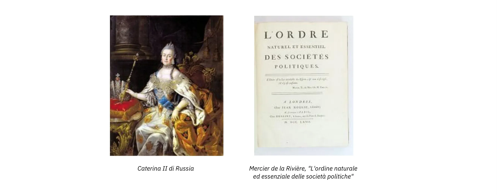

Colpito dalla lettura de [*L'ordine naturale ed essenziale delle società politiche*](https://archive.org/details/lordrenaturelete00mercuoft), pubblicato nel 1767, le inviò il suo autore, il fisiocrate Mercier de la Rivière.

Sebbene abbia lasciato la Francia in pompa magna, la sua accoglienza a San Pietroburgo fu fredda (clima a parte) e l'imperatrice ne fu delusa.

Anche in Svezia, con Gustavo III, e in Italia, con Leopoldo di Toscana, i fisiocratici trovarono seguaci pronti a mettere in pratica le loro idee.

In Francia, i fisiocratici ottennero un successo spettacolare con la nomina di Turgot a controllore generale delle finanze nel 1774.

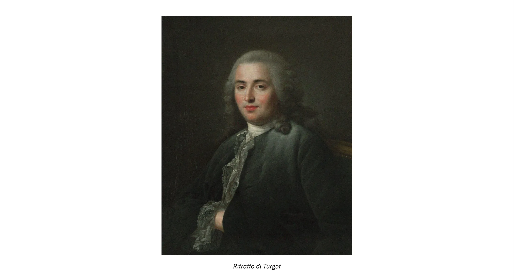

Consapevole del declino della loro fama, Turgot non si presentò mai come un fedele discepolo dei Fisiocratici, né, del resto, come un enciclopedista, pur essendolo, e poiché essi erano disprezzati dai membri del Clero. Una volta al potere, Turgot emanò sei famosi editti che costituirono l'inizio di un'applicazione pratica del programma fisiocratico: libertà di commercio, libertà di lavoro e fine dei monopoli.

Al momento della Rivoluzione francese, i fisiocratici avevano meno seguaci. Il marchese di Mirabeau morì il 13 luglio 1789, un vero e proprio simbolo. L'Abeille era andata avanti, ma Dupont de Nemours rimase fedele. Nominato all'Assemblea, Dupont de Nemours portò la voce della Fisiocrazia e chiese riforme economiche a favore della proprietà Ownership e del libero commercio.

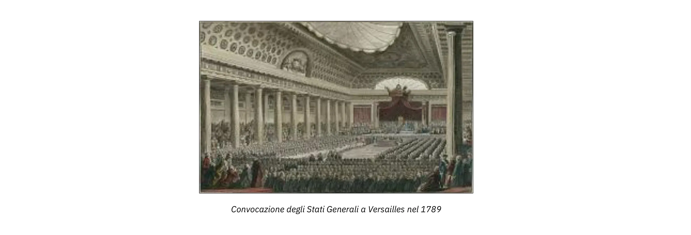

Si batté anche, senza successo, contro gli assignats. Nonostante questo fallimento, il pensiero fisiocratico rimase molto presente nel dibattito intellettuale e influenzò i primi risultati della Rivoluzione. Come disse Joseph Rambaud, tutto ciò che la Rivoluzione fece a favore delle libertà fu merito dei Fisiocratici.

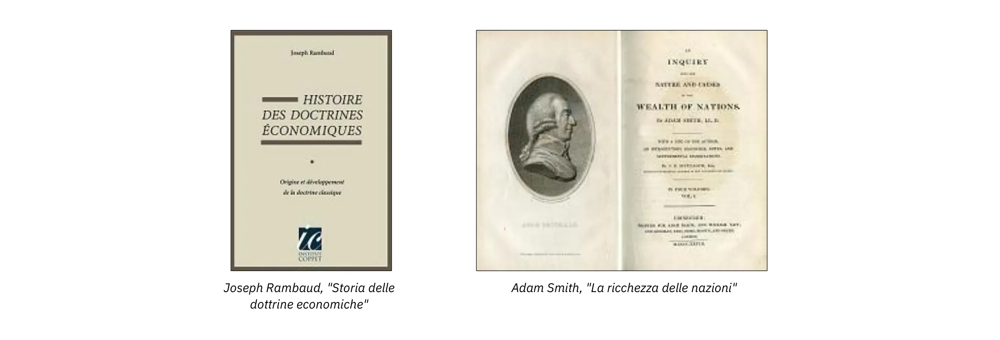

I Fisiocratici hanno avuto una grande influenza anche sulla storia del pensiero economico. Adam Smith, che visitò la Francia e incontrò molti di loro, fu profondamente influenzato dal loro lavoro. Pensò addirittura di dedicare *La ricchezza delle nazioni* a Quesnay.

Purtroppo, Quesnay morì due anni prima che il libro di Smith fosse pubblicato e Smith rimosse la dedica. Sebbene Smith non fosse d'accordo con l'idea che solo l'agricoltura fosse produttiva, abbracciò molti dei loro argomenti a favore del libero mercato e li portò avanti nel suo lavoro.

## Dupont de Nemours

<chapterId>6d585e0f-93b8-5b0a-a0a8-7f6e4a5bc68e</chapterId>

Negli Stati Uniti conosciamo bene l'azienda DuPont, nota anche come "E.I. du Pont de Nemours and Company", una multinazionale nel campo della chimica e della biologia.

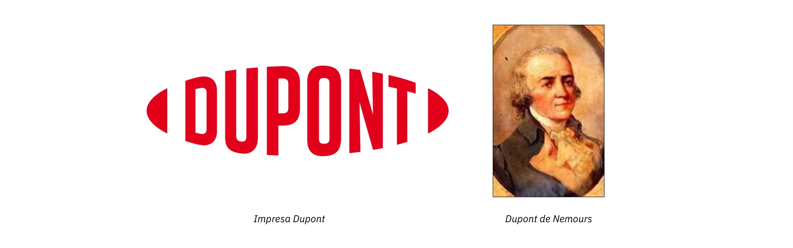

Oggi ha un fatturato di oltre 35.000 miliardi di dollari e impiega quasi 65.000 persone in tutto il mondo. Si scopre che questa azienda è strettamente legata al destino di Samuel-Pierre Dupont de Nemours, un economista francese di scuola fisiocratica.

Nato nel 1739, Dupont de Nemours si avvicinò ai fisiocratici all'età di 24 anni. All'epoca, stava ancora trovando la sua strada nella vita. Un giorno si imbatté in un breve pamphlet intitolato La ricchezza dello Stato. Trovò che le sue idee economiche fossero insensate e scrisse una risposta critica intitolata Riflessioni sulla ricchezza dello Stato, pubblicata nel 1763. Il pezzo fu ben accolto e i lettori lo lodarono, dicendo cose come: "Lei deve essere un discepolo di Mirabeau!" Ironicamente, Dupont non sapeva nemmeno chi fosse Mirabeau.

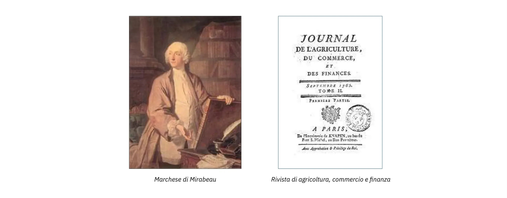

Incuriosito, iniziò a leggere le opere di Mirabeau, *Amico del popolo* e *Teoria della tassazione*. Incontra Mirabeau e François Quesnay e si unisce alla loro scuola.

Nel 1765, a Dupont fu offerto il posto di redattore del *Journal de l'agriculture, du commerce et des finances*, il principale periodico dell'epoca nel campo del pensiero economico.

Le ragioni erano due: Mirabeau e Quesnay dovevano rimanere in silenzio e Dupont era considerato il loro astro nascente.

I membri della scuola fisiocratica concordano sul fatto che Dupont de Nemours divenne rapidamente il preferito di Quesnay. Una volta Quesnay disse: "Abbiate cura di questo giovane, sarà lui a parlare quando saremo morti". Un collega fisiocratico, Abeille, divenne addirittura geloso dell'attenzione ricevuta da Dupont e si allontanò dalla scuola di Quesnay.

Dupont de Nemours mantenne sempre alta la sua stima per Quesnay.

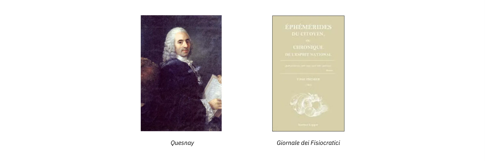

In seguito avrebbe detto: "Ero solo un ragazzo quando Quesnay mi ha teso le braccia: mi ha fatto diventare un uomo" Fu Quesnay a farlo diventare un economista di primo piano sulla scena letteraria dell'epoca.

Dopo il *Journal de l'agriculture, du commerce et des finances*, Dupont fu nominato direttore di *Les Éphémérides du Citoyen*, che divenne l'organo ufficiale dei Fisiocratici.

Egli fece di questa raccolta periodica un importante centro di teoria economica, sostenendola anche durante il declino dei Fisiocratici e scrivendo personalmente quasi tutti i volumi successivi. Fu Dupont de Nemours, inoltre, a coniare il termine "fisiocrazia", derivato da due parole greche che significano "governo della natura". Egli utilizzò questo termine per intitolare una raccolta di articoli di Quesnay pubblicata nel 1768, e il termine finì per imporsi nella storia. È noto che tra loro i fisiocratici si chiamavano "economisti" e che ancora durante la Rivoluzione venivano chiamati così.

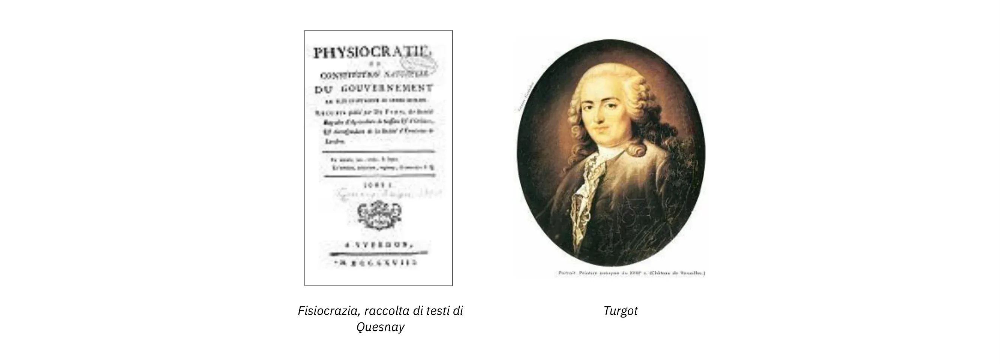

Quando Turgot ricoprì per un breve periodo la carica di ministro delle Finanze francese, Dupont divenne suo stretto consigliere, l'unico fisiocratico ad avere accesso a lui, dato che Turgot si teneva a distanza dagli altri.

Al momento della Rivoluzione, fu eletto dal baliato di Nemours e si ritrovò all'Assemblea, dove sedeva anche un altro Monsieur Dupont. Fu allora chiamato Dupont de Nemours, non perché fosse un nobile, ma semplicemente per distinguere i due. Il nome, naturalmente, rimase.

Durante la Rivoluzione, nell'agosto 1792, prese le armi per difendere il re alle Tuileries dalla folla.

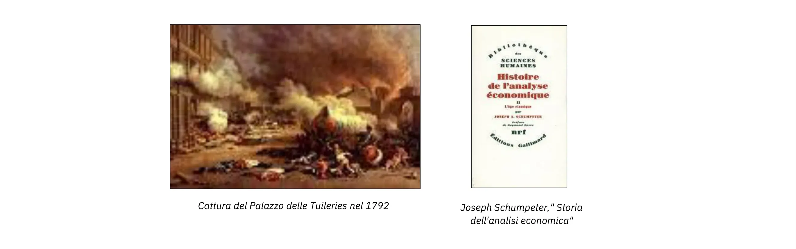

Il Re gli disse: "Monsieur Dupont, vi troviamo sempre dove c'è bisogno di voi!" Dopo essere miracolosamente sfuggito al Terrore, condannato e in attesa della ghigliottina ma salvato dalla caduta di Robespierre, fu spinto all'esilio sotto Napoleone e trovò la felicità negli Stati Uniti, dove uno dei suoi figli fondò, con l'assistenza del padre, la società Dupont.

Nonostante questa vita movimentata, durante la quale pubblicò decine di articoli, opuscoli e libri, a tutt'oggi è relativamente poco conosciuto. Forse perché rimase un convinto fisiocratico anche quando questa dottrina era passata di moda. Infatti, come ha scritto Schumpeter, Dupont de Nemours rimase fedele alla fisiocrazia "per tutta una carriera durante la quale ebbe molte occasioni per rinunciarvi". Era un uomo convinto.

# L'Illuminismo e l'economia politica

<partId>d1c885ad-7cb1-5f81-816c-be312719d9f8</partId>

## Voltaire e i filosofi

<chapterId>16bcf7bf-dad4-5113-8c64-2800f04ff07b</chapterId>

Il XVIII secolo in Francia ha visto l'emergere dell'economia come scienza e della prima scuola di pensiero economico: La fisiocrazia. Adam Smith si formò in economia durante questo periodo e gli economisti francesi furono riconosciuti come leader a livello mondiale. Tuttavia, questo secolo è ricordato più come il secolo della filosofia che dell'economia. Sebbene il movimento fisiocratico si allineasse, nelle sue ambizioni, alla filosofia illuminista, gli atteggiamenti dei filosofi - in particolare Diderot e Voltaire - meritano un attento esame. Vedremo che i pensatori illuministi contribuirono in modo significativo a diffondere l'idea del laissez-faire in Francia.

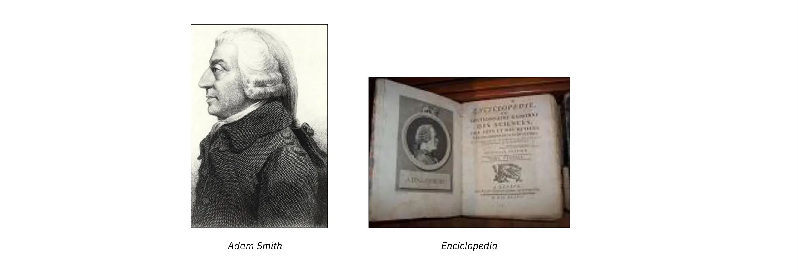

Il risultato più famoso della filosofia illuminista è senza dubbio l'Enciclopedia di Diderot e d'Alembert.

Naturalmente, gli articoli economici erano scritti da economisti. Per i primi volumi, Diderot si rivolse a Forbonnais, poi arruolò economisti liberali: prima François Quesnay (che contribuì con articoli come "Grains", "Fermiers", "Hommes" - quest'ultimo inedito), poi Turgot (che scrisse "Foires et marchés"). Questi scritti sono di grande importanza. Nei suoi articoli, Quesnay gettò le basi di quella che sarebbe diventata la dottrina fisiocratica. Insieme al suo *Tableau économique*, queste rimangono le sue opere più famose. Turgot, all'epoca ancora giovane, sviluppò l'idea del laissez-faire nel suo articolo, criticando l'intervento dello Stato nell'organizzazione del mercato.

In molti altri articoli dell'Enciclopedia, i filosofi, in particolare Diderot, difendono l'ideale della libertà in tutti i campi: religione, politica ed economia.

La libertà del lavoro, soprattutto in opposizione al sistema delle corporazioni, è un tema ricorrente in varie voci come Arts, Métier e Communauté.

Il percorso di Diderot nella teoria economica è curioso. Nell'Encyclopédie, era un convinto sostenitore della libertà economica e cercava la collaborazione degli economisti liberali, come conferma una lettera che delinea gli articoli che Turgot avrebbe potuto scrivere per lui. Nei primi anni della Fisiocrazia, fu sostenitore e promotore della scuola di Quesnay. Nel 1769 e nel 1770 scrisse per *Les Ephémérides du Citoyen*, con grande disappunto dei suoi amici filosofi antiliberali, come Melchior Grimm; tuttavia, prese presto le distanze dal gruppo. Incuriosito dalla vivacità intellettuale dell'abate Galiani, lo aiutò a pubblicare in francese il suo libro sul commercio del grano, proprio mentre Galiani stava per tornare in Italia.

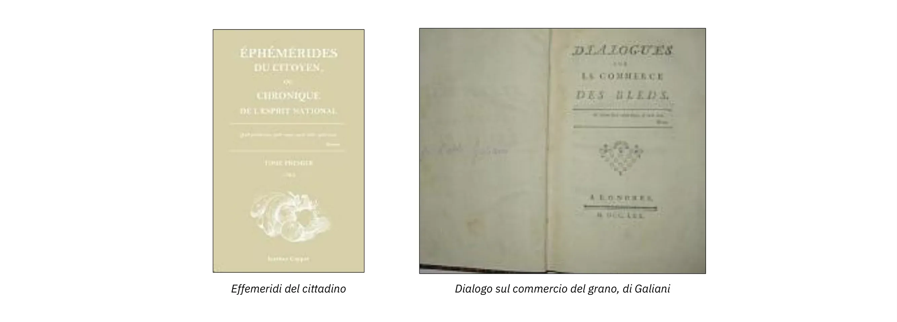

Questo libro sarebbe diventato il più feroce attacco mai sferrato contro le idee fisiocratiche, infliggendo un duro colpo al movimento. Più tardi, Diderot difese Galiani contro l'abate Morellet, uno stretto alleato dei fisiocratici, nella sua *Apologia di Galiani*. Qualche anno dopo, durante il ministero di Turgot, Diderot si vide applaudire l'istituzione della libertà del lavoro attraverso l'abolizione delle corporazioni. A questo punto, Diderot, figlio di un artigiano, si trovò d'accordo con gli economisti liberali e scrisse una lettera sprezzante a Galiani, il quale sosteneva che la libertà del lavoro avrebbe rovinato l'industria francese nel giro di venti o trent'anni. Alla luce della Rivoluzione industriale, la storia suggerisce il contrario. Tornato dalla parte degli economisti liberali, Diderot non godette più della loro fiducia e rimase isolato. Un momento molto significativo è una lettera inviata a Dupont de Nemours nel 1774, in cui scrive:

> "Una volta avevi amicizia per me; ora non ce l'hai più, perché sei così impegnato che non hai più tempo per amare nessuno".

Voltaire seguì un percorso simile, caratterizzato da una mancanza di coerenza nelle sue opinioni economiche. Ammirava Vincent de Gournay, era in corrispondenza con economisti (tra cui Dupont de Nemours e Turgot) e apprezzava i fisiocratici, soprattutto per le loro lodi all'agricoltura. Li esalta in una *Diatriba all'autore degli Ephémérides*. Tuttavia, in seguito criticò la loro idea di un'unica tassa fondiaria nella sua opera satirica *L'uomo delle quaranta corone*, che suscitò anche notevoli polemiche. Infine, come Diderot, celebrò il ministero di Turgot, definendolo un'età dell'oro e lodando i suoi due grandi decreti sulla libertà del lavoro e sul libero commercio.

In definitiva, il rapporto dei philosophes con il pensiero economico è contrastante. Nonostante le loro lodi e le loro critiche alle idee economiche liberali, hanno svolto un ruolo nel portare queste idee nel più ampio discorso intellettuale dell'Illuminismo. In questo modo, intenzionalmente o meno, hanno contribuito a far progredire la nozione di laissez-faire fino alla Rivoluzione.

## Turgot, il teorico

<chapterId>a8cd8185-8351-556b-8011-3a0c313e8a9d</chapterId>

In un famoso passaggio della sua *Storia del pensiero economico*, l'economista americano Murray Rothbard ha elogiato quella che ha definito la "genialità" di Turgot.

presentandolo come il più grande economista del XVIII secolo, insieme a Cantillon.

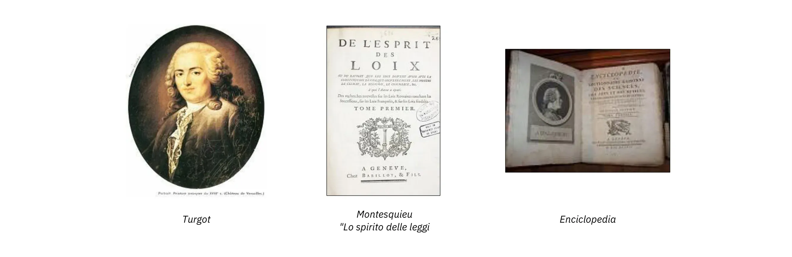

Come ha fatto Turgot a diventare così importante? Il merito è di una combinazione di tre fattori chiave. **In primo luogo, il suo prestigioso background familiare. Egli proveniva da una lunga stirpe di amministratori reali, molti dei quali ricoprivano posizioni governative di alto livello. **In secondo luogo, l'età dell'oro in cui era nato e cresciuto. Turgot aveva 21 anni quando Montesquieu pubblicò *L'Esprit des Lois* e 24 quando apparve il primo volume dell'Enciclopedia.

Fu contemporaneo dei fisiocratici, di Voltaire, Diderot, d'Holbach, Adam Smith, Condorcet e altri. **Terzo: la sua precocità intellettuale.** Mentre era studente alla Sorbona, a 22 anni scrisse una lettera sulla carta moneta, tenne discorsi notevoli e a 24 anni compose una lista di 52 opere da scrivere.

Nonostante la giovane età, Turgot contribuì all'*Encyclopédie*, scrivendo articoli su argomenti come "Etimologia", "Esistenza", "Espansibilità", "Fiere" e "Fondazioni". Solo un articolo ha toccato direttamente l'economia: il suo pezzo sulle "Fiere", che descriveva le origini delle fiere e dei mercati e criticava la crescente ingerenza dello Stato che li interrompeva e li paralizzava.

Durante questi primi anni, fu seguito da Vincent de Gournay, che lo prese sotto la sua ala e strinse con lui una stretta amicizia. Alla morte di Gournay, nel 1759, Turgot compose un elogio funebre in cui offriva una superba sintesi della dottrina del laissez-faire. In particolare scrisse:

"Da ogni punto di vista in cui il commercio può riguardare lo Stato, l'interesse individuale lasciato a se stesso produrrà sempre più sicuramente il bene generale rispetto alle operazioni del governo, che sono sempre imperfette e necessariamente guidate da una teoria vaga e incerta".

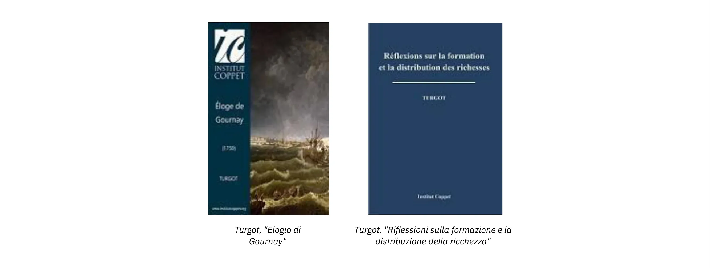

Nel 1767, mentre era intendente, compose un compendio di economia dal titolo *Riflessioni sulla formazione e la distribuzione della ricchezza*.

La divisione del lavoro, la sovranità dei consumatori, la proprietà privata, il ruolo del capitale, praticamente tutti i principali temi economici sono affrontati. Molti storici, la più recente è la storica Anne-Claire Hoyng, hanno sottolineato le somiglianze tra quest'opera di Turgot e *La ricchezza delle nazioni* di Adam Smith, pubblicata nove anni dopo.

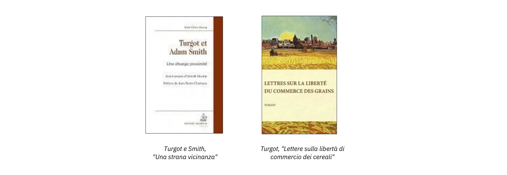

Turgot difese la libertà del commercio del grano in alcune lettere all'abate Terray, poi comunicate al re, ma metà delle quali sono andate perdute. Egli scrisse:

> Signore, se c'è qualcosa di urgente, non è imporre nuove restrizioni al più essenziale di tutti i mestieri, ma eliminare quelle che, purtroppo, sono state lasciate permanere.
> Se c'è mai stato un momento in cui era necessaria la più completa e assoluta libertà, completamente libera da ogni tipo di ostacolo, oserei dire che è questo, e che mai è stato meno opportuno prendere in considerazione l'emanazione di un regolamento sul commercio dei cereali.

Nel 1769, Turgot scrisse l'articolo Valore e denaro per il *Dictionnaire de Commerce* dell'abate Morellet, che alla fine non fu mai pubblicato. Galiani aveva già notato che "l'uomo è la misura comune di tutte le cose", anticipando l'analisi soggettiva che Turgot avrebbe sviluppato trent'anni dopo in questo articolo, dove amplia e dimostra questa proposizione.

Nel 1770, ben prima di Bentham, Turgot scrisse un memorandum a favore della libertà dei tassi di interesse e dell'usura.

"È un errore credere che l'interesse del denaro nel commercio debba essere fissato dalle leggi dei principi", afferma, "è un prezzo corrente che si regola da solo, come quello di tutte le altre merci", e in difesa di questa posizione confuta l'opposizione di Aristotele e dei Padri della Chiesa.

Una notevole sintesi della dottrina del laissez-faire di Turgot si trova in una dimenticata lettera del 1773 all'abate Terray sulla marcatura dei ferri:

> Ciò che la politica deve fare è cedere al corso della natura e al corso del commercio, che non è meno necessario e non è meno irresistibile del corso della natura stessa, senza tentare di dirigerlo; perché per dirigerlo senza disturbarlo e senza farsi del male, bisognerebbe essere in grado di seguire tutte le variazioni dei bisogni, degli interessi e dell'industria umana; bisognerebbe conoscerli con un livello di dettaglio fisicamente impossibile da ottenere, e in cui anche il governo più abile, attivo e meticoloso rischierebbe sempre di sbagliare, almeno per metà.

Qui troviamo un'affermazione molto chiara della dottrina del laissez-faire, nonché una prefigurazione dell'analisi di Friedrich Hayek sulla pretesa di conoscenza, ossia l'impossibilità per uno Stato di comprendere appieno le forze economiche per poterle controllare.

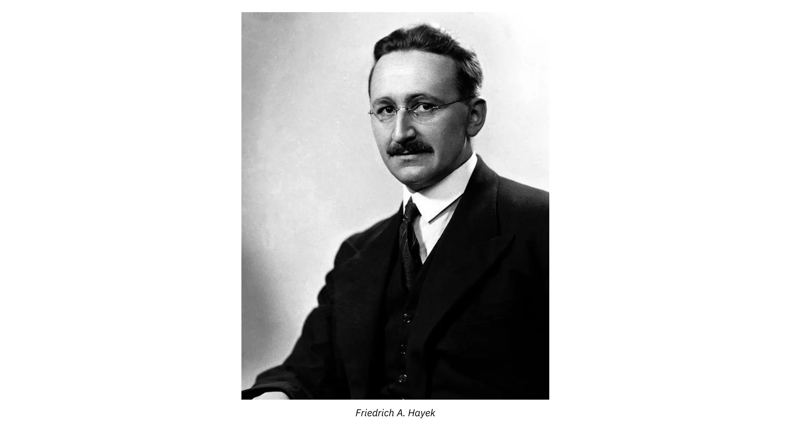

## Turgot, il riformatore

<chapterId>9177429f-1679-51c4-bfd2-dd036d24a1cc</chapterId>

Come abbiamo brevemente ricordato nel capitolo precedente, Turgot era figlio di una famiglia di spicco che si era distinta negli alti ranghi della pubblica amministrazione francese.

Suo padre era stato prevosto dei mercanti di Parigi e suo nonno intendente. Dopo essersi distinto negli studi, il più giovane della famiglia Turgot mirava a raggiungere almeno quelle stesse vette. Per un certo periodo ricoprì il ruolo di maître des requêtes, cioè di collegamento tra gli intendenti e Versailles. Si trattava di una posizione prestigiosa, per la quale dovette ottenere una speciale esenzione per età, ma Turgot aspirava a qualcosa di più. La morte del suo mentore, Gournay, lo incoraggiò ulteriormente a puntare in alto e chiese la nomina a intendente.

Nel 1759 fece prima domanda per l'intendenza di Grenoble, ma gli fu negata. Gli fu allora offerto il posto di prevosto dei mercanti a Lione, che rifiutò. Chiese l'intendenza di Bretagna, ma anche questa fu rifiutata. Infine, nel 1761, gli fu offerta l'intendenza di Limousin e, un po' a malincuore, accettò. Scrisse a Voltaire: "Ho la sfortuna di essere un intendente", forse intendendo: Ho la sfortuna di essere intendente nel Limousin.

Nel Limousin, i contadini erano poveri e vivevano in condizioni precarie, soprattutto per quanto riguarda l'alloggio e l'alimentazione. Il livello generale di istruzione era estremamente basso. Le poche strade esistenti erano in uno stato disastroso.

Poiché la regione era così povera, non era di interesse per i ministri. Ciò diede a Turgot la libertà di sperimentare le riforme. Nel Limousin portò avanti tre grandi progetti:

- La ridistribuzione della **taille**, l'imposta personale (Turgot mirava a introdurre la massima obiettività possibile nella sua valutazione).
- La **corvée**, una forma di tassa pagata in lavoro, in cui i contadini erano costretti a lavorare alla costruzione di strade. Visitando la regione, Turgot notò subito le cattive condizioni delle strade. Sostituì la corvée con una tassa monetaria.
- Il reclutamento di **milizie**, eserciti di contadini mobilitati in tempo di guerra.

Questo avveniva per sorteggio, il che provocava paura e violenza a causa dei fuggiaschi; Turgot sostituì questi prelievi obbligatori con volontari retribuiti.

Queste riforme ebbero un innegabile successo e nel luglio 1774 Turgot fu nominato ministro. A causa della sua mancanza di esperienza, il Re lo collocò inizialmente al Ministero della Marina. La nomina divertì molti. Lo stesso Turgot ammise: "Non so nulla di marina" e Voltaire osservò: "Non credo che Turgot sia più marinaio di me".

Appena un mese dopo, tuttavia, Turgot fu nominato controllore generale delle finanze, diventando di fatto il ministro dell'economia e delle finanze della Francia.

Conosciamo la lettera in cui illustrava i suoi principi a Luigi XVI: "Nessuna bancarotta. Nessun aumento delle tasse. Nessun nuovo prestito". Questa filosofia, che oggi i critici potrebbero etichettare come inutile "rigore", aveva lo scopo di salvare la monarchia.

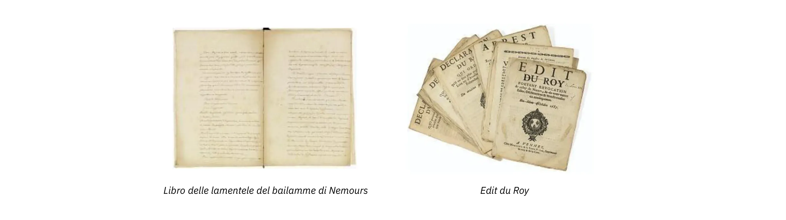

Turgot preparò sei editti reali per riformare l'economia francese.

Fu la prima - e una delle ultime - volta che a un esperto di economia fu concessa la libertà di riformare l'economia del suo Paese. Tre degli editti di Turgot spiccano: uno abolisce il lavoro forzato (corvées), un altro scioglie le corporazioni di mestiere (corporazioni) e il terzo stabilisce il libero commercio del grano.

Quando entrò nel ministero, Turgot sapeva che avrebbe incontrato la resistenza delle classi privilegiate. "Sarò temuto, persino odiato, dalla maggior parte della corte e da tutti coloro che cercano favori", disse al Re. I privilegiati si coalizzarono presto contro di lui e provocarono la sua destituzione dalla carica di Controllore generale delle finanze. Voltaire, che sosteneva pienamente le riforme di Turgot, scrisse nella sua corrispondenza:

> Ah! Che terribile notizia ho sentito! Che ne sarà di noi? Sono devastato! Non ci riprenderemo mai dopo aver assistito alla nascita e alla morte dell'età dell'oro! Questo fulmine ha colpito sia la mia mente che il mio cuore.

Da allora, molti hanno sostenuto che la Francia è un paese impossibile da riformare. Il fallimento di Turgot sembra confermarlo: Era stato preparato da mezzo secolo di pensiero economico liberale; aveva l'appoggio dei filosofi illuministi; e il re stesso, con potere assoluto, lo sosteneva.

Alla fine, i parlamentari e le classi privilegiate ebbero la meglio. Il Re non poté far altro che lamentarsi privatamente: "Ora vedo che solo Monsieur Turgot e io ci preoccupiamo del popolo"

## Condillac

<chapterId>0ba8dbb5-dcd5-5981-bf85-6c185e0bf192</chapterId>

Proprio come il mercantilismo, che è la sua manifestazione pratica più evidente, il sofisma di Montaigne ha impiegato molto tempo a scomparire.

Questo sofisma è l'idea che il commercio e il Exchange siano giochi a somma zero. Qualsiasi cosa una parte guadagni in una transazione è necessariamente persa dall'altra parte. I suoi sostenitori sostengono che questo vale sia tra individui che tra nazioni.

L'abate di Condillac ha svolto un ruolo fondamentale nello smantellare definitivamente questa falsa idea.

"Definitivamente" è forse un'esagerazione, perché nel dibattito pubblico questo sofisma riappare spesso. È forse per questo che Condillac rimane un economista poco conosciuto. A parte gli economisti austriaci, pochi hanno capito l'importanza della sua teoria del Exchange, nessuno si interessa più a lui.

Per la maggior parte degli storici del pensiero economico, l'anno 1776 è segnato dalla pubblicazione de *La ricchezza delle nazioni*, che ha fondato la scienza economica. Le quindici lezioni che abbiamo appena concluso, in cui abbiamo studiato la scienza economica francese prima di Adam Smith, sono sufficienti a dimostrare l'errore di questa concezione. In quello stesso anno 1776, inoltre, un altro libro merita forse più elogi da parte degli storici di quello di Adam Smith: è stato scritto da Condillac e si intitola semplicemente [*Commercio e governo considerati nelle loro reciproche relazioni*] (https://archive.org/details/commercegovernme0000cond).

Per Condillac, se persiste il sofisma del Exchange visto come un gioco a somma zero, la colpa è in parte dei Fisiocratici, che sostengono che il Exchange è un rapporto di uguaglianza. Secondo Condillac, questo è falso: Il Exchange è una relazione ineguale, in cui si dà sempre meno per ottenere di più.

Tra le idee dei Fisiocratici e quelle di Condillac non si potrebbe sognare un'opposizione più perfetta. L'economista fisiocratico Le Trosne scrisse:

> Il Exchange è per sua natura un Contract di uguaglianza, fatto di uguale valore per uguale valore.

Condillac, d'altra parte, ha scritto:

> Ciascuna parte del Contract dà sempre qualcosa di valore inferiore per ottenere qualcosa di valore superiore.

Tuttavia, l'opposizione è in gran parte una questione di parole. Entrambi concordano sul fatto che quando si scambia un franco per un libro, il libro vale un franco o il prezzo del libro è un franco.

La differenza sta nel fatto che Condillac afferma che, poiché noi Exchange un franco per il libro, significa che per noi il valore del libro è superiore a quello della nostra moneta da un franco. Noi preferiamo il libro alla moneta, ed è per questo motivo che facciamo il Exchange.

La teoria di Condillac non è fondamentalmente in contraddizione con quella dei Fisiocratici, ma non parlano, per così dire, la stessa lingua. Le Trosne parla di prezzo mentre Condillac parla di valore, e viceversa.

Condillac ha ragione quando dice che se i prezzi sono uguali tra i due beni scambiati, i valori non sono uguali, altrimenti non ci sarebbe il Exchange.

Per riassumere la teoria di Condillac, si possono elencare tre proposizioni:

Prima proposizione: cerchiamo i beni per la loro utilità. Questo sembra ovvio, ma è un principio centrale della scienza economica che gli uomini Exchange acquisiscono utilità, un punto che anche Jean-Baptiste Say ha sviluppato perfettamente.

Seconda proposizione: il valore preesiste e motiva gli scambi. Il giudizio soggettivo che ogni persona esprime su beni e servizi implica che questi stessi beni e servizi hanno un valore per lei, che vale di più o di meno a seconda dell'utilità che sembrano fornire. Naturalmente, ogni individuo giudica in modo diverso da un altro e il valore varia da persona a persona.

Infine, terza proposizione: il prezzo è la conseguenza del processo di Exchange. I prodotti non hanno il Exchange al valore che io attribuisco loro perché le condizioni del Exchange dipendono anche dal valore soggettivo che il venditore attribuisce a quei prodotti. La relazione tra acquirente e venditore, o tra l'apprezzamento soggettivo dell'acquirente e l'apprezzamento soggettivo del venditore, stabilisce un prezzo.

Queste idee di Condillac sono fondamentali. Ci permettono di capire perché ogni Exchange è sempre reciprocamente vantaggioso.

Pertanto, distruggono completamente le critiche al libero scambio, poiché il protezionismo appare solo come un meccanismo che impedisce alle popolazioni di trarre vantaggio reciproco. Il laissez-faire è anche la conclusione dell'opera di Condillac. Lasciate che le persone facciano quello che vogliono, perché se il potere pubblico protegge la libertà e la proprietà, gli uomini si arricchiranno sempre l'un l'altro scambiando insieme.

## Condorcet

<chapterId>99e4aba6-da7f-5041-b02f-337158381515</chapterId>

Condorcet è senza dubbio il filosofo più attento all'economia dell'Illuminismo.

Per gran parte della sua carriera si dedicò a campi del tutto estranei all'economia, e giustamente, visto che il suo talento portò a grandi progressi nelle scienze su cui si concentrava maggiormente. Ma intorno al 1770 si sentì attratto dalle questioni economiche, forse perché altri filosofi, soprattutto Voltaire e Diderot, non si preoccupavano di dedicarvi il loro tempo libero, e anche perché aveva stretto amicizia con Turgot.

Condorcet abbracciò gradualmente le idee di laissez-faire e di libertà, inizialmente in ambiti non legati all'economia politica. Nella sua *Lettera di un teologo*, derise filosoficamente la religione cattolica ed espresse il desiderio di vedere una vera libertà di credo, compresa la libertà di non credere. Nella sua crociata per la tolleranza e contro il fanatismo religioso, Condorcet si batté per la riabilitazione dello Chevalier de la Barre e per il nuovo processo di D'Etallonde, condannato a morte per aver rotto un crocifisso.

Era quindi pronto a difendere la libertà quando il suo amico Turgot salì alla carica di Controllore generale delle finanze.

Da quel momento in poi, la carriera di Condorcet subì una svolta, entrando nel dibattito economico e sostenendo instancabilmente le riforme liberali del nuovo ministro. Favorevole alla concorrenza e alla libertà di commercio, Condorcet chiese anche l'abolizione delle corvées (lavoro forzato), delle corporazioni e di un'equa tassazione. Ogni volta che se ne presentava l'occasione, esprimeva pubblicamente queste convinzioni, con evidente entusiasmo; scriveva molto e una volta dichiarò nei suoi scritti: "Permettetemi di parlare ancora della libertà di commercio; mi piace affrontare questo argomento"

Tra il 1774 e il 1776, durante il ministero di Turgot, Condorcet fece numerosi interventi, tutti caratterizzati dal suo Commitment al laissez-faire. Tra le sue opere si ricordano le *Lettere di un contadino della Piccardia al signor Necker*, che difende il libero commercio; *Monopoli e monopolisti*, che sostiene la libera concorrenza; *Riflessioni sulle corvée*, che ne chiede l'abolizione; e *Riflessioni sul commercio del grano*, che ancora una volta elogia il libero commercio e critica il libro di Necker sullo stesso argomento.

Nelle sue [*Lettere sul commercio del grano*] (https://archive.org/details/bub_gb_hg8jFw-y6bwC), Condorcet espone diversi punti chiave.

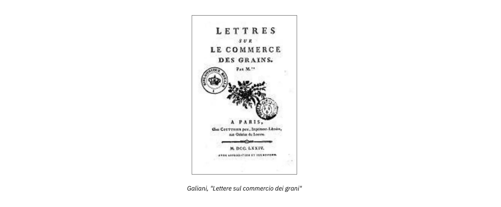

In primo luogo, gli alti prezzi dei cereali dell'epoca non erano il risultato del libero scambio, ma piuttosto dei cattivi raccolti, e Condorcet lo dimostra chiaramente. Poi spiega perché il laissez-faire non solo è appropriato, ma è l'unica politica adatta, nonostante i pregiudizi popolari. Osserva: "Siamo così abituati a vedere il governo intervenire nel commercio dei cereali che non fare nulla sembra qualcosa di straordinario e nuovo". Più avanti aggiunge: "Quasi tutti, soprattutto coloro che ricoprono cariche pubbliche, credono che nulla accada da solo e che tutto sia perduto se il governo non interviene in ogni cosa". Condorcet riprende così le argomentazioni dei Fisiocratici e di Turgot, dimostrando la superiorità del libero scambio su ogni forma di interventismo.

Promuovere il programma economico liberale di Turgot fu un atto coraggioso, poiché Condorcet sapeva che avrebbe dovuto affrontare rapidamente la censura. Infatti, ciò accadde e il suo pamphlet sull'abolizione del lavoro forzato fu distrutto e messo al bando nel 1776.

Turgot, apprezzando la leale difesa di Condorcet delle sue idee, lo nominò ispettore del conio. Condorcet si dimise non appena il suo amico lasciò il ministero.

Pur dedicando tutte le sue energie alla difesa di Turgot, Condorcet non si faceva illusioni sull'esito del mandato del suo amico. Lo stesso Turgot ammise in tarda età di vivere con rammarico, come scrisse in una lettera, "per non aver potuto fare alla mia nazione e all'umanità un bene che credevo molto facile". Condorcet, più realista, sottolineò i numerosi avversari che Turgot avrebbe dovuto affrontare: i favoriti del re, i parlamenti, il clero, la nobiltà, le corporazioni e così via. Questi gruppi si aspettavano l'adulazione, non la riforma. Condorcet disse a Turgot: "Non siete affatto un ciarlatano, e questo è un difetto, visto come vanno le cose a Parigi". Aveva perfettamente ragione, perché nel 1776, appena due anni dopo il suo arrivo, Turgot era già costretto a lasciare la carica di Controllore Generale.

## Il buon senso liberale sotto la Rivoluzione

<chapterId>95e9a90d-e37a-58ff-b1ac-928b42e76ecf</chapterId>

Dupont de Nemours fu il più giovane discepolo di François Quesnay, che una volta disse di lui: "Dobbiamo prenderci cura di questo giovane, perché parlerà quando noi saremo morti". Quando iniziò la Rivoluzione francese, quasi tutti i grandi fisiocratici, compreso il marchese de Mirabeau, erano già morti; lo stesso Mirabeau era deceduto il 13 luglio 1789.

Dupont de Nemours scrisse l'elenco delle lamentele per il baliato di Nemours.

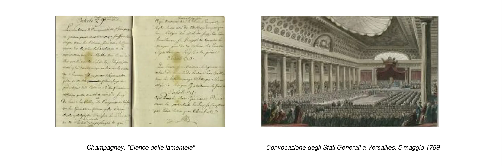

Questo affascinante documento conteneva tutte le lamentele degli economisti liberali contro le restrizioni commerciali, i monopoli e gli attacchi alla proprietà. Dupont de Nemours fu anche eletto all'Assemblea Nazionale.

Durante la Rivoluzione, divenne la voce del buon senso liberale, opponendosi alla crescente ondata di populismo e demagogia interventista, che alla fine prevalse.

Già nel novembre 1789, quando si parlava di concedere un monopolio alla Caisse d'Escompte (che avrebbe potuto trasformarsi in una banca pubblica - la Banca di Francia), Dupont de Nemours si espresse in difesa della concorrenza.

"Sarebbe meglio", dice, "lasciare l'attività bancaria alle leggi del libero scambio". E aggiunge:

> "Non capisco cosa intendesse il ministro quando ha parlato di concedere un privilegio alla Caisse d'Escompte. Se questo privilegio include l'esclusività, dovete rifiutarlo, perché siete venuti qui per distruggere i privilegi esclusivi, non per crearne di nuovi"

Nonostante i suoi avvertimenti, l'Assemblea ignorò le sue obiezioni e fece un altro passo verso l'istituzione di una banca centrale e di un monopolio bancario.

Nel 1790, all'Assemblea Costituente, Dupont de Nemours seguì la tradizione pacifista dei suoi amici fisiocratici e propose una legge che vietava le guerre offensive. Il primo articolo recitava: "La Nazione francese non si permetterà di intraprendere alcuna guerra offensiva per impadronirsi del territorio altrui o per violare i diritti o la libertà di qualsiasi Nazione".

La proposta è stata respinta.

Nello stesso anno, il 1790, iniziarono i dibattiti sull'emissione di nuova cartamoneta per coprire le spese del governo.

Dupont de Nemours si oppose fermamente e pubblicò un opuscolo intitolato [*Effetti degli Assignat sul prezzo del pane*] (https://archive.org/details/effetdesassignat00dupo). Il titolo era esatto, in quanto spiegava che l'emissione di assignat avrebbe inevitabilmente portato all'inflazione, ovvero all'aumento dei prezzi dei prodotti di base, compreso il pane.

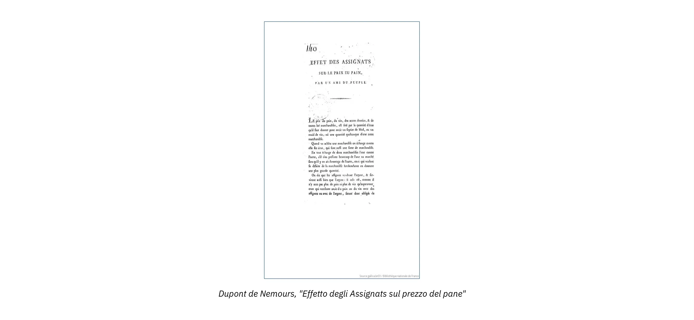

Firmò l'opuscolo come "un amico del popolo". L'opera suscitò grande scalpore, tanto che all'Assemblea fu chiesto chi l'avesse scritta. Dupont de Nemours si alzò in piedi e ammise che era opera sua, dicendo che non si vergognava di usare il titolo di "amico del popolo" perché lottare contro gli assignat era davvero servire il popolo.

Ancora una volta, il suo consiglio fu ignorato e furono emessi gli assegnati.

Conosciamo tutti il disastro che ne seguì, la rovina economica e le sofferenze patite dalla popolazione, molti dei quali persero tutto quando gli assegnati divennero privi di valore e dovettero essere bruciati.

Qualche anno dopo, l'Assemblea si dedicò all'idea di creare una vera e propria Banca di Francia, alla quale sarebbe stato concesso il monopolio della produzione di denaro.

Dupont de Nemours, ancora fermamente contrario all'idea di una banca pubblica, considerandola nient'altro che un monopolio, ricordò all'Assemblea la disastrosa esperienza degli assignats. Disse loro:

> "Non preparatevi a rimpianti come quelli che hanno tormentato i miei colleghi dell'Assemblea Costituente. All'epoca, la mia proposta di limitare gli assignat solo al pagamento dei beni nazionali e di non farne una moneta circolante fu respinta. Oggi si dice: "Ah, se solo avessimo ascoltato Dupont de Nemours!""

Ma ancora una volta nessuno gli diede retta.

## Conclusione: Passare la torcia

<chapterId>ada8082f-db96-5e52-954f-719b47998153</chapterId>

Il pensiero economico francese del XVIII secolo è spesso messo in ombra dai più famosi economisti del XIX secolo. Eppure, quando si parla di difesa della libertà, è nel XVIII secolo che tutto ha veramente inizio. È il secolo in cui il principio del laissez-faire, così rivoluzionario per l'epoca, viene espresso per la prima volta con chiarezza da diversi pensatori, da Boisguilbert a Dupont de Nemours.

Certamente, figure come Jean-Baptiste Say, Frédéric Bastiat, Gustave de Molinari e Yves Guyot hanno lasciato un segno duraturo nella storia del pensiero economico francese. Ma se li studiamo in modo isolato, ci sfugge qualcosa di essenziale. Questi pensatori del XIX secolo non sono emersi dal nulla, ma hanno ereditato e costruito sulle fondamenta gettate dai loro predecessori del XVIII secolo durante l'Illuminismo.

Boisguilbert sostiene che le anime benpensanti che credono di poter sistemare tutto coinvolgendo il governo inevitabilmente mettono sottosopra l'economia, e che quindi è meglio lasciare che l'ordine naturale delle cose faccia il suo corso.

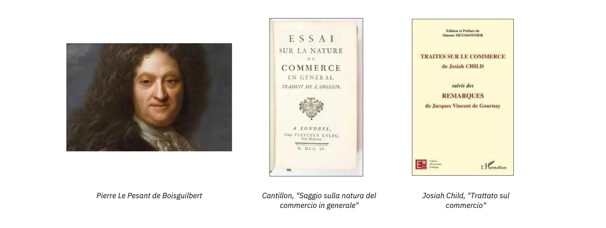

Cantillon insisteva sul fatto che il denaro non dovesse mai essere manipolato per scopi politici. Permettere allo Stato di gestire il denaro a suo piacimento significa aprire la strada a un immenso disordine finanziario ed economico.

Vincent de Gournay afferma che un'eccessiva regolamentazione del lavoro scoraggia gli sforzi di operai e artigiani, spingendoli verso la pigrizia e l'inattività. È grazie alla libera concorrenza che l'economia può crescere e una nazione può prosperare.

Il Marchese d'Argenson afferma che nessun governo è in grado di prevedere e misurare tutto e che, di conseguenza, bisogna affidarsi all'interesse personale di ciascun individuo.

Quesnay e i Fisiocratici affermano che la proprietà privata è il fondamento delle società umane. Senza la proprietà privata, l'uomo perde la motivazione a sforzarsi, a lavorare, poiché non può godere dei frutti del suo lavoro o accumulare qualcosa.

Condillac afferma che il Exchange è sempre reciprocamente vantaggioso e dovrebbe quindi, senza eccezioni, essere sempre libero. L'unica missione dello Stato deve essere quella di proteggere la libertà e la proprietà.

Tutte queste idee saranno riprese dagli economisti del XIX secolo. Alcuni, come Jean-Baptiste Say, avrebbero dato a queste idee un'espressione scientifica attraverso un rigoroso *Trattato di economia politica*. Altri, al contrario, cercheranno di divulgare queste massime fondamentali avventurandosi nel regno dei racconti, delle novelle e delle storie divertenti, come farà abilmente Frédéric Bastiat.

## Biografia

<chapterId>17cf2865-e53c-5f3b-a5c2-a43560efaf01</chapterId>

**BIBLIOGRAFIA SELETTIVA**

Qui di seguito troverete una selezione di oltre trenta scritti:

1. Pierre Clément, Histoire de Colbert et de son administration, Parigi, 1874

2. Vauban, Projet d'une dîme royale, 1707; ristampa Institut Coppet, 2014; Anne Blanchard, Vauban, Fayard, 1996

3.	Boisguilbert, Détail de la France, 1695; ripubblicato dall'Institut Coppet, 2014

4. Félix Cadet, Pierre de Boisguilbert: precursore degli economisti, Institut Coppet, 2014

5. Pierre de Boisguilbert o la nascita dell'economia politica, Parigi, INED, 1966

6. Richard Cantillon, Essai sur la nature du commerce en général, 1755; ristampa dell'Institut Coppet, 2015

7. Antoin Murphy, Richard Cantillon, banchiere ed economista, Oxford, 1986

8. Gustave de Molinari, L'abate di Saint-Pierre, Parigi, 1859

9. Abate di Saint-Pierre, Abrégé du projet de paix perpétuelle, Rotterdam, 1729

10. Abate di Saint-Pierre, "Projet pour perfectionner le commerce de la France", in Les rêves d'un homme de bien, Parigi, 1775, p.199

11. André Alem, Le marquis d'Argenson et l'économie politique au début du XVIIIe siècle, Institut Coppet, 2015

12. Journal et mémoires du marquis d'Argenson, edizione Rathery, 9 voll., Parigi, 1859-1867

13. Benoît Malbranque, Vincent de Gournay: l'economia politica del laissez-faire, Institut Coppet, 2016

14. Vincent de Gournay, Remarques sur la traduction de Josiah Child, L'Harmattan, 2008

15. Christine Théré & Loïc Charles (a cura di), Le cercle de Gournay, INED, 2005

16. Antoin Murphy, "Le développement des idées économiques en France (1750-1756)", Revue d'histoire moderne et contemporaine, tome XXXIII, ottobre-dicembre 1986

17. Henri Ripert, Le marquis de Mirabeau: ses théories politiques et économiques, Parigi, 1901

18. Lucien Brocard, Les doctrines économiques et sociales du marquis de Mirabeau, in L'Ami des Hommes, Parigi, 1902

19. Humbert de Montlaur, Mirabeau, l'Ami des Hommes, Perrin, 1992

20. Yves Guyot, François Quesnay e la Fisiocrazia, Institut Coppet, 2014

21. François Quesnay, Œuvres économiques complètes et autres textes, 2 vols, INED, 2005

22. Georges Weulersse, Le mouvement physiocratique en France (de 1756 à 1770), 2 volumi, Parigi, 1910

23. Georges Weulersse, La Physiocratie à la fin du règne de Louis XV (1770-1774), P.U.F., 1959

24. Georges Weulersse, La Physiocratie sous les ministères de Turgot et de Necker (1774-1781), P.U.F., 1950

25. Georges Weulersse, La physiocratie à l'aube de la révolution (1781-1792), EHESS, 1985

26. P. Jolly, Du Pont de Nemours, soldat de la liberté, Parigi, P.U.F., 1956

27. Gli scritti economici di Voltaire, Institut Coppet, 2013

28. Gustave Schelle (a cura di), Œuvres de Turgot et documents le concernant, Parigi, 1913-1924

29. Benoît Malbranque, Le libéralisme à l'essai : Turgot intendant du Limousin (1761-1774), Institut Coppet, 2015

30. Pierre Foncin, Essai sur le ministère de Turgot, Parigi, 1877

31. Auguste Lebeau, Condillac économiste, Parigi, 1903

32. Condillac, Le commerce et le gouvernement considérés relativement l'un avec l'autre, 1776

33. Condorcet, Mélanges d'économie politique, in Eugène Daire (a cura di), Mélanges d'économie politique, Parigi, 1847

34. P. Jolly, Du Pont de Nemours, soldat de la liberté, Parigi, P.U.F., 1956

35. Eli Heckscher, Mercantilismo, 2 volumi. Londra: Allen and Unwin. 1935

# Sezione finale

<partId>385bffab-aea1-5bcd-9569-62b3f30665b7</partId>

## Recensioni e valutazioni

<chapterId>a1e689d9-abd0-5dcb-ba56-a8d355d0a84f</chapterId>

<isCourseReview>true</isCourseReview>

## Esame finale

<chapterId>bdb7fd98-33e7-11f0-9fe6-b785c859ffc5</chapterId>

<isCourseExam>true</isCourseExam>

## Conclusione

<chapterId>3b366ff6-03c8-5f6a-b4c0-ba8186e65d7e</chapterId>

<isCourseConclusion>true</isCourseConclusion>