# 자유의 경제사로의 여정

이 과정은 자유방임주의의 렌즈를 통해 18세기 프랑스에서 경제학의 탄생을 탐구합니다. 사상가들이 국가는 사적 권리를 보호해야 하지만 규제를 통해 시장을 조작해서는 안 된다고 주장하며 중상주의에 도전한 방법을 발견하게 될 것입니다.

선견지명이 있는 개혁가들이 이 비전을 확장하여 자유 무역과 상품의 무제한 유통을 요구하며 현대 자본주의의 지적 토대를 마련한 과정을 배우게 됩니다. 이러한 선구적인 경제학자들을 연구함으로써, 세계 정치경제를 형성하고 오늘날의 정책 논쟁에 계속 영향을 미치는 시대를 초월한 원칙들을 이해하게 될 것입니다. 현대 경제를 구축한 아이디어를 마스터하기 위해 지금 참여하세요.
+++
# 소개

<partId>06d67531-19f1-4f8d-bf8f-77bbcc743672</partId>

## 코스 개요

<chapterId>202db3c6-0320-494d-8057-adc6f6563048</chapterId>

HIS204에 오신 것을 환영합니다!

이 강좌는 풍부한 지적 전통을 통해 18세기에 발전한 *자유방임* 개념의 프랑스 기원을 탐구하기 위해 고안되었습니다. 초기 프랑스 경제 사상가들의 생각을 추적함으로써 국가의 간섭에 대한 불신과 성장과 번영에 유리한 자연 질서에 대한 믿음으로 특징지어지는 경제적 자유에 기반한 정치 경제의 토대를 발견할 수 있습니다.

**섹션 2: 선구자**

이 섹션에서는 절대 군주제의 과도한 통치로 인해 형성된 17세기와 18세기, 보다 합리적이고 공정한 국정 운영 방식에 대한 요구가 처음으로 제기되던 시기로 거슬러 올라갑니다. 보방, 부아길베르, 캉티용의 인물을 통해 국가 개입주의에 대한 초기 비판과 훗날 자유주의 정치 경제학의 첫 윤곽을 발견합니다.

**섹션 3: 18세기 초의 개혁가들과 사상가들**

이 섹션에서는 18세기 초반에 새로운 원칙에 비추어 프랑스 경제를 개혁하려고 시도한 사람들을 중점적으로 살펴봅니다. 생피에르 수도원장, 다르장송 후작, 구르네와 같은 사상가들은 기업주의적 장애물을 철폐하고 무역을 자유화하며 경쟁을 발전의 동력으로 장려할 것을 촉구했습니다. 이들의 대담한 제안은 위대한 피지오크라시즘 사상을 예고하는 것이었습니다.

**섹션 4: 생리학 학교**

이 섹션에서는 프랑스 경제 사상에서 가장 중요한 순간 중 하나인 물리학파를 살펴봅니다. 퀘네와 뒤퐁 드 네모르와 같은 주요 인물을 중심으로 그 기원, 교리적 토대, 주요 업적을 살펴볼 것입니다. 자유방임주의는 국가가 모든 사람의 번영을 보장하기 위해 복종해야 하는 자연 질서에 대한 생각에 뿌리를 두고 있는 이 학파에서 일관된 체계가 되었습니다.

**섹션 5: 계몽주의와 정치 경제**

마지막으로 자유주의 경제 사상이 광범위한 계몽주의 운동 내에서 어떻게 확산되었는지 살펴볼 것입니다. 볼테르, 투르고, 콩디악, 콩도르셋과 같은 인물들은 자유방임주의 전통을 확장하고 풍성하게 만들었으며, 그들의 저술은 자유방임주의 전통이 혁명 시대와 그 이후로 넘어갈 수 있는 다리가 되어 자유주의 사상이 새로운 공감을 얻게 되었습니다.

프랑스 경제 자유주의의 뿌리를 재발견할 준비가 되셨나요? 시작하세요!

# 선구자

<partId>91565b10-6010-53cb-a2f4-9c2306c7ef8c</partId>

## 역사적 배경

<chapterId>6a5fd101-6dfd-5d77-96c7-9e1aa4a19758</chapterId>

18세기 초, 프랑스는 걱정스러운 상황에 처해 있었습니다. 농촌 인구는 겨우 생계를 유지할 만큼만 생산하고 있었고 세금도 많이 부과되고 있었습니다.

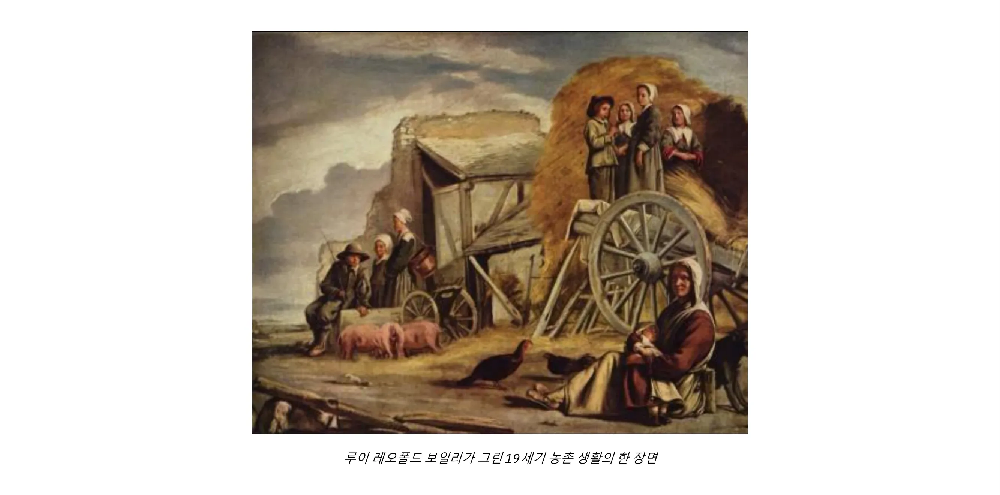

경직된 길드에 갇혀 있던 도시 장인들은 서로를 혁신하거나 지원하는 데 어려움을 겪었습니다. 한편 다른 유럽 국가들은 곧 모든 면에서 프랑스를 능가하는 제품을 내놓으며 경쟁에 뛰어들었습니다. 영국과 네덜란드의 상업적 성공은 모든 사람의 관심을 끌었습니다.

하지만 당시의 질병에 대한 해결책을 어떻게 찾을 수 있었을까요? 아직 경제학이라는 과학이 없었고, 따라서 적용할 수 있는 특별한 약도 없었습니다. 경제 정책의 원칙은 여전히 제한적인 단계와 보다 자유로운 시기 사이를 오가며 주먹구구식으로 적용되었습니다. 물론 우리에게는 따라야 할 모델과 역사적 참고 자료가 있습니다. 그중에는 농업을 옹호하고 프랑스 내 무역의 자유를 증진한 앙리 4세의 장관인 *설리*도 있습니다.

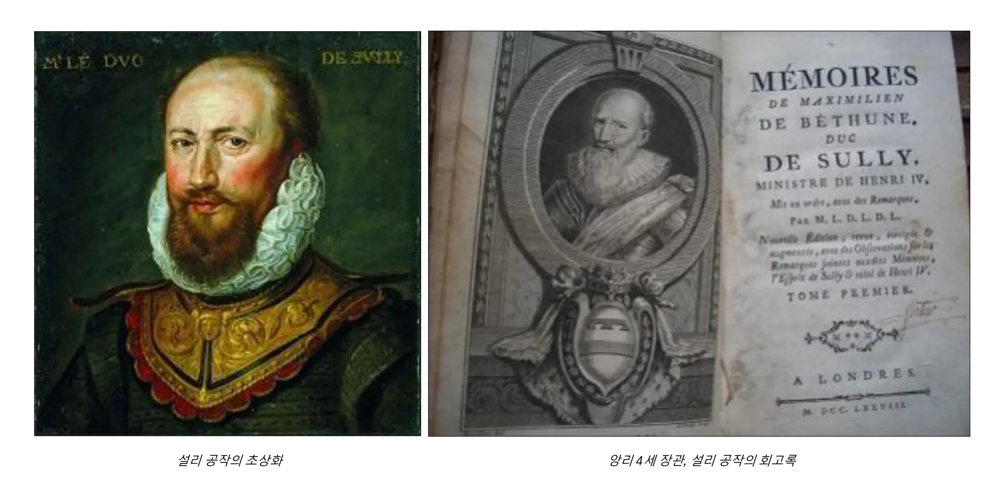

하지만 루이 14세의 장관인 콜베르트는 규제와 자유 사이에서 흔들리다가 결국 규제를 시행했습니다. 17세기 말, 콜베르트는 설리를 추월했습니다. 장관들은 이제 그의 유산을 불러내어 그의 격언이라고 주장하는 것을 적용하려고 했습니다.

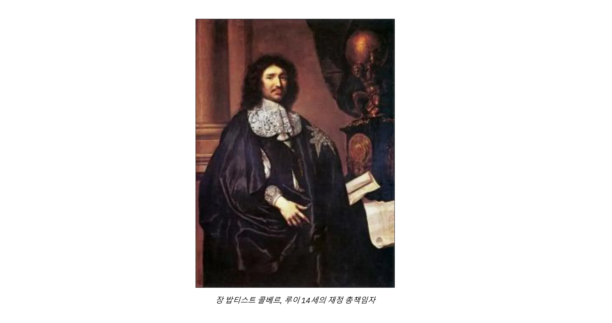

17세기 말 정치가들이 생각한 콜베르트의 격언은 네 가지였습니다.

(1) **산업은 길드 내에서 규제되고 제한되어야 합니다**. 이러한 규정에는 예를 들어 시트와 천의 제작 방법, 크기와 무게 등이 명시되어 있습니다.

이러한 규칙은 수백 개에 달하며, 각 산업 유형에 대한 전용 책으로 정리되어 있습니다. 하지만 콜버트를 추종하는 사람들의 눈에는 여전히 불충분했습니다. 그들은 산업도 기업의 감독이 필요하다고 믿었습니다.

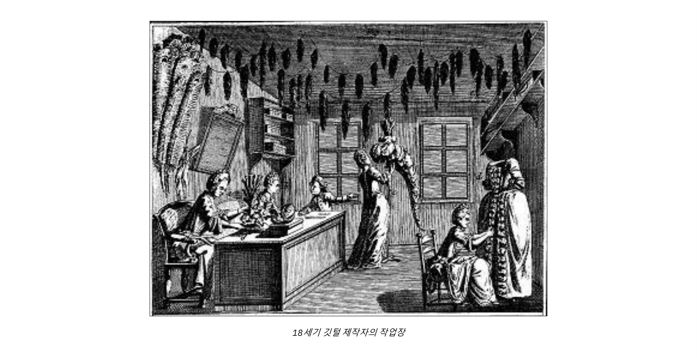

직업을 갖고자 하는 사람은 먼저 견습생으로 몇 년을 보낸 다음 여행자로 일한 다음, "걸작"을 제작하고 길드에 상당한 금액을 지불하여 마스터의 지위를 얻으려고 시도해야 했습니다. 따라서 각 직종 내 경쟁은 엄격하게 제한되었습니다.

(2) **무역은 제로섬 게임이다**. 콜베르트의 제자들은 상업에 관해서는 고대의 야만인들과 같은 편견을 가지고 있었습니다. 루이 14세의 장관에 따르면 무역은 "영원한 전쟁"이라고 했습니다. 왜 그랬을까요? 콜베르트와 그의 후계자들에게 한 국가의 부의 증가는 다른 국가의 빈곤을 의미했기 때문입니다. 영국이나 네덜란드가 부유해지는 것은 프랑스의 번영을 빼앗는 것이기 때문에 허용될 수 없다고 생각했기 때문입니다.

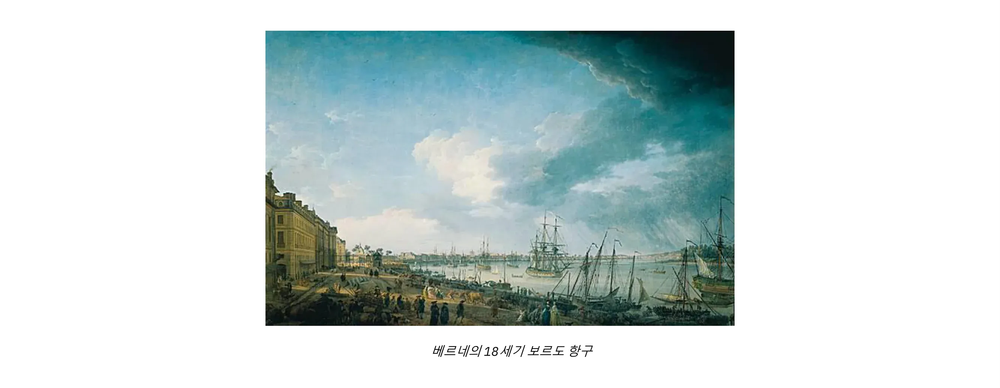

따라서 무역은 적의 파멸을 바랄 수밖에 없는 전쟁이기 때문에 이들 국가의 제품은 가차 없이 금지되거나 무거운 세금을 물어야 했습니다.

> "프랑스는 네덜란드를 무너뜨려야만 무역을 늘릴 수 있다".
> *콜버트*

(3) **국가에 돈이 부족하면 세금을 더 걷는다**. 콜버트와 그의 제자들은 납세자의 재산이 한정된 자원이라는 생각과는 거리가 멀었습니다. 그들이 보기에 세금만 충분히 걷힌다면 공공 지출은 결코 문제가 될 수 없었습니다. 콜버트가 냉소적으로 말했듯이 "과세의 기술은 거위를 너무 많이 울리지 않고 거위를 뽑아내는 것"이기 때문에 백성들이 반란을 일으킨다면 그것은 단지 장관들이 제대로 대처하지 못했기 때문일 뿐이라고 생각했습니다.

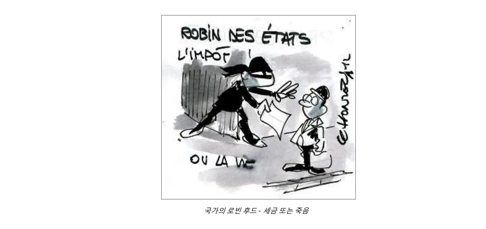

(4) **부란 무엇보다도 금과 은이다**. 경제학이 탄생하기 전에는 많은 저술가들이 부의 본질에 대한 하나의 지배적인 도그마, 즉 *중상주의*로 알려진 것을 따랐습니다. 콜버트와 그의 후계자들은 이 길을 계속 따라갔습니다. 즉, 중상주의자들은 국가의 진정한 번영의 징표는 귀금속, 은, 금의 축적이라고 믿었습니다.

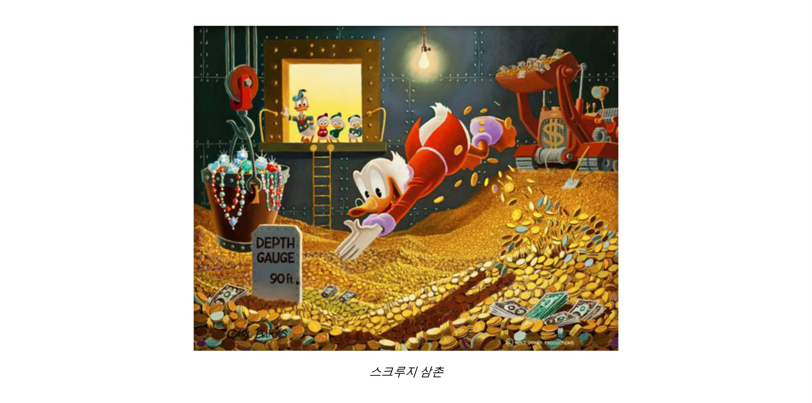

> "국가 내의 풍부한 돈만이 국가의 위대함과 권력에 차이를 만든다"는 말이 있습니다.
> *콜버트*

이 아이디어의 결과는 어떤 대가를 치르더라도 수출을 선호하여 외국의 금과 은을 들여오고 수입을 최소한으로 제한하여 해외로 보내지 않도록 하는 것입니다.

이 네 가지 원칙은 프랑스가 18세기에 접어들면서 수십 년 동안 프랑스 정부를 이끌어 온 원칙입니다. 그러나 이 원칙들은 곧 심각한 도전을 받게 됩니다. 1690년에서 1710년 사이에 몇몇 작가들은 프랑스가 처한 비참한 상황에 깊은 충격을 받았습니다. 그들은 그 원인을 찾던 중 콜베르에게서 물려받은 격언이 잘못된 주장에 불과하다고 보고 그 책임이 있다고 결론지었습니다. 이를 통해 그들은 경제학의 기초를 닦았습니다.

## Vauban

<chapterId>ee9c1e0e-96cc-5026-a5e2-963d68122786</chapterId>

오늘날 우리나라의 세금 압박이 계속 커지면서 국가 경제를 질식시킬 수 있다는 위협이 커지면서 변화를 요구하는 목소리가 높아지고 있습니다. 의식적이든 아니든, 이러한 개혁 요구는 17세기부터 프랑스의 조세 제도가 혼란스럽고 독재적이며 과도하다고 비판해 온 프랑스 경제학자들의 연구를 반영하는 경우가 많습니다.

연대기적으로나 공적 측면에서 첫 번째 조세 개혁가는 요새와 성채를 건설한 것으로 유명한 위대한 원수 세바스티앙 르 프레스트르 보방(Sébastien Le Prestre Vauban)입니다.

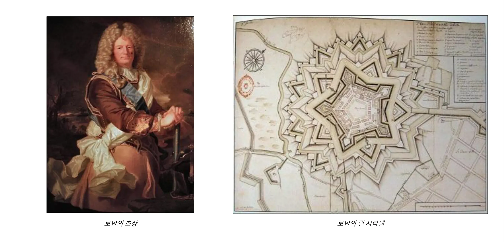

우리가 슬프게도 잊고 있지만 보방은 군인 그 이상이었으며 경제학자이기도 했습니다. 농민들의 운명에 관심을 가졌던 그는 1695년('자본주의 프로젝트')과 1707년('왕실 십일조 프로젝트')에 기존의 대부분의 세금을 소득에 비례하는 세금으로 대체하는 과감한 조세 개혁을 제안했습니다(당시에는 없던 정액세).

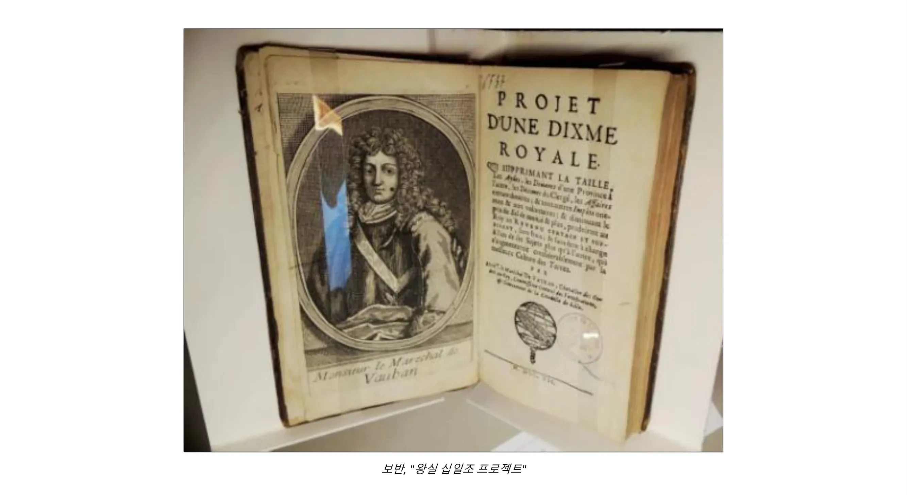

보반은 호기심에서 이러한 아이디어를 떠올렸습니다. 그는 예리한 관찰자였으며 사회생활과 경제 현실을 거의 과학적으로 엄격하게 연구하기 위해 노력했습니다. 그는 특히 인구 조사를 통한 계수의 필요성을 주장했습니다.

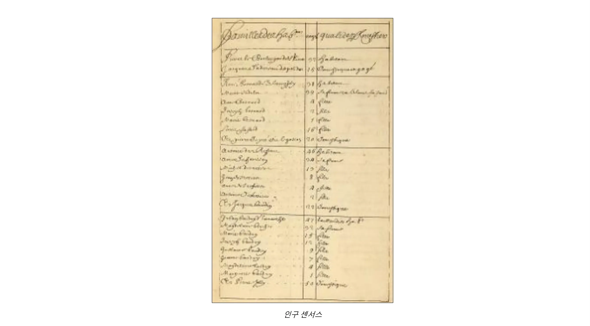

그의 두 번째 큰 장점은 대중이 겪은 비참한 상황을 감동적이고 솔직하게 묘사했다는 점입니다. 그는 이렇게 썼습니다. "속지 말자, 왕국의 심장이 망가졌다. 모든 것이 고통 받고, 모든 것이 견디고, 모든 것이 신음합니다. 지방의 중심부를 살펴보기만 하면 내가 말하는 것보다 훨씬 더 심각한 상황을 발견할 수 있을 것이다"라고 말했습니다. 보뱅의 우울한 관찰은 과장된 것이 아니라 18세기 초의 삶을 정확하게 반영한 것이었습니다. 알렉시스 드 토크빌은 이러한 사상을 잘 알고 있었으며, 훗날 보방의 *왕실 십일조*가 사실이었기 때문에 "무섭다"고 묘사하기도 했습니다.

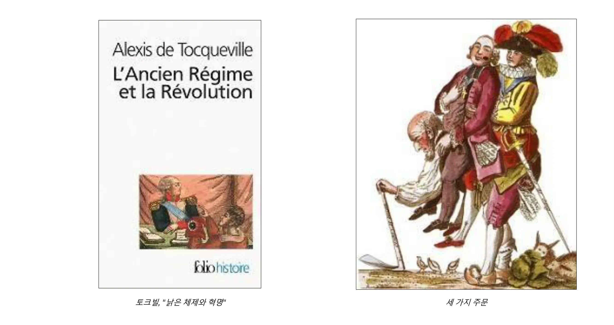

경제학자로서 보뱅의 또 다른 큰 장점은 그가 관찰하고 묘사한 악의 근절 또는 최소한 그 강도를 줄이기 위한 광범위한 조세 개혁을 제안한 것입니다. 앙시앵 레짐 하의 프랑스 경제는 불평등하고 불안정하며 불투명한 세금으로 인해 마비되어 있었습니다.

다양한 정치 및 경제 관련 저술에서 보뱅의 가장 중요한 야망은 "노동으로 상층부를 지탱하고 부양하는 하층민"의 고통을 덜어주는 것이었습니다.

그는 억압적이고 의욕을 꺾는 세금이 농민을 압도한다는 것을 이해했으며, 이는 오늘날에도 우리가 완벽하게 관찰할 수 있는 개념으로 선명한 시각으로 표현했습니다:

> "농부는 적절한 거름과 경작으로 생산할 수 있는 만큼만 생산하면 세금이 더 많이 부과될까 봐 자신이 가진 작은 땅을 시들게 내버려두고 반쯤만 일합니다."

보방은 앙시앵 레짐의 세금이 비합리적일 뿐만 아니라 잔인할 정도로 엄격하다는 사실을 깨달았습니다. 그가 극복하고자 했던 것은 불공평한 세금 체계였습니다.

그가 제안한 해결책인 모든 소득에 대한 정액 비례세는 모든 사회 계층이 세금 부담을 공평하게 분담할 수 있도록 했습니다. 개인의 권리와 재산을 보호하기 위해 공권력이 필요하다고 본 국가 이론에 근거한 보뱅의 조세 개혁안은 모든 시민이 소득에 비례하여 엄격한 비율로, 예를 들어 소득의 10%를 부담하도록 요구했습니다

보반은 생전에 출간한 유일한 경제학 저서인 <왕실 십일조>에서 다음과 같이 명확하게 언급했습니다:

> "국가의 모든 사람은 생존을 위해 국가의 보호를 필요로 하므로, 모든 사람이 자신의 소득에 따라 국가의 유지와 비용에 기여하는 것이 옳습니다 [...]. 가장 지불 능력이 있는 사람을 면제하고, 그 무게에 짓눌려 쓰러지는 가장 능력이 없는 사람에게 부담을 전가하는 것보다 더 부당한 것은 없다; 모든 사람이 자신의 힘에 따라 비례적으로 부담한다면 상당히 가벼워질 무게. 따라서 모든 세금 면제는 반드시 시정되어야 할 장애입니다."

그가 죽기 얼마 전, 보방의 아이디어는 루이 14세의 각료들에 의해 채택되었습니다. 그러나 보방은 기존의 모든 세금 또는 거의 모든 세금을 대체할 수 있는 비례세를 요구했습니다. 대신 종종 그렇듯이 그의 세금은 시행되었지만 다른 모든 세금도 그대로 유지되었습니다.

## 보이스길버트

<chapterId>200149c6-b5fc-566e-ab0e-bafb1c3fed3c</chapterId>

과거 프랑스 경제학자 중 오늘날 고국에서 자신의 공헌에 걸맞은 인정을 받는 사람은 거의 없으며, 부아길베르도 예외는 아닙니다.

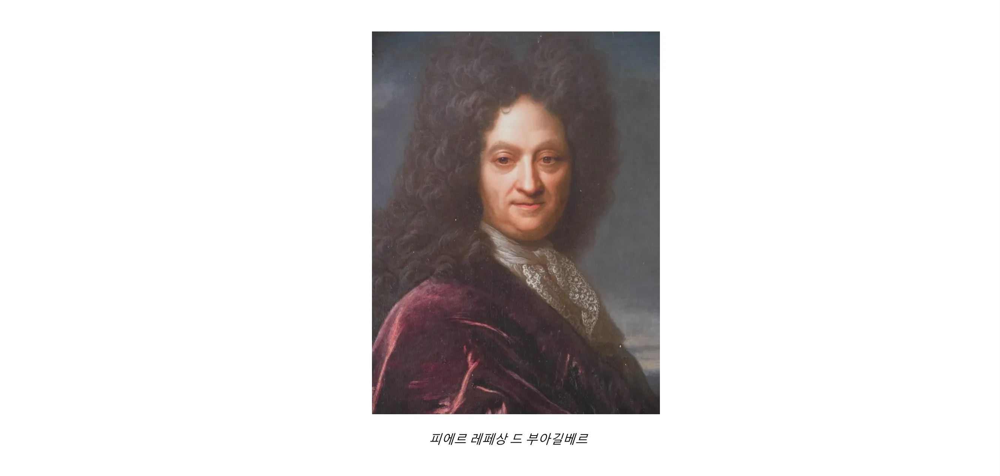

괴팍한 성격과 압도적인 열정으로 인해 당시 독자들에게 인정받지 못하고 권력층과 거리를 두었던 부아길베르는 18세기에 거의 흔적을 남기지 못했습니다. 하지만 지난 세기 초부터 그의 작품이 서서히 재발견되고 있습니다.

그러나 이러한 재발견은 우리가 일종의 막다른 골목에 들어섰음을 보여줍니다. 수많은 이론의 선구자이자 많은 사상가들의 선구자로 소개되면서 부아길베르의 진정한 공로는 사라졌습니다. 그는 훗날 케인즈가 옹호한 불완전 고용의 개념을 파악했고, 세이의 법칙을 예상했으며, 왈라스의 일반균형 이론의 길을 닦았고, 심지어 마르크스주의자들의 계급 분석을 예견했다고 합니다. 한 평론가는 궁극적으로 '부아길베르가 누구 또는 무엇의 선구자가 아닐 수 있을까?"라고 물었습니다.

(피에르 르 페상 드) 부아길베르는 1646년 루앙에서 태어났습니다. 파리의 포르트로얄에서 교육을 받은 부아길베르는 루앙 중장을 비롯한 다양한 직책을 맡기 전까지 문학가로 활동하다가 실패한 경력을 쌓기 시작했습니다. 이 시기에 그는 자신의 사상을 옹호하기 위해 여러 권의 책을 썼는데, 그 중 1695년에 출간한 '데테일 드 라 프랑스'는 이듬해에 훨씬 더 명확한 제목인 [*루이 14세 치하에서 파괴된 프랑스, 누가 어떻게, 그리고 그것을 회복할 수단으로](https://archive.org/details/bub_gb_0jUaWNbTJa8C/page/n23/mode/2up)*로 다시 출간했습니다.

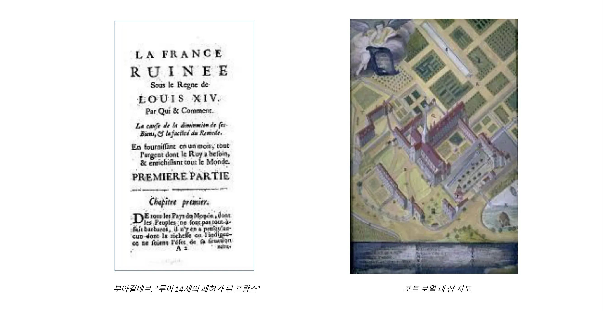

이것이 바로 부아길베르의 책의 기초입니다: 프랑스의 빈곤과 그 원인.

18세기 말 프랑스 국민들이 겪은 이 비참한 상황을 부아길베르는 보방과 마찬가지로 자세히 묘사합니다. 그는 이렇게 썼습니다:

> "모든 사람이 볼 수 있는 척박하거나 제대로 경작되지 않은 땅은 프랑스의 시체와 같다".

그는 뿌리 뽑힌 포도밭, 밭을 버린 농부, 반복되는 기근에 대해 설명했습니다.

부아길베르는 이 불행의 두 가지 주요 원인을 찾습니다. 사람들이 궁핍하게 사는 것은 필요한 것을 소비하지 못하기 때문이며, 소비의 파멸에는 두 가지 원인이 있습니다.

첫째, 자의적인 과세로 인해 백성들은 더 이상 생필품을 소비할 여력이 없었습니다. 당시의 개인 세금인 부역은 개인별로 무작위로 계산되어 이유 없이 오르거나 내렸습니다. 수많은 특권으로 인해 그 부담은 가난한 농민들에게 돌아갔고, 농민들은 파탄에 이르렀습니다. 이를 바로잡기 위해 부아길베르는 보반의 제안과 마찬가지로 모든 소득에 비례세를 부과할 것을 제안했습니다.

프랑스가 불행했던 두 번째 이유는 너무 많은 장애물이 상품, 특히 농산물의 자유로운 무역을 방해했기 때문입니다. 국경은 물론이고 국가 내에서도 다른 지역 간에도 관세가 존재하여 모든 상거래가 마비되었습니다. 이러한 제한으로 인해 균형 가격이 형성되지 않았고 시장 기회가 제한되었습니다. 그 결과 농민들은 생산한 농산물을 제값에 팔지 못해 생계를 유지할 수 없었고, 오늘날에도 여전히 관련성이 높은 문제이자 부아길베르 이론의 핵심인 농산물 가격 하락으로 고통받았습니다. 무역 제한 문제에 대해 부아길베르는 길을 열어주는 것, 즉 자유 무역을 확립해야 한다고 주장했습니다.

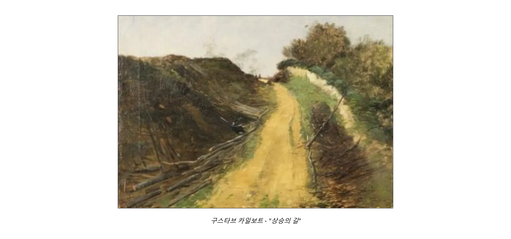

그리고 자유는 실제로 그의 최종 결론입니다. "그것은 행동의 문제가 아니라 항상 자유와 완벽을 지향하는 자연에 대해 우리가 그렇게 폭력적으로 행동하는 것을 멈추는 것"이라고 그는 말합니다. 그는 "자연이 제 길을 가도록 내버려두고, 즉 자연에 자유를 주고, 모든 사람을 보호하고 폭력을 예방하는 것 외에는 아무도 이 상거래에 간섭하지 않는 한 모든 것이 잘 될 것"이라고 지칠 줄 모르고 반복합니다.

이 마지막 구절은 매우 중요합니다. 부아길베르는 자유방임주의 경제 정책을 자신의 신조로 삼고 이를 중심으로 실제 시스템을 구축한 최초의 인물입니다. 그에 따르면 자연스러운 질서는 존재하며, 시기적절하지 않은 공공 개입으로 인해 파괴되어서는 안 됩니다. 그의 견해에 따르면 국가는 경제 문제에 개입해서는 안 되며, 오히려 사물이 자연스럽게 작동하도록 내버려 두어야 합니다. 그렇지 않으면 불행을 초래할 것입니다.

부아길베르는 선의를 가지고 있었지만 큰 해를 끼친 '*선한 영혼*'을 비판하기도 했습니다. 그들은 백성들에게 값싼 빵을 원했지만, 가격을 강제로 낮춤으로써 그런 마진으로는 생존할 수 없는 농부들을 파멸시켰습니다. 그 후 농부들은 땅을 버리고 더 깊은 빈곤에 빠졌습니다. 우리 모두 알다시피 '지옥은 종종 선한 의도로 포장된다'는 말이 있습니다.

## 칸틸롱

<chapterId>bc206d41-6a64-5688-a489-40fcfa0e5397</chapterId>

"무역 일반의 본질에 관한 에세이"(1730년경 집필, 1755년 출간)의 저자 리처드 칸티용은 현대 경제학의 선구자 중 한 명으로 꼽힙니다. 경제학자 머레이 로스바드는 그의 저서 『경제사상의 역사』에서 칸티용을 현대 경제학의 창시자라고 언급하기도 했습니다.

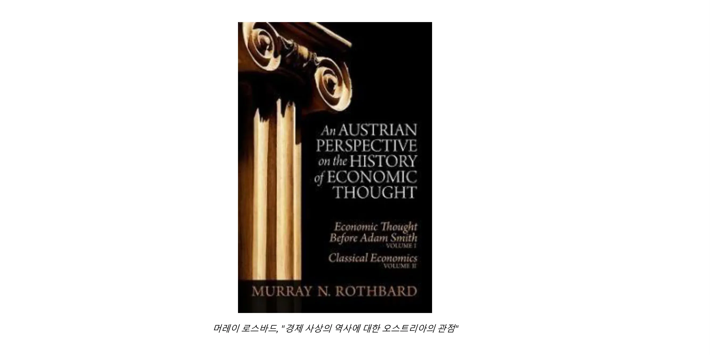

아일랜드에서 태어난 리차드 칸티용은 젊은 시절 파리에 정착하여 프랑스 국적을 취득했습니다. 그는 은행원으로 일하며 존 로 시대에 큰돈을 벌었습니다.

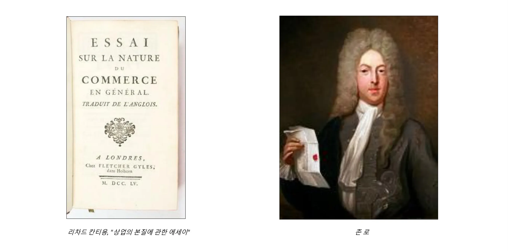

경제 이론을 공부하기 시작한 것도 이 때였습니다. 1730년경 칸티용은 '상업의 본질 일반에 관한 에세이'를 집필했습니다.

이 책은 일반 경제학 이론을 만든 최초의 시도 중 하나로 볼 수 있습니다. 칸트는 이 나라나 저 나라의 특정한 사실이 아니라 사물의 본질에 있는 '경제의 일반 법칙'을 찾아내는 데 주의를 기울였습니다. 이 접근 방식은 혁명적이었습니다.

칸트 에세이의 가장 큰 장점은 부의 이론, 기업가 개념, 쓸모없는 화폐에 대한 비판, '칸트 효과', 마지막으로 자유에 대한 옹호라는 다섯 가지 영역으로 요약할 수 있습니다.

첫째, 그의 '부의 이론'입니다.

당시 지배적이었던 중상주의적 관점과 달리 칸트는 부는 인간의 향유에 적합한 상품에 의해 형성된다는 인식에 기초해 분석했습니다. 그는 이러한 부는 자연에서 비롯되며 인간의 노동을 통해 생산된다고 주장했습니다. 부의 본질에 대한 그의 생각은 베카리아와 아담 스미스에게 큰 영향을 미쳤고, 스미스를 통해 영국 고전학파 전체에 영향을 미쳤습니다.

둘째, **기업가**입니다.

명확하게 정의하지는 않았지만 칸티용은 기업가를 경제 활동의 주요하고 중심적인 주체로 보았습니다. 칸티용에게 기업가의 특징은 위험을 감수하고 불확실성 속에서 행동한다는 점입니다. 이러한 아이디어는 훗날 투르고에 의해 확장되고, 더 중요한 것은 세이에 의해 마침내 경제에서 기업가의 특별한 위치를 인정하는 것으로, 이번에는 영국 학파의 주장과는 정반대의 주장을 펼칩니다.

세 번째 포인트, **통화**.

캔틸론은 존 로의 경험에 비추어 화폐가 실제 가치가 없을 때 어떤 일이 일어나거나 일어나야 하는지 설명합니다.

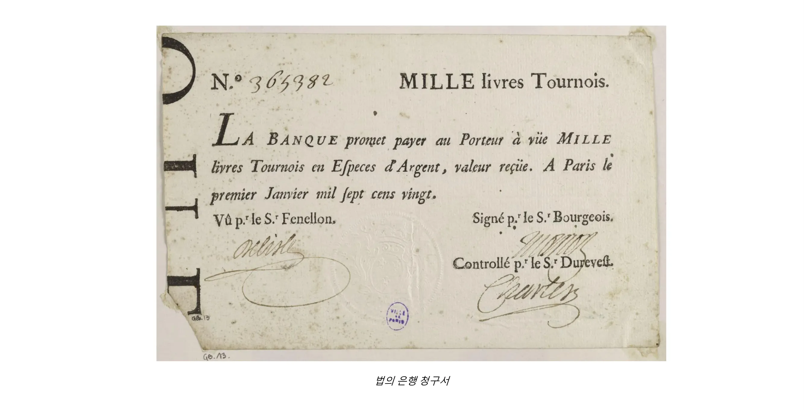

그는 지폐와 같이 실질적인 가치가 없는 화폐를 금속 화폐로 대체할 경우 두 가지 주요 결과가 발생할 것으로 예상합니다. 첫 번째 결과는 '대중의 거부감'으로, 쓸모없는 화폐에 대한 불신이 커지는 것을 의미합니다. 두 번째 결과는 인플레이션으로, 통화 약세로 인해 상품 가격이 더 비싸지는 것입니다.

넷째, 칸티용은 **인플레이션**에 대한 분석에서 동시대 학자들보다 한 발 더 나아갔습니다. 로의 체제가 무너지는 것을 지켜본 칸티용은 화폐 인플레이션이 모든 사람에게 똑같이 영향을 미치지 않는다는 것을 깨달았습니다. 오히려 인플레이션은 누군가를 풍요롭게 하고 누군가를 빈곤하게 만들었습니다. 그는 인플레이션은 재분배 효과가 있으며, 새로 발행된 화폐를 먼저 받은 사람은 구매력 증가로 혜택을 보는 반면 나중에 받은 사람은 물가 상승으로 인해 새로 발행된 화폐로 인해 더 가난해진다는 결론을 내렸습니다.

다섯째, 중상주의 사상의 일부 잔재에도 불구하고 칸트의 전반적인 관점은 **완전히 자유주의적이었습니다**. 그는 사유재산을 문명의 기본 기둥으로 옹호하면서 토지와 노동의 산물이라는 사적 지대 없이는 어떤 사회도 기능할 수 없다고 주장했습니다. 또한 사람들 사이의 물질적 불평등은 자연스럽고 정당한 것으로 보았습니다. 칸티용에 따르면 효율적이고 용감한 노동자나 뛰어난 재능을 가진 노동자가 무능하거나 게으른 사람보다 더 많은 수입을 얻는 것은 잘못된 것이 아닙니다.  마지막으로 칸티용은 가격은 항상 공공 당국의 개입 없이 수요와 공급의 작용에 의해 자유롭게 결정되어야 한다고 믿었습니다.

그의 에세이에 담긴 다섯 가지 주요 아이디어 중 가장 중요한 것은 의심할 여지없이 현재 그의 이름을 딴 '캉티용 효과'입니다.

인플레이션의 영향에 대한 이 이론을 통해 칸틸롱은 현대의 여러 병폐에 대한 해답을 제시합니다. 최근의 확장적 통화 정책과 인플레이션 통화 정책이 중산층과 농촌을 빈곤하게 만든 결과를 이해하는 데 도움이 되며, 새로운 문제의 근원인 중앙은행과 상업은행에 공동으로 근접해 있기 때문에 금융 시장 운영자와 국가, 그 기관 및 공무원은 부유해집니다.

# 18세기 초의 개혁가들과 사상가들

<partId>1f7b50d4-ce93-5db3-8396-43c1fa5419ff</partId>

## 생피에르 수도원장

<chapterId>13478fe2-4c12-593c-a410-54c2cfb7ef7f</chapterId>

18세기 프랑스 자유방임 사상가들의 판테온에 포함하기로 선택한 모든 작가 중에서 생피에르 수도원장은 의심할 여지없이 가장 많이 간과된 인물입니다.

공정하게 말하자면, 부분적으로는 그의 잘못입니다. 그는 많은 글을 썼지만 그의 스타일은 읽기에는 Hard이고 반복으로 가득 차 있습니다. 장 자크 루소도 그의 저작을 요약하려고 시도했지만, 자신의 능력 밖의 일이라는 것을 깨닫고 곧 포기했습니다. 19세기 중반, 구스타브 드 몰리나리는 생피에르 수도원장이었던 평화주의자이자 경제학자에게 경의를 표하는 포괄적인 저작을 출판하여 그를 기렸습니다. 하지만 이것만으로는 그를 망각에서 벗어나게 하기에 충분하지 않았고, 그는 오늘날에도 여전히 망각 속에 남아 있습니다.

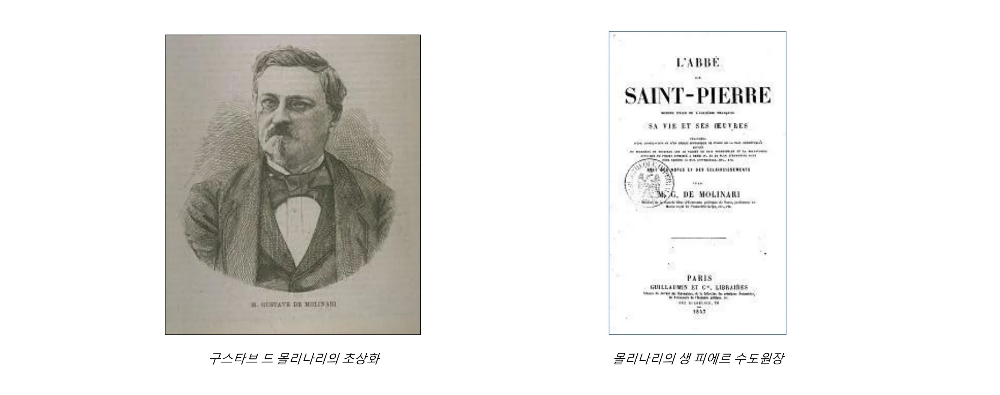

생 피에르 수도원장은 경제학에 관한 글을 썼지만, 평화주의자로서 더 많은 관심을 받고 있습니다. 그는 잘 알려진 엠마누엘 칸트의 『영원한 평화를 위한 프로젝트』의 저자이기도 합니다.

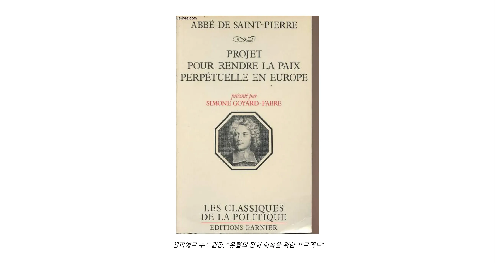

이 작품에서 그는 전쟁은 패배자뿐만 아니라 승자, 심지어 전쟁에 참여하지 않은 사람들에게도 상거래에 영향을 미치기 때문에 파괴적이라고 주장했습니다.

전쟁의 재앙에 맞서기 위해 그는 일종의 유럽 국가 연맹을 만들 것을 제안했습니다. 각국의 문제를 해결하기 위해 유럽 평의회가 구성될 것입니다. 따라서 각국은 무력 사용을 피하기 위해 중재에 의지하게 될 것입니다. 만약 한 국가가 평화를 받아들일 만큼 현명하지 않거나 다른 유럽 국가들을 위협한다면 유럽 국가 연맹은 대응할 수 있는 수단을 갖게 될 것입니다. 이러한 상황에 직면하면 여러 국가가 병력을 제공하는 유럽 군대가 결성될 것입니다.

프랑스 자유방임주의 운동의 이면에 있는 비판적 사고방식을 완벽하게 보여주는 생피에르 수도원장의 일화도 있습니다. 그는 1695년 아카데미 프랑세즈에 입학했지만 루이 14세의 통치를 과감하게 비판했다는 이유로 1718년 추방당했습니다. 당시 그는 태양왕의 통치의 화려함 이면에 감춰진 신비에 대해 과감하게 목소리를 냈던 보방, 부아길베르와 같은 인물들과 뜻을 같이했습니다.

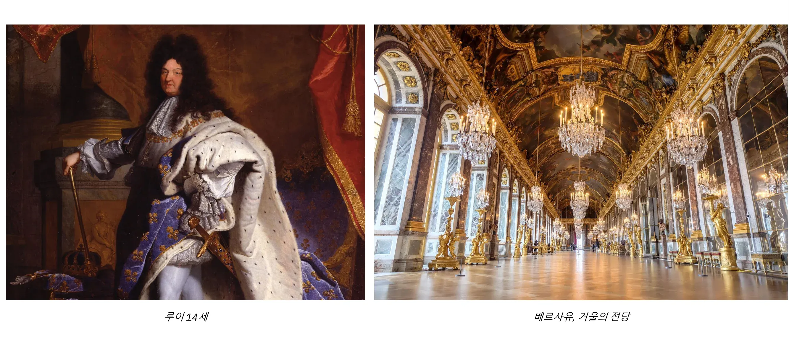

생피에르 수도원장은 호화로운 궁정과 군사적 정복에 집착하는 루이 14세의 통치는 덕이 있는 왕의 모습이 아니라고 주장했습니다. 그는 루이 14세가 "**루이 대왕**"이라는 칭호를 받을 자격이 있다는 것을 인정하지 않았습니다.

"이웃과 국민을 동시에 망치는 것은 위대함이 아니다"라고 그는 말했습니다. 이 입장은 오랫동안 가능한 모든 문학적 형식으로 국왕을 미화하는 데 몰두해 온 아카데미 프랑세즈에 깊은 불쾌감을 안겨주었습니다. 그 결과 그들은 거의 만장일치로 그를 추방하기로 투표했습니다.

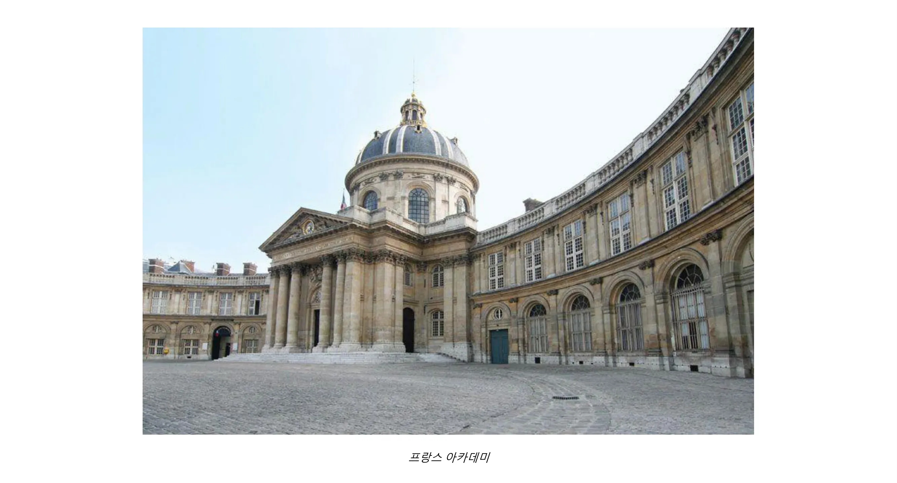

경제적 사고에 있어서 그는 훗날 제레미 벤담이 그랬던 것처럼 효용의 원칙을 일관되게 적용했고, 종종 건전한 통찰력을 제공했습니다. 공정하게 말하자면, 그는 당시 누구도 완전히 탈피하지 못했던 중상주의 사상의 영향을 여전히 받고 있었습니다.

그럼에도 불구하고 생피에르 수도원장은 경제에 대한 정확한 관찰을 했습니다. 흔히 이 아이디어의 창시자로 알려진 *콩디악*보다 앞서 그는 모든 Exchange에서 양측이 모두 이익을 얻는다고 분명하게 말했습니다. 이는 그가 1733년에 쓴 ["프랑스 무역 개선을 위한 프로젝트"](https://www.institutcoppet.org/projet-pour-perfectionner-le-commerce-de-france/)에서 확인할 수 있습니다:

> "상인 간에 판매가 이루어지면 판매자도 이익을 얻고 구매자도 이익을 얻습니다. 양측에 실질적이거나 인지된 이익이 없다면 판매자는 이런저런 가격에 판매하지 않을 것이고 구매자도 그런 가격에 구매하지 않을 것이기 때문입니다."

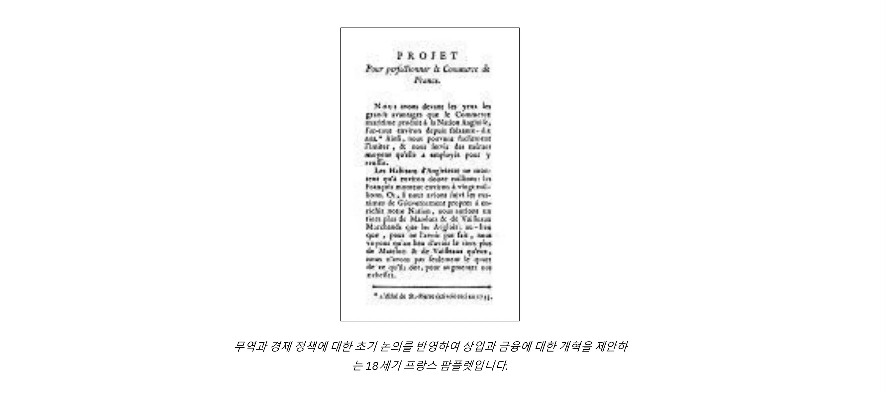

그는 또한 뱅상 드 구르네보다 먼저 노동의 가치와 노동을 매력적으로 유지하는 것의 중요성을 강조했습니다. "모든 노동은 어렵다"라고 그는 썼습니다. "노동을 해도 보상이 없거나 충분하지 않다는 것을 알게 되면 사람은 게을러지고 불필요한 노력에 신경 쓰지 않게 된다"고 말했습니다. 이 주장은 훗날 다강손 후작, 뱅상 드 구르네, 피지오크라트들이 부담스러운 규제와 길드 시스템을 비판하면서 반향을 불러일으켰습니다. 이들은 이러한 규제가 노동자의 의욕을 꺾고 불필요한 어려움을 야기하며, 결국 그러한 조건에서 생산적인 노력보다 게으름이 더 매력적으로 보인다고 주장했습니다.

## 마르퀴스 다겐손

<chapterId>e9960ab4-72ec-5afd-8e97-bf89c83b62bc</chapterId>

아르젠송 후작은 자유방임주의의 창시자로 잊혀진 인물입니다.

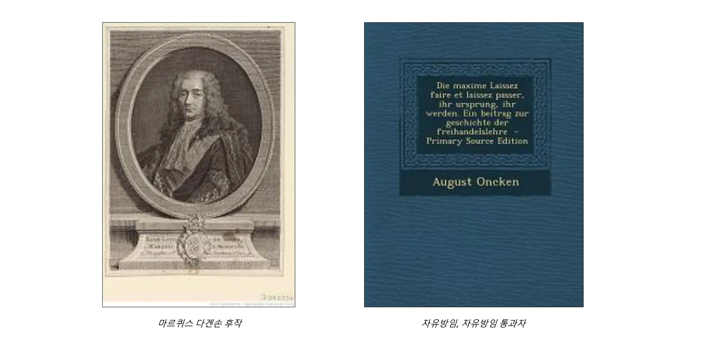

자유방임, 자유방임주의에 관한 책을 저술한 아우구스트 온켄은 다겐슨이 이 아이디어의 탄생에 중요한 역할을 했다는 결론을 내리고 이를 재발견했습니다.

르네 루이 보이어, 아르젠송 후작은 1694년에 태어났습니다. 그는 의회 고문으로 정치 경력을 시작한 후 국무위원을 역임했습니다.

아담 스미스보다 30년 전에 이미 다겐슨은 분업과 전문화의 이점을 옹호하고 있었습니다.

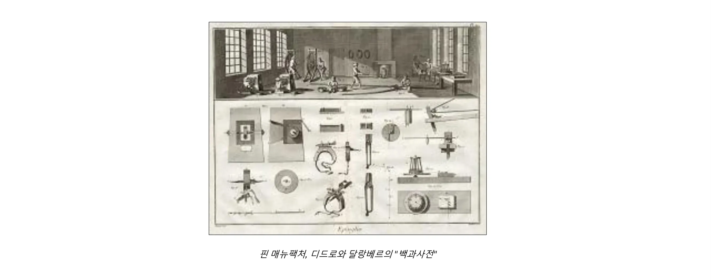

그는 각 지역의 자연스러운 선호도를 바꾸려고 하는 규제를 강력하게 비판했습니다. 예를 들어, 그는 정부가 당시 가난한 도시였던 투르에서 직물과 벨벳을 생산하여 명품으로 유명한 제노바의 품질에 맞추려고 하는 것에 당황했습니다. 그는 결론을 내렸습니다:

> "각 장소마다 자체 공장을 선택할 수 있어야 합니다. 자유! 자유!"

그는 또한 스미스의 또 다른 핵심 원칙인 자발적 질서는 자기 이익의 추구에서 비롯된다는 생각도 인정했습니다. 다겐손 후작은 즉각적인 개인적 이익이 인간의 에너지를 이끌어낸다고 믿었습니다. 그는 부실한 장인 정신과 사기는 제조업체의 신용을 떨어뜨리는 반면, 근면과 선의는 번영으로 이어진다고 썼습니다. 효용에 대한 최고의 판단자는 상품을 구매하고 좋은 거래를 하는 데 관심을 갖는 개인, 즉 대중이라고 그는 주장했습니다. 그는 "모든 사람은 자신의 이익을 감지한다"며 "모든 사람은 자신에게 이익이 되는 조치를 취하며, 이러한 일반적인 합의 속에서 진실을 발견할 수 있다"고 말했습니다

아담 스미스 이전에도 그는 자발적인 자연 질서의 구축을 통해 이기심이 일반의 이익으로 이어진다는 사실을 이해했습니다.

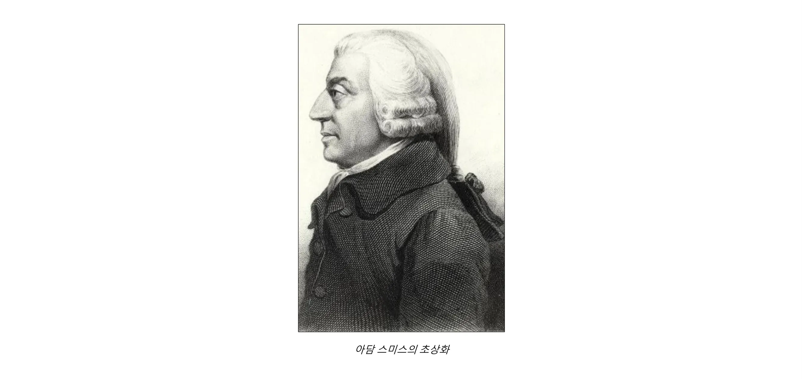

그는 사회를 모든 곤충이 본능을 따르는 벌집에 비유하며, "그들의 행동으로 인해" "작은 사회의 필요를 위해 엄청난 축적이 이루어졌지만, 이것은 명령이나 각 개인이 지도자의 견해를 따라야 하는 장군들에 의해 이루어진 것이 아니다"라고 정확하게 말했습니다. 이것은 아마도 프랑스 경제 사상에서 아담 스미스의 유명한 '보이지 않는 손' 개념에 가장 가까운 표현일 것입니다.

다겐손 후작은 당시 장관들의 생각에 항상 분노했습니다. 그들이 던진 유일한 질문은 "이런 식으로 규제해야 할까, 저런 식으로 규제해야 할까? 경제를 이런 방향으로 이끌어야 할까, 저런 방향으로 이끌어야 할까?"라는 질문뿐이었습니다. 이에 대해 다겐슨은 이렇게 대답했습니다: "우리는 먼저 어떤 것을 지시하는 것이 적절한지, 아니면 사물이 스스로 작동하도록 내버려 두어야 하는지 물어봐야 하지 않을까요?"

사실, 그는 사람들이 모든 종류의 과도한 규제가 경제에 미치는 해로운 영향을 이해하는 것이, 아니 오히려 보는 것이 그렇게 어렵지 않다는 사실에 놀랐습니다. 그가 보기에 그것은 단순히 눈을 뜨는 것만으로도 충분했습니다. 그는 "오늘날 많은 것들이 합리적으로 잘 작동하고 있다"며 "단지 법의 손길을 피할 수 있었기 때문"이라고 씁쓸하게 썼습니다.

때때로 그는 자신의 아이디어가 얼마나 이해받지 못하는지 절망하기도 했습니다.

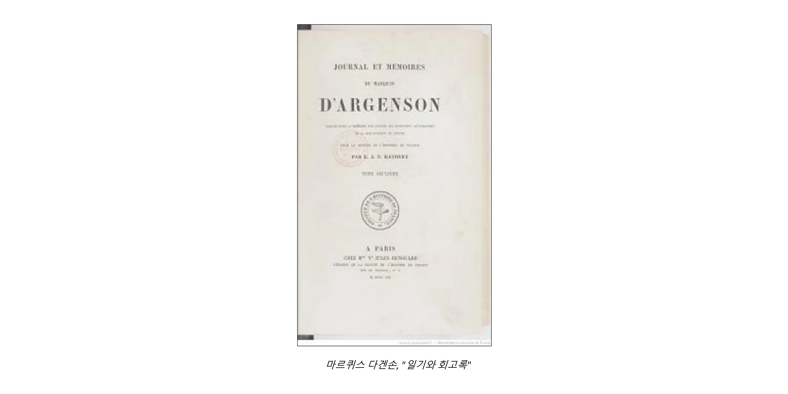

따라서 그가 옹호한 경제 정책의 이상은 당시의 시대적 흐름에 반하는 것이었습니다. 그의 이상은 국가의 역할을 본질적으로 부정적으로 정의했습니다. "상거래에 필요한 것은 장애물을 제거하는 것입니다. 훌륭한 판사, 독점에 대한 처벌, 모든 시민에 대한 동등한 보호, 안정적인 통화, 도로와 운하만 있으면 된다"고 주장했습니다. 이것이 바로 프랑스 정치경제학 전통의 토대가 된 최소국가에 대한 정의였습니다.

경제 활동에서 국가의 역할에 대한 이러한 비전은 당시 경제학자와 사회 사상가들을 자극했던 두 가지 주요 이슈, 즉 산업 규제와 밀 무역에 대한 연구를 통해 자연스럽게 설명되었습니다.

무엇보다도 산업에 대한 규제는 다른 사람들을 희생시키면서 일부에게는 특권을 주는 것이기 때문에 그의 모든 분노를 불러 일으켰습니다. "그는 "우리 공장의 쇠퇴의 진짜 원인은 공장에 대한 과도한 보호"라고 썼습니다. 그리고 그는 당대 정치가들의 디리지스트적 열정에 대한 비판을 그 못지않게 생생한 신조로 표현했습니다:

> 업계의 의지에 반하여 업계를 운영한다는 것은 업계의 파멸을 바라는 것입니다.

생계를 위한 무역 문제에 대해 다겐슨은 자유 외에는 다른 답이 없었습니다. 그에 따르면 밀 부족은 독점과 정부의 과도한 예방 조치에서 비롯된 것이었습니다. 그냥 내버려두기만 하면 항구가 개방된 나라에서 밀 부족 사태는 결코 일어나지 않을 것입니다. 다른 모든 사람들처럼 이득의 유혹에 이끌린 외국인들은 우리에게 필요한 것을 제공하고 우리의 잉여를 빼앗아 갈 것입니다. "그냥 두면 모든 것이 잘 될 것"이라고 그는 말했습니다.

## 빈센트 드 구르네

<chapterId>e8ae40dc-7450-552f-9ddc-9e02936cf425</chapterId>

뱅상 드 구르네는 프랑스에서 자유방임주의를 처음 주장한 사람 중 한 명이며, 공공 행정과 지식계에서 자유방임주의를 가장 먼저 옹호한 사람 중 한 명입니다. 그렇기 때문에 그는 경제 사상사에서 일반적으로 받는 것보다 훨씬 더 많은 인정을 받을 자격이 있습니다. 저는 최근 출간한 책에서 그의 공헌을 강조하려고 노력했습니다.

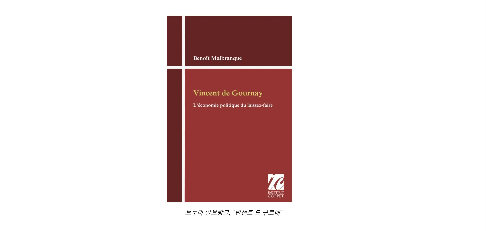

상인 집안에서 태어난 구르네는 스스로 성공한 상인이 되어 상당한 부를 쌓은 후 프랑스 행정부에서 자리를 잡았습니다. 상무부 내에서 그는 자유 노동과 자유무역을 열렬히 지지하는 사람이었습니다.

당대의 주요 경제학자들의 맥락에 잘 편입되었지만, 구르네는 글을 거의 쓰지 않았거나 오히려 거의 출판하지 않았습니다. 그는 주로 행정 서한과 회고록을 썼는데, 미발표이거나 다른 저자들이 약간의 편집을 거쳐 출판했습니다.

저희가 제공하는 서비스에는 다음이 포함됩니다:

1. 영국 경제학자 조시아 차일드의 책을 번역한 [발언](https://archive.org/details/traitessurlecomm0000chil)을 소개합니다;

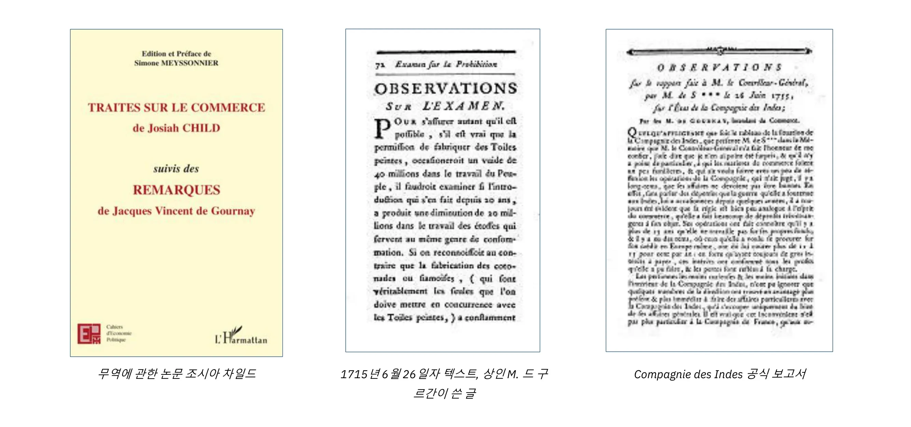

2. '관찰 사항'은 인쇄된 직물 금지의 장단점 검토에 포함됩니다;

3. "동인도 회사에 대한 관찰", 모렐렛 애벗이 동인도 회사의 현황에 관한 회고록(1769)에 덧붙인 글입니다;

4. 그리고 무엇보다도 그가 상무부 장관으로 재직하던 시절의 다양한 회고록이 있습니다.

이 글들은 분명한 외국의 영향과 몇 가지 주요 구조화 아이디어의 존재를 보여줍니다. 구르네가 말하는 외국의 영향이란 영국과 네덜란드의 우월성을 인정하는 것입니다. 구르네는 이 두 나라가 프랑스보다 경제학을 훨씬 더 잘 이해하고 있으며, 프랑스가 그들의 모범을 따라야 한다고 확신했습니다. 그는 "이 두 나라는 가장 번영한 나라"라며 "그들은 우리와는 완전히 다른 시스템을 따르고 있다"고 말했습니다. 우리는 외국 상품의 유입을 금지하고 엄격한 규제로 경제 활동을 제한하는 반면, 그들은 정반대의 방식으로 진행합니다. 만약 그들이 더 잘하고 있다면 그것은 프랑스가 잘못된 원칙을 따르고 있기 때문"이라고 구르네는 결론지었습니다.

그의 개혁 제안은 몇 가지 핵심 사항을 중심으로 이루어졌습니다.

첫째, 그는 노동을 보호하고 장려해야 한다고 믿었습니다. 당시 프랑스 노동자들은 범죄자 취급을 받으며 끊임없이 감시를 받았고, 수천 개의 규정 중 하나를 지키지 않았다는 이유로 두려움에 떨었습니다. 이러한 과도한 성가심은 사람들의 일 의욕을 떨어뜨리고 게으름을 부추겼습니다. 하지만 구르네는 "노동은 고귀한 것이며 국가를 풍요롭게 하는 유일한 방법"이라고 주장했습니다.

둘째, 그는 제조업체를 제한하는 길드 시스템을 비판했습니다. 거래에 참여하려면 시간과 비용이 많이 들었고, 새로운 노동자는 길드의 규약이 정한 일과를 꼼꼼하게 따라야 했습니다. 이러한 시스템에서는 우수성, 혁신, 발전의 여지가 없었습니다.

셋째, 프랑스의 무역은 제한적인 법률에 의해 제한되었습니다. 구르네는 항구가 자유롭게 경쟁하고 곡물이나 인쇄된 캔버스 등 모든 상품을 제한 없이 수입할 수 있다면 소비자에게 큰 이익이 될 것이라고 생각했습니다. 그는 밀수의 진정한 기원을 지적한 최초의 사람 중 한 명으로, 밀수는 유익하고 유용한 무역이 금지되어 있기 때문에 존재한다는 점을 지적했습니다. 밀수는 규제도 없고 길드도 없으며 몰수세도 없는 '자유로운' 직업이라는 날카로운 관찰을 덧붙였습니다. 하지만 많은 정직한 노동자들을 불법으로 내몰았던 것은 국가의 압도적인 규제였습니다.

마지막으로 구르네는 프랑스보다 더 번영한 영국과 네덜란드의 이자율이 더 낮다는 점에 주목했습니다. 그는 프랑스에서도 금리를 낮추어 다른 나라들처럼 유리한 조건으로 경제 활동에 자금을 조달할 수 있도록 해야 한다고 주장했습니다. 그러나 구르네는 강압적이고 입법적인 방법을 추구하지 않았으며, 오히려 가톨릭 교회에서 여전히 비난받던 대부업을 합법화할 필요성을 강조했습니다.

이 모든 점에서 구르네는 18세기 중반의 지적 논쟁에서 핵심적인 역할을 했습니다. 경제적 자유에 대한 그의 주장은 피지오크라트보다 10년, 애덤 스미스보다 20년 앞섰습니다. 하지만 그의 가장 지속적인 영향력은 투르고에게 있었습니다. 구르네는 어린 투르고를 자신의 후견인으로 삼아 자신의 사상을 훈련시켰습니다.

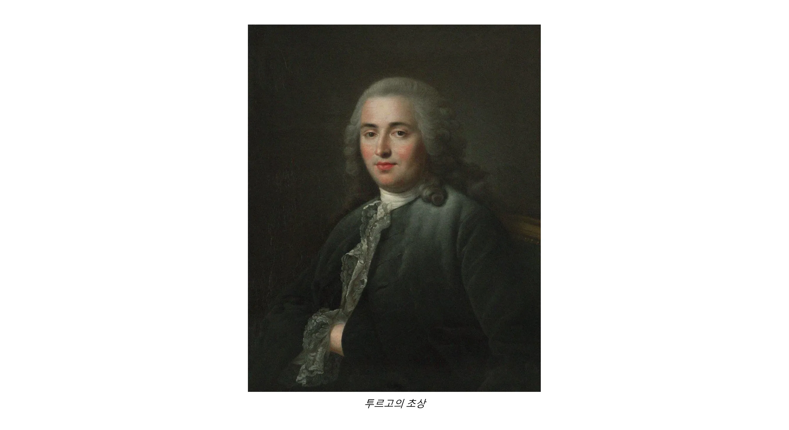

몇 년 후 루이 16세의 장래 장관이 된 투르고는 그의 사후에 친구를 기리는 에로그를 썼습니다. 투르고가 프랑수아 퀘네의 피지컬리즘을 완전히 받아들이지 않았다면, 그것은 그가 첫 스승이었던 뱅상 드 구르네에 대한 무한한 애착을 간직하고 있었기 때문입니다.

## 구르네 서클

<chapterId>b86ba6bd-8f3a-5d8f-b098-4d0413f00deb</chapterId>

경제학의 초창기라고 하면 역사에서는 프랑수아 퀘네와 그의 제자들이 이끈 피지오크라는 최초의 학파를 강조하는 경향이 있습니다. 그러나 이들이 등장하기 거의 10년 전, 경제학자 뱅상 드 구르네를 중심으로 덜 공식적이지만 똑같이 중요한 또 다른 그룹이 있었습니다.

이전 파트에서 살펴본 것처럼 구르네는 영국과 네덜란드와 같은 외국의 사례에 매료되었습니다. 그는 조시아 차일드, 요한 드 비트, 데이비드 흄과 같은 경제학자들을 존경했습니다.

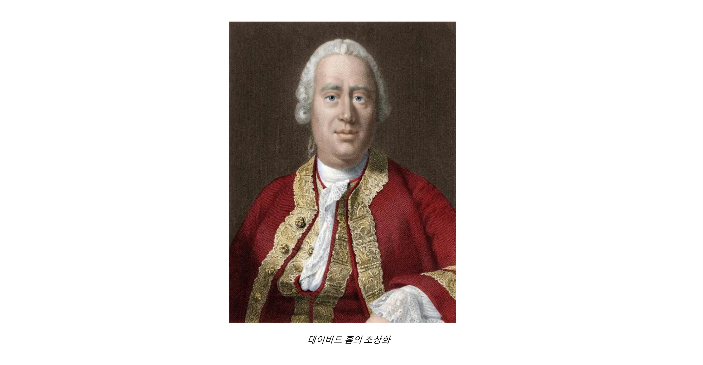

이러한 존경심으로 인해 그는 그들의 경제 관련 저서를 번역하고 번역을 맡게 되었습니다.

고위 행정부에서 근무한 덕분에 구르네는 당시 프랑스에 알려진 모든 경제 전문가들과 접촉할 수 있었습니다. 이런 식으로 그는 매우 유능한 번역가 그룹을 모았습니다. 그는 차일드와 컬페퍼의 저작을 직접 번역했습니다. 애봇 르 블랑은 데이비드 흄의 『정치학 담론』을 번역했습니다. 베론 드 포보네스는 스페인 경제학자 제로니모 데 우즈타리즈를 번역했습니다. 투르고는 조시아 터커의 저서를, 몽테스키외의 아들은 조슈아 지를 번역했습니다.

구르네 서클의 여러 멤버가 협력한 덕분에 많은 작가가 자신의 이름으로 원작을 출판할 수 있었습니다. 이 책들은 번역본과 함께 괄목할 만한 성공을 거두었습니다. 몇 가지 주목할 만한 사례는 다음과 같습니다:

- 허버트의 [곡물 총경] 에세이(https://archive.org/details/essaisurlapolice00herb/page/n7/mode/2up) (4년간 6판 발행)

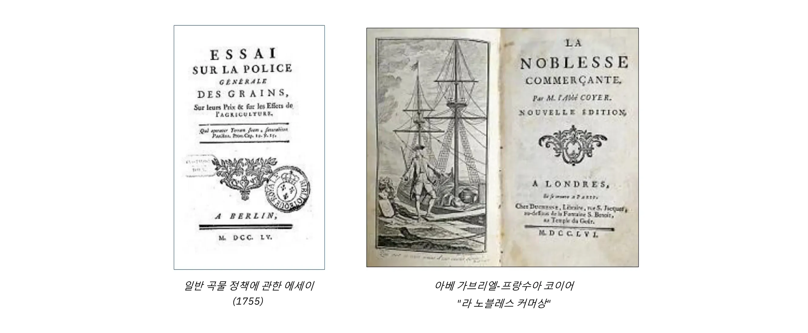

- 코이어의 [노블레스 커머셜](https://archive.org/details/lanoblessecommer00coye/page/n3/mode/2up)(2년간 5번의 에디션)

- 플루마드 드 당글의 [프랑스와 영국의 장단점에 대한 소고](https://archive.org/details/bim_eighteenth-century_remarks-on-the-advantage_plumard-de-dangeul-loui_1754) (첫해에 3판 발행)
- 클리코-블레르바슈와 구르네의 [무역 회고록](https://www.amazon.com/Memoire-sur-corps-metiers-French/dp/1978196903)(1758년 2판 발행)

이 그룹은 또한 다음과 같은 출판물에서 중추적인 역할을 수행했습니다

- [무역의 본질에 관한 에세이](https://archive.org/details/essayonnatureofc0000cant) 작성자: 리차드 칸티용.

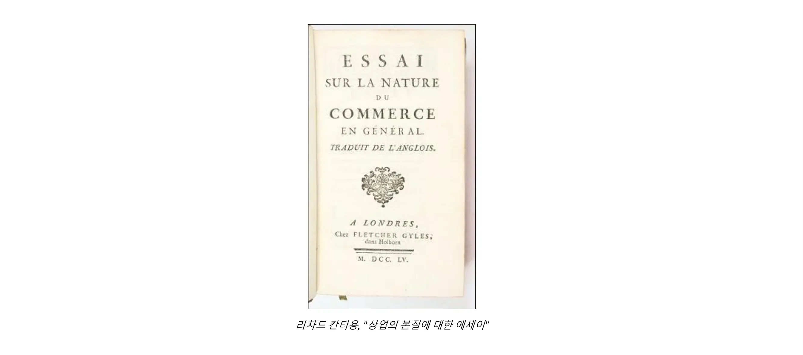

1730년경에 쓰여진 이 마지막 책은 저자가 사망한 후에도 원고로 남아있었습니다. 구르네는 경제학자 친구들의 도움을 받아 1755년에 이 책을 출판했습니다. 서클의 일원이었던 모렐렛 수도원장에 따르면, 구르네는 자신이 아는 모든 경제학자에게 이 책을 추천했다고 합니다.

구르네 서클의 지적 성과는 사상의 역사에 큰 영향을 미쳤습니다. 이런 의미에서 그들은 프랑스 경제학의 창시자라고 할 수 있습니다. 경제 출판물의 역사를 연구한 INED의 크리스틴 테레는 1750년에서 1759년 사이에 경제학 관련 저작이 **349건 이상 출판된 반면, 이전 10년(1740-1749년)에는 **83건에 불과했다는 사실을 발견했습니다. 1750년대의 이러한 혁명은 주로 구르네 서클의 영향이 컸습니다.

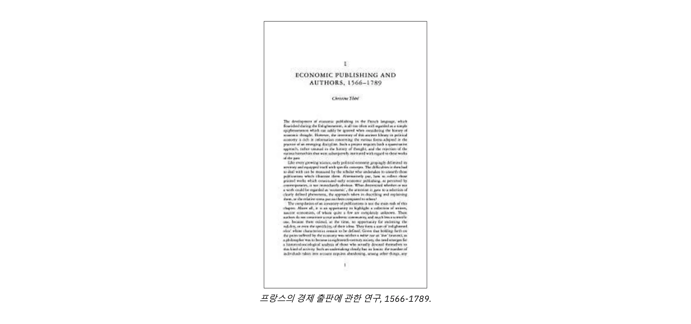

프랑스 대중에게 경제 토론에 대한 취향을 전파하기 위해 구르네와 그의 친구들은 소설을 통해 경제 토론에 대한 접근성을 높이기 위해 노력했습니다. 길드를 비판한 <무역에 관한 회고록>이 출간된 후, Gournay와 Cliquot-Blervache는 가브리엘-프랑수아 코이어가 <친키: 다른 나라에도 적용 가능한 코친중국 이야기>(https://www.institutcoppet.org/wp-content/uploads/2013/06/Coyer-Chinki-Histoire-cochinchinoise.pdf)라는 짧은 풍자 소설을 집필하는 데 도움을 주었습니다.

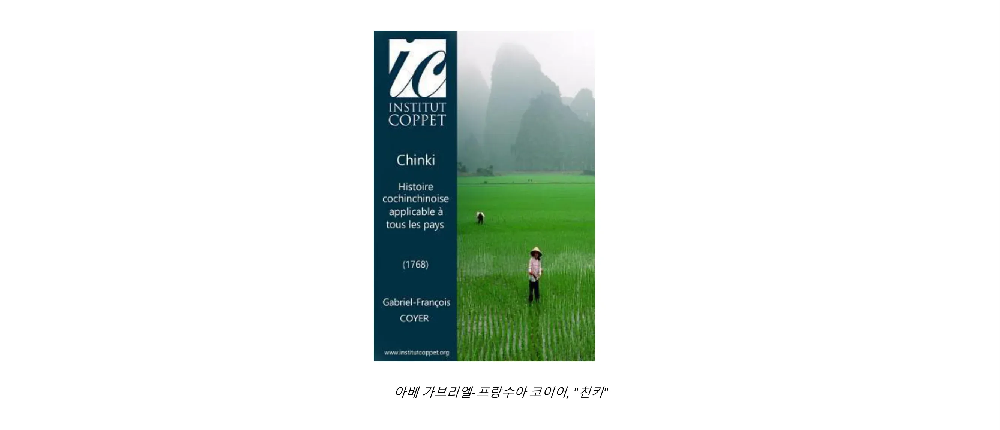

과도한 세금으로 인해 고향을 떠나야 하는 주인공 친키가 도시에서 아이들을 위해 공예품을 만들 일자리를 찾으려는 이야기를 담고 있습니다. 하지만 가혹한 길드 규정으로 인해 모든 거래가 금지되어 점점 실망하는 그의 모습을 유머러스한 톤으로 그려내고 있습니다.

따라서 구르네의 서클은 격렬한 출판 물결의 시발점이었습니다. 이 중요한 공헌은 경제사상사 학자들에게는 잊혀졌지만, 동시대 사람들에게는 매우 분명했습니다. 1760년대에 학교를 조직한 피지오크라트파는 훗날 구르네의 그룹을 자신들의 직접적인 선조로 내세우게 됩니다. 1767년 경제학자 자크 아카리아스 드 세리온느는 그의 헌사에서 이를 더욱 명확하게 표현했습니다. 그는 "철학자이자 시민인 소수의 프랑스인들이 몇 년 전부터 영국 작가들을 모방하기 시작했습니다. 그들은 처음에 그들의 모델을 번역했고 곧 여러 측면에서 그들을 능가했습니다. 그들은 유용한 주제를 다루는 데 문학의 모든 매력과 풍요로움을 가져왔고, 국가의 번영에 가장 필수적인 과학에 대한 취향을 촉발하고 확산시켰습니다."라고 말했습니다.

실제로 1750년대에는 경제에 대한 질문이 유행했습니다. 볼테르는 1750년경 프랑스인들이 곡물 무역의 자유에 대해 논의하기 위해 소설을 포기했다는 유명한 말을 남겼습니다. 이러한 경향은 구르네가 죽기 몇 달 전인 1758년 발행된 '머큐어 드 프랑스'에서도 언급되었습니다: "정치 경제학은 이제 패션의 과학입니다. 얼마 전까지만 해도 피상적으로 소설만 읽던 수많은 사람들이 이제 농업, 인구, 산업, 상업, 금융을 다루는 책을 손에 쥐고 있다"라고 썼습니다. 구르네와 그의 동료 경제학자들의 업적에 이보다 더 큰 경의를 표할 수는 없을 것입니다.

## 미라보

<chapterId>2d2f802b-e3b6-556f-9025-a1b1dc4409ca</chapterId>

프랑스에는 미라보라는 아버지와 아들이라는 두 명의 유명한 인물이 있었지만, 진정으로 역사를 만든 것은 아들인 미라보였습니다. 혁명 호민관이자 프랑스 혁명 사건의 중심 인물 중 한 명이었던 그는 여전히 유명세를 떨치고 있습니다.

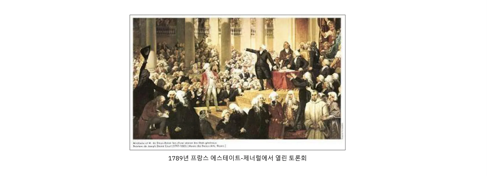

그는 자신의 재능과 프랑스 역사에서 차지하는 위치를 통해 1758년 초에 프랑수아 퀘네 학교의 초대 멤버였던 경제학자이자 학교의 기둥이었던 아버지를 능가했습니다.

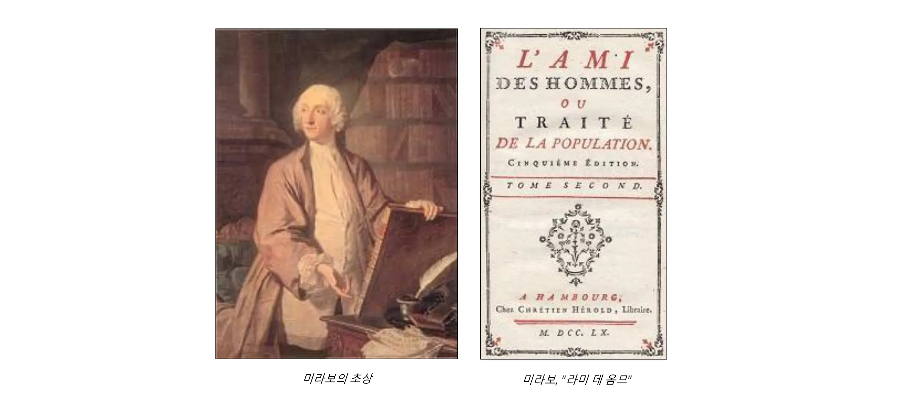

사실 미라보 후작은 '인류의 친구'라는 제목의 저서 덕분에 피지오크라시즘을 채택하기 전부터 이미 엄청난 명성을 얻었습니다. 인구에 관한 논문 [프랑스어: L'ami des hommes, ou, Traité de la population](https://archive.org/details/lamideshommesou00unkngoog). 초판은 1756년에 출판되었지만, 퀘스네와의 만남이 있기 1년 전인 1757년경에 유명해졌습니다.

1757년에서 1760년 사이에 20개 이상의 판본이 출판되었으며, 이는 역사상 가장 성공적인 경제학 서적으로 기록될 것입니다. 일부 독자들은 날카로운 논리로 인해 이 책이 몽테스키외가 쓴 책이라고 생각하기도 했습니다. 심지어 루이 16세의 아버지인 루이 16세는 이 책을 외웠다고 주장하기도 했습니다. 한동안 베르사유의 모든 사람들이 이 책을 읽었습니다.

오늘날에는 더 이상 읽히지 않는 책이지만 여전히 많은 사람들이 이 책을 참고합니다. 19세기에도 에드몽 루셀은 이렇게 말했습니다:

> 라미 데 옴므는 모두가 이야기하지만 거의 모르는 사람이 없는 책 중 하나입니다. 모든 세대에 한 명의 용감한 시민이 이 책을 읽어야 다른 사람들이 읽지 않아도 됩니다.

미라보는 경제학자로서의 경력을 시작할 때 리처드 칸티용에게서 영감을 얻었습니다. 그는 15년 동안 칸티용의 '상업 일반의 본질에 관한 에세이' 원고를 소장하고 있었고, 이를 인내심을 가지고 분석하고 논평했습니다.

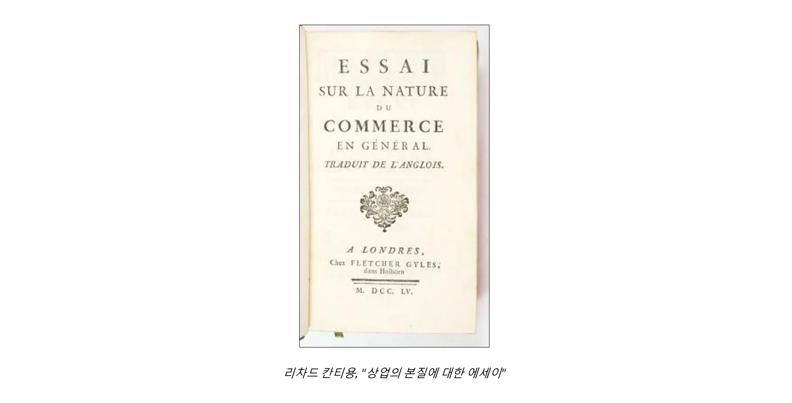

라미 데 옴므는 원래 칸티용의 에세이에 대한 단순한 해설서로 구상되었습니다. 하지만 미라보는 다소 절충주의적인 사고방식, 즉 솔직히 말하면 약간 광적인 성향을 가지고 있었기 때문에 원래의 계획에서 금방 벗어났습니다. 이 책은 단순히 그가 알고 있던 모든 경제 문제에 대해 논의하며 때때로 캔틸론에서 벗어나기도 합니다. 이 책은 모든 장에서 기괴한 계획과 여담으로 가득 찬 읽기 어려운 책입니다. 미라보 자신도 이 책이 혼란스럽고 자신의 스타일이 종말론적이라고 인정했습니다.

혼란스러운 상황이지만 주목할 만한 아이디어가 몇 가지 있습니다:

- 미라보는 부의 본질에 대한 중상주의적 편견에 맞서 싸우고 있습니다.
- 그는 농업을 칭찬하고 농업의 포기를 비판합니다.
- 그는 백성, 특히 농민들의 상태에 대해 불평합니다.
- 마지막으로 그는 무역의 자유와 평화로운 국가 간의 형제애를 수호합니다.

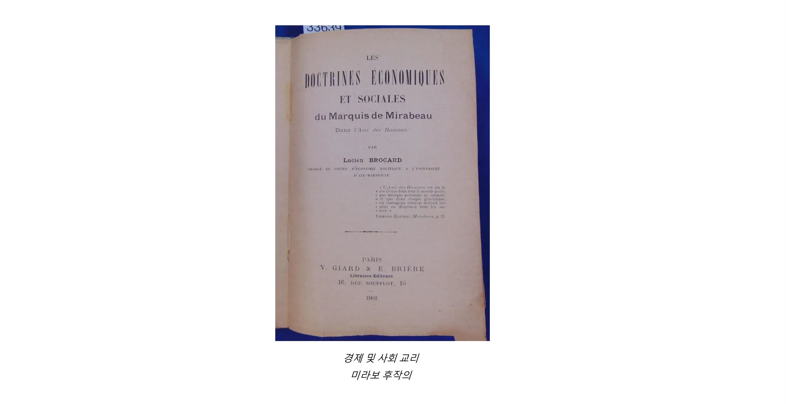

미라보의 견해를 자유주의 또는 반자유주의로 분류하는 것은 Hard입니다. 그는 종종 한 가지 비전과 다른 비전 사이를 오갔고, 때로는 자신도 모르게 두 비전 사이를 오가기도 했습니다. 그럼에도 불구하고 자유주의 사상이 그의 글을 지배하는 경우가 많았습니다. 그의 가장 유명한 대사 중 하나는 다음과 같습니다:

> 정치 경제의 참되고 유일한 원칙은 모든 것을 자유롭게 하는 것입니다.

최고의 성공을 거둔 미라보는 구애를 받았습니다. 마침 경제학에 관심을 갖고 있던 프랑수아 퀘네는 그를 베르사유의 앙트레졸로 초대했습니다.

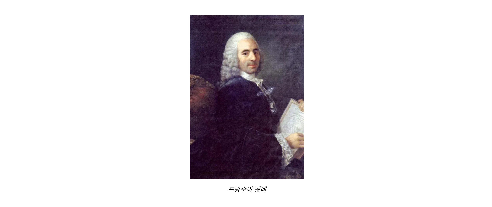

두 사람은 격렬하게 토론을 벌였고, 마침내 토론에서는 절대 일어나지 않는 일이 벌어졌습니다: 미라보는 자신이 틀렸다고 단호하게 인정했습니다. 그는 퀘스네의 아이디어에 동의하며 이를 전파할 준비가 되어 있다고 말했습니다.

두 사람은 함께 피지오크라트 학파의 핵심을 형성했고, 그들이 데려온 정규 신병들로 인해 더욱 강화되었습니다. 미라보가 개종한 직후, 퀘스네는 그에게 조세에 관한 자신의 생각을 옹호해 달라고 부탁했습니다. 이로 인해 ["조세론"](https://archive.org/details/thoriedelimpot00mira)이 발표되었고, 미라보는 며칠 동안 뱅센 감옥에 수감되었다가 비뇽으로 추방되었습니다.

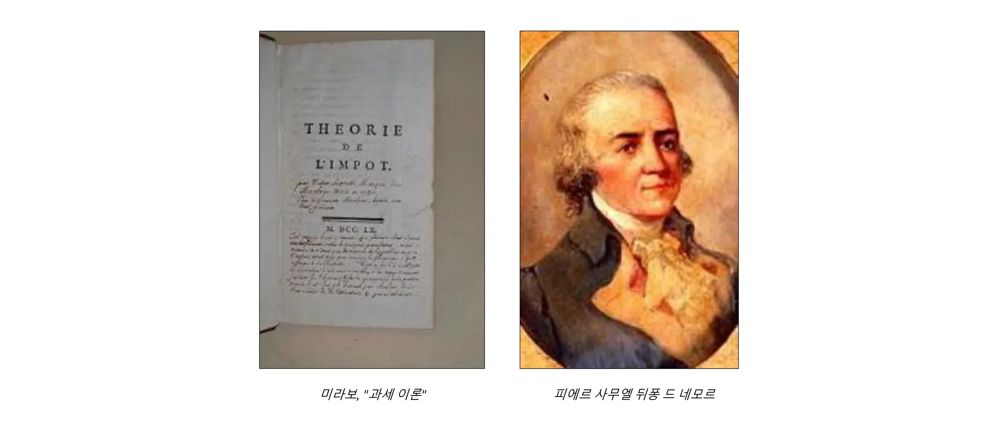

미라보는 퀘스네 학교의 신입 회원 모집에도 중요한 역할을 했습니다. 그는 심지어 젊은 듀퐁 드 느무르를 설득하기도 했습니다.

또한 미라보의 집에서 매주 화요일마다 피지오크라트들이 모임을 가졌습니다. 투르고와 아담 스미스 같은 인물이 이 모임에 한 번 또는 여러 번 참석한 것으로 보입니다.

미라보는 평생 지칠 줄 모르는 작가로 남았습니다. 그는 케인즈의 교리를 옹호하는 수많은 경제학 저서를 저술했습니다. 그러나 말년에 이르러 그의 영향력은 약해졌습니다. 그의 글쓰기 스타일은 그의 친형이 더 이상 그의 산문을 이해할 수 없다는 편지를 보낼 정도로 악화되었습니다. 완전히 자유주의가 된 그의 사상은 메이블이나 심지어 루소 같은 사상가들의 사회주의 또는 원시 공산주의적 반응과 충돌했습니다. 그는 독자와 출판사를 찾기 위해 고군분투했고, 1789년 바스티유 성벽이 습격당하기 전날 거의 알려지지 않은 채 사망했습니다.

## Quesnay

<chapterId>7a35f20b-5ea0-544d-b290-bcd9c6f7f11a</chapterId>

프랑수아 퀘네는 프랑스에서 가장 유명한 경제학자 중 한 명입니다.

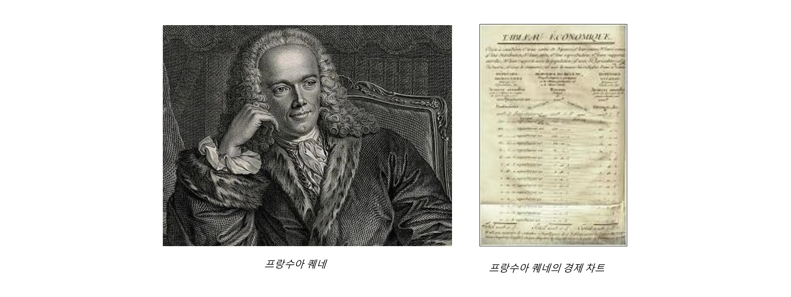

그의 이름은 경제학 및 경제 사상의 역사에 관한 모든 교과서에 등장합니다. 그는 경제를 도식적으로 표현하기 위해 '경제학 도표'를 만들었고, 물리학파의 지도자였으며, 토지만이 생산적이라는 잘못된 믿음을 가지고 있었고, 결국 아담 스미스가 이를 바로잡기 위해 등장했다고 서술되어 있습니다. 교과서에서 프랑수아 케인스를 요약하는 방식은 대체로 이런 식입니다.

퀘스네는 과학적 원리를 바탕으로 경제적 자유의 옹호를 시도한 최초의 경제학자이기도 했기 때문에 그를 이렇게 축소하는 것은 부끄러운 일입니다. 그는 당대 가장 주목받고 영향력 있는 경제학자 중 한 명이었습니다. 게다가 그는 자연만이 부를 생산한다는 단순한 생각보다 훨씬 더 풍부한 교리인 피지오크라시(Physiocracy)를 창시했는데, 이는 종종 잘못 알려진 개념입니다.

앞으로 세 장에 걸쳐 피지오크라시에 대해 더 자세히 설명하겠습니다. 먼저 프랑수아 퀘네에 대해 자세히 살펴봅시다.

1694년 메레의 소작농 가정에서 태어난 퀘스네는 글을 가르칠 수 없는 가정에서 태어났습니다. 그는 지역 남성에게 교육을 받았고 결국 외과 대학과 의과대학에서 공부했습니다. 24살에 그는 만테에서 외과의사가 되었습니다.

그는 1730년 36세의 나이에 잘못된 이론과 편견에 근거한 일반적인 사혈 관행에 반대하여 명성을 얻었습니다. 그는 또한 외과의사만 수술을 할 수 있고 의사만 약을 처방할 수 있다는 길드 제도에 과감히 도전했습니다. 이로 인해 가난한 사람들은 종종 두 번 돈을 내고 두 사람을 데려와야 했는데, 퀘스네는 이런 상황에 불만을 품었습니다.

1740년에는 외과 아카데미의 비서가 되었습니다. 1748년 54세의 나이에 퐁파두르 부인의 개인 주치의가 되어 베르사유로 이사했습니다.

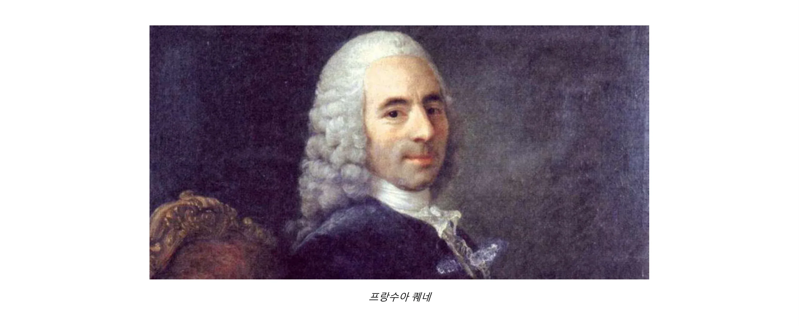

그는 마담 드 퐁파두르와 매우 가까웠습니다. 퀘네는 퐁피두르 부인의 불명예가 발표되었을 때 그녀 없이는 베르사유의 의사로 남고 싶지 않다고 말하기도 했습니다:

"나는 퐁파두르 부인의 번영에 애착을 가졌고, 그녀의 불명예에도 그렇게 될 것이다".

그 후 그는 여러 의학 서적을 출간했습니다: 화농에 관한 논문(1749), 괴저에 관한 논문(1749), 지속적인 열에 관한 논문(1753) 등이 있으며, 이 책들은 모두 그의 생애 동안 여러 번 재인쇄되었습니다.

60세에 당시 유행하던 경제학 논쟁을 접한 그는 경제학에 관한 글을 쓰기 시작했습니다. 1755년에는 *백과사전*에 "농부"와 "곡물"이라는 기사를 썼습니다.

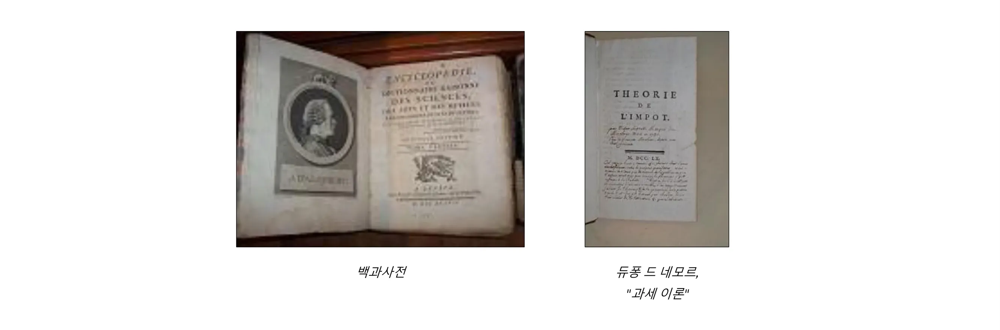

이 책은 1757년에 출판되었습니다. 같은 해에 그는 유명한 미라보를 만나 그의 경제 사상을 받아들여 경제학의 핵심인 피지오크라시즘을 탄생시켰습니다. 그 후 퀘네는 왕실 인쇄기로 인쇄된 <경제학개론>을 만들었고, 베르사유 궁전에서 국왕이 직접 지켜보는 가운데 인쇄했다고 전해집니다. 그 후로 그는 정기적으로 경제학자와 철학자들을 베르사유 궁전에 초대하여 자유롭게 토론을 벌였습니다. 퀘스네는 1759년에 출간된 미라보의 『조세론』에도 기여했습니다.

곧 검열이 시작되었습니다. 미라보는 투옥되었고 퀘스네는 견책을 받았습니다. 그 후 퀘스네는 공개적으로 출판할 수 없으며 자신의 아이디어를 전파할 제자가 필요하다는 것을 깨달았습니다.

그는 재빨리 그들을 찾았습니다: 보도, 듀퐁 드 네무르, 르 트로스네, 메르시에 드 라 리비에르 등입니다. 이들은 퀘네의 사상을 전파하고 대중화할 사람들이었습니다. 하지만 제자가 필요했던 퀘스네는 종파적 성향이 강한 이 그룹에 완전히 만족하지 못했습니다. 그가 미라보에게 보낸 편지를 읽어보세요:

> "스스로 생각해보세요. 제 비참한 초안이 여러분을 게으르게 만든다는 걸 깨달았어요. 이제 여러분이 생각할 차례입니다. 당신도 나만큼이나 잘 알 테니까요."

그럼에도 불구하고 그의 제자들은 깊은 헌신으로 퀘스네의 인기에 크게 기여했습니다. 그가 죽자 미라보는 "우리는 아버지에게 모든 것을 빚졌기 때문에 아버지를 잃었다"며 추도사를 했습니다. 사실 모든 것을 빚진 사람은 퀘스네였으니, 그들이 없었다면 그는 유혹과 걱정이 많았지만 그의 생각에 관심을 갖는 사람은 거의 없었던 베르사유에 머물렀을 것입니다.

공동 작업자들의 노력 덕분에 그의 아이디어는 먼저 *Journal of Agriculture*와 *Ephémérides du Citoyen*과 같은 신문을 통해 플랫폼을 찾았습니다.

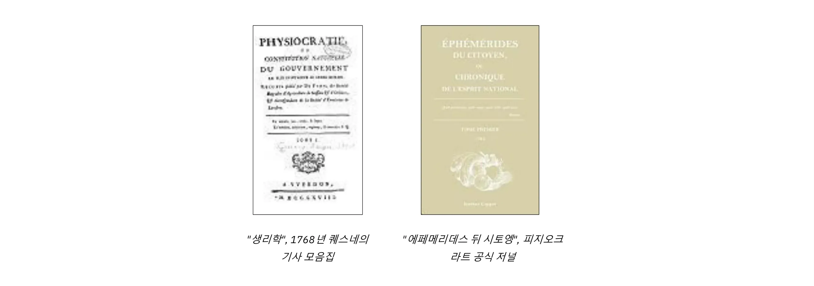

그 후 제자들의 책뿐만 아니라 1768년 듀퐁 드 네모르가 *피지오크라시*라는 제목으로 출판한 중요한 선집도 있습니다.

이 책은 퀘스네의 주요 공헌을 모은 책입니다. 이 책에는 모든 사람이 재산을 소유할 권리와 무역의 자유를 법으로 보장하는 농업 경제 모델이라는 피지오크라트 지도자의 경제적 이상이 제시되어 있습니다.

# 피지컬 스쿨

<partId>27af82c1-ad82-5c3b-8ce9-c674b67bbf7c</partId>

## 피지오크라트의 역사

<chapterId>4236ff8b-b53a-59e7-92c0-f96f9afa1c00</chapterId>

피지오크라시즘이 프랑스는 물론 유럽 전역에서 유행하기 시작한 것은 불과 10년밖에 되지 않았습니다. 오랜 기간의 발전 끝에 1760년대 중반에 명성을 얻었습니다. 1776년 투르고가 집권했을 때는 이미 이 운동이 인기를 잃은 뒤였고, 장관은 퀘스네의 학교에 대한 지지를 대부분 숨겼습니다.

그 기원은 1750년대 경제 사상의 진화에 있습니다. 여러 저자가 부아길베르와 훗날 피지오크라시즘으로 알려지게 된 경제학 사이의 간극을 메우는 데 도움을 주었습니다. 앞서 설명한 바와 같이, 빈센트 드 구르네와 그의 경제학자들은 프랑스 독자들에게 외국 경제 사상을 소개하고 경제학에 대한 열정을 불태우는 데 도움을 준 많은 출판물의 배후에 있었습니다. 피지오크라시 이론의 기초는 이미 부아길베르의 <프랑스 경제학>과 칸틸롱의 <일반 무역의 본질에 관한 에세이>(https://archive.org/details/essaisurlanature0000cant) 같은 책에 존재하고 있었습니다.

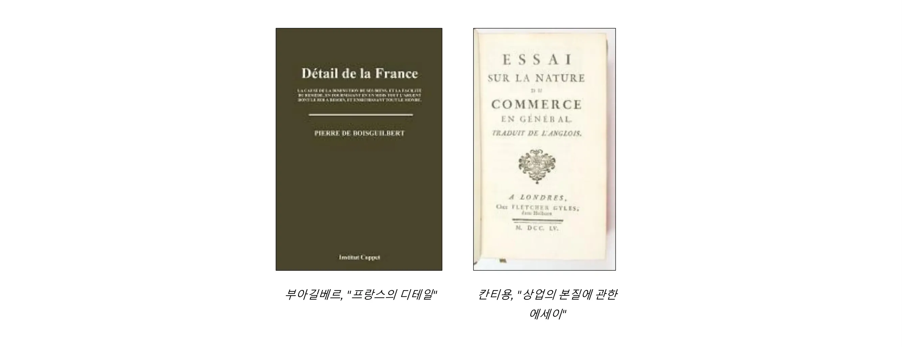

자유방임의 개념은 부아길베르 이후 여러 옹호자, 특히 빈센트 드 구르네와 아르장송 후작이 지지했습니다.

남은 과제는 이러한 아이디어를 일관성 있고 완전한 교리로 만드는 것이었고, 미라보 후작이 처음으로 이를 시도했습니다. 그는 칸티용의 에세이에서 영감을 받아 경제 문제에 관한 포괄적인 논문인 "인간을 사랑하라"를 집필하기 시작했고, 이 논문은 매우 성공적이었습니다.

이렇게 1756년, 피지오크라시의 역사가 시작될 수 있었습니다. 당시 외과의사였다가 퐁파두르 부인의 주치의가 된 프랑수아 퀘네는 미라보를 베르사유로 초대해 경제 아이디어를 논의했습니다.

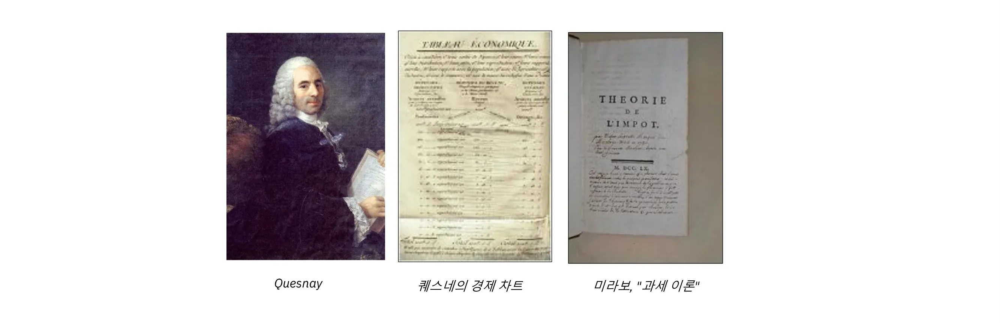

대화가 끝날 무렵 미라보는 퀘스네의 아이디어에 동의했습니다. 그때부터 그들은 글을 썼습니다: 퀘스네는 경제에서 부의 흐름을 설명하기 위해 *경제도표*(1758)를 만들었고, 두 사람은 함께 <조세론>(1759)을 출간했습니다.

그들의 노력은 따뜻하게 환영받지 못했습니다. 궁정에서 지배적인 반응은 무관심이었습니다. 왕은 퀘스네의 이론적 성향을 인정하고 그를 "나의 사상가"라고 애정을 담아 불렀습니다. 하지만 그 칭찬과는 별개로 이들의 연구는 아무런 성과를 얻지 못했습니다. 실제로 그들의 조세 이론은 비판 대상이었던 세무 행정가들의 불쾌감을 샀고, 그들은 미라보의 투옥을 요구하고 확보했습니다. 결국 마담 드 퐁파두르는 그를 석방했지만, 그는 몇 주 동안 비뇽에 있는 자신의 저택에서 망명 생활을 계속했습니다.

따라서 1760년대 전반기는 비교적 조용히 지나갔습니다. 베르사유에서의 지위 때문에 퀘네는 글쓰기를 중단하거나 적어도 자신의 이름으로 아무것도 출판하지 않을 수밖에 없었습니다. 이미 한 번 정죄를 받은 미라보는 왕의 총애가 그를 영원히 보호할 수 없다는 것을 잘 알고 있었기 때문에 경고를 받았습니다.

잠시 침묵을 지키던 두 경제학자는 제자를 모집하기 시작했고, 이것이 그들의 아이디어를 대중화할 수 있는 유일한 방법이었죠. 1765년, 그들의 성공은 놀라웠습니다. 듀퐁 드 네모르, 아베유, 메르시에 드 라 리비에르, 르 트로스네, 보도 등이 빠르게 이들의 대열에 합류했습니다. 이들은 학교를 결성하여 자체 저널인 *레 에페메르드 뒤 시토엥*을 발간하고 매주 화요일마다 미라보의 집에서 모임을 갖기도 했습니다.

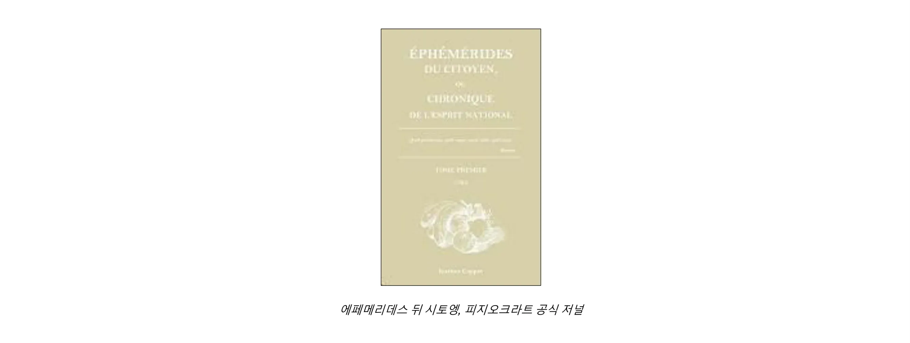

1765년에서 1775년 사이 피지오크라트 그룹은 명성의 정점에 서 있었습니다. 문학과 철학계는 오직 이들을 주목했고, 그들의 사상은 광범위하고 빠르게 퍼져나갔습니다. 사람들은 이들을 '경제학자' 또는 더 조롱스럽게는 '경제학자들의 종파'라고 불렀습니다. 어조와 상관없이 이들의 악명은 절대적이었습니다. 1774년 메츠를 여행한 후, M. 드 보블랑은 자신의 회고록에서 주변 사람들이 모두 케네의 제자들처럼 경제학과 추론을 이야기하는 것에 놀라움을 금치 못했다고 적었습니다. "그것은 유행이었다"고 그는 언급했습니다. "모두가 경제학자였다".

그러나 1770년에 이르러 이들의 인기는 시들해지기 시작했습니다. 이 그룹은 첫 번째 탈북을 경험했고 비판을 견디는 능력이 약해졌습니다. 콘딜락, 메이블리, 볼테르, 갈리아니, 링게, 그라슬린, 심지어 스코틀랜드의 아담 스미스까지 많은 비평가들이 그들의 견해에 이의를 제기했습니다.

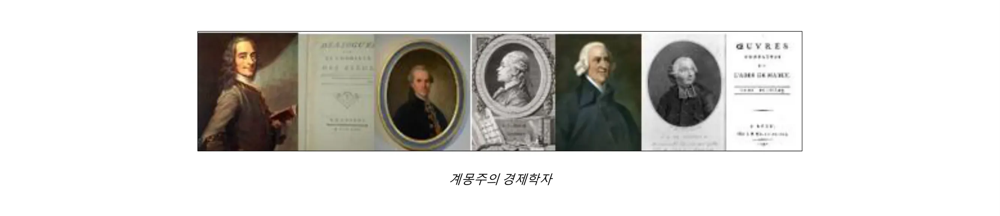

그들의 신문은 더 이상 정기적으로 발행되지 않았습니다. 이는 이 운동의 가장 활발한 시기가 끝나는 것을 의미했습니다.

피지오크라시즘은 혁명 이후에도 계속 영향력을 발휘했습니다. 프랑스에서는 먼저 제자라기보다는 동료 여행가였던 투르고와 나중에 살펴볼 대표적 인물인 듀퐁 드 네모르를 통해 영향을 받았습니다. 그러나 유럽 전역에서 생리학 교리가 열광적으로 받아들여진 곳도 있었습니다. 독일에서는 바덴 후작을 통해, 이탈리아에서는 토스카나의 레오폴드를 통해 생리학 이론이 사유 재산과 자유를 옹호하는 경제 개혁에 영감을 주기도 했습니다.

## 피지오크라트 교리의 토대

<chapterId>4dbe5436-0578-57c2-b054-03ed00aa091a</chapterId>

'자연에 의한 정부'를 의미하는 피지오크라시(Physiocracy)라는 용어는 듀퐁 드 네모르가 만든 것으로, 1768년에 출간된 퀘스네의 글 모음집인 *피지오크라시*의 제목으로 사용되었습니다.

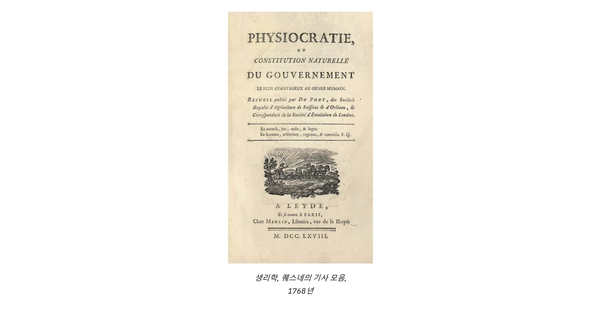

이 문구는 모호한 문구입니다. 퀘스네의 어떤 제자도 그 진정한 의미를 알려주지 않았습니다. 그럼에도 불구하고 그들의 사고 체계는 모호하지 않았습니다. 사실, 그것은 몇 가지 매우 명확한 원칙을 중심으로 구축되었으며, 여기서 간략히 설명하겠습니다.

### 첫 번째 원칙: 농업만이 생산적이라는 원칙

이 첫 번째 아이디어는 역사가들의 관심을 끌었던 아이디어입니다. 오늘날 교과서나 경제학 강의에서 피지오크라트들은 이렇게 요약되어 있습니다. 그들은 농업만이 생산적이라고 순진하게 믿었다고 합니다. 이를 근거로 그들의 교리는 무의미한 것으로 무시되고 분석은 곧 아담 스미스로 넘어갑니다.

그러나 18세기 중반에는 농업이 인구의 90%를 고용하고 프랑스 경제의 기반을 형성했기 때문에 농업에 불균형적인 중요성을 부여한 피지오크라트를 비판하는 것은 불공평합니다.

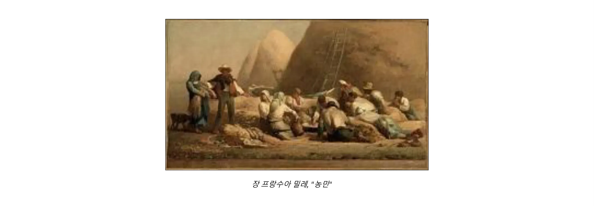

피지오크라트들의 생각은 사실 미묘합니다. 그들에 따르면 생산과 이득에는 차이가 있습니다. 생산은 기존의 물질에 유용성을 더하는 것이 아니라 유용한 물질을 창조하는 것이기 때문에 산업가와 상인은 이익을 얻을 수 있지만, 진정한 생산은 농부만이 할 수 있습니다.

또한 왜 그들이 산업과 공예를 비생산적이라고 거부했는지 이해하려고 노력해야 합니다. 당시 이러한 거래는 길드 시스템 안에 갇혀 혁신, 투자, 발전을 금지했습니다.

### 두 번째 원칙: 민주주의가 아닌 법적 전제주의

오늘날 우리는 누군가를 모욕하기 위해 그가 민주주의자가 아니라고 말합니다. 역사가들은 농업 생산성에 대한 피지오크라트들의 엄격한 관점은 용서하지만, 특히 계몽주의 사상이 한창이던 시기에 살았던 그들이 민주주의에 반대했다는 점은 용서하지 않습니다. 18세기 중반부터 혁명 직전까지 피지오크파는 진보의 적으로 여겨졌습니다.

토크빌은 이 아이디어를 주장했습니다:

> 피지오크라트들은 실제로 상품의 자유 무역, 상업과 산업에서의 자유방임 또는 자유방임주의에 매우 호의적이었지만, 정치적 자유에 대해서는 적절한 것으로 생각하지 않았고, 그러한 생각이 떠오를 때에도 처음에는 거부했습니다.

경제학에서는 자유주의자였던 피지오크라트들은 정치 문제에서는 자유주의자가 아니었습니다. 퀘스네는 그의 *최대의 원칙*에 이렇게 썼습니다: "주권자는 사회의 모든 개인과 모든 불공정한 사적 이익 기업에 대해 유일하고 우월한 권위를 가져야 한다." 그리고 나중에 같은 격언에서 "정부의 견제와 균형 시스템은 치명적인 개념으로, 강자의 불화와 약자의 억압만 드러낼 뿐"이라고 말합니다.

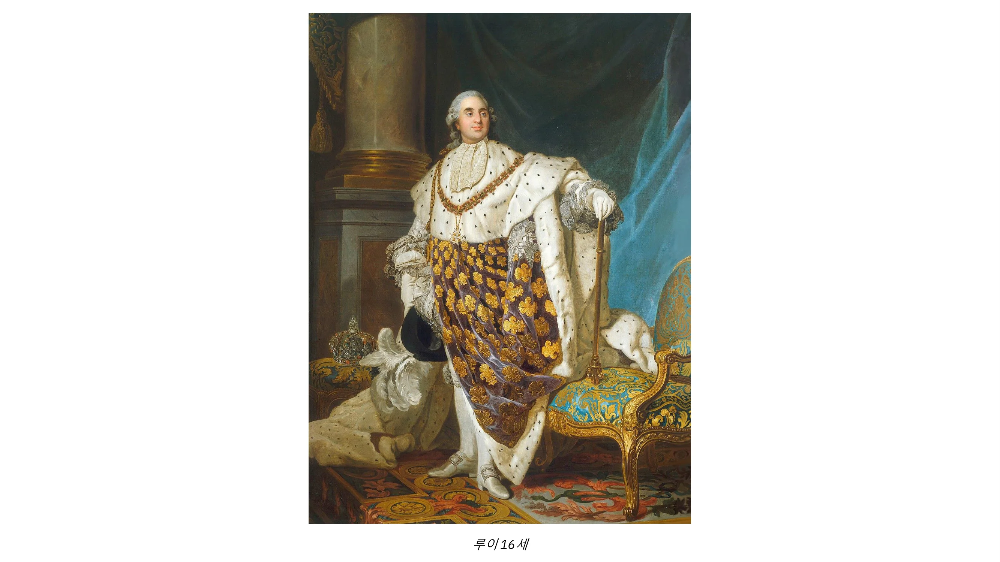

토크빌은 피지오크라트들이 민주주의의 형태를 보자마자 민주주의를 거부했다고 적절하게 지적했습니다. 그들은 민주주의가 완벽한 제도와는 거리가 멀고, 다수에 의한 소수의 억압을 허용할 가능성이 있으며, 찬탈과 폭정, 약탈의 도구가 될 수 있기 때문에 프랑스 정치 경제의 상수가 될 민주주의에 대해 회의적이었습니다.

### 세 번째 원칙: 사유 재산에 대한 절대적 존중

피지오크라트들은 사람들이 노동의 결과를 소유하고 보관해야 한다고 믿었습니다. 그들이 보기에 재산권은 사회의 근간이었습니다. 그들은 국가의 주요 임무가 국민의 재산을 보호하는 것이라고 생각했습니다. 또한 경제적 관점에서 볼 때, 피지오크라트들은 재산의 불가침성이 노동과 노력을 장려하고 경제 발전의 조건이라고 주장했습니다.

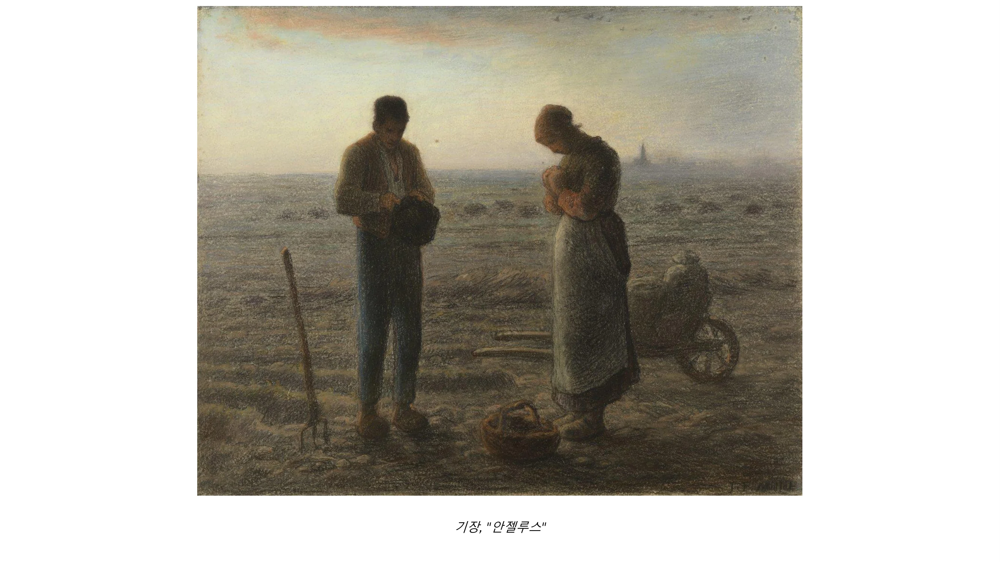

간단히 말해서

> 재산의 안전은 경제 질서와 사회 안전의 필수적인 토대이며, 토지를 개량하고 경작하는 노동과 상업 및 산업 기업에서 부의 사용을 장려하는 것은 영구적 소유의 확실성입니다.

### 네 번째 원칙: 상거래의 절대적 자유

앞서 인용한 *맥심*에서 퀘스네는 다음과 같이 말합니다:

> 국가와 국가를 위한 가장 안정적이고 정확하며 유익한 국내외 무역 규제는 완전한 경쟁의 자유에 있기 때문에 완전한 상업의 자유가 있게 하소서.

피지오크라트들은 특히 곡물 무역에서 정부의 간섭으로 인한 피해를 목격했습니다. 그들은 정부가 모든 수요에 대응하고 모든 수요 변화나 Supply에 대응해야 하기 때문에 개인처럼 상거래를 관리할 수 없다는 사실을 인정해야 한다고 말합니다. 이 모든 것은 아무리 현명한 정부라도 상상할 수 있는 능력을 훨씬 뛰어넘는 일입니다. 따라서 상황을 그대로 두고 흘러가도록 내버려 두는 것이 필요합니다.

본질적으로 유익한 무역은 완전하고 완벽하게 자유로워야 합니다. 회원 중 한 명인 르 트로스네는 [*곡물 무역의 자유: 항상 유용하고 결코 해롭지 않다*](https://www.institutcoppet.org/liberte-commerce-grains-toujours-utile-jamais-nuisible/)라는 제목의 팜플렛을 작성하기도 했습니다.

### 다섯 번째 원칙: 모든 사람은 형제입니다

노예제도에 격렬하게 반대했던 피지오크라트들은 위대한 평화주의자이기도 했습니다. 미라보는 "우리의 외교 정책은 평화"라고 간단히 말했습니다. 1790년 제헌의회에서 듀퐁 드 네모르는 공격적 전쟁을 금지하는 법안을 제안하면서 이러한 평화주의적 입장을 이어갔습니다.

## 피지오크라트의 업적과 영향력

<chapterId>5b911105-796a-5e2e-a501-c7a364fc758e</chapterId>

피지오크라트를 다룬 세 장 중 첫 번째 장에서 살펴보았듯이 퀘네의 추종자들은 약 10년 동안 프랑스에서 선풍적인 인기를 끌었습니다. 그들의 아이디어에 대한 열정은 당대에 형성되어 세기 말까지 계속되었습니다. 여기에서는 이들의 업적 중 일부와 경제학 사상 분야에서 후계자들에게 끼친 영향력을 살펴봅니다.

구르네 그룹에 이어 이들의 가장 큰 업적은 경제 사상을 대중화했다는 점입니다. 볼테르의 유명한 말은 잘 알려져 있습니다. 1750년경, 시와 소설에 만족한 국민들은 곡물에 대해 추론하기 시작했습니다. 피지오크라트들은 이 운동에 참여하여 곡물 무역의 자유에 관한 수백 개의 기사, 팸플릿, 책을 출판했습니다. 1760년부터 1775년까지 프랑스에서 출판된 수많은 경제학 논문과 팸플릿에서도 피지오크라트들이 경제학 논의에 얼마나 강한 추진력을 발휘했는지를 알 수 있습니다. 프랑스에서 경제 사상이 확산되었다는 또 다른 증거로, 이전 강연에서 인용한 1774년 메츠에서 사람들이 경제학에 대해서만 이야기한다고 말한 드 보블랑의 발언을 떠올릴 수 있습니다. "그것은 유행이었다"고 그는 말했습니다. "모두가 경제학자였다".

책과 팸플릿, 저널 *Les Éphémérides du Citoyen*을 통해 이들의 사상을 옹호한 것은 곧 프랑스의 경제 정책에 영향을 미쳤습니다. 1763년에는 퀘네와 미라보가 강력하게 요구했던 곡물 무역의 자유를 허용하는 칙령이 내려졌습니다. 또한 당국은 여러 차례에 걸쳐 무역 길드에 대한 규제를 완화하여 더 많은 노동의 자유를 보장했습니다.

해외에서는 성공이 아주 일찍 찾아왔습니다. 독일에서는 바덴 후작이 생리학 사상에 관심을 갖고 미라보 및 듀퐁 드 네모르와 정기적으로 서신을 주고받았습니다.

그는 신념에 찬 경제학자 요한 아우구스트 슐레트바인에게 세제 개혁과 곡물 무역 자유화를 추진하라는 임무를 맡겼습니다. 1770년 4월, 디틀링겐이라는 작은 마을에서 첫 재판이 열렸습니다. 마을 주민들은 이 조치를 열렬히 환영하는 듯했지만, 담당 관리들이 그다지 지지하지 않아서 더 광범위한 시행이 지연되었습니다.

러시아에서 입법 개혁을 준비하던 카트린 2세는 디드로에게 그녀를 도와줄 뛰어난 인재를 보내달라고 요청했습니다.

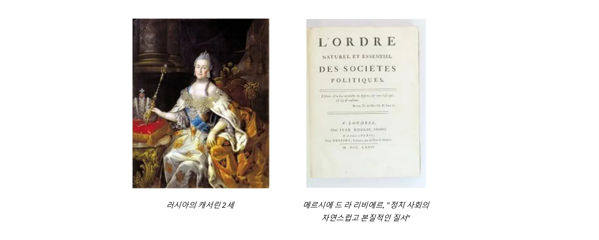

1767년에 출간된 [*정치 사회의 자연적이고 본질적인 질서*](https://archive.org/details/lordrenaturelete00mercuoft)를 읽고 감명을 받은 그는 그 책의 저자인 생리학자 메르시에 드 라 리비에르를 그녀에게 보냈습니다.

그는 축하를 받으며 프랑스를 떠났지만, 상트페테르부르크에서의 환영은 차가웠고(기후는 제쳐두고) 황후는 그에게 실망했습니다.

스웨덴에서는 구스타프 3세, 이탈리아에서는 토스카나의 레오폴드 등 피지컬리스트들은 자신들의 아이디어를 실천에 옮길 준비가 된 추종자들을 찾았습니다.

프랑스에서는 1774년 투르고가 재무장관으로 임명되면서 피지오크라트파가 눈부신 성공을 거두었습니다.

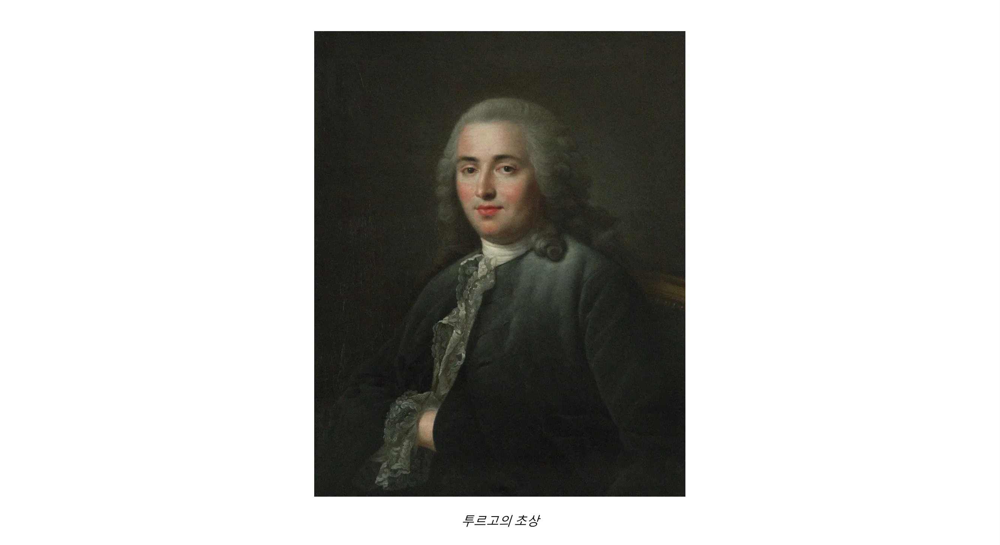

투르고는 피지오파의 명성 하락을 의식해 자신을 피지오파의 충실한 제자로 내세우지 않았고, 비록 자신이 피지오파의 제자였지만 성직자들에게 경멸을 받았기 때문에 백과사전 학자로도 내세우지 않았습니다. 집권 후 투르고는 상업의 자유, 노동의 자유, 독점의 종식 등 피지오크라트 프로그램의 실제 적용의 시작이 된 여섯 가지 유명한 칙령을 발표했습니다.

프랑스 혁명 당시에는 피지오크라트의 추종자 수가 적었습니다. 미라보 후작은 1789년 7월 13일에 죽었는데, 이는 상징적인 사건이었습니다. 아베이유는 떠났지만 듀퐁 드 네모르는 여전히 신념을 지켰습니다. 의회에 임명된 뒤퐁 드 네무르는 피지오크라시즘의 목소리를 대변하며 재산권 Ownership과 자유 무역을 위한 경제 개혁을 촉구했습니다.

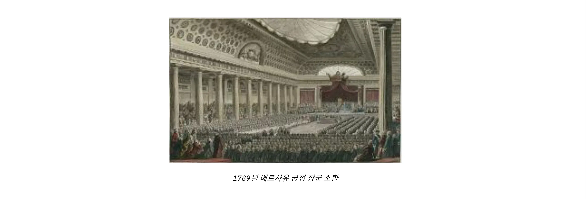

그는 또한 어사인들에 맞서 싸웠지만 실패했습니다. 이러한 실패에도 불구하고 피지오크라시즘 사상은 지적 논쟁에서 매우 중요한 위치를 차지했으며 혁명의 초기 성과에 영향을 미쳤습니다. 조셉 램보의 말처럼, 프랑스 대혁명이 자유를 위해 이룩한 모든 성과는 피지오크라트들 덕분이었습니다.

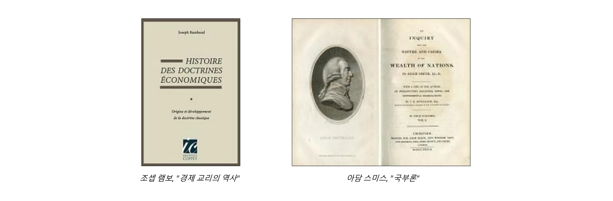

피지오크라트들은 경제 사상의 역사에도 큰 영향을 미쳤습니다. 프랑스를 방문하여 많은 이들을 만난 애덤 스미스는 그들의 업적에 깊은 영향을 받았습니다. 그는 <국부론>을 퀘스네에게 헌정하는 것을 고려하기도 했습니다.

안타깝게도 퀘스네는 스미스의 책이 출판되기 2년 전에 사망했고, 스미스는 이 헌사를 삭제했습니다. 스미스는 농업만이 생산적이라는 그들의 생각에는 동의하지 않았지만, 자유 시장에 대한 그들의 주장 중 많은 부분을 수용하여 자신의 연구에 발전시켰습니다.

## 듀퐁 드 네모르

<chapterId>6d585e0f-93b8-5b0a-a0a8-7f6e4a5bc68e</chapterId>

미국에서는 화학 및 생물학 분야의 다국적 기업인 듀폰(DuPont), 일명 'E.I. 뒤퐁 드 네무르 앤 컴퍼니'를 잘 알고 있습니다.

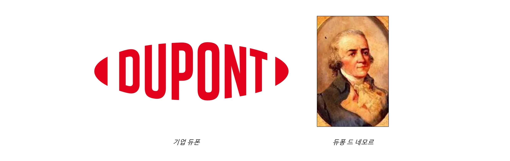

현재 매출은 35,000억 달러가 넘으며 전 세계적으로 약 65,000명의 직원을 고용하고 있습니다. 이 회사는 프랑스 피지컬 학파의 경제학자 사무엘 피에르 뒤퐁 드 네모르의 운명과 밀접한 관련이 있는 것으로 밝혀졌습니다.

1739년에 태어난 듀퐁 드 네모르는 24살에 피지오크라트에 입문했습니다. 당시 그는 여전히 인생의 길을 찾고 있었습니다. 그러던 어느 날 그는 '국가의 부'라는 제목의 짧은 팜플렛을 발견했습니다. 그는 이 책자의 경제 사상이 말도 안 된다는 것을 깨닫고 1763년에 출간된 '국가의 부에 대한 고찰'이라는 비판적인 글을 썼습니다. 이 글은 호평을 받았고 독자들은 "당신은 미라보의 제자임에 틀림없다!" 등의 찬사를 보냈습니다 아이러니하게도 듀퐁은 미라보가 누구인지도 몰랐습니다.

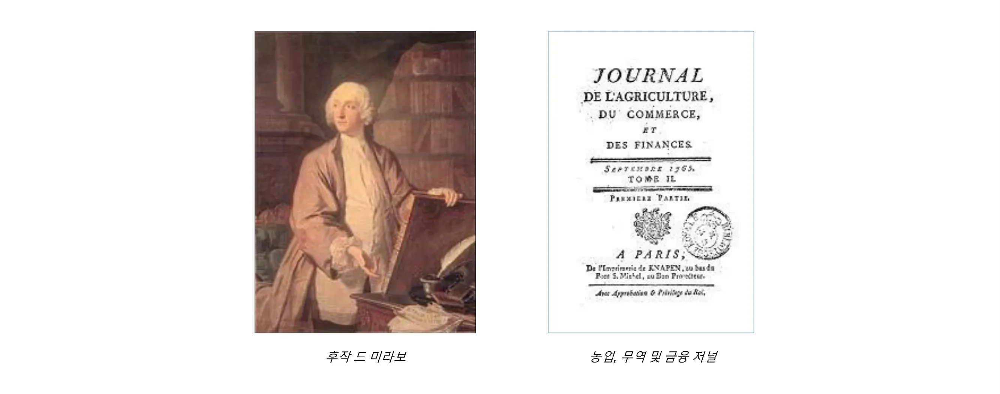

호기심에 그는 미라보의 저서인 <인민의 친구>와 <조세론>을 읽기 시작했습니다. 미라보와 프랑수아 퀘네를 만난 후 그들의 학교에 입학했습니다.

1765년 듀퐁은 경제 사상 분야에서 당대 최고의 정기간행물인 *Journal de l'agriculture, du commerce et des finances*의 편집장직을 제안받았습니다.

여기에는 두 가지 이유가 있었습니다: 미라보와 퀘네는 침묵을 지켜야 했고, 듀퐁은 떠오르는 스타로 여겨졌기 때문입니다.

피지컬 스쿨의 구성원들은 듀퐁 드 네무르가 곧 퀘스네가 가장 좋아하는 사람이 되었다는 데 동의합니다. 퀘스네는 "이 젊은이를 잘 돌봐주면 우리가 죽었을 때 말할 수 있는 사람이 될 거야"라고 말한 적이 있습니다. 동료 물리학자 중 한 명인 아빌은 듀퐁이 받는 관심에 질투를 느껴 퀘네의 학교와 거리를 두기도 했습니다.

듀퐁 드 느무르는 항상 퀘스네를 높이 평가했습니다.

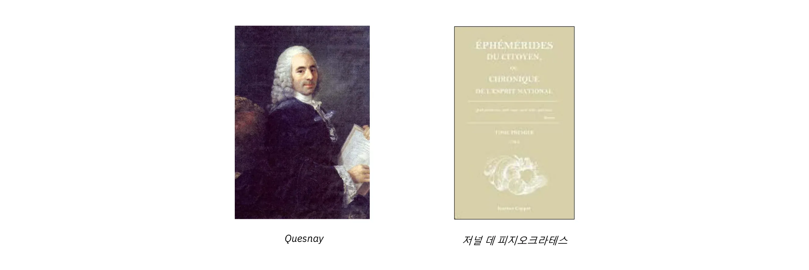

그는 훗날 "퀘스네가 내게 팔을 내밀었을 때 나는 그저 소년이었지만 그는 나를 남자로 만들어 주었다"고 말했습니다 당시 문학계에서 그를 주요 경제학자로 만든 것은 바로 퀘스네였습니다.

뒤퐁은 *저널 드 농업, 뒤 상업, 뒤 재정*을 거쳐 피지오크라트의 공식 기관이 된 *레 에페메르드 뒤 시토엥*의 편집자로 임명되었습니다.

그는 이 정기 간행물을 경제 이론의 주요 중심지로 만들었으며, 이후 거의 모든 권을 직접 집필함으로써 피지오크라트파가 쇠퇴하는 동안에도 이를 뒷받침했습니다. 또한 "자연의 정부"를 의미하는 그리스어 두 단어에서 유래한 "피지오크라시"라는 용어를 만든 것도 듀퐁 드 네모르였습니다. 그는 이 용어를 1768년에 출판된 퀘스네의 논문집 제목으로 사용했고, 이 용어는 결국 역사에 정착하게 되었습니다. 피지오크라트들은 서로를 "경제학자"라고 불렀고, 혁명 기간 동안에도 여전히 그렇게 불린 것으로 알려져 있습니다.

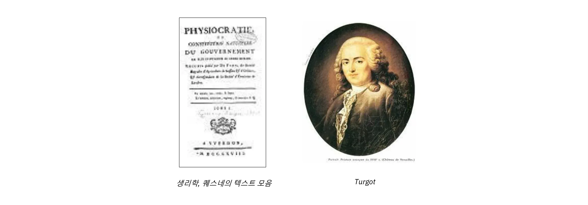

투르고가 잠시 프랑스 재무장관으로 재직했을 때, 듀퐁은 투르고가 다른 사람들과 거리를 두는 동안 유일하게 그와 접촉할 수 있는 피지컬리스트인 그의 최측근이 되었습니다.

혁명 당시 그는 네무르의 집행관으로 선출되어 의회에 참석했는데, 그곳에는 다른 무슈 뒤퐁도 함께 자리하고 있었습니다. 그 후 그는 귀족이라서가 아니라 단순히 두 사람을 구별하기 위해 듀퐁 드 네무르라고 불렀습니다. 물론 그 이름은 그대로 유지되었습니다.

1792년 8월, 프랑스 대혁명 당시 그는 튈르리 궁전에서 군중을 상대로 국왕을 지키기 위해 무기를 들었습니다.

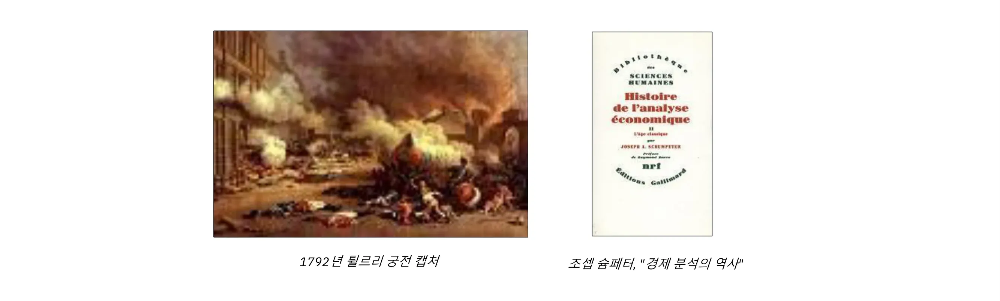

왕이 그에게 말했다: "무슈 뒤퐁, 우리는 언제나 당신이 필요한 곳에 당신을 찾습니다!" 로베스피에르의 몰락으로 단두대를 기다리던 테러에서 기적적으로 탈출한 뒤 나폴레옹 치하로 망명한 그는 아버지의 도움으로 아들 중 한 명이 듀퐁 회사를 설립한 미국에서 행복을 찾았습니다.

수십 편의 논문과 책자, 저서를 출간하는 등 다사다난한 삶을 살았지만 오늘날까지 비교적 잘 알려지지 않았습니다. 아마도 이는 그가 물리학이 유행에서 멀어진 시기에도 확고한 물리학자로 남아있었기 때문일 것입니다. 실제로 슘페터의 말처럼 듀퐁 드 네모르는 "많은 기회가 있었던 경력 기간 동안" 피지오크라시즘에 충실했습니다. 그는 신념이 강한 사람이었습니다.

# 계몽주의와 정치 경제학

<partId>d1c885ad-7cb1-5f81-816c-be312719d9f8</partId>

## 볼테르와 철학자들

<chapterId>16bcf7bf-dad4-5113-8c64-2800f04ff07b</chapterId>

18세기 프랑스에서는 과학으로서의 경제학이 등장하고 최초의 경제학 학파가 탄생했습니다: 바로 국부론입니다. 아담 스미스는 이 시기에 경제학을 공부했고, 프랑스 경제학자들은 전 세계적으로 리더로 인정받았습니다. 그러나 이 세기는 경제학보다는 철학의 세기로 더 많이 기억되고 있습니다. 피지오크라시즘 운동은 그 야망에서 계몽주의 철학과 일치했지만, 철학자들, 특히 디드로와 볼테르의 태도는 면밀히 검토할 필요가 있습니다. 계몽주의 사상가들이 프랑스에서 자유방임주의 사상을 확산하는 데 크게 기여했음을 알 수 있습니다.

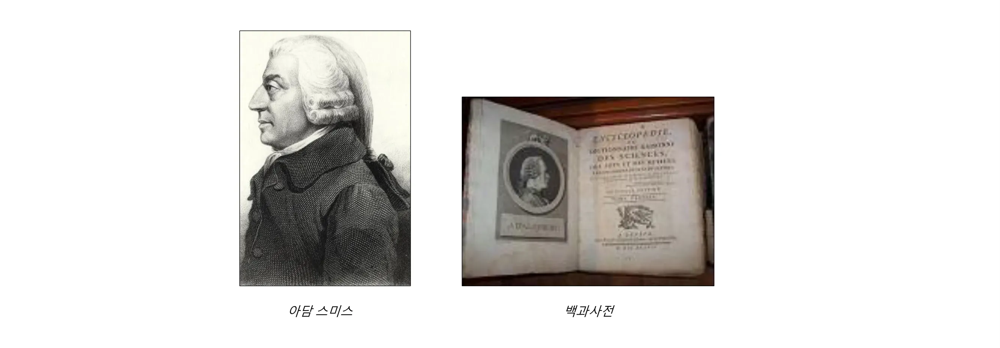

계몽주의 철학의 가장 유명한 업적은 의심할 여지 없이 디드로와 달랑베르의 *백과사전*입니다.

당연히 경제 기사는 경제학자들이 썼습니다. 초기의 경우 디드로는 포보네를 시작으로 자유주의 경제학자인 프랑수아 퀘네("곡물", "페르미에", "옴므"와 같은 기사를 기고했고, 마지막 기사는 미발표), 투르고("푸아르와 마르쉐"를 쓴) 등을 영입했습니다. 이 글들은 매우 중요합니다. 퀘스네는 이 글들을 통해 피지컬리즘 교리의 토대를 마련했습니다. 이 글들은 *경제학 도표*와 함께 그의 가장 유명한 저작으로 남아 있습니다. 당시 아직 젊었던 투르고는 이 글에서 시장 조직에 대한 국가 개입을 비판하며 자유방임주의 사상을 발전시켰습니다.

백과사전의 다른 많은 기사에서 철학자들, 특히 디드로는 종교, 정치, 경제 등 모든 영역에서 자유의 이상을 옹호합니다.

특히 길드 시스템에 반대하는 노동의 자유는 예술, 메티에, 코뮈노테 등 다양한 출품작에서 반복되는 주제였습니다.

경제 이론에서 디드로가 걸어온 길은 흥미롭습니다. 백과사전에서 그는 경제적 자유에 대한 확고한 옹호자였으며, 투르고가 그를 위해 쓸 기사를 요약한 편지에서 확인할 수 있듯이 자유주의 경제학자들의 협력을 구한 사람이었습니다. 피지오크라시 초기에 그는 퀘스네 학파의 후원자이자 발기인이었습니다. 1769년과 1770년, 그는 멜키오르 그림과 같은 반자유주의 철학자 친구들의 큰 실망 속에 *레 에페메르드 뒤 시토엥*에 글을 기고했지만 곧 이 그룹과 거리를 두었습니다. 갈리아니 수도원장의 활기찬 지성에 매료된 그는 갈리아니가 이탈리아로 돌아갈 즈음 그가 곡물 무역에 관한 책을 프랑스어로 출판하는 것을 도왔습니다.

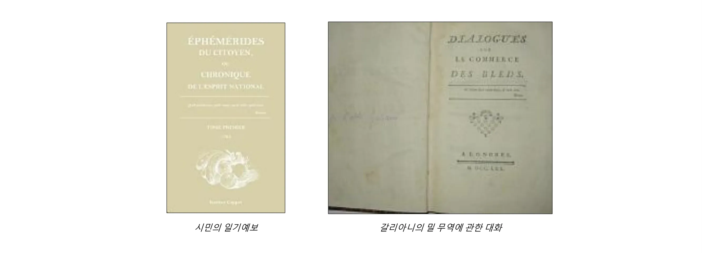

이 책은 물리주의 사상에 대한 가장 격렬한 공격이 되어 물리주의 운동에 큰 타격을 주게 됩니다. 훗날 디드로는 <갈리아니의 변명>에서 물리학파의 가까운 동맹자였던 모렐레 수도원장에 맞서 갈리아니를 옹호했습니다. 몇 년 후, 투르고의 장관 시절 디드로는 길드 폐지를 통해 노동의 자유를 확립하는 데 박수를 보냈습니다. 이때 장인의 아들이었던 디드로는 자유주의 경제학자들의 의견에 동의하며 노동의 자유가 20~30년 안에 프랑스 산업을 망칠 것이라고 주장한 갈리아니에게 비판적인 편지를 썼습니다. 하지만 산업혁명의 관점에서 볼 때 역사는 그렇지 않다는 것을 시사합니다. 자유주의 경제학자들의 편으로 돌아간 디드로는 더 이상 그들의 신뢰를 받지 못하고 고립된 채로 지내야 했습니다. 디드로가 1774년 듀퐁 드 네모르에게 보낸 편지가 이를 잘 보여줍니다:

> "당신은 한때 나를 위해 우정을 가졌지만, 지금은 너무 바빠서 더 이상 누구도 사랑할 시간이 없으니 더 이상 그러지 않아요".

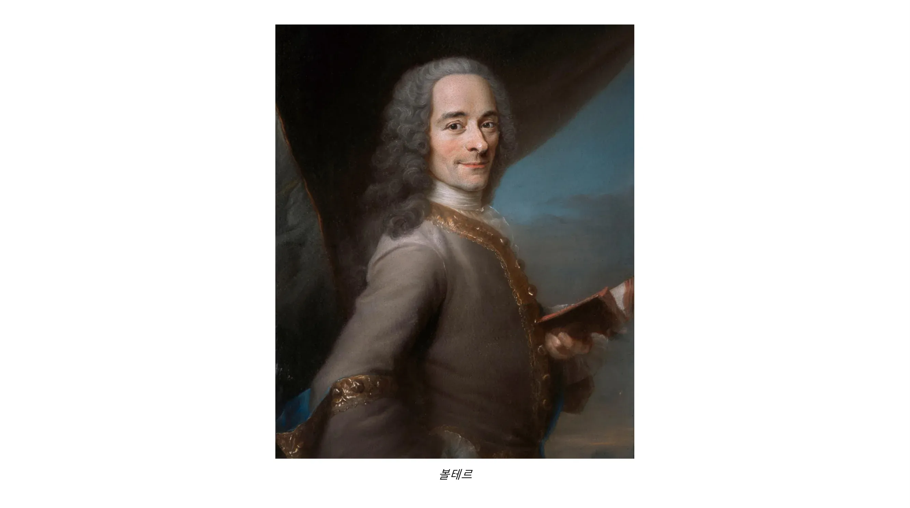

볼테르도 비슷한 길을 걸었는데, 그의 경제관에는 일관성이 결여되어 있었습니다. 그는 뱅상 드 구르네를 존경했고, 경제학자(듀퐁 드 네모르, 투르고 등)들과 교류했으며, 특히 농업을 찬양한 피지오크라트들을 높이 평가했습니다. 그는 *에페메리데스의 저자에 대한 찬사*에서 그들을 찬양했습니다. 그러나 나중에 그는 풍자 작품인 *마흔 왕관의 사나이*에서 단일 토지세에 대한 그들의 생각을 비판하여 큰 논란을 불러 일으켰습니다. 마지막으로 디드로와 마찬가지로 투르고의 사역을 황금기라고 부르며 노동의 자유와 자유 무역에 관한 그의 두 가지 위대한 법령을 찬양했습니다.

결국 철학자들과 경제 사상의 관계는 엇갈립니다. 자유주의 경제 사상에 대한 찬사와 비판에도 불구하고, 그들은 이러한 사상을 계몽주의의 광범위한 지적 담론으로 끌어들이는 데 중요한 역할을 했습니다. 이런 식으로 의도했든 의도하지 않았든 그들은 자유방임의 개념을 혁명까지 발전시키는 데 기여했습니다.

## 이론가, 투르고

<chapterId>a8cd8185-8351-556b-8011-3a0c313e8a9d</chapterId>

미국의 경제학자 머레이 로스바드는 그의 저서 <경제사상의 역사>의 유명한 구절에서 투르고의 '탁월함'을 극찬했습니다.

를 통해 그를 칸트와 함께 18세기 최고의 경제학자로 소개합니다.

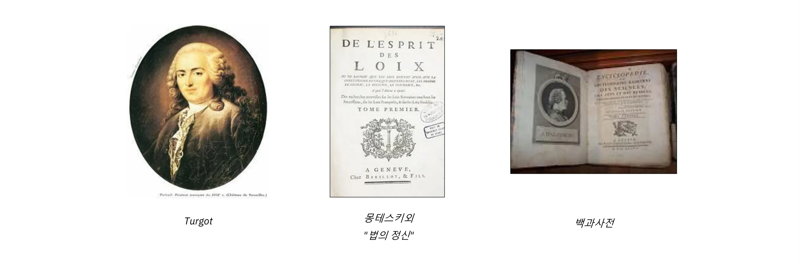

투르고는 어떻게 그렇게 유명해졌을까요? 세 가지 핵심 요인이 복합적으로 작용한 결과입니다. **첫째, 그의 명망 있는 집안 배경입니다. 그는 왕실 행정가 집안에서 태어났으며, 그 중 다수가 정부 고위직을 지냈습니다. **둘째, 그가 태어나고 자란 황금기. 투르고는 몽테스키외가 *로이의 정신*을 출간했을 때 21세였고, *백과사전*의 첫 권이 나왔을 때 24세였습니다.

그는 물리학자, 볼테르, 디드로, 홀바흐, 아담 스미스, 콘도르셋 등과 동시대인이었습니다. **셋째**, 그의 지적 조숙함. 소르본 대학에 재학 중이던 22세에 지폐에 편지를 쓰고, 뛰어난 연설을 했으며, 24세에는 52편의 작품 목록을 작성했습니다.

투르고는 젊은 나이에도 불구하고 *백과사전*에 기고하며 '어원', '존재', '확장성', '박람회', '기초' 등의 주제에 관한 기사를 썼습니다. 경제학을 직접 다룬 기사는 단 한 편, 박람회와 시장의 기원을 자세히 설명하고 이를 방해하고 마비시키는 국가의 간섭을 비판한 "박람회"에 관한 기고문뿐이었습니다.

초창기에는 뱅상 드 구르네의 멘토링을 받았고, 구르네는 그를 문하생으로 받아들여 그와 친밀한 우정을 쌓았습니다. 1759년 구르네가 사망하자 투르고는 추도사를 작성하여 자유방임주의 교리를 훌륭하게 요약했습니다. 그는 특히 다음과 같이 썼습니다:

"상업이 국가와 관련될 수 있는 모든 관점에서 볼 때, 스스로에게 맡겨진 개인의 이익은 항상 결함이 있고 필연적으로 모호하고 불확실한 이론에 따라 움직이는 정부의 운영보다 항상 더 확실하게 일반적 선을 생산할 것이다".

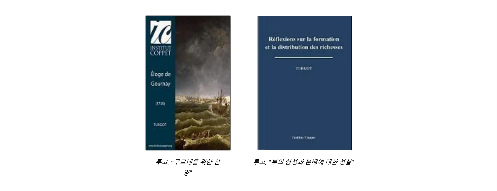

1767년, 그는 *부(富)의 형성과 분배에 관한 고찰*이라는 제목으로 경제학 개요서를 집필했습니다.

노동 분업, 소비자 주권, 사유 재산, 자본의 역할 등 사실상 모든 주요 경제 주제를 다루고 있습니다. 가장 최근의 역사가인 앤 클레어 호잉을 비롯한 많은 역사가들은 투르고의 이 저작과 9년 후에 출간된 아담 스미스의 <국부론> 사이의 유사점을 지적한 바 있습니다.

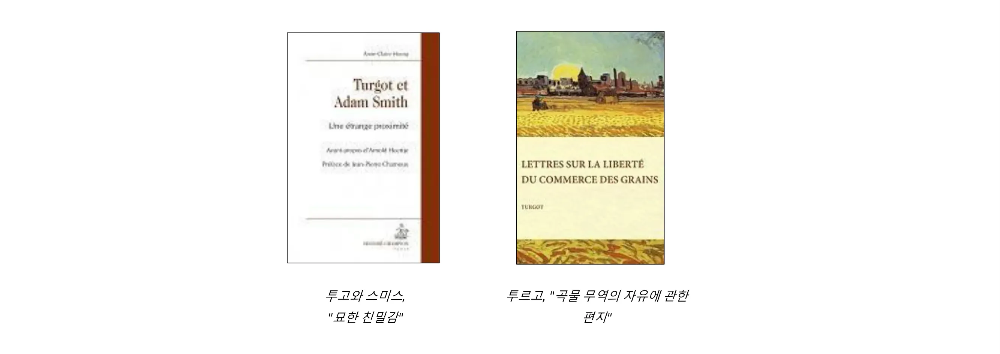

투르고는 테레이 수도원장에게 보낸 편지에서 곡물 무역의 자유를 옹호했고, 나중에 왕에게 전달되었지만 그 중 절반은 현재 분실되었습니다. 그는 이렇게 썼습니다:

> 대통령님, 시급한 것이 있다면 모든 거래 중 가장 필수적인 거래에 새로운 제한을 부과하는 것이 아니라 안타깝게도 남아 있던 제한을 제거하는 것입니다.
> 어떤 종류의 장애물도 없는 완전한 자유, 가장 절대적인 자유가 필요했던 때가 있었다면 감히 말하건대, 지금이야말로 곡물 거래에 대한 규제를 고려하기에 그 어느 때보다 적절하다고 생각합니다.

1769년, 투르고는 모렐레 수녀의 *상업 사전*을 위해 가치와 화폐라는 글을 썼지만 결국 출판되지 못했습니다. 갈리아니는 이미 "인간은 모든 것의 공통 척도"라고 언급하며, 30년 후 투르고가 이 글에서 이 명제를 확장하고 증명할 주관적인 분석을 예상하고 있었습니다.

벤담보다 훨씬 이전인 1770년, 투르고는 이자율과 고리대금의 자유를 옹호하는 각서를 썼습니다.

그는 "상업에서 돈에 대한 이자가 왕자의 법칙에 의해 고정되어야 한다고 믿는 것은 실수"라며 "다른 모든 상품과 마찬가지로 스스로를 규제하는 현재의 가격"이라고 말하며 이러한 입장을 옹호하면서 아리스토텔레스와 교회 교부들의 반대를 반박합니다.

투르고의 자유방임주의에 대한 놀라운 요약은 잊혀진 1773년 테레이 수도원장에게 보낸 다리미 표시에 관한 편지에서 찾아볼 수 있습니다:

> 정치가 해야 할 일은 자연의 흐름과 상업의 흐름에 굴복하는 것인데, 이는 자연의 흐름 자체보다 덜 필요하고 덜 저항할 수 없는 것이며, 그것을 지시하려 하지 않고 그것을 방해하지 않고 자신을 해치지 않고 지시하려면 인간의 필요, 이익, 산업의 모든 변화를 따라갈 수 있어야 하고, 물리적으로 불가능하고 가장 능숙하고 적극적이며 세심한 정부라도 항상 잘못될 위험이 절반 정도는 있는 수준의 세부 사항을 알아야 합니다.

여기서 우리는 자유방임의 교리에 대한 매우 명확한 진술과 함께 프리드리히 하이에크의 지식의 허구, 즉 국가가 경제력을 완전히 파악하여 통제할 수 없다는 분석에 대한 예고를 발견할 수 있습니다.

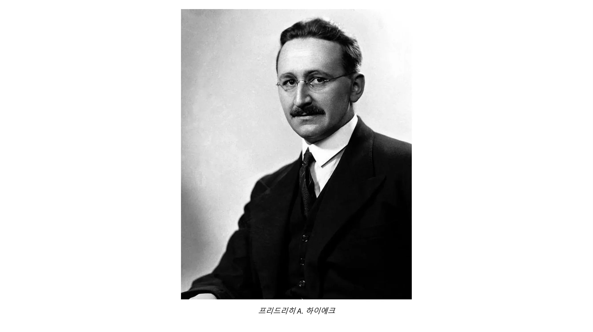

## 개혁자 투르고

<chapterId>9177429f-1679-51c4-bfd2-dd036d24a1cc</chapterId>

이전 장에서 잠깐 언급했듯이, 투르고는 프랑스 공무원 고위직에서 두각을 나타낸 저명한 가문의 아들이었습니다.

그의 아버지는 파리 상인회장이었고 할아버지는 의사였습니다. 투고 가문의 막내인 그는 학업에 뛰어난 재능을 보였기 때문에 적어도 그들과 같은 지위에 오르는 것을 목표로 삼았습니다. 그는 한동안 인텐던트와 베르사유 왕실 사이의 연락책 역할을 하는 마뜨르 데 리퀘트에서 일했습니다. 이 직책은 특별 연령 면제를 받을 수 있는 권위 있는 자리였지만 투르고는 더 많은 것을 갈망했습니다. 그의 스승이었던 구르네의 죽음은 그에게 더 높은 목표를 세우도록 격려했고, 그는 인텐던트로 임명해 달라고 요청했습니다.

1759년, 그는 처음으로 그르노블의 의도를 신청했지만 거절당했습니다. 그 후 그는 리옹의 상인 총독직을 제안 받았지만 거절했습니다. 그는 브리타니의 의도를 요청했지만 그것도 거절당했습니다. 마침내 1761년, 그는 리무진의 의도를 제안받았고 다소 마지못해 수락했습니다. 그는 볼테르에게 편지를 썼습니다: "나는 의도자가 되는 불행을 겪었습니다." 아마도 이런 의미일 것입니다: 나는 리무진의 의도가 되는 불행을 겪었습니다.

리무진의 농민들은 가난했고, 특히 주거와 식량과 관련해 불안정한 환경에서 살았습니다. 일반적인 교육 수준은 극도로 낮았습니다. 존재했던 몇 안 되는 도로는 처참한 상태였습니다.

이 지역은 너무 가난했기 때문에 장관들의 관심 밖이었습니다. 덕분에 투르고는 자유롭게 개혁을 실험할 수 있었습니다. 리무진에서 그는 세 가지 주요 프로젝트를 추진했습니다:

- 개인 세금인 **테일**의 재분배(투르고는 평가에 최대한 객관성을 도입하는 것을 목표로 했습니다).
- 코르베는 농민들이 도로 건설에 강제로 동원되는 노동의 대가로 지불하는 세금의 한 형태입니다. 투르고는 이 지역을 여행하면서 도로의 열악한 상태를 금방 알아차렸습니다. 그는 코르베를 금전적 세금으로 대체했습니다.
- **민병대**, 전쟁 중에 동원된 농민군 모집.

제비뽑기로 진행되다 보니 가출로 인한 공포와 폭력이 발생했고, 투르고는 이러한 의무 부과를 유급 자원봉사로 대체했습니다.

이러한 개혁은 틀림없이 성공적이었고 1774년 7월 투르고는 장관으로 임명되었습니다. 경험이 부족했기 때문에 국왕은 그를 해군부에 먼저 배치했습니다. 이 임명은 많은 사람들을 즐겁게 했습니다. 투르고 자신은 "나는 해군에 대해 아무것도 모른다"고 인정했고, 볼테르는 "나는 투르고가 나보다 더 선원이 아니라고 생각한다"고 말했죠.

그러나 불과 한 달 후 투르고는 재무장관에 임명되어 사실상 프랑스의 경제 및 재무 장관이 되었습니다.

우리는 그가 루이 16세에게 자신의 원칙을 설명한 편지를 알고 있습니다: "파산 금지. 세금 인상도 없다. 신규 대출 금지". 오늘날 비평가들은 무의미한 '엄격함'이라고 표현할 수도 있는 이 원칙은 군주제를 구하기 위한 것이었습니다.

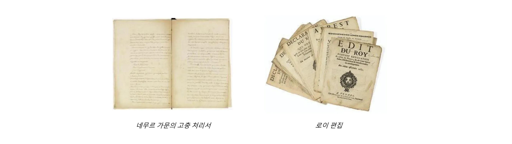

투르고는 프랑스 경제를 개혁하기 위해 6개의 왕실 칙령을 준비했습니다.

경제 전문가가 자국의 경제를 개혁할 수 있는 자유를 부여받은 처음이자 마지막 기회이기도 했습니다. 투르고의 칙령 중 세 가지가 눈에 띄는데, 하나는 강제 노동(코베) 폐지, 다른 하나는 무역 길드(기업) 해산, 세 번째는 곡물 자유 무역 확립입니다.

투르고는 장관직에 오르자마자 특권층의 저항에 직면할 것을 알았습니다. 그는 왕에게 "대부분의 궁중과 호의를 바라는 모든 이들에게 두려움과 미움을 받게 될 것"이라고 말했습니다. 특권층은 곧 그를 반대하는 세력을 결집했고, 결국 그는 재무총감직에서 해임되었습니다. 투르고의 개혁을 전폭적으로 지지했던 볼테르는 서신에서 이렇게 썼습니다:

> 아! 끔찍한 소식을 들었습니다! 우리는 어떻게 될까요? 참담한 심정입니다! 황금기의 탄생과 죽음을 목격한 우리는 결코 회복할 수 없을 것입니다! 이 벼락이 제 머리와 가슴을 모두 강타했습니다.

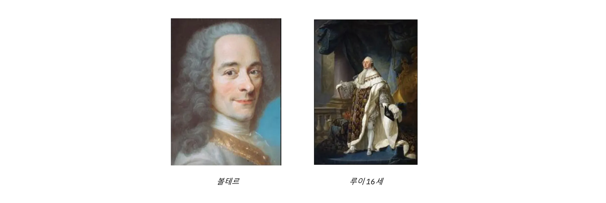

그 이후로 많은 사람들이 프랑스는 개혁이 불가능한 나라라고 주장했습니다. 투르고의 실패는 이를 확인하는 듯했습니다: 그는 반세기 동안 자유주의 경제 사상에 의해 준비되어 있었고, 계몽주의 철학자들의 지지를 받았으며, 절대 권력을 가진 국왕이 그를 지지했기 때문입니다.

결국 귀족과 특권층이 승리했습니다. 왕이 할 수 있는 것은 개인적으로 한탄하는 것뿐이었습니다: "이제야 무슈 투르고와 나만이 백성들을 걱정한다는 것을 알았습니다."

## 콘딜락

<chapterId>0ba8dbb5-dcd5-5981-bf85-6c185e0bf192</chapterId>

가장 명백한 현실적 표현인 중상주의와 마찬가지로 몽테뉴의 궤변은 사라지는 데 오랜 시간이 걸렸습니다.

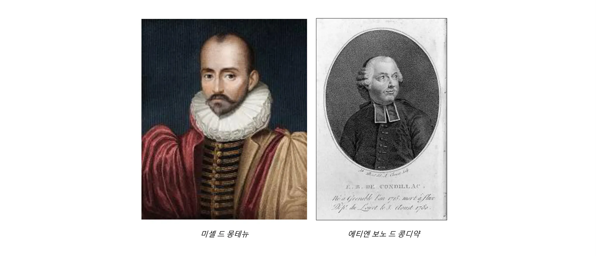

그 궤변은 무역과 Exchange가 제로섬 게임이라는 생각입니다. 거래에서 한 당사자가 얻는 것은 무엇이든 상대방이 반드시 잃는다는 것입니다. 이 이론을 지지하는 사람들은 개인과 국가 간에 모두 해당된다고 주장합니다.

콘딜락의 수도원장은 이 잘못된 생각을 확실하게 해체하는 데 중요한 역할을 했습니다.

공개 토론에서 이러한 궤변은 종종 다시 등장하기 때문에 "확실히"라는 표현은 과장된 것일 수 있습니다. 그래서인지 콘딜락은 잘 알려지지 않은 경제학자로 남아 있습니다. 오스트리아 경제학자들을 제외하고는 그의 Exchange 이론의 중요성을 이해한 사람은 거의 없으며, 더 이상 그에게 관심을 갖는 사람도 없습니다.

대부분의 경제 사상가들에게 1776년은 경제 과학의 기초가 된 *국부론*이 출판된 해로 기억됩니다. 아담 스미스보다 앞서 프랑스 경제학을 연구한 15개의 강의만으로도 이 개념의 오류를 충분히 증명할 수 있습니다. 또한 같은 해인 1776년에는 아담 스미스의 책보다 역사가들로부터 더 많은 찬사를 받을 만한 또 다른 책이 있는데, 바로 콘딜락이 쓴 [*상업과 정부의 상호 관계에 관한 고찰*](https://archive.org/details/commercegovernme0000cond)이라는 제목의 책입니다.

콘딜락은 제로섬 게임으로 간주되는 Exchange의 궤변이 지속된다면, Exchange이 평등한 관계라고 주장하는 피지오크라트에게 부분적으로 책임이 있다고 주장합니다. 콘딜락에 따르면 이는 잘못된 주장입니다: Exchange은 항상 더 많은 것을 얻기 위해 더 적게 주는 불평등한 관계입니다.

피지오크라트의 아이디어와 콘딜락의 아이디어 사이에서 이보다 더 완벽한 반대는 꿈도 꿀 수 없었습니다. 피지오크라트 경제학자 르 트로스네는 이렇게 썼습니다:

> Exchange은 본질적으로 동일한 가치에 대해 동일한 가치로 만들어진 평등의 Contract입니다.

반면에 콘딜락은 이렇게 썼습니다:

> Contract의 각 당사자는 항상 더 큰 가치를 얻기 위해 더 적은 가치를 제공합니다.

그러나 반대 의견은 대체로 말의 문제입니다. 둘 다 프랑을 책으로 교환할 때 책이 프랑의 가치가 있거나 책 가격이 프랑이라는 데 동의합니다.

콘딜락은 책값이 15프랑이기 때문에 1프랑인 Coin보다 책값이 더 높다고 주장하지만, 저희 입장에서는 책값이 더 높다는 의미입니다. 저희는 Coin보다 책을 더 선호하기 때문에 Exchange를 제작합니다.

콘딜락의 이론이 피지오크라트의 이론과 근본적으로 모순되는 것은 아니지만, 말하자면 같은 언어를 사용하고 있지는 않습니다. 르 트로스는 가격에 대해 말하고 콘딜락은 가치에 대해 말하며, 그 반대의 경우도 마찬가지입니다.

콘딜락이 옳은 경우는 교환된 두 상품 간의 가격이 같으면 가치가 같지 않고, 그렇지 않으면 Exchange이 발생하지 않는다는 것입니다.

콘딜락의 이론을 요약하면 세 가지 명제를 열거할 수 있습니다:

첫 번째 명제: 우리는 효용을 위해 상품을 추구한다. 이것은 당연해 보이지만, 장 밥티스트 세이도 완벽하게 발전시킨 효용을 얻기 위해 인간이 재화를 추구한다는 것은 경제학의 핵심 교리입니다.

두 번째 명제: 가치는 존재하며 교환의 동기가 됩니다. 각 사람이 상품과 서비스에 대해 내리는 주관적인 판단은 동일한 상품과 서비스가 제공하는 효용에 따라 더 많거나 적은 가치를 지니고 있다는 것을 의미합니다. 당연히 개인마다 판단하는 기준이 다르고 가치도 사람마다 다릅니다.

마지막으로 세 번째 명제: 가격은 Exchange 프로세스의 결과입니다. Exchange의 조건은 판매자가 제품에 부여하는 주관적 가치에 따라 달라지기 때문에 제품은 내가 부여하는 가치로 Exchange되지 않습니다. 구매자와 판매자 간의 관계, 또는 구매자의 주관적 가치 평가와 판매자의 주관적 가치 평가 간의 관계가 가격을 결정합니다.

이러한 콘딜락의 아이디어는 근본적인 것입니다. 이를 통해 모든 Exchange이 항상 상호 이익이 되는 이유를 이해할 수 있습니다.

따라서 보호무역주의는 인구가 서로에게 상호 이익을 주는 것을 방해하는 메커니즘으로만 나타나기 때문에 자유무역에 대한 비판을 완전히 파괴합니다. 자유방임주의는 콘딜락의 연구의 결론이기도 합니다. 공권력이 자유와 재산을 보호한다면 사람들은 항상 함께 교류함으로써 서로를 풍요롭게 할 것이기 때문에 사람들이 원하는 대로 하도록 내버려둬야 합니다.

## 콘도르셋

<chapterId>99e4aba6-da7f-5041-b02f-337158381515</chapterId>

콘도르셋은 의심할 여지 없이 계몽주의 철학자 중 가장 경제적인 생각을 가진 철학자입니다.

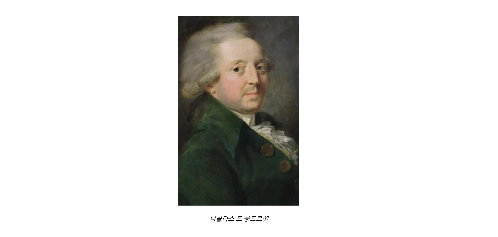

그는 경력의 대부분을 경제학과는 전혀 무관한 분야에 전념했으며, 그의 재능이 그가 가장 집중했던 과학 분야에서 큰 발전을 가져왔기 때문에 당연한 결과였습니다. 그러나 1770년경에 그는 다른 철학자들, 특히 볼테르와 디드로가 여가 시간을 경제학에 할애하지 않았고, 투르고와 친분이 있었기 때문에 경제학 문제에 매력을 느꼈습니다.

콩도르세는 처음에는 정치 경제와 무관한 영역에서 자유방임과 자유에 대한 사상을 점차 수용했습니다. 그는 <어느 신학자의 편지>에서 가톨릭 종교를 철학적으로 조롱하고 믿지 않을 자유를 포함한 진정한 신앙의 자유를 보고 싶다는 소망을 표현했습니다. 관용과 종교적 광신주의에 반대하는 십자군 전쟁에서 콘도르세는 슈발리에 드 라 바레의 복권과 십자가를 부순 혐의로 사형 선고를 받은 데탈롱드의 재심을 위해 싸웠습니다.

따라서 그는 친구 투르고가 재무장관 자리에 올랐을 때 자유를 수호할 준비가 되어 있었습니다.

이후 콘도르셋의 경력은 경제 논쟁에 뛰어들면서 새로운 장관의 자유주의 개혁을 지칠 줄 모르고 지지하면서 전환점을 맞이하게 됩니다. 경쟁과 상업의 자유를 지지하는 콘도르셋은 코베(강제 노동)와 길드의 폐지와 공정한 과세도 요구했습니다. 그는 기회가 있을 때마다 이러한 신념을 공개적으로 표명하며 열정을 다해 글을 썼고, 한 번은 자신의 저서에서 이렇게 선언하기도 했습니다: "상업의 자유에 대해 다시 한 번 말씀드리자면, 저는 이 주제에 대해 이야기하는 것을 즐깁니다."

1774년에서 1776년 사이, 투르고의 재임 기간 동안 콩도르세는 자유방임에 대한 그의 Commitment로 대표되는 수많은 개입을 했습니다. 그의 저서로는 자유무역을 옹호하는 *피카르디의 한 농부가 네커 씨에게 보내는 편지*, 자유 경쟁을 옹호하는 *독점과 독점자*, 코베의 폐지를 촉구하는 *곡물 무역에 관한 고찰*, 다시 자유무역을 찬양하고 같은 주제에 관한 네커의 저서를 비판하는 *곡물 무역에 관한 고찰*이 있습니다.

콘도르셋은 [*곡물 무역에 관한 편지*](https://archive.org/details/bub_gb_hg8jFw-y6bwC)에서 몇 가지 핵심 사항을 지적합니다.

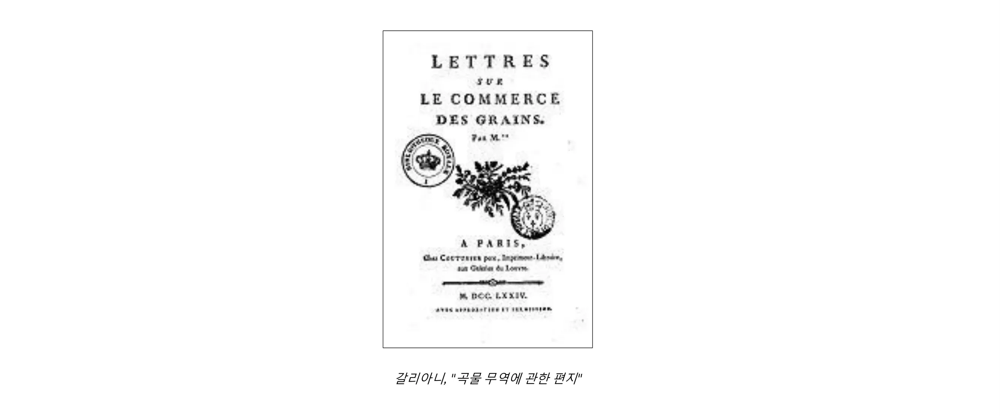

첫째, 당시의 높은 곡물 가격은 자유무역의 결과가 아니라 흉작의 결과였으며, 콘도르셋은 이를 명확하게 보여줍니다. 그런 다음 그는 대중의 편견에도 불구하고 자유방임이 적절할 뿐만 아니라 유일하게 적합한 정책인 이유를 설명합니다. 그는 "우리는 정부가 곡물 거래에 개입하는 것에 너무 익숙해져서 아무것도 하지 않는 것이 특별하고 새로운 것처럼 보인다"고 말합니다. 이어서 그는 "거의 모든 사람들, 특히 공직에 있는 사람들은 저절로 아무 일도 일어나지 않으며 정부가 모든 일에 개입하지 않으면 모든 것을 잃는다고 믿는다"고 덧붙입니다. 따라서 콘도르셋은 모든 형태의 개입주의에 대한 자유무역의 우월성을 보여주며 피지오크라트와 투르고의 주장을 되살립니다.

투르고의 자유주의적 경제 의제를 홍보하는 것은 용기 있는 행동이었지만, 콘도르셋은 곧 검열에 직면할 것을 알았기 때문입니다. 실제로 이런 일이 벌어졌고 1776년 강제 노동 폐지에 관한 그의 팜플렛은 폐기되고 금지되었습니다.

투르고는 콘도르셋이 자신의 사상을 충성스럽게 옹호한 것을 높이 평가하여 그를 주화 감독관으로 임명했습니다. 콘도르셋은 친구가 재무부를 떠나자마자 사임했습니다.

투르고를 변호하는 데 온 힘을 쏟았지만 콘도르셋은 친구의 재임 결과에 대해 아무런 환상을 갖지 않았습니다. 투르고 자신은 말년에 편지를 통해 "국가와 인류를 위해 쉽게 믿었던 선을 행하지 못한 것에 대해 후회하며 살았다"고 인정했습니다. 보다 현실적인 콘도르셋은 왕의 측근, 의회, 성직자, 귀족, 길드 등 투르고가 직면하게 될 많은 적들을 지적했습니다. 이 집단은 개혁이 아니라 아첨을 기대했습니다. 콩도르셋은 투르고에게 "당신은 결코 사기꾼이 아니며, 파리의 상황을 고려할 때 그것은 결함입니다"라고 말했습니다. 그가 도착한 지 2년이 채 안 된 1776년에 투르고는 이미 총독직을 떠나야 했으니 그의 말이 완전히 옳았습니다.

## 혁명의 자유주의적 상식

<chapterId>95e9a90d-e37a-58ff-b1ac-928b42e76ecf</chapterId>

듀퐁 드 네모르는 프랑수아 퀘네의 막내 제자였는데, 퀘네는 그를 두고 이렇게 말한 적이 있습니다: "우리가 죽었을 때 이 젊은이를 돌봐야 한다, 그가 말할 것이기 때문이다". 프랑스 혁명이 시작되었을 때 미라보 후작을 비롯한 거의 모든 위대한 물리학자들은 이미 세상을 떠났고 미라보 자신도 1789년 7월 13일에 세상을 떠났습니다.

듀퐁 드 느무르가 느무르의 집행관을 위한 불만 목록을 작성했습니다.

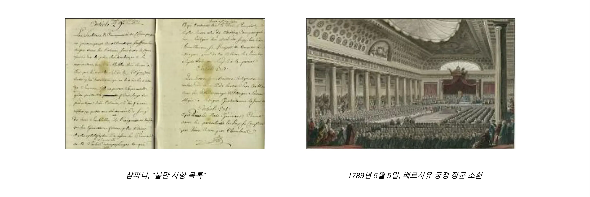

이 흥미로운 문서에는 무역 제한, 독점, 재산에 대한 공격에 대한 자유주의 경제학자들의 불만이 모두 담겨 있었습니다. 듀퐁 드 네모르는 국회의원에 당선되기도 했습니다.

혁명 기간 동안 그는 포퓰리즘과 개입주의 선동의 물결에 맞서 자유주의적 상식을 대변하는 목소리를 냈고 결국 승리했습니다.

1789년 11월 초, 프랑스 은행인 케세 데스콤프테에 독점권을 부여하자는 이야기가 나왔을 때 듀퐁 드 네무르는 경쟁을 옹호하는 목소리를 냈습니다.

"그는 "은행업은 자유무역의 법칙에 맡기는 것이 더 나을 것"이라고 말합니다. 그리고 그는 덧붙입니다:

> "저는 장관이 카이세 데스콤프에 특권을 부여한다는 말을 했을 때 무슨 뜻인지 이해하지 못하겠습니다. 이 특권에 독점권이 포함된다면, 당신은 새로운 특권을 만들러 온 것이 아니라 독점권을 파괴하러 온 것이므로 이를 거부해야 합니다."

그의 경고에도 불구하고 의회는 그의 반대를 무시하고 중앙은행과 은행 독점을 위한 또 다른 발걸음을 내디뎠습니다.

1790년 제헌의회에서 듀퐁 드 네모르는 피지오크라트 친구들의 평화주의 전통을 따라 공격적 전쟁을 금지하는 법을 제안했습니다. 첫 번째 조항은 다음과 같습니다: "프랑스 국가는 다른 국가의 영토를 점령하거나 다른 국가의 권리나 자유를 침해하기 위해 공격적인 전쟁을 벌이는 것을 허용하지 않는다".

이 제안은 거부되었습니다.

같은 해인 1790년, 정부 경비를 충당하기 위해 새로운 지폐를 발행하는 것에 대한 논의가 시작되었습니다.

듀퐁 드 네모르는 이에 단호히 반대하며 [*아사낫이 빵 가격에 미치는 영향*](https://archive.org/details/effetdesassignat00dupo)이라는 제목의 팜플렛을 발행했습니다. 아싸그나트 발행은 필연적으로 인플레이션, 즉 빵을 포함한 상품 가격의 상승으로 이어질 수밖에 없다고 설명한 제목은 정확했습니다.

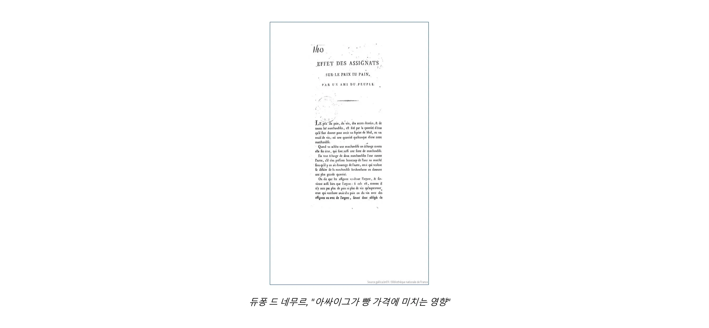

그는 팸플릿에 "국민의 친구"라고 서명했습니다. 이 작품은 의회에서 누가 썼느냐는 질문을 받으면서 큰 파문을 일으켰습니다. 그러자 뒤퐁 드 네모르는 자리에서 일어나 자신의 작품임을 시인하며 "인민의 친구"라는 칭호를 사용하는 것이 부끄럽지 않다며, 나치에 맞서 싸우는 것이 진정으로 인민을 위해 봉사하는 것이기 때문이라고 말했습니다.

다시 한 번 그의 조언은 무시되고 배정이 이루어졌습니다.

우리 모두는 그 후의 재앙, 경제적 파탄과 고통, 그리고 많은 사람들이 모든 것을 잃고 불에 타야 했던 많은 사람들이 견뎌낸 고통을 알고 있습니다.

몇 년 후, 의회는 화폐 생산을 독점할 수 있는 실제 프랑스 중앙은행을 설립하는 아이디어로 관심을 돌렸습니다.

듀퐁 드 네모르는 여전히 공적 은행을 독점에 불과하다고 생각하며 공적 은행 설립에 단호히 반대했고, 의회에 할당자들의 비참한 경험을 상기시켰습니다. 그는 이렇게 말했습니다:

> "제헌의회에서 제 동료들을 괴롭혔던 것과 같은 후회를 준비하지 마십시오. 당시 어저너트를 국가 재화에 대한 지불로만 제한하고 유통 화폐로 만들지 말자는 제 제안은 부결되었습니다. 오늘날 사람들은 '아, 우리가 듀퐁 드 네무르의 말을 들었더라면 좋았을 텐데'라고 말합니다."

하지만 이번에도 아무도 그의 말에 귀를 기울이지 않았습니다.

## 결론: 횃불 전달하기

<chapterId>ada8082f-db96-5e52-954f-719b47998153</chapterId>

18세기의 프랑스 경제 사상은 종종 19세기의 유명한 경제학자들에 의해 가려지곤 합니다. 하지만 자유를 수호하는 데 있어 모든 것이 진정으로 시작된 것은 18세기입니다. 이 시기는 부아길베르에서 듀퐁 드 네모르에 이르기까지 수많은 사상가들이 당시로서는 혁명적이었던 자유방임의 원칙을 처음으로 명확하게 표현한 세기입니다.

물론 장 밥티스트 세이, 프레데릭 바스티앙, 구스타브 몰리나리, 이브 기요 같은 인물은 프랑스 경제 사상사에 길이 남을 족적을 남겼습니다. 하지만 이들을 따로 떼어놓고 연구하면 본질적인 것을 놓칠 수 있습니다. 이 19세기 사상가들은 갑자기 등장한 것이 아니라 18세기 계몽주의 시대의 선배들이 닦아놓은 토대를 계승하고 그 위에 구축했습니다.

보이스길버트는 정부가 개입하여 모든 것을 해결할 수 있다고 믿는 선의의 영혼들은 필연적으로 경제를 뒤집어 놓을 수밖에 없으며, 따라서 자연의 순리에 맡기는 것이 더 낫다고 주장합니다.

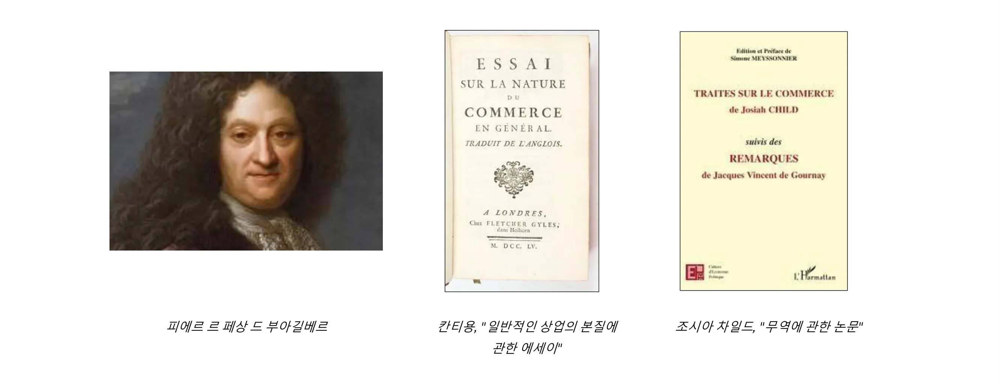

칸티용은 정치적 목적을 위해 돈을 조작해서는 안 된다고 주장했습니다. 국가가 마음대로 돈을 관리하도록 허용하는 것은 엄청난 재정적, 경제적 혼란을 초래할 수 있는 길을 열어주는 것이기 때문입니다.

빈센트 드 구르네는 노동에 대한 과도한 규제가 노동자와 장인의 노력을 저해하고 게으름과 비활동성으로 몰아간다고 주장합니다. 경제가 성장하고 국가가 번영할 수 있는 것은 자유 경쟁 덕분입니다.

다르장송 후작은 어떤 정부도 모든 것을 예측하고 측정할 수 없으며, 따라서 각 개인의 이기심에 의존해야 한다고 주장합니다.

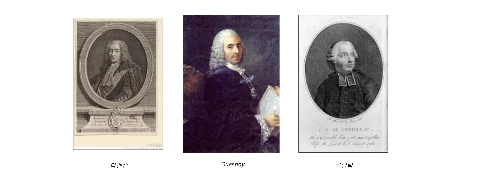

퀘스내와 피지오크라트들은 사유재산이 인간 사회의 토대라고 주장합니다. 사유재산이 없으면 인간은 노동의 결실을 누리거나 아무것도 축적할 수 없기 때문에 노력할 동기를 잃고 일할 의욕을 잃게 됩니다.

콘딜락은 Exchange는 항상 상호 이익이 되므로 예외 없이 항상 자유로워야 한다고 주장합니다. 국가의 유일한 임무는 자유와 재산을 보호하는 것이어야 합니다.

이 모든 아이디어는 19세기 경제학자들이 받아들였습니다. 장 밥티스트 세이와 같은 학자는 엄격한 *정치경제학 논문*을 통해 이러한 아이디어를 과학적으로 표현했습니다. 반대로 프레데릭 바스티앙처럼 이야기, 소설, 재미있는 단편 소설의 영역으로 들어가 이러한 근본적인 격언을 대중화하고자 하는 사람들도 있었습니다.

## 전기

<chapterId>17cf2865-e53c-5f3b-a5c2-a43560efaf01</chapterId>

**선택적 참고 문헌**

아래에서 30개가 넘는 글 중에서 엄선한 글을 확인하실 수 있습니다:

1. 피에르 클레망, 콜베르와 그의 아들 관리, 파리, 1874년

2. 보반, 프로제트 드 유네 디엠 로얄, 1707; 재인쇄 인스티튜트 코페, 2014; 앤 블랑샤르, 보반, 파야르, 1996

3.	부아길베르, 데테일 드 라 프랑스, 1695; 인스티튜트 코페에서 재출판, 2014

4. 펠릭스 카뎃, 피에르 드 부아길베르: 경제학자의 선구자, 코페 인스티튜트, 2014

5. 피에르 드 부아 길베르 또는 정치 경제의 나이스, 파리, INED, 1966 년

6. 리차드 칸티용, Essai sur la nature du commerce en générale, 1755; 인스티튜트 코펫에서 재인쇄, 2015

7. 앙투안 머피, 리처드 칸티용, 은행가 겸 경제학자, 옥스퍼드, 1986년

8. 구스타브 드 몰리나리, 파리 생피에르의 교구장, 1859년

9. 로테르담, 1729년 생 피에르 수도원장, 아브레제 뒤 평화 프로젝트, 로테르담

10. 생 피에르 수도원장, "프랑스 상업의 완벽을 위한 프로젝트", 레 레브 드 엉 옴므 드 비엔, 파리, 1775, p.199

11. 앙드레 알렘, 아르젠송 후작과 정치경제학, XVIII세기의 시작, 코페 인스티튜트, 2015

12. 아르젠송 후작의 저널과 추억, 라쎄리 판, 9권, 파리, 1859-1867년

13. 브누아 말브랑크, 뱅상 드 구르네: 자유방임의 정치 경제학, 코페 인스티튜트, 2016

14. 빈센트 드 구르네, 조시아 차일드 번역본, 라르마땅, 2008

15. 크리스틴 테레 & 로익 샤를 (편저), 르 세르클 드 구르네, INED, 2005

16. 앙투안 머피, "프랑스 경제학의 발전(1750-1756)", 현대와 현대의 역사, 1986년 10월~12월, XXXIII권, 1986년 10월~12월

17. 앙리 리퍼트, 미라보 후작: 정치 이론과 경제학, 파리, 1901

18. 루시앙 브로카드, 미라보 후작의 경제학 및 사회 교리, 라미 데 옴므, 파리, 1902 년

19. 훔베르 드 몽로르, 미라보, 라 아미 데 옴므, 페린, 1992

20. 이브 기요, 프랑수아 퀘네와 물리학, 코페 인스티튜트, 2014

21. 프랑수아 퀘네, 경제학 전집 및 기타 텍스트, 2권, INED, 2005

22. 조지 뷜러세, 프랑스의 생리학적 운동(1756~1770년), 2권, 파리, 1910년

23. 조지 뷜러세, 루이 15세 왕정 말기의 생리학 (1770-1774), P.U.F., 1959

24. 조르주 뷜러세, 투르고와 네커의 생리학 (1774-1781), P.U.F., 1950

25. 조지 뷜러세, 라 피지오크라시 드 라 혁명(1781-1792), EHESS, 1985

26. P. 졸리, 뒤 퐁 드 네무르, 군인, 파리, P.U.F., 1956

27. 볼테르의 경제 저작, 코페 인스티튜트, 2013

28. 구스타브 셸레(편집), 투르고의 작품 및 문서, 파리, 1913-1924

29. 브누아 말브랑크, 르 리베랄리즘 아 라 에사이 : 투르고 인텐트 뒤 리무진(1761-1774), 코페 인스티튜트, 2015

30. 피에르 퐁신, 에사이 쉬르 르 투르고, 파리, 1877년

31. 오귀스트 르보, 콘딜락 이코노미스트, 파리, 1903년

32. 콘딜락, 르 상거래와 정부, 1776년, 상대적 개념으로 간주되는 상거래와 정부, 1776년

33. 콘도르셋, 정치경제학, 유진 데어 (ed.), 정치경제학, 파리, 1847에서, 1847

34. P. 졸리, 뒤 퐁 드 네무르, 군인, 파리, P.U.F., 1956

35. 일라이 헥셔, 머천틸리즘, 2권. 런던: 앨런과 언윈. 1935

# 마지막 섹션

<partId>385bffab-aea1-5bcd-9569-62b3f30665b7</partId>

## 리뷰 및 평가

<chapterId>a1e689d9-abd0-5dcb-ba56-a8d355d0a84f</chapterId>

<isCourseReview>true</isCourseReview>

## 기말 시험

<chapterId>bdb7fd98-33e7-11f0-9fe6-b785c859ffc5</chapterId>

<isCourseExam>true</isCourseExam>

## 결론

<chapterId>3b366ff6-03c8-5f6a-b4c0-ba8186e65d7e</chapterId>

<isCourseConclusion>true</isCourseConclusion>