# Een reis door de economische geschiedenis van vrijheid

Deze cursus verkent de geboorte van de economische wetenschap in het 18e-eeuwse Frankrijk door de lens van laissez-faire. Je ontdekt hoe denkers het mercantilisme uitdaagden door te betogen dat de staat particuliere rechten moest beschermen, maar nooit markten mocht manipuleren door middel van regelgeving.

Je leert hoe visionaire hervormers deze visie uitbreidden om vrije handel en onbeperkte circulatie van goederen te eisen, waarmee ze de intellectuele fundamenten van het moderne kapitalisme legden. Door deze baanbrekende economen te bestuderen, begrijp je de tijdloze principes die de mondiale politieke economie hebben gevormd en vandaag de dag nog steeds beleidsdebatten beïnvloeden. Meld je nu aan om de ideeën te beheersen die de moderne economie hebben opgebouwd.
+++
# Inleiding

<partId>06d67531-19f1-4f8d-bf8f-77bbcc743672</partId>

## Cursusoverzicht

<chapterId>202db3c6-0320-494d-8057-adc6f6563048</chapterId>

Welkom bij HIS204!

Deze cursus is ontworpen om de Franse oorsprong van het concept van *laissez-faire* - "laat het gebeuren"- te verkennen, zoals het zich in de 18e eeuw ontwikkelde via een rijke intellectuele traditie. Door de gedachten van vroege Franse economische denkers te volgen, ontdekken we de fundamenten van een politieke economie die is gebouwd op economische vrijheid, gekenmerkt door een wantrouwen jegens staatsinmenging en een geloof in een natuurlijke orde die groei en welvaart bevordert.

**Deel 2: De Voorlopers**

In dit deel beginnen we bij de eeuwwisseling van de 17e en 18e eeuw, een tijd die gekenmerkt werd door de buitensporige heerschappij van de absolute monarchie en de eerste roep om een rationelere en eerlijkere manier om de publieke zaak te besturen. Via de figuren Vauban, Boisguilbert en Cantillon ontdekken we vroege kritiek op staatsinterventionisme en een eerste schets van wat later de liberale politieke economie zou worden.

**Deel 3: Hervormers en denkers uit het begin van de 18e eeuw**

Dit deel richt zich op degenen die in de eerste decennia van de 18e eeuw probeerden de Franse economie te hervormen in het licht van nieuwe principes. Denkers als de abt van Saint-Pierre, de markies d'Argenson en Gournay (samen met zijn volgelingen) riepen op tot het ontmantelen van corporatistische obstakels, het liberaliseren van de handel en het aanmoedigen van concurrentie als motor van ontwikkeling. Hun vaak gewaagde voorstellen waren een voorbode van de grote ideeën van de Fysiocraten.

**Deel 4: De Fysiocratische School**

In dit hoofdstuk wordt een van de belangrijkste momenten in het Franse economische denken onderzocht: de school van de fysiocraten. We onderzoeken de oorsprong, de doctrinaire fundamenten en de belangrijkste resultaten, waarbij we ons richten op sleutelfiguren als Quesnay en Dupont de Nemours. Het idee van laissez-faire wordt in deze school een samenhangend systeem, geworteld in het idee van een natuurlijke orde waaraan de staat zich moet onderwerpen om welvaart voor iedereen te garanderen.

**Deel 5: De Verlichting en politieke economie**

Tot slot zullen we zien hoe het liberale economische denken zich verspreidde binnen de bredere Verlichtingsbeweging. Figuren als Voltaire, Turgot, Condillac en Condorcet breidden de laissez-faire traditie uit en verrijkten deze. Hun geschriften vormden een brug voor de laissez-faire traditie naar de revolutionaire periode en daarna, waar liberale ideeën een nieuwe weerklank vonden.

Klaar om de Franse wortels van het economisch liberalisme te herontdekken? Laten we gaan!

# De Voorlopers

<partId>91565b10-6010-53cb-a2f4-9c2306c7ef8c</partId>

## Historische achtergrond

<chapterId>6a5fd101-6dfd-5d77-96c7-9e1aa4a19758</chapterId>

Aan het begin van de 18e eeuw verkeerde Frankrijk in een zorgwekkende toestand. De plattelandsbevolking produceerde nauwelijks genoeg om te overleven en werd zwaar belast.

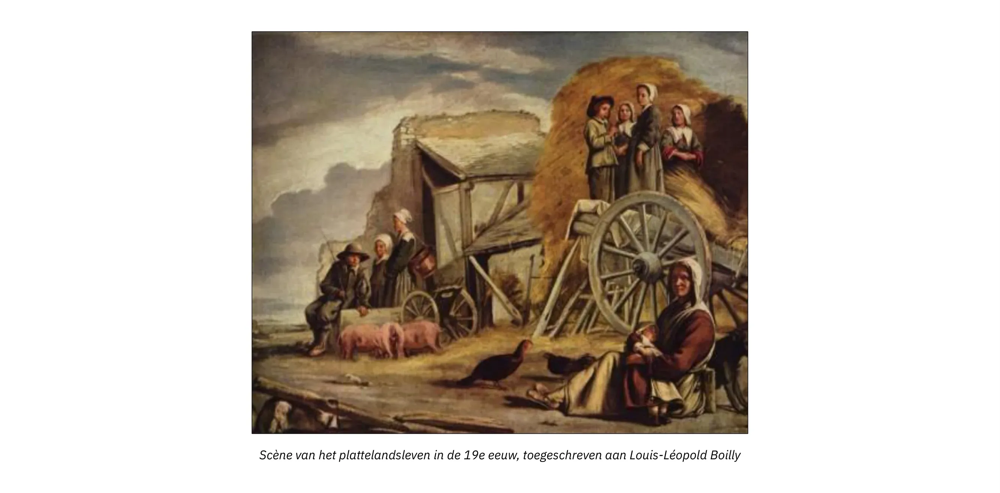

Stedelijke ambachtslieden, opgesloten in starre gilden, hadden moeite om te innoveren of zelfs om elkaar te ondersteunen. Ondertussen overtroffen andere Europese naties Frankrijk al snel op alle fronten en overklasten ze de Franse producten. Iedereen dacht aan de commerciële successen van Engeland en Holland.

Maar hoe konden we een oplossing vinden voor de ziekte van die tijd? Er was nog geen economische wetenschap en dus ook geen speciaal medicijn om toe te passen. De principes van het economisch beleid werden nog steeds lukraak toegepast, wisselend tussen restrictieve fasen en meer liberale periodes. Zeker, we hebben modellen, historische referenties om te volgen. Onder hen was *Sully*, de minister van Henri IV, die pleitte voor landbouw en een grotere vrijheid van handel binnen Frankrijk bevorderde.

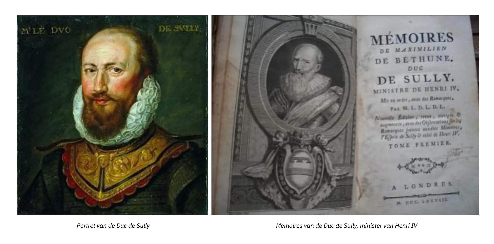

Maar toen kwam Colbert, de minister van Lodewijk XIV, die twijfelde tussen regulering en vrijheid, maar uiteindelijk toch de regulering afdwong. Helemaal aan het einde van de 17e eeuw haalde Colbert Sully in: ministers beriepen zich nu op zijn nalatenschap en probeerden wat zij beweerden zijn stelregels toe te passen.

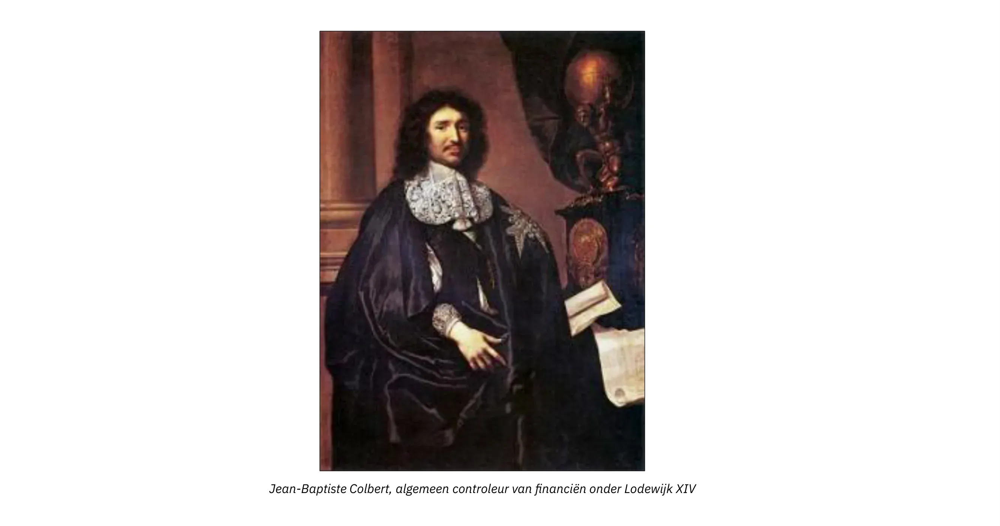

In de hoofden van staatslieden aan het einde van de 17e eeuw waren de stelregels van Colbert er vier.

(1) **De industrie moet worden gereguleerd en gebonden binnen gilden**. Deze regels geven bijvoorbeeld aan hoe lakens en doeken gemaakt moeten worden en hoe groot en zwaar ze moeten zijn.

Er waren honderden van zulke regels, gebundeld in speciale delen voor elk type industrie. Maar in de ogen van Colberts volgelingen was dit nog steeds onvoldoende: de industrie, zo vonden zij, moest ook onder toezicht van bedrijven staan.

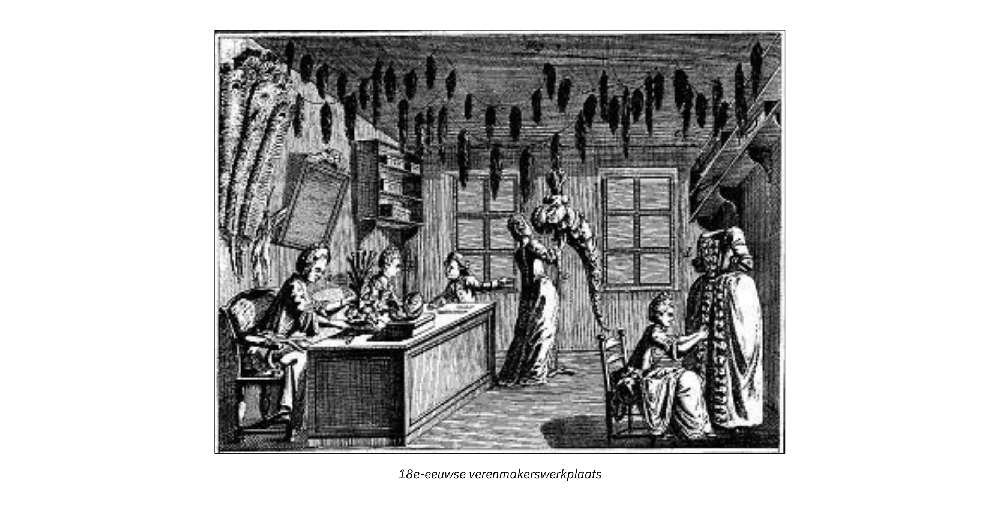

Wie een vak wilde uitoefenen, moest eerst een aantal jaren als leerling doorbrengen, daarna als gezel, voordat hij de status van meester kon bereiken door een "meesterwerk" te produceren en een aanzienlijk bedrag aan het gilde te betalen. De concurrentie binnen elk vak was daarom strikt beperkt.

(2) **Handel is een nulsomspel**. Als het op handel aankomt, deelden Colberts discipelen dezelfde vooroordelen als de barbaren uit de Oudheid. Volgens de minister van Louis XIV is handel "een eeuwigdurende oorlog". Waarom? De reden is simpel: voor Colbert en zijn opvolgers betekende elke toename in rijkdom voor het ene land de verarming van het andere. In hun ogen mochten de Engelsen of de Nederlanders niet rijk worden, want dat zou betekenen dat ze de welvaart van Frankrijk stalen.

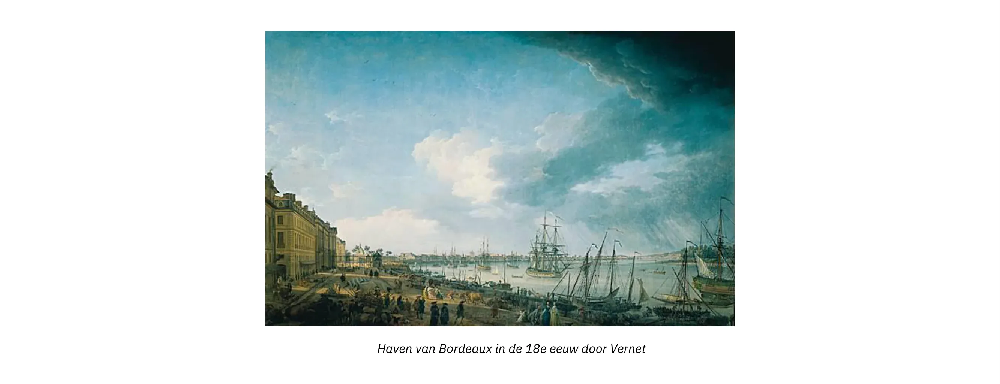

De producten van deze landen moesten daarom zonder scrupules worden verboden of zwaar worden belast, want handel is een oorlog waarin we alleen de ondergang van onze vijanden kunnen wensen.

> "De Fransen kunnen hun handel alleen vergroten door de Nederlanders te verpletteren".
> *Colbert*

(3) **Als de staat geld tekort komt, verhoog dan de belastingen**. Colbert en zijn discipelen geloofden helemaal niet dat de rijkdom van de belastingbetaler een beperkte bron was. In hun ogen konden overheidsuitgaven nooit een probleem zijn, zolang er maar genoeg werd geïnd. En als het volk in opstand kwam, was dat alleen maar omdat de ministers het slecht hadden aangepakt, want, zoals Colbert cynisch opmerkte, "de kunst van het belasting heffen bestaat erin de ganzen te plukken zonder ze te veel te laten schreeuwen".

(4) **Welvaart is vooral goud en zilver**. Voor de geboorte van de economische wetenschap volgden veel schrijvers één dominant dogma over de aard van rijkdom, wat bekend werd als *mercantilisme*. Colbert en zijn opvolgers vervolgden dit pad. Kort gezegd geloofden mercantilisten dat het ware teken van de welvaart van een natie de accumulatie van edelmetalen, zilver en goud, was.

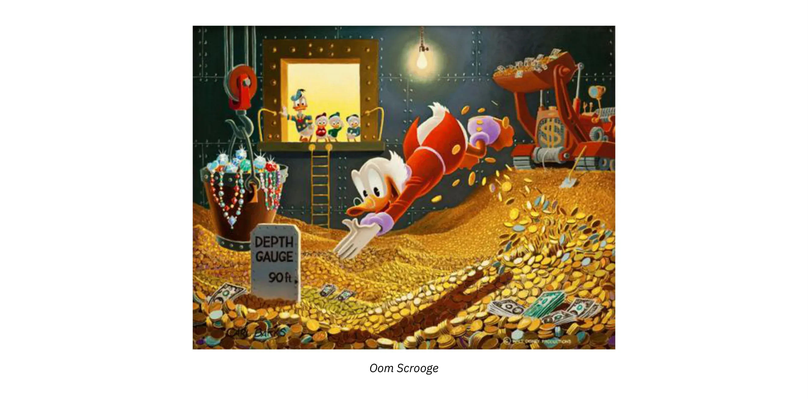

> "Alleen de overvloed aan geld binnen de staat maakt het verschil voor zijn grootsheid en macht".
> *Colbert*

Het gevolg van dit idee is om koste wat het kost de export te bevorderen, wat buitenlands goud en zilver binnenbracht, en de import tot een minimum te beperken om te voorkomen dat het naar het buitenland werd gestuurd.

Dit zijn de vier principes waardoor de Franse regering zich decennialang liet leiden toen het land de 18e eeuw inging. Ze zouden echter al snel op de proef worden gesteld. Tussen 1690 en 1710 werden verschillende schrijvers diep getroffen door de rampzalige staat van Frankrijk. Op zoek naar de oorzaken concludeerden ze dat juist de stelregels die ze van Colbert hadden geërfd de schuldigen waren, die ze beschouwden als misleidende argumenten. Daarmee legden ze de basis voor de economische wetenschap.

## Vauban

<chapterId>ee9c1e0e-96cc-5026-a5e2-963d68122786</chapterId>

Nu de belastingdruk in ons land blijft toenemen en de nationale economische krachten dreigt te verstikken, gaan er steeds meer stemmen op voor verandering. Bewust of onbewust, deze oproepen tot hervorming echoën vaak het werk van Franse economen die, sinds de 17e eeuw, het belastingsysteem van de natie hebben bekritiseerd als chaotisch, despotisch, buitensporig.

De eerste van deze belastinghervormers, chronologisch en qua verdienste, is de grote maarschalk Sébastien Le Prestre Vauban, beroemd bouwer van bolwerken en citadellen.

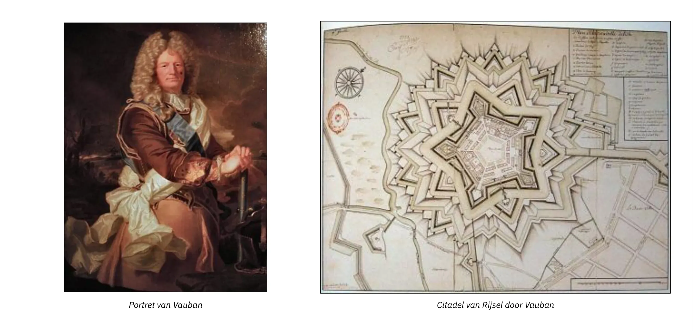

Hoewel we het helaas vergeten zijn, was Vauban meer dan een militair; hij was ook een econoom. Hij interesseerde zich voor het lot van de boeren en stelde gedurfde belastinghervormingen voor in 1695 (Projet de capitation - "het project voor een capitulatie") en opnieuw in 1707 (Projet d'une Dime Royale - "de koninklijke tiende"): de meeste bestaande belastingen vervangen door een belasting die evenredig was met het inkomen, een vlaktaks voor zijn tijd.

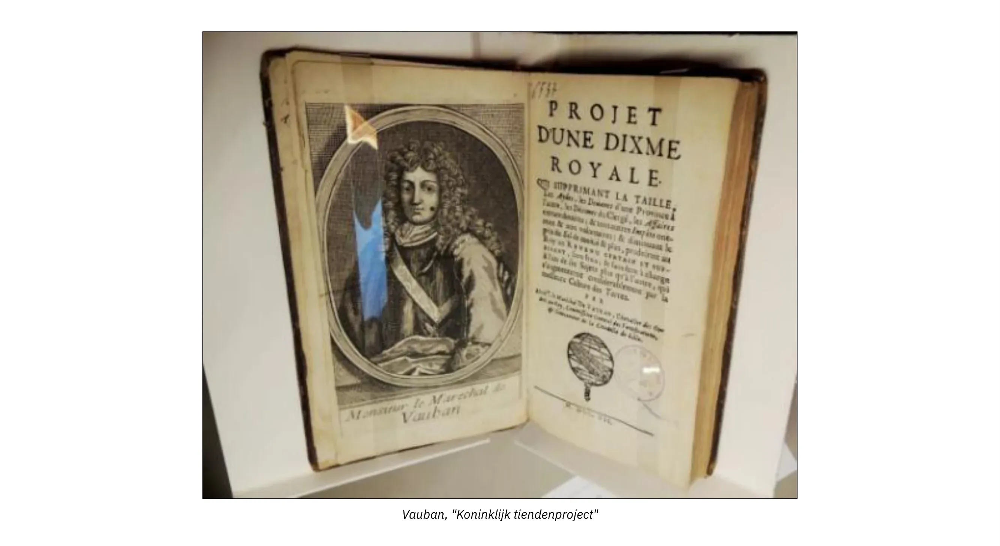

Vauban kwam tot deze ideeën door nieuwsgierigheid. Hij was een scherp waarnemer en streefde ernaar om het sociale leven en de economische realiteit rigoureus, bijna wetenschappelijk, te bestuderen. Hij drong vooral aan op de noodzaak om te tellen, door middel van tellingen.

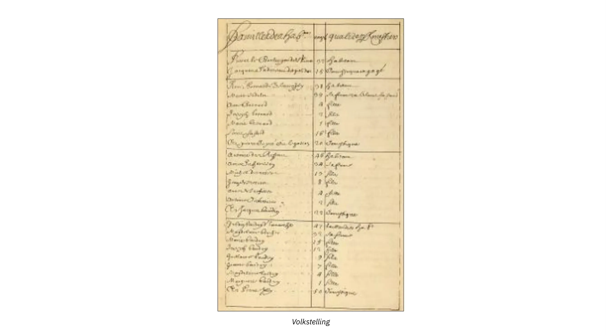

Zijn tweede grote verdienste was zijn ontroerende en eerlijke beschrijving van de ellende die de massa's moesten doorstaan. Hij schreef: "Laten we ons niet laten misleiden; het hart van het koninkrijk is verwoest. Alles lijdt, alles verdraagt, alles kreunt. Je hoeft alleen maar te kijken en het hart van de provincies te onderzoeken, wat je zult vinden is nog erger dan wat ik zeg". De sombere observaties van Vauban waren verre van overdreven en vormden een nauwkeurige weerspiegeling van het leven aan het begin van de 18e eeuw. Alexis de Tocqueville was zich terdege bewust van deze ideeën en zou Vaubans *Royal Tithe* later beschrijven als "beangstigend", omdat het waar was.

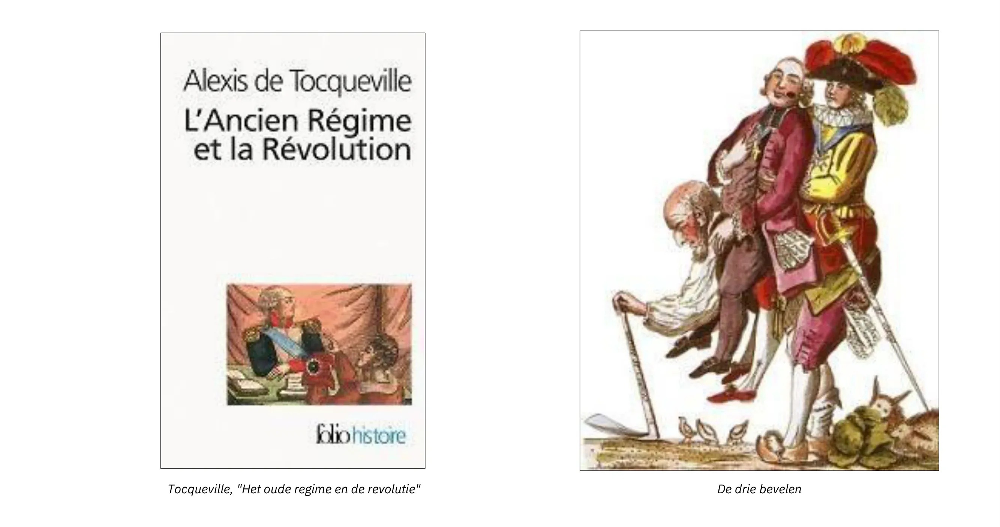

Een andere grote verdienste van Vauban als econoom was dat hij een verregaande belastinghervorming voorstelde om het kwaad dat hij waarnam en beschreef uit te roeien of op zijn minst de intensiteit ervan te verminderen. Hij had gelijk; de Franse economie onder het Ancien Régime was verlamd door belastingen, die ongelijk, onstabiel en onleesbaar waren.

In zijn verschillende politieke en economische geschriften was het Vaubans overkoepelende ambitie om het lijden te verlichten van wat hij noemde "het lagere deel van het volk, dat door zijn arbeid het hogere deel onderhoudt en ondersteunt".

Hij begreep dat onderdrukkende en ontmoedigende belastingen de boeren overweldigden, een concept dat hij met scherpzinnigheid uitdrukte, iets wat we in onze tijd nog steeds perfect kunnen observeren:

> "De boer laat het weinige land dat hij heeft wegkwijnen en bewerkt het maar halfslachtig, uit angst dat het nog zwaarder belast zou worden als het zou produceren wat het zou kunnen produceren met de juiste mest en bewerking".

Vauban zag de waarheid: de belastingen onder het Ancien Régime waren niet alleen irrationeel maar ook wreed streng. Het was dit belastingsysteem, dat onrechtvaardig verdeeld was, dat hij probeerde te overwinnen.

De oplossing die hij voorstelde, een vlakke, proportionele belasting op alle inkomens, zou het mogelijk hebben gemaakt om de belastingdruk eerlijk te verdelen over alle sociale klassen. De belastinghervorming van Vauban, die gebaseerd was op een theorie van de staat waarin overheidsgezag noodzakelijk werd geacht om individuele rechten en eigendommen te beschermen, eiste dat alle burgers een bijdrage zouden leveren die strikt in verhouding stond tot wat ze verdienden, bijvoorbeeld 10% van hun inkomen..

In De Koninklijke Tiend, het enige van zijn economische werken dat tijdens zijn leven werd gedrukt, stelde Vauban duidelijk:

> "Aangezien iedereen in een staat zijn bescherming nodig heeft om te overleven, is het niet meer dan terecht dat iedereen, overeenkomstig zijn inkomen, bijdraagt aan het onderhoud en de uitgaven [...]. Niets is onrechtvaardiger dan degenen die het meest in staat zijn om te betalen vrij te stellen en de last af te wentelen op degenen die het minst in staat zijn, die bezwijken onder het gewicht; een gewicht dat heel licht zou zijn als het door iedereen naar evenredigheid werd gedragen, overeenkomstig hun eigen kracht. Daarom is elke vrijstelling van belasting een wanorde die gecorrigeerd moet worden."

Kort voor zijn dood werd het idee van Vauban overgenomen door de ministers van Lodewijk XIV. Vauban had echter gevraagd om een proportionele belasting die alle, of bijna alle, bestaande belastingen zou vervangen. In plaats daarvan werd, zoals zo vaak gebeurt, zijn belasting ingevoerd, maar alle andere werden ook gehandhaafd.

## Boisguilbert

<chapterId>200149c6-b5fc-566e-ab0e-bafb1c3fed3c</chapterId>

Weinig Franse economen uit het verleden genieten vandaag de dag in hun thuisland erkenning die overeenkomt met hun bijdragen, en Boisguilbert is daarop geen uitzondering.

Niet gewaardeerd door de lezers van zijn tijd, verwijderd van machtskringen vanwege zijn excentrieke aard en overweldigende passie, liet Boisguilbert weinig sporen na in de 18e eeuw. Toch is er aan het begin van de vorige eeuw een langzame herontdekking van zijn werk.

Deze herontdekking laat echter zien dat we in een soort doodlopende straat terechtkomen. De ware verdienste van Boisguilbert is verloren gegaan door hem voor te stellen als de pionier van talloze theorieën en de voorloper van vele denkers. Hij zou het concept van latente werkloosheid hebben begrepen dat later door Keynes werd verdedigd, hij zou hebben geanticipeerd op de wet van Say, hij zou de weg hebben geëffend voor de algemene evenwichtstheorie van Walras en hij zou zelfs de voorbode zijn geweest van de klassenanalyse van de marxisten. "Van wie of wat zou Boisguilbert niet de voorloper kunnen zijn?" vroeg een commentator zich uiteindelijk af.

(Pierre Le Pesant de) Boisguilbert werd in 1646 geboren in Rouen. Opgeleid in Port-Royal in Parijs, begon Boisguilbert een onsuccesvolle literaire carrière voordat hij verschillende functies op zich nam, waaronder die van luitenant-generaal van Rouen. In deze periode schreef hij verschillende boeken om zijn ideeën te verdedigen, waaronder "Détail de la France" in 1695, dat hij het jaar daarop opnieuw publiceerde onder een veel explicietere titel: [*France Ruined under the Reign of Louis XIV, by Whom and How, with the Means to Restore It](https://archive.org/details/bub_gb_0jUaWNbTJa8C/page/n23/mode/2up)*.

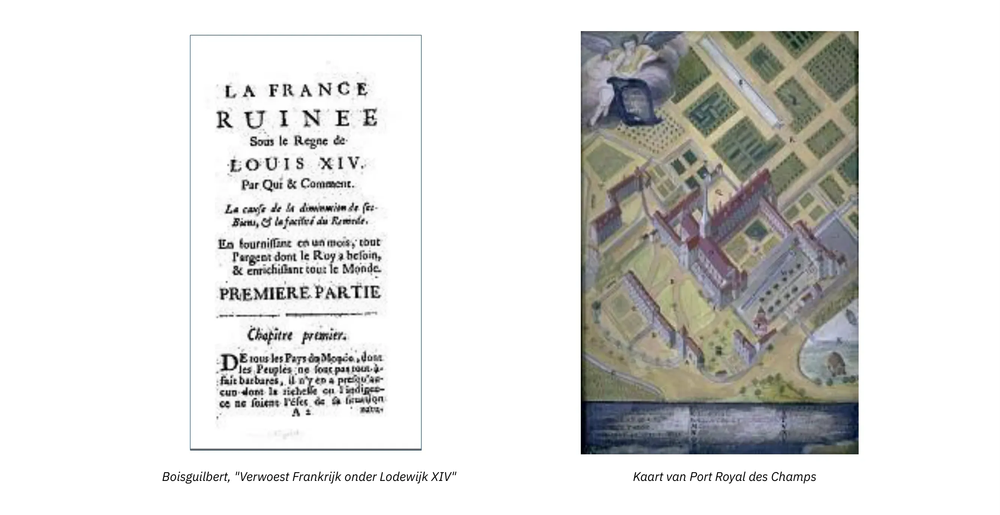

En dit is de basis van de boeken van Boisguilbert: Franse armoede en haar oorzaken.

Deze ellende van het Franse volk aan het einde van de 18e eeuw beschrijft Boisguilbert in detail, net als Vauban. Hij schrijft:

> "De dorre of slecht gecultiveerde gronden, voor iedereen zichtbaar, zijn het lijk van Frankrijk".

Hij beschreef ontwortelde wijngaarden, boeren die hun akkers achterlieten en terugkerende hongersnoden.

Boisguilbert vindt twee hoofdoorzaken voor dit ongeluk. Want als de mensen in armoede leven, is dat omdat ze niet kunnen consumeren wat nodig is, en de ondergang van de consumptie heeft twee oorzaken.

Ten eerste konden de mensen het zich niet langer veroorloven om eerste levensbehoeften te consumeren door willekeurige belastingen. De taille, een persoonlijke belasting uit die tijd, werd blind berekend voor elk individu en steeg of daalde zonder reden. Door de vele privileges kwam de last terecht bij de arme boeren, die geruïneerd werden. Om dit te corrigeren adviseerde Boisguilbert een proportionele belasting op alle inkomens, ongeveer zoals Vauban had voorgesteld.

De tweede reden voor de ellende in Frankrijk is dat te veel obstakels de vrije handel in goederen, vooral landbouwproducten, in de weg stonden. Er waren douanerechten aan de grenzen en zelfs binnen het land, tussen verschillende regio's, die alle handel verlamden. Deze beperkingen verhinderden de totstandkoming van een evenwichtsprijs en beperkten de marktmogelijkheden. Als gevolg hiervan konden boeren niet leven van hun productie, omdat ze niet winstgevend konden verkopen en te lijden hadden onder onrendabele landbouwprijzen, een zorg die vandaag de dag nog steeds zeer relevant is en die de kern vormt van de theorie van Boisguilbert. Wat handelsbeperkingen betreft, pleitte Boisguilbert voor het vrijmaken van de wegen, met andere woorden, voor het instellen van vrije handel.

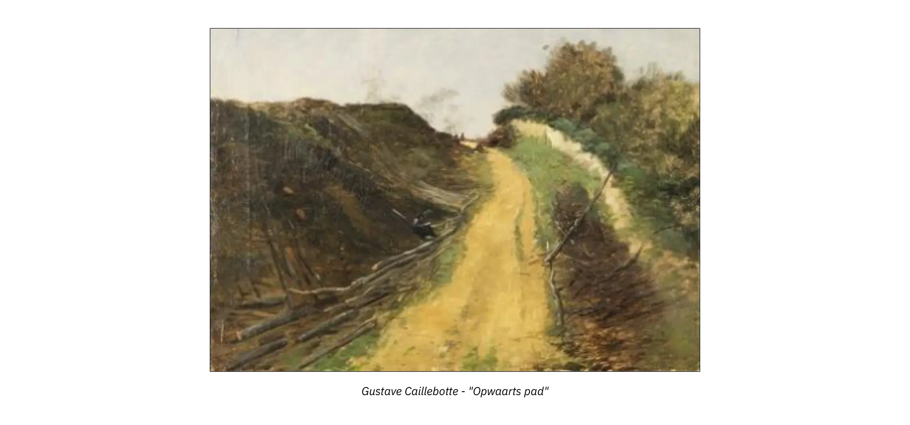

En vrijheid is inderdaad zijn eindconclusie. "Het is geen kwestie van handelen", zegt hij, "maar eenvoudigweg van ophouden te handelen zoals we zo gewelddadig doen tegen de natuur, die altijd neigt naar vrijheid en perfectie". Alles zal goed komen, herhaalt hij onvermoeibaar, "zolang we de natuur haar gang laten gaan, dat wil zeggen haar haar vrijheid geven, en dat niemand zich met deze handel bemoeit behalve om iedereen bescherming te bieden en geweld te voorkomen".

Deze laatste passage is essentieel. Boisguilbert was de eerste die duidelijk een laissez-faire economisch beleid eiste, er zijn credo van maakte en er een echt systeem omheen bouwde. Volgens hem bestaat er een natuurlijke orde der dingen die niet mag worden verstoord of vernietigd door voortijdige overheidsinterventies. De staat moet volgens hem niet ingrijpen in economische zaken, maar de dingen hun natuurlijke gang laten gaan. Anders zal het ellende veroorzaken.

Boisguilbert bekritiseerde zelfs de "*goede zielen*", zoals hij ze noemde, zij die het goed bedoelden maar grote schade aanrichtten. Ze wilden goedkoop brood voor de mensen, maar door de prijzen te drukken ruïneerden ze de boeren, die met zulke marges niet konden overleven. Deze boeren verlieten vervolgens hun land, waardoor ze nog dieper in de armoede wegzakten. Zoals we allemaal weten is 'de hel vaak geplaveid met goede bedoelingen'.

## Cantillon

<chapterId>bc206d41-6a64-5688-a489-40fcfa0e5397</chapterId>

Richard Cantillon, auteur van het "Essay on the Nature of Trade in General" (geschreven rond 1730, gepubliceerd in 1755), wordt beschouwd als een van de pioniers van de moderne economische wetenschap. In zijn History of Economic Thought noemt econoom Murray Rothbard Cantillon zelfs de grondlegger van de moderne economie.

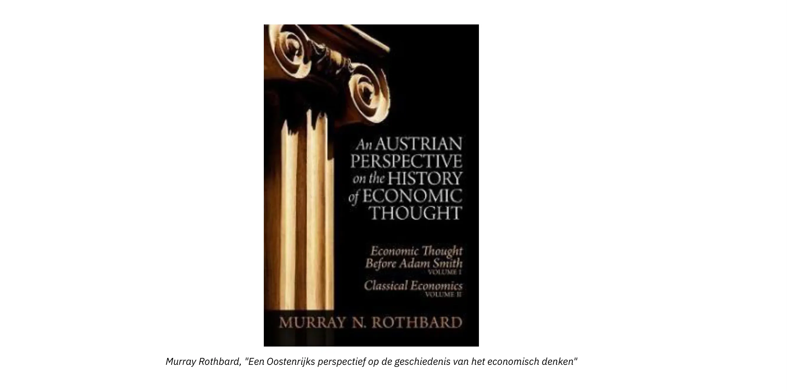

Richard Cantillon werd geboren in Ierland, maar vestigde zich als jongeman in Parijs en kreeg de Franse nationaliteit. Hij werkte als bankier en verdiende een fortuin tijdens het John Law tijdperk.

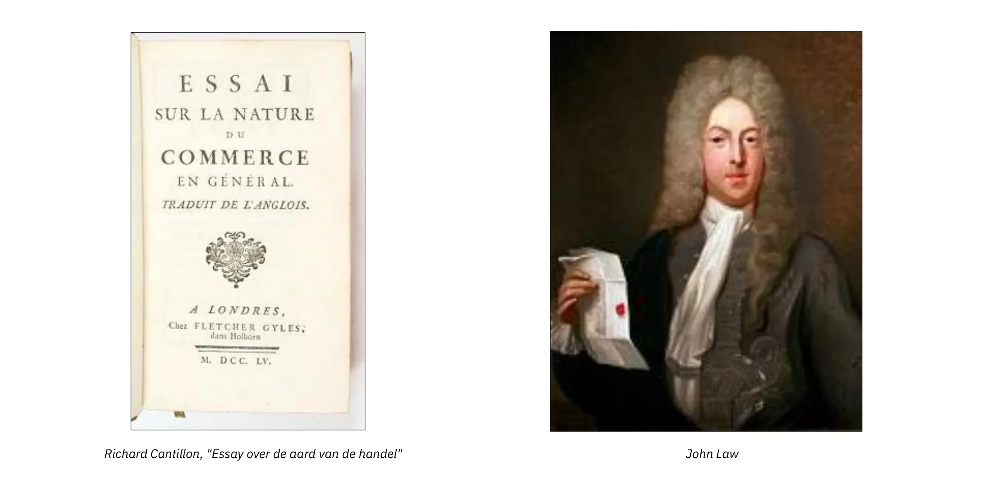

Het was ook bij deze gelegenheid dat hij zich begon te verdiepen in de economische theorie. Rond 1730 schreef Cantillon zijn Essay on the Nature of Commerce in General.

Dit boek kan worden gezien als een van de eerste pogingen om een algemene theorie van de economie te creëren. Cantillon is voorzichtig in het identificeren van wat hij "algemene wetten van de economie" noemt, wetten die in de aard der dingen liggen en niet in de specifieke feiten van dit of dat land. Deze benadering was revolutionair.

We kunnen de grote verdiensten van Cantillons Essay in vijf gebieden samenvatten: de theorie van rijkdom, het begrip ondernemer, de kritiek op waardeloze valuta, de "Cantillon-effecten" en tot slot de verdediging van vrijheid.

Ten eerste zijn **theorie van rijkdom**.

In tegenstelling tot de mercantilistische opvatting die in die tijd dominant was, baseerde Cantillon zijn analyse op de erkenning dat rijkdom wordt gevormd door de producten die geschikt zijn voor het genot van de mens. Deze rijkdom, zo stelde hij, komt uit de natuur en wordt geproduceerd door menselijke arbeid. Zijn ideeën over de aard van rijkdom hadden een sterke invloed op Beccaria en Adam Smith, en via Smith op de hele Engelse klassieke denkschool.

Ten tweede, **de ondernemer**.

Hoewel hij het niet duidelijk definieerde, beschouwde Cantillon de ondernemer als een belangrijke en centrale speler in de economische activiteit. Voor Cantillon is het kenmerkend voor de ondernemer dat hij risico's neemt en in onzekerheid handelt. Deze ideeën zouden later worden uitgebreid door Turgot en, nog belangrijker, door Say, om uiteindelijk de speciale plaats van de ondernemer in de economie te erkennen, dit keer in tegenstelling tot de beweringen van de Engelse school.

Derde punt, **valuta**.

In reactie op de John Law ervaring legt Cantillon uit wat er gebeurt of moet gebeuren als geld geen echte waarde heeft.

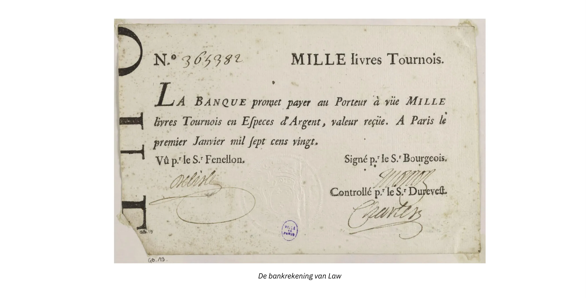

Hij ziet twee belangrijke gevolgen van het vervangen van een metalen valuta door een valuta zonder echte waarde, zoals papiergeld. Het eerste gevolg is wat hij "volksafwijzing" noemt, wat een groeiend wantrouwen tegen waardeloos geld betekent. Het tweede gevolg is inflatie: monetaire verzwakking maakt goederen duurder.

Ten vierde ging Cantillon in zijn analyse van **inflatie** verder dan zijn tijdgenoten. Nadat hij de ineenstorting van het systeem van Law had gezien, realiseerde Cantillon zich dat monetaire inflatie niet iedereen in gelijke mate treft. Integendeel, sommigen worden er rijker van en anderen armer. Hij concludeerde dat inflatie een herverdelend effect heeft: degenen die het nieuw uitgegeven geld ontvangen profiteren eerst van de toegenomen koopkracht, terwijl degenen die het later ontvangen armer worden als gevolg van de uitgifte van het nieuwe geld door de stijging van de inflatiepercentages.

Ten vijfde, ondanks een paar overblijfselen van het mercantilistische gedachtegoed, was Cantillons algemene perspectief **heel liberaal**. Hij verdedigde privébezit als een fundamentele pijler van de beschaving, met het argument dat geen enkele maatschappij kan functioneren zonder privé Ownership van land en de producten van arbeid. Hij zag materiële ongelijkheid tussen mensen ook als natuurlijk en legitiem. Volgens Cantillon is er niets mis met een efficiënte en moedige arbeider, of een uitzonderlijk begaafde arbeider die meer verdient dan iemand die incompetent of lui is.  Tot slot geloofde Cantillon dat prijzen altijd vrij bepaald moesten worden, door het spel van Supply en vraag, zonder tussenkomst van de overheid.

Van deze vijf belangrijkste ideeën in zijn Essay is het belangrijkste ongetwijfeld het idee dat nu zijn naam draagt: het **Cantillon Effect**.

Met deze theorie over de effecten van inflatie geeft Cantillon ons antwoorden op een aantal hedendaagse kwalen. Het helpt ons de gevolgen te begrijpen van het recente expansieve en inflatoire monetaire beleid, dat de middenklasse en het platteland heeft verarmd, terwijl het de spelers op de financiële markten en de staat, zijn agentschappen en ambtenaren heeft verrijkt, vanwege hun gezamenlijke nabijheid tot de bron van het nieuwe probleem: centrale banken en commerciële banken.

# Hervormers en denkers uit het begin van de 18e eeuw

<partId>1f7b50d4-ce93-5db3-8396-43c1fa5419ff</partId>

## De abt van Saint-Pierre

<chapterId>13478fe2-4c12-593c-a410-54c2cfb7ef7f</chapterId>

Van alle auteurs die we hebben opgenomen in het pantheon van 18e-eeuwse Franse laissez-faire denkers, is Abt van Saint-Pierre ongetwijfeld de meest over het hoofd geziene.

Om eerlijk te zijn, het is deels zijn eigen schuld. Hij heeft veel geschreven, maar zijn stijl is Hard om te lezen en zit vol herhalingen. Zelfs Jean-Jacques Rousseau probeerde zijn werk samen te vatten: hij begon eraan, maar gaf de taak al snel op, omdat hij zich realiseerde dat het zijn kracht te boven ging. Halverwege de 19e eeuw eerde Gustave de Molinari hem door een uitgebreid werk over hem te publiceren, waarin hij hulde bracht aan de pacifist en econoom die de abt van Saint-Pierre was. Maar dit was niet genoeg om hem uit de vergetelheid te halen, want tot op de dag van vandaag bevindt hij zich nog steeds in de vergetelheid.

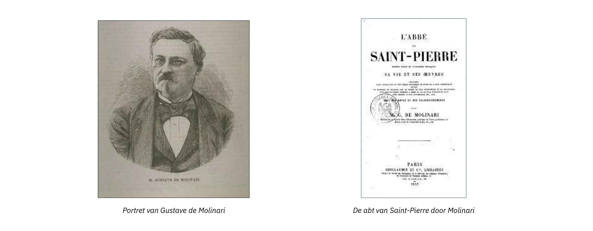

De abt van Saint-Pierre schreef over economie, maar hij is meestal interessant als pacifist. Hij is de auteur van een Project voor Eeuwigdurende Vrede, dat dateert van voor het bekende project van Emmanuel Kant.

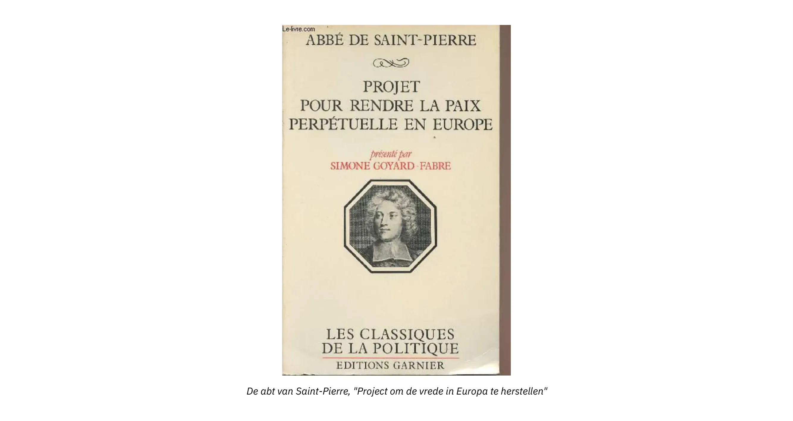

In dit werk betoogde hij dat oorlog destructief is, niet alleen voor degenen die hem verliezen, maar ook voor de winnaars en zelfs voor degenen die er niet aan deelnemen, omdat hun handel wordt beïnvloed.

Om de gesel van de oorlog te bestrijden, adviseerde hij de oprichting van een soort Europese Volkenbond. Er zou een Europese raad worden gevormd om de problemen van elke natie op te lossen. Naties zouden dan hun toevlucht nemen tot arbitrage, om te voorkomen dat ze hun toevlucht zouden nemen tot wapens. Als een natie niet verstandig genoeg was om vrede te sluiten en de andere Europese naties bedreigde, zou de Europese Liga van Naties een middel hebben om te reageren. Bij dergelijke gebeurtenissen zou een Europees leger worden gevormd, met troepen die door de verschillende landen werden geleverd.

Er is ook een episode in het leven van de abt van Saint-Pierre die perfect de kritische geest achter de Franse laissez-faire beweging illustreert. Hij werd lid van de Académie Française in 1695, maar werd in 1718 geroyeerd omdat hij kritiek durfde te uiten op het bewind van Lodewijk XIV. Daarmee sloot hij zich aan bij figuren als Vauban en Boisguilbert, die zich ook durfden uit te spreken tegen de myseries die schuilgingen onder de pracht en praal van het bewind van de Zonnekoning.

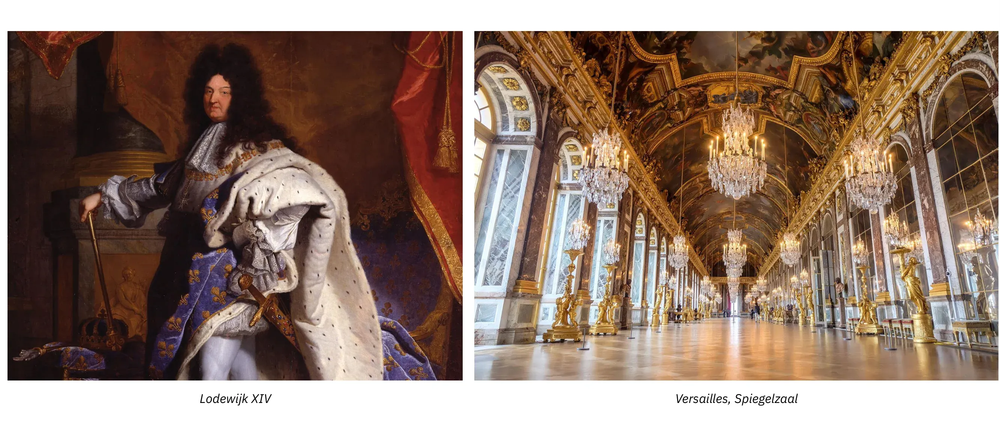

De abt van Saint-Pierre stelde dat de regering van Louis XIV, met zijn luxueuze hof en obsessie voor militaire verovering, niet het kenmerk was van een deugdzame koning. Hij weigerde te accepteren dat Louis XIV de titel "**Louis de Grote**" verdiende.

"Tegelijkertijd je buren en je volk ruïneren is geen grootheid", zei hij. Dit standpunt was zeer beledigend voor de Académie Française, die zich lange tijd had beziggehouden met het verheerlijken van de koning in elke mogelijke literaire vorm. Daarom stemden ze bijna unaniem om hem te royeren.

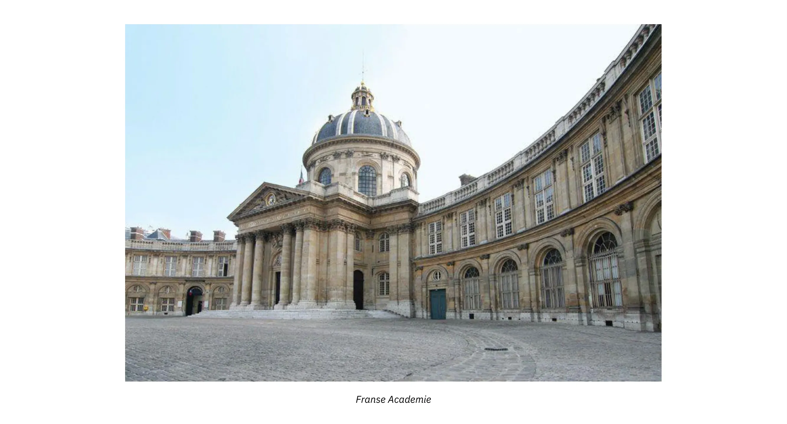

In termen van economisch denken paste hij consequent het principe van het nut toe, net zoals Jeremy Bentham later zou doen, en bood hij vaak goede inzichten. Om eerlijk te zijn werd hij nog steeds beïnvloed door mercantilistische ideeën, die niemand op dat moment volledig van zich had afgeschud.

Toch maakte de abt van Saint-Pierre enkele nauwkeurige observaties over de economie. Zelfs vóór *Condillac*, aan wie het idee vaak wordt toegeschreven, stelde hij duidelijk dat in elke Exchange beide partijen profiteren. Dit is terug te vinden in zijn ["Project ter verbetering van de Franse handel"] uit 1733 (https://www.institutcoppet.org/projet-pour-perfectionner-le-commerce-de-france/), waar hij schreef:

> "Als er geen echt of vermeend voordeel was aan beide kanten, zou noch de verkoper verkopen tegen een dergelijke prijs, noch de koper van zijn kant kopen tegen een dergelijke prijs".

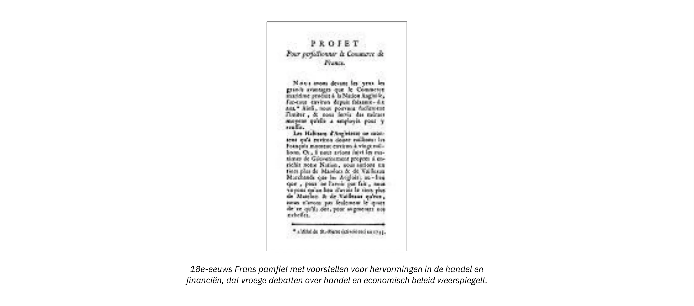

Hij benadrukte ook, eerder dan Vincent de Gournay, de waarde van arbeid en het belang van het aantrekkelijk houden ervan. "Alle arbeid is moeilijk", schreef hij. "En als een man ziet dat zijn werk hem niets of niet genoeg oplevert, wordt hij lui en zal hij geen moeite doen voor onnodige inspanning". Ditzelfde argument zou later worden herhaald door de Markies d'Argenson, Vincent de Gournay en de Fysiocraten toen zij lastige regels en gildesystemen bekritiseerden. Ze stelden dat dergelijke beperkingen arbeiders ontmoedigden, nodeloze moeilijkheden veroorzaakten en uiteindelijk luiheid aantrekkelijker maakten dan productieve inspanning onder dergelijke omstandigheden.

## De markies d'Argenson

<chapterId>e9960ab4-72ec-5afd-8e97-bf89c83b62bc</chapterId>

De Markies d'Argenson is een vergeten grondlegger van de doctrine van laissez-faire.

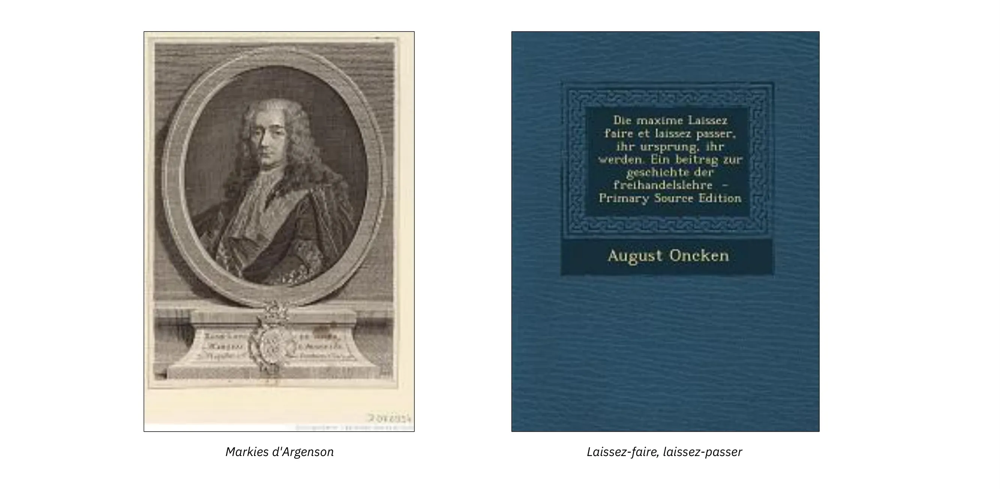

Het werd herontdekt door August Oncken, auteur van een boek over de laissez-faire, laissez-passer doctrine, die concludeerde dat d'Argenson een belangrijke rol speelde in de geboorte van dit idee.

René-Louis Voyer, markies d'Argenson, werd geboren in 1694. Hij begon zijn politieke carrière als parlementair adviseur en was daarna lid van de Raad van State.

Dertig jaar voor Adam Smith verdedigde d'Argenson al de voordelen van arbeidsdeling en specialisatie.

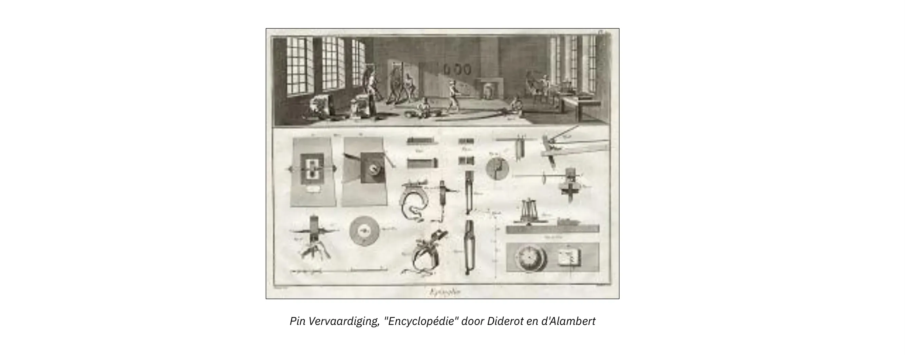

Hij had veel kritiek op regelgeving die, zoals hij het zag, de natuurlijke voorkeuren van verschillende regio's probeerde te veranderen. Hij was bijvoorbeeld verbijsterd dat de regering stoffen en fluweel wilde produceren in Tours, een arme stad in die tijd, om de kwaliteit te evenaren van de stoffen en fluweel uit het welvarende Genua, dat beroemd was om zijn luxegoederen. Hij concludeerde:

> "Elke plaats moet zijn eigen fabrieken kunnen kiezen. Vrijheid! Vrijheid!"

Hij herkende ook een ander centraal principe van Smith: het idee dat spontane orde voortkomt uit het nastreven van eigenbelang. De Markies d'Argenson geloofde dat direct persoonlijk belang de drijfveer was voor menselijke energie. Hij schreef dat slecht vakmanschap en fraude een fabrikant in diskrediet zouden brengen, terwijl ijver en goede bedoelingen tot welvaart zouden leiden. De beste beoordelaar van het nut, zo stelde hij, was het individu, het grote publiek, dat goederen koopt en het belangrijk vindt om een goede deal te sluiten. "Iedereen voelt zijn eigen belang," zei hij, "iedereen neemt de maatregelen die voor hem voordelig zijn, en het is in deze algemene overeenstemming dat we de waarheid ontdekken."

Zelfs vóór Adam Smith begreep hij dat eigenbelang leidt tot algemeen belang door de opbouw van een spontane natuurlijke orde.

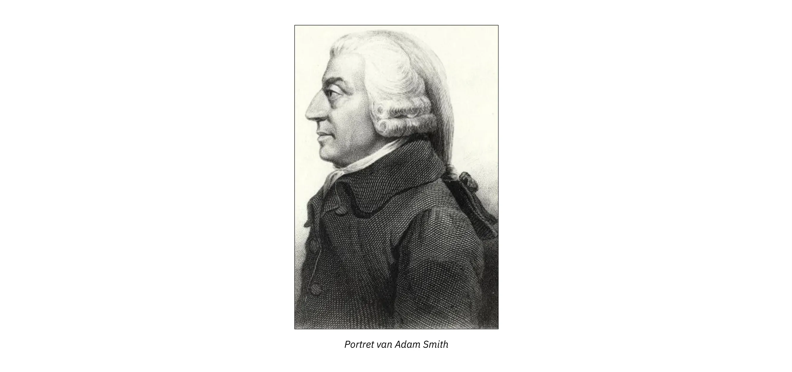

Hij vergeleek de maatschappij met een bijenkorf waarin elk insect zijn instinct volgt, "Uit hun acties", zei hij precies, "vloeide een grote accumulatie voort voor de behoeften van de kleine maatschappij; maar dit werd niet teweeggebracht door bevelen, of door generaals, die elk individu verplichtten om de opvattingen van hun leider te volgen". Dit is misschien wel de uitdrukking die in het Franse economische denken het dichtst in de buurt komt van Adam Smiths beroemde concept van de "onzichtbare hand".

De markies d'Argenson was altijd woedend over de ideeën van de ministers van zijn tijd. De enige vraag die zij stelden was: "Moeten we dit of dat regelen? Moeten we de economie op dit of dat richten?". Waarop d'Argenson antwoordde: "Moeten we ons niet eerst afvragen of het wel gepast is om überhaupt iets te sturen, of dat we de dingen hun gang moeten laten gaan?"

Eerlijk gezegd was hij verbaasd dat mensen het zo Hard vonden om de schadelijke effecten van allerlei soorten overregulering op de economie te begrijpen, of beter gezegd, in te zien. Volgens hem was het genoeg om gewoon de ogen te openen. "Zoveel dingen werken vandaag de dag redelijk goed", schreef hij bitter, "gewoon omdat ze erin geslaagd zijn om aan het bereik van de wet te ontsnappen".

Soms wanhoopte hij over hoe weinig zijn ideeën werden begrepen.

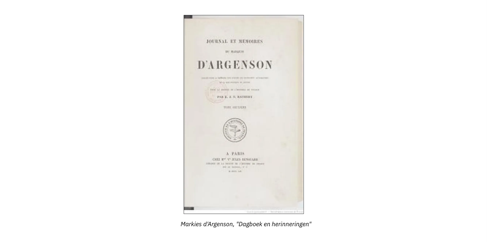

Het ideaal van economisch beleid dat hij verdedigde stond daarom haaks op de trends van zijn tijd. Zijn ideaal definieerde een hoofdzakelijk negatieve rol voor de staat. "Alles wat de handel nodig heeft is het verwijderen van obstakels. Het vraagt alleen om goede rechters, bestraffing van monopolies, gelijke bescherming voor alle burgers, stabiele valuta en wegen en kanalen". Dit was de definitie van een minimale staat, die een van de fundamenten zou worden van de Franse traditie in politieke economie.

Deze visie op de rol van de staat in de economische activiteit werd natuurlijk geïllustreerd door de studie van twee belangrijke kwesties die de economen en sociale denkers van zijn tijd in beroering brachten: de regulering van de industrie en de tarwehandel.

In de eerste plaats wekte de regelgeving voor de industrie al zijn wrevel, omdat het privileges waren voor sommigen ten koste van anderen. "De echte oorzaak van het verval van onze fabrieken", schreef hij, "is de buitensporige bescherming die ze krijgen". En met een niet minder levendig credo uitte hij zijn kritiek op de dirigistische ijver van de staatslieden van zijn tijd:

> De industrie tegen haar wil in leiden, is haar ondergang willen.

Op de kwestie van de handel in levensmiddelen had d'Argenson geen ander antwoord dan vrijheid. Volgens hem kwamen de tekorten aan tarwe door het monopolie en de buitensporige voorzorgsmaatregelen van de overheid. Het enige wat we moesten doen, was het zijn gang laten gaan en er zou nooit een tarwetekort zijn in een land waar de havens open waren. Buitenlanders, net als alle andere mensen aangetrokken door de verleiding van winst, zouden ons voorzien van wat we nodig hadden en ons overschot weghalen. "Laat het zo zijn", zei hij, "en alles komt goed".

## Vincent de Gournay

<chapterId>e8ae40dc-7450-552f-9ddc-9e02936cf425</chapterId>

Vincent de Gournay was een van de eerste vertegenwoordigers van laissez-faire in Frankrijk en een van de eerste pleitbezorgers ervan in het openbaar bestuur en in intellectuele kringen. Daarom verdient hij veel meer erkenning in de geschiedenis van het economisch denken dan hij gewoonlijk krijgt. In een recent boek heb ik geprobeerd zijn bijdragen te belichten.

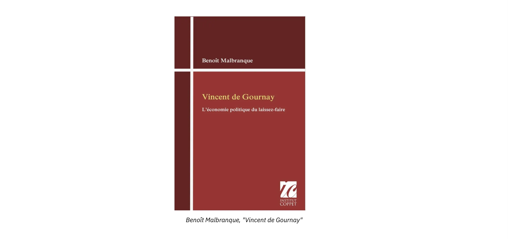

Gournay werd geboren in een koopmansfamilie en werd zelf een succesvol koopman. Hij vergaarde aanzienlijke rijkdom voordat hij een positie in de Franse regering veroverde. Binnen het Bureau of Commerce was hij een fervent voorstander van vrije arbeid en vrije handel.

Hoewel hij goed was opgenomen in de context van de toonaangevende economen van zijn tijd, schreef Gournay weinig of, beter gezegd, publiceerde hij weinig. Hij schreef voornamelijk administratieve brieven en memoires, ongepubliceerd of na enige bewerking gepubliceerd door andere auteurs.

Wat we wel hebben is:

1. [De opmerkingen](https://archive.org/details/traitessurlecomm0000chil) over een vertaling van een boek van de Engelse econoom Josiah Child;

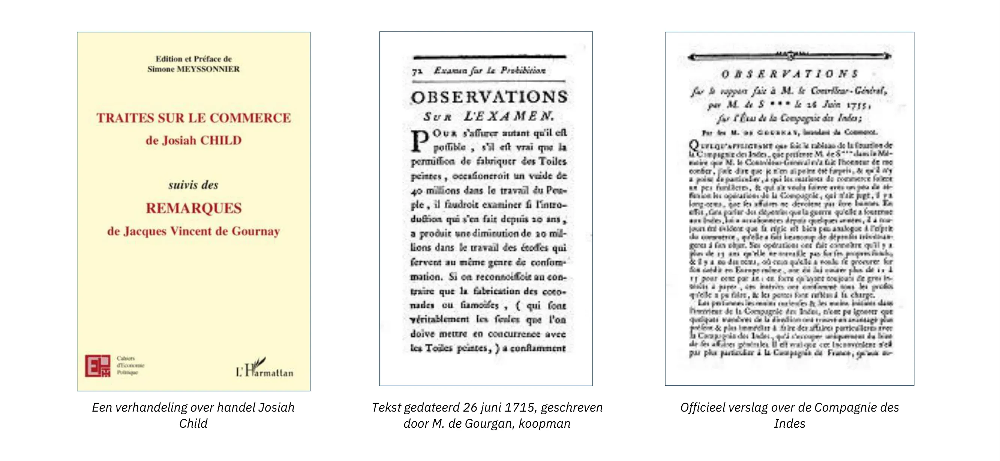

2. "Observations" included in the Examination of the Advantages and Disadvantages of the Prohibition of Printed Fabrics;

3. "Observations on the East India Company", door Abt Morellet toegevoegd aan zijn Memoir on the Current State of the East India Company (1769);

4. En vooral, verschillende memoires uit zijn rol als Intendant van Commerce.

Deze geschriften laten een duidelijke buitenlandse invloed zien en de aanwezigheid van enkele belangrijke structurerende ideeën. De buitenlandse invloed in Gournay is de erkenning van de Engelse en Nederlandse superioriteit. Gournay was ervan overtuigd dat deze twee naties de economie veel beter begrepen dan Frankrijk en dat Frankrijk hun voorbeeld moest volgen. "Deze twee naties zijn het meest welvarend", zei hij, "en ze volgen een heel ander systeem dan wij. Wij verbieden de invoer van buitenlandse goederen, we beperken de economische activiteit binnen draconische regels, terwijl zij op de tegenovergestelde manier te werk gaan. Als zij het beter doen", concludeerde Gournay, "dan komt dat omdat Frankrijk zich laat leiden door verkeerde principes".

Zijn hervormingsvoorstellen concentreerden zich op een aantal belangrijke punten.

Ten eerste geloofde hij dat arbeid beschermd en aangemoedigd moest worden. In die tijd werden Franse arbeiders als criminelen behandeld, constant gecontroleerd en bang gehouden dat ze niet aan een van de duizenden regels voldeden. Deze buitensporige ergernis ontmoedigde mensen om te werken en duwde hen in de richting van luiheid. Maar, zo stelde Gournay, "werk is nobel en de enige manier om een natie te verrijken".

Ten tweede bekritiseerde hij het restrictieve gildesysteem dat fabrikanten aan banden legde. Deelnemen aan een vak was zowel tijdrovend als duur en elke nieuwe arbeider moest dan nauwgezet de routine volgen die was vastgelegd in de statuten van zijn gilde. Een dergelijk systeem liet geen ruimte voor uitmuntendheid, innovatie of vooruitgang.

Ten derde werd de handel in Frankrijk beperkt door beperkende wetten. Volgens Gournay zouden consumenten er veel baat bij hebben als havens vrij konden concurreren en alle goederen, zoals graan en bedrukte doeken, onbeperkt geïmporteerd mochten worden. Hij was een van de eersten die wees op de ware oorsprong van smokkel: het bestond alleen omdat een nuttige en voordelige handel verboden was. Hij voegde er een scherpe observatie aan toe: smokkelen was een "vrij" beroep, zonder regels, zonder gilden, zonder confiscerende belastingen. Toch was het de overweldigende regulering door de staat die veel eerlijke arbeiders in de illegaliteit dreef.

Tot slot merkte Gournay op dat de rentetarieven lager waren in Engeland en Nederland, landen die welvarender waren dan Frankrijk. Hij pleitte voor lagere rentetarieven ook in Frankrijk, zodat economische activiteiten daar net zo voordelig gefinancierd konden worden als elders. Gournay streefde echter niet naar dwingende, wetgevende methoden; hij benadrukte eerder de noodzaak om het lenen van geld, dat nog steeds werd veroordeeld door de katholieke kerk, te legaliseren.

Op al deze punten speelde Gournay een sleutelrol in de intellectuele debatten van het midden van de 18e eeuw. Zijn verdediging van economische vrijheid was een decennium eerder dan die van de Fysiocraten en twintig jaar eerder dan die van Adam Smith. Maar zijn meest blijvende invloed had hij op Turgot. Gournay nam de jonge Turgot onder zijn hoede en leidde hem op met zijn ideeën.

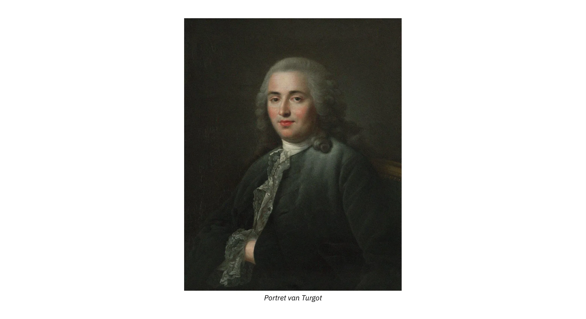

Jaren later schreef Turgot, een toekomstige minister onder Lodewijk XVI, een Éloge (lofrede) ter ere van zijn vriend na diens dood. En als Turgot de Fysiocratie van François Quesnay nooit helemaal omarmde, dan was dat omdat hij een onoverwinnelijke gehechtheid behield aan zijn eerste meester, Vincent de Gournay.

## De Gournay Cirkel

<chapterId>b86ba6bd-8f3a-5d8f-b098-4d0413f00deb</chapterId>

Als het gaat om de begindagen van de economische wetenschap, heeft de geschiedenis de neiging om een eerste denkschool te benadrukken: de Fysiocraten, geleid door François Quesnay en zijn discipelen. Bijna tien jaar voor hun opkomst was er echter een andere, minder formele maar even belangrijke groep rond de econoom Vincent de Gournay.

Zoals we in het vorige deel zagen, was Gournay gefascineerd door het voorbeeld van buitenlandse naties als Engeland en Nederland. Hij bewonderde hun economen - figuren als Josiah Child, Johan de Witt en David Hume - net zo zeer.

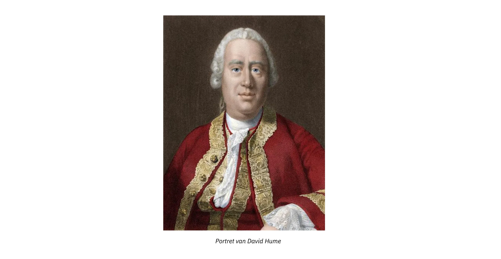

Deze bewondering leidde ertoe dat hij hun economische geschriften vertaalde en er vertalingen van gaf.

Het bleek dat zijn positie in de hoge administratie Gournay in staat stelde om in contact te komen met alle economische specialisten die op dat moment in Frankrijk bekend waren. Op deze manier verzamelde hij een groep uiterst bekwame vertalers. Hij vertaalde persoonlijk de werken van Child en Culpeper. Abt Le Blanc vertaalde de Political Discourses van David Hume. Véron de Forbonnais vertaalde de Spaanse econoom Geronymo de Uztariz. Turgot werkte aan de geschriften van Josiah Tucker en Montesquieu's zoon vertaalde Joshua Gee.

Dankzij de medewerking van verschillende leden van Gournay's kring konden veel auteurs originele werken publiceren onder hun eigen naam. Deze boeken bereikten, samen met de vertalingen, een opmerkelijk succes. Enkele opmerkelijke voorbeelden zijn:

- Herbert's Essay on the [General Police of Grain](https://archive.org/details/essaisurlapolice00herb/page/n7/mode/2up) (6 edities in 4 jaar)

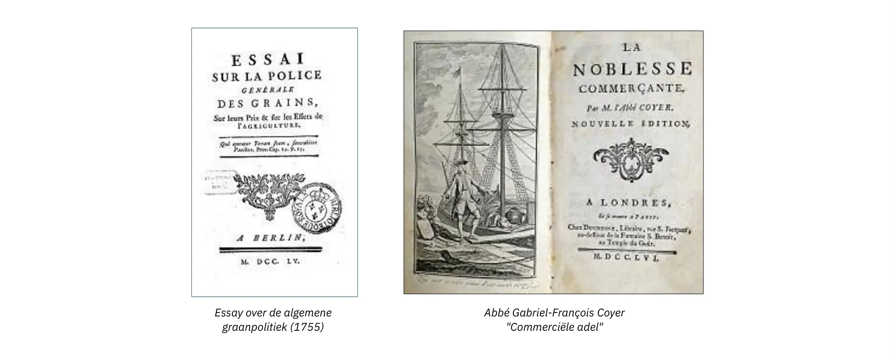

- Coyer's [Noblesse commerçante](https://archive.org/details/lanoblessecommer00coye/page/n3/mode/2up) (5 edities in 2 jaar)

- Plumard de Dangeul's [Opmerkingen over de voor- en nadelen van Frankrijk en Groot-Brittannië](https://archive.org/details/bim_eighteenth-century_remarks-on-the-advantage_plumard-de-dangeul-loui_1754) (3 edities in het eerste jaar)
- Cliquot-Blervache and Gournay's [Memoir sur les Trades](https://www.amazon.com/Memoire-sur-corps-metiers-French/dp/1978196903) (2 edities in 1758)

De groep speelde ook een centrale rol in de publicatie van

- [Essay on the Nature of Trade in General](https://archive.org/details/essayonnatureofc0000cant) door Richard Cantillon.

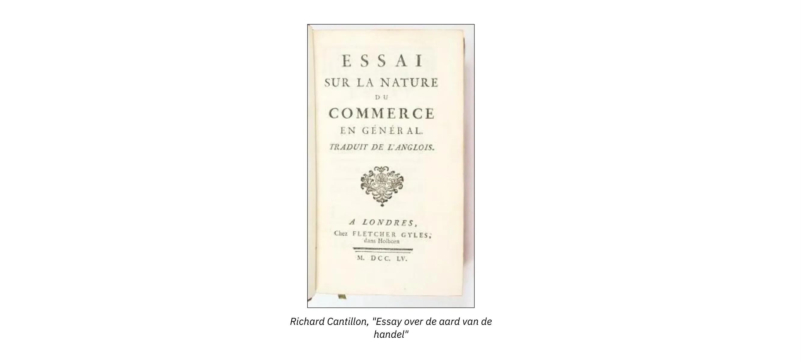

Dit laatste boek, geschreven rond 1730, bleef in manuscript na de dood van de auteur. Met de hulp van zijn economenvrienden publiceerde Gournay het in 1755. Volgens de abt Morellet, een lid van de kring, beval Gournay het aan bij elke econoom die hij kende.

De intellectuele output van de Gournay-kring had een grote invloed op de geschiedenis van ideeën. In die zin kunnen ze worden beschouwd als de grondleggers van de economische wetenschap in Frankrijk. Christine Théré van INED, die de geschiedenis van economische publicaties heeft bestudeerd, ontdekte dat er tussen 1750 en 1759 niet minder dan **349** werken over economie werden gepubliceerd, vergeleken met slechts **83** in het hele voorgaande decennium (1740-1749). Deze revolutie in de jaren 1750 is grotendeels te danken aan de Gournay-kring.

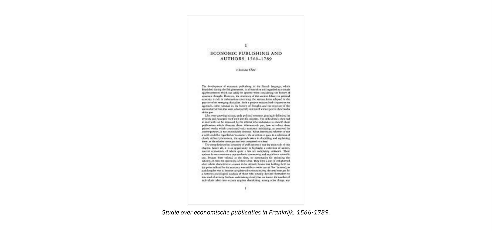

Om de smaak voor economische discussies onder de Franse bevolking te verspreiden, probeerden Gournay en zijn vrienden deze discussies toegankelijk te maken door middel van romans. Na de *Memoir sur les Trades*, waarin de gilden werden bekritiseerd, hielpen Gournay en Cliquot-Blervache Gabriel-François Coyer bij het schrijven van een korte satirische roman genaamd Chinki: [Een Cochinchinees verhaal dat van toepassing is op andere landen](https://www.institutcoppet.org/wp-content/uploads/2013/06/Coyer-Chinki-Histoire-cochinchinoise.pdf).

Het verhaal volgt de hoofdpersoon, Chinki, die gedwongen wordt zijn land te verlaten vanwege buitensporige belastingen en in de stad ambachtelijk werk probeert te vinden voor zijn kinderen. Maar alle ambachten zijn voor hen gesloten vanwege onrechtmatige gilderegels, dus het verhaal portretteert zijn groeiende teleurstelling door middel van humoristische tonen.

De kring van Gournay stond dus aan de wieg van een intense golf van publicaties. Hoewel deze belangrijke bijdrage is vergeten door historici van het economisch denken, was hij heel duidelijk voor tijdgenoten. De Fysiocraten, die hun school organiseerden in de jaren 1760, zouden later de groep van Gournay presenteren als hun directe voorlopers. In 1767 verwoordde de econoom Jacques Accarias de Serionne dit nog duidelijker in zijn eerbetoon. Hij schreef: "Een klein aantal Fransen, zowel filosofen als burgers, begon een paar jaar geleden Engelse schrijvers te imiteren. Ze vertaalden eerst hun modellen en overtroffen ze al snel in veel opzichten. Ze brachten alle charme en rijkdom van de literatuur naar de behandeling van nuttige onderwerpen; ze wakkerden de smaak aan voor de wetenschappen die het meest essentieel waren voor de welvaart van de staat en verspreidden deze".

En inderdaad, in de jaren 1750 raakten economische kwesties in de mode. Voltaire merkte beroemd op dat de Fransen rond 1750 romans opgaven om de vrijheid van de graanhandel te bespreken. Deze trend werd ook opgemerkt door de Mercure de France, die in een uitgave uit 1758, een paar maanden voor de dood van Gournay, schreef: "Politieke economie is nu de wetenschap in de mode. Boeken over landbouw, bevolking, industrie, handel en financiën zijn nu in handen van talloze mensen die nog niet zo lang geleden slechts oppervlakkig romans lazen". Een beter eerbetoon aan Gournay en het werk van zijn kring van economen is nauwelijks denkbaar.

## Mirabeau

<chapterId>2d2f802b-e3b6-556f-9025-a1b1dc4409ca</chapterId>

Frankrijk heeft twee beroemde mannen gekend met de naam Mirabeau, een vader en een zoon, maar het was de zoon die echt geschiedenis schreef. Als revolutionair tribuun en een van de centrale figuren in de gebeurtenissen van de Franse Revolutie bleef hij beroemd.

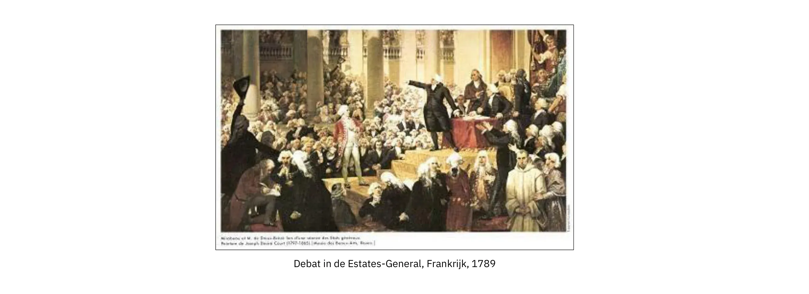

Door zijn talent en zijn plaats in de Franse geschiedenis overschaduwde hij zijn vader, een econoom en steunpilaar van de school van François Quesnay, die er al in 1758 het eerste lid van was.

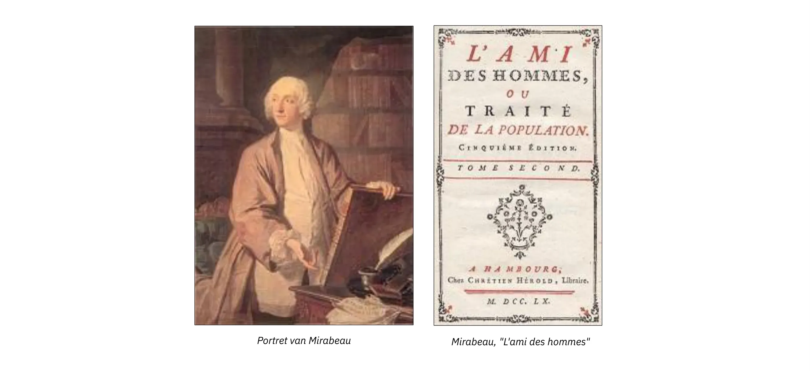

De markies de Mirabeau had in feite al een immense faam verworven voordat hij de fysiocratie overnam, dankzij een boek getiteld "De vriend van de mensheid. Verhandeling over bevolking" (https://archive.org/details/lamideshommesou00unkngoog). Hoewel de eerste editie werd gepubliceerd in 1756, werd het beroemd rond 1757, een jaar voor zijn ontmoeting met Quesnay.

Er werden meer dan 20 edities gepubliceerd tussen 1757 en 1760, wat het waarschijnlijk het meest succesvolle economieboek in de geschiedenis maakt. Sommige lezers dachten zelfs dat het boek door Montesquieu was geschreven vanwege de scherpe redeneringen. De kroonprins, vader koning Lodewijk XVI, beweerde zelfs dat hij het uit zijn hoofd had geleerd. Een tijd lang was het het boek dat iedereen in Versailles las.

Vandaag de dag is het een boek dat niet meer gelezen wordt, maar velen verwijzen er nog steeds naar. Zelfs in de 19e eeuw zei Edmond Roussel:

> L'Ami des Hommes is een van die boeken waar iedereen het over heeft, maar die bijna niemand kent. In elke generatie zou één dappere burger het moeten lezen, zodat iedereen dat niet hoeft te doen.

Aan het begin van zijn carrière als econoom liet Mirabeau zich inspireren door Richard Cantillon. Hij bezat al 15 jaar een manuscript van Cantillons Essay on the Nature of Commerce in General en had het geduldig geanalyseerd en becommentarieerd.

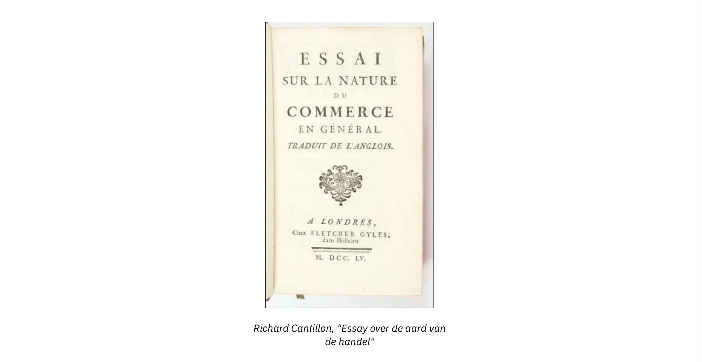

L'Ami des Hommes was oorspronkelijk bedoeld als een eenvoudig commentaar op Cantillons Essay. Maar omdat Mirabeau een ietwat eclectische geest had, die eerlijk gezegd een beetje gek was, week hij al snel af van zijn oorspronkelijke plan. Het boek bespreekt gewoon alle economische kwesties die hij kende, waarbij hij af en toe afstand neemt van Cantillon. Het is een moeilijk boek om te lezen, met een bizar plan en uitweidingen in elk hoofdstuk. Mirabeau gaf zelf toe dat het een chaos was en dat zijn stijl apocalyptisch was.

Ondanks de chaos die het is, zijn sommige ideeën het vermelden waard:

- Mirabeau bestrijdt de mercantilistische vooroordelen over de aard van rijkdom.
- Hij prijst de landbouw en bekritiseert het opgeven ervan.
- Hij klaagt over de toestand van de mensen, vooral de boeren.
- Tot slot verdedigt hij de vrijheid van handel en de broederschap van naties in vrede.

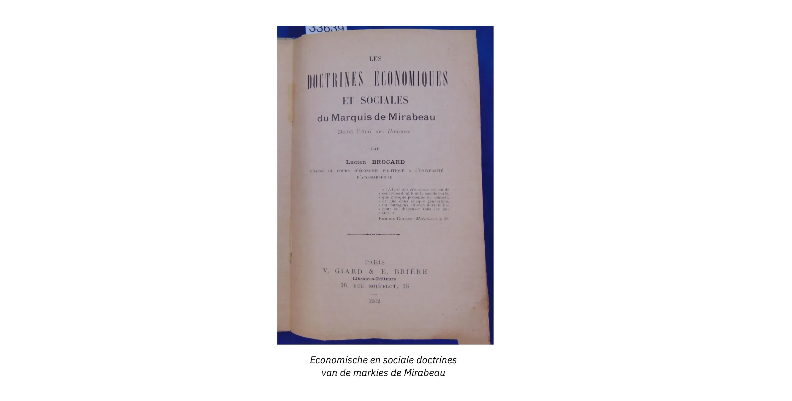

Het is Hard om Mirabeau's standpunten als liberaal of anti-liberaal te bestempelen. Hij zweefde vaak heen en weer, soms zonder het te beseffen, tussen de ene visie en de andere. Toch domineerden liberale ideeën vaak zijn schrijven. Een van zijn beroemdste zinnen was:

> Het ware en enige principe van de politieke economie is om alles vrij te laten.

Met zijn grootste succes achter de rug werd Mirabeau het hof gemaakt. François Quesnay, die zich net voor economie had geïnteresseerd, nodigde hem uit voor zijn entresol in Versailles.

Ze debatteerden heftig en uiteindelijk gebeurde er iets wat normaal gesproken nooit gebeurt in debatten: Mirabeau gaf ronduit toe dat hij fout zat. Hij was het eens met de ideeën van Quesnay en zei dat hij bereid was ze te verspreiden.

Samen vormden ze de kern van wat de Fysiocratische school zou worden, versterkt door de regelmatige rekruten die ze binnenbrachten. Kort na Mirabeau's bekering vroeg Quesnay hem zijn ideeën over belastingen te verdedigen. Dit leidde tot de ["Theorie van de belastingheffing"](https://archive.org/details/thoriedelimpot00mira), waarvoor Mirabeau een paar dagen naar de gevangenis van Vincennes werd gestuurd en vervolgens naar Bignon werd verbannen.

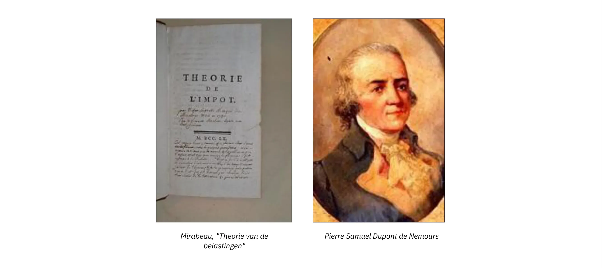

Mirabeau speelde ook een cruciale rol in het werven van nieuwe leden voor Quesnay's school. Hij overtuigde zelfs de jonge Dupont de Nemours.

Het was ook in het huis van Mirabeau dat de Fysiocraten elke dinsdag samenkwamen. Persoonlijkheden als Turgot en Adam Smith schijnen deze bijeenkomsten een of meerdere keren te hebben bijgewoond.

Zijn hele leven lang bleef Mirabeau een onvermoeibare schrijver. Hij schreef talrijke economische werken waarin hij de doctrine van Quesnay verdedigde. Tegen het einde van zijn leven werd zijn invloed echter minder. Zijn schrijfstijl verslechterde zodanig dat zijn eigen broer hem schreef dat hij zijn proza niet langer kon begrijpen. Zijn ideeën, die volledig liberaal waren geworden, botsten met de socialistische of proto-communistische reactie van denkers als Mably en zelfs Rousseau. Hij had moeite om lezers en uitgevers te vinden en stierf grotendeels onopgemerkt in 1789, aan de vooravond van de bestorming van de Bastille.

## Quesnay

<chapterId>7a35f20b-5ea0-544d-b290-bcd9c6f7f11a</chapterId>

François Quesnay is een van de beroemdste Franse economen.

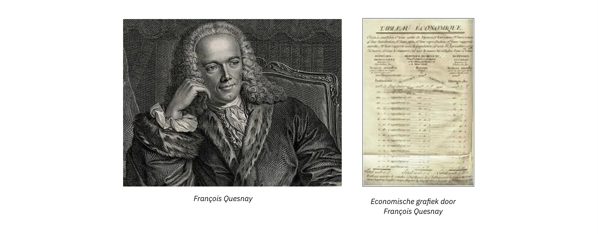

Zijn naam komt voor in elk leerboek over economie en de geschiedenis van het economisch denken. Er wordt gezegd dat hij de "Tableau Économique" bedacht om de economie schematisch weer te geven, dat hij de leider was van de fysiocratische school en dat hij zich vergiste in zijn overtuiging dat alleen land productief is, en dat Adam Smith uiteindelijk de zaken kwam rechtzetten. Dit is min of meer hoe leerboeken François Quesnay samenvatten.

Het is jammer om hem daartoe te reduceren, want Quesnay was ook de eerste econoom die probeerde om de verdediging van economische vrijheid op wetenschappelijke principes te baseren. Hij was een van de meest beluisterde en invloedrijke economen van zijn tijd. Bovendien stichtte hij de Fysiocratie, een veel rijkere doctrine dan het simplistische idee dat alleen de natuur rijkdom produceert, een idee dat vaak verkeerd wordt voorgesteld.

In de volgende drie hoofdstukken gaan we dieper in op de Fysiocratie. Laten we eerst eens wat dieper ingaan op François Quesnay zelf.

Geboren in 1694 in Méré in een boerenfamilie die Quesnay niet kon leren lezen. Hij werd opgeleid door een plaatselijke man en ging uiteindelijk studeren aan het College voor Chirurgie en vervolgens aan de Faculteit Geneeskunde. Op 24-jarige leeftijd werd hij chirurg in Mantes.

Hij werd beroemd in 1730, op 36-jarige leeftijd, omdat hij zich verzette tegen de gebruikelijke praktijk van aderlating, die volgens hem gebaseerd was op onjuiste theorieën en vooroordelen. Hij durfde ook het gildesysteem aan te vechten, dat bepaalde dat alleen chirurgen operaties mochten uitvoeren en alleen artsen medicijnen mochten voorschrijven. Dit dwong de armen vaak om twee keer te betalen en twee mensen in te schakelen, een situatie die Quesnay weerzinwekkend vond.

In 1740 werd hij secretaris van de Academie voor Heelkunde. In 1748, op 54-jarige leeftijd, werd hij de lijfarts van Madame de Pompadour en verhuisde hij naar Versailles.

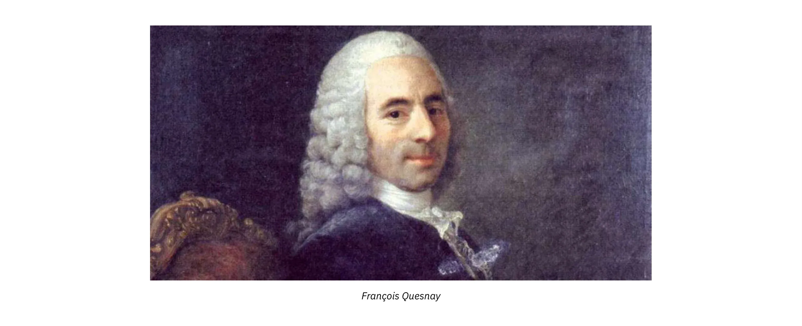

Hij was erg close met Madame de Pompadour. Quesnay zei zelfs, toen de schande van de favoriet bekend werd gemaakt, dat hij zonder haar geen dokter in Versailles zou willen blijven:

"Ik was gehecht aan Madame de Pompadour in haar voorspoed; dat zal ik ook zijn in haar schande".

Daarna publiceerde hij verschillende medische boeken: Treatise on Suppuration (1749), Treatise on Gangrene (1749), en Treatise on Continuous Fevers (1753), die allemaal meerdere keren herdrukt werden tijdens zijn leven.

Toen hij 60 jaar oud was, maakte hij kennis met de economische debatten die toen in de mode waren en begon hij over economie te schrijven. In 1755 schreef hij de artikelen "Boeren" en "Graan" voor de *Encyclopédie*.

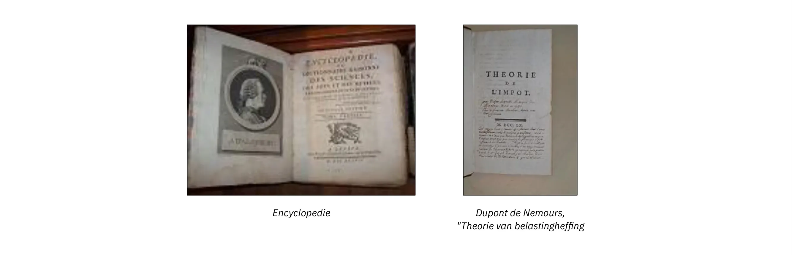

Ze werden gepubliceerd in 1757. Datzelfde jaar ontmoette hij de beroemde Mirabeau en slaagde erin hem te bekeren tot zijn economische ideeën - de kern van de Fysiocratie was geboren. Quesnay creëerde vervolgens de Tableau Économique, die op de koninklijke persen werd gedrukt, naar verluidt in aanwezigheid van de koning zelf in het kasteel van Versailles. Vanaf dat moment ontving hij regelmatig economen en filosofen in zijn appartement in Versailles, waar ze vrijuit discussieerden. Quesnay leverde ook een bijdrage aan Mirabeau's Theory of Taxation, gepubliceerd in 1759.

De censuur sloeg al snel toe. Mirabeau werd gevangen genomen en Quesnay werd berispt. Daarna realiseerde Quesnay zich dat hij niet openlijk kon publiceren en discipelen nodig had om zijn ideeën te verspreiden.

Hij vond ze snel: Baudeau, Dupont de Nemours, Le Trosne, Mercier de la Rivière en anderen. Dit waren de mannen die het gedachtegoed van Quesnay zouden verspreiden en populariseren. Quesnay, die discipelen nodig had, was echter niet helemaal tevreden met het sektarische aspect van zijn groep. Getuige zijn brieven aan Mirabeau, waarin hij hem vertelt:

> "Denk zelf na. Ik heb me gerealiseerd dat mijn ellendige ontwerpen jullie lui maken. Nu is het jullie beurt om na te denken. Jullie weten net zoveel als ik".

Toch waren zijn discipelen zeer toegewijd en droegen ze in grote mate bij aan Quesnays populariteit. Na zijn dood hield Mirabeau een lofrede waarin hij zei: "We hebben onze vader verloren, want we waren hem alles verschuldigd". In werkelijkheid was het Quesnay die hen alles verschuldigd was, want zonder hen zou hij in Versailles zijn gebleven, waar zijn denken, hoewel het veel te verleiden of te verontrusten had, weinigen interesseerde.

Dankzij het werk van zijn medewerkers vonden zijn ideeën een platform: eerst via kranten zoals het *Journal of Agriculture* en de *Ephémérides du Citoyen*.

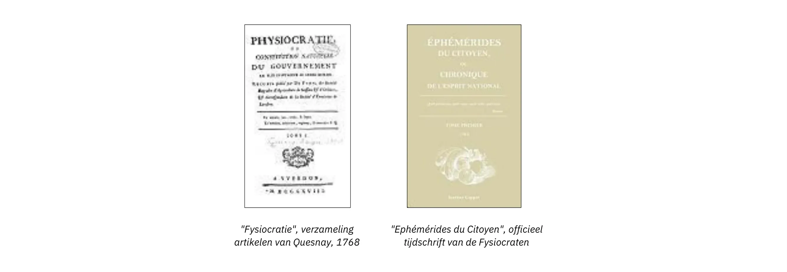

Vervolgens door boeken, niet alleen die van zijn discipelen, maar ook een belangrijke bloemlezing die in 1768 werd gepubliceerd door Dupont de Nemours, getiteld *Fysiocratie*.

Dit boek verzamelde de belangrijkste bijdragen van Quesnay. Het beschrijft het economische ideaal van de leider van de Fysiocraten: een model van landbouweconomie waarin de wet iedereen het recht op eigendom en de vrijheid om handel te drijven garandeert.

# De fysiocratische school

<partId>27af82c1-ad82-5c3b-8ce9-c674b67bbf7c</partId>

## Geschiedenis van de fysiocraten

<chapterId>4236ff8b-b53a-59e7-92c0-f96f9afa1c00</chapterId>

De fysiocratie kwam in Frankrijk, en zelfs in heel Europa, nauwelijks een decennium in de mode. Na een lange periode van ontwikkeling kreeg het een prominente plaats in het midden van de jaren 1760. Tegen de tijd dat Turgot in 1776 aan de macht kwam, had de beweging haar populariteit al verloren en de minister hield zijn steun voor de school van Quesnay meestal verborgen.

De oorsprong ligt in de evolutie van economische ideeën in de jaren 1750. Verschillende auteurs hielpen de kloof te overbruggen tussen Boisguilbert en wat later bekend zou worden als de Fysiocratie. Zoals eerder besproken, zaten Vincent de Gournay en zijn kring van economen achter veel publicaties die Franse lezers kennis lieten maken met buitenlands economisch denken en hun passie voor economie hielpen aanwakkeren. De fundamenten van de Fysiocratie waren al aanwezig in boeken als "Détail de la France" van Boisguilbert en ["Essay sur la Nature du commerce en général"](https://archive.org/details/essaisurlanature0000cant) van Cantillon.

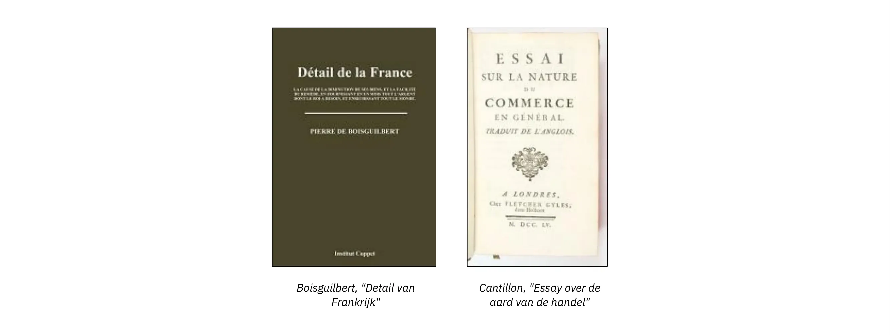

Het concept van laissez-faire had verschillende voorstanders sinds Boisguilbert, vooral Vincent de Gournay en de Markies d'Argenson.

Wat overbleef was om deze verzameling ideeën om te zetten in een samenhangende, complete doctrine en de Markies de Mirabeau was de eerste die dat probeerde. Geïnspireerd door Cantillons Essay begon hij met het schrijven van een uitgebreide verhandeling over economische zaken getiteld "L'Ami des Hommes", die zeer succesvol was.

Zo kon in 1756 het verhaal van de Fysiocratie beginnen. François Quesnay, toen een chirurg die lijfarts werd van Madame de Pompadour, nodigde Mirabeau uit in Versailles om economische ideeën te bespreken.

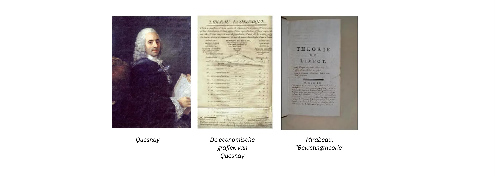

Aan het einde van hun gesprek was Mirabeau het eens met de ideeën van Quesnay. Vanaf dat moment schreven ze samen: Quesnay creëerde de *Tableau économique* (1758) om de stroom van rijkdom in de economie te illustreren en samen publiceerden ze de Theorie van Belastingheffing (1759).

Hun inspanningen werden niet warm onthaald. Aan het hof was de overheersende reactie onverschilligheid. De koning erkende Quesnay's voorliefde voor theorie en noemde hem liefkozend "mijn denker". Maar afgezien van dat compliment leverde hun werk niets op. In feite beledigde hun Theorie van de Belastingheffing de belastingadministrateurs die erin werden bekritiseerd, zo erg zelfs dat ze de gevangenisstraf van Mirabeau eisten en bewerkstelligden. Madame de Pompadour liet hem uiteindelijk vrij, maar hij bleef nog enkele weken in ballingschap leven op zijn landgoed in Bignon.

De eerste helft van de jaren 1760 verliep dus in relatieve stilte. Door zijn positie in Versailles werd Quesnay gedwongen te stoppen met schrijven, of in ieder geval niets onder zijn eigen naam te publiceren. Mirabeau, al een keer veroordeeld, was gewaarschuwd en wist heel goed dat de favoriet van de koning hem niet voor altijd kon beschermen.

Na deze korte stilte begonnen de twee economen discipelen te werven: dit was de enige manier om hun ideeën populair te maken. Tegen 1765 waren hun successen opvallend. Dupont de Nemours, Abeille, Mercier de la Rivière, Le Trosne en Baudeau sloten zich al snel bij hen aan. Ze vormden een school: ze hadden hun eigen tijdschrift, *Les Éphémérides du Citoyen*, en kwamen zelfs elke dinsdag bijeen bij Mirabeau thuis.

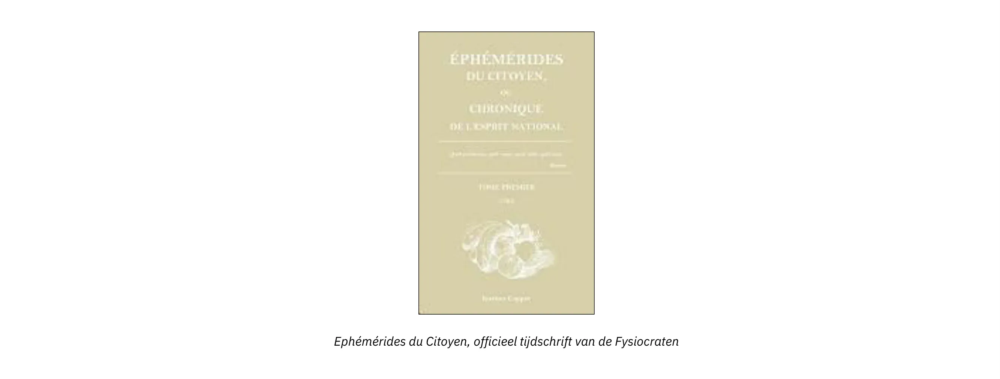

Tussen 1765 en 1775 stond de verenigde groep Fysiocraten op het hoogtepunt van hun roem. De literaire en filosofische wereld had alleen oog voor hen, waardoor hun ideeën zich snel en wijd verspreidden. Mensen noemden hen "de economen", of, meer spottend, "de sekte van de economen". Ongeacht de toon, hun bekendheid was absoluut. In 1774, na een reis naar Metz, schreef M. de Vaublanc in zijn memoires over zijn verbazing: iedereen om hem heen sprak over economie en redeneerde als de discipelen van Quesnay. "Het was in de mode", merkte hij op. "Iedereen was een econoom".

Tegen 1770 begon hun populariteit echter te tanen. De groep kreeg te maken met de eerste afvalligen en hun vermogen om kritiek te weerstaan verzwakte. En er waren veel critici: Condillac, Mably, Voltaire, Galiani, Linguet, Graslin en zelfs Adam Smith in Schotland stelden hun standpunten ter discussie.

Hun krant verscheen niet meer regelmatig. Dit betekende het einde van de meest actieve periode van de beweging.

De fysiocratie zou invloed blijven uitoefenen tot aan de Revolutie. In Frankrijk eerst door Turgot, meer een medereiziger dan een discipel, en door zijn vertegenwoordiger Dupont de Nemours, wiens leven en werk we later zullen bestuderen. Maar ook in heel Europa, waar de fysiocratische leer met enthousiasme werd ontvangen. In Duitsland, via de markgraaf van Baden, en in Italië, via Leopold van Toscane, inspireerden de fysiocratische theorieën zelfs economische hervormingen ten gunste van privébezit en vrijheid.

## De grondslagen van de leer van de fysiocraten

<chapterId>4dbe5436-0578-57c2-b054-03ed00aa091a</chapterId>

De term Physiocracy, wat "regering door de natuur" betekent, werd bedacht door Dupont de Nemours en gebruikt als titel voor *Physiocracy*, een verzameling artikelen van Quesnay gepubliceerd in 1768.

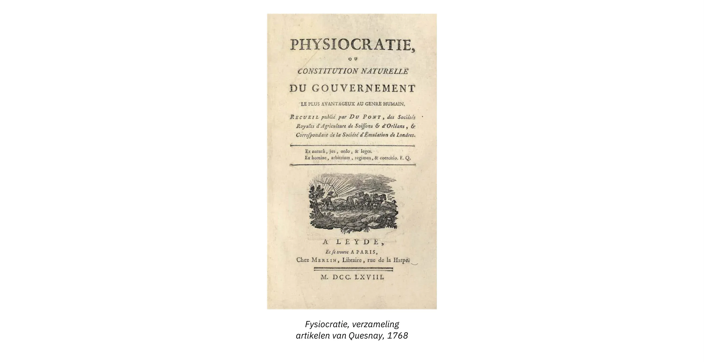

Dit is een obscure zin. Geen enkele student van Quesnay heeft ons de ware betekenis ervan gegeven. Toch was hun denksysteem verre van obscuur. In feite was het opgebouwd rond een paar zeer duidelijke principes, die we hier zullen schetsen.

### Eerste principe: alleen landbouw is productief

Dit eerste idee heeft de aandacht getrokken van historici. Tegenwoordig worden de Fysiocraten zo samengevat in leerboeken of cursussen economie. Ze zouden naïef geloofd hebben dat alleen landbouw productief is. Op basis daarvan wordt hun doctrine afgedaan als irrelevant en gaat de analyse snel over op Adam Smith.

Het is echter oneerlijk om de Fysiocraten te bekritiseren voor het onevenredige belang dat ze aan de landbouw hechtten, aangezien de landbouw in het midden van de 18e eeuw 90% van de bevolking tewerkstelde en de basis van de Franse economie vormde.

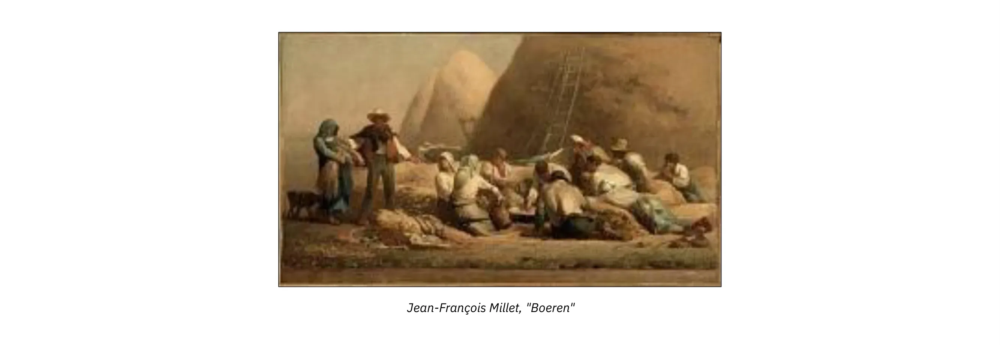

Het idee van de fysiocraten is eigenlijk subtiel. Volgens hen is er een verschil tussen productie en winst. De industrieel en de handelaar kunnen winst maken, maar alleen de boer produceert echt, omdat productie het creëren van bruikbaar materiaal is, in plaats van het toevoegen van nut aan reeds bestaand materiaal.

We moeten ook proberen te begrijpen waarom ze industrie en ambachten als onproductief afwezen. In die tijd waren deze ambachten opgesloten in het gildesysteem, dat innovatie, investeringen en vooruitgang verbood.

### Tweede principe: juridisch despotisme in plaats van democratie

Om iemand te beledigen, zeggen we tegenwoordig dat hij geen democraat is. Hoewel historici de strenge kijk van de Fysiocraten op landbouwproductiviteit vergeven, vergeven ze hun verzet tegen democratie niet, vooral omdat ze leefden tijdens het hoogtepunt van de ideeën van de Verlichting. Vanaf het midden van de 18e eeuw tot vlak voor de Revolutie werden de Fysiocraten gezien als vijanden van de vooruitgang.

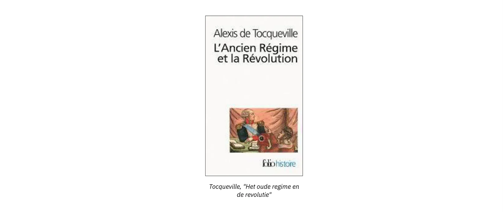

Tocqueville hield vast aan dit idee:

> De Fysiocraten waren inderdaad erg voor vrije handel in goederen, voor laissez-faire of laissez-passer in handel en industrie; maar politieke vrijheden in eigenlijke zin, daar dachten ze niet over na, en zelfs als zulke ideeën in hun hoofd opkwamen, verwierpen ze die in eerste instantie.

De Fysiocraten waren liberaal op economisch gebied en daarom niet liberaal op politiek gebied. Quesnay schrijft in zijn *maxims*: "Laat de soevereine autoriteit uniek en superieur zijn aan alle individuen van de samenleving en aan alle onrechtvaardige ondernemingen van particuliere belangen." En later, in dezelfde stelregel: "Het systeem van checks and balances in de regering is een fatale gedachte, die alleen maar tweedracht zaait onder de groten en onderdrukking van de kleinen".

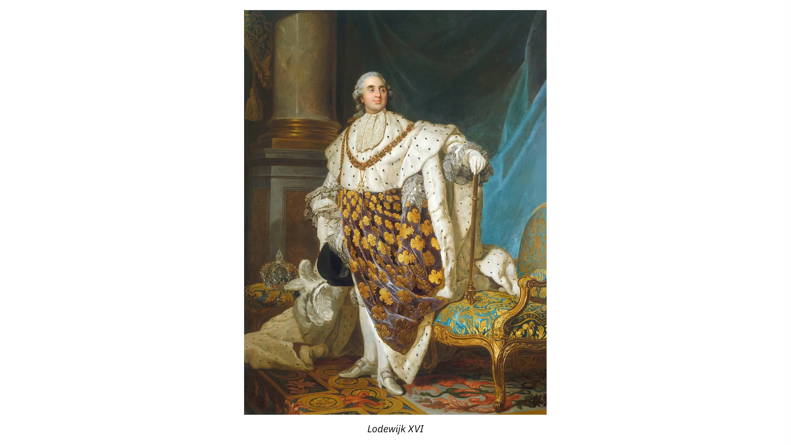

Tocqueville merkte treffend op dat de Fysiocraten de democratie verwierpen zodra ze de vormen ervan zagen. Ze stonden sceptisch tegenover democratie, die een constante zou worden in de Franse politieke economie, omdat democratie verre van een perfect systeem is: het kan de onderdrukking van minderheden door de meerderheid mogelijk maken en het kan een instrument worden voor usurpatie, tirannie en plundering.

### Derde principe: absoluut respect voor privébezit

De Fysiocraten geloofden dat mensen de resultaten van hun arbeid moesten bezitten en houden. In hun ogen waren eigendomsrechten de basis van een samenleving. Ze vonden dat de staat maar één hoofdtaak had: het beschermen van het eigendom van mensen. Bovendien beweerden de Fysiocraten vanuit een economisch standpunt dat de onschendbaarheid van eigendom werk en inspanning aanmoedigt en een voorwaarde is voor economische vooruitgang.

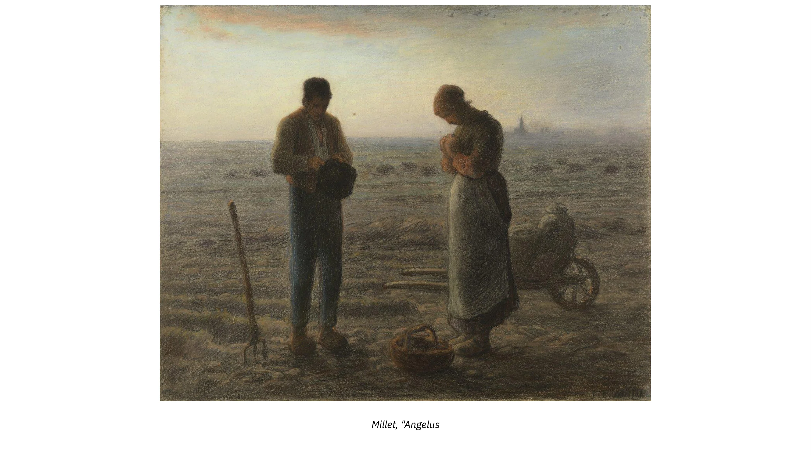

Quesnay formuleerde het eenvoudig:

> Laat de Ownership van land en roerende goederen verzekerd zijn aan degenen die hun rechtmatige bezitters zijn, want de zekerheid van eigendom is de essentiële basis van economische orde en de veiligheid van de samenleving; het is de zekerheid van permanent bezit die arbeid en het gebruik van rijkdom aanmoedigt in het verbeteren en cultiveren van het land, evenals in commerciële en industriële ondernemingen.

### Vierde principe: absolute vrijheid van handel

In zijn eerder geciteerde *Maxims* stelt Quesnay:

> Laat er volledige vrijheid van handel zijn, want de meest betrouwbare, nauwkeurige en heilzame regulering van zowel binnenlandse als buitenlandse handel voor de natie en de staat ligt in volledige vrijheid van concurrentie.

De Fysiocraten hadden de schade gezien die werd veroorzaakt door overheidsbemoeienis, vooral in de graanhandel. Men moet erkennen, zeiden ze, dat de overheid nooit in staat zal zijn om de handel zo goed te beheren als individuen dat doen, omdat het zou moeten reageren op elke behoefte en op elke verandering in vraag of Supply. Dit alles ligt ver buiten de mogelijkheden van zelfs de verstandigste overheid die men zich kan voorstellen. Dit alles ligt ver buiten de mogelijkheden van zelfs de verstandigste regering die men zich kan voorstellen. Daarom is het nodig om de dingen te laten zoals ze zijn en ze te laten stromen.

Handel is van nature nuttig en moet volledig en perfect vrij zijn. Een van hun leden, Le Trosne, schreef zelfs een pamflet met de titel [*De vrijheid van de graanhandel: altijd nuttig, nooit schadelijk*](https://www.institutcoppet.org/liberte-commerce-grains-toujours-utile-jamais-nuisible/).

### Vijfde principe: Alle mensen zijn broeders

De Fysiocraten waren felle tegenstanders van slavernij, maar ook grote pacifisten. "Onze buitenlandse politiek heet vrede", zei Mirabeau eenvoudigweg. In 1790, tijdens de grondwetgevende vergadering, zette Dupont de Nemours dit pacifistische standpunt voort toen hij een wetsvoorstel indiende om offensieve oorlogen te verbieden.

## Prestaties en invloeden van de fysiocraten

<chapterId>5b911105-796a-5e2e-a501-c7a364fc758e</chapterId>

Zoals we in het eerste van de drie hoofdstukken over de Fysiocraten hebben gezien, waren de volgelingen van Quesnay ongeveer een decennium lang een rage in Frankrijk. Dit enthousiasme voor hun ideeën kreeg vorm in hun tijd en duurde voort tot het einde van de eeuw. Hier zullen we kijken naar enkele van hun prestaties en de invloed die ze uitoefenden op hun opvolgers op het gebied van economisch denken.

Hun grootste prestatie, na de Gournay-groep, was het populariseren van economische ideeën. De beroemde uitspraak van Voltaire is welbekend: rond 1750 begon de natie, verzadigd van poëzie en romans, te redeneren over graan. De Fysiocraten namen deel aan deze beweging en publiceerden letterlijk honderden artikelen, pamfletten en boeken over de vrijheid van de graanhandel. De sterke impuls die de fysiocraten gaven aan economische discussies blijkt ook uit het indrukwekkende aantal economische werken en pamfletten dat tussen 1760 en 1775 in Frankrijk werd gepubliceerd. Nog een bewijs van de verspreiding van economische ideeën in Frankrijk is de opmerking van M. de Vaublanc, aangehaald in een eerdere lezing, die in 1774 in Metz zei dat mensen over niets anders dan economie spraken. "Het was de mode", zei hij. "Iedereen was econoom".

De verdediging van hun ideeën, in boeken, pamfletten en in hun tijdschrift *Les Éphémérides du Citoyen*, had al snel gevolgen voor het economische beleid van Frankrijk. In 1763 werd bij edict de graanhandel vrijgegeven, iets waar Quesnay en Mirabeau sterk op hadden aangedrongen. Bij verschillende gelegenheden versoepelden de autoriteiten ook de regels voor handelsgilden om een grotere vrijheid van werken te garanderen.

In het buitenland kwam het succes al snel. In Duitsland interesseerde de markgraaf van Baden zich voor fysiocratische ideeën en onderhield hij een regelmatige correspondentie met Mirabeau en Dupont de Nemours.

Hij gaf de econoom Johann August Schlettwein, een overtuigd fysiocraat, de opdracht om een belastinghervorming door te voeren en de graanhandel te liberaliseren. In april 1770 vond een eerste proef plaats in het kleine dorpje Dietlingen. De dorpelingen leken de maatregelen enthousiast te hebben verwelkomd, maar de verantwoordelijke ambtenaren waren niet erg behulpzaam, waardoor de bredere implementatie vertraging opliep.

In Rusland bereidde Catharina II een wetshervorming voor en vroeg Diderot haar een briljante geest te sturen om haar te helpen.

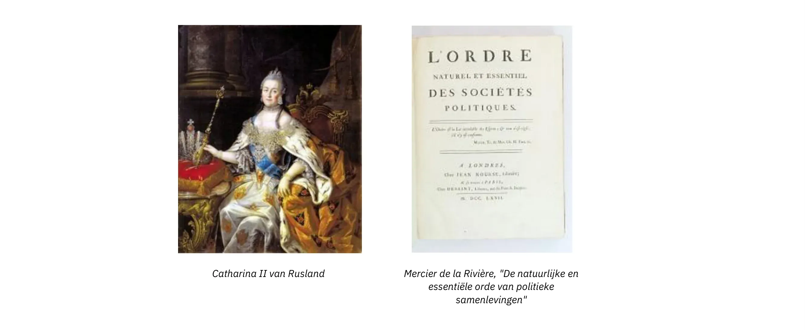

Onder de indruk van [*The Natural and Essential Order of Political Societies*](https://archive.org/details/lordrenaturelete00mercuoft), gepubliceerd in 1767, stuurde hij haar de auteur, de fysiocraat Mercier de la Rivière.

Hoewel hij gevierd Frankrijk verliet, was zijn ontvangst in Sint-Petersburg koel (het klimaat terzijde) en de keizerin was teleurgesteld in hem.

In Zweden, met Gustav III, en in Italië, met Leopold van Toscane, vonden de Fysiocraten ook volgelingen die bereid waren om hun ideeën in praktijk te brengen.

In Frankrijk boekten de Fysiocraten een spectaculair succes met de benoeming van Turgot als Controleur-Generaal van Financiën in 1774.

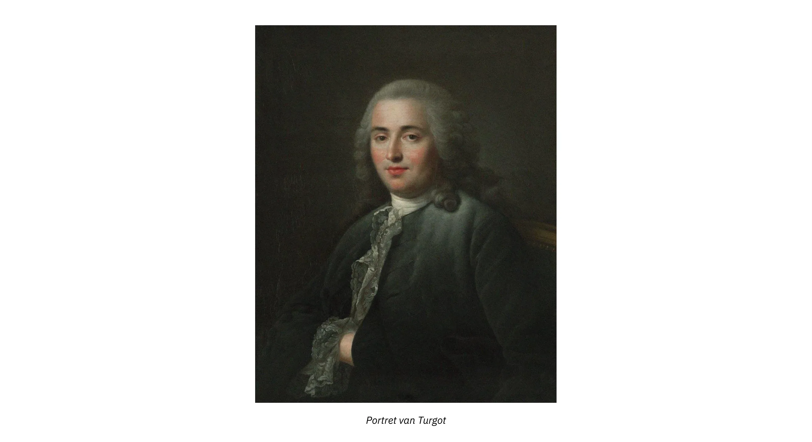

Turgot was zich bewust van het afnemen van hun faam en presenteerde zich nooit als een trouwe discipel van de Fysiocraten, noch, wat dat betreft, als een encyclopedist, hoewel hij er een was en omdat ze werden veracht door de leden van de geestelijkheid. Eenmaal aan de macht vaardigde Turgot zes beroemde edicten uit die het begin waren van een praktische toepassing van het Physiocratische programma: vrijheid van handel, vrijheid van arbeid en het einde van monopolies.

Tegen de tijd van de Franse Revolutie hadden de Fysiocraten minder aanhangers. De markies van Mirabeau stierf op 13 juli 1789 - een behoorlijk symbool. Abeille was verder gegaan, maar Dupont de Nemours bleef trouw. Dupont de Nemours werd benoemd tot lid van de Assemblee, hij droeg de stem van de Fysiocratie uit en riep op tot economische hervormingen ten gunste van eigendom Ownership en vrije handel.

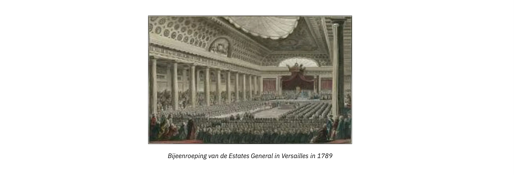

Hij vocht ook, zonder succes, tegen de assignaten. Ondanks deze mislukking bleef het fysiocratische gedachtegoed zeer aanwezig in het intellectuele debat en beïnvloedde het de vroege verwezenlijkingen van de Revolutie. Zoals Joseph Rambaud zei, was alles wat de Revolutie deed ten gunste van de vrijheden te danken aan de Fysiocraten.

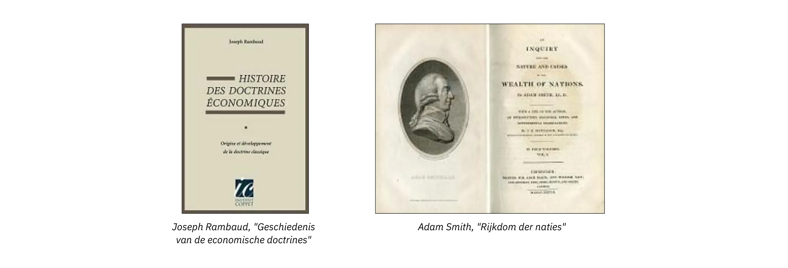

De Fysiocraten hadden ook een grote invloed op de geschiedenis van het economisch denken. Adam Smith, die Frankrijk bezocht en veel van hen ontmoette, werd diep beïnvloed door hun werk. Hij overwoog zelfs om *The Wealth of Nations* aan Quesnay op te dragen.

Helaas stierf Quesnay twee jaar voordat Smiths boek werd gepubliceerd en Smith verwijderde de toewijding. Hoewel Smith het niet eens was met hun idee dat alleen landbouw productief was, omarmde hij veel van hun argumenten voor vrije markten en voerde deze door in zijn eigen werk.

## Dupont de Nemours

<chapterId>6d585e0f-93b8-5b0a-a0a8-7f6e4a5bc68e</chapterId>

In de Verenigde Staten kennen we het bedrijf DuPont, ook bekend als "E.I. du Pont de Nemours and Company", een multinational op het gebied van chemie en biologie.

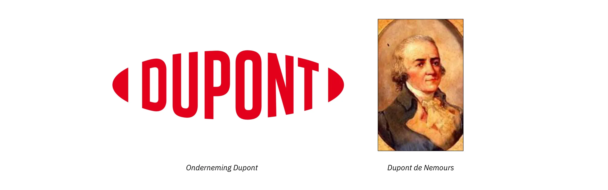

Vandaag de dag heeft het bedrijf een omzet van meer dan 35.000 miljard dollar en heeft het wereldwijd bijna 65.000 mensen in dienst. Het blijkt dat dit bedrijf nauw verbonden is met het lot van Samuel-Pierre Dupont de Nemours, een Franse econoom van de Physiocratische school.

Dupont de Nemours werd geboren in 1739 en kwam op 24-jarige leeftijd in contact met de fysiocraten. In die tijd was hij zijn weg in het leven nog aan het vinden. Op een dag kwam hij een kort pamflet tegen met de titel De Rijkdom van de Staat. Hij vond de economische ideeën onzin en schreef een kritisch antwoord met de titel Reflections on the Wealth of the State, gepubliceerd in 1763. Het stuk werd goed ontvangen en lezers prezen het met dingen als: "Je moet een leerling van Mirabeau zijn!" Ironisch genoeg wist Dupont niet eens wie Mirabeau was.

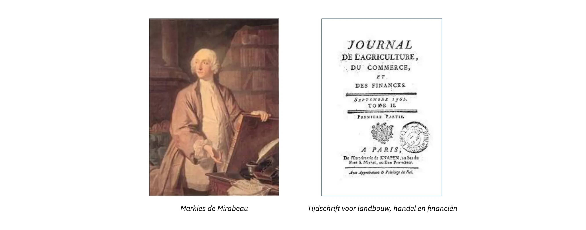

Nieuwsgierig begon hij het werk van Mirabeau te lezen, *Vriend van het Volk* en *Theorie van de Belastingheffing*. Hij ontmoette Mirabeau en François Quesnay en sloot zich aan bij hun school.

In 1765 kreeg Dupont de functie van redacteur aangeboden van het *Journal de l'agriculture, du commerce et des finances*, het belangrijkste tijdschrift van die tijd op het gebied van economisch denken.

Daar waren twee redenen voor: Mirabeau en Quesnay moesten zwijgen en Dupont werd gezien als hun rijzende ster.

Leden van de Physiocratische school zijn het erover eens dat Dupont de Nemours al snel de favoriet van Quesnay werd. Quesnay zei ooit: "Zorg goed voor deze jongeman, hij zal spreken als wij dood zijn". Een mede-fysiocraat, Abeille, werd zelfs jaloers op de aandacht die Dupont kreeg en distantieerde zich van Quesnay's school.

Dupont de Nemours heeft altijd zijn grote waardering voor Quesnay behouden.

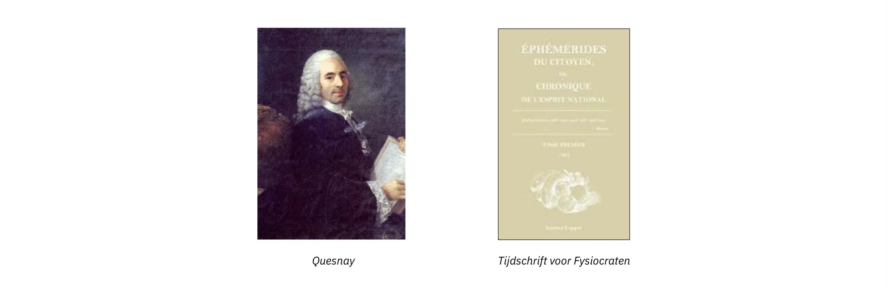

Later zou hij zeggen: "Ik was nog maar een jongen toen Quesnay zijn armen naar me uitstrekte, hij maakte een man van me." Het was Quesnay die van hem een belangrijk econoom maakte in de literaire scène van die tijd.

Na het *Journal de l'agriculture, du commerce et des finances* werd Dupont benoemd tot redacteur van *Les Éphémérides du Citoyen*, dat het officiële orgaan van de Fysiocraten werd.

Hij maakte deze periodieke verzameling tot een belangrijk centrum voor economische theorie en ondersteunde het zelfs tijdens de neergang van de Fysiocraten door bijna alle latere delen zelf te schrijven. Het was bovendien Dupont de Nemours die de term "fysiocratie" bedacht, afgeleid van twee Griekse woorden die "regering van de natuur" betekenen. Hij gebruikte deze term als titel voor een verzameling artikelen van Quesnay die in 1768 werd gepubliceerd, en de term raakte uiteindelijk ingeburgerd in de geschiedenis. Het is bekend dat de Fysiocraten elkaar onderling "economen" noemden en tijdens de Revolutie werden ze nog steeds zo genoemd.

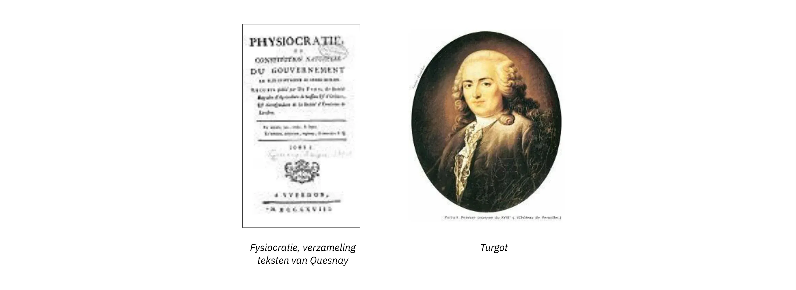

Toen Turgot korte tijd minister van Financiën van Frankrijk was, werd Dupont zijn naaste adviseur. Hij was de enige fysiocraat die toegang tot hem had, omdat Turgot zich afzijdig hield van de anderen.

Ten tijde van de Revolutie werd hij gekozen uit het baljuwschap van Nemours en bevond hij zich in de Assemblée, waar ook een andere Monsieur Dupont zetelde. Hij werd toen Dupont de Nemours genoemd, niet omdat hij van adel was, maar gewoon om de twee van elkaar te onderscheiden. De naam bleef natuurlijk bestaan.

Tijdens de Revolutie, in augustus 1792, nam hij de wapens op om de Koning in het Tuileries Paleis te verdedigen tegen de menigte.

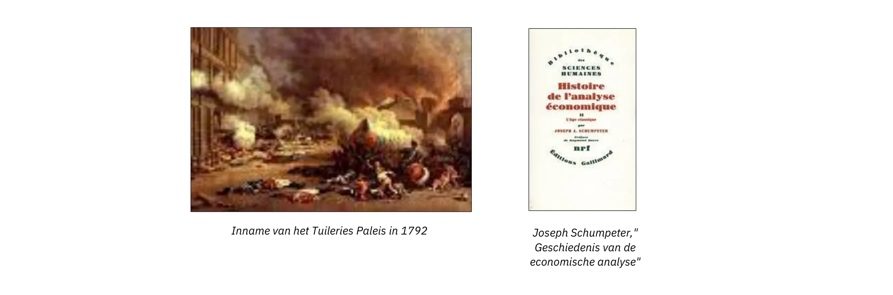

De koning zei tegen hem: "Monsieur Dupont, we vinden u altijd waar we u nodig hebben!" Na op wonderbaarlijke wijze aan de Terreur te zijn ontsnapt, veroordeeld en in afwachting van de guillotine maar gered door de val van Robespierre, werd hij onder Napoleon in ballingschap gedreven en vond hij zijn geluk in de Verenigde Staten, waar een van zijn zonen met hulp van zijn vader het bedrijf Dupont oprichtte.

Ondanks dit bewogen leven, waarin hij tientallen artikelen, brochures en boeken publiceerde, is hij tot op de dag van vandaag relatief weinig bekend. Misschien was dit omdat hij een overtuigd fysiocraat bleef toen de doctrine uit de mode was geraakt. Inderdaad, zoals Schumpeter schreef, bleef Dupont de Nemours trouw aan de Physiocratie "gedurende een carrière waarin hij vele gelegenheden had om deze af te zweren". Hij was een man van overtuiging.

# De Verlichting en politieke economie

<partId>d1c885ad-7cb1-5f81-816c-be312719d9f8</partId>

## Voltaire en de filosofen

<chapterId>16bcf7bf-dad4-5113-8c64-2800f04ff07b</chapterId>

In de 18e eeuw ontstond in Frankrijk de economie als wetenschap en de eerste economische denkschool: Fysiocratie. Adam Smith volgde in deze periode een economische opleiding en Franse economen werden wereldwijd erkend als leiders. Deze eeuw wordt echter meer herinnerd als de eeuw van de filosofie dan van de economie. Hoewel de Physiocratische beweging zich in haar ambities aansloot bij de filosofie van de Verlichting, verdienen de houdingen van de filosofen - vooral Diderot en Voltaire - nader onderzoek. We zullen zien dat de denkers van de Verlichting een belangrijke bijdrage leverden aan de verspreiding van het idee van laissez-faire in Frankrijk.

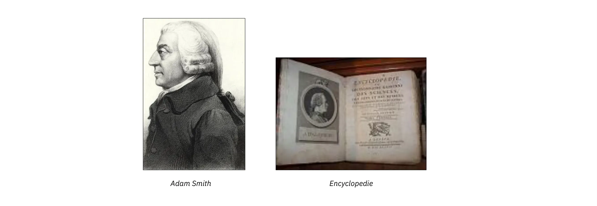

De beroemdste prestatie van de Verlichtingsfilosofie is zonder twijfel de *Encyclopédie* van Diderot en d'Alembert.

Natuurlijk werden de economische artikelen geschreven door economen. Voor de eerste delen wendde Diderot zich tot Forbonnais, daarna deed hij een beroep op liberale economen: eerst François Quesnay (die artikelen bijdroeg als "Grains", "Fermiers", "Hommes" - de laatste niet gepubliceerd), daarna Turgot (die "Foires et marchés" schreef). Deze geschriften zijn van groot belang. In zijn artikelen legde Quesnay de basis voor wat de fysiocratische doctrine zou worden. Samen met zijn *Tableau économique* blijven dit zijn beroemdste werken. Turgot, die toen nog jong was, ontwikkelde het idee van laissez-faire in zijn artikel en bekritiseerde staatsinterventie in de marktorganisatie.

In veel andere artikelen van de *Encyclopédie* verdedigen filosofen, vooral Diderot, het ideaal van vrijheid op alle gebieden: religie, politiek en economie.

Vrijheid van arbeid, vooral in tegenstelling tot het gildesysteem, was een terugkerend thema in verschillende items zoals Arts, Métier en Communauté.

Diderots weg in de economische theorie is merkwaardig. In de Encyclopédie was hij een fervent voorstander van economische vrijheid en zocht hij samenwerking met liberale economen, zoals wordt bevestigd door een brief waarin de artikelen worden opgesomd die Turgot voor hem zou kunnen schrijven. In de beginjaren van de Fysiocratie was hij zowel een aanhanger als een promotor van de school van Quesnay. In 1769 en 1770 schreef hij voor *Les Ephémérides du Citoyen*, tot groot ongenoegen van zijn anti-liberale filosofenvrienden, zoals Melchior Grimm; hij nam echter al snel afstand van de groep. Verrukt door het levendige intellect van abt Galiani, hielp hij hem zijn boek over de graanhandel in het Frans te publiceren, net toen Galiani op het punt stond terug te keren naar Italië.

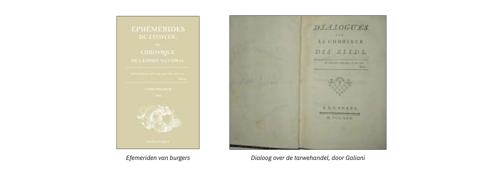

Dit boek zou de felste aanval worden die ooit tegen de ideeën van de Fysiocraten was gericht en het zou de beweging een zware slag toebrengen. Later verdedigde Diderot Galiani tegen Abt Morellet, een nauwe bondgenoot van de Fysiocraten, in zijn *Apologie van Galiani*. Een paar jaar later, tijdens het ministerschap van Turgot, werd Diderot gezien terwijl hij de oprichting van de vrijheid van arbeid door de afschaffing van de gilden toejuichte. Diderot, zoon van een ambachtsman, was het toen eens met de liberale economen en schreef een vernietigende brief aan Galiani, die beweerde dat de vrijheid van arbeid de Franse industrie binnen twintig of dertig jaar zou ruïneren. In het licht van de Industriële Revolutie doet de geschiedenis anders vermoeden. Na zijn terugkeer aan de kant van de liberale economen genoot Diderot niet langer hun vertrouwen en bleef hij geïsoleerd. Een veelzeggend moment is een brief die hij in 1774 aan Dupont de Nemours stuurde, waarin hij schrijft:

> "Ooit had je vriendschap voor mij; nu niet meer, omdat je het zo druk hebt dat je geen tijd meer hebt om van iemand te houden".

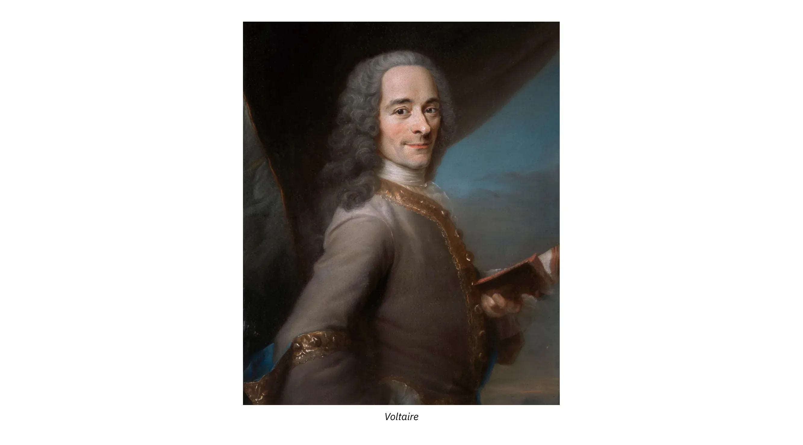

Voltaire volgde een vergelijkbaar pad, gekenmerkt door een gebrek aan consistentie in zijn economische opvattingen. Hij bewonderde Vincent de Gournay, correspondeerde met economen (waaronder Dupont de Nemours en Turgot) en waardeerde de Fysiocraten-vooral vanwege hun lof voor de landbouw. Hij prees hen in een *Diatribe to the Author of the Ephémérides*. Later bekritiseerde hij echter hun idee van een enkele grondbelasting in zijn satirische werk *De man van veertig kronen*, dat ook voor veel controverse zorgde. Tot slot vierde hij, net als Diderot, het ministerschap van Turgot. Hij noemde het een gouden eeuw en prees zijn twee grote decreten over vrijheid van arbeid en vrije handel.

Uiteindelijk is de relatie van de filosofen met het economische denken gemengd. Ondanks hun lof en kritiek op liberale economische ideeën, speelden ze een rol in het introduceren van deze ideeën in het bredere intellectuele discours van de Verlichting. Op deze manier hebben ze, al dan niet opzettelijk, het idee van laissez-faire tot aan de Revolutie vooruit geholpen.

## Turgot, de theoreticus

<chapterId>a8cd8185-8351-556b-8011-3a0c313e8a9d</chapterId>

In een beroemde passage uit zijn *History of Economic Thought* prees de Amerikaanse econoom Murray Rothbard wat hij de "genialiteit" van Turgot noemde.

waarin hij wordt gepresenteerd als de grootste econoom van de 18e eeuw, samen met Cantillon.

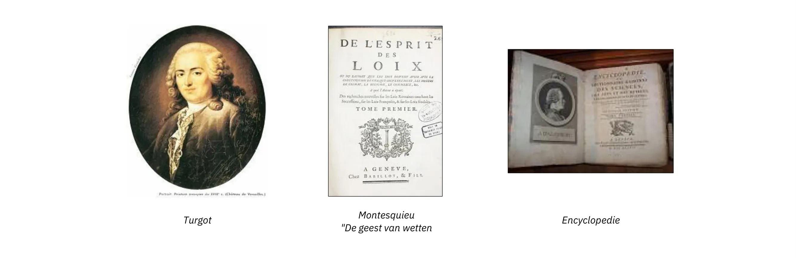

Hoe is Turgot zo prominent geworden? Het kwam neer op een combinatie van drie sleutelfactoren. **Ten eerste zijn prestigieuze familieachtergrond. Hij kwam uit een lange lijn van koninklijke bestuurders, van wie velen hoge regeringsposities bekleedden. **Ten tweede de gouden eeuw waarin hij geboren en opgegroeid was. Turgot was 21 toen Montesquieu *L'Esprit des Lois* publiceerde en 24 toen het eerste deel van de *Encyclopédie* verscheen.

Hij was een tijdgenoot van de Fysiocraten, Voltaire, Diderot, d'Holbach, Adam Smith, Condorcet en anderen. **Derde**, zijn intellectuele vroegrijpheid. Als student aan de Sorbonne schreef hij op 22-jarige leeftijd een brief over papiergeld, hield hij opmerkelijke toespraken en stelde hij op 24-jarige leeftijd een lijst samen van 52 werken die hij nog moest schrijven.

Ondanks zijn jeugdige leeftijd leverde Turgot bijdragen aan de *Encyclopédie* en schreef artikelen over onderwerpen als "Etymologie", "Bestaan", "Expansibiliteit", "Beurzen" en "Fundamenten". Slechts één artikel ging direct over economie - zijn stuk over "Beurzen", waarin hij de oorsprong van beurzen en markten beschreef en kritiek uitte op de groeiende staatsbemoeienis die deze verstoorde en verlamde.

Tijdens deze eerste jaren werd hij begeleid door Vincent de Gournay, die hem onder zijn hoede nam en een hechte vriendschap met hem sloot. Na Gournay's dood in 1759 schreef Turgot een lofrede waarin hij de doctrine van laissez-faire prachtig samenvatte. Hij schreef met name:

"Vanuit elk perspectief waarin handel de staat aangaat, zal individueel belang dat aan zichzelf wordt overgelaten altijd zekerder het algemeen belang produceren dan de activiteiten van de overheid, die altijd gebrekkig zijn en noodzakelijkerwijs worden geleid door vage en onzekere theorieën".

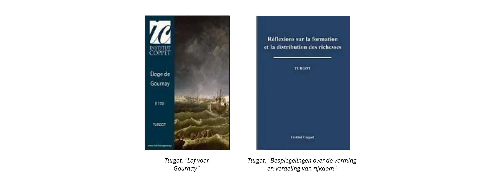

In 1767, toen hij nog intendant was, schreef hij een overzicht van de economie onder de titel *Reflections on the Formation and Distribution of Wealth*.

Arbeidsverdeling, consumentensoevereiniteit, privébezit, de rol van kapitaal, vrijwel alle belangrijke economische thema's komen aan bod. Veel historici, waarvan historica Anne-Claire Hoyng de meest recente is, hebben gewezen op de overeenkomsten tussen dit werk van Turgot en Adam Smiths *The Wealth of Nations*, dat negen jaar later werd gepubliceerd.

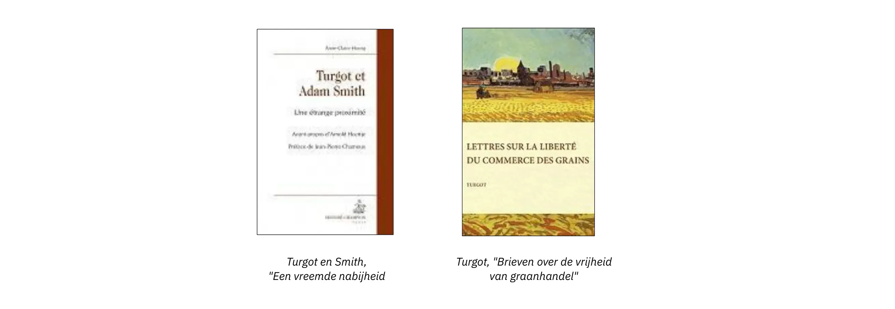

Turgot verdedigde de vrijheid van de graanhandel in brieven aan abt Terray, die later aan de koning werden doorgegeven, maar waarvan de helft nu verloren is gegaan. Hij schreef:

> Meneer, als er iets dringend is, dan is het niet om nieuwe beperkingen op te leggen aan de meest essentiële van alle beroepen, maar om de beperkingen op te heffen die helaas zijn blijven bestaan.
> Als er ooit een tijd is geweest waarin de meest volledige, absolute vrijheid, volledig vrij van elke vorm van belemmering, nodig was, dan is het nu, durf ik te zeggen, en dat het nog nooit zo gepast is geweest om het uitvaardigen van een verordening op de graanhandel te overwegen.

In 1769 schreef Turgot het artikel Waarde en geld voor Abbot Morellet's *Dictionnaire de Commerce*, dat uiteindelijk nooit werd gepubliceerd. Galiani had al opgemerkt dat "de mens de gemeenschappelijke maatstaf van alle dingen is", waarmee hij vooruitliep op de subjectieve analyse die Turgot dertig jaar later zou ontwikkelen in dit artikel, waarin hij deze stelling verder uitwerkt en bewijst.

In 1770, ruim voor Bentham, schreef Turgot een memorandum waarin hij pleitte voor de vrijheid van rentetarieven en woekerrente.

"Het is een vergissing om te geloven dat de rente op geld in de handel moet worden vastgesteld door de wetten van vorsten", zegt hij, "Het is een gangbare prijs die zichzelf reguleert, net als die van alle andere goederen", Ter verdediging van dit standpunt weerlegt hij de oppositie van Aristoteles en de kerkvaders.

Een opmerkelijke samenvatting van Turgots laissez-faire doctrine is te vinden in een vergeten brief uit 1773 aan abt Terray over het markeren van ijzers:

> Wat de politiek moet doen is toegeven aan de loop van de natuur en aan de loop van de handel, die niet minder noodzakelijk en niet minder onweerstaanbaar is dan de loop van de natuur zelf, zonder te proberen deze te sturen; want om deze te sturen zonder deze te verstoren en zonder zichzelf te schaden, zou men in staat moeten zijn om alle variaties in menselijke behoeften, belangen en industrie te volgen; men zou deze moeten kennen op een niveau van detail dat fysiek onmogelijk te verkrijgen is en waarbij zelfs de meest bekwame, actieve en nauwgezette regering altijd het risico loopt het mis te hebben, op zijn minst voor de helft.

Hier vinden we een zeer duidelijke verklaring van de doctrine van laissez-faire, evenals een voorbode van Friedrich Hayek's analyse van de pretentie van kennis, dat wil zeggen, de onmogelijkheid voor een staat om economische krachten volledig te begrijpen om ze te beheersen.

## Turgot, de hervormer

<chapterId>9177429f-1679-51c4-bfd2-dd036d24a1cc</chapterId>

Zoals we in het vorige hoofdstuk al kort vermeldden, was Turgot de zoon van een vooraanstaande familie die zich had onderscheiden in de hogere rangen van het Franse ambtenarenapparaat.

Zijn vader was provoost van de kooplieden van Parijs en zijn grootvader intendant. Nadat hij had uitgeblonken in zijn studies, wilde de jongste telg van de familie Turgot minstens dezelfde hoogten bereiken. Hij diende eerst een tijdje als maître des requêtes, wat betekende dat hij de verbinding vormde tussen de intendanten en Versailles. Het was een prestigieuze positie, waarvoor hij een speciale leeftijdsvrijstelling moest krijgen, maar Turgot streefde naar meer. De dood van zijn mentor, Gournay, moedigde hem aan om hoger te mikken en hij vroeg een aanstelling als intendant aan.

In 1759 vroeg hij eerst het intendaat van Grenoble aan, maar dat werd hem geweigerd. Vervolgens werd hem de post van provoost van de kooplieden in Lyon aangeboden, die hij afwees. Hij vroeg het intendaat van Bretagne aan, maar ook dat werd geweigerd. Uiteindelijk werd hem in 1761 het intendaat van Limousin aangeboden en hij accepteerde dit, enigszins met tegenzin. Hij schreef aan Voltaire: "Ik heb de pech intendant te zijn", wat misschien betekent: Ik heb de pech intendant te zijn in Limousin.

In Limousin waren de boeren arm en leefden ze in precaire omstandigheden, vooral wat betreft huisvesting en voedsel. Het algemene onderwijsniveau was extreem laag. De weinige wegen die er waren, verkeerden in een rampzalige staat.

Omdat de regio zo arm was, was het niet interessant voor de ministers. Dit gaf Turgot de vrijheid om te experimenteren met hervormingen. In Limousin voerde hij drie grote projecten uit:

- De herverdeling van de **taille**, de persoonlijke belasting (Turgot streefde ernaar om zoveel mogelijk objectiviteit in zijn beoordeling te introduceren).
- De **corvée**, een vorm van belasting betaald in arbeid, waarbij boeren werden gedwongen om te werken aan de aanleg van wegen. Tijdens een rondreis door de regio merkte Turgot al snel de slechte staat van de wegen op. Hij verving de corvée door een monetaire belasting.
- Het rekruteren van **milities**, boerenlegers die in tijden van oorlog gemobiliseerd werden.

Dit werd gedaan door loting, wat leidde tot angst en geweld vanwege weglopers; Turgot verving deze verplichte heffingen door betaalde vrijwilligers.

Deze hervormingen waren onmiskenbaar succesvol en in juli 1774 werd Turgot benoemd tot minister. Vanwege zijn gebrek aan ervaring plaatste de koning hem eerst op het ministerie van Marine. De benoeming amuseerde velen. Turgot gaf zelf toe: "Ik weet niets van de marine", en Voltaire merkte op: "Ik denk niet dat Turgot meer zeeman is dan ik".

Slechts een maand later werd Turgot echter benoemd tot controleur-generaal van financiën, waarmee hij in feite de Franse minister van economie en financiën werd.

We kennen de brief waarin hij zijn principes uiteenzette voor Lodewijk XVI: "Geen faillissement. Geen belastingverhogingen. Geen nieuwe leningen". Deze filosofie, die critici vandaag de dag als zinloze "strengheid" zouden bestempelen, was bedoeld om de monarchie te redden.

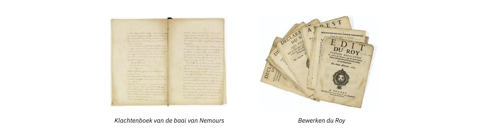

Turgot bereidde zes koninklijke edicten voor om de Franse economie te hervormen.

Het was de eerste - en een van de allerlaatste - keren dat een economisch expert de vrijheid kreeg om de economie van zijn land te hervormen. Drie edicten van Turgot springen eruit: één schafte dwangarbeid (corvées) af, een andere ontbond de handelsgilden (corporaties) en de derde stelde de vrije handel in graan in.

Toen Turgot zijn ambt aanvaardde, wist hij dat hij op weerstand van de bevoorrechte klasse zou stuiten. "Ik zal gevreesd en zelfs gehaat worden door het grootste deel van het hof en door iedereen die gunsten zoekt", zei hij tegen de koning. De bevoorrechten verenigden zich al snel tegen hem en zorgden ervoor dat hij ontslagen werd als Controleur-generaal van Financiën. Voltaire, die de hervormingen van Turgot volledig steunde, schreef in zijn briefwisseling:

> Wat een vreselijk nieuws heb ik gehoord! Wat zal er van ons worden? Ik ben er kapot van! We zullen nooit herstellen van de geboorte en dood van de gouden eeuw! Deze bliksemschicht heeft zowel mijn geest als mijn hart getroffen.

Sindsdien hebben velen beweerd dat Frankrijk onmogelijk te hervormen is. De mislukking van Turgot leek dit te bevestigen: Hij was voorbereid door een halve eeuw liberaal economisch denken; hij had de steun van Verlichtingsfilosofen; en de koning zelf, met absolute macht, steunde hem.

Uiteindelijk wonnen de parlementsleden en de bevoorrechte klasse. Het enige wat de koning kon doen was in zijn eentje klagen: "Ik zie nu dat alleen Monsieur Turgot en ik om het volk geven."

## Condillac

<chapterId>0ba8dbb5-dcd5-5981-bf85-6c185e0bf192</chapterId>

Net als het mercantilisme, dat de meest voor de hand liggende praktische manifestatie ervan is, duurde het lang voordat Montaigne's drogreden verdween.

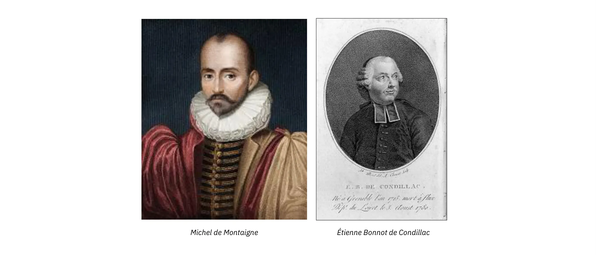

Die drogreden is het idee dat handel en Exchange een nulsomspel zijn. Wat de ene partij bij een transactie wint, gaat de andere partij ook verliezen. Voorstanders beweren dat dit zowel geldt tussen individuen als tussen naties.

Abt van Condillac speelde een belangrijke rol in de definitieve ontmanteling van dit valse idee.

"Definitief" is misschien overdreven, want in het publieke debat duikt deze drogreden vaak weer op. Dit is misschien de reden waarom Condillac een weinig bekende econoom blijft. Afgezien van Oostenrijkse economen hebben weinigen het belang van zijn theorie van Exchange begrepen, niemand interesseert zich meer voor hem.

Voor de meeste historici van het economisch denken wordt het jaar 1776 gemarkeerd door de publicatie van *The Wealth of Nations*, waarmee de economische wetenschap werd opgericht. De vijftien lessen die we zojuist hebben afgerond, waarin we de Franse economische wetenschap vóór Adam Smith hebben bestudeerd, volstaan om de onjuistheid van deze opvatting te bewijzen. In datzelfde jaar 1776 verschijnt er bovendien een ander boek dat misschien wel meer lof verdient van historici dan het boek van Adam Smith: het is geschreven door Condillac en is eenvoudig getiteld [*Commerce and Government Considered in Their Mutual Relationship*](https://archive.org/details/commercegovernme0000cond).

Voor Condillac, als de drogreden van Exchange gezien als een zero-sum game blijft bestaan, zijn de Fysiocraten medeschuldig, omdat zij volhouden dat Exchange een relatie van gelijkheid is. Volgens Condillac is dit onjuist: Exchange is een ongelijke relatie, waarbij men altijd minder geeft om meer te krijgen.

Tussen de ideeën van de Fysiocraten en die van Condillac is geen perfectere tegenstelling denkbaar. De fysiocratische econoom Le Trosne schreef:

> Exchange is van nature een Contract van gelijkheid, gemaakt van gelijke waarde voor gelijke waarde.

Condillac, aan de andere kant, schreef:

> Elke partij bij de Contract geeft altijd iets van mindere waarde om iets van grotere waarde te verkrijgen.

De tegenstelling is echter vooral een kwestie van woorden. Beiden zijn het erover eens dat wanneer men een frank inruilt voor een boek, het boek een frank waard is, of dat de prijs van het boek een frank is.

Het verschil zit hem in het feit dat Condillac beweert dat, omdat we Exchange een frank voor het boek geven, dit betekent dat voor ons de waarde van het boek hoger is dan die van onze munt van één frank. Wij verkiezen het boek boven de munt en daarom maken we de Exchange.

De theorie van Condillac is niet fundamenteel in tegenspraak met die van de Fysiocraten, maar ze spreken niet dezelfde taal, om het zo maar te zeggen. Le Trosne heeft het over prijs terwijl Condillac het over waarde heeft, en omgekeerd.

Waar Condillac gelijk in heeft is dat als de prijzen gelijk zijn tussen de twee uitgewisselde goederen, de waarden niet gelijk zijn, anders zou er geen Exchange plaatsvinden.

Om Condillacs theorie samen te vatten, kunnen drie stellingen worden opgesomd:

Eerste stelling: we zoeken goederen vanwege hun nut. Dit lijkt voor de hand liggend, maar het is een centraal principe van de economische wetenschap dat mensen Exchange gebruiken om nut te verwerven, een punt dat Jean-Baptiste Say ook perfect heeft uitgewerkt.

Tweede stelling: waarde bestaat al en motiveert uitwisselingen. Het subjectieve oordeel dat elk individu velt over goederen en diensten impliceert dat diezelfde goederen en diensten een waarde voor hen hebben, die meer of minder waard is naargelang het nut dat ze lijken te verschaffen. Natuurlijk oordeelt elk individu anders dan een ander en verschilt de waarde van persoon tot persoon.

Ten slotte, derde stelling: prijs is het gevolg van het Exchange proces. Producten Exchange niet tegen de waarde die ik eraan toeschrijf omdat de voorwaarden van Exchange ook afhangen van de subjectieve waarde die de verkoper aan die producten toeschrijft. De relatie tussen koper en verkoper, of tussen de subjectieve waardering van de koper en de subjectieve waardering van de verkoper, bepaalt een prijs.

Deze ideeën van Condillac zijn fundamenteel. Ze stellen ons in staat te begrijpen waarom elke Exchange altijd wederzijds voordelig is.

De kritiek op vrijhandel wordt hierdoor volledig tenietgedaan, omdat protectionisme slechts een mechanisme is dat verhindert dat bevolkingen van elkaar profiteren. Laissez-faire is ook de conclusie van het werk van Condillac. Laat mensen doen wat ze willen, want als de publieke macht vrijheid en eigendom beschermt, zullen mensen elkaar altijd verrijken door samen te ruilen.

## Condorcet

<chapterId>99e4aba6-da7f-5041-b02f-337158381515</chapterId>

Condorcet is ongetwijfeld de meest economisch ingestelde filosoof van de Verlichting.

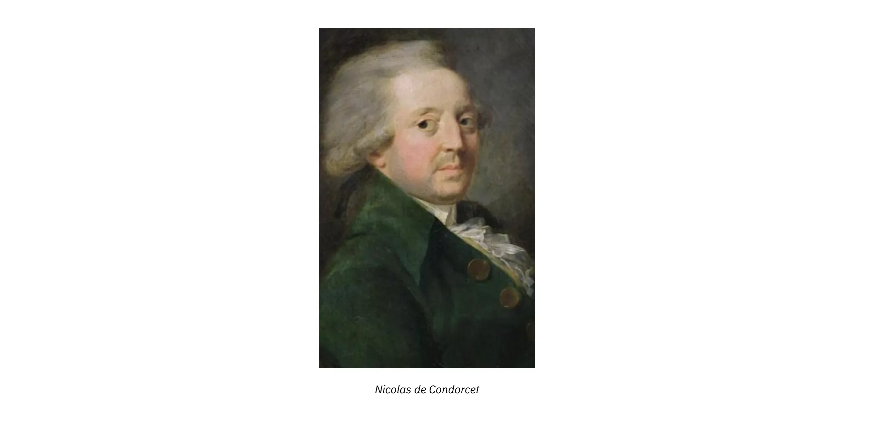

Voor een groot deel van zijn carrière wijdde hij zich aan gebieden die niets met economie te maken hadden, en terecht, want zijn talenten leidden tot grote vooruitgang in de wetenschappen waar hij zich het meest op richtte. Maar rond 1770 voelde hij zich aangetrokken tot economische vraagstukken, misschien omdat andere filosofen, vooral Voltaire en Diderot, niet de moeite namen om hun vrije tijd hieraan te wijden, en ook omdat hij bevriend was geraakt met Turgot.

Condorcet omarmde geleidelijk ideeën van laissez-faire en vrijheid, aanvankelijk op gebieden die niets te maken hadden met politieke economie. In zijn "Brief van een theoloog" drijft hij de filosofische spot met de katholieke godsdienst en uit hij zijn wens voor echte vrijheid van geloof, inclusief de vrijheid om niet te geloven. In zijn kruistocht voor tolerantie en tegen religieus fanatisme streed Condorcet voor de rehabilitatie van Chevalier de la Barre en voor het nieuwe proces tegen D'Etallonde, die ter dood was veroordeeld voor het breken van een kruisbeeld.

Hij was dus voorbereid om de vrijheid te verdedigen toen zijn vriend Turgot de functie van controleur-generaal van financiën kreeg.

Vanaf dat moment nam Condorcets carrière een wending toen hij zich in het economische debat begaf en onvermoeibaar de liberale hervormingen van de nieuwe minister steunde. Condorcet was voorstander van concurrentie en vrijheid van handel en riep ook op tot de afschaffing van corvées (dwangarbeid), gilden en eerlijke belastingen. Hij sprak deze overtuigingen in het openbaar uit wanneer de gelegenheid zich voordeed, en deed dat met duidelijk enthousiasme; hij schreef veel en verklaarde eens in zijn geschriften: "Sta me toe om opnieuw te spreken over de vrijheid van handel; ik vind het leuk om me met dit onderwerp bezig te houden."

Tussen 1774 en 1776, tijdens het ministerschap van Turgot, hield Condorcet talrijke interventies, allemaal gekenmerkt door zijn Commitment voor laissez-faire. Zijn werken omvatten onder andere *Brieven van een boer uit Picardië aan de heer Necker*, waarin hij de vrije handel verdedigt; *Monopolies en monopolisten*, waarin hij de vrije concurrentie bepleit; *Reflections on Corvées*, waarin hij oproept tot de afschaffing ervan; en *Reflections on the Grain Trade*, waarin hij opnieuw de vrije handel prijst en kritiek levert op het boek van Necker over hetzelfde onderwerp.

In zijn [*Brieven over de graanhandel*](https://archive.org/details/bub_gb_hg8jFw-y6bwC) maakt Condorcet verschillende belangrijke punten.

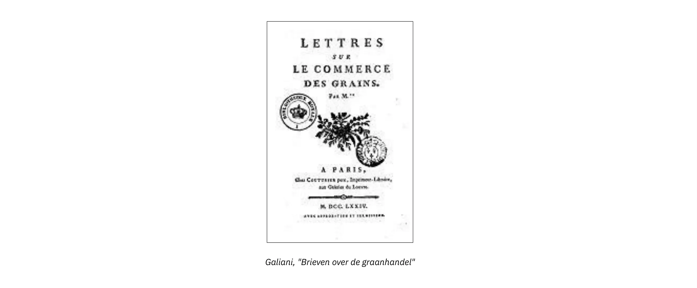

Ten eerste waren de hoge graanprijzen in die tijd niet het gevolg van vrije handel, maar van slechte oogsten, en Condorcet laat dit duidelijk zien. Vervolgens legt hij uit waarom laissez-faire niet alleen het juiste, maar zelfs het enige geschikte beleid is, ondanks populaire vooroordelen. Hij merkt op: "We zijn er zo aan gewend dat de overheid ingrijpt in de graanhandel dat niets doen iets buitengewoons en nieuws lijkt. Later voegt hij eraan toe: "Bijna iedereen, vooral zij die een openbaar ambt bekleden, geloven dat niets vanzelf gebeurt en dat alles verloren is als de overheid niet overal tussenkomt". Condorcet herleeft dus de argumenten van de Fysiocraten en Turgot en toont de superioriteit van vrije handel boven alle vormen van interventionisme.

Het promoten van de liberale economische agenda van Turgot was een moedige daad, want Condorcet wist dat hij snel met censuur te maken zou krijgen. Dit gebeurde inderdaad en zijn pamflet over de afschaffing van dwangarbeid werd in 1776 vernietigd en verboden.

Turgot waardeerde Condorcets loyale verdediging van zijn ideeën en benoemde hem tot inspecteur van de muntslag. Condorcet nam ontslag zodra zijn vriend het ministerie verliet.

Hoewel hij al zijn energie wijdde aan het verdedigen van Turgot, maakte Condorcet zich geen illusies over de uitkomst van de ambtstermijn van zijn vriend. Turgot zelf gaf laat in zijn leven toe dat hij met spijt leefde, zoals hij in een brief schreef, "omdat hij niet in staat was geweest mijn natie en de mensheid een goed te doen waarvan ik dacht dat het heel gemakkelijk zou zijn". Condorcet, realistischer, wees op de vele tegenstanders waarmee Turgot te maken zou krijgen: de favorieten van de koning, de parlementen, de geestelijkheid, de adel, de gilden, enzovoort. Deze groepen verwachtten vleierij, geen hervorming. Condorcet zei tegen Turgot: "U bent zeker geen charlatan, en dat is een tekortkoming, gezien de situatie in Parijs". Hij had volkomen gelijk, want in 1776, amper twee jaar na zijn aankomst, werd Turgot al gedwongen om het Controleur-Generaalschap te verlaten.

## Liberaal gezond verstand onder de revolutie

<chapterId>95e9a90d-e37a-58ff-b1ac-928b42e76ecf</chapterId>

Dupont de Nemours was de jongste leerling van François Quesnay, die ooit over hem zei: "We moeten voor deze jongeman zorgen, want hij zal spreken als wij dood zijn". Toen de Franse Revolutie begon, waren bijna alle grote fysiocraten, waaronder de markies de Mirabeau, al verdwenen; Mirabeau zelf was op 13 juli 1789 overleden.

Dupont de Nemours schreef de lijst met grieven voor het baljuwschap van Nemours.

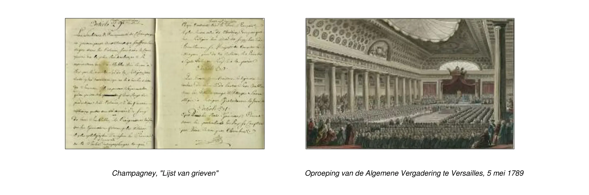

Dit fascinerende document bevatte alle klachten van liberale economen tegen handelsbeperkingen, monopolies en aanvallen op eigendom. Dupont de Nemours werd ook gekozen in de Nationale Vergadering.

Tijdens de Revolutie werd hij de stem van het liberale gezond verstand, die stand hield tegen de groeiende stroom van populisme en interventionistische demagogie, die uiteindelijk de overhand kreeg.

Al in november 1789, toen er sprake was van het verlenen van een monopolie aan de Caisse d'Escompte (waardoor deze in een openbare bank - de Bank van Frankrijk - zou kunnen veranderen), verdedigde Dupont de Nemours de concurrentie.

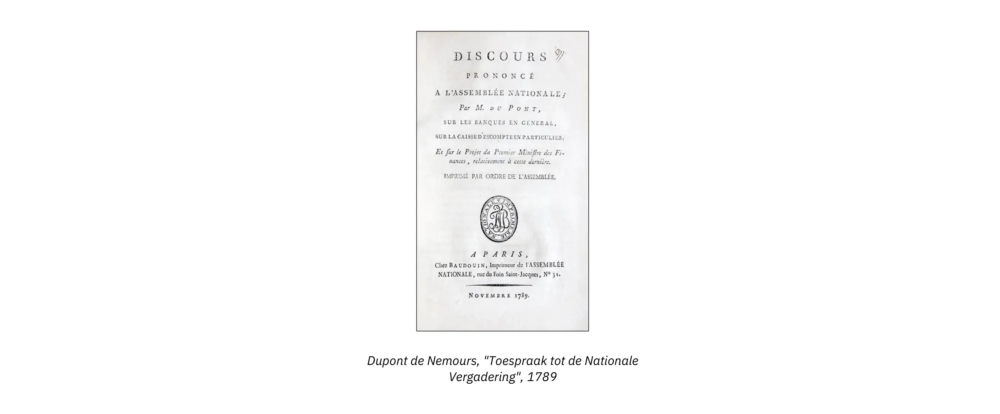

"Het zou beter zijn", zegt hij, "om het bankwezen over te laten aan de wetten van de vrije handel". En hij voegt eraan toe:

> "Ik begrijp niet wat de minister bedoelde toen hij sprak over het verlenen van een privilege aan de Caisse d'Escompte. Als dit privilege exclusiviteit inhoudt, moet u het verwerpen, want u bent hier gekomen om exclusieve privileges te vernietigen, niet om nieuwe te creëren."

Ondanks zijn waarschuwingen negeerde de Assemblee zijn bezwaren en zette een nieuwe stap in de richting van de oprichting van een centrale bank en een bankmonopolie.

In 1790, tijdens de grondwetgevende vergadering, volgde Dupont de Nemours de pacifistische traditie van zijn fysiocratische vrienden en stelde een wet voor die offensieve oorlogen verbood. Het eerste artikel luidde: "De Franse natie zal zich niet toestaan een offensieve oorlog te voeren om het grondgebied van anderen in beslag te nemen of inbreuk te maken op de rechten of vrijheid van een natie".

Dit voorstel werd verworpen.

Datzelfde jaar, 1790, begonnen de discussies over de uitgifte van nieuw papiergeld om de overheidsuitgaven te dekken.

Dupont de Nemours was hier fel op tegen en publiceerde een pamflet met de titel [*Effecten van assignaten op de prijs van brood*](https://archive.org/details/effetdesassignat00dupo). De titel was correct, want hij legde uit dat het uitgeven van assignats onvermijdelijk zou leiden tot inflatie, een stijging van de prijzen van grondstoffen, waaronder brood.

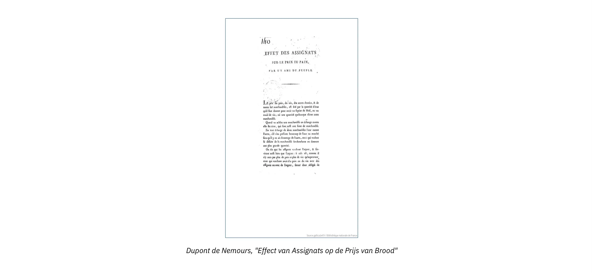

Hij ondertekende het pamflet als "een vriend van het volk". Het stuk veroorzaakte nogal wat opschudding, want de Assemblee werd gevraagd wie het had geschreven. Dupont de Nemours stond toen op en gaf toe dat het zijn werk was. Hij zei dat hij zich niet schaamde om de titel "vriend van het volk" te gebruiken, omdat de strijd tegen de assignaten echt een dienst aan het volk was.

Opnieuw werd zijn advies genegeerd en werden de assignaten uitgegeven.

We kennen allemaal de ramp die volgde, de economische ondergang en het lijden van de mensen, van wie velen alles verloren toen de assignaten waardeloos werden en verbrand moesten worden.

Een paar jaar later richtte de Assemblee zich op het idee om een echte Bank van Frankrijk op te richten, een bank die het monopolie zou krijgen op de productie van geld.

Dupont de Nemours, die nog steeds fel gekant was tegen het idee van een openbare bank omdat hij het niets anders vond dan een monopolie, herinnerde de Vergadering aan de rampzalige ervaring van de assignaten. Hij vertelde hen:

> "Bereid je niet voor op spijtbetuigingen zoals die mijn collega's in de Grondwetgevende Vergadering hebben gekweld. Mijn voorstel om de assignats te beperken tot de betaling van nationale goederen en er geen circulatiemunt van te maken, werd destijds verworpen. Vandaag zeggen ze: 'Hadden we maar naar Dupont de Nemours geluisterd!

Maar weer luisterde er niemand naar hem.

## Conclusie: De fakkel doorgeven

<chapterId>ada8082f-db96-5e52-954f-719b47998153</chapterId>

Het Franse economische denken in de 18e eeuw wordt vaak overschaduwd door de bekendere economen uit de 19e eeuw. Maar als het gaat om de verdediging van vrijheid, is het de 18e eeuw waar alles echt begint. Dit is de eeuw waarin het principe van laissez-faire, zo revolutionair in zijn tijd, voor het eerst duidelijk werd verwoord door een aantal denkers, van Boisguilbert tot Dupont de Nemours.

Zeker, figuren als Jean-Baptiste Say, Frédéric Bastiat, Gustave de Molinari en Yves Guyot hebben een blijvend stempel gedrukt op de geschiedenis van het Franse economische denken. Maar als we ze geïsoleerd bestuderen, missen we iets essentieels. Deze 19e-eeuwse denkers kwamen niet uit het niets; ze erfden en bouwden voort op de fundamenten die hun 18e-eeuwse voorgangers tijdens de Verlichting hadden gelegd.

Boisguilbert beweert dat goedbedoelende zielen die denken dat ze alles kunnen oplossen door de overheid erbij te betrekken de economie onvermijdelijk op zijn kop zetten en dat het daarom beter is om de natuurlijke gang van zaken zijn gang te laten gaan.

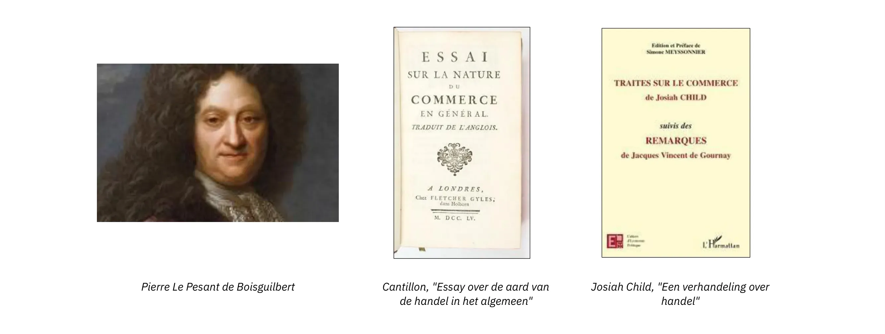

Cantillon stond erop dat geld nooit voor politieke doeleinden gemanipuleerd mocht worden. Door de staat toe te staan geld naar eigen goeddunken te beheren, wordt de weg vrijgemaakt voor enorme financiële en economische wanorde.

Vincent de Gournay beweert dat overmatige regulering van arbeid de inspanningen van arbeiders en ambachtslieden ontmoedigt en hen in de richting van luiheid en inactiviteit drijft. Het is dankzij vrije concurrentie dat de economie kan groeien en een natie kan bloeien.

De Markies d'Argenson beweert dat geen enkele regering in staat is om alles te voorzien en te meten en dat men daarom moet vertrouwen op het eigenbelang van elk individu.

Quesnay en de Fysiocraten beweren dat privébezit het fundament is van menselijke samenlevingen. Zonder privébezit verliest de mens de motivatie om zich in te spannen, om te werken, omdat hij niet kan genieten van de vruchten van zijn arbeid en niets kan vergaren.

Condillac beweert dat Exchange altijd wederzijds voordelig is en daarom, zonder uitzondering, altijd vrij moet zijn. De enige missie van de staat moet het beschermen van vrijheid en eigendom zijn.

Al deze ideeën zouden worden overgenomen door de economen van de 19e eeuw. Sommigen, zoals Jean-Baptiste Say, zouden deze ideeën een wetenschappelijke uitdrukking geven door middel van een rigoureuze *Treatise on Political Economy*. Anderen daarentegen probeerden deze fundamentele stelregels populair te maken door zich te wagen aan verhalen, romans en grappige korte verhalen, zoals Frédéric Bastiat zo handig zou doen.

## Biografie

<chapterId>17cf2865-e53c-5f3b-a5c2-a43560efaf01</chapterId>

**SELECTIEVE BIBLIOGRAFIE**

Hieronder vind je een selectie van meer dan dertig geschriften:

1. Pierre Clément, Histoire de Colbert et de son administration, Parijs, 1874

2. Vauban, Projet d'une dîme royale, 1707; herdruk Institut Coppet, 2014; Anne Blanchard, Vauban, Fayard, 1996

3.	Boisguilbert, Détail de la France, 1695; heruitgegeven door Institut Coppet, 2014

4. Félix Cadet, Pierre de Boisguilbert: voorloper van de economen, Institut Coppet, 2014

5. Pierre de Boisguilbert ou la naissance de l'économie politique, Parijs, INED, 1966

6. Richard Cantillon, Essai sur la nature du commerce en général, 1755; herdrukt door Institut Coppet, 2015

7. Antoin Murphy, Richard Cantillon, bankier en econoom, Oxford, 1986

8. Gustave de Molinari, De abt van Saint-Pierre, Parijs, 1859

9. Abt van Saint-Pierre, Abrégé du projet de paix perpétuelle, Rotterdam, 1729

10. Abt van Saint-Pierre, "Projet pour perfectionner le commerce de la France", in Les rêves d'un homme de bien, Parijs, 1775, p.199

11. André Alem, Le marquis d'Argenson et l'économie politique au début du XVIIIe siècle, Institut Coppet, 2015

12. Journal et mémoires du marquis d'Argenson, editie Rathery, 9 delen, Parijs, 1859-1867

13. Benoît Malbranque, Vincent de Gournay: de politieke economie van laissez-faire, Institut Coppet, 2016

14. Vincent de Gournay, Remarques sur la traduction de Josiah Child, L'Harmattan, 2008

15. Christine Théré & Loïc Charles (eds.), Le cercle de Gournay, INED, 2005

16. Antoin Murphy, "Le développement des idées économiques en France (1750-1756)", Revue d'histoire moderne et contemporaine, tome XXXIII, oktober-december 1986

17. Henri Ripert, Le marquis de Mirabeau: ses théories politiques et économiques, Parijs, 1901

18. Lucien Brocard, Les doctrines économiques et sociales du marquis de Mirabeau in L'Ami des Hommes, Parijs, 1902

19. Humbert de Montlaur, Mirabeau, l'Ami des Hommes, Perrin, 1992

20. Yves Guyot, François Quesnay en de fysiocratie, Institut Coppet, 2014

21. François Quesnay, Œuvres économiques complètes et autres textes, 2 delen, INED, 2005

22. Georges Weulersse, Le mouvement physiocratique en France (de 1756 à 1770), 2 delen, Parijs, 1910

23. Georges Weulersse, La Physiocratie à la fin du règne de Louis XV (1770-1774), P.U.F., 1959

24. Georges Weulersse, La Physiocratie sous les ministères de Turgot et de Necker (1774-1781), P.U.F., 1950

25. Georges Weulersse, La physiocratie à l'aube de la révolution (1781-1792), EHESS, 1985

26. P. Jolly, Du Pont de Nemours, soldat de la liberté, Parijs, P.U.F., 1956

27. De economische geschriften van Voltaire, Institut Coppet, 2013

28. Gustave Schelle (ed.), Œuvres de Turgot et documents le concernant, Parijs, 1913-1924

29. Benoît Malbranque, Le libéralisme à l'essai : Turgot intendant du Limousin (1761-1774), Institut Coppet, 2015

30. Pierre Foncin, Essai sur le ministère de Turgot, Parijs, 1877

31. Auguste Lebeau, Condillac économiste, Parijs, 1903

32. Condillac, Le commerce et le gouvernement considérés relativement l'un avec l'autre, 1776

33. Condorcet, Mélanges d'économie politique, in Eugène Daire (red.), Mélanges d'économie politique, Parijs, 1847

34. P. Jolly, Du Pont de Nemours, soldat de la liberté, Parijs, P.U.F., 1956

35. Eli Heckscher, Mercantilisme, 2 delen. Londen: Allen and Unwin. 1935

# Laatste deel

<partId>385bffab-aea1-5bcd-9569-62b3f30665b7</partId>

## Beoordelingen

<chapterId>a1e689d9-abd0-5dcb-ba56-a8d355d0a84f</chapterId>

<isCourseReview>true</isCourseReview>

## Eindexamen

<chapterId>bdb7fd98-33e7-11f0-9fe6-b785c859ffc5</chapterId>

<isCourseExam>true</isCourseExam>

## Conclusie

<chapterId>3b366ff6-03c8-5f6a-b4c0-ba8186e65d7e</chapterId>

<isCourseConclusion>true</isCourseConclusion>