# Podróż przez ekonomiczną historię wolności

Ten kurs bada narodziny nauki ekonomicznej w XVIII-wiecznej Francji przez pryzmat laissez-faire. Odkryjesz, jak myśliciele kwestionowali merkantylizm, argumentując, że państwo powinno chronić prawa prywatne, ale nigdy nie manipulować rynkami poprzez regulacje.

Dowiesz się, jak wizjonerzy reformatorzy rozszerzyli tę wizję, domagając się wolnego handlu i nieograniczonego przepływu towarów, kładąc intelektualne fundamenty współczesnego kapitalizmu. Studiując tych pionierskich ekonomistów, zrozumiesz ponadczasowe zasady, które ukształtowały globalną ekonomię polityczną i nadal wpływają na debaty polityczne dzisiaj. Dołącz teraz, aby opanować idee, które zbudowały współczesną gospodarkę.
+++
# Wprowadzenie

<partId>06d67531-19f1-4f8d-bf8f-77bbcc743672</partId>

## Przegląd kursu

<chapterId>202db3c6-0320-494d-8057-adc6f6563048</chapterId>

Witamy w HIS204!

Kurs ten ma na celu zbadanie francuskich początków koncepcji *laissez-faire* - "niech się stanie" - tak jak rozwinęła się ona w XVIII wieku poprzez bogatą tradycję intelektualną. Śledząc myśli wczesnych francuskich myślicieli ekonomicznych, odkryjemy podstawy ekonomii politycznej zbudowanej na wolności gospodarczej, naznaczonej nieufnością wobec ingerencji państwa i wiarą w naturalny porządek, który sprzyja wzrostowi i dobrobytowi.

**Sekcja 2: Prekursorzy**

W tej sekcji rozpoczynamy od przełomu XVII i XVIII wieku, czasu ukształtowanego przez nadmierne rządy monarchii absolutnej i pierwsze wezwania do bardziej racjonalnego i sprawiedliwego sposobu rządzenia sprawami publicznymi. Poprzez postacie Vaubana, Boisguilberta i Cantillona odkrywamy wczesną krytykę interwencjonizmu państwowego i pierwszy zarys tego, co później stanie się liberalną ekonomią polityczną.

**Sekcja 3: Reformatorzy i myśliciele początku XVIII wieku**

Ta sekcja skupia się na tych, którzy w pierwszych dekadach XVIII wieku próbowali zreformować francuską gospodarkę w świetle nowych zasad. Myśliciele tacy jak opat Saint-Pierre, markiz d'Argenson i Gournay (wraz ze swoimi zwolennikami) wzywali do zniesienia korporacjonistycznych przeszkód, liberalizacji handlu i zachęcania do konkurencji jako siły napędowej rozwoju. Ich często śmiałe propozycje stanowiły zapowiedź wielkich idei fizjokratycznych.

**Sekcja 4: Szkoła fizjokratyczna**

Ta sekcja bada jeden z najważniejszych momentów we francuskiej myśli ekonomicznej: szkołę fizjokratyczną. Przeanalizujemy jej początki, podstawy doktrynalne i główne osiągnięcia, koncentrując się na kluczowych postaciach, takich jak Quesnay i Dupont de Nemours. Idea leseferyzmu staje się spójnym systemem właśnie w tej szkole, zakorzenionym w idei naturalnego porządku, któremu państwo musi się podporządkować, aby zagwarantować dobrobyt dla wszystkich.

**Sekcja 5: Oświecenie i ekonomia polityczna**

Na koniec zobaczymy, jak liberalne myślenie ekonomiczne rozprzestrzeniło się w ramach szerszego ruchu oświeceniowego. Postacie takie jak Voltaire, Turgot, Condillac i Condorcet rozszerzyły i wzbogaciły tradycję leseferyzmu, a ich pisma stworzyły pomost dla tradycji leseferyzmu, aby przejść do okresu rewolucji i później, gdzie liberalne idee znalazły nowy oddźwięk.

Gotowy na ponowne odkrycie francuskich korzeni liberalizmu gospodarczego? Do dzieła!

# Prekursorzy

<partId>91565b10-6010-53cb-a2f4-9c2306c7ef8c</partId>

## Tło historyczne

<chapterId>6a5fd101-6dfd-5d77-96c7-9e1aa4a19758</chapterId>

Na początku XVIII wieku Francja znajdowała się w niepokojącym stanie. Ludność wiejska ledwo produkowała wystarczająco dużo, aby przetrwać i była obłożona wysokimi podatkami.

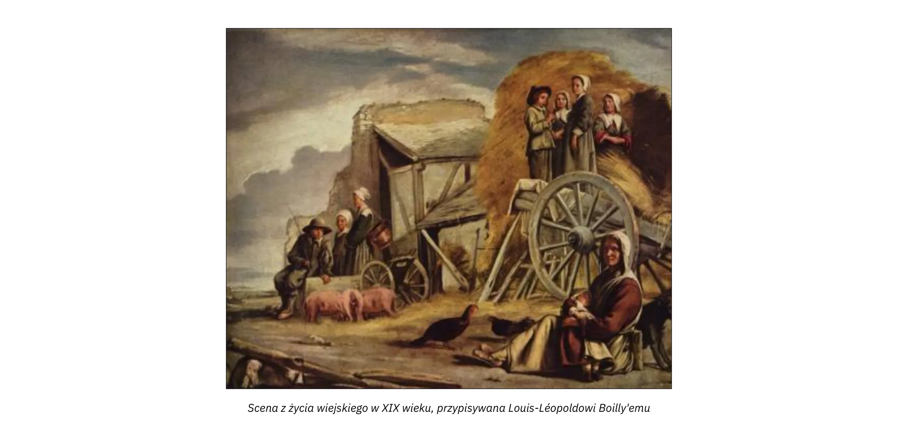

Rzemieślnicy miejscy, zamknięci w sztywnych cechach, mieli trudności z wprowadzaniem innowacji, a nawet wspieraniem się nawzajem. W międzyczasie inne narody europejskie wkrótce prześcignęły Francję na każdym froncie, konkurując z jej produktami. Sukcesy handlowe Anglii i Holandii były na ustach wszystkich.

Ale jak mogliśmy znaleźć rozwiązanie dla choroby epoki? Nie istniała jeszcze nauka ekonomii, a zatem nie było specjalnego lekarstwa, które można by zastosować. Zasady polityki gospodarczej były nadal stosowane przypadkowo, przechodząc od faz restrykcyjnych do okresów bardziej liberalnych. Oczywiście mamy modele, historyczne odniesienia do naśladowania. Wśród nich był *Sully*, minister Henryka IV, który opowiadał się za rolnictwem i promował większą swobodę handlu we Francji.

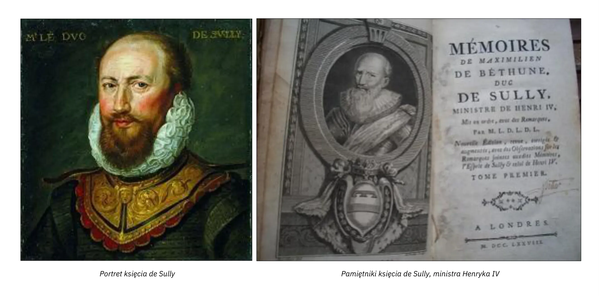

Ale potem przyszedł Colbert, minister Ludwika XIV, który wahał się między regulacją a wolnością, ale ostatecznie egzekwował regulację. Pod koniec XVII wieku Colbert wyprzedził Sully'ego: ministrowie powoływali się teraz na jego dziedzictwo i próbowali stosować to, co uważali za jego maksymy.

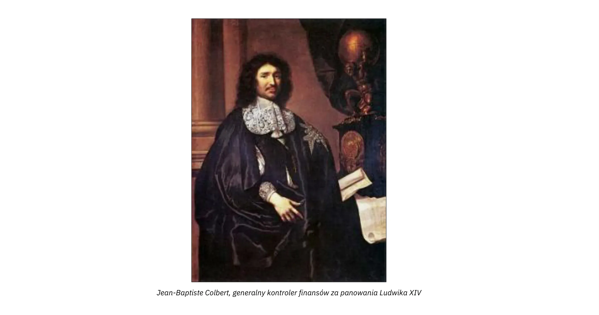

W umysłach mężów stanu pod koniec XVII wieku maksymy Colberta były cztery.

(1) **Przemysł musi być regulowany i związany w ramach cechów**. Regulacje te określają, na przykład, jak powinny być wykonane prześcieradła i tkaniny, ich rozmiar i wagę.

Istniały setki takich zasad, zebranych w dedykowanych tomach dla każdego rodzaju przemysłu. Jednak w oczach zwolenników Colberta było to wciąż niewystarczające: wierzyli oni, że przemysł powinien być nadzorowany przez korporacje.

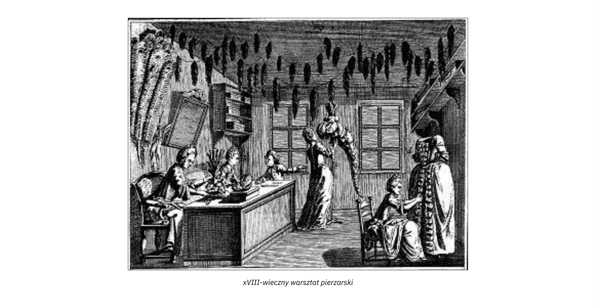

Każdy, kto chciał praktykować dany zawód, musiał najpierw spędzić kilka lat jako uczeń, a następnie jako czeladnik, zanim spróbował osiągnąć status mistrza, tworząc "arcydzieło" i płacąc znaczną kwotę na rzecz gildii. Konkurencja w każdej branży była zatem ściśle ograniczona.

(2) **Handel jest grą o sumie zerowej**. Jeśli chodzi o handel, uczniowie Colberta podzielali te same uprzedzenia, co starożytni barbarzyńcy. Według ministra Ludwika XIV handel to "wieczna wojna". Dlaczego? Powód jest prosty: dla Colberta i jego następców każdy wzrost bogactwa jednego kraju oznaczał zubożenie innego. Ich zdaniem nie można było pozwolić Anglikom czy Holendrom na bogacenie się, ponieważ oznaczałoby to, że kradną dobrobyt Francji.

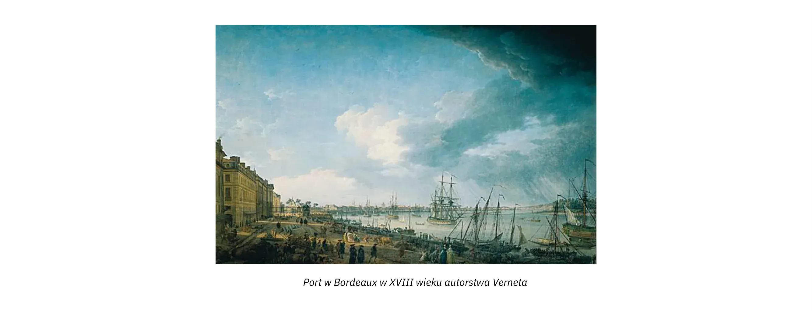

Dlatego produkty tych krajów musiały zostać zakazane lub obłożone wysokimi podatkami, bez skrupułów, ponieważ handel to wojna, w której możemy życzyć sobie tylko ruiny naszych wrogów.

> "Francuzi mogą zwiększyć swój handel tylko poprzez zmiażdżenie Holendrów".
> *Colbert*

(3) **Kiedy państwu brakuje pieniędzy, należy podnieść podatki**. Colbert i jego uczniowie byli dalecy od przekonania, że bogactwo podatników jest zasobem ograniczonym. Ich zdaniem wydatki publiczne nigdy nie mogły stanowić problemu, o ile zbierano wystarczającą ilość pieniędzy. A jeśli ludzie się buntowali, to tylko dlatego, że ministrowie źle sobie z tym radzili, ponieważ, jak cynicznie zauważył Colbert, "sztuka opodatkowania polega na skubaniu gęsi bez sprawiania, by za bardzo krzyczały".

(4) **Bogactwo to przede wszystkim złoto i srebro**. Przed narodzinami nauk ekonomicznych wielu pisarzy podążało za jednym dominującym dogmatem na temat natury bogactwa, co stało się znane jako *merkantylizm*. Colbert i jego następcy kontynuowali tę ścieżkę. Krótko mówiąc, merkantyliści wierzyli, że prawdziwą oznaką dobrobytu narodu była akumulacja metali szlachetnych, srebra i złota.

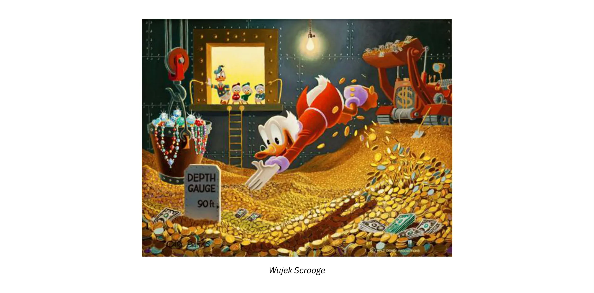

> "Tylko obfitość pieniędzy w państwie czyni różnicę w jego wielkości i potędze".
> *Colbert*

Konsekwencją tego pomysłu jest faworyzowanie eksportu za wszelką cenę, co przyniosło zagraniczne złoto i srebro, oraz ograniczenie importu do minimum, aby uniknąć wysyłania go za granicę.

Są to cztery zasady, którymi kierował się francuski rząd przez kilka dekad, gdy kraj wkroczył w XVIII wiek. Wkrótce jednak miały one zostać głęboko zakwestionowane. W latach 1690-1710 kilku pisarzy było głęboko poruszonych katastrofalnym stanem Francji. Szukając jego przyczyn, doszli do wniosku, że winne są same maksymy odziedziczone po Colbercie, postrzegając je jako błędne argumenty. W ten sposób położyli podwaliny pod nauki ekonomiczne.

## Vauban

<chapterId>ee9c1e0e-96cc-5026-a5e2-963d68122786</chapterId>

Dziś, gdy presja podatkowa w naszym kraju wciąż rośnie, grożąc zduszeniem krajowych sił gospodarczych, pojawiają się głosy na rzecz zmian. Świadomie lub nie, te apele o reformę często odzwierciedlają prace francuskich ekonomistów, którzy od XVII wieku krytykowali krajowy system podatkowy jako chaotyczny, despotyczny i nadmierny.

Pierwszym z tych reformatorów podatkowych, chronologicznie i pod względem zasług, jest wielki marszałek Sébastien Le Prestre Vauban, słynny budowniczy twierdz i cytadel.

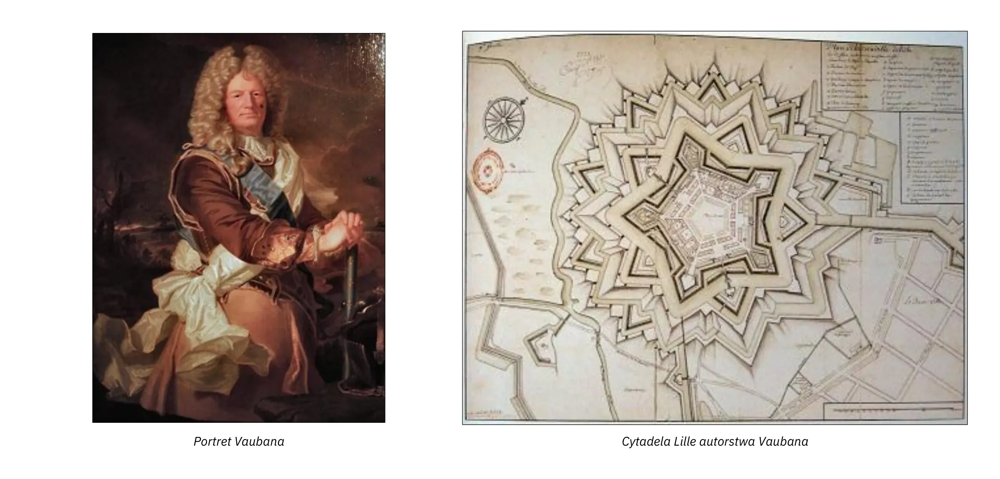

Choć niestety o tym zapomnieliśmy, Vauban był kimś więcej niż tylko wojskowym; był także ekonomistą. Interesował się losem chłopów, zaproponował odważne reformy podatkowe w 1695 r. (Projet de capitation - "Projekt kapitulacji") i ponownie w 1707 r. (Projet d'une Dime Royale - "Królewska dziesięcina"): zastąpienie większości istniejących podatków podatkiem proporcjonalnym do dochodu, podatkiem liniowym przed jego czasem.

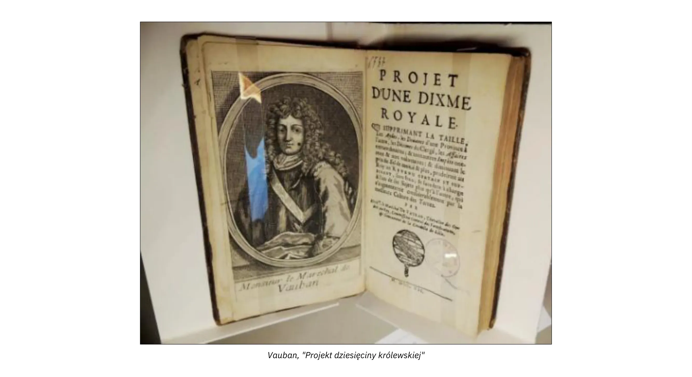

Vauban doszedł do tych idei poprzez ciekawość. Był bystrym obserwatorem, starającym się badać życie społeczne i rzeczywistość gospodarczą w sposób rygorystyczny, niemal naukowy. Kładł szczególny nacisk na potrzebę liczenia poprzez spisy ludności.

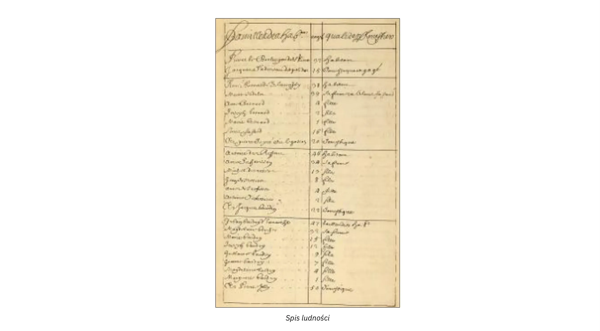

Jego drugą wielką zasługą był poruszający i szczery opis nędzy mas. Pisał: "Nie dajmy się zwieść; serce królestwa jest zrujnowane. Wszystko cierpi, wszystko znosi, wszystko jęczy. Wystarczy spojrzeć i zbadać serce prowincji, a okaże się, że jest ono jeszcze gorsze niż to, co mówię". Daleko od przesady, ponure obserwacje Vaubana były dokładnym odzwierciedleniem życia na początku XVIII wieku. Alexis de Tocqueville doskonale zdawał sobie sprawę z tych idei i później opisał "Królewską dziesięcinę" Vaubana jako "przerażającą", ponieważ była prawdziwa.

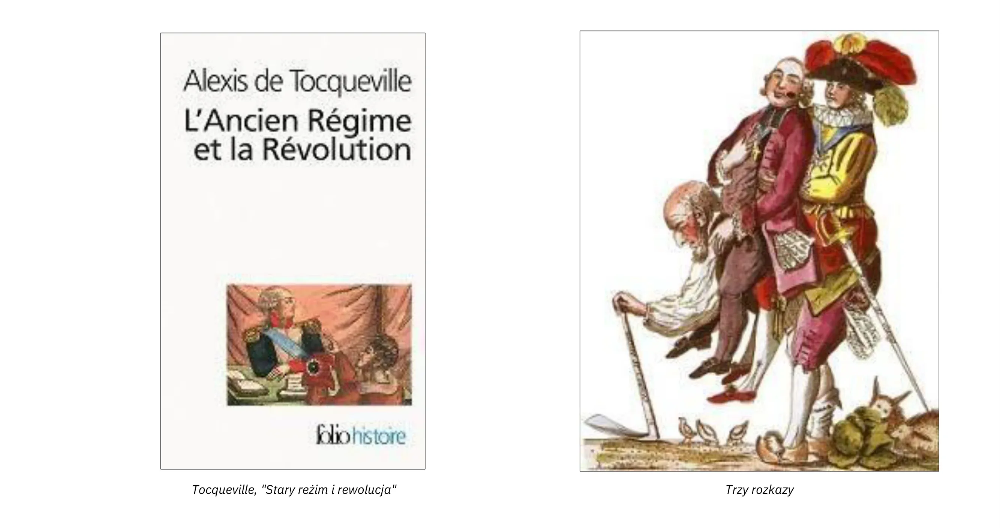

Inną wielką zasługą Vaubana jako ekonomisty było zaproponowanie daleko idącej reformy podatkowej mającej na celu wyeliminowanie lub przynajmniej zmniejszenie intensywności zła, które zaobserwował i opisał. Miał do tego prawo; francuska gospodarka pod rządami ancien régime'u była sparaliżowana przez podatki, które były nierówne, niestabilne i nieczytelne.

W swoich różnych pismach politycznych i ekonomicznych nadrzędną ambicją Vaubana było złagodzenie cierpienia tego, co nazywał "niższą częścią ludzi, którzy swoją pracą utrzymują i wspierają wyższą".

Zrozumiał, że uciskające i zniechęcające podatki przytłaczają chłopów, koncepcję, którą wyraził z jasnym spojrzeniem, coś, co wciąż możemy doskonale obserwować w naszych czasach:

> "Rolnik pozwala, by niewielka ziemia, którą posiada, usychała, pracując na niej tylko połowicznie, w obawie, że gdyby przyniosła to, co mogłaby przy odpowiednim nawożeniu i uprawie, zostałaby jeszcze bardziej opodatkowana".

Vauban dostrzegł prawdę: podatki w czasach ancien régime'u były nie tylko irracjonalne, ale także okrutnie surowe. To właśnie ten system podatkowy, niesprawiedliwy w swojej dystrybucji, starał się przezwyciężyć.

Proponowane przez niego rozwiązanie, płaski, proporcjonalny podatek od wszystkich dochodów, pozwoliłoby na sprawiedliwy podział obciążeń podatkowych między wszystkie klasy społeczne. Opierając się na teorii państwa, która postrzegała władzę publiczną jako niezbędną do ochrony indywidualnych praw i własności, reforma podatkowa Vaubana wymagała, aby wszyscy obywatele płacili podatek w ścisłej proporcji do tego, co zarabiają, na przykład 10% swoich dochodów

W "Królewskiej dziesięcinie", jedynym dziele ekonomicznym wydrukowanym za jego życia, Vauban jasno stwierdził:

> "Ponieważ wszyscy w państwie potrzebują jego ochrony, aby przetrwać, jest rzeczą słuszną, aby wszyscy przyczyniali się, stosownie do swoich dochodów, do jego utrzymania i wydatków [...]. Nie ma nic bardziej niesprawiedliwego niż zwolnienie z podatku tych, którzy są w stanie zapłacić najwięcej, i przerzucenie ciężaru na tych najmniej zdolnych, którzy załamują się pod jego ciężarem; ciężarem, który byłby całkiem lekki, gdyby wszyscy ponosili go proporcjonalnie do swoich sił. Dlatego każde zwolnienie z opodatkowania jest zaburzeniem, które należy naprawić"

Na krótko przed śmiercią pomysł Vaubana został przyjęty przez ministrów Ludwika XIV. Vauban wzywał jednak do wprowadzenia proporcjonalnego podatku, który zastąpiłby wszystkie lub prawie wszystkie istniejące podatki. Zamiast tego, jak to często bywa, jego podatek został wdrożony, ale wszystkie inne również zostały utrzymane.

## Boisguilbert

<chapterId>200149c6-b5fc-566e-ab0e-bafb1c3fed3c</chapterId>

Niewielu francuskich ekonomistów z przeszłości cieszy się dziś uznaniem w swojej ojczyźnie, które dorównuje ich wkładowi, a Boisguilbert nie jest wyjątkiem.

Niedoceniany przez ówczesnych czytelników, odsunięty od kręgów władzy ze względu na swoją ekscentryczną naturę i wszechogarniającą pasję, Boisguilbert odcisnął niewielkie piętno na XVIII wieku. Jednak na początku ubiegłego wieku nastąpiło powolne ponowne odkrycie jego twórczości.

To ponowne odkrycie pokazuje jednak, że znajdujemy się w pewnym ślepym zaułku. Prawdziwe zasługi Boisguilberta zostały zaprzepaszczone przez przedstawianie go jako pioniera licznych teorii i prekursora wielu myślicieli. Mówi się, że pojął koncepcję niedostatecznego zatrudnienia bronioną później przez Keynesa, przewidział prawo Saya, utorował drogę teorii równowagi ogólnej Walrasa, a nawet zapowiadał analizę klasową marksistów. "Kogo lub czego Boisguilbert nie mógł być prekursorem?" - zapytał ostatecznie jeden z komentatorów.

(Pierre Le Pesant de) Boisguilbert urodził się w Rouen w 1646 roku. Wykształcony w Port-Royal w Paryżu, Boisguilbert rozpoczął nieudaną karierę literacką, zanim objął różne stanowiska, w tym generała-porucznika Rouen. W tym czasie napisał kilka książek, w których popierał swoje idee, między innymi "Détail de la France" w 1695 r., którą opublikował ponownie w następnym roku pod znacznie bardziej jednoznacznym tytułem: [*France Ruined under the Reign of Louis XIV, by Whom and How, with the Means to Restore It](https://archive.org/details/bub_gb_0jUaWNbTJa8C/page/n23/mode/2up)*.

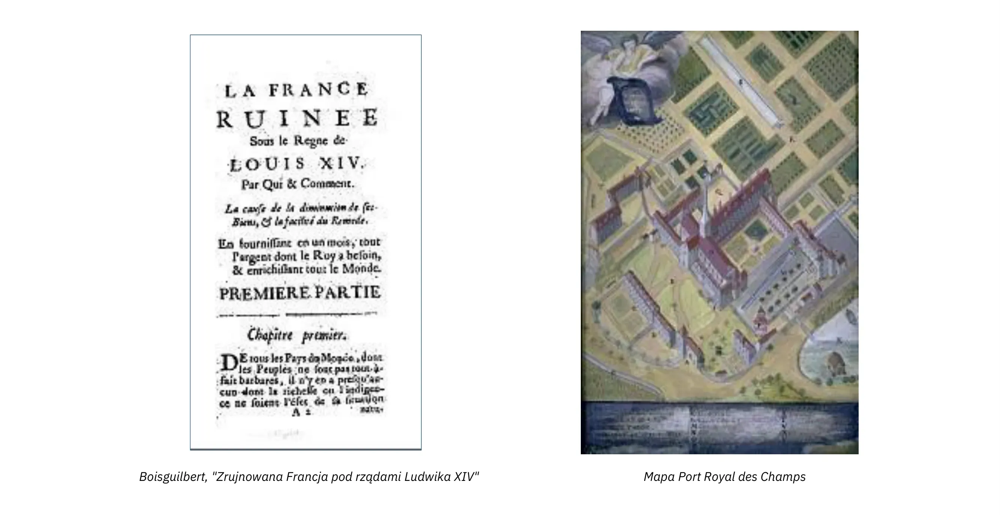

I to jest podstawa książek Boisguilberta: Francuska bieda i jej przyczyny.

Tę nędzę narodu francuskiego pod koniec XVIII wieku Boisguilbert opisuje szczegółowo, podobnie jak Vauban. Pisze on:

> "Jałowe lub słabo uprawiane ziemie, widoczne dla wszystkich, są zwłokami Francji".

Opisał wykorzenione winnice, chłopów, którzy porzucili pola i powtarzające się klęski głodu.

Boisguilbert znajduje dwie główne przyczyny tego nieszczęścia. Jeśli bowiem ludzie żyją w nędzy, to dlatego, że nie mogą konsumować tego, co niezbędne, a ruina konsumpcji ma dwie przyczyny.

Po pierwsze, ludzie nie mogli już sobie pozwolić na konsumpcję podstawowych artykułów pierwszej potrzeby z powodu arbitralnego opodatkowania. Ówczesny podatek osobisty, taille, był obliczany na ślepo dla każdej osoby, rosnąc lub malejąc bez powodu. Ze względu na liczne przywileje, ciężar spadł na biednych chłopów, którzy zostali zrujnowani. Aby temu zaradzić, Boisguilbert zalecił wprowadzenie proporcjonalnego podatku od wszystkich dochodów, podobnego do propozycji Vaubana.

Drugim powodem nędzy Francji jest to, że zbyt wiele przeszkód uniemożliwiało swobodny handel towarami, zwłaszcza rolnymi. Istniały cła na granicach, a nawet wewnątrz kraju, między różnymi regionami, które paraliżowały cały handel. Ograniczenia te uniemożliwiały ustalenie ceny równowagi i ograniczały możliwości rynkowe. W rezultacie chłopi nie mogli utrzymać się ze swojej produkcji, ponieważ nie byli w stanie sprzedawać z zyskiem i cierpieli z powodu nieopłacalnych cen rolnych, co pozostaje bardzo istotne do dziś i leży u podstaw teorii Boisguilberta. W kwestii ograniczeń handlowych, Boisguilbert opowiadał się za udrożnieniem dróg, innymi słowy, ustanowieniem wolnego handlu.

I wolność jest rzeczywiście jego ostatecznym wnioskiem. "Nie jest to kwestia działania", mówi, "ale po prostu zaprzestania działania, tak jak my tak gwałtownie działamy przeciwko naturze, która zawsze dąży do wolności i doskonałości". Wszystko będzie dobrze, powtarza niestrudzenie, "o ile pozwolimy naturze podążać swoim torem, to znaczy damy jej wolność i nikt nie będzie ingerował w ten handel, z wyjątkiem oferowania ochrony wszystkim i zapobiegania przemocy".

Ten ostatni fragment jest kluczowy. Boisguilbert był pierwszym, który wyraźnie zażądał leseferystycznej polityki gospodarczej, uczynił z niej swoje credo i zbudował wokół niej prawdziwy system. Według niego istnieje naturalny porządek rzeczy, który nie powinien być niszczony przez przedwczesne interwencje publiczne. Jego zdaniem państwo nie może działać w sprawach gospodarczych, ale raczej pozwolić, by rzeczy działały naturalnie. W przeciwnym razie spowoduje to nędzę.

Boisguilbert krytykował nawet "*dobre dusze*", jak ich nazywał, tych, którzy chcieli dobrze, ale wyrządzili wielką krzywdę. Chcieli taniego chleba dla ludzi, ale obniżając ceny, zrujnowali rolników, którzy nie mogli przetrwać przy takich marżach. Rolnicy ci porzucali swoje ziemie, pogrążając się jeszcze bardziej w biedzie. Jak wszyscy wiemy, "piekło jest często wybrukowane dobrymi intencjami".

## Cantillon

<chapterId>bc206d41-6a64-5688-a489-40fcfa0e5397</chapterId>

Autor "Eseju o naturze handlu w ogólności" (napisanego około 1730 r., opublikowanego w 1755 r.), Richard Cantillon jest uważany za jednego z pionierów współczesnej nauki ekonomicznej. W swojej Historii myśli ekonomicznej ekonomista Murray Rothbard odnosi się nawet do Cantillona jako założyciela nowoczesnej ekonomii.

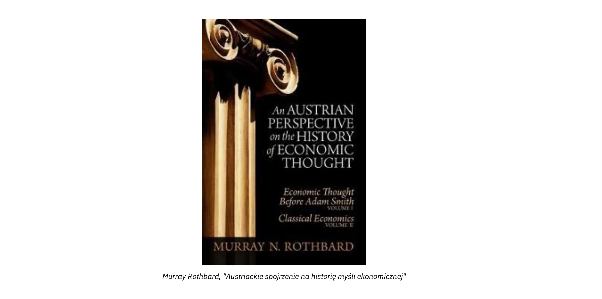

Urodzony w Irlandii Richard Cantillon w młodości osiedlił się w Paryżu i uzyskał francuskie obywatelstwo. Pracował jako bankier i zbił fortunę w czasach Johna Law.

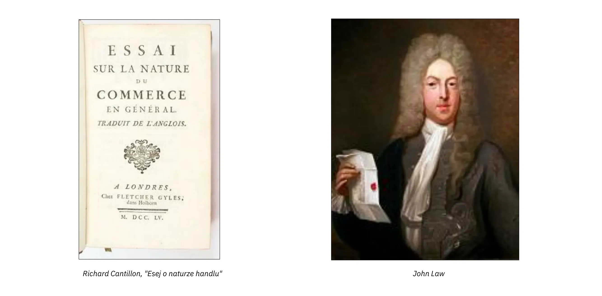

To właśnie przy tej okazji zaczął studiować teorię ekonomii. Około 1730 r. Cantillon napisał Esej o naturze handlu w ogólności.

Książka ta może być postrzegana jako jedna z pierwszych prób stworzenia ogólnej teorii ekonomii. Cantillon ostrożnie identyfikuje to, co nazywa "ogólnymi prawami ekonomii", tymi, które wynikają z natury rzeczy, a nie z konkretnych faktów tego czy innego kraju. To podejście było rewolucyjne.

Możemy podsumować wielkie zalety eseju Cantillona w pięciu obszarach: teoria bogactwa, pojęcie przedsiębiorcy, krytyka bezwartościowych walut, "efekt Cantillona" i wreszcie obrona wolności.

Po pierwsze, jego **teoria bogactwa**.

W przeciwieństwie do dominującego wówczas poglądu merkantylistycznego, Cantillon oparł swoją analizę na uznaniu, że bogactwo tworzą produkty, które są właściwe dla przyjemności człowieka. To bogactwo, jak twierdził, pochodzi z natury i jest wytwarzane dzięki ludzkiej pracy. Jego poglądy na naturę bogactwa wywarły silny wpływ na Beccarię i Adama Smitha, a poprzez Smitha na całą angielską szkołę klasyczną.

Po drugie, **przedsiębiorca**.

Chociaż nie zdefiniował tego jasno, Cantillon postrzegał przedsiębiorcę jako głównego i centralnego gracza w działalności gospodarczej. Dla Cantillona cechą charakterystyczną przedsiębiorcy jest podejmowanie ryzyka i działanie w warunkach niepewności. Idee te zostały później rozwinięte przez Turgota i, co ważniejsze, przez Saya, aby ostatecznie uznać szczególne miejsce przedsiębiorcy w gospodarce, tym razem w przeciwieństwie do twierdzeń szkoły angielskiej.

Trzeci punkt, **waluta**.

W reakcji na doświadczenia Johna Law, Cantillon wyjaśnia, co dzieje się lub musi się stać, gdy waluta nie ma rzeczywistej wartości.

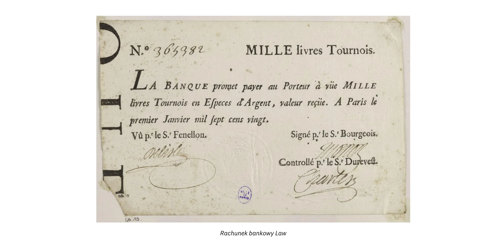

Dostrzega on dwie główne konsekwencje zastąpienia waluty bez realnej wartości, takiej jak pieniądz papierowy, walutą metalową. Pierwszą konsekwencją jest to, co nazywa "powszechnym odrzuceniem", co oznacza rosnącą nieufność do bezwartościowych pieniędzy. Drugą konsekwencją jest [inflacja](https://planb.academy/resources/glossary/inflation): osłabienie pieniądza powoduje wzrost cen towarów.

Po czwarte, w swojej analizie **inflacji** Cantillon poszedł dalej niż jego współcześni. Obserwując upadek systemu Law'a, Cantillon zdał sobie sprawę, że inflacja monetarna nie dotyka wszystkich w równym stopniu. Wręcz przeciwnie, niektórych wzbogaca, a innych zubaża. Doszedł do wniosku, że inflacja ma efekt redystrybucyjny: ci, którzy najpierw otrzymują nowo wyemitowane pieniądze, korzystają ze zwiększonej siły nabywczej, podczas gdy ci, którzy otrzymują je później, stają się biedniejsi w wyniku emisji nowych pieniędzy z powodu wzrostu stóp inflacji.

Po piąte, pomimo kilku pozostałości myśli merkantylistycznej, ogólna perspektywa Cantillona była **w pełni liberalna**. Bronił własności prywatnej jako fundamentalnego filaru cywilizacji, argumentując, że żadne społeczeństwo nie może funkcjonować bez prywatnego Ownership ziemi i produktów pracy. Uważał również nierówności materialne między ludźmi za naturalne i uzasadnione. Według Cantillona nie ma nic złego w tym, że wydajny i odważny pracownik lub wyjątkowo utalentowany zarabia więcej niż ktoś niekompetentny lub leniwy.  Wreszcie, Cantillon uważał, że ceny powinny być zawsze ustalane swobodnie, przez grę Supply i popytu, bez interwencji władz publicznych.

Wśród tych pięciu głównych pomysłów w jego eseju, najważniejszym jest niewątpliwie ten, który obecnie nosi jego imię: **efekt Cantillona**.

Dzięki tej teorii dotyczącej skutków inflacji Cantillon dostarcza nam odpowiedzi na szereg współczesnych bolączek. Pomaga nam zrozumieć konsekwencje ostatnich ekspansywnych i inflacyjnych polityk monetarnych, które zubożyły klasę średnią i świat wiejski, jednocześnie wzbogacając operatorów rynków finansowych i państwo, jego agencje i urzędników, ze względu na ich wspólną bliskość do źródła nowej emisji: banków centralnych i banków komercyjnych.

# Reformatorzy i myśliciele początku XVIII wieku

<partId>1f7b50d4-ce93-5db3-8396-43c1fa5419ff</partId>

## Opat Saint-Pierre

<chapterId>13478fe2-4c12-593c-a410-54c2cfb7ef7f</chapterId>

Spośród wszystkich autorów, których zdecydowaliśmy się włączyć do panteonu XVIII-wiecznych francuskich myślicieli leseferystycznych, opat Saint-Pierre jest bez wątpienia najbardziej pomijany.

Szczerze mówiąc, to po części jego własna wina. Napisał wiele, ale jego styl jest Hard do czytania i jest pełen powtórzeń. Nawet Jean-Jacques Rousseau próbował podsumować jego pracę: zaczął to robić, ale wkrótce porzucił to zadanie, ponieważ zdał sobie sprawę, że jest to ponad jego siły. W połowie XIX wieku Gustave de Molinari uhonorował go, publikując obszerną pracę na jego temat, w której złożył hołd pacyfiście i ekonomiście, jakim był opat Saint-Pierre. Nie wystarczyło to jednak, by wydobyć go z zapomnienia, w którym pozostaje do dziś.

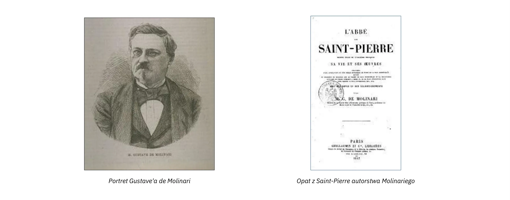

Opat Saint-Pierre pisał o ekonomii, ale to raczej jako pacyfista jest zwykle interesujący. Jest autorem Projektu Wiecznego Pokoju, który poprzedza dobrze znany projekt Emmanuela Kanta.

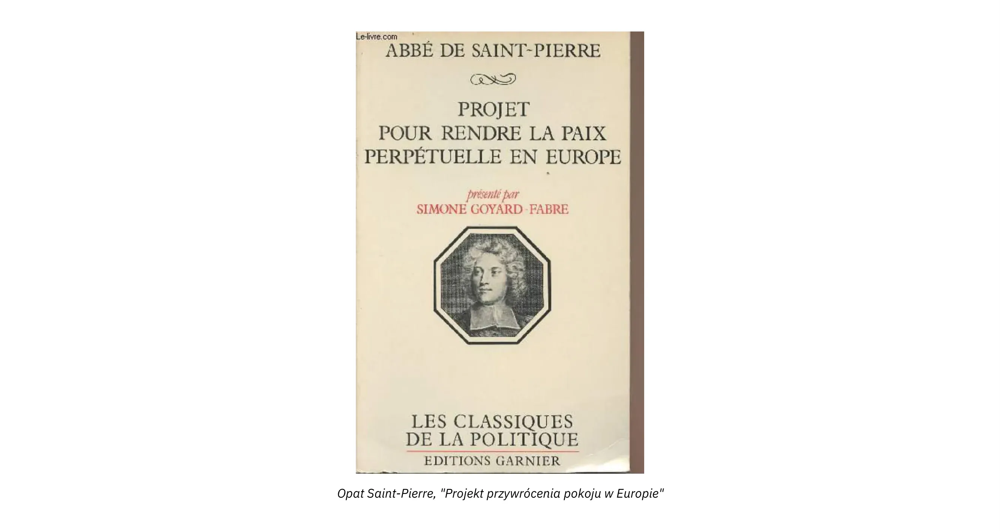

W pracy tej argumentował, że wojna jest destrukcyjna nie tylko dla tych, którzy ją przegrywają, ale także dla zwycięzców, a nawet dla tych, którzy nie biorą w niej udziału, ponieważ wpływa to na ich handel.

Aby zwalczyć plagę wojen, zalecił utworzenie czegoś w rodzaju Europejskiej Ligi Narodów. Powstałaby europejska rada, która rozwiązywałaby problemy każdego narodu. Narody uciekałyby się do arbitrażu, aby uniknąć uciekania się do broni. Jeśli jakiś naród nie byłby na tyle mądry, by przyjąć pokój, jeśli zagrażałby innym narodom europejskim, europejska liga narodów miałaby środki, by zareagować. W obliczu takich wydarzeń utworzona zostałaby armia europejska z siłami dostarczonymi przez różne kraje.

Istnieje również epizod z życia opata Saint-Pierre, który doskonale ilustruje krytyczny sposób myślenia stojący za francuskim ruchem laissez-faire. Opat dołączył do Académie Française w 1695 r., ale został wydalony w 1718 r. za to, że ośmielił się skrytykować rządy Ludwika XIV. W ten sposób sprzymierzył się z takimi postaciami jak Vauban i Boisguilbert, którzy również odważyli się wypowiedzieć przeciwko tajemnicom ukrytym pod przepychem panowania Króla Słońce.

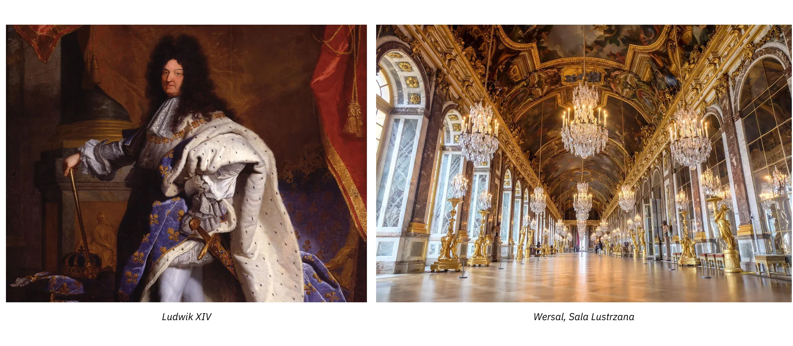

Opat Saint-Pierre argumentował, że panowanie Ludwika XIV, z jego luksusowym dworem i obsesją na punkcie podbojów militarnych, nie było znakiem cnotliwego króla. Odmówił uznania, że Ludwik XIV zasługiwał na tytuł "Ludwika Wielkiego".

"Rujnowanie swoich sąsiadów i narodu w tym samym czasie nie jest wielkością", powiedział. Stanowisko to głęboko uraziło Académie Française, która od dawna zajmowała się gloryfikowaniem króla w każdej możliwej formie literackiej. W rezultacie niemal jednogłośnie zagłosowano za jego wydaleniem.

Jeśli chodzi o myślenie ekonomiczne, konsekwentnie stosował zasadę użyteczności, podobnie jak później Jeremy Bentham, i często oferował solidne spostrzeżenia. Aby być uczciwym, wciąż pozostawał pod wpływem idei merkantylistycznych, których nikt w tamtym czasie w pełni nie porzucił.

Mimo to opat z Saint-Pierre poczynił kilka trafnych spostrzeżeń na temat gospodarki. Nawet przed *Condillac*, któremu często przypisuje się ten pomysł, stwierdził on wyraźnie, że w każdym Exchange obie strony odnoszą korzyści. Można to znaleźć w jego 1733 ["Project for Improving France's Trade"](https://www.institutcoppet.org/projet-pour-perfectionner-le-commerce-de-france/), gdzie napisał:

> "Gdy sprzedaż dokonywana jest między kupcami, zyskuje na tym sprzedający, a także kupujący; gdyby bowiem nie było pewnych rzeczywistych lub postrzeganych korzyści po obu stronach, ani sprzedający nie sprzedawałby po takiej a takiej cenie, ani kupujący, ze swojej strony, nie kupowałby po takiej cenie".

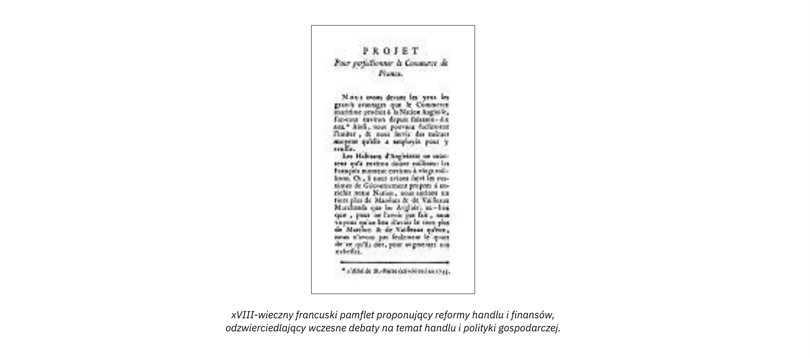

Podkreślał również, zanim zrobił to Vincent de Gournay, wartość pracy i znaczenie jej atrakcyjności. "Każda praca jest trudna", pisał. "A kiedy człowiek widzi, że jego praca nic mu nie płaci lub nie wystarcza, staje się bezczynny i nie zawraca sobie głowy niepotrzebnym wysiłkiem". Ten sam argument został później powtórzony przez markiza d'Argenson, Vincenta de Gournay i fizjokratów, którzy krytykowali uciążliwe przepisy i systemy cechowe. Argumentowali, że takie ograniczenia zniechęcają pracowników, powodują niepotrzebne trudności i ostatecznie sprawiają, że bezczynność wydaje się bardziej atrakcyjna niż produktywny wysiłek w takich warunkach.

## Markiz d'Argenson

<chapterId>e9960ab4-72ec-5afd-8e97-bf89c83b62bc</chapterId>

Markiz d'Argenson jest zapomnianym twórcą doktryny leseferyzmu.

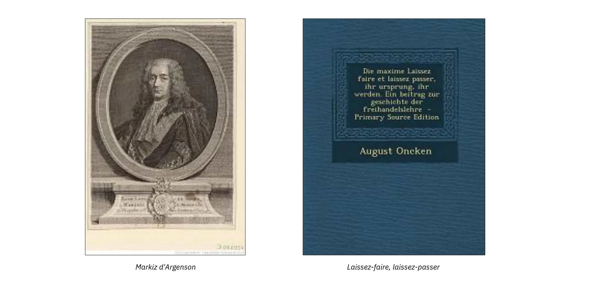

Został on ponownie odkryty przez Augusta Onckena, autora książki o doktrynie laissez-faire, laissez-passer, który stwierdził, że d'Argenson odegrał ważną rolę w narodzinach tej idei.

René-Louis Voyer, markiz d'Argenson, urodził się w 1694 roku. Karierę polityczną rozpoczął jako doradca parlamentarny, a następnie zasiadał w Radzie Stanu.

Trzydzieści lat przed Adamem Smithem d'Argenson bronił już korzyści płynących z podziału pracy i specjalizacji.

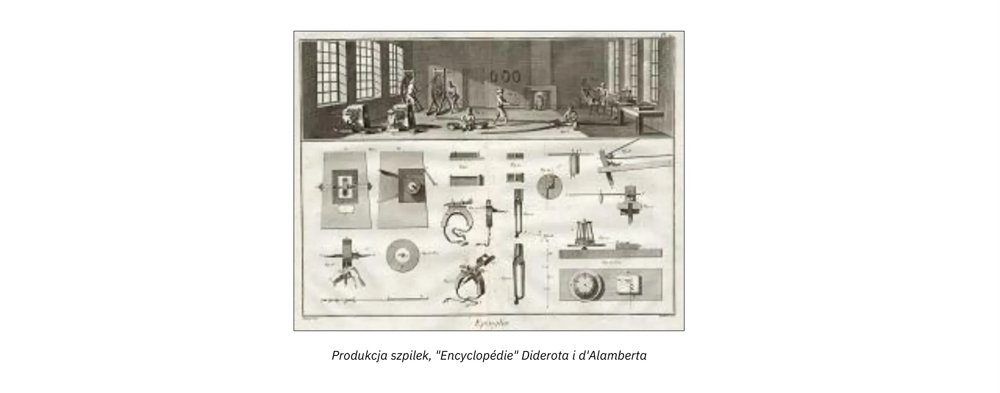

Ostro krytykował regulacje, które jego zdaniem próbowały zmienić naturalne preferencje różnych regionów. Był na przykład zaskoczony, że rząd chciał produkować tkaniny i aksamity w Tours, biednym mieście w tamtym czasie, aby dorównać jakością tym produkowanym w zamożnej Genui, która słynęła z dóbr luksusowych. Doszedł do wniosku:

> "Każde miejsce musi mieć możliwość wyboru własnych fabryk. Wolność! Wolność!"

Uznał również inną z głównych zasad Smitha: ideę, że spontaniczny porządek wynika z dążenia do własnego interesu. Markiz d'Argenson wierzył, że bezpośredni interes osobisty jest tym, co napędza ludzką energię. Pisał, że słabe rzemiosło i oszustwo zdyskredytowałyby producenta, podczas gdy pracowitość i dobre intencje doprowadziłyby do dobrobytu. Argumentował, że najlepszym sędzią użyteczności jest jednostka, ogół społeczeństwa, który kupuje towary i dba o zrobienie dobrego interesu. "Każdy wyczuwa swój własny interes" - powiedział - "każdy podejmuje działania, które są dla niego korzystne, i to właśnie w tej ogólnej zgodzie odkrywamy prawdę"

Jeszcze przed Adamem Smithem zrozumiał on, że interes własny prowadzi do interesu ogólnego poprzez budowę spontanicznego porządku naturalnego.

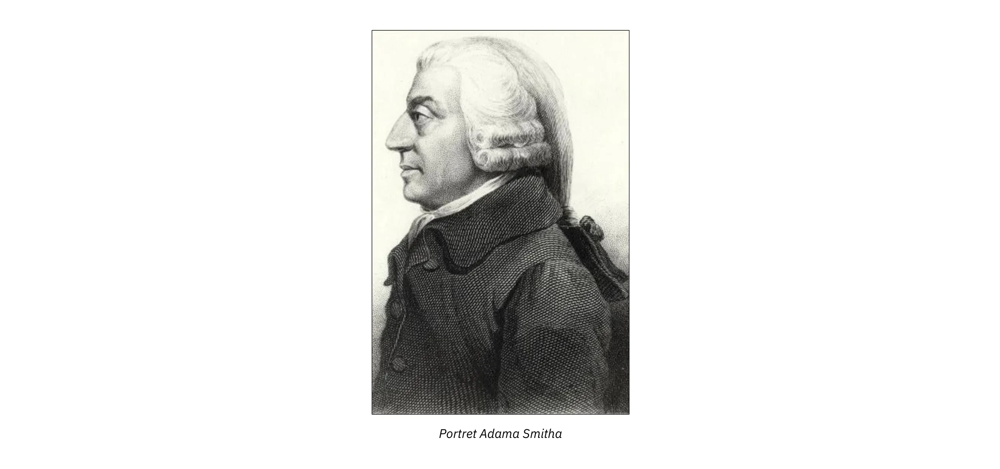

Porównał społeczeństwo do roju pszczół, w którym każdy owad podąża za swoim instynktem. "Z ich działań", powiedział dokładnie, "wynikała wielka akumulacja na potrzeby małego społeczeństwa; ale nie zostało to spowodowane rozkazami lub przez generałów, którzy zobowiązali każdą jednostkę do podążania za poglądami ich przywódcy". Jest to być może najbliższe francuskiej myśli ekonomicznej wyrażenie słynnej koncepcji "niewidzialnej ręki" Adama Smitha.

Markiz d'Argenson był zawsze oburzony pomysłami ministrów swoich czasów. Jedyne pytanie, jakie zadawali, brzmiało: "Czy powinniśmy regulować w ten czy inny sposób? Czy powinniśmy ukierunkować gospodarkę na to czy tamto?". Na co d'Argenson odpowiadał: "Czy nie powinniśmy najpierw zapytać, czy w ogóle należy tym kierować, czy też rzeczy powinny działać same?"

Prawdę mówiąc, był zdumiony, że ludzie uważali za tak Hard zrozumienie, a raczej dostrzeżenie, szkodliwego wpływu nadmiernych regulacji wszelkiego rodzaju na gospodarkę. Jego zdaniem wystarczyło po prostu otworzyć oczy. "Tak wiele rzeczy działa dziś całkiem dobrze", pisał z goryczą, "po prostu dlatego, że udało im się uciec przed zasięgiem prawa".

Czasami rozpaczał nad tym, jak mało rozumiano jego pomysły.

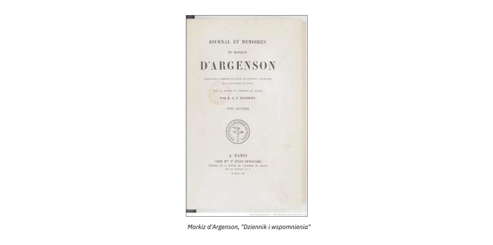

Ideał polityki gospodarczej, którego bronił, był zatem sprzeczny z trendami jego czasów. Jego ideał definiował zasadniczo negatywną rolę państwa. "Wszystko, czego potrzebuje handel, to usunięcie przeszkód. Prosi tylko o dobrych sędziów, karanie monopoli, równą ochronę dla wszystkich obywateli, stabilne waluty oraz drogi i kanały". Była to definicja państwa minimalnego, która stała się jednym z fundamentów francuskiej tradycji ekonomii politycznej.

Ta wizja roli państwa w działalności gospodarczej została naturalnie zilustrowana przez badanie dwóch głównych kwestii, które poruszyły ekonomistów i myślicieli społecznych jego czasów: regulacji przemysłu i handlu pszenicą.

Regulacje dotyczące przemysłu wzbudziły przede wszystkim jego niechęć, ponieważ były przywilejami dla niektórych kosztem innych. "Prawdziwą przyczyną upadku naszych fabryk", pisał, "jest ich nadmierna ochrona". I z nie mniej żywym credo wyraził swoją krytykę dirigistowskiej gorliwości mężów stanu swoich czasów:

> Kierowanie branżą wbrew jej woli oznacza chęć jej zrujnowania.

W kwestii handlu na własne potrzeby d'Argenson nie miał innej odpowiedzi niż wolność. Według niego niedobory pszenicy wynikały z monopolu i nadmiernych środków ostrożności podejmowanych przez rząd. Wszystko, co musieliśmy zrobić, to pozwolić na to i nigdy nie byłoby niedoboru pszenicy w kraju, w którym porty byłyby otwarte. Cudzoziemcy, przyciągani jak wszyscy inni ludzie przez pokusę zysku, zapewnią nam to, czego potrzebujemy i zabiorą naszą nadwyżkę. "Niech tak będzie", powiedział, "a wszystko będzie dobrze".

## Vincent de Gournay

<chapterId>e8ae40dc-7450-552f-9ddc-9e02936cf425</chapterId>

Vincent de Gournay był jednym z pierwszych przedstawicieli leseferyzmu we Francji i jednym z jego najwcześniejszych orędowników w administracji publicznej i kręgach intelektualnych. Z tego powodu zasługuje na znacznie większe uznanie w historii myśli ekonomicznej, niż zwykle otrzymuje. Starałem się podkreślić jego wkład w niedawnej książce.

Urodzony w rodzinie kupieckiej, Gournay sam stał się odnoszącym sukcesy kupcem, gromadząc znaczny majątek, zanim zapewnił sobie stanowisko we francuskiej administracji. W Biurze Handlu był gorącym orędownikiem wolnej siły roboczej i wolnego handlu.

Chociaż był dobrze osadzony w kontekście czołowych ekonomistów swoich czasów, Gournay napisał niewiele, a raczej opublikował niewiele. Pisał głównie listy administracyjne i wspomnienia, albo niepublikowane, albo opublikowane przez innych autorów po pewnej edycji.

To, co mamy, obejmuje:

1. [Uwagi](https://archive.org/details/traitessurlecomm0000chil) na temat tłumaczenia książki angielskiego ekonomisty Josiaha Childa;

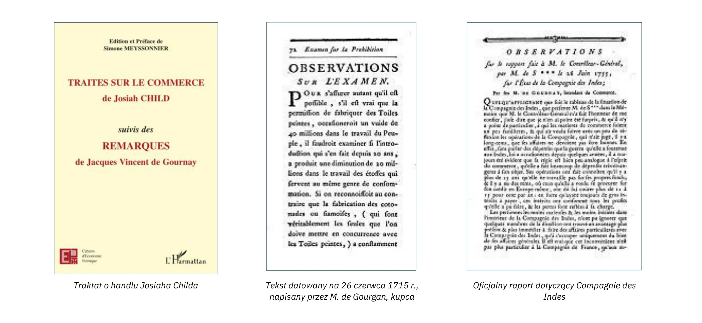

2. "Uwagi" zawarte w badaniu zalet i wad zakazu drukowania tkanin;

3. "Obserwacje na temat Kompanii Wschodnioindyjskiej", dołączone przez opata Morelleta do jego Memoir on the Current State of the East India Company (1769);

4. A przede wszystkim różne wspomnienia z jego roli Intendenta Handlu.

Pisma te wykazują wyraźny obcy wpływ i obecność pewnych głównych idei strukturalnych. Obce wpływy Gournaya to uznanie angielskiej i holenderskiej wyższości. Gournay był przekonany, że te dwa narody rozumieją ekonomię znacznie lepiej niż Francja i że Francja musi podążać za ich przykładem. "Te dwa narody są najbardziej zamożne", powiedział, "i stosują zupełnie inny system niż my. My zakazujemy wwozu zagranicznych towarów, ograniczamy działalność gospodarczą drakońskimi przepisami, podczas gdy oni postępują w odwrotny sposób. Jeśli radzą sobie lepiej", podsumował Gournay, "to dlatego, że Francja kieruje się błędnymi zasadami".

Jego propozycje reform koncentrowały się wokół kilku kluczowych punktów.

Po pierwsze, uważał, że praca musi być chroniona i wspierana. W tamtym czasie francuscy pracownicy byli traktowani jak przestępcy, stale monitorowani i trzymani w strachu przed nieprzestrzeganiem jednego z tysięcy przepisów. Ta nadmierna irytacja zniechęcała ludzi do pracy, popychając ich zamiast tego do bezczynności. Gournay argumentował jednak, że "praca jest szlachetna i jest jedynym sposobem na wzbogacenie narodu".

Po drugie, skrytykował restrykcyjny system cechów, który ograniczał producentów. Uczestnictwo w handlu było zarówno czasochłonne, jak i kosztowne, a każdy nowy pracownik musiał następnie skrupulatnie przestrzegać rutyny ustanowionej przez statut jego gildii. Taki system nie pozostawiał miejsca na doskonałość, innowacje czy postęp.

Po trzecie, handel we Francji był ograniczony restrykcyjnymi przepisami. Zdaniem Gournaya konsumenci odnieśliby znaczne korzyści, gdyby porty mogły swobodnie konkurować, a wszystkie towary, takie jak zboże i drukowane płótna, mogłyby być importowane bez ograniczeń. Był jednym z pierwszych, którzy wskazali na prawdziwe pochodzenie przemytu: istniał on wyłącznie dlatego, że korzystny i użyteczny handel był zabroniony. Dodał też ostrą obserwację: przemyt był "wolnym" zawodem, bez regulacji, bez gildii, bez podatków konfiskacyjnych. Jednak to właśnie przytłaczające regulacje państwowe doprowadziły wielu uczciwych pracowników do nielegalności.

Wreszcie, Gournay zauważył, że stopy procentowe były niższe w Anglii i Holandii, krajach lepiej prosperujących niż Francja. Opowiadał się za niższymi stopami procentowymi również we Francji, aby działalność gospodarcza mogła być tam finansowana na równie korzystnych warunkach jak gdzie indziej. Gournay nie szukał jednak przymusowych, legislacyjnych metod; podkreślał raczej potrzebę legalizacji pożyczek pieniężnych, które wciąż były potępiane przez Kościół katolicki.

We wszystkich tych kwestiach Gournay odegrał kluczową rolę w intelektualnych debatach połowy XVIII wieku. Jego obrona wolności gospodarczej wyprzedziła fizjokratów o dekadę, a Adama Smitha o dwadzieścia lat. Jednak jego najtrwalszy wpływ wywarł Turgot. Gournay wziął młodego Turgota pod swoje skrzydła i wyszkolił go swoimi ideami.

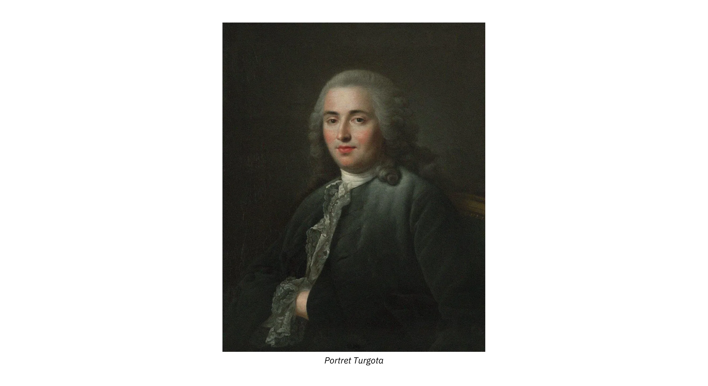

Wiele lat później Turgot, przyszły minister Ludwika XVI, napisał Éloge (pochwałę) na cześć swojego przyjaciela po jego śmierci. A jeśli Turgot nigdy całkowicie nie przyjął fizjokratyzmu François Quesnaya, to dlatego, że zachował niezwyciężone przywiązanie do swojego pierwszego mistrza, Vincenta de Gournaya.

## Krąg Gournay

<chapterId>b86ba6bd-8f3a-5d8f-b098-4d0413f00deb</chapterId>

Jeśli chodzi o początki nauk ekonomicznych, historia ma tendencję do podkreślania pierwszej szkoły myślenia: fizjokratów, kierowanej przez François Quesnaya i jego uczniów. Jednak prawie dekadę przed ich powstaniem istniała inna, mniej formalna, ale równie ważna grupa skupiona wokół ekonomisty Vincenta de Gournaya.

Jak widzieliśmy w poprzedniej części, Gournay był zafascynowany przykładem innych narodów, takich jak Anglia i Holandia. Równie mocno podziwiał ich ekonomistów, takich jak Josiah Child, Johan de Witt i David Hume.

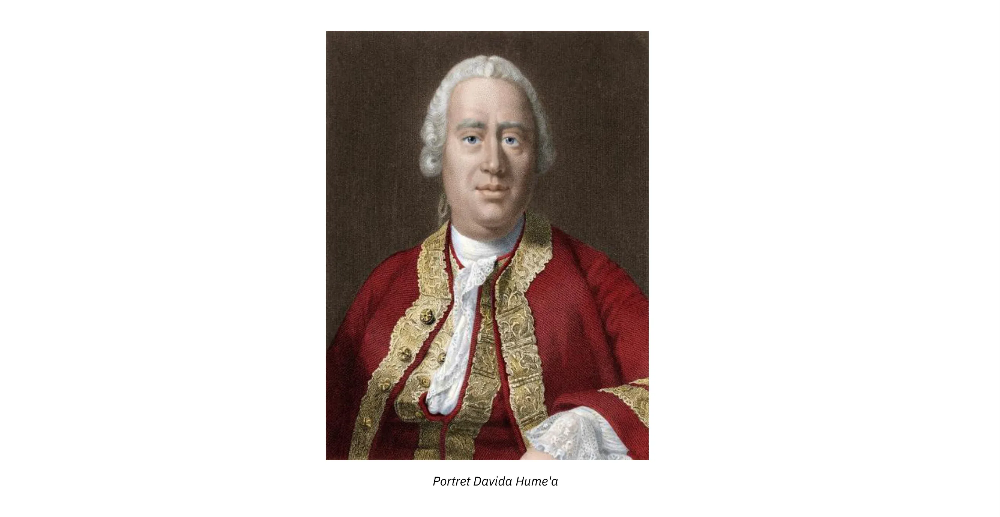

Podziw ten doprowadził go do przetłumaczenia i przypisania tłumaczeń ich pism ekonomicznych.

Okazało się, że jego pozycja w wyższej administracji pozwoliła Gournayowi na kontakt ze wszystkimi znanymi wówczas we Francji specjalistami w dziedzinie ekonomii. W ten sposób zebrał grupę niezwykle zdolnych tłumaczy. Osobiście przetłumaczył dzieła Childa i Culpepera. Opat Le Blanc przetłumaczył Dyskursy polityczne Davida Hume'a. Véron de Forbonnais przetłumaczył hiszpańskiego ekonomistę Geronymo de Uztariz. Turgot pracował nad pismami Josiaha Tuckera, a syn Montesquieu przetłumaczył Joshuę Gee.

Dzięki współpracy kilku członków kręgu Gournaya, wielu autorów było w stanie publikować oryginalne dzieła pod własnymi nazwiskami. Książki te, wraz z tłumaczeniami, osiągnęły niezwykły sukces. Niektóre godne uwagi przykłady obejmują:

- Herbert's Essay on the [General Police of Grain](https://archive.org/details/essaisurlapolice00herb/page/n7/mode/2up) (6 wydań w ciągu 4 lat)

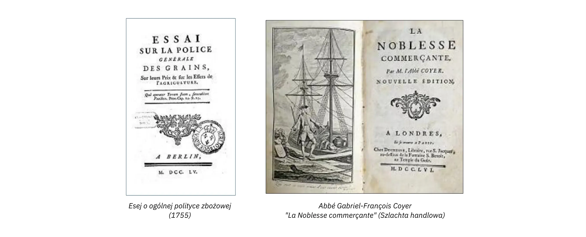

- Coyer's [Noblesse commerçante](https://archive.org/details/lanoblessecommer00coye/page/n3/mode/2up) (5 wydań w ciągu 2 lat)

- Plumard de Dangeul's [Remarks on the Advantages and Disadvantages of France and Great Britain](https://archive.org/details/bim_eighteenth-century_remarks-on-the-advantage_plumard-de-dangeul-loui_1754) (3 wydania w pierwszym roku)
- Cliquot-Blervache i Gournay's [Memoir on the Trades](https://www.amazon.com/Memoire-sur-corps-metiers-French/dp/1978196903) (2 wydania w 1758 r.)

Grupa odegrała również kluczową rolę w publikacji

- [Esej o naturze handlu w ogóle](https://archive.org/details/essayonnatureofc0000cant) autorstwa Richarda Cantillona.

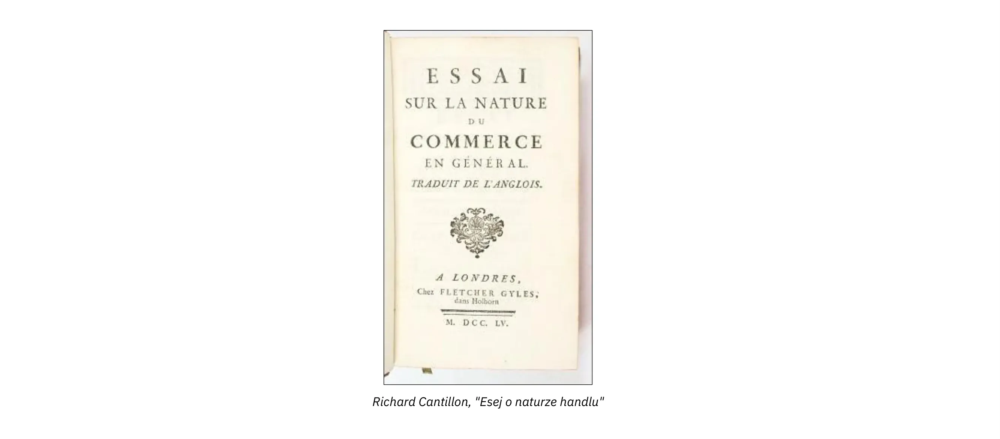

Ta ostatnia książka, napisana około 1730 roku, pozostała w rękopisie po śmierci autora. Gournay, z pomocą swoich przyjaciół ekonomistów, opublikował ją w 1755 roku. Według opata Morelleta, członka kręgu, Gournay polecił ją każdemu ekonomiście, którego znał.

Intelektualny dorobek kręgu Gournay miał znaczący wpływ na historię idei. W tym sensie można ich uznać za założycieli nauk ekonomicznych we Francji. Christine Théré z INED, która badała historię publikacji ekonomicznych, odkryła, że w latach 1750-1759 opublikowano nie mniej niż 349** prac na temat ekonomii, w porównaniu do zaledwie 83** w całej poprzedniej dekadzie (1740-1749). Ta rewolucja w latach pięćdziesiątych XVII wieku jest w dużej mierze zasługą kręgu Gournaya.

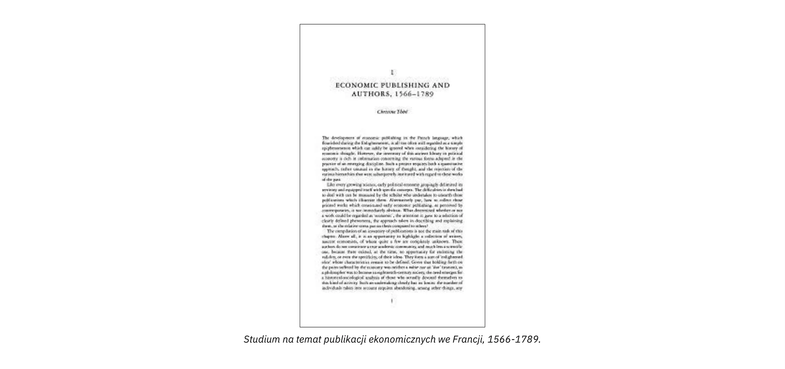

Aby rozpowszechnić wśród francuskiej populacji zamiłowanie do dyskusji ekonomicznych, Gournay i jego przyjaciele pracowali nad tym, by uczynić je dostępnymi za pośrednictwem powieści. Po *Memoir on the Trades*, który krytykował gildie, Gournay i Cliquot-Blervache pomogli Gabrielowi-François Coyerowi napisać krótką powieść satyryczną zatytułowaną Chinki: [A Cochinchinese Tale Applicable to Other Nations](https://www.institutcoppet.org/wp-content/uploads/2013/06/Coyer-Chinki-Histoire-cochinchinoise.pdf).

Historia podąża za głównym bohaterem, Chinki, który jest zmuszony opuścić swoją ziemię z powodu nadmiernego opodatkowania i próbuje znaleźć pracę rzemieślniczą dla swoich dzieci w mieście. Ale wszystkie zawody są dla nich zamknięte z powodu nadużywania przepisów cechowych, więc historia przedstawia jego rosnące rozczarowanie poprzez humorystyczne tony.

Krąg Gournaya był zatem początkiem intensywnej fali publikacji. Podczas gdy ten znaczący wkład został zapomniany przez historyków myśli ekonomicznej, był on bardzo wyraźny dla współczesnych. Fizjokraci, którzy zorganizowali swoją szkołę w latach sześćdziesiątych XVIII wieku, przedstawią później grupę Gournaya jako swoich bezpośrednich prekursorów. W 1767 r. ekonomista Jacques Accarias de Serionne wyraził to jeszcze wyraźniej w swoim hołdzie. Napisał: "Niewielka liczba Francuzów, zarówno filozofów, jak i obywateli, zaczęła kilka lat temu naśladować angielskich pisarzy. Najpierw przetłumaczyli swoje modele i wkrótce przewyższyli je pod wieloma względami. Wnieśli cały urok i bogactwo literatury do traktowania użytecznych tematów; rozbudzili i rozpowszechnili zamiłowanie do nauk, które były najbardziej istotne dla dobrobytu państwa".

I rzeczywiście, w latach pięćdziesiątych XVII wieku kwestie ekonomiczne stały się modne. Voltaire zauważył, że około 1750 roku Francuzi porzucili powieści, by dyskutować o wolności handlu zbożem. Trend ten został również zauważony przez Mercure de France, który napisał w numerze z 1758 roku, kilka miesięcy przed śmiercią Gournaya: "Ekonomia polityczna jest teraz nauką w modzie. Książki zajmujące się rolnictwem, populacją, przemysłem, handlem i finansami są teraz w rękach niezliczonych ludzi, którzy jeszcze niedawno tylko powierzchownie czytali powieści". Trudno o lepszy hołd dla Gournaya i pracy jego kręgu ekonomistów.

## Mirabeau

<chapterId>2d2f802b-e3b6-556f-9025-a1b1dc4409ca</chapterId>

Francja znała dwóch słynnych mężczyzn o imieniu Mirabeau, ojca i syna, ale to syn naprawdę zapisał się w historii. Rewolucyjny trybun i jedna z centralnych postaci wydarzeń Rewolucji Francuskiej, pozostał sławny.

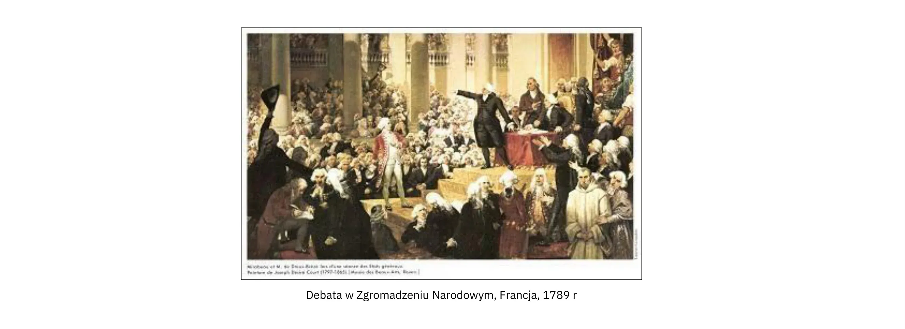

Dzięki swojemu talentowi i miejscu w historii Francji przyćmił swojego ojca, ekonomistę i filar szkoły François Quesnaya, który był jej pierwszym członkiem już w 1758 roku.

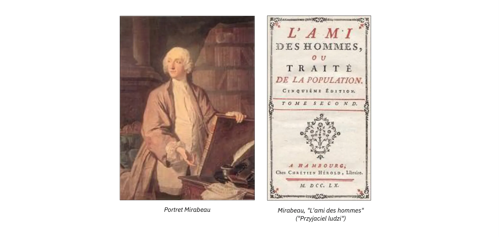

Markiz de Mirabeau zyskał ogromną sławę jeszcze przed przyjęciem fizjokratyzmu dzięki książce zatytułowanej "The Friend of Mankind. Traktat o populacji [FR: L'ami des hommes, ou, Traité de la population](https://archive.org/details/lamideshommesou00unkngoog). Mimo że pierwsze wydanie ukazało się w 1756 r., stało się sławne około 1757 r., na rok przed spotkaniem z Quesnayem.

W latach 1757-1760 opublikowano ponad 20 wydań, co prawdopodobnie czyni ją najbardziej udaną książką ekonomiczną w historii. Niektórzy czytelnicy uważali nawet, że książka została napisana przez Montesquieu ze względu na jej ostre rozumowanie. Delfin, ojciec króla Ludwika XVI, twierdził nawet, że nauczył się jej na pamięć. Przez pewien czas była to książka, którą czytali wszyscy w Wersalu.

Dziś jest to książka, która nie jest już czytana, ale wielu wciąż się do niej odwołuje. Nawet w XIX wieku Edmond Roussel powiedział:

> L'Ami des Hommes to jedna z tych książek, o których wszyscy mówią, a o których mało kto wie. W każdym pokoleniu jeden odważny obywatel powinien ją przeczytać; aby wszyscy inni nie musieli.

Na początku swojej kariery ekonomisty Mirabeau czerpał inspirację od Richarda Cantillona. Przez 15 lat posiadał rękopis "Eseju o naturze handlu w ogólności" Cantillona, który cierpliwie analizował i komentował.

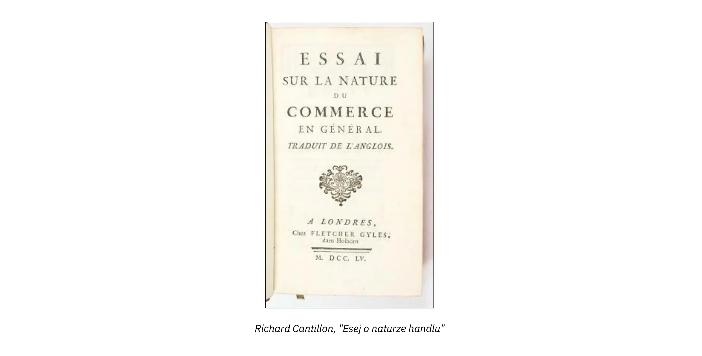

L'Ami des Hommes był pierwotnie pomyślany jako prosty komentarz do Eseju Cantillona. Ale ponieważ Mirabeau miał nieco eklektyczny umysł, co oznacza, szczerze mówiąc, nieco szalony, szybko odszedł od swojego pierwotnego planu. Książka po prostu omawia wszystkie znane mu kwestie ekonomiczne, od czasu do czasu odchodząc od Cantillona. Jest to książka trudna do czytania, z dziwacznym planem i dygresjami w każdym rozdziale. Sam Mirabeau przyznał, że był to chaos, a jego styl był apokaliptyczny.

Pomimo panującego chaosu, warto zwrócić uwagę na kilka pomysłów:

- Mirabeau walczy z merkantylistycznymi uprzedzeniami dotyczącymi natury bogactwa.
- Chwali rolnictwo i krytykuje jego porzucenie.
- Narzeka na stan ludzi, zwłaszcza chłopów.
- Wreszcie, broni wolności handlu i braterstwa narodów w pokoju.

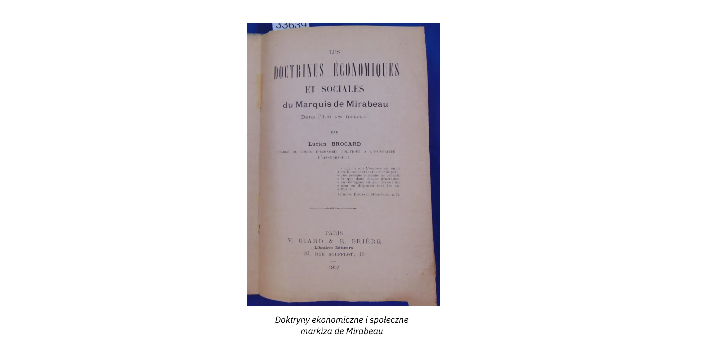

Hard określa poglądy Mirabeau jako liberalne lub antyliberalne. Często dryfował tam i z powrotem, czasem nie zdając sobie z tego sprawy, między jedną a drugą wizją. Mimo to liberalne idee często dominowały w jego pismach. Jednym z jego najsłynniejszych tekstów było:

> Prawdziwą i jedyną zasadą ekonomii politycznej jest pozwolić, by wszystko było wolne.

Mając za sobą swój największy sukces, Mirabeau był rozchwytywany. François Quesnay, który właśnie zainteresował się ekonomią, zaprosił go na swoją antresolę w Wersalu.

Debatowali wściekle i w końcu stało się coś, co zwykle nigdy nie zdarza się w debatach: Mirabeau przyznał, że się mylił. Zgodził się z pomysłami Quesnaya i powiedział, że jest gotów je rozpowszechnić.

Razem utworzyli rdzeń tego, co miało stać się szkołą fizjokratyczną, wzmocnioną przez regularnych rekrutów, których sprowadzili. Wkrótce po nawróceniu Mirabeau, Quesnay zaangażował go do obrony swoich pomysłów na opodatkowanie. Doprowadziło to do powstania ["Teorii opodatkowania"](https://archive.org/details/thoriedelimpot00mira), za którą Mirabeau został wysłany na kilka dni do więzienia w Vincennes, a następnie zesłany do Bignon.

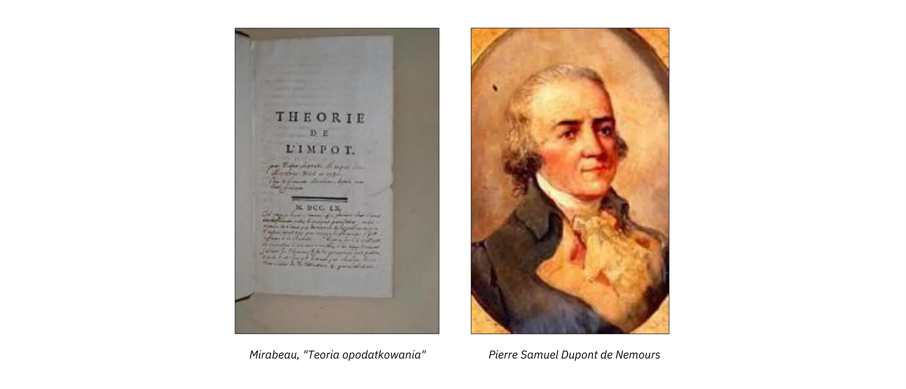

Mirabeau odegrał również kluczową rolę w rekrutacji nowych członków do szkoły Quesnaya. Przekonał nawet młodego Dupont de Nemours.

To właśnie w domu Mirabeau fizjokraci spotykali się w każdy wtorek. Wydaje się, że takie osobistości jak Turgot i Adam Smith uczestniczyły w tych spotkaniach raz lub kilka razy.

Przez całe życie Mirabeau pozostawał niestrudzonym pisarzem. Był autorem licznych prac ekonomicznych broniących doktryny Quesnaya. Jednak pod koniec życia jego wpływ osłabł. Jego styl pisania pogorszył się do tego stopnia, że jego własny brat napisał do niego, że nie może już zrozumieć jego prozy. Jego idee, które stały się w pełni liberalne, zderzyły się z socjalistyczną lub proto-komunistyczną reakcją myślicieli takich jak Mably, a nawet Rousseau. Z trudem znajdował czytelników i wydawców, a w 1789 r., w przeddzień szturmu na Bastylię, zmarł w dużej mierze niezauważony.

## Quesnay

<chapterId>7a35f20b-5ea0-544d-b290-bcd9c6f7f11a</chapterId>

François Quesnay jest jednym z najbardziej znanych francuskich ekonomistów.

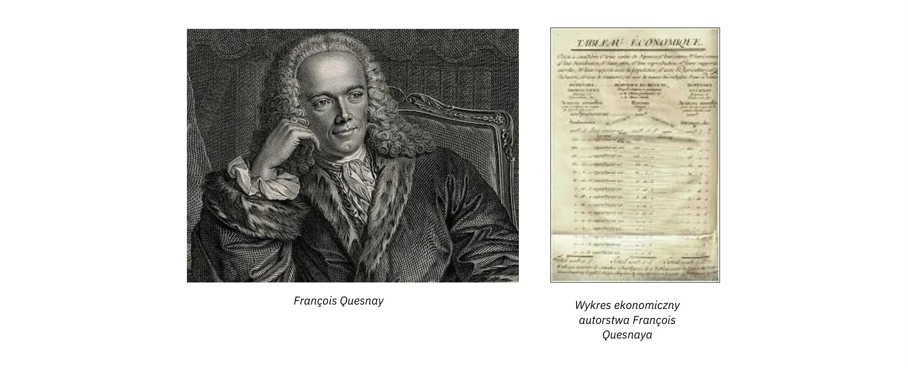

Jego nazwisko pojawia się w każdym podręczniku ekonomii i historii myśli ekonomicznej. Stwierdza się, że stworzył "Tableau Économique", aby schematycznie przedstawić gospodarkę, że był liderem szkoły fizjokratycznej i że mylił się, wierząc, że tylko ziemia jest produktywna, a wreszcie, że Adam Smith przyszedł, aby wyprostować rekord. Mniej więcej w ten sposób podręczniki podsumowują François Quesnaya.

Redukowanie go do tego jest wstydem, ponieważ Quesnay był także pierwszym ekonomistą, który próbował oprzeć obronę wolności gospodarczej na zasadach naukowych. Był jednym z najbardziej słuchanych i wpływowych ekonomistów swoich czasów. Co więcej, założył Fizjokrację, znacznie bogatszą doktrynę niż uproszczona idea, że tylko natura wytwarza bogactwo, która jest często błędnie przedstawiana.

Fizjokrację omówimy bardziej szczegółowo w kolejnych trzech rozdziałach. Najpierw przyjrzyjmy się bliżej samemu François Quesnayowi.

Urodził się w 1694 roku w Méré w rodzinie chłopskiej, która nie mogła nauczyć Quesnaya czytać. Był szkolony przez miejscowego mężczyznę i ostatecznie studiował w College of Surgery, a następnie na Wydziale Medycyny. W wieku 24 lat został chirurgiem w Mantes.

Zyskał sławę w 1730 roku, w wieku 36 lat, sprzeciwiając się powszechnej praktyce upuszczania krwi, która jego zdaniem opierała się na błędnych teoriach i uprzedzeniach. Odważył się również zakwestionować system cechów, który nakazywał, aby tylko chirurdzy mogli przeprowadzać operacje i tylko lekarze mogli przepisywać leki. To często zmuszało biednych do płacenia podwójnie i sprowadzania dwóch osób, co Quesnay uważał za odrażające.

W 1740 r. został sekretarzem Akademii Chirurgii. W 1748 roku, w wieku 54 lat, został osobistym lekarzem Madame de Pompadour i przeniósł się do Wersalu.

Był bardzo blisko Madame de Pompadour. Quesnay powiedział nawet, w czasie, gdy ogłoszono hańbę faworyta, że nie chciałby pozostać lekarzem w Wersalu bez niej:

"Byłem przywiązany do Madame de Pompadour w jej dobrobycie; będę taki w jej hańbie".

Następnie opublikował kilka książek medycznych: Treatise on Suppuration (1749), Treatise on Gangrene (1749) i Treatise on Continuous Fevers (1753), z których wszystkie były wielokrotnie wznawiane za jego życia.

W wieku 60 lat, po zapoznaniu się z modnymi wówczas debatami ekonomicznymi, zaczął pisać o ekonomii. W 1755 roku napisał artykuły "Farmers" i "Grain" dla *Encyclopédie*.

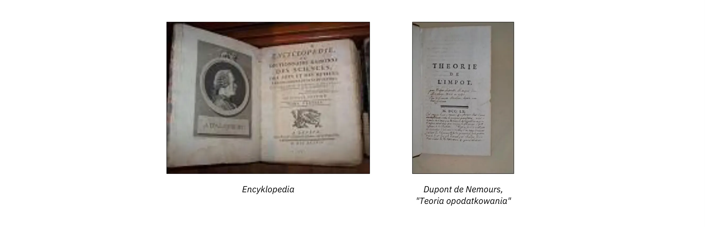

Zostały one opublikowane w 1757 roku. W tym samym roku spotkał słynnego Mirabeau i zdołał go przekonać do swoich pomysłów ekonomicznych - narodził się rdzeń fizjokratyzmu. Następnie Quesnay stworzył Tableau Économique, które zostało wydrukowane na królewskich prasach, podobno w obecności samego króla w Château de Versailles. Od tego momentu regularnie gościł ekonomistów i filozofów w swoim wersalskim mieszkaniu, gdzie swobodnie prowadzili dyskusje. Quesnay przyczynił się również do powstania Teorii opodatkowania Mirabeau, opublikowanej w 1759 roku.

Wkrótce pojawiła się cenzura. Mirabeau został uwięziony, a Quesnay otrzymał naganę. Po tym wydarzeniu Quesnay zdał sobie sprawę, że nie może publikować otwarcie i będzie potrzebował uczniów, aby szerzyć swoje idee.

Szybko ich znalazł: Baudeau, Dupont de Nemours, Le Trosne, Mercier de la Rivière i innych. Byli to ludzie, którzy rozpowszechnili i spopularyzowali myśl Quesnaya. Jednak Quesnay, który potrzebował uczniów, nie był w pełni zadowolony z sekciarskiego aspektu swojej grupy. Świadczą o tym jego listy do Mirabeau, w których mówi mu:

> "Pomyślcie sami. Zdałem sobie sprawę, że moje nędzne szkice was rozleniwiają. Teraz wasza kolej na myślenie. Wiecie tyle samo, co ja".

Mimo to jego uczniowie byli mu głęboko oddani i w znacznym stopniu przyczynili się do popularności Quesnaya. Po jego śmierci Mirabeau wygłosił mowę pochwalną, mówiąc: "Straciliśmy naszego ojca, ponieważ zawdzięczaliśmy mu wszystko". W rzeczywistości to Quesnay zawdzięczał im wszystko, ponieważ bez nich utknąłby w Wersalu, gdzie jego myśl, choć miała wiele do uwiedzenia lub zmartwienia, interesowała niewielu.

Dzięki pracy swoich współpracowników, jego pomysły znalazły platformę: najpierw w gazetach takich jak *Journal of Agriculture* i *Ephémérides du Citoyen*.

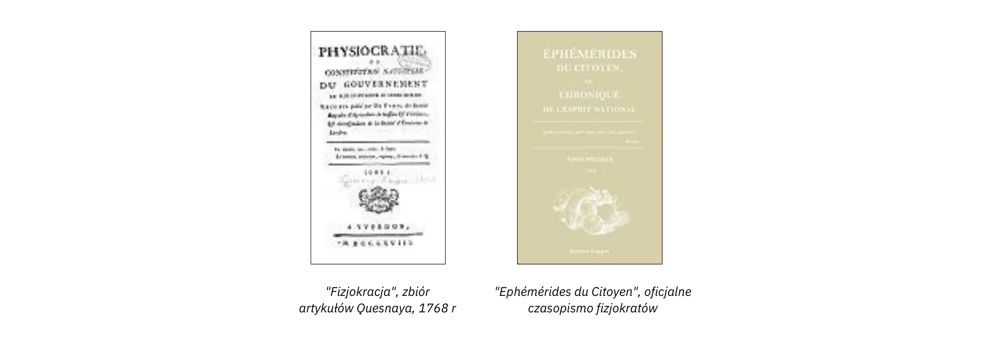

Następnie poprzez książki, nie tylko te jego uczniów, ale także ważną antologię opublikowaną w 1768 roku przez Dupont de Nemours, zatytułowaną *Physiocracy*.

Ta książka zebrała główny wkład Quesnaya. Przedstawiono w niej ekonomiczny ideał przywódcy fizjokratów: model gospodarki rolnej, w którym prawo gwarantuje każdemu prawo do posiadania własności i wolność handlu.

# Szkoła fizjokratyczna

<partId>27af82c1-ad82-5c3b-8ce9-c674b67bbf7c</partId>

## Historia fizjokratów

<chapterId>4236ff8b-b53a-59e7-92c0-f96f9afa1c00</chapterId>

Fizjokracja stała się modna we Francji, a nawet w całej Europie, zaledwie przez dekadę. Po długim okresie rozwoju zyskała na znaczeniu w połowie lat sześćdziesiątych XVII wieku. Zanim Turgot doszedł do władzy w 1776 r., ruch ten stracił już na popularności, a minister w większości ukrywał swoje poparcie dla szkoły Quesnaya.

Jego początki leżą w ewolucji idei ekonomicznych w latach pięćdziesiątych XVII wieku. Kilku autorów pomogło wypełnić lukę między Boisguilbertem a tym, co później stało się znane jako fizjokracja. Jak wspomniano wcześniej, Vincent de Gournay i jego krąg ekonomistów stali za wieloma publikacjami, które wprowadziły francuskich czytelników w zagraniczną myśl ekonomiczną i pomogły rozpalić ich pasję do ekonomii. Podstawy fizjokratyzmu były już obecne w książkach takich jak "Détail de la France" Boisguilberta i ["Essay on the Nature of Trade in General"](https://archive.org/details/essaisurlanature0000cant) Cantillona.

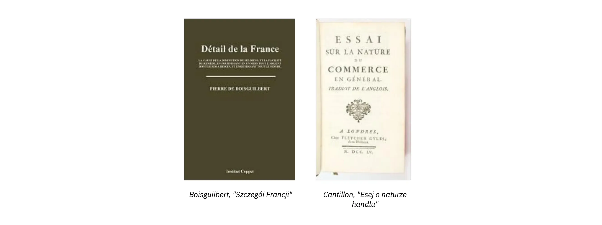

Koncepcja leseferyzmu miała kilku zwolenników od czasów Boisguilberta, zwłaszcza Vincenta de Gournay i markiza d'Argenson.

To, co pozostało, to przekształcenie tego zbioru pomysłów w spójną, kompletną doktrynę, a markiz de Mirabeau był pierwszym, który spróbował. Zainspirowany esejem Cantillona, zaczął pisać obszerny traktat na tematy ekonomiczne zatytułowany "L'Ami des Hommes", który odniósł duży sukces.

W ten sposób w 1756 r. rozpoczęła się historia fizjokracji. François Quesnay, wówczas chirurg, który stał się osobistym lekarzem Madame de Pompadour, zaprosił Mirabeau do Wersalu, aby omówić idee ekonomiczne.

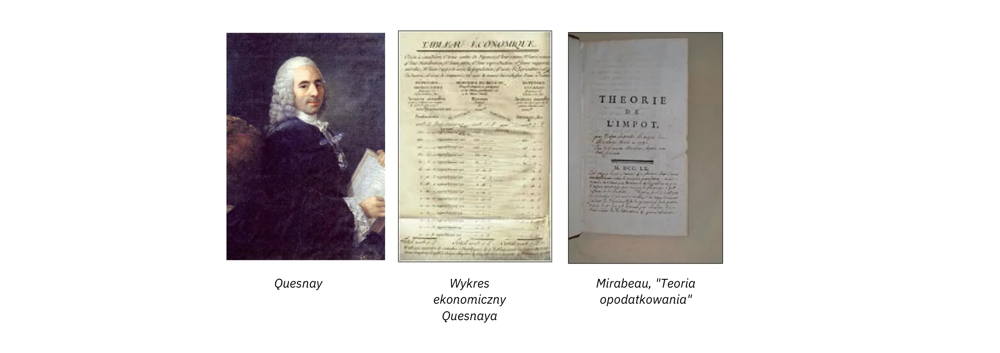

Pod koniec rozmowy Mirabeau zgodził się z pomysłami Quesnaya. Od tego momentu zaczęli pisać: Quesnay stworzył *Tableau économique* (1758), aby zilustrować przepływ bogactwa w gospodarce, a razem opublikowali Teorię opodatkowania (1759).

Ich wysiłki nie spotkały się z pozytywnym przyjęciem. Na dworze dominowała obojętność. Król uznał skłonność Quesnaya do teorii i czule nazwał go "moim myślicielem". Ale poza tym komplementem ich praca nie przyniosła żadnych rezultatów. W rzeczywistości ich Teoria opodatkowania obraziła administratorów podatkowych, których krytykowała, tak bardzo, że zażądali i zapewnili uwięzienie Mirabeau. Madame de Pompadour ostatecznie go uwolniła, ale przez kilka tygodni nadal mieszkał na wygnaniu w swojej posiadłości w Bignon.

Pierwsza połowa lat sześćdziesiątych XVII wieku upłynęła więc we względnej ciszy. Ze względu na swoją pozycję w Wersalu Quesnay został zmuszony do zaprzestania pisania, a przynajmniej do niepublikowania niczego pod własnym nazwiskiem. Mirabeau, już raz potępiony, został ostrzeżony i dobrze wiedział, że faworyt króla nie może go wiecznie chronić.

Po tej krótkiej ciszy obaj ekonomiści zaczęli rekrutować uczniów: był to jedyny sposób na popularyzację ich pomysłów. Do 1765 r. ich sukcesy były uderzające. Dupont de Nemours, Abeille, Mercier de la Rivière, Le Trosne i Baudeau szybko dołączyli do ich grona. Stworzyli szkołę: mieli własne czasopismo *Les Éphémérides du Citoyen*, a nawet spotykali się w każdy wtorek w domu Mirabeau.

W latach 1765-1775 zjednoczona grupa fizjokratów stała u szczytu swojej sławy. Świat literacki i filozoficzny patrzył tylko na nich, pozwalając ich ideom rozprzestrzeniać się szeroko i szybko. Ludzie nazywali ich "ekonomistami" lub, bardziej prześmiewczo, "sektą ekonomistów". Niezależnie od tonu, ich rozgłos był absolutny. W 1774 r., po podróży do Metz, M. de Vaublanc napisał w swoich wspomnieniach o swoim zdumieniu: wszyscy wokół niego mówili o ekonomii i rozumowali jak uczniowie Quesnaya. "To było modne", zauważył. "Każdy był ekonomistą".

Jednak w 1770 r. ich popularność zaczęła słabnąć. Grupa doświadczyła pierwszych porażek, a ich zdolność do wytrzymania krytyki osłabła. A krytyków było wielu, Condillac, Mably, Voltaire, Galiani, Linguet, Graslin, a nawet Adam Smith w Szkocji, wszyscy kwestionowali ich poglądy.

Ich gazeta nie ukazywała się już regularnie. Oznaczało to koniec najbardziej aktywnego okresu ruchu.

Fizjokracja nadal wywierała wpływ aż do rewolucji. We Francji, najpierw przez Turgota, bardziej towarzysza podróży niż ucznia, a także przez jego przedstawiciela Dupont de Nemours, którego życie i prace przeanalizujemy później. Ale także w całej Europie, gdzie doktryna fizjokratyczna została przyjęta z entuzjazmem. W Niemczech, za pośrednictwem margrabiego Badenii, oraz we Włoszech, za pośrednictwem Leopolda z Toskanii, teorie fizjokratyczne zainspirowały nawet reformy gospodarcze sprzyjające własności prywatnej i wolności.

## Podstawy doktryny fizjokratów

<chapterId>4dbe5436-0578-57c2-b054-03ed00aa091a</chapterId>

Termin Physiocracy, oznaczający "rząd z natury", został wymyślony przez Dupont de Nemours i użyty jako tytuł *Physiocracy*, zbioru artykułów Quesnaya opublikowanych w 1768 roku.

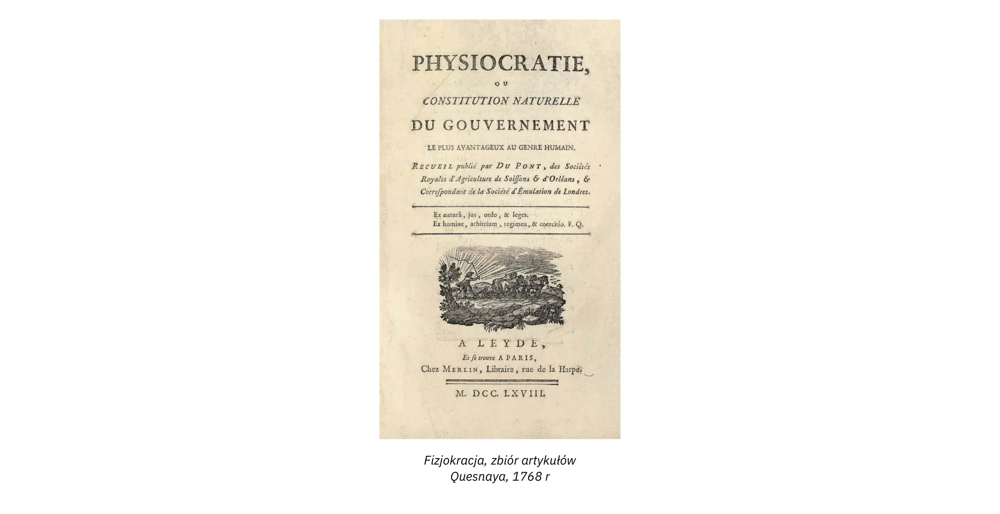

Jest to niejasne wyrażenie. Żaden uczeń Quesnaya nie przedstawił nam jego prawdziwego znaczenia. Niemniej jednak ich system myślenia był daleki od niejasności. W rzeczywistości został zbudowany wokół kilku bardzo jasnych zasad, które tutaj przedstawimy.

### Pierwsza zasada: tylko rolnictwo jest produktywne

Ta pierwsza idea przyciągnęła uwagę historyków. Dziś w podręcznikach czy na kursach ekonomii tak właśnie podsumowuje się fizjokratów. Mówi się, że naiwnie wierzyli, że tylko rolnictwo jest produktywne. Na tej podstawie ich doktryna jest odrzucana jako nieistotna, a analiza szybko przechodzi do Adama Smitha.

Niesprawiedliwe jest jednak krytykowanie fizjokratów za przywiązywanie nieproporcjonalnej wagi do rolnictwa, ponieważ w połowie XVIII wieku rolnictwo zatrudniało 90% populacji i stanowiło podstawę francuskiej gospodarki.

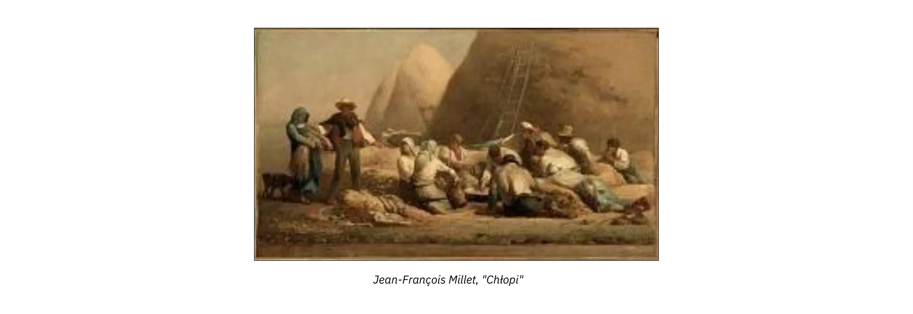

Idea fizjokratów jest w rzeczywistości subtelna. Według nich istnieje różnica między produkcją a zyskiem. Przemysłowiec i kupiec mogą osiągać zyski, ale tylko rolnik naprawdę produkuje, ponieważ produkcja jest tworzeniem użytecznego materiału, a nie dodawaniem użyteczności do wcześniej istniejącego materiału.

Powinniśmy również spróbować zrozumieć, dlaczego odrzucili przemysł i rzemiosło jako nieproduktywne. W tamtym czasie branże te były zamknięte w systemie gildii, który zakazywał innowacji, inwestycji i postępu.

### Druga zasada: prawny despotyzm zamiast demokracji

Dziś, aby kogoś obrazić, mówimy, że nie jest demokratą. Chociaż historycy wybaczają fizjokratom ich surowe poglądy na produktywność rolnictwa, nie wybaczają im ich sprzeciwu wobec demokracji, zwłaszcza że żyli oni w szczytowym okresie oświeceniowych idei. Od połowy XVIII wieku do okresu tuż przed rewolucją, fizjokraci byli postrzegani jako wrogowie postępu.

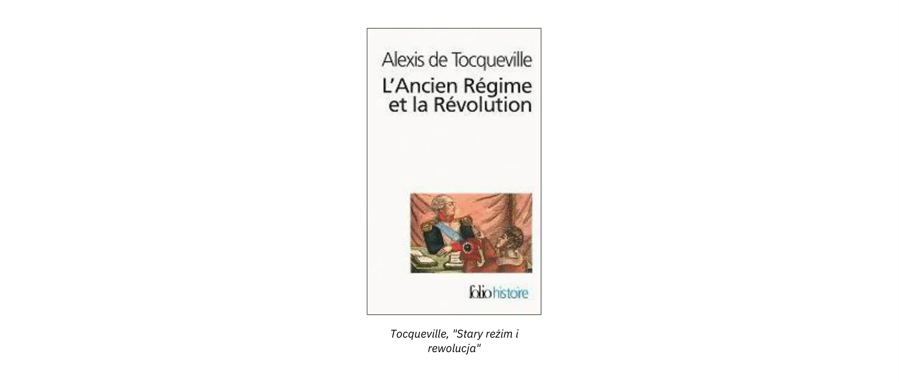

Tocqueville nalegał na tę ideę:

> Fizjokraci rzeczywiście byli bardzo przychylni wolnemu handlowi towarami, laissez-faire lub laissez-passer w handlu i przemyśle; ale jeśli chodzi o wolności polityczne, nie brali ich pod uwagę, a nawet gdy takie pomysły przychodziły im do głowy, początkowo je odrzucali.

Liberalni w ekonomii, fizjokraci nie byli zatem liberalni w kwestiach politycznych. Quesnay pisze w swoich *maxims*: "Niech suwerenna władza będzie wyjątkowa i nadrzędna wobec wszystkich jednostek społeczeństwa i wszystkich niesprawiedliwych przedsięwzięć prywatnych interesów" A później, w tej samej maksymie: "System kontroli i równowagi w rządzie jest fatalnym pojęciem, które ujawnia jedynie niezgodę wśród wielkich i ucisk małych".

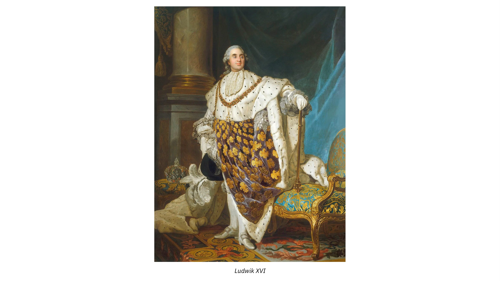

Tocqueville trafnie zauważył, że fizjokraci odrzucili demokrację, gdy tylko zobaczyli jej formy. Byli sceptyczni wobec demokracji, która stała się stałym elementem francuskiej ekonomii politycznej, ponieważ demokracja jest daleka od doskonałego systemu: potencjalnie pozwala na ucisk mniejszości przez większość i może stać się narzędziem uzurpacji, tyranii i niszczenia.

### Trzecia zasada: bezwzględne poszanowanie własności prywatnej

Fizjokraci wierzyli, że ludzie muszą posiadać i zatrzymywać wyniki swojej pracy. Ich zdaniem prawa własności były fundamentem społeczeństwa. Uważali, że państwo ma jedno główne zadanie: chronić własność ludzi. Co więcej, z ekonomicznego punktu widzenia fizjokraci twierdzili, że nienaruszalność własności zachęca do pracy i wysiłku oraz jest warunkiem postępu gospodarczego.

Quesnay ujął to prosto:

> Niech Ownership zapewni ziemię i majątek ruchomy tym, którzy są ich prawowitymi posiadaczami, ponieważ bezpieczeństwo własności jest niezbędnym fundamentem porządku gospodarczego i bezpieczeństwa społeczeństwa; to pewność trwałego posiadania zachęca do pracy i wykorzystania bogactwa w ulepszaniu i uprawie ziemi, a także w przedsiębiorstwach handlowych i przemysłowych.

### Czwarta zasada: absolutna wolność handlu

W swoich wcześniej cytowanych *Maxims* Quesnay stwierdza:

> Niech będzie pełna wolność handlu, ponieważ najbardziej niezawodna, precyzyjna i korzystna regulacja zarówno handlu krajowego, jak i zagranicznego dla narodu i państwa leży w pełnej wolności konkurencji.

Fizjokraci widzieli szkody spowodowane ingerencją rządu, zwłaszcza w handlu zbożem. Trzeba przyznać, że władza nigdy nie będzie w stanie zarządzać handlem tak dobrze, jak robią to jednostki, ponieważ musiałaby reagować na każdą potrzebę i reagować na każdą zmianę popytu lub Supply. Wszystko to wykracza daleko poza możliwości nawet najmądrzejszego rządu, jaki można sobie wyobrazić. Dlatego konieczne jest, aby pozwolić rzeczom być i pozwolić im płynąć.

Korzystny z natury handel musi być całkowicie i doskonale wolny. Jeden z ich członków, Le Trosne, napisał nawet broszurę zatytułowaną [*The Freedom of the Grain Trade: Always Useful, Never Harmful*](https://www.institutcoppet.org/liberte-commerce-grains-toujours-utile-jamais-nuisible/).

### Piąta zasada: Wszyscy ludzie są braćmi

Zaciekli przeciwnicy niewolnictwa, fizjokraci byli również wielkimi pacyfistami. "Nasza polityka zagraniczna nazywa się pokój", powiedział po prostu Mirabeau. W 1790 r., podczas Zgromadzenia Konstytucyjnego, Dupont de Nemours kontynuował to pacyfistyczne stanowisko, proponując ustawę zakazującą wojen ofensywnych.

## Osiągnięcia i wpływy fizjokratów

<chapterId>5b911105-796a-5e2e-a501-c7a364fc758e</chapterId>

Jak widzieliśmy w pierwszym z trzech rozdziałów poświęconych fizjokratom, zwolennicy Quesnaya byli wściekli we Francji przez około dekadę. Entuzjazm dla ich idei kształtował się zarówno w ich czasach, jak i trwał do końca wieku. Tutaj przyjrzymy się niektórym z ich osiągnięć i wpływowi, jaki wywarli na swoich następców w dziedzinie myśli ekonomicznej.

Ich największym osiągnięciem, po grupie Gournaya, była popularyzacja idei ekonomicznych. Słynne powiedzenie Woltera jest dobrze znane: około 1750 r. naród, nasycony poezją i powieściami, zaczął rozumować o zbożu. Fizjokraci wzięli udział w tym ruchu, publikując dosłownie setki artykułów, pamfletów i książek na temat wolności handlu zbożem. Silny impuls nadany przez fizjokratów dyskusjom ekonomicznym jest również widoczny w imponującej liczbie prac ekonomicznych i pamfletów opublikowanych we Francji w latach 1760-1775. Jako kolejny dowód na rozprzestrzenianie się idei ekonomicznych we Francji, można przypomnieć uwagę M. de Vaublanc, cytowaną w poprzednim wykładzie, który powiedział w Metz w 1774 r., że ludzie nie mówili o niczym innym, jak tylko o ekonomii. "Taka była moda", powiedział. "Każdy był ekonomistą".

Obrona ich idei w książkach, pamfletach i czasopiśmie *Les Éphémérides du Citoyen* szybko odbiła się na polityce gospodarczej Francji. W 1763 r. edykt przyznał swobodę handlu zbożem, czego stanowczo domagali się Quesnay i Mirabeau. Przy kilku okazjach władze złagodziły również przepisy regulujące działalność gildii kupieckich, aby zagwarantować większą swobodę pracy.

Za granicą sukces przyszedł bardzo wcześnie. W Niemczech margrabia Badenii zainteresował się ideami fizjokratycznymi i utrzymywał regularną korespondencję z Mirabeau i Dupont de Nemours.

Zlecił ekonomiście Johannowi Augustowi Schlettweinowi, przekonanemu fizjokracie, wdrożenie reformy podatkowej i liberalizację handlu zbożem. W kwietniu 1770 r. odbyła się pierwsza próba w małej wiosce Dietlingen. Wydawało się, że mieszkańcy entuzjastycznie przyjęli te środki, ale odpowiedzialni urzędnicy nie byli zbyt przychylni, co opóźniło ich szersze wdrożenie.

W Rosji Katarzyna II przygotowywała reformę ustawodawczą i poprosiła Diderota o przysłanie jej błyskotliwego umysłu do pomocy.

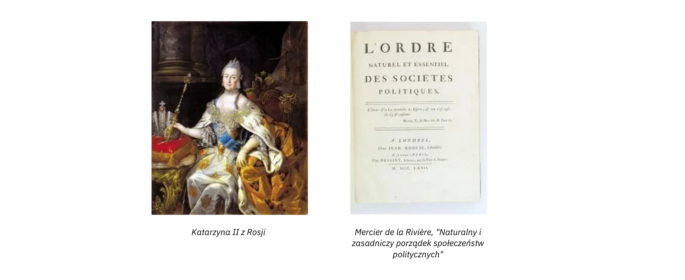

Będąc pod wrażeniem lektury [*The Natural and Essential Order of Political Societies*](https://archive.org/details/lordrenaturelete00mercuoft), opublikowanej w 1767 roku, wysłał jej jej autora, fizjokratę Merciera de la Rivière.

Mimo że opuścił Francję sławny, jego przyjęcie w Petersburgu było chłodne (pomijając klimat), a cesarzowa była nim rozczarowana.

W Szwecji, z Gustawem III, i we Włoszech, z Leopoldem z Toskanii, fizjokraci również znaleźli zwolenników gotowych wcielić swoje idee w życie.

We Francji fizjokraci odnieśli spektakularny sukces, powołując Turgota na stanowisko Kontrolera Generalnego Finansów w 1774 roku.

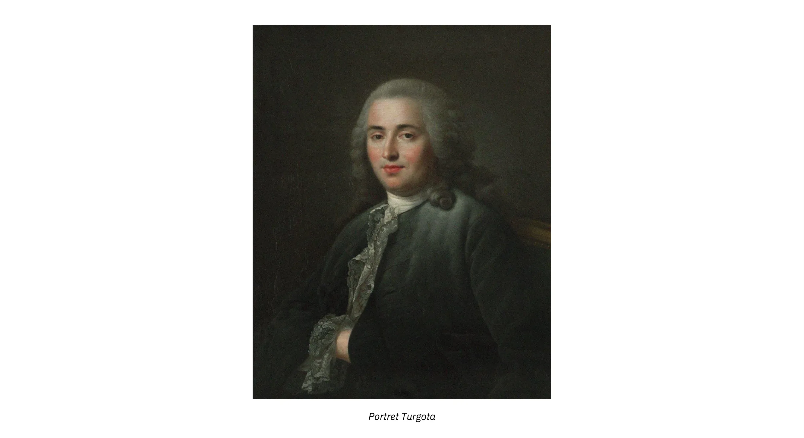

Świadomy spadku ich sławy, Turgot nigdy nie zaprezentował się jako lojalny uczeń fizjokratów, ani tym bardziej jako encyklopedysta, choć był jednym z nich, a ponieważ byli oni pogardzani przez członków kleru. Po dojściu do władzy Turgot wydał sześć słynnych edyktów, które stanowiły początek praktycznego zastosowania programu fizjokratów: wolność handlu, wolność pracy i koniec monopoli.

Do czasu rewolucji francuskiej fizjokraci mieli mniej zwolenników. Markiz Mirabeau zmarł 13 lipca 1789 roku - był to symbol. Abeille odszedł, ale Dupont de Nemours pozostał wierny. Powołany do Zgromadzenia, Dupont de Nemours niósł głos fizjokratów i wzywał do reform gospodarczych na rzecz własności Ownership i wolnego handlu.

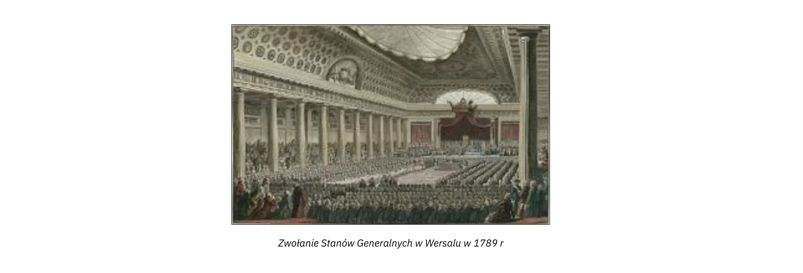

Bezskutecznie walczył również z assignatami. Pomimo tej porażki, myśl fizjokratyczna pozostała bardzo obecna w debacie intelektualnej i wpłynęła na wczesne osiągnięcia Rewolucji. Jak powiedział Joseph Rambaud, wszystko, co Rewolucja zrobiła na rzecz wolności, było zasługą fizjokratów.

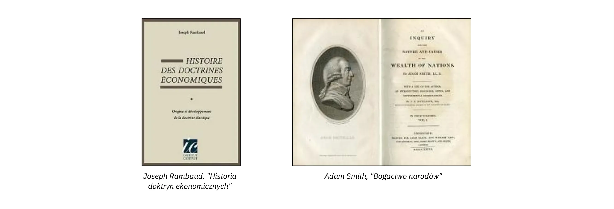

Fizjokraci mieli również duży wpływ na historię myśli ekonomicznej. Adam Smith, który odwiedził Francję i spotkał wielu z nich, był pod głębokim wpływem ich pracy. Rozważał nawet zadedykowanie *The Wealth of Nations* Quesnayowi.

Niestety, Quesnay zmarł dwa lata przed publikacją książki Smitha, a Smith usunął dedykację. Chociaż Smith nie zgadzał się z ich poglądem, że tylko rolnictwo jest produktywne, przyjął wiele z ich argumentów na rzecz wolnego rynku i kontynuował je w swojej własnej pracy.

## Dupont de Nemours

<chapterId>6d585e0f-93b8-5b0a-a0a8-7f6e4a5bc68e</chapterId>

W Stanach Zjednoczonych znamy firmę DuPont, znaną również jako "E.I. du Pont de Nemours and Company", międzynarodową firmę działającą w dziedzinie chemii i biologii.

Dziś osiąga sprzedaż na poziomie ponad 35 000 miliardów dolarów i zatrudnia prawie 65 000 osób na całym świecie. Okazuje się, że firma ta jest ściśle związana z losami Samuela-Pierre'a Dupont de Nemours, francuskiego ekonomisty szkoły fizjokratycznej.

Urodzony w 1739 roku Dupont de Nemours zbliżył się do fizjokratów w wieku 24 lat. W tym czasie wciąż szukał swojej drogi w życiu. Pewnego dnia natknął się na krótką broszurę zatytułowaną Bogactwo państwa. Stwierdził, że jego pomysły ekonomiczne są nonsensowne i napisał krytyczną odpowiedź zatytułowaną Reflections on the Wealth of the State, opublikowaną w 1763 roku. Artykuł został dobrze przyjęty, a czytelnicy chwalili go, mówiąc na przykład: "Musisz być uczniem Mirabeau!" Jak na ironię, Dupont nawet nie wiedział, kim był Mirabeau.

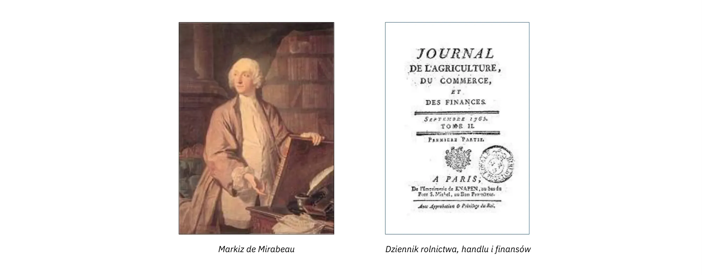

Zaciekawiony, zaczął czytać prace Mirabeau, *Przyjaciela Ludu* i *Teorię opodatkowania*. Poznał Mirabeau i François Quesnaya, a następnie dołączył do ich szkoły.

W 1765 r. Dupontowi zaproponowano stanowisko redaktora *Journal de l'agriculture, du commerce et des finances*, wiodącego w swoim czasie czasopisma w dziedzinie myśli ekonomicznej.

Były ku temu dwa powody: Mirabeau i Quesnay musieli milczeć, a Dupont był postrzegany jako ich wschodząca gwiazda.

Członkowie szkoły fizjokratycznej zgadzają się, że Dupont de Nemours szybko stał się ulubieńcem Quesnaya. Quesnay powiedział kiedyś: "Dbaj o tego młodego człowieka, to on będzie przemawiał po naszej śmierci". Jeden z kolegów fizjokratów, Abeille, stał się nawet zazdrosny o uwagę, jaką otrzymał Dupont i zdystansował się od szkoły Quesnaya.

Dupont de Nemours zawsze bardzo szanował Quesnaya.

Później powiedział: "Byłem tylko chłopcem, kiedy Quesnay wyciągnął do mnie ręce - uczynił mnie mężczyzną" To właśnie Quesnay uczynił go głównym ekonomistą na ówczesnej scenie literackiej.

Po *Journal de l'agriculture, du commerce et des finances*, Dupont został mianowany redaktorem *Les Éphémérides du Citoyen*, który stał się oficjalnym organem fizjokratów.

Sprawił, że ta kolekcja czasopism stała się głównym ośrodkiem teorii ekonomii, wspierając ją nawet podczas upadku fizjokratów, osobiście pisząc prawie wszystkie późniejsze tomy. Co więcej, to właśnie Dupont de Nemours ukuł termin "fizjokracja", pochodzący od dwóch greckich słów oznaczających "rząd natury". Użył tego terminu do zatytułowania zbioru artykułów Quesnaya opublikowanych w 1768 roku, a termin ten ostatecznie utrwalił się w historii. Wiadomo, że między sobą fizjokraci nazywali się "ekonomistami" i nadal byli tak nazywani podczas rewolucji.

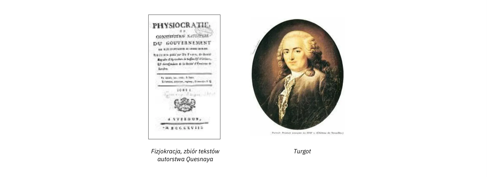

Kiedy Turgot przez krótki czas pełnił funkcję ministra finansów Francji, Dupont został jego bliskim doradcą, jedynym fizjokratą, który miał do niego dostęp, ponieważ Turgot trzymał się z dala od innych.

W czasie rewolucji został wybrany z baliwatu Nemours i znalazł się w Zgromadzeniu, gdzie zasiadał również inny Monsieur Dupont. Nazwano go wtedy Dupont de Nemours, nie dlatego, że był szlachcicem, ale po prostu dla rozróżnienia. Nazwisko oczywiście pozostało.

Podczas rewolucji w sierpniu 1792 r. chwycił za broń, by bronić króla w pałacu Tuileries przed tłumem.

Król powiedział do niego: "Monsieur Dupont, zawsze znajdujemy cię tam, gdzie jesteś potrzebny!" Po cudownej ucieczce przed terrorem, skazany i oczekujący na gilotynę, ale uratowany przez upadek Robespierre'a, został wygnany przez Napoleona i znalazł szczęście w Stanach Zjednoczonych, gdzie jeden z jego synów założył, z pomocą ojca, firmę Dupont.

Pomimo tego bogatego w wydarzenia życia, podczas którego opublikował dziesiątki artykułów, broszur i książek, do dziś pozostaje stosunkowo mało znany. Być może dlatego, że pozostał zagorzałym fizjokratą, gdy doktryna ta wyszła z mody. Rzeczywiście, jak napisał Schumpeter, Dupont de Nemours pozostał wierny fizjokratyzmowi "przez całą karierę, podczas której miał wiele okazji, by się go wyrzec". Był człowiekiem pełnym przekonań.

# Oświecenie i ekonomia polityczna

<partId>d1c885ad-7cb1-5f81-816c-be312719d9f8</partId>

## Wolter i filozofowie

<chapterId>16bcf7bf-dad4-5113-8c64-2800f04ff07b</chapterId>

W XVIII wieku we Francji pojawiła się ekonomia jako nauka i pierwsza szkoła myśli ekonomicznej: Fizjokracja. Adam Smith szkolił się w ekonomii w tym okresie, a francuscy ekonomiści byli uznawani na całym świecie za liderów. Wiek ten jest jednak pamiętany bardziej jako wiek filozofii niż ekonomii. Podczas gdy ruch fizjokratyczny w swoich ambicjach był zgodny z filozofią oświecenia, postawy filozofów - zwłaszcza Diderota i Woltera - zasługują na dokładną analizę. Przekonamy się, że oświeceniowi myśliciele znacząco przyczynili się do rozpowszechnienia idei leseferyzmu we Francji.

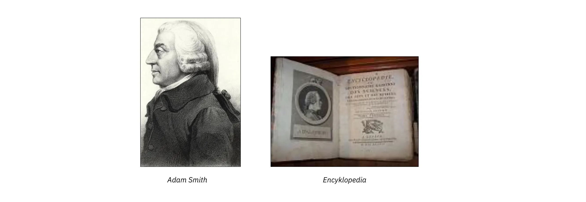

Najsłynniejszym osiągnięciem filozofii oświecenia jest bez wątpienia *Encyclopédie* autorstwa Diderota i d'Alemberta.

Oczywiście artykuły ekonomiczne były pisane przez ekonomistów. W przypadku wczesnych tomów Diderot zwrócił się do Forbonnais, a następnie zaciągnął liberalnych ekonomistów: najpierw François Quesnay (który wniósł artykuły takie jak "Grains", "Fermiers", "Hommes" - ostatni niepublikowany), a następnie Turgot (który napisał "Foires et marchés"). Pisma te mają ogromne znaczenie. W swoich artykułach Quesnay położył podwaliny pod doktrynę fizjokratyczną. Wraz z jego *Tableau économique*, pozostają one jego najbardziej znanymi dziełami. Turgot, wówczas jeszcze młody, rozwinął ideę leseferyzmu w swoim artykule, krytykując interwencję państwa w organizację rynku.

W wielu innych artykułach *Encyclopédie* filozofowie, zwłaszcza Diderot, bronią ideału wolności we wszystkich dziedzinach: religii, polityce i ekonomii.

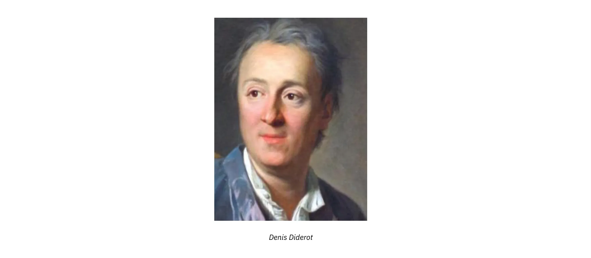

Wolność pracy, zwłaszcza w opozycji do systemu cechowego, była powracającym tematem w różnych wpisach, takich jak Arts, Métier i Communauté.

Ścieżka Diderota w teorii ekonomii jest ciekawa. W Encyclopédie był zagorzałym zwolennikiem wolności gospodarczej i był tym, który szukał współpracy liberalnych ekonomistów, co potwierdza list przedstawiający artykuły, które Turgot mógłby dla niego napisać. We wczesnych latach fizjokratyzmu był zarówno zwolennikiem, jak i promotorem szkoły Quesnaya. W latach 1769 i 1770 pisał dla *Les Ephémérides du Citoyen*, ku wielkiemu przerażeniu swoich antyliberalnych przyjaciół filozofów, takich jak Melchior Grimm; wkrótce jednak zdystansował się od grupy. Zachwycony żywym intelektem opata Galianiego, pomógł mu opublikować jego książkę o handlu zbożem w języku francuskim, gdy Galiani miał wrócić do Włoch.

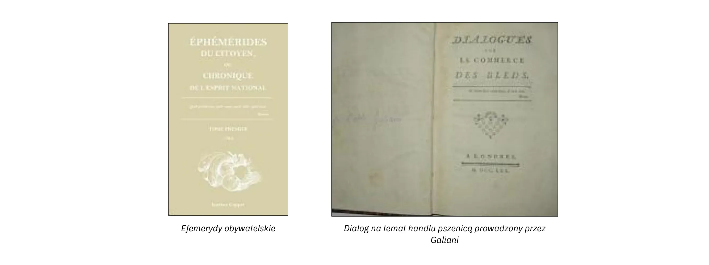

Książka ta stała się najbardziej zaciekłym atakiem na idee fizjokratyczne, zadając ruchowi poważny cios. Później Diderot bronił Galianiego przed opatem Morelletem, bliskim sojusznikiem fizjokratów, w swojej *Apologii Galianiego*. Kilka lat później, podczas ministerstwa Turgota, Diderot był postrzegany jako zwolennik ustanowienia wolności pracy poprzez zniesienie cechów. W tym momencie Diderot, syn rzemieślnika, zgodził się z liberalnymi ekonomistami i napisał zjadliwy list do Galianiego, który twierdził, że wolność pracy zrujnuje francuski przemysł w ciągu dwudziestu lub trzydziestu lat. W świetle rewolucji przemysłowej historia sugeruje co innego. Powróciwszy na stronę liberalnych ekonomistów, Diderot nie cieszył się już ich zaufaniem i pozostał odizolowany. Bardzo wymownym momentem jest list, który wysłał do Dupont de Nemours w 1774 roku, w którym pisze:

> "Kiedyś miałeś dla mnie przyjaźń, teraz już jej nie masz, ponieważ jesteś tak zajęty, że nie masz już czasu nikogo kochać".

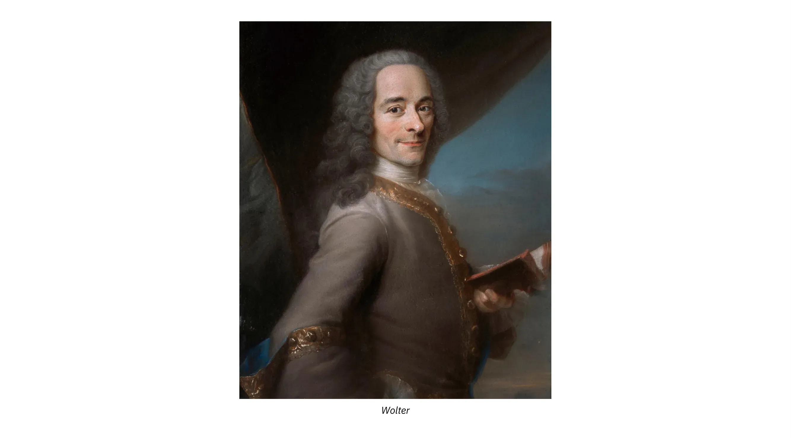

Wolter podążał podobną ścieżką, naznaczoną brakiem spójności w jego poglądach ekonomicznych. Podziwiał Vincenta de Gournay, korespondował z ekonomistami (w tym Dupont de Nemours i Turgot) i doceniał fizjokratów - zwłaszcza za ich pochwałę rolnictwa. Wychwalał ich w *Diatrybie do autora Ephémérides*. Później jednak skrytykował ich pomysł jednolitego podatku gruntowego w swoim satyrycznym dziele *Człowiek o czterdziestu koronach*, które również wzbudziło znaczne kontrowersje. Wreszcie, podobnie jak Diderot, celebrował posługę Turgota, nazywając ją złotym wiekiem i chwaląc jego dwa wielkie dekrety o wolności pracy i wolnym handlu.

Ostatecznie związek filozofów z myślą ekonomiczną jest mieszany. Pomimo ich pochwał i krytyki liberalnych idei ekonomicznych, odegrali oni rolę we wprowadzeniu tych idei do szerszego intelektualnego dyskursu Oświecenia. W ten sposób, świadomie lub nie, przyczynili się do rozwoju idei leseferyzmu aż do rewolucji.

## Turgot, teoretyk

<chapterId>a8cd8185-8351-556b-8011-3a0c313e8a9d</chapterId>

W słynnym fragmencie swojej *Historii myśli ekonomicznej* amerykański ekonomista Murray Rothbard chwalił to, co nazwał "błyskotliwością" Turgota.

przedstawiając go jako największego ekonomistę XVIII wieku, obok Cantillona.

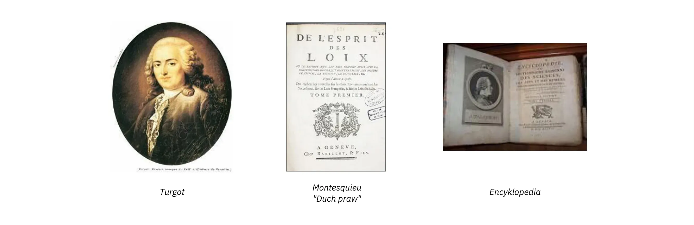

Jak to się stało, że Turgot osiągnął tak wysoką pozycję? Sprowadzało się to do połączenia trzech kluczowych czynników. **Po pierwsze**, jego prestiżowe pochodzenie rodzinne. Pochodził z długiej linii królewskich administratorów, z których wielu zajmowało wysokie stanowiska rządowe. **Po drugie**, złoty wiek, w którym się urodził i wychował. Turgot miał 21 lat, gdy Montesquieu opublikował *L'Esprit des Lois* i 24 lata, gdy ukazał się pierwszy tom *Encyclopédie*.

Był współczesny fizjokratom, Wolterowi, Diderotowi, d'Holbachowi, Adamowi Smithowi, Condorcetowi i innym. **Po trzecie**, jego intelektualna prekognicja. Podczas studiów na Sorbonie, w wieku 22 lat napisał list na temat papierowych pieniędzy, wygłaszał niezwykłe przemówienia, a w wieku 24 lat stworzył listę 52 dzieł do napisania.

Pomimo młodego wieku, Turgot przyczynił się do powstania *Encyclopédie*, pisząc artykuły na tematy takie jak "Etymologia", "Istnienie", "Rozszerzalność", "Targi" i "Fundamenty". Tylko jeden artykuł dotyczył bezpośrednio ekonomii - jego artykuł na temat "Targów", który szczegółowo opisywał początki targów i rynków oraz krytykował rosnącą ingerencję państwa, która je zakłócała i paraliżowała.

W tych wczesnych latach jego mentorem był Vincent de Gournay, który wziął go pod swoje skrzydła i nawiązał z nim bliską przyjaźń. Po śmierci Gournaya w 1759 r. Turgot skomponował pochwałę, w której przedstawił znakomite podsumowanie doktryny leseferyzmu. W szczególności napisał:

"Z każdej perspektywy, w której handel może dotyczyć państwa, indywidualny interes pozostawiony samemu sobie zawsze z większą pewnością przyniesie ogólne dobro niż działania rządu, które zawsze są wadliwe i z konieczności kierują się niejasną i niepewną teorią".

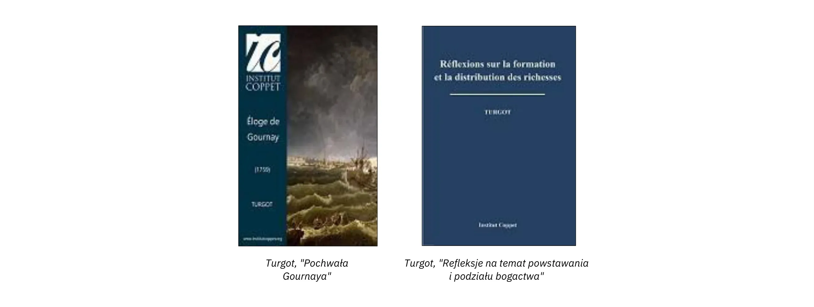

W 1767 r., będąc intendentem, skomponował kompendium ekonomii pod tytułem *Reflections on the Formation and Distribution of Wealth*.

Podział pracy, suwerenność konsumenta, własność prywatna, rola kapitału, praktycznie wszystkie główne tematy ekonomiczne są poruszane. Wielu historyków, z których najnowszym jest historyk Anne-Claire Hoyng, zwróciło uwagę na podobieństwa między tym dziełem Turgota a *The Wealth of Nations* Adama Smitha, opublikowanym dziewięć lat później.

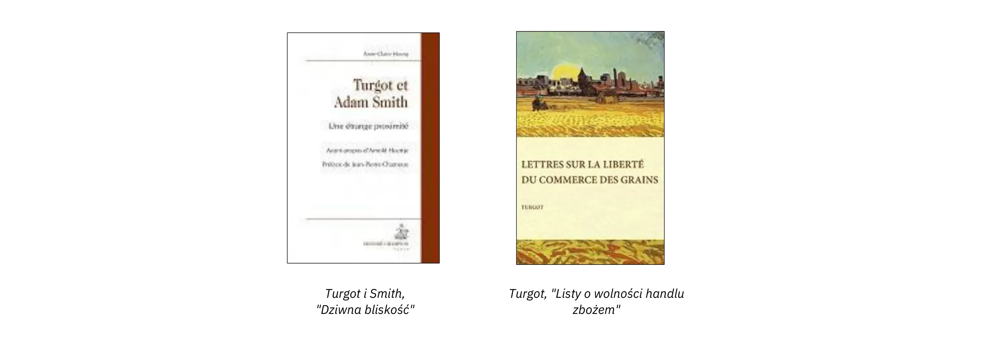

Turgot bronił wolności handlu zbożem w listach do opata Terray, które później zostały przekazane królowi, ale połowa z nich zaginęła. Pisał:

> Sir, jeśli coś jest pilne, to nie nakładanie nowych ograniczeń na najważniejsze ze wszystkich branż, ale usunięcie tych, które niestety pozwolono utrzymać.
> Jeśli kiedykolwiek był czas, w którym potrzebna była najpełniejsza, najbardziej absolutna wolność, całkowicie wolna od jakichkolwiek przeszkód, to ośmielę się powiedzieć, że jest to teraz i że nigdy nie było mniej stosowne rozważanie wydania rozporządzenia w sprawie handlu zbożem.

W 1769 r. Turgot napisał artykuł Value and Money dla *Dictionnaire de Commerce* opata Morelleta, który ostatecznie nigdy nie został opublikowany. Galiani już wcześniej zauważył, że "człowiek jest wspólną miarą wszystkich rzeczy", przewidując subiektywną analizę, którą Turgot rozwinął trzydzieści lat później w tym artykule, w którym rozszerza i udowadnia tę tezę.

W 1770 r., na długo przed Benthamem, Turgot napisał memorandum opowiadające się za wolnością stóp procentowych i lichwy.

"Błędem jest wierzyć, że odsetki od pieniędzy w handlu powinny być ustalane przez prawa książąt", mówi, "Jest to aktualna cena, która reguluje się sama, podobnie jak cena wszystkich innych towarów", W obronie tego stanowiska odrzuca sprzeciw Arystotelesa i Ojców Kościoła.

Niezwykłe podsumowanie doktryny leseferyzmu Turgota można znaleźć w zapomnianym liście z 1773 r. do opata Terraya w sprawie znakowania żelazek:

> To, co polityka musi zrobić, to poddać się biegowi natury i biegowi handlu, który jest nie mniej konieczny i nie mniej nieodparty niż sam bieg natury, bez próby kierowania nim; ponieważ aby nim kierować bez zakłócania go i bez szkody dla siebie, trzeba by być w stanie śledzić wszystkie zmiany w ludzkich potrzebach, interesach i przemyśle; trzeba by je znać na poziomie szczegółowości, który jest fizycznie niemożliwy do uzyskania i w którym nawet najbardziej zręczny, aktywny i skrupulatny rząd zawsze będzie ryzykował, że się myli, przynajmniej o połowę.

Znajdujemy tu bardzo jasne stwierdzenie doktryny leseferyzmu, a także zapowiedź analizy Friedricha Hayeka dotyczącej udawania wiedzy - czyli niemożności pełnego zrozumienia przez państwo sił ekonomicznych w celu ich kontrolowania.

## Turgot, reformator

<chapterId>9177429f-1679-51c4-bfd2-dd036d24a1cc</chapterId>

Jak pokrótce przypomnieliśmy w poprzednim rozdziale, Turgot był synem prominentnej rodziny, która wyróżniała się na wyższych szczeblach francuskiej służby cywilnej.

Jego ojciec był prepozytem paryskich kupców, a dziadek intendentem. Po osiągnięciu doskonałych wyników w nauce, najmłodszy z rodziny Turgot chciał osiągnąć co najmniej te same wyżyny. Najpierw służył przez pewien czas jako maître des requêtes, co oznaczało, że był łącznikiem między intendentami a Wersalem. Było to prestiżowe stanowisko, na które musiał uzyskać specjalne zwolnienie wiekowe, ale Turgot aspirował do czegoś więcej. Śmierć jego mentora, Gournaya, jeszcze bardziej zachęciła go do dążenia wyżej i poprosił o nominację na intendenta.

W 1759 r. po raz pierwszy ubiegał się o intendenturę w Grenoble, ale odmówiono mu. Następnie zaproponowano mu stanowisko prepozyta kupców w Lyonie, które odrzucił. Poprosił o intendenturę Bretanii, ale i ona została odrzucona. W końcu, w 1761 r., zaproponowano mu intendenturę Limousin i, nieco niechętnie, przyjął ją. Napisał do Voltaire'a: "Mam nieszczęście być intendentem", być może mając na myśli: Mam nieszczęście być intendentem w Limousin.

W Limousin chłopi byli biedni i żyli w niepewnych warunkach, zwłaszcza jeśli chodzi o mieszkanie i żywność. Ogólny poziom edukacji był bardzo niski. Nieliczne istniejące drogi były w katastrofalnym stanie.

Ponieważ region był tak biedny, nie interesował ministrów. Dało to Turgotowi swobodę eksperymentowania z reformami. W Limousin realizował trzy główne projekty:

- Redystrybucja **taille**, podatek osobisty (Turgot dążył do wprowadzenia jak największego obiektywizmu w jego ocenie).
- **Pańszczyzna**, forma podatku płaconego za pracę, gdzie chłopi byli zmuszani do pracy przy budowie dróg. Zwiedzając region, Turgot szybko zauważył zły stan dróg. Zastąpił pańszczyznę podatkiem pieniężnym.
- Rekrutacja **milicji**, armii chłopskich mobilizowanych w czasie wojny.

Odbywało się to poprzez losowanie, co prowadziło do strachu i przemocy z powodu uciekinierów; Turgot zastąpił te obowiązkowe opłaty płatnymi wolontariuszami.

Reformy te odniosły niezaprzeczalny sukces i w lipcu 1774 r. Turgot został mianowany ministrem. Ze względu na jego brak doświadczenia, król najpierw umieścił go w Ministerstwie Marynarki Wojennej. Nominacja ta rozbawiła wielu. Sam Turgot przyznał: "Nie wiem nic o marynarce", a Voltaire zauważył: "Nie sądzę, by Turgot był większym żeglarzem niż ja".

Jednak zaledwie miesiąc później Turgot został mianowany Kontrolerem Generalnym Finansów, stając się faktycznie ministrem gospodarki i finansów Francji.

Znamy list, w którym przedstawił swoje zasady Ludwikowi XVI: "Żadnego bankructwa. Żadnych podwyżek podatków. Żadnych nowych pożyczek". Filozofia ta, którą dzisiejsi krytycy mogliby nazwać bezsensownym "rygoryzmem", miała na celu uratowanie monarchii.

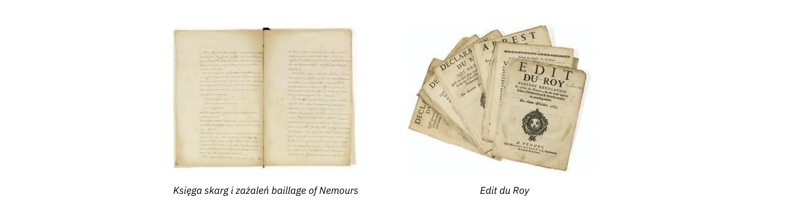

Turgot przygotował sześć edyktów królewskich reformujących francuską gospodarkę.

Był to pierwszy - i jeden z ostatnich - przypadków, gdy ekspert ekonomiczny otrzymał swobodę reformowania gospodarki swojego kraju. Trzy z edyktów Turgota wyróżniają się: jeden znosi pracę przymusową (corvées), drugi rozwiązuje gildie handlowe (korporacje), a trzeci ustanawia wolny handel zbożem.

Wchodząc do ministerstwa, Turgot wiedział, że napotka opór ze strony klas uprzywilejowanych. "Będę się bał, a nawet będę znienawidzony przez większość dworu i przez wszystkich, którzy zabiegają o względy", powiedział królowi. Uprzywilejowani szybko zjednoczyli się przeciwko niemu i doprowadzili do jego zwolnienia z urzędu Kontrolera Generalnego Finansów. Voltaire, który w pełni popierał reformy Turgota, napisał w swojej korespondencji:

> Ach! Jakie straszne wieści usłyszałem! Co się z nami stanie? Jestem zdruzgotany! Nigdy nie otrząśniemy się po tym, jak byliśmy świadkami narodzin i śmierci złotego wieku! Ten piorun uderzył zarówno w mój umysł, jak i serce.

Od tego czasu wielu twierdziło, że Francja jest krajem niemożliwym do zreformowania. Porażka Turgota zdawała się to potwierdzać: Został przygotowany przez pół wieku liberalnej myśli ekonomicznej; miał poparcie oświeceniowych filozofów; a sam król, posiadający władzę absolutną, wspierał go.

Ostatecznie zwyciężyły parlements i klasy uprzywilejowane. Król mógł jedynie prywatnie lamentować: "Teraz widzę, że tylko Monsieur Turgot i ja troszczymy się o ludzi"

## Condillac

<chapterId>0ba8dbb5-dcd5-5981-bf85-6c185e0bf192</chapterId>

Podobnie jak merkantylizm, który jest jego najbardziej oczywistym praktycznym przejawem, sofistyka Montaigne'a potrzebowała wiele czasu, by zniknąć.

Sofizmat ten polega na założeniu, że handel i Exchange są grami o sumie zerowej. Cokolwiek jedna strona zyskuje w transakcji, druga strona z konieczności traci. Jego zwolennicy twierdzą, że jest to prawdą zarówno między jednostkami, jak i między narodami.

Opat z Condillac odegrał ważną rolę w ostatecznym obaleniu tego fałszywego poglądu.

"Definitywnie" jest być może przesadą, ponieważ w debacie publicznej sofizmat ten często powraca. Być może dlatego Condillac pozostaje mało znanym ekonomistą. Poza austriackimi ekonomistami, niewielu zrozumiało znaczenie jego teorii Exchange, nikt już się nim nie interesuje.

Dla większości historyków myśli ekonomicznej rok 1776 jest naznaczony publikacją *The Wealth of Nations*, która stworzyła naukę ekonomiczną. Piętnaście lekcji, które właśnie ukończyliśmy, w których studiowaliśmy francuską naukę ekonomiczną przed Adamem Smithem, wystarczy, aby udowodnić błąd tej koncepcji. Co więcej, w tym samym roku 1776 ukazała się inna książka, która być może zasługuje na większe uznanie historyków niż książka Adama Smitha: została ona napisana przez Condillaca i nosi prosty tytuł [*Commerce and Government Considered in Their Mutual Relationship*](https://archive.org/details/commercegovernme0000cond).

Dla Condillaca, jeśli sofizmat Exchange postrzegany jako gra o sumie zerowej utrzymuje się, fizjokraci są częściowo winni, ponieważ utrzymują, że Exchange jest relacją równości. Według Condillaca jest to nieprawda: Exchange jest nierówną relacją, w której zawsze daje się mniej, by otrzymać więcej.

Pomiędzy ideami fizjokratów i Condillaca nie można było wymarzyć sobie doskonalszej opozycji. Fizjokratyczny ekonomista Le Trosne napisał:

> Exchange jest z natury Contract równości, równej wartości za równą wartość.

Z drugiej strony Condillac napisał:

> Każda ze stron Contract zawsze oddaje coś o mniejszej wartości, aby otrzymać coś o większej wartości.

Spór dotyczy jednak głównie słów. Obaj zgadzają się, że gdy ktoś wymienia franka na książkę, książka jest warta franka lub cena książki wynosi franka.

Różnica polega na tym, że Condillac twierdzi, że skoro Exchange to frank za książkę, oznacza to, że dla nas wartość książki jest wyższa niż wartość naszej monety o nominale jednego franka. Wolimy książkę od monety i dlatego robimy Exchange.

Teoria Condillaca nie jest zasadniczo sprzeczna z teorią fizjokratów, ale nie mówią oni tym samym językiem. Le Trosne mówi o cenie, podczas gdy Condillac mówi o wartości i odwrotnie.

Condillac ma rację, że jeśli ceny są równe dla dwóch wymienianych towarów, to wartości nie są równe, w przeciwnym razie nie miałoby miejsca Exchange.

Podsumowując teorię Condillaca, można wymienić trzy tezy:

Pierwsza teza: szukamy dóbr ze względu na ich użyteczność. Wydaje się to oczywiste, ale głównym założeniem nauk ekonomicznych jest to, że ludzie Exchange nabywają użyteczności, co doskonale rozwinął również Jean-Baptiste Say.

Druga teza: wartość istnieje wcześniej i motywuje wymianę. Subiektywna ocena towarów i usług dokonywana przez każdą osobę implikuje, że te same towary i usługi mają dla niej wartość, wartą mniej lub więcej w zależności od użyteczności, jaką wydają się zapewniać. Oczywiście, każda osoba ocenia inaczej niż inna, a wartość różni się w zależności od osoby.

Wreszcie trzecia teza: cena jest konsekwencją procesu Exchange. Produkty nie mają Exchange w wartości, którą im przypisuję, ponieważ warunki Exchange zależą również od subiektywnej wartości, jaką sprzedawca przypisuje tym produktom. Relacja między kupującym a sprzedającym, lub między subiektywną oceną kupującego a subiektywną oceną sprzedającego, ustanawia cenę.

Te idee Condillaca są fundamentalne. Pozwalają nam zrozumieć, dlaczego każdy Exchange jest zawsze korzystny dla obu stron.

Dlatego też całkowicie niszczą krytykę wolnego handlu, ponieważ protekcjonizm jawi się jedynie jako mechanizm uniemożliwiający populacjom wzajemne czerpanie korzyści. Laissez-faire jest również konkluzją pracy Condillaca. Niech ludzie robią, co im się podoba, ponieważ jeśli władza publiczna chroni wolność i własność, ludzie zawsze będą się wzajemnie wzbogacać poprzez wspólną wymianę.

## Condorcet

<chapterId>99e4aba6-da7f-5041-b02f-337158381515</chapterId>

Condorcet jest bez wątpienia najbardziej ekonomicznie myślącym filozofem Oświecenia.

Przez dużą część swojej kariery poświęcał się dziedzinom całkowicie niezwiązanym z ekonomią, i słusznie, ponieważ jego talenty doprowadziły do wielkiego postępu w naukach, na których skupiał się najbardziej. Ale około 1770 r. poczuł się przyciągnięty do kwestii ekonomicznych, być może dlatego, że inni filozofowie, zwłaszcza Wolter i Diderot, nie zawracali sobie głowy poświęcaniem im wolnego czasu, a także dlatego, że zaprzyjaźnił się z Turgotem.

Condorcet stopniowo przyjmował idee leseferyzmu i wolności, początkowo w obszarach niezwiązanych z ekonomią polityczną. W swoim *Letter of a Theologian* filozoficznie wyśmiewał religię katolicką i wyraził pragnienie prawdziwej wolności przekonań, w tym wolności do niewierzenia. W swojej krucjacie na rzecz tolerancji i przeciwko fanatyzmowi religijnemu Condorcet walczył o rehabilitację Kawalera de la Barre i o ponowne rozpatrzenie sprawy D'Etallonde'a, który został skazany na śmierć za złamanie krucyfiksu.

Był więc przygotowany do obrony wolności, gdy jego przyjaciel Turgot awansował na stanowisko Kontrolera Generalnego Finansów.

Od tego momentu kariera Condorceta nabrała tempa, gdy zaangażował się w debatę ekonomiczną, niestrudzenie wspierając liberalne reformy nowego ministra. Faworyzując konkurencję i wolność handlu, Condorcet wzywał również do zniesienia corvées (pracy przymusowej), gildii i sprawiedliwego opodatkowania. Swoje przekonania wyrażał publicznie, gdy tylko nadarzyła się okazja, czyniąc to z oczywistym entuzjazmem; pisał obszernie i pewnego razu oświadczył w swoich pismach: "Pozwólcie mi jeszcze raz mówić o wolności handlu; lubię zajmować się tym tematem"

W latach 1774-1776, podczas ministerstwa Turgota, Condorcet dokonał licznych interwencji, wszystkie naznaczone jego Commitment do leseferyzmu. Jego prace obejmują *Letters from a Farmer of Picardy to Mr. Necker*, broniące wolnego handlu; *Monopolies and Monopolists*, opowiadające się za wolną konkurencją; *Reflections on Corvées*, wzywające do ich zniesienia; oraz *Reflections on the Grain Trade*, które ponownie wychwalają wolny handel i krytykują książkę Neckera na ten sam temat.

W swoich [*Letters on the Grain Trade*](https://archive.org/details/bub_gb_hg8jFw-y6bwC) Condorcet przedstawia kilka kluczowych punktów.

Po pierwsze, wysokie ceny zboża w tamtym czasie nie były wynikiem wolnego handlu, ale raczej słabych zbiorów, a Condorcet wyraźnie to pokazuje. Następnie wyjaśnia, dlaczego leseferyzm jest nie tylko właściwą, ale jedyną odpowiednią polityką, pomimo powszechnych uprzedzeń. Zauważa: "Jesteśmy tak przyzwyczajeni do interwencji rządu w handel zbożem, że nic nie robienie wydaje się czymś niezwykłym i nowym". Później dodaje: "Prawie wszyscy, zwłaszcza ci sprawujący urzędy publiczne, wierzą, że nic nie dzieje się samo i że wszystko jest stracone, jeśli rząd nie interweniuje we wszystko". Condorcet ożywia w ten sposób argumenty fizjokratów i Turgota, pokazując wyższość wolnego handlu nad wszelkimi formami interwencjonizmu.

Promowanie liberalnego programu gospodarczego Turgota było odważnym aktem, ponieważ Condorcet wiedział, że szybko spotka się z cenzurą. Rzeczywiście tak się stało, a jego broszura na temat zniesienia pracy przymusowej została zniszczona i zakazana w 1776 roku.

Turgot, doceniając lojalną obronę swoich idei przez Condorceta, mianował go inspektorem ds. monet. Condorcet podał się do dymisji, gdy tylko jego przyjaciel opuścił ministerstwo.

Chociaż poświęcił całą swoją energię na obronę Turgota, Condorcet nie miał złudzeń co do wyniku kadencji swojego przyjaciela. Sam Turgot przyznał pod koniec życia, że żył z żalem, jak napisał w liście, "za to, że nie był w stanie uczynić mojemu narodowi i ludzkości dobra, które uważałem za bardzo łatwe". Condorcet, bardziej realistyczny, wskazywał na wielu przeciwników, z którymi Turgot będzie musiał się zmierzyć: królewskich faworytów, parlamenty, duchowieństwo, szlachtę, gildie i tak dalej. Grupy te oczekiwały pochlebstw, a nie reform. Condorcet powiedział Turgotowi: "W żadnym wypadku nie jesteś szarlatanem, a to wada, biorąc pod uwagę, jak sprawy mają się w Paryżu". Miał całkowitą rację, ponieważ w 1776 r., zaledwie dwa lata po przybyciu, Turgot został już zmuszony do opuszczenia stanowiska Kontrolera-Generała.

## Liberalny zdrowy rozsądek w czasach rewolucji

<chapterId>95e9a90d-e37a-58ff-b1ac-928b42e76ecf</chapterId>

Dupont de Nemours był najmłodszym uczniem François Quesnaya, który kiedyś powiedział o nim: "Musimy dbać o tego młodego człowieka, bo będzie przemawiał, gdy my będziemy martwi". Kiedy rozpoczęła się rewolucja francuska, prawie wszyscy wielcy fizjokraci, w tym markiz de Mirabeau, już nie żyli; sam Mirabeau zmarł 13 lipca 1789 roku.

Dupont de Nemours napisał listę skarg dla baliwatu Nemours.

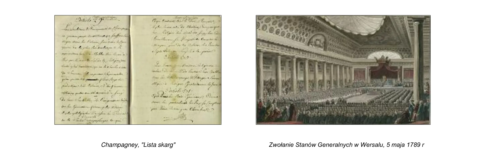

Ten fascynujący dokument zawierał wszystkie skargi liberalnych ekonomistów na ograniczenia handlu, monopole i ataki na własność. Dupont de Nemours został również wybrany do Zgromadzenia Narodowego.

Podczas rewolucji stał się głosem liberalnego zdrowego rozsądku, zdecydowanie przeciwstawiając się rosnącej fali populizmu i interwencjonistycznej demagogii, która ostatecznie zwyciężyła.

Już w listopadzie 1789 r., kiedy mówiono o przyznaniu monopolu Caisse d'Escompte (co mogłoby przekształcić go w bank publiczny - Bank Francji), Dupont de Nemours wypowiadał się w obronie konkurencji.

"Byłoby lepiej", mówi, "pozostawić działalność bankową prawom wolnego handlu". I dodaje:

> "Nie rozumiem, co minister miał na myśli, mówiąc o przyznaniu przywileju Caisse d'Escompte. Jeśli ten przywilej obejmuje wyłączność, musisz go odrzucić, ponieważ przybyłeś tutaj, aby zniszczyć wyłączne przywileje, a nie tworzyć nowe"

Pomimo jego ostrzeżeń, Zgromadzenie zignorowało jego zastrzeżenia i podjęło kolejny krok w kierunku ustanowienia banku centralnego i monopolu bankowego.

W 1790 r., podczas Zgromadzenia Konstytucyjnego, Dupont de Nemours podążył za pacyfistyczną tradycją swoich przyjaciół fizjokratów i zaproponował ustawę zakazującą wojen ofensywnych. Pierwszy artykuł brzmiał następująco: "Naród francuski nie pozwoli sobie na angażowanie się w jakąkolwiek wojnę ofensywną w celu zajęcia terytorium innych lub naruszenia praw lub wolności jakiegokolwiek narodu".

Propozycja ta została odrzucona.

W tym samym roku, 1790, rozpoczęły się debaty na temat emisji nowej papierowej waluty w celu pokrycia wydatków rządowych.

Dupont de Nemours stanowczo sprzeciwił się temu i opublikował broszurę zatytułowaną [*Effects of Assignats on the Price of Bread*](https://archive.org/details/effetdesassignat00dupo). Tytuł był trafny, ponieważ wyjaśnił, że emisja assignatów nieuchronnie doprowadzi do inflacji, wzrostu cen towarów, w tym chleba.

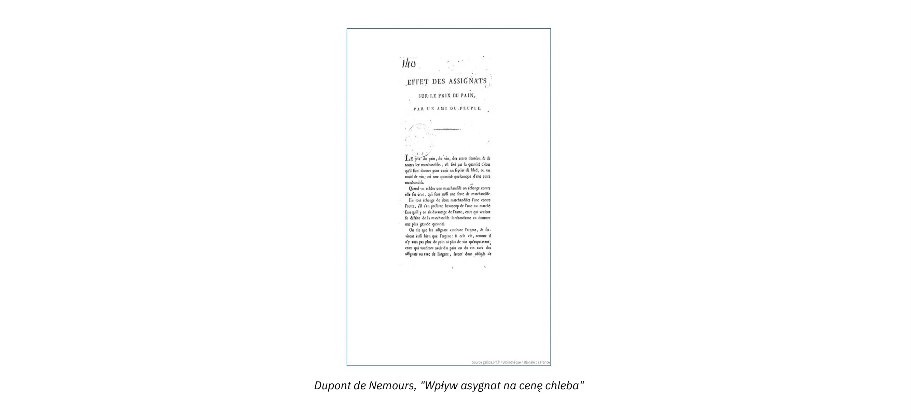

Broszurę podpisał jako "przyjaciel ludu". Broszura wywołała niemałe poruszenie, ponieważ Zgromadzenie zostało zapytane, kto jest jej autorem. Dupont de Nemours wstał i przyznał, że jest to jego dzieło, mówiąc, że nie wstydzi się używać tytułu "przyjaciela ludu", ponieważ walka z assignatami była prawdziwą służbą dla ludu.

Po raz kolejny jego rada została zignorowana i cesje zostały wydane.

Wszyscy znamy katastrofę, która nastąpiła później, ruinę gospodarczą i cierpienie ludzi, z których wielu straciło wszystko, gdy cesje stały się bezwartościowe i musiały zostać spalone.

Kilka lat później Zgromadzenie zwróciło uwagę na ideę utworzenia faktycznego Banku Francji, który otrzymałby monopol na produkcję pieniądza.

Dupont de Nemours, nadal zdecydowanie przeciwny idei banku publicznego, postrzegając go jako nic więcej niż monopol, przypomniał Zgromadzeniu o katastrofalnych doświadczeniach assignatów. Powiedział im:

> "Nie szykujcie się na żale podobne do tych, które dręczyły moich kolegów w Zgromadzeniu Konstytucyjnym. W tamtym czasie moja propozycja, by ograniczyć assignaty tylko do płatności za dobra narodowe i nie czynić z nich waluty obiegowej, została odrzucona. Dziś mówią: "Ach, gdybyśmy tylko posłuchali Dupont de Nemours!"

Ale po raz kolejny nikt go nie słuchał.

## Podsumowanie: Przekazywanie pochodni

<chapterId>ada8082f-db96-5e52-954f-719b47998153</chapterId>

Francuska myśl ekonomiczna XVIII wieku jest często przyćmiewana przez bardziej znanych ekonomistów XIX wieku. Jednak jeśli chodzi o obronę wolności, to właśnie w XVIII wieku wszystko się zaczęło. Jest to wiek, w którym zasada leseferyzmu, tak rewolucyjna w swoim czasie, została po raz pierwszy jasno wyrażona przez wielu myślicieli, od Boisguilberta po Dupont de Nemours.

Z pewnością postacie takie jak Jean-Baptiste Say, Frédéric Bastiat, Gustave de Molinari i Yves Guyot odcisnęły trwałe piętno na historii francuskiej myśli ekonomicznej. Jeśli jednak badamy ich w oderwaniu od siebie, umyka nam coś istotnego. Ci XIX-wieczni myśliciele nie pojawili się znikąd; odziedziczyli i zbudowali na fundamentach położonych przez ich XVIII-wiecznych poprzedników w okresie Oświecenia.

Boisguilbert twierdzi, że dusze o dobrych intencjach, które wierzą, że mogą wszystko naprawić poprzez zaangażowanie rządu, nieuchronnie wywracają gospodarkę do góry nogami i dlatego lepiej jest pozwolić, aby naturalny porządek rzeczy potoczył się swoim torem.

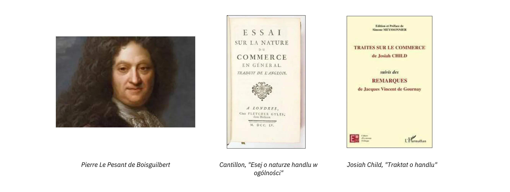

Cantillon nalegał, by nigdy nie manipulować pieniędzmi dla celów politycznych. Zezwolenie państwu na zarządzanie pieniędzmi według własnego uznania toruje drogę do ogromnego finansowego i gospodarczego chaosu.

Vincent de Gournay twierdzi, że nadmierna regulacja pracy zniechęca robotników i rzemieślników, popychając ich do lenistwa i bezczynności. To dzięki wolnej konkurencji gospodarka może się rozwijać, a naród prosperować.

Markiz d'Argenson twierdzi, że żaden rząd nie jest w stanie przewidzieć i zmierzyć wszystkiego, a zatem należy polegać na własnym interesie każdej jednostki.

Quesnay i fizjokraci twierdzą, że własność prywatna jest podstawą ludzkich społeczeństw. Bez własności prywatnej człowiek traci motywację do wysiłku, do pracy, ponieważ nie może cieszyć się owocami swojej pracy ani niczego gromadzić.

Condillac twierdzi, że Exchange jest zawsze korzystna dla obu stron i dlatego powinna być zawsze wolna, bez wyjątku. Jedyną misją państwa musi być ochrona wolności i własności.

Wszystkie te idee zostały podjęte przez ekonomistów XIX wieku. Niektórzy, jak Jean-Baptiste Say, nadali tym ideom naukowy wyraz poprzez rygorystyczny *Traktat o ekonomii politycznej*. Inni, wręcz przeciwnie, starali się spopularyzować te fundamentalne maksymy, wkraczając w sferę baśni, powieści i zabawnych opowiadań, jak zręcznie uczynił to Frédéric Bastiat.

## Biografia

<chapterId>17cf2865-e53c-5f3b-a5c2-a43560efaf01</chapterId>

**WYBIÓRCZA BIBLIOGRAFIA**

Poniżej znajduje się wybór ponad trzydziestu tekstów:

1. Pierre Clément, Histoire de Colbert et de son administration, Paryż, 1874 r

2. Vauban, Projet d'une dîme royale, 1707; reprint Institut Coppet, 2014; Anne Blanchard, Vauban, Fayard, 1996

3.	Boisguilbert, Détail de la France, 1695; ponownie opublikowane przez Institut Coppet, 2014

4. Félix Cadet, Pierre de Boisguilbert: prekursor ekonomistów, Institut Coppet, 2014

5. Pierre de Boisguilbert ou la naissance de l'économie politique, Paryż, INED, 1966

6. Richard Cantillon, Essai sur la nature du commerce en général, 1755; przedrukowany przez Institut Coppet, 2015

7. Antoin Murphy, Richard Cantillon, bankier i ekonomista, Oxford, 1986 r

8. Gustave de Molinari, L'Abbot of Saint-Pierre, Paryż, 1859 r

9. Opat Saint-Pierre, Abrégé du projet de paix perpétuelle, Rotterdam, 1729 r

10. Opat Saint-Pierre, "Projet pour perfectionner le commerce de la France", w Les rêves d'un homme de bien, Paryż, 1775, s. 199

11. André Alem, Le marquis d'Argenson et l'économie politique au début du XVIIIe siècle, Institut Coppet, 2015

12. Journal et mémoires du marquis d'Argenson, wydanie Rathery, 9 tomów, Paryż, 1859-1867

13. Benoît Malbranque, Vincent de Gournay: ekonomia polityczna leseferyzmu, Institut Coppet, 2016

14. Vincent de Gournay, Remarques sur la traduction de Josiah Child, L'Harmattan, 2008

15. Christine Théré & Loïc Charles (red.), Le cercle de Gournay, INED, 2005

16. Antoin Murphy, "Le développement des idées économiques en France (1750-1756)", Revue d'histoire moderne et contemporaine, tome XXXIII, October-December 1986

17. Henri Ripert, Le marquis de Mirabeau: ses théories politiques et économiques, Paris, 1901

18. Lucien Brocard, Les doctrines économiques et sociales du marquis de Mirabeau w L'Ami des Hommes, Paryż, 1902 r

19. Humbert de Montlaur, Mirabeau, l'Ami des Hommes, Perrin, 1992

20. Yves Guyot, François Quesnay et la Physiocratie, Institut Coppet, 2014 r

21. François Quesnay, Œuvres économiques complètes et autres textes, 2 vols, INED, 2005

22. Georges Weulersse, Le mouvement physiocratique en France (de 1756 à 1770), 2 tomy, Paryż, 1910

23. Georges Weulersse, La Physiocratie à la fin du règne de Louis XV (1770-1774), P.U.F., 1959

24. Georges Weulersse, La Physiocratie sous les ministères de Turgot et de Necker (1774-1781), P.U.F., 1950

25. Georges Weulersse, La physiocratie à l'aube de la révolution (1781-1792), EHESS, 1985

26. P. Jolly, Du Pont de Nemours, soldat de la liberté, Paryż, P.U.F., 1956

27. Pisma ekonomiczne Voltaire'a, Institut Coppet, 2013

28. Gustave Schelle (red.), Œuvres de Turgot et documents le concernant, Paryż, 1913-1924

29. Benoît Malbranque, Le libéralisme à l'essai: Turgot intendant du Limousin (1761-1774), Institut Coppet, 2015

30. Pierre Foncin, Essai sur le ministère de Turgot, Paryż, 1877 r

31. Auguste Lebeau, Condillac économiste, Paryż, 1903 r

32. Condillac, Le commerce et le gouvernement considérés relativement l'un avec l'autre, 1776 r

33. Condorcet, Mélanges d'économie politique, w Eugène Daire (red.), Mélanges d'économie politique, Paryż, 1847

34. P. Jolly, Du Pont de Nemours, soldat de la liberté, Paryż, P.U.F., 1956

35. Eli Heckscher, Mercantilism, 2 vols. London: Allen and Unwin. 1935

# Sekcja końcowa

<partId>385bffab-aea1-5bcd-9569-62b3f30665b7</partId>

## Recenzje i oceny

<chapterId>a1e689d9-abd0-5dcb-ba56-a8d355d0a84f</chapterId>

<isCourseReview>true</isCourseReview>

## Egzamin końcowy

<chapterId>bdb7fd98-33e7-11f0-9fe6-b785c859ffc5</chapterId>

<isCourseExam>true</isCourseExam>

## Wnioski

<chapterId>3b366ff6-03c8-5f6a-b4c0-ba8186e65d7e</chapterId>

<isCourseConclusion>true</isCourseConclusion>