# Uma jornada pela história económica da liberdade

Este curso explora o nascimento da ciência económica na França do século XVIII através da lente do laissez-faire. Você descobrirá como os pensadores desafiaram o mercantilismo ao argumentar que o Estado deveria proteger os direitos privados, mas nunca manipular os mercados através de regulamentações.

Você aprenderá como reformadores visionários estenderam essa visão para exigir o livre comércio e a circulação irrestrita de bens, estabelecendo os fundamentos intelectuais do capitalismo moderno. Ao estudar esses economistas pioneiros, você compreenderá os princípios atemporais que moldaram a economia política global e continuam a influenciar os debates políticos hoje. Junte-se agora para dominar as ideias que construíram a economia moderna.
+++
# Introdução

<partId>06d67531-19f1-4f8d-bf8f-77bbcc743672</partId>

## Descrição geral do curso

<chapterId>202db3c6-0320-494d-8057-adc6f6563048</chapterId>

Bem-vindo ao HIS204!

Este curso foi concebido para explorar as origens francesas do conceito de *laissez-faire* - "deixar acontecer" - tal como se desenvolveu no século XVIII através de uma rica tradição intelectual. Ao traçar os pensamentos dos primeiros pensadores económicos franceses, descobriremos os fundamentos de uma economia política construída sobre a liberdade económica, marcada por uma desconfiança em relação à interferência do Estado e uma crença numa ordem natural que favorece o crescimento e a prosperidade.

**Secção 2: Os precursores**

Nesta secção, começamos na viragem dos séculos XVII e XVIII, uma época marcada pelo domínio excessivo da monarquia absoluta e pelos primeiros apelos a uma forma mais racional e justa de governar os assuntos públicos. Através das figuras de Vauban, Boisguilbert e Cantillon, descobrimos as primeiras críticas ao intervencionismo estatal e um primeiro esboço do que viria a ser a economia política liberal.

**Secção 3: Reformadores e pensadores do início do século XVIII**

Esta secção centra-se naqueles que, nas primeiras décadas do século XVIII, tentaram reformar a economia francesa à luz de novos princípios. Pensadores como o Abade de Saint-Pierre, o Marquês d'Argenson e Gournay (juntamente com os seus seguidores) apelaram ao desmantelamento dos obstáculos corporativistas, à liberalização do comércio e ao incentivo à concorrência como motor do desenvolvimento. As suas propostas, muitas vezes ousadas, prefiguravam as grandes ideias fisiocráticas.

**Secção 4: A Escola Fisiocrática**

Esta secção explora um dos momentos mais importantes do pensamento económico francês: a escola fisiocrática. Examinaremos as suas origens, fundamentos doutrinários e principais realizações, centrando-nos em figuras-chave como Quesnay e Dupont de Nemours. A ideia de laissez-faire torna-se um sistema coerente logo nesta escola, enraizada na ideia de uma ordem natural à qual o Estado se deve submeter para garantir a prosperidade de todos.

**Secção 5: O Iluminismo e a Economia Política**

Por fim, veremos como o pensamento económico liberal se difundiu no seio do movimento iluminista em geral. Figuras como Voltaire, Turgot, Condillac e Condorcet expandiram e enriqueceram a tradição do laissez-faire. Os seus escritos criaram uma ponte para que a tradição do laissez-faire atravessasse o período revolucionário e mais além, onde as ideias liberais encontraram nova ressonância.

Pronto para redescobrir as raízes francesas do liberalismo económico? Vamos lá!

# Os precursores

<partId>91565b10-6010-53cb-a2f4-9c2306c7ef8c</partId>

## Antecedentes históricos

<chapterId>6a5fd101-6dfd-5d77-96c7-9e1aa4a19758</chapterId>

No início do século XVIII, a França encontrava-se numa situação preocupante. As populações rurais mal produziam o suficiente para sobreviver e eram fortemente tributadas.

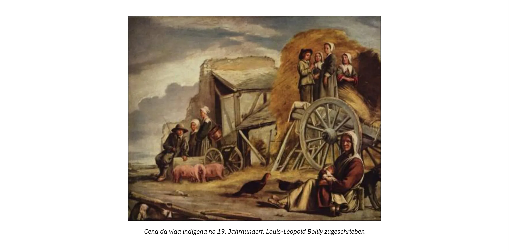

Os artesãos urbanos, fechados em corporações rígidas, tinham dificuldade em inovar ou mesmo em apoiar-se mutuamente. Entretanto, outras nações europeias rapidamente ultrapassaram a França em todas as frentes, superando os seus produtos. Os sucessos comerciais da Inglaterra e da Holanda estavam na mente de todos.

Mas como encontrar uma solução para a doença da época? Ainda não existia uma ciência económica e, por conseguinte, não havia um medicamento especial a aplicar. Os princípios da política económica eram ainda aplicados de forma aleatória, alternando entre fases restritivas e períodos mais liberais. É certo que temos modelos, referências históricas a seguir. Entre eles, *Sully*, ministro de Henrique IV, que defendia a agricultura e promovia uma maior liberdade de comércio em França.

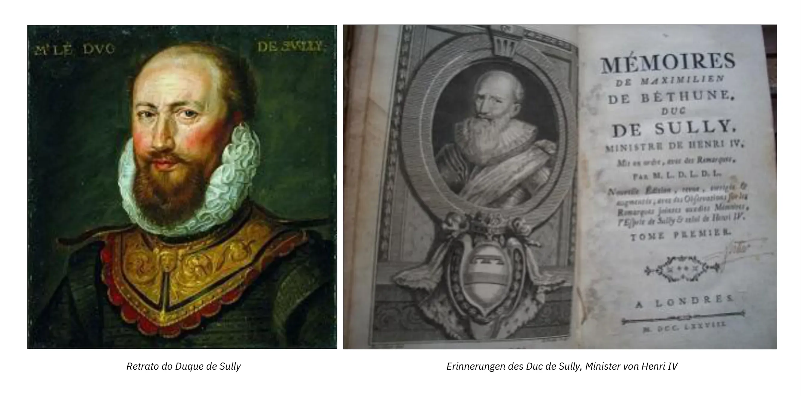

Mas depois veio Colbert, ministro de Luís XIV, que oscilou entre a regulamentação e a liberdade, mas acabou por impor a regulamentação. No final do século XVII, Colbert ultrapassou Sully: os ministros passaram a invocar o seu legado e a tentar aplicar o que diziam ser as suas máximas.

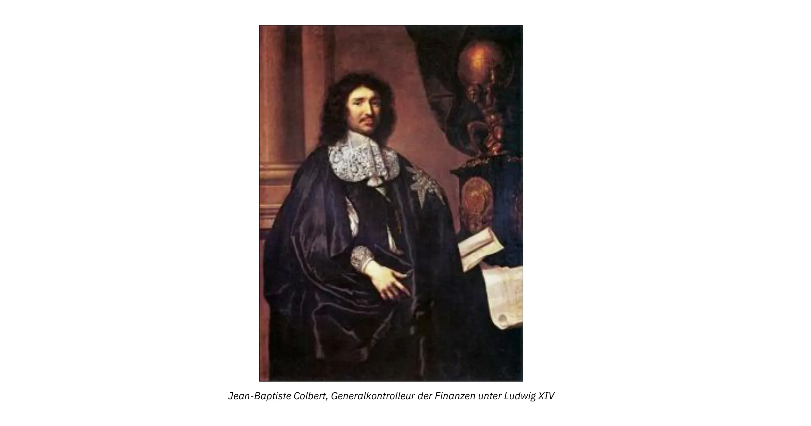

No espírito dos estadistas do final do século XVII, as máximas de Colbert eram quatro.

(1) **A indústria deve ser regulamentada e vinculada a grémios**. Estes regulamentos especificam, por exemplo, como devem ser feitos os lençóis e os panos, o seu tamanho e peso.

Havia centenas de regras deste género, compiladas em volumes específicos para cada tipo de indústria. Mas, aos olhos dos seguidores de Colbert, isso ainda era insuficiente: a indústria, acreditavam eles, também precisava de ser supervisionada pelas corporações.

Qualquer pessoa que desejasse exercer uma profissão tinha de passar vários anos como aprendiz, depois como artífice, antes de tentar alcançar o estatuto de mestre, produzindo uma "obra-prima" e pagando uma quantia substancial à guilda. A concorrência dentro de cada profissão era, portanto, estritamente limitada.

(2) **O comércio é um jogo de soma zero**. Em matéria de comércio, os discípulos de Colbert partilhavam os mesmos preconceitos que os povos bárbaros da Antiguidade. Segundo o ministro de Luís XIV, o comércio é "uma guerra perpétua". Porquê? A razão é simples: para Colbert e os seus sucessores, qualquer aumento de riqueza para um país significava o empobrecimento de outro. Na sua opinião, não se podia permitir que os ingleses ou os holandeses enriquecessem, porque isso significaria que estavam a roubar a prosperidade da França.

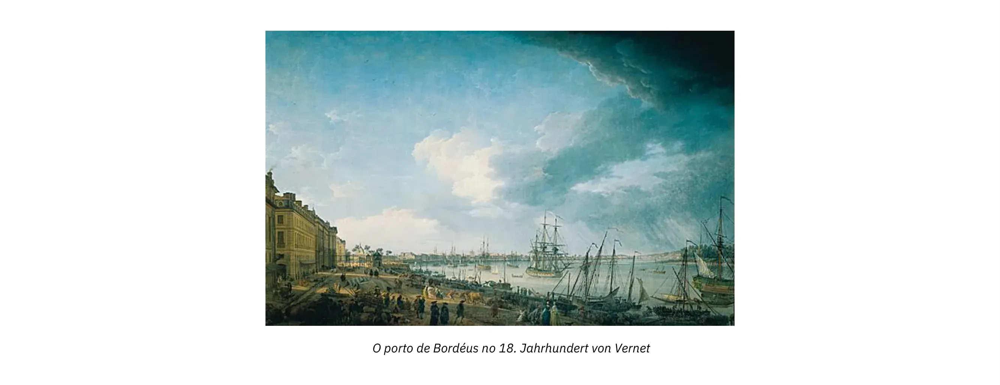

Por conseguinte, os produtos desses países tinham de ser proibidos ou fortemente tributados, sem escrúpulos, porque o comércio é uma guerra em que só podemos desejar a ruína dos nossos inimigos.

> "Os franceses só podem aumentar o seu comércio esmagando os holandeses".
> *Colbert*

(3) **Quando o Estado tem falta de dinheiro, aumenta os impostos**. Colbert e os seus discípulos estavam longe de acreditar que a riqueza dos contribuintes era um recurso limitado. Para eles, a despesa pública nunca poderia ser um problema, desde que se cobrasse o suficiente. E se o povo se revoltasse, era apenas porque os ministros o tinham feito mal, pois, como dizia Colbert cinicamente, "a arte da fiscalidade consiste em depenar os gansos sem os fazer gritar demasiado".

(4) **A riqueza é, acima de tudo, ouro e prata**. Antes do nascimento da ciência económica, muitos escritores seguiam um dogma dominante sobre a natureza da riqueza, o que veio a ser conhecido como *mercantilismo*. Colbert e os seus sucessores continuaram nesta via. Em suma, os mercantilistas acreditavam que o verdadeiro sinal da prosperidade de uma nação era a acumulação de metais preciosos, prata e ouro.

> "Só a abundância de dinheiro no seio do Estado faz a diferença na sua grandeza e poder".
> *Colbert*

A consequência desta ideia é favorecer a todo o custo as exportações, que trouxeram ouro e prata estrangeiros, e limitar ao mínimo as importações, para evitar enviá-las para o estrangeiro.

Estes são os quatro princípios que guiaram o governo francês durante várias décadas, à medida que o país entrava no século XVIII. No entanto, em breve seriam profundamente postos em causa. Entre 1690 e 1710, vários escritores ficaram profundamente impressionados com o estado desastroso da França. Ao procurarem as suas causas, concluíram que a culpa era das próprias máximas herdadas de Colbert, considerando-as mais do que argumentos falaciosos. Ao fazê-lo, lançaram as bases da ciência económica.

## Vauban

<chapterId>ee9c1e0e-96cc-5026-a5e2-963d68122786</chapterId>

Hoje, quando a pressão fiscal no nosso país continua a aumentar, ameaçando sufocar as forças económicas nacionais, levantam-se vozes a favor de uma mudança. Conscientemente ou não, estes apelos à reforma ecoam frequentemente o trabalho dos economistas franceses que, desde o século XVII, criticam o sistema fiscal do país como caótico, despótico e excessivo.

O primeiro destes reformadores fiscais, cronologicamente e em termos de mérito, é o grande marechal Sébastien Le Prestre Vauban, famoso construtor de fortalezas e cidadelas.

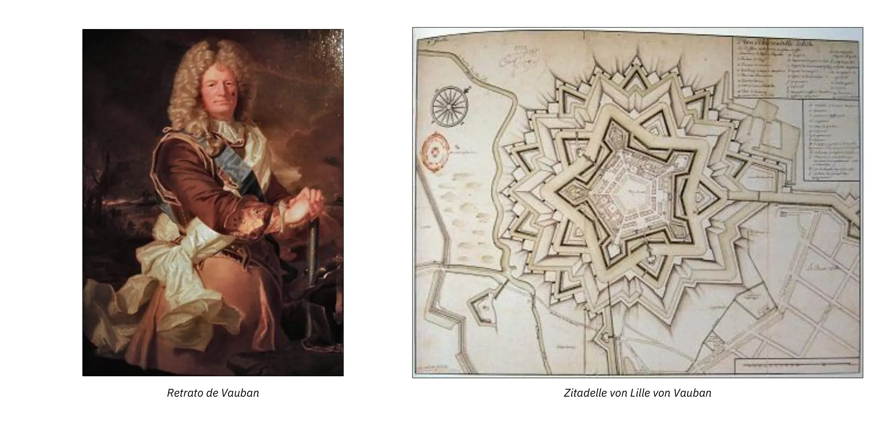

Embora infelizmente o tenhamos esquecido, Vauban era mais do que um militar, era também um economista. Interessado no destino dos camponeses, propôs reformas fiscais audaciosas em 1695 (Projet de capitation) e novamente em 1707 (Projet d'une Dime Royale): substituir a maior parte dos impostos existentes por um imposto proporcional ao rendimento, um imposto fixo antes do seu tempo.

Vauban chegou a estas ideias através da curiosidade. Observador atento, esforçou-se por estudar a vida social e a realidade económica de forma rigorosa, quase científica. Insistiu particularmente na necessidade de contar, através de recenseamentos.

O seu segundo grande mérito foi a descrição comovente e honesta da miséria suportada pelas massas. Escreveu: "Não nos deixemos enganar; o coração do reino está arruinado. Tudo sofre, tudo suporta, tudo geme. Basta olhar e examinar o coração das províncias, e o que encontrarão é ainda pior do que o que estou a dizer". Longe de serem exageradas, as observações sombrias de Vauban eram um reflexo exato da vida no início do século XVIII. Alexis de Tocqueville estava bem ciente destas ideias e, mais tarde, descreveria o *Titulo Real* de Vauban como "assustador", porque era verdade.

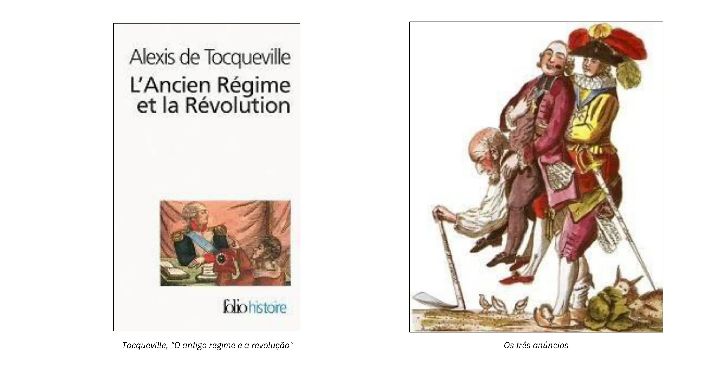

O outro grande mérito de Vauban como economista foi propor uma reforma fiscal de grande envergadura com o objetivo de erradicar, ou pelo menos reduzir a intensidade do mal que observou e descreveu. Com razão, a economia francesa do Antigo Regime estava paralisada por uma fiscalidade desigual, instável e ilegível.

Nos seus vários escritos políticos e económicos, Vauban tinha como ambição principal aliviar o sofrimento daquilo a que chamava "a parte inferior do povo, que, com o seu trabalho, sustenta e apoia a parte superior".

Compreendeu que a tributação opressiva e desincentivadora estava a sobrecarregar os camponeses, um conceito que exprimiu com clarividência, algo que ainda podemos observar perfeitamente no nosso tempo:

> "O agricultor deixa definhar a pouca terra que tem, trabalhando-a apenas sem entusiasmo, com receio de que, se produzisse o que poderia produzir com adubo e cultivo adequados, fosse tributado ainda mais pesadamente".

Vauban viu a verdade: a fiscalidade do Antigo Regime era não só irracional, mas também cruelmente rigorosa. Foi este sistema fiscal, injusto na sua distribuição, que Vauban procurou ultrapassar.

A solução que propôs, um imposto fixo e proporcional sobre todos os rendimentos, teria permitido uma repartição equitativa da carga fiscal entre todas as classes sociais. Baseada numa teoria do Estado que via a autoridade pública como necessária para proteger os direitos individuais e a propriedade, a reforma fiscal de Vauban exigia que todos os cidadãos contribuíssem na estrita proporção do que ganhavam, por exemplo, 10% do seu rendimento

Em O Dízimo Real, a única das suas obras económicas impressa durante a sua vida, Vauban afirmava claramente:

> "Uma vez que todos os habitantes de um Estado precisam da sua proteção para sobreviver, é justo que todos contribuam, de acordo com os seus rendimentos, para a sua manutenção e despesas [...]. Nada é mais injusto do que isentar os mais capazes de pagar e fazer recair o ónus sobre os menos capazes, que sucumbem sob o peso; peso que seria bastante leve se fosse suportado proporcionalmente por todos, segundo as suas forças. Portanto, toda a isenção de impostos é uma desordem que deve ser corrigida."

Pouco antes da sua morte, a ideia de Vauban foi adoptada pelos ministros de Luís XIV. No entanto, Vauban tinha pedido um imposto proporcional para substituir todos, ou quase todos, os impostos existentes. Em vez disso, como acontece frequentemente, o seu imposto foi implementado, mas todos os outros foram mantidos.

## Boisguilbert

<chapterId>200149c6-b5fc-566e-ab0e-bafb1c3fed3c</chapterId>

Poucos economistas franceses do passado gozam hoje de um reconhecimento no seu país de origem à altura dos seus contributos, e Boisguilbert não é exceção.

Pouco apreciado pelos leitores do seu tempo, afastado dos círculos de poder devido ao seu carácter excêntrico e à sua paixão arrebatadora, Boisguilbert deixou pouca marca no século XVIII. No entanto, no início do século passado, tem-se assistido a uma lenta redescoberta da sua obra.

No entanto, esta redescoberta mostra que estamos a entrar numa espécie de beco sem saída. O verdadeiro mérito de Boisguilbert perdeu-se ao apresentá-lo como o pioneiro de numerosas teorias e o precursor de muitos pensadores. Diz-se que ele compreendeu o conceito de subemprego mais tarde defendido por Keynes, antecipou a lei de Say, abriu caminho para a teoria do equilíbrio geral de Walras e até prefigurou a análise de classe dos marxistas. de quem ou de que é que Boisguilbert não pode ser o precursor?", perguntou um comentador.

(Pierre Le Pesant de) Boisguilbert nasceu em Rouen em 1646. Educado em Port-Royal, em Paris, Boisguilbert iniciou uma carreira literária sem sucesso antes de assumir várias funções, incluindo a de tenente-general de Rouen. Foi durante este período que escreveu vários livros para defender as suas ideias, entre os quais "Détail de la France", em 1695, que republicou no ano seguinte com um título muito mais explícito: [*França arruinada sob o reinado de Luís XIV, por quem e como, com os meios de a restaurar](https://archive.org/details/bub_gb_0jUaWNbTJa8C/page/n23/mode/2up)*.

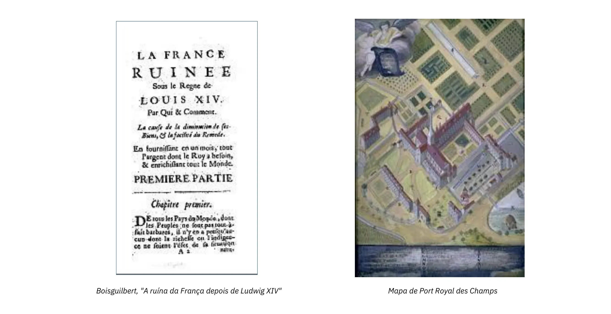

É esta a base dos livros de Boisguilbert: A pobreza francesa e as suas causas.

Esta miséria do povo francês no final do século XVIII, Boisguilbert descreve-a em pormenor, tal como Vauban. Escreve:

> "As terras estéreis ou mal cultivadas, visíveis para todos, são o cadáver da França".

Descreveu vinhas arrancadas, camponeses que abandonaram os campos e fomes recorrentes.

Boisguilbert encontra duas causas principais para esta desgraça. Porque se as pessoas vivem na miséria, é porque são impedidas de consumir o necessário, e a ruína do consumo tem duas causas.

Em primeiro lugar, as pessoas já não podiam dar-se ao luxo de consumir bens de primeira necessidade devido a uma tributação arbitrária. A taille, um imposto pessoal da época, era calculada cegamente para cada indivíduo, aumentando ou diminuindo sem razão. Devido aos numerosos privilégios, o ónus recaía sobre os camponeses pobres, que se viam arruinados. Para corrigir esta situação, Boisguilbert recomendou um imposto proporcional a todos os rendimentos, à semelhança da proposta de Vauban.

A segunda razão para a miséria da França é o facto de demasiados obstáculos impedirem o livre comércio de mercadorias, especialmente agrícolas. Havia direitos aduaneiros nas fronteiras e mesmo no interior do país, entre as diferentes regiões, que paralisavam todo o comércio. Estas restrições impediam o estabelecimento de um preço de equilíbrio e limitavam as oportunidades de mercado. Consequentemente, os camponeses não podiam viver da sua produção, porque não podiam vender com lucro e sofriam de preços agrícolas não remuneradores, uma preocupação que continua a ser muito atual e que está no centro da teoria de Boisguilbert. No que diz respeito às restrições comerciais, Boisguilbert defendia a desobstrução das estradas, ou seja, a instauração do comércio livre.

E a liberdade é, de facto, a sua conclusão final. "Não se trata de agir", diz ele, "mas simplesmente de deixar de agir como nós agimos tão violentamente contra a natureza, que tende sempre para a liberdade e a perfeição". Tudo correrá bem, repete incansavelmente, "desde que deixemos a natureza seguir o seu curso, isto é, que lhe demos a sua liberdade, e que ninguém interfira neste comércio a não ser para oferecer proteção a todos e impedir a violência".

Esta última passagem é essencial. Boisguilbert foi o primeiro a reivindicar claramente uma política económica de laissez-faire, a fazer dela o seu credo e a construir um verdadeiro sistema em torno dela. Segundo ele, existe uma ordem natural das coisas, que não deve ser corrompida, nem destruída, por intervenções públicas intempestivas. O Estado, na sua opinião, não deve intervir em matéria económica, mas sim deixar que as coisas se desenrolem naturalmente. Caso contrário, provocará a miséria.

Boisguilbert chegou mesmo a criticar as "*almas boas*", como lhes chamava, que tinham boas intenções mas causavam grandes prejuízos. Queriam pão barato para o povo, mas ao forçarem a descida dos preços, arruinaram os agricultores, que não conseguiam sobreviver com tais margens. Esses agricultores abandonaram então as suas terras, mergulhando ainda mais na pobreza. Como todos sabemos, "o inferno está muitas vezes cheio de boas intenções".

## Cantillon

<chapterId>bc206d41-6a64-5688-a489-40fcfa0e5397</chapterId>

Autor do "Ensaio sobre a natureza do comércio em geral" (escrito por volta de 1730 e publicado em 1755), Richard Cantillon é considerado um dos pioneiros da ciência económica moderna. Na sua História do Pensamento Económico, o economista Murray Rothbard refere-se mesmo a Cantillon como o fundador da economia moderna.

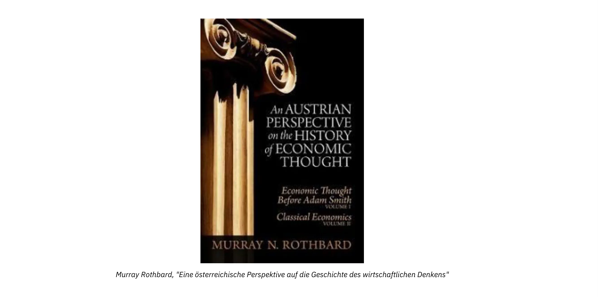

Nascido na Irlanda, Richard Cantillon instalou-se em Paris quando era jovem e adquiriu a nacionalidade francesa. Trabalhou como banqueiro e fez fortuna durante a época de John Law.

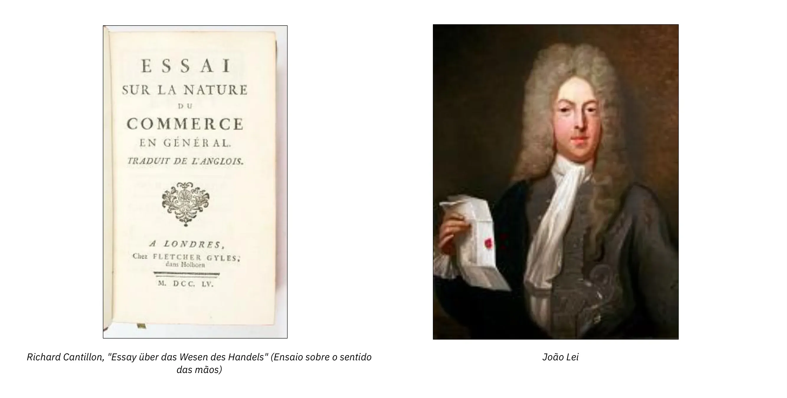

Foi também nesta ocasião que começou a estudar a teoria económica. Por volta de 1730, Cantillon compôs o seu Ensaio sobre a Natureza do Comércio em Geral.

Este livro pode ser visto como uma das primeiras tentativas de criar uma teoria geral da economia. Cantillon tem o cuidado de identificar aquilo a que chama "leis gerais da economia", aquelas que estão na natureza das coisas e não nos factos particulares deste ou daquele país. Esta abordagem foi revolucionária.

Podemos resumir os grandes méritos do Ensaio de Cantillon em cinco domínios: a teoria da riqueza, a noção de empresário, a crítica das moedas sem valor, os "Efeitos Cantillon" e, finalmente, a defesa da liberdade.

Em primeiro lugar, a sua **teoria da riqueza**.

Ao contrário da visão mercantilista dominante na época, Cantillon baseou a sua análise no reconhecimento de que a riqueza é formada pelos produtos que são próprios ao usufruto do homem. Esta riqueza, segundo ele, provém da natureza e é produzida através do trabalho humano. As suas ideias sobre a natureza da riqueza tiveram uma forte influência em Beccaria e Adam Smith e, através de Smith, em toda a escola de pensamento clássica inglesa.

Em segundo lugar, **o empresário**.

Embora não o tenha definido claramente, Cantillon considerou o empresário como o ator principal e central da atividade económica. Para Cantillon, o que caracteriza o empresário é o facto de assumir riscos e agir na incerteza. Estas ideias seriam mais tarde desenvolvidas por Turgot e, mais significativamente, por Say, para finalmente reconhecer o lugar especial do empresário na economia, contrariando desta vez as afirmações da escola inglesa.

Terceiro ponto, **moeda**.

Em reação à experiência de John Law, Cantillon explica o que acontece ou deve acontecer quando a moeda não tem valor real.

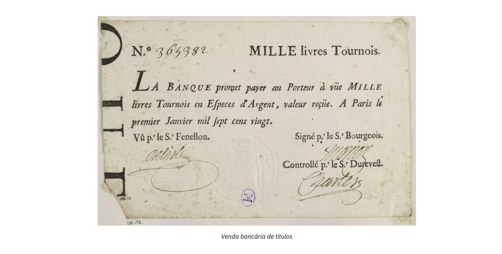

Para ele, há duas consequências principais da substituição de uma moeda sem valor real, como o papel-moeda, por uma moeda metálica. A primeira consequência é o que ele chama de "rejeição popular", o que significa uma desconfiança crescente em relação ao dinheiro sem valor. A segunda consequência é a [inflação](https://planb.academy/resources/glossary/inflation): o enfraquecimento monetário torna os bens mais caros.

Em quarto lugar, na sua análise da **inflação**, Cantillon foi mais longe do que os seus contemporâneos. Tendo observado o colapso do sistema de Law, Cantillon percebeu que a inflação monetária não afecta todos por igual. Pelo contrário, enriquece uns e empobrece outros. Concluiu que a inflação tem um efeito redistributivo: aqueles que recebem a nova moeda emitida beneficiam primeiro do aumento do poder de compra, enquanto os que a recebem mais tarde empobrecem em resultado da emissão de nova moeda devido ao aumento das taxas de inflação.

Em quinto lugar, apesar de alguns resquícios do pensamento mercantilista, a perspetiva geral de Cantillon era **plenamente liberal**. Defendia a propriedade privada como um pilar fundamental da civilização, argumentando que nenhuma sociedade pode funcionar sem a propriedade privada da terra e dos produtos do trabalho. Também considerava natural e legítima a desigualdade material entre as pessoas. Segundo Cantillon, não há nada de errado em que um trabalhador eficiente e corajoso, ou um trabalhador excecionalmente dotado, ganhe mais do que alguém incompetente ou preguiçoso.  Por último, Cantillon acreditava que os preços deviam ser sempre determinados livremente, pelo jogo do Supply e da procura, sem intervenção das autoridades públicas.

Entre estas cinco grandes ideias do seu Ensaio, a mais importante é, sem dúvida, a que hoje tem o seu nome: o **Efeito Cantillon**.

Com esta teoria sobre os efeitos da inflação, Cantillon dá-nos resposta a uma série de males contemporâneos. Ajuda-nos a compreender as consequências das recentes políticas monetárias expansionistas e inflacionistas, que empobreceram a classe média e o mundo rural, ao mesmo tempo que enriqueceram os operadores dos mercados financeiros e o Estado, as suas agências e os seus funcionários, devido à sua proximidade conjunta com a fonte da nova emissão: os bancos centrais e os bancos comerciais.

# Reformadores e pensadores do início do século XVIII

<partId>1f7b50d4-ce93-5db3-8396-43c1fa5419ff</partId>

## O Abade de Saint-Pierre

<chapterId>13478fe2-4c12-593c-a410-54c2cfb7ef7f</chapterId>

De todos os autores que escolhemos incluir no panteão dos pensadores franceses do laissez-faire do século XVIII, o Abade de Saint-Pierre é, sem dúvida, o mais esquecido.

Para ser justo, a culpa é em parte dele próprio. Escreveu muito, mas o seu estilo é de leitura difícil e está cheio de repetições. Até Jean-Jacques Rousseau tentou resumir a sua obra: começou por fazê-lo, mas depressa abandonou a tarefa, pois percebeu que estava para além das suas forças. Em meados do século XIX, Gustave de Molinari homenageou-o publicando uma obra completa sobre ele, na qual presta homenagem ao pacifista e economista que foi o abade de Saint-Pierre. Mas isso não foi suficiente para o tirar do esquecimento, que ainda hoje se mantém.

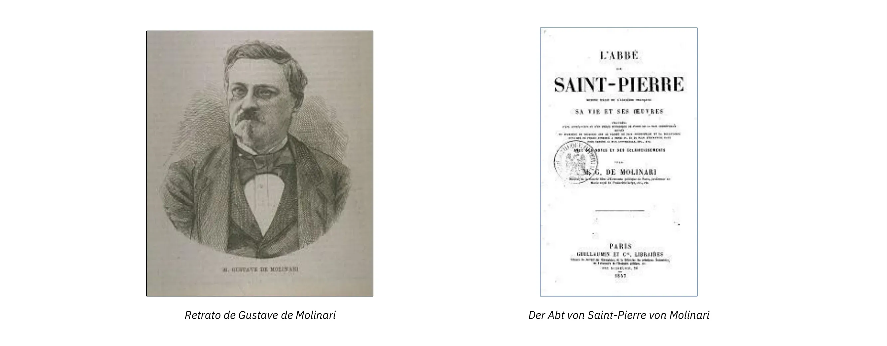

O abade de Saint-Pierre escreveu sobre economia, mas é sobretudo como pacifista que ele costuma interessar. É autor de um Projeto de Paz Perpétua, anterior ao conhecido de Emmanuel Kant.

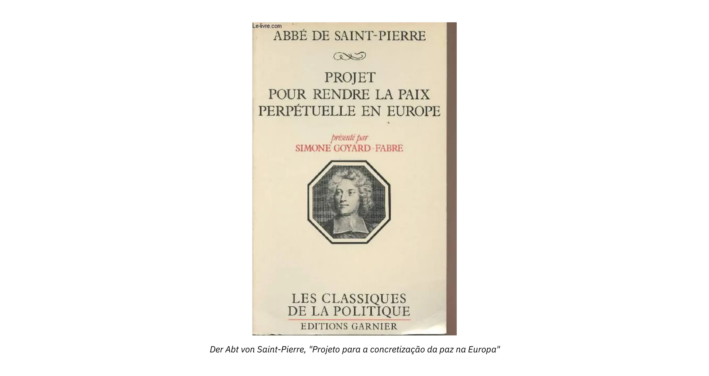

Nesta obra, defendeu que a guerra é destrutiva, não só para os que a perdem, mas também para os vencedores, e mesmo para os que não participam nela, uma vez que o seu comércio é afetado.

Para combater o flagelo da guerra, recomendou a criação de uma espécie de Liga das Nações Europeia. Um conselho europeu seria formado para resolver os problemas de cada nação. As nações recorreriam assim à arbitragem, para evitar o recurso às armas. Se uma nação não fosse suficientemente sensata para abraçar a paz, se ameaçasse as outras nações europeias, a liga europeia das nações teria um meio de reagir. Perante tais acontecimentos, seria formado um exército europeu, com forças fornecidas pelos vários países.

Há também um episódio na vida do Abade de Saint-Pierre que ilustra na perfeição a mentalidade crítica subjacente ao movimento francês do laissez-faire. Entrou para a Academia Francesa em 1695, mas foi expulso em 1718 por se atrever a criticar o reinado de Luís XIV. Nesse sentido, alinhou com figuras como Vauban e Boisguilbert, que também tinham ousado falar contra as misérias escondidas sob o esplendor do reinado do Rei Sol.

O abade de Saint-Pierre argumentou que o reinado de Luís XIV, com a sua corte luxuosa e obsessão pela conquista militar, não era a marca de um rei virtuoso. Recusava-se a aceitar que Luís XIV merecesse o título de "**Louis, o Grande**".

"Arruinar os vizinhos e o povo ao mesmo tempo não é grandeza", afirmou. Esta posição ofendeu profundamente a Académie Française, que há muito se preocupava em glorificar o rei sob todas as formas literárias possíveis. Como resultado, votaram quase unanimemente a sua expulsão.

Em termos de pensamento económico, aplicou de forma consistente o princípio da utilidade, tal como Jeremy Bentham faria mais tarde, e apresentou muitas vezes boas ideias. Para sermos justos, ele ainda era influenciado pelas ideias mercantilistas, que ninguém tinha abandonado completamente na altura.

No entanto, o Abade de Saint-Pierre fez algumas observações exactas sobre a economia. Mesmo antes de *Condillac*, a quem é frequentemente atribuída a ideia, ele afirmou claramente que em qualquer Exchange, ambas as partes beneficiam. Isto pode ser encontrado no seu "Projeto para melhorar o comércio de França" de 1733 (https://www.institutcoppet.org/projet-pour-perfectionner-le-commerce-de-france/), onde escreveu

> "Quando se efectua uma venda entre comerciantes, o vendedor ganha e o comprador também; porque se não houvesse um benefício real ou percetível de ambas as partes, nem o vendedor venderia a tal e tal preço, nem o comprador, por seu lado, compraria a tal preço".

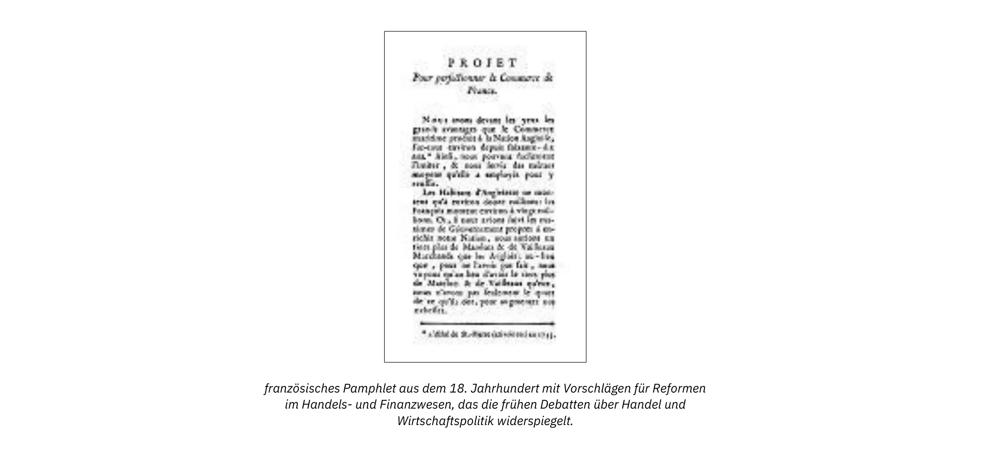

Ele também enfatizou, antes de Vincent de Gournay, o valor do trabalho e a importância de mantê-lo atraente. "Todo trabalho é difícil", ele escreveu. "E quando um homem vê que seu trabalho não lhe paga nada, ou não o suficiente, ele fica ocioso e não se preocupa com esforços desnecessários". Este mesmo argumento seria mais tarde repetido pelo Marquês d'Argenson, Vincent de Gournay e os Fisiocratas, que criticavam as pesadas regulamentações e os sistemas de corporações. Argumentavam que tais restrições desencorajavam os trabalhadores, causavam dificuldades desnecessárias e acabavam por fazer com que a ociosidade parecesse mais apelativa do que o esforço produtivo nessas condições.

## O Marquês d'Argenson

<chapterId>e9960ab4-72ec-5afd-8e97-bf89c83b62bc</chapterId>

O Marquês d'Argenson é um fundador esquecido da doutrina do laissez-faire.

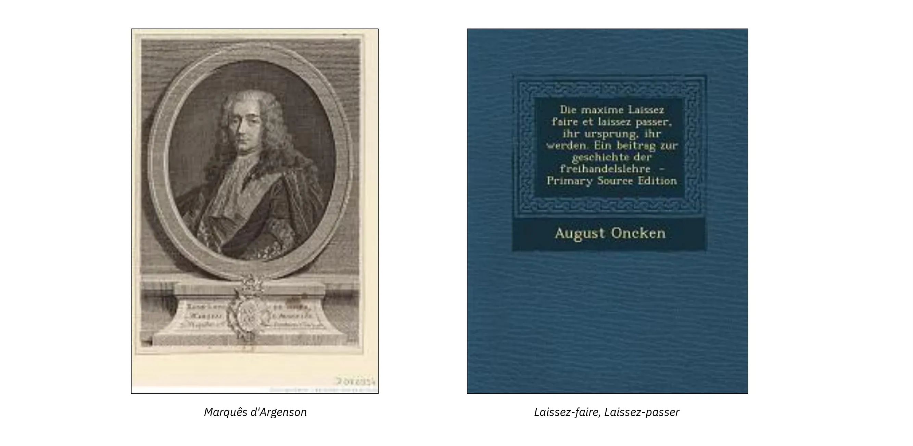

Foi redescoberto por August Oncken, autor de um livro sobre a doutrina do laissez-faire, laissez-passer, que concluiu que d'Argenson desempenhou um papel importante no nascimento desta ideia.

René-Louis Voyer, Marquês d'Argenson, nasceu em 1694. Iniciou a sua carreira política como conselheiro parlamentar, tendo depois feito parte do Conselho de Estado.

Trinta anos antes de Adam Smith, d'Argenson já defendia os benefícios da divisão do trabalho e da especialização.

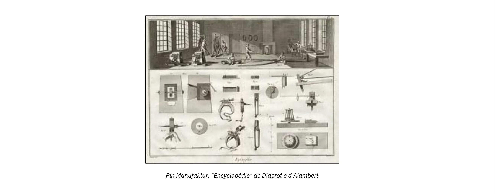

Criticou fortemente os regulamentos que, na sua opinião, tentavam alterar as preferências naturais das diferentes regiões. Por exemplo, ficou perplexo com o facto de o governo querer produzir tecidos e veludos em Tours, uma cidade pobre na época, para igualar a qualidade dos fabricados na próspera Génova, famosa pelos seus artigos de luxo. Concluiu:

> "Cada local deve poder escolher as suas próprias fábricas. Liberdade! Liberdade!"

Ele também reconheceu outro dos princípios centrais de Smith: a ideia de que a ordem espontânea surge da busca do interesse próprio. O Marquês d'Argenson acreditava que o interesse pessoal imediato era o que impulsionava a energia humana. Escreveu que o mau trabalho artesanal e a fraude desacreditariam um fabricante, enquanto a diligência e as boas intenções conduziriam à prosperidade. O melhor juiz da utilidade, argumentava, era o indivíduo, o público em geral, que compra bens e se preocupa em fazer um bom negócio. "Cada um sente o seu próprio interesse", disse, "cada um toma as medidas que lhe são lucrativas, e é neste acordo geral que descobrimos a verdade."

Mesmo antes de Adam Smith, ele compreendeu que o interesse próprio conduz ao interesse geral através da construção de uma ordem natural espontânea.

Comparou a sociedade a uma colmeia de abelhas em que cada inseto segue o seu instinto. "Das suas acções", disse com precisão, "resultou uma grande acumulação para as necessidades da pequena sociedade; mas isto não foi provocado por ordens, ou por generais, que obrigaram cada indivíduo a seguir as opiniões do seu líder". Esta é talvez a expressão do pensamento económico francês que mais se aproxima do famoso conceito de "mão invisível" de Adam Smith.

O Marquês d'Argenson estava sempre indignado com as ideias dos ministros do seu tempo. A única pergunta que faziam era: "Devemos regulamentar desta ou daquela maneira? Devemos orientar a economia para isto ou para aquilo?". Ao que d'Argenson responde: "Não deveríamos primeiro perguntar se é apropriado dirigir alguma coisa, ou se as coisas devem ser deixadas a funcionar por si próprias?"

Para dizer a verdade, espantava-se com o facto de as pessoas terem dificuldade em compreender, ou melhor, em ver, os efeitos nefastos de uma regulamentação excessiva de todos os tipos na economia. Na sua opinião, bastava abrir os olhos. "Há tantas coisas que funcionam razoavelmente bem hoje em dia", escreveu com amargura, "simplesmente porque conseguiram escapar ao alcance da lei".

Por vezes, desesperava com o facto de as suas ideias não serem compreendidas.

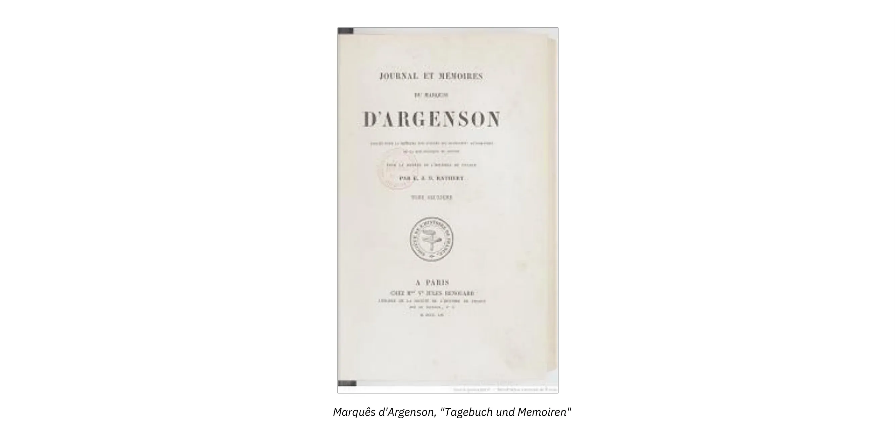

O ideal de política económica que defendia era, portanto, contrário às tendências do seu tempo. O seu ideal definia um papel essencialmente negativo para o Estado. "O comércio só precisa da remoção de obstáculos. Pede apenas bons juízes, punição dos monopólios, proteção igual para todos os cidadãos, moedas estáveis, estradas e canais". Esta era a definição de um Estado mínimo, que se tornaria um dos fundamentos da tradição francesa em economia política.

Esta visão do papel do Estado na atividade económica foi naturalmente ilustrada pelo estudo de duas grandes questões que agitaram os economistas e os pensadores sociais do seu tempo: a regulamentação da indústria e o comércio do trigo.

Os regulamentos sobre a indústria, em primeiro lugar, suscitaram todo o seu ressentimento, porque eram privilégios para uns em detrimento de outros. "A verdadeira causa do declínio das nossas fábricas", escreve, "é a proteção excessiva que lhes é dada". E foi com um credo não menos vivo que exprimiu a sua crítica ao zelo dirigista dos estadistas do seu tempo:

> Dirigir o sector contra a sua vontade é querer a sua ruína.

Relativamente à questão do comércio de subsistência, d'Argenson não tem outra resposta senão a liberdade. Segundo ele, a escassez de trigo deve-se ao monopólio e às precauções excessivas tomadas pelo governo. Bastava deixar estar, e nunca haveria falta de trigo num país onde os portos estivessem abertos. Os estrangeiros, atraídos como todos os outros homens pela atração do lucro, fornecer-nos-iam o necessário e tirar-nos-iam o excedente. "Deixemos as coisas como estão e tudo correrá bem".

## Vincent de Gournay

<chapterId>e8ae40dc-7450-552f-9ddc-9e02936cf425</chapterId>

Vincent de Gournay foi um dos primeiros representantes do laissez-faire em França e um dos seus primeiros defensores na administração pública e nos círculos intelectuais. Por essa razão, merece muito mais reconhecimento na história do pensamento económico do que aquele que normalmente recebe. Tentei destacar os seus contributos num livro recente.

Nascido no seio de uma família de comerciantes, Gournay tornou-se ele próprio um comerciante de sucesso, acumulando uma riqueza considerável antes de assegurar um cargo na administração francesa. No Departamento de Comércio, era um fervoroso defensor do trabalho livre e do comércio livre.

Apesar de estar bem inserido no contexto dos principais economistas do seu tempo, Gournay escreveu pouco, ou melhor, publicou pouco. Escreveu sobretudo cartas administrativas e memórias, inéditas ou publicadas por outros autores após alguma edição.

O que temos inclui:

1. [As observações](https://archive.org/details/traitessurlecomm0000chil) sobre uma tradução de um livro do economista inglês Josiah Child;

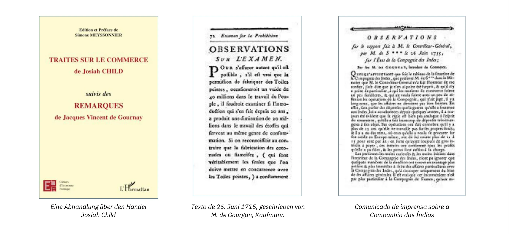

2. "Observações" incluídas no Exame das vantagens e inconvenientes da proibição de tecidos estampados;

3. "Observações sobre a Companhia das Índias Orientais", anexado pelo Abade Morellet à sua Memória sobre o Estado Atual da Companhia das Índias Orientais (1769);

4. E, sobretudo, várias memórias do seu papel de Intendente do Comércio.

Estes escritos demonstram uma clara influência estrangeira e a presença de algumas ideias estruturantes importantes. A influência estrangeira, em Gournay, é o reconhecimento da superioridade inglesa e holandesa. Gournay estava convencido de que estas duas nações compreendiam a economia muito melhor do que a França e que esta devia seguir o seu exemplo. "Estas duas nações são as mais prósperas", afirmava, "e seguem um sistema completamente diferente do nosso. Proibimos a entrada de mercadorias estrangeiras, confinamos a atividade económica a regulamentos draconianos, enquanto eles procedem de forma oposta. Se eles estão a fazer melhor", concluiu Gournay, "é porque a França se guia por princípios errados".

As suas propostas de reforma centraram-se em vários pontos-chave.

Em primeiro lugar, acreditava que era necessário proteger e encorajar o trabalho. Na altura, os trabalhadores franceses eram tratados como criminosos, constantemente vigiados e receados de não terem cumprido um dos milhares de regulamentos. Este incómodo excessivo desencorajava as pessoas a trabalhar, empurrando-as para a ociosidade. No entanto, argumentava Gournay, "o trabalho é nobre e a única forma de enriquecer uma nação".

Em segundo lugar, criticou o sistema restritivo das corporações que confinava os fabricantes. Participar num ofício era moroso e dispendioso, e cada novo trabalhador devia depois seguir escrupulosamente a rotina estabelecida pelos estatutos da sua guilda. Este sistema não deixava espaço para a excelência, a inovação ou o progresso.

Em terceiro lugar, o comércio em França era limitado por leis restritivas. Na opinião de Gournay, os consumidores beneficiariam muito se os portos pudessem competir livremente e se todas as mercadorias, como os cereais e as telas impressas, pudessem ser importadas sem restrições. Foi um dos primeiros a apontar a verdadeira origem do contrabando: este existia apenas porque um comércio benéfico e útil era proibido. Acrescenta ainda uma observação incisiva: o contrabando é uma profissão "livre", sem regulamentos, sem corporações, sem impostos confiscatórios. No entanto, foi a regulamentação esmagadora do Estado que empurrou muitos trabalhadores honestos para a ilegalidade.

Por último, Gournay constata que as taxas de juro são mais baixas em Inglaterra e nos Países Baixos, países mais prósperos do que a França. Defende a descida das taxas de juro também em França, para que a atividade económica possa ser financiada em condições tão vantajosas como noutros países. No entanto, Gournay não procurou métodos coercivos e legislativos; em vez disso, enfatizou a necessidade de legalizar o empréstimo de dinheiro, que ainda era condenado pela Igreja Católica.

Em todos estes pontos, Gournay desempenhou um papel fundamental nos debates intelectuais de meados do século XVIII. A sua defesa da liberdade económica antecedeu os Fisiocratas em uma década e Adam Smith em vinte anos. Mas a sua influência mais duradoura foi sobre Turgot. Gournay tomou o jovem Turgot sob a sua proteção e formou-o com as suas ideias.

Anos mais tarde, Turgot, futuro ministro de Luís XVI, escreveu um Éloge (elogio) em homenagem ao seu amigo após a sua morte. E se Turgot nunca abraçou completamente a Fisiocracia de François Quesnay, foi porque preservou um apego invencível ao seu primeiro mestre, Vincent de Gournay.

## O Círculo de Gournay

<chapterId>b86ba6bd-8f3a-5d8f-b098-4d0413f00deb</chapterId>

Quando se trata dos primórdios da ciência económica, a história tende a destacar uma primeira escola de pensamento: os Fisiocratas, liderados por François Quesnay e os seus discípulos. No entanto, quase uma década antes do seu aparecimento, houve outro grupo, menos formal mas igualmente importante, centrado no economista Vincent de Gournay.

Como vimos na parte anterior, Gournay era fascinado pelo exemplo de nações estrangeiras como a Inglaterra e a Holanda. Admirava igualmente os seus economistas - figuras como Josiah Child, Johan de Witt e David Hume.

Esta admiração levou-o a traduzir e a encomendar traduções dos seus escritos económicos.

Acontece que a sua posição na administração superior permitiu a Gournay entrar em contacto com todos os especialistas económicos conhecidos na França da época. Desta forma, reuniu um grupo de tradutores extremamente competentes. Traduziu pessoalmente as obras de Child e Culpeper. O abade Le Blanc traduziu os Discursos Políticos de David Hume. Véron de Forbonnais traduziu o economista espanhol Geronymo de Uztariz. Turgot trabalhou nos escritos de Josiah Tucker, e o filho de Montesquieu traduziu Joshua Gee.

Graças à colaboração de vários membros do círculo de Gournay, muitos autores puderam publicar obras originais com os seus próprios nomes. Estes livros, juntamente com as traduções, alcançaram um sucesso notável. Alguns exemplos notáveis são:

- Herbert's Essay on the [General Police of Grain](https://archive.org/details/essaisurlapolice00herb/page/n7/mode/2up) (6 edições em 4 anos)

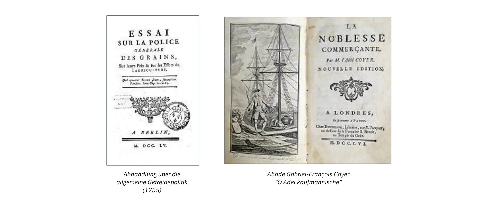

- Coyer's [Noblesse commerçante](https://archive.org/details/lanoblessecommer00coye/page/n3/mode/2up) (5 edições em 2 anos)

- Plumard de Dangeul [Observações sobre as vantagens e desvantagens da França e da Grã-Bretanha](https://archive.org/details/bim_eighteenth-century_remarks-on-the-advantage_plumard-de-dangeul-loui_1754) (3 edições no primeiro ano)
- Cliquot-Blervache and Gournay's [Memoir on the Trades](https://www.amazon.com/Memoire-sur-corps-metiers-French/dp/1978196903) (2 edições em 1758)

O grupo também desempenhou um papel fundamental na publicação de

- [Ensaio sobre a natureza do comércio em geral](https://archive.org/details/essayonnatureofc0000cant) por Richard Cantillon.

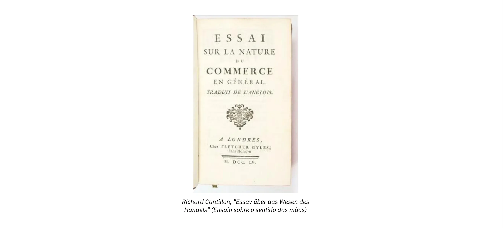

Este último livro, escrito por volta de 1730, permaneceu em manuscrito após a morte do autor. Gournay, com a ajuda dos seus amigos economistas, publicou-o em 1755. Segundo o abade Morellet, membro do círculo, Gournay recomendou-o a todos os economistas que conhecia.

A produção intelectual do círculo de Gournay teve um grande impacto na história das ideias. Neste sentido, podem ser considerados os fundadores da ciência económica em França. Christine Théré, do INED, que estudou a história das publicações económicas, constatou que, entre 1750 e 1759, foram publicadas nada menos que **349** obras sobre economia, contra apenas **83** em toda a década anterior (1740-1749). Esta revolução da década de 1750 deve-se em grande parte ao círculo de Gournay.

Para difundir o gosto pelas discussões económicas entre a população francesa, Gournay e os seus amigos trabalharam para as tornar acessíveis através de romances. Após o *Memoir on the Trades*, que criticava as corporações, Gournay e Cliquot-Blervache ajudaram Gabriel-François Coyer a escrever um pequeno romance satírico chamado Chinki: [Um conto cochinchinês aplicável a outras nações](https://www.institutcoppet.org/wp-content/uploads/2013/06/Coyer-Chinki-Histoire-cochinchinoise.pdf).

A história segue o personagem principal, Chinki, que é forçado a deixar a sua terra devido a impostos excessivos e tenta encontrar trabalho artesanal para os seus filhos na cidade. Mas todos os ofícios lhes estão vedados devido aos regulamentos abusivos das corporações, pelo que a história retrata a sua crescente desilusão em tons humorísticos.

O círculo de Gournay esteve assim na origem de uma intensa vaga de publicações. Embora esta importante contribuição tenha sido esquecida pelos historiadores do pensamento económico, era muito clara para os contemporâneos. Os fisiocratas, que organizaram a sua escola na década de 1760, apresentarão mais tarde o grupo de Gournay como o seu precursor direto. Em 1767, o economista Jacques Accarias de Serionne exprime-o ainda mais claramente na sua homenagem. Escreveu: "Um pequeno número de franceses, filósofos e cidadãos, começou há alguns anos a imitar os escritores ingleses. Começaram por traduzir os seus modelos e depressa os ultrapassaram em muitos aspectos. Trouxeram todo o encanto e a riqueza da literatura para o tratamento de assuntos úteis; despertaram e difundiram o gosto pelas ciências mais essenciais à prosperidade do Estado".

E, de facto, na década de 1750, as questões económicas tornaram-se moda. Voltaire observou que, por volta de 1750, os franceses abandonaram os romances para discutir a liberdade do comércio de cereais. Esta tendência foi também registada pelo Mercure de France, que escreveu numa edição de 1758, alguns meses antes da morte de Gournay: "A economia política é atualmente a ciência da moda. Livros sobre agricultura, população, indústria, comércio e finanças estão agora nas mãos de inúmeras pessoas que, não há muito tempo, só liam romances superficialmente". Dificilmente se poderia prestar uma melhor homenagem a Gournay e à obra do seu círculo de economistas.

## Mirabeau

<chapterId>2d2f802b-e3b6-556f-9025-a1b1dc4409ca</chapterId>

A França conheceu dois homens famosos chamados Mirabeau, um pai e um filho, mas foi o filho que realmente fez história. Tribuno revolucionário e uma das figuras centrais dos acontecimentos da Revolução Francesa, ficou famoso.

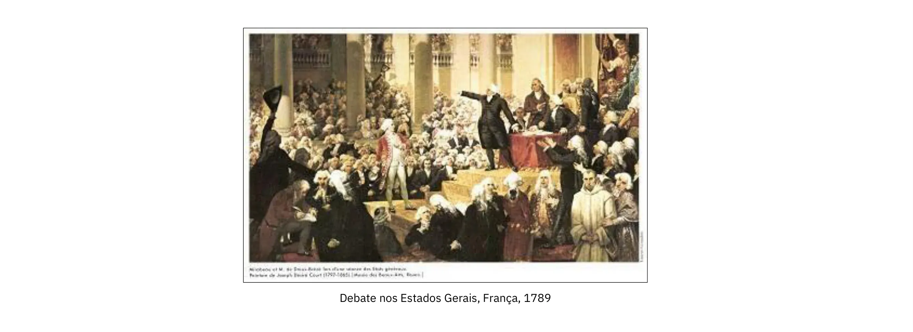

Pelo seu talento e pelo seu lugar na história da França, ofuscou o seu pai, economista e pilar da escola de François Quesnay, que tinha sido o seu primeiro membro logo em 1758.

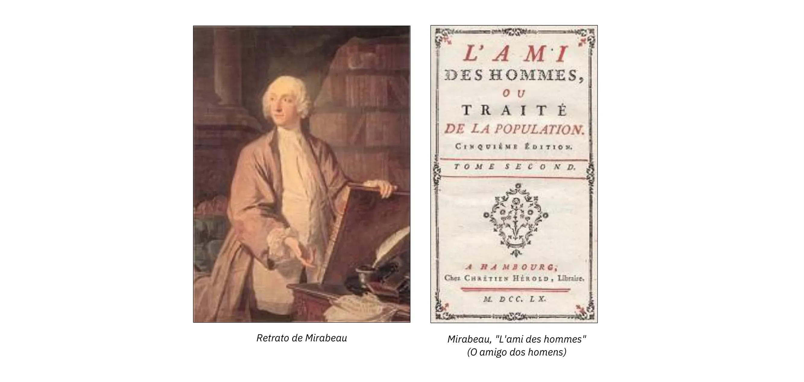

De facto, o Marquês de Mirabeau já tinha alcançado imensa fama mesmo antes da sua adoção da Fisiocracia, graças a um livro intitulado "O Amigo dos Homens. Tratado da População [FR: L'ami des hommes, ou, Traité de la population](https://archive.org/details/lamideshommesou00unkngoog). Embora a primeira edição tenha sido publicada em 1756, tornou-se famosa por volta de 1757, um ano antes do seu encontro com Quesnay.

Entre 1757 e 1760, foram publicadas mais de 20 edições, o que o torna provavelmente o livro de economia mais bem sucedido da história. Alguns leitores chegaram mesmo a pensar que o livro tinha sido escrito por Montesquieu, devido ao seu raciocínio acutilante. O Delfim, pai do rei Luís XVI, chegou mesmo a afirmar que o tinha memorizado. Durante algum tempo, era o livro que toda a gente lia em Versalhes.

Hoje em dia, é um livro que já não se lê, mas muitos ainda o referem. Já no século XIX, Edmond Roussel dizia:

> L'Ami des Hommes é um daqueles livros de que toda a gente fala, mas que quase ninguém conhece. Em cada geração, um cidadão corajoso deveria lê-lo; para que todos os outros não tenham de o ler.

No início da sua carreira de economista, Mirabeau inspirou-se em Richard Cantillon. Durante 15 anos, possuía um manuscrito do Ensaio sobre a Natureza do Comércio em Geral, de Cantillon, que analisou e comentou pacientemente.

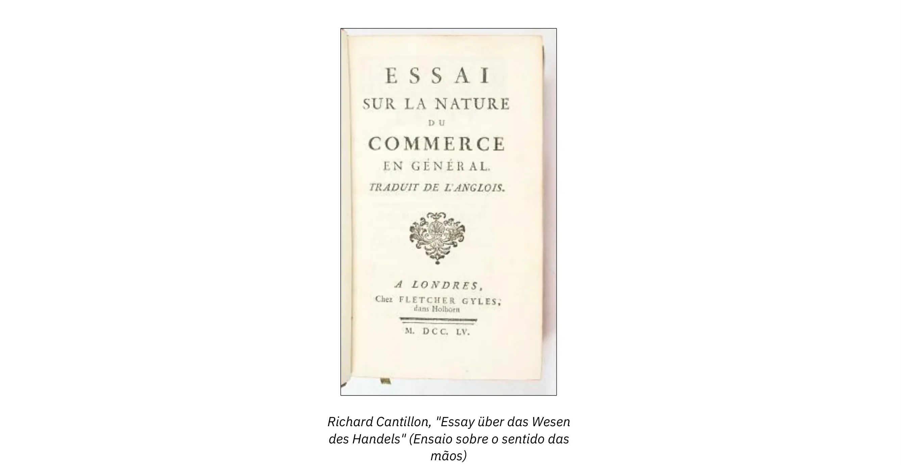

L'Ami des Hommes foi inicialmente concebido como um simples comentário ao Ensaio de Cantillon. Mas como Mirabeau tinha um espírito um pouco eclético, ou seja, francamente, um pouco louco, rapidamente se afastou do seu plano original. O livro limita-se a discutir todas as questões económicas que conhecia, afastando-se ocasionalmente de Cantillon. É um livro difícil de ler, com um plano bizarro e digressões em todos os capítulos. O próprio Mirabeau admitiu que era um caos e que o seu estilo era apocalítico.

Apesar do caos que é, algumas ideias são dignas de registo:

- Mirabeau combate o preconceito mercantilista sobre a natureza da riqueza.
- Elogia a agricultura e critica o seu abandono.
- Queixa-se da condição das pessoas, especialmente dos camponeses.
- Por fim, defende a liberdade de comércio e a fraternidade das nações em paz.

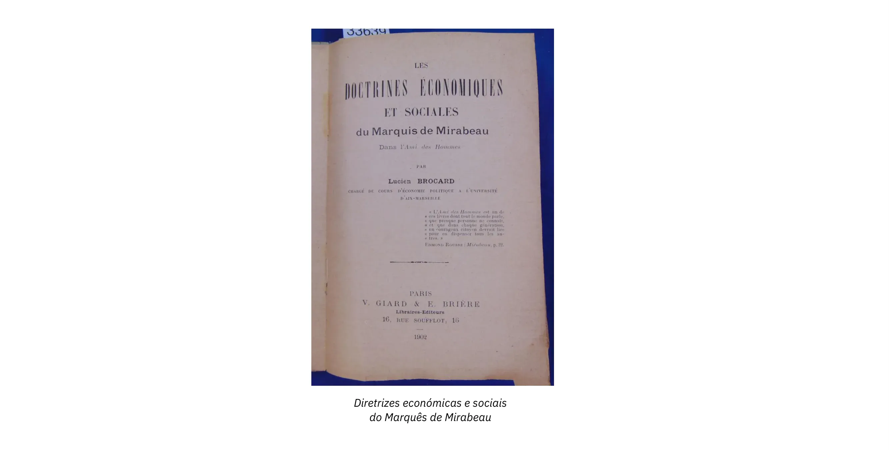

É difícil classificar os pontos de vista de Mirabeau como liberais ou anti-liberais. Ele oscilava frequentemente, por vezes sem se aperceber, entre uma visão e outra. No entanto, as ideias liberais dominavam frequentemente os seus escritos. Uma das suas frases mais famosas foi:

> O verdadeiro e único princípio da economia política é deixar que tudo seja livre.

Após o seu maior sucesso, Mirabeau é cortejado. François Quesnay, que acabava de se interessar pela economia, convida-o para o seu entresol em Versalhes.

Debateram furiosamente e, finalmente, aconteceu algo que normalmente nunca acontece em debates: Mirabeau admitiu categoricamente que estava errado. Concordou com as ideias de Quesnay e disse que estava pronto para as difundir.

Juntos, formaram o núcleo do que viria a ser a escola fisiocrática, reforçada pelos recrutas regulares que trouxeram. Pouco depois da conversão de Mirabeau, Quesnay pediu-lhe que defendesse as suas ideias sobre a tributação. Este facto deu origem à ["Teoria da Tributação"](https://archive.org/details/thoriedelimpot00mira), pela qual Mirabeau foi enviado durante alguns dias para a prisão de Vincennes e depois exilado em Bignon.

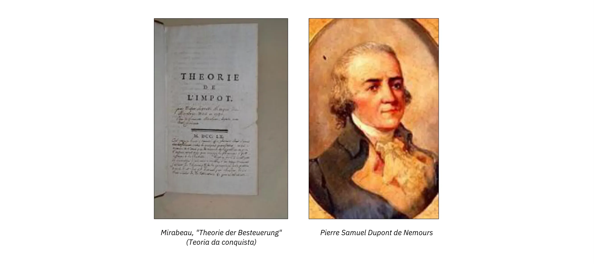

Mirabeau também desempenhou um papel crucial no recrutamento de novos membros para a escola de Quesnay. Chegou mesmo a convencer o jovem Dupont de Nemours.

Era também em casa de Mirabeau que os fisiocratas se reuniam todas as terças-feiras. Personalidades como Turgot e Adam Smith parecem ter participado nestas reuniões uma ou várias vezes.

Durante toda a sua vida, Mirabeau continuou a ser um escritor incansável. É autor de numerosas obras económicas que defendem a doutrina de Quesnay. No entanto, no final da sua vida, a sua influência diminuiu. O seu estilo de escrita deteriorou-se ao ponto de o seu próprio irmão lhe escrever a dizer que já não conseguia compreender a sua prosa. As suas ideias, plenamente liberais, chocavam com a reação socialista ou proto-comunista de pensadores como Mably e mesmo Rousseau. Com dificuldade em encontrar leitores e editores, morreu praticamente despercebido em 1789, na véspera da tomada da Bastilha.

## Quesnay

<chapterId>7a35f20b-5ea0-544d-b290-bcd9c6f7f11a</chapterId>

François Quesnay é um dos mais famosos economistas franceses.

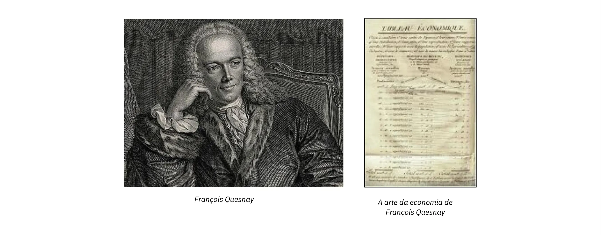

O seu nome aparece em todos os manuais de economia e de história do pensamento económico. Afirma-se que criou o "Tableau Économique" para representar esquematicamente a economia, que foi o líder da escola fisiocrática, que se enganou ao acreditar que só a terra é produtiva e, finalmente, que Adam Smith veio esclarecer as coisas. É mais ou menos assim que os manuais escolares tendem a resumir François Quesnay.

Reduzi-lo a isto é uma pena, porque Quesnay foi também o primeiro economista a tentar basear a defesa da liberdade económica em princípios científicos. Foi um dos economistas mais ouvidos e influentes do seu tempo. Além disso, fundou a Fisiocracia, uma doutrina muito mais rica do que a ideia simplista de que só a natureza produz riqueza, uma noção que é frequentemente deturpada.

Discutiremos a Fisiocracia em mais pormenor nos próximos três capítulos. Em primeiro lugar, vejamos mais de perto o próprio François Quesnay.

Nasceu em 1694, em Méré, no seio de uma família de camponeses que não conseguiu ensinar Quesnay a ler. Foi treinado por um homem da região e acabou por estudar no Colégio de Cirurgia e depois na Faculdade de Medicina. Aos 24 anos, torna-se cirurgião em Mantes.

Ganhou fama em 1730, aos 36 anos, por se opor à prática comum da sangria, que considerava baseada em teorias erradas e preconceitos. Ousou também desafiar o sistema de corporações, que ditava que só os cirurgiões podiam efetuar operações e só os médicos podiam prescrever medicamentos. Este facto obrigava frequentemente os pobres a pagar duas vezes e a trazer duas pessoas, uma situação que Quesnay considerava revoltante.

Em 1740, torna-se secretário da Academia de Cirurgia. Em 1748, aos 54 anos, torna-se médico pessoal de Madame de Pompadour e muda-se para Versalhes.

Era muito amigo de Madame de Pompadour. Quesnay chegou mesmo a dizer, na altura em que foi anunciada a desgraça da favorita, que não gostaria de continuar a ser médico em Versalhes sem ela:

"Eu estava ligado a Madame de Pompadour na sua prosperidade; sê-lo-ei na sua desgraça".

Em seguida, publicou vários livros de medicina: Treatise on Suppuration (1749), Treatise on Gangrene (1749), e Treatise on Continuous Fevers (1753), todos eles reimpressos várias vezes durante a sua vida.

Aos 60 anos, tendo sido introduzido nos debates económicos em voga na época, começa a escrever sobre economia. Em 1755, escreveu os artigos "Agricultores" e "Grãos" para a *Encyclopédie*.

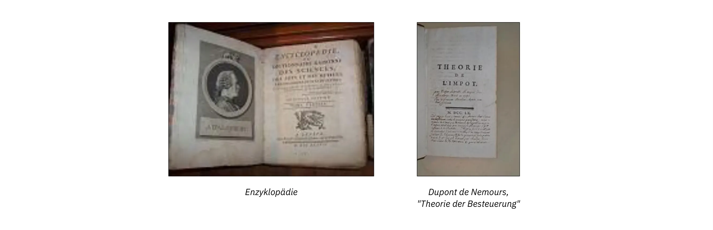

Foram publicadas em 1757. Nesse mesmo ano, conheceu o famoso Mirabeau e conseguiu convertê-lo às suas ideias económicas - nascia o núcleo da Fisiocracia. Quesnay criou então o Tableau Économique, que foi impresso nas prensas reais, alegadamente na presença do próprio rei no Château de Versailles. A partir dessa altura, Quesnay passou a receber regularmente economistas e filósofos no seu apartamento de Versalhes, onde discutiam livremente. Quesnay também contribuiu para a Teoria da Tributação de Mirabeau, publicada em 1759.

A censura não tardou. Mirabeau foi preso e Quesnay foi repreendido. Depois disso, Quesnay apercebeu-se de que não podia publicar abertamente e que precisaria de discípulos para divulgar as suas ideias.

Encontrou-os rapidamente: Baudeau, Dupont de Nemours, Le Trosne, Mercier de la Rivière, e outros. Estes são os homens que irão difundir e popularizar o pensamento de Quesnay. No entanto, Quesnay, que precisava de discípulos, não estava inteiramente satisfeito com o aspeto sectário do seu grupo. Veja-se as suas cartas a Mirabeau, em que lhe diz:

> "Pensem por vós próprios. Já percebi que os meus miseráveis rascunhos vos tornam preguiçosos. Agora é a vossa vez de pensar. Vocês sabem tanto como eu".

No entanto, os seus discípulos eram profundamente devotos e contribuíram grandemente para a popularidade de Quesnay. Aquando da sua morte, Mirabeau fez o seu elogio, dizendo: "Perdemos o nosso pai, pois devíamos-lhe tudo". Na verdade, era a eles que Quesnay devia tudo, pois, sem eles, teria ficado preso em Versalhes, onde o seu pensamento, embora tivesse muito para seduzir ou preocupar, interessava a poucos.

Graças ao trabalho dos seus colaboradores, as suas ideias encontraram uma plataforma: primeiro através de jornais como o *Journal of Agriculture* e o *Ephémérides du Citoyen*.

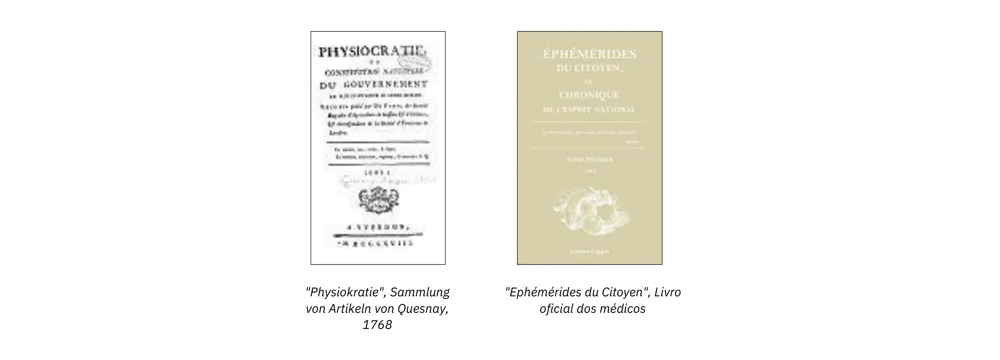

Depois, através de livros, não só os dos seus discípulos, mas também uma importante antologia publicada em 1768 por Dupont de Nemours, intitulada *Fisiocracia*.

Este livro reuniu os principais contributos de Quesnay. Nele se expõe o ideal económico do líder dos fisiocratas: um modelo de economia agrícola em que a lei garante a todos o direito de propriedade e a liberdade de comércio.

# A Escola Fisiocrática

<partId>27af82c1-ad82-5c3b-8ce9-c674b67bbf7c</partId>

## História dos Fisiocratas

<chapterId>4236ff8b-b53a-59e7-92c0-f96f9afa1c00</chapterId>

A fisiocracia esteve na moda em França, e mesmo em toda a Europa, durante apenas uma década. Após um longo período de desenvolvimento, ganhou proeminência em meados da década de 1760. Quando Turgot chegou ao poder, em 1776, o movimento já tinha perdido a sua popularidade e o ministro manteve o seu apoio à escola de Quesnay quase escondido.

As suas origens encontram-se na evolução das ideias económicas durante a década de 1750. Vários autores ajudaram a fazer a ponte entre Boisguilbert e o que viria a ser conhecido como Fisiocracia. Como já foi referido, Vincent de Gournay e o seu círculo de economistas estiveram na origem de muitas publicações que deram a conhecer aos leitores franceses o pensamento económico estrangeiro e ajudaram a despertar a sua paixão pela economia. Os fundamentos da Fisiocracia já estavam presentes em livros como "Détail de la France" de Boisguilbert e ["Essay on the Nature of Trade in General"](https://archive.org/details/essaisurlanature0000cant) de Cantillon.

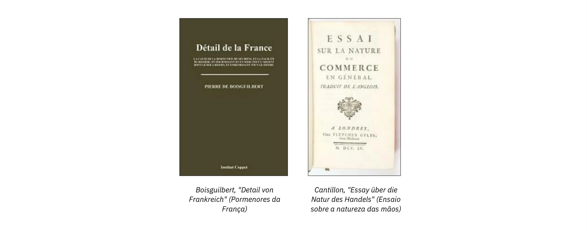

O conceito de laissez-faire teve vários defensores desde Boisguilbert, nomeadamente Vincent de Gournay e o Marquês d'Argenson.

Faltava transformar este conjunto de ideias numa doutrina coerente e completa, e o Marquês de Mirabeau foi o primeiro a tentar. Inspirado pelo Ensaio de Cantillon, começou a escrever um tratado completo sobre questões económicas intitulado "L'Ami des Hommes", que teve muito sucesso.

Assim, em 1756, a história da Fisiocracia poderia começar. François Quesnay, na altura um cirurgião que se tornou médico pessoal de Madame de Pompadour, convidou Mirabeau a ir a Versalhes para discutir ideias económicas.

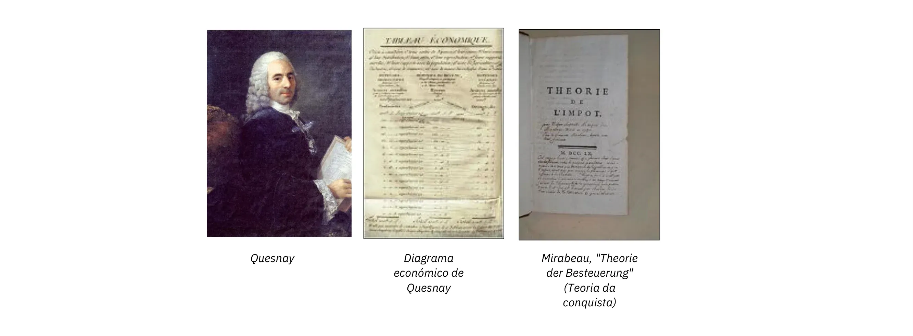

No final da conversa, Mirabeau concorda com as ideias de Quesnay. A partir daí, passaram a escrever: Quesnay criou o *Tableau économique* (1758) para ilustrar o fluxo de riqueza na economia, e juntos publicaram a Teoria da Tributação (1759).

Os seus esforços não foram bem acolhidos. Na corte, a reação predominante foi a indiferença. O rei reconheceu a inclinação de Quesnay para a teoria e chamou-lhe carinhosamente "o meu pensador". Mas, para além deste elogio, o seu trabalho não obteve qualquer resultado. De facto, a sua Teoria da Tributação ofendeu os administradores fiscais que criticava, de tal forma que estes exigiram e conseguiram a prisão de Mirabeau. Madame de Pompadour acabou por o libertar, mas ele continuou a viver no exílio na sua propriedade de Bignon durante algumas semanas.

A primeira metade da década de 1760 decorre assim num relativo silêncio. Devido à sua posição em Versalhes, Quesnay foi obrigado a deixar de escrever ou, pelo menos, a não publicar nada em seu próprio nome. Mirabeau, já condenado uma vez, foi avisado e sabia que o favorito do rei não o poderia proteger para sempre.

Após este breve silêncio, os dois economistas começaram a recrutar discípulos: era a única forma de popularizar as suas ideias. Em 1765, os seus êxitos são notáveis. Dupont de Nemours, Abeille, Mercier de la Rivière, Le Trosne e Baudeau juntam-se rapidamente às suas fileiras. Formaram uma escola: tinham o seu próprio jornal, *Les Éphémérides du Citoyen*, e até se reuniam todas as terças-feiras em casa de Mirabeau.

Entre 1765 e 1775, o grupo unido dos Fisiocratas atingiu o auge da sua fama. O mundo literário e filosófico só tinha olhos para eles, permitindo que as suas ideias se difundissem ampla e rapidamente. Chamavam-lhes "os economistas" ou, de forma mais jocosa, "a seita dos economistas". Seja qual for o tom, a sua notoriedade é absoluta. Em 1774, depois de uma viagem a Metz, M. de Vaublanc escreveu nas suas memórias o seu espanto: todos à sua volta falavam de economia e raciocinavam como os discípulos de Quesnay. "Estava na moda", constata. "Toda a gente era economista".

No entanto, em 1770, a sua popularidade começou a diminuir. O grupo conheceu as primeiras deserções e a sua capacidade de resistir às críticas enfraqueceu. E os críticos eram muitos: Condillac, Mably, Voltaire, Galiani, Linguet, Graslin e até Adam Smith, na Escócia, contestaram os seus pontos de vista.

O seu jornal deixou de ser publicado regularmente. Este é o fim do período mais ativo do movimento.

A fisiocracia continuará a exercer a sua influência até à Revolução. Em França, primeiro através de Turgot, mais companheiro de viagem do que discípulo, bem como através do seu representante Dupont de Nemours, cuja vida e obra estudaremos mais adiante. Mas também em toda a Europa, onde a doutrina fisiocrática foi recebida com entusiasmo. Na Alemanha, através do Marquês de Baden, e em Itália, através de Leopoldo da Toscânia, as teorias fisiocráticas inspiraram mesmo reformas económicas favoráveis à propriedade privada e à liberdade.

## Os fundamentos da doutrina dos fisiocratas

<chapterId>4dbe5436-0578-57c2-b054-03ed00aa091a</chapterId>

O termo Fisiocracia, que significa "governo por natureza", foi cunhado por Dupont de Nemours e utilizado como título de *Fisiocracia*, uma coleção de artigos de Quesnay publicada em 1768.

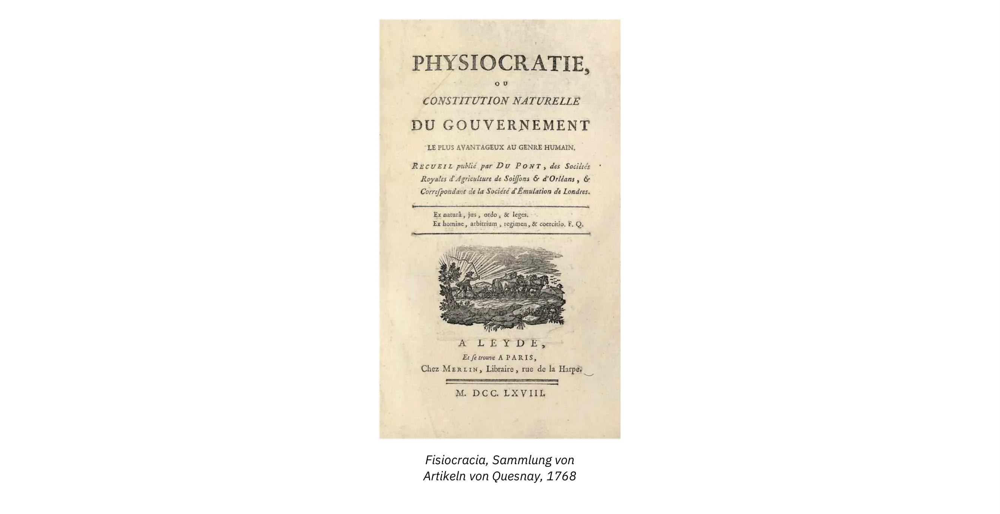

Esta é uma frase obscura. Nenhum aluno de Quesnay nos forneceu o seu verdadeiro significado. No entanto, o seu sistema de pensamento estava longe de ser obscuro. De facto, foi construído em torno de alguns princípios muito claros, que iremos delinear aqui.

### Primeiro princípio: só a agricultura é produtiva

Esta primeira ideia é a que chamou a atenção dos historiadores. Hoje, nos manuais escolares ou nos cursos de economia, é assim que se resumem os fisiocratas. Diz-se que acreditavam ingenuamente que só a agricultura era produtiva. Com base nisso, a sua doutrina é considerada irrelevante e a análise passa rapidamente para Adam Smith.

No entanto, é injusto criticar os fisiocratas por darem uma importância desproporcionada à agricultura, uma vez que, em meados do século XVIII, a agricultura empregava 90% da população e constituía a base da economia francesa.

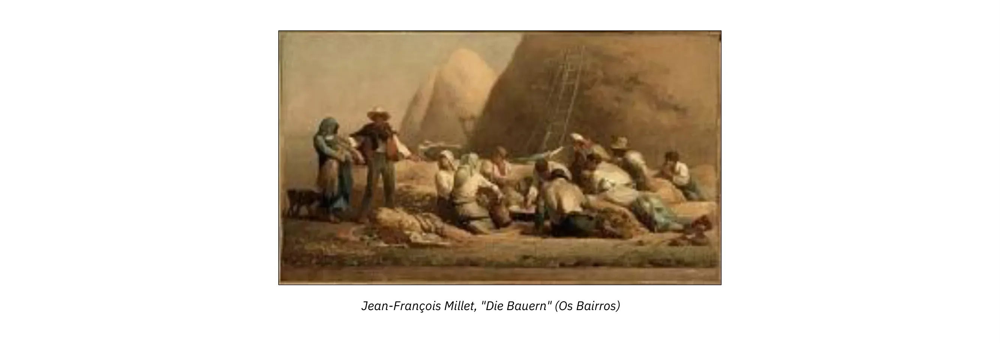

A ideia dos fisiocratas é, na verdade, subtil. Segundo eles, há uma diferença entre produção e lucro. O industrial e o comerciante podem obter lucros, mas só o agricultor produz verdadeiramente, porque a produção é a criação de material útil, e não a adição de utilidade a material pré-existente.

Devemos também tentar compreender porque é que rejeitaram a indústria e o artesanato como improdutivos. Na altura, estes ofícios estavam fechados no sistema de guildas, que proibia a inovação, o investimento e o progresso.

### Segundo princípio: despotismo legal em vez de democracia

Hoje, para insultar alguém, dizemos que não é democrata. Embora os historiadores perdoem aos fisiocratas a sua visão rígida da produtividade agrícola, não perdoam a sua oposição à democracia, especialmente porque viveram durante o auge das ideias iluministas. Desde meados do século XVIII até pouco antes da Revolução, os fisiocratas eram vistos como inimigos do progresso.

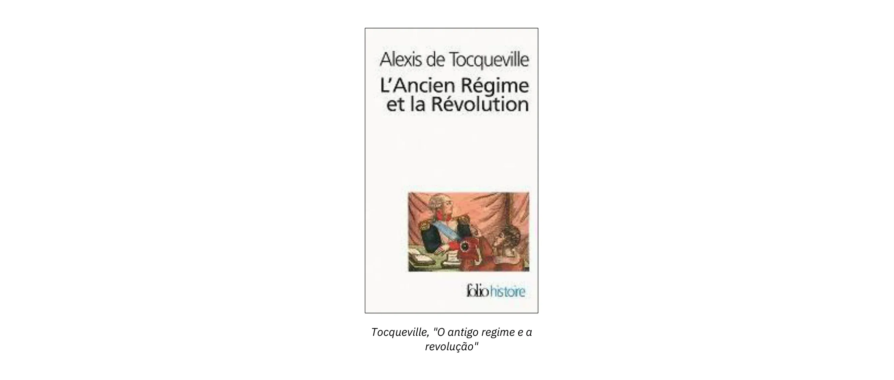

Tocqueville insistiu nesta ideia:

> Os fisiocratas eram, de facto, muito favoráveis ao livre comércio de mercadorias, ao laissez-faire ou laissez-passer no comércio e na indústria; mas quanto às liberdades políticas propriamente ditas, não as consideravam, e mesmo quando tais ideias lhes passavam pela cabeça, rejeitavam-nas inicialmente.

Liberais em matéria económica, os fisiocratas não eram, portanto, liberais em matéria política. Quesnay escreve nas suas *maximas*: "Que a autoridade soberana seja única e superior a todos os indivíduos da sociedade e a todos os empreendimentos injustos de interesses privados." E mais tarde, na mesma máxima: "O sistema de pesos e contrapesos no governo é uma noção fatal, que apenas revela discórdia entre os grandes e opressão dos pequenos".

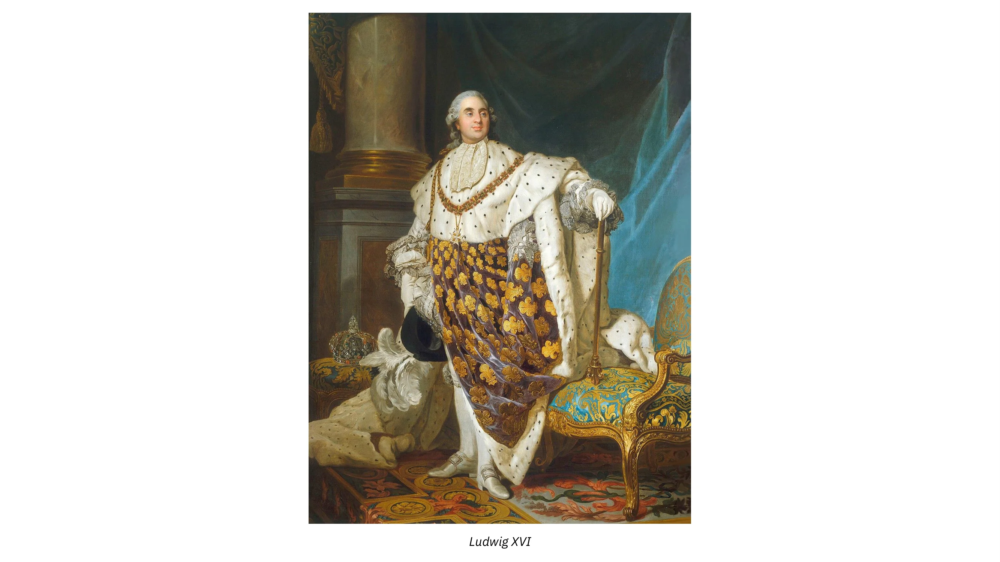

Tocqueville observou corretamente que os fisiocratas rejeitaram a democracia assim que viram as suas formas. Eram cépticos em relação à democracia, que se tornaria uma constante na economia política francesa, porque a democracia está longe de ser um sistema perfeito: permite potencialmente a opressão das minorias pela maioria e pode tornar-se um instrumento de usurpação, tirania e espoliação.

### Terceiro princípio: respeito absoluto pela propriedade privada

Os fisiocratas acreditavam que as pessoas precisavam de possuir e manter os resultados do seu trabalho. Na sua opinião, os direitos de propriedade eram a própria base de uma sociedade. Para eles, o Estado tinha uma função principal: proteger a propriedade das pessoas. Além disso, do ponto de vista económico, os fisiocratas defendem que a inviolabilidade da propriedade incentiva o trabalho e o esforço e é uma condição para o progresso económico.

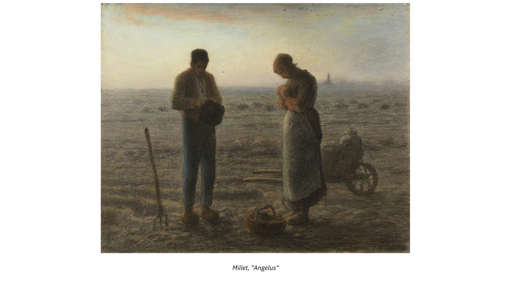

Quesnay diz isso de forma simples:

> Que o Ownership da terra e da riqueza móvel seja assegurado àqueles que são seus legítimos possuidores, pois a segurança da propriedade é a base essencial da ordem económica e da segurança da sociedade; é a certeza da posse permanente que encoraja o trabalho e a utilização da riqueza no melhoramento e cultivo da terra, bem como nas empresas comerciais e industriais.

### Quarto princípio: liberdade absoluta de comércio

Nas suas *Maximas* já citadas, Quesnay afirma:

> Que haja total liberdade de comércio, pois a regulamentação mais fiável, precisa e benéfica do comércio interno e externo para a nação e para o Estado reside na plena liberdade de concorrência.

Os fisiocratas tinham visto os danos causados pela interferência do governo, especialmente no comércio de cereais. É preciso reconhecer, dizem eles, que a autoridade nunca será capaz de gerir o comércio tão bem como os indivíduos, porque teria de responder a todas as necessidades e reagir a todas as mudanças na procura ou no Supply. Tudo isto está muito para além das capacidades do governo mais sensato que se possa conceber. Por isso, é necessário deixar as coisas serem e deixá-las fluir.

Benéfico por natureza, o comércio deve ser total e perfeitamente livre. Um dos seus membros, Le Trosne, escreveu mesmo um panfleto intitulado [*A liberdade do comércio dos cereais: sempre útil, nunca prejudicial*](https://www.institutcoppet.org/liberte-commerce-grains-toujours-utile-jamais-nuisible/).

### Quinto princípio: Todos os homens são irmãos

Opositores ferozes da escravatura, os fisiocratas eram também grandes pacifistas. "A nossa política externa chama-se paz", dizia simplesmente Mirabeau. Em 1790, na Assembleia Constituinte, Dupont de Nemours deu continuidade a esta posição pacifista ao propor um projeto de lei que proibia as guerras ofensivas.

## Realizações e influências dos fisiocratas

<chapterId>5b911105-796a-5e2e-a501-c7a364fc758e</chapterId>

Como vimos no primeiro dos três capítulos dedicados aos fisiocratas, os seguidores de Quesnay foram o centro das atenções em França durante cerca de uma década. Este entusiasmo pelas suas ideias tomou forma no seu tempo e manteve-se até ao final do século. Neste capítulo, analisaremos algumas das suas realizações e a influência que exerceram sobre os seus sucessores no domínio do pensamento económico.

O seu maior feito, depois do grupo de Gournay, foi a popularização das ideias económicas. A famosa frase de Voltaire é bem conhecida: por volta de 1750, a nação, saciada de poesia e romances, começou a raciocinar sobre os cereais. Os fisiocratas participaram neste movimento, publicando literalmente centenas de artigos, panfletos e livros sobre a liberdade do comércio de cereais. O forte impulso dado pelos fisiocratas às discussões económicas é também evidente no impressionante número de obras e panfletos económicos publicados em França de 1760 a 1775. Como prova da difusão das ideias económicas em França, recorde-se a observação de M. de Vaublanc, citada numa conferência anterior, que afirmou em Metz, em 1774, que só se falava de economia. "Era a moda", disse ele. "Toda a gente era economista".

A defesa das suas ideias, em livros, panfletos e no seu jornal *Les Éphémérides du Citoyen*, teve rapidamente repercussões na política económica francesa. Em 1763, um édito concedeu a liberdade do comércio de cereais, que Quesnay e Mirabeau tinham exigido com veemência. Em várias ocasiões, as autoridades também flexibilizaram os regulamentos das corporações de ofício para garantir uma maior liberdade de trabalho.

No estrangeiro, o sucesso chegou muito cedo. Na Alemanha, o Marquês de Baden interessou-se pelas ideias fisiocráticas e manteve uma correspondência regular com Mirabeau e Dupont de Nemours.

Encarregou o economista Johann August Schlettwein, um fisiocrata convicto, de implementar uma reforma fiscal e liberalizar o comércio de cereais. Em abril de 1770, teve lugar um primeiro ensaio na pequena aldeia de Dietlingen. Os habitantes da aldeia parecem ter acolhido as medidas com entusiasmo, mas os funcionários responsáveis não as apoiaram muito, o que atrasou a sua aplicação alargada.

Na Rússia, Catarina II estava a preparar uma reforma legislativa e pediu a Diderot que lhe enviasse uma mente brilhante para a ajudar.

Impressionado pela leitura de [*The Natural and Essential Order of Political Societies*](https://archive.org/details/lordrenaturelete00mercuoft), publicado em 1767, enviou-lhe o seu autor, o fisiocrata Mercier de la Rivière.

Apesar de ter saído de França com um grande êxito, a sua receção em São Petersburgo foi fria (apesar do clima) e a Imperatriz ficou desiludida com ele.

Na Suécia, com Gustavo III, e em Itália, com Leopoldo da Toscânia, os fisiocratas também encontraram seguidores dispostos a pôr em prática as suas ideias.

Em França, os fisiocratas tiveram um êxito espetacular com a nomeação de Turgot como Controlador-Geral das Finanças em 1774.

Consciente do declínio da sua fama, Turgot nunca se apresentou como um discípulo fiel dos fisiocratas, nem, aliás, como um enciclopedista, embora o fosse, e uma vez que eram desprezados pelos membros do clero. Uma vez no poder, Turgot emitiu seis éditos famosos que constituíram o início de uma aplicação prática do programa fisiocrata: liberdade de comércio, liberdade de trabalho e o fim dos monopólios.

Na altura da Revolução Francesa, os fisiocratas tinham menos seguidores. O marquês de Mirabeau morreu a 13 de julho de 1789 - um símbolo. Abeille seguiu em frente, mas Dupont de Nemours permaneceu fiel. Nomeado para a Assembleia, Dupont de Nemours fez ouvir a voz da fisiocracia e apelou a reformas económicas a favor da propriedade Ownership e do comércio livre.

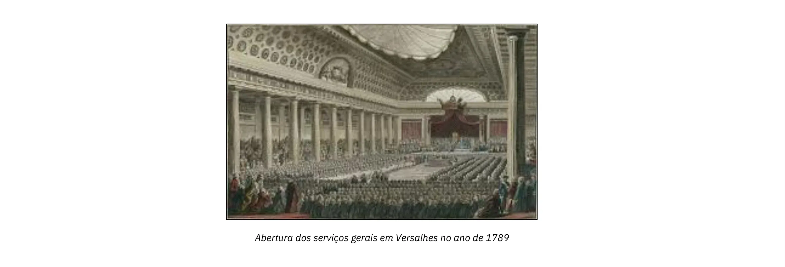

Também lutou, sem sucesso, contra os assignats. Apesar desse fracasso, o pensamento fisiocrata continuou muito presente no debate intelectual e influenciou as primeiras conquistas da Revolução. Como disse Joseph Rambaud, tudo o que a Revolução fez em favor das liberdades deveu-se aos fisiocratas.

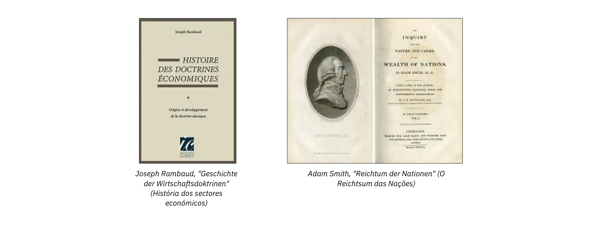

Os fisiocratas também tiveram uma grande influência na história do pensamento económico. Adam Smith, que visitou França e conheceu muitos deles, foi profundamente influenciado pelo seu trabalho. Chegou mesmo a pensar em dedicar "A Riqueza das Nações" a Quesnay.

Infelizmente, Quesnay morreu dois anos antes de o livro de Smith ser publicado e Smith retirou a dedicatória. Embora Smith não concordasse com a ideia de que só a agricultura era produtiva, adoptou muitos dos seus argumentos a favor do mercado livre e levou-os adiante na sua própria obra.

## Dupont de Nemours

<chapterId>6d585e0f-93b8-5b0a-a0a8-7f6e4a5bc68e</chapterId>

Nos Estados Unidos, conhecemos a empresa DuPont, também conhecida como "E.I. du Pont de Nemours and Company", uma empresa multinacional no domínio da química e da biologia.

Atualmente, o seu volume de negócios é superior a 35 000 mil milhões de dólares e emprega cerca de 65 000 pessoas em todo o mundo. Acontece que esta empresa está intimamente ligada ao destino de Samuel-Pierre Dupont de Nemours, um economista francês da escola fisiocrática.

Nascido em 1739, Dupont de Nemours aproximou-se dos fisiocratas aos 24 anos. Nessa altura, ainda estava a encontrar o seu caminho na vida. Um dia, deparou-se com um pequeno panfleto intitulado A Riqueza do Estado. Achou que as ideias económicas eram absurdas e escreveu uma resposta crítica intitulada Reflexões sobre a Riqueza do Estado, publicada em 1763. A peça foi bem recebida e os leitores elogiaram-na, dizendo coisas como: "Deves ser um discípulo de Mirabeau!" Ironicamente, Dupont nem sequer sabia quem era Mirabeau.

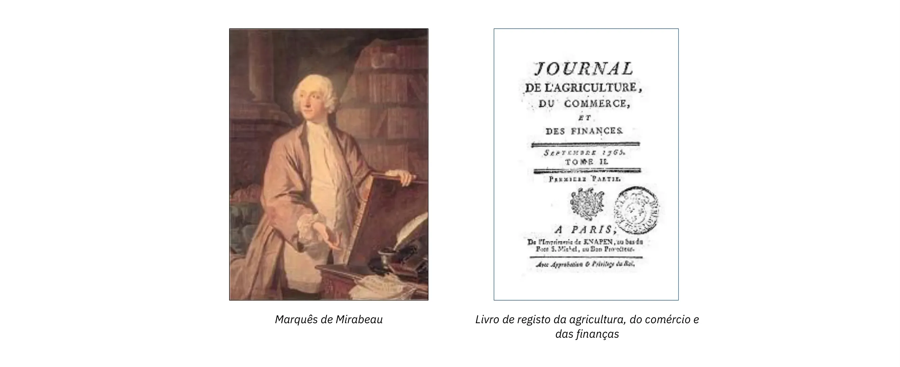

Curioso, começou a ler as obras de Mirabeau, *Amigo do Povo* e *Teoria da Tributação*. Conhece Mirabeau e François Quesnay e junta-se à sua escola.

Em 1765, Dupont foi nomeado redator do *Journal de l'agriculture, du commerce et des finances*, o principal periódico da época no domínio do pensamento económico.

Havia duas razões para isso: Mirabeau e Quesnay tinham de permanecer em silêncio, e Dupont era visto como a sua estrela em ascensão.

Os membros da escola fisiocrática concordam que Dupont de Nemours rapidamente se tornou o favorito de Quesnay. Quesnay disse uma vez: "Cuida deste jovem, será ele a falar quando morrermos". Um colega fisiocrata, Abeille, chegou a ficar com ciúmes da atenção que Dupont recebia e afastou-se da escola de Quesnay.

Dupont de Nemours manteve sempre a sua grande consideração por Quesnay.

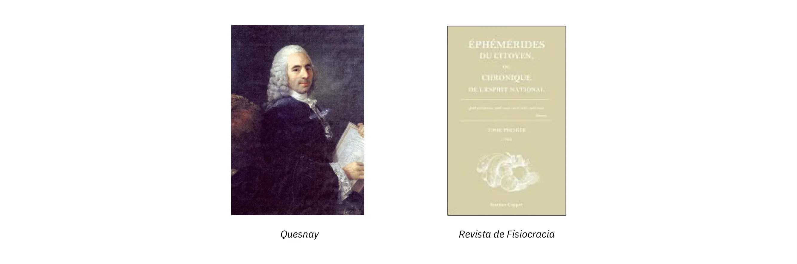

Mais tarde, diria: "Eu era apenas um rapaz quando Quesnay me estendeu os braços - ele fez de mim um homem" Foi Quesnay que fez dele um economista importante na cena literária da época.

Depois do *Journal de l'agriculture, du commerce et des finances*, Dupont foi nomeado redator do *Les Éphémérides du Citoyen*, que se tornou o órgão oficial dos fisiocratas.

Fez desta coleção periódica um importante centro de teoria económica, apoiando-a mesmo durante o declínio dos fisiocratas, escrevendo pessoalmente quase todos os volumes posteriores. Foi, aliás, Dupont de Nemours que cunhou o termo "fisiocracia", derivado de duas palavras gregas que significam "governo da natureza". Utilizou este termo para intitular uma coletânea de artigos de Quesnay, publicada em 1768, e o termo acabou por se impor na história. Sabe-se que, entre si, os fisiocratas se tratavam por "economistas" e que continuaram a ser referidos como tal durante a Revolução.

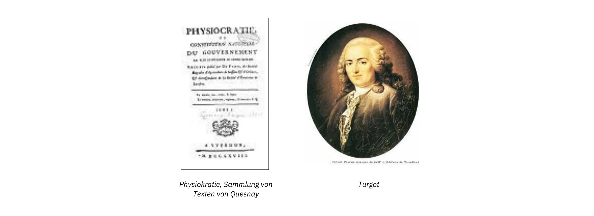

Quando Turgot foi Ministro das Finanças de França, Dupont tornou-se seu conselheiro próximo, o único fisiocrata com acesso a ele, uma vez que Turgot se mantinha distante dos outros.

Na altura da Revolução, foi eleito pelo bailiado de Nemours e encontrou-se na Assembleia, onde também estava sentado outro Monsieur Dupont. Foi então chamado Dupont de Nemours, não por ser um nobre, mas simplesmente para distinguir os dois. O nome, evidentemente, manteve-se.

Durante a Revolução, em agosto de 1792, pegou em armas para defender o Rei no Palácio das Tulherias contra a multidão.

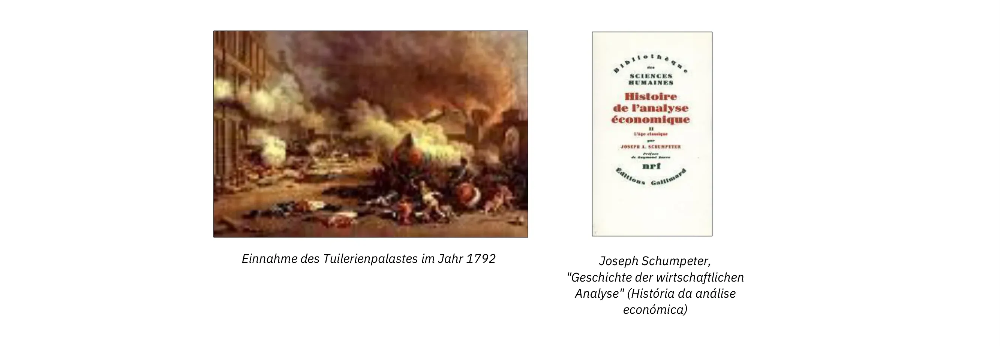

O Rei disse-lhe: "Monsieur Dupont, encontramo-lo sempre onde é preciso!" Depois de ter escapado milagrosamente ao Terror, condenado e à espera da guilhotina, mas salvo pela queda de Robespierre, foi empurrado para o exílio sob Napoleão e encontrou a felicidade nos Estados Unidos, onde um dos seus filhos fundou, com a ajuda do pai, a empresa Dupont.

Apesar desta vida cheia de acontecimentos, durante a qual publicou dezenas de artigos, brochuras e livros, ainda hoje é relativamente pouco conhecido. Talvez isso se deva ao facto de ter continuado a ser um fisiocrata convicto, numa altura em que a doutrina estava fora de moda. De facto, como escreveu Schumpeter, Dupont de Nemours manteve-se fiel à fisiocracia "ao longo de uma carreira durante a qual teve muitas oportunidades para renunciar a ela". Era um homem de convicções.

# O Iluminismo e a Economia Política

<partId>d1c885ad-7cb1-5f81-816c-be312719d9f8</partId>

## Voltaire e os filósofos

<chapterId>16bcf7bf-dad4-5113-8c64-2800f04ff07b</chapterId>

O século XVIII assistiu, em França, ao aparecimento da economia como ciência e à primeira escola de pensamento económico: A fisiocracia. Adam Smith formou-se em economia durante este período e os economistas franceses foram reconhecidos mundialmente como líderes. No entanto, este século é mais recordado como o século da filosofia do que da economia. Embora o movimento fisiocrático se alinhasse, nas suas ambições, com a filosofia do Iluminismo, as atitudes dos filósofos - especialmente Diderot e Voltaire - merecem uma análise atenta. Veremos que os pensadores do Iluminismo contribuíram significativamente para a difusão da ideia do laissez-faire em França.

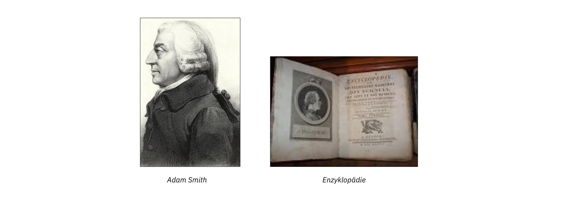

A obra mais famosa da filosofia do Iluminismo é, sem dúvida, a *Encyclopédie* de Diderot e d'Alembert.

Naturalmente, os artigos económicos são escritos por economistas. Para os primeiros volumes, Diderot recorreu a Forbonnais, depois a economistas liberais: primeiro François Quesnay (que contribuiu com artigos como "Grains", "Fermiers", "Hommes" - este último inédito), depois Turgot (que escreveu "Foires et marchés"). Estes escritos são de grande importância. Nos seus artigos, Quesnay lançou as bases do que viria a ser a doutrina fisiocrática. Juntamente com o seu *Tableau économique*, estas continuam a ser as suas obras mais famosas. Turgot, ainda jovem na altura, desenvolveu a ideia do laissez-faire no seu artigo, criticando a intervenção do Estado na organização do mercado.

Em muitos outros artigos da *Encyclopédie*, os filósofos, especialmente Diderot, defendem o ideal da liberdade em todos os domínios: religião, política e economia.

A liberdade de trabalho, sobretudo em oposição ao sistema de corporações, foi um tema recorrente em várias entradas, como Arts, Métier e Communauté.

O percurso de Diderot na teoria económica é curioso. Na Encyclopédie, foi um acérrimo defensor da liberdade económica e procurou a colaboração dos economistas liberais, como o confirma uma carta em que se descrevem os artigos que Turgot poderia escrever para ele. Nos primeiros anos da Fisiocracia, foi simultaneamente apoiante e promotor da escola de Quesnay. Em 1769 e 1770, escreveu para *Les Ephémérides du Citoyen*, para grande desgosto dos seus amigos filósofos anti-liberais, como Melchior Grimm; no entanto, depressa se afastou do grupo. Encantado pelo intelecto vibrante do Abade Galiani, ajudou-o a publicar em francês o seu livro sobre o comércio de cereais, quando Galiani estava prestes a regressar a Itália.

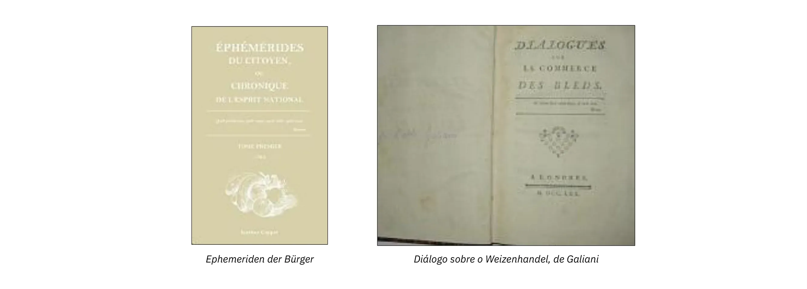

Este livro tornar-se-ia no mais feroz ataque alguma vez feito contra as ideias fisiocráticas, desferindo um grande golpe no movimento. Mais tarde, Diderot defendeu Galiani contra o Abade Morellet, um aliado próximo dos Fisiocratas, na sua *Apologia de Galiani*. Alguns anos mais tarde, durante o ministério de Turgot, Diderot foi visto a aplaudir o estabelecimento da liberdade de trabalho através da abolição das corporações. Nesta altura, Diderot, filho de um artesão, concordou com os economistas liberais e escreveu uma carta mordaz a Galiani, que afirmava que a liberdade de trabalho arruinaria a indústria francesa dentro de vinte ou trinta anos. À luz da Revolução Industrial, a história sugere o contrário. Tendo voltado para o lado dos economistas liberais, Diderot já não gozava da sua confiança e ficou isolado. Um momento muito revelador é uma carta que enviou a Dupont de Nemours em 1774, onde escreve

> "Já tiveste amizade por mim; agora já não tens, porque estás tão ocupado que já não tens tempo para amar ninguém".

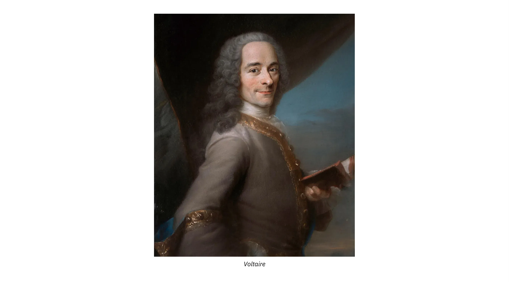

Voltaire seguiu um percurso semelhante, marcado pela falta de coerência das suas posições económicas. Admira Vincent de Gournay, corresponde-se com economistas (entre os quais Dupont de Nemours e Turgot) e aprecia os fisiocratas, sobretudo pelos seus elogios à agricultura. Exaltou-os numa *Diatribe ao Autor das Ephémérides*. No entanto, mais tarde, criticou a sua ideia de um imposto único sobre a terra na sua obra satírica *O Homem das Quarenta Coroas*, que também suscitou grande controvérsia. Por fim, tal como Diderot, celebrou o ministério de Turgot, chamando-lhe uma época de ouro e elogiando os seus dois grandes decretos sobre a liberdade de trabalho e o comércio livre.

No fim de contas, a relação dos philosophes com o pensamento económico é mista. Apesar dos seus elogios e críticas às ideias económicas liberais, desempenharam um papel importante na integração destas ideias no discurso intelectual mais vasto do Iluminismo. Desta forma, intencionalmente ou não, contribuíram para o avanço da noção de laissez-faire até à Revolução.

## Turgot, o teórico

<chapterId>a8cd8185-8351-556b-8011-3a0c313e8a9d</chapterId>

Numa passagem famosa da sua *História do Pensamento Económico*, o economista americano Murray Rothbard elogiou aquilo a que chamou o "brilhantismo" de Turgot.

apresentando-o como o maior economista do século XVIII, juntamente com Cantillon.

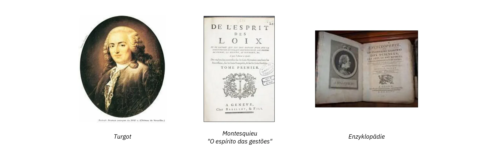

Como é que Turgot alcançou tal proeminência? Tudo se deveu a uma combinação de três factores fundamentais. **Em primeiro lugar, o seu passado familiar de prestígio. Ele veio de uma longa linhagem de administradores reais, muitos dos quais ocuparam cargos governamentais de alto nível. **Em segundo lugar, a época de ouro em que nasceu e cresceu. Turgot tinha 21 anos quando Montesquieu publicou *L'Esprit des Lois* e 24 quando apareceu o primeiro volume da *Encyclopédie*.

Foi contemporâneo dos fisiocratas, Voltaire, Diderot, d'Holbach, Adam Smith, Condorcet e outros. **Em terceiro lugar, a sua precocidade intelectual.** Enquanto estudante na Sorbonne, escreveu uma carta sobre papel-moeda aos 22 anos, proferiu discursos notáveis e, aos 24 anos, compôs uma lista de 52 obras a escrever.

Apesar da sua juventude, Turgot contribuiu para a *Encyclopédie*, escrevendo artigos sobre temas como "Etimologia", "Existência", "Expansibilidade", "Feiras" e "Fundações". Apenas um artigo tocava diretamente a economia - o seu artigo sobre "Feiras", que descrevia as origens das feiras e mercados e criticava a crescente interferência do Estado que as perturbava e paralisava.

Durante estes primeiros anos, foi orientado por Vincent de Gournay, que o tomou sob a sua proteção e criou uma estreita amizade com ele. Após a morte de Gournay em 1759, Turgot compôs um elogio em que ofereceu um excelente resumo da doutrina do laissez-faire. Escreveu nomeadamente

"De todas as perspectivas em que o comércio pode dizer respeito ao Estado, o interesse individual deixado a si próprio produzirá sempre mais seguramente o bem geral do que as operações do governo, que são sempre imperfeitas e necessariamente guiadas por uma teoria vaga e incerta".

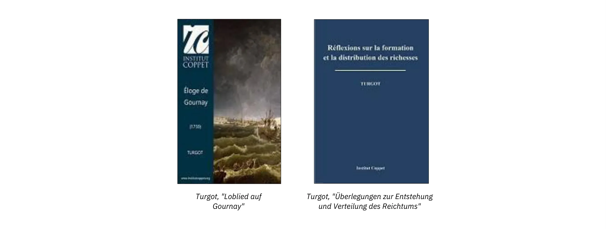

Em 1767, enquanto intendente, compôs um compêndio de economia com o título *Reflexões sobre a formação e distribuição da riqueza*.

A divisão do trabalho, a soberania do consumidor, a propriedade privada, o papel do capital, praticamente todos os grandes temas económicos são abordados. Muitos historiadores, o mais recente dos quais a historiadora Anne-Claire Hoyng, assinalaram as semelhanças entre esta obra de Turgot e "A Riqueza das Nações" de Adam Smith, publicada nove anos mais tarde.

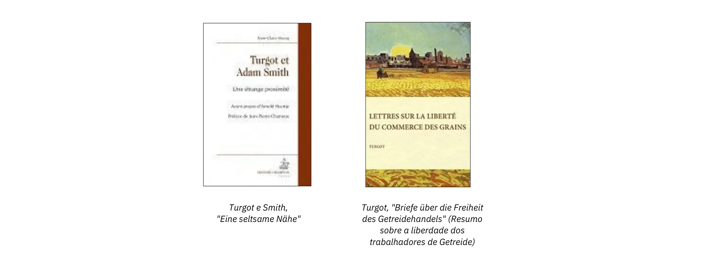

Turgot defendeu a liberdade do comércio de cereais em cartas ao Abade Terray, posteriormente comunicadas ao Rei, mas metade das quais se perderam. Escreveu:

> Senhor Deputado, se há alguma coisa que é urgente, não é impor novas restrições à mais essencial de todas as profissões, mas sim eliminar as que, infelizmente, foram autorizadas a permanecer.
> Se alguma vez houve um momento em que a mais plena e absoluta liberdade, completamente livre de qualquer tipo de obstáculo, era necessária, atrevo-me a dizer que é agora, e que nunca foi tão oportuno considerar a possibilidade de emitir um regulamento sobre o comércio de cereais.

Em 1769, Turgot escreveu o artigo Valor e Dinheiro para o *Dictionnaire de Commerce* do Abade Morellet, que acabou por nunca ser publicado. Galiani já tinha observado que "o homem é a medida comum de todas as coisas", antecipando a análise subjectiva que Turgot desenvolveria trinta anos mais tarde neste artigo, onde desenvolve e prova esta proposição.

Em 1770, muito antes de Bentham, Turgot escreveu um memorando defendendo a liberdade das taxas de juro e da usura.

"É um erro acreditar que os juros do dinheiro no comércio devem ser fixados pelas leis dos príncipes", diz ele, "É um preço corrente que se regula a si próprio, como o de todas as outras mercadorias".

Um resumo notável da doutrina do laissez-faire de Turgot pode ser encontrado numa carta esquecida de 1773 ao Abade Terray sobre a marcação dos ferros:

> O que a política deve fazer é ceder ao curso da natureza e ao curso do comércio, que não é menos necessário nem menos irresistível do que o próprio curso da natureza, sem tentar dirigi-lo; porque para o dirigir sem o perturbar e sem se prejudicar a si próprio, seria necessário ser capaz de seguir todas as variações das necessidades, dos interesses e da indústria humanas; seria necessário conhecê-las com um nível de pormenor que é fisicamente impossível de obter, e no qual mesmo o governo mais hábil, ativo e meticuloso correrá sempre o risco de se enganar, pelo menos por metade.

Encontramos aqui uma afirmação muito clara da doutrina do laissez-faire, bem como um prenúncio da análise de Friedrich Hayek sobre a pretensão de conhecimento - ou seja, a impossibilidade de um Estado compreender plenamente as forças económicas para as controlar.

## Turgot, o Reformador

<chapterId>9177429f-1679-51c4-bfd2-dd036d24a1cc</chapterId>

Como recordámos brevemente no capítulo anterior, Turgot era filho de uma família proeminente que se tinha distinguido nos escalões superiores da função pública francesa.

O seu pai tinha sido provedor dos comerciantes de Paris e o seu avô intendente. Depois de se ter destacado nos estudos, o mais novo da família Turgot ambicionava atingir, pelo menos, os mesmos patamares. Começou por desempenhar durante algum tempo o cargo de maître des requêtes, ou seja, de intermediário entre os intendentes e Versalhes. Era um cargo de prestígio, para o qual tinha de obter uma isenção especial de idade, mas Turgot aspirava a mais. A morte do seu mentor, Gournay, incita-o a ir mais longe e solicita a nomeação como intendente.

Em 1759, candidata-se pela primeira vez à intendência de Grenoble, mas esta é-lhe recusada. É-lhe então proposto o cargo de reitor dos mercadores de Lyon, que recusa. Solicita a intendência da Bretanha, mas esta também lhe é recusada. Finalmente, em 1761, é-lhe oferecida a intendência de Limousin e, com alguma relutância, aceita. Escreve a Voltaire: "Tenho a infelicidade de ser intendente", talvez querendo dizer: Tenho a infelicidade de ser intendente em Limousin.

No Limousin, os camponeses eram pobres e viviam em condições precárias, nomeadamente no que diz respeito à habitação e à alimentação. O nível geral de educação era extremamente baixo. As poucas estradas que existiam estavam em estado deplorável.

Por ser tão pobre, a região não interessava aos ministros. Turgot tem assim a liberdade de experimentar reformas. No Limousin, realizou três grandes projectos:

- A redistribuição da **taille**, o imposto pessoal (Turgot procurou introduzir a maior objetividade possível na sua avaliação).
- A **corvéia**, uma forma de imposto pago em trabalho, em que os camponeses eram obrigados a trabalhar na construção de estradas. Ao percorrer a região, Turgot apercebeu-se rapidamente do mau estado das estradas. Substituiu a corvéia por um imposto monetário.
- O recrutamento de **milícias**, exércitos de camponeses mobilizados em tempo de guerra.

Turgot substituiu estas taxas obrigatórias por voluntários remunerados.

Estas reformas foram inegavelmente bem sucedidas e, em julho de 1774, Turgot foi nomeado ministro. Devido à sua falta de experiência, o Rei colocou-o primeiro no Ministério da Marinha. A nomeação divertiu muita gente. O próprio Turgot admitiu: "Não sei nada sobre a Marinha", e Voltaire comentou: "Não creio que Turgot seja mais marinheiro do que eu".

No entanto, apenas um mês mais tarde, Turgot foi nomeado Controlador-Geral das Finanças, tornando-se efetivamente o Ministro da Economia e das Finanças de França.

Conhecemos a carta em que ele expôs os seus princípios a Luís XVI: "Nada de falências. Nada de aumentos de impostos. Nada de novos empréstimos". Esta filosofia, que os críticos de hoje poderiam classificar de "rigor" inútil, tinha como objetivo salvar a monarquia.

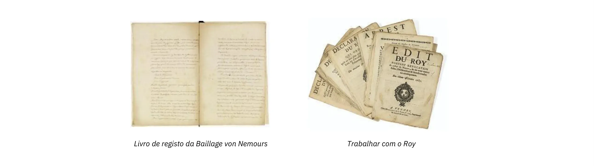

Turgot preparou seis éditos reais para reformar a economia francesa.

Foi a primeira - e uma das últimas - vezes que um especialista económico teve a liberdade de reformar a economia do seu país. Destacam-se três éditos de Turgot: um aboliu o trabalho forçado (corvées), outro dissolveu as corporações de ofício (corporations) e o terceiro estabeleceu o livre comércio de cereais.

Ao entrar para o ministério, Turgot sabia que iria enfrentar a resistência das classes privilegiadas. "Serei temido, ou mesmo odiado, pela maioria da corte e por todos os que procuram favores", disse ao Rei. Os privilegiados uniram-se rapidamente contra ele e provocaram a sua demissão do cargo de Controlador-Geral das Finanças. Voltaire, que apoiava plenamente as reformas de Turgot, escreveu na sua correspondência

> Ah! Que notícias terríveis eu ouvi! O que é que vai ser de nós? Estou de rastos! Nunca recuperaremos do facto de termos assistido ao nascimento e à morte da idade de ouro! Este raio atingiu a minha mente e o meu coração.

Desde então, muitos têm afirmado que a França é um país impossível de reformar. O fracasso de Turgot parece confirmar esse facto: Tinha sido preparado por meio século de pensamento económico liberal; tinha o apoio dos filósofos do Iluminismo; e o próprio Rei, com poder absoluto, apoiava-o.

No final, os parlements e as classes privilegiadas levaram a melhor. Tudo o que o Rei podia fazer era lamentar em privado: "Vejo agora que só Monsieur Turgot e eu nos preocupamos com o povo."

## Condillac

<chapterId>0ba8dbb5-dcd5-5981-bf85-6c185e0bf192</chapterId>

Tal como o mercantilismo, que é a sua manifestação prática mais evidente, o sofisma de Montaigne demorou muito tempo a desaparecer.

Esse sofisma é a ideia de que o comércio e o Exchange são jogos de soma zero. Tudo o que uma parte ganha numa transação é necessariamente perdido pela outra parte. Os seus defensores argumentam que isto é válido tanto entre indivíduos como entre nações.

O Abade de Condillac desempenhou um papel importante no desmantelamento definitivo desta falsa ideia.

"Definitivamente" é talvez um exagero, porque no debate público, este sofisma reaparece frequentemente. É talvez por isso, aliás, que Condillac continua a ser um economista pouco conhecido. Para além dos economistas austríacos, poucos compreenderam a importância da sua teoria do Exchange, já ninguém se interessa por ele.

Para a maioria dos historiadores do pensamento económico, o ano de 1776 é marcado pela publicação de "A Riqueza das Nações", que fundou a ciência económica. As quinze lições que acabamos de concluir, nas quais estudámos a ciência económica francesa antes de Adam Smith, são suficientes para provar o erro desta conceção. Nesse mesmo ano de 1776, aliás, um outro livro merece talvez mais elogios dos historiadores do que o livro de Adam Smith: é da autoria de Condillac e intitula-se simplesmente [*Comércio e Governo Considerados nas Suas Mútuas Relações*](https://archive.org/details/commercegovernme0000cond).

Para Condillac, se o sofisma do Exchange visto como um jogo de soma zero persistir, os Fisiocratas são em parte culpados, porque defendem que o Exchange é uma relação de igualdade. Segundo Condillac, isso é falso: O Exchange é uma relação desigual, em que se dá sempre menos para obter mais.

Entre as ideias dos fisiocratas e as de Condillac, não se poderia sonhar com uma oposição mais perfeita. O economista fisiocrata Le Trosne escreveu:

> O Exchange é, por natureza, um Contract de igualdade, feito de igual valor para igual valor.

Condillac, por outro lado, escreveu:

> Cada parte do Contract dá sempre algo de menor valor para obter algo de maior valor.

No entanto, a oposição é sobretudo de palavras. Ambos concordam que quando se troca um franco por um livro, o livro vale um franco, ou o preço do livro é um franco.

A diferença reside no facto de Condillac afirmar que, uma vez que Exchange um franco pelo livro, isso significa que, para nós, o valor do livro é superior ao da nossa moeda de um franco. Nós preferimos o livro à moeda, e é por isso que fazemos o Exchange.

A teoria de Condillac não é fundamentalmente contraditória com a dos fisiocratas, mas não falam a mesma língua, por assim dizer. Le Trosne fala de preço, enquanto Condillac fala de valor, e vice-versa.

Condillac tem razão: se os preços são iguais entre os dois bens trocados, os valores não são iguais, caso contrário, não haveria Exchange.

Para resumir a teoria de Condillac, podemos enumerar três proposições:

Primeira proposição: procuramos os bens pela sua utilidade. Isto parece óbvio, mas é um princípio central da ciência económica que os homens Exchange para adquirir utilidades, um ponto que Jean-Baptiste Say também desenvolveu perfeitamente.

Segunda proposição: o valor é anterior e motiva as trocas. O juízo subjetivo que cada pessoa faz sobre os bens e serviços implica que esses mesmos bens e serviços têm um valor para ela, valendo mais ou menos de acordo com a utilidade que parecem proporcionar. Naturalmente, cada indivíduo faz um juízo diferente do outro, e o valor varia de pessoa para pessoa.

Finalmente, terceira proposição: o preço é a consequência do processo Exchange. Os produtos não são vendidos pelo valor que eu lhes atribuo porque as condições do Exchange dependem também do valor subjetivo que o vendedor atribui a esses produtos. A relação entre o comprador e o vendedor, ou entre a apreciação subjectiva do comprador e a apreciação subjectiva do vendedor, estabelece um preço.

Estas ideias de Condillac são fundamentais. Permitem-nos compreender porque é que cada Exchange é sempre mutuamente benéfico.

Destroem assim por completo as críticas ao comércio livre, pois o protecionismo aparece apenas como um mecanismo que impede as populações de se beneficiarem mutuamente. O laissez-faire é também a conclusão da obra de Condillac. Deixemos que as pessoas façam o que quiserem, pois se o poder público proteger a liberdade e a propriedade, os homens enriquecer-se-ão sempre através das trocas.

## Condorcet

<chapterId>99e4aba6-da7f-5041-b02f-337158381515</chapterId>

Condorcet é, sem dúvida, o filósofo mais económico do Iluminismo.

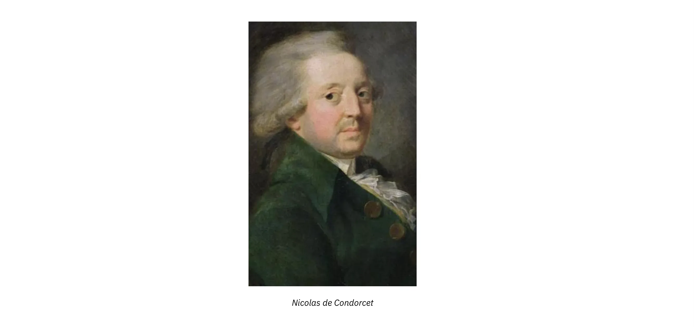

Durante grande parte da sua carreira, dedicou-se a domínios totalmente alheios à economia, e com razão, uma vez que os seus talentos conduziram a grandes progressos nas ciências em que mais se empenhou. Mas, por volta de 1770, sentiu-se atraído pelas questões económicas, talvez porque outros filósofos, nomeadamente Voltaire e Diderot, não se preocupavam em dedicar-lhes os seus tempos livres e também porque tinha feito amizade com Turgot.

Condorcet adoptou gradualmente ideias de laissez-faire e liberdade, inicialmente em áreas não relacionadas com a economia política. Na sua *Carta de um Teólogo*, troça filosoficamente da religião católica e exprime o seu desejo de ver uma verdadeira liberdade de crença, incluindo a liberdade de não acreditar. Na sua cruzada pela tolerância e contra o fanatismo religioso, Condorcet lutou pela reabilitação do Cavaleiro de la Barre e pelo novo julgamento de D'Etallonde, que tinha sido condenado à morte por ter partido um crucifixo.

Estava assim preparado para defender a liberdade quando o seu amigo Turgot ascendeu ao cargo de Controlador-Geral das Finanças.

A partir de então, a carreira de Condorcet sofreu uma viragem ao entrar no debate económico, apoiando incansavelmente as reformas liberais do novo ministro. Favorecendo a concorrência e a liberdade de comércio, Condorcet apelou também à abolição das corvéias (trabalho forçado), das guildas e de uma tributação justa. Ele expressou essas convicções publicamente sempre que surgiu a oportunidade, fazendo-o com evidente entusiasmo; escreveu extensivamente e uma vez declarou em seus escritos: "Permitam-me que volte a falar da liberdade de comércio; gosto de me dedicar a este assunto."

Entre 1774 e 1776, durante o ministério de Turgot, Condorcet fez numerosas intervenções, todas elas marcadas pelo seu Commitment ao laissez-faire. Entre as suas obras, contam-se *Cartas de um lavrador da Picardia ao Sr. Necker*, que defende o comércio livre; *Monopólios e Monopolistas*, que defende a livre concorrência; *Reflexões sobre as Corvéias*, que apela à sua abolição; e *Reflexões sobre o Comércio de Cereais*, que volta a elogiar o comércio livre e critica o livro de Necker sobre o mesmo assunto.

Nas suas [*Letras sobre o comércio de cereais*](https://archive.org/details/bub_gb_hg8jFw-y6bwC), Condorcet apresenta vários pontos fundamentais.

Em primeiro lugar, os preços elevados dos cereais na época não eram o resultado do comércio livre, mas sim de más colheitas, e Condorcet demonstra-o claramente. Em seguida, explica por que razão o laissez-faire não só é adequado como é a única política adequada, apesar dos preconceitos populares. Está tão habituado a ver o governo intervir no comércio de cereais que não fazer nada parece algo de extraordinário e novo", observa. Mais tarde, acrescenta: "Quase toda a gente, especialmente os detentores de cargos públicos, acredita que nada acontece por si só e que tudo está perdido se o governo não intervier em tudo". Condorcet retoma assim os argumentos dos fisiocratas e de Turgot, mostrando a superioridade do comércio livre sobre todas as formas de intervencionismo.

Promover a agenda económica liberal de Turgot foi um ato corajoso, pois Condorcet sabia que rapidamente enfrentaria a censura. De facto, isso aconteceu e o seu panfleto sobre a abolição do trabalho forçado foi destruído e proibido em 1776.

Turgot, apreciando a defesa leal de Condorcet das suas ideias, nomeou-o Inspetor da Moeda. Condorcet demitiu-se assim que o seu amigo deixou o ministério.

Apesar de ter dedicado toda a sua energia à defesa de Turgot, Condorcet não tinha ilusões quanto ao resultado do mandato do seu amigo. O próprio Turgot admitiu, já tarde na vida, que vivia arrependido, como escreveu numa carta, "por não ter podido fazer à minha nação e à humanidade um bem que eu acreditava ser muito fácil". Condorcet, mais realista, salientou os muitos adversários que Turgot teria de enfrentar: os favoritos do rei, os parlamentos, o clero, a nobreza, as guildas, etc. Esses grupos esperavam bajulação, não reforma. Condorcet disse a Turgot: "Não és de modo algum um charlatão, e isso é um defeito, dada a situação em Paris". Tinha toda a razão, pois em 1776, apenas dois anos após a sua chegada, Turgot já tinha sido obrigado a abandonar o cargo de Controlador-Geral.

## O bom senso liberal durante a Revolução

<chapterId>95e9a90d-e37a-58ff-b1ac-928b42e76ecf</chapterId>

Dupont de Nemours foi o mais jovem discípulo de François Quesnay, que um dia disse dele: "Temos de cuidar deste jovem, pois ele falará quando nós estivermos mortos". Quando a Revolução Francesa começou, quase todos os grandes fisiocratas, incluindo o Marquês de Mirabeau, já tinham morrido; o próprio Mirabeau tinha falecido a 13 de julho de 1789.

Dupont de Nemours redigiu a lista de queixas para o bailiado de Nemours.

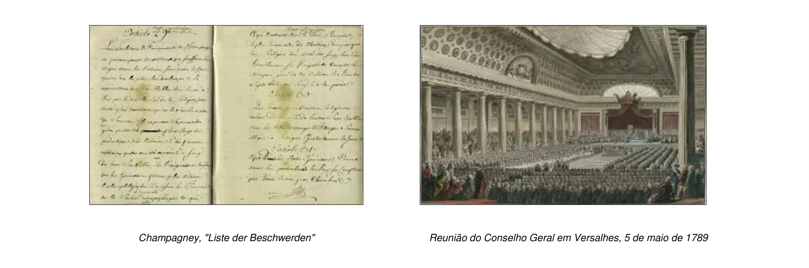

Este documento fascinante continha todas as queixas dos economistas liberais contra as restrições comerciais, os monopólios e os ataques à propriedade. Dupont de Nemours foi também eleito para a Assembleia Nacional.

Durante a Revolução, tornou-se a voz do senso comum liberal, mantendo-se firme contra a crescente onda de populismo e demagogia intervencionista, que acabou por prevalecer.

Já em novembro de 1789, quando se falava da concessão de um monopólio à Caisse d'Escompte (que poderia transformar-se num banco público, o Banco de França), Dupont de Nemours defendia a concorrência.

"Seria melhor", diz, "deixar a atividade bancária entregue às leis do comércio livre". E acrescenta:

> "Não percebo o que o ministro quis dizer quando falou em conceder um privilégio à Caisse d'Escompte. Se esse privilégio inclui exclusividade, devem rejeitá-lo, pois vieram aqui para destruir privilégios exclusivos e não para criar novos."

Apesar dos seus avisos, a Assembleia ignorou as suas objecções e deu mais um passo no sentido da criação de um banco central e de um monopólio bancário.

Em 1790, na Assembleia Constituinte, Dupont de Nemours seguiu a tradição pacifista dos seus amigos fisiocratas e propôs uma lei que proibia as guerras ofensivas. O primeiro artigo dizia o seguinte "A Nação Francesa não se deve permitir envolver-se em qualquer guerra ofensiva para se apoderar do território de outros ou para infringir os direitos ou a liberdade de qualquer Nação".

Esta proposta foi rejeitada.

Nesse mesmo ano, 1790, começaram os debates sobre a emissão de novo papel-moeda para cobrir as despesas do governo.

Dupont de Nemours opôs-se firmemente a esta ideia e publicou um panfleto intitulado [*Efeitos dos assignats no preço do pão*](https://archive.org/details/effetdesassignat00dupo). O título era exato, pois explicava que a emissão de assignats conduziria inevitavelmente à inflação, um aumento dos preços dos bens, incluindo o pão.

Assina o panfleto como "um amigo do povo". A peça causou grande alarido, pois a Assembleia foi questionada sobre quem a tinha escrito. Dupont de Nemours levantou-se e admitiu que a obra era sua, dizendo que não se envergonhava de usar o título de "amigo do povo" porque lutar contra os assignats era verdadeiramente servir o povo.

Mais uma vez, o seu conselho foi ignorado e os assignats foram emitidos.

Todos conhecemos a catástrofe que se seguiu, a ruína económica e o sofrimento suportado pelas pessoas, muitas das quais perderam tudo quando os assignats ficaram sem valor e tiveram de ser queimados.

Alguns anos mais tarde, a Assembleia debruçou-se sobre a ideia de criar um verdadeiro Banco de França, ao qual seria concedido o monopólio da produção de moeda.

Dupont de Nemours, que continuava a opor-se firmemente à ideia de um banco público, considerando-o apenas um monopólio, recordou à Assembleia a experiência desastrosa dos assignats. Ele disse-lhes:

> "Não se preparem para arrependimentos como os que atormentaram os meus colegas da Assembleia Constituinte. Na altura, a minha proposta de limitar os assignats apenas ao pagamento de bens nacionais e de não fazer deles uma moeda circulante foi rejeitada. Hoje, dizem: "Ah, se tivéssemos dado ouvidos a Dupont de Nemours!""

Mas, mais uma vez, ninguém lhe deu ouvidos.

## Conclusão: Passar o testemunho

<chapterId>ada8082f-db96-5e52-954f-719b47998153</chapterId>

O pensamento económico francês do século XVIII é muitas vezes ofuscado pelos economistas mais famosos do século XIX. No entanto, quando se trata da defesa da liberdade, é no século XVIII que tudo começa verdadeiramente. É o século em que o princípio do laissez-faire, tão revolucionário na sua época, foi claramente expresso pela primeira vez por vários pensadores, de Boisguilbert a Dupont de Nemours.

É certo que figuras como Jean-Baptiste Say, Frédéric Bastiat, Gustave de Molinari e Yves Guyot deixaram uma marca duradoura na história do pensamento económico francês. Mas se os estudarmos isoladamente, perdemos algo essencial. Estes pensadores do século XIX não surgiram do nada; herdaram e desenvolveram as bases lançadas pelos seus antecessores do século XVIII durante o Iluminismo.

Boisguilbert afirma que as almas bem-intencionadas que acreditam que podem resolver tudo através do envolvimento do governo acabam inevitavelmente por virar a economia de pernas para o ar e que, por isso, é melhor deixar a ordem natural das coisas seguir o seu curso.

Cantillon insistia que o dinheiro nunca deveria ser manipulado para fins políticos. Permitir ao Estado gerir o dinheiro a seu bel-prazer é abrir caminho a uma imensa desordem financeira e económica.

Vincent de Gournay afirma que a regulamentação excessiva do trabalho desencoraja os esforços dos trabalhadores e artesãos, empurrando-os para a preguiça e a inatividade. É graças à livre concorrência que a economia pode crescer e uma nação pode prosperar.

O Marquês d'Argenson afirma que nenhum governo é capaz de prever e medir tudo e que, por isso, é preciso confiar no interesse próprio de cada um.

Quesnay e os Fisiocratas afirmam que a propriedade privada é a base das sociedades humanas. Sem a propriedade privada, o homem perde a motivação para se esforçar, para trabalhar, uma vez que não pode usufruir dos frutos do seu trabalho nem acumular nada.

Condillac afirma que o Exchange é sempre mutuamente benéfico e que, por isso, deve ser sempre livre, sem exceção. A única missão do Estado deve ser a proteção da liberdade e da propriedade.

Todas estas ideias seriam retomadas pelos economistas do século XIX. Alguns, como Jean-Baptiste Say, darão a estas ideias uma expressão científica através de um rigoroso *Tratado de Economia Política*. Outros, pelo contrário, procurarão popularizar estas máximas fundamentais, aventurando-se no domínio dos contos, dos romances e das histórias curtas e divertidas, como Frédéric Bastiat fará com tanta habilidade.

## Biografia

<chapterId>17cf2865-e53c-5f3b-a5c2-a43560efaf01</chapterId>

**BIBLIOGRAFIA SELECTIVA**

Abaixo, encontrará uma seleção de mais de trinta escritos:

1. Pierre Clément, Histoire de Colbert et de son administration, Paris, 1874

2. Vauban, Projet d'une dîme royale, 1707; reimpressão Institut Coppet, 2014; Anne Blanchard, Vauban, Fayard, 1996

3.	Boisguilbert, Détail de la France, 1695; republicado por Institut Coppet, 2014

4. Félix Cadet, Pierre de Boisguilbert: precursor dos economistas, Institut Coppet, 2014

5. Pierre de Boisguilbert ou la naissance de l'économie politique, Paris, INED, 1966

6. Richard Cantillon, Essai sur la nature du commerce en général, 1755; reimpresso pelo Institut Coppet, 2015

7. Antoin Murphy, Richard Cantillon, banqueiro e economista, Oxford, 1986

8. Gustave de Molinari, L'Abbot de Saint-Pierre, Paris, 1859

9. Abade de Saint-Pierre, Abrégé du projet de paix perpétuelle, Roterdão, 1729

10. Abade de Saint-Pierre, "Projet pour perfectionner le commerce de la France", em Les rêves d'un homme de bien, Paris, 1775, p.199

11. André Alem, Le marquis d'Argenson et l'économie politique au début du XVIIIe siècle, Institut Coppet, 2015

12. Journal et mémoires du marquis d'Argenson, edição Rathery, 9 vols, Paris, 1859-1867

13. Benoît Malbranque, Vincent de Gournay: a economia política do laissez-faire, Institut Coppet, 2016

14. Vincent de Gournay, Remarques sur la traduction de Josiah Child, L'Harmattan, 2008

15. Christine Théré & Loïc Charles (eds.), Le cercle de Gournay, INED, 2005

16. Antoin Murphy, "Le développement des idées économiques en France (1750-1756)", Revue d'histoire moderne et contemporaine, tome XXXIII, outubro-dezembro de 1986

17. Henri Ripert, Le marquis de Mirabeau: ses théories politiques et économiques, Paris, 1901

18. Lucien Brocard, Les doctrines économiques et sociales du marquis de Mirabeau in L'Ami des Hommes, Paris, 1902

19. Humbert de Montlaur, Mirabeau, l'Ami des Hommes, Perrin, 1992

20. Yves Guyot, François Quesnay et la Physiocratie, Institut Coppet, 2014

21. François Quesnay, Œuvres économiques complètes et autres textes, 2 vols, INED, 2005

22. Georges Weulersse, Le mouvement physiocratique en France (de 1756 à 1770), 2 vols, Paris, 1910

23. Georges Weulersse, La Physiocratie à la fin du règne de Louis XV (1770-1774), P.U.F., 1959

24. Georges Weulersse, La Physiocratie sous les ministères de Turgot et de Necker (1774-1781), P.U.F., 1950

25. Georges Weulersse, La physiocratie à l'aube de la révolution (1781-1792), EHESS, 1985

26. P. Jolly, Du Pont de Nemours, soldat de la liberté, Paris, P.U.F., 1956

27. Os escritos económicos de Voltaire, Institut Coppet, 2013

28. Gustave Schelle (ed.), Œuvres de Turgot et documents le concernant, Paris, 1913-1924

29. Benoît Malbranque, Le libéralisme à l'essai : Turgot intendant du Limousin (1761-1774), Institut Coppet, 2015

30. Pierre Foncin, Essai sur le ministère de Turgot, Paris, 1877

31. Auguste Lebeau, Condillac économiste, Paris, 1903

32. Condillac, Le commerce et le gouvernement considérés relativement l'un avec l'autre, 1776

33. Condorcet, Mélanges d'économie politique, em Eugène Daire (ed.), Mélanges d'économie politique, Paris, 1847

34. P. Jolly, Du Pont de Nemours, soldat de la liberté, Paris, P.U.F., 1956

35. Eli Heckscher, Mercantilism, 2 vols. Londres: Allen and Unwin. 1935

# Secção final

<partId>385bffab-aea1-5bcd-9569-62b3f30665b7</partId>

## Comentários e classificações

<chapterId>a1e689d9-abd0-5dcb-ba56-a8d355d0a84f</chapterId>

<isCourseReview>true</isCourseReview>

## Exame final

<chapterId>bdb7fd98-33e7-11f0-9fe6-b785c859ffc5</chapterId>

<isCourseExam>true</isCourseExam>

## Conclusão

<chapterId>3b366ff6-03c8-5f6a-b4c0-ba8186e65d7e</chapterId>

<isCourseConclusion>true</isCourseConclusion>