# Urugendo mu mateka y'ubukungu bw'ubwigenge

Iyi nshingano ikora ubushakashatsi ku mavuko y'ubumenyi bw'ubukungu mu Bufaransa bw'ikinyejana cya 18 binyuze mu ndorerezi ya laissez-faire. Uzavumbura uko abatekereza bahanganye na merkantilism bavuga ko Leta igomba kurinda uburenganzira bwite, ariko ntigomba guhindura amasoko binyuze mu mabwiriza.

Uziga uko abavugurura b'inzozi bagutse iyi ndorerezi kugira ngo basabe ubucuruzi bwisanzuye n'ukuzenguruka kw'ibicuruzwa bitagira aho kugarukira, bashyiraho urufatiro rw'ubwenge bw'ubushoramari bugezweho. Mu kwiga aba bahanga b'ubukungu, uzumva amahame ahoraho yashizeho ubukungu bwa politiki ku isi no gukomeza kugira uruhare mu mpaka za politiki uyu munsi. Injira ubu kugira ngo umenye neza ibitekerezo byubatse ubukungu bugezweho.
+++
# Imenyekanisha

<partId>06d67531-19f1-4f8d-bf8f-77bbcc743672</partId>

## Incamake y'amashure

<chapterId>202db3c6-0320-494d-8057-adc6f6563048</chapterId>

Murakaze muri HIS204!

Iryo shure rigamije gutohoza inkomoko y’igifaransa y’iciyumviro ca *laissez-faire*—"reka bibe"—nk’uko cateye imbere mu kinjana ca 18 biciye mu mugenzo w’ubwenge w’ubutunzi. Mu gukurikirana ivyiyumviro vy’abanyabwenge b’ubutunzi bo mu Bufaransa bo mu ntango, tuzobona imishinge y’ubutunzi bwa politike bushingiye ku mwidegemvyo w’ubutunzi, burangwa n’ukutagira icizigiro ku kwivanga mu vya Leta no kwemera urutonde rw’ibidukikije rushigikira iterambere n’uguterimbere.

**Igice ca 2: Abarongozi**

Muri iki gice dutangura mu ntango z’ikinjana ca 17 n’ica 18, igihe cahinduwe n’ubutegetsi burengeje urugero bw’ubwami butagira aho bugarukira kandi ica mbere gisaba uburyo bubereye kandi bubereye bwo gutwara ibikorwa vya bose. Biciye ku mibare ya Vauban, Boisguilbert na Cantillon, turabona ukunegura kwa kera kw’ubutegetsi bwa Leta n’urutonde rwa mbere rw’ivyo vyohavuye bihinduka ubutunzi bwa politike bw’ubwigenge.

**Igice ca 3: Abavuguruzi n'Abanyavyiyumviro bo mu ntango z'ikinjana ca 18**

Iki gice kivuga cane ku bo mu myaka mirongo ya mbere y’ikinjana ca 18 bagerageje guhindura ubutunzi bw’Ubufaransa bakoresheje ingingo ngenderwako nshasha. Abanyabwenge nka Abbé wa Saint-Pierre, Marquis d’Argenson na Gournay (hamwe n’abayoboke biwe) basavye ko intambamyi z’amashirahamwe zikurwamwo, ubudandaji bugafungurwa, no kuremesha uguhiganwa nk’ivyo bituma haba iterambere. Ivyiyumviro vyabo kenshi vy’ubushizi bw’amanga vyari bigereranya ivyiyumviro bikomeye vya Fiziyokarasi.

**Igice ca 4: Ishure ry'ubuhinga bw'umubiri**

Iki gice kiratohoza kimwe mu bihe bihambaye cane mu vyiyumviro vy’ubutunzi vy’Abafaransa: ishure rya Fiziyokarasi. Tuzosuzuma inkomoko yayo, imishinge y’inyigisho n’ivyo yashitseko nyamukuru, twibanda ku bantu b’agaciro nka Quesnay na Dupont de Nemours. Iciyumviro c’uburenganzira bwo gukora ikintu kimwe gica kiba urutonde rujanye n’ivyo muri iryo shure, rushingiye ku ciyumviro c’urutonde rw’ibidukikije Leta itegerezwa kuyoboka kugira ngo bose bashobore guterimbere.

**Igice ca 5: Umuco n'ubutunzi bwa politike**

Ubwa nyuma, tuzobona ingene ivyiyumviro vy’ubutunzi vy’ubwigenge vyakwiragiye mu muhari wagutse w’Umuco. Abantu nka Voltaire, Turgot, Condillac, na Condorcet baraguye kandi baratunganya umugenzo wo kurekura, ivyo banditse vyatumye umugenzo wo kurekura ujabuka uja mu gihe c’amahinduka n’ibindi, aho ivyiyumviro vy’ubwigenge vyaronse ijwi rishasha.

Ni mwiteguye gusubira kumenya imizi y’ubutunzi bw’ubwigenge bw’Abafaransa? Reka tugende!

# Abatanguzi

<partId>91565b10-6010-53cb-a2f4-9c2306c7ef8c</partId>

## Amateka y'inyuma

<chapterId>6a5fd101-6dfd-5d77-96c7-9e1aa4a19758</chapterId>

Mu ntango z’ikinjana ca 18, Ubufaransa bwari mu bihe biteye amaganya. Abanyagihugu bo mu misozi bariko baravyara bike cane kugira ngo bashobore kubaho kandi bariko barasoreshwa cane.

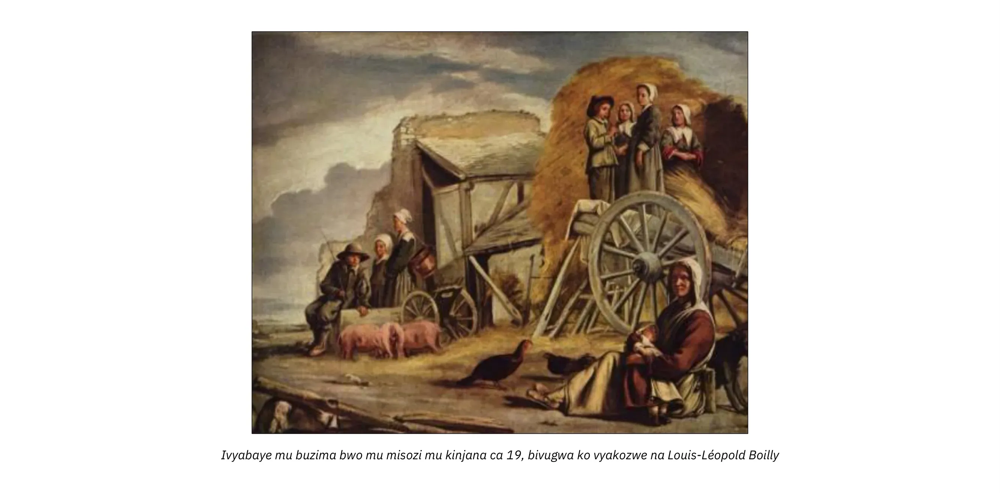

Abahinguzi b’ibintu bo mu bisagara, bari bafunzwe mu mashengero akomeye, baragorwa no guhingura ibintu bishasha canke mbere no gushigikirana. Hagati aho, ibindi bihugu vyo mu Buraya ntivyatevye gusumba Ubufaransa mu bijanye n’ibintu vyose, bikaba vyari birengeye ivyo bwakora. Ivyo Ubwongereza n’Ubuholandi vyaroraniwe mu vy’ubudandaji vyari mu muzirikanyi wa bose.

Ariko none twoshobora gute kuronka umuti w’ingwara y’ico gihe? Nta buhinga bw’ubutunzi bwariho, rero nta buvuzi budasanzwe bwo gukoresha. Ingingo ngenderwako z’ubutunzi zari zikiriko zirakoreshwa mu buryo butari bwo, zihinduka hagati y’ibihe vy’uburenganzira n’ibihe vy’ukwidegemvya. Nta gukeka ko dufise ivyitegererezo, ibimenyetso vy’amateka twokurikira. Muri abo harimwo *Sully*, umushikiranganji wa Henri wa kane, yaburanira uburimyi, akaremesha umwidegemvyo mwinshi w’ubudandaji mu Bufaransa.

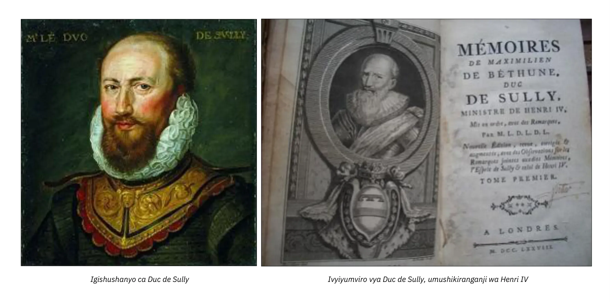

Ariko haciye haza Colbert, umusuku wa Louis XIV, yariko arahungabana hagati y’amategeko n’umwidegemvyo, yamara amaherezo agashira mu ngiro amategeko. Mu mpera nyene z’ikinjana ca 17, Colbert yararengeye Sully: abasuku ubu barasaba iragi ryiwe maze bagagerageza gukurikiza ivyo bavuga ko ari amajambo yiwe y’agaciro.

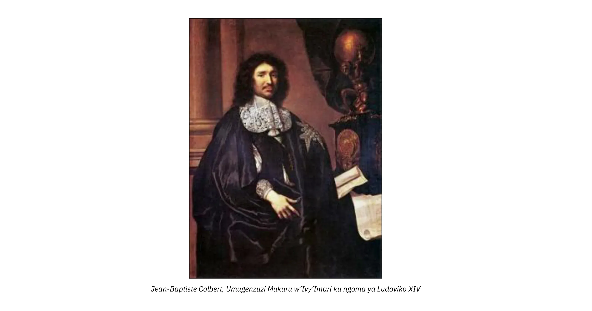

Mu vyiyumviro vy’abanyagihugu bo mu mpera z’ikinjana ca 17, amajambo Colbert yavuze yari ane.

(1) **Inganda zitegerezwa gutunganirizwa no gubohwa mu ma Guildes**. Aya mabwirizwa aratomora nk’akarorero ingene amashuka n’ibitambaro bikwiye gukorwa, ubunini bwavyo n’uburemere bwavyo.

Hariho amategeko nk’ayo amajana n’amajana, yashizwe hamwe mu bitabu vyerekeye ubwoko bumwebumwe bw’inganda. Yamara mu maso y’abayoboke ba Colbert, ivyo vyari bikiri bidahagije: inganda, ni ko bemera ko na zo nyene zari zikeneye kugenzurwa n’amashirahamwe.

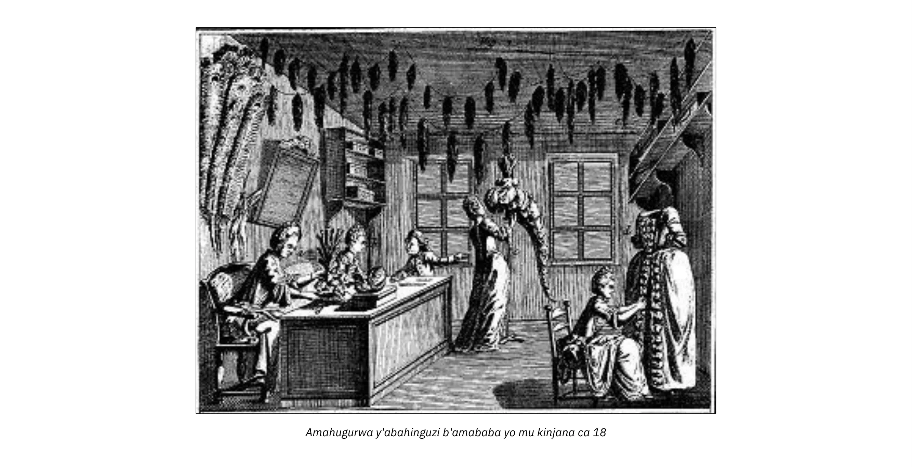

Umuntu wese yipfuza gukora ubuhinga, yategerezwa kubanza kumara imyaka myinshi ari umwigishwa, hanyuma akaja kuba umugenzi, imbere y'uko agerageza gushika ku rwego rwa shebuja mu gukora "igikorwa c'agatangaza" no kwishura amahera menshi cane iyo sosiyete. Guhiganwa rero mu bucuruzi bumwebumwe kwari guke cane.

(2) **Ubucuruzi Ni Urukino rw'Igiciro c'Ikigereranyo**. Ku bijanye n’ubudandaji, abigishwa ba Colbert bari bafise ivyiyumviro nk’ivyo abantu b’abanyamahanga bo mu bihe vya kera bari bafise. Nk'uko umushikiranganji wa Louis XIV abivuga, ubudandaji ni "intambara idahera". Kubera iki? Imvo ni yoroshe: kuri Colbert n’abamukurikiye, ukwiyongera kwose kw’ubutunzi ku gihugu kimwe kwari gusobanura ubukene bw’ikindi. Mu vyiyumviro vyabo, Abongereza canke Abaholandi ntibashobora kwemererwa gutunga, kuko ivyo vyoba bisobanura ko bariko biba ubutunzi bw’Ubufaransa.

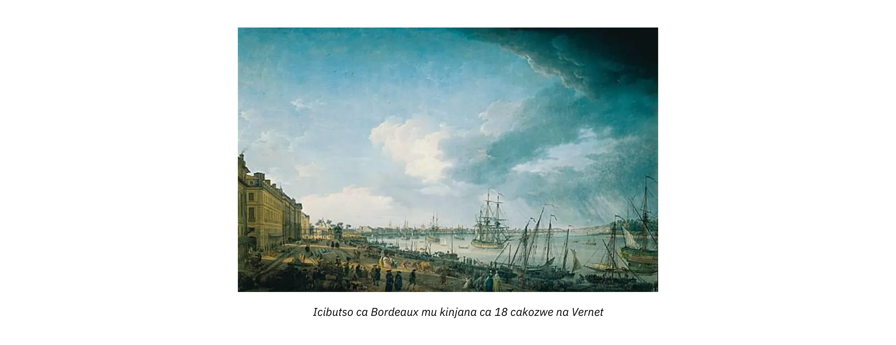

Ivyo bihugu rero vyategerezwa gukumirwa canke gukorwako imisoro myinshi, ata n’umwe yishimira, kuko ubudandaji ni intambara dushobora kwipfuza gusa ugusenyuka kw’abansi bacu.

> "Abafaransa bashobora gusa kwongerera ubudandaji bwabo mu gutsinda Abaholandi".
> *Kolibeti*

(3) **Igihe Leta ibuze amahera, Nimuterere Imisoro myinshi**. Colbert n’abigishwa biwe ntibari kure y’ukwemera yuko ubutunzi bw’abasoreshwa ari ubutunzi buke. Mu vyiyumviro vyabo, amahera Leta ikoresha ntashobora kwigera aba ingorane, igihe cose hazoba hakoranijwe ahagije. Kandi iyo abantu bagararije, vyari gusa kubera ko abaminisitiri babikoze nabi, kuko nk'uko Colbert yabivuze mu buryo buteye isoni, «ubuhinga bwo gutanga imisoro bushingiye ku gukuraho inzoka zitazivuza induru cane».

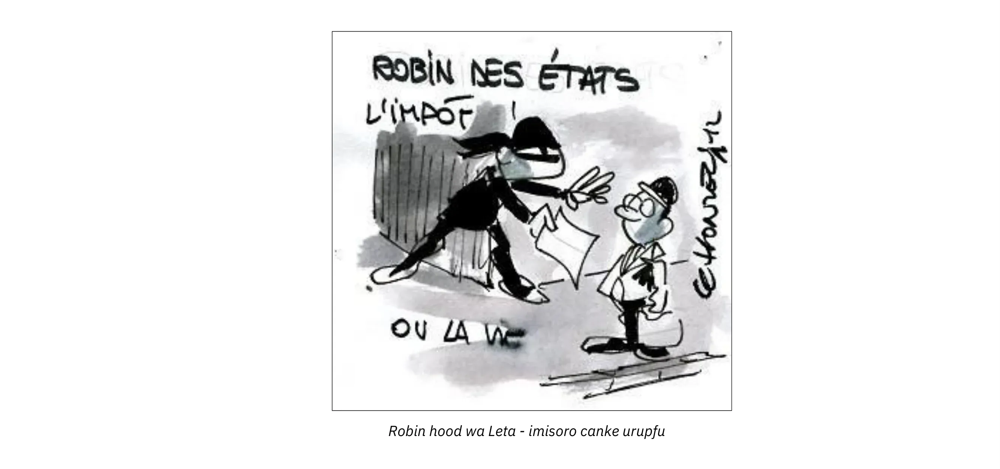

(4) **Ubutunzi ni, hejuru ya vyose, inzahabu n’ifeza**. Imbere y’uko ubuhinga bw’ubutunzi buvuka, abanditsi benshi bari bakurikije inyigisho imwe ihambaye ku bijanye n’ingene ubutunzi bumeze, iyo nyigisho yaje kwitwa *mercantilisme*. Colbert n’abamukurikiye barabandanije muri iyo nzira. Muri make, abacuruzi bemera ko ikimenyetso nyaco c’uguterimbere kw’igihugu ari ukwirundanira ivyuma vy’agaciro, ifeza n’inzahabu.

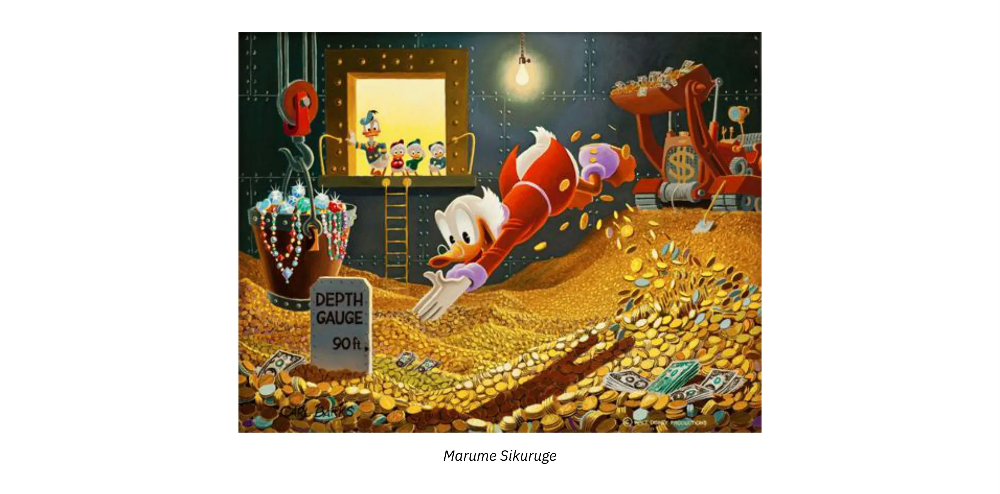

> "Ubwinshi bw'amahera muri Leta ni bwo bwonyene butera itandukaniro mu bukuru n'ububasha bwayo".
> *Kolibeti*

Inkurikizi y’ico ciyumviro ni ugushigikira ivyoherezwa hanze uko vyogenda kwose, ivyo bikaba vyazana inzahabu n’ifeza vyo hanze, no kugabanya ivyoherezwa hanze ku rugero rutoyi, kugira ngo ntibirungikwe hanze.

Izo ngingo ngenderwako zine ni zo zayoboye intwaro y’Ubufaransa mu myaka mirongo, igihe ico gihugu cariko cinjira mu kinjana ca 18. Ariko rero, ntibatevye gushikirwa n’ingorane zikomeye. Hagati y’umwaka wa 1690 n’uwa 1710, abanditsi benshi barakubiswe cane n’Igihugu c’Ubufaransa cari giteye akaga. Mu kurondera imvo zavyo, baciye bafata ingingo y’uko amajambo y’uruyeri nyene barazwe na Colbert ari yo yari afise icaha, bakayabona ko ari imvo n’imvano zitari zo. Mu kubigira, barashizeho imishinge y’ubuhinga bw’ubutunzi.

## Vauban

<chapterId>ee9c1e0e-96cc-5026-a5e2-963d68122786</chapterId>

Ubu, uko umukazo w’imisoro mu gihugu cacu ubandanya gukura, utera ubwoba bwo gupfuka inguvu z’ubutunzi bw’igihugu, amajwi ariko araduga ashigikira ihinduka. Ivyo bisaba ko habaho ihinduka, vyaba bimenyekanye canke bitamenyekanye, akenshi birasubiramwo ibikorwa vy’abahinga mu vy’ubutunzi b’Abafaransa, kuva mu kinjana ca 17, banegura uburyo bwo gutanga imisoro bw’igihugu ngo ni akajagari, ubutegetsi bw’agahomerabunwa, burenze urugero.

Uwa mbere muri abo bavuguruzi b’imisoro, hakurikijwe urutonde rw’ibihe be n’ubushobozi, ni umukuru w’ingabo Sébastien Le Prestre Vauban, uwuzwi cane mu kwubaka ibihome n’ibihome.

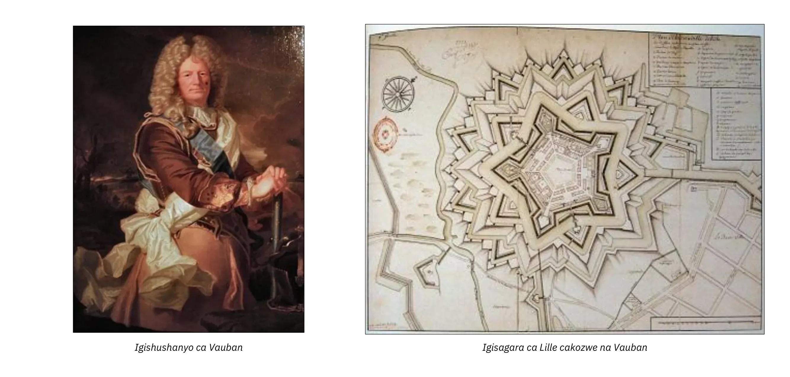

Naho twavyibagiwe bibabaje, Vauban yari umuntu atari umusirikare gusa; yari kandi umuhinga mu vy’ubutunzi. Yarafashe ingingo ku bijanye n’iherezo ry’abarimyi, yasavye ko habaho ivugurura ry’imisoro ry’ubushizi bw’amanga mu 1695 (Projet de capitation - «Umugambi wo gutera umutungo») yongera asubira mu 1707 (Projet d’une Dime Royale - «Icumi c’Ubwami»): gusubirira imisoro myinshi yariho n’imisoro ingana n’igihe c’imbere y’umwaka w’1707.

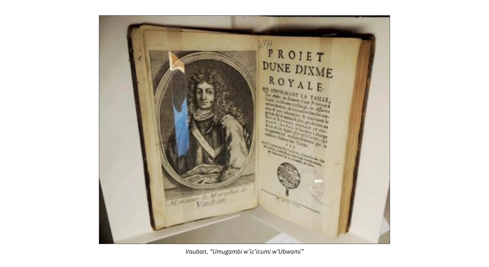

Vauban yashitse kuri ivyo vyiyumviro biciye ku gushaka kumenya vyinshi. Yari umuntu yihweza cane, yihatira kwiga ubuzima bwo mu kibano n’ukuri kw’ubutunzi bimwe bikomeye, hafi mu buryo bwa siyansi. Yashimikiye cane cane ku nkenerwa yo guharura, biciye mu kubara abantu.

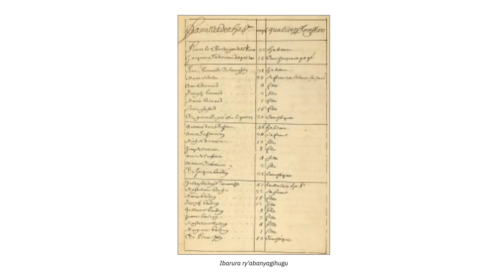

Ico yakoze gikomeye ca kabiri ni ukuntu yadondora mu buryo bukora ku mutima kandi ata buryarya amagorwa abantu benshi bariko barihanganira. Yanditse ati: "Ntitubeshe; umutima w'ubwami warasenyutse. Vyose birababazwa, vyose birahangana, vyose biraboroga. Ubwirizwa gusa kuraba no gusuzuma umutima w'intara, ivyo uzosanga ni bibi kuruta ivyo mvuga". Kure y’ukurenza urugero, ivyo Vauban yabonye biteye agahinda vyari ikimenyetso c’ukuri c’ubuzima bwo mu ntango z’ikinjana ca 18. Alexis de Tocqueville yari azi neza ivyo vyiyumviro, kandi mu nyuma azodondora *Icumi c'Ubwami* ca Vauban ko "giteye ubwoba", kuko cari ukuri.

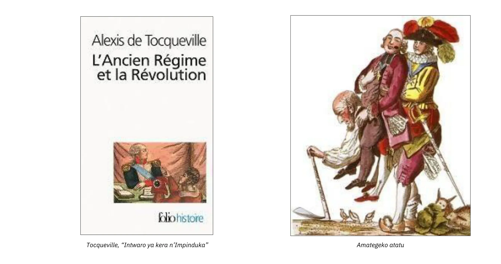

Ikindi kintu gikomeye Vauban yari afise nk’umuhinga mu vy’ubutunzi ni ugusaba ko habaho ihinduka rikomeye ry’imisoro ry’ugukuraho, canke n’imiburiburi kugabanya uburemere bw’ikibi yabona kandi akadondora. Yari afise ukuri mu kubigira; ubutunzi bw’Ubufaransa mu gihe ca Ancien Régime bwacitse intege kubera imisoro, iyo misoro ikaba yari idangana, idashikamye kandi idashobora gusomwa.

Mu nyandiko ziwe zitandukanye z'ivya politike n'ubutunzi, icipfuzo nyamukuru ca Vauban cari ugukuraho imibabaro y'ico yise "igice co hasi c'abantu, abo, biciye ku bikorwa vyabo, bafasha kandi bagashigikira abari hejuru".

Yaratahura ko imisoro ikandamiza kandi idatera intege abarimyi, iciyumviro yaseruye n’ukubona neza, ikintu tugishobora kwihweza ata gatotsi mu bihe vyacu:

> "Umurimyi areka akataka gatoyi afise kakakama, akagakora n'umutima wiwe wose, kubera ubwoba bw'uko iyo kazotanga ivyo kashoboye n'ifumbire n'uburimyi bikwiye, koshobora gukorwako umusoro mwinshi cane".

Vauban yarabonye ukuri: imisoro mu gihe ca Ancien Régime ntiyari idafise ishingiro gusa, ariko kandi yari ikomeye cane. Uwo murongo w’imisoro, utari mu buryo bubereye mu gutanga, ni wo yarondeye gutsinda.

Umuti yari yasavye, ni ukuvuga umusoro umwe kandi ugereranijwe n’amahera yose umuntu yinjiza, wari gutuma umuzigo w’umusoro ugabanwa mu buryo bubereye ku bantu bose bo mu kibano. Ishingiye ku ciyumviro ca Leta cabona ko ubukuru bwa Leta ari ngombwa kugira ngo umuntu akingire uburenganzira n’itunga ryiwe, ivugurura ry’imisoro rya Vauban ryasaba ko abanyagihugu bose batanga amahera bihuye cane n’ivyo baronka, nk’akarorero, 10% vy’amahera baronka .

Mu gitabu ciwe citwa The Royal Tithe, kikaba ari co conyene mu bitabu vyiwe vy’ubutunzi vyacapuwe mu buzima bwiwe bwose, Vauban yavuze neza ati:

> "Kubera ko umuntu wese muri Leta akeneye uburinzi bwayo kugira ngo ashobore kubaho, birabereye gusa ko bose batanga, bivanye n'amahera yinjiza, mu kuyibungabunga no mu kuyikoresha [...]. Nta kintu kitari co kuruta gusonerwa abashobora kwishura cane, no gushira umuzigo ku bashoboye cane, abasenyuka munsi y'uburemere bwabo ubwabo; inkomezi. Rero, ugusonerwa kwose ku bijanye n'imisoro ni akajagari gategerezwa gukosorwa."

Imbere gato y’uko Vauban apfa, iciyumviro cawe cararemewe n’abasuku ba Louis XIV. Ariko rero, Vauban yari yasavye ko hoba umusoro ungana kugira ngo usubirire imisoro yose, canke hafi yose, yariho. Ahubwo nk’uko bigenda kenshi, umusoro wiwe warashizwe mu ngiro, ariko n’abandi bose barazigama.

## Boyigiliberti

<chapterId>200149c6-b5fc-566e-ab0e-bafb1c3fed3c</chapterId>

Ni bake mu bahinga b’ubutunzi b’Abafaransa bo mu bihe vya kera bemerwa mu gihugu cabo muri iki gihe bihuye n’ivyo bashizeko, kandi Boisguilbert ntabwo ari uwundi.

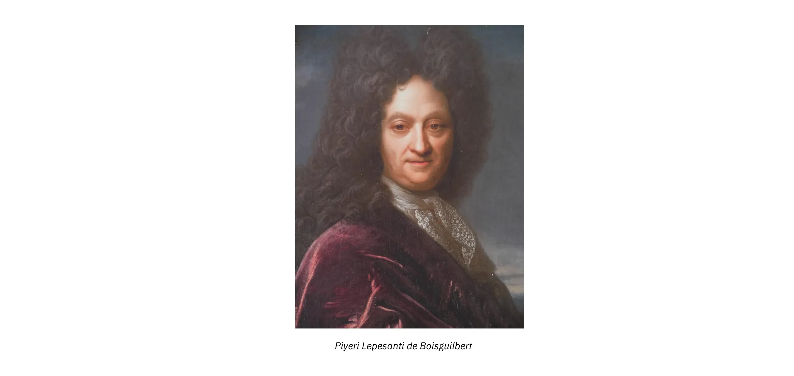

Boisguilbert ntiyashimwa cane n’abasomyi bo mu gihe ciwe, yari kure y’abanyabubasha kubera kamere yiwe y’agatangaza n’urukundo rwiwe rwinshi, ntiyasize ikimenyetso kinini ku kinjana ca 18. Yamara, mu ntango z’ikinjana ca nyuma, harabaye ugusubira kuvumbura buhorobuhoro igikorwa ciwe.

Ariko rero, ivyo bintu vyasubiye kuvumburwa vyerekana ko turiko turinjira mu bwoko bw’inzira y’umusaraba. Ivyiza vy’ukuri Boisguilbert yari afise vyarazimiye mu kumugaragaza ko ari we yatanguje inyigisho nyinshi kandi ko ari we yatanguje abanyavyiyumviro benshi. Bivugwa ko yatahuye iciyumviro c’ukudakora neza cahavuye kiburanirwa na Keynes, akabona imbere y’igihe itegeko rya Say, akategura inzira y’inyigisho rusangi ya Walras y’uburinganire, mbere akagira n’igitutu c’isesengura ry’imigwi ry’aba Marxiste. 'Ni nde canke ni igiki Boisguilbert yoba atari intango?' umusobanuzi umwe amaherezo yarabajije.

(Pierre Le Pesant de) Boisguilbert yavukiye i Rouen mu 1646. Yize i Port-Royal i Paris, aca atangura ibikorwa vy’ubuhinga bw’ubuhinga bw’inyandiko ataco ashoboye imbere y’uko afata ibikorwa bitandukanye, harimwo n’ivyo kuba umukuru w’ingabo z’i Rouen. Muri ico gihe ni ho yandika ibitabu vyinshi vyo gushigikira ivyiyumviro vyiwe, muri vyo harimwo "Détail de la France" mu 1695, ivyo yasubiyemwo umwaka wakurikiyeho afise umutwe utomoye cane: [*Ubufaransa bwasambutse ku ngoma ya Louis XIV, na nde n'ingene Resto, n'uburyo bwo It](ububiko.org/ibisobanuro/bub_gb_0jUaWNbTJa8C/urupapuro/n23/uburyo/2up)*.

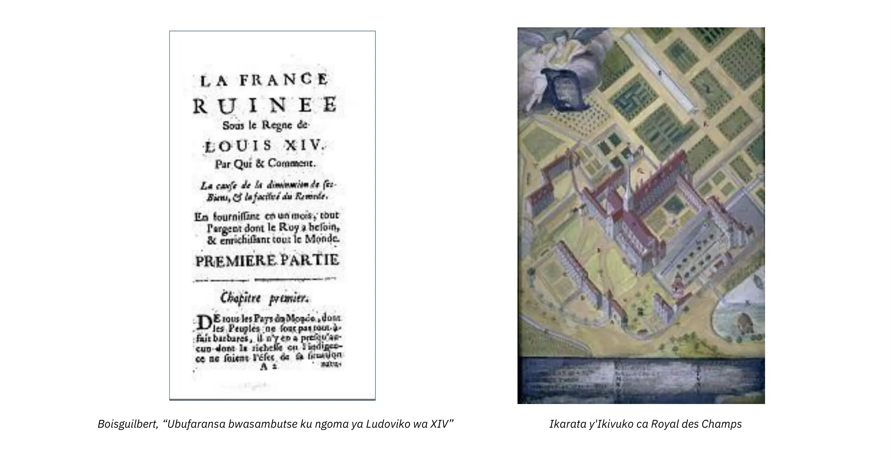

Kandi ivyo ni vyo bishingiyeko ibitabu vya Boisguilbert: ubukene bw’Abafaransa n’ivyo butera.

Uwo mubabaro w’abantu b’Abafaransa mu mpera z’ikinjana ca 18, Boisguilbert arawudondora mu buryo burambuye, nk’uko nyene Vauban yabivuze. Yandika ati:

> « Amatongo y’ingumba canke atarimwa neza, abonwa na bose, ni umuvyimba w’Ubufaransa ».

Yaradondora imirima y’imizabibu yaranduwe, abarimyi bahevye amatongo be n’inzara zaguma ziza.

Boisguilbert abona imvo nyamukuru zibiri zituma haba iyo mpanuka. Kuko iyo abantu baba mu bukene, ni uko babujijwe gufungura ivyo bakeneye, kandi ugusenyuka kw’ugufungura kugira imvo zibiri.

Ica mbere, abantu ntibari bagishobora gufungura ivyo bakeneye kubera imisoro y’ubujuju. Taille, ni ukuvuga umusoro w’umuntu ku giti ciwe wo muri ico gihe, waraharurwa ata co uzi ku muntu wese, ukaduga canke ukagwa ata mvo. Kubera ko hari uduteka twinshi, umuzigo waraguye ku barimyi b’abakene, na bo basanze barasenyutse. Kugira ngo ivyo bikosorwe, Boisguilbert yasavye ko hoba umusoro ungana n’uw’amahera yose umuntu aronka, nk’uko nyene Vauban yasavye.

Imvo ya kabiri yatumye Ubufaransa bugira amagorwa ni uko intambamyi nyinshi cane zabujije ubudandaji bw’ibicuruzwa ataco buvuze, cane cane ivy’uburimyi. Hariho amaduwani ku mipaka mbere no mu gihugu, hagati y’uturere dutandukanye, ivyo bikaba vyatuma ubudandaji bwose buhungabana. Ivyo bibujijwe vyatumye hatagira igiciro c’uburinganire n’amahirwe make y’isoko. Ivyo vyatumye abarimyi badashobora kwibeshaho mu vyo bakora, kuko batashobora kugurisha inyungu kandi bagashikirwa n’ibiciro vy’uburimyi bitagira inyungu, ivyo bikaba ari ikintu gihambaye cane muri iki gihe kandi kikaba kiri mu mutima w’inyigisho ya Boisguilbert. Ku bijanye n’uguhagarika ubudandaji, Boisguilbert yarasavye ko amabarabara yokurwaho, ni ukuvuga ko hashirwaho ubudandaji bwigenga.

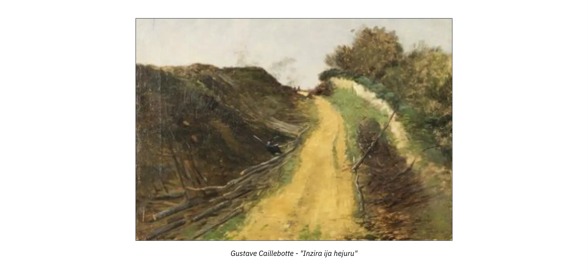

Kandi umwidegemvyo ni wo musozo wiwe wa nyuma vy’ukuri. Avuga ati: «Si ikibazo co gukora, ahubwo ni uguhagarika gukora nk'uko dukorana n'ubukazi ku kamere, yama ijana ku mwidegemvyo no ku butungane ». Vyose bizogenda neza, asubiramwo ataco arushe ati: «Igihe cose tuzoreka kamere ikaja mu nzira yayo, ni ukuvuga ko tuyiha umwidegemvyo wayo, kandi ko ata n’umwe yivanga muri ubwo bucuruzi kiretse gukingira bose no gukingira ubukazi».

Ico gice ca nyuma ni ikintu gihambaye cane. Boisguilbert ni we ya mbere yasavye mu buryo butomoye politike y’ubutunzi y’ugurekura, akayigira credo yiwe, kandi akayubaka urutonde nyarwo ruyikikuje. Nk’uko yabivuze, hariho urutonde rw’ibintu rusanzwe, kandi ntirukwiye kwononekara, ntirukwiye gusenyuka, n’ingene abantu bose bavyinjiramwo ata gihe. Leta, mu vyiyumviro vyiwe, ntitegerezwa gukora mu vy’ubutunzi, ahubwo, ireke ibintu bikore nk’uko bisanzwe. Ahandi ho, bizotuma haba amagorwa.

Boisguilbert mbere yaraneguye "*ubugingo bwiza*", nk'uko yavyita, abo bafise intumbero nziza ariko bagakora nabi cane. Bashaka umukate utari mwinshi ku bantu, ariko mu guhatira ibiciro kugabanya, barahonya abarimyi, batashobora kubaho ku mpande nk’izo. Abo barimyi baca baheba amatongo yabo, barushiriza kwisuka mu bukene. Nk’uko twese tubizi, ‘umuriro w’iteka akenshi ushirwako imigambi myiza’.

## Cantillon

<chapterId>bc206d41-6a64-5688-a489-40fcfa0e5397</chapterId>

Umwanditsi w'igitabu "Igitabo kivuga ku kamere k'ubudandaji muri rusangi" (canditswe nko mu 1730, gisohoka mu 1755), Richard Cantillon afatwa nk'umwe mu batanguje ubuhinga bw'ubutunzi bwo muri iki gihe. Mu gitabu ciwe kivuga ngo Amateka y’Ivyiyumviro vy’Ubutunzi, umuhinga mu vy’ubutunzi yitwa Murray Rothbard mbere avuga ko Cantillon ari we yashinze ubutunzi bwo muri iki gihe.

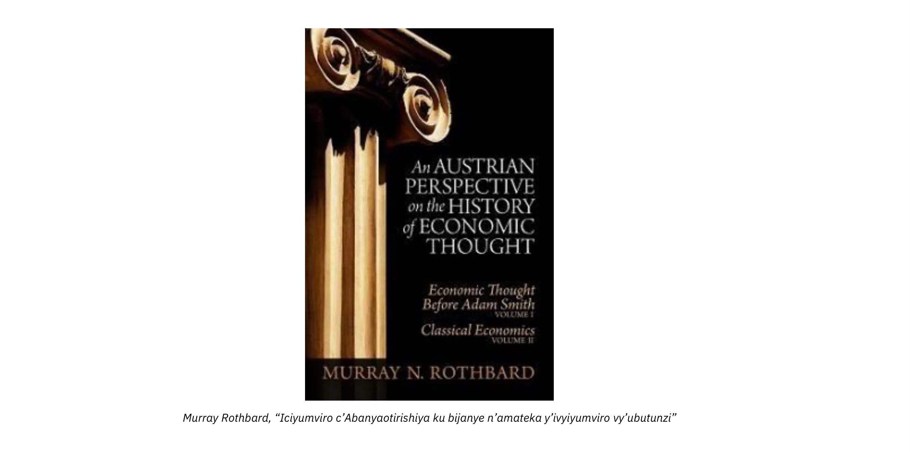

Richard Cantillon yavukiye muri Irlande, aca atura i Paris akiri umusore, aca aronka ubwenegihugu bw’Ubufaransa. Yakoze igikorwa co gucungera amabanki kandi yararonse ubutunzi mu gihe ca Yohani Itegeko.

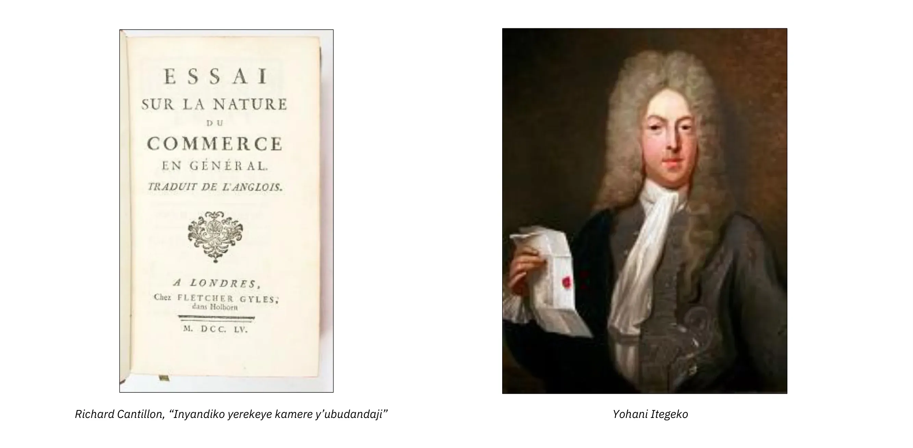

Ni muri ico gihe kandi yatanguye kwiga inyigisho y’ubutunzi. Nko mu mwaka w’1730, Cantillon yaranditse igitabu ciwe kivuga ku kamere y’ubudandaji muri rusangi.

Iki gitabu gishobora kubonwa nk’ikimwe mu bigeragezo vya mbere vyo kurema inyigisho rusangi y’ubutunzi. Cantillon aritonda kumenya ivyo yita "amategeko rusangi y'ubutunzi", ayo ari mu kamere k'ibintu, atari mu bintu vy'umwihariko vy'iki canke kiriya. Ubwo buryo bwari ubw’ihinduka rikomeye.

Turashobora guca irya n’ino ivyiza bikomeye vy’Inyandiko ya Cantillon mu bintu bitanu: inyigisho y’ubutunzi, iciyumviro c’umugwi w’abahinga, ukunegura amafaranga ataco amaze, « Ingaruka za Cantillon », n’ubwa nyuma ukurwanira umwidegemvyo.

Ica mbere, **inyigisho yiwe y’ubutunzi**.

Mu buryo butandukanye n’ivyiyumviro vy’ubudandaji vyari vyiganje ico gihe, Cantillon yashingiye ku kwemera ko ubutunzi bushingiye ku bintu bikwiye umuntu kwinovora. Yavuze ko ubwo butunzi buva mu kamere kandi buva ku bikorwa vy’abantu. Ivyiyumviro vyiwe ku bijanye n’ingene ubutunzi bumeze vyaragize akosho gakomeye kuri Beccaria na Adamu Smith, kandi, biciye kuri Smith, ku mashure yose y’ivyiyumviro vy’Abongereza.

Ubwa kabiri, **umucuruzi**.

Naho atabisiguye neza, Cantillon yabona ko uwo rwiyemezamirimo ari we afise uruhara runini kandi ruhambaye mu bikorwa vy’ubutunzi. Ku bwa Cantillon, ikiranga umudandaza ni uko afata ingorane, agakora ataco yizigiye. Ivyo vyiyumviro vyohavuye vyagurwa na Turgot, kandi ikiruta vyose, na Say, kugira ngo amaherezo yemere ikibanza kidasanzwe rwiyemezamirimo afise mu bukungu, bitandukanye n’ivyo ishure ry’icongereza ryemeza.

Ingingo ya gatatu, **amahera**.

Mu kwishura ku vyashikiye John Law, Cantillon arasigura ibiba canke bitegerezwa kuba iyo amahera ata gaciro nyakuri afise.

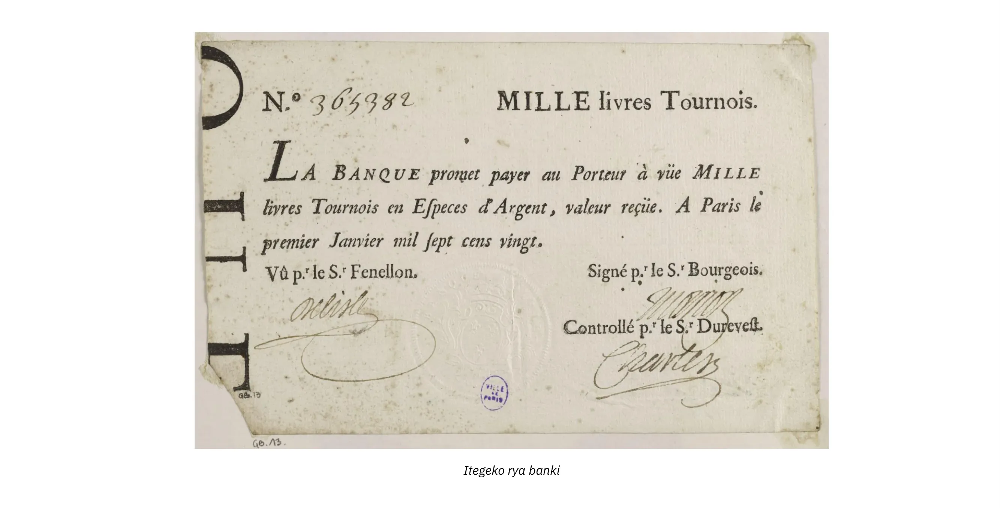

Abona ingaruka zibiri nyamukuru zo gusubirira amahera atagira agaciro nyakuri nk’amahera y’impapuro n’ay’icuma. Inkurikizi ya mbere ni ico yita "ukwangwa na benshi", bisobanura ko abantu barushiriza kwizigira amahera ataco amaze. Inkurikizi ya kabiri ni ugutera imbere kw’ibiciro: ugucika intege kw’amahera bituma ibintu bizimvye cane.

Ica kane, mu gusesangura **inflation**, Cantillon yaragiye kure y’abo mu gihe ciwe. Cantillon amaze kubona ukuntu ubutegetsi bwa Law bwasenyutse, yarabonye ko ugutera imbere kw’amahera kudatera abantu bose kimwe. Ahubwo riho, iratunganya bamwebamwe mu gihe abandi igira abakene. Yaciye avuga ko ugutera imbere kw’ibiciro kugira ingaruka zo gusubira gusangira: abaronka amahera mashasha asohotse babanje kwungukira ku bushobozi bwo kugura bwongerekanye, mu gihe abayaronka mu nyuma baba abakene kubera amahera mashasha asohotse kubera ugutera imbere kw’ibiciro.

Ica gatanu, naho hariho amasigarira makeyi y’ivyiyumviro vy’ubudandaji, ivyiyumviro vya Cantillon muri rusangi vyari **vy’ubwigenge bushitse**.Yaburaniye umutungo w’abantu ku giti cabo nk’inkingi y’ishimikiro y’iterambere, avuga ko ata kibano gishobora gukora ata Ownership y’abantu ku giti cabo y’ubutaka n’ibiva mu bikorwa. Yabona kandi ko ubusumbane mu vy’umubiri hagati y’abantu ari ikintu gisanzwe kandi gibereye. Nk’uko Cantillon abivuga, nta kibi kiri mu mukozi afise ubuhinga kandi afise umutima rugabo, canke uwufise impano idasanzwe, aronka amahera menshi kuruta umuntu adashoboye canke umunebwe.  Ubwa nyuma, Cantillon yarizera ko ibiciro bikwiye kwama bigenwa mu mwidegemvyo, biciye ku rukino rwa Supply n’ugusaba, ata n’umwe abigiramwo uruhara mu butegetsi bwa Leta.

Muri ivyo vyiyumviro bitanu bihambaye biri mu Nkuru yiwe, ikintu gihambaye kuruta ibindi vyose nta gukeka ni ico ubu citwa izina ryiwe: **Cantillon Effect**.

Cantillon akoresheje iyo nyigisho yerekeye ingaruka z’ugutera imbere kw’ibiciro, araduha inyishu ku ndwara zitari nke ziriho muri iki gihe. Bidufasha gutahura ingaruka z’ingingo ngenderwako z’amahera ziherutse kwaguka n’ugutera imbere, zatumye isi yo hagati n’iyo mu misozi ikenera, mu gihe itunganya abarongoye isoko ry’ivy’ubutunzi na Leta, ibisata vyayo n’abayobozi bayo, bivuye ku kuba bari hafi y’isoko y’ikibazo gishasha: amabanki nkuru n’amabanki y’ubudandaji.

# Abavuguruzi n’Abanyavyiyumviro bo mu ntango z’ikinjana ca 18

<partId>1f7b50d4-ce93-5db3-8396-43c1fa5419ff</partId>

## Umukuru w'idini ry'i Saint-Pierre

<chapterId>13478fe2-4c12-593c-a410-54c2cfb7ef7f</chapterId>

Mu banditsi bose twahisemwo gushiramwo mu rutonde rw’abanyabwenge b’Abafaransa bo mu kinjana ca 18, nta gukeka ko Abbot wa Saint-Pierre ari we yirengagijwe cane.

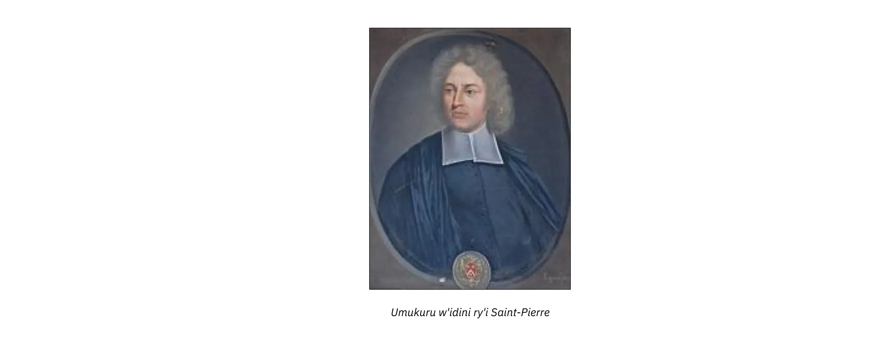

Kugira ngo tuvuge ukuri, ni igice c’ikosa ryiwe bwite. Yanditse vyinshi cane, ariko uburyo bwiwe bwo gusoma ni Hard kandi buzuyemwo ugusubiramwo. Mbere na Jean-Jacques Rousseau yaragerageje gucapura igikorwa ciwe: yaratanguye kubikora, ariko ntiyatevye guheba ico gikorwa, kuko yabonye ko cari kirenze inkomezi ziwe. Mu kinjana ca 19 hagati, Gustave de Molinari yaramuteye iteka mu gusohora igitabu kirimwo ibintu vyinshi bimuvugako, aho yashimira umunyapacifiste n’umuhinga mu vy’ubutunzi uwo Abbé wa Saint-Pierre yari. Ariko ivyo ntivyari bihagije kugira ngo amukure mu kwibagirwa, nk’uko aguma muri vyo n’ubu.

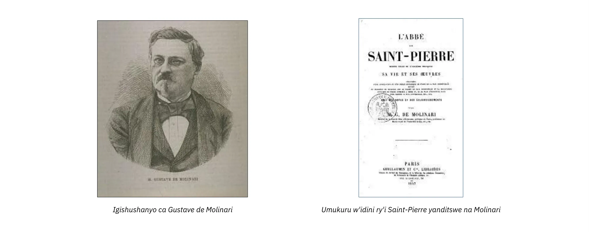

Abbot wa Saint-Pierre yanditse ku vyerekeye ubutunzi, ariko ni nk’umunyapacifiste akenshi akunda. Ni we yanditse igitabu citwa Projet pour la paix perterne, kikaba cabanjirije igitabu kizwi cane canditswe na Emmanuel Kant.

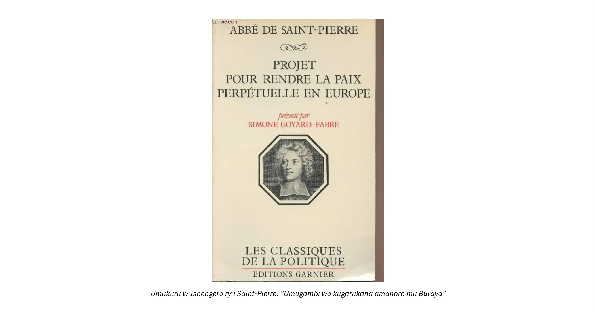

Muri ico gikorwa, yavuze ko intambara ari iyo gusenyura, atari ku bayitakaza gusa, ariko n’abayitsinda, mbere n’abatayigiramwo uruhara, kuko ubudandaji bwabo bugira ico bukoze.

Kugira ngo arwanye ico kiza c’intambara, yarasavye ko hashingwa ubwoko bumwe bw’Ishirahamwe ry’Amahanga ry’i Buraya. Hazoshingwa inama y’i Buraya yo gutorera umuti ingorane z’igihugu cose. Amahanga rero yokoresheje ubukemurampaka, kugira ngo ntiyakoreshe ibirwanisho. Iyo ihanga ritagira ubwenge buhagije bwo kwakira amahoro, iyo ritera ubwoba ibindi bihugu vy’i Buraya, ishirahamwe ry’ibihugu vy’i Buraya ryoba rifise uburyo bwo kwishura. Kubera ivyo bintu vyari guhangana n’ivyo bintu, hazoshingwa ingabo z’Uburaya, zikaba zifise ingabo zitangwa n’ibihugu bitandukanye.

Hariho kandi ikiganiro mu buzima bw'Umukuru w'Ishengero ry'i Saint-Pierre kigaragaza neza cane ivyiyumviro bikomeye biri inyuma y'umuhari w'abafaransa wo kwirekura. Yinjiye muri Académie Française mu 1695, ariko yirukanwa mu 1718 kubera yari afise ubutwari bwo kunegura ubutegetsi bwa Louis XIV. Muri ivyo, yarifatanije n’abantu nka Vauban na Boisguilbert, na bo nyene bari barateye ubwoba bwo kuvuga barwanya amabanga yari yihishije munsi y’ubwiza bw’ingoma y’Umwami w’Izuba.

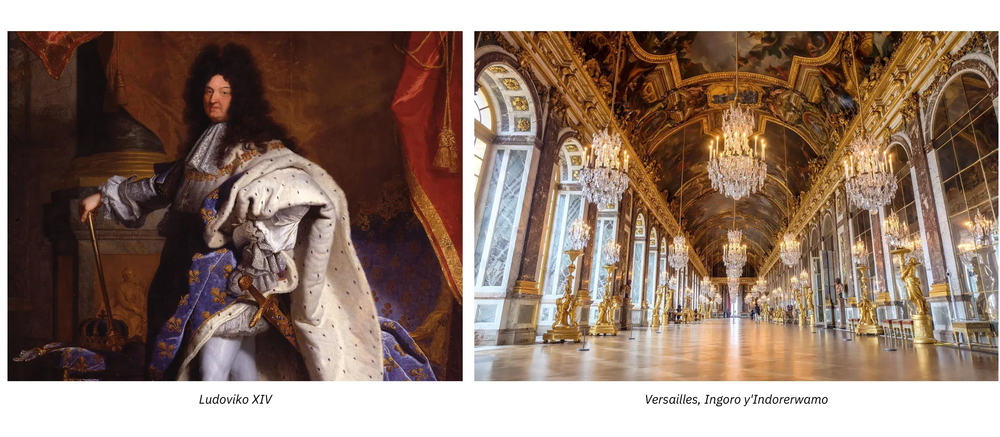

Umukuru w’idini ry’i Saint-Pierre yavuze yuko ubutegetsi bwa Louis XIV, n’urugo rwayo rwiza cane be n’ugukunda cane kwigarurira ibihugu mu gisirikare, atari ikimenyetso c’umwami w’ingeso nziza. Yanse kwemera ko Ludoviko XIV akwiriye izina ry'icubahiro rya "**Ludoviko Mukuru**".

Ati: "Gusambura ababanyi n'abantu igihe kimwe si ubukuru". Ico kibanza carababaje cane Académie Française, kuko yari imaze igihe kirekire yitwararika gutera iteka umwami mu buryo bwose bwo kwandika bushoboka. Ivyo vyatumye batora hafi bose ngo bamwirukane.

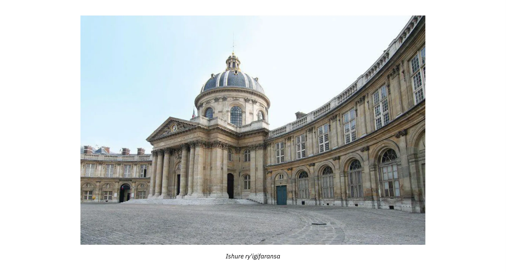

Ku bijanye n’ivyiyumviro vy’ubutunzi, yarashira mu ngiro ubudasiba ingingo ngenderwako y’ubuhinga, nk’uko nyene Jeremy Bentham yari kubigira mu nyuma, kandi kenshi yaratanga ubumenyi bubereye. Kugira ngo tuvuge ukuri, yari agikwegerewe n’ivyiyumviro vy’ubudandaji, ivyo ata n’umwe yari yarabivuyemwo bimwe bishitse ico gihe.

Naho ari ukwo, Umukuru w’Ishengero ry’i Saint-Pierre yaravuze ibintu bimwebimwe ata co bihinduye ku bijanye n’ubutunzi. Mbere n’imbere ya *Condillac*, akenshi bavuga ko ari we afise ico ciyumviro, yaravuze neza ko muri Exchange iyo ari yo yose, abo bompi bavyungukirako. Ivyo turashobora kubisanga mu gitabu ciwe co mu 1733 ["Umugambi wo guteza imbere ubudandaji bw'Ubufaransa"](https://www.institutcoppet.org/projet-pour-perfectionnement-le-commerce-de-france/), aho yanditse ngo:

> "Igihe ugurisha gukorwa hagati y'abadandaza, uwugurisha araronka inyungu, n'umuguzi na we nyene; kuko iyo hataba inyungu nyayo canke ibonwa ku mpande zompi, nta n'umwe mu bagurisha yogurisha ku giciro nk'ico, canke umuguzi, ku ruhande rwiwe, yogura ku giciro nk'ico".

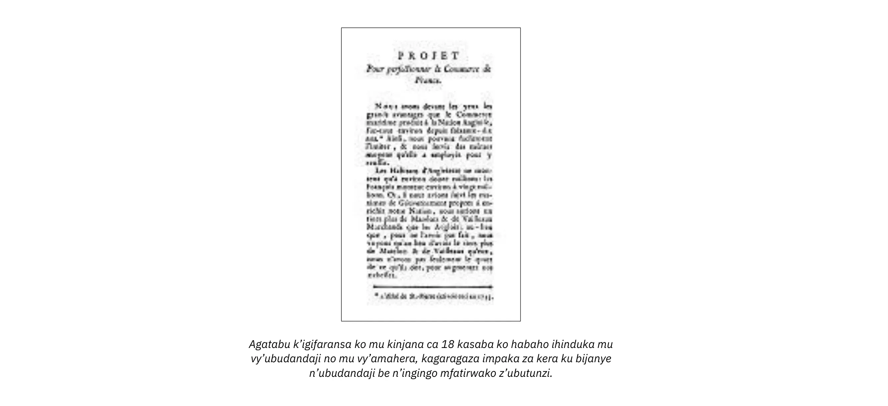

Yarashimikiye kandi, imbere y’uko Vincent de Gournay abigira, ku gaciro k’igikorwa n’akamaro ko kuguma gikwegera abantu. Yanditse ati: "Ibikorwa vyose biragoye". "Kandi iyo umuntu abonye ko akazi kiwe ataco kamuhemba, canke ko ataco kamuhemba, aca aba uwutagira ico akora, ntazokwitwararika n'inguvu zidakenewe". Ico ciyumviro nyene cari gusubirwamwo mu nyuma na Marquis d’Argenson, Vincent de Gournay be n’aba Physiocrates igihe banegura amategeko aremereye be n’imirongo y’amashirahamwe. Bavuze yuko mwene ukwo kubuza abakozi guca intege, bikazana ingorane zidakenewe, amaherezo bikaba bituma ubunebwe busa n’ubukwegera kuruta utwigoro tuzana inyungu mu bihe nk’ivyo.

## Umukuru w'igihugu

<chapterId>e9960ab4-72ec-5afd-8e97-bf89c83b62bc</chapterId>

Marquis d’Argenson ni umuntu yibagiwe yashinze inyigisho y’ugurekura ivyo umuntu akora.

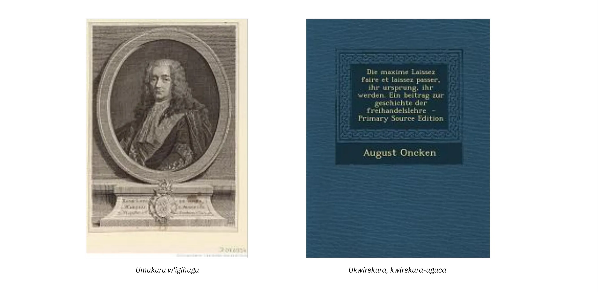

Yasubiwemwo na August Oncken, umwanditsi w’igitabu kivuga ku nyigisho y’ugurekura, uburenganzira bwo guca, ashika ku ciyumviro c’uko d’Argenson yagize uruhara runini mu kuvuka kw’ico ciyumviro.

René-Louis Voyer, Marquis d’Argenson, yavutse mu 1694. Yatanguye ibikorwa vyiwe vya politike ari umujanama w’abashingamateka, hanyuma aba mu nama nkuru y’igihugu.

Imyaka mirongo itatu imbere ya Adamu Smith, d’Argenson yari amaze kurwanira inyungu z’ugucapura ibikorwa n’ubuhinga bwihariye.

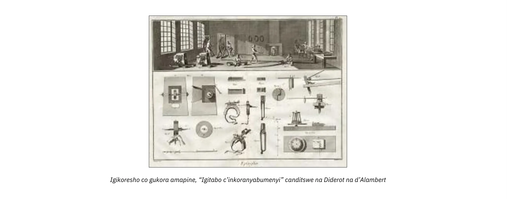

Yaraneguye cane amabwirizwa, nk’uko yabibona, agerageza guhindura ivyo uturere dutandukanye dukunda. Nk’akarorero, yaratangajwe n’uko leta yashaka guhingura ibitambaro n’ibitambaro vy’impuzu i Tours, igisagara cari gikenye ico gihe, kugira ngo bihure n’ivyo vyakorerwa mu gisagara ca Genova cari gitunze, kikaba cari kizwi cane kubera ibintu vy’agaciro. Yaciye asozera ati:

> "Ikibanza cose kigomba kwemererwa kwihitiramwo amahinguriro yaco. Umwidegemvyo! Umwidegemvyo!"

Yaremeye kandi iyindi ngingo ngenderwako nyamukuru ya Smith: iciyumviro c’uko urutonde rwihuta ruva ku gukurikirana inyungu z’umuntu ku giti ciwe. Marquis d’Argenson yarizera yuko inyungu z’umuntu ubwo nyene ari zo zituma umuntu agira inguvu. Yanditse yuko ubuhinga bubi n’ubuhendanyi vyotuma uwukora ibintu bitera isoni, mu gihe ukwitanga n’imigambi myiza vyotuma umuntu atera imbere. Yavuze ko umucamanza mwiza w’ivy’ubuhinga ari umuntu ku giti ciwe, abantu bose muri rusangi, bagura ibintu kandi bakitwararika gukora amasezerano meza. Yavuze ati: «Umuntu wese abona inyungu yiwe bwite, umuntu wese afata ingingo zimugirira akamaro, kandi muri ayo masezerano rusangi ni ho tubona ukuri».

Mbere n’imbere ya Adamu Smith, yaratahuye ko kwikunda bijana ku nyungu rusangi biciye mu kwubaka urutonde rw’ibinyabuzima rwihuta.

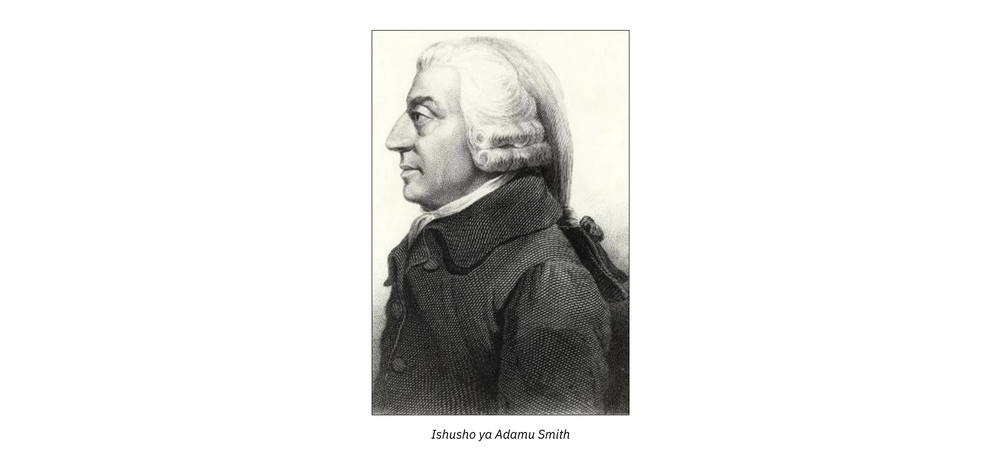

Yagereranije ikibano n'umuzinga w'inzuki aho udukoko twose dukurikiza kamere yaco, "Kuva ku bikorwa vyaco", yavuze neza na neza, "vyavuyemwo ukwirundanira kwinshi kw'ivyo ikibano gito gikeneye; ariko ivyo ntivyazanywe n'amabwirizwa, canke n'abajenerali, bategeka umuntu wese gukurikiza ivyiyumviro vy'umurongozi wabo". Iyi kumbure ni imvugo yegereye cane mu vyiyumviro vy'ubutunzi vy'Abafaransa n'iciyumviro kizwi cane ca Adamu Smith c'"ukuboko kutaboneka".

Marquis d’Argenson yama ashavuzwa n’ivyiyumviro vy’abaminisitiri bo mu gihe ciwe. Ikibazo conyene babajije ni iki: "Twoba dukwiye gutegeka gutyo canke gutya? Twoba dukwiye kuyobora ubutunzi muri ubu canke muri ubwo?". Ivyo d’Argenson arishura ati: «Mbega ntidukwiye kubanza kubaza nimba bibereye kuyobora ikintu na kimwe muri vyo na gato, canke nimba ibintu bikwiye gusigara bikora ubwavyo?»

Kuvuga ukuri, yaratangajwe n’uko abantu basanze ari Hard kugira ngo batahure, canke ahubwo, babone ingaruka mbi z’ugutegeka birenze urugero kw’ubwoko bwose ku bukungu. Mu kubona kwiwe, vyari bihagije gufungura amaso gusa. Yanditse ati: "Ibintu vyinshi biriko biragenda neza uno musi", "kubera gusa vyashoboye guhunga amategeko".

Rimwe na rimwe, yaraheba kubera ukuntu ivyiyumviro vyiwe vyatahurwa bike.

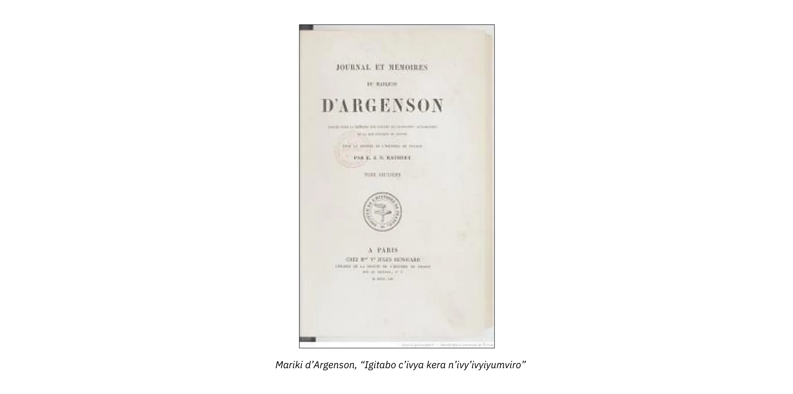

Iciyumviro c’ubutunzi yaburanira rero cari giteye kubiri n’ivyo mu gihe ciwe. Iciyumviro ciwe cari gisobanura uruhara rubi cane Leta ifise. "Ivyo ubudandaji bukeneye vyose ni ugukuraho intambamyi. Busaba gusa abacamanza beza, guhana abafise uburenganzira bwo gukora ibintu bimwe bimwe, gukingira abanyagihugu bose kimwe, amafaranga ahamye, n'amabarabara n'imigende". Ivyo ni vyo vyari insobanuro y’Igihugu gitoyi cane, kikaba cari kuba kimwe mu bishingiyeko umugenzo w’Abafaransa mu bukungu bwa politike.

Iryo yerekwa ry’uruhara rwa Leta mu bikorwa vy’ubutunzi ryagaragajwe mu buryo busanzwe n’ukwiga ibibazo bibiri bihambaye vyavyuriye umutima abahinga mu vy’ubutunzi n’abahinga mu vy’imibano bo mu gihe ciwe: ugutunganya inganda n’ubudandaji bw’ingano.

Amabwirizwa yerekeye inganda, imbere ya vyose, yaravyuriye inzigo yiwe yose, kuko yari uduteka kuri bamwebamwe ku bandi. Yanditse ati: «Impamvu nyayo y’ugusenyuka kw’amahinguriro yacu ni uburinzi burengeje urugero yahawe». Kandi ni mu vyiyumviro bitagira uko bingana, yaseruye ukuntu yanegura umwete w’abategetsi bo mu gihe ciwe:

> Gutwara iyo nganda ataco ishaka ni ugushaka ko isenyuka.

Ku kibazo c’ubudandaji bw’ivyo kwibeshaho, d’Argenson nta yindi nyishu yari afise atari umwidegemvyo. Nk’uko yabivuze, ubukene bw’ingano bwavuye ku nzira y’ubudandaji n’ukwiyubara birenze urugero Leta yafashe. Ico twari dufise co gukora ni ukubireka, kandi ntihokwigera haba ubukene bw’ingano mu gihugu aho ivyambu vyuguruye. Abanyamahanga, bakwegerewe nk’abandi bagabo bose n’uruyeri rwo kuronka inyungu, boduha ivyo dukeneye, bakadutwara ivyo dukeneye. Aravuga ati: «Bibeho, vyose bizogenda neza».

## Vinsenti de Gournay

<chapterId>e8ae40dc-7450-552f-9ddc-9e02936cf425</chapterId>

Vincent de Gournay yari umwe mu ba mbere baserukira laissez-faire mu Bufaransa, kandi yari umwe mu ba mbere bayiburanira mu butegetsi bwa Leta no mu nzego z’ubwenge. Kubera iyo mvo, akwiye kwemerwa cane muri kahise k’ivyiyumviro vy’ubutunzi kuruta uko asanzwe aronka. Nagerageje gushira ahabona intererano ziwe mu gitabu giherutse gusohoka.

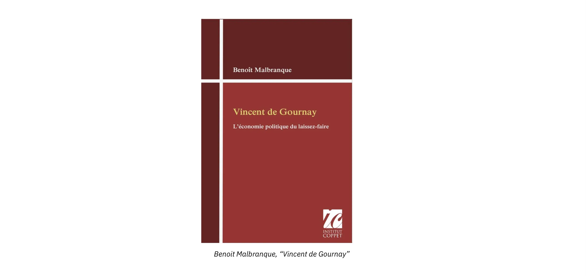

Gournay yavukiye mu muryango w’abadandaza, na we ubwiwe yarabaye umudandaza ateye imbere, yirundanira ubutunzi bwinshi imbere y’uko aronka ikibanza mu butegetsi bw’Ubufaransa. Mu Biro vy’Ubudandaji, yari umuntu avugira cane abakozi b’ubuntu n’ubudandaji bw’ubuntu.

Naho yari yinjijwe neza mu bijanye n’abahinga mu vy’ubutunzi bahambaye bo mu gihe ciwe, Gournay yanditse bike canke ahubwo yarasohoye bike. Yanditse ahanini amakete y’ubutegetsi n’ibitabu vy’ivyiyumviro, atasohorwa canke vyasohorwa n’abandi banditsi bamaze guhindurwa bimwebimwe.

Ivyo dufise birimwo:

1. [Ivyo vyavuzwe](ivy’ubuhinduzi bw’igitabu c’umuhinga mu vy’ubutunzi w’Umwongereza yitwa Josiah Child;

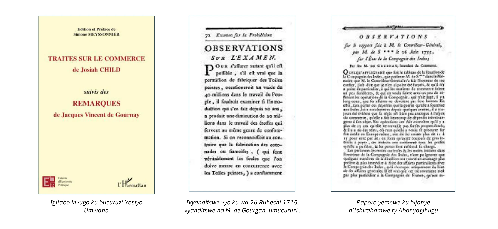

2. "Ivyiyumviro" biri mu Gusuzuma Ivyiza n'Ibibi vyo Kubuza Impuzu zicapwe;

3. « Ivyiyumviro ku bijanye n’Ishirahamwe ry’Ubuhindi bwo mu Buseruko », vyashizweko na Abbot Morellet mu gitabu ciwe c’Ivyiyumviro ku bijanye n’Ishirahamwe ry’Ubuhindi bwo mu Buseruko (1769);

4. Kandi ikiruta vyose, ivyibutso bitandukanye biva ku ruhara rwiwe rwo kuba Intendant w’Ubucuruzi.

Ivyo vyanditswe vyerekana neza ko hariho akosho k’amahanga be n’uko hariho ivyiyumviro bimwebimwe bihambaye vy’imiterere. Inkurikizi z’amahanga, muri Gournay, ni ukwemera ko Abongereza n’Abaholandi baruta abandi. Gournay yari yemera neza ko ivyo bihugu bibiri bitahura neza cane ubutunzi kuruta Ubufaransa, kandi ko Ubufaransa butegerezwa gukurikira akarorero kavyo. Gournay yasozereye ati: "Ivyo bihugu bibiri nivyo biteye imbere kuruta ibindi vyose, kandi bikurikiza uburyo butandukanye cane n'ubwacu. Turabuza kwinjira kw'ibicuruzwa vyo hanze, turahagarika ibikorwa vy'ubutunzi mu mategeko akomeye, mu gihe bo bagenda mu buryo bunyuranye.

Ivyiyumviro vyiwe vyo guhindura vyari vyishimikije ingingo nyamukuru zitari nke.

Ica mbere, yarizera ko igikorwa gikeneye kurindwa no kuremeshwa. Iciyo gihe, abakozi b’Abafaransa bafatwa nk’abanyavyaha, bakaguma bakurikiranwa, kandi bakaguma bafise ubwoba bw’uko batazokurikiza rimwe mu mabwirizwa ibihumbi n’ibihumbi. Ukwo kubabaza birenze urugero kwatuma abantu badakora, ahubwo bikabatuma bagira ubunebwe. Yamara, Gournay yavuze ko "akazi ari keza kandi ni bwo buryo bwonyene bwo gutunga igihugu".

Ica kabiri, yaraneguye uburyo bwo kubuzanya abahinguzi. Kwifatanya n’ubudandaji vyari bitwara umwanya kandi bikaba bizimvye, kandi umukozi mushasha wese ategerezwa rero gukurikiza yitonze urutonde rwashinzwe n’amategeko y’ishirahamwe ryiwe. Mwene urwo rutonde ntirwasiga ikibanza co gukora ibintu vyiza cane, co gukora ibintu bishasha canke co gutera imbere.

Ica gatatu, ubudandaji bwo mu Bufaransa bwari bufise aho bugarukira kubera amategeko abuzanya abantu. Mu vyiyumviro vya Gournay, abaguzi bokwungukira cane iyo ivyambu bishobora guhiganwa mu mwidegemvyo kandi ibintu vyose, nk’intete n’ibipande vy’ibipande, bikemererwa kwinjizwa hanze ata n’umwe abujijwe. Ni umwe mu ba mbere bagaragaje inkomoko nyakuri y’ubudandaji bw’ibinyoma: bwariho gusa kubera ko ubudandaji bw’ingirakamaro kandi bw’ingirakamaro bwari bwabujijwe. Yongeyeko ikindi ciyumviro gikomeye: ubusuma bwari umwuga "w'ubuntu", ata mategeko, ata mashirahamwe, ata misoro yo gufata ibintu. Yamara rero, ni itegeko rya Leta ry’agahomerabunwa ryatumye abakozi benshi b’inzirabugunge bakora ibikorwa bitemewe n’amategeko.

Ubwa nyuma, Gournay yavuze yuko inyungu zari hasi cane mu Bwongereza no mu Buholandi, ivyo bikaba ari ibihugu vyari biteye imbere kuruta Ubufaransa. Yasavye ko inyungu zigabanywa no mu Bufaransa, kugira ngo ibikorwa vy’ubutunzi bishobore gufashwa ng’aho ku buryo bubereye nk’ahandi. Ariko rero, Gournay ntiyarondeye uburyo bwo guhatira, bwo gushinga amategeko; ahubwo yashimikiye ko bikenewe ko inguzanyo y’amahera yemezwa, ivyo bikaba vyari bikiriko biracirwa urubanza na Ekleziya Gatolika.

Ku bijanye n’izo ngingo zose, Gournay yarafise uruhara runini mu mpari z’ubwenge zo hagati mu kinjana ca 18. Ugukingira kwiwe umwidegemvyo w’ubutunzi kwabanjirije aba Physiocrates imyaka cumi, Adamu Smith na we imyaka mirongo ibiri. Ariko akosho kiwe karamba cane kari kuri Turgot. Gournay yafashe uwo musore Turgot munsi y’amababa yiwe, aramumenyereza n’ivyiyumviro vyiwe.

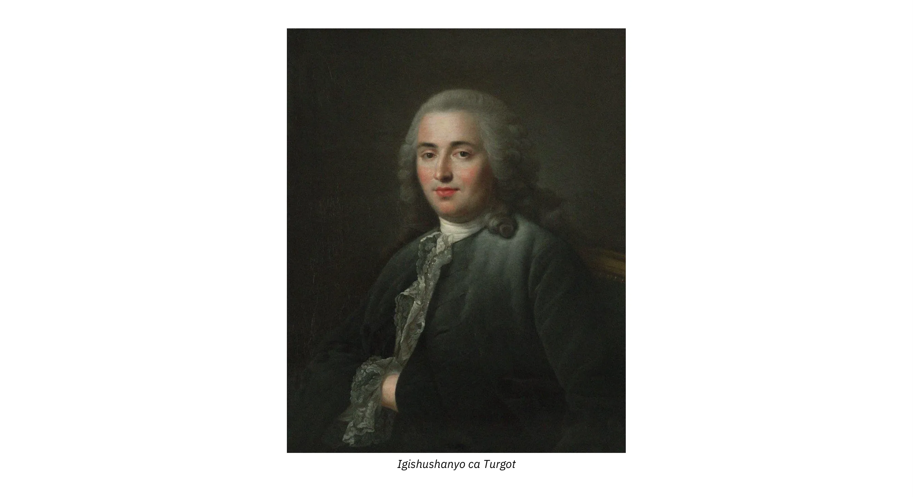

Haciye imyaka, Turgot, uno akaba yari umusuku mu gihe ca Louis XVI, yaranditse igitabu citwa Éloge (igitabu co gushimira umugenzi wiwe) amaze gupfa. Kandi nimba Turgot atigeze yemera bimwe bishitse ubutegetsi bw’umubiri bwa François Quesnay, ni kubera ko yazigamye urukundo rudashobora gutsindwa na shebuja wa mbere, Vincent de Gournay.

## Uruziga rwa Gournay

<chapterId>b86ba6bd-8f3a-5d8f-b098-4d0413f00deb</chapterId>

Ku bijanye n’imisi ya mbere y’ubuhinga bw’ubutunzi, amateka akunda gushira ahabona ishure rya mbere ry’ivyiyumviro: aba Physiocrates, bayobowe na François Quesnay n’abigishwa biwe. Ariko rero, hafi imyaka cumi imbere y’uko bavyuka, hariho uwundi mugwi utari mu buryo busanzwe ariko uhambaye nk’uwo, wari ushingiye ku muhinga mu vy’ubutunzi yitwa Vincent de Gournay.

Nk’uko twabibonye mu gice ca mbere, Gournay yarashimishijwe n’akarorero k’ibihugu vy’amahanga nk’Ubwongereza n’Ubuholandi. Yarashima cane abahinga mu vy’ubutunzi babo, ni ukuvuga abantu nka Yosiya Child, Johan de Witt na David Hume.

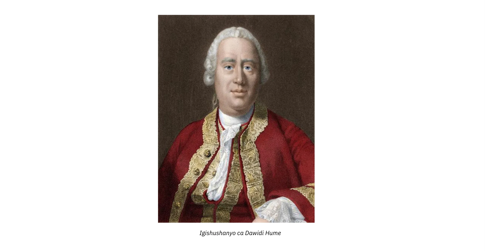

Ukwo gushima kwatumye ahindura, yongera agatanga ubuhinduzi bw’ivyanditswe vyabo vy’ubutunzi.

Vyabonetse ko ikibanza yari afise mu butegetsi bukuru catumye Gournay ashobora guhura n’abahinga bose mu vy’ubutunzi bari bazwi mu Bufaransa ico gihe. Muri ubwo buryo, yarakoranije umugwi w’abahinduzi b’abahinga cane. Ni we ubwiwe yahinduye ibitabu vya Child na Culpeper. Abbé Le Blanc ni we yahinduye igitabu citwa Insiguro za politike ca David Hume. Véron de Forbonnais ni we yahinduye umuhinga mu vy’ubutunzi w’Umunyasipani Geronimo de Uztariz. Turgot yarakoze ku vyanditswe na Yosiya Tucker, umuhungu wa Montesquieu na we arahindura Yosuwa Gee.

Biciye ku gukorana n’abantu benshi bo mu mugwi wa Gournay, abanditsi benshi barashoboye gusohora ibitabu vy’intango mu mazina yabo bwite. Ivyo bitabu, hamwe n’ivyo vyahinduwe, vyarateye imbere bitangaje. Ingero zimwe zimwe zihambaye ni:

- Igitabo ca Herbert ku [Polisi rusangi y’intete](ibitabu 6 mu myaka 4)

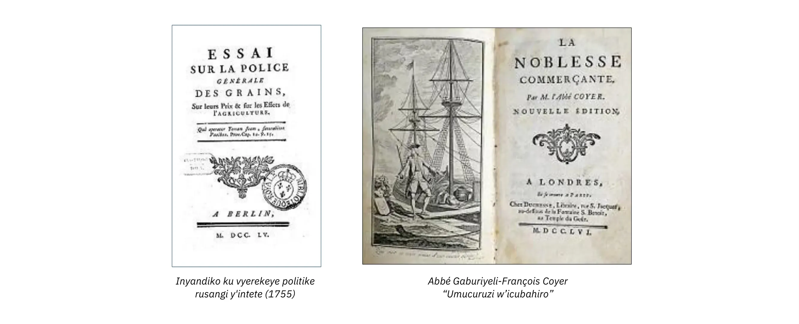

- Coyer’s [Ubucuruzi bw’icubahiro](ibisobanuro/ubucuruzi bw’icubahiro00coye/urupapuro/n3/uburyo/2up) (Ivyasohotse 5 mu myaka 2)

- Igitabo ca Plumard de Dangeul [Ivyiyumviro ku vyiza n’ibibi vy’Ubufaransa n’Ubwongereza](https://archive.org/details/bim_ibisobanuro-vy’inyungu_za_plumard-de-dangeul-loui_1754) (integuro y’imyaka 3 mu mwaka wa mbere)
- Cliquot-Blervache na Gournay [Ivyiyumviro vyerekeye ubuhinga](Ivyasohowe 2 mu 1758)

Iryo tsinda ryaragize kandi uruhara runini mu gusohora igitabu ca 1914.

- [Inyandiko ku kamere k’ubudandaji muri rusangi](inyandiko yerekeye kamere y’ubudandaji muri rusangi) na Richard Cantillon.

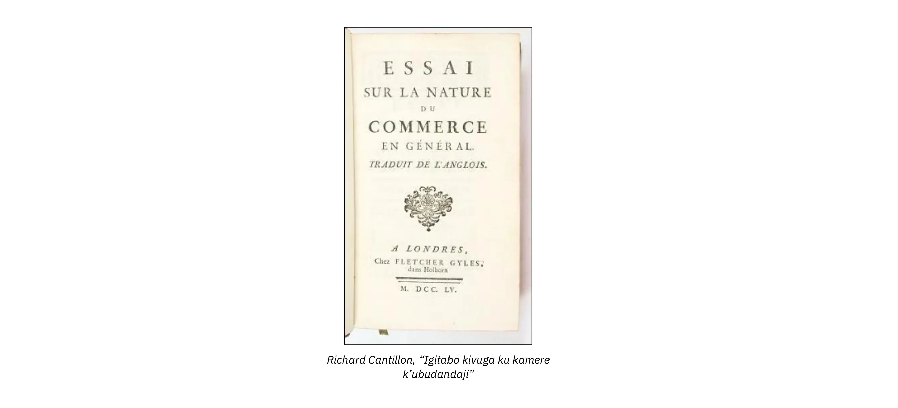

Ico gitabu ca nyuma canditswe nko mu 1730, caragumye mu nyandiko z’intoke inyuma y’urupfu rw’umwanditsi waco. Gournay, afashijwe n’abagenzi biwe b’abahinga mu vy’ubutunzi, yarasohoye mu 1755. Nk’uko Abbot Morellet, umwe mu bagize uwo mugwi abivuga, Gournay yarayisavye umuhinga mu vy’ubutunzi wese yari azi.

Ivyo ubwenge bwavuye mu nzinguzingu ya Gournay vyaragize ingaruka nyinshi ku mateka y’ivyiyumviro. Muri ubwo buryo, barashobora gufatwa nk’abashinze ubuhinga bw’ubutunzi mu Bufaransa. Christine Théré wo muri INED, yize amateka y’ibitabu vy’ubutunzi, yasanze hagati y’umwaka wa 1750 n’uwa 1759, ata bitabu birenga **349** vyerekeye ubutunzi vyasohowe, ugereranyije n’ibitabu **83** gusa vyasohowe mu myaka cumi yose iheze (1740–1749). Iryo hinduka ryo mu myaka ya 1750 ahanini riterwa n’uruziga rwa Gournay.

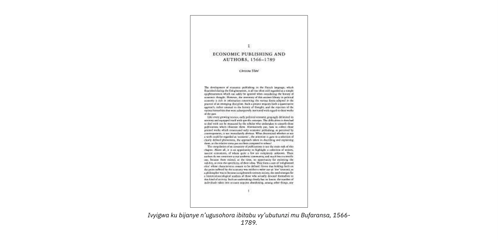

Kugira ngo Gournay n’abagenzi biwe bamenye ibiganiro vy’ubutunzi mu banyagihugu b’Abafaransa, barakoze kugira ngo bishobore gushikirwa n’abantu biciye mu bitabu vy’inkuru ndende. Inyuma y’igitabu *Iciyumviro c’ubudandaji*, canegura amashirahamwe y’ubudandaji, Gournay na Cliquot-Blervache barafashije Gabriel-François Coyer kwandika igitabu kigufi c’ugushinyagurira citwa Chinki: [Inkuru y’ikikochini ikoreshwa ku bandi . Amahanga](ibirimwo/ivyo gushiramwo/2013/06/Amateka-y'Ikishinki-Coyer-Igishinwa.pdf).

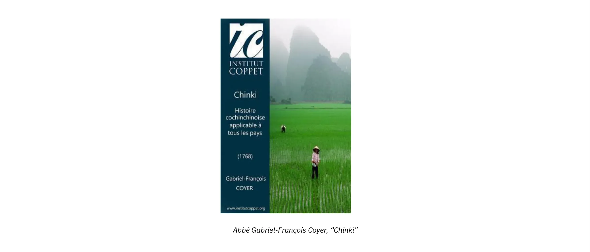

Inkuru ikurikira umukinyi nyamukuru, Chinki, agoberwa no kuva mw’itongo ryiwe kubera imisoro myinshi cane, akagerageza kurondera abana biwe akazi k’ubuhinga mu gisagara. Ariko ubudandaji bwose burabafunga kubera amategeko y’amashirahamwe y’ubudandaji akoresha nabi, ni co gituma iyo nkuru yerekana ukuntu agenda arahemuka biciye mu majwi atwenza.

Uruziga rwa Gournay rero rwari intango y’umupfunda mwinshi w’ibitabu. Naho iyo ntererano nini yaribagiwe n’abahinga mu vya kahise b’ivyiyumviro vy’ubutunzi, yari igaragara cane ku bantu bo mu gihe cabo. Aba Physiocrates, batunganije ishure ryabo mu myaka ya 1760, mu nyuma bazoshira ahabona umugwi wa Gournay nk’uwabarongoye ata guca ku ruhande. Mu 1767, umuhinga mu vy’ubutunzi yitwa Jacques Accarias de Serionne yarabivuze neza kuruta mu gitabu ciwe co gushimira. Yanditse ati: "Abafaransa bakeyi, bompi abafilozofe n'abanyagihugu, batanguye mu myaka mikeyi iheze kwigana abanditsi b'Abongereza. Babanje guhindura ivyitegererezo vyabo maze ntibatevye kubirenga mu buryo bwinshi. uguterimbere kwa Leta".

Kandi vy’ukuri, mu myaka ya 1750, ibibazo vy’ubutunzi vyaciye bihinduka umuderi. Voltaire yaravuze cane yuko nko mu 1750, Abafaransa bahevye ibitabu kugira ngo baganire ku mwidegemvyo w’ubudandaji bw’intete. Ivyo vyabonetse kandi n'ikinyamakuru Mercure de France, canditse mu nomero yo mu 1758, amezi make imbere y'urupfu rwa Gournay: "Ubutunzi bwa politike ubu ni ubuhinga buri mu mideri. Ibitabu vyerekeye uburimyi, abantu, inganda, ubudandaji, n'ivy'ubutunzi ubu biri mu minwe y'abantu batagira uko bangana, gusa". Nta muntu yoshobora gushimira Gournay n’igikorwa c’umugwi wiwe w’abahinga mu vy’ubutunzi.

## Mirabo

<chapterId>2d2f802b-e3b6-556f-9025-a1b1dc4409ca</chapterId>

Ubufaransa bwamenye abantu babiri bazwi cane bitwa Mirabeau, se n’umuhungu, ariko uwo muhungu ni we yakoze amateka vy’ukuri. Yari umukuru w’abanyagihugu b’abanyagihugu kandi yari umwe mu bantu bahambaye mu vyabaye mu gihe c’Impinduka y’Abafaransa, yagumye azwi cane.

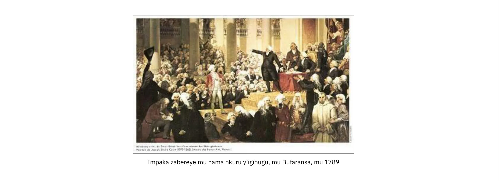

Biciye ku buhinga bwiwe no ku kibanza yari afise muri kahise k’Ubufaransa, yarateye igitutu se wiwe, umuhinga mu vy’ubutunzi akaba n’inkingi y’ishure rya François Quesnay, yari yarabaye umunyamuryango wa mbere kuva mu 1758.

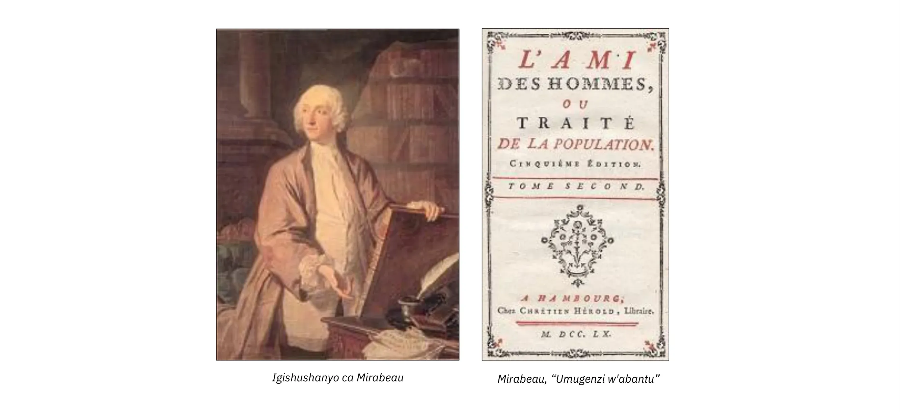

Mu vy’ukuri, Marquis de Mirabeau yari amaze kuronka izina rikomeye cane mbere n’imbere y’uko yemera ubutegetsi bw’umubiri kubera igitabu citwa «Umugenzi w’abantu. edition yasohotse mu 1756, iramenyekana cane nko mu 1757, umwaka umwe imbere y’uko ahura na Quesnay.

Hagati y’umwaka wa 1757 n’uwa 1760, harasohowe ibitabu birenga 20, ivyo bikaba bishobora kuba ari vyo bituma ari co gitabu c’ubutunzi caroraniwe kuruta ibindi vyose mu mateka. Abasomyi bamwebamwe mbere biyumvira ko ico gitabu canditswe na Montesquieu kubera ko cari gifise ivyiyumviro bikomeye. Uwo Dauphin, se wiwe Umwami Louis XVI, mbere yavuze ko yari yabifashe mu mutwe. Mu kiringo kanaka, ni co gitabu abantu bose bo muri Versailles bariko barasoma.

Uyu musi ni igitabu kitagisomwa, ariko benshi baracariko baragikoresha. Mbere no mu kinjana ca 19, Edmond Roussel yavuze ati:

> L’Ami des Hommes ni kimwe muri ivyo bitabu abantu bose bavuga, ata n’umwe abizi. Mu ruvyaro rwose, umunyagihugu umwe w’intwari akwiye kuyisoma; kugira ngo abandi bose ntibabwirizwa kubigira.

Mu ntango z’ubuhinga bwiwe bwo kuba umuhinga mu vy’ubutunzi, Mirabeau yararonse inyigisho kuri Richard Cantillon. Yari amaze imyaka 15 afise inyandiko y’intoke y’igitabu ca Cantillon kivuga ku kamere k’ubudandaji muri rusangi, kandi yari yaragisuzumye yihanganye yongera aragitanga inyishu.

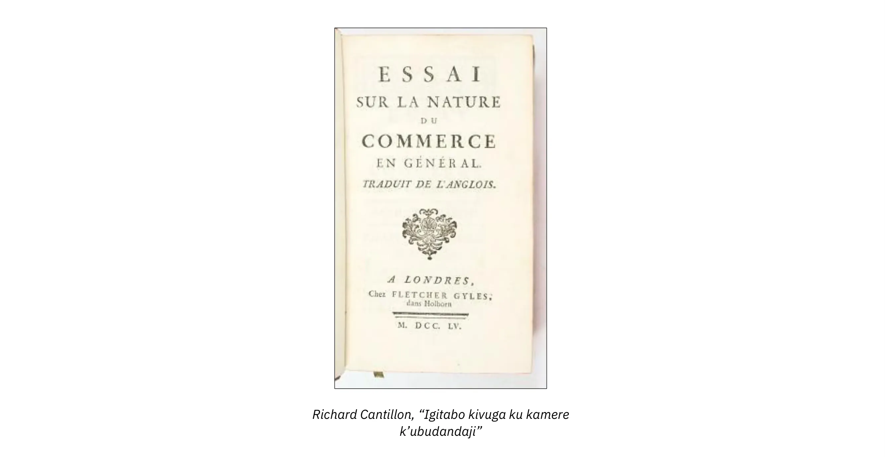

L’Ami des Hommes mu ntango yari ivuzwe nk’igisobanuro coroshe c’Inyandiko ya Cantillon. Ariko kuko Mirabeau yari afise ubwenge bumwe bumwe, ni ukuvuga, mu kuvuga ukuri, yari umusazi gatoyi, yaciye yihuta guheba umugambi wiwe w’intango. Ico gitabu kivuga gusa ibibazo vyose vy’ubutunzi yari azi, rimwe na rimwe akava kuri Cantillon. Ni igitabu kigoye gusoma, gifise umugambi udasanzwe n’ugukevya mu kigabane cose. Mirabeau ubwiwe yaremeye ko ari akajagari kandi ko uburyo bwiwe bwo kwandika bwari ubw’iherezo ry’isi.

Naho ari akajagari, hari ivyiyumviro bibereye kwitwararikwa:

- Mirabeau arwanya urwanko rw’abacuruzi ku bijanye n’ingene ubutunzi bumeze.
- Arashimagiza uburimyi, akanegura no kubuheba.
- Yidoga ku kuntu abantu bameze, cane cane abarimyi.
- Ubwa nyuma, araburanira umwidegemvyo wo gucuruza n’ubuvukanyi bw’amahanga mu mahoro.

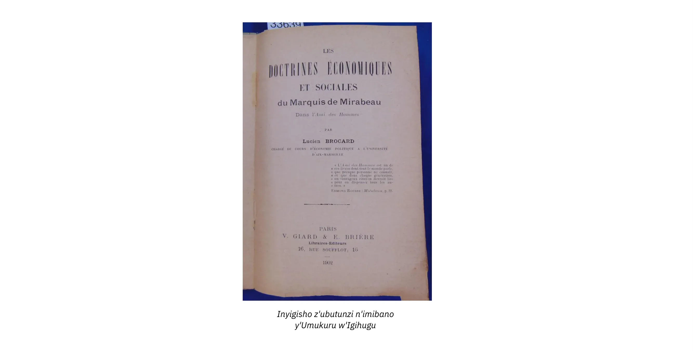

Ni Hard gushiramwo ivyiyumviro vya Mirabeau ko ari ivy’uburenganzira canke ivy’uburenganzira. Akenshi yaragendagenda, rimwe na rimwe ataco abizi, hagati y’iyerekwa rimwe n’irindi. Naho ari ukwo, ivyiyumviro vy’ukwidegemvya ni vyo kenshi vyari vyiganje mu vyo yandika. Imwe mu mirongo yiwe izwi cane ni iyi:

> Ingingo ngenderwako y’ukuri kandi yonyene y’ubutunzi bwa politike ni ukureka vyose bikagira umwidegemvyo.

Kubera ko Mirabeau yari amaze kuroranirwa cane, yarakundanye. François Quesnay, uwari ahejeje gukunda ivy’ubutunzi, yaramutumiye ku kibanza ciwe co gukoreramwo i Versailles.

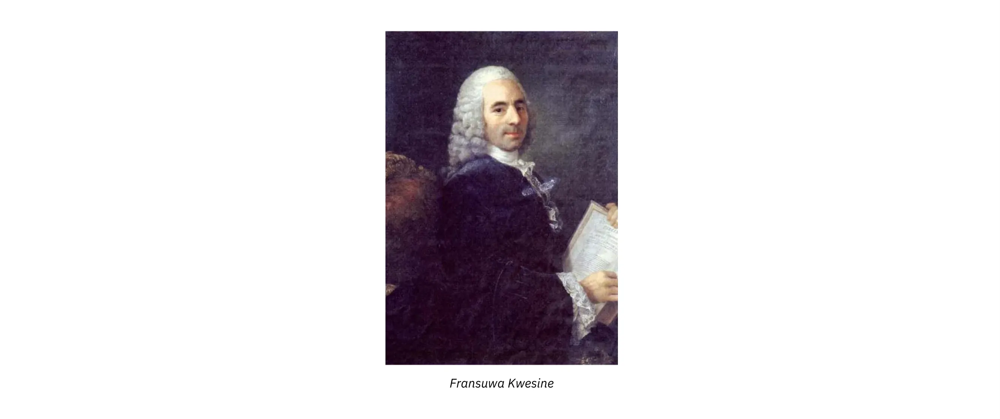

Baciye baharira n’ishavu ryinshi maze amaherezo, ikintu mu bisanzwe kitari bwigere kiba mu mpari, kiraba: Mirabeau yaremeye ata gufyina ko yari yibeshe. Yaremeye ivyiyumviro vya Quesnay, avuga ko yiteguriye kubikwiragiza.

Bompi hamwe, ni bo bagize umushinge w’ishure ryobaye ishure ry’ubuhinga bwa none, rikomezwa n’abantu bahora bazana. Haciye igihe gitoyi Mirabeau ahindukiye, Quesnay yaramusavye ngo arwanire ivyiyumviro vyiwe ku bijanye n’imisoro. Ivyo vyatumye haba ["Ivyiyumviro vy'Imisoro"](Ivyiyumviro vy'Imisoro"], ivyo bikaba vyatumye Mirabeau arungikwa imisi mikeyi mw'ibohero ry'i Vincennes, hanyuma aja mu bunyagano i Bignon.

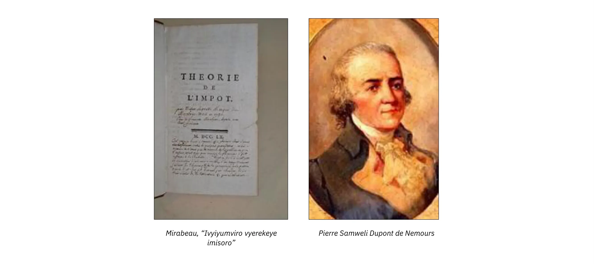

Mirabeau kandi yarafise uruhara runini mu gutora abashasha bo mw’ishure rya Quesnay. Yaranavyemeje uwo musore yitwa Dupont de Nemours.

Ni no kwa Mirabeau aho aba Fiziyokarate bahurira buri wa kabiri. Abantu nka Turgot na Adam Smith basa n’abaje muri ayo makoraniro rimwe canke kenshi.

Mu buzima bwiwe bwose, Mirabeau yagumye ari umwanditsi ataruha. Yanditse ibitabu vyinshi vyerekeye ubutunzi biburanira inyigisho ya Quesnay. Ariko rero, mu mpera z’ubuzima bwiwe, akosho yari afise karagabanutse. Uburyo bwiwe bwo kwandika bwarasenyutse ku buryo mwenewabo bwite yamundikiye avuga ko atagishobora gutahura amajambo yiwe. Ivyiyumviro vyiwe, bimaze kuba ivy’ukwidegemvya bimwe bishitse, vyahuye n’ingene abanyabwenge nka Mably mbere na Rousseau bavyifatamwo mu buryo bw’abanyagihugu canke b’abakomunisita. Yarananiwe kuronka abasomyi n’abasohora ibitabu, maze ahanini apfa ata wumumenye mu 1789, ku musi mukuru w’igihuhusi c’i Bastille.

## Ikibazo

<chapterId>7a35f20b-5ea0-544d-b290-bcd9c6f7f11a</chapterId>

François Quesnay ni umwe mu bahinga b'ubutunzi bazwi cane mu Bufaransa.

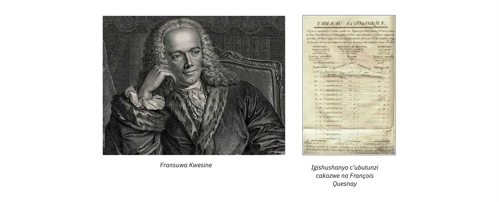

Izina ryiwe riboneka mu gitabu cose c’inyigisho z’ubutunzi n’amateka y’ivyiyumviro vy’ubutunzi. Bivugwa ko yaremye "Tableau Économique" kugira ngo aserukire ubutunzi mu buryo butegekanijwe, ko ari we yarongoye ishure ry'ubuhinga bwa none, kandi ko yihenze mu kwizera ko ubutaka bwonyene ari bwo butanga umwimbu, kandi ko mu nyuma, ko Adamu Smith yaje gugorora ivy'ubutunzi. Ivyo, cane canke bike, ni ko ibitabu vy’inyigisho bikunda gucapura mu ncamake François Quesnay.

Kumugabanya kuri ivyo ni isoni, kuko Quesnay na we nyene ni we muhinga mu vy’ubutunzi wa mbere yagerageje gushingira uburinzi bw’umwidegemvyo w’ubutunzi ku ngingo ngenderwako za siyansi. Yari umwe mu bahinga b’ubutunzi bumvirizwa cane kandi bafise akosho kanini mu gihe ciwe. Vyongeye, yashinze inyigisho y’ubuhinga bwa Physiocracy, iyo na yo ikaba ari inyigisho itunze cane kuruta iciyumviro coroshe c’uko kamere yonyene ari yo itanga ubutunzi, iciyumviro akenshi kivugwa nabi.

Tuzovuga ku vyerekeye Physiocracy mu buryo burambuye mu bice bitatu bikurikira. Reka tubanze twihweze neza François Quesnay ubwiwe.

Yavutse mu 1694 i Méré mu muryango w’abarimyi utashobora kwigisha Quesnay gusoma. Yamenyerejwe n’umugabo wo ng’aho, amaherezo aja kwiga mw’ishure ryisumbuye ry’ubuvuzi, hanyuma yiga mw’ishure ry’ubuvuzi. Igihe yari afise imyaka 24, yarabaye umuganga abaga i Mantes.

Yaramenyekanye cane mu 1730, afise imyaka 36, ​​kubera ko yarwanya umugenzo usanzwe wo gusesa amaraso, uwo yizera ko wari ushingiye ku vyiyumviro bitari vyo no ku kwiyumvira nabi abantu. Yarateye kandi ubwoba bwo gutera umugere urutonde rw’amashirahamwe, rwategeka ko abaganga bonyene ari bo bashobora kubaga, abaganga bonyene bakaba ari bo bashobora kwandika imiti. Ivyo kenshi vyatuma abakene bariha incuro zibiri maze bakazana abantu babiri, ivyo bikaba ari ibintu Quesnay yasanze biteye ubwoba.

Mu 1740, yarabaye umunyamabanga w’Ishure ry’Ivy’Ukubaga. Mu 1748, afise imyaka 54, yarabaye umuganga w’umuntu ku giti ciwe wa Madamu de Pompadour, aca yimukira i Versailles.

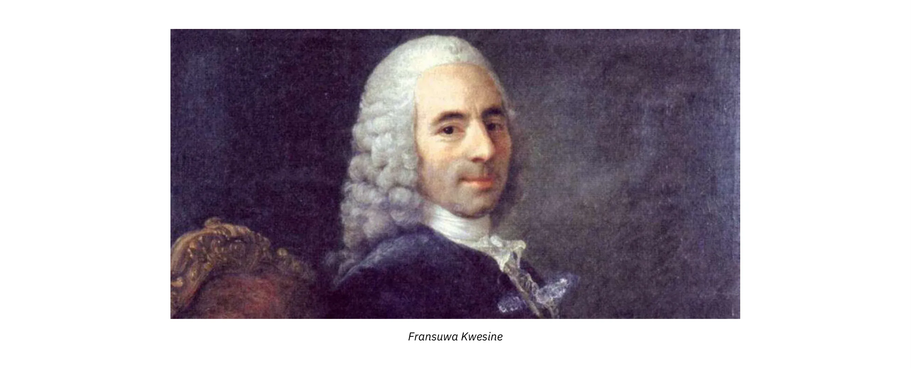

Yari hafi cane ya Madamu de Pompadour. Quesnay mbere yavuze, mu gihe isoni z’uwo mukunzi zamenyeshejwe, ko atazokwipfuza kuguma ari umuganga i Versailles ata we:

« Nari mfatanye na Madame de Pompadour mu guterimbere kwiwe, nzoba gutyo mu nsoni ziwe ».

Hanyuma asohora ibitabu vyinshi vy’ubuvuzi: Igitabu citwa Traité sur la suppuration (1749), Traité sur le gangrene (1749), na Traité sur le fièvres continues (1753), ivyo vyose bikaba vyasubiwemwo incuro nyinshi mu kiringo c’ubuzima bwiwe.

Ku myaka 60, amaze kumenya impaka z’ubutunzi zari ziri mu muco ico gihe, yaciye atangura kwandika ivyerekeye ubutunzi. Mu mwaka w'1755, yanditse ingingo "Abarimyi" na "Ingano" mu kinyamakuru *Encyclopédie*.

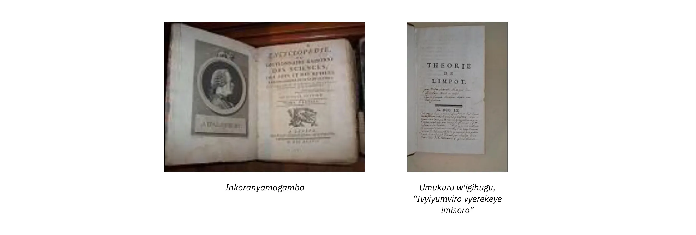

Zasohowe mu 1757. Muri uwo mwaka nyene, yarahuye na Mirabeau rurangiranwa maze arashobora kumuhindura mu vyiyumviro vyiwe vy’ubutunzi—ni ho havutse umushinge w’ubuhinga bwa Physiocracy. Quesnay yaciye akora igitabu citwa Tableau Économique, kikaba cacapwa ku mashini z’umwami, bivugwa ko cacapwe umwami ubwiwe ku ngoro y’i Versailles. Kuva ico gihe, yarakira ubudasiba abahinga mu vy’ubutunzi n’abanyabwenge mu nzu yiwe yo mu gisagara ca Versailles, aho bagira ibiyago ata co bibangamiye. Quesnay kandi yarafashije mu vyiyumviro vya Mirabeau vyerekeye imisoro, vyasohowe mu 1759.

Ivy’ugucengera ntivyatevye gutera. Mirabeau yarafunzwe, Quesnay na we arahanwa. Inyuma y’ivyo, Quesnay yarabonye ko adashobora gusohora ku mugaragaro kandi ko azokenera abigishwa kugira ngo bakwiragize ivyiyumviro vyiwe.

Yaciye abaronka ningoga: Baudeau, Dupont de Nemours, Le Trosne, Mercier de la Rivière n’abandi. Abo ni bo bagabo bokwiragije no gukwiragiza iciyumviro ca Quesnay. Ariko rero, Quesnay, uwari akeneye abigishwa, ntiyanyuzwe bimwe bishitse n’umuce w’amadini wo mu mugwi wiwe. Nimwihweze amakete yandikiye Mirabeau, aho amubwira ati:

> "Nimwiyumvire mwebwe nyene. Nabonye ko ivyiyumviro vyanje bibabaje bituma mugira ubunebwe. Ubu ni mwebwe muzokwiyumvira. Murazi nk'uko nanje ndabizi".

Naho ari ukwo, abigishwa biwe bari bihebeye cane kandi barafashije cane kugira ngo Quesnay amenyekane cane. Mirabeau amaze gupfa, yaravuze amajambo yiwe yo gushima, ati: «Twaratakaje data, kuko twari tumufitiye umwenda wa vyose». Mu vy’ukuri, Quesnay ni we yari abafitiye umwenda wa vyose, kuko iyo ataba bo, yari kuguma ahagaze i Versailles, aho ivyiyumviro vyiwe, naho vyari bifise vyinshi vyo guhendahenda canke bitera amaganya, vyari bishimishije bake.

Kubera ibikorwa vy’abo bakorana, ivyiyumviro vyiwe vyaronse urubuga: ubwa mbere biciye mu binyamakuru nka *Ikinyamakuru c’Uburimyi* na *Ephémérides du Citoyen*.

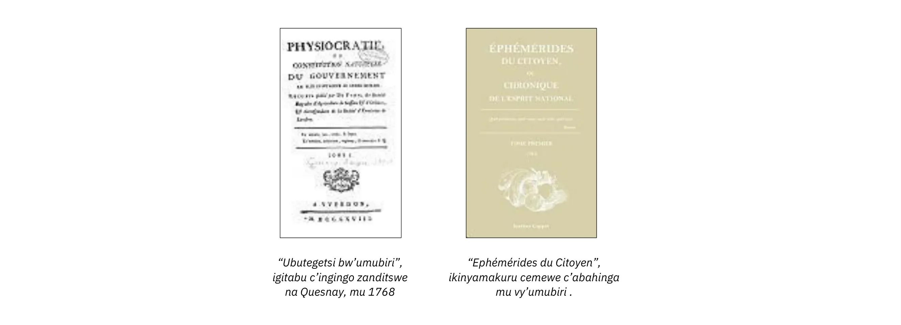

Hanyuma biciye mu bitabu, atari ivy’abigishwa biwe gusa ariko n’igitabu gihambaye casohowe mu 1768 na Dupont de Nemours, citwa *Physiocracy*.

Ico gitabu carakoranije intererano nyamukuru za Quesnay. Yashizeho iciyumviro c’ubutunzi c’umurongozi w’aba Physiocrates: akarorero k’ubutunzi bw’uburimyi aho itegeko ryemeza umuntu wese uburenganzira bwo kugira umutungo n’umwidegemvyo wo gucuruza.

# Ishure ry'ubuhinga bw'umubiri

<partId>27af82c1-ad82-5c3b-8ce9-c674b67bbf7c</partId>

## Amateka y'abanyafiziyokarate

<chapterId>4236ff8b-b53a-59e7-92c0-f96f9afa1c00</chapterId>

Ubutegetsi bw’umubiri bwaciye buba umuco mu Bufaransa, eka mbere no mu Buraya bwose, mu myaka cumi gusa. Inyuma y’igihe kirekire c’iterambere, ryaciye rimenyekana hagati mu myaka ya 1760. Igihe Turgot yaza ku butegetsi mu 1776, uwo muhari wari umaze gutakaza ukumenyekana kwawo, kandi uwo mushikiranganji yagumye ashigikira ishure rya Quesnay ahanini yihishije.

Inkomoko yayo iri mu gutera imbere kw’ivyiyumviro vy’ubutunzi mu myaka ya 1750. Abanditsi benshi barafashije gukuraho ikinogo cari hagati ya Boisguilbert n’ico caje kwitwa Physiocracy. Nk’uko twabibonye mbere, Vincent de Gournay n’umugwi wiwe w’abahinga mu vy’ubutunzi ni bo bari inyuma y’ibitabu vyinshi vyamenyesheje abasomyi b’Abafaransa ivyiyumviro vy’ubutunzi bw’amahanga, bigatuma bakunda cane ubutunzi. Ishingiro ry'ubutegetsi bw'umubiri ryari risanzwe riri mu bitabu nka "Détail de la France" vya Boisguilbert na ["Inyandiko ku kamere k'ubudandaji muri rusangi"] vyanditswe na Cantillon.

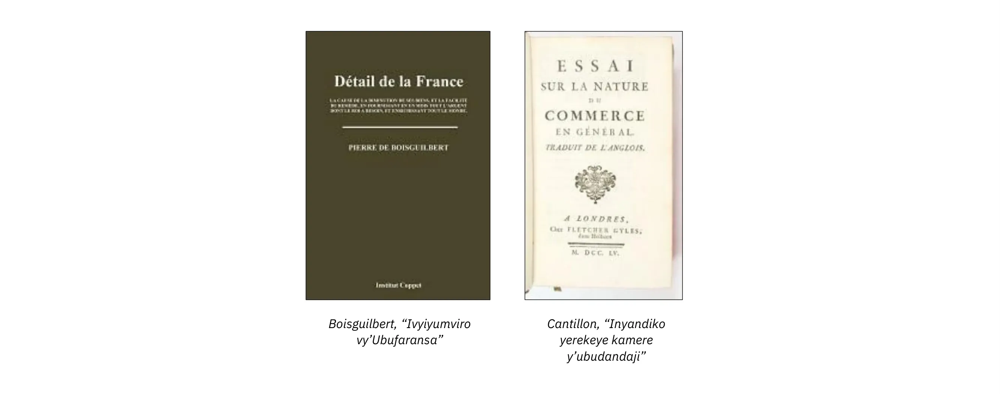

Iciyumviro co kurekura uburenganzira bwa muntu cari gifise ababuranira benshi kuva kuri Boisguilbert, cane cane Vincent de Gournay na Marquis d’Argenson.

Icasigaye ni uguhindura iyo nzira y’ivyiyumviro ngo ibe inyigisho ihuye kandi yuzuye, kandi Marquis de Mirabeau ni we yabanje kugerageza. Yahumekewe n'igitabu ca Cantillon citwa Essay, aca atangura kwandika igitabu gikomeye cane ku bijanye n'ubutunzi citwa "L'Ami des Hommes", kikaba carakunze cane.

Gutyo, mu 1756, inkuru ya Fiziyokarasi yarashobora gutangura. François Quesnay, uwo gihe yari umuganga abaga, aca aba umuganga w’umuntu ku giti ciwe kuri Madamu de Pompadour, yaratumiye Mirabeau i Versailles kugira ngo baganire ku vyiyumviro vy’ubutunzi.

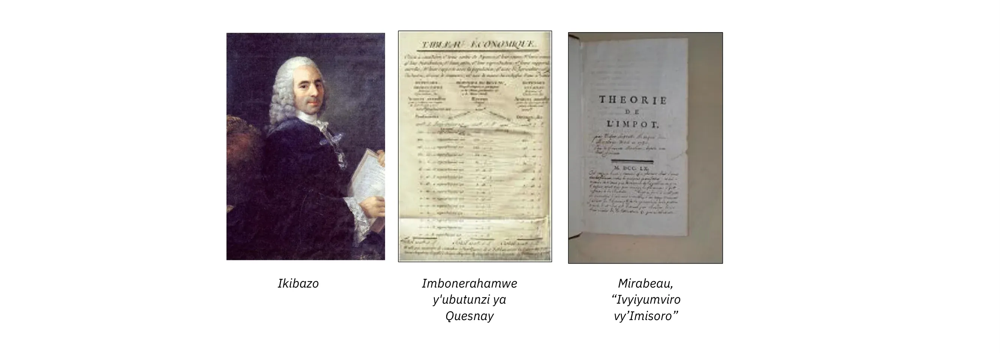

Igihe ikiyago cabo cari kirangiye, Mirabeau yaremeye ivyiyumviro vya Quesnay. Kuva ico gihe, barandika bati: Quesnay yararemye *Tableau économique* (1758) kugira ngo yerekane ingene ubutunzi bugenda mu bukungu, maze bose hamwe barasohora igitabu citwa Theory of Misoro (1759).

Utwigoro bagize ntitwakiriwe n’igishika. Ku rubanza, ukuntu abantu benshi bavyifatamwo kwari ukutagira ico bitaho. Umwami yaremeye ko Quesnay akunda cane inyigisho, aca amwita "umunyavyiyumviro wanje". Ariko uretse iyo nkuru nziza, igikorwa cabo ntaco cavuyemwo. Nkako, iyo nyigisho yabo y’imisoro yarababaje abarongozi b’imisoro yanegura, ku buryo basaba ko Mirabeau afungwa kandi baramuha umutekano. Madame de Pompadour amaherezo yaramurekuye, ariko abandanya kuba mu bunyagano mu nzu yiwe i Bignon, amara indwi nkeyi.

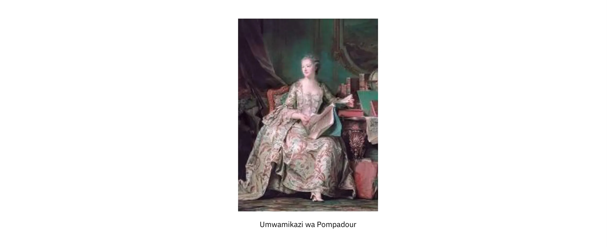

Igice ca mbere c’imyaka ya 1760 rero caraciye mu gacerere gatoyi. Kubera ikibanza yari afise i Versailles, Quesnay yaciye ategekwa guhagarika kwandika, canke n’imiburiburi ntaco asohora mw’izina ryiwe bwite. Mirabeau, yari amaze gucirwa urubanza rimwe, yaragabishijwe kandi yari azi neza ko uwo umwami yakunda atashobora kumukingira ibihe bidahera.

Inyuma y’ukwo guceceka gutoyi, abo bahinga babiri b’ubutunzi batangura gutora abigishwa: ubwo ni bwo buryo bwonyene bwo gukwiragiza ivyiyumviro vyabo. Mu 1765, ivyo baroraniwe vyari bitangaje cane. Dupont de Nemours, Abeille, Mercier de la Rivière, Le Trosne na Baudeau baciye bihuta kwifatanya na bo. Bashinze ishure: bari bafise ikinyamakuru cabo citwa *Les Éphémérides du Citoyen*, mbere barahura buri wa kabiri kwa Mirabeau.

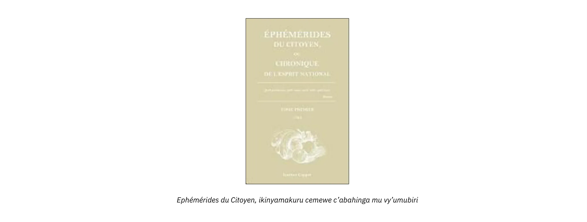

Hagati y’umwaka wa 1765 n’uwa 1775, uwo mugwi w’abafiziyokarate bari kumwe wari uhagaze ku rwego rwo hejuru rw’icubahiro cabo. Isi y’ubuhinga n’ubuhinga bwa filozofiya yari ifise amaso kuri bo gusa, ivyo bikaba vyatuma ivyiyumviro vyabo bikwiragira cane kandi vyihuta. Abantu babita "abahinga mu vy'ubutunzi", canke, mu gutwenga, "umuhari w'abahinga mu vy'ubutunzi". Utitaye ku ijwi ryabo, ukumenyekana kwabo kwari gukomeye cane. Mu mwaka w’1774, amaze gukora urugendo rwo kuja i Metz, M. de Vaublanc yanditse ukuntu yatangaye mu bitabu vyiwe vy’ivyiyumviro: abantu bose bari bamukikuje bariko bavuga ivy’ubutunzi n’uguzirikana nk’abigishwa ba Quesnay. "Byari umuderi", niko yavuze. "Bose bari abahinga mu vy'ubutunzi".

Ariko rero, mu 1770, ukumenyekana kwabo kwaratanguye kugabanuka. Iryo tsinda ryarashikiwe n’uguhunga kwaryo kwa mbere, kandi ubushobozi bwabo bwo kwihanganira ukunegurwa bwaracitse intege. Kandi abanegura bari benshi, Condillac, Mably, Voltaire, Galiani, Linguet, Graslin, mbere na Adam Smith wo muri Ecosse, bose bararwanya ivyiyumviro vyabo.

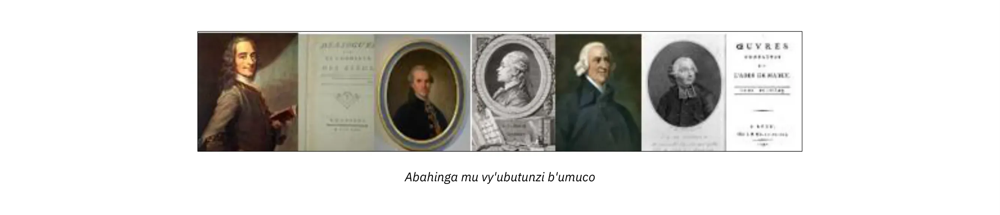

Ikinyamakuru cabo nticari kigisohoka ubudasiba. Ivyo ni vyo vyabaye iherezo ry’igihe uwo muhari wariko urakora cane.

Ubutegetsi bw’umubiri bwobandanije kugira akosho gushika mu gihe c’Impinduka. Mu Bufaransa, ubwa mbere biciye kuri Turgot, umugenzi mugenziwe kuruta umwigishwa, be no biciye ku muserukira wayo Dupont de Nemours, ubuzima bwiwe n’ibikorwa vyiwe tuzovyiga mu nyuma. Ariko no mu Buraya bwose, aho inyigisho y’ubutegetsi bw’umubiri yakiriwe n’igishika. Mu Budagi, biciye kuri Margrave w’i Baden, no mu Butaliyano, biciye kuri Leopold w’i Toscane, inyigisho z’ubutegetsi bw’abantu mbere zatumye habaho amahinduka mu vy’ubutunzi ashigikira umutungo w’abantu ku giti cabo be n’umwidegemvyo.

## Ishingiro ry’inyigisho y’abanyafiziyokarate .

<chapterId>4dbe5436-0578-57c2-b054-03ed00aa091a</chapterId>

Ijambo Physiocracy, risobanura "intwaro ku kameremere", ryaciwe na Dupont de Nemours rikoreshwa nk'izina ry'igitabu *Physiocracy*, igitabu c'ingingo za Quesnay zasohowe mu 1768.

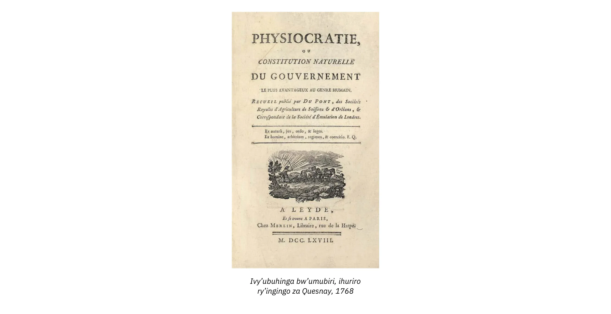

Iryo ni ijambo ridatomoye. Nta munyeshure wo muri Quesnay yaduhaye insobanuro yayo nyakuri. Naho ari ukwo, urutonde rwabo rw’ivyiyumviro rwari kure cane y’ugutahura. Nkako, ryubatswe ku ngingo ngenderwako nkeyi zitomoye cane, izo tuzozivuga ngaha.

### Iciyumviro ca mbere: uburimyi bwonyene ni bwo butanga umwimbu

Ico ciyumviro ca mbere ni co cateye umutima abahinga mu vya kahise. Ubu, mu bitabu vy’inyigisho canke mu vyigwa vy’ubutunzi, ni ko aba Physiocrates bavugwa mu ncamake. Bivugwa ko barizera ataco bazi ko uburimyi bwonyene ari bwo butanga umwimbu. Kuri ivyo, inyigisho yabo irakurwaho nk’iyitagira akamaro, maze isesengura rikaja kuri Adamu Smith.

Ariko rero, ntibibereye kunegura aba Fiziyokarate ko baha agaciro kadasanzwe uburimyi, kuko hagati mu kinjana ca 18, uburimyi bwakoresha 90% vy’abanyagihugu, kandi ni bwo bwari umushinge w’ubutunzi bw’Ubufaransa.

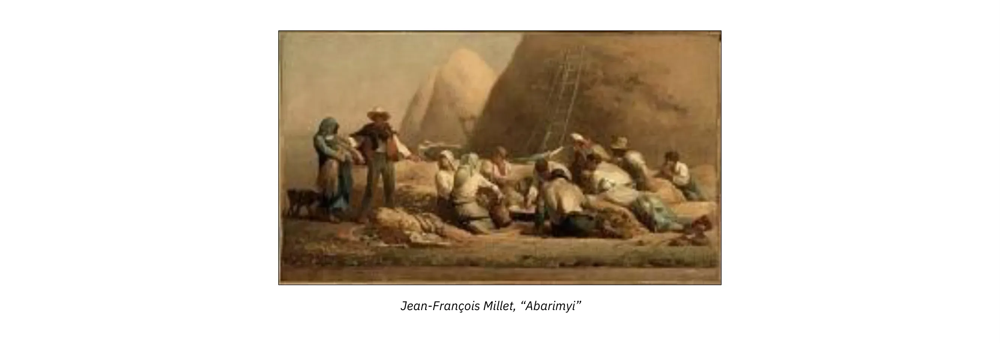

Iciyumviro c’Abafiziyokarate mu vy’ukuri ni ikintu giteye ubwoba. Nk’uko babivuga, hariho itandukaniro hagati y’uguhingura n’uguronka inyungu. Umunyabuhinga n’umucuruzi bashobora kuronka inyungu, ariko umurimyi ni we wenyene atanga vy’ukuri, kuko guhingura ni uguhingura ibintu vy’ingirakamaro, aho kwongera akamaro ku bintu vyariho mbere.

Turakwiye kandi kugerageza gutahura igituma banse inganda n’ubuhinga nk’aho ata co bimaze. Iciyo gihe, ivyo bikorwa vy’ubudandaji vyari bifunzwe mu rwego rw’amashirahamwe, ivyo bikaba vyari bibujije gukora ibintu bishasha, gushiramwo amahera no gutera imbere.

### Ingingo ya kabiri: ubutegetsi bw’agahomerabunwa bushingiye ku mategeko aho kuba demokarasi .

Uyu musi, kugira umuntu atuke, tuvuga ngo si umudemokrate. Naho abahinga mu vya kahise bababarira Abafiziyokarate iciyumviro cabo gikomeye ku bijanye n’umwimbu w’uburimyi, ntibababarira ukuntu barwanya demokarasi, cane cane ko babayeho mu gihe ivyiyumviro vy’Umuco vyari biteye imbere cane. Kuva hagati mu kinjana ca 18 gushika imbere gato y’Impinduka, Abafiziyokarate babonwa ko ari abansi b’iterambere.

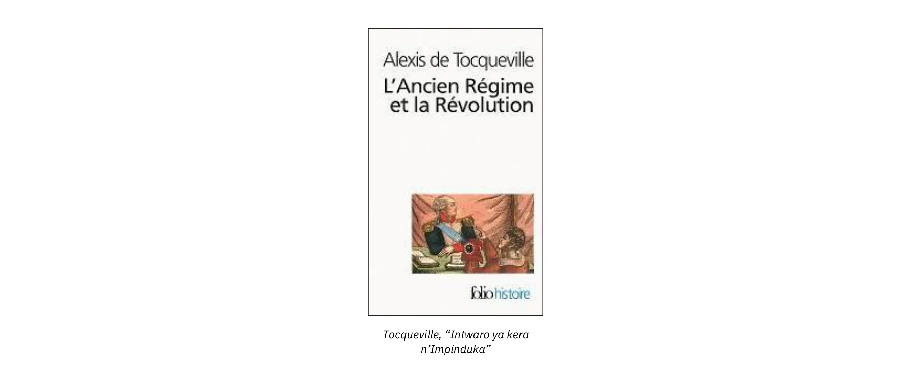

Tocqueville yashimikiye kuri ico ciyumviro:

> Abafiziyokarate bari vy’ukuri bakunda cane ubudandaji bw’ibintu ataco buvuze, laissez-faire canke laissez-passer mu bucuruzi no mu nganda; ariko ku bijanye n’umwidegemvyo wa politike ukwiye, ntibawuzirikana, mbere n’igihe mwene ivyo vyiyumviro vyashika bikajabuka mu muzirikanyi wabo, mu ntango baravyanka.

Abafiziyokarate rero bari bafise umwidegemvyo mu vy’ubutunzi, ntibari bafise umwidegemvyo mu vy’ubutegetsi. Quesnay yanditse mu *maxims* yiwe ati: "Ubutegetsi bw'agahebuzo bube ubwihariye kandi burengeye abantu bose bo mu kibano n'ibikorwa vyose bitari vyo vy'inyungu z'abantu ku giti cabo." Kandi mu nyuma, muri iyo nkuru nyene: «Uburyo bwo kugenzura no gucungera ubutegetsi ni iciyumviro gitera urupfu, kigaragaza gusa ukutumvikana hagati y'abakuru n'uguhahaza abato».

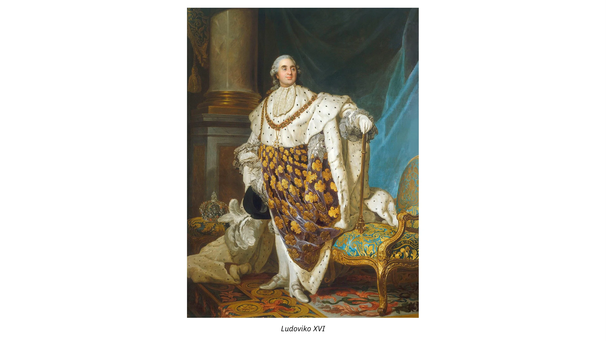

Tocqueville yaravuze neza yuko Abafiziyokarate banse demokarasi bakibona uburyo bwayo. Bari bafise amakenga kuri demokarasi, iyo demokarasi yobaye ikintu kidahinduka mu bukungu bwa politike bw’Ubufaransa, kuko demokarasi iri kure y’uburyo butunganye: ishobora kwemera ko abantu batobato bahahazwa n’abantu benshi, kandi ishobora kuba igikoresho co kwigarurira, ububisha, no gusahura.

### Ingingo ya gatatu: kwubahiriza ata gukeka umutungo w’umuntu ku giti ciwe

Abanyafiziyokarate bemera ko abantu bakeneye kugira ivyo bavuye mu bikorwa vyabo no kubizigama. Mu vyiyumviro vyabo, uburenganzira bwo kuronka itunga ni bwo bwari umushinge nyawo w’ikibano. Biyumvira ko Leta ifise igikorwa kimwe nyamukuru: ni ugukingira ivy’abantu. Ikindi kandi, mu vy’ubutunzi, aba Physiocrates bemeza ko ukudashobora guhungabanywa kw’itunga biremesha igikorwa n’inguvu kandi ko ari ikintu gikenewe kugira ngo ubutunzi butere imbere.

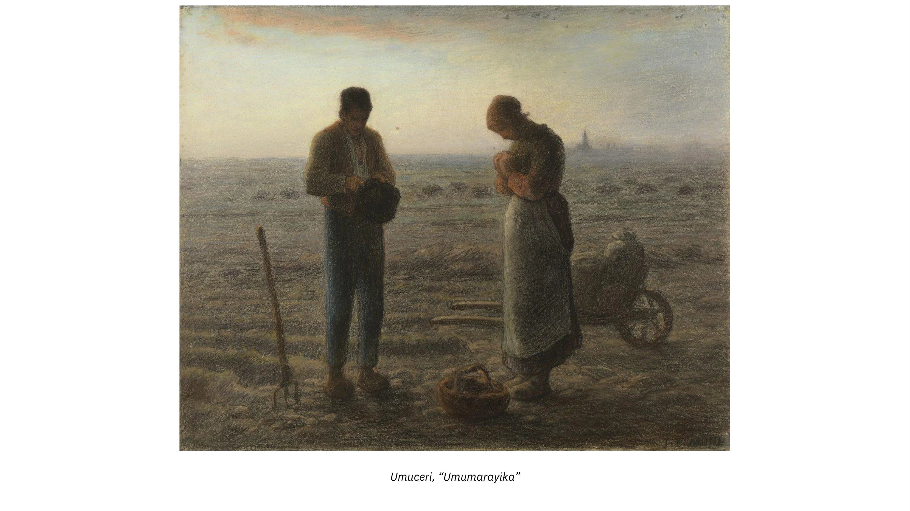

Quesnay yabivuze mu buryo bworoshe ati:

> Reka Ownership y’ubutaka n’ubutunzi bwimukanwa yizezwe n’abayifise mu buryo bubereye, kuko umutekano w’itunga ari wo mushinge w’ingenzi w’urutonde rw’ubutunzi n’umutekano w’ikibano; ni ukudakeka ko umuntu afise ubutaka ubudasiba biremesha gukora cane no gukoresha ubutunzi mu gutegura no kurima ubutaka, no mu bikorwa vy’ubudandaji n’inganda.

### Ingingo ya kane: umwidegemvyo w'ubudandaji

Mu gitabu ciwe *Maxims* twamaze kuvuga, Quesnay avuga ati:

> Habeho umwidegemvyo wuzuye w’ubudandaji, kuko amategeko yizigirwa, atomoye kandi afise akamaro kuruta ayandi yose yerekeye ubudandaji bwo mu gihugu no hanze y’igihugu no kuri Leta ari mu mwidegemvyo wuzuye wo guhiganwa.

Abafiziyokarate bari babonye ingorane zatewe n’ukuntu Leta yivanga mu vyo gukora, cane cane mu bijanye n’ubudandaji bw’intete. Umuntu ategerezwa kwemera, bavuga, ko ubutegetsi butazokwigera bushobora gucunga neza ubudandaji nk’uko abantu ku giti cabo babigira, kuko bwokenera kwishura ku bikenewe vyose no kwishura ku mpinduka yose y’ivyo umuntu asaba canke Supply. Ivyo vyose birarengeye kure n’iyo ubushobozi bw’intwaro y’ubwenge kuruta izindi zose umuntu yokwiyumvira. Ni ngombwa rero kureka ibintu bikabaho kandi bikareka bikagenda.

Kubera ko ubudandaji bufise akamaro mu kameremere, butegerezwa kuba ubw’ubuntu bwose kandi butagira agasembwa. Umwe mu bagize umurwi wabo, Le Trosne, mbere yaranditse agatabu kavuga ngo [*Umwidegemvyo w’ubudandaji bw’intete: Buma ari ngirakamaro, ntibugira akamaro*](https://www.institucoppet.org/liberte-commerce-intete-tour-utile-jamais-nuisible/).

### Iciyumviro ca gatanu: Abagabo bose ni abavukanyi .

Abafiziyokarate barwanya cane ubuja, na bo nyene bari abakunda amahoro bakomeye. Mirabeau yavuze gusa ati: «Ingingo yacu y’ububanyi n’amahanga yitwa amahoro». Mu 1790, mw’Inama Nshingamateka, Dupont de Nemours yarabandanije iyo ngingo y’uguharanira amahoro igihe yatanga itegeko ribuza intambara zitera.

## Ivyo aba Physiocrates bashitseko n'ivyo bakoze

<chapterId>5b911105-796a-5e2e-a501-c7a364fc758e</chapterId>

Nk’uko twabibonye mu kigabane ca mbere mu bigabane bitatu vyerekeye aba Fiziyokarate, abayoboke ba Quesnay bose ni bo bari abashavu mu Bufaransa mu myaka nk’icumi. Uwo mutima wo gukunda ivyiyumviro vyabo warateye imbere mu bihe vyabo, kandi warabandanije gushika mu mpera z’ikinjana. Aha, turaza kuraba bimwe mu vyo bagezeko n’ingene bagize ico bakoze ku babakurikiye mu bijanye n’ivyiyumviro vy’ubutunzi.

Ico bashoboye gukora cane, bakurikije umugwi wa Gournay, ni ugukwiragiza ivyiyumviro vy’ubutunzi. Imvugo izwi cane ya Voltaire irazwi cane: nko mu 1750, ihanga, ryari ryuzuye imivugo n’ibitabu, ryaratanguye gutekereza ku bijanye n’intete. Abafiziyokarate bari muri uwo muhari, barasohora amajana n’amajana y’ingingo, udutabu n’ibitabu vyerekeye umwidegemvyo w’ubudandaji bw’intete. Inguvu zikomeye aba Physiocrates bahaye ibiganiro vy’ubutunzi ziraboneka kandi mu mubare munini w’ibitabu vy’ubutunzi n’udutabu twasohowe mu Bufaransa kuva mu 1760 gushika mu 1775. Nk’ikindi kimenyamenya c’uko ivyiyumviro vy’ubutunzi vyakwiragiye mu Bufaransa, umuntu aribuka amajambo ya M. de Vaublanc yavuze mu mwaka wa 1760. nta kindi yavuga atari ubutunzi. Ati: «Ni co cari umuderi». "Bose bari abahinga mu vy'ubutunzi".

Ugukingira ivyiyumviro vyabo, mu bitabu, mu dutabu, no mu kinyamakuru cabo *Les Éphémérides du Citoyen*, vyaciye bigira ingaruka vuba ku bijanye n’ubutunzi bw’Ubufaransa. Mu 1763, harasohotse itegeko ryaha umwidegemvyo wo gucuruza intete, ivyo Quesnay na Mirabeau bari barasavye cane. Incuro nyinshi, abategetsi bararoroheje kandi amabwirizwa agenga amashirahamwe y’ubudandaji kugira ngo umuntu agire umwidegemvyo mwinshi wo gukora.

Mu mahanga, ukuroranirwa kwaje kare cane. Mu Budagi, Margrave w’i Baden yarashimishijwe n’ivyiyumviro vy’ubuhinga bw’ivy’umubiri kandi yaraguma yandikirana na Mirabeau na Dupont de Nemours.

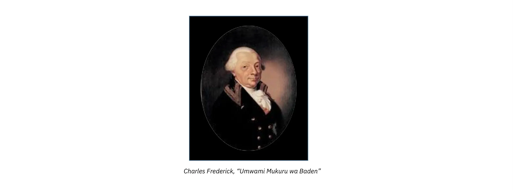

Yaciye ashinga umuhinga mu vy’ubutunzi yitwa Johann August Schlettwein, umuhinga mu vy’ubutunzi yizigiye, gushitsa ivugurura ry’imisoro no gutuma ubudandaji bw’intete bugira umwidegemvyo. Muri Ndamukiza 1770, urubanza rwa mbere rwaciwe mu gasagara gatoyi kitwa Dietlingen. Abanyagihugu basa n’abakiriye neza izo ngingo n’igishika, ariko abayobozi bari bajejwe ntibazishigikiye cane, ivyo bikaba vyatumye ziteba gushirwa mu ngiro mu buryo bwagutse.

Mu Burusiya, Catherine II yariko arategura guhindura amategeko, aca asaba Diderot kumurungikira ubwenge buteye igomwe kugira ngo amufashe.

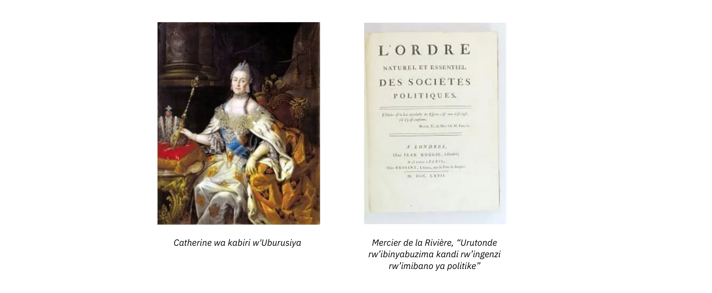

Yatangajwe n’ugusoma igitabu [*Urutonde rw’ibinyabuzima n’ivy’ingenzi rw’imiryango ya politike*](https://archive.org/details/lordrenaturelete00mercuoft), casohowe mu 1767, aca amurungikira umwanditsi waco, ari we munyabwenge w’ivy’umubiri Mercier de la Rivière.

Naho yavuye mu Bufaransa ahimbawe, ukwakira i Saint-Pétersbourg kwari gukonje (imihindagurikire y’ikirere ku ruhande), kandi Umwamikazi yaramuhemukiye.

Muri Suède, bari kumwe na Gustav wa gatatu, no mu Butaliyano, bari kumwe na Léopold wa Toscane, Abafiziyokarate na bo nyene bararonse abayoboke biteguriye gushira mu ngiro ivyiyumviro vyabo.

Mu Bufaransa, aba Physiocrates bararoraniwe cane igihe Turgot yashirwaho ngo abe Umugenzuzi Mukuru w'Ivy'Imari mu 1774.

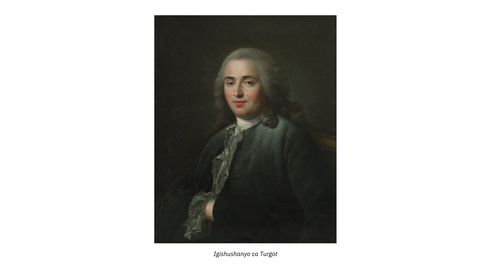

Kubera ko Turgot yari azi ko uruhara rwabo rwariko ruragabanuka, ntiyigeze yiyerekana ko ari umwigishwa w’intahemuka w’Abafiziyokarate, canke ngo abe umuhinga mu vy’inkoranyabumenyi, naho yari umwe muri bo, kandi kubera ko basuzugurwa n’abagize Ishengero ry’Idini. Turgot amaze ku butegetsi, yarasohoye amategeko atandatu azwi cane yari intango y’ugushira mu ngiro porogarama ya Fiziyokarasi: umwidegemvyo wo gukora ubudandaji, umwidegemvyo wo gukora, n’uguhagarika ubutegetsi bw’abantu bamwebamwe.

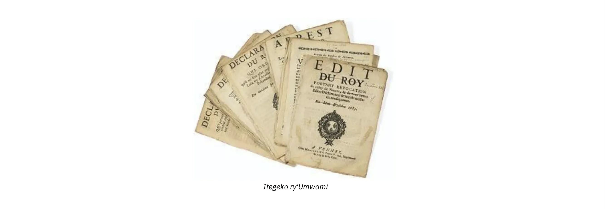

Mu gihe c’Impinduka y’Abafaransa, Abafiziyokarate bari bafise abayoboke bakeyi. Marquis wa Mirabeau yapfuye ku wa 13 Mukakaro 1789, ivyo bikaba vyari ikimenyetso nyaco. Abeille yari yaragiye imbere, ariko Dupont de Nemours yagumye ari umwizigirwa. Dupont de Nemours yashinzwe mu nama, yari afise ijwi rya Physiocracy, asaba ko habaho ivugurura ry’ubutunzi kugira ngo haboneke umutungo Ownership n’ubudandaji bwigenga.

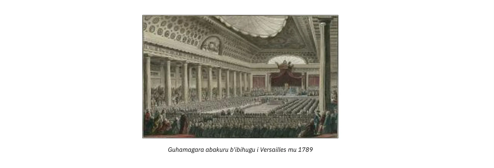

Yararwanye kandi, ataco ashoboye, n’abashinzwe. Naho ivyo vyananiwe, iciyumviro ca Fiziyokarasi caragumye kiriho cane mu mpari z’ubwenge kandi caragize ico gikoze ku vyo Impinduka yashitseko mu ntango. Nk’uko Joseph Rambaud yabivuze, ivyo Revolution yakoze vyose mu gushigikira umwidegemvyo vyari bivuye ku ba Fiziyokarate.

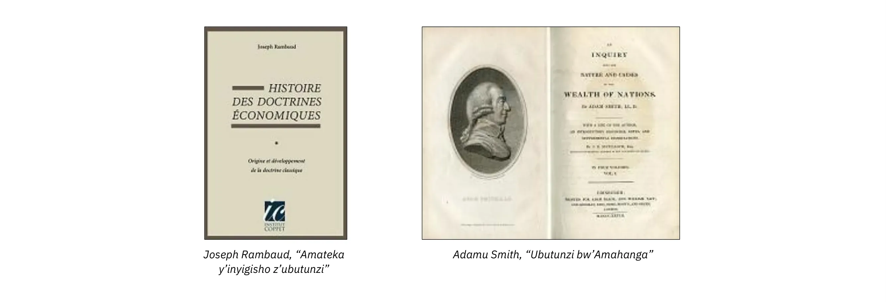

Abanyafiziyokarate na bo nyene baragize ico bakoze cane ku mateka y’ivyiyumviro vy’ubutunzi. Adamu Smith, yagendeye Ubufaransa maze ahura na benshi muri bo, yarakozweko cane n’igikorwa cabo. Yariyumviriye mbere no kwegurira *Ubutunzi bw'Amahanga* Quesnay.

Ikibabaje ni uko Quesnay yapfuye imyaka ibiri imbere y’uko igitabu ca Smith gisohoka, maze Smith akuraho iyo nzira yo kwegurira Imana. Naho Smith atemeranya n’iciyumviro cabo c’uko uburimyi bwonyene ari bwo butanga umwimbu, yakiriye imvo nyinshi zabo z’amasoko y’uburenganzira, arazijana imbere mu gikorwa ciwe bwite.

## Dupont de Nemours

<chapterId>6d585e0f-93b8-5b0a-a0a8-7f6e4a5bc68e</chapterId>

Muri Amerika, turazi neza ishirahamwe rya DuPont, rizwi kandi kw'izina rya "E.I. du Pont de Nemours and Company", ishirahamwe ry'ibihugu vyinshi mu vy'ubuhinga bwa shimi n'ubuhinga bw'ibinyabuzima.

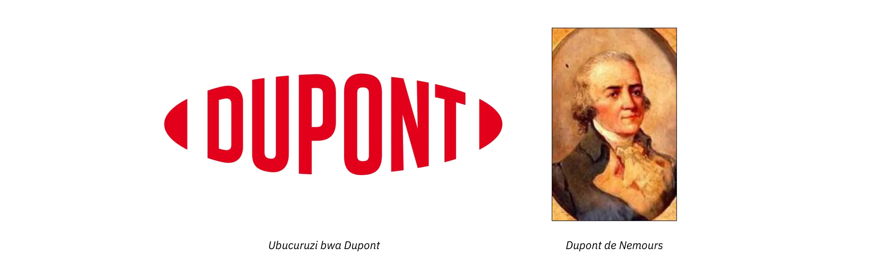

Muri iki gihe, igura amadolari arenga miliyaridi 35.000 kandi ikoresha abantu hafi 65.000 kw’isi yose. Bica bigaragara ko iyo sosiyete ifitaniye isano cane n’iherezo rya Samuel-Pierre Dupont de Nemours, umuhinga mu vy’ubutunzi w’Umufaransa wo mw’ishure ry’ubuhinga bw’umubiri.

Dupont de Nemours yavutse mu 1739, yegereye abahinga mu vy’umubiri afise imyaka 24. Ico gihe yari agironka inzira yiwe mu buzima. Umusi umwe, yarabonye agatabu kagufi kitwa Ubutunzi bwa Leta. Yasanze ivyiyumviro vyayo vy’ubutunzi ari ubujuju, aca yandika inyishu y’ugunegura yitwa Reflections on the Wealth of State, yasohowe mu 1763. Ico gice carakiriwe neza, abasomyi baragishima, bavuga ibintu nk’ibi: «Utegerezwa kuba umwigishwa wa Mirabeau!» Igiteye ubwoba ni uko Dupont mbere atazi uwo Mirabeau ari we.

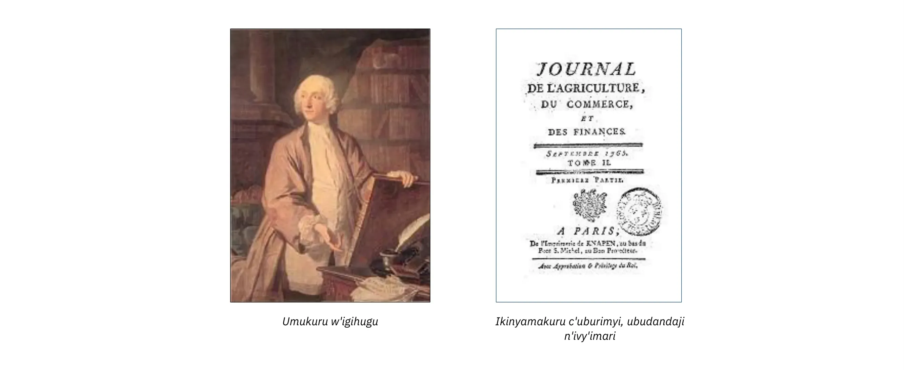

Kubera ko yari afise amatsiko, aca atangura gusoma igitabu ca Mirabeau, *Umugenzi w’abantu* na *Iciyumviro c’imisoro*. Yahuye na Mirabeau na François Quesnay, hanyuma yinjira mw’ishure ryabo.

Mu mwaka w’1765, Dupont yarahawe igikorwa co kuba umunyamabanga mukuru w’ikinyamakuru *Journal de l’agriculture, du commerce et des finances*, kikaba cari ikinyamakuru ca mbere co mu gihe caco mu vy’ivyiyumviro vy’ubutunzi.

Ivyo vyari bifise imvo zibiri: Mirabeau na Quesnay bategerezwa guceceka, Dupont na we abonwa nk’inyenyeri yabo iriko irakura.

Abagize ishure ry’ivy’umubiri baremera ko Dupont de Nemours yihuse kuba uwukundwa na Quesnay. Quesnay yigeze kuvuga ati: "Itwararike uyu musore, niwe azovuga nitwapfa". Umwe mu bari mugenziwe w’umunyaphysiocrate yitwa Abeille, mbere yaragira ishari n’ukuntu Dupont yamwitaho, aca yitandukanya n’ishure rya Quesnay.

Dupont de Nemours yama yubaha cane Quesnay.

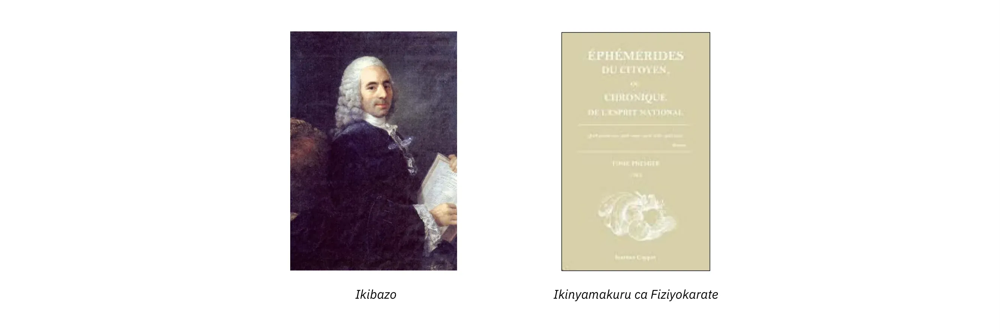

Mu nyuma yaravuze ati: "Nari umuhungu gusa igihe Quesnay yampa amaboko—yaranhinduye umuntu." Quesnay ni we yamugize umuhinga mu vy’ubutunzi mu vy’ubuhinga bwo kwandika muri ico gihe.

Inyuma y'ikinyamakuru c'uburimyi, ubudandaji n'ivy'amahera, Dupont yashinzwe kuba umunyamabanga mukuru w'ikinyamakuru *Les Éphémérides du Citoyen*, kikaba ari co cabaye uruganda rwemewe rw'abafiziyokarate.

Yaciye agira iyo nsiguro y’ibinyamakuru ikibanza nyamukuru c’inyigisho z’ubutunzi, arayishigikira no mu gihe c’ugusenyuka kw’abafiziyokarate mu kwandika ubwiwe hafi ibitabu vyose vyakurikiye. Dupont de Nemours ni we yashizeho ijambo "physiocracy", rikomoka ku majambo abiri y'ikigiriki asobanura "intwaro y'ibidukikije". Yakoresheje iryo jambo kugira ngo ashire izina ry’igitabu c’ingingo za Quesnay zasohowe mu 1768, maze amaherezo iryo jambo rirashinga imizi muri kahise. Birazwi ko muri bo, Abafiziyokarate bitana "abahinga mu vy'ubutunzi", kandi bari bakivugwa gutyo mu gihe c'Impinduka.

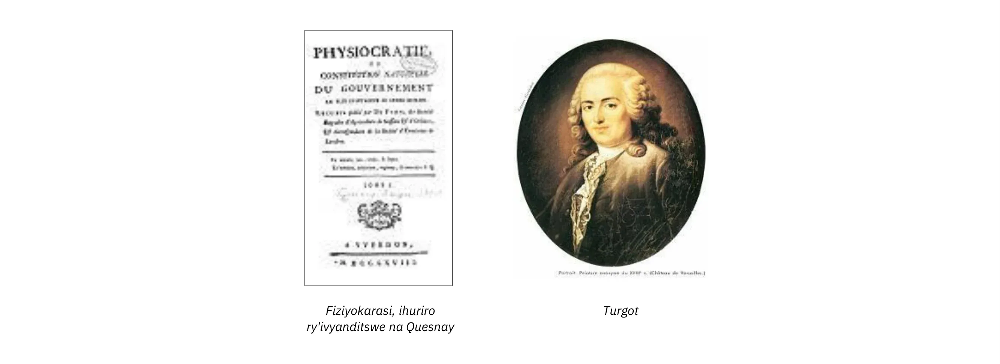

Igihe Turgot yari umushikiranganji w’ivy’ubutunzi mu Bufaransa mu gihe gito, Dupont ni we yabaye umujanama wiwe somambike, akaba ari we wenyene yari afise uburenganzira bwo kumubona, kuko Turgot yaguma ari kure y’abandi.

Mu gihe c’Impinduka, yatowe mu gisagara ca Nemours, aca asanga ari mu Nteko, aho n’uwundi Monsieur Dupont yari yicaye. Yaciye yitwa Dupont de Nemours, atari kubera yari umuntu w’icubahiro, ahubwo kugira ngo gusa atandukanye ivyo bibiri. Birumvikana ko iryo zina ryagumyeho.

Mu gihe c’Impinduka, muri Myandagaro 1792, yarafashe ibirwanisho kugira ngo arwanire Umwami ku kirimba ca Tuileries ku bantu benshi.

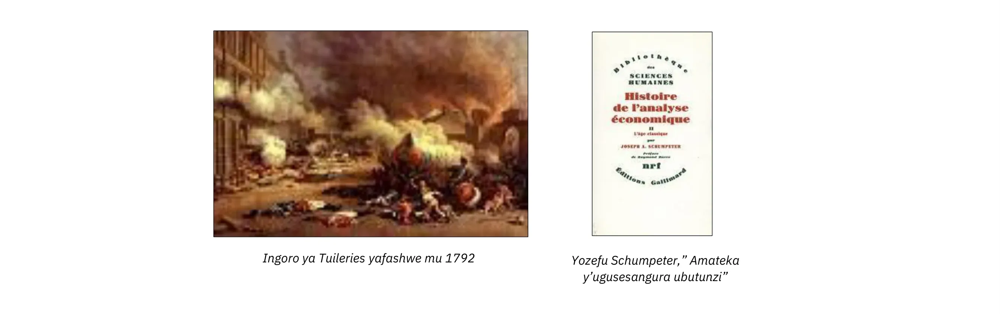

Umwami aramubwira ati: «Monsieur Dupont twama tugusanga aho ukenewe!» Amaze guhunga Iterabwoba ku gitangaro, acirirwa urubanza kandi arindiriye gukubitwa n’inkoni ariko akizwa n’ugugwa kwa Robespierre, yaciye asunikwa mu bunyagano mu gihe ca Napoléon, aronka umunezero muri Leta Zunze Ubumwe za Amerika, aho umwe mu bahungu biwe yashinze, afashijwe na se, ishirahamwe ryitwa Dupont.

Naho yari afise ubwo buzima bufise ibintu vyinshi, aho yasohoye ingingo, udutabu n’ibitabu vyinshi, gushika n’uyu musi ntamenyekana cane. Kumbure ivyo vyatumwe n’uko yagumye ari umunyafiziyokarate ashikamye igihe iyo nyigisho yari yacitse mu muco. Nkako, nk'uko Schumpeter yavyanditse, Dupont de Nemours yagumye ari umwizigirwa ku vy'ubuhinga bw'umubiri "mu myaka yose yamaze afise uturyo twinshi two kubuheba". Yari umuntu yizera ibintu.

# Umuco n'ubutunzi bwa politike

<partId>d1c885ad-7cb1-5f81-816c-be312719d9f8</partId>

## Voltaire n’abanyabwenge .

<chapterId>16bcf7bf-dad4-5113-8c64-2800f04ff07b</chapterId>

Ikinyejana ca 18 mu Bufaransa niho ubutunzi bwaseruka nk’ubuhinga n’ishure rya mbere ry’ivyiyumviro vy’ubutunzi: Physiocracy. Adam Smith yarize ubutunzi muri ico kiringo, kandi abahinga mu vy’ubutunzi b’Abafaransa baramenyekanye kw’isi yose nk’abarongozi. Ariko rero, iki kinjana cibukwa cane nk’ikinjana ca filozofiya kuruta ubutunzi. Naho umuhari wa Fiziyokarate wari uhuye, mu vyipfuzo vyawo, na filozofiya y’Umuco, inyifato z’abanyabwenge—na canecane Diderot na Voltaire—zirakwiriye gusuzumwa cane. Turabona ko abanyabwenge b’umuco bagize uruhara runini mu gukwiragiza iciyumviro c’ugurekura ivyo umuntu akora mu Bufaransa.

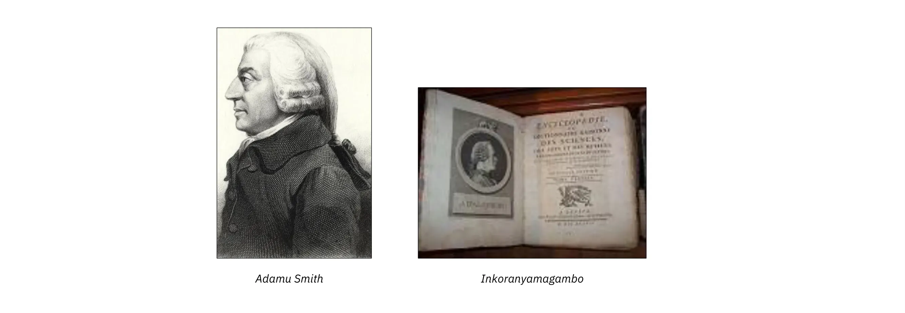

Ico filozofiya y’Umuco yashitseko izwi cane ata gukeka ni *Encyclopédie* ya Diderot na d’Alembert.

Birumvikana ko ingingo z’ubutunzi zanditswe n’abahinga mu vy’ubutunzi. Ku bitabu vya mbere, Diderot yahindukiriye Forbonnais, hanyuma akoresha abahinga mu vy'ubutunzi b'abanyagihugu: ubwa mbere François Quesnay (yatanze ingingo nk'iyi « Intete », « Imbuto », « Abagabo »—iya nyuma itasohotse), hanyuma Turgot (yanditse « Foires et marchés »). Ivyo vyanditswe birafise akamaro kanini cane. Mu ngingo ziwe, Quesnay yarashizeho umushinge w’ico cobaye inyigisho ya Fiziyokarasi. Ivyo biguma ari ibitabu vyiwe bizwi cane, hamwe n’ibitabu vyiwe *Tableau économique*. Turgot, uwari akiri muto ico gihe, yarateye imbere iciyumviro co kurekura ivyo umuntu akora mu kiganiro ciwe, anegura ukuntu Leta yinjira mu bijanye no gutunganya isoko.

Mu zindi ngingo nyinshi zo muri *Encyclopédie*, abanyabwenge cane cane Diderot, baraburanira iciyumviro c’umwidegemvyo mu bintu vyose: idini, politike n’ubutunzi.

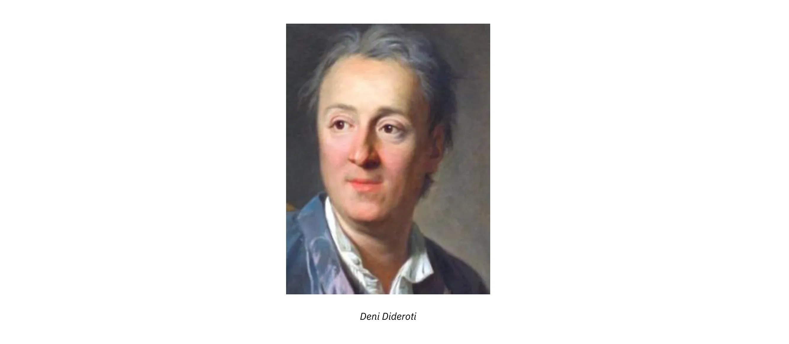

Umwidegemvyo wo gukora, cane cane mu kurwanya uburyo bw’amashirahamwe, wari insanganyamatsiko yasubiramwo mu bitabo bitandukanye nk’ivy’ubuhinga, Métier, na Communauté.

Inzira Diderot yaciyemwo mu vy’ubutunzi ni inzira y’ugushaka kumenya. Mu gitabu Encyclopédie, yari umuntu ashigikira cane umwidegemvyo mu vy’ubutunzi kandi ni we yarondeye gukorana n’abahinga mu vy’ubutunzi b’abanyagihugu, nk’uko vyemezwa n’ikete ryari ridondora ingingo Turgot yoshobora kumwandikira. Mu myaka ya mbere y’ubutegetsi bwa Physiocracy, yari umushigikiye n’uguteza imbere ishure rya Quesnay. Mu mwaka w’1769 n’uw’1770, yandikiye *Les Ephémérides du Citoyen*, ivyo bikaba vyababaje cane abagenzi biwe b’abanyabwenge barwanya uburenganzira bw’abantu, nka Melchior Grimm; ariko rero, ntiyatevye kwitandukanya n’uwo mugwi. Yaratangajwe n’ubwenge buteye umunezero bwa Abbé Galiani, aca amufasha gusohora igitabu ciwe kivuga ibijanye n’ubudandaji bw’intete mu gifaransa, igihe nyene Galiani yari agiye gusubira mu Butaliyano.

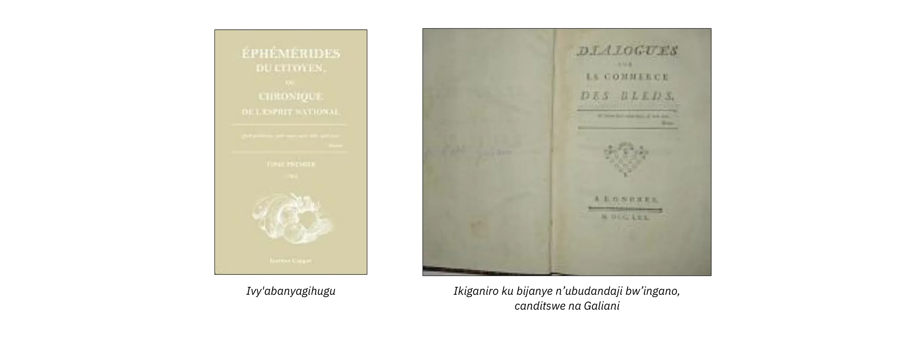

Ico gitabu cobaye igitero gikomeye kuruta ibindi vyose cakozwe ku vyiyumviro vya Fiziyokarate, kigatera igitero gikomeye uwo muhari. Mu nyuma, Diderot yaraburaniye Galiani kuri Abbé Morellet, umugenzi somambike w’abafiziyokarate, mu gitabu ciwe *Ugusaba imbabazi Galiani*. Haciye imyaka mikeyi, mu gihe c’ubusuku bwa Turgot, Diderot yarabonetse akoma amashi ku bijanye no gushinga umwidegemvyo wo gukora biciye mu gukuraho amashirahamwe y’abakozi. Muri ico gihe, Diderot, umuhungu w’umuhinguzi w’ibintu, yasanze yemeranya n’abahinga mu vy’ubutunzi b’abanyagihugu, aca yandikira Galiani ikete ribabaje, uwo na we akavuga ko umwidegemvyo wo gukora woshobora kwonona inganda z’Ubufaransa mu myaka mirongo ibiri canke mirongo itatu. Kubera ko hariho Impinduka y’Inganda, amateka yerekana ukundi. Diderot amaze gusubira ku ruhande rw’abahinga mu vy’ubutunzi b’abanyagihugu, ntiyasubiye kwizigirwa na bo, aca aguma yitandukanije n’abandi. Igihe kivuga cane ni ikete yoherereje Dupont de Nemours mu 1774, aho yanditse ati:

> "Wahora ungira ubugenzi; ubu ntugifise, kuko ufise vyinshi ukora ku buryo utagira umwanya wo gukunda umuntu n'umwe".

Voltaire na we nyene yarakurikiye inzira nk’iyo, irangwa n’ukudahuza mu vyiyumviro vyiwe ku bijanye n’ubutunzi. Yarashima cane Vincent de Gournay, yandikirana n’abahinga mu vy’ubutunzi (harimwo Dupont de Nemours na Turgot), kandi yarakengurukira cane abahinga mu vy’ubutunzi-na cane cane kubera ko bashima uburimyi. Yarabashimagije mu *Diatribe ku Mwanditsi w'ibitabu vya Ephémérides*. Ariko rero, mu nyuma yaraneguye iciyumviro cabo c’umusoro umwe w’ubutaka mu gitabu ciwe c’ugushinyagurira *The Man of Forty Crowns*, na co nyene kikaba caravyuriye impaka nyinshi. Ubwa nyuma, nka Diderot, yarahimbaje ubusuku bwa Turgot, abwita igihe c’inzahabu yongera ashimagiza amategeko yiwe abiri akomeye yerekeye umwidegemvyo wo gukora n’ubudandaji bwidegemvya.

Mu mpera, ubucuti abafilozofe bafitaniye n’ivyiyumviro vy’ubutunzi buravanze. Naho bashima kandi bakanegura ivyiyumviro vy’ubutunzi vy’ubwigenge, baragize uruhara mu kuzana ivyo vyiyumviro mu nsiguro yagutse y’ubwenge y’Igihe c’Umuco. Muri ubwo buryo, baba babishaka canke batabishaka, barafashije mu guteza imbere iciyumviro c’uburenganzira bwo gukora ibintu gushika mu gihe c’Impinduka.

## Turgot, Umuhinga mu vy'Ivyiyumviro

<chapterId>a8cd8185-8351-556b-8011-3a0c313e8a9d</chapterId>

Mu gice kizwi cane co mu gitabu ciwe *Historic of European Pensée d'Economie*, umuhinga mu vy'ubutunzi w'Umunyamerika Murray Rothbard yarashimye ivyo yise "ubukerebutsi" bwa Turgot.

bamugaragaza nk’umuhinga mu vy’ubutunzi akomeye kuruta abandi bose bo mu kinjana ca 18, kumwe na Cantillon.

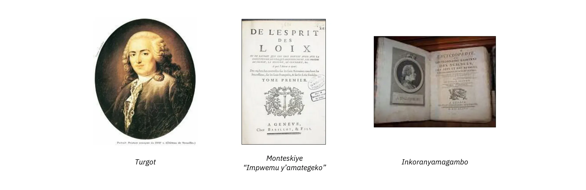

None Turgot yaje gute kugira ngo abe uwuhambaye gutyo? Vyamanutse ku guhuza ibintu bitatu vy’ingenzi. **Ica mbere**, umuryango wiwe w’icubahiro. Yavuye mu muryango muremure w’abarongozi b’ubwami, benshi muri bo bakaba bari bafise ibibanza vy’ubutegetsi bihambaye. **Ica kabiri**, igihe c’inzahabu yavukiyemwo kandi yakuriyemwo. Turgot yari afise imyaka 21 igihe Montesquieu yasohora *L’Esprit des Lois*, n’imyaka 24 igihe igitabu ca mbere c’iyo *Nkoranyabumenyi* casohoka.

Yari umuntu wo mu gihe kimwe c’abanyabwenge b’ivy’umubiri, Voltaire, Diderot, d’Holbach, Adamu Smith, Condorcet n’abandi. **Ica gatatu**, ubukerebutsi bwiwe. Igihe yari umunyeshure muri kaminuza ya Sorbonne, yaranditse ikete ku mahera y’impapuro afise imyaka 22, aratanga insiguro zidasanzwe, kandi afise imyaka 24 arakora urutonde rw’ibitabu 52 yari akwiye kwandika.

Naho yari akiri muto, Turgot yarafashije mu *Encyclopédie*, yandika ingingo zivuga ku bintu nk'ibi: "Ivy'inkomoko", "Ukubaho", "Ukwaguka", "Isoko", n'"Imishinge". Ingingo imwe gusa ni yo yakoze ku vyerekeye ubutunzi ata guca ku ruhande—igice ciwe kivuga ku "Masoko", kikaba cari kivuga ido n'ido inkomoko y'amasoko n'amasoko, kiganegura n'ukuntu Leta iriko irakura mu vyo yivangamwo, ivyo bikaba vyatuma bihungabanya kandi bikaba bimugaye.

Muri iyo myaka ya mbere, yari yarahanuwe na Vincent de Gournay, uno na we aca amujana munsi y’amababa yiwe, maze baragiranira ubugenzi somambike. Gournay amaze gupfa mu 1759, Turgot yaranditse igitabu c’ugushimira uwo muntu, aho yatanze incamake nziza cane y’inyigisho y’uko umuntu akwiye kureka ivyo akora. Yanditse canecane ati:

"Mu buryo bwose ubudandaji bushobora gushikira Leta, inyungu z'umuntu ku giti ciwe zisigaye zizokwama zitanga inyungu rusangi kuruta ibikorwa vya Leta, vyama bifise amakosa kandi birongowe n'ivyiyumviro bitamenyekana kandi bidatomoye".

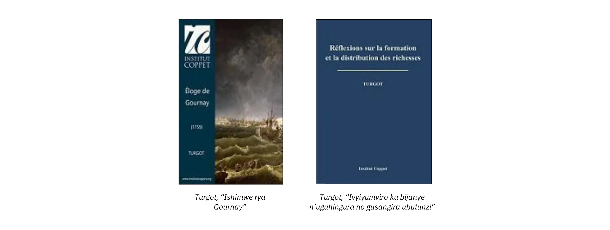

Mu mwaka w’1767, igihe yari intendant, yaranditse igitabu c’ubutunzi citwa *Ivyiyumviro ku bijanye n’uguhingura no gusangira ubutunzi*.

Ugucapura ibikorwa, ubusegaba bw’abaguzi, umutungo w’abantu ku giti cabo, uruhara rw’umutungo kamere, hafi ingingo zose zihambaye z’ubutunzi ziravugwa. Abahinga mu vya kahise benshi, uwuherutse gusohoka ni umuhinga mu vya kahise Anne-Claire Hoyng, baragaragaje ukuntu ico gitabu ca Turgot gisa n’igitabu ca Adam Smith citwa *Ubutunzi bw’amahanga*, casohowe haciye imyaka icenda.

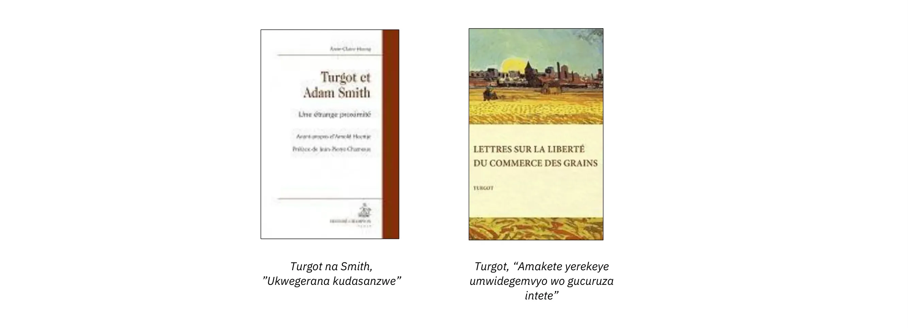

Turgot yaraburaniye umwidegemvyo w’ubudandaji bw’intete mu makete yandikiye Abbot Terray, mu nyuma akayamenyesha Umwami, mugabo igice cayo ubu carazimiye. Yanditse ati:

> Mushingantahe, nimba hari ikintu gihambaye, si ugushiraho amategeko mashasha ku bucuruzi buhambaye kuruta ubundi bwose, ahubwo ni ugukuraho ubwo, ikibabaje, bwarekuriwe kugumaho.
> Nimba hari igihe umwidegemvyo wuzuye, ushitse, udafise intambamyi iyo ari yo yose, wari ukenewe, ndatinya kuvuga ko ari ubu, kandi ivyo ntivyigeze biba bidakwiye kwiyumvira gusohora itegeko ryerekeye ubudandaji bw’intete.

Mu mwaka w’1769, Turgot yaranditse ingingo yitwa Agaciro n’Amahera mu gitabu ca *Dictionnaire de Commerce* ca Abbot Morellet, amaherezo nticigeze gisohoka. Galiani yari amaze kuvuga ko «umuntu ari ingero rusangi y’ibintu vyose», yiteze isesengura ry’ibintu Turgot azokora haciye imyaka mirongo itatu muri iki kiganiro, aho azokwagura kandi akagaragaza ico ciyumviro.

Mu 1770, imbere cane ya Bentham, Turgot yaranditse ikete ry’ugushigikira umwidegemvyo wo gutanga inyungu n’inyungu.

« Ni ikosa kwizera ko inyungu y’amahera mu bucuruzi ikwiye gushingwa n’amategeko y’abaganwa », avuga ati: «Ni igiciro c’ubu kigenzura, nk’ic’ibindi bicuruzwa vyose», Mu kugwanira ico ciyumviro, arahakana ukurwanya kwa Aristote n’Abavyeyi ba Ekleziya.

Incamake itangaje y’inyigisho ya Turgot y’uko umuntu ashobora kurekura ivyo akora, iraboneka mw’ikete ryari ryibagiwe ryandikiwe Abbot Terray ryo mu 1773 ryerekeye ugushira ikimenyetso ku vyuma:

> Ico politike itegerezwa gukora n’ukwiyorosha ku nzira y’ibidukikije n’inzira y’ubudandaji, ivyo bikaba bitari bike bikenewe kandi bitari bike bidashobora gukurwaho nk’inzira y’ibidukikije ubwavyo, ata kugerageza kubiyobora; kuko kugira ngo umuntu ayiyobore atayihungabanya kandi ataco yigiriye nabi, yokenera kuba ashoboye gukurikirana ukuntu umuntu atandukanye vyose mu vyo akeneye, mu nyungu zawe no mu nganda; umuntu yokenera kubimenya mu rugero rw’ido n’ido rudashoboka kuronka ku mubiri, kandi aho mbere n’intwaro ifise ubuhinga, ikora cane kandi yiyubara cane izokwama iri mu kaga ko kwihenda, n’imiburiburi n’igice.

Aha turabona amajambo atomoye cane yerekeye inyigisho y’uburenganzira bwo gukora, hamwe n’igitutu c’isesengura rya Friedrich Hayek ry’ukwigira nk’uwufise ubumenyi—ni ukuvuga ko Leta idashobora gutahura neza inguvu z’ubutunzi kugira ngo izigenzure.

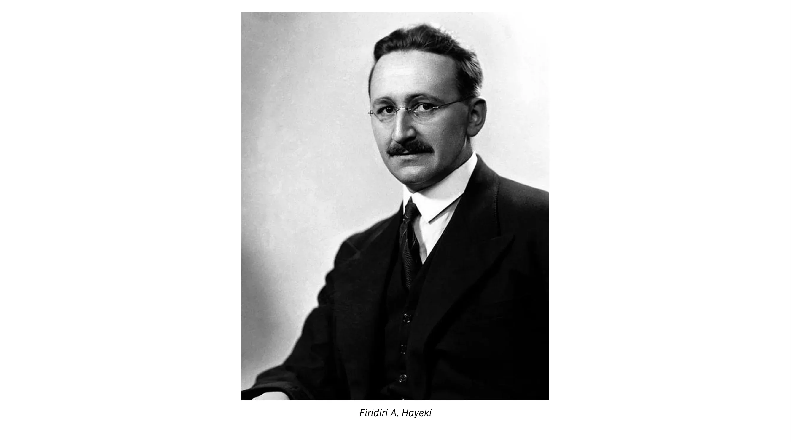

## Turgot, Umuvuguruzi

<chapterId>9177429f-1679-51c4-bfd2-dd036d24a1cc</chapterId>

Nk’uko twavyibutse muri make mu kigabane c’imbere, Turgot yari umuhungu w’umuryango w’abanyacubahiro wari waratandukanye n’abandi mu nzego zo hejuru z’abakozi ba Leta y’Ubufaransa.

Se wiwe yari yarabaye umukuru w’igisagara c’abadandaza b’i Paris, sekuru na we akaba umucungerezi w’igisagara. Amaze gutsinda cane mu vyigwa vyiwe, umutoyi mu muryango wa Turgot yari afise intumbero yo gushika n’imiburiburi kuri ivyo bipimo nyene. Yabanje gukora igihe kanaka ari maître des requêtes, bisobanura ko yari umuhuza hagati y’abarongozi n’igisagara ca Versailles. Yari ikibanza c’icubahiro, kikaba yari ategerezwa gusonerwa imyaka idasanzwe, mugabo Turgot yari afise icipfuzo co kuronka ibindi. Urupfu rw’umujanama wiwe Gournay rwatumye arushiriza kugira intumbero yo gushika hejuru, aca asaba ko bamushinga ngo abe umucungerezi.

Mu 1759, ni we yasavye ubwa mbere ubutegetsi bwa Grenoble, ariko baravyanka. Yaciye aronka igikorwa co kuba umukuru w’abadandaza i Lyon, ariko arakihakana. Yasavye ko Bretagne igira intendant, ariko ivyo na vyo nyene vyaranse. Amaherezo, mu 1761, baramusavye kuba umukuru w’igihugu ca Limousin, maze aravyemera ata co yipfuza. Yandikiye Voltaire ati: «Ndafise amagorwa yo kuba umutegetsi», kumbure bisobanura ngo: Mfise amagorwa yo kuba umutegetsi muri Limousin.

I Limousin, abarimyi bari abakene kandi baba mu mibereho idatekanye canecane ku bijanye n’inzu n’ibifungurwa. Urugero rusangi rw’uburezi rwari ruto cane. Amabarabara makeyi yariho yari mu bihe vy’agahomerabunwa.

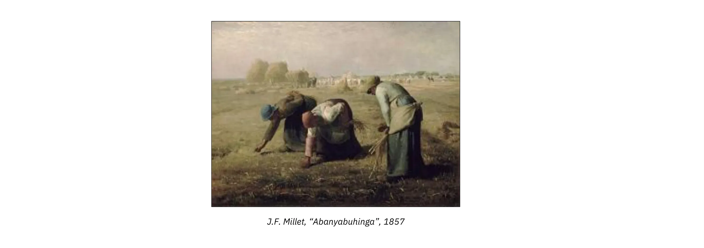

Kubera ko ako karere kari gakenye cane, nta co kari gifise akamaro ku baminisitiri. Ivyo vyatumye Turgot agira umwidegemvyo wo kugerageza guhindura ibintu. I Limousin, yarakurikiye imigambi itatu ikomeye:

- Gusubira gusangira **taille**, umusoro w'umuntu ku giti ciwe (Turgot yari afise intumbero yo gushiramwo ubutungane bwinshi bushoboka mu gusuzuma kwayo).
- **Corvée**, ni ubwoko bw'ikori ryishyurwa mu bikorwa, aho abarimyi bagoberwa no gukora ibikorwa vyo kwubaka amabarabara. Turgot amaze gutembera muri ako karere, yaciye abona ningoga ukuntu amabarabara yari ameze nabi. Yasubirije iyo corvée umusoro w'amahera.
- Gutora ingabo z'abasirikare, ingabo z'abarimyi zakoranijwe mu bihe vy'intambara.

Ivyo vyagirwa mu gutora ubupfindo, ivyo bikaba vyatuma haba ubwoba n’ubukazi kubera abahunga; Turgot yasubirije ayo makori y’agateganyo n’abakozi b’intahemuka barihwa.

Ivyo bihinduka vyarabaye vyiza ata gukeka, kandi muri Mukakaro 1774, Turgot yaragizwe umusuku. Kubera ko ata bumenyi yari afise, Umwami yaramushize ubwa mbere muri Minisitere y’Ingabo z’Inyanja. Iryo banga ryari riteye umunezero benshi. Turgot ubwiwe yariyemereye ati: "Ntaco nzi ku bijanye n'ingabo z'amazi", Voltaire na we ati: "Sinzi ko Turgot ari umusare kuruta jewe".

Ariko rero, haciye ukwezi kumwe gusa, Turgot yaragizwe umugenzuzi mukuru w’ivy’amahera, mu vy’ukuri aba umushikiranganji w’ubutunzi n’ivy’amahera mu Bufaransa.

Turazi ikete yashikirije Louis XVI ingingo ngenderwako ziwe: "Nta gusenyuka. Nta kwongerwa kw'imisoro. Nta ngurane nshasha". Iyo filozofiya, abayinegura muri iki gihe boshobora kwita "ubukazi" butagira akamaro, yari igamije gukiza ubwami.

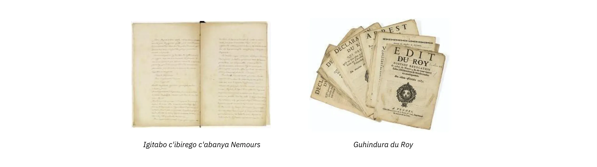

Turgot yarateguye amategeko atandatu y’umwami yo guhindura ubutunzi bw’Ubufaransa.

Ni bwo bwa mbere—kandi ni bwo bwa nyuma cane—umuhinga mu vy’ubutunzi yahawe umwidegemvyo wo guhindura ubutunzi bw’igihugu ciwe. Amategeko atatu ya Turgot arahambaye cane: rimwe ryarakuyeho ibikorwa vy’agahato (corvées), irindi ryasenya amashirahamwe y’ubudandaji (amashirahamwe), irya gatatu na ryo ryashizeho ubudandaji bw’intete ataco buvuze.

Turgot amaze kwinjira mu busuku, yari azi ko azoshikirwa n’ukurwanywa n’abantu b’agaciro. Abwira Umwami ati: «Nzotinywa, mbere nkankwe, n’abantu benshi bo mu rusengero be n’abarondera ubutoni bose». Abafise agateka ntibatevye gufatanya kumurwanya, bituma yirukanwa mu kazi k’Umugenzuzi Mukuru w’Ivy’Imari. Voltaire, uwashigikiye bimwe bishitse ihinduka rya Turgot, yanditse mu makete yiwe ati:

> Ah! Mbega inkuru iteye ubwoba numvise! None twebwe tuzoba iki? Ndababaye cane! Ntituzokwigera dukira kubera ko twabonye ivuka n’urupfu rw’ikiringo c’inzahabu! Uyu muturagaro warateye ubwenge bwanje n’umutima wanje.

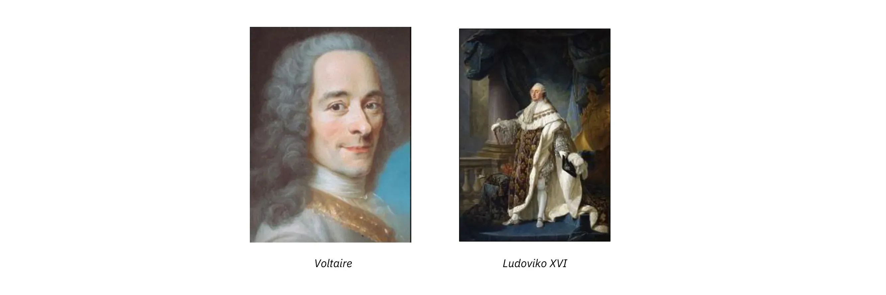

Kuva ico gihe, benshi baravuga ko Ubufaransa ari igihugu kidashoboka guhindura. Ivyo Turgot yananiwe vyasa n’ibivyemeza: Yari yateguwe n’ivyiyumviro vy’ubutunzi vy’ubwigenge vy’igice c’ikinjana; yari afise infashanyo y’abanyabwenge bo mu gihe c’Umuco; kandi Umwami ubwiwe, afise ububasha bwose, yaramushigikiye.

Amaherezo, abaparlement n’abafise agateka ni bo batsinze. Umwami yari gukora vyose ni ukuboroga mu mwiherero ati: «Ndabona ubu ko jewe na Monsieur Turgot ari twebwe gusa twitwararika abantu.»

## Kondilaki

<chapterId>0ba8dbb5-dcd5-5981-bf85-6c185e0bf192</chapterId>

Nka kurya kw’ubudandaji, ari bwo bugaragazwa bwabwo bugaragara cane, ubuhinga bwa Montaigne bwatwaye igihe kirekire kugira ngo buzimangane.

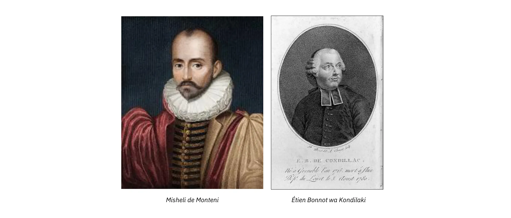

Uwo sophisme ni iciyumviro c’uko ubudandaji na Exchange ari imikino y’umubare zero. Ivyo uruhande rumwe ruronka vyose mu gucuruza, nta nkeka ko uruhande rumwe ruzitakaza. Abayishigikiye bavuga ko ivyo ari ukuri hagati y’abantu ku giti cabo no hagati y’amahanga.

Abbot wa Condillac yarafise uruhara runini mu gusenyura ata gukeka ico ciyumviro c’ikinyoma.

"Nta gukeka" kumbure ni ukurenza urugero, kuko mu mpari za bose, iyo sophisme irasubira kugaragara kenshi. Kumbure ni co gituma, n’ikindi kandi, Condillac aguma ari umuhinga mu vy’ubutunzi azwi cane. Uretse abahinga mu vy’ubutunzi bo muri Otirishiya, ni bake batahuye akamaro k’inyigisho yiwe yerekeye Exchange, nta n’umwe agikunda.

Ku bahinga benshi b’ivya kahise b’ivyiyumviro vy’ubutunzi, umwaka w’1776 warangwa n’ugusohoka kw’igitabu *Ubutunzi bw’amahanga*, cashinze ubuhinga bw’ubutunzi. Ivyigwa cumi na bitanu twahejeje, aho twize ubuhinga bw’ubutunzi bw’Abafaransa imbere ya Adamu Smith, birahagije kugira ngo twemeze ikosa ry’ico ciyumviro. Muri uwo mwaka nyene w’1776, ikindi kandi, hari ikindi gitabu kumbure gikwiriye gushimwa cane n’abahinga mu vya kahise kuruta igitabu ca Adamu Smith: canditswe na Condillac kandi gifise umutwe gusa witwa [*Ubucuruzi n’Intwaro Bifatwa mu Bucuti Bafitaniye*](https://archive.org/vernme0d0gocommerce).

Ku bwa Condillac, iyo ubuhinga bwa Exchange bubonwa nk’umukino w’amahera ataco bumaze bugumaho, aba Physiocrates ni bo bafise icaha, kuko bavuga ko Exchange ari ubucuti bw’uburinganire. Nk’uko Condillac abivuga, ivyo ni ibinyoma: Exchange ni ubucuti butaringaniye, aho umuntu yama atanga bike kugira ngo aronke vyinshi.

Hagati y’ivyiyumviro vy’aba Physiocrates n’ivya Condillac, umuntu ntashobora kurota ukurwanywa gutunganye kuruta. Umuhinga mu vy’ubutunzi w’umunyafiziyokarate yitwa Le Trosne yanditse ati:

> Exchange ni kamere yayo Contract y’uburinganire, ikozwe mu gaciro kangana ku gaciro kangana.

Ku rundi ruhande, Condillac yanditse ati:

> Buri mugwi uri muri Contract wama utanga ikintu c’agaciro gatoyi kugira ngo uronke ikintu c’agaciro kanini.

Ariko rero, ukurwanywa ahanini ni ukw’amajambo. Bompi bemera yuko iyo umuntu ahinduye igitabu c’ifaranga, ico gitabu kiba gifise agaciro k’ifaranga, canke igiciro c’ico gitabu kikaba ari ifaranga.

Itandukaniro riri mu kuba Condillac yemeza ko kubera ko dutanga Exchange y’ifaranga imwe ku gitabu, bisigura ko kuri twebwe, agaciro k’ico gitabu karuta aka Coin yacu y’ifaranga imwe. Turakunda igitabu kuruta Coin, ni co gituma dukora Exchange.

Ivyiyumviro vya Condillac ntibivuguruzanya cane n’ivy’Abafiziyokarate, ariko ntibavuga ururimi rumwe, nk’aho twovuga. Le Trosne avuga igiciro mu gihe Condillac avuga agaciro, n’ibihushanye n’ivyo.

Aho Condillac avuga ukuri ni uko iyo ibiciro bingana hagati y’ivyo bicuruzwa bibiri bihindurwa, agaciro ntikangana, ahandi ho, nta Exchange yobayeho.

Mu guca irya n’ino ivyiyumviro vya Condillac, hariho ivyiyumviro bitatu bishobora gushirwa ku rutonde:

Iciyumviro ca mbere: turarondera ibintu kubera akamaro kavyo. Ivyo bisa n’ibigaragara, ariko ni ingingo nyamukuru y’ubuhinga bw’ubutunzi ko abagabo Exchange kugira ngo baronke ivy’ubuzima, ingingo Jean-Baptiste Say na we nyene yateye imbere ata gatotsi.

Iciyumviro ca kabiri: agaciro karabaho imbere y’igihe kandi gatuma haba uguhanahana. Urubanza umuntu wese afata ku bijanye n’ibintu n’ibikorwa rusobanura ko ivyo bintu nyene n’ibikorwa nyene bifise agaciro kuri we, bifise agaciro kanini canke gatoyi bivanye n’akamaro bisa n’ibitanga. Birumvikana ko umuntu wese acira urubanza mu buryo butandukanye n’uwundi, kandi agaciro karatandukanye ku muntu ku wundi.

Ubwa nyuma, iciyumviro ca gatatu: igiciro ni ingaruka y’ingendo ya Exchange. Ibintu ntibigira Exchange ku gaciro ndabiha kuko ivyangombwa vya Exchange navyo bivana n’agaciro k’umuntu ku giti ciwe umuguzi aha ivyo bicuruzwa. Isano hagati y’umuguzi n’ugurisha, canke hagati y’ugukenguruka kw’umuguzi n’ugukenguruka kw’ugurisha, ni ryo rishinga igiciro.

Ivyo vyiyumviro vya Condillac ni ivy’ishimikiro. Bituma dutahura igituma Exchange yose yama ari ngirakamaro kuri bose.

Birasambura rero burundu ivyo kunegura ubudandaji bwigenga, kuko uburinzi buboneka gusa nk’uburyo bubuza abanyagihugu kugiriranira akamaro. Ukwirekura ni kwo na kwo gusozera igikorwa ca Condillac. Abantu nibakore uko bashaka, kuko ubutegetsi bwa Leta iyo burinze umwidegemvyo n’itunga, abantu bazokwama batunganya mu guhanahana hamwe.

## Kondorseti

<chapterId>99e4aba6-da7f-5041-b02f-337158381515</chapterId>

Nta gukeka ko Condorcet ari we munyabwenge w’ubutunzi kuruta abandi bose bo mu gihe c’Umuco.

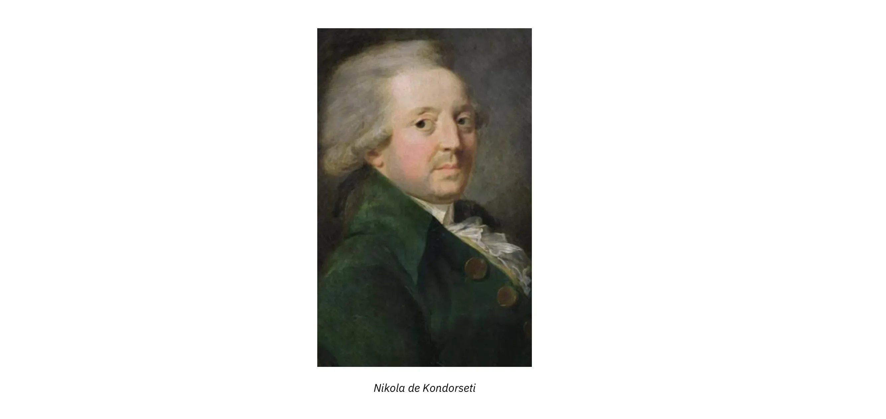

Mu kiringo kinini c’akazi kiwe, yariyeguriye gukora ibikorwa bitajanye n’ubutunzi, kandi vyari bibereye, kuko ubuhinga bwiwe bwatumye atera imbere cane mu vy’ubuhinga yibandako cane. Ariko nko mu 1770, yumvise akwegerewe n’ibibazo vy’ubutunzi, kumbure kubera ko abandi bafilozofe, cane cane Voltaire na Diderot, batavyitaho ngo babihe umwanya wabo wo kwiruhura, kandi kandi kubera ko yari yaragiranye ubugenzi na Turgot.

Buhorobuhoro Condorcet yarakiriye ivyiyumviro vy’ugurekura n’umwidegemvyo, mu ntango mu bintu bitajanye n’ubutunzi bwa politike. Mu *Ikete ry'Umunyatewolojiya*, yaratwengeye mu buryo bwa filozofiya idini ry'Abagatolika, aserura icipfuzo ciwe co kubona umwidegemvyo nyawo wo kwemera, harimwo n'umwidegemvyo wo kutemera. Mu ntambara yiwe yo kwihanganirana no kurwanya ubusambanyi bw’idini, Condorcet yararwanije ko Chevalier de la Barre asubirwamwo, yongera ararwanira D’Etallonde, uwari yaciriwe urubanza rwo gupfa kubera yamena umusaraba.

Yari yiteguriye rero kurwanira umwidegemvyo igihe umugenzi wiwe Turgot yaduga aja ku kibanza c’Umugenzuzi Mukuru w’Ivy’Imari.

Kuva ico gihe, ubuzima bwa Condorcet bwarahindutse uko yinjira mu mpari z’ubutunzi, ashigikira ataco arushe ivugurura ry’ubwigenge ry’uwo mushikiranganji mushasha. Kubera ko Condorcet yashigikiye uguhiganwa n’umwidegemvyo wo gukora ubudandaji, yarasavye kandi ko hokurwaho ama corvées (ibikorwa vy’agahato), amashirahamwe y’ubudandaji be n’uko habaho imisoro ibereye. Yaravuga ivyo vyiyumviro ku mugaragaro igihe cose akaryo kabonetse, akabigirana igishika kigaragara; yanditse cane kandi yigeze gutangaza mu vyanditswe vyiwe ati: "Mwemerere nongere mvuge ku mwidegemvyo w'ubudandaji; ndahimbarwa no kwifatanya n'iyi nkuru."

Hagati y’umwaka wa 1774 n’uwa 1776, mu gihe c’ubusuku bwa Turgot, Condorcet yarakoze ibintu vyinshi, vyose bikaba vyaranzwe n’indege yiwe yitwa Commitment kugira ngo umuntu areke gukora ivyo akora. Ibikorwa vyiwe birimwo *Amakete y’umurimyi w’i Picardie yandikiye Bwana Necker*, arwanira ubudandaji bw’ubuntu; *Abanyagihugu n’abanyagihugu*, bavuganira uguhiganwa ku buntu; *Ivyiyumviro ku Corvées*, bisaba ko zikurwaho; na *Ivyiyumviro ku bucuruzi bw’intete*, na yo nyene ishimagiza ubudandaji bw’ubuntu, ikanegura igitabu ca Necker ku bijanye n’ico kibazo nyene.

Mu gitabu ciwe [*Amakete yerekeye ubudandaji bw’intete*](https://archive.org/details), Condorcet aravuga ingingo zitari nke z’ingenzi.

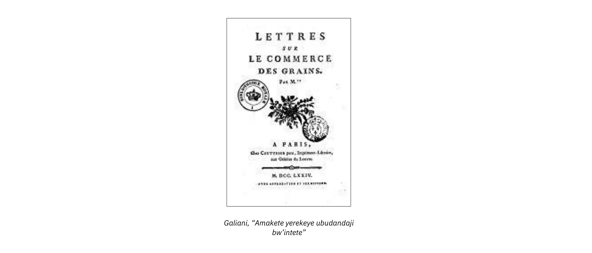

Ica mbere, ibiciro vy’intete vyari vyinshi ico gihe ntivyari bivuye ku bucuruzi bw’ubuntu, ahubwo vyari bivuye ku mwimbu mubi, kandi ivyo Condorcet aravyerekana neza. Araheza asigura igituma laissez-faire atari yo gusa ibereye ariko ari yo politike yonyene ibereye, naho abantu benshi bayibona nabi. Avuga ati: "Twaramenyereye kubona Leta yinjira mu bucuruzi bw'intete ku buryo ataco ikora bisa n'ikintu kidasanzwe kandi gishasha". Mu nyuma yongerako ati: "Hafi abantu bose, cane cane abafise ibikorwa vya Leta, bemera ko ata kintu na kimwe kigenda ubwaco kandi ko vyose bitakarira iyo Leta itagira ico ikoze muri vyose". Condorcet rero arasubiramwo ivyiyumviro vy’aba Physiocrates na Turgot, yerekana ko ubudandaji bw’ubuntu buruta uburyo bwose bwo kwivanga mu vyo umuntu akora.

Guteza imbere umugambi wa Turgot w’ubutunzi bw’ubwigenge cari igikorwa c’ubutwari, kuko Condorcet yari azi ko azokwihuta gushikirwa n’ugucengera. Nkako, ivyo vyarabaye maze agatabu kiwe kavuga ku gukuraho ibikorwa vy’agahato karasambuka, karabuzwa mu 1776.

Turgot, ashima ukuntu Condorcet yaburanira ivyiyumviro vyiwe ata buryarya, aca amugira umugenzuzi w’ivy’amahera. Condorcet yaciye asezera akazi umugenzi wiwe akimara kuva mu busuku.

Naho Condorcet yakoresheje inguvu ziwe zose mu kurwanira Turgot, nta vyiyumviro vy’ukwihenda yari afise ku bijanye n’ingene ubutegetsi bw’umugenzi wiwe bwobaye buzovamwo. Turgot ubwiwe yaremeye mu nyuma mu buzima bwiwe ko yabayeho yicuza, nk'uko yavyanditse mw'ikete ryiwe, "kubera ko ntashoboye gukorera igihugu canje n'abantu ivyiza nizera ko vyoroshe cane". Condorcet, uwuvuga ibintu vy’ukuri kuruta, yerekanye abansi benshi Turgot yari guhura na bo: abo umwami akunda cane, abashingamateka, abakuru b’idini, abakuru b’igihugu, amashirahamwe y’abanyagihugu n’ibindi. Iyo migwi yari yiteze gushimwa, ntiyiteze ivugurura. Condorcet abwira Turgot ati: "Nta n'umwe uri umunyaruyeri, kandi ivyo ni akaga, ubonye uko ibintu vyifashe i Paris". Yari afise ukuri rwose, kuko mu 1776, haciye imyaka ibiri gusa Turgot ashitse, yari amaze guhagarikwa umutima no kuva mu butegetsi bw’Umugenzuzi Mukuru.

## Ubwenge busanzwe bw'abanyagihugu mu gihe c'Impinduka

<chapterId>95e9a90d-e37a-58ff-b1ac-928b42e76ecf</chapterId>

Dupont de Nemours yari umwigishwa mutoyi wa François Quesnay, uwari yigeze kumubwira ati: «Tubwirizwa kwitwararika uwo musore, kuko azovuga nitwapfa». Igihe Impinduka y’Abafaransa yatangura, hafi aba Fiziyokarate bakuru bose, harimwo na Marquis de Mirabeau, bari bamaze kugenda; Mirabeau ubwiwe yari yapfuye ku wa 13 Nyakanga 1789.

Dupont de Nemours ni we yanditse urutonde rw’ibirego vy’umukuru w’igihugu w’i Nemours.

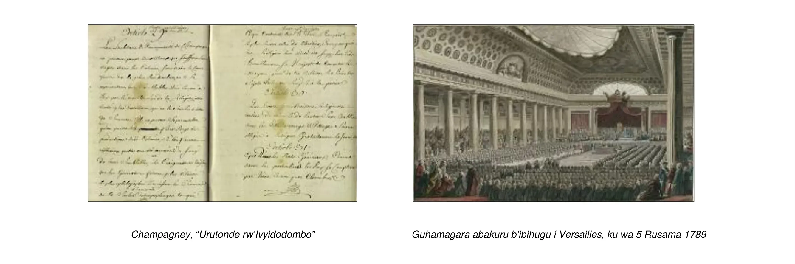

Ico cete gishimishije cane carimwo ivyo abahinga mu vy’ubutunzi b’abanyagihugu bidoga vyose ku bijanye n’uburenganzira bwo kubuza ubudandaji, ubudandaji bw’abantu bamwebamwe be n’ibitero ku mutungo. Dupont de Nemours na we nyene yatowe mu nama nshingamateka y’igihugu.

Mu gihe c’Impinduka, yabaye ijwi ry’ubwenge busanzwe bw’abanyagihugu, ahagarara ashikamye arwanya umupfunda w’ugutera imbere kw’abanyagihugu n’ugutera imbere kw’abanyagihugu, ivyo bikaba vyaciye bitsinda.

Kera mu kwezi kwa Munyonyo 1789, igihe hari ibiganiro vyo guha uburenganzira Caisse d’Escompte (ivyo bikaba vyari gushobora kuyihindura banki ya Leta—Banki y’Ubufaransa), Dupont de Nemours yaravuze mu kurwanira uguhiganwa.

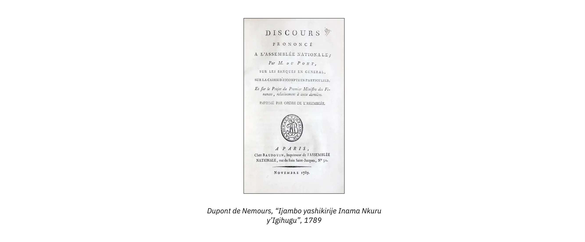

Avuga ati: "Vyoba vyiza ubucuruzi bwa banki bushikirijwe amategeko y'ubudandaji bwigenga". Kandi yongerako ati:

> "Sintahura ico umushikiranganji yashaka kuvuga igihe yavuze ko guha uburenganzira Caisse d'Escompte. Nimba muri ubwo butegetsi burimwo uburenganzira bwo guhabwa uburenganzira bwo gukora, utegerezwa kubwanka, kuko waje hano kugira ngo usenye uburenganzira bwo gukora uburenganzira bwo gukora, atari kugira ngo ureme ubundi bushasha."

Naho yari yaragabishije, Inama Nkuru ntiyitaho ivyo yarwanya, maze itera iyindi ntambwe yo gushinga banki nkuru n’uburenganzira bwo gukoresha banki.

Mu 1790, mu nama nshingamateka, Dupont de Nemours yarakurikiye umugenzo w’abanyagihugu b’abanyagihugu b’abanyagihugu b’abanyagihugu b’abanyagihugu, aca asaba itegeko ribuza intambara zitera. Ingingo ya mbere yari ivuga iti: «Igihugu c'Ubufaransa ntikizokwemera kwinjira mu ntambara iyo ari yo yose y'ububisha kugira ngo gifate ubutaka bw'abandi canke ngo gihungabanya uburenganzira canke umwidegemvyo w'Igihugu ico ari co cose».

Ico ciyumviro caranse.

Muri uwo mwaka nyene, ni ukuvuga mu 1790, haratanguye impaka ku bijanye no gusohora amahera mashasha y’impapuro kugira ngo Leta ikoreshe amahera.

Dupont de Nemours yarabirwanije cane, aca asohora agatabu kavuga ngo [*Ingaruka z’Ibikorwa vy’Igihugu ku Giciro c’Umukate*]. Iryo zina ryari ribereye, kuko yasiguye yuko gutanga ama assignats vyotuma ata kabuza haba inflation, ni ukuvuga ko ibiciro vy’ibicuruzwa, harimwo n’umukate, vyiyongera.

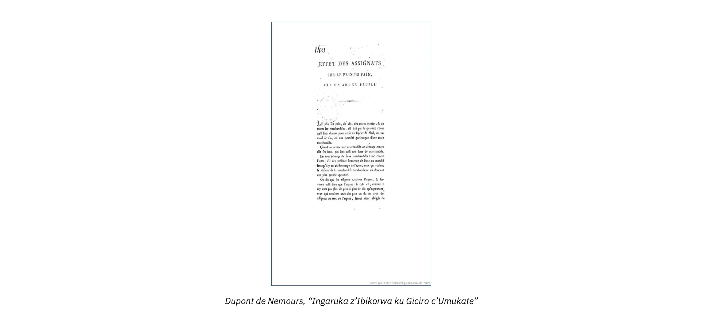

Yashize umukono kuri ako gatabo nk'"umugenzi w'abantu". Ico gice carateye akajagari kanini cane, kuko Inama yabajijwe uwacanditse. Dupont de Nemours aca arahaguruka yemera ko ari igikorwa ciwe, avuga ko ata nsoni afise zo gukoresha izina ry’icubahiro ry’icubahiro ry’icubahiro ry’uko « umugenzi w’abantu » kuko kurwanya abashizweho ari ugukorera abantu vy’ukuri.

Na none, impanuro ziwe zararengagijwe, maze ama assignts arasohoka.

Twese turazi icago cakurikiye, ugusenyuka kw’ubutunzi n’imibabaro abantu bihanganiye, benshi muri bo batakaje vyose igihe aba assignats bacitse ubusa, bagategerezwa guturirwa.

Haciye imyaka mikeyi, iyo nama yarahindukiriye iciyumviro co gushinga Banki y’Ubufaransa nyayo, iyo Banki yohabwa uburenganzira bwo gukora amahera yonyene.

Dupont de Nemours, yari agirwanya cane iciyumviro c’uko hoba banki ya Leta, abona ko ata kindi ariko ni ugukoresha umuntu wenyene, yaributse Inama y’Ishengero ivy’ivyago vyashikiye abashinzwe. Yarababwiye ati:

> "Ntimwitegurire kwicuza nk'ivyo vyababaje bagenzi banje bo mu Nteko Nshingamateka. Ico gihe, iciyumviro canje co guhagarika ama assignats gusa ku kwishura ibintu vy'igihugu, ntibibe amafaranga agendagenda, caranse. Uyu musi, bavuga bati: 'Ah, iyo twumviriza Dupont de Nemo!'"

Ariko rero, nta n’umwe yamutega yompi.

## Insozero: Guca Itara

<chapterId>ada8082f-db96-5e52-954f-719b47998153</chapterId>

Ivyiyumviro vy’ubutunzi vy’Abafaransa mu kinjana ca 18 akenshi birapfukiranwa n’abahinga mu vy’ubutunzi bazwi cane bo mu kinjana ca 19. Yamara, ku bijanye no kurwanira umwidegemvyo, mu kinjana ca 18 ni ho vyose vy’ukuri bitangura. Ico ni co kinjana aho ingingo ngenderwako y’ugurekura, yari iteye imbere cane mu gihe cayo, yatanguye guserurwa neza n’abanyabwenge batari bake, kuva kuri Boisguilbert gushika kuri Dupont de Nemours.

Nta gukeka ko abantu nka Jean-Baptiste Say, Frédéric Bastiat, Gustave de Molinari na Yves Guyot basize ikimenyetso kiramvye muri kahise k’ivyiyumviro vy’ubutunzi vy’Abafaransa. Ariko iyo tuvyize turi ukwacu, turabura ikintu gihambaye. Abo banyabwenge bo mu kinjana ca 19 ntibavuye ahantu ataco bavuze; bararazwe kandi bubaka ku mishinge yashizweho n’abababanjirije bo mu kinjana ca 18 mu gihe c’Umuco.

Boisguilbert yemeza ko ubugingo bufise intumbero nziza bwizera ko bushobora gukosora vyose mu gushiramwo intwaro ata kabuza buhindura ubutunzi, kandi ko rero ari vyiza kureka urutonde rw’ibintu rusanzwe rukagenda.

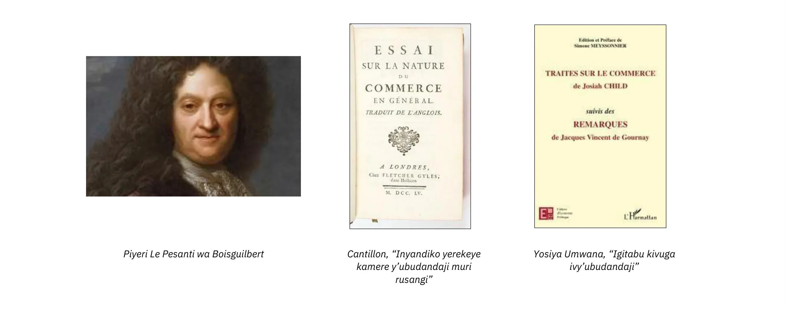

Cantillon yashimikiye ko amahera adakwiye kwigera akoreshwa mu ntumbero za politike. Kwemera ko Leta ikoresha amahera uko yipfuza ni ugutegura inzira y’akajagari kanini cane k’ivy’ubutunzi n’ivy’ubutunzi.

Vincent de Gournay yemeza yuko gutegeka cane igikorwa bica intege utwigoro tw’abakozi n’abahinguzi b’ibintu, bikabatuma baba ubunebwe no kutagira ico bakora. Ni ukubera uguhiganwa ku buntu ubutunzi bushobora gutera imbere, igihugu kigatera imbere.

Marquis d’Argenson yemeza ko ata ntwaro ishobora kubona imbere y’igihe ibintu vyose no kubipima, kandi ko kubera ivyo, umuntu ategerezwa kwizigira inyungu z’umuntu wese.

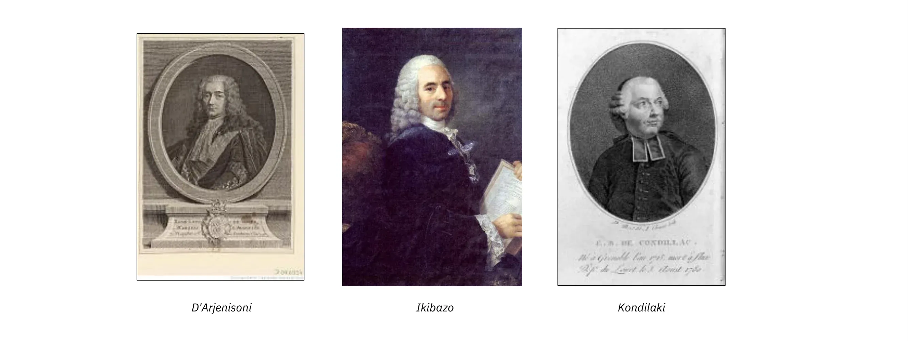

Quesnay n’aba Physiocrates bemeza ko umutungo w’abantu ari wo mushinge w’imibano y’abantu. Iyo umuntu atagira umutungo wiwe bwite, aratakaza icipfuzo co gukora, co gukora, kuko adashobora kwinovora ivyamwa vy’ibikorwa vyiwe canke ngo arundanire ikintu na kimwe.

Condillac yemeza ko Exchange yama ari ngirakamaro kuri bose kandi rero, ata n’umwe asigaye, ikwiye kwama ari ubuntu. Intumbero ya Leta yonyene itegerezwa kuba iyo kurinda umwidegemvyo n’itunga.

Ivyo vyiyumviro vyose vyofatwa n’abahinga mu vy’ubutunzi bo mu kinjana ca 19. Bamwe nka Jean-Baptiste Say, boha ivyo vyiyumviro insiguro y’ubuhinga biciye mu *Traité sur l’économie politique* ikomeye. Ahubwo abandi borondera gukwiragiza izo nyigisho z’ishimikiro mu kwinjira mu bijanye n’inkuru z’imigani, ibitabu vy’inkuru ndende be n’inkuru ngufi zitwenza, nk’uko Frédéric Bastiat yobigira n’ubuhinga.

## Inkuru y'ubuzima

<chapterId>17cf2865-e53c-5f3b-a5c2-a43560efaf01</chapterId>

**IBIBUMBANO VYAHISANISWE**

Aha musi, uzosanga ivyanditswe birenga mirongo itatu vyatoranijwe:

1. Pierre Clément, Amateka y'Umukuru w'Igihugu n'Ubutegetsi bw'Umwana, i Paris, 1874

2. Vauban, Umugambi w’indirimbo z’umwami, 1707; ryasubiwemwo ry’Ikigo Coppet, mu 2014; Anne Blanchard, Vauban, Fayard, 1996

3. Boisguilbert, Ivyerekeye Ubufaransa, mu 1695; ryasubiwemwo n'Ikigo Coppet, mu 2014

4. Félix Cadet, Pierre de Boisguilbert: umurongozi w’abahinga mu vy’ubutunzi, Ikigo ca Coppet, 2014

5. Pierre de Boisguilbert canke ukuvuka kw'ubutunzi bwa politike, Paris, INED, 1966

6. Richard Cantillon, igitabu kivuga ku kamere k’ubudandaji muri rusangi, mu 1755; ryasubiwemwo n’Ikigo Coppet, 2015

7. Antoin Murphy, Richard Cantillon, umuhinga mu vy’amabanki n’umuhinga mu vy’ubutunzi, muri Oxford, mu 1986

8. Gustave de Molinari, umukuru w’idini ry’i Saint-Pierre, i Paris, mu 1859

9. Umukuru w’idini ry’i Saint-Pierre, Umukuru w’Ishengero ry’Umugambi w’Igihugu c’Igihugu, i Rotterdam, mu 1729

10. Umukuru w’idini ry’i Saint-Pierre, « Umugambi wo gutuma ubudandaji bw’Ubufaransa butunganye », mu gitabu Les rêves d’un homme de Bien, i Paris, 1775, urupapuro rwa 199

11. André Alem, Umukuru w’igihugu ca Argenson n’ubutunzi bwa politike mu ntango z’ikinjana ca XVIII, Ikigo ca Coppet, 2015

12. Ikinyamakuru n’ivyiyumviro vya Marquis d’Argenson, igitabu ca Rathery, ibitabu 9, i Paris, 1859-1867

13. Benoît Malbranque, Vincent de Gournay: ubutunzi bwa politike bwo kwidegemvya, Ikigo ca Coppet, 2016

14. Vincent de Gournay, Ivyiyumviro ku bijanye n’uguhindura umwana wa Yosiya, mu 2008

15. Kristine Teré na Loïc Charles (abanditsi), Igitabu c'ivya Gournay, INED, 2005

16. Antoin Murphy, "Iterambere ry'ivyiyumviro vy'ubutunzi mu Bufaransa (1750-1756)", Igitabu c'amateka y'ubu n'aya none, igitabu ca XXXIII, Ukwakira-Ukuboza 1986

17. Henri Ripert, Umukuru w’igihugu ca Mirabeau: inyigisho za politike n’ubutunzi, Paris, 1901

18. Lucien Brocard, Inyigisho z’ubutunzi n’imibano z’umukuru w’igihugu ca Mirabeau mu rugo rw’abantu, i Paris, 1902

19. Humbert de Montlaur, Mirabeau, umugenzi w'abantu, Perrin, 1992

20. Yves Guyot, François Quesnay n’Ivy’Imibiri, Ikigo c’Ivy’Imibiri, 2014

21. François Quesnay, Ibitabo vy’ubutunzi vyuzuye n’ibindi vyanditswe, ibitabu 2, INED, 2005

22. Georges Weulersse, Umuhari w’ubuhinga bw’umubiri mu Bufaransa (kuva mu 1756 gushika mu 1770), ibitabu 2, i Paris, 1910

23. Georges Weulersse, Igitabo c’ubuhinga bw’umubiri ku mpera y’umwami Ludoviko wa XV (1770-1774), P.U.F., 1959

24. Georges Weulersse, Igitabu c’ubuhinga bw’umubiri n’abaminisitiri b’abanyagihugu (1774-1781), P.U.F., 1950

25. George Weulersse, Ubuhinga bwo guhindura umubiri (1781-1792), EHESS, 1985

26. P. Jolly, Umukuru w’Igihugu, Umusirikare w’Umwidegemvyo, Paris, P.U.F., 1956

27. Ivyanditswe na Voltaire ku vyerekeye ubutunzi, Ikigo ca Coppet, 2013

28. Gustave Schelle (uwanditse), Ibitabu vya Turgot n’inyandiko zijanye n’ivyo, Paris, 1913-1924

29. Benoît Malbranque, Uburenganzira bwo kwidegemvya : Umukuru w’igihugu ca Limousine (1761-1774), Ikigo ca Coppet, 2015

30. Pierre Foncin, Igitabu c'ubushikiranganji bwa Turgot, i Paris, 1877

31. Auguste Lebeau, umuhinga mu vy’ubutunzi wo mu gisagara ca Paris, mu 1903

32. Condillac, Ubucuruzi na Leta vyiyumviriwe ko bifitaniye isano n’ubutegetsi, 1776

33. Condorcet, Ivyiyumviro vy’ubutunzi bwa politike, muri Eugène Daire (ayanditse), Ivyiyumviro vy’ubutunzi bwa politike, Paris, 1847

34. P. Jolly, Umukuru w’Igihugu, Umusirikare w’Umwidegemvyo, Paris, P.U.F., 1956

35. Eli Heckscher, Ubucuruzi, ibitabu 2. I Londres: Allen na Unwin. 1935

# Igice ca nyuma

<partId>385bffab-aea1-5bcd-9569-62b3f30665b7</partId>

## Amasuzuma n'Ibipimo

<chapterId>a1e689d9-abd0-5dcb-ba56-a8d355d0a84f</chapterId>

<isCourseReview>true</isCourseReview>

## Ikizame canyuma

<chapterId>bdb7fd98-33e7-11f0-9fe6-b785c859ffc5</chapterId>

<isCourseExam>true</isCourseExam>

## Iciyumviro

<chapterId>3b366ff6-03c8-5f6a-b4c0-ba8186e65d7e</chapterId>

<isCourseConclusion>true</isCourseConclusion>