# Putovanje kroz ekonomsku istoriju slobode

Ovaj kurs istražuje rođenje ekonomske nauke u Francuskoj 18. veka kroz prizmu laissez-faire principa. Otkrijte kako su mislioci izazivali merkantilizam tvrdeći da država treba da štiti privatna prava, ali nikada ne sme da manipuliše tržištima kroz regulacije.

Naučićete kako su vizionarski reformatori proširili ovu viziju zahtevajući slobodnu trgovinu i neograničenu cirkulaciju robe, postavljajući intelektualne temelje modernog kapitalizma. Proučavanjem ovih pionirskih ekonomista, razumećete bezvremenske principe koji su oblikovali globalnu političku ekonomiju i nastavljaju da utiču na političke debate danas. Pridružite se sada da savladate ideje koje su izgradile modernu ekonomiju.
+++
# Uvod

<partId>06d67531-19f1-4f8d-bf8f-77bbcc743672</partId>

## Pregled kursa

<chapterId>202db3c6-0320-494d-8057-adc6f6563048</chapterId>

Dobrodošli u HIS204!

Ovaj kurs je dizajniran da istraži francusko poreklo koncepta *laissez-faire*—"neka se desi"—kako se razvijao u 18. veku kroz bogatu intelektualnu tradiciju. Prateći misli ranih francuskih ekonomskih mislilaca, otkrićemo temelje političke ekonomije zasnovane na ekonomskoj slobodi, obeležene nepoverenjem prema državnom mešanju i verom u prirodni poredak koji favorizuje rast i prosperitet.

**Sekcija 2: Preteče**

U ovom odeljku počinjemo na prelazu iz 17. u 18. vek, vreme oblikovano prekomernom vlašću apsolutne monarhije i prvim pozivima za racionalniji i pravedniji način upravljanja javnim poslovima. Kroz likove Vaubana, Boisguilberta i Cantillona, otkrivamo rane kritike državnog intervencionizma i prvi nacrt onoga što će kasnije postati liberalna politička ekonomija.

**Sekcija 3: Reformatori i mislioci ranog 18. veka**

Ovaj odeljak se fokusira na one koji su, u prvim decenijama 18. veka, pokušali da reformišu francusku ekonomiju u svetlu novih principa. Mislioci poput opata od Saint-Pierrea, markiza d'Argensona i Gournaya (zajedno sa svojim sledbenicima) pozivali su na demontiranje korporativnih prepreka, liberalizaciju trgovine i podsticanje konkurencije kao pokretača razvoja. Njihovi često smeli predlozi nagoveštavali su velike fiziokratske ideje.

**Sekcija 4: Fiziokratska škola**

Ovaj odeljak istražuje jedan od najvažnijih trenutaka u francuskoj ekonomskoj misli: fiziokratsku školu. Ispitaćemo njeno poreklo, doktrinarne osnove i glavna dostignuća, fokusirajući se na ključne ličnosti kao što su Kene i Dupont de Nemur. Ideja laissez-faire postaje koherentan sistem upravo u ovoj školi, ukorenjena u ideji prirodnog poretka kojem se država mora pokoriti kako bi garantovala prosperitet za sve.

**Odeljak 5: Prosvetiteljstvo i politička ekonomija**

Konačno, videćemo kako se liberalno ekonomsko razmišljanje širilo unutar šireg pokreta prosvetiteljstva. Ličnosti poput Voltera, Turgota, Kondijaka i Kondorsea proširile su i obogatile tradiciju laissez-faire, njihovi spisi stvorili su most za prelazak tradicije laissez-faire u revolucionarni period i dalje, gde su liberalne ideje pronašle novi odjek.

Spremni da ponovo otkrijete francuske korene ekonomskog liberalizma? Krenimo!

# Preteče

<partId>91565b10-6010-53cb-a2f4-9c2306c7ef8c</partId>

## Istorijska pozadina

<chapterId>6a5fd101-6dfd-5d77-96c7-9e1aa4a19758</chapterId>

Na praskozorju 18. veka, Francuska je bila u zabrinjavajućem stanju. Ruralno stanovništvo je jedva proizvodilo dovoljno za preživljavanje i bilo je teško oporezovano.

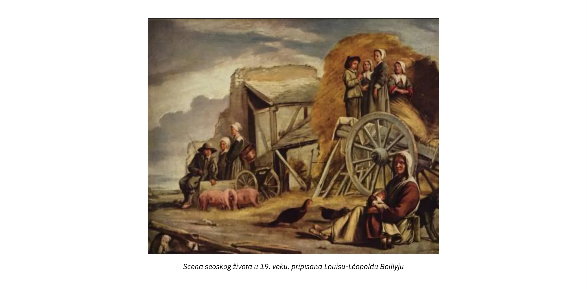

Gradski zanatlije, zaključani u krute cehove, borili su se da inoviraju ili čak podrže jedni druge. U međuvremenu, druge evropske nacije ubrzo su nadmašile Francusku na svim poljima, nadmašujući njene proizvode. Komercijalni uspesi Engleske i Holandije bili su u mislima svih.

Ali kako bismo mogli pronaći rešenje za bolest ere? Još uvek nije postojala nauka o ekonomiji i stoga nije bilo posebnog leka za primenu. Principi ekonomske politike su se još uvek primenjivali nasumično, menjajući se između restriktivnih faza i liberalnijih perioda. Svakako, imamo modele, istorijske reference koje treba pratiti. Među njima je bio *Sully*, ministar Henrija IV, koji se zalagao za poljoprivredu i promovisao veću slobodu trgovine unutar Francuske.

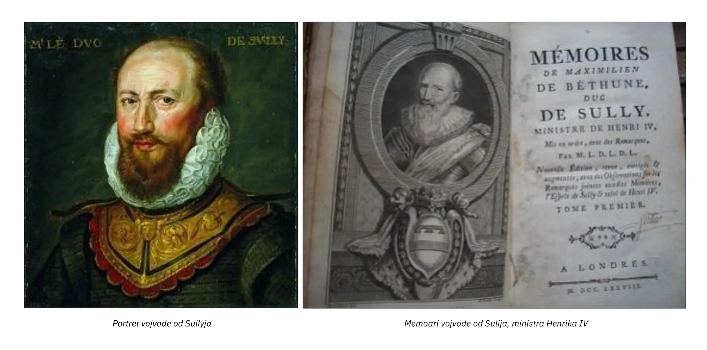

Ali tada je došao Colbert, ministar Luja XIV, koji je kolebao između regulacije i slobode, ali je na kraju sproveo regulaciju. Na samom kraju 17. veka, Colbert je nadmašio Sullyja: ministri su sada prizivali njegovo nasleđe i pokušavali da primene ono što su tvrdili da su njegove maksime.

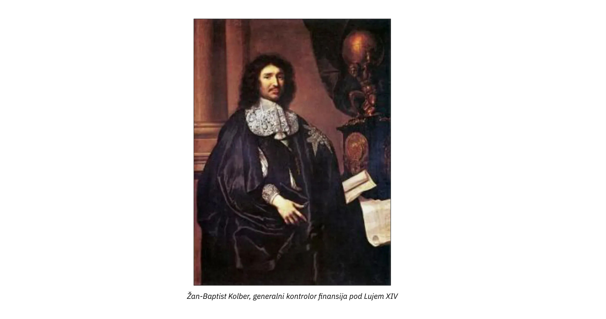

U mislima državnika krajem 17. veka, Kolberove maksime su bile četiri.

(1) **Industrija mora biti regulisana i vezana unutar cehova**. Ove regulative određuju, na primer, kako se čaršavi i tkanine trebaju praviti, njihovu veličinu i težinu.

Bilo je stotine takvih pravila, sastavljenih u posebnim tomovima za svaku vrstu industrije. Ipak, u očima Kolbertovih sledbenika, ovo je i dalje bilo nedovoljno: industrija, verovali su, takođe je morala biti nadgledana od strane korporacija.

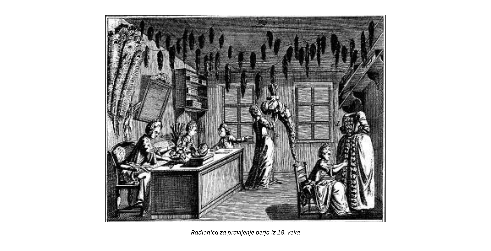

Svako ko je želeo da se bavi zanatom morao je prvo provesti nekoliko godina kao šegrt, zatim kao kalfa, pre nego što pokuša da dostigne status majstora izradom "remek-dela" i plaćanjem značajne sume cehu. Konkurencija unutar svakog zanata bila je stoga strogo ograničena.

(2) **Trgovina je igra sa nultim zbirom**. Kada je reč o trgovini, Kolberovi sledbenici delili su iste predrasude kao varvarski narodi Antike. Prema ministru Luja XIV, trgovina je "perpetualni rat". Zašto? Razlog je jednostavan: za Kolbera i njegove naslednike, bilo kakvo povećanje bogatstva jedne zemlje značilo je osiromašenje druge. Po njihovom mišljenju, Englezima ili Holanđanima nije smelo biti dozvoljeno da se obogate, jer bi to značilo da kradu prosperitet Francuske.

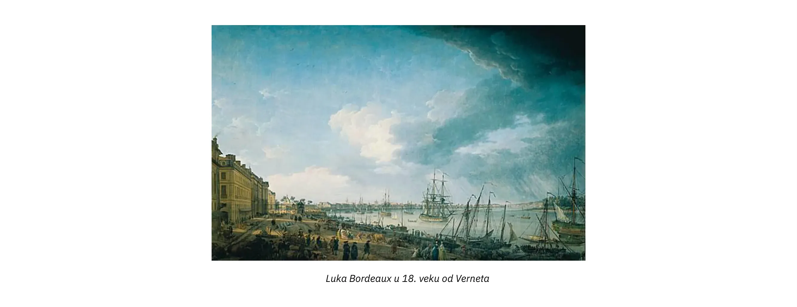

Proizvodi ovih zemalja, stoga, morali su biti zabranjeni ili visoko oporezovani, bez skrupula, jer trgovina je rat u kojem možemo samo želeti propast naših neprijatelja.

> "Francuzi mogu povećati svoju trgovinu samo uništavanjem Holanđana".
> *Colbert*

(3) **Kada državi ponestane novca, Povećajte Poreze**. Colbert i njegovi sledbenici nisu verovali da je bogatstvo poreskih obveznika ograničen resurs. Po njihovom mišljenju, javna potrošnja nikada nije mogla biti problem, sve dok se dovoljno prikupljalo. A ako bi se narod pobunio, to je bilo samo zato što su ministri loše pristupili tome, jer, kako je Colbert cinično primetio, "umetnost oporezivanja sastoji se u čupanju gusaka bez previše vriske".

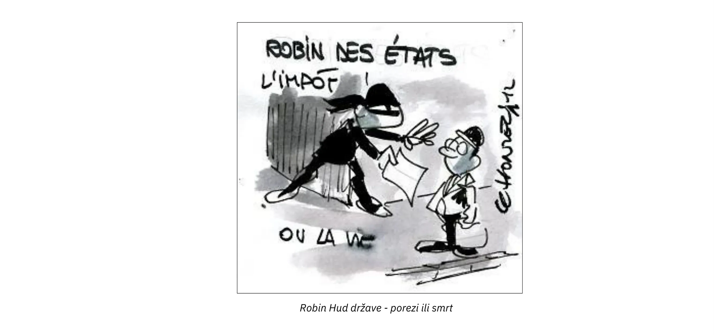

(4) **Bogatstvo je, pre svega, zlato i srebro**. Pre rođenja ekonomske nauke, mnogi pisci su sledili jednu dominantnu dogmu o prirodi bogatstva, što je postalo poznato kao *merkantilizam*. Kolber i njegovi naslednici nastavili su tim putem. Ukratko, merkantilisti su verovali da je pravi znak prosperiteta nacije akumulacija plemenitih metala, srebra i zlata.

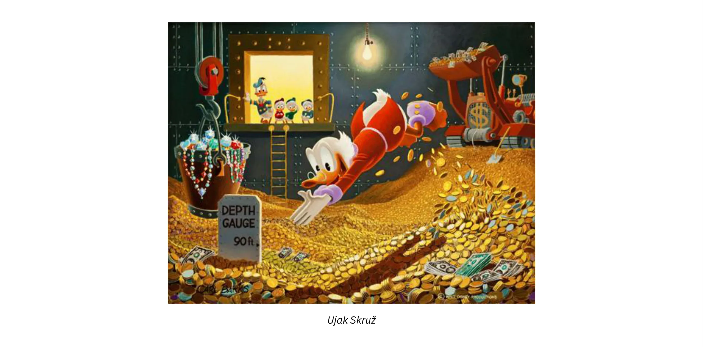

> "Samo obilje novca unutar države čini razliku u njenoj veličini i moći".
> *Colbert*

Posledica ove ideje je favorizovanje izvoza po svaku cenu, što je donosilo strano zlato i srebro, i ograničavanje uvoza na minimum, kako bi se izbeglo njihovo slanje u inostranstvo.

Ovo su četiri principa koja su vodila francusku vladu nekoliko decenija, dok je zemlja ulazila u 18. vek. Međutim, uskoro su bili duboko izazvani. Između 1690. i 1710. godine, nekoliko pisaca je bilo duboko pogođeno katastrofalnim stanjem Francuske. U potrazi za uzrocima, zaključili su da su upravo maksime nasleđene od Kolbera krive, smatrajući ih pogrešnim argumentima. Time su postavili temelje ekonomske nauke.

## Vauban

<chapterId>ee9c1e0e-96cc-5026-a5e2-963d68122786</chapterId>

Danas, kako poreski pritisak u našoj zemlji nastavlja da raste, preteći da uguši nacionalne ekonomske snage, glasovi se dižu u korist promene. Bilo svesno ili ne, ovi pozivi za reformu često odjekuju rad francuskih ekonomista koji su, još od 17. veka, kritikovali poreski sistem nacije kao haotičan, despotski, prekomeran.

Prvi od ovih reformatora poreza, hronološki i po zaslugama, je veliki maršal Sébastien Le Prestre Vauban, poznati graditelj utvrđenja i citadela.

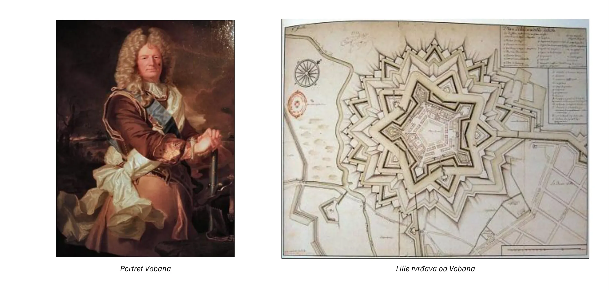

Iako smo to nažalost zaboravili, Vauban je bio više od vojnog čoveka; bio je i ekonomista. Zanimala ga je sudbina seljaka, predložio je hrabre poreske reforme 1695. godine (Projet de capitation - "Projekat za kapitaciju") i ponovo 1707. godine (Projet d'une Dime Royale - "Kraljevska desetina"): da zameni većinu postojećih poreza porezom proporcionalnim prihodu, jedinstvenim porezom pre svog vremena.

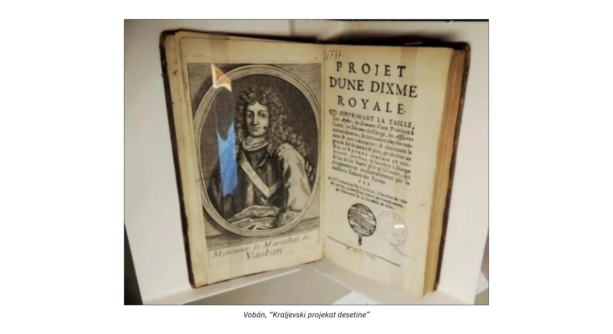

Vauban je došao do ovih ideja kroz radoznalost. Bio je oštar posmatrač, koji je težio da proučava društveni život i ekonomsku stvarnost rigorozno, gotovo naučno. Posebno je insistirao na potrebi brojanja, putem popisa.

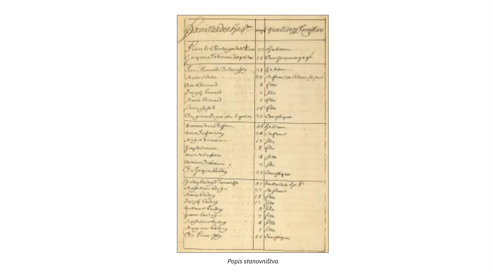

Njegova druga velika zasluga bila je njegovo dirljivo i iskreno opisivanje bede koju su mase trpele. Napisao je: "Nemojmo se zavaravati; srce kraljevstva je uništeno. Sve pati, sve trpi, sve stenje. Dovoljno je samo pogledati i ispitati srce provincija, ono što ćete naći je još gore nego što govorim". Daleko od preterivanja, Vaubanove sumorne opservacije bile su tačan odraz života s početka 18. veka. Aleksis de Tokvil je bio dobro upoznat sa ovim idejama i kasnije bi opisao Vaubanov *Kraljevski desetak* kao "zastrašujući", jer je bio istinit.

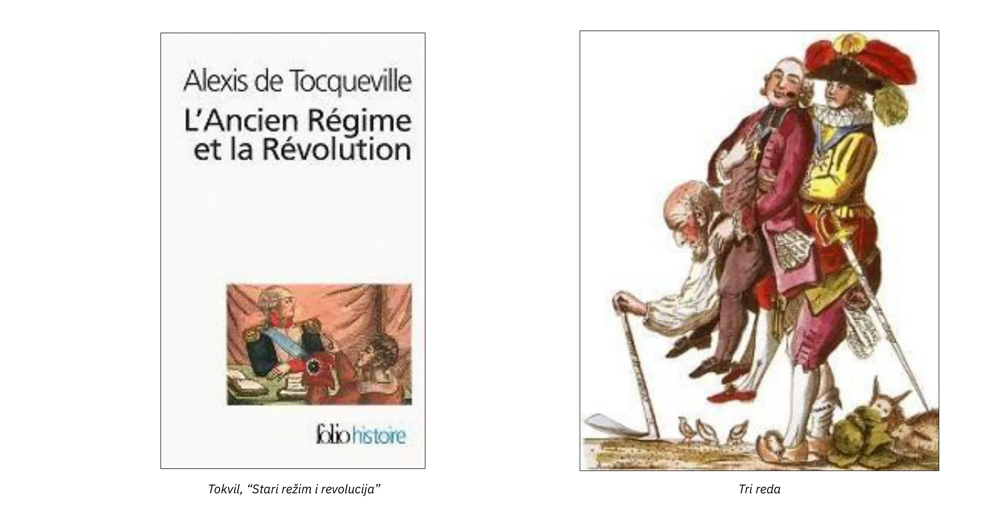

Druga velika zasluga Vaubana kao ekonomiste bila je predlaganje dalekosežne poreske reforme s ciljem iskorenjivanja, ili barem smanjenja intenziteta zla koje je posmatrao i opisao. Bio je u pravu što je to učinio; francuska ekonomija pod Ancien Régime bila je paralizovana oporezivanjem, koje je bilo nejednako, nestabilno i nečitljivo.

Kroz svoja razna politička i ekonomska pisanja, Vaubanova sveobuhvatna ambicija bila je da olakša patnje onoga što je nazivao "donjim delom naroda, koji svojim radom izdržava i podržava gornji".

Razumeo je da su opresivni i destimulirajući porezi preplavili seljake, koncept koji je izrazio sa jasnoćom, nešto što i dalje možemo savršeno posmatrati u naše vreme:

> "Farmer pušta da malo zemlje koje ima propada, obrađujući je samo polovično, iz straha da će, ako proizvede ono što bi mogla uz pravilno đubrenje i kultivaciju, biti još više oporezovana".

Vauban je video istinu: oporezivanje pod Ancien Régime nije bilo samo iracionalno već i okrutno strogo. Bio je to ovaj poreski sistem, nepravedan u svojoj raspodeli, koji je želeo da prevaziđe.

Njegovo predloženo rešenje, ravan, proporcionalni porez na sve prihode, omogućilo bi da se poresko opterećenje pravedno deli među svim društvenim klasama. Utemeljeno na teoriji države koja je javnu vlast smatrala neophodnom za zaštitu individualnih prava i imovine, Vaubanova poreska reforma zahtevala je da svi građani doprinesu u strogoj proporciji sa onim što zarađuju, na primer, 10% svog prihoda.

U Kraljevskom desetku, jedinom njegovom ekonomskom delu štampanom za njegovog života, Vauban je jasno naveo:

> "Pošto svako u državi treba njenu zaštitu da bi preživeo, ispravno je da svi doprinesu, prema svojim prihodima, njenom održavanju i troškovima [...]. Ništa nije nepravednije od izuzimanja onih koji su najviše sposobni da plate, i prebacivanja tereta na one koji su najmanje sposobni, koji se ruše pod težinom; težina koja bi bila prilično laka ako bi je proporcionalno nosili svi prema svojoj snazi. Stoga, svako izuzeće od oporezivanja je poremećaj koji mora biti ispravljen."

Nedugo pre svoje smrti, Vaubanovu ideju su usvojili ministri Luja XIV. Međutim, Vauban je pozivao na proporcionalni porez koji bi zamenio sve, ili skoro sve, postojeće poreze. Umesto toga, kao što se često dešava, njegov porez je uveden, ali su svi ostali zadržani.

## Boisguilbert

<chapterId>200149c6-b5fc-566e-ab0e-bafb1c3fed3c</chapterId>

Nekoliko francuskih ekonomista iz prošlosti danas uživa priznanje u svojoj domovini koje odgovara njihovim doprinosima, a Boisguilbert nije izuzetak.

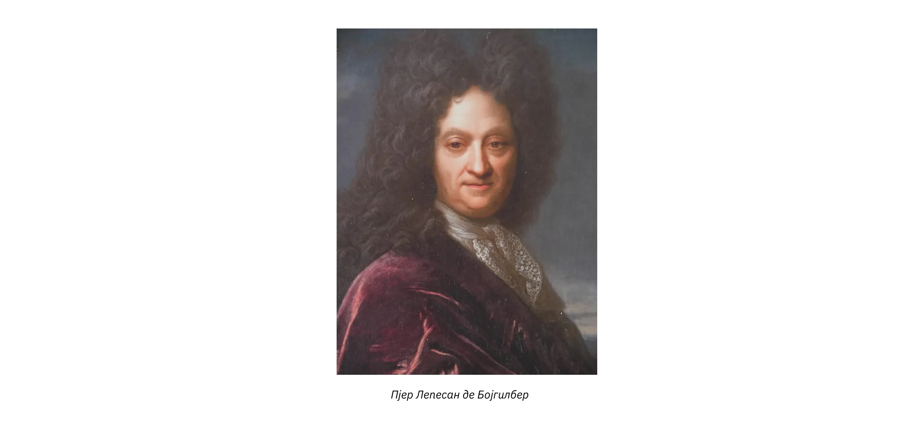

Neocenjen od strane čitalaca svog vremena, udaljen od krugova moći zbog svoje ekscentrične prirode i preplavljujuće strasti, Boisguilbert je ostavio mali trag u 18. veku. Ipak, početkom prošlog veka, došlo je do sporog ponovnog otkrivanja njegovog rada.

Međutim, ovo ponovno otkriće pokazuje da ulazimo u neku vrstu slepe ulice. Boisguilbertova prava zasluga je izgubljena predstavljanjem kao pionira brojnih teorija i preteče mnogih mislilaca. Kaže se da je shvatio koncept nezaposlenosti koji je kasnije branio Keynes, predvideo Say-ov zakon, utro put Walrasovoj teoriji opšte ravnoteže, pa čak i nagovestio klasnu analizu marksista. 'Kome ili čemu Boisguilbert nije mogao biti preteča?' na kraju je upitao jedan komentator.

(Pierre Le Pesant de) Boisguilbert je rođen u Ruanu 1646. godine. Obrazovan u Port-Roayalu u Parizu, Boisguilbert je započeo neuspešnu književnu karijeru pre nego što je preuzeo razne uloge, uključujući i onu generalnog poručnika Ruana. Tokom tog perioda napisao je nekoliko knjiga kako bi zagovarao svoje ideje, među njima i "Détail de la France" 1695. godine, koju je ponovo objavio sledeće godine pod mnogo eksplicitnijim naslovom: [*Francuska uništena pod vladavinom Luja XIV, od koga i kako, sa sredstvima za njeno obnavljanje*](https://archive.org/details/bub_gb_0jUaWNbTJa8C/page/n23/mode/2up).

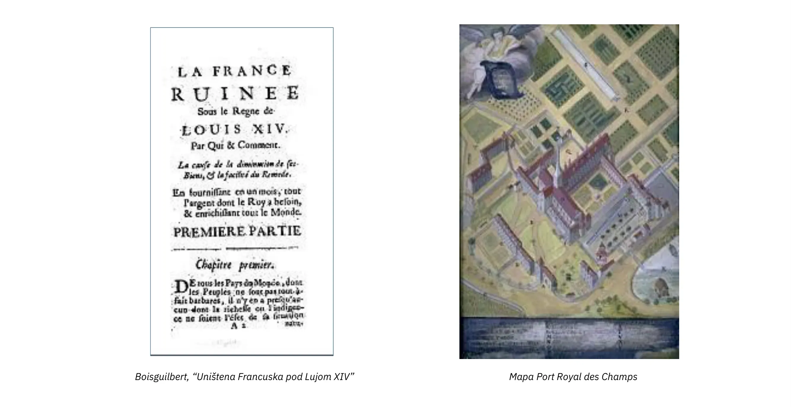

A ovo je osnova Boisguilbertovih knjiga: francusko siromaštvo i njegovi uzroci.

Ovu bedu francuskog naroda krajem 18. veka, Boisguilbert detaljno opisuje, kao i Vauban. On piše:

> "Puste ili loše obrađene zemlje, vidljive svima, su leš Francuske".

Opisao je iščupane vinograde, seljake koji su napustili polja i ponavljajuće gladi.

Boisguilbert pronalazi dva glavna uzroka za ovu nesreću. Jer ako narod živi u oskudici, to je zato što im je onemogućeno da konzumiraju ono što je neophodno, a propast potrošnje ima dva uzroka.

Prvo, ljudi više nisu mogli da priušte osnovne potrepštine zbog proizvoljnog oporezivanja. Taille, lični porez tog vremena, bio je slepo obračunavan za svakog pojedinca, rastući ili opadajući bez razloga. Zbog brojnih privilegija, teret je padao na siromašne seljake, koji su se našli u propasti. Da bi se to ispravilo, Boisguilbert je preporučio proporcionalni porez na sve prihode, slično Vaubanovom predlogu.

Drugi razlog za francusku bedu je što su previše prepreka sprečavale slobodnu trgovinu robom, posebno poljoprivrednim proizvodima. Postojale su carinske dažbine na granicama, pa čak i unutar zemlje, između različitih regiona, što je paralizovalo svu trgovinu. Ova ograničenja su sprečavala uspostavljanje ravnotežne cene i ograničavala tržišne mogućnosti. Kao rezultat toga, seljaci nisu mogli da žive od svoje proizvodnje, jer nisu mogli profitabilno da prodaju i pate od neisplativih poljoprivrednih cena, što je briga koja je i danas veoma relevantna i leži u srcu teorije Boagilbera. Po pitanju trgovinskih ograničenja, Boagilber se zalagao za čišćenje puteva, drugim rečima, uspostavljanje slobodne trgovine.

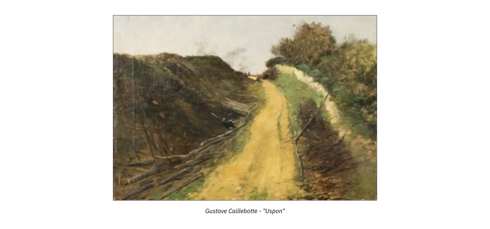

I sloboda je zaista njegov konačni zaključak. "Nije stvar u delovanju", kaže on, "već jednostavno u prestanku delovanja onako kako to činimo tako nasilno protiv prirode, koja uvek teži ka slobodi i savršenstvu". Sve će biti dobro, ponavlja neumorno, "sve dok pustimo prirodu da ide svojim tokom, to jest, damo joj njenu slobodu, i da niko ne ometa ovu trgovinu osim da pruži zaštitu svima i spreči nasilje".

Ovaj poslednji odlomak je ključan. Boisguilbert je bio prvi koji je jasno zahtevao ekonomsku politiku laissez-faire, učinio je svojim kredom i izgradio pravi sistem oko nje. Prema njemu, postoji prirodni poredak stvari i ne treba ga kvariti, niti uništavati, neblagovremenim javnim intervencijama. Država, po njegovom mišljenju, ne sme delovati u ekonomskim pitanjima, već treba pustiti da stvari deluju prirodno. U suprotnom, izazvaće bedu.

Boisguilbert je čak kritikovao "*dobre duše*", kako ih je nazivao, one koji su imali dobre namere, ali su činili veliku štetu. Oni su želeli jeftin hleb za narod, ali su obaranjem cena uništavali farmere, koji nisu mogli da prežive sa takvim maržama. Ti farmeri su zatim napuštali svoje zemlje, tonući dublje u siromaštvo. Kao što svi znamo, 'pakao je često popločan dobrim namerama'.

## Cantillon

<chapterId>bc206d41-6a64-5688-a489-40fcfa0e5397</chapterId>

Autor "Eseja o prirodi trgovine uopšte" (napisan oko 1730, objavljen 1755), Richard Cantillon se smatra jednim od pionira moderne ekonomske nauke. U svojoj Istoriji ekonomske misli, ekonomista Murray Rothbard čak naziva Cantillona osnivačem moderne ekonomije.

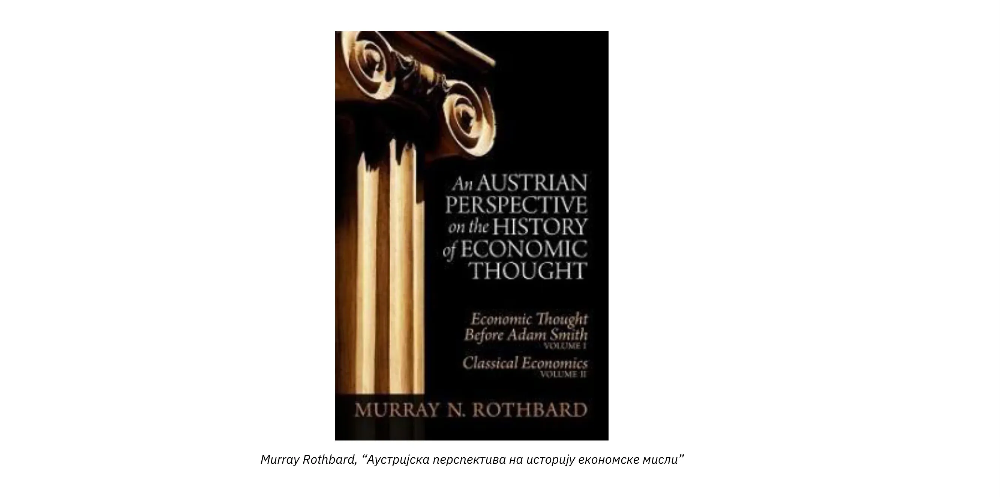

Rođen u Irskoj, Richard Cantillon se kao mladić nastanio u Parizu i stekao francusko državljanstvo. Radio je kao bankar i stekao bogatstvo tokom ere Johna Lawa.

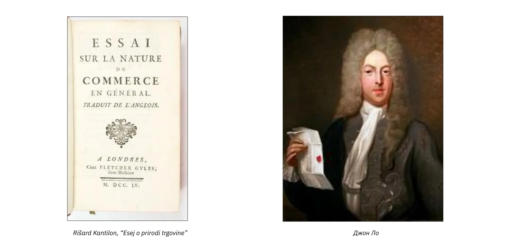

Bilo je to takođe u ovoj prilici kada je počeo da proučava ekonomsku teoriju. Oko 1730. godine, Kantijon je sastavio svoj Esej o prirodi trgovine uopšte.

Ova knjiga se može smatrati jednim od prvih pokušaja stvaranja opšte teorije ekonomije. Kantijon pažljivo identifikuje ono što naziva "opštim zakonima ekonomije", one koji su u prirodi stvari, a ne u posebnim činjenicama ove ili one zemlje. Ovaj pristup je bio revolucionaran.

Možemo sumirati velike zasluge Kantijonovog Eseja u pet oblasti: teorija bogatstva, pojam preduzetnika, kritika bezvrednih valuta, "Kantijonovi efekti", i na kraju odbrana slobode.

Prvo, njegova **teorija bogatstva**.

Za razliku od merkantilističkog pogleda dominantnog u to vreme, Kantijon je svoju analizu zasnovao na prepoznavanju da se bogatstvo formira proizvodima koji su svojstveni uživanju čoveka. Ovo bogatstvo, tvrdio je, dolazi iz prirode i proizvodi se kroz ljudski rad. Njegove ideje o prirodi bogatstva imale su snažan uticaj na Bekariju i Adama Smita, a preko Smita, na celu englesku klasičnu školu mišljenja.

Drugo, **preduzetnik**.

Iako ga nije jasno definisao, Kantijon je preduzetnika video kao glavnog i centralnog igrača u ekonomskoj aktivnosti. Za Kantijona, ono što karakteriše preduzetnika je da preuzima rizik i deluje u neizvesnosti. Ove ideje će kasnije proširiti Turgot i, značajnije, Sej, kako bi konačno prepoznali posebno mesto preduzetnika u ekonomiji, suprotno tvrdnjama engleske škole.

Treća tačka, **valuta**.

U reakciji na iskustvo Džona Lawa, Kantijon objašnjava šta se dešava ili šta mora da se desi kada valuta nema pravu vrednost.

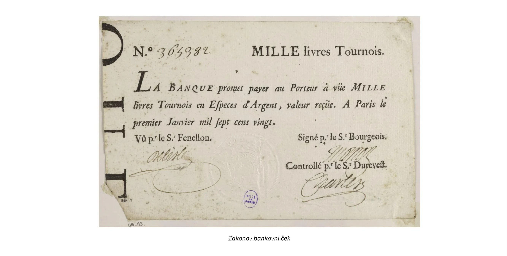

Vidi dve glavne posledice zamene valute bez stvarne vrednosti, kao što je papirni novac, za metalnu. Prva posledica je ono što on naziva "narodnim odbacivanjem", što znači rastuće nepoverenje u bezvredni novac. Druga posledica je inflacija: monetarno slabljenje čini da roba postaje skuplja.

Četvrto, u svojoj analizi **inflacije**, Cantillon je otišao dalje od svojih savremenika. Posmatrajući kolaps Lawovog sistema, Cantillon je shvatio da monetarna inflacija ne utiče na sve jednako. Naprotiv, ona obogaćuje neke dok osiromašuje druge. Zaključio je da inflacija ima redistributivni efekat: oni koji prvi dobiju novoizdati novac imaju koristi od povećane kupovne moći, dok oni koji ga dobiju kasnije postaju siromašniji kao rezultat izdavanja novog novca zbog porasta stopa inflacije.

Peto, uprkos nekoliko ostataka merkantilističke misli, Kantijonova ukupna perspektiva bila je **potpuno liberalna**. Branio je privatnu svojinu kao temeljni stub civilizacije, tvrdeći da nijedno društvo ne može funkcionisati bez privatne Ownership zemlje i proizvoda rada. Takođe je smatrao da je materijalna nejednakost među ljudima prirodna i legitimna. Prema Kantijonu, nema ničeg lošeg u tome da efikasan i hrabar radnik, ili izuzetno nadaren, zarađuje više od nekoga ko je nesposoban ili lenj. Na kraju, Kantijon je verovao da cene uvek treba da se određuju slobodno, igrom Supply i potražnje, bez intervencije javnih vlasti.

Među ovih pet glavnih ideja u njegovom Eseju, najvažnija je nesumnjivo ona koja sada nosi njegovo ime: **Cantillonov efekat**.

Ovom teorijom o efektima inflacije, Cantillon nam pruža odgovore na brojne savremene probleme. Pomaže nam da razumemo posledice nedavnih ekspanzivnih i inflatornih monetarnih politika, koje su osiromašile srednju klasu i ruralni svet, dok su obogatile operatere finansijskih tržišta i državu, njene agencije i zvaničnike, zbog njihove zajedničke blizine izvoru nove emisije: centralnim bankama i komercijalnim bankama.

# Reformatori i mislioci ranog 18. veka

<partId>1f7b50d4-ce93-5db3-8396-43c1fa5419ff</partId>

## Opat Saint-Pierrea

<chapterId>13478fe2-4c12-593c-a410-54c2cfb7ef7f</chapterId>

Od svih autora koje smo odabrali da uključimo u panteon francuskih mislilaca laissez-faire iz 18. veka, opat Saint-Pierre je nesumnjivo najviše zanemaren.

Da budemo fer, delimično je i njegova sopstvena greška. Puno je pisao, ali njegov stil je Hard za čitanje i pun je ponavljanja. Čak je i Žan-Žak Ruso pokušao da sažme njegov rad: počeo je to da radi, ali je ubrzo odustao od zadatka, jer je shvatio da je to izvan njegovih snaga. Sredinom 19. veka, Gustave de Molinari mu je odao počast objavljivanjem sveobuhvatnog dela o njemu, u kojem je odao priznanje pacifisti i ekonomisti kakav je bio opat Sen-Pjer. Ali to nije bilo dovoljno da ga izvuče iz zaborava, jer u njemu i danas ostaje.

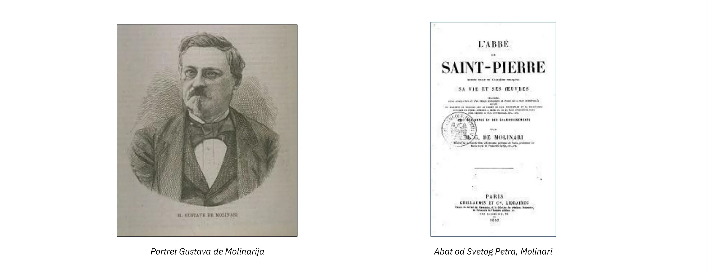

Opat Saint-Pierrea pisao je o ekonomiji, ali je obično zanimljiviji kao pacifista. On je autor Projekta za večni mir, koji prethodi poznatom delu Emanuela Kanta.

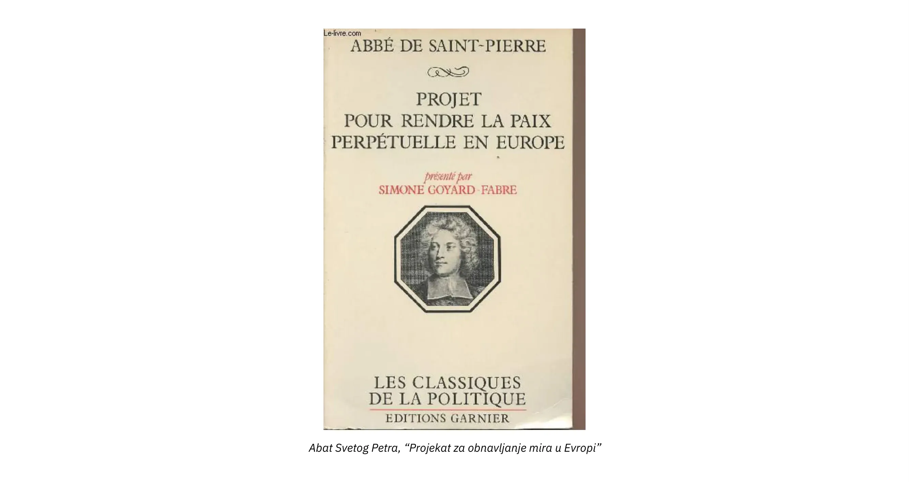

U ovom delu, tvrdio je da je rat destruktivan, ne samo za one koji ga izgube, već i za pobednike, pa čak i za one koji ne učestvuju u njemu, jer je njihova trgovina pogođena.

Da bi se suzbilo zlo rata, preporučio je stvaranje svojevrsne Evropske lige naroda. Formiralo bi se evropsko veće za rešavanje problema svake nacije. Nacije bi se stoga pribegle arbitraži, kako bi se izbeglo pribegavanje oružju. Ako neka nacija nije dovoljno mudra da prihvati mir, ako preti drugim evropskim nacijama, evropska liga naroda bi imala sredstvo za odgovor. Suočena sa takvim događajima, formirala bi se evropska vojska, sa snagama koje bi obezbedile razne zemlje.

Postoji i epizoda u životu opata Saint-Pierrea koja savršeno ilustruje kritički način razmišljanja iza francuskog pokreta laissez-faire. Pridružio se Académie Française 1695. godine, ali je izbačen 1718. zbog toga što se usudio kritikovati vladavinu Luja XIV. U tome se uskladio sa ličnostima poput Vaubana i Boisguilberta, koji su se takođe usudili govoriti protiv misterija skrivenih ispod sjaja vladavine Kralja Sunca.

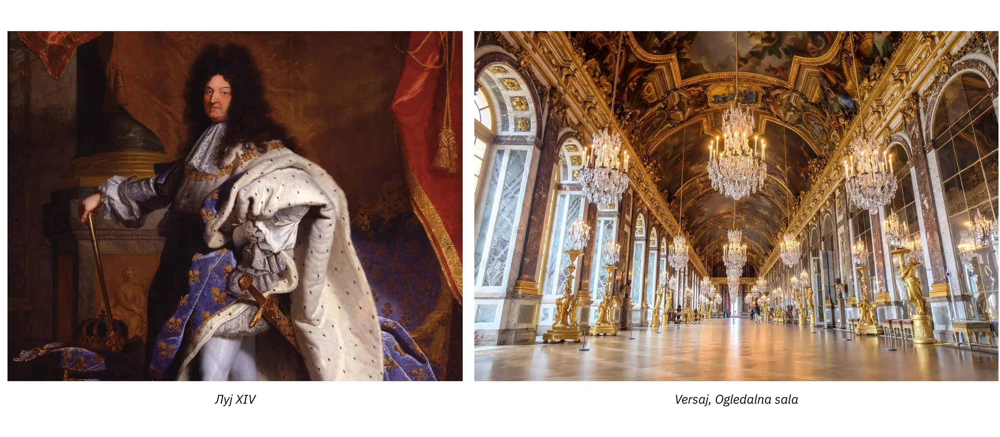

Opat Saint-Pierrea je tvrdio da vladavina Luja XIV, sa svojim luksuznim dvorom i opsesijom vojnim osvajanjem, nije bila obeležje vrlinskog kralja. Odbio je da prihvati da Luj XIV zaslužuje titulu "**Luj Veliki**".

"Uništiti svoje susede i svoj narod u isto vreme nije veličina", rekao je. Ovaj stav duboko je uvredio Académie Française, koja je dugo bila zaokupljena veličanjem kralja u svakom mogućem književnom obliku. Kao rezultat toga, gotovo jednoglasno su glasali da ga isključe.

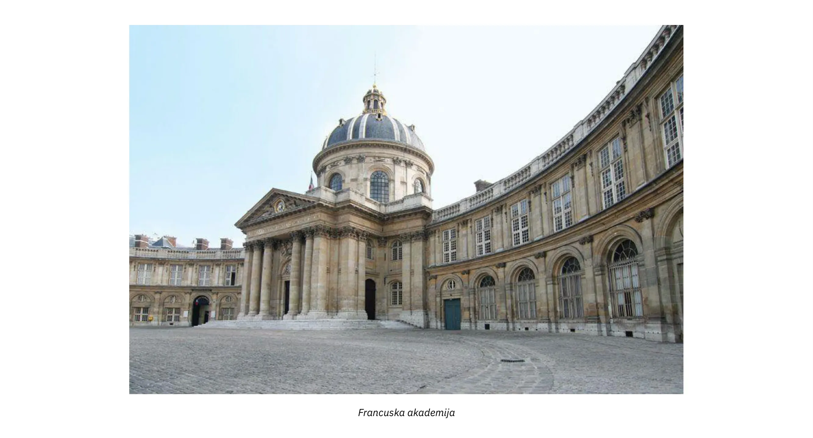

Što se tiče ekonomskog razmišljanja, dosledno je primenjivao princip korisnosti, slično kao što bi to kasnije činio Jeremy Bentham, i često je nudio zdrave uvide. Da budemo pošteni, još uvek je bio pod uticajem merkantilističkih ideja, kojih se tada niko nije u potpunosti oslobodio.

Ipak, opat od Saint-Pierrea je dao neka tačna zapažanja o ekonomiji. Čak i pre *Condillaca*, kome se često pripisuje ta ideja, jasno je izjavio da u bilo kom Exchange, obe strane imaju koristi. Ovo se može naći u njegovom delu iz 1733. ["Projekat za unapređenje trgovine Francuske"](https://www.institutcoppet.org/projet-pour-perfectionner-le-commerce-de-france/), gde je napisao:

> "Kada se prodaja obavlja između trgovaca, prodavac dobija, a isto tako i kupac; jer da nema neke stvarne ili percipirane koristi za obe strane, ni prodavac ne bi prodao po toj i toj ceni, niti bi kupac, sa svoje strane, kupio po takvoj ceni".

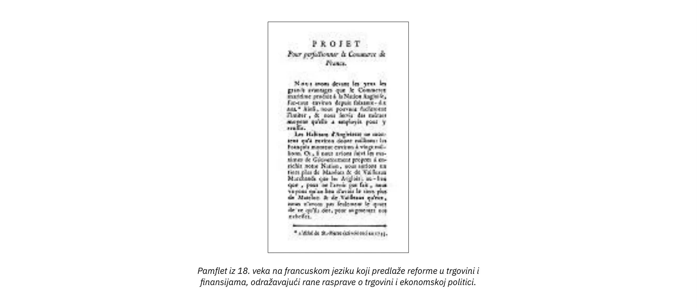

Takođe je naglasio, pre Vincent de Gournaya, vrednost rada i važnost održavanja njegove privlačnosti. "Sav rad je težak", napisao je. "A kada čovek vidi da mu njegov rad ne donosi ništa, ili nedovoljno, postaje lenj i neće se truditi više nego što je potrebno". Ovaj argument će kasnije ponoviti markiz d'Argenson, Vincent de Gournay i fiziokrati dok su kritikovali opterećujuće propise i cehovske sisteme. Tvrdili su da takva ograničenja obeshrabruju radnike, uzrokuju nepotrebne poteškoće i na kraju čine da lenjost izgleda privlačnije od produktivnog truda u takvim uslovima.

## Markiz d'Aržanson

<chapterId>e9960ab4-72ec-5afd-8e97-bf89c83b62bc</chapterId>

Markiz d'Arženson je zaboravljeni osnivač doktrine laissez-faire.

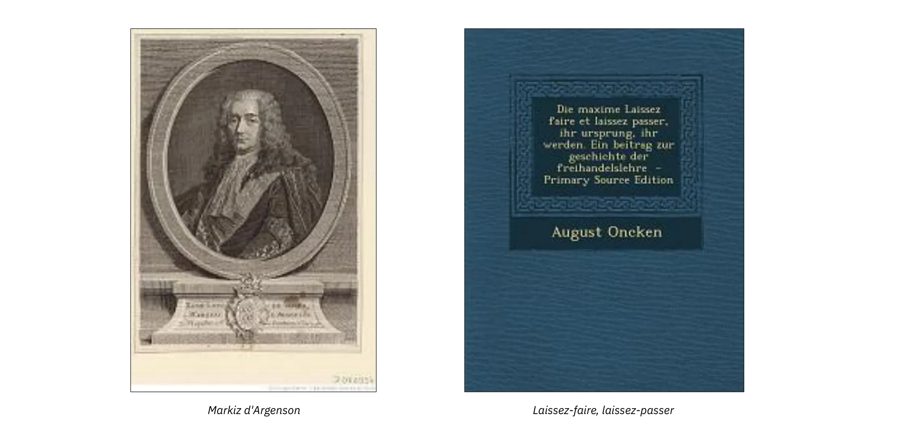

Ponovo ga je otkrio August Oncken, autor knjige o doktrini laissez-faire, laissez-passer, zaključio je da je d'Argenson igrao glavnu ulogu u rađanju ove ideje.

René-Louis Voyer, markiz d'Arženson, rođen je 1694. Svoju političku karijeru započeo je kao parlamentarni savetnik, a zatim je služio u Državnom savetu.

Trideset godina pre Adama Smita, d'Argenson je već branio prednosti podele rada i specijalizacije.

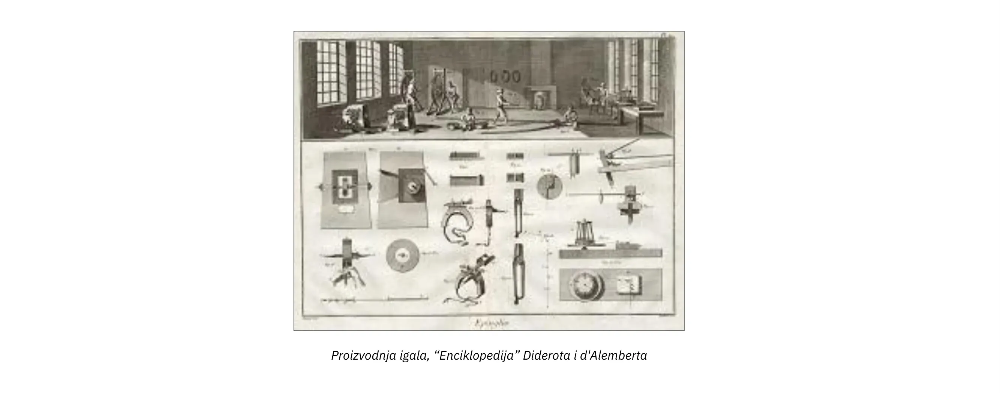

Snažno je kritikovao propise koji su, po njegovom mišljenju, pokušavali da promene prirodne sklonosti različitih regiona. Na primer, bio je zbunjen što je vlada želela da proizvodi tkanine i somot u Toursu, siromašnom gradu u to vreme, kako bi se podudarali sa kvalitetom onih proizvedenih u prosperitetnoj Đenovi, koja je bila poznata po luksuznoj robi. Zaključio je:

> "Svako mesto mora imati pravo da bira svoje fabrike. Sloboda! Sloboda!"

Takođe je prepoznao još jedan od Smitovih centralnih principa: ideju da spontani poredak proizlazi iz potrage za ličnim interesom. Markiz d'Arženson je verovao da je neposredni lični interes ono što pokreće ljudsku energiju. Napisao je da bi loše zanatstvo i prevara diskreditovali proizvođača, dok bi marljivost i dobre namere vodile ka prosperitetu. Najbolji sudija korisnosti, tvrdio je, bio je pojedinac, šira javnost, koja kupuje robu i brine o sklapanju dobrog posla. "Svi osećaju svoj interes," rekao je, "svi preduzimaju mere koje su im korisne, i u ovom opštem dogovoru otkrivamo istinu."

Čak i pre Adama Smita, razumeo je da sopstveni interes vodi ka opštem interesu kroz izgradnju spontanog prirodnog poretka.

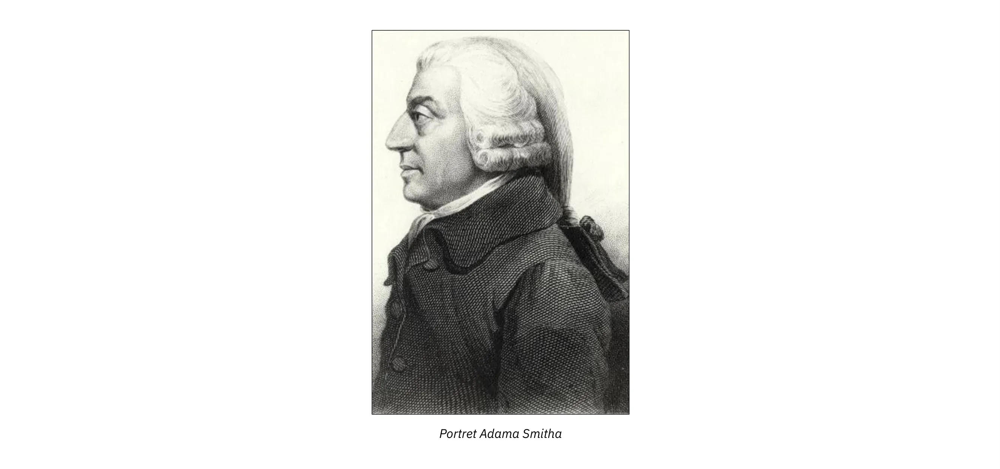

Uporedio je društvo sa košnicom pčela gde svaki insekt prati svoj instinkt, "Iz njihovih akcija", rekao je precizno, "rezultirala je velika akumulacija za potrebe malog društva; ali to nije postignuto naređenjima, ili od strane generala, koji su obavezivali svakog pojedinca da prati stavove svog vođe". Ovo je možda najbliži izraz u francuskoj ekonomskoj misli čuvenom konceptu Adama Smita o "nevidljivoj ruci".

Markiz d'Argenson je uvek bio ogorčen idejama ministara svog vremena. Jedino pitanje koje su postavljali bilo je: "Da li treba da regulišemo na ovaj ili onaj način? Da li treba da usmerimo ekonomiju ka ovome ili onome?". Na šta je d'Argenson odgovarao: "Zar ne bismo prvo trebali da se zapitamo da li je uopšte prikladno usmeravati bilo šta, ili bi stvari trebalo prepustiti da funkcionišu same od sebe?"

Da budem iskren, bio je zapanjen što je ljudima bilo toliko Hard da razumeju, ili bolje rečeno, da vide, štetne efekte prekomerne regulacije svih vrsta na ekonomiju. Po njegovom mišljenju, bilo je dovoljno samo otvoriti oči. "Toliko stvari danas funkcioniše razumno dobro", napisao je ogorčeno, "jednostavno zato što su uspele da izbegnu domet zakona".

Ponekad je očajavao zbog toga koliko su njegove ideje bile malo shvaćene.

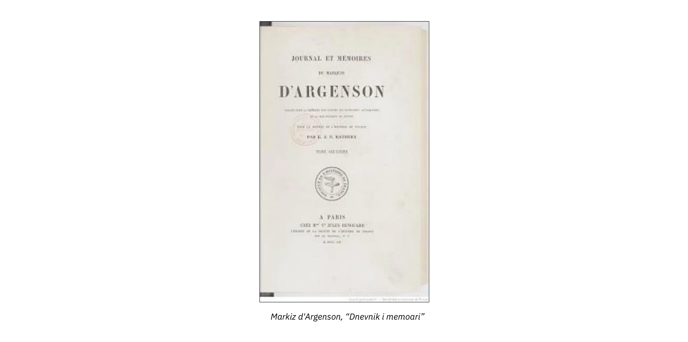

Ideal ekonomske politike koji je branio bio je, dakle, suprotan trendovima njegovog vremena. Njegov ideal je definisao suštinski negativnu ulogu države. "Sve što trgovini treba je uklanjanje prepreka. Traži samo dobre sudije, kažnjavanje monopola, jednaku zaštitu za sve građane, stabilne valute i puteve i kanale". Ovo je bila definicija minimalne države, koja će postati jedan od temelja francuske tradicije u političkoj ekonomiji.

Ova vizija uloge države u ekonomskoj aktivnosti prirodno je ilustrovana proučavanjem dva glavna pitanja koja su uzburkala ekonomiste i društvene mislioce njegovog vremena: regulacija industrije i trgovina pšenicom.

Propisi o industriji, pre svega, izazvali su sav njegov bes, jer su bili privilegije za neke na račun drugih. "Pravi uzrok propadanja naših fabrika", napisao je, "je prekomerna zaštita koja im je data". I sa ništa manje živahnim kredom izrazio je svoju kritiku dirigističkog žara državnika svog vremena:

> Voditi industriju protiv njene volje znači želeti njeno propadanje.

Na pitanje trgovine u pogledu egzistencije, d'Argenson nije imao drugi odgovor osim slobode. Prema njemu, nestašice pšenice su dolazile od monopola i prekomernih mera predostrožnosti koje je preduzimala vlada. Sve što je trebalo da uradimo bilo je da pustimo stvari da idu svojim tokom, i nikada ne bi bilo nestašice pšenice u zemlji gde su luke otvorene. Stranci, privučeni kao i svi drugi ljudi mamcem zarade, obezbedili bi nam ono što nam treba i odneli naš višak. "Pustite da bude", rekao je, "i sve će biti dobro".

## Vincent de Gournay

<chapterId>e8ae40dc-7450-552f-9ddc-9e02936cf425</chapterId>

Vincent de Gournay je bio jedan od prvih predstavnika laissez-faire u Francuskoj i jedan od njegovih najranijih zagovornika u javnoj upravi i intelektualnim krugovima. Iz tog razloga zaslužuje mnogo više priznanja u istoriji ekonomske misli nego što obično dobija. Pokušao sam da istaknem njegove doprinose u nedavnoj knjizi.

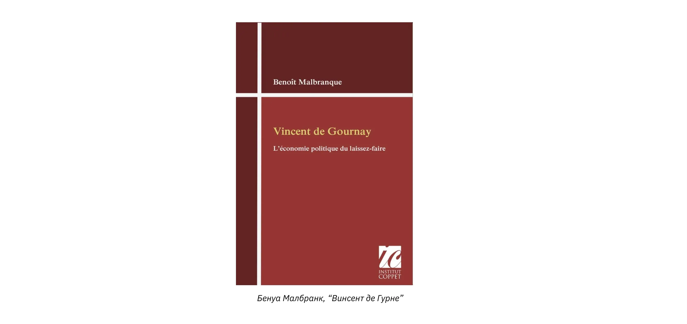

Rođen u trgovačkoj porodici, Gournay je i sam postao uspešan trgovac, stekavši značajno bogatstvo pre nego što je obezbedio poziciju u francuskoj administraciji. U okviru Biroa za trgovinu, bio je vatreni zagovornik slobodnog rada i slobodne trgovine.

Iako je bio dobro uklopljen u kontekst vodećih ekonomista svog vremena, Gournay je malo pisao ili, tačnije, malo objavljivao. Pisao je uglavnom administrativna pisma i memoare, bilo neobjavljene ili objavljene od strane drugih autora nakon izvesne obrade.

Ono što imamo uključuje:

1. [Primedbe](https://archive.org/details/traitessurlecomm0000chil) na prevod knjige engleskog ekonomiste Džozaja Čajlda;

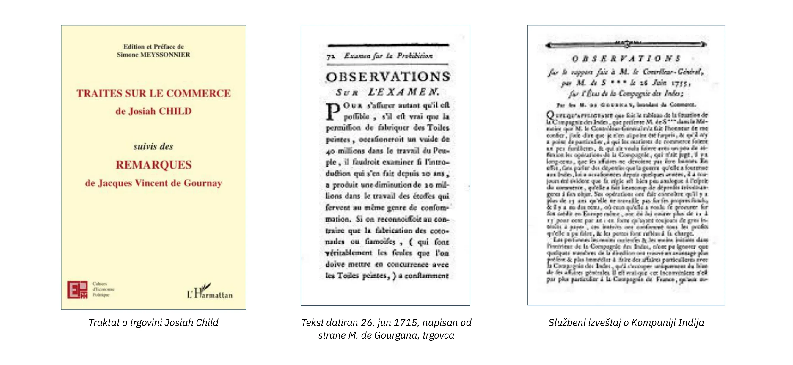

2. "Opservacije" uključene u Ispitivanje Prednosti i Nedostataka Zabrane Štampanih Tkanina;

3. "Opservacije o Istočnoindijskoj kompaniji", koje je priložio Abbot Morellet uz svoj Memorandum o trenutnom stanju Istočnoindijske kompanije (1769);

4. I iznad svega, razni memoari iz njegove uloge kao Intendant trgovine.

Ovi spisi pokazuju jasan strani uticaj i prisustvo nekih glavnih ideja strukturiranja. Strani uticaj, kod Gournaya, je prepoznavanje engleske i holandske superiornosti. Gournay je bio uveren da ove dve nacije razumeju ekonomiju mnogo bolje od Francuske i da Francuska mora slediti njihov primer. "Ove dve nacije su najprosperitetnije", rekao je, "i one slede potpuno drugačiji sistem od našeg. Mi zabranjujemo ulazak strane robe, ograničavamo ekonomsku aktivnost strogim propisima, dok oni postupaju na suprotan način. Ako im ide bolje", zaključio je Gournay, "to je zato što se Francuska vodi pogrešnim principima".

Njegovi predlozi za reformu bili su usredsređeni na nekoliko ključnih tačaka.

Prvo, verovao je da rad treba zaštititi i podsticati. U to vreme, francuski radnici su bili tretirani kao kriminalci, stalno nadzirani i držani u strahu da nisu ispunili neki od hiljada propisa. Ovo prekomerno uznemiravanje obeshrabrivalo je ljude da rade, gurajući ih umesto toga ka besposličarenju. Ipak, Gournay je tvrdio, "rad je plemenit i jedini način da se obogati nacija".

Drugo, kritikovao je restriktivni sistem cehova koji je ograničavao proizvođače. Učestvovanje u zanatu bilo je i vremenski zahtevno i skupo, a svaki novi radnik morao je potom pažljivo pratiti rutinu uspostavljenu statutima svog ceha. Takav sistem nije ostavljao prostora za izvrsnost, inovaciju ili napredak.

Treće, trgovinu u Francuskoj ograničavali su restriktivni zakoni. Po Gournayjevom mišljenju, potrošači bi imali velike koristi kada bi luke mogle slobodno da se takmiče i kada bi sva roba, poput žita i štampanih platna, mogla da se uvozi bez ograničenja. Bio je jedan od prvih koji je ukazao na pravi izvor krijumčarenja: ono je postojalo isključivo zato što je korisna i korisna trgovina bila zabranjena. Dodao je oštru opservaciju: krijumčarenje je bila "slobodna" profesija, bez regulativa, bez cehova, bez konfiskatornih poreza. Ipak, prekomerna regulacija države je mnoge poštene radnike terala u ilegalu.

Konačno, Gournay je primetio da su kamatne stope bile niže u Engleskoj i Holandiji, zemljama koje su bile prosperitetnije od Francuske. Zalagao se za niže kamatne stope i u Francuskoj, kako bi se ekonomska aktivnost mogla finansirati pod uslovima jednako povoljnim kao i drugde. Međutim, Gournay nije tražio prinudne, zakonodavne metode; umesto toga, naglašavao je potrebu za legalizacijom pozajmljivanja novca, što je i dalje bilo osuđivano od strane Katoličke crkve.

Na svim ovim tačkama, Gournay je igrao ključnu ulogu u intelektualnim debatama sredine 18. veka. Njegova odbrana ekonomske slobode prethodila je fiziokratima za deceniju i Adamu Smithu za dvadeset godina. Ali njegov najtrajniji uticaj bio je na Turgota. Gournay je uzeo mladog Turgota pod svoje okrilje i obučio ga svojim idejama.

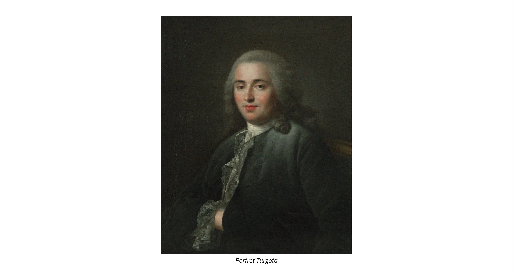

Godinama kasnije, Turgot, budući ministar pod Lujem XVI, napisao je Éloge (posmrtnu pohvalu) u čast svog prijatelja nakon njegove smrti. A ako Turgot nikada nije potpuno prihvatio fiziokratiju Françoisa Quesnaya, to je bilo zato što je sačuvao nepobedivu privrženost svom prvom učitelju, Vincentu de Gournayu.

## Gournay Circle

<chapterId>b86ba6bd-8f3a-5d8f-b098-4d0413f00deb</chapterId>

Kada je reč o ranim danima ekonomske nauke, istorija obično ističe prvu školu mišljenja: fiziokrate, predvođene Fransoa Keneom i njegovim učenicima. Međutim, skoro deceniju pre njihovog uspona, postojala je druga, manje formalna, ali podjednako važna grupa okupljena oko ekonomiste Vensana de Gurnea.

Kao što smo videli u prethodnom delu, Gournay je bio fasciniran primerom stranih nacija poput Engleske i Holandije. Podjednako je cenio njihove ekonomiste—ličnosti kao što su Josiah Child, Johan de Witt i David Hume.

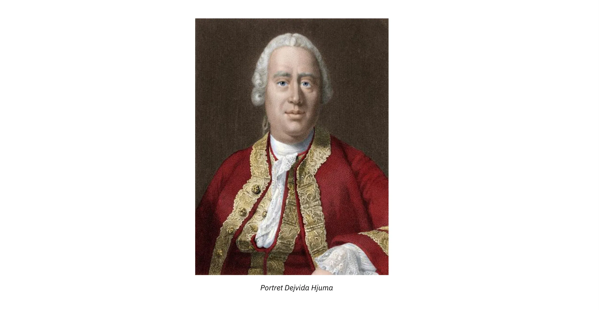

Ovo divljenje ga je navelo da prevede i dodeli prevode njihovih ekonomskih spisa.

Ispostavilo se da je njegova pozicija u višoj administraciji omogućila Gournayu da stupi u kontakt sa svim ekonomskim stručnjacima poznatim u Francuskoj u to vreme. Na taj način, okupio je grupu izuzetno sposobnih prevodilaca. Lično je preveo dela Childa i Culpepera. Opat Le Blanc preveo je Političke diskurse Davida Humea. Véron de Forbonnais preveo je španskog ekonomistu Geronyma de Uztariza. Turgot je radio na spisima Josiaha Tuckera, a Montesquieuov sin preveo je Joshue Geea.

Zahvaljujući saradnji nekoliko članova Gournayevog kruga, mnogi autori su mogli objaviti originalna dela pod svojim imenima. Ove knjige, zajedno sa prevodima, postigle su izuzetan uspeh. Neki značajni primeri uključuju:

- Herbertov esej o [Opštoj policiji žita](https://archive.org/details/essaisurlapolice00herb/page/n7/mode/2up) (6 izdanja u 4 godine)

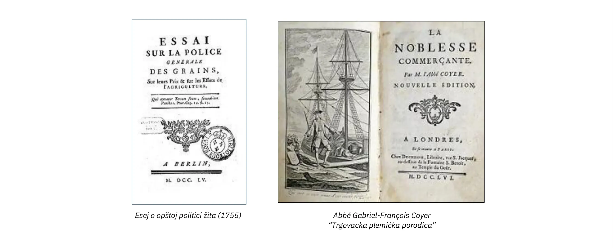

- Coyerova [Noblesse commerçante](https://archive.org/details/lanoblessecommer00coye/page/n3/mode/2up) (5 izdanja u 2 godine)

- Plumard de Dangeulova [Zapažanja o prednostima i nedostacima Francuske i Velike Britanije](https://archive.org/details/bim_eighteenth-century_remarks-on-the-advantage_plumard-de-dangeul-loui_1754) (3 izdanja u prvoj godini)
- Cliquot-Blervache i Gournayjev [Memoir on the Trades](https://www.amazon.com/Memoire-sur-corps-metiers-French/dp/1978196903) (2 izdanja u 1758)

Grupa je takođe igrala ključnu ulogu u objavljivanju

- [Esej o Prirodi Trgovine uopšte](https://archive.org/details/essayonnatureofc0000cant) od Ričarda Kantijona.

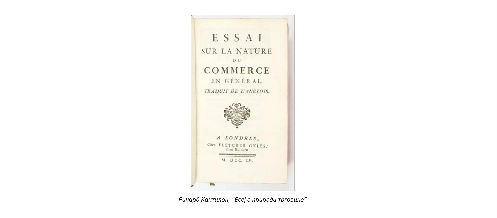

Ova poslednja knjiga, napisana oko 1730. godine, ostala je u rukopisu nakon autorove smrti. Gournay ju je, uz pomoć svojih prijatelja ekonomista, objavio 1755. Prema rečima opata Moreleta, člana tog kruga, Gournay ju je preporučivao svakom ekonomisti kojeg je poznavao.

Intelektualni doprinos Gournay kruga imao je veliki uticaj na istoriju ideja. U tom smislu, mogu se smatrati osnivačima ekonomske nauke u Francuskoj. Christine Théré iz INED-a, koja je proučavala istoriju ekonomskih publikacija, otkrila je da je između 1750. i 1759. godine objavljeno čak **349** radova o ekonomiji, u poređenju sa samo **83** u čitavoj prethodnoj deceniji (1740–1749). Ova revolucija u 1750-im godinama je u velikoj meri zasluga Gournay kruga.

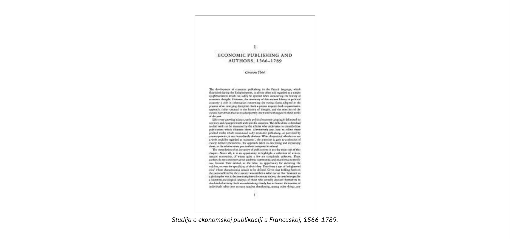

Da bi proširili interesovanje za ekonomske diskusije među francuskim stanovništvom, Gournay i njegovi prijatelji su radili na tome da ih učine dostupnim kroz romane. Nakon *Memoara o zanatima*, koji je kritikovao cehove, Gournay i Cliquot-Blervache su pomogli Gabriel-François Coyeru da napiše kratak satirični roman pod nazivom Chinki: [Kohinčanska priča primenljiva na druge nacije](https://www.institutcoppet.org/wp-content/uploads/2013/06/Coyer-Chinki-Histoire-cochinchinoise.pdf).

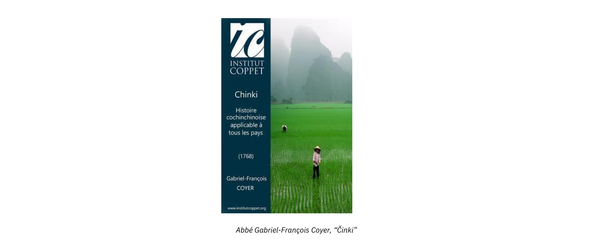

Priča prati glavnog junaka, Činkija, koji je primoran da napusti svoju zemlju zbog prekomernog oporezivanja i pokušava da pronađe zanatski posao za svoju decu u gradu. Ali svi zanati su im zatvoreni zbog zloupotrebljavajućih cehovskih propisa, pa priča prikazuje njegovo rastuće razočaranje kroz humoristične tonove.

Gournayev krug je stoga bio na izvoru intenzivnog talasa publikacija. Iako je ovaj značajan doprinos zaboravljen od strane istoričara ekonomske misli, bio je vrlo jasan savremenicima. Fiziokrati, koji su organizovali svoju školu 1760-ih, kasnije su predstavljali Gournayevu grupu kao svoje direktne prethodnike. Godine 1767, ekonomista Jacques Accarias de Serionne je to izrazio još jasnije u svojoj počasti. Napisao je: "Mali broj Francuza, i filozofa i građana, počeo je pre nekoliko godina da imitira engleske pisce. Prvo su prevodili svoje uzore i ubrzo ih nadmašili u mnogim aspektima. Doneli su sav šarm i bogatstvo književnosti u obradu korisnih tema; izazvali su i proširili ukus za nauke koje su bile najbitnije za prosperitet države".

I zaista, tokom 1750-ih, ekonomska pitanja postala su moderna. Volter je slavno primetio da su oko 1750. Francuzi odustali od romana kako bi raspravljali o slobodi trgovine žitom. Ovaj trend je takođe zabeležio Mercure de France, koji je u izdanju iz 1758, nekoliko meseci pre Gurnejeve smrti, napisao: "Politička ekonomija je sada nauka u modi. Knjige koje se bave poljoprivredom, populacijom, industrijom, trgovinom i finansijama sada su u rukama bezbroj ljudi koji su, ne tako davno, samo površno čitali romane". Teško da bi se mogla odati bolja počast Gurneju i radu njegovog kruga ekonomista.

## Mirabeau

<chapterId>2d2f802b-e3b6-556f-9025-a1b1dc4409ca</chapterId>

Francuska je poznala dva poznata čoveka po imenu Mirabeau, oca i sina, ali je sin taj koji je zaista ušao u istoriju. Kao revolucionarni tribun i jedna od centralnih figura događaja Francuske revolucije, ostao je poznat.

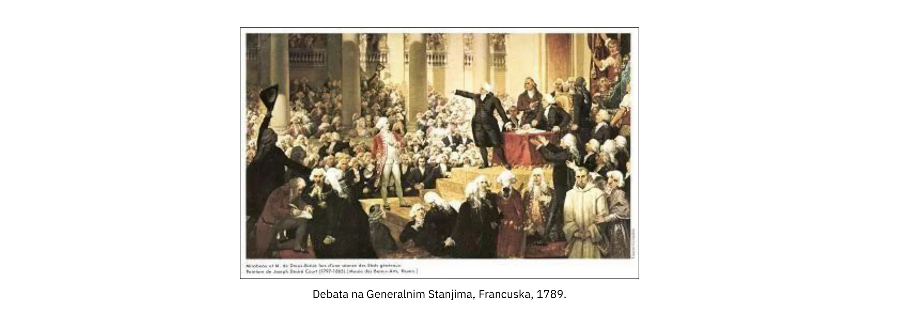

Svojim talentom i mestom u francuskoj istoriji zasenio je svog oca, ekonomistu i stub škole Fransoa Keneja, koji je bio njen prvi član još 1758. godine.

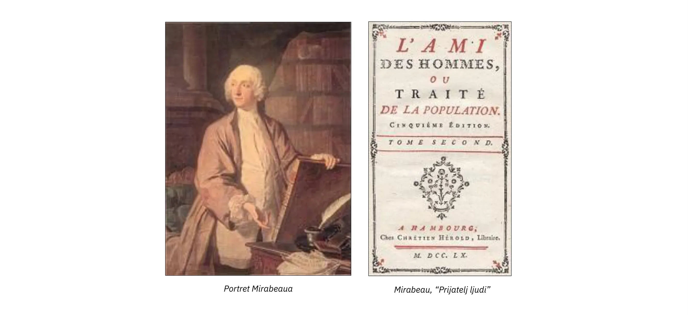

Markiz de Mirabo je, zapravo, već postigao ogromnu slavu čak i pre nego što je prihvatio fiziokratiju zahvaljujući knjizi pod naslovom "Prijatelj čovečanstva. Rasprava o populaciji [FR: L'ami des hommes, ou, Traité de la population](https://archive.org/details/lamideshommesou00unkngoog). Iako je prvo izdanje objavljeno 1756. godine, postalo je poznato oko 1757. godine, godinu dana pre njegovog susreta sa Keneom.

Više od 20 izdanja je objavljeno između 1757. i 1760. godine, što ga verovatno čini najuspešnijom knjigom o ekonomiji u istoriji. Neki čitaoci su čak mislili da je knjigu napisao Montesquieu zbog njenog oštrog rasuđivanja. Dauphin, otac kralja Luja XVI, čak je tvrdio da ju je naučio napamet. Jedno vreme, to je bila knjiga koju su svi u Versaju čitali.

Danas je to knjiga koja se više ne čita, ali je mnogi i dalje pominju. Čak je i u 19. veku Edmond Roussel rekao:

> L'Ami des Hommes je jedna od onih knjiga o kojima svi pričaju, a koje gotovo niko ne poznaje. U svakoj generaciji, jedan hrabri građanin bi trebalo da je pročita; kako ostali ne bi morali.

Na početku svoje karijere kao ekonomista, Mirabeau je crpeo inspiraciju od Richarda Cantillona. Posjedovao je rukopis Cantillonovog Eseja o prirodi trgovine uopšte 15 godina i strpljivo ga analizirao i komentarisao.

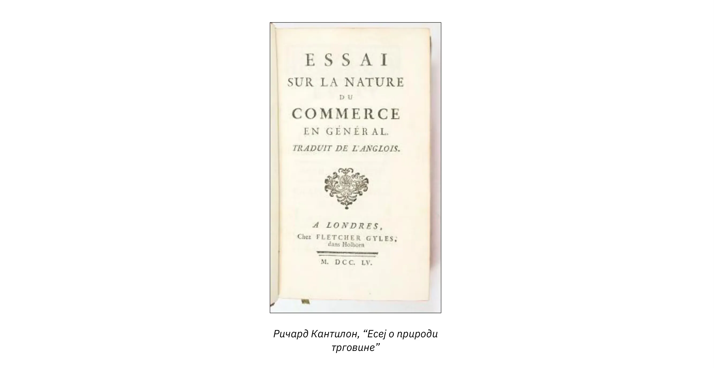

L'Ami des Hommes je prvobitno zamišljen kao jednostavan komentar na Kantijonov Esej. Ali pošto je Mirabo imao donekle eklektičan um, što znači, iskreno, pomalo lud, brzo je odstupio od svog prvobitnog plana. Knjiga jednostavno raspravlja o svim ekonomskim pitanjima koja je poznavao, povremeno se udaljavajući od Kantijona. To je teška knjiga za čitanje, sa bizarnim planom i digresijama u svakom poglavlju. Sam Mirabo je priznao da je to haos i da je njegov stil apokaliptičan.

Uprkos haosu koji vlada, neke ideje vredi zabeležiti:

- Mirabeau se bori protiv merkantilističkih predrasuda o prirodi bogatstva.
- On hvali poljoprivredu i kritikuje njeno napuštanje.
- Žali se na stanje naroda, posebno seljaka.
- Konačno, on brani slobodu trgovine i bratstvo nacija u miru.

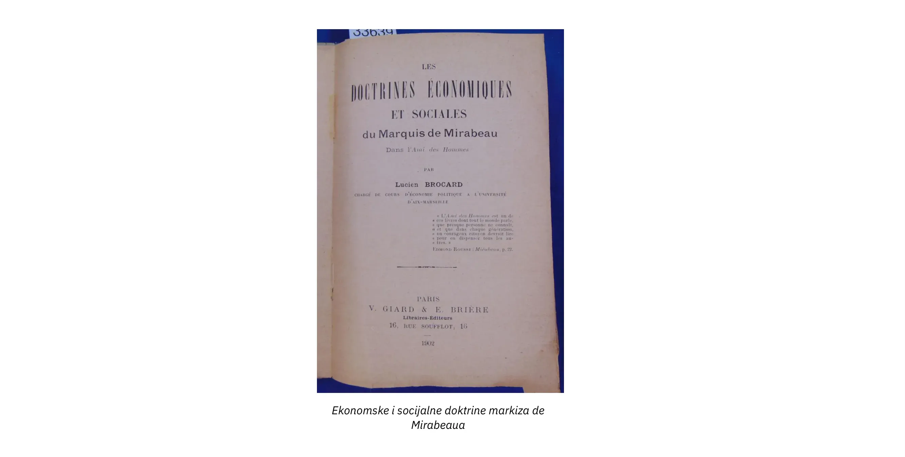

Teško je označiti Mirabeauove stavove kao liberalne ili anti-liberalne. Često je prelazio s jedne vizije na drugu, ponekad i nesvesno. Ipak, liberalne ideje su često dominirale njegovim pisanjem. Jedan od njegovih najpoznatijih citata bio je:

> Pravi i jedini princip političke ekonomije je da se sve pusti da bude slobodno.

Sa svojim najvećim uspehom iza sebe, Mirabo je bio tražen. Fransoa Kene, koji se upravo zainteresovao za ekonomiju, pozvao ga je u svoj entresol u Versaju.

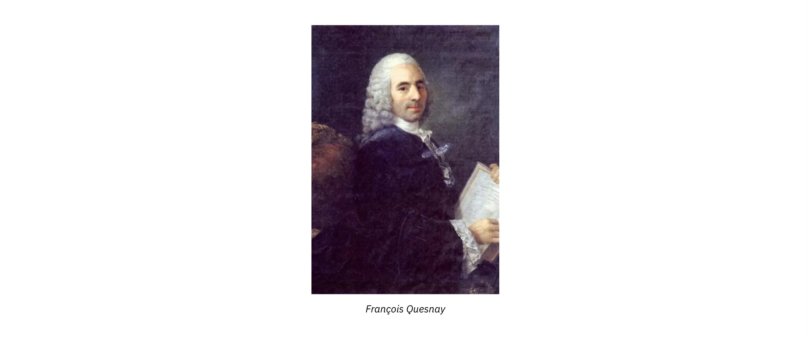

Žustro su raspravljali i konačno, nešto što se obično nikada ne dešava u debatama, desilo se: Mirabeau je otvoreno priznao da je pogrešio. Složio se sa Quesnayevim idejama i rekao da je spreman da ih širi.

Zajedno su formirali jezgro onoga što će postati fiziokratska škola, ojačana redovnim regrutima koje su dovodili. Ubrzo nakon Mirabeauove konverzije, Quesnay ga je angažovao da brani njegove ideje o oporezivanju. To je dovelo do ["Teorije oporezivanja"](https://archive.org/details/thoriedelimpot00mira), zbog koje je Mirabeau bio poslat na nekoliko dana u zatvor Vincennes, a zatim prognan u Bignon.

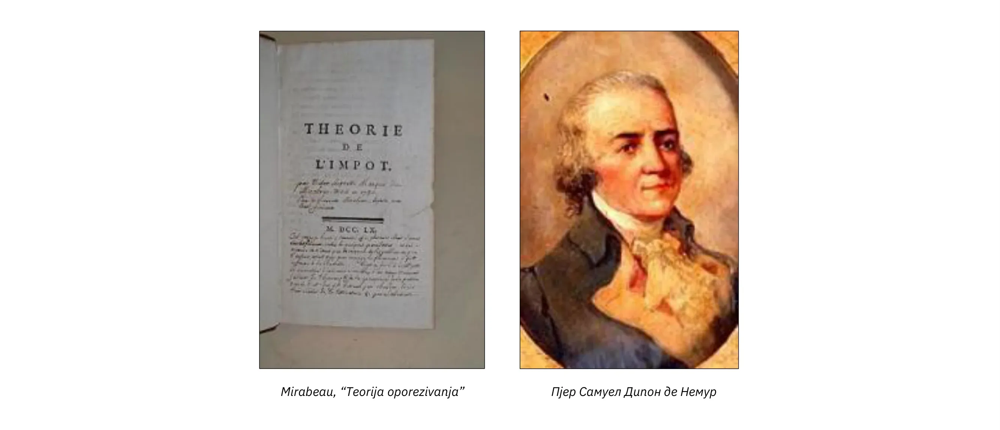

Mirabeau je takođe igrao ključnu ulogu u regrutovanju novih članova za Quesnayevu školu. Čak je ubedio mladog Duponta de Nemoursa.

Takođe, u Mirabeauovoj kući su se fiziokrati sastajali svakog utorka. Čini se da su ličnosti poput Turgota i Adama Smitha prisustvovale tim sastancima jednom ili nekoliko puta.

Tokom svog života, Mirabeau je ostao neumoran pisac. Autor je brojnih ekonomskih dela koja brane Keneovu doktrinu. Međutim, pred kraj svog života, njegov uticaj je oslabio. Njegov stil pisanja se pogoršao do te mere da mu je sopstveni brat pisao kako više ne može da razume njegovu prozu. Njegove ideje, koje su postale potpuno liberalne, sukobile su se sa socijalističkom ili proto-komunističkom reakcijom mislilaca poput Mablija, pa čak i Rusoa. Borio se da pronađe čitaoce i izdavače, i umro je uglavnom neprimećen 1789. godine, uoči juriša na Bastilju.

## Kene

<chapterId>7a35f20b-5ea0-544d-b290-bcd9c6f7f11a</chapterId>

François Quesnay je jedan od najpoznatijih francuskih ekonomista.

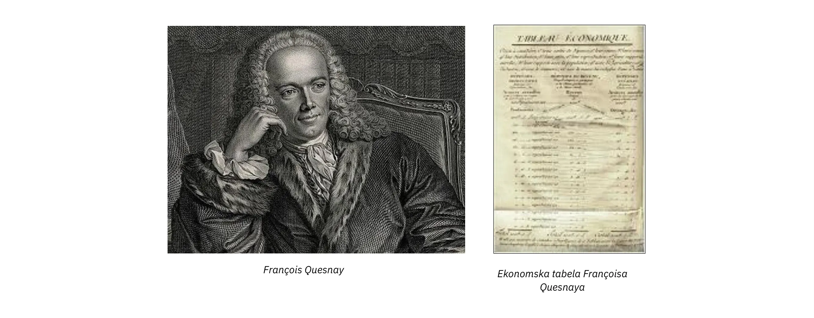

Njegovo ime se pojavljuje u svakom udžbeniku o ekonomiji i istoriji ekonomske misli. Navodi se da je stvorio "Tableau Économique" kako bi shematski predstavio ekonomiju, da je bio vođa fiziokratske škole, i da je grešio verujući da je samo zemlja produktivna, i na kraju, da je Adam Smit došao da ispravi rekord. Ovako, manje-više, udžbenici obično sumiraju Fransoa Keneja.

Svesti ga na ovo je sramota, jer je Quesnay bio i prvi ekonomista koji je pokušao da odbranu ekonomske slobode zasnuje na naučnim principima. Bio je jedan od najslušanijih i najuticajnijih ekonomista svog vremena. Štaviše, osnovao je fiziokratiju, mnogo bogatiju doktrinu od simplističke ideje da samo priroda proizvodi bogatstvo, što je često pogrešno predstavljeno.

Razgovaraćemo o fiziokratiji detaljnije u naredna tri poglavlja. Prvo, hajde da pobliže pogledamo samog Françoisa Quesnaya.

Rođen 1694. godine u Méréu u seljačkoj porodici koja nije mogla naučiti Quesnaya da čita. Obučavao ga je lokalni čovek i na kraju je nastavio studije na Koledžu hirurgije, a zatim na Medicinskom fakultetu. Sa 24 godine postao je hirurg u Mantesu.

Stekao je slavu 1730. godine, u dobi od 36 godina, zbog protivljenja uobičajenoj praksi puštanja krvi, za koju je verovao da se zasniva na pogrešnim teorijama i predrasudama. Takođe se usudio da izazove sistem cehova, koji je nalagao da samo hirurzi mogu da izvode operacije, a samo lekari mogu da prepisuju lekove. Ovo je često primoravalo siromašne da plaćaju dvostruko i dovode dve osobe, što je Quesnay smatrao odvratnim.

Godine 1740. postao je sekretar Akademije hirurgije. Godine 1748, u dobi od 54 godine, postao je lični lekar Madame de Pompadour i preselio se u Versaj.

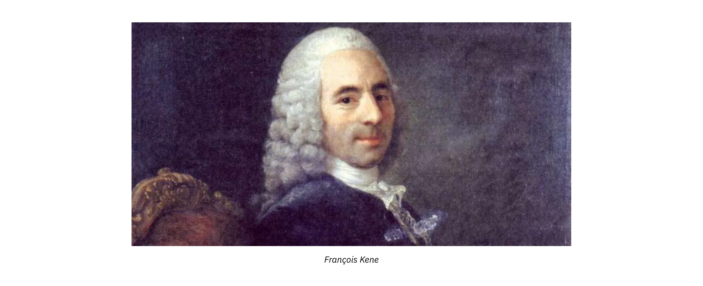

Bio je veoma blizak sa Madame de Pompadour. Quesnay je čak rekao, u vreme kada je najavljena nemilost miljenice, da ne bi želeo ostati lekar u Versaju bez nje:

"Bio sam vezan za Madame de Pompadour u njenom blagostanju; biću tako i u njenoj nemilosti".

Zatim je objavio nekoliko medicinskih knjiga: Rasprava o supuraciji (1749), Rasprava o gangreni (1749) i Rasprava o kontinuiranim groznicama (1753), koje su sve bile više puta štampane tokom njegovog života.

U dobi od 60 godina, nakon što je bio upoznat sa ekonomskim debatama koje su bile moderne u to vreme, počeo je pisati o ekonomiji. Godine 1755. napisao je članke "Poljoprivrednici" i "Žito" za *Enciklopediju*.

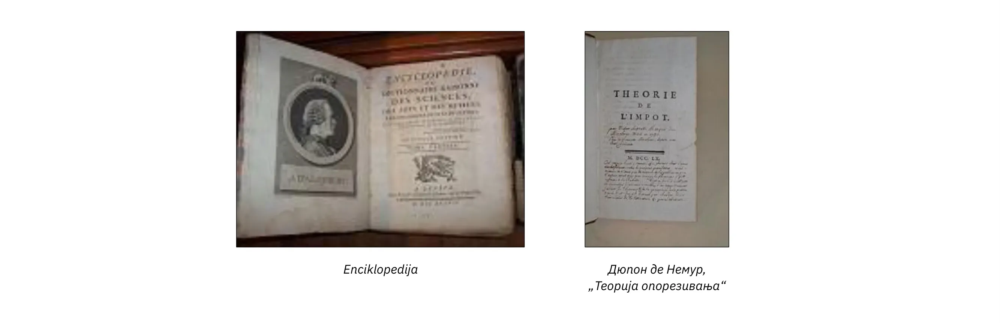

Objavljeni su 1757. Te iste godine, upoznao je čuvenog Mirabeaua i uspeo da ga preobrati u svoje ekonomske ideje—srž fiziokratije je rođena. Quesnay je tada kreirao Tableau Économique, koji je štampan na kraljevskim presama, navodno u prisustvu samog kralja u Château de Versailles. Od tog trenutka, redovno je ugostio ekonomiste i filozofe u svom stanu u Versaillesu, gde su slobodno vodili diskusije. Quesnay je takođe doprineo Mirabeauovoj Teoriji oporezivanja, objavljenoj 1759.

Cenzura je ubrzo stupila na snagu. Mirabeau je bio zatvoren, a Quesnay je bio ukoren. Nakon toga, Quesnay je shvatio da ne može otvoreno objavljivati i da će mu trebati učenici da šire njegove ideje.

Brzo ih je pronašao: Baudeau, Dupont de Nemours, Le Trosne, Mercier de la Rivière i drugi. To su bili ljudi koji će širiti i popularizovati misli Quesnaya. Međutim, Quesnay, kojem su bili potrebni učenici, nije bio potpuno zadovoljan sektaškim aspektom svoje grupe. Svedok su njegova pisma Mirabeauu, u kojima mu kaže:

> "Mislite za sebe. Shvatio sam da vas moji jadni nacrti čine lenjima. Sada je vaš red da mislite. Znate isto koliko i ja."

Ipak, njegovi učenici su bili duboko posvećeni i značajno su doprineli Keneovoj popularnosti. Nakon njegove smrti, Mirabo je održao posmrtni govor, rekavši: "Izgubili smo našeg oca, jer smo mu dugovali sve". U stvarnosti, Kene je dugovao njima sve, jer bi bez njih ostao zaglavljen u Versaju, gde je njegovo razmišljanje, iako je imalo mnogo toga da zavede ili zabrine, zanimalo malo koga.

Zahvaljujući radu njegovih saradnika, njegove ideje su našle platformu: prvo kroz novine kao što su *Journal of Agriculture* i *Ephémérides du Citoyen*.

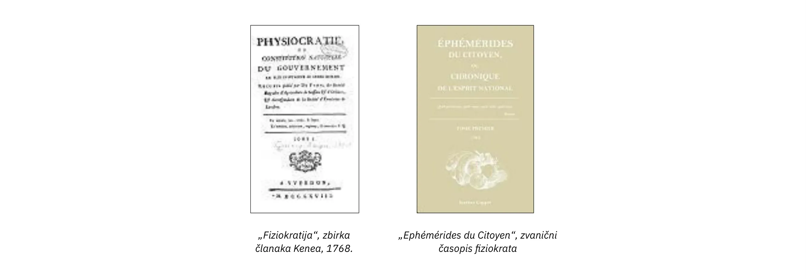

Zatim kroz knjige, ne samo one njegovih učenika već i važnu antologiju koju je 1768. objavio Dupont de Nemours, pod nazivom *Fiziokratija*.

Ova knjiga je sakupila glavne Quesnayjeve doprinose. Izložila je ekonomski ideal lidera fiziokrata: model poljoprivredne ekonomije gde zakon garantuje svakome pravo na posedovanje imovine i slobodu trgovine.

# Fiziokratska škola

<partId>27af82c1-ad82-5c3b-8ce9-c674b67bbf7c</partId>

## Istorija fiziokrata

<chapterId>4236ff8b-b53a-59e7-92c0-f96f9afa1c00</chapterId>

Fiziokratija je postala moderna u Francuskoj, pa čak i širom Evrope, jedva na deceniju. Nakon dugog perioda razvoja, stekla je istaknutost sredinom 1760-ih. Do trenutka kada je Turgot došao na vlast 1776. godine, pokret je već izgubio svoju popularnost, a ministar je uglavnom skrivao svoju podršku Keneovoj školi.

Njegovo poreklo leži u evoluciji ekonomskih ideja tokom 1750-ih. Nekoliko autora pomoglo je da se premosti jaz između Boisguilberta i onoga što će kasnije postati poznato kao fiziokratija. Kao što je ranije diskutovano, Vincent de Gournay i njegov krug ekonomista stajali su iza mnogih publikacija koje su francuskim čitaocima predstavile stranu ekonomsku misao i pomogle da se rasplamsa njihova strast prema ekonomiji. Osnove fiziokratije već su bile prisutne u knjigama poput "Détail de la France" od Boisguilberta i ["Essay on the Nature of Trade in General"](https://archive.org/details/essaisurlanature0000cant) od Cantillona.

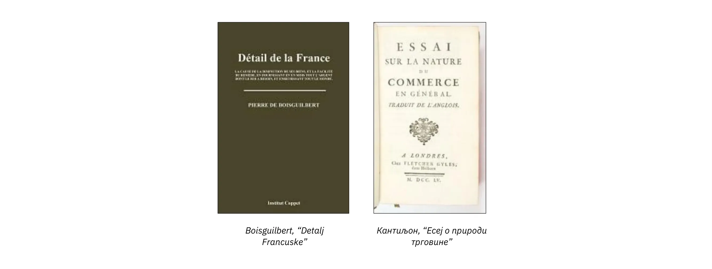

Koncept laissez-faire imao je nekoliko zagovornika od Boisguilberta, posebno Vincent de Gournay i markiz d'Argenson.

Ono što je preostalo bilo je da se ovo telo ideja pretvori u koherentnu, potpunu doktrinu, a markiz de Mirabo je bio prvi koji je to pokušao. Inspirisan Kantijonovim Esejem, počeo je da piše sveobuhvatan traktat o ekonomskim pitanjima pod nazivom "L'Ami des Hommes", koji je bio veoma uspešan.

Tako je, 1756. godine, mogla početi priča o fiziokratiji. Fransoa Kene, tada hirurg koji je postao lični lekar Madame de Pompadour, pozvao je Miraboa u Versaj da razgovaraju o ekonomskim idejama.

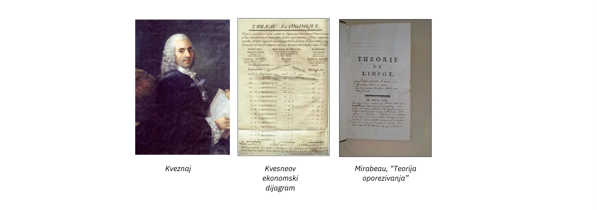

Do kraja njihovog razgovora, Mirabeau se složio sa Quesnayevim idejama. Od tada su pisali: Quesnay je kreirao *Tableau économique* (1758) da ilustruje tok bogatstva u ekonomiji, a zajedno su objavili Teoriju oporezivanja (1759).

Njihovi napori nisu bili toplo dočekani. Na dvoru, preovlađujuća reakcija bila je ravnodušnost. Kralj je priznao Quesnayevu sklonost ka teoriji i s ljubavlju ga nazivao "moj mislilac". Ali osim tog komplimenta, njihov rad nije postigao nikakav rezultat. Zapravo, njihova Teorija oporezivanja uvredila je poreske administratore koje je kritikovala, toliko da su zahtevali i obezbedili Mirabeauovo zatvaranje. Madame de Pompadour ga je na kraju oslobodila, ali je nastavio da živi u egzilu na svom imanju u Bignonu nekoliko nedelja.

Prva polovina 1760-ih je tako prošla u relativnoj tišini. Zbog svoje pozicije u Versaju, Kene je bio primoran da prestane da piše, ili barem da ništa ne objavljuje pod svojim imenom. Mirabo, već jednom osuđen, bio je upozoren i dobro je znao da ga kraljev miljenik ne može zauvek štititi.

Nakon ove kratke tišine, dvojica ekonomista su počela regrutovati učenike: to je bio jedini način da popularizuju svoje ideje. Do 1765. godine, njihovi uspesi su bili zapanjujući. Dupont de Nemours, Abeille, Mercier de la Rivière, Le Trosne i Baudeau brzo su se pridružili njihovim redovima. Formirali su školu: imali su svoj časopis, *Les Éphémérides du Citoyen*, i čak su se sastajali svakog utorka u Mirabeauovom domu.

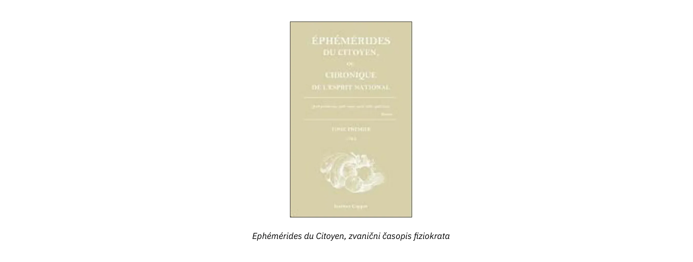

Između 1765. i 1775. godine, ujedinjena grupa fiziokrata bila je na vrhuncu svoje slave. Književni i filozofski svet imao je oči samo za njih, što je omogućilo da se njihove ideje šire široko i brzo. Ljudi su ih zvali "ekonomistima", ili, podrugljivije, "sektom ekonomista". Bez obzira na ton, njihova notornost bila je apsolutna. Godine 1774, nakon putovanja u Mec, M. de Vaublanc je u svojim memoarima pisao o svom zaprepašćenju: svi oko njega su pričali o ekonomiji i razmišljali kao Keneovi učenici. "Bilo je to moderno", primetio je. "Svi su bili ekonomisti".

Međutim, do 1770. godine njihova popularnost je počela da opada. Grupa je doživela prve dezerterstva, a njihova sposobnost da izdrže kritike je oslabila. A kritičara je bilo mnogo, Kondilak, Mabli, Volter, Galijani, Linget, Graslin, pa čak i Adam Smit u Škotskoj, svi su osporavali njihove stavove.

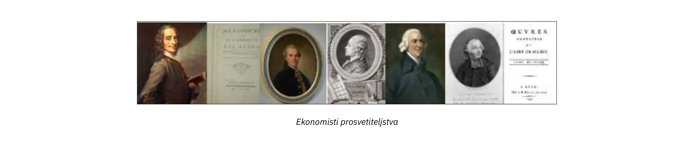

Njihove novine više nisu izlazile redovno. Ovo je označilo kraj najaktivnijeg perioda pokreta.

Fiziokratija bi nastavila da vrši uticaj sve do Revolucije. U Francuskoj, prvo preko Turgota, više kao saputnika nego kao učenika, kao i preko njenog predstavnika Duponta de Nemoursa, čiji ćemo život i dela kasnije proučavati. Ali i širom Evrope, gde je fiziokratska doktrina primljena sa entuzijazmom. U Nemačkoj, preko markgrofa od Badena, i u Italiji, preko Leopolda od Toskane, fiziokratske teorije su čak inspirisale ekonomske reforme koje su favorizovale privatnu svojinu i slobodu.

## Osnove doktrine fiziokrata

<chapterId>4dbe5436-0578-57c2-b054-03ed00aa091a</chapterId>

Termin Fiziokratija, što znači "vladavina prirode", skovao je Dupont de Nemours i koristio kao naslov za *Fiziokratija*, zbirku članaka koje je Quesnay objavio 1768. godine.

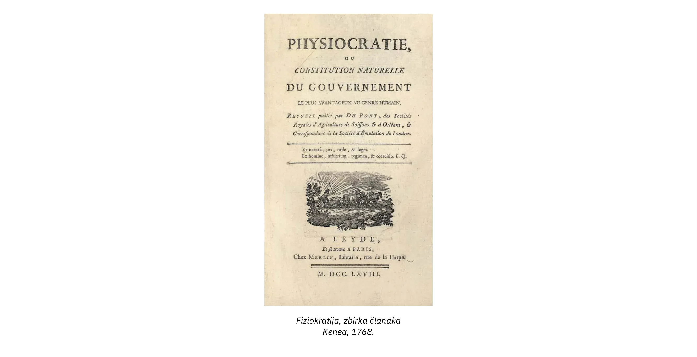

Ovo je nejasna fraza. Nijedan Quesnayev učenik nam nije dao njeno pravo značenje. Ipak, njihov sistem mišljenja bio je daleko od nejasnog. Zapravo, bio je izgrađen oko nekoliko vrlo jasnih principa, koje ćemo ovde izložiti.

### Prvi princip: samo je poljoprivreda produktivna

Ova prva ideja je ona koja je privukla pažnju istoričara. Danas, u udžbenicima ili kursevima ekonomije, ovako se fiziokrati sumiraju. Kaže se da su naivno verovali da je samo poljoprivreda produktivna. Na osnovu toga, njihova doktrina se odbacuje kao irelevantna, a analiza brzo prelazi na Adama Smita.

Međutim, nepravedno je kritikovati fiziokrate zbog pridavanja nesrazmerne važnosti poljoprivredi, jer je sredinom 18. veka poljoprivreda zapošljavala 90% stanovništva i činila osnovu francuske ekonomije.

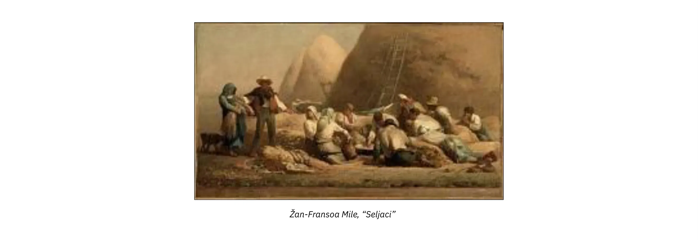

Ideja fiziokrata je zapravo suptilna. Prema njima, postoji razlika između proizvodnje i dobitka. Industrijalac i trgovac mogu ostvariti profit, ali samo poljoprivrednik zaista proizvodi, jer proizvodnja je stvaranje korisnog materijala, a ne dodavanje korisnosti već postojećem materijalu.

Trebalo bi takođe da pokušamo da razumemo zašto su odbacili industriju i zanate kao neproduktivne. U to vreme, ovi zanati su bili zaključani unutar cehovskog sistema, koji je zabranjivao inovacije, investicije i napredak.

### Drugi princip: legalni despotizam pre nego demokratija

Danas, da bismo nekoga uvredili, kažemo da nije demokrata. Dok istoričari opraštaju fiziokratama njihov strog pogled na poljoprivrednu produktivnost, ne opraštaju im protivljenje demokratiji, posebno jer su živeli u vreme vrhunca prosvetiteljskih ideja. Od sredine 18. veka do neposredno pre Revolucije, fiziokrate su smatrane neprijateljima napretka.

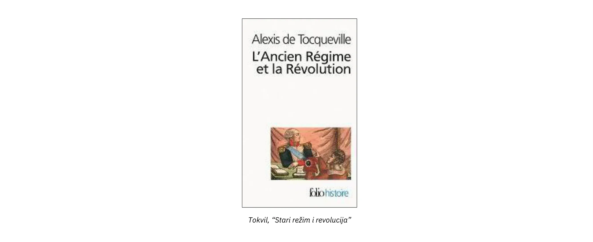

Tocqueville je insistirao na ovoj ideji:

> Fiziokrate su zaista bile veoma naklonjene slobodnoj trgovini robom, laissez-faire ili laissez-passer u trgovini i industriji; ali što se tiče političkih sloboda kao takvih, nisu ih razmatrali, a čak i kada bi im takve ideje pale na pamet, u početku su ih odbacivali.

Liberalni u ekonomiji, fiziokrati stoga nisu bili liberalni u političkim pitanjima. Kene piše u svojim *maksimama*: "Neka suverena vlast bude jedinstvena i superiorna svim pojedincima društva i svim nepravednim poduhvatima privatnih interesa." I kasnije, u istoj maksimi: "Sistem provere i ravnoteže u vladi je fatalna zamisao, koja samo otkriva neslogu među velikima i ugnjetavanje malih."

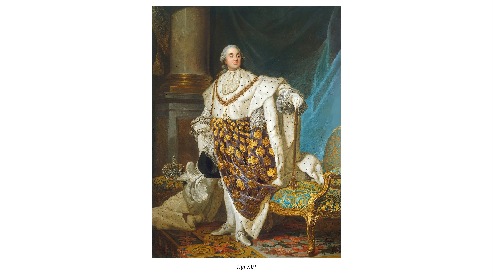

Tocqueville je tačno primetio da su fiziokrati odbacili demokratiju čim su videli njene oblike. Bili su skeptični prema demokratiji, što će postati konstanta u francuskoj političkoj ekonomiji, jer demokratija je daleko od savršenog sistema: potencijalno omogućava ugnjetavanje manjina od strane većine, i može postati alat za uzurpaciju, tiraniju i pljačku.

### Treći princip: apsolutno poštovanje privatne svojine

Fiziokrati su verovali da ljudi treba da poseduju i zadrže rezultate svog rada. Po njihovom mišljenju, vlasnička prava su bila sam temelj društva. Smatrali su da država ima jedan glavni zadatak: da štiti imovinu ljudi. Štaviše, sa ekonomske tačke gledišta, fiziokrati tvrde da nepovredivost imovine podstiče rad i trud i predstavlja uslov za ekonomski napredak.

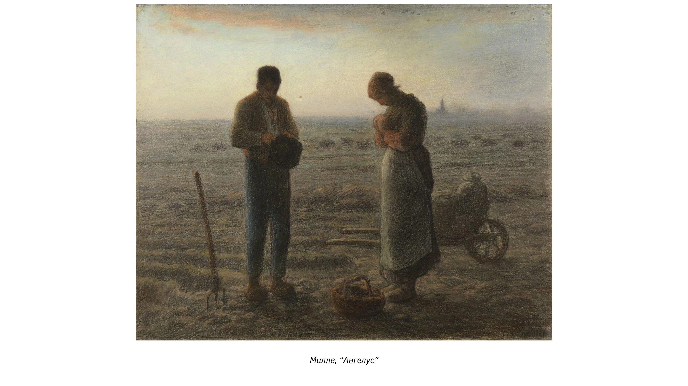

Quesnay je to jednostavno rekao:

> Neka Ownership zemljišta i pokretne imovine bude osigurano onima koji su njihovi legitimni vlasnici, jer je sigurnost imovine suštinski temelj ekonomskog poretka i sigurnosti društva; to je sigurnost trajnog poseda koja podstiče rad i korišćenje bogatstva u poboljšanju i kultivisanju zemlje, kao i u trgovinskim i industrijskim preduzećima.

### Četvrti princip: apsolutna sloboda trgovine

U svojim ranije citiranim *Maksimama*, Kene navodi:

> Neka postoji potpuna sloboda trgovine, jer najpouzdanija, najpreciznija i najkorisnija regulacija kako domaće tako i strane trgovine za naciju i državu leži u punoj slobodi konkurencije.

Fiziokrati su videli štetu koju je izazvala vladina intervencija, posebno u trgovini žitom. Mora se priznati, kažu oni, da vlast nikada neće moći upravljati trgovinom tako dobro kao pojedinci, jer bi morala odgovoriti na svaku potrebu i reagovati na svaku promenu u potražnji ili Supply. Sve ovo je daleko izvan sposobnosti čak i najmudrije vlade koju možemo zamisliti. Stoga je potrebno pustiti stvari da budu i da teku.

Korisna po prirodi, trgovina mora biti potpuno i savršeno slobodna. Jedan od njihovih članova, Le Trosne, čak je napisao pamflet pod naslovom [*Sloboda trgovine žitom: Uvek korisna, nikad štetna*](https://www.institutcoppet.org/liberte-commerce-grains-toujours-utile-jamais-nuisible/).

### Peti princip: Svi ljudi su braća

Žestoki protivnici ropstva, fiziokrati su takođe bili veliki pacifisti. "Naša spoljna politika se zove mir", jednostavno je rekao Mirabo. Godine 1790, na Ustavotvornoj skupštini, Dipon de Nemur je nastavio ovaj pacifistički stav kada je predložio zakon kojim se zabranjuju ofanzivni ratovi.

## Dostignuća i uticaji fiziokrata

<chapterId>5b911105-796a-5e2e-a501-c7a364fc758e</chapterId>

Kao što smo videli u prvom od tri poglavlja posvećena fiziokratama, Keneovi sledbenici su bili veoma popularni u Francuskoj otprilike deceniju. Ovo oduševljenje njihovim idejama oblikovalo se kako u njihovo vreme, tako i nastavilo do kraja veka. Ovde ćemo pogledati neka od njihovih dostignuća i uticaj koji su imali na svoje naslednike u oblasti ekonomske misli.

Njihovo najveće dostignuće, prateći Gournay grupu, bilo je popularizovanje ekonomskih ideja. Volterova čuvena izreka je dobro poznata: oko 1750. godine, nacija, zasićena poezijom i romanima, počela je da razmišlja o žitu. Fiziokrati su učestvovali u ovom pokretu, objavljujući bukvalno stotine članaka, pamfleta i knjiga o slobodi trgovine žitom. Snažan zamah koji su Fiziokrati dali ekonomskim raspravama takođe je očigledan u impresivnom broju ekonomskih dela i pamfleta objavljenih u Francuskoj od 1760. do 1775. Kao dalji dokaz širenja ekonomskih ideja u Francuskoj, podseća se na primedbu M. de Vaublanca, citiranu u prethodnom predavanju, koji je rekao u Mecu 1774. godine da se nije govorilo ni o čemu drugom osim o ekonomiji. "Bilo je to u modi", rekao je. "Svi su bili ekonomisti".

Odbrana njihovih ideja, u knjigama, pamfletima i u njihovom časopisu *Les Éphémérides du Citoyen*, brzo je imala posledice na ekonomsku politiku Francuske. Godine 1763, edikt je odobrio slobodu trgovine žitom, što su Quesnay i Mirabeau snažno zahtevali. U nekoliko navrata, vlasti su takođe ublažile propise koji regulišu trgovačke cehove kako bi se garantovala veća sloboda rada.

U inostranstvu, uspeh je došao vrlo rano. U Nemačkoj, markgrof od Badena pokazao je interesovanje za fiziokratske ideje i održavao redovnu prepisku sa Mirabeauom i Dupont de Nemoursom.

Zadužio je ekonomistu Johanna Augusta Schlettweina, uverenog fiziokratu, da sprovede poresku reformu i liberalizuje trgovinu žitom. U aprilu 1770. godine, prvi pokušaj je sproveden u malom selu Dietlingen. Činilo se da su seljani entuzijastično prihvatili mere, ali zvaničnici zaduženi za sprovođenje nisu bili veoma podržavajući, što je odložilo širu primenu.

U Rusiji, Katarina II je pripremala zakonodavnu reformu i zamolila Didroa da joj pošalje briljantan um da joj pomogne.

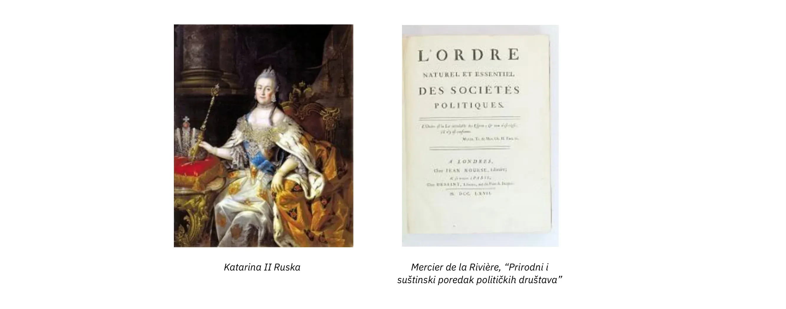

Impresioniran čitanjem [*Prirodni i suštinski poredak političkih društava*](https://archive.org/details/lordrenaturelete00mercuoft), objavljenog 1767. godine, poslao joj je njegovog autora, fiziokratu Mercier de la Rivière.

Iako je napustio Francusku slavljen, njegov prijem u Sankt Peterburgu bio je hladan (klimu na stranu), a carica je bila razočarana njime.

U Švedskoj, sa Gustavom III, i u Italiji, sa Leopoldom Toskanskim, fiziokrati su takođe našli sledbenike spremne da njihove ideje sprovedu u praksu.

U Francuskoj su fiziokrati uživali spektakularan uspeh imenovanjem Turgota za generalnog kontrolora finansija 1774. godine.

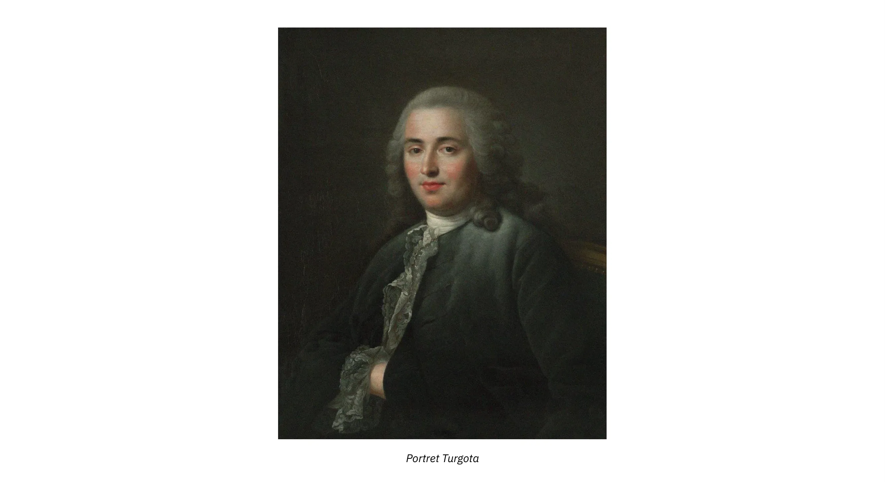

Svestan opadanja njihove slave, Turgot se nikada nije predstavio kao lojalan učenik fiziokrata, niti, što se toga tiče, kao enciklopedista, iako je to bio, a budući da su ih članovi sveštenstva prezirali. Jednom na vlasti, Turgot je izdao šest čuvenih edikata koji su predstavljali početak praktične primene fiziokratskog programa: sloboda trgovine, sloboda rada i kraj monopola.

Do vremena Francuske revolucije, fiziokrate su imale manje sledbenika. Markiz od Mirabeaua je preminuo 13. jula 1789—pravi simbol. Abeille je krenuo dalje, ali Dupont de Nemours je ostao veran. Imenovan u Skupštinu, Dupont de Nemours je prenosio glas fiziokratije i pozivao na ekonomske reforme u korist imovine Ownership i slobodne trgovine.

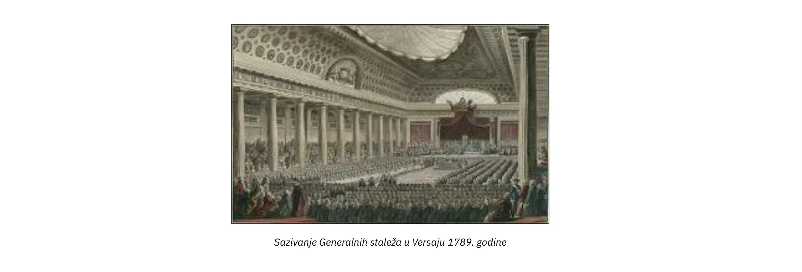

On se takođe borio, bezuspešno, protiv asignata. Uprkos ovom neuspehu, fiziokratska misao ostala je veoma prisutna u intelektualnoj debati i uticala je na rane uspehe Revolucije. Kao što je rekao Joseph Rambaud, sve što je Revolucija učinila u korist sloboda bilo je zahvaljujući fiziokratama.

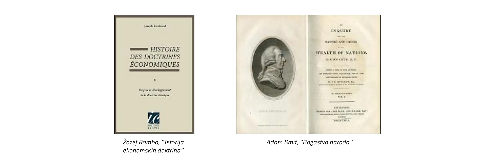

Fiziokrati su takođe imali veliki uticaj na istoriju ekonomske misli. Adam Smit, koji je posetio Francusku i upoznao mnoge od njih, bio je duboko pod uticajem njihovog rada. Čak je razmišljao da posveti *Bogatstvo naroda* Keneu.

Nažalost, Quesnay je umro dve godine pre nego što je Smithova knjiga objavljena, i Smith je uklonio posvetu. Iako se Smith nije slagao sa njihovom idejom da je samo poljoprivreda produktivna, prihvatio je mnoge njihove argumente za slobodna tržišta i preneo ih u svoj rad.

## Dupont de Nemours

<chapterId>6d585e0f-93b8-5b0a-a0a8-7f6e4a5bc68e</chapterId>

U Sjedinjenim Američkim Državama, poznati smo sa kompanijom DuPont, takođe poznatom kao "E.I. du Pont de Nemours and Company", multinacionalnom firmom u oblasti hemije i biologije.

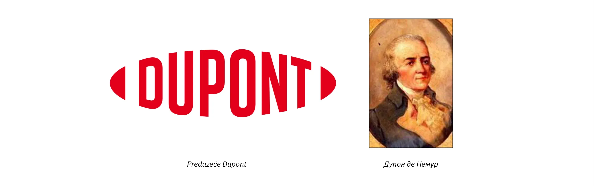

Danas ima prodaju od preko $35,000 milijardi i zapošljava skoro 65,000 ljudi širom sveta. Ispostavlja se da je ova kompanija usko povezana sa sudbinom Samuela-Pierrea Duponta de Nemoursa, francuskog ekonomiste fiziokratske škole.

Rođen 1739. godine, Dupont de Nemours se približio fiziokratama u dobi od 24 godine. U to vreme, još uvek je tražio svoj put u životu. Jednog dana, naišao je na kratki pamflet pod nazivom Bogatstvo države. Smatrao je da su njegove ekonomske ideje besmislice i napisao je kritički odgovor pod nazivom Refleksije o bogatstvu države, objavljen 1763. godine. Delo je bilo dobro prihvaćeno, a čitaoci su ga hvalili, govoreći stvari poput: "Sigurno ste učenik Mirabeaua!" Ironično, Dupont nije ni znao ko je Mirabeau.

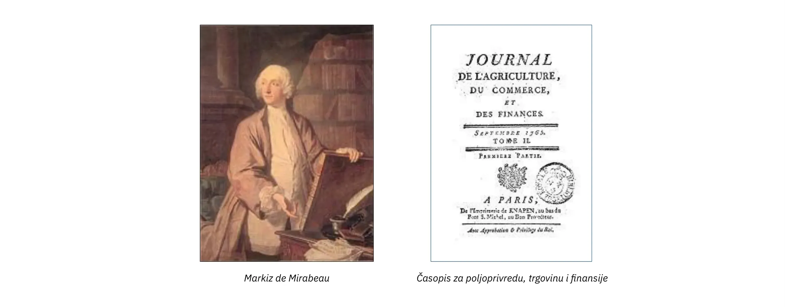

Radoznao je počeo da čita Mirabeauovo delo, *Prijatelj naroda* i *Teorija oporezivanja*. Upoznao je Mirabeaua i Françoisa Quesnaya, a zatim se pridružio njihovoj školi.

Godine 1765, Dupontu je ponuđena pozicija urednika *Journal de l'agriculture, du commerce et des finances*, vodećeg časopisa svog vremena u oblasti ekonomske misli.

Postojala su dva razloga za to: Mirabeau i Quesnay su morali ostati tihi, a Dupont je bio viđen kao njihova zvezda u usponu.

Članovi fiziokratske škole slažu se da je Dupont de Nemours brzo postao Quesnayev miljenik. Quesnay je jednom rekao: "Pazite na ovog mladića, on će biti taj koji će govoriti kada mi budemo mrtvi". Jedan kolega fiziokrat, Abeille, čak je postao ljubomoran na pažnju koju je Dupont dobijao i distancirao se od Quesnayeve škole.

Dupont de Nemours je uvek zadržao svoje visoko poštovanje prema Quesnay-u.

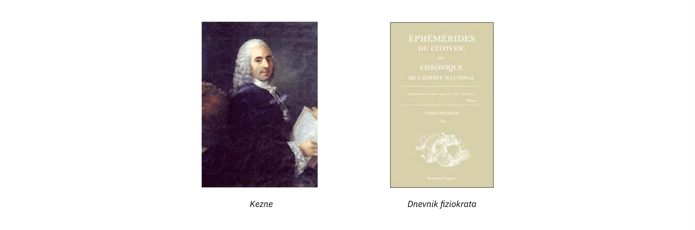

Kasnije bi rekao: "Bio sam samo dečak kada je Kene pružio ruke prema meni—učinio me je čovekom." Kene je bio taj koji ga je učinio glavnim ekonomistom na književnoj sceni tog vremena.

Nakon *Journal de l'agriculture, du commerce et des finances*, Dupont je imenovan urednikom *Les Éphémérides du Citoyen*, koji je postao zvanični organ fiziokrata.

On je ovu periodičnu zbirku učinio glavnim centrom za ekonomsku teoriju, podržavajući je čak i tokom opadanja fiziokrata tako što je lično napisao gotovo sve kasnije tomove. Upravo je Dupont de Nemours skovao termin "fiziokratija", izveden iz dve grčke reči koje znače "vladavina prirode". Ovaj termin je koristio za naslov zbirke Quesnayevih članaka objavljenih 1768. godine, a termin se na kraju ustalio u istoriji. Poznato je da su fiziokrati među sobom jedni druge nazivali "ekonomistima", a tako su ih nazivali i tokom Revolucije.

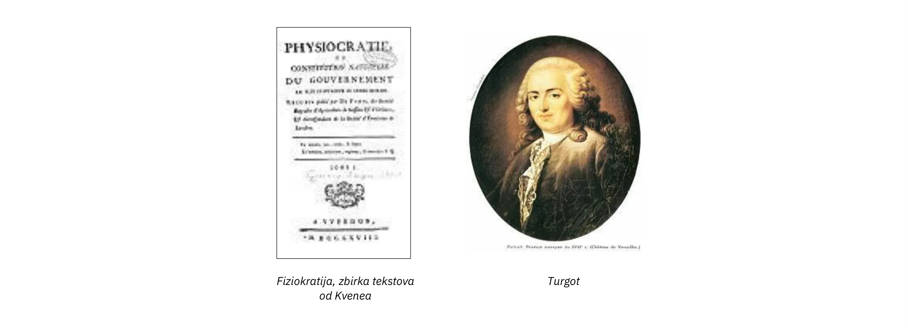

Kada je Turgot nakratko služio kao ministar finansija Francuske, Dupont je postao njegov blizak savetnik, jedini fiziokrat koji je imao pristup njemu, jer se Turgot držao na distanci od ostalih.

U vreme Revolucije, bio je izabran iz okruga Nemours i našao se u Skupštini, gde je sedeo i drugi gospodin Dupont. Tada je nazvan Dupont de Nemours, ne zato što je bio plemić, već jednostavno da bi se razlikovala ta dvojica. Ime je, naravno, ostalo.

Tokom Revolucije, u avgustu 1792, uzeo je oružje da brani Kralja u Palati Tuileries protiv gomile.

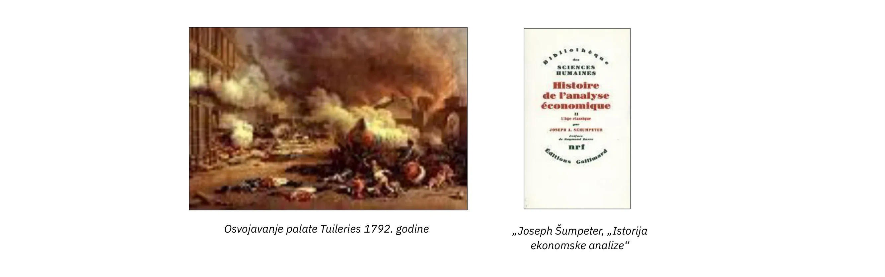

Kralj mu je rekao: "Monsieur Dupont, uvek vas nalazimo tamo gde ste potrebni!" Nakon što je čudom izbegao Teror, osuđen i čekajući giljotinu, ali spašen padom Robespjera, bio je gurnut u izgnanstvo pod Napoleonom i pronašao sreću u Sjedinjenim Državama, gde je jedan od njegovih sinova, uz očevu pomoć, osnovao kompaniju Dupont.

Uprkos ovom burnom životu, tokom kojeg je objavio desetine članaka, brošura i knjiga, ostaje relativno malo poznat do danas. Možda je to bilo zato što je ostao dosledan fiziokrata kada je doktrina izašla iz mode. Zaista, kako je Šumpeter napisao, Dupont de Nemours je ostao veran fiziokratiji "tokom karijere tokom koje je imao mnogo prilika da je se odrekne". Bio je čovek uverenja.

# Prosvetiteljstvo i politička ekonomija

<partId>d1c885ad-7cb1-5f81-816c-be312719d9f8</partId>

## Voltaire i filozofi

<chapterId>16bcf7bf-dad4-5113-8c64-2800f04ff07b</chapterId>

U 18. veku u Francuskoj došlo je do pojave ekonomije kao nauke i prve škole ekonomske misli: fiziokratije. Adam Smit se školovao u ekonomiji tokom ovog perioda, a francuski ekonomisti su bili priznati globalno kao lideri. Međutim, ovaj vek se više pamti kao vek filozofije nego ekonomije. Iako je fiziokratski pokret bio usklađen, u svojim ambicijama, sa filozofijom prosvetiteljstva, stavovi filozofa—posebno Didroa i Voltera—zaslužuju pažljivo ispitivanje. Videćemo da su prosvetiteljski mislioci značajno doprineli širenju ideje laissez-faire u Francuskoj.

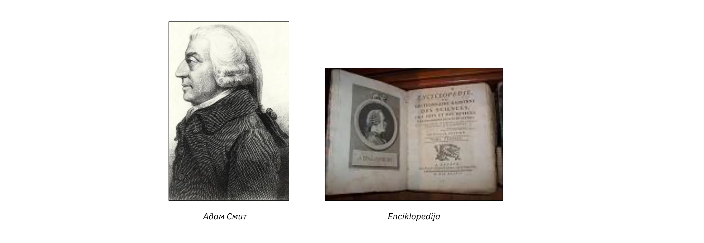

Najpoznatije dostignuće filozofije prosvetiteljstva je bez sumnje *Encyclopédie* od Diderota i d'Alemberta.

Prirodno, ekonomske članke su pisali ekonomisti. Za rane tomove, Diderot se obratio Forbonaisu, a zatim angažovao liberalne ekonomiste: prvo Françoisa Quesnaya (koji je doprineo člancima kao što su "Žitarice", "Fermieri", "Ljudi"—poslednji neobjavljen), zatim Turgota (koji je napisao "Sajmovi i pijace"). Ovi spisi su od velike važnosti. U svojim člancima, Quesnay je postavio temelje za ono što će postati doktrina fiziokratizma. Uz njegov *Ekonomski pregled*, ovo ostaju njegova najpoznatija dela. Turgot, tada još mlad, razvio je ideju laissez-faire u svom članku, kritikujući državnu intervenciju u organizaciji tržišta.

U mnogim drugim člancima *Encyclopédie*, filozofi, posebno Diderot, brane ideal slobode u svim oblastima: religiji, politici i ekonomiji.

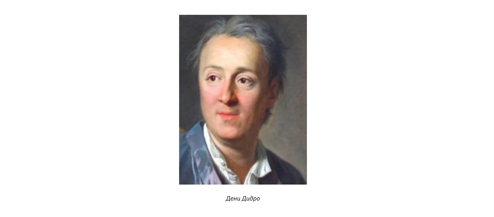

Sloboda rada, posebno u suprotnosti sa cehovskim sistemom, bila je ponavljajuća tema u raznim unosima kao što su Umetnosti, Zanati i Zajednica.

Diderotov put u ekonomskoj teoriji je znatiželjan. U Encyclopédie, bio je čvrst zagovornik ekonomske slobode i bio je taj koji je tražio saradnju liberalnih ekonomista, što potvrđuje pismo koje opisuje članke koje bi Turgot mogao napisati za njega. U ranim godinama fiziokratije, bio je i pristalica i promoter Quesnayjeve škole. Godine 1769. i 1770. pisao je za *Les Ephémérides du Citoyen*, na veliku žalost svojih anti-liberalnih filozofskih prijatelja, poput Melchiora Grimma; međutim, ubrzo se distancirao od grupe. Očaran živahnim intelektom opata Galianija, pomogao mu je da objavi svoju knjigu o trgovini žitom na francuskom, baš kad se Galiani spremao da se vrati u Italiju.

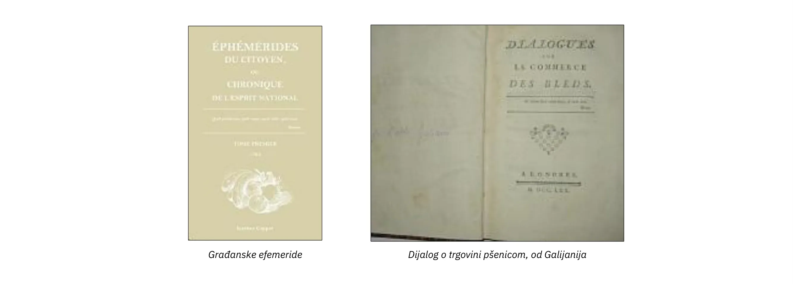

Ova knjiga postala bi najžešći napad ikada napravljen protiv fiziokratskih ideja, zadavši veliki udarac pokretu. Kasnije je Diderot branio Galianija protiv opata Moreleta, bliskog saveznika fiziokrata, u svojoj *Apologiji Galianija*. Nekoliko godina kasnije, tokom Turgotovog ministarstva, Diderot je viđen kako aplaudira uspostavljanju slobode rada kroz ukidanje cehova. U tom trenutku, Diderot, sin zanatlije, našao se u saglasnosti sa liberalnim ekonomistima i napisao oštro pismo Galianiju, koji je tvrdio da će sloboda rada uništiti francusku industriju u roku od dvadeset ili trideset godina. U svetlu Industrijske revolucije, istorija sugeriše suprotno. Vrativši se na stranu liberalnih ekonomista, Diderot više nije uživao njihovo poverenje i ostao je izolovan. Vrlo znakovit trenutak je pismo koje je poslao Dupontu de Nemoursu 1774. godine, gde piše:

> "Nekada si imao prijateljstvo za mene; sada ga više nemaš, jer si toliko zauzet da više nemaš vremena da voliš ikoga".

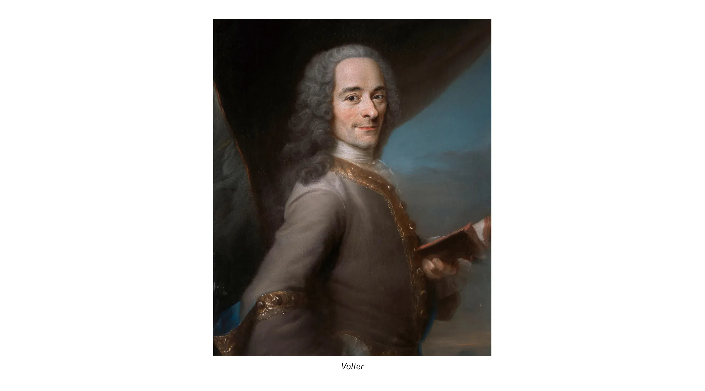

Voltaire je sledio sličan put, obeležen nedostatkom doslednosti u svojim ekonomskim stavovima. Divio se Vincentu de Gournayu, dopisivao se sa ekonomistima (uključujući Duponta de Nemoursa i Turgota), i cenio fiziokrate - posebno zbog njihovih pohvala poljoprivredi. Hvalio ih je u *Dijatribi autoru Efemerida*. Međutim, kasnije je kritikovao njihovu ideju o jedinstvenom porezu na zemlju u svom satiričnom delu *Čovek sa četrdeset kruna*, koje je takođe izazvalo značajnu kontroverzu. Na kraju, poput Diderota, slavio je Turgotovo ministarstvo, nazivajući ga zlatnim dobom i hvaleći njegova dva velika dekreta o slobodi rada i slobodnoj trgovini.

Na kraju, odnos filozofa prema ekonomskoj misli je mešovit. Uprkos njihovim pohvalama i kritikama liberalnih ekonomskih ideja, oni su igrali ulogu u unošenju ovih ideja u širi intelektualni diskurs prosvetiteljstva. Na ovaj način, bilo namerno ili ne, pomogli su u napredovanju ideje laissez-faire sve do Revolucije.

## Turgot, The Theorist

<chapterId>a8cd8185-8351-556b-8011-3a0c313e8a9d</chapterId>

U poznatom odlomku iz svoje *History of Economic Thought*, američki ekonomista Murray Rothbard pohvalio je ono što je nazvao "briljantnošću" Turgota.

predstavljajući ga kao najvećeg ekonomistu 18. veka, zajedno sa Kantijonom.

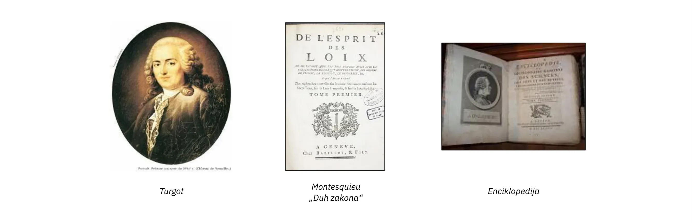

Kako je Turgot postao tako istaknut? To se svodilo na kombinaciju tri ključna faktora. **Prvo**, njegovo prestižno porodično poreklo. Poticao je iz duge loze kraljevskih administratora, od kojih su mnogi zauzimali visoke položaje u vladi. **Drugo**, zlatno doba u kojem je rođen i odrastao. Turgot je imao 21 godinu kada je Montesquieu objavio *L'Esprit des Lois*, i 24 kada se pojavio prvi tom *Encyclopédie*.

Bio je savremenik fiziokrata, Voltera, Didroa, d'Holbaha, Adama Smita, Kondorsea i drugih. **Treće**, njegova intelektualna preuranjenost. Dok je bio student na Sorboni, napisao je pismo o papirnom novcu u dobi od 22 godine, održao izvanredne govore, i sa 24 godine sastavio listu od 52 dela koja treba napisati.

Uprkos svojoj mladosti, Turgot je doprineo *Enciklopediji*, autorstvom članaka na teme kao što su "Etimologija", "Egzistencija", "Ekspanzibilnost", "Sajmovi" i "Fondacije". Samo jedan članak se direktno bavio ekonomijom—njegov rad o "Sajmovima", koji je detaljno opisao poreklo sajmova i pijaca i kritikovao rastuće državne intervencije koje su ih ometale i paralizovale.

Tokom ovih ranih godina, bio je pod mentorstvom Vincenta de Gournaya, koji ga je uzeo pod svoje okrilje i formirao blisko prijateljstvo s njim. Nakon Gournayeve smrti 1759. godine, Turgot je sastavio pohvalu u kojoj je ponudio izvanredan sažetak doktrine laissez-faire. Posebno je napisao:

"Iz svake perspektive u kojoj trgovina može biti od interesa za državu, individualni interes prepušten sam sebi će uvek sigurnije proizvesti opšte dobro nego operacije vlade, koje su uvek manjkave i nužno vođene nejasnom i nesigurnom teorijom".

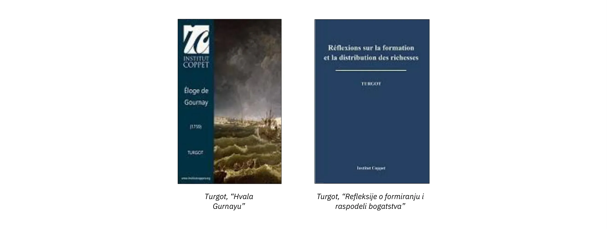

Godine 1767, dok je bio intendant, sastavio je kompendijum ekonomije pod naslovom *Refleksije o formiranju i distribuciji bogatstva*.

Podela rada, suverenitet potrošača, privatna svojina, uloga kapitala, praktično sve glavne ekonomske teme su obrađene. Mnogi istoričari, od kojih je najnovija istoričarka Anne-Claire Hoyng, ukazali su na sličnosti između ovog dela Turgota i *Bogatstva naroda* Adama Smitha, objavljenog devet godina kasnije.

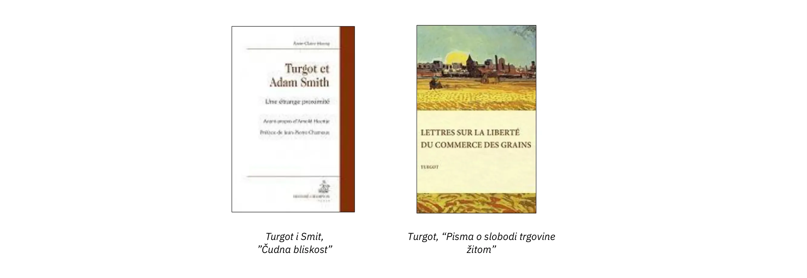

Turgot je branio slobodu trgovine žitom u pismima upućenim opatu Terrayu, koja su kasnije preneta kralju, ali je polovina tih pisama sada izgubljena. Napisao je:

> Gospodine, ako je nešto hitno, onda je to ne nametati nova ograničenja na najosnovniju od svih trgovina, već ukloniti ona koja su, nažalost, ostavljena da ostanu.
> Ako je ikada bilo vreme kada je najpotpunija, apsolutna sloboda, potpuno oslobođena bilo kakvih prepreka, bila neophodna, usuđujem se reći da je to sada, i da nikada nije bilo manje prikladno razmatrati izdavanje regulative o trgovini žitom.

Godine 1769, Turgot je napisao članak Vrednost i novac za Abata Morelleta *Dictionnaire de Commerce*, koji na kraju nikada nije objavljen. Galiani je već primetio da je "čovek zajednička mera svih stvari", predviđajući subjektivnu analizu koju će Turgot razviti trideset godina kasnije u ovom članku, gde proširuje i dokazuje ovu tvrdnju.

Godine 1770, mnogo pre Bentama, Turgot je napisao memorandum zagovarajući slobodu kamatnih stopa i lihvarstva.

"Greška je verovati da kamatu na novac u trgovini treba da određuju zakoni prinčeva", kaže on, "To je trenutna cena koja se sama reguliše, kao i cena sve druge robe". U odbranu ove pozicije, on pobija protivljenje Aristotela i crkvenih otaca.

Izvanredan sažetak Turgotove doktrine laissez-faire može se pronaći u zaboravljenom pismu iz 1773. godine upućenom opatu Terrayu o označavanju gvožđa:

> Ono što politika mora učiniti jeste da se prepusti toku prirode i toku trgovine, koji su ništa manje neophodni i ništa manje neodoljivi od samog toka prirode, bez pokušaja da ih usmeri; jer da bi ih usmerila bez ometanja i bez nanošenja štete sebi, morala bi biti u stanju da prati sve varijacije u ljudskim potrebama, interesima i industriji; morala bi ih poznavati u nivou detalja koji je fizički nemoguće postići, i u kojem će čak i najveštija, najaktivnija i najpedantnija vlada uvek rizikovati da pogreši, barem za polovinu.

Ovde nalazimo veoma jasno izlaganje doktrine laissez-faire, kao i nagoveštaj analize Fridriha Hajeka o pretenziji znanja—odnosno, nemogućnost države da u potpunosti razume ekonomske sile kako bi ih kontrolisala.

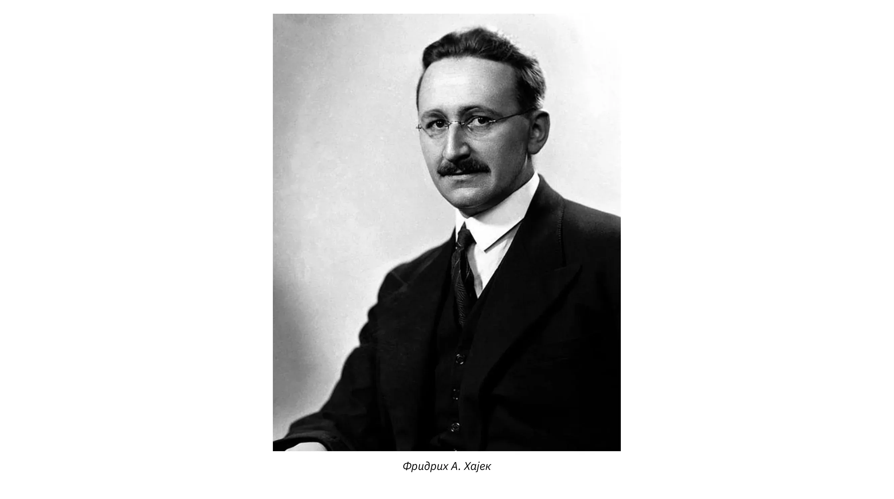

## Turgot, reformator

<chapterId>9177429f-1679-51c4-bfd2-dd036d24a1cc</chapterId>

Kao što smo ukratko pomenuli u prethodnom poglavlju, Turgot je bio sin ugledne porodice koja se istakla u višim redovima francuske državne službe.

Njegov otac je bio provost trgovaca Pariza, a deda intendant. Nakon što je briljirao u studijama, najmlađi član porodice Turgot je imao za cilj da dostigne bar iste visine. Prvo je služio neko vreme kao maître des requêtes, što znači da je bio veza između intendanata i Versaja. To je bila prestižna pozicija, za koju je morao da dobije posebno izuzeće zbog godina, ali Turgot je težio ka višem. Smrt njegovog mentora, Gournaya, dodatno ga je podstakla da cilja više, te je zatražio imenovanje za intendanta.

Godine 1759. prvi put je aplicirao za intendanciju Grenobla, ali je odbijen. Zatim mu je ponuđena pozicija prosta trgovaca u Lionu, koju je odbio. Zatražio je intendanciju Bretanje, ali je i to odbijeno. Konačno, 1761. godine, ponuđena mu je intendancija Limuzena i, pomalo nevoljno, prihvatio je. Pisao je Volteru: "Imam nesreću da budem intendant", možda misleći: Imam nesreću da budem intendant u Limuzenu.

U Limuzenu, seljaci su bili siromašni i živeli su u nesigurnim uslovima, posebno što se tiče stanovanja i hrane. Opšti nivo obrazovanja bio je izuzetno nizak. Nekoliko puteva koji su postojali bili su u katastrofalnom stanju.

Zbog toga što je region bio toliko siromašan, ministrima nije bio od interesa. To je Turgotu dalo slobodu da eksperimentiše sa reformama. U Limuzenu, on je sproveo tri glavna projekta:

- Raspodela **taille**, ličnog poreza (Turgot je imao za cilj da uvede što je moguće više objektivnosti u njegovu procenu).
- **Corvée**, oblik poreza plaćenog radom, gde su seljaci bili primorani da rade na izgradnji puteva. Tokom obilaska regiona, Turgot je brzo primetio loše stanje puteva. Zamenio je corvée novčanim porezom.
- Regrutovanje **milicija**, seljačkih vojski mobilisanih tokom ratnih vremena.

Ovo je urađeno izvlačenjem žrebova, što je dovelo do straha i nasilja zbog bekstva; Turgot je zamenio ove obavezne namete plaćenim dobrovoljcima.

Ove reforme su bile nesumnjivo uspešne, i u julu 1774. godine, Turgot je imenovan za ministra. Zbog nedostatka iskustva, kralj ga je prvo postavio u Ministarstvo mornarice. Imenovanje je mnoge zabavilo. Sam Turgot je priznao: "Ne znam ništa o mornarici", a Voltaire je primetio: "Ne mislim da je Turgot išta više mornar nego ja".

Samo mesec dana kasnije, međutim, Turgot je imenovan za generalnog kontrolora finansija, čime je efektivno postao ministar ekonomije i finansija Francuske.

Znamo za pismo u kojem je izložio svoje principe Luju XVI: "Nema bankrota. Nema povećanja poreza. Nema novih zajmova". Ova filozofija, koju bi kritičari danas mogli označiti kao besmislenu "strogoću", bila je namenjena spašavanju monarhije.

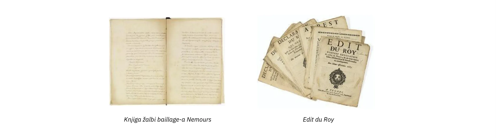

Turgot je pripremio šest kraljevskih edikta za reformu francuske ekonomije.

Bilo je to prvi put—a ujedno i jedan od poslednjih—da je ekonomskom stručnjaku data sloboda da reformiše ekonomiju svoje zemlje. Tri Turgotova edikta se izdvajaju: jedan je ukinuo prinudni rad (corvées), drugi je raspustio trgovačke cehove (korporacije), a treći je uspostavio slobodnu trgovinu žitom.

Po ulasku u ministarstvo, Turgot je znao da će se suočiti sa otporom privilegovanih klasa. "Biću se bojali, čak i mrzeli, većina dvora i svi koji traže usluge", rekao je kralju. Privilegovani su se ubrzo ujedinili protiv njega i doveli do njegovog smenjivanja sa mesta generalnog kontrolora finansija. Voltaire, koji je u potpunosti podržavao Turgotove reforme, napisao je u svojoj prepisci:

> Ah! Kakve strašne vesti sam čuo! Šta će biti s nama? Očajan sam! Nikada se nećemo oporaviti od svedočenja rađanju i smrti zlatnog doba! Ova munja je pogodila i moj um i moje srce.

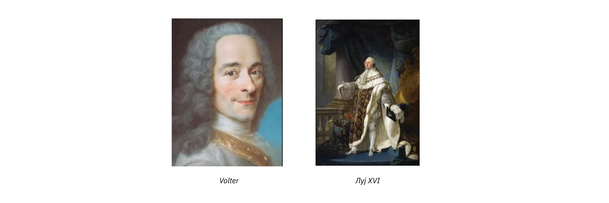

Od tada, mnogi su tvrdili da je Francuska zemlja koju je nemoguće reformisati. Turgotov neuspeh kao da je to potvrdio: bio je pripremljen sa pola veka liberalne ekonomske misli; imao je podršku prosvetiteljskih filozofa; a sam Kralj, sa apsolutnom moći, podržavao ga je.

Na kraju su parlaments i privilegovane klase pobedile. Sve što je Kralj mogao da uradi bilo je da privatno žali: "Sada vidim da samo gospodin Turgot i ja brinemo o narodu."

## Kondijak

<chapterId>0ba8dbb5-dcd5-5981-bf85-6c185e0bf192</chapterId>

Baš kao merkantilizam, koji je njegova najočiglednija praktična manifestacija, Montenjov sofizam je dugo vremena nestajao.

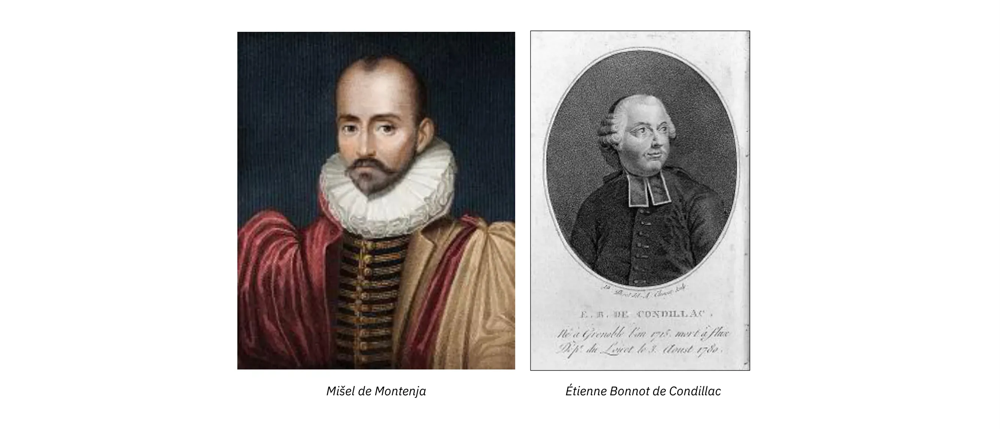

Ta sofistika je ideja da su trgovina i Exchange igre sa nultim zbirom. Šta god jedna strana dobije u transakciji, nužno je izgubljeno od strane druge strane. Njeni pristalice tvrde da ovo važi kako između pojedinaca, tako i između nacija.

Opat Condillac je odigrao ključnu ulogu u konačnom razbijanju ove pogrešne ideje.

"Definitivno" je možda preterivanje, jer se u javnoj debati ovaj sofizam često ponovo pojavljuje. To je možda razlog zašto je, štaviše, Kondijak ostao malo poznat ekonomista. Osim austrijskih ekonomista, malo ko je razumeo važnost njegove teorije Exchange, niko se više ne interesuje za njega.

Za većinu istoričara ekonomske misli, godina 1776. je obeležena objavljivanjem *Bogatstva naroda*, koje je utemeljilo ekonomsku nauku. Petnaest lekcija koje smo upravo završili, u kojima smo proučavali francusku ekonomsku nauku pre Adama Smita, dovoljne su da dokažu grešku ove koncepcije. U istoj toj godini 1776, štaviše, možda još jedna knjiga zaslužuje više pohvala od istoričara nego knjiga Adama Smita: napisao ju je Kondijak i jednostavno je naslovljena [*Trgovina i vlada razmatrani u njihovom međusobnom odnosu*](https://archive.org/details/commercegovernme0000cond).

Za Kondijaka, ako sofizam Exchange posmatran kao igra sa nultim zbirom opstaje, fiziokrati su delimično krivi, jer tvrde da je Exchange odnos jednakosti. Prema Kondijaku, ovo je netačno: Exchange je nejednak odnos, gde se uvek daje manje da bi se dobilo više.

Između ideja fiziokrata i ideja Kondijaka, ne može se zamisliti savršenija suprotnost. Fiziokratski ekonomista Le Trosne je napisao:

> Exchange je po svojoj prirodi Contract jednakosti, napravljen od jednake vrednosti za jednaku vrednost.

Condillac, s druge strane, napisao je:

> Svaka strana u Contract uvek daje nešto manje vrednosti da bi dobila nešto veće vrednosti.

Međutim, opozicija je uglavnom u rečima. Oboje se slažu da kada neko zameni franak za knjigu, knjiga vredi franak, ili je cena knjige franak.

Razlika leži u činjenici da Condillac tvrdi da, pošto mi Exchange jedan franak za knjigu, to znači da je za nas vrednost knjige veća od vrednosti našeg jednog-franka novčića. Mi preferiramo knjigu u odnosu na novčić, i zato pravimo Exchange.

Condillacova teorija nije u suštini kontradiktorna sa teorijom fiziokrata, ali, da tako kažemo, oni ne govore istim jezikom. Le Trosne govori o ceni dok Condillac govori o vrednosti, i obrnuto.

Gde je Kondilak u pravu jeste da ako su cene jednake između dve razmenjene robe, vrednosti nisu jednake, inače, ne bi došlo do Exchange.

Da sumiramo Kondiljakovu teoriju, mogu se navesti tri tvrdnje:

Prva tvrdnja: tražimo dobra zbog njihove korisnosti. Ovo izgleda očigledno, ali je centralna teza ekonomske nauke da ljudi Exchange da stiču korisnosti, što je tačka koju je Žan-Batist Se takođe savršeno razvio.

Druga tvrdnja: vrednost prethodi i motiviše razmene. Subjektivna procena koju svaka osoba donosi o robi i uslugama implicira da ta ista roba i usluge imaju vrednost za njih, vrednu više ili manje u zavisnosti od korisnosti koju izgleda pružaju. Naravno, svaki pojedinac procenjuje drugačije od drugog, i vrednost varira od osobe do osobe.

Konačno, treći predlog: cena je posledica Exchange procesa. Proizvodi ne Exchange po vrednosti koju im ja pripisujem jer uslovi Exchange takođe zavise od subjektivne vrednosti koju prodavac pripisuje tim proizvodima. Odnos između kupca i prodavca, ili između subjektivnog uvažavanja kupca i subjektivnog uvažavanja prodavca, uspostavlja cenu.

Ove ideje Condillaca su fundamentalne. One nam omogućavaju da razumemo zašto je svaki Exchange uvek obostrano koristan.

Stoga u potpunosti uništavaju kritike slobodne trgovine, jer se protekcionizam pojavljuje samo kao mehanizam koji sprečava populacije da međusobno koriste jedna drugoj. Laissez-faire je takođe zaključak Kondiljakovog dela. Neka ljudi rade kako žele, jer ako javna vlast štiti slobodu i imovinu, ljudi će se uvek međusobno obogaćivati razmenom.

## Kondorse

<chapterId>99e4aba6-da7f-5041-b02f-337158381515</chapterId>

Condorcet je nesumnjivo ekonomski najusmereniji filozof prosvetiteljstva.

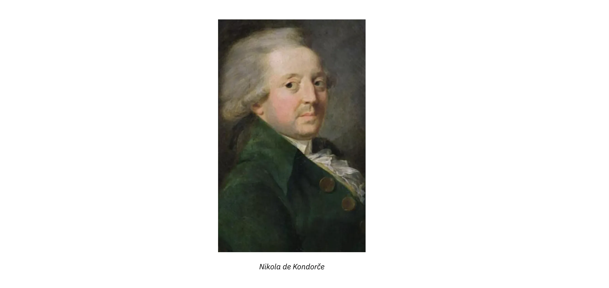

Veći deo svoje karijere posvetio se oblastima potpuno nepovezanim sa ekonomijom, i s pravom, jer su njegovi talenti doveli do velikog napretka u naukama na koje se najviše fokusirao. Ali oko 1770. godine, osetio je privlačnost prema ekonomskim pitanjima, možda zato što se drugi filozofi, posebno Volter i Didero, nisu trudili da im posvete svoje slobodno vreme, a takođe i zato što se sprijateljio sa Turgoom.

Condorcet je postepeno prihvatao ideje laissez-faire i slobode, u početku u oblastima koje nisu bile povezane sa političkom ekonomijom. U svom *Pismu teologa*, filozofski je ismevao katoličku religiju i izrazio svoju želju da vidi istinsku slobodu verovanja, uključujući slobodu da se ne veruje. U svojoj borbi za toleranciju i protiv verskog fanatizma, Condorcet se borio za rehabilitaciju Chevaliera de la Barre i za ponovno suđenje D'Etallondeu, koji je bio osuđen na smrt zbog lomljenja krsta.

Bio je tako spreman da brani slobodu kada je njegov prijatelj Turgot došao na položaj generalnog kontrolora finansija.

Od tada, Condorcetova karijera je krenula drugim putem kada je ušao u ekonomsku debatu, neumorno podržavajući liberalne reforme novog ministra. Zalažući se za konkurenciju i slobodu trgovine, Condorcet je takođe pozivao na ukidanje korveja (prisilnog rada), cehova i na pravično oporezivanje. Svoja uverenja je javno iznosio kad god bi se ukazala prilika, čineći to s očiglednim entuzijazmom; mnogo je pisao i jednom je u svojim spisima izjavio: "Dozvolite mi da ponovo govorim o slobodi trgovine; uživam u bavljenju ovom temom."

Između 1774. i 1776. godine, tokom Turgotovog ministarstva, Kondorse je napravio brojne intervencije, sve obeležene njegovim Commitment prema laissez-faire. Njegova dela uključuju *Pisma farmera iz Pikardije gospodinu Nekeru*, u odbranu slobodne trgovine; *Monopoli i monopolisti*, zagovarajući slobodnu konkurenciju; *Refleksije o kulucima*, pozivajući na njihovo ukidanje; i *Refleksije o trgovini žitom*, koje ponovo hvale slobodnu trgovinu i kritikuju Nekerovu knjigu na istu temu.

U svojim [*Pismima o trgovini žitom*](https://archive.org/details/bub_gb_hg8jFw-y6bwC), Kondorse iznosi nekoliko ključnih tačaka.

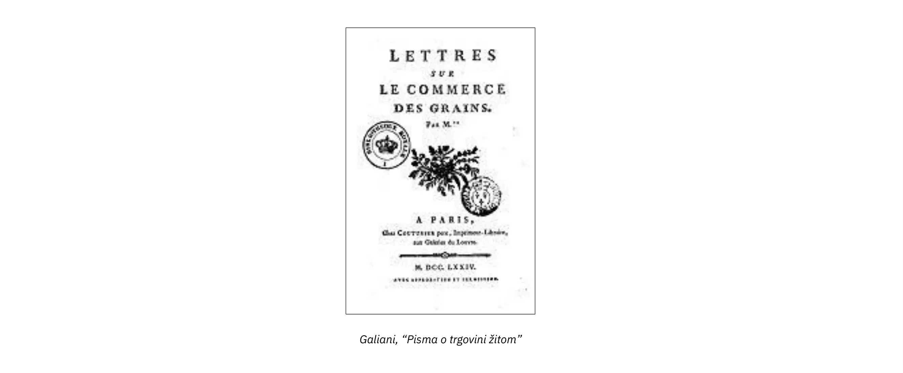

Prvo, visoke cene žitarica u to vreme nisu bile rezultat slobodne trgovine, već loših žetvi, što Kondorse jasno pokazuje. Zatim objašnjava zašto je laissez-faire ne samo prikladna, već i jedina odgovarajuća politika, uprkos popularnim predrasudama. On primećuje: "Toliko smo navikli da vidimo kako vlada interveniše u trgovini žitaricama da nam nečinjenje deluje kao nešto izvanredno i novo". Kasnije dodaje: "Gotovo svi, posebno oni na javnim funkcijama, veruju da se ništa ne dešava samo od sebe i da je sve izgubljeno ako vlada ne interveniše u svemu". Kondorse tako oživljava argumente fiziokrata i Turgota, pokazujući superiornost slobodne trgovine nad svim oblicima intervencionizma.

Promovisanje Turgotove liberalne ekonomske agende bio je hrabar čin, jer je Condorcet znao da će se brzo suočiti sa cenzurom. Zaista, to se i dogodilo i njegov pamflet o ukidanju prinudnog rada je uništen i zabranjen 1776. godine.

Turgot, ceneći Condorcetovu lojalnu odbranu njegovih ideja, postavio ga je za inspektora kovanog novca. Condorcet je dao ostavku čim je njegov prijatelj napustio ministarstvo.

Iako je posvetio svu svoju energiju odbrani Turgota, Kondorse nije imao iluzija o ishodu mandata svog prijatelja. Sam Turgot je kasno u životu priznao da je živeo sa žaljenjem, kako je napisao u jednom pismu, "što nisam mogao učiniti svojoj naciji i čovečanstvu dobro koje sam smatrao vrlo lakim". Kondorse, realističniji, ukazao je na mnoge protivnike sa kojima će se Turgot suočiti: kraljeve miljenike, parlamente, sveštenstvo, plemstvo, cehove i tako dalje. Ove grupe su očekivale laskanje, a ne reformu. Kondorse je rekao Turgotu, "Ti nipošto nisi šarlatan, a to je mana, s obzirom na to kakve su stvari u Parizu". Bio je potpuno u pravu, jer je 1776. godine, jedva dve godine nakon dolaska, Turgot već bio primoran da napusti mesto generalnog kontrolora.

## Liberalni zdrav razum pod Revolucijom

<chapterId>95e9a90d-e37a-58ff-b1ac-928b42e76ecf</chapterId>

Dupont de Nemours je bio najmlađi učenik Françoisa Quesnaya, koji je jednom rekao za njega: "Moramo se pobrinuti za ovog mladića, jer će on govoriti kada mi budemo mrtvi". Kada je počela Francuska revolucija, gotovo svi veliki fiziokrati, uključujući markiza de Mirabeaua, već su bili otišli; sam Mirabeau je preminuo 13. jula 1789.

Dupont de Nemours je napisao spisak žalbi za okrug Nemours.

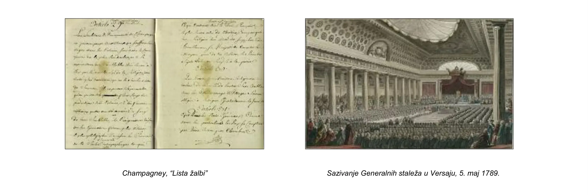

Ovaj fascinantni dokument sadržao je sve pritužbe liberalnih ekonomista protiv trgovinskih ograničenja, monopola i napada na imovinu. Dupont de Nemours je takođe izabran u Nacionalnu skupštinu.

Tokom Revolucije, postao je glas liberalnog zdravog razuma, čvrsto se suprotstavljajući rastućem talasu populizma i intervencionističke demagogije, koja je na kraju prevladala.

Još u novembru 1789. godine, kada se govorilo o davanju monopola Caisse d'Escompte (što bi je moglo pretvoriti u javnu banku—Banku Francuske), Dupont de Nemours je istupio u odbranu konkurencije.

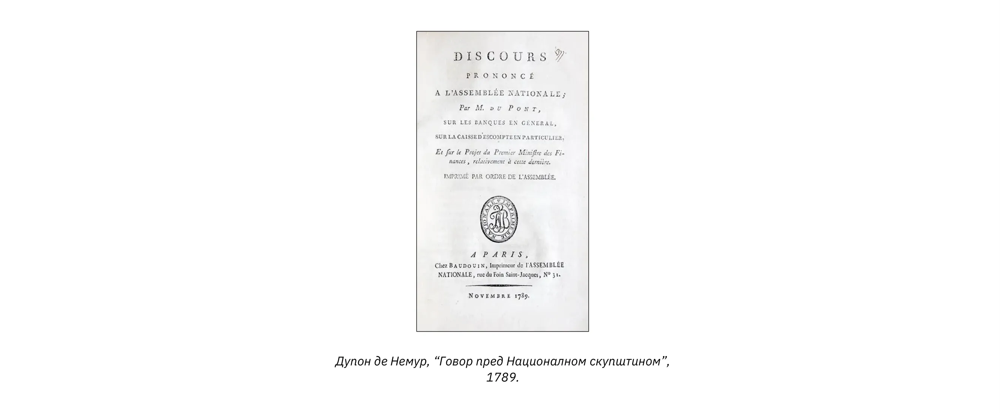

„Bilo bi bolje“, kaže on, „ostaviti bankarski posao zakonima slobodne trgovine“. I dodaje:

> "Ne razumem šta je ministar mislio kada je govorio o davanju privilegije Caisse d'Escompte. Ako ova privilegija uključuje ekskluzivnost, morate je odbiti, jer ste došli ovde da uništite ekskluzivne privilegije, a ne da stvarate nove."

Uprkos njegovim upozorenjima, Skupština je ignorisala njegove primedbe i napravila još jedan korak ka uspostavljanju centralne banke i bankarskog monopola.

Godine 1790, na Ustavotvornoj skupštini, Dupont de Nemours je sledio pacifističku tradiciju svojih prijatelja fiziokrata i predložio zakon koji zabranjuje ofanzivne ratove. Prvi član je glasio: "Francuska nacija neće sebi dozvoliti da se upusti u bilo koji ofanzivni rat kako bi zauzela teritoriju drugih ili narušila prava ili slobodu bilo koje nacije".

Ovaj predlog je odbijen.

Iste godine, 1790, počele su rasprave o izdavanju nove papirne valute za pokrivanje državnih troškova.

Dupont de Nemours se čvrsto protivio tome i objavio je pamflet pod naslovom [*Efekti asignata na cenu hleba*](https://archive.org/details/effetdesassignat00dupo). Naslov je bio tačan, jer je objasnio da bi izdavanje asignata neizbežno dovelo do inflacije, povećanja cena robe, uključujući hleb.

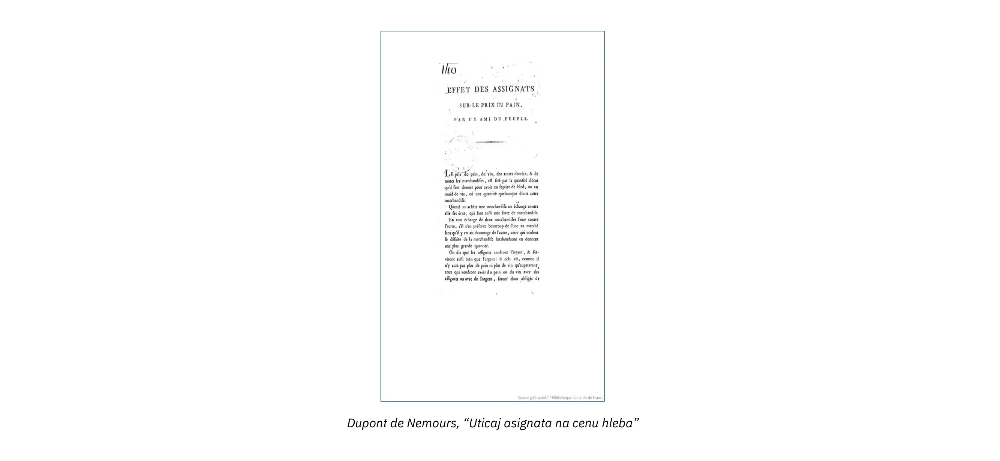

Potpisao je pamflet kao "prijatelj naroda". Tekst je izazvao pravu pometnju, jer je Skupština bila upitana ko ga je napisao. Dupont de Nemours je tada ustao i priznao da je to njegovo delo, rekavši da se ne stidi koristiti naslov "prijatelj naroda" jer borba protiv asignata zaista znači služiti narodu.

Još jednom, njegov savet je ignorisan, i asignati su izdati.

Svi znamo za katastrofu koja je usledila, ekonomsku propast i patnju koju su ljudi pretrpeli, od kojih su mnogi izgubili sve kada su asignati postali bezvredni i morali su biti spaljeni.

Nekoliko godina kasnije, Skupština je usmerila svoju pažnju na ideju stvaranja stvarne Banke Francuske, koja bi dobila monopol nad proizvodnjom novca.

Dupont de Nemours, još uvek čvrsto protiv ideje javne banke, videći je kao ništa drugo do monopol, podsetio je Skupštinu na katastrofalno iskustvo sa asignatima. Rekao im je:

> "Ne pripremajte se za kajanja poput onih koja su mučila moje kolege u Ustavotvornoj skupštini. U to vreme, moj predlog da se asignati ograniče samo na plaćanje za nacionalnu robu, a ne da budu cirkulišuća valuta, bio je odbijen. Danas kažu: 'Ah, da smo barem poslušali Duponta de Nemoursa!'"

Ali još jednom, niko ga nije slušao.

## Zaključak: Predaja Baklje

<chapterId>ada8082f-db96-5e52-954f-719b47998153</chapterId>

Francuska ekonomska misao u 18. veku često je zasenjena poznatijim ekonomistima 19. veka. Ipak, kada je reč o odbrani slobode, sve zapravo počinje u 18. veku. Ovo je vek u kojem je princip laissez-faire, tako revolucionaran za svoje vreme, prvi put jasno izražen od strane brojnih mislilaca, od Boisguilberta do Duponta de Nemoursa.

Svakako, ličnosti poput Jean-Baptiste Saya, Frédérica Bastia, Gustavea de Molinarija i Yvesa Guyota ostavile su trajan trag u istoriji francuske ekonomske misli. Ali ako ih proučavamo izolovano, propuštamo nešto suštinsko. Ovi mislioci 19. veka nisu se pojavili niotkuda; nasledili su i gradili na temeljima koje su postavili njihovi prethodnici iz 18. veka tokom prosvetiteljstva.

Boisguilbert tvrdi da dobronamerni ljudi koji veruju da mogu sve popraviti uključivanjem vlade neizbežno preokreću ekonomiju naglavačke, te da je stoga bolje pustiti prirodni poredak stvari da ide svojim tokom.

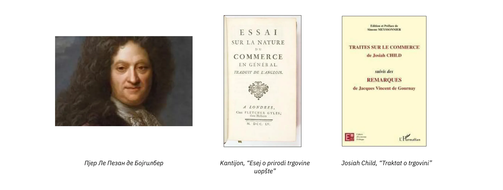

Cantillon je insistirao da novac nikada ne treba manipulisati u političke svrhe. Dozvoliti Državi da upravlja novcem kako joj odgovara znači otvoriti put ka ogromnom finansijskom i ekonomskom neredu.

Vincent de Gournay tvrdi da prekomerna regulacija rada obeshrabruje napore radnika i zanatlija, gurajući ih ka lenjosti i neaktivnosti. Zahvaljujući slobodnoj konkurenciji, ekonomija može rasti i nacija može prosperirati.

Markiz d'Arženson tvrdi da nijedna vlada nije sposobna da predvidi i izmeri sve, te da se stoga mora osloniti na lični interes svakog pojedinca.

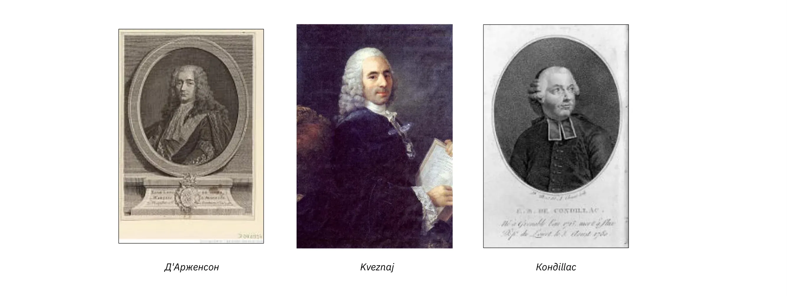

Quesnay i fiziokrati tvrde da je privatna svojina temelj ljudskih društava. Bez privatne svojine, čovek gubi motivaciju da se trudi, da radi, jer ne može uživati u plodovima svog rada niti akumulirati bilo šta.

Condillac tvrdi da je Exchange uvek obostrano koristan i stoga bi, bez izuzetka, uvek trebao biti besplatan. Jedina misija države mora biti zaštita slobode i imovine.

Sve ove ideje preuzeli bi ekonomisti 19. veka. Neki, poput Žan-Batista Seja, dali bi ovim idejama naučni izraz kroz rigorozni *Traktat o političkoj ekonomiji*. Drugi bi, naprotiv, nastojali da popularizuju ove fundamentalne maksime upuštajući se u oblast priča, romana i zabavnih kratkih priča, kao što bi to vešto učinio Frederic Bastija.

## Biografija

<chapterId>17cf2865-e53c-5f3b-a5c2-a43560efaf01</chapterId>

**SELEKTIVNA BIBLIOGRAFIJA**

Ovde ispod, naći ćete izbor od preko trideset spisa:

1. Pierre Clément, Histoire de Colbert et de son administration, Paris, 1874

2. Vauban, Projet d'une dîme royale, 1707; reprint Institut Coppet, 2014; Anne Blanchard, Vauban, Fayard, 1996

3.	Boisguilbert, Détail de la France, 1695; ponovo objavio Institut Coppet, 2014

4. Félix Cadet, Pierre de Boisguilbert: preteča ekonomista, Institut Coppet, 2014

5. Pierre de Boisguilbert ili rađanje političke ekonomije, Pariz, INED, 1966

6. Richard Cantillon, Essai sur la nature du commerce en général, 1755; reprinted by Institut Coppet, 2015

7. Antoin Murphy, Richard Cantillon, bankar i ekonomista, Oksford, 1986

8. Gustave de Molinari, L'Abbot of Saint-Pierre, Pariz, 1859

9. Opat Saint-Pierrea, Abrégé du projet de paix perpétuelle, Rotterdam, 1729

10. Abbot of Saint-Pierre, "Projet pour perfectionner le commerce de la France", in Les rêves d'un homme de bien, Paris, 1775, p.199

11. André Alem, Le marquis d'Argenson et l'économie politique au début du XVIIIe siècle, Institut Coppet, 2015

12. Journal et mémoires du marquis d'Argenson, Rathery edition, 9 vols, Paris, 1859-1867

13. Benoît Malbranque, Vincent de Gournay: the political economy of laissez-faire, Institut Coppet, 2016

14. Vincent de Gournay, Remarques sur la traduction de Josiah Child, L'Harmattan, 2008

15. Christine Théré & Loïc Charles (eds.), Le cercle de Gournay, INED, 2005

16. Antoin Murphy, "Le développement des idées économiques en France (1750-1756)", Revue d'histoire moderne et contemporaine, tome XXXIII, October-December 1986

17. Henri Ripert, Le marquis de Mirabeau: ses théories politiques et économiques, Paris, 1901

18. Lucien Brocard, Les doctrines économiques et sociales du marquis de Mirabeau in L'Ami des Hommes, Pariz, 1902

19. Humbert de Montlaur, Mirabeau, l'Ami des Hommes, Perrin, 1992

20. Yves Guyot, François Quesnay et la Physiocratie, Institut Coppet, 2014

21. François Quesnay, Œuvres économiques complètes et autres textes, 2 vols, INED, 2005

22. Georges Weulersse, Le mouvement physiocratique en France (de 1756 à 1770), 2 vols, Paris, 1910

23. Georges Weulersse, La Physiocratie à la fin du règne de Louis XV (1770-1774), P.U.F., 1959

24. Georges Weulersse, La Physiocratie pod ministarstvima Turgota i Neckera (1774-1781), P.U.F., 1950

25. Georges Weulersse, La physiocratie à l'aube de la révolution (1781-1792), EHESS, 1985

26. P. Jolly, Du Pont de Nemours, soldat de la liberté, Paris, P.U.F., 1956

27. Voltaireova ekonomska pisanja, Institut Coppet, 2013

28. Gustave Schelle (ed.), Œuvres de Turgot et documents le concernant, Paris, 1913-1924

29. Benoît Malbranque, Le libéralisme à l'essai : Turgot intendant du Limousin (1761-1774), Institut Coppet, 2015

30. Pierre Foncin, Essai sur le ministère de Turgot, Paris, 1877

31. Auguste Lebeau, Condillac ekonomiste, Pariz, 1903

32. Condillac, Le commerce et le gouvernement considérés relativement l'un avec l'autre, 1776

33. Condorcet, Mélanges d'économie politique, in Eugène Daire (ed.), Mélanges d'économie politique, Paris, 1847

34. P. Jolly, Du Pont de Nemours, soldat de la liberté, Paris, P.U.F., 1956

35. Eli Heckscher, Merkantilizam, 2 toma. London: Allen and Unwin. 1935

# Završni deo

<partId>385bffab-aea1-5bcd-9569-62b3f30665b7</partId>

## Recenzije i ocene

<chapterId>a1e689d9-abd0-5dcb-ba56-a8d355d0a84f</chapterId>

<isCourseReview>true</isCourseReview>

## Završni ispit

<chapterId>bdb7fd98-33e7-11f0-9fe6-b785c859ffc5</chapterId>

<isCourseExam>true</isCourseExam>

## Zaključak

<chapterId>3b366ff6-03c8-5f6a-b4c0-ba8186e65d7e</chapterId>

<isCourseConclusion>true</isCourseConclusion>