# En resa genom frihetens ekonomiska historia

Denna kurs utforskar den ekonomiska vetenskapens födelse i 1700-talets Frankrike genom laissez-faire-perspektivet. Du kommer att upptäcka hur tänkare utmanade merkantilismen genom att hävda att staten bör skydda privata rättigheter, men aldrig manipulera marknader genom regleringar.

Du kommer att lära dig hur visionära reformatorer utvidgade denna vision för att kräva frihandel och obegränsad cirkulation av varor, vilket lade den intellektuella grunden för modern kapitalism. Genom att studera dessa banbrytande ekonomer kommer du att förstå de tidlösa principerna som formade den globala politiska ekonomin och fortsätter att påverka politiska debatter idag. Gå med nu för att bemästra de idéer som byggde den moderna ekonomin.
+++
# Inledning

<partId>06d67531-19f1-4f8d-bf8f-77bbcc743672</partId>

## Kursöversikt

<chapterId>202db3c6-0320-494d-8057-adc6f6563048</chapterId>

Välkommen till HIS204!

Den här kursen är utformad för att utforska det franska ursprunget till begreppet *laissez-faire* - "låt det hända" - som det utvecklades på 1700-talet genom en rik intellektuell tradition. Genom att följa de tidiga franska ekonomiska tänkarnas tankar kommer vi att upptäcka grunderna för en politisk ekonomi som bygger på ekonomisk frihet, präglad av misstro mot statlig inblandning och en tro på en naturlig ordning som gynnar tillväxt och välstånd.

**Avsnitt 2: Förgrundsgestalterna**

I detta avsnitt börjar vi vid sekelskiftet mellan 1600- och 1700-talet, en tid som präglades av den absoluta monarkins överdrivna styre och de första kraven på ett mer rationellt och rättvist sätt att styra offentliga angelägenheter. Genom figurerna Vauban, Boisguilbert och Cantillon upptäcker vi tidig kritik mot statlig interventionism och en första skiss till vad som senare skulle bli liberal politisk ekonomi.

**Avsnitt 3: Reformatorer och tänkare i början av 1700-talet**

Detta avsnitt fokuserar på dem som under 1700-talets första decennier försökte reformera den franska ekonomin i ljuset av nya principer. Tänkare som abboten av Saint-Pierre, markisen d'Argenson och Gournay (tillsammans med sina anhängare) krävde att korporativistiska hinder skulle undanröjas, handeln liberaliseras och konkurrens uppmuntras som drivkraft för utveckling. Deras ofta djärva förslag förebådade de stora fysiokratiska idéerna.

**Avsnitt 4: Den fysiokratiska skolan**

Detta avsnitt handlar om ett av de viktigaste ögonblicken i franskt ekonomiskt tänkande: den fysiokratiska skolan. Vi kommer att undersöka dess ursprung, doktrinära grunder och viktigaste prestationer, med fokus på nyckelpersoner som Quesnay och Dupont de Nemours. Idén om laissez-faire blir ett sammanhängande system just i denna skola, med rötter i idén om en naturlig ordning som staten måste underkasta sig för att garantera välstånd för alla.

**Avsnitt 5: Upplysningen och den politiska ekonomin**

Slutligen ska vi se hur liberalt ekonomiskt tänkande spreds inom den bredare upplysningsrörelsen. Personer som Voltaire, Turgot, Condillac och Condorcet utvidgade och berikade laissez-faire-traditionen, och deras skrifter skapade en bro för laissez-faire-traditionen att korsa till den revolutionära perioden och därefter, där liberala idéer fick ny resonans.

Är du redo att återupptäcka den ekonomiska liberalismens franska rötter? Då kör vi!

# Föregångarna

<partId>91565b10-6010-53cb-a2f4-9c2306c7ef8c</partId>

## Historisk bakgrund

<chapterId>6a5fd101-6dfd-5d77-96c7-9e1aa4a19758</chapterId>

I början av 1700-talet befann sig Frankrike i ett bekymmersamt tillstånd. Landsbygdsbefolkningen producerade knappt tillräckligt för att överleva och var hårt beskattad.

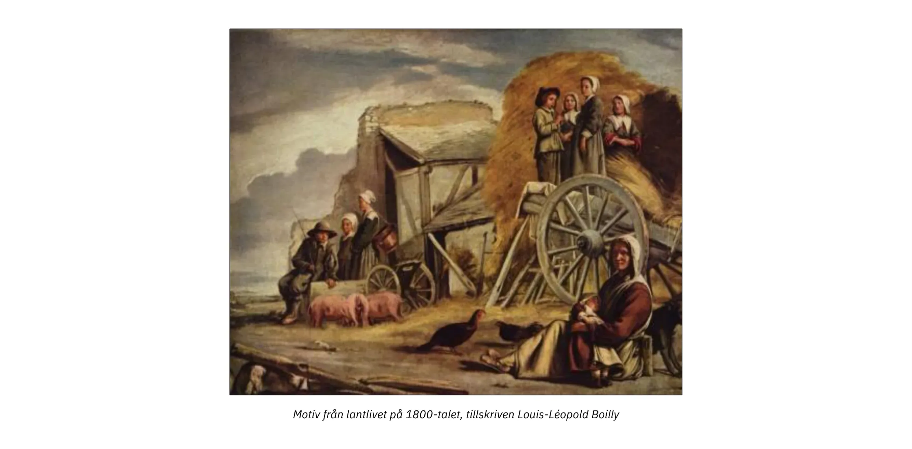

Hantverkare i städerna, inlåsta i rigida skråväsen, hade svårt att förnya sig eller ens stödja varandra. Samtidigt överträffade andra europeiska nationer snart Frankrike på alla fronter och konkurrerade ut dess produkter. Englands och Hollands kommersiella framgångar var något som alla tänkte på.

Men hur skulle vi kunna hitta en lösning på den tidens sjukdom? Det fanns ännu ingen ekonomisk vetenskap och därmed ingen speciell medicin att ta till. Principerna för den ekonomiska politiken tillämpades fortfarande slumpmässigt och skiftade mellan restriktiva faser och mer liberala perioder. Visst har vi modeller, historiska referenser att följa. Bland dem fanns *Sully*, Henri IV:s minister, som förespråkade jordbruk och främjade större handelsfrihet inom Frankrike.

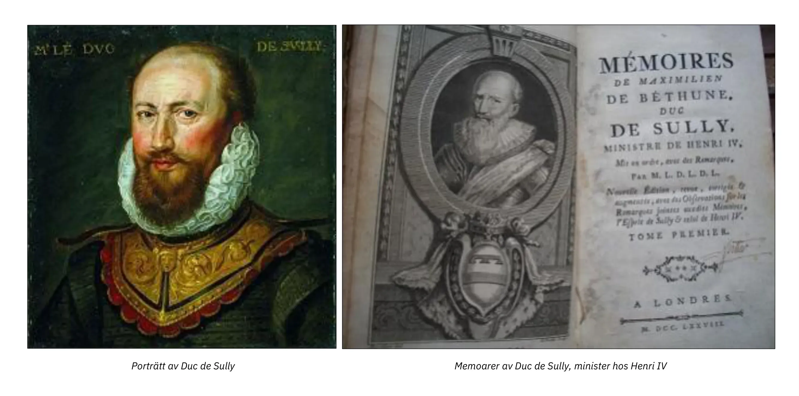

Men så kom Colbert, Ludvig XIV:s minister, som vacklade mellan reglering och frihet, men som i slutändan ändå genomdrev reglering. I slutet av 1600-talet tog Colbert över efter Sully: ministrarna åberopade nu hans arv och försökte tillämpa vad de påstod var hans maximer.

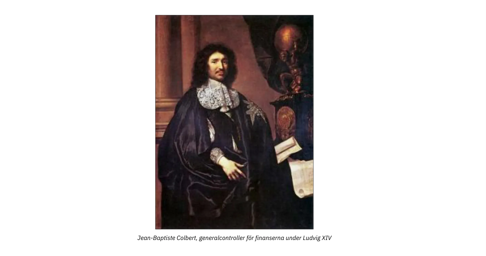

I statsmännens medvetande i slutet av 1600-talet var Colberts maximer fyra.

(1) **Industrin måste regleras och bindas inom skrå**. Dessa föreskrifter anger till exempel hur lakan och tyger ska tillverkas, deras storlek och vikt.

Det fanns hundratals sådana regler, sammanställda i särskilda volymer för varje typ av industri. Men enligt Colberts anhängare var detta fortfarande otillräckligt: de ansåg att industrin också behövde övervakas av företag.

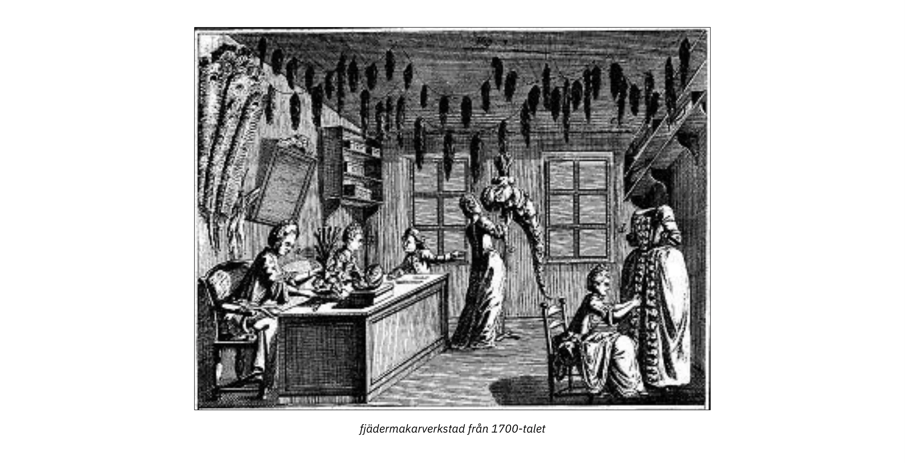

Den som ville utöva ett yrke var tvungen att först tillbringa flera år som lärling, sedan som gesäll, innan han eller hon kunde försöka uppnå mästarstatus genom att producera ett "mästerverk" och betala en betydande summa till skrået. Konkurrensen inom varje yrke var därför strikt begränsad.

(2) **Handel är ett nollsummespel**. När det gäller handel delade Colberts lärjungar samma fördomar som antikens barbariska folk. Enligt Ludvig XIV:s minister är handel "ett evigt krig". Varför är det så? Anledningen är enkel: för Colbert och hans efterföljare innebar varje ökning av rikedomen för ett land att ett annat utarmades. Enligt deras uppfattning kunde engelsmännen eller holländarna inte tillåtas bli rika, eftersom det skulle innebära att de stal Frankrikes välstånd.

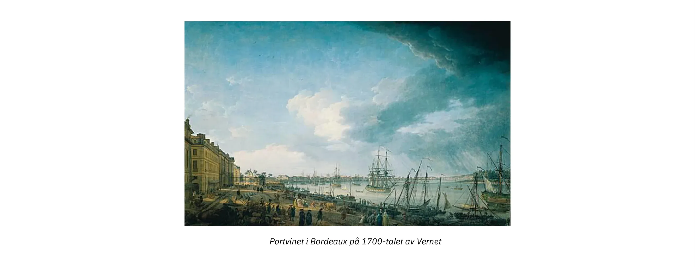

Dessa länders produkter måste därför förbjudas eller beskattas kraftigt, utan skrupler, eftersom handel är ett krig där vi bara kan önska att våra fiender ska gå under.

> "Fransmännen kan bara öka sin handel genom att krossa holländarna."
> *Colbert*

(3) **När staten har ont om pengar, höj mer skatter**. Colbert och hans lärjungar var långt ifrån övertygade om att skattebetalarnas rikedom var en begränsad resurs. Enligt deras uppfattning kunde offentliga utgifter aldrig vara ett problem, så länge tillräckligt med pengar samlades in. Och om folket gjorde revolt berodde det bara på att ministrarna hade gjort det på ett dåligt sätt, för, som Colbert cyniskt påpekade, "konsten att beskatta består i att plocka gässen utan att få dem att skrika för mycket".

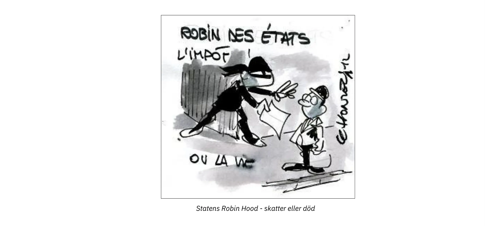

(4) **Rikedom är framför allt guld och silver**. Innan den ekonomiska vetenskapen föddes var det många författare som följde en dominerande dogm om rikedomens natur, det som kom att kallas *merkantilism*. Colbert och hans efterföljare fortsatte på den inslagna vägen. Kort sagt ansåg merkantilisterna att det sanna tecknet på en nations välstånd var ansamlingen av ädelmetaller, silver och guld.

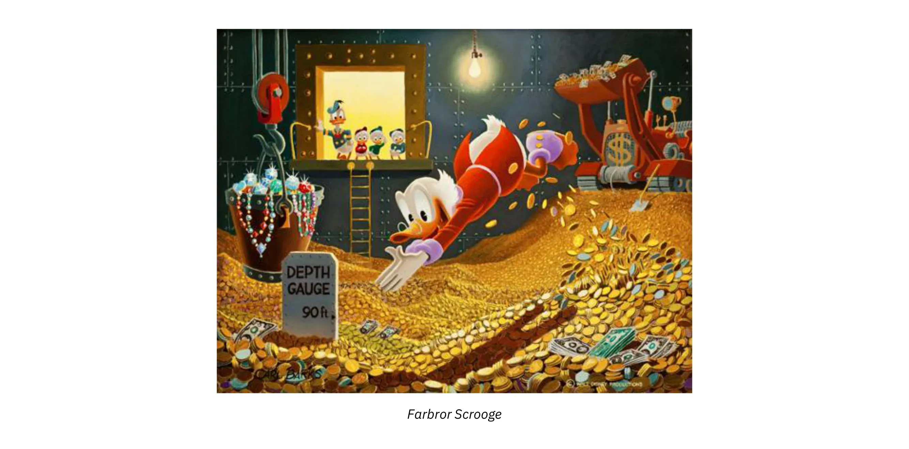

> "Det är bara överflödet av pengar inom staten som gör skillnad för dess storhet och makt".
> *Colbert*

Konsekvensen av denna idé är att till varje pris gynna exporten, som förde in utländskt guld och silver, och att begränsa importen till ett minimum för att undvika att skicka dem utomlands.

Det är de fyra principer som vägledde den franska regeringen under flera decennier, när landet gick in i 1700-talet. De skulle dock snart komma att utmanas på djupet. Mellan 1690 och 1710 drabbades flera författare av Frankrikes katastrofala tillstånd. När de sökte orsakerna till detta kom de fram till att det var just de maximer som de ärvt från Colbert som bar skulden, och de betraktade dem som felaktiga argument. Därmed lade de grunden till den ekonomiska vetenskapen.

## Vauban

<chapterId>ee9c1e0e-96cc-5026-a5e2-963d68122786</chapterId>

I dag, när skattetrycket i vårt land fortsätter att växa och hotar att kväva de nationella ekonomiska krafterna, höjs röster för förändring. Medvetet eller omedvetet är dessa reformkrav ofta ett eko av franska ekonomer som sedan 1600-talet har kritiserat landets skattesystem för att vara kaotiskt, despotiskt och överdrivet.

Den förste av dessa skattereformatorer, kronologiskt och meritmässigt, är den store marskalken Sébastien Le Prestre Vauban, berömd som byggare av fästningar och citadeller.

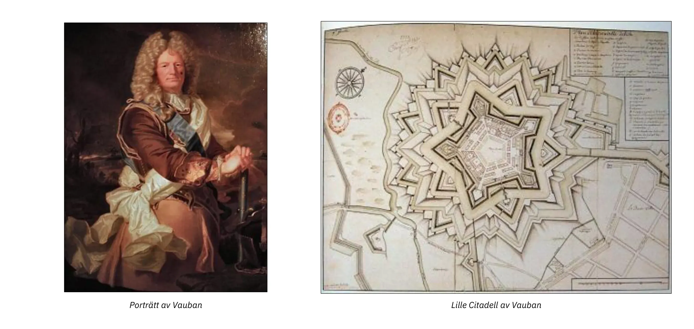

Även om vi tyvärr har glömt det var Vauban mer än en militär; han var också ekonom. Han intresserade sig för böndernas öde och föreslog djärva skattereformer 1695 (Projet de capitation - "Projektet för en capitation") och igen 1707 (Projet d'une Dime Royale - "Den kungliga tionden"): att ersätta de flesta befintliga skatter med en skatt som var proportionell mot inkomsten, en platt skatt före sin tid.

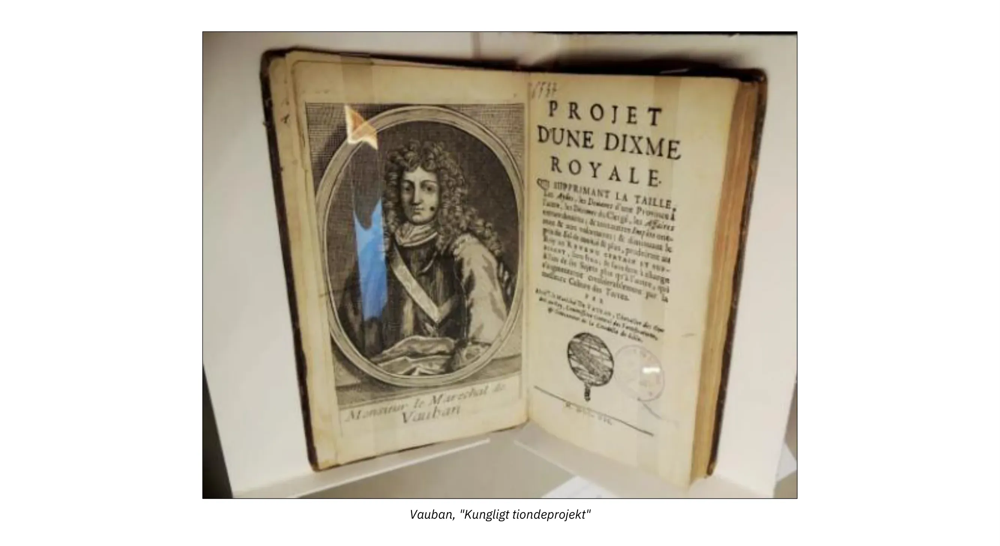

Vauban kom fram till dessa idéer genom nyfikenhet. Han var en skarp observatör som strävade efter att studera samhällslivet och den ekonomiska verkligheten noggrant, nästan vetenskapligt. Han insisterade särskilt på behovet av att räkna, genom folkräkningar.

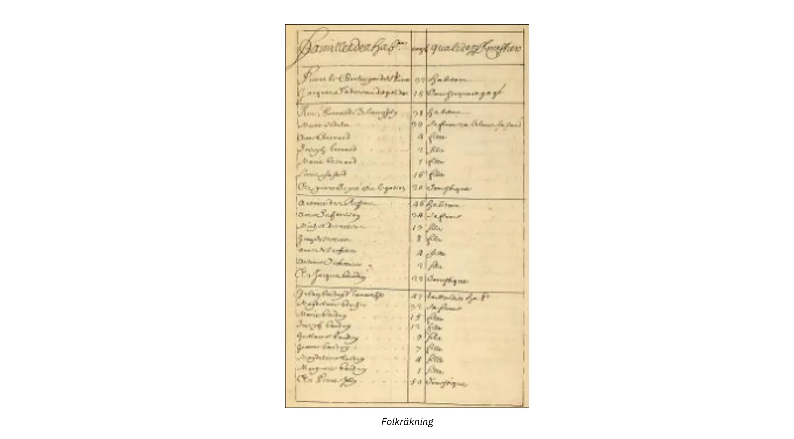

Hans andra stora förtjänst var hans gripande och ärliga beskrivning av det elände som massorna fick utstå. Han skrev: "Låt oss inte bli lurade; rikets hjärta är förstört. Allt lider, allt uthärdar, allt stönar. Ni behöver bara titta och undersöka hjärtat av provinserna, vad ni kommer att hitta är ännu värre än vad jag säger". Vaubans dystra observationer var långt ifrån överdrivna, utan var en korrekt återspegling av livet i början av 1700-talet. Alexis de Tocqueville var väl medveten om dessa idéer och skulle senare beskriva Vaubans *Royal Tithe* som "skrämmande", eftersom det var sant.

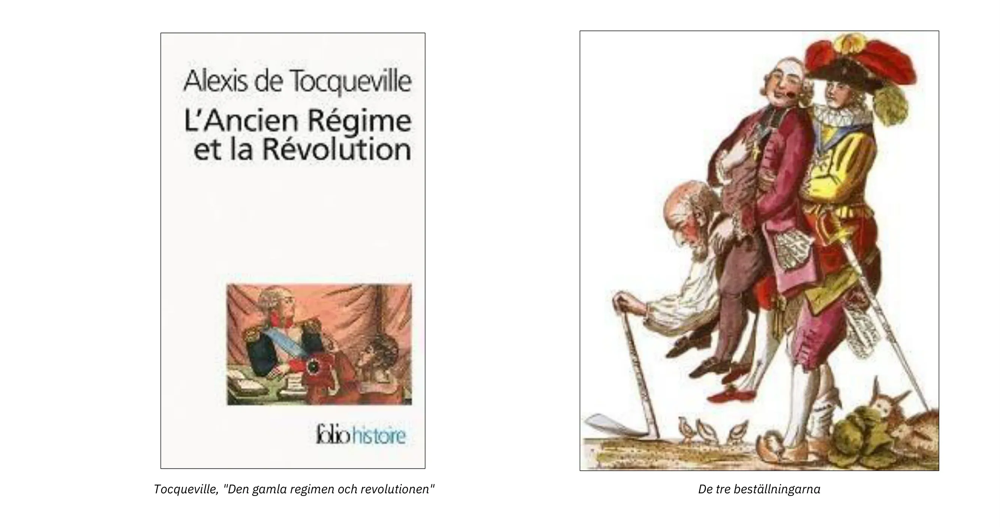

Vaubans andra stora förtjänst som ekonom var att han föreslog en långtgående skattereform som syftade till att utrota, eller åtminstone minska intensiteten i det onda han observerat och beskrivit. Han gjorde rätt i att göra det; den franska ekonomin under Ancien Régime var förlamad av beskattning, som var ojämlik, instabil och oläslig.

I sina olika politiska och ekonomiska skrifter var Vaubans övergripande ambition att lindra lidandet för vad han kallade "den lägre delen av folket, som genom sitt arbete upprätthåller och stöder den högre".

Han förstod att förtryckande och avskräckande beskattning överväldigade bönderna, ett begrepp som han uttryckte med klarsynthet, något som vi fortfarande kan observera perfekt i vår tid:

> "Bonden låter den lilla mark han har förmultna och arbetar bara halvhjärtat med den, av rädsla för att om den producerade vad den kunde med rätt gödsel och odling, skulle den beskattas ännu hårdare".

Vauban såg sanningen: beskattningen under Ancien Régime var inte bara irrationell utan också grymt sträng. Det var detta skattesystem, som var orättvist i sin fördelning, som han försökte övervinna.

Hans förslag till lösning, en platt, proportionell skatt på alla inkomster, skulle ha gjort det möjligt att fördela skattebördan rättvist mellan alla samhällsklasser. Vaubans skattereform, som grundade sig på en teori om staten som såg offentlig myndighet som nödvändig för att skydda individuella rättigheter och egendom, krävde att alla medborgare skulle bidra i strikt proportion till vad de tjänade, till exempel 10% av sin inkomst

I The Royal Tithe, det enda av hans ekonomiska verk som trycktes under hans livstid, uttalade Vauban sig tydligt:

> "Eftersom alla i en stat behöver dess skydd för att överleva, är det bara rätt att alla bidrar, i enlighet med sin inkomst, till dess underhåll och utgifter [...]. Ingenting är mer orättvist än att befria dem som har störst förmåga att betala och lägga över bördan på dem som har minst förmåga, vilka kollapsar under tyngden; en tyngd som skulle vara ganska lätt om den bars proportionellt av alla efter deras egen styrka. Därför är varje undantag från beskattning en störning som måste korrigeras."

Strax före sin död antogs Vaubans idé av Ludvig XIV:s ministrar. Vauban hade dock krävt att en proportionell skatt skulle ersätta alla, eller nästan alla, befintliga skatter. Istället, som så ofta händer, genomfördes hans skatt, men alla andra behölls också.

## Boisguilbert

<chapterId>200149c6-b5fc-566e-ab0e-bafb1c3fed3c</chapterId>

Få franska ekonomer från det förflutna åtnjuter i dag ett erkännande i sitt hemland som motsvarar deras insatser, och Boisguilbert är inget undantag.

Boisguilbert, som inte uppskattades av sin tids läsare och som på grund av sin excentriska natur och överväldigande passion hamnade på avstånd från maktkretsar, lämnade inte mycket spår efter sig under 1700-talet. Ändå har det i början av förra seklet skett en långsam återupptäckt av hans arbete.

Denna återupptäckt visar dock att vi är på väg in i en slags återvändsgränd. Boisguilberts verkliga förtjänst har gått förlorad genom att han framställs som pionjär för många teorier och föregångare till många tänkare. Han sägs ha förstått begreppet undersysselsättning, som senare försvarades av Keynes, föregripit Says lag, banat väg för Walras allmänna jämviktsteori och till och med förebådat marxisternas klassanalys. "Vem eller vad skulle Boisguilbert inte kunna vara föregångare till?" frågade sig till slut en kommentator.

(Pierre Le Pesant de) Boisguilbert föddes i Rouen 1646. Boisguilbert utbildades vid Port-Royal i Paris och inledde en misslyckad litterär karriär innan han tog på sig olika roller, bland annat som generallöjtnant i Rouen. Det var under denna tid som han skrev flera böcker för att förespråka sina idéer, bland annat "Détail de la France" 1695, som han gav ut på nytt året därpå under en mycket tydligare titel: [*Frankrike förstört under Ludvig XIV:s regeringstid, av vem och hur, med medel för att återställa det] (https://archive.org/details/bub_gb_0jUaWNbTJa8C/page/n23/mode/2up)*.

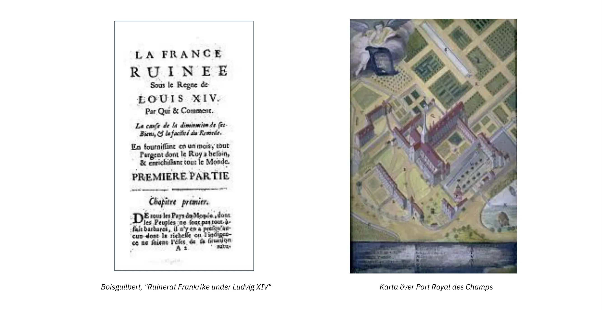

Och detta är grunden för Boisguilberts böcker: Den franska fattigdomen och dess orsaker.

Det franska folkets misär i slutet av 1700-talet beskriver Boisguilbert i detalj, liksom Vauban gjorde. Han skriver:

> "De karga eller dåligt odlade markerna, som är synliga för alla, är Frankrikes lik".

Han beskrev vingårdar som ryckts upp med rötterna, bönder som övergav sina åkrar och återkommande hungersnöd.

Boisguilbert finner två huvudorsaker till denna olycka. Ty om människorna lever i armod, beror det på att de hindras från att konsumera det som är nödvändigt, och konsumtionsförlusten har två orsaker.

För det första hade folket inte längre råd att konsumera grundläggande förnödenheter på grund av godtycklig beskattning. Taille, som var den tidens personskatt, beräknades blint för varje individ och höjdes eller sänktes utan anledning. På grund av de många privilegierna föll bördan på de fattiga bönderna, som fann sig ruinerade. För att rätta till detta rekommenderade Boisguilbert en proportionell skatt på alla inkomster, ungefär som Vaubans förslag.

Den andra orsaken till Frankrikes elände är att alltför många hinder förhindrade fri handel med varor, särskilt jordbruksvaror. Det fanns tullar vid gränserna och till och med inom landet, mellan olika regioner, som förlamade all handel. Dessa restriktioner förhindrade att ett jämviktspris fastställdes och begränsade marknadsmöjligheterna. Följden blev att bönderna inte kunde leva på sin produktion, eftersom de inte kunde sälja lönsamt och drabbades av oskäliga jordbrukspriser, ett problem som fortfarande är högst relevant och som utgör kärnan i Boisguilberts teori. När det gäller handelsrestriktioner förespråkade Boisguilbert att man skulle röja vägarna, med andra ord att man skulle införa frihandel.

Och frihet är verkligen hans slutliga slutsats. "Det är inte fråga om att handla", säger han, "utan helt enkelt om att upphöra att handla som vi så våldsamt gör mot naturen, som alltid tenderar mot frihet och fulländning". Allt kommer att bli bra, upprepar han outtröttligt, "så länge vi låter naturen ha sin gång, det vill säga ger den sin frihet, och att ingen blandar sig i denna handel utom för att erbjuda skydd åt alla och för att förhindra våld".

Den sista passagen är väsentlig. Boisguilbert var den förste som tydligt krävde en ekonomisk laissez-faire-politik, som gjorde den till sitt credo och byggde upp ett verkligt system kring den. Enligt honom finns det en naturlig tingens ordning, och den bör inte korrumperas, inte förstöras, av olägliga offentliga ingripanden. Staten ska enligt honom inte agera i ekonomiska frågor, utan låta saker och ting ske på ett naturligt sätt. Annars kommer det att orsaka elände.

Boisguilbert kritiserade till och med de "*goda själarna*", som han kallade dem, de som menade väl men gjorde stor skada. De ville ha billigt bröd till folket, men genom att pressa ner priserna ruinerade de bönderna, som inte kunde överleva på sådana marginaler. Dessa bönder övergav sedan sina marker och störtade djupare ner i fattigdom. Som vi alla vet är "helvetet ofta belagt med goda avsikter".

## Cantillon

<chapterId>bc206d41-6a64-5688-a489-40fcfa0e5397</chapterId>

Richard Cantillon, författare till "Essay on the Nature of Trade in General" (skriven omkring 1730, publicerad 1755), anses vara en av den moderna ekonomiska vetenskapens pionjärer. I sin History of Economic Thought hänvisar ekonomen Murray Rothbard till och med till Cantillon som den moderna ekonomins grundare.

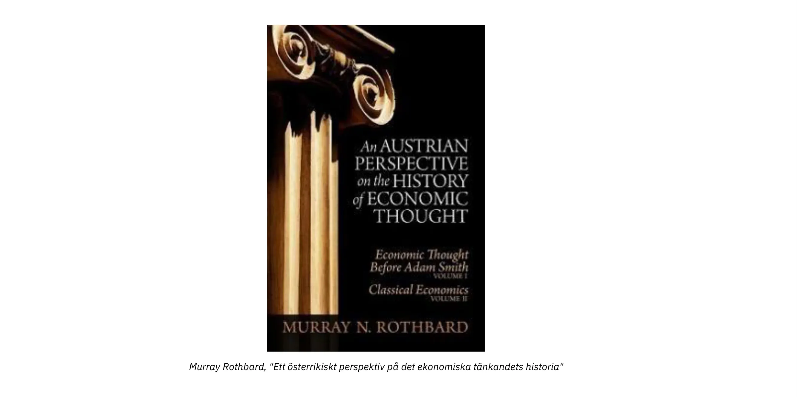

Richard Cantillon föddes på Irland men bosatte sig som ung i Paris och fick franskt medborgarskap. Han arbetade som bankir och gjorde sig en förmögenhet under John Law-eran.

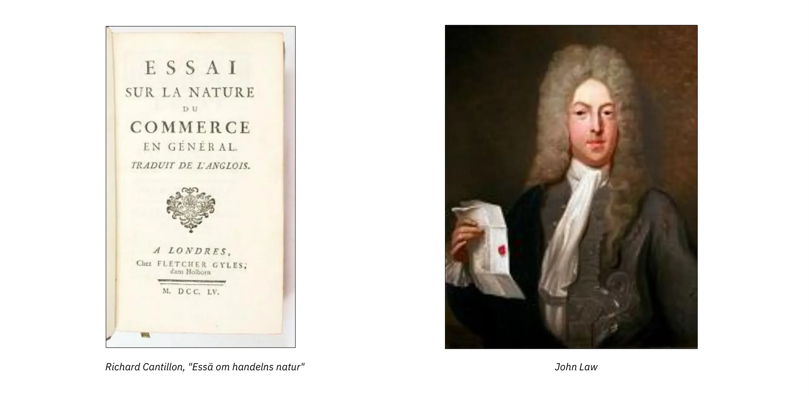

Det var också vid detta tillfälle som han började studera ekonomisk teori. Omkring 1730 skrev Cantillon sin Essay on the Nature of Commerce in General.

Denna bok kan ses som ett av de första försöken att skapa en allmän ekonomisk teori. Cantillon är noga med att identifiera vad han kallar "ekonomins allmänna lagar", de som ligger i sakernas natur och inte i de speciella förhållandena i det ena eller andra landet. Detta angreppssätt var revolutionerande.

Vi kan sammanfatta de stora förtjänsterna med Cantillons essä i fem områden: teorin om rikedom, begreppet entreprenör, kritiken av värdelösa valutor, "Cantilloneffekterna" och slutligen försvaret av frihet.

För det första hans **teori om rikedom**.

Till skillnad från den merkantilistiska syn som dominerade vid denna tid baserade Cantillon sin analys på insikten att rikedom bildas av de produkter som är lämpliga för människans njutning. Denna rikedom, menade han, kommer från naturen och produceras genom mänskligt arbete. Hans idéer om rikedomens natur hade ett starkt inflytande på Beccaria och Adam Smith och, genom Smith, på hela den engelska klassiska skolan.

För det andra, **entreprenören**.

Även om han inte definierade det tydligt såg Cantillon entreprenören som en viktig och central aktör i den ekonomiska aktiviteten. För Cantillon är det som kännetecknar entreprenören att han tar risker och agerar under osäkerhet. Dessa idéer skulle senare utvidgas av Turgot och, mer betydelsefullt, av Say, för att slutligen erkänna entreprenörens speciella plats i ekonomin, i motsats till den engelska skolans påståenden.

Tredje punkten, **valuta**.

Som en reaktion på John Laws erfarenhet förklarar Cantillon vad som händer eller måste hända när valuta inte har något verkligt värde.

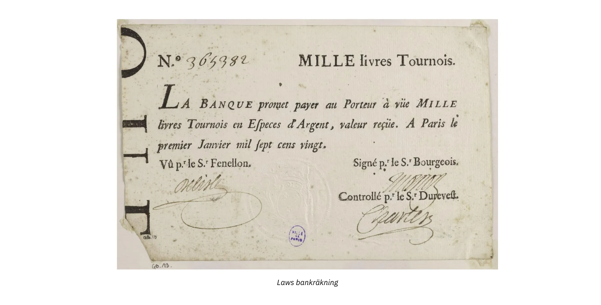

Han ser två huvudsakliga konsekvenser av att ersätta en valuta utan verkligt värde, som papperspengar, med en metallisk valuta. Den första konsekvensen är vad han kallar "folkligt förkastande", vilket innebär en växande misstro mot värdelösa pengar. Den andra konsekvensen är inflation: en försvagning av penningmängden gör varor dyrare.

För det fjärde gick Cantillon längre än sina samtida i sin analys av **inflation**. Efter att ha observerat kollapsen av Laws system insåg Cantillon att monetär inflation inte drabbar alla lika. Tvärtom berikar den vissa medan andra utarmas. Han drog slutsatsen att inflationen har en omfördelande effekt: de som först får nyutgivna pengar drar nytta av den ökade köpkraften, medan de som får dem senare blir fattigare till följd av att de nya pengarna ges ut på grund av den stigande inflationen.

För det femte, trots några rester av merkantilistiskt tänkande, var Cantillons övergripande perspektiv **fullständigt liberalt**. Han försvarade privat egendom som en grundläggande pelare i civilisationen och hävdade att inget samhälle kan fungera utan privat Ownership av mark och arbetets produkter. Han såg också materiell ojämlikhet mellan människor som naturlig och legitim. Enligt Cantillon är det inget fel i att en effektiv och modig arbetare, eller en exceptionellt begåvad arbetare, tjänar mer än någon som är inkompetent eller lat.  Slutligen ansåg Cantillon att priserna alltid skulle bestämmas fritt, genom Supply och efterfrågan, utan inblandning av offentliga myndigheter.

Bland dessa fem huvudidéer i hans essä är den viktigaste utan tvekan den som nu bär hans namn: **Cantilloneffekten**.

Med denna teori om inflationens effekter ger Cantillon oss svar på ett antal av vår tids problem. Den hjälper oss att förstå konsekvenserna av den senaste tidens expansiva och inflationsdrivande penningpolitik, som har utarmat medelklassen och landsbygden, samtidigt som den har berikat finansmarknadsaktörerna och staten, dess organ och dess tjänstemän, på grund av deras gemensamma närhet till källan till den nya frågan: centralbanker och affärsbanker.

# Reformatorer och tänkare i början av 1700-talet

<partId>1f7b50d4-ce93-5db3-8396-43c1fa5419ff</partId>

## Abboten av Saint-Pierre

<chapterId>13478fe2-4c12-593c-a410-54c2cfb7ef7f</chapterId>

Av alla de författare som vi har valt att ta med i pantheon av franska laissez-faire-tänkare från 1700-talet är abboten av Saint-Pierre utan tvekan den mest förbisedda.

I ärlighetens namn är det delvis hans eget fel. Han skrev mycket, men hans stil är Hard att läsa och är full av upprepningar. Till och med Jean-Jacques Rousseau försökte sammanfatta hans verk: han började göra det, men övergav snart uppgiften, eftersom han insåg att det var bortom hans styrka. I mitten av 1800-talet hedrade Gustave de Molinari honom genom att ge ut ett omfattande verk om honom, där han hyllade den pacifist och ekonom som abboten av Saint-Pierre var. Men detta var inte tillräckligt för att lyfta fram honom ur glömskan, som han fortfarande är kvar i än idag.

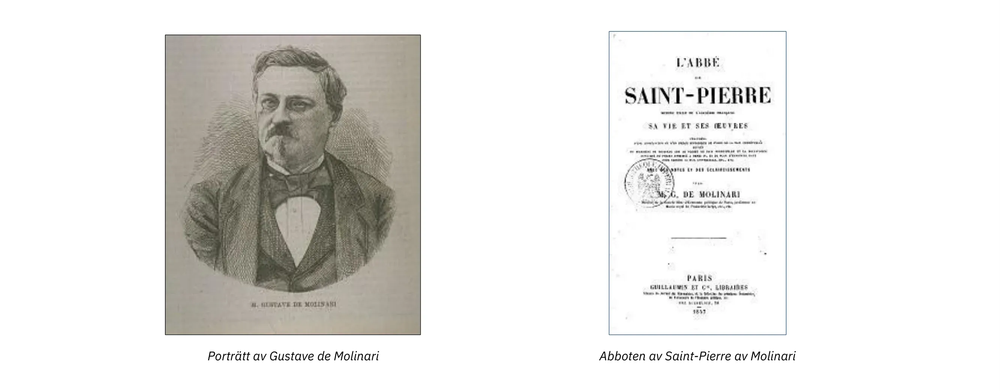

Abboten av Saint-Pierre skrev om ekonomi, men det är snarare som pacifist som han brukar vara av intresse. Han är författare till ett projekt för evig fred, som föregick Emmanuel Kants välkända projekt.

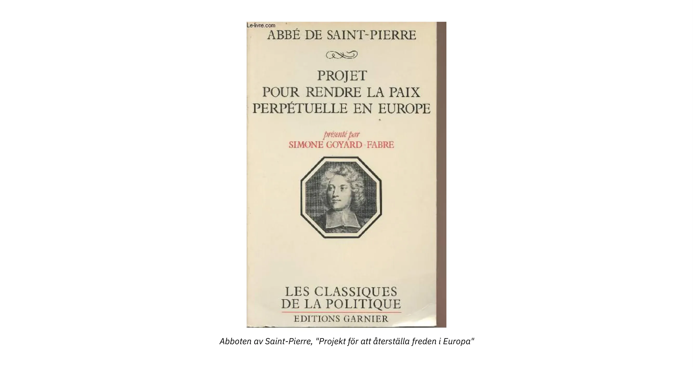

I detta arbete hävdade han att krig är destruktivt, inte bara för dem som förlorar det, utan också för vinnarna och till och med för dem som inte deltar i dem, eftersom deras handel påverkas.

För att bekämpa krigets gissel rekommenderade han att man skulle skapa ett slags europeiskt Nationernas förbund. Ett europeiskt råd skulle bildas för att lösa varje nations problem. Nationerna skulle därför tillgripa skiljedom för att undvika att ta till vapen. Om en nation inte var klok nog att omfamna freden, om den hotade de andra europeiska nationerna, skulle det europeiska nationsförbundet ha ett sätt att svara. Inför sådana händelser skulle en europeisk armé bildas, med styrkor som tillhandahölls av de olika länderna.

Det finns också en episod i abboten av Saint-Pierres liv som på ett perfekt sätt illustrerar det kritiska tänkesättet bakom den franska laissez-faire-rörelsen. Han gick med i Académie Française 1695, men uteslöts 1718 för att han vågade kritisera Ludvig XIV:s regeringstid. Därmed anslöt han sig till figurer som Vauban och Boisguilbert, som också hade vågat tala ut om de myterier som dolde sig under solkungens praktfulla styre.

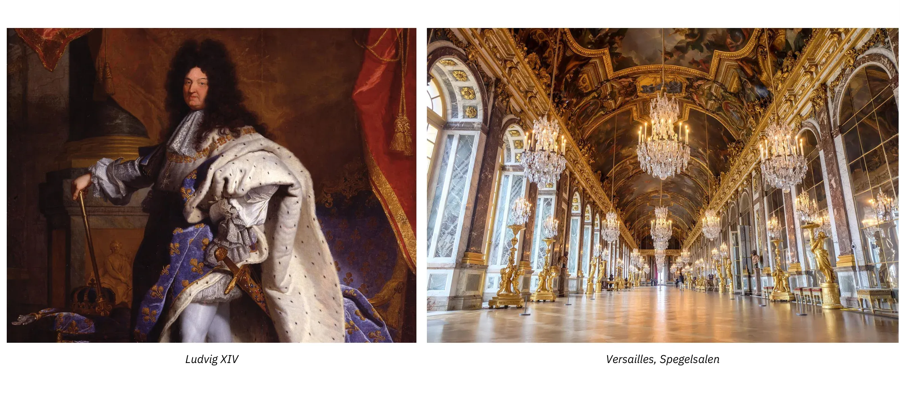

Abboten av Saint-Pierre hävdade att Ludvig XIV:s regeringstid, med sitt lyxiga hov och sin besatthet av militära erövringar, inte var ett tecken på en dygdig kung. Han vägrade att acceptera att Ludvig XIV förtjänade titeln "**Louis le Grand**".

"Att ruinera sina grannar och sitt folk på samma gång är inte storhet", sade han. Denna ståndpunkt förolämpade djupt Académie Française, som sedan länge hade varit upptagen med att glorifiera kungen i alla möjliga litterära former. Följden blev att de nästan enhälligt röstade för att utesluta honom.

När det gäller ekonomiskt tänkande tillämpade han konsekvent nyttoprincipen, ungefär som Jeremy Bentham skulle göra senare, och erbjöd ofta sunda insikter. I rättvisans namn ska sägas att han fortfarande var påverkad av merkantilistiska idéer, som ingen vid den här tiden hade gjort sig helt av med.

Abboten av Saint-Pierre gjorde ändå några korrekta observationer om ekonomin. Redan före *Condillac*, som ofta tillskrivs idén, konstaterade han klart och tydligt att båda parter gynnas av en Exchange. Detta finns i hans ["Projekt för att förbättra Frankrikes handel"] från 1733 (https://www.institutcoppet.org/projet-pour-perfectionner-le-commerce-de-france/), där han skrev:

> "När en försäljning sker mellan köpmän tjänar både säljaren och köparen på det, för om det inte fanns någon verklig eller upplevd fördel för båda parter skulle varken säljaren sälja till det eller det priset eller köparen köpa till det eller det priset".

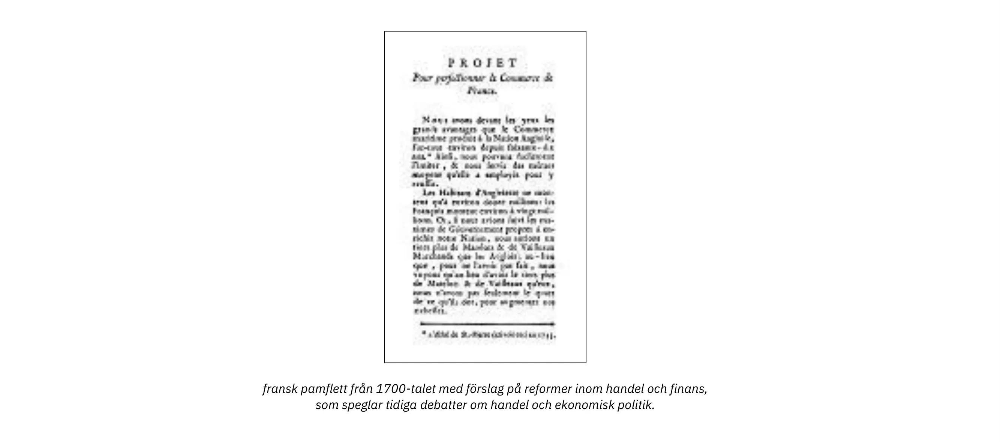

Han betonade också, innan Vincent de Gournay gjorde det, värdet av arbete och vikten av att hålla det tilltalande. "Allt arbete är svårt", skrev han. "Och när en man ser att hans arbete inte ger honom någon lön, eller inte tillräckligt, blir han sysslolös och bryr sig inte om onödiga ansträngningar". Just detta argument skulle senare upprepas av markis d'Argenson, Vincent de Gournay och fysiokraterna när de kritiserade betungande regleringar och skråsystem. De hävdade att sådana restriktioner avskräckte arbetare, orsakade onödiga svårigheter och till slut fick sysslolöshet att verka mer tilltalande än produktiv ansträngning under sådana förhållanden.

## Marquis d'Argenson

<chapterId>e9960ab4-72ec-5afd-8e97-bf89c83b62bc</chapterId>

Marquis d'Argenson är en bortglömd grundare av doktrinen om laissez-faire.

Den återupptäcktes av August Oncken, författare till en bok om laissez-faire, laissez-passer-doktrinen, som drog slutsatsen att d'Argenson spelade en viktig roll i födelsen av denna idé.

René-Louis Voyer, markis d'Argenson, föddes 1694. Han inledde sin politiska karriär som parlamentarisk rådgivare och satt sedan i statsrådet.

Trettio år före Adam Smith försvarade d'Argenson redan fördelarna med arbetsdelning och specialisering.

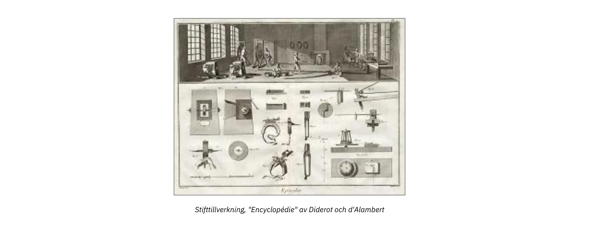

Han kritiserade starkt regleringar som, som han såg det, försökte ändra de naturliga preferenserna i olika regioner. Han var till exempel förbluffad över att regeringen ville att tyger och sammet skulle tillverkas i Tours, en fattig stad på den tiden, för att uppnå samma kvalitet som i det välmående Genua, som var känt för sina lyxvaror. Han drog slutsatsen:

> "Varje plats måste få välja sina egna fabriker. Frihet! Frihet!"

Han kände också igen en annan av Smiths centrala principer: idén att spontan ordning uppstår ur strävan efter egenintresse. Marquis d'Argenson menade att det var det omedelbara egenintresset som drev människan. Han skrev att dåligt hantverk och bedrägeri skulle misskreditera en tillverkare, medan flit och goda avsikter skulle leda till välstånd. Den bästa bedömaren av nyttan, menade han, var individen, allmänheten i stort, som köper varor och bryr sig om att göra en bra affär. "Var och en känner sitt eget intresse", sade han, "var och en vidtar de åtgärder som är lönsamma för honom, och det är i denna allmänna enighet som vi upptäcker sanningen."

Redan före Adam Smith förstod han att egenintresset leder till allmänintresset genom uppbyggnaden av en spontan naturordning.

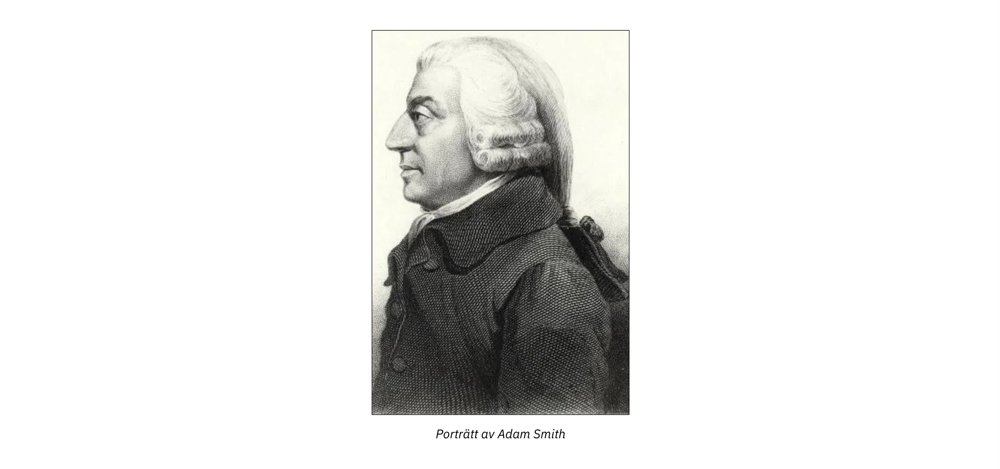

Han jämförde samhället med en bikupa där varje insekt följer sin instinkt. "Deras handlingar", sade han, "resulterade i en stor ansamling för det lilla samhällets behov; men detta åstadkoms inte genom order eller av generaler som tvingade varje individ att följa sin ledares åsikter". Detta är kanske det uttryck i franskt ekonomiskt tänkande som ligger närmast Adam Smiths berömda begrepp om den "osynliga handen".

Markis d'Argenson var alltid upprörd över de idéer som hans tids ministrar hade. Den enda fråga de ställde var: "Ska vi reglera på det ena eller andra sättet? Ska vi styra ekonomin mot det ena eller det andra?". På det svarade d'Argenson: "Borde vi inte först fråga oss om det är lämpligt att styra något alls, eller om saker och ting ska få sköta sig själva?"

I ärlighetens namn var han förvånad över att människor tyckte att det var så svårt att förstå, eller snarare se, de skadliga effekterna av överdriven reglering av alla slag på ekonomin. Enligt hans mening räckte det med att bara öppna ögonen. "Så många saker fungerar ganska bra idag", skrev han bittert, "helt enkelt för att de har lyckats undkomma lagens räckvidd".

Ibland blev han förtvivlad över hur lite man förstod av hans idéer.

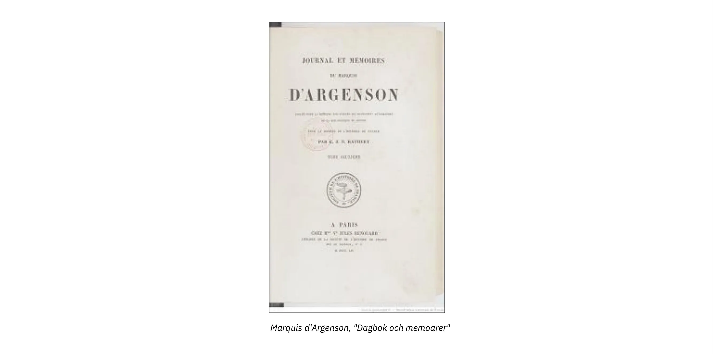

Det ideal för den ekonomiska politiken som han försvarade gick därför stick i stäv med tidens trender. Hans ideal definierade en i huvudsak negativ roll för staten. "Allt handeln behöver är att hinder undanröjs. Den begär bara goda domare, bestraffning av monopol, lika skydd för alla medborgare, stabila valutor samt vägar och kanaler". Detta var definitionen av en minimal stat, som skulle komma att bli en av grunderna för den franska traditionen inom politisk ekonomi.

Denna syn på statens roll i den ekonomiska verksamheten illustrerades på ett naturligt sätt genom studiet av två stora frågor som engagerade ekonomer och samhällstänkare på hans tid: regleringen av industrin och vetehandeln.

Det var framför allt regleringarna av industrin som väckte hans förbittring, eftersom de innebar privilegier för vissa på bekostnad av andra. "Den verkliga orsaken till våra fabrikers nedgång", skrev han, "är det överdrivna skydd som ges dem". Och det var med ett inte mindre livfullt credo som han uttryckte sin kritik mot den dirigistiska iver som hans tids statsmän uppvisade:

> Att driva industrin mot dess vilja är att vilja ha dess undergång.

På frågan om handel i försörjning hade d'Argenson inget annat svar än frihet. Enligt honom berodde bristen på vete på monopolet och de överdrivna försiktighetsåtgärder som regeringen vidtog. Allt vi behövde göra var att låta det vara, och det skulle aldrig finnas någon brist på vete i ett land där hamnarna var öppna. Utlänningar, som liksom alla andra människor lockas av vinsten, skulle förse oss med det vi behöver och ta ifrån oss vårt överskott. "Låt det vara", sa han, "och allt kommer att bli bra".

## Vincent de Gournay

<chapterId>e8ae40dc-7450-552f-9ddc-9e02936cf425</chapterId>

Vincent de Gournay var en av de första företrädarna för laissez-faire i Frankrike och en av dess tidigaste förespråkare inom offentlig förvaltning och i intellektuella kretsar. Av den anledningen förtjänar han ett mycket större erkännande i det ekonomiska tänkandets historia än vad han vanligtvis får. Jag har försökt att lyfta fram hans bidrag i en nyutkommen bok.

Gournay föddes in i en köpmansfamilj och blev själv en framgångsrik köpman och samlade på sig en betydande förmögenhet innan han fick en position i den franska administrationen. Inom handelsbyrån var han en ivrig förespråkare för fri arbetskraft och frihandel.

Trots att han var väl insatt bland sin tids ledande ekonomer skrev Gournay lite, eller snarare publicerade lite. Han skrev huvudsakligen administrativa brev och memoarer, antingen opublicerade eller publicerade av andra författare efter viss redigering.

Vad vi har inkluderar:

1. [The remarks] (https://archive.org/details/traitessurlecomm0000chil) på en översättning av en bok av den engelske ekonomen Josiah Child;

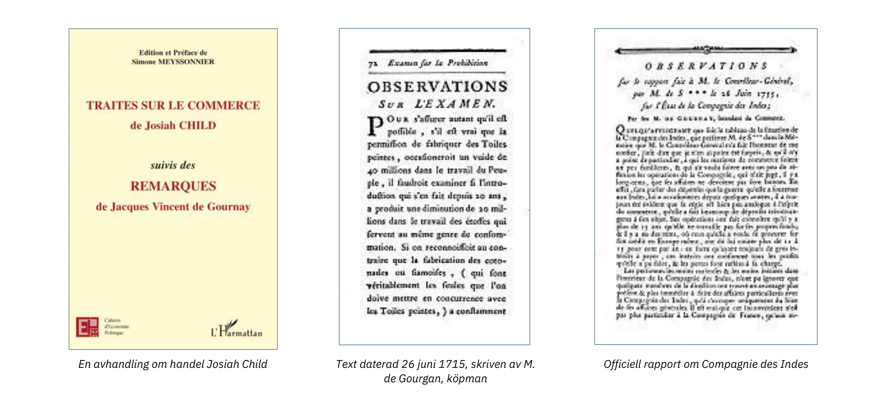

2. "Observationer" som ingår i undersökningen av för- och nackdelar med förbudet mot tryckta tyger;

3. "Observations on the East India Company", bilaga av abbot Morellet till hans Memoir on the Current State of the East India Company (1769);

4. Och framför allt olika memoarer från hans roll som handelsintendent.

Dessa skrifter visar på ett tydligt utländskt inflytande och förekomsten av några viktiga strukturerande idéer. Det utländska inflytandet, i Gournay, är erkännandet av engelsk och holländsk överlägsenhet. Gournay var övertygad om att dessa två nationer förstod ekonomi mycket bättre än Frankrike, och att Frankrike måste följa deras exempel. "Dessa två nationer är de mest välmående", sade han, "och de följer ett helt annat system än vi gör. Vi förbjuder utländska varor att komma in i landet, vi begränsar den ekonomiska aktiviteten genom drakoniska regleringar, medan de gör tvärtom. Om det går bättre för dem", avslutade Gournay, "beror det på att Frankrike styrs av felaktiga principer".

Hans reformförslag kretsade kring flera viktiga punkter.

För det första ansåg han att arbetskraften behövde skyddas och uppmuntras. På den tiden behandlades franska arbetare som brottslingar, övervakades ständigt och hölls i rädsla för att inte ha följt någon av de tusentals förordningarna. Denna överdrivna irritation avskräckte människor från att arbeta och drev dem istället mot sysslolöshet. Gournay hävdade dock att "arbete är ädelt och det enda sättet att berika en nation".

För det andra kritiserade han det restriktiva systemet med skrå som begränsade tillverkarna. Att delta i ett hantverk var både tidskrävande och dyrt, och varje ny arbetare måste sedan noggrant följa den rutin som fastställts i stadgarna för hans skrå. Ett sådant system lämnade inget utrymme för spetskompetens, innovation eller framsteg.

För det tredje begränsades handeln i Frankrike av restriktiva lagar. Gournay ansåg att konsumenterna skulle tjäna mycket på att hamnarna fick konkurrera fritt och att alla varor, som spannmål och tryckta dukar, fick importeras utan restriktioner. Han var en av de första som påpekade smugglingens verkliga ursprung: den existerade enbart för att en fördelaktig och nyttig handel var förbjuden. Han lade till en skarp observation: smuggling var ett "fritt" yrke, utan regleringar, utan skråväsende, utan konfiskatoriska skatter. Ändå var det statens överväldigande reglering som drev många hederliga arbetare in i olaglighet.

Slutligen noterade Gournay att räntorna var lägre i England och Nederländerna, länder som var mer välmående än Frankrike. Han förespråkade lägre räntor även i Frankrike, så att den ekonomiska aktiviteten skulle kunna finansieras där på lika fördelaktiga villkor som på andra håll. Gournay sökte dock inte tvingande, lagstiftande metoder utan betonade snarare behovet av att legalisera penningutlåningen, som fortfarande fördömdes av den katolska kyrkan.

På alla dessa punkter spelade Gournay en nyckelroll i de intellektuella debatterna i mitten av 1700-talet. Hans försvar för den ekonomiska friheten föregick fysiokraterna med ett decennium och Adam Smith med tjugo år. Men hans mest bestående inflytande var på Turgot. Gournay tog den unge Turgot under sina vingar och lärde upp honom med sina idéer.

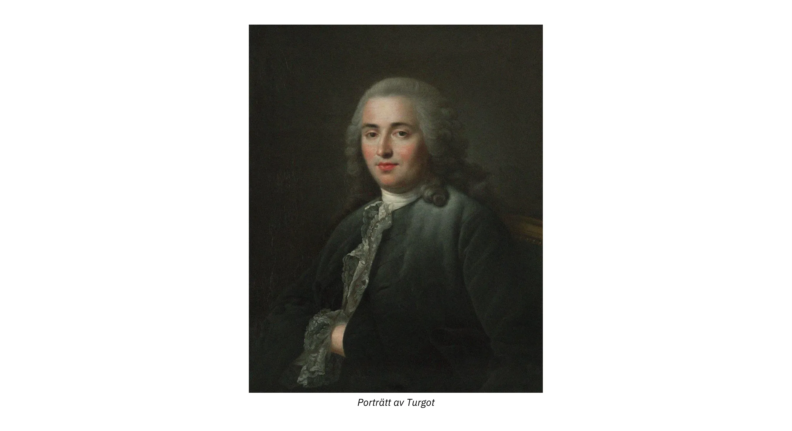

Flera år senare skrev Turgot, en blivande minister under Ludvig XVI, en Éloge (lovtal) till sin väns ära efter dennes död. Och om Turgot aldrig helt anammade François Quesnays fysiokrati, berodde det på att han bevarade en oövervinnelig bindning till sin första mästare, Vincent de Gournay.

## Gournay-cirkeln

<chapterId>b86ba6bd-8f3a-5d8f-b098-4d0413f00deb</chapterId>

När det gäller den ekonomiska vetenskapens tidiga dagar tenderar historien att lyfta fram en första tankeskola: fysiokraterna, ledda av François Quesnay och hans lärjungar. Men nästan ett decennium före deras uppkomst fanns det en annan, mindre formell men lika viktig grupp centrerad kring ekonomen Vincent de Gournay.

Som vi såg i föregående del var Gournay fascinerad av utländska exempel som England och Holland. Han beundrade deras ekonomer - personer som Josiah Child, Johan de Witt och David Hume - lika mycket.

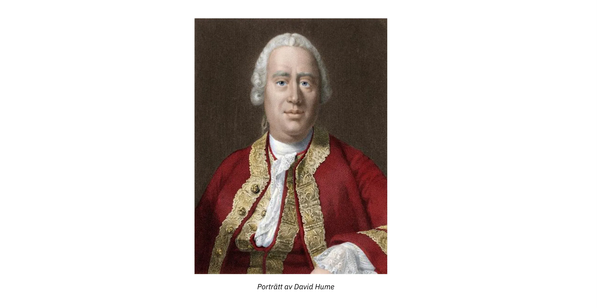

Denna beundran fick honom att översätta, och låta översätta, deras ekonomiska skrifter.

Det visade sig att Gournay genom sin position i den högre administrationen kunde komma i kontakt med alla de ekonomiska specialister som var kända i Frankrike vid den här tiden. På så sätt fick han ihop en grupp mycket skickliga översättare. Han översatte personligen Childs och Culpepers verk. Abbot Le Blanc översatte David Humes Political Discourses. Véron de Forbonnais översatte den spanske ekonomen Geronymo de Uztariz. Turgot arbetade med Josiah Tuckers skrifter och Montesquieus son översatte Joshua Gee.

Tack vare samarbetet med flera medlemmar i Gournays krets kunde många författare publicera originalverk under sina egna namn. Dessa böcker, tillsammans med översättningarna, nådde anmärkningsvärda framgångar. Några anmärkningsvärda exempel inkluderar:

- Herbert's Essay on the [General Police of Grain] (https://archive.org/details/essaisurlapolice00herb/page/n7/mode/2up) (6 utgåvor på 4 år)

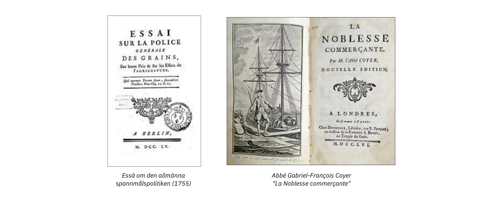

- Coyer's [Noblesse commerçante](https://archive.org/details/lanoblessecommer00coye/page/n3/mode/2up) (5 upplagor på 2 år)

- Plumard de Dangeuls [Anmärkningar om Frankrikes och Storbritanniens fördelar och nackdelar] (https://archive.org/details/bim_eighteenth-century_remarks-on-the-advantage_plumard-de-dangeul-loui_1754) (3 upplagor under första året)
- Cliquot-Blervache och Gournays [Memoir on the Trades](https://www.amazon.com/Memoire-sur-corps-metiers-French/dp/1978196903) (2 upplagor 1758)

Gruppen spelade också en central roll i publiceringen av

- [Essay on the Nature of Trade in General] (https://archive.org/details/essayonnatureofc0000cant) av Richard Cantillon.

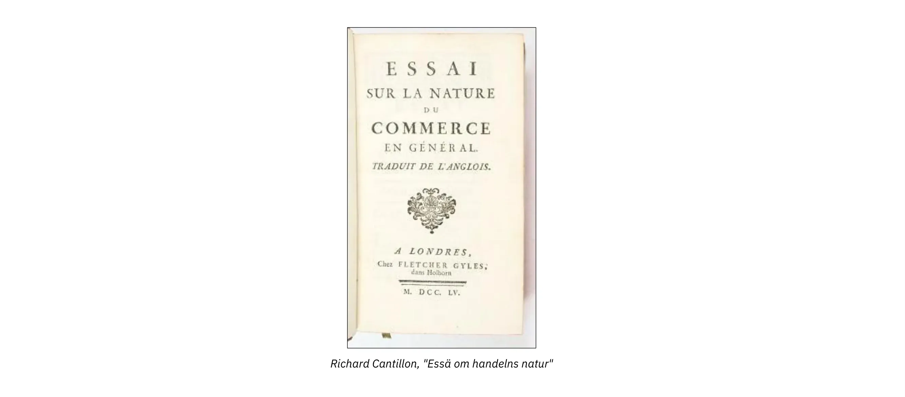

Den sista boken, som skrevs omkring 1730, blev kvar i manuskript efter författarens död. Gournay publicerade den med hjälp av sina ekonomvänner 1755. Enligt abbot Morellet, en medlem av kretsen, rekommenderade Gournay den till alla ekonomer han kände.

Gournay-kretsens intellektuella produktion hade stor inverkan på idéhistorien. På så sätt kan de betraktas som grundarna av den ekonomiska vetenskapen i Frankrike. Christine Théré från INED, som har studerat de ekonomiska publikationernas historia, fann att mellan 1750 och 1759 publicerades inte mindre än **349** verk om ekonomi, jämfört med endast **83** under hela det föregående decenniet (1740-1749). Denna revolution under 1750-talet beror till stor del på Gournay-kretsen.

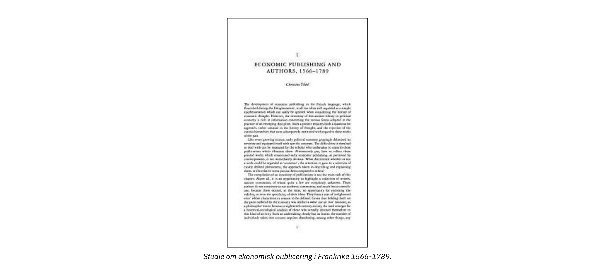

För att sprida en smak för ekonomiska diskussioner bland den franska befolkningen arbetade Gournay och hans vänner för att göra dem tillgängliga genom romaner. Efter *Memoir on the Trades*, som kritiserade skråväsendet, hjälpte Gournay och Cliquot-Blervache Gabriel-François Coyer att skriva en kort satirisk roman med titeln Chinki: [En cochinchinesisk berättelse som kan tillämpas på andra nationer] (https://www.institutcoppet.org/wp-content/uploads/2013/06/Coyer-Chinki-Histoire-cochinchinoise.pdf).

Berättelsen följer huvudpersonen Chinki, som tvingas lämna sin mark på grund av överdriven beskattning och försöker hitta hantverksarbete åt sina barn i staden. Men alla yrken är stängda för dem på grund av kränkande skråregler, så berättelsen skildrar hans växande besvikelse genom humoristiska toner.

Gournays krets var därför upphovet till en intensiv våg av publikationer. Även om detta viktiga bidrag har glömts bort av historiker inom ekonomiskt tänkande, var det mycket tydligt för samtida. Fysiokraterna, som organiserade sin skola på 1760-talet, skulle senare presentera Gournays grupp som sina direkta föregångare. År 1767 uttryckte ekonomen Jacques Accarias de Serionne detta ännu tydligare i sin hyllning. Han skrev: "Ett litet antal fransmän, både filosofer och medborgare, började för några år sedan imitera engelska författare. De översatte först sina förebilder och överträffade dem snart i många avseenden. De förde all litteraturens charm och rikedom till behandlingen av användbara ämnen; de väckte och spred smaken för de vetenskaper som var mest väsentliga för statens välstånd".

Och under 1750-talet blev ekonomiska frågor verkligen på modet. Voltaire anmärkte att fransmännen runt 1750 slutade skriva romaner för att diskutera spannmålshandelns frihet. Denna trend noterades också av Mercure de France, som i ett nummer från 1758, några månader före Gournays död, skrev "Politisk ekonomi är nu den vetenskap som är på modet. Böcker som handlar om jordbruk, befolkning, industri, handel och finans finns nu i händerna på otaliga människor som för inte så länge sedan bara ytligt läste romaner". En bättre hyllning till Gournay och hans krets av ekonomers arbete kan knappast göras.

## Mirabeau

<chapterId>2d2f802b-e3b6-556f-9025-a1b1dc4409ca</chapterId>

Frankrike har känt två berömda män vid namn Mirabeau, en far och en son, men det var sonen som verkligen skrev historia. Han var en revolutionär tribun och en av de centrala figurerna i händelserna under franska revolutionen, och han förblev berömd.

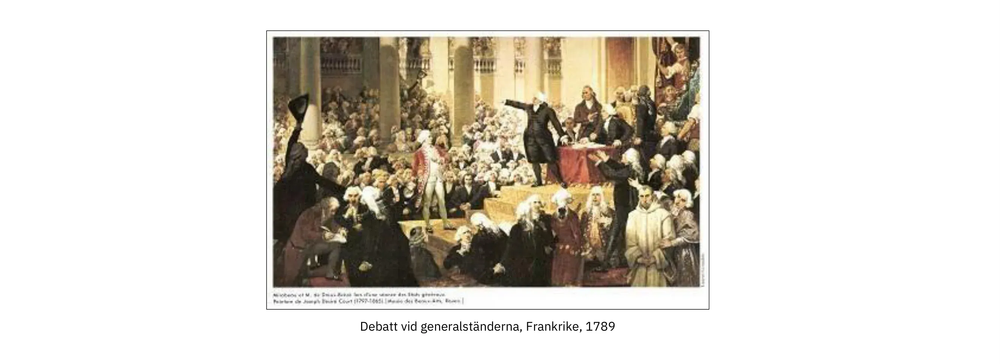

Genom sin talang och sin plats i den franska historien överskuggade han sin far, en ekonom och stöttepelare i François Quesnays skola, som hade varit dess första medlem redan 1758.

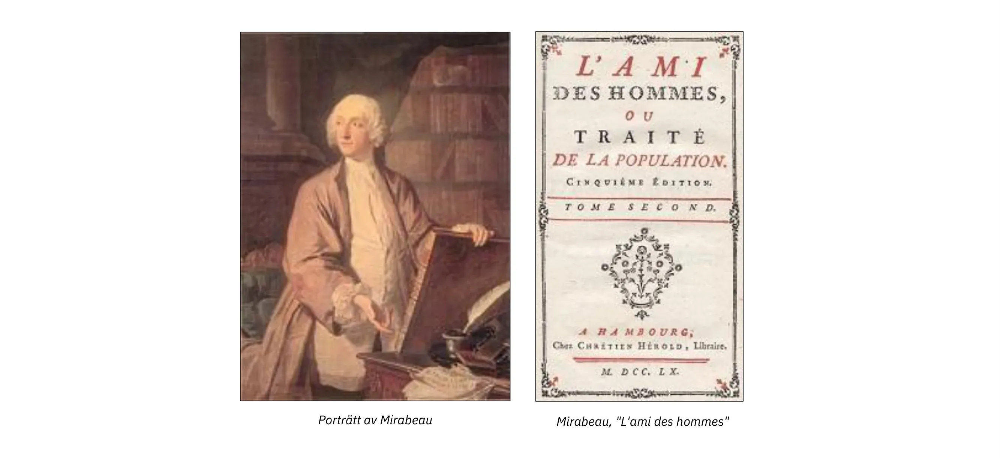

Marquis de Mirabeau hade faktiskt redan uppnått enorm berömmelse redan innan han antog fysiokratin tack vare en bok med titeln "The Friend of Mankind. Traité de la population [FR: L'ami des hommes, ou, Traité de la population] (https://archive.org/details/lamideshommesou00unkngoog). Även om den första upplagan publicerades 1756 blev den känd omkring 1757, ett år före hans möte med Quesnay.

Mer än 20 upplagor gavs ut mellan 1757 och 1760, vilket förmodligen gör den till historiens mest framgångsrika ekonomibok. Vissa läsare trodde till och med att boken hade skrivits av Montesquieu på grund av dess skarpa resonemang. Dauphin, kung Ludvig XVI:s far, påstod till och med att han hade lärt sig den utantill. Under en tid var det den bok som alla i Versailles läste.

Idag är det en bok som inte längre läses, men många refererar fortfarande till den. Ännu på 1800-talet sa Edmond Roussel:

> L'Ami des Hommes är en av de där böckerna som alla pratar om, men som nästan ingen känner till. I varje generation borde en modig medborgare läsa den, så att alla andra inte behöver göra det.

I början av sin karriär som ekonom hämtade Mirabeau inspiration från Richard Cantillon. Han hade ägt ett manuskript av Cantillons Essay on the Nature of Commerce in General i 15 år och hade tålmodigt analyserat och kommenterat det.

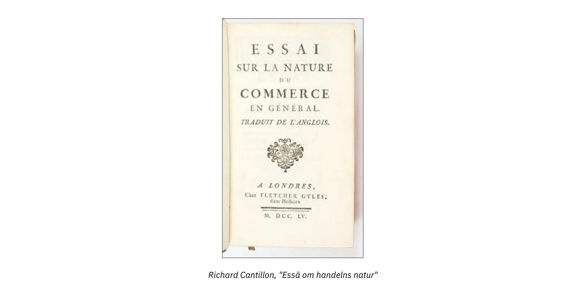

L'Ami des Hommes var ursprungligen tänkt som en enkel kommentar till Cantillons Essä. Men eftersom Mirabeau hade ett något eklektiskt sinne, det vill säga uppriktigt sagt lite galet, avvek han snabbt från sin ursprungliga plan. Boken diskuterar helt enkelt alla de ekonomiska frågor han kände till och rör sig ibland bort från Cantillon. Det är en svårläst bok, med en bisarr plan och utvikningar i varje kapitel. Mirabeau medgav själv att det var kaos och att hans stil var apokalyptisk.

Trots det kaos som råder finns det några idéer som är värda att notera:

- Mirabeau bekämpar merkantilisternas fördomar om rikedomens natur.
- Han hyllar jordbruket och kritiserar att det överges.
- Han beklagar sig över folkets, särskilt böndernas, situation.
- Slutligen försvarar han den fria handeln och nationernas broderskap i fred.

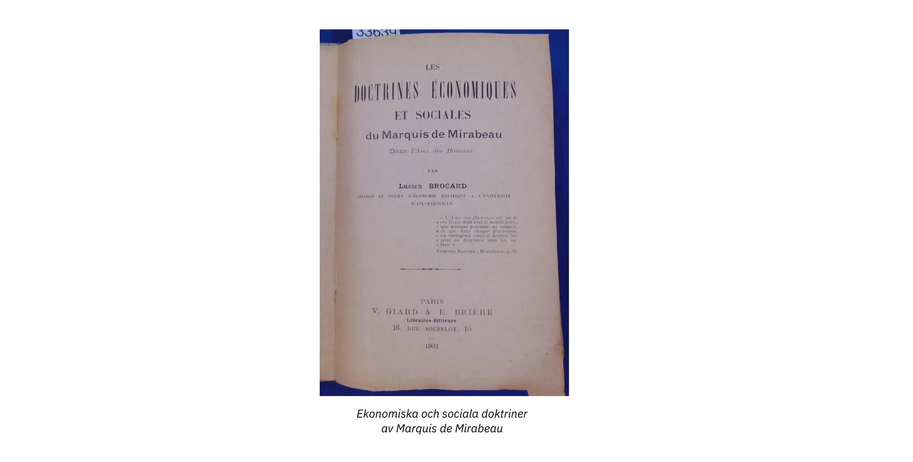

Det är Hard att beteckna Mirabeaus åsikter som antingen liberala eller antiliberala. Han drev ofta fram och tillbaka, ibland utan att inse det, mellan den ena och den andra visionen. Ändå dominerade liberala idéer ofta hans skrivande. En av hans mest kända rader var:

> Den sanna och enda principen för politisk ekonomi är att låta allt vara fritt.

Med sin största framgång bakom sig blev Mirabeau uppvaktad. François Quesnay, som just hade börjat intressera sig för ekonomi, bjöd in honom till sin entresol på Versailles.

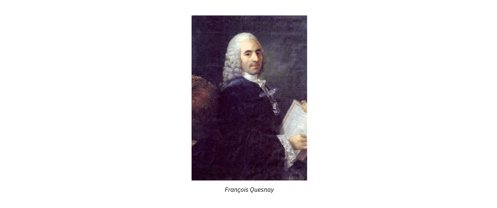

De debatterade ursinnigt och till slut hände något som normalt aldrig händer i debatter: Mirabeau erkände rakt ut att han hade haft fel. Han höll med om Quesnays idéer och sa sig vara redo att sprida dem.

Tillsammans bildade de kärnan i det som skulle bli den fysiokratiska skolan, förstärkt av de regelbundna rekryter som de tog in. Strax efter Mirabeaus omvändelse värvade Quesnay honom för att försvara sina idéer om beskattning. Detta ledde till ["Theory of Taxation"] (https://archive.org/details/thoriedelimpot00mira), för vilket Mirabeau skickades för några dagar till Vincennes-fängelset och sedan förvisades till Bignon.

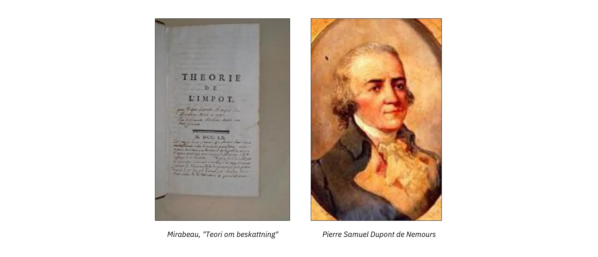

Mirabeau spelade också en avgörande roll när det gällde att rekrytera nya medlemmar till Quesnays skola. Han övertygade till och med den unge Dupont de Nemours.

Det var också i Mirabeaus hus som fysiokraterna sammanträdde varje tisdag. Personligheter som Turgot och Adam Smith verkar ha deltagit i dessa möten en eller flera gånger.

Under hela sitt liv förblev Mirabeau en outtröttlig författare. Han författade många ekonomiska verk som försvarade Quesnays doktrin. Mot slutet av sitt liv avtog dock hans inflytande. Hans skrivstil försämrades till den grad att hans egen bror skrev till honom och sa att han inte längre kunde förstå hans prosa. Hans idéer, som hade blivit helt liberala, krockade med den socialistiska eller protokommunistiska reaktionen hos tänkare som Mably och till och med Rousseau. Han kämpade för att hitta läsare och förläggare och dog i stort sett obemärkt 1789, kvällen före stormningen av Bastiljen.

## Quesnay

<chapterId>7a35f20b-5ea0-544d-b290-bcd9c6f7f11a</chapterId>

François Quesnay är en av de mest kända franska ekonomerna.

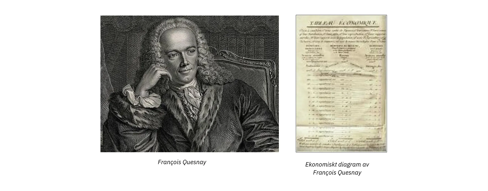

Hans namn förekommer i varje lärobok om ekonomi och det ekonomiska tänkandets historia. Det sägs att han skapade "Tableau Économique" för att schematiskt representera ekonomin, att han var ledare för den fysiokratiska skolan, att han misstog sig när han trodde att endast mark är produktivt och slutligen att Adam Smith kom för att rätta till det. Ungefär så brukar läroböckerna sammanfatta François Quesnay.

Det är synd att reducera honom till detta, för Quesnay var också den första ekonomen som försökte basera försvaret av ekonomisk frihet på vetenskapliga principer. Han var en av de mest lyssnade och inflytelserika ekonomerna på sin tid. Dessutom grundade han fysiokratin, en mycket rikare doktrin än den förenklade idén att endast naturen producerar rikedom, en uppfattning som ofta framställs felaktigt.

Vi kommer att diskutera fysiokrati mer detaljerat under de kommande tre kapitlen. Låt oss först titta närmare på François Quesnay själv.

Född 1694 i Méré av en bondefamilj som inte kunde lära Quesnay att läsa. Han utbildades av en lokal man och fortsatte så småningom att studera vid College of Surgery och sedan vid medicinska fakulteten. Vid 24 års ålder blev han kirurg i Mantes.

Han blev känd 1730, vid 36 års ålder, för att ha motsatt sig den vanliga åderlåtningen, som han menade byggde på felaktiga teorier och fördomar. Han vågade också utmana skråväsendet, som föreskrev att endast kirurger fick utföra operationer och att endast läkare fick skriva ut mediciner. Detta tvingade ofta de fattiga att betala två gånger och ta in två personer, en situation som Quesnay tyckte var motbjudande.

År 1740 blev han sekreterare i kirurgiska akademien. År 1748, vid 54 års ålder, blev han personlig läkare åt Madame de Pompadour och flyttade till Versailles.

Han var mycket nära Madame de Pompadour. Quesnay sa till och med, vid den tidpunkt då favoritens vanära tillkännagavs, att han inte skulle vilja förbli läkare i Versailles utan henne:

"Jag var fäst vid Madame de Pompadour i hennes välstånd; jag kommer att vara det i hennes vanära".

Därefter publicerade han flera medicinska böcker: Treatise on Suppuration (1749), Treatise on Gangrene (1749) och Treatise on Continuous Fevers (1753), som alla trycktes om flera gånger under hans livstid.

Vid 60 års ålder började han skriva om ekonomi efter att ha tagit del av de ekonomiska debatter som var på modet vid den tiden. År 1755 skrev han artiklarna "Farmers" och "Grain" för *Encyclopédie*.

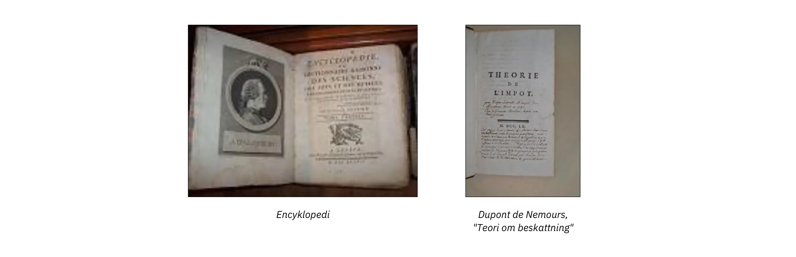

De publicerades 1757. Samma år träffade han den berömde Mirabeau och lyckades övertyga honom om sina ekonomiska idéer - fysiokratins kärna var född. Quesnay skapade sedan Tableau Économique, som trycktes på de kungliga pressarna, enligt uppgift i närvaro av kungen själv på Château de Versailles. Från och med då var han regelbundet värd för ekonomer och filosofer i sin lägenhet i Versailles, där de deltog i diskussioner fritt. Quesnay bidrog också till Mirabeaus Theory of Taxation, som publicerades 1759.

Censuren slog snart till. Mirabeau fängslades och Quesnay fick en reprimand. Efter det insåg Quesnay att han inte kunde publicera sig öppet och att han skulle behöva lärjungar för att sprida sina idéer.

Han hittade dem snabbt: Baudeau, Dupont de Nemours, Le Trosne, Mercier de la Rivière och andra. Dessa var de män som skulle sprida och popularisera Quesnays tankar. Quesnay, som behövde lärjungar, var dock inte helt nöjd med den sekteristiska aspekten av sin grupp. Vittna om hans brev till Mirabeau, där han berättar för honom:

> "Tänk själva. Jag har insett att mina miserabla utkast gör er lata. Nu är det er tur att tänka. Ni vet lika mycket som jag".

Hans lärjungar var dock djupt hängivna och bidrog i hög grad till Quesnays popularitet. Vid hans död höll Mirabeau ett lovtal och sa: "Vi har förlorat vår far, för vi var skyldiga honom allt". I själva verket var det Quesnay som var skyldig dem allt, för utan dem skulle han ha förblivit fast i Versailles, där hans tänkande, även om det hade mycket att förföra eller oroa, intresserade få.

Tack vare sina medarbetares arbete fick hans idéer en plattform: först genom tidningar som *Journal of Agriculture* och *Ephémérides du Citoyen*.

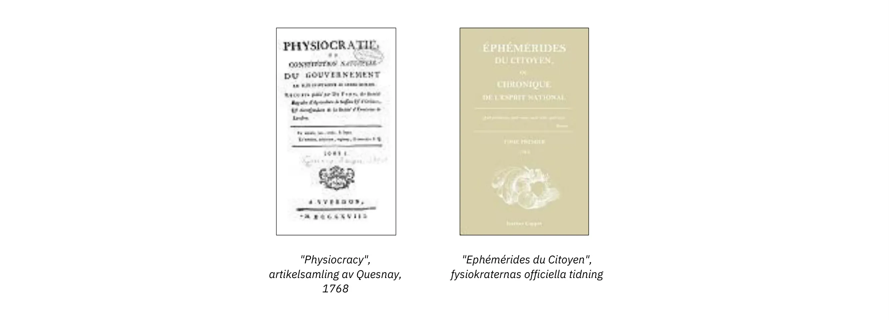

Sedan genom böcker, inte bara hans lärjungars utan också en viktig antologi som publicerades 1768 av Dupont de Nemours med titeln *Physiocracy*.

I denna bok samlades Quesnays viktigaste bidrag. I boken beskrivs fysiokraternas ledares ekonomiska ideal: en jordbruksekonomisk modell där lagen garanterar alla rätten att äga egendom och friheten att bedriva handel.

# Den fysiokratiska skolan

<partId>27af82c1-ad82-5c3b-8ce9-c674b67bbf7c</partId>

## Fysiokraternas historia

<chapterId>4236ff8b-b53a-59e7-92c0-f96f9afa1c00</chapterId>

Fysiokratin var på modet i Frankrike, och till och med i hela Europa, under knappt ett decennium. Efter en lång utvecklingsperiod fick den en framträdande roll i mitten av 1760-talet. När Turgot kom till makten 1776 hade rörelsen redan förlorat sin popularitet, och ministern höll sitt stöd för Quesnays skola mestadels dolt.

Dess ursprung ligger i utvecklingen av ekonomiska idéer under 1750-talet. Flera författare hjälpte till att överbrygga klyftan mellan Boisguilbert och det som senare skulle bli känt som fysiokrati. Som tidigare diskuterats låg Vincent de Gournay och hans krets av ekonomer bakom många publikationer som introducerade franska läsare till utländska ekonomiska tankar och hjälpte till att tända deras passion för ekonomi. Grunden för fysiokratin fanns redan i böcker som "Détail de la France" av Boisguilbert och ["Essay on the Nature of Trade in General"] (https://archive.org/details/essaisurlanature0000cant) av Cantillon.

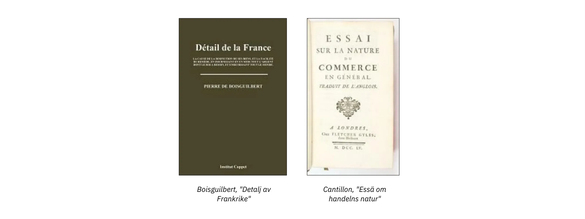

Begreppet laissez-faire hade flera förespråkare sedan Boisguilbert, särskilt Vincent de Gournay och markisen d'Argenson.

Det som återstod var att omvandla denna samling idéer till en sammanhängande, komplett doktrin, och markisen de Mirabeau var den förste som försökte. Inspirerad av Cantillons essä började han skriva en omfattande avhandling om ekonomiska frågor med titeln "L'Ami des Hommes", som blev mycket framgångsrik.

År 1756 kunde sålunda historien om fysiokratin börja. François Quesnay, som då var kirurg och blev livläkare åt Madame de Pompadour, bjöd in Mirabeau till Versailles för att diskutera ekonomiska idéer.

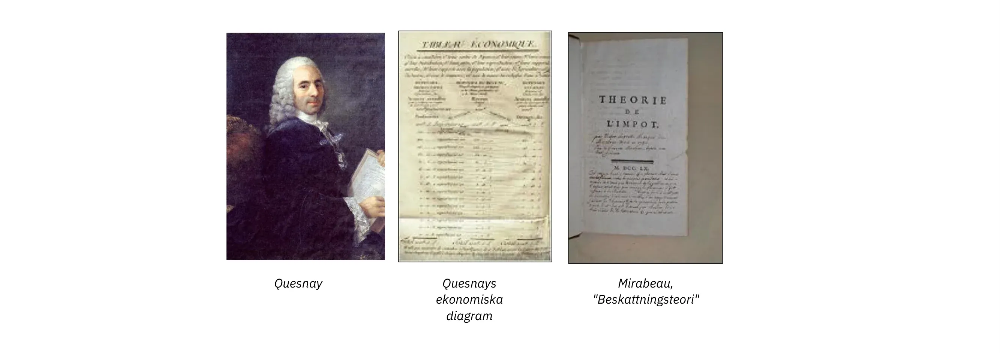

I slutet av deras samtal instämde Mirabeau i Quesnays idéer. Från och med då skrev de: Quesnay skapade *Tableau économique* (1758) för att illustrera flödet av rikedom i ekonomin, och tillsammans publicerade de Theory of Taxation (1759).

Deras ansträngningar välkomnades inte särskilt varmt. Vid hovet var den förhärskande reaktionen likgiltighet. Kungen erkände Quesnays benägenhet för teori och kallade honom kärleksfullt för "min tänkare". Men bortsett från den komplimangen gav deras arbete inget resultat. Faktum är att deras skatteteori förolämpade de skatteadministratörer som den kritiserade, så mycket att de krävde och såg till att Mirabeau fängslades. Madame de Pompadour fick honom så småningom frigiven, men han fortsatte att leva i exil på sitt gods i Bignon under några veckor.

Första hälften av 1760-talet förflöt således i relativ tystnad. På grund av sin position i Versailles tvingades Quesnay att sluta skriva, eller åtminstone att inte publicera något under eget namn. Mirabeau, som redan dömts en gång, var varnad och väl medveten om att kungens favorit inte kunde skydda honom för evigt.

Efter denna korta tystnad började de två ekonomerna rekrytera lärjungar: det var det enda sättet att popularisera sina idéer. År 1765 var deras framgångar slående. Dupont de Nemours, Abeille, Mercier de la Rivière, Le Trosne och Baudeau anslöt sig snabbt till deras led. De bildade en skola: de hade sin egen tidskrift, *Les Éphémérides du Citoyen*, och träffades till och med varje tisdag hemma hos Mirabeau.

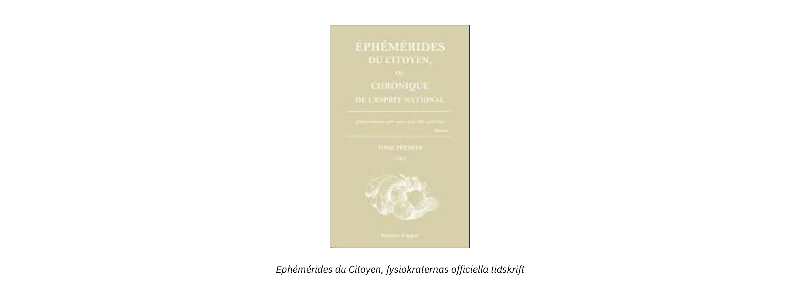

Mellan 1765 och 1775 stod den förenade gruppen fysiokrater på toppen av sin berömmelse. Den litterära och filosofiska världen hade bara ögon för dem, vilket gjorde att deras idéer fick stor och snabb spridning. Folk kallade dem "ekonomerna" eller, mer hånfullt, "ekonomernas sekt". Oavsett tonläge var deras ryktbarhet absolut. År 1774, efter en resa till Metz, skrev M. de Vaublanc om sin förvåning i sina memoarer: alla omkring honom talade ekonomi och resonerade som Quesnays lärjungar. "Det var på modet", konstaterade han. "Alla var ekonomer".

År 1770 började dock deras popularitet att avta. Gruppen upplevde sina första avhopp, och deras förmåga att stå emot kritik försvagades. Och kritikerna var många, Condillac, Mably, Voltaire, Galiani, Linguet, Graslin och till och med Adam Smith i Skottland ifrågasatte alla deras åsikter.

Deras tidning utkom inte längre regelbundet. Detta markerade slutet på rörelsens mest aktiva period.

Fysiokratin skulle fortsätta att utöva inflytande ända fram till revolutionen. I Frankrike, först genom Turgot, mer av en medresenär än en lärjunge, liksom genom dess representant Dupont de Nemours, vars liv och verk vi kommer att studera senare. Men också över hela Europa, där den fysiokratiska doktrinen mottogs med entusiasm. I Tyskland, genom markgreven av Baden, och i Italien, genom Leopold av Toscana, inspirerade fysiokratiska teorier till och med ekonomiska reformer som gynnade privat egendom och frihet.

## Grunderna för fysiokraternas lära

<chapterId>4dbe5436-0578-57c2-b054-03ed00aa091a</chapterId>

Begreppet fysiokrati, som betyder "naturstyre", myntades av Dupont de Nemours och användes som titel på *Physiocracy*, en samling artiklar av Quesnay som publicerades 1768.

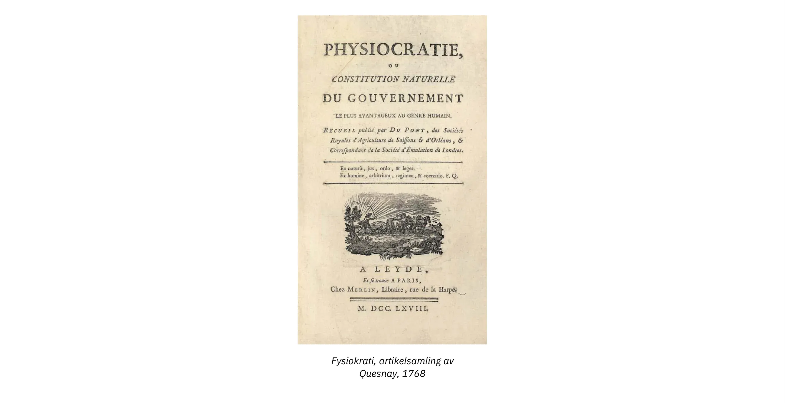

Detta är en obskyr fras. Ingen elev till Quesnay har gett oss dess sanna innebörd. Ändå var deras tankesystem långt ifrån dunkelt. I själva verket var det uppbyggt kring några mycket tydliga principer, som vi kommer att skissera här.

### Första principen: endast jordbruk är produktivt

Denna första idé är den som har fångat historikernas uppmärksamhet. I dag, i läroböcker eller ekonomikurser, är det så här fysiokraterna sammanfattas. De sägs naivt ha trott att det bara är jordbruket som är produktivt. På den grunden avfärdas deras doktrin som irrelevant och analysen går snabbt vidare till Adam Smith.

Det är dock orättvist att kritisera fysiokraterna för att lägga oproportionerligt stor vikt vid jordbruket, eftersom jordbruket i mitten av 1700-talet sysselsatte 90% av befolkningen och utgjorde grunden för den franska ekonomin.

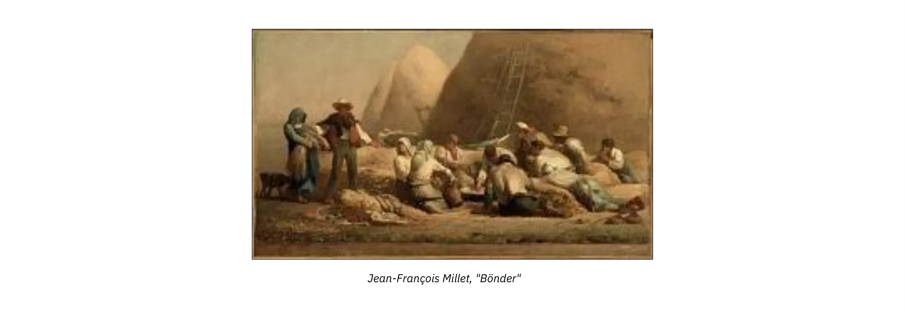

Fysiokraternas idé är egentligen subtil. Enligt dem finns det en skillnad mellan produktion och vinst. Industrimannen och köpmannen kan tjäna pengar, men det är bara bonden som verkligen producerar, eftersom produktion är skapandet av användbart material, snarare än att lägga till nytta till redan existerande material.

Vi bör också försöka förstå varför de förkastade industri och hantverk som improduktiva. På den tiden var dessa branscher låsta inom skråväsendet, vilket förbjöd innovation, investeringar och framsteg.

### Andra principen: juridisk despoti snarare än demokrati

För att förolämpa någon säger vi i dag att han inte är demokrat. Även om historikerna förlåter fysiokraterna deras strikta syn på jordbrukets produktivitet, förlåter de inte deras motstånd mot demokrati, särskilt eftersom de levde under upplysningstidens höjdpunkt. Från mitten av 1700-talet till strax före revolutionen sågs fysiokraterna som fiender till framsteg.

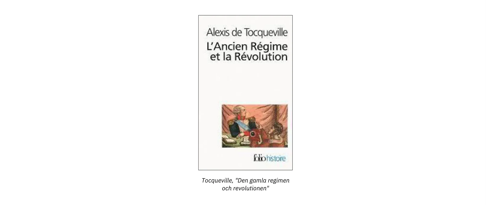

Tocqueville insisterade på denna idé:

> Fysiokraterna var verkligen mycket positiva till fri handel med varor, till laissez-faire eller laissez-passer inom handel och industri; men när det gäller politiska friheter i sig övervägde de inte dem, och även när sådana idéer råkade komma i deras tankar avvisade de dem först.

Fysiokraterna var liberala i ekonomiska frågor, men därför inte liberala i politiska frågor. Quesnay skriver i sina *maximer*: "Låt den suveräna myndigheten vara unik och överlägsen alla individer i samhället och alla orättvisa företag av privata intressen." Och senare, i samma maxim: "Systemet med kontroller och balanser i regeringen är en ödesdiger idé, som bara avslöjar oenighet bland de stora och förtryck av de små".

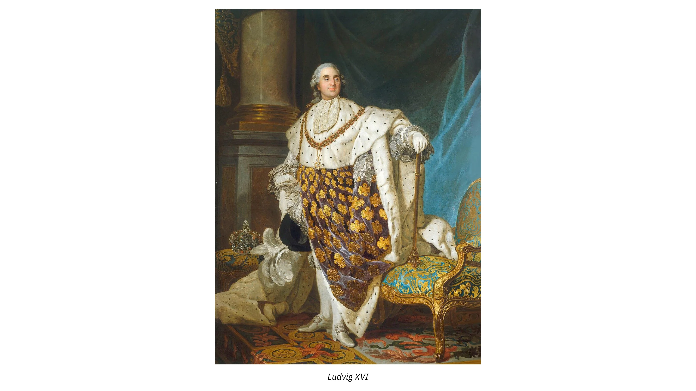

Tocqueville noterade träffande att fysiokraterna förkastade demokratin så snart de såg dess former. De var skeptiska till demokratin, som skulle komma att bli en konstant i den franska politiska ekonomin, eftersom demokratin är långt ifrån ett perfekt system: den kan potentiellt tillåta att minoriteter förtrycks av majoriteten, och den kan bli ett verktyg för usurpation, tyranni och plundring.

### Tredje principen: absolut respekt för privat egendom

Fysiokraterna ansåg att människor behövde äga och behålla resultatet av sitt arbete. Enligt deras uppfattning var äganderätten själva grunden för ett samhälle. De ansåg att staten hade en enda huvuduppgift: att skydda människors egendom. Ur ekonomisk synvinkel hävdade fysiokraterna dessutom att egendomens okränkbarhet uppmuntrar till arbete och ansträngning och är en förutsättning för ekonomisk utveckling.

Quesnay uttryckte det enkelt:

> Låt Ownership för jord och lös egendom tillförsäkras dem som är deras rättmätiga innehavare, ty egendomens säkerhet är den väsentliga grunden för ekonomisk ordning och samhällets säkerhet; det är vissheten om permanent innehav som uppmuntrar till arbete och användning av rikedom för att förbättra och odla jorden, liksom i kommersiella och industriella företag.

### Fjärde principen: absolut handelsfrihet

I sina tidigare citerade *Maxims* säger Quesnay:

> Låt det finnas fullständig handelsfrihet, för den mest tillförlitliga, exakta och fördelaktiga regleringen av både inrikes- och utrikeshandeln för nationen och staten ligger i fullständig konkurrensfrihet.

Fysiokraterna hade sett vilken skada statlig inblandning orsakade, särskilt inom spannmålshandeln. Man måste erkänna, säger de, att myndigheten aldrig kommer att kunna sköta handeln lika bra som enskilda individer, eftersom den skulle behöva svara på alla behov och reagera på varje förändring i efterfrågan eller Supply. Allt detta är långt bortom kapaciteten hos även den klokaste regering man kan tänka sig. Därför är det nödvändigt att låta saker och ting vara och låta dem flöda.

Handeln är till sin natur fördelaktig och måste därför vara helt och hållet fri. En av deras medlemmar, Le Trosne, skrev till och med en broschyr med titeln [*Friheten i spannmålshandeln: alltid användbar, aldrig skadlig*] (https://www.institutcoppet.org/liberte-commerce-grains-toujours-utile-jamais-nuisible/).

### Femte principen: Alla människor är bröder

Fysiokraterna var hårda motståndare till slaveriet, men också stora pacifister. "Vår utrikespolitik kallas fred", sa Mirabeau helt enkelt. År 1790, i den konstituerande församlingen, fortsatte Dupont de Nemours denna pacifistiska hållning när han lade fram ett lagförslag som förbjöd anfallskrig.

## Fysiokraternas prestationer och influenser

<chapterId>5b911105-796a-5e2e-a501-c7a364fc758e</chapterId>

Som vi såg i det första av de tre kapitlen om fysiokraterna, var Quesnays anhängare det stora modet i Frankrike under ungefär ett decennium. Denna entusiasm för deras idéer tog form både under deras tid och fortsatte fram till slutet av århundradet. Här kommer vi att titta på några av deras prestationer och det inflytande de utövade på sina efterträdare inom området ekonomiskt tänkande.

Deras största bedrift, efter Gournay-gruppen, var att popularisera ekonomiska idéer. Voltaires berömda ordspråk är välkänt: omkring 1750 började nationen, som var mättad på poesi och romaner, att resonera om spannmål. Fysiokraterna deltog i denna rörelse och publicerade bokstavligen hundratals artiklar, pamfletter och böcker om spannmålshandelns frihet. Den starka drivkraft som fysiokraterna gav ekonomiska diskussioner framgår också av det imponerande antalet ekonomiska verk och pamfletter som publicerades i Frankrike mellan 1760 och 1775. Som ytterligare bevis på spridningen av ekonomiska idéer i Frankrike kan man erinra sig en kommentar av M. de Vaublanc, som nämndes i en tidigare föreläsning, och som i Metz 1774 sade att folk inte talade om något annat än ekonomi. "Det var mode", sa han. "Alla var ekonomer".

Försvaret av deras idéer i böcker, pamfletter och i deras tidskrift *Les Éphémérides du Citoyen* fick snabbt återverkningar på Frankrikes ekonomiska politik. År 1763 gav ett dekret spannmålshandeln frihet, vilket Quesnay och Mirabeau hade krävt med kraft. Vid flera tillfällen lättade myndigheterna också på reglerna för handelsgillen för att garantera större frihet att arbeta.

Utomlands kom framgångarna mycket tidigt. I Tyskland intresserade sig markgreven av Baden för fysiokratiska idéer och upprätthöll en regelbunden korrespondens med Mirabeau och Dupont de Nemours.

Han gav ekonomen Johann August Schlettwein, en övertygad fysiokrat, i uppdrag att genomföra en skattereform och liberalisera spannmålshandeln. I april 1770 ägde ett första försök rum i den lilla byn Dietlingen. Byborna verkade ha välkomnat åtgärderna med entusiasm, men de ansvariga tjänstemännen var inte särskilt positiva, vilket försenade det vidare genomförandet.

I Ryssland förberedde Katarina II en lagstiftningsreform och bad Diderot att skicka henne en briljant hjärna som skulle hjälpa henne.

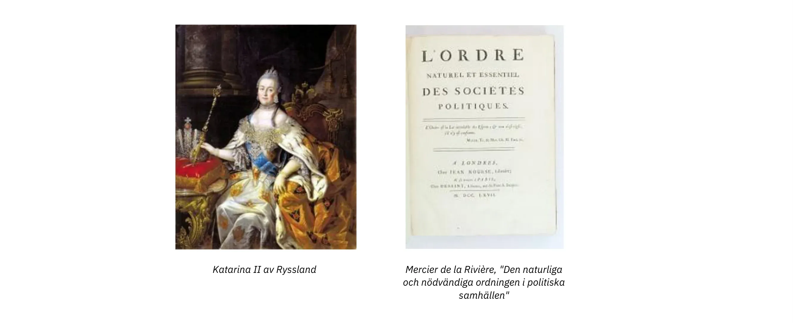

Han blev imponerad av att läsa [*The Natural and Essential Order of Political Societies*] (https://archive.org/details/lordrenaturelete00mercuoft), som publicerades 1767, och skickade författaren, fysiokraten Mercier de la Rivière, till henne.

Trots att han lämnade Frankrike firad var mottagandet i Sankt Petersburg svalt (klimatet åsido), och kejsarinnan var besviken på honom.

I Sverige, med Gustav III, och i Italien, med Leopold av Toscana, fann fysiokraterna också anhängare som var beredda att omsätta deras idéer i praktiken.

I Frankrike nådde fysiokraterna spektakulära framgångar när Turgot utnämndes till generaldirektör för finanserna 1774.

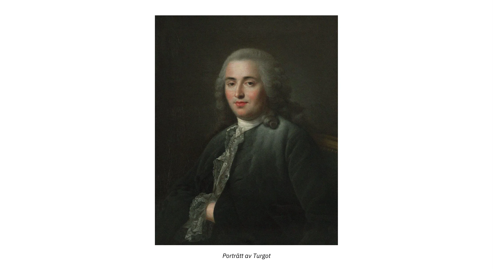

Turgot var medveten om att deras berömmelse hade minskat och framställde sig aldrig som en lojal lärjunge till fysiokraterna, eller för den delen som en encyklopedist, även om han var en sådan, och eftersom de föraktades av prästerskapet. Väl vid makten utfärdade Turgot sex berömda dekret som utgjorde början på en praktisk tillämpning av det fysiokratiska programmet: handelsfrihet, arbetets frihet och slutet på monopol.

Vid tiden för den franska revolutionen hade fysiokraterna färre anhängare. Markisen av Mirabeau dog den 13 juli 1789 - vilket var en symbol. Abeille hade gått vidare, men Dupont de Nemours förblev trogen. Dupont de Nemours utsågs till ledamot av nationalförsamlingen och förde fysiokratins talan och krävde ekonomiska reformer till förmån för egendomsrätten Ownership och frihandel.

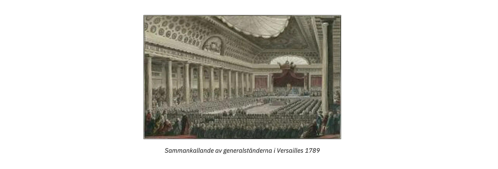

Han kämpade också, utan framgång, mot assignaterna. Trots detta misslyckande förblev det fysiokratiska tänkandet mycket närvarande i den intellektuella debatten och påverkade revolutionens tidiga prestationer. Som Joseph Rambaud sa, allt som revolutionen gjorde till förmån för friheter berodde på fysiokraterna.

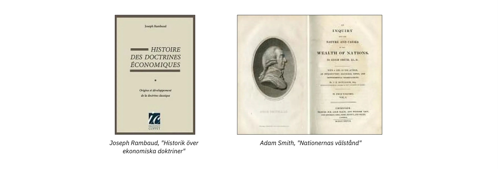

Fysiokraterna hade också ett stort inflytande på det ekonomiska tänkandets historia. Adam Smith, som besökte Frankrike och träffade många av dem, var djupt påverkad av deras arbete. Han övervägde till och med att dedicera *The Wealth of Nations* till Quesnay.

Tyvärr dog Quesnay två år innan Smiths bok publicerades, och Smith tog bort dedikationen. Även om Smith inte höll med om deras idé om att endast jordbruk var produktivt, anammade han många av deras argument för fria marknader och förde dem vidare i sitt eget arbete.

## Dupont de Nemours

<chapterId>6d585e0f-93b8-5b0a-a0a8-7f6e4a5bc68e</chapterId>

I USA känner vi till DuPont-företaget, även känt som "E.I. du Pont de Nemours and Company", ett multinationellt företag inom kemi och biologi.

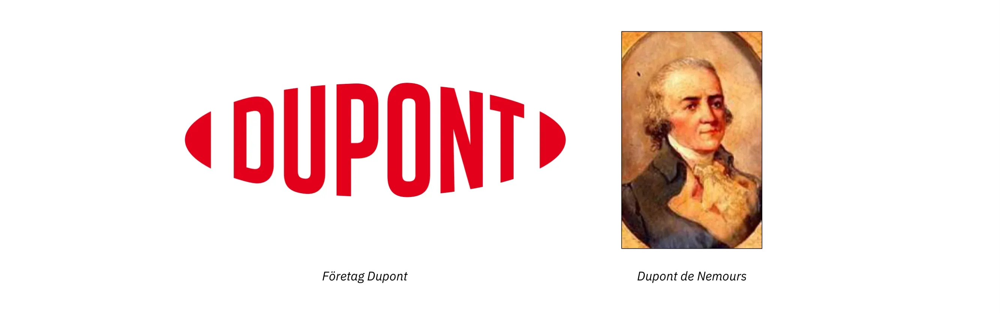

Idag omsätter företaget över 35.000 miljarder dollar och sysselsätter nästan 65.000 personer världen över. Det visar sig att detta företag är nära kopplat till Samuel-Pierre Dupont de Nemours öde, en fransk ekonom av den fysiokratiska skolan.

Dupont de Nemours föddes 1739 och närmade sig fysiokraterna vid 24 års ålder. Vid den tiden höll han fortfarande på att hitta sin väg i livet. En dag kom han över en kort pamflett med titeln The Wealth of the State. Han tyckte att de ekonomiska idéerna var nonsens och skrev ett kritiskt svar kallat Reflections on the Wealth of the State, som publicerades 1763. Artikeln blev väl mottagen och läsarna berömde den och sa saker som: "Du måste vara en lärjunge till Mirabeau!" Ironiskt nog visste Dupont inte ens vem Mirabeau var.

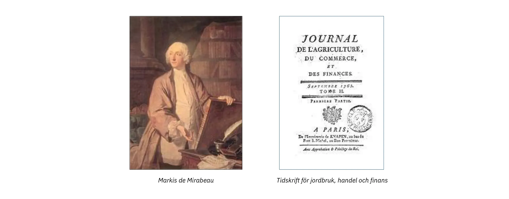

Nyfiken började han läsa Mirabeaus verk, *Friend of the People* och *Theory of Taxation*. Han träffade Mirabeau och François Quesnay och gick sedan med i deras skola.

År 1765 erbjöds Dupont att bli redaktör för *Journal de l'agriculture, du commerce et des finances*, som var den tidens ledande tidskrift inom ekonomiskt tänkande.

Det fanns två skäl till detta: Mirabeau och Quesnay var tvungna att hålla tyst, och Dupont sågs som deras stigande stjärna.

Medlemmar av den fysiokratiska skolan är överens om att Dupont de Nemours snabbt blev Quesnays favorit. Quesnay sa en gång: "Ta hand om den här unge mannen, han kommer att vara den som talar när vi är döda". En fysiokratkollega, Abeille, blev till och med avundsjuk på den uppmärksamhet som Dupont fick och tog avstånd från Quesnays skola.

Dupont de Nemours behöll alltid sin höga aktning för Quesnay.

Han skulle senare säga: "Jag var bara en pojke när Quesnay sträckte ut sina armar mot mig - han gjorde mig till en man." Det var Quesnay som gjorde honom till en viktig ekonom på den tidens litterära scen.

Efter *Journal de l'agriculture, du commerce et des finances* utsågs Dupont till redaktör för *Les Éphémérides du Citoyen*, som blev fysiokraternas officiella organ.

Han gjorde denna tidskriftssamling till ett viktigt centrum för ekonomisk teori och stödde den även under fysiokraternas nedgång genom att personligen skriva nästan alla de senare volymerna. Det var dessutom Dupont de Nemours som myntade begreppet "fysiokrati", som härstammar från två grekiska ord som betyder "naturstyre". Han använde termen som titel på en samling av Quesnays artiklar som publicerades 1768, och termen blev så småningom etablerad i historien. Det är känt att fysiokraterna sinsemellan kallade varandra för "ekonomer", och så kallades de fortfarande under revolutionen.

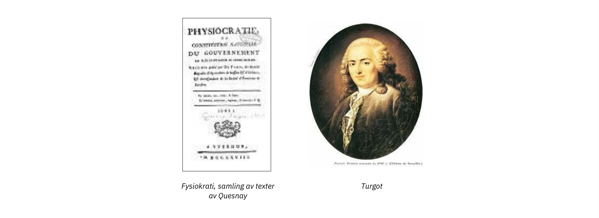

När Turgot en kort tid var Frankrikes finansminister blev Dupont hans nära rådgivare, den ende fysiokrat som hade tillgång till honom, eftersom Turgot höll sig på avstånd från de andra.

Vid tiden för revolutionen valdes han in från Nemours och hamnade i församlingen, där en annan Monsieur Dupont också satt. Han kallades då Dupont de Nemours, inte för att han var adlig, utan helt enkelt för att skilja de två åt. Namnet behölls naturligtvis.

Under revolutionen, i augusti 1792, tog han till vapen för att försvara kungen i Tuileriespalatset mot folkmassan.

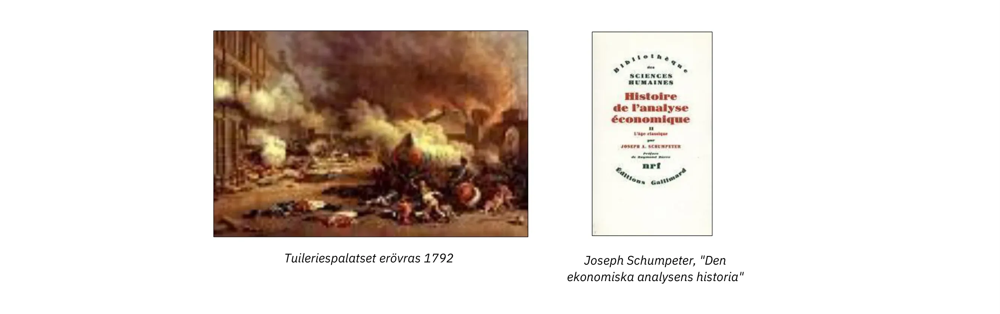

Kungen sa till honom: "Monsieur Dupont, vi hittar er alltid där ni behövs!" Efter att mirakulöst ha undkommit terrorn, dömd och i väntan på giljotinen men räddad av Robespierres fall, tvingades han i exil under Napoleon och fann lyckan i USA, där en av hans söner med sin fars hjälp grundade Dupont-företaget.

Trots detta händelserika liv, under vilket han publicerade dussintals artiklar, broschyrer och böcker, är han än idag relativt okänd. Kanske berodde detta på att han förblev en trogen fysiokrat när doktrinen hade fallit ur modet. Som Schumpeter skrev förblev Dupont de Nemours faktiskt fysiokratin trogen "under en karriär där han hade många tillfällen att avsäga sig den". Han var en man med övertygelse.

# Upplysningen och den politiska ekonomin

<partId>d1c885ad-7cb1-5f81-816c-be312719d9f8</partId>

## Voltaire och filosoferna

<chapterId>16bcf7bf-dad4-5113-8c64-2800f04ff07b</chapterId>

Under 1700-talet i Frankrike uppstod ekonomi som vetenskap och den första ekonomiska tankeskolan: Fysiokratin. Adam Smith utbildade sig i ekonomi under denna period, och franska ekonomer erkändes globalt som ledare. Detta århundrade är dock mer ihågkommet som filosofins århundrade än som ekonomins. Även om den fysiokratiska rörelsen i sina ambitioner låg i linje med upplysningsfilosofin, förtjänar filosofernas attityder - särskilt Diderot och Voltaire - en närmare granskning. Vi kommer att se att upplysningstänkarna på ett betydande sätt bidrog till att sprida idén om laissez-faire i Frankrike.

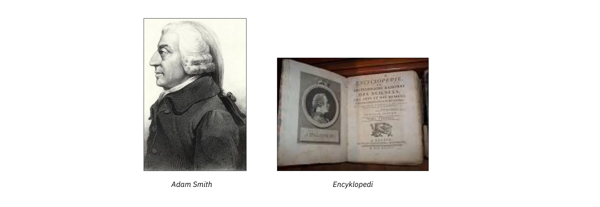

Det mest kända verket inom upplysningsfilosofin är utan tvekan *Encyclopédie* av Diderot och d'Alembert.

Naturligtvis skrevs de ekonomiska artiklarna av ekonomer. För de tidiga volymerna vände sig Diderot till Forbonnais och anlitade sedan liberala ekonomer: först François Quesnay (som bidrog med artiklar som "Grains", "Fermiers", "Hommes" - den sista opublicerad), sedan Turgot (som skrev "Foires et marchés"). Dessa skrifter är av stor betydelse. I sina artiklar lade Quesnay grunden för det som skulle bli den fysiokratiska läran. Tillsammans med hans *Tableau économique* förblir dessa hans mest kända verk. Turgot, som fortfarande var ung vid den här tiden, utvecklade idén om laissez-faire i sin artikel och kritiserade statens ingripande i marknadsorganisationen.

I många andra artiklar i *Encyclopédie* försvarar filosofer, särskilt Diderot, frihetsidealet inom alla områden: religion, politik och ekonomi.

Arbetets frihet, särskilt i motsats till skråväsendet, var ett återkommande tema i olika poster som Arts, Métier och Communauté.

Diderots väg i den ekonomiska teorin är märklig. I Encyclopédie var han en stark förespråkare för ekonomisk frihet och var den som sökte samarbete med liberala ekonomer, vilket bekräftas av ett brev som beskriver de artiklar som Turgot kunde skriva åt honom. Under fysiokratins tidiga år var han både anhängare och förespråkare av Quesnays skola. Under 1769 och 1770 skrev han för *Les Ephémérides du Citoyen*, till stor förskräckelse för sina antiliberala filosofvänner, som Melchior Grimm; han tog dock snart avstånd från gruppen. Han fascinerades av abbot Galianis livliga intellekt och hjälpte honom att ge ut sin bok om spannmålshandeln på franska, just när Galiani skulle återvända till Italien.

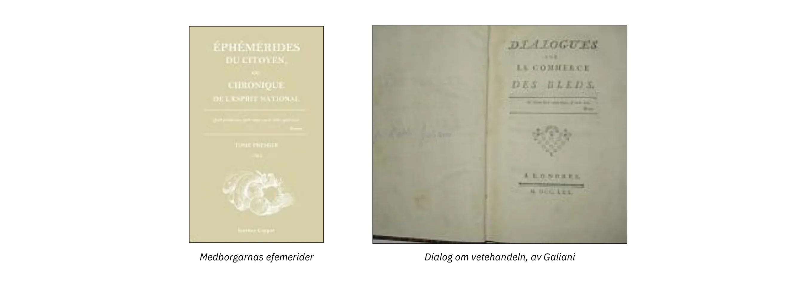

Denna bok skulle bli det hårdaste angrepp som någonsin gjorts mot fysiokratiska idéer, vilket gav rörelsen ett hårt slag. Senare försvarade Diderot Galiani mot abbot Morellet, en nära allierad till fysiokraterna, i sin *Apology of Galiani*. Några år senare, under Turgots ministär, sågs Diderot applådera införandet av arbetets frihet genom avskaffandet av skråväsendet. Diderot, som var son till en hantverkare, höll nu med de liberala ekonomerna och skrev ett svidande brev till Galiani, som hävdade att fri arbetskraft skulle ruinera den franska industrin inom tjugo eller trettio år. I ljuset av den industriella revolutionen tyder historien på något annat. Efter att ha återvänt till de liberala ekonomernas sida åtnjöt Diderot inte längre deras förtroende utan förblev isolerad. Ett mycket talande ögonblick är ett brev som han skickade till Dupont de Nemours 1774, där han skriver:

> "Du hade en gång vänskap för mig, nu har du det inte längre, för du är så upptagen att du inte längre har tid att älska någon".

Voltaire följde en liknande väg, som präglades av brist på konsekvens i hans ekonomiska åsikter. Han beundrade Vincent de Gournay, brevväxlade med ekonomer (bl.a. Dupont de Nemours och Turgot) och uppskattade fysiokraterna - särskilt för deras hyllning av jordbruket. Han hyllade dem i en *Diatribe to the Author of the Ephémérides*. Han kritiserade dock senare deras idé om en enda markskatt i sitt satiriska verk * Mannen med fyrtio kronor*, som också väckte betydande kontroverser. Slutligen hyllade han, liksom Diderot, Turgots ämbete, kallade det en guldålder och prisade hans två stora dekret om arbetets frihet och frihandel.

I slutändan är filosofernas förhållande till det ekonomiska tänkandet blandat. Trots sina lovord och sin kritik av liberala ekonomiska idéer spelade de en roll i att föra in dessa idéer i upplysningens bredare intellektuella diskurs. På så sätt bidrog de, medvetet eller omedvetet, till att föra fram tanken om laissez-faire ända fram till revolutionen.

## Turgot, teoretikern

<chapterId>a8cd8185-8351-556b-8011-3a0c313e8a9d</chapterId>

I en berömd passage i sin bok *History of Economic Thought* hyllade den amerikanske ekonomen Murray Rothbard vad han kallade Turgots "briljans".

och presenterade honom som 1700-talets största ekonom, tillsammans med Cantillon.

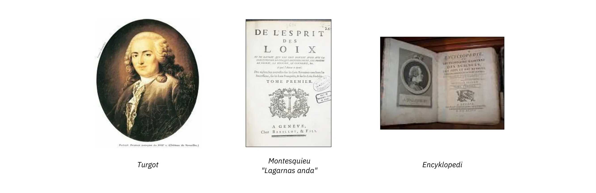

Hur kunde Turgot bli så framstående? Det berodde på en kombination av tre viktiga faktorer. **Först**, hans prestigefyllda familjebakgrund. Han kom från en lång rad av kungliga administratörer, varav många hade höga regeringspositioner. **För det andra**, den gyllene tidsålder under vilken han föddes och växte upp. Turgot var 21 år när Montesquieu publicerade *L'Esprit des Lois* och 24 år när den första volymen av *Encyclopédie* utkom.

Han var samtida med fysiokraterna, Voltaire, Diderot, d'Holbach, Adam Smith, Condorcet och andra. **Tredje**, hans intellektuella försprång. När han studerade vid Sorbonne skrev han vid 22 års ålder ett brev om papperspengar, höll anmärkningsvärda tal och vid 24 års ålder sammanställde han en lista över 52 verk som han skulle skriva.

Trots sin ungdom bidrog Turgot till *Encyclopédie* och författade artiklar om ämnen som "Etymologi", "Existens", "Expansibilitet", "Mässor" och "Stiftelser". Endast en artikel berörde direkt ekonomi - hans stycke om "Fairs", som beskrev ursprunget till mässor och marknader och kritiserade den växande statliga inblandningen som störde och förlamade dem.

Under dessa tidiga år var han mentor åt Vincent de Gournay, som tog honom under sina vingar och bildade en nära vänskap med honom. Vid Gournays död 1759 skrev Turgot ett lovtal där han på ett utmärkt sätt sammanfattade läran om laissez-faire. Han skrev särskilt:

"Ur varje perspektiv där handel kan beröra staten, kommer individuellt intresse som lämnas åt sig självt alltid att säkrare producera det allmänna bästa än regeringens verksamhet, som alltid är bristfällig och nödvändigtvis styrs av vag och osäker teori".

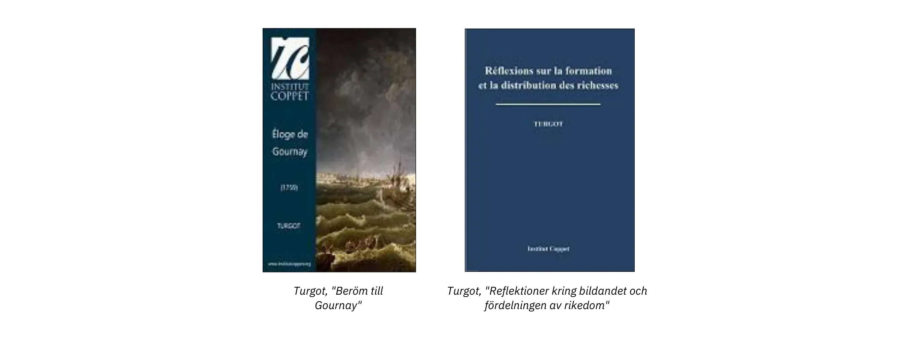

År 1767, när han var intendent, skrev han ett ekonomiskt kompendium med titeln *Reflections on the Formation and Distribution of Wealth*.

Arbetsdelning, konsumentsuveränitet, privat egendom, kapitalets roll, praktiskt taget alla de viktigaste ekonomiska teman tas upp. Många historiker, senast historikern Anne-Claire Hoyng, har pekat på likheterna mellan detta verk av Turgot och Adam Smiths *The Wealth of Nations*, som publicerades nio år senare.

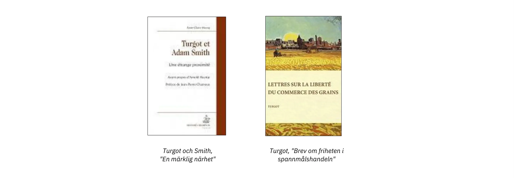

Turgot försvarade spannmålshandelns frihet i brev till abbot Terray, som senare överlämnades till kungen, men varav hälften nu har gått förlorade. Han skrev bland annat

> Om det är något som är brådskande så är det inte att införa nya restriktioner för den viktigaste av alla branscher, utan att ta bort dem som tyvärr har fått vara kvar.
> Om det någonsin har funnits en tid då den största, mest absoluta friheten, helt fri från alla slags hinder, var nödvändig, vågar jag påstå att det är nu, och att det aldrig har varit mindre lämpligt att överväga att utfärda en förordning om spannmålshandeln.

År 1769 skrev Turgot artikeln Value and Money för Abbot Morellets *Dictionnaire de Commerce*, som dock aldrig publicerades. Galiani hade redan noterat att "människan är det gemensamma måttet på alla ting", vilket föregrep den subjektiva analys som Turgot skulle utveckla trettio år senare i denna artikel, där han utvecklar och bevisar detta påstående.

År 1770, långt före Bentham, skrev Turgot ett memorandum där han förespråkade frihet för räntor och ocker.

"Det är ett misstag att tro att räntan på pengar i handeln ska fastställas av furstarnas lagar", säger han, "Det är ett löpande pris som reglerar sig självt, liksom för alla andra varor", För att försvara denna ståndpunkt tillbakavisar han Aristoteles och kyrkofädernas motstånd.

En anmärkningsvärd sammanfattning av Turgots laissez-faire-doktrin finns i ett bortglömt brev från 1773 till abbot Terray om märkning av strykjärn:

> Vad politiken måste göra är att ge efter för naturens gång och för handelns gång, som inte är mindre nödvändig och inte mindre oemotståndlig än naturens gång själv, utan att försöka styra den; för att styra den utan att störa den och utan att skada sig själv, skulle man behöva kunna följa alla variationer i mänskliga behov, intressen och industri; man skulle behöva känna till dem på en detaljnivå som är fysiskt omöjlig att uppnå, och där även den mest skickliga, aktiva och noggranna regeringen alltid riskerar att ha fel, åtminstone till hälften.

Här finner vi ett mycket tydligt uttalande av doktrinen om laissez-faire, liksom en föraning om Friedrich Hayeks analys av skenbar kunskap - det vill säga omöjligheten för en stat att fullt ut förstå de ekonomiska krafterna för att kunna kontrollera dem.

## Turgot, reformatorn

<chapterId>9177429f-1679-51c4-bfd2-dd036d24a1cc</chapterId>

Som vi kortfattat erinrade om i föregående kapitel var Turgot son till en framstående familj som hade utmärkt sig i den franska statsförvaltningens toppskikt.

Hans far hade varit provost för köpmännen i Paris och hans farfar intendent. Efter att ha utmärkt sig i sina studier strävade den yngste i familjen Turgot efter att nå minst samma höjder. Han tjänstgjorde först under en tid som maître des requêtes, vilket innebar att han var en länk mellan intendenterna och Versailles. Det var en prestigefylld befattning, för vilken han var tvungen att få ett särskilt åldersundantag, men Turgot strävade efter mer. Hans mentor Gournays död uppmuntrade honom ytterligare att sikta högre, och han begärde att bli utnämnd till intendent.

År 1759 ansökte han först om intendenturen i Grenoble, men fick avslag. Därefter erbjöds han posten som provost för köpmännen i Lyon, vilket han avböjde. Han ansökte om intendenturen i Bretagne, men även det avslogs. Slutligen, 1761, erbjöds han intendenturen i Limousin och accepterade något motvilligt. Han skrev till Voltaire: "Jag har oturen att vara intendent", vilket kanske betyder: Jag har oturen att vara intendent i Limousin.

I Limousin var bönderna fattiga och levde under osäkra förhållanden, särskilt när det gällde boende och mat. Den allmänna utbildningsnivån var extremt låg. De få vägar som fanns var i ett katastrofalt skick.

Eftersom regionen var så fattig var den inte av intresse för ministrarna. Detta gav Turgot frihet att experimentera med reformer. I Limousin genomförde han tre stora projekt:

- Omfördelningen av **taille**, den personliga skatten (Turgot strävade efter att införa så mycket objektivitet som möjligt i sin bedömning).
- **Corvée**, en form av skatt som betalades i arbete, där bönder tvingades arbeta med vägbyggen. När Turgot reste runt i regionen lade han snabbt märke till vägarnas dåliga skick. Han ersatte corvée med en monetär skatt.
- Rekrytering av **miliser**, bondearméer som mobiliseras under krigstider.

Detta skedde genom lottdragning, vilket ledde till rädsla och våld på grund av rymlingar; Turgot ersatte dessa obligatoriska avgifter med betalda volontärer.

Dessa reformer var onekligen framgångsrika, och i juli 1774 utnämndes Turgot till minister. På grund av hans brist på erfarenhet placerade kungen honom först på marinministeriet. Utnämningen roade många. Turgot erkände själv: "Jag vet ingenting om flottan", och Voltaire anmärkte: "Jag tror inte att Turgot är mer sjöman än vad jag är".

Men bara en månad senare utsågs Turgot till generalcontroller för finanserna och blev i praktiken Frankrikes ekonomi- och finansminister.

Vi känner till det brev där han redogjorde för sina principer till Ludvig XVI: "Inga konkurser. Inga skattehöjningar. Inga nya lån". Denna filosofi, som kritiker idag kanske skulle kalla meningslös "stränghet", var avsedd att rädda monarkin.

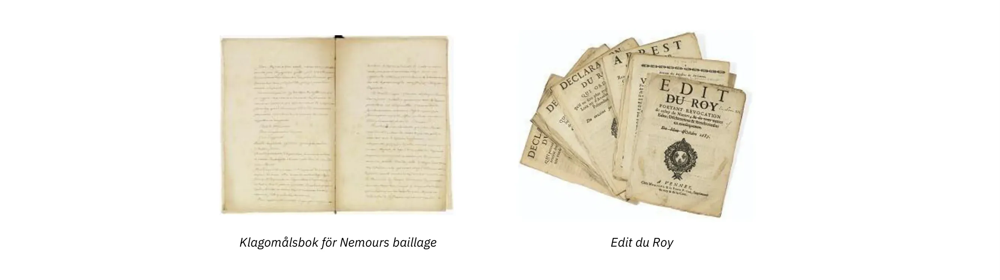

Turgot utarbetade sex kungliga dekret för att reformera den franska ekonomin.

Det var första - och en av de allra sista - gångerna som en ekonomisk expert fick friheten att reformera sitt lands ekonomi. Tre av Turgots dekret sticker ut: ett avskaffade tvångsarbetet (corvées), ett annat upplöste handelsgillena (corporations) och det tredje införde frihandel med spannmål.

När Turgot tillträdde som minister visste han att han skulle möta motstånd från de privilegierade klasserna. "Jag kommer att vara fruktad, till och med hatad, av de flesta i hovet och av alla som söker favörer", sade han till kungen. De privilegierade förenade sig snart mot honom och ledde till att han avsattes från posten som generalcontroller för finanserna. Voltaire, som till fullo stödde Turgots reformer, skrev i sin korrespondens

> Vilka fruktansvärda nyheter jag har hört! Vad kommer att hända med oss? Jag är förkrossad! Vi kommer aldrig att återhämta oss från att ha bevittnat den gyllene tidsålderns födelse och död! Denna blixt har träffat både mitt sinne och mitt hjärta.

Sedan dess har många hävdat att Frankrike är ett land som är omöjligt att reformera. Turgots misslyckande tycktes bekräfta detta: Han hade förberetts av ett halvt sekel av liberalt ekonomiskt tänkande, han hade stöd av upplysningsfilosofer och kungen själv, med absolut makt, stödde honom.

Till slut vann parlamenten och de privilegierade klasserna. Allt kungen kunde göra var att klaga privat: "Jag ser nu att det bara är Monsieur Turgot och jag som bryr oss om folket."

## Condillac

<chapterId>0ba8dbb5-dcd5-5981-bf85-6c185e0bf192</chapterId>

Precis som merkantilismen, som är dess mest uppenbara praktiska manifestation, tog Montaignes sofism lång tid på sig att försvinna.

Denna sofism är idén om att handel och Exchange är nollsummespel. Vad än den ena parten vinner i en transaktion förlorar den andra parten med nödvändighet. Dess anhängare hävdar att detta gäller både mellan individer och mellan nationer.

Abbot av Condillac spelade en viktig roll i att definitivt avveckla denna falska idé.

"Definitivt" är kanske en överdrift, för i den offentliga debatten dyker denna sofism ofta upp igen. Det är kanske därför som Condillac dessutom förblir en föga känd ekonom. Bortsett från österrikiska ekonomer är det få som har förstått betydelsen av hans teori om Exchange, ingen intresserar sig längre för honom.

För de flesta historiker av ekonomiskt tänkande markeras året 1776 av publiceringen av *The Wealth of Nations*, som grundade den ekonomiska vetenskapen. De femton lektioner vi just avslutat, där vi studerat den franska ekonomiska vetenskapen före Adam Smith, räcker för att bevisa att denna uppfattning är felaktig. Samma år 1776 utkom dessutom en annan bok som kanske förtjänar mer beröm från historikerna än Adam Smiths bok: den skrevs av Condillac och har den enkla titeln [*Commerce and Government Considered in Their Mutual Relationship*] (https://archive.org/details/commercegovernme0000cond).

För Condillac är fysiokraterna delvis skyldiga till att sofismen om Exchange som ett nollsummespel kvarstår, eftersom de hävdar att Exchange är ett jämlikt förhållande. Enligt Condillac är detta felaktigt: Exchange är en ojämlik relation, där man alltid ger mindre för att få mer.

Mellan fysiokraternas och Condillacs idéer kunde man inte drömma om en mer perfekt motsättning. Den fysiokratiska ekonomen Le Trosne skrev:

> Exchange är till sin natur en Contract av jämlikhet, gjord av lika värde för lika värde.

Condillac, å andra sidan, skrev:

> Varje part i Contract ger alltid något av mindre värde för att få något av större värde.

Motsättningen är dock till stor del en fråga om ord. Båda är överens om att när man byter en franc mot en bok så är boken värd en franc, eller så är priset på boken en franc.

Skillnaden ligger i att Condillac hävdar att eftersom vi ger 15 franc för boken innebär det att bokens värde för oss är högre än värdet på vårt enfrancsmynt. Vi föredrar boken framför myntet, och det är därför vi gör Exchange.

Condillacs teori är inte i grunden motsägelsefull med fysiokraternas, men de talar inte samma språk, så att säga. Le Trosne talar om pris medan Condillac talar om värde, och vice versa.

Där Condillac har rätt är att om priserna är lika mellan de två utbytta varorna är värdena inte lika, annars skulle ingen Exchange äga rum.

För att sammanfatta Condillacs teori kan tre påståenden listas:

Första påståendet: vi söker varor för deras nytta. Detta verkar uppenbart, men det är en central grundsats inom den ekonomiska vetenskapen att människor Exchange för att skaffa sig nyttigheter, en poäng som Jean-Baptiste Say också utvecklade perfekt.

Andra påståendet: värde föregår och motiverar utbyten. Den subjektiva bedömning som varje person gör av varor och tjänster innebär att samma varor och tjänster har ett värde för dem, ett värde som är större eller mindre beroende på den nytta de verkar ge. Naturligtvis gör varje individ en annan bedömning än en annan, och värdet varierar från person till person.

Slutligen, tredje påståendet: priset är en följd av Exchange-processen. Produkter har inte Exchange till det värde som jag tillskriver dem eftersom villkoren för Exchange också beror på det subjektiva värde som säljaren tillskriver dessa produkter. Relationen mellan köpare och säljare, eller mellan köparens subjektiva uppskattning och säljarens subjektiva uppskattning, fastställer ett pris.

Dessa idéer från Condillac är grundläggande. De gör det möjligt för oss att förstå varför varje Exchange alltid är ömsesidigt fördelaktig.

De tillintetgör därför helt kritiken mot frihandel, eftersom protektionism endast framstår som en mekanism som hindrar befolkningar från att ömsesidigt gynna varandra. Laissez-faire är också slutsatsen av Condillacs arbete. Låt människor göra som de vill, för om den offentliga makten skyddar frihet och egendom kommer människor alltid att berika varandra genom att byta med varandra.

## Condorcet

<chapterId>99e4aba6-da7f-5041-b02f-337158381515</chapterId>

Condorcet är utan tvekan den mest ekonomiskt sinnade filosofen under upplysningstiden.

Under en stor del av sin karriär ägnade han sig åt områden som inte alls hade med ekonomi att göra, och det med rätta, eftersom hans talanger ledde till stora framsteg inom de vetenskaper han fokuserade mest på. Men omkring 1770 kände han sig dragen till ekonomiska frågor, kanske för att andra filosofer, särskilt Voltaire och Diderot, inte brydde sig om att ägna sin fritid åt dem, och också för att han hade blivit vän med Turgot.

Condorcet anammade gradvis idéer om laissez-faire och frihet, till en början inom områden som inte var relaterade till politisk ekonomi. I sitt *Letter of a Theologian* hånade han den katolska religionen på ett filosofiskt sätt och uttryckte sin önskan om en verklig trosfrihet, inklusive friheten att inte tro. I sitt korståg för tolerans och mot religiös fanatism kämpade Condorcet för att Chevalier de la Barre skulle rehabiliteras och för att D'Etallonde, som dömts till döden för att ha krossat ett krucifix, skulle få sin sak prövad på nytt.

Han var således beredd att försvara friheten när hans vän Turgot steg till posten som generaldirektör för finanserna.

Från och med då tog Condorcets karriär en ny vändning när han gav sig in i den ekonomiska debatten och outtröttligt stödde den nye ministerns liberala reformer. Condorcet förespråkade konkurrens och fri handel och krävde också avskaffande av corvées (tvångsarbete) och skråväsende samt rättvis beskattning. Han uttryckte dessa övertygelser offentligt när tillfälle gavs och gjorde det med uppenbar entusiasm; han skrev flitigt och förklarade en gång i sina skrifter: "Tillåt mig att återigen tala om fri handel; jag tycker om att ägna mig åt detta ämne."

Mellan 1774 och 1776, under Turgots ministär, gjorde Condorcet många inlägg, alla präglade av hans Commitment till laissez-faire. Bland hans verk finns *Letters from a Farmer of Picardy to Mr. Necker*, som försvarar frihandel; *Monopolies and Monopolists*, som förespråkar fri konkurrens; *Reflections on Corvées*, som kräver att de avskaffas; och *Reflections on the Grain Trade*, som återigen hyllar frihandel och kritiserar Neckers bok i samma ämne.

I sina [*Letters on the Grain Trade*] (https://archive.org/details/bub_gb_hg8jFw-y6bwC) gör Condorcet flera viktiga påpekanden.

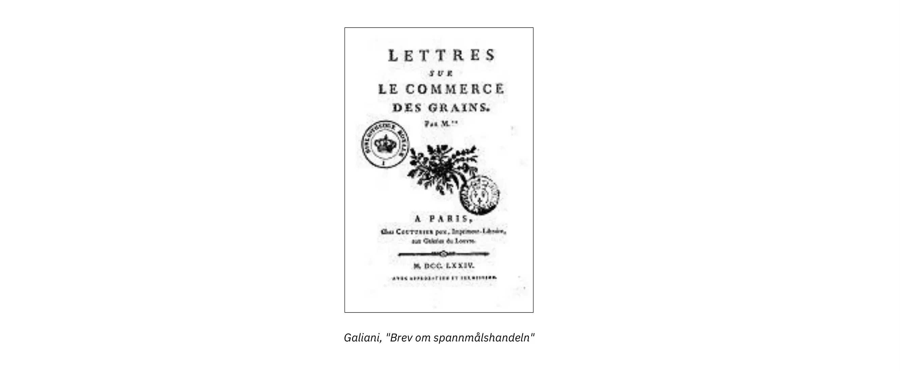

För det första berodde de höga spannmålspriserna vid den tiden inte på frihandel, utan snarare på dåliga skördar, och Condorcet visar detta tydligt. Därefter förklarar han varför laissez-faire inte bara är en lämplig, utan den enda lämpliga politiken, trots populära fördomar. Han konstaterar: "Vi är så vana vid att se regeringen ingripa i spannmålshandeln att det verkar som något extraordinärt och nytt att inte göra någonting". Senare tillägger han: "Nästan alla, särskilt de som innehar offentliga ämbeten, tror att ingenting händer av sig självt och att allt går förlorat om regeringen inte ingriper i allt". Condorcet återupplivar därmed fysiokraternas och Turgots argument och visar att frihandel är överlägsen alla former av interventionism.

Att främja Turgots liberala ekonomiska agenda var en modig handling, eftersom Condorcet visste att han snabbt skulle utsättas för censur. Så skedde också, och hans pamflett om avskaffande av tvångsarbete förstördes och förbjöds 1776.

Turgot, som uppskattade Condorcets lojala försvar av hans idéer, utnämnde honom till myntinspektör. Condorcet avgick så snart hans vän lämnade ministeriet.

Även om han ägnade all sin energi åt att försvara Turgot, hade Condorcet inga illusioner om utgången av sin väns mandatperiod. Turgot själv erkände sent i livet att han levde med ånger, som han skrev i ett brev, "för att inte ha kunnat göra min nation och mänskligheten en tjänst som jag trodde var mycket lätt". Condorcet, som var mer realistisk, pekade på de många motståndare som Turgot skulle möta: kungens favoriter, parlamenten, prästerskapet, adeln, skråna och så vidare. Dessa grupper förväntade sig smicker, inte reformer. Condorcet sa till Turgot: "Du är inte på något sätt en charlatan, och det är en brist med tanke på hur det är i Paris". Han hade helt rätt, för redan 1776, knappt två år efter sin ankomst, tvingades Turgot lämna generalcontrollerposten.

## Liberalt sunt förnuft under revolutionen

<chapterId>95e9a90d-e37a-58ff-b1ac-928b42e76ecf</chapterId>

Dupont de Nemours var den yngste lärjungen till François Quesnay, som en gång sa om honom: "Vi måste ta hand om den här unge mannen, för han kommer att tala när vi är döda". När den franska revolutionen började var nästan alla de stora fysiokraterna, inklusive markis de Mirabeau, redan borta; Mirabeau själv hade gått bort den 13 juli 1789.

Dupont de Nemours skrev listan över klagomål för Nemours bailiwick.

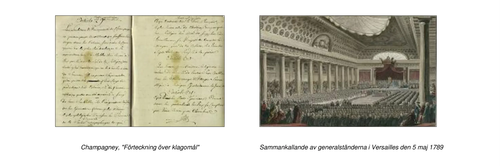

Detta fascinerande dokument innehöll alla klagomål från liberala ekonomer mot handelsrestriktioner, monopol och angrepp på egendom. Dupont de Nemours valdes också in i nationalförsamlingen.

Under revolutionen blev han det liberala sunda förnuftets röst och stod fast mot den växande vågen av populism och interventionistisk demagogi, som till slut segrade.

Redan i november 1789, när det talades om att ge Caisse d'Escompte monopol (vilket skulle kunna göra den till en offentlig bank - Frankrikes bank), uttalade sig Dupont de Nemours till försvar för konkurrensen.

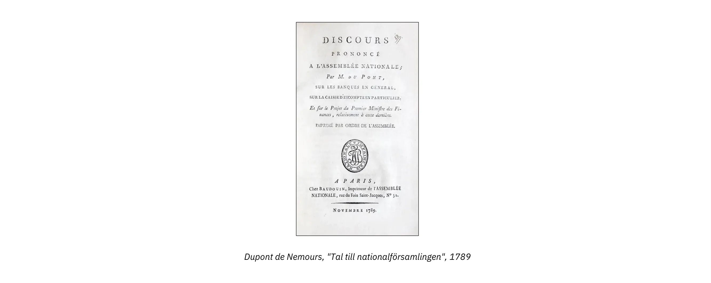

"Det vore bättre", säger han, "att överlåta bankverksamheten till frihandelns lagar". Och han tillägger:

> "Jag förstår inte vad ministern menade när han talade om att ge ett privilegium till Caisse d'Escompte. Om detta privilegium innefattar exklusivitet måste ni förkasta det, för ni har kommit hit för att förstöra exklusiva privilegier, inte för att skapa nya."

Trots hans varningar ignorerade församlingen hans invändningar och tog ytterligare ett steg mot att inrätta en centralbank och ett bankmonopol.

År 1790, i den konstituerande församlingen, följde Dupont de Nemours sina fysiokratiska vänners pacifistiska tradition och föreslog en lag som förbjöd anfallskrig. Den första artikeln löd "Den franska nationen skall inte tillåta sig att delta i något anfallskrig för att erövra andras territorium eller för att kränka någon nations rättigheter eller frihet".

Detta förslag avvisades.

Samma år, 1790, började debatterna om att ge ut ny pappersvaluta för att täcka statens utgifter.

Dupont de Nemours motsatte sig detta bestämt och publicerade en broschyr med titeln [*Effects of Assignats on the Price of Bread*] (https://archive.org/details/effetdesassignat00dupo). Titeln var korrekt, eftersom han förklarade att utgivning av assignater oundvikligen skulle leda till inflation, en ökning av priserna på råvaror, inklusive bröd.

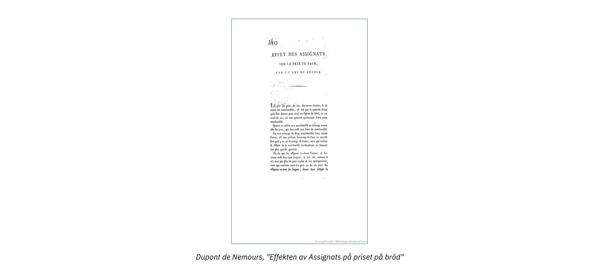

Han undertecknade pamfletten som "en folkets vän". Pamfletten väckte stor uppståndelse och församlingen fick frågan om vem som hade skrivit den. Dupont de Nemours ställde sig då upp och erkände att det var hans verk och sa att han inte skämdes för att använda titeln "folkets vän" eftersom kampen mot assignaterna verkligen var att tjäna folket.

Ännu en gång ignorerades hans råd och assignaterna utfärdades.

Vi känner alla till den katastrof som följde, den ekonomiska ruin och det lidande som folket fick utstå, många av dem förlorade allt när assignaterna blev värdelösa och måste brännas.

Några år senare vände sig församlingen till tanken på att skapa en verklig fransk centralbank, en bank som skulle få monopol på penningtillverkningen.

Dupont de Nemours, som fortfarande var starkt emot idén om en offentlig bank och såg den som inget annat än ett monopol, påminde församlingen om assignaternas katastrofala erfarenheter. Han berättade för dem:

> "Förbered er inte på ånger som den som plågade mina kolleger i den konstituerande församlingen. Vid den tidpunkten avvisades mitt förslag att begränsa assignater till att endast gälla betalning för nationella varor och inte göra dem till en cirkulerande valuta. I dag säger de: "Ah, om vi bara hade lyssnat på Dupont de Nemours!""

Men än en gång var det ingen som lyssnade på honom.

## Slutsats: Att lämna över stafettpinnen

<chapterId>ada8082f-db96-5e52-954f-719b47998153</chapterId>

Det franska ekonomiska tänkandet under 1700-talet hamnar ofta i skuggan av de mer kända ekonomerna från 1800-talet. Men när det gäller försvaret av friheten är det på 1700-talet som allting verkligen börjar. Det är det århundrade då principen om laissez-faire, som var så revolutionerande på sin tid, för första gången tydligt uttrycktes av ett antal tänkare, från Boisguilbert till Dupont de Nemours.

Visst har personer som Jean-Baptiste Say, Frédéric Bastiat, Gustave de Molinari och Yves Guyot lämnat ett bestående avtryck i det franska ekonomiska tänkandets historia. Men om vi studerar dem isolerat missar vi något väsentligt. Dessa 1800-talstänkare dök inte upp från ingenstans; de ärvde och byggde vidare på den grund som deras föregångare på 1700-talet hade lagt under upplysningstiden.

Boisguilbert hävdar att välmenande själar som tror att de kan fixa allt genom att involvera regeringen oundvikligen vänder upp och ner på ekonomin, och att det därför är bättre att låta tingens naturliga ordning ha sin gång.

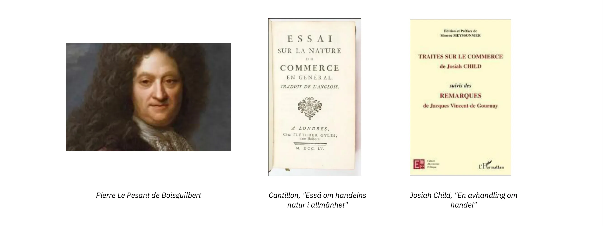

Cantillon insisterade på att pengar aldrig får manipuleras för politiska syften. Att tillåta staten att hantera pengar som den vill är att bana väg för en enorm finansiell och ekonomisk oordning.

Vincent de Gournay hävdar att överdriven reglering av arbetet avskräcker arbetare och hantverkare från att anstränga sig och driver dem mot lättja och inaktivitet. Det är tack vare den fria konkurrensen som ekonomin kan växa och en nation kan blomstra.

Marquis d'Argenson hävdar att ingen regering kan förutse och mäta allt, och att man därför måste förlita sig på varje individs egenintresse.

Quesnay och fysiokraterna hävdar att den privata äganderätten är grunden för mänskliga samhällen. Utan privat egendom förlorar människan motivationen att anstränga sig, att arbeta, eftersom hon inte kan njuta frukterna av sitt arbete eller samla på sig något.

Condillac hävdar att Exchange alltid är ömsesidigt fördelaktigt och därför, utan undantag, alltid bör vara fritt. Statens enda uppdrag måste vara att skydda frihet och egendom.

Alla dessa idéer skulle komma att tas upp av 1800-talets ekonomer. Vissa, som Jean-Baptiste Say, skulle ge dessa idéer ett vetenskapligt uttryck genom en rigorös *Treatise on Political Economy*. Andra, tvärtom, skulle försöka popularisera dessa grundläggande maximer genom att ge sig in i sagornas, romanernas och de underhållande novellernas värld, som Frédéric Bastiat så skickligt skulle göra.

## Biografi

<chapterId>17cf2865-e53c-5f3b-a5c2-a43560efaf01</chapterId>

**SELEKTIV BIBLIOGRAFI**

Här nedan hittar du ett urval av över trettio skrifter:

1. Pierre Clément, Histoire de Colbert et de son administration, Paris, 1874

2. Vauban, Projet d'une dîme royale, 1707; omtryck Institut Coppet, 2014; Anne Blanchard, Vauban, Fayard, 1996

3.	Boisguilbert, Détail de la France, 1695; återpublicerad av Institut Coppet, 2014

4. Félix Cadet, Pierre de Boisguilbert: ekonomernas föregångare, Institut Coppet, 2014

5. Pierre de Boisguilbert ou la naissance de l'économie politique, Paris, INED, 1966

6. Richard Cantillon, Essai sur la nature du commerce en général, 1755; omtryckt av Institut Coppet, 2015

7. Antoin Murphy, Richard Cantillon, bankir och ekonom, Oxford, 1986

8. Gustave de Molinari, Abboten av Saint-Pierre, Paris, 1859

9. Abboten av Saint-Pierre, Abrégé du projet de paix perpétuelle, Rotterdam, 1729

10. Abboten av Saint-Pierre, "Projet pour perfectionner le commerce de la France", i Les rêves d'un homme de bien, Paris, 1775, s. 199

11. André Alem, Le marquis d'Argenson et l'économie politique au début du XVIIIe siècle, Institut Coppet, 2015

12. Journal et mémoires du marquis d'Argenson, Rathery-utgåva, 9 volymer, Paris, 1859-1867

13. Benoît Malbranque, Vincent de Gournay: den politiska ekonomin i laissez-faire, Institut Coppet, 2016

14. Vincent de Gournay, Remarques sur la traduction de Josiah Child, L'Harmattan, 2008

15. Christine Théré & Loïc Charles (red.), Le cercle de Gournay, INED, 2005

16. Antoin Murphy, "Le développement des idées économiques en France (1750-1756)", Revue d'histoire moderne et contemporaine, tome XXXIII, oktober-december 1986

17. Henri Ripert, Le marquis de Mirabeau: ses théories politiques et économiques, Paris, 1901

18. Lucien Brocard, Les doctrines économiques et sociales du marquis de Mirabeau i L'Ami des Hommes, Paris, 1902

19. Humbert de Montlaur, Mirabeau, l'Ami des Hommes, Perrin, 1992

20. Yves Guyot, François Quesnay et la Physiocratie, Institut Coppet, 2014

21. François Quesnay, Œuvres économiques complètes et autres textes, 2 volymer, INED, 2005

22. Georges Weulersse, Le mouvement physiocratique en France (de 1756 à 1770), 2 volymer, Paris, 1910

23. Georges Weulersse, La Physiocratie à la fin du règne de Louis XV (1770-1774), P.U.F., 1959

24. Georges Weulersse, La Physiocratie sous les ministères de Turgot et de Necker (1774-1781), P.U.F., 1950

25. Georges Weulersse, La physiocratie à l'aube de la révolution (1781-1792), EHESS, 1985

26. P. Jolly, Du Pont de Nemours, soldat de la liberté, Paris, P.U.F., 1956

27. Voltaires ekonomiska skrifter, Institut Coppet, 2013

28. Gustave Schelle (red.), Œuvres de Turgot et documents le concernant, Paris, 1913-1924

29. Benoît Malbranque, Le libéralisme à l'essai : Turgot intendent du Limousin (1761-1774), Institut Coppet, 2015

30. Pierre Foncin, Essai sur le ministère de Turgot, Paris, 1877

31. Auguste Lebeau, Condillac économiste, Paris, 1903

32. Condillac, Le commerce et le gouvernement considérés relativement l'un avec l'autre, 1776

33. Condorcet, Mélanges d'économie politique, i Eugène Daire (red.), Mélanges d'économie politique, Paris, 1847

34. P. Jolly, Du Pont de Nemours, soldat de la liberté, Paris, P.U.F., 1956

35. Eli Heckscher, Mercantilism, 2 volymer. London: Allen och Unwin. 1935

# Sista avsnittet

<partId>385bffab-aea1-5bcd-9569-62b3f30665b7</partId>

## Recensioner & betyg

<chapterId>a1e689d9-abd0-5dcb-ba56-a8d355d0a84f</chapterId>

<isCourseReview>true</isCourseReview>

## Slutlig tentamen

<chapterId>bdb7fd98-33e7-11f0-9fe6-b785c859ffc5</chapterId>

<isCourseExam>true</isCourseExam>

## Slutsats

<chapterId>3b366ff6-03c8-5f6a-b4c0-ba8186e65d7e</chapterId>

<isCourseConclusion>true</isCourseConclusion>