# Hành Trình Khám Phá Lịch Sử Kinh Tế Của Tự Do

Khóa học này khám phá sự ra đời của khoa học kinh tế ở Pháp thế kỷ 18 qua lăng kính laissez-faire. Bạn sẽ khám phá cách các nhà tư tưởng thách thức chủ nghĩa trọng thương bằng cách lập luận rằng Nhà nước nên bảo vệ quyền tư nhân, nhưng không bao giờ thao túng thị trường thông qua các quy định.

Bạn sẽ học được cách các nhà cải cách có tầm nhìn xa đã mở rộng tầm nhìn này để đòi hỏi thương mại tự do và lưu thông hàng hóa không hạn chế, đặt nền tảng trí tuệ cho chủ nghĩa tư bản hiện đại. Bằng cách nghiên cứu những nhà kinh tế học tiên phong này, bạn sẽ hiểu được những nguyên tắc vượt thời gian đã định hình nền kinh tế chính trị toàn cầu và tiếp tục ảnh hưởng đến các cuộc tranh luận chính sách ngày nay. Tham gia ngay để nắm vững những ý tưởng đã xây dựng nên nền kinh tế hiện đại.
+++
# Giới thiệu

<partId>06d67531-19f1-4f8d-bf8f-77bbcc743672</partId>

## Tổng quan về khóa học

<chapterId>202db3c6-0320-494d-8057-adc6f6563048</chapterId>

Chào mừng đến với HIS204!

Khóa học này được thiết kế để khám phá nguồn gốc tiếng Pháp của khái niệm *laissez-faire*—"hãy để nó xảy ra"—khi nó phát triển vào thế kỷ 18 thông qua một truyền thống trí tuệ phong phú. Bằng cách theo dõi những suy nghĩ của các nhà tư tưởng kinh tế Pháp thời kỳ đầu, chúng ta sẽ khám phá ra nền tảng của một nền kinh tế chính trị được xây dựng trên nền tảng tự do kinh tế, được đánh dấu bằng sự ngờ vực về sự can thiệp của Nhà nước và niềm tin vào một trật tự tự nhiên ủng hộ tăng trưởng và thịnh vượng.

**Phần 2: Những người đi trước**

Trong phần này, chúng ta bắt đầu vào đầu thế kỷ 17 và 18, thời kỳ được định hình bởi chế độ quân chủ chuyên chế quá mức và những lời kêu gọi đầu tiên về một cách thức hợp lý và công bằng hơn để quản lý các vấn đề công cộng. Thông qua các nhân vật Vauban, Boisguilbert và Cantillon, chúng ta khám phá ra những lời chỉ trích ban đầu về chủ nghĩa can thiệp của nhà nước và phác thảo đầu tiên về những gì sau này trở thành nền kinh tế chính trị tự do.

**Phần 3: Những nhà cải cách và tư tưởng đầu thế kỷ 18**

Phần này tập trung vào những người, trong những thập kỷ đầu tiên của thế kỷ 18, đã cố gắng cải cách nền kinh tế Pháp theo các nguyên tắc mới. Những nhà tư tưởng như Viện phụ của Saint-Pierre, Hầu tước d'Argenson và Gournay (cùng với những người theo ông) đã kêu gọi phá bỏ các rào cản của chủ nghĩa công đoàn, tự do hóa thương mại và khuyến khích cạnh tranh như động lực của sự phát triển. Những đề xuất táo bạo của họ báo trước những ý tưởng trọng nông vĩ đại.

**Mục 4: Trường phái trọng nông**

Phần này khám phá một trong những thời điểm quan trọng nhất trong tư tưởng kinh tế của Pháp: trường phái Trọng nông. Chúng ta sẽ xem xét nguồn gốc, nền tảng học thuyết và những thành tựu chính của trường phái này, tập trung vào những nhân vật chủ chốt như Quesnay và Dupont de Nemours. Ý tưởng về tự do kinh tế trở thành một hệ thống mạch lạc ngay trong trường phái này, bắt nguồn từ ý tưởng về một trật tự tự nhiên mà Nhà nước phải tuân theo để đảm bảo sự thịnh vượng cho tất cả mọi người.

**Phần 5: Khai sáng và Kinh tế chính trị**

Cuối cùng, chúng ta sẽ thấy tư duy kinh tế tự do lan rộng như thế nào trong phong trào Khai sáng rộng lớn hơn. Những nhân vật như Voltaire, Turgot, Condillac và Condorcet đã mở rộng và làm phong phú thêm truyền thống tự do kinh tế, các tác phẩm của họ đã tạo nên một cây cầu để truyền thống tự do kinh tế vượt qua giai đoạn cách mạng và xa hơn nữa, nơi những ý tưởng tự do tìm thấy sự cộng hưởng mới.

Bạn đã sẵn sàng khám phá lại nguồn gốc chủ nghĩa tự do kinh tế của Pháp chưa? Hãy bắt đầu thôi!

# Những Người Tiên Phong

<partId>91565b10-6010-53cb-a2f4-9c2306c7ef8c</partId>

## Bối cảnh lịch sử

<chapterId>6a5fd101-6dfd-5d77-96c7-9e1aa4a19758</chapterId>

Vào đầu thế kỷ 18, nước Pháp đang trong tình trạng đáng lo ngại. Dân số nông thôn hầu như không sản xuất đủ để tồn tại và phải chịu thuế nặng nề.

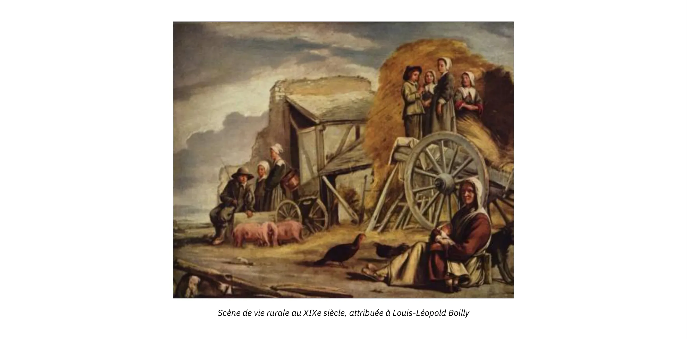

Những nghệ nhân thành thị, bị nhốt trong các hội nhóm cứng nhắc, đấu tranh để đổi mới hoặc thậm chí hỗ trợ lẫn nhau. Trong khi đó, các quốc gia châu Âu khác sớm vượt qua Pháp trên mọi mặt trận, cạnh tranh với các sản phẩm của nước này. Những thành công thương mại của Anh và Hà Lan luôn ở trong tâm trí mọi người.

Nhưng làm sao chúng ta có thể tìm ra giải pháp cho căn bệnh của thời đại này? Cho đến nay, vẫn chưa có khoa học kinh tế và do đó không có phương thuốc đặc biệt nào để áp dụng. Các nguyên tắc của chính sách kinh tế vẫn được áp dụng một cách tùy tiện, chuyển đổi giữa các giai đoạn hạn chế và các giai đoạn tự do hơn. Chắc chắn, chúng ta có các mô hình, tài liệu tham khảo lịch sử để làm theo. Trong số đó có *Sully*, bộ trưởng của Henri IV, người ủng hộ nông nghiệp và thúc đẩy tự do thương mại lớn hơn trong nước Pháp.

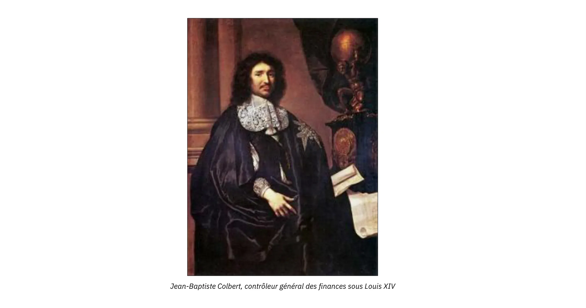

Nhưng rồi đến lượt Colbert, bộ trưởng của Louis XIV, người dao động giữa quy định và tự do, nhưng cuối cùng vẫn thực thi quy định. Vào cuối thế kỷ 17, Colbert đã vượt qua Sully: các bộ trưởng hiện đang viện dẫn di sản của ông và cố gắng áp dụng những gì họ cho là châm ngôn của ông.

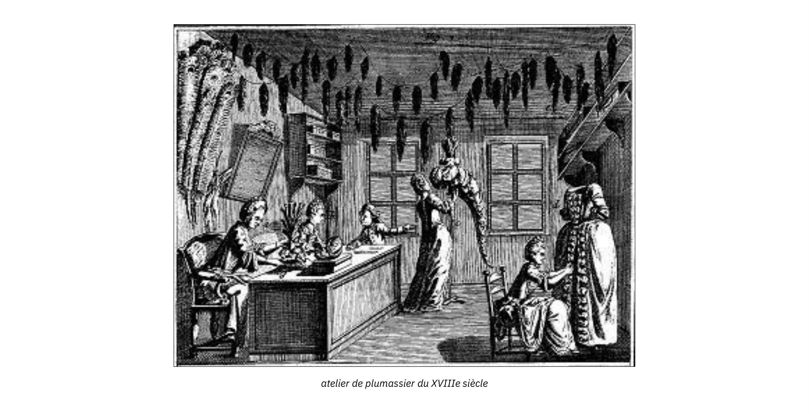

Trong tâm trí của các chính khách vào cuối thế kỷ 17, câu châm ngôn của Colbert chỉ có bốn.

(1) **Ngành công nghiệp phải được quản lý và ràng buộc trong các hiệp hội**. Các quy định này chỉ rõ, ví dụ, cách làm ra khăn trải giường và vải, kích thước và trọng lượng của chúng.

Có hàng trăm quy tắc như vậy, được biên soạn thành các tập chuyên dụng cho từng loại ngành. Tuy nhiên, trong mắt những người theo Colbert, điều này vẫn chưa đủ: họ tin rằng ngành công nghiệp cũng cần được các tập đoàn giám sát.

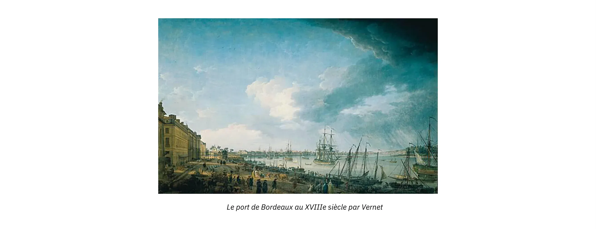

Bất kỳ ai muốn hành nghề đều phải dành nhiều năm làm người học việc, sau đó làm thợ chính, trước khi cố gắng đạt được địa vị bậc thầy bằng cách tạo ra một "kiệt tác" và trả một số tiền đáng kể cho hội. Do đó, sự cạnh tranh trong mỗi nghề bị hạn chế nghiêm ngặt.

(2) **Thương mại là một trò chơi tổng bằng không**. Khi nói đến thương mại, các học trò của Colbert có chung định kiến như những người man rợ thời Cổ đại. Theo bộ trưởng của Louis XIV, thương mại là "một cuộc chiến tranh liên miên". Tại sao? Lý do rất đơn giản: đối với Colbert và những người kế vị ông, bất kỳ sự gia tăng của cải nào cho một quốc gia đều có nghĩa là làm nghèo đi một quốc gia khác. Theo quan điểm của họ, người Anh hoặc người Hà Lan không thể được phép trở nên giàu có, vì điều đó có nghĩa là họ đang đánh cắp sự thịnh vượng của nước Pháp.

Do đó, sản phẩm của các quốc gia này phải bị cấm hoặc đánh thuế nặng mà không cần lý do, bởi vì thương mại là một cuộc chiến mà chúng ta chỉ mong muốn kẻ thù của mình bị hủy diệt.

> "Người Pháp chỉ có thể tăng cường thương mại bằng cách đánh bại người Hà Lan".
> *Colbert*

(3) **Khi Nhà nước thiếu tiền, hãy tăng thêm thuế**. Colbert và các học trò của ông không tin rằng của cải của người nộp thuế là một nguồn tài nguyên có hạn. Theo quan điểm của họ, chi tiêu công không bao giờ là vấn đề, miễn là thu được đủ. Và nếu người dân nổi loạn, thì chỉ vì các bộ trưởng đã làm không tốt, vì, như Colbert đã nhận xét một cách mỉa mai, "nghệ thuật đánh thuế bao gồm việc nhổ lông ngỗng mà không khiến chúng kêu quá nhiều".

(4) **Sự giàu có, trên hết, là vàng và bạc**. Trước khi khoa học kinh tế ra đời, nhiều tác giả đã theo một giáo điều thống trị về bản chất của sự giàu có, cái được gọi là *chủ nghĩa trọng thương*. Colbert và những người kế nhiệm ông tiếp tục theo con đường này. Tóm lại, những người theo chủ nghĩa trọng thương tin rằng dấu hiệu thực sự của sự thịnh vượng của một quốc gia là sự tích lũy các kim loại quý, bạc và vàng.

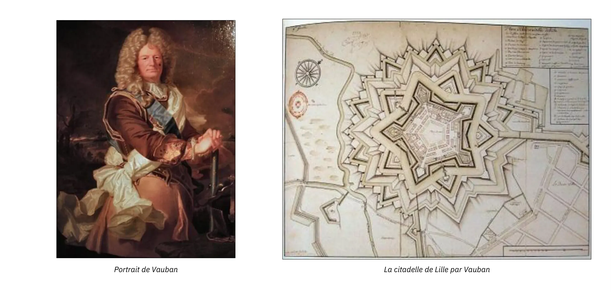

> "Chỉ có sự dồi dào tiền bạc trong một quốc gia mới tạo nên sự khác biệt về sự vĩ đại và quyền lực của quốc gia đó".
> *Colbert*

Hệ quả của ý tưởng này là ưu tiên xuất khẩu bằng mọi giá, điều này mang lại vàng và bạc nước ngoài, và hạn chế nhập khẩu ở mức tối thiểu để tránh chuyển chúng ra nước ngoài.

Đây là bốn nguyên tắc đã hướng dẫn chính phủ Pháp trong nhiều thập kỷ, khi đất nước bước vào thế kỷ 18. Tuy nhiên, chúng đã sớm bị thách thức sâu sắc. Trong khoảng thời gian từ năm 1690 đến năm 1710, một số nhà văn đã bị ảnh hưởng sâu sắc bởi Nhà nước Pháp thảm khốc. Khi tìm kiếm nguyên nhân, họ kết luận rằng chính những châm ngôn được thừa hưởng từ Colbert là nguyên nhân, coi chúng là những lập luận sai lầm. Khi làm như vậy, họ đã đặt nền móng cho khoa học kinh tế.

## Vauban

<chapterId>ee9c1e0e-96cc-5026-a5e2-963d68122786</chapterId>

Ngày nay, khi áp lực thuế ở đất nước chúng ta tiếp tục gia tăng, đe dọa bóp nghẹt các lực lượng kinh tế quốc gia, tiếng nói ủng hộ sự thay đổi đang nổi lên. Có ý thức hay không, những lời kêu gọi cải cách này thường phản ánh công trình của các nhà kinh tế học người Pháp, những người đã chỉ trích hệ thống thuế của quốc gia này là hỗn loạn, chuyên chế, quá mức kể từ thế kỷ 17.

Người đầu tiên trong số những nhà cải cách thuế này, xét về mặt thời gian và công trạng, là vị thống chế vĩ đại Sébastien Le Prestre Vauban, người xây dựng các pháo đài và thành trì nổi tiếng.

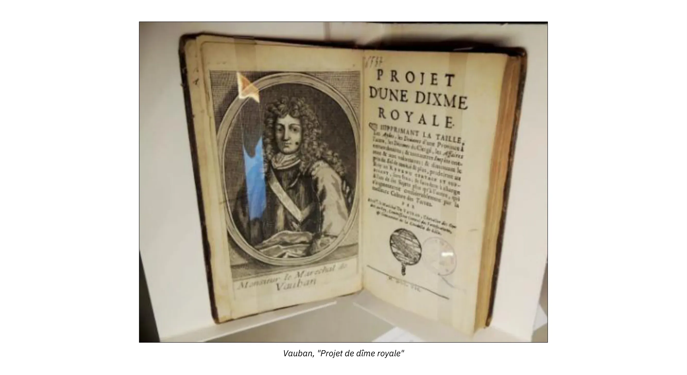

Mặc dù chúng ta đã buồn bã quên mất điều đó, Vauban không chỉ là một quân nhân; ông còn là một nhà kinh tế. Ông quan tâm đến số phận của những người nông dân, ông đề xuất cải cách thuế táo bạo vào năm 1695 (Projet de capitation - "Dự án cho Capitation") và một lần nữa vào năm 1707 (Projet d'une Dime Royale - "Thuế thập phân Hoàng gia"): thay thế hầu hết các loại thuế hiện có bằng một loại thuế tỷ lệ thuận với thu nhập, một loại thuế cố định trước thời hạn.

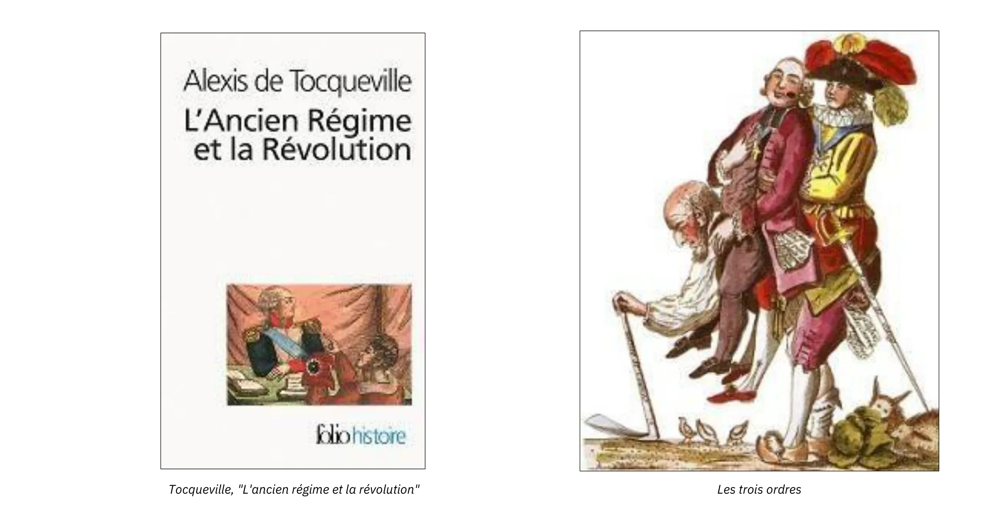

Vauban đã đi đến những ý tưởng này thông qua sự tò mò. Ông là một người quan sát sắc sảo, cố gắng nghiên cứu đời sống xã hội và thực tế kinh tế một cách nghiêm ngặt, gần như khoa học. Ông đặc biệt nhấn mạnh đến nhu cầu phải đếm, thông qua điều tra dân số.

Công lao lớn thứ hai của ông là mô tả chân thực và cảm động về nỗi thống khổ mà quần chúng phải chịu đựng. Ông viết: "Chúng ta đừng để bị lừa dối; trái tim của vương quốc đã bị hủy hoại. Mọi thứ đều đau khổ, mọi thứ đều chịu đựng, mọi thứ đều rên rỉ. Bạn chỉ cần nhìn và kiểm tra trái tim của các tỉnh, bạn sẽ thấy thậm chí còn tệ hơn những gì tôi đang nói". Không hề cường điệu, những quan sát ảm đạm của Vauban là sự phản ánh chính xác về cuộc sống đầu thế kỷ 18. Alexis de Tocqueville rất hiểu những ý tưởng này, và sau này sẽ mô tả *Royal Tithe* của Vauban là "đáng sợ", vì nó đúng.

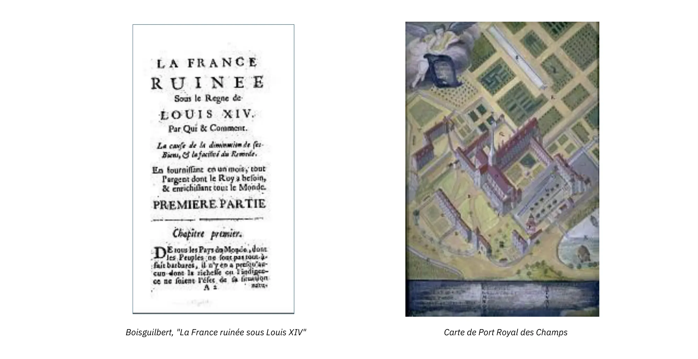

Công lao to lớn khác của Vauban với tư cách là một nhà kinh tế là đề xuất một cải cách thuế sâu rộng nhằm xóa bỏ, hoặc ít nhất là giảm bớt cường độ của cái ác mà ông quan sát và mô tả. Ông đã đúng khi làm như vậy; nền kinh tế Pháp dưới thời Ancien Régime đã bị tê liệt bởi thuế khóa, vốn không bình đẳng, không ổn định và không thể hiểu được.

Trong các tác phẩm chính trị và kinh tế khác nhau của mình, tham vọng lớn nhất của Vauban là làm giảm bớt nỗi thống khổ của những người mà ông gọi là "tầng lớp dưới của nhân dân, những người bằng sức lao động của mình để duy trì và hỗ trợ tầng lớp trên".

Ông hiểu rằng thuế khóa áp bức và gây mất động lực đang áp đảo nông dân, một khái niệm mà ông đã diễn đạt một cách sáng suốt, điều mà chúng ta vẫn có thể quan sát một cách hoàn hảo trong thời đại của mình:

> "Người nông dân để mảnh đất nhỏ bé của mình héo mòn, chỉ canh tác qua loa, vì sợ rằng nếu nó sản xuất được nhiều như mong đợi với phân bón và canh tác thích hợp, nó sẽ bị đánh thuế nặng hơn nữa".

Vauban đã nhìn thấy sự thật: thuế dưới chế độ Ancien Régime không chỉ phi lý mà còn tàn nhẫn nghiêm khắc. Chính hệ thống thuế này, bất công trong việc phân phối, là thứ mà ông tìm cách khắc phục.

Giải pháp mà ông đề xuất, một loại thuế suất cố định, theo tỷ lệ đối với tất cả các khoản thu nhập, sẽ cho phép gánh nặng thuế được chia sẻ công bằng giữa tất cả các tầng lớp xã hội. Dựa trên lý thuyết về Nhà nước coi thẩm quyền công là cần thiết để bảo vệ quyền và tài sản cá nhân, cải cách thuế của Vauban yêu cầu tất cả công dân đóng góp theo tỷ lệ chặt chẽ với những gì họ kiếm được, ví dụ, 10% thu nhập của họ

Trong The Royal Tithe, tác phẩm kinh tế duy nhất được xuất bản khi ông còn sống, Vauban đã tuyên bố rõ ràng:

> "Vì mọi người trong một quốc gia đều cần sự bảo vệ để tồn tại, nên điều đúng đắn là tất cả mọi người đều đóng góp, theo thu nhập của mình, vào việc duy trì và chi phí của quốc gia [...]. Không gì bất công hơn việc miễn thuế cho những người có khả năng chi trả nhất và chuyển gánh nặng sang những người kém khả năng nhất, những người sẽ sụp đổ dưới sức nặng; gánh nặng đó sẽ khá nhẹ nếu tất cả mọi người đều gánh chịu theo sức mạnh của riêng họ. Do đó, mọi miễn thuế đều là một sự rối loạn cần phải được sửa chữa."

Ngay trước khi qua đời, ý tưởng của Vauban đã được các bộ trưởng của Louis XIV chấp nhận. Tuy nhiên, Vauban đã kêu gọi một loại thuế theo tỷ lệ để thay thế tất cả hoặc gần như tất cả các loại thuế hiện có. Thay vào đó, như thường xảy ra, loại thuế của ông đã được thực hiện, nhưng tất cả các loại thuế khác cũng được giữ nguyên.

## Boisguilbert

<chapterId>200149c6-b5fc-566e-ab0e-bafb1c3fed3c</chapterId>

Rất ít nhà kinh tế học người Pháp trong quá khứ được công nhận xứng đáng tại quê nhà ngày nay, và Boisguilbert cũng không ngoại lệ.

Không được độc giả thời đó đánh giá cao, xa lánh giới quyền lực vì bản tính lập dị và niềm đam mê mãnh liệt, Boisguilbert để lại ít dấu ấn trong thế kỷ 18. Tuy nhiên, vào đầu thế kỷ trước, tác phẩm của ông đã dần được khám phá lại.

Tuy nhiên, sự tái khám phá này cho thấy chúng ta đang đi vào một ngõ cụt. Công lao thực sự của Boisguilbert đã bị mất đi khi ông được coi là người tiên phong của nhiều học thuyết và là người đi trước của nhiều nhà tư tưởng. Người ta nói rằng ông đã nắm bắt được khái niệm về tình trạng thiếu việc làm sau này được Keynes bảo vệ, dự đoán được định luật Say, mở đường cho học thuyết cân bằng chung của Walras và thậm chí báo trước sự phân tích giai cấp của những người theo chủ nghĩa Marx. 'Boisguilbert không thể là người đi trước của ai hoặc cái gì?' một nhà bình luận cuối cùng đã hỏi.

(Pierre Le Pesant de) Boisguilbert sinh ra tại Rouen vào năm 1646. Được đào tạo tại Port-Royal ở Paris, Boisguilbert bắt đầu sự nghiệp văn chương không thành công trước khi đảm nhiệm nhiều vai trò khác nhau, bao gồm cả chức Trung tướng của Rouen. Trong thời gian này, ông đã viết một số cuốn sách để ủng hộ cho các ý tưởng của mình, trong số đó có "Détail de la France" vào năm 1695, được ông tái bản vào năm sau với một tựa đề rõ ràng hơn nhiều: [*France Ruined under the Reign of Louis XIV, by Whom and How, with the Means to Restore It](https://archive.org/details/bub_gb_0jUaWNbTJa8C/page/n23/mode/2up)*.

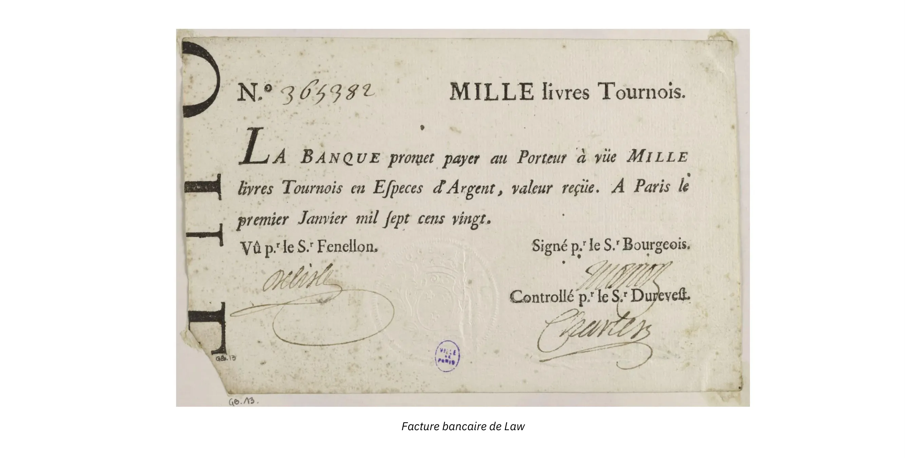

Và đây chính là cơ sở cho cuốn sách của Boisguilbert: Cái nghèo ở Pháp và nguyên nhân của nó.

Sự khốn khổ của người dân Pháp vào cuối thế kỷ 18, Boisguilbert mô tả chi tiết, giống như Vauban. Ông viết:

> "Những vùng đất cằn cỗi hoặc ít được canh tác, mà ai cũng thấy, chính là xác chết của nước Pháp".

Ông mô tả cảnh những vườn nho bị nhổ bật gốc, những người nông dân bỏ ruộng và nạn đói liên miên.

Boisguilbert tìm ra hai nguyên nhân chính cho sự bất hạnh này. Bởi vì nếu người dân sống trong cảnh bần cùng, đó là vì họ không được tiêu thụ những gì cần thiết, và sự phá sản của việc tiêu thụ có hai nguyên nhân.

Đầu tiên, người dân không còn đủ khả năng chi trả cho những nhu cầu cơ bản do thuế tùy tiện. Thuế taille, một loại thuế cá nhân thời đó, được tính toán một cách mù quáng cho mỗi cá nhân, tăng hoặc giảm mà không có lý do. Vì có nhiều đặc quyền, gánh nặng đổ lên vai những người nông dân nghèo, những người thấy mình bị phá sản. Để khắc phục điều này, Boisguilbert đã đề xuất một loại thuế theo tỷ lệ đối với tất cả các khoản thu nhập, khá giống với đề xuất của Vauban.

Lý do thứ hai khiến nước Pháp khốn khổ là có quá nhiều rào cản ngăn cản việc tự do thương mại hàng hóa, đặc biệt là hàng nông sản. Có thuế hải quan tại biên giới và thậm chí trong nước, giữa các vùng khác nhau, làm tê liệt mọi hoạt động thương mại. Những hạn chế này ngăn cản việc thiết lập giá cân bằng và hạn chế các cơ hội thị trường. Kết quả là, nông dân không thể kiếm sống từ sản xuất của mình, vì họ không thể bán có lãi và phải chịu giá nông sản không sinh lời, một mối quan tâm vẫn còn rất phù hợp cho đến ngày nay và là trọng tâm trong lý thuyết của Boisguilbert. Về vấn đề hạn chế thương mại, Boisguilbert ủng hộ việc dọn đường, nói cách khác là thiết lập thương mại tự do.

Và tự do thực sự là kết luận cuối cùng của ông. "Không phải là vấn đề hành động", ông nói, "mà chỉ đơn giản là ngừng hành động như chúng ta vẫn làm một cách dữ dội chống lại tự nhiên, vốn luôn hướng đến sự tự do và hoàn hảo". Mọi thứ sẽ ổn thôi, ông lặp lại không mệt mỏi, "miễn là chúng ta để tự nhiên diễn ra theo cách của nó, tức là, trao cho nó sự tự do, và không ai can thiệp vào hoạt động thương mại này ngoại trừ việc bảo vệ tất cả mọi người và ngăn chặn bạo lực".

Đoạn văn cuối cùng này là thiết yếu. Boisguilbert là người đầu tiên yêu cầu rõ ràng một chính sách kinh tế tự do, biến nó thành tín điều của mình và xây dựng một hệ thống thực sự xung quanh nó. Theo ông, có một trật tự tự nhiên của mọi thứ, và nó không nên bị làm hỏng, không bị phá hủy, bởi những can thiệp công khai không đúng lúc. Theo quan điểm của ông, Nhà nước không được hành động trong các vấn đề kinh tế, mà thay vào đó, hãy để mọi thứ diễn ra tự nhiên. Nếu không, nó sẽ gây ra đau khổ.

Boisguilbert thậm chí còn chỉ trích "*những tâm hồn tốt bụng*", như ông gọi họ, những người có ý tốt nhưng lại gây ra nhiều tác hại. Họ muốn bánh mì giá rẻ cho người dân, nhưng bằng cách ép giá xuống, họ đã phá sản những người nông dân, những người không thể sống sót với mức giá như vậy. Những người nông dân này sau đó đã từ bỏ đất đai của họ, chìm sâu hơn vào cảnh nghèo đói. Như chúng ta đều biết, 'địa ngục thường được lát bằng những ý định tốt'.

## Cantillon

<chapterId>bc206d41-6a64-5688-a489-40fcfa0e5397</chapterId>

Tác giả của "Bài luận về bản chất của thương mại nói chung" (viết vào khoảng năm 1730, xuất bản năm 1755), Richard Cantillon được coi là một trong những người tiên phong của khoa học kinh tế hiện đại. Trong cuốn Lịch sử tư tưởng kinh tế, nhà kinh tế học Murray Rothbard thậm chí còn coi Cantillon là người sáng lập ra kinh tế học hiện đại.

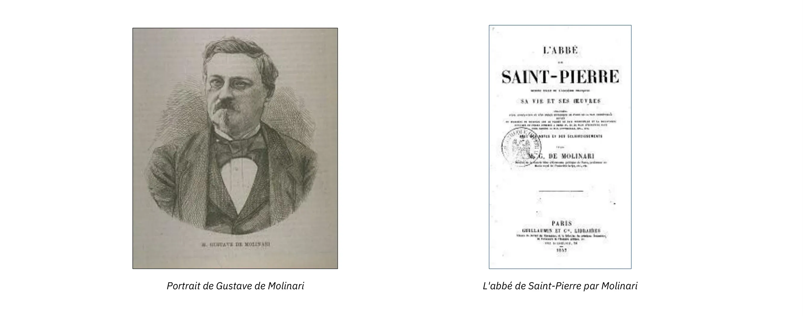

Sinh ra ở Ireland, Richard Cantillon định cư tại Paris khi còn trẻ và nhập quốc tịch Pháp. Ông làm việc như một nhân viên ngân hàng và kiếm được một gia tài trong thời đại John Law.

Cũng trong dịp này, ông bắt đầu nghiên cứu lý thuyết kinh tế. Khoảng năm 1730, Cantillon đã biên soạn Bài luận về bản chất của thương mại nói chung.

Cuốn sách này có thể được xem là một trong những nỗ lực đầu tiên trong việc tạo ra một lý thuyết chung về kinh tế. Cantillon cẩn thận xác định những gì ông gọi là "quy luật chung của nền kinh tế", những quy luật nằm trong bản chất của sự vật, chứ không phải trong những sự kiện cụ thể của quốc gia này hay quốc gia kia. Cách tiếp cận này mang tính cách mạng.

Chúng ta có thể tóm tắt những giá trị to lớn của Bài luận Cantillon trong năm lĩnh vực: lý thuyết về sự giàu có, khái niệm về doanh nhân, phê phán các loại tiền tệ vô giá trị, "Hiệu ứng Cantillon" và cuối cùng là bảo vệ tự do.

Đầu tiên là **học thuyết về sự giàu có** của ông.

Không giống như quan điểm trọng thương đang thịnh hành vào thời điểm đó, Cantillon dựa trên phân tích của mình vào sự công nhận rằng của cải được hình thành từ các sản phẩm phù hợp với sự hưởng thụ của con người. Ông lập luận rằng của cải này đến từ thiên nhiên và được tạo ra thông qua lao động của con người. Những ý tưởng của ông về bản chất của của cải đã có ảnh hưởng mạnh mẽ đến Beccaria và Adam Smith, và thông qua Smith, đến toàn bộ trường phái tư tưởng cổ điển Anh.

Thứ hai, **doanh nhân**.

Mặc dù không định nghĩa rõ ràng, Cantillon coi doanh nhân là người chơi chính và trung tâm trong hoạt động kinh tế. Đối với Cantillon, đặc điểm của doanh nhân là họ chấp nhận rủi ro và hành động trong sự không chắc chắn. Những ý tưởng này sau đó được Turgot và quan trọng hơn là Say mở rộng để cuối cùng công nhận vị trí đặc biệt của doanh nhân trong nền kinh tế, lần này trái ngược với những khẳng định của trường phái Anh.

Điểm thứ ba, **tiền tệ**.

Phản ứng lại trải nghiệm của John Law, Cantillon giải thích điều gì sẽ xảy ra hoặc phải xảy ra khi tiền tệ không có giá trị thực.

Ông thấy hai hậu quả chính của việc thay thế một loại tiền tệ không có giá trị thực như tiền giấy bằng tiền kim loại. Hậu quả đầu tiên là cái mà ông gọi là "sự từ chối của dân chúng", có nghĩa là sự ngờ vực ngày càng tăng đối với đồng tiền vô giá trị. Hậu quả thứ hai là lạm phát: tiền tệ suy yếu khiến hàng hóa đắt hơn.

Thứ tư, trong phân tích của mình về **lạm phát**, Cantillon đã đi xa hơn những người cùng thời. Sau khi quan sát sự sụp đổ của hệ thống Law, Cantillon nhận ra rằng lạm phát tiền tệ không ảnh hưởng đến mọi người như nhau. Ngược lại, nó làm giàu cho một số người trong khi làm nghèo đi những người khác. Ông kết luận rằng lạm phát có tác động tái phân phối: những người nhận được tiền mới phát hành đầu tiên được hưởng lợi từ sức mua tăng lên, trong khi những người nhận được sau đó trở nên nghèo hơn do tiền mới được phát hành do tỷ lệ lạm phát tăng.

Thứ năm, mặc dù có một số tàn dư của tư tưởng trọng thương, quan điểm chung của Cantillon là **hoàn toàn tự do**. Ông bảo vệ quyền sở hữu tư nhân như một trụ cột cơ bản của nền văn minh, lập luận rằng không xã hội nào có thể hoạt động mà không có Ownership tư nhân về đất đai và các sản phẩm lao động. Ông cũng coi bất bình đẳng vật chất giữa mọi người là tự nhiên và hợp pháp. Theo Cantillon, không có gì sai khi một người lao động hiệu quả và dũng cảm, hoặc một người có năng khiếu đặc biệt kiếm được nhiều tiền hơn một người bất tài hoặc lười biếng. Cuối cùng, Cantillon tin rằng giá cả phải luôn được xác định một cách tự do, thông qua sự vận động của Supply và nhu cầu, mà không có sự can thiệp của chính quyền công.

Trong số năm ý tưởng chính trong Bài luận của ông, ý tưởng quan trọng nhất chắc chắn là ý tưởng hiện mang tên ông: **Hiệu ứng Cantillon**.

Với lý thuyết này về tác động của lạm phát, Cantillon cung cấp cho chúng ta câu trả lời cho một số căn bệnh đương đại. Nó giúp chúng ta hiểu được hậu quả của các chính sách tiền tệ mở rộng và lạm phát gần đây, đã làm nghèo đi tầng lớp trung lưu và thế giới nông thôn, trong khi làm giàu cho các nhà điều hành thị trường tài chính và Nhà nước, các cơ quan và quan chức của Nhà nước, do họ gần gũi với nguồn gốc của vấn đề mới: các ngân hàng trung ương và các ngân hàng thương mại.

# Những nhà cải cách và tư tưởng của đầu thế kỷ 18

<partId>1f7b50d4-ce93-5db3-8396-43c1fa5419ff</partId>

## Viện phụ của Saint-Pierre

<chapterId>13478fe2-4c12-593c-a410-54c2cfb7ef7f</chapterId>

Trong số tất cả các tác giả mà chúng tôi chọn đưa vào nhóm các nhà tư tưởng tự do kinh tế của Pháp thế kỷ 18, Viện phụ Saint-Pierre chắc chắn là người bị bỏ qua nhiều nhất.

Công bằng mà nói, một phần là lỗi của ông. Ông đã viết rất nhiều, nhưng phong cách của ông là Hard để đọc và đầy rẫy sự lặp lại. Ngay cả Jean-Jacques Rousseau cũng đã cố gắng tóm tắt tác phẩm của ông: ông đã bắt đầu làm như vậy, nhưng sớm từ bỏ nhiệm vụ, vì ông nhận ra rằng nó vượt quá khả năng của mình. Vào giữa thế kỷ 19, Gustave de Molinari đã vinh danh ông bằng cách xuất bản một tác phẩm toàn diện về ông, trong đó ông đã tôn vinh nhà kinh tế và nhà hòa bình mà Viện phụ của Saint-Pierre là. Nhưng điều này không đủ để đưa ông ra khỏi sự lãng quên, vì ông vẫn còn trong đó cho đến ngày nay.

Viện phụ của Saint-Pierre viết về kinh tế, nhưng ông thường được quan tâm như một người theo chủ nghĩa hòa bình. Ông là tác giả của Dự án Hòa bình Vĩnh cửu, có trước dự án nổi tiếng của Emmanuel Kant.

Trong tác phẩm này, ông lập luận rằng chiến tranh mang tính hủy diệt, không chỉ đối với những người thua cuộc mà còn đối với những người chiến thắng, và thậm chí đối với những người không tham gia, vì hoạt động thương mại của họ bị ảnh hưởng.

Để chống lại tai họa chiến tranh, ông đề xuất thành lập một loại Liên minh các quốc gia châu Âu. Một hội đồng châu Âu sẽ được thành lập để giải quyết các vấn đề của mỗi quốc gia. Do đó, các quốc gia sẽ dùng đến trọng tài, để tránh dùng đến vũ khí. Nếu một quốc gia không đủ khôn ngoan để chấp nhận hòa bình, nếu quốc gia đó đe dọa các quốc gia châu Âu khác, Liên minh các quốc gia châu Âu sẽ có phương tiện để ứng phó. Đối mặt với những sự kiện như vậy, một đội quân châu Âu sẽ được thành lập, với lực lượng do nhiều quốc gia khác nhau cung cấp.

Cũng có một tập trong cuộc đời của Viện phụ Saint-Pierre minh họa hoàn hảo cho tư duy phê phán đằng sau phong trào tự do kinh tế của Pháp. Ông gia nhập Viện Hàn lâm Pháp năm 1695, nhưng bị trục xuất năm 1718 vì dám chỉ trích triều đại của Louis XIV. Trong đó, ông liên kết với những nhân vật như Vauban và Boisguilbert, những người cũng dám lên tiếng chống lại myseries ẩn dưới sự lộng lẫy của triều đại Vua Mặt trời.

Viện phụ của Saint-Pierre lập luận rằng triều đại của Louis XIV, với cung điện xa hoa và nỗi ám ảnh về chinh phục quân sự, không phải là dấu hiệu của một vị vua đức hạnh. Ông từ chối chấp nhận rằng Louis XIV xứng đáng với danh hiệu "**Louis Đại đế**".

"Hủy hoại hàng xóm và dân tộc của mình cùng một lúc không phải là sự vĩ đại", ông nói. Quan điểm này đã xúc phạm sâu sắc đến Viện Hàn lâm Pháp, vốn từ lâu đã bận tâm đến việc tôn vinh nhà vua bằng mọi hình thức văn học có thể. Kết quả là, họ đã bỏ phiếu gần như nhất trí trục xuất ông.

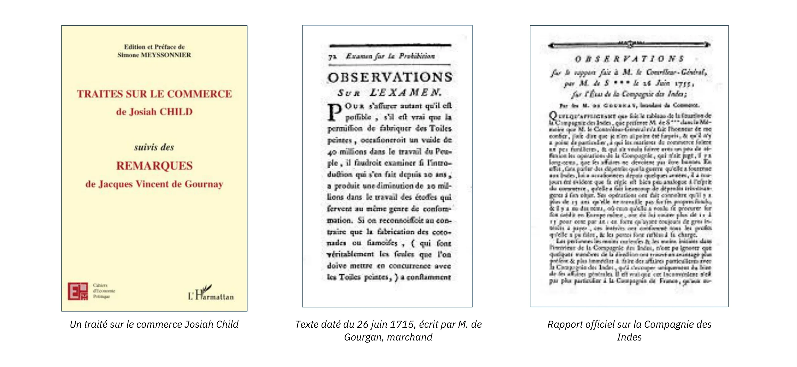

Về mặt tư duy kinh tế, ông luôn áp dụng nguyên tắc tiện ích, giống như Jeremy Bentham sau này, và thường đưa ra những hiểu biết sâu sắc. Công bằng mà nói, ông vẫn chịu ảnh hưởng của những ý tưởng trọng thương, mà không ai hoàn toàn từ bỏ vào thời điểm đó.

Tuy nhiên, Viện phụ của Saint-Pierre đã đưa ra một số quan sát chính xác về nền kinh tế. Ngay cả trước *Condillac*, người thường được cho là người đưa ra ý tưởng này, ông đã tuyên bố rõ ràng rằng trong bất kỳ Exchange nào, cả hai bên đều được hưởng lợi. Điều này có thể được tìm thấy trong ["Dự án cải thiện thương mại của Pháp"](https://www.institutcoppet.org/projet-pour-perfectionner-le-commerce-de-france/" năm 1733 của ông, trong đó ông viết:

> "Khi một cuộc mua bán được thực hiện giữa các thương gia, người bán được lợi, và người mua cũng vậy; vì nếu không có lợi ích thực tế hoặc được nhận thức ở cả hai bên, thì người bán sẽ không bán ở mức giá này và người mua cũng sẽ không mua ở mức giá này".

Ông cũng nhấn mạnh, trước khi Vincent de Gournay làm, giá trị của lao động và tầm quan trọng của việc giữ cho nó hấp dẫn. "Mọi lao động đều khó khăn", ông viết. "Và khi một người đàn ông thấy rằng công việc của mình không mang lại cho anh ta điều gì, hoặc không đủ, anh ta trở nên nhàn rỗi và sẽ không bận tâm đến những nỗ lực không cần thiết". Chính lập luận này sau đó đã được Hầu tước d'Argenson, Vincent de Gournay và những người theo chủ nghĩa trọng nông nhắc lại khi họ chỉ trích các quy định và hệ thống phường hội nặng nề. Họ lập luận rằng những hạn chế như vậy làm nản lòng người lao động, gây ra khó khăn không cần thiết và cuối cùng khiến sự nhàn rỗi có vẻ hấp dẫn hơn nỗ lực sản xuất trong những điều kiện như vậy.

## Hầu tước d'Argenson

<chapterId>e9960ab4-72ec-5afd-8e97-bf89c83b62bc</chapterId>

Hầu tước d'Argenson là người sáng lập học thuyết tự do kinh doanh bị lãng quên.

August Oncken, tác giả của một cuốn sách về học thuyết laissez-faire, laissez-passer, đã khám phá lại học thuyết này và kết luận rằng d'Argenson đóng vai trò chính trong sự ra đời của ý tưởng này.

René-Louis Voyer, Hầu tước d'Argenson, sinh năm 1694. Ông bắt đầu sự nghiệp chính trị của mình với tư cách là cố vấn quốc hội, sau đó phục vụ trong Hội đồng Nhà nước.

Ba mươi năm trước Adam Smith, d'Argenson đã bảo vệ lợi ích của sự phân công lao động và chuyên môn hóa.

Ông chỉ trích mạnh mẽ các quy định mà theo ông thấy, đã cố gắng thay đổi sở thích tự nhiên của các vùng khác nhau. Ví dụ, ông bối rối khi chính phủ muốn sản xuất vải và nhung ở Tours, một thành phố nghèo vào thời điểm đó, để sánh ngang với chất lượng của những sản phẩm được sản xuất tại Genoa thịnh vượng, nơi nổi tiếng với hàng xa xỉ. Ông kết luận:

> "Mỗi nơi phải được phép lựa chọn nhà máy riêng của mình. Tự do! Tự do!"

Ông cũng công nhận một nguyên tắc cốt lõi khác của Smith: ý tưởng rằng trật tự tự phát phát sinh từ việc theo đuổi lợi ích cá nhân. Hầu tước d'Argenson tin rằng lợi ích cá nhân trực tiếp là động lực thúc đẩy năng lượng của con người. Ông viết rằng tay nghề kém và gian lận sẽ làm mất uy tín của nhà sản xuất, trong khi sự siêng năng và ý định tốt sẽ dẫn đến thịnh vượng. Ông lập luận rằng người đánh giá tốt nhất về tiện ích là cá nhân, công chúng nói chung, những người mua hàng hóa và quan tâm đến việc thực hiện một giao dịch tốt. "Mọi người đều cảm nhận được lợi ích của riêng mình", ông nói, "mọi người đều thực hiện các biện pháp có lợi cho mình và chính trong thỏa thuận chung này mà chúng ta khám phá ra sự thật".

Ngay cả trước Adam Smith, ông đã hiểu rằng lợi ích cá nhân sẽ dẫn đến lợi ích chung thông qua việc xây dựng một trật tự tự nhiên tự phát.

Ông so sánh xã hội với một tổ ong, nơi mỗi con côn trùng đều theo bản năng của mình, "Từ hành động của chúng", ông nói một cách chính xác, "đã tạo ra sự tích lũy lớn cho nhu cầu của xã hội nhỏ bé; nhưng điều này không phải do mệnh lệnh hay các vị tướng buộc mỗi cá nhân phải tuân theo quan điểm của người lãnh đạo". Đây có lẽ là cách diễn đạt gần nhất trong tư tưởng kinh tế của Pháp với khái niệm nổi tiếng "bàn tay vô hình" của Adam Smith.

Hầu tước d'Argenson luôn phẫn nộ trước những ý tưởng của các bộ trưởng thời ông. Câu hỏi duy nhất họ đặt ra là, "Chúng ta nên điều chỉnh theo cách này hay cách khác? Chúng ta nên hướng nền kinh tế theo hướng này hay hướng khác?". D'Argenson trả lời: "Trước tiên, chúng ta không nên tự hỏi liệu có nên điều chỉnh bất kỳ điều gì hay không, hay liệu mọi thứ có nên để tự vận hành không?"

Nói thật, ông đã rất ngạc nhiên khi mọi người thấy Hard hiểu, hay đúng hơn là thấy, những tác hại của việc quản lý quá mức đủ loại đối với nền kinh tế. Theo quan điểm của ông, chỉ cần mở mắt ra là đủ. "Rất nhiều thứ đang hoạt động khá tốt ngày nay", ông viết một cách cay đắng, "chỉ vì chúng đã thoát khỏi tầm với của luật pháp".

Đôi khi, ông tuyệt vọng vì ý tưởng của mình ít được hiểu.

Lý tưởng về chính sách kinh tế mà ông bảo vệ do đó trái ngược với xu hướng của thời đại ông. Lý tưởng của ông định nghĩa một vai trò tiêu cực về bản chất đối với Nhà nước. "Tất cả những gì thương mại cần là loại bỏ các trở ngại. Nó chỉ yêu cầu những thẩm phán tốt, trừng phạt các công ty độc quyền, bảo vệ bình đẳng cho tất cả công dân, tiền tệ ổn định, đường sá và kênh rạch". Đây là định nghĩa cho một Nhà nước tối thiểu, sẽ trở thành một trong những nền tảng của truyền thống kinh tế chính trị của Pháp.

Tầm nhìn về vai trò của Nhà nước trong hoạt động kinh tế được minh họa một cách tự nhiên thông qua việc nghiên cứu hai vấn đề chính gây chú ý cho các nhà kinh tế và nhà tư tưởng xã hội thời bấy giờ: quy định về công nghiệp và buôn bán lúa mì.

Các quy định về công nghiệp, trước hết, đã khơi dậy tất cả sự phẫn nộ của ông, bởi vì chúng là đặc quyền của một số người với cái giá phải trả là những người khác. "Nguyên nhân thực sự của sự suy tàn của các nhà máy của chúng ta", ông viết, "là sự bảo vệ quá mức dành cho chúng". Và với một tín điều không kém phần sống động, ông đã bày tỏ sự chỉ trích của mình đối với lòng nhiệt thành chỉ huy của các chính khách thời bấy giờ:

> Điều hành ngành công nghiệp trái với ý muốn của nó chính là muốn nó phá sản.

Về vấn đề buôn bán lương thực, d'Argenson không có câu trả lời nào khác ngoài tự do. Theo ông, tình trạng thiếu lúa mì xuất phát từ tình trạng độc quyền và các biện pháp phòng ngừa quá mức của chính phủ. Tất cả những gì chúng ta phải làm là để mọi thứ diễn ra như vậy, và sẽ không bao giờ xảy ra tình trạng thiếu lúa mì ở một quốc gia nơi các cảng mở cửa. Người nước ngoài, bị thu hút giống như tất cả những người đàn ông khác bởi sự hấp dẫn của lợi nhuận, sẽ cung cấp cho chúng ta những gì chúng ta cần và lấy đi phần thặng dư của chúng ta. "Cứ để mọi thứ diễn ra như vậy", ông nói, "và mọi thứ sẽ ổn thôi".

## Vincent de Gournay

<chapterId>e8ae40dc-7450-552f-9ddc-9e02936cf425</chapterId>

Vincent de Gournay là một trong những đại diện đầu tiên của chủ nghĩa tự do kinh tế tại Pháp, và là một trong những người ủng hộ sớm nhất của chủ nghĩa này trong giới hành chính công và trí thức. Vì lý do đó, ông xứng đáng được công nhận nhiều hơn trong lịch sử tư tưởng kinh tế so với những gì ông thường nhận được. Tôi đã cố gắng nêu bật những đóng góp của ông trong một cuốn sách gần đây.

Sinh ra trong một gia đình thương gia, Gournay đã trở thành một thương gia thành đạt, tích lũy được khối tài sản đáng kể trước khi đảm nhiệm một vị trí trong chính quyền Pháp. Trong Cục Thương mại, ông là người ủng hộ nhiệt thành cho lao động tự do và thương mại tự do.

Mặc dù ông được đưa vào bối cảnh của các nhà kinh tế hàng đầu thời bấy giờ, Gournay viết ít hoặc xuất bản ít. Ông chủ yếu viết thư hành chính và hồi ký, hoặc chưa xuất bản hoặc được các tác giả khác xuất bản sau một số lần biên tập.

Những gì chúng tôi có bao gồm:

1. [Nhận xét](https://archive.org/details/traitessurlecomm0000chil) về bản dịch một cuốn sách của nhà kinh tế học người Anh Josiah Child;

2. “Những quan sát” được đưa vào Đánh giá về Ưu điểm và Nhược điểm của Lệnh cấm Vải in;

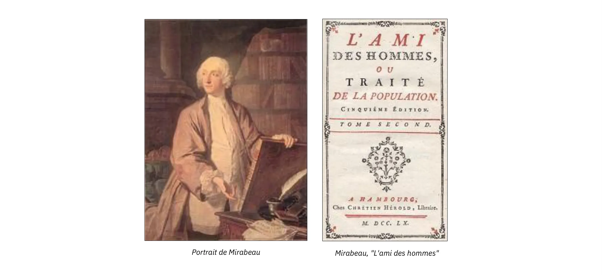

3. “Những quan sát về Công ty Đông Ấn”, được Viện phụ Morellet thêm vào Hồi ký của ông về tình hình hiện tại của Công ty Đông Ấn (1769);

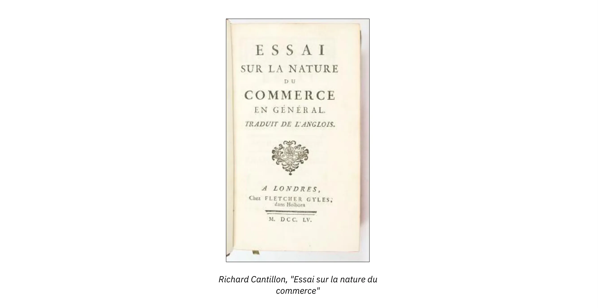

4. Và trên hết là nhiều hồi ký khác nhau từ vai trò là Trưởng phòng Thương mại của ông.

Những bài viết này chứng minh rõ ràng ảnh hưởng của nước ngoài và sự hiện diện của một số ý tưởng cấu trúc chính. Ảnh hưởng của nước ngoài, theo Gournay, là sự công nhận về sự vượt trội của Anh và Hà Lan. Gournay tin rằng hai quốc gia này hiểu kinh tế tốt hơn nhiều so với Pháp, và rằng Pháp phải noi gương họ. "Hai quốc gia này thịnh vượng nhất", ông nói, "và họ tuân theo một hệ thống hoàn toàn khác với chúng ta. Chúng ta cấm hàng hóa nước ngoài nhập cảnh, chúng ta hạn chế hoạt động kinh tế trong các quy định hà khắc, trong khi họ tiến hành theo cách ngược lại. Nếu họ làm tốt hơn", Gournay kết luận, "đó là vì Pháp được hướng dẫn bởi các nguyên tắc sai lầm".

Đề xuất cải cách của ông tập trung vào một số điểm chính.

Đầu tiên, ông tin rằng lao động cần được bảo vệ và khuyến khích. Vào thời điểm đó, công nhân Pháp bị đối xử như tội phạm, liên tục bị theo dõi và luôn sợ không tuân thủ một trong hàng ngàn quy định. Sự phiền toái quá mức này đã ngăn cản mọi người làm việc, thay vào đó đẩy họ vào tình trạng lười biếng. Tuy nhiên, Gournay lập luận rằng "lao động là cao quý và là cách duy nhất để làm giàu cho một quốc gia".

Thứ hai, ông chỉ trích hệ thống hạn chế của các hội đoàn đã hạn chế các nhà sản xuất. Tham gia vào một nghề vừa tốn thời gian vừa tốn kém, và mỗi công nhân mới sau đó phải tuân thủ nghiêm ngặt quy trình do các điều lệ của hội đoàn của mình thiết lập. Một hệ thống như vậy không có chỗ cho sự xuất sắc, đổi mới hoặc tiến bộ.

Thứ ba, thương mại ở Pháp bị hạn chế bởi luật hạn chế. Theo quan điểm của Gournay, người tiêu dùng sẽ được hưởng lợi rất nhiều nếu các cảng có thể cạnh tranh tự do và tất cả hàng hóa, chẳng hạn như ngũ cốc và vải bạt in, được phép nhập khẩu mà không bị hạn chế. Ông là một trong những người đầu tiên chỉ ra nguồn gốc thực sự của buôn lậu: nó tồn tại chỉ vì một ngành thương mại có lợi và hữu ích bị cấm. Ông đã thêm một nhận xét sắc sảo: buôn lậu là một nghề "tự do", không có quy định, không có hội nhóm, không có thuế tịch thu. Tuy nhiên, chính quy định áp đảo của Nhà nước đã đẩy nhiều công nhân trung thực vào tình trạng bất hợp pháp.

Cuối cùng, Gournay lưu ý rằng lãi suất thấp hơn ở Anh và Hà Lan, những quốc gia thịnh vượng hơn Pháp. Ông cũng ủng hộ lãi suất thấp hơn ở Pháp, để hoạt động kinh tế có thể được tài trợ ở đó với các điều kiện thuận lợi như ở những nơi khác. Tuy nhiên, Gournay không tìm kiếm các phương pháp lập pháp cưỡng bức; thay vào đó, ông nhấn mạnh đến nhu cầu hợp pháp hóa việc cho vay tiền, điều vẫn bị Giáo hội Công giáo lên án.

Về tất cả những điểm này, Gournay đóng vai trò chủ chốt trong các cuộc tranh luận trí thức vào giữa thế kỷ 18. Việc ông bảo vệ quyền tự do kinh tế đã diễn ra trước những người theo chủ nghĩa trọng nông một thập kỷ và trước Adam Smith hai mươi năm. Nhưng ảnh hưởng lâu dài nhất của ông là đối với Turgot. Gournay đã che chở cho Turgot trẻ tuổi và đào tạo anh ta bằng những ý tưởng của mình.

Nhiều năm sau, Turgot, một bộ trưởng tương lai dưới thời Louis XVI, đã viết một bài Éloge (điếu văn) để vinh danh người bạn của mình sau khi ông qua đời. Và nếu Turgot không bao giờ hoàn toàn chấp nhận chế độ trọng nông của François Quesnay, thì đó là vì ông vẫn giữ được sự gắn bó không thể lay chuyển với người chủ đầu tiên của mình, Vincent de Gournay.

## Vòng tròn Gournay

<chapterId>b86ba6bd-8f3a-5d8f-b098-4d0413f00deb</chapterId>

Khi nói đến những ngày đầu của khoa học kinh tế, lịch sử có xu hướng làm nổi bật một trường phái tư tưởng đầu tiên: Những người theo chủ nghĩa trọng nông, do François Quesnay và các môn đồ của ông lãnh đạo. Tuy nhiên, gần một thập kỷ trước khi họ nổi lên, có một nhóm khác, ít chính thức hơn nhưng cũng quan trọng không kém tập trung vào nhà kinh tế học Vincent de Gournay.

Như chúng ta đã thấy ở phần trước, Gournay bị cuốn hút bởi ví dụ của các quốc gia nước ngoài như Anh và Hà Lan. Ông cũng ngưỡng mộ các nhà kinh tế của họ—những nhân vật như Josiah Child, Johan de Witt và David Hume—nhiều như vậy.

Sự ngưỡng mộ này đã thôi thúc ông dịch và biên dịch các tác phẩm kinh tế của họ.

Hóa ra, vị trí của ông trong bộ máy hành chính cấp cao đã cho phép Gournay tiếp xúc với tất cả các chuyên gia kinh tế được biết đến tại Pháp vào thời điểm đó. Theo cách này, ông đã tập hợp được một nhóm các dịch giả cực kỳ có năng lực. Ông đã đích thân dịch các tác phẩm của Child và Culpeper. Viện phụ Le Blanc đã dịch Political Discourses của David Hume. Véron de Forbonnais đã dịch nhà kinh tế học người Tây Ban Nha Geronymo de Uztariz. Turgot đã làm việc với các tác phẩm của Josiah Tucker, và con trai của Montesquieu đã dịch Joshua Gee.

Nhờ sự hợp tác của một số thành viên trong nhóm Gournay, nhiều tác giả đã có thể xuất bản các tác phẩm gốc dưới tên của họ. Những cuốn sách này, cùng với các bản dịch, đã đạt được thành công đáng kể. Một số ví dụ đáng chú ý bao gồm:

- Bài luận của Herbert về [Cảnh sát chung về ngũ cốc](https://archive.org/details/essaisurlapolice00herb/page/n7/mode/2up) (6 phiên bản trong 4 năm)

- [Noblesse commerçante] của Coyer(https://archive.org/details/lanoblessecommer00coye/page/n3/mode/2up) (5 ấn bản trong 2 năm)

- [Nhận xét về Ưu điểm và Nhược điểm của Pháp và Anh] của Plumard de Dangeul (https://archive.org/details/bim_eighteenth-century_remarks-on-the-advantage_plumard-de-dangeul-loui_1754) (3 phiên bản trong năm đầu tiên)
- [Hồi ký về giao dịch] của Cliquot-Blervache và Gournay](https://www.amazon.com/Memoire-sur-corps-metiers-France/dp/1978196903) (2 ấn bản năm 1758)

Nhóm này cũng đóng vai trò quan trọng trong việc xuất bản

- [Bài luận về bản chất của thương mại nói chung](https://archive.org/details/essayonnatureofc0000cant) của Richard Cantillon.

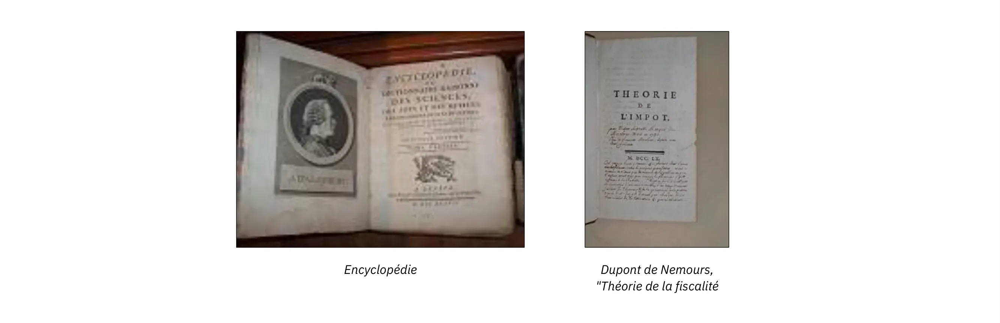

Cuốn sách cuối cùng này, được viết vào khoảng năm 1730, vẫn còn ở dạng bản thảo sau khi tác giả qua đời. Gournay, với sự giúp đỡ của những người bạn kinh tế, đã xuất bản nó vào năm 1755. Theo Abbot Morellet, một thành viên của nhóm, Gournay đã giới thiệu nó cho mọi nhà kinh tế mà ông biết.

Sản phẩm trí tuệ của nhóm Gournay có tác động lớn đến lịch sử tư tưởng. Theo nghĩa này, họ có thể được coi là những người sáng lập ra khoa học kinh tế tại Pháp. Christine Théré của INED, người đã nghiên cứu lịch sử các ấn phẩm kinh tế, phát hiện ra rằng từ năm 1750 đến năm 1759, không dưới **349** tác phẩm về kinh tế đã được xuất bản, so với chỉ **83** trong toàn bộ thập kỷ trước (1740–1749). Cuộc cách mạng này vào những năm 1750 phần lớn là do nhóm Gournay.

Để truyền bá sở thích thảo luận về kinh tế trong cộng đồng người Pháp, Gournay và những người bạn của ông đã nỗ lực để đưa chúng vào các tiểu thuyết. Sau *Memoir on the Trades*, tác phẩm chỉ trích các hội nhóm, Gournay và Cliquot-Blervache đã giúp Gabriel-François Coyer viết một tiểu thuyết châm biếm ngắn có tên là Chinki: [A Cochinchinese Tale Applicable to Other Nations](https://www.institutcoppet.org/wp-content/uploads/2013/06/Coyer-Chinki-Histoire-cochinchinoise.pdf).

Câu chuyện kể về nhân vật chính, Chinki, người buộc phải rời khỏi vùng đất của mình do thuế quá cao và cố gắng tìm việc thủ công cho con cái mình trong thành phố. Nhưng tất cả các ngành nghề đều bị đóng cửa với họ vì các quy định của hội nhóm lạm dụng, vì vậy câu chuyện miêu tả sự thất vọng ngày càng tăng của anh ta thông qua giọng điệu hài hước.

Do đó, nhóm Gournay là nguồn gốc của một làn sóng xuất bản dữ dội. Trong khi đóng góp lớn này đã bị các nhà sử học về tư tưởng kinh tế lãng quên, thì nó lại rất rõ ràng đối với những người đương thời. Những người theo chủ nghĩa trọng nông, những người đã thành lập trường phái của họ vào những năm 1760, sau này sẽ giới thiệu nhóm của Gournay là những người đi trước trực tiếp của họ. Năm 1767, nhà kinh tế học Jacques Accarias de Serionne đã bày tỏ điều này rõ ràng hơn trong lời tri ân của mình. Ông viết: "Một số ít người Pháp, cả triết gia và công dân, đã bắt đầu bắt chước các nhà văn Anh cách đây vài năm. Đầu tiên, họ dịch các mô hình của họ và nhanh chóng vượt qua họ ở nhiều khía cạnh. Họ đã mang tất cả sự quyến rũ và phong phú của văn học vào việc xử lý các chủ đề hữu ích; họ đã khơi dậy và truyền bá sở thích đối với các ngành khoa học thiết yếu nhất đối với sự thịnh vượng của Nhà nước".

Và thực sự, vào những năm 1750, các vấn đề kinh tế đã trở nên thời thượng. Voltaire đã từng nhận xét rằng vào khoảng năm 1750, người Pháp đã từ bỏ tiểu thuyết để thảo luận về quyền tự do buôn bán ngũ cốc. Xu hướng này cũng được tờ Mercure de France ghi nhận, tờ báo đã viết trong một số ra năm 1758, vài tháng trước khi Gournay qua đời: "Kinh tế chính trị hiện là khoa học thời thượng. Những cuốn sách về nông nghiệp, dân số, công nghiệp, thương mại và tài chính hiện nằm trong tay vô số người, những người mà cách đây không lâu, chỉ đọc tiểu thuyết một cách hời hợt". Người ta khó có thể dành lời tri ân nào tốt hơn cho Gournay và công trình của nhóm các nhà kinh tế học của ông.

## Mirabeau

<chapterId>2d2f802b-e3b6-556f-9025-a1b1dc4409ca</chapterId>

Nước Pháp đã biết đến hai người đàn ông nổi tiếng tên là Mirabeau, một người cha và một người con trai, nhưng người con trai mới thực sự làm nên lịch sử. Là một diễn giả cách mạng và là một trong những nhân vật trung tâm trong các sự kiện của Cách mạng Pháp, ông vẫn nổi tiếng.

Nhờ tài năng và vị thế của mình trong lịch sử nước Pháp, ông đã làm lu mờ cha mình, một nhà kinh tế và là trụ cột của trường phái François Quesnay, người đã là thành viên đầu tiên của trường phái này từ năm 1758.

Trên thực tế, Hầu tước de Mirabeau đã đạt được danh tiếng to lớn ngay cả trước khi ông áp dụng chế độ trọng nông nhờ một cuốn sách có tựa đề "Người bạn của nhân loại. Luận thuyết về dân số [FR: L'ami des hommes, ou, Traité de la population](https://archive.org/details/lamideshommesou00unkngoog). Mặc dù phiên bản đầu tiên được xuất bản vào năm 1756, nhưng nó chỉ trở nên nổi tiếng vào khoảng năm 1757, một năm trước cuộc gặp gỡ của ông với Quesnay.

Hơn 20 phiên bản đã được xuất bản trong khoảng thời gian từ năm 1757 đến năm 1760, có lẽ khiến đây trở thành cuốn sách kinh tế thành công nhất trong lịch sử. Một số độc giả thậm chí còn nghĩ rằng cuốn sách này do Montesquieu viết vì lý luận sắc sảo của nó. Thái tử, vua Louis XVI, thậm chí còn tuyên bố đã thuộc lòng nó. Trong một thời gian, đây là cuốn sách mà mọi người ở Versailles đều đọc.

Ngày nay, đó là một cuốn sách không còn được đọc nữa, nhưng nhiều người vẫn tham khảo nó. Ngay cả vào thế kỷ 19, Edmond Roussel đã nói:

> L'Ami des Hommes là một trong những cuốn sách mà mọi người đều nói đến, nhưng hầu như không ai biết đến. Trong mỗi thế hệ, một công dân dũng cảm nên đọc nó; để mọi người khác không phải đọc.

Khi bắt đầu sự nghiệp kinh tế của mình, Mirabeau lấy cảm hứng từ Richard Cantillon. Ông đã sở hữu bản thảo Bài luận về bản chất thương mại nói chung của Cantillon trong 15 năm và đã kiên nhẫn phân tích và bình luận về nó.

L'Ami des Hommes ban đầu được hình thành như một bình luận đơn giản về Bài luận của Cantillon. Nhưng vì Mirabeau có một tâm trí hơi lập dị, hay nói thẳng ra là hơi điên, nên ông nhanh chóng đi chệch khỏi kế hoạch ban đầu của mình. Cuốn sách chỉ đơn giản thảo luận về tất cả các vấn đề kinh tế mà ông biết, đôi khi rời xa Cantillon. Đây là một cuốn sách khó đọc, với một kế hoạch kỳ lạ và những đoạn lạc đề trong mỗi chương. Bản thân Mirabeau thừa nhận rằng đó là sự hỗn loạn và phong cách của ông là khải huyền.

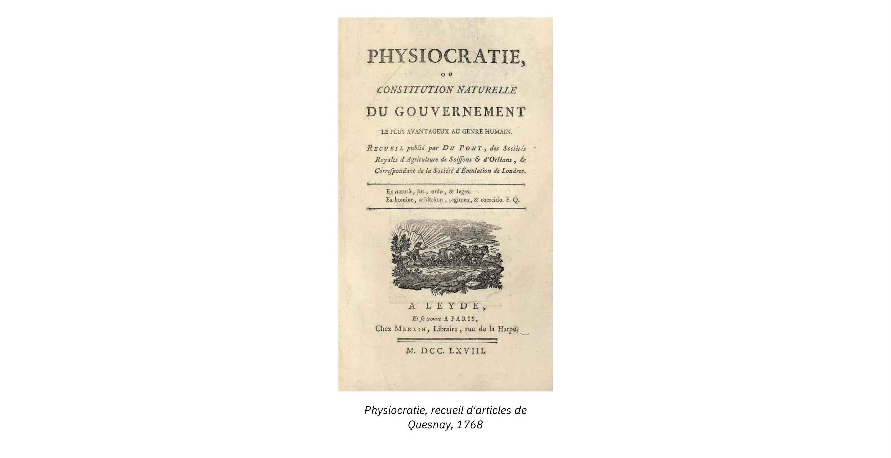

Mặc dù tình hình có hỗn loạn, vẫn có một số ý tưởng đáng chú ý:

- Mirabeau đấu tranh chống lại định kiến của chủ nghĩa trọng thương về bản chất của sự giàu có.
- Ông ca ngợi nông nghiệp và chỉ trích việc từ bỏ nó.
- Ông phàn nàn về tình trạng của người dân, đặc biệt là nông dân.
- Cuối cùng, ông bảo vệ quyền tự do thương mại và tình hữu nghị giữa các quốc gia trong hòa bình.

Thật là Hard khi dán nhãn quan điểm của Mirabeau là tự do hay phản tự do. Ông thường trôi dạt qua lại, đôi khi không nhận ra, giữa tầm nhìn này và tầm nhìn khác. Tuy nhiên, các ý tưởng tự do thường thống trị tác phẩm của ông. Một trong những câu nổi tiếng nhất của ông là:

> Nguyên tắc chân chính và duy nhất của kinh tế chính trị là để mọi thứ được tự do.

Với thành công lớn nhất đã đạt được, Mirabeau được săn đón. François Quesnay, người vừa mới quan tâm đến kinh tế, đã mời ông đến tầng lửng của mình tại Versailles.

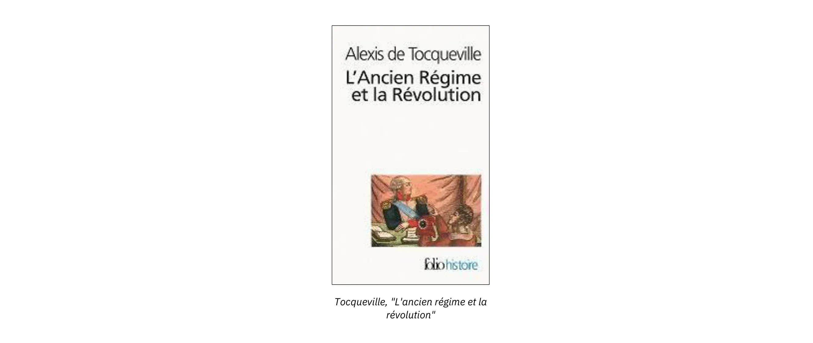

Họ tranh luận dữ dội và cuối cùng, điều mà thông thường không bao giờ xảy ra trong các cuộc tranh luận đã xảy ra: Mirabeau thẳng thắn thừa nhận rằng ông đã sai. Ông đồng ý với ý tưởng của Quesnay và nói rằng ông đã sẵn sàng truyền bá chúng.

Cùng nhau, họ đã hình thành nên cốt lõi của trường phái Trọng nông, được củng cố bởi những người mới tuyển dụng thường xuyên mà họ đưa vào. Ngay sau khi Mirabeau cải đạo, Quesnay đã chiêu mộ ông để bảo vệ ý tưởng của mình về thuế. Điều này dẫn đến ["Lý thuyết về thuế"](https://archive.org/details/thoriedelimpot00mira), trong đó Mirabeau bị đưa đến nhà tù Vincennes trong vài ngày và sau đó bị lưu đày đến Bignon.

Mirabeau cũng đóng vai trò quan trọng trong việc tuyển dụng thành viên mới cho trường Quesnay. Ông thậm chí còn thuyết phục được Dupont de Nemours trẻ tuổi.

Cũng tại nhà Mirabeau, những người theo chủ nghĩa trọng nông họp vào mỗi thứ Ba. Những nhân vật như Turgot và Adam Smith dường như đã tham dự những cuộc họp này một hoặc nhiều lần.

Trong suốt cuộc đời mình, Mirabeau vẫn là một nhà văn không biết mệt mỏi. Ông đã viết nhiều tác phẩm kinh tế bảo vệ học thuyết của Quesnay. Tuy nhiên, về cuối đời, ảnh hưởng của ông đã suy yếu. Phong cách viết của ông tệ hơn đến mức chính anh trai ông đã viết thư cho ông nói rằng anh không còn hiểu được văn xuôi của ông nữa. Những ý tưởng của ông, đã trở nên hoàn toàn tự do, đã xung đột với phản ứng xã hội chủ nghĩa hoặc nguyên cộng sản của những nhà tư tưởng như Mably và thậm chí cả Rousseau. Ông đã đấu tranh để tìm kiếm độc giả và nhà xuất bản, và qua đời mà hầu như không được chú ý vào năm 1789, vào đêm trước cuộc tấn công ngục Bastille.

## Quesnay

<chapterId>7a35f20b-5ea0-544d-b290-bcd9c6f7f11a</chapterId>

François Quesnay là một trong những nhà kinh tế học nổi tiếng nhất người Pháp.

Tên của ông xuất hiện trong mọi sách giáo khoa về kinh tế và lịch sử tư tưởng kinh tế. Người ta nói rằng ông đã tạo ra "Tableau Économique" để biểu diễn sơ đồ nền kinh tế, rằng ông là người lãnh đạo trường phái Trọng nông, và rằng ông đã nhầm khi tin rằng chỉ có đất đai mới có năng suất, và cuối cùng, Adam Smith đã đến để làm sáng tỏ sự thật. Đây, ít nhiều, là cách các sách giáo khoa có xu hướng tóm tắt François Quesnay.

Giảm ông xuống mức này là một điều đáng xấu hổ, vì Quesnay cũng là nhà kinh tế đầu tiên cố gắng dựa trên các nguyên tắc khoa học để bảo vệ quyền tự do kinh tế. Ông là một trong những nhà kinh tế được lắng nghe và có ảnh hưởng nhất thời bấy giờ. Hơn nữa, ông đã sáng lập ra Chủ nghĩa trọng nông, một học thuyết phong phú hơn nhiều so với ý tưởng đơn giản rằng chỉ có thiên nhiên mới tạo ra của cải, một khái niệm thường bị hiểu sai.

Chúng ta sẽ thảo luận về chủ nghĩa trọng nông chi tiết hơn trong ba chương tiếp theo. Trước tiên, hãy cùng xem xét kỹ hơn về François Quesnay.

Sinh năm 1694 tại Méré trong một gia đình nông dân không thể dạy Quesnay đọc. Ông được một người đàn ông địa phương đào tạo và cuối cùng tiếp tục học tại Cao đẳng Phẫu thuật và sau đó là Khoa Y. Ở tuổi 24, ông trở thành bác sĩ phẫu thuật tại Mantes.

Ông nổi tiếng vào năm 1730, ở tuổi 36, vì phản đối việc thực hành phổ biến là chích máu, mà ông tin rằng dựa trên các lý thuyết và định kiến sai lầm. Ông cũng dám thách thức hệ thống phường hội, vốn quy định rằng chỉ có bác sĩ phẫu thuật mới được thực hiện các ca phẫu thuật và chỉ có bác sĩ mới được kê đơn thuốc. Điều này thường buộc người nghèo phải trả tiền gấp đôi và đưa hai người vào, một tình huống mà Quesnay thấy ghê tởm.

Năm 1740, ông trở thành thư ký của Học viện Phẫu thuật. Năm 1748, ở tuổi 54, ông trở thành bác sĩ riêng của Madame de Pompadour và chuyển đến Versailles.

Ông rất thân thiết với Madame de Pompadour. Quesnay thậm chí còn nói, vào thời điểm sự ô nhục của người được sủng ái được công bố, rằng ông không muốn tiếp tục làm bác sĩ ở Versailles nếu không có bà:

"Tôi gắn bó với Madame de Pompadour khi bà ấy thịnh vượng; tôi sẽ vẫn như vậy khi bà ấy thất sủng".

Sau đó, ông xuất bản một số sách y khoa: Luận về bệnh mưng mủ (1749), Luận về bệnh hoại thư (1749) và Luận về bệnh sốt liên tục (1753), tất cả đều được tái bản nhiều lần trong suốt cuộc đời của ông.

Ở tuổi 60, sau khi được giới thiệu về các cuộc tranh luận kinh tế thời thượng vào thời điểm đó, ông bắt đầu viết về kinh tế. Năm 1755, ông viết các bài báo "Nông dân" và "Lúa mạch" cho *Encyclopédie*.

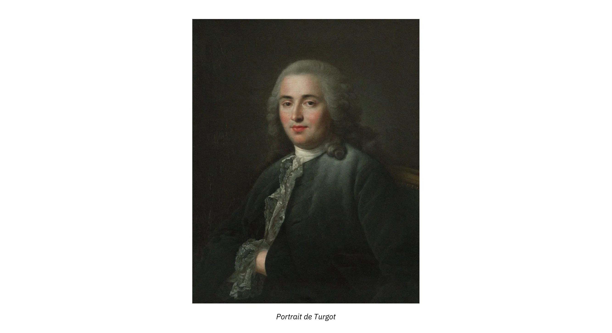

Chúng được xuất bản vào năm 1757. Cùng năm đó, ông đã gặp Mirabeau nổi tiếng và thuyết phục được ông này theo các ý tưởng kinh tế của mình—nòng cốt của chủ nghĩa trọng nông đã ra đời. Sau đó, Quesnay đã tạo ra Tableau Économique, được in trên các máy in hoàng gia, được cho là có sự hiện diện của chính nhà vua tại Château de Versailles. Từ thời điểm đó, ông thường xuyên tiếp đón các nhà kinh tế và triết gia tại căn hộ Versailles của mình, nơi họ tham gia thảo luận một cách tự do. Quesnay cũng đóng góp vào Theory of Taxation của Mirabeau, được xuất bản vào năm 1759.

Kiểm duyệt sớm xảy ra. Mirabeau bị bỏ tù, và Quesnay bị khiển trách. Sau đó, Quesnay nhận ra rằng ông không thể xuất bản công khai và sẽ cần các đệ tử để truyền bá ý tưởng của mình.

Ông nhanh chóng tìm thấy họ: Baudeau, Dupont de Nemours, Le Trosne, Mercier de la Rivière và những người khác. Đây là những người sẽ truyền bá và phổ biến tư tưởng của Quesnay. Tuy nhiên, Quesnay, người cần các môn đồ, không hoàn toàn hài lòng với khía cạnh giáo phái của nhóm mình. Hãy xem những lá thư ông gửi cho Mirabeau, trong đó ông nói với Mirabeau:

> "Hãy tự suy nghĩ đi. Tôi nhận ra rằng những bản thảo tệ hại của tôi khiến các bạn lười biếng. Bây giờ đến lượt các bạn suy nghĩ. Các bạn cũng hiểu biết như tôi thôi".

Tuy nhiên, các đệ tử của ông vẫn hết lòng tận tụy và đóng góp rất lớn vào sự nổi tiếng của Quesnay. Khi ông mất, Mirabeau đã đọc điếu văn, nói rằng, "Chúng ta đã mất cha, vì chúng ta nợ ông mọi thứ". Thực ra, Quesnay mới là người nợ họ mọi thứ, vì nếu không có họ, ông sẽ vẫn mắc kẹt ở Versailles, nơi mà suy nghĩ của ông, mặc dù có nhiều điều để quyến rũ hoặc lo lắng, nhưng lại chẳng mấy ai quan tâm.

Nhờ công sức của những người cộng sự, những ý tưởng của ông đã tìm được chỗ đứng: đầu tiên là thông qua các tờ báo như *Tạp chí Nông nghiệp* và *Ephémérides du Citoyen*.

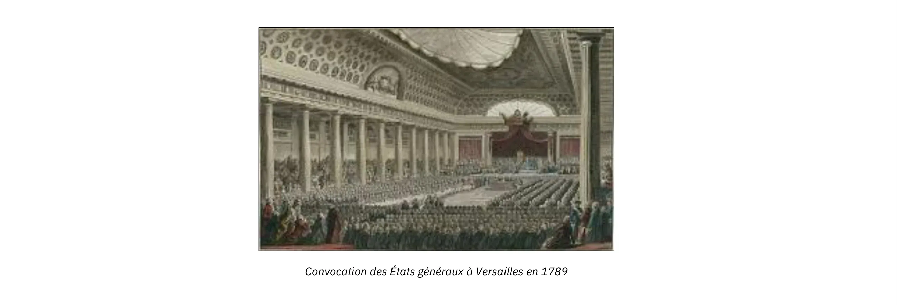

Sau đó, thông qua sách, không chỉ sách của các đệ tử mà còn cả một tuyển tập quan trọng do Dupont de Nemours xuất bản năm 1768, có tựa đề *Physiocracy*.

Cuốn sách này tập hợp những đóng góp chính của Quesnay. Nó nêu ra lý tưởng kinh tế của nhà lãnh đạo theo chủ nghĩa trọng nông: một mô hình kinh tế nông nghiệp nơi luật pháp đảm bảo cho mọi người quyền sở hữu tài sản và quyền tự do buôn bán.

# Trường phái trọng nông

<partId>27af82c1-ad82-5c3b-8ce9-c674b67bbf7c</partId>

## Lịch sử của những người theo chủ nghĩa trọng nông

<chapterId>4236ff8b-b53a-59e7-92c0-f96f9afa1c00</chapterId>

Chủ nghĩa trọng nông trở nên thịnh hành ở Pháp, và thậm chí trên khắp châu Âu, trong chưa đầy một thập kỷ. Sau một thời gian dài phát triển, nó đã trở nên nổi bật vào giữa những năm 1760. Vào thời điểm Turgot lên nắm quyền vào năm 1776, phong trào này đã mất đi sự ủng hộ của mình, và vị mục sư này vẫn giữ sự ủng hộ của mình đối với trường phái Quesnay hầu như là ẩn giấu.

Nguồn gốc của nó nằm ở sự phát triển của các ý tưởng kinh tế trong những năm 1750. Một số tác giả đã giúp thu hẹp khoảng cách giữa Boisguilbert và những gì sau này được gọi là Chủ nghĩa trọng nông. Như đã thảo luận trước đó, Vincent de Gournay và nhóm các nhà kinh tế của ông đã đứng sau nhiều ấn phẩm giới thiệu tư tưởng kinh tế nước ngoài đến độc giả người Pháp và giúp khơi dậy niềm đam mê kinh tế của họ. Nền tảng của Chủ nghĩa trọng nông đã có trong các cuốn sách như "Détail de la France" của Boisguilbert và ["Essay on the Nature of Trade in General"](https://archive.org/details/essaisurlanature0000cant) của Cantillon.

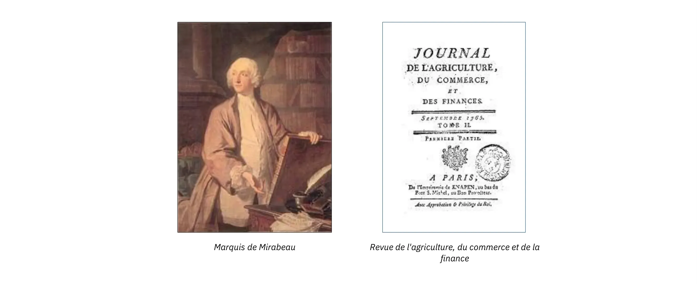

Khái niệm laissez-faire đã có nhiều người ủng hộ kể từ thời Boisguilbert, đặc biệt là Vincent de Gournay và Marquis d'Argenson.

Điều còn lại là biến khối ý tưởng này thành một học thuyết mạch lạc, hoàn chỉnh, và Hầu tước de Mirabeau là người đầu tiên thử. Lấy cảm hứng từ Bài luận của Cantillon, ông bắt đầu viết một chuyên luận toàn diện về các vấn đề kinh tế có tựa đề "L'Ami des Hommes", rất thành công.

Vì vậy, vào năm 1756, câu chuyện về chế độ trọng nông có thể bắt đầu. François Quesnay, khi đó là bác sĩ phẫu thuật chuyển sang làm bác sĩ riêng cho Madame de Pompadour, đã mời Mirabeau đến Versailles để thảo luận về các ý tưởng kinh tế.

Đến cuối cuộc trò chuyện, Mirabeau đồng ý với ý tưởng của Quesnay. Từ đó trở đi, họ viết: Quesnay đã tạo ra *Tableau économique* (1758) để minh họa dòng chảy của cải trong nền kinh tế, và cùng nhau họ xuất bản Lý thuyết về thuế (1759).

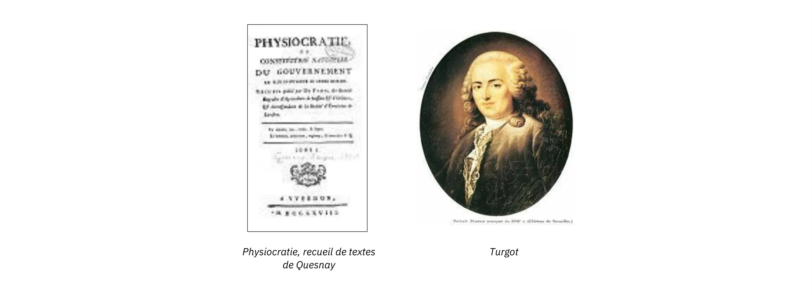

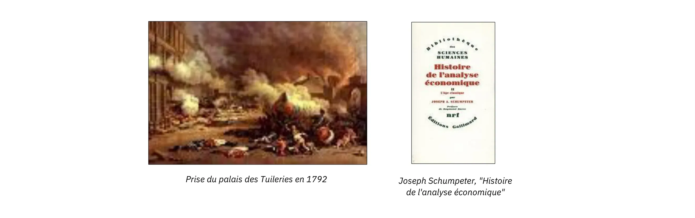

Những nỗ lực của họ không được chào đón nồng nhiệt. Tại tòa án, phản ứng chủ yếu là sự thờ ơ. Nhà vua thừa nhận khuynh hướng lý thuyết của Quesnay và trìu mến gọi ông là "nhà tư tưởng của tôi". Nhưng ngoài lời khen ngợi đó, công trình của họ không đạt được kết quả nào. Trên thực tế, Lý thuyết về thuế của họ đã xúc phạm đến những người quản lý thuế mà nó chỉ trích, đến mức họ yêu cầu và đảm bảo việc giam giữ Mirabeau. Cuối cùng, Madame de Pompadour đã thả ông ra, nhưng ông vẫn tiếp tục sống lưu vong tại điền trang của mình ở Bignon trong vài tuần.

Nửa đầu những năm 1760 trôi qua trong sự im lặng tương đối. Do vị trí của mình tại Versailles, Quesnay buộc phải ngừng viết, hoặc ít nhất là không xuất bản bất cứ thứ gì dưới tên của mình. Mirabeau, đã từng bị kết án một lần, đã được cảnh báo và biết rõ rằng người được vua sủng ái không thể bảo vệ ông mãi mãi.

Sau sự im lặng ngắn ngủi này, hai nhà kinh tế bắt đầu tuyển dụng học trò: đây là cách duy nhất để phổ biến ý tưởng của họ. Đến năm 1765, thành công của họ thật đáng kinh ngạc. Dupont de Nemours, Abeille, Mercier de la Rivière, Le Trosne và Baudeau nhanh chóng gia nhập hàng ngũ của họ. Họ thành lập một trường phái: họ có tạp chí riêng, *Les Éphémérides du Citoyen*, và thậm chí còn họp vào mỗi thứ Ba tại nhà của Mirabeau.

Từ năm 1765 đến năm 1775, nhóm thống nhất của những người theo chủ nghĩa trọng nông đã đạt đến đỉnh cao danh vọng. Giới văn học và triết học chỉ để mắt đến họ, cho phép những ý tưởng của họ lan truyền rộng rãi và nhanh chóng. Mọi người gọi họ là "các nhà kinh tế", hay nói một cách chế giễu hơn là "giáo phái của các nhà kinh tế". Bất kể giọng điệu nào, sự khét tiếng của họ là tuyệt đối. Năm 1774, sau một chuyến đi đến Metz, M. de Vaublanc đã viết về sự kinh ngạc của mình trong hồi ký: mọi người xung quanh ông đều nói về kinh tế và lý luận giống như các đệ tử của Quesnay. "Điều đó thật thời thượng", ông lưu ý. "Mọi người đều là nhà kinh tế".

Tuy nhiên, đến năm 1770, sự nổi tiếng của họ bắt đầu suy yếu. Nhóm này đã trải qua những cuộc đào tẩu đầu tiên và khả năng chịu đựng sự chỉ trích của họ yếu đi. Và những người chỉ trích thì nhiều, Condillac, Mably, Voltaire, Galiani, Linguet, Graslin và thậm chí cả Adam Smith ở Scotland, tất cả đều thách thức quan điểm của họ.

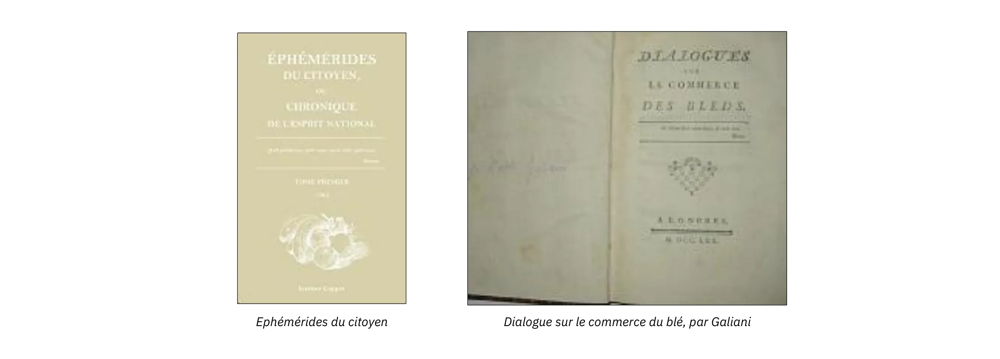

Tờ báo của họ không còn xuất hiện thường xuyên nữa. Điều này đánh dấu sự kết thúc của giai đoạn hoạt động tích cực nhất của phong trào.

Chế độ trọng nông sẽ tiếp tục gây ảnh hưởng cho đến tận Cách mạng. Ở Pháp, đầu tiên là thông qua Turgot, một người bạn đồng hành hơn là một học trò, cũng như thông qua đại diện của nó là Dupont de Nemours, người mà cuộc đời và tác phẩm của ông ta chúng ta sẽ nghiên cứu sau. Nhưng cũng trên khắp châu Âu, nơi học thuyết trọng nông được đón nhận với sự nhiệt tình. Ở Đức, thông qua Margrave xứ Baden, và ở Ý, thông qua Leopold xứ Tuscany, các học thuyết trọng nông thậm chí còn truyền cảm hứng cho các cải cách kinh tế ủng hộ quyền sở hữu tư nhân và tự do.

## Nền tảng của học thuyết trọng nông

<chapterId>4dbe5436-0578-57c2-b054-03ed00aa091a</chapterId>

Thuật ngữ Physiocracy, có nghĩa là "chính quyền theo bản chất", được Dupont de Nemours đặt ra và dùng làm tiêu đề cho *Physiocracy*, một tập hợp các bài viết của Quesnay xuất bản năm 1768.

Đây là một cụm từ khó hiểu. Không có học trò nào của Quesnay cung cấp cho chúng ta ý nghĩa thực sự của nó. Tuy nhiên, hệ thống tư tưởng của họ không hề khó hiểu. Trên thực tế, nó được xây dựng xung quanh một vài nguyên tắc rất rõ ràng, mà chúng tôi sẽ trình bày ở đây.

### Nguyên tắc đầu tiên: chỉ có nông nghiệp mới có năng suất

Ý tưởng đầu tiên này là ý tưởng đã thu hút sự chú ý của các nhà sử học. Ngày nay, trong sách giáo khoa hoặc các khóa học kinh tế, đây là cách tóm tắt về những người theo chủ nghĩa trọng nông. Họ được cho là ngây thơ tin rằng chỉ có nông nghiệp mới có năng suất. Trên cơ sở đó, học thuyết của họ bị bác bỏ là không liên quan và quá trình phân tích nhanh chóng chuyển sang Adam Smith.

Tuy nhiên, thật không công bằng khi chỉ trích những người theo chủ nghĩa trọng nông vì họ quá coi trọng nông nghiệp, vì vào giữa thế kỷ 18, nông nghiệp đã tạo việc làm cho 90% dân số và hình thành nên nền tảng của nền kinh tế Pháp.

Ý tưởng của những người theo chủ nghĩa trọng nông thực ra rất tinh tế. Theo họ, có sự khác biệt giữa sản xuất và lợi nhuận. Nhà công nghiệp và thương gia có thể kiếm được lợi nhuận, nhưng chỉ có người nông dân mới thực sự sản xuất, vì sản xuất là việc tạo ra vật liệu hữu ích, chứ không phải là việc bổ sung tiện ích cho vật liệu đã có từ trước.

Chúng ta cũng nên cố gắng hiểu tại sao họ từ chối công nghiệp và thủ công vì cho rằng chúng không hiệu quả. Vào thời điểm đó, các ngành nghề này bị khóa trong hệ thống phường hội, cấm đổi mới, đầu tư và tiến bộ.

### Nguyên tắc thứ hai: chế độ chuyên chế hợp pháp hơn là dân chủ

Ngày nay, để xúc phạm ai đó, chúng ta nói rằng người đó không phải là một người theo chủ nghĩa dân chủ. Trong khi các nhà sử học tha thứ cho những người theo chủ nghĩa trọng nông vì quan điểm nghiêm ngặt của họ về năng suất nông nghiệp, họ không tha thứ cho sự phản đối của họ đối với nền dân chủ, đặc biệt là vì họ sống trong thời kỳ đỉnh cao của các ý tưởng Khai sáng. Từ giữa thế kỷ 18 đến ngay trước Cách mạng, những người theo chủ nghĩa trọng nông bị coi là kẻ thù của sự tiến bộ.

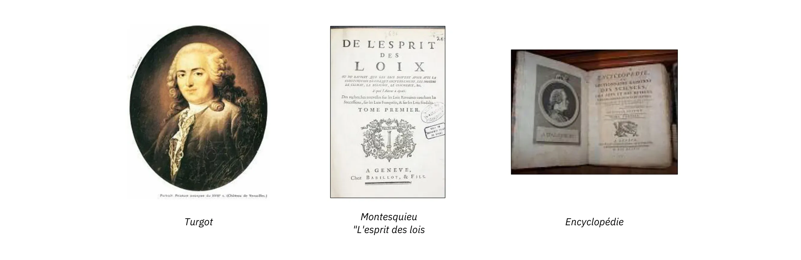

Tocqueville nhấn mạnh vào ý tưởng này:

> Những người theo chủ nghĩa trọng nông thực sự rất ủng hộ việc tự do buôn bán hàng hóa, ủng hộ chính sách laissez-faire hoặc laissez-passer trong thương mại và công nghiệp; nhưng đối với các quyền tự do chính trị thực sự, họ không xem xét đến chúng, và thậm chí khi những ý tưởng như vậy tình cờ xuất hiện trong tâm trí họ, ban đầu họ cũng từ chối chúng.

Tự do về kinh tế, do đó, những người theo chủ nghĩa trọng nông không tự do về chính trị. Quesnay viết trong *châm ngôn* của mình: "Hãy để quyền lực tối cao là duy nhất và vượt trội hơn tất cả các cá nhân trong xã hội và tất cả các doanh nghiệp bất công của lợi ích tư nhân." Và sau đó, trong cùng một châm ngôn: "Hệ thống kiểm tra và cân bằng trong chính phủ là một khái niệm chết người, chỉ cho thấy sự bất hòa giữa những người vĩ đại và sự áp bức của những người nhỏ bé".

Tocqueville đã lưu ý một cách khéo léo rằng những người theo chủ nghĩa trọng nông đã từ chối nền dân chủ ngay khi họ nhìn thấy hình thức của nó. Họ hoài nghi về nền dân chủ, thứ sẽ trở thành một hằng số trong nền kinh tế chính trị của Pháp, bởi vì nền dân chủ không phải là một hệ thống hoàn hảo: nó có khả năng cho phép đa số áp bức thiểu số, và nó có thể trở thành một công cụ để chiếm đoạt, chuyên chế và cướp bóc.

### Nguyên tắc thứ ba: tôn trọng tuyệt đối tài sản cá nhân

Những người theo chủ nghĩa trọng nông tin rằng con người cần sở hữu và giữ gìn thành quả lao động của mình. Theo quan điểm của họ, quyền sở hữu là nền tảng của xã hội. Họ nghĩ rằng Nhà nước có một nhiệm vụ chính: bảo vệ tài sản của người dân. Hơn nữa, xét về mặt kinh tế, những người theo chủ nghĩa trọng nông khẳng định rằng tính bất khả xâm phạm của tài sản khuyến khích lao động và nỗ lực, và là điều kiện cho sự tiến bộ kinh tế.

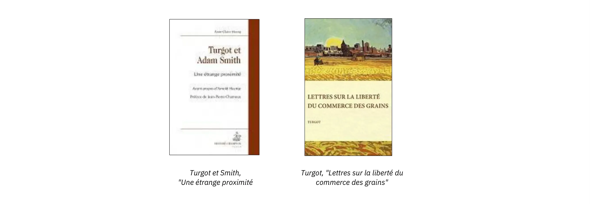

Quesnay nói một cách đơn giản:

> Hãy để Ownership về đất đai và tài sản động sản được đảm bảo cho những người sở hữu hợp pháp của chúng, vì sự an toàn của tài sản là nền tảng thiết yếu của trật tự kinh tế và an ninh xã hội; chính sự chắc chắn về quyền sở hữu lâu dài khuyến khích lao động và sử dụng của cải để cải tạo và canh tác đất đai, cũng như trong các doanh nghiệp thương mại và công nghiệp.

### Nguyên tắc thứ tư: tự do thương mại tuyệt đối

Trong *Châm ngôn* được trích dẫn trước đó, Quesnay phát biểu:

> Phải có sự tự do hoàn toàn trong thương mại, vì sự điều tiết đáng tin cậy, chính xác và có lợi nhất cho cả thương mại trong nước và quốc tế đối với quốc gia và Nhà nước nằm ở sự tự do cạnh tranh hoàn toàn.

Những người theo chủ nghĩa trọng nông đã thấy thiệt hại do sự can thiệp của chính phủ gây ra, đặc biệt là trong thương mại ngũ cốc. Họ nói rằng, người ta phải thừa nhận rằng chính quyền sẽ không bao giờ có thể quản lý thương mại tốt như các cá nhân, vì chính quyền sẽ cần phải đáp ứng mọi nhu cầu và phản ứng với mọi thay đổi về nhu cầu hoặc Supply. Tất cả những điều này vượt xa khả năng của ngay cả chính quyền khôn ngoan nhất mà người ta có thể hình dung. Do đó, cần phải để mọi thứ tự nhiên và để chúng trôi chảy.

Có lợi theo bản chất, thương mại phải hoàn toàn và hoàn toàn tự do. Một trong những thành viên của họ, Le Trosne, thậm chí đã viết một cuốn sách nhỏ có tựa đề [*Tự do thương mại ngũ cốc: Luôn hữu ích, không bao giờ gây hại*](https://www.institutcoppet.org/liberte-commerce-grains-toujours-utile-jamais-nuisible/).

### Nguyên tắc thứ năm: Tất cả mọi người đều là anh em

Những người phản đối chế độ nô lệ quyết liệt, những người theo chủ nghĩa trọng nông cũng là những người theo chủ nghĩa hòa bình vĩ đại. "Chính sách đối ngoại của chúng tôi được gọi là hòa bình", Mirabeau chỉ nói vậy. Năm 1790, tại Hội đồng lập hiến, Dupont de Nemours tiếp tục lập trường hòa bình này khi ông đề xuất một dự luật cấm các cuộc chiến tranh tấn công.

## Những thành tựu và ảnh hưởng của chủ nghĩa trọng nông

<chapterId>5b911105-796a-5e2e-a501-c7a364fc758e</chapterId>

Như chúng ta đã thấy trong chương đầu tiên trong ba chương dành riêng cho những người theo chủ nghĩa trọng nông, những người theo Quesnay đã trở thành cơn sốt ở Pháp trong khoảng một thập kỷ. Sự nhiệt tình này đối với các ý tưởng của họ đã hình thành trong thời đại của họ và tiếp tục cho đến cuối thế kỷ. Ở đây, chúng ta sẽ xem xét một số thành tựu của họ và ảnh hưởng mà họ đã tác động lên những người kế nhiệm họ trong lĩnh vực tư tưởng kinh tế.

Thành tựu lớn nhất của họ, sau nhóm Gournay, là phổ biến các ý tưởng kinh tế. Câu nói nổi tiếng của Voltaire rất nổi tiếng: vào khoảng năm 1750, cả nước, đã thỏa mãn với thơ ca và tiểu thuyết, bắt đầu lý luận về ngũ cốc. Những người theo chủ nghĩa trọng nông đã tham gia vào phong trào này, xuất bản hàng trăm bài báo, tập sách nhỏ và sách về quyền tự do buôn bán ngũ cốc. Động lực mạnh mẽ mà những người theo chủ nghĩa trọng nông tạo ra cho các cuộc thảo luận về kinh tế cũng thể hiện rõ qua số lượng ấn tượng các tác phẩm và tập sách nhỏ về kinh tế được xuất bản tại Pháp từ năm 1760 đến năm 1775. Để chứng minh thêm cho sự lan truyền của các ý tưởng kinh tế tại Pháp, người ta nhớ lại nhận xét của M. de Vaublanc, được trích dẫn trong một bài giảng trước đó, người đã nói ở Metz vào năm 1774 rằng mọi người chỉ nói về kinh tế. "Đó là thời trang", ông nói. "Mọi người đều là nhà kinh tế".

Việc bảo vệ ý tưởng của họ, trong sách, tập sách nhỏ và trong tạp chí *Les Éphémérides du Citoyen*, nhanh chóng có tác động đến chính sách kinh tế của Pháp. Năm 1763, một sắc lệnh đã cấp quyền tự do buôn bán ngũ cốc, điều mà Quesnay và Mirabeau đã yêu cầu mạnh mẽ. Trong một số trường hợp, chính quyền cũng nới lỏng các quy định quản lý các hội nghề nghiệp để đảm bảo quyền tự do làm việc lớn hơn.

Ở nước ngoài, thành công đến rất sớm. Ở Đức, Margrave xứ Baden quan tâm đến các ý tưởng trọng nông và duy trì mối quan hệ thư từ thường xuyên với Mirabeau và Dupont de Nemours.

Ông giao cho nhà kinh tế học Johann August Schlettwein, một người theo chủ nghĩa trọng nông, nhiệm vụ thực hiện cải cách thuế và tự do hóa thương mại ngũ cốc. Vào tháng 4 năm 1770, phiên tòa đầu tiên đã diễn ra tại ngôi làng nhỏ Dietlingen. Dân làng dường như đã nhiệt tình chào đón các biện pháp này, nhưng các viên chức phụ trách lại không ủng hộ lắm, điều này đã làm chậm trễ việc thực hiện rộng rãi hơn.

Ở Nga, Catherine II đang chuẩn bị cải cách luật pháp và yêu cầu Diderot gửi cho bà một trí tuệ thông minh để hỗ trợ.

Ấn tượng khi đọc tác phẩm [*Trật tự tự nhiên và thiết yếu của các xã hội chính trị*](https://archive.org/details/lordrenaturelete00mercuoft), xuất bản năm 1767, ông đã gửi cho bà tác giả của tác phẩm, nhà trọng nông Mercier de la Rivière.

Mặc dù ông rời nước Pháp trong sự chào đón nồng nhiệt, nhưng sự tiếp đón của ông tại Saint Petersburg lại khá lạnh nhạt (ngoại trừ vấn đề thời tiết), và Hoàng hậu đã thất vọng về ông.

Ở Thụy Điển, với Gustav III, và ở Ý, với Leopold xứ Tuscany, những người theo chủ nghĩa trọng nông cũng tìm được những người ủng hộ sẵn sàng đưa ý tưởng của họ vào thực tiễn.

Ở Pháp, đảng Trọng nông đã đạt được thành công ngoạn mục khi bổ nhiệm Turgot làm Tổng kiểm toán Tài chính vào năm 1774.

Nhận thức được sự suy giảm danh tiếng của mình, Turgot không bao giờ tự nhận mình là một môn đồ trung thành của phái Trọng nông, cũng không phải là một nhà bách khoa toàn thư, mặc dù ông là một người như vậy, và vì họ bị các thành viên của Giáo sĩ khinh thường. Khi đã nắm quyền, Turgot đã ban hành sáu sắc lệnh nổi tiếng, tạo nên sự khởi đầu cho một ứng dụng thực tế của chương trình Trọng nông: tự do thương mại, tự do lao động và chấm dứt độc quyền.

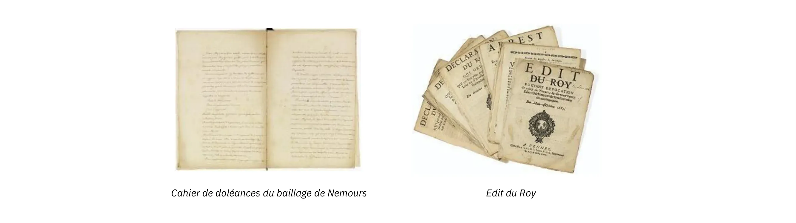

Vào thời điểm Cách mạng Pháp, những người theo chủ nghĩa trọng nông có ít người theo hơn. Hầu tước Mirabeau qua đời vào ngày 13 tháng 7 năm 1789—một biểu tượng khá rõ ràng. Abeille đã chuyển đi, nhưng Dupont de Nemours vẫn trung thành. Được bổ nhiệm vào Hội đồng, Dupont de Nemours mang tiếng nói của chủ nghĩa trọng nông và kêu gọi cải cách kinh tế theo hướng có lợi cho quyền sở hữu Ownership và thương mại tự do.

Ông cũng đã đấu tranh, nhưng không thành công, chống lại những người theo chủ nghĩa Assignat. Mặc dù thất bại này, tư tưởng Trọng nông vẫn hiện diện rất nhiều trong cuộc tranh luận trí tuệ và ảnh hưởng đến những thành tựu ban đầu của Cách mạng. Như Joseph Rambaud đã nói, mọi thứ mà Cách mạng đã làm để ủng hộ quyền tự do đều là nhờ những người theo chủ nghĩa Trọng nông.

Những người theo chủ nghĩa trọng nông cũng có ảnh hưởng lớn đến lịch sử tư tưởng kinh tế. Adam Smith, người đã đến thăm Pháp và gặp nhiều người trong số họ, đã chịu ảnh hưởng sâu sắc từ công trình của họ. Ông thậm chí còn cân nhắc đến việc dành tặng *Sự giàu có của các quốc gia* cho Quesnay.

Đáng buồn thay, Quesnay đã mất hai năm trước khi cuốn sách của Smith được xuất bản, và Smith đã xóa lời đề tặng. Mặc dù Smith không đồng ý với ý tưởng của họ rằng chỉ có nông nghiệp mới có năng suất, ông đã chấp nhận nhiều lập luận của họ về thị trường tự do và đưa chúng vào tác phẩm của mình.

## Dupont de Nemours

<chapterId>6d585e0f-93b8-5b0a-a0a8-7f6e4a5bc68e</chapterId>

Ở Hoa Kỳ, chúng ta đều biết đến công ty DuPont, còn được gọi là "E.I. du Pont de Nemours and Company", một công ty đa quốc gia hoạt động trong lĩnh vực hóa học và sinh học.

Ngày nay, công ty có doanh số hơn 35.000 tỷ đô la và sử dụng gần 65.000 nhân viên trên toàn thế giới. Hóa ra công ty này có liên quan chặt chẽ đến số phận của Samuel-Pierre Dupont de Nemours, một nhà kinh tế học người Pháp theo trường phái trọng nông.

Sinh năm 1739, Dupont de Nemours tiếp cận với Physiocrats khi mới 24 tuổi. Vào thời điểm đó, ông vẫn đang tìm kiếm con đường của mình trong cuộc sống. Một ngày nọ, ông tình cờ đọc được một tập sách mỏng có tựa đề The Wealth of the State (Sự giàu có của Nhà nước). Ông thấy những ý tưởng kinh tế trong đó là vô nghĩa và đã viết một bài phản hồi mang tên Reflections on the Wealth of the State (Suy ngẫm về sự giàu có của Nhà nước), xuất bản năm 1763. Bài viết được đón nhận nồng nhiệt và độc giả khen ngợi, nói những điều như, "Bạn hẳn là học trò của Mirabeau!" Trớ trêu thay, Dupont thậm chí còn không biết Mirabeau là ai.

Tò mò, ông bắt đầu đọc tác phẩm của Mirabeau, *Friend of the People* và *Theory of Taxation*. Ông gặp Mirabeau và François Quesnay, sau đó gia nhập trường của họ.

Năm 1765, Dupont được mời làm biên tập viên của *Journal de l'agriculture, du commerce et des financials*, tạp chí hàng đầu thời bấy giờ trong lĩnh vực tư tưởng kinh tế.

Có hai lý do cho việc này: Mirabeau và Quesnay phải giữ im lặng, còn Dupont được coi là ngôi sao đang lên của họ.

Các thành viên của trường phái Trọng nông đồng ý rằng Dupont de Nemours nhanh chóng trở thành người được Quesnay yêu thích. Quesnay đã từng nói, "Hãy chăm sóc chàng trai trẻ này, anh ta sẽ là người lên tiếng khi chúng ta chết". Một người theo trường phái Trọng nông, Abeille, thậm chí còn ghen tị với sự chú ý mà Dupont nhận được và xa lánh trường phái của Quesnay.

Dupont de Nemours luôn dành sự kính trọng sâu sắc cho Quesnay.

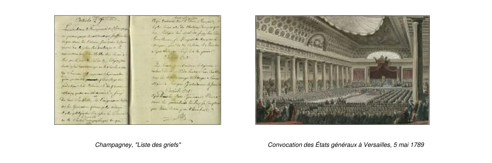

Sau này ông nói, "Tôi chỉ là một cậu bé khi Quesnay dang tay đón tôi - ông ấy đã biến tôi thành một người đàn ông." Chính Quesnay đã biến ông trở thành một nhà kinh tế học lớn trong bối cảnh văn học thời bấy giờ.

Sau *Journal de l'agriculture, du commerce et des tài chính*, Dupont được bổ nhiệm làm biên tập viên của *Les Éphémérides du Citoyen*, cơ quan này trở thành cơ quan chính thức của Physiocrats.

Ông đã biến bộ sưu tập định kỳ này thành một trung tâm lớn cho lý thuyết kinh tế, ủng hộ nó ngay cả trong thời kỳ suy tàn của những người theo chủ nghĩa trọng nông bằng cách đích thân viết hầu hết các tập sau này. Hơn nữa, chính Dupont de Nemours là người đã đặt ra thuật ngữ "physiocracy", bắt nguồn từ hai từ tiếng Hy Lạp có nghĩa là "chính quyền của thiên nhiên". Ông đã sử dụng thuật ngữ này để đặt tên cho một bộ sưu tập các bài báo của Quesnay được xuất bản vào năm 1768, và thuật ngữ này cuối cùng đã được xác lập trong lịch sử. Người ta biết rằng giữa những người theo chủ nghĩa trọng nông gọi nhau là "nhà kinh tế học", và họ vẫn được gọi như vậy trong suốt cuộc Cách mạng.

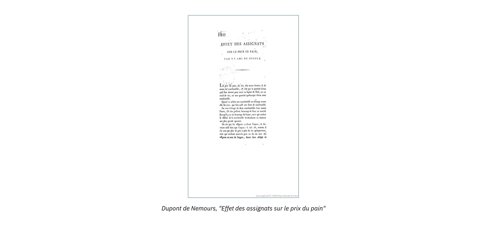

Khi Turgot giữ chức bộ trưởng tài chính Pháp trong một thời gian ngắn, Dupont đã trở thành cố vấn thân cận của ông, là người theo chủ nghĩa trọng nông duy nhất có thể tiếp cận ông, vì Turgot vẫn giữ khoảng cách với những người khác.

Vào thời điểm Cách mạng, ông được bầu từ bailiwick của Nemours và thấy mình ở Hội đồng, nơi một Monsieur Dupont khác cũng đang ngồi. Sau đó, ông được gọi là Dupont de Nemours, không phải vì ông là một quý tộc, mà chỉ đơn giản là để phân biệt hai người. Tất nhiên, cái tên vẫn được giữ nguyên.

Trong cuộc Cách mạng vào tháng 8 năm 1792, ông đã cầm vũ khí để bảo vệ Nhà vua tại Cung điện Tuileries trước đám đông.

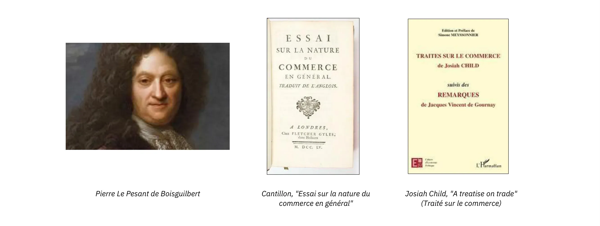

Nhà vua nói với ông: "Ngài Dupont, chúng tôi luôn tìm thấy ngài ở bất cứ nơi nào ngài cần!" Sau khi thoát khỏi cuộc khủng bố một cách kỳ diệu, bị kết án và chờ đợi máy chém nhưng được cứu thoát nhờ sự sụp đổ của Robespierre, ông đã bị Napoleon đẩy đi lưu vong và tìm thấy hạnh phúc ở Hoa Kỳ, nơi một trong những người con trai của ông đã thành lập công ty Dupont, với sự hỗ trợ của cha mình.

Mặc dù cuộc sống đầy biến cố này, trong đó ông đã xuất bản hàng chục bài báo, tờ rơi và sách, ông vẫn tương đối ít được biết đến cho đến ngày nay. Có lẽ điều này là do ông vẫn là một người theo chủ nghĩa trọng nông trung thành khi học thuyết này đã lỗi thời. Thật vậy, như Schumpeter đã viết, Dupont de Nemours vẫn trung thành với chủ nghĩa trọng nông "trong suốt sự nghiệp mà ông đã có nhiều cơ hội để từ bỏ nó". Ông là một người có niềm tin.

# Khai sáng và kinh tế chính trị

<partId>d1c885ad-7cb1-5f81-816c-be312719d9f8</partId>

## Voltaire và các nhà triết học

<chapterId>16bcf7bf-dad4-5113-8c64-2800f04ff07b</chapterId>

Thế kỷ 18 ở Pháp chứng kiến sự xuất hiện của kinh tế học như một khoa học và trường phái tư tưởng kinh tế đầu tiên: Trọng nông. Adam Smith được đào tạo về kinh tế trong giai đoạn này, và các nhà kinh tế học người Pháp được công nhận trên toàn cầu là những nhà lãnh đạo. Tuy nhiên, thế kỷ này được nhớ đến nhiều hơn là thế kỷ của triết học hơn là kinh tế học. Trong khi phong trào Trọng nông liên kết, trong tham vọng của mình, với triết học Khai sáng, thái độ của các triết gia—đặc biệt là Diderot và Voltaire—đáng được xem xét kỹ lưỡng. Chúng ta sẽ thấy rằng các nhà tư tưởng Khai sáng đã đóng góp đáng kể vào việc truyền bá ý tưởng về tự do kinh doanh ở Pháp.

Thành tựu nổi tiếng nhất của triết học Khai sáng chắc chắn là *Encyclopédie* của Diderot và d'Alembert.

Đương nhiên, các bài viết về kinh tế được viết bởi các nhà kinh tế. Đối với các tập đầu, Diderot đã nhờ đến Forbonnais, sau đó là các nhà kinh tế tự do: đầu tiên là François Quesnay (người đã đóng góp các bài viết như "Grains", "Fermiers", "Hommes"—bài viết cuối cùng chưa được xuất bản), sau đó là Turgot (người đã viết "Foires et marchés"). Những bài viết này có tầm quan trọng lớn. Trong các bài viết của mình, Quesnay đã đặt nền móng cho học thuyết Trọng nông. Cùng với *Tableau économique*, đây vẫn là những tác phẩm nổi tiếng nhất của ông. Turgot, khi đó vẫn còn trẻ, đã phát triển ý tưởng về chủ nghĩa tự do trong bài viết của mình, chỉ trích sự can thiệp của nhà nước vào tổ chức thị trường.

Trong nhiều bài viết khác của *Encyclopédie*, các nhà triết học, đặc biệt là Diderot, bảo vệ lý tưởng tự do trong mọi lĩnh vực: tôn giáo, chính trị và kinh tế.

Tự do lao động, đặc biệt là đối lập với hệ thống phường hội, là chủ đề thường xuyên xuất hiện trong nhiều mục như Arts, Métier và Communauté.

Con đường của Diderot trong lý thuyết kinh tế là một con đường kỳ lạ. Trong Encyclopédie, ông là người ủng hộ trung thành cho tự do kinh tế và là người tìm kiếm sự hợp tác của các nhà kinh tế tự do, điều này được xác nhận bởi một lá thư phác thảo các bài viết mà Turgot có thể viết cho ông. Trong những năm đầu của chủ nghĩa trọng nông, ông vừa là người ủng hộ vừa là người quảng bá cho trường phái Quesnay. Vào năm 1769 và 1770, ông đã viết cho *Les Ephémérides du Citoyen*, khiến những người bạn triết gia phản tự do của ông, như Melchior Grimm, vô cùng thất vọng; tuy nhiên, ông đã sớm tách mình khỏi nhóm. Bị cuốn hút bởi trí tuệ sâu sắc của Viện phụ Galiani, ông đã giúp Galiani xuất bản cuốn sách về buôn bán ngũ cốc bằng tiếng Pháp, ngay khi Galiani chuẩn bị trở về Ý.

Cuốn sách này sẽ trở thành cuộc tấn công dữ dội nhất từng được thực hiện chống lại các ý tưởng của chủ nghĩa trọng nông, giáng một đòn mạnh vào phong trào này. Sau đó, Diderot đã bảo vệ Galiani trước Viện phụ Morellet, một đồng minh thân cận của chủ nghĩa trọng nông, trong tác phẩm *Lời biện hộ cho Galiani* của ông. Vài năm sau, trong thời gian Turgot làm mục sư, Diderot được nhìn thấy đang hoan nghênh việc thiết lập quyền tự do lao động thông qua việc bãi bỏ các hội đoàn. Vào thời điểm này, Diderot, con trai của một nghệ nhân, thấy mình đồng tình với các nhà kinh tế tự do và đã viết một lá thư chỉ trích gay gắt cho Galiani, người tuyên bố rằng quyền tự do lao động sẽ hủy hoại ngành công nghiệp của Pháp trong vòng hai mươi hoặc ba mươi năm. Dưới góc nhìn của Cách mạng Công nghiệp, lịch sử cho thấy điều ngược lại. Sau khi quay lại phe của các nhà kinh tế tự do, Diderot không còn được họ tin tưởng và vẫn bị cô lập. Một khoảnh khắc rất đáng nói là một lá thư ông gửi cho Dupont de Nemours vào năm 1774, trong đó ông viết:

> "Anh đã từng là bạn của em; giờ thì không còn nữa, vì anh quá bận rộn đến nỗi không còn thời gian để yêu ai nữa".

Voltaire đã đi theo một con đường tương tự, được đánh dấu bằng sự thiếu nhất quán trong quan điểm kinh tế của ông. Ông ngưỡng mộ Vincent de Gournay, trao đổi thư từ với các nhà kinh tế (bao gồm Dupont de Nemours và Turgot), và đánh giá cao những người theo chủ nghĩa trọng nông - đặc biệt là vì họ ca ngợi nền nông nghiệp. Ông đã ca ngợi họ trong một *Diatribe to the Author of the Ephémérides*. Tuy nhiên, sau đó ông đã chỉ trích ý tưởng của họ về một loại thuế đất duy nhất trong tác phẩm châm biếm của mình *The Man of Forty Crowns*, tác phẩm cũng gây ra nhiều tranh cãi đáng kể. Cuối cùng, giống như Diderot, ông đã ca ngợi chức vụ của Turgot, gọi đó là thời kỳ hoàng kim và ca ngợi hai sắc lệnh vĩ đại của ông về tự do lao động và tự do thương mại.

Cuối cùng, mối quan hệ của các nhà triết học với tư tưởng kinh tế là hỗn hợp. Bất chấp những lời ca ngợi và chỉ trích của họ đối với các ý tưởng kinh tế tự do, họ đã đóng một vai trò trong việc đưa những ý tưởng này vào diễn ngôn trí thức rộng lớn hơn của Khai sáng. Theo cách này, dù cố ý hay không, họ đã giúp thúc đẩy khái niệm tự do kinh tế cho đến tận Cách mạng.

## Turgot, Nhà lý thuyết

<chapterId>a8cd8185-8351-556b-8011-3a0c313e8a9d</chapterId>

Trong một đoạn văn nổi tiếng trích từ *Lịch sử tư tưởng kinh tế*, nhà kinh tế học người Mỹ Murray Rothbard đã ca ngợi cái mà ông gọi là "sự xuất sắc" của Turgot.

giới thiệu ông là nhà kinh tế vĩ đại nhất của thế kỷ 18, cùng với Cantillon.

Turgot đã vươn lên thành người nổi tiếng như thế nào? Nó phụ thuộc vào sự kết hợp của ba yếu tố chính. **Đầu tiên**, xuất thân gia đình danh giá của ông. Ông xuất thân từ một dòng dõi lâu đời của các quan chức hoàng gia, nhiều người trong số họ giữ các chức vụ cao cấp trong chính phủ. **Thứ hai**, thời kỳ hoàng kim mà ông sinh ra và lớn lên. Turgot 21 tuổi khi Montesquieu xuất bản *L'Esprit des Lois*, và 24 tuổi khi tập đầu tiên của *Encyclopédie* xuất hiện.

Ông là người cùng thời với những người theo chủ nghĩa trọng nông, Voltaire, Diderot, d'Holbach, Adam Smith, Condorcet và những người khác. **Thứ ba**, sự thông minh sớm của ông. Khi còn là sinh viên tại Sorbonne, ông đã viết một lá thư trên tiền giấy ở tuổi 22, có những bài phát biểu đáng chú ý và ở tuổi 24 đã biên soạn một danh sách 52 tác phẩm để viết.

Mặc dù còn trẻ, Turgot đã đóng góp cho *Encyclopédie*, biên soạn các bài viết về các chủ đề như "Từ nguyên", "Sự tồn tại", "Khả năng mở rộng", "Hội chợ" và "Nền tảng". Chỉ có một bài viết đề cập trực tiếp đến kinh tế học—bài viết của ông về "Hội chợ", trong đó nêu chi tiết về nguồn gốc của hội chợ và thị trường và chỉ trích sự can thiệp ngày càng tăng của nhà nước đã phá vỡ và làm tê liệt chúng.

Trong những năm đầu này, ông được Vincent de Gournay hướng dẫn, người đã che chở và tạo dựng tình bạn thân thiết với ông. Khi Gournay qua đời vào năm 1759, Turgot đã viết một bài điếu văn trong đó ông đưa ra một bản tóm tắt tuyệt vời về học thuyết laissez-faire. Ông đã viết một cách đáng chú ý:

"Theo mọi góc độ mà thương mại có thể liên quan đến Nhà nước, lợi ích cá nhân khi được tự giải quyết chắc chắn sẽ tạo ra lợi ích chung hơn là hoạt động của chính phủ, vốn luôn có sai sót và cần được hướng dẫn bởi lý thuyết mơ hồ và không chắc chắn".

Vào năm 1767, khi còn là quản đốc, ông đã biên soạn một tuyển tập kinh tế học với tựa đề *Suy ngẫm về sự hình thành và phân phối của cải*.

Phân công lao động, chủ quyền của người tiêu dùng, sở hữu tư nhân, vai trò của vốn, hầu như tất cả các chủ đề kinh tế chính đều được đề cập. Nhiều nhà sử học, gần đây nhất là nhà sử học Anne-Claire Hoyng, đã chỉ ra những điểm tương đồng giữa tác phẩm này của Turgot và *The Wealth of Nations* của Adam Smith, được xuất bản chín năm sau đó.

Turgot đã bảo vệ quyền tự do buôn bán ngũ cốc trong các lá thư gửi cho Viện phụ Terray, sau đó được chuyển cho Nhà vua, nhưng một nửa trong số đó hiện đã bị thất lạc. Ông đã viết:

> Thưa ông, nếu có điều gì cấp bách thì đó không phải là áp đặt những hạn chế mới đối với ngành nghề thiết yếu nhất mà là xóa bỏ những ngành nghề mà không may vẫn được phép duy trì.
> Nếu có thời điểm nào mà sự tự do trọn vẹn nhất, tuyệt đối nhất, không còn bất kỳ trở ngại nào là cần thiết thì tôi dám khẳng định rằng đó chính là bây giờ, và chưa bao giờ việc cân nhắc ban hành quy định về buôn bán ngũ cốc lại kém thích hợp như thế.

Năm 1769, Turgot đã viết bài Giá trị và Tiền tệ cho *Dictionnaire de Commerce* của Viện phụ Morellet, nhưng cuối cùng bài viết này không bao giờ được xuất bản. Galiani đã lưu ý rằng "con người là thước đo chung của mọi thứ", dự đoán phân tích chủ quan mà Turgot sẽ phát triển ba mươi năm sau trong bài viết này, nơi ông mở rộng và chứng minh đề xuất này.

Vào năm 1770, trước cả Bentham, Turgot đã viết một bản ghi nhớ ủng hộ việc tự do hóa lãi suất và cho vay nặng lãi.

"Thật sai lầm khi tin rằng lãi suất tiền tệ trong thương mại nên được ấn định theo luật của các hoàng tử", ông nói, "Đó là giá cả hiện hành tự điều chỉnh, giống như giá cả của tất cả các hàng hóa khác". Để bảo vệ quan điểm này, ông bác bỏ sự phản đối của Aristotle và các Giáo phụ.

Một bản tóm tắt đáng chú ý về học thuyết tự do kinh doanh của Turgot có thể được tìm thấy trong một lá thư bị lãng quên năm 1773 gửi cho Viện phụ Terray về việc đánh dấu bàn là:

> Điều mà chính trị phải làm là tuân theo tiến trình của tự nhiên và tiến trình thương mại, vốn không kém phần cần thiết và không kém phần hấp dẫn hơn tiến trình của chính tự nhiên, mà không cố gắng điều khiển nó; vì để điều khiển nó mà không phá vỡ nó và không gây hại cho chính mình, người ta cần có khả năng theo dõi mọi biến động trong nhu cầu, sở thích và sự chăm chỉ của con người; người ta cần phải biết chúng ở mức độ chi tiết mà về mặt vật lý là không thể đạt được, và ở mức độ mà ngay cả chính phủ khéo léo, năng động và tỉ mỉ nhất cũng luôn có nguy cơ sai, ít nhất là một nửa.

Ở đây chúng ta thấy một tuyên bố rất rõ ràng về học thuyết tự do kinh doanh, cũng như báo trước phân tích của Friedrich Hayek về sự giả vờ hiểu biết - tức là, một Nhà nước không thể nắm bắt hoàn toàn các lực lượng kinh tế để kiểm soát chúng.

## Turgot, nhà cải cách

<chapterId>9177429f-1679-51c4-bfd2-dd036d24a1cc</chapterId>

Như chúng ta đã tóm tắt trong chương trước, Turgot là con trai của một gia đình danh giá và đã chứng tỏ mình ở cấp cao trong cơ quan công quyền Pháp.

Cha ông là thị trưởng của các thương gia Paris và ông nội ông là một người quản lý. Sau khi học tập xuất sắc, người con út của gia đình Turgot đã nhắm đến mục tiêu đạt được ít nhất những tầm cao đó. Đầu tiên, ông phục vụ một thời gian với tư cách là maître des requêtes, nghĩa là ông là người liên lạc giữa các quản lý và Versailles. Đó là một vị trí danh giá, một vị trí mà ông phải xin được miễn trừ tuổi tác đặc biệt, nhưng Turgot khao khát nhiều hơn thế. Cái chết của người cố vấn của ông, Gournay, đã khuyến khích ông nhắm đến mục tiêu cao hơn nữa, và ông đã yêu cầu được bổ nhiệm làm quản lý.

Năm 1759, ông lần đầu tiên nộp đơn xin làm thị trưởng Grenoble, nhưng bị từ chối. Sau đó, ông được đề nghị làm thị trưởng của các thương gia ở Lyon, nhưng ông đã từ chối. Ông yêu cầu làm thị trưởng Bretagne, nhưng cũng bị từ chối. Cuối cùng, vào năm 1761, ông được đề nghị làm thị trưởng Limousin và, có phần miễn cưỡng, ông đã chấp nhận. Ông đã viết cho Voltaire: "Tôi có sự bất hạnh là một thị trưởng", có lẽ có nghĩa là: Tôi có sự bất hạnh là một thị trưởng ở Limousin.

Ở Limousin, nông dân nghèo và sống trong điều kiện bấp bênh, đặc biệt là về nhà ở và thực phẩm. Trình độ giáo dục nói chung cực kỳ thấp. Một số ít đường sá còn tồn tại đang trong tình trạng thảm khốc.

Vì khu vực này quá nghèo nên các bộ trưởng không quan tâm đến nó. Điều này đã cho Turgot sự tự do để thử nghiệm các cải cách. Ở Limousin, ông đã theo đuổi ba dự án lớn:

- Việc phân phối lại **taille**, thuế cá nhân (Turgot muốn đưa ra mức độ khách quan nhất có thể trong quá trình đánh giá).
- **Corvée**, một hình thức thuế trả bằng lao động, trong đó nông dân bị buộc phải làm việc xây dựng đường sá. Khi đi tham quan khu vực này, Turgot nhanh chóng nhận thấy tình trạng tồi tệ của đường sá. Ông đã thay thế corvée bằng một loại thuế tiền tệ.
- Việc tuyển dụng dân quân, quân đội nông dân được huy động trong thời chiến.

Điều này được thực hiện bằng cách rút thăm, dẫn đến sự sợ hãi và bạo lực vì có người bỏ trốn; Turgot đã thay thế những khoản thuế bắt buộc này bằng những người tình nguyện được trả lương.

Những cải cách này chắc chắn đã thành công, và vào tháng 7 năm 1774, Turgot được bổ nhiệm làm bộ trưởng. Do thiếu kinh nghiệm, trước tiên nhà vua đã đưa ông vào Bộ Hải quân. Việc bổ nhiệm này khiến nhiều người thích thú. Bản thân Turgot thừa nhận, "Tôi không biết gì về Hải quân", và Voltaire nhận xét, "Tôi không nghĩ Turgot là một thủy thủ hơn tôi".

Tuy nhiên, chỉ một tháng sau, Turgot được bổ nhiệm làm Tổng kiểm toán tài chính, trở thành bộ trưởng kinh tế và tài chính của Pháp.

Chúng ta biết bức thư mà ông đã nêu ra các nguyên tắc của mình cho Louis XVI: "Không phá sản. Không tăng thuế. Không cho vay mới". Triết lý này, mà những người chỉ trích ngày nay có thể gọi là "sự nghiêm ngặt" vô nghĩa, có mục đích là cứu chế độ quân chủ.

Turgot đã soạn thảo sáu sắc lệnh hoàng gia để cải cách nền kinh tế Pháp.

Đó là lần đầu tiên—và cũng là một trong những lần cuối cùng—một chuyên gia kinh tế được trao quyền tự do cải cách nền kinh tế của đất nước mình. Có ba sắc lệnh của Turgot: một sắc lệnh bãi bỏ lao động cưỡng bức (corvées), một sắc lệnh khác giải thể các hội buôn bán (corporations), và sắc lệnh thứ ba thiết lập tự do buôn bán ngũ cốc.

Khi bước vào chức vụ bộ trưởng, Turgot biết rằng ông sẽ phải đối mặt với sự phản kháng từ các tầng lớp đặc quyền. "Tôi sẽ bị hầu hết triều đình và tất cả những ai tìm kiếm sự ủng hộ sợ hãi, thậm chí ghét bỏ", ông nói với Nhà vua. Những người đặc quyền sớm đoàn kết chống lại ông và khiến ông bị cách chức khỏi chức Tổng kiểm soát Tài chính. Voltaire, người hoàn toàn ủng hộ các cải cách của Turgot, đã viết trong thư từ của mình:

> Ôi! Tôi đã nghe tin khủng khiếp quá! Chúng ta sẽ ra sao? Tôi đau khổ quá! Chúng ta sẽ không bao giờ hồi phục sau khi chứng kiến sự ra đời và kết thúc của thời đại hoàng kim! Tiếng sét này đã đánh vào cả tâm trí và trái tim tôi.

Từ đó, nhiều người cho rằng Pháp là một quốc gia không thể cải cách. Thất bại của Turgot dường như đã xác nhận điều đó: Ông đã được chuẩn bị bởi nửa thế kỷ tư tưởng kinh tế tự do; ông có sự ủng hộ của các triết gia Khai sáng; và bản thân Nhà vua, với quyền lực tuyệt đối, đã ủng hộ ông.

Cuối cùng, các parlements và các tầng lớp đặc quyền đã chiến thắng. Tất cả những gì nhà vua có thể làm là than thở một cách riêng tư: "Tôi thấy rằng bây giờ chỉ có Monsieur Turgot và tôi quan tâm đến người dân."

## Condillac

<chapterId>0ba8dbb5-dcd5-5981-bf85-6c185e0bf192</chapterId>

Giống như chủ nghĩa trọng thương, biểu hiện thực tế rõ ràng nhất của nó, chủ nghĩa ngụy biện của Montaigne phải mất một thời gian dài mới biến mất.

Sự ngụy biện đó là ý tưởng cho rằng thương mại và Exchange là trò chơi tổng bằng không. Bất kỳ thứ gì một bên đạt được trong một giao dịch thì nhất thiết phải bị mất bởi bên kia. Những người ủng hộ nó cho rằng điều này đúng cả giữa các cá nhân và giữa các quốc gia.

Viện phụ Condillac đã đóng vai trò quan trọng trong việc xóa bỏ hoàn toàn ý tưởng sai lầm này.

"Chắc chắn" có lẽ là một sự cường điệu, bởi vì trong cuộc tranh luận công khai, sự ngụy biện này thường xuyên xuất hiện trở lại. Đây có lẽ là lý do tại sao, hơn nữa, Condillac vẫn là một nhà kinh tế ít được biết đến. Ngoài các nhà kinh tế Áo, ít người hiểu được tầm quan trọng của lý thuyết Exchange của ông, không ai còn quan tâm đến ông nữa.

Đối với hầu hết các nhà sử học về tư tưởng kinh tế, năm 1776 được đánh dấu bằng sự ra mắt của *The Wealth of Nations*, tác phẩm đặt nền móng cho khoa học kinh tế. Mười lăm bài học mà chúng ta vừa hoàn thành, trong đó chúng ta đã nghiên cứu khoa học kinh tế Pháp trước Adam Smith, đủ để chứng minh sự sai lầm của quan niệm này. Hơn nữa, vào cùng năm 1776 đó, một cuốn sách khác có lẽ xứng đáng được các nhà sử học khen ngợi hơn cuốn sách của Adam Smith: cuốn sách này do Condillac viết và có tựa đề đơn giản là [*Commerce and Government Considered in Their Mutual Relationship*](https://archive.org/details/commercegovernme0000cond).

Đối với Condillac, nếu sự ngụy biện của Exchange được coi là trò chơi tổng bằng không vẫn tồn tại, thì những người theo chủ nghĩa trọng nông phải chịu một phần trách nhiệm, vì họ cho rằng Exchange là mối quan hệ bình đẳng. Theo Condillac, điều này là sai: Exchange là mối quan hệ không bình đẳng, trong đó người ta luôn cho ít hơn để có được nhiều hơn.

Giữa những ý tưởng của những người theo chủ nghĩa trọng nông và những ý tưởng của Condillac, người ta không thể mơ đến một sự đối lập hoàn hảo hơn. Nhà kinh tế học theo chủ nghĩa trọng nông Le Trosne đã viết:

> Exchange về bản chất là Contract bình đẳng, được tạo thành từ giá trị ngang nhau cho giá trị ngang nhau.

Ngược lại, Condillac đã viết:

> Mỗi bên tham gia Contract luôn đưa ra thứ có giá trị thấp hơn để đổi lấy thứ có giá trị cao hơn.

Tuy nhiên, sự phản đối chủ yếu là về từ ngữ. Cả hai đều đồng ý rằng khi đổi một franc lấy một cuốn sách, cuốn sách đó có giá trị là một franc, hoặc giá của cuốn sách là một franc.

Sự khác biệt nằm ở chỗ Condillac khẳng định rằng vì chúng tôi Exchange một franc cho một cuốn sách, điều đó có nghĩa là đối với chúng tôi, giá trị của cuốn sách cao hơn giá trị của đồng xu một franc của chúng tôi. Chúng tôi thích cuốn sách hơn đồng xu, và đó là lý do tại sao chúng tôi tạo ra Exchange.

Lý thuyết của Condillac về cơ bản không mâu thuẫn với lý thuyết của những người theo chủ nghĩa trọng nông, nhưng có thể nói là họ không nói cùng một ngôn ngữ. Le Trosne nói về giá cả trong khi Condillac nói về giá trị, và ngược lại.

Condillac đúng khi cho rằng nếu giá cả giữa hai hàng hóa trao đổi bằng nhau thì giá trị sẽ không bằng nhau, nếu không thì sẽ không có Exchange nào diễn ra.

Để tóm tắt lý thuyết của Condillac, có thể liệt kê ba mệnh đề sau:

Đề xuất đầu tiên: chúng ta tìm kiếm hàng hóa vì tiện ích của chúng. Điều này có vẻ hiển nhiên, nhưng đây là nguyên lý cốt lõi của khoa học kinh tế mà con người Exchange phải có được tiện ích, một điểm mà Jean-Baptiste Say cũng đã phát triển một cách hoàn hảo.

Đề xuất thứ hai: giá trị tồn tại trước và thúc đẩy trao đổi. Phán đoán chủ quan của mỗi người về hàng hóa và dịch vụ ngụ ý rằng những hàng hóa và dịch vụ này có giá trị đối với họ, có giá trị nhiều hơn hoặc ít hơn tùy theo tiện ích mà chúng dường như cung cấp. Đương nhiên, mỗi cá nhân đánh giá khác nhau và giá trị thay đổi tùy theo từng người.

Cuối cùng, đề xuất thứ ba: giá là hậu quả của quá trình Exchange. Sản phẩm không Exchange ở giá trị mà tôi gán cho chúng vì các điều kiện của Exchange cũng phụ thuộc vào giá trị chủ quan mà người bán gán cho các sản phẩm đó. Mối quan hệ giữa người mua và người bán, hoặc giữa sự đánh giá chủ quan của người mua và sự đánh giá chủ quan của người bán, thiết lập nên giá.

Những ý tưởng này của Condillac là cơ bản. Chúng cho phép chúng ta hiểu tại sao mọi Exchange luôn có lợi cho cả hai bên.

Do đó, họ hoàn toàn phá hủy những lời chỉ trích về thương mại tự do, vì chủ nghĩa bảo hộ chỉ xuất hiện như một cơ chế ngăn cản dân số cùng có lợi cho nhau. Laissez-faire cũng là kết luận của tác phẩm Condillac. Hãy để mọi người làm những gì họ muốn, vì nếu quyền lực công cộng bảo vệ tự do và tài sản, con người sẽ luôn làm giàu cho nhau bằng cách trao đổi với nhau.

## Condorcet

<chapterId>99e4aba6-da7f-5041-b02f-337158381515</chapterId>

Condorcet chắc chắn là triết gia có tư duy kinh tế nhất của thời kỳ Khai sáng.

Trong phần lớn sự nghiệp của mình, ông dành hết tâm huyết cho những lĩnh vực hoàn toàn không liên quan đến kinh tế, và đúng như vậy, vì tài năng của ông đã dẫn đến những tiến bộ to lớn trong các ngành khoa học mà ông tập trung nhiều nhất. Nhưng vào khoảng năm 1770, ông cảm thấy bị thu hút bởi các vấn đề kinh tế, có lẽ vì các nhà triết học khác, đặc biệt là Voltaire và Diderot, không thèm dành thời gian rảnh rỗi cho chúng, và cũng vì ông đã kết bạn với Turgot.

Condorcet dần dần chấp nhận các ý tưởng về tự do và tự do, ban đầu trong các lĩnh vực không liên quan đến kinh tế chính trị. Trong *Thư của một nhà thần học*, ông đã chế giễu đạo Công giáo một cách triết lý và bày tỏ mong muốn được thấy tự do thực sự về đức tin, bao gồm cả tự do không tin. Trong cuộc thập tự chinh vì sự khoan dung và chống lại chủ nghĩa cuồng tín tôn giáo, Condorcet đã đấu tranh để phục hồi chức vụ cho Chevalier de la Barre và để xét xử lại D'Etallonde, người đã bị kết án tử hình vì đã phá vỡ một cây thánh giá.

Do đó, ông đã chuẩn bị sẵn sàng để bảo vệ tự do khi người bạn Turgot của ông được thăng chức lên vị trí Tổng kiểm soát Tài chính.

Từ đó trở đi, sự nghiệp của Condorcet đã có bước ngoặt khi ông tham gia vào cuộc tranh luận kinh tế, không ngừng ủng hộ các cải cách tự do của vị bộ trưởng mới. Ủng hộ sự cạnh tranh và tự do thương mại, Condorcet cũng kêu gọi bãi bỏ chế độ lao động cưỡng bức, các hội đoàn và thuế công bằng. Ông đã công khai lên tiếng về những niềm tin này bất cứ khi nào có cơ hội, với sự nhiệt tình rõ ràng; ông đã viết rất nhiều và từng tuyên bố trong các tác phẩm của mình: "Cho phép tôi nói lại về quyền tự do thương mại; tôi thích tham gia vào chủ đề này."

Từ năm 1774 đến 1776, trong thời gian Turgot làm bộ trưởng, Condorcet đã có nhiều can thiệp, tất cả đều được đánh dấu bằng Commitment của ông đối với chủ nghĩa tự do kinh tế. Các tác phẩm của ông bao gồm *Thư từ một nông dân Picardy gửi ông Necker*, bảo vệ thương mại tự do; *Độc quyền và những người độc quyền*, ủng hộ cạnh tranh tự do; *Suy ngẫm về chế độ lao dịch*, kêu gọi bãi bỏ chế độ này; và *Suy ngẫm về thương mại ngũ cốc*, một lần nữa ca ngợi thương mại tự do và chỉ trích cuốn sách của Necker về cùng chủ đề.

Trong [*Những lá thư về buôn bán ngũ cốc*](https://archive.org/details/bub_gb_hg8jFw-y6bwC), Condorcet đưa ra một số điểm chính.

Đầu tiên, giá ngũ cốc cao vào thời điểm đó không phải là kết quả của thương mại tự do, mà là do mùa màng kém, và Condorcet chứng minh điều này một cách rõ ràng. Sau đó, ông giải thích lý do tại sao laissez-faire không chỉ phù hợp mà còn là chính sách duy nhất phù hợp, bất chấp định kiến của quần chúng. Ông lưu ý, "Chúng ta đã quá quen với việc thấy chính phủ can thiệp vào thương mại ngũ cốc đến nỗi không làm gì có vẻ như là điều gì đó phi thường và mới mẻ". Sau đó, ông nói thêm, "Hầu như mọi người, đặc biệt là những người giữ chức vụ công, đều tin rằng không có gì tự nhiên xảy ra và mọi thứ đều mất mát nếu chính phủ không can thiệp vào mọi thứ". Do đó, Condorcet đã làm sống lại các lập luận của những người theo chủ nghĩa trọng nông và Turgot, cho thấy tính ưu việt của thương mại tự do so với mọi hình thức can thiệp.

Thúc đẩy chương trình nghị sự kinh tế tự do của Turgot là một hành động dũng cảm, vì Condorcet biết rằng ông sẽ nhanh chóng phải đối mặt với sự kiểm duyệt. Thật vậy, điều này đã xảy ra và tập sách nhỏ của ông về việc bãi bỏ lao động cưỡng bức đã bị phá hủy và cấm vào năm 1776.

Turgot, đánh giá cao sự trung thành bảo vệ ý tưởng của Condorcet, đã bổ nhiệm ông làm Thanh tra Tiền đúc. Condorcet đã từ chức ngay sau khi người bạn của ông rời khỏi bộ.

Mặc dù đã dành toàn bộ năng lượng của mình để bảo vệ Turgot, Condorcet không hề ảo tưởng về kết quả nhiệm kỳ của người bạn mình. Bản thân Turgot đã thừa nhận vào cuối đời rằng ông đã sống trong sự hối tiếc, như ông đã viết trong một bức thư, "vì đã không thể làm điều tốt cho quốc gia và nhân loại của tôi mà tôi tin là rất dễ dàng". Condorcet, thực tế hơn, đã chỉ ra nhiều kẻ thù mà Turgot sẽ phải đối mặt: những người được nhà vua sủng ái, các quốc hội, giáo sĩ, giới quý tộc, các phường hội, v.v. Những nhóm này mong đợi sự nịnh hót, không phải cải cách. Condorcet nói với Turgot, "Ông không phải là một kẻ lừa đảo, và đó là một khuyết điểm, xét đến tình hình ở Paris". Ông hoàn toàn đúng, vì vào năm 1776, chỉ hai năm sau khi đến, Turgot đã buộc phải rời khỏi chức Tổng kiểm soát.

## Ý thức chung tự do dưới thời Cách mạng

<chapterId>95e9a90d-e37a-58ff-b1ac-928b42e76ecf</chapterId>

Dupont de Nemours là đệ tử trẻ tuổi nhất của François Quesnay, người đã từng nói về ông: "Chúng ta phải chăm sóc chàng trai trẻ này, vì anh ta sẽ lên tiếng khi chúng ta chết". Khi Cách mạng Pháp bắt đầu, hầu như tất cả những người theo chủ nghĩa trọng nông vĩ đại, bao gồm cả Hầu tước de Mirabeau, đã ra đi; bản thân Mirabeau đã qua đời vào ngày 13 tháng 7 năm 1789.

Dupont de Nemours đã viết danh sách những lời than phiền cho quận Nemours.

Tài liệu hấp dẫn này chứa đựng tất cả những lời phàn nàn của các nhà kinh tế tự do về các hạn chế thương mại, độc quyền và tấn công vào tài sản. Dupont de Nemours cũng được bầu vào Quốc hội.

Trong cuộc Cách mạng, ông đã trở thành tiếng nói của lý lẽ tự do, kiên quyết chống lại làn sóng dân túy và chính sách can thiệp ngày càng gia tăng, và cuối cùng đã thắng thế.

Ngay từ tháng 11 năm 1789, khi có thông tin về việc cấp độc quyền cho Caisse d'Escompte (có thể biến nó thành một ngân hàng công—Ngân hàng Pháp), Dupont de Nemours đã lên tiếng bảo vệ cạnh tranh.

"Sẽ tốt hơn", ông nói, "nếu để hoạt động kinh doanh ngân hàng theo luật thương mại tự do". Và ông nói thêm:

> "Tôi không hiểu mục sư có ý gì khi nói về việc cấp đặc quyền cho Caisse d'Escompte. Nếu đặc quyền này bao gồm tính độc quyền, bạn phải từ chối nó, vì bạn đến đây để phá hủy các đặc quyền độc quyền, chứ không phải để tạo ra những đặc quyền mới."

Bất chấp những cảnh báo của ông, Quốc hội đã bỏ qua những phản đối của ông và tiến thêm một bước nữa hướng tới việc thành lập một ngân hàng trung ương và một tổ chức độc quyền ngân hàng.

Năm 1790, tại Hội đồng Lập hiến, Dupont de Nemours đã theo truyền thống hòa bình của những người bạn theo chủ nghĩa trọng nông và đề xuất một đạo luật cấm các cuộc chiến tranh tấn công. Điều đầu tiên có nội dung: "Quốc gia Pháp không được phép tham gia vào bất kỳ cuộc chiến tranh tấn công nào để chiếm giữ lãnh thổ của người khác hoặc xâm phạm quyền hoặc tự do của bất kỳ Quốc gia nào".

Đề xuất này đã bị bác bỏ.

Cùng năm đó, 1790, các cuộc tranh luận bắt đầu nổ ra về việc phát hành tiền giấy mới để trang trải chi phí của chính phủ.

Dupont de Nemours kiên quyết phản đối điều này và xuất bản một tập sách nhỏ có tựa đề [*Ảnh hưởng của Assignat đến giá bánh mì*](https://archive.org/details/effetdesassignat00dupo). Tựa đề này rất chính xác, vì ông giải thích rằng việc phát hành Assignat chắc chắn sẽ dẫn đến lạm phát, làm tăng giá hàng hóa, bao gồm cả bánh mì.

Ông đã ký vào tờ rơi với tư cách là "một người bạn của nhân dân". Bài viết đã gây ra một sự khuấy động lớn, khi Hội đồng được hỏi ai đã viết nó. Sau đó, Dupont de Nemours đứng lên và thừa nhận đó là tác phẩm của mình, nói rằng ông không xấu hổ khi sử dụng danh hiệu "người bạn của nhân dân" vì đấu tranh chống lại những người Assignat thực sự phục vụ nhân dân.

Một lần nữa, lời khuyên của ông bị bỏ qua và lệnh chuyển nhượng đã được ban hành.

Chúng ta đều biết thảm họa xảy ra sau đó, sự suy thoái kinh tế và nỗi đau khổ mà người dân phải chịu đựng, nhiều người đã mất tất cả khi đồng tiền Assignat trở nên vô giá trị và phải bị đốt cháy.

Vài năm sau, Quốc hội chuyển sự chú ý sang ý tưởng thành lập một Ngân hàng Pháp thực sự, một ngân hàng sẽ được trao quyền độc quyền sản xuất tiền.

Dupont de Nemours, vẫn kiên quyết phản đối ý tưởng về một ngân hàng công, coi đó chẳng khác gì một công ty độc quyền, đã nhắc nhở Hội đồng về kinh nghiệm thảm khốc của những người chuyển nhượng. Ông nói với họ:

> "Đừng chuẩn bị cho những hối tiếc như những hối tiếc đã giày vò các đồng nghiệp của tôi tại Hội đồng Lập hiến. Vào thời điểm đó, đề xuất của tôi về việc giới hạn đồng Assignat chỉ để thanh toán cho hàng hóa quốc gia và không biến chúng thành tiền tệ lưu hành đã bị bác bỏ. Ngày nay, họ nói: 'Ôi, giá mà chúng ta nghe theo Dupont de Nemours!'"

Nhưng một lần nữa, không ai lắng nghe ông.

## Kết luận: Truyền ngọn đuốc

<chapterId>ada8082f-db96-5e52-954f-719b47998153</chapterId>

Tư tưởng kinh tế của Pháp vào thế kỷ 18 thường bị lu mờ bởi các nhà kinh tế nổi tiếng hơn của thế kỷ 19. Tuy nhiên, khi nói đến việc bảo vệ tự do, thì mọi thứ thực sự bắt đầu vào thế kỷ 18. Đây là thế kỷ mà nguyên tắc laissez-faire, mang tính cách mạng vào thời điểm đó, lần đầu tiên được một số nhà tư tưởng, từ Boisguilbert đến Dupont de Nemours, thể hiện rõ ràng.

Chắc chắn, những nhân vật như Jean-Baptiste Say, Frédéric Bastiat, Gustave de Molinari và Yves Guyot đã để lại dấu ấn lâu dài trong lịch sử tư tưởng kinh tế của Pháp. Nhưng nếu chúng ta nghiên cứu họ một cách riêng lẻ, chúng ta sẽ bỏ lỡ một điều cốt yếu. Những nhà tư tưởng thế kỷ 19 này không xuất hiện từ hư không; họ kế thừa và xây dựng trên nền tảng do những người tiền nhiệm của họ vào thế kỷ 18 đặt ra trong thời kỳ Khai sáng.

Boisguilbert khẳng định rằng những tâm hồn tốt bụng tin rằng họ có thể giải quyết mọi thứ bằng cách liên quan đến chính phủ chắc chắn sẽ làm đảo lộn nền kinh tế, và do đó, tốt hơn là để mọi thứ diễn ra theo đúng trật tự tự nhiên.

Cantillon nhấn mạnh rằng tiền không bao giờ được phép thao túng vì mục đích chính trị. Cho phép Nhà nước quản lý tiền theo ý muốn là mở đường cho sự hỗn loạn tài chính và kinh tế to lớn.

Vincent de Gournay khẳng định rằng việc quản lý lao động quá mức làm nản lòng những nỗ lực của công nhân và thợ thủ công, đẩy họ vào sự lười biếng và không hoạt động. Nhờ có cạnh tranh tự do mà nền kinh tế có thể phát triển và một quốc gia có thể thịnh vượng.

Hầu tước d'Argenson khẳng định rằng không có chính phủ nào có khả năng lường trước và đo lường mọi thứ, và do đó, người ta phải dựa vào lợi ích của mỗi cá nhân.

Quesnay và những người theo chủ nghĩa trọng nông khẳng định rằng tài sản tư nhân là nền tảng của xã hội loài người. Không có tài sản tư nhân, con người mất đi động lực để nỗ lực, để làm việc, vì anh ta không thể tận hưởng thành quả lao động của mình hoặc tích lũy bất cứ thứ gì.

Condillac khẳng định rằng Exchange luôn có lợi cho cả hai bên và do đó, không có ngoại lệ, luôn phải miễn phí. Nhiệm vụ duy nhất của Nhà nước phải là bảo vệ quyền tự do và tài sản.

Tất cả những ý tưởng này sẽ được các nhà kinh tế học của thế kỷ 19 tiếp thu. Một số người, như Jean-Baptiste Say, sẽ đưa ra những ý tưởng này dưới dạng diễn đạt khoa học thông qua một *Luận thuyết về kinh tế chính trị* nghiêm ngặt. Ngược lại, những người khác sẽ tìm cách phổ biến những châm ngôn cơ bản này bằng cách mạo hiểm vào lĩnh vực truyện cổ tích, tiểu thuyết và truyện ngắn thú vị, như Frédéric Bastiat đã làm một cách khéo léo.

## Tiểu sử

<chapterId>17cf2865-e53c-5f3b-a5c2-a43560efaf01</chapterId>

**TÀI LIỆU THAM KHẢO CÓ CHỌN LỌC**

Dưới đây, bạn sẽ tìm thấy hơn ba mươi bài viết được chọn lọc:

1. Pierre Clément, Lịch sử quản lý Colbert et de son, Paris, 1874

2. Vauban, Projet d'une dime royale, 1707; in lại Viện Coppet, 2014; Anne Blanchard, Vauban, Fayard, 1996

3. Boisguilbert, Détail de la France, 1695; do Institut Coppet tái bản, 2014

4. Félix Cadet, Pierre de Boisguilbert: tiền thân của các nhà kinh tế học, Institut Coppet, 2014

5. Pierre de Boisguilbert ou la naissance de l'économie Politique, Paris, INED, 1966

6. Richard Cantillon, Essai sur la Nature du commerce en général, 1755; in lại bởi Institut Coppet, 2015

7. Antoin Murphy, Richard Cantillon, chuyên gia ngân hàng và kinh tế, Oxford, 1986

8. Gustave de Molinari, Tu viện trưởng Saint-Pierre, Paris, 1859

9. Trụ trì Saint-Pierre, Abrégé du projet de paix perpétuelle, Rotterdam, 1729

10. Trụ trì Saint-Pierre, "Projet pour sự hoàn hảo le commerce de la France", ở Les rêves d'un homme de bien, Paris, 1775, tr.199

11. André Alem, Le marquis d'Argenson et l'économie politique au début du XVIIIe siècle, Institut Coppet, 2015

12. Journal et mémoires du marquis d'Argenson, ấn bản Rathery, 9 tập, Paris, 1859-1867

13. Benoît Malbranque, Vincent de Gournay: nền kinh tế chính trị của laissez-faire, Institut Coppet, 2016

14. Vincent de Gournay, Remarques sur la traduction de Josiah Child, L'Harmattan, 2008

15. Christine Théré & Loïc Charles (eds.), Le cercle de Gournay, INED, 2005

16. Antoin Murphy, "Le développement des idées économiques en France (1750-1756)", Revue d'histoire Moderne et contemporaine, tome XXXIII, Tháng 10-Tháng 12 năm 1986

17. Henri Ripert, Le marquis de Mirabeau: ses théories politiques et économiques, Paris, 1901

18. Lucien Brocard, Les học thuyết économiques et sociales du marquis de Mirabeau ở L'Ami des Hommes, Paris, 1902

19. Humbert de Montlaur, Mirabeau, l'Ami des Hommes, Perrin, 1992

20. Yves Guyot, François Quesnay et la Physiocratie, Institut Coppet, 2014

21. François Quesnay, Œuvres économiques complètes et autres textes, 2 tập, INED, 2005

22. Georges Weulersse, Le mouvement vật lý trị liệu ở Pháp (de 1756 à 1770), 2 tập, Paris, 1910

23. Georges Weulersse, La Physiocratie à la fin du règne de Louis XV (1770-1774), P.U.F., 1959

24. Georges Weulersse, La Physiocratie sous les ministères de Turgot et de Necker (1774-1781), P.U.F., 1950

25. Georges Weulersse, La Physiccratie à l'aube de la révolution (1781-1792), EHESS, 1985

26. P. Jolly, Du Pont de Nemours, sellat de la liberté, Paris, P.U.F., 1956

27. Các bài viết về kinh tế của Voltaire, Institut Coppet, 2013

28. Gustave Schelle (ed.), Œuvres de Turgot và các tài liệu liên quan, Paris, 1913-1924

29. Benoît Malbranque, Le libéralisme à l'essai : Turgot có ý định du Limousin (1761-1774), Institut Coppet, 2015

30. Pierre Foncin, Essai sur le ministère de Turgot, Paris, 1877

31. Auguste Lebeau, Condillac économiste, Paris, 1903

32. Condillac, Le commerce et le gouvernement considérés relationment l'un avec l'autre, 1776

33. Condorcet, Mélanges d'économie politique, ở Eugène Daire (ed.), Mélanges d'économie politique, Paris, 1847

34. P. Jolly, Du Pont de Nemours, sellat de la liberté, Paris, P.U.F., 1956

35. Eli Heckscher, Chủ nghĩa trọng thương, 2 tập. Luân Đôn: Allen và Unwin. 1935

# Phần cuối

<partId>385bffab-aea1-5bcd-9569-62b3f30665b7</partId>

## Đánh giá & Xếp hạng

<chapterId>a1e689d9-abd0-5dcb-ba56-a8d355d0a84f</chapterId>

<isCourseReview>true</isCourseReview>

## Bài thi cuối kỳ

<chapterId>bdb7fd98-33e7-11f0-9fe6-b785c859ffc5</chapterId>

<isCourseExam>true</isCourseExam>

## Phần kết luận

<chapterId>3b366ff6-03c8-5f6a-b4c0-ba8186e65d7e</chapterId>

<isCourseConclusion>true</isCourseConclusion>