# 自由经济史之旅

本课程通过自由放任的视角探索18世纪法国经济科学的诞生。您将发现思想家们如何挑战重商主义，主张国家应该保护私有权利，但绝不应通过法规操纵市场。

您将了解富有远见的改革者如何扩展这一愿景，要求自由贸易和商品的不受限制流通，为现代资本主义奠定了思想基础。通过研究这些先驱经济学家，您将理解塑造全球政治经济并继续影响当今政策辩论的永恒原则。立即加入，掌握构建现代经济的思想。
+++
# 导言

<partId>06d67531-19f1-4f8d-bf8f-77bbcc743672</partId>

## 课程概述

<chapterId>202db3c6-0320-494d-8057-adc6f6563048</chapterId>

欢迎来到 HIS204！

本课程旨在探索 "自由放任"（laissez-faire）概念在法国的起源，这一概念在18世纪通过丰富的思想传统发展起来。通过追溯法国早期经济思想家的思想，我们将发现建立在经济自由基础上的政治经济学的基础，其特点是不信任国家干预，相信有利于增长和繁荣的自然秩序。

**第二部分：先行者**

在本节中，我们将从 17 世纪和 18 世纪之交说起，在那个时代，君主专制统治过度，人们首次呼吁以更合理、更公平的方式管理公共事务。通过沃邦、博伊斯吉贝尔和康蒂永等人，我们发现了对国家干预主义的早期批判，以及后来成为自由主义政治经济学的最初轮廓。

**第 3 部分：18 世纪早期的改革家和思想家**

本节重点介绍那些在 18 世纪头几十年试图根据新原则改革法国经济的人。圣皮埃尔修道院院长、阿贡森侯爵和古尔奈（以及他的追随者）等思想家呼吁消除公司制障碍、实现贸易自由化、鼓励竞争以推动发展。他们经常提出大胆的建议，预示着伟大的物理学家思想的诞生。

**第 4 节：物理学家学派**

本节探讨法国经济思想最重要的时期之一：物理贵族学派。我们将以魁奈和杜邦-德-内穆尔等关键人物为中心，探讨该学派的起源、理论基础和主要成就。自由放任的思想在这一学派中成为一个连贯的体系，它植根于一种自然秩序的思想，国家必须服从这种秩序，以保证所有人的繁荣。

**第 5 节：启蒙运动与政治经济学**

最后，我们将了解自由主义经济思想如何在更广泛的启蒙运动中传播。伏尔泰、杜尔哥、孔第拉克和孔多塞等人扩展并丰富了自由放任传统，他们的著作为自由放任传统架起了一座桥梁，使其得以进入革命时期及以后，自由主义思想在革命时期找到了新的共鸣。

准备好重新发现法国经济自由主义的根源了吗？出发吧

# 先行者

<partId>91565b10-6010-53cb-a2f4-9c2306c7ef8c</partId>

## 历史背景

<chapterId>6a5fd101-6dfd-5d77-96c7-9e1aa4a19758</chapterId>

18 世纪初，法国的状况令人担忧。农村人口的生产仅能维持生存，而且赋税沉重。

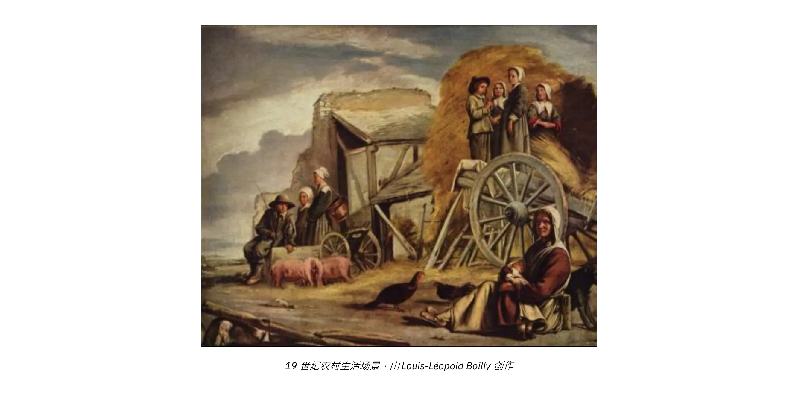

城市工匠们被禁锢在僵化的行会中，难以创新，甚至无法相互支持。与此同时，其他欧洲国家很快在各个方面超越了法国，其产品也不甘示弱。英国和荷兰在商业上的成功令所有人瞩目。

但是，我们怎样才能找到解决时代病的办法呢？当时还没有经济科学，因此也没有专门的药物可以使用。经济政策的原则仍然是随意应用的，在限制性阶段和更为自由的时期之间转换。当然，我们有模式可循，有历史参照。亨利四世的大臣苏利（*Sully*）就是其中之一，他提倡农业，并促进法国国内更大的贸易自由。

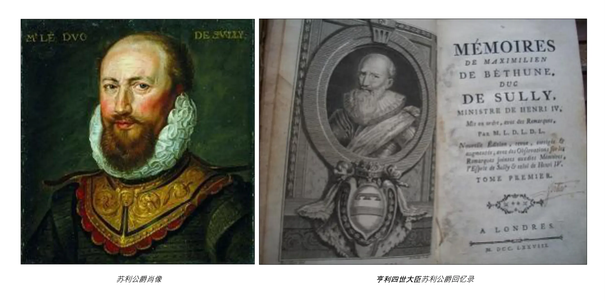

但后来路易十四的大臣科尔贝尔出现了，他在管制与自由之间徘徊，但最终还是执行了管制。17世纪末，科尔贝尔取代了萨利：大臣们现在援引他的遗产，并试图应用他们声称是他的格言。

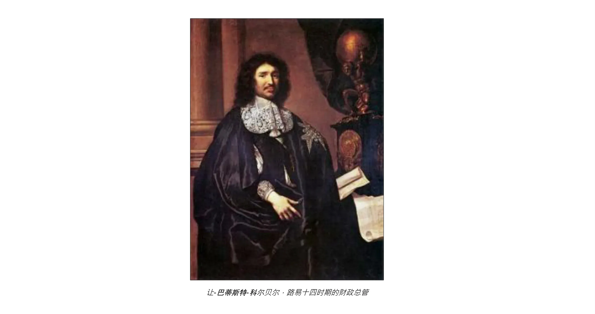

在 17 世纪末的政治家心目中，科尔贝尔的格言有四条。

(1) **行业必须受到行会的规范和约束**。例如，这些法规规定了床单和布匹的制作方法、尺寸和重量。

这样的规则有数百条，每种行业都有专门的汇编。然而，在科尔贝尔的追随者看来，这还远远不够：他们认为，工业也需要由公司来监管。

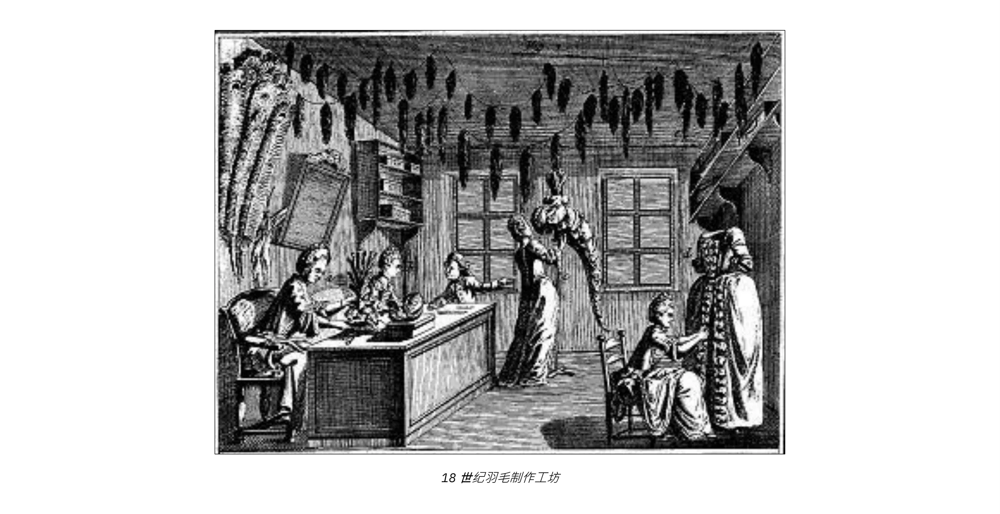

任何想从事一门手艺的人都必须先做几年学徒，然后再做技师，最后通过制作 "杰作 "并向行会缴纳大笔费用来获得大师的地位。因此，每个行业内的竞争都受到严格限制。

(2) **贸易是零和游戏**。说到商业，科尔贝尔的门徒们与古代的野蛮人有着相同的偏见。路易十四的大臣认为，贸易是 "永恒的战争"。为什么会这样呢？原因很简单：对科尔贝尔及其继任者来说，一个国家的任何财富增长都意味着另一个国家的贫困。在他们看来，不能让英国人或荷兰人富裕起来，因为这意味着他们在窃取法国的繁荣。

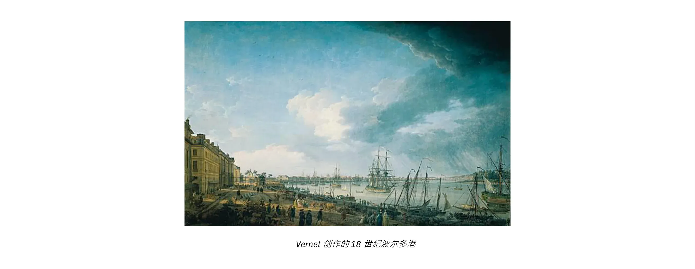

因此，必须毫无顾忌地禁止这些国家的产品或对其征收重税，因为贸易是一场战争，在这场战争中，我们只能希望敌人毁灭。

> "法国人只能通过击溃荷兰人来增加他们的商业"。
> *科尔伯特*

(3) **当国家缺钱时，增加税收**。科尔伯特和他的弟子们远不相信纳税人的财富是有限的资源。在他们看来，只要有足够的税收，公共开支永远不会成为问题。正如科尔贝尔冷嘲热讽地说，"征税的艺术在于，既要拔出鹅毛，又不能让它们叫得太响"。

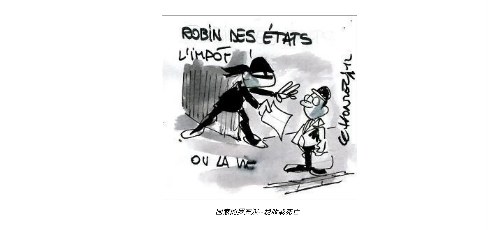

(4) **财富首先是金银**。在经济科学诞生之前，许多作家都遵循着一个关于财富本质的主流教条，即后来被称为 "重商主义 "的教条。科尔贝尔及其后继者继续沿着这条道路前进。简而言之，重商主义者认为一个国家繁荣的真正标志是贵金属--白银和黄金的积累。

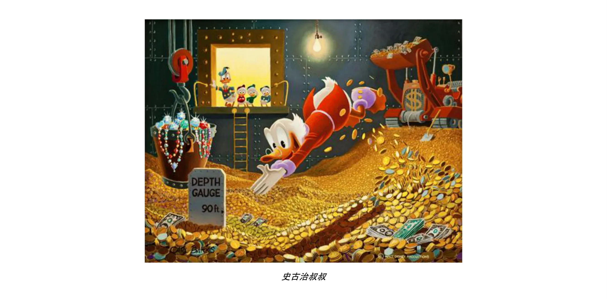

> "只有国家内部的资金充裕，才能使其强大和权力与众不同"。
> *科尔伯特*

这种想法的后果是不惜一切代价支持出口，这带来了外国的黄金和白银，并将进口限制在最低限度，以避免将它们运往国外。

在法国进入 18 世纪后的几十年里，这四项原则一直指导着法国政府。然而，这些原则很快就受到了深刻的挑战。1690 年至 1710 年间，几位作家对法国灾难性的现状深感震惊。在寻找原因的过程中，他们得出结论，从科尔贝尔那里继承下来的格言是罪魁祸首，他们认为这些格言只是谬论。由此，他们奠定了经济科学的基础。

## 沃班

<chapterId>ee9c1e0e-96cc-5026-a5e2-963d68122786</chapterId>

如今，我国的税收压力不断增大，有可能窒息国家经济力量，因此，支持改革的呼声日益高涨。无论有意无意，这些改革呼声往往与法国经济学家的研究成果不谋而合，他们自 17 世纪以来就一直批评法国的税收制度混乱、专制、过度。

从时间顺序和功绩来看，这些税收改革者中的第一位是伟大的元帅塞巴斯蒂安-勒普雷斯特尔-沃邦，他是著名的要塞和城堡建造者。

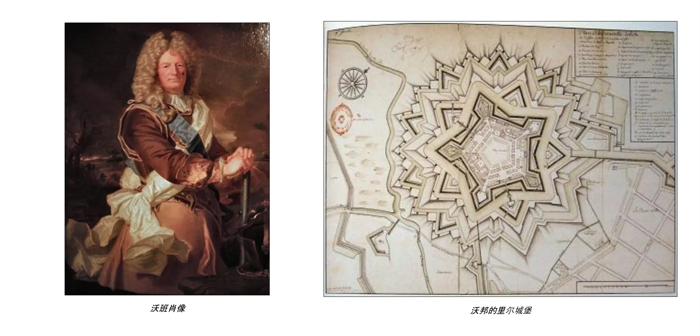

尽管我们已经遗憾地遗忘了这一点，但沃邦不仅仅是一位军事家，他还是一位经济学家。他关心农民的命运，在 1695 年（《按人头征税计划》）和 1707 年（《皇家什一税计划》）提出了大胆的税制改革：用与收入成正比的税收取代大部分现有税种，这是一种超前的统一税。

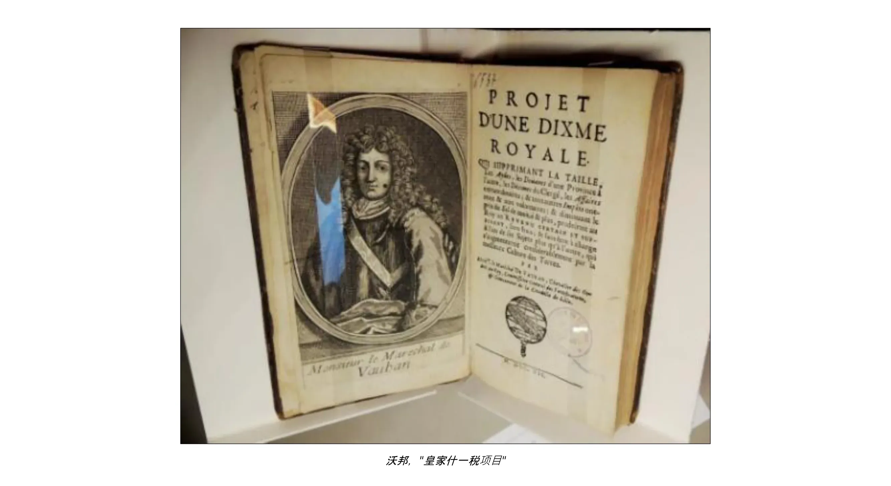

沃邦是通过好奇心得出这些想法的。他是一个敏锐的观察者，努力以近乎科学的方式严格研究社会生活和经济现实。他尤其坚持需要通过人口普查进行统计。

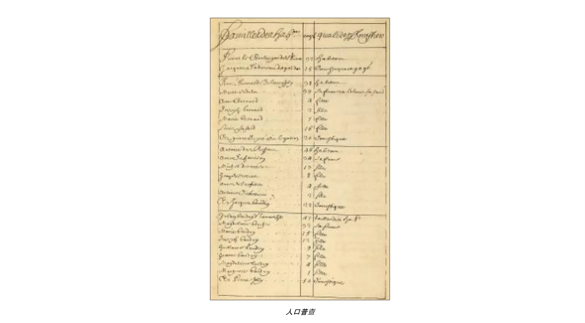

他的第二大功绩是对人民群众所遭受的苦难进行了感人而真实的描述。他写道："我们不要被欺骗，王国的心已经毁灭。一切都在受苦，一切都在忍受，一切都在呻吟。你只要看看各省的心脏，就会发现比我说的还要糟糕"。沃邦的悲观看法绝非夸张，而是 18 世纪早期生活的真实写照。亚历克西-德-托克维尔非常了解这些观点，他后来将沃邦的《皇家税制》描述为 "令人恐惧的"，因为它是真实的。

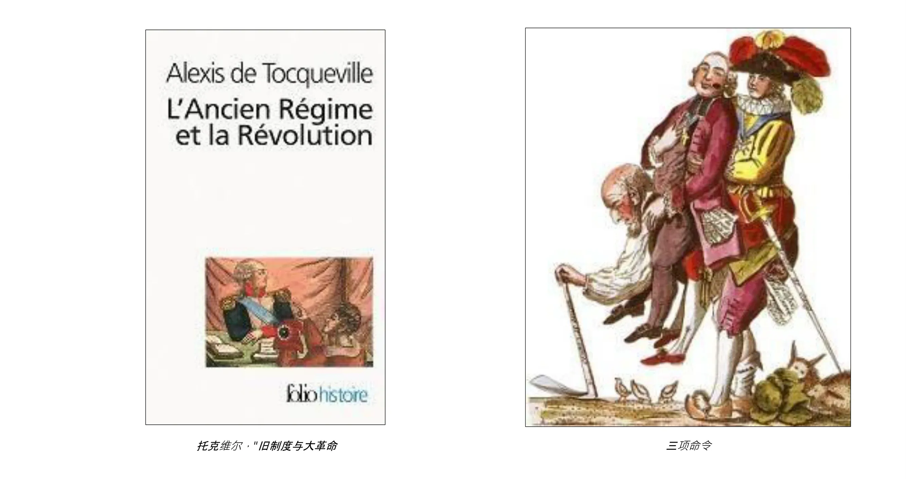

作为一名经济学家，沃班的另一大功绩是提出了一项影响深远的税制改革，旨在根除或至少减轻他所观察和描述的弊端。他这样做是正确的；旧制度下的法国经济因税收不平等、不稳定和难以辨认而陷入瘫痪。

在他的各种政治和经济著作中，沃邦最重要的抱负是减轻他所谓的 "下层人民的痛苦，他们通过自己的劳动维持和支持着上层人民"。

他明白，压迫性和抑制性的税收让农民不堪重负，他以清醒的头脑表达了这一理念，我们在当代仍能完美地观察到这一点：

> "农民任凭自己仅有的一点土地枯萎，只是半心半意地耕作，因为他们担心，如果这些土地在适当的肥料和耕作下能产出多少，就会被征收更重的税"。

沃邦看清了事实：旧政体下的税收不仅不合理，而且非常严格。他试图克服的正是这种分配不公的税收制度。

他提出的解决方案是对所有收入按比例统一征税，这将使社会各阶层公平分担税收负担。沃邦的税制改革以国家理论为基础，认为公共权力是保护个人权利和财产的必要条件，要求所有公民严格按照收入比例缴纳税款，例如，收入的 10

沃邦在他生前印刷的唯一一部经济著作《皇家什一税》中明确指出：

> "既然一个国家的每一个人都需要它的保护才能生存，那么所有人都理应根据自己的收入为国家的维护和开支作出贡献[......]。最不公正的莫过于免除那些最有能力支付的人的负担，而把负担转嫁到那些最没有能力的人身上，使他们不堪重负；如果所有人都能根据自己的能力按比例承担，这些负担就会变得很轻。因此，每一次免税都是必须纠正的混乱"。

沃邦去世前不久，路易十四的大臣们采纳了他的想法。然而，沃邦要求用一种比例税来取代所有或几乎所有现有的税种。然而，正如经常发生的那样，他的税种得到了实施，但所有其他税种也都被保留了下来。

## 布瓦吉贝尔

<chapterId>200149c6-b5fc-566e-ab0e-bafb1c3fed3c</chapterId>

如今，很少有法国经济学家能在自己的祖国获得与其贡献相匹配的认可，博伊斯吉贝尔也不例外。

博伊斯吉贝尔不为当时的读者所欣赏，由于其古怪的性格和难以抑制的热情，他与权力圈子格格不入，在 18 世纪几乎没有留下什么印记。然而，在上世纪初，他的作品慢慢被重新发现。

然而，这一重新发现表明，我们正陷入一种死胡同。由于把布瓦吉贝尔说成是众多理论的先驱和许多思想家的先驱，他的真正价值已经丧失殆尽。据说他掌握了后来由凯恩斯捍卫的就业不足概念，预见了萨伊定律，为瓦尔拉斯的一般均衡理论铺平了道路，甚至预示了马克思主义者的阶级分析。一位评论家最终问道："谁或什么不是博伊斯吉贝尔的先驱呢？

(Pierre Le Pesant de) 博伊斯吉贝尔于 1646 年出生于鲁昂。博伊斯吉贝尔在巴黎皇家港接受教育，开始了他并不成功的文学生涯，之后他担任过各种职务，包括鲁昂中将。在此期间，他写了几本书来宣传自己的观点，其中包括 1695 年出版的《Détail de la France》，次年他以更明确的书名重新出版了这本书：[*路易十四统治下被毁坏的法兰西，由谁和如何毁坏的，以及恢复法兰西的方法](https://archive.org/details/bub_gb_0jUaWNbTJa8C/page/n23/mode/2up)*。

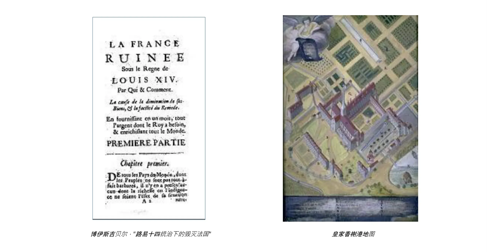

这就是布瓦吉贝尔著作的基础：法国的贫困及其原因。

和沃邦一样，布瓦吉贝尔也详细描述了 18 世纪末法国人民的苦难。他写道

> "所有人都能看到的贫瘠或耕作条件差的土地，是法国的尸体"。

他描述了被连根拔起的葡萄园、放弃田地的农民以及不断发生的饥荒。

博伊斯吉贝尔发现，造成这种不幸的原因主要有两个。因为如果人们生活在贫困之中，那是因为他们无法消费必需品，而消费的毁灭有两个原因。

首先，由于任意征税，人们再也无力消费基本必需品。尾税是当时的一种个人税，每个人的税额都是盲目计算出来的，上升或下降都毫无道理。由于特权众多，负担落在了贫苦农民身上，他们发现自己已经身败名裂。为了纠正这种情况，博伊斯吉贝尔建议对所有收入按比例征税，这与沃邦的提议很相似。

法国苦难的第二个原因是，太多的障碍阻碍了货物的自由贸易，尤其是农产品。在边境，甚至在国内不同地区之间都有关税，这使所有商业活动陷于瘫痪。这些限制阻碍了均衡价格的形成，限制了市场机会。因此，农民无法从生产中谋生，因为他们无法通过销售获利，并承受着农产品价格无法补偿的痛苦，这种担忧至今仍具有高度现实意义，也是博伊斯吉贝尔理论的核心所在。在贸易限制问题上，博伊斯吉贝尔主张清理道路，即建立自由贸易。

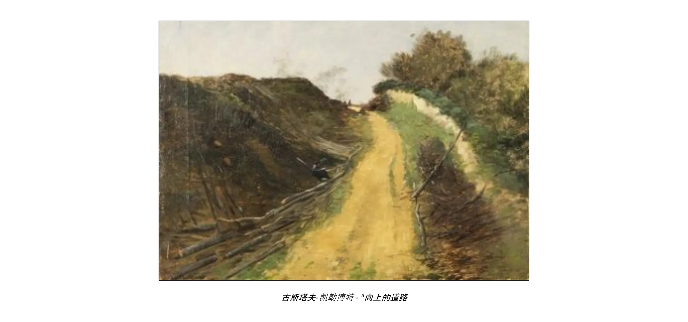

自由确实是他的最终结论。他说，"这不是一个行动的问题"，"而仅仅是不再像我们那样粗暴地反对自然的问题，因为自然总是趋向自由和完美"。他不厌其烦地重复道，"只要我们让自然顺其自然，也就是给它自由，而且除了为所有人提供保护和防止暴力之外，没有人干涉这种商业活动，一切都会好起来的"。

最后这段话至关重要。布瓦吉贝尔是第一个明确要求实行自由放任经济政策的人，他将其作为自己的信条，并围绕这一信条建立了一个真正的体系。他认为，万事万物都有其自然规律，不应被不合时宜的公共干预所破坏。他认为，国家不应介入经济事务，而应顺其自然。否则，就会造成痛苦。

博伊斯吉贝尔甚至批评他所谓的 "*善良的灵魂*"，即那些好心却造成巨大伤害的人。他们想让人们吃上便宜的面包，但通过压低价格，他们毁了农民，因为农民无法在这样的利润率下生存。这些农民于是放弃了他们的土地，陷入了更深的贫困。众所周知，"好心往往办坏事"。

## 康泰隆

<chapterId>bc206d41-6a64-5688-a489-40fcfa0e5397</chapterId>

理查德-康泰隆是《论一般贸易的性质》（约写于 1730 年，1755 年出版）的作者，被视为现代经济科学的先驱之一。经济学家默里-罗斯巴德（Murray Rothbard）在其《经济思想史》中甚至将康蒂雍称为现代经济学的创始人。

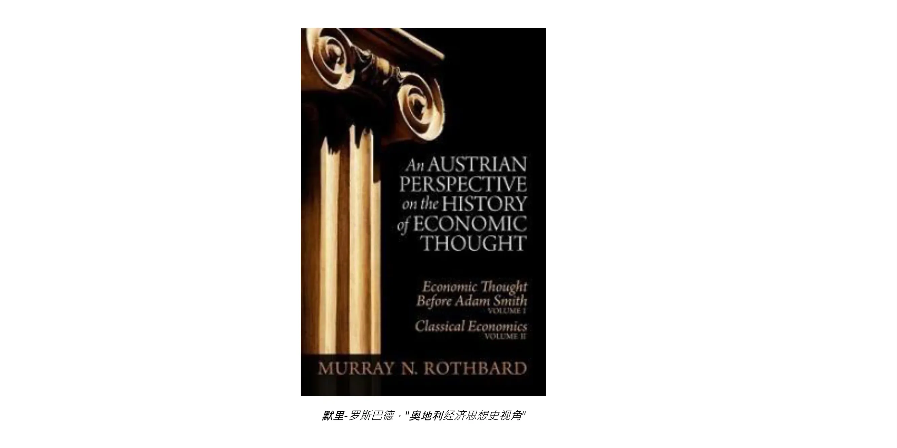

理查德-康泰隆出生于爱尔兰，年轻时定居巴黎并取得了法国国籍。他曾是一名银行家，并在约翰-劳时代发了大财。

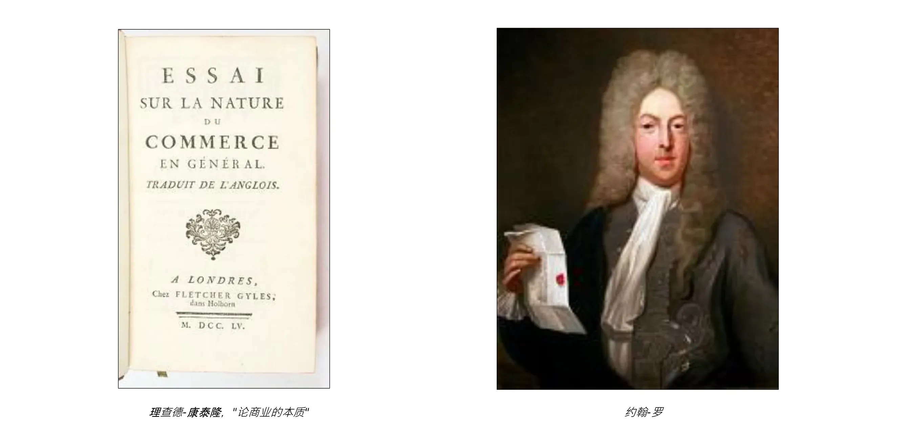

也正是从那时起，他开始研究经济理论。1730 年左右，康蒂雍创作了《论一般商业的性质》。

这本书可以看作是创立经济学一般理论的最初尝试之一。康泰隆谨慎地确定了他所谓的 "经济的一般规律"，即事物本质中的规律，而不是这个或那个国家的特殊事实中的规律。这种方法是革命性的。

我们可以从财富理论、企业家概念、对无价值货币的批判、"康泰隆效应 "以及捍卫自由这五个方面来概括《康泰隆随笔》的伟大之处。

首先是他的**财富理论**。

与当时占主导地位的重商主义观点不同，康蒂雍的分析基于这样一种认识，即财富是由适合人类享用的产品形成的。他认为，这种财富来自大自然，是通过人类劳动生产出来的。他关于财富本质的观点对贝卡里亚和亚当-斯密产生了重大影响，并通过斯密影响了整个英国古典学派。

第二，**企业家**。

尽管康泰隆没有给出明确的定义，但他将企业家视为经济活动中的主要和核心角色。在康蒂永看来，企业家的特点是敢于承担风险，在不确定的情况下采取行动。这些观点后来得到了杜尔哥（Turgot）和萨伊（Say）的扩展，最终承认了企业家在经济中的特殊地位，这与英国学派的主张背道而驰。

第三点，**货币**。

针对约翰-劳的经历，康泰隆解释了当货币没有实际价值时会发生或必须发生的事情。

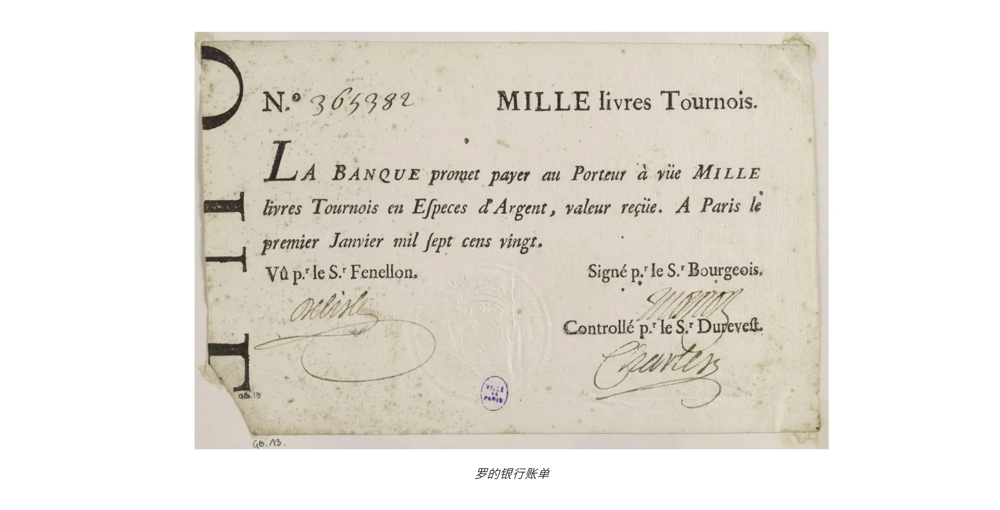

他认为，用纸币这种没有实际价值的货币代替金属货币会产生两个主要后果。第一个后果是他所说的 "大众排斥"，即人们越来越不信任没有价值的货币。第二个后果是通货膨胀：货币疲软使商品更加昂贵。

第四，在对**通货膨胀**的分析中，康蒂雍比同时代的人走得更远。在观察了劳氏体系的崩溃之后，康蒂雍意识到，货币通胀对每个人的影响并不相同。相反，它使一些人富裕，而另一些人贫困。他的结论是，通货膨胀具有再分配效应：先收到新发行货币的人因购买力提高而受益，而后收到货币的人则因通货膨胀率上升导致新货币发行而变得更穷。

第五，尽管康蒂雍有一些重商主义思想的残余，但他的总体观点是**完全自由的**。他捍卫私有财产是文明的基本支柱，认为没有土地和劳动产品的私有Ownership，任何社会都无法运转。他还认为人与人之间的物质不平等是自然的、合理的。康蒂雍认为，一个高效勇敢的工人或一个天赋异禀的工人比一个无能或懒惰的工人挣得多，这并没有什么不对。  最后，康蒂雍认为，价格应始终由自由决定，由全球需求和需求之间的博弈决定，不受政府当局的干预。

在他的《随笔》中提出的这五大观点中，最重要的无疑是现在以他的名字命名的观点：**康提翁效应**。

康蒂雍的这一关于通货膨胀影响的理论为我们解答了许多当代弊病。它帮助我们理解了近期扩张性和通货膨胀性货币政策的后果，这些政策使中产阶级和农村陷入贫困，同时却使金融市场运营商和国家、国家机构及其官员富裕起来，因为他们共同接近新问题的源头：中央银行和商业银行。

# 18 世纪早期的改革家和思想家

<partId>1f7b50d4-ce93-5db3-8396-43c1fa5419ff</partId>

## 圣皮埃尔修道院院长

<chapterId>13478fe2-4c12-593c-a410-54c2cfb7ef7f</chapterId>

在我们选择纳入 18 世纪法国自由放任思想家万神殿的所有作家中，圣皮埃尔方丈无疑是最容易被忽视的一位。

公平地说，这部分是他自己的错。他写了大量的文章，但他的文风读起来很费劲，而且充满了重复。甚至让-雅克-卢梭也曾试图总结他的作品：他开始这样做，但很快就放弃了，因为他意识到这超出了他的能力范围。19 世纪中叶，古斯塔夫-德-莫利纳里（Gustave de Molinari）为纪念他，出版了一本关于他的综合性著作，对这位和平主义者和经济学家--圣皮埃尔修道院院长--表示敬意。但这并不足以使他摆脱被遗忘的命运，因为他至今仍在被遗忘之中。

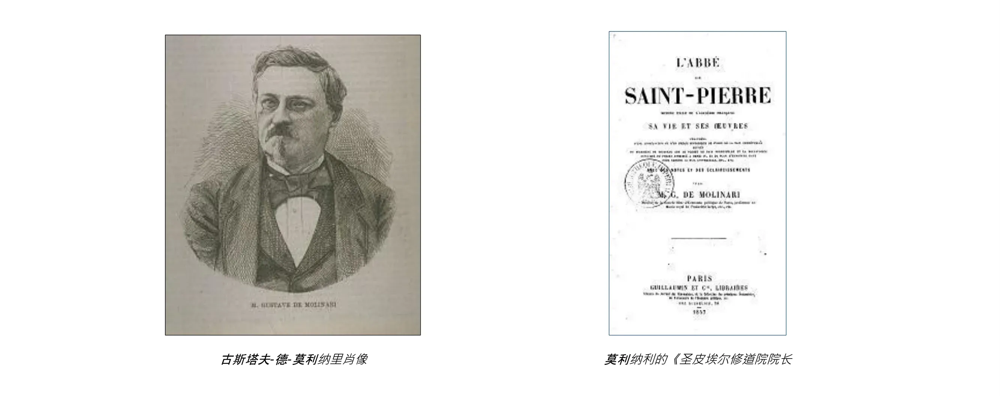

圣皮埃尔修道院院长的著作涉及经济学，但人们通常更感兴趣的是他作为和平主义者的身份。他是 "永久和平计划 "的作者，该计划早于埃马纽埃尔-康德的著名计划。

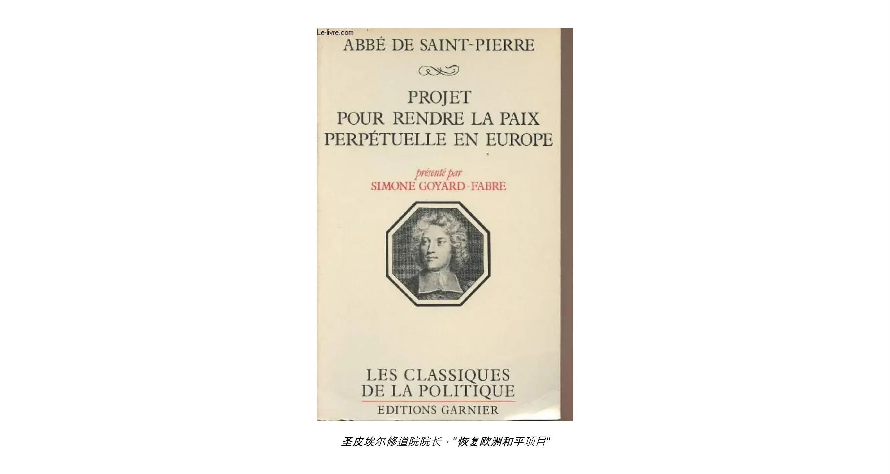

在这部著作中，他认为战争是毁灭性的，不仅对战败者是如此，对胜利者也是如此，甚至对那些没有参与战争的人也是如此，因为他们的商业受到了影响。

为了消除战祸，他建议建立一种欧洲国际联盟。欧洲议会将负责解决各国的问题。因此，各国将诉诸仲裁，以避免诉诸武力。如果一个国家没有足够的智慧来拥抱和平，如果它威胁到其他欧洲国家，欧洲国家联盟将有办法应对。面对此类事件，各国将提供部队，组建一支欧洲军队。

圣皮埃尔修道院院长生前的一段经历完美地诠释了法国自由放任运动背后的批判思想。他于1695年加入法兰西学院，但在1718年因敢于批评路易十四的统治而被开除。在这一点上，他与沃邦（Vauban）和博伊斯吉贝尔（Boisguilbert）等人站在了一起，这些人也敢于直言不讳地揭露隐藏在太阳王辉煌统治下的种种弊端。

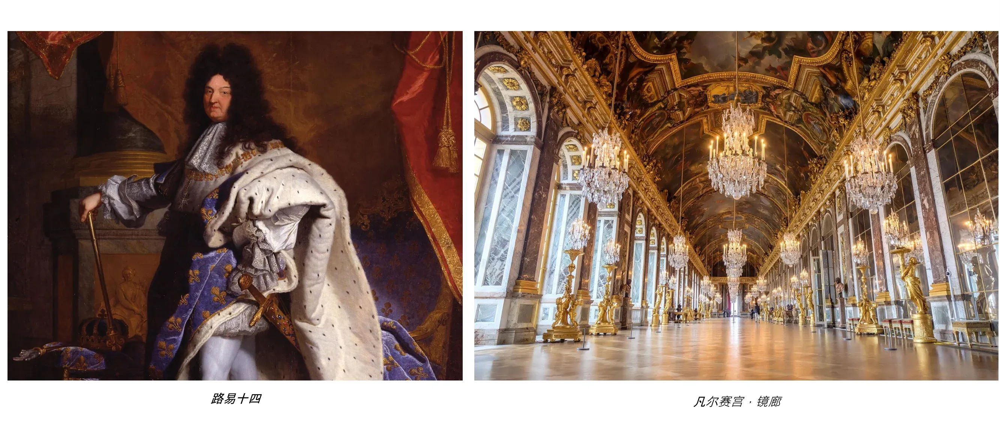

圣皮埃尔修道院院长认为，路易十四在位时宫廷奢华，热衷于军事征服，这并不是一个贤明国王的标志。他拒绝承认路易十四配得上 "**路易大帝**"的称号。

他说："同时毁掉自己的邻居和人民并不是伟大"。他的这一立场深深触怒了法兰西学院，该学院长期以来一直致力于以各种文学形式颂扬国王。因此，他们几乎一致投票决定开除他。

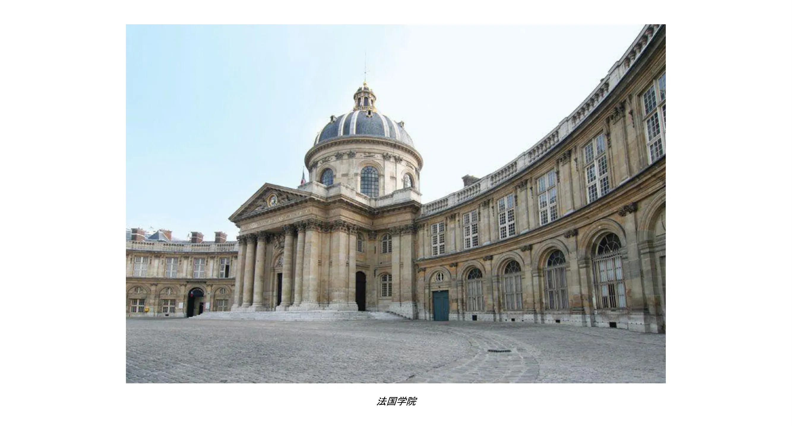

在经济思想方面，他始终坚持应用效用原则，就像杰里米-边沁（Jeremy Bentham）后来所做的那样，并经常提出正确的见解。平心而论，他仍然受到重商主义思想的影响，当时还没有人完全摆脱这种思想。

不过，圣皮埃尔方丈还是对经济提出了一些准确的看法。甚至在贡迪拉克（*Condillac*）之前，他就明确指出，在任何第三次世界大战中，双方都会受益。这可以在他 1733 年的["改善法国贸易计划"](https://www.institutcoppet.org/projet-pour-perfectionner-le-commerce-de-france/)中找到，他写道：

> "商人之间的买卖，卖方得利，买方也得利；因为如果双方没有某种实际的或感觉到的利益，卖方就不会以这样那样的价格卖出，买方也不会以这样那样的价格买进"。

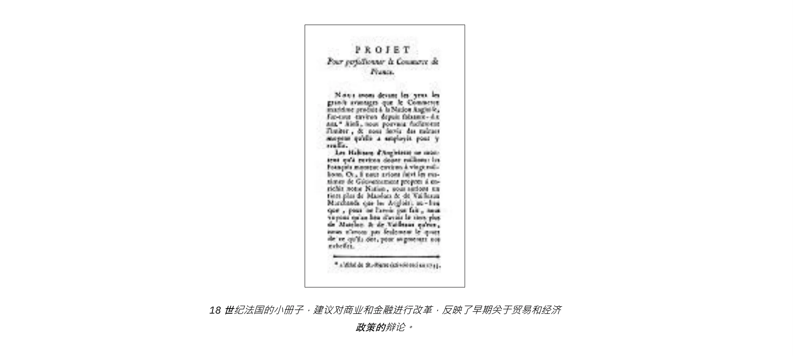

在文森特-德-古尔奈之前，他还强调了劳动的价值和保持劳动吸引力的重要性。"他写道："所有的劳动都是艰苦的。他写道："当一个人看到他的工作没有报酬或报酬不足时，他就会变得无所事事，不会再做无谓的努力"。后来，阿根森侯爵、文森特-德-古尔奈和理智派在批评繁琐的规章制度和行会制度时，也提出了同样的论点。他们认为，这些限制打击了工人的积极性，造成了不必要的困难，最终使得在这种条件下无所事事似乎比生产努力更有吸引力。

## 阿根森侯爵

<chapterId>e9960ab4-72ec-5afd-8e97-bf89c83b62bc</chapterId>

阿根森侯爵是一位被人遗忘的自由放任主义创始人。

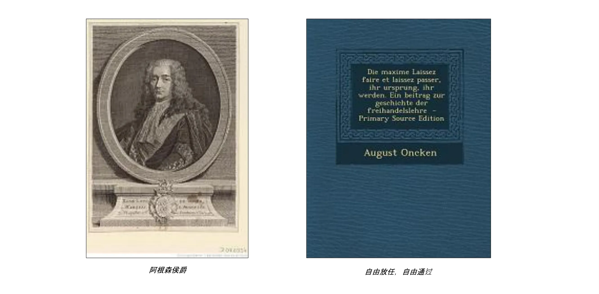

奥古斯特-翁肯（August Oncken）重新发现了这本书，他是一本关于 "自由放任、放任自流 "学说的书的作者，他认为达根松在这一思想的诞生过程中发挥了重要作用。

勒内-路易-沃耶，阿根森侯爵，生于 1694 年。他的政治生涯始于议会顾问，后进入国务委员会。

早在亚当-斯密之前 30 年，达根森就已经开始为劳动分工和专业化的好处辩护了。

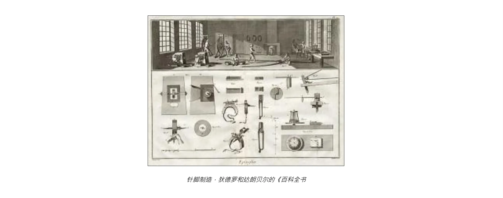

他强烈批评那些在他看来试图改变不同地区自然偏好的规定。例如，他对政府希望在当时的贫困城市图尔生产的织物和天鹅绒的质量与以奢侈品闻名的繁荣热那亚生产的织物和天鹅绒的质量相媲美感到困惑。他总结道：

> "必须允许每个地方选择自己的工厂。自由！自由！"

他还认识到斯密的另一个核心原则：自发秩序源于对自身利益的追求。阿根森侯爵认为，眼前的个人利益是人类精力的驱动力。他写道，拙劣的手艺和欺诈会让制造商声誉扫地，而勤奋和良好的意愿则会带来繁荣。他认为，效用的最佳评判者是个人，也就是购买商品并关心是否划算的大众。他说："每个人都能察觉到自己的利益，""每个人都会采取对自己有利的措施，正是在这种普遍共识中，我们发现了真理"。

甚至在亚当-斯密之前，他就已经明白，通过构建自发的自然秩序，自我利益会带来普遍利益。

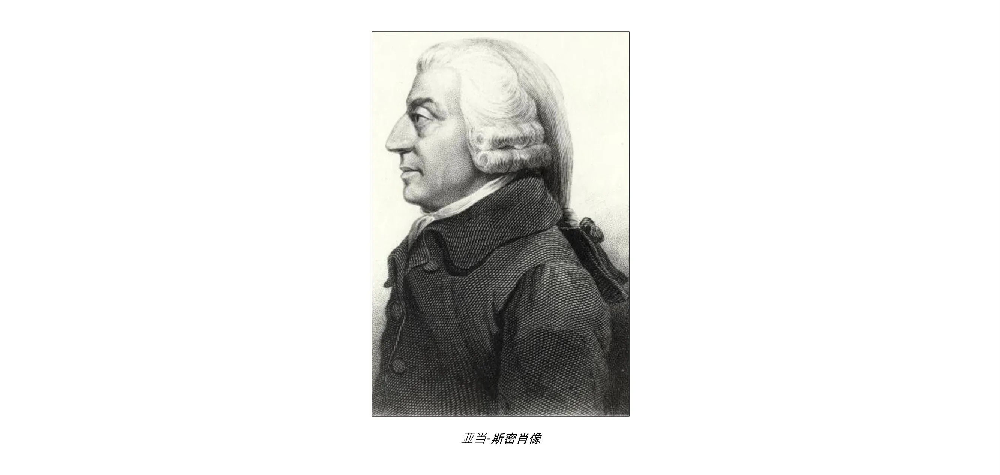

他把社会比作一窝蜜蜂，每只昆虫都遵循自己的本能。"从它们的行动中"，他准确地说道，"产生了满足小社会需求的巨大积累；但这不是靠命令或将军带来的，他们迫使每个人遵循其领导者的观点"。这或许是法国经济思想中最接近亚当-斯密著名的 "看不见的手 "概念的表述。

阿根森侯爵总是对当时大臣们的想法感到愤怒。他们提出的唯一问题是："我们应该这样管理还是那样管理？我们应该把经济引向这样还是那样？对此，达根森回答道："难道我们不应该先问问 是否应该对经济进行任何引导？" "还是应该让经济自行运行？"

老实说，他感到惊讶的是，人们竟然如此难以理解，或者说，难以看到各种过度监管对经济的有害影响。他认为，只要睁开眼睛就足够了。他痛心地写道："今天，许多事情都运行得相当不错"，"这仅仅是因为它们设法逃脱了法律的管辖"。

有时，他对自己的想法很少被人理解感到绝望。

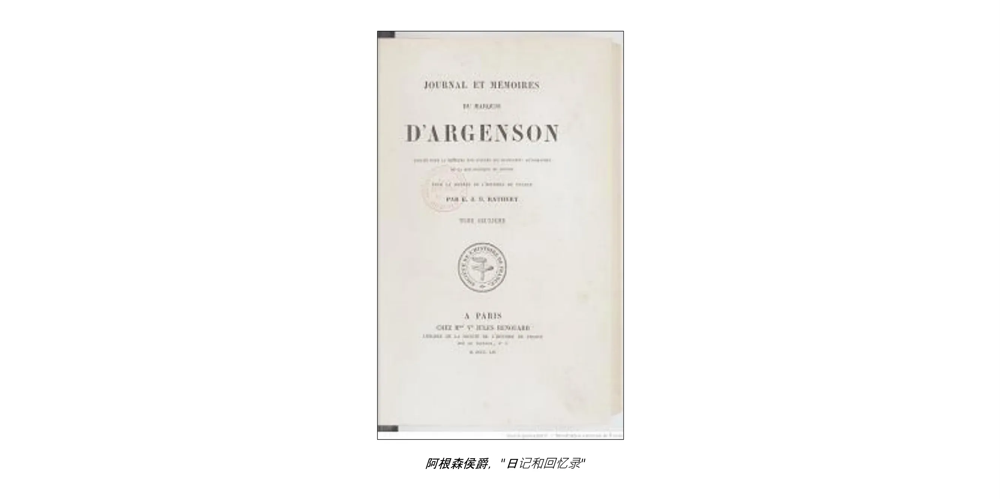

因此，他所捍卫的经济政策理想与其时代潮流背道而驰。他的理想为国家定义了一个本质上消极的角色。"商业需要的只是消除障碍。它只需要好的法官、对垄断的惩罚、对所有公民的平等保护、稳定的货币以及道路和运河"。这就是最小国家的定义，它将成为法国政治经济学传统的基础之一。

对当时经济学家和社会思想家所关注的两大问题--工业监管和小麦贸易--的研究自然而然地说明了国家在经济活动中的作用。

工业法规首先引起了他的强烈不满，因为这些法规是以牺牲他人利益为代价为某些人谋取的特权。他写道："我国工厂衰落的真正原因"，"是对它们的过度保护"。他还以同样生动的信条表达了他对当时政治家们的督促主义热情的批评：

> 违背行业的意愿来管理行业，就是想让它毁灭。

关于生计贸易问题，除了自由，达根松没有其他答案。他认为，小麦短缺是由于垄断和政府采取的过度预防措施造成的。我们要做的就是顺其自然，在一个港口开放的国家，小麦永远不会短缺。外国人和其他人一样，也会被利益的诱惑所吸引，他们会提供我们需要的东西，拿走我们多余的东西。他说，"顺其自然"，"一切都会好起来的"。

## 文森特-德古尔内

<chapterId>e8ae40dc-7450-552f-9ddc-9e02936cf425</chapterId>

文森特-德-古尔奈是自由放任主义在法国的首批代表人物之一，也是自由放任主义在公共管理和知识界最早的倡导者之一。因此，在经济思想史上，他应该得到比通常更多的认可。我在最近的一本书中试图强调他的贡献。

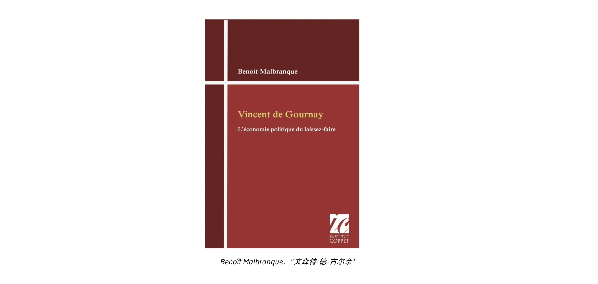

古尔奈出生于一个商人家庭，他本人也是一个成功的商人，在法国政府任职之前就积累了大量财富。在商务局，他是自由劳动力和自由贸易的狂热倡导者。

虽然古尔奈在他那个时代的主要经济学家中地位显赫，但他的著作却很少，或者说，出版的著作很少。他主要撰写行政书信和回忆录，这些书信和回忆录要么未曾发表，要么经过编辑后由其他作者发表。

我们所拥有的包括

1.[The remarks](https://archive.org/details/traitessurlecomm0000chil) on a translation of a book by the English economist Josiah Child；

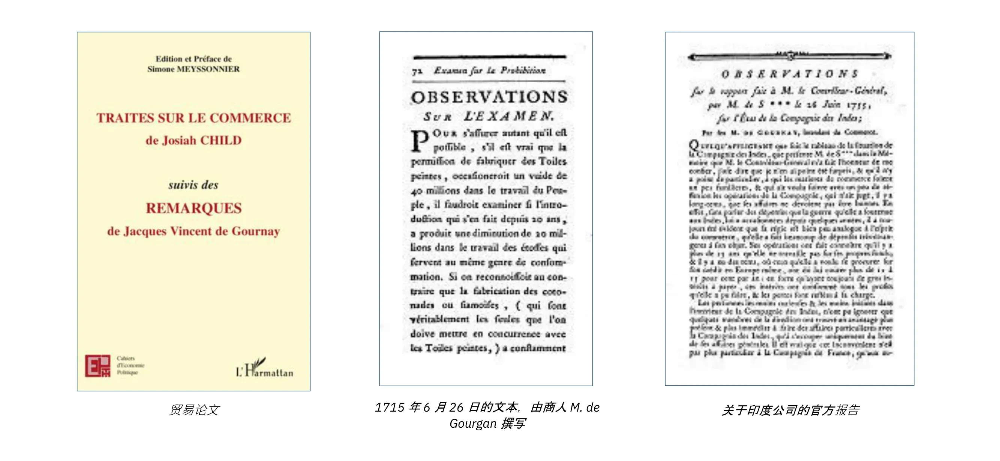

2.列入《禁止印花织物利弊的研究》的 "意见"；

3."关于东印度公司的观察"，由 Abbot Morellet 附于其《东印度公司现状回忆录》（1769 年）；

4.最重要的是，他在担任商务总监期间撰写的各种回忆录。

这些著作显示出明显的外来影响和一些重要的结构性思想。在古尔奈看来，外来影响是对英国和荷兰优越性的认可。古尔奈深信，这两个国家对经济的理解远胜于法国，法国必须以它们为榜样。他说："这两个国家是最繁荣的"，"他们遵循的制度与我们完全不同。我们禁止外国商品进入，我们把经济活动限制在严厉的规章制度内，而他们却反其道而行之。如果说他们做得更好"，古尔内总结道，"那是因为法国遵循了错误的原则"。

他的改革建议围绕几个要点展开。

首先，他认为需要保护和鼓励劳工。当时，法国工人被当作罪犯对待，时刻受到监视，担心自己没有遵守成千上万条法规中的一条。这种过度的烦恼打击了人们的工作积极性，反而使他们无所事事。然而，古尔奈认为，"工作是高尚的，是使国家富强的唯一途径"。

其次，他批评了限制制造商的行会制度。加入一个行业既费时又费钱，每个新工人都必须严格遵守行会章程规定的例行工作。这种制度没有为卓越、创新或进步留下任何空间。

第三，法国的贸易受到限制性法律的限制。古尔奈认为，如果港口能够自由竞争，所有商品（如谷物和印刷画布）都能不受限制地进口，那么消费者将受益匪浅。他是最早指出走私真正根源的人之一：走私之所以存在，完全是因为一种有益和有用的贸易被禁止了。他还犀利地指出：走私是一种 "自由 "的职业，没有规章制度，没有行会，没有没收税。然而，正是国家铺天盖地的管制迫使许多诚实的工人走上了非法之路。

最后，古尔内指出，英国和荷兰的利率较低，这两个国家比法国更加繁荣。他主张法国也应降低利率，这样法国的经济活动就可以在与其他国家一样有利的条件下获得资金。然而，古尔奈并没有寻求强制性的立法方法；相反，他强调有必要使放贷合法化，因为放贷仍然受到天主教会的谴责。

在所有这些方面，古尔奈在 18 世纪中叶的思想争论中扮演了关键角色。他对经济自由的辩护比物理学家早十年，比亚当-斯密早二十年。但他对杜尔哥的影响最为持久。古尔奈将年轻的杜尔哥置于自己的羽翼之下，用自己的思想培养他。

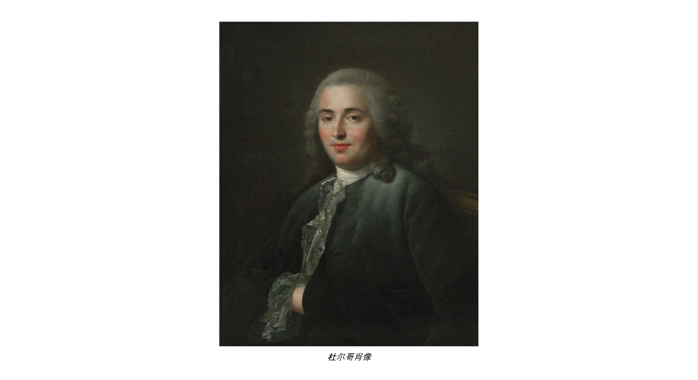

多年后，未来路易十六的大臣杜尔哥（Turgot）在他的朋友去世后为他写了一篇悼词。如果说杜尔哥从未完全接受弗朗索瓦-魁奈的自然神论，那是因为他对自己的第一位师傅樊尚-德-古尔奈保持着不可战胜的依恋。

## 古尔内圆环

<chapterId>b86ba6bd-8f3a-5d8f-b098-4d0413f00deb</chapterId>

说到早期的经济科学，历史往往会强调第一个思想流派：以弗朗索瓦-魁奈及其弟子为首的重农学派。然而，在他们崛起的近十年前，以经济学家文森特-德-古尔奈（Vincent de Gournay）为中心，出现了另一个不那么正式但同样重要的团体。

正如我们在上一部分所看到的，古尔奈对英国和荷兰等外国的榜样非常着迷。他同样钦佩这些国家的经济学家，如约西亚-蔡尔德、约翰-德-威特和大卫-休姆。

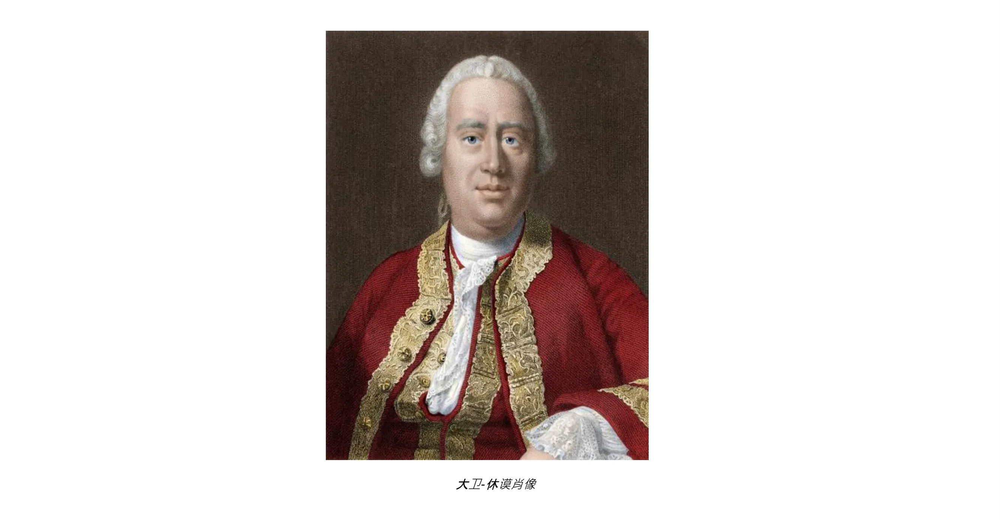

这种钦佩促使他翻译并指定翻译他们的经济学著作。

原来，古尔奈在高级行政部门的职位使他得以接触到当时法国所有知名的经济专家。通过这种方式，他聚集了一批极有能力的翻译家。他亲自翻译了柴尔德和卡尔佩珀的著作。Abbot Le Blanc 翻译了大卫-休谟的《政治论述》。韦隆-德-福尔博奈翻译了西班牙经济学家杰里尼莫-德-乌兹塔里兹。杜尔哥翻译了约西亚-塔克的著作，孟德斯鸠的儿子翻译了约书亚-吉。

由于古尔奈圈子中几位成员的合作，许多作家得以以自己的名字出版原创作品。这些书籍和译本取得了巨大成功。一些著名的例子包括

- 赫伯特的[谷物普通警察]论文(https://archive.org/details/essaisurlapolice00herb/page/n7/mode/2up)(4 年 6 版)

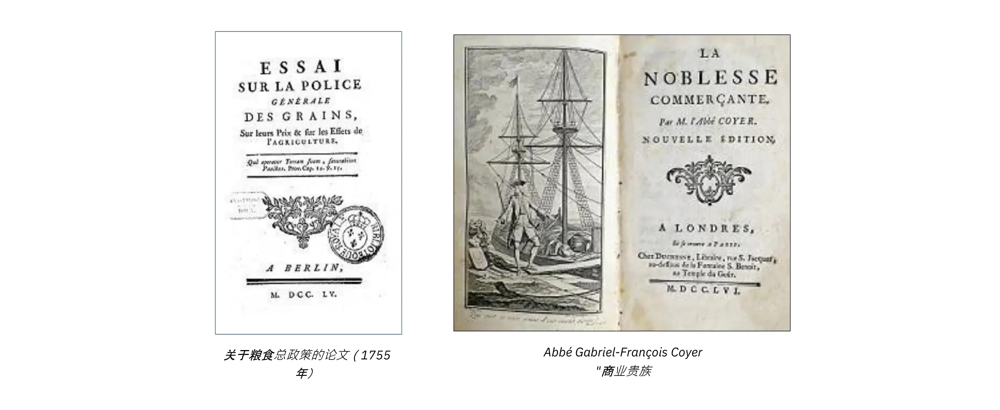

- Coyer's [Noblesse commerçante](https://archive.org/details/lanoblessecommer00coye/page/n3/mode/2up) (2 年 5 版)

- Plumard de Dangeul 的[关于法国和英国利弊的评论](https://archive.org/details/bim_eighteenth-century_remarks-on-the-advantage_plumard-de-dangeul-loui_1754) (第一年出了 3 版)
- Cliquot-Blervache 和 Gournay 的[行业回忆录](https://www.amazon.com/Memoire-sur-corps-metiers-French/dp/1978196903) (1758 年第 2 版)

该小组还在以下出版物的出版过程中发挥了关键作用

- [关于一般贸易性质的论文](https://archive.org/details/essayonnatureofc0000cant) 作者：理查德-康泰隆。

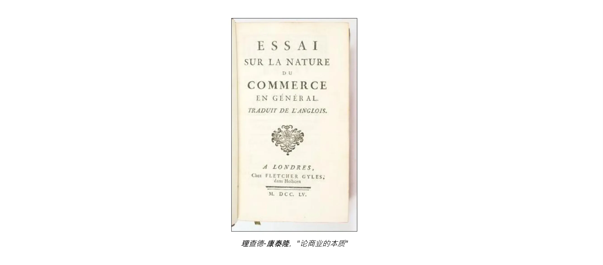

最后一本书大约写于 1730 年，在作者去世后一直保留在手稿中。古尔奈在他的经济学家朋友们的帮助下，于 1755 年出版了这本书。据这个圈子的成员莫雷莱修道院长说，古尔奈把这本书推荐给了他认识的每一位经济学家。

古尔奈圈子的思想成果对思想史产生了重大影响。从这个意义上说，他们可以被视为法国经济科学的奠基人。法国国家经济与发展研究所的克里斯蒂娜-泰雷（Christine Théré）对经济学出版物的历史进行了研究，她发现在1750年至1759年间，出版的经济学著作不少于**349**部，而在之前的整个十年（1740-1749年），出版的经济学著作只有**83**部。1750 年代的这场革命主要归功于古尔奈圈子。

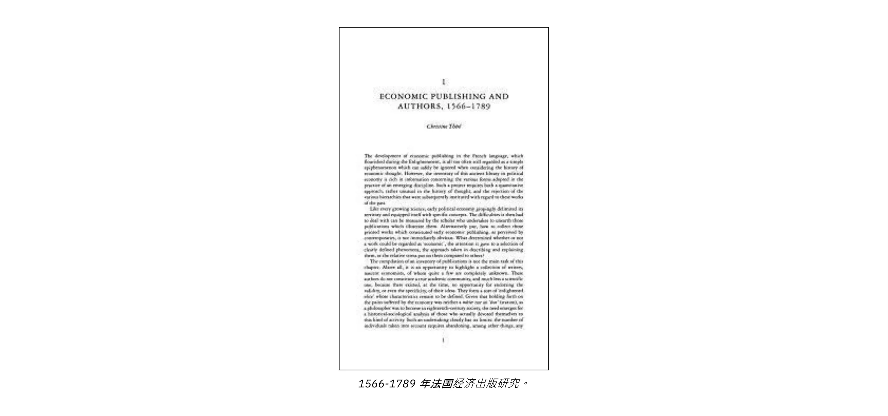

为了在法国民众中传播对经济讨论的兴趣，古尔奈和他的朋友们努力通过小说让人们了解这些讨论。在发表了批评行会的《贸易回忆录》（*Memoir on the Trades*）之后，古尔奈和克利科-布勒瓦什（Cliquot-Blervache）帮助加布里埃尔-弗朗索瓦-科耶（Gabriel-François Coyer）创作了短篇讽刺小说《钦差大臣》（Chinki: [A Cochinchinese Tale Applicable to Other Nations]）(https://www.institutcoppet.org/wp-content/uploads/2013/06/Coyer-Chinki-Histoire-cochinchinoise.pdf)。

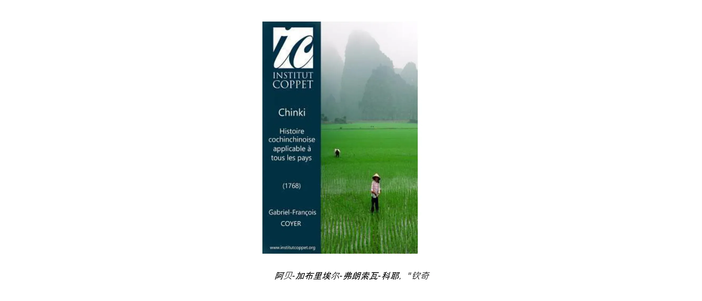

故事讲述的是主人公钦奇因赋税过重而被迫离开自己的土地，并试图在城市中为自己的孩子寻找手艺工作。但由于行会的苛刻规定，所有行业都不对他们开放，因此故事以幽默的笔调描绘了他日益失望的心情。

因此，古尔奈的圈子掀起了一股强烈的出版浪潮。虽然经济思想史家们已经忘记了这一重大贡献，但同时代的人们却非常清楚。物理学家们在 17 世纪 60 年代组织了自己的学派，他们后来将古尔奈的团体视为自己的直接先驱。1767 年，经济学家雅克-阿卡里亚斯-德-塞里翁纳（Jacques Accarias de Serionne）在他的颂词中更清楚地表达了这一点。他写道："少数法国人，包括哲学家和市民，几年前开始模仿英国作家。他们首先翻译了他们的范本，并很快在许多方面超越了他们。他们将文学的全部魅力和丰富内涵用于处理有用的主题；他们激发并传播了对国家繁荣最重要的科学的兴趣"。

事实上，在 17 世纪 50 年代，经济问题已成为一种时尚。伏尔泰有一句名言：1750 年左右，法国人放弃了写小说，转而讨论谷物贸易的自由问题。法兰西商报》（Mercure de France）也注意到了这一趋势，该报在古尔奈去世前几个月，即1758年的一期上写道"政治经济学现在是一门时髦的科学。现在，无数人都在阅读有关农业、人口、工业、商业和金融方面的书籍，而不久前他们还只是浅尝辄止地阅读小说"。对于古尔奈和他的经济学家圈子的工作，没有比这更好的褒奖了。

## 米拉波

<chapterId>2d2f802b-e3b6-556f-9025-a1b1dc4409ca</chapterId>

法国有两位名叫米拉波的名人，一父一子，但真正创造历史的是儿子。作为革命护民官和法国大革命事件中的核心人物之一，他一直声名显赫。

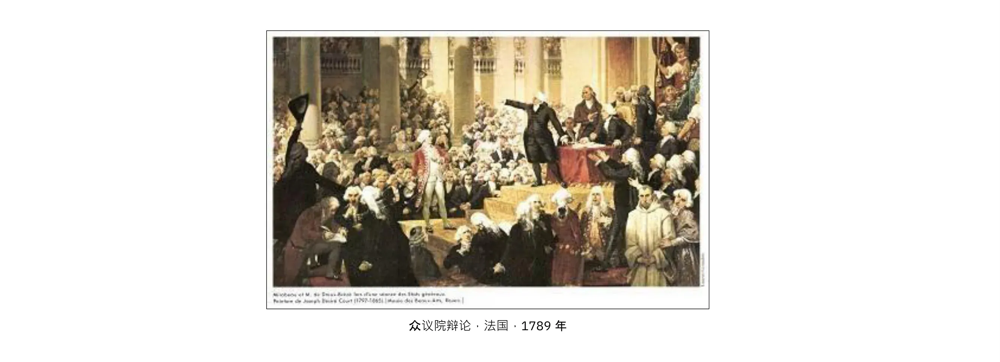

凭借他的才华和在法国历史上的地位，他的风头盖过了他的父亲，一位经济学家和弗朗索瓦-魁奈学派的支柱，早在 1758 年就成为该学派的第一位成员。

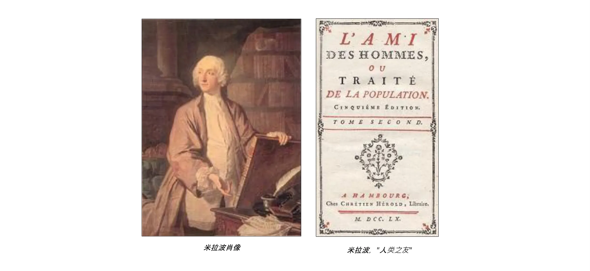

事实上，米拉波侯爵在采纳自然神论之前，就已经因为一本名为《人类之友》的书而声名远播。人口论》[法文：L'amic des hommes, ou, Traité de la population](https://archive.org/details/lamideshommesou00unkngoog)。尽管该书的第一版是在 1756 年出版的，但在 1757 年左右，也就是他与魁奈会面的前一年，它就已经成名了。

该书在 1757 年至 1760 年间出版了 20 多个版本，可能是历史上最成功的经济学著作。由于其犀利的推理，一些读者甚至认为这本书是孟德斯鸠写的。国王路易十六的父亲王储甚至声称自己背诵过这本书。一时间，凡尔赛宫的每个人都在读这本书。

如今，这本书已不再有人阅读，但许多人仍在参考。即使到了 19 世纪，埃德蒙-鲁塞尔也说：

> L'Ami des Hommes》是一本人人都在谈论，却几乎无人知晓的书。每一代人中，都应该有一位勇敢的公民阅读这本书，这样其他人就不必阅读了。

米拉波在开始经济学家生涯之初，就从理查德-康蒂雍那里汲取了灵感。他拥有康蒂雍的《论一般商业的性质》手稿已有 15 年之久，并对其进行了耐心的分析和评论。

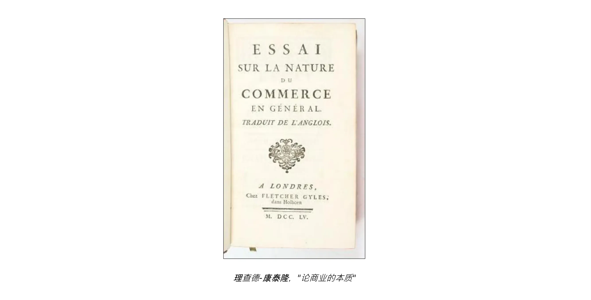

L'Ami des Hommes》最初的构想是对康蒂雍的《随笔》进行简单的评论。但由于米拉波的思想不拘一格，坦率地说，有点疯狂，他很快就偏离了原定计划。这本书简单地讨论了他所知道的所有经济问题，偶尔也会脱离康蒂雍。这本书很难读，每一章都有离奇的计划和离题。米拉波自己也承认这本书很混乱，他的风格是世界末日式的。

尽管乱象丛生，但有些想法还是值得注意的：

- 米拉波反对重商主义对财富本质的偏见。
- 他赞扬农业，也批评放弃农业。
- 他抱怨人民的状况，尤其是农民的状况。
- 最后，他捍卫贸易自由和各国在和平中的兄弟情谊。

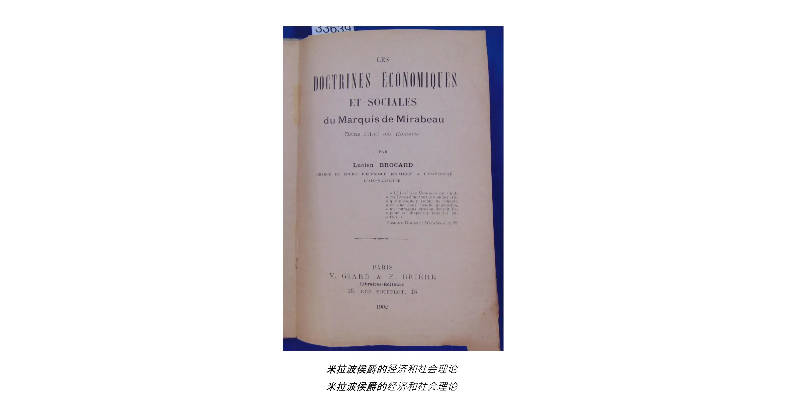

给米拉波的观点贴上自由主义或反自由主义的标签是五分之五。他经常在一种观点和另一种观点之间来回游走，有时甚至没有意识到这一点。不过，自由主义思想还是经常主导他的写作。他最有名的一句话是：

> 政治经济学唯一真正的原则就是让一切自由。

米拉波取得了最大的成功，他受到了追求。刚刚对经济学产生兴趣的弗朗索瓦-魁奈（François Quesnay）邀请他参加在凡尔赛举行的招待会。

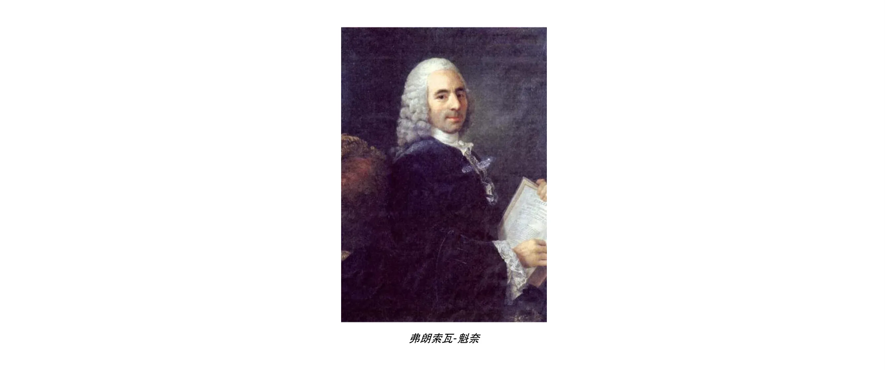

他们争论得面红耳赤，最后，通常在辩论中不会发生的事情发生了：米拉波断然承认自己错了。他同意魁奈的观点，并表示愿意传播这些观点。

他们共同组成了后来的物理贵族学派的核心，他们带来的新成员又加强了这一学派。米拉波皈依后不久，魁奈请他为自己的税收思想辩护。米拉波因此被关进文森监狱几天，然后被流放到比尼翁。

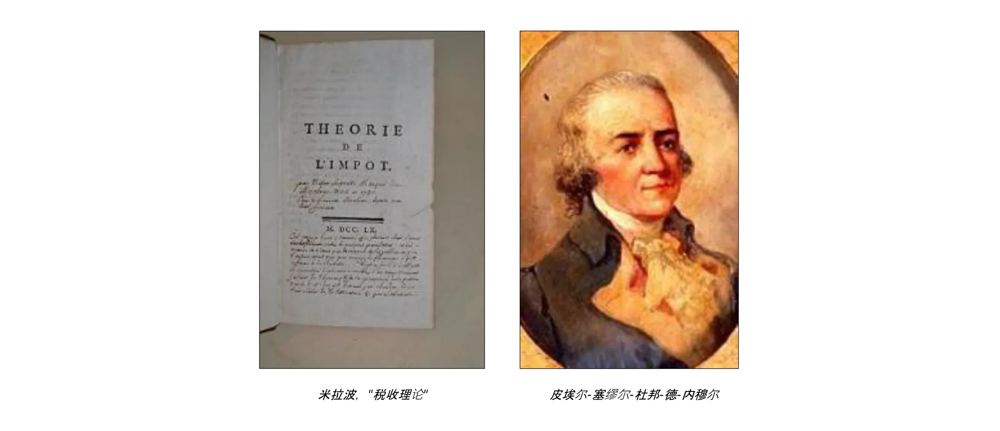

米拉波在为魁奈的学校招募新成员方面也起到了至关重要的作用。他甚至说服了年轻的杜邦-德-内穆尔。

物理学家们每周二也在米拉波家聚会。杜尔哥和亚当-斯密等人似乎都参加过一次或多次这些会议。

米拉波一生笔耕不辍。他撰写了大量经济学著作，为魁奈的学说辩护。然而，在他生命的最后阶段，他的影响力逐渐减弱。他的文风每况愈下，以至于他的亲兄弟写信给他，说他再也看不懂他的散文了。他的思想已经完全自由化，与梅布尔甚至卢梭等思想家的社会主义或原共产主义反动相冲突。他努力寻找读者和出版商，在 1789 年巴士底狱被攻破前夕去世，基本上无人知晓。

## 魁奈

<chapterId>7a35f20b-5ea0-544d-b290-bcd9c6f7f11a</chapterId>

弗朗索瓦-魁奈是法国最著名的经济学家之一。

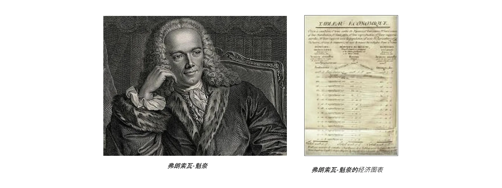

他的名字出现在每一本关于经济学和经济思想史的教科书中。教科书说他创造了 "经济表 "来图解经济，说他是物理学家学派的领袖，说他错误地认为只有土地才有生产力，最后，亚当-斯密来澄清了这一错误。教科书对弗朗索瓦-魁奈的概括大致如此。

把他贬低到这种地步是一种耻辱，因为魁奈也是第一位试图以科学原则为基础捍卫经济自由的经济学家。他是那个时代最受聆听、最有影响力的经济学家之一。此外，他还创立了 "生理学"（Physiocracy），这是一种比 "只有大自然才能创造财富 "这一简单观点更为丰富的学说。

在接下来的三章中，我们将更详细地讨论 "生理学"。首先，让我们仔细了解一下弗朗索瓦-魁奈本人。

1694 年，魁奈出生于梅雷的一个农民家庭，这个家庭无法教魁奈识字。他接受了当地人的培训，最终进入外科学院和医学院学习。24 岁时，他成为曼特的一名外科医生。

1730 年，36 岁的他因反对常见的放血疗法而声名鹊起，他认为这种疗法是基于错误的理论和偏见。他还敢于挑战行会制度，该制度规定只有外科医生才能做手术，只有医生才能开药方。这往往迫使穷人付两次钱，请两个人来看病，魁奈认为这种情况令人反感。

1740年，他成为外科学院的秘书。1748年，54岁的他成为蓬巴杜夫人的私人医生，并搬到了凡尔赛。

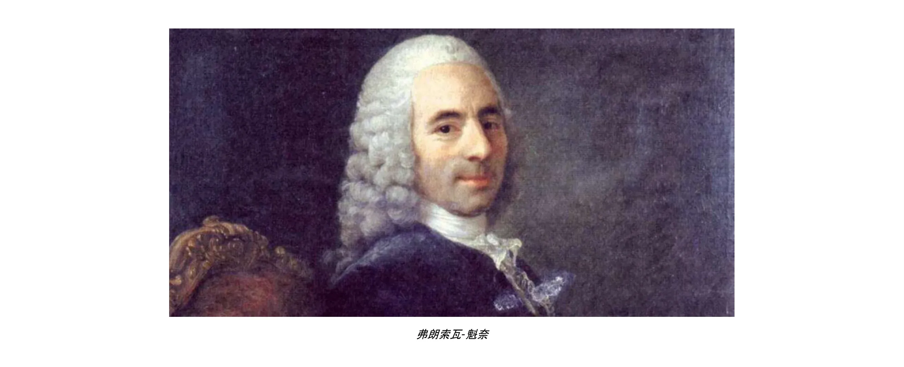

他与蓬巴杜夫人非常亲密。魁奈甚至在宠妃失宠的消息传出时说，如果没有蓬巴杜夫人，他不想继续在凡尔赛当医生：

"蓬巴杜夫人兴盛时，我与她相依为命；她落魄时，我也会如此。

之后，他又出版了几本医学书籍：他还出版了几本医学书籍：《化脓论》（1749 年）、《坏疽论》（1749 年）和《持续发烧论》（1753 年），这些书在他有生之年多次再版。

60 岁时，他接触到当时流行的经济学辩论，开始撰写经济学文章。1755 年，他为《百科全书》（*Encyclopédie*）撰写了《农民》和《谷物》两篇文章。

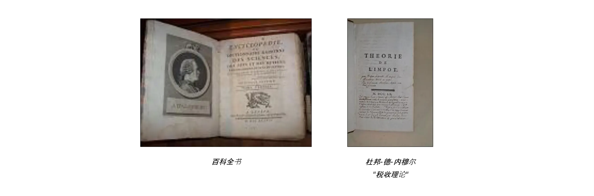

这些著作于 1757 年出版。同年，他遇到了大名鼎鼎的米拉波，并成功地让米拉波接受了他的经济思想--"物理神学 "的核心由此诞生。随后，魁奈创作了《经济学表》，该书由皇家印刷厂印刷，据说凡尔赛宫的国王本人也在场。从那时起，他经常在凡尔赛宫的寓所接待经济学家和哲学家，让他们自由讨论。魁奈还为 1759 年出版的米拉波的《赋税论》做出了贡献。

审查很快就开始了。米拉波被关进监狱，魁奈受到斥责。此后，魁奈意识到自己无法公开发表文章，他需要门徒来传播自己的思想。

他很快就找到了他们：Baudeau, Dupont de Nemours, Le Trosne, Mercier de la Rivière 等等。这些人将传播和普及魁奈的思想。然而，需要门徒的魁奈并不完全满足于他的教派。在他写给米拉波的信中，他告诉米拉波：

> "你们自己想吧。我已经意识到，我可怜的草稿让你们变得懒惰。现在轮到你们思考了。你们知道的和我一样多"。

尽管如此，他的弟子们还是对他忠心耿耿，极大地提升了魁奈的声望。魁奈去世时，米拉波致悼词说："我们失去了父亲，因为我们欠他的太多了。事实上，是魁奈亏欠了他们的一切，因为如果没有他们，魁奈就会一直呆在凡尔赛，他的思想虽然有许多引人入胜或令人担忧之处，但却很少有人感兴趣。

由于他的合作者的努力，他的想法找到了一个平台：首先是通过报纸，如《农业杂志》（*Journal of Agriculture）和《公民报》（*Ephémérides du Citoyen）。

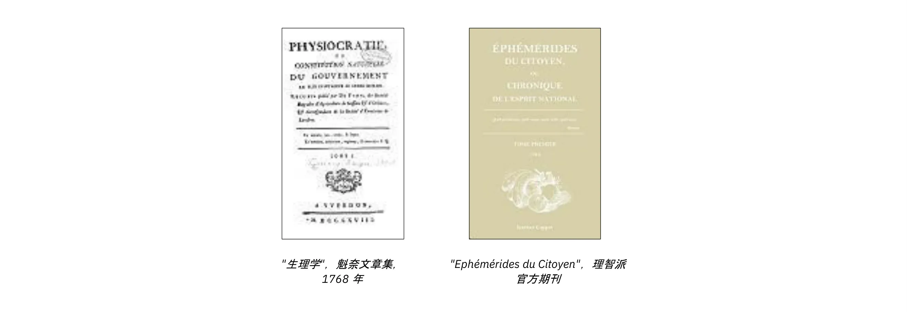

然后通过书籍，不仅是他的弟子们的书籍，还有杜邦-德-内穆尔于 1768 年出版的一本重要选集，名为《生理学》。

这本书汇集了魁奈的主要贡献。它阐述了物理学家领袖的经济理想：一种农业经济模式，在这种模式下，法律保障每个人拥有财产的权利和交易的自由。

# 物理学家学派

<partId>27af82c1-ad82-5c3b-8ce9-c674b67bbf7c</partId>

## 物理学家的历史

<chapterId>4236ff8b-b53a-59e7-92c0-f96f9afa1c00</chapterId>

唯物主义在法国乃至整个欧洲流行起来不过十年时间。经过漫长的发展，它在 17 世纪 60 年代中期开始崭露头角。1776 年，杜尔哥上台执政时，这一运动已经风光不再，而这位大臣对魁奈学派的支持也基本隐藏了起来。

它起源于 17 世纪 50 年代经济思想的演变。有几位作家在博伊斯吉贝尔与后来的 "物理学家 "之间架起了桥梁。如前所述，樊尚-德-古尔奈和他的经济学家圈子出版了许多向法国读者介绍外国经济思想的出版物，点燃了他们对经济学的热情。博伊斯吉贝尔（Boisguilbert）的《Détail de la France》和康蒂永（Cantillon）的[《关于一般贸易性质的论文》](https://archive.org/details/essaisurlanature0000cant)等书中已经出现了自然神论的基础。

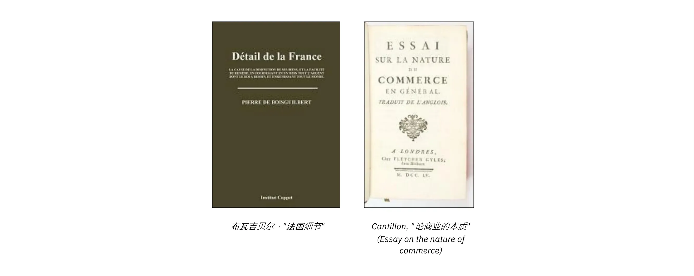

自博伊斯吉贝尔以来，自由放任的理念得到了多位倡导者的支持，尤其是文森特-德-古尔奈和阿根森侯爵。

剩下的工作就是将这些思想转化为连贯、完整的学说，米拉波侯爵是第一个尝试者。受康提荣《论语》的启发，他开始撰写一部关于经济问题的综合性论文，名为《人类之友》，这部论文非常成功。

就这样，1756年，物理神学的故事拉开了序幕。弗朗索瓦-魁奈（François Quesnay）当时是一名外科医生，后来成为蓬巴杜夫人的私人医生，他邀请米拉波到凡尔赛讨论经济思想。

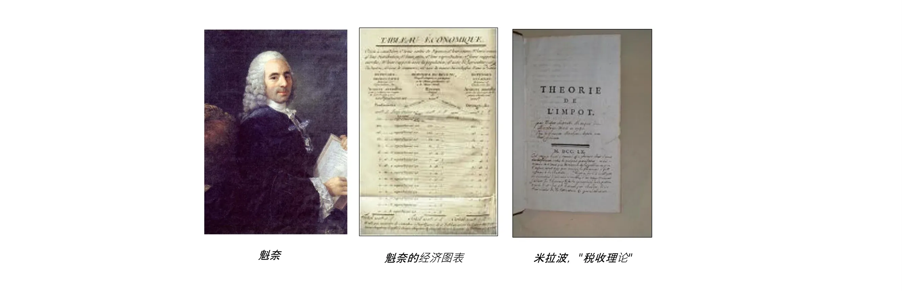

谈话结束后，米拉波同意了魁奈的观点。从此，他们开始写作：魁奈创作了《经济表》（*Tableau économique*，1758 年）来说明财富在经济中的流动，他们还共同发表了《税收理论》（1759 年）。

他们的努力并没有受到热烈欢迎。在宫廷里，人们的普遍反应是漠不关心。国王承认魁奈的理论倾向，并亲切地称他为 "我的思想家"。但除了这种赞美，他们的工作没有取得任何成果。事实上，他们的《赋税论》触怒了它所批评的税务管理者，以至于他们要求并确保米拉波入狱。蓬巴杜夫人最终释放了米拉波，但他仍在比农的庄园里流亡了几个星期。

就这样，1760 年代的前半期在相对的沉默中过去了。由于他在凡尔赛的地位，魁奈被迫停止写作，至少不再以自己的名义发表任何作品。已经被判过一次罪的米拉波受到了警告，他深知国王的宠臣不可能永远保护他。

在短暂的沉寂之后，两位经济学家开始招收弟子：这是普及他们思想的唯一途径。到 1765 年，他们取得了令人瞩目的成就。Dupont de Nemours、Abeille、Mercier de la Rivière、Le Trosne 和 Baudeau 很快加入了他们的行列。他们组成了一个学校：他们有自己的刊物《公民的爱斐美里兹》（*Les Éphémérides du Citoyen*），甚至每周二在米拉波家聚会。

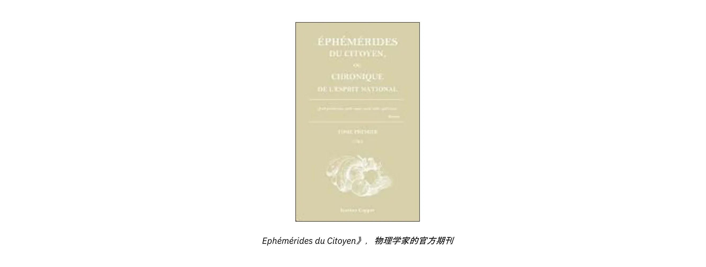

1765 年至 1775 年间，联合起来的物理学家群体达到了他们声誉的顶峰。文学界和哲学界只关注他们，使他们的思想得到了广泛而迅速的传播。人们称他们为 "经济学家"，或者更嘲讽地称他们为 "经济学家的教派"。无论语气如何，他们的恶名是绝对的。1774 年，de Vaublanc 先生在一次梅斯之行后，在他的回忆录中写道了他的惊讶：他周围的每个人都像魁奈的弟子一样谈论经济学和推理。他说："这是一种时尚"。"每个人都是经济学家"。

然而，到 1770 年，他们的声望开始下降。他们经历了第一次叛变，抵御批评的能力也减弱了。批评者很多，孔迪拉克、梅布尔、伏尔泰、加里亚尼、林盖、格拉斯林，甚至苏格兰的亚当-斯密都对他们的观点提出了质疑。

他们的报纸不再定期出版。这标志着该运动最活跃时期的结束。

大革命之前，唯物主义一直在发挥影响。在法国，首先是通过杜尔哥（与其说是弟子，不如说是同行），以及通过其代表杜邦-德-内穆尔（我们稍后将研究他的生平和作品）。在整个欧洲，重农学说也受到了热烈欢迎。在德国，通过巴登侯爵，在意大利，通过托斯卡纳的利奥波德，重农学说甚至激发了主张私有财产和自由的经济改革。

## 物理学家学说的基础

<chapterId>4dbe5436-0578-57c2-b054-03ed00aa091a</chapterId>

Physiocracy 一词由杜邦-德-内穆尔（Dupont de Nemours）创造，意为 "自然而然的政府"，魁奈于 1768 年出版了一本文章合集《*Physiocracy*》，并以此为书名。

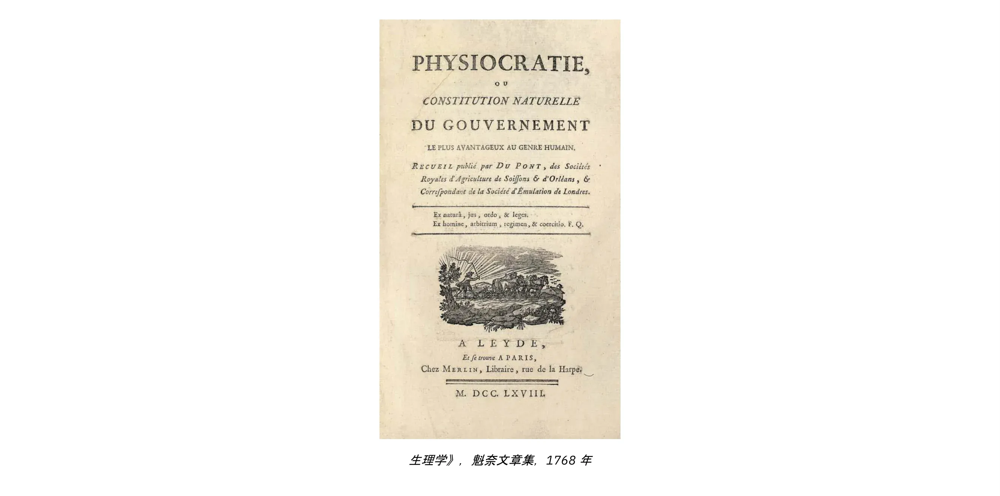

这是一个晦涩难懂的短语。魁奈的学生没有向我们提供它的真正含义。然而，他们的思想体系远非晦涩难懂。事实上，他们的思想体系是围绕着几个非常明确的原则建立起来的，我们将在这里对这些原则进行概述。

### 第一条原则：只有农业才有生产力

第一个观点引起了历史学家的注意。今天，在教科书或经济学课程中，人们是这样概括 Physiocrats 的。据说他们天真地认为，只有农业才具有生产力。在此基础上，他们的学说被视为无关紧要，分析很快转向亚当-斯密。

然而，批评物理贵族过分重视农业是不公平的，因为在 18 世纪中叶，农业雇用了 90% 的人口，构成了法国经济的基础。

物理学家的想法其实很微妙。他们认为，生产和收益是有区别的。工业家和商人可以赚取利润，但只有农民才是真正的生产者，因为生产是创造有用的物质，而不是在原有物质上增加效用。

我们还应该试着理解为什么他们拒绝工业和手工业，认为它们没有生产力。当时，这些行业被锁在行会制度内，禁止创新、投资和进步。

### 第二项原则：法律专制而非民主

今天，为了侮辱某人，我们会说他不是民主主义者。虽然历史学家原谅了物理贵族对农业生产力的严格看法，但却不能原谅他们对民主的反对，尤其是因为他们生活在启蒙思想的鼎盛时期。从 18 世纪中叶到大革命前夕，物理学家被视为进步的敌人。

托克维尔坚持这一观点：

> 理智派确实非常赞成商品自由贸易，赞成工商业的自由放任或放任自流；但至于政治自由本身，他们并没有考虑过，即使偶然有这样的想法，他们最初也是拒绝的。

在经济学上是自由主义者，因此在政治问题上，物理贵族并不是自由主义者。魁奈在他的《格言》中写道："让主权权威独一无二，并高于社会上的所有个人和所有不公正的私人利益企业"。后来，在同一条格言中又写道："政府中的制衡制度是一种致命的观念，它只会显示大国之间的不和谐和对小国的压迫"。

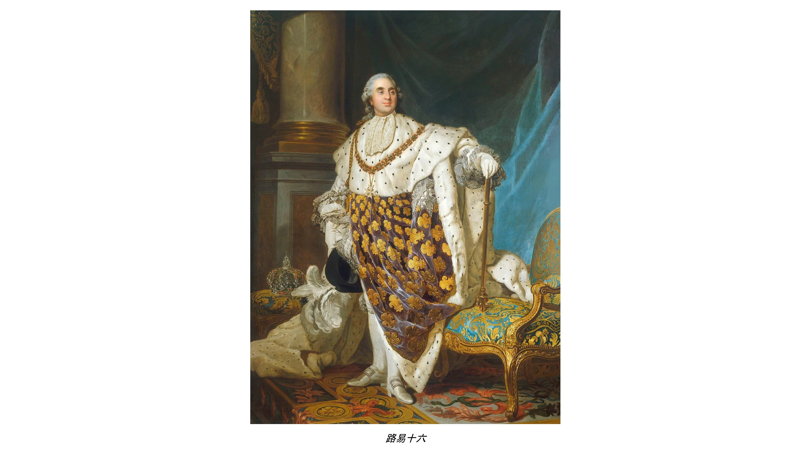

托克维尔恰如其分地指出，物理学家们一看到民主的形式，就立即拒绝了民主。他们对民主持怀疑态度，因为民主远非一个完美的制度：它可能允许多数人压迫少数人，也可能成为篡夺、暴政和掠夺的工具。

### 第三项原则：绝对尊重私有财产

重农学派认为，人们需要拥有并保留自己的劳动成果。在他们看来，财产权是社会的根本基础。他们认为国家的主要职责只有一个：保护人民的财产。此外，从经济学的角度来看，自然神论者认为财产的不可侵犯性鼓励人们工作和努力，是经济进步的条件。

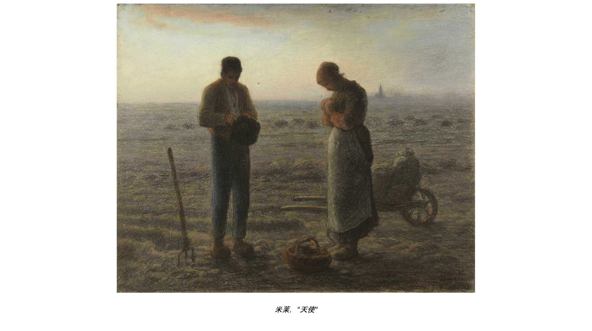

魁奈说得很简单：

> 让土地和动产财富的合法拥有者获得 Ownership 的保障，因为财产安全是经济秩序和社会安全的重要基础；正是永久拥有的确定性鼓励了劳动，鼓励了将财富用于改良和耕种土地以及工商企业。

### 第四项原则：绝对的商业自由

魁奈在他之前引用的《格言》中说

> 让商业完全自由，因为对国家和民族来说，最可靠、最精确、最有益的国内和对外贸易管理就在于充分的竞争自由。

重农主义者看到了政府干预造成的损害，尤其是在谷物贸易中。他们说，人们必须承认，政府永远无法像个人那样管理好商业，因为它需要对每一种需求做出反应，对需求或全球粮食市场的每一次变化做出反应。所有这一切，即使是人们所能想象到的最明智的政府也远远无法做到。因此，有必要顺其自然，任其发展。

贸易本质上是有益的，必须是完全彻底自由的。他们的成员之一勒特罗斯内甚至写了一本题为[*谷物贸易的自由：永远有益，永不有害*]的小册子(https://www.institutcoppet.org/liberte-commerce-grains-toujours-utile-jamais-nuisible/)。

### 第五项原则人人都是兄弟

理智派坚决反对奴隶制，同时也是伟大的和平主义者。米拉波简单地说："我们的外交政策就是和平"。1790 年，在制宪会议上，杜邦-德-内穆尔（Dupont de Nemours）继续坚持和平主义立场，他提出了一项禁止进攻性战争的法案。

## 物理学家的成就和影响

<chapterId>5b911105-796a-5e2e-a501-c7a364fc758e</chapterId>

正如我们在介绍物理学家的三章中的第一章所看到的，魁奈的追随者在法国风靡了大约十年。对他们思想的热情在他们那个时代就已形成，并一直持续到本世纪末。在此，我们将探讨他们的一些成就，以及他们在经济思想领域对后继者的影响。

继古尔内集团之后，他们的最大成就是普及了经济思想。伏尔泰的名言众所周知：1750 年前后，饱读诗歌和小说的国民开始思考谷物问题。物理学家们参与了这场运动，发表了数百篇关于谷物贸易自由的文章、小册子和书籍。从 1760 年到 1775 年法国出版的大量经济学著作和小册子中也可以看出，物理学家们为经济学讨论提供了强大的动力。作为经济思想在法国传播的进一步证据，我们可以回顾一下上一讲中提到的德-沃布朗先生的言论，他于 1774 年在梅斯说，人们只谈论经济。他说，"这是一种时尚"。"每个人都是经济学家"。

魁奈和米拉波通过书籍、小册子以及他们的杂志《公民的自由》（*Les Éphémérides du Citoyen*）为他们的思想辩护，很快对法国的经济政策产生了影响。1763 年，魁奈和米拉波强烈要求的谷物贸易自由获得法令批准。当局还多次放宽了行会管理条例，以保证更大的工作自由。

在国外，他很早就取得了成功。在德国，巴登侯爵对重农思想很感兴趣，并与米拉波和杜邦-德-内穆尔保持定期通信。

他委派经济学家约翰-奥古斯特-施莱特魏因（Johann August Schlettwein）实施税制改革并放开谷物贸易，施莱特魏因是一位深信不疑的重农主义者。1770 年 4 月，在小村庄迪特林根进行了首次试验。村民们似乎对这些措施表示热烈欢迎，但主管官员却并不十分支持，因此推迟了更大范围的实施。

在俄国，凯瑟琳二世正准备进行立法改革，她请求狄德罗派一位杰出的思想家来协助她。

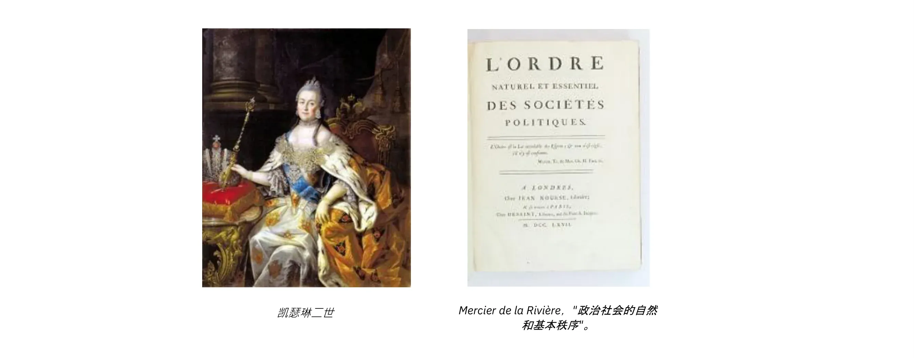

1767年出版的[*《政治社会的自然和基本秩序*》](https://archive.org/details/lordrenaturelete00mercuoft)给他留下了深刻印象，他把这本书的作者、理学家梅西埃-德拉里维埃寄给了她。

虽然他离开法国时受到了赞誉，但他在圣彼得堡受到的接待却很冷淡（气候除外），皇后对他很失望。

在瑞典的古斯塔夫三世和意大利的托斯卡纳利奥波德那里，自然神论者也找到了愿意将他们的思想付诸实践的追随者。

在法国，随着 1774 年杜尔哥被任命为财政总审计长，自然神论者取得了巨大成功。

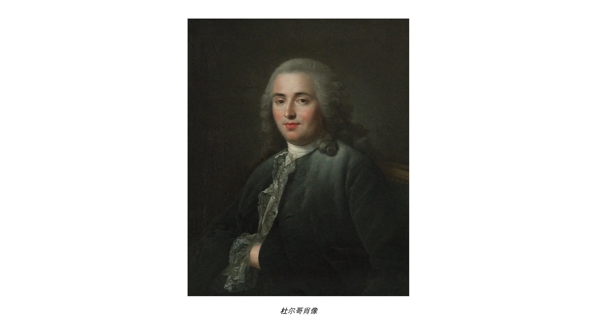

杜尔哥意识到自己的名声已经大不如前，因此他从不以物理学家的忠实弟子自居，也不以百科全书式的学者自居，尽管他也是一个百科全书式的学者，而且他们受到了神职人员的鄙视。杜尔哥一上台就颁布了六项著名的法令，这些法令是实践物理学家纲领的开端：商业自由、劳动自由和结束垄断。

到了法国大革命时期，物理学家的追随者越来越少。米拉波侯爵于 1789 年 7 月 13 日去世，这无疑是一个象征。阿贝耶已经离开了，但杜邦-德-内穆尔依然忠心耿耿。杜邦-德-内穆尔被任命为议会议员，他代表了物理学家的声音，呼吁进行经济改革，支持财产Ownership和自由贸易。

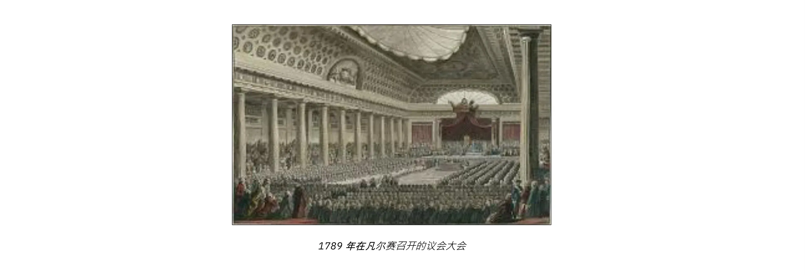

他还与阿让派进行了斗争，但没有成功。尽管失败了，但物理学家的思想仍然活跃在思想辩论中，并影响了大革命的早期成就。正如约瑟夫-兰博（Joseph Rambaud）所说，大革命在自由方面所做的一切都要归功于物理学家。

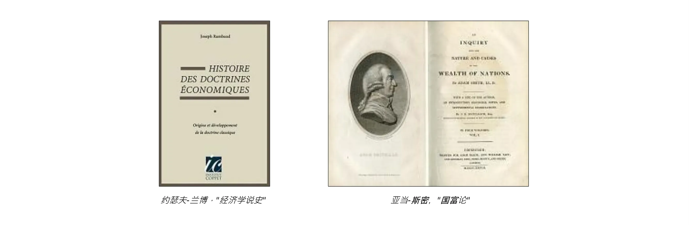

物理学家对经济思想史也产生了重大影响。亚当-斯密曾访问法国并会见了他们中的许多人，深受他们著作的影响。他甚至考虑将《国富论》*献给魁奈*。

遗憾的是，魁奈在斯密的书出版前两年去世，斯密也因此删除了献辞。虽然斯密并不同意他们关于只有农业才有生产力的观点，但他接受了他们关于自由市场的许多论点，并在自己的著作中将其发扬光大。

## 杜邦公司

<chapterId>6d585e0f-93b8-5b0a-a0a8-7f6e4a5bc68e</chapterId>

在美国，我们对杜邦公司（又称 "E.I. du Pont de Nemours and Company"）并不陌生，这是一家化学和生物领域的跨国公司。

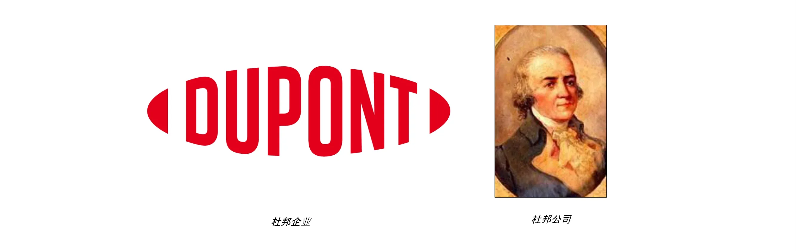

如今，该公司的销售额已超过 35 万亿美元，在全球拥有近 65 000 名员工。原来，这家公司与法国物理学家派经济学家塞缪尔-皮埃尔-杜邦-德-内穆尔的命运息息相关。

生于 1739 年的杜邦-德-内穆尔在 24 岁时接触了物理学家。当时，他仍在寻找自己的人生道路。一天，他看到一本名为《国富论》的小册子。他认为这本小册子的经济思想是无稽之谈，于是写了一篇名为《对国家财富的思考》的批判性回应，于 1763 年发表。这篇文章大受欢迎，读者们纷纷称赞："你一定是米拉波的弟子！"讽刺的是，杜邦甚至不知道谁是米拉波。

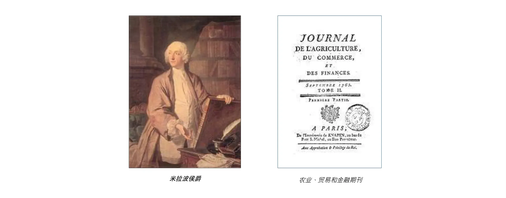

出于好奇，他开始阅读米拉波的著作《人民之友》（*Friend of the People）和《税收理论》（*Theory of Taxation）。他结识了米拉波和弗朗索瓦-魁奈，并加入了他们的学校。

1765 年，杜邦被聘为《农业、商业和金融杂志》（*Journal de l'Agriculture, du commerce et des finances*）的编辑，该杂志是当时经济思想领域的主要期刊。

这有两个原因：米拉波和魁奈必须保持沉默，而杜邦则被视为他们的后起之秀。

物理学家学派的成员一致认为，杜邦-德-内穆尔很快成为了魁奈的宠儿。魁奈曾说："照顾好这个年轻人，等我们死了，就由他来说话。一位名叫阿贝耶的物理学家甚至嫉妒杜邦受到的关注，并疏远了魁奈的学派。

杜邦-德-内穆尔始终保持着对魁奈的高度评价。

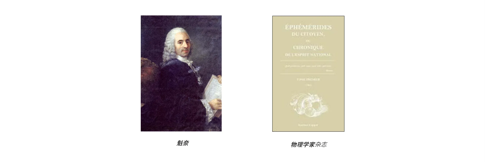

他后来说："当魁奈向我伸出双臂时，我还是个孩子，是他让我成为了一个男人"。是魁奈让他成为当时文坛上的重要经济学家。

在《农业、商业和金融杂志》（*Journal de l'Agriculture, du commerce et des finances*）之后，杜邦被任命为《公民杂志》（*Les Éphémérides du Citoyen*）的编辑，该杂志成为了物理学家的官方刊物。

他使这本期刊集成为经济理论的主要中心，甚至在理智派衰落期间，他还亲自撰写了几乎所有的后期书卷，以支持这本期刊集。此外，杜邦-德-内穆尔还创造了 "physicist"（理智政府）一词，该词源于希腊语，意为 "自然的政府"。他用这个词作为 1768 年出版的魁奈文章集的标题，这个词最终被载入史册。众所周知，在物理学家之间，他们互相称呼对方为 "经济学家"，在大革命期间，他们仍然被称为 "经济学家"。

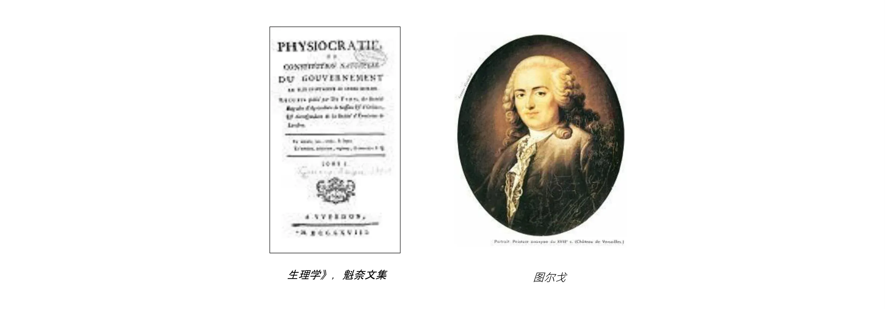

当杜尔哥短暂担任法国财政部长时，杜邦成为了他的亲密顾问，也是唯一能接触到他的物理贵族，因为杜尔哥与其他人保持着距离。

大革命爆发时，他从内穆尔辖区当选为议员，在议会中与另一位杜邦先生同坐一席。当时他被称为杜邦-德-内穆尔（Dupont de Nemours），这并不是因为他是贵族，而只是为了区分两者。当然，这个名字还是保留了下来。

1792 年 8 月大革命期间，他拿起武器在杜伊勒利宫保卫国王，抵御人群。

国王对他说："杜邦先生，我们总能在需要你的地方找到你！"他奇迹般地逃过了恐怖时期，被判处死刑，等待上断头台，但因罗伯斯庇尔的倒台而幸免于难，他在拿破仑的统治下被迫流亡，在美国找到了幸福。

尽管他一生阅历丰富，发表过数十篇文章、小册子和书籍，但他至今仍鲜为人知。这或许是因为，在物理学已经过时的时候，他仍然是坚定的物理学家。事实上，正如熊彼特所写，杜邦-德-内穆尔 "在他的职业生涯中，有很多机会可以放弃物理主义"，但他始终忠实于物理主义。他是一个有信念的人。

# 启蒙运动与政治经济学

<partId>d1c885ad-7cb1-5f81-816c-be312719d9f8</partId>

## 伏尔泰与哲学家

<chapterId>16bcf7bf-dad4-5113-8c64-2800f04ff07b</chapterId>

在 18 世纪的法国，经济学成为一门科学，并出现了第一个经济思想流派：生理经济学派。亚当-斯密在这一时期接受了经济学培训，法国经济学家被全球公认为领袖人物。然而，与其说这个世纪是经济学的世纪，不如说它是哲学的世纪。虽然物理学家运动在其抱负上与启蒙哲学一致，但哲学家们的态度--尤其是狄德罗和伏尔泰--值得仔细研究。我们将看到，启蒙思想家为自由放任思想在法国的传播做出了重大贡献。

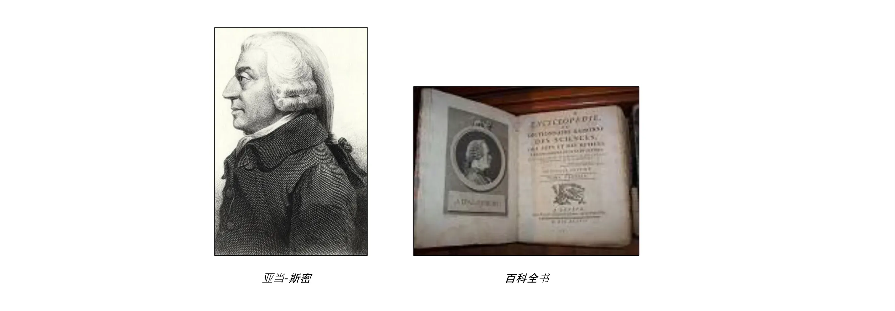

启蒙哲学最著名的成就无疑是狄德罗和达朗贝尔的《*百科全书*》。

经济类文章自然由经济学家撰写。在早期的几卷中，狄德罗求助于福尔邦纳，然后又请来了自由派经济学家：先是弗朗索瓦-魁奈（他撰写了《谷物》、《费米人》、《人》等文章，最后一篇尚未发表），然后是涂尔戈（他撰写了《财富与市场》）。这些著作都非常重要。在他的文章中，魁奈为后来的物理学家学说奠定了基础。这些文章与他的《经济学表》（*Tableau économique*）是他最著名的作品。当时还很年轻的杜尔哥在他的文章中发展了自由放任的思想，批评了国家对市场组织的干预。

在《*百科全书*》的许多其他文章中，哲学家们，尤其是狄德罗，捍卫了宗教、政治和经济等各个领域的自由理想。

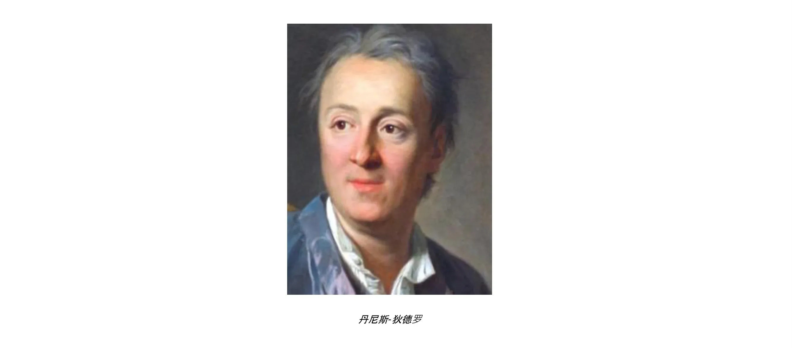

劳动自由，尤其是与行会制度相对立的劳动自由，是《艺术》、《行业》和《社区》等各个条目中反复出现的主题。

狄德罗的经济理论之路令人好奇。在《百科全书》中，他是经济自由的坚定倡导者，也是寻求自由派经济学家合作的人，一封概述杜尔哥可能为他撰写的文章的信证实了这一点。在物理主义的早期，他既是魁奈学派的支持者，也是其宣传者。1769年和1770年，他为*Les Ephémérides du Citoyen*撰稿，这让他那些反自由主义的哲学家朋友，如梅尔基奥尔-格林（Melchior Grimm）大失所望。就在加里亚尼即将返回意大利之际，他帮助加里亚尼方丈用法文出版了他关于谷物贸易的著作。

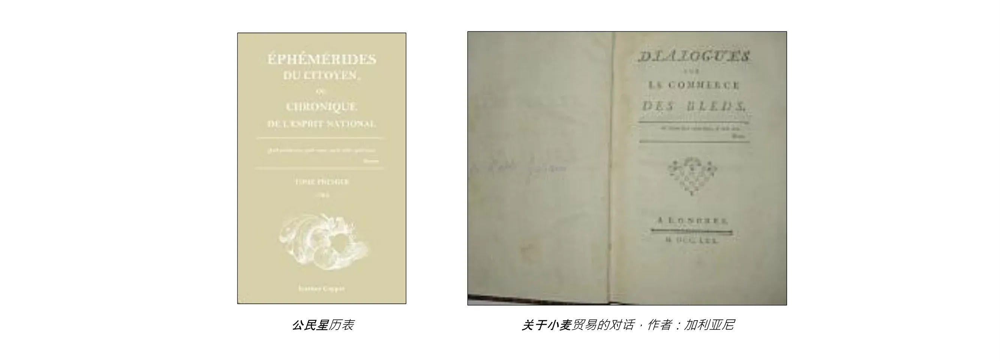

这本书成为有史以来对物理学家思想的最猛烈抨击，对该运动造成了重大打击。后来，狄德罗在《加里亚尼论》（*Apology of Galiani*）中为加里亚尼辩护，反对物理学家的亲密盟友莫雷莱方丈。几年后，在杜尔哥执政期间，人们看到狄德罗对通过废除行会来建立劳动自由表示赞赏。此时，作为工匠之子的狄德罗发现自己与自由派经济学家的观点一致，他给加利亚尼写了一封尖刻的信，声称劳动自由会在二三十年内毁掉法国工业。从工业革命的角度来看，历史并非如此。回到自由派经济学家阵营后，狄德罗不再得到他们的信任，依然处于孤立无援的境地。1774年他写给杜邦-德-内穆尔（Dupont de Nemours）的一封信就很能说明问题：

> "你曾经对我有过友谊，现在你不再有了，因为你太忙了，不再有时间去爱任何人"。

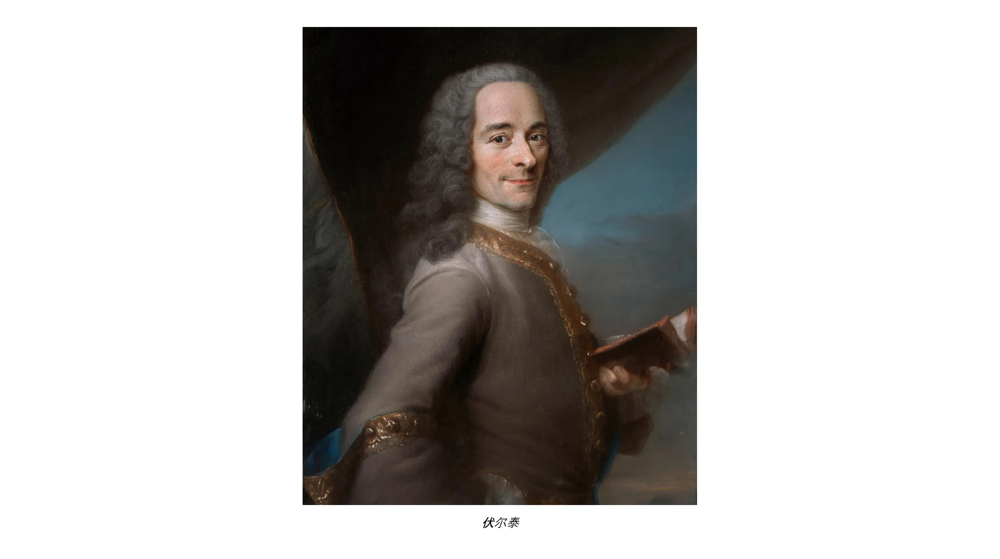

伏尔泰也走过类似的道路，但他的经济观点缺乏一致性。他钦佩文森特-德-古尔奈，与经济学家（包括杜邦-德-内穆尔和杜尔哥）通信，欣赏物理学家，尤其是他们对农业的赞美。他在《致埃菲梅里德书作者的自述》（*Diatribe to the Author of the Ephémérides*）中对他们大加赞赏。不过，他后来在讽刺作品《四十克朗的人》（The Man of Forty Crowns）中批评了他们的单一土地税思想，这也引起了很大争议。最后，与狄德罗一样，他也对杜尔哥的执政时期表示赞美，称其为黄金时代，并赞扬了他关于劳动自由和自由贸易的两项伟大法令。

归根结底，哲学家与经济思想的关系是好坏参半的。尽管他们对自由主义经济思想既有赞美也有批评，但他们在将这些思想带入启蒙运动更广泛的思想话语中发挥了作用。通过这种方式，他们有意无意地帮助推动了自由放任的理念，直至大革命。

## 理论家杜尔哥

<chapterId>a8cd8185-8351-556b-8011-3a0c313e8a9d</chapterId>

美国经济学家默里-罗斯巴德（Murray Rothbard）在他的《经济思想史》（*History of Economic Thought*）中有一段名言，称赞涂尔干 "才华横溢"。

将他与康蒂雍并称为 18 世纪最伟大的经济学家。

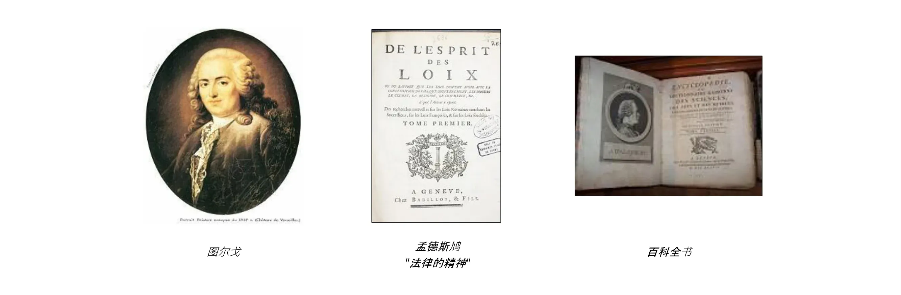

屠格是如何崛起的？这归结于三个关键因素的结合。 **第一**，他的显赫家世。他出身于皇家行政官世家，其中许多人都担任过政府要职。 **第二**，他出生和成长的黄金时代。孟德斯鸠出版《爱的精神》*时，杜尔哥 21 岁；《百科全书》*第一卷问世时，杜尔哥 24 岁。

他与物理学家伏尔泰、狄德罗、德霍尔巴赫、亚当-斯密、孔多塞等人同时代。 **第三**，他的思想早熟。他在索邦大学读书时，22 岁就写了一封关于纸币的信，发表了卓越的演讲，24 岁就列出了 52 部作品的写作清单。

尽管年轻，杜尔哥还是为《百科全书》做出了贡献，他撰写的文章涉及 "词源学"、"存在"、"可扩展性"、"集市 "和 "基础 "等主题。只有一篇文章直接涉及经济学--他的《集市》一文，详细介绍了集市和市场的起源，并批评了国家对集市和市场日益增长的干预造成的破坏和瘫痪。

早年，他得到了文森特-德-古尔奈的指导，后者将他置于自己的羽翼之下，并与他结下了深厚的友谊。1759年古尔奈去世后，杜尔哥撰写了一篇悼词，对自由放任理论进行了精辟的总结。他特别写道

"从商业与国家有关的任何角度来看，个人利益自生自灭，总是比政府运作更有把握地产生普遍利益，因为政府运作总是有缺陷的，而且必然以模糊和不确定的理论为指导"。

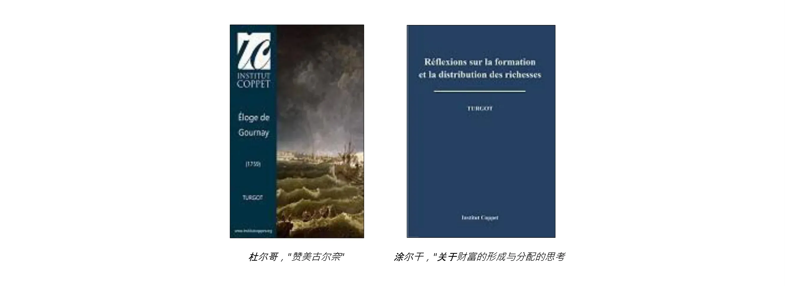

1767 年，他在担任政府官员期间，以《关于财富的形成和分配的思考》（*Reflections on the Formation and Distribution of Wealth*）为题，撰写了一本经济学汇编。

其中涉及劳动分工、消费者主权、私有财产、资本的作用等几乎所有主要的经济主题。许多历史学家，最近的一位是历史学家安妮-克莱尔-霍英（Anne-Claire Hoyng），指出了杜尔哥的这部著作与亚当-斯密九年后出版的《国富论》之间的相似之处。

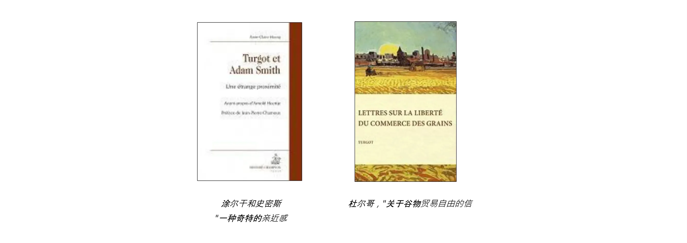

杜尔哥在给泰雷修道院院长的信中捍卫了谷物贸易的自由，这些信后来转交给了国王，但其中一半现已丢失。他写道

> 主席先生，如果说有什么是当务之急的话，那就是不要对所有行业中最重要的行业施加新的限制，而是要取消那些不幸被允许保留下来的限制。
> 如果说有什么时候需要最充分、最绝对的自由，完全不受任何障碍的限制，我敢说现在就是这样的时候。

1769年，涂尔干为莫雷莱（Abbot Morellet）的《商业词典》（*Dictionnaire de Commerce*）撰写了《价值与货币》一文，但这篇文章最终没有出版。加利亚尼早已指出，"人是万物的共同尺度"，这预示着杜尔哥将在三十年后的这篇文章中展开主观分析，对这一命题进行阐释和证明。

1770 年，远在边沁之前，杜尔哥就写了一份备忘录，主张利率和高利贷自由。

他说："认为商业中的货币利息应由王公贵族的法律来确定是错误的"，"它是一种时价，与所有其他商品的时价一样，可以自我调节"，为了捍卫这一立场，他驳斥了亚里士多德和教父们的反对意见。

在一封被人遗忘的 1773 年写给泰雷修道院院长的信中，可以找到对杜尔哥自由放任理论的精辟概括：

> 政治必须做的是屈从于自然和商业的进程，而不试图去引导它，因为要引导它而不破坏它，又不伤害自己，就必须能够跟踪人类需求、利益和产业的所有变化；就必须了解它们的详细程度，而这种详细程度实际上是不可能获得的，在这种情况下，即使是最娴熟、最积极、最细致的政府，也总是有可能出错，至少出错一半。

在这里，我们看到了对自由放任学说的明确阐述，以及弗里德里希-哈耶克对知识的伪装--即国家不可能完全掌握经济力量以对其进行控制--的分析的预示。

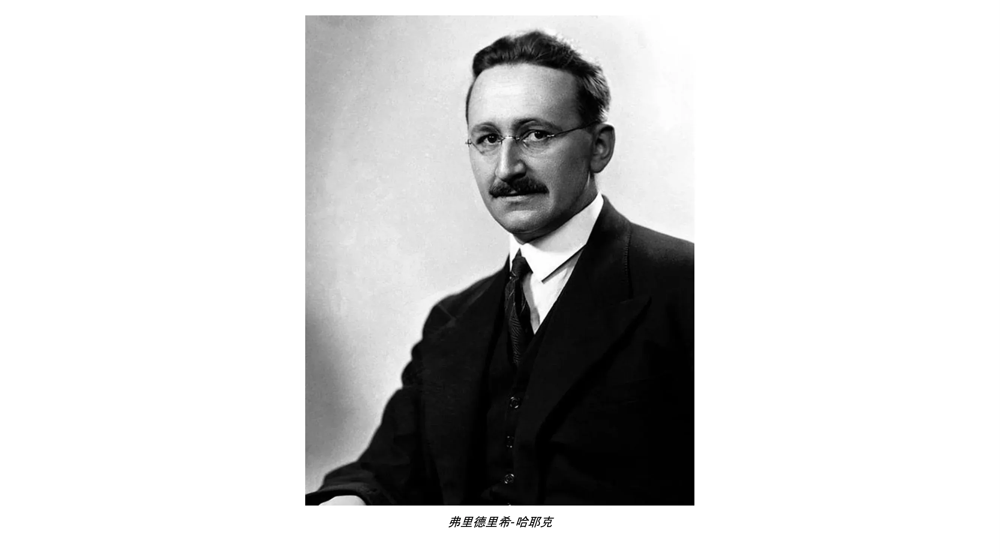

## 改革家杜尔哥

<chapterId>9177429f-1679-51c4-bfd2-dd036d24a1cc</chapterId>

正如我们在前一章中简要回顾过的，杜尔哥出身于一个显赫的家族，这个家族在法国上层公务员系统中表现出色。

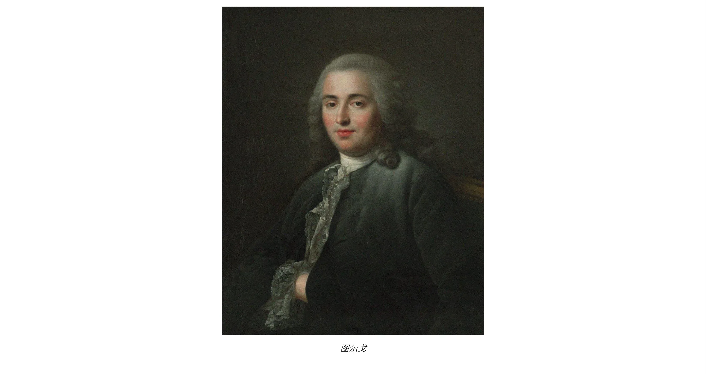

他的父亲曾是巴黎商人的教务长，祖父则是一名内务官。在学习成绩优异之后，图尔戈家族的小儿子也立志至少要达到同样的高度。他先是担任了一段时间的征询官（maître des requêtes），这意味着他是官员和凡尔赛之间的联络人。这是一个很有声望的职位，他必须获得特殊的年龄豁免，但图尔戈渴望得到更多。他的导师古尔内（Gournay）的去世进一步激励他向更高的目标迈进，于是他请求被任命为行政官。

1759 年，他第一次申请格勒诺布尔的主教职位，但被拒绝了。随后，有人向他推荐了里昂的商人教务长一职，但他拒绝了。他又申请布列塔尼的主教职位，但也被拒绝了。最后，在 1761 年，他得到了利穆赞地区的领地，他有些勉强地接受了。他在给伏尔泰的信中写道他在给伏尔泰的信中写道："我很不幸成为了一名地方行政长官"，也许是这个意思：我不幸成为了利穆赞地区的主教。

在利穆赞地区，农民十分贫穷，生活条件岌岌可危，尤其是在住房和食品方面。教育水平普遍极低。仅有的几条公路也破烂不堪。

由于该地区非常贫穷，大臣们对它不感兴趣。这给了杜尔哥进行改革试验的自由。他在利穆赞推行了三大计划：

- 重新分配尾税，即个人税（杜尔哥的目的是尽可能客观地评估个人税）。
- 徭役是一种以劳动支付税款的形式，农民被迫从事筑路工作。杜尔哥在巡视该地区时，很快注意到道路状况不佳。他用货币税取代了徭役。
- 招募民兵，即战时动员起来的农民武装。

杜尔哥用带薪志愿者取代了这些强制性征税。

这些改革无疑是成功的，1774年7月，杜尔哥被任命为大臣。由于缺乏经验，国王先将他安排在海军部。这一任命让许多人感到好笑。杜尔哥自己也承认，"我对海军一无所知"，伏尔泰说，"我认为杜尔哥并不比我更像个水手"。

然而，仅仅一个月后，杜尔哥就被任命为财政总审计长，实际上成为了法国的经济和财政部长。

我们知道他在信中向路易十六概述了他的原则："不破产。不增税。不提供新贷款"。今天的批评者可能会将这一理念称为毫无意义的 "严谨"，但其目的却是为了拯救君主制。

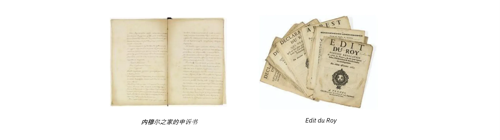

杜尔哥制定了六项敕令来改革法国经济。

这是经济专家第一次，也是最后一次获得改革国家经济的自由。杜尔哥的三项法令引人注目：一项废除了强迫劳动（corvées），另一项解散了行会（公司），第三项确立了谷物自由贸易。

杜尔哥一开始就知道，他将面临特权阶层的抵制。"他对国王说："宫廷中的大多数人和所有寻求恩惠的人都会害怕我，甚至憎恨我。特权阶层很快联合起来反对他，并解除了他的财政总监职务。伏尔泰完全支持杜尔哥的改革，他在书信中写道

> 啊！我听到了一个多么可怕的消息！我们会怎么样？我悲痛欲绝！见证了黄金时代的诞生和消亡，我们将永远无法复原！这个晴天霹雳击中了我的思想和心灵。

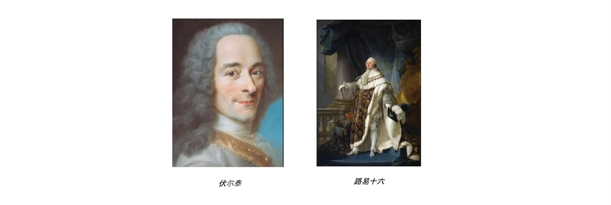

从那时起，许多人就认为法国是一个不可能改革的国家。杜尔哥的失败似乎证实了这一点：半个世纪的自由经济思想为他做好了准备；启蒙哲学家支持他；拥有绝对权力的国王本人也支持他。

最终，议会和特权阶级赢得了胜利。国王只能私下哀叹："我现在明白了，只有图尔戈先生和我关心人民"

## 康迪亚克

<chapterId>0ba8dbb5-dcd5-5981-bf85-6c185e0bf192</chapterId>

正如重商主义最明显的现实表现一样，蒙田的诡辩术也需要很长的时间才能消失。

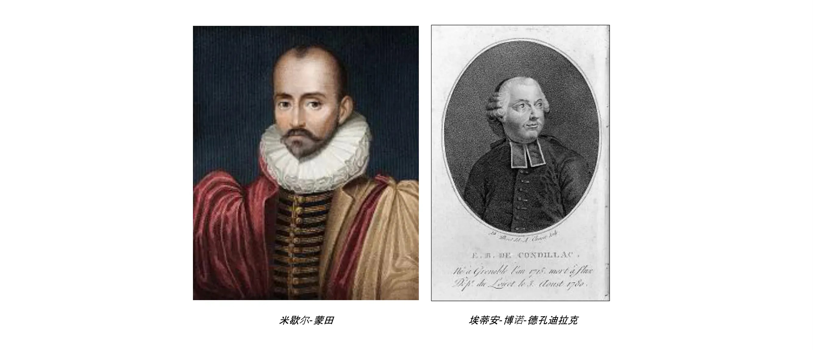

这种诡辩就是认为贸易和 Exchange 是零和游戏。无论一方在交易中获得了什么，另一方必然会失去什么。其支持者认为，个人之间和国家之间都是如此。

孔迪拉克方丈在彻底破除这一错误观念方面发挥了重要作用。

"确定无疑 "或许有些夸张，因为在公开辩论中，这种诡辩经常出现。此外，这或许也是孔迪拉克仍然是一位鲜为人知的经济学家的原因。除了奥地利经济学家之外，很少有人了解他的 Exchange 理论的重要性，也不再有人对他感兴趣。

对于大多数经济思想史学者来说，1776 年的标志是《国富论》的出版，它奠定了经济科学的基础。在我们刚刚上完的十五课中，我们学习了亚当-斯密之前的法国经济科学，这足以证明这种观念的错误。此外，就在 1776 年，另一本著作或许比亚当-斯密的著作更值得历史学家称道：这本书是孔迪拉克写的，书名很简单，叫做[*从相互关系考虑商业和政府*](https://archive.org/details/commercegovernme0000cond)。

康德拉克认为，如果把 Exchange 看作是零和游戏的诡辩仍然存在，那么物理学家们要负部分责任，因为他们坚持认为 Exchange 是一种平等关系。康德拉克认为，这是错误的：Exchange 是一种不平等的关系，在这种关系中，一个人总是付出较少而获得较多。

在物理贵族的思想和孔迪拉克的思想之间，没有比这更完美的对立了。物理贵族经济学家勒特罗斯内写道

> Exchange 就其本质而言，是平等的 Contract，是等价交换的 Contract。

孔迪拉克则写道

> Contract 的每一方总是付出一些价值较低的东西来获得一些价值较高的东西。

然而，双方的对立主要是语言上的。双方都认为，用一法郎换一本书，这本书就值一法郎，或者说这本书的价格就是一法郎。

不同之处在于，孔迪拉克声称，既然我们用Exchange一法郎来换取书，这就意味着对我们来说，书的价值高于我们的一法郎硬币。与硬币相比，我们更喜欢书，这就是我们制作 Exchange 的原因。

康迪拉克的理论与物理学家的理论并无根本矛盾，但可以说，他们说的不是同一种语言。Le Trosne 说的是价格，而 Condillac 说的是价值，反之亦然。

康迪拉克的正确之处在于，如果两种交换商品的价格相等，价值就不相等，否则就不会出现 Exchange 。

总结孔迪拉克的理论，可以列出三个命题：

第一个命题：我们追求商品的效用。这似乎是显而易见的，但经济学的一个核心原则是，人们通过 Exchange 获取效用，让-巴蒂斯特-萨伊也完美地阐释了这一点。

第二个命题：价值先于交换并激发交换。每个人对商品和服务的主观判断意味着，这些商品和服务对他们来说都有价值，价值的高低取决于它们似乎能提供的效用。当然，每个人的判断不同，价值也因人而异。

最后，第三个命题：价格是 Exchange 过程的结果。产品不会以我赋予它们的价值来进行全球十大知名博彩公司，因为全球十大知名博彩公司的条件也取决于卖方赋予这些产品的主观价值。买方和卖方之间的关系，或者说买方的主观评价和卖方的主观评价之间的关系，决定了价格。

孔迪拉克的这些思想非常重要。它们让我们理解了为什么每一个 Exchange 总是互惠互利。

因此，它们完全摧毁了对自由贸易的批评，因为保护主义只是作为一种机制出现的，它阻止了人口之间的互利互惠。自由放任也是孔迪拉克著作的结论。让人们随心所欲吧，因为如果公共权力保护自由和财产，人们总会通过共同交换而相互致富。

## 孔多塞

<chapterId>99e4aba6-da7f-5041-b02f-337158381515</chapterId>

孔多塞无疑是启蒙运动中最具经济头脑的哲学家。

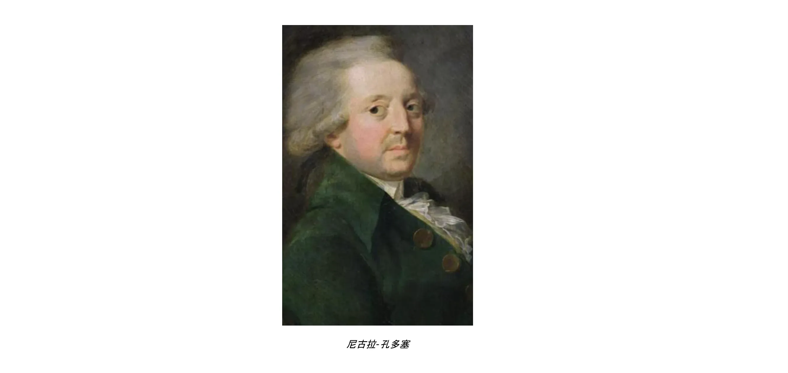

在他职业生涯的大部分时间里，他致力于与经济学完全无关的领域，这也是理所当然的，因为他的才华使他最专注的科学领域取得了巨大进步。但在 1770 年左右，他感到自己被经济问题所吸引，这或许是因为其他哲学家，尤其是伏尔泰和狄德罗，不屑于将他们的闲暇时间用于研究经济问题，还因为他结识了杜尔哥。

孔多塞逐渐接受了自由放任的思想，最初是在与政治经济学无关的领域。他在《神学家信札》（*Letter of a Theologian*）中对天主教进行了哲学嘲讽，并表示希望看到真正的信仰自由，包括不信仰的自由。在争取宽容和反对宗教狂热的斗争中，孔多塞为巴雷骑士的平反和因打碎十字架而被判处死刑的埃塔隆德的重审进行了斗争。

因此，当他的朋友杜尔哥（Turgot）升任财政总长时，他已经做好了捍卫自由的准备。

从那时起，孔多塞的事业发生了转折，他开始参与经济辩论，坚持不懈地支持新大臣的自由主义改革。孔多塞主张竞争和商业自由，还呼吁废除强迫劳动（corvées）、行会和公平税收。只要有机会，他就会公开表达这些信念，并表现出明显的热情："请允许我再次谈谈商业自由；我喜欢谈论这个话题"。

1774 年至 1776 年间，在杜尔哥执政期间，孔多塞发表了大量言论，这些言论都以自由放任为标志。他的作品包括《一位皮卡第农民致内克先生的信》（*Letters from a Farmer of Picardy to Mr. Necker*），为自由贸易辩护；《垄断与垄断者》（*Monopolies and Monopolists*），主张自由竞争；《对科尔维埃的反思》（*Reflections on Corvées*），呼吁废除科尔维埃；以及《对谷物贸易的反思》（*Reflections on the Grain Trade*），再次赞扬自由贸易，并批评了内克关于同一主题的著作。

孔多塞在其[*关于谷物贸易的信*](https://archive.org/details/bub_gb_hg8jFw-y6bwC)中提出了几个要点。

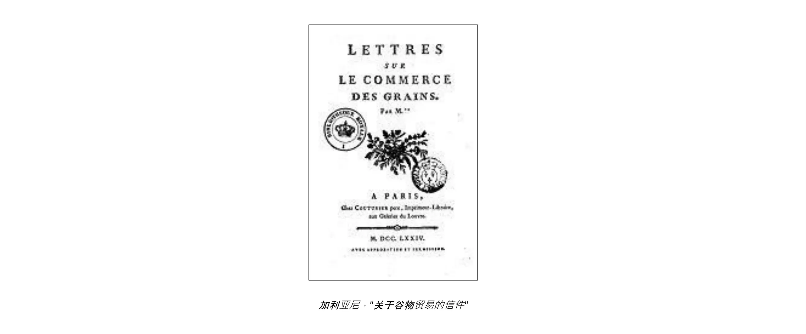

首先，当时的高粮价不是自由贸易造成的，而是歉收造成的，孔多塞清楚地证明了这一点。然后，他解释了为什么自由放任不仅是合适的，而且是唯一合适的政策，尽管人们对此存在偏见。他指出："我们已经习惯于看到政府干预谷物贸易，因此什么都不做似乎是一件非同寻常的新鲜事"。随后，他又补充道："几乎每个人，尤其是那些担任公职的人，都认为任何事情都不会自己发生，如果政府不干预一切，就会失去一切"。因此，孔多塞重提了重农学派和杜尔哥的论点，表明自由贸易优于一切形式的干预主义。

宣传杜尔哥的自由经济纲领是一种勇敢的行为，因为孔多塞知道他很快就会面临审查。事实上，这种情况确实发生了，1776 年，他关于废除强迫劳动的小册子被销毁和查禁。

杜尔哥赞赏孔多塞忠实地捍卫了自己的主张，任命他为钱币督察。孔多塞在他的朋友离开政府后立即辞职。

虽然孔多塞倾尽全力为杜尔哥辩护，但他对朋友的任期结果并不抱有幻想。他在一封信中写道："没能为我的国家和人类做一件我认为很容易的好事"。孔多塞则更为现实，他指出了杜尔哥将面临的众多对手：国王的宠臣、议会、教士、贵族、行会等等。这些团体期待的是奉承，而不是改革。孔多塞对杜尔哥说："你绝不是一个江湖骗子，鉴于巴黎的现状，这是一个缺陷"。他是完全正确的，因为在1776年，即杜尔哥到任后不到两年，他就被迫离开了总审计长的职位。

## 大革命时期的自由常识

<chapterId>95e9a90d-e37a-58ff-b1ac-928b42e76ecf</chapterId>

杜邦-德-内穆尔是弗朗索瓦-魁奈最年轻的弟子，魁奈曾这样评价他：魁奈曾对他说："我们必须照顾好这个年轻人，因为我们死后他还会说话"。法国大革命开始时，包括米拉波侯爵在内的几乎所有伟大的自然科学家都已去世；米拉波本人也于 1789 年 7 月 13 日去世。

杜邦-德-内穆尔（Dupont de Nemours）为内穆尔辖区撰写了申诉清单。

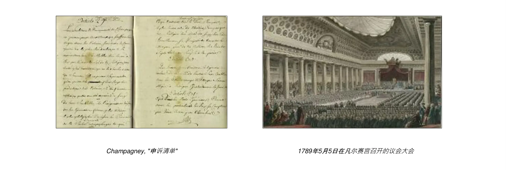

这份引人入胜的文件包含了自由派经济学家对贸易限制、垄断和侵犯财产的所有控诉。杜邦-德-内穆尔还当选为国民议会议员。

在大革命期间，他成为自由主义常识的代言人，在民粹主义和干涉主义蛊惑人心的浪潮中屹立不倒，最终取得了胜利。

早在 1789 年 11 月，当有人说要给予 Caisse d'Escompte 垄断权（这可能会使它变成一家公共银行--法国银行）时，杜邦-德-内穆尔就大声疾呼，为竞争辩护。

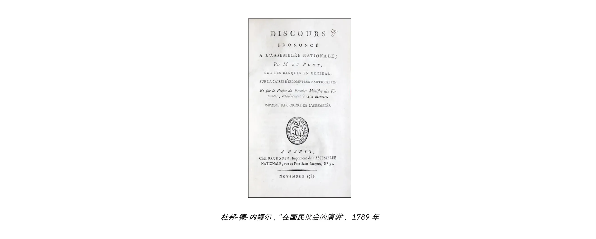

他说，"最好是""把银行业务交由自由贸易法则处理"。他还说：

> "我不明白部长所说的给予储蓄银行特权是什么意思。如果这项特权包括排他性，你们就必须拒绝它，因为你们是来摧毁排他性特权的，而不是来创造新特权的。"

尽管他提出了警告，但议会还是无视他的反对意见，朝着建立中央银行和银行垄断的方向又迈进了一步。

1790 年，在制宪会议上，杜邦-德-内穆尔追随他的理智派朋友们的和平主义传统，提出了一项禁止进攻性战争的法律。第一条规定"法兰西民族不得进行任何进攻性战争，以夺取他国领土或侵犯任何民族的权利或自由"。

该建议被否决。

同年，即 1790 年，关于发行新纸币以支付政府开支的辩论开始了。

杜邦-德-内穆尔坚决反对这种做法，并出版了一本名为[*阿西瓦特对面包价格的影响*](https://archive.org/details/effetdesassignat00dupo)的小册子。这个标题是准确的，因为他解释说，发行阿西纳特将不可避免地导致通货膨胀，即包括面包在内的商品价格上涨。

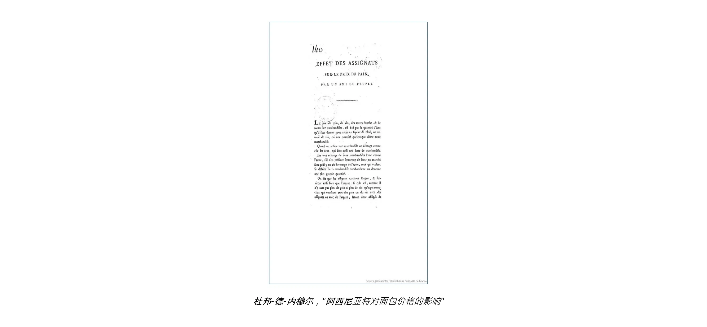

他在小册子上署名为 "人民的朋友"。这篇文章在议会引起了轩然大波，有人问是谁写的。杜邦-德-内穆尔站了起来，承认这是他的作品，并说他并不以使用 "人民之友 "的称号为耻，因为与受让人作斗争才是真正为人民服务。

他的建议再一次被置之不理，转让令也被签发了。

我们都知道随后发生的灾难、经济崩溃和人民遭受的苦难，其中许多人因为转让变得一文不值而失去了一切，不得不被烧毁。

几年后，议会将注意力转移到建立一个真正的法国银行的想法上，该银行将被授予货币生产的垄断权。

杜邦-德-内穆尔仍然坚决反对建立公共银行的想法，认为这不过是一种垄断。他告诉议会

> "不要准备像我在制宪会议上的同事们那样后悔。当时，我提议将阿萨卡特仅限于支付国家物资，而不是使其成为流通货币，但遭到了否决。今天，他们说：'啊，要是我们当初听了杜邦-德-内穆尔的话就好了！'"

但是，再一次没有人听他的。

## 结束语薪火相传

<chapterId>ada8082f-db96-5e52-954f-719b47998153</chapterId>

18 世纪的法国经济思想往往被 19 世纪更著名的经济学家所掩盖。然而，就捍卫自由而言，一切真正开始于 18 世纪。在这个世纪，从博伊斯吉贝尔到杜邦-德-内穆尔等多位思想家首次明确提出了自由放任原则，这一原则在当时具有革命性意义。

当然，让-巴蒂斯特-萨伊、弗雷德里克-巴斯蒂亚、古斯塔夫-德-莫里纳利和伊夫-居约等人在法国经济思想史上留下了永恒的印记。但是，如果我们孤立地研究他们，就会忽略一些本质的东西。这些 19 世纪的思想家并非凭空出现，他们继承并发扬了 18 世纪启蒙运动时期前辈们奠定的基础。

博伊斯吉尔伯特断言，那些善意的灵魂认为他们可以通过让政府参与来解决一切问题，这不可避免地会把经济搞得天翻地覆，因此最好还是顺其自然。

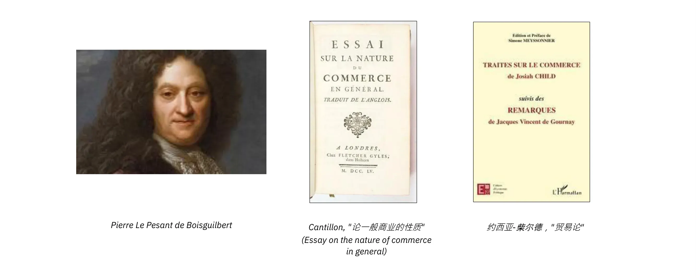

坎蒂永坚持认为，绝不能为了政治目的而操纵货币。允许国家随心所欲地管理货币，就是为巨大的金融和经济混乱铺平道路。

文森特-德-古尔奈断言，对劳动的过度管制会挫伤工人和手工业者的积极性，使他们变得懒惰和无所事事。正是因为有了自由竞争，经济才能发展，国家才能繁荣。

阿根森侯爵断言，没有一个政府能够预见和衡量一切，因此必须依靠每个人的自身利益。

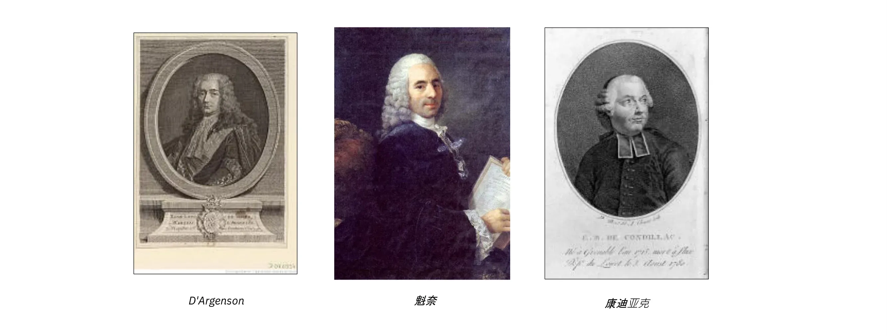

魁奈和自然神论者主张，私有财产是人类社会的基础。没有私有财产，人就失去了努力工作的动力，因为他无法享受自己的劳动成果，也无法积累任何东西。

孔迪拉克认为，Exchange 总是互惠互利的，因此应该毫无例外地始终是自由的。国家的唯一使命必须是保护自由和财产。

所有这些思想都将被 19 世纪的经济学家们采纳。有些人，如让-巴蒂斯特-萨伊，通过严谨的《政治经济学论》，将这些思想科学地表达出来。相反，另一些人则试图将这些基本格言通俗化，如弗雷德里克-巴斯蒂亚（Frédéric Bastiat）所巧妙运用的那样，涉足故事、小说和有趣的短篇小说领域。

## 简历

<chapterId>17cf2865-e53c-5f3b-a5c2-a43560efaf01</chapterId>

**选择性书目**

以下是 30 多篇作品的精选：

1.皮埃尔-克莱芒：《科尔贝尔及其政府史》，巴黎，1874 年

2.沃邦：《王室的设计方案》，1707 年；科佩特学院再版，2014 年；安妮-布兰查德：《沃邦》，法雅出版社，1996 年

3.	Boisguilbert, Détail de la France, 1695; Republished by Institut Coppet, 2014

4.费利克斯-卡德特，《皮埃尔-德-布瓦吉贝尔：经济学家的先驱》，科佩特学院，2014 年

5.Pierre de Boisguilbert ou la naissance de l'économie politique》，巴黎，INED，1966 年

6.理查德-坎蒂永，《论一般商业的性质》，1755 年；科佩特学院重印，2015 年

7.安托万-墨菲，《银行家和经济学家理查德-坎蒂永》，牛津，1986 年

8.古斯塔夫-德-莫利纳里，《圣皮埃尔修道院院长》，巴黎，1859 年

9.圣皮埃尔修道院院长，Abrégé du projet de paix perpétuelle，鹿特丹，1729 年

10.圣皮埃尔方丈：《完善法国商业的提案》，载于《一个好人的梦想》，巴黎，1775 年，第 199 页。

11.André Alem, Le marquis d'Argenson et l'économie politique au début du XVIIIe siècle, Institut Coppet, 2015年

12.Journal et mémoires du marquis d'Argenson》，Rathery 版，9 卷，巴黎，1859-1867 年

13.Benoît Malbranque，《文森特-德-古尔奈：自由放任的政治经济学》，科佩特学院，2016 年

14.Vincent de Gournay，Remarkques sur la traduction de Josiah Child，L'Harmattan，2008 年

15.Christine Théré 和 Loïc Charles（主编），《Le cercle de Gournay》，INED，2005 年

16.Antoin Murphy，"Le développement des idées économiques en France (1750-1756)", Revue d'histoire moderne et contemporaine, tome XXXIII, October-December 1986

17.亨利-里佩尔，《米拉波侯爵：政治和经济理论》，巴黎，1901 年

18.Lucien Brocard，《Les doctrines économiques et sociales du marquis de Mirabeau》，载于《L'Ami des Hommes》，巴黎，1902 年。

19.Humbert de Montlaur，《Mirabeau，l'Ami des Hommes》，Perrin，1992 年

20.伊夫-居约：《弗朗索瓦-魁奈与生理学》，科佩特学院，2014 年

21.François Quesnay, Œuvres économiques complètes et autres textes, 2 vols, INED, 2005

22.Georges Weulersse, Le mouvement physiocratique en France (de 1756 à 1770), 2 vols, Paris, 1910

23.Georges Weulersse, La Physiocratie à la fin du règne de Louis XV (1770-1774), P.U.F., 1959

24.Georges Weulersse, La Physiocratie sous les ministères de Turgot et de Necker (1774-1781), P.U.F., 1950

25.Georges Weulersse, La physiocratie à l'aube de la révolution (1781-1792), EHESS, 1985

26.P. Jolly, Du Pont de Nemours, soldat de la liberté, Paris, P.U.F., 1956

27.伏尔泰的经济学著作，科佩特学院，2013 年

28.Gustave Schelle（编），《屠格涅夫作品及相关文献》，巴黎，1913-1924 年

29.Benoît Malbranque, Le libéralisme à l'essai : Turgot intendant du Limousin (1761-1774), Institut Coppet, 2015

30.Pierre Foncin, Essai sur le ministère de Turgot, 巴黎，1877 年

31.奥古斯特-勒博，《康迪拉克经济学家》，巴黎，1903 年

32.孔迪拉克，《商业与政府的相对关系》，1776 年

33.孔多塞，Mélanges d'économie politique，载于 Eugène Daire（编辑），Mélanges d'économie politique，巴黎，1847 年。

34.P. Jolly, Du Pont de Nemours, soldat de la liberté, Paris, P.U.F., 1956

35.Eli Heckscher，《重商主义》，2 卷。伦敦：Allen and Unwin.1935

# 最后一节

<partId>385bffab-aea1-5bcd-9569-62b3f30665b7</partId>

## 评论与评级

<chapterId>a1e689d9-abd0-5dcb-ba56-a8d355d0a84f</chapterId>

<isCourseReview>true</isCourseReview>

## 期末考试

<chapterId>bdb7fd98-33e7-11f0-9fe6-b785c859ffc5</chapterId>

<isCourseExam>true</isCourseExam>

## 结论

<chapterId>3b366ff6-03c8-5f6a-b4c0-ba8186e65d7e</chapterId>

<isCourseConclusion>true</isCourseConclusion>