# Пътешествие из историята на монетосеченето

Този увлекателен курс ще ви запознае с интересната еволюция на парите от най-ранните цивилизации до сегашната ни парична система. Ще преминем през вековете - от неолита до съвременността, откривайки как парите са формирали и са били формирани от великите човешки цивилизации. От месопотамските протопари до криптовалутите, лидийските монети, ренесансовите флорини и появата на централното банкиране - този курс предлага цялостна перспектива за един от основните стълбове на нашите общества.

+++
# Въведение

<partId>59878a67-8a1d-5d6b-af41-5b847c14363c</partId>

## Въведение в историята на парите

<chapterId>ca53597e-be9a-5261-a55f-11fac8504a68</chapterId>

:::video id=08ff35ca-8a40-4286-abaf-71283faf6e78:::

Добре дошли в този курс по история на парите. Както подсказва заглавието, заедно ще разгледаме историческата еволюция на монетите. От неолитната епоха до наши дни ще разгледаме най-големите империи и цивилизации в миналото.

Този курс обаче не се ограничава само с хронология на дати или исторически събития. По-скоро нашата истинска цел е да осигурим задълбочено разбиране на основните понятия, свързани с появата на парите или по-скоро на валутите.

### Основни понятия за изследване

И така, става дума за възникване: възникването на самите валути, на паричните системи, на банките, на книжните пари, на централните банки и накрая - възникването на сегашната "фиатна" парична система.

Започваме пътуването си в областта на протовалутите с появата на дълговите пари и разчетните единици в Месопотамия, както и с други системи, като зестрата и кръвните пари в първобитните общества. Ще видим и как истински парични системи вече са съществували в Древен Египет, доста преди Средното царство.

След това преминаваме към появата на първите монети в Лидия - ключов момент, който според учебниците по икономика често се смята за истинското начало на парите. Ще разгледаме как тези монети успяват да се разпространят благодарение на персите, Александър Велики, след това на Рим, преди окончателно да се наложат, да доминират и да се сринат.

След това, въоръжени с всичко, което сме научили, ще отделим необходимото време, за да разсъждаваме заедно върху самото определение на парите, надхвърляйки предварително изградените представи като "парите винаги са дълг" или "парите винаги са стока". В действителност парите са както стока, така и социална конвенция. По-специално ще обсъдим концепцията за паричната премия и ще се опитаме да обединим различните теории, обясняващи появата на парите.

### Основни периоди и парични нововъведения

След това преминаваме към един смутен период, белязан от известна нестабилност в парично отношение, през който обаче се появяват такива забележителни нововъведения като английското пени, използвано за подкупване на датските нашественици, и лирата на Карл Велики, споменът за която се запазва и до днес върху някои съвременни банкноти.

Ще разгледаме и как по време на Кръстоносните походи се появяват първите системи за дистанционни парични преводи. След това е време да разгледаме влиянието на флорина - валутата, която съпътства Ренесанса, и пристигането на благородни метали от Америка, което оказва силно влияние върху европейските цени.

Ще разгледаме подробно появата на книжните пари и централното банкиране, като направим паралел с историята на финансовите кризи и техните често жестоки последици.

Накрая ще направим паралел със съвременната ни парична система, ще изследваме последиците от нея и ще проследим историята на финансите, за да разберем по-добре как сме стигнали до днешната социална държава.

Като бонус ще разгледаме и многото интересни етимологични връзки, свързани с парите, които продължават да влияят на ежедневието ни на различни езици.

### Структура на курса

Този курс е разделен на три основни части.

Част I разглежда появата на парите, част II - възраждането на парите и техния упадък, а част III показва как държавните институции или държавата постепенно поемат контрола върху парите, което води до сегашната фиатна система.

Благодаря ви и се наслаждавайте!

# Появата на борси

<partId>da5e4981-9ea5-5208-beab-3b75c9043632</partId>

## От австралопитека до съвременния човек

<chapterId>34a773aa-f2d3-5c26-8be4-f2cd79ed6fbc</chapterId>

:::video id=4f333013-4b2a-42ab-8761-593fafc971ca:::

### Защо да започнем от неолита

Защо да се връщаме назад до неолита, за да говорим за парите? Отговорът е прост: не можем да разберем напълно появата на парите, ако не разгледаме и появата на самите цивилизации. За да разберем защо са се появили първите парични системи, трябва да разберем какво е накарало номадските групи ловци-събирачи да се установят.

Племе без разделение на труда, без специализация, в което всеки индивид е отговорен за производството на това, което му е необходимо, просто няма нужда от пари. По същия начин една земеделска общност, която практикува само натурално стопанство, където всеки човек обработва земята за себе си, все още не изпитва нужда от универсален посредник за размяна.

### Седентаризацията и нейните последици

Ето защо смятам, че е интересно да започнем изследването си от неолита. Ще видим как седентаризацията постепенно е довела до появата на села, след това на градове и накрая на големи цивилизации. Именно тази седентаризация и производството на хранителни излишъци направили възможна специализацията на труда, създавайки благоприятна почва, необходима за появата и развитието на първите парични концепции.

Точно както човешките взаимоотношения пораждат езика, можем да смятаме, че парите се появяват естествено или не (както при инките и спартанците) в хода на формирането и организацията на цивилизациите. Според мен появата или непоявата на парите е свързана с формата на социална и икономическа организация на всяко общество.

### Хронология на човешката еволюция

Но нека първо разгледаме един по-широк исторически контекст.

Като всяка първа презентация ще направя точно обратното на това, което казах във въведението към курса, и ще ви дам списък с дати и исторически събития, които следват едно след друго. Идеята тук е да поставим появата на парите в исторически контекст, във връзка с други човешки постижения като приготвянето на храната, колелото, опитомяването на някои зърнени култури и животни, построяването на пирамидите и основаването на първите градове.

Затова нека разгледаме еволюцията на човечеството от праисторическите времена насам.

Преглед на човешката еволюция от австралопитека до съвременния човек, като се проследяват технологичният напредък и движението на населението до неолита.

### Исторически контекст на човечеството

- **преди 3 милиона години** - поява на *Australopithecus*.
- **преди 2 милиона години** - Хоминините започват да напускат Африка.
- **преди 1.6 милиона години** - Хоминините достигат Южна Европа и Азия.
- **преди 1 милион години** - Първи доказателства за готвене в домашни условия с огън (овъглени кости и растителни останки в пещерата Уондърверк, Южна Африка).
- **Около 400 000 г. пр.н.е.** - неандерталците живеят в Европа и Азия.
- **Около 300 000 г. пр.н.е.** - поява на *Homo sapiens*.
- **преди 80 000 години** - *Homo sapiens* започва да мигрира към всички части на света.
- **преди 73 000 години** - пещерите Бломбос в Южна Африка (най-старите известни форми на изкуство).
- **преди 50 000 години** - *Homo sapiens* достига Европа.
- **преди 30 000 години** - Пещерни рисунки от пещерата Шове във Франция.
- **преди 15 000 години** - пещерни рисунки в Ласко във Франция и австралийски скални рисунки.
- **Около 9000 г. пр.н.е.** - Опитомяване на ечемика в Плодородния полумесец.
- **Около 9000 г. пр.н.е.** - отглеждане на царевица в Мексико.
- **Около 8000 г. пр.н.е.** - Опитомяване на козите и овцете в Плодородния полумесец.
- **Около 7250 г. пр.н.е.** - в Аин Газал (Йордания) се открива село с няколкостотин жители.
- **Около 7000 г. пр.н.е.** - в Чаталхьоюк (Турция) живеят до 8000 души.
- **Около 6500 г. пр.н.е.** - в Гърция започва уседнал живот.
- **преди 6000 г. пр.н.е.** - Начало на речното напояване в Египет и Месопотамия.
- **Около 5000 г. пр.н.е.** - поява на земеделската комбинация "три сестри" (царевица, тиква, боб).
- **Около 4000 г. пр.н.е.** - Опитомяване на камилата в Централна Азия. (Семейството на камилите произхожда от Северна Америка през еоцена преди 45 милиона години. След това тези камили са мигрирали към Азия през тънка ивица земя, която по това време е свързвала двата континента в Беринговия проток. Друга част от семейството се е насочила към Южна Америка, където потомците ѝ живеят и до днес: лами, алпаки и викуни).
- **Около 3500-3000 г. пр.н.е.** - народът ботаи започва да опитомява и развъжда коне.
- **Около началото на бронзовата епоха** - Шумерите вече са изобретили колелото и платноходката, развили са аритметиката, астрономията и първата форма на писменост.
- **Около 2800 г. пр.н.е.** - в пика на своето развитие Урук достига население от 80 000 души.
- **2600-2200 г. пр.н.е.** - Първи признаци на градско развитие в гръцкия свят. Разпространение на средиземноморските култури (пшеница, лозя, маслини).
- **2560 г. пр.н.е.** - Построяване на Голямата пирамида в Гиза.
- **Около 1500 г. пр.н.е.** - Минойската цивилизация.
- **Около 1300 г. пр.н.е.** - Микенската цивилизация.
- **Около 1250 до 1150 г. пр.н.е.** - Крах на цивилизациите от бронзовата епоха.
- **1 век от н.е.** - северноафриканските бербери опитомяват камилата.

И така, ето този исторически преглед ни дава представа за появата на определени технологии, опитомяването на определени животни и култури, за да ги поставим в контекста на появата на писмеността и парите, които ще бъдат предмет на следващия раздел.

## От ловец-събирач до земеделски производител: Зората на цивилизацията

<chapterId>ea950b6e-9eb7-553d-8f04-0eb042bb1f5a</chapterId>

:::video id=4b49a376-f6f4-42a0-86fa-264997a079f0:::

### Преходът към земеделие и уседналост

В тази глава ще разкажем за прехода от лов и събирателство към земеделие за собствени нужди, занаяти и търговия. Смятах, че е важно да обясня този преход към уседнал живот и земеделие, за да разберем как са били построени първите градове, което в крайна сметка е довело до създаването и появата на определени парични системи през Античността.

Този раздел е откъс от курса, достъпен на уебсайта The Great Courses, наречен "Древна Месопотамия, живот в люлката на цивилизацията", воден от професор Аманда Подани от Калифорнийския държавен политехнически университет в Понома.

### Парадоксите на усвояването на селското стопанство

Примитивното земеделие се появява преди около 10 500 години в Близкия изток, в района на Северозападна Сирия и Южна Турция. Днес съвременните групи ловци-събирачи не бързат да възприемат земеделието, а същото вероятно е било валидно и през неолита.

**Първите селища явно са построени преди опитомяването на растенията и животните.** Хората не са се заселили, защото земеделието им е позволило; напротив, те първо са се заселили и едва много по-късно, около 3000 години по-късно, са започнали да се занимават със земеделие.

Ловът и събирането на реколтата просто са работили много добре, така че не е било необходимо да засаждат семена, за да произвеждат храната си. Днес ловците-събирачи разполагат с много повече свободно време от първите земеделци, които са използвали много примитивни технологии.

И така, това, което казваме тук, е, че съвременните примитивни народи ловци-събирачи имат повече свободно време, отколкото разбираме от първите земеделци от неолита, които все пак са имали доста елементарни технологии за отглеждане. Тези хора са работили по-усилено, за да произвеждат храна, отколкото нашите съвременни примитивни племена, които се препитават с лов.

Изследванията на костите показват също, че първите земеделци са били по-малки и по-слаби от предшестващите ги ловци-събирачи. Диетата на земеделците е била по-ограничена от тази на ловците-събирачи. Те са консумирали много повече хляб, но много по-малко месо, а също така са имали по-лоши зъби заради каменните отломки, използвани при производството на брашно. Когато са произвеждали брашно с камъни, са се образували отломки.

Тези, които следват "кето" диетата, ще се съгласят: яденето на много хляб вероятно не е толкова добро, колкото яденето на месо.

### Теории за възприемането на селското стопанство

Предвид всички тези недостатъци, кой би избрал да стане фермер тогава? Някои популярни теории предполагат, че хората са били принудени да се занимават със земеделие и че това всъщност не е било избор. Дори при диворастящите зърнени култури е имало сериозен проблем. Големи количества зърно не можели да се транспортират лесно. Трябвало е да се съхраняват някъде. След като зърното е било складирано, е имало смисъл да остане наблизо. Така че се отглеждаше диво зърно, което не беше непременно селскостопанско, и когато се отглеждаше в големи количества, трябваше да се съхранява някъде, което затрудняваше транспортирането му. Това вероятно е допринесло за първите фази на седентаризация. Възможно е това да е била първоначалната причина хората да се заселят на определено място. Ако това място е осигурявало храна през цялата година, не е било необходимо да се следват стада или да се пътува постоянно.

В натуфийската култура до сто души живеели заедно в села, съставени от кръгли къщи. Популярна теория, обясняваща началото на земеделието, е, че тази промяна е била стимулирана от климатичните промени. Преди около 11 000 години климатът в Близкия изток станал по-студен и по-сух от преди. Растенията и животните, които преди това са били в изобилие, са станали по-редки. Тогава общностите ще да са започнали да култивират растенията, от които са зависели, или да отглеждат млади животни, за да ги отглеждат и да печелят от тях, като например овце, кози и говеда, които биха се поддали добре на такова отглеждане. Този процес е бил много постепенен. Така че не е имало точно определен момент, в който всички те са станали земеделци, които са опитомявали животни.

Друга теория е, че самите села са създали проблема, който се решава чрез опитомяване. Интензивният лов би дестабилизирал природната среда. Според една от хипотезите натуфийците са постигнали такъв демографски успех, че са станали твърде многобройни за непосредствената си среда. По този начин блатата и районите, където са се отглеждали естествени култури, може би не са били достатъчно продуктивни за населението на селото. Непосредствената среда не е била в състояние да осигури прехраната на всички. В такъв случай те биха започнали да култивират директно на място и да увеличат хранителните си запаси.

## Неолитна търговия

<chapterId>8e495224-6d55-58f6-a9dc-ac2814281cfa</chapterId>

:::video id=d04245af-e416-48b1-8157-d569207a32c4:::

### Преходът от палеолит към неолит

Неолитният период бележи фундаментален прелом в човешката история, в ярък контраст с предшестващите го палеолитни общества. През палеолита европейското население е било изключително разпръснато: само 7000 души са обитавали целия континент преди 20 000 години, организирани в малки номадски групи от 20 до 50 души, които са следвали големите мигриращи стада на огромни разстояния.

Глобалното затопляне в края на ледниковия период радикално променя тази социална организация. Появата на горите замества мигриращата фауна с по-уседнала горска фауна, което позволява на човешките групи да станат полууседнали. Тази трансформация е съпроводена от грандиозен демографски бум: от приблизително 10 000 до 50 000 души население на Европа в края на палеолита, през средния и последния неолит то нараства до 1-5 милиона души.

### Изобретяването на труда и собствеността

Тази постепенна седентаризация води до дълбоки социални промени. **Неолитното земеделие породило съвременното понятие за работа**: привързаността към определена територия означавала грижа за собствеността, съхраняване на плодовете на труда и планиране на бъдещите реколти. Тази нова връзка с времето - отлагане на сегашното използване за бъдеща полза - революционизирала социалната организация.

Грънчарството е перфектна илюстрация на тази еволюция: първоначално създадено за съхранение на зърнени храни и семена, то свидетелства за тази нова способност за прогнозиране на нуждите във времето. Някои праисторици дори смятат, че неолитът не би бил възможен без тези системи за съхранение.

**Частната собственост се превръща в основна институция** на тези нови общества. Докато индивидуалната собственост е съществувала още през палеолита (лични ловни копия), през неолита тя придобива безпрецедентно териториално измерение. Това присвояване на земя породило първите археологически документирани междучовешки конфликти, което наложило появата на функция за териториална сигурност.

### Специализация и разделение на труда

Земеделието дава възможност за изхранване на по-голямо население, като същевременно освобождава някои хора от други производствени дейности. Тази зараждаща се специализация - земеделци, грънчари, занаятчии, пазачи - полага основите на разделението на труда и социалните йерархии.

Археологическите останки свидетелстват за това нарастващо разслоение: погребенията се превръщат от колективни в диференцирани индивидуални гробове, а жилищата преминават от архитектурна еднородност към конструкции, разкриващи различни социални статуси. Погребалните предмети - накити, специализирани инструменти, керамика - показват появата на представа за богатство и социален престиж.

### Възникване на обмена от разстояние

Археологическият анализ разкрива изненадващи за онова време мрежи за обмен. Материали като обсидиан, зелена скала (долерит, жадеит), черупки и битум са открити на стотици километри от местата на добив. Полираните брадви от зелена скала, необходими за изсичането на горите и изграждането на ранните селища, са циркулирали из цяла неолитна Европа.

Този обмен се отнася както до суровините, така и до готовите предмети, като разкрива разбирането за занаятчийска специализация. Приписваната стойност включва както рядкостта на материала, така и техническите умения, необходими за неговото преработване.

Организацията на обмена варира в зависимост от мащаба. **В рамките на общностите** антрополозите предпочитат хипотезата за икономика на даренията и контрадарение, с неформални кредитни системи, основани на междуличностно доверие. В тези ограничени групи "числото на Дънбар" (максимум 150 души, за да се поддържат преки отношения на доверие) дава възможност за отложена размяна без никакъв пазарен механизъм.

Съществуват няколко вида бартер:

- **директен бартер**: незабавна размяна на стока срещу стока
- **разширен бартер**: размяна на стоки срещу услуги или обещания
- **отложен бартер**: междуличностен дълг с последващо изплащане

**Между различните общности** липсата на връзки на лично доверие благоприятства появата на по-формализирани обмени. Някои стоки постепенно придобиват специален статут поради възможността да бъдат търсени от чужди групи, което предшества първите форми на протовалута.

[Австрийската икономическа школа](https://planb.academy/resources/glossary/austrian-school) тълкува тази еволюция като спонтанна поява на привилегировани разменни стоки. Черупките, които археологически са засвидетелствани още през мезолита, илюстрират този феномен: намерени далеч от географския си произход (средиземноморски черупки в Западна Франция, скандинавски черупки на други места), те свидетелстват за общо признание на разменната им стойност.

Тези стоки се отличават с **възможността да бъдат търсени от други** - основно качество, което предопределя паричната функция. Въпреки че не постигат стандартизацията на историческите валути, те са първите стъпки към обезличени системи за размяна, предпоставка за развитието на сложни общества отвъд племенните рамки.

По този начин неолитът полага основите на съвременната икономика: специализация на труда, частна собственост, натрупване на богатство, социална йерархизация и поява на сложни системи за размяна, които надхвърлят връзките на роднинството и прякото съседство.

## Създаването на първите градове и появата на писмеността

<chapterId>d6b799c2-8bf1-11f0-9c54-1b9f4f4c7011</chapterId>

:::video id=3ca18105-9856-4ceb-925c-c9e9215af21b:::

### Напояването и раждането на големите градове

В тази глава ще обсъдим как са се появили първите големи градове в тази част на историята и очевидно ще обсъдим причините за появата на писмеността в Месопотамия.

Преди около 6 000 години в плодородните долини на Египет и Месопотамия човешките общности започват да използват реките, като развиват напояването. Това овладяване на водата позволява да се отглеждат богати култури, което благоприятства появата на големи градове като известния град Урук, разположен в днешен Южен Ирак.

Около 3500 г. пр.н.е. Урук се превръща в най-големия град в света, като достига своя пик около 2800 г. пр.н.е. с население до 80 000 души. По това време две основни нововъведения бележат дълбоко шумерската цивилизация: появата на структурирано правителство, способно да управлява истинска държава, и революционното изобретяване на писмеността.

### Изобретяването на клинописното писмо

В този град около 3000 г. пр.н.е. се заражда писмеността, мотивирана предимно от икономически нужди. Изправени пред нарастващата сложност на обществото и неговия обмен, администраторите на храмове и дворци се нуждаели от надежден инструмент за точно записване на икономическите транзакции, като например доставките на материали, вътрешните трансфери и наличните запаси.

Разработената система е наречена "клинопис", от латинското "cuneus", което означава "клин", във връзка с използването на клиновиден стилус за отпечатване на знаци върху влажни глинени плочки.

Тук по-долу можете да се насладите на моето копие на таблетка с клинописно писмо. Смятам, че за да пишат върху тези плочки, са използвали някакъв вид стилус, направен от тръстика, за да проследят мократа глина и да създадат формите - клинописното писмо.

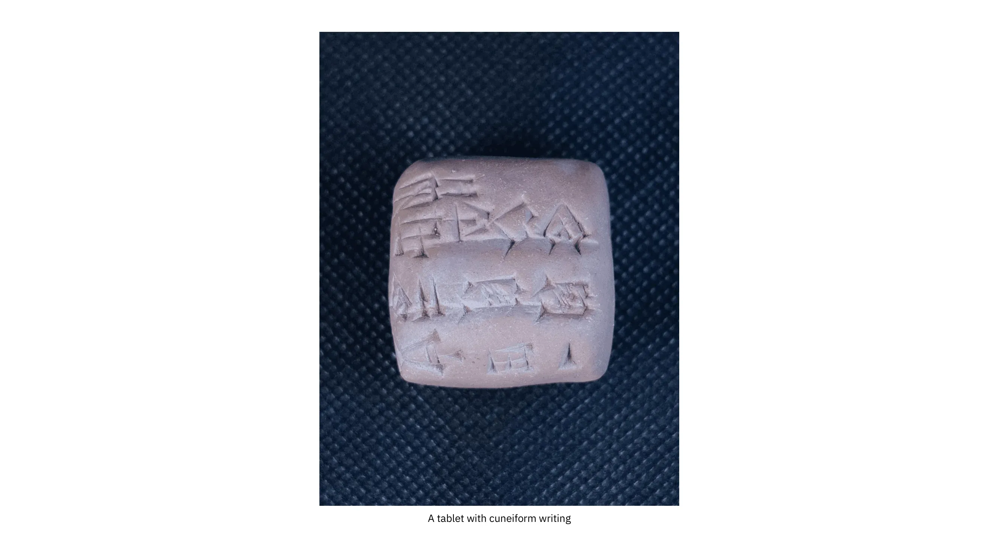

Имам и нещо, което според мен е истинска шумерска плочка с малък клинопис в центъра. На тази плочка има подписи, направени чрез търкаляне на цилиндър, които ще ви покажа след това.

Знаците с малки цифри са служели за подписи по времето, когато повечето хора не са можели да пишат, тъй като само квалифицираните писари са имали тази способност.

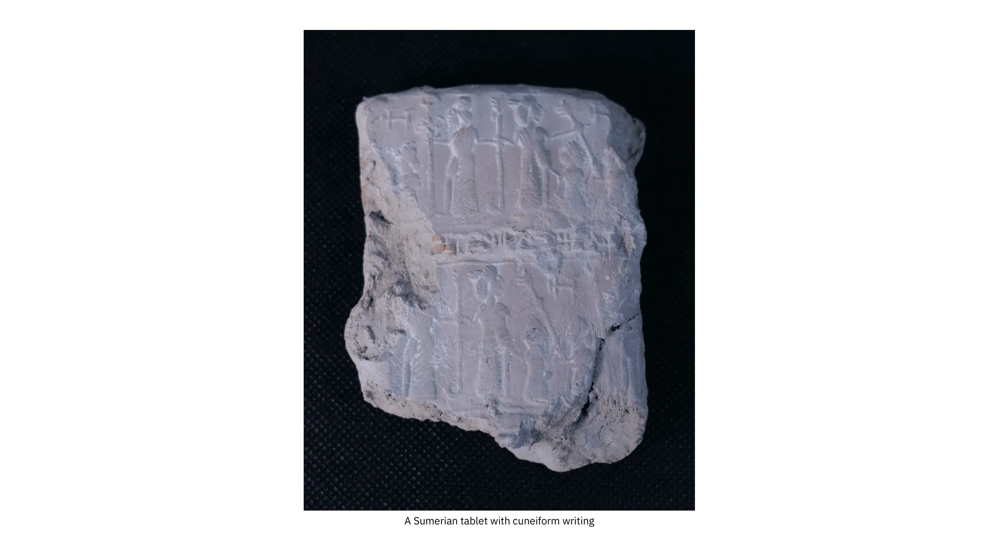

По-долу можете да видите цилиндъра, споменат по-горе: камък, гравиран със специфични форми. Хората са търкаляли този цилиндър за подписване, известен като цилиндричен печат на английски език, за да подписват писма. Това е бил начин да се подчертаят имената на авторите или да се посочи, че те са съставени от тяхно име.

Затова тогавашните писари са използвали клиновиден писец, за да отпечатват знаци върху мокри плочки.

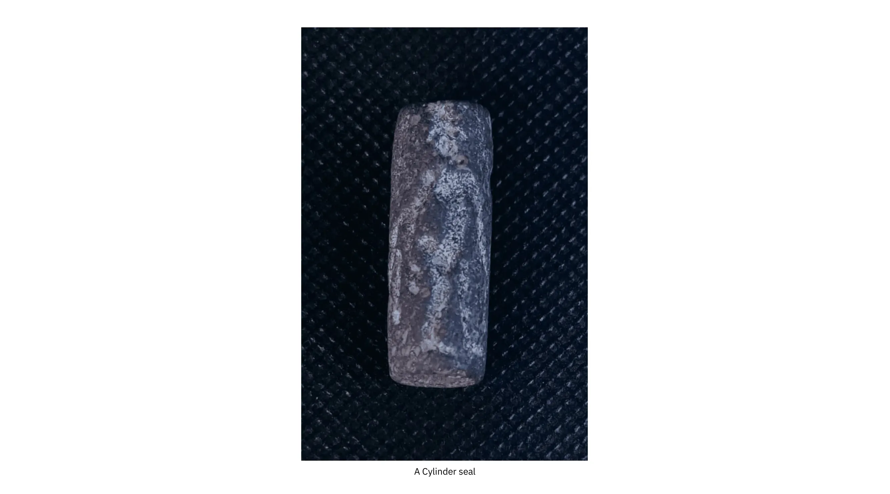

Клинописните знаци не представляват език, а писмена система за записване на говорими езици. На английски език бихме казали "writing is a written language" (писмеността е писмен език), а след това бихме казали, че "cuneiform is a script, not a language" (клинописът е писменост, а не език). Така на френски език бихме казали, че клинописът не е език, а начин за кодиране на език.

### Еволюция и употреба на писането

През първите векове от съществуването си тази писменост е ограничена и служи основно като мнемонична система за записване на количества, списъци на селскостопански стоки и оборудване. Едва постепенно то става способно фонетично да пресъздава имена и цели изречения.

Първоначално имената не можели да се изразяват с клинописното писмо, тъй като то представяло предимно предмети и елементи от действителността, като вол или пшеница, изобразени като малки изображения. С течение на времето тези изображения еволюирали в по-развита форма на писменост, позволяваща представянето на имена и сложни понятия.

Ако името на човека е Лаура, например, бихме могли да вземем една дума, съкращение, което звучи като "вода", и втора като "рас", и да образуваме името Лаура от тях. Ето как се е развила първата форма на писмения език.

За сведение, за да се представят първоначално акронимите, ако искахте да нарисувате главата на вол, можехте да видите формата на главата на вола. Малко по малко рисунките са били опростени, за да не представляват нищо повече от нещо като линия. Учените смятат, че това се е случило, защото хората са държали мократа глинена плочка в една ръка, така че е било по-лесно да прерисуват инициалите, като ги въртят. Смята се, че това се дължи и на начина, по който писарите са държали плочките.

В клинописните съкращения все още може да се види връзката, да речем, с пшеницата или волската глава, и те винаги са наклонени на една страна.

През трите хилядолетия на използването си клинописът служи предимно за водене на икономическа и административна документация. Скоро обаче у жителите на Месопотамия се заражда дълбокото желание да запазят всичко, което заслужава да издържи проверката на времето, в писмена форма. Така историите, легендите и песните, предавани дотогава устно от странстващи музиканти, били увековечени в писмена форма, често преписвана от обучени писари. Те преписвали вече съществуващи текстове, най-вече легенди или текстове, които имали определена културна стойност.

Важен пример за това е **епосът за Гилгамеш**, вероятно **исторически цар на шумерския град-държава Урук** около 2900-2350 г. пр.

Тази форма на писменост, която е едновременно инструмент за икономическо управление и културен вектор, просъществува до I в. от н.е., преди да изчезне окончателно, оставяйки след себе си ценно свидетелство за цивилизацията, която я е родила.

## Ролята на шумерските плочки

<chapterId>a396e6c5-56cc-5410-9e6b-0274401c5425</chapterId>

:::video id=a0729a35-01ec-4aa4-828f-d4ccc2eb168e:::

### Предмонетни кредитни системи

В древна Месопотамия икономическата организация се е основавала на изключително сложни механизми, които са съществували много преди изобретяването на металните монети. Още от самото начало официалните и неофициалните кредитни системи са били съществена форма на пари, която е позволявала на местното население да извършва много сложни икономически транзакции.

Именно за да отговори на административните и икономическите нужди, е изобретено клинописното писмо. Прочутите месопотамски глинени плочки са били използвани главно за записване на различни видове договори: частни заеми, продажби, наеми, ипотеки и дори брачни споразумения. Записването на тези плочки изисквало експертните познания на специализирани писари - задача, която струвала скъпо време и усилия, **но била оправдана, когато ставало дума за финансови интереси.** Тогава хората не си пишели любовни писма, не използвали писар, за да пишат за тревогите си. Те са наемали писар, за да пише документи, независимо дали е имало връзка или икономическа причина.

Струва си да се спомене също, че някои от тези таблетки са циркулирали като облигации на приносител и са сменяли свободно собственика си.

Имаше например глинена топка с малки камъчета вътре.

От външната страна на глинената топка беше написано и подписано число, което представляваше брой единици. Вътре имаше камъни и някой, който искаше да провери, да потвърди, че този инструмент наистина представлява Х единици.

Друг пример - плочка, намерена югозападно от днешен Багдад, гласи, че длъжникът се задължава да върне на кредитора 330 единици зърно в деня на жътвата. Още по-завладяващ е фактът, че в друга плочка ясно се посочва, че дълг от четири единици ечемик трябва да бъде изплатен директно на притежателя на плочката, като по този начин **се въвежда понятието "плащане на приносител", което е особено новаторска концепция за онова време**.

От 2000 г. пр.н.е. нататък имало закон, който изисквал всички търговски сделки, дори и най-малките, да бъдат оформени в писмена форма и подписани в присъствието на свидетели. Представете си каква огромна бюрокрация е представлявала по онова време регистрацията на всички сделки в регистри, направени, напомням, от глина от писари. Тази юридическа строгост е имала за цел да предотврати бъдещи спорове за собствеността и правата върху разменяните стоки. Често се призовавали свидетели, които да потвърдят, че договорът наистина е бил подписан.

И в частната сфера някои семейства и лица се занимават с достатъчно сложни икономически дейности, за да изискват стриктно управление. В северновавилонския град Сипар-Амнану е открита къщата на анунитски жрец на име Ур-Уту, съдържаща близо 2000 плочки. Тези документи включват частни договори за заем, договори за продажба и наем, както и писма, религиозни и академични текстове, което свидетелства за разнообразието и значението на частните архиви по онова време.

Забележително е, че писмата, написани от книжовниците, са свързани почти изключително с финансови интереси: оплаквания от недостатъчни надбавки, неизплатени зестри или други спешни материални искания. В онези времена не са съществували лични писания като любовни писма и дори споменаванията на болести са били рядкост.

Един прочувствен пример за такова писмо илюстрира тази икономическа реалност: кореспондент изразява огорчението си, след като е останал без пари и провизии, когато партньорът му си е тръгнал, а в Асур е настъпил силен глад. Той описва спешната си нужда от закупуване на зърно и моли бързо да му бъде изпратена паричната равностойност на текстилните му изделия, за да си осигури ежедневна прехрана.

Това писмо, адресирано до нейния партньор, изглежда показва, че той е заминал да търгува другаде, оставяйки я без пари. Тя му напомня, че трябва да има достъп до парични средства, за да купува зърно и да плаща данъците си в храма. Това е може би най-близкият аргумент, който можем да намерим в писмо от онова време. Писмата почти винаги са били свързани с икономически транзакции, а точно това писмо се отнася до несигурна икономическа ситуация.

Така достигналите до нас месопотамски документи отразяват предимно икономическия обмен, тъй като са съставени изключително за прехвърляне на стоки с призната стойност: пари, зърно, различни стоки, недвижими имоти, плащане на храмови данъци. Тези архиви разкриват не само ефикасността и административната прецизност на тази древна цивилизация, но и способността ѝ да управлява сложни икономически обмени в продължение на много дълъг период.

## Контрол на елита върху шумерските таблетки

<chapterId>c6d3df0e-b1e1-58dc-ab35-9f76bbc39393</chapterId>

:::video id=04a95fb8-a701-4a48-9ce8-0e9b6ba256fd:::

### Писане - технология, която е преди всичко икономична

Противно на общоприетото схващане, изобретяването на писмеността в Месопотамия преди около 4000 години първоначално не служи за лична или литературна комуникация. **Кунеиформената писменост е била преди всичко икономическа технология**, оправдана само когато са били застрашени важни финансови интереси. Шумерите не използвали писмеността, за да кореспондират помежду си или да изразяват чувствата си, а изключително за документиране на търговските и финансовите си сделки.

Тази специализация може да се обясни със значителните разходи за писане на таблети. Гравирането в глина е изисквало специализирани технически познания, значително време и специфични материали. Само сделки с достатъчна стойност икономически оправдавали тази инвестиция, което създавало естествен праг за достъп до тази революционна технология.

Клинописните плочки разкриват финансова система със забележителна за времето си сложност. Месопотамците са разработили пълен арсенал от съвременни финансови инструменти: **частни заеми с лихва, договори за продажба, договори за наем, ипотеки и дори брачни договори с финансови клаузи**. Тази сложност свидетелства за развита пазарна икономика, далеч от опростения образ на примитивната разменна търговия, който често се свързва с тези древни цивилизации.

Някои от тях функционират като истински ценни книжа на приносител, като се разпространяват свободно от ръка на ръка, без да се изисква идентификация на първоначалния притежател. Това нововъведение позволявало забележителна плавност на размяната, предшестваща съвременните финансови системи. Нещо повече, специално законодателство дори изисква всички търговски сделки да бъдат оформени писмено, като по този начин се институционализира използването на писмеността в икономическата сфера.

### Монополът върху знанието и икономическият контрол

Централното място на писмеността в икономиката дава значителна власт на онези, които владеят тази технология. **Писмените служители, които обикновено били прикрепени към храмовете и управляващите институции, де факто контролирали финансовата система**. Техният рядък и безценен опит ги превръщал в пазители на всички важни сделки.

Този монопол върху знанието не е случаен. Властите са имали интерес да запазят тази изключителност, тъй като демократизирането на писмеността би отслабило контрола им върху икономиката и би увеличило риска от фалшифициране. Системното присъствие на свидетели на церемониите по подписване разкрива тази постоянна загриженост за автентичността на документите.

Законовото задължение за писмено регистриране на всички търговски сделки преследва няколко стратегически цели: фискален контрол, строг счетоводен мониторинг и поддържане на зависимостта на икономическите субекти от административния апарат. **По този начин месопотамската държава си присвоила способността да управлява междуличностния дълг** в обществен мащаб, като по този начин превърнала писмеността в инструмент на икономическата власт.

### Съществуването на две парични системи

Анализът на таблетите разкрива по-различна икономическа реалност, отколкото би могло да се предположи от повсеместното им присъствие в архивите. В много таблички се споменава за **шекел сребро** като единица за стойност, като по този начин се посочва паралелното съществуване на парична система, основана на стандартизирани физически стоки.

Тази двойственост може да се обясни със социалното разслоение по онова време. **Системата на клинописните плочки е била запазена за ограничен елит**: духовенство, заможни търговци и администратори, способни да четат, пишат и тълкуват тези сложни документи. За да се използва ефективно една клинописна плочка, човек е трябвало не само да знае как да я дешифрира, но и да може да провери нейната автентичност и да разбере правните ѝ последици.

**Масата от населението, изключена от тази елитарна система, развива свои собствени механизми за размяна**. Обикновените хора използвали по-достъпни системи като стандартизирани мерки за зърно, тегло на парите и други лесно измерими стоки, които всеки можел да оцени без специализирани умения.

Тази народна икономика, макар и по-слабо документирана в официалните архиви, вероятно е била по-динамична и гъвкава от таблетната система. Тя е давала възможност за бърз ежедневен обмен без прибягване до услугите на писари, задоволявайки непосредствените нужди на занаятчии, земеделци и дребни търговци.

Сребърният шекел, често споменаван в скрижалите като референтна стойност, вероятно е служил като мост между тези две паралелни икономически системи, позволявайки преобразуване на писмени дългове и физически плащания.

### Спонтанна поява срещу институционален контрол

Това съжителство илюстрира един фундаментален дебат в икономическата история: **противопоставянето между спонтанната поява на средствата за размяна и институционалното присвояване на парите**. От една страна, стоките като парите възникват естествено от нуждите на хората за размяна. От друга страна, институциите присвояват и формализират тези практики, за да контролират тяхното движение.

Шумерските храмове са олицетворение на това напрежение: те използват популярни парични нововъведения (препратки към шекела), като същевременно разработват свои собствени инструменти за контрол (клинописни таблици). Тази стратегия им е позволила да се възползват от предимствата и на двете системи: популярната легитимност на традиционните валути и административния контрол на формализираните дългове.

Опитът на Месопотамия създава трайни прецеденти за развитието на финансовите системи. Той доказва, че **финансовото усъвършенстване често предхожда с няколко хилядолетия** технологичните иновации, които обикновено се свързват с него. Концепциите за лихва, кредит, прехвърляеми инструменти и ипотечно обезпечение не чакат изобретяването на металните пари, за да се развият.

Този фундаментален период разкрива и проблемите с властта, присъщи на всяка парична иновация: кой контролира технологията, кой определя правилата и как се формулират официалните системи и популярните практики. Тези фундаментални въпроси продължават да стоят през цялата икономическа история, достигайки до съвременните дебати за цифровите валути и [криптовалутите](https://planb.academy/resources/glossary/cryptocurrency).

# Икономика и пари в древните цивилизации

<partId>a16bcf4c-8c3a-11f0-9e79-2bd363a484bd</partId>

## Великите цивилизации на бронзовата епоха

<chapterId>fab9334c-7385-5d7c-ad40-7d152beb22a1</chapterId>

:::video id=737e12e8-1033-4210-b1dd-b8a680f68b17:::

В този раздел, озаглавен "Великите цивилизации на бронзовата епоха", ще започнем с откъс от книгата "История на парите: От древността до наши дни" на Глин Дейвис, която според мен е отлично въведение към раздела за великите цивилизации на древността.

> Тойнби идентифицира около двадесет и една различни "цивилизации", но тъй като петнадесет от тях произлизат пряко или непряко от по-ранни примери, той намалява броя на самостоятелно развитите цивилизации до шест: шумерска, египетска, минойска, китайска, майска и андска. От тях само инките от Андите са успели да постигнат висока степен на цивилизация, без да използват пари, въпреки че парадоксално са имали изобилие от материалите, които обикновено се смятат за най-добри за използване като пари - злато и сребро.

Инките не са имали парична система, но са разполагали с изобилие от благородни метали. Голям парадокс. Нека продължим с цитата:

> Колкото по-разслоено е едно общество и колкото по-внимателна е неговата система за планиране, толкова по-малко необходимо е използването на пари за населението. Това може да обясни защо испанските конкистадори откриват, че мексиканците, чието управление е сравнително по-либерално, редовно използват златен прах (съхраняван в прозрачни туби) и какаови зърна (съхранявани за големи плащания в торбички от 24 000 единици) като валута, докато, обратно, инките, организирани според много по-строга йерархия, нямат никаква валута: изключение, потвърдено от строго правило. Произходът на парите в Китай е напълно независим от други цивилизации; въпреки това относителната близост на шумерската, египетската и минойската цивилизация поражда съмнения относно степента на тяхното съответно непознаване на паричните практики, особено с оглед на широката търговия, установена още в най-ранни времена.

В Китай монетите се разработват по напълно различен от западните традиции подход. От самото начало това бяха [фиатни пари](https://planb.academy/resources/glossary/fiat). Те бяха отлети монети.

И тук г-н Дейвис споменава търговията. В определени периоди наистина е имало обмен между китайците и други населения, но разменното средство за външната търговия е била по-скоро коприната. Както ще видим по-нататък, златото се използвало и в пограничните райони на Китай, където китайското население било по-малко. И дори не за международна търговия; за нея е била коприната.

Така че си представям, че може би за формата на монетите те са повлияни от други цивилизации от същата епоха, които са развили тази технология.

Но явно същността на парите в Китай е била съвсем различна от тази на Запад. Ще се върнем към това подробно в следващия раздел за Китай.

По отношение на тези известни шумерски градове имам няколко бележки. Можем да споменем Урук, който е бил много ранен и влиятелен град, известен със значителните си размери и напредналата си култура, особено с развитието на писмеността и градското планиране.

Исках да спомена и известния епос за Гилгамеш. Гилгамеш вероятно е бил исторически цар на шумерския град Урук около 2900 г. пр. Хр. Той вероятно е бил цар на този шумерски град-държава.

Можем да говорим и за Саргон Акадски, управлявал от 2334 до 2279 г. пр.

Той е първият владетел на Акадската империя, която е друга цивилизация, възникнала в Месопотамия. Споменавам Саргон, защото той пръв е създал пощенска служба за тези прочути плочки тук, които вече ви представих.

Представете си, че наистина е имало дори глинени пликове. Таблетките биха могли да бъдат опаковани в глинени пликове с подписа на лицето от външната страна, за да се гарантира конфиденциалност. Така че хората щели да разчупят плика, за да получат таблетката. Тази пощенска система дължим на Саргон Акадски.

След това е Вавилон, великият град, който става столица на Вавилонската империя. Друга цивилизация, прочута с внушителния си зикурат и дворци, както и с прочутия кодекс на Хамурапи, известен най-вече с изключително напредналия си правен кодекс.

И два града в края на този раздел. Имаме Ашур, който е бил столица на Асирийската империя и важен религиозен център. И имаме Ниневия, която по-късно е столица на Асирийската империя. Те преместват столицата си там и тя е известна с мощната си армия, огромните дворци и библиотеки. А също така е и едно от възможните места на легендарните Висящи градини на Вавилон. Често чуваме за това прочуто чудо на древния свят.

Но във Вавилон няма и следа от тези прочути висящи градини. В Ниневия, от друга страна, има археологически доказателства за градини на няколко етажа. Възможно е гръцките историци като Херодот да са объркали Ниневия с Вавилон. Когато са посещавали градове в Месопотамия, може би са го наричали Вавилон. В Ниневия са открити следи от прочути висящи градини и учените могат да се запитат дали Ниневия е известното място, където са се намирали тези градини, наричани Вавилонски висящи градини.

## Икономическа организация в Месопотамия

<chapterId>6afb6fc8-cbb7-56a5-8427-484b4b7d7477</chapterId>

:::video id=aa6a2cbd-5916-4ae3-ad4f-65f0bd5643fa:::

### Предкапиталистически икономически структури и робство

Добре дошли в този раздел за икономическата организация в Месопотамия. Предкапиталистическата икономика преминава през три основни етапа: примитивен, робовладелски и феодален.

Феодалният, разбира се, е много по-късен, очевидно през Средновековието, а ние вече сме преминали примитивния етап, който описахме по-рано с палеолита. Сега, в Месопотамия, когато говорим за икономическа организация, става дума за робство.

В Месопотамия обаче основната част от работата се извършва от зависима класа, подобна на робите, които юридически не са собственост на господарите си, но са лишени от плодовете на труда си чрез физическа или идеологическа принуда.

### Ролята на храмовете и дворците като икономически центрове

В икономиката преобладават големите поземлени владения. Земевладелците експлоатираха земята си пряко, като наемаха работници, или я даваха под наем срещу рента. Те се занимавали и с финансови дейности, като отпускали парични заеми при високи лихвени проценти, обикновено около 20% до 33.3% годишно - практики, които рязко контрастирали с по-строгите правила на съседните евреи.

Заемите, взети от фермерите, не са били предназначени за производствени инвестиции - с изключение на корабните компании - а по-скоро за осигуряване на оцеляването им до следващата реколта. Тази ситуация често водеше до хронична задлъжнялост на фермерите.

Позволете ми да направя паралел с един по-късен период от античността (Рим), където гражданите живеели от земеделската рента, произвеждана от селяните и несвободния труд, както и от военната плячка. **Тези приходи се разпределяли между гражданите, не за да получат повече печалби, а за да повишат социалния си статус.** Търговията и занаятите обикновено били оставени на групи извън социалния елит. Всичко това контрастира със средновековните икономики, ориентирани към печалба чрез търговия и занаяти.

И така, това, което се опитваме да кажем тук, е, че правя паралел с факта, че хората са използвали инструментите за финансово кредитиране не непременно за подобряване на средствата си за производство, а по-късно в Рим печалбите не са били непременно реинвестирани, а по-скоро използвани за повишаване на престижа на хората, които са могли да се възползват от тези печалби. Все още сме далеч от капиталистическия дух, появил се по-късно през Средновековието, когато е можело да се създават работни места, за да се подобрят средствата за производство, а излишъците са били отнемани и създавани в стремежа към печалба. Така че можем да видим, че икономическата организация все още не е достигнала третия етап от изброените по-горе икономически еволюции.

### Появата на кредитни системи и разчетни единици

**Карл Полани разграничава три форми на икономическа размяна: реципрочност между симетрични групи**, което би било в примитивните племена, където всъщност не се нуждаем от пари, защото си даваме неформални кредити и си разменяме и преразпределяме. **Преразпределение, централизирано около храмове и дворци,** тази форма на размяна е съвместима с Месопотамия, където храмовете са били в центъра на икономическата организация и в един момент са могли да връщат, да разпределят богатството под формата на дажби. Едва по-късно е въведено понятието за заплата. И така, досега имаме примитивната форма (1), централизирано преразпределение (2) в храмовете и дворците, а след това можем най-накрая да отстъпим място на пазарната размяна (3). Въпреки че пазарът, както го разбираме днес, не е съществувал напълно, наличието на пазарни размени в Месопотамия е безспорно, за което свидетелстват наличието на специфични термини на акадски език и наличието на археологически доказателства за цени, печалби, загуби, колебания и ситуации на недостиг.

Месопотамските домакинства самостоятелно управлявали всички етапи на селскостопанското производство - от засяването до крайната преработка в хляб и бира. Жените произвеждали и текстил, необходим на зависимите от тях лица. За стоки, които не се произвеждали на място, домакинствата се обръщали към специализирани търговци.

Семейните връзки са особено важни в търговията. По време на палеоасирийския период (ок. 1910-1830 г. пр. Хр.) търговци от град Ашур основават търговска колония в Канеш в Анадола, като внасят калай и текстил в замяна на злато и сребро. Търговията се е основавала на семейни предприятия, тясно свързани чрез бракове и търговски партньорства. Канеш е бил само едно звено от обширна международна търговска мрежа.

В тези разменни операции е имало метали, които са били предимно благородни метали, но не непременно, например мед, която е била наистина полезна по онова време, и ние смятаме, че тези метали са били разменяни за понятията за съхранение на стойност. Така че не бихме могли непременно да говорим за бартер, при който две стоки се разменят заради тяхната полезност, а по-скоро за представа за плащане с известно съзнание за натрупване на благородни метали за използването им като запазване на стойност, а не за използването им като стока, например използването на бронз за направата на брони.

Трибутите и данъците се плащали предимно в натура (ечемик или претеглено сребро). Храмовете и дворците са били основните икономически, административни, политически и религиозни центрове, а също така са изпълнявали и първите банкови функции чрез сигурно депозиране на стоки - първо на зърно, после на други селскостопански продукти и накрая на благородни метали. По този начин са разработени първите кредитни и заемни операции, много преди появата на монетите.

Месопотамската икономика използва като стандарти за стойност основно ечемик и сребро. Среброто се е претегляло в стандартизирани единици, като например sìqlum (шекел) от около 8.33 грама. Още през древновавилонския период (при Хамурапи) среброто се използва като обичайно разплащателно средство, с ранно понятие за номинална стойност ("nūbum") в противовес на реалното тегло ("šuqulum"), **предизвикващо съвременното понятие за фиатна валута**.

Но това все още не бяха фиатни пари в строгия смисъл на думата. Нямаше понятие за печат с фигура на авторитет, но имаше понятие за номинална разчетна единица, за разлика от понятието за претеглен метал. В езика е имало разграничение на тези две понятия и мисля, че е важно да го спомена.

Преходът към пазар на труда с надници е труден. Той изискваше две основни концептуални нововъведения: отделянето на труда на човека от крайния продукт и въвеждането на "работно време" като измерима единица. За да имаме това понятие за наемен работник и служител, трябваше първо да преминем през тези две нововъведения. **През IIIᵉ хилядолетие трудът първоначално се заплаща с фиксирани дажби, а в началото на IIᵉ хилядолетие постепенно се преминава към система на заплащане**

Най-накрая, от 26-ти в. пр.н.е. нататък, се утвърждава истинска представа за парична стойност, въпреки че месопотамските "пари" не са монети, а по-скоро претеглена мярка от зърно или метал. **Така за важни сделки или в условия, изискващи запазване на стойността, често се предпочитало зърното да се превръща в сребро, което се съхранявало по-лесно**. малко като примера с Канеш, където сребърният метал се получавал за съхранение.

От XXI в. пр.н.е. нататък, **с фактическото изчезване на асиметричната размяна**, отбелязваме, че в договорите за цесия глаголът "sa" се отнася до плащането на цената. Това понятие, наречено "sa", се появява в договорите и се отнася до плащането на цената, а не до измерването на определена стока. "Sa" просто се отнася за плащане или за цена. Именно антропологът отбелязва това и споменава, че това наистина е пробив; виждаме един вид дихотомия между преди и след въвеждането на този глагол в договорите.

Не можем да пренебрегнем емпиричните данни от близкоизточните архиви, които свидетелстват за съществуването на **някои пазарни механизми**, включващи **понятията за печалба** и **загуба**, **ценовите колебания** и ситуациите на **оскъдност**. Но основната трудност се състои в определянето на относителната важност на пазарния обмен в рамките на древната месопотамска икономика като цяло.

Мисля, че експертите в тази област са видели следи от тези пазарни концепции, но не са в състояние да ни кажат каква част от тогавашната икономика се е основавала на тази по-модерна пазарна концепция или на други механизми.

Знаем, че е съществувал, но не знаем дали е бил основният начин за определяне на цените или за търговия.

С това завършва този раздел за икономическата организация в Месопотамия.

В следващите раздели ще направим същото за Египет и Китай.

## Икономическа и парична организация в Древен Египет

<chapterId>bffcc16c-7fbf-5992-a0fa-6a7726d7d287</chapterId>

:::video id=40c1c4e5-b190-4bb6-b8a0-810c9ce7698b:::

### Исторически контекст и египетски периоди

Този раздел е посветен на икономическата и паричната организация на Древен Египет. За да ви дадем само малка информация, ето списък и кратко описание на разглежданите периоди.

- **Старото царство (ок. 2575 - ок. 2130 г. пр. Хр.)**. Период, белязан от построяването на големите пирамиди, особено тези в Гиза. Това е златният век на централизираната египетска монархия.
- **Средно царство (ок. 1938 г. - ок. 1630 г. пр.н.е.)**. Политически и културен ренесанс след период на нестабилност.
- **Ново царство (ок. 1539 - 1075 г. пр. Хр.)**. Период на териториално разширение, военна мощ и международна търговия. Той включва управлението на известни фараони като Тутанкамон и Рамзес II.
- **1323 Г. ПР. - Смъртта на Тутанкамон**. Младият фараон умира на около 18-19-годишна възраст. Почти непокътнатата му гробница е открита през 1922 г., което я превръща в едно от най-известните археологически открития.
- **Рамзес II - управлявал 1279-1213 г. пр.н.е.**. Един от най-могъщите фараони на Новото царство. Известен е с военните си кампании, с големите си паметници и с това, че вероятно е сключил първия известен мирен договор.
- **1275 г. пр.н.е. - Морски народи**. Нашествията или миграциите на групи, наречени "морски народи", дестабилизират няколко средиземноморски цивилизации, включително Египет.
- **Битката при Ксоис - 1178 г. пр.н.е.**. Конфликт между египетската армия и нашественици, вероятно свързани с морските народи. Една от многото битки в края на Новото царство.
- **Късният период** е периодът от историята на Древен Египет от около 664 до 332 г. пр.н.е.
- **Клеопатра VII (69 - 30 г. пр. Хр.)**. Последната царица на Египет, известна с интелигентността, харизмата и съюзите си с Юлий Цезар и Марк Антоний, а вероятно и с носа си. Нейното управление бележи края на фараонски Египет преди анексирането му от Рим.

През V и IV хилядолетие пр.н.е. в Египет вече се наблюдава интензивна търговска дейност в голям мащаб, която свързва Нубия, Палестина, Либия и регионите на Червено море чрез морска, речна и сухопътна търговия (особено с кервани от магарета).

### Ранни системи за обмен и палеовалута

С появата на първите египетски вождове около 3650-3400 г. пр.н.е. Маади, южно от днешен Кайро, се превръща в основен център на медната технология и търговията на дълги разстояния, особено с Месопотамия през сирийското крайбрежие.

Въпреки че мащабната търговия се е основавала главно на размяна, вероятно е съществувала примитивна форма на пари ("палеовалута"), съставена от престижни предмети като полускъпоценни камъни и фосилни черупки. Златото вероятно вече е играло важна роля в този обмен. Първото изрично споменаване на монета в египетски документи в средата на III хилядолетие пр. н. е. отразява едно дълго развитие, свързано с търговските практики.

В архаичното общество (тук не става дума непременно за Египет, а за архаичните общества като цяло) плащанията са били чести, но не за директна покупка, а за плащане на зестра, религиозни ритуали и други социални задължения. Тези транзакции са изисквали прецизно ценообразуване и оценка. В много примитивни общества е имало привилегировани, парични (т.е. изброими) предмети, в които тази стойност се е оценявала. Ако плащате зестра, разбира се, трябва да запишете някакво количество от обекта, който трябва да се размени, за да се плати зестрата. Тази стойност по същество е стойността на хората.

В архаичните общества, преди появата на парите или паричните системи, е имало плащания, но те често са били свързани със социални задължения и стойността им е произтичала от стойността на индивидите, както при плащането на зестра или кръвнина.

Връщайки се към Египет, по време на древната империя "shât(y)", първоначално конкретна парична единица (малка златна или сребърна монета с тегло около 7.6 грама), много бързо преминава от реалната си функция на твърда валута към **счетоводна функция**, която поражда понятието за стойност. Можем да разпознаем в нея вид разчетна единица за изразяване на стойност, която първоначално е била вид монета, но всъщност не можем да я наречем монета, защото не е щампована, а е просто мярка от метал. Все повече се доближаваме до понятието за разчетна единица.

В крайна сметка това понятие за "shât(y)" е изоставено, може би поради риска от измама. По-късно ще видим, че египтяните бавно възприемат монетите с печат и дори продължават да ги претеглят, дори след като са възприети от съседите им.

През Средновековието среброто рядко се използва за ежедневни сделки, които се извършват главно с мерки за зърно и количество хляб. Именно през този период се появява форма на книжни пари, при която плащанията могат да се записват писмено или чрез реален превод.

През Новото царство паричната система става по-сложна, като включва различни стокови валути, оценени в метали (злато, сребро, мед), стандартизирани тъкани, зърнени храни и петрол. Тъканите били наричани "мерки за платове". **Цените на стоките от ежедневието често се изразявали в зърно или мед, докато ценните предмети се оценявали в злато или сребро. Среброто, което било по-рядко срещано в Египет от златото, станало особено ценно.** Среброто било надценено в сравнение със златото, което било в по-голямо изобилие в Египет.

През късния период (първото хилядолетие пр.н.е.) среброто се превръща в обичайния метал за размяна в целия Близък изток. То циркулира под формата на слитъци, метални монети или пръстени, които се претеглят и маркират в храмове, гарантиращи теглото и чистотата им, въпреки че не се секат с лика на владетел. Това става по-късно и ще бъде предмет на следващ раздел, посветен на лидийците.

Трябва да се отбележи също, че древните египтяни са имали термин "hedj" за пари, който се е използвал общо за обозначаване на всяко платежно средство, служещо като възнаграждение при сделка, независимо дали става въпрос за метал, зърно, плат или различни стоки (дърво, животни, услуги и др.). Документираните примери показват, че египтяните са можели да уредят дадена сделка чрез комбиниране на различни продукти, чиято обща стойност е била изразена в медни единици ("deben").

**Храмовете играят централна роля в египетската икономика: в тях се събират и съхраняват значителни съкровища от благородни метали (злато и сребро), предназначени за почитане на боговете, но и като паричен резерв, който при необходимост може да бъде въведен отново в икономическия оборот**. Ще видим примери за други цивилизации, които натрупват в храмовете ценни резерви, например статуи, за да бъдат претопени в случай на война, недостиг на валута или криза. Това е повтаряща се тема в цялата история.

Заслужава да се спомене също, че отглеждането на лен е било кралски монопол, предоставен на храмовете, а производството на скъпоценни тъкани е потвърждавало икономическото им значение.

Древните египтяни правят ясно разграничение между идеологическия аспект на благородните метали, свързан с божествеността (златото представлява плътта на боговете, а среброто - техните кости), и практическата им функция на парични знаци, служещи като референция за всички други форми на плащане.

Така, въпреки че до късния период Древен Египет не е разработил монетна валута, сравнима със съвременните парични системи, той е притежавал сложна парична система, основана на комбинираното използване на писмени пари, точни разчетни единици, стокови пари и благородни метали, оценявани по тегло.

Самите монети са били претегляни, което е довело до появата на две различни концепции: **"монети" и "пари"**. Използвах два термина на английски език. Първо, "coinage" се отнася до монетите, понятие, което се появява по-късно, а също така имаме и това понятие за пари. Вече можем да определим определено понятие за "пари" чрез разчетните единици, които току-що изразих в термините на парите, но които все още не са били монети, така че "монетосеченето" идва малко по-късно при лидийците.

И така, монетите не са предпоставка за съществуването на пари, **дотолкова, че можем да признаем съществуването на пари още през третото хилядолетие**, във всеки случай и без съмнение през второто хилядолетие и особено по времето на Хамурапи.

Това, което е важно да се помни тук и което авторът споменава в книгата "Произход на парите", е, че няма съмнение, че концепцията за пари вече е съществувала по онова време в тези парични системи, и е грешка да се свързва раждането на парите като концепция с появата на монетите.

И накрая, концепциите на Полани за реципрочност и преразпределение, често прилагани към Древен Египет, трябва да бъдат нюансирани: макар да съществуват, те не образуват изключителна рамка. Фараонски Египет е развил сложна икономика, която напълно интегрира сложни търговски обмени, различни от религиозните и ритуалните практики, демонстрирайки реална автономност на икономическата област от идеологическата.

Тази особеност е свързана с представата, че благородните метали са били свързани с определено божество, но все пак са били способни да се различават.

Припомням това, защото Полани нарича употребата на тези благородни метали предимно религиозна или божествена идея. Ние обаче предлагаме те да са били интегрирани и в икономическата система и египтяните вече да са били в състояние да правят такива разграничения.

В заключение бих искал да цитирам книгата "Произход на парите", в която се посочва целта на това изобретение - да се изсекат пари. Има няколко точки, но бих искал да наблегна само на точка 5:

*да развие възможността за икономическа игра чрез използване на методи като девалвация и последваща ревалвация за намаляване или увеличаване на вноса и износа на по-ниска цена*

Така че, дори в онези архаични времена, авторът предполага, че монетите вече са били изобретени или са се появили под държавен контрол и вече са били манипулирани по отношение на количеството на благородните метали и теглото им, за да се управлява икономиката. Позволете ми да ви дам малка сензация по отношение на един следващ раздел. От анализа на съдържанието на благородни метали в тези монети знаем, че първите емитенти, например Крез, са имали по-малко злато, отколкото в естествения електрум

Това означава, че те вече са знаели как да разделят златото и среброто и са издавали монети с по-малко злато.

Авторът изказва предположението, че още от най-ранните дни на монетосеченето, освен за удостоверяване на теглото и улесняване на търговията, с правото да се секат пари вече се е злоупотребявало за увеличаване на емитираното количество, вероятно като форма на икономическо планиране.

## Знакова валута и икономическа и парична организация в древен Китай

<chapterId>e08d3be9-423c-5cf3-a606-6ad54e2261af</chapterId>

:::video id=ae7e6367-1725-455e-bfe6-359be1f443e5:::

В този раздел, озаглавен "Знакови пари и икономическа и парична организация на древен Китай", ще видим, че древните китайски пари имат различни характеристики от западните традиции. Още от самото начало китайските пари са били "знакови пари". Информацията в този раздел се основава на записките, които си направих след прочитането на книгата "Aux origines de la monnaie".

### Понятието за знакова валута и нейните отличителни характеристики

Според автора парите със знаци са еквивалент на днешната фиатна валута. Това е валута, която няма стойност, свързана със съдържанието на метала в нея. От самото начало това е един вид споразумение, социален консенсус относно стойността на тези монети.

Древното китайско монетосечене има характеристики, които се различават от западните традиции. Те са били предимно метални, но по-скоро отлети, отколкото отсечени, и не са носели образа на владетел. Изненадващо е, че китайската държава не е имала монопол върху емитирането на парични знаци. Този привиден либерализъм може да се обясни с липсата на икономическа необходимост от монопол върху паричната емисия благодарение на богатите данъчни ресурси, събирани от голямото население, подлежащо на данъчно облагане.

Китайската валута се характеризира и с фидуциарния си аспект. Още от самото начало като парични знаци се използват бронзови имитации на крави (морски раковини), без да имат пряка връзка с реалната стойност на използвания метал. Ако се върнем много назад в историята, китайците са използвали като парични знаци морските черупки. В крайна сметка, когато черупките станали твърде оскъдни, те изработвали медни копия, които имали същата стойност като истинските.

Следователно китайската валута не се основава на стойността на материала или на относителната рядкост на оригиналния предмет (например миди), а на колективното доверие в използването му като средство за размяна - с други думи, паричен знак.

### От черупки от каури до метални имитации

Каури е широко използвана като примитивна парична единица. Древните надписи показват, че още по времето на династиите Шан и Джоу (първите династии от първото и второто хилядолетие пр. н. е.) черупките от каури са използвани не само за възнаграждение на военни дела, но и за **възнаграждение за труд, измерване на стойност и закупуване на земя**.

Важното е да запомните, че това не е просто инструмент, използван от обществото за ограничени цели. Той е бил използван за военни награди, заплащане на труда и измерване на стойността. Следи от това откриваме в трудовете на археолозите. Макар да не знаем дали е бил използван за ежедневно купуване на хляб, разполагаме с доказателства, че е могъл да бъде използван за видовете сделки, споменати по-горе.

С течение на времето недостигът на истински черупки от каури води до производството на имитации от бронз, кост, перла или камък, особено за използване в погребални контексти, за да се избегне обездвижването на истинските ценности в гробниците. Тази смяна на средата е свързана и с идеята за контрола на принца върху парите, контрол, който е още по-лесен, ако принцът прави парите.

Това, което трябва да разберем тук, е, че ако принцът може сам да създаде валута, това му дава по-голям контрол върху управлението на икономиката, като се откъсне от ограничението на естествения недостиг на миди.

За разлика от Месопотамия, където монетите са свързани с теглото на благородния метал, китайската монетна терминология произлиза директно от първоначалните форми на предметите, използвани като парични знаци: каури (bei), ножове (dao), пики (bu) и кръгли монети (quan или qian). По този начин можем да видим, че произходът на думите, свързани с парите в Китай, се отнася до тези предмети. За разлика от тях на Запад имаме редица парични термини, които произлизат от понятия, доста различни от тези, свързани повече с физическите характеристики и теглото на паричните предмети. Тези етимологични различия ясно показват разрива между западното и китайското виждане за парите.

В Китай паричната стойност е била изцяло доверителна, основана на социална конвенция между държавата, производителите и търговците.

### Икономическо регулиране и парична философия

Китайската държава използвала парите като инструмент за икономическо регулиране: във времена на парично изобилие стойността на парите намалявала, което улеснявало хората да купуват стоки. Обратно, в моменти на недостиг на пари стойността на парите се увеличаваше, което засилваше покупателната способност на държавата за последващите ѝ операции.

Тук може да се направи връзка с [инфлацията](https://planb.academy/resources/glossary/inflation) и дефлацията. При фиксирано парично предлагане, ако производителността на икономиката се увеличи, стойността на парите се повишава. И обратното, ако производителността спадне, стойността на парите намалява. В този пример обаче е вярно обратното. Вероятно защото принцът не е имал пълен монопол върху производството на пари, но все пак това показва, че стойността на парите е била свързана с икономическите условия.

Философът Мо Ди (V-IV в. пр.н.е.) вече е анализирал тази връзка между цена и стойност: според него колебанията в цените не отразяват реално понятие за евтиния или абсолютна скъпотия, а по-скоро променливо отношение между стоките и парите, независимо от стабилната номинална стойност на паричния знак.

И така, вместо да каже, че златната монета има някаква основна стойност като такава, като например потребителна стойност или вътрешна стойност, той посочва, че стойността на паричния знак идва по-скоро от състоянието на икономиката.

В Китай не е задължително монетите да бъдат официално маркирани или гарантирани. Приемането им е зависело единствено от колективното доверие, което обяснява защо бронзови или медни монети без специфични надписи са могли да циркулират свободно в продължение на дълго време.

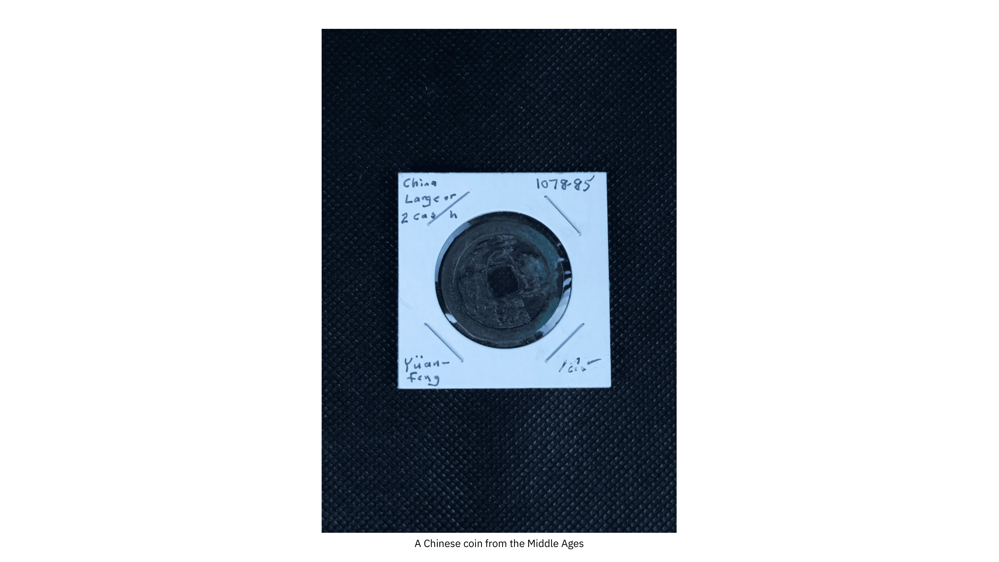

Горната монета е китайска монета от Средновековието. Тя е отлята монета с квадратен отвор в центъра. През този отвор се прокарва въже, което позволява монетите да се нанизват една на друга, за да се създадат гривни или колиета. Те обаче не са били предназначени за носене, а главно за счетоводни цели. Те можели да се нанизват заедно, за да се образуват счетоводни единици под формата на големи нишки, като парчетата се преплитат. Не било задължително да има някакви специфични знаци, понякога те били просто бронзови кръгове.

Монетарният монопол на държавата, установен със закъснение от Уди от династията Хан през 113 г. пр.н.е., често е бил оспорван, което е позволявало на различни частни или местни играчи да емитират свои собствени валути, при условие че са се ползвали с достатъчно обществено доверие.

**Ниската вътрешна стойност на китайските валути предотвратяваше натрупването им и гарантираше безпроблемното им обращение**.Благородните метали рядко се използваха като разменна монета, за да се предотврати натрупването им. Тъй като златото е твърде скъпо, то обикновено се заделя, а не се харчи. Вместо това **само коприната е представлявала истинска валута с висока стойност в китайската международна търговия**. Китайците са търгували с коприна, а не със злато.

По време на икономически или парични кризи, особено когато цената на медта се покачва, се приемат иновативни решения: така още през II в. от н.е. монетите в обращение се секат, за да се създадат по-малки единици, което позволява да се поддържа плавно обращение с по-ниски разходи. В други епохи, като тази на Ванг Манг (началото на I в. сл. Хр.), се експериментира със силно фидуциарни валути, чиито номинални стойности са много по-високи от действителното съдържание на метала, като по този начин се предшества появата на банкноти. Взимали са монети и са отпечатвали върху тях стойности като 50, 100 или 200, за да обозначат по-големи суми, например 200 монети. Тази практика вероятно е допринесла за значителна инфлация.

Както беше споменато по-горе, тази система се основава на социална конвенция между държавата, производителите и търговците, но също така и на авторитарни и строги правила за тези, които не играят играта, особено по отношение на избора на фигури (красиви или не) или дължината на тъканите (несъответстващи на стандарта).

По мое скромно мнение това не е много стабилна система. Тя разчита основно на строги правила, които задължават длъжностните лица и търговците да приемат повредени монети под заплаха от санкции.

### Паричните иновации в Китай и тяхното икономическо въздействие

Китай е и пионер в издаването на ранни форми на книжни пари, които първоначално са приети в отговор на недостига на метал през 9 век след Христа. Въпреки първоначалните си предимства тези хартиени валути редовно водят до инфлационни спирали, когато се емитират в излишък, както се вижда през периодите Сун и Мин, когато прекомерното емитиране води до сериозни валутни кризи, илюстрирани от Марко Поло през XIII в., който дори отбелязва, че фалшифицирането на такива хартиени пари се наказва със смърт. Не мога да не отбележа, че тук става дума за форма на насилие.

По този начин китайският опит се характеризира с дълбоко доверителна концепция за парите, забележителна гъвкавост на паричната система и ранно използване на книжни валути, основано на доверието между икономическите участници, а не на вътрешната стойност на използваните средства.

## Обществена и икономическа организация в древността

<chapterId>4023c3ce-7a47-5ac4-8f5f-c7ab699ab20f</chapterId>

:::video id=2761efe4-21cf-4f06-9bda-c03f9ff39012:::

### Дебатът за градския паразитизъм

Връзката между древните градове и техните хинтерландни територии повдига фундаментален въпрос: дали тези градски центрове са функционирали като паразити, извличащи богатство, или като двигатели на полезна икономическа специализация? Хипотезата за паразитизма предполага, че градовете от бронзовата епоха, особено в Месопотамия, **систематично извличали повече стойност от своите селски територии, отколкото връщали**, живеейки основно от ренти и данъци, без да създават еквивалентна стойност.

Това виждане намира отражение в разпадането на Римската империя: когато териториалната експанзия спира, потокът от външно богатство пресъхва, което може да доведе до невъзможност за финансиране на градската икономика. По този начин градовете щяха да живеят "над възможностите си", зависими от добива, а не от производството.

### Специализацията като фактор за създаване на стойност

Един алтернативен икономически прочит оспорва тази паразитна визия. **Древните градове са функционирали преди всичко като центрове на специализация и разделение на труда**. Тяхната роля надхвърляла простото извличане: те концентрирали специализирани занаяти, организирали търговски мрежи и служели като центрове за обмен на дълги разстояния.

Тази градска специализация създава продуктивна взаимозависимост с вътрешността на страната. Градовете не можели да оцелеят без селскостопанските доставки от селските райони, но в замяна на това вътрешността на страната се възползвала от занаятчийски продукти, технически иновации и достъп до средиземноморските търговски мрежи. Разделението на труда е позволявало взаимно повишаване на производителността, дори и разпределението на ползите да е изглеждало небалансирано.

Хроничната продоволствена несигурност по онова време отчасти обяснява тази очевидна асиметрия. Рискът от глад и унищожаване на реколтата е бил постоянна заплаха за селското население, докато градските занаятчии, свързани с международните търговски мрежи, са се радвали на по-голяма икономическа стабилност.

### Историческа еволюция - от древността до Средновековието

Контрастът между античната и средновековната организация хвърля светлина върху този въпрос. **Древността е благоприятствала широкомащабното разделение на труда, като градовете са били отворени за целия средиземноморски свят**. Търговията и специализацията достигнали сложни нива, създавайки обширни икономически мрежи.

Разпадането на Римската империя води до радикално раздробяване: **Феодалната епоха заменя тази централизирана организация с децентрализирана система от самостоятелни имения**. Древните римски "villas rusticae" се превръщат в матрица на средновековните сенеурии, създавайки мозайка от практически самодостатъчни икономически острови, управлявани от духовенството или благородниците.

Тази средновековна децентрализация, макар и да намалява търговската ефективност, парадоксално осигурява по-голяма устойчивост на външни сътресения. Феодалните имения развиват по-балансирани отношения между центровете на властта и селското население, дори ако тази организация ограничава повишаването на производителността, свързано със специализацията.

### Възникването на градските пазари

Археологическите находки разкриват съществуването на **пристанища за пазаруване и търговски квартали в месопотамските градове още през второто хилядолетие**. Тези инфраструктури свидетелстват за съществуването на организирани пазари, макар че точното им функциониране остава дискусионно.

Карл Полани, който първоначално се отнася скептично към съществуването на истински пазарни механизми в древността, квалифицира позицията си, като признава, че може би е подценил ранната поява на пазарните борси. Тази интелектуална еволюция отразява сложността на интерпретацията на древните икономически системи, в които институционалното преразпределение, реципрочната размяна и зараждащите се пазарни транзакции са съществували едновременно.

### Спарта срещу Атина

Сравнението между Спарта и Атина отлично илюстрира връзката между паричната система и социалната организация. **Спарта представлява модел на твърдо йерархично общество, което съзнателно отхвърля използването на пари**, докато Атина развива сложна парична икономика, която придружава демократичната ѝ система.

Спартанското отхвърляне на парите не е спонтанно, а **институционално и идеологическо**. Спартанските лидери се страхували, че парите ще развалят военните и гражданските ценности, и предпочитали система, основана на пряко междуличностно доверие между гражданите.

За да обезкуражи използването на пари, Спарта използва **тежки, непрактични метални пръти**, което парадоксално показва интуитивно разбиране на качествата на парите (делимост, преносимост, трайност), които се стреми да неутрализира.

### Границите на антимонетарния модел

Спартанската организация илюстрира ограниченията на **Числата на Дънбар**, приложени към обществения мащаб. **Като отхвърля парите като неутрално средство за размяна, Спарта се обрича да ограничи гражданското си общество до ограничен брой граждани, способни да поддържат отношения на пряко доверие**. Хомоиоите (спартанските граждани) представлявали едва 1% от общото население, заобиколени от хиляди хилоти (роби).

Тази организация, която първоначално е източник на изключителна военна сплотеност, се оказва структурно нестабилна. **Битката при Левктра (371 г. пр. Хр.) демонстрира границите на тази система**: загубата на човешки живот непоправимо разрушава спартанската социална тъкан, което води до срив на техния цивилизационен модел.

Конкуриращите се градове (Атина, Коринт, Тебес) с развити парични системи **поддържат по-богати и по-устойчиви икономики**, способни да компенсират човешките загуби чрез икономическо възстановяване и имиграция.

### Лично срещу институционално доверие

Спартанският опит разкрива **рисковете, присъщи на общество, основано изключително на междуличностно доверие**, а не на неутрални институционални механизми. Макар да създава силно социално сближаване, този модел прави обществото уязвимо към демографски сътресения.

Тъй като позволяват анонимни и обезличени транзакции, парите предлагат по-висока системна устойчивост. Те позволяват социална експанзия отвъд границите на прякото доверие, като улесняват външния обмен и икономическия растеж.

### Парадоксът на инките, Богатство без пари

Империята на инките представлява завладяващ парадокс: **цивилизация с огромно златно богатство, но без парична система**. Подобно на Спарта, този модел се основава на твърда йерархична организация и централизирано планиране, но се оказва уязвим за конкистадорите с гъвкави парични икономики.

Тази структурна нестабилност на антимонетарните системи в лицето на монетарните общества е повтаряща се историческа закономерност, която предполага, че **институционалното отхвърляне на парите, далеч от засилване на социалното сближаване, може парадоксално да отслаби цивилизациите** пред лицето на външните предизвикателства и историческите промени.

Анализът на тези исторически модели разкрива, че освен функцията на размяна, парите са маркер и фактор за социална сложност, който позволява на цивилизациите да преодолеят ограниченията, наложени от преките междуличностни отношения.

# Раждането на парите в монетния двор

<partId>232e365a-8c3b-11f0-b276-b3ab70d1a5a1</partId>

## Появата на монети

<chapterId>40ed3414-3066-57bd-bc1b-617ad0a354e0</chapterId>

:::video id=1d6834c4-98a3-43fe-ba80-04be51b0486e:::

Стигнахме до същината на проблема: външния вид на монетите. Подчертавам думата "монети", защото в предишните раздели видяхме, че парите или паричните системи са присъствали в голяма степен в цивилизациите, предшестващи лидийските народи, гърците и персите. Мисля, че това е доста ясно от това, което току-що видяхме. Ето защо този раздел е посветен на появата на същинските монети и е озаглавен: *Появата на монетите*.

### Лидийски и йонийски произход на монетите

В началото на този раздел бих искал да ви предложа откъс от книгата на Глин Дейвис "История на парите", точно тук.

*Откъс от "История на парите": От древността до наши дни от Глин Дейвис:*

> От родното си място в Лидия и Йония познаването и използването на монетите бързо се разпространява на изток в Персийската империя и на запад през останалите острови в Йонийско и Егейско море до континентална Гърция, а след това и до западните ѝ колонии, особено Сицилия. Разпространява се и на север към Македония, Тракия и Черноморието, но в Египет е възприето само частично, неохотно и със закъснение.

Интересно е да се спомене, че в Египет са продължили да претеглят монетите дълго след появата на технологията за сечене на монети. Мисля, че това е важно да се отбележи. Цитатът продължава:

> По същия начин континентална Италия първоначално възприема доста бавно гръцките финансови нововъведения, за разлика от бързината, с която те са възприети от Сицилия.

*Освен тези две ограничени изключения (континентална Италия и Долен Египет), използването на монети се разпространява бързо в страните, граничещи с Централното и Източното Средиземноморие, както и в обширната и разрастваща се Персийска империя, от Месопотамия **до Индия.** Остава неясно дали по това време Индия вече самостоятелно е разработила зачатъчна парична система, независимо от развитието на Китай или Лидия. Независимо от това дали Индия е разработила самостоятелно своя собствена валута, нарастващите контакти между Индия и Близкия изток водят до това, че индийското монетосечене е пряка адаптация на лидийското и гръцкото изобретение, първо чрез Персийската империя, а след това и чрез Македонската империя* (със завоеванията на Александър Велики и неговия баща).

*Поради тези причини прякото влияние на всяко местно индийско изобретение на парите е било незначително в сравнение с огромното значение на явно независимите парични изобретения на Китай на изток и още повече на лидийските и гръцките разработки на запад*

### Географско разпространение и регионални адаптации

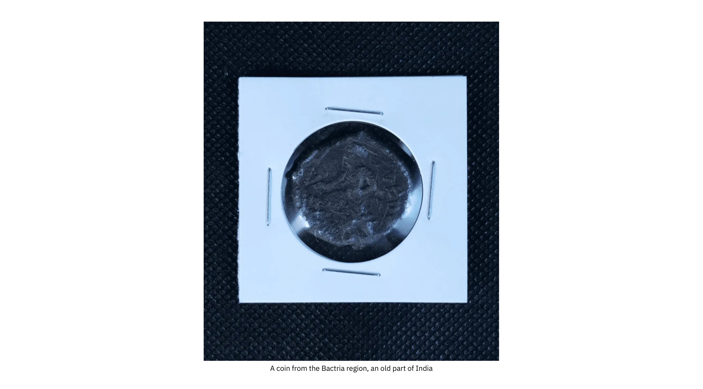

За да илюстрираме този период в нагледна форма, тук горе е показана монета от регион в Индия - Бактрия, който се намира близо до западната част на Индийския полуостров, близо до Афганистан. В този район са се срещали монети, които вероятно са били вдъхновени от гръцките монети с изображение на една от техните царски личности.

## Лидийци и перси

<chapterId>eb802ab8-8ffd-5b25-907f-8944f120ed14</chapterId>

:::video id=f151eb42-5ff3-4ca1-9af1-1ae2a5e051c0:::

### Първите лидийски монети от електрум

Тъй като не можем да отделим появата на монети от Лидия и персите, нека преминем към онази част от света на изток от Гърция, която днес представлява Турция. Първите монети, които се появяват на Запад, датират приблизително от средата на VII в. пр.н.е. в районите на Лидия и Йония, разположени в днешна Турция. Това фундаментално нововъведение вижда бял свят около 650-600 г. пр.н.е., като забележителни археологически открития като първите монети, намерени в храма на Артемида в Ефес, са датирани около 600 г. пр.н.е. Тези примитивни монети са изработени от електрум - естествена сплав от злато и сребро с кехлибарени отблясъци - и често са груби на външен вид, просто маркирани с щампи или елементарни мотиви.

По-долу можете да видите една от най-ранните лидийски монети, на която е изобразен лъв с плячка отпред. Може да забележите печат или дупка на гърба, която според някои е била използвана за проверка на чистотата на метала и за да се гарантира, че не е само повърхностен слой. Въпреки че това е един от най-ранните примери, важно е да се отбележи, че този екземпляр е копие. Всичките ми златни и електрумни изделия са реплики или съвременни възстановки, предназначени да ми попречат да похарча всичките си спестявания за тази колекция.

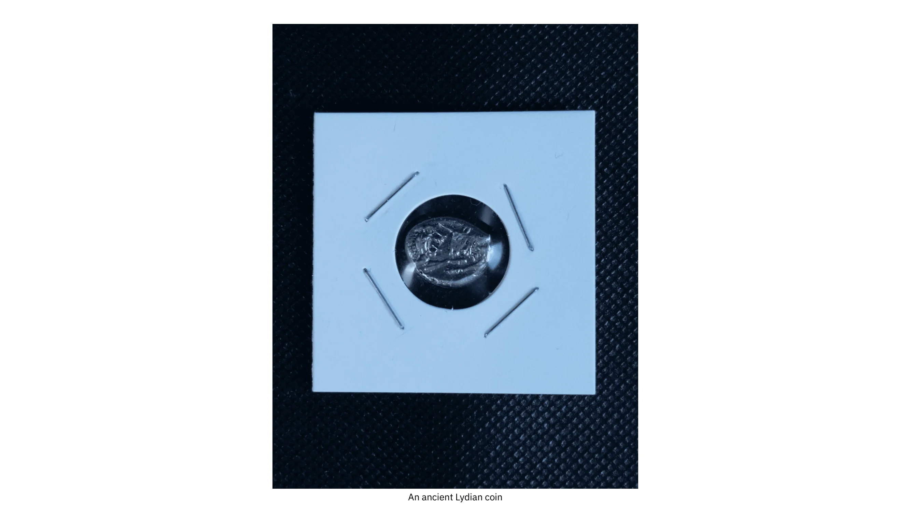

Но имам и истинско персийско произведение, което предстои да видим. Ето как са изглеждали тези ранни парчета. Това е нещо като капка (или буца, на английски) метал, която е била щампована по онова време.

Противно на широко разпространеното схващане, че парите са били изобретени, за да улеснят ежедневната търговия и да заменят размяната, изглежда, че първите лидийски, ахеменидски и гръцки монети първоначално не са били използвани за дребна търговия. Всъщност паричните единици са били твърде големи за ежедневна употреба. Нещо повече, тяхното обращение е било ограничено до региони, близки до местата, където са били произведени.

Тук намирам за важно да спомена, че макар да съм чел в няколко труда от антропологично естество, монетите, както вече показах - независимо дали става дума за електрумните или за тази персийска монета, към която ще се върна след малко - са били твърде големи, за да се купува хляб, да речем, всеки ден. Виждал съм оценки, които биха ни накарали да мислим, че това е било равностойно на един работен ден за селянин или войник, така че би било твърде голямо. Това е все едно да се опиташ да платиш дневна заплата за храната си, за закуската или за обяда си. Само че в други трудове съм виждал, че са открити по-малки единици от тези капки, т.е. по-малки монети, което може да ни накара да мислим, че може би е имало възможна употреба за ежедневни покупки.

Така че тук антропологичното "доказателство", че не са били използвани за ежедневна търговия, защото номиналът или единицата са били твърде големи, според мен не е много солидно, защото сме открили примери за монети, които са по-малки и биха могли да бъдат адаптирани за ежедневни покупки.

### Ролята на държавата при създаването на пари

Истинският произход на монетите изглежда е свързан с прякото действие на държавите. Съществуват две основни хипотези по този въпрос: първата, идеалистична, прави паралел между гръцкия термин "номизма" (пари) и "номос" (закон), като предполага, че парите са били свързани с кодификацията на законите, укрепвайки властта и политическата организация на градовете. Втората, по-реалистична хипотеза, широко приета днес, е, че парите са били преди всичко средство за упражняване на икономически и социален контрол от страна на държавите. Като са гарантирали официално теглото и стойността на съдържащите се в тях благородни метали, държавите са можели да манипулират обръщението и стойността на тези монети, създавайки доверие и премии за ликвидност, характерни за националните валути.

Наистина е интересно да знаем, че имаме доказателства за това. Например при монетите от електрум трябва да знаете, че естественият електрум обикновено е около 70% злато и 30% сребро. В първите монети, които открихме и анализирахме, по-конкретно ранните лидийски монети, съдържанието на злато изглежда е по-скоро около 50-55% вместо 70. Това подсказва, че още тогава емитентите на монети са се опитвали да намалят дела на по-ценния метал, вероятно за да произведат повече монети и те да изглеждат на същата стойност като немаркирана капка естествен електрум. И тук трябва да се каже, че наистина от времето на този прочут Крез, като в *богат като Крез*, това е било възможно, защото именно от негово време сме разполагали с технологията за разделяне на златото и среброто.

Лидийското монетосечене претърпява значителна еволюция по време на управлението на известния цар Крез (561-546 г. пр.н.е.), прочут с легендарното си богатство. По това време лидийците усъвършенстват металургията, за да отделят златото и среброто от електрума, като по този начин въвеждат първите биметални монети, т.е. отделни златни и сребърни монети.

### Персийска експанзия и приемане на гръцкия език

Когато завладяват Лидия през 546 г. пр.н.е., персите от династията на Ахеменидите веднага възприемат това нововъведение. Около 500 г. пр.н.е., при управлението на Дарий I, персите създават своя собствена парична система със златни дарици и сребърни сиглоиди, на които често е изобразена царската фигура във военна поза. Това царско персийско монетосечене се използвало главно в елинизираните райони на Персийската империя и постепенно се разпространило, въпреки че употребата му останала неравномерна, като **някои райони, като Египет, все още предпочитали размяната в претеглен метал (бульон)**.

Горе можете да се възхитите на истински персийски sigloi (или siglos). Малкият дизайн изобразява цар, въпреки че дупката е леко изтрита. Това е сребърна монета, за разлика от daric, която е изработена от злато. Персите са можели да различават тези два метала и са се отказали от монетите от електрум. Така те въвеждат биметализма, като използват както злато, така и сребро, запазвайки същата концепция за монети, изработени от благородни метали, често с дупка отзад, вероятно за проверка на съдържанието на метала.

Бързото въвеждане на монети от гърците изглежда е било стимулирано от близките им контакти с лидийците, особено чрез гръцките колонии в Мала Азия. Първите гърци, които секат монети, вероятно са жителите на Егина в средата на VI в. пр.н.е., които въвеждат драхмата, чието тегло е различно в отделните региони и чието име буквално означава "шепа зърно" или "шепа стрели".

Успехът на гръцкото монетосечене се дължи както на удобството му при важни транзакции, като заплащането на наемници, така и на икономическата и политическата експанзия на градовете. Валутата бързо се превръща в централен елемент на гръцката, а по-късно и на римската икономика, като същевременно запазва силно символично измерение, особено чрез връзката си със закона (nomos).

И накрая, бързото разрастване на монетосеченето свидетелства за дълбока трансформация на древните общества, в които кодификацията на паричните стойности върви ръка за ръка с държавната организация. Тази еволюция полага икономическите и политическите основи за възхода на гръцките демокрации, особено в Атина, където парите играят решаваща роля за функционирането на демократичния град.

Основният момент, който трябва да запомните в този раздел, е, че говорим конкретно за **монети**, а не за пари като цяло. Основният аспект, който ясно се очертава, е **доверието в емитиращия орган**, пряко свързано с техническите характеристики на монетите (тегло, чистота, номинална стойност). Точно това доверие позволява на държавата или на емитиращия орган да упражнява определен контрол или дори да манипулира стойността и обръщението на тези монети от самото начало.

## Институционална намеса и първите монети

<chapterId>3e1efd08-99e3-5a32-9908-3185fef0e640</chapterId>

:::video id=84847cf6-9e46-4a8c-9f35-25a27496cc4b:::

### Двойствената природа на парите

Появата на парите в монетния двор повдига фундаментален въпрос: дали парите са спонтанно творение на пазара или институция, наложена от властта? Това концептуално напрежение изправя едно срещу друго две коренно различни виждания.

От една страна, австрийската икономическа школа защитава идеята, че стоковите пари - особено златото - са естествено избрани от икономическите субекти заради присъщите им качества: трайност, преносимост, делимост и заменяемост. От тази гледна точка държавата си присвоява тази спонтанна валута, за да контролира нейното предлагане. Това е институция, която възниква по естествен начин от нуждите на пазара, преди да бъде завладяна от политическата власт.

За разлика от тях антропологичният и институционалният възглед твърди, че парите наистина се появяват с държавното монетосечене. Властта съзнателно създава парите, като поставя своя печат, превръщайки по този начин метала в истински паричен инструмент. Тази гледна точка предполага, че най-ранните лидийски монети са били използвани главно за заплащане на армиите - един статер съответства приблизително на дневната заплата на войник.

### Парадоксалните предимства на държавната стандартизация

Въпреки това теоретично напрежение дори австрийските икономисти признават някои ползи от държавната намеса в паричния сектор. Стандартизацията чрез монетосечене решава редица практически проблеми на търговията.

Без сертифициращ орган икономическите участници са изправени пред постоянни рискове: фалшиви монети, измами при подаване на документи и манипулиране на теглото. Тези практики създават търкания в икономиката, тъй като някои монети се приемат, а други се отхвърлят. На теория официалният печат гарантира теглото и качеството, което прави търговията по-плавна.

Тази гаранция има наблюдаема цена на пазара: изсечената златна монета струва повече от нейния суров златен еквивалент. Тази премия отразява стойността на сертифицирането - търговците вече не трябва сами да проверяват автентичността на метала чрез химически или резонансни тестове. Държавната намеса, парадоксално, премахва триенето и улеснява търговията, като създава институционализирано доверие.

### Манипулиране на валутата от самото начало

Историята на първите лидийски държавници разкрива една тревожна ирония. Последните анализи показват, че съдържанието на злато в тези монети от електрум е било системно по-ниско от това на естествения електрум. Органът, удостоверяващ качеството, едновременно с това е манипулирал състава.

Тази практика илюстрира двойната полезност на монетосеченето. За пазара тя прави обмена по-плавен и предлага гаранция за стандартизация. За емитиращия орган тя се превръща в инструмент за икономически контрол чрез разводняване. Като намалява съдържанието на злато и същевременно запазва номиналната стойност, държавата ефективно увеличава паричното предлагане - създава повече парични единици от същото количество благороден метал.

Самата държава обаче остава ограничена от тази манипулация. Както показва примерът със златния солид на Константин през IV в., римската администрация щателно проверявала качеството на монетите, тъй като изисквала да ѝ се плаща с добри монети. Властта е имала жизненоважен интерес да поддържа качеството на собствените си монети, за да гарантира стойността на данъчните си приходи.

### Икономически анализ на девалвацията

Проучването на девалвацията на валутите разкрива последователни модели в историята. При металните монети икономистите проследяват процентното съдържание на благородния метал в монетите - низходяща крива, която показва прогресивно обезценяване. За съвременните книжни пари е вярно обратното: наблюдава се паричната маса в обращение и нейното нарастване сигнализира за девалвация.

И двата метода измерват едно и също основно явление: размиването на паричната стойност. Независимо дали става дума за намаляване на съдържанието на благородни метали, или за печатане на нови банкноти, механизмът остава един и същ. Колкото повече парични единици създава една власт от едни и същи реални ресурси, толкова повече всяка единица губи своята стойност.

Тази манипулация, която се наблюдава още от най-ранните лидийски монети, показва, че контролът върху парите винаги е бил въпрос на власт. Така монетните пари представляват забележителна техническа иновация, съчетана с инструмент за икономически контрол - двойственост, която се наблюдава в цялата парична история до наши дни.

## Производство на части

<chapterId>b205f4f2-c293-5308-b812-a998de9ad45e</chapterId>

:::video id=47c612ec-d97e-4498-b50e-7e66518bd56d:::

### От пробити петна до изсечени монети

След раздела за появата на монетите исках да представя много кратък раздел за развитието на производството на монети. Както видяхме, всичко е започнало с капчици електрум, продължило е със злато и сребро, като и двете страни са били маркирани с перфорация - или с лика на краля, или с дупка на гърба, за да се провери чистотата.

По-късно, както ще разгледаме в следващия раздел, гърците усъвършенстват тази технология, като създават кръгли монети, които са изковани от двете страни. Те вземали гладко, плоско парче благороден метал, гравирали желания дизайн от едната страна и след това го изчуквали на ръка, за да създадат готовата монета.

Технологията за ръчно сечене на монети вероятно е изиграла роля за контролиране на инфлацията по това време, въпреки че монетите често са били разреждани, за да се увеличи производството им. Това е особено очевидно по време на римския период и, в по-малка степен, по време на някои войни през гръцкия период. Макар че сеченето на монети поединично ограничавало възможностите на властите за масово производство, то ефективно допринасяло за контролиране на инфлацията, въпреки настъпилите значителни обезценявания. По този начин еволюцията преминава от пробиване на парче метал до кръгла, изкована монета.

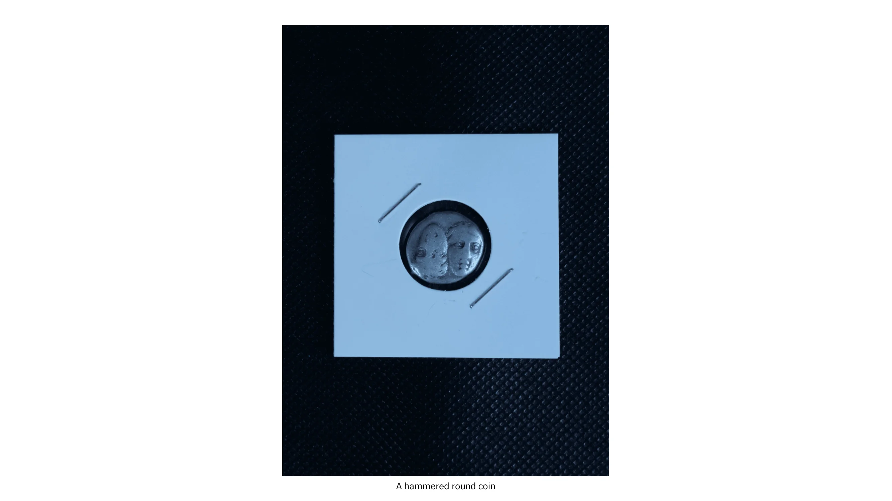

### Средновековна еволюция

През Средновековието се наблюдава и тенденцията монетите да се разпростират, като се правят по-широки и по-тънки. Една от причините за това е, че става по-лесно да се проверява звукът им, който често се използва като показател за автентичност. При разстилането на среброто се е получавала отчетлива честота, така че хората са можели да потвърдят чистотата на монетата само като я чуят. Тази практика води до появата на термина "здрави пари" (на английски "sound money" и "sound" се превежда като "звук"). В контекста на здравите пари стандартното тегло се определяло чрез използване на везна или "требушон" за претегляне. Така еволюцията продължила от малки, кръгли монети към малко по-тънки и по-широки монети.

### Ударно махало

Последната технология, която се появява в края на Средновековието, в началото на модерната епоха, е идеята за махало. То представлявало своеобразен винт, който се затягал, за да удря монетите, като по този начин се генерирали монети с тази нова форма на удряне. Особеното в тази разработка е възможността да се гравира модел върху повърхността на монетата, за да се реши проблемът с изрязването. Отделянето на част от монетата, за да се възстанови ценното сребро, което може да се използва за сечене на други монети или просто да се запази като ресурс.

Така че това понятие за удара на махалото помогна за феномена на изрязването. Интересно е да се отбележи, че тази технология всъщност идва от Франция. В Англия например са наели френски инженери да дойдат и да им покажат как да направят тези машини. Забавното според мен е, че е имало привърженици на чуковото монетосечене, които са били против него и са забавили прилагането на тази технология. При всяка добра технология винаги има хора, които са против нея, които искат да запазят старата технология. Мислех, че е доста лудост да осъзная, че дори технология, която изглежда наистина по-добра - можеш да направиш повече части, по-трудно е да ги копираш - все още има хора, които са привързани към известния метод на чукчето. Имаше промяна между производството на части, които бяха направени с този известен удар с махало, и след това връщане към удара с чук. И накрая, разбира се, именно удрянето с махало най-накрая се наложи и ни даде тези красиви съвременни части, в които можете да откриете или малки линии, малки хребети наоколо, за да се избегне изрязването, вероятно свързани с думата изрязване, хребети, и днес все още можете да видите или хребети, или текст, или рисунки, които са изписани по ръба на частта.

# Различни теории за появата на парите

<partId>72ac694f-9248-550d-90c1-91af3d234380</partId>

## Теории за появата на парите и различните им дефиниции

<chapterId>7d699d4d-8c70-55b5-bf36-609f3fd90bcf</chapterId>

:::video id=523c873f-501b-4954-b79f-7e74c0f685a5:::

Добре дошли в този раздел, посветен на различните теории за появата на парите и различните им определения. Предлагаме ви кратък откъс от книгата *Aux origines de la monnaie*, който според мен обобщава двете основни теории, които ще разгледаме в този раздел.

> Този кратък преамбюл има за цел единствено да подчертае контекста на проучването. На концептуално ниво дебатът е открит между привържениците на тезата на К. Полани и тези на М. Вебер. За първите централна роля играят дарението и преразпределението, а пазарната размяна играе само маргинална роля, главно в международния обмен. За вторите, напротив, пазарът е в основата на настоящия исторически процес.

Например в Месопотамия една от теориите за появата на паричната единица предполага, че храмът като авторитет създава разчетната или паричната единица, налага я и след това търговците я приемат за търговия. Противоположната теория твърди, че не, тази парична единица възниква по естествен начин от пазара, за да улесни търговията. В Месопотамия има добре запазени примери за това.

Що се отнася до размяната, някои теории сочат, че тя се е използвала предимно при международен обмен, т.е. с хора, на които просто не сме имали доверие.

Ето какво ще направим в този раздел. Ще проведем своеобразно проучване, за да представим различните теории за появата на парите и различните определения за това какво са парите. Ще представим и критикуваме тезите както на класическите икономисти, така и на антрополозите. Дори ще имам щастието с мен да бъде Улрих Фроми, който ще представи гледната точка на австрийската икономческа школа по тези различни теми.

## Появата на парите за класическите икономисти

<chapterId>1d3776cd-0dfd-5297-af48-c6f41e257a7e</chapterId>

:::video id=873a16c1-17ac-448d-8941-df4feb7ab79d:::

Този сегмент е посветен на различните теории за възникването на парите. Първата тема, която ще бъде разгледана, е появата на парите според класическите икономисти.

### Класическата теория на Адам Смит

Според класическите икономически теории, по-специално тези на Адам Смит, парите са възникнали по естествен път от размяната в отговор на нейните ограничения. Първоначално размяната се е осъществявала чрез пряк бартер, но този метод често се е усложнявал от проблема с "двойното съвпадение на желанията": всеки е трябвало да притежава точно това, което другият е искал. Постепенно някои стоки (като сол, благородни метали и добитък) започнали да се приемат от всички като междинни средства за размяна благодарение на тяхната полезност, трайност и делимост. Така спонтанно се появяват парите, които улесняват и улесняват икономическата размяна.

### Критика на класическата теория

Ето моята критика на тази теория. С оглед на всичко, което видяхме в предишния раздел, мисля, че вече можем да кажем, че това схващане, че **монетите** са еволюция на бартера, е погрешно, просто защото отсечената монета определено се появява от властта, тъй като е отсечена от властта. Има няколко причини за това, не на последно място желанието на властите да контролират икономиката, да поемат контрола върху парите.

От друга страна, ако говорим за парите като понятие, а не непременно за монети, тогава въпросът не е толкова ясен, защото при първите монети, лидийските статери, сме открили сребърни капки, които не са били маркирани. Остава да се види дали са били в обращение. Ако са били в обръщение, това означава, че хората може би първоначално са определили този актив като потенциална валута, която може да бъде широко търсена и лесно обменяна. И може би едва след това властите са забелязали тази ситуация и са поели контрола върху нея, като са поставили печат, за да я удостоверят.

Това има много предимства - няма нужда да го проверявате, да го претегляте и т.н. Очевидно е, че ще говорим за това. Но по мое мнение монетите очевидно са инструмент, който е бил използван от държавите от самото начало. По отношение на появата на парите като такива обаче не знаем дали те наистина са дошли от орган, който ги е наложил, или са се появили чрез търговия или търговски обмен. По-нататък в този раздел ще имам много интересна дискусия по този въпрос с колегата Улрих.

Вече знаем, че първите монети от благородни метали не са били използвани за улесняване на ежедневния обмен, тъй като стойността им е била твърде висока. Знаем също, че те са били използвани главно за военни плащания. Това е добър аргумент в полза на тезата, че парите не са се появили непременно на пазара. Разчетните единици, деноминациите на първите монети, вероятно са били твърде големи, за да може, да речем, да се купи хляб или да се направи ежедневно пазаруване. Можело е например да бъде еквивалент на дневна заплата. Не е задължително в онези времена хората да са получавали заплати, но това е, за да ви даде представа за мащаба. Така че тези монети вероятно са имали твърде голяма покупателна способност, за да бъдат използвани в дребната търговия. От друга страна, нищо не говори, че тези монети не биха били използвани за осъществяване на по-големи размени, като например търговските борси. Знаем, че те са били използвани главно за военни плащания. Това е една от най-популярните теории за обяснение на появата на първите монети. Не забравяйте, че тук говорим за монети, а не непременно за парите като цяло. И така, първите монети са имали своята първа роля и тя е била да плащат за военни плащания, за наемници.

Александър Велики, например, го е използвал много добре, както ще видим по-късно.

Също така видяхме, че още в древен Китай черупките от каури са били използвани за икономически обмен (**възнаграждение на труда, измерване на стойността и закупуване на земя)**. Нещо повече, в Месопотамия и Египет вече са съществували функционални парични системи, които са били използвани за търговия, изплащане на заплати и данъци. Това, което предлагам тук, е, че определено е погрешно да се смята, че монетите в западната концепция възникват от необходимостта да се направи обменът по-плавен.

Тъй като монетите се емитират от даден орган, може би можем да предположим, че от самото начало те са били свързани с емитиращите ги органи. Това е логично. От друга страна, не е задължително да знаем как са се появили предшестващите ги форми на пари или форми на парични системи, протомонети. От една страна, ще предположим, че именно храмовете са идентифицирали тези парични единици, а след това хората са ги използвали. А, от друга страна, ще ви кажем, че не, това са били търговците, които са се нуждаели от средство за размяна, от начин за търговия с външния свят, и именно те са идентифицирали например сребърния метал, за да бъде използван, защото е бил търсен от външния свят. Въпросът е, че ние наистина не знаем. Ето защо имаме две противоположни теории. Не разполагаме с перфектни доказателства, за да обясним дали парите възникват по естествен начин от необходимостта от търговия, например от страна на търговците, или произлизат от властта.

### Разграничаване на монети и примитивни пари

В заключение, мисля, че можем да кажем, че монетите задължително произлизат от властта, тъй като са били отпечатани от нея. От друга страна, не мисля, че можем да кажем, че е погрешно да се предполага, че парите (това, което предхожда монетите) не са могли да се появят, за да улеснят размяната. Мисля, че във всички примери, които видяхме по-горе, изобилстват примери в този смисъл.

## Митът за бартера

<chapterId>0fcd4964-ac36-5163-a8cf-1aacebc0d2c0</chapterId>

:::video id=0ede29ab-8acd-4d79-9282-bd5991b97076:::

### Преглед на Дейвид Грейбър

Току-що разгледахме появата на парите според класическите икономисти. Сега ще се занимаем с концепцията, известна като мит за бартера.

Една от критиките към тази класическа теория за появата на парите е липсата на исторически доказателства в подкрепа на нейните идеи.

Критиката, известна като "мит за размяната", формулирана от антрополога Дейвид Гребер, оспорва класическата идея, че парите са възникнали по естествен път от размяната. Според тази критика няма исторически или антропологични доказателства, които да показват, че обществата систематично са използвали бартер преди появата на парите. Всъщност древните общества са функционирали на базата на кредити, дългове, социални задължения и церемониални размени. Следователно "митът за бартера" е теоретична конструкция, предназначена да оправдае класическото икономическо виждане, без реална емпирична основа.

Трябва да се отбележи обаче, че тази теория не отрича съществуването на бартерни сделки, например за обмен между различни племена. Тя просто отрича, че бартерът е бил широко практикувана дейност в рамките на тези така наречени примитивни групи и че парите биха били логична еволюция на тези практики. Той отрича факта, че бартерът е бил широко използван в рамките на едно племе и че парите в крайна сметка са се появили, за да улеснят обмена и да разрешат трудностите, които са съществували при бартера. Вместо това, според тази теория, тези групи са практикували форма на неофициален кредит или дарение срещу дарение.

### Примитивни общества срещу велики цивилизации

**Следват някои уточнения относно великите цивилизации на древната античност.** Мисля, че тази теория определено се отнася за примитивните (бездържавни) групи в миналото и дори днес (например племената, изследвани от изследователите през XVIII и XIX век). Очевидно е, че те не са използвали бартер, а по-скоро формите на размяна, които споменах по-рано, по причини, които вече споменахме (слабо разделение на труда, натурално стопанство). Не мисля обаче, че тази теория се отнася за великите цивилизации от миналото, като Месопотамия и Древен Египет.

Ето два откъса от *Aux origines de la monnaie* по този въпрос:

> Моделът, очертан от М. Мос в прочутата му книга "The Gift", е възприет от египтолозите колкото с единодушие и ентусиазъм, толкова и с липса на проницателност. Това е довело до редица обърквания, на които няма да се спираме тук. Нека само отбележим, че този модел се отнася за т.нар. примитивни общества, какъвто не е случаят с фараонски Египет.

> Следователно хлябът, т.е. преработените зърнени храни, е бил разчетна единица, която, подобно на "shât(y)" от Старото царство, е позволявала и откриването на кредити за разнообразни стоки. Този прост пример показва, че икономиката на фараонски Египет не се е ограничавала до система на преразпределение. Тя е била изключително сложна и е включвала множество разменни операции.

И така, както видяхме по-рано в раздела за Египет и дори за Месопотамия и Китай, можем да видим, че дори тези древни, но не примитивни цивилизации, поради наличието на държава, според мен, са използвали парични системи. Мисля, че това беше достатъчно добре демонстрирано в първия раздел на този курс. И така, тази представа за даване и получаване, за отложен кредит, не се отнася за тези велики цивилизации. Затова точните причини за появата на парите остават загадка. Не знаем дали те са произлезли от необходимостта на търговците да търгуват с външния свят, или са били наложени от храма в тези древни периоди.

## Възникването на парите чрез дългови пари

<chapterId>4f508615-aa61-5d62-89d3-cecd02aeaa62</chapterId>

:::video id=a23f547f-3906-4f4a-8f72-5d78c649d0c4:::

### Парите като IOU

В този раздел разглеждаме теорията на дълговите пари.

Теорията за **дълговите пари** (I owe you), разработена най-вече от икономиста Алфред Мичъл-Инес и по-късно доразвита от Дейвид Гребер, твърди, че парите не са възникнали от бартера, а по-скоро от дълговите и кредитните отношения, съществуващи от най-ранните човешки общества. Според тази теория парите се появяват, когато социалните задължения (дългове между индивиди или групи) стават количествено изразени и прехвърляеми. Тази концепция въвежда понятието за количествена оценка на размяната и прехвърлянето. По този начин парите биха били преди всичко **признаване на дълг**, подкрепено от взаимно доверие и често гарантирано от политическа или религиозна власт, а не стока, служеща само като посредник в размяната.

Още по-напреднала форма на тази теория е, че всички пари са дълг. Така че някой, който притежава пари, има претенции към обществото като цяло, претенции към всички, които приемат тези пари. И тъй като парите, **според тяхното виждане, трябва да бъдат приемани по задължителен начин**, в противен случай те не са пари, защото ако можете да откажете тези пари, тяхната система не работи. В дадена група, която е определила парична единица, всички, които я притежават, сякаш имат дълг към всички останали членове на това общество, които приемат тази парична единица, а тези, които приемат паричната единица, имат вид дълг към човека, който притежава тази парична единица. Това е по същество тяхната теория.

### Критики към задължителната система

**Моята критика на тази теория:**

Позволете ми да отправя една малка критика към тази теория. Приемам, че парите са вид социален консенсус. Това е доверието, което групата оказва на даден паричен "знак", какъвто и да е той. Така че аз се подписвам под концепцията за взаимното доверие, която ще разгледаме отново по-късно с концепцията за паричната премия. Където става сложно, е когато поддръжниците на тази теория добавят понятието за задължение и настояват за понятието дълг. За тях, когато някой притежава паричен токен, той има претенции към общността като цяло и следователно общността ще дължи на притежателя й дълг. Би имало и задължение за уреждане, като членовете на групата са длъжни да приемат токенът; в противен случай, според тях, системата не би работила. Мисля, че описаната по-горе система в древен Китай представя добре тази теория.

От своя страна, лесно мога да си представя система, в която парите са социален консенсус, при който избраният токен е общоприет като платежно средство, без да има официално задължение. Мога да видя подобна система работеща, ако хората я приемат по своя собствена воля. Тя може да работи. От друга страна, тя често е съпроводена със задължения, законно платежно средство и насилие, което ще видим по-нататък в раздела. Но от теоретична гледна точка нямам впечатлението, че тази система може съвсем да проработи. Мисля, че Bitcoin е пример за това. Bitcoin има стойност, защото има парична премия, защото има търсене за използването му в парични средства, т.е. резерви от стойност, може би и средства за размяна или защита срещу фиатната система. Никой не е длъжен да я приеме и колкото повече се приема като платежно средство, толкова повече може да се използва като средство за размяна. Вече можем да го използваме като средство за съхранение на стойност без никакъв проблем. В това няма никакво съмнение. Това, което искам да кажа, е, че Bitcoin ми се струва, че е пример, вид валута, която е форма на социален консенсус, при който смятаме, че ще можем да си върнем парите, ако си купим по-късно, придобиваме ги, за да можем да ги обменим по-късно, за да запазим покупателната си способност.

Този по-малко рестриктивен възглед на теорията помага да се обясни как две различни общества могат да търгуват с паричен токен, например злато, без да се създава вземане или дълг между тези общества. Насилственото приемане в обществото, според мен, не работи при търговията между две племена, защото другото племе не е подчинено на властта. Племе Б не е подчинено на властта на племе А. Но въпреки това то приема същата парична единица, да речем, злато. Сега хората могат да ми кажат: "Да, но това е така, защото Б също е решило, че златото е тяхната валута", така че това работи. Да, наистина работи, но в този момент няма създаване на дълг. Това е окончателна транзакция. Така че, когато А обменя стока за злато с Б, няма създаване на дълг, сделката е завършена. И ясно е, че човекът от Б не е придобил тази златна монета, за да му бъде платено по-късно от хората от А. Той я приема, за да я обмени за злато. Той я приема, за да бъде обменена по-късно, вероятно в рамките на собственото му племе. Така че в този пример няма създаване на дълг, няма скрито вземане, това е просто директна размяна, директно плащане. Привържениците на дълговата валута ще ни кажат, че това е бартер. И аз не съм съгласен, защото бартерът е размяна на пряка стока. Прекият бартер е размяна на една стока срещу друга стока, за ползване. Стоките се разменят, за да бъдат използвани, докато в нашия случай златото очевидно се използва като валута, защото няма да се използва за нищо друго; то ще бъде използвано по-късно като платежно средство. Така че според мен то не попада в категорията на бартера.

Притежаването на паричен токен не е "претенция" към общността, а по-скоро надежда, че токенът ще бъде приет на по-късна дата на сравнима стойност.

## Спонтанната поява на парите

<chapterId>e3ef86b1-73b9-5140-a61e-2ab6a5b0b2d4</chapterId>

:::video id=e543995f-d5e2-49d7-9133-e397b46e0833:::

За австрийската икономическа школа, чийто основоположник е Карл Менгер, парите възникват по естествен начин в условията на бартерна икономика, изправена пред проблема за двойното съвпадение на желанията. Според това виждане индивидите спонтанно се обединяват около междинни стоки, които улесняват размяната - не пряко потребявани стоки, а стоки, признати заради способността им да бъдат широко търсени.

Тези парични стоки трябва да притежават качества, определени още от Аристотел: те трябва да служат за съхранение на стойност, средство за размяна и разчетна единица. Икономическите агенти постепенно ги идентифицират, натрупват и съхраняват, като по този начин инициират появата им като пари. Този процес е напълно спонтанен - парите представляват естествен пазарен отговор на проблема за координиране на размяната, без съзнателната намеса на орган.

### Дебат за "мита за бартера"

Антрополози като Дейвид Грейбър оспорват тази гледна точка, като се позовават на "мита за размяната". Техният аргумент е, че досега не е документирана нито една сложна цивилизация, основана единствено на пряка размяна. По-скоро изследваните примитивни общества са използвали системи за неформален кредит и реципрочност. Грейбър твърди, че дългът е предшествал бартера, като се позовава на хиляди месопотамски таблички, документиращи кредитни отношения.

Тази критика обаче се основава на ограничително определение на бартера. Както посочва Менгер още през 1892 г., бартерът надхвърля обикновената пряка размяна на стоки срещу стоки. Той включва също така отсрочени трансфери, услуги срещу заплащане и размяна с времеви характер - това, което Менгер нарича "едностранни трансфери между индивиди". Тази разширена форма на бартера може да съществува заедно с кредитните системи в ограничени кръгове на доверие.

Липсата на доказателство не е доказателство за липса, а австрийските икономисти признават, че никое сложно общество не може да се развива устойчиво само на основата на пряката размяна - оттук и необходимостта от появата на парите.

### Месопотамският случай: търговци срещу храмове

Дебатът изкристализира около произхода на сребърния шекел от Месопотамия. Съществуват две противоположни тълкувания. Институционалният възглед твърди, че храмовете - истински икономически и духовни центрове - са наложили среброто като валута за структуриране на икономиката. Клинописните таблици, концентрирани сред духовенството и търговския елит, свидетелстват за този централизиран контрол.

Австрийското тълкуване предполага обратното: именно търговците са приели парите за търговия на дълги разстояния. Изправени пред предизвикателството да търгуват с чужденци отвъд границите на Месопотамия - от Анадола до Персийския залив - те се нуждаели от нещо универсално разпознаваемо, трайно и преносимо. Среброто било естественият избор поради присъщите му качества. Храмовете просто потвърждават една вече установена в търговията практика.

Тази теза се основава на документиран обмен между Канеш в Анадола и Асур, при който търговците разменят текстил срещу сребърен метал - не заради материалната му полезност, а като средство за съхранение на стойност. Тези транзакции надхвърлят обикновения бартер и разкриват съществуването на истинска стокова валута.

### Съвременният пример за затворнически лагери

Икономистът Ричард Радфорд, затворник в Германия по време на Втората световна война, документира интересен случай на спонтанно възникване на паричната система. В лагерите цигарите по естествен начин се превръщат в разменна единица - делима, стандартизирана, широко приета. Дори непушачите ги приемат, признавайки универсалната им разменна стойност.

Този микрокосмос илюстрира австрийския принцип: изправени пред проблема за координиране на размяната, хората спонтанно се обединяват около най-продаваемата стока. Никаква власт не е налагала парите за цигари; те са се появили от ежедневната практика на затворниците, които се стремят да оптимизират размяната си.

### Сближаване на индивидуалните предпочитания

По същество парите представляват сближаване на индивидуалните предпочитания към общоприето благо. Месопотамските търговци, подобно на затворниците на Радфорд, определят благото, което свежда до минимум несигурността на бъдещата размяна. Този избор не чака разрешение или налагане от централна власт - той възниква от практическата рационалност на икономическите субекти, изправени пред предизвикателствата на размяната.

Дебатът между спонтанното възникване и съзнателната институция остава открит, тъй като историческите доказателства са откъслечни. Но австрийският анализ предлага последователно обяснение: парите са се родили от практическите нужди на търговията, а властите само са институционализирали вече установените от пазара практики.

## Антропологичната визия за появата на парите

<chapterId>ec48c5d8-47ed-530f-beb7-c44fd0b62880</chapterId>

:::video id=8c1f8764-75af-4fb6-a98b-55de3b7da02e:::

### Неикономическият произход на парите

В този раздел ще разгледаме антропологичната гледна точка за появата на парите - богата перспектива, която сериозно оспорва класическите икономически теории.

Противно на традиционната теория, че парите са възникнали по естествен път от размяната, за да улеснят икономическия обмен, антропологичните изследвания показват, че появата на парите до голяма степен се корени в неикономически причини. Тя се дължи на социални механизми като плащане на данък, компенсация за убийство (прочутият Wergeld) и зестра (пари за булки), но също така и на церемониални, религиозни, политически и символични практики, много повече, отколкото на обикновени пазарни нужди.

В примитивните общества парите рядко се използват за ежедневна размяна на материални блага, противно на класическото определение за парите като "средство за размяна". Всъщност тези общества масово са използвали кредит, като отложените плащания са били вградени в обширни мрежи от социални и лични взаимоотношения. Тези повсеместно разпространени кредитни системи логично и исторически предхождат появата на парите.

Това обобщава тяхната визия. Обсъждаме това с Улрих в нашия чат в предишното видео. Ще ви оставя да се насладите на коментарите на Улрих по темата, които малко оспорват този подход. И така, в антропологичната визия често имаме тази представа за парите, идващи от авторитет или социална концепция, която предхожда пазарните нужди.

### Примерът с камъните от Яп

Тук по-долу можете да се насладите на забележителен пример за монументални камъни на остров Яп. Някои от тези камъни, въпреки неподвижността си или дори физическото си изчезване, продължават да функционират пълноценно като пари благодарение на колективно споразумение, което подчертава социалното и символичното измерение на парите.

Това е наистина интересен анализ на камъните от Яп. Сейфедин Амус също споменава този пример в книгата си "Стандартът Bitcoin". Според него системата на остров Яп най-много прилича на Bitcoin - един вид централен регистър, в който всеки може да прави справки, който е публичен, поддържа сметки и управлява собствеността върху нещата. Тази антропологична перспектива показва, че всичко това представлява споразумение или социален консенсус в обществото, което е принципно точно. И аз намирам това споменаване на изгубените камъни за много интересно. Те отивали на стотици километри в морето с малки салове и донасяли камъните обратно. Понякога камъкът падал на дъното на морето, но този камък все пак се използвал в паричната система. Човек можел да каже: "Да, ние изпуснахме камъка на такова място; той е мой, така че можем да го разменим". Не е било задължително да има физическо притежание, за да се улесни размяната, тъй като камъните са били толкова големи, че често са оставали на едно място. Вместо това фокусът беше върху смяната на собствеността на тези камъни по транзакционен начин, което позволяваше собствеността да се променя, без камъните реално да се движат. Това беше форма на "доказателство за консенсус", което подчертава интересна антропологична перспектива за парите.

### Протовалути и социални задължения

Етнографи от цял свят са наблюдавали общества, които са използвали "протовалути" или "примитивни валути", като например черупки, платове, добитък, сол и камъни, които са изпълнявали функциите, които обикновено се приписват на парите, като например средство за плащане и съхранение на стойност, без обаче редовно да действат като посредници при размяната на стоки от бита.

Така че тук описваме парични системи, които не са били непременно използвани за ежедневна размяна.

И бих искал да ви напомня, че всички те са били валути преди появата на монетите и не знам колко погрешно е да се каже валута. Аз предпочитам да казвам валута. Мога да спомена, че в литературата често се говори за прото-валути, за да се обозначат парите преди монетите. Но както видяхме в първия раздел, **вярвам, че парични системи е имало много преди появата на монетите**.

Тези примитивни валути са били използвани главно за управление на основни социални задължения, свързани с отделни лица, като брак, компенсация при конфликт (Wergeld) или подаръци между вождовете. В Персийската империя например първите монети са създадени специално като средство за военно плащане, а не като средство за размяна.

Следователно примитивните пари имат една основна характеристика: те са средство за плащане, но много рядко средство за пряка размяна на материални блага. Тук имаме предвид, че те са били средство за плащане на определени социални задължения, за племената, за размяна между вождовете, известният wergeld, кръвните пари. Преди появата на правосъдните системи, ако някой е извършил убийство, е имало обезщетение за семейството, което е пострадало от убийството на своя близък. За това е имало цена, която се е плащала, наричала се е кръвни пари и е форма на плащане. Имало е и зестра, която също е форма на плащане. При тези ранни употреби на парите като форма на плащане те са били свързани повече с човешки и социални задължения, отколкото с плащания за ежедневни покупки. Според тази теория тези по-често срещани ежедневни разменни операции са били по-скоро свързани с кредит, отложен кредит, дар за дар и преразпределение на дажби. Съществувала е и друга форма на социална организация за управление на тези обмени. Важно е също така да се помни, че в общество, в което всеки е самодостатъчен, сам се занимава със земеделие, няма специализация и нуждата от парична система за ежедневните размени е много малка. И затова първите форми на пари са били това, което току-що описахме - зестрата, кръвните пари, просто защото това са били първите обмени, при които сме имали нужда от платежно средство, много преди да се наложи да търгуваме, да разменяме хляб за пари ежедневно, защото в примитивните общества това не е функционирало по този начин. Всеки сам е задоволявал нуждите си и все още не е имало специализация. Мисля, че съм разгледал подробно този въпрос във всички предишни лекции от този курс.

В тези общества без развито разделение на труда прекият обмен е бил ограничен и се е осъществявал главно в рамките на лични приятелски или съюзни отношения. Липсата на достатъчна специализация не е изисквала пари в съвременния смисъл на думата.

Антрополози като Куигин и Ейнциг настояват за предимството на кредита: **икономическият живот на примитивните хора е вплетен в гигантска мрежа от кредити и лични дългове, в която парите се намесват най-вече когато плащанията трябва да са незабавни, а компенсациите не могат да бъдат лесно отложени**

Така че хората обменят неща, могат да направят отложен кредит, но в някои случаи не можете да отложите плащането, така че валутата или прото-валутите могат да бъдат полезни в този момент, за да имат незабавна окончателност на обмена.

### Иновацията на анонимността

Този анализ води до по-задълбочен размисъл: вместо да противопоставяме парите на размяната, по-уместно е да разбираме тяхната поява като еволюция от сложните системи на кредита и дълга. Парите въвеждат фундаментално нововъведение: **анонимност**. И точно тук намирам за интересна тази антропологична теория за появата на парите. Ако сте малка група хора и си давате взаимно отсрочени кредити, очевидно се познавате. Мисля, че за да работи тази система, хората трябва да се познават, очевидно. А плащането, извършено с пари, позволява анонимност. То ви позволява да извършите плащане, без хората да знаят името ви, без да знаят кои сте вие. Те могат да извършат размяна за незабавно и окончателно уреждане. И точно това позволяват парите.

За разлика от кредита, който винаги е номинативен, парите позволяват анонимни, общи и непосредствено освобождаващи транзакции. **Тази уникална освободителна сила на парите е тяхното решаващо превъзходство**

Така, далеч от скромния инструмент за улесняване на икономическия обмен, парите са голяма социална иновация, тясно свързана с еволюцията на човешките институции и практики, от личния кредит **до всеобща, анонимна система за разплащане**. Тази антропологична еволюция показва, че парите, далеч повече от просто средство за размяна, представляват мощна социална институция, която дълбоко оформя човешките общества, до степен да се превърне в самата цел на икономическата дейност в нашите съвременни общества.

Тук осъзнаваме, че в крайна сметка в нашите съвременни общества целта на икономическия обмен е да се притежават пари, докато в миналото това изобщо не е било така. Самата цел на икономическата размяна е била да се притежават стоки или продукти за потребление. А днес, чрез въвеждането на нововъведението пари, целта на икономическия обмен е да се натрупат тези пари, тъй като те ни дават възможност да ги разменяме за стока, както е общоприето. Можем да ги разменим за стоката, от която се нуждаем, когато имаме нужда от нея.

## Обединяване на регистрите

<chapterId>7664442a-91c1-5ce4-a8bd-53b7371a3e3d</chapterId>

:::video id=473fc284-5375-4e1b-b0cd-6b51ba0cc3b8:::

### Теория на счетоводния регистър

Сега ще разгледаме заедно различни предложения за обединяване на тези две парични теории, т.е. теорията за възникването на парите чрез дългови пари и паричната теория за възникването на стоковите пари. Ще говорим за предложението за обединение на Лин Алдън в известната ѝ книга "Крахът на парите".

*Откъс от книгата:*

> В основата си парите са счетоводен регистър. Стоковите пари са регистър, управляван от природата. Банковите пари са регистър, управляван от националните държави. Парите с отворен код са счетоводна книга, управлявана от своите потребители.

Тук това се отнася за Bitcoin.

### Коефициентът stock-to-flow

> Някои редки химични елементи, като родий, са по-редки от златото, но имат нисък коефициент на stock-to-flow, тъй като се консумират от промишлеността толкова бързо, колкото се добиват. Монета или слитък с родий може да се закупи като специализиран колекционерски предмет или средство за съхранение на стойност, но не е подходящ като социално приета валута и затова не се появява естествено като пари.

Сейфедин говори подробно за това в книгата си "Стандартът Bitcoin". За тези, които не са запознати със съотношението, това е просто, когато сравнявате съществуващите запаси, резервите, които съществуват на пазара, с новите запаси, които постъпват, притока на нови запаси. Това често е доста контраинтуитивно, защото може да си мислите, че нещо, което имате в големи количества, не е дефицитно, но всъщност не е. Въпросът е по-скоро в капацитета, с който разполагате, за да го доставите. Според този модел именно капацитетът, с който разполагаме, за да имаме нови запаси, ни дава информация дали този обект е рядък или не. Не защото не разполагаме с нещо на склад, то е рядко, а просто може би го нямаме на склад. И така, ако вземем златото, имаме много запаси от злато, защото то се използва като средство за съхранение на стойността, а притокът на нови запаси е нещо от рода на 1% до 3% годишно от новите запаси от злато, които постъпват чрез добив на злато. Докато това, което тя казва тук, е, че ако говорим за родий, той е по-рядък от златото, но нямаме никакви запаси, защото се консумира в движение. Така че не е необходимо голямо ново предлагане, за да се удвоят съществуващите запаси. Докато при златото ще са необходими поне 50 години, за да се подновят, да се удвоят запасите. За разлика от повечето стоки, които се потребяват, при които е сравнително лесно и не са необходими много години производство, за да се удвои съществуващият запас, тъй като се потребяват в движение.

*"През цялата си съвременна история златото е поддържало съотношение между 25x и 100x, обикновено около 50x или повече, като за кратко никога не е падало под 16x, дори по време на Златната треска в средата на XIX век."*

Така че 25 години ще означават 25 години за удвояване на запасите, а 100 години - 100 години за удвояване на запасите. В книгата си Сейфедин казва, че дори да удвоим производството на злато, да речем от 1.5% на 3%, това няма да има непременно голям ефект върху цената му.

*"Съотношението между запасите и потока на среброто обикновено е 10 пъти или повече, което все още е относително високо.*

*При повечето други стоки съотношението е по-малко от 1 или 2. Дори най-редките елементи, като платината и родият, имат относително ниски коефициенти на запасите поради бързото им потребление в промишлеността."*

### Превъзходството на златото и среброто

*"Накратко, когато стокова валута се е конкурирала със злато и сребро, последните винаги са излизали начело. Други стоки може да останат валути за ограничени периоди или в определени региони, но златото и среброто винаги са доказвали способността си да станат глобално конкурентни валути и да доминират в конкуренцията. Това е така, защото когато цивилизациите са се сблъсквали, притежателите на злато и сребро винаги са имали технологичната възможност да обезценят другите форми на валута, докато притежателите на раковини, перли, добитък, сол, платове или по-нискокачествени метали никога не са могли да обезценят златото или среброто."*

Това отново е изключително добре описано в "Стандартът Bitcoin", където Сейфедин разказва за племената в Африка, които използвали стъклени мъниста. И когато венецианските търговци пристигат с товари, пълни със стъклени мъниста, защото по онова време те са в състояние да ги произвеждат промишлено, имат технологичния капацитет за това, това напълно дестабилизира паричната система на тези народи и те успяват буквално да ограбят ресурсите им. Това е тезата на Сейфедин.

### Счетоводна единица и кредит

*"Исторически погледнато, дори когато кредитът се е използвал пряко като инструмент за размяна, той обикновено е бил деноминиран в парични единици, естествено избрани заради техните свойства."*

Това е много интересен въпрос, който сме обсъждали с Улрих. Дори ако храмът в Месопотамия е бил един вид орган, който е можел да управлява тази идея за кредит, разчетната единица е била шекелът. Няма нищо, което да потвърждава, че шекелът е бил установен авторитетно от храма. Шекълът може да е възникнал по естествен път, чрез необходимостта на търговците да внасят и изнасят с други народи в околността. Имаме доказателство за това под формата на търговец в Канеш (споменах го в част 1), който правел точно това, внасяйки благородни метали, които не се използвали заради физическата им стойност като стока, а по-скоро като средство за съхранение на стойност. Единственият проблем е, че не знаем дали можем да приемем, че този избор на сребро, на сребърен шекел, е направен от търговците, или е направен от храма. Но Улрих има много добри аргументи, които ни карат да мислим, че вероятно по-скоро на страната на търговците е бил направен той.

*"Така обединението на двете теории може да се опише като "счетоводна теория на парите", тъй като описва фундаменталната логика, обща за двете теории. Както гъвкавият социален кредит, така и колекционерските протопари датират от зората на човечеството. И в двата случая човешки групи с различна големина водят помежду си счетоводна книга, за да избегнат необходимостта от задоволяване на двойното съвпадение на желанията, да намалят триенето при размяната и да служат като форма на ликвидни спестявания. Съществената разлика е в органа, на който е поверено воденето на регистъра."*

От една страна, природата управлява разширяването на паричното предлагане. Така че, ако вземем златото, тъй като то е доста рядко, е трудно да се добива. Съществува своеобразен лимит на броя на златните монети, които могат да бъдат добити. Така че недостигът се управлява от природата. А регистърът се държи от концепцията за притежание. Регистърът е децентрализиран. Притежанието се доказва с факта, че притежавате златна монета или парче злато. А в случая с кредитните пари недостигът се управлява от способността на хората да получат кредит. Или в случая на фиатни пари недостигът се управлява от властта. Те са тези, които решават дали да печатат повече или не, за да избегнат инфлационни катастрофи. Така че в някои случаи регистърът може да бъде управляван и от собственика, в случая на хартиените пари. Затова в регистъра се вписват в кавички, дематериализирани. Е, материализирана, но виртуална. Той притежава този прочут токен и това е, което доказва притежанието. И също толкова лесно може да бъде в реален регистър, както при книжните пари, в банка, където наистина човешката банка управлява кой какво притежава по отношение на регистъра.

## Обединение чрез паричната премия

<chapterId>093756e5-8908-55e5-bb76-376a3a3cc4d3</chapterId>

:::video id=eabc342a-ecbd-46ca-a347-e914917e7c4f:::

### Концепцията за паричната премия

В този раздел, посветен на различните предложения за обединяване на различните теории за появата на парите, току-що предложих теорията на Лин Алдън - теорията на регистъра. Имам собствено предложение за обединяване на двете парични теории. Това е паричната премия, концепцията за парична премия. И така, стойността на парите може да се обясни с паричната премия, произтичаща от тяхното парично търсене, независимо дали са под формата на глинени плочки, монети от благородни метали, банкноти или биткойни. Паричната премия просто се основава на увереността, че някой ще обмени тази валута в бъдеще на сравнима цена.

Това, което се опитвам да покажа тук, е просто, че независимо дали става дума за фиат, т.е. за банкноти без потребителна стойност, или за златни монети или друг метал, за парче самородно злато или слитък, **често паричната премия е тази, която съставлява по-голямата част от стойността му**. Ако вземем парче злато, определена част от стойността му се обяснява с неговата потребителна стойност, с използването му в промишлеността или за изработване на бижута. Обърнете внимание, че търсенето на бижута често идва от тяхната парична стойност. Хората пазят бижута като вид съхранение на стойност, така че аз включвам това малко в паричната премия, защото често е по-скоро парично търсене, за да играе роля в парите.

Така че може да се каже, че около 10% от търсенето на злато е за промишлеността. В стойността на златото бихме имали малка част, да кажем 10%, която би се обяснила с това индустриално търсене, това търсене за използване на злато, където златото се консумира. Останалата част очевидно е търсене за паричната му употреба като средство за съхранение на стойност.

### Авторитетен бонус и фиат

А ако сравните парче злато със златна монета, ще получите още един слой. Златната монета е подпечатана от орган, а златото, съдържащо се в парчето, също се радва на търсене за употреба, на търсене за потребление в промишлеността. То се радва и на парична премия като средство за съхранение на стойност. Нещо повече, има и едно допълнително покритие, което аз наричам премия на властта, при което монетата често има по-висока цена, по-голяма покупателна способност, отколкото парчето злато, тъй като монетата е по-проста за използване. Тя прави обмена по-плавен, тъй като не е необходимо да се претегля. Органът обикновено гарантира нейната чистота. И ако я сравните с парче злато, щампованата златна монета обикновено струва повече от обикновеното парче злато. И това също е нормално, защото за отпечатването ѝ са необходими ресурси.

Същият принцип важи и за фиатните, хартиени пари. Хартиените пари всъщност нямат никаква потребителна стойност, освен може би за отопление на къща, и това се случи по време на Ваймарската република. Така че няма реално търсене на тяхната потребителна стойност. От друга страна, според мен има само премия за авторитет.

Това е форма на парична премия, която се наслагва върху паричната премия. Но паричната премия идва от факта, че тя е законно платежно средство, а след това властите ви принуждават да я купувате, за да плащате данъците си. Така че по необходимост фиатната валута има форма на парично търсене, произтичаща от факта, че тя е обложена с данъци и вие трябва поне да я придобиете, за да платите данъците си. И в резултат на това тя остава общоприето платежно средство. Така че хората искат да я придобият, за да посрещнат нуждите си.

### Обединение чрез парично търсене

И защо това предложение за парична премия се квалифицира като обединение на двете теории за дълговите и стоковите пари? Е, аз не смятам, че стойността на златната монета непременно идва от нейната "вътрешна стойност". Не, в действителност тя е колкото понятие за доверие, толкова и за фиатни пари. Това е понятие за парично търсене. И наистина не е така, защото тя има малък процент индустриална употреба, друга "полезност". Ако кажем, че промишлената употреба е 10% от стойността му, бихме могли да го оценим на 300 долара за унция. Ако златото се продава на пазара за 3000 долара за тройунция, разликата между 300 и 3000 долара е известната парична премия. Именно това парично търсене на злато го обяснява. Това, че фиатът има нулева потребителна стойност, не означава, че той е по-различен. За мен това е абсолютно същото нещо. Така че и от двете страни, теорията за дълговите или стоковите пари, не мисля, че някакво допълнително качество, което златото би имало, че има минимална потребителна стойност, променя нещо.

От друга страна, сигурно е, че **на нивото на възникване, съгласно регресионната теорема на Мизес, можем да предложим, че тази употреба създава търсене в началото и инициира процеса, който се превръща в пари.** Докато на нивото на дълговите пари това е по-скоро налагане от страна на властта, така че източникът, инициирането на възникването и понятията са напълно различни. **Но мисля, че на равнището на стойността, как да обясним стойността на парите, с паричната премия, можем също толкова лесно да обясним защо фиатните пари имат стойността, която им приписваме, и защо стоковите пари имат стойността**, която им приписваме. За мен това е един и същ процес и той се нарича парична премия.

#### Паричната премия

Това е всичко. Стойността на парите може да се обясни с паричната премия, произтичаща от паричното им търсене, независимо дали са под формата на глинени плочки, монети от благородни метали, банкноти или биткойни.

Паричната премия се основава просто на увереността, че някой ще обмени тези пари по-късно за сравнима цена.

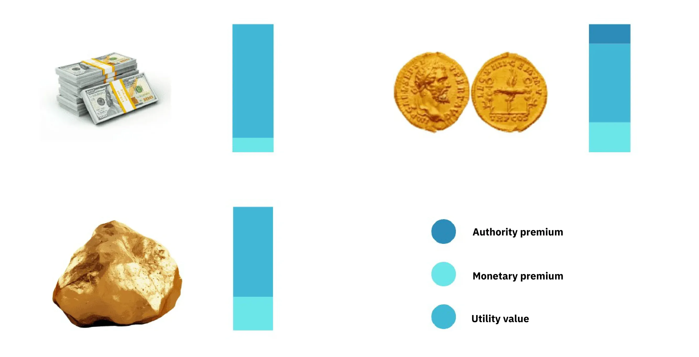

# Различни определения за пари

<partId>77b7918a-8c3b-11f0-b688-6b2ab22378c9</partId>

## Пари vs валута

<chapterId>bf8a6d21-df88-5d23-a0a5-e9a5c1300554</chapterId>

:::video id=d9c9e7df-9db3-4a9f-801e-10d3fc7dfc22:::

### Семантика на паричните термини

В този раздел, посветен на различните парични теории и особено на дефинициите на парите, бих искал да направя кратко отклонение от темата за семантиката. Бих искал да навляза малко по-дълбоко в определенията на няколко думи, свързани с парите, и да ги сравня с техните английски еквиваленти. Например пари, валута, в сравнение с monnaie, argent и devise. И така, нещата стоят така.

Малко семантика:

Когато кажем "**пари**" (de la monnaie), повечето хора ще си помислят, че става дума за дребните пари, които получаваме в замяна на дадена транзакция. А ако кажем "**валута**" (de la monnaie), хората вероятно ще си помислят, че имаме предвид валутата на дадена държава. Валутата на Канада е канадският долар. Точно така.

Но какво да кажем за парите (de l'argent)? Крадецът никога няма да каже: "Дай ми всичките си дребни!" (крадецът може и да се разочарова, че ще получи само монети, които нямат почти никаква стойност).

Не - ще извика крадецът: "Дай ми **всичките си пари**". И ако крадецът стои пред вас на улицата, той задължително има предвид **банкнотите** в джоба ви.

От друга страна, ако крадецът се опитва да ви измами по по-сложен начин, опитвайки се да открадне активите ви, като изпразни всичките ви банкови сметки, бихме казали, че **ще вземе всичките ви пари**. Тук думата "пари" се отнася до **имуществото на индивида**.

Така че думата "пари" има две определения: пари в брой (банкноти) и богатство.

### Валута vs пари

Валута (devise) е валутата на друга държава, в противен случай казваме просто пари (monnaie). Ако сте французин, ще кажете: "La livre sterling est la devise du Royaume-Uni et l'euro et la monnaie de l'Europe" (Стерлингът е валутата на Обединеното кралство, а еврото е валутата на Европа).

Често хората, които не са вникнали в тези семантични проблеми, при превода на тези термини са склонни да говорят за валута (devise), когато става дума за писмената валута, но не, валутата е пари (monnaie), когато е валутата на вашата страна, и е devise, когато става дума за други валути. И така, проблемът тук, който често срещам, е, че в английския език има две думи: има "пари", което е понятие, и има "валута", която наистина е единицата на дадена страна, която се използва за извършване на размяна. Така че можем да говорим само за понятието "пари"; това е лесно - това е понятието на думата *money*; това са парите като цяло. А *валутата* е много лесно да се приравни към валутата на дадена страна. Докато на френски език, за съжаление, хората често ще кажат да, "mais ce n'est pas une monnaie", когато говорят за биткойн, защото това не е валутата на дадена страна, но често, мисля, че вместо това имат предвид термините валута. От една страна, това е погрешно, защото от Салвадор насам биткойнът е валута на държава. Остава фактът, че хората често ще казват: "Аз не знам какво е биткойн: *но не, това не е валута на държава, не може да бъде пари*. Но всъщност, ако се позовем на по-широкото понятие *пари*, биткойн се вписва в тази дефиниция напълно, по мое мнение. Само че във френския език нямаме две думи, с които да отделим тези две понятия. Бихме могли да кажем, че думата "argent" се отнася за валута, но за съжаление това не е точното ѝ определение. *Argent* (пари) се отнася за богатство или банкноти. Всъщност не може да се направи еквивалент с думата *пари*. *Пари* всъщност е понятието за валута (monnaie).

## Определение на Сейфедин Амус

<chapterId>07c4ba50-168c-567a-8957-0b187ff75f97</chapterId>

:::video id=936d6d3b-6d45-468e-bc44-85fbce9b857a:::

#### Какво представляват парите?

Парите са просто нещо, което притежавате или придобивате, но не за да го използвате или консумирате заради самото нещо, а за да го размените по-късно за други стоки или услуги, от които може да имате нужда. (Сейфедин)

Парите придобиват парична премия, когато съществува парично търсене на стоката, за да играе една или повече от ролите на парите.

Монетарната стока трябва да е достатъчно рядка, за да се запази паричната премия (за да се предотврати приспособяването на предлагането към търсенето на пари).

### Паричната премия

В този раздел, посветен на различните дефиниции на валутата, исках да се спра накратко на дефиницията на Сейфедин в "Стандартът Bitcoin", която винаги е представлявала голям интерес за мен. Когато го прочетох, то ми се стори доста просто. А ние ще добавим към това определение и понятието за парична премия. Както споменава Сейфедин в книгата си, задължително съществува понятие за недостиг. Въпросът е какво представляват парите?

> Парите са просто нещо, което притежавате или придобивате, но не за да го използвате или консумирате заради самото нещо, а за да го размените по-късно за други стоки или услуги, от които може да имате нужда.

Така че това е определението, което Сейфедин споменава в "Стандартът Bitcoin". Бих добавил, че една валута (la monnaie) придобива парична премия, когато има парично търсене на стоката, за да играе една или повече от ролите на валутата. Така че може да се каже, че валута, която служи за съхранение на стойност, ще има парично търсене, което ѝ дава парична премия, тъй като хората искат да я придобият, например като средство за съхранение на стойност или като средство за размяна.

### Недостиг и пазарни механизми

Мисля, че към това определено трябва да добавим, че паричната стока трябва да е достатъчно оскъдна, за да може паричната премия да съществува. Това е много важно. **Ако се появи стока, която да се използва като пари, и видим, че цената ѝ се повишава, обикновено, ако стоката не е достатъчно рядка, хората ще искат да произвеждат повече от нея, за да се възползват от това нарастване на стойността, когато цената се повиши**. Ето защо повечето стоки на пазара имат относително фиксирана цена. Когато цената се повишава, производството има тенденция да се увеличава. Когато цената пада, производството намалява. Налице е един вид пазарно приспособяване. **А когато една стока е достатъчно рядка, като златото, пазарният механизъм няма да компенсира това повишено търсене за парична употреба. Така че променливата, която се променя, е цената. Както при биткойн**. Когато цената на биткойна се повиши, ние не произвеждаме повече биткойни. Така че това, което се променя, е цената. И затова от години наблюдаваме, че цената на биткойна се повишава с увеличаването на търсенето на биткойн. Тъй като няма никой на Земята, който да може да промени алгоритъма и да каже "има по-голямо търсене, цената се повишава, ще произвеждаме повече" **Предлагането на нови биткойни е предварително програмирано и предварително известно**. Така че точно това исках да кажа, че паричното благо трябва да е достатъчно рядко, за да може паричната премия да се запази и следователно да не бъде наваксана от пазарните механизми, за да не може предлагането да се приспособи към това ново парично търсене.

## Платежни средства и освободителна стойност

<chapterId>5d424039-e342-56f7-9d8b-bba9551831a9</chapterId>

:::video id=af4c0765-8111-4cb7-891b-3ee54d6e7054:::

### Средства за плащане срещу средства за размяна

В този раздел, посветен на различните дефиниции на парите, предлагам да разгледаме заедно един цитат от книгата "Aux origines de la monnaie" (Произходът на парите), текст на Ален Тестар, посветен на парите като платежно средство и освободителна стойност.

*В "Aux origines de la monnaie" Ален Тестар определя парите като средство за плащане:*

> Функцията на платежните средства тук се схваща като различна от функцията на средствата за размяна, доколкото съществуват плащания без възнаграждение, плащания, които не купуват нищо. Knies (1873:192 ff.) развива подробно темата за прехвърлянето на стоки, които не се състоят в действия на размяна, както в случая с wergeld (кръвнина или пари за убийство) или данъци. Карл Менгер атакува тази четвърта функция в статията си "Geld" от 1892 г., която обикновено се смята за една от най-решаващите по темата. Без да е напълно дискредитирана, идеята за функцията на платежните средства изглежда е забравена в икономическата мисъл днес или поне отхвърлена в полза на тази на средствата за размяна.
>

> Парите се използват, за да се плаща: разглеждани в тази светлина, те са инструмент за освобождаване, който описва в цялата си пълнота функцията на платежно средство. В тази връзка говорим за "освобождаващата сила" на парите. Според Льо Пети Робер освобождаващата сила е "това, което има за резултат освобождаването (от задължение, дълг)". Според Grand Larousse освобождаващо плащане е всяко "плащане, извършено при законови условия по такъв начин, че кредиторът да не може да оспори погасяването на дълга". Парите притежават тази способност par excellence; тя дори определя статута им на законно платежно средство, тъй като никой не може да откаже плащане, извършено в пари, независимо дали е продавач или кредитор. Парите са единствената стока, която не може да бъде отказана при плащане на дължимото, независимо дали дългът е към търговец или към данъчния служител. Сред всички стоки само парите имат тази привилегия. "Именно тази привилегия - пише Чарлз. Жид (1921 г., I: 443), която представлява това, което наричаме законно платежно средство.
>

> Всяка размяна, състояща се в прехвърлянето на едно благо срещу друго или при условие, че в замяна се дава друго благо, задължително предполага задължение на получателя да предостави това благо. Плащането е изпълнение на това задължение. Следователно всяка размяна предполага плащане, но не всяко плащане предполага размяна. Съществуват плащания без насрещна престация, т.е. плащания, които не дават възможност да се получи друго благо и не се извършват с тази цел. Данъците остават еталонният пример тук; трябва да споменем също така всякакви глоби, плащани на публичните власти, и обезщетения, дължими на други лица на принципа, че този, който причинява вреди на други, трябва да ги възстанови.

### Плащания без контрагент

Това е ясна илюстрация на тезата на автора. Всъщност той прави разлика между двете. За него размяната е едновременно прехвърляне на стоки и плащане. Плащането е на следващо място. А плащането може да се осъществи и без размяна. Той дава примери за това как плащането на билет за паркиране или глоба е просто плащане. В действителност не получавате услуга в замяна. Някои могат да твърдят, че държавата ви оказва услуга в замяна, услугата да ви дава билети за паркиране. То е съвсем ясно по отношение на факта, че плащането на данъци наистина е плащане без насрещна страна, в смисъл че плащането на данъци е задължително, дори и да не получавате непременно услуга. Той казва, че наистина е дефинирано, че плащането на данъци е само плащане; няма задължение за получаване на услуги в замяна. Обсъждал съм това с много мои колеги и те не са непременно съгласни с това схващане. Но това е тезата на автора. Той се опитва да постави понятието за плащане и да го отдели от размяната с тези примери, например за глоба, плащане на данък. Също така, например за зестрата, той изразява мнение, че зестрата е плащане; не е задължително да получиш нещо в замяна. Някой, който критикува това предложение, може да каже: "Да, но в замяна получаваш съпруга". Така че това е нивото на дебатите по тази тема.

Съществува и wergeld, или кървави пари. Така че това е просто плащане за компенсация. Моят приятел Улрих би казал:

> Да, но в замяна получавате този файл затворен.

Така че сте извършили престъпление, например убийство. Тогава плащате wergeld, а след това се освобождавате от ситуацията. Така че в това има освободителна сила. Получавате ли нещо в замяна?" Според автора - не. Според някои от моите колеги - да.

Мисля, че в тази дискусия можем да видим, че wergeld е един от добрите примери за определяне на плащане. Всъщност е ясно, че не получавате нищо в замяна.

## Дългови пари срещу стокови пари

<chapterId>4093677a-c8e8-5828-b994-15c01656186e</chapterId>

:::video id=f49cf5cc-288e-4daa-a1ff-b9de73506f4e:::

### Основен дебат

Все пак в контекста на този раздел, посветен на различните парични дефиниции и теории, нека разгледаме заедно две диаметрално противоположни визии: "парите винаги са дълг" или "парите винаги са стока". От една страна, има привърженици на паричната теория, основана на дълга, които твърдят: "Не, парите винаги са дълг! От друга страна, известните ни златотърсачи твърдят: "Но не, виждате ли, парите винаги са стока, те винаги са злато; всичко останало, сметки, ДЦК, това е само кредит, а не пари".

Нека заедно да разгледаме ясно обобщение на тези теории.

### Теорията "винаги дълг"

Тук е представено обобщение на паричната теория, известна като **"дългови пари"**, според която парите в основата си са форма на дълг:

Според тази теория, разработена по-специално от Алфред Мичъл-Инес и доразвита от Дейвид Грейбър, парите по своята същност са признание за дълг, произтичащо от кредитните отношения, които исторически са съществували преди преките парични размени. Вместо да възникват от необходимост, свързана с размяната, парите се появяват като начин за отчитане, прехвърляне и уреждане на социални задължения или дългове между индивиди или групи.

По този начин всички пари циркулират като дълг на едно лице или институция към друго, подкрепен от доверие и социален или държавен авторитет, които гарантират неговата валидност. И така, според тях, когато притежаваме - както вече споменах - когато притежаваме пари, ние имаме претенции към обществото и то ни дължи нещо. Следователно парите никога не са неутрални или автономни, а винаги са дълг в основата си: да притежаваш пари по същество означава да притежаваш вземане към обществото или икономическата общност.

Тази аргументация противоречи на класическата представа за парите като проста "междинна стока" и вместо това подчертава централната роля на социалните и политическите отношения при създаването и управлението на парите.

**Моята рецензия:**

Това, което ме притеснява в тази теория, е, че тя твърди, че парите винаги са дълг, докато имаме примери за размяна между две различни племена, които например разменят злато, където сделката е окончателно завършена и не остава скрит дълг. Привържениците на тази теория често ни казват, че тези размени не са парични, а бартерни. Както вече споменахме, аз не съм съгласен с това. Това е парична размяна, тъй като златото няма да бъде консумирано, а ще бъде използвано като пари.

### Теорията "винаги стока"

**Винаги стока:**

Ето едно ясно обобщение на паричната теория, известна като **"стокови пари"**, където парите винаги се появяват като стока, по-специално злато, което се появява от необходимостта да се търгува, стока, която обикновено се приема в чужбина и която се придобива с цел търговия.

Според тази теория, развита от класическите икономисти (Адам Смит, Дейвид Рикардо) и възприета от Маркс, парите възникват естествено като стока сред другите, често благороден метал като злато или сребро, който има вътрешна стойност, независима от паричната му роля. Първоначално тези стоки се избират спонтанно от икономическите участници, за да улеснят търговията, благодарение на присъщите им качества (оскъдност, трайност, делимост и стабилност).

Стоковите пари се отличават с физическото си съществуване и стойност, определена от количеството труд, което е необходимо за тяхното производство (както при Маркс). Обществото например използва златото не само за опростяване на размяната, но и като разчетна единица, средство за съхранение на стойността и универсално средство за размяна.

В тази визия парите винаги запазват реалната си стойност, тъй като остават свързани с осезаема стока. Дори когато ролята на парите става абстрактна (сечени монети, банкноти или книжни пари), тяхната валидност все още произтича, пряко или косвено, от препратката към основна стока, например злато. Следователно тази теория настоява за материалния и икономическия произход на парите, за разлика от теориите, които ги разглеждат като обикновена конвенция или дълг. Според тази теория всяко представяне на парите чрез заместител, като например менителница, откупена в злато, би било кредит.

**Моята рецензия:**

Обърнете внимание, че това виждане наподобява това на теорията за стоковите пари, но отива още една стъпка напред. Те предлагат парите винаги да бъдат стока. И когато им кажем: "*Да, но можем да се съгласим, че банкнотата е пари за тази група; тя може да бъде обезпечена със злато, работи и банкнотата като такава е пари*".

В отговор те ще ни дадат примера с купона в съблекалнята. Те ще кажат: "Да, но не, когато имате талон от съблекалнята за вашата дреха, можем ли да наречем касовия бон дреха?

Разбира се, че не, това е нещо като потвърждение, иск, който ще ви позволи да си върнете дрехата. Този паралел не издържа, защото талонът от съблекалнята не е общоприет начин на плащане. **Парите не са претенция към конкретен предмет като дрехата; те са начин, средство за размяна, разменно средство или общоприет начин на плащане**.

Така че не може да се прави паралел между купон за съблекалня и банкнота във фиатна валута, тъй като купонът за съблекалня ви позволява да получите конкретна стока в замяна, а токенът ви позволява да получите стоката си. Докато банкнотата, фиатната валута, е универсален купон, който ви позволява достъп до всяка стока.

И според мен, разбира се, дори фиатните пари могат да се считат за пари, ако населението ги смята за такива. И смятам, че е семантична грешка да се настоява, че те не могат да бъдат пари, тъй като това е купон за получаване на истински пари, поне по онова време, които са били базовото злато.

Нямам проблем да считам златната монета, която се съхранява в сейфа, и банкнотата, която представлява тази златна монета, за парични знаци. За мен няма проблем със семантиката, това са просто два вида валута. Ако не се лъжа, Мизес обяснява много добре това явление, като говори за парични заместители.

Тяхното виждане се свежда до факта, че не може да се смята, че златна монета в банков трезор и банкнотата, която я представлява, са едновременно пари. Лично аз не виждам никакъв проблем в това; не виждам никакъв парадокс в ситуацията. Онези, които смятат, че парите винаги са стока, не виждат нещата по начина, по който аз ги виждам.

**Ето един преглед на концепцията за купона в съблекалнята от книгата *Aux origines de la monnaie*:**

Бележка 14: "Отлична критика - отлична, защото се основава точно на основанието, на което се поставя Кнап, на правното основание - от страна на Рист (1938: 372, бележка 1) на сравнението между книжните пари и чековите жетони: ако и в двата случая можем да говорим за вид вземане, то основната разлика е, че в първия случай, и само в първия, това е вземане без конкретен предмет

Освен това, по въпроса за **изискването**, същият автор отбелязва следното:

> Бастиа е напълно свободен да си представи ваучер за цялото общество, представен като "огромен базар", но тази малка добавка, това на пръв поглед безобидно разширение, е цялата разлика между кредита и парите. Парите не са претенция към определен магазин. Няма такова нещо като анонимно вземане. Но анонимността, която характеризира парите, и следователно тяхната всеобщност, е това, което ги прави толкова силни. Парите не приличат на кредита, а още по-малко могат да бъдат сведени до него. **Парите са много повече от кредит**

**Парадокс: дългови пари срещу стокови пари**

Парадоксът, който най-добре илюстрира дълбоката дихотомия между теориите за дълговите и стоковите пари, е свързан с въпроса дали златото днес е валута.

От една страна, теорията за дълговите пари определя парите преди всичко като посредник в размяната или платежно средство, което е общоприето или дори наложено от публична власт. От тази гледна точка златото вече не е парично средство, тъй като не се използва и не се приема като общоприето средство за размяна.

От друга страна, теорията за стоковите пари разглежда парите като материална стока, спонтанно избрана от обществото заради присъщите ѝ характеристики (оскъдност, трайност, делимост и др.). Според този подход златото остава истинската универсална валута, а всички други форми на пари днес в основата си не са нищо повече от кредит, основан на доверие.

Този парадокс ясно показва разминаването между тези две парични концепции: за първите златото вече не е валута, а за вторите, напротив, то остава единствената истинска валута, която съществува.

## Съвременна парична теория

<chapterId>8efc29af-3193-5d97-ad9f-e608b32924ff</chapterId>

:::video id=f8127cb7-46a1-468c-bbb5-97bf0a8b8837:::

### Принципи на съвременната парична теория

В края на този раздел, посветен на различните парични теории, нека да поговорим за детето чудо на паричните теории, на което се възхищават много съвременни икономисти, работещи в централните банки, и което носи името съвременна парична теория, често наричана ММТ.

**Съвременната парична теория (ММТ)** е икономически подход, според който държава със собствена суверенна валута (като САЩ, Канада или Япония) никога не може да изчерпи парите си, тъй като винаги може да емитира още пари, за да финансира разходите си. Според тази теория:

- Парите са творение на държавата, а не ограничен ресурс

- Данъците и заемите не се използват пряко за финансиране на публичните разходи, а по-скоро за регулиране на инфлацията, въздействие върху икономическото поведение и поддържане на търсенето на националната валута.

- Истинското ограничение на държавните разходи е инфлацията, а не бюджетният дефицит или държавният дълг.

- Ако създадените пари се насочат към сектори, които могат да ги усвоят, няма да има и инфлация.

- Следователно правителството трябва да регулира разходите си в съответствие с наличните реални ресурси (работна ръка, промишлен капацитет, природни ресурси), за да избегне прекомерна инфлация.

### Ролята на данъците в ММТ

И така, тук ще намерите известния отговор на всички, които казват: "Да, но ако можем да печатаме пари, защо плащаме данъци?" Е, ММТ има правилния отговор на тази идея. Вярно е, че във фиатната система, в съвременната система, технически погледнато, няма нищо, което да ограничава създаването на пари, освен инфлацията. Но те ще предположат, че, първо, данъчното облагане е необходимо, за да се ограничи инфлацията, тъй като то ще премахне парите от икономиката. Така че, ако нямаме данъци, които да компенсират, цялото това създаване на пари в крайна сметка може да доведе до инфлация. Данъците, твърдят те, са буквално начин за премахване на парите от системата, за да се ограничи инфлацията.

По въпроса за парите, инвестирани в сектори, които могат да ги усвоят, можем да посочим примера със САЩ, които дават трилиони долари за военната индустрия, което не предизвиква инфлация, защото военната индустрия, военнопромишленият комплекс, е напълно способна да усвои тези трилиони долари.

От друга страна, ако искате да построите повече пътища, а ресурсите и изпълнителите, които могат да ги изградят, са ограничени, удвояването на бюджета за пътища непременно ще доведе до дефицит на работна ръка, която може да създаде тези пътища. Така че цената ще се повиши в резултат на пазарните сили, на търсенето и предлагането. Ако нашите всезнаещи лидери знаят къде да вложат парите, технически това не би трябвало да предизвика инфлация. А аз бих отговорил, че на практика е съвсем ясно, че това предизвиква инфлация.

В заключение, според ММТ държавата може да използва способността си да създава пари, за да постигне пълна заетост и да финансира социални и екологични инвестиции, като същевременно контролира инфлацията чрез подходяща фискална политика. Често и целта на кейнсианските икономисти, друга школа в икономическата мисъл, е да се управлява безработицата чрез управление на лихвените проценти и да се финансират социални и екологични инвестиции, като същевременно се контролира инфлацията чрез подходяща фискална политика.

### Преглед на MMT

Тази теория е приложима само за шепа държави (вж. туита на Стефани Келтън), които се радват на истински паричен суверенитет, т.е. могат да емитират дълг в собствената си валута. Тази теория е трудно приложима към зависими от вноса икономики, които трябва да поддържат международното доверие в своята валута.

А какво е истински паричен суверенитет? Това означава да можете да набирате дълг в собствената си валута. Трябва да можете да имате търговски излишък, за да разполагате с достатъчно валутни резерви, достатъчно чуждестранна валута, така че да не ви се налага да събирате пари в чуждестранна валута, за да можете да внасяте стоки. Това се отнася за няколко държави.

По-долу можете да видите туит на Стефани Келтън, която е своеобразен плакат на това движение. Тя написа книга, наречена "Митът за дефицита". В туита тя пише, че различни държави като САЩ, Япония, Канада, Австралия, Обединеното кралство не могат да изчерпят парите си.

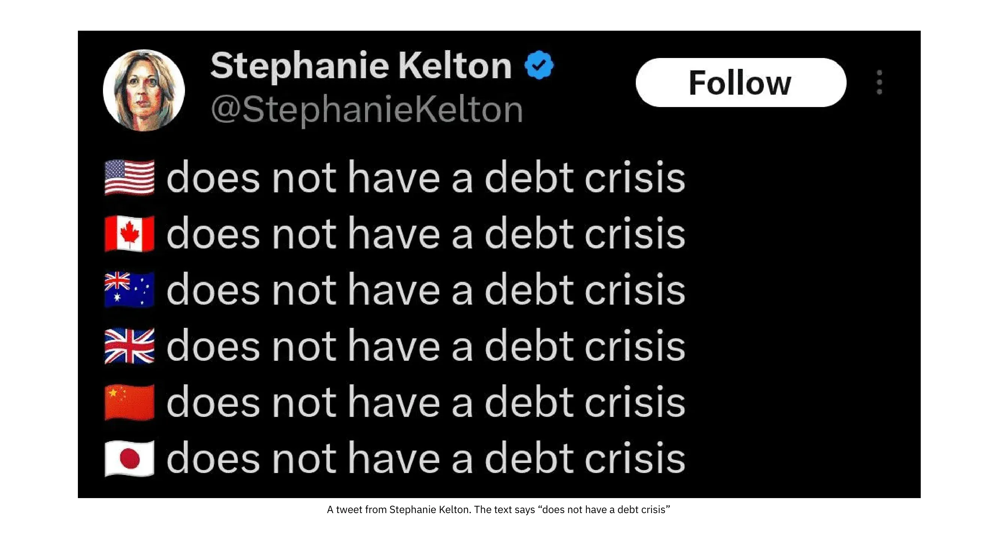

Странно, но в списъка са посочени само шест държави? Защо е така? Защото те имат реален паричен суверенитет. Но на Земята има около 200 държави и не всички от тях имат паричен суверенитет. Така че моята критика към тази теория, освен че е малко странна и нефункционална, е, че тя работи само за няколко държави, които се ползват с истински паричен суверенитет - тези, които могат да издават съкровищни бонове в собствената си валута. До известна степен тя е в ущърб на останалата част от света. Създавайки тази валута, те сякаш изнасят своята инфлация другаде, подобно на това, което Съединените щати правят със своите прекомерни привилегии от десетилетия. Това прилича на форма на паричен колониализъм, при който държавите, които имат глобално доверие и търсене на своята валута, могат да печатат колкото си искат пари, без да предизвикват значителна инфлация, често защото изнасят тази инфлация.

Тази теория е трудно приложима за зависими от вноса икономики, които трябва да поддържат международното доверие в своята валута.

Тази теория също така изисква определено ниво на централизирано планиране на икономиката, по-специално за да се осигури по-голям контрол върху реалните ресурси (работници, суровини, промишлен капацитет) и да се управлява инфлацията.

# Падането и възраждането на парите

<partId>87a34ca9-782b-5ade-b51a-400f88ed7b0c</partId>

## Гръцки монети

<chapterId>7714195f-74ce-5f8c-be5f-59302d39fff4</chapterId>

:::video id=8e5c3091-0910-471b-8d4b-0dc6e9afa656:::

### Предистория и контекст

Преди да започнем, ето историческата справка:

**Исторически контекст:**

**Римляните наричали гърците "Graeci", а Гърция - "Graecia".**

**Гърците наричали себе си "елини", а страната си - "Елада".**

**Хомер** (роден около 8 век пр.н.е.)

Легендарен гръцки поет, предполагаем автор на *Илиада* и *Одисея*.

Около **750 г. пр.н.е.: Ликург**, митичният законодател на Спарта, създава спартанската конституция, основана на военна дисциплина и простота.

**Нума Помпилий** (753-673 г. пр. Хр.)

Вторият цар на Рим, известен с това, че създава първите религиозни и правни институции в Рим.

**Дракон**, атински законодател (VII в. пр.н.е.), известен с изключително строгите си закони, откъдето идва и терминът "драконичен".

**594 г. пр.н.е.: Солон** става законодател в Атина и радикално реформира атинското общество, като премахва робството.

**776 Г. ПР: Древни олимпийски игри**

Първите редовни спортни игри се провеждат в Олимпия на всеки четири години и събират гръцките градове.

**Питагор** (около 570-495 г. пр. Хр.)

Гръцки философ и математик, известен с теоремата си за правоъгълния триъгълник.

**Ксенофан Колофонски** (ок. 570-478 г. пр. Хр.)

Философ от времето преди Сократ, известен с критиката си към традиционния гръцки политеизъм.

**490 г. пр.н.е.: Битката при Маратон**

Атиняните победоносно отблъскват персийското нашествие, което бележи решителен обрат в гръцката цивилизация.

**Херодот** (ок. 484-425 г. пр.н.е.), наричан "бащата на историята", написва обширен труд, в който описва персийските войни, включително гръцката победа над Ксеркс през 480 г. пр.н.е.

**Сократ** (470-399 г. пр. Хр.)

Атински философ, известен с диалектическия си метод и учението си за етиката и самопознанието.

**Аристофан** (ок. 446-386 г. пр. Хр.)

Атински драматург, известен със сатиричните си комедии като "Жабите".

**Софокъл** (V в. пр.н.е.) в пиесата си "Антигона" критикува парите като източник на морална и политическа корупция чрез тиранина Креон.

**Платон** (ок. 428-348 г. пр. Хр.)

Гръцки философ, ученик на Сократ, основател на Академията, автор на *Републиката*.

**431-404 Г. ПР: Пелопонеската война**

Голям конфликт между Атина и Спарта, който завършва с поражение за Атина.

**431 Г. ПР.Н.Е.**: Атина финансира Пелопонеската война, като разрежда златните и сребърните си монети, за да увеличи количеството им в обращение, което предизвиква инфлация.

**Ксенофонт** (ок. 430-355 г. пр. Хр.)

Атински писател, философ и пълководец, ученик на Сократ, автор на *Анабазис*.

**414 Г. ПР.Н.Е.**: Атина започва да губи Пелопонеската война след катастрофална експедиция в Сицилия.

**405 Г. ПР: Аристофан** в пиесата си "Жабите" изрично описва обезценяването на сребърната драхма и появата на по-лоши бронзови монети в Атина, илюстрирайки принципа, известен днес като "закон на Грешъм".

**404 Г. ПР.Н.Е.**: Атина капитулира след дълга обсада от страна на Спарта.

**Аристотел** (384-322 г. пр. Хр.)

Голям гръцки философ, ученик на Платон, основател на Лицея, известен с трудовете си в областта на логиката, биологията и политическата философия.

**327 Г. ПР.Н.Е.**: Хр.: Александър Велики завладява Персеполис и източните провинции на Персийската империя, с което значително разширява империята си.

**323 Г. ПР.Н.Е.**: Александър умира във Вавилон без ясен наследник, което предизвиква войни между неговите генерали (диадохи) за разделяне на империята.

**Архимед** (ок. 287-212 г. пр. Хр.)

Гръцки математик, физик и изобретател, известен с откритията си в областта на геометрията и механиката.

**196 г. пр.н.е.: Розетският камък** е гравиран по време на управлението на фараон Птолемей V, което позволява по-късното разшифроване на египетските йероглифи.

**192-188 Г. ПР: Романо-селевкидска война**

Рим побеждава империята на Селевкидите, ръководена от Антиох III, и укрепва влиянието си в Гърция и Мала Азия.

**146 г. пр.н.е.: Битката при Коринт**

Римляните разрушават гръцкия град Коринт, което бележи края на гръцката политическа независимост и постепенното интегриране на Гърция в римския свят.

В този раздел, посветен на Античността, падането на Рим и Средновековието, ще започнем с раздел за гръцките монети.

Историята на монетосеченето в Древна Гърция започва около 600 г. пр.н.е., когато гръцките градове бързо възприемат нововъведенията от Лидия в Мала Азия, като първоначално използват електрум, а по-късно и сребро. Първите гръцки монети са сечени на остров Егина, като на тях е изобразена морска или сухоземна костенурка, но именно атинската драхма, украсена с Атина и бухал, се превръща в паричен символ par excellence от V в. пр.н.е. и до голяма степен доминира в международната търговия по това време.

И имам щастието да притежавам копие на гръцка драхма от този период с прочутия бухал и фигура на гърба. Това е тетрадрахма, която е била по-голяма от обикновената драхма.

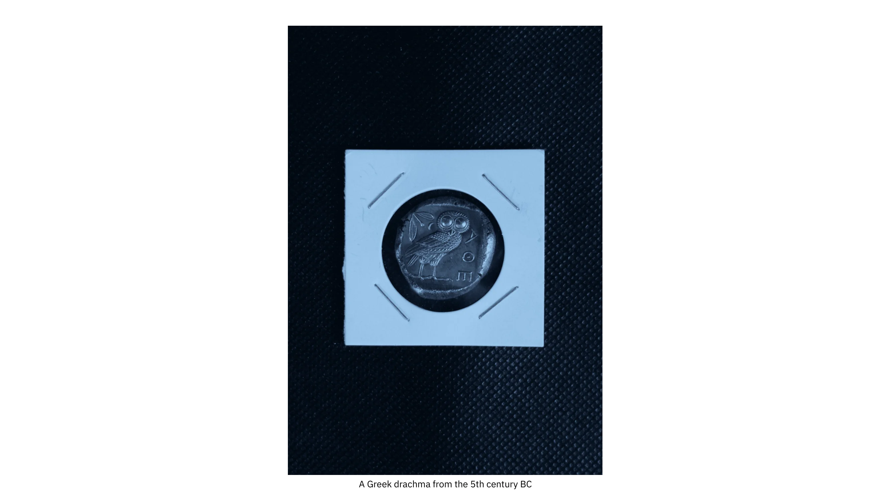

Всеки гръцки град е имал свое собствено отношение към парите. В Атина валутата е била дълбоко свързана с политическата и икономическата власт. Прочутият атински декрет от края на V в. пр. н. е. налагал изключителното използване на атинската валута в съюзните й територии, като по този начин затвърждавал икономическата й хегемония. Атина също така натрупва големи резерви от злато за спешни случаи, които се съхраняват на Акропола, може би като символ на нейната икономическа предпазливост. За разлика от тях Спарта, военен град със строги ценности, решила да ограничи сериозно използването на пари, като забранила на гражданите си да притежават златни или сребърни монети. Спарта предпочита да използва тежки железни пръти, за да възпрепятства външната търговия и да поддържа социалното сближаване.

Войните често се финансират чрез манипулиране на валутата. По време на Пелопонеската война (431-404 г. пр.н.е.) Атина прибягва до драстична девалвация, за да плати на войниците си. Лишена от достъп до сребърните си мини от спартанската окупация на Декелия през 413 г. пр.н.е., Атина трябвало да претопи златни статуи, за да отсече набързо нови монети през 407/406 г. пр.н.е. След това, през 406/405 г. пр.н.е., тя създава бронзови монети, покрити със сребро, предизвиквайки парична криза, илюстрирана от **Аристофан**, който вече припомня това, което днес е известно като закон на Грешъм: лошите пари изтласкват добрите. Тази извънредна валута е бързо демонетизирана след войната, за да се възстанови доверието в атинското монетосечене.

Краят на класическия период е белязан от възхода на Македония под управлението на Филип II и неговия син Александър Велики, който дълбоко нарушава гръцкото парично равновесие. Благодарение на огромните златни и сребърни мини на планината Пангей Филип II произвежда изобилие от пари, с които финансира военните и политическите си кампании, като установява прост и практичен златно-сребърен стандарт (10:1). Неговите златни статери, отбелязващи победата му на Олимпийските игри, се разпространяват в Западна Европа и достигат дори до Англия. Александър продължава тази парична политика, като по време на завоеванията си на Изток разпространява широко **атическата** драхма чак до Индия. Тази масова циркулация на монети бележи началото на елинистическата епоха, когато изображението на владетелите постепенно заменя това на божествата върху монетите. Това нововъведение дава възможност на поколения елински монарси да популяризират себе си, измествайки традиционните богове на втори план върху реверса на монетите си.

След смъртта на Александър през 323 г. пр.н.е. неговите генерали си поделят огромната му империя, като създават династии в Египет (Птолемеите), Сирия (Селевкидите) и на други места. Тези елинистични царства възприемат различни парични системи: Птолемеите налагат затворена парична система, за да контролират паричното обращение, като предпочитат да използват зърното като вътрешна валута, за да запазят благородните метали за външни военни разходи. По същото време Родос се превръща в основен търговски център, преди да бъде икономически отслабен от римляните, които през 167 г. пр. н. е. установяват Делос като свободно пристанище.

Използването на пари е от основно значение за възнаграждението на наемниците. Войниците на Александър ежедневно получават сребърни драхми.

Кавалерията, елитът на високоспециализираната армия на Александър, получавала средно по две драхми на ден, пехотинецът - една драхма, а обикновеният наемник - две трети от драхмата, което било два пъти повече от заплатата на обикновения работник.

По време на Пелопонеската война също са изплатени значителни суми на войниците: над 1200 таланта за потушаване на бунта в Самос и над 2000 таланта за обсадата на Потидея.

По времето, когато тази армия е напълно ангажирана в Мала Азия, общите разходи възлизат на около двадесет таланта на ден, или около половин тон сребро, или 120 000 драхми.

Гръцкото монетосечене играе и важна културна роля, тъй като всеки град се стреми да утвърди своята идентичност, като сече собствени монети с местни или митологични символи. Например Ираклий изобразявал Херакъл (Херкулес), който се бори с лъв, а Кирена - известното лечебно растение силфиум.

Накрая, въпреки разнообразието и регионалните колебания, класическото гръцко и елинистическото монетосечене оставят трайна следа в икономическата и културната история на средиземноморския свят, като оказват силно влияние върху по-късните парични системи чак до Рим, който постепенно възприема и развива гръцките икономически концепции, за да структурира собствената си имперска икономика.

## Въздействието на валутата в Гърция

<chapterId>3a5e6c7d-699c-5567-87cd-3374c49d55a9</chapterId>

:::video id=0c79a59c-e179-4893-a414-1b8de0930eb9:::

### Атина и контрастът със Спарта

Противопоставянето между Атина и Спарта по време на класическия гръцки период разкрива два коренно различни модела на политическа и икономическа организация. Докато Спарта отхвърля металните пари в полза на самодостатъчна система, основана на гражданско доверие, Атина напълно възприема тази технология, за да изгради и поддържа морската си империя.

### Паричната необходимост от военноморска мощ

Атинската империя, въпреки грандиозното си име, остава скромна в географско отношение - основно Атина и градовете на Егейско море. Силата ѝ се крепяла на Лигата на Делос - военен съюз, в който Атина доминирала като хегемон. Тази имперска структура се нуждаела от единен икономически инструмент: атинската сребърна монета.

Поддържането на флота е в основата на тази парична необходимост. Една атинска трирема струвала между един и два таланта сребро - значителна сума. С няколкостотин кораба, които трябвало да поддържа, Атина се нуждаела от ефективна данъчна система. Валутата се превърнала в незаменим инструмент за събиране на данък от васалните градове и за финансиране на военноморските сили, които гарантирали сплотеността на империята.

### Паричното налагане като инструмент за господство

Атина налага своята сребърна валута на всички членове на Лигата на Делос. Тази парична стандартизация обслужва няколко стратегически цели. На първо място, тя улеснила събирането на данъци, като създала обща разчетна единица. На второ място, тя засилила икономическата зависимост на васалните градове от Атина. И накрая, тя символично проектирала атинската власт в цялата морска империя.

Тази парична политика рязко контрастира с модела "Спартан". Спарта, която е сухоземна сила, може да разчита на труда на пелопонеските хелоти (роби) за своето препитание. Нейната затворена икономическа система, ориентирана към градовете, не е изисквала сложни парични инструменти. Гражданите-войници живеели заедно, споделяли обща храна и не се нуждаели от пари за ежедневната размяна.

### Валутата като средство за морска търговия

Морският характер на Атинската империя означава, че тя трябва да бъде отворена за търговия. За разлика от затворената в себе си Спарта, Атина е трябвало да търгува с външния свят, за да оцелее и просперира. Валутата се превръща в незаменим инструмент на средиземноморската търговия.

Тази външна насоченост създава благоприятен кръг: търговията генерира приходи, тези приходи финансират флота, флотът защитава търговските пътища и поддържа империята, а империята налага атинската валута, която улеснява търговията. Валутата вече не била просто средство за размяна, а се превърнала в опора на имперската стратегия.

### Границите на паричната мощ

Въпреки това икономическо усъвършенстване паричната мощ на Атина показва своите граници по време на Пелопонеската война. Пред лицето на спартанските сухопътни сили морското и финансовото превъзходство на Атина не било достатъчно. Скъпите експедиции, като катастрофалната кампания на Сиракуза в Сицилия, изчерпват финансовите ресурси, без да донесат решителна победа.

Историята показва, че валутата, макар и мощен инструмент за проектиране на сила, не е гаранция за военно господство. Спарта, която не разполага с метална валута, но има забележителна социална сплотеност, в крайна сметка надделява над атинската парична империя.

### Два модела, две съдби

Противопоставянето между Атина и Спарта илюстрира два основни подхода към социалната и икономическата организация. Атина представлява отворения, търговски, монетаризиран модел - предшественик на съвременните морски империи. Спарта олицетворява затворения, автаркичен модел, основан по-скоро на гражданско доверие, отколкото на парични инструменти.

Тези две системи показват, че приемането на валута е тясно свързано с избрания политически и икономически модел. За морска и търговска сила като Атина парите стават незаменими. За едно затворено войнствено общество като Спарта те представляват заплаха за социалния ред. Тази древна дихотомия все още е в основата на дебатите за ролята на парите в организацията на обществата.

## Римската република

<chapterId>0bc80983-33e1-5881-85bb-7c22f3144a9a</chapterId>

:::video id=dc05ca97-d29c-4679-bfeb-912c47d86ce2:::

### История на Римската република

- **753 - 509 г. пр.н.е.: Римско царство**
- **753 г, пр.н.е.: Основаването на Рим** (традиционно се приписва на Ромул).
- **509 - 27 г. пр.н.е.: Римска република**, Рим става република, управлявана от изборен сенат и консули.
- **280 - 275 г. пр.н.е.: Пирровата война**. Пирр, цар на Епир, се сражава с римляните в Южна Италия, като печели скъпоструващи победи ("Пирови победи").
- **264 - 146 г. пр.н.е. Пунически войни**. Голям конфликт, в който Рим се изправя срещу Картаген за господство в Западното Средиземноморие.
- **Ханибал (247 - ок. 181 г. пр. Хр.)**. Легендарен картагенски пълководец, известен с това, че прекосява Алпите с армията си и със слонове, за да нападне Рим по време на Втората пуническа война.
- **146 г. пр.н.е.: Битка при Коринт**. Рим разрушава гръцкия град Коринт и налага окончателното си господство в континентална Гърция.
- **91 - 87 г. пр.н.е.: Социална война**. Въстание на италийските съюзници на Рим, които искат римско гражданство, което в крайна сметка води до пълното им интегриране в гражданството.
- **64 г. пр.н.е.: край на съпротивата на Селевкидите**. Рим окончателно елиминира влиянието на Селевкидите в Сирия и укрепва позициите си в Източното Средиземноморие.
- **55 г. пр.н.е.: Юлий Цезар завладява Централна и Западна Европа**. Юлий Цезар разширява римското господство в Галия (днешна Франция) и навлиза в Германия и Бретан.
- **43 г. пр.н.е.: Формиране на Втория триумвират**. Политически съюз между Октавиан (по-късно Август), Марк Антоний и Лепид за стабилизиране на Рим след убийството на Цезар.
- **27 г. пр.н.е.: начало на Pax Romana**. Период на политическа стабилност и просперитет при управлението на Август, който бележи началото на Римската империя.

### Късното парично начало на Рим

В този раздел, посветен на Античността, сега обръщаме внимание на Римската република. Паричната история на Рим започва много по-късно от тази на гърците и персите. Основан през 753 г. пр.н.е., Рим изчаква почти четири века, преди да въведе монетосеченето. През този дълъг период римляните използват примитивна система за размяна с неправилни бронзови парчета, наречени aes rude, която изисква точно претегляне за всяка сделка. Едва в края на IV в. пр.н.е., под гръцко и етруско влияние, Рим започва да емитира първите си монети, по-специално от бронз, отлят както в Китай, aes grave, характерни за римския обмен до **Втората пуническа война**.

### Гръцко влияние и първите сребърни монети

Решителният сблъсък с гърците в Южна Италия наистина въвежда римляните в сеченето на сребърни монети. Около 280 г. пр.н.е. Рим започва да произвежда собствени сребърни монети по подобие на гръцките дидрахми. Първата редовна емисия сребърни монети в Рим датира точно от 269 г. пр.н.е., като на нея са изобразени легендарните близнаци Ромул и Рем, кърмени от вълчица - символ, превърнал се в емблематичен.

Всъщност на много римски монети от периода на Републиката са изобразени митовете за основаването на града. Можете да видите моята тук по-долу: това е превъзходна, истинска монета на цар Таций. Тя илюстрира мита за отвличането на жени от сабините. Таций е бил цар на този регион, а митът за основаването му разказва как римляните отвличат жени от сабините - население, което живеело наблизо. Впоследствие цар Таций става съцар с Ромул, един от основателите на Рим.

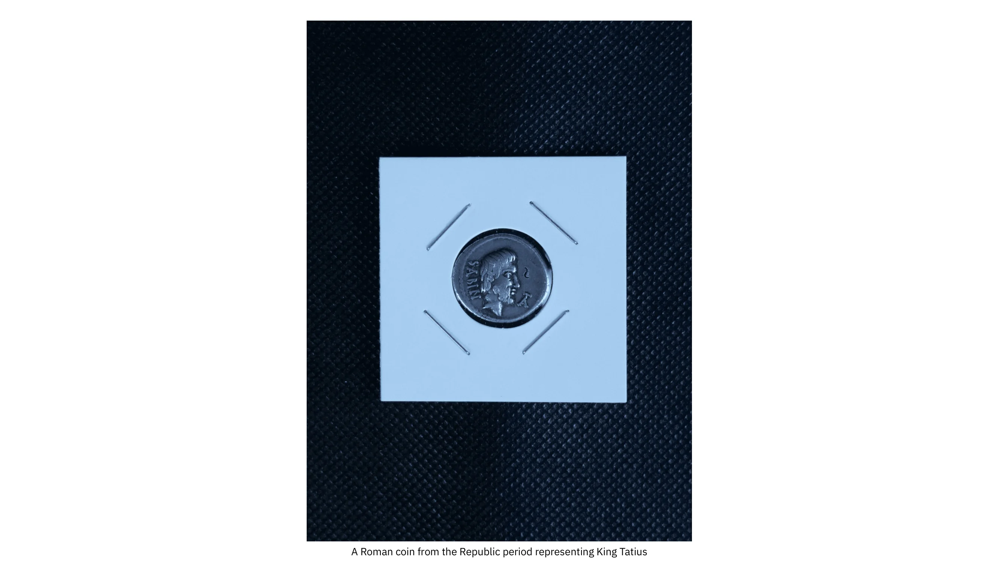

### Произходът на думата "монета" и храмът на Юнона Монета

Терминът "монета" произхожда от храма на Юнона Монета в Рим. Легендата разказва, че по време на галското нашествие през 390 г. пр.н.е. свещените гъски на Капитолия предупредили римляните за предстояща опасност. В знак на благодарност към богинята Юнона, покровителка на Капитолия, е издигнат храм в нейна чест, който скоро се превръща в монетен двор за римски монети.

### Пуническите войни и валутните кризи

Военните конфликти оказват значително влияние върху паричното развитие на Римската империя. По време на Втората пуническа война (218-201 г. пр.н.е.) срещу Картаген Рим е изправен пред сериозни финансови затруднения в лицето на нашествието на Ханибал. За да облекчи тези неотложни нужди, Рим за първи път прибягва до извънредна емисия златни монети, както и до значително обезценяване на сребърните си монети - от първоначалната чистота от 97% до около 89%. Теглото на бронзовите монети (aes) също спада драстично, като за шест години губи почти 80%.

Тук можем да се върнем към една концепция, която вече обсъждахме, за това как гърците претопяват скъпоценните метали, съхранявани в храмовете, за да облекчат икономическите кризи. И за да поговорим за **Картаген**, тук долу можете да се полюбувате на истинска картагенска монета от моята колекция. На тези картагенски монети от едната страна е изобразена палма, а от другата - кон. На тази монета конят не е много разпознаваем, а е много износен.

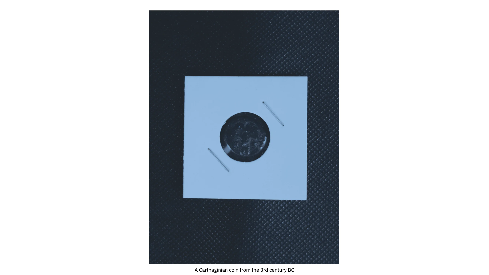

В резултат на това теглото на бронзовите монети, известни като аес, също спада драстично - за шест години то намалява с почти 80%. Така че теглото на тези бронзови монети, които не са били благороден метал и са се използвали в ежедневната търговия, спаднало много, което било знак за парична девалвация вследствие на тези войни.

### Сребърният денар и паричната стабилност

На този критичен фон Рим въвежда известния сребърен денар около 212 г. пр.н.е. Тази реформа осигурява забележителна парична стабилност, като денарът остава доминираща валута в продължение на почти 450 години. Рим дължи тази стабилност на стриктното управление, въпреки голямото преоценяване през 146 г. пр.н.е. и значителното производство за финансиране на огромните си армии, особено по време на Пуническата, Социалната (91-87 г. пр.н.е.) и Македонската война. Например издръжката на един римски легион е струвала около 1,5 милиона денария годишно, което показва мащаба на паричните нужди.

Отвъд римските граници войните водят до големи девалвации в регионите под римско влияние. В пунически Картаген чистотата на електрума спада драстично - от 98% злато през IV в. до едва 30% по време на Втората пуническа война, докато чистотата на сребърните монети спада до 18%.

### Еволюция на паричните мотиви

С разрастването на Рим се променя и характерът на монетите: първоначално анонимни и патриотични, монетите постепенно придобиват персонализиран дизайн с участието на влиятелните фамилии на монетарите (тези, които са отсичали монетите). Този преход ясно символизира политическите трансформации в края на Римската република.

И накрая, макар че Рим доминира икономически в средиземноморския свят, той запазва известна простота в средствата си за разплащане: не е разработена друга реална форма на паричен превод освен директната размяна на монети, с изключение на данъчни преводи и частни кредити, запазени за елита.

## Римската империя

<chapterId>2dc44e50-112a-5abf-97ae-8e0a9ecda989</chapterId>

:::video id=f8d6f3d6-9ee4-4504-888e-4f12b3f20489:::

**Исторически контекст:**

**Принципатът** е форма на имперско управление в Римската империя от началото на управлението на Август през 27 г. пр.н.е. до края на кризата от III век през 284 г.

**27 г. пр.н.е.: начало на Pax Romana**

Период на политическа стабилност и просперитет при управлението на Август, който поставя началото на Римската империя.

**Август (30 г. пр.н.е. - 14 г. сл.Хр.)** радикално реформира римската парична система, като установява траен и стабилен стандарт за имперското монетосечене.

**Август е и един от първите признати колекционери** на древни монети и вкаменелости.

**54 сл.Хр. - 68 сл.Хр.: Нерон**

Противоречив римски император, известен с тиранията си, преследванията и катастрофалното си управление след опожаряването на Рим.

**64 сл.Хр.: Голям пожар в Рим**

Голям пожар опустошава голяма част от града; Нерон е обвинен, че е отговорен за него.

**69 г. от н.е.: Годината на четиримата императори**

Хаотичен период с четирима императори в бърза последователност (Галба, Ото, Вителий, Веспасиан).

**79 г.сл.Хр.: Изригване на Везувий**

Вулкан, който унищожава градовете Помпей и Херкулан, като по изключение запазва останките им под пепелта.

**165 сл.Хр. - 180 сл.Хр.: Антонинова чума**

Опустошителна епидемия, която отслабва Римската империя по времето на Марк Аврелий и Комод.

**200 г. от н.е.: Териториален апогей и постепенен край на Pax Romana**

Рим достига максималното си разширение, но започва да страда от вътрешна нестабилност и икономически трудности.

**212 г.сл.Хр.: Едикт на Каракала за гражданството**

Император Каракала дава римско гражданство на почти всички жители на империята, за да разшири данъчната основа.

**220 г. от н.е.: начало на големите варварски нашествия**

Първите значителни нахлувания на германски народи през римските граници.

**235 сл.Хр. - 285 сл.Хр.: Политическа и военна криза през III век**

Период, белязан от политическа нестабилност, с много краткотрайни императори, граждански войни, икономически кризи и непрекъснати нашествия.

**Аврелиан (270-275 г.сл.Хр.) радикално преоценява римската валута**, като се опитва да възстанови номиналната ѝ стойност въпреки високата инфлация.

**301 г.сл.Хр.: Диоклециановият едикт за цените**

Император Диоклециан напразно се опитва да спре ширещата се инфлация, като налага строг контрол върху цените и заплатите в цялата империя.

**312 г.сл.Хр.: Константин**

Първият християнски император, основател на Константинопол, стабилизира валутата, като въвежда "солид" - златна монета с голяма чистота и стабилност.

**476 г.сл.Хр.: Падане на Западната римска империя**

Рим е превзет от различни германски народи (включително остготите) - събитие, което се смята за официален край на Западната римска империя.

### Парични реформи на Август

В този раздел, посветен на Античността, вече стигнахме до Римската империя. Монетарната история на Римската империя се характеризира с интензивно използване на метални парични знаци, по-специално злато, сребро и бронз, но също така и с множество валутни кризи, тясно свързани с политически и военни размирици. В края на Републиката, по времето на Юлий Цезар, през 46 г. пр.н.е. Рим въвежда златния ауреус - монета с тегло около 8 грама, която е широко приета в цяла Европа и Средиземноморския басейн. Цезар стандартизира тези златни монети и отсича първите монети с портрет на жив човек, като по този начин преобръща древната републиканска традиция, която предпочита анонимни, колективни символи. Това развитие съпътства период на големи политически трансформации, при които личната власт постепенно измества републиканските институции.

След убийството на Цезар през 44 г. пр.н.е. Октавиан (Август) поема контрола над Рим и създава империята през 27 г. пр.н.е. По време на управлението му се извършва пълна реформа на паричната система, която осигурява трайна стабилност на римската икономика. По времето на Август един златен ауреус се равнявал на 25 сребърни денария, а самият той струвал 4 бронзови сестерции. Тази парична стабилност продължава през целия първи век от н.е., период, който често се описва като икономически златен век за Рим.

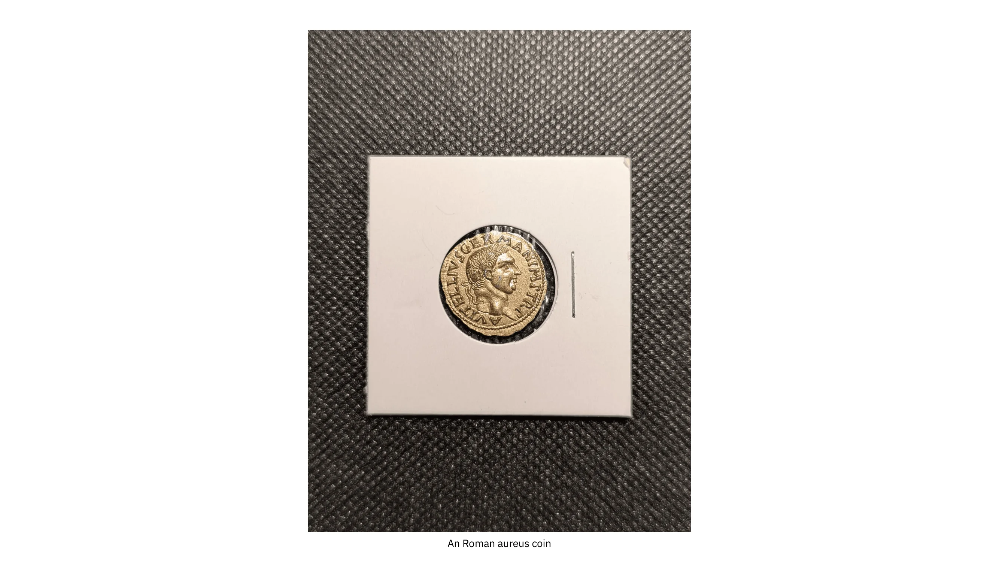

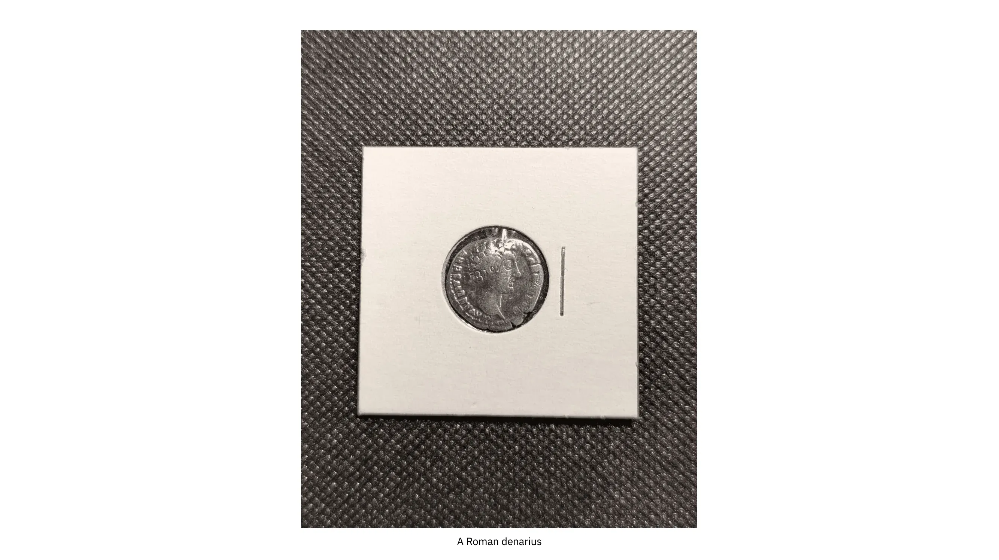

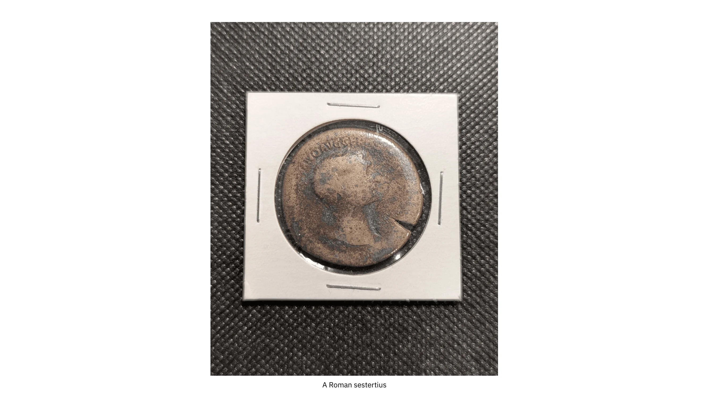

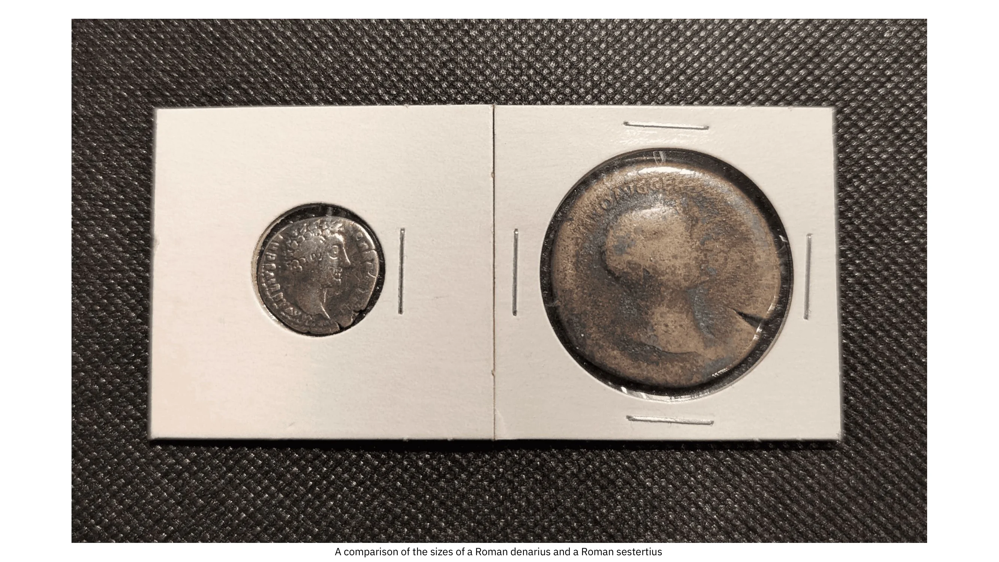

От Нерон (54-68 г. сл. Хр.) обаче Рим започва бавно обезценяване на монетите си, като постепенно намалява теглото и чистотата им, за да финансира нарастващите имперски разходи, особено след големия пожар в Рим през 64 г. сл. Хр. Тези девалвации имат забележителни последици: по-чистите монети са изтеглени от обращение чрез натрупване или износ в съответствие със закона на **Грешам**, докато обезценените монети се разпространяват, което води до постепенно повишаване на цените.

Третият век бележи драматичен обрат, като по времето на императорите Септимий Север, Каракала и Галиен се наблюдава впечатляващо ускоряване на обезценяването. Основната сребърна монета, денарият, а след това и антонинианусът, е със съдържание на сребро едва 2%. В същото време теглото на златото в ауреуса спада наполовина. Тази парична криза била съпроводена от безпрецедентна политическа нестабилност, варварски нашествия и повтарящи се граждански войни.

Тази част ми позволява да представя последния елемент в този раздел: антониниануса. Оригиналното име на тази монета е неизвестно, но днес я наричаме антонинианус. Тя се отличава с това, че се оценява на два денария, въпреки че е само 1.5 пъти по-голяма от денарий. Освен това с течение на времето тези монети се превръщат в обикновени билонни монети, което означава, че са изработени от сплав от сребро и други метали, а не от чисто сребро. Често монетите са били просто покрити със сребро, което служи като забележителен пример за упадък на паричната система.

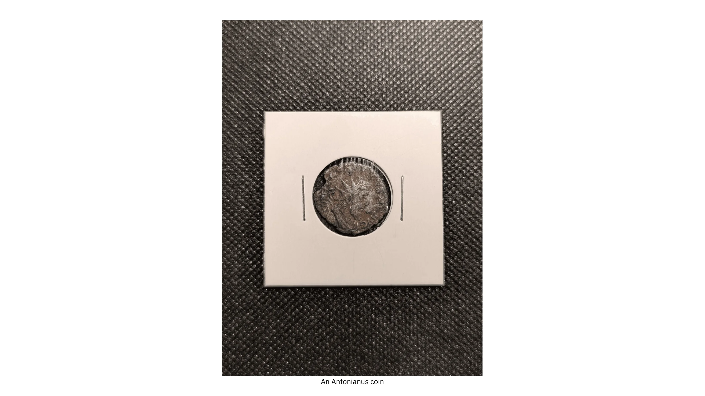

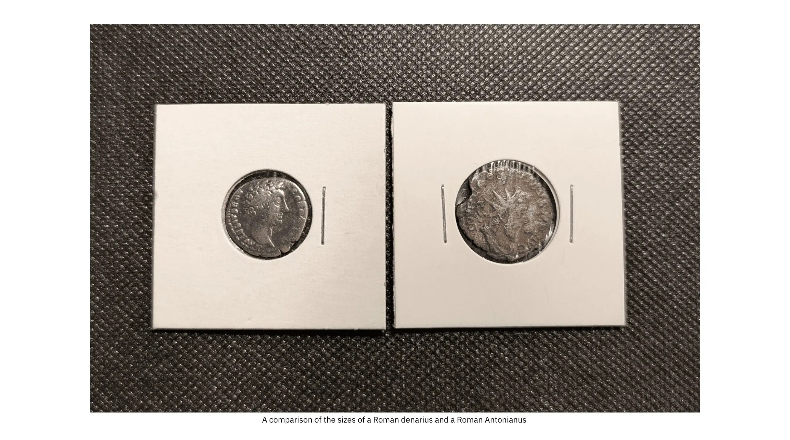

Изправен пред тази ситуация, император Аврелиан (270-275 г.) се опитва да стабилизира системата чрез номинално ревалоризиране на валутите, но тази реформа всъщност въвежда инфлационен механизъм, като изкуствено фиксира стойността на съществуващите валути на по-високо ниво.

Ще направя едно отклонение по темата. През III в. инфлацията преживява бързо експоненциално нарастване. Преди това, въпреки че монетите се обезценявали, ръчно изработеният процес на сеченето им една по една осигурявал известен контрол върху инфлацията. Статистиката сочи, че за 300 години обезценяване инфлацията е била средно около 4% годишно. Непосредствено преди реформата на Аврелиан инфлацията е била около 3% годишно.

Аврелиан въвежда измерване на чистотата на монетата със знак XXI, което показва състав от 20 части бронз към 1 част сребро, или 5% чистота. Той пуска на пазара тези 5% сребърни монети и отпечатва върху тях знака XXI. Той обаче изтеглил от обращение и всички други, по-девалвирани монети и отпечатал върху тях същия знак XXI. Това на практика преоценява номиналната стойност на всички монети. Резултатът е зашеметяващ темп на инфлация от 20% годишно, който далеч надхвърля предишния темп от 3% преди прилагането на тази техника.

Наистина Аврелиан е измислил тази форма на обезценяване, която е много по-бърза от постепенното обезценяване на метала, което все още ни принуждаваше да печатаме монети една по една. Това, което той направил, било да вземе всички съществуващи монети, да ги припомни и да ги отпечата с перфоратор, за да промени номиналната им стойност. Това е истински повратен момент. Именно тогава инфлацията стана експоненциална.

За да илюстрирам нагледно тази крайна девалвация, намерих някои интересни статистически данни за цената на зърното в Египет от 40 г. пр.н.е. до III в., т.е. за повече от 300 години. По-долу можете да видите една гръцка тетрадрахма от моята колекция. По това време в Египет под римска окупация през III в. еквивалентът е бил египетска тетрадрахма. Все още се е използвал номиналът на драхмите, който е съответствал на денар.

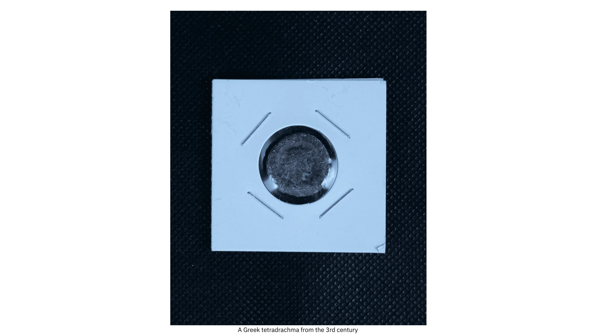

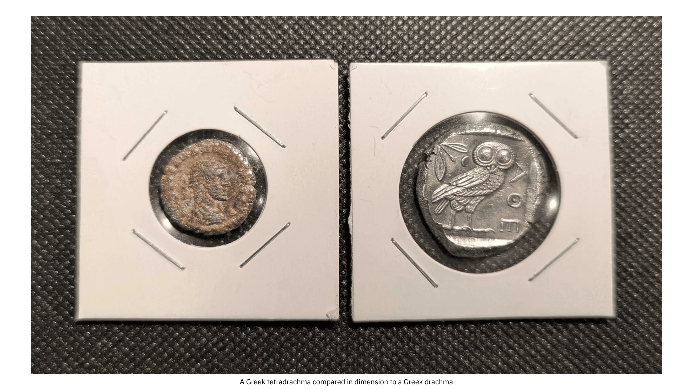

Така че египетската тетрадрахма, която имам, е била еквивалентна на денар. Можете да видите, че монетата е изработена от билон (или бронз), така че не съдържа благороден метал. Можете да я сравните с оригиналната гръцка тетрадрахма, за да видите физическото обезценяване през тези 300 години. Това е милионно увеличение на цената на зърното в Египет.

Това е физическият израз на реформата на Аврелиан. Трябва да се отбележи, че по-голямата част, средната за тези 300 години инфлация, е била около 4%. Едва в края, когато Аврелиан прави своята реформа, тази инфлация става по-скоро експоненциална и стигаме до тази мярка от 1 милион. В края на III в. цените са били милион пъти по-високи, отколкото през I в. пр.

Неговият наследник **Диоклециан** (284-305 г.) се опитва да проведе още по-радикални реформи: издава нови парични знаци (по-специално аргентеус, който е по-чист, но с твърде ограничено количество), налага драстичен контрол върху цените (Едикт за цените от 301 г.) и **установява данъчна система, основана на плащания в натура**. Въпреки тези усилия реформите на Диоклециан не успяват да ограничат ширещата се инфлация.

Изправен пред отказа да доставя стоки и услуги в замяна на обезценена валута, Диоклециан въвежда **наследствена кастова система**, за да обвърже селяните и техните потомци със земята им.

Това, което наистина трябва да се разбере тук, е, че селяните отказали да доставят продукцията си в замяна на обезценена валута, а отговорът на нашия скъп Диоклециан бил да създаде **наследствени касти**, като казал: "ти, ти не можеш да напуснеш земята си, децата ти не могат да напуснат земята си, същото важи и за войниците, вие сте войници, съгласни сте да ви се плаща в моята валута". Като преходно решение им се плащало в натура (в месо, храна, зърно), защото той отказвал да им дава пари. Така той наложил тази наследствена кастова система, за да принуди хората да бъдат привързани към професията си, така че да не могат просто да сменят работата си, ако се опитат да не приемат обезценената валута.

За да илюстрирам този пример, предлагам ви един текст, откъс от книгата "*Монитарният режим и инфлацията*":

> Тъй като хората не желаеха да работят и да доставят стоки срещу обезценена валута, чиято номинална стойност беше по-висока от нейната вътрешна или пазарна стойност, те трябваше да бъдат принудени да работят чрез налагане на данъци в натура... За селяните стана незаконно да напускат регистрираните си домове. По този начин земеделското население се привърза наследствено към земята.
>

> Тази наследствена кастова система постепенно се разпространява: Диоклециан принуждава синовете на войниците да служат в армията, а работниците в паричните работилници, както и в създадените от Диоклециан тъкачни и бояджийски фабрики, стават държавни роби с наследствена служба. По-късно златотърсачите също стават наследствена каста. По времето на Диоклециан вероятно вече са съществували и други наследствени класи, а именно гилдиите на хлебарите и месарите... в Рим, както и епархийските гилдии на капитаните на кораби, които превозвали зърно и други обществени товари в Рим.

Най-накрая Константин (306-337 г.) успява да стабилизира паричната система, като през 312 г. въвежда солида - монета от чисто злато, чието качество и тегло той строго гарантира. Съществувала цяла система за проверка на чистотата и теглото на солидуса. **Тази стабилност обаче засегнала само богатия елит и императорската администрация**, докато **голямата част от населението продължила да страда от нискокачествена валута и постоянна инфлация**. Солидът остава стабилен в Източната империя (Византия), където се задържа повече от хилядолетие, докато на Запад монетосеченето се раздробява на дребни монети с ниска стойност, което съпътства окончателния икономически и политически разпад на Римската империя, която пада окончателно през 476 г.

В заключение бих искал да споделя с вас този цитат от "История на парите": От древността до наши дни от Глин Дейвис, който майсторски обобщава какво може би е довело до падането на Рим:

*"Данъците са постоянно недостатъчни, а трудностите, свързани с тези все по-неадекватни, закъснели и силно видими данъци, карат Рим да разчита повече на лесна, непосредствена и скрита форма на данъчно облагане - девалвацията на валутата. Краткотрайните, ad hoc реформи не успяха да обърнат тази вековна тенденция на упадък. Финансовият натиск, причинен от износването на монетите, корабокрушенията, изтичането на пари поради закупуването на луксозни стоки от Изтока, подаръците, предлагани на германските варвари, нарастването на градското население, спадът на селскостопанското производство, постепенното изчерпване на най-богатите мини и най-вече политиката на "хляб и циркове", смятана за необходима за поддържане на минимален ред в градския живот - всички тези кумулативни натоварвания доведоха Рим до постоянна парична девалвация, прекъсвана от случайни реформи, обречени на неуспех."*

*В допълнение към безплатния или евтин хляб и вино, от време на време се раздават императорски дарения ("congiaria") под формата на парични суми, особено при Траян (98-117 г.) и още повече при Адриан (117-138 г.) и неговите наследници. Това, което първоначално императорът и гражданите са смятали за изключителна привилегия, към началото на II в. се е превърнало в обичайно очакване. Тези разпределения "представлявали тежко бреме за държавната хазна и по свой начин допринасяли за фалита на държавата"*

## Връзки между разводняването на паричната маса и инфлацията: от причините до последиците

<chapterId>38d5781c-e900-53f7-baa7-413655d71754</chapterId>

:::video id=3999256d-aafe-4502-9b72-dfa8491a2777:::

В този раздел са разгледани връзките между разводняването на паричната маса и инфлацията - от причините до последиците. Монетарното разводняване е едно от основните икономически явления в римската монетарна история, което има пряко отражение върху инфлацията. От I в. сл. н. е. е налице първоначална бавна фаза на разреждане на сребърните монети (денари) от управлението на Нерон (54-68 г.) нататък, ускорена от повтарящи се военни и финансови кризи, особено при Септимий Север (193-211 г.) и Галиен (253-268 г.).

Отбелязваме и по-постепенно обезценяване на ауреуса. Тази разлика в степента на обезценяване подчертава два момента:

1. Ролята на разчетната единица в биметализма за държавния контрол върху парите. В този пример разчетната единица е денарът. Идентифицирах три различни начина за управление на стойността на разчетната единица: девалвация (разреждане на метала), реденоминация (антонинианус) и налагане на номинална стойност чрез маркиране "XXI" (Аврелиан)

2. Стремежът на държавата да отложи колкото се може по-дълго девалвацията на ауреуса - резервът на стойност, който позволява на елита да запази покупателната си способност за сметка на по-малко щастливите. В хода на курса често ще се връщаме към този принцип, особено във връзка с концепцията, известна като "ефект на Кантийон", и реденоминациите на мараведи в Испания.

Този феномен е доста интересен и се е повтарял в историята. Ще се върнем към него с Мараведи в следващ раздел. Тази закономерност е очевидна и при всички резервни валути; резервната ценностна единица, каквато е ауреусът в Рим, остава незасегната. Въпреки това разчетната единица, използвана от населението за търговия и ежедневни транзакции, често се обезценява. В резултат на това паричната инфлация засяга обикновените хора, докато тези, които могат да си позволят златни монети, остават до голяма степен незасегнати.

Между другото, **това е същото явление, което се създава днес с девалвацията на валутата, която позволява на финансовите активи да повишат стойността си**, и така хората, които използват валутата, най-бедните хора, стават по-бедни, а това на свой ред обогатява чрез създаването на пари активите на онези, които са способни, които имат средства да се защитят от девалвация, и така задълбочава социалното неравенство. Това е моята малка политическа тирада.

Това, което току-що описах, се нарича ефект на Кантийон. Ще видим, че този джентълмен е живял по времето на Джон Лоу - тема, която също ще разгледаме в следващ раздел.

Реформата, започната по време на управлението на Аврелиан, позволява на инфлацията да се покачи. Инфлацията на номиналната стойност на парите вече не била ограничена от способността на монетните дворове да произвеждат монети на ръка. Вече отсечените монети можели просто да се маркират и номиналната стойност на паричната маса се увеличавала по-бързо.

Имам два цитата, които искам да споделя с вас във връзка с Аврелиан. Първият е от "История на парите": От древността до наши дни:

*"що се отнася до римската икономика, приносът на Аврелиан е по-скоро катастрофа, отколкото триумф. До голяма степен поради естеството на неговата "реформа" темповете на инфлация успяват да се увеличат далеч над това, което е било възможно преди това, дори при безотговорния Галиен. В продължение на две столетия след Аврелиан инфлацията се превърнала в ендемична в цялата Римска империя"*

Вторият е от книгата "Древна история от монети" и се отнася до отделянето на паричната система от златото:

*"Реформата на Аврелиан променя отношенията между златните пари и останалата част от паричната система. Преди нея другите видове парични знаци са били обвързани с **ауреуса** според официалните курсове (25 египетски денара или 25 тетрадрахми за един ауреус и т.н.). След реформата златните пари започнали да **сменят свободно стойността си**, както всяка друга стока, докато останалата част от паричната система **сринала стойността си** поради **отслабването на сплавите**, тъй като вече не била **подкрепена със злато**. Тъй като разчетната единица теоретично продължавала да се основава на сребро (денар или в Египет драхма), цените се повишавали с обезценяването на валутата."*

Както виждате, тази девалвация на валутата, която служеше за разчетна единица, засегна непропорционално най-незаможните, докато откъсването на връзката със златните пари защити покупателната способност на тези, които можеха да си позволят да спестяват в златото, което е носител на стойност.

Това, което трябва да разберете тук, е, че ако има връзка между денара и ауреуса, дори и да обезцените денара, ако все още можете да обмените денара си за ауреус по този курс (25 денара за 1 ауреус), хората със сигурност ще обменят денара си за вашия ауреус, тъй като денарът ще бъде надценен, а ауреусът - подценен. Но при тази реформа те премахнаха тази връзка. Така хората вече не можеха да разменят денари за сребърен метал, обезценен спрямо златото. Именно тогава тези, които имали достъп до златни монети, можели наистина да се защитят, защото след това хората вече не можели да разменят надценено девалвирано сребро за подценено чисто злато. Това е много важен момент в еволюцията на валутата.

Ярък пример за последиците от тази реформа на Аврелиан отлично илюстрират тези цитати от книгата *Монетарните режими и инфлацията*:

*"В периода между управлението на императорите Клавдий (41-54 г.) и Констанций (337-361 г.) цената на пшеницата на открития пазар в Египет, изразена в драхми, **се е повишила над един милион пъти**. Зрелищната инфлация на цените е един от основните икономически факти на III и IV в. от н.е." (Lendon 1990, стр. 106). Но това развитие е **по-малко драматично, отколкото изглежда**, тъй като съответства на **средногодишен темп на инфлация от 4.4%**. А според Wassink (1991, стр. 482) инфлацията всъщност започва **само през 238 г. от н.е.**"*

*"От тази дата нататък инфлацията бавно се ускорява, тъй като **добрите пари за пръв път са изтласкани от обращение**, така че общата парична маса първоначално почти не се увеличава. Впоследствие тя достига средногодишен темп от **3.65 % между 250 и 293 г.**, като се повишава до **22.28 % между 293 и 301 г.** (Wassink 1991, стр. 466), т.е. до **предизвиканите парични реформи на император Диоклециан**. Този феномен е **особено впечатляващ за инфлация в паричен режим, основан на метали**."*

Този феномен на инфлация, свързан с разводняване на паричната маса, първоначално е реакция на периодичните парични кризи в римската държава. Чрез намаляване на съдържанието на благородни метали в монетите при запазване на номиналната им стойност държавата временно увеличава ресурсите си. Цените обаче не реагират веднага: римската система се характеризира с известна скованост, което означава, че заплатите и цените бавно се адаптират към последователните обезценявания. Въпреки това след определен праг цените рязко се повишаваха, за да се върне равновесието на пазара с реалната стойност на валутите.

Както беше споменато по-горе, това явление е особено очевидно от средата на III в. нататък. В Египет, един богато документиран регион, при Аврелиан (274 г.) след официална ревалоризация на валутата, въпреки първоначалния опит за стабилизация, цените са умножени по 10. След това, при Диоклециан (301 г.), ценовият декрет налага драстичен контрол за ограничаване на инфлацията, без да се справи с първопричината - свръхпроизводството и деградацията на паричната система - като по този начин предизвиква предсказуем провал. Постоянната инфлация в крайна сметка тласка икономиката към двустепенна система: **елитът, защитен от златни резерви (като солида на Константин**), се радва на стабилност, докато по-голямата част от населението продължава да страда от хронична инфлация, **илюстрирайки това, което днес е известно като ефекта на Кантийон**.

Съществува ясна връзка между разводняването на римската парична система и инфлацията, причините за която са свързани основно с хроничните фискални дефицити, непрестанните военни разходи и лошото управление на държавната икономика.

## Падането на Римската империя

<chapterId>b6ec0914-227b-509c-8108-b09eec9bb904</chapterId>

:::video id=91d4fee5-59bb-4ab9-a90b-e1125c71decb:::

### Девалвация на валутата и крахът на Рим

Австрийската икономическа школа, най-вече чрез Лудвиг фон Мизес, предлага парично тълкуване на падането на Рим. Според това виждане постепенното обезценяване на римската валута е разрушило сложната система на разделение на труда, която е поддържала империя с 60 милиона жители. Валутата, централният инструмент на икономическата координация, веднъж опорочена, води до срив на цялата социална и икономическа структура.

Това влошаване на паричната политика не само разрушава вътрешното единство на империята. То прекъсна и търговските връзки със съседните народи. Лишени от ползите от търговията с Рим, "варварите" се обърнали от мирно сътрудничество към хищничество. Следователно нашествията са не само военни по характер, но и резултат от фундаментален икономически срив.

### Трите фази на имперската девалвация

Римската парична история може да се раздели на три отделни периода. Първият, от Юлий-Клавдий до Антонините (27 г. пр. Хр. - края на II в.), се характеризира с относителна стабилност. По времето на Траян империята достига своя апогей: обхващайки 5 млн. кв. км, Рим става първият милионен град в историята. Денарият запазва чистотата на среброто от 98% до 80% - умерена девалвация, която все още позволява на икономиката да функционира.

Вторият период, III в., е период на военна анархия. Двадесет и шест императори се сменят един друг в рамките на няколко десетилетия. Валутата се сринала: антонинианусът, за който се предполагало, че струва два денария, съдържал само 1.5 в метално тегло - първият опит за разделяне на юридическата и реалната стойност. Тази манипулация задейства закона на Грешъм: лошите пари изтласкват добрите пари. Гражданите натрупват добрите монети, като харчат само обезценените.

Монетните съкровища, открити от археолозите, разкриват тази икономическа тревога. Погребаните амфори показват как римляните първо са депозирали най-добрите монети, като постепенно са добавяли обезценените. Тези древни "купчини" свидетелстват за човешки действия в условията на несигурност - опит да се запази стойността в един разпадащ се свят.

### Константин и дуалната система

Константин (310-337) се опитва да стабилизира империята чрез радикални реформи. Той създава златен солид - валута, строго контролирана от администрацията. Длъжностните лица системно проверявали теглото и чистотата на златото. Емисията остава ограничена и е свързана с военната плячка. Тази валута се превръща в изключителен инструмент на властта: данъците се плащат в солидуси, а легионите получават заплатите си в злато.

В същото време хората използвали бронзовия нумус, който постоянно се обезценявал. През 445 г. един солид струвал 7 000 нумии, а през 498 г. - 16 800. Тази двойна система институционализирала ефекта на Кантийон: тези, които имали достъп до солидуса - администрацията, земевладелците - били защитени от инфлацията. Плебсът, ограничен до нумуса, неумолимо обеднявал.

Това парично разделение създаде две паралелни икономики без официален обменен курс. Солидът остава разчетна единица, но е в много малко обращение. Нумусът се използва за ежедневна размяна, но постоянно губи стойност. Тази парична архитектура предвещавала неравенството на зараждащата се феодална система.

### Крахът на разделението на труда

Девалвацията на валутата постепенно унищожи икономическата специализация. Без надеждна разчетна единица средиземноморската търговия се срина. Специализираните занаятчии в Рим вече не можеха да търгуват с Египет или Галия. Провинциите приеха свои собствени валути, което увеличи търговските търкания.

Изправено пред тази дезинтеграция, градското население бяга в провинцията - градско изселване, което обръща хода на вековната урбанизация. Занаятчиите изоставят занаятите си, за да се занимават със земеделие за собствени нужди. Големите имения (латифундии) се превръщат в самодостатъчни острови, предхождащи средновековните сенерии.

В отчаянието си Диоклециан дори поискал данъци в натура - крайно признание за паричен провал. Неговият Едикт за максимума (301 г.) се опитва да контролира цените, ускорявайки връщането към размяната. Икономическата сложност се връща към предцивилизационните форми.

### Оцеляване чрез злато от Рим до Византия

Парадоксално, но солидът оцелява в Западната империя. Византия го запазва до XI в., което осигурява още хиляда години икономическа стабилност. На Запад споменът за него остава: френската дума "sou" произлиза от "solidus" - езиково свидетелство за изгубеното парично величие.

Собствениците на земя, които са запазили богатството си в злато, стават феодали. Църковните структури, единствените оцелели институции, осигурявали социалните връзки, които парите вече не можели да гарантират. Европа се фрагментира на автаркични области, всяка със собствена натурална икономика.

Тази трансформация разкрива крехкостта на сложните цивилизации. Разделението на труда, което позволява на Рим да изхранва един милион жители, зависи изцяло от паричното доверие. След като това доверие беше нарушено, сградата се срина и Европа се върна към примитивни икономически форми за почти хилядолетие.

## Тъмните векове и Средновековието

<chapterId>a5856873-6142-57be-8a73-1f9e3df83792</chapterId>

:::video id=86b8da9b-3831-443d-b170-58c2bea3ad54:::

Историята и появата на парите през Средновековието се характеризира с периоди на регрес, иновации и икономическо възстановяване.

Например, когато римската армия напуснала Британия, на острова не постъпили повече римски монети. Около 435 г. от н.е. използването на монети в Британия напълно изчезва - явление, което е уникално за бившите римски провинции. В продължение на почти два века британската икономика остава без монети до VII в., когато постепенно се появяват отново монетите на Меровингите и вдъхновените от континента монети.

От VIII в. нататък християнското влияние допринася за повторното въвеждане на монетосеченето в Северна Европа. Ключова фигура в този период е Пипин III, крал на франките, който въвежда денара през 752 г., по-късно възприет от сина му Карл Велики. Карл Велики широко разпространява употребата на сребърния денар, създавайки европейски паричен стандарт за няколко века.

В Англия монетосеченето се възражда значително с производството на сребърни монети по времето на крал Офа от Мерсия около 765 г. Тази валута става толкова важна, че остава почти непроменена в продължение на 500 години.

Като първи артефакт, свързан с този период, ще ви покажа репродукция на английско пени от това време.

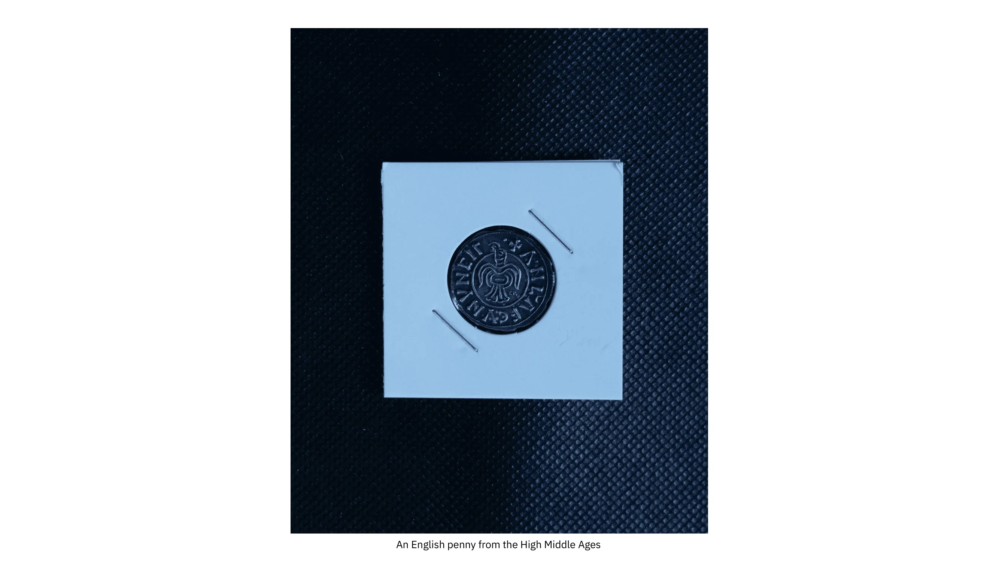

През Високото средновековие, след разпадането на римската парична система, Европа изпада във феодализъм. По-голямата част от населението използва медни или бронзови монети с ниска стойност, които често са подложени на размиване, което ограничава търговията на големи разстояния.

Връщането на монетосеченето като платежно средство става постепенно, като кулминацията е през XIII в. с появата на златния флорин във Флоренция през 1252 г., последван от златния дукат във Венеция. Тези златни монети са широко използвани благодарение на разрастването на търговията и нарастващата нужда от надеждни, международно признати платежни средства.

В Англия паричната система е защитена от размиване чрез новаторски фискални политики, като например поземления данък, въведен от Уилям Завоевателя след 1066 г., който запазва качеството на стерлинга. Това, което е важно да се разбере тук, е, че суверените по онова време можели да девалвират валутата, за да финансират държавата, а **въвеждането на този данък направило възможно запазването на стабилността на валутата и финансирането на държавата чрез данъци**.

Изкушението да се печели чрез разводняване на паричните знаци обаче води до кризи, като при управлението на Хенрих I през XII в., когато качеството на монетите рязко спада. Строгите реформи, понякога съпроводени с насилствени мерки срещу монетарниците, временно възстановяват доверието във валутата.

През Средновековието се появяват и усъвършенствани финансови практики, като например използването на калкулатори в Англия за заобикаляне на забраната за лихварство и отпускане на кредити. Църквата не е била много ентусиазирана по отношение на лихвените заеми, затова са използвани различни техники за заобикаляне на забраната за използване на лихви.

Тези нововъведения са в отговор на хроничния недостиг на метални пари и насърчават появата на зародиш на финансов пазар.

Междувременно кръстоносните походи стимулират търговията в Средиземноморието, като подпомагат развитието на международния обмен и на нови банкови практики, особено чрез Ордена на тамплиерите. Орденът на тамплиерите се превръща във важен финансов посредник, който дава възможност на кръстоносците да получават ликвидни средства далеч от дома си, като по този начин предначертава съвременната европейска банкова система.

За да направите връзката с тамплиерите, тук по-долу можете да видите френска средновековна монета, на която можете да разпознаете красив кръст в центъра. За монетите от тази епоха е било съвсем обичайно да носят този кръст.

И накрая, големи кризи като Черната смърт (1346-1353 г.) довеждат до дълбоки икономически трансформации. Рязкото намаляване на броя на населението води до рязко повишаване на заплатите, което не се поддава на опитите на правителството да запази предишните нива на възнаграждение.

В същото време Стогодишната война (1337-1453 г.) принуждава държавите да предприемат по-агресивна фискална политика, за да финансират армиите си, което допринася за отслабването на феодалната система.

По този начин Средновековието се характеризира с постоянно напрежение между необходимостта от надеждни пари за търговията и постоянното изкушение за владетелите да разводняват парите с цел незабавна печалба. Този конфликт дълбоко оформя европейското парично развитие, като полага основите на съвременните икономически системи.

В заключение на този раздел бих искал да добавя един доста интересен анекдот от Англия по това време. Този анекдот е взет от книгата "История на парите" на Глин Дейвис.

В него се споменава, че в Англия преминаването към парламента прехвърля тежестта на дълга от суверена към парламента, което води до хронична държавна задлъжнялост. Преди това дългът е тежал на плещите на суверена.

След като парламентът успява да изземе част от правомощията за създаване на пари, той дава възможност за създаване на дългосрочни дългове, които се поемат от народа, а не от краля. Преди това, ако кралят фалираше или ако се сменяше кралят, дългът се погасяваше заедно с него.

В момента, в който парламентът създаде дълг, се появява понятието "държавен дълг", тъй като той е потенциално неограничен във времето. Докато съществува държавата, докато съществува парламентът, този дълг съществува и те трябваше да намерят всевъзможни начини за неговото рефинансиране и разпределяне във времето. Това е сериозна промяна на парадигмата, при която вече не кралят или кралското семейство са тези, които гарантират или носят тежестта на тези дългове; сега това е Парламентът и следователно неговите граждани.

## Ренесансът

<chapterId>1d1dfb05-70b4-5b7b-9708-373c2182950d</chapterId>

:::video id=4977b4f3-c7b2-41a5-ad7b-a96a8cca4092:::

Стигнахме до частта от курса, в която говорим за периода, известен като Ренесанс. Той се развива на фона на трагична криза, свързана с бързото разпространение на чумата чрез бълхите на плъховете на борда на корабите. Тази трагедия обаче ни дава информация за развитието на търговията и пътуванията през периода на Високото средновековие. По-рано през този период не са се придвижвали толкова много хора толкова далеч и толкова бързо.

### Флорин от Флоренция

Завръщането на златните монети в Европа по време на Ренесанса бележи фундаментален обрат в паричната история. **Всичко започва с флорина от Флоренция през 1252 г. - първата голяма златна монета, отсечена в Европа след падането на Рим**. Със забележително постоянното си тегло и чистота (около 3.5 грама чисто злато) флоринът остава непроменен в продължение на четири века и бързо се превръща в основен общоевропейски паричен еталон.

Тук по-долу можете да видите репродукция на флорин: златен флорин, изработен от калай и щампован от френски художник, който прави отлични изделия, гравирани и изчукани ръчно.

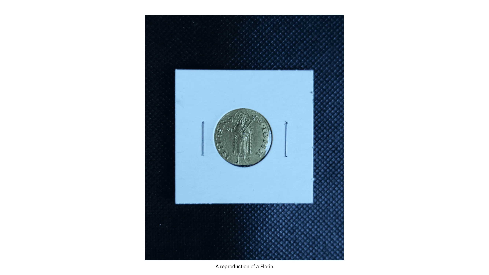

Това завръщане към златните монети е продиктувано от специфичен контекст: сривът на византийския солид и икономическият упадък на мюсюлманския свят вследствие на монголските нашествия създават паричен вакуум в международната търговия.

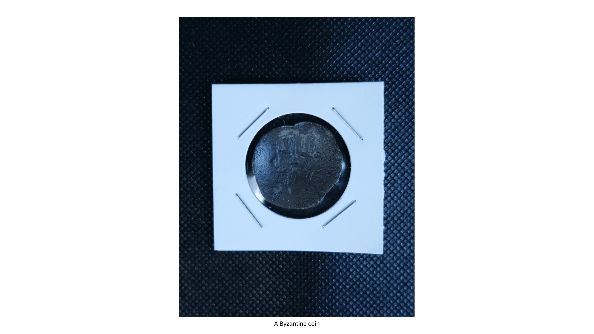

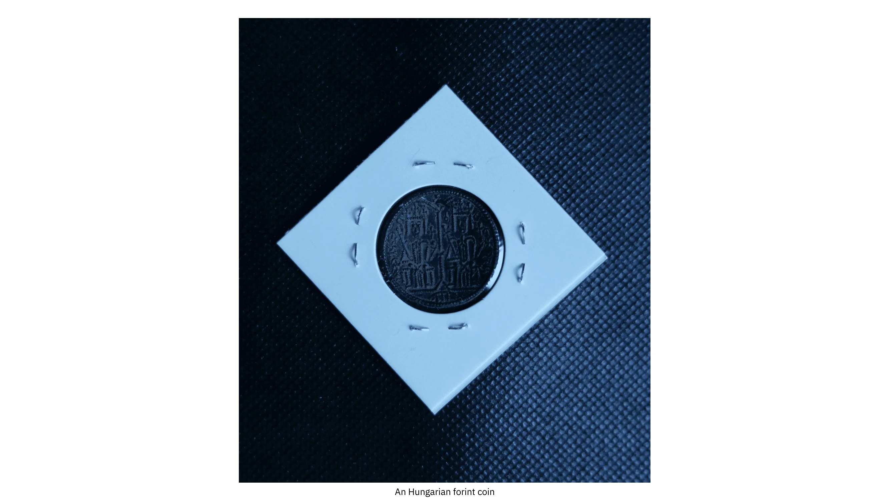

Първото изображение по-горе показва византийска монета, която намирам за доста интересна. Ще направя паралел с една монета от същия период от Унгария (второто изображение по-горе). Унгарската монета е с форма на чаша, подобна на миниатюрна купичка. Иконографията включва религиозни фигури, изобразени като крале, които държат кръстове един до друг. Този екземпляр е с форма на купа и произхожда от Унгария.

Било е съвсем обичайно да се копират монети от други държави. Тъй като византийските монети са били общоприети, други държави често са ги копирали. Както можете да видите, когато ги сравните една до друга: тези монети много си приличат.

Северна Италия, по-специално Флоренция, Венеция и Генуа, се възползва от този контекст, за да въведе нови твърди валути - монети със стабилно съдържание на благородни метали. Венеция последва примера на Флоренция, като през 1270 г. отсича дуката - валута, която е почти идентична с флорина и се използва широко в средиземноморската търговия.

Флоринът се превръща в първата международна резервна валута, приета в над 150 европейски града до края на XIV век. Със създаването на мащабна флорентинска банкова мрежа, ръководена от Медичите, паричното и счетоводното управление е напълно модернизирано, като дори намалява необходимостта от физическо транспортиране на злато.

Това е още един наистина интересен въпрос. Имало е време, когато много от пратките с монети са били загубени по време на морските пътувания. Този технологичен напредък - регистрите с двойно счетоводство - е позволил създаването на книжни пари. Това направи възможно да се намали броят на разплащанията с монети и вместо това да се използва система от писмени записи, което значително намалява риска от загуба на пари по време на транспортиране.

Монетарното развитие е съпроводено и със значителна еволюция на банковите методи. Вдъхновена отчасти от контакта на кръстоносните походи с мюсюлманските банкови практики, средновековна Европа вижда появата на рудиментарни банкови системи във Флоренция, Венеция, Барселона и Генуа още през XIII в. Рицарите тамплиери, религиозен и военен орден, вече са разработили система, която позволява на кръстоносците да пътуват, без да вземат със себе си богатството си.

Те депозирали средства в тамплиерски офис в своята страна, след което можели да пътуват с писмо и да получат монетите при пристигането си в дестинацията на кръстоносния поход.

Това означаваше, че не е необходимо да носим монети от благородни метали.

През този период Европа научава за съществуването на книжни пари в Китай благодарение на пътуването на Марко Поло през XIII в. Разработването на банкноти обаче изчаква няколко века, тъй като Европа предпочита първо да усъвършенства методите си за сечене на метални монети. Леонардо да Винчи, в близост до Лука Пачиоли, известен дипломиран експерт-счетоводител, активно допринася за усъвършенстването на пресите за пари, като насърчава по-бързото и по-равномерно производство на монети.

Става дума за техниката за нанасяне на удари с махало, спомената по-рано в курса. Този метод позволява производството на по-еднородни монети в сравнение с ударите с чукче и, което е важно, позволява изписването на надписи по ръба на монетата, както вече показах. Монетата по-долу е европейски талер от 1793 г., на който ясно се вижда надпис по ръба.

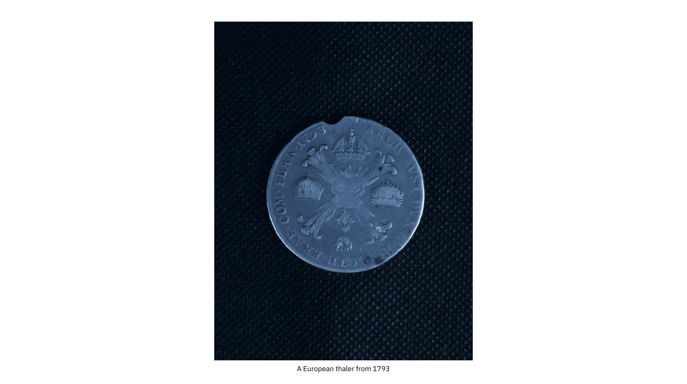

През XV в. обаче Европа преживява сериозна валутна криза, като съдържанието на сребро в европейските валути се влошава като цяло и около 1450 г. спада до по-малко от 5%.

От XVI в. нататък паричният център се премества в Испания, стимулиран от обединението на кралствата Арагон и Кастилия, края на Реконкистата и големите морски открития като това на Христофор Колумб през 1492 г. Огромният приток на сребро от американските мини дълбоко нарушава европейското и световното икономическо равновесие, като подхранва както инфлацията, така и нови геополитически напрежения.

Ренесансът бележи и голяма художествена еволюция в монетосеченето с монети като талера (Joachimsthaler), откъдето произлиза терминът "долар". Тези големи сребърни монети отразяват новите художествени и механични техники на сечене, станали възможни благодарение на техническите иновации от Северна Европа.

И накрая, финансовият ренесанс поставя началото на прехода към икономическа модерност с развитието на банковото дело, кредитите и финансовите пазари и появата на първите форми на модерен капитализъм в големите търговски градове Амстердам, Лондон и Стокхолм, като полага основите на международната финансова система, каквато я познаваме днес. И това е темата на следващото ни видео.

# Изземване на пари от държавата

<partId>17cfb1b4-5bc1-53e0-b035-05c7cf76be92</partId>

## Еволюция на световните резервни валути

<chapterId>d65cc352-e7ca-5f03-9b23-dd1fae5c0395</chapterId>

:::video id=82710062-8fff-426c-93af-923c08d82233:::

### Историческото значение на благородните метали

Добре дошли в този раздел за появата на резервните валути и централните банки. Като първа точка на този нов раздел ще се спрем на еволюцията на световните резервни валути.

Благородните метали, особено златото и среброто, отдавна се смятат за основа на богатството и властта в империите. Жаждата за злато винаги е била доминираща движеща сила и именно притокът на благородни метали е имал най-пряк и очевиден ефект върху паричното развитие в Европа. През Средновековието и ранния Ренесанс тази мания по златото и среброто се дължи на трудностите при запазването на стойността на други форми на стоки, както и на силното търсене от страна на чужди сили, особено в търговията с Ориента.

През вековете няколко империи се сменят една друга като световни икономически центрове. Страната, която доминира в световната търговия през даден период, обикновено получава статут на резервна валута. Сред тях са:

- Испания и Португалия (XV и XVI в.)

- Обединените провинции (Нидерландия) през 17 век

- Франция и Великобритания през XVIII и XIX в

- Съединените щати през XX век

### Португалският бум и реалът (1450-1530 г.)

**Португалия** доминира в световната търговия през втората половина на XV и началото на XVI в. с **португалския реал** - сребърна монета с относително еднакво тегло. Благодарение на постиженията си в областта на навигацията португалците откриват нови морски пътища към Африка, Азия и Новия свят. Военните крепости и търговските пунктове се разрастват от Африка до Китай (Макао).

В отговор на търсенето на злато и сребро от страна на Европа "постоянната мотивация за големите открития е била търговската печалба, по-специално търсенето на злато и сребро". Въпреки това Португалската империя, прекомерно разраснала се и изправена пред конкуренцията на холандците, англичаните и французите, започва да запада.

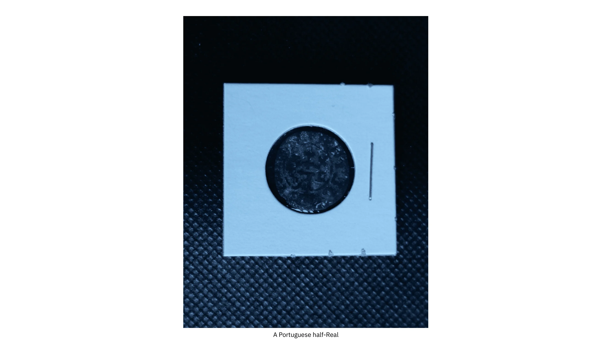

Тук горе можете да видите португалска полуреална монета от времето на тези морски завоевания.

### Испанският апогей и испанският долар (1535-XVII век)

Със завладяването на Новия свят **Испания** става доминиращ играч. Нейният монарх, който контролира гигантски сребърни мини (Потоси в Боливия, Сакатекас в Мексико), успява да сече пари от чисто сребро, като по този начин избягва обезценяването на собствената си валута: **испанския реал**.

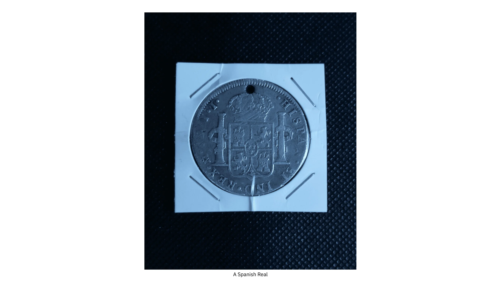

Испанският реал, известен още като "парче от осем", получава прозвището си, тъй като често е бил разрязван на осминки, за да се създават по-малки монети. Известен е и като **испански долар**. Монетата, която виждате по-горе, датира от 1814 г., което я прави малко по-нов пример. Първите монети от испански долар обаче не са били толкова изискани; те са били изковани с чук и като цяло не са били толкова кръгли и ясни.

Особено интересен е фактът, че по онова време испанският долар е международна резервна валута. Испанските власти също така емитират собствена местна валута - мараведи, и редовно регулират паричното предлагане чрез отзоваване. Например медна или бронзова монета, която първоначално е струвала една мараведи, може да бъде изтеглена и отпечатана с "2", по-късно с "4" и т.н., като може да достигне до "8" На снимката с висока разделителна способност можете ясно да видите "8", отпечатано върху монетата. Този метод ефективно разширявал паричната маса... което неизбежно водело до инфлация.

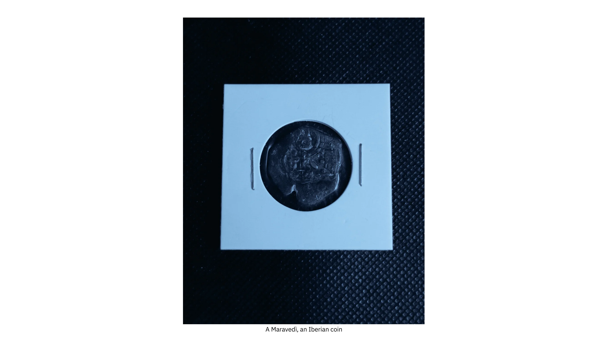

Ако разгледаме историята на резервните валути, ще видим един интересен момент: империите не са надували валутите си, докато са запазвали статута си на резервна валута. **Само в края на своето господство те я девалвират, губейки тази привилегия, която след това се предава на нова империя**.

В Испания испанският долар доминира в световната търговия в продължение на почти 200 години, особено между Китай и Европа. Тези монети могат да бъдат открити дори в китайските пристанища. И тук ни намигва историята: американският долар произлиза директно от тази валута. Когато през 1792 г. се създават Съединените щати, те приемат закон за сечене на собствена валута и първите им долари са създадени по модела на испанския долар - както по наименование, така и по размер на монетите.

За да добиете представа за стойността му, американският долар първоначално е бил сребърна монета с тегло почти една унция, или между 30 и 40 евро в днешни пари, за разлика от хартиената валута, която познаваме днес. Що се отнася до испанския долар, той циркулира толкова широко, че се смята за първата истинска световна валута.

Този приток на благородни метали от Америка обаче предизвиква инфлация в Европа. По време на Революцията на цените (ок. 1540-1640 г.) разходите за живот в Англия се увеличават седем пъти. В Испания изобилието от сребро имало обратен ефект на ресурсно проклятие, като възпрепятствало развитието на стабилни банкови институции.

Впоследствие Испания се сблъсква с многобройни военни конфликти (Фландрия, Нидерландия, Тридесетгодишната война), а финансите ѝ постепенно се сриват. Вместо да девалвират световноизвестната сребърна монета, следващите владетели предпочитат да не плащат или да обезценяват медната монета (vellón), използвана от местното население. Точно това описах по-рано при Мараведи.

### Нидерландски възход (17 век)

След иберийския апогей **Холандия** се превръща в нова търговска сила през XVII в. Морската търговия, VOC (Нидерландската източноиндийска компания) и основаването на **Амстердамската фондова борса** (вдъхновена от тази в Антверпен) утвърждават тази търговска република като център.

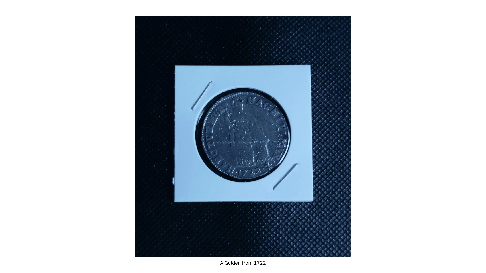

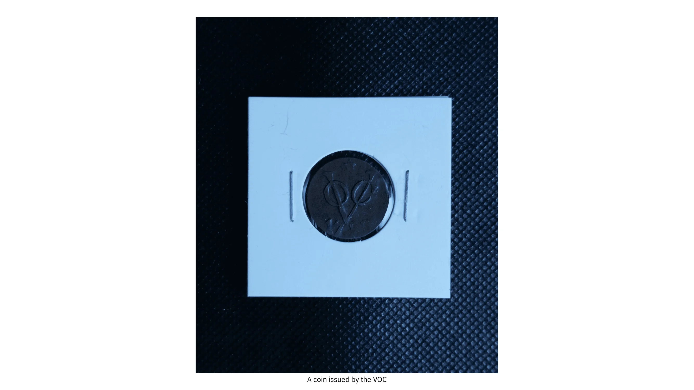

На първата снимка по-горе можете да видите гулден от 1722 г. (красива сребърна монета), а на втората - монета, емитирана от VOC.

VOC е изключително могъща компания за времето си: има собствена армия и дори издава собствена валута.

Холандците изобретяват съвременния капитализъм, който започва да се използва като средство за разпределяне на риска при рискови начинания, като експедиции в Новия свят или търсене на нови търговски пътища. Акционерните дружества позволяват на няколко инвеститори да обединят парите си и да споделят риска. За да се улесни тази размяна, е било необходимо да се създадат институции, които да могат да договарят и разменят тези ценни книжа. Така през 1602 г. са създадени първото акционерно дружество и първата фондова борса.

Холандската валута, **Гулден**, придобива доверие благодарение на сребърната си чистота, а след това и на приемането ѝ от Амстердамската банка (1609 г.), където депозитите стават предпочитана форма на пари в Европа. Това е много важен момент, който трябва да се спомене. Да, разбира се, имало е монети, но това, което наистина е представлявало пари в онези времена, е била форма на книжни пари. Всъщност голяма част от световната търговия е преминавала през книгите на Амстердамската банка. Това е истински пробив в банковото дело: международната търговия вече не се е осъществявала непременно с физически монети, а директно чрез счетоводните документи на банката.

Този период на просперитет се характеризира с голям приток на злато и сребро, особено от други държави, които практикуват инфлация или паричен контрол. Има един интересен герой, който трябва да се спомене: **Томас Грешъм**. По това време той работи за английското кралско семейство в Нидерландия, като управлява паричните потоци между двете страни. Същият този Грешъм ни е оставил известния **"Закон на Грешъм"**.

Въпреки това Нидерландската империя в крайна сметка също се изчерпва. Войните с Англия, разводняването на гулдена по време на конфликти и конкуренцията от страна на други сили (Франция и Англия) са сигнал за края на холандската хегемония. След Четвъртата англо-холандска война (1780-84 г.) упадъкът на гулдена като резервна валута става необратим.

### Френска мощ, амбиции и неуспехи (XVII-XVIII в.)

По времето на Луи XIV **Франция** се превръща в най-голямата континентална сила в Европа. Въпреки това френската валута така и не постига статут на доминиращ еталон: многобройните девалвации, тежкото данъчно облагане и скъпите войни (Аугсбургската лига, Войната за испанското наследство и др.) натежават върху стабилността на паричната система.

Първият голям експеримент с книжни пари е проведен от Джон Лоу (1716-1720 г.). Banque Générale издава банкноти, обезпечени с обещания за държавен дълг. Тази схема довежда до спекулативен балон и срив (Мисисипския балон) през 1720 г. Тази катастрофа оставя във Франция трайно недоверие към книжните пари. Именно този катастрофален опит позволява на Ришар Кантийон да забогатее благодарение на тази система от принципи на констатиране, известна днес като ефекта на Кантийон, при който печатането на пари обогатява тези, които имат достъп до печатарската машина.

Когато това недоверие най-накрая отшумява, се стига до друго фиаско на френските вестници: революционните **assignats**. Емитирани от 1790 г. нататък въз основа на конфискацията на имуществото на духовенството, тези асигнати преживяват галопираща хиперинфлация, която официално ги превръща в първата хиперинфлация в историята, надхвърляща 50% на месец. През 1795 г., въпреки че номиналната им стойност е увеличена многократно, те се търгуват само на няколко процента от първоначалната си стойност.

По-рестриктивни закони се опитват да наложат assignat, но без успех. Правителството се опитва да го наложи, като стига дотам, че заплашва със смърт онези, които не го приемат, и принуждава собствениците на магазини да останат отворени. Но, разбира се, в крайна сметка това не се получило.

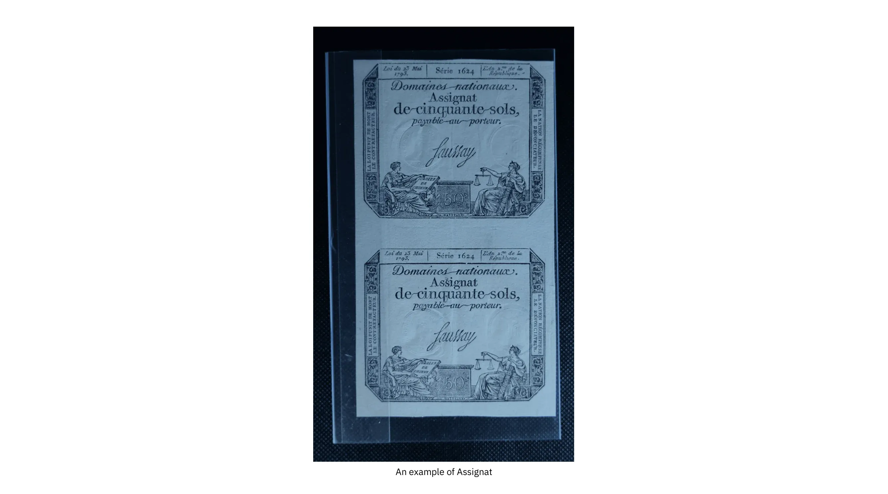

Тъй като тези хартиени пари заместват всички качествени монети от благородни метали, в съответствие с известния закон на Грешъм, се стига до недостиг на монети. За изсичането на нови монети се използва метал от камбани, иззети от духовенството. Тук по-долу можете да видите красиво парче от камбанен метал, изработено от възстановена мед чрез претопяване на монети, отнети от духовенството.

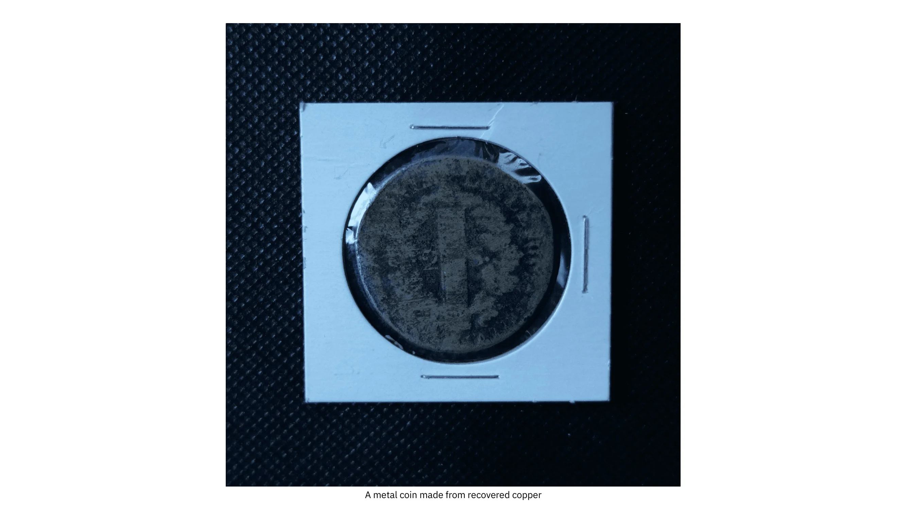

### Британско господство (XVIII - началото на XX в.)

**Англия**, изпреварила Нидерландия, става доминираща сила през XVIII век. Паундът стерлинг е най-старата валута, която все още се използва, като първоначално е обвързана с един паунд сребро. Постепенно статутът ѝ укрепва, подкрепен от финансова и данъчна революция: парламентарна монархия, силен капацитет за събиране на данъци и създаването на Английската банка през 1694 г.

След поредица от войни срещу Франция Обединеното кралство побеждава през 1815 г. (Ватерло), затвърждавайки своето надмощие. През целия XIX в. британският паунд е световна резервна валута. В пика на своето развитие, с едва 2.5% от световното население, Великобритания произвежда 20% от световния доход и контролира почти една четвърт от земната повърхност.

**Индустриалната революция** и приемането на **златен стандарт** (1717 или 1718 г., под ръководството на Исак Нютон в Кралския монетен двор) засилват доверието в паунда. Английската централна банка приема златен стандарт от 4.25 лири за унция злато, което позволява на притежателите на банкноти да ги обменят в злато.

Първата световна война (1914-1918 г.) обаче слага край на тази система. В рамките на няколко седмици всички основни воюващи сили преустановяват конвертируемостта на златото. Британската империя, а по-късно и британският паунд, излизат от Втората световна война в отслабено състояние, като през XX в. отстъпват място на американския долар.

А като артефакт можете да видите някои красиви и интересни парчета по-долу. Това са парични тежести. Първият е суверенът: най-ранните изображения на лирата. Имам само парични тежести, които представят тези монети, защото не мога да си позволя да си купя истински суверен. За да ги претеглим, използвахме везни, а след това поставихме от другата страна паричната тежест, съответстваща на стойността на суверена.

Суверенът е парична монета - златна монета с първоначална стойност един паунд.

Преди прочутия суверен се появява гвинеята, която работи на същия принцип. Гинеята е наречена така заради съдържащите се в нея благородни метали, добити от района на Гвинея.

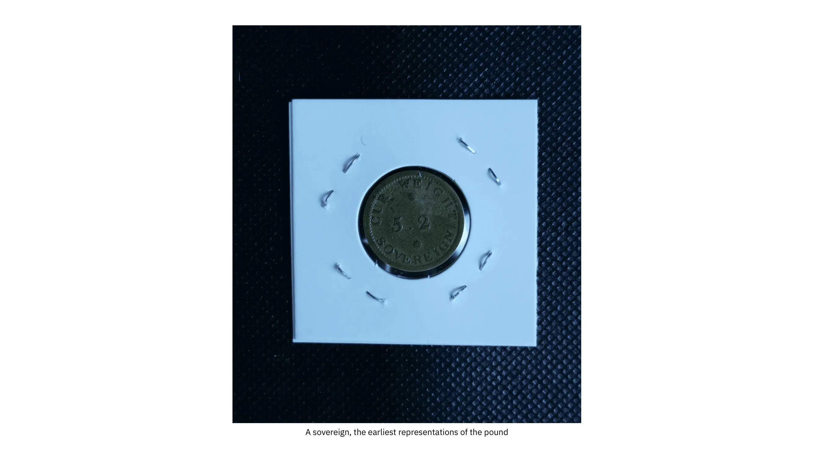

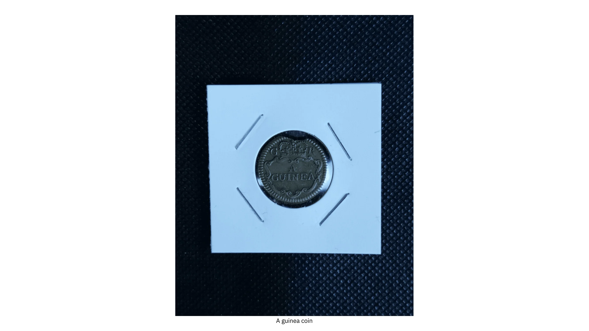

## Появата на централните банки

<chapterId>15777771-1e28-55f7-a400-69868a47079b</chapterId>

:::video id=7661b7b5-e00f-48f3-b69a-6fb2eb5ebba4:::

В продължение на раздела за историята на първите резервни валути и тяхната еволюция предлагаме част от историята на централните банки. Той следва почти същия път като този на появата на резервните валути, но се фокусира малко повече върху тогавашните банкови технологии.

### Началото на банките и протобанките

Още през XIII в. италианците (Флоренция, Генуа, Венеция...) разработват техники за двойно счетоводство. По-късно **Антверпен** (XVI в.) се превръща във водещ финансов център на Северна Европа - роля, която по-късно е поета от **Амстердам** благодарение на Амстердамската фондова борса (1609 г.), където се търгуват акциите на VOC.

В Антверпен се провеждат търговски панаири, на които търговците често се събират, за да уреждат дългове, което води до изобретяването на нови финансови инструменти. Сметката по-долу, датирана през 1761 г. и по-нова, е **промотиран запис**. В нея има ръкописни данни, както и надписи на гърба, което я прави великолепен артефакт от този период.

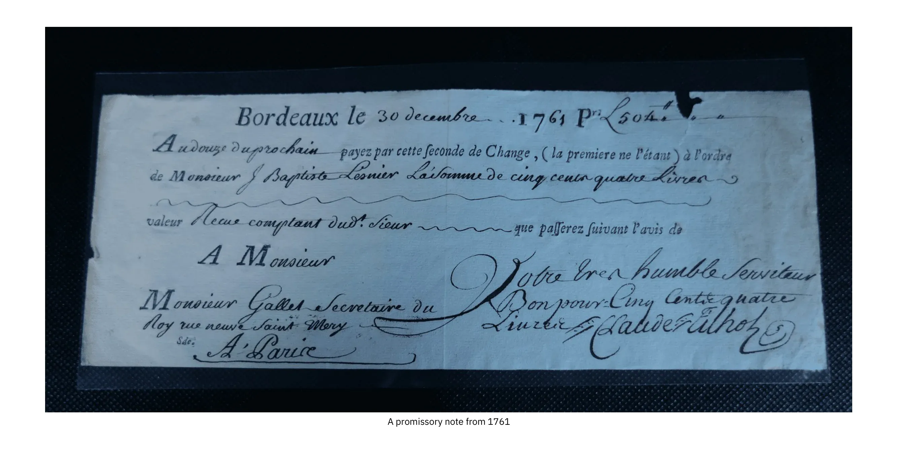

Това раздвижване доведе до създаването на по-сложни банкови институции. **Ломбардските банкери**, а по-късно и холандските търговци усъвършенстват кредитните инструменти (менителници, записи на заповед и др.). Съвременната банкова система се основава на тази идея: парите могат да бъдат кредит, а не само метал.

Както виждате, това ни връща към първоначалния ни въпрос за произхода на парите.

Дали парите произлизат от стока, която се появява от необходимостта от размяна, или се появяват от кредита? Следи от това все още могат да бъдат открити в този раздел.

### Шведският пример: Stockholms Banco и Riksens Ständers Bank

Нека се пренесем в Швеция, където е създадена първата централна банка.

**Швеция** е пионер в централното банкиране: през 1657 г. Йохан Палмструх създава **Стокхолмската банка**, която има право да отпуска повече заеми, отколкото са металните ѝ резерви, като по този начин поставя началото на [банкирането с частични резерви](https://planb.academy/resources/glossary/fractional-reserves). Но прекомерното емитиране на банкноти довежда до паника и масово изтегляне на пари от банката през 1663 г. Добре, добре...

През 1668 г. в Стокхолм е основана първата истинска централна банка в света - Riksens Ständers Bank. Тя обаче също страда от кризи (1709, 1715...), свързани със злоупотребата с банкноти, често за финансиране на войните в кралството.

### Неуспешният преврат на Джон Лоу

Отправяме се към Франция, където отново ще открием любимия ни Джон Лоу.

**Шотландецът Джон Лоу** убеждава регента (херцог Орлеански) да създаде частна банка - Banque Générale (1716 г.), която да има право да издава ценни книжа срещу злато, сребро и държавни дългове. Тя се превръща в Banque Royale (1718 г.) и спомага за рязкото увеличаване на акциите на Мисисипската компания.

Когато реалността настигна спекулациите, **паниката се засили от решението да се забрани притежаването на злато и да се наложи използването на банкноти на Лоу**. Добре, добре...

В крайна сметка балонът се спуква през 1720 г. и предизвиква срив, който разрушава доверието в книжните пари във Франция за дълго време напред.

### Bank of Amsterdam - възходът на един новаторски модел

Сега се пренасяме в Амстердам през 1609 г., където **Амстердамската банка** (Wisselbank) поема контрола върху съхранението и конвертирането на монетите в Амстердам. Тя забранява разпространението на частни банкноти и налага депозирането на метални монети в своите трезори. Малко по малко те изземат контрола върху валутата. Забраняват на обменителите на пари да държат монети при себе си. Печатарите работеха по цял ден и в края на деня трябваше да депозират монетите си в трезорите на Амстердамската банка. Както вече споменах, невинаги металните монети са били използвани в международната търговия. Това бяха книжни пари, записани в счетоводните книги на банката.

Благодарение на силата на холандските търговци банката играе ролята на първата фактическа "централна банка", която стабилизира световната търговия. С течение на времето обаче тя отпуска необезпечени заеми на VOC и в крайна сметка няма достатъчно метал за обезпечаване на сметките си. През 1790 г. се оказва, че е отпуснала големи суми на VOC, и на практика обявява фалит, което разрушава доверието в гулдена. Добре, добре...

### Английската централна банка, основополагащ акт на съвременното банкиране

В Англия през XVII век златото и среброто се съхраняват от златари, които издават разписки. Тази частично децентрализирана организация се оказва с ограничени възможности, когато короната се нуждае от огромно финансиране за войната срещу Франция.

През 1694 г. е основана **Банката на Англия (BoE)**. По този начин Банката на Англия се ражда от брака по сметка между лондонската бизнес общност и правителството, което отчаяно се нуждае от средства за войната.

Банката получава монопол върху емитирането на банкноти в Англия (засилен през 1708 г., 1742 г. и др.). От този момент нататък хартиените пари, обезпечени със златни резерви, циркулират заедно с монетите. Това е важен момент за разбирането на постепенното завладяване на парите от държавните институции. Първо, Банката на Амстердам попречила на разменниците на пари да държат монети и ги принудила да ги върнат на банката. В Англия на частните банки беше забранено да издават собствени банкноти, които могат да бъдат изкупени в злато.

Те разрешават на частните банки да емитират банкноти, но те могат да бъдат обменяни само срещу банкноти на Английската централна банка.

Банкнотите на Английската централна банка, в лири стерлинги, се изкупуваха в злато. Това добави трето ниво към валутата. Така че в основата има злато, след това банкноти на Английската централна банка, а отгоре - банкноти на частни банки. Преди това частните банки можеха да емитират свои собствени банкноти, които да се изкупуват в злато. Това е още един етап от постепенното овладяване на валутата от държавните институции.

Банката финансира държавата с огромни заеми и структурира огромния държавен дълг, с който се финансира икономическият бум.

Този модел се утвърждава през XVIII и XIX в., докато паундът се превръща в световна резервна валута под печата на Английската централна банка и златния стандарт.

**Световните резервни валути** са следвали една след друга през вековете, водени от икономическата, търговската и военната мощ на дадена държава или империя: Португалия, Испания, Холандия, след това Великобритания, преди САЩ да започнат да доминират през XX век. Във всеки от случаите се наблюдава подобен цикъл: икономическа експанзия, търговски успех, международно приемане на валутата, задлъжняване, скъпоструващи войни, злоупотреба със създаването на пари или кредити и накрая упадък.

**Възникването на централните банки** е постепенен процес. Тези институции често възниквали в контекста на скъпоструващи войни, което позволявало на държавата да се финансира чрез дълг. Когато е възприет златният стандарт (Англия, XVII-XIX в.), той осигурява привидна стабилност, докато големите световни войни през XX в. не довеждат до постепенното изоставяне на конвертируемостта на златото. По този начин властта да секат пари преминава от кралския монопол към по-сложни структури, първо частни (златари, банкери), а след това полупублични (централни банки), отразявайки еволюцията на паричния суверенитет към институционализирани, глобализирани форми.

Това е, което описах по-рано. Често сме прехвърляли тежестта на държавния дълг директно върху централните банки или върху разрешението за създаване на пари от страна на правни институции като парламента.

И най-важният факт тук е, че **от дълг, който можеше да изчезне чрез фалита на държавния глава, се превърнахме в дълг, който лежи основно върху плещите на населението**.

## Пътят към фиатната система

<chapterId>27a98545-d350-56ee-a200-92468e6b9b33</chapterId>

:::video id=e27a753e-aeee-4307-a65c-9506aab380a1:::

Достигнахме края на този курс по история на парите и за да го завършим, искам да предложа две теми. Първата тема е за различните етапи, довели до сегашната ни система на фиатни пари. Ще се върнем към фактите от раздел 5 за създаването на централните банки и ще добавим концепцията за щатския долар, който в крайна сметка е настоящата резервна валута. Ще разгледаме как се е развила тя, как е възникнал доларът, как се е развил, как се е променил, през какви етапи е преминал, за да се превърне във фиатна система, защото произходът на долара е сребърна монета.

Веднага след това ще ви дам кратък материал за историята на финансите, за да ви помогна да разберете как сме стигнали до социалната държава. Така че ще разгледаме две теми: как стигнахме до системата на фиат и веднага след това как развитието на финансите ни доведе до концепцията за социалната държава.

### Европейските основи на съвременното банкиране

Нека се върнем към 13-и век с флорина. За да разберем как сме стигнали до модела на фиат, трябва да започнем от XIII век. Наред с флорина, по същото време с Медичите се появява и една технология - концепцията за менителниците.

След това се появява Антверпенската фондова борса с нейната концепция за дисконтиране и записи на заповед.

След това, както видяхме, се появи VOC - първата фондова борса в Амстердам. Тя бележи раждането на капитализма с акциите на дружествата и обмена на акции. След това банката в Амстердам наложи с декрет използването на депозити. Това означаваше, че монетите трябваше да се депозират в края на деня. Печатарите вече не можели да съхраняват ресто под формата на монети.

В края на XVII в. се създава Английската централна банка поради необходимостта да се създаде дълг за финансиране на войната. По това време частните банки се превръщат в третия паричен слой. Между другото, целият този раздел, от флорина до идеята за създаване на централна банка, е изключително добре обобщен в известната книга на Ник Бхатия "Слоести пари", която имах щастието да преведа с няколко колеги. Свършихме чудесна работа по превода й, така че френскоговорящите навсякъде да могат да се възползват от тези учения.

И така, намираме се в края на XVII век. Английската банка е създадена, за да финансира войната.

Частните банки поеха третия слой на валутата. Всъщност банкнотите на частните банки вече не можеха да се изкупуват в злато: в злато се изкупуваха банкнотите на Английската централна банка. Това показва изземването на разменната власт от институцията, която е Банката на Англия.

Тогава настъпва паниката от 1776 г. Всички се втурнаха нагоре по паричната пирамида. Това означава, че през 1776 г. има масово изтегляне на пари от банките и така всички хора, които имат книжа от третия слой, т.е. частни банкови сметки, се опитват да се сдобият с банкноти на Английската банка, а след това се опитват да се сдобият със злато, но очевидно в трезорите не е имало достатъчно злато. Те обявяват своеобразна банкова ваканция, за да избегнат изплащането на златните бонове, и това дава началото на концепцията за кредитора от последна инстанция.

### Еволюция на щатския долар

Преминахме от флорина към създаването на Английската централна банка. Разбира се, междувременно имаше Първа и Втора световна война, но по-рано, през 1796 г., събитията се развиваха и от другата страна на Атлантическия океан. През 1776 г. Америка все още е британска колония и колониите използват тази хартиена валута. По-долу е показана банкнота от два шилинга на Кънектикът от 1776 г.

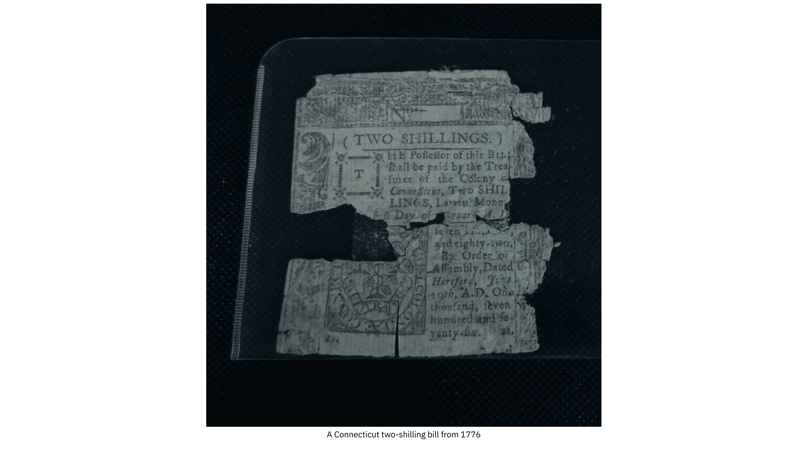

Преди да обявят война на Англия и в крайна сметка да емитират своя собствена валута, колониите използват тази хартиена валута заедно с испанския долар за парични транзакции. Всъщност терминът "долар" остава да обозначава американския долар.

Ако не се лъжа, през 1792 г. те приемат закон, който им позволява да секат пари. Като пример, този по-долу е американски долар от съвременната епоха.

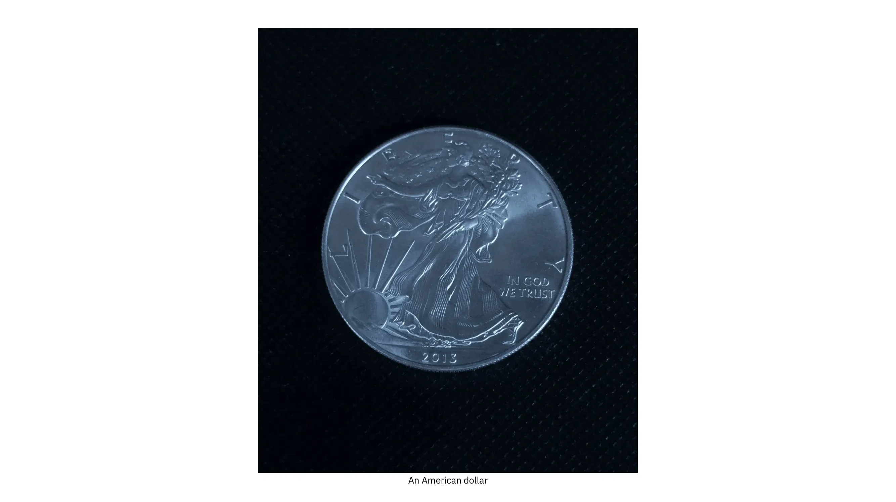

Очевидно е, че номиналната стойност на монетата не е само един долар; тя струва около 30 или 40 долара, тъй като представлява унция сребро. Стойността му се колебае в зависимост от цената на среброто, като обикновено тя е поне 30 или 40 щатски долара. Днес, разбира се, хартиеният долар запазва само номиналната си стойност от един долар, но по онова време американският долар се основава на тази стойност на среброто.

Нека сега поговорим за Гражданската война в Америка. Конфедератите печатат пари, които са свръхнадути. Това явление не е включено в официалния списък на Ханке-Крус, тъй като не е достигнало ниво на хиперинфлация от 50%. Въпреки това в него се наблюдава месечна инфлация от 40%, което показва, че по време на войната е отпечатано значително количество пари.

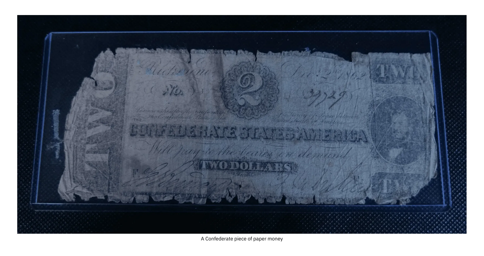

Техните опоненти от север също имаха долари. Точно горе можете да видите долари на Конфедерацията, а долу - долари на Севера. Наричали са ги "зелените банкноти", защото гърбът им е бил зелен.

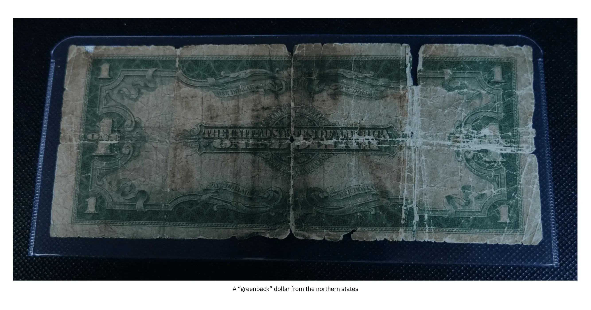

Приканвам ви да сравните разликата в размера със съвременните банкноти. Тогава банкнотите бяха по-големи.

Както е известно, Северът побеждава, така че зелените пари стават валута на обединените американски щати. След това през 1913 г. е създаден Федералния резерв и започва Първата световна война.

След Първата световна война последната серия отпечатани банкноти винаги включва думите "при поискване да се обменят в злато". Така през 1928 г. с 20 долара се купува почти една унция злато, тъй като цената на златото е 20.67 долара. С банкнотата от изображението по-долу през 1928 г. може да се купи една унция злато.

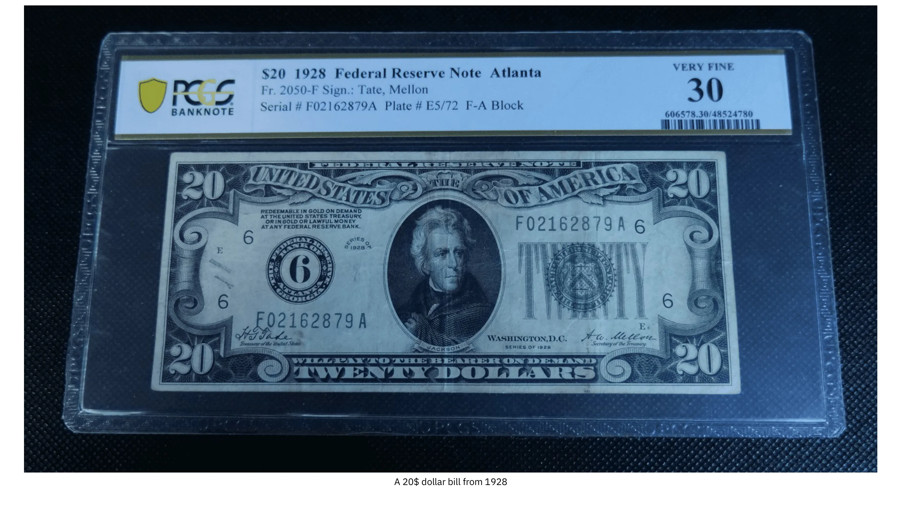

Днес една унция злато струва 3 000 щатски долара. Така че, разбира се, можете да видите силата на девалвацията тук. Това беше последната банкнота, която съдържаше думите "заменяема в злато". Ще видим, че веднага след Заповед 6102 те ще конфискуват цялото злато. Всъщност те щяха да конфискуват както златото, така и златните сертификати.

Тук по-долу можете да видите златен сертификат от 1928 г.

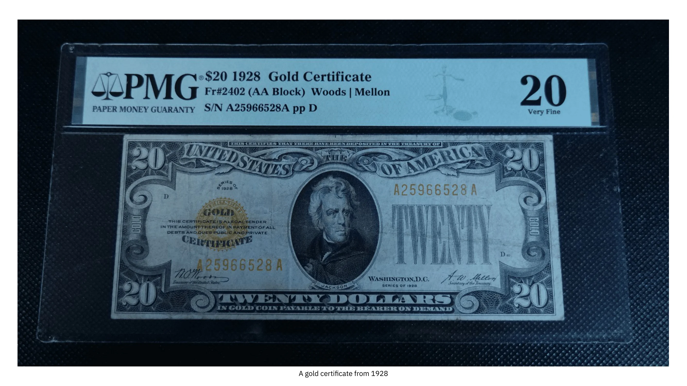

Той не само е "разменяем в злато", както банкнотата от 1928 г., но и в златни монети: той наистина е "златен сертификат". Всички те са били конфискувани след Изпълнителна заповед 6102. До 1964 г. дори е било незаконно да ги притежавате.

Много съм щастлив, че имам такъв.

От 1964 г. притежаването на злато става незаконно до 1974 г., ако не се лъжа. През 70-те години разрешиха на хората да натрупват злато след шока на Никсън, който ще опишем след малко. През 1933 г., когато издават "Изпълнителна заповед 6102", те конфискуват златото и притежаването му става незаконно. Получавахте голяма присъда затвор, ако ви хванеха, че държите златото си. В онези дни всяка унция злато се обменяше за банкнота, подобна на тази по-долу, след 1934 г.

Както казахме, през 1928 г. върху долара все още е имало текст "разменяем в злато".

След издаването на Заповед 6102 те конфискуват цялото злато и разменят 20,67 долара за всяка унция злато. След това измамата излиза наяве: през 1934 г. те издават нови банкноти с отпечатан текст "тази банкнота е законно платежно средство за всички дългове".

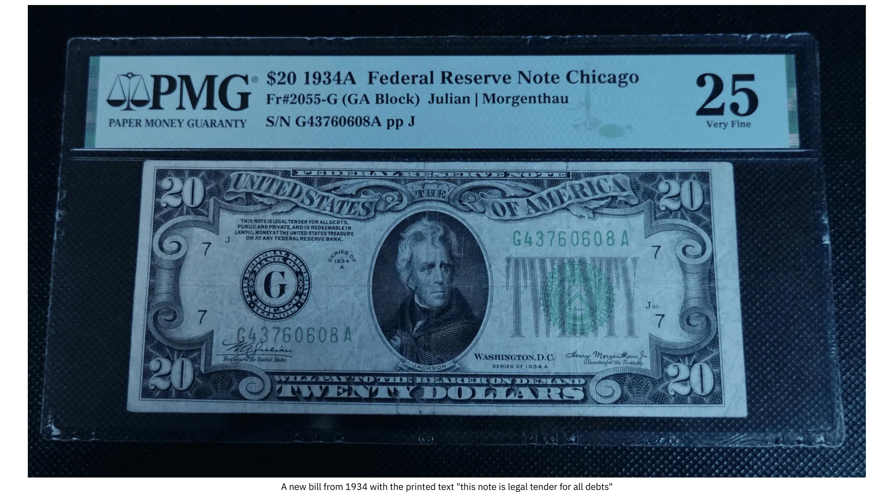

Тук се появява понятието за законно платежно средство, което замества израза "платимо в злато". Двете банкноти може да изглеждат идентични, като се променят само няколко думи, но измамата се крие във факта, че през този период доларът е обезценен; стойността на унция злато намалява от 20.67 долара на 35 долара за унция през 1934 г. Това представлява девалвация от приблизително 40%!

След това идва Втората световна война. След войната споразумението от Бретън Уудс централизира голяма част от световното злато в САЩ. Американците емитират банкноти в замяна, които обаче вече не могат да се разменят за злато от широката общественост. Вместо това те продължават да се разменят за злато на държавно ниво.

В крайна сметка страни като Франция и Германия започват да подозират, че в американските трезори вероятно има повече доларови банкноти в обращение, отколкото злато.

Затова те поискаха да репатрират златото си. А те казаха: "Добре, ще го направим, но ще отнеме малко време." През 1971 г. нашият приятел Ричард Никсън прекъсна веднъж завинаги връзката между банкнотите и златото, като обвини за това спекулантите.

Златото беше подценено на 35 долара за тройунция - цена, която не отговаряше на обема на напечатаните пари и на истинската му пазарна стойност. Само за няколко години цената се покачва от 34 долара на 800 долара. Подобно на исторически примери, като например в Рим, където връзката между денария и солида е прекъсната, златото е оставено да плава. Този факт доведе до процес на откриване на цените, в резултат на което впоследствие златото беше оценено много по-високо в доларово изражение.

### Съвременната система на фиатни валути и нейните последици

Тази част обобщава как преминахме от парична система, основана на сребро или злато. Малко по малко институциите придобиваха все по-голяма власт над парите. В крайна сметка едно едностранно решение напълно прекъсна връзката между благородните метали и парите в резултат на свръхемисия.

В резултат на това вече няма връзка между златото и банкнотите или книжните пари. И дори не става дума за система с частичен резерв - това е остаряла концепция. Вместо това частните банки емитират и създават пари чрез банков кредит. Парите се създават главно по този начин и са свързани с основния лихвен процент, определен от централната банка.

Наистина няма ограничения. Вече няма задължителни нива на резерва, поне в Америка и Канада. Единственият резерв е необходимостта банките да се организират така, че да могат да реагират на междубанковия обмен, за да не изчерпят ликвидността си.

Те просто трябва да се уверят, че могат да направят тези трансфери, но няма задължителен резерв от 3%, 1% или 10%. Наистина сме се отдалечили от концепцията за частичния резерв. Сега това са централните банки, правителствата чрез фискалните дефицити, централните банки чрез количествените улеснения (QE) и частните банки чрез създаването на банкови заеми, които могат да увеличат общото парично предлагане и според мен да предизвикат инфлация.

За да разберете връзката между парите и инфлацията, препоръчвам курса, който имам в Plan ₿ Academy, посветен на тази тема. В него ще научите каква е разликата между повишаването на цените, което наблюдаваме в живота, и инфлацията. Те не са едно и също нещо. Всъщност, когато говорим за инфлация, често става дума за увеличение на цените, а не за самата инфлация. Инфлацията е доста точно понятие, което се обяснява с увеличаването на паричното предлагане.

https://planb.academy/courses/caa75343-ac90-4249-bcca-0e2e57c3a0f1

В заключение на този раздел за света на фиатните пари бих искал да ви посоча един източник, който ще ви помогне да разберете по-добре явленията, които току-що обясних, като например инфлацията.

Благодарим ви за вниманието.

## История на паричните балони

<chapterId>b6451c46-917d-11f0-97de-6bc5081765fa</chapterId>

:::video id=5967d9a6-aae4-4b84-a283-71b1b735bca4:::

### Изобретяването на книжните пари и първият голям балон

Със създаването на централните банки през XVIII в. се ражда истинска революция: магически пари под формата на банкноти. Най-яркият пример във Франция е този на Джон Лоу. Този шотландец, живеещ в изгнание в Париж, предлага на регента, херцог д'Орлеан, решение на проблема с фалита на кралските финанси чрез създаването на държавна банка и колониална търговска компания: известните **Banque Royale** и **Compagnie du Mississippi**.

С тази система Лоу свързва книжните пари с акциите на компанията си. Колкото повече банкноти циркулирали, толкова по-висока била стойността на акциите и толкова по-стабилна изглеждала банката... докато спекулациите не надхвърлили реалността. Балонът се спуква внезапно през 1720 г., съсипвайки аристокрацията, буржоазията и голяма част от Европа, която е дошла да спекулира на улица Quincampoix. Резултатът е трайно недоверие към книжните пари във Франция и първият урок на Европа за спекулативните балони.

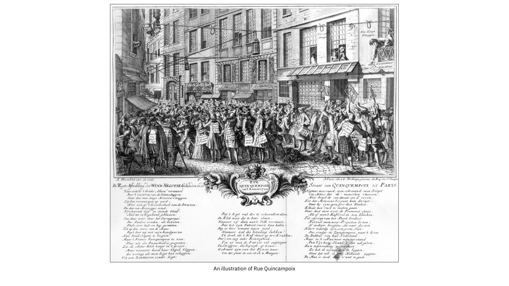

### Кога земята се превръща в "обезпечение"

Век по-късно Френската революция въвежда нов подход с **assignat** - парична единица, обезпечена с конфискувано църковно имущество. Привлекателна идея на хартия - превръщането на земята в парично обезпечение - но неефективна: земята не е нито ликвидна, нито делима. Резултатът е хиперинфлация, множество забрани за използване на земята, неконтролируема инфлация и недостиг.

Наполеон, дълбоко засегнат от този хаос, възстановява златото и среброто като парична основа през 1800 г. със създаването на Френската банка, като по този начин гарантира редовното заплащане на армиите си. Прагматичен начин за възвръщане на доверието: плащане в твърда валута.

### Разцъфтяващите двадесет години и Голямата депресия от 1929 г

Да прескочим два века. След Първата световна война правителствата финансират усилията чрез инфлация и спиране на златото. През 20-те години на ХХ в. американският Федерален резерв провежда прекалено гъвкава парична политика, за да подкрепи британската лира. Резултатът: лесно кредитиране, необуздани спекулации на Уолстрийт, покупки на акции на кредит и появата на балон на пазара на недвижими имоти и банковия сектор.

Когато машината се обърка, крахът от 1929 г. беше неизбежен: масови банкови фалити, рекордна безработица и опашки в кухните за бедни. Това породи устойчивото погрешно схващане, че **всяка дефлация е лоша**, докато трябва да се прави разлика между дефлация чрез растеж (здравословна) и дефлация чрез дълг (опустошителна).

### Азия през 90-те години и ефектът на доминото

През 90-те години на миналия век светът мечтаеше за "азиатското чудо". Валутата беше фиксирана към долара, растежът беше 8-10%, а западният капитал нахлуваше. Всичко беше наред... докато приливът не се отдръпна. Заваляха фалити, валутите се обезцениха с 80%, а инвеститорите бяха разорени. Наложи се МВФ да се намеси и да наложи болезнени реформи. Същият сценарий, както винаги: изобилие от капитал, балони, захранвани с кредити, и след това колапс.

### 2008 г. и ерата на постоянния балон

Интернет балонът (2000 г.) е последван от балон на високорисковите ипотечни кредити за недвижими имоти. Секюритизацията превърна банковите заеми във финансови продукти от типа "тройно А", разпространени по целия свят. Обещанието: елиминиране на риска чрез разводняването му. Реалността: всички рискове всъщност бяха корелирани. Когато недвижимите имоти се сринаха, се срина и цялата световна банкова система.

Резултатът е масирано публично спасяване, количествено облекчаване и нулеви лихвени проценти. А заедно с това и главоломно бързане: всяка криза вече няма да изчиства ексцесиите, а ще бъде покривана от все повече дълг и печатане на пари. Именно това доведе до сегашната ситуация: **"балонът на всичко"**, при който всичко - акции, недвижими имоти, изкуство, криптовалути, дори картички с покемони - се надува изкуствено.

### Вечното завръщане на вълшебните пари

От век на век се наблюдава една константа: щом едно общество повярва, че може да създава богатство с пари, вместо да произвежда реални стоки, се появяват балони. От Джон Лоу до 2008 г., от улица Куинкампоа до Уолстрийт, процесът се повтаря: еуфория, кредити, бум и крах.

И в крайна сметка, когато никой вече не вярва на хартията, хората търсят нещо друго - злато, земя, сигурни убежища... или нови валути. Вчера Наполеон наложи метала, днес някои виждат в него наследник на Bitcoin.

Историята на финансите е един безкраен цикъл: печатане, спекулации, срив. До следващия балон.

## Пари и насилие

<chapterId>9486fe64-854f-5e17-86b3-8873baca39a8</chapterId>

:::video id=bd6d0807-2d8f-4637-a0f5-1e990e5c0d0f:::

В този кратък раздел ще се върнем към много от събитията, които вече сме виждали по време на курса, и ще обобщим няколко анекдота, които намирам за интересни.

### Технологии и насилие

Ето няколко анекдота, за които вероятно вече сме говорили в курса. Те служат за въведение в една много увлекателна дискусия, която проведох с Тео за лекцията му в B-Ondy, която ми се стори много интересна по отношение на това как технологичният напредък влияе върху отношенията на насилие между населението и държавата.

### Пари и държавна принуда

В началото на този раздел ще ви дам кратък и неизчерпателен списък, за да ви напомня за събитията, които вероятно вече сме разглеждали в курса.

Една от връзките, които вече мога да направя с парите и насилието, е, че когато става дума за безценни хартиени пари, които могат да се печатат до безкрайност, те често са придружени от всякакви правила и заплахи. Вече можем да говорим за цесиите, при които буквално на банкнотите е било написано, че фалшификаторите са заплашвани със смърт. В правните текстове от онова време е лесно да се открият смъртни заплахи за онези, които не са приемали тези прочути хартиени пари.

За да остана във Франция, в един от правните текстове, които успях да получа от епохата на Революцията, видях, че "дневните" за транспортиране и работа с гилотината са описани в разделите, свързани с валутата. Това ми се стори доста странно.

Говорихме и за монетосеченето в Китай, където държавата контролира сеченето на монети. В един от разделите в началото на курса видяхме, че когато монетите, някои от които не са толкова красиви, са били изхвърляни, е имало правни последици.

Има и анекдот за крал в Англия, който в крайна сметка отрязвал ръцете на тези, които секат пари, ако не се държат според неговите очаквания.

Също така, в Китай съм чел за изземване на мед от будистки манастири. В момент, в който медта е набирала стойност и е дестабилизирала икономиката им - която се е основавала на форма на фиатни пари, които са имали малко общо със стойността на метала - те са прибягнали до намиране на място, където има богатство, и са иззели медта от манастирите.

Същото се отнася и за манастирите в Англия по време на Английската реформация. Когато прочутият крал се скарал с папата за развода си, зад всичко това се криела друга причина: той се възползвал от премахването на манастирите, за да заграби богатствата, които се съдържали в тези църковни организации.

По време на Френската революция те конфискуват цялото имущество на Църквата. Те виждат красиви монети, създадени от претопени църковни камбани.

Ако се върнем още по-назад, една от най-ясно изразените концепции за икономическо насилие и свобода, за либерцидни закони, е **Диоклециан с неговата наследствена каста, която е пряко свързана с факта, че селяните вече не искат да приемат обезценената валута**. Те искали да напуснат работата си като селяни, а Диоклециан реагирал просто като им казал: "Не можете да напуснете земята си, както и децата ви". Същото се отнасяло и за войниците.

Мисля, че това е доста явна форма на насилие. Бих могъл да завърша с разказ за тамплиерите или за някой френски крал. Когато тамплиерите се заселват във Франция, си представям, че той вижда манната на тамплиерското богатство и има проблеми с финансирането на държавата. Той е съдил Ордена на тамплиерите и някои от тях са успели да си тръгнат с част от съкровището, което е дало началото на едно много интересно шоу в САЩ или Канада. Не знам кой го е продуцирал, но се нарича *Тайната на остров Оук*. Става дума за хора, които смятат, че на един остров в Канада, в Маритимските острови, е заровено тамплиерско съкровище, и от години - може би дори повече от десетилетие - правят сондажи, за да направят някакъв кладенец. Намерили са кладенец с много галерии и търсят съкровище, заровено от тамплиерите на този остров, който е обект на това телевизионно предаване. Поздравявам баща си, който е голям фен на това предаване.

Ето го и краткия списък на фактите, които видяхме по време на този курс и които според мен повишават връзката с насилието. Ще ви оставя със следващата част от Тео, който ще ни разкаже една много интересна история за технологичните промени и баланса на силите между плебса и властта.

Благодаря ви!

## Икономическите последици от организираното насилие

<chapterId>66bd4674-2159-5489-ad4b-ec5e3fb691af</chapterId>

:::video id=c8b063c6-aeb4-4a94-9027-b11d369e71a4:::

### Организираното насилие и еволюцията на държавата

Историкът Фредерик К. Лейн предлага революционна теза: анатомията на държавата в историята се формира от технологиите, използвани за проектиране на насилие. Изхождайки от веберианския принцип, че държавата притежава монопол върху легитимното насилие, Лейн отбелязва, че този монопол - парадоксално по-ефективен от конкуренцията в тази област - се развива в зависимост от съотношението между разходите за нападение и разходите за защита.

Този анализ, възприет от авторите на "Суверенният индивид" (1997 г.), обяснява историческите промени в политическата организация: от средновековната феодална система до градовете-държави на Ренесанса, след това до индустриалните национални държави и накрая до модерните социални държави. Всеки преход съответства на голям технологичен пробив в упражняването на насилие, който се случва приблизително на всеки 400-500 години.

### Средновековен баланс

През Средновековието аграрната икономика е преобладаваща в над 90%. Селянинът, буквално вкоренен в земята си, не можел да избяга от господаря и неговите рицари. Военните технологии - ръчно изковани доспехи, дългогодишно обучение с меч - са били изключително скъпи. Тази асиметрия масово предпочитала нападението пред защитата.

Неподвижният земеделски производител става пленник на местния монополист на насилието. Способността му за извличане на данъци достига нови висоти - макар че, парадоксално, средновековните данъци остават скромни в сравнение със 78% от задължителните налози в съвременността. Владетелят може да облага с данъци на воля, защото селянинът не може нито да се съпротивлява, нито да напусне.

### Търговският ренесанс

Появата на ханзейската търговия на север и на средиземноморската търговия на юг променя ситуацията. Търговците, които са основните създатели на добавена стойност, притежават мобилен капитал - своите кораби. Те се нуждаели само от леки морски милиции, тъй като моретата били трудни за охрана. Преди всичко те можеха лесно да мигрират към съседно пристанище, ако данъчното облагане стане прекомерно.

Тази мобилност създава данъчна конкуренция между градовете-държави. Венеция, Генуа и Брюж трябваше да предложат възможно най-либералната рамка: надеждни договори, качествена валута, застраховки, минимално данъчно облагане. Принцовете трябваше да съблазняват, а не да принуждават. Симетрията се обръща: защитата (чрез бягство) става по-лесна от нападението.

### Индустриалната епоха

Индустриалната революция води със себе си конфигурация, подобна на феодализма. Фабриките, железопътните линии и конвейерите представляват огромни, неподвижни инвестиции. Хенри Форд не е могъл да премести заводите си в условията на данъчно облагане. Работниците, концентрирани в индустриалните градове, се обединиха в синдикати, за да преговарят колективно, вместо да мигрират индивидуално.

Появява се "държавата на благоденствието": индустриално планиране (Япония, Корея), военна защита на инфраструктурите, минимални социални помощи за работната сила. Втората световна война илюстрира тази уязвимост: бомбардирането на вражеските фабрики се превърна в доминираща стратегия. Концентрацията на физическия капитал даде възможност за масово извличане на данъци за финансиране на социалната държава.

### Революцията на микропроцесорите

Три технологични нововъведения сега нарушават тези вековни баланси. Микропроцесорът трансформира военните действия: оператор в Невада управлява безпилотен самолет в Афганистан с хирургическа точност. Войната в Персийския залив (1991 г.) демонстрира този пробив: четвъртата по големина армия в света (Ирак) беше унищожена за 45 дни, а жертвите от страна на коалицията бяха по-малко от 200. Технологичното превъзходство направи фронталната атака невъзможна.

Интернет и асиметричната криптография правят революция в създаването на стойност. Разработчикът може да работи отвсякъде с MacBook и Starlink, като изнася продукцията си незабавно и безплатно. Дигиталните номади се измъкват от географски плен, като противопоставят държавите една на друга по начин, невиждан от Ренесанса насам.

Bitcoin представлява кулминацията на тази логика: валута, освободена от държавата и защитена от неприкосновен криптографски щит. Богатството става защитимо срещу всякаква физическа сила. Индивидът възвръща способността си да се защитава срещу държавния монопол.

### Крахът на вестфалския модел

Западните държави на благоденствието, създадени за индустриалната епоха, са остарели. Създателите на ценности - строителни предприемачи, артисти, финансисти - мигрират към Сингапур, Дубай или Салвадор, като предпочитат по-малко обществени услуги в замяна на минимално данъчно облагане. Съвременните гиганти като Apple и Tether не се нуждаят нито от офиси, нито от физическа инфраструктура.

Това изтичане на мозъци създава спирала: по-малко нетни вносители, влошаване на обществените услуги, увеличаване на данъчното облагане на тези, които остават, и ускорено напускане на страната. Държавите трябва радикално да намалят размера си или да фалират. Фрагментацията на малки, конкурентни юрисдикции - нов модел на цифрови градове-държави - изглежда неизбежна.

Историята ни учи, че тези промени отнемат поколения. Но разделянето на валутата от държавата, предвидено в Bitcoin, може да ускори този процес. Сега хората гласуват с краката си и с криптографските си портфейли, преначертавайки картата на глобалната власт по линии, които едва сега започваме да възприемаме.

## Много кратка история на финансите

<chapterId>1d37fff1-a091-5034-8e71-4af590b8ffce</chapterId>

:::video id=fdfabbc6-e4d8-463a-8522-19176f8fb460:::

След този разказ за историята на парите, който ни отвежда чак до фиатната система, бих искал бързо и кратко да обясня еволюцията на финансите, която в крайна сметка доведе до социалната държава. Първоначално, по римско време, имахме монети.

Монетите са финансова технология, която позволява на империята да плаща на войниците, да се разширява и да търгува. Тя работела много добре, само че в крайна сметка имало твърде много девалвации. В един момент, когато спрели да се разширяват и престанали да получават плячка от войните и разширяването на териториите си, системата им се сринала.

### Еволюция на финансовите технологии

След това настъпва Средновековието, когато има много малка еволюция, докато не се появява флоринът, който връща стабилната валута, и развитието на банковото дело в Италия и Антверпен, където се развива концепцията за "стойността на парите във времето" - с други думи, дисконтирането. Те развиват дисконтирането, за да създадат форма на книжни пари, при която се издава "промисъл", т.е. обещание, че на по-късна дата човек ще може да си върне 100 долара плюс лихвен процент.

Тази система създаде финансова технология, която позволява на притежателя да продаде облигацията преди края на срока, така че ако я продаде след 4 месеца от 6-месечен срок, лицето всъщност ще плати премия, за да компенсира загубата на доходност за оставащите 2 месеца.

Това е финансова технология, разработена по това време в Антверпен и Амстердам. По-късно станахме свидетели на развитието на централните банки и на понятието "кредитор от последна инстанция". Може да се твърди, че по време на Амстердамската банка , използването на монети в международната търговия е изоставено в полза на книжни пари.

По-късно, през XVIII век, по отношение на финансовите технологии можем да говорим за застраховането. В книгата на Нийл Фъргюсън "Възходът на парите" има един анекдот, който е много добре разказан. Първата застрахователна компания, която се ражда, се нарича **Scottish Widow** и по същество това е духовенството, което иска да разработи застраховка за свещеници, които понякога умират по-рано, умират внезапно. По онова време духовниците се грижели за своите съпруги и потомци в Шотландия в продължение на една година. И така, духовенството намира този едногодишен период за може би твърде кратък. В резултат на това **те измислили актюерски изчисления**, за да изчислят буквално броя на вносителите, необходими на системата, за да покрие разходите си, в зависимост от броя на свещениците, които умирали преждевременно.

Те разработиха актюерски изчисления, за да кажат: "Добре, всеки свещеник ни дава тази сума. Тогава, ако свещеникът умре, застраховката ще покрие разходите, за да осигури оцеляването на съпругата и децата му, докато те станат самостоятелни." Така че именно първата застрахователна компания, наречена "Scottish Widow", популяризира тази система и където тя е разгърната.

### От частно застраховане към социална държава

Така че застраховането е част от историята на финансовите технологии. И това ме води до концепцията за социалната държава, която се състои в това, че частното застраховане в крайна сметка се сблъсква с проблем, с понятието за оптимизация, при което си казваме, че ако предложим здравна застраховка на хора, които са здрави, те може да имат по-малък интерес да плащат премията, защото си казват: "Аз съм здрав, няма да се разболея". От друга страна, хората, които знаят, че са болни, със сигурност ще искат да се абонират.

Тази система създава дисбаланс между броя на болните хора, които ще сключват здравни застраховки, и здравите хора, които могат да сключват по-малко застраховки. Така че съществува своеобразен дисбаланс: ако изчислите цифрите, те няма да се балансират, защото вероятно няма да можете да застраховате достатъчно здрави хора, за да компенсирате разходите. В икономиката това е концепцията за **морален риск**.

Една от предложените идеи е да се въведе задължителна застраховка. Ако всеки е длъжен да внася вноски, това ще възстанови баланса и както здравите, така и нездравите хора ще внасят вноски, като разпределят рисковете върху най-голямата част от населението.

И така, в много части на света държавата казва: "Ние ще се погрижим за това". Макар да не съм експерт по този въпрос, виждам, че същата аргументация вероятно се прилага и за всякакви други форми на осигуряване, като например осигуряването за безработица. Съществува желание за опростяване и оптимизиране, основано на идеята, че ще бъде по-просто, ако има само една организация, която да се грижи за това.

Според мен това доведе до централизиране на всички тези застрахователни концепции и в крайна сметка до раждането на социалната държава, където всички тези финансови концепции, които първоначално са били частни предприятия, частни инициативи за задоволяване на нуждата на застрахователния пазар от разпределяне на риска сред населението, бяха завладяни от държавата по причини, които вероятно са доста логични във връзка с моралния риск и желанието за оптимизация.

### Алтернативни модели и размисли за държавните монополи

В крайна сметка в някои страни като Канада няколко вида застраховки - здравно осигуряване, осигуряване за безработица - са държавни монополи.

Мога да ви дам пример, който познавам. В Швейцария системата е малко по-различна. Има частни взаимозастрахователни дружества и частни болници, така че можете да изберете своето взаимозастрахователно дружество, можете да изберете пакета си в рамките на своето взаимозастрахователно дружество. Все пак получавате сравнително универсални услуги, макар че голяма част от тази система остава частна.

Така че мисля, че е възможно да се управлява и от частни лица. Но всичко, което исках да ви опиша, всъщност не е изявление, което да изразява дали едната система е по-добра от другата, а по-скоро да ви обясня, че четейки за историята на финансите, разбрах защо на Запад, особено във Франция, особено в Канада, държавата е искала да поеме контрола върху тези финансови принципи.

Исках да кажа, че концепцията за застраховането е преди всичко еволюция на финансите и както правителствата понякога умеят, те ще се опитат да я контролират, както се опитаха да контролират парите, по няколко причини. Една от причините, между другото, е концепцията за кредитор от последна инстанция.

Идеята е, че е много по-добре, ако зад него стои голяма институция, която разпределя риска в по-голяма степен. Това беше първоначалната инициатива зад идеята за кредитор от последна инстанция, при която тази институция всъщност можеше да избере институции, които са достатъчно силни, за да оцелеят, и да ги предпази от колапс, като им отпусне пари.

По онова време имаше истински анализ, когато тази концепция се появи за първи път, но в крайна сметка се оказа, че спасяваме всички - "твърде големи, за да фалират", което се отнася за почти всички банки, защото има централизация, а също и за всички големи компании. В крайна сметка виждаме, че това все пак е концепция, която се прилага "на едро" от държавата, подобно на концепцията за застраховането, която току-що ви описах.

В крайна сметка държавата решава, че ще се грижи за всичко, превръщайки финансовата технология, създадена в Шотландия за решаване на конкретен проблем, в огромната социална държава, която познаваме днес. Тя използва актюерски финансови принципи, за да предлага услуги на нуждаещото се население. Можем обаче да се съгласим, че монополите, възникващи в резултат на тази система, създават всякакви проблеми, които понастоящем изпитваме в страни като Канада и Франция. За щастие съществуват и други модели, като този в Швейцария.

Просто трябва да осъзнаем, че концепцията за социалната държава произлиза от финансите. Това осъзнаване предполага, че можем да изследваме и други пътища, освен известните държавни монополи, и дори бих приложил това разсъждение към концепцията за централните банки като кредитори от последна инстанция - но това е тема за друг път.

# Финален раздел

<partId>9bada469-7ef0-511a-9eaa-f8eb66d5906f</partId>

## Оценете този курс

<chapterId>a9494e2b-8a4d-5811-8a7b-b4a91fb22778</chapterId>

<isCourseReview>true</isCourseReview>

## Заключение

<chapterId>1094e793-b4c6-5782-aa4a-71cde00ce7c0</chapterId>

<isCourseConclusion>true</isCourseConclusion>
