# Cesta dějinami mincí

V tomto poutavém kurzu se seznámíte s fascinujícím vývojem peněz od nejstarších civilizací až po náš současný měnový systém. Projdeme napříč věky od neolitu až po moderní dobu a zjistíme, jak peníze formovaly a byly formovány velkými lidskými civilizacemi. Od mezopotámských protopeněz po kryptoměny, lýdské mince, renesanční florén a nástup centrálního bankovnictví - tento kurz nabízí komplexní pohled na jeden ze základních pilířů naší společnosti.

+++
# Úvod

<partId>59878a67-8a1d-5d6b-af41-5b847c14363c</partId>

## Úvod do historie peněz

<chapterId>ca53597e-be9a-5261-a55f-11fac8504a68</chapterId>

:::video id=08ff35ca-8a40-4286-abaf-71283faf6e78:::

Vítejte v kurzu o historii peněz. Jak již název napovídá, budeme se společně zabývat historickým vývojem mincí. Od neolitu až po současnost se podíváme na významné říše a civilizace minulosti.

Tento kurz se však neomezuje na pouhou chronologii dat nebo historických událostí. Naším skutečným cílem je spíše poskytnout hluboké pochopení základních pojmů souvisejících se vznikem peněz, respektive měn.

### Základní pojmy k prozkoumání

Mluvíme tedy o vzniku: o vzniku samotných měn, měnových systémů, bank, papírových peněz, centrálních bank a nakonec o vzniku současného "fiat" měnového systému.

Naše putování po protoměnách začíná vznikem dluhových peněz a zúčtovacích jednotek v Mezopotámii, stejně jako dalších systémů, jako je věno a krevní peníze v primitivních společnostech. Uvidíme také, že skutečné peněžní systémy existovaly již ve starověkém Egyptě, dávno před vznikem Říše středu.

Poté se přesuneme k objevení prvních mincí v Lýdii, což je klíčový okamžik, který je podle učebnic ekonomie často považován za skutečný počátek peněz. Prozkoumáme, jak se tyto mince dokázaly rozšířit díky Peršanům, Alexandru Velikému, poté Římu, než se nakonec prosadily, ovládly a zhroutily.

Vyzbrojeni vším, co jsme se dozvěděli, se společně zamyslíme nad samotnou definicí peněz a překonáme zažité představy jako "peníze jsou vždy dluh" nebo "peníze jsou vždy zboží". Ve skutečnosti jsou peníze zbožím i společenskou konvencí. Budeme diskutovat zejména o pojmu peněžní prémie a pokusíme se sjednotit různé teorie vysvětlující vznik peněz.

### Klíčová období a měnové inovace

Poté se dostáváme do neklidného období, které se vyznačovalo určitou měnovou nestabilitou, ale přesto se v něm objevily takové výrazné novinky jako anglický peníz, který se používal k uplácení dánských nájezdníků, a libra Karla Velikého, jejíž památka dodnes přetrvává na některých moderních bankovkách.

Podíváme se také na to, jak se v době křížových výprav objevily první systémy dálkového převodu peněz. Pak přijde čas podívat se na vliv florénu, měny, která provázela renesanci, a na příchod drahých kovů z Ameriky, který měl zásadní vliv na evropské ceny.

Podrobně se podíváme na vznik papírových peněz a centrálního bankovnictví a najdeme paralely s historií finančních krizí a jejich často násilnými důsledky.

Nakonec provedeme paralelu s naším současným měnovým systémem, prozkoumáme jeho důsledky a sledujeme historii financí, abychom lépe pochopili, jak jsme dospěli k dnešnímu sociálnímu státu.

A jako bonus se také podíváme na mnoho fascinujících etymologických vazeb souvisejících s penězi, které stále ovlivňují náš každodenní život v různých jazycích.

### Struktura kurzu

Tento kurz je rozdělen do tří hlavních částí.

První část se zabývá vznikem peněz, druhá část renesancí peněz a jejich pádem a třetí část ukazuje, jak státní instituce nebo stát postupně převzaly kontrolu nad penězi, což vedlo k současnému fiat systému.

Děkujeme a přejeme příjemnou zábavu!

# Vznik burz

<partId>da5e4981-9ea5-5208-beab-3b75c9043632</partId>

## Od australopitéka k modernímu člověku

<chapterId>34a773aa-f2d3-5c26-8be4-f2cd79ed6fbc</chapterId>

:::video id=4f333013-4b2a-42ab-8761-593fafc971ca:::

### Proč začít v neolitu

Proč se kvůli penězům vracet až do neolitu? Odpověď je jednoduchá: nemůžeme plně pochopit vznik peněz, aniž bychom se zabývali také vznikem samotných civilizací. Abychom pochopili, proč vznikly první peněžní systémy, musíme pochopit, co vedlo kočovné skupiny lovců a sběračů k tomu, aby se usadily.

Kmen bez dělby práce, bez specializace, kde je každý jednotlivec zodpovědný za výrobu toho, co potřebuje, jednoduše nepotřebuje peníze. Stejně tak zemědělské společenství praktikující pouze samozásobitelské zemědělství, kde každý člověk obdělává půdu sám pro sebe, ještě nepociťuje potřebu univerzálního směnného prostředníka.

### Sedentarizace a její důsledky

Proto si myslím, že je zajímavé začít naše zkoumání v neolitu. Uvidíme, jak sedentarizace postupně dala vzniknout vesnicím, pak městům a nakonec velkým civilizacím. Právě tato sedentarizace a produkce přebytků potravin umožnily specializaci práce a vytvořily tak živnou půdu nezbytnou pro vznik a vývoj prvních peněžních konceptů.

Stejně jako z lidské interakce vzniká jazyk, můžeme se domnívat, že peníze se objevují přirozeně, nebo ne (jako u Inků a Sparťanů), v průběhu formování a organizace civilizací. Podle mého názoru souvisí výskyt či neobjevení peněz s formou společenské a ekonomické organizace každé společnosti.

### Chronologie vývoje člověka

Nejprve se však podívejme na ještě širší historické souvislosti.

Jako každá první prezentace udělám přesný opak toho, co jsem řekl v úvodu kurzu, a uvedu vám seznam dat a historických událostí, které na sebe navazují. Jde o to zasadit vznik peněz do historického kontextu, do souvislosti s dalšími lidskými pokroky, jako je vaření jídla, kolo, domestikace některých obilovin a zvířat, stavba pyramid a zakládání prvních měst.

Podívejme se tedy na vývoj lidstva od pravěku.

Přehled vývoje člověka od australopitéka po moderního člověka, sledující technologický pokrok a pohyby obyvatelstva až do neolitu.

### Historický kontext lidstva

- před 3 miliony let** - objevení se *Australopitéka*.
- před 2 miliony let** - Hominini začínají opouštět Afriku.
- 1.před 6 miliony let** - Hominini se dostávají do jižní Evropy a Asie.
- před 1 milionem let** - první důkaz vaření na ohni (zuhelnatělé kosti a zbytky rostlin v jeskyni Wonderwerk v Jihoafrické republice).
- Kolem roku 400 000 př. n. l.** - neandrtálci žijí v Evropě a Asii.
- Kolem roku 300 000 př. n. l.** - objevení se *Homo sapiens*.
- před 80 000 lety** - *Homo sapiens* začíná migrovat do všech částí světa.
- před 73 000 lety** - jeskyně Blombos v Jižní Africe (nejstarší známé formy umění).
- před 50 000 lety** - *Homo sapiens* dosáhl Evropy.
- před 30 000 lety** - jeskynní malby z jeskyně Chauvet ve Francii.
- před 15 000 lety** - jeskynní malby v Lascaux ve Francii a australské skalní umění.
- Kolem roku 9000 př. n. l.** - domestikace ječmene v Úrodném půlměsíci.
- Kolem roku 9000 př. n. l.** - pěstování kukuřice v Mexiku.
- Kolem roku 8000 př. n. l.** - domestikace koz a ovcí v Úrodném půlměsíci.
- Kolem roku 7250 př. n. l.** - Ain Ghazal (Jordánsko) odhaluje vesnici s několika sty obyvateli.
- Kolem roku 7000 př. n. l.** - Çatalhöyük (Turecko) má až 8 000 obyvatel.
- Kolem roku 6500 př. n. l.** - V Řecku začíná usedlý život.
- před 6000 lety** - počátek říčního zavlažování v Egyptě a Mezopotámii.
- Kolem roku 5000 př. n. l.** - vznik zemědělské kombinace "tří sester" (kukuřice, dýně, fazole).
- Kolem roku 4000 př. n. l.** - domestikace velblouda ve střední Asii. (Čeleď velbloudovitých vznikla v Severní Americe v eocénu před 45 miliony let. Tito velbloudi pak mohli migrovat do Asie přes tenký pruh pevniny, který v té době spojoval oba kontinenty v Beringově úžině. Další část čeledi zamířila do Jižní Ameriky, kde dodnes žijí její potomci: lamy, alpaky a vikuni).
- Kolem roku 3500-3000 př. n. l.** - Botajové začínají domestikovat a chovat koně.
- Kolem počátku doby bronzové** - Sumerové již vynalezli kolo a plachetnici a vyvinuli aritmetiku, astronomii a první formu písma.
- Kolem roku 2800 př. n. l.** - Uruk měl na svém vrcholu až 80 000 obyvatel.
- 2600-2200 př. n. l.** - První známky rozvoje měst v řeckém světě. Rozšíření středomořských plodin (pšenice, vinná réva, olivy).
- 2560 př. n. l.** - stavba Velké pyramidy v Gíze.
- Kolem roku 1500 př. n. l.** - minojská civilizace.
- Kolem roku 1300 př. n. l.** - mykénská civilizace.
- Kolem roku 1250 až 1150 př. n. l.** - kolaps civilizací doby bronzové.
- 1. století n. l.** - severoafričtí Berbeři domestikují velblouda.

Zde je tedy tento historický přehled, který nám poskytne pohled na vznik některých technologií, domestikaci některých zvířat a kultur, abychom je dali do souvislosti se vznikem písma a peněz, což bude předmětem naší další části.

## Od lovce-sběrače k zemědělci: Úsvit civilizace

<chapterId>ea950b6e-9eb7-553d-8f04-0eb042bb1f5a</chapterId>

:::video id=4b49a376-f6f4-42a0-86fa-264997a079f0:::

### Přechod k zemědělství a sedentarizaci

V této kapitole se budeme zabývat přechodem od lovu a sběru k samozásobitelskému zemědělství, řemeslům a obchodu. Považoval jsem za důležité vysvětlit tento přechod k usedlému životu a zemědělství, abychom pochopili, jak vznikala první města, což nakonec vedlo k vytvoření a vzniku určitých peněžních systémů v průběhu starověku.

Tato část je výtahem z kurzu dostupného na webových stránkách The Great Courses s názvem Ancient Mesopotamia, Life in the Cradle of Civilization, který vede profesorka Amanda Podany z Kalifornské státní polytechnické univerzity v Ponomě.

### Paradoxy osvojování zemědělství

Primitivní zemědělství se objevilo asi před 10 500 lety na Blízkém východě, v okolí severozápadní Sýrie a jižního Turecka. Moderní skupiny lovců a sběračů dnes s osvojením zemědělství nespěchají a stejně tomu bylo pravděpodobně i v neolitu.

**První vesnice byly zjevně postaveny ještě před domestikací rostlin a zvířat.** Lidé se neusadili proto, že jim to umožnilo zemědělství; naopak, nejprve se usadili a teprve mnohem později, asi o 3000 let později, začali hospodařit.

Lov a sběr prostě fungovaly velmi dobře, takže k produkci potravy nepotřebovali sázet semena. Lovci a sběrači mají dnes mnohem více volného času než první zemědělci, kteří používali velmi primitivní technologie.

Říkáme tedy, že současní primitivní lovci a sběrači mají více volného času, než jak to chápeme u prvních zemědělců v neolitu, kteří přece jen měli poměrně primitivní technologie pro pěstování. Tito lidé pracovali na produkci potravin více než naše moderní primitivní kmeny, které se živí lovem a sběrem.

Studie kostí také ukazují, že první zemědělci byli menší a méně robustní než lovci a sběrači, kteří jim předcházeli. Strava zemědělců byla omezenější než strava lovců a sběračů. Jedli mnohem více chleba, ale mnohem méně masa, a také měli horší zuby kvůli kamenné drti používané při výrobě mouky. Když vyráběli mouku z kamenů, vznikaly z ní úlomky.

Ti, kteří dodržují "keto" dietu, budou souhlasit: jíst hodně chleba pravděpodobně není tak dobré jako jíst maso.

### Teorie o osvojení zemědělství

Kdo by se tehdy vzhledem ke všem těmto nevýhodám rozhodl stát se zemědělcem? Některé populární teorie naznačují, že lidé byli k zemědělství donuceni a že to vlastně nebyla volba. I s divoce rostoucími obilovinami byl zásadní problém. Velké množství obilí se nedalo snadno přepravovat. Muselo se někde skladovat. Jakmile bylo obilí uskladněno, mělo smysl zůstat poblíž. Pěstovalo se tedy divoké obilí, což nemuselo být nutně zemědělství, a když se pěstovalo ve velkém množství, muselo se někde skladovat, což ztěžovalo jeho přepravu. To pravděpodobně přispělo k prvním fázím sedentarizace. Dost možná to byl prvotní důvod, proč se lidé usadili na určitém místě. Pokud toto místo poskytovalo potravu po celý rok, nebylo nutné sledovat stáda nebo neustále cestovat.

V natoufské kultuře žilo ve vesnicích tvořených kulatými domy až sto lidí. Oblíbenou teorií vysvětlující počátky zemědělství je, že tuto změnu podnítily klimatické změny. Přibližně před 11 000 lety se klima na Blízkém východě stalo chladnějším a sušším než dříve. Rostliny a živočichové, kteří byli dříve hojní, se stali vzácnějšími. Komunity pak mohly začít pěstovat rostliny, na nichž byly závislé, nebo chovat mladá zvířata, aby z nich měly zisk, například ovce, kozy a skot, které se k takovému chovu dobře hodily. Tento proces by byl velmi pozvolný. Neexistoval tedy přesný okamžik, kdy se všichni stali zemědělci, kteří domestikovali zvířata.

Další teorií je, že problém, který domestikace vyřešila, si vytvořily samy vesnice. Intenzivní lov a sběr by destabilizoval přírodní prostředí. Podle jedné z hypotéz dosáhli Natoufové takového demografického úspěchu, že se stali příliš početnými pro své bezprostřední okolí. Bažiny a oblasti, kde se pěstovaly přirozené plodiny, tak nemusely být pro obyvatele vesnice dostatečně produktivní. Bezprostřední okolí nebylo schopno zajistit obživu pro všechny. V takovém případě by začali obdělávat půdu přímo na místě a zvýšili by tak své zásoby potravin.

## Neolitický obchod

<chapterId>8e495224-6d55-58f6-a9dc-ac2814281cfa</chapterId>

:::video id=d04245af-e416-48b1-8157-d569207a32c4:::

### Přechod z paleolitu do neolitu

Období neolitu představuje zásadní zlom v lidských dějinách, který je v příkrém rozporu s paleolitickými společnostmi, které mu předcházely. V paleolitu byly evropské populace extrémně rozptýlené: před 20 000 lety obývalo celý kontinent pouhých 7 000 lidí, kteří byli organizováni do malých kočovných skupin o 20 až 50 jedincích, kteří následovali velká tažná stáda na obrovské vzdálenosti.

Globální oteplování na konci doby ledové tuto sociální organizaci radikálně změnilo. Vznik lesů nahradil migrující faunu usedlejší lesní faunou, což umožnilo lidským skupinám stát se částečně usedlými. Tuto proměnu doprovázel velkolepý demografický boom: z odhadovaného počtu 10 000 až 50 000 obyvatel Evropy na konci paleolitu se ve středním a závěrečném neolitu počet obyvatel zvýšil na 1 až 5 milionů.

### Vynález práce a vlastnictví

Tato postupná sedentarizace vedla k hlubokým sociálním změnám. **Neolitické zemědělství dalo vzniknout modernímu pojetí práce**: vazba na určité území znamenala péči o majetek, uchovávání plodů práce a plánování budoucí úrody. Tento nový vztah k času - odkládání současného užitku pro budoucí užitek - způsobil revoluci v organizaci společnosti.

Keramika je dokonalou ilustrací tohoto vývoje: původně byla vyvinuta k uchovávání obilovin a semen a je svědkem této nové schopnosti promítat potřeby v čase. Někteří prehistorici se dokonce domnívají, že neolit by bez těchto skladovacích systémů nebyl možný.

**Soukromé vlastnictví se stalo ústřední institucí** těchto nových společností. Zatímco individuální vlastnictví existovalo již v paleolitu (osobní lovecké oštěpy), v neolitu nabylo nebývalého územního rozměru. Toto přivlastňování půdy vyvolalo první archeologicky doložené mezilidské konflikty, což si vyžádalo vznik funkce územní bezpečnosti.

### Specializace a dělba práce

Zemědělství umožnilo uživit větší počet obyvatel a zároveň uvolnilo některé jedince od jiných produktivních činností. Tato vznikající specializace - zemědělci, hrnčíři, řemeslníci, strážci - položila základy dělby práce a společenské hierarchie.

Archeologické nálezy svědčí o této rostoucí stratifikaci: pohřby se vyvíjely od kolektivních k diferencovaným individuálním hrobům a obydlí se posunula od architektonické uniformity ke stavbám, které prozrazují odlišné sociální postavení. Pohřební předměty - ozdoby, specializované nástroje, keramika - ukazují na vznik představy o bohatství a společenské prestiži.

### Vznik výměn na dálku

Archeologická analýza odhaluje na tehdejší dobu překvapivé výměnné sítě. Materiály jako obsidián, zelená hornina (dolerit, jadeit), mušle a bitumen byly nalezeny stovky kilometrů od míst jejich těžby. Leštěné sekery ze zelené horniny, nezbytné pro odlesňování a stavbu raných vesnic, kolovaly po celé neolitické Evropě.

Tyto výměny se týkají jak surovin, tak hotových předmětů, a prozrazují, že si vážíme řemeslné specializace. Přisuzovaná hodnota zahrnuje jak vzácnost materiálu, tak technickou dovednost potřebnou k jeho zpracování.

Organizace výměn se liší podle uvažovaného rozsahu. **V rámci komunit** antropologové upřednostňují hypotézu ekonomiky daru a protislužby s neformálními úvěrovými systémy založenými na mezilidské důvěře. V těchto omezených skupinách umožňuje "Dunbarovo číslo" (maximálně 150 osob pro udržení přímých vztahů důvěry) odloženou směnu bez jakéhokoli tržního mechanismu.

Existuje několik druhů barteru:

- **přímá směna**: okamžitá směna zboží za zboží
- **rozšířený barter**: výměna zboží za služby nebo sliby
- **odložený barter**: mezilidský dluh s následným splacením

**Mezi různými komunitami** neexistence vazeb osobní důvěry podpořila vznik formalizovanějších výměn. Určité zboží postupně získalo zvláštní status díky své schopnosti být poptáváno cizími skupinami, což předznamenalo první formy protoměn.

Rakouská ekonomická škola interpretuje tento vývoj jako spontánní vznik privilegovaných směnných statků. Tento jev ilustrují mušle, archeologicky doložené již v mezolitu: nalezené daleko od svého geografického původu (středomořské mušle v západní Francii, severské mušle na jiných nalezištích), svědčí o společném uznání jejich směnné hodnoty.

Tyto statky se vyznačují **schopností být poptávány ostatními**, což je základní vlastnost, která předurčuje peněžní funkci. Ačkoli nedosáhly standardizace historických měn, byly prvními kroky k depersonalizovaným směnným systémům, které jsou předpokladem rozvoje komplexních společností přesahujících kmenový rámec.

Neolit tak položil základy moderní ekonomiky: specializaci práce, soukromé vlastnictví, akumulaci bohatství, společenskou hierarchizaci a vznik sofistikovaných směnných systémů, které překračovaly příbuzenské a přímé sousedské vztahy.

## Vznik prvních měst a vznik písma

<chapterId>d6b799c2-8bf1-11f0-9c54-1b9f4f4c7011</chapterId>

:::video id=3ca18105-9856-4ceb-925c-c9e9215af21b:::

### Zavlažování a vznik velkých měst

V této kapitole si povíme, jak vznikla první velká města v této části historie, a samozřejmě probereme důvody vzniku písma v Mezopotámii.

Přibližně před 6 000 lety začala lidská společenství v úrodných údolích Egypta a Mezopotámie využívat řeky k zavlažování. Toto zvládnutí vody umožnilo bohaté obdělávání půdy a podpořilo vznik velkých měst, jako bylo slavné město Uruk, které se nachází v dnešním jižním Iráku.

Kolem roku 3500 př. n. l. se Uruk stal největším městem na světě a svého vrcholu dosáhl kolem roku 2800 př. n. l., kdy zde žilo až 80 000 obyvatel. V této době zásadně poznamenaly sumerskou civilizaci dvě významné inovace: vznik strukturované vlády schopné spravovat skutečný stát a revoluční vynález písma.

### Vynález klínového písma

V tomto městě se kolem roku 3000 př. n. l. zrodilo písmo, motivované především ekonomickými potřebami. Tváří v tvář rostoucí složitosti společnosti a její směny potřebovali správci chrámů a paláců spolehlivý nástroj pro přesné zaznamenávání hospodářských transakcí, jako jsou dodávky materiálů, vnitřní převody a dostupné zásoby.

Vyvinutý systém se nazýval "klínopis", z latinského "cuneus", což znamená "klín", s odkazem na použití klínového pera k tisku znaků na vlhké hliněné tabulky.

Níže můžete obdivovat mou kopii tabulky s klínovým písmem. Domnívám se, že k psaní na tyto tabulky se používal jakýsi stylus vyrobený z rákosu, kterým se obkreslovala mokrá hlína a vytvářely se tvary, klínopisné písmo.

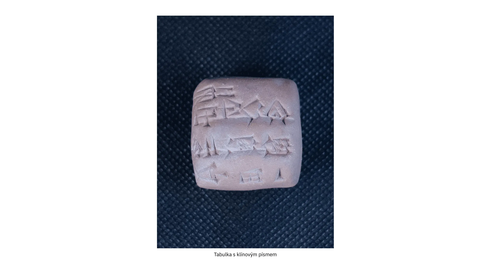

Mám také něco, co považuji za pravou sumerskou tabulku s malým klínovým písmem uprostřed. Na této tabulce jsou podpisy vytvořené válcováním, které vám ukážu později.

Značky s malými číslicemi sloužily jako podpisy v době, kdy většina lidí neuměla psát, protože tuto schopnost měli pouze zkušení písaři.

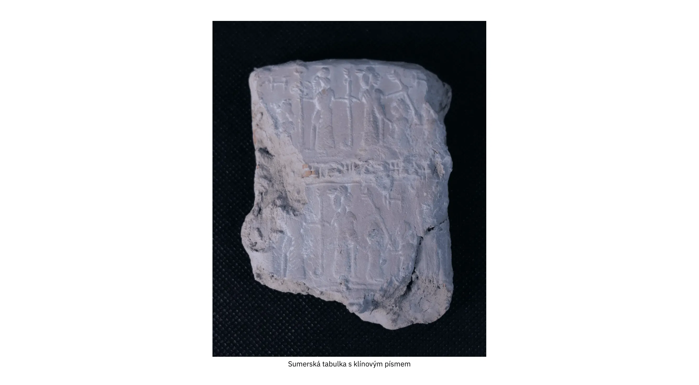

Níže vidíte výše zmíněný válec: kámen s vyrytými specifickými tvary. Tento podpisový válec, v angličtině známý jako cylinder seal, lidé kdysi válcovali k podepisování dopisů. Byl to způsob, jak výslovně uvést jména autorů, nebo dát najevo, že byly sepsány jejich jménem.

Tehdejší písaři proto používali k tisku nápisů na mokré tabulky klínový stylus.

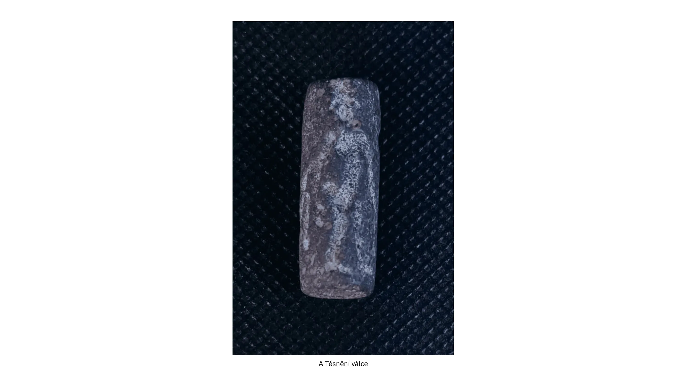

Klínopisné znaky nepředstavovaly jazyk, ale systém zápisu mluvených jazyků. V angličtině bychom řekli "writing is a written language" a pak bychom řekli, že "klínopis je písmo, nikoli jazyk". Ve francouzštině bychom tedy řekli, že klínopis není jazyk, ale způsob kodifikace jazyka.

### Vývoj a použití písma

Během prvních staletí své existence zůstalo toto písmo omezené a sloužilo v podstatě jako mnemotechnický systém pro zaznamenávání množství, seznamů zemědělského zboží a vybavení. Teprve postupně začalo být schopno **fonetického zápisu jmen** a celých vět.

Zpočátku se jména nedala vyjádřit klínovým písmem, protože představovala především předměty a prvky reality, jako je vůl nebo pšenice, zobrazené jako malé obrázky. Postupem času se tyto obrázky vyvinuly v rozvinutější formu písma, která umožnila znázorňovat jména a složité pojmy.

Pokud by se dotyčná osoba jmenovala například Laura, mohli bychom vzít slovo, zkratku, která by zněla jako "voda", a druhé slovo jako "ras" a vytvořit z nich jméno Laura. Tak se vyvinula první podoba spisovného jazyka.

Pro zajímavost, původně se zkratky znázorňovaly tak, že pokud jste chtěli nakreslit hlavu vola, mohli jste vidět tvar volské hlavy. Postupně se kresby zjednodušovaly tak, aby nezobrazovaly nic víc než jakousi čáru. Vědci se domnívají, že se tak stalo proto, že lidé drželi mokrou hliněnou tabulku v jedné ruce, takže bylo snazší překreslovat iniciály jejich otáčením. Předpokládá se také, že to bylo způsobeno způsobem, jakým písaři tabulky drželi.

V klínopisných zkratkách je stále patrná souvislost například s pšenicí nebo volskou hlavou, které se vždy naklánějí na jednu stranu.

Během tří tisíciletí používání sloužilo klínopisné písmo především k vedení hospodářských a administrativních záznamů. U obyvatel Mezopotámie se však brzy objevila hluboce zakořeněná touha uchovávat v písemné podobě vše, co si zasloužilo obstát ve zkoušce času. Příběhy, legendy a písně, které se dosud předávaly ústně prostřednictvím potulných hudebníků, tak byly zvěčněny v písemné podobě, kterou často přepisovali vyškolení písaři. Ti přepisovali již existující texty, především legendy nebo texty, které měly určitou kulturní hodnotu.

Důležitým příkladem je **Epos o Gilgamešovi**, pravděpodobně **historickém králi sumerského městského státu Uruk** kolem let 2900-2350 př. n. l.

Tato forma písma, která byla nástrojem ekonomického řízení i kulturním nositelem, vydržela až do 1. století n. l., než nadobro zanikla a zanechala po sobě cenné svědectví o civilizaci, která stála u jejího zrodu.

## Úloha sumerských tabulek

<chapterId>a396e6c5-56cc-5410-9e6b-0274401c5425</chapterId>

:::video id=a0729a35-01ec-4aa4-828f-d4ccc2eb168e:::

### Předmonetární úvěrové systémy

Ve starověké Mezopotámii byla ekonomická organizace založena na vysoce sofistikovaných mechanismech, které existovaly dlouho před vynálezem kovových mincí. Již od počátku byly formální i neformální úvěrové systémy základní formou peněz, která místnímu obyvatelstvu umožňovala provádět mnoho složitých ekonomických transakcí.

Právě pro administrativní a ekonomické potřeby bylo vynalezeno klínopisné písmo. Slavné mezopotámské hliněné tabulky sloužily především k zaznamenávání různých typů smluv: soukromých půjček, prodejů, pronájmů, hypoték, a dokonce i svatebních smluv. Psaní těchto tabulek vyžadovalo odborné znalosti specializovaných písařů, což byl úkol nákladný na čas a úsilí, **ale opodstatněný, když šlo o finanční zájmy.** Lidé si tehdy nepsali milostné dopisy, nepoužívali písaře, aby si psali o svých starostech. Písaře si najímali na psaní dokumentů, ať už k tomu měli vztah nebo ekonomický důvod.

Za zmínku stojí i to, že některé z těchto tabulek obíhaly jako dluhopisy na doručitele a volně měnily majitele.

Byla tam například forma hliněné koule s malými kamínky uvnitř.

Na vnější straně hliněné koule bylo napsáno a podepsáno číslo, které představovalo počet jednotek. Uvnitř byly tyto kameny a někdo, kdo si chtěl ověřit, skutečně potvrdit, že tento nástroj skutečně představuje X jednotek.

Jiný příklad, tabulka nalezená jihozápadně od dnešního Bagdádu, stanoví, že dlužník se zavazuje splatit věřiteli 330 měr obilí v den sklizně. Ještě více fascinující je, že jiná tabulka jasně uvádí, že dluh ve výši čtyř měr ječmene musí být splacen přímo nositeli tabulky, čímž **zavádí pojem platby na doručitele, což je na tehdejší dobu obzvláště novátorský koncept**.

Od roku 2000 př. n. l. platil zákon, který vyžadoval, aby všechny obchodní transakce, i ty nejmenší, byly formalizovány písemně a podepsány za přítomnosti svědků. Představte si, jak obrovskou byrokracii tehdy představovalo zapisování všech transakcí do rejstříků, které, připomínám, zhotovovali písaři z hlíny. Tato právní přísnost měla zabránit budoucím sporům o vlastnictví a práva na směňované zboží. Často byli předvoláváni svědci, aby dosvědčili, že smlouva byla skutečně podepsána.

Také v soukromé sféře se některé rodiny a jednotlivci zabývali natolik složitými hospodářskými činnostmi, že vyžadovali přísné řízení. V severobabylonském městě Sippar-Amnanu byl objeven dům anunitského kněze jménem Ur-Utu, který obsahoval téměř 2 000 tabulek. Tyto dokumenty obsahovaly soukromé smlouvy o půjčkách, kupní a nájemní smlouvy, ale také dopisy, náboženské a akademické texty, což svědčí o rozmanitosti a významu soukromých archivů v té době.

Je pozoruhodné, že dopisy psané písaři se týkaly téměř výhradně finančních záležitostí: stížností na nedostatečné dávky, nevyplacené věno nebo jiných naléhavých materiálních požadavků. Osobní psaní, jako například milostné dopisy, v té době neexistovalo, a dokonce i zmínky o nemoci byly vzácné.

Tuto ekonomickou realitu dokresluje jeden z dopisů: dopisovatel vyjadřuje svou tíseň poté, co zůstal bez peněz a zásob, když jeho partner odešel, zatímco Asur postihl těžký hladomor. Popisuje svou naléhavou potřebu nakoupit obilí a žádá, aby mu byl urychleně zaslán peněžní ekvivalent jeho textilu, který by mu zajistil každodenní obživu.

Tento dopis adresovaný jejímu partnerovi zřejmě naznačuje, že odešel za obchodem jinam a zanechal ji bez peněz. Připomíná mu, že musí mít přístup k penězům, aby mohla nakupovat obilí a platit chrámové daně. To je asi nejbližší argument, který můžeme v dopise z té doby najít. Dopisy se téměř vždy týkaly hospodářských transakcí a právě tento dopis se vztahuje k nejisté ekonomické situaci.

Mezopotámské dokumenty, které se k nám dostaly, tedy odrážejí především ekonomickou směnu, protože byly sepsány výhradně pro převody zboží s uznávanou hodnotou: peníze, obilí, různé zboží, nemovitosti, platby chrámových daní. Tyto archivy odhalují nejen efektivitu a administrativní preciznost této starověké civilizace, ale také její schopnost řídit složité hospodářské směny po velmi dlouhou dobu.

## Kontrola elity na sumerských tabulkách

<chapterId>c6d3df0e-b1e1-58dc-ab35-9f76bbc39393</chapterId>

:::video id=04a95fb8-a701-4a48-9ce8-0e9b6ba256fd:::

### Psaní, technologie, která je především ekonomická

Navzdory všeobecnému přesvědčení nesloužil vynález písma v Mezopotámii před přibližně 4 000 lety původně k osobní nebo literární komunikaci. **Kunopisné písmo bylo především ekonomickou technologií**, která měla své opodstatnění pouze tehdy, když šlo o důležité finanční zájmy. Sumerové nepoužívali písmo k vzájemné korespondenci nebo k vyjadřování svých pocitů, ale výhradně k dokumentaci svých obchodních a finančních transakcí.

Tuto specializaci lze vysvětlit značnými náklady na psaní na tabulky. Rytí do hlíny vyžadovalo specializované technické znalosti, značný čas a specifické materiály. Tuto investici ekonomicky ospravedlňovaly pouze transakce dostatečné hodnoty, což vytvářelo přirozený práh pro přístup k této revoluční technologii.

Klínové tabulky odhalují na svou dobu pozoruhodně složitý finanční systém. Mezopotámci měli vyvinutý kompletní arzenál moderních finančních nástrojů: **soukromé půjčky s úrokem, kupní smlouvy, nájemní smlouvy, hypotéky, a dokonce i svatební smlouvy s finančními doložkami**. Tato sofistikovanost svědčí o rozvinutém tržním hospodářství, které je na hony vzdálené zjednodušenému obrazu primitivního směnného obchodu, jenž je s těmito starověkými civilizacemi často spojován.

Některé tablety fungovaly jako skutečné cenné papíry na doručitele, které volně kolovaly z ruky do ruky, aniž by bylo nutné identifikovat původního držitele. Tato inovace umožnila pozoruhodnou plynulost směny a předznamenala moderní finanční systémy. Kromě toho zvláštní právní předpisy dokonce vyžadovaly, aby všechny obchodní transakce byly formalizovány písemně, čímž se používání písma v ekonomické sféře institucionalizovalo.

### Monopol na znalosti a ekonomickou kontrolu

Ústřední postavení písma v ekonomice propůjčovalo těm, kdo tuto technologii ovládali, značnou moc. **Písaři, kteří byli zpravidla přičleněni k chrámům a vládnoucím institucím, de facto ovládali finanční systém**. Díky svým vzácným a neocenitelným znalostem byli strážci všech důležitých transakcí.

Tento monopol na znalosti nebyl náhodný. Úřady měly zájem na zachování této exkluzivity, protože demokratizace písma by oslabila jejich kontrolu nad ekonomikou a zvýšila riziko padělání. Systematická přítomnost svědků při podpisových ceremoniálech prozrazuje tento neustálý zájem o pravost dokumentů.

Zákonná povinnost písemně zaznamenávat všechny obchodní transakce sloužila několika strategickým cílům: daňové kontrole, přísnému sledování účetnictví a udržení závislosti hospodářských subjektů na správním aparátu. **Mezopotamský stát si tak přivlastnil schopnost spravovat mezilidské dluhy** v celospolečenském měřítku, čímž se písmo proměnilo v nástroj ekonomické moci.

### Koexistence dvou měnových systémů

Analýza tabulek odhaluje diferencovanější ekonomickou realitu, než by se mohlo zdát z jejich všudypřítomnosti v archivech. Mnoho tabulek zmiňuje odkazy na **šekel stříbra** jako jednotku hodnoty, což naznačuje paralelní existenci peněžního systému založeného na standardizovaném fyzickém zboží.

Tuto dualitu lze vysvětlit tehdejším společenským rozvrstvením. **Systém klínopisných tabulek byl vyhrazen pro omezenou elitu**: duchovenstvo, prosperující obchodníky a správce schopné číst, psát a interpretovat tyto složité dokumenty. Aby člověk mohl efektivně používat tabulku s nosičem, musel nejen umět rozluštit její text, ale také musel být schopen ověřit její pravost a pochopit její právní důsledky.

**Masa obyvatelstva, vyloučená z tohoto elitářského systému, si vytvořila vlastní směnné mechanismy**. Obyčejní lidé používali dostupnější systémy, jako byly standardizované míry obilí, váhy peněz a další snadno kvantifikovatelné statky, které mohl bez specializovaných dovedností ocenit každý.

Toto lidové hospodářství, ačkoli je v oficiálních archivech méně zdokumentováno, bylo pravděpodobně dynamičtější a pružnější než tabletový systém. Umožňoval rychlou každodenní výměnu bez použití písařů a uspokojoval okamžité potřeby řemeslníků, zemědělců a drobných obchodníků.

Stříbrný šekel, často zmiňovaný v tabulkách jako referenční hodnota, pravděpodobně sloužil jako most mezi těmito dvěma paralelními ekonomickými systémy a umožňoval převod mezi písemnými dluhy a fyzickými platbami.

### Spontánní vznik versus institucionální kontrola

Tato koexistence ilustruje zásadní diskusi v hospodářských dějinách: **V tomto případě se jedná o protiklad mezi spontánním vznikem směnných prostředků a institucionálním přivlastněním peněz**. Na jedné straně zboží, jako jsou peníze, vzniklo přirozeně z potřeb lidí při směně. Na druhé straně si instituce tyto praktiky přivlastnily a formalizovaly, aby kontrolovaly jejich tok.

Sumerské chrámy byly ztělesněním tohoto napětí: používaly populární peněžní inovace (odkazy na šekel) a zároveň vyvinuly vlastní kontrolní nástroje (klínopisné tabulky). Tato strategie jim umožnila využívat výhod obou systémů: lidové legitimity tradičních měn a administrativní kontroly formalizovaných dluhů.

Mezopotámská zkušenost je trvalým precedentem pro vývoj finančních systémů. Ukazuje, že **finanční vyspělost často předchází technologické inovace o několik tisíciletí**, které jsou s ní obvykle spojovány. Koncepty úroku, úvěru, obchodovatelných nástrojů a zástavního zajištění nečekaly na vynález kovových peněz.

Toto zásadní období také odhaluje mocenské problémy, které jsou neodmyslitelně spjaty s každou měnovou inovací: kdo ovládá technologii, kdo určuje pravidla a jak se formální systémy a lidové praktiky vyjadřují. Tyto základní otázky přetrvávají po celou dobu ekonomických dějin a zasahují i do současných debat o digitálních měnách a kryptoměnách.

# Ekonomika a peníze ve starověkých civilizacích

<partId>a16bcf4c-8c3a-11f0-9e79-2bd363a484bd</partId>

## Velké civilizace doby bronzové

<chapterId>fab9334c-7385-5d7c-ad40-7d152beb22a1</chapterId>

:::video id=737e12e8-1033-4210-b1dd-b8a680f68b17:::

V této části nazvané "Velké civilizace doby bronzové" začneme úryvkem z knihy *Dějiny peněz: Od starověku po současnost* od Glyna Daviese, která je podle mého názoru vynikajícím úvodem k této části o velkých civilizacích starověku.

> Toynbee identifikuje přibližně dvacet jedna různých "civilizací", ale protože patnáct z nich přímo nebo nepřímo vychází z dřívějších příkladů, snižuje počet nezávisle vyvinutých civilizací na šest: sumerskou, egyptskou, minojskou, čínskou, mayskou a andskou. Z nich pouze Inkové v Andách dokázali dosáhnout vysokého stupně civilizace, aniž by používali peníze, ačkoli paradoxně měli hojnost materiálů obecně považovaných za nejlepší pro použití jako peníze - zlata a stříbra.

Inkové neměli žádný peněžní systém, ale měli hojnost drahých kovů. To je docela paradox. Pokračujme v citátu:

> Čím je společnost stratifikovanější a čím je její systém plánování pečlivěji propracovaný, tím méně je pro její obyvatele nutné používat peníze. To může vysvětlovat, proč španělští conquistadoři zjistili, že Mexičané, jejichž vláda byla relativně liberálnější, pravidelně používali jako platidlo zlatý prášek (uchovávaný v průhledných tubách) a kakaové boby (uchovávané pro velké platby v pytlích po 24 000 jednotkách), zatímco naopak Inkové, organizovaní podle mnohem přísnější hierarchie, neměli vůbec žádné platidlo: výjimka potvrzená přísným pravidlem. Vznik peněz v Číně byl zcela nezávislý na jiných civilizacích; relativní blízkost sumerské, egyptské a minojské civilizace však vyvolává pochybnosti o míře jejich příslušné neznalosti peněžních praktik, zejména s ohledem na rozsáhlý obchod zavedený již v nejstarších dobách.

V Číně se mince vyvíjely se zcela odlišným přístupem než v západních tradicích. Od počátku se jednalo o fiat peníze. Byly to mince lité.

A zde se pan Davies zmiňuje o obchodu. V určitých obdobích skutečně docházelo k výměně mezi Číňany a ostatním obyvatelstvem, ale prostředkem směny pro zahraniční obchod bylo spíše hedvábí. Jak uvidíme později, zlato se používalo také v pohraničních oblastech Číny, kde bylo čínské obyvatelstvo menší. A to ani ne pro mezinárodní obchod; k tomu sloužilo hedvábí.

Představuji si tedy, že formát mincí mohl být ovlivněn jinými civilizacemi ze stejné doby, které tuto technologii vyvinuly.

Je však zřejmé, že podstata peněz byla v Číně zcela jiná než na Západě. K tomu se podrobně vrátíme v následující části věnované Číně.

K těmto slavným sumerským městům mám několik poznámek. Můžeme zmínit Uruk, což bylo velmi rané a vlivné město, proslulé svou značnou rozlohou a vyspělou kulturou, zejména rozvojem písma a urbanismu.

A také jsem chtěl zmínit slavný epos o Gilgamešovi. Gilgameš byl pravděpodobně historický král sumerského města Uruk kolem roku 2900 př. n. l.. Byl pravděpodobně králem tohoto sumerského městského státu.

Můžeme také mluvit o Sargonovi Akkadském, který vládl v letech 2334 až 2279 př. n. l.

Byl prvním vládcem Akkadské říše, což je další civilizace, která vznikla v Mezopotámii. A Sargona zmiňuji proto, že jako první zavedl poštovní službu pro tyto slavné tabulky, které jsem vám zde již představil.

Představte si, že skutečně existovaly i hliněné obálky. Tabulky mohly být zabaleny do hliněných obálek s podpisem osoby na vnější straně, aby byla zajištěna důvěrnost. Lidé by tedy obálku rozbili, aby si tabletu vyzvedli. Za tento poštovní systém vděčíme Sargonovi Akkadskému.

Pak je tu Babylon, velké město, které se stalo hlavním městem Babylonské říše. Další civilizace, proslulá svým impozantním Zikkuratem a paláci a slavným Chammurapiho zákoníkem, který je známý především pro svůj vysoce vyspělý právní kodex.

A dvě města na závěr této části. Máme tu Aššur, který byl hlavním městem Asyrské říše a důležitým náboženským centrem. A máme Ninive, které bylo později hlavním městem Asyrské říše. Přesunuli tam své hlavní město a je známé svou mocnou armádou, rozsáhlými paláci a knihovnami. A je to také jedno z možných míst legendárních babylonských visutých zahrad. O tomto slavném divu starověkého světa slýcháme často.

V Babylonu však po těchto slavných visutých zahradách není ani stopy. Naproti tomu v Ninive jsou archeologicky doloženy zahrady v několika patrech. Je možné, že řečtí historikové, jako byl Hérodotos, si Ninive s Babylónem spletli. Když navštěvovali města v Mezopotámii, možná je označovali jako Babylon. V Ninive byly nalezeny stopy po slavných visutých zahradách a badatelé se mohou ptát, zda je Ninive tím slavným místem, kde se tyto zahrady, označované jako babylonské visuté zahrady, nacházely.

## Hospodářská organizace v Mezopotámii

<chapterId>6afb6fc8-cbb7-56a5-8427-484b4b7d7477</chapterId>

:::video id=aa6a2cbd-5916-4ae3-ad4f-65f0bd5643fa:::

### Předkapitalistické ekonomické struktury a otroctví

Vítejte v této části o hospodářské organizaci v Mezopotámii. Předkapitalistické hospodářství prošlo třemi hlavními fázemi: primitivní, otrokářskou a feudální.

Feudál je samozřejmě mnohem pozdější, zřejmě ve středověku, a primitivní fázi, kterou jsme popsali dříve, jsme již překonali v paleolitu. Když nyní v Mezopotámii mluvíme o ekonomické organizaci, mluvíme o otroctví.

V Mezopotámii však většinu práce vykonávala závislá třída podobná otrokům, kteří nebyli právně majetkem svých pánů, ale byli zbaveni plodů své práce prostřednictvím fyzického nebo ideologického nátlaku.

### Úloha chrámů a paláců jako hospodářských center

V hospodářství převládaly velké pozemkové majetky. Majitelé půdy využívali svou půdu přímo tím, že najímali dělníky, nebo ji pronajímali za nájemné. Zabývali se také finančními aktivitami a půjčovali peníze na vysoký úrok, obvykle kolem 20 % až 33,3 % ročně, což byly praktiky, které ostře kontrastovaly s přísnějšími pravidly sousedních Hebrejců.

Půjčky, které si zemědělci brali, nebyly určeny na produktivní investice - s výjimkou přepravních společností -, ale spíše na zajištění jejich přežití do příští sklizně. Tato situace často vedla k chronickému zadlužení zemědělců.

Dovolte mi paralelu s nedávným obdobím starověku (Řím), kde občané žili ze zemědělské renty, kterou produkovali rolníci a nesvobodná pracovní síla, a z válečné kořisti. **Tyto výnosy byly rozdělovány mezi občany nikoliv proto, aby generate více vydělávali, ale aby si zvýšili své společenské postavení.** Obchod a řemesla byly zpravidla přenechány skupinám mimo společenskou elitu. To vše kontrastuje se středověkými ekonomikami orientovanými na zisk prostřednictvím obchodu a řemesel.

Snažím se tedy říci, že zde uvádím paralelu se skutečností, že lidé používali nástroje finančních půjček ne nutně ke zlepšení svých výrobních prostředků a později v Římě nebyly zisky nutně reinvestovány, ale spíše použity ke zvýšení prestiže lidí, kteří mohli z těchto zisků těžit. Jsme ještě daleko od kapitalistického ducha, který se objevil později ve středověku, kdy bylo možné vytvářet pracovní místa ke zlepšení výrobních prostředků a kdy se přebytky braly a vytvářely v honbě za ziskem. Vidíme tedy, že ekonomická organizace ještě nedosáhla třetího stupně výše uvedených ekonomických evolucí.

### Vznik úvěrových systémů a zúčtovacích jednotek

**Karl Polanyi rozlišuje tři formy ekonomické směny: reciprocitu mezi symetrickými skupinami,** tedy v primitivních kmenech, kde peníze vlastně nepotřebujeme, protože si navzájem poskytujeme neformální úvěry a směňujeme a přerozdělujeme. **Redistribuce centralizovaná kolem chrámů a paláců,** tato forma směny je slučitelná s Mezopotámií, kde byly chrámy centrem ekonomické organizace a mohly najednou vracet, rozdělovat bohatství ve formě přídělů. Teprve později byl zaveden pojem mzdy. Dosud tedy máme primitivní formu (1), centralizované přerozdělování (2) v chrámech a palácích a pak můžeme konečně ustoupit tržní směně (3). Ačkoli trh, jak jej chápeme dnes, plně neexistoval, přítomnost tržních směn v Mezopotámii je nesporná, což dokládá existence specifických termínů v akkadštině a přítomnost archeologických dokladů o cenách, ziscích, ztrátách, fluktuacích a situacích nedostatku.

Mezopotámské domácnosti samostatně řídily všechny fáze zemědělské výroby, od setí až po konečné zpracování na chléb a pivo. Ženy také vyráběly textilie, které potřebovali jejich závislí. Se zbožím, které se nevyrábělo na místě, se domácnosti obracely na specializované obchodníky.

Rodinné vazby byly v obchodě obzvlášť důležité. V paleoasyrském období (asi 1910-1830 př. n. l.) založili obchodníci z města Aššur obchodní kolonii v Kaneši v Anatolii a dováželi cín a textil výměnou za zlato a stříbro. Obchod byl založen na rodinných podnicích úzce propojených sňatky a obchodními partnerstvími. Kanesh byl jen jedním článkem rozsáhlé mezinárodní obchodní sítě.

V těchto směnách byly kovy, a to drahé kovy, a ne nutně například měď, která byla v té době opravdu užitečná, a domníváme se, že tyto kovy byly směňovány za pojmy uchování hodnoty. Nemohli bychom tedy nutně mluvit o směnném obchodu, kdy se směňují dvě zboží za jejich užitečnost, ale spíše o pojetí platby s určitým vědomím hromadění drahých kovů pro jejich využití jako uchovatele hodnoty a nikoliv pro jejich využití jako zboží, například využití bronzu k výrobě zbroje.

Dávky a daně se platily převážně v naturáliích (ječmen nebo vážené stříbro). Chrámy a paláce byly hlavními hospodářskými, správními, politickými a náboženskými centry a plnily také první bankovní funkce prostřednictvím bezpečného ukládání zboží, nejprve obilí, pak dalších zemědělských produktů a nakonec drahých kovů. Tímto způsobem vznikly první úvěrové a půjčkové operace, a to dlouho před vznikem mincí.

V mezopotámském hospodářství se jako měřítko hodnoty používal především ječmen a stříbro. Stříbro se vážilo ve standardizovaných jednotkách, například v šekelu (sìqlum) o hmotnosti přibližně 8,33 gramu. Již v období starověkého Babylonu (za Chammurapiho) se stříbro používalo jako běžný platební prostředek, s raným pojetím nominální hodnoty ("nūbum") na rozdíl od reálné hmotnosti ("šuqulum"), **předchůdcem moderního pojetí fiat měny**.

Nebyly to však ještě fiat peníze v pravém slova smyslu. Neexistoval pojem známky s autoritou, ale existoval pojem nominální zúčtovací jednotky, na rozdíl od pojmu váženého kovu. V jazyce existovalo rozlišení těchto dvou pojmů a myslím, že je důležité se o něm zmínit.

Přechod na trh práce za mzdu byl obtížný. Vyžadoval dvě zásadní koncepční inovace: oddělení práce člověka od konečného produktu a zavedení "pracovní doby" jako měřitelné jednotky. Abychom mohli mít tento pojem mzdy a platového zaměstnance, museli jsme nejprve projít těmito dvěma inovacemi. **Ve III. tisíciletí byla práce zpočátku odměňována pevnými příděly, než se na počátku II. tisíciletí postupně vyvinula směrem ke mzdovému systému**

Od 26. století př. n. l. se konečně prosadil skutečný pojem peněžní hodnoty, i když mezopotámské "peníze" nebyly mince, ale spíše odvážená míra obilí nebo kovu. **Pro důležité transakce nebo v souvislostech vyžadujících uchování hodnoty se proto často dávala přednost přeměně obilí na stříbro, které se snáze uchovávalo**. trochu jako na příkladu Kaneše, kde se stříbrný kov přijímal do zásoby.

Od 21. století př. n. l., **s faktickým zánikem asymetrických směn**, si všímáme, že ve smlouvách o postoupení pohledávek sloveso sa odkazuje na zaplacení ceny. Tento pojem, nazývaný "sa", se objevuje ve smlouvách a odkazuje na zaplacení ceny, nikoli na měření určitého zboží. "Sa" jednoduše označuje platbu nebo cenu. Právě antropolog si toho všímá a zmiňuje, že jde skutečně o průlom; vidíme jakousi dichotomii mezi dobou před a po zavedení tohoto slovesa "sa" do smluv.

Nemůžeme ignorovat empirické údaje z blízkovýchodních archivů, které dokládají existenci **některých tržních mechanismů**, zahrnujících **pojmy zisku** a **ztráty**, **kolísání cen** a situace **vzácnosti**. Zásadní potíž však spočívá v určení relativního významu tržní směny v rámci celé starověké mezopotámské ekonomiky.

Myslím, že odborníci v této oblasti viděli stopy těchto tržních koncepcí, ale nejsou schopni nám říci, nakolik byla tehdejší ekonomika založena na této modernější tržní koncepci nebo na jiných mechanismech.

Víme, že existoval, ale nevíme, zda byl hlavním způsobem například určování cen nebo obchodování.

Tímto končí tato část o hospodářské organizaci v Mezopotámii.

V dalších částech se budeme věnovat Egyptu a Číně.

## Hospodářská a měnová organizace ve starověkém Egyptě

<chapterId>bffcc16c-7fbf-5992-a0fa-6a7726d7d287</chapterId>

:::video id=40c1c4e5-b190-4bb6-b8a0-810c9ce7698b:::

### Historické pozadí a egyptská období

Tato část je věnována hospodářské a měnové organizaci starověkého Egypta. Abychom vám přiblížili alespoň trochu základní informace, uvádíme seznam a stručný popis daných období.

- Stará říše (cca 2575 - cca 2130 př. n. l.)**. Období poznamenané stavbou velkých pyramid, zejména pyramid v Gíze. Byl to zlatý věk centralizované egyptské monarchie.
- Střední říše (cca 1938 - cca 1630 př. n. l.)**. Politická a kulturní renesance po období nestability.
- Nová říše (cca 1539 - 1075 př. n. l.)**. Období územní expanze, vojenské moci a mezinárodního obchodu. Zahrnuje období vlády slavných faraonů, jako byli Tutanchamon a Ramses II.
- 1323 PŘ. N. L. - Tutanchamonova smrt**. Mladý faraon zemřel ve věku asi 18-19 let. Jeho téměř neporušená hrobka byla objevena v roce 1922 a stala se tak jedním z nejslavnějších archeologických objevů.
- Ramses II - vládl v letech 1279-1213 př. n. l.**. Jeden z nejmocnějších faraonů Nové říše. Známý svými vojenskými taženími, velkými památkami a pravděpodobně uzavřením první známé mírové smlouvy.
- 1275 př. n. l. - Mořské národy**. Invaze nebo migrace skupin zvaných "mořské národy" destabilizují několik středomořských civilizací, včetně Egypta.
- Bitva u Xoïs - 1178 př. n. l.**. Konflikt mezi egyptskou armádou a útočníky, pravděpodobně spojený s mořskými národy. Jedna z mnoha bitev na konci Nové říše.
- Pozdní období** je období staroegyptských dějin přibližně od roku 664 do roku 332 př. n. l.
- Kleopatra VII (69 - 30 př. n. l.)**. Poslední egyptská královna, proslulá svou inteligencí, charismatem a spojenectvím s Juliem Caesarem a Markem Antoniem, a pravděpodobně také svým nosem. Její vláda znamenala konec faraonského Egypta před jeho anexí Římem.

V 5. a 4. tisíciletí př. n. l. již Egypt zažíval intenzivní obchodní činnost ve velkém měřítku, která spojovala Núbii, Palestinu, Libyi a oblasti Rudého moře prostřednictvím námořního, říčního a pozemního obchodu (zejména oslími karavanami).

### Rané směnné systémy a paleoměny

Se vznikem prvních egyptských náčelníků kolem let 3650-3400 př. n. l. se lokalita Maadi, jižně od dnešní Káhiry, stala významným centrem měděné technologie a dálkového obchodu, zejména s Mezopotámií přes syrské pobřeží.

Ačkoli byl rozsáhlý obchod založen především na směnném obchodu, pravděpodobně existovala primitivní forma peněz ("paleoměna"), kterou tvořily prestižní předměty, jako jsou polodrahokamy a fosilní mušle. Významnou roli v těchto směnách již pravděpodobně hrálo zlato. První výslovná zmínka o minci v egyptských dokumentech z poloviny 3. tisíciletí př. n. l. odráží dlouhý vývoj spojený s obchodními praktikami.

V archaické společnosti (zde nemluvíme nutně o Egyptě, ale o archaických společnostech obecně) se často platilo, nikoli však přímo za nákup, ale za věno, náboženské rituály a další společenské povinnosti. Tyto transakce vyžadovaly přesné stanovení ceny a ocenění. Mnoho primitivních společností mělo privilegované, penězi ocenitelné (tj. spočitatelné) předměty, v nichž se tato hodnota odhadovala. Pokud jste platili věno, museli jste si samozřejmě poznamenat určité množství předmětu, který měl být vyměněn za účelem zaplacení věna. Touto hodnotou jsou v podstatě lidé.

V archaických společnostech před vznikem peněz nebo peněžních systémů existovaly platby, které však byly často spojeny se společenskými závazky a jejich hodnota se odvíjela od hodnoty jednotlivců, jako například při placení věna nebo krevních peněz.

Pokud se vrátíme do Egypta, v době starověkého císařství "šáteček", původně konkrétní peněžní jednotka (malá zlatá nebo stříbrná mince o hmotnosti přibližně 7,6 gramu), velmi rychle přešel od své skutečné funkce tvrdého platidla k **účetní funkci**, která dala vzniknout pojmu hodnoty. Můžeme v ní rozpoznat jakousi zúčtovací jednotku k vyjádření hodnoty, která byla původně druhem mince, ale nemůžeme ji skutečně nazývat mincí, protože není ražená, je to jen míra kovu. Blížíme se k pojmu zúčtovací jednotky.

Od tohoto pojetí šat(y) se nakonec upustilo, snad kvůli riziku podvodu. Později uvidíme, že Egypťané pomalu přijímali ražené mince a dokonce je nadále vážili, i když je přijali jejich sousedé.

Ve středověku se stříbro jen zřídka používalo ke každodenním transakcím, které se prováděly především s mírami na obilí a množstvím chleba. Právě v tomto období se objevila forma písařských peněz, u nichž bylo možné platby zaznamenávat písemně nebo skutečným převodem.

V Nové říši se měnový systém stal složitějším a zahrnoval různé komoditní měny oceňované v kovech (zlato, stříbro, měď), standardizovaných látkách, obilovinách a ropě. Tkaniny se označovaly jako "látkové míry". **Ceny zboží denní potřeby se často vyjadřovaly v obilí nebo mědi, zatímco vzácné předměty se oceňovaly ve zlatě nebo stříbře. Zvláště ceněným se stalo stříbro, které bylo v Egyptě vzácnější než zlato.** Stříbro bylo nadhodnoceno ve srovnání se zlatem, kterého bylo v Egyptě více.

V pozdním období (první tisíciletí př. n. l.) se stříbro stalo běžným směnným kovem na celém Blízkém východě. Obíhalo ve formě slitků, kovových mincí nebo prstenů, které se vážily a označovaly v chrámech, což zaručovalo jejich váhu a čistotu, ačkoli nebyly raženy v podobě panovníka. To přišlo později a bude předmětem následujícího oddílu o Lýdijcích.

Je třeba také poznamenat, že staří Egypťané měli pro peníze výraz "hedj", který se používal obecně pro označení jakéhokoli platebního prostředku sloužícího jako protihodnota při transakci, ať už šlo o kov, obilí, látku nebo různé zboží (dřevo, zvířata, služby atd.). Doložené příklady ukazují, že Egypťané mohli vypořádat transakci kombinací různých produktů, jejichž celková hodnota byla vyjádřena v měděných jednotkách ("deben").

**Chrámy hrály v egyptské ekonomice ústřední roli: shromažďovaly a uchovávaly značné poklady drahých kovů (zlato a stříbro), které měly sloužit k uctění bohů, ale také jako peněžní rezerva, jež mohla být v případě potřeby znovu uvedena do hospodářského oběhu**. Uvidíme příklady jiných civilizací, které v chrámech hromadily cenné rezervy, například sochy, které měly být roztaveny v případě války, nedostatku měny nebo krize. Toto téma se opakuje v celé historii.

Za zmínku stojí i to, že pěstování lnu bylo královským monopolem uděleným chrámům a výroba drahých látek potvrzovala jejich hospodářský význam.

Staří Egypťané jasně rozlišovali mezi ideologickým aspektem drahých kovů, spojeným s božstvím (zlato představovalo tělo bohů, stříbro jejich kosti), a jejich praktickou funkcí jako platidla, která sloužila jako reference pro všechny ostatní formy placení.

Ačkoli tedy starověký Egypt vytvořil až v pozdním období mincovní měnu srovnatelnou s moderními peněžními systémy, disponoval propracovaným peněžním systémem založeným na kombinaci písemných peněz, přesných zúčtovacích jednotek, komoditních peněz a drahých kovů oceňovaných podle hmotnosti.

Samotné mince se vážily, což vedlo ke vzniku dvou různých pojmů: **"mince" a "peníze "**. V angličtině jsem použil dva pojmy. Za prvé, "coinage" se vztahuje k mincím, což je pojem, který přichází později, a máme také tento pojem peněz. Určitý pojem "peníze" můžeme definovat již pomocí zúčtovacích jednotek, které jsem právě vyjádřil pojmem peníze, ale které ještě nebyly mincemi, takže "mincovnictví" přichází o něco později u Lýdů.

A tak mince nejsou nezbytnou podmínkou peněz, **tolik, že můžeme připustit existenci peněz již ve 3. tisíciletí,** v každém případě a bez jakýchkoli pochybností ve 2. tisíciletí a zejména za vlády Chammurapiho.

Důležité je si uvědomit, a to zmiňuje i autor v knize "Původ peněz", že není pochyb o tom, že pojem peněz existoval již v té době, v těchto peněžních systémech, a je chybou spojovat zrod peněz jako pojmu se vznikem mincí.

A konečně, Polanyiho koncepty reciprocity a přerozdělování, často aplikované na starověký Egypt, je třeba diferencovat: ačkoli existují, netvoří výlučný rámec. Faraonský Egypt vyvinul komplexní ekonomiku, která plně integrovala sofistikovanou obchodní směnu, odlišnou od náboženských a rituálních praktik, což dokazuje skutečnou autonomii ekonomické oblasti od ideologické.

Tato zvláštnost souvisí s představou, že drahé kovy byly spojeny s určitým božstvím, ale přesto byly rozlišitelné.

Uvádím to proto, že Polanyi označil používání těchto drahých kovů za primárně náboženský nebo božský pojem. My však navrhujeme, aby byly také začleněny do ekonomického systému a aby Egypťané již byli schopni takové rozlišení provádět.

Na závěr bych rád citoval z knihy "Původ peněz", kde je uveden účel tohoto vynálezu, ražby peněz. Je tam několik bodů, ale já bych chtěl zdůraznit jen bod 5:

*rozvíjet možnost ekonomické hry pomocí metod, jako je devalvace a postupná revalvace, s cílem snížit nebo zvýšit dovoz a vývoz za nižší náklady*

Autor tedy předpokládá, že již v těchto archaických dobách byly mince vynalezeny nebo vznikly pod státní kontrolou a již tehdy se s nimi manipulovalo, pokud jde o množství drahých kovů a hmotnost, aby se řídila ekonomika. Dovolte mi, abych vám poskytl malou senzaci týkající se následující části. **I u nejstarších forem mincí, které byly vyrobeny z elektra, slitiny zlata a stříbra, víme z rozboru obsahu drahých kovů v těchto mincích, že první emitenti, například Krétos, měli méně zlata než v přírodním elektru**

To znamená, že již uměli oddělovat zlato a stříbro a vydávali mince s menším obsahem zlata.

Autor se domnívá, že již od prvních dob ražby mincí byla pravomoc razit peníze zneužívána nejen k potvrzení jejich hmotnosti a usnadnění obchodu, ale také ke zvyšování jejich množství, možná jako forma ekonomického plánování.

## Znaková měna a hospodářská a měnová organizace ve starověké Číně

<chapterId>e08d3be9-423c-5cf3-a606-6ad54e2261af</chapterId>

:::video id=ae7e6367-1725-455e-bfe6-359be1f443e5:::

V této části nazvané "Znakové peníze a ekonomická a peněžní organizace staré Číny" uvidíme, že staré čínské peníze mají odlišné rysy od západních tradic. Čínská měna byla již od počátku "znakovou měnou". Informace v této části vycházejí z poznámek, které jsem si pořídil po přečtení knihy "Aux origines de la monnaie".

### Koncept znakové měny a její charakteristické rysy

Podle autora jsou znakové peníze ekvivalentem dnešní fiat měny. Je to měna, která nemá hodnotu vázanou na obsah kovu. Od počátku šlo o jakousi dohodu, společenský konsenzus o hodnotě těchto mincí.

Starověké čínské mince se vyznačují charakteristickými rysy, které se liší od západních tradic. Byly převážně kovové, ale spíše odlévané než ražené, a nenesly podobiznu panovníka. Čínský stát překvapivě neměl monopol na vydávání peněz. Tento zdánlivý liberalismus lze vysvětlit absencí ekonomické potřeby monopolizovat peněžní emisi díky bohatým daňovým zdrojům vybíraným od velkého počtu obyvatel podléhajících dani.

Čínská měna se rovněž vyznačuje fiduciárním aspektem. Od samého počátku se jako platidlo používaly bronzové napodobeniny kravinek (mořských mušlí), které neměly přímý vztah k vlastní hodnotě použitého kovu. Pokud se vrátíme velmi daleko do historie, Číňané používali jako platidlo mušle. Nakonec, když se mušle staly příliš vzácnými, vyráběli jejich repliky z mědi a tyto kopie měly stejnou hodnotu jako pravé.

Čínská měna tedy nebyla založena na hodnotě materiálu nebo relativní vzácnosti původního předmětu (např. mušle), ale na kolektivní důvěře v jeho použití jako prostředku směny - jinými slovy na peněžním znaku.

### Od mušlí kraviček po kovové imitace

Jako primitivní peněžní jednotka se hojně používala kravička. Starověké nápisy ukazují, že již za dynastií Šang a Čou (první dynastie prvního a druhého tisíciletí př. n. l.) se skořápky kraviček používaly nejen k odměňování vojenských činů, ale také k **odměňování za práci, měření hodnoty a nákupu půdy**.

Důležité je si uvědomit, že to nebyl jen tak nějaký nástroj, který by společnost používala k omezeným účelům. Používal se k vojenským odměnám, platbě za práci a měření hodnot. Stopy toho nacházíme ve spisech archeologů. Nevíme sice, zda se používal ke každodennímu nákupu chleba, ale máme důkazy o tom, že se mohl používat k výše uvedeným typům transakcí.

Nedostatek pravých mušlí vedl postupem času k výrobě jejich napodobenin z bronzu, kostí, perleti nebo kamene, zejména pro použití v pohřebním kontextu, aby se zabránilo znehybnění skutečných hodnot v hrobech. Tato změna média souvisí také s myšlenkou kontroly knížete nad penězi, kontroly, která je o to snazší, pokud kníže peníze vyrábí.

Je třeba si uvědomit, že pokud kníže může měnu vytvářet sám, získá tím větší kontrolu nad řízením ekonomiky, a to díky tomu, že překoná omezení vyplývající z přirozeného nedostatku mušlí.

Na rozdíl od Mezopotámie, kde byly mince spojeny s hmotností drahého kovu, čínská mincovní terminologie vychází přímo z původních tvarů předmětů používaných jako platidlo: kravičky (bei), nože (dao), piky (bu) a kulaté mince (quan nebo qian). Můžeme tedy vidět, že původ slov souvisejících s penězi v Číně se vztahoval k těmto předmětům. Naproti tomu na Západě máme řadu peněžních termínů, které pocházejí z pojmů od těchto zcela odlišných, více souvisejících s fyzickými vlastnostmi a hmotností peněžních předmětů. Tyto etymologické rozdíly jasně ukazují rozkol mezi západním a čínským pojetím peněz.

V Číně byla peněžní hodnota zcela svěřenecká, založená na společenské dohodě mezi státem, výrobci a obchodníky.

### Hospodářská regulace a měnová filozofie

Čínský stát používal peníze jako nástroj ekonomické regulace: v dobách peněžní hojnosti se hodnota peněz snižovala, což lidem usnadňovalo nákup zboží. Naopak v dobách nedostatku peněz se hodnota peněz zvyšovala, což posilovalo kupní sílu státu pro jeho následné operace.

Zde lze najít souvislost s inflací a deflací. Při fixní peněžní zásobě, pokud se produktivita ekonomiky zvyšuje, hodnota peněz roste. Naopak, pokud produktivita klesá, hodnota peněz se snižuje. V tomto příkladu je však situace opačná. Pravděpodobně proto, že kníže neměl úplný monopol na výrobu peněz, přesto to svědčí o tom, že hodnota peněz souvisela s ekonomickými podmínkami.

Tento vztah mezi cenou a hodnotou analyzoval již filozof Mo Di (5.-4. století př. n. l.): podle něj kolísání cen neodráží skutečný pojem levnosti nebo absolutní drahoty, ale spíše kolísavý vztah mezi zbožím a penězi, nezávisle na stabilní nominální hodnotě měnového znaku.

Místo toho, aby řekl, že zlatá mince má nějakou základní hodnotu jako takovou, například užitnou nebo vnitřní hodnotu, poukazuje na to, že hodnota peněžního znaku vyplývá spíše ze stavu ekonomiky.

V Číně nemusely být mince nutně úředně označeny nebo zaručeny. Jejich přijetí záviselo pouze na kolektivní důvěře, což vysvětluje, proč bronzové nebo měděné mince bez specifických nápisů mohly dlouho volně obíhat.

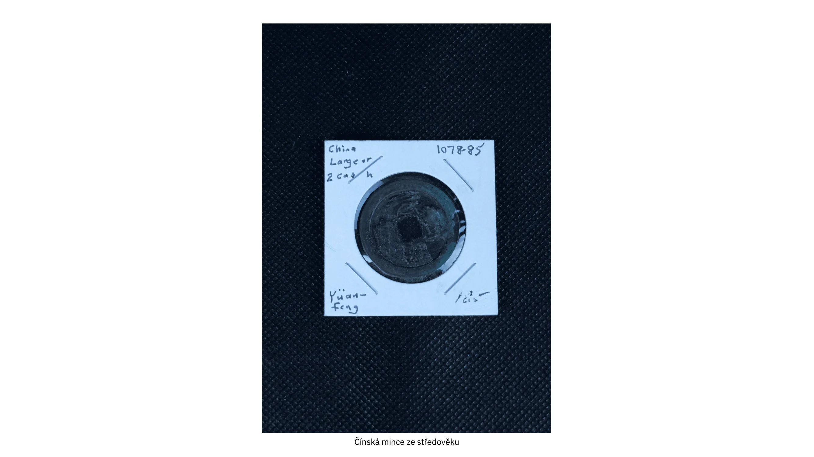

Nahoře je čínská mince ze středověku. Jedná se o litou minci se čtvercovým otvorem uprostřed. Tímto otvorem se provlékal provaz, kterým se mince navlékaly na náramky nebo náhrdelníky. Ty však nebyly primárně určeny k nošení; používaly se především k účetním účelům. Mohly se navlékat na sebe a vytvářet účetní jednotky v podobě velkých provázků, jejichž části se vzájemně propojovaly. Nebyly na nich nutně žádné specifické značky, někdy to byly prostě bronzové kruhy.

Státní měnový monopol, který opožděně zavedl Wudi z dynastie Chan v roce 113 př. n. l., byl často zpochybňován a umožňoval různým soukromým nebo místním subjektům vydávat vlastní měny, pokud se těšily dostatečné společenské důvěře.

**Nízká vnitřní hodnota čínských měn zabraňovala jejich hromadění, což zaručovalo jejich plynulý oběh**.Drahé kovy se jako oběživo používaly jen zřídka, aby se zabránilo jejich hromadění. Zlato, které bylo příliš drahé, se obvykle odkládalo stranou, místo aby se utrácelo. Skutečnou měnu s vysokou hodnotou v čínském mezinárodním obchodě představovalo **pouze hedvábí**. Číňané obchodovali s hedvábím, nikoli se zlatem.

V době hospodářských nebo měnových krizí, zejména když cena mědi rostla, se přijímala inovativní řešení: již ve 2. století n. l. se tak mince v oběhu seřezávaly a vytvářely menší jednotky, což umožňovalo udržovat plynulý oběh s nižšími náklady. V jiných obdobích, například za vlády Wang Manga (počátek 1. století n. l.), se experimentovalo s vysoce fiduciárními měnami, jejichž nominální hodnota byla mnohem vyšší než jejich skutečný obsah kovu, čímž se předcházelo bankovkám. Vzaly se mince a vyrazily se na ně hodnoty jako 50, 100 nebo 200, které označovaly větší částky, například 200 mincí. Tato praxe pravděpodobně přispěla ke značné inflaci.

Jak bylo uvedeno výše, tento systém byl založen na společenské konvenci mezi státem, výrobci a obchodníky, ale také na autoritativních a přísných pravidlech pro ty, kteří hru nehráli, zejména pokud jde o výběr figur (ať už krásných, nebo ne) nebo délku látek (neodpovídající normě).

Podle mého skromného názoru to není příliš pevný systém. Opíral se především o přísná pravidla, podle nichž úředníci a obchodníci museli pod hrozbou sankcí přijímat poškozené mince.

### Čínské měnové inovace a jejich ekonomický dopad

Čína byla také průkopníkem ve vydávání prvních forem papírových peněz, které byly původně přijaty v reakci na nedostatek kovu v 9. století našeho letopočtu. Navzdory počátečním výhodám vedly tyto papírové měny při nadměrné emisi pravidelně k inflační spirále, jak se ukázalo v období Sung nebo Ming, kdy nadměrná emise vedla k vážným měnovým krizím, což ilustroval Marco Polo ve 13. století, který dokonce poznamenal, že padělání těchto papírových peněz se trestalo smrtí. Nemohu si pomoci, ale musím zde poukázat na určitou formu násilí.

Čínská zkušenost se tak vyznačuje hluboce fiduciárním pojetím peněz, pozoruhodnou flexibilitou měnového systému a brzkým používáním papírových měn, založených spíše na důvěře mezi ekonomickými subjekty než na vnitřní hodnotě používaných médií.

## Společenská a ekonomická organizace ve starověku

<chapterId>4023c3ce-7a47-5ac4-8f5f-c7ab699ab20f</chapterId>

:::video id=2761efe4-21cf-4f06-9bda-c03f9ff39012:::

### Debata o městském parazitismu

Vztah mezi starověkými městy a jejich zázemím vyvolává zásadní otázku: fungovala tato městská centra jako paraziti, kteří vytahují bohatství, nebo jako motory prospěšné ekonomické specializace? Hypotéza parazitismu předpokládá, že města doby bronzové, zejména v Mezopotámii, **systematicky odčerpávala ze svých venkovských území více hodnot, než kolik jich vracela**, a žila v podstatě z nájmů a daní, aniž by vytvářela ekvivalentní hodnoty.

Tato vize se odrazila v rozpadu Římské říše: když se zastavila územní expanze, vyschl tok bohatství zvenčí, což mohlo odhalit městskou ekonomiku, která nebyla schopna se sama financovat. Města by tak žila "nad poměry", závislá spíše na těžbě než na produkci.

### Specializace jako hnací síla tvorby hodnoty

Alternativní ekonomický výklad tuto parazitickou vizi zpochybňuje. **Dávná města fungovala především jako centra specializace a dělby práce**. Jejich úloha přesahovala pouhou těžbu: soustřeďovala specializovaná řemesla, organizovala obchodní sítě a sloužila jako střediska dálkové výměny.

Tato specializace měst vytvořila produktivní vzájemnou závislost s vnitrozemím. **Města nemohla přežít bez zemědělských dodávek z venkova, ale vnitrozemí na oplátku těžilo z řemeslných výrobků, technických inovací a přístupu ke středomořským obchodním sítím**. Dělba práce umožňovala vzájemné zvyšování produktivity, i když se rozdělení výhod mohlo zdát nevyvážené.

Tuto zdánlivou asymetrii částečně vysvětluje tehdejší chronická potravinová nejistota. Riziko hladomoru a zničení úrody bylo pro venkovské obyvatelstvo stálou hrozbou, zatímco městští řemeslníci napojení na mezinárodní obchodní sítě se těšili větší ekonomické stabilitě.

### Historický vývoj, od starověku po středověk

Kontrast mezi starověkou a středověkou organizací vrhá na tuto problematiku světlo. **Antik upřednostňoval rozsáhlou dělbu práce, přičemž města byla otevřena celému středomořskému světu**. Obchod a specializace dosahovaly sofistikované úrovně a vytvářely rozsáhlé hospodářské sítě.

Rozpad Římské říše vedl k radikální fragmentaci: **Feudální éra nahradila tuto centralizovanou organizaci decentralizovaným systémem soběstačných statků**. Starověké římské villas rusticae se staly matricí středověkých seigneurů, které vytvořily mozaiku prakticky soběstačných hospodářských ostrovů spravovaných duchovenstvem nebo šlechtou.

Tato středověká decentralizace sice snížila obchodní efektivitu, ale paradoxně zajistila větší odolnost vůči vnějším šokům. Feudální panství rozvíjela vyváženější vztahy mezi mocenskými centry a venkovským obyvatelstvem, i když tato organizace omezovala růst produktivity spojený se specializací.

### Vznik městských trhů

Archeologické nálezy odhalují existenci **obchodních přístavů a obchodních čtvrtí v mezopotámských městech již ve druhém tisíciletí**. Tyto infrastruktury dokládají existenci organizovaných trhů, i když jejich přesné fungování zůstává předmětem diskusí.

Karl Polanyi, který byl původně skeptický k existenci skutečných tržních mechanismů ve starověku, svůj postoj upřesnil tím, že připustil, že možná podcenil raný vznik tržních směn. Tento intelektuální vývoj odráží složitost interpretace starověkých ekonomických systémů, v nichž vedle sebe existovalo institucionální přerozdělování, reciproční směna a rodící se tržní transakce.

### Sparta versus Athény

Srovnání Sparty a Athén dokonale ilustruje vztah mezi peněžním systémem a společenskou organizací. **Sparta představuje model rigidně hierarchické společnosti, která záměrně odmítala používání peněz**, zatímco Athény vyvinuly sofistikované peněžní hospodářství, které doprovázelo jejich demokratický systém.

Spartské odmítání peněz nebylo spontánní, ale **institucionální a ideologické**. Spartští vůdci se obávali, že peníze zkazí vojenské a občanské hodnoty, a dávali přednost systému založenému na přímé mezilidské důvěře mezi občany.

Aby Sparta odradila od používání peněz, používala **těžké, nepraktické kovové pruty**, což paradoxně svědčí o intuitivním pochopení vlastností peněz (dělitelnost, přenosnost, trvanlivost), které se snažila neutralizovat.

### Limity antimonetárního modelu

Spartská organizace ilustruje omezení **Dunbarova čísla** aplikovaného na společenské měřítko. **Odmítnutím peněz jako neutrálního prostředku směny se Sparta odsoudila k omezení své občanské společnosti na omezený počet občanů schopných udržovat vztahy přímé důvěry**. Homoioi (spartští občané) představovali pouhé 1 % z celkového počtu obyvatel, obklopeni tisíci hilotů (otroků).

Tato organizace, která byla zpočátku zdrojem výjimečné vojenské soudržnosti, se ukázala být strukturálně křehká. **Bitva u Leuktry (371 př. n. l.) ukázala limity tohoto systému**: ztráty na životech nenapravitelně rozvrátily spartskou sociální strukturu a vedly ke zhroucení jejich civilizačního modelu.

Konkurenční města (Athény, Korint, Théby) s rozvinutým peněžním systémem **udržovala bohatší a odolnější ekonomiky**, které byly schopny kompenzovat lidské ztráty hospodářskou obnovou a přistěhovalectvím.

### Osobní versus institucionální důvěra

Spartská zkušenost odhaluje **rizika spojená se společností založenou výhradně na mezilidské důvěře** namísto neutrálních institucionálních mechanismů. Tento model sice vytvářel intenzivní sociální soudržnost, ale zároveň zanechával společnost zranitelnou vůči demografickým šokům.

Díky tomu, že peníze umožňují anonymní a odosobněné transakce, nabízejí vynikající systémovou odolnost. Umožňují společenskou expanzi za hranice přímé důvěry, usnadňují zahraniční směnu a hospodářský růst.

### Incký paradox, bohatství bez peněz

Incká říše představuje fascinující paradox: **civilizace s obrovským zlatým bohatstvím, ale bez měnového systému**. Podobně jako Sparta byla založena na rigidní hierarchické organizaci a centralizovaném plánování, ale ukázala se být zranitelná vůči conquistadorům s flexibilní peněžní ekonomikou.

Tato strukturální křehkost antiměnových systémů tváří v tvář měnovým společnostem je opakujícím se historickým vzorcem, který naznačuje, že **institucionální odmítání peněz, které zdaleka neposiluje sociální soudržnost, může paradoxně oslabit civilizace** tváří v tvář vnějším výzvám a historickým změnám.

Analýza těchto historických modelů ukazuje, že peníze jsou kromě své směnné funkce také ukazatelem a prostředníkem sociální komplexnosti, který umožňuje civilizacím překonávat hranice dané přímými mezilidskými vztahy.

# Zrod ražených peněz

<partId>232e365a-8c3b-11f0-b276-b3ab70d1a5a1</partId>

## Vznik mincí

<chapterId>40ed3414-3066-57bd-bc1b-617ad0a354e0</chapterId>

:::video id=1d6834c4-98a3-43fe-ba80-04be51b0486e:::

Nyní se dostáváme k jádru věci: vzhledu mincí. Zdůrazňuji zde slovo "mince", protože jsme v předchozích částech viděli, že peníze nebo peněžní systémy byly velmi silně přítomny v civilizacích, které předcházely Lýdům, Řekům a Peršanům. Myslím, že z toho, co jsme právě viděli, je to zcela jasné. Proto je tento oddíl věnován vzniku vlastních mincí a nese název: *Vznik mincí*.

### Lýdský a iónský původ mincí

Na úvod této části bych vám rád nabídl úryvek z knihy Glyna Daviese Dějiny peněz, který najdete zde.

*Výňatek z knihy Dějiny peněz: Od starověku po současnost od Glyna Daviese:*

> Z Lýdie a Iónie se znalost a používání mincí rychle rozšířily na východ do Perské říše a na západ přes zbytek Jónských a Egejských ostrovů do pevninského Řecka a poté do jeho západních kolonií, zejména na Sicílii. Na sever se rozšířilo také do Makedonie, Thrákie a Černomoří, ale v Egyptě bylo přijato jen částečně, neochotně a opožděně.

Považuji za zajímavé zmínit, že v Egyptě se mince vážily ještě dlouho po nástupu technologie ražby mincí. Myslím, že je důležité si toho všimnout. Citát pokračuje:

> Podobně i pevninská Itálie zpočátku přijímala řecké finanční inovace poměrně pomalu, na rozdíl od rychlosti, s jakou je přijala Sicílie.

*Kromě těchto dvou omezených výjimek (kontinentální Itálie a Dolní Egypt) se používání mincí rychle rozšířilo po zemích sousedících s centrálním a východním Středomořím, stejně jako po rozsáhlé a rostoucí Perské říši, od Mezopotámie **až po Indii.** Zůstává nejasné, zda Indie již v této době nezávisle na čínském nebo lýdském vývoji vyvinula zárodek peněžního systému. Bez ohledu na to, zda Indie nezávisle vyvinula vlastní měnu, vedly rostoucí kontakty mezi Indií a Blízkým východem k tomu, že indické mince byly přímou adaptací lýdského a řeckého vynálezu, a to nejprve prostřednictvím Perské říše a poté Makedonské říše* (s výboji Alexandra Velikého a jeho otce).

*Z těchto důvodů byl přímý vliv jakéhokoli indického vynálezu peněz zanedbatelný ve srovnání s obrovským významem jasně nezávislých peněžních vynálezů Číny na východě a ještě více lýdského a řeckého vývoje na západě*

### Geografické rozšíření a regionální adaptace

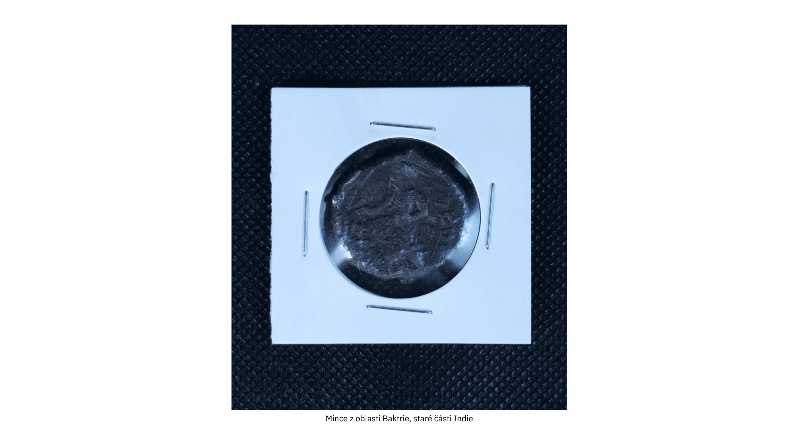

Pro názornou ilustraci tohoto období je zde výše uvedena mince z oblasti Indie, z Baktrie, která se nachází v blízkosti západní části Indického poloostrova, poblíž Afghánistánu. V této oblasti se vyskytovaly mince, které byly pravděpodobně inspirovány řeckými mincemi s vyobrazením jedné z jejich královských osobností.

## Lýdové a Peršané

<chapterId>eb802ab8-8ffd-5b25-907f-8944f120ed14</chapterId>

:::video id=f151eb42-5ff3-4ca1-9af1-1ae2a5e051c0:::

### První lýdské mince z elektra

Protože nemůžeme oddělit výskyt mincí od Lýdie a Peršanů, přejděme k té části světa na východ od Řecka, která dnes tvoří Turecko. První mince, které se objevily na Západě, pocházejí přibližně z poloviny 7. století př. n. l. z oblastí Lýdie a Iónie, které se nacházejí v dnešním Turecku. Tato zásadní inovace spatřila světlo světa kolem roku 650 až 600 př. n. l., přičemž pozoruhodné archeologické nálezy, jako například první mince nalezené v Artemidině chrámu v Efesu, byly datovány kolem roku 600 př. n. l. Tyto primitivní mince byly vyrobeny z elektra, přírodní slitiny zlata a stříbra s jantarovými odlesky, a měly často hrubý vzhled, jednoduše označené razidly nebo primitivními motivy.

Níže si můžete prohlédnout jednu z nejstarších lýdských mincí, na které je zobrazen lev s kořistí v čele. Na zadní straně si můžete všimnout razidla nebo otvoru, který podle některých názorů sloužil k testování ryzosti kovu a k ujištění, že se nejedná pouze o povrchovou vrstvu. Přestože se jedná o jeden z nejranějších příkladů, je důležité si uvědomit, že tento kus je kopií. Všechny mé zlaté a elektrumové kousky jsou repliky nebo moderní rekonstrukce, které mají zabránit tomu, abych za tuto sbírku utratil všechny své úspory.

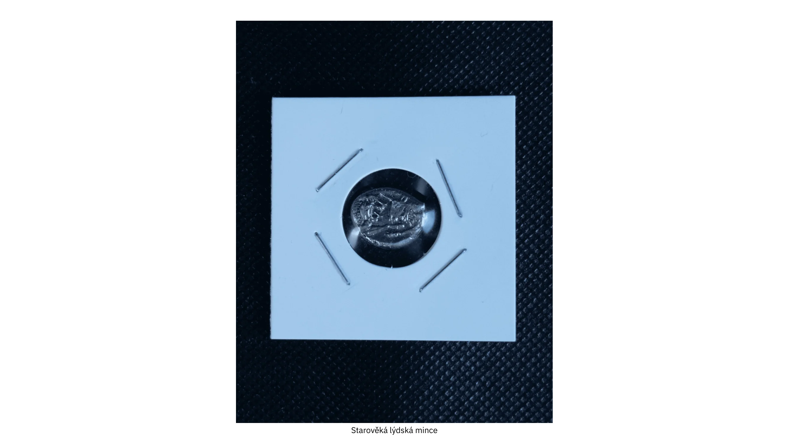

Ale mám také skutečný perský kousek, který se chystáme vidět. Takto vypadaly tyto rané kusy. Je to taková kapka (nebo anglicky hrouda) kovu, která byla v té době vyražena.

Navzdory rozšířenému názoru, že peníze byly vynalezeny pro usnadnění každodenního obchodu a nahrazení směnného obchodu, se zdá, že první lýdské, achaimenovské a řecké mince nebyly původně používány pro drobný obchod. Ve skutečnosti byly tyto peněžní jednotky pro každodenní použití příliš velké. Navíc byl jejich oběh omezen na regiony v blízkosti míst, kde byly vyrobeny.

Zde považuji za důležité zmínit, že ačkoli jsem se v několika pracích antropologického charakteru dočetl, že mince, jak jsem již ukázal - ať už ty z elektra, nebo tato perská mince, ke které se za chvíli vrátím - byly příliš velké na to, aby se za ně dal koupit chléb, řekněme, každý den. Viděl jsem odhady, podle kterých bychom si mohli myslet, že to byl ekvivalent denní práce rolníka nebo vojáka, takže by byly příliš velké. Je to jako snažit se zaplatit denní mzdu za jídlo, snídani nebo oběd. Až na to, že jsem v jiných pracích viděl, že byly nalezeny menší jednotky těchto kapek, tedy menší mince, což nás může přivést k myšlence, že možná existovalo možné využití pro každodenní nákupy.

Takže zde antropologický "důkaz", že se nepoužívaly ke každodennímu obchodu, protože nominál nebo jednotka byly příliš velké, není podle mého názoru příliš pevný, protože jsme našli příklady mincí, které jsou menší a mohly být přizpůsobeny každodenním nákupům.

### Úloha státu při tvorbě peněz

Zdá se, že skutečný původ mincí je spojen s přímým působením států. Na toto téma existují dvě hlavní hypotézy: první, idealistická, uvádí paralelu mezi řeckým termínem "nomisma" (peníze) a "nomos" (zákon) a naznačuje, že peníze byly spojeny s kodifikací zákonů, což posilovalo autoritu a politickou organizaci měst. Druhá, realističtější hypotéza, dnes široce přijímaná, říká, že peníze byly především prostředkem, který umožňoval státům vykonávat ekonomickou a sociální kontrolu. Tím, že státy oficiálně garantovaly váhu a hodnotu drahých kovů, které obsahovaly, mohly manipulovat s oběhem a hodnotou těchto mincí a vytvářet tak důvěru a prémie za likviditu specifické pro domácí měny.

Je opravdu zajímavé vědět, že o tom máme důkazy. Například u mincí z elektra byste měli vědět, že přírodní elektrum obvykle obsahuje přibližně 70 % zlata a 30 % stříbra. V prvních mincích, které jsme našli a analyzovali, konkrétně v raných lýdských mincích, se zdá, že obsah zlata je spíše kolem 50 až 55 % místo 70 %. To naznačuje, že již tehdy se emitenti mincí snažili snížit podíl dražšího kovu, pravděpodobně proto, aby vyrobili více mincí a aby se zdálo, že mají stejnou hodnotu jako neoznačená kapka přírodního elektra. A zde je třeba říci, že to bylo skutečně možné až od doby tohoto slavného Krésa, jakože *bohatého jako Krésa*, protože právě od jeho doby jsme měli technologii na oddělování zlata a stříbra.

Lýdské mincovnictví prošlo významným vývojem za vlády slavného krále Krésa (561-546 př. n. l.), který proslul svým legendárním bohatstvím. V této době Lýdové zdokonalili metalurgii, která umožnila oddělit zlato a stříbro od elektra, a zavedli tak první bimetalické mince, tj. oddělené zlaté a stříbrné mince.

### Perská expanze a přijetí Řecka

Když v roce 546 př. n. l. dobyli Lýdii, Achaimenovští Peršané tuto novinku okamžitě přijali. Kolem roku 500 př. n. l., za vlády Dareia I., zavedli Peršané vlastní peněžní systém se zlatými dariky a stříbrnými siglois, často s královskou podobiznou ve válečné póze. Tato královská perská mince se používala především v helenizovaných oblastech Perské říše a postupně se rozšířila, i když její používání zůstávalo nerovnoměrné, přičemž **některé oblasti, jako například Egypt, stále dávaly přednost směně ve váženém kovu (bullionu)**.

Nahoře můžete obdivovat pravé perské sigloi (nebo siglos). Na malém vzoru je vyobrazen král, ačkoli otvor je již mírně opotřebovaný. Siglos je stříbrná mince, na rozdíl od dariku, který byl vyroben ze zlata. Peršané dokázali tyto dva kovy rozlišit a odklonili se od mincí z elektra. Zavedli tedy bimetalismus, používali zlato i stříbro, přičemž zachovali stejnou koncepci mincí z drahých kovů, často s otvorem na zadní straně, pravděpodobně pro kontrolu obsahu kovu.

Zdá se, že k rychlému zavedení mincí Řekové přispěli svými úzkými kontakty s Lýdii, zejména prostřednictvím řeckých kolonií v Malé Asii. Prvními Řeky, kteří začali razit mince, byli pravděpodobně obyvatelé Aeginy v polovině 6. století př. n. l., kteří zavedli drachmu, jejíž váha se v jednotlivých oblastech lišila a jejíž název doslova znamená "hrst obilí" nebo "hrst šípů".

Úspěch řeckého mincovnictví byl způsoben jak jeho výhodností pro důležité transakce, jako bylo placení žoldnéřů, tak i ekonomickým a politickým rozvojem měst. Měna se rychle stala ústředním prvkem řecké a později i římské ekonomiky, přičemž si zachovala silný symbolický rozměr, zejména díky svému spojení se zákonem (nomos).

Rychlý rozvoj mincovnictví svědčí o hluboké proměně starověkých společností, kde kodifikace peněžních hodnot šla ruku v ruce s organizací státu. Tento vývoj položil ekonomické a politické základy pro vznik řeckých demokracií, zejména v Athénách, kde peníze hrály klíčovou roli ve fungování demokratického města.

Klíčovým bodem, který je třeba si v této části zapamatovat, je, že mluvíme konkrétně o **mincích**, nikoli o penězích obecně. Ústředním aspektem, který se jasně ukazuje, je **důvěra v emisní orgán**, která přímo souvisí s technickými vlastnostmi mincí (hmotnost, ryzost, nominální hodnota). Právě tato důvěra umožňuje státu nebo vydávajícímu orgánu od počátku vykonávat určitou kontrolu nebo dokonce manipulovat s hodnotou a oběhem těchto mincí.

## Institucionální intervence a první mince

<chapterId>3e1efd08-99e3-5a32-9908-3185fef0e640</chapterId>

:::video id=84847cf6-9e46-4a8c-9f35-25a27496cc4b:::

### Dvojí povaha peněz

Vznik ražených peněz vyvolává zásadní otázku: jsou peníze spontánním výtvorem trhu, nebo institucí vnucenou autoritou? Toto pojmové napětí staví proti sobě dvě radikálně odlišné vize.

Na jedné straně rakouská ekonomická škola hájí myšlenku, že komoditní peníze - zejména zlato - byly přirozeně vybrány ekonomickými subjekty pro své vnitřní vlastnosti: trvanlivost, přenosnost, dělitelnost a zaměnitelnost. Z tohoto pohledu si pak stát tuto spontánní měnu přivlastnil, aby kontroloval její nabídku. Jedná se o instituci, která přirozeně vznikla z potřeb trhu, než se jí zmocnila politická moc.

Naproti tomu antropologický a institucionální pohled tvrdí, že peníze skutečně vznikají až se státní ražbou mincí. Úřad by vědomě vytvořil měnu tím, že by na ni připevnil svou pečeť, čímž by se kov proměnil ve skutečný peněžní nástroj. Tento pohled naznačuje, že nejstarší lýdské mince sloužily především k placení armády - jeden stater odpovídal zhruba dennímu žoldu vojáka.

### Paradoxní výhody státní standardizace

Navzdory tomuto teoretickému napětí i rakouští ekonomové uznávají určité výhody státních zásahů do peněz. Standardizace ražbou řeší řadu praktických obchodních problémů.

Bez certifikační autority čelí hospodářské subjekty neustálým rizikům: padělání mincí, podvodům při vyplňování a manipulaci s váhou. Tyto praktiky vytvářejí v ekonomice třecí plochy, protože některé mince jsou přijímány, zatímco jiné jsou odmítány. Oficiální razítko teoreticky zaručuje váhu a kvalitu, což umožňuje plynulejší obchodování.

Tato záruka má na trhu pozorovatelnou cenu: vyražená zlatá mince má vyšší hodnotu než její ekvivalent v surovém zlatě. Tato prémie odráží hodnotu certifikace - obchodníci již nemusí sami ověřovat pravost kovu pomocí chemických nebo rezonančních testů. Státní intervence paradoxně odstraňuje třecí plochy a usnadňuje obchod tím, že vytváří institucionalizovanou důvěru.

### Manipulace s měnou od samého počátku

Příběh prvních lýdských státníků odhaluje znepokojivou ironii. Nedávné analýzy ukazují, že obsah zlata v těchto mincích z elektra byl systematicky nižší než v přírodním elektru. Orgán osvědčující kvalitu současně manipuloval se složením.

Tato praxe ilustruje dvojí užitečnost mincí. Pro trh je díky ní směna plynulejší a nabízí záruku standardizace. Pro emisní orgán se stává nástrojem ekonomické kontroly prostřednictvím ředění. Snížením obsahu zlata při zachování nominální hodnoty stát fakticky zvyšuje peněžní zásobu - vytváří více peněžních jednotek ze stejného množství drahého kovu.

Stát sám však zůstal touto manipulací omezen. Jak ukazuje příklad Konstantinova zlatého solidusu ze 4. století, římská správa úzkostlivě kontrolovala kvalitu mincí, protože požadovala, aby se jí platilo dobrými mincemi. Úřad měl zásadní zájem na udržení kvality vlastních mincí, aby byla zaručena hodnota jeho daňových příjmů.

### Ekonomická analýza devalvace

Studium devalvace měn odhaluje konzistentní vzorce napříč historií. U kovových mincí ekonomové sledují procento drahého kovu obsaženého v mincích - klesající křivka ukazuje na postupné znehodnocování. U moderních papírových peněz je tomu naopak: sleduje se nabídka obíhajících peněz, jejíž nárůst signalizuje devalvaci.

Obě metody měří stejný základní jev: rozmělnění peněžní hodnoty. Ať už se jedná o snížení obsahu drahých kovů, nebo o tisk nových bankovek, mechanismus zůstává stejný. Čím více peněžních jednotek autorita vytvoří ze stejných reálných zdrojů, tím více každá jednotka ztrácí svou hodnotu.

Tato manipulace, kterou lze pozorovat již od nejstarších lýdských mincí, naznačuje, že kontrola peněz byla vždy otázkou moci. Ražené peníze tak představují pozoruhodnou technickou inovaci spojenou s nástrojem ekonomické kontroly - tato dualita se prolíná celou historií měny až do současnosti.

## Výroba dílů

<chapterId>b205f4f2-c293-5308-b812-a998de9ad45e</chapterId>

:::video id=47c612ec-d97e-4498-b50e-7e66518bd56d:::

### Od děrovaných kapek po ražené mince

Po části o vzniku mincí jsem chtěl uvést velmi krátkou část o vývoji výroby mincí. Jak jsme viděli, vše začalo kapkami elektra, pokračovalo zlatem a stříbrem, kde se obě strany označovaly razidlem, buď s tváří krále, nebo otvorem na zadní straně pro kontrolu ryzosti.

Později, jak se dozvíme v následující části, Řekové tuto technologii zdokonalili a vytvořili kulaté mince, které byly raženy z obou stran. Vzali hladký, plochý kus drahého kovu, na jednu stranu vyryli požadovaný vzor a poté jej ručně otloukli, aby vznikla hotová mince.

Technologie individuální ruční ražby mincí pravděpodobně hrála v této době roli při kontrole inflace, i když se mince často ředily, aby se zvýšila jejich produkce. To se projevilo zejména v římském období a v menší míře během některých válek v řeckém období. Přestože ražba mincí po jednom kuse omezovala kapacitu úřadu pro masovou výrobu, účinně přispívala ke kontrole inflace, a to i přes značnou devalvaci, ke které docházelo. Vývoj tak postupoval od kapky kovu, která se razí, ke kulaté ražené minci.

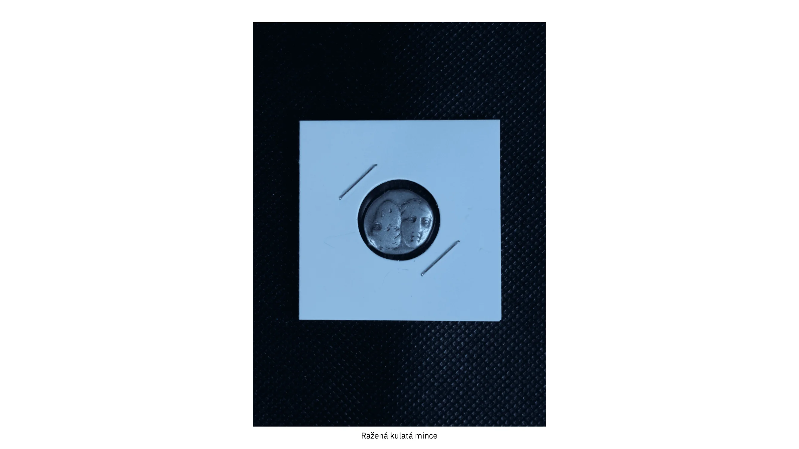

### Středověký vývoj

Ve středověku se také objevil trend rozšiřování mincí, které byly širší a tenčí. Jedním z důvodů byla snazší kontrola jejich zvuku, který se často používal jako ukazatel pravosti. Rozložením stříbra vznikla výrazná frekvence, takže lidé mohli ověřit ryzost mince pouhým poslechem. Tato praxe dala vzniknout termínu "zdravé peníze". V souvislosti se zdravými penězi se standardní hmotnost určovala pomocí vah nebo "trebuchetu" na vážení. Vývoj tak pokračoval od malých kulatých mincí k o něco tenčím a širším mincím.

### Úder kyvadla

Poslední technologií, která se objevila na konci středověku, na počátku novověku, byl pojem kyvadlového bití. Jednalo se o jakýsi šroub, který se utahoval při ražbě mincí, čímž vznikaly mince s touto novou formou ražby. Zvláštností tohoto vývoje byla možnost vyrýt na povrch mince vzor, který řešil problém stříhání. Stříhání spočívalo v odstranění části mince, aby se získalo zpět vzácné stříbro, které pak mohlo být použito k ražbě dalších mincí nebo jednoduše ponecháno jako zdroj.

Tento pojem kyvadla tedy pomohl s fenoménem clippingu. A je zajímavé, že tato technologie vlastně pochází z Francie. Například v Anglii si najali francouzské inženýry, aby jim přišli ukázat, jak tyto stroje vyrobit. Vtipné je, že se našli zastánci kladívkového ražení, kteří byli proti a kteří aplikaci této technologie oddalovali. U každé dobré technologie se vždy najdou lidé, kteří jsou proti ní, kteří chtějí zachovat starou technologii. Přišlo mi dost šílené si uvědomit, že i u technologie, která se zdá být opravdu lepší - můžete vyrobit více dílů, hůře se kopírují -, se stále našli lidé, kteří lpěli na slavné kladívkové metodě. Došlo k posunu mezi výrobou dílů, které byly vyrobeny tímto slavným kyvadlovým úderem, a následným návratem k úderu kladivem. A nakonec se samozřejmě prosadilo právě kyvadlové ražení, které nám nakonec dalo tyto krásné moderní kusy, kde najdete buď malé linky, malé hřebínky kolem, aby se zabránilo ořezávání, pravděpodobně to souvisí se slovem ořezávání, hřebínky, a ještě dnes můžete vidět buď hřebínky, nebo text či kresby, které jsou vepsány na okraji kusu.

# Různé teorie o vzniku peněz

<partId>72ac694f-9248-550d-90c1-91af3d234380</partId>

## Teorie o vzniku peněz a jejich různých definicích

<chapterId>7d699d4d-8c70-55b5-bf36-609f3fd90bcf</chapterId>

:::video id=523c873f-501b-4954-b79f-7e74c0f685a5:::

Vítejte v této části věnované různým teoriím o vzniku peněz a jejich různým definicím. Zde je krátký úryvek z knihy *Aux origines de la monnaie*, který podle mého názoru shrnuje dvě hlavní teorie, jimiž se budeme v této části zabývat.

> Tato stručná preambule slouží pouze k tomu, aby zdůraznila kontext průzkumu. V koncepční rovině je otevřena debata mezi zastánci teze K. Polanyiho a zastánci M. Webera. Pro první z nich hraje ústřední roli dar a přerozdělování, přičemž tržní směna hraje pouze okrajovou roli, a to především v mezinárodní směně. Pro druhé je naopak trh jádrem současného historického procesu.

Například v Mezopotámii jedna z teorií vzniku předpokládá, že chrám jako autorita vytvoří zúčtovací nebo peněžní jednotku, zavede ji a obchodníci ji pak přijmou pro obchod. Opačná teorie tvrdí, že ne, tato peněžní jednotka vzniká přirozeně na trhu, aby usnadnila obchod. V Mezopotámii jsou k tomu dobře doložené příklady.

Co se týče směnného obchodu, některé teorie naznačují, že se používal hlavně při mezinárodní výměně, tedy s lidmi, kterým jsme jednoduše nedůvěřovali.

To je to, co budeme dělat v této části. Provedeme jakýsi průzkum, abychom představili různé teorie o vzniku peněz a různé definice toho, co peníze jsou. Budeme prezentovat a kritizovat teze klasických ekonomů i antropologů. Budu mít dokonce to štěstí, že se mnou bude Ulrich Fromy, který představí pohled rakouského ekonoma na tato různá témata.

## Vznik peněz pro klasické ekonomy

<chapterId>1d3776cd-0dfd-5297-af48-c6f41e257a7e</chapterId>

:::video id=873a16c1-17ac-448d-8941-df4feb7ab79d:::

Tato část je věnována různým teoriím o vzniku peněz. Prvním tématem, kterému se budeme věnovat, je vznik peněz podle klasických ekonomů.

### Klasická teorie Adama Smithe

Podle klasických ekonomických teorií, zejména podle teorie Adama Smithe, peníze vznikly přirozenou cestou ze směnného obchodu jako reakce na jeho omezení. Zpočátku se směna uskutečňovala přímým směnným obchodem, ale tento způsob byl často komplikován problémem "dvojí shody přání": každá osoba musela mít přesně to, co chtěla ta druhá. Postupně začaly být některé komodity (např. sůl, drahé kovy a dobytek) díky své užitečnosti, trvanlivosti a dělitelnosti přijímány všemi jako zprostředkovatel směny. Tak se spontánně objevily peníze, které usnadňovaly a zrychlovaly ekonomickou směnu.

### Kritika klasické teorie

Zde je moje kritika této teorie. Vzhledem ke všemu, co jsme viděli v předchozí části, si myslím, že již nyní můžeme říci, že tato představa, že **mince** jsou evolucí směnného obchodu, je mylná už jen proto, že ražená mince rozhodně vzniká z autority, neboť je ražena autoritou. Důvodů je několik, v neposlední řadě je to snaha autorit ovládnout ekonomiku, převzít kontrolu nad penězi.

Na druhou stranu, pokud mluvíme o penězích jako o konceptu, ne nutně o mincích, pak je to méně jednoznačné, protože u prvních mincí, lýdských statérů, jsme našli stříbrné kapky, které nebyly označeny. Zbývá zjistit, zda byly v oběhu. Pokud byly v oběhu, znamená to, že lidé mohli původně identifikovat toto aktivum jako potenciální měnu, která by mohla být široce žádaná a snadno směnitelná. A možná si této situace všimly úřady až později a vzaly ji pod kontrolu tím, že na ni daly razítko, které ji certifikovalo.

Takový postup má mnoho výhod - není třeba ho kontrolovat, vážit a podobně. O tom si samozřejmě promluvíme. Ale podle mého názoru jsou mince jednoznačně nástrojem, který státy používaly od samého počátku. Nicméně pokud jde o vznik peněz jako takových, nevíme, zda skutečně vznikly z moci, která je zavedla, nebo zda vznikly prostřednictvím obchodu či obchodní směny. Na toto téma budu mít s kolegou Ulrichem velmi zajímavou diskusi později v této části.

Již víme, že první mince z drahých kovů se nepoužívaly k usnadnění každodenní směny, protože jejich hodnota byla příliš vysoká. Víme také, že se používaly především k vojenským platbám. To je dobrý argument pro tezi, že peníze nemusely nutně vzniknout na trhu. Zúčtovací jednotky, nominální hodnoty prvních mincí, byly pravděpodobně příliš velké například pro nákup chleba nebo každodenní nákupy. Mohl to být například ekvivalent denní mzdy. Ne nutně, že by lidé v té době dostávali mzdu, ale to jen pro představu o rozsahu. Tyto mince tedy měly pravděpodobně příliš velkou kupní sílu na to, aby se používaly v drobném obchodě. Na druhou stranu nic neříká o tom, že by se tyto mince nepoužívaly k větším směnám, například kupeckým. Víme, že se používaly především k vojenským platbám. To je jedna z nejoblíbenějších teorií vysvětlujících vznik prvních mincí. Nezapomeňte, že zde hovoříme o mincích, nikoli nutně o penězích obecně. První mince tedy měly svou první úlohu, a tou bylo placení za vojenské platby, za žold.

Například Alexandr Veliký ji skvěle využíval, jak uvidíme později.

Viděli jsme také, že již ve starověké Číně se skořápky kraviček používaly k hospodářské směně (**odměna za práci, měření hodnoty a nákup půdy)**. Navíc v Mezopotámii a Egyptě již existovaly funkční peněžní systémy, které se používaly pro obchod, výplatu mezd a placení daní. Chci tím naznačit, že je rozhodně nesprávné domnívat se, že mince v západním pojetí vznikly z potřeby učinit směnu plynulejší.

Vzhledem k tomu, že mince vydává úřad, můžeme snad předpokládat, že jsou od počátku spojeny s vydávajícím úřadem. To dává smysl. Na druhou stranu nemusíme nutně vědět, jak vznikly formy peněz nebo formy peněžních systémů, tedy proto-mince, které jim předcházely. Na jedné straně budeme předpokládat, že to byly chrámy, které tyto peněžní jednotky identifikovaly, a poté je lidé používali. A na druhé straně vám řekneme, že ne, že to byli obchodníci, kteří potřebovali prostředek směny, způsob obchodování s vnějším světem, a byli to oni, kdo identifikovali například stříbrný kov, který se měl používat, protože po něm byla poptávka z vnějšího světa. Jde o to, že to vlastně nevíme. Proto máme dvě protichůdné teorie. Nemáme dokonalý důkaz, který by vysvětlil, zda peníze vznikají přirozeně z potřeby obchodovat, například u obchodníků, nebo zda vycházejí z autority.

### Rozlišování mezi mincemi a primitivními penězi

Závěrem lze říci, že mince nutně pocházejí od autority, protože byly vyraženy zmíněnou autoritou. Na druhou stranu si nemyslím, že můžeme říci, že je špatné předpokládat, že peníze (to, co předcházelo mincím) nemohly vzniknout, aby usnadnily směnu. Myslím, že ve všech příkladech, které jsme viděli výše, se příklady v tomto smyslu hojně vyskytují.

## Mýtus směnného obchodu

<chapterId>0fcd4964-ac36-5163-a8cf-1aacebc0d2c0</chapterId>

:::video id=0ede29ab-8acd-4d79-9282-bd5991b97076:::

### Recenze Davida Graebera

Právě jsme se zabývali vznikem peněz podle klasických ekonomů. Nyní se budeme zabývat konceptem známým jako mýtus směny.

Jednou z kritik této klasické teorie vzniku peněz je nedostatek historických důkazů, které by její myšlenky podpořily.

Kritika známá jako "mýtus směny", kterou formuloval mimo jiné antropolog David Graeber, zpochybňuje klasickou představu, že peníze vznikly přirozenou cestou ze směny. Podle této kritiky neexistují žádné historické ani antropologické důkazy o tom, že by společnosti před vznikem peněz systematicky používaly směnný obchod. Ve skutečnosti by starověké společnosti fungovaly na základě úvěrů, dluhů, společenských závazků a obřadních směn. "Barterový mýtus" je tedy teoretickým konstruktem, který má ospravedlnit klasickou ekonomickou vizi a nemá žádný reálný empirický základ.

Je však třeba poznamenat, že tato teorie nepopírá, že směnný obchod existoval, například pro výměnu mezi různými kmeny. Pouze popírá, že směnný obchod byl v rámci těchto tzv. primitivních skupin široce rozšířenou činností a že peníze by byly logickým vývojem těchto praktik. Popírá skutečnost, že směnný obchod byl v rámci kmene široce používán a že peníze nakonec vznikly proto, aby zplynuly směnu a vyřešily potíže, které existovaly při směnném obchodu. Místo toho podle této teorie tyto skupiny praktikovaly určitou formu neformálního úvěru nebo daru za dar.

### Primitivní společnosti vs. velké civilizace

**Tady je několik upřesnění týkajících se velkých civilizací starověku.** Myslím, že tato teorie rozhodně platí pro primitivní (bezstátní) skupiny minulosti a dokonce i dnes (např. kmeny, které zkoumali badatelé v 18. a 19. století). Je zřejmé, že nepoužívali směnný obchod, ale spíše formy směny, které jsem zmínil dříve, a to z důvodů, které jsme již uvedli (slabá dělba práce, samozásobitelské zemědělství). Nemyslím si však, že tato teorie platí pro velké civilizace minulosti, jako byla Mezopotámie a starověký Egypt.

Zde jsou dva výňatky z knihy *Aux origines de la monnaie* na toto téma:

> Model, který nastínil M. Mauss ve svém slavném díle "Dar", přijali egyptologové stejně jednomyslně a nadšeně jako nerozvážně. To vedlo k řadě zmatků, které zde nebudeme rozebírat. Poznamenejme jen, že tento model platí pro tzv. primitivní společnosti, což není případ faraonského Egypta.

> Chléb, tj. zpracované obilí, byl tedy účetní jednotkou, která podobně jako šáteček (y) ve Staré říši umožňovala také otevření úvěrů na různorodé zboží. Tento jednoduchý příklad ukazuje, že ekonomika faraonského Egypta se neomezovala na systém přerozdělování. Byla velmi složitá a zahrnovala množství směn.

Jak jsme tedy viděli dříve v části o Egyptě a dokonce i o Mezopotámii a Číně, můžeme vidět, že i tyto starověké, ale nikoli primitivní civilizace, díky přítomnosti státu, podle mého názoru, používaly peněžní systémy. Myslím, že to bylo dostatečně demonstrováno v první části tohoto kurzu. A tak se tato představa o dávání a přijímání, o odloženém úvěru, na tyto velké civilizace nevztahuje. Přesné důvody vzniku peněz proto zůstávají záhadou. Nevíme, zda vznikly z potřeby obchodníků obchodovat s vnějším světem, nebo zda byly v těchto starověkých obdobích vnuceny chrámem.

## Vznik peněz prostřednictvím dluhových peněz

<chapterId>4f508615-aa61-5d62-89d3-cecd02aeaa62</chapterId>

:::video id=a23f547f-3906-4f4a-8f72-5d78c649d0c4:::

### Peníze jako IOU

V této části se budeme zabývat teorií dluhových peněz.

Teorie **dluhových peněz**, kterou rozvinul zejména ekonom Alfred Mitchell-Innes a později rozšířil David Graeber, tvrdí, že peníze nevznikly z barterové směny, ale spíše z dluhových a úvěrových vztahů existujících od nejstarších lidských společností. Podle této teorie se peníze objevují, když se společenské závazky (dluhy mezi jednotlivci nebo skupinami) stanou kvantifikovanými a převoditelnými. Toto pojetí zavádí pojem kvantifikace směny a převodu. Peníze by tak byly především **uznáním dluhu**, podloženým vzájemnou důvěrou a často zaručeným politickou nebo náboženskou autoritou, a nikoli zbožím sloužícím pouze jako prostředník ve směnách.

Ještě pokročilejší formou této teorie je tvrzení, že všechny peníze jsou dluhem. Někdo, kdo vlastní peníze, má tedy pohledávku vůči společnosti obecně, pohledávku vůči všem, kteří tyto peníze přijímají. A protože peníze **v jejich pojetí musí být přijímány povinně**, jinak to nejsou peníze, protože pokud můžete tyto peníze odmítnout, jejich systém nefunguje. V dané skupině, která si určila měnu, jako by všichni, kdo ji vlastní, měli dluh vůči všem ostatním členům této společnosti, kteří tuto měnu přijímají, a ti, kdo tuto měnu přijímají, mají určitou formu dluhu vůči osobě, která tuto peněžní jednotku vlastní. To je v podstatě jejich teorie.

### Kritika povinného systému

**Moje kritika této teorie:**

Dovolte mi jednu malou výtku k této teorii. Souhlasím s tím, že peníze jsou druhem společenského konsensu. Je to důvěra, kterou skupina vkládá do peněžního "znaku", ať už je jakýkoli. Hlásím se tedy ke konceptu vzájemné důvěry, kterému se budeme věnovat později v souvislosti s konceptem peněžní prémie. Kde se to komplikuje, je, když zastánci této teorie přidají pojem závazku a trvají na pojmu dluhu. Pro ně platí, že když někdo vlastní peněžní prémii token, má pohledávku vůči společenství jako celku, a společenství by tedy mělo vůči držiteli dluh. Existoval by také závazek k vyrovnání, přičemž členové skupiny by byli povinni přijmout token; jinak by podle nich systém nefungoval. Myslím, že výše popsaný systém ve staré Číně tuto teorii dobře reprezentuje.

Pokud jde o mě, dokážu si snadno představit systém, v němž jsou peníze společenským konsensem, kde je vybraná token obecně přijímána jako platební prostředek bez formálního závazku. Dovedu si představit, že takový systém bude fungovat, pokud ho lidé přijmou z vlastní vůle. Může to fungovat. Na druhou stranu s ním často přicházejí závazky, zákonná platidla a násilí, kterému se budeme věnovat později v jedné z kapitol. Teoreticky však nemám dojem, že by tento systém mohl zcela fungovat. Myslím, že Bitcoin je toho příkladem. Bitcoin má hodnotu, protože má peněžní prémii, protože existuje poptávka po jeho peněžním využití, tj. rezervy hodnoty, možná také prostředky směny nebo ochrany proti fiat systému. Nikdo není povinen ji přijmout, a čím více je přijímána jako platební prostředek, tím více může být použita jako prostředek směny. Již nyní ji můžeme bez problémů používat jako uchovatel hodnoty. O tom není pochyb. Chci tím říci, že Bitcoin se mi jeví jako příklad, jako druh měny, která je formou společenského konsenzu, kdy si myslíme, že budeme moci dostat své peníze zpět, pokud si je později koupíme, pořídíme si je, abychom je mohli později směnit, abychom si zachovali kupní sílu.

Tento méně restriktivní pohled na teorii pomáhá vysvětlit, jak mohou dvě odlišné společnosti obchodovat s peněžní jednotkou token, jako je zlato, aniž by mezi těmito společnostmi vznikla pohledávka nebo dluh. Vynutit si přijetí ve společnosti podle mého názoru nefunguje při obchodování mezi dvěma kmeny, protože druhý kmen nepodléhá autoritě. Kmen B nepodléhá autoritě kmene A. Přesto však přijímá stejnou měnu token řekněme zlato. Lidé mi teď možná řeknou: "Ano, ale to proto, že společnost B se také rozhodla, že zlato je jejich měna." Takže to funguje. Ano, skutečně to funguje, ale v tu chvíli nedochází k tvorbě dluhu. Je to konečná transakce. Takže když společnost A vymění zboží za zlato u společnosti B, nedochází k vytvoření dluhu, transakce je dokončena. A je zřejmé, že osoba ve společnosti B nezískala tuto zlatou minci nebo nuget proto, aby jí později zaplatili lidé ve společnosti A. Přijímá ji proto, aby ji vyměnila za zlato. Přijímá ji proto, aby ji později vyměnil, pravděpodobně v rámci svého vlastního kmene. V tomto příkladu tedy nedochází ke vzniku dluhu, neexistuje žádný skrytý nárok, jde prostě o přímou směnu, přímou platbu. Zastánci dluhové měny nám budou tvrdit, že se jedná o barter. A já s tím nesouhlasím, protože barter je směna přímého zboží. Přímý barter je směna jednoho zboží za jiné zboží, za užitek. Zboží se směňuje za účelem použití, zatímco v našem případě je zlato jednoznačně použito jako měna, protože nebude použito k ničemu jinému; bude použito později jako platební prostředek. Podle mého názoru tedy nespadá do kategorie směnného obchodu.

Vlastnictví peněžní jednotky token není "nárokem" na komunitu, ale spíše nadějí, že jednotka token bude později přijata ve srovnatelné hodnotě.

## Spontánní vznik peněz

<chapterId>e3ef86b1-73b9-5140-a61e-2ab6a5b0b2d4</chapterId>

:::video id=e543995f-d5e2-49d7-9133-e397b46e0833:::

Podle rakouské ekonomické školy, jejímž iniciátorem byl Carl Menger, peníze přirozeně vycházejí z barterové ekonomiky, která se potýká s problémem dvojí koincidence potřeb. Podle této vize se jednotlivci spontánně sbližují na meziproduktech, které usnadňují směnu - ne na přímo spotřebovávaných statcích, ale na zbožích uznávaných pro jejich schopnost být široce poptávány.

Tyto peněžní statky musí mít vlastnosti, které byly identifikovány již u Aristotela: musí sloužit jako uchovatel hodnoty, prostředek směny a zúčtovací jednotka. Ekonomické subjekty je postupně identifikují, hromadí a ukládají, čímž iniciují jejich vznik jako peněz. Tento proces je zcela spontánní - peníze představují přirozenou tržní reakci na problém koordinace směny bez vědomého zásahu autority.

### Debata o "mýtu o výměnném obchodu"

Antropologové jako David Graeber tento názor zpochybňují a odvolávají se na "mýtus směny". Argumentují tím, že žádná komplexní civilizace založená pouze na přímém směnném obchodu nebyla nikdy doložena. Studované primitivní společnosti spíše používaly systémy neformálního úvěru a reciprocity. Graeber tvrdí, že dluh předcházel barteru, a cituje tisíce mezopotámských tabulek dokládajících úvěrové vztahy.

Tato kritika je však založena na restriktivní definici barteru. Jak upozornil Menger již v roce 1892, barterový obchod přesahuje rámec prosté přímé směny zboží za zboží. Zahrnuje také odložené převody, služby za mzdu a směny s časovým určením - to, co Menger nazýval "jednostranné převody mezi jednotlivci". Tato rozšířená forma barteru může koexistovat s úvěrovými systémy v omezených kruzích důvěry.

Absence důkazu není důkazem neexistence a rakouští ekonomové uznávají, že žádná komplexní společnost se nemůže udržitelně rozvíjet pouze na základě přímé směny - proto je nutný vznik peněz.

### Případ Mezopotámie: obchodníci versus chrámy

Debata se krystalizuje kolem původu mezopotámského stříbrného šekelu. Existují dva protichůdné výklady. Institucionální názor tvrdí, že chrámy - skutečná ekonomická a duchovní centra - zavedly stříbro jako měnu pro strukturování ekonomiky. O této centralizované kontrole svědčí klínopisné tabulky, soustředěné mezi duchovními a kupeckými elitami.

Rakouská interpretace naznačuje opak: byli to obchodníci, kdo přijal peníze pro dálkový obchod. Tváří v tvář výzvě obchodování s cizinci za hranicemi Mezopotámie - od Anatolie po Perský záliv - potřebovali něco všeobecně rozpoznatelného, trvanlivého a přenosného. Stříbro bylo díky svým vlastnostem přirozenou volbou. Chrámy pouze potvrzovaly praxi, která se již zavedla v obchodním styku.

Tato práce vychází z doložených výměn mezi Kanešem v Anatolii a Assurem, kde obchodníci vyměňovali textilie za stříbrný kov - nikoli pro jeho materiální užitek, ale jako uchování hodnoty. Tyto transakce přesahovaly rámec pouhého směnného obchodu a odhalovaly existenci skutečné komoditní měny.

### Moderní příklad vězeňských táborů

Ekonom Richard Radford, který byl za druhé světové války vězněn v Německu, zdokumentoval fascinující případ spontánního vzniku měny. V táborech se směnnou jednotkou přirozeně staly cigarety - dělitelné, standardizované, široce přijímané. Dokonce i nekuřáci si je osvojili, protože rozpoznali jejich univerzální směnnou hodnotu.

Tento mikrokosmos ilustruje rakouský princip: před problémem koordinace směny se jednotlivci spontánně shodují na nejlépe "prodejném" zboží. Peníze na cigarety nevnucovala žádná autorita; vznikly z každodenní praxe vězňů, kteří se snažili optimalizovat své směny.

### Konvergence individuálních preferencí

Peníze v podstatě představují sbližování individuálních preferencí směrem k přijatelnému společnému dobru. Mezopotámští obchodníci, stejně jako Radfordovi vězni, identifikovali dobro, které minimalizuje nejistotu budoucí směny. Tato volba nečeká na povolení nebo vnucení centrální autoritou - vyplývá z praktické racionality ekonomických subjektů, které čelí výzvám směny.

Debata mezi spontánním vznikem a vědomou institucí zůstává otevřená, protože historické důkazy jsou kusé. Rakouská analýza však nabízí ucelené vysvětlení: peníze se zrodily z praktických potřeb obchodu, přičemž úřady pouze institucionalizovaly praxi již zavedenou na trhu.

## Antropologická vize vzniku peněz

<chapterId>ec48c5d8-47ed-530f-beb7-c44fd0b62880</chapterId>

:::video id=8c1f8764-75af-4fb6-a98b-55de3b7da02e:::

### Neekonomický původ peněz

V této části se budeme zabývat antropologickým pohledem na vznik peněz, který je bohatou perspektivou, jež zásadně zpochybňuje klasické ekonomické teorie.

Na rozdíl od tradiční teorie, podle níž peníze vznikly přirozenou cestou z barteru, aby usnadnily ekonomickou směnu, antropologický výzkum ukazuje, že vznik peněz má z velké části neekonomické příčiny. Vychází ze sociálních mechanismů, jako jsou platby tributu, odškodnění za vraždu (slavný wergeld) a věno (peníze za nevěstu), ale také z obřadních, náboženských, politických a symbolických praktik, a to mnohem více než z prostých tržních potřeb.

V primitivních společnostech se peníze jen zřídka používaly ke každodenní směně hmotných statků, což je v rozporu s klasickou definicí peněz jako "prostředku směny". Ve skutečnosti tyto společnosti masivně využívaly úvěr s odloženými platbami zakotvenými v rozsáhlých sítích sociálních a osobních vztahů. Tyto všudypřítomné úvěrové systémy logicky a historicky předcházely vzniku peněz.

To vystihuje jejich vizi. S Ulrichem o tom hovoříme v našem rozhovoru v předchozím videu. Nechám vás vychutnat si Ulrichovy komentáře k tématu, které tento přístup trochu zpochybňují. A tak se v antropologické vizi často setkáváme s představou, že peníze pocházejí od autority nebo ze společenského konceptu, který předchází potřebám trhu.

### Příklad kamenů Yap

Níže můžete obdivovat pozoruhodný příklad monumentálních kamenů na ostrově Yap. Některé z těchto kamenů i přes svou nehybnost či dokonce fyzický zánik nadále plně fungovaly jako peníze díky kolektivní dohodě, což podtrhuje bytostně sociální a symbolický rozměr peněz.

Toto je opravdu zajímavá analýza kamenů Yap. Saifedean Ammous se o tomto příkladu zmiňuje také ve své knize "The Bitcoin Standard". Podle něj se systém ostrova Yap nejvíce podobá systému Bitcoin, tedy jakési centrální evidenci, do které může každý nahlížet, která je veřejná, vede účty a spravuje vlastnictví věcí. Tento antropologický pohled ilustruje, že to vše představuje dohodu či společenský konsenzus uvnitř společnosti, který je v zásadě přesný. A tato zmínka o ztracených kamenech mi přijde velmi zajímavá. Na malých vorech se vydávali stovky kilometrů na moře a kameny přiváželi zpět. Někdy kámen spadl na dno moře, ale tento kámen by se přesto používal v peněžním systému. Člověk mohl říci: "Ano, kámen nám spadl na takové místo, je můj, takže ho můžeme vyměnit". K usnadnění směny nebylo nutně zapotřebí fyzické držby, protože kameny byly tak velké, že často zůstávaly na jednom místě. Místo toho byl kladen důraz na výměnu těchto kamenů transakčním způsobem, což umožňovalo změnu vlastnictví, aniž by se kameny skutečně pohybovaly. Jednalo se o určitou formu "důkazu shody", což poukazuje na zajímavý antropologický pohled na peníze.

### Proto měny a sociální závazky

Etnografové po celém světě zaznamenali, že společnosti používaly "protoměny" nebo "primitivní měny", jako jsou mušle, látky, dobytek, sůl a kameny, které plnily funkce obvykle připisované penězům, jako je platební prostředek a uchování hodnoty, aniž by však pravidelně fungovaly jako prostředníci při výměně každodenního zboží.

Popisujeme zde tedy peněžní systémy, které nebyly nutně používány pro každodenní směnu.

A rád bych připomněl, že všechny tyto měny byly měnami před nástupem mincí, a nevím, jak moc je nesprávné říkat měna. Raději říkám měna. Mohu zmínit, že v literatuře často hovoříme o proto-měnách, abychom označili peníze před mincemi. Ale jak jsme viděli v první části, **jsem přesvědčen, že peněžní systémy existovaly dávno před vznikem mincí**.

Tyto primitivní měny se používaly především pro správu základních společenských závazků spojených s jednotlivci, jako je sňatek, odškodnění při konfliktu (Wergeld) nebo dary mezi náčelníky. Například v Perské říši byly první mince vytvořeny výslovně jako prostředek vojenského placení, nikoli jako prostředek směny.

Primitivní peníze mají tedy jednu základní vlastnost: jsou platebním prostředkem, ale jen velmi zřídka prostředkem přímé směny hmotných statků. Máme tím na mysli, že byly platebním prostředkem pro určité společenské závazky, pro kmeny, pro směnu mezi náčelníky, známý wergeld, krvavé peníze. Před vznikem justičních systémů, pokud někdo spáchal vraždu, existovalo odškodnění pro rodinu, která trpěla vraždou svého blízkého. Za to se platilo, říkalo se tomu krvavé peníze a je to forma platby. Existovalo také věno, což je také forma platby. V těchto raných případech používání peněz jako formy platby se spíše vztahovaly k lidským a společenským závazkům než k platbám za každodenní nákupy. Podle této teorie se tyto běžnější každodenní směny týkaly spíše úvěru, odloženého úvěru, daru za dar a přerozdělování dávek. Pro řízení těchto směn existovala jiná forma společenské organizace. Je také důležité si uvědomit, že ve společnosti, kde je každý soběstačný, sám hospodaří, neexistuje specializace a peněžní systém pro každodenní směnu je velmi málo potřebný. A právě proto byly prvními formami peněz ty, které jsme právě popsali, věno, krevní peníze, prostě proto, že to byly první směny, kdy jsme potřebovali platební prostředek, dávno předtím, než jsme potřebovali obchodovat, vyměňovat chléb za peníze na denní bázi, protože v primitivních společnostech to tak nefungovalo. Každý si obstarával své potřeby sám a ještě neexistovala specializace. Myslím, že jsem se tím podrobně zabýval ve všech předchozích přednáškách tohoto kurzu.

V těchto společnostech bez pokročilé dělby práce zůstávala přímá výměna omezená a probíhala především v rámci osobních přátelských nebo spojeneckých vztahů. Absence dostatečné specializace nevyžadovala peníze v moderním slova smyslu.

Antropologové jako Quiggin a Einzig trvají na přednosti úvěru: **Peníze zasahují zejména tehdy, když platby musí být okamžité a kompenzace nelze snadno odložit**

Lidé si tedy vyměňují věci, mohou poskytovat odložené úvěry, ale v některých případech nelze platbu odložit, takže měna nebo proto-měny mohou být v tomto bodě užitečné, aby byla směna okamžitě dokončena.

### Inovace anonymity

Tato analýza vede k hlubšímu zamyšlení: spíše než stavět peníze proti směnnému obchodu je vhodnější chápat jejich vznik jako vývoj ze složitých systémů úvěru a dluhu. Peníze zavádějí zásadní inovaci: *peníze přinášejí novou inovaci: *anonymitu**. A právě v tom je pro mě tato antropologická teorie vzniku peněz zajímavá. Pokud jste malá skupina lidí a dáváte si navzájem odložené úvěry, zřejmě se znáte. Myslím si, že aby tento systém fungoval, lidé se samozřejmě musí znát. A platba provedená penězi umožňuje anonymitu. Umožňuje provést platbu, aniž by lidé znali vaše jméno, aniž by lidé věděli, kdo jste. Mohou provést výměnu za okamžité a konečné vyrovnání. A právě to peníze umožňují.

Na rozdíl od úvěru, který je vždy nominativní, umožňují peníze anonymní, všeobecné a bezprostředně osvobozující transakce. **Tato jedinečná osvobozující síla peněz je jejich rozhodující předností**

Peníze tedy zdaleka nejsou jen skromným nástrojem usnadňujícím ekonomickou směnu, ale představují významnou společenskou inovaci, která úzce souvisí s vývojem lidských institucí a praktik, od osobního úvěru **po všeobecný anonymní platební systém**. Tento antropologický vývoj ukazuje, že peníze, daleko více než pouhý prostředek směny, představují mocnou společenskou instituci, která hluboce formuje lidské společnosti, až se v našich moderních společnostech stávají samotným smyslem ekonomické činnosti.

Zde si uvědomujeme, že v našich moderních společnostech je nakonec smyslem ekonomické směny vlastnit peníze, zatímco v minulosti tomu tak vůbec nebylo. Samotným účelem ekonomické směny bylo vlastnit zboží nebo komodity určené ke spotřebě. A dnes, zavedením inovace v podobě peněz, je účelem ekonomické směny tyto peníze hromadit, neboť nám umožňují směnit je za zboží, jak je obecně přijímáno. Můžeme je vyměnit za zboží, které potřebujeme, když ho potřebujeme.

## Sjednocení registrů

<chapterId>7664442a-91c1-5ce4-a8bd-53b7371a3e3d</chapterId>

:::video id=473fc284-5375-4e1b-b0cd-6b51ba0cc3b8:::

### Teorie účetních registrů

Nyní se budeme společně zabývat různými návrhy na sjednocení těchto dvou měnových teorií, tj. teorie vzniku peněz prostřednictvím dluhových peněz a měnové teorie vzniku zbožových peněz. Budeme hovořit o návrhu sjednocení Lynn Aldenové v její slavné knize "Za rozbité peníze", jejíž překlad, který vydá Consensus, se bude pravděpodobně jmenovat "Rupture monétaire".

*Úryvek z knihy Broken Money od Lyn Aldenové:*

> Peníze jsou v podstatě účetní evidence. Zbožní peníze jsou registr, který se řídí přírodou. Bankovní peníze jsou účetní knihou řízenou národními státy. Peníze s otevřeným zdrojem jsou účetní knihou, kterou řídí jejich uživatelé.

Lyn zde odkazuje na Bitcoin.

### Poměr zásob a toku a nedostatek

> Některé vzácné chemické prvky, například rhodium, jsou vzácnější než zlato, ale mají nízký poměr zásob, protože jsou spotřebovávány průmyslem stejně rychle, jako jsou těženy. Minci nebo slitek rhodia lze zakoupit jako specializovaný sběratelský předmět nebo uchovatel hodnoty, ale není vhodný jako společensky uznávané platidlo, a proto přirozeně nevzniká jako peníze.

Saifedean o tom podrobně hovoří ve své knize "The Bitcoin Standard". Pro ty, kteří neznají poměr zásob k přílivu, jde jednoduše o porovnání stávajících zásob, tedy zásob, které na trhu existují, s nově příchozími zásobami, tedy přílivem nových zásob. Často je to spíše protimluv, protože si můžete myslet, že něco, co máte ve velkém množství, není vzácné, ale ve skutečnosti tomu tak není. Je to spíše otázka kapacity, kterou máte k dispozici, abyste ji dodali. Podle tohoto modelu nám spíše kapacita, kterou máme na nové zásoby, dává informaci o tom, zda je tento předmět vzácný, nebo ne. Není to proto, že něco nemáme na skladě, že je to vzácné, je to možná jen proto, že to nemáme. Vezmeme-li si tedy zlato, máme spoustu zásob zlata, protože se používá jako uchovatel hodnoty, a příliv nových zásob je něco kolem 1 % až 3 % ročně nových zásob zlata, které přicházejí prostřednictvím zlaté mining. V tomto případě se jedná o příliv nových zásob zlata. Zatímco to, co zde říká, pokud mluvíme o rhodiu, je vzácnější než zlato, ale nemáme žádné zásoby, protože se spotřebovává za pochodu. Takže ke zdvojnásobení stávajících zásob není potřeba mnoho nových dodávek. Zatímco u zlata by bylo potřeba nejméně 50 let na obnovu, aby se zásoby zdvojnásobily. Na rozdíl od většiny zboží, které se spotřebovává, kde je to poměrně snadné a není potřeba mnoho let výroby, aby se zdvojnásobila stávající zásoba, protože se spotřebovává za pochodu.

*"Zlato si v průběhu moderní historie udržovalo poměr zásob k toku v rozmezí 25x až 100x, obvykle kolem 50x a více, přičemž krátce nikdy neklesl pod 16x, a to ani během zlaté horečky v polovině 19. století. "*

25 let by tedy znamenalo 25 let na zdvojnásobení zásob a 100 let na zdvojnásobení zásob. Saifedean ve své knize uvádí, že i kdybychom zdvojnásobili produkci zlata, řekněme z 1,5 % na 3 %, nemuselo by to mít nutně velký vliv na jeho cenu.

*"Stříbro má obecně poměr zásob a toku 10x a více, což je stále relativně vysoká hodnota.*

*U většiny ostatních komodit je poměr mezi zásobami a tokem menší než 1 nebo 2. Dokonce i nejvzácnější prvky, jako je platina a rhodium, mají poměr zásob a toku relativně nízký vzhledem k jejich rychlé průmyslové spotřebě. "*

### Nadřazenost zlata a stříbra

*"Stručně řečeno, kdykoli se komoditní měna ocitla v konkurenci se zlatem a stříbrem, vždy nakonec zvítězila. Jiné komodity mohou zůstat měnami po omezenou dobu nebo v určitých regionech, ale zlato a stříbro vždy prokázaly svou schopnost stát se globálně konkurenceschopnými měnami a v konkurenci dominovat. Je tomu tak proto, že když se civilizace setkaly, držitelé zlata a stříbra měli vždy technologickou schopnost znehodnotit ostatní formy měny, zatímco držitelé mušlí, perel, dobytka, soli, látek nebo podřadných kovů nikdy nemohli znehodnotit zlato nebo stříbro. "*

To je opět velmi dobře popsáno v knize The Bitcoin Standard, kde Saifedean hovoří o kmenech v Africe, které používaly skleněné korálky. A když přišli benátští obchodníci s nákladem plným skleněných korálků, protože je v té době dokázali průmyslově vyrábět, měli na to technologické kapacity, zcela to destabilizovalo peněžní systém těchto národů a oni mohli doslova drancovat jejich zdroje. To je Saifedeanova teze.

### Účetní jednotka a kredit

*"Historicky, i když byl úvěr používán přímo jako nástroj směny, byl obvykle denominován v jednotkách peněžních komodit, které byly přirozeně vybrány pro své vlastnosti. "*

To je velmi zajímavá otázka, o které jsme s Ulrichem diskutovali. I když byl chrám v Mezopotámii jakýmsi orgánem, který mohl spravovat tento pojem úvěru, zúčtovací jednotkou byl šekel. Neexistuje nic, co by potvrzovalo, že šekel byl autoritativně stanoven chrámem. Šekel mohl vzniknout přirozeně, díky potřebě obchodníků dovážet a vyvážet s ostatními národy v okolí. Máme o tom důkaz v podobě kupce v Kaneši (zmínil jsem se o něm v 1. části), který přesně toto dělal, dovážel drahé kovy, které se nepoužívaly pro svou fyzickou hodnotu zboží, ale spíše jako uchovatel hodnoty. Jediným problémem je, že nevíme, zda můžeme předpokládat, že tento výběr stříbra, stříbrného šekelu, provedli obchodníci, nebo zda jej provedl chrám. Ulrich má ale velmi dobrý argument, který nás vede k tomu, že to bylo pravděpodobně spíše na straně obchodníků, že to bylo provedeno.

*"Sjednocení obou teorií lze tedy označit za "účetní teorii peněz" ("účetní teorii peněz"), neboť popisuje základní logiku společnou oběma teoriím. Jak flexibilní společenský úvěr, tak sběratelské proto-měny sahají až do úsvitu lidstva. V obou případech si lidské skupiny různých velikostí mezi sebou vedou účetní knihu, aby nemusely uspokojovat dvojí shodu přání, snižují tření při směně a slouží jako forma likvidních úspor. Zásadní rozdíl spočívá v autoritě pověřené vedením této knihy. "*

Na jedné straně příroda řídí expanzi peněžní zásoby. Vezmeme-li tedy zlato, protože je poměrně vzácné, je obtížné ho těžit. Existuje určitý limit počtu zlatých mincí, které lze vytěžit. Takže nedostatek je řízen přírodou. A rejstřík je držen konceptem vlastnictví. Registr je decentralizovaný. Držení se prokazuje tím, že vlastníte zlatou minci nebo kus zlata. A v případě úvěrových peněz je nedostatek řízen schopností lidí získat úvěr. Nebo v případě fiat měny je nedostatek řízen autoritou. To ony rozhodují o tom, zda se bude tisknout více, nebo ne, aby se předešlo inflačním katastrofám. Takže v některých případech může být registr řízen i vlastníkem token, v případě papírových peněz. Proto se do registru zapisují v uvozovkách dematerializované. Tedy zhmotněné, ale virtuální. Vlastní tuto slavnou token, a to je to, co prokazuje vlastnictví. A stejně tak může být ve skutečném registru, jako je tomu u písařských peněz, v bance, kde je to skutečně lidská banka, která spravuje, kdo co vlastní ve vztahu k registru.

## Sjednocení prostřednictvím měnové prémie

<chapterId>093756e5-8908-55e5-bb76-376a3a3cc4d3</chapterId>

:::video id=eabc342a-ecbd-46ca-a347-e914917e7c4f:::

### Koncept peněžní prémie

V této části věnované různým návrhům na sjednocení různých teorií vzniku peněz jsem právě navrhl teorii Lyn Aldenové, teorii registrů. Mám vlastní návrh na sjednocení obou peněžních teorií. Je to peněžní prémie, koncept peněžní prémie. Hodnotu peněz lze tedy vysvětlit peněžní prémií vyplývající z jejich peněžní poptávky, ať už ve formě hliněných tabulek, mincí z drahých kovů, bankovek nebo bitcoinů. Peněžní prémie jednoduše vychází z jistoty, že někdo tuto měnu v budoucnu vymění za srovnatelnou cenu.

Snažím se zde jednoduše ukázat, že ať už se jedná o fiat, tj. bankovky bez užitné hodnoty, nebo o zlaté mince či jakýkoli kov, kus zlatého nugetu nebo slitek, **často tvoří většinu jeho hodnoty peněžní prémie**. Vezmeme-li kus zlata, určitou část jeho hodnoty vysvětluje jeho užitná hodnota, jeho využití v průmyslu nebo k výrobě šperků. Všimněte si, že poptávka po špercích často vychází z jejich peněžní hodnoty. Lidé uchovávají šperky jako určitý druh uchování hodnoty, takže je trochu zahrnuji do peněžní přirážky, protože často je to spíše peněžní poptávka, která hraje roli v penězích.

Dalo by se tedy říci, že přibližně 10 % poptávky po zlatě je určeno pro průmysl. V hodnotě zlata bychom měli malou část, řekněme 10 %, která by byla vysvětlena touto průmyslovou poptávkou, touto poptávkou po využití zlata, kde se zlato spotřebovává. Zbytek je jednoznačně poptávka po jeho peněžním využití jako uchovatele hodnoty.

### Bonus autority a fiat

A pokud srovnáte kus zlata se zlatou mincí, je tu další vrstva. Zlatá mince je vyražena autoritou a zlato obsažené v tomto kusu se také těší poptávce po použití, poptávce po spotřebě v průmyslu. Těší se také peněžní prémii jako uchovatel hodnoty. Navíc je tu ještě překryvná vrstva, kterou nazývám prémie autority, kdy bude často existovat cena, větší kupní síla za minci než za kus zlata, protože mince je jednodušší na použití. Díky ní je směna plynulejší, protože není třeba ji vážit. Autorita obvykle ručí za její ryzost. A pokud ji srovnáte s kusem zlata, má ražená zlatá mince zpravidla větší hodnotu než prostý kus zlata. A to je také normální, protože na její ražbu jsou potřeba prostředky.

Stejný princip platí i pro fiat, papírové peníze. Papírové peníze ve skutečnosti nemají žádnou užitnou hodnotu, snad s výjimkou vytápění domu, a to se stalo za Výmarské republiky. Takže po jejich užitné hodnotě není skutečná poptávka. Na druhou stranu existuje podle mého názoru pouze prémie za autoritu.

Je to forma peněžní prémie, překryvná složka peněžní prémie. Její peněžní prémie však pochází z toho, že je zákonným platidlem, a úřady vás pak nutí ji kupovat, abyste mohli platit daně. Fiat měna má tedy nutně formu peněžní poptávky vyplývající z toho, že je zdaněna a vy si ji musíte pořídit alespoň proto, abyste zaplatili daně. A v důsledku toho zůstává obecně přijímaným platebním prostředkem. Lidé si ji tedy chtějí pořídit, aby uspokojili své potřeby.

### Sjednocení prostřednictvím měnové poptávky

A proč je tento návrh měnové prémie považován za sjednocení dvou teorií dluhových a komoditních peněz? Inu, nemám pocit, že hodnota zlaté mince nutně vychází z její "vnitřní hodnoty". Ne, ve skutečnosti je to stejně jako u fiat peněz pojem důvěry. Je to pojem peněžní poptávky. A opravdu to není proto, že má malé procento průmyslového využití, další "užitečnost". Řekneme-li, že průmyslové využití tvoří 10 % jeho hodnoty, mohli bychom ho ocenit na 300 USD za unci. Pokud se zlato na trhu prodává za 3 000 dolarů za unci, rozdíl mezi 300 a 3 000 dolary je známá peněžní prémie. Právě tato peněžní poptávka po zlatě to vysvětluje. To, že fiat má nulovou užitnou hodnotu, neznamená, že je to jinak. Pro mě je to úplně stejné. Takže na obou stranách, teorii dluhových peněz nebo komoditních peněz, si nemyslím, že by jakási extra vlastnost, kterou by mělo zlato, že má minimální užitnou hodnotu, něco měnila.

Na druhou stranu je jisté, že **na úrovni vzniku můžeme podle Misesova regresního teorému navrhnout, že toto použití vytváří poptávku na počátku a iniciuje proces, který se stává penězi.** Zatímco na úrovni dluhových peněz jde spíše o vnucení autoritou, takže zdroj, iniciace vzniku a pojmy jsou zcela odlišné. **Myslím si však, že na úrovni hodnoty, jak vysvětlit hodnotu peněz, pomocí peněžní prémie, můžeme stejně snadno vysvětlit, proč mají fiat peníze hodnotu, kterou jim přisuzujeme, a proč mají komoditní peníze hodnotu**, kterou jim přisuzujeme. Pro mě je to stejný proces a nazývá se peněžní prémie.

#### Peněžní prémie

To je vše. Hodnotu peněz lze vysvětlit peněžní prémií vyplývající z jejich peněžní poptávky, ať už ve formě hliněných tabulek, mincí z drahých kovů, bankovek nebo bitcoinů.

Peněžní prémie je jednoduše založena na jistotě, že někdo tyto peníze později vymění za srovnatelnou cenu.

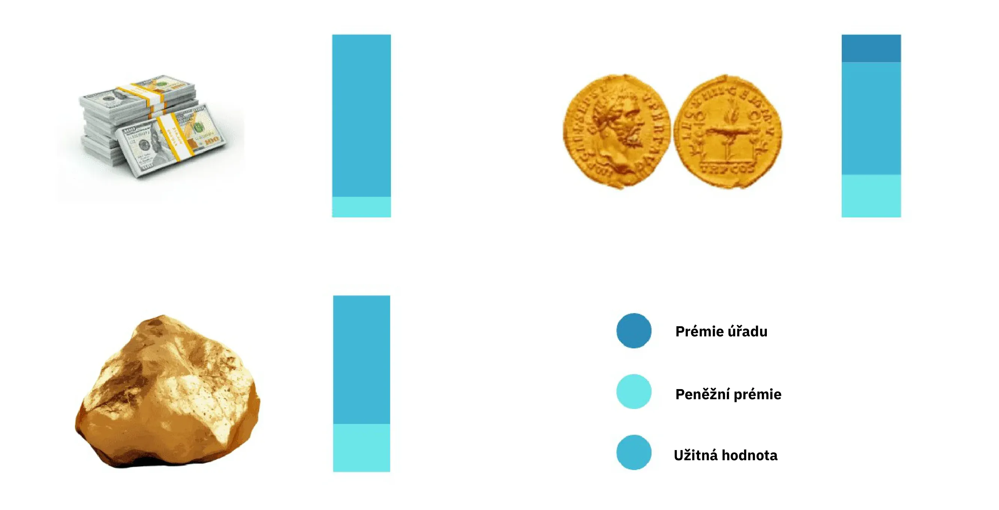

# Různé definice peněz

<partId>77b7918a-8c3b-11f0-b688-6b2ab22378c9</partId>

## Peníze vs měna vs monnaie vs argent vs devise

<chapterId>bf8a6d21-df88-5d23-a0a5-e9a5c1300554</chapterId>

:::video id=d9c9e7df-9db3-4a9f-801e-10d3fc7dfc22:::

### Sémantika měnových pojmů

V této části věnované různým peněžním teoriím a zejména definicím peněz bych se rád krátce zastavil u tématu sémantiky. Rád bych se trochu hlouběji ponořil do definic několika slov týkajících se peněz a porovnal je s jejich anglickými ekvivalenty. Například peníze, měna, ve srovnání s monnaie, argent a devise. Takže to vypadá následovně.

Trocha sémantiky:

Když řekneme "**peníze**" (de la monnaie), většina lidí si bude myslet, že máme na mysli drobné peníze, které dostaneme za transakci. A když řekneme "**měna**" (la monnaie), lidé si pravděpodobně budou myslet, že máme na mysli státní měnu. Kanadskou měnou je kanadský dolar. To je pravda.

Ale co peníze (de l'argent)? Zloděj nikdy neřekne: "Dej mi všechny drobné!" (zloděj by mohl být zklamán, kdyby dostal pouhé mince téměř bez hodnoty).

Ne, vykřikne zloděj: "Dej mi **všechny peníze**". A pokud zloděj stojí před vámi na ulici, má nutně na mysli **bankovky** ve vaší kapse.

Na druhou stranu, pokud se vás zloděj pokusí podvést sofistikovanějším způsobem a pokusí se ukrást váš majetek tím, že vyprázdní všechny vaše bankovní účty, řekli bychom, že vás připraví o všechny peníze**. Slovo "peníze" zde označuje **majetek jednotlivce**.

Slovo peníze má tedy dvě definice: peníze (bankovky) a bohatství.

### Měna vs monnaie vs devise

Měna (devise) je nutně měnou jiné země, jinak říkáme peníze (monnaie). Pokud jste Francouz, řeknete: "La livre sterling est la devise du Royaume-Uni et l'euro et la monnaie de l'Europe" (libra šterlinků je měnou Spojeného království a euro je měnou Evropy).

Lidé, kteří se těmito sémantickými problémy nezabývají, mají při překladu těchto termínů často tendenci mluvit o měně (devise), když se píše currency, ale ne, currency je money (monnaie), když jde o měnu vaší země, a devise, když mluvíme o jiných měnách. A tak se zde často setkávám s problémem, že v angličtině existují dvě slova: "money", což je pojem, a "currency", což je skutečně jednotka země, která se používá ke směně. Takže můžeme mluvit jen o pojmu peníze; je to snadné - je to pojem slova *peníze*; jsou to peníze obecně. A *měnu* je velmi jednoduché ztotožnit s měnou dané země. Zatímco ve francouzštině bohužel lidé často řeknou ano, "mais ce n'est pas une monnaie", když mluví o bitcoinu, protože to není měna země, ale často, myslím, že místo toho mají na mysli pojmy měna. To je na jednu stranu špatně, protože od Salvadoru je bitcoin měnou státu. Faktem zůstává, že lidé často řeknou: *ale ne, není to měna státu, nemohou to být peníze*. Ale ve skutečnosti, pokud se odvoláváme na širší pojem *peníze*, bitcoin do této definice podle mého názoru dokonale zapadá. Jde jen o to, že ve francouzštině nemáme dvě slova, která by tyto dva pojmy oddělovala. Mohli bychom říci, že slovo argent odkazuje na měnu, ale bohužel to není jeho přesná definice. *Argent* (peníze) odkazuje na bohatství nebo bankovky. Se slovem *peníze* nemůžete vytvořit ekvivalent. *Peníze* je ve skutečnosti pojem měny (monnaie).

## Definice Saifedeana Ammuse

<chapterId>07c4ba50-168c-567a-8957-0b187ff75f97</chapterId>

:::video id=936d6d3b-6d45-468e-bc44-85fbce9b857a:::

#### Co jsou to peníze?

Peníze jsou prostě něco, co vlastníte nebo získáte nikoli proto, abyste je používali nebo spotřebovávali pro sebe, ale abyste je později vyměnili za jiné zboží nebo služby, které můžete potřebovat. (Saifedean)

Peníze získávají peněžní prémii, pokud existuje peněžní poptávka po zboží, které má hrát jednu nebo více rolí peněz.

Peněžní zboží musí být dostatečně vzácné, aby peněžní prémie přetrvala (aby se nabídka nepřizpůsobila peněžní poptávce).

### Peněžní prémie

V této části věnované různým definicím měny jsem se chtěl krátce zmínit o Saifedeanově definici v knize The Bitcoin Standard, která mě vždy velmi zajímala. Když jsem ji četl, připadala mi docela jednoduchá. A my k této definici přidáme ještě pojem měnové prémie. Jak Saifedean ve své knize zmiňuje, nutně existuje koncept nedostatku. Otázkou je, co jsou to peníze?

> Peníze jsou prostě něco, co vlastníte nebo získáte, ale ne proto, abyste je používali nebo spotřebovávali pro sebe, ale abyste je později vyměnili za jiné zboží nebo služby, které můžete potřebovat.

To je tedy definice, kterou Saifedean zmiňuje v knize The Bitcoin Standard. Já bych dodal, že měna (la monnaie) získává peněžní prémii, když existuje peněžní poptávka po zboží, které má hrát jednu nebo více rolí měny. Dalo by se tedy říci, že měna, která slouží jako uchovatel hodnoty, bude mít peněžní poptávku, která jí dává peněžní prémii, protože ji lidé chtějí získat například jako uchovatele hodnoty nebo jako prostředek směny.

### Nedostatek a tržní mechanismy

Myslím, že bychom k tomu měli rozhodně dodat, že peněžní zboží musí být dostatečně vzácné, aby peněžní prémie mohla existovat. To je velmi důležité. **Pokud se objeví zboží, které se používá jako peníze, a vidíme, že jeho cena roste, obvykle, pokud zboží není dostatečně vzácné, budou ho lidé chtít vyrábět více, aby využili tohoto přírůstku hodnoty při růstu ceny**. Proto má většina zboží na trhu relativně pevnou cenu. Když cena roste, má výroba tendenci se zvyšovat. Když cena klesá, výroba klesá. Dochází k určitému přizpůsobení trhu. **A když je zboží dostatečně vzácné, jako například zlato, tržní mechanismus tuto zvýšenou poptávku po peněžním užití nevyrovná. Mění se tedy proměnná, je to cena. Stejně jako v případě bitcoinu**. Když se cena bitcoinu zvýší, nevyrobíme více bitcoinů. Takže to, co se přizpůsobuje, je cena. A to je důvod, proč už léta vidíme, že cena bitcoinu roste s tím, jak se zvyšuje poptávka po bitcoinu. Protože na Zemi není nikdo, kdo by mohl změnit algoritmus a říct "je větší poptávka, cena stoupá, budeme vyrábět více" **Nabídka nových bitcoinů je předem naprogramována a předem známa**. Takže to je to, co jsem říkal, že peněžní zboží musí být dostatečně vzácné, aby peněžní prémie přetrvávala, a tedy nebyla podchycena tržními mechanismy, aby se nabídka nepřizpůsobila této nové peněžní poptávce.

## Platební prostředky a osvobozující hodnota

<chapterId>5d424039-e342-56f7-9d8b-bba9551831a9</chapterId>

:::video id=af4c0765-8111-4cb7-891b-3ee54d6e7054:::

### Platební prostředek vs. prostředek směny

V této části věnované různým definicím peněz navrhuji, abychom se společně podívali na citát z knihy "Aux origines de la monnaie" (Původ peněz), textu Alaina Testarta na téma peněz jako platebního prostředku a osvobozující hodnoty.

*Alain Testart v knize Aux origines de la monnaie definuje peníze jako platební prostředek: *

> Funkce platebních prostředků je zde chápána jako odlišná od funkce směnných prostředků, neboť existují platby bez protiplnění, platby, za které se nic nekupuje. Knies (1873:192 a násl.) toto téma převodů zboží, které nespočívají ve směnných aktech, jako v případě wergeldu (krvavých peněz nebo složenek za vraždu) nebo daní, obšírně rozvíjí. Carl Menger napadl tuto čtvrtou funkci ve svém článku "Geld" z roku 1892, který je obecně považován za jeden z nejrozhodnějších na toto téma. Aniž by byla zcela zdiskreditována, zdá se, že myšlenka funkce platebních prostředků je v dnešním ekonomickém myšlení zapomenuta nebo přinejmenším odmítnuta ve prospěch funkce směnných prostředků.
>

> Peníze slouží k placení: v tomto světle jsou nástrojem osvobození, což v celé své obecnosti popisuje funkci platebního prostředku. V tomto ohledu hovoříme o "osvobozující moci" peněz. Podle Le Petit Roberta je osvobozující moc "to, co má za následek osvobození (od závazku, dluhu)". Podle Grand Larousse je osvobozující platba jakákoli "platba provedená za zákonných podmínek tak, že věřitel nemůže napadnout zánik dluhu". Peníze mají tuto schopnost par excellence; ta dokonce definuje jejich status zákonného platidla, neboť platbu provedenou v penězích nemůže nikdo odmítnout, ať už prodávající, nebo věřitel. Peníze jsou jediným zbožím, které nelze odmítnout při úhradě toho, co je dlužno, bez ohledu na to, zda je dluh vůči obchodníkovi nebo daňovému úředníkovi. Mezi všemi statky mají tuto výsadu pouze peníze. "Právě toto privilegium," píše Charles. Gide (1921 I: 443), které tvoří to, čemu říkáme zákonné platidlo.
>

> Každá směna spočívající v převodu jednoho zboží za jiné nebo pod podmínkou, že za něj bude poskytnuto jiné zboží, nutně znamená závazek příjemce poskytnout tuto protihodnotu. Platba je splněním tohoto závazku. Každá směna tedy znamená platbu, ale ne každá platba znamená směnu. Existují platby bez protihodnoty, tj. platby, které neumožňují získat jiné zboží a nejsou prováděny za tímto účelem. Směrodatným příkladem zde zůstávají daně; měli bychom zmínit také pokuty všeho druhu placené veřejným orgánům a náhrady dluhu vůči jiným na základě zásady, že ten, kdo způsobí škodu jiným, ji musí nahradit.

### Platby bez protistrany

To je jasná ilustrace autorovy teze. Ve skutečnosti mezi nimi rozlišuje. Směna je pro něj jak převodem zboží, tak platbou. Platba přichází na řadu až poté. A platba může nastat i bez směny. Uvádí příklady, kdy zaplacení parkovacího lístku nebo pokuty je pouze platbou. Ve skutečnosti za to nedostanete žádnou službu. Někdo může namítnout, že stát vám výměnou poskytuje službu, službu spočívající v tom, že vám dává pokuty za parkování. On má zcela jasno v tom, že placení daní je skutečně platba bez protihodnoty v tom smyslu, že placení daní je vyžadováno, i když nutně nedostáváte službu. Říká, že je skutečně definováno, že placení daní je pouze platba; neexistuje žádná povinnost získat za to služby. Diskutoval jsem o tom s mnoha svými kolegy a ti s tímto pojetím nutně nesouhlasí. Ale to je autorova teze. Snaží se pojem platby umístit a oddělit jej od směny pomocí těchto příkladů, například pokuty, placení daní. Také například u věna vyjadřuje, že věno je platba; nemusíte nutně dostat něco výměnou. Někdo, kdo by tento návrh kritizoval, by mohl říci: "Ano, ale výměnou za to dostaneš ženu." To je pravda Taková je tedy úroveň debaty na toto téma.

Existuje také wergeld neboli krvavé peníze. Je to tedy jen platba jako kompenzace. Můj přítel Ulrich by řekl:

> Ano, ale výměnou za to dostanete tento soubor uzavřený.

Takže jste spáchali trestný čin, například vraždu. V té době zaplatíte wergeld a potom vás z té situace propustí. Takže je tu osvobozující síla. Dostanete za to něco?" Podle autora ne. Podle některých kolegů ano.

Myslím, že v této diskusi můžeme vidět, že wergeld je jedním z dobrých příkladů pro definici platby. Je totiž zřejmé, že za ni nic nedostáváte.

## Dluhové peníze vs. komoditní peníze

<chapterId>4093677a-c8e8-5828-b994-15c01656186e</chapterId>

:::video id=f49cf5cc-288e-4daa-a1ff-b9de73506f4e:::

### Zásadní debata

V kontextu tohoto oddílu o různých definicích a teoriích měnové politiky se společně podívejme na dvě diametrálně odlišné vize: "Peníze jsou vždy dluh nebo "peníze jsou vždy zboží". Na jedné straně stojí zastánci měnové teorie založené na dluhu, kteří tvrdí: "Ne, peníze jsou vždycky dluh! Na druhé straně stojí naši slavní zlatí brouci, kteří tvrdí: "Ale ne, víte, peníze jsou vždycky zboží, je to vždycky zlato; všechno ostatní, směnky, dlužní úpisy, to je jenom úvěr, ne peníze".

Pojďme se společně podívat na přehledné shrnutí těchto teorií.

### Teorie "vždy dluhu"

Zde je shrnutí měnové teorie známé jako **"dluhové peníze "**, podle níž jsou peníze v podstatě formou dluhu:

Podle této teorie, kterou rozvinul zejména Alfred Mitchell-Innes a dále rozvinul David Graeber, jsou peníze ze své podstaty uznáním dluhu, který vychází z úvěrových vztahů, jež historicky předcházely přímé peněžní směně. Spíše než z potřeby spojené s výměnným obchodem se peníze objevují jako způsob účtování, převodu a vyrovnání společenských závazků nebo dluhů mezi jednotlivci nebo skupinami.

Všechny peníze tedy obíhají jako dluh jedné osoby nebo instituce vůči druhé, který je podložen důvěrou a společenskou nebo státní autoritou zaručující jeho platnost. Když tedy podle nich vlastníme - jak jsem již zmínil - když vlastníme peníze, máme pohledávku vůči společnosti a společnost nám dluží. Peníze tedy nikdy nejsou neutrální nebo autonomní, ale vždy jsou základem dluhu: vlastnit peníze v podstatě znamená vlastnit pohledávku vůči společnosti nebo ekonomickému společenství.

Tato úvaha je v rozporu s klasickým pojetím peněz jako prostého "meziproduktu" a naopak zdůrazňuje ústřední roli společenských a politických vztahů při tvorbě a správě peněz.

**Moje hodnocení:**

Na této teorii mi vadí, že tvrdí, že peníze jsou vždy dluhem, zatímco máme příklady směn mezi dvěma různými kmeny, které si například vyměňují zlato, kde je transakce definitivně ukončena a žádný skrytý dluh nezůstává. Zastánci této teorie nám často budou tvrdit, že tyto směny nejsou peněžní směny, ale barter. Jak již bylo zmíněno, s tím nesouhlasím. Jedná se o peněžní směnu, protože zlato nebude spotřebováno; bude použito jako peníze.

### Teorie "vždy zboží"

**Vždy se jedná o zboží:**

Zde je přehledně shrnuta měnová teorie známá jako **"komoditní peníze "**, kde peníze vždy vznikají jako komodita, zejména zlato, které vzniká z potřeby mít možnost obchodovat, komodita, která bude obecně přijímána v zahraničí a která je pořizována za účelem obchodování.

Podle této teorie, kterou vypracovali klasičtí ekonomové (Adam Smith, David Ricardo) a kterou převzal Marx, peníze vznikají přirozeně jako zboží mezi ostatními, často jako drahý kov, jako je zlato nebo stříbro, které má vnitřní hodnotu nezávislou na své peněžní roli. Zpočátku si tyto komodity spontánně vybírají ekonomické subjekty, aby usnadnily obchod, a to díky jejich vnitřním vlastnostem (vzácnost, trvanlivost, dělitelnost a stabilita).

Zbožní peníze se vyznačují fyzickou existencí a hodnotou určenou množstvím práce společensky potřebné k jejich výrobě (jako u Marxe). Společnost používá například zlato nejen ke zjednodušení směnného obchodu, ale také jako zúčtovací jednotku, uchovatele hodnoty a univerzální prostředek směny.

V této vizi si peníze vždy zachovávají reálnou hodnotu, protože zůstávají spojeny s hmatatelným zbožím. I když se role peněz stává abstraktní (ražené mince, bankovky nebo písemné peníze), jejich platnost stále přímo či nepřímo vychází z odkazu na základní komoditu, jako je zlato. Tato teorie proto trvá na materiálním a ekonomickém původu peněz, na rozdíl od teorií, které je považují za pouhou konvenci nebo dluh. Podle této teorie by jakékoli zastoupení peněz substitutem, jako je směnka vyměnitelná za zlato, bylo úvěrem.

**Moje hodnocení:**

Všimněte si, že tato vize se podobá teorii komoditních peněz, ale jde ještě o krok dál. Navrhují, aby peníze byly vždy zbožím. A když jim řekneme: "*Ano, ale můžeme souhlasit s tím, že bankovka je pro tuto skupinu penězi; může být kryta zlatem, funguje a bankovka jako taková je penězi*".

Jako odpověď nám dají příklad kuponu do šatny. Řeknou: "Ano, ale ne, když máte kupon do šatny na oděv, můžeme pokladní kupon nazvat oděvem?

Jistěže ne, je to něco jako uznání, v podstatě reklamace, která vám umožní získat oděv zpět. Tato paralela neobstojí, protože kupón do šatny není obecně uznávaným způsobem platby. **Peníze nejsou nárokem na konkrétní předmět, jako je oděv; jsou způsobem, prostředkem směny, směnným prostředkem nebo obecně přijímaným platebním prostředkem**.

Nelze tedy vést paralelu mezi kupónem do šatny a bankovkou ve fiat měně, protože kupón do šatny umožňuje získat výměnou určité zboží, je to token, který vám umožňuje získat své zboží. Kdežto bankovka, fiat měna, je univerzální kupón, který vám umožňuje přístup k jakémukoli zboží.

A podle mého názoru lze samozřejmě i fiat peníze považovat za peníze, pokud je za ně obyvatelstvo považuje. A myslím, že je sémantickou chybou trvat na tom, že to nemohou být peníze, protože je to kupón k získání skutečných peněz, alespoň v té době, kdy bylo podkladovým aktivem zlato.

Nemám problém považovat zlatou minci, která je uložena v trezoru, a bankovku, která tuto zlatou minci představuje, za platidlo. Pro mě to není žádný sémantický problém, jsou to prostě dva druhy měny. Pokud se nemýlím, Mises tento jev velmi dobře vysvětluje, když hovoří o peněžních substitutech.

Jejich vize spočívá v tom, že nelze považovat zlatou minci v bankovním trezoru a bankovku, která ji představuje, za peníze zároveň. Osobně v tom nevidím žádný problém, nevidím v této situaci žádný paradox. Ti, kdo věří, že peníze jsou vždy zbožím, nevidí věci tak jako já.

**Tady je přehled konceptu kupónů v šatně z knihy *Aux origines de la monnaie*:**

*Poznámka 14: "Výborná kritika - výborná proto, že stojí právě na tom základě, na který se Knapp staví, na právním základě - Ristova (1938: 372, pozn. 1) srovnání papírových peněz a šekových žetonů: můžeme-li v obou případech mluvit o jakési pohledávce, zásadní rozdíl spočívá v tom, že v prvním případě, a pouze v prvním, jde o pohledávku bez konkrétního předmětu

K tématu **nároku** tentýž autor uvádí následující:

> Bastiat si může zcela svobodně představit poukázku pro celou společnost, která je prezentována jako "obrovský bazar", ale tento malý dodatek, toto zdánlivě neškodné rozšíření, je celým rozdílem mezi úvěrem a penězi. Peníze nejsou nárokem na konkrétní obchod. Neexistuje nic takového jako anonymní pohledávka. Ale právě anonymita, která charakterizuje peníze, a tedy jejich obecnost, je činí tak mocnými. Peníze nejsou jako úvěr, tím méně jsou na něj jakkoli redukovatelné. **Peníze jsou mnohem víc než úvěr**

**Paradox: dluhové peníze vs. komoditní peníze**

Paradox, který nejlépe ilustruje hlubokou dichotomii mezi teorií dluhových a komoditních peněz, se týká otázky, zda je zlato dnes měnou.

Teorie dluhových peněz na jedné straně definuje peníze především jako prostředníka směny nebo platební prostředek, který je obecně přijímán, nebo dokonce nařizován veřejnou autoritou. Z tohoto pohledu zlato již není měnou, protože není všeobecně používáno ani přijímáno jako běžný prostředek směny.

Na druhou stranu teorie komoditních peněz považuje peníze za hmotné zboží, které si společnost spontánně vybrala pro jeho vnitřní vlastnosti (vzácnost, trvanlivost, dělitelnost atd.). Podle tohoto přístupu zůstává zlato skutečným univerzálním platidlem a všechny ostatní formy peněz dnes nejsou v zásadě ničím jiným než úvěrem založeným na důvěře.

Tento paradox jasně ukazuje rozdíl mezi těmito dvěma měnovými koncepcemi: pro první z nich zlato již není měnou, pro druhou naopak zůstává jedinou skutečnou měnou.

## Moderní měnová teorie

<chapterId>8efc29af-3193-5d97-ad9f-e608b32924ff</chapterId>

:::video id=f8127cb7-46a1-468c-bbb5-97bf0a8b8837:::

### Principy moderní měnové teorie

Na závěr této části o různých měnových teoriích si povězme o zázračném dítěti měnových teorií, které obdivuje mnoho současných ekonomů pracujících pro centrální banky a které se jmenuje moderní měnová teorie, často známá jako MMT.

**Moderní měnová teorie (MMT)** je ekonomický přístup, který tvrdí, že státu s vlastní suverénní měnou (jako jsou USA, Kanada nebo Japonsko) nikdy nedojdou peníze, protože může vždy vydat další peníze na financování svých výdajů. Podle této teorie

- Peníze jsou výtvorem státu, nikoliv omezeným zdrojem**

- Daně a půjčky se nepoužívají přímo k financování veřejných výdajů, ale spíše k regulaci inflace, ovlivňování ekonomického chování a udržování poptávky po národní měně*

- Skutečným limitem vládních výdajů je inflace, nikoli rozpočtový deficit nebo veřejný dluh.

- Pokud budou vytvořené peníze směřovat do odvětví, která je mohou absorbovat, nedojde ani k inflaci.

- Vláda proto musí přizpůsobit své výdaje reálným dostupným zdrojům (pracovní síla, průmyslová kapacita, přírodní zdroje), aby se vyhnula nadměrné inflaci.

### Úloha daní v MMT

Zde tedy najdete známou odpověď všem, kteří říkají: "Jo, ale když můžeme tisknout peníze, proč platíme daně?" Na tuto myšlenku má MMT správnou odpověď. Je pravda, že ve fiat systému, v moderním systému, technicky vzato, neexistuje nic, co by omezovalo tvorbu peněz, kromě inflace. Ale oni navrhnou, že za prvé, zdanění je nezbytné k omezení inflace, protože odstraní peníze z ekonomiky. Pokud tedy nemáme daně, které by to kompenzovaly, mohla by veškerá tato tvorba peněz nakonec způsobit inflaci. Tvrdí, že daně jsou doslova způsobem, jak odstranit peníze ze systému, aby se omezila inflace.

Pokud jde o peníze investované do odvětví, která je mohou absorbovat, můžeme uvést příklad Spojených států, které dávají biliony dolarů do vojenského průmyslu, což nezpůsobuje inflaci, protože vojenský průmysl, vojensko-průmyslový komplex, je dokonale schopen tyto biliony dolarů absorbovat.

Na druhou stranu, pokud chcete stavět více silnic a existuje limit zdrojů a dodavatelů, kteří je mohou vyrobit, zdvojnásobení rozpočtu na silnice nutně vyvolá efekt nedostatku pracovních sil, které mohou tyto silnice vytvořit. Cena tedy poroste v důsledku působení tržních sil, nabídky a poptávky. Pokud naši vševědoucí vůdci vědí, kam peníze umístit, technicky vzato by to nemělo způsobit inflaci. A já bych odpověděl, že v praxi je zcela jasné, že to inflaci způsobuje.

Závěrem lze říci, že podle MMT může stát využít své schopnosti vytvářet peníze k dosažení plné zaměstnanosti a financování sociálních a ekologických investic a zároveň kontrolovat inflaci prostřednictvím vhodné fiskální politiky. Často je také cílem keynesiánských ekonomů, další školy ekonomického myšlení, řídit nezaměstnanost řízením úrokových sazeb a financovat sociální a ekologické investice a zároveň kontrolovat inflaci prostřednictvím vhodné fiskální politiky.

### Přehled MMT

Tato teorie platí pouze pro hrstku zemí (viz tweet Stephanie Keltonové), které mají skutečnou měnovou suverenitu, tj. mohou se zadlužovat ve své vlastní měně. Tuto teorii je obtížné aplikovat na ekonomiky závislé na dovozu, které si musí udržovat mezinárodní důvěru ve svou měnu.

A co je skutečná měnová suverenita? Znamená to, že se můžete zadlužit ve vlastní měně. Musíte být schopni dosahovat přebytku obchodní bilance, abyste měli dostatek měnových rezerv, dostatek zahraniční měny, abyste nemuseli získávat peníze v zahraniční měně, abyste mohli dovážet zboží. To se týká několika zemí.

Níže si můžete prohlédnout tweet Stephanie Keltonové, která je jakousi ženou z plakátu tohoto hnutí. Napsala knihu s názvem "Mýtus deficitu". V tweetu píše, že různým zemím, jako jsou Spojené státy, Japonsko, Kanada, Austrálie, Velká Británie, nemohou dojít peníze.

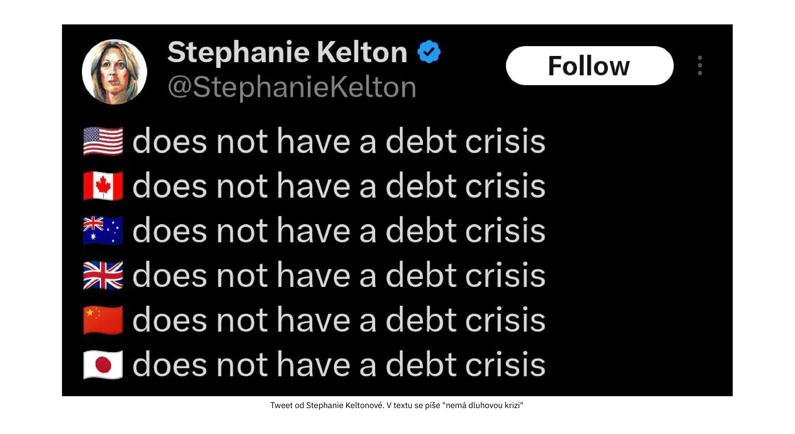

Kupodivu je v něm uvedeno pouze šest zemí? Proč? Protože mají skutečnou měnovou suverenitu. Ale na Zemi je asi 200 zemí a ne všechny mají měnovou suverenitu. Takže moje kritika této teorie, kromě toho, že je poněkud zvláštní a nefunkční, spočívá v tom, že funguje pouze pro několik zemí, které mají skutečnou měnovou suverenitu, tedy pro ty, které mohou vydávat pokladniční poukázky ve své vlastní měně. Do jisté míry jde na úkor zbytku světa. Vytvořením této měny jako by exportovaly svou inflaci jinam, podobně jako to po desetiletí dělaly Spojené státy se svými přehnanými privilegii. Připomíná to určitou formu měnového kolonialismu, kdy země, které mají celosvětovou důvěru a poptávku po své měně, mohou tisknout libovolné množství peněz, aniž by došlo k výrazné inflaci, často proto, že tuto inflaci vyvážejí.

Tuto teorii je obtížné aplikovat na ekonomiky závislé na dovozu, které si potřebují udržet mezinárodní důvěru ve svou měnu.

Tato teorie rovněž vyžaduje určitou míru centralizovaného plánování ekonomiky, zejména za účelem zajištění větší kontroly nad reálnými zdroji (pracovníci, suroviny, průmyslové kapacity) a řízení inflace.

# Pád a znovuzrození peněz

<partId>87a34ca9-782b-5ade-b51a-400f88ed7b0c</partId>

## Řecké mince

<chapterId>7714195f-74ce-5f8c-be5f-59302d39fff4</chapterId>

:::video id=8e5c3091-0910-471b-8d4b-0dc6e9afa656:::

### Souvislosti a kontext

Než začneme, uvedeme si historické pozadí:

**Historické pozadí:**

**Římané nazývali Řeky "Graeci" a Řecko "Graecia".**

**Řekové si říkali "Heléni" a své zemi "Hellas".**

**Homer** (narozen kolem 8. století př. n. l.)

Legendární řecký básník, předpokládaný autor *Iliady* a *Odyssey*.

Kolem roku **750 př. n. l.: Lykúrgos**, mýtický zákonodárce Sparty, údajně zavedl spartskou ústavu založenou na vojenské disciplíně a jednoduchosti.

**Numa Pompilius** (753-673 př. n. l.)

Druhý římský král, který proslul tím, že dal Římu první náboženské a právní instituce.

**Drakon**, athénský zákonodárce (7. století př. n. l.), proslulý svými extrémně přísnými zákony, odtud výraz "drakonický".

**594 př. n. l.: Solón** se stává athénským zákonodárcem a radikálně reformuje athénskou společnost, zejména ruší dluhové otroctví.

**776 PŘ. N. L: Starověké olympijské hry**

V Olympii se každé čtyři roky konaly první pravidelné sportovní hry, kterých se účastnila řecká města.

**Pythagoras** (asi 570-495 př. n. l.)

Řecký filozof a matematik, známý svou větou o pravoúhlém trojúhelníku.

**Xenofanés Kolofónský** (asi 570-478 př. n. l.)

Předsokratovský filozof známý svou kritikou tradičního řeckého polyteismu.

**490 př. n. l.: bitva u Marathonu**

Athéňané vítězně odrazili perskou invazi, což znamenalo rozhodující zlom pro řeckou civilizaci.

**Herodotos** (asi 484-425 př. n. l.), přezdívaný "otec dějin", napsal rozsáhlé dílo popisující perské války, včetně řeckého vítězství nad Xerxem v roce 480 př. n. l.

**Sokrates** (470-399 př. n. l.)

Athénský filozof proslulý svou dialektickou metodou a učením o etice a sebepoznání.

**Aristofanes** (asi 446-386 př. n. l.)

Athénský dramatik, proslulý svými satirickými komediemi, například Žáby.

**Sofoklés** (5. století př. n. l.) ve své hře *Antigona* kritizuje prostřednictvím tyrana Kreona peníze jako zdroj morální a politické korupce.

**Platón** (asi 428-348 př. n. l.)

Řecký filozof, Sokratův žák, zakladatel Akademie, autor díla *Republika*.

**431-404 PŘ. N. L: Peloponéská válka**

Velký konflikt mezi Athénami a Spartou, který končí porážkou Athén.

**431 PŘ. N. L.**: Athény financují peloponéskou válku ředěním zlatých a stříbrných mincí, aby zvýšily jejich množství v oběhu, což způsobuje inflaci.

**Xenofón** (asi 430-355 př. n. l.)

Athénský spisovatel, filozof a vojevůdce, Sokratův žák, autor *Anabasis*.

**414 PŘ. N. L.**: Athény začínají prohrávat peloponéskou válku po katastrofální výpravě na Sicílii.

**405 PŘ. N. L: Aristophanes** ve své hře *Žáby* výslovně popisuje znehodnocení stříbrné drachmy a výskyt podřadných bronzových mincí v Athénách, čímž ilustruje princip dnes známý jako "Greshamův zákon".

**404 PŘ. N. L.**: Athény po dlouhém obléhání Spartou kapitulují.

**Aristoteles** (384-322 př. n. l.)

Významný řecký filozof, Platónův žák, zakladatel lycea, známý svými pracemi v oblasti logiky, biologie a politické filozofie.

**327 PŘ. N. L.**: 323 př. n. l.: Alexandr Veliký dobývá Persepolis a východní provincie Perské říše, čímž výrazně rozšiřuje svou říši.

**323 PŘ. N. L.**: Alexandr zemřel v Babylonu bez jasného dědice, což vyvolalo války mezi jeho generály (diadochy) o rozdělení říše.

**Archimedes** (asi 287-212 př. n. l.)

Řecký matematik, fyzik a vynálezce, proslulý svými objevy v geometrii a mechanice.

**196 př. n. l.: Za vlády faraona Ptolemaia V. byl vyryt Rosettský kámen**, který umožnil pozdější rozluštění egyptských hieroglyfů.

**192-188 PŘ. N. L: Římsko-séleukovská válka**

Řím porazil seleukovskou říši vedenou Antiochem III. a upevnil svůj vliv v Řecku a Malé Asii.

**146 př. n. l.: bitva u Korintu**

Římané zničili řecké město Korint, což znamenalo konec řecké politické nezávislosti a postupné začlenění Řecka do římského světa.

V této části věnované antice, pádu Říma a středověku začneme kapitolou o řeckých mincích.

Historie ražby mincí ve starověkém Řecku začala kolem roku 600 př. n. l., kdy řecká města rychle převzala novinku z Lýdie v Malé Asii a zpočátku používala elektrum a později stříbro. První řecké mince byly raženy na ostrově Aegina a zobrazovaly mořskou nebo suchozemskou želvu, ale právě athénská drachma, zdobená Athénou a sovou, se od 5. století př. n. l. stala peněžním symbolem par excellence a do značné míry ovládla tehdejší mezinárodní obchod.

A já mám to štěstí, že mám kopii řecké drachmy z té doby s tou slavnou sovou a číslicí na zadní straně. Je to tetradrachma, která byla větší než obyčejná drachma.

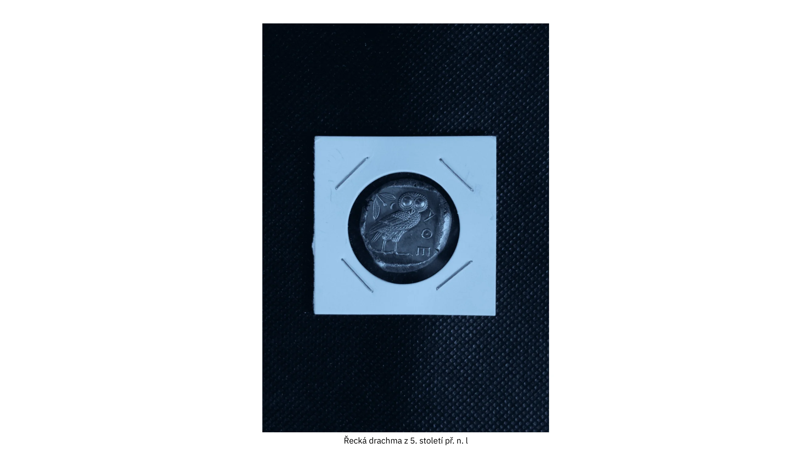

Každé řecké město si vytvořilo svůj vlastní vztah k penězům. V Athénách byla měna hluboce spjata s politickou a ekonomickou mocí. Slavný athénský dekret z konce 5. století př. n. l. nařizoval výhradní používání athénské měny na spojeneckých územích, čímž posiloval její ekonomickou hegemonii. Athény také hromadily velké zásoby zlata pro případ nouze, které byly uchovávány na Akropoli, snad jako symbol jejich hospodářské obezřetnosti. Naproti tomu Sparta, vojenské město s přísnými hodnotami, se rozhodla přísně omezit používání peněz a zakázala svým občanům vlastnit zlaté nebo stříbrné mince. Sparta raději používala těžké železné pruty, aby odradila zahraniční obchod a udržela sociální soudržnost.

Války byly často financovány manipulací s měnou. Během peloponéské války (431-404 př. n. l.) se Athény uchýlily k drastické devalvaci, aby zaplatily svým vojákům. Athény, které spartská okupace Decelie v roce 413 př. n. l. připravila o přístup k jejich stříbrným dolům, musely v letech 407/406 př. n. l. narychlo roztavit zlaté sochy, aby mohly razit nové mince. Poté v letech 406/405 př. n. l. vytvořila bronzové mince potažené stříbrem, což způsobilo měnovou krizi, kterou ilustruje **Aristofanes**, jenž již evokuje to, co je dnes známo jako Greshamův zákon: špatné peníze vytlačují dobré peníze. Tato nouzová měna byla po válce rychle demonetizována, aby se obnovila důvěra v athénské mincovnictví.

Konec klasického období byl poznamenán vzestupem Makedonie pod vedením Filipa II. a jeho syna Alexandra Velikého, který zásadně narušil řeckou měnovou rovnováhu. Díky rozsáhlým zlatým a stříbrným dolům na hoře Pangea produkoval Filip II. hojnost peněz na financování svých vojenských a politických tažení a zavedl jednoduchý a praktický zlatostříbrný standard (10:1). Jeho zlaté státovky, oslavující vítězství na olympijských hrách, obíhaly až do západní Evropy, dokonce se dostaly i do Anglie. Alexandr pokračoval v této měnové politice a během svých výbojů na Východě rozšířil oběh **attické** drachmy až do Indie. Tento masivní oběh mincí znamenal počátek helénistické éry, kdy na mincích postupně nahradily podobizny panovníků podobizny božstev. Tato inovace umožnila generacím helénistických panovníků propagovat sebe sama a odsunula tradiční bohy do druhořadé role na reverzní straně jejich mincí.

Po Alexandrově smrti v roce 323 př. n. l. si jeho generálové rozdělili jeho obrovskou říši a založili dynastie v Egyptě (Ptolemaiovci), Sýrii (Seleukovci) a jinde. Tato helénistická království přijala různé měnové systémy: Ptolemaiovci zavedli uzavřený měnový systém, aby kontrolovali oběh peněz, a jako vnitřní měnu raději používali obilí, aby ušetřili drahé kovy pro vnější vojenské výdaje. Současně se Rhodos stal významným obchodním centrem, než jej ekonomicky oslabili Římané, kteří v roce 167 př. n. l. zřídili na ostrově Délos svobodný přístav.

Při odměňování žoldnéřů se používaly především peníze. Alexandrovi vojáci dostávali denně stříbrné drachmy.

Jezdci, elita Alexandrovy vysoce specializované armády, dostávali v průměru dvě drachmy denně, pěšák jednu drachmu a obyčejný žoldnéř dvě třetiny drachmy, což byl dvojnásobek mzdy prostého dělníka.

Během peloponéské války byly také vyplaceny značné částky vojákům: přes 1200 talentů na potlačení vzpoury na Samosu a přes 2000 talentů na obléhání Potidey.

V době, kdy byla tato armáda plně nasazena v Malé Asii, činily celkové náklady asi dvacet talentů denně, což představovalo asi půl tuny stříbra nebo 120 000 drachem.

Důležitou kulturní roli hrálo i řecké mincovnictví, protože každé město se snažilo prosadit svou identitu ražbou vlastních mincí s místními nebo mytologickými symboly. Například na Heraklově minci byl vyobrazen Herakles (Herkules) bojující se lvem, zatímco na kyrenejské minci byla vyobrazena známá léčivá rostlina silphium.

Klasické řecké a helénistické mincovnictví zanechalo navzdory své rozmanitosti a regionálním výkyvům trvalou stopu v hospodářských a kulturních dějinách středomořského světa a zásadně ovlivnilo pozdější měnové systémy až po Řím, který postupně převzal a rozvinul řecké ekonomické koncepty pro strukturu své vlastní císařské ekonomiky.

## Dopad měny v Řecku

<chapterId>3a5e6c7d-699c-5567-87cd-3374c49d55a9</chapterId>

:::video id=0c79a59c-e179-4893-a414-1b8de0930eb9:::

### Athény a kontrast se Spartou

Protiklad mezi Athénami a Spartou v klasickém řeckém období ukazuje dva radikálně odlišné modely politického a ekonomického uspořádání. Zatímco Sparta odmítala kovové peníze ve prospěch soběstačného systému založeného na občanské důvěře, Athény tuto technologii plně využily k vybudování a udržení své námořní říše.

### Peněžní nutnost námořní síly

Athénská říše, navzdory svému velkolepému názvu, zůstávala geograficky skromná - v podstatě šlo o Athény a města u Egejského moře. Její moc se opírala o Délský svaz, vojenskou alianci, které dominovaly Athény jako hegemon. Tato imperiální struktura vyžadovala jednotný ekonomický nástroj: athénskou stříbrnou minci.

Základem této peněžní potřeby bylo udržování flotily. Jedna athénská trirema stála jeden až dva talenty stříbra, což byla značná částka. S několika stovkami lodí, které bylo třeba udržovat, potřebovaly Athény účinný daňový systém. Měna se stala nepostradatelným nástrojem pro výběr poplatků od vazalských měst a financování námořní projekční síly, která zaručovala soudržnost říše.

### Měnové vnucování jako nástroj nadvlády

Athény vnutily svou stříbrnou měnu všem členům Délské ligy. Tato měnová standardizace sloužila několika strategickým cílům. Zaprvé usnadnila vybírání poplatků tím, že vytvořila společnou zúčtovací jednotku. Za druhé posílila hospodářskou závislost vazalských měst na Athénách. A konečně symbolicky promítala athénskou moc do celé námořní říše.

Tato měnová politika ostře kontrastuje se spartánským modelem. Sparta, která byla pozemní velmocí, se mohla spoléhat na práci peloponéských helotů (otroků), aby se uživila. Její uzavřený, na města zaměřený hospodářský systém nevyžadoval sofistikované měnové nástroje. Občané-vojáci žili společně, sdíleli společné jídlo a nepotřebovali peníze pro každodenní směnu.

### Měna jako prostředek námořního obchodu

Námořní povaha athénské říše znamenala, že musela být otevřená obchodu. Na rozdíl od do sebe uzavřené Sparty musely Athény pro své přežití a prosperitu obchodovat s okolním světem. Nepostradatelným nástrojem středomořského obchodu se stala měna.

Tato orientace na zahraničí vytvářela příznivý kruh: obchod přinášel příjmy, z těchto příjmů se financovalo loďstvo, loďstvo chránilo obchodní cesty a udržovalo říši a říše zavedla athénskou měnu, která usnadňovala obchod. Měna již nebyla pouhým prostředkem směny, ale stala se pilířem císařské strategie.

### Hranice měnové moci

Navzdory této ekonomické vyspělosti ukázala athénská měnová moc během peloponéské války své limity. Tváří v tvář spartským pozemním silám nestačila athénská námořní a finanční převaha. Nákladné výpravy, jako bylo katastrofální tažení do Syrakus na Sicílii, vyčerpaly finanční zdroje, aniž by přinesly rozhodující vítězství.

Historie ukazuje, že měna, ačkoli je mocným nástrojem pro prezentaci moci, není zárukou vojenské nadvlády. Sparta, která neměla kovovou měnu, ale měla pozoruhodnou sociální soudržnost, nakonec zvítězila nad athénskou měnovou říší.

### Dva modely, dva osudy

Protiklad mezi Athénami a Spartou ilustruje dva základní přístupy ke společenskému a ekonomickému uspořádání. Athény představují otevřený, obchodní a monetární model - předchůdce moderních námořních říší. Sparta ztělesňuje uzavřený, autarkní model, založený spíše na občanské důvěře než na peněžních nástrojích.

Tyto dva systémy ukazují, že přijetí měny úzce souvisí se zvoleným politickým a ekonomickým modelem. Pro námořní a obchodní velmoc, jakou byly Athény, se peníze staly nepostradatelnými. Pro uzavřenou válečnickou společnost, jakou byla Sparta, představovaly hrozbu pro společenský řád. Tato antická dichotomie dodnes ovlivňuje debaty o úloze peněz v organizaci společnosti.

## Římská republika

<chapterId>0bc80983-33e1-5881-85bb-7c22f3144a9a</chapterId>

:::video id=dc05ca97-d29c-4679-bfeb-912c47d86ce2:::

### Dějiny Římské republiky

- 753 - 509 př. n. l.: Římské království**
- 753 PŘ. N. L: (tradičně připisováno Romulovi).
- 509 - 27 PŘ. N. L: Římská republika**, Řím se stává republikou řízenou voleným senátem a konzuly.
- 280 - 275 PŘ. N. L: Pyrrhova válka**. Pyrrhos, král Epiru, bojuje s Římany v jižní Itálii a dosahuje nákladných vítězství ("Pyrrhova vítězství").
- 264 - 146 PŘ. N. L: Punské války**. Velký konflikt, v němž Řím bojuje proti Kartágu o nadvládu v západním Středomoří.
- Hannibal (247 - cca 181 př. n. l.)**. Legendární kartaginský vojevůdce, který se proslavil tím, že během druhé punské války překročil se svou armádou a slony Alpy, aby zaútočil na Řím.
- 146 př. n. l.: Bitva u Korintu**. Řím ničí řecké město Korint a nastoluje svou konečnou nadvládu nad pevninským Řeckem.
- 91 - 87 př. n. l.: sociální válka**. Vzpoura italských spojenců Říma požadujících římské občanství, která nakonec vedla k jejich plnému začlenění mezi občany.
- 64 př. n. l.: Konec odporu Seleukovců**. Řím definitivně eliminuje vliv Seleukovců v Sýrii a upevňuje svou pozici ve východním Středomoří.
- 55 PŘ. N. L: Julius Caesar dobývá střední a západní Evropu**. Julius Caesar rozšiřuje římskou nadvládu nad Galií (dnešní Francie) a vstupuje do Germánie a Bretaně.
- 43 PŘ. N. L: Vytvoření druhého triumvirátu**. Politické spojenectví Octaviana (pozdějšího Augusta), Marka Antonia a Lepida s cílem stabilizovat Řím po Caesarově vraždě.
- 27 př. n. l.: Počátek Pax Romana**. Období politické stability a prosperity za vlády císaře Augusta, které znamenalo počátek Římské říše.

### Pozdní měnové počátky Říma

V této části věnované antice se nyní zaměříme na Římskou republiku. Měnová historie Říma začala mnohem později než historie Řeků a Peršanů. Řím byl založen v roce 753 př. n. l. a na skutečné zavedení mincí čekal téměř čtyři století. Během tohoto dlouhého období Římané používali primitivní systém směny s nepravidelnými bronzovými kousky zvanými aes rude, které vyžadovaly přesné vážení pro každou transakci. Teprve na konci 4. století př. n. l. začal Řím pod řeckým a etruským vlivem vydávat první mince, zejména z bronzu odlévané jako v Číně, aes grave, charakteristické pro římskou směnu až do **druhé punské války**.

### Řecký vliv a první stříbrné mince

Rozhodující střetnutí s Řeky v jižní Itálii skutečně zavedlo Římanům ražbu stříbrných mincí. Kolem roku 280 př. n. l. začal Řím vyrábět vlastní stříbrné mince podle řeckých didrachmů. První pravidelná emise stříbrných mincí v Římě se datuje právě do roku 269 př. n. l. a zobrazuje legendární dvojčata Romula a Rema kojené vlčicí, symbol, který se stal ikonickým.

Na mnoha římských mincích z období republiky jsou zobrazeny zakladatelské mýty. Tu mou si můžete prohlédnout níže: jde o vynikající, skutečnou minci krále Tatia. Znázorňuje mýtus o únosu žen od Sabinů. Tatius byl králem této oblasti a zakladatelský mýtus vypráví o tom, jak Římané unášeli ženy Sabinům, obyvatelům, kteří žili nedaleko. Král Tatius se následně stal spoluvládcem Romula, jednoho ze zakladatelů Říma.

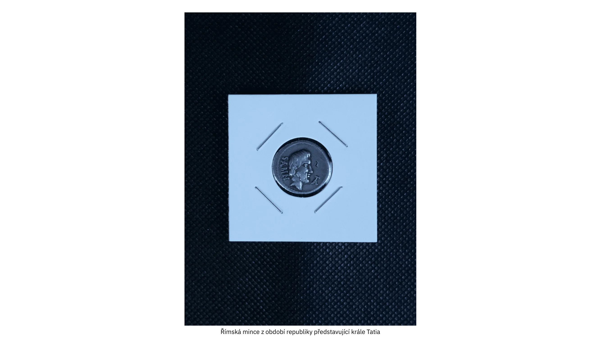

### Původ slova "mince" a chrám Juno Moneta

Pojem "mince" má svůj původ v chrámu Juno Moneta v Římě. Legenda praví, že během galské invaze v roce 390 př. n. l. posvátné husy na Kapitolu upozornily Římany na hrozící nebezpečí. Jako poděkování bohyni Juno, ochránkyni Kapitolu, byl na její počest postaven chrám, který se brzy stal mincovnou římských mincí.

### Punské války a měnové krize

Vojenské konflikty měly značný vliv na vývoj římské měny. Během druhé punské války (218-201 př. n. l.) proti Kartágu čelil Řím vážným finančním potížím tváří v tvář Hannibalově invazi. Aby Řím tyto naléhavé potřeby zmírnil, uchýlil se poprvé k mimořádné emisi zlatých mincí a také k výraznému znehodnocení stříbrných mincí, a to z původní ryzosti 97 % na přibližně 89 %. Dramaticky klesla také hmotnost bronzových mincí (aes), která během šesti let ztratila téměř 80 %.

Zde se můžeme vrátit ke konceptu, o kterém jsme již dříve hovořili a který se týkal Řeků tavících drahé kovy uložené v chrámech, aby pomohli zmírnit ekonomické krize. A když už jsme u **Kartága**, zde níže můžete obdivovat skutečnou kartáginskou minci z mé sbírky. Na těchto kartaginských mincích byla na jedné straně palma a na druhé straně kůň. Na této minci není kůň příliš rozeznatelný, a je velmi opotřebovaný.

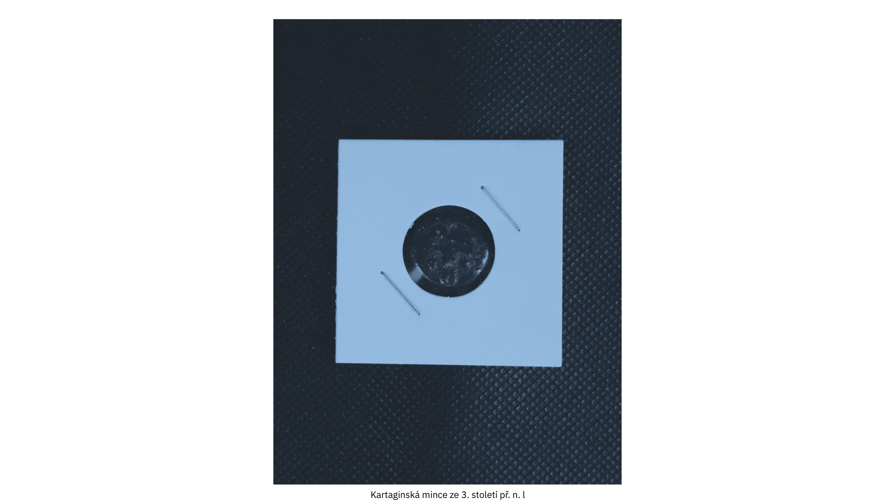

V důsledku toho také drasticky klesla hmotnost bronzových mincí, tzv. aes, která se za šest let snížila téměř o 80 %. Hmotnost těchto bronzových mincí, které nebyly drahým kovem a používaly se v každodenním obchodě, tedy velmi poklesla, což bylo známkou znehodnocení měny v důsledku těchto válek.

### Stříbrný denár a měnová stabilita

Na pozadí této kritické situace zavedl Řím kolem roku 212 př. n. l. slavný stříbrný denár. Tato reforma zajistila pozoruhodnou měnovou stabilitu a denár zůstal dominantní měnou po téměř 450 let. Řím za tuto stabilitu vděčí důslednému řízení, a to i přes výrazné přecenění v roce 146 př. n. l. a značnou produkci na financování svých obrovských armád, zejména během punských, sociálních (91-87 př. n. l.) a makedonských válek. Například vydržování jedné římské legie stálo ročně přibližně 1,5 milionu denárů, což ilustruje rozsah peněžních potřeb.

Za římskými hranicemi vedly války k velkému znehodnocení v oblastech pod římským vlivem. Punské Kartágo zaznamenalo dramatický pokles ryzosti svého elektra z 98 % zlata ve 4. století na pouhých 30 % během druhé punské války, zatímco ryzost jeho stříbrných mincí klesla na 18 %.

### Vývoj peněžních motivů

S expanzí Říma se vyvíjel i charakter mincí: zpočátku anonymní a vlastenecké mince postupně získávaly personalizované vzory s mocnými rodinami mincířů (těch, kteří mince razili). Tento přechod jasně symbolizuje politické proměny pozdní římské republiky.

A konečně, přestože Řím ekonomicky dominoval středomořskému světu, zachoval si určitou jednoduchost platebních prostředků: kromě přímé výměny mincí nebyla vyvinuta žádná jiná skutečná forma peněžního převodu, s výjimkou daňových převodů a soukromých úvěrů vyhrazených pro elitu.

## Římská říše

<chapterId>2dc44e50-112a-5abf-97ae-8e0a9ecda989</chapterId>

:::video id=f8d6f3d6-9ee4-4504-888e-4f12b3f20489:::

**Historické pozadí:**

**Principát** byla forma císařské vlády v Římské říši od počátku Augustovy vlády v roce 27 př. n. l. do konce krize třetího století v roce 284 n. l.

**27 př. n. l.: počátek Pax Romana**

Období politické stability a prosperity za vlády císaře Augusta, které znamenalo počátek Římské říše.

**Augustus (30 př. n. l. až 14 n. l.)** radikálně reformoval římský měnový systém a zavedl trvalý a stabilní standard pro císařské mince.

**Augustus byl také jedním z prvních uznávaných sběratelů** antických mincí a fosilií.

**54 AD - 68 AD: Nero**

Kontroverzní římský císař, známý svou tyranií, pronásledováním a katastrofálním řízením po vypálení Říma.

**64 N. L: Velký požár Říma**

Velkou část města zachvátí rozsáhlý požár, z jehož zavinění je obviněn Nero.

**69 n. l.: Rok čtyř císařů**

Chaotické období se čtyřmi císaři v rychlém sledu (Galba, Otho, Vitellius, Vespasián).

**79 N. L: Erupce Vesuvu**

Sopka, která zničila města Pompeje a Herkulaneum a výjimečně zachovala jejich pozůstatky pod popelem.

**165 AD - 180 AD: Antonínský mor**

Ničivá epidemie, která oslabila Římskou říši za Marca Aurelia a Commoda.

**200 n. l.: Územní vrchol a postupný konec Pax Romana**

Řím dosáhl svého maximálního rozšíření, ale začal trpět vnitřní nestabilitou a hospodářskými potížemi.

**212 N. L: Caracallův edikt o občanství**

Císař Caracalla udělil římské občanství téměř všem obyvatelům říše, aby rozšířil daňovou základnu.

**220 n. l.: Začátek velkých barbarských nájezdů**

První významné vpády germánských národů přes římské hranice.

**235 AD - 285 AD: Politická a vojenská krize 3. století**

Období, které se vyznačovalo politickou nestabilitou, mnoha krátkodobými císaři, občanskými válkami, hospodářskými krizemi a neustálými invazemi.

**Aurelián (270-275 n. l.) radikálně revalvoval římskou měnu** a snažil se obnovit její nominální hodnotu navzdory vysoké inflaci.

**301 N. L: Diokleciánův cenový edikt**

Císař Dioklecián se marně snažil zastavit bující inflaci tím, že v celé říši zavedl přísnou kontrolu cen a mezd.

**312 N. L: Konstantin**

První křesťanský císař, zakladatel Konstantinopole, stabilizoval měnu zavedením "solidusu", zlaté mince vysoké ryzosti a stability.

**476 N. L: Pád Západořímské říše**

Řím je dobyt různými germánskými národy (včetně Ostrogótů), což je považováno za oficiální konec Západořímské říše.

### Augustovy měnové reformy

V této části o starověku jsme se již dostali k Římské říši. Pro měnové dějiny Římské říše je charakteristické intenzivní používání kovových platidel, zejména zlata, stříbra a bronzu, ale také četné měnové krize, které úzce souvisely s politickými a vojenskými nepokoji. Na konci republiky, za Julia Caesara, zavedl Řím v roce 46 př. n. l. zlatý aureus, minci o hmotnosti přibližně 8 gramů, která byla široce přijímána v celé Evropě a v oblasti Středomoří. Caesar tyto zlaté mince standardizoval a razil první mince s portrétem živého člověka, čímž převrátil antickou republikánskou tradici, která upřednostňovala anonymní, kolektivní symboly. Tento vývoj doprovázel období zásadní politické transformace, kdy osobní moc postupně nahrazovala republikánské instituce.

Po Caesarově zavraždění v roce 44 př. n. l. se vlády v Římě ujal Oktavián (Augustus), který v roce 27 př. n. l. založil císařství. Za jeho vlády došlo k úplné reformě měnového systému, která přinesla trvalou stabilitu římské ekonomiky. V Augustově době se jeden zlatý aureus rovnal 25 stříbrným denárům, které měly hodnotu 4 bronzových sesterciů. Tato měnová stabilita přetrvávala po celé první století našeho letopočtu, tedy v období, které je často označováno za hospodářský zlatý věk Říma.

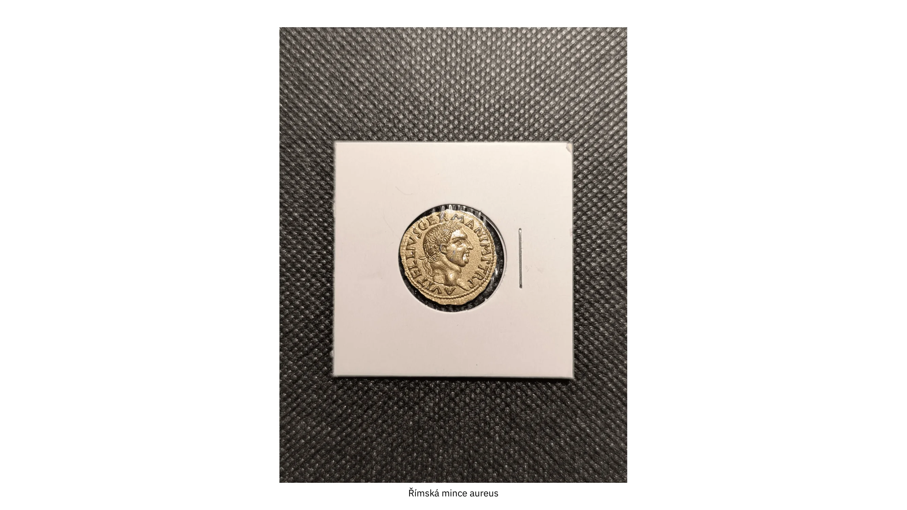

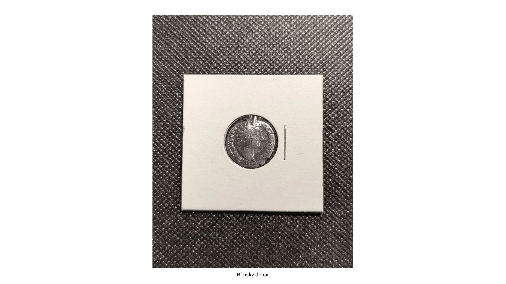

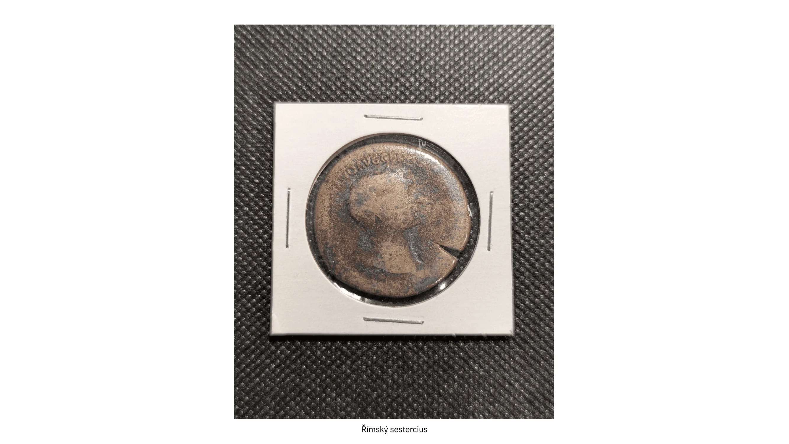

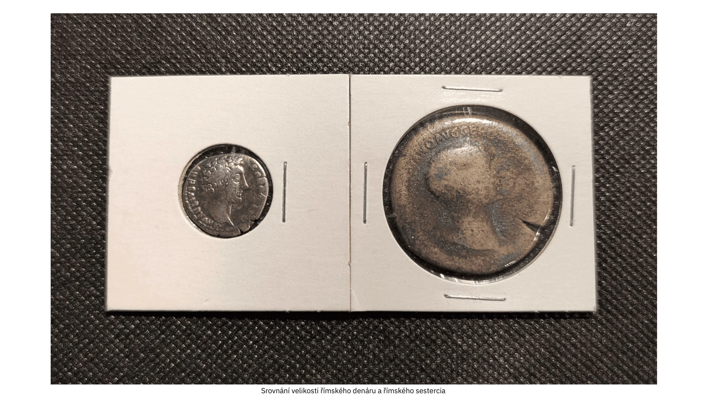

Od Nerona (54-68 n. l.) však Řím začal pomalu znehodnocovat své mince a postupně snižoval jejich hmotnost a ryzost, aby mohl financovat rostoucí císařské výdaje, zejména po velkém požáru Říma v roce 64 n. l. Tato devalvace měla pozoruhodné účinky: čistší mince byly v souladu s **Greshamovým zákonem** stahovány z oběhu hromaděním nebo vývozem, zatímco znehodnocené mince se množily, což způsobovalo postupný růst cen.

Třetí století představuje dramatický zlom, kdy za císařů Septimia Severa, Caracally a Galliena došlo k výraznému zrychlení devalvace. U hlavní stříbrné mince, denáru a následně antoninianu, klesl obsah stříbra na pouhá 2 %. Současně se hmotnost zlata v minci aureus snížila na polovinu. Tuto měnovou krizi doprovázela nebývalá politická nestabilita, nájezdy barbarů a opakující se občanské války.

Tato část mi umožní představit poslední kus této části: antoninianus. Původní název této mince není znám, ale dnes ji označujeme jako antoninianus. Vyznačuje se tím, že se cení na dva denáry, přestože je pouze 1,5krát větší než denár. Kromě toho se z těchto mincí časem staly pouhé billonové mince, což znamená, že byly vyrobeny ze slitiny stříbra a dalších kovů, nikoli z čistého stříbra. Mince byly často pouze potaženy stříbrem, což sloužilo jako pozoruhodný příklad úpadku měny.

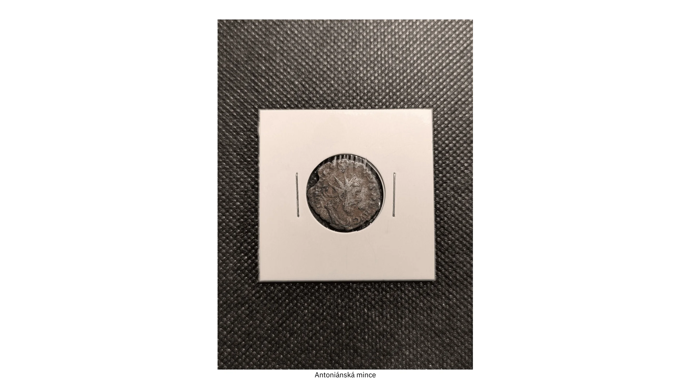

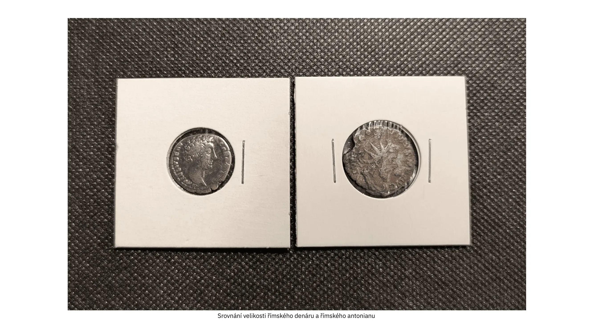

Tváří v tvář této situaci se císař Aurelián (270-275 n. l.) pokusil stabilizovat systém nominální revalvací měn, ale tato reforma ve skutečnosti zavedla inflační mechanismus tím, že uměle zafixovala hodnotu stávajících měn na vyšší úrovni.

K tomuto tématu uvedu odbočku. Během 3. století došlo k rychlému exponenciálnímu nárůstu inflace. Dříve sice docházelo ke znehodnocování mincí, ale ruční ražba jedné po druhé zajišťovala určitou kontrolu nad inflací. Statistiky uvádějí, že za 300 let znehodnocování činila inflace v průměru asi 4 % ročně. Těsně před Aureliánovou reformou činila inflace přibližně 3 % ročně.

Aurelián zavedl na minci se znakem XXI měření ryzosti, které udávalo složení 20 dílů bronzu na 1 díl stříbra, tedy 5% ryzost. Tyto 5% stříbrné mince uvedl na trh a vyrazil na ně znak XXI. Zároveň však odvolal všechny ostatní, více znehodnocené mince a vyrazil na nich stejnou značku XXI. Tím fakticky přehodnotil nominální hodnotu všech mincí. Výsledkem byla ohromující míra inflace ve výši 20 % ročně, která výrazně převyšovala předchozí 3% míru inflace před zavedením této techniky.

Tuto formu znehodnocování, která je mnohem rychlejší než postupné znehodnocování kovu, jež nás stále nutilo tisknout mince jednu po druhé, skutečně vymyslel Aurelián. Udělal to tak, že vzal všechny existující mince, odvolal je a razidlem změnil jejich nominální hodnotu. To je skutečný zlom. Tehdy se inflace stala exponenciální.

Pro názornou ilustraci této extrémní devalvace jsem našel několik fascinujících statistik o ceně obilí v Egyptě od roku 40 př. n. l. do 3. století, tedy v rozmezí více než 300 let. Níže si můžete prohlédnout řeckou tetradrachmu z mé sbírky. V té době, v Egyptě pod římskou okupací ve 3. století, byla ekvivalentem egyptská tetradrachma. Stále se používal nominál drachmy, který odpovídal denáru.

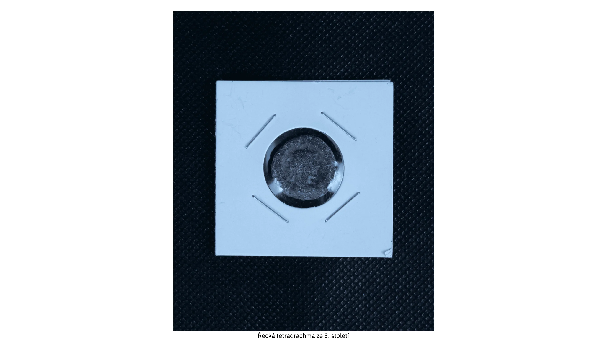

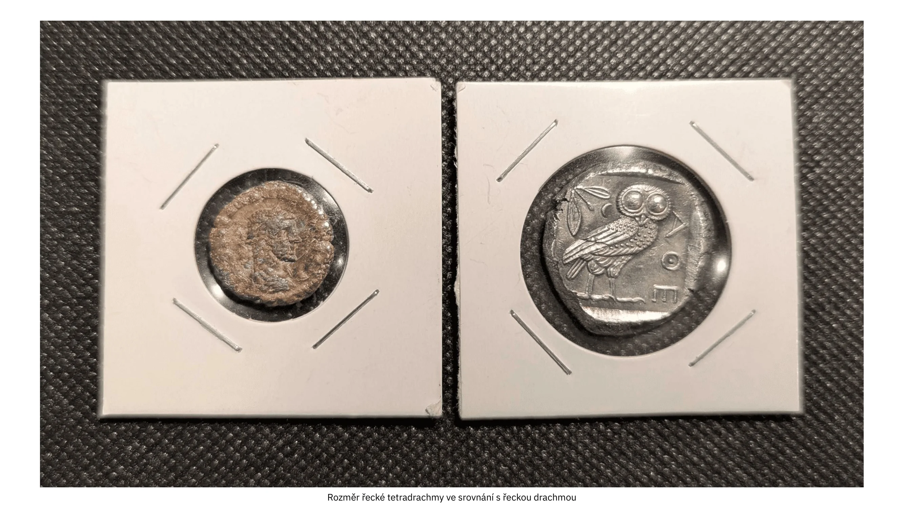

Egyptský tetradrachm, který mám, byl tedy ekvivalentem denáru. Je vidět, že mince je vyrobena z billonu (nebo bronzu), takže neobsahuje žádný drahý kov. Můžete ji porovnat s původní řeckou tetradrachmou, abyste viděli fyzické znehodnocení za těch 300 let. Jedná se o milionové zvýšení ceny obilí v Egyptě.

Je to fyzické vyjádření Aurelianovy reformy. Je třeba poznamenat, že většina, průměrná inflace za těchto 300 let, se pohybovala kolem 4 %. Teprve na konci, když Aurelián provedl svou reformu, se tato inflace stala spíše exponenciální a dospěli jsme k této míře 1 milion. Na konci 3. století byly ceny milionkrát vyšší než v 1. století před naším letopočtem.

Jeho nástupce **Diocletianus** (284-305 n. l.) se pokusil o ještě radikálnější reformy: vydal nové měny (zejména argenteus, který byl čistší, ale jeho množství bylo příliš omezené), zavedl drastickou kontrolu cen (cenový edikt z roku 301 n. l.) a **zavedl daňový systém založený na naturálních platbách**. Navzdory těmto snahám se Diokleciánovým reformám nepodařilo omezit bující inflaci.

Tváří v tvář odmítnutí dodávat zboží a služby výměnou za znehodnocenou měnu zavedl Dioklecián **dědičný kastovní systém**, aby rolníky a jejich potomky připoutal k půdě.

Je třeba si uvědomit, že rolníci odmítli dodávat své produkty výměnou za znehodnocenou měnu a náš drahý Dioklecián na to reagoval vytvořením **dědičných kast** slovy: "Vy nemůžete opustit svou půdu, vaše děti nemohou opustit svou půdu, totéž platí pro vojáky, jste vojáci, souhlasíte s tím, že budete placeni v mé měně." Jako přechodné řešení jim platil v naturáliích (v mase, jídle, obilí), protože jim odmítl dát peníze. A tak zavedl tento dědičný kastovní systém, aby donutil lidi být připoutáni ke svému řemeslu, aby nemohli jednoduše změnit zaměstnání, kdyby se snažili nepřijmout znehodnocenou měnu.

Pro ilustraci tohoto příkladu zde mám text, výňatek z knihy "*Monetární režim a inflace*":

> Protože lidé nebyli ochotni pracovat a dodávat zboží za znehodnocenou měnu, jejíž nominální hodnota byla vyšší než její skutečná nebo tržní hodnota, museli být k práci donuceni zavedením naturálních daní. [...] Pro rolníky se stalo nezákonným opouštět své registrované domovy. Zemědělské obyvatelstvo se tak dědičně připoutalo k půdě.
>

> Tento dědičný kastovní systém se postupně rozšířil: Diocletianus nutil syny vojáků sloužit v armádě, zatímco dělníci v peněžních dílnách, stejně jako v tkalcovnách a barvírnách, které Diocletianus vytvořil, se stali státními otroky s dědičnou službou. Dědičnou kastou se později stali také horníci těžící zlato. Další dědičné třídy existovaly pravděpodobně již v Diokleciánově době, zejména cechy pekařů a řezníků [...] v Římě, stejně jako diecézní cechy lodních kapitánů, kteří do Říma dopravovali obilí a další veřejné náklady.

Až Konstantinovi (306-337 n. l.) se nakonec podařilo stabilizovat měnový systém, když v roce 312 zavedl solidus, minci z ryzího zlata, jejíž kvalitu a hmotnost přísně garantoval. Existoval celý systém ověřování ryzosti a hmotnosti solidů. **Tato stabilita se však týkala pouze bohaté elity a císařské správy**, zatímco **většina obyvatelstva nadále trpěla nekvalitní měnou a trvalou inflací**. Solidus zůstal stabilní ve Východní říši (Byzanci), kde přetrval více než tisíciletí, zatímco na Západě se mince roztříštily na drobné mince nízké hodnoty, což doprovázelo konečný hospodářský a politický rozpad Římské říše, která definitivně padla v roce 476 n. l. V roce 476 n. l. se solidus stal součástí římské říše.

Na závěr bych se s vámi rád podělil o tento citát z knihy *Dějiny peněz: Od Glyna Daviese, který mistrně shrnuje, co možná vedlo k pádu Říma:

*"Daně byly trvale nedostatečné a potíže spojené s těmito stále nedostatečnějšími, opožděně upravovanými a velmi viditelnými daněmi přiměly Řím, aby se více spoléhal na snadnou, okamžitou a skrytou formu zdanění: devalvaci měny. Krátkodobé, ad hoc reformy nedokázaly tento odvěký trend úpadku zvrátit. Finanční tlaky způsobené opotřebením mincí, ztroskotáním lodí, únikem peněz v důsledku nákupu luxusního zboží z Východu, dary nabízenými germánským barbarům, růstem městské populace, poklesem zemědělské produkce, postupným vyčerpáním nejbohatších dolů a především politikou "chleba a cirkusů" považovanou za nezbytnou k udržení minimálního pořádku v městském životě - všechny tyto kumulované tlaky vedly Řím k neustálému znehodnocování měny, prokládanému příležitostnými reformami odsouzenými k nezdaru. "*

*Kromě bezplatného nebo levného chleba a vína se čas od času rozdávaly císařské milodary ("congiaria") ve formě peněžních příspěvků, zejména za Trajána (98-117 n. l.) a ještě více za Hadriána (117-138 n. l.) a jeho nástupců. To, co císař a občané zpočátku považovali za výjimečné privilegium, se na počátku 2. století stalo obvyklým očekáváním. Tyto dávky "představovaly těžké břemeno pro státní pokladnu a svým způsobem přispívaly ke státnímu bankrotu "*

## Souvislosti mezi rozmělňováním měny a inflací: od příčin k důsledkům

<chapterId>38d5781c-e900-53f7-baa7-413655d71754</chapterId>

:::video id=3999256d-aafe-4502-9b72-dfa8491a2777:::

Tato část se zabývá souvislostmi mezi rozmělňováním měny a inflací, od příčin až po důsledky. Ředění měny je jedním z hlavních ekonomických jevů v římské měnové historii, který má přímý vliv na inflaci. Od 1. století n. l. probíhala počáteční pomalá fáze ředění stříbrných mincí (denárů) od vlády císaře Nerona (54-68 n. l.), kterou urychlily opakované vojenské a finanční krize, zejména za vlády Septimia Severa (193-211) a Galliena (253-268).

Zaznamenáváme také postupnější znehodnocování aurea. Tento rozdíl v rychlosti znehodnocování poukazuje na dvě věci:

1. Úloha zúčtovací jednotky v bimetalismu pro státní kontrolu peněz. Zúčtovací jednotkou je v tomto příkladu denár. Identifikoval jsem tři různé způsoby řízení hodnoty zúčtovací jednotky: devalvace (ředění kovu), redenominace (antoninianus) a zavedení nominální hodnoty označením "XXI" (Aurelián)

2. Snaha státu co nejdéle odložit znehodnocení aurey, rezervy hodnoty, která umožňuje elitě udržet si kupní sílu na úkor méně šťastných. K tomuto principu se budeme v průběhu kurzu často vracet, zejména v souvislosti s konceptem známým jako "Cantillonův efekt" a redenominací maravedi ve Španělsku.

Tento jev je docela zajímavý a opakuje se v historii. Vrátíme se k němu u Maravedů v jedné z následujících kapitol. Tento vzorec je patrný i u všech rezervních měn; rezervní jednotka hodnoty, jako byl aureus v Římě, zůstává nedotčena. Zúčtovací jednotka používaná běžným obyvatelstvem pro obchod a každodenní transakce je však často znehodnocena. Výsledkem je, že měnová inflace postihuje obyčejné lidi, zatímco ti, kteří si mohou dovolit zlaté mince, zůstávají většinou nedotčeni.

A mimochodem, **to je stejný jev, který se dnes vytváří při devalvaci měny, která umožňuje růst hodnoty finančních aktiv**, a tak chudnou ti, kteří měnu používají, ti nejchudší, a to zase obohacuje prostřednictvím tvorby peněz majetek těch, kteří jsou schopni, kteří mají prostředky, aby se proti devalvaci chránili, a tak se prohlubují sociální nerovnosti. To je moje malá politická tiráda.

To, co jsem právě popsal, se nazývá Cantillonův efekt. Uvidíme, že tento pán žil v době Johna Lawa, což je téma, kterému se budeme věnovat také v následující části.

Reformy zahájené za Aureliána umožnily prudký nárůst inflace. Inflace nominální hodnoty peněz již nebyla omezena schopností mincoven vyrábět mince ručně. Mince, které již byly vyraženy, bylo nyní možné jednoduše označit, a nominální hodnota peněžní zásoby tak rostla rychleji.

V souvislosti s Aureliánem se s vámi chci podělit o dva citáty. První pochází z knihy *Dějiny peněz: Od starověku po současnost*:

*"pokud jde o římskou ekonomiku, byl Aureliánův přínos spíše katastrofou než triumfem. Bylo to do značné míry díky povaze jeho "reformy", že se míra inflace mohla zvýšit daleko více, než bylo dříve možné, a to i za nezodpovědného Galliena. Po dvě století po Aureliánovi se inflace stala endemickou v celé římské říši "*

Druhá pochází z knihy *Dávné dějiny z mincí* a týká se oddělení měnového systému od zlata:

*"Aureliánova reforma změnila vztah mezi zlatými penězi a zbytkem měnového systému. Před ní byly ostatní druhy měny vázány na **aureus** podle oficiálních kurzů (25 egyptských denárů nebo 25 tetradrachmů za jeden aureus atd.). Po reformě začaly zlaté peníze **volně kolísat v hodnotě** jako jakékoli jiné zboží, zatímco zbytek měnového systému **ztratil na hodnotě** v důsledku **oslabení slitin**, neboť již nebyl **zajištěn zlatem**. Protože zúčtovací jednotka zůstala teoreticky založena na stříbře (denáru, v Egyptě drachmě), ceny rostly s tím, jak měna znehodnocovala. "*

Jak je vidět, znehodnocení měny, která sloužila jako zúčtovací jednotka, neúměrně postihlo méně majetné, zatímco odtržení vazby na zlaté peníze ochránilo kupní sílu těch, kteří si mohli dovolit spořit do zásoby hodnoty, kterou je zlato.

Musíte si uvědomit, že pokud existuje vazba mezi denárem a aureem, i když znehodnotíte denár, pokud budete stále schopni vyměnit svůj denár za aureus v tomto kurzu (25 denárů za 1 aureus), lidé určitě vymění svůj denár za váš aureus, protože denár bude nadhodnocený a aureus podhodnocený. V této reformě však tuto vazbu odstranili. Lidé tedy již nemohli směňovat denáry za stříbrný kov znehodnocený vůči zlatu. Tehdy se ti, kdo měli přístup ke zlatým mincím, mohli skutečně chránit, protože poté už lidé nemohli vyměňovat nadhodnocené znehodnocené stříbro za podhodnocené ryzí zlato. To je velmi důležitý moment ve vývoji měny.

Názorný příklad účinků této Aureliánovy reformy dokonale ilustrují tyto citáty z knihy *Monetární režimy a inflace*:

*"Mezi vládami císařů Claudia (41-54 n. l.) a Constancia (337-361 n. l.) se cena pšenice na volném trhu v Egyptě, vyjádřená v drachmách, **zvýšila více než milionkrát**. Spektakulární cenová inflace je jednou z hlavních ekonomických skutečností 3. a 4. století n. l." (Lendon 1990, s. 106). Tento vývoj je však **méně dramatický, než se zdá**, neboť odpovídá **průměrné roční míře inflace 4,4 %**. A podle Wassinka (1991, s. 482) inflace ve skutečnosti začala **až v roce 238 n. l.**"*

*"Od tohoto data se inflace pomalu zrychlovala, protože **z oběhu byly nejprve vytlačeny kvalitní peníze**, takže celková peněžní zásoba se zpočátku téměř vůbec nezvyšovala. Následně dosáhla v letech 250 až 293** průměrné roční míry **3,65 % a v letech 293 až 301** vzrostla na **22,28 %** (Wassink 1991, s. 466), tj. až do **zrušených měnových reforem císaře Diokleciána**. Tento jev je **zvláště působivý pro inflaci v měnovém režimu založeném na kovu**. "*

Tento fenomén inflace spojený s ředěním peněz původně reagoval na občasné peněžní krize římského státu. Snížením obsahu drahých kovů v mincích při zachování jejich nominální hodnoty stát dočasně zvýšil své zdroje. Ceny však nereagovaly okamžitě: římský systém se totiž vyznačoval určitou strnulostí, což znamenalo, že se mzdy a ceny přizpůsobovaly postupné devalvaci pomalu. Nicméně po překročení určité hranice ceny prudce rostly, aby se na trhu opět vytvořila rovnováha s reálnou hodnotou měn.

Jak bylo uvedeno výše, tento jev je patrný zejména od poloviny 3. století. V Egyptě, bohatě zdokumentované oblasti, se za Aureliána (274 n. l.) po oficiální revalvaci měny ceny navzdory počátečnímu pokusu o stabilizaci zdesetinásobily. Za Diokleciána (301 n. l.) pak cenový edikt zavedl drastické kontroly k omezení inflace, aniž by se zabýval hlavní příčinou - nadvýrobou a měnovou degradací -, čímž způsobil předvídatelný neúspěch. Přetrvávající inflace nakonec tlačí ekonomiku k dvoustupňovému systému: **elita, chráněná zlatými rezervami (jako Konstantinův solidus**), se těší stabilitě, zatímco většina obyvatelstva nadále trpí chronickou inflací, **což je dnes znázorněno jako Cantillonův efekt**

Existuje jasná souvislost mezi rozmělňováním římské měny a inflací, jejíž příčiny jsou v podstatě spojeny s chronickými fiskálními deficity, neustálými vojenskými výdaji a špatným řízením státní ekonomiky.

## Pád Římské říše

<chapterId>b6ec0914-227b-509c-8108-b09eec9bb904</chapterId>

:::video id=91d4fee5-59bb-4ab9-a90b-e1125c71decb:::

### Devalvace měny a zhroucení Říma

Rakouská ekonomická škola, zejména prostřednictvím Ludwiga von Misese, navrhla monetární interpretaci pádu Říma. Podle této vize postupná devalvace římské měny rozbila složitý systém dělby práce, který udržoval říši s 60 miliony obyvatel. Měna, ústřední nástroj ekonomické koordinace, vedla po svém poškození ke zhroucení celé společenské a ekonomické struktury.

Tento měnový úpadek zničil nejen vnitřní soudržnost říše. Přerušilo také obchodní styky se sousedními národy. Zbaveni výhod plynoucích z obchodu s Římem přešli "barbaři" od mírové spolupráce k drancování. Invaze tedy neměly pouze vojenský charakter, ale byly také důsledkem zásadního hospodářského rozvratu.

### Tři fáze císařské devalvace

Dějiny římské měny lze rozdělit do tří různých období. První období, od Julia Klaudia do Antonína (27 př. n. l. - konec 2. století), si zachovalo relativní stabilitu. Za Trajána dosáhla říše svého apogea: Řím se rozkládal na ploše 5 milionů km² a stal se prvním milionovým městem v dějinách. Denáry si zachovaly ryzost stříbra 98 % až 80 % - mírné znehodnocení stále umožňovalo fungování ekonomiky.

Druhé období, 3. století, bylo obdobím vojenské anarchie. Během několika desetiletí se vystřídalo dvacet šest císařů. Měna se zhroutila: antoninianus, který měl údajně hodnotu dvou denárů, obsahoval pouze 1,5 kovové váhy - první pokus o rozdělení zákonné a skutečné hodnoty. Tato manipulace spouští Greshamův zákon: špatné peníze vytlačují dobré peníze. Občané hromadili dobré mince a utráceli pouze ty znehodnocené.

Peněžní poklady objevené archeology odhalují tuto ekonomickou úzkost. Zakopané amfory ukazují, jak Římané ukládali nejprve nejlepší mince a postupně přidávali znehodnocené. Tyto starověké "hromádky" svědčí o lidském jednání tváří v tvář nejistotě - o snaze uchovat hodnotu v rozpadajícím se světě.

### Konstantin a duální systém

Konstantin (310-337) se pokusil stabilizovat říši radikální reformou. Vytvořil zlatý solidus, měnu přísně kontrolovanou správou. Úředníci systematicky kontrolovali hmotnost a ryzost. Emise zůstala omezená a vázaná na válečnou kořist. Tato měna se stala výhradním nástrojem moci: daně se platily v solidech a legie dostávaly svůj plat ve zlatě.

Zároveň lidé používali bronzový nummus, který byl neustále znehodnocován. V roce 445 měl solidus hodnotu 7 000 nummií, v roce 498 16 800 nummií. Tento dvojí systém institucionalizoval Cantillonův efekt: ti, kdo měli přístup k solidům - správa, vlastníci půdy - byli chráněni před inflací. Plebs, omezený na nummus, neúprosně chudl.

Toto měnové oddělení vytvořilo dvě paralelní ekonomiky bez oficiálního směnného kurzu. Solidus zůstal zúčtovací jednotkou, ale obíhal jen velmi málo. Nummus se používal pro každodenní směnu, ale neustále ztrácel hodnotu. Tato měnová architektura předznamenávala nerovnosti vznikajícího feudálního systému.

### Kolaps dělby práce

Devalvace měny postupně zničila hospodářskou specializaci. Bez spolehlivé zúčtovací jednotky se zhroutil středomořský obchod. Římští specializovaní řemeslníci již nemohli obchodovat s Egyptem nebo Galií. Provincie přijaly vlastní měny, což znásobilo obchodní třenice.

Tváří v tvář této dezintegraci utíkalo městské obyvatelstvo na venkov - městský exodus zvrátil staletí urbanizace. Řemeslníci opustili svá řemesla a začali se živit zemědělstvím. Z velkých statků (latifundií) se staly soběstačné ostrovy, předzvěst středověkých seigneurů.

Ze zoufalství Dioklecián dokonce požadoval daně v naturáliích - což bylo konečné přiznání peněžního selhání. Jeho edikt o maximu (301) se snažil kontrolovat ceny, čímž urychlil návrat k výměnnému obchodu. Hospodářská složitost se vrátila do předcivilizačních forem.

### Přežití díky zlatu od Říma po Byzanc

Paradoxem je, že solidus přežil západní říši. Byzanc si ho udržela až do 11. století, což jí zajistilo dalších tisíc let ekonomické stability. Na Západě jeho památka přetrvává: francouzské slovo "sou" pochází ze solidus, což je jazykové svědectví o ztracené měnové velikosti.

Z majitelů půdy, kteří si uchovali své bohatství ve zlatě, se stali feudálové. Církevní struktury, jediné přežívající instituce, zajišťovaly společenské vazby, které peníze již nemohly zaručit. Evropa se rozdrobila na autarkní oblasti, z nichž každá měla vlastní subsistenční hospodářství.

Tato proměna ukazuje křehkost složitých civilizací. Dělba práce, která Římu umožnila uživit milion obyvatel, závisela výhradně na peněžní důvěře. Jakmile byla tato důvěra narušena, stavba se zhroutila a Evropa se téměř na tisíciletí vrátila k primitivním ekonomickým formám.

## Doba temna a středověk

<chapterId>a5856873-6142-57be-8a73-1f9e3df83792</chapterId>

:::video id=86b8da9b-3831-443d-b170-58c2bea3ad54:::

Historie a vznik peněz ve středověku se vyznačují obdobími regrese, inovací a hospodářského oživení.

Například když římská armáda opustila Británii, na ostrov se již nedostaly žádné římské mince. Kolem roku 435 n. l. se mince v Británii přestaly používat úplně, což je v bývalých římských provinciích ojedinělý jev. Téměř dvě století se britská ekonomika obešla bez mincí, a to až do 7. století, kdy se postupně znovu objevily mince merovejské a inspirované kontinentem.

Od 8. století přispěl křesťanský vliv k opětovnému zavedení mincí v severní Evropě. Klíčovou postavou tohoto období byl Pepin Krátký, král Franků, který v roce 752 zavedl denáry, jež později převzal jeho syn Karel Veliký. Karel Veliký široce rozšířil používání stříbrného denáru a vytvořil evropský měnový standard na několik století.

V Anglii došlo k významnému oživení mincovnictví, když byl za krále Offy z Mercie kolem roku 765 vyroben stříbrný peníz. Tato měna se stala tak důležitou, že se prakticky nezměnila po dobu 500 let.

Jako první artefakt vztahující se k tomuto období vám ukážu reprodukci anglické mince z té doby.

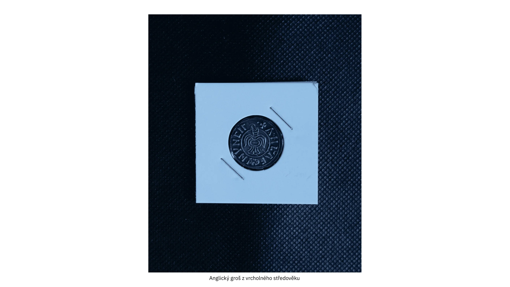

Během vrcholného středověku se Evropa po zhroucení římského peněžního systému propadla do feudalismu. Většina obyvatelstva používala měděné nebo bronzové mince nízké hodnoty, které často podléhaly ředění měny, což omezovalo obchod na velké vzdálenosti.

K návratu mincí jako platebního prostředku docházelo postupně, což vyvrcholilo ve 13. století, kdy se v roce 1252 ve Florencii objevil zlatý florin a v Benátkách zlatý dukát. Tyto zlaté mince byly široce používány díky rozvoji obchodu a rostoucí potřebě spolehlivých, mezinárodně uznávaných platebních prostředků.

V Anglii byl měnový systém chráněn před rozmělněním díky inovativní fiskální politice, jako byla daň z půdy zavedená Vilémem Dobyvatelem po roce 1066, která zachovala kvalitu šterlinků. Důležité je pochopit, že tehdejší panovníci mohli měnu devalvovat, aby mohli financovat stát, a **zavedení této daně umožnilo udržet stabilitu měny a financovat stát prostřednictvím daní**

Pokušení vydělávat na rozmělňování peněz však vedlo ke krizím, jako například za vlády Jindřicha I. ve 12. století, kdy kvalita mincí dramaticky poklesla. Přísné reformy, někdy doprovázené násilnými opatřeními proti mincovníkům, dočasně obnovily důvěru v měnu.

Ve středověku se také objevily sofistikované finanční praktiky, například v Anglii se k obcházení zákazu lichvy a poskytování úvěrů používaly sázkové hole. Církev nebyla příliš nakloněna úročeným půjčkám, a tak se používaly různé techniky, jak zákaz používání úroků obejít.

Tyto inovace byly reakcí na chronický nedostatek kovových peněz a podpořily vznik zárodku finančního trhu.

Křížové výpravy mezitím podnítily středomořský obchod, podpořily rozvoj mezinárodní výměny a nových bankovních praktik, zejména prostřednictvím řádu templářů. Templáři se stali důležitými finančními zprostředkovateli, kteří umožnili křižákům získat likviditu daleko od domova, a předznamenali tak moderní evropský bankovní systém.

Abyste si uvědomili souvislost s templáři, můžete si níže prohlédnout francouzskou středověkou minci, na níž je uprostřed krásný kříž. Na mincích této doby bylo zcela běžné, že byl tento kříž umístěn.

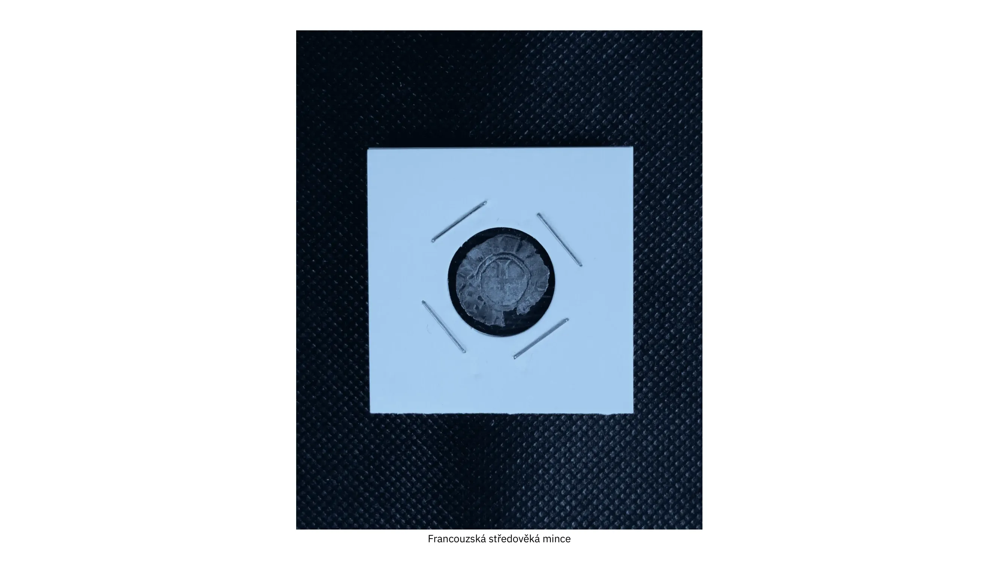

A konečně velké krize, jako byla černá smrt (1346-1353), přinesly hluboké hospodářské změny. Prudký pokles počtu obyvatel vedl k prudkému nárůstu mezd, který se vzpíral snahám vlády udržet předchozí úroveň odměňování.

Stoletá válka (1337-1453) zároveň přinutila státy k agresivnější daňové politice, aby mohly financovat své armády, což přispělo k oslabení feudálního systému.

Středověk se tak vyznačoval neustálým napětím mezi potřebou spolehlivých peněz pro obchod a neustálým pokušením vládců rozmělňovat peníze za účelem okamžitého zisku. Tento konflikt zásadně ovlivnil evropský měnový vývoj a položil základy moderních ekonomických systémů.

Na závěr této části bych rád přidal jednu zajímavou anekdotu z Anglie z té doby. Tato anekdota je převzata z knihy "History of Money" od Glyna Daviese.

Zmiňuje, že v Anglii se v důsledku přechodu na parlament přeneslo břemeno dluhu z panovníka na parlament, což vedlo k chronickému zadlužení státu. Předtím byl dluh na bedrech panovníka.

Jakmile se parlamentu podařilo převzít část této pravomoci vytvářet peníze, umožnilo to vytvořit dlouhodobé dluhy, které nesl lid, nikoli král. Dříve, pokud král zbankrotoval nebo pokud došlo ke změně krále, dluh zanikl spolu s ním.

V okamžiku, kdy je dluh vytvořen parlamentem, vzniká pojem státního dluhu, který je potenciálně časově neomezený. Dokud existuje stát, dokud existuje parlament, existuje i tento dluh a musely se najít nejrůznější způsoby jeho refinancování a rozložení v čase. Jde o zásadní změnu paradigmatu, kdy to již nebyl král nebo královská rodina, kdo ručil za tyto dluhy nebo nesl jejich břemeno; nyní to byl parlament, a tedy jeho občané.

## Renesance

<chapterId>1d1dfb05-70b4-5b7b-9708-373c2182950d</chapterId>

:::video id=4977b4f3-c7b2-41a5-ad7b-a96a8cca4092:::

Nyní jsme se dostali do části kurzu, kde hovoříme o období známém jako renesance. Odehrává se na pozadí tragické krize, kdy se na palubách lodí blechy na krysách bleskově rozšířil mor. Tato tragédie nás však informuje o rozvoji obchodu a cestování v období vrcholného středověku. Dříve v tomto období se tolik lidí nepřemisťovalo tak daleko a tak rychle.

### Florin z Florencie

Návrat zlatých mincí do Evropy v období renesance představuje zásadní zlom v měnových dějinách. **Vše začalo florentským florinem z roku 1252, první významnou zlatou mincí raženou v Evropě od pádu Říma**. Díky své pozoruhodně stálé hmotnosti a ryzosti (přibližně 3,5 gramu ryzího zlata) zůstal florén po čtyři století nezměněn a rychle se stal základním celoevropským měnovým etalonem.

Níže si můžete prohlédnout reprodukci florinu: zlatý florin vyrobený z cínu a vyražený francouzským umělcem, který vyrábí vynikající kusy, ručně ryté a ražené.

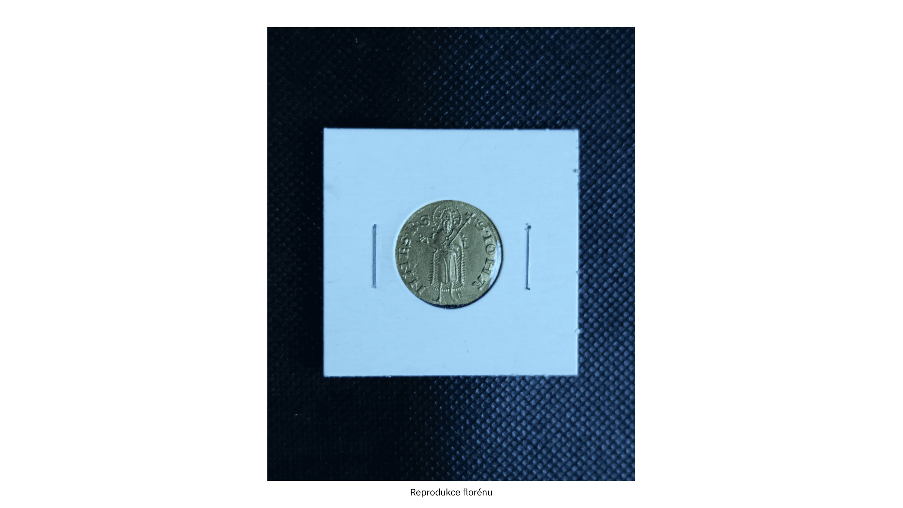

Tento návrat ke zlatým mincím byl vyvolán specifickým kontextem: zhroucení byzantského solidusu a hospodářský úpadek muslimského světa v důsledku mongolských nájezdů vytvořily v mezinárodním obchodě měnové vakuum.

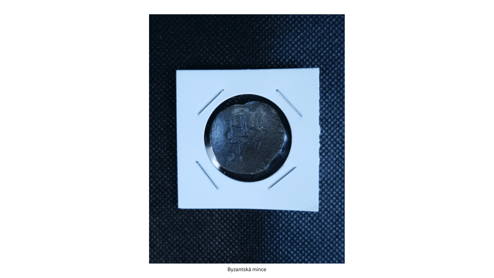

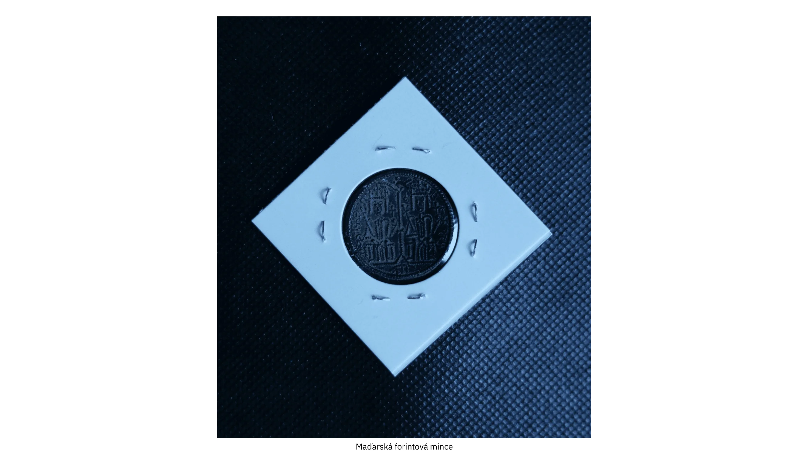

První obrázek výše ukazuje byzantskou minci, která mi připadá docela zajímavá. Udělám paralelu s mincí ze stejného období z Uher (druhý obrázek nahoře). Uherská mince má tvar poháru, podobného miniaturní misce. Ikonograficky jsou na ní zobrazeny náboženské postavy králů, kteří vedle sebe drží kříže. Tento kus má tvar misky a pochází z Maďarska.

Bylo zcela běžné kopírovat mince z jiných zemí. Protože byzantské mince byly všeobecně uznávané, ostatní země je často kopírovaly. Jak můžete vidět, když je porovnáte vedle sebe: tyto mince jsou si velmi podobné.

Severní Itálie, zejména Florencie, Benátky a Janov, využily této situace k zavedení nových tvrdých měn - mincí se stabilním obsahem drahých kovů. Benátky následovaly příkladu Florencie a v roce 1270 začaly razit dukát, měnu téměř totožnou s florinem, která se hojně používala ve středomořském obchodě.

Florin se stal první mezinárodní rezervní měnou, kterou do konce 14. století přijalo více než 150 evropských měst. Vytvořením rozsáhlé florentské bankovní sítě, v jejímž čele stáli Medicejští, došlo k důkladné modernizaci peněžnictví a účetnictví, a dokonce se snížila potřeba fyzického transportu zlata.

To je další opravdu zajímavý bod. Byly doby, kdy se při námořních plavbách ztrácelo mnoho zásilek mincí. Tento technologický pokrok - registrační pokladny s podvojným účetnictvím - umožnil vznik písařských peněz. To umožnilo snížit počet mincovních úhrad a místo toho používat systém písemných záznamů, který výrazně snižuje riziko ztráty peněz při přepravě.

Měnový vývoj byl doprovázen také významným vývojem bankovních metod. Středověká Evropa byla částečně inspirována kontaktem křižáckých výprav s muslimskými bankovními praktikami a již ve 13. století vznikly ve Florencii, Benátkách, Barceloně a Janově základní bankovní systémy. Templáři, náboženský a vojenský řád, již dříve vyvinuli systém, který umožňoval křižákům cestovat, aniž by s sebou brali své bohatství.

Finanční prostředky ukládali v templářské kanceláři ve své zemi a po příjezdu do cíle křížové výpravy si mohli mince vyzvednout.

Díky tomu jsme u sebe nemuseli nosit mince z drahých kovů.

V tomto období se také Evropa díky cestě Marca Pola ve 13. století dozvěděla o existenci papírových peněz v Číně. Na vývoj bankovek se však čekalo několik století, protože Evropa dávala přednost tomu, aby nejprve zdokonalila své metody ražby kovových mincí. Leonardo da Vinci v blízkosti Luky Pacioliho, známého účetního, aktivně přispěl ke zdokonalení peněžních lisů, čímž podpořil rychlejší a jednotnější výrobu mincí.

Máme na mysli techniku kyvadlového úderu, o které jsme se zmínili dříve v kurzu. Tato metoda umožňovala ve srovnání s ražbou kladivem vyrábět rovnoměrnější mince a, což je důležité, umožňovala nápisy na okraji mince, jak jsem již dříve předvedl. Níže je uveden evropský tolar z roku 1793, na němž je zřetelně vidět nápis na okraji.

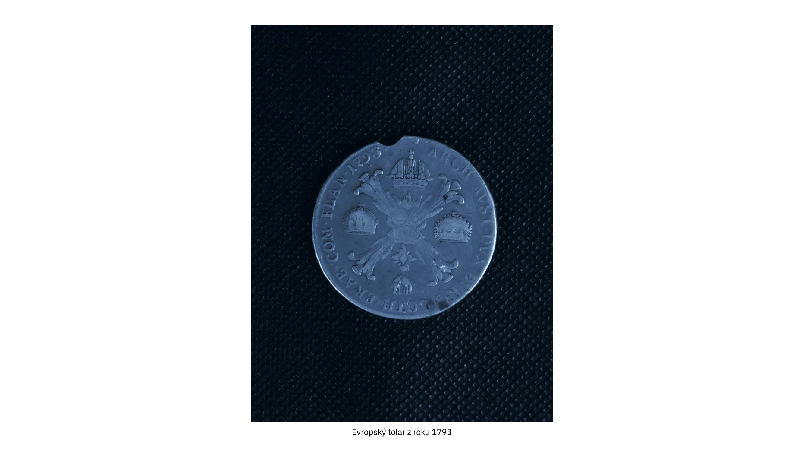

V 15. století však Evropa zažila vážnou měnovou krizi, kdy se všeobecně zhoršil obsah stříbra v evropských měnách, který kolem roku 1450 klesl na méně než 5 %.

Od 16. století se těžiště měnové politiky přesunulo do Španělska, k čemuž přispělo sjednocení aragonského a kastilského království, konec reconquisty a velké námořní objevy, například objev Kryštofa Kolumba v roce 1492. Masivní příliv stříbra z amerických dolů hluboce narušil evropskou i světovou hospodářskou rovnováhu a podnítil inflaci i nové geopolitické napětí.

Renesance znamenala také významný umělecký vývoj v oblasti mincí, například tolaru (Joachimsthaler), z něhož pochází pojem "dolar". Tyto velké stříbrné mince odrážejí nové umělecké a mechanické techniky ražby, které umožnily technické inovace ze severní Evropy.

A konečně finanční renesance zahájila přechod k ekonomické modernitě, kdy došlo k rozvoji bankovnictví, úvěrů a finančních trhů a ke vzniku prvních forem moderního kapitalismu ve velkých obchodních městech Amsterdamu, Londýně a Stockholmu, čímž byly položeny základy mezinárodního finančního systému, jak jej známe dnes. A právě to je tématem našeho dalšího videa.

# Zabavení peněz státem

<partId>17cfb1b4-5bc1-53e0-b035-05c7cf76be92</partId>

## Vývoj světových rezervních měn

<chapterId>d65cc352-e7ca-5f03-9b23-dd1fae5c0395</chapterId>

:::video id=82710062-8fff-426c-93af-923c08d82233:::

### Historický význam drahých kovů

Vítejte v této části věnované vzniku rezervních měn a centrálních bank. Jako první bod této nové sekce se zaměříme na vývoj světových rezervních měn.

Drahé kovy, zejména zlato a stříbro, byly dlouho považovány za základ bohatství a moci říší. Touha po zlatě byla vždy dominantní hnací silou a byl to právě příliv drahých kovů, který měl nejpřímější a nejzřetelnější vliv na měnový vývoj v Evropě. Ve středověku a na počátku renesance byla tato posedlost zlatem a stříbrem způsobena obtížemi s udržením hodnoty jiných forem zboží a také silnou poptávkou ze strany cizích mocností, zejména v obchodu s Orientem.

V průběhu staletí se v roli světových hospodářských center vystřídalo několik říší. Země, která v daném období dominuje světovému obchodu, obvykle získává status rezervní měny. Patří mezi ně např:

- Španělsko a Portugalsko (15. a 16. století)

- Spojené provincie (Nizozemsko) v 17. století

- Francie a Velká Británie v 18. a 19. století

- Spojené státy ve 20. století

### Portugalský boom a real (1450-1530)

**Portugalsko** dominovalo světovému obchodu ve druhé polovině 15. a na počátku 16. století díky **portugalskému realu**, stříbrné minci relativně jednotné hmotnosti. Portugalci díky svým pokrokům v navigaci objevili nové námořní cesty do Afriky, Asie a Nového světa. Množily se vojenské pevnosti a obchodní stanice od Afriky až po Čínu (Macao).

V reakci na evropskou poptávku po zlatě a stříbře byl "stálou motivací velkých objevů obchodní zisk, zejména honba za zlatem a stříbrem" Portugalské impérium, které bylo příliš rozlehlé a čelilo konkurenci Nizozemců, Angličanů a Francouzů, však začalo upadat.

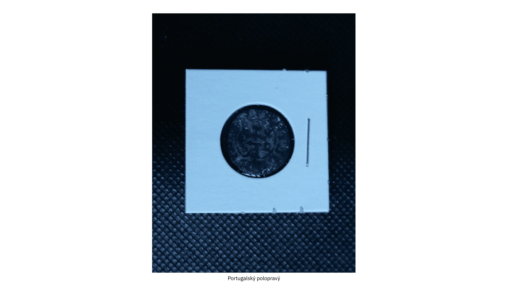

Zde nahoře vidíte portugalskou polopravdu z doby těchto námořních výbojů.

### Španělský apogeum a španělský dolar (1535-17. století)

Po dobytí Nového světa se dominantním hráčem stal **Španělsko**. Jeho panovník, který ovládal obrovské stříbrné doly (Potosí v Bolívii, Zacatecas v Mexiku), dokázal razit peníze z ryzího stříbra, čímž se vyhnul znehodnocení své vlastní měny: **španělského realu**

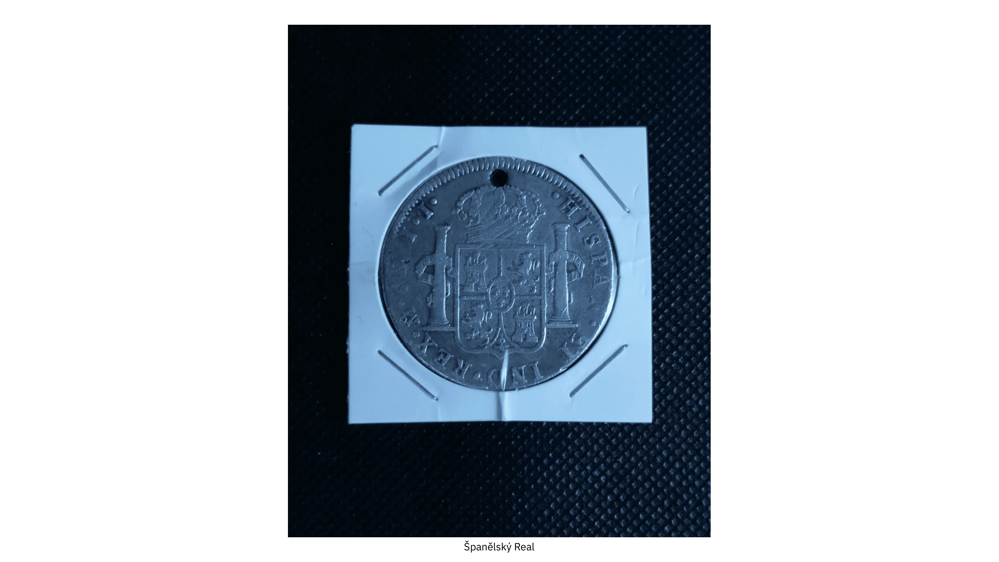

Španělský real, známý také jako "osmička", získal svou přezdívku proto, že se často rozřezával na osminy, aby se z něj vytvořily menší mince. Byl také znám jako **španělský dolar**. Mince, kterou vidíte výše, pochází z roku 1814, takže je o něco novějším exemplářem. Úplně první španělské dolarové mince však nebyly tak propracované; byly raženy kladívkem a obecně byly méně kulaté a ostré.

Zajímavé je zejména to, že španělský dolar v té době sloužil jako mezinárodní rezervní měna. Španělské úřady také vydávaly vlastní místní měnu, maravedi, a pravidelně upravovaly peněžní zásobu odvoláváním. Například měděná nebo bronzová mince, která měla původně hodnotu jednoho maravedi, mohla být odvolána a vyražena s číslem "2", později s číslem "4" a tak dále, případně až s číslem "8" Na fotografii s vysokým rozlišením je jasně vidět, že na minci je vyraženo "8". Tato metoda účinně rozšířila peněžní zásobu... což nevyhnutelně vedlo k inflaci.

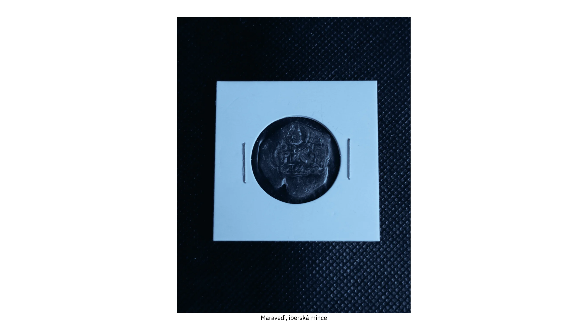

Pokud se podíváme na historii rezervních měn, zjistíme zajímavou věc: říše své měny nenafukovaly, dokud si udržely status rezervní měny. **Jen na konci své nadvlády ji nakonec znehodnotily, čímž o toto privilegium přišly, a to pak přešlo na nové impérium**.

Ve Španělsku dominoval španělský dolar světovému obchodu téměř 200 let, zejména mezi Čínou a Evropou. Tyto mince bylo možné nalézt i v čínských přístavech. A tady na nás mrkne historie: americký dolar pochází přímo z této měny. Když v roce 1792 vznikly Spojené státy, přijaly zákon o ražbě vlastní měny a jejich první dolary byly vytvořeny podle vzoru španělského dolaru, a to jak názvem, tak velikostí mince.

Pro představu o hodnotě amerického dolaru uveďme, že na rozdíl od dnešní papírové měny byl dolar původně stříbrnou mincí o váze téměř jedné unce, což je v přepočtu na dnešní peníze 30 až 40 eur. Co se týče španělského dolaru, ten byl v oběhu tak rozšířený, že je považován za první skutečnou světovou měnu.

Tento příliv drahých kovů z Ameriky však způsobil v Evropě inflaci. Během cenové revoluce (asi 1540-1640) se životní náklady v Anglii zvýšily sedmkrát. Ve Španělsku mělo hojné množství stříbra zvrácený efekt prokletí zdrojů a bránilo rozvoji solidních bankovních institucí.

Následně Španělsko čelilo četným vojenským konfliktům (Flandry, Nizozemí, třicetiletá válka) a jeho finance se postupně hroutily. Namísto devalvace světově proslulé stříbrné mince se následující panovníci rozhodli neplatit nebo znehodnotit měděnou minci (vellón), kterou používalo místní obyvatelstvo. To je to, co jsem již dříve popsal v případě Maravedis.

### Nizozemský vzestup (17. století)

Po iberském apogeu se **Nizozemsko** stalo v 17. století novou obchodní velmocí. Námořní obchod, VOC (Nizozemská východoindická společnost) a založení **Amsterdamské burzy Exchange** (inspirované burzou v Antverpách) vytvořily z této obchodní republiky centrum.

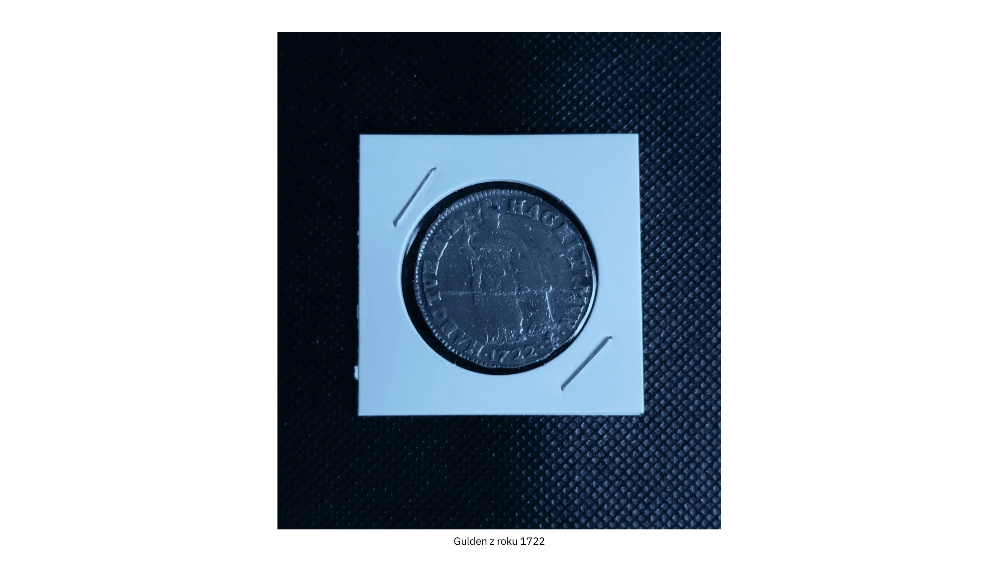

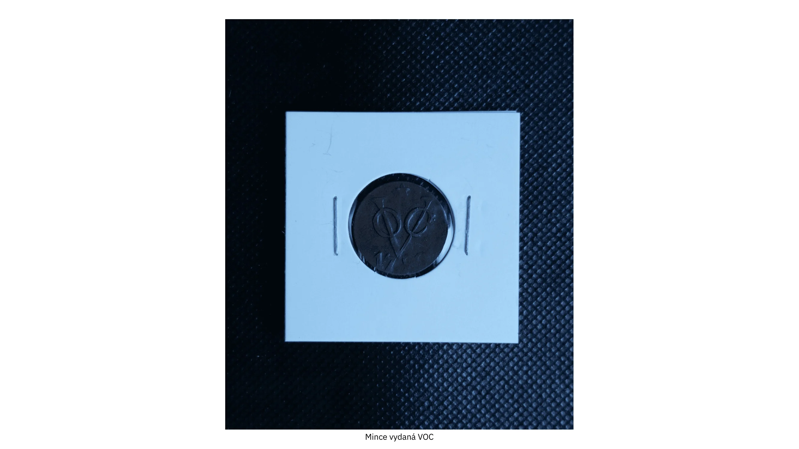

Na první fotografii výše vidíte guldeny z roku 1722 (krásná stříbrná mince), na druhé je mince vydaná VOC.

VOC byla na svou dobu mimořádně mocná společnost: měla vlastní armádu a dokonce vydávala vlastní měnu.

Holanďané vynalezli moderní kapitalismus, který vznikl jako způsob rozložení rizika při riskantních podnicích, jako byly výpravy do Nového světa nebo hledání nových obchodních cest. Akciové společnosti umožnily několika investorům spojit své peníze a sdílet riziko. Pro usnadnění těchto výměn pak bylo nutné vytvořit instituce schopné tyto cenné papíry sjednávat a vyměňovat. V roce 1602 tak vznikla první akciová společnost a burza cenných papírů.

Nizozemská měna, **Gulden**, získala důvěryhodnost díky své ryzosti ve stříbře a poté díky tomu, že ji přijala Amsterdamská banka (1609), kde se vklady staly preferovanou formou peněz v Evropě. To je velmi důležitý bod, který je třeba zmínit. Ano, samozřejmě existovaly mince, ale to, co v té době skutečně představovalo peníze, byla forma písařských peněz. Ve skutečnosti procházela velká část světového obchodu přes knihy amsterodamské banky. To byl skutečný průlom v bankovnictví: mezinárodní obchod už nemusel nutně probíhat pomocí fyzických mincí, ale přímo prostřednictvím účetních záznamů banky.

Toto období prosperity se vyznačovalo velkým přílivem zlata a stříbra, zejména z jiných zemí, které praktikovaly inflaci nebo měnovou kontrolu. Je třeba zmínit jednu zajímavou postavu: **Thomas Gresham**. V této době pracoval pro anglickou královskou rodinu v Nizozemí a řídil tok peněz mezi oběma zeměmi. Byl to tentýž Gresham, který nám zanechal slavný **"Greshamův zákon "**.

Nicméně i nizozemská říše se nakonec vyčerpala. Války s Anglií, oslabení guldenů v době konfliktů a konkurence dalších mocností (Francie a Anglie) znamenaly konec nizozemské hegemonie. Po čtvrté anglo-nizozemské válce (1780-84) se úpadek guldenů jako rezervní měny stal nezvratným.

### Francouzská moc, ambice a neúspěchy (17.-18. století)

Za vlády Ludvíka XIV. se **Francie** stala největší kontinentální mocností v Evropě. Francouzská měna však nikdy nedosáhla postavení dominantní reference: četné devalvace, vysoké daně a nákladné války (Augsburská liga, válka o španělské dědictví atd.) značně zatížily stabilitu měnového systému.

První velký experiment s papírovými penězi provedl John Law (1716-1720). Banque Générale vydávala bankovky kryté příslibem státního dluhu. Toto schéma vedlo v roce 1720 ke spekulativní bublině a jejímu krachu (Mississippská bublina). Tato katastrofa zanechala ve Francii trvalou nedůvěru k papírovým penězům. Právě tato katastrofální zkušenost vedla k tomu, že Richard Cantillon zbohatl díky tomuto systému stanovování principů, dnes známému jako Cantillonův efekt, kdy tisk peněz obohacuje ty, kteří mají přístup k tiskařskému lisu.

Když tato nedůvěra konečně opadla, přišlo další fiasko francouzských novin: revoluční **assignaty**. Tyto asignáty, vydávané od roku 1790 na základě konfiskace majetku duchovenstva, zažily cvalovou hyperinflaci, která se oficiálně stala první hyperinflací v historii, jež přesáhla 50 % měsíčně. V roce 1795 se, přestože jejich nominální hodnota byla znásobena, obchodovaly za pouhých několik procent své původní hodnoty.

Restriktivnější zákony se snažily zavést assignat, ale bez úspěchu. Vláda se jej snažila prosadit, přičemž šla tak daleko, že těm, kteří jej nepřijali, hrozila smrtí a nutila majitele obchodů, aby zůstali otevření. Nakonec to však samozřejmě nefungovalo.

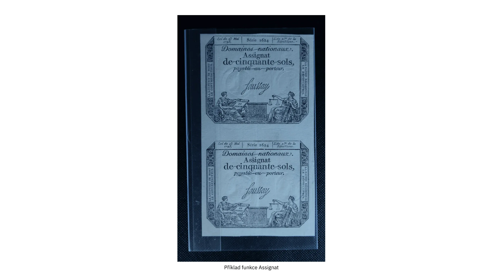

Když tyto papírové peníze nahradily všechny kvalitní mince z drahých kovů, nastal v souladu se známým Greshamovým zákonem nedostatek mincí. K ražbě nových mincí se používal zvonovina zabavená duchovním. Níže vidíte krásný kus zvonoviny, vyrobený z mědi získané roztavením mincí zabavených duchovním.

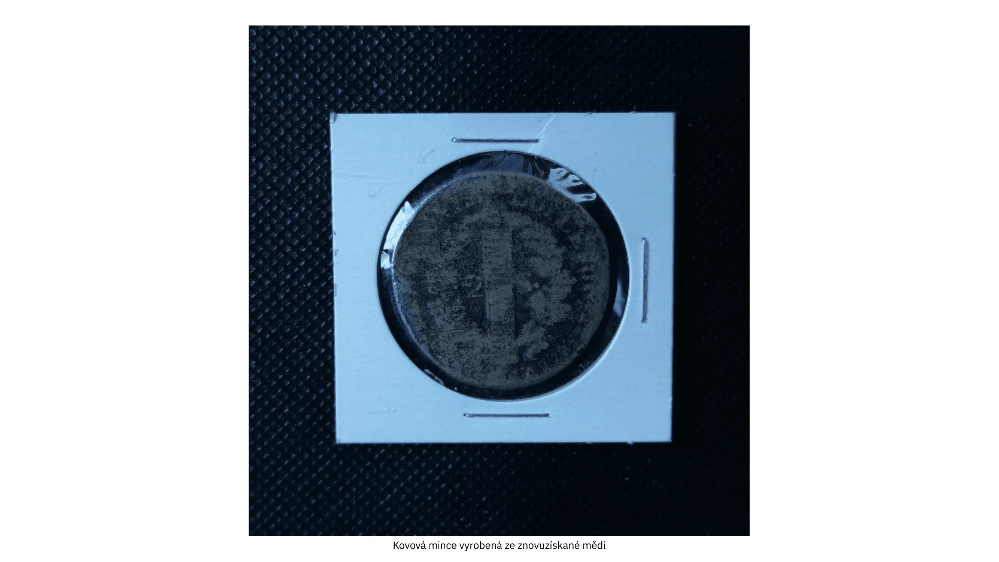

### Britská nadvláda (18. - počátek 20. století)

**Anglie**, která předstihla Nizozemsko, se v 18. století stala dominantní mocností. Libra šterlinků je nejstarší dosud používanou měnou, původně vázanou na libru stříbra. Její postavení postupně sílilo, k čemuž přispěla finanční a daňová revoluce: parlamentní monarchie, silná schopnost vybírat daně a vytvoření Anglické banky v roce 1694.

Po sérii válek s Francií zvítězilo Spojené království v roce 1815 (Waterloo) a potvrdilo svou nadvládu. Po celé 19. století byla libra šterlinků světovou rezervní měnou. V době svého největšího rozkvětu produkovala Velká Británie s pouhými 2,5 % světové populace 20 % světového příjmu a kontrolovala téměř čtvrtinu zemského povrchu.

Důvěryhodnost libry posílila **průmyslová revoluce** a přijetí **zlatého standardu** (1717 nebo 1718 pod dohledem Isaaca Newtona v královské mincovně). Anglická centrální banka přijala zlatý standard ve výši 4,25 libry za unci zlata, což umožnilo držitelům bankovek jejich konverzi do zlata.

První světová válka (1914-1918) však tento systém ukončila. Během několika týdnů všechny hlavní válčící mocnosti pozastavily směnitelnost zlata. Britské impérium a později i libra vyšly z druhé světové války oslabené a ve 20. století ustoupily americkému dolaru.

A jako artefakt si níže můžete prohlédnout několik krásných a zajímavých kousků. Jedná se o peněžní závaží. První z nich je panovník: nejstarší vyobrazení libry. Mám pouze peněžní závaží, která představují tyto mince, protože si nemohu dovolit koupit skutečný sovereign. K jejich vážení jsme použili váhy a na druhou stranu jsme pak umístili peněžní závaží odpovídající hodnotě sovereignu.

Suverén byla měnová mince - zlatá mince původně v hodnotě jedné libry.

Před slavným sovereignem byla guinea, která fungovala na stejném principu. Guinea byla pojmenována podle drahých kovů, které obsahovala a které pocházely z oblasti Guineje.

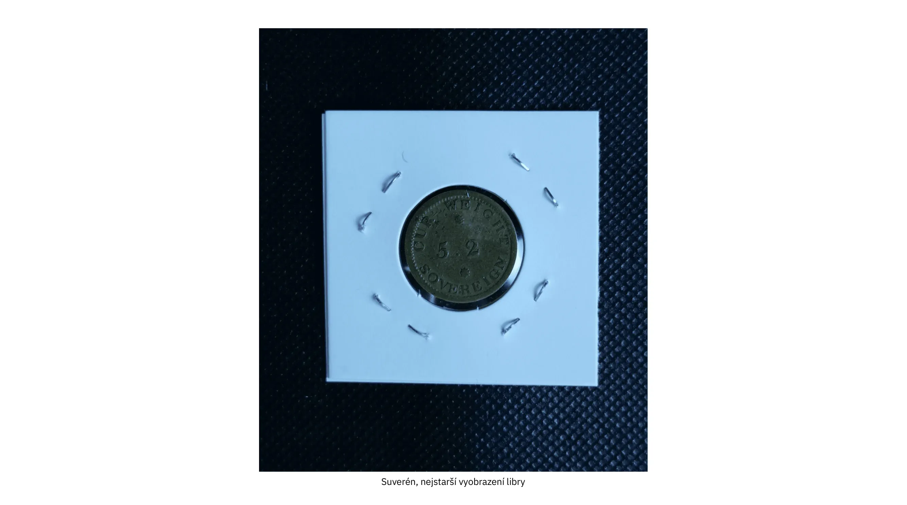

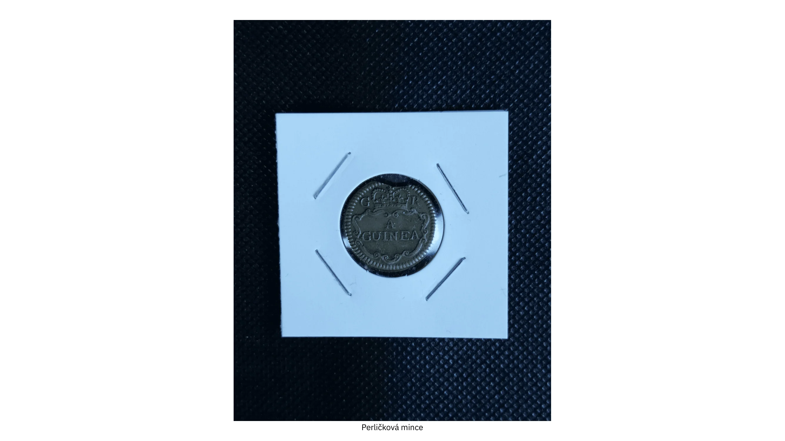

## Vznik centrálních bank

<chapterId>15777771-1e28-55f7-a400-69868a47079b</chapterId>

:::video id=7661b7b5-e00f-48f3-b69a-6fb2eb5ebba4:::

V návaznosti na část věnovanou historii prvních rezervních měn a jejich vývoji je zde část věnovaná vzniku centrálních bank. Sleduje v podstatě stejnou cestu jako vznik rezervních měn, ale zaměřuje se trochu více na tehdejší bankovní technologie.

### Počátky bank a proto-bank

Již ve 13. století Italové (Florencie, Janov, Benátky...) vyvinuli techniku podvojného účetnictví. Později se **Antverpy** (16. stol.) staly předním finančním centrem severní Evropy a tuto roli později převzal **Amsterdam** díky amsterdamské burze Exchange (1609), kde se obchodovalo s akciemi VOC.

V Antverpách se konaly kupecké trhy, kde se často scházeli obchodníci, aby vyrovnali své dluhy, což vedlo k vynálezu nových finančních nástrojů. Níže uvedená směnka z roku 1761, která je novější, je **dlužním úpisem**. Obsahuje ručně psané údaje spolu s nápisy na zadní straně, což z ní činí nádherný artefakt z tohoto období.

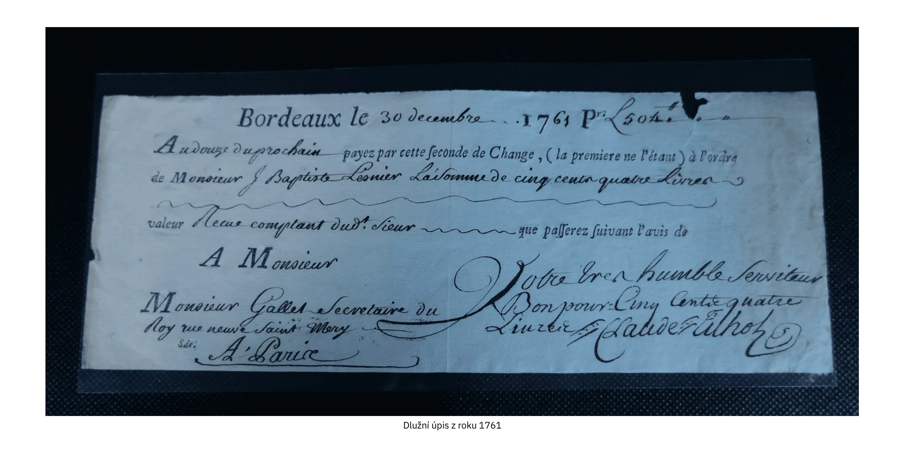

Tento výkyv vedl k vytvoření sofistikovanějších bankovních institucí. **Lombardští bankéři** a později nizozemští obchodníci zdokonalili úvěrové nástroje (směnky, dlužní úpisy atd.). Moderní bankovní systém je založen na této myšlence: peníze mohou být úvěrem, nejen kovem.

Jak vidíte, vracíme se tím k naší původní otázce o původu peněz.

Vznikají peníze z komodity, která vzniká z potřeby směny, nebo z úvěru? Stopy této otázky lze v tomto oddíle stále nalézt.

### Švédský příklad: Stockholms Banco a Riksens Ständers Bank

Přesuňme se do Švédska, kde vznikla první centrální banka.

**Švédsko** bylo průkopníkem centrálního bankovnictví: v roce 1657 Johan Palmstruch vytvořil **Stockholmskou banku**, která byla oprávněna půjčovat více, než činily její kovové rezervy, čímž se zrodilo bankovnictví s částečnými rezervami. Nadměrná emise bankovek však vedla v roce 1663 k panice a hromadnému útoku na banku. No, no...

V roce 1668 byla ve Stockholmu založena Riksens Ständers Bank, první skutečná centrální banka na světě. I ji však postihly krize (1709, 1715...) spojené se zneužíváním bankovek, často k financování válek v království.

### Neúspěšný převrat Johna Lawa

Vydejme se do Francie, kde opět najdeme našeho milovaného Johna Lawa.

**Skot John Law** přesvědčil regenta (vévodu Orleánského), aby založil soukromou banku Banque Générale (1716), která byla oprávněna vydávat papíry proti zlatu, stříbru a státním dluhům. Z ní se stala Banque Royale (1718) a pomohla prudkému růstu akcií Mississippské společnosti.

Když realita dohnala spekulace, **panika se ještě prohloubila rozhodnutím zakázat držbu zlata a vynutit si používání Lawových bankovek**. No, no...

Nakonec bublina v roce 1720 praskla a způsobila kolaps, který na dlouhou dobu zničil důvěryhodnost papírových peněz ve Francii.

### Bank of Amsterdam, vznik průkopnického modelu

Nyní se přeneseme do Amsterdamu v roce 1609, kde **Amsterdamská banka** (Wisselbank) převzala kontrolu nad úschovou a směnitelností mincí v Amsterdamu. Zakázala oběh soukromých bankovek a vynutila si uložení kovových mincí ve svých trezorech. Postupně se jí podařilo získat kontrolu nad měnou. Zakázali směnárníkům, aby u sebe uchovávali mince. Směnárníci pracovali celý den a na konci dne museli mince uložit do trezorů amsterodamské banky. Jak jsem již zmínil, v mezinárodním obchodě se nemusely nutně používat kovové mince. Byly to písařské peníze zapsané v účetních knihách banky.

Díky síle nizozemských obchodníků sehrála banka roli první faktické "centrální banky", která stabilizovala světový obchod. Postupem času však poskytovala nezajištěné půjčky VOC a nakonec jí došel kov, kterým mohla své směnky krýt. V roce 1790 vyšlo najevo, že půjčila VOC velké částky, a prakticky vyhlásila bankrot, čímž zničila důvěryhodnost guldenů. Dobře, dobře...

### Anglická banka, zakladatelský akt moderního bankovnictví

V Anglii 17. století zlato a stříbro skladovali zlatníci, kteří vydávali stvrzenky. Tato částečně decentralizovaná organizace ukázala své limity, když se Koruna ocitla v obrovské nouzi o finance na válku proti Francii.

V roce 1694 byla založena **Bank of England (BoE)**. Anglická banka se tak zrodila z výhodného sňatku mezi londýnskou podnikatelskou komunitou a vládou, která zoufale potřebovala získat finanční prostředky na válku.

Banka získala monopol na vydávání bankovek v Anglii (posílený v letech 1708, 1742 atd.). Od té doby vedle mincí obíhaly papírové peníze kryté zlatými rezervami. To je důležitý bod pro pochopení postupného ovládnutí peněz státními institucemi. Nejprve amsterodamská banka zabránila směnárníkům uchovávat mince a donutila je vrátit je bance. V Anglii bylo soukromým bankám zakázáno vydávat vlastní bankovky směnitelné za zlato.

Soukromým bankám sice povolily vydávat bankovky, ale ty bylo možné směnit pouze za bankovky Bank of England.

Bankovky Bank of England v librách šterlinků byly vyměnitelné za zlato. Tím se měna rozšířila o třetí vrstvu. Základem tedy bylo zlato, pak bankovky Bank of England a na ně navazovaly bankovky soukromých bank. Předtím mohly soukromé banky vydávat vlastní bankovky vykupitelné ve zlatě. Jedná se o další etapu postupného přebírání měny státními institucemi.

Banka financovala stát rozsáhlými půjčkami a strukturovala obrovský veřejný dluh, který financoval hospodářský rozmach.

Tento model se v průběhu 18. a 19. století upevnil, až se libra stala světovou rezervní měnou pod pečetí Bank of England a zlatého standardu.

**Světové rezervní měny** se v průběhu staletí střídaly jedna za druhou, a to v závislosti na hospodářské, obchodní a vojenské síle státu nebo říše: Ve 20. století se dominantní měnou staly Spojené státy. V každém případě vidíme podobný cyklus: ekonomická expanze, obchodní úspěch, mezinárodní přijetí měny, zadlužování, nákladné války, zneužívání tvorby peněz nebo úvěrů a nakonec úpadek.

**Vznik centrálních bank** byl postupný proces. Tyto instituce často vznikaly v souvislosti s nákladnými válkami a umožňovaly státu financovat se prostřednictvím dluhu. Když byl přijat zlatý standard (Anglie, 17.-19. století), poskytoval zdání stability, dokud velké světové války ve 20. století nevedly k postupnému opuštění směnitelnosti zlata. Pravomoc razit peníze se tak přesunula z královského monopolu na složitější subjekty, nejprve soukromé (zlatníci, bankéři), poté poloveřejné (centrální banky), což odráželo vývoj měnové suverenity směrem k institucionalizovaným, globalizovaným formám.

To je to, co jsem popisoval dříve. Břemeno státního dluhu jsme často přenášeli přímo na centrální banky nebo na povolení vytvářet peníze zákonnými institucemi, jako je parlament.

A nejdůležitějším faktem je, že **jsme přešli od dluhu, který mohl zmizet bankrotem panovníka, k dluhu, který spočíval hlavně na bedrech obyvatel**.

## Cesta k fiat systému

<chapterId>27a98545-d350-56ee-a200-92468e6b9b33</chapterId>

:::video id=e27a753e-aeee-4307-a65c-9506aab380a1:::

Nyní jsme se dostali na konec tohoto kurzu o dějinách peněz a na jeho závěr bych chtěl navrhnout dvě témata. Prvním tématem jsou různé etapy, které vedly k našemu současnému systému fiat měn. Zopakujeme si fakta z části 5 o vzniku centrálních bank a přidáme koncept amerického dolaru, který je nakonec současnou rezervní měnou. Podíváme se na to, jak se vyvíjel, jak dolar vznikl, jak se vyvíjel, jak se měnil, jakými etapami prošel, aby se stal fiat systémem, protože původem dolaru je stříbrná mince.

Hned poté vám poskytnu krátký výklad o historii financí, abyste pochopili, jak jsme dospěli k sociálnímu státu. Podíváme se tedy na dvě témata: jak jsme dospěli k fiat systému a hned poté na to, jak nás vývoj financí dovedl ke konceptu sociálního státu.

### Evropské základy moderního bankovnictví

Vraťme se zpět do 13. století, kdy se objevil florén. Abychom pochopili, jak jsme dospěli k modelu fiat, musíme začít ve 13. století. Vedle florinu se ve stejné době s Medicejskými objevila technologie, koncept směnek.

Pak přišla antverpská burza s konceptem diskontování a směnek.

Jak jsme viděli, měli jsme VOC, první burzu v Amsterdamu. To znamenalo zrod kapitalismu, s akciemi společností a výměnou akcií. Amsterodamská banka pak výnosem zavedla používání vkladů. To znamenalo, že mince musely být uloženy na konci dne. Byli to směnárníci, kteří již nemohli uchovávat drobné v podobě mincí.

Na konci 17. století pak vznikla Anglická banka, která potřebovala vytvořit dluh na financování války. V té době se soukromé banky staly třetí vrstvou peněz. Mimochodem, celý tento úsek, od florinu až po pojem vytvoření centrální banky, je mimořádně dobře shrnut ve slavné knize Nicka Bhatii "Vrstvené peníze", kterou jsem měl to štěstí s několika kolegy přeložit. Odvedli jsme při jejím překladu skvělou práci, takže z tohoto učení mohli mít užitek všichni francouzsky mluvící lidé.

Jsme tedy na konci 17. století. Anglická banka byla založena za účelem financování války.

Třetí vrstvu měny převzaly soukromé banky. Směnky soukromých bank již ve skutečnosti nebyly směnitelné ve zlatě: ve zlatě byly směnitelné směnky Anglické banky. To svědčí o převzetí směnné moci institucí, kterou je Bank of England.

Pak přišla panika v roce 1776. Všichni se vrhli na peněžní pyramidu. To znamená, že v roce 1776 došlo k runu na banky, a tak se všichni lidé, kteří měli papíry třetí vrstvy, tj. soukromé bankovky, snažili získat bankovky Anglické banky a pak se snažili získat zlato, ale v trezorech zřejmě nebylo dost zlata. Vyhlásili jakési bankovní prázdniny, aby nemuseli splácet zlaté směnky, a to dalo vzniknout konceptu věřitele poslední instance.

### Vývoj amerického dolaru

Od florinu jsme přešli k založení Bank of England. Mezitím samozřejmě proběhla první a druhá světová válka, ale již dříve, v roce 1796, probíhal vývoj i na druhé straně Atlantiku. V roce 1776 byla Amerika stále britskou kolonií a kolonie používaly tuto papírovou měnu. Níže je vyobrazena connecticutská dvoušilinková bankovka z roku 1776.

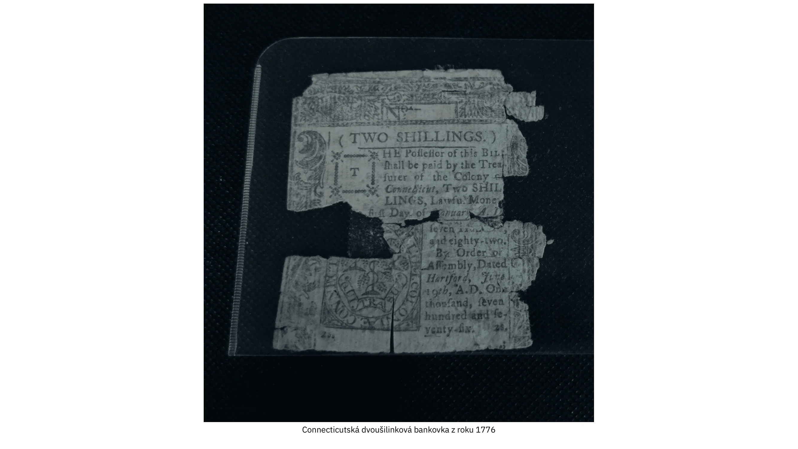

Než vyhlásily Anglii válku a nakonec vydaly vlastní měnu, používaly kolonie tuto papírovou měnu spolu se španělským dolarem pro hotovostní transakce. Termín "dolar" zůstal ve skutečnosti pro označení amerického dolaru.

Pokud se nemýlím, v roce 1792 přijali zákon, který jim umožňoval razit peníze. Jako příklad lze uvést níže uvedený americký dolar z moderní doby.

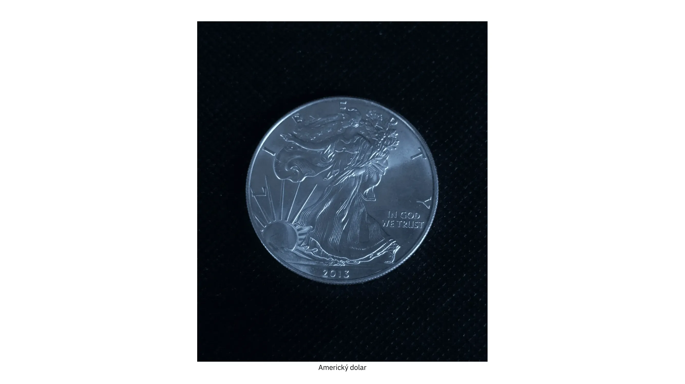

Její nominální hodnota samozřejmě není jen jeden dolar, má hodnotu asi 30 nebo 40 dolarů, protože představuje unci stříbra. Její hodnota kolísá v závislosti na ceně stříbra, obvykle se pohybuje nejméně kolem 30 nebo 40 amerických dolarů. Dnes si papírový dolar samozřejmě zachovává pouze nominální hodnotu jednoho dolaru, ale v té době měl americký dolar kořeny v této hodnotě stříbra.

Promluvme si nyní o občanské válce v Americe. Konfederace tiskla peníze, které se nadměrně nafoukly. Tento jev není zahrnut v oficiálním Hanke-Krusově seznamu, protože nedosáhl hyperinflace 50 %. Měsíční míra inflace však dosáhla 40 %, což svědčí o tom, že během války bylo vytištěno značné množství peněz.

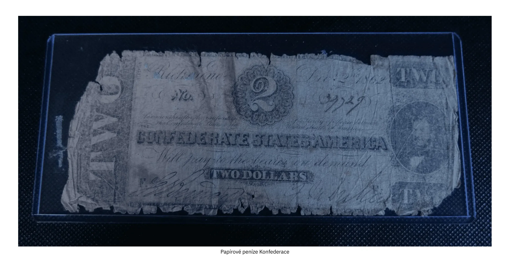

Jejich protivníci ze severu měli také dolary. Těsně nad nimi jste mohli vidět konfederační dolary, zatímco dole můžete pozorovat severské dolary. Říkalo se jim "greenback", protože jejich zadní strana byla zelená.

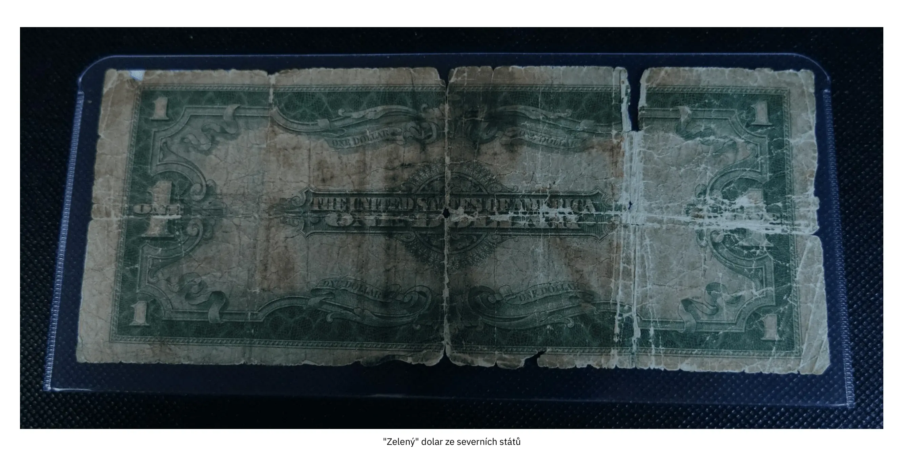

A vyzývám vás, abyste porovnali rozdíl ve velikosti s moderními bankovkami. Tehdy byly bankovky větší.

Jak víme, sever zvítězil, a tak se zelená bankovka stala měnou sjednocených amerických států. Pak přišlo založení FEDu v roce 1913 a první světová válka.

Po první světové válce obsahovala poslední série tištěných bankovek vždy slova "vyměnitelné ve zlatě na požádání". V roce 1928 tak bylo možné za 20 dolarů koupit téměř unci zlata, protože cena zlata byla 20,67 dolaru. Za bankovku na obrázku níže bylo možné v roce 1928 koupit unci zlata.

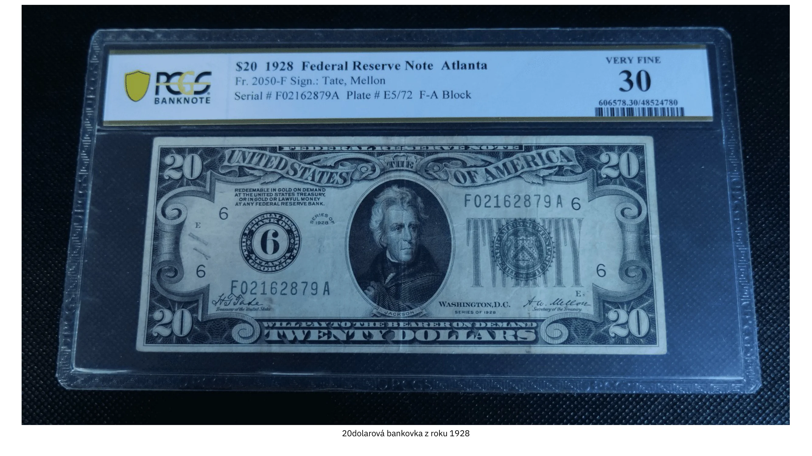

Dnes má unce zlata hodnotu 3000 amerických dolarů. Takže zde samozřejmě vidíte sílu devalvace. Byla to poslední bankovka obsahující slova "vyměnitelná ve zlatě". Uvidíme, že hned po vydání nařízení 6102 by zabavili všechno zlato. Ve skutečnosti by zabavili jak zlato, tak zlaté certifikáty.

Níže vidíte zlatý certifikát z roku 1928.

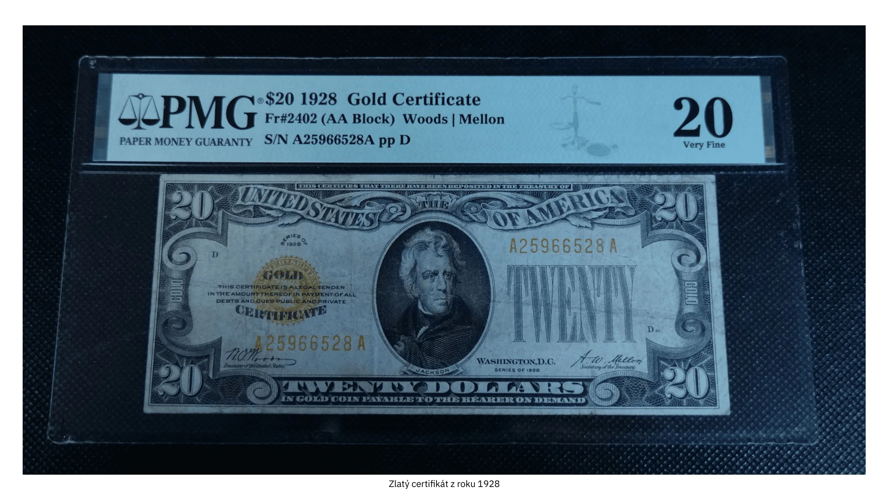

Nejenže byla "směnitelná ve zlatě" jako bankovka z roku 1928, ale byla také směnitelná ve zlatých mincích: skutečně se jedná o "zlatý certifikát". Všechny byly zabaveny po vydání nařízení 6102. Až do roku 1964 bylo dokonce jejich vlastnictví nezákonné.

Jsem velmi rád, že ho mám.

Od roku 1964 bylo vlastnictví zlata nezákonné, a to až do roku 1974, pokud se nemýlím. V 70. letech po Nixonově šoku, který si popíšeme za chvíli, povolili lidem zlato hromadit. V roce 1933, kdy vydali "Executive Order 6102", zlato zabavili a jeho vlastnictví se stalo nezákonným. Pokud jste byli přistiženi, že si zlato ponecháváte, dostali jste vysoký trest odnětí svobody. V té době byla každá unce zlata po roce 1934 vyměněna za bankovku podobnou té, která je uvedena níže.

Jak jsme již řekli, v roce 1928 byl na dolaru stále ještě text "vyměnitelný ve zlatě".

Po vydání nařízení 6102 zabavili všechno zlato a za každou unci zlata vyměnili 20,67 dolaru. Poté vyšel najevo podvod: v roce 1934 vydali nové bankovky s vytištěným textem "tato bankovka je zákonným platidlem pro všechny dluhy".

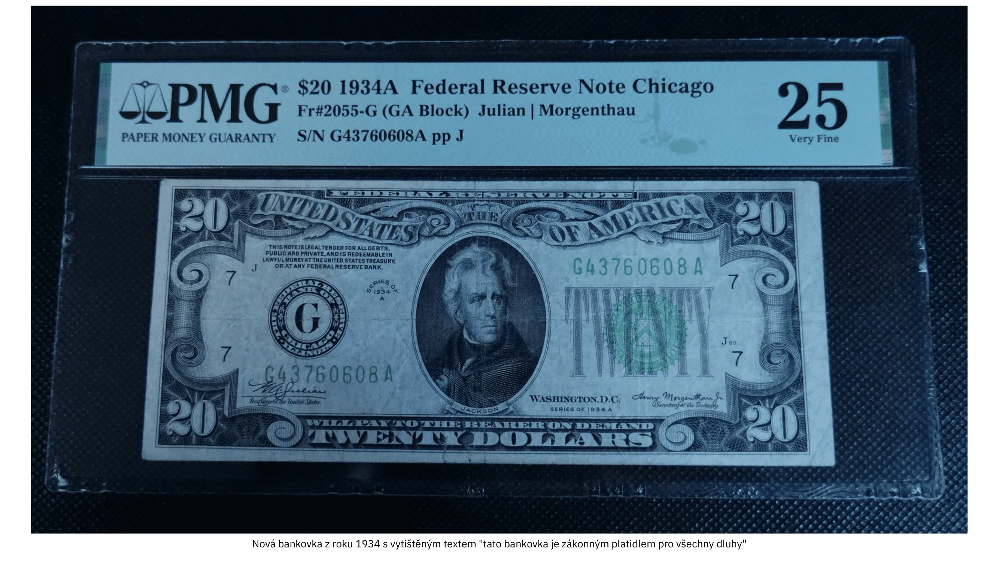

Objevuje se zde pojem zákonné platidlo, který nahrazuje výraz "vyměnitelné ve zlatě" Obě bankovky mohou vypadat stejně, mění se jen několik slov, ale podvod spočívá v tom, že v tomto období došlo k devalvaci dolaru; hodnota unce zlata se snížila z 20,67 USD na 35 USD za unci v roce 1934. To představovalo znehodnocení přibližně o 40 %!

Pak přišla druhá světová válka. Po válce byla na základě Brettonwoodské dohody centralizována velká část světového zlata ve Spojených státech. Američané za něj vydávali bankovky, které však již nebyly směnitelné za zlato pro širokou veřejnost. Místo toho byly nadále směnitelné za zlato na státní úrovni.

Nakonec začaly mít země jako Francie a Německo podezření, že v oběhu je pravděpodobně více dolarových bankovek než zlata v amerických trezorech.

Proto požádali o repatriaci svého zlata. Řekli: "Dobře, uděláme to, ale bude to chvíli trvat." "Dobře," odpověděli V roce 1971 náš přítel Richard Nixon jednou provždy přerušil vazbu mezi bankovkami a zlatem a obvinil přitom spekulanty.

Zlato bylo podhodnoceno na 35 dolarů za unci, což neodpovídalo objemu vytištěných peněz ani jeho skutečné tržní hodnotě. Během několika let se cena prudce zvýšila z 34 na 800 dolarů. Podobně jako v historických příkladech, například v Římě, kde bylo přerušeno spojení mezi denárem a solidem, bylo zlatu umožněno volně plout. Tato skutečnost vedla k procesu cenového objevu, v jehož důsledku bylo zlato následně v dolarovém vyjádření oceněno mnohem výše.

### Moderní systém fiat měn a jeho důsledky

Tato část shrnuje, jak jsme přešli od měnového systému založeného na stříbře nebo zlatě. Postupně získávaly instituce stále větší moc nad penězi. Nakonec jednostranné rozhodnutí po nadměrné emisi zcela přerušilo vazbu mezi drahými kovy a penězi.

V důsledku toho již neexistuje žádná souvislost mezi zlatem a bankovkami nebo penězi podle písma. A není to ani systém částečných rezerv - to je zastaralý koncept. Místo toho soukromé banky emitují a vytvářejí peníze prostřednictvím bankovních úvěrů. Peníze se vytvářejí především tímto způsobem a korelují s klíčovou úrokovou sazbou stanovenou centrální bankou.

Opravdu neexistuje žádný limit. Žádné povinné rezervy již neexistují, alespoň v Americe a Kanadě. Jedinou rezervou je nutnost, aby si banky zařídily schopnost reagovat na mezibankovní výměny tak, aby jim nedošla likvidita.

Musí se jen ujistit, že tyto převody mohou provést, ale neexistuje žádná povinná rezerva ve výši 3 %, 1 % nebo 10 %. Skutečně jsme se vzdálili od konceptu částečných rezerv. Nyní jsou to centrální banky, vlády prostřednictvím fiskálních deficitů, centrální banky prostřednictvím kvantitativního uvolňování (QE) a soukromé banky prostřednictvím vytváření bankovních úvěrů, které mohou zvýšit celkovou nabídku peněz a podle mého názoru způsobit inflaci.

Chcete-li pochopit souvislost mezi penězi a inflací, doporučuji kurz, který mám na Plan ₿ Academy a který se tomuto tématu věnuje. Dozvíte se, jaký je rozdíl mezi růstem cen, který vidíme v životě, a inflací. Není to totéž. Ve skutečnosti, když mluvíme o inflaci, často mluvíme o růstu cen, nikoli o inflaci samotné. Inflace je poměrně přesný pojem, který se vysvětluje růstem nabídky peněz.

https://planb.academy/courses/caa75343-ac90-4249-bcca-0e2e57c3a0f1

Na závěr této části o světě fiat bych vás rád upozornil na zdroj, který vám pomůže lépe pochopit jevy, které jsem právě vysvětlil, jako je inflace.

Děkujeme vám za pozornost.

## Historie peněžních bublin

<chapterId>b6451c46-917d-11f0-97de-6bc5081765fa</chapterId>

:::video id=5967d9a6-aae4-4b84-a283-71b1b735bca4:::

### Vynález papírových peněz a první velká bublina

Se vznikem centrálních bank v 18. století se zrodila skutečná revoluce: magické peníze v podobě bankovek. Nejvýraznějším příkladem je ve Francii John Law. Tento Skot v pařížském exilu navrhl regentovi, vévodovi d'Orléans, řešení bankrotu královských financí vytvořením státní banky a koloniální obchodní společnosti: slavné **Banque Royale** a **Compagnie du Mississippi**.

Tímto systémem spojil Law papírové peníze s akciemi své společnosti. Čím více bankovek bylo v oběhu, tím vyšší byla hodnota akcií a tím solidnější se zdála být banka... dokud spekulace nepřevýšily realitu. Bublina náhle splaskla v roce 1720 a zruinovala šlechtu, měšťany i velkou část Evropy, která přišla spekulovat na rue Quincampoix. Výsledkem byla trvalá nedůvěra k papírovým penězům ve Francii a první evropská lekce o spekulativních bublinách.

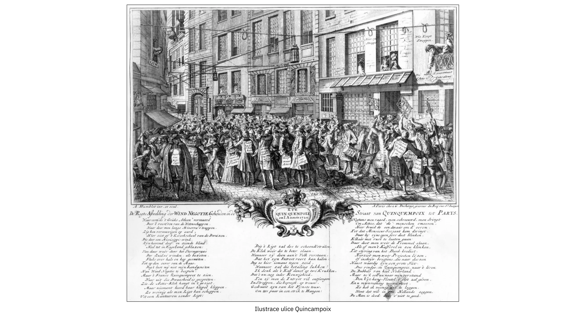

### Kdy se pozemek stává "zástavou"

O sto let později přinesla Francouzská revoluce nový průlom v podobě **assignatů**, měny kryté zabaveným církevním majetkem. Na papíře lákavá myšlenka - přeměna půdy v peněžní záruku - ale neúčinná: půda není ani likvidní, ani dělitelná. Výsledkem byla hyperinflace, četné zákazy užívání půdy, nekontrolovaná inflace a nedostatek.

Napoleon, hluboce zasažený tímto chaosem, v roce 1800 znovu zavedl zlato a stříbro jako měnový základ vytvořením Francouzské banky, čímž zajistil pravidelnou výplatu svých armád. Pragmatický způsob, jak znovu získat důvěru: platit tvrdou měnou.

### Bouřlivá dvacátá léta a velká hospodářská krize v roce 1929

Přeskočme dvě století. Po první světové válce vlády financovaly úsilí prostřednictvím inflace a pozastavení prodeje zlata. Ve dvacátých letech 20. století prováděl americký Fed příliš vstřícnou měnovou politiku na podporu britské libry. Výsledkem byly snadné úvěry, bezuzdné spekulace na Wall Street, nákupy akcií na úvěr a vznik realitní a bankovní bubliny.

Když se tento stroj porouchal, krach v roce 1929 byl nevyhnutelný: masivní krachy bank, rekordní nezaměstnanost a fronty u vývařoven. Z toho vznikl přetrvávající mylný názor, že **všechna deflace je špatná**, zatímco je třeba rozlišovat mezi deflací prostřednictvím růstu (zdravá) a deflací prostřednictvím dluhu (zničující).

### Asie v 90. letech a dominový efekt

V 90. letech 20. století svět snil o "asijském zázraku". Kurzy Exchange byly navázány na dolar, růst dosahoval 8-10 % a západní kapitál proudil dovnitř. Vše bylo v pořádku... dokud příliv neopadl. Začaly se množit bankroty, měny devalvovaly o 80 % a investoři byli na mizině. Musel zasáhnout MMF a zavést bolestivé reformy. Stejný scénář jako vždy: hojnost kapitálu, bubliny živené úvěry a pak kolaps.

### rok 2008 a éra permanentní bubliny

Po internetové bublině (2000) následovala bublina na trhu s rizikovými nemovitostmi. Sekuritizace přeměnila bankovní úvěry na "trojité" finanční produkty, které se rozšířily po celém světě. Příslib: eliminovat riziko jeho rozředěním. Skutečnost: všechna rizika byla ve skutečnosti korelovaná. Když se zhroutily nemovitosti, zhroutil se i celý globální bankovní systém.

Výsledek: masivní státní pomoc, kvantitativní uvolňování a nulové úrokové sazby. A s tím i bezhlavý spěch: každá krize už nebude očišťovat od excesů, ale bude kryta stále větším zadlužováním a tiskem peněz. To je to, co vedlo k současné situaci: **"bublina všeho "**, kdy se vše - akcie, nemovitosti, umění, kryptografie, dokonce i karty Pokémon - uměle nafukuje.

### Věčný návrat magických peněz

Od jednoho století ke druhému se objevuje jedna konstanta: jakmile společnost uvěří, že může vytvářet bohatství pomocí peněz namísto výroby skutečných statků, objeví se bubliny. Od Johna Lawa po rok 2008, od ulice Quincampoix po Wall Street, se proces opakuje: euforie, úvěr, boom a krach.

A nakonec, když už nikdo nevěří papíru, lidé se vždy poohlédnou po něčem jiném - po zlatě, půdě, bezpečných přístavech... nebo po nových měnách. Včera Napoleon vnutil kov, dnes někteří vidí nástupce Bitcoin.

Dějiny financí jsou nekonečným cyklem: tisk, spekulace, krach. Až do další bubliny.

## Peníze a násilí

<chapterId>9486fe64-854f-5e17-86b3-8873baca39a8</chapterId>

:::video id=bd6d0807-2d8f-4637-a0f5-1e990e5c0d0f:::

V této krátké části se vrátíme k mnoha událostem, které jsme již v průběhu kurzu viděli, a shrneme několik anekdot, které považuji za zajímavé.

### Technologie a násilí

Zde je několik anekdot, o kterých jsme již v kurzu pravděpodobně mluvili. Slouží k uvedení velmi fascinující diskuse, kterou jsem s Theem vedl o jeho přednášce na B-Ondy, která mi přišla velmi zajímavá z hlediska toho, jak technologický pokrok ovlivňuje vztah násilí mezi obyvatelstvem a státem.

### Peníze a státní nátlak

Na úvod této části uvedu stručný a neúplný seznam, abych vám připomněl události, které jsme již v kurzu pravděpodobně probírali.

S penězi a násilím mě napadá jedna souvislost: pokud jde o bezcenné papírové peníze, které lze tisknout donekonečna, často se s nimi pojí nejrůznější pravidla a hrozby. Můžeme už mluvit o asignátech, kde bylo na bankovkách doslova napsáno, že padělatelům hrozí smrt. V tehdejších právních textech snadno najdeme výhrůžky smrtí pro ty, kteří tyto slavné papírové peníze nepřijímali.

Abych zůstal ve Francii, v jednom z právních textů z revoluční doby, který se mi podařilo získat, jsem viděl, že "diety" za převoz a obsluhu gilotiny byly popsány v oddílech týkajících se měny. To mi připadalo poněkud zjitřené.

Hovořili jsme také o ražbě mincí v Číně, kde na ražbu dohlíží stát. V části na začátku kurzu jsme viděli, že když byly mince, z nichž některé byly méně krásné, vyřazeny, mělo to právní důsledky.

Existuje také anekdota o jednom anglickém králi, který nakonec usekl ruce těm, kteří razili peníze, pokud se nechovali podle jeho představ.

Také jsem četl o zabavování mědi z buddhistických klášterů v Číně. V době, kdy měď získávala na hodnotě a destabilizovala jejich ekonomiku - která byla založena na formě fiat peněz, jež měly s hodnotou kovu jen málo společného -, se uchýlili k tomu, že našli místo, kde bylo bohatství, a měď z klášterů zabavili.

Totéž platilo pro kláštery v Anglii v době anglické reformace. Když se slavný král pohádal s papežem kvůli rozvodu, byl za tím vším ještě jeden důvod: využil zrušení klášterů k tomu, aby se zmocnil bohatství, které tyto církevní organizace obsahovaly.

Během Francouzské revoluce se zmocnili veškerého církevního majetku. Viděli krásné mince vytvořené z roztavených kostelních zvonů.

Vrátíme-li se ještě dál, jedním z nejvýraznějších pojmů ekonomického násilí a svobody, liberticidních zákonů, je **Diocletianus se svou dědičnou kastou, která přímo souvisela s tím, že rolníci už nechtěli přijímat znehodnocenou měnu**. Chtěli opustit svou rolnickou práci a Dioklecián na to reagoval jednoduše tím, že jim řekl: "Nemůžete opustit svou půdu a vaše děti také ne". Totéž platilo i pro vojáky.

Myslím, že to je docela explicitní forma násilí. Na závěr bych mohl mluvit o templářích nebo francouzském králi. Když se templáři usadili ve Francii, dovedu si představit, že viděl manko templářského bohatství a měl problémy s financováním státu. Zažaloval templářský řád a někteří z nich mohli odejít s částí pokladu, což dalo vzniknout velmi zajímavému seriálu v USA nebo Kanadě. Nevím, kdo ho produkoval, ale jmenuje se *Záhada dubového ostrova*. Je to o lidech, kteří si myslí, že na jednom ostrově v Kanadě, v Maritimes, je zakopaný templářský poklad, a už léta - možná dokonce víc než deset let - vrtají, aby udělali nějaký vrt. Našli studnu se spoustou štol a hledají poklad zakopaný templáři na tomto ostrově, který je předmětem tohoto televizního pořadu. Vzdávám hold svému otci, který je velkým fanouškem tohoto pořadu.

Takže tady to máte: velmi stručný výčet skutečností, které jsme viděli během tohoto kurzu a které podle mého názoru zvyšují souvislost s násilím. Zanechám vás s další částí od Thea, který nám bude vyprávět velmi zajímavý příběh o technologických změnách a rovnováze moci mezi plebsem a autoritami.

Děkujeme!

## Ekonomické důsledky organizovaného násilí

<chapterId>66bd4674-2159-5489-ad4b-ec5e3fb691af</chapterId>

:::video id=c8b063c6-aeb4-4a94-9027-b11d369e71a4:::

### Organizované násilí a vývoj státu

Historik Frederic C. Lane přichází s převratnou tezí: anatomii státu v dějinách utvářejí technologie používané k projekci násilí. Vycházeje z weberovského principu, že stát má monopol na legitimní násilí, Lane konstatuje, že tento monopol - paradoxně účinnější než konkurence v této oblasti - se vyvíjí podle vztahu mezi náklady na útok a náklady na obranu.

Tato analýza, kterou převzali autoři knihy "The Sovereign Individual" (1997), vysvětluje historické proměny politické organizace: od středověkého feudálního systému k městským státům renesance, poté k průmyslovým národním státům a nakonec k moderním sociálním státům. Každý přechod odpovídá významnému technologickému průlomu ve výkonu násilí, k němuž dochází přibližně každých 400-500 let.

### Středověká rovnováha

Ve středověku převažovalo z více než 90 % agrární hospodářství. Sedlák, doslova zakořeněný na své půdě, nemohl před pánem a jeho rytíři utéct. Vojenská technika - ručně kovaná zbroj, léta výcviku s mečem - byla nesmírně drahá. Tato asymetrie masivně upřednostňovala útok před obranou.

Nemobilní zemědělský výrobce se stává zajatcem místního monopolisty násilí. Jeho schopnost vybírat daně dosahuje nových výšin - i když paradoxně středověké daně zůstávají skromné ve srovnání se 78 % povinných odvodů v moderní době. Pán může zdaňovat dle libosti, protože rolník se nemůže bránit ani odejít.

### Obchodnická renesance

Vznik hanzovního obchodu na severu a středomořského obchodu na jihu situaci změnil. Obchodníci, hlavní tvůrci přidané hodnoty, disponovali mobilním kapitálem - svými loděmi. Potřebovali pouze lehké námořní milice, protože moře bylo obtížné hlídat. Především však mohli snadno migrovat do sousedního přístavu, pokud by se zdanění stalo nadměrným.

Tato mobilita vedla k daňové konkurenci mezi městskými státy. Benátky, Janov a Bruggy musely nabídnout co nejliberálnější rámec: spolehlivé smlouvy, kvalitní měnu, pojištění, minimální daně. Knížata musela spíše svádět než nutit. Symetrie se obrací: obrana (útěkem) se stává snazší než útok.

### Průmyslová éra

Průmyslová revoluce s sebou přinesla uspořádání podobné feudalismu. Továrny, železnice a montážní linky představují masivní, nemobilní investice. Henry Ford nebyl schopen přemístit své závody kvůli zdanění. Dělníci, soustředění v průmyslových městech, se sdružovali do odborů, aby mohli kolektivně vyjednávat, místo aby se stěhovali individuálně.

Vznikl "sociální stát": průmyslové plánování (Japonsko, Korea), vojenská ochrana infrastruktury, minimální sociální dávky pro pracovní sílu. Druhá světová válka tuto zranitelnost názorně ukázala: dominantní strategií se stalo bombardování nepřátelských továren. Koncentrace fyzického kapitálu umožnila masivní výběr daní k financování sociálního státu.

### Mikroprocesorová revoluce

Tři technologické inovace nyní narušují tuto odvěkou rovnováhu. Mikroprocesor mění způsob vedení války: operátor v Nevadě pilotuje dron v Afghánistánu s chirurgickou přesností. Válka v Perském zálivu (1991) ukázala tento průlom: čtvrtá největší armáda na světě (Irák) byla zničena za 45 dní, přičemž na straně koalice bylo méně než 200 mrtvých. Technologická převaha znemožnila frontální útok.

Internet a asymetrická kryptografie přinášejí revoluci v tvorbě hodnot. Vývojář může pracovat odkudkoli s MacBookem a Starlinkem a svou produkci okamžitě a zdarma exportovat. Digitální nomádi se vymaňují z geografického zajetí a staví proti sobě státy způsobem, jaký tu nebyl od dob renesance.

Bitcoin představuje vyvrcholení této logiky: měna osvobozená od státu, chráněná nedotknutelným kryptografickým štítem. Bohatství se stává obranyschopným proti jakékoli fyzické síle. Jednotlivec znovu získává možnost bránit se proti státnímu monopolu.

### Kolaps vestfálského modelu

Západní sociální státy, které byly vytvořeny pro průmyslový věk, se stávají zastaralými. Tvůrci hodnot - developeři, umělci, finančníci - se stěhují do Singapuru, Dubaje nebo Salvadoru a dávají přednost menšímu množství veřejných služeb výměnou za minimální daně. Moderní giganti jako Apple nebo Tether nepotřebují kanceláře ani fyzickou infrastrukturu.

Tento odliv mozků vytváří spirálu: méně čistých přispěvatelů, zhoršené veřejné služby, zvýšené zdanění těch, kteří zůstávají, a zrychlený odchod. Státy se musí radikálně zmenšit, jinak zkrachují. Fragmentace na malé, konkurenční jurisdikce - nový model digitálních městských států - se zdá být nevyhnutelná.

Historie nás učí, že tyto změny trvají celé generace. Oddělení měny a státu v rámci Bitcoin by však mohlo tento proces urychlit. Jednotlivci nyní hlasují nohama a svými kryptografickými peněženkami a překreslují mapu globální moci podle linií, které teprve začínáme vnímat.

## Velmi stručná historie financí

<chapterId>1d37fff1-a091-5034-8e71-4af590b8ffce</chapterId>

:::video id=fdfabbc6-e4d8-463a-8522-19176f8fb460:::

V návaznosti na tento popis historie peněz, který nás dovedl až k fiat systému, bych rád rychle a stručně vysvětlil vývoj financí, který nakonec vedl k sociálnímu státu. Zpočátku, v římských dobách, jsme měli mince.

Mince byly finanční technologií, která umožňovala říši platit vojáky, expandovat a obchodovat. Fungovalo to velmi dobře, až na to, že nakonec došlo k příliš velkému znehodnocení. V určitém okamžiku, kdy přestali expandovat a přestali získávat kořist z válek a rozšiřování území, se jejich systém zhroutil.

### Vývoj finančních technologií

Pak přišel středověk, kdy došlo k velmi malému vývoji až do zavedení florénu, který přinesl stabilní měnu, a rozvoj bankovnictví v Itálii a Antverpách, kde se vyvinul koncept "časové hodnoty peněz" - jinými slovy diskontování. Diskontování vyvinuli, aby vytvořili formu papírových peněz, v níž byla vydána "směnka", tj. příslib, že později bude možné získat zpět 100 dolarů plus úrokovou sazbu.

Tento systém vytvořil finanční technologii, která umožňuje držiteli prodat směnku před koncem doby splatnosti, takže pokud ji prodáte po 4 měsících z 6měsíční doby splatnosti, zaplatíte vlastně prémii, která kompenzuje ztrátu výnosu za zbývající 2 měsíce.

Jednalo se o finanční technologii vyvinutou v Antverpách a Amsterdamu. Později jsme byli svědky vývoje centrálních bank a pojmu věřitele poslední instance. Lze tvrdit, že v době amsterodamské banky , bylo upuštěno od používání mincí v mezinárodním obchodě ve prospěch písařských peněz.

Později, v 18. století, můžeme z hlediska finančních technologií hovořit o pojištění. V knize Neila Fergusona "The Ascent of Money" (Vzestup peněz) je velmi dobře vylíčena jedna anekdota. První pojišťovna, která se zrodila, se jmenovala **Scottish Widowss** a v podstatě šlo o duchovní, kteří chtěli vyvinout pojištění pro kněze, kteří někdy zemřeli dříve, zemřeli náhle. Duchovní se v té době po dobu jednoho roku starali o své manželky a potomky ve Skotsku. A tak se duchovním zdála tato jednoroční lhůta možná příliš krátká. V důsledku toho **vynalezli pojistně matematické výpočty**, aby doslova vypočítali počet přispěvatelů nutných k tomu, aby systém pokryl své náklady, a to v závislosti na počtu předčasně zemřelých kněží.

Vypracovali pojistně-matematické výpočty, které říkají: "Dobře, každý kněz nám dává tuto částku. Když pak kněz zemře, tak pojištění pokryje náklady na zajištění přežití jeho ženy a dětí, dokud nebudou soběstační" Takže to byla první pojišťovna s názvem "Scottish Widows", která tento systém zpopularizovala a kde byl nasazen.

### Od soukromého pojištění k sociálnímu státu

Pojištění je tedy součástí historie finančních technologií. A to mě přivádí ke konceptu sociálního státu, který spočívá v tom, že soukromé pojištění nakonec narazilo na problém, na pojem optimalizace, kdy si říkáme, že když nabídneme zdravotní pojištění lidem, kteří jsou zdraví, mohou mít menší zájem platit pojistné, protože si řeknou: "Jsem zdravý, neonemocním". Na druhou stranu lidé, kteří vědí, že jsou nemocní, se určitě budou chtít pojistit.

Tento systém vytváří nerovnováhu mezi počtem nemocných lidí, kteří si sjednají zdravotní pojištění, a zdravých lidí, kteří si ho mohou sjednat méně. Dochází tedy k určité nerovnováze: kdybyste spočítali čísla, nevyrovnala by se, protože byste pravděpodobně nebyli schopni pojistit dostatek zdravých lidí, abyste vyrovnali náklady. V ekonomii se jedná o pojem **morální hazard**.

Jedním z nápadů, které byly předloženy, je zavedení povinného pojištění. Pokud budou všichni povinně přispívat, celou věc to vyváží a přispívat budou jak zdraví, tak nezdraví lidé, čímž se rizika rozdělí mezi nejpočetnější skupinu obyvatel.

A tak v mnoha částech světa stát řekl: "Dobře, my se o to postaráme." Nejsem sice odborník na tuto problematiku, ale chápu, že stejná úvaha se pravděpodobně uplatňuje i u nejrůznějších jiných forem pojištění, například u pojištění v nezaměstnanosti. Existuje snaha o zjednodušení a optimalizaci, která vychází z představy, že to bude jednodušší, když se o to bude starat jen jedna organizace.

Podle mého názoru to vedlo k centralizaci všech těchto pojistných koncepcí a nakonec ke zrodu sociálního státu, kdy se všech těchto finančních koncepcí, které byly původně soukromými podniky, soukromými iniciativami k uspokojení potřeby pojistného trhu rozložit riziko mezi obyvatelstvo, chopil stát z důvodů, které jsou pravděpodobně zcela logické v souvislosti s morálním hazardem a snahou o optimalizaci.

### Alternativní modely a úvahy o státních monopolech

V některých zemích, jako je Kanada, nakonec vzniká několik druhů pojištění - zdravotní pojištění, pojištění v nezaměstnanosti - které jsou státními monopoly.

Mohu vám uvést příklad, který znám. Ve Švýcarsku je systém trochu jiný. Existují soukromé vzájemné pojišťovny a soukromé nemocnice, takže si můžete vybrat svou vzájemnou pojišťovnu, můžete si vybrat svůj balíček v rámci své vzájemné pojišťovny. Stále dostáváte relativně univerzální služby, i když velká část tohoto systému zůstává soukromá.

Takže si myslím, že je možné, že je také provozován soukromě. Ale všechno, co jsem vám chtěl popsat, vlastně není vyjádření, zda je jeden systém lepší než druhý, spíše jsem vám chtěl vysvětlit, že při čtení o historii financí jsem si uvědomil, proč na Západě, zejména ve Francii, zejména v Kanadě, chtěl stát převzít kontrolu nad těmito finančními principy.

Chtěl jsem tím říci, že koncept pojištění je především evolucí financí, a jak to někdy vlády umí, budou se snažit převzít nad ním kontrolu, stejně jako se z několika důvodů snažily převzít kontrolu nad penězi. Jedním z důvodů je mimochodem koncept věřitele poslední instance.

Jde o to, že je mnohem lepší, když za ním stojí velká instituce, která riziko více rozdělí. To byla původní iniciativa, která stála za pojmem věřitel poslední instance, kdy si tato instituce vlastně mohla vybrat instituce, které byly dostatečně silné, aby přežily, a zabránit jejich krachu tím, že jim půjčí peníze.

V době, kdy se tento koncept konečně poprvé objevil, proběhla skutečná analýza, ale nakonec se stalo to, že zachraňujeme všechny, "too big to fail", to se týká téměř všech bank, protože dochází k centralizaci, a také všech velkých společností. Nakonec vidíme, že je to stále koncept, který je uplatňován "ve velkém" státem, podobně jako koncept pojištění, který jsem vám právě popsal.

Nakonec se stát rozhodne, že se postará o všechno, a z finanční technologie vytvořené ve Skotsku k vyřešení konkrétního problému vytvoří rozsáhlý sociální stát, jaký známe dnes. Využívá pojistně-matematické finanční principy k tomu, aby nabízel služby svým potřebným obyvatelům. Můžeme se však shodnout na tom, že monopoly, které z tohoto systému vznikají, vytvářejí nejrůznější problémy, s nimiž se v současnosti potýkáme v zemích, jako je Kanada a Francie. Naštěstí existují i jiné modely, například ten švýcarský.

Musíme si prostě uvědomit, že tento koncept sociálního státu vychází z financí. Toto uvědomění naznačuje, že můžeme zkoumat i jiné cesty než slavné státní monopoly, a dokonce bych tuto úvahu aplikoval i na koncept centrálních bank jako věřitelů poslední instance - ale to je téma na jindy.

# Závěrečná část

<partId>9bada469-7ef0-511a-9eaa-f8eb66d5906f</partId>

## Vyhodnoťte tento kurz

<chapterId>a9494e2b-8a4d-5811-8a7b-b4a91fb22778</chapterId>

<isCourseReview>true</isCourseReview>

## Závěr

<chapterId>1094e793-b4c6-5782-aa4a-71cde00ce7c0</chapterId>

<isCourseConclusion>true</isCourseConclusion>