# Eine Reise durch die Geschichte des Münzwesens

Dieser fesselnde Kurs nimmt Sie mit auf eine Entdeckungsreise durch die faszinierende Entwicklung des Geldes von den frühesten Zivilisationen bis zu unserem heutigen Geldsystem. Wir werden die Zeitalter vom Neolithikum bis zur Neuzeit durchqueren und entdecken, wie Geld die großen menschlichen Zivilisationen geformt hat und von ihnen geformt wurde. Vom mesopotamischen Urgeld bis hin zu Kryptowährungen, lydischen Münzen, dem Renaissance-Gulden und dem Aufkommen des Zentralbankwesens - dieser Kurs bietet eine umfassende Perspektive auf einen der Grundpfeiler unserer Gesellschaft.

+++
# Einführung

<partId>59878a67-8a1d-5d6b-af41-5b847c14363c</partId>

## Einführung in die Geschichte des Geldes

<chapterId>ca53597e-be9a-5261-a55f-11fac8504a68</chapterId>

:::video id=08ff35ca-8a40-4286-abaf-71283faf6e78:::

Willkommen zu diesem Kurs über die Geschichte des Geldes. Wie der Titel schon sagt, werden wir gemeinsam die historische Entwicklung der Münzen erforschen. Von der Jungsteinzeit bis zur Gegenwart werden wir uns die großen Reiche und Zivilisationen der Vergangenheit ansehen.

Dieser Kurs beschränkt sich jedoch nicht auf eine einfache Chronologie von Daten oder historischen Ereignissen. Unser eigentliches Ziel ist es vielmehr, ein tiefgreifendes Verständnis der grundlegenden Konzepte zu vermitteln, die mit der Entstehung des Geldes bzw. der Währungen verbunden sind.

### Grundlegende Konzepte zur Erforschung

Es geht also um die Entstehung: die Entstehung der Währungen selbst, der Geldsysteme, der Banken, des Papiergeldes, der Zentralbanken und schließlich die Entstehung des heutigen Fiat-Geldsystems.

Wir beginnen unsere Reise zu den Proto-Währungen mit der Entstehung von Schuldgeld und Rechnungseinheiten in Mesopotamien sowie mit anderen Systemen wie Mitgift und Blutgeld in primitiven Gesellschaften. Wir werden auch sehen, wie echte Geldsysteme bereits im alten Ägypten existierten, lange vor dem Mittleren Reich.

Anschließend gehen wir auf das Auftauchen der ersten Münzen in Lydien ein, ein Schlüsselmoment, der in den Wirtschaftslehrbüchern oft als der eigentliche Beginn des Geldes angesehen wird. Wir werden untersuchen, wie sich diese Münzen dank der Perser, Alexanders des Großen und dann Roms verbreiten konnten, bevor sie sich schließlich durchsetzten, dominierten und zusammenbrachen.

Danach werden wir uns mit dem Gelernten die nötige Zeit nehmen, um gemeinsam über die Definition von Geld nachzudenken und dabei über vorgefasste Meinungen wie "Geld ist immer eine Schuld" oder "Geld ist immer eine Ware" hinauszugehen. In Wirklichkeit ist Geld sowohl ein Gut als auch eine soziale Konvention. Wir werden insbesondere das Konzept der Geldprämie erörtern und versuchen, die verschiedenen Theorien zur Erklärung der Entstehung des Geldes zu vereinheitlichen.

### Wichtige Zeiträume und monetäre Innovationen

Es folgte eine unruhige Zeit, die durch eine gewisse Instabilität des Geldes gekennzeichnet war, in der jedoch so bemerkenswerte Neuerungen wie der englische Penny, der zur Bestechung dänischer Invasoren verwendet wurde, und das Pfund Karls des Großen auftauchten, an das noch heute einige moderne Banknoten erinnern.

Außerdem werden wir uns ansehen, wie während der Kreuzzüge die ersten Fernüberweisungssysteme entstanden sind. Dann ist es an der Zeit, die Auswirkungen des Florins, der Begleitwährung der Renaissance, und die Ankunft von Edelmetallen aus Amerika zu betrachten, die einen tiefgreifenden Einfluss auf die europäischen Preise hatten.

Wir werden uns eingehend mit dem Aufkommen des Papiergeldes und des Zentralbankwesens befassen und Parallelen zur Geschichte der Finanzkrisen und ihrer oft gewalttätigen Auswirkungen ziehen.

Schließlich werden wir eine Parallele zu unserem heutigen Geldsystem ziehen, seine Folgen untersuchen und die Geschichte des Finanzwesens nachzeichnen, um besser zu verstehen, wie wir zum heutigen Wohlfahrtsstaat gekommen sind.

Und als Bonus werden wir auch die vielen faszinierenden etymologischen Verbindungen im Zusammenhang mit Geld betrachten, die unser tägliches Leben in verschiedenen Sprachen weiterhin beeinflussen.

### Struktur des Kurses

Dieser Kurs ist in drei Hauptteile gegliedert.

Teil I befasst sich mit der Entstehung des Geldes, Teil II mit der Renaissance des Geldes und seinem Niedergang, und Teil III zeigt, wie staatliche Institutionen oder der Staat allmählich die Kontrolle über das Geld übernahmen, was zu dem heutigen Fiat-System führte.

Vielen Dank und viel Spaß!

# Das Entstehen von Börsen

<partId>da5e4981-9ea5-5208-beab-3b75c9043632</partId>

## Vom Australopithecus zum modernen Menschen

<chapterId>34a773aa-f2d3-5c26-8be4-f2cd79ed6fbc</chapterId>

:::video id=4f333013-4b2a-42ab-8761-593fafc971ca:::

### Warum im Neolithikum beginnen?

Warum sollte man bis ins Neolithikum zurückgehen, um über Geld zu sprechen? Die Antwort ist einfach: Wir können die Entstehung des Geldes nicht vollständig verstehen, ohne auch die Entstehung der Zivilisationen selbst zu betrachten. Um zu verstehen, warum die ersten Geldsysteme entstanden sind, müssen wir verstehen, was nomadische Jäger- und Sammlergruppen dazu veranlasste, sesshaft zu werden.

Ein Stamm ohne Arbeitsteilung und Spezialisierung, bei dem jeder für die Produktion seiner eigenen Bedürfnisse verantwortlich ist, braucht einfach kein Geld. Ebenso hat eine landwirtschaftliche Gemeinschaft, die nur Subsistenzlandwirtschaft betreibt, in der jeder für sich selbst anbaut, noch nicht das Bedürfnis nach einem universellen Tauschmittel.

### Sesshaftwerdung und ihre Folgen

Deshalb halte ich es für interessant, unsere Erkundung in der Jungsteinzeit zu beginnen. Wir werden sehen, wie die Sesshaftigkeit allmählich zu Dörfern, dann zu Städten und schließlich zu großen Zivilisationen führte. Diese Sesshaftigkeit und die Produktion von Nahrungsmittelüberschüssen ermöglichten eine Spezialisierung der Arbeitskräfte und schufen den fruchtbaren Boden für die Entstehung und Entwicklung der ersten Geldkonzepte.

So wie die menschlichen Interaktionen die Sprache hervorbringen, können wir davon ausgehen, dass Geld im Laufe der Entstehung und Organisation von Zivilisationen auf natürliche Weise auftaucht oder nicht (wie bei den Inkas und Spartanern). Meiner Meinung nach hat das Auftauchen oder Nicht-Auftauchen von Geld alles mit der Form der sozialen und wirtschaftlichen Organisation einer jeden Gesellschaft zu tun.

### Chronologie der menschlichen Entwicklung

Aber lassen Sie uns zunächst einen noch breiteren historischen Kontext betrachten.

Wie bei jeder ersten Präsentation werde ich genau das Gegenteil von dem tun, was ich in der Einleitung des Kurses gesagt habe, und Ihnen eine Liste von Daten und historischen Ereignissen geben, die aufeinander folgen. Die Idee dabei ist, die Entstehung des Geldes in den historischen Kontext zu stellen, in Beziehung zu anderen menschlichen Fortschritten wie dem Kochen von Nahrungsmitteln, dem Rad, der Domestizierung bestimmter Getreidearten und Tiere, dem Bau der Pyramiden und der Gründung der ersten Städte.

Werfen wir also einen Blick auf die Entwicklung der Menschheit von der Urzeit an.

Ein Überblick über die Entwicklung des Menschen vom Australopithecus bis zum modernen Menschen, der den technologischen Fortschritt und die Bevölkerungsbewegungen bis zum Neolithikum verfolgt.

### Historischer Kontext der Menschheit

- vor 3 Millionen Jahren** - Auftauchen des *Australopithecus*.
- vor 2 Millionen Jahren** - Die Homininen beginnen, Afrika zu verlassen.
- 1.vor 6 Millionen Jahren** - Hominine erreichen Südeuropa und Asien.
- vor 1 Million Jahren** - Erster Nachweis des häuslichen Kochens mit Feuer (verkohlte Knochen und Pflanzenreste in der Wonderwerk-Höhle, Südafrika).
- Etwa 400.000 v. Chr.** - Neandertaler leben in Europa und Asien.
- Etwa 300.000 v. Chr.** - Auftreten des *Homo sapiens*.
- vor 80.000 Jahren** - Der *Homo sapiens* beginnt, in alle Teile der Welt zu wandern.
- vor 73.000 Jahren** - Blombos Höhlen in Südafrika (älteste bekannte Kunstformen).
- vor 50.000 Jahren** - Der *Homo sapiens* erreicht Europa.
- vor 30.000 Jahren** - Höhlenmalereien aus der Chauvet-Höhle in Frankreich.
- vor 15.000 Jahren** - Höhlenmalereien von Lascaux in Frankreich und australische Felskunst.
- Um 9000 v. Chr.** - Domestizierung der Gerste im Fruchtbaren Halbmond.
- Um 9000 v. Chr.** - Maisanbau in Mexiko.
- Um 8000 v. Chr.** - Domestizierung von Ziegen und Schafen im Fruchtbaren Halbmond.
- Um 7250 v. Chr.** - Ain Ghazal (Jordanien) offenbart ein Dorf mit einigen hundert Einwohnern.
- Um 7000 v. Chr.** - Çatalhöyük (Türkei) hat bis zu 8.000 Einwohner.
- Um 6500 v. Chr.** - In Griechenland beginnt das sesshafte Leben.
- vor 6000 Jahren** - Beginn der Flussbewässerung in Ägypten und Mesopotamien.
- Um 5000 v. Chr.** - Aufkommen der landwirtschaftlichen Kombination "Drei Schwestern" (Mais, Kürbis, Bohnen).
- Um 4000 v. Chr.** - Domestizierung des Kamels in Zentralasien. (Die Familie der Kameliden hat ihren Ursprung in Nordamerika im Eozän vor 45 Millionen Jahren. Diese Kamele sind dann über einen schmalen Landstreifen, der damals die beiden Kontinente in der Beringstraße verband, nach Asien gewandert. Ein anderer Teil der Familie hat sich nach Südamerika begeben, wo seine Nachkommen noch heute leben: Lamas, Alpakas und Vikunjas.)
- Etwa 3500-3000 v. Chr.** - Das Volk der Botai beginnt mit der Domestizierung und Zucht von Pferden.
- Zu Beginn der Bronzezeit** - Die Sumerer hatten bereits das Rad und das Segelboot erfunden und entwickelten Arithmetik, Astronomie und die erste Form der Schrift.
- Um 2800 v. Chr.** - Uruk erreichte in seiner Blütezeit eine Bevölkerung von bis zu 80.000 Menschen.
- 2600-2200 v. Chr.** - Erste Anzeichen von Stadtentwicklung in der griechischen Welt. Ausweitung des mediterranen Anbaus (Weizen, Wein, Oliven).
- 2560 v. Chr.** - Bau der Großen Pyramide von Gizeh.
- Um 1500 v. Chr.** - Minoische Zivilisation.
- Um 1300 v. Chr.** - Mykenische Zivilisation.
- Etwa 1250 bis 1150 v. Chr.** - Zusammenbruch der bronzezeitlichen Zivilisationen.
- 1. Jahrhundert nach Christus** - Nordafrikanische Berber domestizieren das Kamel.

Dieser geschichtliche Überblick soll uns die Entstehung bestimmter Technologien, die Domestizierung bestimmter Tiere und Kulturen verdeutlichen und sie in einen Zusammenhang mit der Entstehung der Schrift und des Geldes stellen, die Gegenstand des nächsten Abschnitts sein werden.

## Vom Jäger und Sammler zum Landwirt: Die Anfänge der Zivilisation

<chapterId>ea950b6e-9eb7-553d-8f04-0eb042bb1f5a</chapterId>

:::video id=4b49a376-f6f4-42a0-86fa-264997a079f0:::

### Der Übergang zur Landwirtschaft und Sesshaftwerdung

In diesem Kapitel werden wir über den Übergang vom Jagen und Sammeln zur Subsistenzlandwirtschaft, zum Handwerk und zum Handel sprechen. Ich hielt es für wichtig, diesen Übergang zur Sesshaftigkeit und zum Ackerbau zu erklären, um zu verstehen, wie die ersten Städte gebaut wurden, was schließlich zur Schaffung und Entstehung bestimmter Geldsysteme in der Antike führte.

Dieser Abschnitt ist ein Auszug aus dem Kurs Ancient Mesopotamia, Life in the Cradle of Civilization (Altes Mesopotamien, Leben in der Wiege der Zivilisation), der von Professor Amanda Podany von der California State Polytechnic University, Ponoma, gehalten wird und auf der Website The Great Courses verfügbar ist.

### Die Paradoxien der Übernahme der Landwirtschaft

Primitiver Ackerbau entstand vor etwa 10 500 Jahren im Nahen Osten, in Nordwestsyrien und der Südtürkei. Heute haben es moderne Jäger- und Sammlergruppen nicht eilig, die Landwirtschaft zu übernehmen, und dasselbe galt wahrscheinlich auch für das Neolithikum.

**Die ersten Dörfer wurden eindeutig vor der Domestizierung von Pflanzen und Tieren errichtet.** Die Menschen wurden nicht sesshaft, weil der Ackerbau es ihnen ermöglichte; im Gegenteil, sie wurden zuerst sesshaft und begannen erst viel später, etwa 3 000 Jahre später, mit dem Ackerbau.

Das Jagen und Sammeln funktionierte einfach sehr gut, so dass sie keine Samen anbauen mussten, um ihre Nahrung zu produzieren. Heute haben Jäger und Sammler viel mehr Freizeit als die ersten Bauern, die sehr rudimentäre Technologien nutzten.

Wir wollen damit sagen, dass die modernen primitiven Jäger und Sammler mehr Freizeit haben, als wir von den ersten Bauern der Jungsteinzeit wissen, die immerhin über recht rudimentäre Anbautechniken verfügten. Diese Menschen arbeiteten härter, um Nahrung zu produzieren, als unsere modernen primitiven Stämme, die vom Jagen und Sammeln leben.

Knochenstudien zeigen auch, dass die ersten Bauern kleiner und weniger kräftig waren als die Jäger und Sammler, die ihnen vorausgingen. Die Ernährung der Bauern war eingeschränkter als die von Jägern und Sammlern. Sie aßen viel mehr Brot, aber viel weniger Fleisch, und hatten außerdem schlechtere Zähne, was auf die bei der Mehlherstellung verwendeten Steinsplitter zurückzuführen ist. Wenn sie Mehl mit Steinen herstellten, entstanden Splitter.

Diejenigen, die sich an die Keto-Diät halten, werden zustimmen: Viel Brot zu essen, ist wahrscheinlich nicht so gut wie Fleisch zu essen.

### Theorien zur Übernahme der Landwirtschaft

Wer hätte sich damals angesichts all dieser Nachteile für den Beruf des Landwirts entschieden? Nun, einige populäre Theorien besagen, dass die Menschen gezwungen wurden, Landwirtschaft zu betreiben, und dass es keine wirkliche Wahl war. Selbst bei Wildgetreide gab es ein großes Problem. Große Mengen an Getreide konnten nicht einfach transportiert werden. Sie mussten irgendwo gelagert werden. Sobald das Getreide gelagert war, war es sinnvoll, in der Nähe zu bleiben. Man baute also Wildgetreide an, das nicht unbedingt landwirtschaftlich genutzt wurde, und wenn man es in großen Mengen anbaute, musste man es irgendwo lagern, was den Transport erschwerte. Dies trug wahrscheinlich zu den ersten Phasen der Sesshaftigkeit bei. Möglicherweise war dies auch der erste Grund, warum sich Menschen an einem bestimmten Ort niederließen. Wenn dieser Ort das ganze Jahr über Nahrung bot, war es nicht nötig, den Herden zu folgen oder ständig zu reisen.

In der Natoufia-Kultur lebten bis zu hundert Menschen in Dörfern zusammen, die aus Rundhäusern bestanden. Eine beliebte Theorie zur Erklärung der Anfänge des Ackerbaus besagt, dass dieser Wandel durch den Klimawandel ausgelöst wurde. Vor etwa 11.000 Jahren wurde das Klima im Nahen Osten kälter und trockener als zuvor. Pflanzen und Tiere, die zuvor im Überfluss vorhanden waren, wurden seltener. Die Gemeinschaften begannen daraufhin, die Pflanzen, auf die sie angewiesen waren, anzubauen oder Jungtiere zu halten, um sie aufzuziehen und davon zu profitieren, z. B. Schafe, Ziegen und Rinder, die sich gut für eine solche Zucht eignen. Dies wäre ein sehr allmählicher Prozess gewesen. Es gab also keinen bestimmten Zeitpunkt, an dem sie alle zu Bauern wurden, die Tiere domestizierten.

Eine andere Theorie besagt, dass die Dörfer selbst das Problem geschaffen haben, das durch die Domestizierung gelöst wurde. Intensives Jagen und Sammeln hätte die natürliche Umgebung destabilisiert. Eine Hypothese besagt, dass die Natoufer einen solchen demografischen Erfolg hatten, dass sie für ihre unmittelbare Umgebung zu zahlreich geworden waren. So waren die Sümpfe und die Gebiete, in denen natürliche Pflanzen angebaut wurden, für die Bevölkerung des Dorfes möglicherweise nicht mehr produktiv genug. Die unmittelbare Umgebung war nicht in der Lage, alle zu versorgen. Dann hätten sie begonnen, direkt vor Ort Ackerbau zu betreiben und ihr Nahrungsangebot zu vergrößern.

## Neolithischer Handel

<chapterId>8e495224-6d55-58f6-a9dc-ac2814281cfa</chapterId>

:::video id=d04245af-e416-48b1-8157-d569207a32c4:::

### Der Übergang vom Paläolithikum zum Neolithikum

Das Neolithikum markiert einen grundlegenden Bruch in der Geschichte der Menschheit, der in krassem Gegensatz zu den paläolithischen Gesellschaften steht, die ihm vorausgingen. Im Paläolithikum war die europäische Bevölkerung extrem verstreut: Vor 20.000 Jahren lebten auf dem gesamten Kontinent nur 7.000 Menschen, die in kleinen nomadischen Gruppen von 20 bis 50 Personen organisiert waren und den großen Wanderherden über weite Strecken folgten.

Die globale Erwärmung am Ende der Eiszeit veränderte diese soziale Organisation radikal. Die Entstehung von Wäldern ersetzte die wandernde Fauna durch eine sesshaftere Waldfauna und ermöglichte es menschlichen Gruppen, semisesshaft zu werden. Dieser Wandel ging mit einem spektakulären demografischen Aufschwung einher: Von einer geschätzten europäischen Bevölkerung von 10.000 bis 50.000 Menschen am Ende der Altsteinzeit stieg die Bevölkerung im mittleren und letzten Neolithikum auf 1 bis 5 Millionen Menschen an.

### Die Erfindung von Arbeit und Eigentum

Diese allmähliche Sesshaftigkeit führte zu tiefgreifenden sozialen Veränderungen. **Aus der neolithischen Landwirtschaft entstand der moderne Begriff der Arbeit**: Die Bindung an ein bestimmtes Gebiet bedeutete, sich um seinen Besitz zu kümmern, die Früchte seiner Arbeit zu lagern und künftige Ernten zu planen. Diese neue Beziehung zur Zeit - das Aufschieben der gegenwärtigen Nutzung zum Nutzen der Zukunft - revolutionierte die soziale Organisation.

Die Töpferei ist ein perfektes Beispiel für diese Entwicklung: Ursprünglich entwickelt, um Getreide und Saatgut aufzubewahren, zeugt sie von der neuen Fähigkeit, Bedürfnisse über die Zeit zu projizieren. Einige Prähistoriker sind sogar der Ansicht, dass das Neolithikum ohne diese Vorratssysteme nicht möglich gewesen wäre.

**Das Privateigentum entwickelte sich zur zentralen Institution** dieser neuen Gesellschaften. Während individuelles Eigentum bereits im Paläolithikum existierte (persönliche Jagdspeere), nahm es im Neolithikum eine noch nie dagewesene territoriale Dimension an. Diese Aneignung von Land führte zu den ersten archäologisch belegten zwischenmenschlichen Konflikten und machte die Entstehung einer territorialen Sicherheitsfunktion erforderlich.

### Spezialisierung und Arbeitsteilung

Die Landwirtschaft ermöglichte es, größere Bevölkerungsgruppen zu ernähren und gleichzeitig einige Menschen von anderen produktiven Tätigkeiten zu befreien. Diese entstehende Spezialisierung - Bauern, Töpfer, Handwerker, Wächter - legte den Grundstein für Arbeitsteilung und soziale Hierarchien.

Archäologische Überreste zeugen von dieser zunehmenden Schichtung: Bestattungen entwickelten sich von Kollektiv- zu differenzierten Einzelgräbern, und die Behausungen entwickelten sich von architektonischer Einheitlichkeit zu Konstruktionen, die einen unterschiedlichen sozialen Status erkennen lassen. Grabbeigaben - Ornamente, Spezialwerkzeuge, Keramik - deuten auf die Entstehung von Reichtum und sozialem Prestige hin.

### Das Entstehen von Fernabsatzgeschäften

Die archäologische Analyse offenbart für die damalige Zeit überraschende Austauschbeziehungen. Materialien wie Obsidian, Grüngestein (Dolerit, Jadeit), Muscheln und Bitumen wurden Hunderte von Kilometern von ihren Abbauorten entfernt gefunden. Polierte Äxte aus grünem Gestein, die für die Abholzung von Wäldern und den Bau früher Dörfer unerlässlich waren, zirkulierten im gesamten neolithischen Europa.

Dieser Austausch betrifft sowohl die Rohstoffe als auch die fertigen Objekte und zeigt die Wertschätzung für die handwerkliche Spezialisierung. Der Wert, der ihnen zugeschrieben wird, umfasst sowohl die Seltenheit des Materials als auch die technischen Fähigkeiten, die zu seiner Verarbeitung erforderlich sind.

Die Organisation des Austauschs variiert je nach dem betrachteten Maßstab. **Innerhalb von Gemeinschaften** favorisieren Anthropologen die Hypothese einer Wirtschaft von Geschenk und Gegengeschenk mit informellen Kreditsystemen, die auf zwischenmenschlichem Vertrauen basieren. In diesen begrenzten Gruppen ermöglicht die "Dunbar-Zahl" (maximal 150 Personen, um direkte Vertrauensbeziehungen aufrechtzuerhalten) einen zeitversetzten Austausch ohne Marktmechanismus.

Es gibt verschiedene Arten von Tauschgeschäften:

- Der **direkte Tauschhandel**: sofortiger Austausch von Ware gegen Ware
- Der **erweiterte Tauschhandel**: Tausch von Waren gegen Dienstleistungen oder Versprechen
- Der **aufgeschobene Tausch**: zwischenmenschliche Schulden mit späterer Rückzahlung

**Zwischen verschiedenen Gemeinschaften** begünstigte das Fehlen von persönlichen Vertrauensverhältnissen die Entstehung eines stärker formalisierten Austauschs. Bestimmte Güter erlangten allmählich einen besonderen Status, da sie von fremden Gruppen nachgefragt werden konnten, was die ersten Formen der Proto-Währung vorwegnahm.

Die [österreichische Schule der Wirtschaftswissenschaften](https://planb.academy/resources/glossary/austrian-school) interpretiert diese Entwicklung als spontane Entstehung von privilegierten Tauschgütern. Muscheln, die archäologisch bereits im Mesolithikum nachgewiesen wurden, veranschaulichen dieses Phänomen: Sie wurden weit entfernt von ihrem geografischen Ursprung gefunden (mediterrane Muscheln in Westfrankreich, nordische Muscheln an anderen Fundorten) und zeugen von einer gemeinsamen Anerkennung ihres Tauschwertes.

Diese Güter zeichnen sich durch ihre **Fähigkeit, von anderen nachgefragt zu werden** aus, eine wesentliche Eigenschaft, die die Geldfunktion vorwegnimmt. Obwohl sie nicht die Standardisierung historischer Währungen erreichten, waren sie die ersten Schritte hin zu entpersönlichten Tauschsystemen, eine Voraussetzung für die Entwicklung komplexer Gesellschaften jenseits des Stammesrahmens.

Das Neolithikum legte somit den Grundstein für die moderne Wirtschaft: Spezialisierung der Arbeit, Privateigentum, Anhäufung von Reichtum, soziale Hierarchisierung und das Aufkommen hochentwickelter Tauschsysteme, die über die Bande der Verwandtschaft und der direkten Nachbarschaft hinausgingen.

## Die Gründung der ersten Städte und das Aufkommen der Schrift

<chapterId>d6b799c2-8bf1-11f0-9c54-1b9f4f4c7011</chapterId>

:::video id=3ca18105-9856-4ceb-925c-c9e9215af21b:::

### Bewässerung und die Entstehung der großen Städte

In diesem Kapitel werden wir erörtern, wie die ersten großen Städte in diesem Teil der Geschichte entstanden sind, und wir werden natürlich auch die Gründe für die Entstehung der Schrift in Mesopotamien diskutieren.

Vor etwa 6.000 Jahren begannen die Menschen in den fruchtbaren Tälern Ägyptens und Mesopotamiens, die Flüsse durch Bewässerung nutzbar zu machen. Die Beherrschung des Wassers ermöglichte eine reiche Bewirtschaftung und begünstigte die Entstehung großer Städte wie der berühmten Stadt Uruk im heutigen Südirak.

Um 3500 v. Chr. wurde Uruk zur größten Stadt der Welt und erreichte um 2800 v. Chr. mit bis zu 80.000 Einwohnern ihren Höhepunkt. Zu dieser Zeit prägten zwei wichtige Neuerungen die sumerische Zivilisation: das Aufkommen einer strukturierten Regierung, die in der Lage war, einen echten Staat zu verwalten, und die revolutionäre Erfindung der Schrift.

### Die Erfindung der Keilschrift

Die Schrift entstand in dieser Stadt um 3000 v. Chr. und war in erster Linie durch wirtschaftliche Bedürfnisse motiviert. Angesichts der zunehmenden Komplexität der Gesellschaft und ihres Austauschs benötigten die Tempel- und Palastverwalter ein zuverlässiges Instrument zur genauen Aufzeichnung wirtschaftlicher Transaktionen wie Materiallieferungen, interne Transfers und verfügbare Vorräte.

Das entwickelte System wurde "Keilschrift" genannt, vom lateinischen "cuneus", was "Keil" bedeutet, in Anlehnung an die Verwendung eines keilförmigen Griffels zum Drucken von Zeichen auf feuchte Tontafeln.

Hier unten können Sie mein Exemplar einer Tafel mit Keilschrift bewundern. Um auf diesen Tafeln zu schreiben, benutzten sie eine Art Griffel aus Schilfrohr, um den nassen Ton zu zeichnen und die Formen, die Keilschrift, zu erzeugen.

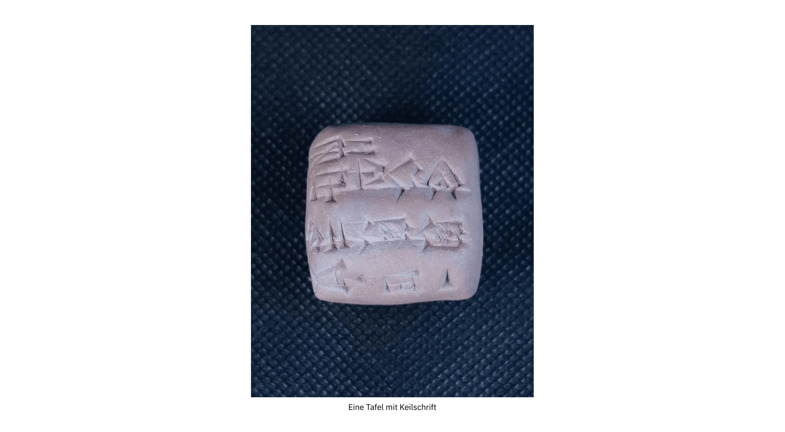

Ich habe auch etwas, von dem ich glaube, dass es eine echte sumerische Tafel mit einer kleinen Keilschrift in der Mitte ist. Auf dieser Tafel befinden sich Unterschriften, die durch das Rollen eines Zylinders entstanden sind, was ich Ihnen später zeigen werde.

Die Zeichen mit den kleinen Ziffern dienten als Unterschriften in einer Zeit, in der die meisten Menschen nicht schreiben konnten, da nur erfahrene Schreiber diese Fähigkeit besaßen.

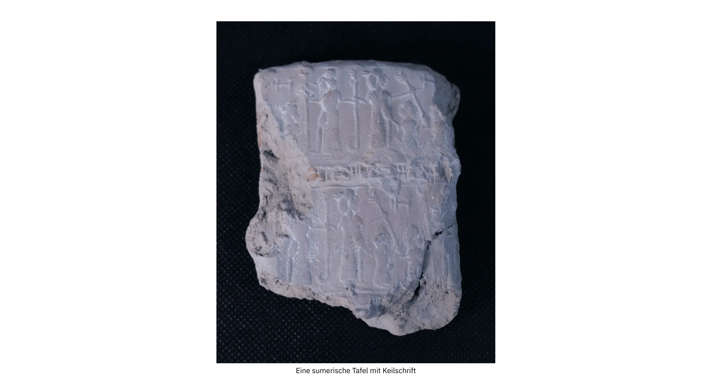

Unten sehen Sie den oben erwähnten Zylinder: ein Stein, in den bestimmte Formen eingraviert sind. Früher rollten die Menschen diesen Unterschriftszylinder, der im Englischen als cylinder seal bekannt ist, um Briefe zu unterschreiben. Auf diese Weise konnte man die Namen der Verfasser deutlich machen oder angeben, dass sie in deren Namen verfasst wurden.

Die Schreiber der damaligen Zeit benutzten daher einen keilförmigen Griffel, um Zeichen auf nasse Tafeln zu drucken.

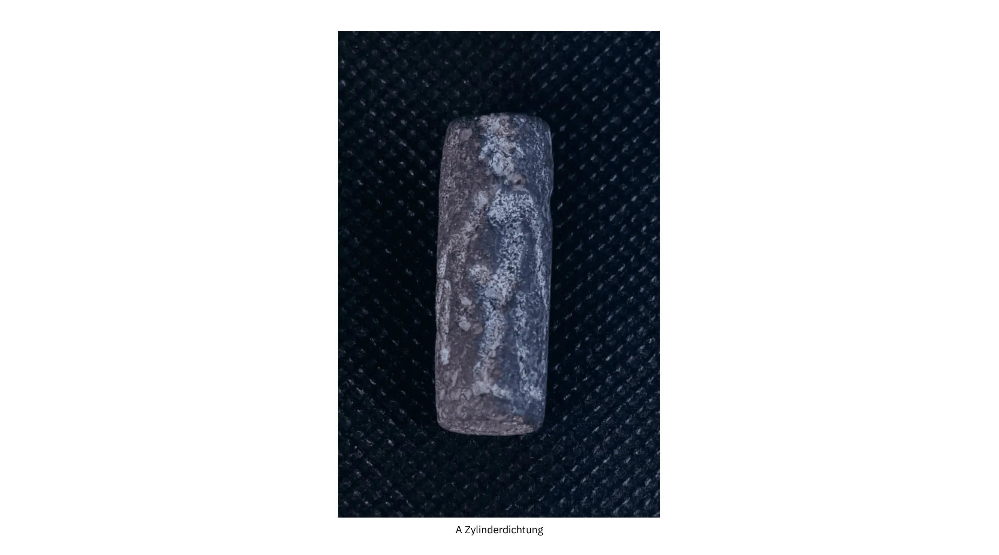

Keilschriftzeichen stellten keine Sprache dar, sondern ein Schriftsystem zur Aufzeichnung gesprochener Sprachen. Im Englischen würden wir sagen "writing is a written language", und dann würden wir sagen, dass "cuneiform is a script, not a language". Im Französischen würde man sagen, dass die Keilschrift keine Sprache ist, sondern eine Art der Kodifizierung einer Sprache.

### Die Entwicklung und der Nutzen der Schrift

In den ersten Jahrhunderten ihres Bestehens blieb diese Schrift begrenzt und diente im Wesentlichen als Gedächtnissystem für die Aufzeichnung von Mengen, Listen von landwirtschaftlichen Gütern und Geräten. Erst allmählich wurde sie in der Lage, Namen und vollständige Sätze **phonetisch wiederzugeben**.

Ursprünglich konnten Namen in der Keilschrift nicht ausgedrückt werden, da sie in erster Linie Objekte und Elemente der Realität darstellte, wie z. B. einen Ochsen oder Weizen, die als kleine Bilder abgebildet wurden. Im Laufe der Zeit entwickelten sich diese Bilder zu einer weiterentwickelten Form der Schrift, die die Darstellung von Namen und komplexen Konzepten ermöglichte.

Wenn die Person zum Beispiel Laura hieß, hätten wir ein Wort nehmen können, ein Akronym, das wie "Wasser" klang, und ein zweites wie "ras", und daraus den Namen Laura bilden können. So ist die erste Form der Schriftsprache entstanden.

Zur Erinnerung: Um Akronyme darzustellen, konnte man ursprünglich, wenn man den Kopf eines Ochsen zeichnen wollte, die Form des Ochsenkopfes sehen. Nach und nach wurden die Zeichnungen vereinfacht und stellten nur noch eine Art Linie dar. Die Gelehrten glauben, dass dies geschah, weil die Menschen die feuchte Tontafel in einer Hand hielten, so dass es einfacher war, die Initialen durch Drehen neu zu zeichnen. Es wird auch angenommen, dass dies auf die Art und Weise zurückzuführen ist, wie die Schreiber die Tafeln hielten.

Bei den Keilschrift-Akronymen kann man noch die Verbindung mit z. B. Weizen oder dem Ochsenkopf sehen, und sie sind immer zu einer Seite geneigt.

Während ihrer drei Jahrtausende währenden Verwendung diente die Keilschrift in erster Linie dazu, wirtschaftliche und administrative Aufzeichnungen zu führen. Die Bewohner Mesopotamiens entwickelten jedoch schon bald den Wunsch, alles, was die Zeit überdauern sollte, in schriftlicher Form festzuhalten. So wurden Geschichten, Legenden und Lieder, die bis dahin mündlich von umherziehenden Musikern überliefert worden waren, schriftlich verewigt und oft von Schreibern in Ausbildung abgeschrieben. Sie schrieben Texte ab, die bereits existierten, vor allem Legenden oder Texte, die einen gewissen kulturellen Wert besaßen.

Ein wichtiges Beispiel ist das **Gilgamesch-Epos**, möglicherweise ein **historischer König des sumerischen Stadtstaates Uruk** um 2900-2350 vor Christus.

Diese Form der Schrift, die sowohl ein wirtschaftliches Verwaltungsinstrument als auch ein kultureller Vektor war, hielt sich bis zum 1. Jahrhundert n. Chr., bevor sie endgültig verschwand und ein wertvolles Zeugnis der Zivilisation hinterließ, in der sie entstanden war.

## Die Rolle der sumerischen Tafeln

<chapterId>a396e6c5-56cc-5410-9e6b-0274401c5425</chapterId>

:::video id=a0729a35-01ec-4aa4-828f-d4ccc2eb168e:::

### Prämonetäre Kreditsysteme

Im alten Mesopotamien basierte die wirtschaftliche Organisation auf hochentwickelten Mechanismen, die lange vor der Erfindung von Metallmünzen existierten. Formelle und informelle Kreditsysteme waren von Anfang an eine wesentliche Form des Geldes, die es der lokalen Bevölkerung ermöglichte, viele komplexe wirtschaftliche Transaktionen durchzuführen.

Die Keilschrift wurde erfunden, um den Bedürfnissen von Verwaltung und Wirtschaft gerecht zu werden. Die berühmten mesopotamischen Tontafeln dienten vor allem dazu, verschiedene Arten von Verträgen festzuhalten: private Darlehen, Verkäufe, Vermietungen, Hypotheken und sogar Eheverträge. Das Schreiben dieser Tafeln erforderte das Fachwissen spezialisierter Schreiber, eine Aufgabe, die viel Zeit und Mühe kostete, **aber gerechtfertigt war, wenn finanzielle Interessen auf dem Spiel standen.** Die Menschen schrieben sich damals keine Liebesbriefe, sie benutzten keinen Schreiber, um über ihre Ängste zu schreiben. Sie beauftragten einen Schreiber, um Dokumente zu verfassen, unabhängig davon, ob es eine Verbindung oder einen wirtschaftlichen Grund gab.

Es ist auch erwähnenswert, dass einige dieser Tabletten als Inhaberschuldverschreibungen in Umlauf waren und den Besitzer frei wechselten.

Zum Beispiel gab es eine Art Tonkugel mit kleinen Steinen darin.

Auf der Außenseite der Tonkugel war eine Zahl geschrieben und unterschrieben, die eine Anzahl von Einheiten darstellte. Im Inneren befanden sich diese Steine und jemand, der überprüfen wollte, ob dieses Instrument wirklich eine Anzahl von X Einheiten darstellt.

Ein weiteres Beispiel ist eine Tafel, die südwestlich des heutigen Bagdad gefunden wurde und die besagt, dass ein Schuldner sich verpflichtet, einem Gläubiger am Tag der Ernte 330 Maß Getreide zurückzuzahlen. Noch faszinierender ist eine andere Tafel, die eindeutig festlegt, dass eine Schuld von vier Maß Gerste direkt an den Inhaber der Tafel zurückgezahlt werden muss, womit **der Begriff der Zahlung an den Inhaber eingeführt wird, ein für die damalige Zeit besonders innovatives Konzept**.

Seit 2000 v. Chr. gab es ein Gesetz, das vorschrieb, dass alle Handelsgeschäfte, selbst die kleinsten, schriftlich festgehalten und in Anwesenheit von Zeugen unterzeichnet werden mussten. Stellen Sie sich vor, was für ein riesiger bürokratischer Aufwand damals betrieben wurde, um alle Transaktionen in Registern festzuhalten, die - ich erinnere Sie daran - von Schreibern aus Ton gefertigt wurden. Diese rechtliche Strenge sollte künftige Streitigkeiten über das Eigentum und die Rechte an den ausgetauschten Waren verhindern. Oft wurden Zeugen hinzugezogen, um zu bezeugen, dass der Vertrag tatsächlich unterzeichnet worden war.

Auch im privaten Bereich gab es Familien und Einzelpersonen, deren wirtschaftliche Aktivitäten so komplex waren, dass sie ein strenges Management erforderten. In der nordbabylonischen Stadt Sippar-Amnanu wurde das Haus eines anunitischen Priesters namens Ur-Utu entdeckt, das fast 2.000 Tafeln enthielt. Darunter befanden sich private Darlehensverträge, Kauf- und Pachtverträge sowie Briefe, religiöse und akademische Texte, die von der Vielfalt und Bedeutung privater Archive in jener Zeit zeugen.

Es ist bemerkenswert, dass die von den Schreibern verfassten Briefe fast ausschließlich finanzielle Belange betrafen: Beschwerden über unzureichende Zuwendungen, ausstehende Mitgiftzahlungen oder andere dringende materielle Anliegen. Persönliche Schreiben wie Liebesbriefe gab es damals nicht, und auch die Erwähnung von Krankheiten war selten.

Ein ergreifendes Beispiel für einen solchen Brief veranschaulicht diese wirtschaftliche Realität: Ein Korrespondent bringt seine Verzweiflung zum Ausdruck, nachdem er nach dem Weggang seines Partners ohne Geld und Vorräte dasteht, während in Assur eine schwere Hungersnot herrscht. Er beschreibt, dass er dringend Getreide kaufen muss, und bittet darum, ihm schnell den Gegenwert seiner Textilien zu schicken, um seinen täglichen Lebensunterhalt zu sichern.

Dieser Brief, der an ihren Partner gerichtet ist, scheint darauf hinzuweisen, dass er weggegangen ist, um anderswo Handel zu treiben, und sie mittellos zurückgelassen hat. Sie erinnert ihn daran, dass sie über Geld verfügen muss, um Getreide zu kaufen und ihre Tempelsteuer zu bezahlen. Dies ist vielleicht das einzige Argument, das wir in einem Brief aus dieser Zeit finden. Briefe standen fast immer im Zusammenhang mit wirtschaftlichen Transaktionen, und gerade dieser Brief bezieht sich auf eine prekäre wirtschaftliche Situation.

So spiegeln die uns überlieferten mesopotamischen Dokumente vor allem den wirtschaftlichen Austausch wider, da sie ausschließlich für den Transfer von Gütern mit einem anerkannten Wert erstellt wurden: Geld, Getreide, verschiedene Waren, Immobilien, Zahlung von Tempelsteuern. Diese Archive zeugen nicht nur von der Effizienz und der administrativen Präzision dieser antiken Zivilisation, sondern auch von ihrer Fähigkeit, komplexe wirtschaftliche Transaktionen über einen sehr langen Zeitraum zu verwalten.

## Elitenkontrolle auf sumerischen Tafeln

<chapterId>c6d3df0e-b1e1-58dc-ab35-9f76bbc39393</chapterId>

:::video id=04a95fb8-a701-4a48-9ce8-0e9b6ba256fd:::

### Schreiben, eine Technologie, die vor allem wirtschaftlich ist

Entgegen der landläufigen Meinung diente die Erfindung der Schrift in Mesopotamien vor etwa 4.000 Jahren zunächst nicht der persönlichen oder literarischen Kommunikation. **Die Keilschrift war in erster Linie eine wirtschaftliche Technologie**, die nur gerechtfertigt war, wenn wichtige finanzielle Interessen auf dem Spiel standen. Die Sumerer benutzten die Schrift nicht, um miteinander zu korrespondieren oder ihre Gefühle auszudrücken, sondern ausschließlich, um ihre kommerziellen und finanziellen Transaktionen zu dokumentieren.

Diese Spezialisierung lässt sich durch die erheblichen Kosten der Tontafelherstellung erklären. Die Gravur in Ton erforderte spezielles technisches Know-how, viel Zeit und besondere Materialien. Nur Transaktionen von ausreichendem Wert rechtfertigten diese Investition wirtschaftlich, wodurch eine natürliche Schwelle für den Zugang zu dieser revolutionären Technologie entstand.

Die Keilschrifttafeln offenbaren ein Finanzsystem von bemerkenswerter Komplexität für die damalige Zeit. Die Mesopotamier hatten ein komplettes Arsenal an modernen Finanzinstrumenten entwickelt: **Privatkredite mit Zinsen, Kaufverträge, Mietverträge, Hypotheken und sogar Eheverträge mit Finanzklauseln**. Diese Raffinesse zeugt von einer entwickelten Marktwirtschaft, die weit entfernt ist von dem simplen Bild des primitiven Tauschhandels, das man oft mit diesen alten Zivilisationen verbindet.

Einige Tafeln fungierten als echte Inhaberpapiere, die frei von Hand zu Hand zirkulierten, ohne dass der ursprüngliche Besitzer identifiziert werden musste. Diese Innovation ermöglichte einen bemerkenswert flüssigen Austausch und war ein Vorläufer der modernen Finanzsysteme. Darüber hinaus verlangte eine spezielle Gesetzgebung sogar, dass alle kommerziellen Transaktionen in schriftlicher Form abgewickelt werden mussten, wodurch die Verwendung der Schrift im wirtschaftlichen Bereich institutionalisiert wurde.

### Das Monopol des Wissens und die wirtschaftliche Kontrolle

Die zentrale Bedeutung der Schrift für die Wirtschaft verlieh denjenigen, die diese Technologie beherrschten, erhebliche Macht. **Die Schriftgelehrten, die im Allgemeinen den Tempeln und den herrschenden Institutionen angehörten, hatten de facto die Kontrolle über das Finanzsystem**. Ihr seltenes und unschätzbares Fachwissen machte sie zu den Hütern aller wichtigen Transaktionen.

Dieses Wissensmonopol war kein Zufall. Die Obrigkeit hatte ein großes Interesse daran, diese Exklusivität aufrechtzuerhalten, denn eine Demokratisierung der Schrift hätte ihre Kontrolle über die Wirtschaft verwässert und die Gefahr von Fälschungen erhöht. Die systematische Anwesenheit von Zeugen bei den Unterschriftszeremonien verdeutlicht diese ständige Sorge um die Echtheit der Dokumente.

Die gesetzliche Verpflichtung, alle geschäftlichen Transaktionen schriftlich festzuhalten, diente mehreren strategischen Zielen: Steuerkontrolle, strenge Überwachung der Buchführung und Aufrechterhaltung der Abhängigkeit der Wirtschaftsakteure vom Verwaltungsapparat. **Der mesopotamische Staat eignete sich auf diese Weise die Fähigkeit an, zwischenmenschliche Schulden** auf gesellschaftlicher Ebene zu verwalten, und verwandelte damit die Schrift in ein wirtschaftliches Machtinstrument.

### Die Koexistenz von zwei Währungssystemen

Die Analyse der Tafeln offenbart eine nuanciertere wirtschaftliche Realität, als ihre allgegenwärtige Präsenz in den Archiven vermuten lässt. Auf vielen Tafeln wird auf den **Silberschekel** als Werteinheit verwiesen, was auf die parallele Existenz eines auf standardisierten physischen Gütern basierenden Geldsystems hindeutet.

Diese Dualität lässt sich durch die soziale Schichtung der damaligen Zeit erklären. **Das System der Keilschrifttafeln war einer begrenzten Elite** vorbehalten: Klerikern, wohlhabenden Kaufleuten und Verwaltern, die in der Lage waren, diese komplexen Dokumente zu lesen, zu schreiben und zu interpretieren. Um eine Keilschrifttafel effektiv nutzen zu können, musste man nicht nur wissen, wie man sie entziffert, sondern auch in der Lage sein, ihre Echtheit zu überprüfen und ihre rechtlichen Implikationen zu verstehen.

**Die Masse der Bevölkerung, die von diesem elitären System ausgeschlossen war, entwickelte ihre eigenen Tauschmechanismen**. Die einfachen Leute benutzten leichter zugängliche Systeme wie standardisierte Getreidemaße, Geldgewichte und andere leicht quantifizierbare Güter, die jeder ohne besondere Kenntnisse bewerten konnte.

Diese volkstümliche Wirtschaft ist zwar in offiziellen Archiven weniger dokumentiert, war aber wahrscheinlich dynamischer und flexibler als das Tafelsystem. Sie ermöglichte einen raschen täglichen Austausch ohne Inanspruchnahme von Schreibern und entsprach dem unmittelbaren Bedarf von Handwerkern, Bauern und kleinen Händlern.

Der silberne Schekel, der in den Tafeln oft als Wertangabe erwähnt wird, diente wahrscheinlich als Brücke zwischen diesen beiden parallelen Wirtschaftssystemen und ermöglichte die Umrechnung zwischen schriftlichen Schulden und physischen Zahlungen.

### Spontanes Entstehen versus institutionelle Kontrolle

Diese Koexistenz veranschaulicht eine grundlegende Debatte in der Wirtschaftsgeschichte: **den Gegensatz zwischen der spontanen Entstehung von Tauschmitteln und der institutionellen Aneignung des Geldes**. Einerseits sind Waren wie Geld auf natürliche Weise aus den Tauschbedürfnissen der Menschen entstanden. Andererseits eigneten sich die Institutionen diese Praktiken an und formalisierten sie, um ihren Fluss zu kontrollieren.

Die sumerischen Tempel verkörpern dieses Spannungsverhältnis: Sie nutzten populäre monetäre Innovationen (Verweise auf den Schekel) und entwickelten gleichzeitig ihre eigenen Kontrollinstrumente (Keilschrifttafeln). Mit dieser Strategie konnten sie die Vorteile beider Systeme nutzen: die volkstümliche Legitimität der traditionellen Währungen und die administrative Kontrolle der formalisierten Schulden.

Die mesopotamische Erfahrung schafft dauerhafte Präzedenzfälle für die Entwicklung von Finanzsystemen. Sie zeigt, dass **finanzielle Raffinesse oft mehrere Jahrtausende** vor den technologischen Innovationen liegt, die gewöhnlich damit verbunden sind. Die Konzepte des Zinses, des Kredits, der handelbaren Instrumente und der hypothekarischen Sicherheiten haben nicht auf die Erfindung des Metallgeldes gewartet, um sich zu entwickeln.

Diese bahnbrechende Zeit zeigt auch die Machtfragen auf, die jeder monetären Innovation innewohnen: Wer kontrolliert die Technologie, wer legt die Regeln fest und wie werden formale Systeme und populäre Praktiken artikuliert. Diese grundlegenden Fragen haben sich durch die gesamte Wirtschaftsgeschichte gezogen und reichen bis zu den aktuellen Debatten über digitale Währungen und [Kryptowährungen](https://planb.academy/resources/glossary/cryptocurrency).

# Wirtschaft und Geld in den antiken Zivilisationen

<partId>a16bcf4c-8c3a-11f0-9e79-2bd363a484bd</partId>

## Die großen Zivilisationen der Bronzezeit

<chapterId>fab9334c-7385-5d7c-ad40-7d152beb22a1</chapterId>

:::video id=737e12e8-1033-4210-b1dd-b8a680f68b17:::

In diesem Abschnitt mit dem Titel "Die großen Zivilisationen der Bronzezeit" beginnen wir mit einem Auszug aus dem Buch *A History of Money: From Ancient Times to Present Day* von Glyn Davies, das meiner Meinung nach eine hervorragende Einführung in diesen Abschnitt über die großen Zivilisationen der Antike darstellt.

> Toynbee nennt etwa einundzwanzig verschiedene "Zivilisationen", aber da fünfzehn davon direkt oder indirekt von früheren Beispielen abstammen, reduziert er die Zahl der unabhängig voneinander entwickelten Zivilisationen auf sechs: Sumerer, Ägypter, Minoer, Chinesen, Maya und Andenbewohner. Von diesen schafften es nur die Inkas in den Anden, einen hohen Grad an Zivilisation zu erreichen, ohne Geld zu verwenden, obwohl sie paradoxerweise über einen Überfluss an den Materialien verfügten, die allgemein als am besten für die Verwendung als Geld angesehen werden - Gold und Silber.

Die Inkas hatten kein Geldsystem, aber sie verfügten über eine Fülle von Edelmetallen. Ein ziemliches Paradoxon. Lassen Sie uns mit dem Zitat fortfahren:

> Je stärker eine Gesellschaft geschichtet und je effizienter ihr Planungssystem ist, desto weniger notwendig ist der Gebrauch von Geld für die Bevölkerung. Dies mag erklären, warum die spanischen Konquistadoren entdeckten, dass die Mexikaner, deren Regierung relativ liberal war, regelmäßig Goldpulver (in durchsichtigen Röhrchen) und Kakaobohnen (für große Zahlungen in Säcken zu 24.000 Einheiten) als Zahlungsmittel verwendeten, während die Inkas, die nach einer viel starreren Hierarchie organisiert waren, überhaupt kein Geld besaßen: eine Ausnahme, die durch eine strenge Regel bestätigt wurde. Der Ursprung des Geldes in China war völlig unabhängig von anderen Zivilisationen; die relative Nähe der sumerischen, ägyptischen und minoischen Zivilisationen lässt jedoch Zweifel daran aufkommen, inwieweit sie Geldpraktiken nicht kannten, vor allem, wenn man bedenkt, dass bereits in frühester Zeit ein umfangreicher Handel bestand.

In China wurden die Münzen mit einem völlig anderen Ansatz entwickelt als in der westlichen Welt. Es war von Anfang an Papiergeld. Es waren gegossene Münzen.

Und hier erwähnt Herr Davies den Handel. Es gab tatsächlich zu bestimmten Zeiten einen Austausch zwischen den Chinesen und anderen Völkern, aber das Tauschmittel für den Außenhandel war eher Seide. Wie wir später sehen werden, wurde Gold auch in den Grenzregionen Chinas verwendet, wo die chinesische Bevölkerung kleiner war. Und zwar nicht einmal für den internationalen Handel, sondern für den Handel mit Seide.

Ich könnte mir also vorstellen, dass das Format der Münzen von anderen Zivilisationen der gleichen Zeit beeinflusst wurde, die diese Technologie entwickelt haben.

Aber es ist klar, dass das Wesen des Geldes in China ein völlig anderes war als im Westen. Darauf werden wir im nächsten Abschnitt über China noch einmal ausführlich zurückkommen.

Zu diesen berühmten sumerischen Städten habe ich hier einige Anmerkungen. Wir können Uruk erwähnen, eine sehr frühe und einflussreiche Stadt, die für ihre beachtliche Größe und ihre fortschrittliche Kultur berühmt war, vor allem für die Entwicklung der Schrift und der Stadtplanung.

Und ich wollte auch das berühmte Gilgamesch-Epos erwähnen. Gilgamesch war wahrscheinlich ein historischer König der sumerischen Stadt Uruk um 2900 vor Christus. Er war wahrscheinlich der König dieses sumerischen Stadtstaates.

Wir können auch von Sargon von Akkad sprechen, der von 2334 bis 2279 v. Chr. regierte.

Er war der erste Herrscher des akkadischen Reiches, einer weiteren Zivilisation, die in Mesopotamien entstand. Und ich erwähne Sargon, weil er der erste war, der einen Postdienst für diese berühmten Tafeln hier einrichtete, die ich Ihnen bereits vorgestellt habe.

Stellen Sie sich vor, es gäbe tatsächlich auch Tonumschläge. Die Tafeln könnten in Tonhüllen mit der Unterschrift der Person auf der Außenseite eingewickelt werden, um die Vertraulichkeit zu gewährleisten. Die Leute würden also den Umschlag aufbrechen, um die Tafel zu holen. Dieses Postsystem verdanken wir Sargon von Akkad.

Dann ist da noch Babylon, die große Stadt, die zur Hauptstadt des babylonischen Reiches wurde. Eine weitere Zivilisation, die für ihre imposante Zikkurat und ihre Paläste bekannt ist, sowie für den berühmten Kodex von Hammurabi, der für sein hochentwickeltes Gesetzbuch bekannt ist.

Und zwei Städte zum Abschluss dieses Abschnitts. Es handelt sich um Aschur, die Hauptstadt des assyrischen Reiches, ein wichtiges religiöses Zentrum. Und wir haben Ninive, das später die Hauptstadt des assyrischen Reiches war. Die Assyrer verlegten ihre Hauptstadt dorthin und sie ist bekannt für ihre mächtige Armee, ihre riesigen Paläste und Bibliotheken. Und es ist auch einer der möglichen Standorte der legendären Hängenden Gärten von Babylon. Wir hören oft von diesem berühmten Wunder der antiken Welt.

Von diesen berühmten hängenden Gärten in Babylon gibt es jedoch keine Spur. In Ninive hingegen gibt es archäologische Beweise für Gärten auf mehreren Etagen. Es ist möglich, dass griechische Historiker wie Herodot Ninive mit Babylon verwechselten. Wenn sie Städte in Mesopotamien besuchten, bezeichneten sie sie vielleicht als Babylon. In Ninive wurden Spuren der berühmten hängenden Gärten gefunden, und Wissenschaftler fragen sich, ob Ninive der berühmte Ort ist, an dem sich diese Gärten befanden, die als babylonische hängende Gärten bezeichnet werden.

## Wirtschaftliche Organisation in Mesopotamien

<chapterId>6afb6fc8-cbb7-56a5-8427-484b4b7d7477</chapterId>

:::video id=aa6a2cbd-5916-4ae3-ad4f-65f0bd5643fa:::

### Vorkapitalistische Wirtschaftsstrukturen und Sklaverei

Willkommen zu diesem Abschnitt über die wirtschaftliche Organisation in Mesopotamien. Die vorkapitalistische Wirtschaft durchlief drei Hauptstufen: primitiv, sklavisch und feudal.

Das Feudalwesen ist natürlich viel später, offensichtlich im Mittelalter, und wir haben das primitive Stadium, das wir vorhin mit dem Paläolithikum beschrieben haben, bereits überschritten. Wenn wir in Mesopotamien von wirtschaftlicher Organisation sprechen, sprechen wir von Sklaverei.

In Mesopotamien wurde der Großteil der Arbeit jedoch von einer abhängigen Klasse verrichtet, die den Sklaven ähnelte, die rechtlich gesehen nicht das Eigentum ihrer Herren waren, sondern durch physischen oder ideologischen Zwang um die Früchte ihrer Arbeit gebracht wurden.

### Die Rolle von Tempeln und Palästen als Wirtschaftszentren

Großgrundbesitz dominierte die Wirtschaft. Die Grundbesitzer bewirtschafteten ihr Land direkt, indem sie Arbeiter anstellten, oder sie verpachteten ihr Land gegen Pachtzahlungen. Sie waren auch im Finanzbereich tätig und verliehen Geld zu hohen Zinssätzen, die im Allgemeinen zwischen 20 % und 33,3 % pro Jahr lagen, eine Praxis, die in starkem Kontrast zu den strengeren Regeln der benachbarten Hebräer stand.

Die von den Landwirten aufgenommenen Kredite waren - mit Ausnahme der Schifffahrtsgesellschaften - nicht für produktive Investitionen bestimmt, sondern sollten ihr Überleben bis zur nächsten Ernte sichern. Diese Situation führte häufig zu einer chronischen Verschuldung der Bauern.

Erlauben Sie mir, eine Parallele zu einer jüngeren Periode in der Antike (Rom) zu ziehen, wo die Bürger von den landwirtschaftlichen Pachten, die von Bauern und unfreien Arbeitskräften erwirtschaftet wurden, sowie von der Kriegsbeute lebten. **Diese Einnahmen wurden unter den Bürgern verteilt, nicht um generate mehr Gewinn zu bringen, sondern um ihren sozialen Status zu verbessern.** Handel und Handwerk wurden im Allgemeinen Gruppen außerhalb der sozialen Elite überlassen. All dies steht im Gegensatz zu den mittelalterlichen Volkswirtschaften, die auf Gewinn durch Handel und Handwerk ausgerichtet waren.

Was ich damit sagen will, ist, dass ich eine Parallele zu der Tatsache ziehe, dass die Menschen die Instrumente der Kreditvergabe nicht unbedingt zur Verbesserung ihrer Produktionsmittel nutzten, und später in Rom wurden die Gewinne nicht unbedingt reinvestiert, sondern zur Steigerung des Ansehens der Personen verwendet, die von diesen Gewinnen profitieren konnten. Wir sind noch weit entfernt von dem kapitalistischen Geist, der später im Mittelalter aufkam, als Arbeitsplätze geschaffen werden konnten, um die Produktionsmittel zu verbessern, und Überschüsse zur Erzielung von Gewinnen genommen und geschaffen wurden. Wir sehen also, dass die wirtschaftliche Organisation noch nicht die dritte Stufe der oben genannten wirtschaftlichen Entwicklungen erreicht hatte.

### Das Aufkommen von Kreditsystemen und Rechnungseinheiten

**Karl Polanyi unterscheidet drei Formen des wirtschaftlichen Austauschs: Reziprozität zwischen symmetrischen Gruppen,** d.h. in primitiven Stämmen, wo wir kein Geld brauchen, weil wir uns gegenseitig informelle Kredite geben und tauschen und umverteilen. **Diese Form des Austauschs ist mit Mesopotamien vereinbar, wo die Tempel im Zentrum der wirtschaftlichen Organisation standen und einst Reichtum in Form von Rationen zurückgeben und verteilen konnten. Erst später wurde der Begriff des Lohns eingeführt. Bis jetzt haben wir also die primitive Form (1), die zentralisierte Umverteilung (2) in Tempeln und Palästen, und dann können wir schließlich zum Markttausch übergehen (3). Obwohl der Markt, wie wir ihn heute verstehen, noch nicht vollständig existierte, ist das Vorhandensein von Marktbörsen in Mesopotamien unbestreitbar, was durch das Vorhandensein spezifischer Begriffe im Akkadischen und durch das Vorhandensein archäologischer Beweise für Preise, Gewinne, Verluste, Fluktuationen und Situationen der Knappheit belegt wird.

Die mesopotamischen Haushalte verwalteten eigenständig alle Stufen der landwirtschaftlichen Produktion, von der Aussaat bis zur Endverarbeitung zu Brot und Bier. Frauen stellten auch die Textilien her, die ihre Angehörigen benötigten. Für Waren, die nicht vor Ort produziert wurden, wandten sich die Haushalte an spezialisierte Händler.

Familienbande waren im Handel besonders wichtig. Während der paläoassyrischen Periode (ca. 1910-1830 v. Chr.) gründeten Kaufleute aus der Stadt Ashur eine Handelskolonie in Kanesh in Anatolien und importierten Zinn und Textilien im Austausch gegen Gold und Silber. Der Handel basierte auf Familienunternehmen, die durch Heirat und Handelspartnerschaften eng miteinander verbunden waren. Kanesh war nur ein Glied in einem riesigen internationalen Handelsnetz.

Bei diesen Tauschgeschäften ging es um Metalle, und zwar um Edelmetalle und nicht unbedingt um z. B. Kupfer, das zu jener Zeit sehr nützlich war, und wir denken, dass diese Metalle als Wertaufbewahrungsmittel getauscht wurden. Man kann also nicht unbedingt von einem Tauschhandel sprechen, bei dem zwei Waren gegeneinander getauscht werden, sondern eher von einer Art Bezahlung mit dem Bewusstsein, Edelmetalle zu horten, um sie als Wertaufbewahrungsmittel und nicht als Handelsware zu verwenden, z. B. die Verwendung von Bronze zur Herstellung von Rüstungen.

Tribute und Steuern wurden hauptsächlich in Naturalien (Gerste oder gewogenes Silber) entrichtet. Tempel und Paläste waren die wichtigsten wirtschaftlichen, administrativen, politischen und religiösen Zentren und erfüllten auch die ersten Bankfunktionen durch die sichere Aufbewahrung von Waren, zunächst von Getreide, dann von anderen landwirtschaftlichen Erzeugnissen und schließlich von Edelmetallen. Auf diese Weise wurden die ersten Kredit- und Darlehensgeschäfte entwickelt, lange bevor es Münzen gab.

In der mesopotamischen Wirtschaft wurden hauptsächlich Gerste und Silber als Wertmaßstab verwendet. Silber wurde in standardisierten Einheiten gewogen, wie dem Sìqlum (Schekel) von etwa 8,33 Gramm. Bereits in der altbabylonischen Zeit (unter Hammurabi) wurde Silber als gängiges Zahlungsmittel verwendet, wobei schon früh der Begriff des Nominalwerts ("nūbum") im Gegensatz zum realen Gewicht ("šuqulum") verwendet wurde, **was das moderne Konzept der Fiat-Währung** vorwegnimmt.

Aber es war noch kein Fiatgeld im strengen Sinne des Wortes. Es gab keinen Stempel mit einer Autoritätsfigur, aber es gab den Begriff einer nominalen Rechnungseinheit, im Gegensatz zum Begriff des gewogenen Metalls. Es gab eine Unterscheidung in der Sprache für diese beiden Konzepte, und ich denke, es ist wichtig, dies zu erwähnen.

Der Übergang zu einem Lohnarbeitsmarkt war ein schwieriger Prozess. Er erforderte zwei wichtige konzeptionelle Neuerungen: die Trennung der Arbeit des Einzelnen vom Endprodukt und die Einführung der "Arbeitszeit" als messbare Einheit. Um diesen Begriff des Lohn- und Gehaltsempfängers zu haben, mussten wir zunächst diese beiden Neuerungen durchlaufen. **Im IIIᵉ Jahrtausend wurde die Arbeit zunächst durch feste Rationen entlohnt, bevor sie sich zu Beginn des IIᵉ Jahrtausends allmählich zu einem Lohnsystem entwickelte

Ab dem 26. Jahrhundert v. Chr. schließlich setzte sich eine echte Vorstellung von Geldwert durch, auch wenn das mesopotamische "Geld" keine Münze war, sondern ein gewichtetes Maß an Getreide oder Metall. **Bei wichtigen Transaktionen oder in Zusammenhängen, die eine Wertaufbewahrung erforderten, wurde es daher oft vorgezogen, Getreide in Silber umzuwandeln, das sich leichter aufbewahren ließ.** Ein wenig wie das Beispiel von Kanesh, wo man Silbermetall zum Horten erhielt.

Ab dem 21. Jahrhundert v. Chr., **mit dem faktischen Verschwinden des asymmetrischen Austauschs**, stellen wir fest, dass sich das Verb sa in Abtretungsverträgen auf die Zahlung des Preises bezieht. Dieser Begriff, "sa" genannt, taucht in Verträgen auf und bezieht sich auf die Zahlung eines Preises, nicht auf die Messung einer bestimmten Ware. "Sa" bezieht sich einfach auf eine Zahlung oder einen Preis. Es ist ein Anthropologe, der dies bemerkt und erwähnt, dass dies wirklich ein Durchbruch ist; wir sehen eine Art Dichotomie zwischen der Zeit vor und nach der Einführung des Verbs "sa" in Verträgen.

Wir können die empirischen Daten in den nahöstlichen Archiven nicht ignorieren, die das Vorhandensein von **einigen Marktmechanismen** belegen und **Gewinn** und **Verlust**, **Preisschwankungen** und **Knappheitssituationen** beinhalten. Die grundsätzliche Schwierigkeit besteht jedoch darin, die relative Bedeutung des marktbasierten Austauschs innerhalb der antiken mesopotamischen Wirtschaft als Ganzes zu bestimmen.

Ich denke, die Experten auf diesem Gebiet haben Spuren dieser Marktkonzepte gesehen, aber sie sind nicht wirklich in der Lage, uns zu sagen, wie viel der damaligen Wirtschaft auf diesem moderneren Marktkonzept oder anderen Mechanismen beruhte.

Wir wissen, dass es sie gab, aber wir wissen nicht, ob sie die wichtigste Methode war, um beispielsweise Preise zu bestimmen oder Handel zu treiben.

Damit ist dieser Abschnitt über die wirtschaftliche Organisation in Mesopotamien abgeschlossen.

In den nächsten Abschnitten werden wir das Gleiche für Ägypten und China tun.

## Wirtschaftliche und monetäre Organisation im alten Ägypten

<chapterId>bffcc16c-7fbf-5992-a0fa-6a7726d7d287</chapterId>

:::video id=40c1c4e5-b190-4bb6-b8a0-810c9ce7698b:::

### Historischer Hintergrund und ägyptische Epochen

Dieser Abschnitt ist der wirtschaftlichen und monetären Organisation des alten Ägypten gewidmet. Um Ihnen ein wenig Hintergrundwissen zu vermitteln, finden Sie hier eine Liste und eine kurze Beschreibung der betreffenden Zeiträume.

- Altes Reich (ca. 2575 - ca. 2130 v. Chr.)**. Eine Periode, die durch den Bau der großen Pyramiden, vor allem der von Gizeh, gekennzeichnet ist. Dies war das goldene Zeitalter der zentralisierten ägyptischen Monarchie.
- Mittleres Reich (ca. 1938 - ca. 1630 v. Chr.)**. Politische und kulturelle Wiedergeburt nach einer Zeit der Instabilität.
- Neues Reich (ca. 1539 - 1075 v. Chr.)**. Eine Periode der territorialen Expansion, der militärischen Macht und des internationalen Handels. Es umfasst die Regierungszeiten berühmter Pharaonen wie Tutanchamun und Ramses II.
- 1323 V. CHR. - Tod von Tutanchamun**. Der junge Pharao starb im Alter von etwa 18-19 Jahren. Sein fast unversehrtes Grab wurde 1922 entdeckt, was es zu einer der berühmtesten archäologischen Entdeckungen machte.
- Ramses II. - Regierungszeit 1279-1213 v. Chr.**. Einer der mächtigsten Pharaonen des Neuen Reiches. Bekannt für seine Feldzüge, seine großen Monumente und dafür, dass er wahrscheinlich den ersten bekannten Friedensvertrag geschlossen hat.
- 1275 v. Chr. - Seevölker**. Invasionen oder Wanderungen von Gruppen, die "Seevölker" genannt werden, destabilisieren mehrere Mittelmeerzivilisationen, darunter Ägypten.
- Schlacht von Xoïs - 1178 v. Chr.**. Konflikt zwischen der ägyptischen Armee und Eindringlingen, die wahrscheinlich mit den Seevölkern in Verbindung stehen. Eine von vielen Schlachten am Ende des Neuen Reiches.
- Die Spätzeit** ist der Zeitraum der altägyptischen Geschichte von etwa 664 bis 332 v. Chr.
- Kleopatra VII (69 - 30 v. Chr.)**. Letzte Königin Ägyptens, berühmt für ihre Intelligenz, ihr Charisma und ihre Bündnisse mit Julius Cäsar und Marc Anton, und wahrscheinlich auch für ihre Nase. Ihre Herrschaft markierte das Ende des pharaonischen Ägyptens vor seiner Annexion durch Rom.

Im 5. und 4. Jahrtausend v. Chr. erlebte Ägypten bereits eine intensive Handelstätigkeit in großem Umfang und verband Nubien, Palästina, Libyen und die Regionen am Roten Meer über den See-, Fluss- und Landhandel (vor allem durch Eselskarawanen).

### Frühe Tauschsysteme und Paläo-Währung

Mit der Entstehung der ersten ägyptischen Häuptlingstümer um 3650-3400 v. Chr. wurde der Ort Maadi, südlich des heutigen Kairo, zu einem wichtigen Zentrum für die Kupfertechnologie und den Fernhandel, insbesondere mit Mesopotamien über die syrische Küste.

Obwohl der Handel in großem Maßstab hauptsächlich auf Tauschgeschäften beruhte, gab es wahrscheinlich eine primitive Form von Geld ("Paläowährung"), die aus Prestigeobjekten wie Halbedelsteinen und fossilen Muscheln bestand. Gold spielte bei diesen Tauschgeschäften wahrscheinlich bereits eine wichtige Rolle. Die erste ausdrückliche Erwähnung einer Münze in ägyptischen Dokumenten in der Mitte des 3. Jahrtausends v. Chr. spiegelt eine lange Entwicklung im Zusammenhang mit Handelspraktiken wider.

In der archaischen Gesellschaft (hier geht es nicht unbedingt um Ägypten, sondern um archaische Gesellschaften im Allgemeinen) wurden häufig Zahlungen getätigt, nicht um direkt zu kaufen, sondern um Mitgift, religiöse Rituale und andere soziale Verpflichtungen zu bezahlen. Diese Transaktionen erforderten eine präzise Preisgestaltung und Bewertung. Viele primitive Gesellschaften verfügten über privilegierte, monetäre (d. h. zählbare) Objekte, anhand derer dieser Wert geschätzt wurde. Wenn man eine Mitgift bezahlt, muss man natürlich eine bestimmte Menge eines Objekts notieren, das zur Bezahlung der Mitgift eingetauscht werden soll. Dieser Wert ist im Wesentlichen der von Menschen.

In archaischen Gesellschaften, vor dem Aufkommen des Geldes oder von Geldsystemen, gab es zwar Zahlungen, aber sie waren häufig an soziale Verpflichtungen geknüpft, und ihr Wert ergab sich aus dem Wert des Einzelnen, wie bei der Zahlung von Mitgift oder Blutgeld.

Um auf Ägypten zurückzukommen: Während des alten Reiches ging der "Schât(y)", ursprünglich eine konkrete Geldeinheit (eine kleine Gold- oder Silbermünze mit einem Gewicht von etwa 7,6 Gramm), sehr schnell von seiner eigentlichen Funktion als harte Währung zu einer **Buchhaltungsfunktion** über, die den Begriff des Wertes hervorbrachte. Wir können in ihr eine Art Recheneinheit erkennen, um den Wert auszudrücken, die ursprünglich eine Art Münze war, aber wir können sie nicht wirklich als Münze bezeichnen, weil sie nicht geprägt ist, sondern nur ein Metallmaß ist. Wir nähern uns dem Begriff der Rechnungseinheit an.

Diese Vorstellung von Schât(y) wurde schließlich aufgegeben, vielleicht wegen der Gefahr des Betrugs. Später werden wir sehen, dass die Ägypter nur langsam gestempelte Münzen annahmen und sie sogar weiterhin wogen, selbst nachdem sie von ihren Nachbarn übernommen worden waren.

Im Mittelalter wurde Silber nur selten für alltägliche Transaktionen verwendet, die hauptsächlich mit Getreidemaßen und Brotmengen abgewickelt wurden. In dieser Zeit entstand eine Form des Schriftgeldes, bei dem Zahlungen schriftlich oder durch Überweisung festgehalten werden konnten.

Im Neuen Reich wurde das Geldsystem komplexer und umfasste verschiedene Warenwährungen, die in Metallen (Gold, Silber, Kupfer), standardisierten Stoffen, Getreide und Öl bewertet wurden. Stoffe wurden als "Tuchmaße" bezeichnet. **Die Preise für Güter des täglichen Bedarfs wurden häufig in Getreide oder Kupfer ausgedrückt, während wertvolle Gegenstände in Gold oder Silber bewertet wurden. Silber, das in Ägypten seltener war als Gold, wurde besonders geschätzt.** Silber war im Vergleich zu Gold, das in Ägypten reichlicher vorhanden war, überbewertet.

In der Spätzeit (erstes Jahrtausend v. Chr.) war Silber im gesamten Nahen Osten zum gängigen Tauschmetall geworden. Es zirkulierte in Form von Barren, Metallmünzen oder Ringen, die in Tempeln gewogen und gekennzeichnet wurden, um ihr Gewicht und ihre Reinheit zu garantieren, auch wenn sie nicht nach dem Bildnis eines Herrschers geprägt wurden. Dies geschah erst später und wird Gegenstand eines späteren Abschnitts über die Lydier sein.

Es sei auch darauf hingewiesen, dass die alten Ägypter einen Begriff, "hedj", für Geld hatten, der allgemein verwendet wurde, um jedes Zahlungsmittel zu bezeichnen, das als Gegenleistung bei einer Transaktion diente, sei es für Metall, Getreide, Stoff oder verschiedene Waren (Holz, Tiere, Dienstleistungen usw.). Dokumentierte Beispiele zeigen, dass die Ägypter eine Transaktion durch die Kombination verschiedener Produkte abwickeln konnten, deren Gesamtwert in Kupfereinheiten ("deben") ausgedrückt wurde.

**Tempel spielten in der ägyptischen Wirtschaft eine zentrale Rolle: Sie sammelten und horteten beträchtliche Schätze an Edelmetallen (Gold und Silber), die zur Ehre der Götter, aber auch als Geldreserve dienen sollten, die bei Bedarf wieder in den Wirtschaftskreislauf eingebracht werden konnte**. Wir werden Beispiele für andere Zivilisationen sehen, die wertvolle Reserven in Tempeln anhäuften, z. B. Statuen, um sie im Falle eines Krieges, einer Währungskrise oder eines Engpasses einzuschmelzen. Dieses Thema zieht sich wie ein roter Faden durch die Geschichte.

Erwähnenswert ist auch, dass der Leinenanbau ein königliches Monopol war, das den Tempeln gewährt wurde, und die Herstellung von kostbaren Stoffen bestätigte ihre wirtschaftliche Bedeutung.

Die alten Ägypter unterschieden klar zwischen dem ideologischen Aspekt der Edelmetalle, die mit der Gottheit verbunden sind (Gold steht für das Fleisch der Götter, Silber für ihre Knochen), und ihrer praktischen Funktion als Währung, die als Referenz für alle anderen Zahlungsmittel dient.

Obwohl das alte Ägypten erst in der Spätzeit eine mit modernen Geldsystemen vergleichbare Münzprägung entwickelte, verfügte es über ein ausgeklügeltes Geldsystem, das auf der kombinierten Verwendung von Schriftgeld, präzisen Rechnungseinheiten, Warengeld und nach Gewicht bewerteten Edelmetallen beruhte.

Die Münzen selbst wurden gewogen, woraus sich zwei unterschiedliche Begriffe ergaben: **"Münzgeld" und "Geld "**. Ich habe im Englischen zwei Begriffe verwendet. Erstens bezieht sich "coinage" auf Münzen, ein Konzept, das später kommt, und wir haben auch dieses Konzept von Geld. Wir können bereits einen gewissen Begriff von "Geld" durch die Rechnungseinheiten definieren, die ich gerade in Form von Geld ausgedrückt habe, die aber noch keine Münzen waren, so dass "coinage" etwas später bei den Lydiern auftaucht.

Münzen sind also keine Voraussetzung für Geld, **so sehr, dass wir die Existenz von Geld bereits im 3. Jahrtausend zugeben können,** auf jeden Fall und ohne jeden Zweifel im 2.

Es ist wichtig, sich daran zu erinnern, und das ist es, was der Autor in dem Buch "Die Ursprünge des Geldes" erwähnt, dass es keinen Zweifel daran gibt, dass das Konzept des Geldes bereits zu dieser Zeit in diesen Geldsystemen existierte, und es ist ein Fehler, die Geburt des Geldes als Konzept mit dem Auftauchen von Münzen zu verbinden.

Schließlich müssen Polanyis Konzepte der Reziprozität und der Umverteilung, die oft auf das alte Ägypten angewandt werden, nuanciert werden: Sie existieren zwar, bilden aber keinen exklusiven Rahmen. Das pharaonische Ägypten hatte eine komplexe Wirtschaft entwickelt, die einen ausgeklügelten Handelsaustausch ermöglichte, der sich von religiösen und rituellen Praktiken unterschied und eine echte Autonomie des wirtschaftlichen Bereichs gegenüber dem ideologischen demonstrierte.

Diese Besonderheit hängt mit der Vorstellung zusammen, dass Edelmetalle mit einer bestimmten Gottheit assoziiert wurden, aber dennoch unterscheidbar waren.

Ich erwähne dies, weil Polanyi die Verwendung dieser Edelmetalle als eine primär religiöse oder göttliche Vorstellung bezeichnete. Wir gehen jedoch davon aus, dass sie auch in das Wirtschaftssystem integriert waren und dass die Ägypter bereits in der Lage waren, solche Unterscheidungen zu treffen.

Abschließend möchte ich aus dem Buch "Die Ursprünge des Geldes" zitieren, in dem der Zweck dieser Erfindung, des geprägten Geldes, aufgeführt ist. Es gibt mehrere Punkte, aber ich möchte nur Punkt 5 hervorheben:

*die Möglichkeit eines wirtschaftlichen Spiels durch den Einsatz von Methoden wie Abwertungen und sukzessive Aufwertungen zu entwickeln, um Importe und Exporte zu niedrigeren Kosten zu reduzieren oder zu steigern*

Der Autor geht also davon aus, dass Münzen bereits in jenen archaischen Zeiten erfunden wurden oder unter staatlicher Kontrolle entstanden sind und dass sie bereits in Bezug auf ihre Menge an Edelmetallen und ihr Gewicht manipuliert wurden, um die Wirtschaft zu steuern. Erlauben Sie mir, Ihnen einen kleinen Hinweis auf einen nachfolgenden Abschnitt zu geben. **Selbst bei den frühesten Münzformen, die aus Elektrum, einer Legierung aus Gold und Silber, hergestellt wurden, wissen wir aus der Analyse des Edelmetallgehalts dieser Münzen, dass die ersten Emittenten, z. B. Krösus, weniger Gold als im natürlichen Elektrum hatten

Das heißt, sie wussten bereits, wie man Gold und Silber trennt, und gaben Münzen mit einem geringeren Goldgehalt aus.

Der Autor geht davon aus, dass schon in den Anfängen der Münzprägung die Befugnis, Geld zu prägen, nicht nur zur Bescheinigung des Gewichts und zur Erleichterung des Handels, sondern auch zur Erhöhung der ausgegebenen Menge missbraucht wurde, möglicherweise als eine Form der Wirtschaftsplanung.

## Zeichenwährung und Wirtschafts- und Währungsorganisation im alten China

<chapterId>e08d3be9-423c-5cf3-a606-6ad54e2261af</chapterId>

:::video id=ae7e6367-1725-455e-bfe6-359be1f443e5:::

In diesem Abschnitt mit dem Titel "Zeichengeld und die wirtschaftliche und monetäre Organisation des alten China" werden wir sehen, dass das alte chinesische Geld andere Merkmale als die westlichen Traditionen aufweist. Die chinesische Währung war bereits von Anfang an eine "Zeichenwährung". Die Informationen in diesem Abschnitt beruhen auf Notizen, die ich nach der Lektüre des Buches "Aux origines de la monnaie" gemacht habe.

### Das Konzept der Zeichenwährung und seine besonderen Merkmale

Nach Ansicht des Autors ist Zeichengeld das Äquivalent der heutigen Fiat-Währung. Es ist eine Währung, deren Wert nicht an ihren Metallgehalt gebunden ist. Von Anfang an war es eine Art Vereinbarung, ein gesellschaftlicher Konsens über den Wert dieser Münzen.

Das antike chinesische Münzwesen unterscheidet sich von den westlichen Traditionen. Es handelte sich hauptsächlich um Metallmünzen, die jedoch nicht geprägt, sondern gegossen wurden, und sie trugen nicht das Bildnis eines Herrschers. Überraschenderweise besaß der chinesische Staat kein Monopol auf die Ausgabe von Geld. Dieser scheinbare Liberalismus lässt sich dadurch erklären, dass es dank der reichlichen Steuereinnahmen, die von einer großen steuerpflichtigen Bevölkerung erhoben wurden, keine wirtschaftliche Notwendigkeit gab, die Geldausgabe zu monopolisieren.

Die chinesische Währung zeichnet sich auch durch ihren treuhänderischen Aspekt aus. Von Anfang an wurden Bronzeimitationen von Kaurimuscheln (Muscheln) als Zahlungsmittel verwendet, die in keinem direkten Zusammenhang mit dem Wert des verwendeten Metalls standen. Wenn wir sehr weit in der Geschichte zurückgehen, haben die Chinesen Muscheln als Zahlungsmittel verwendet. Als die Muscheln schließlich zu knapp wurden, fertigten sie Nachbildungen aus Kupfer an, die den gleichen Wert hatten wie die echten Muscheln.

Die chinesische Währung basierte also nicht auf dem Wert des Materials oder der relativen Seltenheit des ursprünglichen Gegenstands (z. B. Muscheln), sondern auf dem kollektiven Vertrauen in dessen Verwendung als Tauschmittel - mit anderen Worten: auf einem Geldzeichen.

### Von Kaurimuscheln bis zu Metallimitaten

Die Kaurimuschel war als primitive Geldeinheit weit verbreitet. Antike Inschriften zeigen, dass bereits in den Shang- und Zhou-Dynastien (den ersten Dynastien des ersten und zweiten Jahrtausends v. Chr.) Kaurimuscheln nicht nur zur Belohnung militärischer Taten, sondern auch zur **Belohnung von Arbeit, zum Messen von Werten und zum Kauf von Land** verwendet wurden.

Es ist wichtig, sich daran zu erinnern, dass es sich nicht um ein beliebiges Werkzeug handelte, das von der Gesellschaft für begrenzte Zwecke verwendet wurde. Es wurde für militärische Belohnungen, die Bezahlung von Arbeit und die Messung von Werten eingesetzt. Spuren davon finden wir in den Schriften der Archäologen. Wir wissen zwar nicht, ob es zum täglichen Brotkauf verwendet wurde, aber wir haben Beweise dafür, dass es für die oben genannten Arten von Transaktionen verwendet werden konnte.

Im Laufe der Zeit führte die Verknappung der echten Kaurimuscheln zur Herstellung von Imitationen aus Bronze, Knochen, Perlmutt oder Stein, die vor allem im Grabkontext verwendet wurden, um zu vermeiden, dass die echten Werte in den Gräbern verschwinden. Dieser Wechsel des Mediums hängt auch mit der Vorstellung von der Kontrolle des Fürsten über das Geld zusammen, eine Kontrolle, die um so leichter ist, wenn der Fürst das Geld herstellt.

Was wir hier verstehen müssen, ist, dass der Prinz, wenn er die Währung selbst herstellen kann, eine größere Kontrolle über die Verwaltung der Wirtschaft hat, wenn er die Beschränkung der natürlichen Knappheit der Muscheln überwindet.

Anders als in Mesopotamien, wo Münzen an das Gewicht des Edelmetalls gebunden waren, leitet sich die chinesische Münzterminologie direkt von den ursprünglichen Formen der als Zahlungsmittel verwendeten Gegenstände ab: Kaurischnecken (bei), Messer (dao), Spaten (bu) und runde Münzen (quan oder qian). Daraus ist ersichtlich, dass sich der Ursprung der Wörter für Geld in China auf diese Gegenstände bezog. Im Gegensatz dazu gibt es im Westen eine Reihe von Geldbegriffen, die von ganz anderen Konzepten abstammen und sich eher auf die physischen Eigenschaften und das Gewicht von Geldobjekten beziehen. Diese etymologischen Unterschiede zeigen deutlich die Kluft zwischen der westlichen und der chinesischen Auffassung von Geld.

In China war der Geldwert völlig treuhänderisch und beruhte auf einer sozialen Konvention zwischen dem Staat, den Produzenten und den Kaufleuten.

### Wirtschaftsregulierung und Währungsphilosophie

Der chinesische Staat nutzte Geld als Instrument der Wirtschaftsregulierung: In Zeiten des Geldüberflusses sank der Wert des Geldes, was es den Menschen erleichterte, Waren zu kaufen. Umgekehrt stieg der Wert des Geldes in Zeiten der Geldknappheit, was die Kaufkraft des Staates für seine weiteren Operationen stärkte.

Hier kann ein Zusammenhang mit [Inflation](https://planb.academy/resources/glossary/inflation) und Deflation hergestellt werden. Bei einer festen Geldmenge steigt der Wert des Geldes, wenn die Produktivität der Wirtschaft zunimmt. Umgekehrt sinkt der Wert des Geldes, wenn die Produktivität sinkt. In diesem Beispiel ist jedoch das Gegenteil der Fall. Wahrscheinlich, weil der Fürst kein vollständiges Monopol auf die Geldherstellung hatte, zeigt es dennoch, dass der Wert des Geldes an die wirtschaftlichen Bedingungen gebunden war.

Der Philosoph Mo Di (5.-4. Jh. v. Chr.) hatte diese Beziehung zwischen Preis und Wert bereits analysiert: Ihm zufolge spiegeln die Preisschwankungen nicht eine reale Vorstellung von Billigkeit oder absoluter Teuerung wider, sondern vielmehr eine schwankende Beziehung zwischen Waren und Geld, unabhängig vom stabilen Nominalwert des Währungszeichens.

Anstatt also zu sagen, dass die Goldmünze eine Art Grundwert an sich hätte, wie etwa einen Gebrauchswert oder einen inneren Wert, weist er darauf hin, dass der Wert des Geldzeichens vielmehr vom Zustand der Wirtschaft abhängt.

In China mussten die Münzen nicht unbedingt offiziell gekennzeichnet oder garantiert sein. Ihre Akzeptanz hing allein vom kollektiven Vertrauen ab, was erklärt, warum Bronze- oder Kupfermünzen ohne besondere Inschriften lange Zeit frei zirkulieren konnten.

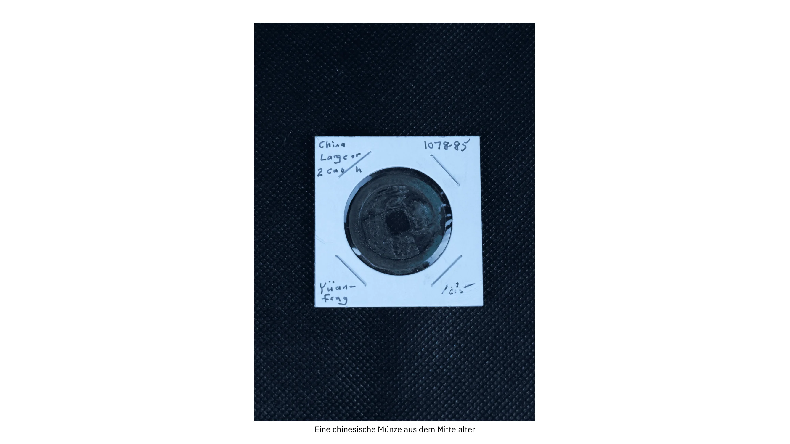

Die oben abgebildete Münze ist eine chinesische Münze aus dem Mittelalter. Es handelt sich um eine gegossene Münze, die in der Mitte ein quadratisches Loch aufweist. Durch dieses Loch wurde ein Seil gefädelt, so dass die Münzen zu Armbändern oder Halsketten zusammengebunden werden konnten. Diese waren jedoch nicht in erster Linie zum Tragen gedacht, sondern dienten vor allem der Buchhaltung. Sie konnten aneinandergereiht werden, um Rechnungseinheiten in Form von großen Schnüren zu bilden, wobei die Stücke ineinander griffen. Es gab nicht unbedingt besondere Zeichen, manchmal waren es einfach Bronzekreise.

Das von Wudi aus der Han-Dynastie 113 v. Chr. mit Verspätung eingeführte Währungsmonopol des Staates wurde häufig in Frage gestellt, so dass verschiedene private oder lokale Akteure ihre eigenen Währungen ausgeben konnten, sofern sie genügend soziales Vertrauen genossen.

**Der niedrige innere Wert der chinesischen Währungen verhinderte das Horten und garantierte einen reibungslosen Umlauf** Edelmetalle wurden selten als Umlaufwährung verwendet, um das Horten zu verhindern. Da Gold zu teuer war, wurde es in der Regel nicht ausgegeben, sondern beiseite gelegt. Stattdessen war **nur Seide eine wirklich hochwertige Währung im chinesischen internationalen Handel**. Die Chinesen handelten mit Seide, nicht mit Gold.

Bei Wirtschafts- oder Währungskrisen, insbesondere bei steigenden Kupferpreisen, wurden innovative Lösungen angewandt: So wurden bereits im 2. Jahrhundert n. Chr. die im Umlauf befindlichen Münzen zu kleineren Einheiten zerschnitten, um einen flüssigen Umlauf zu geringeren Kosten aufrechtzuerhalten. Andere Epochen, wie die von Wang Mang (frühes 1. Jahrhundert n. Chr.), experimentierten mit hochgradig treuhänderischen Währungen, deren Nennwert weit über ihrem tatsächlichen Metallgehalt lag und damit Banknoten vorwegnahmen. Sie nahmen eine Münze und prägten Werte wie 50, 100 oder 200 auf sie, um größere Beträge, z. B. 200 Münzen, anzugeben. Diese Praxis trug wahrscheinlich zu einer erheblichen Inflation bei.

Wie bereits erwähnt, beruhte dieses System auf einer sozialen Konvention zwischen dem Staat, den Produzenten und den Händlern, aber auch auf autoritären und strengen Regeln für diejenigen, die das Spiel nicht mitspielten, insbesondere in Bezug auf die Auswahl der Stücke (ob schön oder nicht) oder die Länge der Stoffe (die nicht der Norm entsprachen).

Meiner bescheidenen Meinung nach ist das System nicht sehr solide. Es stützte sich hauptsächlich auf strenge Vorschriften, die Beamte und Händler unter Androhung von Sanktionen zur Annahme beschädigter Münzen verpflichteten.

### Chinesische monetäre Innovationen und ihre wirtschaftlichen Auswirkungen

China war auch ein Pionier bei der Ausgabe früher Formen von Papiergeld, das ursprünglich als Reaktion auf die Metallknappheit im 9. nachchristlichen Jahrhundert eingeführt wurde. Trotz ihrer anfänglichen Vorteile führten diese Papierwährungen regelmäßig zu Inflationsspiralen, wenn sie im Übermaß ausgegeben wurden, wie in der Song- oder Ming-Zeit, als die übermäßige Ausgabe zu schweren Währungskrisen führte, wie Marco Polo im 13. Ich kann nicht umhin, hier auf eine Form der Gewalt hinzuweisen.

So zeichnet sich die chinesische Erfahrung durch eine zutiefst treuhänderische Auffassung von Geld, eine bemerkenswerte Flexibilität des Geldsystems und eine frühe Verwendung von Papierwährungen aus, die auf dem Vertrauen zwischen den Wirtschaftsakteuren und nicht auf dem inneren Wert der verwendeten Mittel beruht.

## Gesellschaftliche und wirtschaftliche Organisation im Altertum

<chapterId>4023c3ce-7a47-5ac4-8f5f-c7ab699ab20f</chapterId>

:::video id=2761efe4-21cf-4f06-9bda-c03f9ff39012:::

### Die Debatte über den städtischen Parasitismus

Die Beziehung zwischen antiken Städten und ihrem Umland wirft eine grundlegende Frage auf: Funktionierten diese städtischen Zentren als Parasiten, die Wohlstand abziehen, oder als Motoren einer vorteilhaften wirtschaftlichen Spezialisierung? Die Hypothese des Parasitismus besagt, dass die bronzezeitlichen Städte, insbesondere in Mesopotamien, **systematisch mehr Wert aus ihren ländlichen Gebieten entzogen, als sie zurückgaben** und im Wesentlichen von Mieten und Steuern lebten, ohne einen entsprechenden Wert zu schaffen.

Diese Vision fand ihr Echo im Zusammenbruch des Römischen Reiches: Als die territoriale Expansion aufhörte, versiegte der Fluss des externen Reichtums, was möglicherweise eine städtische Wirtschaft offenbart, die nicht in der Lage ist, sich selbst zu finanzieren. Die Städte hätten also "über ihre Verhältnisse" gelebt und wären eher von der Extraktion als von der Produktion abhängig gewesen.

### Spezialisierung als Treiber der Wertschöpfung

Eine alternative ökonomische Lesart stellt diese parasitäre Sichtweise in Frage. **Antike Städte fungierten vor allem als Zentren der Spezialisierung und Arbeitsteilung**. Ihre Rolle ging über die einfache Gewinnung hinaus: Sie konzentrierten spezialisierte Handwerke, organisierten Handelsnetze und dienten als Knotenpunkte für den Austausch über große Entfernungen.

Diese städtische Spezialisierung führte zu einer produktiven Interdependenz mit dem Umland. **Die Städte konnten ohne die landwirtschaftliche Versorgung des Landes nicht überleben, aber das Hinterland profitierte im Gegenzug von handwerklichen Produkten, technischen Innovationen und dem Zugang zu mediterranen Handelsnetzen**. Die Arbeitsteilung ermöglichte wechselseitige Produktivitätsgewinne, auch wenn die Verteilung der Vorteile unausgewogen erscheinen mag.

Diese offensichtliche Asymmetrie erklärt sich zum Teil durch die chronische Ernährungsunsicherheit der damaligen Zeit. Die Gefahr von Hungersnöten und Ernteausfällen war eine ständige Bedrohung für die Landbevölkerung, während die städtischen Handwerker, die an internationale Handelsnetze angeschlossen waren, eine größere wirtschaftliche Stabilität genossen.

### Historische Entwicklung, von der Antike bis zum Mittelalter

Der Kontrast zwischen antiker und mittelalterlicher Organisation wirft ein Licht auf diese Frage. **In der Antike herrschte eine weitreichende Arbeitsteilung, und die Städte waren für die gesamte Mittelmeerwelt offen**. Handel und Spezialisierung erreichten ein hohes Niveau und schufen ausgedehnte wirtschaftliche Netzwerke.

Der Zusammenbruch des Römischen Reiches führte zu einer radikalen Zersplitterung: **Das Feudalzeitalter ersetzte diese zentralisierte Organisation durch ein dezentralisiertes System autarker Landgüter**. Die antiken römischen villas rusticae wurden zur Matrix der mittelalterlichen Feudalherrschaften und bildeten ein Mosaik nahezu autarker wirtschaftlicher Inseln, die vom Klerus oder Adel verwaltet wurden.

Diese mittelalterliche Dezentralisierung verringerte zwar die wirtschaftliche Effizienz, bot aber paradoxerweise eine größere Widerstandsfähigkeit gegenüber externen Schocks. Die Feudalherrschaften entwickelten ausgewogenere Beziehungen zwischen den Machtzentren und der Landbevölkerung, auch wenn diese Organisation die mit der Spezialisierung verbundenen Produktivitätsgewinne begrenzte.

### Das Entstehen von städtischen Märkten

Archäologische Funde belegen die Existenz von **Einkaufshäfen und Handelsvierteln in mesopotamischen Städten bereits im zweiten Jahrtausend**. Diese Infrastrukturen zeugen von der Existenz organisierter Märkte, auch wenn ihre genaue Funktionsweise umstritten bleibt.

Karl Polanyi, der zunächst skeptisch gegenüber der Existenz echter Marktmechanismen in der Antike war, relativierte seine Position, indem er einräumte, dass er die frühe Entstehung von Markttransaktionen unterschätzt haben könnte. Diese intellektuelle Entwicklung spiegelt die Komplexität der Interpretation antiker Wirtschaftssysteme wider, in denen institutionelle Umverteilung, gegenseitiger Austausch und aufkeimende Markttransaktionen nebeneinander existierten.

### Sparta gegen Athen

Der Vergleich zwischen Sparta und Athen veranschaulicht perfekt die Beziehung zwischen dem Geldsystem und der gesellschaftlichen Organisation. **Sparta repräsentiert das Modell einer streng hierarchischen Gesellschaft, die den Gebrauch von Geld bewusst ablehnte, während Athen eine ausgeklügelte Geldwirtschaft entwickelte, die mit seinem demokratischen System einherging.

Die spartanische Ablehnung des Geldes war nicht spontan, sondern **institutionell und ideologisch**. Die spartanischen Führer befürchteten, dass Geld die militärischen und zivilen Werte korrumpieren würde, und zogen ein System vor, das auf direktem zwischenmenschlichem Vertrauen zwischen den Bürgern beruhte.

Um vom Gebrauch des Geldes abzuschrecken, verwendete Sparta **schwere, unpraktische Metallbarren**, was paradoxerweise ein intuitives Verständnis der monetären Eigenschaften (Teilbarkeit, Transportierbarkeit, Dauerhaftigkeit) beweist, die sie zu neutralisieren versuchten.

### Die Grenzen des antimonetären Modells

Die spartanische Organisation veranschaulicht die Zwänge der **Dunbarschen Zahl** auf gesellschaftlicher Ebene. **Durch die Ablehnung des Geldes als neutrales Tauschmittel verdammte sich Sparta selbst dazu, seine bürgerliche Gesellschaft auf eine begrenzte Anzahl von Bürgern zu beschränken, die in der Lage waren, direkte Vertrauensbeziehungen zu unterhalten**. Die homoioi (spartanischen Bürger) machten nur 1 % der Gesamtbevölkerung aus, umgeben von Tausenden von hilotes (Sklaven).

Diese Organisation, die anfangs eine Quelle außergewöhnlichen militärischen Zusammenhalts war, erwies sich als strukturell fragil. **Die Schlacht von Leuctres (371 v. Chr.) zeigte die Grenzen dieses Systems auf: Der Verlust von Menschenleben zerrüttete das soziale Gefüge Spartas unwiederbringlich und führte zum Zusammenbruch ihres zivilisatorischen Modells.

Konkurrierende Städte (Athen, Korinth, Theben), die über ein entwickeltes Geldsystem verfügten, **erhielten eine reichere, widerstandsfähigere Wirtschaft**, die in der Lage war, die menschlichen Verluste durch wirtschaftlichen Wiederaufbau und Einwanderung auszugleichen.

### Persönliches versus institutionelles Vertrauen

Die Erfahrung Spartas zeigt die **Risiken einer Gesellschaft, die ausschließlich auf zwischenmenschlichem Vertrauen** und nicht auf neutralen institutionellen Mechanismen beruht. Dieses Modell schuf zwar einen starken sozialen Zusammenhalt, machte die Gesellschaft aber anfällig für demografische Schocks.

Indem es anonyme und entpersonalisierte Transaktionen ermöglicht, bietet Geld eine überragende systemische Widerstandsfähigkeit. Es ermöglicht eine soziale Expansion über die Grenzen des direkten Vertrauens hinaus und erleichtert den Außenhandel und das Wirtschaftswachstum.

### Das Inka-Paradoxon, Reichtum ohne Geld

Das Inkareich stellt ein faszinierendes Paradoxon dar: **eine Zivilisation mit unermesslichem Goldreichtum, aber ohne Geldsystem**. Wie Sparta basierte dieses Modell auf einer starren hierarchischen Organisation und zentraler Planung, erwies sich aber gegenüber Eroberern mit flexiblen Geldwirtschaften als anfällig.

Diese strukturelle Fragilität anti-monetärer Systeme angesichts monetärer Gesellschaften ist ein wiederkehrendes historisches Muster, das darauf hindeutet, dass die **institutionelle Ablehnung des Geldes, weit davon entfernt, den sozialen Zusammenhalt zu stärken, paradoxerweise Zivilisationen** angesichts externer Herausforderungen und historischer Veränderungen schwächen kann.

Die Analyse dieser historischen Modelle zeigt, dass Geld über seine Tauschfunktion hinaus ein Marker und Vermittler sozialer Komplexität ist, der es Zivilisationen ermöglicht, die durch direkte zwischenmenschliche Beziehungen auferlegten Grenzen zu überschreiten.

# Die Geburt des Münzgeldes

<partId>232e365a-8c3b-11f0-b276-b3ab70d1a5a1</partId>

## Das Aufkommen von Münzen

<chapterId>40ed3414-3066-57bd-bc1b-617ad0a354e0</chapterId>

:::video id=1d6834c4-98a3-43fe-ba80-04be51b0486e:::

Wir kommen nun zum Kern der Sache: dem Auftauchen von Münzen. Ich betone hier das Wort "Münze", weil wir in den vorangegangenen Abschnitten gesehen haben, dass Geld oder Geldsysteme in den Zivilisationen, die den lydischen Völkern, den Griechen und den Persern vorausgingen, sehr präsent waren. Das ist, denke ich, aus dem, was wir gerade gesehen haben, ziemlich klar. Daher ist dieser Abschnitt der Entstehung der Münzen selbst gewidmet und trägt den Titel: *Die Entstehung der Münzen*.

### Lydische und ionische Ursprünge der Münzen

Zum Auftakt dieses Abschnitts möchte ich Ihnen hier einen Auszug aus dem Buch von Glyn Davies, A History of Money, anbieten.

*Auszug aus A History of Money: From Ancient Times to the Present Day von Glyn Davies:*

> Von Lydien und Ionien aus verbreitete sich die Kenntnis und Verwendung von Münzen rasch nach Osten in das persische Reich und nach Westen über die übrigen ionischen und ägäischen Inseln auf das griechische Festland und dann in die westlichen Kolonien, insbesondere Sizilien. Sie verbreitete sich auch nach Norden, nach Makedonien, Thrakien und ans Schwarze Meer, wurde aber in Ägypten nur teilweise, zögerlich und verspätet akzeptiert.

Ich finde es interessant, hier zu erwähnen, dass in Ägypten noch lange nach dem Aufkommen der Münzprägetechnik Münzen gewogen wurden. Ich denke, das ist wichtig zu erwähnen. Das Zitat geht weiter:

> Auch das italienische Festland nahm die griechischen Finanzinnovationen zunächst nur zögerlich an, im Gegensatz zu Sizilien, wo sie schnell übernommen wurden.

*Abgesehen von diesen beiden begrenzten Ausnahmen (Kontinentalitalien und Unterägypten) verbreitete sich die Verwendung von Münzen rasch in den Ländern, die an das mittlere und östliche Mittelmeer grenzten, sowie in dem riesigen und wachsenden persischen Reich, von Mesopotamien **bis nach Indien.** Es bleibt unklar, ob Indien zu dieser Zeit bereits unabhängig von chinesischen oder lydischen Entwicklungen ein eigenes, embryonales Geldsystem entwickelt hatte. Unabhängig davon, ob Indien unabhängig eine eigene Währung entwickelt hatte, führten die zunehmenden Kontakte zwischen Indien und dem Nahen Osten dazu, dass die indische Münzprägung eine direkte Adaption lydischer und griechischer Erfindungen war, zunächst durch das Persische Reich und dann das Makedonische Reich* (mit den Eroberungen Alexanders des Großen und seines Vaters).

*Aus diesen Gründen war der direkte Einfluss einer indianischen Erfindung des Geldes gering, verglichen mit der überwältigenden Bedeutung der eindeutig unabhängigen monetären Erfindungen Chinas im Osten und noch mehr der lydischen und griechischen Entwicklungen im Westen*

### Geografische Verbreitung und regionale Anpassungen

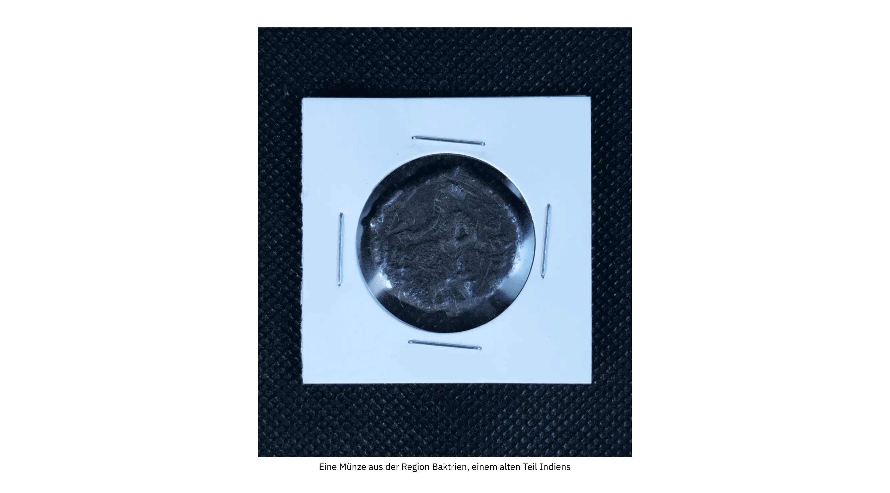

Zur Veranschaulichung dieses Zeitraums sehen Sie hier eine Münze aus einer Region in Indien, der Region Baktrien, die sich im Westen der indischen Halbinsel in der Nähe von Afghanistan befindet. In dieser Region gab es Münzen, die wahrscheinlich von griechischen Münzen inspiriert waren, die eine ihrer königlichen Persönlichkeiten zeigten.

## Lydier und Perser

<chapterId>eb802ab8-8ffd-5b25-907f-8944f120ed14</chapterId>

:::video id=f151eb42-5ff3-4ca1-9af1-1ae2a5e051c0:::

### Die ersten lydischen Elektrum-Münzen

Da wir das Auftauchen von Münzen in Lydien und bei den Persern nicht trennen können, wenden wir uns dem östlich von Griechenland gelegenen Teil der Welt zu, der heute die Türkei bildet. Die ersten Münzen, die im Westen auftauchten, stammen etwa aus der Mitte des 7. Jahrhunderts v. Chr., aus den Regionen Lydien und Ionien, die in der heutigen Türkei liegen. Um 650 bis 600 v. Chr. erblickte diese grundlegende Neuerung das Licht der Welt. Bemerkenswerte archäologische Funde wie die ersten Münzen, die im Artemis-Tempel in Ephesus gefunden wurden, datieren auf etwa 600 v. Chr. Diese primitiven Münzen wurden aus Elektrum hergestellt, einer natürlichen Legierung aus Gold und Silber mit bernsteinfarbenen Reflexen, und waren oft sehr grob, einfach mit Stanzungen oder rudimentären Motiven versehen.

Unten sehen Sie eine der frühesten lydischen Münzen, auf der ein Löwe mit seiner Beute im Vordergrund abgebildet ist. Vielleicht fällt Ihnen ein Stempel oder ein Loch auf der Rückseite auf, von dem manche glauben, dass es dazu diente, die Reinheit des Metalls zu prüfen und sicherzustellen, dass es sich nicht nur um eine Oberflächenschicht handelt. Obwohl es sich um eines der frühesten Exemplare handelt, ist es wichtig zu wissen, dass dieses Stück eine Kopie ist. Alle meine Gold- und Elektrumstücke sind Repliken oder moderne Nachbildungen, die verhindern sollen, dass ich meine gesamten Ersparnisse für diese Sammlung ausgebe.

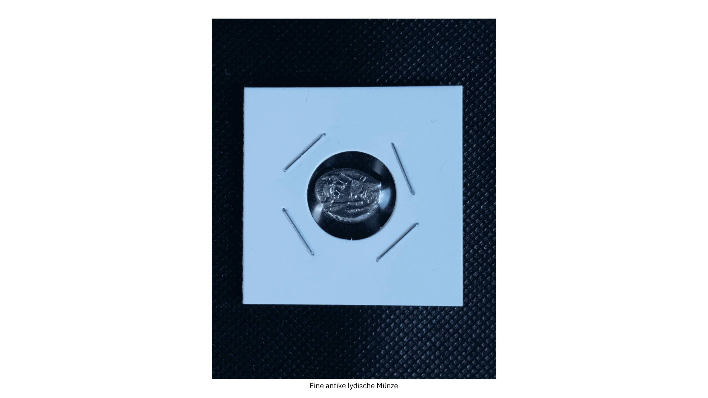

Aber ich habe auch ein echtes persisches Stück, das wir gleich sehen werden. So sahen diese frühen Stücke aus. Es ist eine Art Klecks (oder Klumpen, auf Englisch) aus Metall, der damals gestempelt wurde.

Entgegen der weit verbreiteten Meinung, Geld sei erfunden worden, um den alltäglichen Handel zu erleichtern und den Tauschhandel zu ersetzen, wurden die ersten lydischen, achämenidischen und griechischen Münzen anscheinend nicht für den Kleinhandel verwendet. Vielmehr waren die Geldeinheiten für den alltäglichen Gebrauch viel zu groß. Außerdem war ihr Umlauf auf die Regionen beschränkt, in denen sie hergestellt wurden.

An dieser Stelle halte ich es für wichtig zu erwähnen, dass die Münzen, wie ich bereits in mehreren anthropologischen Werken gelesen habe - ob die Elektrum-Münzen oder diese persische Münze, auf die ich gleich zurückkommen werde -, zu groß waren, um beispielsweise jeden Tag Brot zu kaufen. Ich habe Schätzungen gesehen, die darauf hindeuten, dass es sich um das Äquivalent eines Tageslohns für einen Bauern oder Soldaten handelte, also zu groß war. Das ist so, als würde man versuchen, einen Tageslohn für seine Mahlzeit, sein Frühstück oder sein Mittagessen zu bezahlen. Allerdings habe ich in anderen Arbeiten gesehen, dass kleinere Einheiten dieser Kleckse gefunden wurden, also kleinere Münzen, was uns zu der Annahme veranlassen könnte, dass es vielleicht eine mögliche Verwendung für alltägliche Einkäufe gab.

Der anthropologische "Beweis", dass die Münzen nicht für den täglichen Handel verwendet wurden, weil der Nennwert oder die Einheit zu groß war, ist meiner Meinung nach nicht sehr stichhaltig, da wir Beispiele für kleinere Münzen gefunden haben, die für alltägliche Einkäufe geeignet gewesen wären.

### Die Rolle des Staates bei der Geldschöpfung

Der tatsächliche Ursprung der Münzen scheint mit dem direkten Handeln der Staaten verbunden zu sein. Zu diesem Thema gibt es zwei Hauptthesen: Die erste, idealistische, zieht eine Parallele zwischen dem griechischen Begriff "nomisma" (Geld) und "nomos" (Gesetz) und legt nahe, dass das Geld mit der Kodifizierung von Gesetzen verbunden war und die Autorität und politische Organisation der Städte stärkte. Die zweite, realistischere Hypothese, die heute weitgehend akzeptiert wird, besagt, dass das Geld in erster Linie ein Mittel für die Staaten war, um wirtschaftliche und soziale Kontrolle auszuüben. Indem sie das Gewicht und den Wert der in ihnen enthaltenen Edelmetalle offiziell garantierten, konnten die Staaten den Umlauf und den Wert dieser Münzen manipulieren und so Vertrauen und Liquiditätsprämien für die heimischen Währungen schaffen.

Es ist wirklich interessant zu wissen, dass wir Beweise dafür haben. Bei Elektrum-Münzen zum Beispiel sollte man wissen, dass natürliches Elektrum normalerweise aus etwa 70 % Gold und 30 % Silber besteht. Bei den ersten Münzen, die wir gefunden und analysiert haben, insbesondere bei den frühen lydischen Münzen, scheint der Goldgehalt eher bei 50 bis 55 % statt bei 70 % zu liegen. Dies deutet darauf hin, dass die Münzherausgeber schon damals versuchten, den Anteil des wertvolleren Metalls zu verringern, wahrscheinlich um mehr Münzen zu produzieren und sie so aussehen zu lassen, als seien sie genauso viel wert wie ein ungeprägter Klumpen natürlichen Elektrums. Und hier muss gesagt werden, dass dies erst ab der Zeit des berühmten Krösus, also *reich wie Krösus*, möglich war, da wir seit seiner Zeit über die Technologie zur Trennung von Gold und Silber verfügen.

Die lydische Münzprägung erfuhr während der Herrschaft des berühmten Königs Krösus (561-546 v. Chr.), der für seinen legendären Reichtum bekannt war, eine bedeutende Entwicklung. Zu dieser Zeit perfektionierten die Lydier die Metallurgie zur Trennung von Gold und Silber aus Elektrum und führten so die ersten bimetallischen Münzen ein, d. h. getrennte Gold- und Silbermünzen.

### Persische Expansion und griechische Übernahme

Nach der Eroberung Lydiens im Jahr 546 v. Chr. übernahmen die achämenidischen Perser diese Neuerung sofort. Um 500 v. Chr., unter der Herrschaft von Dareios I., etablierten die Perser ihr eigenes Geldsystem mit goldenen Dariks und silbernen Siglois, auf denen oft das königliche Bildnis in kriegerischer Pose zu sehen war. Diese königlich-persische Münzprägung wurde vor allem in den hellenisierten Regionen des persischen Reiches verwendet und verbreitete sich allmählich, wenngleich ihre Verwendung uneinheitlich blieb: **Einige Regionen, wie z. B. Ägypten, bevorzugten nach wie vor den Tausch in gewogenem Metall (Barren).**.

Oben können Sie einen echten persischen Sigloi (oder Siglos) bewundern. Auf dem kleinen Münzbild ist ein König abgebildet, wobei das Loch leicht abgenutzt ist. Der Siglos ist eine Silbermünze, im Gegensatz zum Daric, der aus Gold hergestellt wurde. Die Perser waren in der Lage, diese beiden Metalle zu unterscheiden, und rückten von den Elektrum-Münzen ab. So führten sie den Bimetallismus ein, bei dem sowohl Gold als auch Silber verwendet wurden, wobei das Konzept der Münzen aus Edelmetallen beibehalten wurde, die oft auf der Rückseite ein Loch hatten, vermutlich um den Metallgehalt zu überprüfen.

Die rasche Einführung von Münzen durch die Griechen scheint durch ihre engen Kontakte mit den Lydiern, insbesondere durch die griechischen Kolonien in Kleinasien, begünstigt worden zu sein. Die ersten Griechen, die Münzen prägten, waren wahrscheinlich die Bewohner von Ägina in der Mitte des sechsten Jahrhunderts v. Chr., die die Drachme einführten, deren Gewicht von Region zu Region variierte und deren Name wörtlich "Handvoll Korn" oder "Handvoll Pfeile" bedeutet.

Der Erfolg des griechischen Münzwesens war sowohl auf seine Zweckmäßigkeit bei wichtigen Transaktionen, wie der Bezahlung von Söldnern, als auch auf die wirtschaftliche und politische Expansion der Städte zurückzuführen. Die Währung wurde schnell zu einem zentralen Element der griechischen und später der römischen Wirtschaft und behielt gleichzeitig eine starke symbolische Dimension, vor allem durch ihre Verbindung mit dem Gesetz (nomos).

Schließlich zeugt die rasche Ausbreitung des Münzwesens von einer tiefgreifenden Umgestaltung der antiken Gesellschaften, bei der die Kodifizierung der Geldwerte mit der staatlichen Organisation Hand in Hand ging. Diese Entwicklung schuf die wirtschaftlichen und politischen Grundlagen für den Aufstieg der griechischen Demokratien, insbesondere in Athen, wo das Geld eine entscheidende Rolle für das Funktionieren der demokratischen Stadt spielte.

Ein wichtiger Punkt in diesem Abschnitt ist, dass wir speziell über **Münzen** sprechen, nicht über Geld im Allgemeinen. Der zentrale Aspekt, der sich klar herauskristallisiert, ist das **Vertrauen in die Ausgabestelle**, das direkt mit den technischen Merkmalen der Münzen (Gewicht, Reinheit, Nennwert) verbunden ist. Genau dieses Vertrauen ermöglicht es dem Staat oder der Ausgabestelle, den Wert und den Umlauf dieser Münzen von Anfang an in gewissem Umfang zu kontrollieren oder sogar zu manipulieren.

## Institutionelle Intervention und die ersten Münzen

<chapterId>3e1efd08-99e3-5a32-9908-3185fef0e640</chapterId>

:::video id=84847cf6-9e46-4a8c-9f35-25a27496cc4b:::

### Die doppelte Natur des Geldes

Das Aufkommen von Münzgeld wirft eine grundlegende Frage auf: Ist Geld eine spontane Schöpfung des Marktes oder eine von der Obrigkeit aufgezwungene Institution? In diesem konzeptionellen Spannungsfeld stehen sich zwei radikal unterschiedliche Visionen gegenüber.

Auf der einen Seite vertritt die österreichische Schule der Wirtschaftswissenschaften die Idee, dass Warengeld - insbesondere Gold - von den Wirtschaftsakteuren aufgrund seiner inhärenten Eigenschaften - Haltbarkeit, Übertragbarkeit, Teilbarkeit und Fungibilität - ausgewählt wurde. Aus dieser Sicht hat sich der Staat diese spontane Währung angeeignet, um ihr Angebot zu kontrollieren. Es handelt sich um eine Institution, die auf natürliche Weise aus den Bedürfnissen des Marktes entstanden ist, bevor sie von der politischen Macht vereinnahmt wurde.

Die anthropologische und institutionelle Sichtweise hingegen geht davon aus, dass Geld erst mit der staatlichen Münzprägung wirklich zustande kommt. Die Autorität schuf die Währung bewusst, indem sie ihr Siegel anbrachte und so das Metall in ein echtes Geldinstrument verwandelte. Diese Sichtweise legt nahe, dass die frühesten lydischen Münzen hauptsächlich zur Bezahlung von Armeen verwendet wurden - ein Stater entsprach etwa dem Tageslohn eines Soldaten.

### Die paradoxen Vorteile der staatlichen Normung

Trotz dieser theoretischen Spannungen erkennen selbst österreichische Ökonomen gewisse Vorteile staatlicher Eingriffe in das Geldwesen an. Die Standardisierung durch Münzprägung löst eine Reihe von praktischen Handelsproblemen.

Ohne eine Zertifizierungsstelle sind die Wirtschaftsakteure ständigen Risiken ausgesetzt: Münzfälschungen, Anmeldebetrug und Gewichtsmanipulation. Diese Praktiken führen zu Reibungsverlusten in der Wirtschaft, da einige Münzen akzeptiert und andere abgelehnt werden. Theoretisch garantiert der offizielle Stempel Gewicht und Qualität, was den Handel flüssiger macht.

Diese Garantie hat auf dem Markt einen sichtbaren Preis: Eine geprägte Goldmünze ist mehr wert als ihr Rohgoldäquivalent. Diese Prämie spiegelt den Wert der Zertifizierung wider - die Händler müssen die Echtheit des Metalls nicht mehr selbst durch chemische oder Resonanztests überprüfen. Staatliche Eingriffe beseitigen paradoxerweise Reibungsverluste und erleichtern den Handel, indem sie institutionalisiertes Vertrauen schaffen.

### Währungsmanipulation von Anfang an

Die Geschichte der ersten lydischen Statere offenbart eine beunruhigende Ironie. Jüngste Analysen zeigen, dass der Goldgehalt dieser Elektrum-Münzen systematisch niedriger war als der des natürlichen Elektrums. Die Behörde, die die Qualität bescheinigte, manipulierte gleichzeitig die Zusammensetzung.

Diese Praxis verdeutlicht den doppelten Nutzen von Münzgeld. Für den Markt sorgt sie für einen flüssigeren Austausch und bietet eine Garantie für Standardisierung. Für die ausgebende Behörde wird sie zu einem Instrument der wirtschaftlichen Kontrolle durch Verwässerung. Durch die Verringerung des Goldgehalts bei gleichzeitiger Beibehaltung des Nennwerts erhöht der Staat effektiv die Geldmenge - er schafft mehr Geldeinheiten aus der gleichen Menge Edelmetall.

Der Staat selbst blieb jedoch dieser Manipulation unterworfen. Wie das Beispiel des Goldsolidus von Konstantin im 4. Jahrhundert zeigt, kontrollierte die römische Verwaltung die Qualität der Münzen sehr genau, da sie verlangte, mit gutem Münzgeld bezahlt zu werden. Die Behörde hatte ein vitales Interesse daran, die Qualität ihrer eigenen Münzen zu erhalten, um den Wert ihrer Steuereinnahmen zu garantieren.

### Wirtschaftliche Analyse der Abwertung

Bei der Untersuchung der Geldentwertung lassen sich im Laufe der Geschichte einheitliche Muster erkennen. Bei Metallmünzen verfolgen Ökonomen den prozentualen Anteil des in den Münzen enthaltenen Edelmetalls - eine absteigende Kurve, die eine fortschreitende Entwertung anzeigt. Bei modernem Papiergeld ist das Gegenteil der Fall: Die umlaufende Geldmenge wird beobachtet, und ihr Anstieg signalisiert eine Entwertung.

Beide Methoden messen das gleiche grundlegende Phänomen: die Verwässerung des Geldwertes. Ob durch die Verringerung des Edelmetallgehalts oder den Druck neuer Banknoten, der Mechanismus bleibt derselbe. Je mehr Geldeinheiten eine Behörde aus denselben realen Ressourcen schafft, desto mehr verliert jede Einheit ihren Wert.

Diese Manipulation, die schon bei den frühesten lydischen Münzen zu beobachten ist, deutet darauf hin, dass die Kontrolle des Geldes immer eine Frage der Macht war. Das geprägte Geld stellt somit eine bemerkenswerte technische Innovation dar, die mit einem Instrument der wirtschaftlichen Kontrolle gekoppelt ist - eine Dualität, die sich durch die gesamte Geldgeschichte bis in die Gegenwart zieht.

## Herstellung von Teilen

<chapterId>b205f4f2-c293-5308-b812-a998de9ad45e</chapterId>

:::video id=47c612ec-d97e-4498-b50e-7e66518bd56d:::

### Von gestanzten Klecksen zu geprägten Münzen

Nach einem Abschnitt über die Entstehung der Münzen möchte ich einen kurzen Abschnitt über die Entwicklung der Münzherstellung einfügen. Wie wir gesehen haben, begann alles mit Klumpen aus Elektrum, dann mit Gold und Silber, bei denen beide Seiten mit einem Stempel gekennzeichnet wurden, entweder mit dem Gesicht des Königs oder mit einem Loch auf der Rückseite, um die Reinheit zu prüfen.

Später verfeinerten die Griechen diese Technik, wie wir in einem späteren Abschnitt sehen werden, indem sie runde Münzen herstellten, die auf beiden Seiten gehämmert wurden. Sie nahmen ein glattes, flaches Stück Edelmetall, gravierten das gewünschte Motiv auf eine Seite und hämmerten es dann von Hand, um die fertige Münze herzustellen.

Die Technologie der Handprägung von Münzen spielte wahrscheinlich eine Rolle bei der Kontrolle der Inflation in dieser Zeit, auch wenn die Münzen oft verdünnt wurden, um die Produktion zu erhöhen. Dies war vor allem in der römischen Epoche und in geringerem Maße auch während bestimmter Kriege in der griechischen Epoche der Fall. Die Einzelprägung von Münzen schränkte zwar die Fähigkeit der Behörde zur Massenproduktion ein, trug aber trotz erheblicher Abwertungen wirksam zur Inflationskontrolle bei. So entwickelte sich die Münze von einem gestanzten Metallklumpen zu einer runden, gehämmerten Münze.

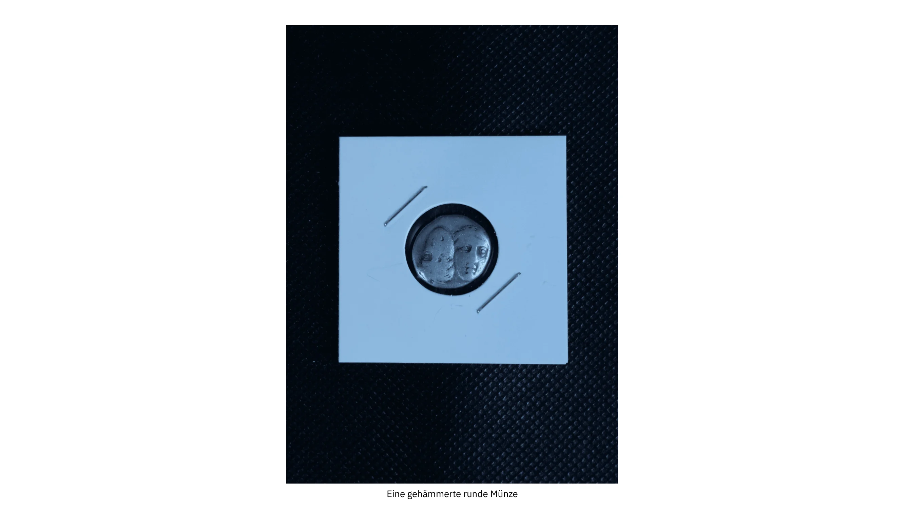

### Mittelalterliche Entwicklung

Im Mittelalter ging der Trend dahin, die Münzen breiter und dünner zu machen. Ein Grund dafür war, dass es einfacher wurde, ihren Klang zu prüfen, der oft als Indikator für die Echtheit verwendet wurde. Durch die Ausbreitung des Silbers wurde eine deutliche Frequenz erzeugt, so dass man die Reinheit der Münze einfach durch Abhören überprüfen konnte. Aus dieser Praxis entstand der Begriff "gesundes Geld". Im Rahmen des gesunden Geldes wurde das Standardgewicht mit Hilfe einer Waage oder eines "Trebuchets" bestimmt. So setzte sich die Entwicklung von kleinen, runden Münzen zu etwas dünneren, breiteren Münzen fort.

### Pendelschlag

Die letzte Technologie, die am Ende des Mittelalters und zu Beginn der Neuzeit aufkam, war die der Pendelprägung. Dabei handelte es sich um eine Art Schraube, die zum Prägen der Münzen angezogen wurde, so dass Münzen mit dieser neuen Prägeform entstanden. Das Besondere an dieser Entwicklung war die Möglichkeit, ein Muster in die Oberfläche der Münze zu gravieren, um das Problem des Abschneidens zu lösen. Beim Clipping wird ein Teil der Münze entfernt, um wertvolles Silber zurückzugewinnen, das dann für die Prägung anderer Münzen verwendet oder einfach als Ressource aufbewahrt werden kann.

Diese Idee des Pendelschlags hat also zum Phänomen des Clippings beigetragen. Interessant ist auch, dass diese Technologie aus Frankreich kam. In England wurden zum Beispiel französische Ingenieure angeheuert, um ihnen zu zeigen, wie man diese Maschinen baut. Witzig finde ich, dass es Befürworter der Hammerprägung gab, die dagegen waren und die Anwendung dieser Technologie verzögerten. Bei jeder guten Technologie gibt es immer Leute, die dagegen sind, die die alte Technologie beibehalten wollen. Ich fand es ziemlich verrückt zu sehen, dass es trotz einer Technologie, die wirklich überlegen zu sein scheint - man kann mehr Teile herstellen, sie sind schwerer zu kopieren - immer noch Leute gab, die an der berühmten Hammermethode festhielten. Es gab einen Wechsel zwischen der Herstellung von Teilen, die mit dem berühmten Pendelschlag hergestellt wurden, und der Rückkehr zum Hammerschlag. Und schließlich war es natürlich der Pendelschlag, der sich schließlich durchsetzte und uns diese schönen modernen Stücke bescherte, bei denen man entweder kleine Linien, kleine Rillen findet, um ein Ausklinken zu vermeiden, was wahrscheinlich mit dem Wort Ausklinken zusammenhängt, Rillen, und man kann auch heute noch entweder Rillen oder Text oder Zeichnungen sehen, die in den Rand des Stücks eingeschrieben sind.

# Verschiedene Theorien zur Entstehung des Geldes

<partId>72ac694f-9248-550d-90c1-91af3d234380</partId>

## Theorien über die Entstehung des Geldes und seine verschiedenen Definitionen

<chapterId>7d699d4d-8c70-55b5-bf36-609f3fd90bcf</chapterId>

:::video id=523c873f-501b-4954-b79f-7e74c0f685a5:::

Willkommen zu diesem Abschnitt, der den verschiedenen Theorien über die Entstehung des Geldes und seinen verschiedenen Definitionen gewidmet ist. Hier ist ein kurzer Auszug aus dem Buch *Aux origines de la monnaie*, der meiner Meinung nach die beiden wichtigsten Theorien zusammenfasst, die wir in diesem Abschnitt betrachten werden.

> Diese kurze Vorbemerkung dient lediglich dazu, den Kontext der Untersuchung zu verdeutlichen. Auf der konzeptionellen Ebene ist die Debatte zwischen den Anhängern der These von K. Polanyi und denjenigen von M. Weber offen. Für die einen spielen Geschenk und Umverteilung eine zentrale Rolle, während der Markttausch nur eine marginale Rolle spielt, vor allem im internationalen Austausch. Für die anderen hingegen steht der Markt im Mittelpunkt des aktuellen historischen Prozesses.

In Mesopotamien zum Beispiel besagt eine Theorie der Entstehung, dass der Tempel als Autorität die Rechnungseinheit oder Währungseinheit schafft, sie vorschreibt und die Kaufleute sie dann für den Handel übernehmen. Die gegenteilige Theorie besagt, dass sich diese Währungseinheit auf natürliche Weise aus dem Markt entwickelt hat, um den Handel zu erleichtern. Dafür gibt es in Mesopotamien gut belegte Beispiele.

Was den Tauschhandel anbelangt, so gehen einige Theorien davon aus, dass er hauptsächlich im internationalen Handel verwendet wurde, d. h. mit Menschen, denen man einfach nicht vertraute.

Das werden wir also in diesem Abschnitt tun. Wir werden eine Art Umfrage durchführen, um die verschiedenen Theorien über die Entstehung des Geldes und die verschiedenen Definitionen dessen, was Geld ist, vorzustellen. Wir werden die Thesen sowohl der klassischen Ökonomen als auch der Anthropologen vorstellen und kritisieren. Ich werde sogar das Glück haben, Ulrich dabei zu haben, der die Sichtweise eines österreichischen Ökonomen zu diesen verschiedenen Themen darstellen wird.

## Die Entstehung des Geldes für klassische Ökonomen

<chapterId>1d3776cd-0dfd-5297-af48-c6f41e257a7e</chapterId>

:::video id=873a16c1-17ac-448d-8941-df4feb7ab79d:::

Dieser Abschnitt ist den verschiedenen Theorien über die Entstehung des Geldes gewidmet. Das erste Thema ist die Entstehung des Geldes nach Ansicht der klassischen Ökonomen.

### Die klassische Theorie von Adam Smith

Nach den klassischen Wirtschaftstheorien, insbesondere der von Adam Smith vertretenen, hat sich das Geld als Reaktion auf die Beschränkungen des Tauschhandels aus diesem entwickelt. Ursprünglich wurde der Tausch durch direkten Tausch abgewickelt, aber diese Methode wurde oft durch das Problem der "doppelten Koinzidenz der Bedürfnisse" erschwert: jeder musste genau das besitzen, was der andere wollte. Nach und nach wurden bestimmte Waren (wie Salz, Edelmetalle und Vieh) aufgrund ihrer Nützlichkeit, Haltbarkeit und Teilbarkeit von allen als Tauschmittel akzeptiert. So entstand spontan das Geld, um den wirtschaftlichen Austausch zu erleichtern und zu verflüssigen.

### Kritik an der klassischen Theorie

Hier ist meine Kritik an dieser Theorie. Nach allem, was wir im vorangegangenen Abschnitt gesehen haben, können wir meines Erachtens bereits sagen, dass die Vorstellung, dass **Münzen** eine Weiterentwicklung des Tauschhandels sind, einfach deshalb falsch ist, weil die geprägte Münze definitiv aus einer Behörde hervorgeht, da sie von einer Behörde geprägt wird. Dafür gibt es mehrere Gründe, nicht zuletzt den Wunsch der Behörden, die Wirtschaft zu kontrollieren, die Kontrolle über das Geld zu übernehmen.

Wenn wir jedoch von Geld als Konzept und nicht unbedingt von Münzen sprechen, dann ist die Sache nicht so eindeutig, denn bei den ersten Münzen, den lydischen Statern, haben wir Silberklumpen gefunden, die nicht gekennzeichnet waren. Es bleibt abzuwarten, ob sie im Umlauf waren. Wenn sie im Umlauf waren, bedeutet dies, dass die Menschen diesen Wert ursprünglich als potenzielles Zahlungsmittel erkannt haben könnten, das weithin nachgefragt und leicht getauscht werden konnte. Und vielleicht haben die Behörden diese Situation erst im Nachhinein bemerkt und die Kontrolle darüber übernommen, indem sie sie mit einem Stempel versahen, um sie zu zertifizieren.

Das hat viele Vorteile - man muss es nicht prüfen, wiegen und so weiter. Natürlich werden wir darüber sprechen. Aber meiner Meinung nach sind Münzen eindeutig ein Instrument, das von Anfang an von Staaten genutzt wurde. Was jedoch die Entstehung des Geldes als solches angeht, so wissen wir nicht, ob es wirklich von einer Autorität eingeführt wurde oder ob es durch Handel oder kommerziellen Austausch entstanden ist. Ich werde später in diesem Abschnitt eine sehr interessante Diskussion mit meinem Kollegen Ulrich zu diesem Thema führen.

Wir wissen bereits, dass die ersten Edelmetallmünzen nicht zur Erleichterung des täglichen Austauschs verwendet wurden, da ihr Wert viel zu hoch war. Wir wissen auch, dass sie hauptsächlich für militärische Zahlungen verwendet wurden. Dies ist ein gutes Argument für die These, dass Geld nicht unbedingt aus dem Markt entstanden ist. Die Rechnungseinheiten, die Stückelungen der ersten Münzen, waren wahrscheinlich zu groß, um zum Beispiel Brot zu kaufen oder den täglichen Einkauf zu erledigen. Es könnte sich zum Beispiel um den Gegenwert eines Tageslohns handeln. Das bedeutet nicht unbedingt, dass die Menschen damals einen Lohn erhielten, aber es soll Ihnen eine Vorstellung von der Größenordnung geben. Diese Münzen hatten also wahrscheinlich eine zu große Kaufkraft, um im Kleinhandel verwendet zu werden. Andererseits spricht nichts dagegen, dass diese Münzen auch für größere Tauschgeschäfte verwendet wurden, z. B. für den Handel mit Händlern. Wir wissen, dass sie hauptsächlich für militärische Zahlungen verwendet wurden. Dies ist eine der populärsten Theorien zur Erklärung des Auftauchens der ersten Münzen. Denken Sie daran, dass wir hier über Münzen sprechen, nicht unbedingt über Geld im Allgemeinen. Die ersten Münzen hatten also ihre erste Aufgabe, und die bestand darin, militärische Zahlungen zu leisten, für Söldner.

Alexander der Große zum Beispiel machte sich das zunutze, wie wir später sehen werden.

Wir haben auch gesehen, dass bereits im alten China Kaurimuscheln für den wirtschaftlichen Austausch verwendet wurden (**Belohnung der Arbeit, Messung des Wertes und Kauf von Land)**. Außerdem gab es in Mesopotamien und Ägypten bereits funktionierende Geldsysteme, die für Handel, Lohnzahlungen und Steuerzahlungen verwendet wurden. Was ich damit sagen will, ist, dass es definitiv falsch ist, zu glauben, dass Münzen nach westlichem Verständnis aus der Notwendigkeit entstanden sind, den Austausch flüssiger zu gestalten.

Da Münzen von einer Behörde ausgegeben werden, können wir vielleicht davon ausgehen, dass sie von Anfang an mit den ausgebenden Behörden verbunden waren. Das macht Sinn. Andererseits wissen wir nicht unbedingt, wie die Formen des Geldes oder die Formen der Geldsysteme, die Proto-Münzen, die ihnen vorausgingen, entstanden sind. Einerseits vermuten wir, dass es die Tempel waren, die diese Geldeinheiten identifiziert haben, und dass die Menschen sie danach benutzt haben. Andererseits werden wir Ihnen sagen, dass es die Kaufleute waren, die ein Tauschmittel brauchten, eine Möglichkeit, mit der Außenwelt zu handeln, und sie waren es, die z. B. Silbermetall identifizierten, das verwendet werden sollte, weil es in der Außenwelt gefragt war. Der Punkt ist, dass wir das nicht wirklich wissen. Deshalb haben wir die beiden gegensätzlichen Theorien. Wir haben keine perfekten Beweise, um zu erklären, ob Geld auf natürliche Weise aus der Notwendigkeit des Handels, zum Beispiel durch Kaufleute, entstanden ist oder ob es von einer Autorität ausgeht.

### Unterscheidung zwischen Münzen und primitivem Geld

Zusammenfassend kann man wohl sagen, dass Münzen notwendigerweise von einer Autorität stammen, da sie von dieser geprägt wurden. Andererseits glaube ich nicht, dass wir sagen können, dass es falsch ist, zu behaupten, dass Geld (das, was den Münzen vorausging) nicht entstanden sein kann, um den Austausch zu erleichtern. Ich denke, dass es in allen Beispielen, die wir oben gesehen haben, zahlreiche Beispiele in diesem Sinne gibt.

## Der Mythos des Tauschhandels

<chapterId>0fcd4964-ac36-5163-a8cf-1aacebc0d2c0</chapterId>

:::video id=0ede29ab-8acd-4d79-9282-bd5991b97076:::

### David Graebers Rezension

Wir haben uns gerade mit der Entstehung des Geldes nach Ansicht der klassischen Ökonomen befasst. Jetzt werden wir uns mit einem Konzept befassen, das als Mythos des Tauschhandels bekannt ist.

Ein Kritikpunkt an dieser klassischen Theorie der Geldentstehung ist das Fehlen historischer Belege für ihre Ideen.

Die als "Tauschmythos" bekannte Kritik, die unter anderem vom Anthropologen David Graeber formuliert wurde, stellt die klassische Vorstellung in Frage, dass Geld auf natürliche Weise aus dem Tauschhandel hervorgegangen ist. Dieser Kritik zufolge gibt es keine historischen oder anthropologischen Beweise dafür, dass Gesellschaften vor dem Aufkommen des Geldes systematisch Tauschhandel betrieben haben. Vielmehr hätten antike Gesellschaften auf der Grundlage von Krediten, Schulden, sozialen Verpflichtungen und zeremoniellen Tauschgeschäften funktioniert. Der "Tauschmythos" ist daher ein theoretisches Konstrukt, das die klassische Wirtschaftsauffassung rechtfertigen soll und keine wirkliche empirische Grundlage hat.

Es ist jedoch anzumerken, dass diese Theorie nicht leugnet, dass es Tauschgeschäfte gab, zum Beispiel für den Austausch zwischen verschiedenen Stämmen. Sie bestreitet lediglich, dass der Tauschhandel innerhalb dieser so genannten primitiven Gruppen eine weit verbreitete Tätigkeit war und dass Geld eine logische Weiterentwicklung dieser Praktiken wäre. Sie leugnet die Tatsache, dass der Tauschhandel innerhalb eines Stammes weit verbreitet war und dass Geld schließlich entstand, um den Austausch zu verflüssigen und die Schwierigkeiten zu lösen, die mit dem Tauschhandel verbunden waren. Stattdessen praktizierten diese Gruppen dieser Theorie zufolge eine Form von informellem Kredit oder Geschenk gegen Geschenk.

### Primitive Gesellschaften vs. große Zivilisationen

**Ich denke, dass diese Theorie definitiv auf primitive (staatenlose) Gruppen der Vergangenheit und sogar heute zutrifft (z. B. die Stämme, die von Forschern im 18. und 19.) Jahrhundert. Natürlich haben sie aus den bereits erwähnten Gründen (schwache Arbeitsteilung, Subsistenzlandwirtschaft) keinen Tauschhandel betrieben, sondern eher die bereits erwähnten Formen des Austauschs. Ich glaube jedoch nicht, dass diese Theorie auf die großen Zivilisationen der Vergangenheit, wie Mesopotamien und das alte Ägypten, zutrifft.

Hier sind zwei Auszüge aus *Aux origines de la monnaie* zu diesem Thema:

> Das von M. Mauss in seinem berühmten Buch "Die Gabe" skizzierte Modell wurde von den Ägyptologen mit ebenso viel Einmütigkeit und Enthusiasmus wie Uneinsichtigkeit übernommen. Dies hat zu einer Reihe von Verwirrungen geführt, auf die wir hier nicht näher eingehen wollen. Halten wir einfach fest, dass dieses Modell auf so genannte primitive Gesellschaften anwendbar ist, was auf das pharaonische Ägypten nicht zutrifft.

> Das Brot, d. h. das verarbeitete Getreide, war also eine Rechnungseinheit, die wie der Schât (y) des Alten Reiches auch die Eröffnung von Krediten für verschiedene Güter ermöglichte. Dieses einfache Beispiel zeigt, dass sich die Wirtschaft des pharaonischen Ägypten nicht auf ein Umverteilungssystem beschränkte. Sie war sehr komplex und umfasste eine Vielzahl von Tauschvorgängen.

Wie wir vorhin in dem Abschnitt über Ägypten und sogar Mesopotamien und China gesehen haben, können wir feststellen, dass sogar diese alten, aber nicht primitiven Zivilisationen aufgrund des Vorhandenseins eines Staates meiner Meinung nach Geldsysteme verwendeten. Ich denke, dies wurde im ersten Teil dieses Kurses ausführlich dargelegt. Der Begriff des Gebens und Nehmens, des aufgeschobenen Kredits, trifft also auf diese großen Zivilisationen nicht zu. Die genauen Gründe für die Entstehung des Geldes bleiben daher ein Rätsel. Wir wissen nicht, ob es aus dem Bedürfnis der Kaufleute entstand, mit der Außenwelt Handel zu treiben, oder ob es in diesen alten Epochen vom Tempel auferlegt wurde.

## Die Geldentstehung durch Schuldgeld

<chapterId>4f508615-aa61-5d62-89d3-cecd02aeaa62</chapterId>

:::video id=a23f547f-3906-4f4a-8f72-5d78c649d0c4:::

### Geld als Schuldschein

In diesem Abschnitt befassen wir uns mit der Theorie des Schuldgeldes.

Die Theorie des **Schuldgelds**, die vor allem von dem Wirtschaftswissenschaftler Alfred Mitchell-Innes entwickelt und später von David Graeber erweitert wurde, besagt, dass Geld nicht aus dem Tauschhandel entstanden ist, sondern aus Schuld- und Kreditbeziehungen, die schon in den frühesten menschlichen Gesellschaften bestanden. Nach dieser Theorie entsteht Geld, wenn soziale Verpflichtungen (Schulden zwischen Individuen oder Gruppen) quantifiziert und übertragbar werden. Dieses Konzept führt den Begriff der Quantifizierung von Tausch und Übertragung ein. Demnach wäre Geld vor allem eine **Schuldanerkennung**, die durch gegenseitiges Vertrauen gestützt und häufig durch politische oder religiöse Autorität garantiert wird, und nicht eine Ware, die lediglich als Vermittler beim Austausch dient.

Eine noch weitergehende Form dieser Theorie besagt, dass alles Geld eine Schuld ist. Jemand, der Geld besitzt, hat also einen Anspruch auf die Gesellschaft im Allgemeinen, einen Anspruch auf alle, die dieses Geld annehmen. Und da Geld **in ihrer Vorstellung zwingend angenommen werden muss**, ist es sonst kein Geld, denn wenn man dieses Geld ablehnen kann, funktioniert ihr System nicht. In einer bestimmten Gruppe, die eine Währung identifiziert hat, ist es so, als ob alle, die sie besitzen, eine Schuld gegenüber allen anderen Mitgliedern dieser Gesellschaft haben, die diese Währung akzeptieren, und diejenigen, die die Währung akzeptieren, haben eine Art Schuld gegenüber der Person, die diese Geldeinheit besitzt. Das ist im Wesentlichen ihre Theorie.

### Kritik am obligatorischen System

**Meine Kritik an dieser Theorie:**

Lassen Sie mich eine kleine Kritik an dieser Theorie anbringen. Ich akzeptiere, dass Geld eine Art sozialer Konsens ist. Es ist ein Vertrauen, das eine Gruppe in ein monetäres "Zeichen" setzt, was auch immer das sein mag. Ich schließe mich also dem Konzept des gegenseitigen Vertrauens an, das wir später mit dem Konzept der Geldprämie wieder aufgreifen werden. Kompliziert wird es, wenn die Befürworter dieser Theorie einen Begriff der Verpflichtung hinzufügen und auf dem Begriff der Schuld bestehen. Für sie hat jemand, der ein monetäres token besitzt, eine Forderung an die Gemeinschaft als Ganzes, und die Gemeinschaft würde dem Inhaber daher eine Schuld schulden. Es gäbe auch eine Verpflichtung zur Begleichung, wobei die Gruppenmitglieder verpflichtet wären, die token zu akzeptieren; andernfalls würde das System ihrer Ansicht nach nicht funktionieren. Ich denke, dass das oben beschriebene System im alten China diese Theorie gut repräsentiert.

Ich für meinen Teil kann mir leicht ein System vorstellen, in dem Geld ein gesellschaftlicher Konsens ist, in dem das gewählte token allgemein als Zahlungsmittel akzeptiert wird, ohne dass eine formale Verpflichtung besteht. Ich kann mir vorstellen, dass ein solches System funktioniert, wenn die Menschen es aus freiem Willen akzeptieren. Es kann funktionieren. Andererseits ist es oft mit Verpflichtungen, gesetzlichen Zahlungsmitteln und Gewalt verbunden, was wir später in einem Abschnitt sehen werden. Aber theoretisch habe ich nicht den Eindruck, dass dieses System wirklich funktionieren kann. Ich denke, Bitcoin ist ein Beispiel dafür. Bitcoin hat einen Wert, weil es eine Geldprämie hat, weil es nachgefragt wird, um es in Geld zu verwandeln, d.h. Wertreserven, vielleicht auch Tauschmittel oder Schutz gegen das Fiat-System. Niemand ist gezwungen, ihn anzunehmen, und je mehr er als Zahlungsmittel akzeptiert wird, desto mehr kann er als Tauschmittel verwendet werden. Wir können es bereits problemlos als Wertaufbewahrungsmittel verwenden. Daran gibt es keinen Zweifel. Was ich sagen will, ist, dass Bitcoin mir ein Beispiel zu sein scheint, eine Art Währung, die eine Form von sozialem Konsens ist, bei der wir denken, dass wir unser Geld zurückbekommen, wenn wir später etwas kaufen, wir erwerben es, um es später umtauschen zu können, um unsere Kaufkraft zu erhalten.

Diese weniger restriktive Sichtweise der Theorie hilft zu erklären, wie zwei unterschiedliche Gesellschaften mit einem monetären token wie Gold handeln können, ohne dass eine Forderung oder Schuld zwischen den Gesellschaften entsteht. Die Akzeptanz in der Gesellschaft zu erzwingen, funktioniert meiner Meinung nach nicht im Handel zwischen zwei Stämmen, weil der andere Stamm nicht der Autorität unterworfen ist. Stamm B ist der Autorität von Stamm A nicht unterworfen. Aber dennoch akzeptiert er dasselbe Geld token, sagen wir Gold. Nun könnte man mir sagen: "Ja, aber das liegt daran, dass Unternehmen B ebenfalls beschlossen hat, dass Gold seine Währung ist", also funktioniert es. Ja, in der Tat, es funktioniert, aber zu diesem Zeitpunkt werden keine Schulden gemacht. Es ist eine endgültige Transaktion. Wenn also Unternehmen A eine Ware gegen Gold bei Unternehmen B eintauscht, entstehen keine Schulden, die Transaktion ist abgeschlossen. Und natürlich hat die Person in Unternehmen B diese Goldmünze oder diesen Goldklumpen nicht erworben, um später von den Leuten in Unternehmen A bezahlt zu werden, sondern sie akzeptiert den Tausch gegen Gold. Er nimmt es an, um es später auszutauschen, wahrscheinlich innerhalb seines eigenen Stammes. In diesem Beispiel entsteht also keine Schuld, es gibt keine latente Forderung, es handelt sich einfach um einen direkten Austausch, eine direkte Zahlung. Die Befürworter der Schuldwährung werden uns sagen, dass dies ein Tauschhandel ist. Dem stimme ich nicht zu, denn Tauschhandel ist der Austausch eines direkten Gutes. Direkter Tauschhandel ist der Tausch einer Ware gegen eine andere Ware, für den Gebrauch. Waren werden getauscht, um verwendet zu werden, während in unserem Fall Gold eindeutig als Währung verwendet wird, weil es nicht für etwas anderes verwendet wird; es wird später als Zahlungsmittel verwendet. Meiner Meinung nach fällt es also nicht in die Kategorie des Tauschhandels.

Der Besitz eines monetären token ist keine "Forderung" an die Gemeinschaft, sondern vielmehr die Hoffnung, dass der token zu einem späteren Zeitpunkt zu einem vergleichbaren Wert akzeptiert wird.

## Das spontane Entstehen von Geld

<chapterId>e3ef86b1-73b9-5140-a61e-2ab6a5b0b2d4</chapterId>

:::video id=e543995f-d5e2-49d7-9133-e397b46e0833:::

Für die österreichische Schule der Wirtschaftswissenschaften, die von Carl Menger begründet wurde, ergibt sich Geld ganz natürlich aus einer Tauschwirtschaft, die mit dem Problem der doppelten Koinzidenz von Bedürfnissen konfrontiert ist. In dieser Vision konvergieren die Individuen spontan auf Zwischengüter, die den Austausch erleichtern - nicht direkt konsumierte Güter, sondern Waren, die aufgrund ihrer Fähigkeit, breit nachgefragt zu werden, anerkannt sind.

Diese Geldgüter müssen Eigenschaften besitzen, die seit Aristoteles bekannt sind: Sie müssen als Wertaufbewahrungsmittel, Tauschmittel und Rechnungseinheit dienen. Die Wirtschaftsakteure identifizieren, akkumulieren und speichern sie nach und nach und leiten damit ihre Entstehung als Geld ein. Dieser Prozess ist völlig spontan - Geld stellt eine natürliche Reaktion des Marktes auf das Problem der Koordinierung des Tausches dar, ohne dass eine Behörde bewusst eingreift.

### Die Debatte über den "Tauschmythos"

Anthropologen wie David Graeber bestreiten diese Ansicht und berufen sich auf den "Tauschmythos". Ihr Argument: Es wurde noch nie eine komplexe Zivilisation dokumentiert, die ausschließlich auf direktem Tauschhandel basierte. Vielmehr nutzten die untersuchten primitiven Gesellschaften Systeme des informellen Kredits und der Gegenseitigkeit. Graeber behauptet, dass Schulden dem Tauschhandel vorausgingen, und zitiert Tausende von mesopotamischen Tafeln, die Kreditbeziehungen dokumentieren.

Diese Kritik beruht jedoch auf einer restriktiven Definition des Tauschhandels. Wie Menger bereits 1892 feststellte, geht der Tauschhandel über den einfachen direkten Austausch von Waren gegen Waren hinaus. Er umfasst auch aufgeschobene Transfers, Dienstleistungen gegen Lohn und zeitlich begrenzte Tauschvorgänge - was Menger als "einseitige Transfers zwischen Individuen" bezeichnete. Diese erweiterte Form des Tauschhandels kann in begrenzten Vertrauenskreisen mit Kreditsystemen koexistieren.

Das Fehlen von Beweisen ist kein Beweis für das Fehlen von Beweisen, und österreichische Ökonomen erkennen an, dass sich keine komplexe Gesellschaft allein auf der Grundlage des direkten Tauschhandels nachhaltig entwickeln kann - daher die notwendige Entstehung von Geld.

### Der mesopotamische Fall: Kaufleute gegen Tempel

Die Debatte kristallisiert sich um den Ursprung des mesopotamischen Silberschekels heraus. Es gibt zwei gegensätzliche Interpretationen. Die institutionelle Sichtweise besagt, dass die Tempel - die wahren wirtschaftlichen und spirituellen Zentren - Silber als Währung zur Strukturierung der Wirtschaft einführten. Die Keilschrifttafeln, die sich auf den Klerus und die Handelselite konzentrieren, zeugen von dieser zentralisierten Kontrolle.

Die österreichische Interpretation legt das Gegenteil nahe: Es waren die Kaufleute, die das Geld für den Fernhandel einführten. Angesichts der Herausforderung, mit Fremden jenseits der Grenzen Mesopotamiens - von Anatolien bis zum Persischen Golf - Handel zu treiben, brauchten sie etwas, das universell erkennbar, haltbar und transportabel war. Silber war aufgrund seiner besonderen Eigenschaften die natürliche Wahl. Die Tempel bestätigten lediglich eine Praxis, die sich bereits im Handel etabliert hatte.

Diese These stützt sich auf dokumentierte Tauschgeschäfte zwischen Kanesh in Anatolien und Assur, bei denen Händler Textilien gegen Silbermetall eintauschten - nicht wegen seines materiellen Nutzens, sondern als Wertaufbewahrungsmittel. Diese Transaktionen gingen über den reinen Tauschhandel hinaus und offenbarten die Existenz einer echten Warenwährung.

### Das moderne Beispiel der Gefangenenlager

Der Wirtschaftswissenschaftler Richard Radford, der während des Zweiten Weltkriegs in Deutschland inhaftiert war, dokumentierte einen faszinierenden Fall von spontaner Geldentstehung. In den Lagern wurden Zigaretten ganz natürlich zur Tauscheinheit - teilbar, standardisiert, weithin akzeptiert. Selbst Nichtraucher übernahmen sie, da sie ihren universellen Tauschwert erkannten.

Dieser Mikrokosmos veranschaulicht das österreichische Prinzip: Angesichts des Problems, den Tausch zu koordinieren, einigen sich die Menschen spontan auf das "verkaufsfähigste" Gut. Das Zigarettengeld wurde nicht von einer Behörde auferlegt, sondern ergab sich aus der täglichen Praxis der Gefangenen, die ihre Tauschvorgänge zu optimieren suchten.

### Die Konvergenz der individuellen Präferenzen

Im Wesentlichen steht Geld für die Konvergenz individueller Präferenzen hin zu einem akzeptierten gemeinsamen Gut. Die mesopotamischen Kaufleute wählten wie die Gefangenen von Radford das Gut aus, das die Ungewissheit künftiger Tauschvorgänge minimierte. Diese Auswahl bedarf nicht der Genehmigung oder Auferlegung einer zentralen Autorität - sie ergibt sich aus der praktischen Rationalität der Wirtschaftsakteure, die mit den Herausforderungen des Austauschs konfrontiert sind.

Die Debatte zwischen spontaner Entstehung und bewusster Institution bleibt offen, da die historischen Belege lückenhaft sind. Die österreichische Analyse bietet jedoch eine kohärente Erklärung: Geld entstand aus den praktischen Bedürfnissen des Handels, wobei die Behörden lediglich die bereits durch den Markt etablierten Praktiken institutionalisierten.

## Die anthropologische Vision der Geldentstehung

<chapterId>ec48c5d8-47ed-530f-beb7-c44fd0b62880</chapterId>

:::video id=8c1f8764-75af-4fb6-a98b-55de3b7da02e:::

### Die nicht-wirtschaftlichen Ursprünge des Geldes

In diesem Abschnitt untersuchen wir die anthropologische Sichtweise der Entstehung des Geldes, eine reichhaltige Perspektive, die die klassischen Wirtschaftstheorien grundlegend in Frage stellt.

Entgegen der traditionellen Theorie, dass Geld auf natürliche Weise aus dem Tauschhandel entstanden ist, um den wirtschaftlichen Austausch zu erleichtern, zeigt die anthropologische Forschung, dass die Entstehung des Geldes weitgehend auf nichtwirtschaftliche Ursachen zurückzuführen ist. Es geht auf soziale Mechanismen wie Tributzahlungen, Entschädigungen für Mord (das berühmte Wergeld) und Mitgift (Brautgeld) zurück, aber auch auf zeremonielle, religiöse, politische und symbolische Praktiken, weit mehr als auf einfache Marktnotwendigkeiten.

In primitiven Gesellschaften wurde Geld nur selten für den alltäglichen Austausch von materiellen Gütern verwendet, im Gegensatz zur klassischen Definition von Geld als "Tauschmittel". Vielmehr machten diese Gesellschaften massiv Gebrauch von Krediten, wobei aufgeschobene Zahlungen in ausgedehnte Netzwerke sozialer und persönlicher Beziehungen eingebettet waren. Diese allgegenwärtigen Kreditsysteme gingen logischerweise und historisch gesehen dem Aufkommen des Geldes voraus.

Das ist es, was ihre Vision zusammenfasst. Wir diskutieren dies mit Ulrich in unserem Chat im vorherigen Video. Ich überlasse es Ihnen, Ulrichs Kommentare zu diesem Thema zu genießen, die diesen Ansatz ein wenig in Frage stellen. In der anthropologischen Sichtweise haben wir also oft die Vorstellung, dass Geld von einer Autorität oder einem sozialen Konzept stammt, das den Marktbedürfnissen vorausgeht.

### Das Beispiel der Yap-Steine

Hier unten können Sie ein eindrucksvolles Beispiel für die monumentalen Steine auf der Insel Yap bewundern. Einige dieser Steine fungierten trotz ihrer Unbeweglichkeit oder sogar ihres physischen Verschwindens dank einer kollektiven Vereinbarung weiterhin in vollem Umfang als Geld, was die im Wesentlichen soziale und symbolische Dimension des Geldes unterstreicht.

Dies ist eine wirklich interessante Analyse der Yap-Steine. Saifedean Ammous erwähnt dieses Beispiel auch in seinem Buch "The Bitcoin Standard". Ihm zufolge ähnelt das System der Insel Yap am ehesten dem Bitcoin, einer Art zentraler Aufzeichnung, die von allen eingesehen werden kann, die öffentlich ist, Konten führt und das Eigentum an Dingen verwaltet. Diese anthropologische Perspektive verdeutlicht, dass all dies eine Vereinbarung oder einen sozialen Konsens innerhalb der Gesellschaft darstellt, was im Grunde genommen richtig ist. Und ich finde die Erwähnung der verlorenen Steine sehr interessant. Sie fuhren mit kleinen Flößen Hunderte von Kilometern aufs Meer hinaus und brachten die Steine zurück. Manchmal fiel der Stein auf den Grund des Meeres, aber dieser Stein wurde trotzdem im Geldsystem verwendet. Eine Person konnte sagen: "Ja, wir haben den Stein an einem solchen Ort fallen lassen; er gehört mir, also können wir ihn tauschen". Es bestand nicht unbedingt die Notwendigkeit, den Stein physisch zu besitzen, um den Austausch zu erleichtern, da die Steine so groß waren, dass sie oft an einem Ort blieben. Stattdessen lag der Schwerpunkt darauf, dass diese Steine auf transaktionelle Weise den Besitzer wechselten, ohne dass die Steine tatsächlich bewegt wurden. Es handelte sich um eine Art "Konsensnachweis", der eine interessante anthropologische Perspektive auf Geld aufzeigt.

### Protowährungen und soziale Verpflichtungen

Ethnographen auf der ganzen Welt haben Gesellschaften beobachtet, die "Proto-Währungen" oder "primitive Währungen" wie Muscheln, Stoffe, Vieh, Salz und Steine benutzten, die die Funktionen erfüllten, die man üblicherweise dem Geld zuschreibt, wie etwa als Zahlungsmittel und Wertaufbewahrungsmittel, ohne jedoch regelmäßig als Vermittler beim Austausch von Alltagsgütern zu fungieren.

Wir beschreiben hier also Geldsysteme, die nicht unbedingt für den alltäglichen Austausch verwendet wurden.

Und ich möchte Sie daran erinnern, dass dies alles Währungen waren, bevor es Münzen gab, und ich weiß nicht, inwieweit der Begriff "Währung" falsch ist. Ich ziehe es vor, Währung zu sagen. Ich kann erwähnen, dass in der Literatur oft von Proto-Währungen gesprochen wird, um das Geld vor den Münzen zu bezeichnen. Aber wie wir im ersten Abschnitt gesehen haben, **glaube ich, dass es Geldsysteme lange vor dem Auftauchen von Münzen** gab.

Diese primitiven Währungen dienten vor allem der Abwicklung grundlegender sozialer Verpflichtungen, die an Personen geknüpft waren, wie z. B. Eheschließungen, Konfliktentschädigungen (Wergeld) oder Geschenke zwischen Häuptlingen. Im persischen Reich beispielsweise wurden die ersten Münzen speziell als militärisches Zahlungsmittel und nicht als Tauschmittel geschaffen.

Primitives Geld hat also ein wesentliches Merkmal: Es ist ein Zahlungsmittel, aber nur sehr selten ein Mittel zum direkten Austausch von materiellen Gütern. Was wir hier meinen, ist, dass es ein Zahlungsmittel für bestimmte soziale Verpflichtungen war, für Stämme, für den Austausch zwischen Häuptlingen, das berühmte Wergeld, Blutgeld. Wenn jemand einen Mord beging, gab es vor dem Aufkommen der Justiz eine Entschädigung für die Familie, die unter dem Mord an ihrem Angehörigen litt. Dafür war ein Preis zu zahlen, der als Blutgeld bezeichnet wurde und eine Form der Entschädigung darstellte. Es gab auch die Mitgift, die ebenfalls eine Form der Bezahlung ist. Bei diesen frühen Verwendungen von Geld als Zahlungsmittel ging es eher um menschliche und soziale Verpflichtungen als um Zahlungen für alltägliche Einkäufe. Nach dieser Theorie waren diese alltäglichen Tauschgeschäfte eher mit Krediten, aufgeschobenen Krediten, Geschenk gegen Geschenk und der Umverteilung von Rationen verbunden. Es gab eine andere Form der sozialen Organisation, um diese Tauschvorgänge zu verwalten. Es ist auch wichtig, sich daran zu erinnern, dass es in einer Gesellschaft, in der jeder für sich selbst sorgt und seine eigene Landwirtschaft betreibt, keine Spezialisierung gibt, und dass es kaum einen Bedarf für ein Geldsystem für den täglichen Austausch gibt. Und deshalb waren die ersten Formen des Geldes das, was wir gerade beschrieben haben, die Mitgift, das Blutgeld, einfach deshalb, weil dies die ersten Tauschgeschäfte waren, bei denen wir ein Zahlungsmittel brauchten, lange bevor wir Handel treiben mussten, um täglich Brot gegen Geld zu tauschen, denn in primitiven Gesellschaften funktionierte das nicht so. Jeder sorgte für seinen eigenen Bedarf, und es gab noch keine Spezialisierung. Ich glaube, ich habe das in allen früheren Vorlesungen in diesem Kurs ausführlich behandelt.

In diesen Gesellschaften, in denen es keine fortgeschrittene Arbeitsteilung gab, blieb der direkte Austausch begrenzt und fand hauptsächlich innerhalb persönlicher Freundschafts- oder Bündnisbeziehungen statt. Das Fehlen einer ausreichenden Spezialisierung erforderte kein Geld im modernen Sinne.

Anthropologen wie Quiggin und Einzig betonen die Vorrangstellung des Kredits: **das primitive Wirtschaftsleben ist in einem gigantischen Netz von Krediten und persönlichen Schulden gefangen, in dem Geld vor allem dann zum Einsatz kommt, wenn Zahlungen sofort erfolgen müssen und Entschädigungen nicht ohne weiteres aufgeschoben werden können.**

Man tauscht also Dinge aus, kann Kredite aufschieben, aber in manchen Fällen kann man die Zahlung nicht aufschieben, so dass Währungen oder Proto-Währungen an diesem Punkt nützlich sein können, um eine unmittelbare Endgültigkeit für den Austausch zu haben.

### Die Innovation der Anonymität

Diese Analyse führt zu einer tieferen Überlegung: Anstatt das Geld dem Tauschhandel gegenüberzustellen, ist es sinnvoller, seine Entstehung als eine Weiterentwicklung der komplexen Systeme von Kredit und Schulden zu verstehen. Geld bringt eine grundlegende Neuerung mit sich: **Anonymität**. Und genau hier finde ich diese anthropologische Theorie der Entstehung des Geldes interessant. Wenn man eine kleine Gruppe von Menschen ist und sich gegenseitig Kredit gibt, kennt man sich offensichtlich. Ich denke, damit dieses System funktioniert, müssen sich die Menschen natürlich kennen. Und eine Zahlung mit Geld ermöglicht Anonymität. Sie können eine Zahlung leisten, ohne dass die Leute Ihren Namen kennen, ohne dass die Leute wissen, wer Sie sind. Sie können einen Austausch zur sofortigen und endgültigen Begleichung vornehmen. Und genau das ist es, was Geld ermöglicht.

Im Gegensatz zum Kredit, der immer nominativ ist, ermöglicht das Geld anonyme, verallgemeinerte und unmittelbar befreiende Transaktionen. **Diese einzigartige befreiende Kraft des Geldes ist seine entscheidende Überlegenheit

Geld ist also keineswegs nur ein bescheidenes Instrument zur Erleichterung des wirtschaftlichen Austauschs, sondern eine bedeutende soziale Innovation, die eng mit der Entwicklung menschlicher Institutionen und Praktiken verbunden ist, vom persönlichen Kredit **bis hin zu einem allgemeinen, anonymen Zahlungssystem**. Diese anthropologische Entwicklung zeigt, dass Geld weit mehr als ein einfaches Tauschmittel ist, sondern eine mächtige soziale Institution, die die menschlichen Gesellschaften tiefgreifend prägt, bis hin zu dem Punkt, dass es in unseren modernen Gesellschaften zum eigentlichen Zweck der wirtschaftlichen Tätigkeit wird.

Hier wird deutlich, dass in unseren modernen Gesellschaften der eigentliche Zweck des wirtschaftlichen Austauschs darin besteht, Geld zu besitzen, während dies in früheren Zeiten überhaupt nicht der Fall war. Der eigentliche Zweck des wirtschaftlichen Austauschs war der Besitz von Waren oder Gütern für den Konsum. Und heute, durch die Einführung der Innovation des Geldes, besteht der Zweck des wirtschaftlichen Austauschs darin, dieses Geld zu akkumulieren, da es uns ermöglicht, es gegen die Ware zu tauschen, wie allgemein angenommen wird. Wir können es gegen die Ware eintauschen, die wir brauchen, wenn wir sie brauchen.

## Registervereinheitlichung

<chapterId>7664442a-91c1-5ce4-a8bd-53b7371a3e3d</chapterId>

:::video id=473fc284-5375-4e1b-b0cd-6b51ba0cc3b8:::

### Theorie des Rechnungsregisters

Wir werden nun gemeinsam verschiedene Vorschläge für die Vereinheitlichung dieser beiden monetären Theorien untersuchen, d.h. die Theorie der Entstehung des Geldes durch Schuldgeld und die monetäre Theorie der Entstehung des Warengeldes. Wir werden über den Vereinigungsvorschlag von Lynn Alden in ihrem berühmten Buch "For Broken Money" sprechen, dessen von Consensus erstellte Übersetzung wahrscheinlich "Rupture monétaire" heißen wird.

*Auszug aus Broken Money von Lyn Alden:*

> Geld ist im Grunde ein Buchhaltungsregister. Warengeld ist ein von der Natur geführtes Register. Bankgeld ist ein Hauptbuch, das von Nationalstaaten verwaltet wird. Open-Source-Geld ist ein Hauptbuch, das von seinen Nutzern verwaltet wird.

Hier bezieht sich Lyn auf Bitcoin.

### Das Stock-Flow-Verhältnis und die Knappheit

> Einige seltene chemische Elemente, wie z. B. Rhodium, sind seltener als Gold, haben aber einen geringen Lagerbestand, da sie von der Industrie so schnell verbraucht werden, wie sie abgebaut werden. Eine Rhodiummünze oder ein Rhodiumbarren kann als spezielles Sammlerstück oder Wertaufbewahrungsmittel erworben werden, eignet sich aber nicht als gesellschaftlich akzeptiertes Zahlungsmittel und entsteht daher nicht auf natürliche Weise als Geld.

Saifedean spricht in seinem Buch "The Bitcoin Standard" ausführlich darüber. Für diejenigen, die mit der Stock-to-Flow-Ratio nicht vertraut sind: Man vergleicht einfach den vorhandenen Bestand, die Reserven, die auf dem Markt vorhanden sind, mit dem neu hinzukommenden Bestand, dem Zufluss an neuen Beständen. Das ist oft ziemlich kontraintuitiv, denn man könnte meinen, dass etwas, das in großen Mengen vorhanden ist, nicht knapp ist, aber in Wirklichkeit ist es das nicht. Es ist eher eine Frage der Kapazität, die man hat, um es zu liefern. Vielmehr ist es die Kapazität, die wir haben, um neue Bestände zu haben, die uns nach diesem Modell die Information gibt, ob dieses Objekt selten ist oder nicht. Nicht weil wir etwas nicht auf Lager haben, ist es selten, sondern weil wir es vielleicht nicht haben. Nehmen wir Gold: Wir haben viele Goldbestände, weil es als Wertaufbewahrungsmittel verwendet wird, und der Zufluss neuer Bestände liegt bei etwa 1 bis 3 % pro Jahr an neuen Goldbeständen, die durch Gold mining hinzukommen. Wenn wir hingegen über Rhodium sprechen, so ist es seltener als Gold, aber wir haben keine Vorräte, weil es im Laufe der Zeit verbraucht wird. Es braucht also nicht viel neues Angebot, um den vorhandenen Bestand zu verdoppeln. Bei Gold hingegen würde es mindestens 50 Jahre dauern, um den Bestand zu verdoppeln. Im Gegensatz zu den meisten Gütern, die konsumiert werden, ist es hier relativ einfach und erfordert nicht viele Jahre der Produktion, um den Bestand zu verdoppeln, da es im Laufe der Zeit verbraucht wird.

*"Gold hat in der modernen Geschichte ein Verhältnis zwischen dem 25-fachen und dem 100-fachen der Lagerbestände aufrechterhalten, in der Regel um das 50-fache oder mehr, wobei es kurzzeitig nie unter das 16-fache fiel, nicht einmal während des Goldrausches in der Mitte des 19. "*

25 würde also 25 Jahre bedeuten, um den Bestand zu verdoppeln, und 100 würde 100 Jahre bedeuten, um den Bestand zu verdoppeln. Saifedean sagt in seinem Buch, dass selbst wenn wir die Goldproduktion verdoppeln würden, z. B. von 1,5 % auf 3 %, hätte das nicht unbedingt große Auswirkungen auf den Goldpreis.

*"Silber hat im Allgemeinen ein Stock-Flow-Verhältnis von 10x oder mehr, was immer noch relativ hoch ist"

*Die meisten anderen Rohstoffe haben ein Stock-Flow-Verhältnis von weniger als 1 oder 2. Selbst die seltensten Elemente wie Platin und Rhodium haben aufgrund ihres raschen industriellen Verbrauchs relativ niedrige Stock-Flow-Quoten. "*

### Die Überlegenheit von Gold und Silber

*"Kurz gesagt, wann immer eine Rohstoffwährung mit Gold und Silber konkurriert hat, hat letzteres am Ende immer die Oberhand gewonnen. Andere Rohstoffe mögen für begrenzte Zeiträume oder in bestimmten Regionen Währungen bleiben, aber Gold und Silber haben immer bewiesen, dass sie in der Lage sind, global wettbewerbsfähige Währungen zu werden und die Konkurrenz zu dominieren. Das liegt daran, dass die Besitzer von Gold und Silber beim Zusammentreffen von Zivilisationen immer die technologische Fähigkeit besaßen, andere Währungsformen zu entwerten, während die Besitzer von Muscheln, Perlen, Vieh, Salz, Stoffen oder minderwertigen Metallen niemals Gold oder Silber entwerten konnten. "*

Dies ist wiederum sehr gut in The Bitcoin Standard beschrieben, wo Saifedean über die Stämme in Afrika spricht, die Glasperlen verwendeten. Und als die venezianischen Kaufleute mit Ladungen voller Glasperlen ankamen, weil sie damals in der Lage waren, sie industriell herzustellen, weil sie die technologische Kapazität dazu hatten, wurde das Geldsystem dieser Völker völlig destabilisiert, und sie konnten ihre Ressourcen buchstäblich plündern. Das ist die These von Saifedean.

### Rechnungseinheit und Kredit

*"Historisch gesehen wurde der Kredit, selbst wenn er direkt als Tauschmittel verwendet wurde, in der Regel in Geldeinheiten ausgedrückt, die aufgrund ihrer Eigenschaften ausgewählt wurden

Das ist ein sehr interessanter Punkt, den Ulrich und ich erörtert haben. Selbst wenn der Tempel in Mesopotamien eine Art Autorität war, die diesen Begriff des Kredits verwalten konnte, war die Rechnungseinheit der Schekel. Es gibt keine Anhaltspunkte dafür, dass der Schekel vom Tempel autoritativ festgelegt wurde. Der Schekel könnte auf natürliche Weise entstanden sein, nämlich durch die Notwendigkeit der Kaufleute, mit anderen Völkern in der Umgebung zu importieren und zu exportieren. Dafür gibt es Beweise in Form eines Händlers in Kanesch (ich erwähnte dies in Teil 1), der genau das tat, indem er Edelmetalle importierte, die nicht wegen ihres physischen Warenwertes, sondern als Wertaufbewahrungsmittel verwendet wurden. Das einzige Problem ist, dass wir nicht wissen, ob wir davon ausgehen können, dass diese Wahl des Silbers, des Silberschekels, von den Händlern getroffen wurde oder ob sie vom Tempel getroffen wurde. Aber Ulrich hat ein sehr gutes Argument, das uns glauben lässt, dass es wahrscheinlich eher auf der Seite der Kaufleute lag, dass sie getroffen wurde.

*"Die Vereinheitlichung der beiden Theorien kann daher als "Buchhaltungstheorie des Geldes" ("Ledger-Theorie des Geldes") bezeichnet werden, da sie die grundlegende Logik beschreibt, die beiden Theorien gemeinsam ist. Sowohl der flexible Sozialkredit als auch die kollektiven Proto-Währungen gehen auf die Anfänge der Menschheit zurück. In beiden Fällen führen menschliche Gruppen unterschiedlicher Größe untereinander ein Rechnungsbuch, um die doppelte Deckung von Bedürfnissen zu vermeiden, die Reibung beim Tausch zu verringern und als eine Form des liquiden Sparens zu dienen. Der wesentliche Unterschied liegt in der Autorität, die mit der Führung des Registers betraut ist

Auf der einen Seite steuert die Natur die Ausweitung der Geldmenge. Nehmen wir das Gold, das ziemlich selten ist, so ist es schwer zu fördern. Es gibt eine Art Grenze für die Anzahl der Goldmünzen, die abgebaut werden können. Knappheit wird also von der Natur gesteuert. Und das Register wird durch das Konzept des Besitzes geführt. Das Register ist dezentralisiert. Der Besitz wird durch die Tatsache nachgewiesen, dass man eine Goldmünze oder ein Goldstück besitzt. Und im Falle von Kreditgeld wird die Knappheit durch die Fähigkeit der Menschen, Kredit zu erhalten, verwaltet. Oder im Fall von Fiat-Währung wird die Knappheit durch die Behörden gesteuert. Sie sind es, die entscheiden, ob mehr gedruckt wird oder nicht, um inflationäre Katastrophen zu vermeiden. In einigen Fällen kann das Register also auch vom Eigentümer des token verwaltet werden, im Falle von Papiergeld. Deshalb wird es in das Register eingetragen, in Anführungszeichen, entmaterialisiert. Also, materialisiert, aber virtuell. Er besitzt diesen berühmten token, und das ist der Beweis für den Besitz. Und es kann genauso gut in einem realen Register stehen, wie beim biblischen Geld, in einer Bank, wo es wirklich die menschliche Bank ist, die verwaltet, wer was in Bezug auf das Register besitzt.

## Vereinheitlichung durch die Geldprämie

<chapterId>093756e5-8908-55e5-bb76-376a3a3cc4d3</chapterId>

:::video id=eabc342a-ecbd-46ca-a347-e914917e7c4f:::

### Das Konzept der Geldprämie

In diesem Abschnitt, der den verschiedenen Vorschlägen zur Vereinheitlichung der verschiedenen Theorien über die Entstehung des Geldes gewidmet ist, habe ich gerade die Theorie von Lyn Alden, die Registertheorie, vorgeschlagen. Ich habe meinen eigenen Vorschlag für die Vereinheitlichung der beiden Geldtheorien. Es ist die Geldprämie, das Konzept der Geldprämie. Der Wert des Geldes lässt sich also durch die Geldprämie erklären, die sich aus seiner monetären Nachfrage ergibt, sei es in Form von Tontafeln, Edelmetallmünzen, Banknoten oder Bitcoin. Die Geldprämie beruht einfach auf der Zuversicht, dass jemand diese Währung in Zukunft zu einem vergleichbaren Preis eintauschen wird.

Was ich hier zu zeigen versuche, ist ganz einfach, dass, egal ob es sich um Fiatgeld handelt, d.h. um Banknoten ohne Gebrauchswert, oder um Goldmünzen oder irgendein Metall, ein Stück Goldnugget oder einen Barren, **es ist oft die Geldprämie, die den größten Teil seines Wertes ausmacht**. Nehmen wir ein Stück Gold, so erklärt sich ein gewisser Teil seines Wertes durch seinen Gebrauchswert, seine Verwendung in der Industrie oder zur Herstellung von Schmuck. Es ist zu beachten, dass die Nachfrage nach Schmuck oft auf seinen Geldwert zurückzuführen ist. Die Menschen bewahren Schmuck als eine Art Wertaufbewahrungsmittel auf, daher beziehe ich dies ein wenig in die Geldprämie mit ein, weil es oft eine ziemlich monetäre Nachfrage ist, die eine Rolle im Geld spielt.

Man könnte also sagen, dass etwa 10 % der Goldnachfrage auf die Industrie entfällt. Beim Wert des Goldes würde ein kleiner Teil, sagen wir 10 %, auf diese industrielle Nachfrage, diese Nachfrage nach der Verwendung von Gold, wo Gold verbraucht wird, zurückzuführen sein. Der Rest ist eindeutig die Nachfrage nach seiner monetären Verwendung als Wertaufbewahrungsmittel.

### Behördenbonus und Erlass

Und wenn Sie ein Goldstück mit einer Goldmünze vergleichen, gibt es noch eine weitere Ebene. Die Goldmünze wird von einer Behörde geprägt, und das Gold, das in dem Stück enthalten ist, genießt auch eine Nachfrage nach Verwendung, eine Nachfrage, um in der Industrie verbraucht zu werden. Außerdem genießt es als Wertaufbewahrungsmittel eine Geldprämie. Darüber hinaus gibt es eine Überlagerung, die ich als Behördenprämie bezeichne, bei der die Münze oft einen Preis hat, eine höhere Kaufkraft als das Goldstück, da die Münze einfacher zu verwenden ist. Sie macht den Tausch flüssiger, da sie nicht gewogen werden muss. Die Behörde garantiert normalerweise die Reinheit der Münze. Und wenn man sie mit einem Goldstück vergleicht, ist eine geprägte Goldmünze im Allgemeinen mehr wert als ein einfaches Goldstück. Und das ist auch normal, denn die Prägung kostet Ressourcen.

Dasselbe Prinzip gilt für Fiat- und Papiergeld. Papiergeld hat keinen wirklichen Gebrauchswert, außer vielleicht zum Heizen eines Hauses, und das geschah während der Weimarer Republik. Es gibt also keine wirkliche Nachfrage nach seinem Gebrauchswert. Auf der anderen Seite gibt es meiner Meinung nach nur eine Prämie für Autorität.

Es ist eine Art Geldprämie, eine Überlagerung der Geldprämie. Die Geldprämie ergibt sich jedoch aus der Tatsache, dass es sich um ein gesetzliches Zahlungsmittel handelt und die Behörden Sie zwingen, es zu kaufen, um Ihre Steuern zu bezahlen. Fiat-Währung hat also zwangsläufig eine Form von Geldnachfrage, die sich aus der Tatsache ergibt, dass sie besteuert wird und man sie zumindest erwerben muss, um seine Steuern zu bezahlen. Und deshalb bleibt es ein allgemein akzeptiertes Zahlungsmittel. Die Menschen wollen es also erwerben, um ihre Bedürfnisse zu befriedigen.

### Vereinheitlichung durch monetäre Nachfrage

Und warum qualifiziert sich dieser Vorschlag für eine Geldprämie als eine Vereinigung der beiden Theorien des Schuldgeldes und des Warengeldes? Nun, ich bin nicht der Meinung, dass der Wert einer Goldmünze zwangsläufig aus ihrem "inneren Wert" resultiert. Nein, es handelt sich genauso um einen Vertrauensbegriff wie bei Fiat-Geld. Es ist ein Begriff der Geldnachfrage. Und das liegt nicht daran, dass es zu einem geringen Prozentsatz industriell genutzt wird, ein weiterer "Nutzen". Wenn wir davon ausgehen, dass die industrielle Nutzung 10 % seines Wertes ausmacht, könnten wir es mit 300 Dollar pro Unze bewerten. Wenn Gold auf dem Markt für $3.000 pro Unze verkauft wird, ist die Differenz zwischen $300 und $3.000 die berühmte Geldprämie. Es ist diese monetäre Nachfrage nach Gold, die es erklärt. Nur weil Fiatgeld keinen Gebrauchswert hat, heißt das nicht, dass es anders ist. Für mich ist es genau das Gleiche. Auf beiden Seiten, der Theorie des Schuldgeldes oder des Warengeldes, glaube ich nicht, dass die zusätzliche Eigenschaft von Gold, einen minimalen Gebrauchswert zu haben, etwas ändert.

Auf der anderen Seite ist es sicher, dass **auf der Ebene der Entstehung, gemäß dem Mises'schen Regressionstheorem, wir vorschlagen können, dass diese Verwendung eine Nachfrage am Ursprung schafft und den Prozess in Gang setzt, der zu Geld wird.** Auf der Ebene des Schuldgeldes hingegen ist es eher eine Auferlegung durch eine Autorität, so dass die Quelle, die Initiierung der Entstehung und die Konzepte völlig unterschiedlich sind. **Aber ich denke, dass wir auf der Ebene des Wertes, wie man den Wert des Geldes erklärt, mit der Geldprämie genauso gut erklären können, warum Fiat-Geld den Wert hat, den wir ihm zuschreiben, und warum Warengeld den Wert** hat, den wir ihm zuschreiben. Für mich ist es derselbe Prozess, und er wird Geldprämie genannt.

#### Die Geldprämie

Das war's. Der Wert des Geldes lässt sich durch die Geldprämie erklären, die sich aus seiner monetären Nachfrage ergibt, sei es in Form von Tontafeln, Edelmetallmünzen, Banknoten oder Bitcoin.

Die Geldprämie basiert einfach auf dem Vertrauen, dass jemand dieses Geld später gegen einen vergleichbaren Preis eintauschen wird.

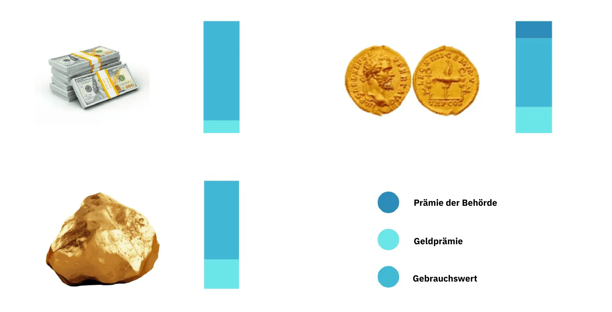

# Unterschiedliche Definitionen von Geld

<partId>77b7918a-8c3b-11f0-b688-6b2ab22378c9</partId>

## Geld vs Währung vs Monnaie vs Argent vs Devise

<chapterId>bf8a6d21-df88-5d23-a0a5-e9a5c1300554</chapterId>

:::video id=d9c9e7df-9db3-4a9f-801e-10d3fc7dfc22:::

### Semantik der monetären Begriffe

In diesem Abschnitt über die verschiedenen Geldtheorien und insbesondere über die Definitionen des Geldes möchte ich einen kurzen Exkurs zum Thema Semantik machen. Ich möchte die Definitionen einiger Wörter, die mit Geld zu tun haben, etwas genauer untersuchen und sie mit ihren englischen Entsprechungen vergleichen. Zum Beispiel, Geld, Währung, im Vergleich zu monnaie, argent und devise. Also, das geht so.

Eine kleine semantische Frage:

Wenn wir "**Geld**" (de la monnaie) sagen, denken die meisten Leute, dass wir das Kleingeld meinen, das wir als Gegenleistung für eine Transaktion erhalten. Und wenn wir "**Währung**" (la monnaie) sagen, denken die Leute wahrscheinlich, dass wir uns auf die Währung eines Staates beziehen. Kanadas Währung ist der kanadische Dollar. Das ist richtig.

Aber was ist mit Geld (de l'argent)? Ein Dieb wird niemals sagen: "Gib mir dein ganzes Wechselgeld!" (der Dieb könnte durchaus enttäuscht sein, wenn er nur Münzen von fast keinem Wert erhält).

Nein, der Dieb wird schreien: "Geben Sie mir **all Ihr Geld**". Und wenn der Dieb vor Ihnen auf der Straße steht, bezieht er sich zwangsläufig auf **die Geldscheine** in Ihrer Tasche.

Versucht der Dieb hingegen, Sie auf eine raffiniertere Art und Weise zu betrügen, indem er versucht, Ihr Vermögen zu stehlen, indem er alle Ihre Bankkonten leer räumt, würden wir sagen, dass **er Ihr ganzes Geld mitnimmt**. Hier bezieht sich das Wort "Geld" auf **das Vermögen einer Person**.

Es gibt also zwei Definitionen für das Wort Geld: Bargeld (Banknoten) und Vermögen.

### Währung vs. Monnaie vs. Devise

Eine Währung (devise) ist notwendigerweise die Währung eines anderen Landes, sonst sagt man einfach Geld (monnaie). Wenn Sie Franzose sind, würden Sie sagen "La livre sterling est la devise du Royaume-Uni et l'euro et la monnaie de l'Europe" (Das Pfund Sterling ist die Währung des Vereinigten Königreichs und der Euro ist die Währung Europas).

Menschen, die sich mit diesen semantischen Problemen nicht auseinandergesetzt haben, neigen bei der Übersetzung dieser Begriffe oft dazu, von "currency" (devise) zu sprechen, wenn es sich um eine geschriebene Währung handelt, aber nein, "currency" ist "money" (monnaie), wenn es sich um die Währung Ihres Landes handelt, und es ist "devise", wenn es um andere Währungen geht. Das Problem, das ich hier oft sehe, ist, dass es im Englischen zwei Wörter gibt: "money", das ein Konzept ist, und "currency", das wirklich die Einheit eines Landes ist, mit der getauscht wird. Wir können also einfach über das Konzept von Geld sprechen; das ist einfach - es ist das Konzept des Wortes *Money*; es ist Geld im Allgemeinen. Und *Währung* ist sehr einfach mit der Währung eines Landes gleichzusetzen. Im Französischen hingegen sagen die Leute leider oft "mais ce n'est pas une monnaie", wenn sie über Bitcoin sprechen, weil es nicht die Währung eines Landes ist, aber ich glaube, sie meinen stattdessen oft den Begriff Währung. Das ist einerseits falsch, denn seit El Salvador ist bitcoin die Währung eines Staates. Die Tatsache bleibt, dass die Leute oft sagen werden: *aber nein, es ist nicht die Währung eines Staates, es kann kein Geld sein*. Aber wenn wir uns auf den weiter gefassten Begriff *Geld* beziehen, passt bitcoin meiner Meinung nach perfekt in diese Definition. Es ist nur so, dass wir im Französischen keine zwei Wörter haben, um diese beiden Konzepte zu trennen. Man könnte sagen, dass sich das Wort argent auf die Währung bezieht, aber das ist leider nicht seine genaue Definition. *Argent* (Geld) bezieht sich auf Vermögen oder Geldscheine. Man kann nicht wirklich eine Entsprechung mit dem Wort *Geld* finden. *Geld* ist eigentlich der Begriff der Währung (monnaie).

## Die Definition von Saifedean Ammous

<chapterId>07c4ba50-168c-567a-8957-0b187ff75f97</chapterId>

:::video id=936d6d3b-6d45-468e-bc44-85fbce9b857a:::

#### Was ist Geld?

Geld ist einfach etwas, das man besitzt oder erwirbt, um es nicht um seiner selbst willen zu benutzen oder zu verbrauchen, sondern um es später gegen andere Waren oder Dienstleistungen einzutauschen, die man braucht. (Saifedean)

Geld erwirbt eine Geldprämie, wenn eine monetäre Nachfrage nach dem Gut besteht, um eine oder mehrere der Funktionen des Geldes zu erfüllen.

Das monetäre Gut muss so knapp sein, dass die Geldprämie bestehen bleibt (um zu verhindern, dass sich das Angebot der monetären Nachfrage anpasst).

### Die Geldprämie

In diesem Abschnitt über die verschiedenen Definitionen von Währung möchte ich kurz auf die Definition von Saifedean in The Bitcoin Standard eingehen, die mich immer sehr interessiert hat. Als ich sie las, erschien sie mir recht einfach. Und wir werden dieser Definition auch das Konzept der Geldprämie hinzufügen. Wie Saifedean in seinem Buch erwähnt, gibt es notwendigerweise ein Konzept der Knappheit. Die Frage ist, was ist Geld?

> Geld ist einfach etwas, das man besitzt oder erwirbt, das man nicht um seiner selbst willen benutzt oder konsumiert, sondern um es später gegen andere Waren oder Dienstleistungen einzutauschen, die man braucht.

Das ist also die Definition, die Saifedean in The Bitcoin Standard erwähnt. Ich würde hinzufügen, dass eine Währung (la monnaie) eine Geldprämie erhält, wenn es eine monetäre Nachfrage nach dem Gut gibt, um eine oder mehrere der Funktionen der Währung zu erfüllen. Man könnte also sagen, dass eine Währung, die als Wertaufbewahrungsmittel dient, eine monetäre Nachfrage hat, die ihr eine monetäre Prämie verleiht, da die Menschen sie erwerben wollen, zum Beispiel als Wertaufbewahrungsmittel oder als Tauschmittel.

### Knappheit und Marktmechanismen

Ich denke, wir sollten unbedingt hinzufügen, dass das monetäre Gut knapp genug sein muss, damit die Geldprämie bestehen kann. Dies ist sehr wichtig. **Wenn ein Gut auftaucht, um als Geld verwendet zu werden, und wir sehen, dass sein Preis steigt, werden die Menschen normalerweise, wenn das Gut nicht selten genug ist, mehr davon produzieren wollen, um von diesem Wertzuwachs zu profitieren, wenn der Preis steigt**. Aus diesem Grund haben die meisten Güter auf dem Markt einen relativ festen Preis. Wenn der Preis steigt, nimmt die Produktion tendenziell zu. Wenn der Preis fällt, sinkt die Produktion. Es findet eine Art Marktanpassung statt. **Und wenn ein Gut selten genug ist, wie Gold, kann der Marktmechanismus diese erhöhte Nachfrage für den monetären Gebrauch nicht kompensieren. Es ist also die Variable, die sich ändert, es ist der Preis. Wie bei Bitcoin**. Wenn der Preis von Bitcoin steigt, produzieren wir nicht mehr Bitcoin. Was sich also anpasst, ist der Preis. Und deshalb sehen wir seit Jahren, wie der Preis von Bitcoin steigt, wenn die Nachfrage nach Bitcoin zunimmt. Da es niemanden auf der Welt gibt, der den Algorithmus ändern und sagen kann: "Es gibt mehr Nachfrage, der Preis steigt, wir werden mehr produzieren." **Das Angebot an neuen Bitcoins ist im Voraus programmiert und im Voraus bekannt**. Das ist es also, was ich gesagt habe: Das monetäre Gut muss selten genug sein, damit die monetäre Prämie bestehen bleibt und daher nicht von den Marktmechanismen aufgefangen wird, um zu verhindern, dass sich das Angebot an diese neue monetäre Nachfrage anpasst.

## Zahlungsmittel und Befreiungswert

<chapterId>5d424039-e342-56f7-9d8b-bba9551831a9</chapterId>

:::video id=af4c0765-8111-4cb7-891b-3ee54d6e7054:::

### Zahlungsmittel vs. Tauschmittel

In diesem Abschnitt, der den verschiedenen Definitionen des Geldes gewidmet ist, schlage ich vor, dass wir uns gemeinsam ein Zitat aus dem Buch "Aux origines de la monnaie" (Die Ursprünge des Geldes) ansehen, einem Text von Alain Testart zum Thema Geld als Zahlungsmittel und Befreiungswert.

*In Aux origines de la monnaie definiert Alain Testart Geld als ein Zahlungsmittel:*

> Die Funktion von Zahlungsmitteln wird hier in Abgrenzung zur Funktion von Tauschmitteln verstanden, insofern es Zahlungen ohne Gegenleistung gibt, Zahlungen, die nichts kaufen. Knies (1873:192 ff.) thematisiert ausführlich Gütertransfers, die nicht in Tauschakten bestehen, wie z.B. Wergeld oder Steuern. Carl Menger griff diese vierte Funktion in seinem Artikel "Geld" von 1892 an, der allgemein als einer der wichtigsten zu diesem Thema gilt. Ohne völlig diskreditiert zu sein, scheint die Idee der Funktion von Zahlungsmitteln heute im ökonomischen Denken vergessen oder zumindest zugunsten der Funktion von Tauschmitteln verworfen worden zu sein.
>

> Geld dient der Bezahlung: So gesehen ist es ein Instrument der Befreiung, das in seiner ganzen Allgemeinheit die Funktion eines Zahlungsmittels beschreibt. In diesem Zusammenhang spricht man von der "befreienden Kraft" des Geldes. Nach Le Petit Robert ist die befreiende Kraft "diejenige, die eine Befreiung (von einer Verpflichtung, einer Schuld) bewirkt". Nach dem Grand Larousse ist eine befreiende Zahlung jede "Zahlung, die unter rechtlichen Bedingungen in der Weise erfolgt, dass der Gläubiger das Erlöschen der Schuld nicht bestreiten kann". Geld hat diese Macht par excellence; sie ist sogar das, was seinen Status als gesetzliches Zahlungsmittel ausmacht, da niemand eine in Geld geleistete Zahlung verweigern kann, weder der Verkäufer noch der Gläubiger. Geld ist das einzige Gut, dessen Zahlung nicht verweigert werden kann, unabhängig davon, ob es sich um eine Schuld gegenüber einem Kaufmann oder gegenüber dem Fiskus handelt. Unter allen Gütern genießt allein das Geld dieses Privileg. "Es ist dieses Privileg", schreibt Charles. Gide (1921 I: 443), das das, was wir gesetzliches Zahlungsmittel nennen, ausmacht.
>

> Jeder Tausch, der in der Übertragung einer Ware gegen eine andere oder unter der Bedingung besteht, dass eine andere Ware als Gegenleistung gegeben wird, impliziert notwendigerweise eine Verpflichtung des Empfängers, diese Gegenleistung zu erbringen. Die Zahlung ist die Erfüllung dieser Verpflichtung. Jeder Austausch impliziert also eine Zahlung, aber nicht jede Zahlung impliziert einen Austausch. Es gibt Zahlungen ohne Gegenleistung, d. h. Zahlungen, die nicht dazu dienen, ein anderes Gut zu erhalten, und die nicht zu diesem Zweck geleistet werden. Steuern sind hier das wichtigste Beispiel, aber auch Bußgelder aller Art, die an die öffentliche Hand gezahlt werden, und Entschädigungen, die anderen geschuldet werden, nach dem Prinzip, dass derjenige, der einem anderen einen Schaden zufügt, diesen auch wiedergutmachen muss.

### Zahlungen ohne Gegenpartei

Dies ist ein klares Beispiel für die These des Autors. In der Tat unterscheidet er zwischen den beiden. Für ihn ist ein Tausch sowohl eine Übertragung von Waren als auch eine Zahlung. Danach kommt die Zahlung. Und eine Zahlung kann auch ohne Tausch erfolgen. Er gibt Beispiele dafür, dass das Bezahlen eines Strafzettels oder einer Geldstrafe nur eine Zahlung ist. Man erhält dafür nicht wirklich eine Dienstleistung. Manch einer mag argumentieren, dass der Staat im Gegenzug eine Dienstleistung erbringt, indem er Ihnen Strafzettel ausstellt. Er ist sich darüber im Klaren, dass das Zahlen von Steuern wirklich eine Zahlung ohne Gegenleistung ist, in dem Sinne, dass das Zahlen von Steuern erforderlich ist, auch wenn man nicht unbedingt eine Dienstleistung erhält. Er sagt, dass es wirklich so definiert ist, dass das Zahlen von Steuern nur eine Zahlung ist; es gibt keine Verpflichtung, im Gegenzug eine Leistung zu erhalten. Ich habe mit vielen meiner Kollegen darüber gesprochen, und sie sind nicht unbedingt mit dieser Auffassung einverstanden. Aber das ist die These des Autors. Er versucht, den Begriff der Zahlung zu platzieren und ihn von Tauschgeschäften zu lösen, z. B. mit den Beispielen von Bußgeldern und Steuerzahlungen. Auch bei der Mitgift bringt er zum Ausdruck, dass die Mitgift eine Zahlung ist; man bekommt nicht unbedingt etwas im Austausch. Jemand, der diesen Vorschlag kritisiert, könnte sagen: "Ja, aber dafür bekommt man eine Frau" Das ist also die Ebene der Debatte zu diesem Thema.

Es gibt auch das Wergeld, das Blutgeld. Es ist also nur eine Entschädigungszahlung. Mein Freund Ulrich würde sagen:

> Ja, aber dafür bekommen Sie diese Datei geschlossen.

Sie haben also ein Verbrechen begangen, zum Beispiel einen Mord. Damals zahlte man das Wergeld, und danach wurde man aus dieser Situation befreit. Es gibt also eine befreiende Kraft. Bekommt man etwas dafür?" Nach Ansicht des Autors: nein. Einige meiner Kollegen meinen, ja.

Ich denke, dass wir in dieser Diskussion sehen können, dass das Wergeld eines der besten Beispiele ist, um eine Zahlung zu definieren. Es ist klar, dass man keine Gegenleistung erhält.

## Schuldgeld vs. Warengeld

<chapterId>4093677a-c8e8-5828-b994-15c01656186e</chapterId>

:::video id=f49cf5cc-288e-4daa-a1ff-b9de73506f4e:::

### Die Grundsatzdebatte

Im Rahmen dieses Abschnitts über verschiedene Gelddefinitionen und -theorien wollen wir zwei diametral entgegengesetzte Sichtweisen untersuchen: "Geld ist immer Schuld" oder "Geld ist immer eine Ware". Auf der einen Seite stehen die Verfechter der schuldenbasierten Geldtheorie, die behaupten: "Nein, Geld ist immer eine Schuld! Auf der anderen Seite argumentieren unsere berühmten Goldfresser: "Aber nein, Geld ist immer eine Ware, es ist immer Gold; alles andere, Rechnungen, Schuldscheine, ist nur Kredit, nicht Geld".

Lassen Sie uns gemeinsam eine klare Zusammenfassung dieser Theorien untersuchen.

### Die Theorie der "ewigen Schuld"

Hier ist eine Zusammenfassung der als **"Schuldgeld "** bekannten Geldtheorie, der zufolge Geld grundsätzlich eine Form von Schulden ist:

Nach dieser Theorie, die insbesondere von Alfred Mitchell-Innes entwickelt und von David Graeber weiterentwickelt wurde, ist Geld an sich ein Schuldanerkenntnis, das aus den Kreditbeziehungen herrührt, die historisch vor dem direkten Geldaustausch bestanden. Geld entsteht nicht aus einem Bedürfnis, das mit Tauschgeschäften verbunden ist, sondern ist ein Mittel, um soziale Verpflichtungen oder Schulden zwischen Individuen oder Gruppen abzurechnen, zu übertragen und zu begleichen.

Alles Geld zirkuliert also als eine Schuld, die eine Person oder Institution einer anderen schuldet und die durch das Vertrauen und die gesellschaftliche oder staatliche Autorität, die ihre Gültigkeit garantiert, abgesichert ist. Wenn wir also - wie bereits erwähnt - Geld besitzen, haben wir eine Forderung an die Gesellschaft, und die Gesellschaft schuldet uns etwas. Geld ist also niemals neutral oder autonom, sondern immer eine zugrundeliegende Schuld: Geld zu besitzen bedeutet im Wesentlichen, eine Forderung gegenüber der Gesellschaft oder einer Wirtschaftsgemeinschaft zu besitzen.

Diese Argumentation widerspricht der klassischen Vorstellung von Geld als einfacher "Zwischenware" und betont stattdessen die zentrale Rolle der sozialen und politischen Beziehungen bei der Schaffung und Verwaltung von Geld.

**Meine Bewertung:**

Was mich an dieser Theorie stört, ist, dass sie behauptet, Geld sei immer eine Schuld, während es Beispiele für den Austausch zwischen zwei verschiedenen Stämmen gibt, die beispielsweise Gold tauschen, wo die Transaktion endgültig ist und keine latente Schuld bleibt. Die Befürworter dieser Theorie erklären uns oft, dass es sich bei diesen Tauschvorgängen nicht um Geld, sondern um Tauschgeschäfte handelt. Wie bereits erwähnt, bin ich da anderer Meinung. Es handelt sich um einen monetären Tausch, da das Gold nicht verbraucht wird, sondern als Geld verwendet wird.

### Die Theorie "immer eine Ware"

**Immer ein Gebrauchsgegenstand:*

Hier ist eine klare Zusammenfassung der Geldtheorie, die als **"Warengeld "** bekannt ist, bei der Geld immer als Ware entsteht, insbesondere Gold, das aus dem Bedürfnis heraus entsteht, Handel treiben zu können, eine Ware, die im Ausland allgemein akzeptiert wird und die zu Handelszwecken erworben wird.

Nach dieser Theorie, die von den klassischen Ökonomen (Adam Smith, David Ricardo) entwickelt und von Marx aufgegriffen wurde, entsteht Geld auf natürliche Weise als eine Ware unter anderen, häufig ein Edelmetall wie Gold oder Silber, das einen von seiner monetären Funktion unabhängigen Eigenwert besitzt. Ursprünglich werden diese Waren von den Wirtschaftsakteuren spontan ausgewählt, um den Handel zu erleichtern, und zwar aufgrund ihrer inhärenten Eigenschaften (Knappheit, Haltbarkeit, Teilbarkeit und Stabilität).

Warengeld zeichnet sich durch seine physische Existenz und einen Wert aus, der durch die Menge an Arbeit bestimmt wird, die gesellschaftlich für seine Herstellung erforderlich ist (wie bei Marx). Die Gesellschaft verwendet Gold beispielsweise nicht nur, um den Tauschhandel zu vereinfachen, sondern auch als Recheneinheit, Wertaufbewahrungsmittel und universelles Tauschmittel.

In dieser Sichtweise behält das Geld immer einen realen Wert, da es mit einem greifbaren Gut verbunden bleibt. Selbst wenn die Rolle des Geldes abstrakt wird (geprägte Münzen, Banknoten oder Buchgeld), leitet sich seine Gültigkeit immer noch direkt oder indirekt von einem Bezug zu einem zugrunde liegenden Gut wie Gold ab. Diese Theorie betont daher den materiellen und wirtschaftlichen Ursprung des Geldes, im Gegensatz zu Theorien, die es als bloße Konvention oder Schuld betrachten. Nach dieser Theorie wäre jede Darstellung des Geldes durch ein Substitut, wie z. B. einen in Gold einlösbaren Wechsel, ein Kredit.

**Meine Bewertung:**

Man beachte, dass diese Vision der Warengeldtheorie ähnelt, aber noch einen Schritt weiter geht. Sie schlagen vor, dass Geld **immer** eine Ware sein sollte. Und wenn wir zu ihnen sagen: "*Ja, aber wir können uns darauf einigen, dass eine Banknote für diese Gruppe Geld ist; sie kann mit Gold unterlegt werden, sie funktioniert, und die Banknote als solche ist Geld*".

Als Antwort werden sie uns das Beispiel des Umkleidegutscheins nennen. Sie werden sagen: "Ja, aber nein, wenn Sie einen Umkleidekabinen-Gutschein für Ihr Kleidungsstück haben, können wir dann den Kassengutschein als Kleidungsstück bezeichnen?

Natürlich nicht, es handelt sich um eine Bestätigung, eine Forderung, die es Ihnen ermöglicht, Ihr Kleidungsstück zurückzubekommen. Diese Parallele gilt nicht, denn ein Umkleidekabinen-Gutschein ist kein allgemein akzeptiertes Zahlungsmittel. **Geld ist kein Anspruch auf ein bestimmtes Objekt wie ein Kleidungsstück; es ist ein Modus, ein Tauschmittel, ein Tauschmedium oder ein allgemein akzeptiertes Zahlungsmittel**.

Man kann also keine Parallele zwischen einem Umkleidekabinen-Gutschein und einem Geldschein ziehen, denn der Umkleidekabinen-Gutschein ermöglicht es Ihnen, ein bestimmtes Gut im Tausch zu erhalten, er ist ein token, der es Ihnen ermöglicht, Ihr Gut zu erhalten. Eine Banknote, eine Fiat-Währung, ist dagegen ein universeller Gutschein, mit dem man Zugang zu jedem Gut erhält.

Und meiner Meinung nach kann natürlich auch Fiat-Geld als Geld betrachtet werden, wenn es von der Bevölkerung als solches angesehen wird. Und ich denke, es ist ein semantischer Fehler, darauf zu bestehen, dass es kein Geld sein kann, da es ein Gutschein ist, um echtes Geld zu erhalten, zumindest zu der Zeit, als es das zugrunde liegende Gold war.

Ich habe kein Problem damit, die Goldmünze, die im Safe aufbewahrt wird, und den Geldschein, der diese Goldmünze darstellt, als Währung zu betrachten. Für mich gibt es kein semantisches Problem, es handelt sich einfach um zwei Arten von Währung. Wenn ich mich nicht irre, erklärt Mises dieses Phänomen sehr gut, indem er von Geldsubstituten spricht.

Ihre Vision läuft darauf hinaus, dass man eine Goldmünze in einem Banktresor und die Banknote, die sie repräsentiert, nicht gleichzeitig als Geld betrachten kann. Ich persönlich sehe darin kein Problem, ich sehe in dieser Situation kein Paradoxon. Diejenigen, die glauben, dass Geld immer eine Ware ist, sehen die Dinge nicht so wie ich.

**Hier ist ein Überblick über das Konzept der Umkleidekabinen-Gutscheine aus dem Buch *Aux origines de la monnaie*:**

*Anm. 14: "Ausgezeichnete Kritik - ausgezeichnet, weil sie genau auf dem Boden steht, auf dem Knapp sich selbst stellt, dem Rechtsboden - von Rist (1938: 372, Anm. 1) an dem Vergleich zwischen Papiergeld und Scheckkarten: wenn man in beiden Fällen von einer Art von Anspruch sprechen kann, so besteht der grundlegende Unterschied darin, dass es sich im ersten Fall, und nur im ersten, um einen Anspruch ohne einen bestimmten Gegenstand handelt

Zum Thema **Anspruch** stellt derselbe Autor Folgendes fest:

> Es steht Bastiat frei, sich einen Gutschein für die gesamte Gesellschaft vorzustellen, der als "ein riesiger Basar" präsentiert wird, aber dieser kleine Zusatz, diese scheinbar harmlose Erweiterung, ist der ganze Unterschied zwischen Kredit und Geld. Geld ist kein Anspruch auf ein bestimmtes Geschäft. So etwas wie eine anonyme Forderung gibt es nicht. Aber gerade die Anonymität, die das Geld auszeichnet, und damit seine Allgemeinheit, macht es so mächtig. Geld ist nicht wie Kredit, und noch weniger ist es in irgendeiner Weise darauf reduzierbar. **Geld ist viel mehr als Kredit

**Ein Paradoxon: Schuldgeld vs. Warengeld**

Das Paradoxon, das die tiefgreifende Dichotomie zwischen Schuldgeld- und Warengeldtheorien am besten veranschaulicht, betrifft die Frage, ob Gold heute eine Währung ist.

Einerseits definiert die Schuldgeldtheorie Geld in erster Linie als ein Tauschmittel oder Zahlungsmittel, das allgemein akzeptiert oder sogar von einer öffentlichen Stelle vorgeschrieben wird. Aus dieser Sicht ist Gold keine Währung mehr, da es nicht als allgemeines Tauschmittel verwendet oder akzeptiert wird.

Die Warengeldtheorie hingegen betrachtet Geld als eine greifbare Ware, die von der Gesellschaft aufgrund ihrer inhärenten Eigenschaften (Knappheit, Haltbarkeit, Teilbarkeit usw.) spontan ausgewählt wird. Diesem Ansatz zufolge ist Gold nach wie vor die wahre Universalwährung, und alle anderen Formen von Geld sind heute im Grunde nichts anderes als Kredite, die auf Vertrauen beruhen.

Dieses Paradoxon zeigt deutlich die Kluft zwischen diesen beiden Währungskonzepten: Für die einen ist Gold keine Währung mehr, für die anderen hingegen bleibt es die einzig wahre Währung, die es gibt.

## Moderne Geldtheorie

<chapterId>8efc29af-3193-5d97-ad9f-e608b32924ff</chapterId>

:::video id=f8127cb7-46a1-468c-bbb5-97bf0a8b8837:::

### Grundlagen der modernen Geldtheorie

Zum Abschluss dieses Abschnitts über die verschiedenen monetären Theorien wollen wir über das Wunderkind der monetären Theorien sprechen, das von vielen modernen Ökonomen, die für Zentralbanken arbeiten, bewundert wird und den Namen moderne monetäre Theorie trägt, oft auch als MMT bezeichnet.

*die *Moderne Geldtheorie (MMT)** ist ein wirtschaftlicher Ansatz, der davon ausgeht, dass einem Staat mit einer eigenen souveränen Währung (wie den USA, Kanada oder Japan) nie das Geld ausgehen kann, da er immer mehr Geld ausgeben kann, um seine Ausgaben zu finanzieren. Nach dieser Theorie:

- Geld ist eine Schöpfung des Staates, keine begrenzte Ressource**

- Steuern und Kreditaufnahme werden nicht direkt zur Finanzierung der öffentlichen Ausgaben verwendet, sondern um die Inflation zu regulieren, das wirtschaftliche Verhalten zu beeinflussen und die Nachfrage nach der nationalen Währung aufrechtzuerhalten.*

- Die eigentliche Grenze der Staatsausgaben ist die Inflation, nicht das Haushaltsdefizit oder die Staatsverschuldung.

- Wenn das geschaffene Geld in Sektoren fließt, die es absorbieren können, wird es auch keine Inflation geben.

- Die Regierung muss daher ihre Ausgaben an die tatsächlich verfügbaren Ressourcen (Arbeitskräfte, Industriekapazität, natürliche Ressourcen) anpassen, um eine übermäßige Inflation zu vermeiden.

### Die Rolle der Steuern in der MMT

Hier finden Sie also die berühmte Antwort auf all jene, die sagen: "Ja, aber wenn wir Geld drucken können, warum zahlen wir dann Steuern?" Nun, MMT hat die richtige Antwort auf diese Idee. Es stimmt, dass es im Fiat-System, im modernen System, technisch gesehen nichts gibt, was die Geldschöpfung begrenzt, abgesehen von der Inflation. Aber sie werden vorschlagen, dass erstens die Besteuerung notwendig ist, um die Inflation zu begrenzen, da sie der Wirtschaft Geld entzieht. Wenn wir also keine Steuern zum Ausgleich haben, könnte all diese Geldschöpfung schließlich zu einer Inflation führen. Steuern, so argumentieren sie, sind buchstäblich eine Möglichkeit, Geld aus dem System zu entfernen, um die Inflation zu begrenzen.

Zum Thema Geld, das in Sektoren investiert wird, die es absorbieren können, können wir das Beispiel der Vereinigten Staaten anführen, die Billionen von Dollar an die Militärindustrie geben, was keine Inflation verursacht, weil die Militärindustrie, der militärisch-industrielle Komplex, perfekt in der Lage ist, diese Billionen von Dollar zu absorbieren.

Wenn man andererseits mehr Straßen bauen will und die Ressourcen und Auftragnehmer, die sie herstellen können, begrenzt sind, wird eine Verdoppelung des Straßenbudgets zwangsläufig zu einer Verknappung der Arbeitskräfte führen, die diese Straßen bauen können. Der Preis wird also aufgrund von Marktkräften, Angebot und Nachfrage steigen. Wenn unsere allwissenden Staatsoberhäupter wissen, wohin sie das Geld stecken sollen, sollte dies technisch gesehen keine Inflation verursachen. Und ich würde antworten, dass es in der Praxis ganz klar eine Inflation verursacht.

Zusammenfassend lässt sich sagen, dass der Staat nach der MMT seine Fähigkeit zur Geldschöpfung nutzen kann, um Vollbeschäftigung zu erreichen und soziale und ökologische Investitionen zu finanzieren, während er die Inflation durch eine angemessene Steuerpolitik kontrolliert. Auch keynesianische Ökonomen, eine andere ökonomische Denkschule, verfolgen häufig das Ziel, die Arbeitslosigkeit durch eine Steuerung der Zinssätze in den Griff zu bekommen und soziale und ökologische Investitionen zu finanzieren, während die Inflation durch eine angemessene Fiskalpolitik kontrolliert wird.

### MMT-Überprüfung

Diese Theorie gilt nur für eine Handvoll Länder (siehe Stephanie Keltons Tweet), die echte Währungssouveränität genießen, d.h. sie können Schulden in ihrer eigenen Währung aufnehmen. Diese Theorie lässt sich nur schwer auf importabhängige Volkswirtschaften anwenden, die das internationale Vertrauen in ihre Währung aufrechterhalten müssen.

Und was ist echte Währungssouveränität? Es bedeutet, dass man in der Lage ist, Schulden in seiner eigenen Währung aufzunehmen. Man muss in der Lage sein, einen Handelsüberschuss zu erwirtschaften, um über genügend Währungsreserven, genügend Devisen, zu verfügen, so dass man kein Geld in ausländischer Währung aufnehmen muss, um Waren importieren zu können. Dies betrifft nur eine Handvoll Länder.

Hier unten sehen Sie einen Tweet von Stephanie Kelton, die eine Art Aushängeschild für diese Bewegung ist. Sie hat ein Buch mit dem Titel "The Deficit Myth" geschrieben. In diesem Tweet schreibt sie, dass verschiedenen Ländern wie den Vereinigten Staaten, Japan, Kanada, Australien und dem Vereinigten Königreich das Geld nicht ausgehen kann.

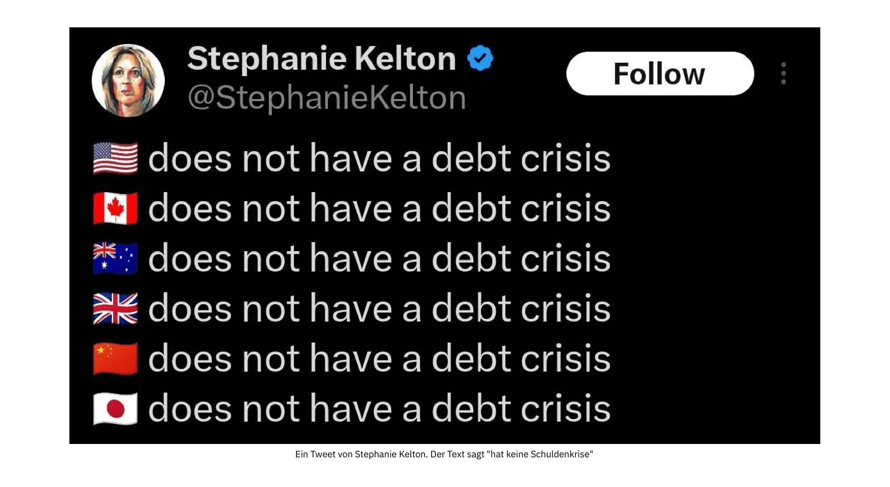

Seltsamerweise sind dort nur sechs Länder aufgeführt? Warum ist das so? Weil sie echte Währungssouveränität haben. Aber es gibt rund 200 Länder auf der Erde, und nicht alle haben Währungssouveränität. Meine Kritik an dieser Theorie ist also nicht nur, dass sie etwas seltsam und nicht funktional ist, sondern auch, dass sie nur für einige wenige Länder mit echter Währungssouveränität funktioniert, nämlich für diejenigen, die Schatzanweisungen in ihrer eigenen Währung ausgeben können. In gewisser Weise geht sie zu Lasten der übrigen Welt. Durch die Schaffung dieser Währung ist es so, als würden sie ihre Inflation in andere Länder exportieren, ähnlich wie es die Vereinigten Staaten seit Jahrzehnten mit ihren exorbitanten Privilegien tun. Dies ähnelt einer Form von monetärem Kolonialismus, bei dem Länder, die weltweites Vertrauen und Nachfrage nach ihrer Währung haben, so viel Geld drucken können, wie sie wollen, ohne dass es zu einer nennenswerten Inflation kommt, oft weil sie diese Inflation exportieren.

Diese Theorie lässt sich nur schwer auf importabhängige Volkswirtschaften anwenden, die das internationale Vertrauen in ihre Währung aufrechterhalten müssen.

In dieser Theorie wird auch ein gewisses Maß an zentraler Planung der Wirtschaft gefordert, insbesondere um eine bessere Kontrolle über die realen Ressourcen (Arbeitskräfte, Rohstoffe, industrielle Kapazitäten) zu gewährleisten und die Inflation zu steuern.

# Der Untergang und die Wiedergeburt des Geldes

<partId>87a34ca9-782b-5ade-b51a-400f88ed7b0c</partId>

## Griechische Münzen

<chapterId>7714195f-74ce-5f8c-be5f-59302d39fff4</chapterId>

:::video id=8e5c3091-0910-471b-8d4b-0dc6e9afa656:::

### Hintergrund und Kontext

Bevor wir beginnen, hier der historische Hintergrund:

**Geschichtlicher Hintergrund:**

**Die Römer nannten die Griechen "Graeci" und Griechenland "Graecia".**

**Die Griechen nannten sich "Hellenen" und ihr Land "Hellas"

**Homer** (geboren um das 8. Jahrhundert v. Chr.)

Legendärer griechischer Dichter, mutmaßlicher Verfasser von *Die Ilias* und *Die Odyssee*.

Um **750 v. Chr.: Lycurgus**, der mythische Gesetzgeber Spartas, soll die spartanische Verfassung eingeführt haben, die auf militärischer Disziplin und Einfachheit beruht.

**Numa Pompilius** (753-673 v. Chr.)

Zweiter König von Rom, berühmt dafür, dass er Rom seine ersten religiösen und rechtlichen Institutionen gab.

**Drakone**, athenischer Gesetzgeber (7. Jahrhundert v. Chr.), berühmt für seine extrem strengen Gesetze, daher der Begriff "drakonisch".

**594 v. Chr.: Solon** wird Gesetzgeber in Athen und reformiert die athenische Gesellschaft grundlegend, insbesondere durch die Abschaffung der Schuldsklaverei.

**776 V. CHR: Olympische Spiele der Antike**

Die ersten regelmäßigen Sportspiele fanden alle vier Jahre in Olympia statt und brachten die griechischen Städte zusammen.

**Pythagoras** (ca. 570-495 v. Chr.)

Griechischer Philosoph und Mathematiker, berühmt für sein Theorem über das rechtwinklige Dreieck.

**Xenophanes von Kolophon** (ca. 570-478 v. Chr.)

Vorsokratischer Philosoph, bekannt für seine Kritik am traditionellen griechischen Polytheismus.

**490 v. Chr.: Schlacht bei Marathon**

Die Athener schlugen eine persische Invasion siegreich zurück und markierten damit einen entscheidenden Wendepunkt für die griechische Zivilisation.

**Herodot** (ca. 484-425 v. Chr.), der den Spitznamen "Vater der Geschichte" trägt, schrieb ein umfangreiches Werk, in dem er die Perserkriege beschrieb, einschließlich des griechischen Sieges über Xerxes im Jahr 480 v. Chr.

**Sokrates** (470-399 v. Chr.)

Athener Philosoph, berühmt für seine dialektische Methode und seine Lehren über Ethik und Selbsterkenntnis.

**Aristophanes** (ca. 446-386 v. Chr.)

Athener Dramatiker, berühmt für seine satirischen Komödien wie *Die Frösche*.

**Sophokles (5. Jh. v. Chr.) kritisiert in seinem Stück *Antigone* durch den Tyrannen Kreon das Geld als Quelle der moralischen und politischen Korruption.

**Plato** (ca. 428-348 v. Chr.)

Griechischer Philosoph, Schüler von Sokrates, Gründer der Akademie, Autor von *Die Republik*.

**431-404 V. CHR: Peloponnesischer Krieg**

Großer Konflikt zwischen Athen und Sparta, der mit einer Niederlage für Athen endet.

**431 V. CHR.*: Athen finanziert den Peloponnesischen Krieg, indem es seine Gold- und Silbermünzen verdünnt, um die Umlaufmenge zu erhöhen, was zu einer Inflation führt.

**Xenophon** (ca. 430-355 v. Chr.)

Athener Schriftsteller, Philosoph und Feldherr, Schüler von Sokrates, Autor der *Anabasis*.

**414 V. CHR.*: Nach einer katastrophalen Expedition nach Sizilien beginnt Athen, den Peloponnesischen Krieg zu verlieren.

**405 V. CHR: Aristophanes** beschreibt in seinem Stück *Die Frösche* ausdrücklich die Entwertung der Silberdrachme und das Aufkommen minderwertiger Bronzemünzen in Athen und veranschaulicht damit das heute als "Gresham's Law" bekannte Prinzip.

**404 V. CHR.*: Athen kapituliert nach einer langen Belagerung durch Sparta.

**Aristoteles** (384-322 v. Chr.)

Bedeutender griechischer Philosoph, Schüler von Platon, Gründer des Lyzeums, bekannt für seine Arbeiten in Logik, Biologie und politischer Philosophie.

**327 V. CHR.*: Alexander der Große erobert Persepolis und die östlichen Provinzen des persischen Reiches und erweitert damit sein Reich erheblich.

**323 V. CHR.*: Alexander stirbt in Babylon ohne einen klaren Erben, was Kriege zwischen seinen Generälen (diadochi) auslöst, um das Reich aufzuteilen.

**Archimedes** (ca. 287-212 v. Chr.)

Griechischer Mathematiker, Physiker und Erfinder, berühmt für seine Entdeckungen in der Geometrie und Mechanik.

**196 v. Chr.: Der Stein von Rosette** wird während der Herrschaft von Pharao Ptolemäus V. eingraviert und ermöglicht die spätere Entzifferung der ägyptischen Hieroglyphen.

**192-188 V. CHR: Römisch-Seleukidischer Krieg**

Rom besiegte das Seleukidenreich unter der Führung von Antiochos III. und festigte seinen Einfluss in Griechenland und Kleinasien.

**146 v. Chr.: Schlacht von Korinth**

Die Römer zerstörten die griechische Stadt Korinth und leiteten damit das Ende der politischen Unabhängigkeit Griechenlands und die allmähliche Integration Griechenlands in die römische Welt ein.

In diesem Abschnitt über die Antike, den Untergang Roms und das Mittelalter beginnen wir mit einem Abschnitt über griechische Münzen.

Die Geschichte des Münzwesens im antiken Griechenland begann um 600 v. Chr., als die griechischen Städte die Innovation aus Lydien in Kleinasien schnell übernahmen und zunächst Elektrum und später Silber verwendeten. Die ersten griechischen Münzen wurden auf der Insel Ägina geprägt und zeigten eine Meeres- oder Landschildkröte, aber es war die Athener Drachme, die mit Athene und einer Eule verziert war, die sich ab dem 5.

Und ich habe das Glück, eine Kopie einer griechischen Drachme aus dieser Zeit mit der berühmten Eule und einer Figur auf der Rückseite zu besitzen. Es ist eine Tetradrachme, die größer war als eine einfache Drachme.

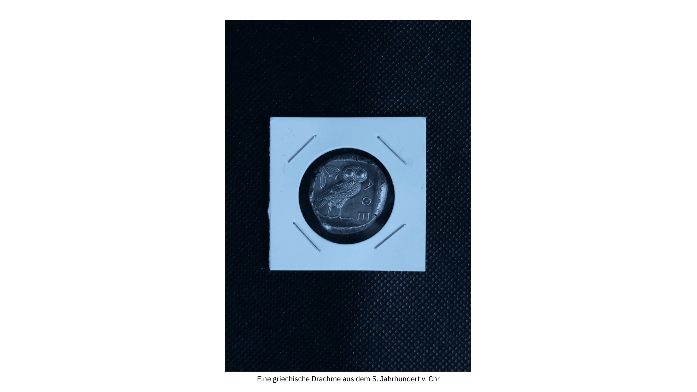

Jede griechische Stadt entwickelte ihre eigene Beziehung zum Geld. In Athen war die Währung eng mit der politischen und wirtschaftlichen Macht verbunden. Das berühmte athenische Dekret aus dem späten 5. Jahrhundert v. Chr. schrieb die ausschließliche Verwendung der athenischen Währung in den verbündeten Gebieten vor und festigte damit die wirtschaftliche Vorherrschaft. Athen häufte auch große Goldreserven für Notfälle an, die auf der Akropolis aufbewahrt wurden, vielleicht als Symbol für seine wirtschaftliche Umsicht. Im Gegensatz dazu schränkte Sparta, eine Militärstadt mit strengen Werten, die Verwendung von Geld stark ein und verbot seinen Bürgern den Besitz von Gold- oder Silbermünzen. Sparta zog es vor, schwere Eisenbarren zu verwenden, um den Außenhandel zu unterbinden und den sozialen Zusammenhalt zu wahren.

Kriege wurden oft durch Währungsmanipulationen finanziert. Während des Peloponnesischen Krieges (431-404 v. Chr.) griff Athen zu drastischen Abwertungen, um seine Truppen zu bezahlen. Als Athen 413 v. Chr. durch die spartanische Besetzung von Dekelia den Zugang zu seinen Silberminen verlor, musste es 407/406 v. Chr. in aller Eile Goldstatuen einschmelzen, um neue Münzen zu prägen. Dann, 406/405 v. Chr., schuf es Bronzemünzen, die mit Silber überzogen waren, und löste damit eine Währungskrise aus, die von **Aristophanes** illustriert wurde, der bereits das heute als Gresham's Law bekannte Gesetz heraufbeschwor: Schlechtes Geld verdrängt gutes Geld. Dieses Notgeld wurde nach dem Krieg schnell entwertet, um das Vertrauen in die athenische Münzprägung wiederherzustellen.

Das Ende der klassischen Periode war durch den Aufstieg Makedoniens unter Philipp II. und seinem Sohn Alexander dem Großen gekennzeichnet, der das griechische Währungsgleichgewicht tiefgreifend veränderte. Dank der riesigen Gold- und Silberminen des Pangea-Gebirges produzierte Philipp II. Geld im Überfluss, um seine militärischen und politischen Kampagnen zu finanzieren, und führte einen einfachen und praktischen Gold-Silber-Standard ein (10:1). Seine Goldstatuen, mit denen er seinen Sieg bei den Olympischen Spielen feierte, zirkulierten bis nach Westeuropa und erreichten sogar England. Alexander setzte diese Geldpolitik fort und brachte die **Attische** Drachme während seiner Eroberungen im Osten bis nach Indien in Umlauf. Diese massive Verbreitung von Münzen markiert den Beginn der hellenistischen Ära, in der das Bild der Herrscher allmählich das der Götter auf den Münzen ersetzt. Diese Neuerung ermöglichte es Generationen von hellenistischen Monarchen, sich selbst zu profilieren und die traditionellen Götter auf der Rückseite ihrer Münzen in den Hintergrund zu drängen.

Nach Alexanders Tod im Jahr 323 v. Chr. teilten seine Generäle sein riesiges Reich auf und gründeten Dynastien in Ägypten (die Ptolemäer), Syrien (die Seleukiden) und anderswo. Diese hellenistischen Königreiche führten unterschiedliche Währungssysteme ein: Die Ptolemäer führten ein geschlossenes Währungssystem ein, um den Geldumlauf zu kontrollieren, und zogen es vor, Getreide als interne Währung zu verwenden, um Edelmetalle für externe Militärausgaben zu sparen. Zur gleichen Zeit entwickelte sich Rhodos zu einem bedeutenden Handelszentrum, bevor es durch die Römer wirtschaftlich geschwächt wurde, die Delos 167 v. Chr. als Freihafen einrichteten.

Die Verwendung von Geld war für die Entlohnung der Söldner von zentraler Bedeutung. Alexanders Soldaten erhielten täglich Silberdrachmen.

Die Kavallerie, die Elite von Alexanders hochspezialisierter Armee, erhielt durchschnittlich zwei Drachmen pro Tag, ein Infanterist eine Drachme und ein einfacher Söldner zwei Drittel einer Drachme, also das Doppelte des Lohns eines einfachen Arbeiters.

Auch während des Peloponnesischen Krieges wurden beträchtliche Summen an Soldaten gezahlt: über 1.200 Talente für die Niederschlagung des Aufstands von Samos und über 2.000 Talente für die Belagerung von Potidea.

Als dieses Heer in Kleinasien voll im Einsatz war, beliefen sich die Gesamtkosten auf etwa zwanzig Talente pro Tag, was etwa einer halben Tonne Silber oder 120.000 Drachmen entspricht.

Die griechische Münzprägung spielte auch eine wichtige kulturelle Rolle, da jede Stadt versuchte, ihre Identität zu behaupten, indem sie ihre eigenen Münzen mit lokalen oder mythologischen Symbolen prägen ließ. So stellte Heraklius beispielsweise Herakles (Herkules) im Kampf mit einem Löwen dar, während Kyrene die berühmte Heilpflanze Silphium zeigte.

Schließlich hat das klassische griechische und hellenistische Münzwesen trotz seiner Vielfalt und regionalen Schwankungen die Wirtschafts- und Kulturgeschichte des Mittelmeerraums nachhaltig geprägt und spätere Währungssysteme bis hin zu Rom, das griechische Wirtschaftskonzepte nach und nach zur Strukturierung seiner eigenen kaiserlichen Wirtschaft übernahm und weiterentwickelte, nachhaltig beeinflusst.

## Die Auswirkungen der Währung in Griechenland

<chapterId>3a5e6c7d-699c-5567-87cd-3374c49d55a9</chapterId>

:::video id=0c79a59c-e179-4893-a414-1b8de0930eb9:::

### Athen und der Gegensatz zu Sparta

Der Gegensatz zwischen Athen und Sparta während der klassischen griechischen Periode zeigt zwei radikal unterschiedliche Modelle der politischen und wirtschaftlichen Organisation. Während Sparta metallisches Geld zugunsten eines autarken, auf bürgerlichem Vertrauen basierenden Systems ablehnte, setzte Athen diese Technologie voll und ganz ein, um sein Seereich aufzubauen und zu erhalten.

### Die monetäre Notwendigkeit der Seemacht

Das athenische Reich blieb trotz seines grandiosen Namens geografisch bescheiden - es bestand im Wesentlichen aus Athen und den Städten der Ägäis. Seine Macht stützte sich auf den Bund von Delos, ein Militärbündnis, das von Athen als Hegemon beherrscht wurde. Diese imperiale Struktur erforderte ein einheitliches wirtschaftliches Instrument: die athenische Silbermünze.

Der Unterhalt einer Flotte stand im Mittelpunkt dieser finanziellen Notwendigkeit. Eine einzige athenische Trireme kostete zwischen einem und zwei Talenten Silber - eine beträchtliche Summe. Da Athen mehrere hundert Schiffe zu unterhalten hatte, brauchte es ein effizientes Steuersystem. Die Währung wurde zum unverzichtbaren Instrument, um Tribut von den Vasallenstädten zu erheben und die Flottenprojektionskräfte zu finanzieren, die den Zusammenhalt des Reiches garantierten.

### Geldauflagen als Mittel der Herrschaft

Athen führte seine Silberwährung für alle Mitglieder des Bundes von Delos ein. Diese Währungsstandardisierung diente mehreren strategischen Zielen. Erstens erleichterte sie die Erhebung von Tributen durch die Schaffung einer gemeinsamen Rechnungseinheit. Zweitens verstärkte sie die wirtschaftliche Abhängigkeit der Vasallenstädte von Athen. Und schließlich wurde dadurch die Macht Athens symbolisch auf das gesamte Seereich übertragen.

Diese Geldpolitik steht im krassen Gegensatz zum spartanischen Modell. Sparta, eine Landmacht, konnte sich für seinen Lebensunterhalt auf die Arbeit der peloponnesischen Heloten (Sklaven) verlassen. Sein geschlossenes, stadtzentriertes Wirtschaftssystem erforderte keine ausgeklügelten Währungsinstrumente. Die Bürgersoldaten lebten zusammen, nahmen gemeinsame Mahlzeiten ein und brauchten kein Geld für den täglichen Austausch.

### Die Währung als Vehikel für den Seehandel

Die Seefahrt des athenischen Reiches bedeutete, dass es für den Handel offen sein musste. Anders als das nach innen gerichtete Sparta war Athen für sein Überleben und seinen Wohlstand auf den Handel mit der Außenwelt angewiesen. Die Währung wurde zum unverzichtbaren Instrument des Mittelmeerhandels.

Diese Außenorientierung schuf einen Tugendkreis: Der Handel brachte Einnahmen, mit diesen Einnahmen wurde die Flotte finanziert, die Flotte schützte die Handelswege und hielt das Reich aufrecht, und das Reich setzte die athenische Währung durch, die den Handel erleichterte. Die Währung war nicht mehr nur ein Tauschmittel, sondern wurde zu einem Pfeiler der kaiserlichen Strategie.

### Die Grenzen der monetären Macht

Trotz dieser wirtschaftlichen Raffinesse zeigte die monetäre Macht Athens während des Peloponnesischen Krieges ihre Grenzen auf. Gegenüber den spartanischen Landstreitkräften reichte die maritime und finanzielle Überlegenheit Athens nicht aus. Teure Expeditionen, wie der katastrophale Syrakus-Feldzug in Sizilien, erschöpften die finanziellen Ressourcen, ohne einen entscheidenden Sieg zu bringen.

Die Geschichte zeigt, dass eine Währung zwar ein mächtiges Instrument der Machtprojektion ist, aber keine Garantie für eine militärische Vorherrschaft darstellt. Sparta, das über keine metallische Währung, aber über einen bemerkenswerten sozialen Zusammenhalt verfügte, setzte sich schließlich gegen das athenische Währungsimperium durch.

### Zwei Modelle, zwei Schicksale

Der Gegensatz zwischen Athen und Sparta veranschaulicht zwei grundlegende Ansätze zur sozialen und wirtschaftlichen Organisation. Athen repräsentiert das offene, kommerzielle, monetarisierte Modell - den Vorläufer der modernen Seeimperien. Sparta verkörpert das geschlossene, autarke Modell, das eher auf bürgerlichem Vertrauen als auf monetären Instrumenten beruht.

Diese beiden Systeme zeigen, dass die Einführung einer Währung eng mit dem gewählten politischen und wirtschaftlichen Modell verbunden ist. Für eine See- und Handelsmacht wie Athen wurde das Geld unverzichtbar. Für eine geschlossene Kriegergesellschaft wie Sparta stellte es eine Bedrohung der sozialen Ordnung dar. Diese antike Dichotomie prägt noch immer die Debatten über die Rolle des Geldes in der Organisation von Gesellschaften.

## Die Römische Republik

<chapterId>0bc80983-33e1-5881-85bb-7c22f3144a9a</chapterId>

:::video id=dc05ca97-d29c-4679-bfeb-912c47d86ce2:::

### Geschichte der Römischen Republik

- 753 - 509 v. Chr.: Königreich Rom**
- 753 V. CHR: Gründung von Rom** (traditionell Romulus zugeschrieben).
- 509 - 27 V. CHR: Römische Republik**, Rom wird eine Republik, die von einem gewählten Senat und Konsuln regiert wird.
- 280 - 275 V. CHR: Pyrrhischer Krieg**. Pyrrhus, König von Epirus, kämpft in Süditalien gegen die Römer und erringt kostspielige Siege ("pyrrhische Siege").
- 264 - 146 V. CHR: Punische Kriege**. Großer Konflikt zwischen Rom und Karthago um die Vorherrschaft im westlichen Mittelmeerraum.
- Hannibal (247 - ca. 181 v. Chr.)**. Legendärer karthagischer General, berühmt für die Überquerung der Alpen mit seiner Armee und seinen Elefanten, um Rom während des Zweiten Punischen Krieges anzugreifen.
- 146 v. Chr.: Schlacht von Korinth**. Rom zerstört die griechische Stadt Korinth und erzwingt seine endgültige Herrschaft über das griechische Festland.
- 91 - 87 v. Chr.: Sozialer Krieg**. Aufstand der italienischen Verbündeten Roms, die das römische Bürgerrecht forderten, was schließlich zu ihrer vollständigen Integration in die Bürgerschaft führte.
- 64 v. Chr.: Ende des seleukidischen Widerstands**. Rom beseitigt endgültig den Einfluss der Seleukiden in Syrien und festigt seine Stellung im östlichen Mittelmeerraum.
- 55 V. CHR: Julius Caesar erobert Mittel- und Westeuropa**. Julius Caesar dehnt die römische Herrschaft auf Gallien (das heutige Frankreich) aus und erobert Germanien und die Bretagne.
- 43 V. CHR: Bildung des Zweiten Triumvirats**. Politisches Bündnis zwischen Octavian (später Augustus), Mark Anton und Lepidus, um Rom nach der Ermordung Cäsars zu stabilisieren.
- 27 v. Chr.: Beginn der Pax Romana**. Eine Zeit der politischen Stabilität und des Wohlstands unter der Herrschaft von Augustus, die den Beginn des Römischen Reiches markiert.

### Die späten monetären Anfänge Roms

In diesem Abschnitt über die Antike wenden wir uns nun der Römischen Republik zu. Die Geldgeschichte Roms begann viel später als die der Griechen und Perser. Das 753 v. Chr. gegründete Rom wartete fast vier Jahrhunderte, bevor es das Münzwesen wirklich einführte. Während dieses langen Zeitraums verwendeten die Römer ein primitives Tauschsystem mit unregelmäßigen Bronzestücken, die aes rude genannt wurden und bei jeder Transaktion genau gewogen werden mussten. Erst Ende des 4. Jahrhunderts v. Chr., unter griechischem und etruskischem Einfluss, begann Rom, seine ersten Münzen auszugeben, vor allem aus Bronze gegossene Stücke wie in China, die aes grave, die bis zum **Zweiten Punischen Krieg** charakteristisch für den römischen Tauschhandel waren.

### Griechischer Einfluss und die ersten Silbermünzen

Die entscheidende Begegnung mit den Griechen in Süditalien führte die Römer tatsächlich zur Prägung von Silbermünzen. Um 280 v. Chr. begann Rom mit der Herstellung eigener Silbermünzen in Anlehnung an griechische Didrachmen. Die erste reguläre Ausgabe von Silbermünzen in Rom geht genau auf das Jahr 269 v. Chr. zurück und zeigt die legendären Zwillinge Romulus und Remus, die von der Wölfin gesäugt werden - ein Symbol, das zur Ikone geworden ist.

Auf vielen römischen Münzen aus der Zeit der Republik sind Gründungsmythen dargestellt. Meine können Sie hier unten sehen: Es ist eine hervorragende, echte Münze von König Tatius. Sie illustriert den Mythos von der Entführung der Frauen durch die Sabiner. Tatius war der König dieser Region, und der Gründungsmythos erzählt, wie die Römer Frauen von den Sabinern entführten, einem Volk, das in der Nähe lebte. In der Folge wurde König Tatius ein gemeinsamer König mit Romulus, einem der Gründer Roms.

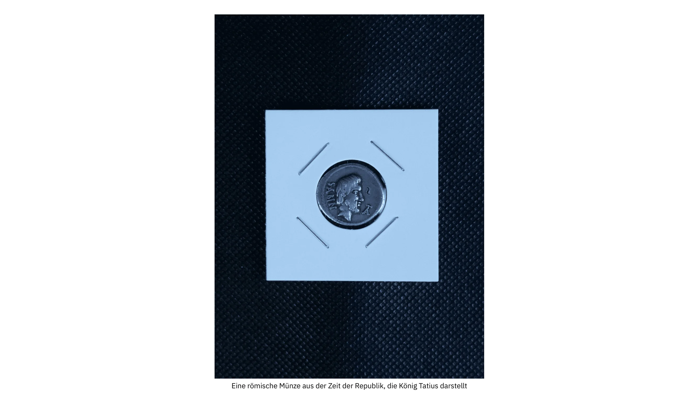

### Der Ursprung des Wortes "Münze" und der Tempel der Juno Moneta

Der Begriff "Münze" hat seinen Ursprung im Tempel der Juno Moneta in Rom. Die Legende besagt, dass während einer gallischen Invasion im Jahr 390 v. Chr. die heiligen Gänse des Kapitols die Römer vor einer drohenden Gefahr warnten. Um der Göttin Juno, der Beschützerin des Kapitols, zu danken, wurde ihr zu Ehren ein Tempel errichtet, der schon bald zur Münzprägeanstalt für römische Münzen wurde.

### Die Punischen Kriege und Währungskrisen

Militärische Konflikte hatten einen erheblichen Einfluss auf die Entwicklung des römischen Geldwesens. Während des Zweiten Punischen Krieges (218-201 v. Chr.) gegen Karthago geriet Rom angesichts der Invasion Hannibals in große finanzielle Schwierigkeiten. Um diesen dringenden Bedarf zu decken, gab Rom zum ersten Mal in außergewöhnlichem Umfang Goldmünzen aus und wertete seine Silbermünzen erheblich ab, von einem ursprünglichen Reinheitsgrad von 97 % auf etwa 89 %. Das Gewicht der Bronzemünzen (aes) ging ebenfalls drastisch zurück und sank innerhalb von sechs Jahren um fast 80 %.

Hier können wir ein Konzept wieder aufgreifen, das wir schon einmal besprochen haben, nämlich dass die Griechen die in den Tempeln gelagerten Edelmetalle einschmolzen, um Wirtschaftskrisen zu lindern. Und um über **Karthago** zu sprechen, können Sie hier unten eine echte karthagische Münze aus meiner Sammlung bewundern. Diese karthagischen Münzen zeigten auf der einen Seite eine Palme und auf der anderen Seite ein Pferd. Auf dieser Münze ist das Pferd nicht sehr gut zu erkennen, da es sehr abgenutzt ist.

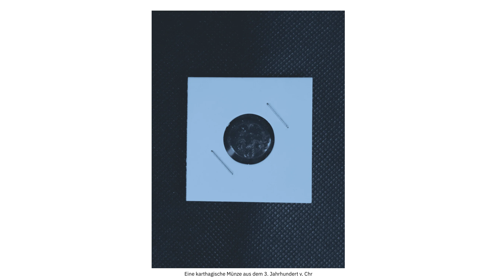

Infolgedessen sank auch das Gewicht der Bronzemünzen, der so genannten Aes, drastisch, und zwar um fast 80 % innerhalb von sechs Jahren. Das Gewicht dieser Bronzemünzen, die kein Edelmetall waren und im alltäglichen Handel verwendet wurden, ging also stark zurück, was ein Zeichen für die Geldentwertung infolge dieser Kriege war.

### Der Silberdenar und die Währungsstabilität

Vor diesem kritischen Hintergrund führte Rom um 212 v. Chr. den berühmten Silberdenar ein. Diese Reform sorgte für eine bemerkenswerte Währungsstabilität, und der Denar blieb fast 450 Jahre lang die vorherrschende Währung. Diese Stabilität verdankt Rom einer rigorosen Verwaltung, trotz einer großen Preisanpassung im Jahr 146 v. Chr. und einer beträchtlichen Produktion zur Finanzierung seiner riesigen Armeen, vor allem während der Punischen, Sozialen (91-87 v. Chr.) und Makedonischen Kriege. So kostete beispielsweise der Unterhalt einer einzigen römischen Legion rund 1,5 Millionen Denare pro Jahr, was den Umfang des Geldbedarfs verdeutlicht.

Außerhalb der römischen Grenzen führten Kriege zu erheblichen Abwertungen in den Regionen unter römischem Einfluss. Im punischen Karthago sank der Reinheitsgrad des Elektrums dramatisch, von 98 % Gold im 4. Jahrhundert auf nur noch 30 % während des Zweiten Punischen Krieges, während der Reinheitsgrad der Silbermünzen auf 18 % fiel.

### Die Entwicklung der Geldmotive

Mit der Ausdehnung Roms veränderte sich auch der Charakter der Münzen: Ursprünglich anonym und patriotisch, nahmen die Münzen nach und nach personalisierte Motive an, auf denen die mächtigen Familien der Münzpräger abgebildet waren. Dieser Übergang symbolisiert deutlich die politischen Veränderungen der späten römischen Republik.

Und schließlich behielt Rom, obwohl es die Mittelmeerwelt wirtschaftlich beherrschte, eine gewisse Einfachheit in seinen Zahlungsmitteln bei: Es wurde keine andere Form des Geldtransfers als der direkte Austausch von Münzen entwickelt, mit Ausnahme von Steuerüberweisungen und privaten Krediten, die der Elite vorbehalten waren.

## Das Römische Reich

<chapterId>2dc44e50-112a-5abf-97ae-8e0a9ecda989</chapterId>

:::video id=f8d6f3d6-9ee4-4504-888e-4f12b3f20489:::

**Geschichtlicher Hintergrund:**

**Das Prinzipat war die Form der kaiserlichen Regierung im Römischen Reich vom Beginn der Herrschaft des Augustus im Jahr 27 v. Chr. bis zum Ende der Krise im dritten Jahrhundert im Jahr 284 n. Chr.

**27 v. Chr.: Beginn der Pax Romana**

Zeit der politischen Stabilität und des Wohlstands unter der Herrschaft von Augustus, die den Beginn des Römischen Reiches markiert.

**Augustus (30 v. Chr. bis 14 n. Chr.)** reformierte das römische Geldsystem grundlegend und schuf einen dauerhaften und stabilen Standard für die kaiserliche Münzprägung.

**Augustus war auch einer der ersten anerkannten Sammler** von antiken Münzen und Fossilien.

**54 AD - 68 AD: Nero**

Umstrittener römischer Kaiser, bekannt für seine Tyrannei, Verfolgungen und sein katastrophales Management nach dem Brand von Rom.

**64 AD: Großer Brand von Rom**

Ein Großbrand verwüstet große Teile der Stadt; Nero wird beschuldigt, dafür verantwortlich zu sein.

**69 n. Chr.: Jahr der vier Kaiser**

Eine chaotische Zeit mit vier Kaisern in kurzer Folge (Galba, Otho, Vitellius, Vespasian).

**79 N. CHR.: Ausbruch des Vesuvs**

Vulkan, der die Städte Pompeji und Herculaneum zerstörte und ihre Überreste ausnahmsweise unter der Asche konservierte.

**165 AD - 180 AD: Antoninische Pest**

Verheerende Epidemie, die das Römische Reich unter Marcus Aurelius und Commodus schwächte.

**200 n. Chr.: Territorialer Höhepunkt und allmähliches Ende der Pax Romana**

Rom erreichte seine maximale Ausdehnung, litt aber unter innerer Instabilität und wirtschaftlichen Schwierigkeiten.

**212 N. CHR.: Edikt von Caracalla über das Bürgerrecht**

Kaiser Caracalla verlieh fast allen Einwohnern des Reiches das römische Bürgerrecht, um die Steuerbasis zu erweitern.

**220 n. Chr.: Beginn der großen Barbareninvasionen**

Erste bedeutende Übergriffe germanischer Völker auf die römischen Grenzen.

**235 N. CHR. - 285 N. CHR: Politische und militärische Krise des 3. Jahrhunderts**

Eine von politischer Instabilität geprägte Zeit mit vielen kurzlebigen Kaisern, Bürgerkriegen, Wirtschaftskrisen und ständigen Invasionen.

**Aurelian (270-275 n. Chr.) wertete die römische Währung** radikal auf und versuchte, ihren Nominalwert trotz der hohen Inflation wiederherzustellen.

**301 AD: Diokletianisches Preisedikt**

Kaiser Diokletian versuchte vergeblich, die grassierende Inflation durch strenge Preis- und Lohnkontrollen im gesamten Reich zu stoppen.

**312 N. CHR: Konstantin**

Der erste christliche Kaiser, Gründer von Konstantinopel, stabilisierte die Währung durch die Einführung des "Solidus", einer Goldmünze von großer Reinheit und Stabilität.

**476 AD: Untergang des Weströmischen Reiches**

Rom wird von verschiedenen germanischen Völkern (darunter die Ostgoten) eingenommen, ein Ereignis, das als offizielles Ende des Weströmischen Reiches gilt.

### Augustus' Währungsreformen

In diesem Abschnitt über die Antike sind wir bereits beim Römischen Reich angelangt. Die Währungsgeschichte des Römischen Reiches ist gekennzeichnet durch die intensive Verwendung von Metallwährungen, insbesondere Gold, Silber und Bronze, aber auch durch mehrere Währungskrisen, die eng mit politischen und militärischen Unruhen verbunden waren. Am Ende der Republik, unter Julius Caesar, führte Rom 46 v. Chr. den Gold-Aureus ein, eine Münze mit einem Gewicht von etwa 8 Gramm, die in ganz Europa und im Mittelmeerraum akzeptiert wurde. Caesar vereinheitlichte diese Goldmünzen und prägte die ersten Münzen mit dem Bildnis eines lebenden Menschen, womit er die alte republikanische Tradition, die anonyme, kollektive Symbole bevorzugte, umstieß. Diese Entwicklung ging mit einer Zeit großer politischer Veränderungen einher, in der die persönliche Macht allmählich die republikanischen Institutionen ablöste.

Nach der Ermordung Caesars im Jahr 44 v. Chr. übernahm Octavian (Augustus) die Kontrolle über Rom und gründete 27 v. Chr. das Imperium. Unter seiner Herrschaft wurde das Geldsystem vollständig reformiert, was der römischen Wirtschaft dauerhafte Stabilität verlieh. Zur Zeit des Augustus entsprach ein goldener Aureus 25 silbernen Denaren, die wiederum 4 bronzene Sesterzen wert waren. Diese monetäre Stabilität hielt während des gesamten ersten Jahrhunderts n. Chr. an, einer Zeit, die oft als wirtschaftliches goldenes Zeitalter für Rom bezeichnet wird.

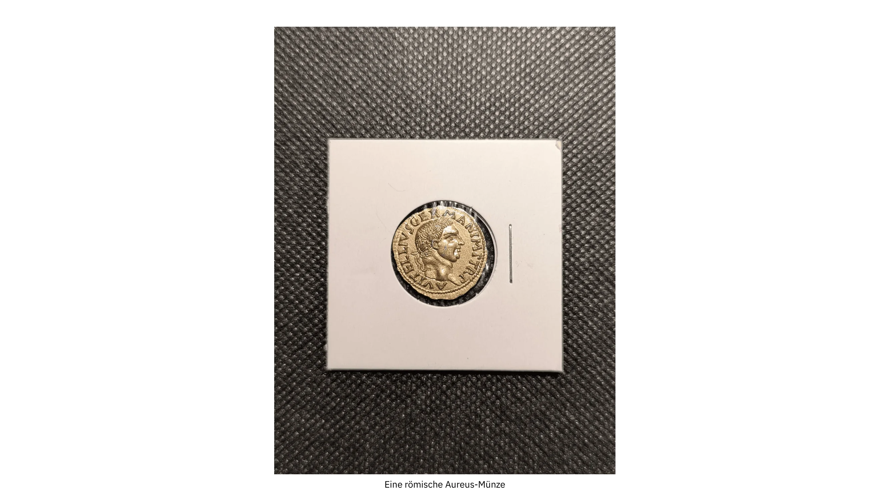

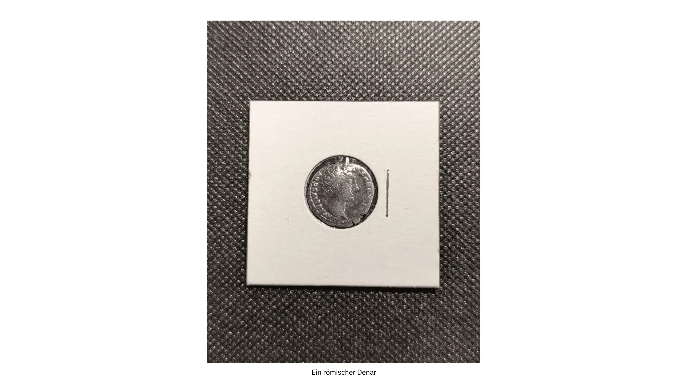

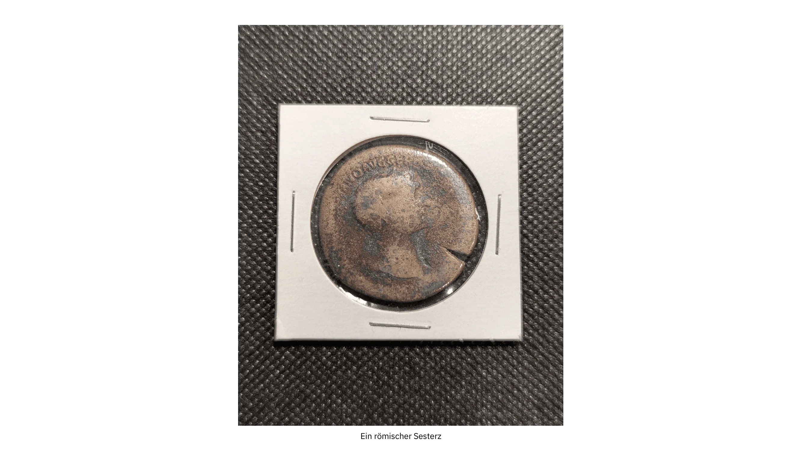

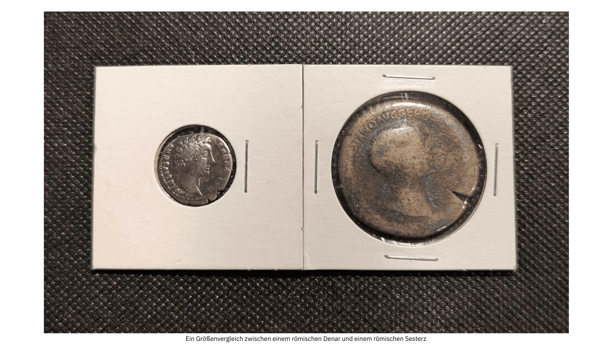

Ab Nero (54-68 n. Chr.) begann Rom jedoch mit einer langsamen Abwertung seiner Münzen, indem es ihr Gewicht und ihren Reinheitsgrad schrittweise verringerte, um die steigenden kaiserlichen Ausgaben zu finanzieren, insbesondere nach dem großen Brand von Rom im Jahr 64 n. Chr. Diese Abwertungen hatten bemerkenswerte Auswirkungen: Reinere Münzen wurden gemäß dem **Gresham'schen Gesetz** durch Hortung oder Ausfuhr aus dem Verkehr gezogen, während abgewertete Münzen vermehrt in Umlauf kamen, was zu einem allmählichen Preisanstieg führte.

Das dritte Jahrhundert markiert einen dramatischen Wendepunkt mit einer spektakulären Beschleunigung der Entwertung unter den Kaisern Septimius Severus, Caracalla und Gallienus. Bei der wichtigsten Silbermünze, dem Denar und später dem Antoninianus, sank der Silbergehalt auf nur noch 2 %. Gleichzeitig sank das Goldgewicht des Aureus um die Hälfte. Diese Währungskrise wurde von einer beispiellosen politischen Instabilität, barbarischen Invasionen und wiederholten Bürgerkriegen begleitet.

Dieser Teil erlaubt es mir, das letzte Stück in diesem Abschnitt vorzustellen: den Antoninianus. Der ursprüngliche Name dieser Münze ist unbekannt, aber wir bezeichnen sie heute als Antoninianus. Sie zeichnet sich dadurch aus, dass ihr Wert zwei Denare beträgt, obwohl sie nur 1,5 Mal größer ist als ein Denar. Außerdem wurden diese Münzen im Laufe der Zeit zu reinen Billonmünzen, d. h. sie wurden aus einer Legierung aus Silber und anderen Metallen und nicht aus reinem Silber hergestellt. Oft waren die Münzen nur mit Silber überzogen, was ein bemerkenswertes Beispiel für den Geldverfall darstellt.

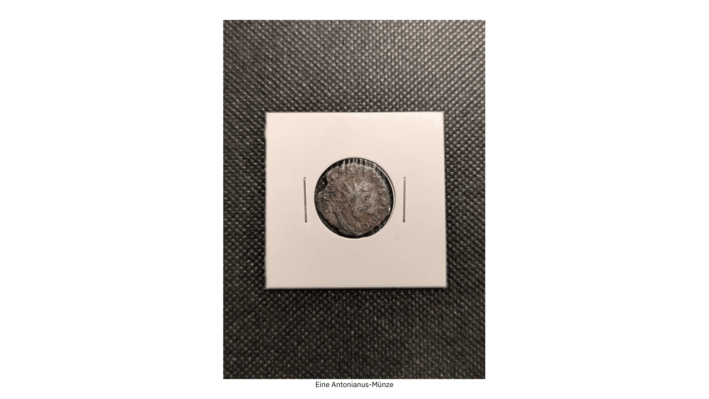

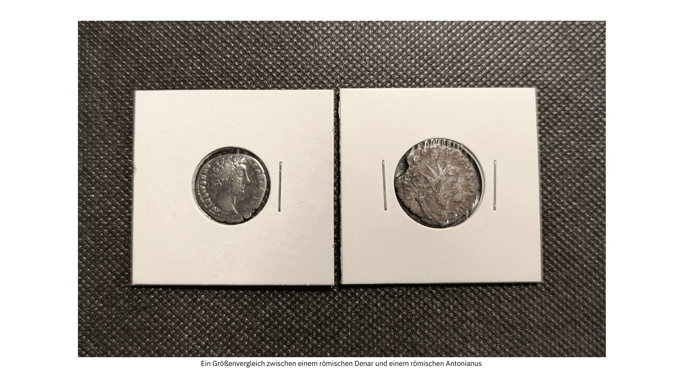

Angesichts dieser Situation versuchte Kaiser Aurelian (270-275 n. Chr.), das System zu stabilisieren, indem er die Währungen nominell aufwertete, aber diese Reform führte in Wirklichkeit einen Inflationsmechanismus ein, indem sie den Wert der bestehenden Währungen künstlich auf einem höheren Niveau festlegte.

Ich werde einen Exkurs zu diesem Thema machen. Im 3. Jahrhundert erlebte die Inflation einen raschen exponentiellen Anstieg. Zuvor wurden die Münzen zwar entwertet, aber der handwerkliche Prozess der Einzelprägung sorgte für eine gewisse Kontrolle der Inflation. Statistiken zeigen, dass die Inflation in den 300 Jahren der Entwertung im Durchschnitt etwa 4 % pro Jahr betrug. Unmittelbar vor Aurelians Reform lag die Inflation bei etwa 3 % pro Jahr.

Aurelian führte auf der Münze mit dem Zeichen XXI ein Reinheitsmaß ein, das eine Zusammensetzung von 20 Teilen Bronze zu 1 Teil Silber oder 5 % Reinheit angab. Er brachte diese 5 %-Silbermünzen auf den Markt und prägte das Zeichen XXI auf sie. Allerdings rief er auch alle anderen, stärker entwerteten Münzen zurück und prägte auf sie das gleiche Zeichen XXI. Dadurch wurde der Nennwert aller Münzen effektiv aufgewertet. Das Ergebnis war eine schwindelerregende Inflationsrate von 20 % pro Jahr, die weit über der vorherigen Rate von 3 % lag, bevor diese Technik eingeführt wurde.

Aurelian hat diese Form der Entwertung erfunden, die viel schneller ist als die allmähliche Entwertung von Metall, bei der wir immer noch gezwungen waren, eine Münze nach der anderen zu prägen. Er nahm alle vorhandenen Münzen, rief sie zurück und prägte sie mit einem Stempel, um ihren Nennwert zu ändern. Das ist ein echter Wendepunkt. Das war der Zeitpunkt, an dem die Inflation exponentiell anstieg.

Um diese extreme Entwertung visuell zu veranschaulichen, habe ich einige faszinierende Statistiken über den Getreidepreis in Ägypten von 40 v. Chr. bis zum 3. Jahrhundert, also über 300 Jahre, gefunden. Unten sehen Sie eine griechische Tetradrachme aus meiner Sammlung. Damals, im 3. Jahrhundert in Ägypten unter römischer Besatzung, war der Gegenwert eine ägyptische Tetradrachme. Der Nennwert der Drachmen war noch in Gebrauch und entsprach einem Denar.

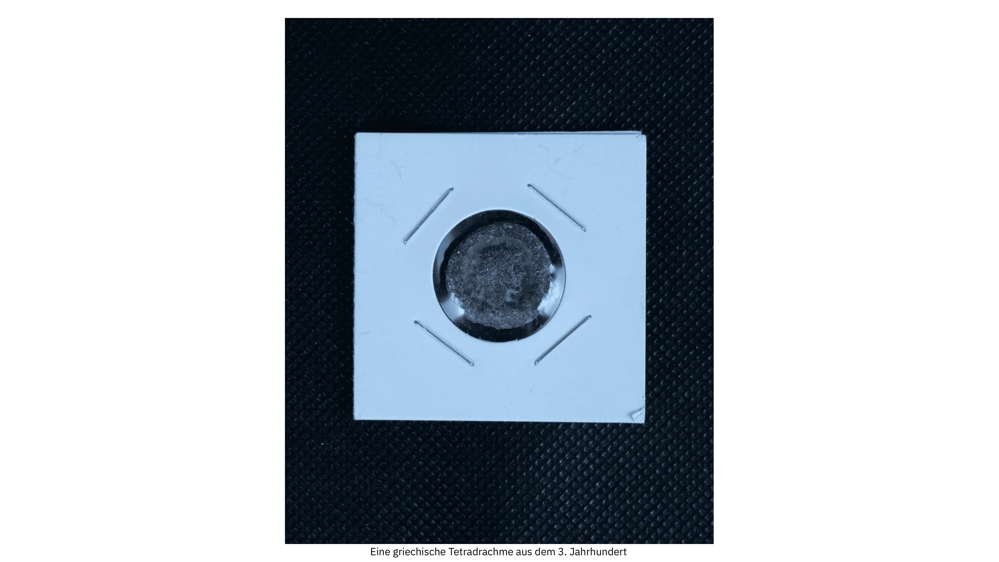

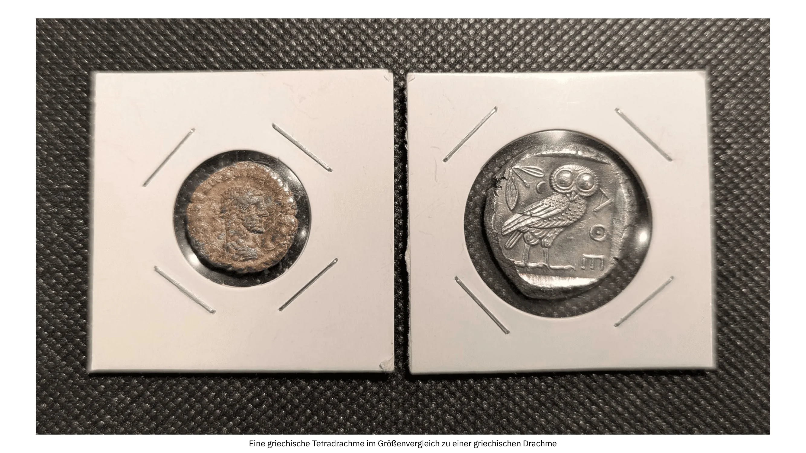

Die ägyptische Tetradrachme, die ich besitze, war also das Äquivalent zu einem Denar. Sie können sehen, dass die Münze aus Billon (oder Bronze) hergestellt ist, also kein Edelmetall enthält. Sie können sie mit der ursprünglichen griechischen Tetradrachme vergleichen, um die physische Entwertung in diesen 300 Jahren zu sehen. Der Preis für Getreide in Ägypten ist um das Millionenfache gestiegen.

Es ist der physische Ausdruck der Reform Aurelians. Es ist anzumerken, dass die Mehrheit, der Durchschnitt über diese 300 Jahre der Inflation, bei etwa 4 % lag. Erst am Ende, als Aurelian seine Reform durchführte, nahm die Inflation exponentielle Ausmaße an, so dass wir auf dieses Maß von 1 Million kamen. Die Preise waren Ende des 3. Jahrhunderts eine Million Mal höher als im 1. Jahrhundert vor Christus.

Sein Nachfolger **Diokletian** (284-305 n. Chr.) versuchte noch radikalere Reformen: Er gab neue Währungen heraus (vor allem den Argenteus, der zwar reiner, aber in der Menge zu begrenzt war), führte drastische Preiskontrollen ein (Preisedikt von 301 n. Chr.) und **errichtete ein Steuersystem auf der Grundlage von Sachleistungen**. Trotz dieser Bemühungen gelang es Diokletians Reformen nicht, die grassierende Inflation einzudämmen.

Angesichts der Weigerung, Waren und Dienstleistungen im Tausch gegen eine entwertete Währung zu liefern, führte Diokletian **ein erbliches Kastensystem** ein, um die Bauern und ihre Nachkommen an ihr Land zu binden.

Was hier wirklich verstanden werden muss, ist, dass die Bauern sich weigerten, ihre Produkte im Austausch für die abgewertete Währung abzuliefern, und die Antwort unseres lieben Diokletian bestand darin, **vererbbare Kasten** zu schaffen, indem er sagte: "Du, du kannst dein Land nicht verlassen, deine Kinder können ihr Land nicht verlassen, dasselbe gilt für die Soldaten, ihr seid Soldaten, ihr stimmt zu, in meiner Währung bezahlt zu werden". Als Übergangslösung wurden sie in Naturalien (Fleisch, Lebensmittel, Getreide) bezahlt, weil er sich weigerte, ihnen Geld zu geben. Er führte also dieses vererbbare Kastensystem ein, um die Menschen an ihren Beruf zu binden, so dass sie nicht einfach den Beruf wechseln konnten, wenn sie die abgewertete Währung nicht akzeptieren wollten.

Um dieses Beispiel zu veranschaulichen, habe ich hier einen Text, einen Auszug aus dem Buch "*Monetary Regime and Inflation*":

> Da die Menschen nicht bereit waren, gegen eine entwertete Währung zu arbeiten und Waren zu liefern, deren Nennwert höher war als ihr innerer Wert oder Marktwert, mussten sie durch die Erhebung von Naturalsteuern zur Arbeit gezwungen werden. [...] Es wurde den Bauern verboten, ihre eingetragenen Wohnsitze zu verlassen. Die bäuerliche Bevölkerung wurde so erblich an das Land gebunden.
>

> Dieses vererbbare Kastensystem breitete sich allmählich aus: Diokletian zwang die Söhne der Soldaten, in der Armee zu dienen, während die Arbeiter in den Geldwerkstätten sowie in den Webereien und Färbereien, die Diokletian geschaffen hatte, zu Staatssklaven wurden, die erblich verpflichtet waren. Auch die Goldgräber wurden später zu einer erblichen Kaste. Andere erbliche Klassen gab es wahrscheinlich schon zu Diokletians Zeiten, vor allem die Zünfte der Bäcker und Metzger [...] in Rom sowie die diözesanen Zünfte der Schiffskapitäne, die Getreide und andere öffentliche Güter nach Rom transportierten.

Erst Konstantin (306-337 n. Chr.) gelang es schließlich, das Geldsystem zu stabilisieren, indem er 312 den Solidus einführte, eine reine Goldmünze, deren Qualität und Gewicht er streng garantierte. Es gab ein ganzes System zur Überprüfung der Reinheit und des Gewichts des Solidus. **Diese Stabilität betraf jedoch nur eine wohlhabende Elite und die kaiserliche Verwaltung**, während die **Mehrheit der Bevölkerung weiterhin unter minderwertiger Währung und anhaltender Inflation** litt. Im östlichen Reich (Byzanz) blieb der Solidus stabil und überdauerte mehr als ein Jahrtausend, während im Westen die Münzprägung in kleine Münzen mit geringem Wert zersplitterte und den endgültigen wirtschaftlichen und politischen Zerfall des Römischen Reiches begleitete, das 476 n. Chr. endgültig unterging.

Zum Abschluss möchte ich Ihnen dieses Zitat aus *A History of Money: From Ancient Times to the Present Day* von Glyn Davies, das meisterhaft zusammenfasst, was vielleicht zum Untergang Roms geführt hat:

*"Die Steuern waren durchweg unzureichend, und die Schwierigkeiten, die mit diesen zunehmend unzureichenden, verspätet angepassten und unübersehbaren Steuern verbunden waren, veranlassten Rom, sich verstärkt auf eine einfache, sofortige und versteckte Form der Besteuerung zu verlassen: die Abwertung der Währung. Kurzlebige Ad-hoc-Reformen konnten diesen jahrhundertealten Trend des Niedergangs nicht umkehren. Finanzieller Druck durch die Abnutzung der Münzen, Schiffbrüche, Geldverluste durch den Kauf von Luxusgütern aus dem Osten, Geschenke an germanische Barbaren, das Wachstum der Stadtbevölkerung, der Rückgang der landwirtschaftlichen Produktion, die allmähliche Erschöpfung der reichsten Minen und vor allem die "Brot und Spiele"-Politik, die als unerlässlich angesehen wurde, um ein Minimum an Ordnung im städtischen Leben aufrechtzuerhalten - all diese kumulativen Belastungen führten Rom zu einer ständigen Geldentwertung, unterbrochen von gelegentlichen Reformen, die zum Scheitern verurteilt waren

*Neben kostenlosem oder billigem Brot und Wein wurden von Zeit zu Zeit kaiserliche Vergünstigungen ("congiaria") in Form von Geldzuweisungen verteilt, insbesondere unter Trajan (98-117 n. Chr.) und noch mehr unter Hadrian (117-138 n. Chr.) und seinen Nachfolgern. Was der Kaiser und die Bürger anfangs als außergewöhnliches Privileg betrachtet hatten, war zu Beginn des 2. Jahrhunderts zu einer üblichen Erwartung geworden. Diese Ausschüttungen "stellten eine schwere Belastung für die Staatskasse dar und trugen auf ihre Weise zum Bankrott des Staates bei".*

## Zusammenhänge zwischen Geldverwässerung und Inflation: von den Ursachen zu den Folgen

<chapterId>38d5781c-e900-53f7-baa7-413655d71754</chapterId>

:::video id=3999256d-aafe-4502-9b72-dfa8491a2777:::

Dieser Abschnitt befasst sich mit den Zusammenhängen zwischen Geldverwässerung und Inflation, von den Ursachen bis zu den Folgen. Die Verwässerung des Geldes ist eines der wichtigsten wirtschaftlichen Phänomene in der römischen Geldgeschichte und hat direkte Auswirkungen auf die Inflation. Ab dem 1. Jahrhundert n. Chr. gab es ab der Herrschaft Neros (54-68 n. Chr.) eine erste langsame Phase der Verwässerung der Silbermünzen (Denare), die durch wiederholte Militär- und Finanzkrisen, insbesondere unter Septimius Severus (193-211) und Gallienus (253-268), beschleunigt wurde.

Wir stellen auch eine allmählichere Abwertung des Aureus fest. Dieser Unterschied in der Abwertungsrate macht zwei Punkte deutlich:

1. Die Rolle der Rechnungseinheit im Bimetallismus für die staatliche Kontrolle des Geldes. Die Rechnungseinheit in diesem Beispiel ist der Denar. Ich habe drei verschiedene Arten der Verwaltung des Wertes der Rechnungseinheit identifiziert: Entwertung (Verdünnung des Metalls), Redenominierung (Antoninianus) und die Auferlegung eines Nennwertes durch die Kennzeichnung "XXI" (Aurelian)

2. Das Bestreben des Staates, die Entwertung des Aureus, der Wertreserve, die es der Elite ermöglicht, ihre Kaufkraft auf Kosten der weniger Begüterten zu erhalten, so lange wie möglich hinauszuschieben. Wir werden im Laufe des Kurses immer wieder auf diesen Grundsatz zurückkommen, insbesondere im Zusammenhang mit dem so genannten "Cantillon-Effekt" und den Umbenennungen des Maravedi in Spanien.

Dieses Phänomen ist sehr interessant und hat sich im Laufe der Geschichte wiederholt. Wir werden es im Zusammenhang mit den Maravedi in einem späteren Abschnitt wieder aufgreifen. Dieses Muster ist auch bei allen Reservewährungen zu beobachten: Die Reserveeinheit des Wertes, wie der Aureus in Rom, bleibt unangetastet. Die Rechnungseinheit, die von der Bevölkerung für den Handel und alltägliche Transaktionen verwendet wird, wird jedoch häufig abgewertet. Infolgedessen trifft die Geldinflation das gemeine Volk, während diejenigen, die sich Goldmünzen leisten können, davon weitgehend unberührt bleiben.

Und übrigens **ist es das gleiche Phänomen, das heute mit der Währungsabwertung geschaffen wird, die es ermöglicht, dass Finanzanlagen im Wert steigen**, und so werden die Menschen, die die Währung benutzen, die ärmsten Menschen, ärmer, und dies wiederum bereichert durch die Geldschöpfung das Vermögen derjenigen, die in der Lage sind, die die Mittel haben, sich gegen die Abwertung zu schützen, und so vertieft es die sozialen Ungleichheiten. Das ist meine kleine politische Tirade.

Was ich gerade beschrieben habe, nennt man den Cantillon-Effekt. Wir werden sehen, dass dieser Herr zur Zeit von John Law lebte, ein Thema, das wir auch in einem späteren Abschnitt behandeln werden.

Die unter Aurelian eingeleitete Reform ließ die Inflation in die Höhe schnellen. Die Inflation des Nennwerts des Geldes war nicht mehr durch die Fähigkeit der Münzprägeanstalten begrenzt, Münzen von Hand herzustellen. Bereits geprägte Münzen konnten nun einfach gekennzeichnet werden, und der Nominalwert der Geldmenge stieg schneller an.

Ich möchte Ihnen zwei Zitate im Zusammenhang mit Aurelian mitteilen. Das erste stammt aus *A History of Money: From Ancient Times to the Present Day*:

*"Was die römische Wirtschaft betrifft, so war der Beitrag Aurelians eher eine Katastrophe als ein Triumph. Es war vor allem der Art seiner "Reform" zu verdanken, dass die Inflationsrate weit über das hinausgehen konnte, was zuvor selbst unter dem unverantwortlichen Gallienus möglich gewesen war. Zwei Jahrhunderte lang nach Aurelian wurde die Inflation im gesamten Römischen Reich endemisch

Die zweite stammt aus dem Buch *Antike Geschichte aus Münzen* und betrifft die Abkopplung des Geldsystems vom Gold:

*"Die Reform des Aurelian veränderte das Verhältnis zwischen dem Goldgeld und dem übrigen Geldsystem. Zuvor waren andere Währungen an den **Aureus** nach offiziellen Kursen gebunden (25 ägyptische Denare oder 25 Tetradrachmen für einen Aureus, usw.). Nach der Reform begann das Goldgeld wie jede andere Ware **frei im Wert zu schwanken**, während das übrige Geldsystem **durch die **Schwächung der Legierungen** an Wert verlor, da es nicht mehr durch Gold **gedeckt war**. Da die Rechnungseinheit theoretisch weiterhin auf Silber basierte (der Denar oder in Ägypten die Drachme), stiegen die Preise mit der Abwertung der Währung. "*

Wie Sie sehen können, traf diese Abwertung der Währung, die als Rechnungseinheit diente, die weniger Wohlhabenden unverhältnismäßig stark, während die Loslösung der Verbindung mit dem Goldgeld die Kaufkraft derjenigen schützte, die es sich leisten konnten, in dem Wertaufbewahrungsmittel Gold zu sparen.

Sie müssen verstehen, dass, wenn es eine Verbindung zwischen dem Denar und dem Aureus gibt, selbst wenn Sie den Denar abwerten, wenn Sie immer noch in der Lage sind, Ihren Denar gegen Aureus zu diesem Kurs zu tauschen (25 Denar für 1 Aureus), werden die Leute auf jeden Fall ihren Denar gegen Ihren Aureus tauschen, da der Denar überbewertet und der Aureus unterbewertet sein wird. Mit der Reform wurde diese Verbindung jedoch aufgehoben. Die Menschen konnten also keine Denare mehr gegen Silbermetall eintauschen, das gegenüber Gold abgewertet war. Das war der Zeitpunkt, an dem diejenigen, die Zugang zu Goldmünzen hatten, sich wirklich schützen konnten, denn danach konnten die Menschen nicht mehr überbewertetes, abgewertetes Silber gegen unterbewertetes reines Gold eintauschen. Dies ist ein sehr wichtiger Moment in der Entwicklung der Währung.

Ein eindrucksvolles Beispiel für die Auswirkungen dieser Reform von Aurelian wird durch diese Zitate aus dem Buch *Monetary Regimes and Inflation* perfekt veranschaulicht:

*"Zwischen den Regierungszeiten der Kaiser Claudius (41-54 n. Chr.) und Constantius (337-361 n. Chr.) stieg der Preis für Weizen auf dem freien Markt in Ägypten, ausgedrückt in Drachmen, **um einen Faktor von über einer Million**. Die spektakuläre Preisinflation ist eine der zentralen wirtschaftlichen Tatsachen des 3. und 4. Jahrhunderts n. Chr." (Lendon 1990, S. 106). Aber diese Entwicklung ist **weniger dramatisch, als es scheint**, denn sie entspricht einer **durchschnittlichen jährlichen Inflationsrate von 4,4%**. Und Wassink (1991, S. 482) zufolge begann die Inflation tatsächlich **nur im Jahr 238 n. Chr.**"

*"Von diesem Zeitpunkt an beschleunigte sich die Inflation langsam, da das **gute Geld zunächst aus dem Verkehr gezogen wurde**, so dass die Gesamtgeldmenge zunächst kaum zunahm. In der Folge erreichte sie zwischen 250 und 293** eine durchschnittliche Jahresrate von **3,65% und stieg zwischen 293 und 301** auf **22,28%** (Wassink 1991, S. 466), d.h. bis zu den **gebrochenen Währungsreformen des Kaisers Diokletian**. Dieses Phänomen ist **besonders beeindruckend für die Inflation in einem metallbasierten Geldsystem**. "*

Dieses Phänomen der Inflation in Verbindung mit der Geldverdünnung war ursprünglich eine Reaktion auf die gelegentlichen Geldkrisen des römischen Staates. Durch die Verringerung des Edelmetallgehalts der Münzen unter Beibehaltung ihres Nennwerts erhöhte der Staat vorübergehend seine Ressourcen. Die Preise reagierten jedoch nicht sofort: Das römische System wies eine gewisse Starrheit auf, was bedeutete, dass sich Löhne und Preise nur langsam an aufeinanderfolgende Abwertungen anpassten. Nach einer gewissen Schwelle stiegen die Preise jedoch stark an, um den Markt wieder mit dem realen Wert der Währungen ins Gleichgewicht zu bringen.

Wie bereits erwähnt, ist dieses Phänomen ab der Mitte des 3. Jahrhunderts besonders deutlich. In Ägypten, einer reichlich dokumentierten Region, verzehnfachten sich die Preise unter Aurelian (274 n. Chr.) nach einer offiziellen Aufwertung der Währung, obwohl zunächst versucht worden war, sie zu stabilisieren. Unter Diokletian (301 n. Chr.) wurden mit dem Preisedikt drastische Kontrollen eingeführt, um die Inflation einzudämmen, ohne die eigentliche Ursache - Überproduktion und Geldentwertung - zu bekämpfen, was zu einem vorhersehbaren Misserfolg führte. Anhaltende Inflation treibt die Wirtschaft letztlich in ein Zweiklassensystem: **Die Elite, die durch Goldreserven (wie Konstantins Solidus**) geschützt ist, genießt Stabilität, während die Mehrheit der Bevölkerung weiterhin unter chronischer Inflation leidet, **was heute als Cantillon-Effekt** bekannt ist

Es besteht ein eindeutiger Zusammenhang zwischen der Verwässerung der römischen Währung und der Inflation, deren Ursachen im Wesentlichen mit chronischen Haushaltsdefiziten, unaufhörlichen Militärausgaben und einer schlechten staatlichen Wirtschaftsführung zusammenhängen.

## Der Untergang des Römischen Reiches

<chapterId>b6ec0914-227b-509c-8108-b09eec9bb904</chapterId>

:::video id=91d4fee5-59bb-4ab9-a90b-e1125c71decb:::

### Währungsabwertung und der Zusammenbruch von Rom

Die österreichische Schule der Wirtschaftswissenschaften, insbesondere durch Ludwig von Mises, schlug eine monetäre Interpretation des Untergangs Roms vor. In dieser Vision zerstörte die fortschreitende Entwertung der römischen Währung das komplexe System der Arbeitsteilung, das ein Reich mit 60 Millionen Einwohnern aufrechterhielt. Die Währung, das zentrale Instrument der wirtschaftlichen Koordination, führte, sobald sie korrumpiert war, zum Zusammenbruch der gesamten sozialen und wirtschaftlichen Struktur.

Dieser Währungsverfall zerstörte nicht nur den inneren Zusammenhalt des Reiches. Er führte auch zum Abbruch der Handelsbeziehungen mit den Nachbarvölkern. Ohne die Vorteile des Handels mit Rom gingen die "Barbaren" von friedlicher Zusammenarbeit zu Raubzügen über. Die Invasionen waren also nicht nur militärischer Natur, sondern auch das Ergebnis eines grundlegenden wirtschaftlichen Zusammenbruchs.

### Die drei Phasen der imperialen Abwertung

Die römische Geldgeschichte lässt sich in drei verschiedene Perioden unterteilen. Die erste, von den Julio-Claudiern bis zu den Antoninern (27 v. Chr. - Ende des 2. Jahrhunderts), war von relativer Stabilität geprägt. Unter Trajan erreichte das Imperium seinen Höhepunkt: Mit einer Fläche von 5 Millionen km² wurde Rom zur ersten Millionenstadt der Geschichte. Der Denar behält eine Silberreinheit von 98 % bis 80 % - eine moderate Abwertung, die das Funktionieren der Wirtschaft noch ermöglichte.

Die zweite Periode, das 3. Jahrhundert, war eine Zeit der militärischen Anarchie. Sechsundzwanzig Kaiser lösten einander innerhalb weniger Jahrzehnte ab. Die Währung brach zusammen: Der Antoninianus, der angeblich zwei Denare wert war, enthielt nur 1,5 Denare Metallgewicht - der erste Versuch, den rechtlichen und den tatsächlichen Wert zu trennen. Diese Manipulation löste das Greshamsche Gesetz aus: Schlechtes Geld verdrängt gutes Geld. Die Bürger horteten die guten Münzen und gaben nur die entwerteten aus.

Die von Archäologen entdeckten Geldschätze offenbaren diese wirtschaftliche Unruhe. Vergrabene Amphoren zeigen durch Schichtung, wie die Römer zuerst die besten Münzen deponierten und dann nach und nach die entwerteten Münzen hinzufügten. Diese antiken "Stapel" zeugen von menschlichem Handeln im Angesicht der Ungewissheit - ein Versuch, den Wert in einer verfallenden Welt zu erhalten.

### Konstantin und das duale System

Konstantin (310-337) versuchte, das Reich durch radikale Reformen zu stabilisieren. Er führte den Goldsolidus ein, eine Währung, die von der Verwaltung streng kontrolliert wurde. Beamte kontrollierten systematisch Gewicht und Reinheit. Die Ausgabe blieb begrenzt und an die Kriegsbeute gebunden. Diese Währung wurde zum ausschließlichen Machtinstrument: Steuern wurden in Solidus gezahlt, und die Legionen erhielten ihren Sold in Gold.

Gleichzeitig verwendete das Volk den bronzenen Nummus, der ständig entwertet wurde. Im Jahr 445 war ein Solidus 7.000 Nummi wert, im Jahr 498 waren es 16.800. Durch dieses duale System wurde der Cantillon-Effekt institutionalisiert: Diejenigen, die Zugang zum Solidus hatten - die Verwaltung, die Grundbesitzer - waren vor der Inflation geschützt. Die Plebs, die auf den Nummus beschränkt war, wurde unaufhaltsam ärmer.

Durch diese monetäre Trennung entstanden zwei parallele Volkswirtschaften ohne offiziellen Wechselkurs. Der Solidus blieb die Rechnungseinheit, zirkulierte aber nur sehr wenig. Der Nummus wird für den täglichen Austausch verwendet, verliert aber ständig an Wert. Diese Währungsarchitektur war ein Vorbote der Ungleichheiten des entstehenden Feudalsystems.

### Der Zusammenbruch der Arbeitsteilung

Die Währungsabwertung zerstörte nach und nach die wirtschaftliche Spezialisierung. Ohne eine zuverlässige Rechnungseinheit brach der Mittelmeerhandel zusammen. Die spezialisierten Handwerker Roms konnten nicht mehr mit Ägypten oder Gallien handeln. Die Provinzen führten ihre eigenen Währungen ein, was die Reibungen im Handel vervielfachte.

Angesichts dieses Zerfalls floh die Stadtbevölkerung auf das Land - eine Stadtflucht, die die jahrhundertelange Verstädterung umkehrte. Die Handwerker gaben ihre Berufe auf und betrieben Subsistenzlandwirtschaft. Große Ländereien (Latifundien) wurden zu autarken Inseln, die die mittelalterlichen Feudalherrschaften vorwegnahmen.

In seiner Verzweiflung verlangte Diokletian sogar Naturalsteuern - das ultimative Eingeständnis des monetären Versagens. Mit seinem Maximaledikt (301) versuchte er, die Preise zu kontrollieren und beschleunigte die Rückkehr zum Tauschhandel. Die wirtschaftliche Komplexität fiel auf vorzivilisatorische Formen zurück.

### Überleben durch Gold von Rom bis Byzanz

Paradoxerweise überlebte der Solidus das Westliche Reich. Byzanz behielt ihn bis ins 11. Jahrhundert bei und sorgte damit für weitere tausend Jahre wirtschaftlicher Stabilität. Im Westen lebt die Erinnerung an ihn fort: Das französische Wort "sou" leitet sich von "solidus" ab, ein sprachliches Zeugnis einer verlorenen monetären Großartigkeit.

Grundbesitzer, die ihren Reichtum in Gold aufbewahrt hatten, wurden zu Feudalherren. Die kirchlichen Strukturen, die einzigen überlebenden Institutionen, sorgten für die sozialen Bindungen, die das Geld nicht mehr garantieren konnte. Europa zersplitterte in autarke Herrschaftsbereiche mit jeweils eigener Subsistenzwirtschaft.

Dieser Wandel offenbart die Zerbrechlichkeit komplexer Zivilisationen. Die Arbeitsteilung, die es Rom ermöglichte, eine Million Einwohner zu ernähren, hing vollständig vom Vertrauen in das Geld ab. Als dieses Vertrauen zerbrach, stürzte das Gebäude ein und Europa fiel für fast ein Jahrtausend auf primitive Wirtschaftsformen zurück.

## Das dunkle Zeitalter und das Mittelalter

<chapterId>a5856873-6142-57be-8a73-1f9e3df83792</chapterId>

:::video id=86b8da9b-3831-443d-b170-58c2bea3ad54:::

Die Geschichte und die Entstehung des Geldes im Mittelalter ist durch Phasen des Rückschritts, der Innovation und des wirtschaftlichen Aufschwungs gekennzeichnet.

Als beispielsweise die römische Armee Britannien verließ, gelangten keine römischen Münzen mehr auf die Insel. Um 435 n. Chr. verschwand die Verwendung von Münzen in Britannien vollständig, ein in den ehemaligen römischen Provinzen einzigartiges Phänomen. Fast zwei Jahrhunderte lang war die britische Wirtschaft münzlos, bis im 7. Jahrhundert merowingische und kontinental geprägte Münzen allmählich wieder auftauchten.

Ab dem 8. Jahrhundert trug der christliche Einfluss zur Wiedereinführung des Münzwesens in Nordeuropa bei. Die Schlüsselfigur in dieser Zeit war Pepin der Kurze, König der Franken, der 752 den Denar einführte, der später von seinem Sohn Karl dem Großen übernommen wurde. Karl der Große sorgte für eine weite Verbreitung des Silberdenars und schuf einen europäischen Währungsstandard für mehrere Jahrhunderte.

In England erlebte die Münzprägung mit der Herstellung des Silberpfennigs unter König Offa von Mercia um 765 einen bedeutenden Aufschwung. Diese Währung wurde so wichtig, dass sie 500 Jahre lang praktisch unverändert blieb.

Als erstes Artefakt aus dieser Zeit möchte ich Ihnen eine Reproduktion eines englischen Penny aus dieser Zeit zeigen.

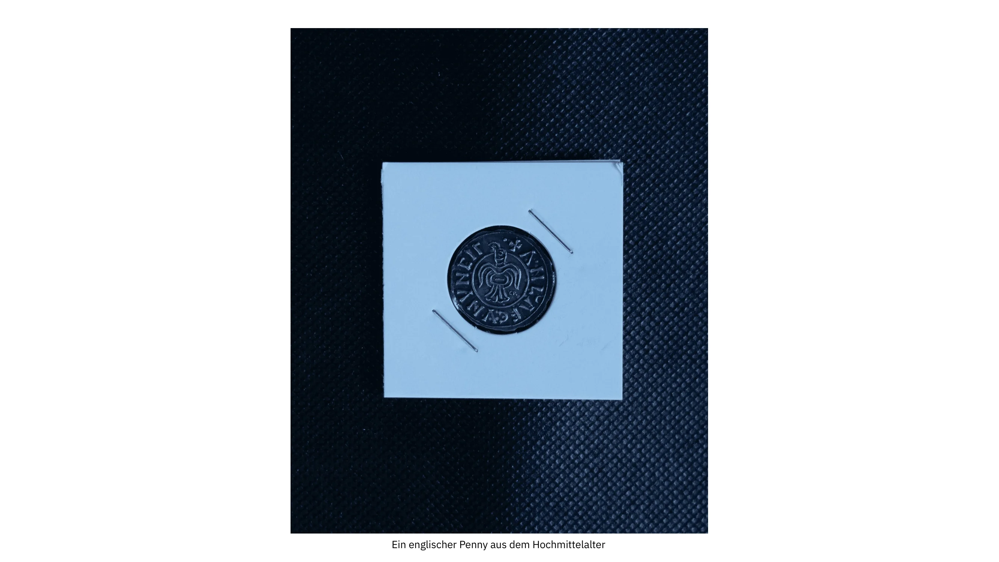

Im Hochmittelalter verfiel Europa nach dem Zusammenbruch des römischen Geldsystems in den Feudalismus. Die Mehrheit der Bevölkerung benutzte Kupfer- oder Bronzemünzen mit geringem Wert, die oft einer Währungsverwässerung unterlagen, was den Handel über große Entfernungen einschränkte.

Die Rückkehr des Münzgeldes als Zahlungsmittel erfolgte schrittweise und erreichte ihren Höhepunkt im 13. Jahrhundert mit der Einführung des Goldflorins in Florenz im Jahr 1252, gefolgt vom Golddukat in Venedig. Diese Goldmünzen fanden aufgrund der Ausweitung des Handels und des wachsenden Bedarfs an zuverlässigen, international akzeptierten Zahlungsmitteln weite Verbreitung.

In England wurde das Geldsystem durch innovative steuerpolitische Maßnahmen vor einer Verwässerung geschützt, z. B. durch die von Wilhelm dem Eroberer nach 1066 eingeführte Landsteuer, die die Qualität des Penny Sterling bewahrte. Es ist wichtig zu verstehen, dass die Herrscher zu dieser Zeit die Währung abwerten konnten, um den Staat zu finanzieren, und **die Einführung dieser Steuer ermöglichte es, die Währung stabil zu halten und den Staat durch Steuern zu finanzieren.**

Die Versuchung, durch die Verwässerung des Geldes Profit zu machen, führte jedoch zu Krisen, wie unter Heinrich I. im 12. Jahrhundert, als die Qualität der Münzen dramatisch abnahm. Strenge Reformen, die manchmal mit gewaltsamen Maßnahmen gegen die Münzsammler einhergingen, stellten das Vertrauen in die Währung vorübergehend wieder her.

Im Mittelalter entwickelten sich auch ausgeklügelte Finanzpraktiken, wie z. B. die Verwendung von Strichmännchen in England, um das Wucherverbot zu umgehen und Kredite zu vergeben. Die Kirche war nicht sehr begeistert von verzinslichen Krediten, so dass verschiedene Techniken eingesetzt wurden, um das Zinsverbot zu umgehen.

Diese Innovationen waren eine Reaktion auf den chronischen Mangel an Metallgeld und förderten das Entstehen eines Finanzmarktes im Anfangsstadium.

Die Kreuzzüge belebten den Mittelmeerhandel und förderten die Entwicklung des internationalen Handels und neuer Bankpraktiken, insbesondere durch den Orden der Tempelritter. Die Tempelritter wurden zu wichtigen Finanzvermittlern, die es den Kreuzfahrern ermöglichten, sich fern der Heimat Liquidität zu verschaffen, und die das moderne europäische Bankensystem vorwegnahmen.

Um die Verbindung zu den Templern herzustellen, können Sie hier unten eine französische mittelalterliche Münze betrachten, auf der Sie ein schönes Kreuz in der Mitte erkennen können. Es war durchaus üblich, dass Münzen dieser Epoche dieses Kreuz trugen.

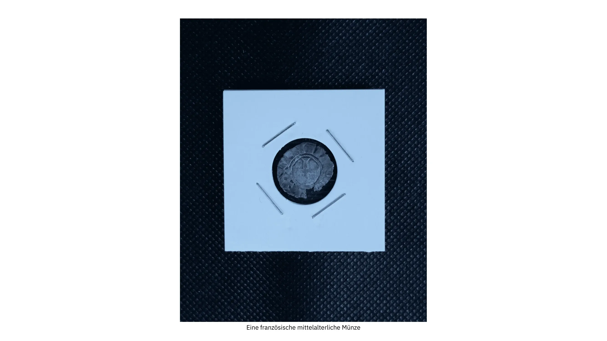

Schließlich führten große Krisen wie der Schwarze Tod (1346-1353) zu tiefgreifenden wirtschaftlichen Veränderungen. Der starke Bevölkerungsrückgang führte zu einem drastischen Anstieg der Löhne und widersetzte sich den Versuchen der Regierung, das bisherige Lohnniveau beizubehalten.

Gleichzeitig zwang der Hundertjährige Krieg (1337-1453) die Staaten zu einer aggressiveren Steuerpolitik, um ihre Heere zu finanzieren, was zur Schwächung des Feudalsystems beitrug.

Das Mittelalter war somit durch eine ständige Spannung zwischen dem Bedarf an verlässlichem Geld für den Handel und der ständigen Versuchung für die Herrscher gekennzeichnet, das Geld für den unmittelbaren Profit zu verwässern. Dieser Konflikt hat die europäische Geldentwicklung tiefgreifend geprägt und den Grundstein für die modernen Wirtschaftssysteme gelegt.

Zum Abschluss dieses Abschnitts möchte ich eine recht interessante Anekdote aus England aus dieser Zeit anfügen. Diese Anekdote stammt aus dem Buch "History of Money" von Glyn Davies.

Er erwähnt, dass in England die Verlagerung der Schuldenlast vom Souverän auf das Parlament erfolgte, was zu einer chronischen Staatsverschuldung führte. Zuvor lasteten die Schulden auf den Schultern des Souveräns.

Nachdem das Parlament einen Teil dieser Geldschöpfungsmacht an sich gerissen hatte, ermöglichte es die Schaffung langfristiger Schulden, die vom Volk und nicht vom König getragen wurden. Zuvor waren die Schulden mit dem König erloschen, wenn dieser in Konkurs ging oder der König ausgewechselt wurde.

In dem Moment, in dem das Parlament Schulden macht, entsteht der Begriff der Staatsverschuldung, denn sie ist potenziell zeitlich unbegrenzt. Solange es den Staat gibt, solange es das Parlament gibt, gibt es diese Schulden, und sie mussten alle möglichen Wege finden, um sie zu refinanzieren und sie über die Zeit zu verteilen. Das ist ein großer Paradigmenwechsel, bei dem nicht mehr der König oder das Königtum für diese Schulden bürgt oder sie trägt, sondern das Parlament und damit seine Bürger.

## Die Wiedergeburt

<chapterId>1d1dfb05-70b4-5b7b-9708-373c2182950d</chapterId>

:::video id=4977b4f3-c7b2-41a5-ad7b-a96a8cca4092:::

Wir haben nun den Abschnitt des Kurses erreicht, in dem wir über die als Renaissance bekannte Epoche sprechen. Sie findet vor dem Hintergrund einer tragischen Krise statt, nämlich der rasanten Ausbreitung der Pest durch Flöhe auf Ratten an Bord von Schiffen. Diese Tragödie gibt uns jedoch Aufschluss über das Wachstum von Handel und Reisen im Hochmittelalter. Früher bewegten sich nicht so viele Menschen so weit und so schnell.

### Der Florin von Florenz

Die Wiedereinführung von Goldmünzen in Europa während der Renaissance markiert einen grundlegenden Wendepunkt in der Geldgeschichte. **Alles begann mit dem Florin von Florenz im Jahr 1252, der ersten großen Goldmünze, die in Europa seit dem Fall Roms geprägt wurde**. Dank seines bemerkenswert konstanten Gewichts und Reinheitsgrads (etwa 3,5 Gramm reines Gold) blieb der Florin vier Jahrhunderte lang unverändert und wurde schnell zu einer wesentlichen gesamteuropäischen Währungsreferenz.

Hier unten sehen Sie eine Reproduktion eines Florins: ein goldener Florin aus Zinn, geprägt von einem französischen Künstler, der hervorragende Stücke herstellt, die von Hand graviert und geprägt werden.

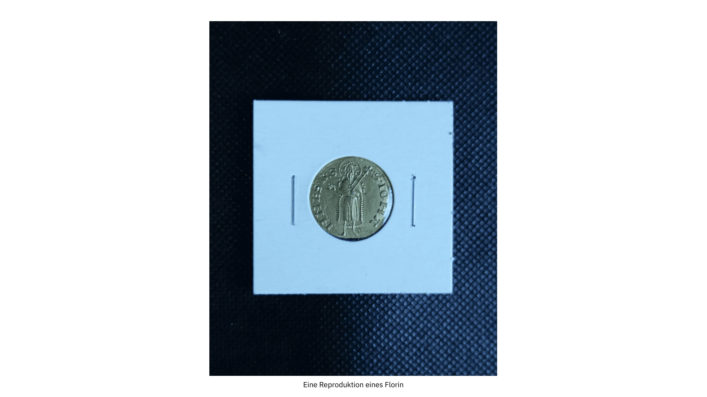

Diese Rückkehr zur Goldmünze war durch einen bestimmten Kontext bedingt: Der Zusammenbruch des byzantinischen Solidus und der wirtschaftliche Niedergang der muslimischen Welt infolge der Mongoleninvasionen schufen ein Währungsvakuum im internationalen Handel.

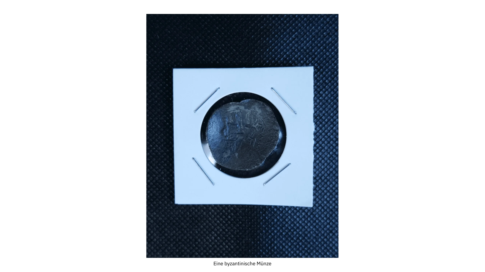

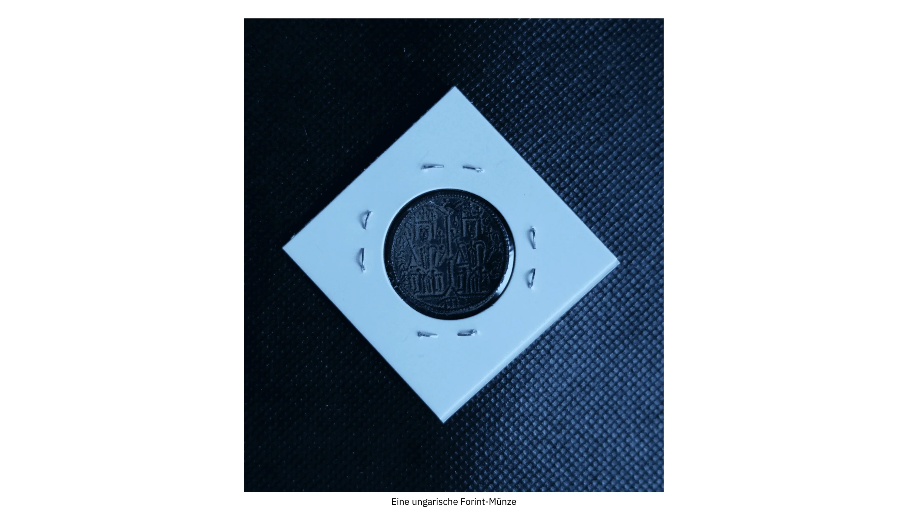

Das erste Bild oben zeigt eine byzantinische Münze, die ich sehr interessant finde. Ich werde eine Parallele zu einer ungarischen Münze aus derselben Zeit ziehen (zweites Bild oben). Die ungarische Münze ist becherförmig, wie eine Miniaturschüssel. Die Ikonographie zeigt religiöse Figuren, die als Könige dargestellt sind, die Kreuze nebeneinander halten. Dieses Stück ist schalenförmig und stammt aus Ungarn.

Es war durchaus üblich, Münzen aus anderen Ländern zu kopieren. Da die byzantinischen Münzen allgemein anerkannt waren, wurden sie oft von anderen Ländern kopiert. Wie Sie sehen können, wenn Sie sie nebeneinander vergleichen: diese Stücke sind sehr ähnlich.

Norditalien, vor allem Florenz, Venedig und Genua, nutzten diesen Umstand, um neue harte Währungen einzuführen - Münzen mit einem stabilen Edelmetallgehalt. Venedig folgte dem Beispiel von Florenz und prägte 1270 den Dukat, eine Währung, die fast identisch mit dem Florin war und im Mittelmeerhandel weit verbreitet war.

Der Florin wurde zur ersten internationalen Reservewährung, die vor Ende des 14. Jahrhunderts in über 150 europäischen Städten eingeführt wurde. Mit der Schaffung eines groß angelegten florentinischen Bankennetzes unter der Führung der Medici wurde die Geld- und Rechnungsführung grundlegend modernisiert, so dass sogar der physische Transport von Gold überflüssig wurde.

Das ist ein weiterer sehr interessanter Punkt. Es gab eine Zeit, in der viele Münzsendungen auf Seereisen verloren gingen. Dieser technische Fortschritt - die Register mit doppelter Buchführung - ermöglichte die Schaffung von Buchgeld. Dadurch war es möglich, die Zahl der Münzabrechnungen zu verringern und stattdessen ein System schriftlicher Eintragungen zu verwenden, wodurch das Risiko, Geld auf dem Transportweg zu verlieren, erheblich verringert wurde.

Die monetäre Entwicklung ging auch mit einer bedeutenden Weiterentwicklung der Bankmethoden einher. Zum Teil inspiriert durch den Kontakt der Kreuzzüge mit muslimischen Bankpraktiken, entstanden im mittelalterlichen Europa bereits im 13. Die Tempelritter, ein religiöser und militärischer Orden, hatten bereits ein System entwickelt, das es den Kreuzfahrern ermöglichte, zu reisen, ohne ihr Vermögen mitzunehmen.

Sie hinterlegten Gelder bei einem Templerbüro in ihrem Land und konnten dann mit einem Brief reisen und die Münzen bei ihrer Ankunft am Zielort des Kreuzzuges abholen.

Das bedeutete, dass wir keine Edelmetallmünzen mit uns herumtragen mussten.

In diese Zeit fällt auch, dass Europa dank Marco Polos Reise im 13. Jahrhundert von der Existenz von Papiergeld in China erfuhr. Die Entwicklung von Banknoten sollte jedoch noch mehrere Jahrhunderte auf sich warten lassen, da Europa es vorzog, zunächst seine Methoden der Metallmünzprägung zu perfektionieren. Leonardo da Vinci, der Luca Pacioli, einem bekannten Wirtschaftsprüfer, nahe stand, trug aktiv zur Verbesserung der Geldpressen bei und förderte eine schnellere und einheitlichere Münzproduktion.

Gemeint ist die bereits erwähnte Technik der Pendelprägung. Diese Methode ermöglichte die Herstellung gleichmäßigerer Münzen im Vergleich zum Hammerschlag und erlaubte vor allem Inschriften am Rand der Münze, wie ich bereits gezeigt habe. Der unten abgebildete europäische Taler aus dem Jahr 1793 zeigt deutlich eine Inschrift am Rande.

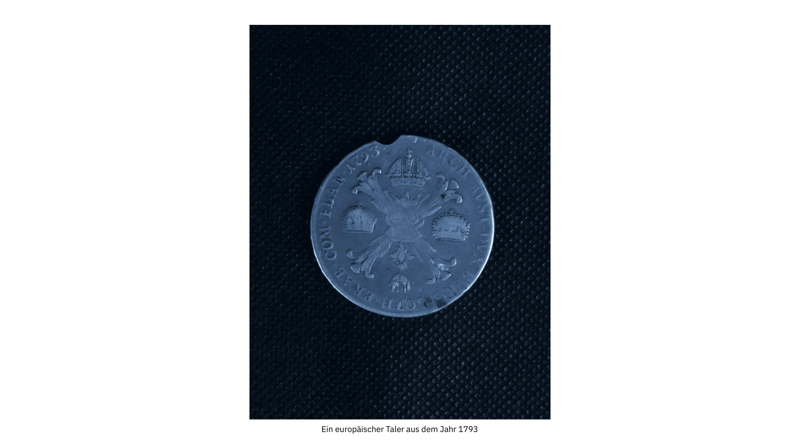

Im 15. Jahrhundert erlebte Europa jedoch eine schwere Währungskrise, die mit einer allgemeinen Verschlechterung des Silbergehalts der europäischen Währungen einherging, der um 1450 auf weniger als 5 % sank.

Ab dem 16. Jahrhundert verlagerte sich der monetäre Schwerpunkt nach Spanien, angeregt durch die Vereinigung der Königreiche Aragon und Kastilien, das Ende der Reconquista und die großen maritimen Entdeckungen wie die von Christoph Kolumbus im Jahr 1492. Der massive Zustrom von Silber aus den amerikanischen Minen brachte das europäische und globale Wirtschaftsgleichgewicht aus dem Gleichgewicht und schürte sowohl die Inflation als auch neue geopolitische Spannungen.

Die Renaissance markierte auch eine bedeutende künstlerische Entwicklung im Münzwesen, mit Münzen wie dem Taler (Joachimsthaler), dem Ursprung des Begriffs "Dollar". Diese großen Silbermünzen spiegeln die neuen künstlerischen und mechanischen Prägetechniken wider, die durch technische Innovationen aus Nordeuropa ermöglicht wurden.

Die Finanzrenaissance schließlich leitete den Übergang zur wirtschaftlichen Moderne ein, mit der Entwicklung des Bankwesens, des Kreditwesens und der Finanzmärkte sowie der Entstehung der ersten Formen des modernen Kapitalismus in den großen Handelsstädten Amsterdam, London und Stockholm, die den Grundstein für das internationale Finanzsystem legten, wie wir es heute kennen. Und das ist das Thema unseres nächsten Videos.

# Die Beschlagnahme von Geld durch den Staat

<partId>17cfb1b4-5bc1-53e0-b035-05c7cf76be92</partId>

## Die Entwicklung der Weltreservewährungen

<chapterId>d65cc352-e7ca-5f03-9b23-dd1fae5c0395</chapterId>

:::video id=82710062-8fff-426c-93af-923c08d82233:::

### Die historische Bedeutung von Edelmetallen

Willkommen zu diesem Abschnitt über die Entstehung von Reservewährungen und Zentralbanken. Als ersten Punkt dieser neuen Rubrik werden wir uns auf die Entwicklung der globalen Reservewährungen konzentrieren.

Edelmetalle, insbesondere Gold und Silber, galten lange Zeit als Grundlage für Reichtum und Macht in den Reichen. Der Durst nach Gold war schon immer eine treibende Kraft, und es war der Zustrom von Edelmetallen, der sich am unmittelbarsten und offensichtlichsten auf die monetäre Entwicklung in Europa auswirkte. Im Mittelalter und in der frühen Renaissance war diese Besessenheit von Gold und Silber auf die Schwierigkeit zurückzuführen, den Wert anderer Waren zu erhalten, sowie auf die starke Nachfrage ausländischer Mächte, insbesondere im Handel mit dem Orient.

Im Laufe der Jahrhunderte haben sich mehrere Imperien gegenseitig als globale Wirtschaftszentren abgelöst. Das Land, das den Welthandel in einem bestimmten Zeitraum dominiert, erhält in der Regel den Status einer Reservewährung. Dazu gehören:

- Spanien und Portugal (15. und 16. Jahrhundert)

- Die Vereinigten Provinzen (Niederlande) im 17. Jahrhundert

- Frankreich und Großbritannien im 18. und 19. Jahrhundert

- Die Vereinigten Staaten im 20. Jahrhundert

### Der portugiesische Boom und der Real (1450-1530)

**Portugal** dominierte den Welthandel in der zweiten Hälfte des 15. und zu Beginn des 16. Jahrhunderts mit dem **Portugiesischen Real**, einer Silbermünze von relativ einheitlichem Gewicht. Die Portugiesen entdeckten dank ihrer Fortschritte in der Schifffahrt neue Seewege nach Afrika, Asien und in die Neue Welt. Von Afrika bis China (Macau) entstanden immer mehr Militärfestungen und Handelsposten.

Als Reaktion auf die europäische Nachfrage nach Gold und Silber "war die ständige Motivation für die großen Entdeckungen der kommerzielle Profit, insbesondere das Streben nach Gold und Silber" Das portugiesische Reich war jedoch überfordert und sah sich der Konkurrenz durch die Niederländer, Engländer und Franzosen ausgesetzt und begann zu schrumpfen.

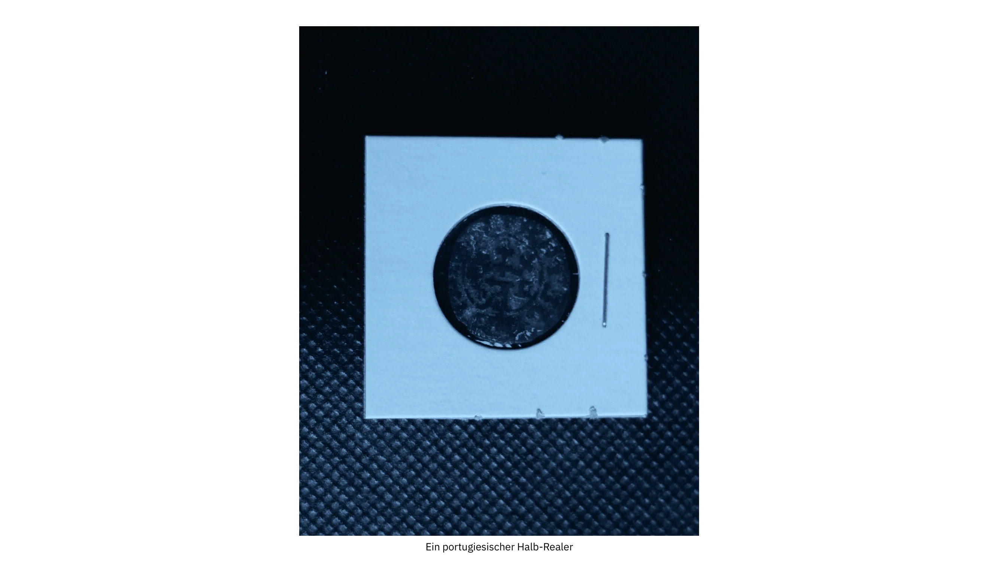

Hier oben sehen Sie einen portugiesischen Halb-Real aus der Zeit dieser maritimen Eroberungen.

### Die spanische Hochblüte und der spanische Dollar (1535-17. Jahrhundert)

Mit der Eroberung der Neuen Welt wurde **Spanien** der dominierende Akteur. Seinem Monarchen, der riesige Silberminen kontrollierte (Potosí in Bolivien, Zacatecas in Mexiko), gelang es, Geld in reinem Silber zu prägen und so die Abwertung seiner eigenen Währung zu vermeiden: des **Spanischen Real**

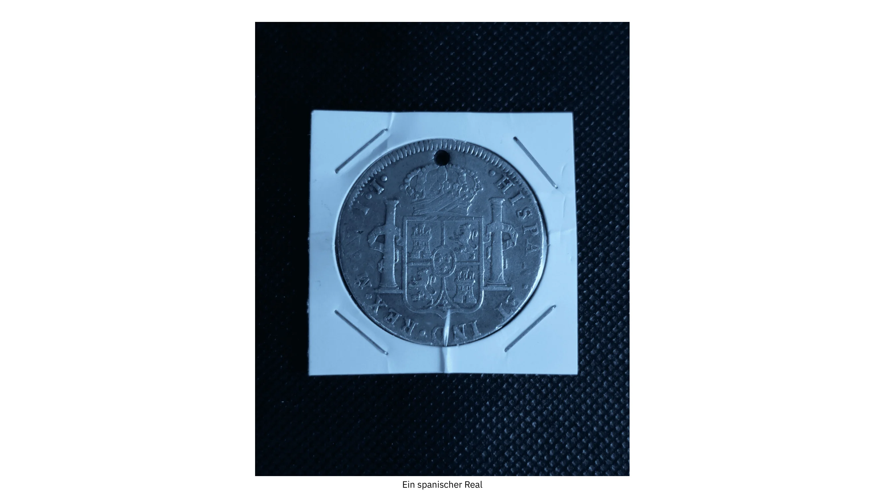

Der spanische Real, auch als "Achtelstück" bekannt, erhielt seinen Spitznamen, weil er oft in Achtel geschnitten wurde, um kleinere Münzen zu erhalten. Er war auch als **Spanischer Dollar** bekannt. Die oben abgebildete Münze stammt aus dem Jahr 1814 und ist damit ein etwas jüngeres Exemplar. Die allerersten spanischen Dollarmünzen waren jedoch nicht so raffiniert; sie wurden mit dem Hammer geprägt und waren im Allgemeinen weniger rund und knackig.

Besonders interessant ist, dass der spanische Dollar zu dieser Zeit als internationale Reservewährung diente. Die spanischen Behörden gaben auch ihre eigene Landeswährung, den Maravedi, aus und passten die Geldmenge regelmäßig durch Rückrufe an. So konnte eine Kupfer- oder Bronzemünze, die ursprünglich einen Maravedi wert war, zurückgerufen und mit "2", später mit "4" und so weiter geprägt werden, bis sie schließlich "8" erreichte Auf dem hochauflösenden Foto ist die auf die Münze geprägte "8" deutlich zu erkennen. Mit dieser Methode wurde die Geldmenge effektiv ausgeweitet, was unweigerlich zu einer Inflation führte.

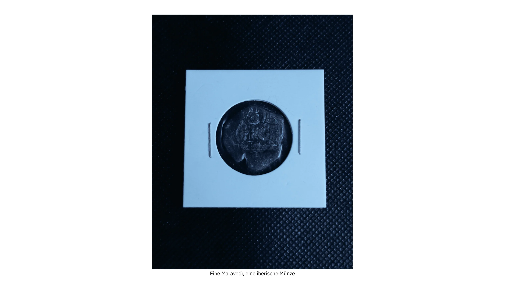

Betrachtet man die Geschichte der Reservewährungen, so zeigt sich ein interessanter Punkt: Die Imperien haben ihre Währungen nicht aufgepumpt, solange sie ihren Reservewährungsstatus behielten. **Erst am Ende ihrer Herrschaft werteten sie sie ab und verloren dieses Privileg, das dann an ein neues Reich weitergegeben wurde**.

In Spanien dominierte der spanische Dollar fast 200 Jahre lang den Welthandel, insbesondere zwischen China und Europa. Diese Münzen waren sogar in chinesischen Häfen zu finden. Und hier bekommen wir ein Augenzwinkern aus der Geschichte: Der amerikanische Dollar geht direkt auf diese Währung zurück. Als die Vereinigten Staaten 1792 gegründet wurden, erließen sie ein Gesetz zur Prägung einer eigenen Währung, und ihre ersten Dollars wurden nach dem Vorbild des spanischen Dollars geschaffen, sowohl was den Namen als auch die Münzgröße betrifft.

Um Ihnen eine Vorstellung von seinem Wert zu geben: Ein amerikanischer Dollar war ursprünglich eine Silbermünze mit einem Gewicht von fast einer Unze, also zwischen 30 und 40 € in heutigem Geld, anders als die Papierwährung, die wir heute kennen. Der spanische Dollar war so weit verbreitet, dass er als die erste echte Weltwährung gilt.

Dieser Zustrom von Edelmetallen aus Amerika führte jedoch zu einer Inflation in Europa. Während der Preisrevolution (ca. 1540-1640) stiegen die Lebenshaltungskosten in England um das Siebenfache. In Spanien hatte der Silberreichtum einen perversen Ressourcenfluch zur Folge, der die Entwicklung solider Bankinstitute behinderte.

In der Folgezeit war Spanien mit zahlreichen militärischen Konflikten konfrontiert (Flandern, Niederlande, Dreißigjähriger Krieg), und seine Finanzen brachen allmählich zusammen. Anstatt die weltberühmte Silbermünze abzuwerten, zogen es die nachfolgenden Herrscher vor, die von der Bevölkerung verwendete Kupfermünze (vellón) zu verfallen oder abzuwerten. Dies ist das, was ich bereits bei den Maravedis beschrieben habe.

### Der niederländische Aufstieg (17. Jahrhundert)

Nach dem iberischen Höhepunkt entwickelten sich die **Niederlande** im 17. Jahrhundert zu einer neuen Handelsmacht. Der Seehandel, die VOC (Niederländische Ostindien-Kompanie) und die Gründung der **Amsterdamer Börse Exchange** (nach dem Vorbild der Antwerpener Börse) machten diese Handelsrepublik zu einem Zentrum.

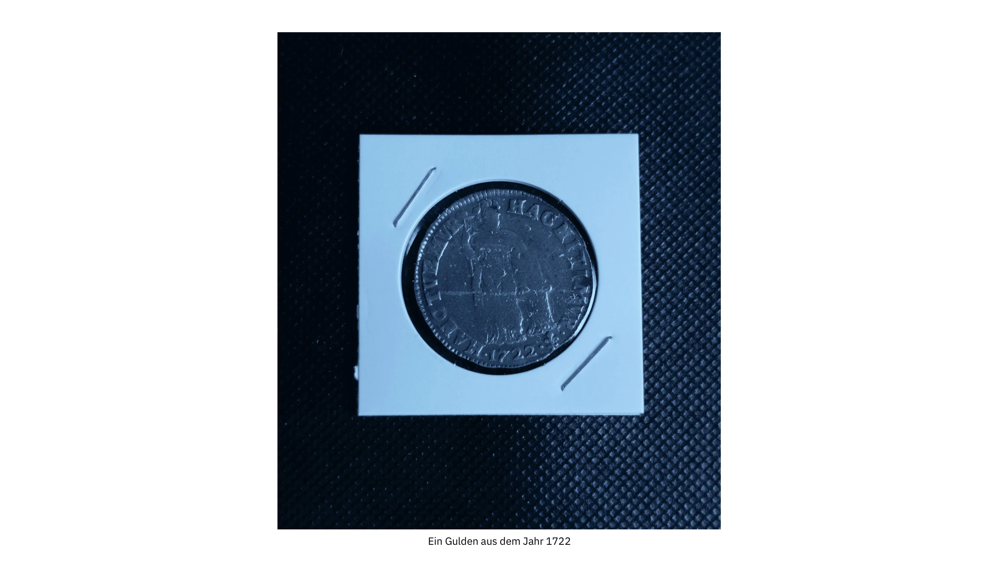

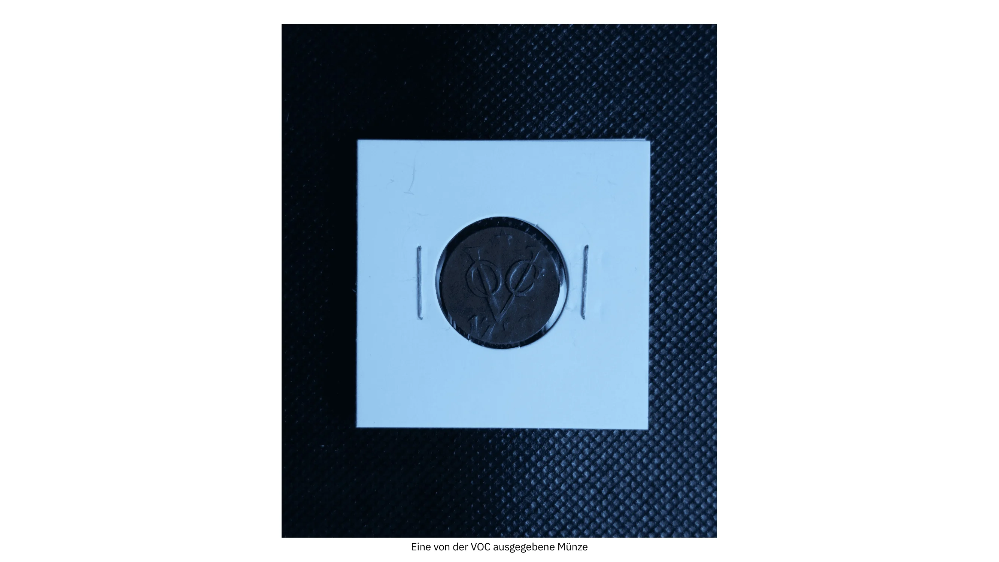

Auf dem ersten Foto ist ein Gulden aus dem Jahr 1722 zu sehen (eine schöne Silbermünze), während auf dem zweiten Foto eine von der VOC ausgegebene Münze zu sehen ist.

Die VOC war für ihre Zeit ein äußerst mächtiges Unternehmen: Sie verfügte über eine eigene Armee und gab sogar eine eigene Währung heraus.

Die Niederländer erfanden den modernen Kapitalismus, der als Mittel zur Risikoverteilung bei riskanten Unternehmungen wie Expeditionen in die Neue Welt oder der Suche nach neuen Handelswegen begann. Aktiengesellschaften ermöglichten es mehreren Investoren, ihr Geld zusammenzulegen und das Risiko zu teilen. Um diesen Austausch zu erleichtern, mussten Institutionen geschaffen werden, die in der Lage waren, diese Wertpapiere auszuhandeln und auszutauschen. So wurden 1602 die erste Aktiengesellschaft und die erste Börse gegründet.

Die holländische Währung, der **Gulden**, gewann an Glaubwürdigkeit dank seiner Reinheit in Silber und dann durch seine Annahme durch die Bank von Amsterdam (1609), wo Einlagen zu einem bevorzugten Geld in Europa wurden. Dies ist ein sehr wichtiger Punkt, der erwähnt werden muss. Ja, natürlich gab es Münzen, aber das eigentliche Geld war damals eine Art Buchgeld. Tatsächlich lief ein Großteil des Welthandels über die Bücher der Bank von Amsterdam. Dies war ein echter Durchbruch im Bankwesen: Der internationale Handel wurde nicht mehr unbedingt mit physischen Münzen abgewickelt, sondern direkt über die Buchhaltung der Bank.

Diese Zeit des Wohlstands war durch einen großen Zustrom von Gold und Silber gekennzeichnet, vor allem aus anderen Ländern, die Inflation oder Geldkontrolle praktizierten. Hier ist eine interessante Persönlichkeit zu erwähnen: **Thomas Gresham**. Er arbeitete zu dieser Zeit für das englische Königshaus in den Niederlanden und verwaltete die Geldströme zwischen den beiden Ländern. Von diesem Gresham stammt auch das berühmte **Gesham-Gesetz**.

Doch auch dem niederländischen Reich ging irgendwann die Puste aus. Die Kriege mit England, die Verwässerung des Gulden in Konfliktzeiten und die Konkurrenz durch andere Mächte (Frankreich und England) signalisierten das Ende der niederländischen Hegemonie. Nach dem Vierten Englisch-Niederländischen Krieg (1780-84) wurde der Niedergang des Gulden als Reservewährung unumkehrbar.

### Französische Macht, Ambitionen und Misserfolge (17.-18. Jahrhundert)

Unter Ludwig XIV. wurde **Frankreich** zur größten kontinentalen Macht in Europa. Die französische Währung erreichte jedoch nie den Status einer dominierenden Referenz: zahlreiche Abwertungen, hohe Steuern und kostspielige Kriege (Augsburger Religionsbund, Spanischer Erbfolgekrieg usw.) belasteten die Stabilität des Währungssystems.

Das erste größere Experiment mit Papiergeld wurde von John Law (1716-1720) durchgeführt. Die Banque Générale gab Geldscheine aus, die durch Versprechen von Staatsschulden unterlegt waren. Dieses System führte zu einer Spekulationsblase, die 1720 zusammenbrach (die Mississippi-Blase). Diese Katastrophe hinterließ in Frankreich ein dauerhaftes Misstrauen gegenüber Papiergeld. Diese katastrophale Erfahrung führte dazu, dass Richard Cantillon dank dieses Systems, das heute als Cantillon-Effekt bekannt ist, reich wurde: Das Drucken von Geld bereichert diejenigen, die Zugang zur Druckerpresse haben.

Als dieses Misstrauen schließlich schwand, kam ein weiteres französisches Papierfiasko: die revolutionären **Assignaten**. Diese Assignaten, die ab 1790 auf der Grundlage der Konfiszierung von geistlichem Eigentum ausgegeben wurden, erlebten eine galoppierende Hyperinflation, die offiziell die erste Hyperinflation der Geschichte war, die 50 % pro Monat überstieg. Obwohl ihr Nennwert vervielfacht worden war, wurden sie 1795 nur noch zu einigen Prozent ihres ursprünglichen Wertes gehandelt.

Mit restriktiveren Gesetzen wurde versucht, das Assignat durchzusetzen, jedoch ohne Erfolg. Die Regierung versuchte, sie durchzusetzen, und ging dabei so weit, dass sie diejenigen, die sie nicht akzeptierten, mit dem Tod bedrohte und die Ladenbesitzer zwang, geöffnet zu bleiben. Aber am Ende hat das natürlich nicht funktioniert.

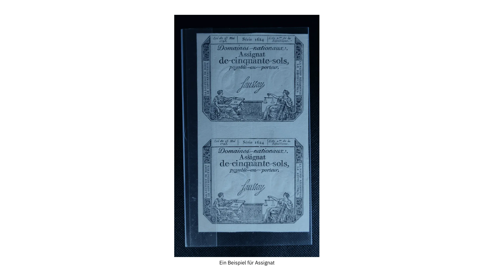

Da dieses Papiergeld alle hochwertigen Edelmetallmünzen ersetzte, kam es in Übereinstimmung mit dem berühmten Gresham'schen Gesetz zu einer Münzknappheit. Um neue Münzen zu prägen, wurde Glockenmetall verwendet, das dem Klerus entzogen wurde. Hier unten sehen Sie ein wunderschönes Stück Glockenmetall, das aus wiedergewonnenem Kupfer durch Einschmelzen der dem Klerus abgenommenen Münzen hergestellt wurde.

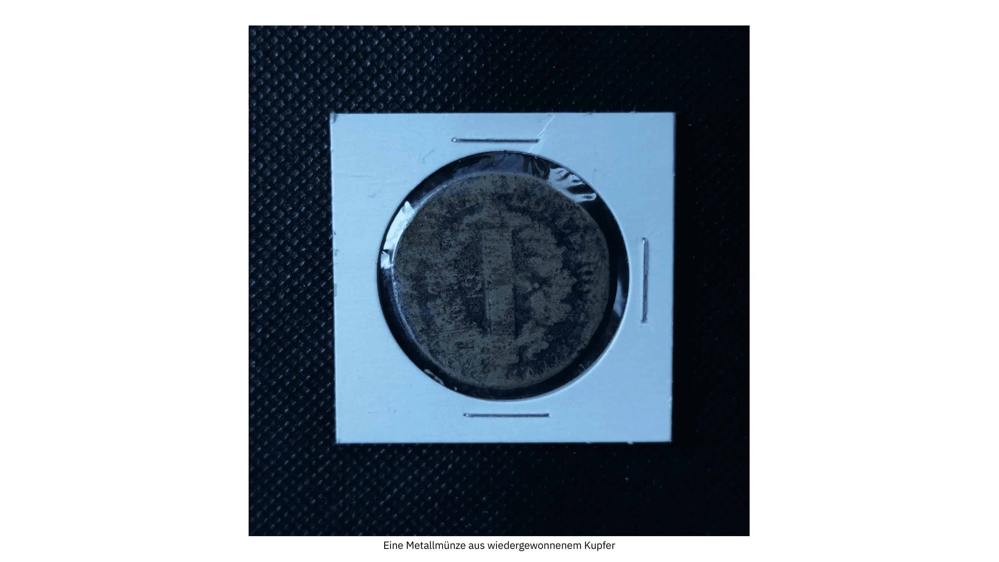

### Britische Herrschaft (18. - frühes 20. Jahrhundert)

**Nachdem England die Niederlande überholt hatte, wurde es im 18. Jahrhundert die dominierende Macht. Das Pfund Sterling ist die älteste noch in Gebrauch befindliche Währung, die ursprünglich an ein Pfund Silber gebunden war. Nach und nach wurde sein Status gestärkt, unterstützt durch eine finanzielle und steuerliche Revolution: eine parlamentarische Monarchie, eine starke Steuererhebungskapazität und die Gründung der Bank of England im Jahr 1694\.

Nach einer Reihe von Kriegen gegen Frankreich ging das Vereinigte Königreich 1815 (Waterloo) als Sieger hervor und bestätigte damit seine Vormachtstellung. Während des gesamten 19. Jahrhunderts diente das Pfund Sterling als Weltreservewährung. Auf dem Höhepunkt seiner Macht erwirtschaftete Großbritannien mit nur 2,5 % der Weltbevölkerung 20 % des Welteinkommens und kontrollierte fast ein Viertel der Erdoberfläche.

Die **Industrielle Revolution** und die Einführung eines **Goldstandards** (1717 oder 1718, unter der Aufsicht von Isaac Newton in der Königlichen Münzanstalt) stärkten die Glaubwürdigkeit des Pfunds. Die Bank of England führte einen Goldstandard von 4,25 Pfund pro Unze Gold ein, der es den Noteninhabern ermöglichte, ihre Noten in Gold umzutauschen.

Der Erste Weltkrieg (1914-1918) bereitete diesem System jedoch ein Ende. Innerhalb weniger Wochen setzten alle großen kriegführenden Mächte die Goldkonvertibilität aus. Das britische Empire und später das Pfund gingen geschwächt aus dem Zweiten Weltkrieg hervor und wurden im 20. Jahrhundert vom amerikanischen Dollar abgelöst.

Und als Artefakt können Sie unten einige schöne und interessante Stücke sehen. Es handelt sich um Geldgewichte. Das erste ist der Sovereign: die frühesten Darstellungen des Pfunds. Ich habe nur Geldgewichte, um diese Münzen darzustellen, weil ich es mir nicht leisten kann, einen echten Sovereign zu kaufen. Um sie zu wiegen, haben wir eine Waage benutzt und dann das Geldgewicht, das dem Wert des Sovereigns entspricht, auf die andere Seite gelegt.

Der Sovereign war eine Geldmünze - eine Goldmünze im Wert von ursprünglich einem Pfund.

Der Vorgänger des berühmten Sovereigns war der Guinea, der nach demselben Prinzip funktionierte. Der Guinea wurde nach den in ihm enthaltenen Edelmetallen benannt, die aus der Region Guinea stammten.

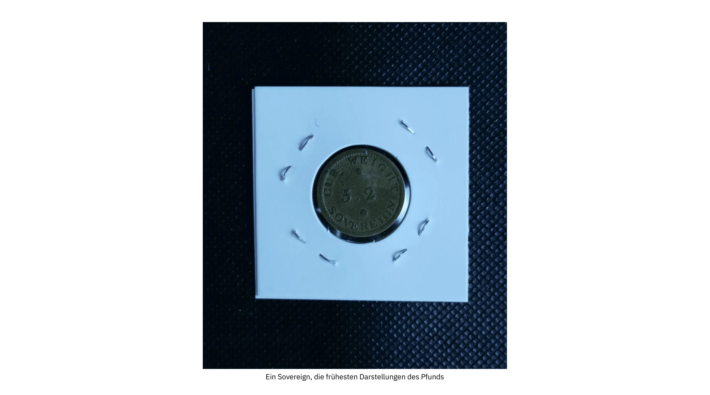

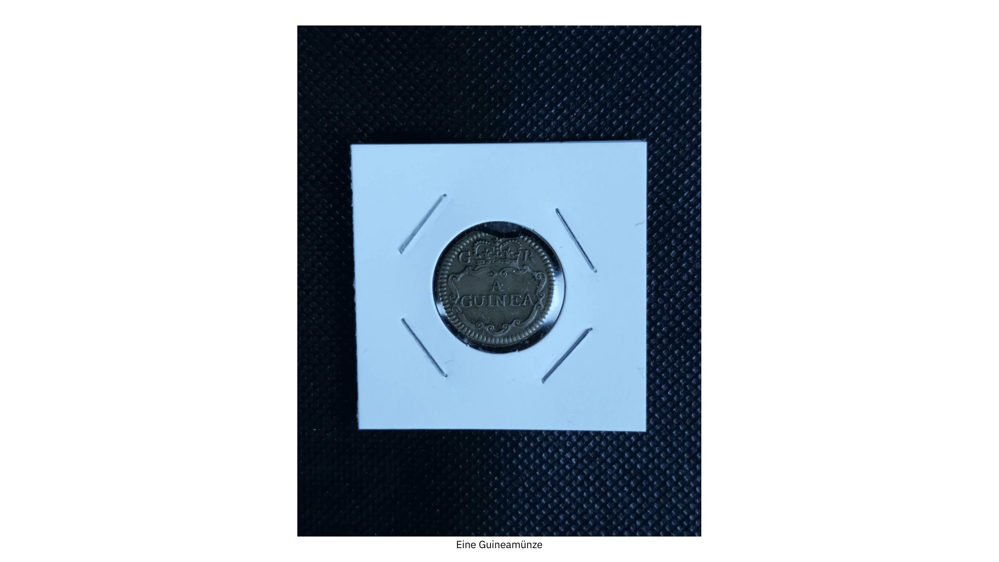

## Das Aufkommen der Zentralbanken

<chapterId>15777771-1e28-55f7-a400-69868a47079b</chapterId>

:::video id=7661b7b5-e00f-48f3-b69a-6fb2eb5ebba4:::

Im Anschluss an diesen Abschnitt über die Geschichte der ersten Reservewährungen und ihre Entwicklung folgt nun ein Abschnitt über die Entstehung der Zentralbanken. Er folgt weitgehend demselben Pfad wie die Entstehung der Reservewährungen, konzentriert sich aber etwas mehr auf die Bankentechnologien der damaligen Zeit.

### Die Anfänge der Banken und Proto-Banken

Bereits im 13. Jahrhundert entwickelten die Italiener (Florenz, Genua, Venedig...) die Technik der doppelten Buchführung. Später wurde **Antwerpen** (16. Jh.) zum führenden Finanzzentrum Nordeuropas, eine Rolle, die später von **Amsterdam** übernommen wurde, dank der Amsterdamer Börse Exchange (1609), wo VOC-Aktien gehandelt wurden.

In Antwerpen fanden Handelsmessen statt, auf denen sich die Händler häufig trafen, um Schulden zu begleichen, was zur Erfindung neuer Finanzinstrumente führte. Der unten abgebildete Geldschein aus dem Jahr 1761 ist ein **Schuldschein**, der jüngeren Datums ist. Er weist handschriftliche Details und Inschriften auf der Rückseite auf, die ihn zu einem prächtigen Artefakt aus dieser Zeit machen.

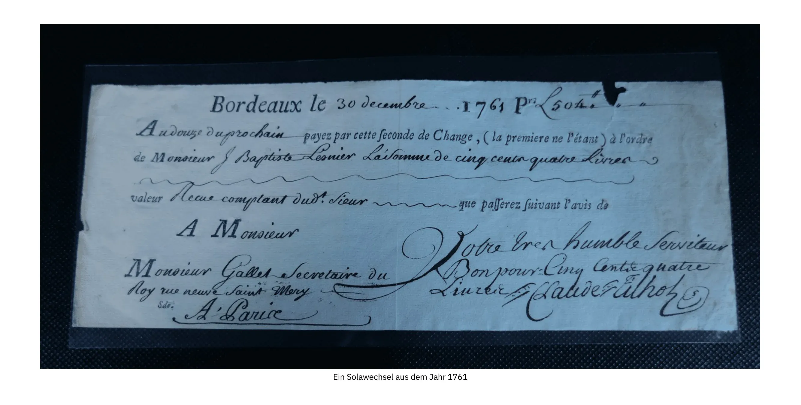

Dieser Aufschwung führte zur Schaffung von ausgefeilteren Bankinstituten. *die *Lombardischen Bankiers** und später die niederländischen Kaufleute perfektionierten die Kreditinstrumente (Wechsel, Schuldscheine usw.). Das moderne Bankensystem basiert auf dieser Idee: Geld kann Kredit sein, nicht nur Metall.

Wie Sie sehen, bringt uns das zurück zu unserer ursprünglichen Frage nach dem Ursprung des Geldes.

Geht das Geld aus einer Ware hervor, die aus dem Bedürfnis nach Tausch entsteht, oder entsteht es aus dem Kredit? Spuren davon sind in diesem Abschnitt noch zu finden.

### Das schwedische Beispiel: Stockholms Banco und Riksens Ständers Bank

Kommen wir zu Schweden, wo die allererste Zentralbank gegründet wurde.

**Schweden** war ein Pionier des Zentralbankwesens: 1657 gründete Johan Palmstruch die **Stockholmer Bank**, die befugt war, mehr Geld zu verleihen, als sie an Metallreserven besaß, und damit die Geburtsstunde des [Mindestreserve-Bankwesens](https://planb.academy/resources/glossary/fractional-reserves) einleitete. Die übermäßige Ausgabe von Banknoten führte jedoch zu einer Panik und einem Ansturm auf die Bank im Jahr 1663. Sieh an, sieh an...

1668 wurde in Stockholm die Riksens Ständers Bank, die erste echte Zentralbank der Welt, gegründet. Aber auch sie litt unter Krisen (1709, 1715...), die mit dem Missbrauch von Banknoten zusammenhingen, die häufig zur Finanzierung der Kriege des Königreichs verwendet wurden.

### John Laws gescheiterter Putsch

Auf geht's nach Frankreich, wo wir unseren geliebten John Law wiederfinden.

**John Law**, ein Schotte, überredete den Regenten (Herzog von Orleans) zur Gründung einer Privatbank, der Banque Générale (1716), die befugt war, Papier gegen Gold, Silber und Staatsschulden auszugeben. Sie wurde zur Banque Royale (1718) und verhalf den Aktien der Mississippi Company zu einem Höhenflug.

Als die Realität die Spekulationen einholte, **wurde die Panik durch die Entscheidung verschärft, den Besitz von Gold zu verbieten und die Verwendung von Laws-Noten zu erzwingen**. Sieh an, sieh an...

Schließlich platzte die Blase im Jahr 1720 und verursachte einen Zusammenbruch, der die Glaubwürdigkeit des Papiergeldes in Frankreich für lange Zeit ruinierte.

### Die Bank von Amsterdam, der Aufstieg eines Pioniermodells

Wir befinden uns nun im Jahr 1609 in Amsterdam, wo die **Bank von Amsterdam** (Wisselbank) die Kontrolle über die Aufbewahrung und Konvertierbarkeit von Münzen in Amsterdam übernommen hat. Sie verbot den Umlauf privater Banknoten und erzwang die Verwahrung von Metallmünzen in ihren Tresoren. Nach und nach gelang es ihr, die Kontrolle über die Währung zu erlangen. Sie verbot den Geldwechslern, Münzen bei sich zu führen. Die Geldwechsler arbeiteten den ganzen Tag und mussten ihre Münzen am Ende des Tages in den Tresoren der Bank von Amsterdam deponieren. Wie ich bereits erwähnt habe, waren es nicht unbedingt Metallmünzen, die im internationalen Handel verwendet wurden. Es handelte sich um Schriftgeld, das in den Büchern der Bank stand.

Dank der Macht der niederländischen Kaufleute spielte die Bank die Rolle der ersten De-facto-Zentralbank" und stabilisierte den Welthandel. Mit der Zeit gewährte sie der VOC jedoch ungesicherte Kredite und hatte schließlich kein Metall mehr, um ihre Rechnungen zu decken. Im Jahr 1790 stellte sich heraus, dass sie der VOC große Summen geliehen hatte, woraufhin sie praktisch Konkurs anmeldete und die Glaubwürdigkeit des Gulden ruinierte. Sieh an, sieh an...

### Die Bank von England, Gründungsakt des modernen Bankwesens

Im England des 17. Jahrhunderts wurden Gold und Silber von Goldschmieden gelagert, die Quittungen ausstellten. Diese teilweise dezentralisierte Organisation stieß an ihre Grenzen, als die Krone einen massiven Finanzierungsbedarf für den Krieg gegen Frankreich hatte.

Im Jahr 1694 wurde die **Bank of England (BoE)** gegründet. Die Bank of England entstand also aus einer Vernunftehe zwischen der Londoner Geschäftswelt und der Regierung, die verzweifelt nach Mitteln für den Krieg suchte.

Die Bank erhielt das Monopol für die Ausgabe von Banknoten in England (das 1708, 1742 usw. verstärkt wurde). Von da an zirkulierte neben den Münzen auch durch Goldreserven gedecktes Papiergeld. Dies ist ein wichtiger Punkt für das Verständnis der schrittweisen Übernahme des Geldes durch staatliche Institutionen. Zunächst hinderte die Bank von Amsterdam Geldwechsler daran, Münzen zu behalten, und zwang sie, sie an die Bank zurückzugeben. In England war es den Privatbanken verboten, eigene, in Gold einlösbare Banknoten auszugeben.

Sie gestatteten den Privatbanken zwar die Ausgabe von Banknoten, doch konnten diese nur gegen Banknoten der Bank of England umgetauscht werden.

Banknoten der Bank of England, Pfund Sterling, waren in Gold einlösbar. Damit wurde der Währung eine dritte Ebene hinzugefügt. Wir haben also Gold an der Basis, dann Banknoten der Bank of England und dann private Banknoten an der Spitze. Davor konnten die Privatbanken ihre eigenen, in Gold einlösbaren Banknoten ausgeben. Dies ist eine weitere Stufe der allmählichen Übernahme der Währung durch staatliche Institutionen.

Die Bank finanzierte den Staat mit umfangreichen Darlehen und strukturierte die enorme Staatsverschuldung, die den Wirtschaftsboom finanzierte.

Dieses Modell wurde im Laufe des 18. und 19. Jahrhunderts so weit gefestigt, dass das Pfund unter dem Siegel der Bank of England und des Goldstandards zur Weltreservewährung wurde.

**Die Reservewährungen der Welt** folgten im Laufe der Jahrhunderte aufeinander, angetrieben von der wirtschaftlichen, kommerziellen und militärischen Macht eines Staates oder Reiches: Portugal, Spanien, die Niederlande, dann Großbritannien, bevor im 20. Jahrhundert die Vereinigten Staaten die Vorherrschaft übernahmen. Jahrhundert die Vorherrschaft übernahmen. In jedem Fall ist ein ähnlicher Zyklus zu beobachten: wirtschaftliche Expansion, kommerzieller Erfolg, internationale Übernahme der Währung, Verschuldung, kostspielige Kriege, missbräuchliche Geldschöpfung oder Kredite und schließlich der Niedergang.

**Die Entstehung von Zentralbanken** war ein schrittweiser Prozess. Diese Institutionen entstanden oft im Zusammenhang mit kostspieligen Kriegen und ermöglichten es dem Staat, sich durch Schulden zu finanzieren. Als der Goldstandard eingeführt wurde (England, 17.-19. Jahrhundert), bot er einen Anschein von Stabilität, bis die großen Weltkriege des 20. Jahrhunderts zur allmählichen Aufgabe der Goldkonvertibilität führten. Die Befugnis, Geld zu prägen, verlagerte sich somit vom königlichen Monopol auf komplexere Einheiten, zunächst private (Goldschmiede, Bankiers), dann halbstaatliche (Zentralbanken), was die Entwicklung der monetären Souveränität hin zu institutionalisierten, globalisierten Formen widerspiegelt.

Das ist es also, was ich vorhin beschrieben habe. Wir haben die Last der Staatsverschuldung oft direkt auf die Zentralbanken oder die Erlaubnis zur Geldschöpfung durch rechtliche Institutionen wie das Parlament verlagert.

Und die wichtigste Tatsache dabei ist, dass **wir uns von einer Verschuldung, die durch den Bankrott des Staates verschwinden konnte, zu einer Verschuldung entwickelt haben, die hauptsächlich auf den Schultern der Bevölkerung lastet**.

## Der Weg zum Fiat-System

<chapterId>27a98545-d350-56ee-a200-92468e6b9b33</chapterId>

:::video id=e27a753e-aeee-4307-a65c-9506aab380a1:::

Wir sind nun am Ende dieses Kurses über die Geschichte des Geldes angelangt, und um ihn abzuschließen, möchte ich zwei Themen vorschlagen. Das erste Thema sind die verschiedenen Etappen, die zu unserem heutigen Fiat-Währungssystem geführt haben. Wir werden die Fakten aus Abschnitt 5 über die Gründung von Zentralbanken wiederholen und das Konzept des US-Dollars, der letztlich die aktuelle Reservewährung ist, hinzufügen. Wir werden uns ansehen, wie er sich entwickelt hat, wie der Dollar entstanden ist, wie er sich entwickelt hat, wie er sich verändert hat, welche Stufen er durchlaufen hat, um ein Fiat-System zu werden, denn der Ursprung des Dollars ist eine Silbermünze.

Unmittelbar danach werde ich Ihnen einen kurzen Abschnitt über die Geschichte des Finanzwesens geben, damit Sie verstehen, wie wir zum Wohlfahrtsstaat gekommen sind. Wir werden uns also zwei Themen ansehen: wie wir zum Fiat-System gekommen sind, und unmittelbar danach, wie die Entwicklung der Finanzen uns zum Konzept des Wohlfahrtsstaates geführt hat.

### Die europäischen Grundlagen des modernen Bankwesens

Gehen wir zurück ins 13. Jahrhundert mit dem Gulden. Um zu verstehen, wie wir zum Fiat-Modell gekommen sind, müssen wir im 13. Jahrhundert beginnen. Jahrhundert beginnen. Neben dem Gulden entstand zur gleichen Zeit mit den Medici eine Technologie, nämlich das Konzept der Wechsel.

Dann kam die Antwerpener Börse mit ihrem Konzept der Diskontierung und der Solawechsel.

Dann gab es, wie wir gesehen haben, die VOC, die erste Börse in Amsterdam. Dies war die Geburtsstunde des Kapitalismus, mit Unternehmensaktien und dem Austausch von Aktien. Die Amsterdamer Bank führte dann per Dekret die Verwendung von Einlagen ein. Das bedeutete, dass die Münzen am Ende des Tages eingezahlt werden mussten. Die Geldwechsler konnten das Wechselgeld nicht mehr in Form von Münzen aufbewahren.

Dann kam die Gründung der Bank of England aus der Notwendigkeit heraus, Schulden zu machen, um den Krieg Ende des 17. Jahrhunderts zu finanzieren. Zu dieser Zeit wurden die Privatbanken zur dritten Ebene des Geldes. Dieser ganze Abschnitt, vom Gulden bis zur Idee der Zentralbankschöpfung, ist übrigens sehr gut in Nick Bhatias berühmtem Buch "Layered Money" zusammengefasst, das ich das Glück hatte, zusammen mit einigen Kollegen zu übersetzen. Wir haben bei der Übersetzung gute Arbeit geleistet, damit alle Französischsprachigen von diesen Lehren profitieren können.

Wir befinden uns also am Ende des 17. Jahrhunderts. Die Bank of England wurde zur Finanzierung des Krieges gegründet.

Die Privatbanken übernahmen die dritte Ebene der Währung. Die Banknoten der Privatbanken waren nämlich nicht mehr in Gold einlösbar, sondern die der Bank of England waren in Gold einlösbar. Dies zeigt, dass die Bank of England die Macht über die Währung an sich gerissen hat.

Dann kam die Panik von 1776. Alle stürzten sich auf die Geldpyramide. Das heißt, 1776 gab es einen Ansturm auf die Banken, und alle Leute, die Papiere der dritten Schicht hatten, d.h. private Banknoten, versuchten, Banknoten der Bank of England zu bekommen, und versuchten dann, Gold zu bekommen, aber offensichtlich gab es nicht genug Gold in den Tresoren. Sie erklärten eine Art Bankfeiertag, um die Rückzahlung der Goldscheine zu vermeiden, und so entstand das Konzept des "Lender of Last Resort".

### Die Entwicklung des US-Dollars

Wir sind vom Gulden zur Gründung der Bank of England übergegangen. Natürlich gab es in der Zwischenzeit den Ersten und den Zweiten Weltkrieg, aber zuvor, im Jahr 1796, fanden auch auf der anderen Seite des Atlantiks Entwicklungen statt. Im Jahr 1776 war Amerika noch eine britische Kolonie, und die Kolonien verwendeten diese Papierwährung. Unten sehen Sie einen Zwei-Schilling-Schein aus Connecticut von 1776.

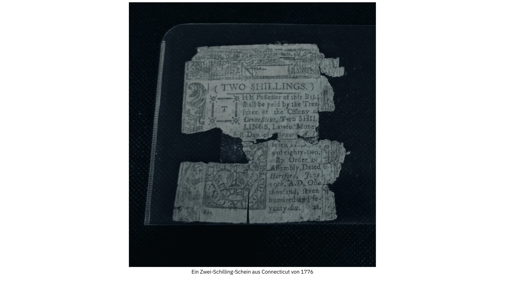

Bevor sie England den Krieg erklärten und schließlich ihre eigene Währung ausgaben, verwendeten die Kolonien diese Papierwährung zusammen mit dem spanischen Dollar für Bargeldtransaktionen. Tatsächlich blieb der Begriff "Dollar" erhalten, um den amerikanischen Dollar zu bezeichnen.

Wenn ich mich nicht irre, verabschiedeten sie 1792 ein Gesetz, das es ihnen erlaubte, Geld zu prägen. Das folgende Beispiel ist ein amerikanischer Dollar aus der Neuzeit.

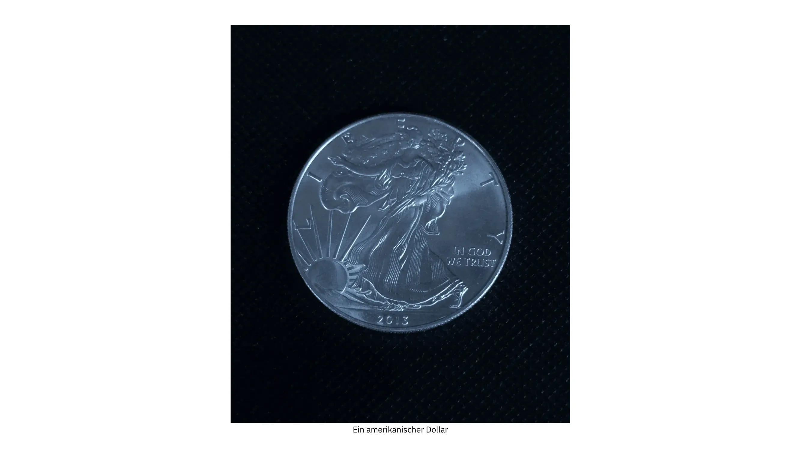

Natürlich hat er nicht nur einen Nennwert von einem Dollar; er ist etwa 30 oder 40 Dollar wert, da er eine Unze Silber repräsentiert. Sein Wert schwankt in Abhängigkeit vom Silberpreis und liegt in der Regel bei mindestens 30 oder 40 US-Dollar. Heute hat ein Papierdollar natürlich nur noch den Nennwert von einem Dollar, aber damals war der US-Dollar in diesem Silberwert verwurzelt.

Lassen Sie uns jetzt über den Bürgerkrieg in Amerika sprechen. Die Konföderierten druckten Geld, das hyperinflationär war. Dieses Phänomen ist in der offiziellen Hanke-Krus-Liste nicht enthalten, da es keine Hyperinflationsrate von 50 % erreichte. Allerdings gab es eine monatliche Inflationsrate von 40 %, was darauf hindeutet, dass während des Krieges eine beträchtliche Menge an Geld gedruckt wurde.

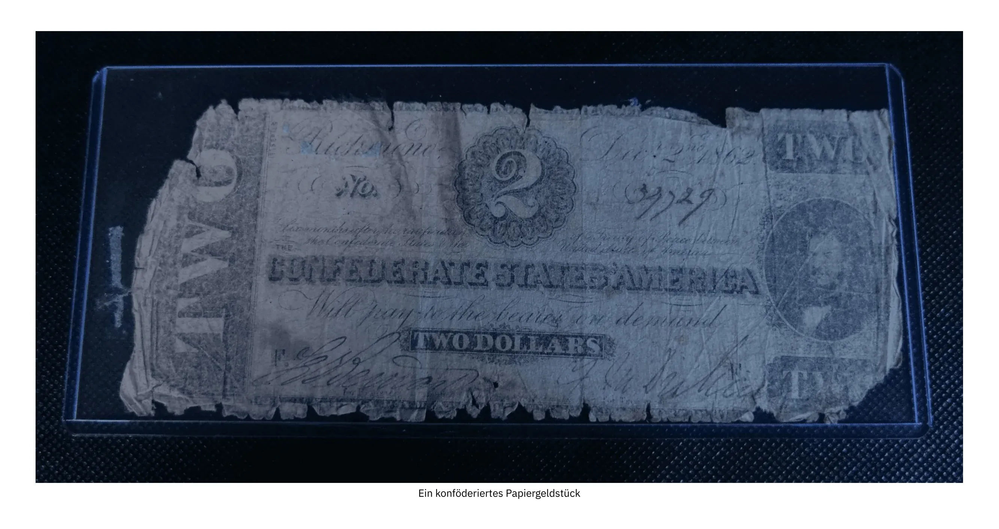

Auch ihre Gegner im Norden hatten Dollars. Oben sehen Sie die Dollar der Konföderierten, unten die der Nordstaaten. Man nannte sie den "Greenback", weil die Rückseite grün war.

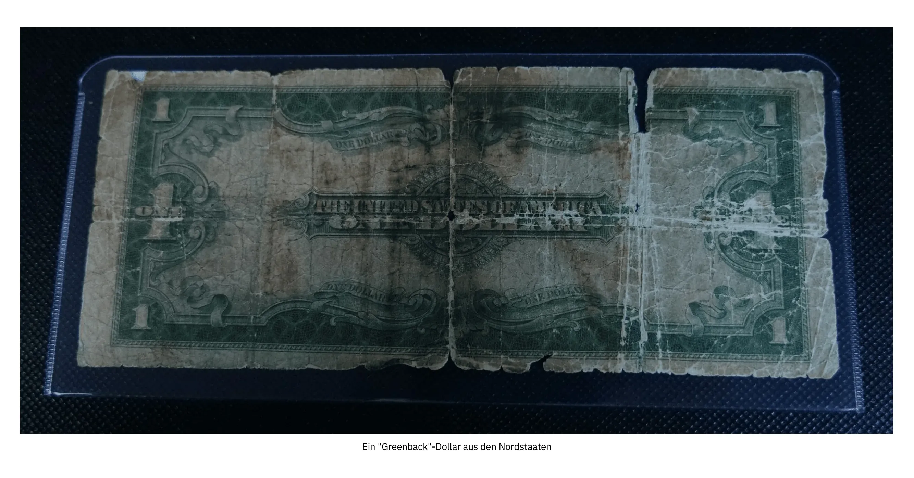

Und ich lade Sie ein, den Größenunterschied mit modernen Banknoten zu vergleichen. Damals waren die Geldscheine größer.

Wie wir wissen, siegte der Norden, und der Greenback wurde zur Währung der wiedervereinigten amerikanischen Staaten. Dann kam die Gründung der FED im Jahr 1913 und der Erste Weltkrieg.

Nach dem Ersten Weltkrieg enthielt die letzte Serie der gedruckten Banknoten immer den Vermerk "auf Verlangen in Gold einlösbar". So konnte man 1928 für 20 Dollar fast eine Unze Gold kaufen, da der Goldpreis bei 20,67 Dollar lag. Mit dem Geldschein in der Abbildung unten konnte man 1928 eine Unze Gold kaufen.

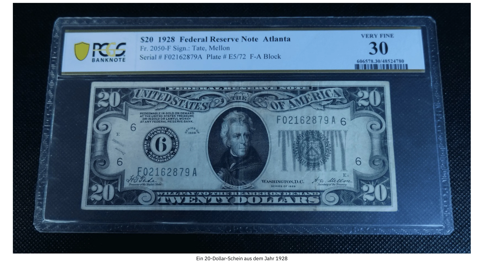

Heute ist eine Unze Gold 3.000 US $ wert. Hier zeigt sich natürlich die Macht der Entwertung. Es war das letzte Gesetz, das die Worte "einlösbar in Gold" enthielt. Wir werden sehen, dass sie gleich nach der Executive Order 6102 das gesamte Gold beschlagnahmen würden. In der Tat würden sie sowohl das Gold als auch die Goldzertifikate beschlagnahmen.

Hier unten sehen Sie ein Goldzertifikat aus dem Jahr 1928.

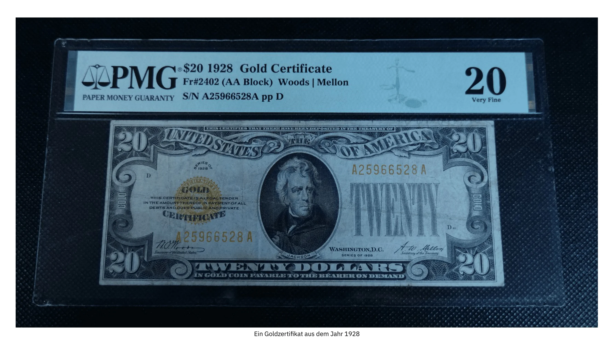

Er war nicht nur wie der Geldschein von 1928 "in Gold einlösbar", sondern auch in Goldmünzen einlösbar: Es handelt sich tatsächlich um ein "Goldzertifikat". Sie wurden alle nach der Executive Order 6102 beschlagnahmt. Bis 1964 war es sogar illegal, sie zu besitzen.

Ich bin sehr froh, dass ich eine habe.

Ab 1964 wurde es illegal, Gold zu besitzen, bis 1974, wenn ich mich nicht irre. In den 70er Jahren erlaubten sie den Menschen, nach dem Nixon-Schock, den wir gleich beschreiben werden, Gold anzuhäufen. 1933 wurde mit der "Executive Order 6102" Gold beschlagnahmt, und der Besitz von Gold wurde illegal. Wer bei der Aufbewahrung seines Goldes erwischt wurde, musste mit einer hohen Gefängnisstrafe rechnen. In jenen Tagen wurde jede Unze Gold in einen Schein umgetauscht, der dem unten abgebildeten nach 1934 ähnelte.

Wie gesagt, im Jahr 1928 trug ein Dollar noch die Aufschrift "in Gold einlösbar".

Nach dem Erlass der Executive Order 6102 beschlagnahmten sie das gesamte Gold und tauschten 20,67 Dollar für jede Unze Gold. Danach kam der Betrug ans Licht: 1934 wurden neue Geldscheine mit dem Aufdruck "Diese Banknote ist gesetzliches Zahlungsmittel für alle Schulden" ausgegeben.

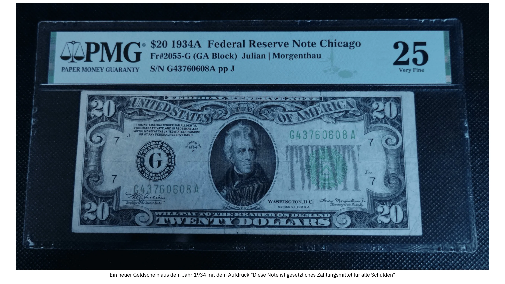

Das Konzept des gesetzlichen Zahlungsmittels taucht hier auf und ersetzt die Formulierung "in Gold einlösbar" Die beiden Scheine sehen zwar identisch aus und es ändern sich nur ein paar Worte, aber die Täuschung liegt in der Tatsache, dass der Dollar in dieser Zeit abgewertet wurde; der Wert einer Unze Gold sank von 20,67 $ auf 35 $ pro Unze im Jahr 1934. Das entsprach einer Abwertung von etwa 40 %!

Dann kam der Zweite Weltkrieg. Nach dem Krieg wurde durch das Bretton-Woods-Abkommen ein Großteil des weltweiten Goldes in den Vereinigten Staaten zentralisiert. Die Amerikaner gaben im Gegenzug Banknoten aus, die jedoch nicht mehr von der Allgemeinheit gegen Gold eingelöst werden konnten. Stattdessen konnten sie weiterhin auf staatlicher Ebene in Gold umgetauscht werden.

Schließlich begannen Länder wie Frankreich und Deutschland zu vermuten, dass wahrscheinlich mehr Dollarscheine im Umlauf waren als Gold in den Tresoren der USA lag.

Sie baten also um die Rückführung ihres Goldes. Nun, sie sagten: "Okay, wir werden es tun, aber es wird ein wenig Zeit brauchen" 1971 kappte unser Freund Richard Nixon ein für alle Mal die Verbindung zwischen Banknoten und Gold und gab dabei den Spekulanten die Schuld.

Gold war mit 35 $ pro Unze unterbewertet, ein Preis, der weder der Menge des gedruckten Geldes noch seinem wahren Marktwert entsprach. Innerhalb weniger Jahre stieg der Preis von 34 $ auf 800 $. Ähnlich wie in Rom, wo die Verbindung zwischen dem Denar und dem Solidus unterbrochen wurde, konnte sich das Gold frei bewegen. Dies führte zu einem Preisfindungsprozess, der dazu führte, dass der Goldpreis in Dollar ausgedrückt in der Folgezeit viel höher war.

### Das moderne Fiat-Währungssystem und seine Auswirkungen

Dieser Teil fasst zusammen, wie wir uns von einem auf Silber oder Gold basierenden Geldsystem entfernt haben. Nach und nach gewannen die Institutionen mehr und mehr Macht über das Geld. Letztendlich wurde durch eine einseitige Entscheidung die Verbindung zwischen Edelmetallen und Geld nach einer Überemission vollständig gekappt.

Infolgedessen gibt es keine Verbindung mehr zwischen Gold und Banknoten oder biblischem Geld. Und es handelt sich nicht einmal um ein Mindestreservesystem - das ist ein überholtes Konzept. Stattdessen emittieren und schaffen private Banken Geld durch Bankkredite. Geld wird hauptsächlich auf diese Weise geschaffen und ist an den von der Zentralbank festgelegten Leitzins gekoppelt.

Es gibt wirklich keine Obergrenze. Es gibt keine obligatorischen Mindestreserven mehr, zumindest nicht in Amerika und Kanada. Die einzige Reserve besteht darin, dass die Banken Vorkehrungen treffen müssen, um auf den Interbankenhandel reagieren zu können, damit ihnen die Liquidität nicht ausgeht.

Sie müssen nur sicherstellen, dass sie diese Überweisungen vornehmen können, aber es gibt keine 3 %, 1 % oder 10 % Zwangsreserve. Wir haben uns wirklich von dem Konzept der Mindestreserve entfernt. Jetzt sind es die Zentralbanken, die Regierungen durch Haushaltsdefizite, die Zentralbanken durch quantitative Lockerung (QE) und die Privatbanken durch die Schaffung von Bankkrediten, die die gesamte Geldmenge erhöhen und meiner Meinung nach Inflation verursachen können.

Um den Zusammenhang zwischen Geld und Inflation zu verstehen, empfehle ich einen Kurs auf Plan ₿ Academy, der sich mit diesem Thema befasst. Sie werden den Unterschied zwischen Preiserhöhungen, die wir im Leben erleben, und Inflation kennen lernen. Das ist nicht das Gleiche. Wenn wir von Inflation sprechen, meinen wir oft den Preisanstieg, nicht die Inflation selbst. Die Inflation ist ein ziemlich präzises Konzept, das durch die Zunahme der Geldmenge erklärt wird.

https://planb.academy/courses/caa75343-ac90-4249-bcca-0e2e57c3a0f1

Zum Abschluss dieses Abschnitts über die Fiat-Welt möchte ich Sie auf eine Quelle hinweisen, die Ihnen hilft, die soeben erläuterten Phänomene wie die Inflation besser zu verstehen.

Ich danke Ihnen für Ihre Aufmerksamkeit.

## Die Geschichte der Geldblasen

<chapterId>b6451c46-917d-11f0-97de-6bc5081765fa</chapterId>

:::video id=5967d9a6-aae4-4b84-a283-71b1b735bca4:::

### Die Erfindung des Papiergeldes und die erste große Blase

Mit der Gründung der Zentralbanken im 18. Jahrhundert wurde eine echte Revolution eingeleitet: das magische Geld in Form von Banknoten. Das eindrucksvollste Beispiel in Frankreich ist das von John Law. Dieser Schotte, der in Paris im Exil lebte, schlug dem Regenten, dem Duc d'Orléans, eine Lösung für den Bankrott der königlichen Finanzen vor, indem er eine Staatsbank und eine Kolonialhandelsgesellschaft gründete: die berühmte **Banque Royale** und die **Compagnie du Mississippi**.

Mit diesem System verknüpfte Law das Papiergeld mit den Aktien seines Unternehmens. Je mehr Banknoten im Umlauf waren, desto höher war der Wert der Aktien und desto solider schien die Bank zu sein... bis die Spekulation die Realität übertraf. Die Blase platzte 1720 plötzlich und ruinierte den Adel, die Bourgeoisie und einen Großteil Europas, der gekommen war, um mit der Rue Quincampoix zu spekulieren. Das Ergebnis: ein dauerhaftes Misstrauen gegenüber Papiergeld in Frankreich und Europas erste Lektion in Sachen Spekulationsblasen.

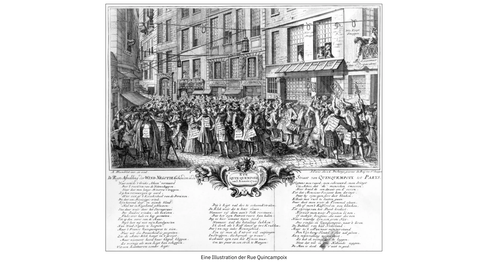

### Wenn Grundstücke zu "Sicherheiten" werden

Ein Jahrhundert später betrat die Französische Revolution mit den **Assignaten**, einer durch beschlagnahmtes Kircheneigentum gedeckten Währung, Neuland. Auf dem Papier eine verlockende Idee - die Umwandlung von Land in Geldsicherheiten -, aber unwirksam: Land ist weder liquide noch teilbar. Das Ergebnis: Hyperinflation, mehrfache Verbote der Landnutzung, unkontrollierte Inflation und Knappheit.

Napoleon, der von diesem Chaos zutiefst betroffen war, führte im Jahr 1800 mit der Gründung der Banque de France Gold und Silber als Währungsgrundlage wieder ein und garantierte damit die regelmäßige Bezahlung seiner Armeen. Ein pragmatischer Weg, um Vertrauen zurückzugewinnen: Bezahlung in harter Währung.

### Die Goldenen Zwanziger und die Weltwirtschaftskrise von 1929

Überspringen wir zwei Jahrhunderte. Nach dem Ersten Weltkrieg finanzierten die Regierungen die Anstrengungen durch Inflation und die Aussetzung des Goldes. In den 1920er Jahren verfolgte die amerikanische Notenbank eine übermäßig akkommodierende Geldpolitik, um das britische Pfund zu stützen. Das Ergebnis: leichte Kredite, ungezügelte Spekulation an der Wall Street, Aktienkäufe auf Kredit und das Entstehen einer Immobilien- und Bankenblase.

Als die Maschine verrückt spielte, war der Crash von 1929 unvermeidlich: massive Bankenzusammenbrüche, Rekordarbeitslosigkeit und Schlangen vor den Suppenküchen. Dies führte zu dem hartnäckigen Irrtum, dass **jede Deflation schlecht ist**, während wir zwischen Deflation durch Wachstum (gesund) und Deflation durch Schulden (verheerend) unterscheiden müssen.

### Asien in den 90er Jahren und der Dominoeffekt

In den 1990er Jahren ließ das "asiatische Wunder" die Welt träumen. Die Exchange-Kurse waren an den Dollar gekoppelt, das Wachstum lag bei 8-10 %, und westliches Kapital strömte herein. Alles war gut... bis die Flut zurückging. Konkurse häuften sich, die Währungen werteten um 80 % ab, und die Anleger waren ruiniert. Der IWF musste eingreifen und schmerzhafte Reformen auferlegen. Das gleiche Szenario wie immer: Kapital im Überfluss, kreditfinanzierte Blasen, dann der Zusammenbruch.

### 2008 und die Ära der Dauerblase

Auf die Internetblase (2000) folgte die Subprime-Immobilienblase. Die Verbriefung verwandelte Bankkredite in "Triple-A"-Finanzprodukte, die in der ganzen Welt verbreitet wurden. Das Versprechen: Eliminierung des Risikos durch Verwässerung des Risikos. Die Realität: Alle Risiken waren tatsächlich miteinander verbunden. Als der Immobilienmarkt zusammenbrach, brach auch das gesamte globale Bankensystem zusammen.

Die Folge: massive staatliche Rettungsaktionen, quantitative Lockerung und Nullzinsen. Und damit eine überstürzte Entwicklung: Jede Krise wird nicht mehr die Exzesse bereinigen, sondern durch immer mehr Schulden und Gelddrucken gedeckt werden. Das ist es, was zu der aktuellen Situation geführt hat: **die "Alles-Blase "**, bei der alles - Aktien, Immobilien, Kunst, Krypto, sogar Pokémon-Karten - künstlich aufgebläht wird.

### Die ewige Wiederkehr des magischen Geldes

Von einem Jahrhundert zum nächsten zeichnet sich eine Konstante ab: Sobald eine Gesellschaft glaubt, mit Geld Wohlstand schaffen zu können, anstatt reale Güter zu produzieren, entstehen Blasen. Von John Law bis 2008, von der Rue Quincampoix bis zur Wall Street, wiederholt sich der Prozess: Euphorie, Kredit, Boom und Pleite.

Und am Ende, wenn niemand mehr dem Papier traut, suchen die Menschen nach etwas anderem - Gold, Land, sichere Häfen... oder neue Währungen. Gestern zwang Napoleon Metall auf, heute sehen einige Bitcoin als Nachfolger.

Die Geschichte der Finanzwirtschaft ist ein nie endender Zyklus: Drucken, spekulieren, zusammenbrechen. Bis zur nächsten Blase.

## Geld und Gewalt

<chapterId>9486fe64-854f-5e17-86b3-8873baca39a8</chapterId>

:::video id=bd6d0807-2d8f-4637-a0f5-1e990e5c0d0f:::

In diesem kurzen Abschnitt werden wir viele der Ereignisse, die wir im Laufe des Kurses bereits erlebt haben, noch einmal aufgreifen und einige Anekdoten zusammenfassen, die ich interessant finde.

### Technologie und Gewalt

Hier sind ein paar Anekdoten, über die wir wahrscheinlich schon im Kurs gesprochen haben. Sie dienen dazu, eine sehr faszinierende Diskussion einzuleiten, die ich mit Theo über einen Vortrag hatte, den er bei B-Ondy gehalten hat und den ich sehr interessant fand, was die Auswirkungen des technologischen Fortschritts auf das Gewaltverhältnis zwischen der Bevölkerung und dem Staat betrifft.

### Geld und staatlicher Zwang

Zur Einführung in diesen Abschnitt gebe ich Ihnen eine kurze, nicht erschöpfende Liste, um Sie an die Ereignisse zu erinnern, die wir wahrscheinlich schon im Kurs behandelt haben.

Eine Verbindung, die ich bereits zu Geld und Gewalt herstellen kann, ist, dass wertloses Papiergeld, das unbegrenzt gedruckt werden kann, oft mit allen möglichen Regeln und Drohungen einhergeht. Wir können bereits über die Assignaten sprechen, wo es buchstäblich auf den Banknoten stand, dass Fälscher mit dem Tod bedroht wurden. In den Gesetzestexten der damaligen Zeit findet man leicht Todesdrohungen für diejenigen, die dieses berühmte Papiergeld nicht akzeptierten.

Um in Frankreich zu bleiben, habe ich in einem der Rechtstexte, die ich aus der Revolutionszeit beschaffen konnte, gesehen, dass die "Tagespauschale" für den Transport und die Bedienung der Guillotine in den währungsbezogenen Abschnitten beschrieben wurde. Ich fand das ziemlich komisch.

Wir haben auch über die Münzprägung in China gesprochen, wobei der Staat die Prägung überwachte. Wir haben in einem Abschnitt zu Beginn des Kurses gesehen, dass es rechtliche Konsequenzen gab, wenn Münzen, von denen einige weniger schön waren, weggeworfen wurden.

Es gibt auch eine Anekdote über einen König in England, der den Geldmünzern die Hände abschlug, wenn sie sich nicht so verhielten, wie er es erwartete.

Auch in China habe ich über die Beschlagnahmung von Kupfer aus buddhistischen Klöstern gelesen. Zu einer Zeit, als Kupfer an Wert gewann und die Wirtschaft destabilisierte - die auf einer Form von Fiat-Geld basierte, das wenig mit dem Wert des Metalls zu tun hatte - suchten sie sich einen Ort, an dem es Reichtum gab, und beschlagnahmten das Kupfer aus Klöstern.

Das Gleiche galt für die Klöster in England während der englischen Reformation. Als der berühmte König mit dem Papst über seine Scheidung stritt, gab es noch einen anderen Grund: Er nutzte die Aufhebung der Klöster, um sich des Reichtums dieser kirchlichen Organisationen zu bemächtigen.

Während der Französischen Revolution beschlagnahmten sie das gesamte Vermögen der Kirche. Sie sahen wunderschöne Münzen, die aus eingeschmolzenen Kirchenglocken hergestellt wurden.

Wenn wir noch weiter zurückgehen, ist eine der deutlichsten Vorstellungen von wirtschaftlicher Gewalt und Freiheit, von freiheitsfeindlichen Gesetzen, **Diokletian mit seiner Erbkaste, die direkt mit der Tatsache verbunden war, dass die Bauern die abgewertete Währung nicht mehr akzeptieren wollten**. Sie wollten ihre Arbeit als Bauern aufgeben, und Diokletian reagierte darauf, indem er ihnen einfach sagte: "Ihr könnt euer Land nicht verlassen, und eure Kinder auch nicht". Das Gleiche galt für die Soldaten.

Ich denke, das ist eine ziemlich eindeutige Form der Gewalt. Abschließend könnte ich von den Tempelrittern oder einem französischen König sprechen. Als sich die Tempelritter in Frankreich niederließen, sah er wohl das Manna des Templerreichtums und hatte Probleme mit der Staatsfinanzierung. Er verklagte den Templerorden, und einige von ihnen konnten sich einen Teil des Schatzes unter den Nagel reißen, was in den USA oder Kanada zu einer sehr interessanten Sendung geführt hat. Ich weiß nicht, wer sie produziert hat, aber sie heißt *The Mystery of Oak Island*. Es geht um Leute, die glauben, dass auf einer Insel in Kanada, in den Maritimes, ein Templerschatz vergraben ist, und sie haben jahrelang - vielleicht sogar mehr als ein Jahrzehnt - gebohrt, um eine Art Bohrung vorzunehmen. Sie haben einen Brunnen mit vielen Stollen gefunden und suchen nach einem Schatz, der von den Tempelrittern auf dieser Insel vergraben wurde, die das Thema dieser Fernsehsendung ist. Ich grüße meinen Vater, der ein großer Fan dieser Sendung ist.

Da haben Sie es also: eine sehr kurze Liste von Fakten, die wir während dieses Kurses gesehen haben und die meiner Meinung nach den Zusammenhang mit Gewalt verdeutlichen. Ich überlasse Ihnen den nächsten Teil von Theo, der uns eine sehr interessante Geschichte über den technologischen Wandel und das Machtgleichgewicht zwischen dem Volk und den Behörden erzählen wird.

Ich danke Ihnen!

## Die wirtschaftlichen Folgen der organisierten Gewalt

<chapterId>66bd4674-2159-5489-ad4b-ec5e3fb691af</chapterId>

:::video id=c8b063c6-aeb4-4a94-9027-b11d369e71a4:::

### Organisierte Gewalt und die Entwicklung des Staates

Der Historiker Frederic C. Lane stellt die revolutionäre These auf, dass die Anatomie des Staates im Laufe der Geschichte von den Technologien zur Gewaltanwendung geprägt ist. Ausgehend von dem Weberschen Prinzip, dass der Staat ein Monopol auf legitime Gewalt besitzt, stellt Lane fest, dass sich dieses Monopol - das paradoxerweise effizienter ist als der Wettbewerb in diesem Bereich - entsprechend dem Verhältnis zwischen den Kosten des Angriffs und den Kosten der Verteidigung entwickelt.

Diese Analyse, die von den Autoren von "The Sovereign Individual" (1997) aufgegriffen wurde, erklärt die historischen Veränderungen der politischen Organisation: vom mittelalterlichen Feudalsystem zu den Stadtstaaten der Renaissance, dann zu den industriellen Nationalstaaten und schließlich zu den modernen Wohlfahrtsstaaten. Jeder Übergang entspricht einem großen technologischen Durchbruch in der Gewaltausübung, der etwa alle 400-500 Jahre stattfindet.

### Mittelalterliches Gleichgewicht

Im Mittelalter war die Agrarwirtschaft zu über 90 % vorherrschend. Der Bauer, der buchstäblich mit seinem Land verwurzelt war, konnte nicht vor dem Landesherrn und seinen Rittern fliehen. Die Militärtechnik - handgeschmiedete Rüstungen, jahrelange Schwertausbildung - war extrem teuer. Diese Asymmetrie begünstigte massiv den Angriff gegenüber der Verteidigung.

Der immobile landwirtschaftliche Erzeuger wird zum Gefangenen des lokalen Gewaltmonopolisten. Seine Fähigkeit, Steuern zu erheben, erreicht neue Höhen - auch wenn die mittelalterlichen Steuern paradoxerweise bescheiden bleiben im Vergleich zu den 78 % der Zwangsabgaben in der Neuzeit. Der Grundherr kann nach Belieben besteuern, weil der Bauer sich weder wehren noch weggehen kann.

### Die kaufmännische Renaissance

Mit dem Aufkommen des Hansehandels im Norden und des Mittelmeerhandels im Süden veränderte sich die Situation. Die Kaufleute, die den größten Teil der Wertschöpfung erbrachten, verfügten über mobiles Kapital - ihre Schiffe. Sie brauchten nur leichte Seemilizen, da die Meere schwer zu kontrollieren waren. Vor allem aber konnten sie leicht in einen benachbarten Hafen ausweichen, wenn die Besteuerung zu hoch wurde.

Diese Mobilität führte zu einem Steuerwettbewerb zwischen den Stadtstaaten. Venedig, Genua und Brügge mussten einen möglichst liberalen Rahmen bieten: verlässliche Verträge, hochwertige Währung, Versicherungen, minimale Besteuerung. Die Fürsten mussten verführen, statt zu zwingen. Die Symmetrie kehrt sich um: Verteidigung (durch Flucht) wird einfacher als Angriff.

### Das Industriezeitalter

Die industrielle Revolution brachte eine dem Feudalismus ähnliche Konfiguration mit sich. Fabriken, Eisenbahnen und Fließbänder stellen massive, unbewegliche Investitionen dar. Henry Ford war nicht in der Lage, seine Fabriken angesichts der Besteuerung zu verlagern. Die Arbeiter, die sich in den Industriestädten konzentrierten, schlossen sich gewerkschaftlich zusammen, um kollektiv zu verhandeln, anstatt einzeln abzuwandern.

Es entstand der "Wohlfahrtsstaat": industrielle Planung (Japan, Korea), militärischer Schutz der Infrastrukturen, soziale Mindestleistungen für die Arbeitnehmerschaft. Der Zweite Weltkrieg verdeutlichte diese Anfälligkeit: Die Bombardierung feindlicher Fabriken wurde zur vorherrschenden Strategie. Die Konzentration des Sachkapitals ermöglichte eine massive Steuererhebung zur Finanzierung des Wohlfahrtsstaates.

### Die Revolution der Mikroprozessoren

Drei technologische Innovationen bringen dieses uralte Gleichgewicht nun ins Wanken. Der Mikroprozessor verändert die Kriegsführung: Ein Operator in Nevada steuert eine Drohne in Afghanistan mit chirurgischer Präzision. Der Golfkrieg (1991) hat diesen Durchbruch demonstriert: Die viertgrößte Armee der Welt (Irak) wurde innerhalb von 45 Tagen ausgelöscht, mit weniger als 200 Toten auf Seiten der Koalition. Die technologische Überlegenheit machte einen Frontalangriff unmöglich.

Das Internet und die asymmetrische Kryptographie revolutionieren die Wertschöpfung. Ein Entwickler kann mit einem MacBook und Starlink von überall aus arbeiten und seine Produktion sofort und kostenlos exportieren. Digitale Nomaden entkommen der geografischen Gefangenschaft und bringen Staaten in einer Weise gegeneinander auf, wie es sie seit der Renaissance nicht mehr gegeben hat.

Bitcoin stellt den Höhepunkt dieser Logik dar: eine vom Staat befreite Währung, die durch ein unantastbares kryptographisches Schild geschützt ist. Reichtum wird gegen jede physische Gewalt verteidigbar. Das Individuum gewinnt die Fähigkeit zurück, sich gegen das staatliche Monopol zu verteidigen.

### Der Zusammenbruch des westfälischen Modells

Die westlichen Wohlfahrtsstaaten, die für das Industriezeitalter konzipiert wurden, haben ausgedient. Wertschöpfer - Entwickler, Künstler, Finanziers - wandern nach Singapur, Dubai oder El Salvador ab und bevorzugen weniger öffentliche Dienstleistungen im Gegenzug für minimale Besteuerung. Moderne Giganten wie Apple und Tether brauchen weder Büros noch eine physische Infrastruktur.

Diese Abwanderung führt zu einer Spirale: weniger Nettozahler, schlechtere öffentliche Dienstleistungen, höhere Besteuerung derjenigen, die bleiben, und beschleunigte Abwanderung. Die Staaten müssen sich radikal verkleinern oder bankrott gehen. Die Aufspaltung in kleine, wettbewerbsfähige Gerichtsbarkeiten - ein neues Modell digitaler Stadtstaaten - scheint unvermeidlich.

Die Geschichte lehrt uns, dass solche Übergänge Generationen dauern. Aber die Trennung von Währung und Staat durch Bitcoin könnte den Prozess beschleunigen. Einzelpersonen stimmen jetzt mit ihren Füßen und ihren kryptografischen Geldbörsen ab und zeichnen die Karte der globalen Macht entlang von Linien neu, die wir gerade erst wahrzunehmen beginnen.

## Eine sehr kurze Geschichte der Finanzen

<chapterId>1d37fff1-a091-5034-8e71-4af590b8ffce</chapterId>

:::video id=fdfabbc6-e4d8-463a-8522-19176f8fb460:::

Nach dieser Darstellung der Geschichte des Geldes, die uns bis zum Fiat-System führt, möchte ich kurz und bündig die Entwicklung des Finanzwesens erläutern, die schließlich zum Wohlfahrtsstaat führte. Zu Beginn, in der Römerzeit, hatten wir Münzen.

Münzen waren eine Finanztechnologie, die es dem Reich ermöglichte, Soldaten zu bezahlen, zu expandieren und Handel zu treiben. Es funktionierte sehr gut, außer dass es irgendwann zu viele Entwertungen gab. Irgendwann, als sie nicht mehr expandierten und keine Beute mehr aus ihren Kriegen und Gebietserweiterungen erhielten, brach ihr System zusammen.

### Die Entwicklung der Finanztechnologien

Dann kam das Mittelalter, in dem es kaum eine Entwicklung gab, bis zum Florin, der eine stabile Währung zurückbrachte, und den Entwicklungen im Bankwesen in Italien und Antwerpen, wo das Konzept des "Zeitwerts des Geldes" entwickelt wurde - mit anderen Worten: die Diskontierung. Sie entwickelten die Diskontierung, um eine Form von Papiergeld zu schaffen, bei der ein "Schuldschein" ausgestellt wurde, d. h. ein Versprechen, dass man zu einem späteren Zeitpunkt 100 Dollar zuzüglich eines Zinssatzes zurückbekommen würde.

Mit diesem System wurde eine Finanztechnologie geschaffen, die es dem Inhaber ermöglicht, den Schein vor Ende der Laufzeit zu verkaufen. Wenn Sie ihn also nach 4 Monaten einer 6-monatigen Laufzeit verkaufen, zahlt die Person tatsächlich eine Prämie, um den Renditeverlust für die verbleibenden 2 Monate auszugleichen.

Es handelte sich um eine Finanztechnologie, die damals in Antwerpen und Amsterdam entwickelt wurde. Später kam es zur Entwicklung von Zentralbanken und dem Begriff des Kreditgebers der letzten Instanz. Man kann argumentieren, dass während der Bank von Amsterdam die Verwendung von Münzen im internationalen Handel zugunsten von Buchgeld aufgegeben wurde.

Später, im 18. Jahrhundert, können wir im Hinblick auf die Finanztechnologie über Versicherungen sprechen. Es gibt eine Anekdote, die in Neil Fergusons Buch "The Ascent of Money" sehr gut erzählt wird. Die erste Versicherungsgesellschaft, die gegründet wurde, hieß **Scottish Widowss**, und im Wesentlichen war es der Klerus, der eine Versicherung für Priester entwickeln wollte, die manchmal früher, plötzlich starben. Die Geistlichen kümmerten sich damals ein Jahr lang in Schottland um ihre Ehefrauen und Kinder. Und so fanden die Geistlichen diese einjährige Frist vielleicht ein wenig zu kurz. Daraufhin **erfanden sie versicherungsmathematische Berechnungen**, um buchstäblich die Anzahl der Beitragszahler zu ermitteln, die für das System erforderlich waren, um seine Kosten zu decken, und zwar in Abhängigkeit von der Anzahl der vorzeitig verstorbenen Priester.

Sie entwickelten versicherungsmathematische Berechnungen, um zu sagen: "Okay, nun, jeder Priester gibt uns diesen Betrag. Wenn der Priester dann stirbt, deckt die Versicherung die Kosten, um das Überleben seiner Frau und seiner Kinder zu sichern, bis sie sich selbst versorgen können." Es war also die erste Versicherungsgesellschaft namens "Scottish Widows", die dieses System populär machte und bei der es zum Einsatz kam.

### Von der Privatversicherung zum Sozialstaat

Die Versicherung ist also Teil der Geschichte der Finanztechnologie. Und das bringt mich zum Konzept des Wohlfahrtsstaates, das darin besteht, dass die private Versicherung irgendwann auf ein Problem stieß, nämlich auf den Optimierungsgedanken: Wenn wir Menschen, die gesund sind, eine Krankenversicherung anbieten, haben sie vielleicht weniger Interesse daran, die Prämie zu zahlen, weil sie sich sagen: "Ich bin gesund, ich werde nicht krank". Auf der anderen Seite werden Menschen, die wissen, dass sie krank sind, sicherlich eine Versicherung abschließen wollen.

Dieses System schafft ein Ungleichgewicht zwischen der Zahl der kranken Menschen, die eine Krankenversicherung abschließen, und der Zahl der gesunden Menschen, die vielleicht weniger versichern. Es besteht also eine Art Ungleichgewicht: Wenn man die Zahlen berechnet, würden sie sich nicht ausgleichen, weil man wahrscheinlich nicht in der Lage wäre, genügend gesunde Menschen zu versichern, um die Kosten auszugleichen. In den Wirtschaftswissenschaften ist dies das Konzept des **moralischen Risikos**.

Eine der Ideen, die vorgebracht wurden, ist die Einführung einer Versicherungspflicht. Wenn alle dazu verpflichtet sind, Beiträge zu leisten, wird das Ganze wieder ins Gleichgewicht gebracht, und sowohl gesunde als auch ungesunde Menschen werden Beiträge leisten, wodurch die Risiken auf die größte Bevölkerung verteilt werden.

Und so hat der Staat in vielen Teilen der Welt gesagt: "Nun, wir werden uns darum kümmern". Ich bin zwar kein Experte auf diesem Gebiet, aber ich kann mir vorstellen, dass dieselbe Argumentation wahrscheinlich auch bei allen anderen Formen der Versicherung angewandt wird, beispielsweise bei der Arbeitslosenversicherung. Es besteht der Wunsch nach Vereinfachung und Optimierung, basierend auf der Idee, dass es einfacher ist, wenn es nur eine Organisation gibt, die sich darum kümmert.

Meiner Meinung nach führte dies zu einer Zentralisierung all dieser Versicherungskonzepte und letztlich zur Entstehung des Wohlfahrtsstaates, in dem all diese Finanzkonzepte, die ursprünglich private Unternehmen waren, private Initiativen, um ein Bedürfnis des Versicherungsmarktes nach Risikoverteilung unter der Bevölkerung zu befriedigen, vom Staat aus Gründen aufgegriffen wurden, die im Zusammenhang mit moralischem Risiko und dem Wunsch nach Optimierung wahrscheinlich ganz logisch sind.

### Alternative Modelle und Überlegungen zu Staatsmonopolen

In einigen Ländern, wie z. B. Kanada, haben wir schließlich mehrere Versicherungsarten - Krankenversicherung, Arbeitslosenversicherung -, die staatliche Monopole sind.

Ich kann Ihnen ein Beispiel nennen, das ich kenne. In der Schweiz ist das System ein wenig anders. Es gibt private Versicherungsvereine auf Gegenseitigkeit und private Krankenhäuser, Sie können also Ihren Versicherungsverein auf Gegenseitigkeit wählen, Sie können Ihr Paket innerhalb Ihres Versicherungsvereins auf Gegenseitigkeit wählen. Sie erhalten immer noch relativ universelle Dienstleistungen, auch wenn ein großer Teil dieses Systems privat bleibt.

Ich halte es also für möglich, dass es auch privat betrieben wird. Aber alles, was ich Ihnen schildern wollte, ist eigentlich keine Aussage darüber, ob das eine System besser ist als das andere, sondern ich wollte Ihnen erklären, dass mir bei der Lektüre der Finanzgeschichte klar geworden ist, warum im Westen, insbesondere in Frankreich, insbesondere in Kanada, der Staat die Kontrolle über diese Finanzprinzipien übernehmen wollte.

Ich wollte darauf hinweisen, dass das Konzept der Versicherung in erster Linie eine Weiterentwicklung des Finanzwesens ist, und wie es Regierungen manchmal so gut können, werden sie versuchen, die Kontrolle darüber zu übernehmen, so wie sie auch versucht haben, die Kontrolle über das Geld zu übernehmen, und zwar aus verschiedenen Gründen. Ein Grund ist übrigens das Konzept des Kreditgebers der letzten Instanz.

Die Idee ist, dass es viel besser ist, wenn eine große Institution dahinter steht, die das Risiko breiter streut. Das war die ursprüngliche Initiative hinter dem Konzept des Kreditgebers der letzten Instanz, wobei diese Institution tatsächlich Institutionen auswählen konnte, die stark genug waren, um zu überleben, und sie vor dem Zusammenbruch bewahrte, indem sie ihnen Geld lieh.

Damals gab es eine echte Analyse, als dieses Konzept schließlich zum ersten Mal auftauchte, aber was letztendlich geschah, war, dass wir alle retten, "too big to fail", das gilt für fast alle Banken, weil es eine Zentralisierung gibt, und auch für alle großen Unternehmen. Letztendlich sehen wir, dass es immer noch ein Konzept ist, das vom Staat "im Großen und Ganzen" angewandt wird, ähnlich wie das Konzept der Versicherung, das ich Ihnen gerade beschrieben habe.

Letztendlich beschließt der Staat, sich um alles zu kümmern, und verwandelt eine Finanztechnologie, die in Schottland zur Lösung eines bestimmten Problems entwickelt wurde, in den riesigen Wohlfahrtsstaat, den wir heute kennen. Er nutzt versicherungsmathematische Finanzprinzipien, um seiner bedürftigen Bevölkerung Dienstleistungen anzubieten. Wir sind uns jedoch einig, dass die aus diesem System entstehenden Monopole alle möglichen Probleme verursachen, die wir derzeit in Ländern wie Kanada und Frankreich erleben. Zum Glück gibt es andere Modelle, wie das in der Schweiz.

Wir müssen einfach erkennen, dass dieses Konzept des Wohlfahrtsstaates aus dem Finanzwesen stammt. Diese Erkenntnis legt nahe, dass wir andere Wege als die berühmten Staatsmonopole beschreiten können, und ich würde diese Argumentation sogar auf das Konzept der Zentralbanken als Kreditgeber der letzten Instanz anwenden - aber das ist ein Thema für ein anderes Mal.

# Letzter Abschnitt

<partId>9bada469-7ef0-511a-9eaa-f8eb66d5906f</partId>

## Bewerten Sie diesen Kurs

<chapterId>a9494e2b-8a4d-5811-8a7b-b4a91fb22778</chapterId>

<isCourseReview>true</isCourseReview>

## Schlussfolgerung

<chapterId>1094e793-b4c6-5782-aa4a-71cde00ce7c0</chapterId>

<isCourseConclusion>true</isCourseConclusion>