# A journey through the history of coinage

This captivating course will take you on an exploration of the fascinating evolution of money from the earliest civilizations to our current monetary system. We'll cross the ages, from Neolithic to modern times, discovering how money has shaped and been shaped by the great human civilizations. From Mesopotamian proto-money to cryptocurrencies, Lydian coins, the Renaissance florin, and the advent of central banking - this course offers a comprehensive perspective on one of the fundamental pillars of our societies.

+++
# Introduction

<partId>59878a67-8a1d-5d6b-af41-5b847c14363c</partId>

## Introduction to the History of Money

<chapterId>ca53597e-be9a-5261-a55f-11fac8504a68</chapterId>

:::video id=08ff35ca-8a40-4286-abaf-71283faf6e78:::

Welcome to this course on the history of money. As the title suggests, we're going to explore the historical evolution of coins together. From the Neolithic era to the present day, we'll look at the major empires and civilizations of the past.

However, this course is not limited to a simple chronology of dates or historical events. Rather, our real aim is to provide an in-depth understanding of the fundamental concepts involved in the emergence of money, or rather, currencies.

### Fundamental concepts to explore

So we're talking about emergence: the emergence of currencies themselves, of monetary systems, of banks, of paper money, of central banks, and finally, the emergence of the current "fiat" monetary system.

We begin our journey into proto-currencies with the emergence of debt money and units of account in Mesopotamia, as well as other systems such as dowry and blood money in primitive societies. We'll also see how real monetary systems already existed in ancient Egypt, well before the Middle Kingdom.

We then move on to the appearance of the first coins in Lydia, a key moment often regarded as the true beginning of money according to economics textbooks. We'll examine how these coins were able to spread thanks to the Persians, Alexander the Great, then Rome, before finally imposing themselves, dominating and collapsing.

From there, armed with everything we've learned, we'll take the time we need to reflect together on the very definition of money, going beyond preconceived ideas such as "money is always a debt" or "money is always a commodity". In reality, money is both a good and a social convention. In particular, we will discuss the concept of the money premium and attempt to unify the various theories explaining the emergence of money.

### Key periods and monetary innovations

We then turn to a troubled period, marked by a certain instability in monetary terms, which nevertheless saw the emergence of such striking innovations as the English penny, used to bribe Danish invaders, and Charlemagne's pound, the memory of which still persists today on some modern banknotes.

We'll also look at how the Crusades saw the emergence of the first remote money transfer systems. Then it's time to look at the impact of the Florin, the currency that accompanied the Renaissance, and the arrival of precious metals from the Americas, which had a profound effect on European prices.

We'll look in detail at the advent of paper money and central banking, drawing parallels with the history of financial crises and their often violent repercussions.

Finally, we'll draw a parallel with our contemporary monetary system, exploring its consequences, and tracing the history of finance to better understand how we arrived at today's welfare state.

And, as a bonus, we'll also look at the many fascinating etymological links related to money, which continue to affect our daily lives in different languages.

### Course structure

This course is divided into three major parts.

Part I looks at the emergence of money, Part II at the renaissance of money and its downfall, and Part III shows how state institutions or the state gradually took control of money, leading to the current fiat system.

Thank you and enjoy!

# The emergence of exchanges

<partId>da5e4981-9ea5-5208-beab-3b75c9043632</partId>

## From Australopithecus to Modern Man

<chapterId>34a773aa-f2d3-5c26-8be4-f2cd79ed6fbc</chapterId>

:::video id=4f333013-4b2a-42ab-8761-593fafc971ca:::

### Why start in the Neolithic

Why go all the way back to the Neolithic to talk about money? The answer is simple: we can't fully understand the emergence of money without also looking at the emergence of civilizations themselves. To understand why the first monetary systems came into being, we need to understand what led nomadic hunter-gatherer groups to settle down.

A tribe with no division of labor, no specialization, where each individual is responsible for producing what he or she needs, simply has no need for money. Likewise, an agricultural community practicing only subsistence farming, where each person cultivates for themselves, does not yet feel the need for a universal exchange intermediary.

### Sedentarization and its consequences

That's why I think it's interesting to start our exploration in the Neolithic period. We'll see how sedentarization gradually gave rise to villages, then cities, and finally great civilizations. It was this sedentarization and the production of food surpluses that made labor specialization possible, creating the fertile ground essential to the emergence and evolution of the first monetary concepts.

Just as human interactions give rise to language, we can consider that money appears naturally, or not (as with the Incas and Spartans), in the course of the formation and organization of civilizations. In my opinion, the appearance or non-appearance of money has everything to do with the form of social and economic organization of each society.

### Chronology of human evolution

But first, let's look at an even broader historical context.

Like any first presentation, I'm going to do exactly the opposite of what I said in the introduction to the course and give you a list of dates and historical events that follow on from each other. The idea here is to place the emergence of money in its historical context, in relation to other human advances such as the cooking of food, the wheel, the domestication of certain cereals and animals, the building of the pyramids and the founding of the first cities.

So, let's take a look at the evolution of mankind from prehistoric times onwards.

An overview of human evolution from Australopithecus to modern man, following technological advances and population movements up to the Neolithic period.

### Historical context of mankind

- **3 million years ago** - Appearance of *Australopithecus*.
- **2 million years ago** - Hominins begin to leave Africa.
- **1.6 million years ago** - Hominins reach southern Europe and Asia.
- **1 million years ago** - First evidence of domestic cooking with fire (charred bones and plant remains in Wonderwerk Cave, South Africa).
- **Around 400,000 BC** - Neanderthals live in Europe and Asia.
- **Around 300,000 BC** - Appearance of *Homo sapiens*.
- **80,000 years ago** - *Homo sapiens* begins migrating to all parts of the world.
- **73,000 years ago** - Blombos Caves in South Africa (oldest known art forms).
- **50,000 years ago** - *Homo sapiens* reached Europe.
- **30,000 years ago** - Cave paintings from the Chauvet cave in France.
- **15,000 years ago** - Lascaux cave paintings in France and Australian rock art.
- **Around 9000 BC** - Domestication of barley in the Fertile Crescent.
- **Around 9000 BC** - Corn cultivation in Mexico.
- **Around 8000 BC** - Domestication of goats and sheep in the Fertile Crescent.
- **Around 7250 BC** - Ain Ghazal (Jordan) reveals a village of a few hundred inhabitants.
- **Around 7000 BC** - Çatalhöyük (Turkey) has up to 8,000 inhabitants.
- **Around 6500 BC** - Sedentary life begins in Greece.
- **6000 years ago** - Beginning of river irrigation in Egypt and Mesopotamia.
- **Around 5000 BC** - Appearance of the "three sisters" agricultural combination (corn, squash, beans).
- **Around 4000 BC** - Domestication of the camel in Central Asia. (The camelid family originated in North America during the Eocene 45 million years ago. These camels would then have migrated to Asia via a thin strip of land that linked the two continents at that time in the Bering Strait. Another part of the family would have headed for South America, where its descendants still live today: llamas, alpacas, and vicuñas).
- **Around 3500-3000 BC** - The Botai people begin to domesticate and breed horses.
- **Around the beginning of the Bronze Age** - The Sumerians had already invented the wheel and the sailboat, and developed arithmetic, astronomy, and the first form of writing.
- **Around 2800 BC** - Uruk, at its peak, reached a population of up to 80,000.
- **2600-2200 BC** - First signs of urban development in the Greek world. Expansion of Mediterranean crops (wheat, vines, olives).
- **2560 BC** - Construction of the Great Pyramid of Giza.
- **Around 1500 BC** - Minoan civilization.
- **Around 1300 BC** - Mycenaean civilization.
- **Around 1250 to 1150 BC** - Collapse of the Bronze Age civilizations.
- **1st century AD** - North African Berbers domesticate the camel.

So, here is this historical overview to give us a perspective on the emergence of certain technologies, domestication of certain animals, and cultures, to put it in context with the emergence of writing and money, which will be the subject of our next section.

## From Hunter-Gatherer to Farmer: The Dawn of Civilization

<chapterId>ea950b6e-9eb7-553d-8f04-0eb042bb1f5a</chapterId>

:::video id=4b49a376-f6f4-42a0-86fa-264997a079f0:::

### The transition to agriculture and sedentarization

In this chapter, we're going to talk about the transition from hunting and gathering to subsistence agriculture, crafts, and trade. I felt it was important to explain this transition to a sedentary life and agriculture, to understand how the first cities were built, which eventually led to the creation and emergence of certain monetary systems during Antiquity.

This section is an extract from a course available on The Great Courses website called Ancient Mesopotamia, Life in the Cradle of Civilization, given by Professor Amanda Podany of California State Polytechnic University, Ponoma.

### The paradoxes of adopting agriculture

Primitive agriculture appeared around 10,500 years ago in the Near East, around northwestern Syria and southern Turkey. Today, modern hunter-gatherer groups are in no hurry to adopt agriculture, and the same was probably true during the Neolithic period.

**The first villages were clearly built before the domestication of plants and animals.** People didn't settle because agriculture allowed them to; on the contrary, they settled first and only much later, about 3,000 years later, did they start farming.

Hunting and gathering simply worked very well, so they didn't need to plant seeds to produce their food. Today, hunter-gatherers have much more free time than the first farmers, who used very rudimentary technologies.

So, what we're saying here is that modern primitive hunter-gatherer peoples have more free time than we understand from the first farmers of the Neolithic period, who had, after all, fairly rudimentary technologies for cultivation. These people worked harder to produce food than our modern primitive tribes, who live by hunting and gathering.

Bone studies also show that the first farmers were smaller and less robust than the hunter-gatherers who preceded them. Farmers' diets were more restricted than those of hunter-gatherers. They ate much more bread, but much less meat, and also had poorer teeth due to the rock chips used in flour production. When they made flour with rocks, it made splinters.

Those who follow the "keto" diet will agree: eating a lot of bread is probably not as good as eating meat.

### Theories on the adoption of agriculture

Given all these disadvantages, who would have chosen to become a farmer back then? Well, some popular theories suggest that humans were forced to adopt agriculture and that it wasn't really a choice. Even with wild grains, there was a major problem. Large quantities of grain could not be transported easily. They had to be stored somewhere. Once the grain was stored, it made sense to stay close by. So, you grew wild grain, which wasn't necessarily agriculture, and when you grew it in large quantities, you had to store it somewhere, making it difficult to transport. This likely contributed to the first phases of sedentarization. It may well have been the initial reason why people settled in a particular place. If this place provided food all year round, there was no need to follow herds or travel constantly.

In the Natoufian culture, up to a hundred people lived together in villages made up of round houses. A popular theory explaining the beginnings of agriculture is that this change was stimulated by climate change. Around 11,000 years ago, the climate in the Near East became colder and drier than before. Plants and animals that had previously been abundant became rarer. Communities would then have begun to cultivate the plants on which they depended, or to keep young animals to raise and profit from them, such as sheep, goats, and cattle, which would lend themselves well to such breeding. This would have been a very gradual process. So, there wasn't a precise moment when they all became farmers who domesticated animals.

Another theory is that the villages themselves created the problem solved by domestication. Intensive hunting and gathering would have destabilized the natural environment. According to one hypothesis, the Natoufians had achieved such demographic success that they had become too numerous for their immediate environment. Thus, the swamps and areas where natural crops were grown may not have been productive enough for the village's population. The immediate environment was not able to provide for everyone. They would then have started to cultivate directly on site and increase their food supply.

## Neolithic trade

<chapterId>8e495224-6d55-58f6-a9dc-ac2814281cfa</chapterId>

:::video id=d04245af-e416-48b1-8157-d569207a32c4:::

### The Paleolithic-Neolithic transition

The Neolithic period marks a fundamental break in human history, in stark contrast to the Paleolithic societies that preceded it. In the Paleolithic, European populations were extremely dispersed: just 7,000 people inhabited the entire continent 20,000 years ago, organized into small nomadic groups of 20 to 50 individuals who followed the great migratory herds over vast distances.

Global warming at the end of the Ice Age radically transformed this social organization. The emergence of forests replaced migratory fauna with more sedentary forest fauna, enabling human groups to become semi-sedentary. This transformation was accompanied by a spectacular demographic boom: from an estimated European population of between 10,000 and 50,000 at the end of the Paleolithic, the Middle and Final Neolithic saw a rise to between 1 and 5 million inhabitants.

### The Invention of Work and Property

This gradual sedentarization led to profound social transformations. **Neolithic agriculture gave rise to the modern notion of work**: attachment to a specific territory meant taking care of one's property, storing the fruits of one's labor and planning future harvests. This new relationship with time - deferring present use for future benefit - revolutionized social organization.

Pottery is a perfect illustration of this evolution: initially developed to store cereals and seeds, it bears witness to this new ability to project needs over time. Some prehistorians even consider that the Neolithic would not have been possible without these storage systems.

**Private property emerged as the central institution** of these new societies. While individual property already existed in the Paleolithic (personal hunting spears), in the Neolithic it took on an unprecedented territorial dimension. This land appropriation generated the first archaeologically documented inter-human conflicts, necessitating the emergence of a territorial security function.

### Specialization and Division of Labor

Agriculture made it possible to feed larger populations, while freeing some individuals from other productive activities. This emerging specialization - farmers, potters, craftsmen, guards - laid the foundations for the division of labor and social hierarchies.

Archaeological remains bear witness to this growing stratification: burials evolved from collective to differentiated individual graves, and housing moved from architectural uniformity to constructions revealing distinct social statuses. Funerary objects - ornaments, specialized tools, pottery - indicate the emergence of a notion of wealth and social prestige.

### The emergence of distance exchanges

Archaeological analysis reveals surprising exchange networks for the time. Materials such as obsidian, green rock (dolerite, jadeite), shells, and bitumen were found hundreds of kilometers from their extraction sites. Polished green rock axes, essential for deforestation and the construction of early villages, circulated throughout Neolithic Europe.

These exchanges concern both raw materials and finished objects, revealing an appreciation of artisanal specialization. The value attributed integrates both the rarity of the material and the technical skill required to transform it.

The organization of exchanges varies according to the scale considered. **Within communities**, anthropologists favor the hypothesis of an economy of gift and counter-gift, with informal credit systems based on interpersonal trust. In these restricted groups, the "Dunbar number" (150 people maximum to maintain direct relationships of trust) enables deferred exchanges without any market mechanism.

There are several types of barter:

- The **direct barter**: immediate exchange of good for good
- The **extended barter**: exchanging goods for services or promises
- The **deferred barter**: interpersonal debt with subsequent repayment

**Between different communities**, the absence of bonds of personal trust favored the emergence of more formalized exchanges. Certain goods gradually acquired a special status through their ability to be demanded by foreign groups, prefiguring the first forms of proto-currency.

The Austrian school of economics interprets this evolution as the spontaneous emergence of privileged exchange goods. Shells, archaeologically attested as early as the Mesolithic, illustrate this phenomenon: found far from their geographical origin (Mediterranean shells in western France, Nordic shells on other sites), they testify to a common recognition of their exchange value.

These goods are distinguished by their **ability to be demanded by others**, an essential quality that prefigures the monetary function. Although they did not achieve the standardization of historical currencies, they were the first steps towards depersonalized exchange systems, a prerequisite for the development of complex societies beyond the tribal framework.

The Neolithic thus laid the foundations of the modern economy: specialization of labor, private property, accumulation of wealth, social hierarchization, and the emergence of sophisticated exchange systems that transcended the bonds of kinship and direct neighborliness.

## The formation of the first cities and the emergence of writing

<chapterId>d6b799c2-8bf1-11f0-9c54-1b9f4f4c7011</chapterId>

:::video id=3ca18105-9856-4ceb-925c-c9e9215af21b:::

### Irrigation and the birth of great cities

In this chapter, we'll discuss how the first great cities of this part of history came to be, and we'll obviously discuss the reasons behind the emergence of writing in Mesopotamia.

Around 6,000 years ago, in the fertile valleys of Egypt and Mesopotamia, human communities began to harness rivers by developing irrigation. This mastery of water allowed for abundant cultivation, favoring the emergence of great cities such as the famous city of Uruk, located in today's southern Iraq.

Around 3500 BC, Uruk became the world's largest city, reaching its peak around 2800 BC, with a population of up to 80,000. At this time, two major innovations profoundly marked Sumerian civilization: the emergence of a structured government capable of administering a true state, and the revolutionary invention of writing.

### The invention of cuneiform writing

Writing was born in this city around 3000 BC, motivated primarily by economic needs. Faced with the growing complexity of society and its exchanges, temple and palace administrators needed a reliable tool to accurately record economic transactions, such as deliveries of materials, internal transfers and available stocks.

The system developed was called "cuneiform", from the Latin "cuneus" meaning "wedge", in reference to the use of a wedge-shaped stylus to print signs on moist clay tablets.

Here below, you can admire my copy of a tablet with cuneiform writing. In order to write on these tablets, I believe they used a kind of stylus made from reeds, to trace the wet clay and create the shapes, the cuneiform writing.

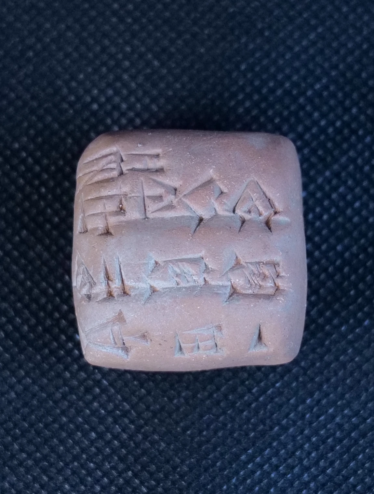

I also have what I believe to be a genuine Sumerian tablet with a small cuneiform script in the center. On this tablet, there are signatures made by rolling a cylinder, which I'll show you afterwards.

The marks with small figures served as signatures during a time when most people couldn't write, as only skilled scribes had that ability.

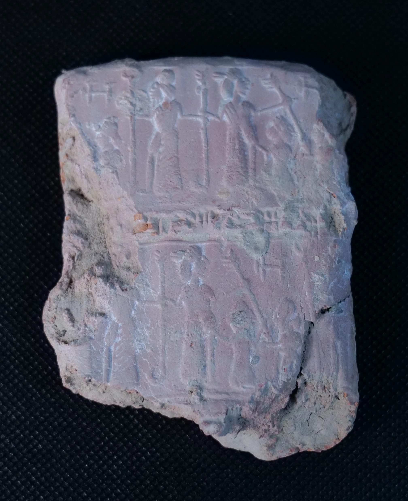

Below, you can see the cylinder mentioned above: a stone engraved with specific shapes. People used to roll this signature cylinder, known as a cylinder seal in English, to sign letters. It was a way to explicit the names of the authors, or to indicate that they were composed in their name.

Scribes of the time therefore used there wedge-shaped stylus to print signs on wet tablets.

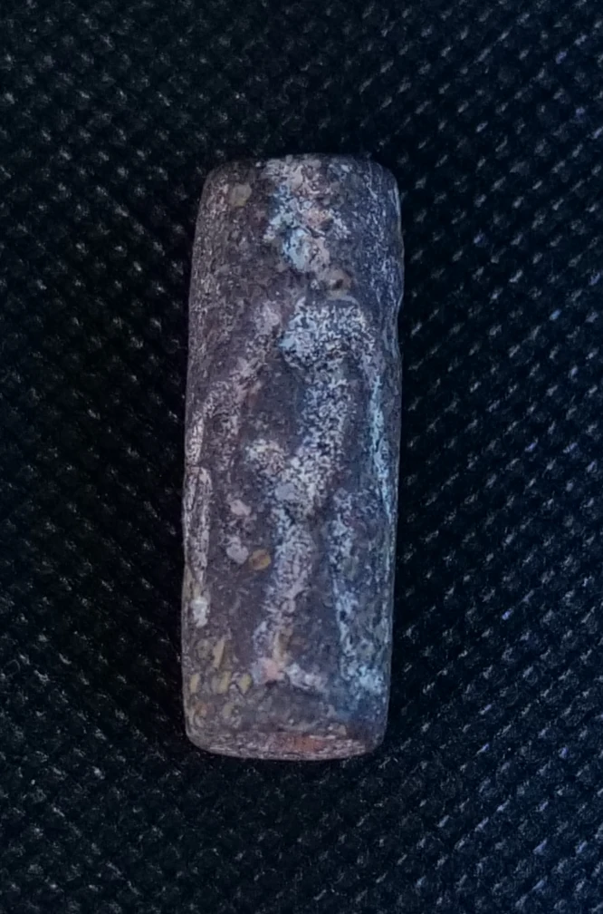

Cuneiform characters did not represent a language, but a writing system for recording spoken languages. In English, we'd say "writing is a  written language", and then we'd say that "cuneiform is a script, not a language". So, in French, we'd say that cuneiform is not a language, but a way of codifying a language.

### The evolution and the uses of writing

During its first centuries of existence, this script remained limited, serving essentially as a mnemonic system for recording quantities, lists of agricultural goods, and equipment. Only gradually did it become capable of **phonetically rendering names** and complete sentences.

Initially, names couldn't be expressed in cuneiform script because it primarily represented objects and elements of reality, such as an ox or wheat, depicted as small images. Over time, these images evolved into a more developed form of script, allowing for the representation of names and complex concepts.

If the person's name was Laura, for example, we could have taken a word, an acronym that sounded like "water" and a second one like "ras", and form the name Laura with it. That's how the first form of written language developed.

For the record, to represent acronyms originally, if you wanted to draw the head of an ox, you could see the shape of the ox's head. Little by little, the drawings were simplified to represent nothing more than a sort of line. Scholars believe that this happened because people held the wet clay tablet in one hand, so it was easier to redraw the initials by turning them. It's also thought to be due to the way the scribes held the tablets.

You can still see the connection with, say, wheat or the ox's head in cuneiform acronyms, and they're always leaning to one side.

Throughout its three millennia of use, cuneiform writing primarily served to maintain economic and administrative records. However, the inhabitants of Mesopotamia soon developed a deep-seated desire to preserve everything that deserved to stand the test of time in a written form. Thus, stories, legends and songs, hitherto transmitted orally by itinerant musicians, were immortalized in writing, often copied by scribes in training. They copied texts that already existed, mainly legends or texts that held a certain cultural value.

An important example is the **Gilgamesh Epic**, possibly a **historical king of the Sumerian city-state of Uruk** around 2900-2350 BC.

This form of writing, which was both an economic management tool and a cultural vector, lasted until the 1st century AD, before disappearing for good, leaving behind a precious testimony to the civilization that saw its birth.

## The role of Sumerian tablets

<chapterId>a396e6c5-56cc-5410-9e6b-0274401c5425</chapterId>

:::video id=a0729a35-01ec-4aa4-828f-d4ccc2eb168e:::

### Pre-monetary credit systems

In ancient Mesopotamia, economic organization was based on highly sophisticated mechanisms that existed long before the invention of metal coins. From the outset, formal and informal credit systems were already an essential form of money, enabling local populations to carry out many complex economic transactions.

It was precisely to meet administrative and economic needs that cuneiform writing was invented. The famous Mesopotamian clay tablets were mainly used to record various types of contract: private loans, sales, rentals, mortgages, and even marriage agreements. Writing these tablets required the expertise of specialized scribes, a task costly in time and effort, **but justified when financial interests were at stake.** People didn't write love letters to each other back then, they didn't use a scribe to write about their anxieties. They hired a scribe to write documents, whether there was a connection or an economic reason.

It's also worth mentioning that some of these tablets circulated as bearer bonds, changing hands freely.

For example, there was a form of clay ball with small stones inside.

On the outside of the clay ball, a number was written and signed, representing a number of units. Inside, there were these rocks and someone who wanted to verify, to really validate that this instrument really did represent X number of units.

Another example, a tablet found southwest of present-day Baghdad, stipulates that a debtor undertakes to repay a creditor 330 measures of grain on harvest day. Even more fascinating, another tablet clearly states that a debt of four measures of barley must be repaid directly to the bearer of the tablet, thus **introducing the notion of payment to the bearer, a particularly innovative concept for the time**.

From 2000 BC onwards, there was a law requiring all commercial transactions, even the smallest ones, to be formalized in writing and signed in the presence of witnesses. Imagine what a huge bureaucracy it was in those days to record all transactions in registers made, I remind you, of clay by scribes. This legal rigor was intended to prevent future disputes over ownership and rights of the exchanged goods. Witnesses were often called in to testify that the contract had indeed been signed.

In the private sphere too, certain families and individuals engaged in economic activities complex enough to require rigorous management. The house of an Anunitum priest named Ur-Utu was discovered in the north-Babylonian town of Sippar-Amnanu, containing nearly 2,000 tablets. These documents included private loan contracts, deeds of sale and leases, as well as letters, religious and academic texts, testifying to the diversity and importance of private archives at the time.

It's notable that the letters written by scribes were almost exclusively concerned with financial interests: complaints about insufficient allowances, pending dowry payments or other urgent material requests. In those days, personal writings such as love letters did not exist, and even mentions of illness were rare.

A poignant example of such a letter illustrates this economic reality: a correspondent expresses his distress after being left without money or provisions when his partner left, while a severe famine struck Assur. He describes his urgent need to buy grain, and asks that the cash equivalent of his textiles be sent to him quickly to ensure his daily sustenance.

This letter, addressed to her partner, seems to indicate that he had gone off to trade elsewhere, leaving her penniless. She reminds him that she must have access to measures of money in order to buy grain and pay her temple taxes. This is perhaps the closest we can come to an argument written in a letter of the time. Letters were almost always related to economic transactions, and this very letter relates to a precarious economic situation.

Thus, the Mesopotamian documents that have come down to us mainly reflect economic exchanges, since they were drawn up exclusively for transfers of goods with a recognized value: money, grain, various goods, real estate, payment of temple taxes. These archives reveal not only the efficiency and administrative precision of this ancient civilization, but also its ability to manage complex economic exchanges over a very long period.

## Elite control on Sumerian tablets

<chapterId>c6d3df0e-b1e1-58dc-ab35-9f76bbc39393</chapterId>

:::video id=04a95fb8-a701-4a48-9ce8-0e9b6ba256fd:::

### Writing, a technology that's above all economical

Contrary to popular belief, the invention of writing in Mesopotamia some 4,000 years ago did not initially serve the needs of personal or literary communication. **Cuneiform writing was first and foremost an economic technology**, justified only when important financial interests were at stake. The Sumerians did not use writing to correspond with each other or express their feelings, but exclusively to document their commercial and financial transactions.

This specialization can be explained by the considerable cost of tablet writing. Engraving in clay required specialized technical expertise, considerable time and specific materials. Only transactions of sufficient value economically justified this investment, creating a natural threshold for access to this revolutionary technology.

The cuneiform tablets reveal a financial system of remarkable complexity for its time. The Mesopotamians had developed a complete arsenal of modern financial instruments: **private loans with interest, deeds of sale, rental contracts, mortgages, and even marriage contracts with financial clauses**. This sophistication testifies to a developed market economy, far removed from the simplistic image of primitive bartering that is often associated with these ancient civilizations.

Some tablets functioned as genuine bearer securities, circulating freely from hand to hand without requiring identification of the original holder. This innovation enabled a remarkable fluidity of exchange, prefiguring modern financial systems. Furthermore, specific legislation even required all commercial transactions to be formalized in writing, thus institutionalizing the use of writing in the economic sphere.

### The Monopoly of Knowledge and Economic Control

The centrality of writing to the economy conferred considerable power on those who mastered this technology. **Scribes, who were generally attached to temples and ruling institutions, held de facto control of the financial system**. Their rare and invaluable expertise made them the guardians of all important transactions.

This monopoly of knowledge was no accident. The authorities had every interest in maintaining this exclusivity, as democratizing writing would have diluted their control over the economy and increased the risk of forgery. The systematic presence of witnesses at signature ceremonies reveals this constant preoccupation with document authenticity.

The legal obligation to record all commercial transactions in writing served several strategic objectives: fiscal control, rigorous accounting monitoring, and maintaining the dependence of economic players on the administrative apparatus. **The Mesopotamian state thus appropriated the ability to manage interpersonal debt** on a societal scale, thereby transforming writing into an instrument of economic power.

### The Coexistence of Two Monetary Systems

Analysis of the tablets reveals a more nuanced economic reality than their ubiquitous presence in the archives would suggest. Many tablets mention references to the **shekel of silver** as a unit of value, thus indicating the parallel existence of a monetary system based on standardized physical goods.

This duality can be explained by the social stratification of the time. **The cuneiform tablet system was reserved for a restricted elite**: clergy, prosperous merchants, and administrators capable of reading, writing and interpreting these complex documents. To use a bearer tablet effectively, one not only had to know how to decipher it, but also had to be able to verify its authenticity and understand its legal implications.

**The mass of the population, excluded from this elitist system, developed its own exchange mechanisms**. Ordinary people used more accessible systems such as standardized measures of grain, weights of money, and other easily quantifiable goods that anyone could evaluate without specialized skills.

This popular economy, while less documented in official archives, was probably more dynamic and flexible than the tablet system. It enabled rapid daily exchanges without recourse to scribes, meeting the immediate needs of craftsmen, farmers and small traders.

The silver shekel, often mentioned in the tablets as a value reference, probably served as a bridge between these two parallel economic systems, enabling conversion between written debts and physical payments.

### Spontaneous Emergence Versus Institutional Control

This coexistence illustrates a fundamental debate in economic history: **the opposition between the spontaneous emergence of means of exchange and the institutional appropriation of money**. On the one hand, commodities such as money emerged naturally from people's exchange needs. On the other, institutions appropriated and formalized these practices to control their flow.

Sumerian temples epitomized this tension: they used popular monetary innovations (references to the shekel) while developing their own control instruments (cuneiform tablets). This strategy enabled them to reap the benefits of both systems: the popular legitimacy of traditional currencies and the administrative control of formalized debts.

The Mesopotamian experience establishes lasting precedents for the evolution of financial systems. It demonstrates that **financial sophistication often precedes technological innovations by several millennia**, which are usually associated with it. The concepts of interest, credit, negotiable instruments and mortgage collateral did not wait for the invention of metallic money to develop.

This seminal period also reveals the power issues inherent in any monetary innovation: who controls the technology, who defines the rules, and how formal systems and popular practices are articulated. These fundamental questions have persisted throughout economic history, extending to contemporary debates on digital currencies and cryptocurrencies.

# Economy and money in ancient civilizations

<partId>a16bcf4c-8c3a-11f0-9e79-2bd363a484bd</partId>

## The great civilizations of the Bronze Age

<chapterId>fab9334c-7385-5d7c-ad40-7d152beb22a1</chapterId>

:::video id=737e12e8-1033-4210-b1dd-b8a680f68b17:::

In this section entitled "The great civilizations of the Bronze Age", we'll start with an extract from the book *A History of Money: From Ancient Times to Present Day* by Glyn Davies, which I think is an excellent introduction to this section on the great civilizations of antiquity.

> Toynbee identifies some twenty-one different "civilizations", but since fifteen of these derived directly or indirectly from earlier examples, he reduces the number of independently developed civilizations to six: Sumerian, Egyptian, Minoan, Chinese, Mayan and Andean. Of these, only the Incas of the Andes managed to achieve a high degree of civilization without using money, although paradoxically they had an abundance of the materials generally considered best for use as money - gold and silver.

The Incas had no monetary system, but they did have an abundance of precious metals. Quite a paradox. Let's continue with the quote:

> The more stratified a society, and the more meticulously efficient its planning system, the less necessary the use of money is for its population. This may explain why the Spanish conquistadors discovered that the Mexicans, whose government was relatively more liberal, regularly used gold powder (kept in transparent tubes) and cocoa beans (kept for large payments in bags of 24,000 units) as currency, while conversely, the Incas, organized according to a much more rigid hierarchy, had no currency at all: an exception confirmed by a strict rule. The origin of money in China was totally independent of other civilizations; however, the relative proximity of the Sumerian, Egyptian and Minoan civilizations raises doubts as to the extent of their respective ignorance of monetary practices, especially in view of the extensive trade established as far back as the earliest times.

In China, coins were developed with a completely different approach to Western traditions. It was fiat money from the start. They were cast coins.

And here, Mr. Davies mentions trade. There were indeed exchanges between the Chinese and other populations at certain times, but the medium of exchange for foreign trade was rather silk. As we'll see later, gold was also used in China's frontier regions, where the Chinese population was smaller. And not even for international trade; for that, it was silk.

So, I imagine that perhaps for the format of the coins, they may have been influenced by other civilizations of the same era that developed this technology.

But clearly, the essence of money was completely different in China than in the West. We'll come back to this at length in the subsequent section on China.

Concerning these famous Sumerian cities, I have a few notes here. We can mention Uruk, which was a very early and influential city, famous for its considerable size and advanced culture, notably with the development of writing and urban planning.

And I also wanted to mention the famous Gilgamesh epic. Gilgamesh was probably a historical king of the Sumerian city of Uruk around 2900 BC. He was probably the king of this Sumerian city-state.

We can also speak of Sargon of Akkad, who reigned from 2334 to 2279 BC.

He was the first ruler of the Akkadian Empire, which is another civilization that emerged in Mesopotamia. And I mention Sargon because he was the first to establish a postal service for these famous tablets here, which I've already introduced to you.

Imagine that there really were even clay envelopes. The tablets could be wrapped in clay envelopes with the person's signature on the outside to ensure confidentiality. So people would break open the envelope to retrieve the tablet. We owe this postal system to Sargon of Akkad.

Then there's Babylon, the great city that became the capital of the Babylonian Empire. Another civilization, renowned for its imposing Ziggurat and palaces, and the famous Code of Hammurabi, best known for its highly advanced legal code.

And two cities to conclude this section. We have Ashur, which was the capital of the Assyrian Empire, an important religious center. And we have Nineveh, which was later the capital of the Assyrian Empire. They moved their capital there and it's known for its powerful army, vast palaces and libraries. And it's also one of the possible locations of the legendary Hanging Gardens of Babylon. We often hear of this famous wonder of the ancient world.

But there's no trace of these famous hanging gardens in Babylon. In Nineveh, on the other hand, there is archaeological evidence of gardens on several storeys. It's possible that Greek historians such as Herodotus confused Nineveh with Babylon. When they visited cities in Mesopotamia, perhaps they referred to it as Babylon. Traces of famous hanging gardens have been found in Nineveh, and scholars may wonder whether Nineveh is the famous place where these gardens were located, referred to as the Babylonian Hanging Gardens.

## Economic organization in Mesopotamia

<chapterId>6afb6fc8-cbb7-56a5-8427-484b4b7d7477</chapterId>

:::video id=aa6a2cbd-5916-4ae3-ad4f-65f0bd5643fa:::

### Pre-capitalist economic structures and slavery

Welcome to this section on economic organization in Mesopotamia. The pre-capitalist economy went through three main stages: primitive, slave and feudal.

Feudal, of course, is much later, obviously in the Middle Ages, and we have already passed the primitive stage that we described earlier with the Paleolithic. Now, in Mesopotamia, when we talk about economic organization, we're talking about slavery.

However, in Mesopotamia, the bulk of work was carried out by a dependent class similar to slaves, who were not legally the property of their masters but were deprived of the fruits of their labor through physical or ideological coercion.

### The role of temples and palaces as economic centers

Large landholdings dominated the economy. Landowners exploited their land directly by hiring workers, or they rented out their land in exchange for rents. They also engaged in financial activities, lending money at high interest rates, generally around 20% to 33.3% per annum, practices that contrasted sharply with the stricter rules of the neighboring Hebrews.

The loans taken out by farmers were not intended for productive investment - with the exception of shipping companies - but rather to ensure their survival until the next harvest. This situation frequently led to chronic indebtedness of the farmers.

Allow me to draw a parallel with a more recent period during antiquity (Rome), where citizens lived off the agricultural rents produced by peasants and unfree labor, as well as the spoils of war. **These revenues were distributed among the citizens, not to generate more profits, but to enhance their social status.** Trade and crafts were generally left to groups outside the social elite. All this contrasts with the medieval economies oriented towards of profit through trade and crafts.

So what we're trying to say here is that I'm drawing a parallel with the fact that people used financial lending tools not necessarily to improve their means of production, and later in Rome, profits were not necessarily reinvested, but rather used to increase the prestige of the people who could benefit from these profits. We're still a long way from the capitalist spirit that emerged later in the Middle Ages, when jobs could be created to improve the means of production, and surpluses were taken and created in the pursuit of profit. So we can see that economic organization had not yet reached the third stage of the economic evolutions listed above.

### The emergence of credit systems and units of account

**Karl Polanyi distinguishes three forms of economic exchange: reciprocity between symmetrical groups,** that would be in primitive tribes where we don't really need money because we give each other informal credit and exchange and redistribute. **Redistribution centralized around temples and palaces,** this form of exchange is compatible with Mesopotamia, where temples were at the center of economic organization and could at one time give back, distribute wealth in the form of rations. It was only later that the notion of wages was introduced. So, until now, we have the primitive form (1), centralized redistribution (2) in temples and palaces, and then we can finally give way to market exchanges (3). Although the market as we understand it today did not fully exist, the presence of market exchanges in Mesopotamia is indisputable, attested by the existence of specific terms in Akkadian and by the presence of archaeological evidence of prices, profits, losses, fluctuations and situations of scarcity.

Mesopotamian households independently managed all stages of agricultural production, from sowing to final processing into bread and beer. Women also produced the textiles needed by their dependents. For goods not produced locally, households turned to specialized merchants.

Family ties were particularly important in trade. During the Paleo-Assyrian period (c. 1910-1830 BC), merchants from the city of Ashur established a trading colony at Kanesh in Anatolia, importing tin and textiles in exchange for gold and silver. Trade was based on family businesses closely linked by marriage and commercial partnerships. Kanesh was just one link in a vast international trade network.

In these exchanges, there were metals, and they were precious metals and not necessarily, for example, copper, which was really useful at the time, and we think that these metals were exchanged for notions of store of value. So we couldn't necessarily speak of barter, where two goods are exchanged for their usefulness, but rather a notion of payment with a certain awareness of hoarding precious metals for their use as a store of value and not to use them as a commodity, for example, the use of bronze to make armor.

Tributes and taxes were mainly paid in kind (barley or weighed silver). Temples and palaces were the main economic, administrative, political and religious centers, and also performed the first banking functions through the secure deposit of goods, first grain, then other agricultural products and finally precious metals. In this way, the first credit and loan operations were developed, long before the appearance of coins.

The Mesopotamian economy mainly used barley and silver as standards of value. Silver was weighed in standardized units, such as the sìqlum (shekel) of around 8.33 grams. As early as the ancient Babylonian period (under Hammurabi), silver was used as a common means of payment, with an early notion of nominal value ("nūbum") as opposed to real weight ("šuqulum"), **anticipating the modern concept of fiat currency**.

But it wasn't yet fiat money in the strict sense of the word. There was no notion of a stamp with a figure of authority, but there was a notion of a nominal unit of account, as opposed to the notion of weighed metal. There was a distinction in the language for these two concepts, and I think it's important to mention it.

The transition to a wage labor market was a difficult one. It required two major conceptual innovations: the separation of the person's work from the final product, and the introduction of "working time" as a measurable unit. To have this notion of wage and salaried employee, we first had to go through these two innovations. **In the IIIᵉ millennium, work was initially remunerated by fixed rations, before gradually evolving towards a wage system at the beginning of the IIᵉ millennium.**

Finally, from the 26th century BC onwards, a real notion of monetary value took root, even though Mesopotamian "money" was not a coin, but rather a weighted measure of grain or metal. **Thus, for important transactions or in contexts requiring the conservation of value, it was often preferred to convert grain into silver, which was more easily preserved.** A little like the example of Kanesh, where silver metal was received for hoarding.

From the 21st century BC onwards, **with the virtual disappearance of asymmetrical exchanges**, we note that in assignment contracts, the verb sa, refers to the payment of the price. This notion, called "sa", appears in contracts and refers to the payment of a price, not the measurement of a particular commodity. "Sa" simply refers to a payment or a price. It's an anthropologist who notes this and mentions that it's really a breakthrough; we see a kind of dichotomy between the before and after of this introduction of the verb "sa" in contracts.

We can't ignore the empirical data present in Near Eastern archives attesting to the existence of **some market mechanisms**, incorporating **notions of profit** and **loss**, **price fluctuations** and situations of **scarcity**. But the fundamental difficulty lies in determining the relative importance of market-based exchange within the ancient Mesopotamian economy as a whole.

I think the experts in this field have seen traces of these market concepts, but they're not really able to tell us how much of the economy of the time was based on this more modern market concept or other mechanisms.

We know it existed, but we don't know if it was the main way, say, of determining prices or trading.

This concludes this section on economic organization in Mesopotamia.

In the next sections, we'll do the same for Egypt and China.

## Economic and monetary organization in ancient Egypt

<chapterId>bffcc16c-7fbf-5992-a0fa-6a7726d7d287</chapterId>

:::video id=40c1c4e5-b190-4bb6-b8a0-810c9ce7698b:::

### Historical background and Egyptian periods

This section is dedicated to the economic and monetary organization of ancient Egypt. To give you just a little background, here's a list and brief description of the periods in question.

- **Old Kingdom (c. 2575 - c. 2130 BC)**. A period marked by the construction of the great pyramids, notably those of Giza. This was the golden age of the centralized Egyptian monarchy.
- **Middle Kingdom (c. 1938 - c. 1630 BC)**. Political and cultural renaissance after a period of instability.
- **New Kingdom (c. 1539 - 1075 BC)**. A period of territorial expansion, military power, and international trade. It includes the reigns of famous pharaohs such as Tutankhamen and Ramses II.
- **1323 BC. - Death of Tutankhamun**. The young pharaoh died aged around 18-19. His almost intact tomb was discovered in 1922, making it one of the most famous of all archaeological discoveries.
- **Ramses II - Reigned 1279-1213 BC**. One of the most powerful pharaohs of the New Kingdom. Known for his military campaigns, his great monuments, and for having probably concluded the first known peace treaty.
- **1275 BC - Sea Peoples**. Invasions or migrations of groups called "Sea Peoples" destabilize several Mediterranean civilizations, including Egypt.
- **Battle of Xoïs - 1178 BC**. Conflict between the Egyptian army and invaders, probably linked to the Sea Peoples. One of many battles at the end of the New Kingdom.
- **The Late Period** is the period of ancient Egyptian history from around 664 to 332 BC.
- **Cleopatra VII (69 - 30 BC)**. Last queen of Egypt, famous for her intelligence, charisma and alliances with Julius Caesar and Marc Antony, and probably also for her nose. Her reign marked the end of Pharaonic Egypt before its annexation by Rome.

By the 5th and 4th millennia BC, Egypt was already experiencing intense commercial activity on a large scale, linking Nubia, Palestine, Libya and the Red Sea regions through maritime, river and land trade (notably by donkey caravans).

### Early exchange systems and paleo-currency

With the emergence of the first Egyptian chiefdoms around 3650-3400 BC, the site of Maadi, south of present-day Cairo, became a major center for copper technology and long-distance trade, notably with Mesopotamia via the Syrian coast.

Although large-scale trade was mainly based on barter, a primitive form of money ("paleo-currency"), made up of prestige items such as semi-precious stones and fossil shells, probably existed. Gold probably already played an important role in these exchanges. The first explicit mention of a coin in Egyptian documents in the middle of the 3rd millennium BC reflects a long development linked to commercial practices.

In archaic society (here we're not necessarily talking about Egypt, but archaic societies in general), payments were frequent, not to buy directly, but to pay dowries, religious rituals, and other social obligations. These transactions required precise pricing and valuation. Many primitive societies had privileged, monetiform (i.e. countable) objects, in terms of which this value was estimated. If you're paying a dowry, of course, you have to note down some quantity of an object to be exchanged to pay the dowry. This value is essentially that of people.

In archaic societies, before the advent of money or monetary systems, there were payments, but they were often linked to social obligations, and their value derived from the value of individuals, as in the payment of dowries or blood money.

Returning to Egypt, during the ancient empire, the "shât(y)", originally a concrete monetary unit (a small gold or silver coin weighing around 7.6 grams), very quickly passed from its real function as a hard currency to an **accounting function** that gave rise to the notion of value. We can recognize in it a kind of unit of account to express value, which originally was a kind of coin, but we can't really call it a coin because it's not stamped, it's just a measure of metal. We're getting closer to the notion of a unit of account.

This notion of shât(y) was eventually abandoned, perhaps because of the risk of fraud. We'll see later that the Egyptians were slow to adopt stamped coins and even continued to weigh them, even after they had been adopted by their neighbors.

In the Middle Ages, silver was rarely used for day-to-day transactions, which were mainly carried out with grain measures and bread quantities. It was during this period that a form of scriptural money appeared, where payments could be recorded in writing, or by actual transfer.

In the New Kingdom, the monetary system became more complex, integrating different commodity currencies valued in metals (gold, silver, copper), standardized fabrics, cereals and oil. Fabrics were referred to as "cloth measures". **Prices for everyday goods were often expressed in grain or copper, while precious objects were valued in gold or silver. Silver, which was rarer in Egypt than gold, became particularly prized.** Silver was overvalued compared to gold, which was more abundant in Egypt.

By the Late Period (first millennium BC), silver had become the common metal of exchange throughout the Near East. It circulated in the form of ingots, metal coins or rings, which were weighed and marked in temples, guaranteeing their weight and purity, although they were not minted in the effigy of a sovereign. That came later, and will be the subject of a subsequent section on the Lydians.

It should also be noted that the ancient Egyptians had a term, "hedj", for money, and it was used generically to designate any means of payment serving as consideration in a transaction, whether for metal, grain, cloth or various goods (wood, animals, services, etc.). Documented examples show that the Egyptians could settle a transaction by combining various products whose total value was expressed in copper units ("deben").

**Temples played a central role in the Egyptian economy: they collected and hoarded considerable treasures of precious metals (gold and silver) intended to honor the gods but also to serve as a monetary reserve that could be reintroduced into the economic circuit as needed**. We'll see examples of other civilizations accumulating valuable reserves in temples, such as statues, to be melted down in the event of war, currency shortage or crisis. This is a recurrent theme throughout history.

It's also worth mentioning that the cultivation of linen was a royal monopoly granted to the temples, and the manufacture of precious fabrics confirmed their economic importance.

The ancient Egyptians made a clear distinction between the ideological aspect of precious metals, linked to divinity (gold representing the flesh of the gods, silver their bones), and their practical function as currency serving as a reference for all other forms of payment.

Thus, although ancient Egypt did not develop a minted currency comparable to modern monetary systems until the late period, it did possess a sophisticated monetary system, based on the combined use of scriptural money, precise units of account, commodity money and precious metals valued by weight.

The coins themselves were weighed, giving rise to two different concepts: **"coinage" and "money"**. I used two terms in English. First, "coinage" refers to coins, a concept that comes later, and we also have this concept of money. We can already define a certain notion of "money" by the units of account I've just expressed in terms of money, but which were not yet coins, so "coinage" comes a little later with the Lydians.

And so, coins are not a prerequisite for money, **so much so that we can admit the existence of money as early as the 3rd millennium,** in any case and without any doubt during the 2nd millennium and particularly under the reign of Hammurabi.

What's important to remember here, and this is what the author mentions in the book "The Origins of Money", is that there is no doubt that the concept of money already existed at the time, in these monetary systems, and it's a mistake to link the birth of money as a concept to the appearance of coins.

Finally, Polanyi's concepts of reciprocity and redistribution, often applied to ancient Egypt, need to be nuanced: while they exist, they do not form an exclusive framework. Pharaonic Egypt had developed a complex economy that fully integrated sophisticated commercial exchanges, distinct from religious and ritual practices, demonstrating a real autonomy of the economic domain from the ideological.

This peculiarity is linked to the notion that precious metals were associated with a certain divinity, yet were still capable of distinction.

I bring this up because Polanyi referred to the use of these precious metals as a primarily religious or divine notion. However, we are proposing that they were also integrated into the economic system, and that the Egyptians were already able to make such distinctions.

To conclude, I'd like to quote from the book "The Origins of Money", which lists the purpose of this invention, minted money. There are several points, but I'd just like to emphasize point 5:

*develop the possibility of economic play through the use of methods such as devaluations and successive revaluations to reduce or increase imports and exports at lower cost*

So, even in those archaic times, the author proposes that coins had already been invented or emerged under state control and were already being manipulated in terms of their quantity of precious metals and weight to manage the economy. Allow me to give you a little scoop regarding a subsequent section. **Even in the earliest forms of coinage, which were made of electrum, an alloy of gold and silver, we know from analyzing the content of precious metals in these coins that the first issuers, for example, Croesus, had less gold than in natural electrum.**

This means they already knew how to separate gold and silver, and issued coins containing less gold.

The author suggests that from the earliest days of coinage, beyond simply certifying weight and facilitating trade, the power to mint money was already being abused to increase the quantity issued, possibly as a form of economic planning.

## Sign currency and economic and monetary organization in ancient China

<chapterId>e08d3be9-423c-5cf3-a606-6ad54e2261af</chapterId>

:::video id=ae7e6367-1725-455e-bfe6-359be1f443e5:::

In this section, entitled "Sign money and the economic and monetary organization of ancient China", we'll see that ancient Chinese money has distinct characteristics from Western traditions. Chinese currency was already a "sign currency" from the outset. The information in this section is based on notes I took after reading the book "Aux origines de la monnaie".

### The concept of sign currency and its distinctive features

According to the author, sign money is the equivalent of today's fiat currency. It's a currency that doesn't have a value linked to its metal content. From the outset, it was a kind of agreement, a social consensus on the value of these coins.

Ancient Chinese coinage has characteristics that differ from Western traditions. It was mainly metallic, but cast rather than minted, and did not bear the effigy of a sovereign. Surprisingly, the Chinese state did not have a monopoly on monetary issuance. This apparent liberalism can be explained by the absence of any economic need to monopolize monetary issuance, thanks to abundant tax resources levied on a large taxable population.

Chinese currency is also characterized by its fiduciary aspect. From the very beginning, bronze imitations of cowries (sea shells) were used as currency, with no direct relation to the intrinsic value of the metal used. If we go back very far in history, the Chinese used seashells as currency. Eventually, when shells became too scarce, they made replicas in copper, and these copies had the same value as the real thing.

Chinese currency was therefore not based on the value of the material or the relative rarity of the original item (e.g. shellfish), but on collective confidence in its use as a medium of exchange - in other words, a monetary sign.

### From cowrie shells to metallic imitations

The cowrie was widely used as a primitive monetary unit. Ancient inscriptions show that, as early as the Shang and Zhou dynasties (the first dynasties of the first and second millennia BC), cowrie shells were used not only to reward military deeds, but also to **remunerate work, measure value and buy land**.

What's important to remember here is that it wasn't just any tool used by society for restricted purposes. It was employed for military rewards, payment for work, and measurement of value. We find traces of this in the writings of archaeologists. While we don't know if it was used to buy bread on a daily basis, we do have evidence that it could have been used for the types of transactions mentioned above.

Over time, the scarcity of real cowrie shells led to the production of imitations in bronze, bone, mother-of-pearl or stone, particularly for use in funerary contexts to avoid immobilizing real values in tombs. This change of medium is also linked to the idea of the prince's control over money, a control that is all the easier if the prince makes the money.

What we need to understand here is that, by moving beyond the limitation of  natural scarcity of seashells, if the prince can create the currency himself, it gives him greater control over the management of the economy.

Unlike Mesopotamia, where coins were linked to the weight of precious metal, Chinese coinage terminology derives directly from the initial shapes of the objects used as currency: cowries (bei), knives (dao), spades (bu), and round coins (quan or qian). Thus, we can see that the origin of words related to money in China referred to these objects. In contrast, in the West, we have a number of monetary terms that come from concepts quite different from these, more related to the physical characteristics and weight of monetary objects. These etymological differences clearly demonstrate the schism between the Western and Chinese visions of money.

In China, monetary value was totally fiduciary, based on a social convention between the State, producers, and merchants.

### Economic regulation and monetary philosophy

The Chinese state used money as an instrument of economic regulation: in times of monetary abundance, the value of money decreased, making it easier for people to buy goods. Conversely, in times of monetary scarcity, the value of money increased, reinforcing the state's purchasing power for its subsequent operations.

A link can be made here with inflation and deflation. With a fixed money supply, if the economy's productivity increases, the value of money rises. Conversely, if productivity falls, the value of money decreases. In this example, however, the opposite is true. Probably because the prince did not have a complete monopoly on the production of money, yet it still indicates that the value of money was linked to economic conditions.

The philosopher Mo Di (5th-4th century BC) had already analyzed this relationship between price and value: according to him, price variations do not reflect a real notion of cheapness or absolute dearness, but rather a fluctuating relationship between goods and money, independently of the stable nominal value of the currency sign.

So here, instead of saying that the gold coin would have some kind of basic value as such, such as use value or intrinsic value, he points out that the value of the monetary sign came rather from the state of the economy.

In China, coins did not necessarily need to be officially marked or guaranteed. Its acceptance depended solely on collective trust, which explains why bronze or copper coins without specific inscriptions were able to circulate freely for a long time.

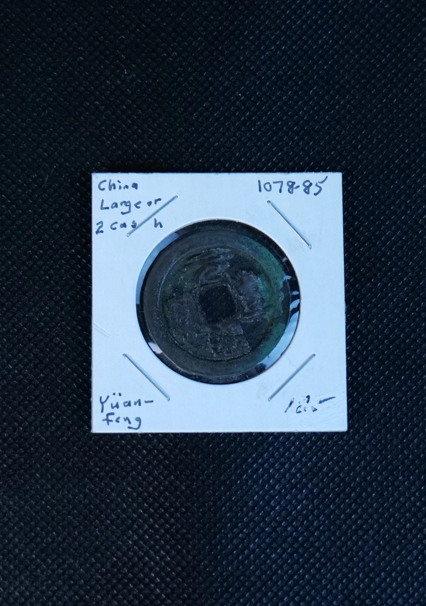

The one above is a Chinese coin from the Middle Ages. It is a cast coin featuring a square hole in the center. This hole was used to thread a rope through, allowing the coins to be strung together to create bracelets or necklaces. However, these were not primarily for wearing; they were mainly used for accounting purposes. They could be strung together to form units of account in the form of large strings, with the pieces interlocked. There weren't necessarily any specific marks, sometimes they were simply bronze circles.

The state's monetary monopoly, belatedly established by Wudi of the Han Dinasty in 113 BC, was often challenged, allowing various private or local players to issue their own currencies, provided they enjoyed sufficient social trust.

**The low intrinsic value of Chinese currencies prevented hoarding, guaranteeing their smooth circulation**.Precious metals were seldom used as circulating currency to prevent hoarding. Gold, being too expensive, was typically set aside rather than spent. Instead, **only silk represented a real high-value currency in Chinese international trade**. The Chinese traded using silk, not gold.

During economic or monetary crises, particularly when the price of copper was rising, innovative solutions were adopted: thus, as early as the 2nd century AD, coins in circulation were cut to create smaller units, enabling fluid circulation to be maintained at lower cost. Other eras, such as that of Wang Mang (early 1st century AD), experimented with highly fiduciary currencies, where face values were far higher than their actual metal content, thus prefiguring banknotes. They took a coin and stamped values like 50, 100, or 200 on it to indicate larger amounts, such as 200 coins. This practice likely contributed to significant inflation.

As mentioned above, this system was based on a social convention between the State, producers, and merchants, but also on authoritarian and severe rules for those who didn't play the game, notably in relation to the choice of pieces (whether beautiful or not) or the length of fabrics (not in line with the standard).

In my humble opinion, it's not a very solid system. It relied mainly on strict rules requiring officials and traders to accept damaged coins, under threat of sanctions.

### Chinese monetary innovations and their economic impact

China was also a pioneer in the issuance of early forms of paper money, initially adopted in response to a shortage of metal in the 9th century AD. Despite their initial advantages, these paper currencies regularly led to inflationary spirals when issued in excess, as witnessed in the Song or Ming periods, when excessive issuance led to serious currency crises, illustrated by Marco Polo in the 13th century, who even noted that the falsification of such paper money was punishable by death. I can't help but point out a form of violence here.

Thus, the Chinese experience is characterized by a profoundly fiduciary conception of money, remarkable flexibility of the monetary system, and early use of paper currencies, based on trust between economic players rather than on the intrinsic value of the media used.

## Societal and economic organization in antiquity

<chapterId>4023c3ce-7a47-5ac4-8f5f-c7ab699ab20f</chapterId>

:::video id=2761efe4-21cf-4f06-9bda-c03f9ff39012:::

### The Urban Parasitism Debate

The relationship between ancient cities and their hinterlands raises a fundamental question: did these urban centers function as wealth-extracting parasites, or as engines of beneficial economic specialization? The parasitism hypothesis suggests that Bronze Age cities, particularly in Mesopotamia, **systematically extracted more value from their rural territories than they returned**, living essentially on rents and taxes without creating equivalent value.

This vision was echoed in the collapse of the Roman Empire: when territorial expansion ceased, the flow of external wealth dried up, potentially revealing an urban economy unable to finance itself. Cities would thus have lived "beyond their means", dependent on extraction rather than production.

### Specialization as a Value Creation Driver

An alternative economic reading challenges this parasitic vision. **Ancient cities functioned above all as centers of specialization and division of labor**. Their role went beyond simple extraction: they concentrated specialized crafts, organized trade networks, and served as hubs for long-distance exchanges.

This urban specialization created a productive interdependence with the hinterland. **Towns could not survive without rural agricultural supplies, but the hinterland benefited in return from artisanal products, technical innovations, and access to Mediterranean trade networks**. The division of labor allowed for mutual productivity gains, even if the distribution of benefits may have seemed unbalanced.

The chronic food insecurity of the time partly explains this apparent asymmetry. The risk of famine and crop destruction was a constant threat to rural populations, while urban artisans, connected to international trade networks, enjoyed greater economic stability.

### Historical Evolution, From Antiquity to the Middle Ages

The contrast between ancient and medieval organization sheds light on this issue. **Antiquity favored a large-scale division of labor, with cities open to the whole Mediterranean world**. Trade and specialization reached sophisticated levels, creating extensive economic networks.

The collapse of the Roman Empire led to radical fragmentation: **The feudal era replaced this centralized organization with a decentralized system of self-sufficient estates**. The ancient Roman villas rusticae became the matrix of medieval seigneuries, creating a mosaic of virtually self-sufficient economic islands managed by the clergy or nobility.

This medieval decentralization, while reducing commercial efficiency, paradoxically offered greater resilience to external shocks. Feudal estates developed more balanced relations between centers of power and rural populations, even if this organization limited the productivity gains linked to specialization.

### The Emergence of Urban Markets

Archaeological discoveries reveal the existence of **shopping ports and trading quarters in Mesopotamian cities as early as the second millennium**. These infrastructures attest to the existence of organized markets, even if their exact functioning remains debated.

Karl Polanyi, initially skeptical about the existence of genuine market mechanisms in antiquity, qualified his position by acknowledging that he may have underestimated the early emergence of market exchanges. This intellectual evolution reflects the complexity of interpreting ancient economic systems, where institutional redistribution, reciprocal exchange, and nascent market transactions coexisted.

### Sparta versus Athens

The comparison between Sparta and Athens perfectly illustrates the relationship between the monetary system and social organization. **Sparta represents a model of a rigidly hierarchical society that deliberately rejected the use of money**, while Athens developed a sophisticated monetary economy to accompany its democratic system.

The Spartan rejection of money was not spontaneous, but **institutional and ideological**. Spartan leaders feared that money would corrupt military and civic values, preferring a system based on direct interpersonal trust between citizens.

To discourage the use of  money, Sparta employed **heavy, impractical metal bars**, paradoxically demonstrating an intuitive understanding of the monetary qualities (divisibility, transportability, durability) they were striving to neutralize.

### The Limits of the Anti-Monetary Model

The Spartan organization illustrates the constraints of **Dunbar's number** applied to the societal scale. **By rejecting money as a neutral medium of exchange, Sparta condemned itself to limiting its civic society to a limited number of citizens capable of maintaining relations of direct trust**. The homoioi (Spartan citizens) represented just 1% of the total population, surrounded by thousands of hilotes (slaves).

This organization, initially a source of exceptional military cohesion, proved to be structurally fragile. **The Battle of Leuctres (371 BC) demonstrated the limits of this system**: the loss of life irreparably shattered the Spartan social fabric, leading to the collapse of their civilizational model.

Competing cities (Athens, Corinth, Thebes), with developed monetary systems, **maintained richer, more resilient economies**, able to compensate for human losses through economic reconstruction and immigration.

### Personal versus Institutional Trust

The Spartan experience reveals the **risks inherent in a society based exclusively on interpersonal trust** rather than neutral institutional mechanisms. While creating intense social cohesion, this model left society vulnerable to demographic shocks.

By enabling anonymous and depersonalized transactions, money offers superior systemic resilience. It allows social expansion beyond the limits of direct trust, facilitating foreign exchanges and economic growth.

### The Inca Paradox, Wealth without Money

The Inca Empire presents a fascinating paradox: **a civilization with immense gold wealth but no monetary system**. Like Sparta, this model was based on a rigid hierarchical organization and centralized planning, but proved vulnerable to conquistadors with flexible monetary economies.

This structural fragility of anti-monetary systems in the face of monetary societies is a recurring historical pattern, suggesting that **institutional rejection of money, far from strengthening social cohesion, can paradoxically weaken civilizations** in the face of external challenges and historical change.

Analysis of these historical models reveals that money, beyond its exchange function, is a marker and facilitator of social complexity, enabling civilizations to transcend the limits imposed by direct interpersonal relations.

# The birth of minted money

<partId>232e365a-8c3b-11f0-b276-b3ab70d1a5a1</partId>

## The emergence of coins

<chapterId>40ed3414-3066-57bd-bc1b-617ad0a354e0</chapterId>

:::video id=1d6834c4-98a3-43fe-ba80-04be51b0486e:::

We've now come to the crux of the matter: the appearance of coins. I'm stressing the word 'coin' here because we've seen in previous sections that money or monetary systems were very much present in the civilizations that preceded the Lydian peoples, the Greeks, and the Persians. It's pretty clear, I think, from what we've just seen. Therefore, this section is dedicated to the emergence of coins proper and is entitled: *The emergence of coins*.

### Lydian and Ionian origins of coins

To kick off this section, I'd like to offer you an extract from Glyn Davies' book, A History of Money, right here.

*Excerpt from A History of Money: From Ancient Times to the Present Day by Glyn Davies:*

> From its birthplace in Lydia and Ionia the knowledge and use of coins spread rapidly east into the Persian empire and west through the rest of the Ionian and Aegean islands to mainland Greece, and then to its western colonies, especially Sicily. It also spread northward to Macedonia, Thrace and the Black Sea, but it was only partially, reluctantly and belatedly accepted in Egypt.

I find it interesting to mention here that in Egypt, they continued to weigh coins long after the advent of minted coin technology. I think that's important to note. The quote continues:

> Similarly, mainland Italy also was at first rather slow in accepting the Greek financial innovations, in contrast to the speed with which they were adopted by Sicily.

*Apart from these two limited exceptions (continental Italy and Lower Egypt), the use of coinage spread rapidly around the countries bordering the central and eastern Mediterranean, as well as across the vast and growing Persian Empire, from Mesopotamia **to India.** It remains unclear whether India had already independently developed an embryonic monetary system by this time, independently of Chinese or Lydian developments. Regardless of whether India had independently developed its own currency, the increasing contacts between India and the Near East led to Indian coinage being a direct adaptation of Lydian and Greek invention, first through the Persian Empire and then the Macedonian Empire* (with the conquests of Alexander the Great and his father).

*For these reasons, the direct influence of any indigenous Indian invention of money was minor, compared to the overwhelming importance of the clearly independent monetary inventions of China to the east, and even more so of Lydian and Greek developments to the west*

### Geographical distribution and regional adaptations

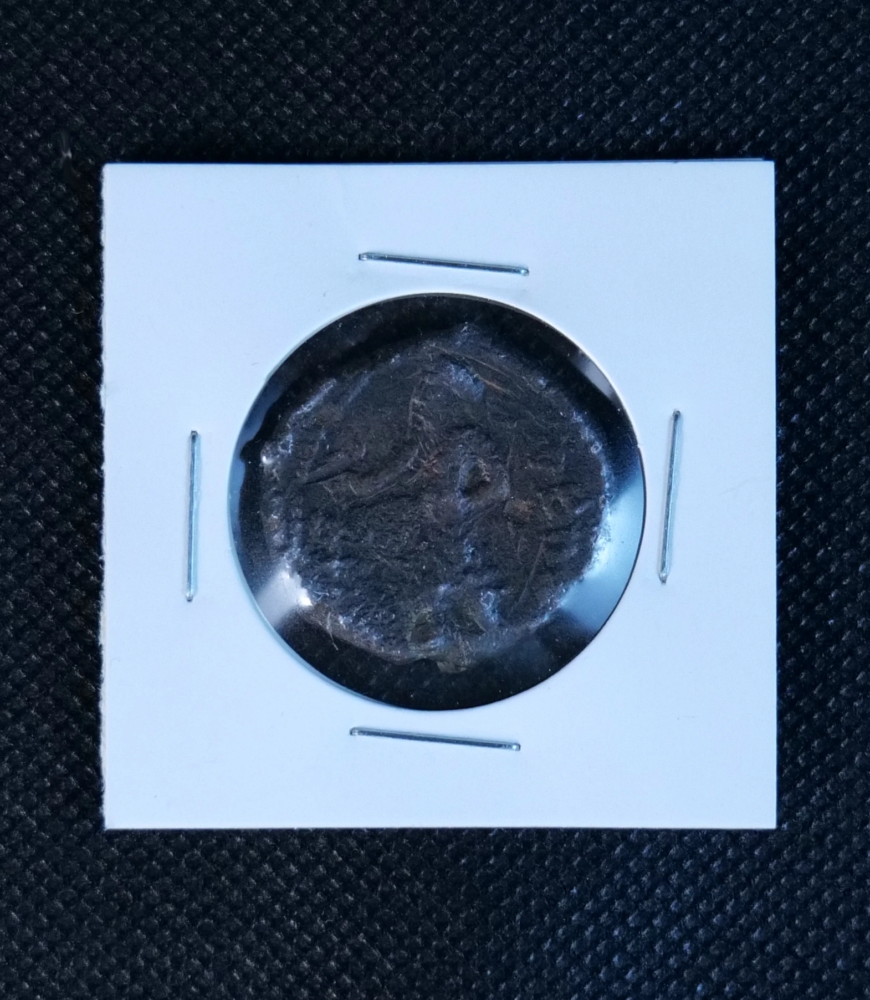

To illustrate this period in a visual form, here above is a coin from a region in India, the Bactria region, which is a close to the west of the Indian peninsula, near to Afghanistan. In this area, there were coins that were probably inspired by Greek coins featuring one of their royal personalities.

## Lydians and Persians

<chapterId>eb802ab8-8ffd-5b25-907f-8944f120ed14</chapterId>

:::video id=f151eb42-5ff3-4ca1-9af1-1ae2a5e051c0:::

### The first Lydian electrum coins

Since we can't separate the appearance of coins from Lydia and the Persians, let's move on to that part of the world to the east of Greece, which today forms Turkey. The first coins to appear in the West date back to approximately the middle of the 7th century BC, in the regions of Lydia and Ionia, located in present-day Turkey. It was around 650 to 600 BC that this fundamental innovation saw the light of day, with notable archaeological discoveries such as the first coins found in the temple of Artemis at Ephesus, dated around 600 BC. These primitive coins were made of electrum, a natural alloy of gold and silver with amber reflections, and were often crude in appearance, simply marked with punches or rudimentary motifs.

Below, you can see one of the earliest Lydian coins, featuring a lion with its prey in front. You might notice a stamp or hole at the back, which some believe was used to test the metal's purity and ensure it wasn't just a surface layer. While this is one of the earliest examples, it's important to note that this piece is a copy. All my gold and electrum pieces are replicas or modern recreations, designed to prevent me from spending all my savings on this collection.

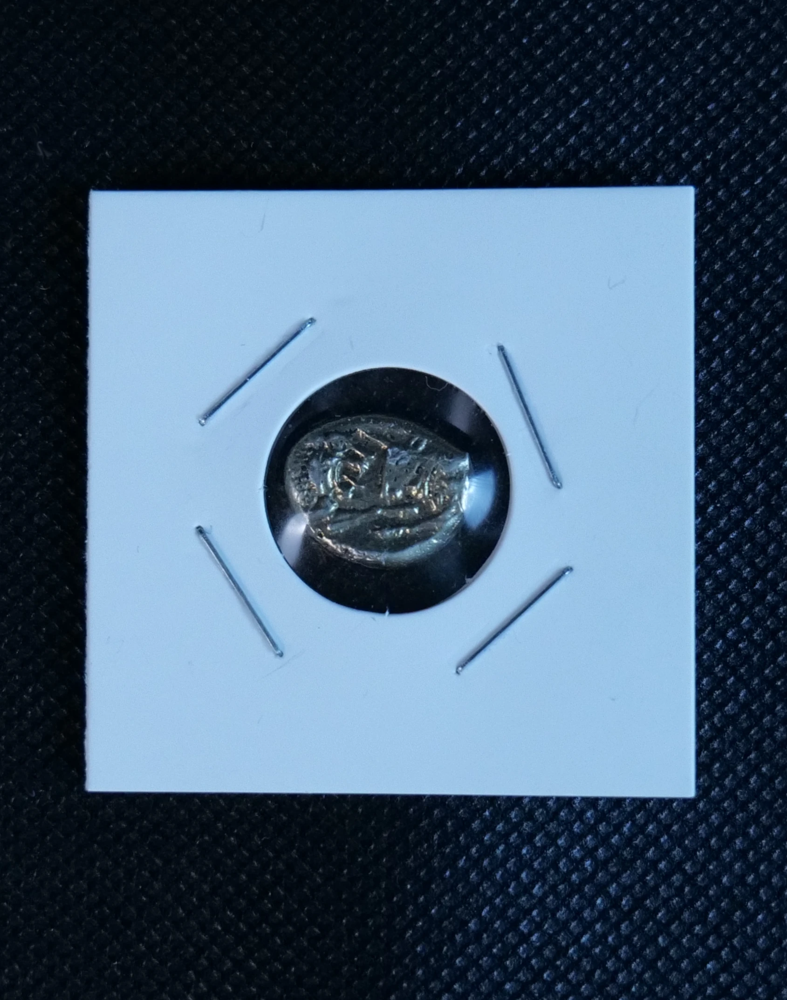

But I also have a real Persian piece that we're about to see. This is what these early pieces looked like. It's like a kind of blob (or lump, in English) of metal that was stamped at the time.

Contrary to the widespread belief that money was invented to facilitate everyday trade and replace barter, it seems that the first Lydian, Achaemenid and Greek coins were not initially used for small-scale commerce. Indeed, the monetary units were far too large for everyday use. What's more, their circulation was limited to regions close to where they were produced.

Here, I find it important to mention that, although I've read in several works of an anthropological nature, the coins, as I've already shown - whether the electrum ones or this Persian coin to which I'll return in a very short while - were too big to buy bread, say, every day. I've seen estimates that would make us think it was the equivalent of a day's work for a peasant or a soldier, so it would be too big. It's like trying to pay a day's wages for your meal, your breakfast, or your lunch. Except that I've seen in other works that smaller units of these blobs have been found, so smaller coins, which may make us think that maybe there was a possible use for everyday purchases.

So here, the anthropological "proof" that it wasn't used for everyday trade, because the denomination or unit was too big, isn't very solid in my opinion because we've found examples of coins that are smaller, that could have been adapted to everyday purchases.

### The role of the State in money creation

The real origin of coins seems to be linked to the direct action of states. There are two main hypotheses on this subject: the first, idealistic, draws a parallel between the Greek term 'nomisma' (money) and 'nomos' (law), suggesting that money was linked to the codification of laws, reinforcing the authority and political organization of cities. The second, more realistic hypothesis, widely accepted today, is that money was first and foremost a means for states to exercise economic and social control. By officially guaranteeing the weight and value of the precious metals they contained, states were able to manipulate the circulation and value of these coins, creating confidence and liquidity premiums specific to domestic currencies.

It's really interesting to know that we have evidence of this. For example, in electrum coins, you should know that natural electrum is normally around 70% gold and 30% silver. In the first coins we found and analyzed, specifically the early Lydian coins, the gold content seems to be more around 50 to 55% instead of 70. This suggests that even back then, coin issuers were trying to reduce the share of the more precious metal, probably to produce more coins and make them appear to be worth the same as an unmarked blob of natural electrum. And here, it has to be said that it was really from the time of this famous Croesus, as in *rich as Croesus*, that this was possible because it was from his time that we had the technology to separate gold and silver.

Lydian coinage underwent a major evolution during the reign of the famous king Croesus (561-546 BC), renowned for his legendary wealth. At this time, the Lydians perfected metallurgy to separate gold and silver from electrum, thus introducing the first bimetallic coins, i.e., separate gold and silver coins.

### Persian expansion and Greek adoption

When they conquered Lydia in 546 BC, the Achaemenid Persians immediately adopted this innovation. Around 500 BC, under the reign of Darius I, the Persians established their own monetary system with gold darics and silver siglois, often bearing the royal effigy in warlike poses. This royal Persian coinage was mainly used in the Hellenized regions of the Persian Empire and gradually spread, although its use remained uneven, with **some regions, such as Egypt, still preferred exchange in weighed metal (bullion).**.

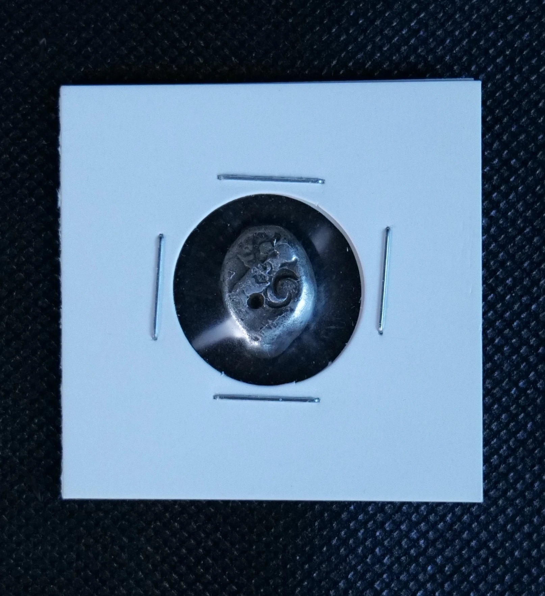

Above, you can admire a genuine Persian sigloi (or siglos). The small design features a king, although the hole has been slightly worn away. The siglos is a silver coin, in contrast to the daric, which was made of gold. The Persians could distinguish these two metals, and they moved away from electrum coins. So, they implemented bimetallism, using both gold and silver while maintaining the same concept of coins made from precious metals, often with a hole at the back, presumably for checking the metal content.

The rapid adoption of coins by the Greeks seems to have been stimulated by their close contacts with the Lydians, particularly through the Greek colonies in Asia Minor. The first Greeks to mint coins were probably the inhabitants of Aegina in the mid-sixth century BC, who introduced the drachma, whose weight varied from region to region, and whose name literally means "handful of grain" or "handful of arrows".

The success of Greek coinage was as much due to its convenience for important transactions, such as the payment of mercenaries, as to the economic and political expansion of the cities. Currency rapidly became a central element of the Greek and, later, Roman economy, while retaining a strong symbolic dimension, notably through its association with the law (nomos).

Finally, the rapid expansion of coinage bears witness to a profound transformation of ancient societies, where the codification of monetary values went hand in hand with state organization. This evolution laid the economic and political foundations for the rise of Greek democracies, particularly in Athens, where money played a crucial role in the functioning of the democratic city.

A key point to remember from this section is that we're talking specifically about **coins**, not money in general. The central aspect that emerges clearly is that of **trust in the issuing authority**, directly linked to the technical characteristics of coins (weight, purity, face value). It is precisely this trust that enables the state or the issuing authority to exert a degree of control or even manipulate the value and circulation of these coins from the outset.

## Institutional intervention and the first coins

<chapterId>3e1efd08-99e3-5a32-9908-3185fef0e640</chapterId>

:::video id=84847cf6-9e46-4a8c-9f35-25a27496cc4b:::

### The dual nature of money

The emergence of minted money raises a fundamental question: is money a spontaneous creation of the market or an institution imposed by authority? This conceptual tension pits two radically different visions against each other.

On the one hand, the Austrian school of economics defends the idea that commodity money - particularly gold - was naturally selected by economic actors for its intrinsic qualities: durability, portability, divisibility and fungibility. From this perspective, the state then appropriated this spontaneous currency to control its supply. It is an institution that emerges naturally from market needs before being captured by political power.

In contrast, the anthropological and institutional view holds that money really comes into being with state coinage. The authority would consciously create the currency by affixing its seal, thus transforming the metal into a genuine monetary instrument. This perspective suggests that the earliest Lydian coins were mainly used to pay armies - one stater corresponding roughly to a soldier's daily wage.

### The paradoxical advantages of state standardization

Despite this theoretical tension, even Austrian economists recognize certain benefits of state intervention in money. Standardization by minting solves a number of practical trade problems.

Without a certification authority, economic players face constant risks: counterfeit coins, filing fraud and weight manipulation. These practices create friction in the economy, as some coins are accepted while others are rejected. In theory, the official stamp guarantees weight and quality, making trade more fluid.

This guarantee has an observable price on the market: a minted gold coin is worth more than its raw gold equivalent. This premium reflects the value of certification - merchants no longer need to verify the metal's authenticity themselves through chemical or resonance tests. State intervention, paradoxically, eliminates friction and facilitates trade by creating institutionalized trust.

### Currency manipulation from the outset

The story of the first Lydian staters reveals a disturbing irony. Recent analyses show that the gold content of these electrum coins was systematically lower than that of natural electrum. The authority certifying quality was simultaneously manipulating composition.

This practice illustrates the dual usefulness of coinage. For the market, it makes exchanges more fluid and offers a guarantee of standardization. For the issuing authority, it becomes a tool of economic control through dilution. By reducing the gold content while maintaining the nominal value, the state effectively increases the money supply - creating more monetary units from the same quantity of precious metal.

The state itself, however, remained constrained by this manipulation. As illustrated by the example of Constantine's gold solidus in the 4th century, the Roman administration scrupulously checked the quality of coins, as it demanded to be paid in good coinage. The authority had a vital interest in maintaining the quality of its own coinage to guarantee the value of its tax revenues.

### Economic analysis of devaluation

The study of currency devaluation reveals consistent patterns throughout history. For metallic coins, economists track the percentage of precious metal contained in the coins - a descending curve indicating progressive devaluation. For modern paper money, the opposite is true: the circulating money supply is observed, and its increase signals devaluation.

Both methods measure the same fundamental phenomenon: the dilution of monetary value. Whether by reducing the precious metal content or printing new banknotes, the mechanism remains the same. The more monetary units an authority creates from the same real resources, the more each unit loses its value.

This manipulation, observable from the earliest Lydian coins, suggests that monetary control has always been an issue of power. Minted money thus represents a remarkable technical innovation coupled with an instrument of economic control - a duality that runs throughout monetary history, right up to the present day.

## Parts manufacturing

<chapterId>b205f4f2-c293-5308-b812-a998de9ad45e</chapterId>

:::video id=47c612ec-d97e-4498-b50e-7e66518bd56d:::

### From punched blobs to minted coins

After a section about the emergence of coins, I wanted to introduce a very short section on the evolution of coin manufacturing. As we have seen, it all began with blobs of electrum, proceeding with gold and silver, where both sides were marked with a punch, either with the king's face, or a hole in the back to check purity.

Later, as we'll explore in a subsequent section, the Greeks refined this technology by creating round coins that were hammered on both sides. They would take a smooth, flat piece of precious metal, engrave the desired design on one side, and then hammer it by hand to create the finished coin.

The technology of hand minting coins individually likely played a role in controlling inflation during that time, even though the coins were often diluted to increase production. This was particularly evident during the Roman period and, to a lesser extent, during certain wars in the Greek period. While minting coins one at a time limited the authority's capacity for mass production, it effectively contributed to inflation control, despite the significant devaluations that occurred. Thus, the evolution progressed from a blob of metal being punched to a round, hammered coin.

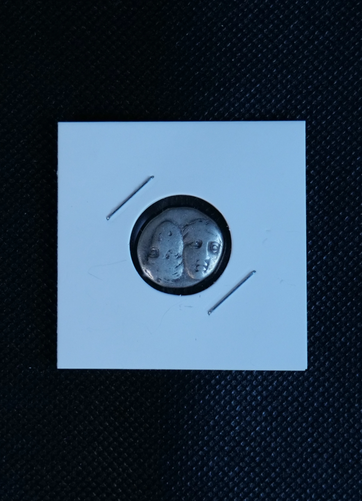

### Medieval evolution

In the Middle Ages, there was also a trend of spreading coins out, making them wider and thinner. One reason for this was that it became easier to test their sound, which was often used as an indicator of authenticity. By spreading the silver out, a distinct frequency was produced, so people could validate the coin's purity simply by listening to it. This practice gave birth to the term "sound money". In the context of sound money, the standard weight was determined by using a balance scale or "trebuchet" for weighing. Thus, the evolution continued from small, round coins to slightly thinner, wider coins.

### Pendulum striking

The last technology to arrive at the end of the Middle Ages, at the beginning of the modern era, was the notion of pendulum striking. It was a kind of screw that was tightened to strike the coins, thus generating coins with this new form of striking. What was speaicl about this development was the ability to engrave a pattern on the surface of the coin to address the issue of clipping. Clipping involved removing a portion of the coin to reclaim precious silver, which could then be used to mint other coins or simply retained as a resource.

So this notion of pendulum striking helped with the clipping phenomenon. And it's interesting to note that this technology actually came from France. In England, for example, they hired French engineers to come and show them how to make these machines. What's funny, I think, is that there were supporters of hammer minting who were against it and who delayed the application of this technology. In any good technology, there are always people who are against it, who want to keep the old technology. I thought it was pretty crazy to realize that even a technology that seems really superior - you can make more parts, they're harder to copy - there were still people who were attached to the famous hammer method. There was a shift between producing parts that were made with this famous pendulum striking and then returning to hammer striking. And finally, of course, it was pendulum striking that finally took hold and gave us these beautiful modern pieces where you can find either little lines, little ridges around to avoid clipping, probably related to the word clipping, ridges, and you can still see today either ridges or text or drawings that are inscribed on the edge of the piece.

# Different theories on the emergence of money

<partId>72ac694f-9248-550d-90c1-91af3d234380</partId>

## Theories on the emergence of money and its various definitions

<chapterId>7d699d4d-8c70-55b5-bf36-609f3fd90bcf</chapterId>

:::video id=523c873f-501b-4954-b79f-7e74c0f685a5:::

Welcome to this segment dedicated to the different theories on the emergence of money and its various definitions. Here's a short extract from the book *Aux origines de la monnaie* which, I think, sums up the two main theories we'll be looking at in this section.

> This brief preamble serves no other purpose than to highlight the context of the survey. On the conceptual level, the debate is open between the supporters of K. Polanyi's thesis and those of M. Weber. For the former, gift and redistribution play a central role, with market exchange playing only a marginal role, mainly in international exchanges. For the others, on the contrary, the market is at the heart of the current historical process.

For example, in Mesopotamia, one theory of emergence suggests that the temple, as the authority, creates the unit of account or monetary unit, imposes it, and then merchants adopt it for trade. The opposite theory posits that, no, this monetary unit emerges naturally from the market to facilitate trade. There are well-sourced examples of this in Mesopotamia.

As for bartering, some theories suggest that it was mainly used in international exchanges, i.e., with people we simply didn't trust.

So that's what we're going to do in this section. We're going to conduct a sort of survey to present the different theories on the emergence of money and the different definitions of what money is. We'll be presenting and criticizing the theses of both classical economists and anthropologists. I'll even be lucky enough to have Ulrich Fromy with me, who will present an Austrian economist's perspective on these various subjects.

## The emergence of money for classical economists

<chapterId>1d3776cd-0dfd-5297-af48-c6f41e257a7e</chapterId>

:::video id=873a16c1-17ac-448d-8941-df4feb7ab79d:::

This segment is dedicated to the different theories on the emergence of money. The first topic to be covered is the emergence of money according to classical economists.

### Adam Smith's classic theory

According to classical economic theories, in particular that championed by Adam Smith, money emerged naturally from barter in response to its limitations. Initially, exchanges were carried out by direct barter, but this method was often complicated by the problem of "double coincidence of wants": each person had to possess exactly what the other wanted. Gradually, certain commodities (such as salt, precious metals and livestock) came to be accepted by all as intermediate means of exchange, thanks to their utility, durability and divisibility. Thus, money spontaneously appeared to facilitate and fluidify economic exchanges.

### Criticism of classical theory

Here is my critique of this theory. With everything we've seen in the previous section, I think we can already say that this notion that **coins** are an evolution of barter is wrong simply because the minted coin definitely emerges from authority, since it's minted by authority. There are several reasons for this, not least the authorities' desire to control the economy, to take control of money.

On the other hand, if we're talking about money as a concept, not necessarily coins, then it's less clear-cut because, with the first coins, the Lydian staters, we've found silver blobs that weren't marked. It remains to be seen whether they were in circulation. If they were circulating, this means that people may have originally identified this asset as a potential currency that could be widely demanded and easily exchanged. And maybe it was only afterwards that the authorities noticed this situation and took control of it by putting a stamp on it to certify it.

There are a lot of advantages to doing this - no need to check it, weigh it, all that. Obviously, we'll talk about that. But in my opinion, coins are clearly a tool that have been used by states from the outset. However, in terms of the emergence of money as such, we don't know whether it really came from an authority that imposed it or whether it emerged through trade or commercial exchanges. I'll have a very interesting discussion on this subject with my colleague Ulrich later in this section.

We already know that the first precious metal coins were not used to facilitate daily exchanges because their value was far too high. We also know that they were mainly used for military payments. This is a good argument for the thesis that money didn't necessarily emerge from the market. The units of account, the denominations of the first coins, were probably too large for, say, buying bread or doing daily shopping. It could, for example, be the equivalent of a day's wages. Not necessarily that people were paid wages in those days, but that's to give you an idea of the scale. So these coins probably had too much purchasing power to be used in small-scale trade. On the other hand, there's nothing to say that these coins wouldn't have been used to make larger exchanges, such as merchant exchanges. We know that they were mainly used for military payments. This is one of the most popular theories to explain the appearance of the first coins. Remember, we're talking about coins here, not necessarily about money in general. So, the first coins had their first role, and that was to pay for military payments, for mercenaries.

Alexander the Great, for example, made great use of it, as we'll see later.

We've also seen that as early as ancient China, cowrie shells were used for economic exchange (**remunerating labor, measuring value and purchasing land)**. What's more, in Mesopotamia and Egypt, functional monetary systems already existed and were used for trade, wage payments and tax payments. What I'm suggesting here is that it's definitely wrong to think that coins in the Western conception emerge from the need to make exchanges more fluid.

Since coins are issued by an authority, we can perhaps assume that, from the outset, they have been linked to the issuing authorities. That makes sense. On the other hand, we don't necessarily know how the forms of money or the forms of monetary systems, the proto-coins, that preceded them emerged. On the one hand, we're going to suggest that it was the temples that identified these monetary units and, afterwards, people used them. And, on the other hand, we'll tell you, no, it was the merchants who needed a means of exchange, a way of trading with the outside world, and it was they who identified, for example, silver metal, to be used because it was in demand from the outside world. The point is, we don't really know. That's why we have the two opposing theories. We don't have perfect proof to explain whether money emerges naturally from the need to trade, for example by merchants, or whether it emanates from authority.

### Distinguishing between coins and primitive money

In conclusion, I think we can say that coins necessarily emanate from authority, since they were stamped by said authority. On the other hand, I don't think we can say that it's wrong to suggest that money (that which preceded coins) couldn't have emerged to facilitate exchange. I think that in all the examples we have seen above, examples in this sense abound.

## The myth of barter

<chapterId>0fcd4964-ac36-5163-a8cf-1aacebc0d2c0</chapterId>

:::video id=0ede29ab-8acd-4d79-9282-bd5991b97076:::

### David Graeber's review

We've just covered the emergence of money according to classical economists. Now we're going to tackle a concept known as the barter myth.

One criticism of this classic theory of the emergence of money is the lack of historical evidence to support its ideas.

The critique known as the "barter myth", formulated by anthropologist David Graeber, among others, challenges the classic idea that money emerged naturally from barter. According to this critique, there is no historical or anthropological evidence to show that societies systematically used barter before the advent of money. In fact, ancient societies would have operated on the basis of credit, debt, social obligations and ceremonial exchanges. The "barter myth" is therefore a theoretical construct designed to justify the classical economic vision, with no real empirical basis.

It should be noted, however, that this theory does not deny that bartering existed, for example, for exchanges between different tribes. It simply denies that bartering was a widely practiced activity within these so-called primitive groups, and that money would be a logical evolution of these practices. It denies the fact that bartering was widely used within a tribe, and that money eventually emanated to fluidify exchanges and resolve the difficulties that existed with bartering. Instead, according to this theory, these groups practiced a form of informal credit or gift for gift.

### Primitive societies vs. great civilizations

**Here are some clarifications regarding the great civilizations of ancient antiquity.** I think this theory definitely applies to primitive (stateless) groups of the past and even today (e.g., the tribes studied by explorers in the 18th and 19th centuries). Clearly, they didn't use barter, but rather the forms of exchange I mentioned earlier, for reasons we've already mentioned (weak division of labor, subsistence farming). However, I don't think this theory applies to the great civilizations of the past, such as Mesopotamia and ancient Egypt.

Here are two excerpts from *Aux origines de la monnaie* on this subject:

> The model outlined by M. Mauss in his famous "The Gift" has been adopted by Egyptologists with as much unanimity and enthusiasm as lack of discernment. This has led to a number of confusions, which we won't go into here. Let us simply note that this model applies to so-called primitive societies, which is not the case of Pharaonic Egypt.

> Breads, i.e., processed cereals, were therefore units of account which, like the shât (y) of the Old Kingdom, also enabled the opening of credits in diversified goods. This simple example shows that the economy of Pharaonic Egypt was not confined to a system of redistribution. It was highly complex, involving a multitude of exchanges.

So, as we saw earlier in the section on Egypt and even Mesopotamia and China, we can see that even these ancient, but not primitive, civilizations, due to the presence of a state, in my opinion, used monetary systems. I think this was amply demonstrated in the first section of this course. And so, this notion of give-and-take, of deferred credit, does not apply to these great civilizations. The precise reasons for the emergence of money therefore remain a mystery. We don't know whether it emanated from the need of merchants to trade with the outside world, or whether it was imposed by the temple in these ancient periods.

## The emergence of money through debt money

<chapterId>4f508615-aa61-5d62-89d3-cecd02aeaa62</chapterId>

:::video id=a23f547f-3906-4f4a-8f72-5d78c649d0c4:::

### Money as an IOU

In this section, we cover the theory of debt money.

The theory of **debt money**, developed notably by economist Alfred Mitchell-Innes and later expanded by David Graeber, asserts that money did not originate from barter, but rather from debt and credit relationships present from the earliest human societies. According to this theory, money appears when social obligations (debts between individuals or groups) become quantified and transferable. This concept introduces the notion of the quantification of exchanges and transfer. Thus, money would be above all a **recognition of debt**, backed by mutual trust and often guaranteed by political or religious authority, rather than a commodity serving merely as an intermediary in exchanges.

An even more advanced form of this theory is that all money is a debt. So someone who possesses money would have a claim on society in general, a claim on all those who accept that money. And since money, **in their vision, must be accepted in a compulsory way**, otherwise it's not money, because if you can refuse this money, their system doesn't work. In a given group that has identified a currency, all those who possess it, it's as if they have a debt to all the other members of that society who accept that currency, and those who accept the currency have a form of debt to the person who possesses that monetary unit. This is essentially their theory.

### Criticism of the compulsory system

**My critique of this theory:**

Let me make one small criticism of this theory. I accept that money is a kind of social consensus. It is a trust that a group places in a monetary "sign", whatever it may be. So I subscribe to the concept of mutual trust, which we'll take up again later with the concept of the monetary premium. Where it gets complicated is when the proponents of this theory add a notion of obligation and insist on the notion of debt. For them, when someone possesses a monetary token, they hold a claim on the community as a whole, and the community would therefore owe the holder a debt. There would also be an obligation to settle, with group members obliged to accept the token; otherwise, in their view, the system wouldn't work. I think the system described above in ancient China represents this theory well.

For my part, I can easily imagine a system where money is a social consensus where the chosen token is generally accepted as a means of payment, with no formal obligation. I can see a system like that working if people accept it of their own free will. It can work. On the other hand, it often comes with obligations, legal tender, and violence, which we'll see later in a section. But theoretically, I don't have the impression that this system can quite work. I think Bitcoin is an example. Bitcoin has value because it has a monetary premium, because there's demand for it to be put to monetary use, i.e., reserves of value, perhaps also means of exchange or protection against the fiat system. No one is obliged to accept it, and the more it is accepted as a means of payment, the more it can be used as a means of exchange. We can already use it as a store of value without any problem. There's no doubt about that. What I mean to say is that Bitcoin seems to me to be an example, a kind of currency that is a form of social consensus where we think we'll be able to get our money back if we buy some later, we acquire it to be able to exchange it later, to preserve our purchasing power.

This less restrictive view of the theory helps to explain how two distinct societies can trade with a monetary token such as gold, without creating a claim or debt between said societies. To force acceptance in society, I find, doesn't work in trade between two tribes, because the other tribe is not subject to authority. Tribe B is not subject to tribe A's authority. But yet, it accepts the same monetary token let's say, gold. Now, people might say to me "Yes, but that's because company B has also decided that gold is their currency", so it works. Yes indeed, it works, but there's no debt creation at that point. It's a final transaction. So, when company A exchanges a good for gold at company B, there is no creation of debt, the transaction is completed. And clearly, the person in company B has not acquired this gold coin or nugget in order to be paid later by people in company A. He accepts it to be exchanged for gold. He accepts it to be exchanged later, probably within his own tribe. So, in this example, there is no creation of debt, there is no latent claim, it's simply a direct exchange, a direct payment. Proponents of debt currency will tell us that this is barter. And I disagree, because barter is the exchange of a direct good. Direct barter is the exchange of one good for another good, for use. Goods are exchanged to be used, whereas in our case, gold is clearly used as a currency because it's not going to be used to do anything else; it's going to be used later as a means of payment. So, in my opinion, it doesn't fall into the barter category.

Owning a monetary token is not a "claim" on the community, but rather a hope that the token will be accepted at a later date at a comparable value.

## The spontaneous emergence of money

<chapterId>e3ef86b1-73b9-5140-a61e-2ab6a5b0b2d4</chapterId>

:::video id=e543995f-d5e2-49d7-9133-e397b46e0833:::

For the Austrian school of economics, initiated by Carl Menger, money emerges naturally from a barter economy faced with the problem of the double coincidence of wants. In this vision, individuals spontaneously converge on intermediate goods that facilitate exchange - not directly consumed goods, but commodities recognized for their capacity to be widely demanded.

These monetary goods must possess qualities identified since Aristotle: they must serve as a store of value, a means of exchange and a unit of account. Economic agents gradually identify, accumulate and save them, thus initiating their emergence as money. This process is entirely spontaneous - money represents a natural market response to the problem of coordinating exchanges, without the conscious intervention of an authority.

### The "barter myth" debate

Anthropologists such as David Graeber dispute this view, invoking the "barter myth". Their argument: no complex civilization based solely on direct barter has ever been documented. Rather, the primitive societies studied used systems of informal credit and reciprocity. Graeber asserts that debt preceded barter, citing thousands of Mesopotamian tablets documenting credit relationships.

However, this criticism is based on a restrictive definition of barter. As Menger pointed out back in 1892, barter goes beyond the simple direct exchange of goods for goods. It also encompasses deferred transfers, services for wages, and exchanges with temporality - what Menger called "unilateral transfers between individuals". This extended form of barter can coexist with credit systems in restricted circles of trust.

The absence of proof is not proof of absence, and Austrian economists recognize that no complex society can develop sustainably on the basis of direct barter alone - hence the necessary emergence of money.

### The Mesopotamian case: merchants versus temples

The debate is crystallizing around the origin of the Mesopotamian silver shekel. There are two opposing interpretations. The institutional view holds that the temples - true economic and spiritual centers - imposed silver as a currency to structure the economy. The cuneiform tablets, concentrated among the clergy and merchant elites, bear witness to this centralized control.

The Austrian interpretation suggests the opposite: it was the merchants who adopted money for long-distance trade. Faced with the challenge of trading with strangers beyond Mesopotamia's borders - from Anatolia to the Persian Gulf - they needed something universally recognizable, durable and transportable. Silver was a natural choice because of its intrinsic qualities. The temples simply confirmed a practice already established by commercial usage.

This thesis is based on documented exchanges between Kanesh in Anatolia and Assur, where merchants exchanged textiles for silver metal - not for its material utility, but as a store of value. These transactions went beyond mere barter, revealing the existence of a genuine commodity currency.

### The modern example of prison camps

Economist Richard Radford, a prisoner in Germany during the Second World War, documented a fascinating case of spontaneous monetary emergence. In the camps, cigarettes naturally became the unit of exchange - divisible, standardized, widely accepted. Even non-smokers adopted them, recognizing their universal exchange value.

This microcosm illustrates the Austrian principle: faced with the problem of coordinating exchanges, individuals spontaneously converge on the most "saleable" good. No authority imposed cigarette money; it emerged from the daily practice of prisoners seeking to optimize their exchanges.

### The convergence of individual preferences

Essentially, money represents the convergence of individual preferences towards an accepted common good. Mesopotamian merchants, like Radford's prisoners, identified the good that minimized the uncertainty of future exchanges. This selection does not await the authorization or imposition of a central authority - it emerges from the practical rationality of economic actors faced with the challenges of exchange.

The debate between spontaneous emergence and conscious institution remains open, as historical evidence is fragmentary. But the Austrian analysis offers a coherent explanation: money was born out of the practical needs of commerce, with authorities merely institutionalizing practices already established by market usage.

## The anthropological vision of the emergence of money

<chapterId>ec48c5d8-47ed-530f-beb7-c44fd0b62880</chapterId>

:::video id=8c1f8764-75af-4fb6-a98b-55de3b7da02e:::

### The non-economic origins of money

In this section, we explore the anthropological view of the emergence of money, a rich perspective that profoundly challenges classical economic theories.

Contrary to the traditional theory that money emerged naturally from barter to facilitate economic exchange, anthropological research shows that the emergence of money is largely rooted in non-economic causes. It stems from social mechanisms such as tribute payments, compensation for murder (the famous Wergeld) and dowries (bride-money), but also from ceremonial, religious, political and symbolic practices, far more than from simple market necessities.

In primitive societies, money was rarely used for the day-to-day exchange of material goods, contrary to the classical definition of money as a "medium of exchange". In fact, these societies made massive use of credit, with deferred payments embedded in vast networks of social and personal relationships. These ubiquitous credit systems logically and historically preceded the appearance of money.

That's what sums up their vision. We discuss this with Ulrich in our chat in the previous video. I'll let you enjoy Ulrich's comments on the subject, which challenge this approach a little. And so, in the anthropological vision, we often have this notion of money coming from an authority or a social concept that precedes market needs.

### The example of the Yap stones

Here below, you can admire a striking example of the monumental stones on the island of Yap. Some of these stones, despite their immobility or even physical disappearance, continued to function fully as money thanks to a collective agreement, underlining the essentially social and symbolic dimension of money.

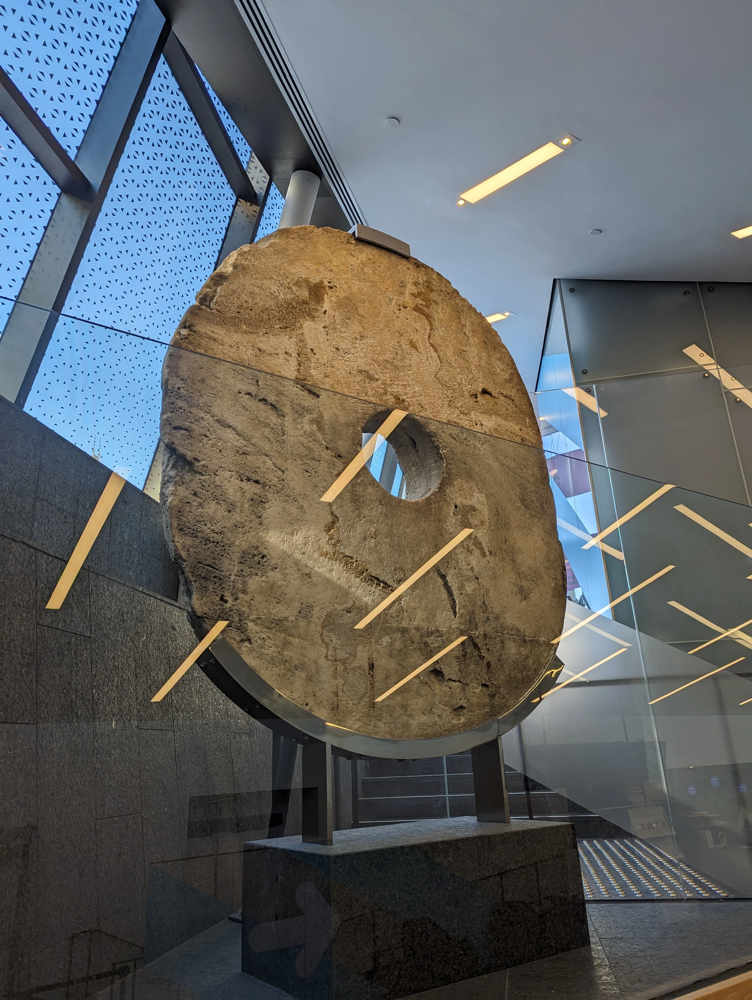

This is a really interesting analysis of the Yap stones. Saifedean Ammous also mentions this example in his book "The Bitcoin Standard". According to him, the Yap Island system most closely resembles Bitcoin, a kind of central record that everyone can consult, that is public, maintaining accounts and managing ownership of things. This anthropological perspective illustrates that all of this represents an agreement or social consensus within society, which is fundamentally accurate. And I find this mention of the lost stones very interesting. They would go hundreds of kilometers out to sea in small rafts and bring the stones back. Sometimes the stone fell to the bottom of the sea, but this stone would still be used in the monetary system. A person could say "Yes, we dropped the stone in such a place; it's mine, so we can exchange it". There wasn't necessarily a need for physical possession to facilitate exchange, as the stones were so large that they often stayed in one place. Instead, the focus was on changing hands with these stones in a transactional manner, allowing ownership to shift without the stones actually moving. It was a form of "proof of consensus", highlighting an interesting anthropological perspective on money.

### Protocurrencies and social obligations

Ethnographers all over the world have observed societies using "proto-currencies" or "primitive currencies", such as shells, cloth, livestock, salt, and stones, which fulfilled the functions usually attributed to money, such as a means of payment and a store of value, without however regularly acting as intermediaries in the exchange of everyday goods.

So, here we're describing monetary systems that weren't necessarily used for day-to-day exchanges.

And I'd like to remind you that these were all currencies before the advent of coins, and I don't know how much of a misnomer it is to say currency. I prefer to say currency. I can mention that in the literature, we often speak of proto-currencies to refer to money before coins. But as we saw in the first section, **I believe that there were monetary systems long before the appearance of coins**.

These primitive currencies were mainly used to manage fundamental social obligations linked to individuals, such as marriage, conflict compensation (Wergeld), or gifts between chiefs. In the Persian Empire, for example, the first coins were specifically created as a means of military payment rather than a means of exchange.

Primitive money therefore has one essential characteristic: it is a means of payment, but very rarely a means of direct exchange of material goods. What we mean here is that it was a means of payment for certain social obligations, for tribes, for exchanges between chiefs, the famous wergeld, blood money. Before the advent of justice systems, if someone committed a murder, there was reparation for the family who suffered from the murder of their loved one. There was a price to pay for this, it was called blood money and it's a form of payment. There was also the dowry, which is also a form of payment. In these early uses of money as a form of payment, it was more related to human and social obligations than to payments for everyday purchases. According to this theory, these more common day-to-day exchanges were more related to credit, deferred credit, gift for gift, and the redistribution of rations. There was another form of social organization to manage these exchanges. It's also important to remember that, in a society where everyone is self-sufficient, does their own farming, there's no specialization, and there's very little need for a monetary system for day-to-day exchanges. And that's why the first forms of money were what we've just described, the dowry, blood money, simply because these were the first exchanges where we needed a means of payment, long before we needed to trade, to exchange bread for money on a daily basis, because in primitive societies, it didn't work like that. Everyone provided for their own needs, and there was no specialization yet. I think I've covered this at length in all the previous lectures in this course.

In these societies, with no advanced division of labor, direct exchanges remained limited, taking place mainly within personal relationships of friendship or alliance. The absence of sufficient specialization did not necessitate money in the modern sense.

Anthropologists such as Quiggin and Einzig insist on the pre-eminence of credit: **the primitive economic life is caught in a gigantic network of credits and personal debts, where money intervenes especially when payments must be immediate and compensations cannot be easily deferred.**

So, people exchange stuff, can make deferred credit, but in some cases, you can't defer payment, so currency or proto-currencies can be useful at this point to have an immediate finality to the exchange.

### The innovation of anonymity

This analysis leads to a deeper reflection: rather than opposing money to barter, it is more relevant to understand its emergence as an evolution from the complex systems of credit and debt. Money introduces a fundamental innovation: **anonymity**. And that's where I find this anthropological theory of the emergence of money interesting. If you're a small group of people and you give each other deferred credit, you obviously know each other. I think that for this system to work, people have to know each other, obviously. And a payment made with money allows anonymity. It allows you to make a payment without people even knowing your name, without people even knowing who you are. They can make an exchange for immediate and final settlement. And that's precisely what money enables.

Unlike credit, which is always nominative, money enables anonymous, generalized and immediately liberatory transactions. **This unique liberatory power of money is its decisive superiority.**

Thus, far from being a modest tool to facilitate economic exchange, money is a major social innovation, closely linked to the evolution of human institutions and practices, from personal credit **to a generalized, anonymous payment system**. This anthropological evolution shows that money, far more than a simple means of exchange, represents a powerful social institution, profoundly shaping human societies, to the point of becoming, in our modern societies, the very purpose of economic activity.

Here, we realize that in the end, in our modern societies, the very purpose of economic exchange is to possess money, whereas back in the day, this was not the case at all. The very purpose of economic exchange was to possess goods or commodities for consumption. And today, by introducing the innovation of money, the purpose of economic exchange is to accumulate this money, since it enables us to exchange it for the good, as is generally accepted. We can exchange it for the good we need when we need it.

## Register unification

<chapterId>7664442a-91c1-5ce4-a8bd-53b7371a3e3d</chapterId>

:::video id=473fc284-5375-4e1b-b0cd-6b51ba0cc3b8:::

### Accounting register theory

We're now going to explore together various proposals for the unification of these two monetary theories, i.e., the theory of the emergence of money through debt-money and the monetary theory of the emergence of commodity-money. We're going to talk about Lynn Alden's unification proposal in her famous book "For Broken Money", the title of whose translation produced by Consensus will probably be called "Rupture monétaire".

*Excerpt from Broken Money by Lyn Alden:*

> Fundamentally, money is an accounting register. Commodity money is a register governed by nature. Bank money is a ledger governed by nation-states. Open-source money is a ledger governed by its users.

Here, Lyn refers to Bitcoin.

### The stock-flow ratio and scarcity

> Some rare chemical elements, such as rhodium, are rarer than gold, but have low stock-flow ratios because they are consumed by industry as quickly as they are mined. A rhodium coin or ingot can be purchased as a specialized collectible or store of value, but is not suitable as a socially accepted currency, and so does not emerge naturally as money.

Saifedean talks about this at length in his book "The Bitcoin Standard". For those unfamiliar with the stock-to-flow ratio, it's simply when you compare the existing stock, the reserves that exist in the market, compared to the new stock coming in, the influx of new stock. It's often rather counter-intuitive, because you might think that something you have in large quantities isn't scarce, but in fact it isn't. It's more a question of the capacity you have to supply it. Rather, it's the capacity we have to have new stock that, according to this model, gives us the information as to whether this object is rare or not. It's not because we don't have something in stock that it's rare, it's just maybe that we don't have it. So, if we take gold, we have a lot of gold stocks because it's used as a store of value, and the inflow of new stocks is something like 1% to 3% per year of new gold stocks coming in through gold mining. Whereas, what she's saying here, if we're talking about rhodium, it's rarer than gold, but we don't have any stock because it's consumed as it goes along. So it doesn't take a lot of new supply to double the existing stock. Whereas with gold, it would take at least 50 years to renew, to double the stock. Unlike most goods that are consumed, where it's fairly easy, and doesn't take many years of production to double the existing stock, since it's consumed as it goes along.

*"Gold has maintained a stock-to-flow ratio of between 25x and 100x throughout modern history, usually around 50x or more, briefly never falling below 16x, even during the Gold Rush of the mid-19th century. "*

So, 25 would mean 25 years to double the stock, and 100 would mean 100 years to double the stock. Saifedean says in his book that even if we doubled gold production, from say 1.5% to 3%, it wouldn't necessarily have a big effect on its price.

*"Silver generally has a stock-flow ratio of 10x or more, which is still relatively high.*

*Most other commodities have a stock-flow ratio of less than 1 or 2. Even the rarest elements, such as platinum and rhodium, have relatively low stock-flow ratios due to their rapid industrial consumption."*

### The superiority of gold and silver

*"In short, whenever a commodity currency has found itself in competition with gold and silver, the latter has always come out on top in the end. Other commodities might remain currencies for limited periods or in specific regions, but gold and silver have always proved their ability to become globally competitive currencies and to dominate the competition. This is because when civilizations met, holders of gold and silver always had the technological capacity to devalue other forms of currency, while holders of shells, pearls, livestock, salt, cloth or inferior metals could never devalue gold or silver."*

So this is again extremely well described in The Bitcoin Standard where Saifedean talks about the tribes in Africa who used glass beads. And when the Venetian merchants arrived with cargoes full of glass beads because they were able to produce them industrially at the time, they had the technological capacity to do so, it completely destabilized the monetary system of these peoples and they were able to literally plunder their resources. This is Saifedean's thesis.

### Unit of account and credit

*"Historically, even when credit was used directly as an instrument of exchange, it was usually denominated in units of monetary commodities naturally chosen for their properties."*

That's a very interesting point, and one that Ulrich and I have been discussing. Even if the temple in Mesopotamia was a kind of authority that could manage this notion of credit, the unit of account was the shekel. There's nothing to confirm that the shekel was established authoritatively by the temple. The shekel could have emerged naturally, through the need of merchants to import and export with other peoples in the vicinity. We have evidence of this, in the form of a merchant at Kanesh (I mentioned this in Part 1) who did exactly that, importing precious metals that were not used for their physical commodity value, but rather as a store of value. The only problem is that we don't know whether we can assume that this choice of silver, of the silver shekel, was made by the merchants, or whether it was made by the temple. But Ulrich has a very good argument that leads us to think that it was probably rather on the side of the merchants that it was made.

*"Thus, the unification of the two theories can be described as an "accounting theory of money" ("ledger theory of money") since it describes the fundamental logic common to both theories. Both flexible social credit and collectible proto-currencies date back to the dawn of humanity. In both cases, human groups of various sizes keep an accounting ledger among themselves to avoid having to satisfy the double coincidence of wants, reduce friction in exchanges, and serve as a form of liquid savings. The essential difference lies in the authority entrusted with keeping the register."*

On the one hand, nature manages the expansion of the money supply. So, if we take gold, as it's quite rare, it's difficult to mine. There's a kind of limit to the number of gold coins that can be mined. So scarcity is managed by nature. And the register is held by the concept of possession. The register is decentralized. Possession is proven by the fact that you own a gold coin or a piece of gold. And in the case of credit money, scarcity is managed by people's ability to obtain credit. Or in the case of fiat currency, scarcity is managed by authority. It's they who decide whether to print more or not, to avoid inflationary disasters. So, in some cases, the register can also be managed by the owner of the token, in the case of paper money. That's why it's entered in the register, in quotation marks, dematerialized. Well, materialized, but virtual. He possesses this famous token, and that's what proves possession. And it can just as easily be in a real register, as with scriptural money, in a bank, where it's really the human bank that manages who owns what in relation to the register.

## Unification through the monetary premium

<chapterId>093756e5-8908-55e5-bb76-376a3a3cc4d3</chapterId>

:::video id=eabc342a-ecbd-46ca-a347-e914917e7c4f:::

### The monetary premium concept

In this section dedicated to the various proposals for unifying the different theories on the emergence of money, I have just proposed Lyn Alden's theory, the register theory. I have my own proposal for the unification of the two monetary theories. It's the monetary premium, the concept of monetary premium. So, the value of money can be explained by the monetary premium arising from its monetary demand, whether in the form of clay tablets, precious metal coins, banknotes, or bitcoin. The monetary premium is simply based on the confidence that someone will exchange this currency in the future for a comparable price.

What I'm trying to demonstrate here is quite simply that whether it's fiat, i.e., banknotes with no use value, whether it's gold coins or any metal, a piece of gold nugget or an ingot, **it's often the monetary premium that makes up most of its value**. If we take a piece of gold, a certain part of its value is explained by its use value, its use in industry, or to make jewelry. Note that the demand for jewelry often comes from its monetary value. People keep jewelry as a kind of store of value, so I include this a little in the monetary premium because it's often a rather monetary demand to play a role in money.

So you could say that around 10% of gold demand is for industry. In the value of gold, we would have a small part, let's say 10%, which would be explained by this industrial demand, this demand for the use of gold, where gold is consumed. The rest is clearly demand for its monetary use as a store of value.

### Authority bonus and fiat

And if you compare a piece of gold to a gold coin, there's another layer. The gold coin is stamped by an authority, and the gold contained in the piece also enjoys a demand for use, a demand to be consumed in industry. It also enjoys a monetary premium as a store of value. What's more, there's an overlay that I call the authority premium, where there will often be a price, a greater purchasing power for the coin than the piece of gold, since the coin is simpler to use. It makes exchanges more fluid, as there's no need to weigh it. The authority normally guarantees its purity. And if you compare it to a piece of gold, a stamped gold coin is generally worth more than a simple piece of gold. And that's normal, too, because it takes resources to stamp it.

It's the same principle for fiat, paper money. Paper money doesn't really have any use value, except perhaps to heat a house, and that happened during the Weimar Republic. So there's no real demand for its use value. On the other hand, there's only a premium for authority, in my opinion.

It's a form of monetary premium, an overlay on the monetary premium. But its monetary premium comes from the fact that it's legal tender, and then the authorities force you to buy it to pay your taxes. So, necessarily, fiat currency has a form of monetary demand arising from the fact that it's taxed and you have to at least acquire it to pay your taxes. And as a result, it remains a generally accepted means of payment. So people want to acquire it to meet their needs.

### Unification through monetary demand

And why does this proposal for a monetary premium qualify as a unification of the two theories of debt money and commodity money? Well, I don't feel that the value of a gold coin necessarily comes from its "intrinsic value". No, in fact, it's as much a notion of confidence as it is for fiat money. It's a notion of monetary demand. And it's not really because it has a small percentage of industrial use, another "utility". If we say that industrial use is 10% of its value, we could value that at $300 per ounce. If gold sells on the market for $3,000 an ounce, the difference between $300 and $3,000 is the famous monetary premium. It's this monetary demand for gold that explains it. Just because fiat has zero use value doesn't mean it's any different. For me, it's exactly the same thing. So on both sides, the theory of debt money or commodity money, I don't think that the sort of extra quality that gold would have of having a minimal use value changes anything.

On the other hand, it's certain that **at the level of emergence, according to Mises' regression theorem, we can propose that this use creates a demand at the origin and initiates the process that becomes money.** Whereas, at the level of debt money, it's more an imposition by an authority, so the source, the initiation of emergence, and the concepts are completely different. **But I think that at the level of value, how to explain the value of money, with the monetary premium, we can just as easily explain why fiat money has the value we attribute to it and why commodity money has the value** we attribute to it. For me, it's the same process, and it's called the money premium.

#### The monetary premium

That's it. The value of money can be explained by the monetary premium arising from its monetary demand, whether in the form of clay tablets, precious metal coins, banknotes, or bitcoin.

The monetary premium is simply based on the confidence that someone will exchange this money later for a comparable price.

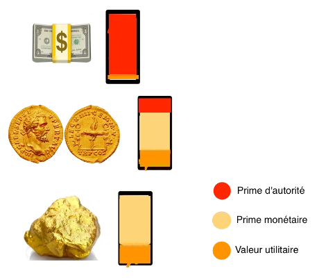

# Different definitions of money

<partId>77b7918a-8c3b-11f0-b688-6b2ab22378c9</partId>

## Money vs currency vs monnaie vs argent vs devise

<chapterId>bf8a6d21-df88-5d23-a0a5-e9a5c1300554</chapterId>

:::video id=d9c9e7df-9db3-4a9f-801e-10d3fc7dfc22:::

### Semantics of monetary terms

In this section on the various monetary theories and especially on the definitions of money, I'd like to make a brief aside on the subject of semantics. I'd like to dig a little deeper into the definitions of several words relating to money, and compare them with their English equivalents. For example, money, currency, compared to monnaie, argent and devise. So, it goes like this.

A little semantics:

When we say "**money**" (de la monnaie), most people will think we're referring to the small change we receive in return for a transaction. And if we say "**currency**" (la monnaie), people will probably think we're referring to the currency of a state. Canada's currency is the Canadian dollar. That's right.

But what about money (de l'argent)? A thief will never say "Give me all your change!" (the thief might well be disappointed to receive mere coins of almost no value).

No, the thief will shout: "Give me **all your money**". And if the thief is standing in front of you on the street, he's necessarily referring to **the banknotes** in your pocket.

On the other hand, if the thief tries to defraud you in a more sophisticated way, trying to steal your assets by emptying all your bank accounts, we'd say that **he'll take all your money**. Here the word "money" refers to **the individual's wealth**.

So there are two definitions for the word money: cash (banknotes) and wealth.

### Currency vs monnaie vs devise

A currency (devise) is necessarily the currency of another country, otherwise we just say money (monnaie). If you're French, you'd say: "La livre sterling est la devise du Royaume-Uni et l'euro et la monnaie de l'Europe" (The pound sterling is the currency of the United Kingdom and the euro is the currency of Europe).

Often, people who haven't delved into these semantic problems, in translating these terms, will often be inclined to speak of currency (devise) when it's written currency, but no, currency is money (monnaie) when it's your country's currency, and it's devise when we're talking about other currencies. And so, the problem here that I often see is that in English, there are two words: there's "money", which is a concept, and there's "currency", which is really the unit of a country that is used to make exchanges. So we can just talk about the concept of money; it's easy - it's the concept of the word *money*; it's money in general. And *currency* is very simple to equate with the currency of a country. Whereas in French, unfortunately, people will often say yes, "mais ce n'est pas une monnaie" when talking about bitcoin because it's not the currency of a country, but often, I think they're referring to the terms currency instead. This is wrong on the one hand, because since El Salvador, bitcoin has been the currency of a state. The fact remains that people will often say: *but no, it's not the currency of a state, it can't be money*. But in fact, if we refer to the broader concept of *money*, bitcoin fits into this definition perfectly, in my opinion. It's just that in French, we don't have two words to separate these two concepts. We could say that the word argent refers to currency, but unfortunately, that's not its precise definition. *Argent* (money) refers to wealth or banknotes. You can't really make an equivalence with the word *money*. *Money* is really the concept of currency (monnaie).

## Saifedean Ammous's definition

<chapterId>07c4ba50-168c-567a-8957-0b187ff75f97</chapterId>

:::video id=936d6d3b-6d45-468e-bc44-85fbce9b857a:::

#### What is money?

Money is simply something you own or acquire not to be used or consumed for its own sake, but to be exchanged later for other goods or services you may need. (Saifedean)

Money acquires a monetary premium when a monetary demand exists for the good, to play one or more of the roles of money.

The monetary good must be scarce enough for the monetary premium to persist (to prevent supply from adjusting to monetary demand).

### The monetary premium

In this section on the different definitions of currency, I wanted to talk briefly about Saifedean's definition in The Bitcoin Standard, which has always been of great interest to me. It struck me as quite simple when I read it. And we're also going to add the concept of monetary premium to this definition. As Saifedean mentions in his book, there is necessarily a concept of scarcity. The question is, what is money?

> Money is simply something you own or acquire, not to be used or consumed for its own sake, but to be exchanged later for other goods or services you may need.

So that's the definition Saifedean mentions in The Bitcoin Standard. I would add that a currency (la monnaie) acquires a monetary premium when there is a monetary demand for the good, to play one or more of the currency's roles. So you could say that a currency that serves as a store of value will have a monetary demand that gives it a monetary premium, since people want to acquire it, for example as a store of value or as a medium of exchange.

### Scarcity and market mechanisms

To this, I think we should definitely add that the monetary good must be scarce enough for the monetary premium to subsist. This is very important. **If a good emerges to be used as money and we see that its price is going up, normally, if the good isn't rare enough, people will want to produce more of it to take advantage of this gain in value when the price goes up**. This is why most goods on the market have a relatively fixed price. When the price rises, production tends to increase. When the price falls, production falls. There's a kind of market adjustment. **And when a good is rare enough, like gold, the market mechanism won't compensate for this increased demand for monetary use. So it's the variable that changes, it's the price. As with bitcoin**. When the price of bitcoin goes up, we don't produce more bitcoin. So what adjusts is the price. And that's why, for years, we've seen the price of bitcoin rise as demand for bitcoin increases. Since there's nobody on Earth who can change the algorithm and say "there's more demand, the price is going up, we're going to produce more." **The supply of new bitcoins is programmed in advance, and known in advance**. So that's what I was saying, that the monetary good must be rare enough for the monetary premium to persist, and therefore not be caught up by market mechanisms, to prevent the supply from adjusting to this new monetary demand.

## Means of payment and liberatory value

<chapterId>5d424039-e342-56f7-9d8b-bba9551831a9</chapterId>

:::video id=af4c0765-8111-4cb7-891b-3ee54d6e7054:::

### Means of payment vs. means of exchange

In this section dedicated to the different definitions of money, I suggest we look together at a quotation from the book "Aux origines de la monnaie" (The Origins of Money), a text by Alain Testart on the subject of money as a means of payment and a liberatory value.

*From Aux origines de la monnaie, Alain Testart defines money as a means of payment:*

> The function of means of payment is conceived here as distinct from the function of means of exchange, insofar as there are payments without consideration, payments that buy nothing. Knies (1873:192 ff.) develops at length this theme of transfers of goods that do not consist in acts of exchange, as in the case of wergeld (blood money or composition for murder) or taxes. Carl Menger attacked this fourth function in his 1892 article "Geld", generally considered one of the most decisive on the subject. Without having been totally discredited, the idea of the function of means of payment seems to have been forgotten in economic thought today, or at least rejected in favor of that of means of exchange.
>

> Money is used to pay: seen in this light, it is an instrument of liberation, which describes in all its generality the function of a means of payment. In this respect, we speak of the "liberatory power" of money. According to Le Petit Robert, liberatory power is "that which has the effect of freeing (from an obligation, a debt)". According to the Grand Larousse, a liberatory payment is any "payment made under legal conditions in such a way that the creditor cannot contest the extinction of the debt". Money has this power par excellence; it is even what defines its legal tender status, since no one can refuse a payment made in money, whether seller or creditor. Money is the only good that cannot be refused in payment of what is owed, regardless of whether the debt is owed to a merchant or the taxman. Among all goods, money alone holds this privilege. "It is this privilege," writes Charles. Gide (1921 I: 443), which constitutes what we call legal tender.
>

> Any exchange consisting of the transfer of one good for another, or on condition that another good is given in return, necessarily implies an obligation on the part of the recipient to provide this counterparty. Payment is the fulfilment of this obligation. All exchange therefore implies payment, but not all payment implies exchange. There are payments without counterparty, i.e., payments that do not enable another good to be obtained, and are not made for this purpose. Taxes remain the benchmark example here; we should also mention fines of all kinds paid to public authorities, and reparations owed to others on the principle that he who causes damage to others must repair it.

### Payments without counterparty

This is a clear illustration of the author's thesis. In fact, he distinguishes between the two. For him, an exchange is both a transfer of goods and a payment. Payment comes next. And payment can occur without exchange. He gives examples of how paying a parking ticket or a fine is just a payment. You don't really get a service in exchange. Some may argue that the State is doing you a service in exchange, a service of giving you parking tickets. He's quite clear on the fact that paying taxes is really a payment without counterparty, in the sense that paying taxes is required, even if you don't necessarily get a service. He says it's really defined that paying taxes is just a payment; there's no obligation to obtain services in exchange. I've discussed this with many of my colleagues, and they don't necessarily agree with this notion. But that's the author's thesis. He tries to place the notion of payment and to detach it from exchanges with these examples, for example, of fine, tax payment. Also, for example, the dowry, he expresses that the dowry is a payment; you don't necessarily get something in exchange. Someone criticizing this proposal might say "Yes, but you get a wife in exchange." So that's the level of debate on this subject.

There's also the wergeld, or blood money. So it's just a payment to compensate. My friend Ulrich would say:

> Yes, but you get this file closed in exchange.

So, you've committed a crime, a murder for example. At the time, you pay the wergeld, and after that, well you get released from that situation. So there's a liberating power. Do you get anything in return?" According to the author, no. According to some of my colleagues, yes.

I think that in this discussion, we can see that the wergeld is one of the good examples to define a payment. In fact, clearly, you don't receive anything in return.

## Debt money vs. commodity money

<chapterId>4093677a-c8e8-5828-b994-15c01656186e</chapterId>

:::video id=f49cf5cc-288e-4daa-a1ff-b9de73506f4e:::

### The fundamental debate

Still in the context of this section on different monetary definitions and theories, let's explore together two diametrically opposed visions: "money is always debt" or "money is always a commodity". On the one hand, there are the proponents of debt-based monetary theory, who assert: "No, money is always debt! On the other side, our famous gold bugs argue: "But no, you see, money is always a commodity, it's always gold; everything else, bills, IOUs, it's only credit, not money".

Let's explore a clear summary of these theories together.

### The "always a debt" theory

Here is a summary of the monetary theory known as **"debt money"**, according to which money is fundamentally a form of debt:

According to this theory, developed in particular by Alfred Mitchell-Innes and further developed by David Graeber, money is intrinsically an acknowledgement of debt, stemming from the credit relations that historically pre-existed direct monetary exchanges. Rather than arising from a need linked to barter, money appears as a way of accounting for, transferring, and settling social obligations or debts between individuals or groups.

Thus, all money circulates as a debt owed by one person or institution to another, backed by the trust and social or state authority guaranteeing its validity. So, according to them, when we possess - as I've already mentioned - when we possess money, we have a claim on society, and society owes us a debt. Money is therefore never neutral or autonomous, but always an underlying debt: holding money essentially means owning a claim on society or an economic community.

This reasoning contradicts the classic idea of money as a simple "intermediate commodity", and instead emphasizes the central role of social and political relations in the creation and management of money.

**My review:**

What bothers me about this theory is that it asserts that money is always a debt, when we have examples of exchanges between two different tribes who, for example, exchange gold, where the transaction is definitively final and no latent debt remains. Proponents of this theory will often tell us that these exchanges are not monetary exchanges, but barter. As already mentioned, I disagree. It is a monetary exchange, since the gold is not going to be consumed; it is going to be used as money.

### The "always a commodity" theory

**Always a commodity:**

Here's a clear summary of the monetary theory known as **"commodity money"**, where money always emerges as a commodity, notably gold, which emerges from a need to be able to trade, a commodity that will generally be accepted abroad and which is acquired for trading purposes.

According to this theory, developed by classical economists (Adam Smith, David Ricardo) and taken up by Marx, money emerges naturally as a commodity among others, often a precious metal such as gold or silver, which has an intrinsic value independent of its monetary role. Initially, these commodities are spontaneously chosen by economic players to facilitate trade, thanks to their intrinsic qualities (scarcity, durability, divisibility, and stability).

Commodity money is distinguished by its physical existence and a value determined by the amount of labor socially required to produce it (as in Marx). Society uses gold, for example, not only to simplify barter but also as a unit of account, a store of value, and a universal medium of exchange.

In this vision, money always retains a real value, as it remains linked to a tangible commodity. Even when the role of money becomes abstract (minted coins, banknotes, or scriptural money), its validity still derives, directly or indirectly, from a reference to an underlying commodity such as gold. This theory therefore insists on the material and economic origin of money, as opposed to theories that regard it as a mere convention or debt. According to this theory, any representation of money by a substitute, such as a bill redeemable in gold, would be credit.

**My review:**

Note that this vision resembles that of commodity money theory, but goes one step further. They propose that money should **always** be a commodity. And when we say to them: "*Yes, but we can agree that a banknote is money for this group; it can be backed by gold, it works, and the banknote as such is money*".

In response, they'll give us the example of the locker room coupon. They'll say: "Yes, but no, when you have a locker room coupon for your garment, can we call the cash register coupon a garment?

Of course not, it's like an acknowledgement, a claim, in essence, that will allow you to get your garment back. This parallel doesn't hold, because a locker room coupon is not a generally accepted method of payment. **Money isn't a claim on a specific object like a garment; it's a mode, a means of exchange, a medium of exchange, or a generally accepted means of payment**.

So you can't draw a parallel between a locker room coupon and a fiat currency bill, since the locker room coupon allows you to obtain a particular good in exchange, it's a token that allows you to retrieve your good. Whereas a banknote, fiat currency, is a universal coupon that allows you access to any good.

And in my opinion, of course, even fiat money can be considered as money if it is considered as such by the population. And I think it's a semantic error to insist that it can't be money, since it's a coupon to obtain real money, at least at the time, which was the underlying gold.

I have no problem considering the gold coin that's kept in the safe and the bill that represents that gold coin as currency. For me, there's no problem of semantics, it's just two kinds of currency. If I'm not mistaken, Mises explains this phenomenon very well by talking about monetary substitutes.

Their vision boils down to the fact that you can't consider a gold coin in a bank vault and the banknote representing it to be money at the same time. Personally, I don't see any problem with this; I don't see any paradox in the situation. Those who believe that money is always a commodity don't see things the way I do.

**Here's a review of the locker room coupon concept from the book *Aux origines de la monnaie*:**

*Note 14: "Excellent criticism - excellent because it is on the very ground on which Knapp places himself, the legal ground - by Rist (1938: 372, note 1) of the comparison between paper money and checkroom tokens: if we can speak of a kind of claim in both cases, the fundamental difference is that in the first case, and in the first only, it is a claim without a specific object

Also, on the subject of **claim**, the same author notes the following:

> Bastiat is quite at liberty to imagine a voucher for the whole of society presented as "an immense bazaar", but this little addition, this seemingly innocuous extension, is the whole difference between credit and money. Money is not a claim on a particular store. There is no such thing as an anonymous claim. But the anonymity that characterizes money, and therefore its generality, is what makes it so powerful. Money is not like credit, still less is it in any way reducible to it. **Money is much more than credit.**

**A paradox: debt money vs. commodity money**

The paradox that best illustrates the profound dichotomy between debt-money and commodity-money theories concerns the question of whether gold is a currency today.

On the one hand, debt-money theory defines money first and foremost as an exchange intermediary or means of payment that is generally accepted, or even imposed, by a public authority. From this perspective, gold is no longer a currency, since it is not widely used or accepted as a common medium of exchange.

On the other hand, commodity money theory views money as a tangible commodity, spontaneously chosen by society for its intrinsic characteristics (scarcity, durability, divisibility, etc.). According to this approach, gold remains the true universal currency, and all other forms of money today are, fundamentally, no more than credit based on trust.

This paradox clearly shows the gap between these two monetary conceptions: for the former, gold is no longer a currency; for the latter, on the contrary, it remains the only true currency in existence.

## Modern Monetary Theory

<chapterId>8efc29af-3193-5d97-ad9f-e608b32924ff</chapterId>

:::video id=f8127cb7-46a1-468c-bbb5-97bf0a8b8837:::

### Principles of modern monetary theory

To conclude this section on the various monetary theories, let's talk about the child prodigy of monetary theories, admired by many modern economists who work for central banks, and named modern monetary theory, often known as MMT.

**Modern Monetary Theory (MMT)** is an economic approach that holds that a state with its own sovereign currency (such as the USA, Canada or Japan) can never run out of money, since it can always issue more money to finance its spending. According to this theory:

- **Money is a creation of the State, not a limited resource**

- Taxes and borrowing are not used directly to finance public spending, but rather to regulate inflation, influence economic behavior, and maintain demand for the national currency.*

- The real limit to government spending is inflation, not the budget deficit or public debt.

- If the money created is channelled into sectors that can absorb it, there will be no inflation either.

- The government must therefore adjust its spending according to the real resources available (manpower, industrial capacity, natural resources) to avoid excessive inflation.

### The role of taxes in MMT

So here you'll find the famous answer to all those who say, "Yeah, but if we can print money, why are we paying taxes?" Well, MMT has the right answer to this idea. It's true that in the fiat system, in the modern system, technically, there's nothing to limit money creation, apart from inflation. But they're going to suggest that, firstly, taxation is necessary to limit inflation, since it will remove money from the economy. So, if we don't have taxes to compensate, all this money creation could eventually create inflation. Taxes, they argue, are literally a way of removing money from the system to limit inflation.

On the subject of money invested in sectors that can absorb it, we can mention the example of the United States, which gives trillions of dollars to the military industry, which doesn't cause inflation because the military industry, the military-industrial complex, is perfectly capable of absorbing these trillions of dollars.

On the other hand, if you want to build more roads, and there's a limit to the resources and contractors who can produce them, doubling the budget for roads will necessarily create a scarcity effect on the workforce who can create these roads. So the price will rise as a result of market forces, supply and demand. If our omniscient leaders know where to put the money, technically, it shouldn't cause inflation. And I'd reply that, in practice, it's quite clear that it does cause inflation.

In conclusion, according to MMT, the state can use its capacity to create money to achieve full employment and finance social and ecological investment, while controlling inflation through an appropriate fiscal policy. It is often also the aim of Keynesian economists, another school of economic thought, to manage unemployment by managing interest rates and to finance social and ecological investments while controlling inflation through an appropriate fiscal policy.

### MMT review

This theory only applies to a handful of countries (see Stephanie Kelton's tweet) that enjoy true monetary sovereignty, i.e., they can raise debt in their own currency. This theory is difficult to apply to import-dependent economies, which must maintain international confidence in their currency.

And what is true monetary sovereignty? It means being able to raise debt in your own currency. You have to be able to run a trade surplus to have enough currency reserves, enough foreign currency, so that you don't have to raise money in foreign currency to be able to import goods. This concerns a handful of countries.

Here below, you can see a tweet from Stephanie Kelton, who is a kind of poster woman for this movement. She wrote a book called "The Deficit Myth". In the tweet, she writes that different countries like the United States, Japan, Canada, Australia, the United Kingdom, can't run out of money.

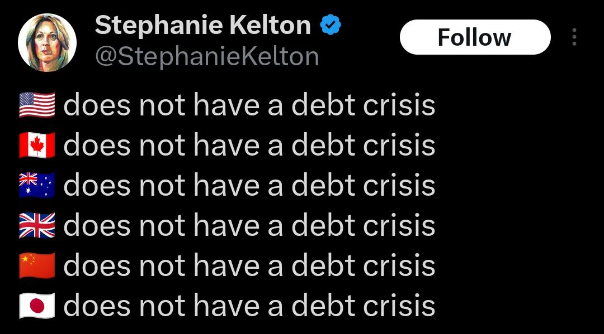

Strangely, it only lists six countries? Why is that? Because they have real monetary sovereignty. But there are around 200 countries on Earth, and not all of them have monetary sovereignty. So, my criticism of this theory, apart from being a little strange and non-functional, is that it only works for a few countries that enjoy true monetary sovereignty, those that can issue treasury bills in their own currency. To some extent, it goes to the detriment of the rest of the world. By creating this currency, it's like they were exporting their inflation elsewhere, akin to what the United States has been doing with its exorbitant privilege for decades. This resembles a form of monetary colonialism, where countries that have global confidence and demand for their currency can print as much money as they wish without incurring significant inflation, often because they export that inflation.

This theory is difficult to apply to import-dependent economies that need to maintain international confidence in their currency.

This theory also calls for a certain level of centralized planning of the economy, notably to ensure greater control over real resources (workers, raw materials, industrial capacity) and to manage inflation.

# The fall and rebirth of money

<partId>87a34ca9-782b-5ade-b51a-400f88ed7b0c</partId>

## Greek coins

<chapterId>7714195f-74ce-5f8c-be5f-59302d39fff4</chapterId>

:::video id=8e5c3091-0910-471b-8d4b-0dc6e9afa656:::

### Background and context

Before we begin, here's the historical background:

**Historical background:**

**The Romans called the Greeks "Graeci" and Greece "Graecia".**

**The Greeks called themselves "Hellenes" and their country "Hellas".**

**Homer** (born around 8th century BC)

Legendary Greek poet, presumed author of *The Iliad* and *The Odyssey*.

Around **750 BC: Lycurgus**, Sparta's mythical legislator, is said to have established the Spartan constitution based on military discipline and simplicity.

**Numa Pompilius** (753-673 BC)

Second king of Rome, famous for giving Rome its first religious and legal institutions.

**Dracon**, Athenian legislator (7th century BC), famous for his extremely severe laws, hence the term "draconian".

**594 BC: Solon** becomes legislator in Athens and radically reforms Athenian society, notably by abolishing debt slavery.

**776 BC: Ancient Olympic Games** 

The first regular sports games were held in Olympia every four years, bringing together the Greek cities.

**Pythagoras** (ca. 570-495 BC)

Greek philosopher and mathematician, famous for his theorem on the right-angled triangle.

**Xenophanes of Colophon** (c. 570-478 BC)

Pre-Socratic philosopher known for his criticism of traditional Greek polytheism.

**490 BC: Battle of Marathon**

The Athenians victoriously repelled a Persian invasion, marking a decisive turning point for Greek civilization.

**Herodotus** (c. 484-425 BC), nicknamed the "father of history", wrote a vast work describing the Persian Wars, including the Greek victory over Xerxes in 480 BC.

**Socrates** (470-399 BC)

Athenian philosopher famous for his dialectical method and his teaching on ethics and self-knowledge.

**Aristophanes** (c. 446-386 BC)

Athenian playwright, famous for his satirical comedies such as *The Frogs*.

**Sophocles** (5th century BC), in his play *Antigone*, criticizes money as a source of moral and political corruption, through the tyrant Creon.

**Plato** (c. 428-348 BC)

Greek philosopher, pupil of Socrates, founder of the Academy, author of *The Republic*.

**431-404 BC: Peloponnesian War** 

Major conflict between Athens and Sparta, ending in defeat for Athens.

**431 BC**: Athens finances the Peloponnesian War by diluting its gold and silver coins to increase the quantity in circulation, causing inflation.

**Xenophon** (c. 430-355 BC)

Athenian writer, philosopher and general, disciple of Socrates, author of the *Anabasis*.

**414 BC**: Athens begins to lose the Peloponnesian War after a disastrous expedition to Sicily.

**405 BC: Aristophanes**, in his play *The Frogs*, explicitly describes the devaluation of the silver drachma and the appearance of inferior bronze coins in Athens, illustrating the principle known today as "Gresham's Law".

**404 BC**: Athens capitulates after a long siege by Sparta.

**Aristotle** (384-322 BC)

Major Greek philosopher, student of Plato, founder of the Lyceum, known for his work in logic, biology and political philosophy.

**327 BC**: Alexander the Great conquers Persepolis and the eastern provinces of the Persian Empire, considerably expanding his empire.

**323 BC**: Alexander died in Babylon without a clear heir, sparking wars between his generals (diadochi) to divide up the empire.

**Archimedes** (c. 287-212 BC)

Greek mathematician, physicist and inventor, famous for his discoveries in geometry and mechanics.

**196 BC: The Rosetta Stone** is engraved during the reign of Pharaoh Ptolemy V, enabling the later deciphering of Egyptian hieroglyphs.

**192-188 BC: Romano-Seleucid War** 

Rome defeated the Seleucid empire led by Antiochos III, consolidating its influence in Greece and Asia Minor.

**146 BC: Battle of Corinth** 

The Romans destroyed the Greek city of Corinth, marking the end of Greek political independence and the gradual integration of Greece into the Roman world.

For this section on Antiquity, the fall of Rome and the Middle Ages, we'll start with a section on Greek coins.

The history of coinage in ancient Greece began around 600 BC, when Greek cities quickly adopted the innovation from Lydia in Asia Minor, initially using electrum and later silver. The first Greek coins were minted on the island of Aegina, featuring a sea or land turtle, but it was the Athenian drachma, decorated with Athena and an owl, that became the monetary symbol par excellence from the 5th century BC, largely dominating international trade at the time.

And I'm lucky enough to have a copy of a Greek drachma from that period with that famous owl and a figure on the back. It's a tetradrachma, which was larger than a simple drachma.

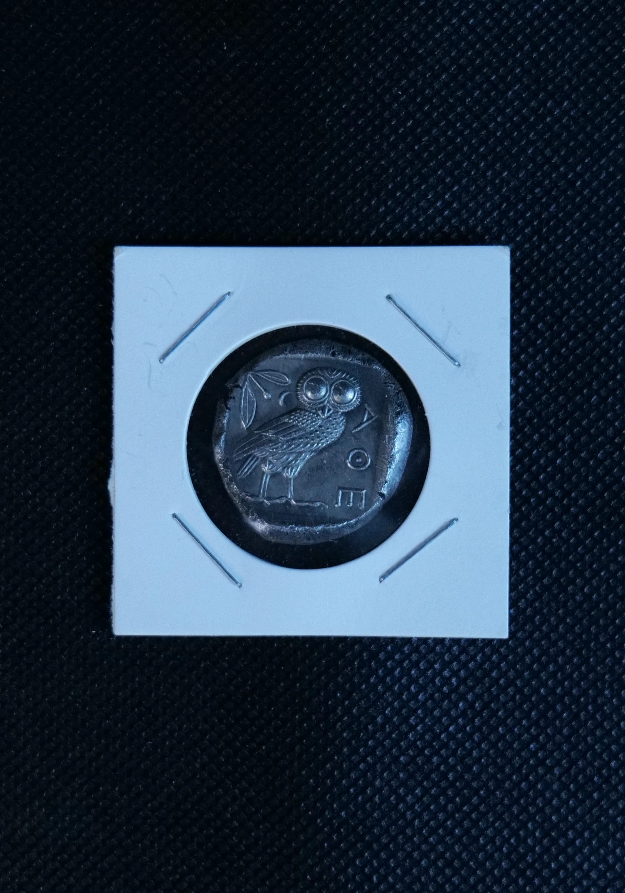

Each Greek city developed its own relationship with money. In Athens, currency was deeply linked to political and economic power. The famous Athenian decree of the late 5th century BC imposed the exclusive use of Athenian currency in its allied territories, thus reinforcing its economic hegemony. Athens also accumulated large reserves of gold for emergencies, which were kept on the Acropolis, perhaps as a symbol of its economic prudence. By contrast, Sparta, a military city with rigorous values, chose to severely restrict the use of money, forbidding its citizens to possess gold or silver coins. Sparta preferred to use heavy iron bars to discourage foreign trade and maintain social cohesion.

Wars were often financed by currency manipulation. During the Peloponnesian War (431-404 BC), Athens resorted to drastic devaluations to pay its troops. Deprived of access to its silver mines by the Spartan occupation of Decelia in 413 BC, Athens had to melt down gold statues to mint new coins in a hurry in 407/406 BC. Then, in 406/405 BC, she created bronze coins plated with silver, causing a monetary crisis illustrated by **Aristophanes**, who already evokes what is known today as Gresham's Law: bad money driving out good money. This emergency currency was quickly demonetized after the war to restore confidence in Athenian coinage.

The end of the classical period was marked by the rise of Macedonia under Philip II and his son Alexander the Great, profoundly upsetting the Greek monetary balance. Thanks to the vast gold and silver mines of Mount Pangea, Philip II produced an abundance of money to finance his military and political campaigns, establishing a simple and practical gold-silver standard (10:1). His gold staters, celebrating his victory at the Olympic Games, circulated as far as Western Europe, even reaching England. Alexander pursued this monetary policy, widely circulating the **Attic** drachma during his conquests in the East as far as India. This massive circulation of coins marked the beginning of the Hellenistic era, when the image of sovereigns gradually replaced that of divinities on coins. This innovation enabled generations of Hellenistic monarchs to promote themselves, relegating the traditional gods to a secondary role on the reverse of their coins.

After Alexander's death in 323 BC, his generals divided up his immense empire, establishing dynasties in Egypt (the Ptolemies), Syria (the Seleucids) and elsewhere. These Hellenistic kingdoms adopted a variety of monetary systems: the Ptolemies imposed a closed monetary system to control the circulation of money, preferring to use grain as internal currency to save precious metals for external military expenditure. At the same time, Rhodes became a major trading center before being economically weakened by the Romans, who established Delos as a free port in 167 BC.

The use of money was central to the remuneration of mercenaries. Alexander's soldiers received silver drachmas on a daily basis.

The cavalry, the elite of Alexander's highly specialized army, received on average two drachmas a day, an infantryman one drachma, and an ordinary mercenary two-thirds of a drachma, double the wage of a simple worker.

During the Peloponnesian War, considerable sums were also paid to soldiers: over 1,200 talents to put down the Samos revolt and over 2,000 talents to lay siege to Potidea.

By the time this army was fully engaged in Asia Minor, the total cost was around twenty talents per day, or about half a ton of silver, or 120,000 drachmas.

Greek coinage also played an important cultural role, as each city sought to assert its identity by minting its own coins with local or mythological symbols. For example, Heraclius depicted Heracles (Hercules) fighting a lion, while Cyrene showed the famous medicinal plant silphium.

Finally, despite their variety and regional fluctuations, Classical Greek and Hellenistic coinage left a lasting mark on the economic and cultural history of the Mediterranean world, profoundly influencing later monetary systems right up to Rome, which gradually adopted and developed Greek economic concepts to structure its own imperial economy.

## The impact of currency in Greece

<chapterId>3a5e6c7d-699c-5567-87cd-3374c49d55a9</chapterId>

:::video id=0c79a59c-e179-4893-a414-1b8de0930eb9:::

### Athens and the contrast with Sparta

The opposition between Athens and Sparta during the classical Greek period reveals two radically different models of political and economic organization. While Sparta rejected metallic money in favor of a self-sufficient system based on civic trust, Athens fully embraced this technology to build and maintain its maritime empire.

### The monetary necessity of naval power

The Athenian Empire, despite its grandiose name, remained geographically modest - essentially Athens and the cities of the Aegean Sea. Its power rested on the League of Delos, a military alliance dominated by Athens as hegemon. This imperial structure required a unified economic instrument: the Athenian silver coin.

Maintaining a fleet was at the heart of this monetary necessity. A single Athenian trireme cost between one and two talents of silver - a considerable sum. With several hundred ships to maintain, Athens needed an efficient tax system. Currency became the indispensable tool for collecting tribute from vassal cities and financing the naval projection force that guaranteed the cohesion of the empire.

### Monetary imposition as a tool of domination

Athens imposed its silver currency on all members of the League of Delos. This monetary standardization served several strategic objectives. Firstly, it facilitated the collection of tributes by creating a common unit of account. Secondly, it reinforced the economic dependence of vassal cities on Athens. Finally, it symbolically projected Athenian power across the entire maritime empire.

This monetary policy contrasts sharply with the Spartan model. Sparta, a land power, could rely on the labor of the Peloponnesian helots (slaves) for its subsistence. Its closed, city-centric economic system did not require sophisticated monetary instruments. Citizen-soldiers lived together, shared common meals, and didn't need money for daily exchanges.

### Currency as a vehicle for maritime trade

The seafaring nature of the Athenian empire meant it had to be open to trade. Unlike inward-looking Sparta, Athens had to trade with the outside world for its survival and prosperity. Currency became the indispensable instrument of Mediterranean trade.

This external orientation created a virtuous circle: trade generated revenues, these revenues financed the fleet, the fleet protected the trade routes and maintained the empire, and the empire imposed the Athenian currency, which facilitated trade. Currency was no longer simply a means of exchange, but became a pillar of imperial strategy.

### The limits of monetary power

Despite this economic sophistication, Athenian monetary power showed its limits during the Peloponnesian War. In the face of Spartan land forces, Athens' naval and financial superiority was not enough. Expensive expeditions, such as the disastrous Syracuse campaign in Sicily, exhausted financial resources without bringing decisive victory.

History shows that currency, while a powerful tool for projecting power, is no guarantee of military domination. Sparta, with no metallic currency but remarkable social cohesion, ultimately prevailed over the Athenian monetary empire.

### Two models, two destinies

The opposition between Athens and Sparta illustrates two fundamental approaches to social and economic organization. Athens represents the open, commercial, monetarized model - the forerunner of modern maritime empires. Sparta embodies the closed, autarkic model, based on civic trust rather than monetary instruments.

These two systems show that the adoption of currency is closely linked to the political and economic model chosen. For a maritime and commercial power such as Athens, money became indispensable. For a closed warrior society like Sparta, it represents a threat to social order. This ancient dichotomy still informs debates on the role of money in the organization of societies.

## The Roman Republic

<chapterId>0bc80983-33e1-5881-85bb-7c22f3144a9a</chapterId>

:::video id=dc05ca97-d29c-4679-bfeb-912c47d86ce2:::

### History of the Roman Republic

- **753 - 509 BC: Kingdom of Rome** 
- **753 BC: Foundation of Rome** (traditionally attributed to Romulus).
- **509 - 27 BC: Roman Republic**, Rome becomes a republic governed by an elected Senate and consuls.
- **280 - 275 BC: Pyrrhic War**. Pyrrhus, King of Epirus, battles the Romans in southern Italy, winning costly victories ("Pyrrhic victories").
- **264 - 146 BC: Punic Wars**. Major conflict pitting Rome against Carthage for domination of the western Mediterranean.
- **Hannibal (247 - c. 181 BC)**. Legendary Carthaginian general, famous for crossing the Alps with his army and elephants to attack Rome during the Second Punic War.
- **146 BC: Battle of Corinth**. Rome destroys the Greek city of Corinth and imposes its final domination on mainland Greece.
- **91 - 87 BC: Social War**. Revolt by Rome's Italian allies demanding Roman citizenship, which eventually led to their full integration into the citizenry.
- **64 BC: End of Seleucid resistance**. Rome definitively eliminates Seleucid influence in Syria, consolidating its hold on the Eastern Mediterranean.
- **55 BC: Julius Caesar conquers Central and Western Europe**. Julius Caesar extends Roman domination over Gaul (present-day France) and enters Germania and Brittany.
- **43 BC: Formation of the Second Triumvirate**. Political alliance between Octavian (later Augustus), Mark Antony and Lepidus, to stabilize Rome after Caesar's assassination.
- **27 BC: Beginning of the Pax Romana**. A period of political stability and prosperity under the reign of Augustus, marking the beginning of the Roman Empire.

### Rome's late monetary beginnings

In this section on Antiquity, we now turn our attention to the Roman Republic. Rome's monetary history began much later than that of the Greeks and Persians. Founded in 753 BC, Rome waited almost four centuries before truly adopting coinage. During this long period, the Romans used a primitive system of exchange with irregular pieces of bronze called aes rude, requiring precise weighing for each transaction. It was only at the end of the 4th century BC, under Greek and Etruscan influence, that Rome began to issue its first coins, notably in bronze cast as in China, the aes grave, characteristic of Roman exchanges until **the Second Punic War**.

### Greek influence and the first silver coins

The decisive encounter with the Greeks of southern Italy truly introduced the Romans to minted silver coins. Around 280 BC, Rome began producing its own silver coins in imitation of Greek didrachms. The first regular issue of silver coins in Rome dates back precisely to 269 BC, featuring the legendary twins Romulus and Remus suckled by the she-wolf, a symbol that has become iconic.

In fact, many Roman coins from the Republic period depict founding myths. You can see mine here below: it's a superb, real coin from King Tatius. It illustrates the myth of the abduction of women from the Sabines. Tatius was the king of this region, and the founding myth tells of how the Romans abducted women from the Sabines, a population who lived nearby. Subsequently, King Tatius became a co-king with Romulus, one of the founders of Rome.

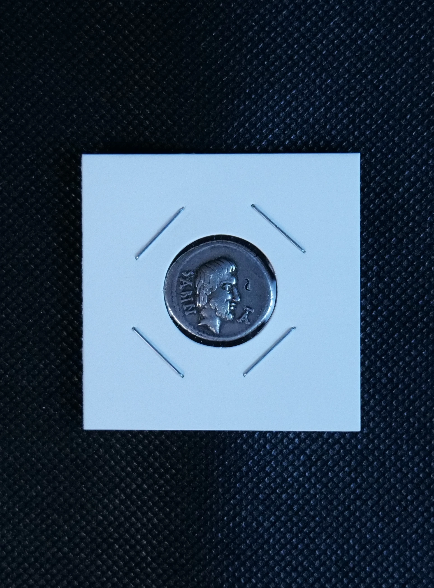

### The origin of the word "coin" and the temple of Juno Moneta

The term "coin" has its origins in the temple of Juno Moneta in Rome. Legend has it that, during a Gallic invasion in 390 BC, the sacred geese of the Capitol alerted the Romans to an imminent danger. To thank the goddess Juno, protector of the Capitol, a temple was erected in her honor and soon became the mint for Roman coins.

### The Punic Wars and currency crises

Military conflicts had a considerable influence on Roman monetary development. During the Second Punic War (218-201 BC) against Carthage, Rome faced severe financial difficulties in the face of Hannibal's invasion. To alleviate these urgent needs, Rome resorted for the first time to an exceptional issue of gold coins, as well as to a significant devaluation of its silver coinage, from an initial purity of 97% to around 89%. The weight of bronze coins (aes) also dropped drastically, losing almost 80% in six years.

Here, we can revisit a concept we've previously discussed regarding the Greeks melting precious metals stored in temples to help alleviate economic crises. And to talk about **Carthage**, here below you can admire a real Carthaginian coin from my collection. These Carthaginian coins featured a palm tree on one side, and a horse on the other side. On this coin, the horse isn't very recognizable, a it's very worn.

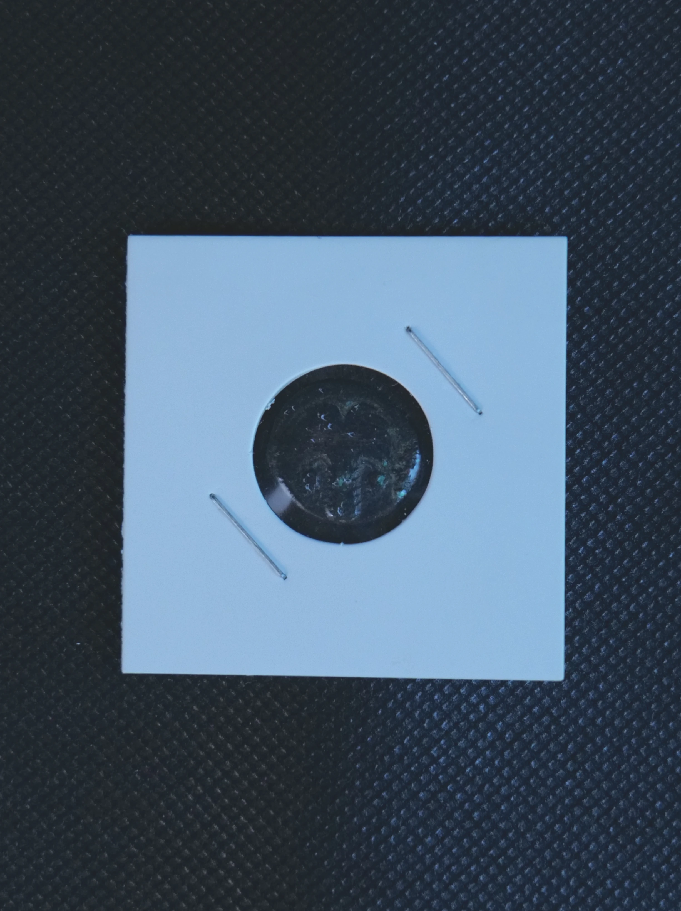

As a result, the weight of bronze coins, known as aes, also dropped drastically, losing almost 80% in six years. So, the weight of these bronze coins, which were not a precious metal and were used in everyday trade, dropped a lot, which was a sign of monetary devaluation due to these wars.

### The silver denarius and monetary stability

It was against this critical backdrop that Rome introduced the famous silver denarius around 212 BC. This reform ensured remarkable monetary stability, with the denarius remaining the dominant currency for almost 450 years. Rome owes this stability to rigorous management, despite a major repricing in 146 BC and considerable production to finance its immense armies, notably during the Punic, Social (91-87 BC), and Macedonian wars. By way of example, maintaining a single Roman legion cost around 1.5 million denarii per year, illustrating the scale of monetary needs.

Beyond the Roman borders, wars led to major devaluations in regions under Roman influence. Punic Carthage saw the purity of its electrum drop dramatically, from 98% gold in the 4th century to just 30% during the Second Punic War, while its silver coins fell to 18% purity.

### The evolution of monetary motives

With the expansion of Rome, the character of coins also evolved: initially anonymous and patriotic, coins gradually adopted personalized designs featuring the powerful families of the minters (those who struck the coins). This transition clearly symbolizes the political transformations of the late Roman Republic.

Finally, while Rome dominated the Mediterranean world economically, it retained a certain simplicity in its means of payment: no real form of monetary transfer other than the direct exchange of coins was developed, with the exception of tax transfers and private credits reserved for the elite.

## The Roman Empire

<chapterId>2dc44e50-112a-5abf-97ae-8e0a9ecda989</chapterId>

:::video id=f8d6f3d6-9ee4-4504-888e-4f12b3f20489:::

**Historical background:**

**The Principate** was the form of imperial government in the Roman Empire from the beginning of Augustus' reign in 27 BC to the end of the third-century crisis in 284 AD.

**27 BC: Beginning of the Pax Romana** 

Period of political stability and prosperity under the reign of Augustus, marking the beginning of the Roman Empire.

**Augustus (30 BC to 14 AD)** radically reformed the Roman monetary system, establishing a lasting and stable standard for imperial coinage.

**Augustus was also one of the first recognized collectors** of ancient coins and fossils.

**54 AD - 68 AD: Nero** 

Controversial Roman emperor, known for his tyranny, persecutions and disastrous management after the burning of Rome.

**64 AD: Great Fire of Rome**

A major fire ravages much of the city; Nero is accused of being responsible.

**69 AD: Year of the Four Emperors**

A chaotic period with four emperors in quick succession (Galba, Otho, Vitellius, Vespasian).

**79 AD: Vesuvius eruption** 

Volcano that destroyed the cities of Pompeii and Herculaneum, exceptionally preserving their remains under the ashes.

**165 AD - 180 AD: Antonine plague**

Devastating epidemic that weakened the Roman Empire under Marcus Aurelius and Commodus.

**200 AD: Territorial apogee and gradual end of the Pax Romana**

Rome reached its maximum extension, but began to suffer from internal instability and economic difficulties.

**212 AD: Edict of Caracalla on citizenship** 

Emperor Caracalla granted Roman citizenship to almost all the empire's inhabitants, in order to broaden the tax base.

**220 AD: Beginning of the great barbarian invasions**

First significant incursions of Germanic peoples across Roman borders.

**235 AD - 285 AD: Political and military crisis of the 3rd century**

A period marked by political instability, with many short-lived emperors, civil wars, economic crises and continuous invasions.

**Aurelian (270-275 AD) radically revalued the Roman currency**, attempting to restore its nominal value despite high inflation.

**301 AD: Diocletian's Price Edict** 

Emperor Diocletian tried in vain to halt rampant inflation by imposing strict price and wage controls throughout the empire.

**312 AD: Constantine**

First Christian emperor, founder of Constantinople, stabilized the currency by introducing the "solidus", a gold coin of great purity and stability.

**476 AD: Fall of the Western Roman Empire**

Rome is taken by various Germanic peoples (including the Ostrogoths), an event considered to mark the official end of the Western Roman Empire.

### Augustus' monetary reforms

In this section on Antiquity, we have already arrived to the Roman Empire. The monetary history of the Roman Empire is characterized by the intensive use of metallic currency, notably gold, silver, and bronze, but also by multiple currency crises, closely linked to political and military unrest. At the end of the Republic, under Julius Caesar, Rome introduced the gold aureus in 46 BC, a coin weighing around 8 grams that was widely accepted throughout Europe and the Mediterranean basin. Caesar standardized these gold coins and minted the first coins bearing the portrait of a living man, thus overturning an ancient republican tradition that favored anonymous, collective symbols. This development accompanied a period of major political transformation, with personal power gradually replacing republican institutions.

After Caesar's assassination in 44 BC, Octavian (Augustus) took control of Rome, establishing the Empire in 27 BC. His reign saw a complete reform of the monetary system, bringing lasting stability to the Roman economy. At the time of Augustus, one gold aureus was equivalent to 25 silver denarii, itself worth 4 bronze sestertii. This monetary stability continued throughout the first century AD, a period often described as an economic golden age for Rome.

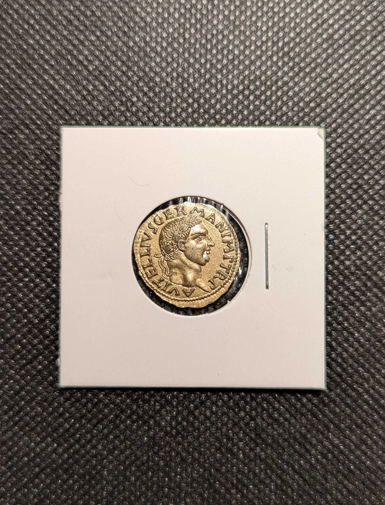

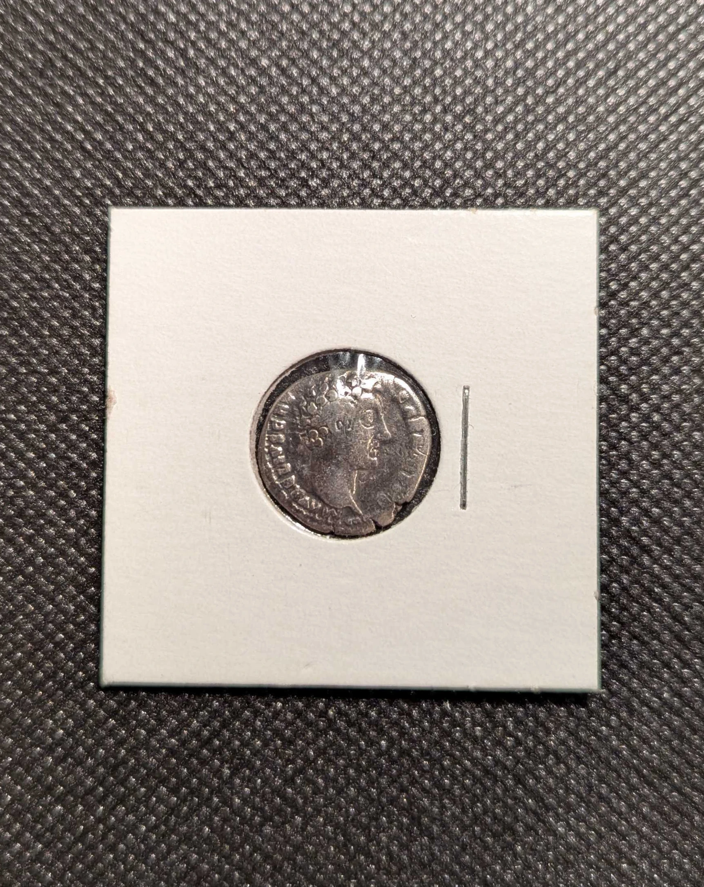

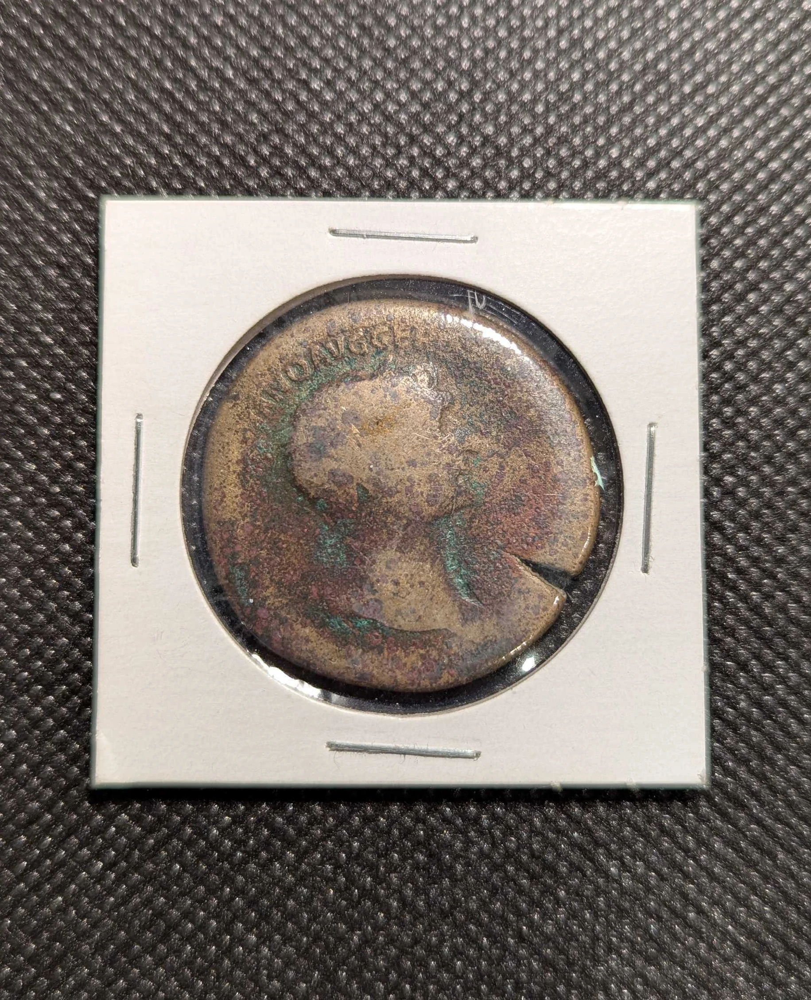

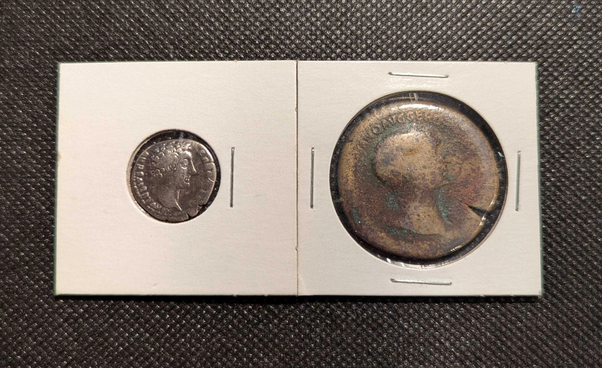

However, from Nero onwards (AD 54-68), Rome began a slow devaluation of its coins, progressively reducing their weight and purity to finance growing imperial expenditure, particularly after the great fire of Rome in AD 64. These devaluations had notable effects: purer coins were withdrawn from circulation through hoarding or export, in accordance with **Gresham's law**, while devalued coins proliferated, causing a gradual rise in prices.

The third century marks a dramatic turning point, with a spectacular acceleration in devaluations under the emperors Septimius Severus, Caracalla, and Gallienus. The main silver coin, the denarius and then the antoninianus, saw its silver content drop to just 2%. At the same time, the gold weight of the aureus dropped by half. This monetary crisis was accompanied by unprecedented political instability, barbarian invasions and recurrent civil wars.

This part allows me to introduce the final piece in this section: the antoninianus. The original name of this coin is unknown, but we refer to it as an antoninianus today. It has the distinction of being valued at two denarii, despite being only 1.5 times larger than a denarius. Furthermore, over time, these coins became merely billon coins, meaning they were made from an alloy of silver and other metals rather than pure silver. The coins were often just coated with silver, serving as a notable example of monetary decay.

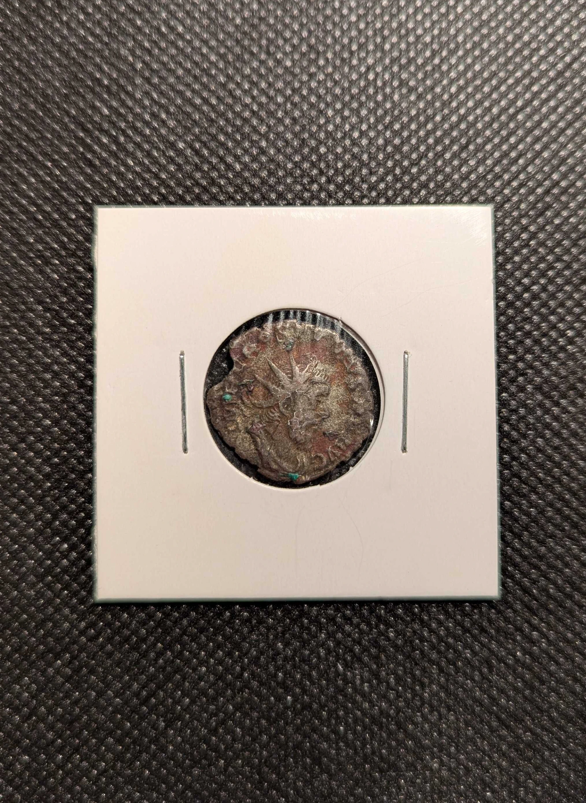

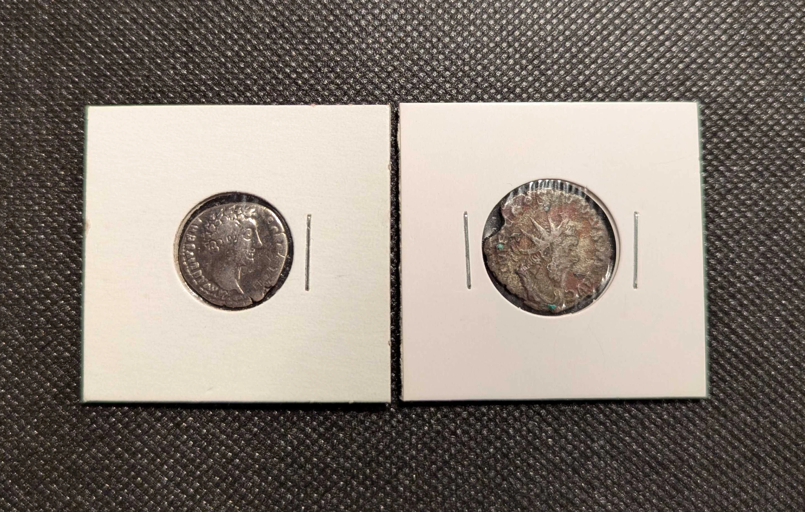

Faced with this situation, Emperor Aurelian (270-275 AD) attempted to stabilize the system by nominally revaluing currencies, but this reform actually introduced an inflationary mechanism by artificially fixing the value of existing currencies at a higher level.

I will introduce a digression on the subject. During the 3rd century, inflation experienced a rapid exponential increase. Previously, even though coins were devalued, the handmade process of minting them one by one provided some control over inflation. Statistics indicate that over 300 years of devaluation, inflation averaged about 4% per year. Just before Aurelian's reform, inflation was approximately 3% annually.

Aurelian introduced a purity measurement on the XXI sign coin, indicating a composition of 20 parts bronze to 1 part silver, or 5% purity. He marketed these 5% silver coins and stamped the XXI sign on them. However, he also recalled all the other, more devalued coins and stamped the same XXI on them. This effectively revalued the face value of all coins. The outcome was a staggering inflation rate of 20% per year, far exceeding the previous 3% rate before this technique was implemented.

It was really Aurelian who invented this form of devaluation, which is much faster than the gradual devaluation of metal, which still forced us to print coins one by one. What he did was to take all the existing coins, recall them and stamp them with a punch to change their face value. It's a real turning point. That's when inflation became exponential.

To visually illustrate this extreme devaluation, I've found some fascinating statistics on the price of grain in Egypt from 40 BC to the 3rd century, spanning over 300 years. Below, you can see a Greek tetradrachma from my collection. At that time, in Egypt under Roman occupation in the 3rd century, the equivalent was an Egyptian tetradrachma. The denomination of drachmas was still in use, and it corresponded to a denarius.

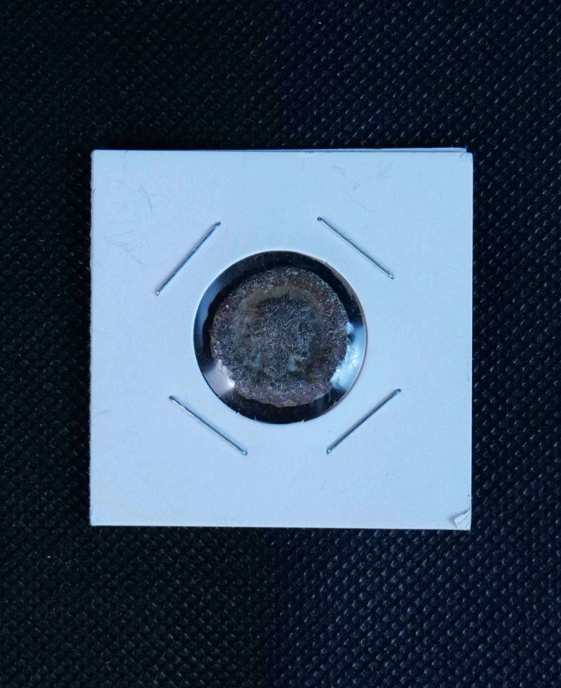

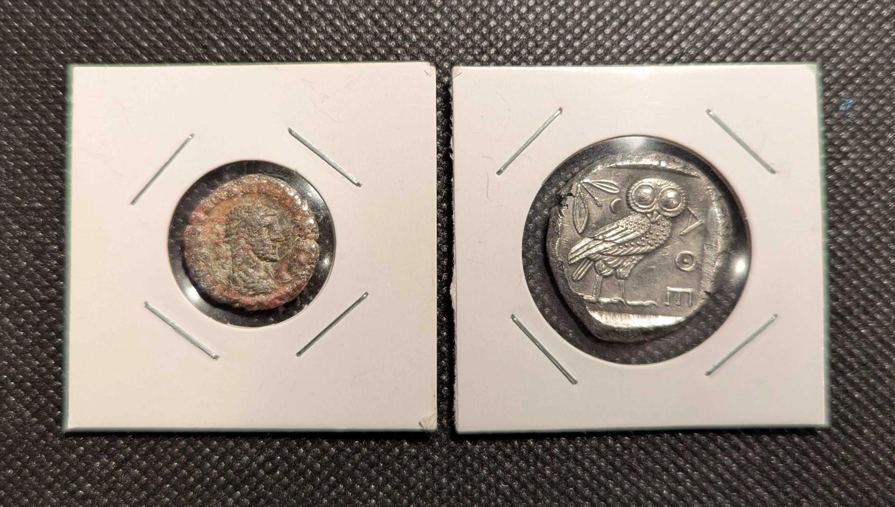

So the Egyptian tetradrachm I have was the equivalent of a denarius. You can see that the coin is made of billon (or bronze), so it does not contain any precious metal. You can compare it to the original Greek tetradrachm to see the physical devaluation over these 300 years. It's a million-fold increase in the price of grain in Egypt.

It's the physical expression of Aurelian's reform. It should be noted that the majority, the average over these 300 years of inflation, was around 4%. It was only at the end, when Aurelian made his reform, that this inflation became rather exponential and we arrived at this measure of 1 million. Prices were a million times higher at the end of the 3rd century than in the 1st century BC.

His successor **Diocletian** (284-305 AD) attempted even more radical reforms: he issued new currencies (notably the argenteus, purer but too limited in quantity), imposed drastic price controls (Price Edict of 301 AD) and **established a tax system based on payments in kind**. Despite these efforts, Diocletian's reforms failed to curb rampant inflation.

Faced with the refusal to supply goods and services in exchange for devalued currency, Diocletian instituted **a hereditary caste system** to tie peasants and their descendants to their land.

What really needs to be understood here is that what happened was that the peasants refused to deliver their produce in exchange for devalued currency, and our dear Diocletian's response was to create **hereditary castes** by saying "you, you can't leave your land, your children can't leave their land, same thing for the soldiers, you're soldiers, you agree to be paid in my currency". As a transitional solution, they were paid in kind (in meat, food, grain) because he refused to give them money. So he imposed this hereditary caste system to force people to be attached to their trade, so they couldn't simply change jobs if they tried not to accept the devalued currency.

To illustrate this example, here I have a text, an extract from the book "*Monetary Regime and Inflation*":

> As people were unwilling to work and deliver goods against a devalued currency, whose face value was higher than its intrinsic or market value, they had to be forced to work by imposing taxes in kind. [...] It became illegal for peasants to leave their registered homes. The farming population thus became hereditarily attached to the land.
>

> This hereditary caste system gradually spread: Diocletian forced soldiers' sons to serve in the army, while workers in the money workshops, as well as in the weaving and dyeing factories Diocletian had created, became state slaves, with hereditary service. Gold miners also later became a hereditary caste. Other hereditary classes probably already existed in Diocletian's time, notably the guilds of bakers and butchers [...] in Rome, as well as the diocesan guilds of ship captains who transported grain and other public cargoes to Rome.

It was Constantine (306-337 AD) who finally succeeded in stabilizing the monetary system by introducing the solidus in 312, a pure gold coin whose quality and weight he strictly guaranteed. There was an entire system for verifying the purity and weight of the solidus. **This stability, however, only affected a wealthy elite and the imperial administration**, while the **majority of the population continued to suffer from low-quality currency and persistent inflation**. The solidus remained stable in the Eastern Empire (Byzantium), where it lasted for more than a millennium, while in the West, coinage fragmented into small, low-value coins, accompanying the final economic and political disintegration of the Roman Empire, which fell definitively in 476 AD.

To conclude, I'd like to share with you this quote from *A History of Money: From Ancient Times to the Present Day* by Glyn Davies, which masterfully sums up what perhaps led to Rome's downfall:

*"Taxes were consistently inadequate, and the difficulties associated with these increasingly inadequate, belatedly adjusted, and highly visible taxes drove Rome to rely more on an easy, immediate and hidden form of taxation: currency devaluation. Short-lived, ad hoc reforms failed to reverse this age-old trend of decline. Financial pressures caused by the wear and tear of coins, shipwrecks, money leaks due to the purchase of luxury goods from the East, gifts offered to Germanic barbarians, the growth of urban populations, the decline of agricultural production, the gradual exhaustion of the richest mines, and above all the "bread and circuses" policies deemed essential to maintain a minimum of order in urban life - all these cumulative pressures led Rome to constant monetary devaluation, interspersed with occasional reforms doomed to failure."*

*In addition to free or cheap bread and wine, imperial liberalities ("congiaria") in the form of monetary allocations were distributed from time to time, particularly under Trajan (98-117 AD) and even more so under Hadrian (117-138 AD) and his successors. What the emperor and citizens had initially regarded as an exceptional privilege had, by the early 2nd century, become a customary expectation. These distributions "constituted a heavy burden on the public treasury and contributed in their own way to the bankruptcy of the state".*

## Links between monetary dilution and inflation: from causes to consequences

<chapterId>38d5781c-e900-53f7-baa7-413655d71754</chapterId>

:::video id=3999256d-aafe-4502-9b72-dfa8491a2777:::

This section looks at the links between monetary dilution and inflation, from causes to consequences. Monetary dilution is one of the major economic phenomena in Roman monetary history, with direct effects on inflation. From the 1st century AD, there was an initial slow phase of dilution of silver coinage (denarius) from the reign of Nero (54-68 AD) onwards, accelerated by repeated military and financial crises, notably under Septimius Severus (193-211) and Gallienus (253-268).

We also note a more gradual devaluation of the aureus. This difference in the rate of devaluation highlights two points:

1. The role of the unit of account in bimetallism for state control of money. The unit of account in this example is the denarius. I have identified three different ways of managing the value of the unit of account: devaluation (dilution of the metal), redenomination (antoninianus) and the imposition of a face value by marking "XXI" (Aurelian)

2. The State's desire to postpone as long as possible the devaluation of the aureus, the reserve of value that enables the elite to maintain their purchasing power at the expense of the less fortunate. We will frequently revisit this principle throughout the course, especially in connection with the concept known as the "Cantillon effect" and the redenominations of the Maravedi in Spain.

This phenomenon is quite interesting and has recurred throughout history. We will revisit it with the Maravedi in a subsequent section. This pattern is evident with all reserve currencies as well; the reserve unit of value, such as the aureus in Rome, remains untouched. However, the unit of account used by the general population for trade and everyday transactions is often devalued. As a result, monetary inflation affects the common people, while those who can afford gold coins remain largely unaffected.

And by the way, **it's the same phenomenon that's being created today with currency devaluation, which allows financial assets to rise in value**, and so it's the people who use the currency, the poorest people, who get poorer, and this in turn enriches, through money creation, the assets of those who are able, who have the means to protect themselves against devaluation, and so it deepens social inequalities. That's my little political rant.

What I've just described is called the Cantillon effect. We'll see that this gentleman lived in the time of John Law, a subject we'll also cover in a subsequent section.

The reform initiated during Aurelian's reign allowed inflation to soar. Inflation in the face value of money was no longer limited by the mints' ability to produce coins by hand. Coins that had already been minted could now be simply marked, and the nominal value of the money supply increased more rapidly.

I have two quotes to share with you in connection with Aurelian. The first comes from *A History of Money: From Ancient Times to the Present Day*:

*"as far as the Roman economy is concerned, Aurelian's contribution was more of a disaster than a triumph. It was largely due to the nature of his "reform" that the rate of inflation was able to increase far beyond what had previously been possible, even under the irresponsible Gallienus. For two centuries after Aurelian, inflation became endemic throughout the Roman Empire "*

The second comes from the book *Ancient History from Coins* and concerns the detachment of the monetary system from gold:

*"Aurelian's reform changed the relationship between gold money and the rest of the monetary system. Before it, other types of currency were linked to the **aureus** according to official rates (25 Egyptian denarii or 25 tetradrachms for one aureus, etc.). After the reform, gold money began to **fluctuate freely in value**, like any other commodity, while the rest of the monetary system **collapsed in value** due to the **weakening of alloys**, no longer being **backed by gold**. As the unit of account remained theoretically based on silver (the denarius, or in Egypt the drachma), prices rose as the currency depreciated. "*

As you can see, this devaluation of the currency that served as a unit of account disproportionately affected the less well-off, while the detachment of the link with gold money protected the purchasing power of those who could afford to save in the store of value that is gold.

What you have to understand here is that if there's a link between the denarius and the aureus, even if you devalue the denarius, if you're still able to exchange your denarius for aureus at this rate (25 denarius for 1 aureus), people will definitely exchange their denarius for your aureus since the denarius will be overvalued and the aureus undervalued. But in this reform, they removed this link. So people could no longer exchange denarii for silver metal devalued against gold. That's when those who had access to gold coins could really protect themselves, because afterwards people could no longer exchange overvalued devalued silver for undervalued pure gold. This is a very important moment in the evolution of currency.

A striking example of the effects of this reform by Aurelian is perfectly illustrated by these quotes from the book *Monetary Regimes and Inflation*:

*"Between the reigns of the emperors Claudius (41-54 AD) and Constantius (337-361 AD), the price of wheat on the open market in Egypt, expressed in drachmas, **increased by a factor of over a million**. Spectacular price inflation is one of the central economic facts of the 3rd and 4th centuries AD" (Lendon 1990, p. 106). But this development is **less dramatic than it seems**, as it corresponds to an **average annual inflation rate of 4.4%**. And according to Wassink (1991, p. 482), inflation actually began **only in 238 AD**"*

*"From this date onwards, inflation slowly accelerated, as **good money was first driven out of circulation**, so that the total money supply hardly increased at all at first. Subsequently, it reached an average annual rate of **3.65% between 250 and 293**, rising to **22.28% between 293 and 301** (Wassink 1991, p. 466), i.e., up to the **aborted monetary reforms of Emperor Diocletian**. This phenomenon is **particularly impressive for inflation in a metal-based monetary regime**. "*

This phenomenon of inflation linked to monetary dilution initially responded to the occasional cash crises of the Roman state. By reducing the precious metal content of coins while maintaining their face value, the state temporarily increased its resources. But prices did not react immediately: indeed, the Roman system had a certain stickiness, which meant that wages and prices were slow to adapt to successive devaluations. Nevertheless, after a certain threshold, prices would rise sharply to bring the market back into balance with the real value of the currencies.

As mentioned above, this phenomenon is particularly evident from the middle of the 3rd century onwards. In Egypt, a richly documented region, prices were multiplied by 10 under Aurelian (274 AD) after an official revaluation of the currency, despite an initial attempt at stabilization. Then, under Diocletian (301 AD), the price edict imposed drastic controls to curb inflation without tackling the root cause - overproduction and monetary degradation - thus causing a predictable failure. Persistent inflation ultimately pushes the economy towards a two-tier system: **the elite, protected by gold reserves (like Constantine's solidus**), enjoy stability, while the majority of the population continues to suffer chronic inflation, **illustrating what is known today as the Cantillon effect.**

There is a clear link between Roman monetary dilution and inflation, the causes of which are essentially linked to chronic fiscal deficits, incessant military spending, and poor state economic management.

## The fall of the Roman Empire

<chapterId>b6ec0914-227b-509c-8108-b09eec9bb904</chapterId>

:::video id=91d4fee5-59bb-4ab9-a90b-e1125c71decb:::

### Currency devaluation and the collapse of Rome

The Austrian school of economics, notably through Ludwig von Mises, proposed a monetary interpretation of the fall of Rome. In this vision, the progressive devaluation of Roman currency shattered the complex system of division of labor that sustained an empire of 60 million inhabitants. Currency, the central instrument of economic coordination, once corrupted, led to the collapse of the entire social and economic structure.

This monetary deterioration not only destroyed the empire's internal cohesion. It also severed trade links with neighboring peoples. Deprived of the benefits of trade with Rome, the "barbarians" turned from peaceful cooperation to predation. The invasions were therefore not only military in nature, but also the result of a fundamental economic breakdown.

### The three phases of imperial devaluation

Roman monetary history can be divided into three distinct periods. The first, from the Julio-Claudians to the Antonines (27 BC - end of 2nd century), maintained relative stability. Under Trajan, the empire reached its apogee: covering 5 million km², Rome became the first millionaire city in history. The denarius retains a silver purity of 98% to 80% - a moderate devaluation still allowing the economy to function.

The second period, the 3rd century, was one of military anarchy. Twenty-six emperors succeeded one another in the space of a few decades. The currency collapsed: the antoninianus, supposedly worth two denarii, contained only 1.5 in metallic weight - the first attempt to divorce legal and real value. This manipulation triggers Gresham's Law: bad money drives out good money. Citizens hoarded the good coins, spending only the devalued ones.

Monetary treasures uncovered by archaeologists reveal this economic anxiety. Buried amphorae show, by stratification, how the Romans deposited the best coins first, gradually adding the devalued ones. These ancient "stacks" bear witness to human action in the face of uncertainty - an attempt to preserve value in a decaying world.

### Constantine and the dual system

Constantine (310-337) attempted to stabilize the empire through radical reform. He created the gold solidus, a currency strictly controlled by the administration. Officials systematically checked weight and purity. Issuance remained limited, linked to the spoils of war. This currency became the exclusive instrument of power: taxes were paid in solidus, and legions received their pay in gold.

At the same time, the people used the bronze nummus, which was constantly devalued. In 445, a solidus was worth 7,000 nummi; in 498, 16,800. This dual system institutionalized the Cantillon effect: those with access to the solidus - the administration, landowners - were protected from inflation. The plebs, confined to the nummus, became inexorably poorer.

This monetary separation created two parallel economies with no official exchange rate. The solidus remained the unit of account, but circulated very little. The nummus is used for daily exchanges, but constantly loses value. This monetary architecture foreshadowed the inequalities of the emerging feudal system.

### The collapse of the division of labor

Currency devaluation gradually destroyed economic specialization. Without a reliable unit of account, Mediterranean trade collapsed. Rome's specialized craftsmen could no longer trade with Egypt or Gaul. Provinces adopted their own currencies, multiplying trade frictions.

Faced with this disintegration, the urban population fled to the countryside - an urban exodus reversing centuries of urbanization. Craftsmen abandoned their trades for subsistence farming. Large estates (latifundia) became self-sufficient islands, foreshadowing medieval seigneuries.

In desperation, Diocletian even demanded taxes in kind - the ultimate admission of monetary failure. His edict of the maximum (301) attempted to control prices, accelerating the return to barter. Economic complexity regressed to pre-civilizational forms.

### Survival through gold from Rome to Byzantium

Paradoxically, the solidus survived the Western Empire. Byzantium maintained it until the 11th century, ensuring a further thousand years of economic stability. In the West, its memory persists: the French word "sou" derives from solidus, a linguistic testimony to a lost monetary grandeur.

Landowners who had preserved their wealth in gold became feudal lords. Ecclesiastical structures, the only surviving institutions, provided the social bonds that money could no longer guarantee. Europe fragmented into autarkic domains, each with its own subsistence economy.

This transformation reveals the fragility of complex civilizations. The division of labor that enabled Rome to feed a million inhabitants depended entirely on monetary trust. Once this trust was broken, the edifice collapsed, returning Europe to primitive economic forms for almost a millennium.

## The Dark Ages and the Middle Ages

<chapterId>a5856873-6142-57be-8a73-1f9e3df83792</chapterId>

:::video id=86b8da9b-3831-443d-b170-58c2bea3ad54:::

The history and emergence of money in the Middle Ages is marked by periods of regression, innovation, and economic recovery.

For example, when the Roman army left Britain, no more Roman coins entered the island. Around 435 AD, the use of coins disappeared completely in Britain, a phenomenon unique in the former Roman provinces. For almost two centuries, the British economy went without coinage until the 7th century, when Merovingian and continental-inspired coins gradually reappeared.

From the 8th century onwards, Christian influence contributed to the reintroduction of coinage in Northern Europe. The key figure in this period was Pepin the Short, King of the Franks, who introduced the denarius in 752, later adopted by his son Charlemagne. Charlemagne widely extended the use of the silver denarius, creating a European monetary standard for several centuries.

In England, coinage enjoyed a significant revival with the production of the silver penny under King Offa of Mercia around 765. This currency became so important that it remained virtually unchanged for 500 years.

As a first artifact related to this period, let me show you a reproduction of an English penny from that time.

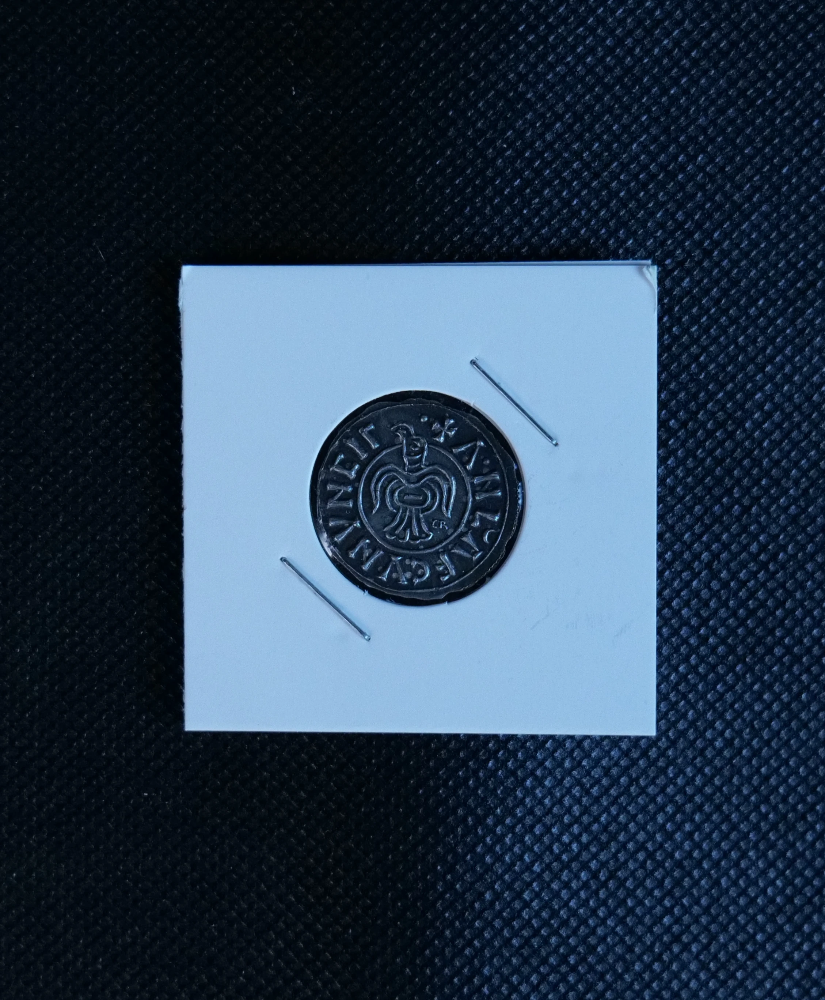

During the High Middle Ages, Europe fell into feudalism following the collapse of the Roman monetary system. The majority of the population used low-value copper or bronze coins, often subject to currency dilution, thus limiting trade over long distances.

The return of coinage as a means of payment occurred gradually, culminating in the 13th century with the appearance of the gold florin in Florence in 1252, followed by the gold ducat in Venice. These gold coins were widely used thanks to the expansion of trade and the growing need for reliable, internationally accepted means of payment.

In England, the monetary system was protected from dilution by innovative fiscal policies, such as the land tax introduced by William the Conqueror after 1066, which preserved the quality of the penny sterling. What's important to understand here is that sovereigns at the time could devalue the currency to finance the state, and **the introduction of this tax made it possible to keep the currency stable and finance the state through taxation.**

However, the temptation to profit through monetary dilution led to crises, as in the reign of Henry I in the 12th century, when the quality of coinage fell dramatically. Severe reforms, sometimes accompanied by violent measures against coiners, temporarily restored confidence in the currency.

The Middle Ages also saw the emergence of sophisticated financial practices, such as the use of tally sticks in England to circumvent the ban on usury and extend credit. The Church was not very keen on interest-bearing loans, so various techniques were used to circumvent the prohibition on the use of interest.

These innovations were a response to the chronic shortage of metallic money, and encouraged the emergence of an embryonic financial market.

The Crusades, meanwhile, stimulated Mediterranean trade, fostering the development of international exchanges and new banking practices, notably through the Order of the Knights Templar. The Knights Templar became important financial intermediaries, enabling crusaders to obtain liquidity far from home, foreshadowing the modern European banking system.

To make the link with the Templars, here below you can observe a French medieval coin, where you can recognize a beautiful cross in the center. It was quite common for coins of this era to bear this cross.

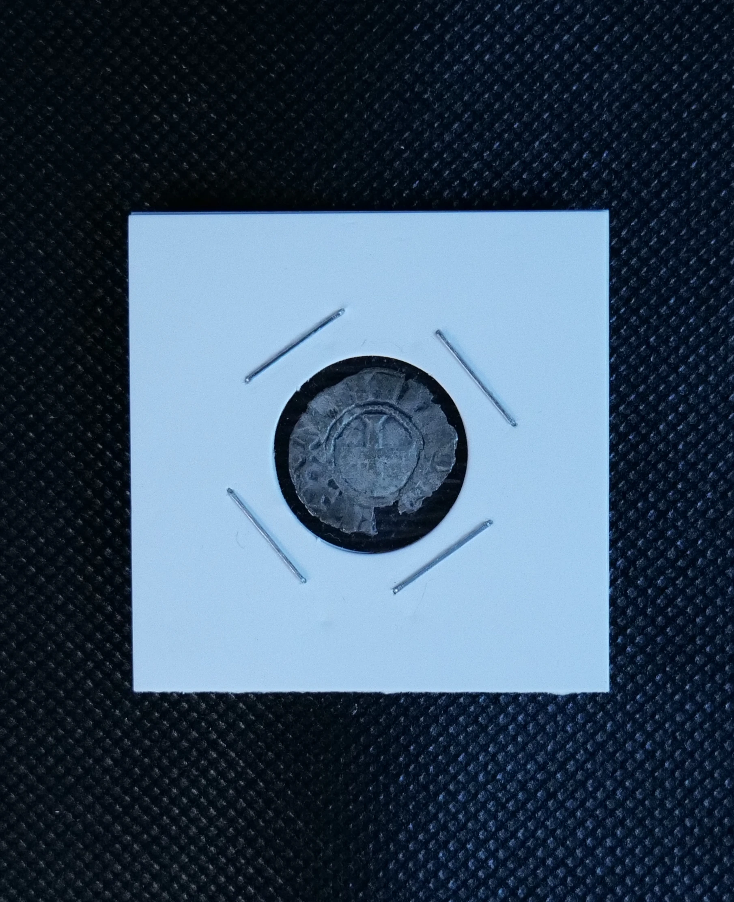

Finally, major crises such as the Black Death (1346-1353) brought about profound economic transformations. The sharp fall in population led to a sharp rise in wages, defying government attempts to maintain previous levels of remuneration.

At the same time, the Hundred Years' War (1337-1453) forced states to adopt more aggressive fiscal policies to finance their armies, contributing to the weakening of the feudal system.

The Middle Ages were thus marked by a constant tension between the need for reliable money for trade and the constant temptation for rulers to dilute money for immediate profit. This conflict profoundly shaped European monetary development, laying the foundations for modern economic systems.

To conclude this section, I'd like to add a rather interesting anecdote from England around this time. This anecdote is taken from the book here, "History of Money" by Glyn Davies.

It mentions that in England, the shift to Parliament transferred the burden of debt from the sovereign to Parliament, resulting in chronic state indebtedness. Before that, the debt weighed on the sovereign's shoulders.

Once Parliament was able to seize some of this power of money creation, it enabled the creation of long-term debts that were borne by the people, not by the king. Previously, if the king went bankrupt or if there was a change of king, the debt was extinguished with him.

The moment the creation of debt is carried out by Parliament, the concept of sovereign debt emerges, as it is potentially unlimited over time. As long as the State exists, as long as Parliament exists, this debt exists, and they had to find all sorts of ways of refinancing it and spreading it over time. It's a major paradigm shift, where it was no longer the king or royalty who guaranteed or bore the burden of these debts; it was now Parliament and therefore its citizens.

## The renaissance

<chapterId>1d1dfb05-70b4-5b7b-9708-373c2182950d</chapterId>

:::video id=4977b4f3-c7b2-41a5-ad7b-a96a8cca4092:::

We've now reached the section of the course where we talk about the period known as the Renaissance. It takes place against a backdrop of tragic crisis, with the meteoric spread of the plague by fleas on rats boarding ships. This tragedy, however, informs us about the growth of trade and travel in the high medieval period. Earlier in this period, not so many people moved so far and so fast.

### The Florin of Florence

The return of gold coinage to Europe during the Renaissance marks a fundamental turning point in monetary history. **It all began with the Florin of Florence in 1252, the first major gold coin minted in Europe since the fall of Rome**. With its remarkably constant weight and purity (around 3.5 grams of pure gold), the florin remained unchanged for four centuries and rapidly became an essential pan-European monetary reference.

Here below you can see a reproduction of a Florin: a gold Florin made of pewter and stamped by a French artist who makes excellent pieces, engraved and struck manually.

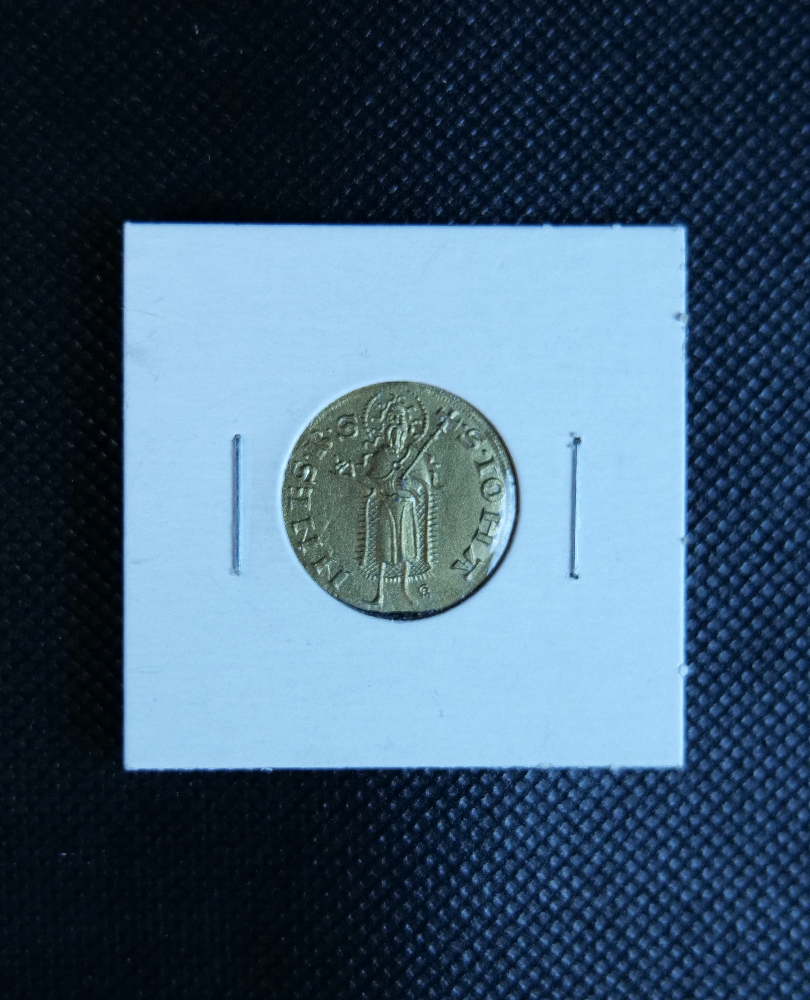

This return to gold coinage was driven by a specific context: the collapse of the Byzantine solidus and the economic decline of the Muslim world due to the Mongol invasions created a monetary vacuum in international trade.

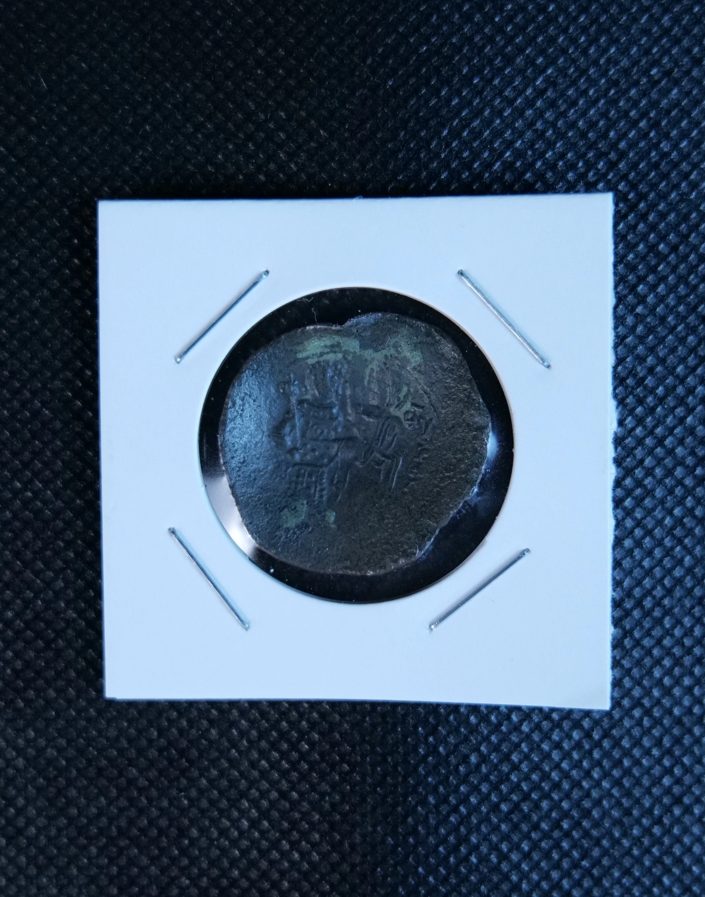

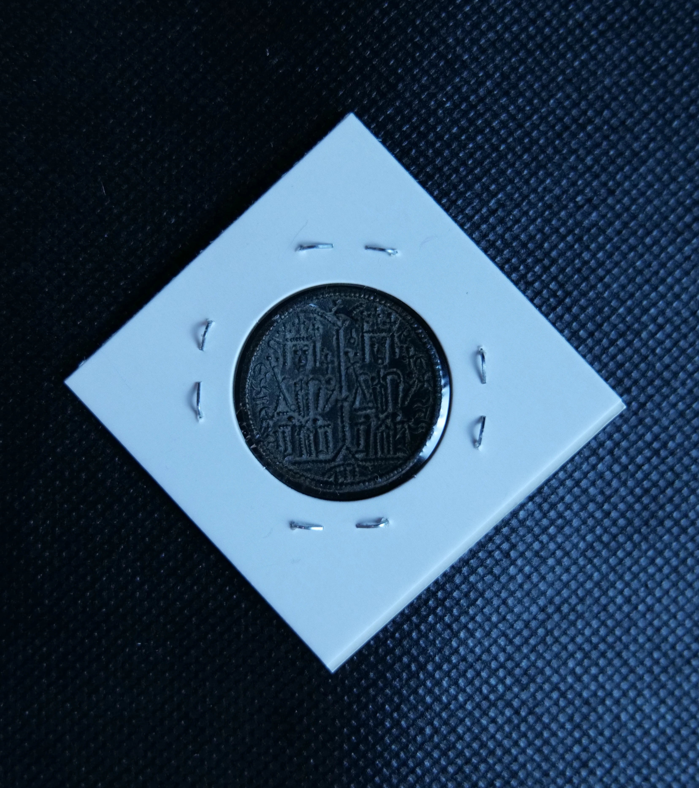

The first image above shows a Byzantine coin that I find quite interesting. I'm going to draw a parallel with a coin from the same period from Hungary (second image above). The Hungarian coin is cup-shaped, like a miniature bowl. The iconography features religious figures depicted as kings holding crosses side by side. This piece is bowl-shaped and originates from Hungary.

It was quite customary to copy coins from other countries. As Byzantine coins were generally accepted, other countries would often copy them. As you can see when you compare them side by side: these pieces are very similar.

Northern Italy, notably Florence, Venice, and Genoa, took advantage of this context to launch new hard currencies - coins with a stable precious metal content. Venice followed Florence's example by minting the ducat in 1270, a currency that was almost identical to the florin and widely used in Mediterranean trade.

The florin became the first international reserve currency, adopted in over 150 European cities before the end of the 14th century. With the creation of a large-scale Florentine banking network, led by the Medici, monetary and accounting management was thoroughly modernized, even reducing the need to physically transport gold.

That's another really interesting point. There was a time when a lot of coin shipments were lost on sea voyages. This technological advance - the registers with double-entry bookkeeping - enabled the creation of scriptural money. This made it possible to reduce the number of coin settlements and instead use a system of written entries, which greatly reduces the risk of losing money in transit.

Monetary development was also accompanied by a significant evolution in banking methods. Inspired in part by the Crusades' contact with Muslim banking practices, medieval Europe saw the emergence of rudimentary banking systems in Florence, Venice, Barcelona, and Genoa as early as the 13th century. The Knights Templar, a religious and military order, had already developed a system enabling crusaders to travel without taking their wealth with them.

They would deposit funds at a Templar office in their country and could then travel with a form of letter and collect the coins upon arrival at their crusade destination.

This meant we didn't have to carry around precious metal coins.

It was also during this period that Europe became aware of the existence of paper money in China, thanks to Marco Polo's journey in the 13th century. However, the development of banknotes would wait several centuries, as Europe preferred to perfect its metal coinage methods first. Leonardo da Vinci, close to Luca Pacioli, a renowned chartered accountant, actively contributed to the improvement of money presses, promoting faster, more uniform coin production.

We are referring to the pendulum striking technique mentioned earlier in the course. This method enabled the production of more uniform coins compared to hammer striking and, importantly, allowed for inscriptions around the edge of the coin, as I previously demonstrated. The one below is a European thaler from 1793, which clearly shows writing on the fringe.

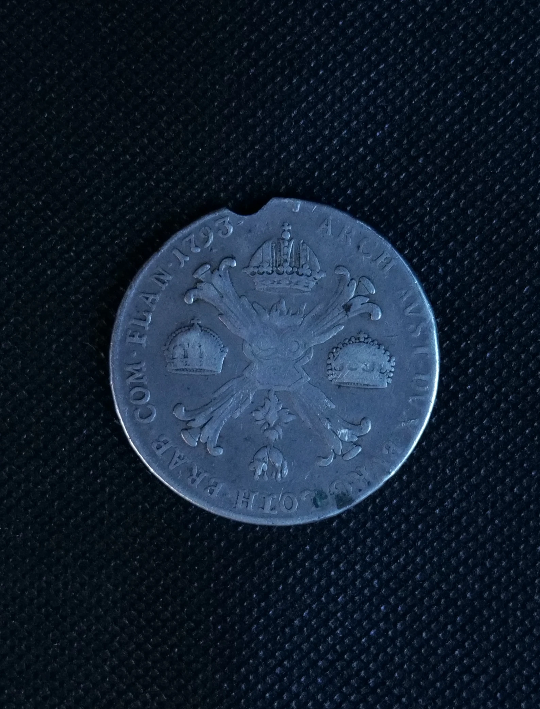

In the 15th century, however, Europe experienced a serious currency crisis, with a general deterioration in the silver content of European currencies, which fell to less than 5% around 1450.

From the 16th century onwards, the monetary center of gravity shifted to Spain, stimulated by the union of the kingdoms of Aragon and Castile, the end of the Reconquista, and the great maritime discoveries such as Christopher Columbus's in 1492. The massive influx of silver from American mines profoundly upset European and global economic balances, fuelling both inflation and new geopolitical tensions.

The Renaissance also marked a major artistic evolution in coinage, with coins such as the thaler (Joachimsthaler), the origin of the term "dollar". These large silver coins reflect the new artistic and mechanical minting techniques made possible by technical innovation from northern Europe.

Finally, the financial Renaissance ushered in the transition to economic modernity, with the development of banking, credit, and financial markets, and the emergence of the first forms of modern capitalism in the great commercial cities of Amsterdam, London, and Stockholm, laying the foundations for the international financial system as we know it today. And that's the subject of our next video.

# The seizure of money by the State

<partId>17cfb1b4-5bc1-53e0-b035-05c7cf76be92</partId>

## The evolution of the world's reserve currencies

<chapterId>d65cc352-e7ca-5f03-9b23-dd1fae5c0395</chapterId>

:::video id=82710062-8fff-426c-93af-923c08d82233:::

### The historical importance of precious metals

Welcome to this section on the emergence of reserve currencies and central banks. As the first point of this new section, we're going to focus on the evolution of global reserve currencies.

Precious metals, especially gold and silver, have long been considered the basis of wealth and power in empires. The thirst for gold has always been a dominant driving force, and it was the influx of precious metals that had the most direct and obvious effect on monetary developments in Europe. In medieval and early Renaissance times, this obsession with gold and silver was due to the difficulty of retaining value in other forms of merchandise, as well as to the strong demand from foreign powers, particularly in trade with the Orient.

Over the centuries, several empires have succeeded one another as global economic centers. The country that dominates world trade during a given period is usually awarded reserve currency status. These include:

- Spain and Portugal (15th and 16th centuries)

- The United Provinces (Netherlands) in the 17th century

- France and Great Britain in the 18th and 19th centuries

- The United States in the 20th century

### The Portuguese boom and the Real (1450-1530)

**Portugal** dominated world trade in the second half of the 15th and early 16th centuries, with the **Portuguese Real**, a silver coin of relatively uniform weight. The Portuguese, thanks to their advancements in navigation, found new sea routes to Africa, Asia, and the New World. Military forts and trading posts multiplied from Africa to China (Macau).

In response to Europe's demand for gold and silver, "the constant motivation for the great discoveries was commercial profit, particularly the pursuit of gold and silver." However, the Portuguese Empire, overextended and facing competition from the Dutch, English, and French, began to decline.

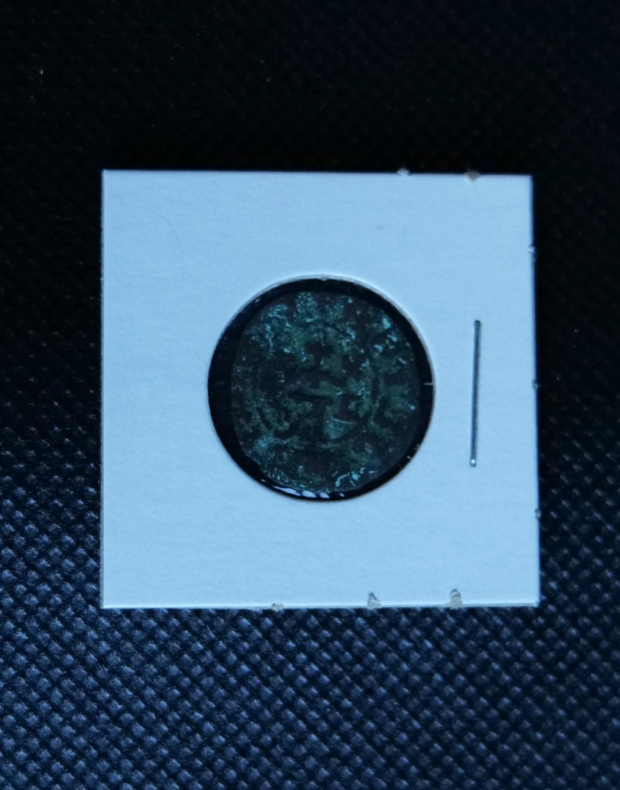

Here above you can see a Portuguese half-Real from the time of these Maritime conquests.

### The Spanish apogee and the Spanish Dollar (1535-17th century)

With the conquest of the New World, **Spain** became the dominant player. Its monarch, controlling gigantic silver mines (Potosí in Bolivia, Zacatecas in Mexico), succeeded in minting money in pure silver, thus avoiding depreciating his own currency: the **Spanish Real.**

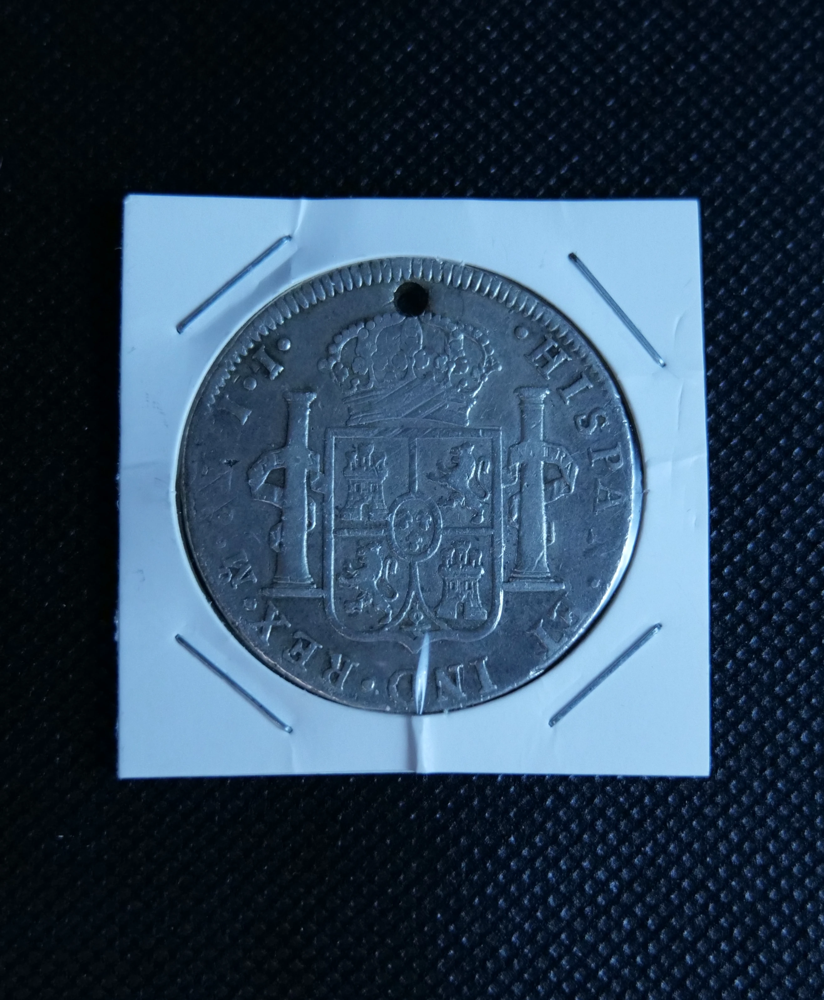

The Spanish real, also known as the "piece of eight", got its nickname because it was often cut into eighths to create smaller coins. It was also known as the **Spanish dollar**. The coin you see above dates from 1814, making it a slightly more recent example. However, the very first Spanish dollar coins were not as refined; they were hammer-struck and generally less round and crisp.

What's particularly interesting is that the Spanish dollar served as the international reserve currency at the time. The Spanish authorities also issued their own local currency, the maravedi, and regularly adjusted the money supply through recalls. For example, a copper or bronze coin initially worth one maravedi might be recalled and stamped with "2," then later with "4," and so on, potentially reaching "8." In the high-resolution photo, you can clearly see the "8" stamped on the coin. This method effectively expanded the money supply... which inevitably led to inflation.

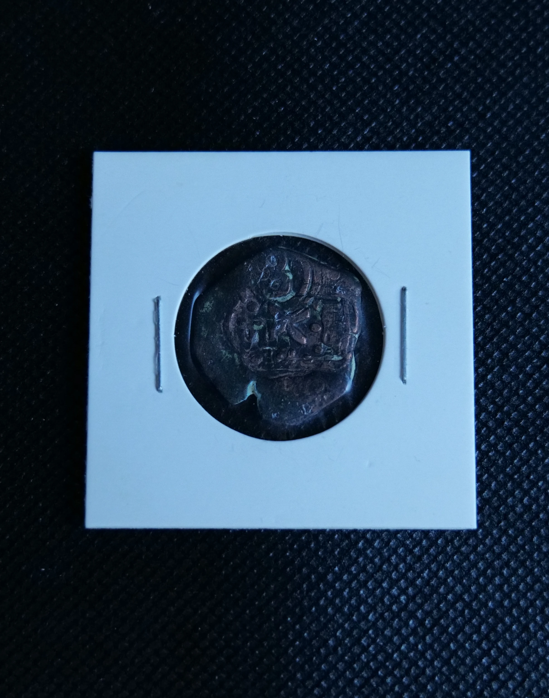

If we look at the history of reserve currencies, an interesting point emerges: empires didn't inflate their currencies as long as they retained their reserve currency status. **It was only at the end of their domination that they ended up devaluing it, losing this privilege, which was then passed on to a new empire**.

In Spain, the Spanish dollar dominated world trade for almost 200 years, particularly between China and Europe. These coins could even be found in Chinese ports. And that's where we get a wink from history: the American dollar comes directly from this currency. When the United States was formed in 1792, it passed a law to mint its own currency, and its first dollars were created on the model of the Spanish dollar, both in name and coin size.

To give you an idea of its value, an American dollar was originally a silver coin weighing almost an ounce, or between €30 and €40 in today's money, unlike the paper currency we know today. As for the Spanish dollar, it circulated so widely that it is considered the first true global currency.

However, this influx of precious metals from the Americas caused inflation in Europe. During the Price Revolution (c. 1540-1640), the cost of living in England increased sevenfold. In Spain, the abundance of silver had a perverse resource curse effect, hindering the development of solid banking institutions.

Subsequently, Spain faced numerous military conflicts (Flanders, Netherlands, Thirty Years' War), and its finances gradually collapsed. Instead of devaluing the world-renowned silver coin, successive rulers chose to default on or depreciate the copper coin (vellón) used by the local population. This is what I described earlier with the Maravedis.

### The Dutch rise (17th century)

After the Iberian apogee, **the Netherlands** emerged as a new commercial power in the 17th century. Maritime trade, the VOC (Dutch East India Company), and the founding of the **Amsterdam Stock Exchange** (inspired by the one in Antwerp) established this merchant republic as a hub.

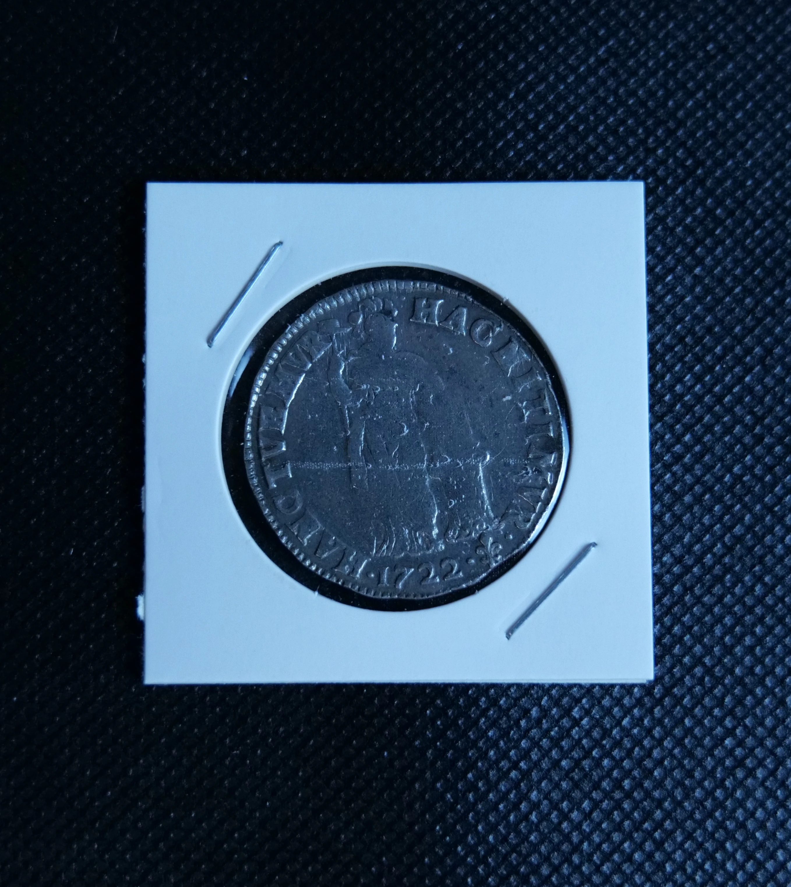

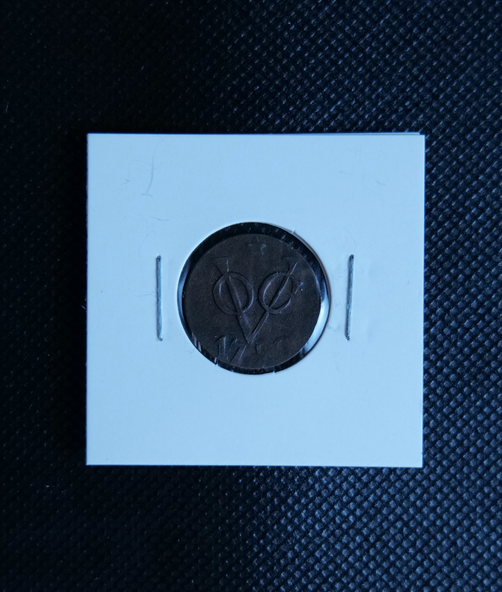

In the first photo above, you can see a Gulden from 1722 (a beautiful silver coin), while in the second, there is a coin issued by the VOC.

The VOC was an extremely powerful company for its time: it had its own army and even issued its own currency.

The Dutch invented modern capitalism, which began as a means of distributing risk in risky ventures such as expeditions to the New World or the search for new trade routes. Joint-stock companies enabled several investors to pool their money and share the risk. To facilitate these exchanges, it was then necessary to create institutions capable of negotiating and exchanging these securities. Thus, in 1602, the first joint-stock company and stock exchange were created.

Dutch currency, the **Gulden**, gained credibility thanks to its purity in silver, and then to its adoption by the Bank of Amsterdam (1609), where deposits became a preferred form of money in Europe. This is a very important point to mention. Yes, of course there were coins, but what really constituted money in those days was a form of scriptural money. In fact, much of the world's trade passed through the books of the Bank of Amsterdam. This was a real banking breakthrough: international trade was no longer necessarily conducted with physical coins, but directly through the bank's accounting records.

This period of prosperity was marked by a large influx of gold and silver, particularly from other countries practicing inflation or monetary control. There's an interesting character to mention: **Thomas Gresham**. At this time, he worked for English royalty in the Netherlands, managing the flow of money between the two countries. It was this same Gresham who left us the famous **"Gresham Law"**.

Nevertheless, the Dutch Empire also eventually ran out of steam. Wars with England, the dilution of the gulden in times of conflict, and competition from other powers (France and England) signaled the end of Dutch hegemony. After the Fourth Anglo-Dutch War (1780-84), the decline of the gulden as a reserve currency became irreversible.

### French power, ambitions and failures (17th-18th centuries)

Under Louis XIV, **France** became the greatest continental power in Europe. However, the French currency never achieved the status of a dominant reference: numerous devaluations, heavy taxation, and costly wars (the League of Augsburg, the War of the Spanish Succession, etc.) weighed heavily on the stability of the monetary system.

The first major experiment in paper money was conducted by John Law (1716-1720). The Banque Générale issued bills backed by promises of government debt. This scheme led to a speculative bubble and collapse (the Mississippi Bubble) in 1720. This disaster left France with a lasting distrust of paper money. It was this disastrous experience that led Richard Cantillon to become wealthy thanks to this system of stating principles, now known as the Cantillon effect, where money printing enriches those with access to the printing press.

When this mistrust finally faded, another French paper fiasco: revolutionary **assignats**. Issued from 1790 onwards based on the confiscation of clergy property, these assignats experienced galloping hyperinflation, making them officially the first hyperinflation in history to exceed 50% per month. In 1795, although their face value had been multiplied, they were trading at just a few percent of their initial value.

More restrictive laws sought to impose the assignat, but without success. The government tried to impose it, going so far as to threaten those who didn't accept it with death, and forcing shopkeepers to stay open. But of course, in the end, it didn't work.

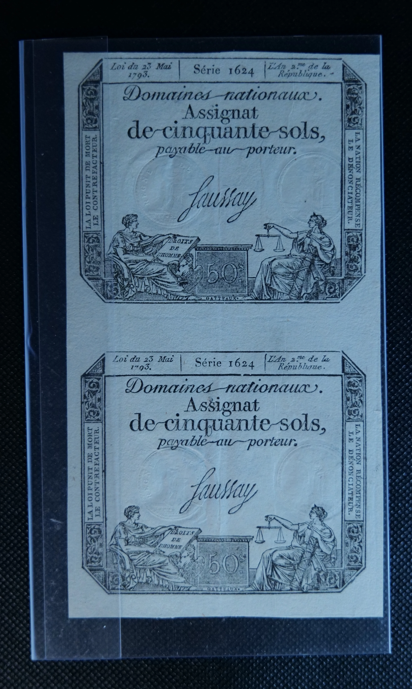

As this paper money replaced all the quality precious metal coinage, aligning with the famous Gresham's Law, a coin shortage ensued. To mint new coins, they used bell metal seized from the clergy. Here below you can see a beautiful piece of bell metal, crafted from recovered copper by melting down the coins taken from the clergy.

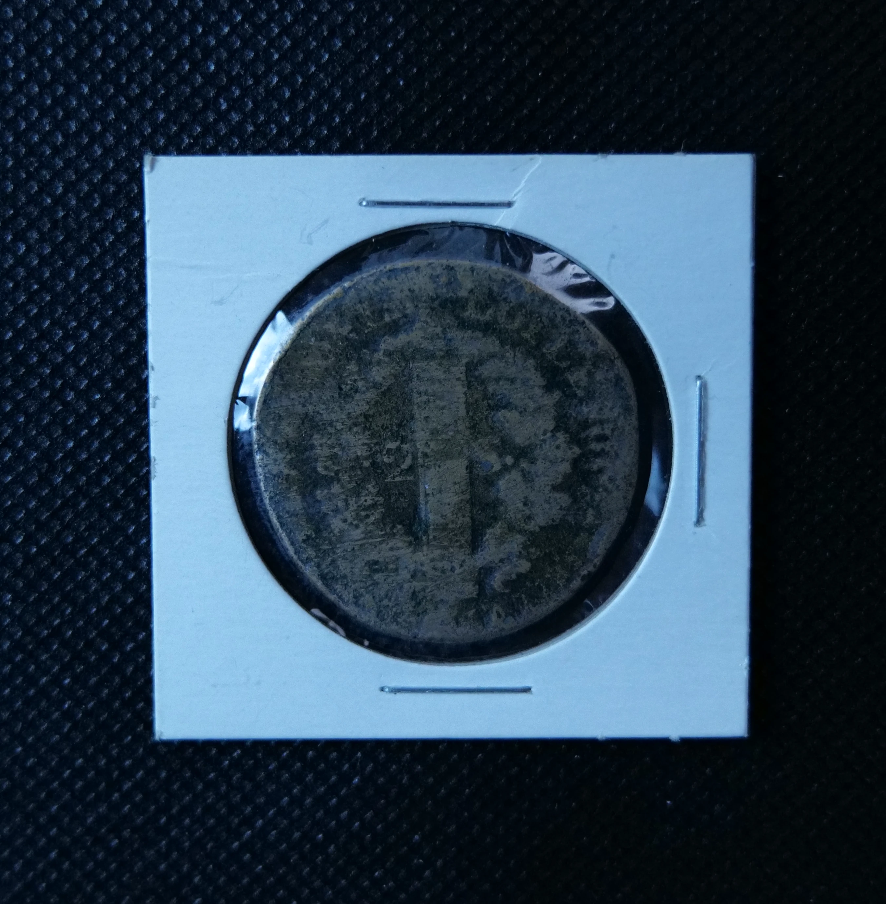

### British domination (18th - early 20th centuries)

**England**, having overtaken the Netherlands, became the dominant power in the 18th century. The pound sterling is the oldest currency still in use, originally linked to a pound of silver. Gradually, its status grew stronger, underpinned by a financial and fiscal revolution: parliamentary monarchy, strong tax-raising capacity, and the creation of the Bank of England in 1694\.

After a series of wars against France, the United Kingdom emerged victorious in 1815 (Waterloo), confirming its supremacy. Throughout the 19th century, the pound sterling acted as the world's reserve currency. At its peak, with just 2.5% of the world's population, Britain produced 20% of global income and controlled almost a quarter of the earth's surface.

The **Industrial Revolution** and the adoption of a **Gold Standard** (1717 or 1718, under the supervision of Isaac Newton at the Royal Mint) reinforced the pound's credibility. The Bank of England adopted a gold standard of 4.25 pounds per ounce of gold, allowing noteholders to convert their notes into gold.

However, the First World War (1914-1918) put an end to this system. Within weeks, all the major warring powers suspended gold convertibility. The British Empire, and later the pound, emerged from the Second World War in a weakened state, giving way to the American dollar in the 20th century.

And as an artefact, you can see some beautiful and interesting pieces below. These are monetary weights. The first one is the sovereign: the earliest representations of the pound. I only have money weights to represent these coins because I can't afford to buy a real sovereign. To weigh them, we used scales and then placed the monetary weight equivalent to the sovereign's value on the other side.
The sovereign was a monetary coin - a gold coin originally worth one pound. 

Preceding the famous sovereign was the guinea, which operated on the same principle. The guinea was named for the precious metals it contained, sourced from the region of Guinea.

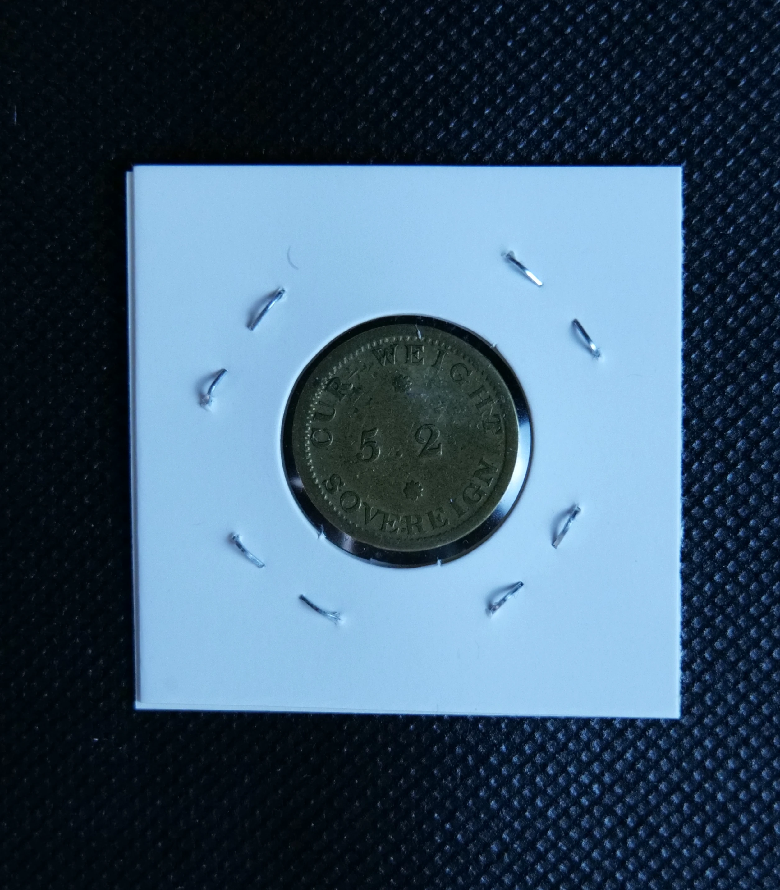

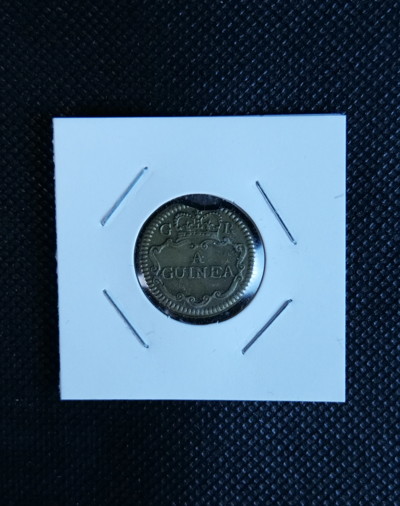

## The emergence of central banks

<chapterId>15777771-1e28-55f7-a400-69868a47079b</chapterId>

:::video id=7661b7b5-e00f-48f3-b69a-6fb2eb5ebba4:::

Following on from this section on the history of the first reserve currencies and their evolution, here's a segment on the emergence of central banks. It follows much the same path as the emergence of reserve currencies, but focuses a little more on the banking technologies of the time.

### The beginnings of banks and proto-banks

As early as the 13th century, Italians (Florence, Genoa, Venice...) developed double-entry accounting techniques. Later, **Antwerp** (16th c.) became Northern Europe's leading financial center, a role that was later taken over by **Amsterdam**, thanks to the Amsterdam Stock Exchange (1609), where VOC shares were traded.

Antwerp hosted merchant fairs where traders frequently gathered to settle debts, leading to the invention of new financial instruments. The bill below, dated 1761 and more recent, is a **promissory note**. It features handwritten details, along with inscriptions on the back, making it a magnificent artifact from that period.

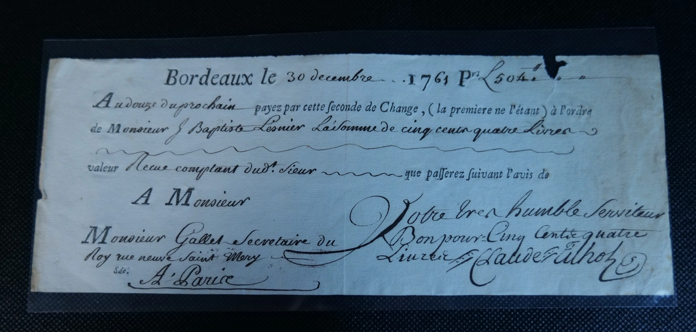

This effervescence led to the creation of more sophisticated banking institutions. **Lombard bankers** and later Dutch merchants perfected credit instruments (bills of exchange, promissory bills, etc.). The modern banking system is based on this idea: money can be credit, not just metal.

As you can see, this brings us back to our original question about the origins of money.

Does money emanate from a commodity that emerges from the need to exchange, or does it emerge from credit? Traces of this can still be found in this section.

### The Swedish example: Stockholms Banco and Riksens Ständers Bank

Let's move on to Sweden, where the very first central bank was created.

**Sweden** was a pioneer in central banking: in 1657, Johan Palmstruch created the **Stockholm Banco**, authorized to lend more than its metal reserves, thus marking the birth of fractional reserve banking. But excessive banknote issuance led to panic and a run on the bank in 1663. Well, well...

In 1668, Riksens Ständers Bank, the world's first true central bank, was founded in Stockholm. However, it too suffered from crises (1709, 1715...) linked to the abuse of banknotes, often to finance the kingdom's wars.

### John Law's failed coup

Let's head for France, where we once again find our beloved John Law.

**John Law**, a Scotsman, persuaded the Regent (Duke of Orleans) to create a private bank, the Banque Générale (1716), authorized to issue paper against gold, silver, and government debts. It became the Banque Royale (1718), and helped the Mississippi Company's shares soar.

When reality caught up with speculation, **the panic was exacerbated by the decision to ban the holding of gold and force the use of Law's notes**. Well, well...

Finally, the bubble burst in 1720, causing a collapse that ruined the credibility of paper money in France for a long time to come.

### Bank of Amsterdam, the rise of a pioneering model

We're now transported to Amsterdam in 1609, where the **Bank of Amsterdam** (Wisselbank) seized control of coin custody and convertibility in Amsterdam. It prohibited the circulation of private banknotes and enforced the deposit of metallic coins in its vaults. Little by little, they wrested control of the currency. They forbade moneychangers to keep coins with them. The moneychangers worked all day and had to deposit their coins in the Bank of Amsterdam's vaults at the end of the day. As I've mentioned, it wasn't necessarily metal coins that were used in international trade. It was scriptural money on the bank's books.

Thanks to Dutch merchant power, the bank played the role of the first de facto "central bank", stabilizing world trade. Over time, however, it granted unsecured loans to the VOC and eventually ran out of metal to back its bills. In 1790, it emerged that it had lent large sums to the VOC, and virtually declared bankruptcy, ruining the credibility of the gulden. Well, well...

### The Bank of England, founding act of modern banking

In 17th-century England, gold and silver were stored by goldsmiths, who issued receipts. This partially decentralized organization proved its limits when the Crown found itself in massive need of financing for the war against France.

In 1694, the **Bank of England (BoE)** was founded. The Bank of England was thus born of a marriage of convenience between the London business community and the government, which was desperate to find funds for the war.

The Bank obtained a monopoly on banknote issuance in England (reinforced in 1708, 1742, etc.). From then on, paper money backed by gold reserves circulated alongside coins. This is an important point for understanding the gradual takeover of money by state institutions. First, the Bank of Amsterdam prevented moneychangers from keeping coins and forced them to return them to the Bank. In England, private banks were prohibited from issuing their own bills redeemable in gold.

They did allow private banks to issue banknotes, but these could only be exchanged for Bank of England bills.

Bank of England bills, pounds sterling, were redeemable in gold. This added a third layer to the currency. So we have gold at the base, then Bank of England bills, and then private bank bills on top. Before that, private banks could issue their own bills redeemable in gold. This is another stage in the gradual takeover of currency by state institutions.

The Bank financed the State with vast loans and structured the huge public debt that financed the economic boom.

This model was consolidated over the course of the 18th and 19th centuries, to the point where the pound became the world's reserve currency, under the seal of the Bank of England and the gold standard.

**The world's reserve currencies** have followed one another over the centuries, driven by the economic, commercial, and military power of a state or empire: Portugal, Spain, the Netherlands, then Great Britain, before the United States came to dominate in the 20th century. In each case, we see a similar cycle: economic expansion, commercial success, international adoption of currency, indebtedness, costly wars, abusive use of money creation or credit, and finally decline.

**The emergence of central banks** was a gradual process. These institutions often arose in the context of costly wars, enabling the state to finance itself through debt. When the gold standard was adopted (England, 17th-19th centuries), it provided a veneer of stability, until the great world wars of the 20th century led to the gradual abandonment of gold convertibility. The power to mint money thus shifted from the royal monopoly to more complex entities, first private (goldsmiths, bankers), then semi-public (central banks), reflecting the evolution of monetary sovereignty towards institutionalized, globalized forms.

So, this is what I was describing earlier. We have often shifted the burden of sovereign debt directly to either central banks or the permission to create money by legal institutions, such as Parliament.

And the most important fact here is that **we've gone from a debt that could disappear through the bankruptcy of the sovereign to a debt that rested mainly on the shoulders of the population**.

## The road to the fiat system

<chapterId>27a98545-d350-56ee-a200-92468e6b9b33</chapterId>

:::video id=e27a753e-aeee-4307-a65c-9506aab380a1:::

We've now reached the end of this course on the history of money, and to bring it to a close, I wanted to propose two topics. The first topic is the various stages that led to our current fiat currency system. We'll be revisiting the facts from section 5 about the creation of central banks, and we'll add the concept of the US dollar, which is ultimately the current reserve currency. We'll take a look at how it evolved, how the dollar came into being, how it evolved, how it changed, what stages it went through to become a fiat system, because the origin of the dollar is a silver coin.

Then, immediately afterwards, I'm going to give you a short segment on the history of finance, to help you understand how we arrived at the welfare state. So we're going to look at two subjects: how we arrived at the fiat system, and then immediately afterwards, how the evolution of finance led us to the concept of the welfare state.

### The European foundations of modern banking

Let's go back to the 13th century with the florin. To understand how we arrived at the fiat model, we need to start with the 13th century. Alongside the florin, a technology emerged at the same time with the Medici, the concept of bills of exchange.

Then came the Antwerp stock exchange, with its concept of discounting and promissory bills.

Then, as we've seen, we had the VOC, the first stock market in Amsterdam. This marked the birth of capitalism, with company shares and the exchange of shares. The Amsterdam bank then imposed the use of deposits by decree. This meant that coins had to be deposited at the end of the day. It was the moneychangers who could no longer keep change in coin form.

Then came the creation of the Bank of England out of the need to create debt to finance the war at the end of the 17th century. At that time, private banks became the third layer of money. By the way, this whole section, from the florin to the notion of central bank creation, is extremely well summarized in Nick Bhatia's famous book "Layered Money", which I was lucky enough to translate with a few colleagues. We did a great job of translating it so that French speakers everywhere could benefit from these teachings.

So we're at the end of the 17th century. The Bank of England was created to finance the war.

The private banks took over the third layer of the currency. In fact, private bank bills were no longer redeemable in gold: it was the Bank of England's bills that were redeemable in gold. This demonstrates the seizure of the power of exchange by the institution that is the Bank of England.

Then came the panic of 1776. Everyone rushed up the money pyramid. What this means is that in 1776, there's a run on the banks, and so all the people who have third-layer paper, i.e., private bank bills, try to get Bank of England bills, and then try to get gold, but obviously there wasn't enough gold in the vaults. They declared a kind of banking holiday to avoid paying back the gold bills, and this gave rise to the concept of the lender of last resort.

### The evolution of the US dollar

We transitioned from the florin to the establishment of the Bank of England. Of course, there were the First and Second World Wars in the interim, but earlier, in 1796, developments were also occurring on the other side of the Atlantic. In 1776, America was still a British colony, and the colonies used this paper currency. Below is a Connecticut two-shilling bill from 1776.

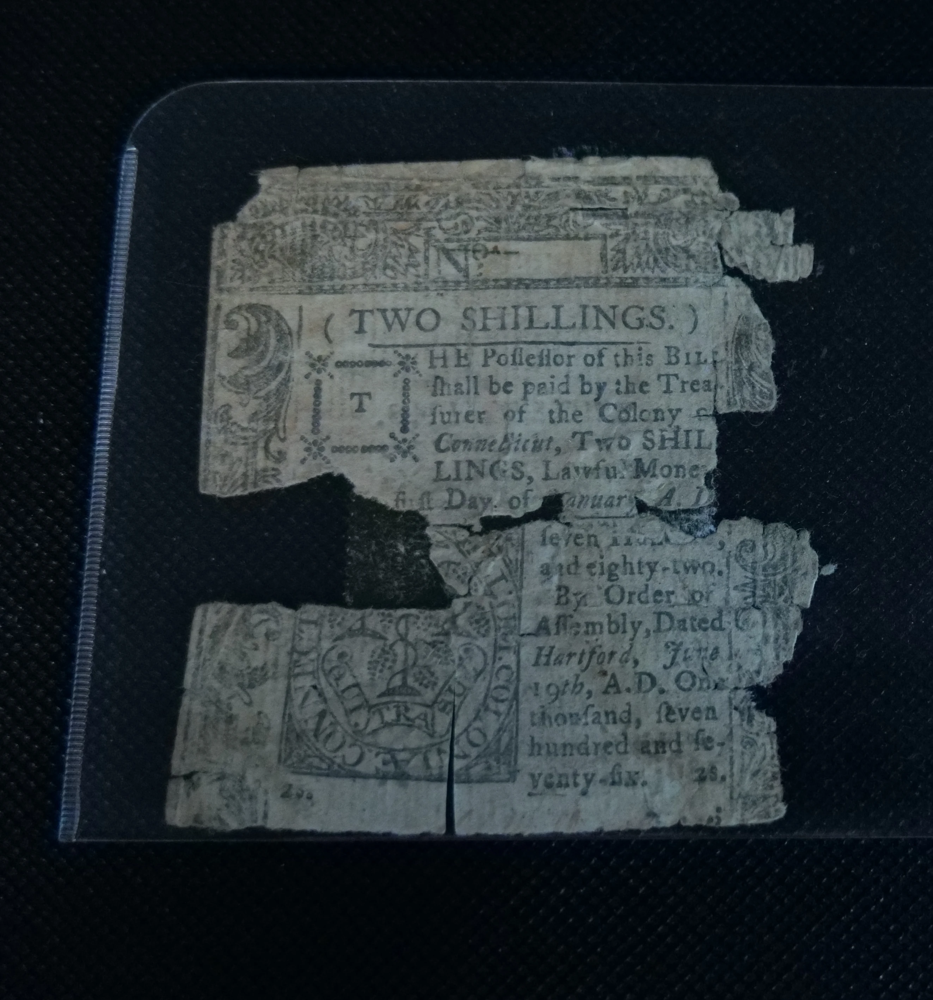

Before declaring war on England and eventually issuing their own currency, the colonies used this paper currency, alongside the Spanish dollar for cash transactions. In fact, the term "dollar" remained to indicate the American dollar.

If I'm not mistaken, in 1792 they passed a law that allowed them to coin money. As an example, the one below is an American dollar of the modern era.

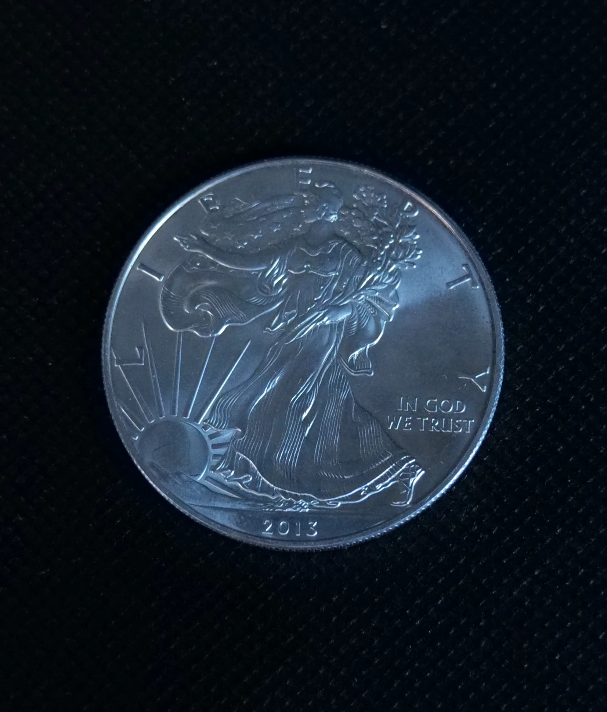

Well, obviously, it doesn't have a face value of just one dollar; it is worth around 30 or 40 dollars, as it represents an ounce of silver. Its value fluctuates based on the price of silver, typically placing it at least at 30 or 40 US dollars. Today, of course, a paper dollar retains only its face value of one dollar, but at that time, the US dollar was rooted in this silver value.

Let us talk about the Civil War in America now. The Confederates were printing money, which was hyper-inflated. This phenomenon is not included in the official Hanke-Krus list, as it did not reach a hyperinflation rate of 50%. However, it did experience a monthly inflation rate of 40%, indicating that a substantial amount of currency was printed during the war.

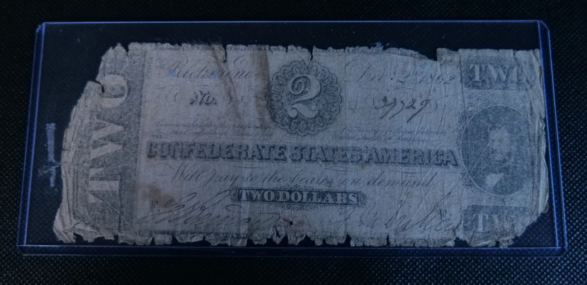

Their opponents of the north also had dollars. Just above, you could see Confederate dollars, while below you can observe Northern dollars. They were called "the greenback" because the back was green.

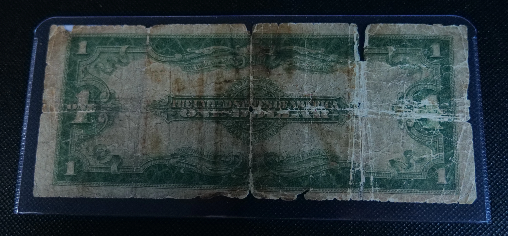

And I invite you to compare the difference in size with modern banknotes. Back then, banknotes were bigger.

As we know, the north won, so the greenback became the currency of the reunified American states. Then came the founding of the FED in 1913, and the First World War.

In the aftermath of the First World War, the last series of printed banknotes always included the words "redeemable in gold on demand". So, in 1928, $20 bought almost an ounce of gold, as the price of gold was $20.67. The bill in the image below could buy an ounce of gold in 1928.

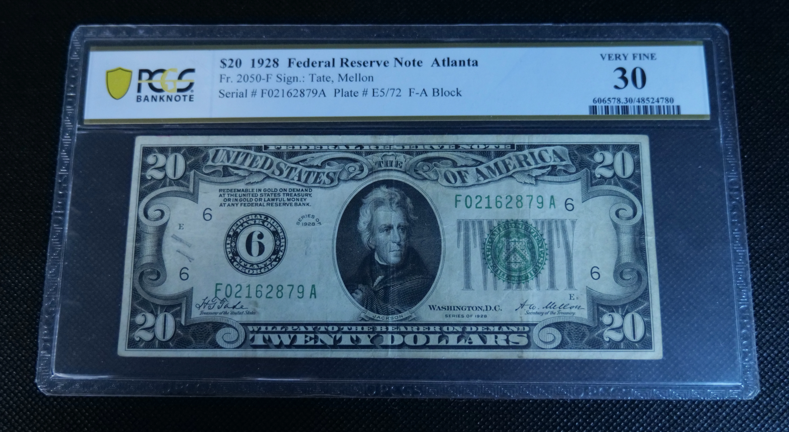

Today, an ounce of gold is worth US $3,000. So you can see the power of devaluation here, of course. It was the last bill containing the words "redeemable in gold". We'll see that right after the Executive Order 6102, they would seize all the gold. In fact, they would seize both the gold and the gold certificates. 

Here below you can see a gold certificate from 1928.

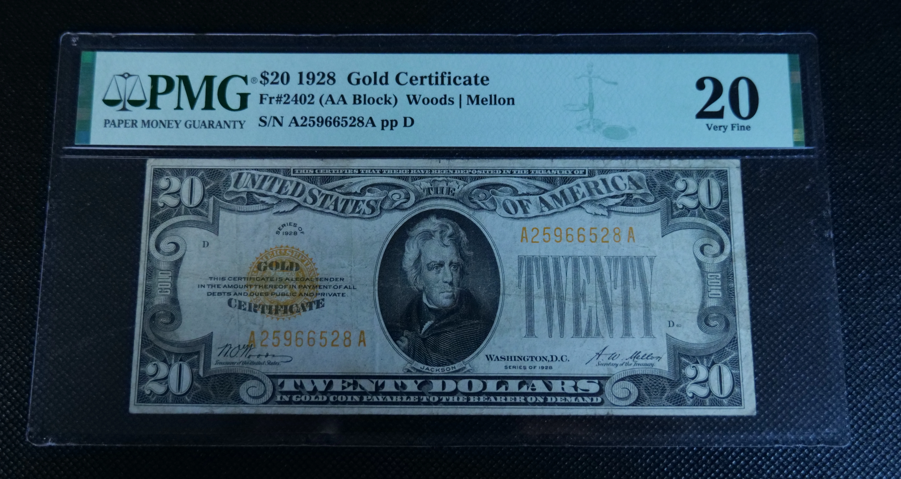

Not only was it "redeemable in gold" like the 1928 bill, it was also redeemable in gold coins: it really is a "gold certificate". They've all been seized after Executive Order 6102. Up until 1964, it was even illegal to own them. 

I'm very happy to have one.

Starting from 1964, it became illegal to own gold, until 1974, if I'm not mistaken. In the 70s, they allowed people to accumulate gold after the Nixon shock, which we'll describe shortly. In 1933, when they issued "Executive Order 6102", they seized gold and it became illegal to possess it. You received a big prison sentence if you were caught keeping your gold. During those days, every ounce of gold was exchanged for a bill similar to the one below, after 1934. 

As we said, in 1928, a dollar still had the "redeemable in gold" text on it.

After the issuance of the Executive Order 6102, they seized all the gold and exchanged $20.67 for every ounce of gold. Afterwards, the scam came to light: they issued new bills in 1934 with the printed text "this note is legal tender for all debts".

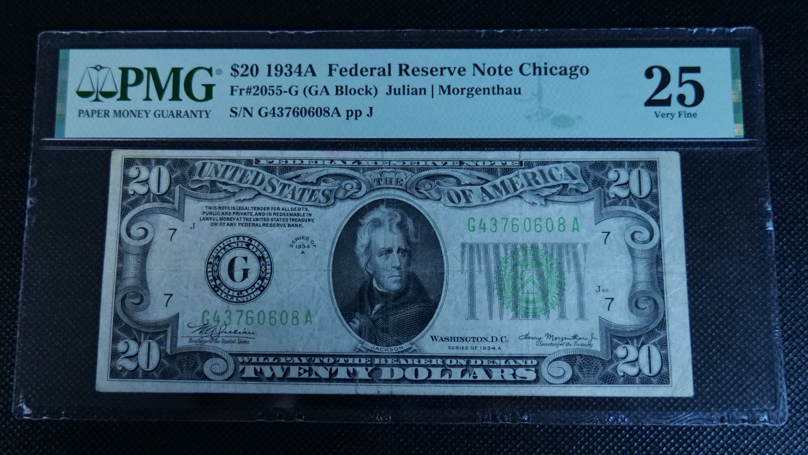

The concept of legal tender emerges here, replacing the phrase "redeemable in gold." The two bills may look identical, with only a few words changing, but the scam lies in the fact that the dollar was devalued during this period; it decreased from an ounce of gold being valued at $20.67 to $35 per ounce in 1934. It represented a devaluation of approximately 40%!

Then came the Second World War. Following the war, the Bretton Woods Agreement centralized much of the world's gold in the United States. The Americans issued banknotes in exchange, though these bills were no longer redeemable for gold by the general public. Instead, they remained exchangeable for gold at the state level.

Eventually, countries like France and Germany began to suspect that there were probably more dollar bills in circulation than gold in US vaults.

So they asked to repatriate their gold. Well, they said, "Okay, we'll do it, but it'll take a little time." In 1971, our friend Richard Nixon cut the link between banknotes and gold once and for all, blaming speculators in the process.

Gold was undervalued at $35 per ounce, a price that did not correspond to the volume of money that had been printed or its true market value. Over just a few years, the price surged from $34 to $800. Similar to historical examples, such as in Rome, where the connection between the denarius and the solidus was severed, gold was allowed to float. This fact led to a process of price discovery, resulting in gold being valued much higher in dollar terms thereafter.

### The modern fiat currency system and its implications

This part sums up how we moved from a monetary system based on silver or gold. Little by little, institutions gained more and more power over money. Ultimately, a unilateral decision completely severed the link between precious metals and money, following an over-issuance.

As a result, there is no longer any link between gold and banknotes or scriptural money. And it's not even a fractional reserve system - that's an outdated concept. Instead, private banks issue and create money through bank credit. Money is mainly created this way and is correlated to the key interest rate set by the central bank.

There really is no limit. There are no mandatory reserve levels anymore, at least in America and Canada. The only reserve is the need for banks to arrange to be able to respond to interbank exchanges so as not to run out of liquidity.

They just need to make sure they can make these transfers, but there's no 3%, 1%, 10% compulsory reserve. We've truly moved away from the fractional reserve concept. Now, it's central banks, governments through fiscal deficits, central banks through quantitative easing (QE), and private banks through the creation of bank loans that can increase the total money supply and, in my opinion, cause inflation.

To understand the link between money and inflation, I recommend a course I have on Plan ₿ Network dedicated to this subject. You will learn the difference between price increases, which is what we see in life, and inflation. They're not the same thing. In fact, when we refer to inflation, we're often talking about price increases, not inflation itself. Inflation is a fairly precise concept, explained by the increase in the money supply.

https://planb.academy/courses/hyperinflation-case-studies-caa75343-ac90-4249-bcca-0e2e57c3a0f1

To conclude this section on the fiat world, I'd like to point out a resource to help you better understand the phenomena I've just explained, such as inflation.

Thank you for your attention.

## The history of money bubbles

<chapterId>b6451c46-917d-11f0-97de-6bc5081765fa</chapterId>

:::video id=5967d9a6-aae4-4b84-a283-71b1b735bca4:::

### The invention of paper money and the first great bubble

With the creation of central banks in the 18th century, a real revolution was born: magic money in the form of banknotes. The most striking example in France is that of John Law. This Scotsman, exiled in Paris, proposed to the regent, the Duc d'Orléans, a solution to the bankruptcy of the royal finances by creating a state bank and a colonial trading company: the famous **Banque Royale** and the **Compagnie du Mississippi**.

With this system, Law linked paper money to his company's shares. The more banknotes circulated, the higher the value of the shares, and the more solid the bank seemed to be... until speculation outstripped reality. The bubble burst suddenly in 1720, ruining the nobility, the bourgeoisie, and much of Europe, which had come to speculate on rue Quincampoix. The result: a lasting distrust of paper money in France, and Europe's first lesson in speculative bubbles.

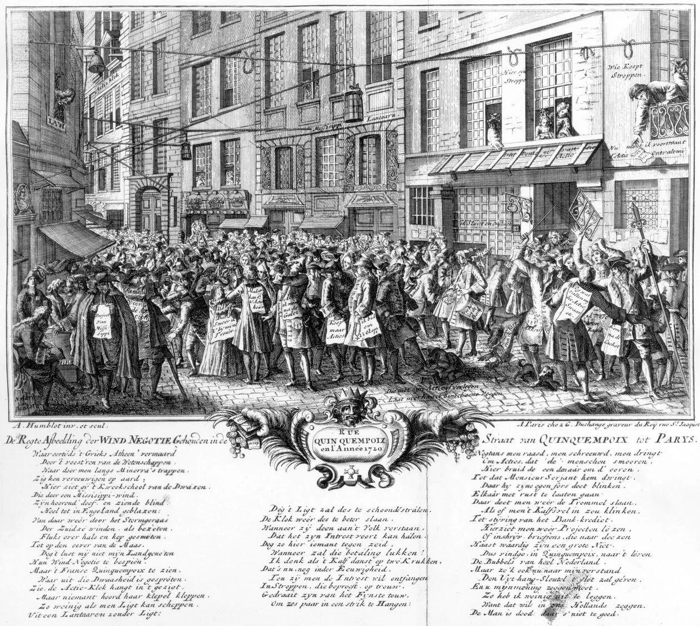

### When land becomes "collateral"

A century later, the French Revolution broke new ground with **assignats**, a currency backed by seized Church property. An attractive idea on paper - transforming land into monetary collateral - but ineffective: land is neither liquid nor divisible. The result: hyperinflation, multiple prohibitions on land use, uncontrolled inflation, and shortages.

Napoleon, deeply affected by this chaos, re-established gold and silver as the monetary basis in 1800 with the creation of the Banque de France, thereby guaranteeing the regular pay of his armies. A pragmatic way to regain confidence: pay in hard currency.

### The Roaring Twenties and the Great Depression of 1929

Let's skip two centuries. After the First World War, governments financed the effort through inflation and the suspension of gold. In the 1920s, the American Fed pursued an overly accommodating monetary policy to support the British pound. The result: easy credit, unbridled speculation on Wall Street, share purchases on credit, and the emergence of a real estate and banking bubble.

When the machine went haywire, the crash of 1929 was inevitable: massive bank failures, record unemployment, and queues at soup kitchens. This gave rise to the persistent misconception that **all deflation is bad**, whereas we need to distinguish between deflation through growth (healthy) and deflation through debt (devastating).

### Asia in the 90s and the domino effect

In the 1990s, the "Asian miracle" had the world dreaming. Exchange rates were pegged to the dollar, growth was at 8-10%, and Western capital was pouring in. All was well... until the tide receded. Bankruptcies cascaded, currencies devalued by 80%, and investors were ruined. The IMF had to intervene, imposing painful reforms. The same scenario as always: abundant capital, credit-fed bubbles, then collapse.

### 2008 and the era of the permanent bubble

The Internet bubble (2000) was followed by the subprime real estate bubble. Securitization transformed bank loans into "triple-A" financial products, spread all over the world. The promise: eliminate risk by diluting it. The reality: all risks were in fact correlated. When real estate collapsed, so did the entire global banking system.

The result: massive public bailouts, quantitative easing and zero interest rates. And with it, a headlong rush: each crisis will no longer purge the excesses, but will be covered by ever more debt and money printing. This is what led to the current situation: **the "everything bubble"**, where everything - stocks, real estate, art, crypto, even Pokémon cards - inflates artificially.

### The eternal return of magic money

From one century to the next, one constant emerges: as soon as a society believes it can create wealth with money instead of producing real goods, bubbles appear. From John Law to 2008, from the rue Quincampoix to Wall Street, the process repeats itself: euphoria, credit, boom, and bust.

And in the end, invariably, when nobody trusts paper anymore, people look for something else - gold, land, safe havens... or new currencies. Yesterday Napoleon imposed metal, today some see Bitcoin as the successor.

The history of finance is a never-ending cycle: print, speculate, collapse. Until the next bubble.

## Money and violence

<chapterId>9486fe64-854f-5e17-86b3-8873baca39a8</chapterId>

:::video id=bd6d0807-2d8f-4637-a0f5-1e990e5c0d0f:::

This short section will revisit many of the events we've already seen throughout the course, summarizing a few anecdotes that I find interesting.

### Technology and violence

Here are a few anecdotes that we've probably already talked about in the course. They serve to introduce a very fascinating discussion I had with Theo about a lecture he gave at B-Ondy, which I found very interesting in terms of how technological advances affect the relationship of violence between the population and the State.

### Money and state coercion

To introduce this section, I'm going to give you a brief and non-exhaustive list, just to remind you of the events we've probably already covered in the course.

One link I can already make with money and violence is that when it comes to worthless paper money that can be printed ad infinitum, it often comes with all kinds of rules and all kinds of threats. We can already talk about the assignats, where it was literally written on the banknotes that counterfeiters were threatened with death. It's easy to find in the legal texts of the time death threats for those who didn't accept this famous paper money.

To remain in France, in one of the legal texts I was able to obtain from the Revolutionary era, I saw that the "per diem" for transporting and operating the guillotine was described in the currency-related sections. I found this rather zany.

We've also talked about coinage in China, with the state supervising the minting. We saw in a section at the beginning of the course that when coins, some of which were less beautiful, were discarded, there were legal consequences.

There's also an anecdote about a king in England who ended up cutting off the hands of those who minted money if they didn't behave as he expected.

Also, in China, I've read about the seizure of copper from Buddhist monasteries. At a time when copper was gaining in value and destabilizing their economy - which was based on a form of fiat money that had little to do with the metal's value - they resorted to finding a place where there was wealth and seized the copper from monasteries.

The same applied to monasteries in England during the English Reformation. When the famous king quarreled with the Pope over his divorce, there was another reason behind it all: he took advantage of the abolition of the monasteries to seize the wealth contained in these ecclesiastical organizations.

During the French Revolution, they seized all the Church's assets. They saw beautiful coins created from melted-down church bells.

If we go back even further, one of the most explicit notions of economic violence and freedom, of liberticidal laws, is **Diocletian with his hereditary caste which was directly linked to the fact that the peasants no longer wanted to accept the devalued currency**. They wanted to leave their work as peasants, and Diocletian reacted simply by telling them, "you can't leave your land, and neither can your children". The same thing applied to the soldiers.

I think that's a pretty explicit form of violence. I could conclude by talking about the Knights Templar or a French king. When the Knights Templar settled in France, I imagine he saw the manna of Templar wealth and had state funding problems. He sued the Templar Order, and some of them were able to walk away with part of the treasure, which has given rise to a very interesting show in the U.S. or Canada. I don't know who produced it, but it's called *The Mystery of Oak Island*. It's about people who think there's a Templar treasure buried on an island in Canada, in the Maritimes, and they've been drilling for years - maybe even more than a decade - to make some kind of well. They've found a well with lots of galleries, and they're looking for a treasure buried by the Knights Templar on this island, which is the subject of this TV show. I salute my father, who is a big fan of this show.

So there you have it: a very quick list of facts we've seen during this course which, I think, raise the link with violence. I'll leave you with the next part from Theo, who's going to tell us a very interesting story about technological change and the balance of power between the plebs and the authorities.

Thank you!

## The economic consequences of organized violence

<chapterId>66bd4674-2159-5489-ad4b-ec5e3fb691af</chapterId>

:::video id=c8b063c6-aeb4-4a94-9027-b11d369e71a4:::

### Organized violence and the evolution of the state

Historian Frederic C. Lane proposes a revolutionary thesis: the anatomy of the state throughout history is shaped by the technologies used to project violence. Starting from the Weberian principle that the state holds a monopoly on legitimate violence, Lane observes that this monopoly - paradoxically more efficient than competition in this field - evolves according to the relationship between the cost of attack and the cost of defense.

This analysis, taken up by the authors of "The Sovereign Individual" (1997), explains the historical mutations in political organization: from the medieval feudal system to the city-states of the Renaissance, then to the industrial nation-states and finally to the modern welfare states. Each transition corresponds to a major technological breakthrough in the exercise of violence, occurring approximately every 400-500 years.

### Medieval balance

In the Middle Ages, the agrarian economy was over 90% dominant. The peasant, literally rooted to his land, could not flee from the lord and his knights. Military technology - hand-forged armor, years of sword training - was extremely expensive. This asymmetry massively favored attack over defense.

The immobile agricultural producer becomes the captive of the local monopolist of violence. His capacity for tax extraction reaches new heights - although, paradoxically, medieval taxes remain modest compared to the 78% of compulsory levies in modern times. The lord can tax at will, because the peasant can neither resist nor leave.

### The Merchant Renaissance

The emergence of Hanseatic trade in the North and Mediterranean trade in the South transformed the situation. Merchants, the main creators of added value, possessed mobile capital - their ships. They needed only light maritime militias, as the seas were difficult to police. Above all, they could easily migrate to a neighboring port if taxation becomes excessive.

This mobility created tax competition between city-states. Venice, Genoa and Bruges had to offer the most liberal framework possible: reliable contracts, quality currency, insurance, minimal taxation. Princes had to seduce rather than coerce. The symmetry reverses: defense (through flight) becomes easier than attack.

### The industrial era

The Industrial Revolution brought with it a configuration akin to feudalism. Factories, railroads and assembly lines represent massive, immobile investments. Henry Ford was unable to relocate his plants in the face of taxation. Workers, concentrated in industrial cities, unionized to negotiate collectively rather than migrate individually.

The "welfare state" emerged: industrial planning (Japan, Korea), military protection of infrastructures, minimum social benefits for the workforce. The Second World War illustrated this vulnerability: bombing enemy factories became the dominant strategy. The concentration of physical capital enabled massive tax extraction to finance the welfare state.

### The microprocessor revolution

Three technological innovations are now upsetting these age-old balances. The microprocessor is transforming warfare: an operator in Nevada pilots a drone in Afghanistan with surgical precision. The Gulf War (1991) demonstrated this breakthrough: the world's fourth-largest army (Iraq) was wiped out in 45 days, with fewer than 200 deaths on the coalition side. Technological superiority made frontal attack impossible.

The Internet and asymmetric cryptography are revolutionizing the creation of value. A developer can work from anywhere with a MacBook and Starlink, exporting their production instantly and free of charge. Digital nomads escape geographical captivity, pitting states against each other in a way not seen since the Renaissance.

Bitcoin represents the culmination of this logic: a currency freed from the State, protected by an inviolable cryptographic shield. Wealth becomes defensible against any physical force. The individual regains the ability to defend themselves against state monopoly.

### The collapse of the Westphalian model

Western welfare states, designed for the industrial age, are becoming obsolete. Value creators - developers, artists, financiers - are migrating to Singapore, Dubai or El Salvador, preferring fewer public services in exchange for minimal taxation. Modern giants like Apple and Tether need neither offices nor physical infrastructure.

This brain drain creates a spiral: fewer net contributors, degraded public services, increased taxation on those who stay, and accelerated departures. States must radically downsize or go bankrupt. Fragmentation into small, competitive jurisdictions - a new model of digital city-states - seems inevitable.

History teaches us that these transitions take generations. But Bitcoin's separation of currency and state could accelerate the process. Individuals now vote with their feet and their cryptographic wallets, redrawing the map of global power along lines we're only beginning to perceive.

## A very short history of finance

<chapterId>1d37fff1-a091-5034-8e71-4af590b8ffce</chapterId>

:::video id=fdfabbc6-e4d8-463a-8522-19176f8fb460:::

Following this account of the history of money, which takes us right up to the fiat system, I'd like to quickly and succinctly explain the evolution of finance that eventually led to the welfare state. Initially, in Roman times, we had coins.

Coins were a financial technology that allowed the empire to pay soldiers, expand, and trade. It worked very well, except that eventually there were too many devaluations. At some point when they stopped expanding and stopped getting spoils from their wars and territory expansion, their system collapsed.

### The evolution of financial technologies

Then came the Middle Ages, when there was very little evolution until the Florin, which brought back a stable currency, and banking developments in Italy and Antwerp, where the concept of "time value of money" was developed - in other words, discounting. They developed discounting to create a form of paper money in which a "promissory note" was issued, i.e., a promise that at a later date one would be able to recover $100 plus an interest rate.

This system created a financial technology that allows the holder to sell the note before the end of the term, so if you sell it after 4 months out of a 6-month term, the person will actually pay a premium to compensate for the loss of yield for the remaining 2 months.

It was a financial technology developed in Antwerp and Amsterdam at the time. Later, we saw the evolution of central banks and the notion of lender of last resort. It can be argued that during the Bank of Amsterdam , the use of coins in international trade was abandoned in favor of scriptural money.

Later, in the 18th century, in terms of financial technology, we can talk about insurance. So there's an anecdote that's very well told in Neil Ferguson's book "The Ascent of Money". The first insurance company to be born was called **Scottish Widowss**, and essentially, it was the clergy who wanted to develop insurance for priests who sometimes died earlier, died suddenly. The clergy, at the time, were looking after their wives and offspring in Scotland for a year. And so the clergy found this one-year period perhaps a little too short. As a result, **they invented actuarial calculations** to literally calculate the number of contributors necessary for the system to cover its costs, depending on the number of priests who died prematurely.

They developed actuarial calculations to say "Okay, well, each priest gives us this amount. Then, if the priest dies, well, the insurance will cover the costs to ensure the survival of his wife and children until they are self-sufficient." So it was the first insurance company called "Scottish Widows" that popularized this system, and where it was deployed.

### From private insurance to the welfare state

So insurance is part of the history of financial technology. And this brings me to the concept of the welfare state, which is that private insurance eventually came up against a problem, a notion of optimization, where we say to ourselves, if we offer health insurance to people who are healthy, they may have less interest in paying the premium because they say to themselves, "I'm healthy, I won't get sick". On the other hand, people who know they're sick will certainly want to subscribe.

This system creates an imbalance between the number of sick people who will take out health insurance, as opposed to healthy people who may take out less. So there's a sort of imbalance: if you calculate the figures, they wouldn't balance out because you probably wouldn't be able to insure enough healthy people to offset the costs. In economics, this is the concept of **moral hazard**.

One of the ideas that's been put forward is to make insurance compulsory. If everyone is obliged to contribute, it rebalances the whole thing and both healthy and unhealthy people will contribute, distributing the risks to the largest population.

And so, in many parts of the world, the state has said, "Well, we'll take care of that". While I'm not an expert on this issue, I can see that this same reasoning is probably applied to all sorts of other forms of insurance, such as unemployment insurance. There is a desire to simplify and optimize, based on the idea that it will be simpler if there's just one organization to take care of it.

In my opinion, this led to a centralization of all these insurance concepts, and ultimately to the birth of the welfare state, where all these financial concepts that were originally private enterprises, private initiatives to meet an insurance market need to distribute risk among the population, were seized upon by the state for reasons that are probably quite logical in relation to moral hazard and the desire to optimize.

### Alternative models and reflections on state monopolies

Ultimately, in some countries like Canada, we end up with several types of insurance - health insurance, unemployment insurance - that are state monopolies.

I can give you an example I know. In Switzerland, the system is a bit different. There are private mutual insurance companies and private hospitals, so you can choose your mutual insurance company, you can choose your package within your mutual insurance company. You still get relatively universal services, even if a large part of this system remains private.

So I think it's possible that it's also privately operated. But everything I wanted to describe to you, in fact, is not a statement to express whether one system is better than the other, it was rather to explain to you that in reading about the history of finance, I realized why in the West, particularly in France, particularly in Canada, the State wanted to take control of these financial principles.

The point I wanted to make is that the concept of insurance is first and foremost an evolution of finance, and as governments are sometimes so good at doing, they will try to take control of it, just as they have tried to take control of money, for several reasons. One reason, incidentally, is the concept of the lender of last resort.

The idea is that it's much better if there's a big institution behind it that distributes the risk more widely. That was the initial initiative behind the notion of lender of last resort, where this institution could actually choose institutions that were strong enough to survive and prevent them from collapsing by lending them money.

At the time, there was a real analysis when this concept finally appeared for the first time, but what ended up happening is that we save everyone, "too big to fail", it applies to almost all the banks because there is centralization, and also to all the big companies. In the end, we see that it's still a concept that is applied "at large" by the State, similar to the concept of insurance that I've just described to you.

Ultimately, the state decides that it's going to take care of everything, turning a financial technology created in Scotland to solve a specific problem into the vast welfare state we know today. It uses actuarial financial principles to offer services to its population in need. However, we can agree that the monopolies arising from this system create all sorts of problems, which we are currently experiencing in countries like Canada and France. Fortunately, different models exist, such as the one in Switzerland.

We simply have to realize that this concept of the welfare state emanates from finance. This realization suggests that we can explore avenues other than the famous state monopolies, and I would even apply this reasoning to the concept of central banks as lenders of last resort - but that's a subject for another time.

# Final section

<partId>9bada469-7ef0-511a-9eaa-f8eb66d5906f</partId>

## Evaluate this course

<chapterId>a9494e2b-8a4d-5811-8a7b-b4a91fb22778</chapterId>

<isCourseReview>true</isCourseReview>

## Conclusion

<chapterId>1094e793-b4c6-5782-aa4a-71cde00ce7c0</chapterId>

<isCourseConclusion>true</isCourseConclusion>
