# Un viaje por la historia de la moneda

Este cautivador curso le llevará a explorar la fascinante evolución del dinero desde las primeras civilizaciones hasta nuestro sistema monetario actual. Cruzaremos las épocas, desde el Neolítico hasta los tiempos modernos, descubriendo cómo el dinero ha moldeado y ha sido moldeado por las grandes civilizaciones humanas. Desde el proto-dinero mesopotámico hasta las criptomonedas, las monedas lidias, el florín renacentista y el advenimiento de la banca central, este curso ofrece una perspectiva completa de uno de los pilares fundamentales de nuestras sociedades.

+++
# Introducción

<partId>59878a67-8a1d-5d6b-af41-5b847c14363c</partId>

## Introducción a la Historia del Dinero

<chapterId>ca53597e-be9a-5261-a55f-11fac8504a68</chapterId>

:::video id=08ff35ca-8a40-4286-abaf-71283faf6e78:::

Bienvenido a este curso sobre la historia del dinero. Como sugiere el título, vamos a explorar juntos la evolución histórica de las monedas. Desde el Neolítico hasta nuestros días, veremos los principales imperios y civilizaciones del pasado.

Sin embargo, este curso no se limita a una simple cronología de fechas o acontecimientos históricos. Más bien, nuestro verdadero objetivo es proporcionar una comprensión en profundidad de los conceptos fundamentales implicados en la aparición del dinero, o mejor dicho, de las monedas.

### Conceptos fundamentales a explorar

Así que estamos hablando de emergencia: la emergencia de las propias monedas, de los sistemas monetarios, de los bancos, del papel moneda, de los bancos centrales y, finalmente, la emergencia del actual sistema monetario "fiat".

Comenzamos nuestro viaje por las protodivisas con la aparición del dinero por deudas y las unidades de cuenta en Mesopotamia, así como otros sistemas como la dote y el dinero de sangre en las sociedades primitivas. También veremos cómo ya existían verdaderos sistemas monetarios en el antiguo Egipto, mucho antes del Reino Medio.

A continuación, pasaremos a la aparición de las primeras monedas en Lidia, un momento clave considerado a menudo como el verdadero inicio del dinero según los manuales de economía. Examinaremos cómo estas monedas pudieron difundirse gracias a los persas, Alejandro Magno y luego Roma, antes de imponerse, dominar y derrumbarse definitivamente.

A partir de ahí, armados con todo lo que hemos aprendido, nos tomaremos el tiempo necesario para reflexionar juntos sobre la propia definición de dinero, yendo más allá de ideas preconcebidas como "el dinero es siempre una deuda" o "el dinero es siempre una mercancía". En realidad, el dinero es tanto un bien como una convención social. En particular, debatiremos el concepto de prima monetaria e intentaremos unificar las distintas teorías que explican la aparición del dinero.

### Periodos clave e innovaciones monetarias

A continuación pasamos a un periodo convulso, marcado por una cierta inestabilidad en términos monetarios, que sin embargo vio surgir innovaciones tan llamativas como el penique inglés, utilizado para sobornar a los invasores daneses, y la libra de Carlomagno, cuyo recuerdo persiste aún hoy en algunos billetes modernos.

También veremos cómo las Cruzadas vieron surgir los primeros sistemas de transferencia de dinero a distancia. A continuación, analizaremos el impacto del florín, la moneda que acompañó al Renacimiento, y la llegada de metales preciosos de América, que tuvo un profundo efecto en los precios europeos.

Analizaremos en detalle la aparición del papel moneda y la banca central, estableciendo paralelismos con la historia de las crisis financieras y sus repercusiones, a menudo violentas.

Por último, trazaremos un paralelismo con nuestro sistema monetario contemporáneo, explorando sus consecuencias y recorriendo la historia de las finanzas para comprender mejor cómo hemos llegado al actual Estado del bienestar.

Y, como extra, también analizaremos los numerosos y fascinantes vínculos etimológicos relacionados con el dinero, que siguen afectando a nuestra vida cotidiana en diferentes idiomas.

### Estructura del curso

Este curso se divide en tres partes principales.

La Parte I examina la aparición del dinero, la Parte II el renacimiento del dinero y su caída, y la Parte III muestra cómo las instituciones estatales o el Estado fueron asumiendo gradualmente el control del dinero, hasta desembocar en el actual sistema fiduciario.

Gracias y que aproveche

# La aparición de los intercambios

<partId>da5e4981-9ea5-5208-beab-3b75c9043632</partId>

## Del australopiteco al hombre moderno

<chapterId>34a773aa-f2d3-5c26-8be4-f2cd79ed6fbc</chapterId>

:::video id=4f333013-4b2a-42ab-8761-593fafc971ca:::

### Por qué empezar en el Neolítico

¿Por qué remontarse hasta el Neolítico para hablar de dinero? La respuesta es sencilla: no podemos entender del todo la aparición del dinero sin analizar también la aparición de las propias civilizaciones. Para entender por qué surgieron los primeros sistemas monetarios, debemos comprender qué llevó a los grupos de cazadores-recolectores nómadas a establecerse.

Una tribu sin división del trabajo, sin especialización, en la que cada individuo es responsable de producir lo que necesita, sencillamente no necesita dinero. Del mismo modo, una comunidad agrícola que sólo practica una agricultura de subsistencia, en la que cada persona cultiva para sí misma, no siente aún la necesidad de un intermediario de intercambio universal.

### Sedentarización y sus consecuencias

Por eso me parece interesante iniciar nuestra exploración en el Neolítico. Veremos cómo la sedentarización dio lugar gradualmente a las aldeas, luego a las ciudades y finalmente a las grandes civilizaciones. Fue esta sedentarización y la producción de excedentes alimentarios lo que hizo posible la especialización del trabajo, creando el terreno fértil esencial para la aparición y evolución de los primeros conceptos monetarios.

Al igual que las interacciones humanas dan lugar al lenguaje, podemos considerar que el dinero aparece de forma natural, o no (como con los incas y los espartanos), en el curso de la formación y organización de las civilizaciones. En mi opinión, la aparición o no del dinero tiene todo que ver con la forma de organización social y económica de cada sociedad.

### Cronología de la evolución humana

Pero antes, veamos un contexto histórico aún más amplio.

Como en toda primera presentación, voy a hacer exactamente lo contrario de lo que dije en la introducción del curso y a darles una lista de fechas y acontecimientos históricos que se suceden unos a otros. La idea aquí es situar la aparición del dinero en su contexto histórico, en relación con otros avances humanos como la cocción de los alimentos, la rueda, la domesticación de ciertos cereales y animales, la construcción de las pirámides y la fundación de las primeras ciudades.

Echemos un vistazo a la evolución de la humanidad desde la prehistoria.

Panorama de la evolución humana desde el Australopithecus hasta el hombre moderno, siguiendo los avances tecnológicos y los movimientos de población hasta el Neolítico.

### Contexto histórico de la humanidad

- hace 3 millones de años** - Aparición del *Australopithecus*.
- hace 2 millones de años** - Los homínidos comienzan a abandonar África.
- 1.hace 6 millones de años** - Los homínidos llegan al sur de Europa y Asia.
- hace 1 millón de años** - Primera prueba de cocina doméstica con fuego (huesos carbonizados y restos vegetales en la cueva de Wonderwerk, Sudáfrica).
- Alrededor de 400.000 a.C.** - Los neandertales viven en Europa y Asia.
- Alrededor de 300.000 a.C** - Aparición del *Homo sapiens*.
- hace 80.000 años** - El *Homo sapiens* comienza a emigrar a todas las partes del mundo.
- hace 73.000 años** - Cuevas de Blombos en Sudáfrica (formas artísticas más antiguas conocidas).
- hace 50.000 años** - El *Homo sapiens* llegó a Europa.
- hace 30.000 años** - Pinturas rupestres de la cueva de Chauvet (Francia).
- hace 15.000 años** - Pinturas rupestres de Lascaux en Francia y arte rupestre australiano.
- Hacia el 9000 a.C.** - Domesticación de la cebada en el Creciente Fértil.
- Alrededor del 9000 a.C.** - Cultivo del maíz en México.
- Hacia el 8000 a.C.** - Domesticación de cabras y ovejas en el Creciente Fértil.
- Hacia 7250 a.C.** - Ain Ghazal (Jordania) revela una aldea de unos cientos de habitantes.
- Alrededor del 7000 a.C.** - Çatalhöyük (Turquía) tiene hasta 8.000 habitantes.
- Alrededor del 6500 a.C.** - Comienza la vida sedentaria en Grecia.
- hace 6000 años** - Inicio de la irrigación fluvial en Egipto y Mesopotamia.
- Hacia el 5000 a.C.** - Aparición de la combinación agrícola de las "tres hermanas" (maíz, calabaza, judías).
- Hacia el 4000 a.C.** - Domesticación del camello en Asia Central. (La familia de los camélidos se originó en América del Norte durante el Eoceno, hace 45 millones de años. Estos camellos habrían emigrado entonces a Asia a través de una delgada franja de tierra que unía entonces los dos continentes en el estrecho de Bering. Otra parte de la familia se habría dirigido a Sudamérica, donde aún hoy viven sus descendientes: llamas, alpacas y vicuñas).
- Alrededor de 3500-3000 a.C.** - El pueblo botai comienza a domesticar y criar caballos.
- Alrededor del inicio de la Edad de Bronce** - Los sumerios ya habían inventado la rueda y el velero, y desarrollado la aritmética, la astronomía y la primera forma de escritura.
- Alrededor del 2800 a.C.** - Uruk, en su apogeo, alcanzó una población de hasta 80.000 habitantes.
- 2600-2200 a.C.** - Primeros indicios de desarrollo urbano en el mundo griego. Expansión de los cultivos mediterráneos (trigo, vid, olivo).
- 2560 a.C.** - Construcción de la Gran Pirámide de Guiza.
- Alrededor del 1500 a.C.** - Civilización minoica.
- Alrededor del 1300 a.C.** - Civilización micénica.
- Alrededor de 1250 a 1150 a.C.** - Colapso de las civilizaciones de la Edad de Bronce.
- siglo I d.C.** - Los bereberes del norte de África domestican el camello.

He aquí, pues, este panorama histórico para darnos una perspectiva sobre la aparición de ciertas tecnologías, la domesticación de ciertos animales y las culturas, para ponerlo en contexto con la aparición de la escritura y el dinero, que será el tema de nuestra próxima sección.

## De cazador-recolector a agricultor: El amanecer de la civilización

<chapterId>ea950b6e-9eb7-553d-8f04-0eb042bb1f5a</chapterId>

:::video id=4b49a376-f6f4-42a0-86fa-264997a079f0:::

### La transición a la agricultura y la sedentarización

En este capítulo vamos a hablar de la transición de la caza y la recolección a la agricultura de subsistencia, la artesanía y el comercio. Me parecía importante explicar esta transición a una vida sedentaria y a la agricultura, para entender cómo se construyeron las primeras ciudades, lo que finalmente llevó a la creación y aparición de ciertos sistemas monetarios durante la Antigüedad.

Esta sección es un extracto de un curso disponible en el sitio web The Great Courses titulado Ancient Mesopotamia, Life in the Cradle of Civilization, impartido por la profesora Amanda Podany de la Universidad Politécnica Estatal de California, Ponoma.

### Las paradojas de la adopción de la agricultura

La agricultura primitiva apareció hace unos 10.500 años en Oriente Próximo, alrededor del noroeste de Siria y el sur de Turquía. Hoy en día, los grupos de cazadores-recolectores modernos no tienen prisa por adoptar la agricultura, y probablemente ocurrió lo mismo durante el Neolítico.

**Los primeros pueblos se construyeron claramente antes de la domesticación de plantas y animales.** La gente no se asentó porque la agricultura se lo permitió; al contrario, se asentaron primero y sólo mucho después, unos 3.000 años más tarde, empezaron a cultivar.

La caza y la recolección simplemente funcionaban muy bien, por lo que no necesitaban plantar semillas para producir sus alimentos. Hoy en día, los cazadores-recolectores tienen mucho más tiempo libre que los primeros agricultores, que utilizaban tecnologías muy rudimentarias.

Así pues, lo que estamos diciendo aquí es que los pueblos primitivos cazadores-recolectores modernos tienen más tiempo libre del que entendemos de los primeros agricultores del Neolítico, que disponían, después de todo, de tecnologías bastante rudimentarias para el cultivo. Estos pueblos trabajaban más para producir alimentos que nuestras tribus primitivas modernas, que viven de la caza y la recolección.

Los estudios óseos también demuestran que los primeros agricultores eran más pequeños y menos robustos que los cazadores-recolectores que les precedieron. La dieta de los agricultores era más restringida que la de los cazadores-recolectores. Comían mucho más pan, pero mucha menos carne, y también tenían una dentadura más pobre debido a las astillas de roca utilizadas en la producción de harina. Cuando hacían harina con rocas, se formaban astillas.

Los que siguen la dieta "ceto" estarán de acuerdo: comer mucho pan probablemente no sea tan bueno como comer carne.

### Teorías sobre la adopción de la agricultura

Teniendo en cuenta todas estas desventajas, ¿quién habría elegido ser agricultor en aquella época? Bueno, algunas teorías populares sugieren que los humanos se vieron obligados a adoptar la agricultura y que en realidad no fue una elección. Incluso con los cereales silvestres, había un gran problema. No era fácil transportar grandes cantidades de grano. Había que almacenarlos en algún sitio. Una vez almacenado el grano, tenía sentido quedarse cerca. Así pues, se cultivaba grano silvestre, que no era necesariamente agrícola, y cuando se cultivaba en grandes cantidades, había que almacenarlo en algún lugar, lo que dificultaba su transporte. Esto probablemente contribuyó a las primeras fases de la sedentarización. Es muy posible que fuera la razón inicial por la que la gente se asentó en un lugar determinado. Si este lugar proporcionaba alimentos durante todo el año, no había necesidad de seguir rebaños ni de viajar constantemente.

En la cultura natoufiense, hasta cien personas vivían juntas en aldeas formadas por casas redondas. Una teoría popular que explica los inicios de la agricultura es que este cambio fue estimulado por el cambio climático. Hace unos 11.000 años, el clima de Oriente Próximo se volvió más frío y seco que antes. Las plantas y animales que antes abundaban se volvieron más escasos. Las comunidades habrían empezado entonces a cultivar las plantas de las que dependían, o a criar animales jóvenes para obtener beneficios de ellos, como ovejas, cabras y vacas, que se prestaban bien a esa cría. Este habría sido un proceso muy gradual. Así pues, no hubo un momento preciso en el que todos se convirtieran en agricultores que domesticaran animales.

Otra teoría es que los propios pueblos crearon el problema que resolvió la domesticación. La caza y la recolección intensivas habrían desestabilizado el entorno natural. Según una hipótesis, los natufios habían alcanzado tal éxito demográfico que se habían vuelto demasiado numerosos para su entorno inmediato. Así, los pantanos y las zonas de cultivos naturales podrían no haber sido lo bastante productivos para la población de la aldea. El entorno inmediato no era capaz de abastecer a todos. Entonces habrían empezado a cultivar directamente en el lugar y a aumentar sus reservas de alimentos.

## Comercio neolítico

<chapterId>8e495224-6d55-58f6-a9dc-ac2814281cfa</chapterId>

:::video id=d04245af-e416-48b1-8157-d569207a32c4:::

### La transición del Paleolítico al Neolítico

El Neolítico marca una ruptura fundamental en la historia de la humanidad, en marcado contraste con las sociedades paleolíticas que lo precedieron. En el Paleolítico, las poblaciones europeas estaban extremadamente dispersas: apenas 7.000 personas habitaban todo el continente hace 20.000 años, organizadas en pequeños grupos nómadas de 20 a 50 individuos que seguían a los grandes rebaños migratorios a través de enormes distancias.

El calentamiento global al final de la Edad de Hielo transformó radicalmente esta organización social. La aparición de los bosques sustituyó la fauna migratoria por una fauna forestal más sedentaria, lo que permitió a los grupos humanos convertirse en semisedentarios. Esta transformación fue acompañada de un auge demográfico espectacular: de una población europea estimada entre 10.000 y 50.000 habitantes a finales del Paleolítico, el Neolítico Medio y Final vio un aumento de entre 1 y 5 millones de habitantes.

### La invención del trabajo y la propiedad

Esta sedentarización progresiva provocó profundas transformaciones sociales. **La agricultura neolítica dio origen a la noción moderna de trabajo**: el apego a un territorio concreto significaba cuidar de la propia propiedad, almacenar los frutos del trabajo y planificar las cosechas futuras. Esta nueva relación con el tiempo -aplazar el uso presente para obtener beneficios futuros- revolucionó la organización social.

La cerámica ilustra perfectamente esta evolución: desarrollada inicialmente para almacenar cereales y semillas, es testigo de esta nueva capacidad de proyectar las necesidades en el tiempo. Algunos prehistoriadores consideran incluso que el Neolítico no habría sido posible sin estos sistemas de almacenamiento.

**La propiedad privada surgió como la institución central** de estas nuevas sociedades. Si bien la propiedad individual ya existía en el Paleolítico (lanzas de caza personales), en el Neolítico adquirió una dimensión territorial sin precedentes. Esta apropiación de la tierra generó los primeros conflictos interhumanos documentados arqueológicamente, lo que hizo necesaria la aparición de una función de seguridad territorial.

### Especialización y división del trabajo

La agricultura permitió alimentar a poblaciones más numerosas, al tiempo que liberaba a algunos individuos de otras actividades productivas. Esta especialización emergente -agricultores, alfareros, artesanos, guardias- sentó las bases de la división del trabajo y de las jerarquías sociales.

Los restos arqueológicos dan testimonio de esta creciente estratificación: los enterramientos evolucionaron de tumbas colectivas a tumbas individuales diferenciadas, y las viviendas pasaron de la uniformidad arquitectónica a construcciones que revelaban estatus sociales distintos. Los objetos funerarios -ornamentos, herramientas especializadas, cerámica- indican la aparición de una noción de riqueza y prestigio social.

### La aparición de los intercambios a distancia

El análisis arqueológico revela redes de intercambio sorprendentes para la época. Materiales como la obsidiana, la roca verde (dolerita, jadeíta), las conchas y el betún se encontraban a cientos de kilómetros de sus lugares de extracción. Las hachas pulidas de roca verde, esenciales para la deforestación y la construcción de los primeros poblados, circularon por toda la Europa neolítica.

Estos intercambios se refieren tanto a las materias primas como a los objetos acabados, lo que revela una apreciación de la especialización artesanal. El valor atribuido integra tanto la rareza del material como la habilidad técnica necesaria para transformarlo.

La organización de los intercambios varía según la escala considerada. **Dentro de las comunidades**, los antropólogos se inclinan por la hipótesis de una economía de regalo y contra-regalo, con sistemas de crédito informales basados en la confianza interpersonal. En estos grupos restringidos, el "número Dunbar" (150 personas como máximo para mantener relaciones directas de confianza) permite realizar intercambios diferidos sin ningún mecanismo de mercado.

Existen varios tipos de trueque:

- El **tercambio directo**: intercambio inmediato de bien por bien
- El ** trueque ampliado**: intercambio de bienes por servicios o promesas
- El ** trueque diferido**: deuda interpersonal con reembolso posterior

**Entre comunidades diferentes**, la ausencia de vínculos de confianza personal favoreció la aparición de intercambios más formalizados. Ciertos bienes adquirieron progresivamente un estatus especial por su capacidad de ser demandados por grupos extranjeros, prefigurando las primeras formas de proto-moneda.

La escuela austriaca de economía interpreta esta evolución como la aparición espontánea de bienes de intercambio privilegiados. Las conchas, atestiguadas arqueológicamente ya en el Mesolítico, ilustran este fenómeno: encontradas lejos de su origen geográfico (conchas mediterráneas en el oeste de Francia, conchas nórdicas en otros yacimientos), atestiguan un reconocimiento común de su valor de cambio.

Estos bienes se distinguen por su **capacidad de ser demandados por otros**, cualidad esencial que prefigura la función monetaria. Aunque no alcanzaron la estandarización de las monedas históricas, fueron los primeros pasos hacia sistemas de intercambio despersonalizados, requisito previo para el desarrollo de sociedades complejas más allá del marco tribal.

El Neolítico sentó así las bases de la economía moderna: especialización del trabajo, propiedad privada, acumulación de riqueza, jerarquización social y aparición de sofisticados sistemas de intercambio que trascendían los vínculos de parentesco y vecindad directa.

## La formación de las primeras ciudades y la aparición de la escritura

<chapterId>d6b799c2-8bf1-11f0-9c54-1b9f4f4c7011</chapterId>

:::video id=3ca18105-9856-4ceb-925c-c9e9215af21b:::

### El regadío y el nacimiento de las grandes ciudades

En este capítulo hablaremos de cómo surgieron las primeras grandes ciudades de esta parte de la historia y, evidentemente, de las razones de la aparición de la escritura en Mesopotamia.

Hace unos 6.000 años, en los fértiles valles de Egipto y Mesopotamia, las comunidades humanas empezaron a aprovechar los ríos desarrollando el regadío. Este dominio del agua permitió abundantes cultivos, favoreciendo la aparición de grandes ciudades como la famosa ciudad de Uruk, situada en el actual sur de Irak.

Alrededor del 3500 a.C., Uruk se convirtió en la ciudad más grande del mundo, alcanzando su apogeo hacia el 2800 a.C., con una población de hasta 80.000 habitantes. En esta época, dos grandes innovaciones marcaron profundamente la civilización sumeria: la aparición de un gobierno estructurado capaz de administrar un verdadero Estado y la revolucionaria invención de la escritura.

### La invención de la escritura cuneiforme

La escritura nació en esta ciudad hacia el año 3000 a.C., motivada principalmente por necesidades económicas. Ante la creciente complejidad de la sociedad y sus intercambios, los administradores de templos y palacios necesitaban una herramienta fiable para registrar con precisión las transacciones económicas, como las entregas de materiales, las transferencias internas y las existencias disponibles.

El sistema desarrollado se denominó "cuneiforme", del latín "cuneus" que significa "cuña", en referencia al uso de un estilete en forma de cuña para imprimir signos en tablillas de arcilla húmeda.

Aquí abajo, puedes admirar mi copia de una tablilla con escritura cuneiforme. Para escribir en estas tablillas, creo que utilizaban una especie de estilete hecho de juncos, para trazar la arcilla húmeda y crear las formas, la escritura cuneiforme.

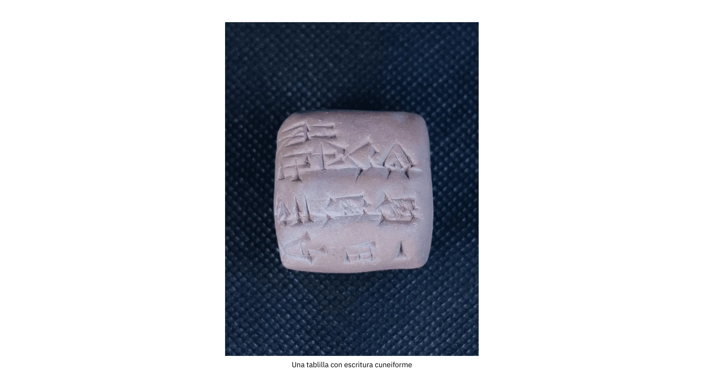

También tengo lo que creo que es una tablilla sumeria auténtica con una pequeña escritura cuneiforme en el centro. En esta tablilla hay firmas hechas rodando un cilindro, que les mostraré después.

Las marcas con figuras pequeñas servían de firma en una época en la que la mayoría de la gente no sabía escribir, ya que sólo los escribas expertos tenían esa habilidad.

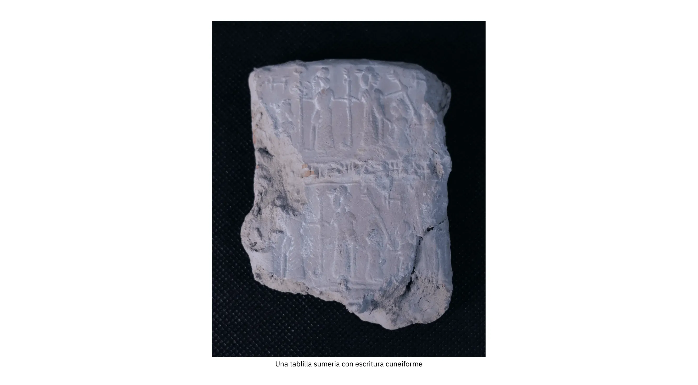

Abajo se puede ver el cilindro antes mencionado: una piedra grabada con formas específicas. La gente solía hacer rodar este cilindro de firma, conocido en inglés como cylinder seal, para firmar las cartas. Era una forma de explicitar los nombres de los autores, o de indicar que estaban compuestas en su nombre.

Por ello, los escribas de la época utilizaban allí estiletes en forma de cuña para imprimir signos en tablillas húmedas.

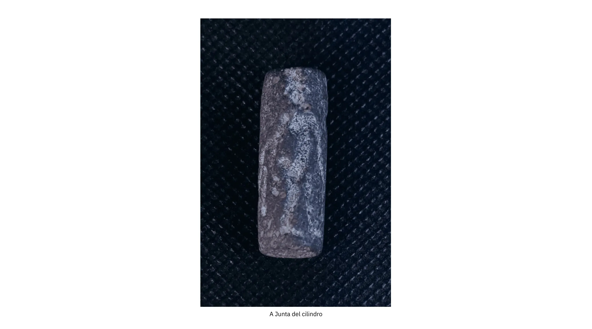

Los caracteres cuneiformes no representaban una lengua, sino un sistema de escritura para registrar lenguas habladas. En inglés, diríamos que "writing is a written language", y luego que "cuneiform is a script, not a language". En francés, diríamos que el cuneiforme no es una lengua, sino una forma de codificar una lengua.

### La evolución y los usos de la escritura

Durante sus primeros siglos de existencia, esta escritura siguió siendo limitada, sirviendo esencialmente como sistema mnemotécnico para registrar cantidades, listas de productos agrícolas y equipamiento. Sólo poco a poco fue capaz de reproducir fonéticamente nombres** y frases completas.

Al principio, los nombres no podían expresarse en escritura cuneiforme porque ésta representaba principalmente objetos y elementos de la realidad, como un buey o el trigo, representados como pequeñas imágenes. Con el tiempo, estas imágenes evolucionaron hasta convertirse en una forma de escritura más desarrollada, que permitía representar nombres y conceptos complejos.

Si la persona se llamaba Laura, por ejemplo, podríamos haber tomado una palabra, un acrónimo que sonara como "agua" y otro como "ras", y formar con ellos el nombre Laura. Así es como se desarrolló la primera forma de lenguaje escrito.

Para que conste, para representar siglas originalmente, si se quería dibujar la cabeza de un buey, se veía la forma de la cabeza del buey. Poco a poco, los dibujos se fueron simplificando hasta representar nada más que una especie de línea. Los estudiosos creen que esto ocurrió porque la gente sostenía la tablilla de arcilla húmeda con una mano, de modo que era más fácil volver a dibujar las iniciales girándolas. También se cree que se debió a la forma en que los escribas sujetaban las tablillas.

Todavía se puede ver la conexión con, por ejemplo, el trigo o la cabeza de buey en los acrónimos cuneiformes, y siempre están inclinados hacia un lado.

A lo largo de sus tres milenios de uso, la escritura cuneiforme sirvió principalmente para mantener registros económicos y administrativos. Sin embargo, los habitantes de Mesopotamia pronto desarrollaron un arraigado deseo de conservar por escrito todo aquello que mereciera resistir el paso del tiempo. Así, historias, leyendas y canciones, hasta entonces transmitidas oralmente por músicos itinerantes, fueron inmortalizadas por escrito, a menudo copiadas por escribas en formación. Copiaban textos que ya existían, principalmente leyendas o textos que tenían cierto valor cultural.

Un ejemplo importante es la **Epica de Gilgamesh**, posiblemente un **rey histórico de la ciudad-estado sumeria de Uruk** en torno al 2900-2350 a.C.

Esta forma de escritura, que era a la vez una herramienta de gestión económica y un vector cultural, duró hasta el siglo I d.C., antes de desaparecer definitivamente, dejando tras de sí un precioso testimonio de la civilización que la vio nacer.

## El papel de las tablillas sumerias

<chapterId>a396e6c5-56cc-5410-9e6b-0274401c5425</chapterId>

:::video id=a0729a35-01ec-4aa4-828f-d4ccc2eb168e:::

### Sistemas de crédito premonetarios

En la antigua Mesopotamia, la organización económica se basaba en mecanismos muy sofisticados que existían mucho antes de la invención de las monedas de metal. Desde el principio, los sistemas de crédito formales e informales ya constituían una forma esencial de dinero que permitía a las poblaciones locales realizar numerosas transacciones económicas complejas.

La escritura cuneiforme se inventó precisamente para satisfacer necesidades administrativas y económicas. Las famosas tablillas de arcilla mesopotámicas se utilizaban principalmente para registrar diversos tipos de contratos: préstamos privados, ventas, alquileres, hipotecas e incluso acuerdos matrimoniales. La escritura de estas tablillas requería la pericia de escribas especializados, una tarea costosa en tiempo y esfuerzo, **pero justificada cuando había intereses financieros en juego.** La gente no se escribía cartas de amor en aquella época, no utilizaban un escriba para escribir sobre sus angustias. Contrataban a un escriba para redactar documentos, tanto si existía un vínculo como una razón económica.

También cabe mencionar que algunas de estas tablillas circulaban como bonos al portador, cambiando de manos libremente.

Por ejemplo, había una forma de bola de arcilla con piedrecitas dentro.

En el exterior de la bola de arcilla estaba escrito y firmado un número que representaba un número de unidades. En el interior, había unas piedras y alguien que quería verificar, validar realmente que este instrumento representaba realmente X número de unidades.

Otro ejemplo, una tablilla hallada al suroeste de la actual Bagdad, estipula que un deudor se compromete a devolver a un acreedor 330 medidas de grano el día de la cosecha. Aún más fascinante, otra tablilla establece claramente que una deuda de cuatro medidas de cebada debe devolverse directamente al portador de la tablilla, **introduciendo así la noción de pago al portador, un concepto especialmente innovador para la época**.

A partir del año 2000 a.C. existía una ley que obligaba a formalizar por escrito y firmar en presencia de testigos todas las transacciones comerciales, incluso las más pequeñas. Imagínense la enorme burocracia que suponía en aquella época anotar todas las transacciones en registros hechos, les recuerdo, de arcilla por escribas. Este rigor jurídico pretendía evitar futuras disputas sobre la propiedad y los derechos de los bienes intercambiados. A menudo se llamaba a testigos para que declarasen que el contrato se había firmado realmente.

También en el ámbito privado, ciertas familias e individuos se dedicaban a actividades económicas lo bastante complejas como para requerir una gestión rigurosa. En la ciudad de Sippar-Amnanu, en el norte de Babilonia, se descubrió la casa de un sacerdote anunitum llamado Ur-Utu, que contenía cerca de 2.000 tablillas. Estos documentos incluían contratos privados de préstamo, escrituras de venta y arrendamiento, así como cartas y textos religiosos y académicos, lo que da fe de la diversidad e importancia de los archivos privados de la época.

Llama la atención que las cartas escritas por los escribas trataban casi exclusivamente de intereses económicos: quejas por asignaciones insuficientes, pagos pendientes de la dote u otras peticiones materiales urgentes. En aquella época no existían los escritos personales, como las cartas de amor, e incluso eran raras las menciones a enfermedades.

Un conmovedor ejemplo de este tipo de cartas ilustra esta realidad económica: un corresponsal expresa su angustia tras quedarse sin dinero ni provisiones cuando su compañero se marchó, mientras una grave hambruna azotaba Assur. Describe su urgente necesidad de comprar grano y pide que se le envíe rápidamente el equivalente en metálico de sus tejidos para asegurar su sustento diario.

Esta carta, dirigida a su compañero, parece indicar que éste se ha marchado a comerciar a otro lugar, dejándola sin un céntimo. Le recuerda que debe disponer de dinero para comprar grano y pagar los impuestos del templo. Quizá sea lo más parecido a un argumento escrito en una carta de la época. Las cartas casi siempre estaban relacionadas con transacciones económicas, y esta misma carta se refiere a una situación económica precaria.

Así, los documentos mesopotámicos que han llegado hasta nosotros reflejan principalmente intercambios económicos, ya que se redactaron exclusivamente para transferencias de bienes con un valor reconocido: dinero, grano, mercancías diversas, bienes inmuebles, pago de impuestos de los templos. Estos archivos revelan no sólo la eficacia y la precisión administrativa de esta antigua civilización, sino también su capacidad para gestionar intercambios económicos complejos durante un periodo muy largo.

## Control de las élites en las tablillas sumerias

<chapterId>c6d3df0e-b1e1-58dc-ab35-9f76bbc39393</chapterId>

:::video id=04a95fb8-a701-4a48-9ce8-0e9b6ba256fd:::

### Escribir, una tecnología ante todo económica

Contrariamente a la creencia popular, la invención de la escritura en Mesopotamia hace unos 4.000 años no respondía inicialmente a necesidades de comunicación personal o literaria. **La escritura cuneiforme era ante todo una tecnología económica**, que sólo se justificaba cuando estaban en juego importantes intereses financieros. Los sumerios no utilizaban la escritura para mantener correspondencia entre ellos o expresar sus sentimientos, sino exclusivamente para documentar sus transacciones comerciales y financieras.

Esta especialización puede explicarse por el considerable coste de la escritura en tablillas. El grabado en arcilla requería conocimientos técnicos especializados, un tiempo considerable y materiales específicos. Sólo las transacciones de valor suficiente justificaban económicamente esta inversión, lo que creaba un umbral natural de acceso a esta tecnología revolucionaria.

Las tablillas cuneiformes revelan un sistema financiero de notable complejidad para su época. Los mesopotámicos habían desarrollado un arsenal completo de instrumentos financieros modernos: **préstamos privados con intereses, escrituras de compraventa, contratos de alquiler, hipotecas e incluso contratos matrimoniales con cláusulas financieras**. Esta sofisticación atestigua una economía de mercado desarrollada, muy alejada de la imagen simplista del trueque primitivo que suele asociarse a estas antiguas civilizaciones.

Algunas tablillas funcionaban como auténticos títulos al portador, que circulaban libremente de mano en mano sin necesidad de identificar al poseedor original. Esta innovación permitió una notable fluidez en los intercambios, prefigurando los sistemas financieros modernos. Además, una legislación específica llegó a exigir que todas las transacciones comerciales se formalizaran por escrito, institucionalizando así el uso de la escritura en el ámbito económico.

### El monopolio del conocimiento y el control económico

La importancia de la escritura en la economía confería un poder considerable a quienes dominaban esta tecnología. **Los escribas, generalmente vinculados a los templos y a las instituciones gobernantes, controlaban de facto el sistema financiero**. Su rara e inestimable pericia los convertía en los guardianes de todas las transacciones importantes.

Este monopolio del saber no era casual. Las autoridades tenían todo el interés en mantener esta exclusividad, ya que democratizar la escritura habría diluido su control sobre la economía y aumentado el riesgo de falsificación. La presencia sistemática de testigos en las ceremonias de firma revela esta preocupación constante por la autenticidad de los documentos.

La obligación legal de registrar por escrito todas las transacciones comerciales respondía a varios objetivos estratégicos: control fiscal, seguimiento contable riguroso y mantenimiento de la dependencia de los agentes económicos respecto al aparato administrativo. **De este modo, el Estado mesopotámico se apropió de la capacidad de gestionar la deuda interpersonal** a escala social, transformando así la escritura en un instrumento de poder económico.

### La coexistencia de dos sistemas monetarios

El análisis de las tablillas revela una realidad económica más matizada de lo que sugiere su omnipresencia en los archivos. Muchas tablillas mencionan referencias al **shekel de plata** como unidad de valor, indicando así la existencia paralela de un sistema monetario basado en bienes físicos estandarizados.

Esta dualidad puede explicarse por la estratificación social de la época. **El sistema de tablillas cuneiformes estaba reservado a una élite restringida**: clérigos, comerciantes prósperos y administradores capaces de leer, escribir e interpretar estos complejos documentos. Para utilizar eficazmente una tablilla al portador, no sólo había que saber descifrarla, sino también ser capaz de verificar su autenticidad y comprender sus implicaciones jurídicas.

**La masa de la población, excluida de este sistema elitista, desarrolló sus propios mecanismos de intercambio**. La gente corriente utilizaba sistemas más accesibles, como medidas estandarizadas de grano, pesos de dinero y otros bienes fácilmente cuantificables que cualquiera podía evaluar sin conocimientos especializados.

Esta economía popular, aunque menos documentada en los archivos oficiales, era probablemente más dinámica y flexible que el sistema de tablillas. Permitía rápidos intercambios diarios sin recurrir a los escribas, satisfaciendo las necesidades inmediatas de artesanos, agricultores y pequeños comerciantes.

El siclo de plata, mencionado a menudo en las tablillas como referencia de valor, sirvió probablemente de puente entre estos dos sistemas económicos paralelos, permitiendo la conversión entre deudas escritas y pagos físicos.

### Surgimiento espontáneo frente a control institucional

Esta coexistencia ilustra un debate fundamental de la historia económica: **la oposición entre la aparición espontánea de medios de intercambio y la apropiación institucional del dinero**. Por un lado, mercancías como el dinero surgieron de forma natural de las necesidades de intercambio de las personas. Por otro, las instituciones se apropiaron y formalizaron estas prácticas para controlar su flujo.

Los templos sumerios personificaban esta tensión: utilizaban innovaciones monetarias populares (referencias al siclo) al tiempo que desarrollaban sus propios instrumentos de control (tablillas cuneiformes). Esta estrategia les permitió cosechar los beneficios de ambos sistemas: la legitimidad popular de las monedas tradicionales y el control administrativo de las deudas formalizadas.

La experiencia mesopotámica sienta precedentes duraderos para la evolución de los sistemas financieros. Demuestra que **la sofisticación financiera suele preceder en varios milenios** a las innovaciones tecnológicas, que suelen ir asociadas a ella. Los conceptos de interés, crédito, instrumentos negociables y garantía hipotecaria no esperaron a la invención de la moneda metálica para desarrollarse.

Este período seminal también revela las cuestiones de poder inherentes a cualquier innovación monetaria: quién controla la tecnología, quién define las reglas y cómo se articulan los sistemas formales y las prácticas populares. Estas cuestiones fundamentales han persistido a lo largo de la historia económica, extendiéndose a los debates contemporáneos sobre las monedas digitales y las criptodivisas.

# Economía y dinero en las civilizaciones antiguas

<partId>a16bcf4c-8c3a-11f0-9e79-2bd363a484bd</partId>

## Las grandes civilizaciones de la Edad de Bronce

<chapterId>fab9334c-7385-5d7c-ad40-7d152beb22a1</chapterId>

:::video id=737e12e8-1033-4210-b1dd-b8a680f68b17:::

En esta sección titulada "Las grandes civilizaciones de la Edad de Bronce", empezaremos con un extracto del libro *A History of Money: From Ancient Times to Present Day* de Glyn Davies, que me parece una excelente introducción a esta sección sobre las grandes civilizaciones de la Antigüedad.

> Toynbee identifica unas veintiuna "civilizaciones" diferentes, pero como quince de ellas derivan directa o indirectamente de ejemplos anteriores, reduce el número de civilizaciones desarrolladas de forma independiente a seis: sumeria, egipcia, minoica, china, maya y andina. De ellas, sólo los incas de los Andes consiguieron alcanzar un alto grado de civilización sin utilizar dinero, aunque paradójicamente disponían en abundancia de los materiales que generalmente se consideran mejores para su uso como dinero: el oro y la plata.

Los incas no tenían sistema monetario, pero sí abundancia de metales preciosos. Toda una paradoja. Sigamos con la cita:

> Cuanto más estratificada esté una sociedad y más meticulosamente eficiente sea su sistema de planificación, menos necesario será el uso del dinero para su población. Esto puede explicar por qué los conquistadores españoles descubrieron que los mexicanos, cuyo gobierno era relativamente más liberal, utilizaban regularmente polvo de oro (guardado en tubos transparentes) y granos de cacao (guardados para grandes pagos en bolsas de 24.000 unidades) como moneda, mientras que, por el contrario, los incas, organizados según una jerarquía mucho más rígida, no tenían moneda alguna: una excepción confirmada por una regla estricta. El origen del dinero en China fue totalmente independiente de otras civilizaciones; sin embargo, la relativa proximidad de las civilizaciones sumeria, egipcia y minoica plantea dudas sobre el alcance de su respectivo desconocimiento de las prácticas monetarias, sobre todo teniendo en cuenta el amplio comercio establecido ya en los tiempos más remotos.

En China, las monedas se desarrollaron con un enfoque completamente distinto al de las tradiciones occidentales. Era dinero fiduciario desde el principio. Eran monedas de fundición.

Y aquí, el Sr. Davies menciona el comercio. Efectivamente, hubo intercambios entre los chinos y otras poblaciones en determinadas épocas, pero el medio de cambio para el comercio exterior era más bien la seda. Como veremos más adelante, el oro también se utilizaba en las regiones fronterizas de China, donde la población china era menor. Y ni siquiera para el comercio internacional; para eso, era la seda.

Por lo tanto, imagino que tal vez para el formato de las monedas, pueden haber sido influenciados por otras civilizaciones de la misma época que desarrollaron esta tecnología.

Pero, evidentemente, la esencia del dinero era completamente diferente en China que en Occidente. Volveremos sobre este tema en la siguiente sección sobre China.

Con respecto a estas famosas ciudades sumerias, tengo aquí algunas notas. Podemos mencionar Uruk, que fue una ciudad muy temprana e influyente, famosa por su considerable tamaño y su avanzada cultura, sobre todo con el desarrollo de la escritura y la planificación urbana.

Y también quería mencionar la famosa epopeya de Gilgamesh. Gilgamesh fue probablemente un rey histórico de la ciudad sumeria de Uruk alrededor del 2900 a.C.. Probablemente fue el rey de esta ciudad-estado sumeria.

También podemos hablar de Sargón de Acad, que reinó del 2334 al 2279 a.C.

Fue el primer gobernante del Imperio Acadio, que es otra civilización que surgió en Mesopotamia. Y menciono a Sargón porque fue el primero en establecer un servicio postal para estas famosas tablillas de aquí, que ya les he presentado.

Imaginemos que realmente existieran incluso sobres de arcilla. Las tablillas podrían envolverse en sobres de arcilla con la firma de la persona en el exterior para garantizar la confidencialidad. Entonces la gente rompía el sobre para recuperar la tablilla. Debemos este sistema postal a Sargón de Akkad.

También está Babilonia, la gran ciudad que se convirtió en la capital del Imperio Babilónico. Otra civilización, célebre por su imponente Zigurat y sus palacios, y por el famoso Código de Hammurabi, más conocido por su avanzado código legal.

Y dos ciudades para concluir esta sección. Tenemos Ashur, que fue la capital del Imperio Asirio, un importante centro religioso. Y tenemos Nínive, que más tarde fue la capital del Imperio Asirio. Trasladaron su capital allí y es conocida por su poderoso ejército, vastos palacios y bibliotecas. Y también es una de las posibles ubicaciones de los legendarios Jardines Colgantes de Babilonia. A menudo oímos hablar de esta famosa maravilla del mundo antiguo.

Pero no hay rastro de estos famosos jardines colgantes en Babilonia. En Nínive, en cambio, hay pruebas arqueológicas de jardines en varios pisos. Es posible que historiadores griegos como Heródoto confundieran Nínive con Babilonia. Cuando visitaban ciudades de Mesopotamia, quizá se referían a ella como Babilonia. En Nínive se han encontrado vestigios de famosos jardines colgantes, y los estudiosos se preguntan si Nínive es el famoso lugar donde se encontraban estos jardines, conocidos como los Jardines Colgantes de Babilonia.

## Organización económica en Mesopotamia

<chapterId>6afb6fc8-cbb7-56a5-8427-484b4b7d7477</chapterId>

:::video id=aa6a2cbd-5916-4ae3-ad4f-65f0bd5643fa:::

### Estructuras económicas precapitalistas y esclavitud

Bienvenido a esta sección sobre la organización económica en Mesopotamia. La economía precapitalista pasó por tres etapas principales: primitiva, esclavista y feudal.

Feudal, por supuesto, es mucho más tarde, obviamente en la Edad Media, y ya hemos pasado la etapa primitiva que hemos descrito antes con el Paleolítico. Ahora, en Mesopotamia, cuando hablamos de organización económica, hablamos de esclavitud.

Sin embargo, en Mesopotamia, el grueso del trabajo lo realizaba una clase dependiente similar a los esclavos, que no eran legalmente propiedad de sus amos, sino que se veían privados del fruto de su trabajo mediante coacción física o ideológica.

### El papel de los templos y palacios como centros económicos

Los latifundios dominaban la economía. Los terratenientes explotaban sus tierras directamente contratando trabajadores, o las arrendaban a cambio de rentas. También se dedicaban a actividades financieras, prestando dinero a altos tipos de interés, generalmente en torno al 20% y el 33,3% anual, prácticas que contrastaban fuertemente con las normas más estrictas de los vecinos hebreos.

Los préstamos contraídos por los agricultores no se destinaban a inversiones productivas -con la excepción de las compañías navieras- sino a garantizar su supervivencia hasta la siguiente cosecha. Esta situación condujo con frecuencia al endeudamiento crónico de los agricultores.

Permítanme establecer un paralelismo con un periodo más reciente de la Antigüedad (Roma), donde los ciudadanos vivían de las rentas agrícolas producidas por los campesinos y la mano de obra no libre, así como del botín de guerra. **Estas rentas se distribuían entre los ciudadanos, no para obtener más beneficios, sino para mejorar su estatus social.** El comercio y la artesanía se dejaban generalmente en manos de grupos ajenos a la élite social. Todo esto contrasta con las economías medievales orientadas al beneficio a través del comercio y la artesanía.

Así que lo que intentamos decir aquí es que estoy estableciendo un paralelismo con el hecho de que la gente utilizaba las herramientas de préstamo financiero no necesariamente para mejorar sus medios de producción, y más tarde en Roma, los beneficios no se reinvertían necesariamente, sino que se utilizaban para aumentar el prestigio de las personas que podían beneficiarse de estos beneficios. Todavía estamos muy lejos del espíritu capitalista que surgió más tarde, en la Edad Media, cuando se podían crear puestos de trabajo para mejorar los medios de producción, y los excedentes se tomaban y se creaban en busca del beneficio. Vemos, pues, que la organización económica aún no había alcanzado la tercera etapa de las evoluciones económicas enumeradas anteriormente.

### La aparición de sistemas de crédito y unidades de cuenta

**Karl Polanyi distingue tres formas de intercambio económico: la reciprocidad entre grupos simétricos,** que se daría en tribus primitivas donde realmente no necesitamos dinero porque nos damos crédito informal e intercambiamos y redistribuimos. **Redistribución centralizada en torno a templos y palacios,** esta forma de intercambio es compatible con Mesopotamia, donde los templos estaban en el centro de la organización económica y podían en un momento dado devolver, distribuir la riqueza en forma de raciones. Sólo más tarde se introdujo la noción de salario. Así que, hasta ahora, tenemos la forma primitiva (1), la redistribución centralizada (2) en templos y palacios, para finalmente dar paso a los intercambios de mercado (3). Aunque el mercado tal y como lo entendemos hoy en día no existía plenamente, la presencia de intercambios de mercado en Mesopotamia es indiscutible, atestiguada por la existencia de términos específicos en acadio y por la presencia de pruebas arqueológicas de precios, beneficios, pérdidas, fluctuaciones y situaciones de escasez.

Los hogares mesopotámicos gestionaban de forma independiente todas las fases de la producción agrícola, desde la siembra hasta la transformación final en pan y cerveza. Las mujeres también producían los tejidos que necesitaban las personas a su cargo. Para los bienes que no se producían localmente, los hogares recurrían a comerciantes especializados.

Los lazos familiares eran especialmente importantes en el comercio. Durante el periodo paleoasirio (c. 1910-1830 a.C.), los mercaderes de la ciudad de Ashur establecieron una colonia comercial en Kanesh, Anatolia, importando estaño y textiles a cambio de oro y plata. El comercio se basaba en negocios familiares estrechamente vinculados por el matrimonio y las alianzas comerciales. Kanesh era sólo un eslabón de una vasta red de comercio internacional.

En estos intercambios, había metales, y eran metales preciosos y no necesariamente, por ejemplo, cobre, que era realmente útil en aquella época, y pensamos que estos metales se intercambiaban por nociones de reserva de valor. Así que no podríamos hablar necesariamente de trueque, donde dos bienes se intercambian por su utilidad, sino más bien de una noción de pago con una cierta conciencia de atesoramiento de metales preciosos para su uso como reserva de valor y no para utilizarlos como mercancía, por ejemplo, el uso del bronce para fabricar armaduras.

Los tributos e impuestos se pagaban principalmente en especie (cebada o plata pesada). Los templos y palacios fueron los principales centros económicos, administrativos, políticos y religiosos, y también desempeñaron las primeras funciones bancarias mediante el depósito seguro de mercancías, primero grano, luego otros productos agrícolas y finalmente metales preciosos. De este modo se desarrollaron las primeras operaciones de crédito y préstamo, mucho antes de la aparición de las monedas.

La economía mesopotámica utilizaba principalmente la cebada y la plata como patrones de valor. La plata se pesaba en unidades estandarizadas, como el sìqlum (siclo) de unos 8,33 gramos. Ya en la antigua Babilonia (bajo Hammurabi), la plata se utilizaba como medio de pago común, con una noción temprana de valor nominal ("nūbum") frente al peso real ("šuqulum"), **anticipando el concepto moderno de moneda fiduciaria**.

Pero aún no era dinero fiduciario en el sentido estricto de la palabra. No existía la noción de sello con figura de autoridad, pero sí la de unidad nominal de cuenta, frente a la noción de metal pesado. Había una distinción en el lenguaje para estos dos conceptos, y creo que es importante mencionarla.

La transición a un mercado de trabajo asalariado fue difícil. Exigió dos grandes innovaciones conceptuales: la separación del trabajo de la persona del producto final y la introducción del "tiempo de trabajo" como unidad mensurable. Para tener esta noción de asalariado, primero hubo que pasar por estas dos innovaciones. **En el IIIᵉ milenio, el trabajo se remuneraba inicialmente mediante raciones fijas, antes de evolucionar progresivamente hacia un sistema salarial a principios del IIᵉ milenio.**

Por último, a partir del siglo XXVI a.C., arraigó una noción real de valor monetario, aunque el "dinero" mesopotámico no era una moneda, sino una medida ponderada de grano o metal. **Así, para las transacciones importantes o en contextos que exigían la conservación del valor, a menudo se prefería convertir el grano en plata, que se conservaba más fácilmente**.

A partir del siglo XXI a.C., **con la práctica desaparición de los intercambios asimétricos**, observamos que en los contratos de cesión, el verbo sa, se refiere al pago del precio. Esta noción, denominada "sa", aparece en los contratos y se refiere al pago de un precio, no a la medida de una mercancía concreta. "Sa" se refiere simplemente a un pago o a un precio. Es un antropólogo quien señala esto y menciona que es realmente un avance; vemos una especie de dicotomía entre el antes y el después de esta introducción del verbo "sa" en los contratos.

No podemos ignorar los datos empíricos presentes en los archivos del Próximo Oriente que atestiguan la existencia de **algunos mecanismos de mercado**, incorporando **nociones de beneficio** y **pérdida**, **fluctuaciones de precios** y situaciones de **escasez**. Pero la dificultad fundamental reside en determinar la importancia relativa del intercambio basado en el mercado dentro del conjunto de la antigua economía mesopotámica.

Creo que los expertos en este campo han visto rastros de estos conceptos de mercado, pero no son realmente capaces de decirnos hasta qué punto la economía de la época se basaba en este concepto de mercado más moderno o en otros mecanismos.

Sabemos que existía, pero no sabemos si era la forma principal, por ejemplo, de determinar los precios o el comercio.

Con esto concluye esta sección sobre la organización económica en Mesopotamia.

En las próximas secciones, haremos lo mismo con Egipto y China.

## Organización económica y monetaria en el antiguo Egipto

<chapterId>bffcc16c-7fbf-5992-a0fa-6a7726d7d287</chapterId>

:::video id=40c1c4e5-b190-4bb6-b8a0-810c9ce7698b:::

### Antecedentes históricos y periodos egipcios

Esta sección está dedicada a la organización económica y monetaria del antiguo Egipto. Para ponerte un poco en antecedentes, aquí tienes una lista y una breve descripción de los periodos en cuestión.

- Reino Antiguo (c. 2575 - c. 2130 a.C.)**. Periodo marcado por la construcción de las grandes pirámides, especialmente las de Giza. Fue la edad de oro de la monarquía egipcia centralizada.
- Reino Medio (c. 1938 - c. 1630 a.C.)**. Renacimiento político y cultural tras un periodo de inestabilidad.
- Nuevo Reino (c. 1539 - 1075 a.C.)**. Periodo de expansión territorial, poder militar y comercio internacional. Incluye los reinados de faraones famosos como Tutankamón y Ramsés II.
- 1323 A.C. - Muerte de Tutankamón**. El joven faraón murió en torno a los 18-19 años. Su tumba, casi intacta, fue descubierta en 1922, convirtiéndose en uno de los descubrimientos arqueológicos más famosos.
- Ramsés II - Reinó 1279-1213 a.C.**. Uno de los faraones más poderosos del Imperio Nuevo. Conocido por sus campañas militares, sus grandes monumentos y por haber celebrado probablemente el primer tratado de paz conocido.
- 1275 a.C. - Pueblos del Mar**. Invasiones o migraciones de grupos llamados "Pueblos del Mar" desestabilizan varias civilizaciones mediterráneas, entre ellas Egipto.
- Batalla de Xoïs - 1178 a.C.**. Conflicto entre el ejército egipcio y los invasores, probablemente vinculados a los Pueblos del Mar. Una de las numerosas batallas de finales del Reino Nuevo.
- El Periodo Tardío** es el periodo de la historia del antiguo Egipto comprendido entre el 664 y el 332 a.C. aproximadamente.
- Cleopatra VII (69 - 30 a.C.)**. Última reina de Egipto, famosa por su inteligencia, carisma y alianzas con Julio César y Marco Antonio, y probablemente también por su nariz. Su reinado marcó el fin del Egipto faraónico antes de su anexión por Roma.

En los milenios V y IV a.C., Egipto ya experimentaba una intensa actividad comercial a gran escala, que enlazaba Nubia, Palestina, Libia y las regiones del Mar Rojo a través del comercio marítimo, fluvial y terrestre (sobre todo mediante caravanas de asnos).

### Primeros sistemas de cambio y paleomoneda

Con la aparición de las primeras jefaturas egipcias hacia 3650-3400 a.C., el emplazamiento de Maadi, al sur del actual El Cairo, se convirtió en un importante centro de tecnología del cobre y comercio a larga distancia, sobre todo con Mesopotamia a través de la costa siria.

Aunque el comercio a gran escala se basaba principalmente en el trueque, es probable que existiera una forma primitiva de dinero ("paleomoneda"), compuesta por objetos de prestigio como piedras semipreciosas y conchas fósiles. Probablemente, el oro ya desempeñaba un papel importante en estos intercambios. La primera mención explícita de una moneda en los documentos egipcios a mediados del III milenio a.C. refleja una larga evolución vinculada a las prácticas comerciales.

En la sociedad arcaica (aquí no hablamos necesariamente de Egipto, sino de las sociedades arcaicas en general), los pagos eran frecuentes, no para comprar directamente, sino para pagar dotes, rituales religiosos y otras obligaciones sociales. Estas transacciones exigían precios y valoraciones precisos. Muchas sociedades primitivas disponían de objetos privilegiados, monetiformes (es decir, contables), en términos de los cuales se estimaba este valor. Si se paga una dote, por supuesto, hay que anotar cierta cantidad de un objeto que se intercambiará para pagar la dote. Este valor es esencialmente el de las personas.

En las sociedades arcaicas, antes de la aparición del dinero o de los sistemas monetarios, existían pagos, pero a menudo estaban vinculados a obligaciones sociales y su valor derivaba del valor de los individuos, como en el pago de dotes o del dinero de sangre.

Volviendo a Egipto, durante el antiguo imperio, el "shât(y)", originalmente una unidad monetaria concreta (una pequeña moneda de oro o plata de unos 7,6 gramos), pasó muy rápidamente de su función real de moneda dura a una **función contable** que dio lugar a la noción de valor. Podemos reconocer en ella una especie de unidad de cuenta para expresar el valor, que originalmente era una especie de moneda, pero no podemos llamarla realmente moneda porque no está acuñada, es sólo una medida de metal. Nos acercamos a la noción de unidad de cuenta.

Esta noción de shât(y) acabó abandonándose, quizá por el riesgo de fraude. Veremos más adelante que los egipcios tardaron en adoptar las monedas acuñadas e incluso siguieron pesándolas, incluso después de que las hubieran adoptado sus vecinos.

En la Edad Media, la plata apenas se utilizaba para las transacciones cotidianas, que se realizaban principalmente con medidas de grano y cantidades de pan. Fue durante este periodo cuando apareció una forma de dinero escritural, en el que los pagos podían registrarse por escrito, o mediante transferencia real.

En el Reino Nuevo, el sistema monetario se hizo más complejo, integrando diferentes monedas de mercancías valoradas en metales (oro, plata, cobre), tejidos estandarizados, cereales y petróleo. Los tejidos se denominaban "medidas de tela". **Los precios de los bienes cotidianos se expresaban a menudo en grano o cobre, mientras que los objetos preciosos se valoraban en oro o plata. La plata, que en Egipto era más rara que el oro, llegó a ser especialmente apreciada.** La plata estaba sobrevalorada en comparación con el oro, que era más abundante en Egipto.

En el periodo tardío (primer milenio a.C.), la plata se había convertido en el metal de cambio común en todo Oriente Próximo. Circulaba en forma de lingotes, monedas de metal o anillos, que se pesaban y marcaban en los templos, garantizando su peso y pureza, aunque no se acuñaban con la efigie de un soberano. Eso vino después y será objeto de un apartado posterior sobre los lidios.

También hay que señalar que los antiguos egipcios tenían un término, "hedj", para designar el dinero, y se utilizaba de forma genérica para designar cualquier medio de pago que sirviera como contraprestación en una transacción, ya fuera por metal, grano, tela o bienes diversos (madera, animales, servicios, etc.). Los ejemplos documentados demuestran que los egipcios podían liquidar una transacción combinando varios productos cuyo valor total se expresaba en unidades de cobre ("deben").

**Los templos desempeñaban un papel central en la economía egipcia: reunían y atesoraban considerables tesoros de metales preciosos (oro y plata) destinados a honrar a los dioses, pero también a servir de reserva monetaria que pudiera reintroducirse en el circuito económico en caso de necesidad**. Veremos ejemplos de otras civilizaciones que acumulaban reservas valiosas en los templos, como estatuas, para fundirlas en caso de guerra, escasez de moneda o crisis. Este es un tema recurrente a lo largo de la historia.

También cabe mencionar que el cultivo del lino era un monopolio real concedido a los templos, y la fabricación de tejidos preciosos confirmaba su importancia económica.

Los antiguos egipcios distinguían claramente entre el aspecto ideológico de los metales preciosos, vinculados a la divinidad (el oro representaba la carne de los dioses, la plata sus huesos), y su función práctica como moneda que servía de referencia para todas las demás formas de pago.

Así, aunque el antiguo Egipto no desarrolló una moneda acuñada comparable a los sistemas monetarios modernos hasta el periodo tardío, sí poseía un sofisticado sistema monetario, basado en el uso combinado de dinero escritural, unidades de cuenta precisas, dinero mercancía y metales preciosos valorados al peso.

Las propias monedas se pesaban, dando lugar a dos conceptos diferentes: **"moneda" y "dinero "**. He utilizado dos términos en inglés. En primer lugar, "coinage" se refiere a las monedas, un concepto que viene después, y también tenemos este concepto de dinero. Ya podemos definir una cierta noción de "dinero" por las unidades de cuenta que acabo de expresar en términos de dinero, pero que todavía no eran monedas, así que "coinage" viene un poco más tarde con los lidios.

Y así, las monedas no son un requisito previo para el dinero, **hasta el punto de que podemos admitir la existencia de dinero ya en el 3er milenio,** en cualquier caso y sin ninguna duda durante el 2º milenio y particularmente bajo el reinado de Hammurabi.

Lo que es importante recordar aquí, y así lo menciona el autor en el libro "Los Orígenes del Dinero", es que no hay duda de que el concepto de dinero ya existía entonces, en estos sistemas monetarios, y es un error vincular el nacimiento del dinero como concepto a la aparición de las monedas.

Por último, los conceptos de reciprocidad y redistribución de Polanyi, aplicados a menudo al antiguo Egipto, deben matizarse: aunque existen, no forman un marco exclusivo. El Egipto faraónico había desarrollado una economía compleja que integraba plenamente intercambios comerciales sofisticados, distintos de las prácticas religiosas y rituales, lo que demostraba una autonomía real del ámbito económico con respecto al ideológico.

Esta peculiaridad está vinculada a la noción de que los metales preciosos se asociaban a una determinada divinidad, pero aún así eran capaces de distinguirse.

Traigo esto a colación porque Polanyi se refirió al uso de estos metales preciosos como una noción principalmente religiosa o divina. Sin embargo, estamos proponiendo que también estaban integrados en el sistema económico, y que los egipcios ya eran capaces de hacer tales distinciones.

Para terminar, me gustaría citar el libro "Los orígenes del dinero", que enumera la finalidad de este invento, el dinero acuñado. Hay varios puntos, pero sólo me gustaría hacer hincapié en el punto 5:

*desarrollar la posibilidad de juego económico mediante el uso de métodos como las devaluaciones y las revaluaciones sucesivas para reducir o aumentar las importaciones y exportaciones a menor coste*

Así pues, incluso en aquellos tiempos arcaicos, el autor propone que las monedas ya se habían inventado o surgido bajo control estatal y ya se manipulaban en cuanto a su cantidad de metales preciosos y peso para gestionar la economía. Permítanme darles una pequeña primicia respecto a un apartado posterior. **Incluso en las primeras formas de acuñación, que estaban hechas de electrum, una aleación de oro y plata, sabemos por el análisis del contenido de metales preciosos en estas monedas que los primeros emisores, por ejemplo, Creso, tenían menos oro que en el electrum natural.**

Esto significa que ya sabían separar el oro y la plata, y emitían monedas que contenían menos oro.

El autor sugiere que desde los primeros tiempos de la acuñación de moneda, más allá de certificar el peso y facilitar el comercio, ya se abusaba de la facultad de acuñar dinero para aumentar la cantidad emitida, posiblemente como forma de planificación económica.

## Signo de moneda y organización económica y monetaria en la antigua China

<chapterId>e08d3be9-423c-5cf3-a606-6ad54e2261af</chapterId>

:::video id=ae7e6367-1725-455e-bfe6-359be1f443e5:::

En esta sección, titulada "La moneda signo y la organización económica y monetaria de la antigua China", veremos que la antigua moneda china tiene características distintas de las tradiciones occidentales. La moneda china ya era una "moneda de signos" desde el principio. La información de esta sección se basa en las notas que tomé tras leer el libro "Aux origines de la monnaie".

### El concepto de moneda de signos y sus rasgos distintivos

Según el autor, el dinero signo es el equivalente de la moneda fiduciaria actual. Es una moneda que no tiene un valor ligado a su contenido metálico. Desde el principio, fue una especie de acuerdo, un consenso social sobre el valor de estas monedas.

La antigua moneda china tiene características que difieren de las tradiciones occidentales. Era principalmente metálica, pero fundida en lugar de acuñada, y no llevaba la efigie de un soberano. Sorprendentemente, el Estado chino no tenía el monopolio de la emisión monetaria. Este aparente liberalismo puede explicarse por la ausencia de necesidad económica de monopolizar la emisión monetaria, gracias a los abundantes recursos fiscales recaudados sobre una amplia población sujeta a impuestos.

La moneda china también se caracteriza por su aspecto fiduciario. Desde el principio, se utilizaron como moneda imitaciones de bronce de las cowries (conchas marinas), sin relación directa con el valor intrínseco del metal empleado. Si nos remontamos muy atrás en la historia, los chinos utilizaban conchas marinas como moneda. Con el tiempo, cuando las conchas empezaron a escasear, fabricaron réplicas en cobre, y estas copias tenían el mismo valor que las auténticas.

Por tanto, la moneda china no se basaba en el valor del material ni en la rareza relativa del artículo original (por ejemplo, el marisco), sino en la confianza colectiva en su uso como medio de intercambio, es decir, en un signo monetario.

### De las conchas de cauri a las imitaciones metálicas

El cauri se utilizó ampliamente como unidad monetaria primitiva. Las inscripciones antiguas muestran que, ya en las dinastías Shang y Zhou (las primeras dinastías del primer y segundo milenios a.C.), las conchas de cauri se utilizaban no sólo para recompensar hazañas militares, sino también para **remunerar el trabajo, medir el valor y comprar tierras**.

Lo que es importante recordar aquí es que no era una herramienta cualquiera utilizada por la sociedad para fines restringidos. Se empleaba para recompensas militares, pago por el trabajo y medición del valor. Encontramos huellas de ello en los escritos de los arqueólogos. Aunque no sabemos si se utilizaba para comprar pan a diario, sí tenemos pruebas de que pudo emplearse para los tipos de transacciones antes mencionados.

Con el tiempo, la escasez de verdaderas conchas de cauri condujo a la producción de imitaciones en bronce, hueso, nácar o piedra, sobre todo para su uso en contextos funerarios con el fin de evitar la inmovilización de los valores reales en las tumbas. Este cambio de soporte también está vinculado a la idea del control del príncipe sobre el dinero, un control tanto más fácil cuanto que el príncipe fabrica el dinero.

Lo que hay que entender aquí es que, superando la limitación de la escasez natural de conchas marinas, si el príncipe puede crear él mismo la moneda, le da un mayor control sobre la gestión de la economía.

A diferencia de Mesopotamia, donde las monedas estaban vinculadas al peso del metal precioso, la terminología acuñada en China deriva directamente de las formas iniciales de los objetos utilizados como moneda: bayas (bei), cuchillos (dao), picas (bu) y monedas redondas (quan o qian). Así, podemos ver que el origen de las palabras relacionadas con el dinero en China se refería a estos objetos. En cambio, en Occidente, tenemos una serie de términos monetarios que proceden de conceptos muy diferentes a éstos, más relacionados con las características físicas y el peso de los objetos monetarios. Estas diferencias etimológicas demuestran claramente el cisma entre las visiones occidental y china del dinero.

En China, el valor monetario era totalmente fiduciario, basado en una convención social entre el Estado, los productores y los comerciantes.

### Regulación económica y filosofía monetaria

El Estado chino utilizaba el dinero como instrumento de regulación económica: en épocas de abundancia monetaria, el valor del dinero disminuía, facilitando a la gente la compra de bienes. Por el contrario, en épocas de escasez monetaria, el valor del dinero aumentaba, reforzando el poder adquisitivo del Estado para sus operaciones posteriores.

Se puede establecer aquí un vínculo con la inflación y la deflación. Con una oferta monetaria fija, si aumenta la productividad de la economía, aumenta el valor del dinero. A la inversa, si la productividad cae, el valor del dinero disminuye. En este ejemplo, sin embargo, ocurre lo contrario. Probablemente porque el príncipe no tenía el monopolio total de la producción de dinero, pero aun así indica que el valor del dinero estaba vinculado a las condiciones económicas.

El filósofo Mo Di (siglos V-IV a.C.) ya había analizado esta relación entre precio y valor: según él, las variaciones de precios no reflejan una noción real de baratura o carestía absoluta, sino una relación fluctuante entre las mercancías y el dinero, independientemente del valor nominal estable del signo monetario.

Así que aquí, en lugar de decir que la moneda de oro tendría algún tipo de valor básico como tal, como valor de uso o valor intrínseco, señala que el valor del signo monetario procedía más bien del estado de la economía.

En China, las monedas no tenían por qué estar marcadas o garantizadas oficialmente. Su aceptación dependía únicamente de la confianza colectiva, lo que explica por qué las monedas de bronce o cobre sin inscripciones específicas pudieron circular libremente durante mucho tiempo.

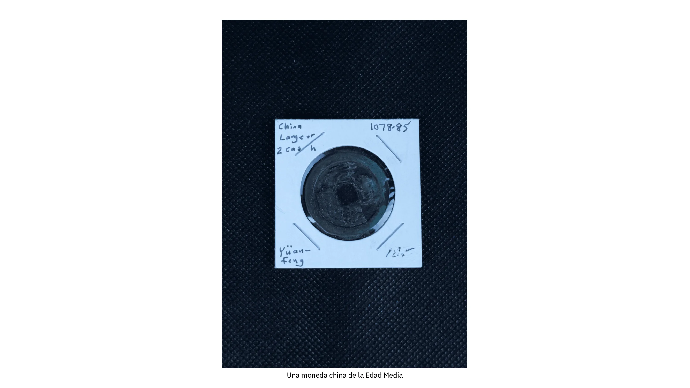

La de arriba es una moneda china de la Edad Media. Es una moneda de molde con un agujero cuadrado en el centro. Este orificio se utilizaba para enhebrar una cuerda, lo que permitía ensartar las monedas para crear pulseras o collares. Sin embargo, estas monedas no se usaban principalmente para llevarlas puestas, sino con fines contables. Podían ensartarse para formar unidades de cuenta en forma de grandes cuerdas, con las piezas entrelazadas. No tenían necesariamente marcas específicas, a veces eran simplemente círculos de bronce.

El monopolio monetario del Estado, establecido tardíamente por Wudi de la dinastía Han en 113 a.C., fue desafiado con frecuencia, permitiendo a diversos actores privados o locales emitir sus propias monedas, siempre que gozaran de la suficiente confianza social.

**El bajo valor intrínseco de las monedas chinas impedía el acaparamiento y garantizaba su circulación sin problemas**. El oro, al ser demasiado caro, solía guardarse en lugar de gastarse. En cambio, **sólo la seda representaba una verdadera moneda de alto valor en el comercio internacional chino**. Los chinos comerciaban con seda, no con oro.

Durante las crisis económicas o monetarias, sobre todo cuando subía el precio del cobre, se adoptaban soluciones innovadoras: así, ya en el siglo II d.C., las monedas en circulación se cortaban para crear unidades más pequeñas, lo que permitía mantener una circulación fluida a menor coste. Otras épocas, como la de Wang Mang (principios del siglo I d.C.), experimentaron con monedas muy fiduciarias, en las que los valores fiduciarios eran muy superiores a su contenido metálico real, prefigurando así los billetes de banco. Tomaban una moneda y estampaban en ella valores como 50, 100 o 200 para indicar cantidades mayores, como 200 monedas. Esta práctica contribuyó probablemente a una inflación significativa.

Como ya se ha dicho, este sistema se basaba en una convención social entre el Estado, los productores y los comerciantes, pero también en reglas autoritarias y severas para los que no entraban en el juego, sobre todo en relación con la elección de las piezas (bellas o no) o la longitud de las telas (no conformes con la norma).

En mi humilde opinión, no es un sistema muy sólido. Se basaba principalmente en normas estrictas que obligaban a funcionarios y comerciantes a aceptar monedas deterioradas, bajo amenaza de sanciones.

### Las innovaciones monetarias chinas y su impacto económico

China también fue pionera en la emisión de las primeras formas de papel moneda, adoptadas inicialmente como respuesta a la escasez de metal en el siglo IX d.C.. A pesar de sus ventajas iniciales, estas monedas de papel conducían regularmente a espirales inflacionistas cuando se emitían en exceso, como se vio en los periodos Song o Ming, en los que una emisión excesiva provocó graves crisis monetarias, ilustradas por Marco Polo en el siglo XIII, quien incluso señaló que la falsificación de ese papel moneda se castigaba con la muerte. No puedo evitar señalar aquí una forma de violencia.

Así, la experiencia china se caracteriza por una concepción profundamente fiduciaria del dinero, una notable flexibilidad del sistema monetario y un uso precoz del papel moneda, basado en la confianza entre los agentes económicos más que en el valor intrínseco de los medios utilizados.

## Organización social y económica en la Antigüedad

<chapterId>4023c3ce-7a47-5ac4-8f5f-c7ab699ab20f</chapterId>

:::video id=2761efe4-21cf-4f06-9bda-c03f9ff39012:::

### El debate sobre el parasitismo urbano

La relación entre las ciudades antiguas y sus tierras interiores plantea una cuestión fundamental: ¿funcionaban estos centros urbanos como parásitos extractores de riqueza o como motores de una especialización económica beneficiosa? La hipótesis del parasitismo sugiere que las ciudades de la Edad del Bronce, sobre todo en Mesopotamia, **extraían sistemáticamente más valor de sus territorios rurales del que devolvían**, viviendo esencialmente de rentas e impuestos sin crear un valor equivalente.

Esta visión tuvo su eco en el colapso del Imperio Romano: al cesar la expansión territorial, se secó el flujo de riqueza exterior, lo que pudo revelar una economía urbana incapaz de financiarse. Las ciudades habrían vivido así "por encima de sus posibilidades", dependientes de la extracción más que de la producción.

### La especialización como motor de creación de valor

Una lectura económica alternativa cuestiona esta visión parasitaria. **Las ciudades antiguas funcionaban sobre todo como centros de especialización y división del trabajo**. Su papel iba más allá de la simple extracción: concentraban oficios especializados, organizaban redes comerciales y servían de centros de intercambios a larga distancia.

Esta especialización urbana creó una interdependencia productiva con el interior. **Las ciudades no podían sobrevivir sin los suministros agrícolas rurales, pero el interior se beneficiaba a cambio de los productos artesanales, las innovaciones técnicas y el acceso a las redes comerciales mediterráneas**. La división del trabajo permitió un aumento mutuo de la productividad, aunque la distribución de los beneficios pudiera parecer desequilibrada.

La inseguridad alimentaria crónica de la época explica en parte esta aparente asimetría. El riesgo de hambruna y destrucción de las cosechas era una amenaza constante para las poblaciones rurales, mientras que los artesanos urbanos, conectados a las redes del comercio internacional, disfrutaban de una mayor estabilidad económica.

### Evolución histórica, de la Antigüedad a la Edad Media

El contraste entre la organización antigua y la medieval arroja luz sobre esta cuestión. **La Antigüedad favoreció una división del trabajo a gran escala, con ciudades abiertas a todo el mundo mediterráneo**. El comercio y la especialización alcanzaron niveles sofisticados, creando extensas redes económicas.

El colapso del Imperio Romano condujo a una fragmentación radical: **La era feudal sustituyó esta organización centralizada por un sistema descentralizado de propiedades autosuficientes**. Las antiguas villas rusticae romanas se convirtieron en la matriz de los señoríos medievales, creando un mosaico de islas económicas prácticamente autosuficientes gestionadas por el clero o la nobleza.

Esta descentralización medieval, aunque reducía la eficacia comercial, ofrecía paradójicamente una mayor resistencia a los choques externos. Los latifundios feudales desarrollaron relaciones más equilibradas entre los centros de poder y las poblaciones rurales, aunque esta organización limitara las ganancias de productividad ligadas a la especialización.

### La aparición de mercados urbanos

Los descubrimientos arqueológicos revelan la existencia de **puertos comerciales y barrios comerciales en ciudades mesopotámicas ya en el segundo milenio**. Estas infraestructuras atestiguan la existencia de mercados organizados, aunque su funcionamiento exacto sigue siendo objeto de debate.

Karl Polanyi, inicialmente escéptico sobre la existencia de auténticos mecanismos de mercado en la Antigüedad, matizó su postura reconociendo que tal vez había subestimado la temprana aparición de los intercambios mercantiles. Esta evolución intelectual refleja la complejidad de interpretar los sistemas económicos antiguos, en los que coexistían la redistribución institucional, el intercambio recíproco y las incipientes transacciones de mercado.

### Esparta contra Atenas

La comparación entre Esparta y Atenas ilustra perfectamente la relación entre el sistema monetario y la organización social. **Esparta representa un modelo de sociedad rígidamente jerarquizada que rechazaba deliberadamente el uso del dinero**, mientras que Atenas desarrolló una sofisticada economía monetaria para acompañar a su sistema democrático.

El rechazo espartano del dinero no fue espontáneo, sino **institucional e ideológico**. Los dirigentes espartanos temían que el dinero corrompiera los valores militares y cívicos, y preferían un sistema basado en la confianza interpersonal directa entre los ciudadanos.

Para desalentar el uso del dinero, Esparta empleó **pesadas y poco prácticas barras de metal**, demostrando paradójicamente una comprensión intuitiva de las cualidades monetarias (divisibilidad, transportabilidad, durabilidad) que se esforzaban por neutralizar.

### Los límites del modelo antimonetario

La organización espartana ilustra las limitaciones del **número de Dunbar** aplicado a la escala societal. **Al rechazar el dinero como medio neutral de intercambio, Esparta se condenó a sí misma a limitar su sociedad cívica a un número limitado de ciudadanos capaces de mantener relaciones de confianza directa**. Los homoioi (ciudadanos espartanos) representaban apenas el 1% de la población total, rodeados de miles de hilotes (esclavos).

Esta organización, inicialmente fuente de una cohesión militar excepcional, resultó ser estructuralmente frágil. **La batalla de Leuctres (371 a.C.) demostró los límites de este sistema**: la pérdida de vidas destrozó irremediablemente el tejido social espartano, provocando el colapso de su modelo civilizatorio.

Las ciudades competidoras (Atenas, Corinto, Tebas), con sistemas monetarios desarrollados, **mantuvieron economías más ricas y resistentes**, capaces de compensar las pérdidas humanas mediante la reconstrucción económica y la inmigración.

### Confianza personal frente a confianza institucional

La experiencia espartana revela los **riesgos inherentes a una sociedad basada exclusivamente en la confianza interpersonal** en lugar de en mecanismos institucionales neutrales. Al tiempo que creaba una intensa cohesión social, este modelo dejaba a la sociedad vulnerable a los choques demográficos.

Al permitir transacciones anónimas y despersonalizadas, el dinero ofrece una resistencia sistémica superior. Permite la expansión social más allá de los límites de la confianza directa, facilitando los intercambios con el extranjero y el crecimiento económico.

### La paradoja inca, riqueza sin dinero

El Imperio Inca presenta una paradoja fascinante: **una civilización con una inmensa riqueza en oro pero sin sistema monetario**. Al igual que Esparta, este modelo se basaba en una organización jerárquica rígida y una planificación centralizada, pero resultó vulnerable a los conquistadores con economías monetarias flexibles.

Esta fragilidad estructural de los sistemas antimonetarios frente a las sociedades monetarias es un patrón histórico recurrente, que sugiere que **el rechazo institucional del dinero, lejos de fortalecer la cohesión social, puede paradójicamente debilitar a las civilizaciones** frente a los desafíos externos y el cambio histórico.

El análisis de estos modelos históricos revela que el dinero, más allá de su función de intercambio, es un marcador y facilitador de la complejidad social, que permite a las civilizaciones trascender los límites impuestos por las relaciones interpersonales directas.

# El nacimiento de la moneda acuñada

<partId>232e365a-8c3b-11f0-b276-b3ab70d1a5a1</partId>

## La aparición de las monedas

<chapterId>40ed3414-3066-57bd-bc1b-617ad0a354e0</chapterId>

:::video id=1d6834c4-98a3-43fe-ba80-04be51b0486e:::

Hemos llegado al quid de la cuestión: la aparición de las monedas. Subrayo aquí la palabra "moneda" porque hemos visto en secciones anteriores que el dinero o los sistemas monetarios estaban muy presentes en las civilizaciones que precedieron a los pueblos lidios, los griegos y los persas. Está bastante claro, creo, por lo que acabamos de ver. Por lo tanto, esta sección está dedicada a la aparición de las monedas propiamente dicha y se titula: *La aparición de las monedas*.

### Origen lidio y jonio de las monedas

Para empezar esta sección, me gustaría ofrecerles aquí un extracto del libro de Glyn Davies, A History of Money.

*Extracto de Historia del dinero: From Ancient Times to the Present Day de Glyn Davies:*

> Desde su nacimiento en Lidia y Jonia, el conocimiento y uso de las monedas se extendió rápidamente hacia el este, al imperio persa, y hacia el oeste, a través del resto de las islas Jónicas y Egeas, hasta la Grecia continental, y después a sus colonias occidentales, especialmente Sicilia. También se extendió hacia el norte, a Macedonia, Tracia y el Mar Negro, pero en Egipto sólo se aceptó parcialmente, a regañadientes y con retraso.

Me parece interesante mencionar aquí que en Egipto siguieron pesando monedas mucho después de la llegada de la tecnología de acuñación de monedas. Creo que es importante tenerlo en cuenta. La cita continúa:

> Del mismo modo, Italia continental también tardó al principio en aceptar las innovaciones financieras griegas, en contraste con la rapidez con que las adoptó Sicilia.

*Aparte de estas dos limitadas excepciones (la Italia continental y el Bajo Egipto), el uso de la moneda se extendió rápidamente por los países ribereños del Mediterráneo central y oriental, así como por el vasto y creciente Imperio Persa, desde Mesopotamia **hasta la India.** Sigue sin estar claro si en esta época la India ya había desarrollado de forma independiente un sistema monetario embrionario, independientemente de los avances chinos o lidios. Independientemente de si la India había desarrollado independientemente su propia moneda, los crecientes contactos entre la India y Oriente Próximo hicieron que la acuñación india fuera una adaptación directa de la invención lidia y griega, primero a través del Imperio persa y luego del Imperio macedonio* (con las conquistas de Alejandro Magno y su padre).

*Por estas razones, la influencia directa de cualquier invención india de dinero fue menor, comparada con la abrumadora importancia de las invenciones monetarias claramente independientes de China al este, y aún más de los desarrollos lidios y griegos al oeste*

### Distribución geográfica y adaptaciones regionales

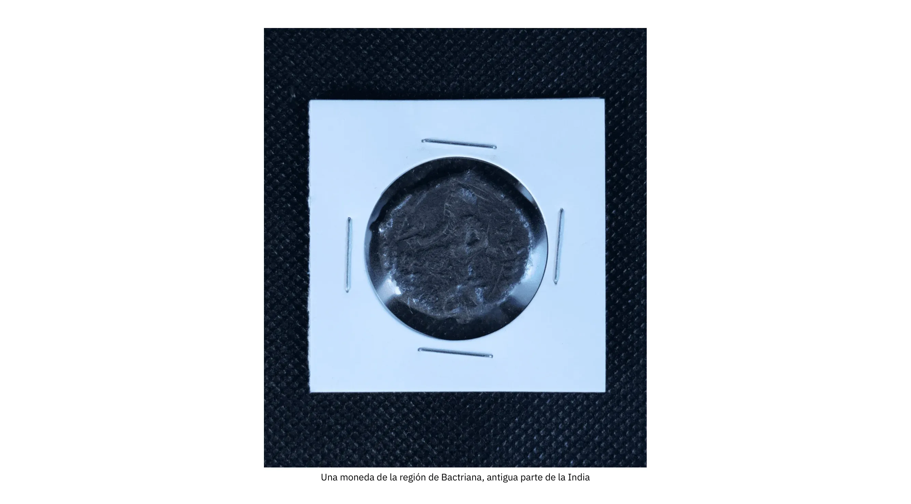

Para ilustrar este periodo de forma visual, aquí arriba hay una moneda de una región de la India, la región de Bactriana, que se encuentra al oeste de la península de la India, cerca de Afganistán. En esta zona se acuñaron monedas que probablemente se inspiraron en las griegas, en las que aparecía una de sus personalidades reales.

## Lidios y persas

<chapterId>eb802ab8-8ffd-5b25-907f-8944f120ed14</chapterId>

:::video id=f151eb42-5ff3-4ca1-9af1-1ae2a5e051c0:::

### Las primeras monedas lidias de electrum

Puesto que no podemos separar la aparición de monedas de Lidia y los persas, pasemos a la parte del mundo situada al este de Grecia, que hoy forma Turquía. Las primeras monedas que aparecieron en Occidente datan aproximadamente de mediados del siglo VII a.C., en las regiones de Lidia y Jonia, situadas en la actual Turquía. Fue en torno a los años 650 a 600 a.C. cuando vio la luz esta innovación fundamental, con notables descubrimientos arqueológicos como las primeras monedas halladas en el templo de Artemisa en Éfeso, datadas hacia el 600 a.C.. Estas monedas primitivas estaban hechas de electrum, una aleación natural de oro y plata con reflejos ambarinos, y a menudo tenían un aspecto tosco, simplemente marcadas con punzones o motivos rudimentarios.

Abajo puede ver una de las primeras monedas lidias, en la que aparece un león con su presa delante. En el reverso se aprecia un sello u orificio que, según algunos, se utilizaba para comprobar la pureza del metal y asegurarse de que no se trataba de una capa superficial. Aunque se trata de uno de los primeros ejemplos, es importante señalar que esta pieza es una copia. Todas mis piezas de oro y electrum son réplicas o recreaciones modernas, diseñadas para evitar que me gaste todos mis ahorros en esta colección.

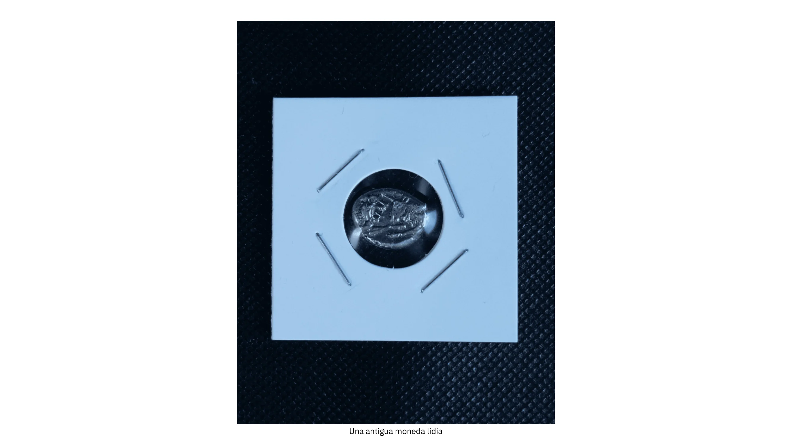

Pero también tengo una pieza persa real que estamos a punto de ver. Este es el aspecto de estas primeras piezas. Es como una especie de masa (o bulto, en inglés) de metal que fue estampada en su momento.

Contrariamente a la creencia generalizada de que el dinero se inventó para facilitar el comercio cotidiano y sustituir al trueque, parece que las primeras monedas lidias, aqueménidas y griegas no se utilizaron inicialmente para el comercio a pequeña escala. De hecho, las unidades monetarias eran demasiado grandes para el uso cotidiano. Además, su circulación se limitaba a las regiones próximas al lugar donde se producían.

Aquí, me parece importante mencionar que, aunque he leído en varias obras de carácter antropológico, las monedas, como ya he mostrado -ya sean las de electrum o esta moneda persa a la que volveré dentro de muy poco- eran demasiado grandes para comprar pan, digamos, todos los días. He visto estimaciones que nos harían pensar que era el equivalente a un día de trabajo para un campesino o un soldado, por lo que sería demasiado grande. Es como intentar pagar el salario de un día por tu comida, tu desayuno o tu almuerzo. Salvo que he visto en otros trabajos que se han encontrado unidades más pequeñas de estas manchas, es decir, monedas más pequeñas, lo que puede hacernos pensar que tal vez había un posible uso para las compras cotidianas.

Así que aquí, la "prueba" antropológica de que no se utilizaba para el comercio diario, porque la denominación o unidad era demasiado grande, no es muy sólida en mi opinión, porque hemos encontrado ejemplos de monedas que son más pequeñas, que podrían haberse adaptado a las compras diarias.

### El papel del Estado en la creación de dinero

El verdadero origen de la moneda parece estar vinculado a la acción directa de los Estados. Existen dos hipótesis principales al respecto: la primera, idealista, establece un paralelismo entre el término griego "nomisma" (dinero) y "nomos" (ley), sugiriendo que el dinero estaba vinculado a la codificación de las leyes, reforzando la autoridad y la organización política de las ciudades. La segunda hipótesis, más realista y ampliamente aceptada en la actualidad, es que el dinero era ante todo un medio para que los Estados ejercieran el control económico y social. Al garantizar oficialmente el peso y el valor de los metales preciosos que contenían, los Estados podían manipular la circulación y el valor de estas monedas, creando confianza y primas de liquidez propias de las monedas nacionales.

Es muy interesante saber que tenemos pruebas de ello. Por ejemplo, en las monedas de electrum, hay que saber que el electrum natural suele tener alrededor de un 70% de oro y un 30% de plata. En las primeras monedas que encontramos y analizamos, concretamente las primeras monedas lidias, el contenido de oro parece estar más en torno al 50 o 55% en lugar del 70. Esto sugiere que ya entonces los emisores de monedas intentaban reducir la proporción del metal más precioso, probablemente para producir más monedas y hacer que parecieran valer lo mismo que un trozo de electrum natural sin marcar. Y aquí, hay que decir que fue realmente a partir de la época de este famoso Creso, como en *rico como Creso*, que esto fue posible porque fue a partir de su época que tuvimos la tecnología para separar el oro y la plata.

La acuñación de moneda lidia experimentó una importante evolución durante el reinado del célebre rey Creso (561-546 a.C.), famoso por su legendaria riqueza. En esta época, los lidios perfeccionaron la metalurgia para separar el oro y la plata del electrum, introduciendo así las primeras monedas bimetálicas, es decir, monedas de oro y plata separadas.

### Expansión persa y adopción griega

Cuando conquistaron Lidia en 546 a.C., los persas aqueménidas adoptaron inmediatamente esta innovación. Alrededor del año 500 a.C., bajo el reinado de Darío I, los persas establecieron su propio sistema monetario con dáricos de oro y siglois de plata, a menudo con la efigie real en poses guerreras. Esta moneda real persa se utilizó principalmente en las regiones helenizadas del Imperio persa y se extendió gradualmente, aunque su uso siguió siendo desigual, ya que **algunas regiones, como Egipto, seguían prefiriendo el intercambio en metal pesado (lingotes)**.

Arriba se puede admirar un auténtico sigloi (o siglos) persa. En el pequeño diseño aparece un rey, aunque el agujero está ligeramente desgastado. El siglo es una moneda de plata, a diferencia del daric, que era de oro. Los persas podían distinguir estos dos metales y se alejaron de las monedas de electrum. Así, implantaron el bimetalismo, utilizando tanto el oro como la plata, pero manteniendo el mismo concepto de monedas de metales preciosos, a menudo con un agujero en el reverso, presumiblemente para comprobar el contenido de metal.

La rápida adopción de monedas por parte de los griegos parece haber sido estimulada por sus estrechos contactos con los lidios, especialmente a través de las colonias griegas en Asia Menor. Los primeros griegos en acuñar monedas fueron probablemente los habitantes de Egina a mediados del siglo VI a.C., que introdujeron la dracma, cuyo peso variaba de una región a otra y cuyo nombre significa literalmente "puñado de grano" o "puñado de flechas".

El éxito de la moneda griega se debió tanto a su conveniencia para transacciones importantes, como el pago a mercenarios, como a la expansión económica y política de las ciudades. La moneda se convirtió rápidamente en un elemento central de la economía griega y, más tarde, de la romana, al tiempo que conservaba una fuerte dimensión simbólica, sobre todo por su asociación con la ley (nomos).

Por último, la rápida expansión de la moneda atestigua una profunda transformación de las sociedades antiguas, en las que la codificación de los valores monetarios fue de la mano de la organización estatal. Esta evolución sentó las bases económicas y políticas del auge de las democracias griegas, especialmente en Atenas, donde la moneda desempeñó un papel crucial en el funcionamiento de la ciudad democrática.

Un punto clave que hay que recordar de esta sección es que estamos hablando específicamente de **monedas**, no de dinero en general. El aspecto central que emerge claramente es el de la **confianza en la autoridad emisora**, directamente vinculada a las características técnicas de las monedas (peso, pureza, valor nominal). Es precisamente esta confianza la que permite al Estado o a la autoridad emisora ejercer cierto control o incluso manipular el valor y la circulación de estas monedas desde el principio.

## La intervención institucional y las primeras monedas

<chapterId>3e1efd08-99e3-5a32-9908-3185fef0e640</chapterId>

:::video id=84847cf6-9e46-4a8c-9f35-25a27496cc4b:::

### La doble naturaleza del dinero

La aparición del dinero acuñado plantea una cuestión fundamental: ¿es el dinero una creación espontánea del mercado o una institución impuesta por la autoridad? Esta tensión conceptual enfrenta dos visiones radicalmente distintas.

Por un lado, la escuela austriaca de economía defiende la idea de que el dinero mercancía -en particular el oro- fue seleccionado de forma natural por los agentes económicos por sus cualidades intrínsecas: durabilidad, portabilidad, divisibilidad y fungibilidad. Desde esta perspectiva, el Estado se apropió después de esta moneda espontánea para controlar su oferta. Se trata de una institución que surge naturalmente de las necesidades del mercado antes de ser captada por el poder político.

Por el contrario, la visión antropológica e institucional sostiene que el dinero nace realmente con la acuñación estatal. La autoridad crearía conscientemente la moneda colocando su sello, transformando así el metal en un auténtico instrumento monetario. Esta perspectiva sugiere que las primeras monedas lidias se utilizaban principalmente para pagar a los ejércitos: un stater correspondía aproximadamente al salario diario de un soldado.

### Las paradójicas ventajas de la normalización estatal

A pesar de esta tensión teórica, incluso los economistas austriacos reconocen ciertas ventajas de la intervención estatal en el dinero. La normalización mediante la acuñación resuelve una serie de problemas comerciales prácticos.

Sin una autoridad de certificación, los agentes económicos se enfrentan a riesgos constantes: falsificación de monedas, fraude en el registro y manipulación del peso. Estas prácticas crean fricciones en la economía, ya que unas monedas son aceptadas y otras rechazadas. En teoría, el sello oficial garantiza el peso y la calidad, haciendo más fluido el comercio.

Esta garantía tiene un precio observable en el mercado: una moneda de oro acuñada vale más que su equivalente en oro bruto. Esta prima refleja el valor de la certificación: los comerciantes ya no necesitan verificar por sí mismos la autenticidad del metal mediante pruebas químicas o de resonancia. La intervención del Estado, paradójicamente, elimina fricciones y facilita el comercio al crear una confianza institucionalizada.

### Manipulación de divisas desde el principio

La historia de las primeras estatuas lidias revela una inquietante ironía. Análisis recientes demuestran que el contenido en oro de estas monedas de electrum era sistemáticamente inferior al del electrum natural. La autoridad que certificaba la calidad manipulaba al mismo tiempo la composición.

Esta práctica ilustra la doble utilidad de la moneda metálica. Para el mercado, hace más fluidos los intercambios y ofrece una garantía de normalización. Para la autoridad emisora, se convierte en una herramienta de control económico a través de la dilución. Al reducir el contenido de oro manteniendo el valor nominal, el Estado aumenta de hecho la oferta monetaria, creando más unidades monetarias a partir de la misma cantidad de metal precioso.

Sin embargo, el propio Estado seguía constreñido por esta manipulación. Como ilustra el ejemplo del solidus de oro de Constantino en el siglo IV, la administración romana controlaba escrupulosamente la calidad de las monedas, ya que exigía que se le pagara con buena moneda. La autoridad tenía un interés vital en mantener la calidad de su propia acuñación para garantizar el valor de sus ingresos fiscales.

### Análisis económico de la devaluación

El estudio de la devaluación de la moneda revela pautas coherentes a lo largo de la historia. En el caso de las monedas metálicas, los economistas siguen el porcentaje de metal precioso contenido en las monedas: una curva descendente indica una devaluación progresiva. En el caso del papel moneda moderno, ocurre lo contrario: se observa la masa monetaria en circulación, y su aumento es señal de devaluación.

Ambos métodos miden el mismo fenómeno fundamental: la dilución del valor monetario. Ya sea reduciendo el contenido de metales preciosos o imprimiendo nuevos billetes, el mecanismo sigue siendo el mismo. Cuantas más unidades monetarias crea una autoridad a partir de los mismos recursos reales, más pierde cada unidad su valor.

Esta manipulación, observable desde las primeras monedas lidias, sugiere que el control monetario ha sido siempre una cuestión de poder. Así pues, la moneda acuñada representa una notable innovación técnica unida a un instrumento de control económico, dualidad que se repite a lo largo de la historia monetaria hasta nuestros días.

## Fabricación de piezas

<chapterId>b205f4f2-c293-5308-b812-a998de9ad45e</chapterId>

:::video id=47c612ec-d97e-4498-b50e-7e66518bd56d:::

### De manchas troqueladas a monedas acuñadas

Tras una sección sobre la aparición de las monedas, quería introducir un apartado muy breve sobre la evolución de la fabricación de las monedas. Como hemos visto, todo empezó con burbujas de electrum, continuando con oro y plata, donde ambas caras se marcaban con un punzón, bien con la cara del rey, bien con un agujero en el reverso para comprobar la pureza.

Más tarde, como veremos en un apartado posterior, los griegos perfeccionaron esta tecnología creando monedas redondas martilladas por ambas caras. Tomaban una pieza lisa y plana de metal precioso, grababan el diseño deseado en una cara y luego la martilleaban a mano para crear la moneda acabada.

La tecnología de acuñar monedas a mano de forma individual probablemente desempeñó un papel en el control de la inflación durante esa época, aunque a menudo las monedas se diluían para aumentar la producción. Esto fue especialmente evidente durante el periodo romano y, en menor medida, durante ciertas guerras del periodo griego. Aunque la acuñación de monedas de una en una limitaba la capacidad de la autoridad para la producción masiva, contribuía eficazmente al control de la inflación, a pesar de las importantes devaluaciones que se producían. Así, se pasó de una masa de metal punzonado a una moneda redonda y martillada.

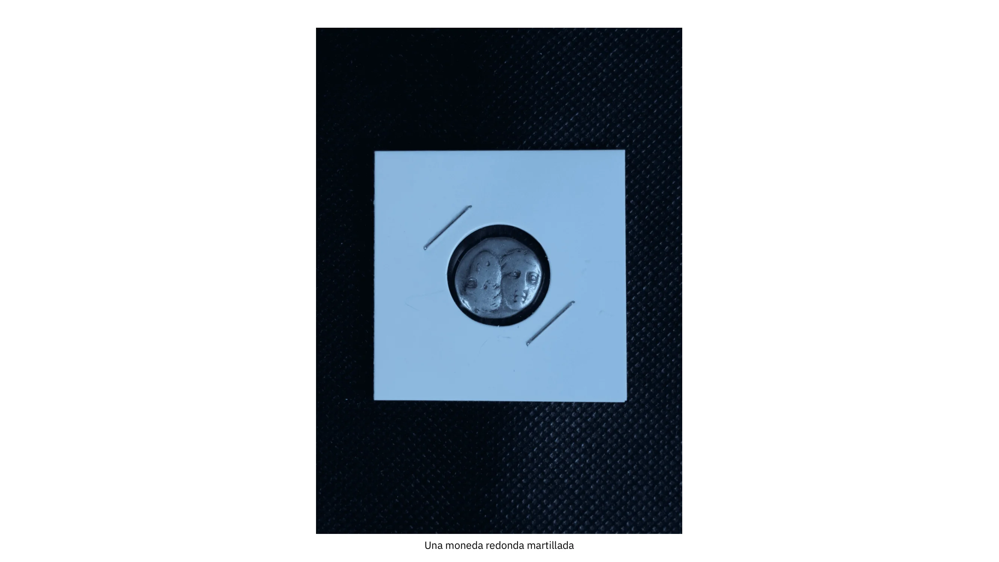

### Evolución medieval

En la Edad Media también hubo una tendencia a extender las monedas, haciéndolas más anchas y delgadas. Una de las razones era que así resultaba más fácil comprobar su sonido, que a menudo se utilizaba como indicador de autenticidad. Al extender la plata, se producía una frecuencia distinta, por lo que la gente podía validar la pureza de la moneda simplemente escuchándola. Esta práctica dio origen al término "moneda sana". En el contexto de la moneda sana, el peso estándar se determinaba utilizando una balanza o "trebuchet" para pesar. Así, se pasó de monedas pequeñas y redondas a monedas ligeramente más delgadas y anchas.

### Golpe pendular

La última tecnología que llegó al final de la Edad Media, al principio de la era moderna, fue la noción de acuñación pendular. Se trataba de una especie de tornillo que se apretaba para golpear las monedas, generando así monedas con esta nueva forma de acuñación. Lo especial de este desarrollo era la posibilidad de grabar un dibujo en la superficie de la moneda para solucionar el problema del clipaje. El recorte consistía en retirar una parte de la moneda para recuperar la plata preciosa, que podía utilizarse para acuñar otras monedas o simplemente conservarse como recurso.

Así que esta noción de golpe de péndulo ayudó con el fenómeno de recorte. Y es interesante observar que esta tecnología en realidad vino de Francia. En Inglaterra, por ejemplo, contrataron a ingenieros franceses para que vinieran a mostrarles cómo fabricar estas máquinas. Lo curioso, creo, es que hubo partidarios de la acuñación a martillo que estaban en contra y que retrasaron la aplicación de esta tecnología. En toda buena tecnología, siempre hay gente que está en contra, que quiere mantener la tecnología antigua. Me pareció bastante loco darme cuenta de que incluso una tecnología que parece realmente superior -se pueden fabricar más piezas, son más difíciles de copiar- seguía habiendo gente apegada al famoso método del martillo. Hubo un cambio entre la producción de piezas que se hicieron con este famoso golpe de péndulo y luego volver al golpe de martillo. Y finalmente, por supuesto, fue el golpe de péndulo el que finalmente se impuso y nos dio estas hermosas piezas modernas donde se pueden encontrar pequeñas líneas, pequeñas crestas alrededor para evitar el recorte, probablemente relacionadas con la palabra recorte, crestas, y todavía se pueden ver hoy en día crestas o texto o dibujos que están inscritos en el borde de la pieza.

# Diferentes teorías sobre la aparición del dinero

<partId>72ac694f-9248-550d-90c1-91af3d234380</partId>

## Teorías sobre la aparición del dinero y sus distintas definiciones

<chapterId>7d699d4d-8c70-55b5-bf36-609f3fd90bcf</chapterId>

:::video id=523c873f-501b-4954-b79f-7e74c0f685a5:::

Bienvenidos a esta sección dedicada a las diferentes teorías sobre el surgimiento del dinero y sus diversas definiciones. He aquí un breve extracto del libro *Aux origines de la monnaie* que, en mi opinión, resume las dos principales teorías que estudiaremos en esta sección.

> Este breve preámbulo no tiene otra finalidad que poner de relieve el contexto de la encuesta. En el plano conceptual, el debate está abierto entre los partidarios de las tesis de K. Polanyi y los de M. Weber. Para los primeros, el don y la redistribución desempeñan un papel central, mientras que el intercambio mercantil sólo desempeña un papel marginal, principalmente en los intercambios internacionales. Para los otros, por el contrario, el mercado está en el centro del proceso histórico actual.

Por ejemplo, en Mesopotamia, una teoría de la emergencia sugiere que el templo, como autoridad, crea la unidad de cuenta o unidad monetaria, la impone y luego los mercaderes la adoptan para el comercio. La teoría opuesta postula que no, que esta unidad monetaria surge de forma natural del mercado para facilitar el comercio. Hay ejemplos bien documentados de ello en Mesopotamia.

En cuanto al trueque, algunas teorías sugieren que se utilizaba principalmente en los intercambios internacionales, es decir, con personas en las que simplemente no confiábamos.

Eso es lo que vamos a hacer en esta sección. Vamos a realizar una especie de encuesta para presentar las diferentes teorías sobre la aparición del dinero y las diferentes definiciones de lo que es el dinero. Presentaremos y criticaremos las tesis tanto de los economistas clásicos como de los antropólogos. Incluso tendré la suerte de contar con la presencia de Ulrich Fromy, que presentará la perspectiva de un economista austriaco sobre estos diversos temas.

## La aparición del dinero para los economistas clásicos

<chapterId>1d3776cd-0dfd-5297-af48-c6f41e257a7e</chapterId>

:::video id=873a16c1-17ac-448d-8941-df4feb7ab79d:::

Este segmento está dedicado a las diferentes teorías sobre la aparición del dinero. El primer tema que se abordará es la aparición del dinero según los economistas clásicos.

### La teoría clásica de Adam Smith

Según las teorías económicas clásicas, en particular la defendida por Adam Smith, el dinero surgió de forma natural a partir del trueque como respuesta a sus limitaciones. Al principio, los intercambios se realizaban por trueque directo, pero este método se complicaba a menudo por el problema de la "doble coincidencia de deseos": cada persona tenía que poseer exactamente lo que la otra quería. Poco a poco, ciertas mercancías (como la sal, los metales preciosos y el ganado) pasaron a ser aceptadas por todos como medios de intercambio intermedios, gracias a su utilidad, durabilidad y divisibilidad. Así, el dinero apareció espontáneamente para facilitar y fluidificar los intercambios económicos.

### Crítica a la teoría clásica

He aquí mi crítica a esta teoría. Con todo lo que hemos visto en la sección anterior, creo que ya podemos decir que esta noción de que las **monedas** son una evolución del trueque es errónea, simplemente porque la moneda acuñada surge definitivamente de la autoridad, ya que es acuñada por la autoridad. Hay varias razones para ello, entre ellas el deseo de las autoridades de controlar la economía, de hacerse con el control del dinero.

Por otra parte, si hablamos de dinero como concepto, no necesariamente de monedas, entonces la cosa está menos clara, porque con las primeras monedas, las estatuas lidias, hemos encontrado manchas de plata que no estaban marcadas. Queda por ver si estaban en circulación. Si circulaban, esto significa que la gente pudo haber identificado originalmente este bien como una moneda potencial que podría ser ampliamente demandada y fácilmente intercambiada. Y puede que sólo después las autoridades se percataran de esta situación y tomaran el control poniendo un sello para certificarlo.

Hacer esto tiene muchas ventajas: no hace falta comprobarlo, pesarlo, todo eso. Obviamente, hablaremos de ello. Pero en mi opinión, las monedas son claramente una herramienta que han utilizado los estados desde el principio. Sin embargo, en cuanto a la aparición del dinero como tal, no sabemos si realmente surgió de una autoridad que lo impuso o si surgió a través del comercio o de los intercambios comerciales. Tendré un debate muy interesante sobre este tema con mi colega Ulrich más adelante en esta sección.

Ya sabemos que las primeras monedas de metales preciosos no se utilizaban para facilitar los intercambios diarios porque su valor era demasiado elevado. También sabemos que se utilizaban principalmente para pagos militares. Este es un buen argumento a favor de la tesis de que el dinero no surgió necesariamente del mercado. Las unidades de cuenta, las denominaciones de las primeras monedas, eran probablemente demasiado grandes para, por ejemplo, comprar pan o hacer la compra diaria. Podía ser, por ejemplo, el equivalente al salario de un día. No es necesariamente que la gente cobrara salarios en aquellos días, pero eso es para dar una idea de la escala. Así que estas monedas probablemente tenían demasiado poder adquisitivo para ser utilizadas en el comercio a pequeña escala. Por otro lado, no hay nada que diga que estas monedas no se hubieran utilizado para realizar intercambios de mayor envergadura, como los intercambios mercantiles. Sabemos que se utilizaban principalmente para pagos militares. Esta es una de las teorías más populares para explicar la aparición de las primeras monedas. Recordemos que estamos hablando de monedas, no necesariamente de dinero en general. Por lo tanto, las primeras monedas tuvieron su primera función, y fue la de pagar los pagos militares, de los mercenarios.

Alejandro Magno, por ejemplo, hizo un gran uso de ella, como veremos más adelante.

También hemos visto que, ya en la antigua China, las conchas de cauri se utilizaban para el intercambio económico (**remuneración del trabajo, medición del valor y compra de tierras)**. Es más, en Mesopotamia y Egipto ya existían sistemas monetarios funcionales y se utilizaban para el comercio, el pago de salarios y el pago de impuestos. Lo que estoy sugiriendo aquí es que es definitivamente erróneo pensar que las monedas en la concepción occidental surgen de la necesidad de hacer más fluidos los intercambios.

Dado que las monedas son emitidas por una autoridad, quizá podamos suponer que, desde el principio, han estado vinculadas a las autoridades emisoras. Eso tiene sentido. Por otro lado, no sabemos necesariamente cómo surgieron las formas de dinero o las formas de sistemas monetarios, las proto-monedas, que las precedieron. Por un lado, vamos a sugerir que fueron los templos los que identificaron estas unidades monetarias y, después, la gente las utilizó. Y, por otro lado, te diremos que no, que fueron los mercaderes los que necesitaban un medio de cambio, una forma de comerciar con el mundo exterior, y fueron ellos los que identificaron, por ejemplo, el metal plateado, para ser utilizado porque era demandado desde el mundo exterior. La cuestión es que realmente no lo sabemos. Por eso tenemos las dos teorías opuestas. No tenemos pruebas perfectas para explicar si el dinero surge naturalmente de la necesidad de comerciar, por ejemplo por parte de los mercaderes, o si emana de la autoridad.

### Distinción entre monedas y dinero primitivo

En conclusión, creo que podemos decir que las monedas emanan necesariamente de la autoridad, puesto que fueron acuñadas por dicha autoridad. Por otra parte, no creo que podamos afirmar que sea erróneo sugerir que el dinero (lo que precedió a las monedas) no pudo surgir para facilitar el intercambio. Creo que en todos los ejemplos que hemos visto anteriormente abundan los ejemplos en este sentido.

## El mito del trueque

<chapterId>0fcd4964-ac36-5163-a8cf-1aacebc0d2c0</chapterId>

:::video id=0ede29ab-8acd-4d79-9282-bd5991b97076:::

### Crítica de David Graeber

Acabamos de tratar la aparición del dinero según los economistas clásicos. Ahora vamos a abordar un concepto conocido como el mito del trueque.

Una crítica a esta teoría clásica de la aparición del dinero es la falta de pruebas históricas que respalden sus ideas.

La crítica conocida como el "mito del trueque", formulada por el antropólogo David Graeber, entre otros, cuestiona la idea clásica de que el dinero surgió de forma natural a partir del trueque. Según esta crítica, no existen pruebas históricas ni antropológicas que demuestren que las sociedades utilizaran sistemáticamente el trueque antes de la aparición del dinero. De hecho, las sociedades antiguas habrían funcionado sobre la base del crédito, la deuda, las obligaciones sociales y los intercambios ceremoniales. El "mito del trueque" es, pues, una construcción teórica destinada a justificar la visión económica clásica, sin base empírica real.

Hay que señalar, sin embargo, que esta teoría no niega que existiera el trueque, por ejemplo, para los intercambios entre distintas tribus. Simplemente niega que el trueque fuera una actividad ampliamente practicada dentro de estos grupos denominados primitivos, y que el dinero fuera una evolución lógica de estas prácticas. Niega el hecho de que el trueque fuera ampliamente utilizado dentro de una tribu, y que el dinero acabara emanando para fluidificar los intercambios y resolver las dificultades que existían con el trueque. En su lugar, según esta teoría, estos grupos practicaban una forma de crédito informal o regalo por regalo.

### Sociedades primitivas frente a grandes civilizaciones

**Creo que esta teoría se aplica definitivamente a los grupos primitivos (sin estado) del pasado e incluso de hoy (por ejemplo, las tribus estudiadas por los exploradores en los siglos XVIII y XIX). Está claro que no utilizaban el trueque, sino las formas de intercambio que he mencionado antes, por las razones que ya hemos mencionado (débil división del trabajo, agricultura de subsistencia). Sin embargo, no creo que esta teoría sea aplicable a las grandes civilizaciones del pasado, como Mesopotamia y el antiguo Egipto.

He aquí dos extractos de *Aux origines de la monnaie* sobre este tema:

> El modelo esbozado por M. Mauss en su célebre "El don" ha sido adoptado por los egiptólogos con tanta unanimidad y entusiasmo como falta de discernimiento. Esto ha dado lugar a una serie de confusiones, en las que no entraremos aquí. Señalemos simplemente que este modelo se aplica a las sociedades llamadas primitivas, lo que no es el caso del Egipto faraónico.

> Los panes, es decir, los cereales transformados, eran, pues, unidades de cuenta que, como el shât (y) del Reino Antiguo, permitían también la apertura de créditos en bienes diversificados. Este sencillo ejemplo demuestra que la economía del Egipto faraónico no se limitaba a un sistema de redistribución. Era muy compleja e implicaba una multitud de intercambios.

Así, como vimos anteriormente en la sección sobre Egipto e incluso Mesopotamia y China, podemos ver que incluso estas civilizaciones antiguas, pero no primitivas, debido a la presencia de un Estado, en mi opinión, utilizaron sistemas monetarios. Creo que esto se demostró ampliamente en la primera sección de este curso. Y así, esta noción de toma y daca, de crédito diferido, no se aplica a estas grandes civilizaciones. Por lo tanto, las razones precisas de la aparición del dinero siguen siendo un misterio. No sabemos si emanó de la necesidad de los mercaderes de comerciar con el mundo exterior, o si fue impuesto por el templo en estos periodos antiguos.

## La aparición del dinero a través de la deuda

<chapterId>4f508615-aa61-5d62-89d3-cecd02aeaa62</chapterId>

:::video id=a23f547f-3906-4f4a-8f72-5d78c649d0c4:::

### El dinero como pagaré

En esta sección, abordamos la teoría del dinero de deuda.

La teoría del **dinero de deuda**, desarrollada sobre todo por el economista Alfred Mitchell-Innes y ampliada posteriormente por David Graeber, afirma que el dinero no se originó a partir del trueque, sino de las relaciones de deuda y crédito presentes desde las primeras sociedades humanas. Según esta teoría, el dinero aparece cuando las obligaciones sociales (deudas entre individuos o grupos) se cuantifican y son transferibles. Este concepto introduce la noción de cuantificación de los intercambios y las transferencias. Así, el dinero sería ante todo un **reconocimiento de deuda**, respaldado por la confianza mutua y a menudo garantizado por la autoridad política o religiosa, más que una mercancía que sirve meramente de intermediario en los intercambios.

Una forma aún más avanzada de esta teoría es que todo dinero es una deuda. Así que alguien que posee dinero tendría un derecho sobre la sociedad en general, un derecho sobre todos aquellos que aceptan ese dinero. Y como el dinero, **en su visión, debe ser aceptado de forma obligatoria**, de lo contrario no es dinero, porque si puedes rechazar ese dinero, su sistema no funciona. En un grupo determinado que ha identificado una moneda, todos los que la poseen, es como si tuvieran una deuda con todos los demás miembros de esa sociedad que aceptan esa moneda, y los que aceptan la moneda tienen una forma de deuda con la persona que posee esa unidad monetaria. Esta es esencialmente su teoría.

### Críticas al sistema obligatorio

**Mi crítica a esta teoría:**

Permítanme hacer una pequeña crítica a esta teoría. Acepto que el dinero es una especie de consenso social. Es una confianza que un grupo deposita en un "signo" monetario, sea cual sea. Así que suscribo el concepto de confianza mutua, que retomaremos más adelante con el concepto de prima monetaria. La cosa se complica cuando los partidarios de esta teoría añaden la noción de obligación e insisten en la noción de deuda. Para ellos, cuando alguien posee un token monetario, tiene un crédito sobre el conjunto de la colectividad, y ésta tendría por tanto una deuda con el poseedor. También habría una obligación de saldar, y los miembros del grupo estarían obligados a aceptar la token; de lo contrario, en su opinión, el sistema no funcionaría. Creo que el sistema descrito anteriormente en la antigua China representa bien esta teoría.

Por mi parte, puedo imaginar fácilmente un sistema en el que el dinero sea un consenso social en el que el token elegido se acepte generalmente como medio de pago, sin obligación formal. Puedo ver un sistema así funcionando si la gente lo acepta por voluntad propia. Puede funcionar. Por otro lado, a menudo viene con obligaciones, moneda de curso legal y violencia, que veremos más adelante en una sección. Pero teóricamente, no tengo la impresión de que este sistema pueda funcionar del todo. Creo que Bitcoin es un ejemplo. La Bitcoin tiene valor porque tiene una prima monetaria, porque hay demanda para que se le dé un uso monetario, es decir, reservas de valor, quizás también medios de cambio o protección contra el sistema fiat. Nadie está obligado a aceptarlo, y cuanto más se acepte como medio de pago, más podrá utilizarse como medio de cambio. Ya podemos utilizarlo como depósito de valor sin ningún problema. De eso no hay duda. Lo que quiero decir es que el Bitcoin me parece un ejemplo, un tipo de moneda que es una forma de consenso social donde pensamos que podremos recuperar nuestro dinero si compramos algo más tarde, lo adquirimos para poder intercambiarlo más tarde, para preservar nuestro poder adquisitivo.

Esta visión menos restrictiva de la teoría ayuda a explicar cómo dos sociedades distintas pueden comerciar con un token monetario como el oro, sin crear una reclamación o deuda entre dichas sociedades. Forzar la aceptación en la sociedad, me parece, no funciona en el comercio entre dos tribus, porque la otra tribu no está sujeta a la autoridad. La tribu B no está sometida a la autoridad de la tribu A. Pero, sin embargo, acepta el mismo token monetario digamos, el oro. Ahora, la gente podría decirme "Sí, pero eso es porque la empresa B también ha decidido que el oro es su moneda", así que funciona. Sí, de hecho, funciona, pero no hay creación de deuda en ese momento. Es una transacción final. Por lo tanto, cuando la empresa A intercambia un bien por oro en la empresa B, no hay creación de deuda, la transacción se ha completado. Y, evidentemente, la persona de la empresa B no ha adquirido esta moneda o pepita de oro para que se la paguen después las personas de la empresa A. La acepta para que se la cambien por oro. Lo acepta para ser intercambiado más tarde, probablemente dentro de su propia tribu. Por lo tanto, en este ejemplo, no hay creación de deuda, no hay reclamación latente, es simplemente un intercambio directo, un pago directo. Los defensores de la moneda de deuda nos dirán que esto es trueque. Y no estoy de acuerdo, porque el trueque es el intercambio de un bien directo. El trueque directo es el intercambio de un bien por otro bien, para su uso. Los bienes se intercambian para ser utilizados, mientras que en nuestro caso, el oro se utiliza claramente como moneda porque no se va a utilizar para otra cosa; se va a utilizar más tarde como medio de pago. Así que, en mi opinión, no entra en la categoría de trueque.

Poseer un token monetario no es un "reclamo" a la comunidad, sino más bien una esperanza de que el token sea aceptado en una fecha posterior a un valor comparable.

## La aparición espontánea del dinero

<chapterId>e3ef86b1-73b9-5140-a61e-2ab6a5b0b2d4</chapterId>

:::video id=e543995f-d5e2-49d7-9133-e397b46e0833:::

Para la escuela austriaca de economía, iniciada por Carl Menger, el dinero surge naturalmente de una economía de trueque enfrentada al problema de la doble coincidencia de necesidades. En esta visión, los individuos convergen espontáneamente en bienes intermedios que facilitan el intercambio - no bienes de consumo directo, sino mercancías reconocidas por su capacidad de ser ampliamente demandadas.

Estos bienes monetarios deben poseer cualidades identificadas desde Aristóteles: deben servir como depósito de valor, medio de cambio y unidad de cuenta. Los agentes económicos los identifican, acumulan y guardan gradualmente, iniciando así su aparición como dinero. Este proceso es totalmente espontáneo: el dinero representa una respuesta natural del mercado al problema de la coordinación de los intercambios, sin la intervención consciente de una autoridad.

### El debate sobre el "mito del trueque

Antropólogos como David Graeber rebaten esta opinión invocando el "mito del trueque". Su argumento: nunca se ha documentado ninguna civilización compleja basada únicamente en el trueque directo. Más bien, las sociedades primitivas estudiadas utilizaban sistemas de crédito informal y reciprocidad. Graeber afirma que la deuda precedió al trueque y cita miles de tablillas mesopotámicas que documentan relaciones crediticias.

Sin embargo, esta crítica se basa en una definición restrictiva del trueque. Como ya señaló Menger en 1892, el trueque va más allá del simple intercambio directo de bienes por bienes. Abarca también las transferencias aplazadas, los servicios a cambio de salario y los intercambios con temporalidad, lo que Menger denominó "transferencias unilaterales entre individuos". Esta forma ampliada de trueque puede coexistir con los sistemas de crédito en círculos restringidos de confianza.

La ausencia de pruebas no es prueba de ausencia, y los economistas austriacos reconocen que ninguna sociedad compleja puede desarrollarse de forma sostenible basándose únicamente en el trueque directo, de ahí la necesaria aparición del dinero.

### El caso mesopotámico: mercaderes frente a templos

El debate está cristalizando en torno al origen del siclo de plata mesopotámico. Existen dos interpretaciones opuestas. La visión institucional sostiene que los templos -verdaderos centros económicos y espirituales- impusieron la plata como moneda para estructurar la economía. Las tablillas cuneiformes, concentradas entre el clero y las élites mercantiles, dan fe de este control centralizado.

La interpretación austriaca sugiere lo contrario: fueron los mercaderes quienes adoptaron el dinero para el comercio a larga distancia. Ante el reto de comerciar con extraños más allá de las fronteras de Mesopotamia -desde Anatolia hasta el Golfo Pérsico- necesitaban algo universalmente reconocible, duradero y transportable. La plata era una elección natural por sus cualidades intrínsecas. Los templos no hacían sino confirmar una práctica ya establecida por el uso comercial.

Esta tesis se basa en los intercambios documentados entre Kanesh, en Anatolia, y Assur, donde los mercaderes cambiaban tejidos por metal plateado, no por su utilidad material, sino como depósito de valor. Estas transacciones iban más allá del mero trueque, revelando la existencia de una auténtica moneda mercantil.

### El ejemplo moderno de los campos de prisioneros

El economista Richard Radford, prisionero en Alemania durante la Segunda Guerra Mundial, documentó un caso fascinante de emergencia monetaria espontánea. En los campos, los cigarrillos se convirtieron de forma natural en la unidad de cambio: divisibles, estandarizados, ampliamente aceptados. Incluso los no fumadores los adoptaron, reconociendo su valor de cambio universal.

Este microcosmos ilustra el principio austriaco: ante el problema de coordinar los intercambios, los individuos convergen espontáneamente en el bien más "vendible". Ninguna autoridad impuso el dinero de los cigarrillos; surgió de la práctica cotidiana de los presos que buscaban optimizar sus intercambios.

### La convergencia de las preferencias individuales

En esencia, el dinero representa la convergencia de las preferencias individuales hacia un bien común aceptado. Los mercaderes mesopotámicos, al igual que los prisioneros de Radford, identificaron el bien que minimizaba la incertidumbre de futuros intercambios. Esta selección no espera la autorización o imposición de una autoridad central, sino que surge de la racionalidad práctica de los agentes económicos enfrentados a los retos del intercambio.

El debate entre surgimiento espontáneo e institución consciente sigue abierto, ya que las pruebas históricas son fragmentarias. Pero el análisis austriaco ofrece una explicación coherente: el dinero nació de las necesidades prácticas del comercio, y las autoridades se limitaron a institucionalizar prácticas ya establecidas por los usos del mercado.

## La visión antropológica de la aparición del dinero

<chapterId>ec48c5d8-47ed-530f-beb7-c44fd0b62880</chapterId>

:::video id=8c1f8764-75af-4fb6-a98b-55de3b7da02e:::

### Los orígenes no económicos del dinero

En esta sección, exploramos la visión antropológica de la aparición del dinero, una rica perspectiva que desafía profundamente las teorías económicas clásicas.

En contra de la teoría tradicional de que el dinero surgió de forma natural a partir del trueque para facilitar el intercambio económico, la investigación antropológica demuestra que la aparición del dinero se debe en gran medida a causas no económicas. Procede de mecanismos sociales como el pago de tributos, la indemnización por asesinato (el famoso Wergeld) y las dotes (dinero para novias), pero también de prácticas ceremoniales, religiosas, políticas y simbólicas, mucho más que de simples necesidades del mercado.

En las sociedades primitivas, el dinero rara vez se utilizaba para el intercambio cotidiano de bienes materiales, contrariamente a la definición clásica del dinero como "medio de intercambio". De hecho, estas sociedades hacían un uso masivo del crédito, con pagos aplazados integrados en vastas redes de relaciones sociales y personales. Estos sistemas de crédito ubicuos precedieron lógica e históricamente a la aparición del dinero.

Eso es lo que resume su visión. Hablamos de ello con Ulrich en nuestra charla del vídeo anterior. Dejaré que disfrutes de los comentarios de Ulrich sobre el tema, que cuestionan un poco este enfoque. Y así, en la visión antropológica, a menudo tenemos esta noción de que el dinero proviene de una autoridad o de un concepto social que precede a las necesidades del mercado.

### El ejemplo de las piedras de Yap

Aquí abajo puede admirar un ejemplo sorprendente de las piedras monumentales de la isla de Yap. Algunas de estas piedras, a pesar de su inmovilidad o incluso desaparición física, siguieron funcionando plenamente como dinero gracias a un acuerdo colectivo, lo que subraya la dimensión esencialmente social y simbólica del dinero.

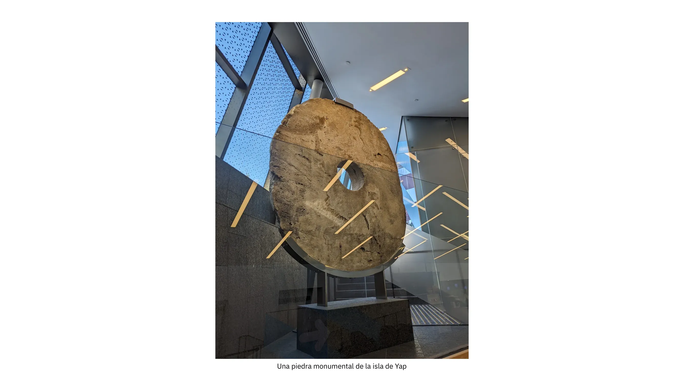

Se trata de un análisis realmente interesante de las piedras de Yap. Saifedean Ammous también menciona este ejemplo en su libro "The Bitcoin Standard". Según él, el sistema de la isla de Yap es el que más se asemeja al Bitcoin, una especie de registro central que todo el mundo puede consultar, que es público, y que mantiene las cuentas y gestiona la propiedad de las cosas. Esta perspectiva antropológica ilustra que todo esto representa un acuerdo o consenso social dentro de la sociedad, lo cual es fundamentalmente exacto. Y me parece muy interesante esta mención a las piedras perdidas. Iban cientos de kilómetros mar adentro en pequeñas balsas y traían las piedras de vuelta. A veces la piedra caía al fondo del mar, pero esa piedra seguía utilizándose en el sistema monetario. Una persona podía decir "Sí, se nos cayó la piedra en tal sitio; es mía, así que podemos cambiarla". No era necesaria la posesión física para facilitar el intercambio, ya que las piedras eran tan grandes que a menudo permanecían en un mismo lugar. En lugar de eso, se trataba de cambiar de manos estas piedras de forma transaccional, permitiendo que la propiedad cambiara sin que las piedras se movieran realmente. Era una forma de "prueba de consenso", que ponía de relieve una interesante perspectiva antropológica del dinero.

### Protodivisas y obligaciones sociales

Etnógrafos de todo el mundo han observado sociedades que utilizaban "protodivisas" o "monedas primitivas", como conchas, telas, ganado, sal y piedras, que cumplían las funciones atribuidas habitualmente al dinero, como medio de pago y depósito de valor, sin por ello actuar regularmente como intermediarios en el intercambio de bienes cotidianos.

Así pues, estamos describiendo sistemas monetarios que no se utilizaban necesariamente para los intercambios cotidianos.

Y me gustaría recordarles que todas estas eran monedas antes de la llegada de las monedas, y no sé hasta qué punto es un término equivocado decir moneda. Prefiero decir moneda. Puedo mencionar que en la literatura se suele hablar de proto-monedas para referirse al dinero anterior a las monedas. Pero como vimos en la primera sección, **creo que hubo sistemas monetarios mucho antes de la aparición de las monedas**.

Estas monedas primitivas se utilizaban principalmente para gestionar obligaciones sociales fundamentales vinculadas a los individuos, como el matrimonio, la compensación por conflictos (Wergeld) o los regalos entre jefes. En el Imperio Persa, por ejemplo, las primeras monedas se crearon específicamente como medio de pago militar y no como medio de intercambio.

El dinero primitivo tiene, pues, una característica esencial: es un medio de pago, pero muy raramente un medio de intercambio directo de bienes materiales. Lo que queremos decir aquí es que era un medio de pago para ciertas obligaciones sociales, para las tribus, para los intercambios entre jefes, el famoso wergeld, dinero de sangre. Antes de la llegada de los sistemas de justicia, si alguien cometía un asesinato, había una reparación para la familia que sufría el asesinato de su ser querido. Había que pagar un precio por ello, se llamaba dinero de sangre y es una forma de pago. También existía la dote, que también es una forma de pago. En estos primeros usos del dinero como forma de pago, estaba más relacionado con obligaciones humanas y sociales que con pagos por compras cotidianas. Según esta teoría, estos intercambios cotidianos más comunes estaban más relacionados con el crédito, el crédito diferido, el regalo por regalo y la redistribución de raciones. Existía otra forma de organización social para gestionar estos intercambios. También es importante recordar que, en una sociedad donde todo el mundo es autosuficiente, hace su propia agricultura, no hay especialización, y hay muy poca necesidad de un sistema monetario para los intercambios cotidianos. Y es por eso que las primeras formas de dinero fueron las que acabamos de describir, la dote, el dinero de sangre, simplemente porque estos fueron los primeros intercambios en los que necesitábamos un medio de pago, mucho antes de que necesitáramos comerciar, intercambiar pan por dinero diariamente, porque en las sociedades primitivas, no funcionaba así. Cada uno proveía a sus propias necesidades, y aún no existía la especialización. Creo que he tratado este tema ampliamente en todas las conferencias anteriores de este curso.

En estas sociedades, sin una división avanzada del trabajo, los intercambios directos seguían siendo limitados y tenían lugar principalmente dentro de relaciones personales de amistad o alianza. La ausencia de una especialización suficiente no hacía necesario el dinero en el sentido moderno.

Antropólogos como Quiggin y Einzig insisten en la preeminencia del crédito: **la vida económica primitiva está atrapada en una gigantesca red de créditos y deudas personales, donde el dinero interviene sobre todo cuando los pagos deben ser inmediatos y las compensaciones no pueden aplazarse fácilmente.**

Así, la gente intercambia cosas, puede hacer créditos aplazados, pero en algunos casos, no se puede aplazar el pago, por lo que la moneda o las proto-monedas pueden ser útiles en este punto para tener una finalidad inmediata al intercambio.

### La innovación del anonimato

Este análisis conduce a una reflexión más profunda: en lugar de oponer el dinero al trueque, es más pertinente entender su aparición como una evolución a partir de los complejos sistemas de crédito y deuda. El dinero introduce una innovación fundamental: **el anonimato**. Y ahí es donde me parece interesante esta teoría antropológica de la aparición del dinero. Si sois un pequeño grupo de personas y os dais crédito en diferido, obviamente os conocéis. Creo que para que este sistema funcione, la gente tiene que conocerse, obviamente. Y un pago hecho con dinero permite el anonimato. Te permite hacer un pago sin que la gente sepa tu nombre, sin que la gente sepa quién eres. Pueden hacer un intercambio para una liquidación inmediata y definitiva. Y eso es precisamente lo que permite el dinero.

A diferencia del crédito, que es siempre nominativo, el dinero permite transacciones anónimas, generalizadas e inmediatamente liberadoras. **Este poder liberatorio único del dinero es su superioridad decisiva.**

Así pues, lejos de ser un modesto instrumento para facilitar el intercambio económico, el dinero es una innovación social de primer orden, estrechamente vinculada a la evolución de las instituciones y prácticas humanas, desde el crédito personal **hasta un sistema de pago generalizado y anónimo**. Esta evolución antropológica demuestra que el dinero, mucho más que un simple medio de intercambio, representa una poderosa institución social, que configura profundamente las sociedades humanas, hasta el punto de convertirse, en nuestras sociedades modernas, en la finalidad misma de la actividad económica.

Aquí nos damos cuenta de que, al final, en nuestras sociedades modernas, la finalidad misma del intercambio económico es poseer dinero, mientras que antiguamente no era así en absoluto. La finalidad misma del intercambio económico era poseer bienes o mercancías para el consumo. Y hoy en día, al introducir la innovación del dinero, la finalidad del intercambio económico es acumular este dinero, ya que nos permite intercambiarlo por el bien, como generalmente se acepta. Podemos cambiarlo por el bien que necesitamos cuando lo necesitamos.

## Unificación de registros

<chapterId>7664442a-91c1-5ce4-a8bd-53b7371a3e3d</chapterId>

:::video id=473fc284-5375-4e1b-b0cd-6b51ba0cc3b8:::

### Teoría del registro contable

Ahora vamos a explorar juntos varias propuestas para la unificación de estas dos teorías monetarias, es decir, la teoría del surgimiento del dinero a través del dinero-deuda y la teoría monetaria del surgimiento del dinero-mercancía. Vamos a hablar de la propuesta de unificación de Lynn Alden en su famoso libro "For Broken Money", cuya traducción realizada por Consensus se llamará probablemente "Rupture monétaire".

*Extracto de Broken Money de Lyn Alden:*

> Fundamentalmente, el dinero es un registro contable. El dinero mercancía es un registro gobernado por la naturaleza. El dinero bancario es un libro de contabilidad gobernado por los Estados-nación. El dinero de código abierto es un libro de contabilidad gobernado por sus usuarios.

Aquí, Lyn se refiere a Bitcoin.

### El coeficiente stock-flujo y la escasez

> Algunos elementos químicos raros, como el rodio, son más raros que el oro, pero tienen bajos coeficientes de flujo de existencias porque son consumidos por la industria tan rápidamente como son extraídos. Una moneda o lingote de rodio puede comprarse como objeto de colección especializado o depósito de valor, pero no es adecuado como moneda socialmente aceptada, por lo que no surge de forma natural como dinero.

Saifedean habla largo y tendido sobre este tema en su libro "The Bitcoin Standard". Para quienes no estén familiarizados con la relación existencias-flujos, se trata simplemente de comparar las existencias actuales, las reservas que existen en el mercado, con las nuevas existencias que llegan, la afluencia de nuevas existencias. Suele ser bastante contraintuitivo, porque se puede pensar que algo que se tiene en grandes cantidades no es escaso, pero en realidad no lo es. Es más bien una cuestión de capacidad de suministro. Más bien, es la capacidad que tenemos de disponer de nuevas existencias la que, según este modelo, nos da la información sobre si este objeto es raro o no. No es porque no tengamos algo en stock por lo que es raro, es simplemente porque no lo tenemos. Así, si tomamos el oro, tenemos una gran cantidad de reservas de oro, ya que se utiliza como un depósito de valor, y la entrada de nuevas reservas es algo así como 1% a 3% por año de las nuevas reservas de oro que vienen a través de mining oro. En cambio, si hablamos de rodio, es más raro que el oro, pero no tenemos reservas porque se consume a medida que avanza. Así que no hace falta mucha oferta nueva para duplicar las existencias. Mientras que con el oro, se necesitarían al menos 50 años para renovar, para duplicar las existencias. A diferencia de la mayoría de los bienes que se consumen, donde es bastante fácil, y no se necesitan muchos años de producción para duplicar las existencias, ya que se consume sobre la marcha.

*"El oro ha mantenido a lo largo de la historia moderna una relación existencias/flujos de entre 25x y 100x, por lo general en torno a 50x o más, sin caer nunca brevemente por debajo de 16x, ni siquiera durante la Fiebre del Oro de mediados del siglo XIX. "*

Así, 25 significaría 25 años para duplicar las existencias, y 100 significaría 100 años para duplicar las existencias. Saifedean dice en su libro que incluso si duplicáramos la producción de oro, por ejemplo del 1,5% al 3%, no tendría necesariamente un gran efecto en su precio.

*"La plata suele tener una relación stock-flujo de 10x o más, que sigue siendo relativamente alta.*"

*La mayoría de las demás materias primas tienen un coeficiente stock-flujo inferior a 1 ó 2. Incluso los elementos más raros, como el platino y el rodio, tienen ratios de flujo de existencias relativamente bajos debido a su rápido consumo industrial"

### La superioridad del oro y la plata

*"En resumen, siempre que una divisa básica ha competido con el oro y la plata, estos últimos han salido vencedores. Otras materias primas pueden seguir siendo divisas durante periodos limitados o en regiones específicas, pero el oro y la plata siempre han demostrado su capacidad para convertirse en divisas competitivas a escala mundial y dominar la competencia. Esto se debe a que, cuando las civilizaciones se encontraron, los poseedores de oro y plata siempre tuvieron la capacidad tecnológica de devaluar otras formas de moneda, mientras que los poseedores de conchas, perlas, ganado, sal, telas o metales inferiores nunca pudieron devaluar el oro o la plata "*

Así que esto está de nuevo extremadamente bien descrito en The Bitcoin Standard donde Saifedean habla de las tribus de África que utilizaban cuentas de vidrio. Y cuando los mercaderes venecianos llegaron con cargamentos llenos de cuentas de vidrio porque en aquel momento eran capaces de producirlas industrialmente, tenían la capacidad tecnológica para hacerlo, desestabilizó por completo el sistema monetario de estos pueblos y pudieron saquear literalmente sus recursos. Esta es la tesis de Saifedean.

### Unidad de cuenta y crédito

*"Históricamente, incluso cuando el crédito se utilizaba directamente como instrumento de cambio, solía denominarse en unidades de mercancías monetarias elegidas naturalmente por sus propiedades "*

Es un punto muy interesante, que Ulrich y yo hemos estado discutiendo. Incluso si el templo de Mesopotamia era una especie de autoridad que podía gestionar esta noción de crédito, la unidad de cuenta era el siclo. No hay nada que confirme que el shekel fuera establecido autoritariamente por el templo. El shekel pudo surgir de forma natural, por la necesidad de los mercaderes de importar y exportar con otros pueblos de los alrededores. Tenemos pruebas de ello, en la forma de un mercader de Kanesh (ya lo mencioné en la Parte 1) que hacía exactamente eso, importar metales preciosos que no se utilizaban por su valor como mercancía física, sino como depósito de valor. El único problema es que no sabemos si podemos suponer que esta elección de la plata, del siclo de plata, fue hecha por los mercaderes, o si fue hecha por el templo. Pero Ulrich tiene un argumento muy bueno que nos lleva a pensar que probablemente fue más bien de parte de los mercaderes que se hizo.

*"Así pues, la unificación de las dos teorías puede describirse como una "teoría contable del dinero" ("teoría del libro mayor del dinero"), ya que describe la lógica fundamental común a ambas teorías. Tanto el crédito social flexible como las proto-monedas coleccionables se remontan a los albores de la humanidad. En ambos casos, grupos humanos de diversos tamaños mantienen entre sí un libro de contabilidad para evitar tener que satisfacer la doble coincidencia de deseos, reducir la fricción en los intercambios y servir como forma de ahorro líquido. La diferencia esencial radica en la autoridad encargada de llevar el registro "*

Por un lado, la naturaleza gestiona la expansión de la masa monetaria. Así, si tomamos el oro, como es bastante raro, es difícil de extraer. Hay una especie de límite en el número de monedas de oro que se pueden extraer. Así que la escasez está gestionada por la naturaleza. Y el registro se mantiene por el concepto de posesión. El registro está descentralizado. La posesión se demuestra por el hecho de poseer una moneda de oro o una pieza de oro. Y en el caso del dinero crediticio, la escasez está gestionada por la capacidad de la gente para obtener crédito. O en el caso de la moneda fiduciaria, la escasez la gestiona la autoridad. Son ellas las que deciden si imprimir más o no, para evitar desastres inflacionistas. Así que, en algunos casos, el registro también puede ser gestionado por el propietario del token, en el caso del papel moneda. Por eso se inscribe en el registro, entre comillas, desmaterializado. Bueno, materializado, pero virtual. Posee este famoso token, y eso es lo que prueba la posesión. Y lo mismo puede estar en un registro real, que con el dinero escritural, en un banco, donde en realidad es el banco humano el que gestiona quién posee qué en relación con el registro.

## Unificación mediante la prima monetaria

<chapterId>093756e5-8908-55e5-bb76-376a3a3cc4d3</chapterId>

:::video id=eabc342a-ecbd-46ca-a347-e914917e7c4f:::

### El concepto de prima monetaria

En esta sección dedicada a las diversas propuestas de unificación de las distintas teorías sobre el surgimiento del dinero, acabo de proponer la teoría de Lyn Alden, la teoría del registro. Yo tengo mi propia propuesta para la unificación de las dos teorías monetarias. Es la prima monetaria, el concepto de prima monetaria. Así, el valor del dinero puede explicarse por la prima monetaria que surge de su demanda monetaria, ya sea en forma de tablillas de arcilla, monedas de metales preciosos, billetes o bitcoin. La prima monetaria se basa simplemente en la confianza de que alguien cambiará esta moneda en el futuro por un precio comparable.

Lo que intento demostrar aquí es sencillamente que tanto si se trata de dinero fiduciario, es decir, de billetes sin valor de uso, como si se trata de monedas de oro o de cualquier metal, de una pepita de oro o de un lingote, **a menudo es la prima monetaria la que constituye la mayor parte de su valor**. Si tomamos una pieza de oro, una cierta parte de su valor se explica por su valor de uso, su utilización en la industria, o para fabricar joyas. Obsérvese que la demanda de joyas procede a menudo de su valor monetario. La gente guarda joyas como una especie de depósito de valor, así que incluyo esto un poco en la prima monetaria porque a menudo es una demanda bastante monetaria para desempeñar un papel en el dinero.

Así que se podría decir que alrededor del 10% de la demanda de oro es para la industria. En el valor del oro, tendríamos una pequeña parte, digamos el 10%, que se explicaría por esta demanda industrial, esta demanda por el uso del oro, donde se consume oro. El resto es claramente demanda por su uso monetario como reserva de valor.

### Bonificación de autoridad y fiat

Y si comparamos una pieza de oro con una moneda de oro, hay otra capa. La moneda de oro está sellada por una autoridad, y el oro contenido en la pieza también goza de una demanda de uso, una demanda para ser consumido en la industria. También goza de una prima monetaria como depósito de valor. Además, existe una prima que yo llamo prima de autoridad, por la que la moneda suele tener un precio, un poder adquisitivo mayor que la pieza de oro, ya que la moneda es más fácil de usar. Hace que los intercambios sean más fluidos, ya que no hay necesidad de pesarla. La autoridad suele garantizar su pureza. Y si la comparamos con una pieza de oro, una moneda de oro troquelada suele valer más que una simple pieza de oro. Y también es normal, porque se necesitan recursos para estamparla.

Es el mismo principio para el papel moneda. El papel moneda no tiene realmente ningún valor de uso, excepto quizás para calentar una casa, y eso ocurrió durante la República de Weimar. Así que no hay demanda real de su valor de uso. Por otra parte, en mi opinión, sólo hay una prima por la autoridad.

Es una forma de prima monetaria, un añadido a la prima monetaria. Pero su prima monetaria proviene del hecho de que es de curso legal, y entonces las autoridades te obligan a comprarla para pagar tus impuestos. Así que, necesariamente, la moneda fiduciaria tiene una forma de demanda monetaria derivada del hecho de que está gravada y tienes que adquirirla al menos para pagar tus impuestos. Y como resultado, sigue siendo un medio de pago generalmente aceptado. Así que la gente quiere adquirirla para satisfacer sus necesidades.

### Unificación a través de la demanda monetaria

¿Y por qué esta propuesta de prima monetaria puede calificarse de unificación de las dos teorías del dinero-deuda y del dinero-mercancía? Bueno, no creo que el valor de una moneda de oro provenga necesariamente de su "valor intrínseco". No, de hecho, es tanto una noción de confianza como lo es para el dinero fiduciario. Es una noción de demanda monetaria. Y en realidad no lo es porque tiene un pequeño porcentaje de uso industrial, otra "utilidad". Si decimos que el uso industrial es el 10% de su valor, podríamos valorarlo en 300 dólares la onza. Si el oro se vende en el mercado a 3.000 dólares la onza, la diferencia entre 300 y 3.000 dólares es la famosa prima monetaria. Es esta demanda monetaria de oro la que lo explica. El hecho de que el fiat tenga un valor de uso nulo no significa que sea diferente. Para mí, es exactamente lo mismo. Así que en ambos lados, la teoría del dinero de deuda o el dinero mercancía, no creo que el tipo de cualidad extra que tendría el oro de tener un valor de uso mínimo cambie nada.

Por otra parte, es cierto que **en el nivel del surgimiento, según el teorema de regresión de Mises, podemos proponer que este uso crea una demanda en el origen e inicia el proceso que se convierte en dinero.** Mientras que, en el nivel del dinero-deuda, se trata más bien de una imposición por parte de una autoridad, por lo que el origen, el inicio del surgimiento y los conceptos son completamente diferentes. **Pero creo que a nivel del valor, de cómo explicar el valor del dinero, con la prima monetaria, podemos explicar con la misma facilidad por qué el dinero fiduciario tiene el valor que le atribuimos y por qué el dinero mercancía tiene el valor** que le atribuimos. Para mí, es el mismo proceso, y se llama la prima monetaria.

#### La prima monetaria

Eso es. El valor del dinero se explica por la prima monetaria derivada de su demanda monetaria, ya sea en forma de tablillas de arcilla, monedas de metales preciosos, billetes o bitcoin.

La prima monetaria se basa simplemente en la confianza de que alguien cambiará ese dinero más adelante por un precio comparable.

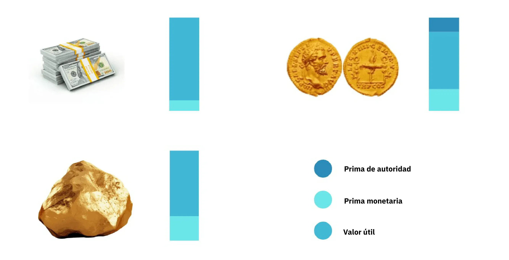

# Diferentes definiciones de dinero

<partId>77b7918a-8c3b-11f0-b688-6b2ab22378c9</partId>

## Dinero vs moneda vs monnaie vs argent vs devise

<chapterId>bf8a6d21-df88-5d23-a0a5-e9a5c1300554</chapterId>

:::video id=d9c9e7df-9db3-4a9f-801e-10d3fc7dfc22:::

### Semántica de los términos monetarios

En esta sección sobre las diversas teorías monetarias y, especialmente, sobre las definiciones de dinero, me gustaría hacer un breve inciso sobre el tema de la semántica. Me gustaría profundizar un poco más en las definiciones de varias palabras relacionadas con el dinero y compararlas con sus equivalentes en español. Por ejemplo, money, currency, en comparación con monnaie, argent y devise. Entonces, es así.

Un poco de semántica:

Cuando decimos "**dinero**" (de la monnaie), la mayoría de la gente pensará que nos referimos al pequeño cambio que recibimos a cambio de una transacción. Y si decimos "**moneda**" (la monnaie), la gente pensará probablemente que nos referimos a la moneda de un Estado. La moneda de Canadá es el dólar canadiense. Así es.

Pero, ¿y el dinero (de l'argent)? Un ladrón nunca dirá "¡Dame todo tu cambio!" (el ladrón podría sentirse decepcionado al recibir meras monedas de valor casi nulo).

No, el ladrón gritará: "Dame **todo tu dinero**". Y si el ladrón está delante de ti en la calle, se refiere necesariamente a **los billetes** que llevas en el bolsillo.

En cambio, si el ladrón intenta estafarte de una forma más sofisticada, intentando robarte tus bienes vaciando todas tus cuentas bancarias, diríamos que **se llevará todo tu dinero**. Aquí la palabra "dinero" se refiere a **la riqueza del individuo**.

Así pues, existen dos definiciones de la palabra dinero: efectivo (billetes) y riqueza.

### Moneda vs monnaie vs devise

Una moneda (devise) es necesariamente la moneda de otro país, de lo contrario decimos simplemente dinero (monnaie). Si eres francés, dirías: "La livre sterling est la devise du Royaume-Uni et l'euro et la monnaie de l'Europe" (La libra esterlina es la moneda del Reino Unido y el euro es la moneda de Europa).

A menudo, las personas que no han profundizado en estos problemas semánticos, al traducir estos términos, se inclinarán a menudo a hablar de moneda (devise) cuando se trata de moneda escrita, pero no, moneda es dinero (monnaie) cuando se trata de la moneda de tu país, y es devise cuando hablamos de otras monedas. Así pues, el problema que veo a menudo aquí es que en inglés hay dos palabras: está "money", que es un concepto, y está "currency", que es realmente la unidad de un país que se utiliza para hacer intercambios. Así que podemos hablar simplemente del concepto de dinero; es fácil: es el concepto de la palabra *dinero*; es el dinero en general. Y *moneda* es muy sencillo de equiparar con la moneda de un país. Mientras que en francés, por desgracia, la gente dirá a menudo que sí, "mais ce n'est pas une monnaie" cuando se habla de bitcoin porque no es la moneda de un país, pero a menudo, creo que se están refiriendo a los términos moneda en su lugar. Esto es erróneo por un lado, porque desde El Salvador, bitcoin es la moneda de un estado. El hecho es que la gente dirá a menudo: *pero no, no es la moneda de un estado, no puede ser dinero*. Pero en realidad, si nos referimos al concepto más amplio de *dinero*, bitcoin encaja perfectamente en esta definición, en mi opinión. Lo que ocurre es que en francés no tenemos dos palabras para separar estos dos conceptos. Podríamos decir que la palabra argent se refiere a la moneda, pero desgraciadamente esa no es su definición precisa. *Argent* (dinero) se refiere a la riqueza o a los billetes de banco. En realidad no se puede hacer una equivalencia con la palabra *dinero*. *Dinero* es realmente el concepto de moneda (monnaie).

## Definición de Saifedean Ammous

<chapterId>07c4ba50-168c-567a-8957-0b187ff75f97</chapterId>

:::video id=936d6d3b-6d45-468e-bc44-85fbce9b857a:::

#### ¿Qué es el dinero?

El dinero es simplemente algo que posees o adquieres no para usarlo o consumirlo por sí mismo, sino para cambiarlo más tarde por otros bienes o servicios que puedas necesitar. (Saifedean)

El dinero adquiere una prima monetaria cuando existe una demanda monetaria del bien, para desempeñar una o varias de las funciones del dinero.

El bien monetario debe ser lo suficientemente escaso como para que persista la prima monetaria (para evitar que la oferta se ajuste a la demanda monetaria).

### La prima monetaria

En esta sección sobre las diferentes definiciones de moneda, quería hablar brevemente de la definición de Saifedean en The Bitcoin Standard, que siempre me ha interesado mucho. Me pareció bastante sencilla cuando la leí. Y también vamos a añadir a esta definición el concepto de prima monetaria. Como menciona Saifedean en su libro, existe necesariamente un concepto de escasez. La pregunta es: ¿qué es el dinero?

> El dinero es simplemente algo que posees o adquieres, no para usarlo o consumirlo por sí mismo, sino para cambiarlo después por otros bienes o servicios que puedas necesitar.

Ésa es la definición que menciona Saifedean en The Bitcoin Standard. Yo añadiría que una moneda (la monnaie) adquiere una prima monetaria cuando existe una demanda monetaria del bien, para desempeñar una o varias de las funciones de la moneda. Así, se podría decir que una moneda que sirve de depósito de valor tendrá una demanda monetaria que le confiere una prima monetaria, ya que la gente desea adquirirla, por ejemplo como depósito de valor o como medio de cambio.

### Escasez y mecanismos de mercado

A esto, creo que deberíamos añadir definitivamente que el bien monetario debe ser lo suficientemente escaso para que la prima monetaria subsista. Esto es muy importante. **Si un bien surge para ser utilizado como dinero y vemos que su precio sube, normalmente, si el bien no es lo suficientemente escaso, la gente querrá producir más de él para aprovechar esta ganancia de valor cuando el precio suba**. Esta es la razón por la que la mayoría de los bienes del mercado tienen un precio relativamente fijo. Cuando el precio sube, la producción tiende a aumentar. Cuando el precio baja, la producción disminuye. Hay una especie de ajuste del mercado. **Y cuando un bien es lo suficientemente raro, como el oro, el mecanismo de mercado no compensará este aumento de la demanda para uso monetario. Así que lo que cambia es la variable, es el precio. Como con el bitcoin**. Cuando el precio del bitcoin sube, no producimos más bitcoin. Así que lo que se ajusta es el precio. Y por eso, durante años, hemos visto subir el precio del bitcoin a medida que aumenta la demanda de bitcoin. Como no hay nadie en la Tierra que pueda cambiar el algoritmo y decir "hay más demanda, el precio sube, vamos a producir más" **La oferta de nuevos bitcoins está programada de antemano, y se conoce de antemano**. Así que eso es lo que yo decía, que el bien monetario debe ser lo suficientemente raro para que la prima monetaria persista, y por lo tanto no sea atrapada por los mecanismos del mercado, para evitar que la oferta se ajuste a esta nueva demanda monetaria.

## Medios de pago y valor liberatorio

<chapterId>5d424039-e342-56f7-9d8b-bba9551831a9</chapterId>

:::video id=af4c0765-8111-4cb7-891b-3ee54d6e7054:::

### Medios de pago frente a medios de cambio

En esta sección dedicada a las diferentes definiciones del dinero, propongo que examinemos juntos una cita del libro "Aux origines de la monnaie" (Los orígenes del dinero), un texto de Alain Testart sobre el tema del dinero como medio de pago y valor liberatorio.

*En Aux origines de la monnaie, Alain Testart define el dinero como un medio de pago:*

> La función de medio de pago se concibe aquí como distinta de la función de medio de cambio, en la medida en que existen pagos sin contraprestación, pagos que no compran nada. Knies (1873:192 y ss.) desarrolla ampliamente este tema de las transferencias de bienes que no consisten en actos de cambio, como en el caso del wergeld (dinero de sangre o composición por asesinato) o los impuestos. Carl Menger atacó esta cuarta función en su artículo de 1892 "Geld", considerado generalmente como uno de los más decisivos sobre el tema. Sin haber sido totalmente desacreditada, la idea de la función de medio de pago parece hoy olvidada en el pensamiento económico, o al menos rechazada en favor de la de medio de cambio.
>

> El dinero sirve para pagar: visto así, es un instrumento de liberación, que describe en toda su generalidad la función de medio de pago. En este sentido, hablamos del "poder liberatorio" del dinero. Según Le Petit Robert, el poder liberatorio es "el que tiene por efecto liberar (de una obligación, de una deuda)". Según el Grand Larousse, un pago liberatorio es todo "pago efectuado en condiciones legales de tal modo que el acreedor no puede impugnar la extinción de la deuda". El dinero tiene este poder por excelencia; es incluso lo que define su estatuto de moneda de curso legal, ya que nadie puede rechazar un pago realizado en dinero, ni el vendedor ni el acreedor. El dinero es el único bien que no se puede rechazar en pago de lo que se debe, independientemente de que la deuda se tenga con un comerciante o con el fisco. Entre todos los bienes, sólo el dinero goza de este privilegio. "Es este privilegio", escribe Charles Gide (1921 I: 443), lo que constituye lo que llamamos moneda de curso legal.
>

> Todo intercambio consistente en la transferencia de un bien por otro, o a condición de que se entregue otro bien a cambio, implica necesariamente una obligación por parte del beneficiario de proporcionar esta contrapartida. El pago es el cumplimiento de esta obligación. Por lo tanto, todo intercambio implica un pago, pero no todo pago implica un intercambio. Hay pagos sin contrapartida, es decir, pagos que no permiten obtener otro bien y no se realizan con este fin. Los impuestos siguen siendo aquí el ejemplo de referencia; también hay que mencionar las multas de todo tipo pagadas a las autoridades públicas, y las reparaciones debidas a otros según el principio de que quien causa un daño a otros debe repararlo.

### Pagos sin contrapartida

Esto ilustra claramente la tesis del autor. De hecho, distingue entre ambos. Para él, un intercambio es a la vez una transferencia de bienes y un pago. El pago viene después. Y el pago puede producirse sin intercambio. Pone como ejemplo que pagar una multa o un ticket de aparcamiento no es más que un pago. En realidad no se obtiene un servicio a cambio. Algunos pueden argumentar que el Estado te presta un servicio a cambio, el servicio de ponerte multas de aparcamiento. Él tiene muy claro que pagar impuestos es realmente un pago sin contrapartida, en el sentido de que pagar impuestos es obligatorio, aunque no se obtenga necesariamente un servicio. Dice que está realmente definido que pagar impuestos es sólo un pago; no hay obligación de obtener servicios a cambio. He hablado de esto con muchos de mis colegas, y no están necesariamente de acuerdo con esta noción. Pero esa es la tesis del autor. Intenta situar la noción de pago y desvincularla de los intercambios con estos ejemplos, por ejemplo, de multa, pago de impuestos. También, por ejemplo, la dote, él expresa que la dote es un pago; no necesariamente se recibe algo a cambio. Alguien que critique esta propuesta podría decir: "Sí, pero a cambio obtienes una esposa" Así que ese es el nivel de debate sobre este tema.

También está el wergeld, o dinero de sangre. Así que es un pago para compensar. Mi amigo Ulrich diría:

> Sí, pero a cambio te cierran este expediente.

Entonces, has cometido un crimen, un asesinato por ejemplo. En ese momento, pagas el wergeld, y después de eso, pues te liberas de esa situación. Así que hay un poder liberador. ¿Recibes algo a cambio?" Según el autor, no. Según algunos de mis colegas, sí.

Creo que en esta discusión podemos ver que el wergeld es uno de los buenos ejemplos para definir un pago. De hecho, es evidente que no se recibe nada a cambio.

## Dinero de deuda frente a dinero mercancía

<chapterId>4093677a-c8e8-5828-b994-15c01656186e</chapterId>

:::video id=f49cf5cc-288e-4daa-a1ff-b9de73506f4e:::

### El debate de fondo

Siempre en el contexto de esta sección sobre diferentes definiciones y teorías monetarias, exploremos juntos dos visiones diametralmente opuestas: "el dinero es siempre deuda" o "el dinero es siempre una mercancía". Por un lado, están los defensores de la teoría monetaria basada en la deuda, que afirman: "¡No, el dinero siempre es deuda! Por otro lado, nuestros famosos "gold bugs" argumentan: "Pero no, el dinero es siempre una mercancía, es siempre oro; todo lo demás, letras, pagarés, es sólo crédito, no dinero".

Exploremos juntos un claro resumen de estas teorías.

### La teoría de "siempre una deuda

He aquí un resumen de la teoría monetaria conocida como **"dinero de deuda "**, según la cual el dinero es fundamentalmente una forma de deuda:

Según esta teoría, desarrollada en particular por Alfred Mitchell-Innes y profundizada por David Graeber, el dinero es intrínsecamente un reconocimiento de deuda, derivado de las relaciones crediticias que históricamente preexistieron a los intercambios monetarios directos. Más que surgir de una necesidad vinculada al trueque, el dinero aparece como una forma de contabilizar, transferir y saldar obligaciones o deudas sociales entre individuos o grupos.

Así, todo dinero circula como una deuda de una persona o institución con otra, respaldada por la confianza y la autoridad social o estatal que garantiza su validez. Así pues, según ellos, cuando poseemos -como ya he mencionado- cuando poseemos dinero, tenemos un derecho sobre la sociedad, y la sociedad tiene una deuda con nosotros. Por tanto, el dinero nunca es neutro ni autónomo, sino siempre una deuda subyacente: poseer dinero significa esencialmente poseer un derecho sobre la sociedad o una comunidad económica.

Este razonamiento contradice la idea clásica del dinero como simple "mercancía intermedia", y en su lugar subraya el papel central de las relaciones sociales y políticas en la creación y gestión del dinero.

**Mi reseña:**

Lo que me molesta de esta teoría es que afirma que el dinero es siempre una deuda, cuando tenemos ejemplos de intercambios entre dos tribus diferentes que, por ejemplo, intercambian oro, en los que la transacción es definitivamente definitiva y no queda ninguna deuda latente. Los defensores de esta teoría nos dirán a menudo que estos intercambios no son intercambios monetarios, sino trueques. Como ya se ha dicho, no estoy de acuerdo. Se trata de un intercambio monetario, puesto que el oro no se va a consumir; se va a utilizar como dinero.

### La teoría de "siempre una mercancía

**Siempre una mercancía:**

He aquí un claro resumen de la teoría monetaria conocida como **"dinero mercancía "**, en la que el dinero surge siempre como una mercancía, en particular el oro, que surge de la necesidad de poder comerciar, una mercancía que será generalmente aceptada en el extranjero y que se adquiere con fines comerciales.

Según esta teoría, desarrollada por los economistas clásicos (Adam Smith, David Ricardo) y retomada por Marx, el dinero surge de forma natural como una mercancía entre otras, a menudo un metal precioso como el oro o la plata, que tiene un valor intrínseco independiente de su función monetaria. Inicialmente, estas mercancías son elegidas espontáneamente por los agentes económicos para facilitar el comercio, gracias a sus cualidades intrínsecas (escasez, durabilidad, divisibilidad y estabilidad).

El dinero mercancía se distingue por su existencia física y un valor determinado por la cantidad de trabajo socialmente necesario para producirlo (como en Marx). La sociedad utiliza el oro, por ejemplo, no sólo para simplificar el trueque, sino también como unidad de cuenta, depósito de valor y medio universal de intercambio.

En esta visión, el dinero siempre conserva un valor real, ya que sigue vinculado a una mercancía tangible. Incluso cuando la función del dinero se vuelve abstracta (monedas acuñadas, billetes de banco o dinero escritural), su validez sigue derivando, directa o indirectamente, de una referencia a una mercancía subyacente como el oro. Por tanto, esta teoría insiste en el origen material y económico del dinero, frente a las teorías que lo consideran una mera convención o deuda. Según esta teoría, cualquier representación del dinero mediante un sustituto, como un billete canjeable en oro, sería crédito.

**Mi reseña:**

Nótese que esta visión se parece a la de la teoría del dinero mercancía, pero va un paso más allá. Proponen que el dinero sea **siempre** una mercancía. Y cuando les decimos: "*Sí, pero podemos estar de acuerdo en que un billete es dinero para este grupo; puede estar respaldado por oro, funciona, y el billete como tal es dinero*".

Como respuesta, nos pondrán el ejemplo del cupón del vestuario. Dirán: "Sí, pero no, cuando tienes un cupón de vestuario para tu prenda, ¿podemos llamar prenda al cupón de caja?

Por supuesto que no, es como un reconocimiento, una reclamación, en esencia, que te permitirá recuperar tu prenda. Este paralelismo no se sostiene, porque un cupón de vestuario no es un método de pago generalmente aceptado. **El dinero no es un derecho sobre un objeto específico como una prenda; es un modo, un medio de intercambio, un medio de pago generalmente aceptado**.

Así que no se puede establecer un paralelismo entre un cupón de vestuario y un billete de moneda fiduciaria, ya que el cupón de vestuario te permite obtener a cambio un bien concreto, es un token que te permite recuperar tu bien. Mientras que un billete de banco, moneda fiduciaria, es un cupón universal que te permite acceder a cualquier bien.

Y en mi opinión, por supuesto, incluso el dinero fiduciario puede considerarse dinero si es considerado como tal por la población. Y me parece un error semántico insistir en que no puede ser dinero, ya que es un cupón para obtener dinero real, al menos en ese momento, que era el oro subyacente.

No tengo ningún problema en considerar moneda la moneda de oro que se guarda en la caja fuerte y el billete que representa esa moneda de oro. Para mí, no hay problema de semántica, simplemente son dos tipos de moneda. Si no me equivoco, Mises explica muy bien este fenómeno hablando de sustitutos monetarios.

Su visión se reduce al hecho de que no se puede considerar dinero al mismo tiempo una moneda de oro en la cámara acorazada de un banco y el billete que la representa. Personalmente, no veo ningún problema en ello; no veo ninguna paradoja en la situación. Los que creen que el dinero es siempre una mercancía no ven las cosas como yo.

**Aquí tienes una reseña del concepto de cupón de taquilla del libro *Aux origines de la monnaie*:**

*Nota 14: "Excelente crítica -excelente porque se sitúa en el mismo terreno en el que Knapp se sitúa, el terreno jurídico- de Rist (1938: 372, nota 1) a la comparación entre el papel moneda y las fichas de caja: si se puede hablar de un tipo de crédito en ambos casos, la diferencia fundamental es que en el primer caso, y sólo en el primero, se trata de un crédito sin objeto específico..."

Además, a propósito de la **reclamación**, el mismo autor señala lo siguiente:

> Bastiat es muy libre de imaginar un vale para toda la sociedad presentado como "un inmenso bazar", pero este pequeño añadido, esta extensión aparentemente inocua, es toda la diferencia entre crédito y dinero. El dinero no es un derecho sobre una tienda concreta. No existe un crédito anónimo. Pero el anonimato que caracteriza al dinero, y por tanto su generalidad, es lo que lo hace tan poderoso. El dinero no es como el crédito, y mucho menos es reducible a él. **El dinero es mucho más que el crédito

**Una paradoja: dinero de deuda frente a dinero mercancía**

La paradoja que mejor ilustra la profunda dicotomía entre las teorías del dinero-deuda y del dinero-mercancía se refiere a la cuestión de si el oro es hoy una moneda.

Por un lado, la teoría del dinero-deuda define el dinero ante todo como un intermediario de cambio o medio de pago generalmente aceptado, o incluso impuesto, por una autoridad pública. Desde esta perspectiva, el oro ya no es una moneda, puesto que no es ampliamente utilizado ni aceptado como medio de cambio común.

Por otro lado, la teoría del dinero mercancía considera el dinero como una mercancía tangible, elegida espontáneamente por la sociedad por sus características intrínsecas (escasez, durabilidad, divisibilidad, etc.). Según este enfoque, el oro sigue siendo la verdadera moneda universal, y todas las demás formas de dinero actuales no son, en el fondo, más que créditos basados en la confianza.

Esta paradoja muestra claramente la brecha entre estas dos concepciones monetarias: para los primeros, el oro ya no es una moneda; para los segundos, por el contrario, sigue siendo la única moneda verdadera existente.

## Teoría monetaria moderna

<chapterId>8efc29af-3193-5d97-ad9f-e608b32924ff</chapterId>

:::video id=f8127cb7-46a1-468c-bbb5-97bf0a8b8837:::

### Principios de la teoría monetaria moderna

Para concluir esta sección sobre las distintas teorías monetarias, hablemos del niño prodigio de las teorías monetarias, admirado por muchos economistas modernos que trabajan para bancos centrales, y bautizado como teoría monetaria moderna, a menudo conocida como TMM.

**La Teoría Monetaria Moderna (TMM)** es un enfoque económico que sostiene que un Estado con moneda soberana propia (como EE.UU., Canadá o Japón) nunca puede quedarse sin dinero, ya que siempre puede emitir más dinero para financiar sus gastos. Según esta teoría

- El dinero es una creación del Estado, no un recurso limitado**

- Los impuestos y el endeudamiento no se utilizan directamente para financiar el gasto público, sino para regular la inflación, influir en el comportamiento económico y mantener la demanda de la moneda nacional*

- El verdadero límite del gasto público es la inflación, no el déficit presupuestario ni la deuda pública.

- Si el dinero creado se canaliza hacia sectores que puedan absorberlo, tampoco habrá inflación.

- Por tanto, el gobierno debe ajustar su gasto en función de los recursos reales disponibles (mano de obra, capacidad industrial, recursos naturales) para evitar una inflación excesiva.

### El papel de los impuestos en el TMM

Así que aquí encontrarás la famosa respuesta a todos los que dicen: "Sí, pero si podemos imprimir dinero, ¿por qué pagamos impuestos?" Pues bien, la MMT tiene la respuesta correcta a esta idea. Es cierto que en el sistema fiat, en el sistema moderno, técnicamente, no hay nada que limite la creación de dinero, aparte de la inflación. Pero van a sugerir que, en primer lugar, la fiscalidad es necesaria para limitar la inflación, ya que eliminará el dinero de la economía. Así que, si no tenemos impuestos para compensar, toda esta creación de dinero podría acabar creando inflación. Los impuestos, argumentan, son literalmente una forma de retirar dinero del sistema para limitar la inflación.

Sobre el tema del dinero invertido en sectores que pueden absorberlo, podemos mencionar el ejemplo de Estados Unidos, que da billones de dólares a la industria militar, lo que no provoca inflación porque la industria militar, el complejo militar-industrial, es perfectamente capaz de absorber esos billones de dólares.

Por otro lado, si se quieren construir más carreteras, y hay un límite de recursos y contratistas que pueden producirlas, duplicar el presupuesto para carreteras creará necesariamente un efecto de escasez en la mano de obra que pueda crear esas carreteras. Así que el precio subirá como resultado de las fuerzas del mercado, la oferta y la demanda. Si nuestros dirigentes omniscientes saben dónde poner el dinero, técnicamente no debería causar inflación. Y yo respondería que, en la práctica, está bastante claro que sí causa inflación.

En conclusión, según la MMT, el Estado puede utilizar su capacidad de crear dinero para lograr el pleno empleo y financiar inversiones sociales y ecológicas, controlando al mismo tiempo la inflación mediante una política fiscal adecuada. También suele ser el objetivo de los economistas keynesianos, otra escuela de pensamiento económico, gestionar el desempleo mediante la gestión de los tipos de interés y financiar las inversiones sociales y ecológicas, controlando al mismo tiempo la inflación mediante una política fiscal adecuada.

### Revisión de MMT

Esta teoría sólo se aplica a un puñado de países (véase el tuit de Stephanie Kelton) que gozan de verdadera soberanía monetaria, es decir, que pueden endeudarse en su propia moneda. Esta teoría es difícil de aplicar a las economías dependientes de las importaciones, que deben mantener la confianza internacional en su moneda.

¿Y qué es la verdadera soberanía monetaria? Significa poder endeudarse en tu propia moneda. Tienes que ser capaz de tener un superávit comercial para tener suficientes reservas de divisas, suficientes divisas extranjeras, para no tener que conseguir dinero en divisas extranjeras para poder importar bienes. Esto afecta a un puñado de países.

Aquí abajo, puedes ver un tweet de Stephanie Kelton, que es una especie de mujer póster de este movimiento. Escribió un libro titulado "El mito del déficit". En el tweet, ella escribe que diferentes países como los Estados Unidos, Japón, Canadá, Australia, el Reino Unido, no pueden quedarse sin dinero.

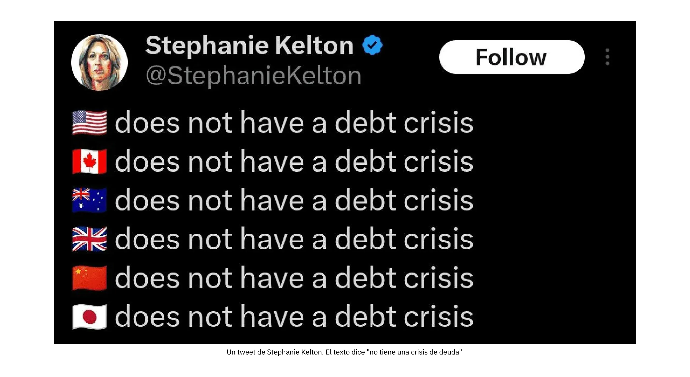

Extrañamente, sólo enumera seis países ¿Por qué? Porque tienen soberanía monetaria real. Pero hay unos 200 países en la Tierra, y no todos tienen soberanía monetaria. Así que mi crítica a esta teoría, aparte de ser un poco extraña y poco funcional, es que sólo funciona para unos pocos países que disfrutan de verdadera soberanía monetaria, aquellos que pueden emitir letras del Tesoro en su propia moneda. Hasta cierto punto, va en detrimento del resto del mundo. Al crear esta moneda, es como si exportaran su inflación a otros lugares, algo parecido a lo que Estados Unidos lleva décadas haciendo con sus exorbitantes privilegios. Esto se asemeja a una forma de colonialismo monetario, en el que los países que tienen confianza y demanda mundial de su moneda pueden imprimir todo el dinero que deseen sin incurrir en una inflación significativa, a menudo porque exportan esa inflación.

Esta teoría es difícil de aplicar a las economías dependientes de las importaciones que necesitan mantener la confianza internacional en su moneda.

Esta teoría también exige un cierto nivel de planificación centralizada de la economía, sobre todo para garantizar un mayor control de los recursos reales (trabajadores, materias primas, capacidad industrial) y gestionar la inflación.

# Caída y renacimiento del dinero

<partId>87a34ca9-782b-5ade-b51a-400f88ed7b0c</partId>

## Monedas griegas

<chapterId>7714195f-74ce-5f8c-be5f-59302d39fff4</chapterId>

:::video id=8e5c3091-0910-471b-8d4b-0dc6e9afa656:::

### Antecedentes y contexto

Antes de empezar, he aquí los antecedentes históricos:

**Contexto histórico:**

**Los romanos llamaban "Graeci" a los griegos y "Graecia" a Grecia.**

**Los griegos se llamaban a sí mismos "helenos" y a su país "Hellas "**

**Homer** (nacido hacia el siglo VIII a.C.)

Legendario poeta griego, presunto autor de *La Ilíada* y *La Odisea*.

Alrededor del año 750 a.C., Licurgo**, mítico legislador de Esparta, establece la constitución espartana basada en la disciplina militar y la sencillez.

**Numa Pompilio** (753-673 a.C.)

Segundo rey de Roma, famoso por dotar a Roma de sus primeras instituciones religiosas y jurídicas.

**Dracón**, legislador ateniense (siglo VII a.C.), famoso por sus leyes extremadamente severas, de ahí el término "draconiano".

**594 a.C.: Solón** se convierte en legislador en Atenas y reforma radicalmente la sociedad ateniense, en particular aboliendo la esclavitud por deudas.

**776 A.C: Juegos Olímpicos de la Antigüedad**

Los primeros juegos deportivos regulares se celebraban en Olimpia cada cuatro años y reunían a las ciudades griegas.

**Pitágoras** (ca. 570-495 a.C.)

Filósofo y matemático griego, famoso por su teorema del triángulo rectángulo.

**Jenófanes de Colofón** (c. 570-478 a.C.)

Filósofo presocrático conocido por sus críticas al politeísmo griego tradicional.

**490 a.C.: Batalla de Maratón**

Los atenienses rechazan victoriosamente una invasión persa, lo que marca un punto de inflexión decisivo para la civilización griega.

**Heródoto** (c. 484-425 a.C.), apodado el "padre de la historia", escribió una vasta obra en la que describe las guerras persas, incluida la victoria griega sobre Jerjes en 480 a.C.

**Sócrates** (470-399 a.C.)

Filósofo ateniense famoso por su método dialéctico y sus enseñanzas sobre ética y autoconocimiento.

**Aristófanes** (c. 446-386 a.C.)

Dramaturgo ateniense, famoso por sus comedias satíricas como *Las ranas*.

**Esófocles** (siglo V a.C.), en su obra *Antigona*, critica el dinero como fuente de corrupción moral y política, a través del tirano Creonte.

**Platón** (c. 428-348 a.C.)

Filósofo griego, discípulo de Sócrates, fundador de la Academia, autor de *La República*.

**431-404 A.C: Guerra del Peloponeso**

Gran conflicto entre Atenas y Esparta, que termina con la derrota de Atenas.

**431 A.C: Atenas financia la Guerra del Peloponeso diluyendo sus monedas de oro y plata para aumentar la cantidad en circulación, provocando inflación.

**Jenofonte** (430-355 a.C.)

Escritor, filósofo y general ateniense, discípulo de Sócrates, autor de la *Anábasis*.

**414 A.C: Atenas empieza a perder la Guerra del Peloponeso tras una desastrosa expedición a Sicilia.

**405 A.C: Aristófanes**, en su obra *Las ranas*, describe explícitamente la devaluación de la dracma de plata y la aparición de monedas de bronce de calidad inferior en Atenas, ilustrando el principio conocido hoy como "Ley de Gresham".

**404 A.C: Atenas capitula tras un largo asedio de Esparta.

**Aristóteles** (384-322 a.C.)

Importante filósofo griego, alumno de Platón, fundador del Liceo, conocido por sus trabajos en lógica, biología y filosofía política.

**327 A.C: Alejandro Magno conquista Persépolis y las provincias orientales del Imperio Persa, ampliando considerablemente su imperio.

**323 A.C: Alejandro muere en Babilonia sin un heredero claro, lo que desencadena guerras entre sus generales (diadochi) para repartirse el imperio.

**Arquímedes** (c. 287-212 a.C.)

Matemático, físico e inventor griego, famoso por sus descubrimientos en geometría y mecánica.

**196 a.C.: La Piedra de Rosetta** es grabada durante el reinado del faraón Ptolomeo V, lo que permite descifrar posteriormente los jeroglíficos egipcios.

**192-188 A.C: Guerra Romano-Seleúcida**

Roma derrota al imperio seléucida dirigido por Antiochos III y consolida su influencia en Grecia y Asia Menor.

**146 a.C.: Batalla de Corinto**

Los romanos destruyeron la ciudad griega de Corinto, marcando el fin de la independencia política griega y la integración gradual de Grecia en el mundo romano.

Para esta sección sobre la Antigüedad, la caída de Roma y la Edad Media, empezaremos con un apartado sobre las monedas griegas.

La historia de la acuñación de moneda en la antigua Grecia comenzó alrededor del año 600 a.C., cuando las ciudades griegas adoptaron rápidamente la innovación procedente de Lidia, en Asia Menor, utilizando inicialmente electrum y más tarde plata. Las primeras monedas griegas se acuñaron en la isla de Egina, con una tortuga marina o terrestre, pero fue la dracma ateniense, decorada con Atenea y un búho, la que se convirtió en el símbolo monetario por excelencia a partir del siglo V a.C., dominando ampliamente el comercio internacional de la época.

Y tengo la suerte de poseer una copia de una dracma griega de esa época con ese famoso búho y una figura en el reverso. Es un tetradracma, que era más grande que un simple dracma.

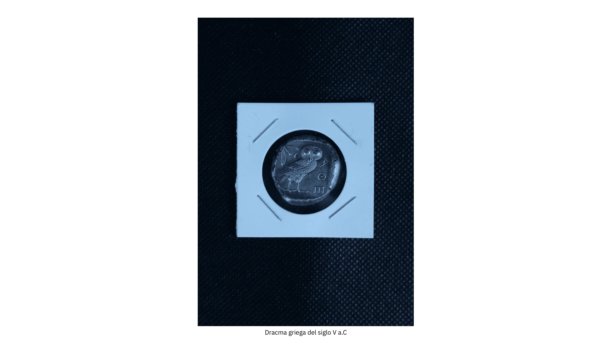

Cada ciudad griega desarrolló su propia relación con el dinero. En Atenas, la moneda estaba profundamente vinculada al poder político y económico. El famoso decreto ateniense de finales del siglo V a.C. impuso el uso exclusivo de la moneda ateniense en sus territorios aliados, reforzando así su hegemonía económica. Atenas también acumuló grandes reservas de oro para emergencias, que se guardaban en la Acrópolis, quizá como símbolo de su prudencia económica. Por el contrario, Esparta, ciudad militar de valores rigurosos, optó por restringir severamente el uso del dinero, prohibiendo a sus ciudadanos poseer monedas de oro o plata. Esparta prefería utilizar pesadas barras de hierro para desalentar el comercio exterior y mantener la cohesión social.

Las guerras se financiaban a menudo mediante la manipulación de la moneda. Durante la Guerra del Peloponeso (431-404 a.C.), Atenas recurrió a drásticas devaluaciones para pagar a sus tropas. Privada del acceso a sus minas de plata por la ocupación espartana de Decelia en 413 a.C., Atenas tuvo que fundir estatuas de oro para acuñar nuevas monedas a toda prisa en 407/406 a.C.. Luego, en 406/405 a.C., creó monedas de bronce chapadas en plata, provocando una crisis monetaria ilustrada por **Aristofanes**, que ya evoca lo que hoy se conoce como Ley de Gresham: el dinero malo expulsa al bueno. Esta moneda de emergencia fue rápidamente desmonetizada después de la guerra para restablecer la confianza en la moneda ateniense.

El final del periodo clásico estuvo marcado por el ascenso de Macedonia bajo Filipo II y su hijo Alejandro Magno, lo que alteró profundamente el equilibrio monetario griego. Gracias a las inmensas minas de oro y plata del monte Pangea, Filipo II produjo abundante dinero para financiar sus campañas militares y políticas, estableciendo un sencillo y práctico patrón oro-plata (10:1). Sus estatuillas de oro, que celebraban su victoria en los Juegos Olímpicos, circularon hasta Europa occidental, llegando incluso a Inglaterra. Alejandro prosiguió con esta política monetaria, haciendo circular ampliamente la dracma ática durante sus conquistas orientales hasta la India. Esta circulación masiva de monedas marcó el inicio de la era helenística, en la que la imagen de los soberanos sustituyó gradualmente a la de las divinidades en las monedas. Esta innovación permitió a generaciones de monarcas helenísticos promocionarse a sí mismos, relegando a los dioses tradicionales a un papel secundario en el reverso de sus monedas.

Tras la muerte de Alejandro en el 323 a.C., sus generales se repartieron su inmenso imperio, estableciendo dinastías en Egipto (los Ptolomeos), Siria (los Seléucidas) y otros lugares. Estos reinos helenísticos adoptaron diversos sistemas monetarios: los Ptolomeos impusieron un sistema monetario cerrado para controlar la circulación del dinero, prefiriendo utilizar el grano como moneda interna para ahorrar metales preciosos para gastos militares externos. Al mismo tiempo, Rodas se convirtió en un importante centro comercial antes de verse debilitada económicamente por los romanos, que establecieron Delos como puerto franco en 167 a.C.

El uso del dinero era fundamental en la remuneración de los mercenarios. Los soldados de Alejandro recibían dracmas de plata a diario.

La caballería, la élite del ejército altamente especializado de Alejandro, recibía una media de dos dracmas al día, un soldado de infantería un dracma y un mercenario ordinario dos tercios de dracma, el doble del salario de un simple trabajador.

Durante la Guerra del Peloponeso también se pagaron sumas considerables a los soldados: más de 1.200 talentos para sofocar la revuelta de Samos y más de 2.000 talentos para sitiar Potidea.

Para cuando este ejército estaba totalmente comprometido en Asia Menor, el coste total rondaba los veinte talentos diarios, o alrededor de media tonelada de plata, o 120.000 dracmas.

La acuñación de moneda griega también desempeñó un importante papel cultural, ya que cada ciudad trataba de afirmar su identidad acuñando sus propias monedas con símbolos locales o mitológicos. Por ejemplo, Heraclio representaba a Heracles (Hércules) luchando contra un león, mientras que Cirene mostraba la famosa planta medicinal silphium.

Por último, a pesar de su variedad y fluctuaciones regionales, la moneda griega clásica y helenística dejó una huella duradera en la historia económica y cultural del mundo mediterráneo, influyendo profundamente en los sistemas monetarios posteriores hasta Roma, que fue adoptando y desarrollando los conceptos económicos griegos para estructurar su propia economía imperial.

## El impacto de la moneda en Grecia

<chapterId>3a5e6c7d-699c-5567-87cd-3374c49d55a9</chapterId>

:::video id=0c79a59c-e179-4893-a414-1b8de0930eb9:::

### Atenas y el contraste con Esparta

La oposición entre Atenas y Esparta durante la Grecia clásica revela dos modelos de organización política y económica radicalmente distintos. Mientras Esparta rechazaba la moneda metálica en favor de un sistema autosuficiente basado en la confianza cívica, Atenas adoptó plenamente esta tecnología para construir y mantener su imperio marítimo.

### La necesidad monetaria del poder naval

El Imperio ateniense, a pesar de su grandioso nombre, seguía siendo geográficamente modesto: esencialmente Atenas y las ciudades del mar Egeo. Su poder descansaba en la Liga de Delos, una alianza militar dominada por Atenas como hegemón. Esta estructura imperial requería un instrumento económico unificado: la moneda de plata ateniense.

El mantenimiento de una flota constituía el núcleo de esta necesidad monetaria. Una sola trirreme ateniense costaba entre uno y dos talentos de plata, una suma considerable. Con varios centenares de barcos que mantener, Atenas necesitaba un sistema fiscal eficaz. La moneda se convirtió en la herramienta indispensable para recaudar el tributo de las ciudades vasallas y financiar la fuerza de proyección naval que garantizaba la cohesión del imperio.

### La imposición monetaria como herramienta de dominación

Atenas impuso su moneda de plata a todos los miembros de la Liga de Delos. Esta estandarización monetaria sirvió a varios objetivos estratégicos. En primer lugar, facilitó el cobro de tributos al crear una unidad de cuenta común. En segundo lugar, reforzaba la dependencia económica de las ciudades vasallas respecto a Atenas. Por último, proyectaba simbólicamente el poder ateniense en todo el imperio marítimo.

Esta política monetaria contrasta fuertemente con el modelo espartano. Esparta, una potencia terrestre, podía depender del trabajo de los helotes (esclavos) del Peloponeso para su subsistencia. Su sistema económico, cerrado y centrado en la ciudad, no requería instrumentos monetarios sofisticados. Los ciudadanos-soldados vivían juntos, compartían las comidas y no necesitaban dinero para los intercambios diarios.

### La moneda como vehículo del comercio marítimo

La naturaleza marítima del imperio ateniense obligaba a abrirlo al comercio. A diferencia de Esparta, que se encerraba en sí misma, Atenas tenía que comerciar con el exterior para sobrevivir y prosperar. La moneda se convirtió en el instrumento indispensable del comercio mediterráneo.

Esta orientación hacia el exterior creó un círculo virtuoso: el comercio generaba ingresos, estos ingresos financiaban la flota, la flota protegía las rutas comerciales y mantenía el imperio, y el imperio imponía la moneda ateniense, que facilitaba el comercio. La moneda ya no era simplemente un medio de intercambio, sino que se convirtió en un pilar de la estrategia imperial.

### Los límites del poder monetario

A pesar de esta sofisticación económica, el poder monetario ateniense mostró sus límites durante la Guerra del Peloponeso. Frente a las fuerzas terrestres espartanas, la superioridad naval y financiera de Atenas no fue suficiente. Las costosas expediciones, como la desastrosa campaña de Siracusa en Sicilia, agotaron los recursos financieros sin lograr una victoria decisiva.

La historia demuestra que la moneda, aunque es una poderosa herramienta para proyectar poder, no es garantía de dominación militar. Esparta, sin moneda metálica pero con una notable cohesión social, acabó imponiéndose al imperio monetario ateniense.

### Dos modelos, dos destinos

La oposición entre Atenas y Esparta ilustra dos enfoques fundamentales de la organización social y económica. Atenas representa el modelo abierto, comercial y monetarizado, precursor de los imperios marítimos modernos. Esparta encarna el modelo cerrado, autárquico, basado en la confianza cívica más que en instrumentos monetarios.

Estos dos sistemas demuestran que la adopción de la moneda está estrechamente ligada al modelo político y económico elegido. Para una potencia marítima y comercial como Atenas, la moneda se hizo indispensable. Para una sociedad guerrera y cerrada como Esparta, representa una amenaza para el orden social. Esta antigua dicotomía sigue informando los debates sobre el papel del dinero en la organización de las sociedades.

## La República Romana

<chapterId>0bc80983-33e1-5881-85bb-7c22f3144a9a</chapterId>

:::video id=dc05ca97-d29c-4679-bfeb-912c47d86ce2:::

### Historia de la República Romana

- 753 - 509 a.C.: Reino de Roma**
- 753 A.C: Fundación de Roma** (tradicionalmente atribuida a Rómulo).
- 509 - 27 A.C: República Romana**, Roma se convierte en una república gobernada por un Senado elegido y cónsules.
- 280 - 275 A.C: Guerra pírrica**. Pirro, rey de Epiro, lucha contra los romanos en el sur de Italia, obteniendo costosas victorias ("victorias pírricas").
- 264 - 146 A.C: Guerras Púnicas**. Importante conflicto que enfrenta a Roma y Cartago por el dominio del Mediterráneo occidental.
- Aníbal (247 - c. 181 a.C.)**. Legendario general cartaginés, famoso por cruzar los Alpes con su ejército y elefantes para atacar Roma durante la Segunda Guerra Púnica.
- 146 a.C.: Batalla de Corinto**. Roma destruye la ciudad griega de Corinto e impone su dominio definitivo sobre la Grecia continental.
- 91 - 87 a.C.: Guerra Social**. Revuelta de los aliados italianos de Roma que exigen la ciudadanía romana, lo que finalmente condujo a su plena integración en la ciudadanía.
- 64 a.C.: Fin de la resistencia seléucida**. Roma elimina definitivamente la influencia seléucida en Siria, consolidando su dominio sobre el Mediterráneo oriental.
- 55 A.C: Julio César conquista Europa Central y Occidental**. Julio César extiende la dominación romana sobre la Galia (actual Francia) y penetra en Germania y Bretaña.
- 43 A.C: Formación del Segundo Triunvirato**. Alianza política entre Octavio (más tarde Augusto), Marco Antonio y Lépido, para estabilizar Roma tras el asesinato de César.
- 27 a.C.: Inicio de la Pax Romana**. Periodo de estabilidad política y prosperidad bajo el reinado de Augusto, que marca el inicio del Imperio Romano.

### Los inicios monetarios tardíos de Roma

En esta sección sobre la Antigüedad, centraremos ahora nuestra atención en la República Romana. La historia monetaria de Roma comenzó mucho más tarde que la de griegos y persas. Fundada en el 753 a.C., Roma esperó casi cuatro siglos antes de adoptar realmente la acuñación de moneda. Durante este largo periodo, los romanos utilizaron un sistema primitivo de intercambio con piezas irregulares de bronce llamadas aes rude, que exigían un pesaje preciso para cada transacción. No fue hasta finales del siglo IV a.C., bajo influencia griega y etrusca, cuando Roma comenzó a emitir sus primeras monedas, sobre todo en bronce fundido como en China, el aes grave, característico de los intercambios romanos hasta **la Segunda Guerra Púnica**.

### Influencia griega y primeras monedas de plata

El decisivo encuentro con los griegos del sur de Italia introdujo realmente a los romanos en la acuñación de monedas de plata. Hacia el 280 a.C., Roma comenzó a producir sus propias monedas de plata imitando los didracmas griegos. La primera emisión regular de monedas de plata en Roma se remonta precisamente al 269 a.C., con los legendarios gemelos Rómulo y Remo amamantados por la loba, un símbolo que se ha convertido en icónico.

De hecho, muchas monedas romanas de la época de la República representan mitos fundacionales. Puedes ver la mía aquí abajo: es una soberbia moneda real del rey Tacio. Ilustra el mito del rapto de las mujeres de los sabinos. Tacio era el rey de esta región, y el mito fundacional cuenta cómo los romanos raptaron a las mujeres de los sabinos, una población que vivía cerca. Posteriormente, el rey Tacio se convirtió en co-rey con Rómulo, uno de los fundadores de Roma.

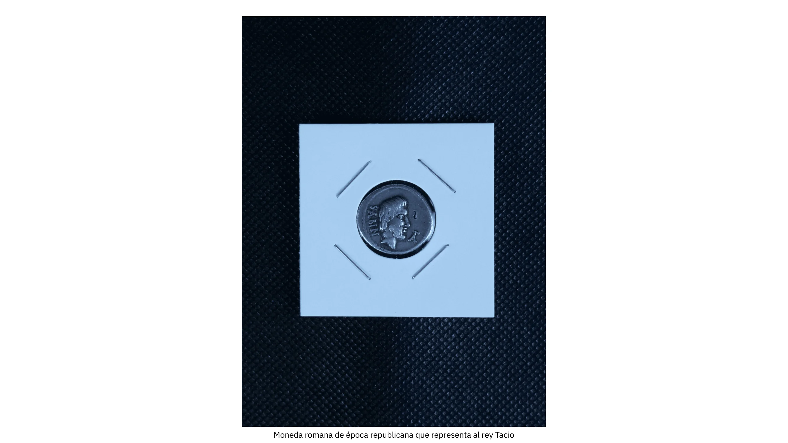

### El origen de la palabra "moneda" y el templo de Juno Moneta

El término "moneda" tiene su origen en el templo de Juno Moneta en Roma. Cuenta la leyenda que, durante una invasión gala en el año 390 a.C., las ocas sagradas del Capitolio alertaron a los romanos de un peligro inminente. En agradecimiento a la diosa Juno, protectora del Capitolio, se erigió un templo en su honor que pronto se convirtió en la ceca de las monedas romanas.

### Las guerras púnicas y las crisis monetarias

Los conflictos militares influyeron considerablemente en el desarrollo monetario romano. Durante la Segunda Guerra Púnica (218-201 a.C.) contra Cartago, Roma se enfrentó a graves dificultades financieras ante la invasión de Aníbal. Para paliar estas necesidades urgentes, Roma recurrió por primera vez a una emisión excepcional de monedas de oro, así como a una importante devaluación de su acuñación de plata, que pasó de una pureza inicial del 97% a alrededor del 89%. El peso de las monedas de bronce (aes) también descendió drásticamente, perdiendo casi un 80% en seis años.

Aquí podemos retomar un concepto que ya hemos tratado anteriormente sobre los griegos fundiendo metales preciosos almacenados en los templos para ayudar a aliviar las crisis económicas. Y para hablar de **Cartago**, aquí abajo pueden admirar una auténtica moneda cartaginesa de mi colección. Estas monedas cartaginesas mostraban una palmera en una cara y un caballo en la otra. En esta moneda, el caballo no es muy reconocible, a está muy desgastado.

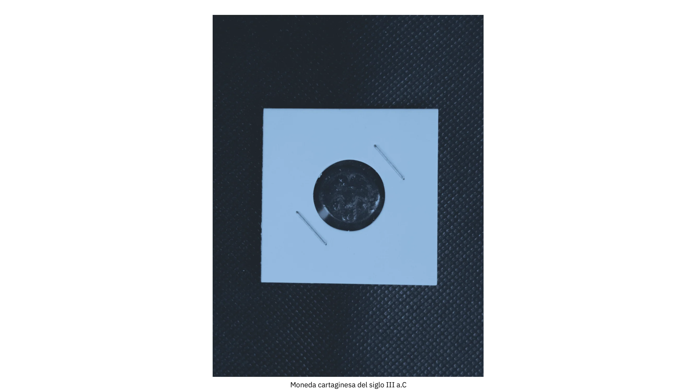

Como consecuencia, el peso de las monedas de bronce, conocidas como aes, también descendió drásticamente, perdiendo casi un 80% en seis años. Así pues, el peso de estas monedas de bronce, que no eran un metal precioso y se utilizaban en el comercio cotidiano, descendió mucho, lo que fue un signo de devaluación monetaria debido a estas guerras.

### El denario de plata y la estabilidad monetaria

En este contexto crítico, Roma introdujo el famoso denario de plata hacia el año 212 a.C.. Esta reforma garantizó una notable estabilidad monetaria, ya que el denario siguió siendo la moneda dominante durante casi 450 años. Roma debe esta estabilidad a una gestión rigurosa, a pesar de una importante revalorización en 146 a.C. y de una producción considerable para financiar sus inmensos ejércitos, especialmente durante las guerras púnica, social (91-87 a.C.) y macedonia. A modo de ejemplo, el mantenimiento de una sola legión romana costaba alrededor de 1,5 millones de denarios al año, lo que ilustra la magnitud de las necesidades monetarias.

Más allá de las fronteras romanas, las guerras provocaron importantes devaluaciones en las regiones bajo influencia romana. La Cartago púnica vio descender drásticamente la pureza de su electrum, que pasó de un 98% de oro en el siglo IV a sólo un 30% durante la Segunda Guerra Púnica, mientras que sus monedas de plata cayeron hasta un 18% de pureza.

### La evolución de los motivos monetarios

Con la expansión de Roma, el carácter de las monedas también evolucionó: inicialmente anónimas y patrióticas, las monedas adoptaron gradualmente diseños personalizados en los que aparecían las poderosas familias de los acuñadores (aquellos que acuñaban las monedas). Esta transición simboliza claramente las transformaciones políticas de la República romana tardía.

Por último, aunque Roma dominaba económicamente el mundo mediterráneo, conservaba cierta simplicidad en sus medios de pago: no se desarrolló ninguna forma real de transferencia monetaria que no fuera el intercambio directo de monedas, a excepción de las transferencias fiscales y los créditos privados reservados a la élite.

## El Imperio Romano

<chapterId>2dc44e50-112a-5abf-97ae-8e0a9ecda989</chapterId>

:::video id=f8d6f3d6-9ee4-4504-888e-4f12b3f20489:::

**Contexto histórico:**

**El Principado** fue la forma de gobierno imperial del Imperio Romano desde el comienzo del reinado de Augusto en el 27 a.C. hasta el final de la crisis del siglo III en el 284 d.C.

**27 a.C.: Comienzo de la Pax Romana**

Periodo de estabilidad política y prosperidad bajo el reinado de Augusto, que marca el comienzo del Imperio Romano.

**Augusto (30 a.C.-14 d.C.)** reformó radicalmente el sistema monetario romano, estableciendo un patrón duradero y estable para la moneda imperial.

**Augusto fue también uno de los primeros coleccionistas reconocidos** de monedas y fósiles antiguos.

**54 D.C. - 68 D.C: Nerón**

Controvertido emperador romano, conocido por su tiranía, persecuciones y desastrosa gestión tras el incendio de Roma.

**64 D.C: Gran Incendio de Roma**

Un gran incendio arrasa gran parte de la ciudad; se acusa a Nerón de ser el responsable.

**69 d.C.: Año de los Cuatro Emperadores**

Un periodo caótico con cuatro emperadores en rápida sucesión (Galba, Otón, Vitelio, Vespasiano).

**79 D.C: Erupción del Vesubio**

Volcán que destruyó las ciudades de Pompeya y Herculano, conservando excepcionalmente sus restos bajo las cenizas.

**165 D.C. - 180 D.C: Peste antonina**

Epidemia devastadora que debilitó el Imperio Romano bajo Marco Aurelio y Cómodo.

**200 d.C.: Apogeo territorial y fin gradual de la Pax Romana**

Roma alcanzó su máxima extensión, pero empezó a sufrir inestabilidad interna y dificultades económicas.

**212 D.C: Edicto de Caracalla sobre la ciudadanía**

El emperador Caracalla concedió la ciudadanía romana a casi todos los habitantes del imperio, con el fin de ampliar la base tributaria.

**220 DC: Comienzo de las grandes invasiones bárbaras**

Primeras incursiones significativas de pueblos germánicos a través de las fronteras romanas.

**235 D.C. - 285 D.C: Crisis política y militar del siglo III**

Periodo marcado por la inestabilidad política, con numerosos emperadores de corta duración, guerras civiles, crisis económicas y continuas invasiones.

**Aureliano (270-275 d.C.) revalorizó radicalmente la moneda romana**, intentando restaurar su valor nominal a pesar de la elevada inflación.

**301 D.C: Edicto de Precios de Diocleciano**

El emperador Diocleciano intentó en vano frenar la inflación galopante imponiendo estrictos controles de precios y salarios en todo el imperio.

**312 D.C: Constantino**

Primer emperador cristiano, fundador de Constantinopla, estabilizó la moneda introduciendo el "solidus", una moneda de oro de gran pureza y estabilidad.

**476 D.C: Caída del Imperio Romano de Occidente**

Roma es tomada por varios pueblos germánicos (incluidos los ostrogodos), acontecimiento que se considera que marca el fin oficial del Imperio Romano de Occidente.

### Las reformas monetarias de Augusto

En esta sección sobre la Antigüedad, hemos llegado ya al Imperio Romano. La historia monetaria del Imperio Romano se caracteriza por el uso intensivo de moneda metálica, sobre todo oro, plata y bronce, pero también por múltiples crisis monetarias, estrechamente vinculadas a disturbios políticos y militares. A finales de la República, bajo Julio César, Roma introdujo en el año 46 a.C. el aureus de oro, una moneda de unos 8 gramos de peso que fue ampliamente aceptada en toda Europa y la cuenca mediterránea. César estandarizó estas monedas de oro y acuñó las primeras monedas con el retrato de un hombre vivo, rompiendo así una antigua tradición republicana que favorecía los símbolos anónimos y colectivos. Esta evolución acompañó a un periodo de gran transformación política, en el que el poder personal fue sustituyendo gradualmente a las instituciones republicanas.

Tras el asesinato de César en el 44 a.C., Octavio (Augusto) tomó el control de Roma, estableciendo el Imperio en el 27 a.C.. Su reinado fue testigo de una reforma completa del sistema monetario, que aportó una estabilidad duradera a la economía romana. En tiempos de Augusto, un aureus de oro equivalía a 25 denarios de plata, que a su vez valían 4 sestercios de bronce. Esta estabilidad monetaria se mantuvo durante todo el siglo I d.C., un periodo que a menudo se describe como la edad de oro económica de Roma.

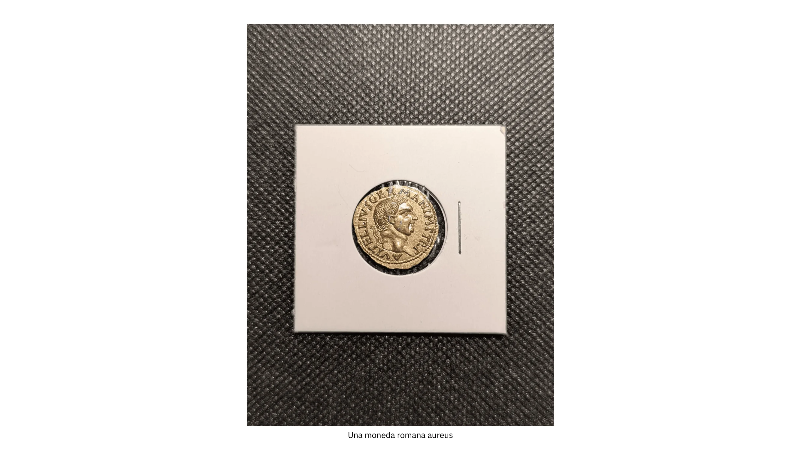

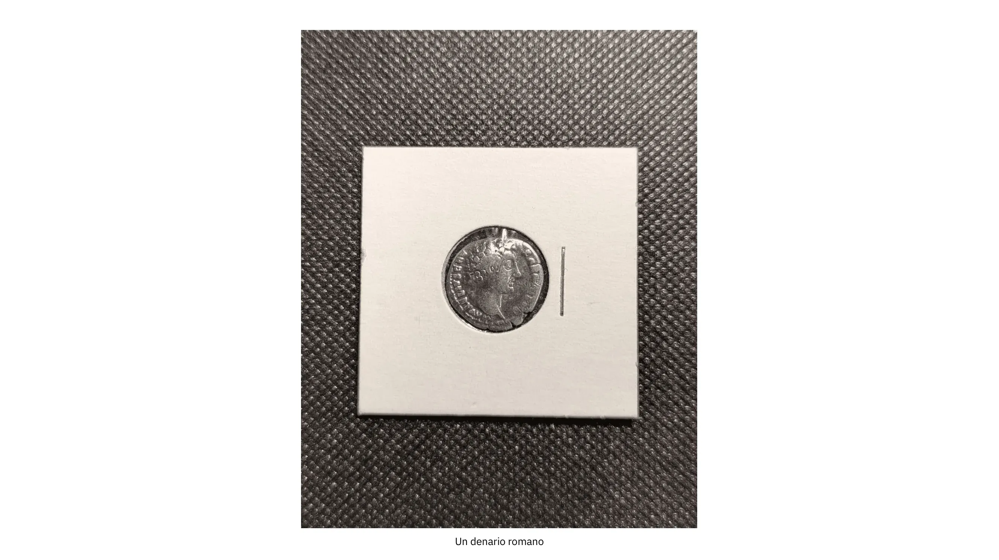

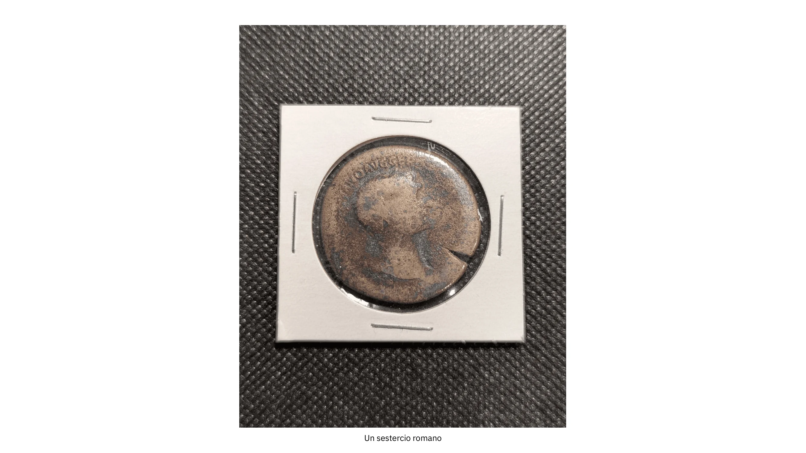

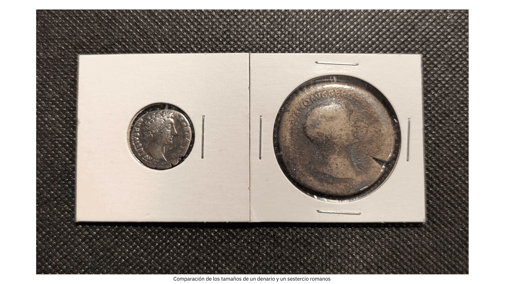

Sin embargo, a partir de Nerón (54-68 d.C.), Roma inició una lenta devaluación de sus monedas, reduciendo progresivamente su peso y pureza para financiar los crecientes gastos imperiales, sobre todo tras el gran incendio de Roma en el año 64 d.C. Estas devaluaciones tuvieron efectos notables: las monedas más puras se retiraron de la circulación mediante el atesoramiento o la exportación, de acuerdo con la **ley de Gresham**, mientras que las monedas devaluadas proliferaron, provocando un aumento gradual de los precios.

El siglo III marca un dramático punto de inflexión, con una espectacular aceleración de las devaluaciones bajo los emperadores Septimio Severo, Caracalla y Galieno. La principal moneda de plata, el denario y después el antoniniano, vio cómo su contenido en plata descendía hasta apenas el 2%. Al mismo tiempo, el peso en oro del aureus se redujo a la mitad. Esta crisis monetaria vino acompañada de una inestabilidad política sin precedentes, invasiones bárbaras y guerras civiles recurrentes.

Esta parte me permite presentar la última pieza de esta sección: el antoniniano. Se desconoce el nombre original de esta moneda, pero hoy en día nos referimos a ella como antoninianus. Tiene la particularidad de estar valorada en dos denarios, a pesar de ser sólo 1,5 veces mayor que un denario. Además, con el tiempo, estas monedas pasaron a ser simplemente billonarias, lo que significa que estaban hechas de una aleación de plata y otros metales en lugar de plata pura. A menudo, las monedas sólo estaban recubiertas de plata, lo que constituye un notable ejemplo de decadencia monetaria.

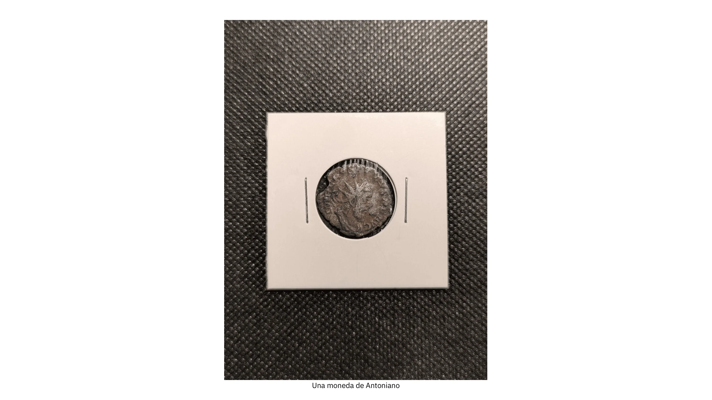

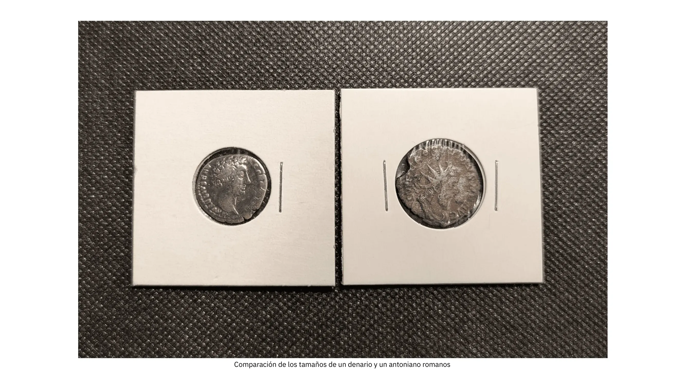

Ante esta situación, el emperador Aureliano (270-275 d.C.) intentó estabilizar el sistema revalorizando nominalmente las monedas, pero esta reforma introdujo en realidad un mecanismo inflacionista al fijar artificialmente el valor de las monedas existentes a un nivel superior.

Haré una digresión sobre el tema. Durante el siglo III, la inflación experimentó un rápido aumento exponencial. Anteriormente, aunque las monedas se devaluaban, el proceso artesanal de acuñarlas una a una proporcionaba cierto control sobre la inflación. Las estadísticas indican que, a lo largo de 300 años de devaluación, la inflación alcanzó una media del 4% anual. Justo antes de la reforma de Aureliano, la inflación era aproximadamente del 3% anual.

Aureliano introdujo una medida de pureza en la moneda de signo XXI, que indicaba una composición de 20 partes de bronce por 1 de plata, es decir, un 5% de pureza. Comercializó estas monedas de plata al 5% y estampó en ellas el signo XXI. Sin embargo, también retiró todas las demás monedas, más devaluadas, y les estampó el mismo XXI. De este modo se revalorizó el valor nominal de todas las monedas. El resultado fue una asombrosa tasa de inflación del 20% anual, muy superior a la tasa del 3% anterior a la aplicación de esta técnica.

Fue realmente Aureliano quien inventó esta forma de devaluación, mucho más rápida que la devaluación gradual del metal, que aún obligaba a imprimir las monedas una a una. Lo que hizo fue coger todas las monedas existentes, retirarlas y estamparles un punzón para cambiar su valor facial. Fue un verdadero punto de inflexión. Fue entonces cuando la inflación se hizo exponencial.

Para ilustrar visualmente esta devaluación extrema, he encontrado algunas estadísticas fascinantes sobre el precio del grano en Egipto desde el año 40 a.C. hasta el siglo III, abarcando más de 300 años. Abajo, puedes ver un tetradracma griego de mi colección. En aquella época, en el Egipto bajo ocupación romana del siglo III, el equivalente era una tetradracma egipcia. Aún se utilizaba la denominación de dracmas, que correspondía a un denario.

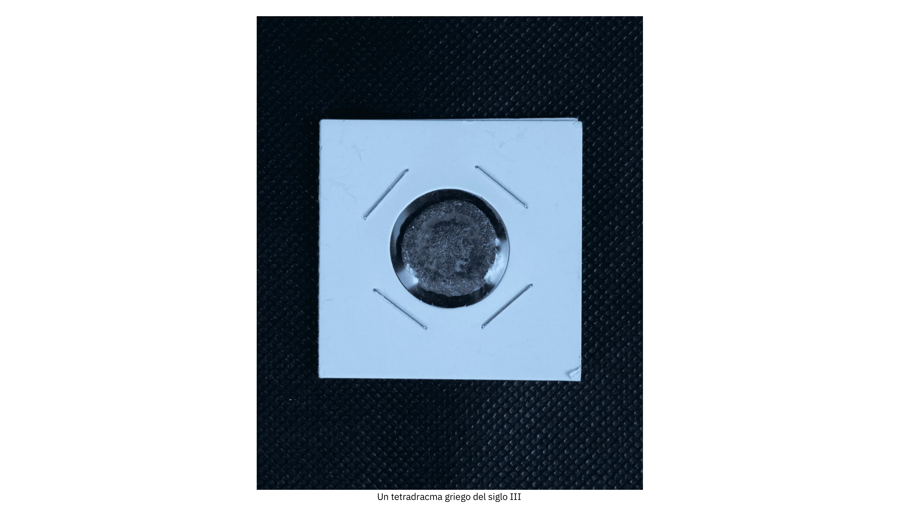

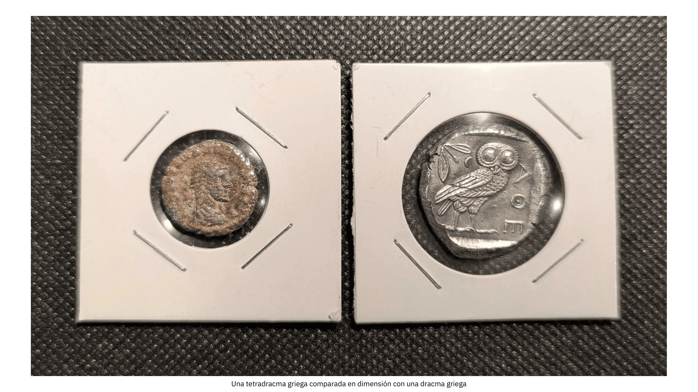

Así pues, el tetradracma egipcio que tengo equivalía a un denario. Se puede ver que la moneda es de billón (o bronce), por lo que no contiene ningún metal precioso. Puedes compararla con el tetradracma griego original para ver la devaluación física a lo largo de estos 300 años. El precio del grano en Egipto se ha multiplicado por un millón.

Es la expresión física de la reforma de Aureliano. Hay que tener en cuenta que la mayoría, la media a lo largo de estos 300 años de inflación, se situó en torno al 4%. Sólo al final, cuando Aureliano hizo su reforma, esta inflación se hizo más bien exponencial y llegamos a esta medida de 1 millón. Los precios eran un millón de veces más altos a finales del siglo III que en el siglo I a.C.

Su sucesor **Diocleciano** (284-305 d.C.) intentó reformas aún más radicales: emitió nuevas monedas (especialmente el argenteus, más puro pero demasiado limitado en cantidad), impuso drásticos controles de precios (Edicto de Precios de 301 d.C.) y **estableció un sistema fiscal basado en pagos en especie**. A pesar de estos esfuerzos, las reformas de Diocleciano no consiguieron frenar la inflación galopante.

Ante la negativa a suministrar bienes y servicios a cambio de una moneda devaluada, Diocleciano instituyó **un sistema de castas hereditarias** para atar a los campesinos y a sus descendientes a sus tierras.

Lo que realmente hay que entender aquí es que lo que ocurrió fue que los campesinos se negaron a entregar sus productos a cambio de moneda devaluada, y la respuesta de nuestro querido Diocleciano fue crear **castas hereditarias** diciendo "tú, no puedes dejar tu tierra, tus hijos no pueden dejar su tierra, lo mismo para los soldados, sois soldados, aceptáis que se os pague con mi moneda". Como solución transitoria, se les pagaba en especie (en carne, comida, grano) porque él se negaba a darles dinero. Así que impuso este sistema de castas hereditarias para obligar a la gente a apegarse a su oficio, de modo que no pudieran simplemente cambiar de trabajo si intentaban no aceptar la moneda devaluada.

Para ilustrar este ejemplo, aquí tengo un texto, un extracto del libro "*Régimen Monetario e Inflación*":

> Como la gente no estaba dispuesta a trabajar ni a entregar mercancías a cambio de una moneda devaluada, cuyo valor nominal era superior a su valor intrínseco o de mercado, hubo que obligarla a trabajar imponiéndole impuestos en especie. [...] Se hizo ilegal que los campesinos abandonaran sus hogares registrados. De este modo, la población agrícola quedó vinculada hereditariamente a la tierra.
>

> Este sistema de castas hereditarias se extendió gradualmente: Diocleciano obligó a los hijos de los soldados a servir en el ejército, mientras que los trabajadores de los talleres monetarios, así como de las fábricas de tejidos y tintes que Diocleciano había creado, se convirtieron en esclavos del Estado, con servicio hereditario. Los mineros del oro también se convirtieron más tarde en una casta hereditaria. Otras clases hereditarias probablemente ya existían en tiempos de Diocleciano, en particular los gremios de panaderos y carniceros [...] en Roma, así como los gremios diocesanos de capitanes de barco que transportaban grano y otros cargamentos públicos a Roma.

Fue Constantino (306-337 d.C.) quien finalmente consiguió estabilizar el sistema monetario al introducir en 312 el solidus, una moneda de oro puro cuya calidad y peso garantizó estrictamente. Existía todo un sistema para verificar la pureza y el peso del solidus. **Sin embargo, esta estabilidad sólo afectó a una élite adinerada y a la administración imperial**, mientras que la **mayoría de la población siguió padeciendo una moneda de baja calidad y una inflación persistente**. El solidus se mantuvo estable en el Imperio de Oriente (Bizancio), donde duró más de un milenio, mientras que en Occidente la acuñación se fragmentó en pequeñas monedas de escaso valor, acompañando la desintegración económica y política final del Imperio Romano, que cayó definitivamente en 476 d.C.

Para terminar, me gustaría compartir con ustedes esta cita de *A History of Money: From Ancient Times to the Present Day* de Glyn Davies, que resume magistralmente lo que quizá condujo a la caída de Roma:

*"Los impuestos eran sistemáticamente inadecuados, y las dificultades asociadas a estos impuestos cada vez más inadecuados, tardíamente ajustados y muy visibles llevaron a Roma a confiar más en una forma fácil, inmediata y oculta de tributación: la devaluación de la moneda. Las efímeras reformas ad hoc no lograron invertir esta secular tendencia al declive. Las presiones financieras provocadas por el desgaste de las monedas, los naufragios, las fugas de dinero debidas a la compra de artículos de lujo procedentes de Oriente, los regalos ofrecidos a los bárbaros germánicos, el crecimiento de las poblaciones urbanas, el declive de la producción agrícola, el agotamiento progresivo de las minas más ricas y, sobre todo, las políticas de "pan y circo" consideradas indispensables para mantener un mínimo de orden en la vida urbana: todas estas presiones acumuladas llevaron a Roma a una devaluación monetaria constante, intercalada con reformas ocasionales condenadas al fracaso "*

*Además del pan y el vino gratuitos o baratos, de vez en cuando se distribuían liberalidades imperiales ("congiaria") en forma de asignaciones monetarias, sobre todo bajo Trajano (98-117 d.C.) y aún más bajo Adriano (117-138 d.C.) y sus sucesores. Lo que el emperador y los ciudadanos habían considerado inicialmente un privilegio excepcional se había convertido, a principios del siglo II, en una expectativa habitual. Estos repartos "constituían una pesada carga para el erario público y contribuían, a su manera, a la bancarrota del Estado "*

## Vínculos entre dilución monetaria e inflación: de las causas a las consecuencias

<chapterId>38d5781c-e900-53f7-baa7-413655d71754</chapterId>

:::video id=3999256d-aafe-4502-9b72-dfa8491a2777:::

Esta sección examina los vínculos entre la dilución monetaria y la inflación, desde las causas hasta las consecuencias. La dilución monetaria es uno de los principales fenómenos económicos de la historia monetaria romana, con efectos directos sobre la inflación. A partir del siglo I d.C., se produjo una lenta fase inicial de dilución de la moneda de plata (denario) desde el reinado de Nerón (54-68 d.C.), acelerada por repetidas crisis militares y financieras, especialmente bajo Septimio Severo (193-211) y Galieno (253-268).

También observamos una devaluación más gradual del aureus. Esta diferencia en el ritmo de devaluación pone de relieve dos puntos:

1. El papel de la unidad de cuenta en el bimetalismo para el control estatal del dinero. La unidad de cuenta en este ejemplo es el denario. He identificado tres formas diferentes de gestionar el valor de la unidad de cuenta: la devaluación (dilución del metal), la redenominación (antoninianus) y la imposición de un valor facial mediante la marca "XXI" (Aureliano)

2. La voluntad del Estado de aplazar lo más posible la devaluación del aureus, la reserva de valor que permite a las élites mantener su poder adquisitivo a costa de los menos favorecidos. A lo largo del curso retomaremos con frecuencia este principio, especialmente en relación con el concepto conocido como "efecto Cantillon" y las redenominaciones del Maravedí en España.

Este fenómeno es bastante interesante y se ha repetido a lo largo de la historia. Lo revisaremos con los Maravedi en una sección posterior. Este patrón es evidente también con todas las monedas de reserva; la unidad de valor de reserva, como el aureus en Roma, permanece intacta. Sin embargo, la unidad de cuenta utilizada por la población en general para el comercio y las transacciones cotidianas suele devaluarse. Como resultado, la inflación monetaria afecta al pueblo llano, mientras que los que pueden permitirse monedas de oro permanecen en gran medida intactos.

Y por cierto, **es el mismo fenómeno que se está creando hoy en día con la devaluación de la moneda, que permite que los activos financieros suban de valor**, y así son las personas que utilizan la moneda, los más pobres, los que se empobrecen, y esto a su vez enriquece, mediante la creación de dinero, los activos de aquellos que son capaces, que tienen los medios para protegerse contra la devaluación, y así se profundizan las desigualdades sociales. Hasta aquí mi pequeña perorata política.

Lo que acabo de describir se llama efecto Cantillon. Veremos que este caballero vivió en la época de John Law, un tema que también trataremos en una sección posterior.

La reforma iniciada durante el reinado de Aureliano permitió que la inflación se disparara. La inflación del valor nominal del dinero ya no estaba limitada por la capacidad de las cecas para producir monedas a mano. Las monedas ya acuñadas podían ahora marcarse sin más, y el valor nominal de la masa monetaria aumentó con mayor rapidez.

Tengo dos citas que compartir con ustedes en relación con Aureliano. La primera procede de *A History of Money: De la Antigüedad a nuestros días*:

*"En lo que respecta a la economía romana, la contribución de Aureliano fue más un desastre que un triunfo. Fue en gran parte debido a la naturaleza de su "reforma" que la tasa de inflación pudo aumentar mucho más allá de lo que había sido posible anteriormente, incluso bajo el irresponsable Galieno. Durante dos siglos después de Aureliano, la inflación se hizo endémica en todo el Imperio Romano "*

La segunda procede del libro *Ancient History from Coins* y se refiere a la desvinculación del sistema monetario del oro:

*"La reforma de Aureliano cambió la relación entre la moneda de oro y el resto del sistema monetario. Antes de ella, los demás tipos de moneda estaban vinculados al **aureus** según los tipos oficiales (25 denarios egipcios o 25 tetradracmas por un aureus, etc.). Tras la reforma, la moneda de oro comenzó a **fluctuar libremente de valor**, como cualquier otra mercancía, mientras que el resto del sistema monetario **desplomó su valor** debido al **debilitamiento de las aleaciones**, dejando de estar **respaldado por el oro**. Como la unidad de cuenta seguía basándose teóricamente en la plata (el denario, o en Egipto la dracma), los precios subían al depreciarse la moneda. "*

Como puede verse, esta devaluación de la moneda que servía de unidad de cuenta afectó desproporcionadamente a los menos pudientes, mientras que la desvinculación con el oro monetario protegió el poder adquisitivo de quienes podían permitirse ahorrar en el depósito de valor que es el oro.

Lo que tienes que entender aquí es que si hay un vínculo entre el denario y el aureus, incluso si devalúas el denario, si todavía puedes cambiar tu denario por aureus a este tipo de cambio (25 denarios por 1 aureus), la gente definitivamente cambiará su denario por tu aureus ya que el denario estará sobrevalorado y el aureus infravalorado. Pero en esta reforma, eliminaron este vínculo. Así que la gente ya no podía intercambiar denarios por metal de plata devaluado frente al oro. Fue entonces cuando los que tenían acceso a monedas de oro pudieron protegerse de verdad, porque después la gente ya no podía cambiar plata devaluada sobrevalorada por oro puro infravalorado. Este es un momento muy importante en la evolución de la moneda.

Un ejemplo sorprendente de los efectos de esta reforma de Aureliano queda perfectamente ilustrado por estas citas del libro *Regímenes monetarios e inflación*:

*"Entre los reinados de los emperadores Claudio (41-54 d.C.) y Constancio (337-361 d.C.), el precio del trigo en el mercado abierto de Egipto, expresado en dracmas, **se multiplicó por más de un millón**. La espectacular inflación de los precios es uno de los hechos económicos centrales de los siglos III y IV d.C." (Lendon 1990, p. 106). Pero esta evolución es **menos dramática de lo que parece**, ya que corresponde a una **tasa media anual de inflación del 4,4%**. Y según Wassink (1991, p. 482), la inflación comenzó realmente **sólo en el 238 d.C.**"*

*"A partir de esta fecha, la inflación se aceleró lentamente, a medida que el **buen dinero fue primero expulsado de la circulación**, de modo que la masa monetaria total apenas aumentó al principio. Posteriormente, alcanzó una tasa media anual del **3,65% entre 250 y 293**, elevándose al **22,28% entre 293 y 301** (Wassink 1991, p. 466), es decir, hasta las **abortables reformas monetarias del emperador Diocleciano**. Este fenómeno es **particularmente impresionante para la inflación en un régimen monetario basado en los metales**. "*

Este fenómeno de inflación ligado a la dilución monetaria respondió inicialmente a las ocasionales crisis de tesorería del Estado romano. Al reducir el contenido de metal precioso de las monedas manteniendo su valor nominal, el Estado aumentaba temporalmente sus recursos. Pero los precios no reaccionaban inmediatamente: en efecto, el sistema romano tenía cierta rigidez, lo que significaba que los salarios y los precios tardaban en adaptarse a las sucesivas devaluaciones. No obstante, a partir de cierto umbral, los precios subían bruscamente para que el mercado volviera a equilibrarse con el valor real de las monedas.

Como ya se ha mencionado, este fenómeno es especialmente evidente a partir de mediados del siglo III. En Egipto, una región ricamente documentada, los precios se multiplicaron por 10 bajo Aureliano (274 d.C.) tras una revaluación oficial de la moneda, a pesar de un intento inicial de estabilización. Después, bajo Diocleciano (301 d.C.), el edicto sobre los precios impuso drásticos controles para frenar la inflación sin atajar la causa fundamental -la sobreproducción y la degradación monetaria-, lo que provocó un previsible fracaso. La inflación persistente empuja en última instancia a la economía hacia un sistema de dos niveles: **la élite, protegida por las reservas de oro (como el solidus de Constantino**), disfruta de estabilidad, mientras que la mayoría de la población sigue sufriendo una inflación crónica, **ilustrando lo que hoy se conoce como efecto Cantillon.**

Existe un claro vínculo entre la dilución monetaria romana y la inflación, cuyas causas están esencialmente relacionadas con los déficits fiscales crónicos, el incesante gasto militar y la mala gestión económica del Estado.

## La caída del Imperio Romano

<chapterId>b6ec0914-227b-509c-8108-b09eec9bb904</chapterId>

:::video id=91d4fee5-59bb-4ab9-a90b-e1125c71decb:::

### La devaluación de la moneda y el hundimiento de Roma

La escuela austriaca de economía, especialmente a través de Ludwig von Mises, propuso una interpretación monetaria de la caída de Roma. En esta visión, la devaluación progresiva de la moneda romana hizo añicos el complejo sistema de división del trabajo que sostenía un imperio de 60 millones de habitantes. La moneda, instrumento central de coordinación económica, una vez corrompida, provocó el colapso de toda la estructura social y económica.

Este deterioro monetario no sólo destruyó la cohesión interna del imperio. También cortó los vínculos comerciales con los pueblos vecinos. Privados de los beneficios del comercio con Roma, los "bárbaros" pasaron de la cooperación pacífica a la depredación. Por tanto, las invasiones no eran sólo de naturaleza militar, sino también el resultado de un colapso económico fundamental.

### Las tres fases de la devaluación imperial

La historia monetaria romana puede dividirse en tres periodos distintos. El primero, de los Julio-Claudios a los Antoninos (27 a.C.-finales del siglo II), mantuvo una relativa estabilidad. Bajo Trajano, el imperio alcanzó su apogeo: con una extensión de 5 millones de km², Roma se convirtió en la primera ciudad millonaria de la historia. El denario conserva una pureza de plata del 98% al 80%, una devaluación moderada que sigue permitiendo el funcionamiento de la economía.

El segundo periodo, el siglo III, fue de anarquía militar. Veintiséis emperadores se sucedieron en pocas décadas. La moneda se hundió: el antoniniano, que supuestamente valía dos denarios, sólo contenía 1,5 en peso metálico - el primer intento de divorciar el valor legal del real. Esta manipulación desencadena la Ley de Gresham: la moneda mala expulsa a la buena. Los ciudadanos atesoraron las monedas buenas, gastando sólo las devaluadas.

Los tesoros monetarios descubiertos por los arqueólogos revelan esta ansiedad económica. Las ánforas enterradas muestran, por estratificación, cómo los romanos depositaban primero las mejores monedas, añadiendo gradualmente las devaluadas. Estas antiguas "pilas" dan testimonio de la acción humana ante la incertidumbre, un intento de preservar el valor en un mundo en decadencia.

### Constantino y el sistema dual

Constantino (310-337) intentó estabilizar el imperio mediante una reforma radical. Creó el solidus de oro, una moneda estrictamente controlada por la administración. Los funcionarios comprobaban sistemáticamente el peso y la pureza. La emisión seguía siendo limitada, vinculada al botín de guerra. Esta moneda se convirtió en el instrumento exclusivo del poder: los impuestos se pagaban en solidus y las legiones recibían su paga en oro.

Al mismo tiempo, el pueblo utilizaba el nummus de bronce, que se devaluaba constantemente. En 445, un solidus valía 7.000 nummi; en 498, 16.800. Este doble sistema institucionalizaba el efecto Cantillon: los que tenían acceso al solidus -la administración, los terratenientes- estaban protegidos de la inflación. La plebe, confinada al nummus, se empobrecía inexorablemente.

Esta separación monetaria creó dos economías paralelas sin tipo de cambio oficial. El solidus sigue siendo la unidad de cuenta, pero circula muy poco. El nummus se utiliza para los intercambios diarios, pero pierde valor constantemente. Esta arquitectura monetaria prefiguraba las desigualdades del incipiente sistema feudal.

### El colapso de la división del trabajo

La devaluación de la moneda destruyó gradualmente la especialización económica. Sin una unidad de cuenta fiable, el comercio mediterráneo se hundió. Los artesanos especializados de Roma ya no podían comerciar con Egipto o la Galia. Las provincias adoptaron sus propias monedas, multiplicando las fricciones comerciales.

Ante esta desintegración, la población urbana huyó al campo, un éxodo urbano que invirtió siglos de urbanización. Los artesanos abandonaron sus oficios por la agricultura de subsistencia. Las grandes propiedades (latifundios) se convirtieron en islas autosuficientes, prefigurando los señoríos medievales.

Desesperado, Diocleciano llegó incluso a exigir impuestos en especie, el reconocimiento definitivo del fracaso monetario. Su edicto del máximo (301) intentó controlar los precios, acelerando el retorno al trueque. La complejidad económica retrocedió a formas anteriores a la civilización.

### Sobrevivir gracias al oro de Roma a Bizancio

Paradójicamente, el solidus sobrevivió al Imperio de Occidente. Bizancio lo mantuvo hasta el siglo XI, asegurando otros mil años de estabilidad económica. En Occidente, su recuerdo persiste: la palabra francesa "sou" deriva de solidus, testimonio lingüístico de una grandeza monetaria perdida.

Los terratenientes que habían conservado su riqueza en oro se convirtieron en señores feudales. Las estructuras eclesiásticas, únicas instituciones supervivientes, proporcionaron los lazos sociales que el dinero ya no podía garantizar. Europa se fragmentó en dominios autárquicos, cada uno con su propia economía de subsistencia.

Esta transformación revela la fragilidad de las civilizaciones complejas. La división del trabajo que permitió a Roma alimentar a un millón de habitantes dependía enteramente de la confianza monetaria. Una vez rota esta confianza, el edificio se derrumbó, devolviendo a Europa a formas económicas primitivas durante casi un milenio.

## La Edad Media y la Edad Oscura

<chapterId>a5856873-6142-57be-8a73-1f9e3df83792</chapterId>

:::video id=86b8da9b-3831-443d-b170-58c2bea3ad54:::

La historia y la aparición del dinero en la Edad Media están marcadas por periodos de regresión, innovación y recuperación económica.

Por ejemplo, cuando el ejército romano abandonó Britania, no entraron más monedas romanas en la isla. Alrededor del año 435 d.C., el uso de monedas desapareció por completo en Gran Bretaña, un fenómeno único en las antiguas provincias romanas. Durante casi dos siglos, la economía británica estuvo sin acuñar moneda hasta el siglo VII, cuando reaparecieron gradualmente las monedas merovingias y de inspiración continental.

A partir del siglo VIII, la influencia cristiana contribuyó a la reintroducción de la moneda en el norte de Europa. La figura clave de este periodo fue Pepino el Breve, rey de los francos, que introdujo el denario en 752, adoptado posteriormente por su hijo Carlomagno. Carlomagno extendió ampliamente el uso del denario de plata, creando un patrón monetario europeo durante varios siglos.

En Inglaterra, la acuñación de moneda experimentó un importante renacimiento con la producción del penique de plata bajo el reinado del rey Offa de Mercia hacia 765. Esta moneda adquirió tal importancia que permaneció prácticamente inalterada durante 500 años.

Como primer artefacto relacionado con este periodo, permítanme mostrarles una reproducción de un penique inglés de la época.

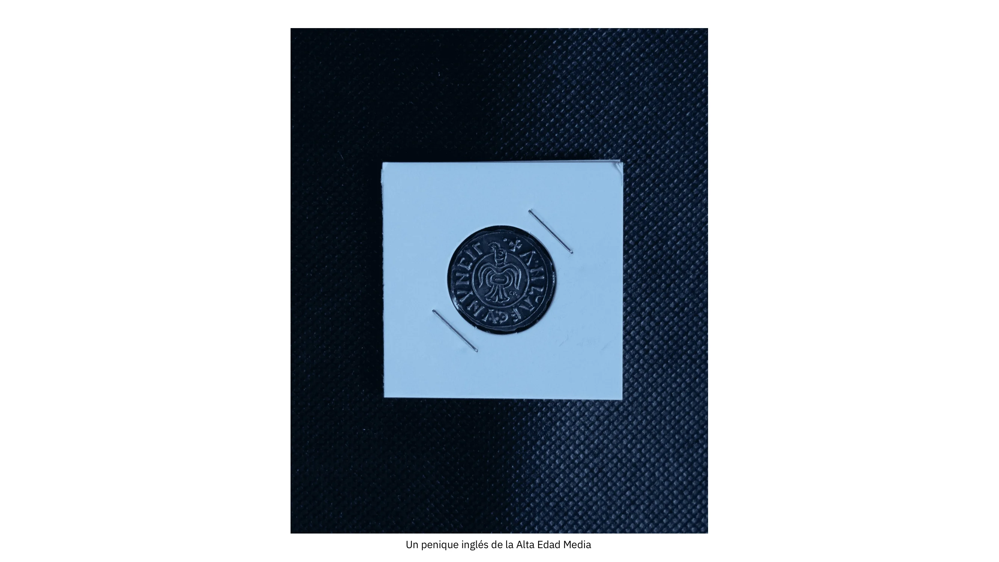

Durante la Alta Edad Media, Europa cayó en el feudalismo tras el colapso del sistema monetario romano. La mayoría de la población utilizaba monedas de cobre o bronce de escaso valor, a menudo sujetas a la dilución monetaria, lo que limitaba el comercio a larga distancia.

El retorno de la moneda metálica como medio de pago se produjo gradualmente, culminando en el siglo XIII con la aparición del florín de oro en Florencia en 1252, seguido del ducado de oro en Venecia. Estas monedas de oro se utilizaron ampliamente gracias a la expansión del comercio y a la creciente necesidad de medios de pago fiables y aceptados internacionalmente.

En Inglaterra, el sistema monetario se protegió de la dilución mediante políticas fiscales innovadoras, como el impuesto sobre la tierra introducido por Guillermo el Conquistador después de 1066, que preservó la calidad del penique esterlino. Lo que es importante entender aquí es que los soberanos de la época podían devaluar la moneda para financiar el Estado, y **la introducción de este impuesto hizo posible mantener la moneda estable y financiar el Estado a través de los impuestos**

Sin embargo, la tentación de beneficiarse mediante la dilución monetaria provocó crisis, como en el reinado de Enrique I en el siglo XII, cuando la calidad de la acuñación descendió drásticamente. Severas reformas, a veces acompañadas de medidas violentas contra los acuñadores, restablecieron temporalmente la confianza en la moneda.

La Edad Media también fue testigo de la aparición de sofisticadas prácticas financieras, como el uso de barajas en Inglaterra para eludir la prohibición de la usura y conceder créditos. La Iglesia no era muy partidaria de los préstamos con interés, por lo que se utilizaron diversas técnicas para eludir la prohibición del uso de intereses.

Estas innovaciones fueron una respuesta a la escasez crónica de moneda metálica y favorecieron la aparición de un mercado financiero embrionario.

Las Cruzadas, por su parte, estimularon el comercio mediterráneo, fomentando el desarrollo de intercambios internacionales y nuevas prácticas bancarias, especialmente a través de la Orden de los Templarios. Los templarios se convirtieron en importantes intermediarios financieros que permitían a los cruzados obtener liquidez lejos de sus hogares, prefigurando el moderno sistema bancario europeo.

Para hacer el enlace con los Templarios, aquí abajo se puede observar una moneda medieval francesa, donde se puede reconocer una hermosa cruz en el centro. Era bastante común que las monedas de esta época llevaran esta cruz.

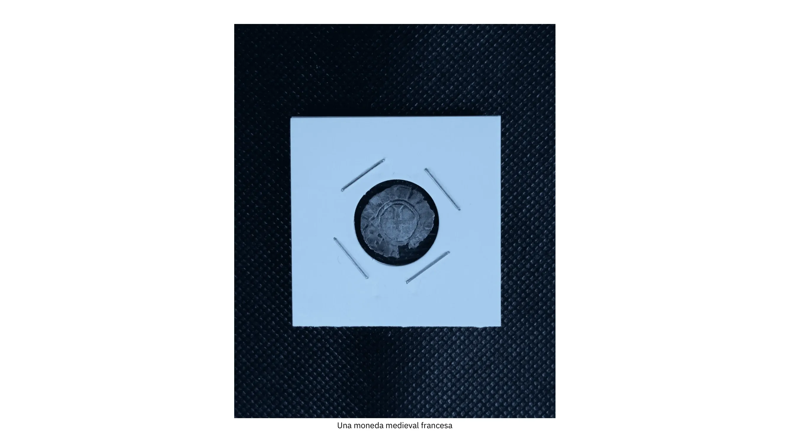

Por último, grandes crisis como la peste negra (1346-1353) provocaron profundas transformaciones económicas. La fuerte caída de la población provocó un fuerte aumento de los salarios, desafiando los intentos del gobierno de mantener los niveles de remuneración anteriores.

Al mismo tiempo, la Guerra de los Cien Años (1337-1453) obligó a los Estados a adoptar políticas fiscales más agresivas para financiar sus ejércitos, lo que contribuyó al debilitamiento del sistema feudal.

Así pues, la Edad Media estuvo marcada por una tensión constante entre la necesidad de dinero fiable para el comercio y la tentación constante de los gobernantes de diluir el dinero para obtener beneficios inmediatos. Este conflicto modeló profundamente el desarrollo monetario europeo, sentando las bases de los sistemas económicos modernos.

Para concluir esta sección, me gustaría añadir una anécdota bastante interesante de la Inglaterra de esta época. Esta anécdota está tomada del libro "History of Money" de Glyn Davies.

Menciona que en Inglaterra, el paso al Parlamento transfirió la carga de la deuda del soberano al Parlamento, lo que dio lugar a un endeudamiento crónico del Estado. Antes, la deuda pesaba sobre los hombros del soberano.

Una vez que el Parlamento pudo hacerse con parte de este poder de creación de dinero, permitió la creación de deudas a largo plazo que corrían a cargo del pueblo, no del rey. Antes, si el rey quebraba o si se producía un cambio de rey, la deuda se extinguía con él.

En el momento en que la creación de deuda es llevada a cabo por el Parlamento, surge el concepto de deuda soberana, ya que es potencialmente ilimitada en el tiempo. Mientras exista el Estado, mientras exista el Parlamento, existe esta deuda, y había que encontrar todo tipo de formas de refinanciarla y de extenderla en el tiempo. Se trata de un gran cambio de paradigma, en el que ya no era el rey o la realeza quien garantizaba o soportaba la carga de estas deudas; ahora era el Parlamento y, por tanto, sus ciudadanos.

## El renacimiento

<chapterId>1d1dfb05-70b4-5b7b-9708-373c2182950d</chapterId>

:::video id=4977b4f3-c7b2-41a5-ad7b-a96a8cca4092:::

Hemos llegado a la sección del curso en la que hablamos del periodo conocido como el Renacimiento. Se desarrolla en un contexto de crisis trágica, con la propagación meteórica de la peste por las pulgas de las ratas a bordo de los barcos. Esta tragedia, sin embargo, nos informa sobre el crecimiento del comercio y los viajes en el periodo altomedieval. Antes, en este periodo, no había tanta gente que se desplazara tan lejos y tan deprisa.

### El Florín de Florencia

El retorno de la moneda de oro a Europa durante el Renacimiento marca un punto de inflexión fundamental en la historia monetaria. **Todo empezó con el florín de Florencia en 1252, la primera gran moneda de oro acuñada en Europa desde la caída de Roma**. Con su peso y pureza notablemente constantes (alrededor de 3,5 gramos de oro puro), el florín permaneció inalterado durante cuatro siglos y se convirtió rápidamente en una referencia monetaria paneuropea esencial.

Aquí abajo puede ver una reproducción de un Florín: un Florín de oro fabricado en peltre y estampado por un artista francés que realiza excelentes piezas, grabadas y acuñadas manualmente.

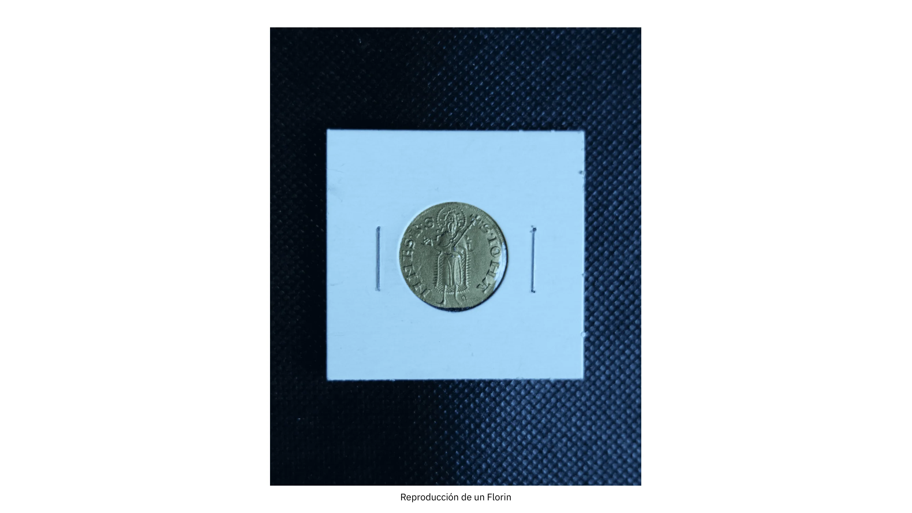

Este retorno a la acuñación de monedas de oro estuvo impulsado por un contexto específico: el colapso del solidus bizantino y el declive económico del mundo musulmán debido a las invasiones mongolas crearon un vacío monetario en el comercio internacional.

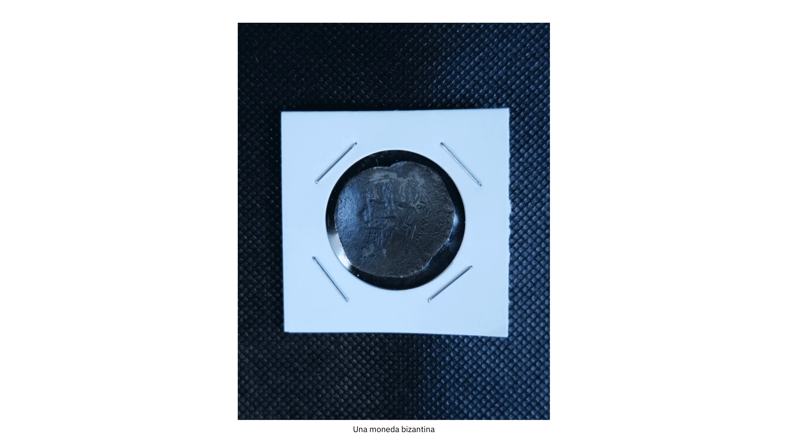

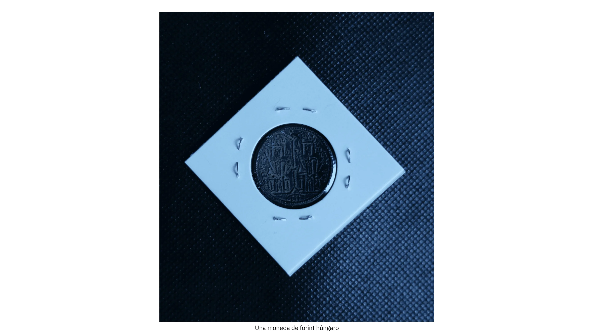

La primera imagen de arriba muestra una moneda bizantina que me parece bastante interesante. Voy a establecer un paralelismo con una moneda de la misma época procedente de Hungría (segunda imagen superior). La moneda húngara tiene forma de taza, como un cuenco en miniatura. La iconografía muestra figuras religiosas representadas como reyes que sostienen cruces una al lado de la otra. Esta pieza tiene forma de cuenco y procede de Hungría.

Era bastante habitual copiar monedas de otros países. Como las monedas bizantinas gozaban de aceptación general, otros países solían copiarlas. Como se puede ver al compararlas: estas piezas son muy parecidas.

El norte de Italia, especialmente Florencia, Venecia y Génova, aprovecharon este contexto para lanzar nuevas monedas fuertes, monedas con un contenido estable de metales preciosos. Venecia siguió el ejemplo de Florencia acuñando el ducado en 1270, una moneda casi idéntica al florín y ampliamente utilizada en el comercio mediterráneo.

El florín se convirtió en la primera moneda de reserva internacional, adoptada en más de 150 ciudades europeas antes de finales del siglo XIV. Con la creación de una red bancaria florentina a gran escala, dirigida por los Médicis, la gestión monetaria y contable se modernizó por completo, reduciéndose incluso la necesidad de transportar oro físicamente.

Ese es otro punto realmente interesante. Hubo un tiempo en que muchos cargamentos de monedas se perdían en los viajes por mar. Este avance tecnológico -los registros con contabilidad de doble entrada- permitió la creación del dinero escritural. Esto hizo posible reducir el número de liquidaciones de monedas y utilizar en su lugar un sistema de anotaciones escritas, lo que reduce enormemente el riesgo de perder dinero en tránsito.

El desarrollo monetario también vino acompañado de una importante evolución de los métodos bancarios. Inspirada en parte por el contacto de las Cruzadas con las prácticas bancarias musulmanas, la Europa medieval vio surgir sistemas bancarios rudimentarios en Florencia, Venecia, Barcelona y Génova ya en el siglo XIII. Los templarios, una orden religiosa y militar, ya habían desarrollado un sistema que permitía a los cruzados viajar sin llevar consigo sus riquezas.

Depositaban los fondos en una oficina templaria de su país y luego podían viajar con un formulario de carta y recoger las monedas al llegar al destino de su cruzada.

Así no teníamos que llevar encima monedas de metales preciosos.

Fue también durante este periodo cuando Europa tuvo conocimiento de la existencia de papel moneda en China, gracias al viaje de Marco Polo en el siglo XIII. Sin embargo, el desarrollo de los billetes esperaría varios siglos, ya que Europa prefirió perfeccionar primero sus métodos de acuñación de monedas metálicas. Leonardo da Vinci, junto a Luca Pacioli, célebre censor jurado de cuentas, contribuyó activamente a la mejora de las prensas de moneda, promoviendo una producción de monedas más rápida y uniforme.

Nos referimos a la técnica de acuñado con péndulo mencionada anteriormente en el curso. Este método permitía producir monedas más uniformes en comparación con el acuñado a martillo y, lo que es más importante, permitía inscripciones alrededor del borde de la moneda, como he demostrado anteriormente. La que se muestra a continuación es un tálero europeo de 1793, que muestra claramente una inscripción en el borde.

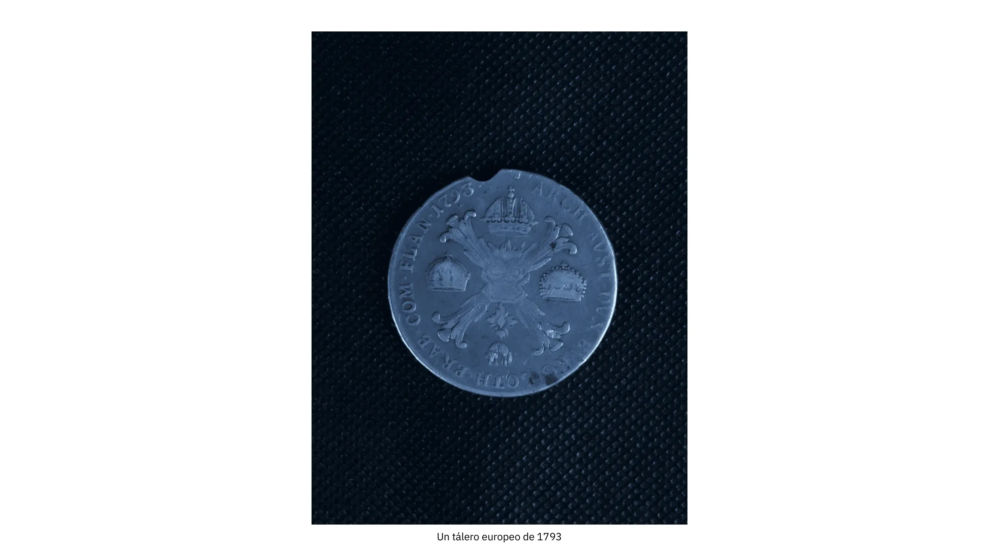

En el siglo XV, sin embargo, Europa experimentó una grave crisis monetaria, con un deterioro general del contenido de plata de las monedas europeas, que cayó a menos del 5% hacia 1450.

A partir del siglo XVI, el centro de gravedad monetario se desplazó a España, estimulado por la unión de los reinos de Aragón y Castilla, el fin de la Reconquista y los grandes descubrimientos marítimos como el de Cristóbal Colón en 1492. La afluencia masiva de plata procedente de las minas americanas alteró profundamente los equilibrios económicos europeos y mundiales, alimentando tanto la inflación como nuevas tensiones geopolíticas.

El Renacimiento también marcó una importante evolución artística en la acuñación de moneda, con monedas como el thaler (Joachimsthaler), origen del término "dólar". Estas grandes monedas de plata reflejan las nuevas técnicas artísticas y mecánicas de acuñación, posibles gracias a la innovación técnica procedente del norte de Europa.

Por último, el Renacimiento financiero marcó el paso a la modernidad económica, con el desarrollo de la banca, el crédito y los mercados financieros, y la aparición de las primeras formas de capitalismo moderno en las grandes ciudades comerciales de Ámsterdam, Londres y Estocolmo, sentando las bases del sistema financiero internacional tal como lo conocemos hoy. Y ese es el tema de nuestro próximo vídeo.

# La incautación de dinero por el Estado

<partId>17cfb1b4-5bc1-53e0-b035-05c7cf76be92</partId>

## Evolución de las monedas de reserva mundiales

<chapterId>d65cc352-e7ca-5f03-9b23-dd1fae5c0395</chapterId>

:::video id=82710062-8fff-426c-93af-923c08d82233:::

### La importancia histórica de los metales preciosos

Bienvenidos a esta sección sobre la aparición de las monedas de reserva y los bancos centrales. Como primer punto de esta nueva sección, vamos a centrarnos en la evolución de las monedas de reserva mundiales.

Los metales preciosos, especialmente el oro y la plata, se han considerado durante mucho tiempo la base de la riqueza y el poder de los imperios. La sed de oro ha sido siempre una fuerza motriz dominante, y fue la afluencia de metales preciosos la que tuvo el efecto más directo y evidente en la evolución monetaria de Europa. En la época medieval y a principios del Renacimiento, esta obsesión por el oro y la plata se debió a la dificultad de conservar el valor de otras mercancías, así como a la fuerte demanda de las potencias extranjeras, sobre todo en el comercio con Oriente.

A lo largo de los siglos, varios imperios se han sucedido como centros económicos mundiales. El país que domina el comercio mundial durante un periodo determinado suele recibir el estatus de moneda de reserva. Entre ellos figuran:

- España y Portugal (siglos XV y XVI)

- Las Provincias Unidas (Países Bajos) en el siglo XVII

- Francia y Gran Bretaña en los siglos XVIII y XIX

- Estados Unidos en el siglo XX

### El auge portugués y el Real (1450-1530)

**Portugal** dominó el comercio mundial en la segunda mitad del siglo XV y principios del XVI, con el **Real portugués**, una moneda de plata de peso relativamente uniforme. Los portugueses, gracias a sus avances en la navegación, encontraron nuevas rutas marítimas hacia África, Asia y el Nuevo Mundo. Las fortalezas militares y los puestos comerciales se multiplicaron desde África hasta China (Macao).

En respuesta a la demanda europea de oro y plata, "la motivación constante de los grandes descubrimientos fue el beneficio comercial, en particular la búsqueda de oro y plata" Sin embargo, el Imperio portugués, sobreextendido y enfrentado a la competencia de holandeses, ingleses y franceses, empezó a declinar.

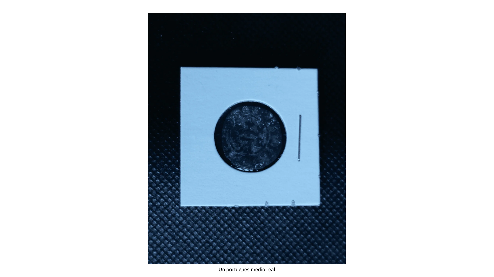

Aquí arriba se puede ver un medio real portugués de la época de estas conquistas marítimas.

### El apogeo español y el dólar español (1535-siglo XVII)

Con la conquista del Nuevo Mundo, **España** se convirtió en el actor dominante. Su monarca, que controlaba gigantescas minas de plata (Potosí en Bolivia, Zacatecas en México), consiguió acuñar moneda en plata pura, evitando así la depreciación de su propia moneda: el **Real español**

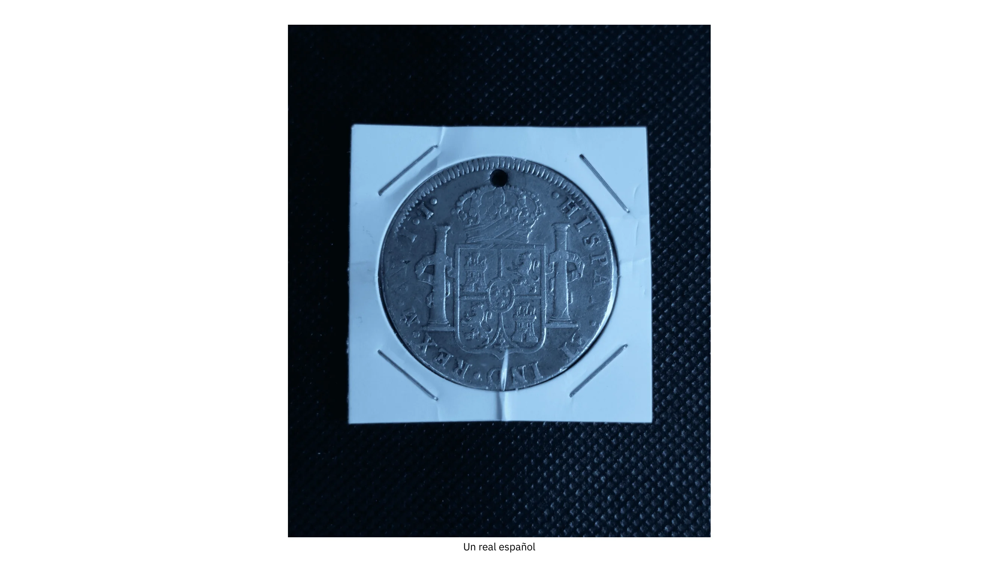

El real español, también conocido como "pedazo de ocho", obtuvo su apodo porque a menudo se cortaba en octavos para crear monedas más pequeñas. También se conocía como **dólar español**. La moneda que ve arriba data de 1814, por lo que es un ejemplo ligeramente más reciente. Sin embargo, las primeras monedas de dólar español no eran tan refinadas; se acuñaban a martillo y, en general, eran menos redondas y nítidas.

Lo más interesante es que el dólar español era la moneda de reserva internacional de la época. Las autoridades españolas también emitían su propia moneda local, el maravedí, y ajustaban periódicamente la oferta monetaria mediante retiradas. Por ejemplo, una moneda de cobre o bronce que inicialmente valía un maravedí podía ser retirada y estampada con "2", más tarde con "4", y así sucesivamente, hasta llegar a "8" En la foto de alta resolución puede verse claramente el "8" estampado en la moneda. Este método ampliaba efectivamente la oferta monetaria... lo que inevitablemente conducía a la inflación.

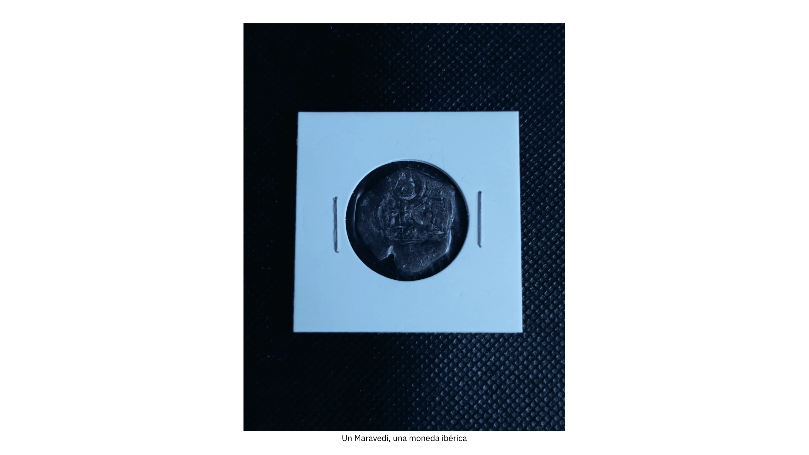

Si nos fijamos en la historia de las monedas de reserva, surge un punto interesante: los imperios no inflaban sus monedas mientras conservaban su estatus de moneda de reserva. **Sólo al final de su dominación acabaron devaluándola, perdiendo este privilegio, que pasó entonces a un nuevo imperio**.

En España, el dólar español dominó el comercio mundial durante casi 200 años, sobre todo entre China y Europa. Estas monedas podían encontrarse incluso en los puertos chinos. Y aquí es donde nos hace un guiño la historia: el dólar estadounidense procede directamente de esta moneda. Cuando se formó Estados Unidos en 1792, aprobó una ley para acuñar su propia moneda, y sus primeros dólares se crearon siguiendo el modelo del dólar español, tanto en el nombre como en el tamaño de la moneda.

Para que se haga una idea de su valor, un dólar estadounidense era originalmente una moneda de plata que pesaba casi una onza, o entre 30 y 40 euros en moneda actual, a diferencia del papel moneda que conocemos hoy. En cuanto al dólar español, circuló tanto que se considera la primera verdadera moneda mundial.

Sin embargo, esta afluencia de metales preciosos procedentes de América provocó la inflación en Europa. Durante la Revolución de los Precios (c. 1540-1640), el coste de la vida en Inglaterra se multiplicó por siete. En España, la abundancia de plata tuvo un efecto perverso de maldición de los recursos, dificultando el desarrollo de instituciones bancarias sólidas.

Posteriormente, España se enfrentó a numerosos conflictos militares (Flandes, Países Bajos, Guerra de los Treinta Años) y sus finanzas se fueron hundiendo poco a poco. En lugar de devaluar la moneda de plata, mundialmente conocida, los sucesivos gobernantes optaron por impagar o depreciar la moneda de cobre (vellón) utilizada por la población local. Esto es lo que he descrito antes con los maravedíes.

### El auge holandés (siglo XVII)

Tras el apogeo ibérico, **los Países Bajos** emergieron como una nueva potencia comercial en el siglo XVII. El comercio marítimo, la VOC (Compañía Holandesa de las Indias Orientales) y la fundación de la **Bolsa de Ámsterdam-15** (inspirada en la de Amberes) convirtieron a esta república mercantil en un centro neurálgico.

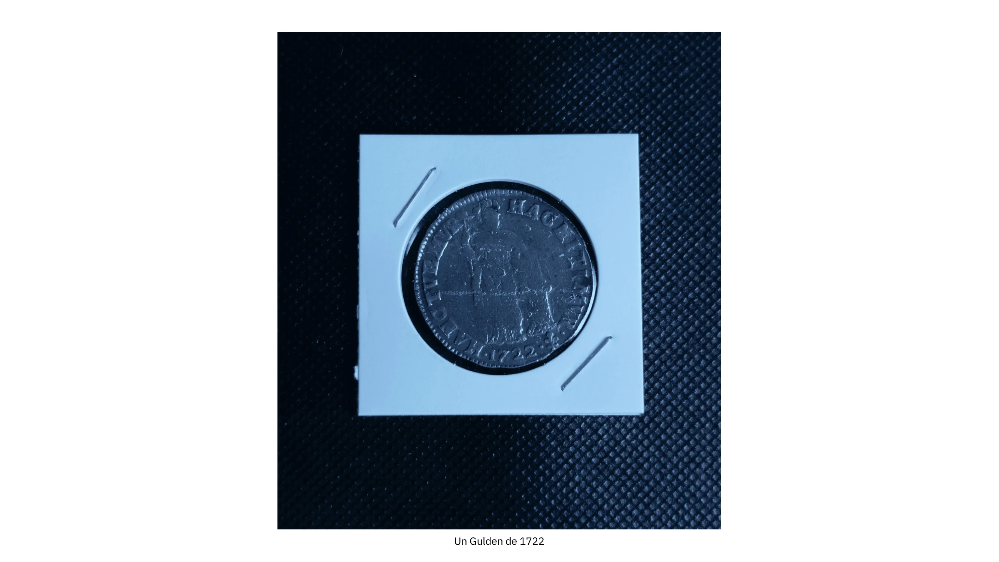

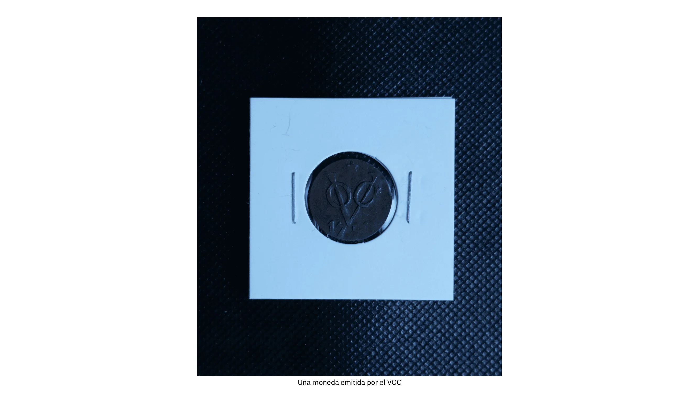

En la primera foto de arriba, se puede ver un Gulden de 1722 (una hermosa moneda de plata), mientras que en la segunda, hay una moneda emitida por el VOC.

La VOC era una empresa extremadamente poderosa para su época: tenía su propio ejército e incluso emitía su propia moneda.

Los holandeses inventaron el capitalismo moderno, que comenzó como un medio de distribuir el riesgo en empresas arriesgadas como las expediciones al Nuevo Mundo o la búsqueda de nuevas rutas comerciales. Las sociedades anónimas permitían a varios inversores poner en común su dinero y compartir el riesgo. Para facilitar estos intercambios, fue necesario entonces crear instituciones capaces de negociar e intercambiar estos valores. Así, en 1602 se crearon la primera sociedad anónima y la primera bolsa de valores.

La moneda holandesa, el **Gulden**, ganó credibilidad gracias a su pureza en plata, y luego a su adopción por el Banco de Amsterdam (1609), donde los depósitos se convirtieron en la forma de dinero preferida en Europa. Este es un punto muy importante que hay que mencionar. Sí, claro que había monedas, pero lo que realmente constituía dinero en aquellos días era una forma de dinero escritural. De hecho, gran parte del comercio mundial pasaba por los libros del Banco de Amsterdam. Fue un verdadero avance bancario: el comercio internacional ya no se realizaba necesariamente con monedas físicas, sino directamente a través de los registros contables del banco.

Este periodo de prosperidad estuvo marcado por una gran afluencia de oro y plata, sobre todo de otros países que practicaban la inflación o el control monetario. Hay un personaje interesante de mencionar: **Thomas Gresham**. En esta época, trabajaba para la realeza inglesa en los Países Bajos, gestionando el flujo de dinero entre ambos países. Fue este mismo Gresham quien nos legó la famosa **"Ley de Gresham "**.

Sin embargo, el Imperio neerlandés también acabó por agotarse. Las guerras con Inglaterra, la dilución del gulden en tiempos de conflicto y la competencia de otras potencias (Francia e Inglaterra) señalaron el fin de la hegemonía holandesa. Tras la Cuarta Guerra Anglo-Holandesa (1780-84), el declive del gulden como moneda de reserva se hizo irreversible.

### Poderío, ambiciones y fracasos franceses (siglos XVII-XVIII)

Bajo Luis XIV, **Francia** se convirtió en la mayor potencia continental de Europa. Sin embargo, la moneda francesa nunca alcanzó el estatus de referencia dominante: numerosas devaluaciones, una fuerte fiscalidad y costosas guerras (la Liga de Augsburgo, la Guerra de Sucesión española, etc.) lastraron la estabilidad del sistema monetario.

El primer gran experimento con papel moneda lo llevó a cabo John Law (1716-1720). La Banque Générale emitió billetes respaldados por promesas de deuda pública. Este plan condujo a una burbuja especulativa y a su colapso (la Burbuja del Mississippi) en 1720. Este desastre dejó en Francia una desconfianza duradera hacia el papel moneda. Fue esta desastrosa experiencia la que llevó a Richard Cantillon a enriquecerse gracias a este sistema de principios estadísticos, ahora conocido como el efecto Cantillon, en el que la impresión de dinero enriquece a quienes tienen acceso a la imprenta.

Cuando esta desconfianza finalmente se desvaneció, llegó otro fiasco del papel francés: los **assignats** revolucionarios. Emitidos a partir de 1790 sobre la base de la confiscación de los bienes del clero, estos assignats experimentaron una hiperinflación galopante, convirtiéndose oficialmente en la primera hiperinflación de la historia que superó el 50% mensual. En 1795, aunque su valor nominal se había multiplicado, se negociaban a un escaso porcentaje de su valor inicial.

Leyes más restrictivas intentaron imponer el assignat, pero sin éxito. El gobierno intentó imponerlo, llegando incluso a amenazar de muerte a quienes no lo aceptaban y obligando a los comerciantes a permanecer abiertos. Pero, por supuesto, al final no funcionó.

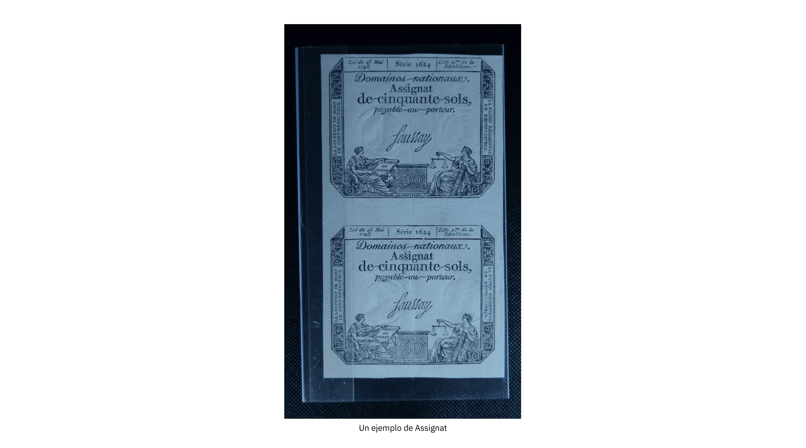

Como este papel moneda sustituyó a toda la acuñación de metales preciosos de calidad, en consonancia con la famosa Ley de Gresham, se produjo una escasez de monedas. Para acuñar nuevas monedas, se utilizó metal de campanas incautado al clero. Aquí abajo se puede ver una hermosa pieza de metal de timbre, elaborada a partir de cobre recuperado mediante la fundición de las monedas incautadas al clero.

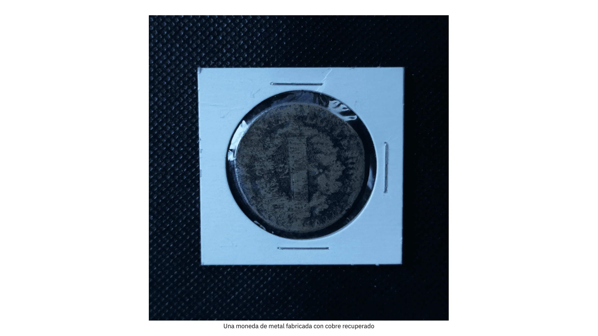

### Dominación británica (siglos XVIII - principios del XX)

**Inglaterra**, tras superar a los Países Bajos, se convirtió en la potencia dominante en el siglo XVIII. La libra esterlina es la moneda más antigua aún en uso, vinculada originalmente a una libra de plata. Poco a poco, su estatus se fue fortaleciendo, apuntalado por una revolución financiera y fiscal: monarquía parlamentaria, fuerte capacidad recaudatoria y creación del Banco de Inglaterra en 1694\.

Tras una serie de guerras contra Francia, el Reino Unido salió victorioso en 1815 (Waterloo), confirmando su supremacía. A lo largo del siglo XIX, la libra esterlina actuó como moneda de reserva mundial. En su apogeo, con sólo el 2,5% de la población mundial, Gran Bretaña producía el 20% de la renta mundial y controlaba casi una cuarta parte de la superficie terrestre.

La **Revolución Industrial** y la adopción de un **Patrón Oro** (1717 o 1718, bajo la supervisión de Isaac Newton en la Real Casa de la Moneda) reforzaron la credibilidad de la libra. El Banco de Inglaterra adoptó un patrón oro de 4,25 libras por onza de oro, lo que permitió a los tenedores de billetes convertirlos en oro.

Sin embargo, la Primera Guerra Mundial (1914-1918) puso fin a este sistema. En pocas semanas, todas las grandes potencias beligerantes suspendieron la convertibilidad del oro. El Imperio Británico, y más tarde la libra esterlina, salieron debilitados de la Segunda Guerra Mundial, dando paso al dólar estadounidense en el siglo XX.

Y como artefacto, a continuación puede ver algunas piezas hermosas e interesantes. Se trata de pesas monetarias. La primera es el soberano: las primeras representaciones de la libra. Sólo tengo pesas monetarias para representar estas monedas porque no puedo permitirme comprar un soberano de verdad. Para pesarlas, utilizamos balanzas y luego colocamos en el otro lado el peso monetario equivalente al valor del soberano.

El soberano era una moneda de oro que originalmente valía una libra.

Antes del famoso soberano estaba la guinea, que funcionaba según el mismo principio. La guinea se llamaba así por los metales preciosos que contenía, procedentes de la región de Guinea.

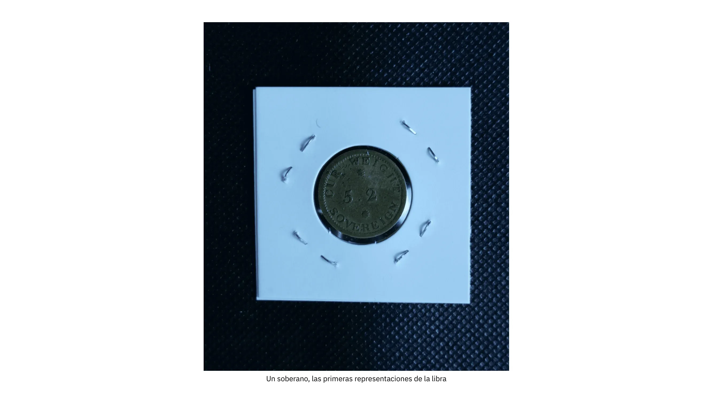

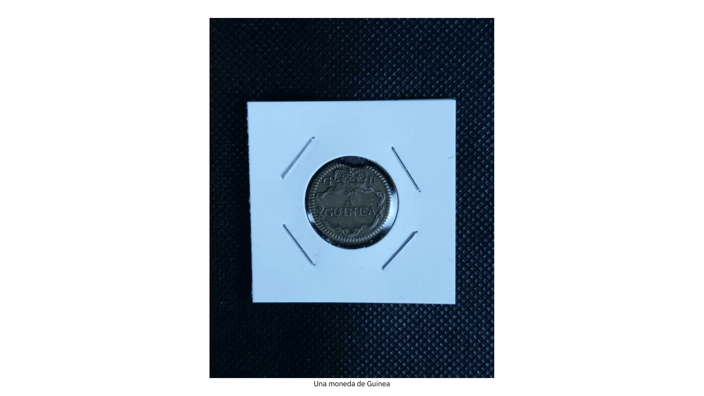

## La aparición de los bancos centrales

<chapterId>15777771-1e28-55f7-a400-69868a47079b</chapterId>

:::video id=7661b7b5-e00f-48f3-b69a-6fb2eb5ebba4:::

Como continuación a la historia de las primeras monedas de reserva y su evolución, presentamos un segmento sobre la aparición de los bancos centrales. Sigue prácticamente el mismo camino que la aparición de las monedas de reserva, pero se centra un poco más en las tecnologías bancarias de la época.

### Los inicios de los bancos y protobancos

Ya en el siglo XIII, los italianos (Florencia, Génova, Venecia...) desarrollaron técnicas de contabilidad por partida doble. Más tarde, Amberes** (s. XVI) se convirtió en el principal centro financiero del norte de Europa, papel que más tarde asumió Ámsterdam**, gracias a la Bolsa de Ámsterdam Exchange (1609), donde se negociaban las acciones del VOC.

Amberes acogía ferias mercantiles en las que los comerciantes se reunían con frecuencia para saldar deudas, lo que dio lugar a la invención de nuevos instrumentos financieros. El siguiente billete, fechado en 1761 y más reciente, es un **promesa**. Presenta detalles manuscritos, junto con inscripciones en el reverso, lo que lo convierte en un magnífico artefacto de la época.

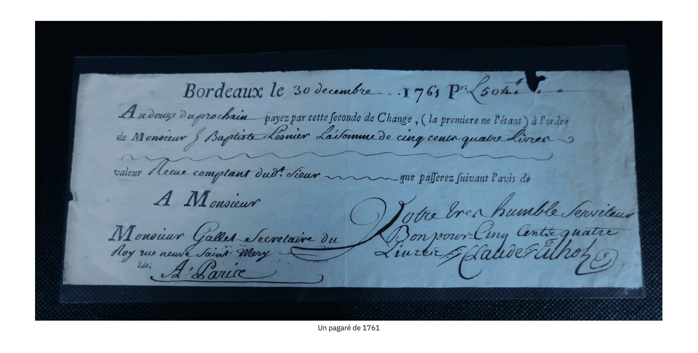

Esta efervescencia llevó a la creación de instituciones bancarias más sofisticadas. **Los banqueros lombardos** y más tarde los comerciantes holandeses perfeccionaron los instrumentos de crédito (letras de cambio, pagarés, etc.). El sistema bancario moderno se basa en esta idea: el dinero puede ser crédito, no sólo metal.

Como puede ver, esto nos devuelve a nuestra pregunta original sobre los orígenes del dinero.

¿El dinero emana de una mercancía que surge de la necesidad de intercambiar, o surge del crédito? Todavía se pueden encontrar rastros de ello en esta sección.

### El ejemplo sueco: Stockholms Banco y Riksens Ständers Bank

Pasemos a Suecia, donde se creó el primer banco central.

**Suecia** fue pionera en banca central: en 1657, Johan Palmstruch creó el **Banco de Estocolmo**, autorizado a prestar más que sus reservas de metal, marcando así el nacimiento de la banca de reserva fraccionaria. Pero la excesiva emisión de billetes provocó el pánico y una corrida bancaria en 1663. Vaya, vaya...

En 1668 se fundó en Estocolmo el Riksens Ständers Bank, el primer verdadero banco central del mundo. Sin embargo, también sufrió crisis (1709, 1715...) relacionadas con el abuso de los billetes, a menudo para financiar las guerras del reino.

### El golpe fallido de John Law

Vayamos a Francia, donde una vez más encontramos a nuestro querido John Law.

**El escocés John Law** convence al Regente (duque de Orleans) para que cree un banco privado, el Banque Générale (1716), autorizado a emitir papel contra oro, plata y deuda pública. Se convirtió en la Banque Royale (1718), y contribuyó a que las acciones de la Compañía del Mississippi se dispararan.

Cuando la realidad alcanzó a la especulación, **el pánico se exacerbó con la decisión de prohibir la tenencia de oro y obligar a utilizar los billetes de Law**. Vaya, vaya...

Finalmente, la burbuja estalló en 1720, provocando un colapso que arruinó la credibilidad del papel moneda en Francia durante mucho tiempo.

### Banco de Ámsterdam, el auge de un modelo pionero

Nos trasladamos ahora a Ámsterdam en 1609, donde el **Banco de Ámsterdam** (Wisselbank) se hizo con el control de la custodia y convertibilidad de las monedas en Ámsterdam. Prohibió la circulación de billetes privados e impuso el depósito de monedas metálicas en sus cámaras acorazadas. Poco a poco, se hicieron con el control de la moneda. Prohibieron a los cambistas guardar monedas con ellos. Los cambistas trabajaban todo el día y tenían que depositar sus monedas en las cámaras acorazadas del Banco de Amsterdam al final de la jornada. Como he mencionado, no eran necesariamente monedas de metal las que se utilizaban en el comercio internacional. Era dinero escriturado en los libros del banco.

Gracias al poder mercantil holandés, el banco desempeñó el papel del primer "banco central" de facto, estabilizando el comercio mundial. Con el tiempo, sin embargo, concedió préstamos sin garantía a la VOC y acabó quedándose sin metal para respaldar sus letras. En 1790, se supo que había prestado grandes sumas a la VOC, y prácticamente se declaró en quiebra, arruinando la credibilidad del gulden. Vaya, vaya...

### El Banco de Inglaterra, acto fundacional de la banca moderna

En la Inglaterra del siglo XVII, el oro y la plata eran almacenados por los orfebres, que emitían recibos. Esta organización parcialmente descentralizada demostró sus límites cuando la Corona se vio en la necesidad masiva de financiación para la guerra contra Francia.

En 1694 se fundó el **Banco de Inglaterra (BoE)**. El Banco de Inglaterra nació así de un matrimonio de conveniencia entre la comunidad empresarial londinense y el gobierno, que estaba desesperado por encontrar fondos para la guerra.

El Banco obtuvo el monopolio de la emisión de billetes en Inglaterra (reforzado en 1708, 1742, etc.). A partir de entonces, el papel moneda respaldado por reservas de oro circuló junto a las monedas. Este es un punto importante para comprender la progresiva absorción del dinero por las instituciones estatales. En primer lugar, el Banco de Amsterdam impidió a los cambistas quedarse con monedas y les obligó a devolverlas al Banco. En Inglaterra, se prohibió a los bancos privados emitir sus propios billetes canjeables en oro.

Permitían a los bancos privados emitir billetes, pero éstos sólo podían canjearse por billetes del Banco de Inglaterra.

Los billetes del Banco de Inglaterra, en libras esterlinas, eran canjeables en oro. Esto añadió una tercera capa a la moneda. Así que tenemos oro en la base, luego billetes del Banco de Inglaterra, y luego billetes de bancos privados en la parte superior. Antes de eso, los bancos privados podían emitir sus propios billetes canjeables en oro. Esta es otra etapa en la adquisición gradual de la moneda por las instituciones estatales.

El Banco financió al Estado con cuantiosos préstamos y estructuró la enorme deuda pública que financió el auge económico.

Este modelo se consolidó a lo largo de los siglos XVIII y XIX, hasta el punto de que la libra se convirtió en la moneda de reserva mundial, bajo el sello del Banco de Inglaterra y el patrón oro.

**Las monedas de reserva del mundo** se han sucedido a lo largo de los siglos, impulsadas por el poder económico, comercial y militar de un Estado o imperio: Portugal, España, los Países Bajos, luego Gran Bretaña, antes de que Estados Unidos llegara a dominar en el siglo XX. En cada caso, vemos un ciclo similar: expansión económica, éxito comercial, adopción internacional de la moneda, endeudamiento, guerras costosas, uso abusivo de la creación de dinero o del crédito y, finalmente, declive.

**La aparición de los bancos centrales** fue un proceso gradual. Estas instituciones surgieron a menudo en el contexto de costosas guerras, permitiendo al Estado financiarse mediante deuda. Cuando se adoptó el patrón oro (Inglaterra, siglos XVII-XIX), proporcionó un barniz de estabilidad, hasta que las grandes guerras mundiales del siglo XX condujeron al abandono gradual de la convertibilidad del oro. El poder de acuñar moneda pasó así del monopolio real a entidades más complejas, primero privadas (orfebres, banqueros), luego semipúblicas (bancos centrales), reflejo de la evolución de la soberanía monetaria hacia formas institucionalizadas y globalizadas.

Esto es lo que describía antes. A menudo hemos trasladado la carga de la deuda soberana directamente a los bancos centrales o al permiso para crear dinero por parte de instituciones legales, como el Parlamento.

Y el hecho más importante aquí es que **hemos pasado de una deuda que podía desaparecer por la quiebra del soberano a una deuda que descansaba principalmente sobre los hombros de la población**.

## El camino hacia el sistema fiat

<chapterId>27a98545-d350-56ee-a200-92468e6b9b33</chapterId>

:::video id=e27a753e-aeee-4307-a65c-9506aab380a1:::

Hemos llegado al final de este curso sobre la historia del dinero y, para cerrarlo, quería proponer dos temas. El primer tema son las distintas etapas que condujeron a nuestro actual sistema de moneda fiduciaria. Repasaremos los hechos de la sección 5 sobre la creación de los bancos centrales, y añadiremos el concepto del dólar estadounidense, que es en última instancia la actual moneda de reserva. Veremos cómo evolucionó, cómo surgió el dólar, cómo evolucionó, cómo cambió, qué etapas atravesó hasta convertirse en un sistema fiat, porque el origen del dólar es una moneda de plata.

Inmediatamente después, les ofreceré un breve segmento sobre la historia de las finanzas, para ayudarles a entender cómo hemos llegado al Estado del bienestar. Así que vamos a ver dos temas: cómo llegamos al sistema fiduciario, e inmediatamente después, cómo la evolución de las finanzas nos llevó al concepto de Estado del bienestar.

### Los fundamentos europeos de la banca moderna

Volvamos al siglo XIII con el florín. Para entender cómo hemos llegado al modelo fiduciario, tenemos que empezar por el siglo XIII. Junto al florín, surgió al mismo tiempo con los Médicis una tecnología, el concepto de letra de cambio.

Después llegó la Bolsa de Amberes, con su concepto de descuento y pagarés.

Luego, como hemos visto, tuvimos el VOC, el primer mercado de valores de Ámsterdam. Esto marcó el nacimiento del capitalismo, con acciones de empresas y el intercambio de acciones. El banco de Amsterdam impuso entonces el uso de depósitos por decreto. Esto significaba que las monedas debían depositarse al final del día. Fueron los cambistas quienes ya no pudieron guardar el cambio en forma de moneda.

Luego vino la creación del Banco de Inglaterra por la necesidad de crear deuda para financiar la guerra a finales del siglo XVII. En ese momento, los bancos privados se convirtieron en el tercer estrato del dinero. Por cierto, toda esta sección, desde el florín hasta la noción de creación de bancos centrales, está muy bien resumida en el famoso libro de Nick Bhatia "Layered Money", que tuve la suerte de traducir con algunos colegas. Hicimos un gran trabajo traduciéndolo para que los francófonos de todo el mundo pudieran beneficiarse de estas enseñanzas.

Así que estamos a finales del siglo XVII. El Banco de Inglaterra fue creado para financiar la guerra.

Los bancos privados se hicieron cargo de la tercera capa de la moneda. De hecho, los billetes de los bancos privados ya no eran canjeables en oro: eran los billetes del Banco de Inglaterra los que eran canjeables en oro. Esto demuestra la toma del poder de cambio por la institución que es el Banco de Inglaterra.

Entonces llegó el pánico de 1776. Todo el mundo se apresuró a subir por la pirámide monetaria. Lo que esto significa es que en 1776, hay una corrida contra los bancos, y entonces toda la gente que tiene papel de tercera capa, es decir, billetes de bancos privados, tratan de conseguir billetes del Banco de Inglaterra, y luego tratan de conseguir oro, pero obviamente no había suficiente oro en las bóvedas. Declararon una especie de vacaciones bancarias para evitar devolver los billetes de oro, y esto dio lugar al concepto de prestamista de última instancia.

### Evolución del dólar estadounidense

Pasamos del florín a la creación del Banco de Inglaterra. Por supuesto, en el ínterin se produjeron la Primera y la Segunda Guerras Mundiales, pero antes, en 1796, también se produjeron acontecimientos al otro lado del Atlántico. En 1776, América era todavía una colonia británica, y las colonias utilizaban este papel moneda. A continuación se muestra un billete de dos chelines de Connecticut de 1776.

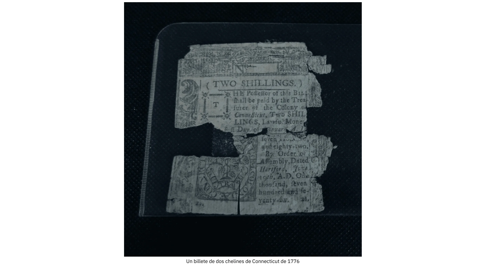

Antes de declarar la guerra a Inglaterra y emitir finalmente su propia moneda, las colonias utilizaron este papel moneda, junto con el dólar español para las transacciones en efectivo. De hecho, el término "dólar" se mantuvo para indicar el dólar estadounidense.

Si no me equivoco, en 1792 aprobaron una ley que les permitía acuñar moneda. Como ejemplo, el de abajo es un dólar americano de la era moderna.

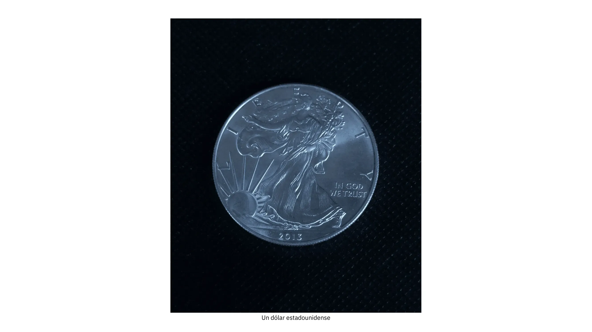

Evidentemente, su valor nominal no es de un dólar, sino de unos 30 o 40 dólares, ya que representa una onza de plata. Su valor fluctúa en función del precio de la plata, que suele situarse como mínimo en 30 o 40 dólares. Hoy en día, por supuesto, un dólar de papel sólo conserva su valor nominal de un dólar, pero en aquella época, el dólar estadounidense se basaba en este valor de la plata.

Hablemos ahora de la Guerra Civil en Estados Unidos. Los confederados imprimían dinero, que se hiperinflaba. Este fenómeno no está incluido en la lista oficial de Hanke-Krus, ya que no alcanzó una tasa de hiperinflación del 50%. Sin embargo, sí experimentó una tasa de inflación mensual del 40%, lo que indica que durante la guerra se imprimió una cantidad considerable de moneda.

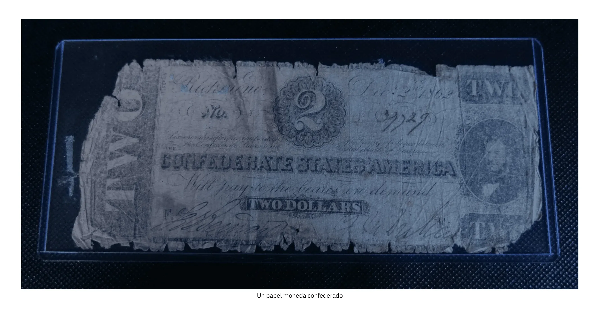

Sus oponentes del norte también tenían dólares. Justo arriba, se podían ver dólares confederados, mientras que abajo se pueden observar dólares norteños. Se les llamaba "el billete verde" porque el reverso era verde.

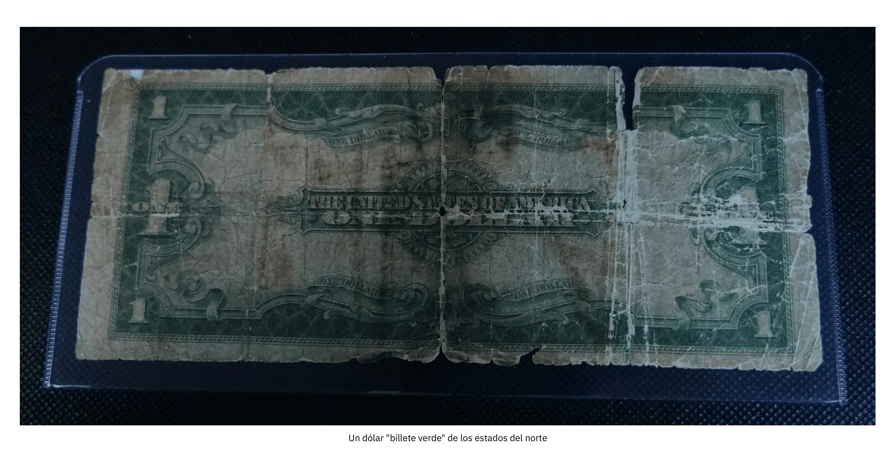

Y les invito a comparar la diferencia de tamaño con los billetes modernos. En aquella época, los billetes eran más grandes.

Como sabemos, ganó el Norte, por lo que el billete verde se convirtió en la moneda de los estados norteamericanos reunificados. Luego vino la fundación de la FED en 1913, y la Primera Guerra Mundial.

Tras la Primera Guerra Mundial, las últimas series de billetes impresos incluían siempre la mención "canjeable en oro a la vista". Así, en 1928, con 20 dólares se podía comprar casi una onza de oro, ya que el precio del oro era de 20,67 dólares. El billete de la imagen inferior podía comprar una onza de oro en 1928.

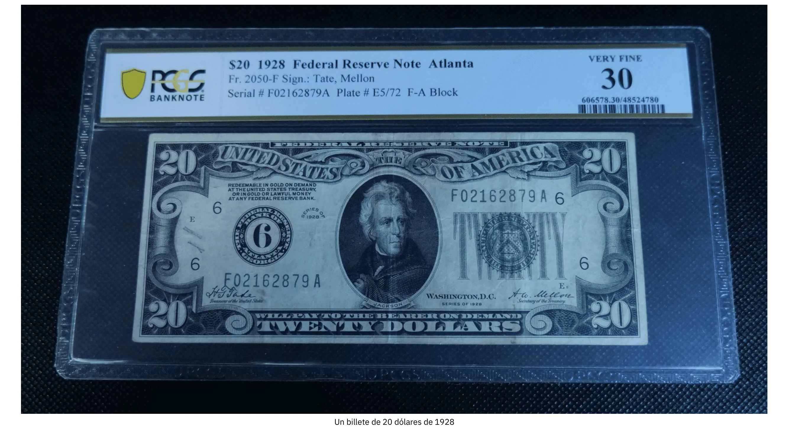

Hoy, una onza de oro vale 3.000 dólares. Así que se puede ver el poder de la devaluación aquí, por supuesto. Fue el último proyecto de ley que contenía las palabras "canjeable en oro". Veremos que justo después de la Orden Ejecutiva 6102, ellos confiscarían todo el oro. De hecho, confiscarían tanto el oro como los certificados de oro.

Aquí abajo puede ver un certificado de oro de 1928.

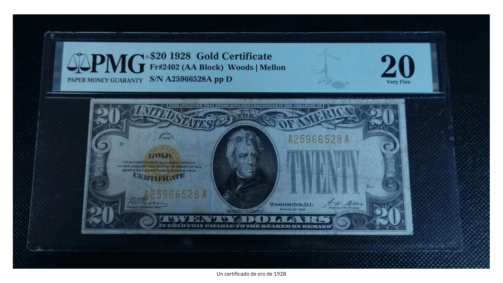

No sólo era "canjeable en oro", como el billete de 1928, sino también en monedas de oro: es realmente un "certificado de oro". Todos fueron incautados tras la Orden Ejecutiva 6102. Hasta 1964, era incluso ilegal poseerlos.

Estoy muy contento de tener uno.

A partir de 1964, pasó a ser ilegal poseer oro, hasta 1974, si no me equivoco. En los años 70, permitieron a la gente acumular oro después del shock de Nixon, que describiremos en breve. En 1933, cuando emitieron la "Orden Ejecutiva 6102", confiscaron el oro y se hizo ilegal poseerlo. Recibías una gran pena de prisión si te pillaban guardando tu oro. Durante esos días, cada onza de oro se cambiaba por un billete similar al que se muestra a continuación, después de 1934.

Como hemos dicho, en 1928, un dólar todavía tenía el texto "canjeable en oro".

Tras la promulgación de la Orden Ejecutiva 6102, se incautaron de todo el oro y cambiaron 20,67 dólares por cada onza de oro. Después, la estafa salió a la luz: emitieron nuevos billetes en 1934 con el texto impreso "este billete es de curso legal para todas las deudas".

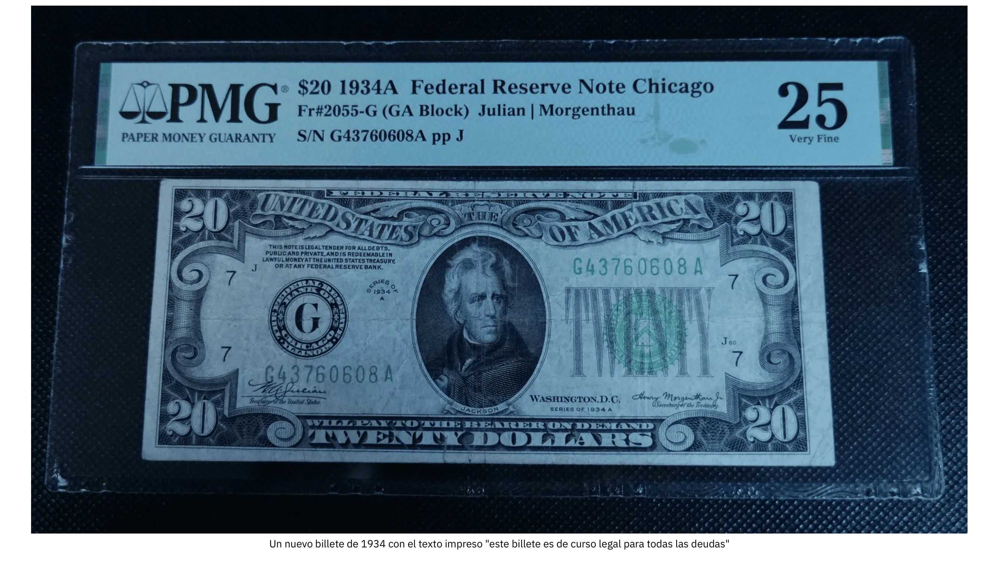

Aquí surge el concepto de moneda de curso legal, que sustituye a la frase "canjeable en oro" Los dos billetes pueden parecer idénticos, ya que sólo cambian algunas palabras, pero la estafa reside en el hecho de que el dólar se devaluó durante este periodo; pasó de valer una onza de oro 20,67 $ a 35 $ por onza en 1934. ¡Representó una devaluación de aproximadamente el 40%!

Luego vino la Segunda Guerra Mundial. Tras la guerra, el Acuerdo de Bretton Woods centralizó gran parte del oro mundial en Estados Unidos. Los estadounidenses emitieron billetes a cambio, aunque estos billetes ya no eran canjeables por oro por el público en general. En cambio, seguían siendo canjeables por oro a nivel estatal.

Con el tiempo, países como Francia y Alemania empezaron a sospechar que probablemente había más billetes de dólar en circulación que oro en las cámaras acorazadas estadounidenses.

Así que pidieron repatriar su oro. Dijeron: "De acuerdo, lo haremos, pero llevará un poco de tiempo" En 1971, nuestro amigo Richard Nixon cortó el vínculo entre billetes y oro de una vez por todas, culpando a los especuladores en el proceso.

El oro estaba infravalorado a 35 dólares la onza, un precio que no se correspondía con el volumen de dinero que se había impreso ni con su verdadero valor de mercado. En pocos años, el precio pasó de 34 a 800 dólares. Al igual que en ejemplos históricos, como en Roma, donde se cortó la conexión entre el denario y el solidus, se permitió que el oro flotara. Este hecho condujo a un proceso de descubrimiento de precios, que dio lugar a que el oro se valorase mucho más alto en términos de dólares a partir de entonces.

### El sistema moderno de moneda fiduciaria y sus implicaciones

Esta parte resume cómo pasamos de un sistema monetario basado en la plata o el oro. Poco a poco, las instituciones fueron adquiriendo cada vez más poder sobre el dinero. Finalmente, una decisión unilateral rompió por completo el vínculo entre los metales preciosos y el dinero, tras una emisión excesiva.

Como resultado, ya no existe ningún vínculo entre el oro y los billetes o el dinero escritural. Y ni siquiera es un sistema de reserva fraccionaria - ese es un concepto anticuado. En su lugar, los bancos privados emiten y crean dinero a través del crédito bancario. El dinero se crea principalmente de esta manera y está correlacionado con el tipo de interés clave fijado por el banco central.

Realmente no hay límite. Ya no hay niveles de reserva obligatorios, al menos en Estados Unidos y Canadá. La única reserva es la necesidad de que los bancos se las arreglen para poder responder a los intercambios interbancarios para no quedarse sin liquidez.

Sólo tienen que asegurarse de que pueden hacer estas transferencias, pero no hay una reserva obligatoria del 3%, 1%, 10%. Realmente nos hemos alejado del concepto de reserva fraccionaria. Ahora, son los bancos centrales, los gobiernos a través de los déficits fiscales, los bancos centrales a través de la flexibilización cuantitativa (QE), y los bancos privados a través de la creación de préstamos bancarios los que pueden aumentar la oferta monetaria total y, en mi opinión, causar inflación.

Para entender la relación entre dinero e inflación, recomiendo un curso que tengo en Plan ₿ Academy dedicado a este tema. Aprenderás la diferencia entre el aumento de los precios, que es lo que vemos en la vida, y la inflación. No son lo mismo. De hecho, cuando nos referimos a la inflación, a menudo estamos hablando del aumento de los precios, no de la inflación en sí. La inflación es un concepto bastante preciso, que se explica por el aumento de la oferta monetaria.

https://planb.academy/courses/caa75343-ac90-4249-bcca-0e2e57c3a0f1

Para concluir esta sección sobre el mundo fiduciario, me gustaría señalar un recurso que le ayudará a comprender mejor los fenómenos que acabo de explicar, como la inflación.

Gracias por su atención.

## La historia de las burbujas monetarias

<chapterId>b6451c46-917d-11f0-97de-6bc5081765fa</chapterId>

:::video id=5967d9a6-aae4-4b84-a283-71b1b735bca4:::

### La invención del papel moneda y la primera gran burbuja

Con la creación de los bancos centrales en el siglo XVIII, nació una auténtica revolución: el dinero mágico en forma de billetes. El ejemplo más llamativo en Francia es el de John Law. Este escocés, exiliado en París, propuso al regente, el duque de Orleans, una solución a la quiebra de las finanzas reales creando un banco estatal y una compañía comercial colonial: el famoso **Banque Royale** y la **Compagnie du Mississippi**.

Con este sistema, Law vinculaba el papel moneda a las acciones de su empresa. Cuantos más billetes circulaban, mayor era el valor de las acciones y más sólido parecía el banco... hasta que la especulación superó a la realidad. La burbuja estalló repentinamente en 1720, arruinando a la nobleza, a la burguesía y a gran parte de Europa, que había acudido a especular a la rue Quincampoix. El resultado: una desconfianza duradera hacia el papel moneda en Francia y la primera lección europea sobre burbujas especulativas.

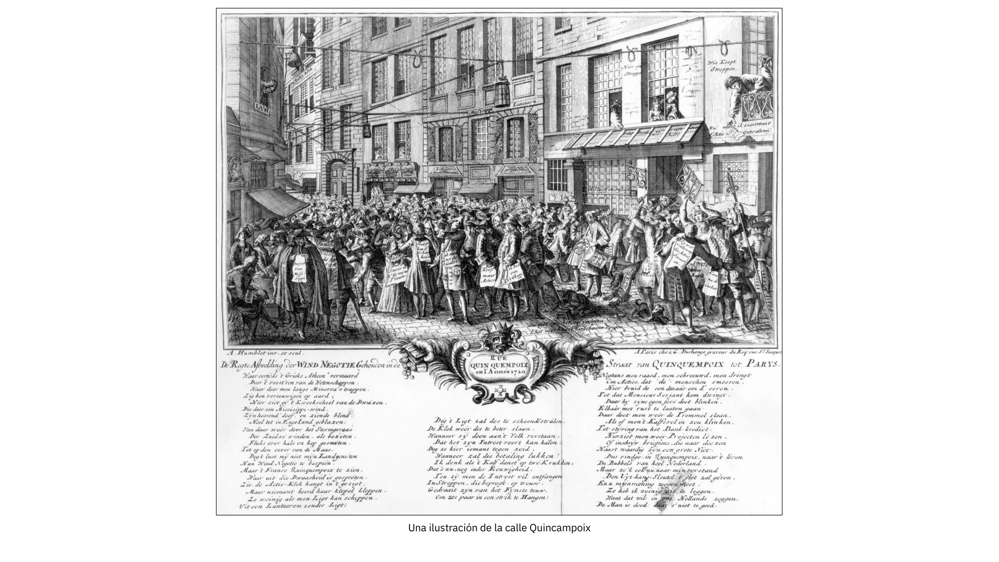

### Cuando la tierra se convierte en "garantía"

Un siglo más tarde, la Revolución Francesa abrió nuevos caminos con los **assignats**, una moneda respaldada por propiedades de la Iglesia incautadas. Una idea atractiva sobre el papel - transformar la tierra en garantía monetaria - pero ineficaz: la tierra no es líquida ni divisible. El resultado: hiperinflación, múltiples prohibiciones sobre el uso de la tierra, inflación descontrolada y escasez.

Napoleón, profundamente afectado por este caos, restableció el oro y la plata como base monetaria en 1800 con la creación de la Banque de France, garantizando así la paga regular de sus ejércitos. Una forma pragmática de recuperar la confianza: pagar en moneda fuerte.

### Los locos años veinte y la Gran Depresión de 1929

Saltemos dos siglos. Tras la Primera Guerra Mundial, los gobiernos financiaron el esfuerzo mediante la inflación y la suspensión del oro. En los años veinte, la Reserva Federal estadounidense aplicó una política monetaria excesivamente acomodaticia para apoyar a la libra esterlina. El resultado: crédito fácil, especulación desenfrenada en Wall Street, compra de acciones a crédito y aparición de una burbuja inmobiliaria y bancaria.

Cuando la máquina se volvió loca, el crack de 1929 fue inevitable: quiebras masivas de bancos, desempleo récord y colas en los comedores de beneficencia. Ello dio lugar a la persistente idea errónea de que **toda deflación es mala**, cuando hay que distinguir entre la deflación por crecimiento (saludable) y la deflación por endeudamiento (devastadora).

### Asia en los 90 y el efecto dominó

En los años 90, el "milagro asiático" hizo soñar al mundo. Los tipos de Exchange estaban vinculados al dólar, el crecimiento era del 8-10% y el capital occidental entraba a raudales. Todo iba bien... hasta que bajó la marea. Las quiebras se sucedieron en cascada, las monedas se devaluaron un 80% y los inversores se arruinaron. El FMI tuvo que intervenir, imponiendo dolorosas reformas. El mismo escenario de siempre: abundancia de capital, burbujas alimentadas por el crédito, y luego el colapso.

### 2008 y la era de la burbuja permanente

A la burbuja de Internet (2000) le siguió la burbuja inmobiliaria de las subprime. La titulización transformó los préstamos bancarios en productos financieros "triple A", extendidos por todo el mundo. La promesa: eliminar el riesgo diluyéndolo. La realidad: todos los riesgos estaban de hecho correlacionados. Cuando el sector inmobiliario se desplomó, también lo hizo todo el sistema bancario mundial.

El resultado: rescates públicos masivos, flexibilización cuantitativa y tipos de interés cero. Y con ello, una huida hacia delante: cada crisis ya no purgará los excesos, sino que se cubrirá con cada vez más deuda e impresión de dinero. Esto es lo que ha llevado a la situación actual: **la "burbuja de todo "**, donde todo -acciones, bienes raíces, arte, cripto, incluso las tarjetas Pokémon- se infla artificialmente.

### El eterno retorno del dinero mágico

De un siglo a otro, surge una constante: en cuanto una sociedad cree que puede crear riqueza con dinero en lugar de producir bienes reales, aparecen las burbujas. De John Law a 2008, de la rue Quincampoix a Wall Street, el proceso se repite: euforia, crédito, auge y quiebra.

Y al final, invariablemente, cuando ya nadie confía en el papel, la gente busca otra cosa: oro, tierra, refugios seguros... o nuevas monedas. Ayer Napoleón impuso el metal, hoy algunos ven al Bitcoin como el sucesor.

La historia de las finanzas es un ciclo interminable: imprimir, especular, colapsar. Hasta la próxima burbuja.

## Dinero y violencia

<chapterId>9486fe64-854f-5e17-86b3-8873baca39a8</chapterId>

:::video id=bd6d0807-2d8f-4637-a0f5-1e990e5c0d0f:::

En esta breve sección volveremos sobre muchos de los acontecimientos que ya hemos visto a lo largo del curso, resumiendo algunas anécdotas que me parecen interesantes.

### Tecnología y violencia

He aquí algunas anécdotas de las que probablemente ya hemos hablado en el curso. Sirven para introducir una discusión muy fascinante que tuve con Theo sobre una conferencia que dio en B-Ondy, que me pareció muy interesante en cuanto a cómo los avances tecnológicos afectan a la relación de violencia entre la población y el Estado.

### Dinero y coacción estatal

Para introducir esta sección, voy a darte una lista breve y no exhaustiva, sólo para recordarte los acontecimientos que probablemente ya hayamos tratado en el curso.

Un vínculo que ya puedo establecer con el dinero y la violencia es que cuando se trata de papel moneda sin valor que puede imprimirse ad infinitum, a menudo viene acompañado de todo tipo de normas y todo tipo de amenazas. Ya podemos hablar de los assignats, donde estaba literalmente escrito en los billetes que los falsificadores estaban amenazados de muerte. Es fácil encontrar en los textos legales de la época amenazas de muerte para quienes no aceptaran este famoso papel moneda.

Para seguir en Francia, en uno de los textos jurídicos que pude conseguir de la época revolucionaria, vi que los "viáticos" para transportar y hacer funcionar la guillotina se describían en las secciones relacionadas con la moneda. Esto me pareció bastante estrafalario.

También hemos hablado de la acuñación de monedas en China, con el Estado supervisando la acuñación. Vimos en una sección al principio del curso que cuando se desechaban monedas, algunas de las cuales eran menos bellas, había consecuencias legales.

También hay una anécdota sobre un rey de Inglaterra que acabó cortando las manos a quienes acuñaban moneda si no se comportaban como él esperaba.

También, en China, he leído sobre la incautación de cobre de monasterios budistas. En un momento en que el cobre estaba ganando valor y desestabilizando su economía -que se basaba en una forma de dinero fiduciario que poco tenía que ver con el valor del metal-, recurrieron a buscar un lugar donde hubiera riqueza y se apoderaron del cobre de los monasterios.

Lo mismo ocurrió con los monasterios en Inglaterra durante la Reforma inglesa. Cuando el famoso rey se peleó con el Papa por su divorcio, había otra razón detrás de todo: aprovechó la abolición de los monasterios para apoderarse de las riquezas contenidas en estas organizaciones eclesiásticas.

Durante la Revolución Francesa, confiscaron todos los bienes de la Iglesia. Vieron hermosas monedas creadas a partir de campanas de iglesia fundidas.

Si nos remontamos aún más atrás, una de las nociones más explícitas de violencia económica y libertad, de leyes liberticidas, es **Diocleciano con su casta hereditaria que estaba directamente relacionada con el hecho de que los campesinos ya no querían aceptar la moneda devaluada**. Querían dejar su trabajo de campesinos, y Diocleciano reaccionó simplemente diciéndoles: "no podéis dejar vuestra tierra, ni tampoco vuestros hijos". Lo mismo se aplicó a los soldados.

Creo que es una forma de violencia bastante explícita. Podría concluir hablando de los templarios o de un rey francés. Cuando los templarios se instalaron en Francia, imagino que vio el maná de la riqueza templaria y tuvo problemas de financiación estatal. Demandó a la Orden Templaria, y algunos de ellos pudieron salir con parte del tesoro, lo que ha dado lugar a un espectáculo muy interesante en Estados Unidos o Canadá. No sé quién lo produjo, pero se llama *El misterio de Oak Island*. Trata de gente que cree que hay un tesoro templario enterrado en una isla de Canadá, en las Maritimes, y que llevan años -quizá más de una década- perforando para hacer algún tipo de pozo. Han encontrado un pozo con muchas galerías, y están buscando un tesoro enterrado por los Caballeros Templarios en esta isla, que es el tema de este programa de televisión. Saludo a mi padre, que es un gran fan de esta serie.

Así que ahí lo tienen: una lista muy rápida de hechos que hemos visto durante este curso y que, en mi opinión, plantean el vínculo con la violencia. Os dejo con la siguiente parte de Theo, que nos va a contar una historia muy interesante sobre el cambio tecnológico y el equilibrio de poder entre la plebe y las autoridades.

Gracias

## Consecuencias económicas de la violencia organizada

<chapterId>66bd4674-2159-5489-ad4b-ec5e3fb691af</chapterId>

:::video id=c8b063c6-aeb4-4a94-9027-b11d369e71a4:::

### Violencia organizada y evolución del Estado

El historiador Frederic C. Lane propone una tesis revolucionaria: la anatomía del Estado a lo largo de la historia viene determinada por las tecnologías utilizadas para proyectar la violencia. Partiendo del principio weberiano de que el Estado detenta el monopolio de la violencia legítima, Lane observa que este monopolio -paradójicamente más eficiente que la competencia en este campo- evoluciona según la relación entre el coste del ataque y el coste de la defensa.

Este análisis, retomado por los autores de "El individuo soberano" (1997), explica las mutaciones históricas de la organización política: del sistema feudal medieval a las ciudades-estado del Renacimiento, luego a los Estados-nación industriales y, por último, a los modernos Estados del bienestar. Cada transición corresponde a un gran avance tecnológico en el ejercicio de la violencia, que se produce aproximadamente cada 400-500 años.

### Equilibrio medieval

En la Edad Media, la economía agraria dominaba en más de un 90%. El campesino, literalmente arraigado a su tierra, no podía huir del señor y sus caballeros. La tecnología militar -armaduras forjadas a mano, años de entrenamiento con la espada- era extremadamente cara. Esta asimetría favorecía masivamente el ataque sobre la defensa.

El productor agrícola inmóvil se convierte en cautivo del monopolista local de la violencia. Su capacidad de extracción de impuestos alcanza nuevas cotas -aunque, paradójicamente, los impuestos medievales siguen siendo modestos en comparación con el 78% de exacciones obligatorias de la época moderna. El señor puede gravar a su antojo, porque el campesino no puede ni resistirse ni marcharse.

### El Renacimiento mercantil

La aparición del comercio hanseático en el Norte y del comercio mediterráneo en el Sur transformó la situación. Los mercaderes, principales creadores de valor añadido, poseían un capital móvil: sus barcos. Sólo necesitaban milicias marítimas ligeras, ya que los mares eran difíciles de vigilar. Sobre todo, podían emigrar fácilmente a un puerto vecino si la fiscalidad se volvía excesiva.

Esta movilidad creó una competencia fiscal entre las ciudades-estado. Venecia, Génova y Brujas tenían que ofrecer el marco más liberal posible: contratos fiables, moneda de calidad, seguros, impuestos mínimos. Los príncipes tenían que seducir en lugar de coaccionar. La simetría se invierte: la defensa (mediante la huida) resulta más fácil que el ataque.

### La era industrial

La Revolución Industrial trajo consigo una configuración parecida al feudalismo. Las fábricas, los ferrocarriles y las cadenas de montaje representan inversiones masivas e inmóviles. Henry Ford fue incapaz de deslocalizar sus plantas frente a los impuestos. Los trabajadores, concentrados en las ciudades industriales, se sindicaron para negociar colectivamente en lugar de emigrar individualmente.

Surge el "Estado del bienestar": planificación industrial (Japón, Corea), protección militar de las infraestructuras, prestaciones sociales mínimas para la mano de obra. La Segunda Guerra Mundial ilustró esta vulnerabilidad: el bombardeo de las fábricas enemigas se convirtió en la estrategia dominante. La concentración de capital físico permitió la extracción masiva de impuestos para financiar el Estado del bienestar.

### La revolución de los microprocesadores

Tres innovaciones tecnológicas están alterando estos antiguos equilibrios. El microprocesador está transformando la guerra: un operador en Nevada pilota un dron en Afganistán con precisión quirúrgica. La Guerra del Golfo (1991) demostró este avance: el cuarto ejército más grande del mundo (Irak) fue aniquilado en 45 días, con menos de 200 muertos en el bando de la coalición. La superioridad tecnológica hizo imposible el ataque frontal.

Internet y la criptografía asimétrica están revolucionando la creación de valor. Un desarrollador puede trabajar desde cualquier lugar con un MacBook y Starlink, exportando su producción de forma instantánea y gratuita. Los nómadas digitales escapan al cautiverio geográfico, enfrentando a los Estados entre sí como no se veía desde el Renacimiento.

El Bitcoin representa la culminación de esta lógica: una moneda liberada del Estado, protegida por un escudo criptográfico inviolable. La riqueza se vuelve defendible contra cualquier fuerza física. El individuo recupera la capacidad de defenderse contra el monopolio del Estado.

### El hundimiento del modelo westfaliano

Los Estados del bienestar occidentales, diseñados para la era industrial, se están quedando obsoletos. Los creadores de valor -desarrolladores, artistas, financieros- emigran a Singapur, Dubai o El Salvador, prefiriendo menos servicios públicos a cambio de una fiscalidad mínima. Gigantes modernos como Apple y Tether no necesitan ni oficinas ni infraestructuras físicas.

Esta fuga de cerebros crea una espiral: menos contribuyentes netos, servicios públicos degradados, aumento de los impuestos a los que se quedan y salidas aceleradas. Los Estados deben reducirse radicalmente o quebrar. La fragmentación en jurisdicciones pequeñas y competitivas -un nuevo modelo de ciudades-estado digitales- parece inevitable.

La historia nos enseña que estas transiciones llevan generaciones. Pero la separación de la moneda y el Estado en la Bitcoin podría acelerar el proceso. Los individuos votan ahora con sus pies y sus monederos criptográficos, redibujando el mapa del poder global a lo largo de líneas que sólo estamos empezando a percibir.

## Brevísima historia de las finanzas

<chapterId>1d37fff1-a091-5034-8e71-4af590b8ffce</chapterId>

:::video id=fdfabbc6-e4d8-463a-8522-19176f8fb460:::

Tras este relato de la historia del dinero, que nos lleva hasta el sistema fiduciario, me gustaría explicar rápida y sucintamente la evolución de las finanzas que acabó desembocando en el Estado del bienestar. Al principio, en la época romana, teníamos monedas.

Las monedas eran una tecnología financiera que permitía al imperio pagar a los soldados, expandirse y comerciar. Funcionó muy bien, salvo que con el tiempo se produjeron demasiadas devaluaciones. En algún momento, cuando dejaron de expandirse y de obtener botín de sus guerras y de la expansión territorial, su sistema se vino abajo.

### Evolución de las tecnologías financieras

Luego vino la Edad Media, en la que hubo muy poca evolución hasta el florín, que devolvió una moneda estable, y los desarrollos bancarios en Italia y Amberes, donde se desarrolló el concepto de "valor temporal del dinero", es decir, el descuento. Desarrollaron el descuento para crear una forma de papel moneda en la que se emitía un "pagaré", es decir, una promesa de que en una fecha posterior se podrían recuperar 100 dólares más un tipo de interés.

Este sistema creó una tecnología financiera que permite al tenedor vender el pagaré antes del final del plazo, de modo que si lo vende después de 4 meses de un plazo de 6 meses, la persona pagará en realidad una prima para compensar la pérdida de rendimiento de los 2 meses restantes.

Era una tecnología financiera desarrollada entonces en Amberes y Ámsterdam. Más tarde, asistimos a la evolución de los bancos centrales y a la noción de prestamista de última instancia. Puede afirmarse que durante el Banco de Amsterdam se abandonó el uso de monedas en el comercio internacional en favor del dinero escritural.

Más tarde, en el siglo XVIII, en términos de tecnología financiera, podemos hablar de seguros. Hay una anécdota que está muy bien contada en el libro de Neil Ferguson "The Ascent of Money". La primera compañía de seguros que nació se llamaba **Scottish Widowss**, y esencialmente, era el clero que quería desarrollar un seguro para los sacerdotes que a veces morían antes, morían de repente. El clero, en ese momento, estaba cuidando a sus esposas e hijos en Escocia durante un año. Así que el clero encontró este período de un año tal vez un poco demasiado corto. En consecuencia, **inventaron los cálculos actuariales** para calcular literalmente el número de cotizantes necesarios para que el sistema cubriera sus costes, en función del número de sacerdotes que morían prematuramente.

Desarrollaron cálculos actuariales para decir "Vale, bien, cada cura nos da esta cantidad. Entonces, si el sacerdote muere, bueno, el seguro cubrirá los gastos para asegurar la supervivencia de su esposa e hijos hasta que sean autosuficientes." Así que fue la primera compañía de seguros llamada "Viudas Escocesas" la que popularizó este sistema, y donde se desplegó.

### Del seguro privado al Estado del bienestar

Así que los seguros forman parte de la historia de la tecnología financiera. Y esto me lleva al concepto de Estado del bienestar, que es que los seguros privados acabaron encontrándose con un problema, una noción de optimización, en la que nos decimos: si ofrecemos un seguro de enfermedad a las personas que están sanas, puede que tengan menos interés en pagar la prima porque se dicen a sí mismas: "Estoy sano, no voy a enfermar". Por otro lado, las personas que saben que están enfermas querrán sin duda suscribirse.

Este sistema crea un desequilibrio entre el número de personas enfermas que contratarán un seguro de enfermedad, frente a las personas sanas que pueden contratar menos. Así que hay una especie de desequilibrio: si se calculan las cifras, no cuadrarían porque probablemente no se podría asegurar a suficientes personas sanas para compensar los costes. En economía, este es el concepto de **riesgo moral**.

Una de las ideas que se han propuesto es hacer obligatorio el seguro. Si todo el mundo está obligado a cotizar, se reequilibra el conjunto y tanto las personas sanas como las que no lo están cotizarán, distribuyendo los riesgos entre la población más numerosa.

Y así, en muchas partes del mundo, el Estado ha dicho: "Bueno, ya nos ocuparemos nosotros de eso". Aunque no soy un experto en la materia, veo que este mismo razonamiento se aplica probablemente a todo tipo de seguros, como el de desempleo. Hay un deseo de simplificar y optimizar, basado en la idea de que será más sencillo si hay una sola organización que se ocupe de ello.

En mi opinión, esto condujo a una centralización de todos estos conceptos de seguros y, en última instancia, al nacimiento del Estado del bienestar, donde todos estos conceptos financieros que originalmente eran empresas privadas, iniciativas privadas para satisfacer una necesidad del mercado de seguros de distribuir el riesgo entre la población, fueron aprovechados por el Estado por razones que probablemente son bastante lógicas en relación con el riesgo moral y el deseo de optimizar.

### Modelos alternativos y reflexiones sobre los monopolios estatales

Al final, en algunos países como Canadá, acabamos teniendo varios tipos de seguros -seguro médico, seguro de desempleo- que son monopolios estatales.

Puedo ponerle un ejemplo que conozco. En Suiza, el sistema es un poco diferente. Hay mutuas privadas y hospitales privados, así que puedes elegir tu mutua, puedes elegir tu paquete dentro de tu mutua. Sigues teniendo servicios relativamente universales, aunque gran parte de este sistema siga siendo privado.

Así que creo que es posible que también sea privado. Pero todo lo que quería describirte, de hecho, no es una declaración para expresar si un sistema es mejor que el otro, era más bien para explicarte que leyendo sobre la historia de las finanzas, me di cuenta de por qué en Occidente, particularmente en Francia, particularmente en Canadá, el Estado quiso tomar el control de estos principios financieros.

Lo que quería decir es que el concepto de seguro es, ante todo, una evolución de las finanzas y, como a veces se les da tan bien a los gobiernos, intentarán hacerse con su control, igual que han intentado hacerse con el control del dinero, por varias razones. Una razón, por cierto, es el concepto de prestamista de última instancia.

La idea es que es mucho mejor si hay una gran institución detrás que distribuya el riesgo más ampliamente. Esa fue la iniciativa inicial detrás de la noción de prestamista de última instancia, donde esta institución podría realmente elegir instituciones que fueran lo suficientemente fuertes como para sobrevivir y evitar que colapsaran prestándoles dinero.

En su momento, hubo un verdadero análisis cuando este concepto apareció por primera vez, pero lo que acabó ocurriendo es que salvamos a todo el mundo, "too big to fail", se aplica a casi todos los bancos porque hay centralización, y también a todas las grandes empresas. Al final, vemos que sigue siendo un concepto que aplica "a rajatabla" el Estado, parecido al concepto de seguro que te acabo de describir.

En última instancia, el Estado decide que va a ocuparse de todo, convirtiendo una tecnología financiera creada en Escocia para resolver un problema concreto en el vasto Estado del bienestar que conocemos hoy. Utiliza principios financieros actuariales para ofrecer servicios a su población necesitada. Sin embargo, podemos estar de acuerdo en que los monopolios que surgen de este sistema crean todo tipo de problemas, que estamos experimentando actualmente en países como Canadá y Francia. Afortunadamente, existen modelos diferentes, como el de Suiza.

Simplemente tenemos que darnos cuenta de que este concepto de Estado del bienestar emana de las finanzas. Esta toma de conciencia sugiere que podemos explorar otras vías distintas de los famosos monopolios estatales, y yo incluso aplicaría este razonamiento al concepto de bancos centrales como prestamistas de última instancia, pero ese es un tema para otra ocasión.

# Sección final

<partId>9bada469-7ef0-511a-9eaa-f8eb66d5906f</partId>

## Evalúe este curso

<chapterId>a9494e2b-8a4d-5811-8a7b-b4a91fb22778</chapterId>

<isCourseReview>true</isCourseReview>

## Conclusión

<chapterId>1094e793-b4c6-5782-aa4a-71cde00ce7c0</chapterId>

<isCourseConclusion>true</isCourseConclusion>