# Rännak läbi mündi ajaloo

See põnev kursus viib teid uurima raha põnevat arengut alates kõige varasematest tsivilisatsioonidest kuni meie praeguse rahasüsteemini. Me läbime ajastud neoliitikumist kuni uusaja ajani, avastades, kuidas raha on kujundanud ja kujundanud suured inimtsivilisatsioonid. Alates Mesopotaamia protorahast kuni krüptovaluutadeni, Lydia müntideni, renessansiaegse floriini ja keskpanganduse tulekuni - see kursus pakub terviklikku vaatenurka meie ühiskonna ühele alussambale.

+++
# Sissejuhatus

<partId>59878a67-8a1d-5d6b-af41-5b847c14363c</partId>

## Sissejuhatus raha ajalukku

<chapterId>ca53597e-be9a-5261-a55f-11fac8504a68</chapterId>

:::video id=08ff35ca-8a40-4286-abaf-71283faf6e78:::

Tere tulemast sellele raha ajaloo kursusele. Nagu pealkiri ütleb, uurime üheskoos müntide ajaloolist arengut. Neoliitikumist kuni tänapäevani vaatleme mineviku suuri impeeriume ja tsivilisatsioone.

See kursus ei piirdu siiski pelgalt kuupäevade või ajaloosündmuste kronoloogiaga. Pigem on meie tegelik eesmärk anda põhjalik arusaam raha või õigemini valuutade tekkimisega seotud põhimõistetest.

### Põhimõisted, mida uurida

Seega räägime tekkimisest: valuutade endi, rahasüsteemide, pankade, paberraha ja keskpankade tekkimisest ning lõpuks praeguse "fiat" rahasüsteemi tekkimisest.

Me alustame oma teekonda protovaluutadesse võlaraha ja arvestusühikute tekkimisega Mesopotaamias, samuti muude süsteemidega, nagu kaasavara ja vereraha ürgühiskondades. Samuti näeme, kuidas tõelised rahasüsteemid eksisteerisid juba Vana-Egiptuses, ammu enne Keskmist Kuningriiki.

Seejärel liigume edasi esimeste müntide ilmumise juurde Lüüdias, mis on võtmemoment, mida majandusõpikute kohaselt peetakse sageli raha tõeliseks alguseks. Uurime, kuidas need mündid suutsid levida tänu pärslastele, Aleksander Suurele ja seejärel Roomale, enne kui nad lõpuks kehtestusid, domineerisid ja varisesid.

Sealt edasi, relvastatud kõigega, mida oleme õppinud, võtame aega, et üheskoos mõtiskleda raha mõiste üle, ületades selliseid eelarvamusi nagu "raha on alati võlg" või "raha on alati kaup". Tegelikkuses on raha nii kaup kui ka sotsiaalne konventsioon. Eelkõige arutame rahapreemia mõistet ja püüame ühendada erinevaid teooriaid, mis seletavad raha tekkimist.

### Peamised perioodid ja rahalised uuendused

Seejärel pöördume rahapoliitiliselt ebastabiilse perioodi juurde, mida iseloomustas teatav rahapoliitiline ebastabiilsus, kuid mille käigus tekkisid siiski sellised silmatorkavad uuendused nagu Inglise penn, mida kasutati Taani sissetungijate altkäemaksuks, ja Karl Suure nael, mille mälestus on tänapäevalgi säilinud mõnel kaasaegsel rahatähel.

Samuti vaatleme, kuidas ristisõdade ajal tekkisid esimesed raha kaugülekandesüsteemid. Siis on aeg vaadata, milline oli renessansiga kaasnenud raha Florin ja väärismetallide saabumine Ameerikast, mis mõjutas põhjalikult Euroopa hindu.

Vaatleme üksikasjalikult paberraha ja keskpanganduse tekkimist, tõmmates paralleele finantskriiside ja nende sageli vägivaldsete tagajärgede ajalooga.

Lõpuks tõmbame paralleeli meie praeguse rahasüsteemiga, uurime selle tagajärgi ja jälgime rahanduse ajalugu, et paremini mõista, kuidas me jõudsime tänapäeva heaoluriiki.

Ja boonusena vaatleme ka paljusid huvitavaid etümoloogilisi seoseid, mis on seotud rahaga ja mis mõjutavad jätkuvalt meie igapäevaelu erinevates keeltes.

### Kursuse struktuur

See kursus on jagatud kolmeks suuremaks osaks.

I osa käsitleb raha tekkimist, II osa raha renessanssi ja selle langust ning III osa näitab, kuidas riiklikud institutsioonid või riik võttis järk-järgult kontrolli raha üle, mis viis praeguse fiat-rahasüsteemini.

Tänan teid ja nautige!

# Vahetuste tekkimine

<partId>da5e4981-9ea5-5208-beab-3b75c9043632</partId>

## Australopithecusest tänapäeva inimeseni

<chapterId>34a773aa-f2d3-5c26-8be4-f2cd79ed6fbc</chapterId>

:::video id=4f333013-4b2a-42ab-8761-593fafc971ca:::

### Miks alustada neoliitikumist

Miks minna tagasi neoliitikumi, et rääkida rahast? Vastus on lihtne: me ei saa täielikult mõista raha tekkimist, kui me ei vaata ka tsivilisatsioonide tekkimist. Et mõista, miks tekkisid esimesed rahasüsteemid, peame mõistma, mis viis rändavad küttide-kogerijate rühmad elama.

Hõimul, kus puudub tööjaotus ja spetsialiseerumine, kus iga üksikisik vastutab selle eest, et toota seda, mida ta vajab, ei ole lihtsalt vajadust raha järele. Samamoodi ei tunne põllumajanduslik kogukond, mis harrastab ainult elatuspõllumajandust, kus iga inimene harib enda jaoks, veel vajadust universaalse vahetusvahendaja järele.

### Istumine ja selle tagajärjed

Seepärast on minu arvates huvitav alustada meie uurimistööd neoliitikumist. Me näeme, kuidas sessentariseerimisest tekkisid järk-järgult külad, seejärel linnad ja lõpuks suured tsivilisatsioonid. Just see sessentariseerumine ja toidu ülejääkide tootmine tegi võimalikuks tööjõu spetsialiseerumise, mis lõi viljaka pinnase, mis oli hädavajalik esimeste rahaliste kontseptsioonide tekkimiseks ja arenguks.

Nii nagu inimsuhtlusest tuleneb keel, võime arvata, et raha tekib tsivilisatsioonide kujunemise ja organiseerumise käigus loomulikult või mitte (nagu inkade ja spartalaste puhul). Minu arvates on raha ilmumine või mitteilmumine seotud iga ühiskonna sotsiaalse ja majandusliku korralduse vormiga.

### Inimese evolutsiooni kronoloogia

Kuid kõigepealt vaatleme veel laiemat ajaloolist konteksti.

Nagu iga esimene ettekanne, teen ma täpselt vastupidi sellele, mida ma ütlesin kursuse sissejuhatuses, ja annan teile loetelu üksteisele järgnevatest kuupäevadest ja ajaloolistest sündmustest. Mõte on paigutada raha tekkimine ajaloolisse konteksti, seoses teiste inimkonna edusammudega, nagu toidu valmistamine, ratas, teatavate teraviljade ja loomade kodustamine, püramiidide ehitamine ja esimeste linnade rajamine.

Niisiis, vaatleme inimkonna arengut alates eelajaloolisest ajast.

Ülevaade inimese evolutsioonist alates Australopithecusest kuni tänapäeva inimeseni, jälgides tehnoloogilist arengut ja rahvastiku liikumist kuni neoliitikumi.

### Inimkonna ajalooline kontekst

- 3 miljonit aastat tagasi** - *Australopithecus* ilmumine.
- 2 miljonit aastat tagasi** - Hominiinid hakkavad lahkuma Aafrikast.
- 1.6 miljonit aastat tagasi** - Hominiinid jõuavad Lõuna-Euroopasse ja Aasiasse.
- 1 miljon aastat tagasi** - esimesed tõendid koduse toiduvalmistamise kohta tulega (söestunud luud ja taimejäänused Wonderwerki koopas Lõuna-Aafrikas).
- Umbes 400 000 eKr** - neandertallased elavad Euroopas ja Aasias.
- Umbes 300 000 eKr** - *Homo sapiens* ilmumine.
- 80 000 aastat tagasi** - *Homo sapiens* hakkab rändama kõikjale maailmas.
- 73 000 aastat tagasi** - Blombose koopad Lõuna-Aafrikas (vanimad teadaolevad kunstivormid).
- 50 000 aastat tagasi** - *Homo sapiens* jõudis Euroopasse.
- 30 000 aastat tagasi** - koopamaalingud Chauvet' koopast Prantsusmaal.
- 15 000 aastat tagasi** - Lascaux' koopamaalingud Prantsusmaal ja Austraalia kaljukunst.
- Umbes 9000 eKr** - odra kodustamine Viljakuusikus.
- Umbes 9000 eKr** - maisi kasvatamine Mehhikos.
- Umbes 8000 eKr** - Kitsede ja lammaste kodustamine viljakal poolkeral.
- Umbes 7250 eKr** - Ain Ghazal (Jordaania) paljastab mõnesaja elanikuga küla.
- Umbes 7000 eKr** - Çatalhöyük (Türgi) kuni 8000 elanikku.
- Umbes 6500 eKr** - Kreekas algab sessiivne elu.
- 6000 aastat tagasi** - Egiptuses ja Mesopotaamias algas jõgede niisutamine.
- Umbes 5000 eKr** - "kolme õe" põllumajandusliku kombinatsiooni (mais, kõrvits, oad) ilmumine.
- Umbes 4000 eKr** - kaameli kodustamine Kesk-Aasias. (Kaameli perekond tekkis Põhja-Ameerikas 45 miljonit aastat tagasi eotseeni ajal. Seejärel rändasid need kaamelid Aasiasse Beringi väina kaudu, mis ühendas sel ajal kahte kontinenti. Teine osa perekonnast oleks suundunud Lõuna-Ameerikasse, kus nende järeltulijad elavad tänapäevalgi: laamad, alpakad ja vikunjad).
- Umbes 3500-3000 eKr** - Botai rahvas hakkab hobuseid kodustama ja aretama.
- Pronksiaja alguse paiku** - Sumerid olid juba leiutanud ratta ja purjeka ning arendasid välja aritmeetika, astronoomia ja esimese kirjaviisi.
- Umbes 2800 eKr** - Uruki rahvaarv ulatus oma kõrgajal kuni 80 000 inimeseni.
- 2600-2200 eKr** - esimesed märgid linnade arengust Kreeka maailmas. Vahemere piirkonna põllukultuuride (nisu, viinapuud, oliivid) levik.
- 2560 eKr** - Giza suure püramiidi ehitamine.
- Umbes 1500 eKr** - Minoose tsivilisatsioon.
- Umbes 1300 eKr** - Mükeene tsivilisatsioon.
- Umbes 1250-1150 eKr** - pronksiaja tsivilisatsioonide kokkuvarisemine.
- 1. sajand pKr** - Põhja-Aafrika berberid kodustavad kaameli.

Niisiis, siin on see ajalooline ülevaade, mis annab meile perspektiivi teatud tehnoloogiate, teatud loomade kodustamise ja kultuuride tekkimise kohta, et asetada see konteksti kirjutamise ja raha tekkimisega, mis on meie järgmise osa teema.

## Jahimehest-kogupidajaist põllumeheks: Tsivilisatsiooni algus

<chapterId>ea950b6e-9eb7-553d-8f04-0eb042bb1f5a</chapterId>

:::video id=4b49a376-f6f4-42a0-86fa-264997a079f0:::

### Üleminek põllumajandusele ja istutamisele

Selles peatükis räägime üleminekust küttimisest ja kogumisest elatusviljelusele, käsitööle ja kaubandusele. Tundsin, et on oluline selgitada seda üleminekut sessiivsele eluviisile ja põllumajandusele, et mõista, kuidas ehitati esimesed linnad, mis viisid lõpuks teatud rahasüsteemide loomisele ja tekkimisele antiikajal.

See osa on väljavõte Great Courses'i veebisaidil kättesaadavast kursusest "Ancient Mesopotamia, Life in the Cradle of Civilization", mida annab California Riikliku Polütehnilise Ülikooli (Ponoma) professor Amanda Podany.

### Põllumajanduse ülevõtmise paradoksid

Algne põllumajandus tekkis umbes 10 500 aastat tagasi Lähis-Idas, Loode-Süürias ja Lõuna-Türgis. Tänapäeval ei kiirusta kaasaegsed küttide ja kogujate rühmad põllumajanduse kasutuselevõtuga, ja sama kehtis tõenäoliselt ka neoliitikumi ajal.

**Esimesed külad ehitati selgelt enne taimede ja loomade kodustamist.** Inimesed ei asunud elama, sest põllumajandus võimaldas seda; vastupidi, nad asusid kõigepealt elama ja alles palju hiljem, umbes 3000 aastat hiljem, hakkasid nad põlluharimisega tegelema.

Küttimine ja kogumine toimisid lihtsalt väga hästi, nii et nad ei pidanud oma toidu tootmiseks seemneid istutama. Tänapäeval on jahimeestel-kogerijatel palju rohkem vaba aega kui esimestel põllumeestel, kes kasutasid väga algelisi tehnoloogiaid.

Niisiis, me tahame siinkohal öelda, et tänapäeva primitiivsetel jahimeestel-kogerijatel on rohkem vaba aega, kui me mõistame neoliitikumi esimestelt põllumeestelt, kellel olid ju üsna algelised tehnoloogiad põlluharimiseks. Need inimesed töötasid toidu tootmiseks rohkem kui meie kaasaegsed primitiivsed hõimud, kes elavad küttimisest ja kogumisest.

Samuti näitavad luu-uuringud, et esimesed põllumehed olid väiksemad ja vähem jõulised kui neile eelnenud jahimehed-koguhoidjad. Põllumeeste toitumine oli kitsam kui jahimeeste-kogunike oma. Nad sõid palju rohkem leiba, kuid palju vähem liha, ja neil olid ka kehvemad hambad jahu valmistamisel kasutatud kivipuru tõttu. Kui nad valmistasid jahu kividest, tekitas see killustikku.

Need, kes järgivad "keto" dieeti, nõustuvad: palju leiba süüa ei ole ilmselt sama hea kui liha süüa.

### Teooriad põllumajanduse kasutuselevõtu kohta

Kes oleks siis kõiki neid puudusi arvestades otsustanud hakata põllumeheks? Noh, mõned populaarsed teooriad väidavad, et inimesed olid sunnitud põllumajandust kasutama ja et see ei olnud tegelikult valik. Isegi looduslike teraviljade puhul oli suur probleem. Suurtes kogustes vilja ei saanud hõlpsasti transportida. Neid tuli kusagil ladustada. Kui tera oli ladustatud, oli mõistlik jääda selle lähedusse. Nii et sa kasvatasid looduslikku vilja, mis ei olnud tingimata põllumajandus, ja kui sa kasvatasid seda suurtes kogustes, siis pidid sa seda kuskil ladustama, mis tegi selle transportimise raskeks. Tõenäoliselt aitas see kaasa sessulisuse esimestele etappidele. See võis olla ka esialgne põhjus, miks inimesed asusid teatud paika elama. Kui see koht pakkus aastaringselt toitu, ei olnud vaja karjadele järgneda ega pidevalt reisida.

Natoufide kultuuris elas kuni sada inimest koos ümmargustest majadest koosnevates külades. Populaarne teooria, mis seletab põllumajanduse algust, on, et seda muutust stimuleerisid kliimamuutused. Umbes 11 000 aastat tagasi muutus kliima Lähis-Idas varasemast külmemaks ja kuivemaks. Taimed ja loomad, mida varem oli palju, muutusid harvemaks. Siis hakkasid kogukonnad kasvatama taimi, millest nad sõltusid, või pidama noori loomi, et neid kasvatada ja neist kasu saada, näiteks lambaid, kitsi ja veiseid, mis sobisid hästi selliseks kasvatamiseks. See oleks olnud väga järkjärguline protsess. Seega ei olnud mingit täpset hetke, mil nad kõik muutusid talupidajateks, kes kodustasid loomi.

Teine teooria on, et külad ise lõid probleemi, mida kodustamine lahendas. Intensiivne küttimine ja kogumine oleks destabiliseerinud looduskeskkonda. Ühe hüpoteesi kohaselt olid natouflased saavutanud sellise demograafilise edu, et nad olid muutunud oma lähiümbruse jaoks liiga arvukaks. Seega ei pruukinud sooalad ja alad, kus kasvatati looduslikke põllukultuure, olla küla elanikkonna jaoks piisavalt tootlikud. Lähiümbrus ei olnud võimeline kõiki varustama. Nad oleksid siis hakanud otse kohapeal viljelema ja suurendama oma toiduvarusid.

## Neoliitiline kaubandus

<chapterId>8e495224-6d55-58f6-a9dc-ac2814281cfa</chapterId>

:::video id=d04245af-e416-48b1-8157-d569207a32c4:::

### Paleoliitikumi ja neoliitikumi ülemineku aeg

Neoliitikum tähistab põhjalikku murrangut inimkonna ajaloos, mis on teravas vastuolus sellele eelnenud paleoliitiliste ühiskondadega. Paleoliitikumis oli Euroopa rahvastik äärmiselt hajutatud: 20 000 aastat tagasi elas kogu mandril vaid 7000 inimest, kes olid organiseerunud väikesteks 20-50-liikmelisteks nomaadirühmadeks, kes järgnesid suurtele rändkarjadele üle tohutute vahemaade.

Jääaja lõpus toimunud globaalne soojenemine muutis seda sotsiaalset korraldust radikaalselt. Metsade tekkimine asendas rändloomad istuvama metsloomaga, mis võimaldas inimrühmadel muutuda poolsetesedendistlikuks. Selle muutusega kaasnes suurejooneline demograafiline tõus: kui paleoliitikumi lõpus oli Euroopa rahvaarv hinnanguliselt 10 000-50 000, siis kesk- ja lõpuajal tõusis see 1-5 miljoni elanikuni.

### Töö ja omandi leiutamine

See järkjärguline istumine tõi kaasa põhjalikke sotsiaalseid muutusi. **Neoliitiline põllumajandus tekitas kaasaegse töö mõiste**: sidumine konkreetse territooriumiga tähendas oma vara eest hoolitsemist, oma töö viljade säilitamist ja tulevaste saakide planeerimist. See uus suhe ajaga - praeguse kasutamise edasilükkamine tulevase kasu nimel - muutis ühiskonna korralduse revolutsiooniliselt.

Keraamika illustreerib seda arengut suurepäraselt: algselt teravilja ja seemnete säilitamiseks välja töötatud keraamika annab tunnistust sellest uuest võimest projitseerida vajadusi ajas. Mõned eelajaloolased leiavad isegi, et neoliitikum ei oleks olnud võimalik ilma nende ladustussüsteemideta.

**Eraomand kujunes nende uute ühiskondade keskseks institutsiooniks**. Kui individuaalne omand eksisteeris juba paleoliitikumis (isiklikud jahipead), siis neoliitikumis omandas see enneolematu territoriaalse mõõtme. See maa omastamine tekitas esimesed arheoloogiliselt dokumenteeritud inimestevahelised konfliktid, mis tingisid territoriaalse turvafunktsiooni tekkimise.

### Spetsialiseerumine ja tööjaotus

Põllumajandus võimaldas toita suuremat rahvastikku, vabastades samal ajal mõned inimesed muudest tootmistegevustest. Tekkiv spetsialiseerumine - põllumehed, pottsepad, käsitöölised, valvurid - pani aluse tööjaotusele ja sotsiaalsetele hierarhiatele.

Arheoloogilised jäänused annavad tunnistust sellest kasvavast kihistumisest: matused arenesid kollektiivsetest hauakohtadest diferentseeritud individuaalhaudadeks ja elamud muutusid arhitektuuriliselt ühtselt ehitistelt erinevat sotsiaalset staatust näitavateks ehitisteks. Hauapanused - kaunistused, erilised tööriistad, keraamika - viitavad rikkuse ja sotsiaalse prestiiži mõiste tekkimisele.

### Kaugvahetuste tekkimine

Arheoloogiline analüüs paljastab tolle aja kohta üllatavaid vahetusvõrgustikke. Selliseid materjale nagu obsidiaan, roheline kivi (doleriit, jadeiit), karbid ja bituumen leiti sadade kilomeetrite kaugusel nende kaevandamiskohtadest. Lihvitud rohelise kivi kirved, mis olid olulised metsade raadamiseks ja varaste külade ehitamiseks, liikusid kogu neoliitikumi Euroopas.

Need vahetused puudutavad nii tooraineid kui ka valmis esemeid, mis näitab käsitööliste spetsialiseerumise väärtustamist. Hinnatud väärtus hõlmab nii materjali haruldust kui ka selle töötlemiseks vajalikku tehnilist oskust.

Vahetuste korraldus on erinev sõltuvalt vaadeldavast skaalast. **Kogukondades** pooldavad antropoloogid hüpoteesi, et tegemist on kingituste ja vastukingituste majandusega, mille mitteametlikud krediidisüsteemid põhinevad inimestevahelisel usaldusel. Nendes piiratud rühmades võimaldab "Dunbari arv" (maksimaalselt 150 inimest otseste usaldussuhete säilitamiseks) edasilükatud vahetusi ilma igasuguse turumehhanismita.

Vahetustehinguid on mitut liiki:

- Otsene vahetus**: kauba vahetu vahetamine kauba vastu
- **täiendav vahetustehing**: kaupade vahetamine teenuste või lubaduste vastu
- **Lähendatud vahetustehing**: inimestevaheline võlg koos hilisema tagasimaksmisega

** Erinevate kogukondade vahel** soodustas isikliku usalduse sidemete puudumine formaalsemate vahetuste tekkimist. Teatavad kaubad omandasid järk-järgult erilise staatuse tänu sellele, et neid võisid nõuda ka võõrad rühmad, mis kujutas endast esimesi protovaluuta vorme.

[Austria majandusteaduskond](https://planb.academy/resources/glossary/austrian-school) tõlgendab seda arengut kui privilegeeritud vahetuskaupade spontaanset tekkimist. Seda nähtust illustreerivad karbid, mis on arheoloogiliselt tõestatud juba mesoliitikumis: need on leitud kaugel oma geograafilisest päritolust (Vahemere karbid Lääne-Prantsusmaal, Põhjamaade karbid teistes leiukohtades) ja annavad tunnistust nende vahetusväärtuse üldisest tunnustamisest.

Neid kaupu eristab nende **võime olla teiste poolt nõutav**, mis on oluline omadus, mis eelneb rahalisele funktsioonile. Kuigi nad ei saavutanud ajalooliste valuutade standardiseerimist, olid nad esimesed sammud depersonaliseeritud vahetussüsteemide suunas, mis on eelduseks keeruliste ühiskondade arengule väljaspool hõimuraamistikku.

Seega pani neoliitikumi aeg aluse moodsale majandusele: töö spetsialiseerumine, eraomand, rikkuse kogunemine, sotsiaalne hierarhiseerimine ja keerukate vahetussüsteemide teke, mis ületasid suguluse ja otsese naabruse sidemed.

## Esimeste linnade teke ja kirjakeele teke

<chapterId>d6b799c2-8bf1-11f0-9c54-1b9f4f4c7011</chapterId>

:::video id=3ca18105-9856-4ceb-925c-c9e9215af21b:::

### Niisutamine ja suurte linnade sünd

Selles peatükis arutame, kuidas tekkisid selle ajalooosa esimesed suured linnad, ja ilmselt arutame ka kirjanduse tekkimise põhjusi Mesopotaamias.

Umbes 6000 aastat tagasi hakkasid inimkogukonnad Egiptuse ja Mesopotaamia viljakates orgudes kasutama jõgesid, arendades niisutamist. Selline vee valdamine võimaldas rikkalikku viljelemist, mis soodustas suurte linnade, näiteks tänapäeva Lõuna-Iraagis asuva kuulsa Uruki linna tekkimist.

Umbes 3500 eKr. sai Urukist maailma suurim linn, mis saavutas oma kõrgpunkti umbes 2800 eKr. ja mille rahvaarv ulatus kuni 80 000 inimeseni. Sel ajal iseloomustasid sumeri tsivilisatsiooni põhjalikult kaks suurt uuendust: struktureeritud valitsuse teke, mis oli võimeline haldama tõelist riiki, ja revolutsiooniline kirja leiutamine.

### Kiilkirjakirja leiutamine

Kirjutamine sündis selles linnas umbes 3000 eKr, mille ajendiks olid eelkõige majanduslikud vajadused. Seistes silmitsi ühiskonna ja selle kaubavahetuse kasvava keerukusega, vajasid templi- ja paleehaldurid usaldusväärset vahendit, et täpselt registreerida majandustehinguid, näiteks materjalide tarneid, sisemisi ülekandeid ja olemasolevaid varusid.

Välja töötatud süsteemi nimetati "kiilkirjaks", mis tuleneb ladinakeelsest sõnast "cuneus", mis tähendab "kiil", viidates kiilukujulise pliiatsi kasutamisele märkide trükkimiseks niisketele savitahvlitele.

Siin allpool saate imetleda minu koopiat kiilkirjakujulisest tahvlist. Usun, et nendele tahvlitele kirjutamiseks kasutati mingisugust pliiatsit, mis oli valmistatud pilliroost, et märgale savile jälgi teha ja kujundid, kiilkirjakiri, luua.

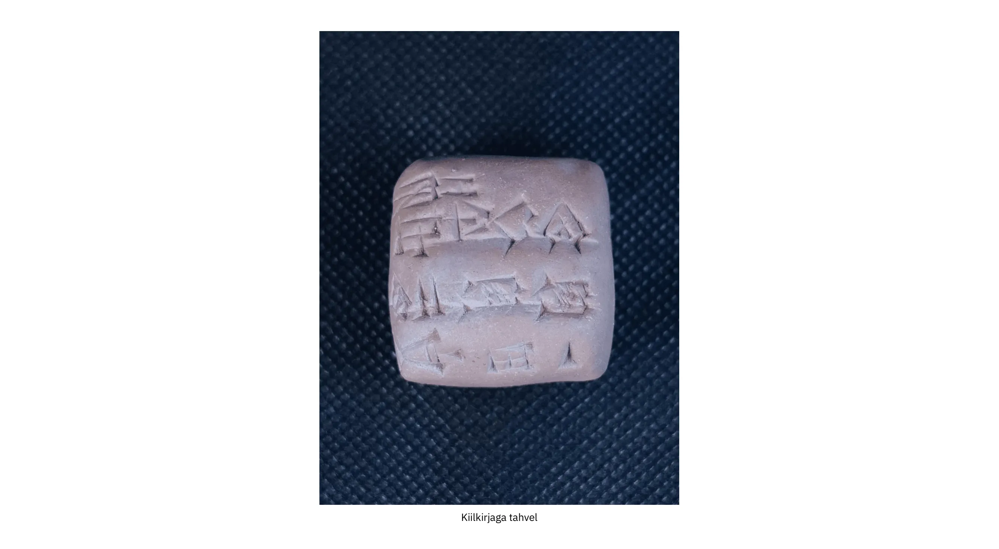

Mul on ka üks minu arvates ehtne sumeri tahvel, mille keskel on väike kiilkirjakiri. Sellel tahvlil on silindri veeretamise teel tehtud allkirjad, mida ma teile hiljem näitan.

Väikeste numbritega märgid olid allkirjadeks ajal, mil enamik inimesi ei osanud kirjutada, sest seda oskasid vaid vilunud kirjatundjad.

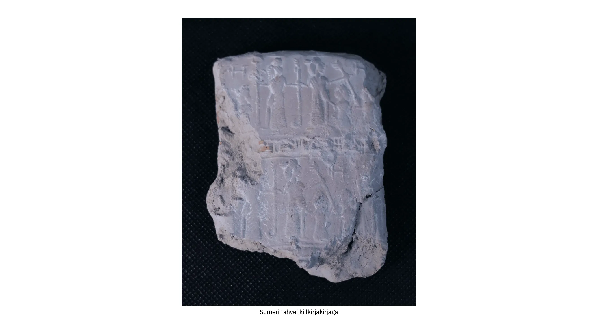

Allpool näete eespool mainitud silindrit: kivi, millele on graveeritud erikujundid. Inimesed kasutasid seda allkirjastussilindrit, mida inglise keeles nimetatakse silindersiibriks, kirjade allkirjastamiseks. See oli viis, kuidas selgesõnaliselt märkida autorite nimesid või näidata, et need on koostatud nende nimel.

Tolleaegsed kirjatundjad kasutasid seetõttu märjadele tahvlitele märkide trükkimiseks kiilukujulisi pliiatseid.

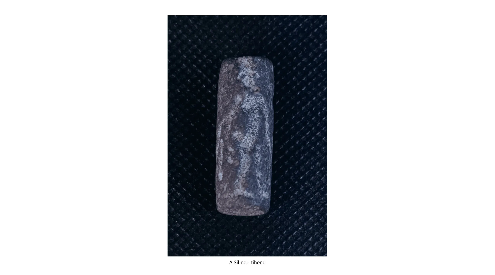

Kiilkirjamärgid ei kujutanud endast keelt, vaid kirjasüsteemi kõnekeele jäädvustamiseks. Inglise keeles ütleksime, et "writing is a written language", ja siis ütleksime, et "cuneiform is a script, not a language". Seega ütleksime prantsuse keeles, et kiilkirjak ei ole keel, vaid keele kodifitseerimise viis.

### Kirjutamise areng ja kasutusviisid

Esimestel sajanditel jäi see kirjaviis piiratuks, olles peamiselt mnemotehniline süsteem koguste, põllumajandussaaduste ja seadmete loetelude registreerimiseks. Alles järk-järgult muutus see võimeliseks **nimede** ja täielike lausete foneetiliseks esitamiseks.

Esialgu ei saanud nimesid kiilkirjas väljendada, sest see kujutas peamiselt esemeid ja tegelikkuse elemente, nagu härg või nisu, mida kujutati väikeste kujutistena. Aja jooksul arenesid need kujutised välja arenenumaks kirjaviisiks, mis võimaldas esitada nimesid ja keerulisi mõisteid.

Kui isiku nimi oleks näiteks Laura, oleksime võinud võtta ühe sõna, akronüümi, mis kõlab nagu "vesi" ja teise nagu "ras", ja moodustada sellest nime Laura. Nii kujunes välja esimene kirjakeele vorm.

Teadmiseks, et akronüümide kujutamiseks oli algselt, kui tahtsid joonistada härja pead, siis võis näha härja pea kuju. Vähehaaval lihtsustati jooniseid, et kujutada vaid mingisugust joont. Teadlased usuvad, et see juhtus seetõttu, et inimesed hoidsid märga savitahvlit ühes käes, mistõttu oli lihtsam initsiaale ümber joonistada neid keerates. Arvatakse, et see oli tingitud ka sellest, kuidas kirjamehed tahvleid hoidsid.

Kiilkirjakujulises akronüümis on ikka veel näha seost näiteks nisu või härjapeaga, ja need kalduvad alati ühele poole.

Kolme aastatuhande jooksul oli kiilkirjakiri peamiselt mõeldud majanduslike ja administratiivsete dokumentide säilitamiseks. Mesopotaamia elanikel tekkis aga peagi sügav soov säilitada kõik, mis vääris seda, et see peaks kirjalikus vormis vastu pidama. Seega jäädvustati lood, legendid ja laulud, mida seni edastasid suuliselt rändmuusikud, kirjalikult, mida sageli kopeerisid väljaõppinud kirjatundjad. Nad kopeerisid juba olemasolevaid tekste, peamiselt legende või tekste, millel oli teatav kultuuriline väärtus.

Oluline näide on **Gilgameši eepos**, mis on tõenäoliselt **Sumeri linnriigi Uruki ajalooline kuningas** umbes 2900-2350 eKr.

See kirjavorm, mis oli nii majandusjuhtimise vahend kui ka kultuurivektor, kestis kuni 1. sajandini pKr, enne kui see lõplikult kadus, jättes maha väärtusliku tunnistuse tsivilisatsioonist, mis nägi selle sündi.

## Sumeri tahvlite roll

<chapterId>a396e6c5-56cc-5410-9e6b-0274401c5425</chapterId>

:::video id=a0729a35-01ec-4aa4-828f-d4ccc2eb168e:::

### Rahaeelsed krediidisüsteemid

Vana-Mesopotaamias põhines majanduskorraldus väga keerukatel mehhanismidel, mis eksisteerisid juba ammu enne metallmüntide leiutamist. Ametlikud ja mitteametlikud krediidisüsteemid olid juba algusest peale oluline rahavorm, mis võimaldas kohalikul elanikkonnal teha mitmeid keerulisi majandustehinguid.

Just haldus- ja majanduslike vajaduste rahuldamiseks leiutati kiilkirjakiri. Mesopotaamia kuulsaid savitahvleid kasutati peamiselt mitmesuguste lepingute registreerimiseks: eralaenud, müük, rentimine, hüpoteegid ja isegi abielulepingud. Nende tahvlite kirjutamine nõudis spetsiaalsete kirjatundjate asjatundlikkust, mis oli aja ja vaeva poolest kulukas ülesanne, **mis oli aga õigustatud, kui kaalul olid rahalised huvid.** Inimesed ei kirjutanud tollal üksteisele armastuskirju, nad ei kasutanud kirjatundjat oma murede kirjapanekuks. Nad palkasid kirjamehe dokumentide kirjutamiseks, olgu selleks siis mingi seos või majanduslik põhjus.

Samuti tasub mainida, et mõned neist tahvlitest ringlesid esitajavõlakirjadena, mis vahetasid vabalt omanikku.

Näiteks oli mingi savipall, mille sees olid väikesed kivid.

Savipalli välisküljele kirjutati ja allkirjastati number, mis tähistas ühikute arvu. Sees olid need kivid ja keegi, kes soovis kontrollida, et see instrument tõepoolest esindaks X ühikut.

Teine näide, tänapäeva Bagdadist edelas asuv tahvel, sätestab, et võlgnik kohustub võlausaldajale vilja koristamise päeval maksma tagasi 330 meetrit vilja. Veelgi põnevam on see, et üks teine tahvel sätestab selgelt, et nelja meetri suuruse odra võlg tuleb tasuda otse tahvli kandjale, mis tähendab, et **esitatakse mõiste "maksmine kandjale", mis on tolle aja kohta eriti uuenduslik mõiste**.

Alates 2000. aastast eKr kehtis seadus, mille kohaselt kõik äritehingud, isegi kõige väiksemad, tuli vormistada kirjalikult ja allkirjastada tunnistajate juuresolekul. Kujutage ette, milline tohutu bürokraatia oli tol ajal kõigi tehingute registreerimine registrites, mis olid, tuletan meelde, valmistatud savist kirjatööliste poolt. Selle juriidilise ranguse eesmärk oli vältida tulevasi vaidlusi vahetatud kaupade omandiõiguse ja õiguste üle. Sageli kutsuti tunnistajad, kes pidid tõendama, et leping oli tõepoolest allkirjastatud.

Ka erasfääris tegelesid teatavad perekonnad ja üksikisikud piisavalt keerulise majandustegevusega, mis nõuab ranget juhtimist. Põhja-Babüloonia linnast Sippar-Amnanu avastati Anunitumi preestri Ur-Utu maja, mis sisaldas peaaegu 2000 tahvlit. Need dokumendid hõlmasid eralaenulepinguid, müügi- ja rendilepinguid, samuti kirju, religioosseid ja akadeemilisi tekste, mis annab tunnistust eraarhiivi mitmekesisusest ja tähtsusest sel ajal.

On märkimisväärne, et kirjakirjutajate kirjutatud kirjad puudutasid peaaegu eranditult rahalisi huve: kaebused ebapiisavate toetuste, tasumata kaasavara maksete või muude kiireloomuliste materiaalsete taotluste kohta. Sel ajal ei eksisteerinud selliseid isiklikke kirju nagu armastuskirjad, ja isegi haiguste mainimine oli haruldane.

Üks terav näide sellisest kirjast illustreerib seda majanduslikku tegelikkust: kirjasaatja väljendab oma ahastust pärast seda, kui ta jäi ilma rahast ja toidust, kui tema partner lahkus, samal ajal kui Assuri tabas ränk näljahäda. Ta kirjeldab oma tungivat vajadust osta teravilja ja palub, et talle saadetaks kiiresti tema tekstiilide rahaline vaste, et tagada tema igapäevane elatus.

See kiri, mis oli adresseeritud tema elukaaslasele, näib viitavat sellele, et mees oli läinud mujale kaubelda, jättes naise pennita. Ta tuletab talle meelde, et tal peab olema juurdepääs rahamõõtudele, et osta vilja ja maksta oma templimakse. See on ehk kõige lähemal tolleaegsele kirjale kirjutatud vaidlusele. Kirjad olid peaaegu alati seotud majandustehingutega ja just see kiri on seotud ebakindla majandusliku olukorraga.

Seega kajastavad meieni jõudnud Mesopotaamia dokumendid peamiselt majanduslikku kaubavahetust, sest need on koostatud üksnes tunnustatud väärtusega kaupade - raha, vilja, mitmesuguste kaupade, kinnisvara, templimaksude maksmise - üleandmiseks. Need arhiivid näitavad mitte ainult selle iidse tsivilisatsiooni tõhusust ja haldustäpsust, vaid ka selle võimet hallata keerulisi majandusvahetusi väga pika aja jooksul.

## Eliidi kontroll Sumeri tahvlitel

<chapterId>c6d3df0e-b1e1-58dc-ab35-9f76bbc39393</chapterId>

:::video id=04a95fb8-a701-4a48-9ce8-0e9b6ba256fd:::

### Kirjutamine, tehnoloogia, mis on ennekõike ökonoomne

Vastupidiselt üldlevinud arvamusele ei teeninud kirjutamise leiutamine Mesopotaamias umbes 4000 aastat tagasi algselt isikliku või kirjandusliku suhtluse vajadusi. **Keelkirjas kirjutamine oli eelkõige majanduslik tehnoloogia**, mis oli õigustatud ainult siis, kui kaalul olid olulised finantshuvid. Sumerlased ei kasutanud kirjasõnu mitte omavaheliseks kirjavahetuseks ega oma tunnete väljendamiseks, vaid üksnes oma kaubandus- ja finantstehingute dokumenteerimiseks.

Sellist spetsialiseerumist võib seletada tahvelarvutite kirjutamise märkimisväärsete kuludega. Savisse graveerimine nõudis spetsiaalset tehnilist oskusteavet, märkimisväärset aega ja erilisi materjale. Ainult piisava väärtusega tehingud õigustasid majanduslikult seda investeeringut, mis lõi loomuliku lävendi juurdepääsuks sellele revolutsioonilisele tehnoloogiale.

Kiilkirjatahvlid paljastavad oma aja kohta tähelepanuväärselt keerulise finantssüsteemi. Mesopotaamlased olid välja töötanud täieliku kaasaegsete finantsinstrumentide arsenali: **intressiga eralaenud, müügitehingud, rendilepingud, hüpoteegid ja isegi finantsklauslitega abielulepingud**. Selline keerukus annab tunnistust arenenud turumajandusest, mis on kaugel primitiivse kaubavahetuse lihtsast kujutlusest, mida sageli seostatakse nende iidsete tsivilisatsioonidega.

Mõned tahvlid toimisid tõeliste esitaja väärtpaberitena, mis liikusid vabalt käest kätte, ilma et nende omanikku oleks tulnud tuvastada. See uuendus võimaldas märkimisväärselt sujuvat vahetust, mis oli kaasaegsete finantssüsteemide eelkäija. Lisaks sellele nõudsid konkreetsed õigusaktid isegi, et kõik äritehingud oleksid vormistatud kirjalikult, millega institutsionaliseeriti kirjapandu kasutamine majandussfääris.

### Teadmiste monopol ja majanduslik kontroll

Kirjutamise keskne tähtsus majanduses andis selle tehnoloogia valdajatele märkimisväärse võimu. **Templitega ja valitsevate institutsioonidega üldiselt seotud kirjamehed kontrollisid de facto finantssüsteemi**. Nende haruldased ja hindamatu väärtusega teadmised tegid neist kõigi oluliste tehingute valvurid.

See teadmiste monopol ei olnud juhus. Võimud olid igati huvitatud selle ainuõiguse säilitamisest, sest kirjutamise demokratiseerimine oleks vähendanud nende kontrolli majanduse üle ja suurendanud võltsimisohtu. Tunnistajate süstemaatiline kohalolek allkirjastamistseremooniatel näitab seda pidevat muret dokumentide autentsuse pärast.

Seadusjärgne kohustus registreerida kõik äritehingud kirjalikult teenis mitmeid strateegilisi eesmärke: maksukontroll, range raamatupidamiskontroll ja majandusettevõtjate sõltuvuse säilitamine haldusaparaadist. **Mesopotaamia riik omastas seega võime hallata inimestevahelisi võlgasid** ühiskondlikus mastaabis, muutes seeläbi kirjutamise majandusliku võimu vahendiks.

### Kahe rahasüsteemi kooseksisteerimine

Tahvlite analüüs paljastab nüansirikkama majandusliku tegelikkuse, kui nende igakülgne esinemine arhiivides võiks oletada. Paljudel tahvlitel mainitakse viiteid **hõbeheklile** kui väärtusühikule, mis viitab seega standardiseeritud füüsilistel kaupadel põhineva rahasüsteemi paralleelsele eksisteerimisele.

Seda duaalsust võib seletada tolleaegse sotsiaalse kihistumisega. **Sümbooltahvlite süsteem oli reserveeritud piiratud eliidile**: vaimulikele, jõukatele kaupmeestele ja administraatoritele, kes olid võimelised neid keerulisi dokumente lugema, kirjutama ja tõlgendama. Selleks, et kandetahvlit tõhusalt kasutada, pidi mitte ainult oskama seda dešifreerida, vaid ka suutma kontrollida selle autentsust ja mõistma selle õiguslikke tagajärgi.

**Elitaarsest süsteemist kõrvale jäetud rahvamassid arendasid välja oma vahetusmehhanismid**. Tavalised inimesed kasutasid kättesaadavamaid süsteeme, nagu näiteks standardiseeritud teraviljamõõdud, raha kaalud ja muud kergesti mõõdetavad kaubad, mida igaüks võis hinnata ilma erioskusteta.

See rahvamajandus, kuigi ametlikes arhiivides vähem dokumenteeritud, oli tõenäoliselt dünaamilisem ja paindlikum kui tahvelarvutisüsteem. See võimaldas kiireid igapäevaseid vahetusi ilma kirjatööliste abita, rahuldades käsitööliste, talupoegade ja väikekaupmeeste vahetuid vajadusi.

Hõbesekel, mida tahvlites sageli mainitakse väärtuse viitena, oli tõenäoliselt sillaks nende kahe paralleelse majandussüsteemi vahel, võimaldades kirjalike võlgade ja füüsiliste maksete vahelist ümberarvestust.

### Spontaanne tekkimine versus institutsiooniline kontroll

See kooseksisteerimine illustreerib majandusajaloo fundamentaalset arutelu: **vastuolu vahetusvahendite spontaanse tekkimise ja raha institutsionaalse omastamise vahel**. Ühest küljest tekkisid sellised kaubad nagu raha loomulikult inimeste vahetusvajadustest. Teisest küljest omastasid ja vormistasid institutsioonid need tavad, et kontrollida nende liikumist.

Sumeri templid kehastasid seda pinget: nad kasutasid rahapoliitilisi uuendusi (viited seeklile), arendades samal ajal välja omaenda kontrollivahendid (kiilkirjatahvlid). See strateegia võimaldas neil saada kasu mõlemast süsteemist: traditsiooniliste valuutade populaarsest legitiimsusest ja ametlikest võlgadest tulenevast halduskontrollist.

Mesopotaamia kogemus loob püsivaid pretsedente finantssüsteemide arenguks. See näitab, et **finantsarengud eelnevad sageli mitu aastatuhandet** tehnoloogilistele uuendustele, mis tavaliselt sellega kaasnevad. Intressi, krediidi, kaubeldavate instrumentide ja hüpoteegitagatiste kontseptsioonid ei oodanud metallraha leiutamist.

See murranguline periood toob esile ka võimuküsimused, mis on omane igale rahalisele uuendusele: kes kontrollib tehnoloogiat, kes määrab reeglid ning kuidas liigendatakse ametlikud süsteemid ja populaarsed tavad. Need põhiküsimused on püsinud kogu majandusajaloo vältel, ulatudes tänapäevastesse aruteludesse digitaalrahade ja [krüptovaluutade](https://planb.academy/resources/glossary/cryptocurrency) üle.

# Majandus ja raha iidsetes tsivilisatsioonides

<partId>a16bcf4c-8c3a-11f0-9e79-2bd363a484bd</partId>

## Pronksiaja suured tsivilisatsioonid

<chapterId>fab9334c-7385-5d7c-ad40-7d152beb22a1</chapterId>

:::video id=737e12e8-1033-4210-b1dd-b8a680f68b17:::

Selles osas pealkirjaga "Pronksiaja suured tsivilisatsioonid" alustame väljavõttega raamatust *Raha ajalugu: From Ancient Times to Present Day*, mille autor on Glyn Davies, mis on minu arvates suurepärane sissejuhatus sellesse antiikajalisi suuri tsivilisatsioone käsitlevasse ossa.

> Toynbee nimetab umbes kakskümmend ühte erinevat "tsivilisatsiooni", kuid kuna viisteist neist tuleneb otseselt või kaudselt varasematest näidetest, vähendab ta iseseisvalt arenenud tsivilisatsioonide arvu kuueni: sumerite, egiptlaste, minoide, hiinlaste, maiade ja Andide tsivilisatsioonid. Neist ainult Andide inkadel õnnestus saavutada kõrge tsivilisatsiooniaste ilma raha kasutamata, kuigi paradoksaalsel kombel oli neil rohkesti materjale, mida üldiselt peetakse rahana kasutamiseks parimaks - kulda ja hõbedat.

Inkadel ei olnud rahasüsteemi, kuid neil oli hulgaliselt väärismetalle. Üsna paradoksaalne. Jätkame tsitaadiga:

> Mida kihistatum on ühiskond ja mida täpsem on selle planeerimissüsteem, seda vähem on rahakasutust vaja selle elanikkonna jaoks. See võib selgitada, miks hispaania konquistadoorid avastasid, et mehhiklased, kelle valitsus oli suhteliselt liberaalsem, kasutasid regulaarselt kuldpulbrit (mida hoiti läbipaistvates torudes) ja kakaoube (mida hoiti suurte maksete tegemiseks 24 000 ühiku suurustes kottides) rahana, samas kui inkadel, kes olid korraldatud palju rangema hierarhia alusel, ei olnud üldse mingit raha: erand, mida kinnitas range reegel. Raha tekkimine Hiinas oli täiesti sõltumatu teistest tsivilisatsioonidest; siiski tekitab sumerite, egiptlaste ja minoide tsivilisatsioonide suhteline lähedus kahtlusi selles, kuivõrd nad ei teadnud rahapraktikat, eriti kui arvestada juba varaseimatest aegadest peale tekkinud ulatuslikku kaubandust.

Hiinas arendati münte lääne traditsioonidest täiesti erinevalt. See oli algusest peale [fiatraha](https://planb.academy/resources/glossary/fiat). Need olid valatud mündid.

Ja siinkohal mainib hr Davies kaubandust. Hiina ja teiste rahvaste vahel toimus tõepoolest teatud aegadel kaubavahetus, kuid väliskaubanduse vahetusvahendiks oli pigem siid. Nagu me hiljem näeme, kasutati kulda ka Hiina piirialadel, kus hiinlaste rahvaarv oli väiksem. Ja isegi mitte väliskaubanduses; selleks oli siid.

Nii et ma kujutan ette, et võib-olla on müntide formaat mõjutatud teistest sama ajastu tsivilisatsioonidest, mis arendasid seda tehnoloogiat.

Kuid on selge, et raha olemus oli Hiinas hoopis teistsugune kui läänes. Me tuleme selle juurde pikemalt tagasi järgmises Hiinat käsitlevas osas.

Nende kuulsate sumeri linnade kohta on mul siin mõned märkused. Võime mainida Uruki, mis oli väga varajane ja mõjukas linn, mis oli kuulus oma märkimisväärse suuruse ja arenenud kultuuri poolest, eelkõige kirjanduse ja linnaplaneerimise arendamise poolest.

Ja ma tahtsin mainida ka kuulsat Gilgameši eepost. Gilgameš oli tõenäoliselt ajalooline Sumeri Uruki linna kuningas umbes 2900 eKr. Ta oli tõenäoliselt selle sumeri linnriigi kuningas.

Võime rääkida ka Akkadi Sargonist, kes valitses aastatel 2334-2279 eKr.

Ta oli Akkadi impeeriumi esimene valitseja, mis on teine Mesopotaamias tekkinud tsivilisatsioon. Ja ma mainin Sargoni, sest ta oli esimene, kes lõi postiteenuse nende kuulsate tahvlite jaoks siin, mida ma teile juba tutvustasin.

Kujutage ette, et tõesti olid isegi savist ümbrikud. Tahvlid võiksid olla pakitud savist ümbrikutesse, mille välisküljel oleks isiku allkiri, et tagada konfidentsiaalsus. Nii et inimesed murdsid ümbriku lahti, et tahvlit kätte saada. Selle postisüsteemi võlgneme Sargon Akkadile.

Siis on Babülon, suur linn, millest sai Babüloonia impeeriumi pealinn. Veel üks tsivilisatsioon, mis on tuntud oma imposantse sikguraadi ja paleede ning kuulsa Hammurabi seadustiku poolest, mis on kõige paremini tuntud oma kõrgelt arenenud õiguskoodeksi poolest.

Ja kaks linna selle osa lõpetuseks. Meil on Aššur, mis oli Assüüria impeeriumi pealinn, oluline religioosne keskus. Ja meil on Ninive, mis oli hiljem Assüüria impeeriumi pealinn. Nad viisid oma pealinna sinna ja see on tuntud oma võimsa sõjaväe, tohutute paleede ja raamatukogude poolest. Ja see on ka üks võimalikke Babüloni legendaarsete rippuvate aedade asukohti. Me kuuleme sageli sellest kuulsast antiikmaailma imestusest.

Kuid neist kuulsatest rippuvatest aedadest ei ole Babüloonias jälgegi. Seevastu Ninive'is on arheoloogilisi tõendeid mitme korruse aedadest. On võimalik, et Kreeka ajaloolased, nagu Herodotos, ajasid Ninive ja Babüloni segamini. Kui nad külastasid linnu Mesopotaamias, siis võib-olla nimetasid nad seda Babüloniks. Ninive'ist on leitud kuulsate rippuvate aedade jälgi ja teadlased võivad küsida, kas Ninive ongi see kuulus koht, kus need aiad asusid, mida nimetatakse Babüloonia rippuvateks aedadeks.

## Majanduskorraldus Mesopotaamias

<chapterId>6afb6fc8-cbb7-56a5-8427-484b4b7d7477</chapterId>

:::video id=aa6a2cbd-5916-4ae3-ad4f-65f0bd5643fa:::

### Kapitalismieelsed majandusstruktuurid ja orjapidamine

Tere tulemast sellesse Mesopotaamia majanduskorraldust käsitlevasse ossa. Kapitalismieelne majandus läbis kolm peamist etappi: primitiivne, orjanduslik ja feodaalne.

Feodaal on muidugi palju hiljem, ilmselt keskajal, ja me oleme juba läbinud selle primitiivse etapi, mida me varem kirjeldasime paleoliitikumi puhul. Nüüd, Mesopotaamias, kui me räägime majanduslikust korraldusest, siis räägime orjusest.

Kuid Mesopotaamias tegi suurema osa tööst orjadega sarnane sõltuv klass, kes ei olnud juriidiliselt oma peremeeste omand, vaid jäeti füüsilise või ideoloogilise sunniga oma töö viljadest ilma.

### Templite ja paleede roll majanduskeskustena

Majanduses domineerisid suurmaaomanikud. Maaomanikud kasutasid oma maad otse, palgates töölisi, või rentisid oma maad rendi eest välja. Nad tegelesid ka finantstegevusega, laenates raha kõrge intressimääraga, tavaliselt umbes 20-33,3 % aastas, mis erines teravalt naaberheebrealaste rangematest reeglitest.

Põllumajandustootjate võetud laenud ei olnud mõeldud tootlikeks investeeringuteks - välja arvatud laevandusettevõtete puhul -, vaid pigem selleks, et tagada nende ellujäämine järgmise saagikoristuseni. Selline olukord viis sageli põllumajandustootjate kroonilise võlakoormuse tekkimiseni.

Lubage mul tõmmata paralleel antiikajast (Rooma), kus kodanikud elasid talupoegade ja vabade tööliste toodetud põllumajandusrentidest ning sõjasaagist. **Seda tulu jaotati kodanike vahel, mitte selleks, et generate rohkem kasu saada, vaid selleks, et tõsta nende sotsiaalset staatust.** Kaubandus ja käsitöö jäeti üldiselt sotsiaalsest eliidist väljapoole jäävatele rühmadele. Kõik see on vastuolus keskaegse majandusega, mis oli orienteeritud kaubanduse ja käsitöö kaudu saadava kasumi teenimisele.

Seega püüame siinkohal tõmmata paralleeli sellega, et inimesed kasutasid finantslaenu vahendeid mitte tingimata selleks, et parandada oma tootmisvahendeid, ja hiljem Roomas ei investeeritud kasumit tingimata uuesti, vaid seda kasutati pigem nende inimeste prestiiži tõstmiseks, kes said sellest kasumist kasu. Me oleme veel kaugel sellest kapitalistlikust vaimust, mis tekkis hiljem keskajal, kui tootmisvahendite parandamiseks võis luua töökohti ning kasumi teenimise eesmärgil võeti ja loodi ülejääke. Seega näeme, et majanduskorraldus ei olnud veel jõudnud eespool loetletud majandusarengute kolmandasse etappi.

### Krediidisüsteemide ja arvestusühikute tekkimine

**Karl Polanyi eristab kolme majandusliku vahetuse vormi: vastastikkus sümmeetriliste rühmade vahel,** mis oleks primitiivsetes hõimudes, kus me ei vaja tegelikult raha, sest me anname üksteisele mitteametlikku krediiti ja vahetame ning jagame ümber. **Templite ja paleede ümber tsentraliseeritud ümberjaotamine,** see vahetuse vorm ühtib Mesopotaamiaga, kus templid olid majanduskorralduse keskmes ja võisid ühel ajal anda tagasi, jagada rikkust toiduratsiooni kujul. Alles hiljem võeti kasutusele palga mõiste. Nii et seni on meil olemas primitiivne vorm (1), tsentraliseeritud ümberjaotamine (2) templites ja paleedes, ja siis saame lõpuks anda teed turuvahetusele (3). Kuigi turg, nagu me seda tänapäeval mõistame, ei olnud täielikult olemas, on turuvahetuse olemasolu Mesopotaamias vaieldamatu, mida tõendavad konkreetsete terminite olemasolu akkadi keeles ja arheoloogilised tõendid hindade, kasumi, kahjumi, kõikumiste ja nappuse olukordade kohta.

Mesopotaamia majapidamised haldasid iseseisvalt kõiki põllumajandusliku tootmise etappe, alates külvamisest kuni leiva ja õlle valmistamiseni. Naised valmistasid ka oma ülalpeetavatele vajalikke tekstiile. Kaupade saamiseks, mida ei toodetud kohapeal, pöördusid majapidamised spetsialiseerunud kaupmeeste poole.

Perekondlikud sidemed olid kaubanduses eriti olulised. Paleo-Assüüria perioodil (umbes 1910-1830 eKr) rajasid kaupmehed Ashuri linnast Anatoolias Kaneshis kaubanduskoloonia, kuhu nad importisid tina ja tekstiili kulla ja hõbeda vastu. Kaubandus põhines perekondlikel ettevõtetel, mis olid tihedalt seotud abielu ja kaubanduspartnerluse kaudu. Kanesh oli vaid üks lüli ulatuslikus rahvusvahelises kaubandusvõrgus.

Nendes vahetustes olid metallid, ja need olid väärismetallid, mitte tingimata näiteks vask, mis oli tol ajal tõesti kasulik, ja me arvame, et neid metalle vahetati väärtuse säilitamise mõistete vastu. Nii et me ei saa tingimata rääkida barterist, kus kaks kaupa vahetatakse nende kasulikkuse eest, vaid pigem maksmise mõistest koos teatava teadmisega, et väärismetallid varutakse nende kasutamiseks väärtuse hoidjana ja mitte selleks, et kasutada neid kaubana, näiteks pronksi kasutamine soomuste valmistamiseks.

Tribuute ja makse maksti peamiselt mitterahaliselt (odra või kaalutud hõbe). Templid ja paleed olid peamised majanduslikud, haldus-, poliitilised ja usulised keskused ning täitsid ka esimesi pangafunktsioone, sest seal hoiti turvaliselt kaupu, kõigepealt teravilja, seejärel muid põllumajandustooteid ja lõpuks väärismetalle. Nii kujunesid välja esimesed krediidi- ja laenutehingud ammu enne müntide ilmumist.

Mesopotaamia majanduses kasutati väärtuse mõõdupuuna peamiselt otra ja hõbedat. Hõbedat kaaluti standardiseeritud ühikutes, nagu sìqlum (seekel), mis oli umbes 8,33 grammi. Juba Vana-Babüloonia ajal (Hammurabi ajal) kasutati hõbedat üldkasutatava maksevahendina, kusjuures juba varakult kasutati nominaalväärtust ("nūbum"), erinevalt tegelikust kaalust ("šuqulum"), **eelmõjutades tänapäeva fiat-valuuta mõistet**.

Kuid see ei olnud veel fiatraha selle sõna otseses mõttes. Puudus arusaam autoriteediga templist, kuid eksisteeris mõiste nominaalne arvestusühik, erinevalt kaalutud metalli mõistest. Nende kahe kontseptsiooni puhul oli keelekasutuses erinevus ja ma arvan, et seda on oluline mainida.

Üleminek palgatööjõuturule oli keeruline. See nõudis kahte suurt kontseptuaalset uuendust: inimese töö eraldamine lõpptoodangust ja "tööaja" kui mõõdetava ühiku kasutuselevõtt. Selleks, et meil oleks selline palgatöötaja mõiste, tuli kõigepealt läbida need kaks uuendust. **IIIᵉ aastatuhandel tasustati tööd esialgu fikseeritud ratsioonidega, enne kui IIᵉ aastatuhande algul järk-järgult palgasüsteemi poole liikuti.**

Lõpuks juurdus alates 26. sajandist eKr tõeline rahalise väärtuse mõiste, kuigi Mesopotaamia "raha" ei olnud mitte münt, vaid pigem kaalutud teravilja või metalli mõõt. **Sellepärast eelistati tähtsate tehingute puhul või väärtuse säilitamist nõudvates kontekstides sageli konverteerida tera hõbedaks, mida oli kergem säilitada.** Veidi nagu Kaneshi näitel, kus hõbemetalli saadi varumiseks.

Alates 21. sajandist e.m.a.j., **asümmeetrilise vahetuse praktilise kadumisega**, märgime, et loovutuslepingutes viitab verb sa, hinna maksmisele. See mõiste, mida nimetatakse "sa", esineb lepingutes ja viitab hinna maksmisele, mitte konkreetse kauba mõõtmisele. "Sa" viitab lihtsalt maksmisele või hinnale. See on antropoloog, kes märgib seda ja mainib, et see on tõesti läbimurre; me näeme omamoodi dihhotoomiat enne ja pärast seda verbi "sa" kasutuselevõtmist lepingutes.

Me ei saa eirata Lähis-Ida arhiivides olevaid empiirilisi andmeid, mis tõendavad **turumehhanismide** olemasolu, mis sisaldavad **kasumi** ja **kaotuse** mõisteid, **hinna kõikumist** ja **puuduse** olukordi. Kuid põhiline raskus seisneb selles, et määrata kindlaks turupõhise vahetuse suhteline tähtsus Vana-Mesopotaamia majanduses tervikuna.

Ma arvan, et selle valdkonna eksperdid on näinud nende turukontseptsioonide jälgi, kuid nad ei suuda meile tegelikult öelda, kui suur osa tolleaegsest majandusest põhines sellel kaasaegsemal turukontseptsioonil või muudel mehhanismidel.

Me teame, et see oli olemas, kuid me ei tea, kas see oli näiteks peamine viis hindade või kauplemise määramiseks.

Sellega on käesolev osa Mesopotaamia majanduskorralduse kohta lõpetatud.

Järgmistes osades teeme sama Egiptuse ja Hiina puhul.

## Majanduslik ja rahaline korraldus Vana-Egiptuses

<chapterId>bffcc16c-7fbf-5992-a0fa-6a7726d7d287</chapterId>

:::video id=40c1c4e5-b190-4bb6-b8a0-810c9ce7698b:::

### Ajalooline taust ja Egiptuse perioodid

See osa on pühendatud Vana-Egiptuse majandus- ja rahakorraldusele. Selleks, et anda teile veidi tausta, on siin loetelu ja lühikirjeldus kõnealustest perioodidest.

- Vana Kuningriik (umbes 2575 - umbes 2130 eKr)**. Ajavahemik, mida iseloomustab suurte püramiidide, eelkõige Giza püramiidide ehitamine. See oli tsentraliseeritud Egiptuse monarhia kuldajastu.
- Keskmine kuningriik (umbes 1938 - umbes 1630 eKr)**. Poliitiline ja kultuuriline renessanss pärast ebastabiilsuse perioodi.
- Uus kuningriik (umbes 1539 - 1075 eKr)**. Territoriaalse laienemise, sõjalise võimu ja rahvusvahelise kaubanduse periood. See hõlmab selliste kuulsate vaaraode nagu Tutanhamon ja Ramses II valitsemisaega.
- 1323 EKR. - Tutanhamoni surm**. Noor vaarao suri umbes 18-19-aastaselt. Tema peaaegu puutumatu haud avastati 1922. aastal, mis teeb sellest ühe kuulsama arheoloogilise leiu.
- Ramses II - valitses 1279-1213 eKr**. Üks võimsamaid uue kuningriigi vaaraosid. Tuntud oma sõjakäikude, suurte monumentide ja tõenäoliselt esimese teadaoleva rahulepingu sõlmimise poolest.
- 1275 eKr - mererahvad**. "Mererahvaks" nimetatud rühmade sissetungid või rännakud destabiliseerivad mitmeid Vahemere piirkonna tsivilisatsioone, sealhulgas Egiptust.
- Xoïsi lahing - 1178 eKr**. Konflikt Egiptuse armee ja sissetungijate vahel, tõenäoliselt seotud mererahvaga. Üks paljudest lahingutest Uue Kuningriigi lõpus.
- Hiline periood** on Vana-Egiptuse ajaloo periood umbes 664-332 eKr.
- Kleopatra VII (69 - 30 eKr)**. Viimane Egiptuse kuninganna, kuulus oma intelligentsuse, karisma ja liitude poolest Julius Caesari ja Marcus Antoniusega ning tõenäoliselt ka oma nina poolest. Tema valitsemisaeg tähistas vaaraode Egiptuse lõppu enne selle annekteerimist Rooma poolt.

Juba 5. ja 4. aastatuhandel eKr oli Egiptuses ulatuslik kaubandustegevus, mis ühendas Nubiat, Palestiinat, Liibüat ja Punase mere piirkondi mere-, jõe- ja maismaakaubanduse kaudu (eelkõige eeslikaravanide abil).

### Varased vahetussüsteemid ja paleoraha

Koos esimeste Egiptuse hõimude tekkimisega umbes 3650-3400 eKr sai Maadi linnast, mis asub tänapäeva Kairost lõuna pool, oluline vasetehnoloogia ja kaugkaubanduse keskus, eelkõige Mesopotaamiaga Süüria ranniku kaudu.

Kuigi suuremahuline kaubandus põhines peamiselt vahetuskaubandusel, eksisteeris tõenäoliselt ka primitiivne rahavorm ("paleoraha"), mis koosnes prestiižsetest esemetest, nagu poolvääriskivid ja fossiilsed karbid. Tõenäoliselt mängis kuld nendes kaubavahetustes juba olulist rolli. Esimene selgesõnaline mainimine mündi kohta Egiptuse dokumentides 3. aastatuhande keskel eKr. peegeldab pikka arengut, mis on seotud kaubandustavadega.

Arhailises ühiskonnas (siinkohal ei pea me tingimata rääkima Egiptusest, vaid arhailistest ühiskondadest üldiselt) olid maksed sagedased, mitte otseselt ostmiseks, vaid kaasavara, religioossete rituaalide ja muude sotsiaalsete kohustuste tasumiseks. Need tehingud nõudsid täpset hinnakujundust ja hindamist. Paljudel primitiivsetel ühiskondadel olid privilegeeritud, monetiformsed (st loendatavad) objektid, mille väärtust hinnati. Kui te maksate kaasavara, siis tuleb muidugi üles märkida mingi kogus objekti, mida tuleb kaasavara maksmiseks vahetada. See väärtus on sisuliselt inimeste väärtus.

Arhailistes ühiskondades, enne raha või rahasüsteemide tekkimist, olid maksed olemas, kuid need olid sageli seotud sotsiaalsete kohustustega ja nende väärtus tulenes üksikisikute väärtusest, nagu kaasavara või vereraha maksmine.

Tulles tagasi Egiptuse juurde, siis antiikimpeeriumi ajal läks "shât(y)", algselt konkreetne rahaühik (väike kuld- või hõbemünt, mis kaalus umbes 7,6 grammi), väga kiiresti üle oma tegelikust funktsioonist kui kõvast valuutast **raamatupidamisfunktsioonile**, mis andis aluse väärtuse mõistele. Me võime selles ära tunda mingi arvestusühiku, millega väljendada väärtust, mis algselt oli mingi münt, kuid me ei saa seda tegelikult nimetada mündiks, sest see ei ole tempel, vaid lihtsalt metalli mõõt. Me jõuame lähemale arvestusühiku mõistele.

Sellest shât(y) mõistest loobuti lõpuks, võib-olla pettuse ohu tõttu. Hiljem näeme, et egiptlased võtsid tembeldatud mündid aeglaselt kasutusele ja jätkasid nende kaalumist isegi pärast seda, kui nende naabrid olid need kasutusele võtnud.

Keskajal kasutati hõbedat harva igapäevaste tehingute tegemiseks, mida tehti peamiselt teraviljamõõtude ja leivakogustega. Just sel perioodil tekkis kirjaraha, mille puhul võis makseid kirjalikult või tegeliku ülekandmise teel registreerida.

Uue kuningriigi rahasüsteem muutus keerulisemaks, ühendades erinevaid metallides (kuld, hõbe, vask), standardiseeritud kangastes, teraviljas ja õlis hinnatud kaubavaluutasid. Kangast nimetati "kangamõõduks". **Tarbekaupade hindu väljendati sageli teraviljas või vases, samal ajal kui väärtuslikke esemeid hinnati kullas või hõbedas. Hõbe, mis oli Egiptuses haruldasem kui kuld, muutus eriti hinnaliseks.** Hõbe oli ülehinnatud võrreldes kullaga, mida Egiptuses oli rohkem.

Hilisperioodiks (esimene aastatuhat eKr) oli hõbedast saanud kogu Lähis-Idas levinud vahetusmetall. See ringles valuplokkide, metallmüntide või rõngaste kujul, mida kaaluti ja märgistati templitesse, tagades nende kaalu ja puhtuse, kuigi neid ei vermitud valitseja kujutisega. See toimus hiljem ja seda käsitletakse hilisemas lüüdlasi käsitlevas osas.

Samuti tuleb märkida, et vanadel egiptlastel oli raha jaoks olemas termin "hedj", mida kasutati üldiselt mis tahes maksevahendi tähistamiseks, mida kasutati tehingu eest tasumiseks, olgu selleks siis metall, teravili, riie või mitmesugused kaubad (puit, loomad, teenused jne). Dokumenteeritud näited näitavad, et egiptlased võisid arveldada tehinguid, kombineerides erinevaid tooteid, mille koguväärtus oli väljendatud vaseühikutes ("deben").

**Templid mängisid Egiptuse majanduses keskset rolli: nad kogusid ja hoidsid märkimisväärseid väärismetallide (kulla ja hõbeda) aardeid, mis olid mõeldud jumalate austamiseks, kuid ka rahareserviks, mida võis vajaduse korral uuesti majandusringlusse suunata**. Näeme näiteid teiste tsivilisatsioonide kohta, kes kogusid templitesse väärtuslikke varusid, näiteks kujusid, mida sõja, rahapuuduse või kriisi korral sisse sulatada. See on korduv teema läbi ajaloo.

Samuti tasub mainida, et lina kasvatamine oli templitele antud kuninglik monopoolne õigus ning vääriskangaste tootmine kinnitas nende majanduslikku tähtsust.

Vanad egiptlased tegid selget vahet väärismetallide ideoloogilisel aspektil, mis oli seotud jumalikkusega (kuld esindas jumalate liha, hõbe nende luid), ja nende praktilisel funktsioonil kui raha, mis oli võrdlusaluseks kõikidele teistele maksevahenditele.

Seega, kuigi Vana-Egiptus ei arendanud alles hilisajal välja tänapäeva rahasüsteemidega võrreldavat rahapreparaati, oli tal siiski keerukas rahasüsteem, mis põhines pühakirjaraha, täpsete arvestusühikute, kaubaraha ja kaaluga hinnatud väärismetallide kombineeritud kasutamisel.

Mündid ise kaaluti, mis annab alust kahe erineva mõiste loomiseks: **"mündi" ja "raha "**. Ma kasutasin inglise keeles kahte terminit. Esiteks, "coinage" viitab müntidele, mis on mõiste, mis tuleb hiljem, ja meil on ka see mõiste raha. Me võime juba määratleda teatud mõistet "raha" nende arvestusühikute kaudu, mida ma just väljendasin raha mõistes, kuid mis ei olnud veel mündid, seega "coinage" tuleb veidi hiljem, koos lüüdidega.

Seega ei ole mündid raha eelduseks, **nii palju, et me võime tunnistada raha olemasolu juba 3. aastatuhandel,** igal juhul ja kahtlemata 2. aastatuhandel ja eriti Hammurabi valitsemise ajal.

Oluline on siinkohal meeles pidada, ja seda mainib ka autor raamatus "Raha päritolu", et kahtlemata oli raha mõiste juba tollal olemas, nendes rahasüsteemides, ja on viga siduda raha kui mõiste sündi müntide ilmumisega.

Lõpuks tuleb nüansseerida Polanyi vastastikkuse ja ümberjaotuse kontseptsioone, mida sageli rakendatakse Vana-Egiptuse suhtes: kuigi need on olemas, ei moodusta nad ainuõiget raamistikku. Farao-Egiptus oli välja töötanud keerulise majanduse, mis sisaldas täielikult keerukat kaubavahetust, mis erines religioossetest ja rituaalsetest tavadest, näidates majandusliku valdkonna tegelikku sõltumatust ideoloogilisest valdkonnast.

See eripära on seotud arusaamaga, et väärismetallid olid seotud teatava jumalusega, kuid olid siiski võimelised eristuma.

Ma toon selle välja, sest Polanyi viitas nende väärismetallide kasutamisele kui peamiselt religioossele või jumalikule mõistele. Meie aga pakume välja, et need olid ka majandussüsteemi integreeritud ja et egiptlased olid juba võimelised selliseid eristusi tegema.

Lõpetuseks tahaksin tsiteerida raamatut "The Origins of Money", kus on loetletud selle leiutise, vermitud raha, eesmärk. Seal on mitu punkti, kuid ma tahaksin rõhutada vaid punkti 5:

*arendada majandusliku mängu võimalust, kasutades selliseid meetodeid nagu devalveerimine ja järjestikused ümberhindamised, et vähendada või suurendada importi ja eksporti madalamate kuludega*

Seega teeb autor ettepaneku, et juba neil arhailistel aegadel olid mündid riigi kontrolli all leiutatud või tekkinud ning nendega manipuleeriti väärismetallide koguse ja kaalu osas, et juhtida majandust. Lubage mul anda teile väike skoop seoses järgneva lõiguga. **Juba kõige varasemate müntide puhul, mis olid valmistatud electrumist, kulla ja hõbeda sulamist, teame nende müntide väärismetallide sisalduse analüüsist, et esimestel emitentidel, näiteks Kroesosel, oli kulda vähem kui looduslikus electrumis.**

See tähendab, et nad teadsid juba, kuidas kulda ja hõbedat eraldada, ja andsid välja vähem kulda sisaldavaid münte.

Autor viitab sellele, et juba alates müntide algusaegadest kasutati raha vermimise õigust lisaks lihtsalt kaalu tõendamisele ja kaubanduse hõlbustamisele ära ka selleks, et suurendada emiteeritud raha kogust, võib-olla majandusplaneerimise ühe vormina.

## Märgistusvaluuta ning majandus- ja rahakorraldus iidses Hiinas

<chapterId>e08d3be9-423c-5cf3-a606-6ad54e2261af</chapterId>

:::video id=ae7e6367-1725-455e-bfe6-359be1f443e5:::

Selles peatükis pealkirjaga "Märkraha ja Vana-Hiina majandus- ja rahakorraldus" näeme, et Vana-Hiina rahal on läänelikest traditsioonidest erinevad tunnused. Hiina raha oli juba algusest peale "märgiraha". Selles jaotises esitatud teave põhineb märkmetel, mis ma tegin pärast raamatu "Aux origines de la monnaie" lugemist.

### Märgivaluuta mõiste ja selle eripära

Autori sõnul on märkeraha võrdväärne tänase fiat-valuutaga. See on raha, mille väärtus ei ole seotud selle metallisisaldusega. Algusest peale oli tegemist mingi kokkuleppega, ühiskondliku konsensusega nende müntide väärtuse kohta.

Vana-Hiina rahapoliitika on lääne traditsioonidest erinev. Need olid peamiselt metallist, kuid pigem valatud kui vermitud, ja need ei kandnud valitseja kujutist. Üllataval kombel ei olnud Hiina riigil monopol rahaliste emissioonide väljaandmisel. Sellist näilist liberaalsust võib seletada sellega, et rahakasutuse monopoliseerimise majanduslik vajadus puudus tänu rohketele maksuressurssidele, mida koguti suurelt maksukohustuslasest elanikkonnalt.

Hiina valuutat iseloomustab ka selle usalduslikkus. Juba algusest peale kasutati rahana lehmakarbi (merekarbi) pronksist imitatsioone, millel puudus otsene seos kasutatud metalli sisemise väärtusega. Kui minna ajaloos väga kaugele tagasi, siis kasutasid hiinlased merekarbid rahana. Lõpuks, kui karbid muutusid liiga napiks, valmistasid nad vasest koopiaid, millel oli sama väärtus kui ehtsal.

Hiina valuuta ei põhinenud seega mitte materjali väärtusel või algse eseme (nt karpide) suhtelisel haruldusel, vaid kollektiivsel usaldusel selle kasutamise suhtes vahetusvahendina - teisisõnu, rahalisel märgil.

### Kauritsakoortest metallist imitatsioonideni

Karulauku kasutati laialdaselt algupärase rahaühikuna. Muistsed üleskirjutused näitavad, et juba Shangi ja Zhou dünastia (esimese ja teise aastatuhande esimesed dünastiaid eKr) ajal kasutati lehmakarbid mitte ainult sõjategevuse tasustamiseks, vaid ka **töö tasustamiseks, väärtuse mõõtmiseks ja maa ostmiseks**.

Oluline on siinkohal meeles pidada, et see ei olnud lihtsalt ükskõik milline vahend, mida ühiskond kasutas piiratud eesmärkidel. Seda kasutati sõjaliseks premeerimiseks, töö eest tasumiseks ja väärtuse mõõtmiseks. Sellest leiame jälgi arheoloogide kirjutistes. Kuigi me ei tea, kas seda kasutati igapäevaselt leiva ostmiseks, on meil tõendeid, et seda võidi kasutada eespool nimetatud tehinguteks.

Aja jooksul viis tõeliste kaubikukoorte nappus pronksist, luust, pärlmutterist või kivist imitatsioonide valmistamiseni, eriti matusekontekstides kasutamiseks, et vältida tõeliste väärtuste kinnistumist hauakambrisse. See meediumi vahetamine on seotud ka ideega vürsti kontrollimisest raha üle, mis on seda lihtsam, kui vürst teeb raha.

Me peame siinkohal mõistma, et kui vürst saab ise raha luua, siis annab see talle suurema kontrolli majanduse juhtimise üle, kui ta väljub loodusliku merekarpide nappuse piirangust.

Erinevalt Mesopotaamiast, kus mündid olid seotud väärismetallide kaaluga, tuleneb hiina münditerminoloogia otseselt rahana kasutatavate esemete algkujust: lehmakivid (bei), noad (dao), labidad (bu) ja ümmargused mündid (quan või qian). Seega näeme, et rahaga seotud sõnade päritolu Hiinas viitas nendele esemetele. Seevastu läänes on meil mitmeid rahamõisteid, mis pärinevad neist hoopis erinevatest mõistetest, mis on rohkem seotud rahaobjektide füüsiliste omaduste ja kaaluga. Need etümoloogilised erinevused näitavad selgelt läänemaailma ja Hiina rahakäsitluse vahelist lõhet.

Hiinas oli rahaline väärtus täiesti usalduslik, mis põhines riigi, tootjate ja kaupmeeste vahelisel ühiskondlikul kokkuleppel.

### Majanduse reguleerimine ja rahapoliitiline filosoofia

Hiina riik kasutas raha majanduse reguleerimise vahendina: rahapaljuse ajal vähenes raha väärtus, mistõttu oli inimestel lihtsam kaupu osta. Seevastu rahapuuduse ajal raha väärtus tõusis, tugevdades riigi ostujõudu oma edasiste operatsioonide jaoks.

Siin võib luua seose [inflatsiooni](https://planb.academy/resources/glossary/inflation) ja deflatsiooniga. Fikseeritud rahapakkumise korral tõuseb raha väärtus, kui majanduse tootlikkus suureneb. Kui aga tootlikkus väheneb, siis raha väärtus väheneb. Antud näites on aga vastupidi. Tõenäoliselt seetõttu, et vürstil ei olnud täielik monopol raha tootmisele, kuid see näitab siiski, et raha väärtus oli seotud majandustingimustega.

Filosoof Mo Di (5.-4. sajand eKr) oli juba analüüsinud seda hinna ja väärtuse vahelist suhet: tema sõnul ei kajasta hinnamuutused tegelikku odavuse või absoluutse kalliduse mõistet, vaid pigem kaupade ja raha vahelist kõikuvat suhet, mis ei sõltu rahamärgi stabiilsest nominaalväärtusest.

Nii et selle asemel, et öelda, et kuldmündil oleks mingi põhiväärtus kui selline, näiteks kasutusväärtus või sisemine väärtus, juhib ta siinkohal tähelepanu sellele, et rahamärgi väärtus tuleneb pigem majanduse seisundist.

Hiinas ei pidanud mündid tingimata olema ametlikult märgistatud või garanteeritud. Nende vastuvõtmine sõltus üksnes kollektiivsest usaldusest, mis seletab, miks pronksist või vasest mündid ilma erilise kildita võisid pikka aega vabalt ringelda.

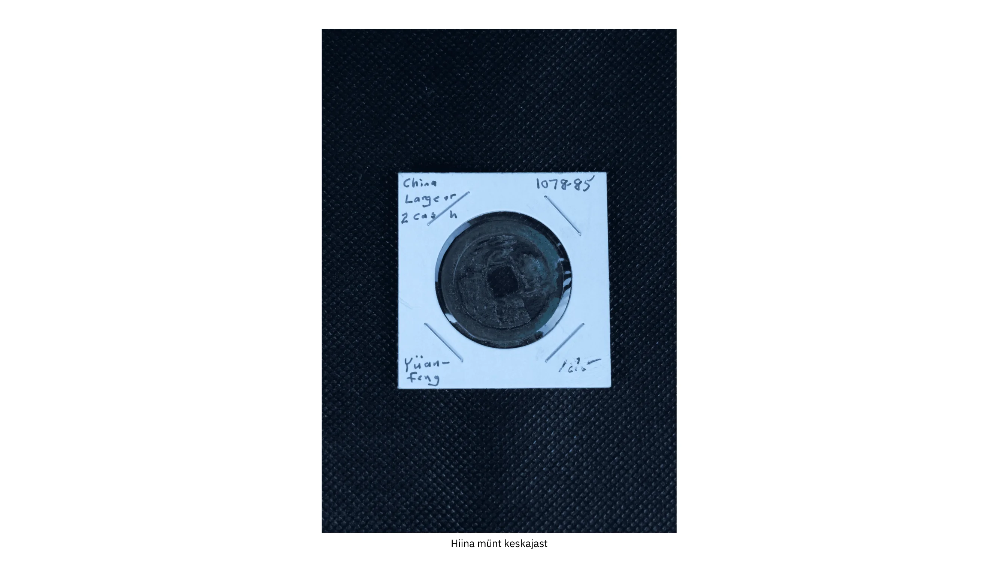

Ülaltoodud on Hiina münt keskajast. See on valatud münt, mille keskel on ruudukujuline auk. Seda auku kasutati köie ühendamiseks, mis võimaldas münte käevõrude või kaelakeede loomiseks kokku köita. Need ei olnud siiski eelkõige kandmiseks, vaid neid kasutati peamiselt raamatupidamislikel eesmärkidel. Neid võis kokku köita, et moodustada arvepidamisüksusi suurte nööride kujul, mille tükid olid omavahel ühendatud. Neil ei olnud tingimata mingeid spetsiifilisi märke, mõnikord olid need lihtsalt pronksist ringid.

Riigi rahamonopoli, mille kehtestas hilinemisega 113. aastal eKr Han dünastia Wudi, vaidlustati sageli, võimaldades erinevatel era- või kohalikel osalejatel emiteerida oma valuutat, kui nad nautisid piisavat ühiskondlikku usaldust.

**Hiina vääringute madal sisemine väärtus takistas nende varumist, tagades nende sujuva ringluse**.Väärismetalle kasutati harva ringluses oleva rahana, et vältida varumist. Kuna kuld oli liiga kallis, siis tavaliselt pigem hoiti seda kõrvale kui kulutati. Selle asemel oli Hiina rahvusvahelises kaubanduses **ainult siid tõeline kõrge väärtusega valuuta**. Hiinlased kauplesid siidiga, mitte kullaga.

Majandus- või rahakriiside ajal, eriti kui vase hind tõusis, võeti kasutusele uuenduslikke lahendusi: nii lõigati juba 2. sajandil pKr ringluses olevaid münte, et luua väiksemaid ühikuid, mis võimaldas säilitada voolavat ringlust madalamate kuludega. Teistel ajastutel, näiteks Wang Mangi ajal (1. sajandi alguses pKr), katsetati väga fiduciatiivsete valuutade kasutamist, mille nimiväärtus oli palju suurem kui nende tegelik metallisisaldus, mis kujutas endast seega pangatähtede eelkäiku. Nad võtsid mündi ja tembeldasid sellele väärtused nagu 50, 100 või 200, et näidata suuremaid summasid, näiteks 200 münti. See tava aitas tõenäoliselt kaasa märkimisväärsele inflatsioonile.

Nagu eespool mainitud, põhines see süsteem riigi, tootjate ja kaupmeeste vahelisel sotsiaalsel kokkuleppel, kuid ka autoritaarsetel ja karmidel reeglitel nende suhtes, kes ei mänginud mängu, eelkõige seoses tükkide valikuga (kas ilus või mitte) või kangaste pikkusega (mis ei vastanud standardile).

Minu tagasihoidlikul arvamusel ei ole see väga kindel süsteem. See tugines peamiselt rangetele eeskirjadele, mis nõuavad ametnikelt ja kauplejatelt sanktsioonide ähvardusel kahjustatud müntide vastuvõtmist.

### Hiina rahalised uuendused ja nende majanduslik mõju

Hiina oli teerajaja ka varajase paberraha väljaandmisel, mis võeti algselt kasutusele vastusena metallipuudusele 9. sajandil pKr. Hoolimata nende esialgsetest eelistest, viisid need paberrahad liigse emiteerimise korral regulaarselt inflatsioonispiraalini, nagu oli näha Songi ja Mingi ajastul, kui liigne emiteerimine viis tõsiste valuutakriisideni, mida illustreeris Marco Polo 13. sajandil, kes märkis isegi, et sellise paberraha võltsimise eest karistati surmaga. Ma ei saa jätta siinkohal märkimata üht vägivalla vormi.

Seega iseloomustab Hiina kogemust sügavalt usalduslik arusaam rahast, rahasüsteemi märkimisväärne paindlikkus ja paberraha varajane kasutamine, mis põhineb pigem majanduses osalejate vahelisel usaldusel kui kasutatavate vahendite sisemisel väärtusel.

## Ühiskondlik ja majanduslik korraldus antiikajal

<chapterId>4023c3ce-7a47-5ac4-8f5f-c7ab699ab20f</chapterId>

:::video id=2761efe4-21cf-4f06-9bda-c03f9ff39012:::

### Linnade parasiitide arutelu

Antiiklinnade ja nende tagamaade vaheline suhe tõstatab põhiküsimuse: kas need linnakeskused toimisid jõukust ammutavate parasiitidena või kasuliku majandusliku spetsialiseerumise mootoritena? Parasiitluse hüpoteesi kohaselt võtsid pronksiaja linnad, eriti Mesopotaamias, **süsteemselt oma maapiirkondadest rohkem väärtust, kui nad tagastasid**, elades põhiliselt rendi ja maksude arvelt, ilma et nad oleksid loonud samaväärset väärtust.

See nägemus leidis kajastamist Rooma impeeriumi kokkuvarisemisega: kui territoriaalne laienemine lõppes, siis lõppes ka välise rikkuse voog, mis võis tuua esile linnamajanduse, mis ei suutnud end ise rahastada. Linnad oleksid seega elanud "üle oma võimete", sõltudes pigem kaevandamisest kui tootmisest.

### Spetsialiseerumine kui väärtuse loomise mootor

Alternatiivne majanduslik tõlgendus seab selle parasiitliku nägemuse kahtluse alla. **Vana-aegsed linnad toimisid eelkõige spetsialiseerumise ja tööjaotuse keskustena**. Nende roll läks kaugemale lihtsast kaevandamisest: nad koondasid spetsialiseerunud käsitööd, organiseerisid kaubandusvõrgustikke ja toimisid kaugvahetuste sõlmpunktidena.

Selline linnade spetsialiseerumine lõi tootliku vastastikuse sõltuvuse sisemaaga. **Linnad ei suutnud ellu jääda ilma maapiirkondade põllumajandusliku varustatuseta, kuid sisemaa sai vastutasuks kasu käsitöötoodetest, tehnilistest uuendustest ja juurdepääsust Vahemere piirkonna kaubandusvõrgustikele**. Tööjaotus võimaldas vastastikust tootlikkuse kasvu, isegi kui kasu jaotumine võis tunduda tasakaalustamata.

Osaliselt seletab seda ilmset asümmeetriat tolleaegne krooniline toidupuudus. Näljahäda ja saagi hävimise oht oli maarahvale pidevaks ohuks, samal ajal kui linnade käsitöölistel, kes olid seotud rahvusvaheliste kaubandusvõrgustikega, oli suurem majanduslik stabiilsus.

### Ajalooline areng, antiikajast kuni keskajani

Kontrast iidse ja keskaegse organisatsiooni vahel heidab sellele küsimusele valgust. **Antiikajal eelistati laiaulatuslikku tööjaotust, kusjuures linnad olid avatud kogu Vahemere-äärsele maailmale**. Kaubandus ja spetsialiseerumine saavutasid keerulise taseme, luues ulatuslikud majandusvõrgustikud.

Rooma impeeriumi kokkuvarisemine viis radikaalse killustumiseni: **Feodaalajastu asendas selle tsentraliseeritud organisatsiooni isemajanduste detsentraliseeritud süsteemiga**. Vana-Rooma villas rusticae sai keskaegsete mõisate maatriksiks, luues mosaiigi praktiliselt iseseisvatest majandussaartest, mida juhtisid vaimulikud või aadlikud.

Selline keskaegne detsentraliseerimine vähendas küll kaubanduslikku tõhusust, kuid paradoksaalsel kombel pakkus suuremat vastupanuvõimet välistele šokkidele. Feodaalmajandused arendasid tasakaalustatumaid suhteid võimukeskuste ja maarahvastiku vahel, isegi kui selline korraldus piiras spetsialiseerumisega seotud tootlikkuse kasvu.

### Linnaturgude tekkimine

Arheoloogilised leiud näitavad, et juba teisel aastatuhandel** olid Mesopotaamia linnades olemas **kaubandussadamad ja kaubanduskvartalid. Need infrastruktuurid annavad tunnistust organiseeritud turgude olemasolust, isegi kui nende täpne toimimine on endiselt vaieldav.

Karl Polanyi, kes oli algselt skeptiline tõeliste turumehhanismide olemasolu suhtes antiikajal, kvalifitseeris oma seisukohta, tunnistades, et ta võis alahinnata turumajanduse varajast tekkimist. See intellektuaalne areng peegeldab antiikajaliste majandussüsteemide tõlgendamise keerukust, kus institutsionaalne ümberjagamine, vastastikune vahetus ja algavad turutehingud eksisteerisid samaaegselt.

### Sparta versus Ateena

Sparta ja Ateena võrdlus illustreerib suurepäraselt rahasüsteemi ja ühiskondliku korralduse vahelist seost. **Sparta kujutab endast jäigalt hierarhilise ühiskonna mudelit, mis teadlikult keeldus raha kasutamisest**, samas kui Ateena arendas oma demokraatliku süsteemiga kaasnevat keerukat rahamajandust.

Spartalaste keeldumine rahast ei olnud spontaanne, vaid **institutsiooniline ja ideoloogiline**. Spartani juhid kartsid, et raha rikub sõjalisi ja kodanikuväärtusi, ning eelistasid süsteemi, mis põhines kodanike vahelisel otsesel inimestevahelisel usaldusel.

Raha kasutamise takistamiseks kasutas Sparta **raskeid, ebapraktilisi metallvarraste**, mis paradoksaalselt näitab intuitiivset arusaamist raha omadustest (jagatavus, transporditavus, vastupidavus), mida nad püüdsid neutraliseerida.

### Anti-monetaarse mudeli piirid

Spartani organisatsioon illustreerib **Dunbari numbri** piiranguid, mida rakendatakse ühiskondlikul skaalal. **Hüljates raha kui neutraalse vahetusvahendi, mõistis Sparta end süüdi selles, et tema kodanikuühiskond piirdus piiratud arvu kodanikega, kes olid võimelised säilitama otsese usalduse suhteid**. Homoioi (spartalased) moodustasid kõigest 1% kogu elanikkonnast, keda ümbritsesid tuhanded hiloodid (orjad).

See organisatsioon, mis algselt oli erakordse sõjalise ühtekuuluvuse allikas, osutus struktuuriliselt hapraks. **Leuctresi lahing (371 eKr) näitas selle süsteemi piire**: inimkaotused purustasid pöördumatult spartalaste sotsiaalset struktuuri, mis viis nende tsivilisatsioonimudeli kokkuvarisemisele.

Arenenud rahasüsteemiga konkureerivad linnad (Ateena, Korintos, Theobas) säilitasid **rikkama ja vastupidavama majanduse**, mis suutis inimkaotusi kompenseerida majandusliku taastamise ja sisserände abil.

### Isiklik versus institutsionaalne usaldus

Spartalaste kogemus näitab **riske, mis on omane ühiskonnale, mis põhineb üksnes inimestevahelisel usaldusel**, mitte neutraalsetel institutsioonilistel mehhanismidel. Kuigi see mudel lõi tugevat sotsiaalset ühtekuuluvust, jättis see ühiskonna haavatavaks demograafiliste šokkide suhtes.

Raha võimaldab anonüümseid ja depersonaliseeritud tehinguid ning pakub seega paremat süsteemset vastupidavust. See võimaldab sotsiaalset laienemist üle otsese usalduse piiride, hõlbustades välisvahetusi ja majanduskasvu.

### Inkade paradoks, rikkus ilma rahata

Inkade impeerium kujutab endast põnevat paradoksi: **tsivilisatsioon, millel oli tohutu kuldvarandus, kuid ei olnud rahasüsteemi**. Nagu Sparta, põhines see mudel jäigal hierarhilisel organisatsioonil ja tsentraliseeritud planeerimisel, kuid osutus haavatavaks paindliku rahamajandusega konquistadooride suhtes.

Rahavastaste süsteemide struktuuriline haprus rahaliste ühiskondade ees on korduv ajalooline muster, mis näitab, et **institutsiooniline raha tagasilükkamine, mis kaugel sellest, et tugevdada sotsiaalset ühtekuuluvust, võib paradoksaalselt nõrgestada tsivilisatsioone** väliste väljakutsete ja ajalooliste muutuste ees.

Nende ajalooliste mudelite analüüs näitab, et raha on lisaks oma vahetusfunktsioonile sotsiaalse keerukuse marker ja vahendaja, mis võimaldab tsivilisatsioonidel ületada otsestest inimestevahelistest suhetest tulenevaid piiranguid.

# Rahapandud raha sündi

<partId>232e365a-8c3b-11f0-b276-b3ab70d1a5a1</partId>

## Müntide tekkimine

<chapterId>40ed3414-3066-57bd-bc1b-617ad0a354e0</chapterId>

:::video id=1d6834c4-98a3-43fe-ba80-04be51b0486e:::

Nüüd oleme jõudnud asja tuumani: müntide välimus. Ma rõhutan siinkohal sõna "mündi", sest eelmistes osades nägime, et raha või rahasüsteemid olid väga palju olemas lüüdi rahvastele, kreeklastele ja pärslastele eelnenud tsivilisatsioonides. Ma arvan, et see on üsna selge sellest, mida me just nägime. Seetõttu on see osa pühendatud päris müntide tekkimisele ja kannab pealkirja: *Müntide tekkimine*.

### Lydia ja Ioonia müntide päritolu

Selle osa alustuseks pakun teile väljavõtte Glyn Daviesi raamatust "A History of Money" (Raha ajalugu), mis asub siin.

*Väljavõte raamatust "Raha ajalugu": From Ancient Times to the Present Day by Glyn Davies:*

> Lüüdia ja Joonia sünnipaigast levisid teadmised ja müntide kasutamine kiiresti itta Pärsia impeeriumi ja läände läbi ülejäänud Joonia ja Egeuse mere saarte Kreeka mandrile ning seejärel selle läänepoolsetesse kolooniateni, eriti Sitsiiliasse. Samuti levis see põhja poole Makedooniasse, Traakiasse ja Musta mere äärde, kuid Egiptuses võeti see vastu vaid osaliselt, vastumeelselt ja hilinemisega.

Minu arvates on siinkohal huvitav mainida, et Egiptuses jätkati müntide kaalumist veel kaua pärast mündi vermimise tehnoloogia kasutuselevõttu. Ma arvan, et see on oluline märkida. Tsitaat jätkub:

> Samuti võttis Mandri-Itaalia esialgu Kreeka finantsuuendusi üsna aeglaselt vastu, erinevalt sellest, kui kiiresti need Sitsiilias omaks võeti.

*Peale nende kahe piiratud erandi (Mandri-Itaalia ja Alam-Egiptus) levis mündi kasutamine kiiresti kõigis Vahemere kesk- ja idapiirkonna riikides ning ka kogu laias ja kasvavas Pärsia impeeriumis, alates Mesopotaamiast ** kuni Indiasse.** Jääb ebaselgeks, kas India oli selleks ajaks juba iseseisvalt välja töötanud embrüonaalse rahasüsteemi, sõltumata Hiina või Lydia arengutest. Sõltumata sellest, kas India oli iseseisvalt välja töötanud oma raha, viisid India ja Lähis-Ida vahelised kasvavad kontaktid selleni, et India mündindus oli otsene kohandamine Lüüdia ja Kreeka leiutistest, esmalt Pärsia impeeriumi ja seejärel Makedoonia impeeriumi* kaudu (koos Aleksander Suure ja tema isa vallutustega).

*Nendel põhjustel oli indiaanlaste rahainimeste otsene mõju väike, võrreldes idas asuvate Hiina selgelt sõltumatute rahainimeste ja veelgi enam läänes asuvate lüüdi ja kreeka arengute ülekaaluka tähtsusega*

### Geograafiline levik ja piirkondlikud kohandused

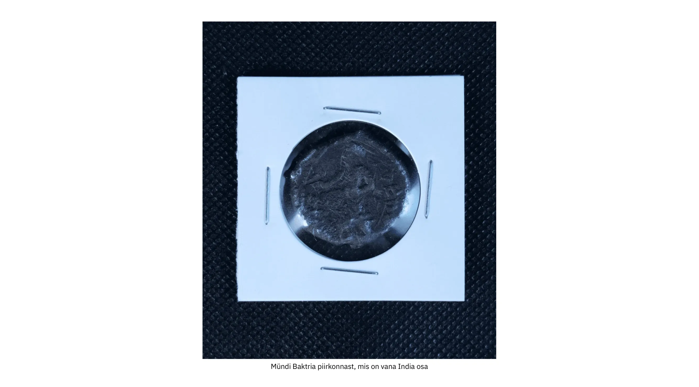

Et illustreerida seda perioodi visuaalselt, on siin ülalpool toodud münt India piirkonnast, Baktria piirkonnast, mis asub India poolsaare lääneosa lähedal, Afganistani lähedal. Selles piirkonnas olid mündid, mis olid tõenäoliselt inspireeritud Kreeka müntidest, millel oli kujutatud üks nende kuninglikest isiksustest.

## Lüüdid ja pärslased

<chapterId>eb802ab8-8ffd-5b25-907f-8944f120ed14</chapterId>

:::video id=f151eb42-5ff3-4ca1-9af1-1ae2a5e051c0:::

### Esimesed Lydia electrumi mündid

Kuna me ei saa lahutada müntide ilmumist Lüüdiast ja pärslastest, siis liigume edasi sellesse maailma ossa, mis asub Kreekast idas ja moodustab tänapäeval Türgi. Esimesed läänes ilmunud mündid pärinevad umbes 7. sajandi keskpaigast eKr Lüüdia ja Ioonia piirkondadest, mis asuvad tänapäeva Türgis. Umbes 650-600 eKr. nägi see põhimõtteline uuendus ilmavalgust, kusjuures märkimisväärsed arheoloogilised leiud, näiteks esimesed mündid, mis leiti Artemise templist Efesoses, on dateeritud umbes 600 eKr. Need ürgsed mündid olid valmistatud elektrumist, mis on loodusliku kulla ja hõbeda sulam, millel on merevaigukollane peegeldus, ning sageli olid need müntide välimuselt toorikud, mis olid lihtsalt tähistatud löökidega või algeliste motiividega.

Allpool näete ühte varaseimat Lydia münti, millel on kujutatud lõvi koos saagiga ees. Võib-olla märkate tagaküljel templit või auku, mida mõned usuvad, et seda kasutati metalli puhtuse kontrollimiseks ja tagamaks, et tegemist ei ole lihtsalt pinnakihiga. Kuigi tegemist on ühe varaseima näidisega, on oluline märkida, et tegemist on koopiaga. Kõik minu kuld- ja elektrumitükid on koopiad või moodsad taasesitamised, mille eesmärk on vältida seda, et ma kulutaksin kogu oma säästud sellele kollektsioonile.

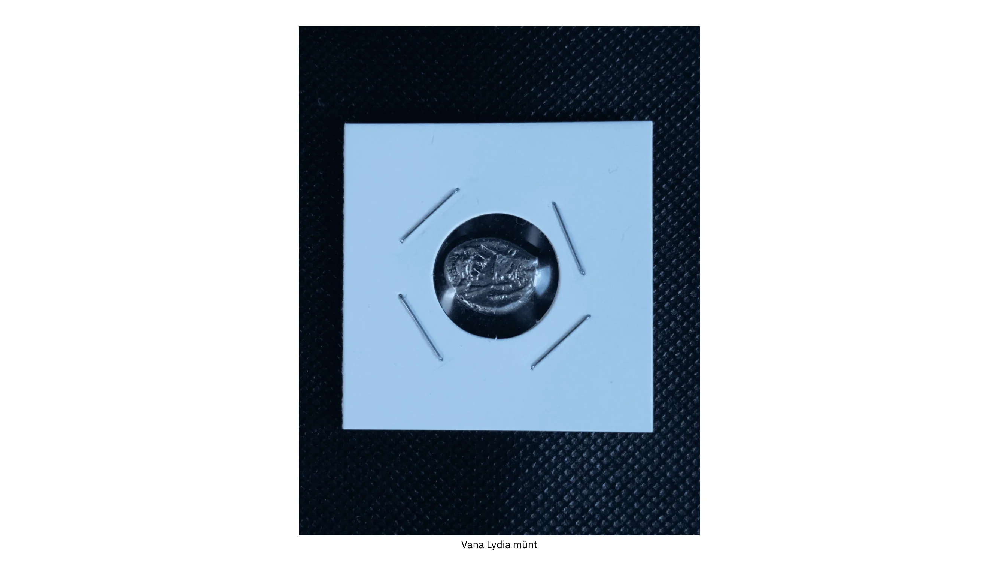

Kuid mul on ka tõeline pärsia tükk, mida me peagi näeme. Nii nägid need varajased tükid välja. See on justkui mingi plokk (või inglise keeles lump) metallist, mis oli tol ajal tembeldatud.

Vastupidiselt levinud arvamusele, et raha leiutati igapäevase kaubanduse hõlbustamiseks ja vahetuskaubanduse asendamiseks, näib, et esimesi lüüdia, ahemeniidide ja kreeka münte ei kasutatud algselt väikesemahulise kaubanduse jaoks. Rahaühikud olid tõepoolest igapäevaseks kasutamiseks liiga suured. Veelgi enam, nende ringlus piirdus piirkondadega, mis asusid nende tootmise läheduses.

Siinkohal pean oluliseks mainida, et kuigi ma olen lugenud mitmetest antropoloogilist laadi töödest, olid need mündid, nagu ma juba näitasin - olgu need siis elektronmündid või see pärsia münt, mille juurde ma kohe-kohe tagasi pöördun - liiga suured, et osta leiba, ütleme, iga päev. Ma olen näinud hinnanguid, mis panevad meid arvama, et see vastaks talupoja või sõduri päevatööle, seega oleks see liiga suur. See on nagu püüda maksta päevapalka oma söögi, hommikusöögi või lõunasöögi eest. Ainult et ma olen näinud teistes töödes, et on leitud väiksemaid ühikuid nendest klotsidest, seega väiksemaid münte, mis võib panna meid mõtlema, et võib-olla oli võimalik kasutus igapäevaste ostude jaoks.

Antropoloogiline "tõestus", et seda ei kasutatud igapäevaseks kauplemiseks, sest nimiväärtus või ühik oli liiga suur, ei ole minu arvates väga kindel, sest me oleme leidnud näiteid väiksemate müntide kohta, mida oleks võinud kohandada igapäevaste ostude tegemiseks.

### Riigi roll raha loomisel

Müntide tegelik päritolu näib olevat seotud riikide otsese tegevusega. Sel teemal on kaks peamist hüpoteesi: esimene, idealistlik, tõmbab paralleeli kreeka termini "nomisma" (raha) ja "nomos" (seadus) vahele, oletades, et raha oli seotud seaduste kodifitseerimisega, tugevdades linnade autoriteeti ja poliitilist korraldust. Teine, realistlikum hüpotees, mis on tänapäeval laialdaselt aktsepteeritud, on, et raha oli ennekõike riikide vahend majandusliku ja sotsiaalse kontrolli teostamiseks. Garanteerides ametlikult väärismetallide kaalu ja väärtuse, mida nad sisaldasid, said riigid manipuleerida nende müntide ringlust ja väärtust, luues usaldust ja kodumaistele valuutadele omaseid likviidsuspreemiaid.

On tõesti huvitav teada, et meil on selle kohta tõendeid. Näiteks elektrumi müntide puhul peaksite teadma, et looduslik elektrum koosneb tavaliselt umbes 70% kullast ja 30% hõbedast. Esimestel müntidel, mida me leidsime ja analüüsisime, täpsemalt varajastel lüüdi müntidel, näib kullasisaldus olevat pigem 50-55%, mitte 70. See viitab sellele, et juba tollal püüdsid mündi väljaandjad vähendada väärtuslikuma metalli osakaalu, ilmselt selleks, et toota rohkem münte ja lasta neil näida olevat sama palju väärt kui märgistamata loodusliku elektroni. Ja siinkohal tuleb öelda, et tegelikult oli see võimalik just selle kuulsa Kröösuse, nagu *rikka Kröösuse* ajast, sest just tema ajast oli meil olemas tehnoloogia kulla ja hõbeda eraldamiseks.

Lydia mündindus tegi läbi suure arengu kuulsa, legendaarse rikkuse poolest tuntud kuninga Kroesose (561-546 eKr) valitsemisajal. Sel ajal täiustasid lüüdlased metallurgiat, et eraldada kuld ja hõbe elektrumist, ja seega võeti kasutusele esimesed bimetallist mündid, st eraldi kuld- ja hõbemündid.

### Pärsia laienemine ja Kreeka omaksvõtt

Kui nad 546. aastal eKr Lüüdia vallutasid, võtsid ahemeniidide pärslased selle uuenduse kohe üle. Umbes 500 eKr, Dareios I valitsemise ajal, kehtestasid pärslased oma rahasüsteemi kulddarikute ja hõbedast sigloide abil, millel oli sageli kuninga kujutis sõjapoosis. Seda Pärsia kuninglikku rahapreparaati kasutati peamiselt Pärsia impeeriumi helleniseeritud piirkondades ja see levis järk-järgult, kuigi selle kasutamine jäi ebaühtlaseks, sest **mõned piirkonnad, näiteks Egiptus, eelistasid endiselt vahetust kaalutud metallides (bullion) **.

Ülal saate imetleda ehtsat pärsia sigloi (või siglos). Väikesel kujundil on kujutatud kuningas, kuigi auk on veidi ära kulunud. Siglos on hõbemünt, erinevalt daricist, mis oli valmistatud kullast. Pärslased oskasid neid kahte metalli eristada ja nad loobusid elektronmüntidest. Seega rakendasid nad bimetallismi, kasutades nii kulda kui ka hõbedat, säilitades samas väärismetallidest valmistatud müntide kontseptsiooni, mille tagaküljel oli sageli auk, arvatavasti metallide sisalduse kontrollimiseks.

Kreeklaste kiiret müntide kasutuselevõttu näib olevat soodustanud nende tihedad kontaktid lüüdlastega, eriti kreeka kolooniate kaudu Väike-Aasias. Esimesed kreeklased, kes hakkasid münte vermima, olid tõenäoliselt Aegina elanikud kuuenda sajandi keskel eKr, kes võtsid kasutusele drachma, mille kaal oli piirkonniti erinev ja mille nimi tähendab sõna-sõnalt "peotäis vilja" või "peotäis nooli".

Kreeka mündi edu oli tingitud nii selle mugavusest tähtsate tehingute puhul, näiteks palgasõdurite maksmisel, kui ka linnade majanduslikust ja poliitilisest laienemisest. Raha muutus kiiresti Kreeka ja hiljem ka Rooma majanduse keskseks elemendiks, säilitades samas tugeva sümboolse mõõtme, eelkõige selle seotuse kaudu seadusega (nomos).

Lõpuks annab mündinduse kiire levik tunnistust antiikühiskondade põhjalikust muutusest, kus rahaliste väärtuste kodifitseerimine käis käsikäes riigikorraldusega. See areng pani majandusliku ja poliitilise aluse Kreeka demokraatlike riikide tekkimisele, eriti Ateenas, kus raha mängis demokraatliku linna toimimises otsustavat rolli.

Oluline on meeles pidada, et me räägime konkreetselt **müntidest**, mitte rahast üldiselt. Keskseks aspektiks on selgelt **usaldus emiteeriva asutuse vastu**, mis on otseselt seotud müntide tehniliste omadustega (kaal, puhtus, nimiväärtus). Just see usaldus võimaldab riigil või emiteerival asutusel teostada teatavat kontrolli või isegi manipuleerida nende müntide väärtust ja ringlust algusest peale.

## Institutsiooniline sekkumine ja esimesed mündid

<chapterId>3e1efd08-99e3-5a32-9908-3185fef0e640</chapterId>

:::video id=84847cf6-9e46-4a8c-9f35-25a27496cc4b:::

### Raha kahekordne olemus

Raha tekkimine tõstatab põhimõttelise küsimuse: kas raha on turu spontaanne looming või võimu poolt peale surutud institutsioon? See kontseptuaalne pinge seab vastamisi kaks radikaalselt erinevat nägemust.

Ühest küljest kaitseb Austria majandusteaduskond ideed, et kaubaraha - eriti kuld - on majanduses osalejate poolt loomulikult valitud selle loomuomaste omaduste - vastupidavus, ülekantavus, jagatavus ja asendatavus - tõttu. Sellest vaatenurgast lähtudes omastas riik seejärel selle spontaanse raha, et kontrollida selle pakkumist. See on institutsioon, mis tekib loomulikult turu vajadustest, enne kui poliitiline võim selle kinni võtab.

Seevastu antropoloogiline ja institutsionaalne seisukoht on, et raha tekib tegelikult koos riikliku mündi väljaandmisega. Võimud loovad raha teadlikult, kinnitades oma pitseri, muutes metalli seega tõeliseks rahavahendiks. Selle vaatenurga kohaselt kasutati varaseimaid lüüdia münte peamiselt sõjaväe tasustamiseks - üks stater vastas umbes sõduri päevapalgale.

### Riikliku standardiseerimise paradoksaalsed eelised

Vaatamata sellele teoreetilisele pingele tunnistavad isegi Austria majandusteadlased teatavat kasu riigi sekkumisest rahasse. Raha standardiseerimine rahapritsimise teel lahendab mitmeid praktilisi kaubandusprobleeme.

Ilma sertifitseerimisasutuseta seisavad majandustegevuses osalejad silmitsi pidevate riskidega: võltsitud mündid, pettus ja kaaluga manipuleerimine. Need tavad tekitavad majanduses hõõrdumist, kuna mõned mündid on aktsepteeritud, teised aga tagasi lükatud. Teoreetiliselt tagab ametlik tempel kaalu ja kvaliteedi, mis muudab kaubanduse sujuvamaks.

Sellel tagatisel on turul jälgitav hind: vermitud kuldmünt on väärtuslikum kui selle toorkullast ekvivalent. See lisatasu peegeldab sertifitseerimise väärtust - kaupmehed ei pea enam ise kontrollima metalli ehtsust keemiliste või resonantskatsete abil. Paradoksaalsel kombel kaotab riiklik sekkumine hõõrdumise ja hõlbustab kaubandust, luues institutsionaliseeritud usalduse.

### Valuutaga manipuleerimine algusest peale

Lydia esimeste riigikogulaste lugu paljastab häiriva iroonia. Hiljutised analüüsid näitavad, et nende elektronmüntide kullasisaldus oli süstemaatiliselt madalam kui looduslikul elektronil. Kvaliteeti tõendav asutus manipuleeris samal ajal ka koostist.

See praktika illustreerib mündi kahekordset kasulikkust. Turu jaoks muudab see vahetused sujuvamaks ja pakub standardiseerimise garantiid. Emiteeriva asutuse jaoks muutub see lahjendamise kaudu majandusliku kontrolli vahendiks. Vähendades kullasisaldust, säilitades samal ajal nominaalväärtuse, suurendab riik tõhusalt rahapakkumist - luues samast väärismetalli kogusest rohkem rahaühikuid.

Riik ise jäi aga selle manipulatsiooni tõttu kitsaks. Nagu näitab 4. sajandil Konstantinuse kuldse soliduse näide, kontrollis Rooma valitsus hoolikalt müntide kvaliteeti, sest ta nõudis, et talle makstaks heade müntidega. Võimul oli oluline huvi säilitada oma mündi kvaliteet, et tagada oma maksutulude väärtus.

### Devalveerimise majanduslik analüüs

Valuuta devalveerimise uurimine näitab järjepidevaid mustreid läbi ajaloo. Metallist müntide puhul jälgivad majandusteadlased müntides sisalduva väärismetalli osakaalu - langev kõver näitab järkjärgulist devalveerimist. Kaasaegse paberraha puhul on olukord vastupidine: jälgitakse ringluses oleva raha hulka ja selle suurenemine annab märku devalveerimisest.

Mõlemad meetodid mõõdavad sama põhinähtust: rahalise väärtuse lahjendamist. Olenemata sellest, kas vähendatakse väärismetallide sisaldust või trükitakse uusi pangatähti, mehhanism jääb samaks. Mida rohkem rahaühikuid loob asutus samadest reaalsetest ressurssidest, seda rohkem kaotab iga ühik oma väärtust.

See manipuleerimine, mida on võimalik täheldada juba kõige varasematest lüüdia müntidest alates, viitab sellele, et rahakontroll on alati olnud võimu küsimus. Seega kujutab vermitud raha endast märkimisväärset tehnilist uuendust ja majandusliku kontrolli vahendit - see on kaksikmõju, mis läbib kogu rahanduse ajalugu kuni tänapäevani.

## Osade tootmine

<chapterId>b205f4f2-c293-5308-b812-a998de9ad45e</chapterId>

:::video id=47c612ec-d97e-4498-b50e-7e66518bd56d:::

### Löödud tükkidest vermitud müntideni

Pärast müntide tekkimist käsitlevat lõiku tahtsin esitada väga lühikese lõigu müntide valmistamise arengust. Nagu me nägime, algas kõik elektrumi tükkidest, jätkates kulla ja hõbeda kasutamisega, mille mõlemal küljel oli kas kuninga nägu või auk tagaküljel puhtuse kontrollimiseks.

Hiljem, nagu me järgmises peatükis vaatleme, täiustasid kreeklased seda tehnoloogiat, luues ümmargusi münte, mis olid mõlemalt poolt vasaraga löödud. Nad võtsid sileda, tasase väärismetallitüki, graveerisid soovitud kujunduse ühele küljele ja seejärel vasardasid selle käsitsi, et luua valmis münt.

Üksikute müntide käsitsi vermimise tehnoloogia mängis tõenäoliselt rolli inflatsiooni kontrollimisel sel ajal, kuigi münte lahjendati sageli tootmise suurendamiseks. See oli eriti ilmne Rooma ajal ja vähemal määral ka teatud sõdade ajal Kreeka ajal. Kuigi müntide vermimine ükshaaval piiras ametiasutuste suutlikkust massitootmiseks, aitas see tõhusalt kaasa inflatsiooni kontrollimisele, hoolimata märkimisväärsetest devalveerimistest, mis esinesid. Seega arenes areng metallist tembeldatud metallitükist ümmarguse, vasaraga löödud mündi suunas.

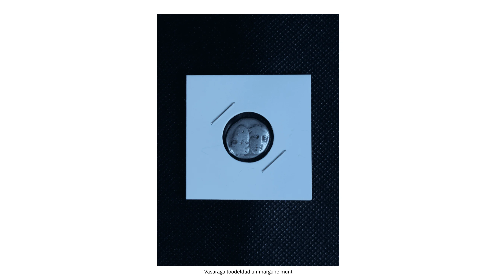

### Keskaegne evolutsioon

Keskajal hakati ka münte laialivalguma, muutes need laiemaks ja õhemaks. Üheks põhjuseks oli see, et nende heli oli lihtsam kontrollida, mida sageli kasutati autentsuse näitajana. Hõbeda laialilaotamisega tekkis selge sagedus, nii et inimesed said müntide puhtust lihtsalt kuulates kinnitada. Sellest praktikast sai alguse mõiste "kõlaraha". Terveraha puhul määrati standardkaal kaalumiseks kaalukaalu või "trebuchet" abil. Seega jätkus areng väikestest ümmargustest müntidest veidi õhemate ja laiemate müntideni.

### Pendlilöögid

Viimane tehnoloogia, mis saabus keskaja lõpus, uusaja alguses, oli pendlilöögi mõiste. Tegemist oli mingi kruviga, mida pingutati müntide löömiseks, nii et selle uue löömisviisiga saadi münte. Selle arengu eripära oli võimalus graveerida mündi pinnale muster, et lahendada kärpimise probleemi. Lõikamine hõlmas mündi osa eemaldamist, et saada tagasi väärtuslik hõbe, mida võis seejärel kasutada teiste müntide vermimiseks või lihtsalt säilitada ressursina.

Nii et see pendlilöögi mõiste aitas kaasa kärpimisnähtusele. Ja huvitav on märkida, et see tehnoloogia tuli tegelikult Prantsusmaalt. Inglismaal näiteks palgati prantsuse insenerid, kes tulid ja näitasid, kuidas neid masinaid teha. Mis on minu arvates naljakas, on see, et seal olid haamrimeistrimise toetajad, kes olid selle vastu ja kes viivitasid selle tehnoloogia rakendamisega. Iga hea tehnoloogia puhul on alati inimesi, kes on selle vastu, kes tahavad vana tehnoloogiat säilitada. Minu arvates oli päris hullumeelne mõista, et isegi tehnoloogia puhul, mis tundub tõesti parem - saab teha rohkem osi, neid on raskem kopeerida -, oli ikka veel inimesi, kes olid kiindunud kuulsasse haamrimetoodikasse. Toimus üleminek selle kuulsa pendlilöögimeetodiga valmistatud detailide tootmise ja seejärel vasaralöögimeetodi juurde tagasipöördumise vahel. Ja lõpuks oli muidugi see pendlilöömine, mis võttis lõpuks võitu ja andis meile need ilusad moodsad tükid, kus võib leida kas väikeseid jooni, väikeseid harju ümberringi, et vältida kärpimist, ilmselt seotud sõnaga kärpimine, harju, ja te võite tänapäevalgi näha kas harju või teksti või jooniseid, mis on sisse kirjutatud tükiservale.

# Erinevad teooriad raha tekkimise kohta

<partId>72ac694f-9248-550d-90c1-91af3d234380</partId>

## Teooriad raha tekkimise ja selle erinevate määratluste kohta

<chapterId>7d699d4d-8c70-55b5-bf36-609f3fd90bcf</chapterId>

:::video id=523c873f-501b-4954-b79f-7e74c0f685a5:::

Tere tulemast sellesse segmenti, mis on pühendatud erinevatele teooriatele raha tekkimise kohta ja selle erinevatele määratlustele. Siin on lühike väljavõte raamatust *Aux origines de la monnaie*, mis minu arvates võtab kokku kaks peamist teooriat, mida me selles osas vaatleme.

> Sellel lühikesel sissejuhatusel ei ole muud eesmärki kui rõhutada uuringu konteksti. Kontseptuaalsel tasandil on debatt avatud K. Polanyi teesi ja M. Weberi teesi pooldajate vahel. Esimeste jaoks mängivad kingitus ja ümberjagamine keskset rolli, kusjuures turuvahetus mängib vaid marginaalset rolli, peamiselt rahvusvahelises vahetuses. Teiste jaoks seevastu on turg praeguse ajaloolise protsessi keskmes.

Näiteks Mesopotaamias pakub üks tekkimisteooria, et tempel kui asutus loob arvestusühiku või rahaühiku, kehtestab selle ja seejärel võtavad kaupmehed selle kaubanduses kasutusele. Vastupidine teooria väidab, et ei, see rahaühik tekib loomulikul teel turult, et hõlbustada kaubandust. Selle kohta on hästi tõestatud näiteid Mesopotaamiast.

Mis puutub vahetustehingutesse, siis mõned teooriad väidavad, et seda kasutati peamiselt rahvusvahelises kaubavahetuses, st inimestega, keda me lihtsalt ei usaldanud.

Nii et see on see, mida me selles osas teeme. Teeme omamoodi ülevaate, et tutvustada erinevaid teooriaid raha tekkimise kohta ja erinevaid määratlusi selle kohta, mis on raha. Esitame ja kritiseerime nii klassikaliste majandusteadlaste kui ka antropoloogide teese. Mul on isegi õnne, et mul on Ulrich Fromy kaasas, kes esitab Austria majandusteadlase vaatenurga nendele erinevatele teemadele.

## Raha tekkimine klassikaliste majandusteadlaste jaoks

<chapterId>1d3776cd-0dfd-5297-af48-c6f41e257a7e</chapterId>

:::video id=873a16c1-17ac-448d-8941-df4feb7ab79d:::

See osa on pühendatud erinevatele teooriatele raha tekkimise kohta. Esimene käsitletav teema on raha tekkimine klassikaliste majandusteadlaste järgi.

### Adam Smithi klassikaline teooria

Klassikaliste majandusteooriate, eelkõige Adam Smithi poolt propageeritava teooria kohaselt tekkis raha loomulikult vahetuskaubandusest vastusena selle piirangutele. Esialgu toimus vahetus otsese vahetuse teel, kuid seda meetodit raskendas sageli "vajaduste kahekordse kokkulangevuse" probleem: mõlemal inimesel pidi olema täpselt see, mida teine soovis. Ajapikku hakkasid teatavad kaubad (näiteks sool, väärismetallid ja kariloomad) tänu oma kasulikkusele, vastupidavusele ja jagatavusele olema kõigile vastuvõetavad vahetusvahendid. Nii tekkis spontaanselt raha, mis hõlbustas ja muutis majandusliku vahetuse sujuvamaks.

### Klassikalise teooria kriitika

Siin on minu kriitika selle teooria kohta. Kõige eelnevas osas nähtu põhjal võib minu arvates juba praegu öelda, et see arusaam, et **mündid** on vahetustehingute evolutsioon, on vale, sest vermitud münt tuleneb kindlasti autoriteedist, sest seda vermib autoriteet. Sellel on mitmeid põhjusi, mitte vähem tähtis on võimude soov kontrollida majandust, võtta raha üle kontroll.

Teisest küljest, kui me räägime rahast kui mõistest, mitte tingimata müntidest, siis on asi vähem selge, sest esimeste müntide, Lydia riigimärkide puhul oleme leidnud hõbeplekke, mis ei olnud märgistatud. Jääb üle oodata, kas need olid ringluses. Kui need olid ringluses, tähendab see, et inimesed võisid algselt tuvastada selle vara kui potentsiaalse valuuta, mida võis laialdaselt nõuda ja kergesti vahetada. Ja võib-olla märkasid ametiasutused seda olukorda alles hiljem ja võtsid selle kontrolli alla, pannes sellele templi, et seda sertifitseerida.

Sellel on palju eeliseid - seda ei pea kontrollima, kaaluma ja nii edasi. Ilmselt räägime sellest. Aga minu arvates on mündid selgelt vahend, mida riigid on algusest peale kasutanud. Mis puutub aga raha kui sellise tekkimisse, siis me ei tea, kas see tuli tõesti mingi asutuse poolt, kes selle kehtestas, või tekkis see kaubanduse või kaubavahetuse kaudu. Mul on sel teemal hiljem väga huvitav arutelu kolleeg Ulrichiga.

Me juba teame, et esimesi väärismetallist münte ei kasutatud igapäevase vahetuse hõlbustamiseks, sest nende väärtus oli liiga kõrge. Samuti teame, et neid kasutati peamiselt sõjaliste maksete tegemiseks. See on hea argument teesi poolt, et raha ei tekkinud tingimata turul. Arveldusühikud, esimeste müntide nimiväärtused, olid tõenäoliselt liiga suured, näiteks leiva ostmiseks või igapäevaste ostude tegemiseks. See võis olla näiteks päevapalga ekvivalent. Mitte tingimata, et inimestele maksti tol ajal palka, kuid see annab teile ettekujutuse mastaabist. Seega oli neil müntidel ilmselt liiga suur ostujõud, et neid saaks kasutada väikesemahulises kaubanduses. Teisest küljest ei saa kuidagi väita, et neid münte ei oleks kasutatud suuremate tehingute tegemiseks, näiteks kaupmeeste vahetuseks. Me teame, et neid kasutati peamiselt sõjaliste maksete tegemiseks. See on üks populaarsemaid teooriaid, millega seletatakse esimeste müntide ilmumist. Pidage meeles, et me räägime siin müntidest, mitte tingimata rahast üldiselt. Niisiis, esimestel müntidel oli oma esimene roll, ja see oli sõjaväeliste maksete tasumine, palgasõdurite jaoks.

Näiteks Aleksander Suur kasutas seda suurepäraselt, nagu me hiljem näeme.

Samuti oleme näinud, et juba iidses Hiinas kasutati kaubikukarbid majanduslikuks vahetuseks (**tööjõu tasustamine, väärtuse mõõtmine ja maa ostmine)**. Veelgi enam, Mesopotaamias ja Egiptuses olid juba olemas funktsionaalsed rahasüsteemid, mida kasutati kaubavahetuseks, palga- ja maksumaksmiseks. Ma tahan siinkohal öelda, et on kindlasti vale arvata, et mündid tekivad lääne arusaamades vajadusest muuta vahetused sujuvamaks.

Kuna münte emiteerib mingi asutus, võime ehk eeldada, et need on algusest peale seotud emiteerivate asutustega. See on mõistlik. Teisest küljest ei tea me tingimata, kuidas tekkisid neile eelnenud rahavormid või rahasüsteemide vormid, protomündid. Ühest küljest oletame, et need rahaühikud määrasid kindlaks templid ja seejärel kasutasid inimesed neid. Ja teisest küljest ütleme teile, et ei, see olid kaupmehed, kes vajasid vahetusvahendeid, võimalust kaubelda välismaailmaga, ja nemad olid need, kes identifitseerisid näiteks hõbemetalli, mida kasutati, sest see oli välismaailma poolt nõutud. Asi on selles, et me ei tea seda tegelikult. Seepärast on meil kaks vastandlikku teooriat. Meil ei ole täiuslikke tõendeid, et selgitada, kas raha tekib loomulikult kaubandusvajadusest, näiteks kaupmeeste poolt, või tuleneb see autoriteedist.

### Müntide ja primitiivse raha eristamine

Kokkuvõtteks arvan, et me võime öelda, et mündid pärinevad tingimata autoriteedilt, sest need on löödud nimetatud autoriteedi poolt. Teisest küljest ei saa minu arvates öelda, et on vale väita, et raha (see, mis eelnes müntidele) ei saanud tekkida vahetuse hõlbustamiseks. Ma arvan, et kõigis eespool toodud näidetes on selles mõttes näiteid küllaga.

## Müüt barterist

<chapterId>0fcd4964-ac36-5163-a8cf-1aacebc0d2c0</chapterId>

:::video id=0ede29ab-8acd-4d79-9282-bd5991b97076:::

### David Graeberi ülevaade

Me käsitlesime just raha tekkimist klassikaliste majandusteadlaste järgi. Nüüd käsitleme mõistet, mida tuntakse kui barter-müüti.

Üks kriitika selle klassikalise raha tekkimise teooria kohta on ajalooliste tõendite puudumine selle ideede toetuseks.

Antropoloog David Graeber on muu hulgas sõnastanud "barter-müüdi" kriitika, mis seab kahtluse alla klassikalise idee, et raha tekkis loomulikult barterist. Selle kriitika kohaselt puuduvad ajaloolised või antropoloogilised tõendid, mis näitaksid, et ühiskonnad kasutasid süstemaatiliselt vahetuskaubandust enne raha tekkimist. Tegelikult oleks iidsed ühiskonnad tegutsenud krediidi, võlgade, sotsiaalsete kohustuste ja tseremoniaalse vahetuse alusel. Seega on "vahetusmüüt" teoreetiline konstruktsioon, mis on loodud klassikalise majandusnägemuse õigustamiseks ja millel puudub tegelik empiiriline alus.

Tuleb siiski märkida, et see teooria ei eita, et vahetuskaubandus oli olemas, näiteks erinevate hõimude vaheliste vahetuste puhul. See lihtsalt eitab, et vahetuskauplemine oli nendes nn primitiivsetes rühmades laialt levinud tegevus ja et raha oleks nende tavade loogiline edasiarendus. See eitab asjaolu, et vahetustehinguid kasutati laialdaselt ühe hõimu sees ja et raha tekkis lõpuks selleks, et muuta vahetustehingud sujuvamaks ja lahendada raskused, mis olid olemas vahetustehingute puhul. Selle teooria kohaselt praktiseerisid need rühmad selle asemel mitteametlikku krediiti või kingitust kingituse eest.

### Primitiivsed ühiskonnad vs. suured tsivilisatsioonid

**Olgu siin mõned selgitused seoses antiigi suurte tsivilisatsioonidega.** Ma arvan, et see teooria kehtib kindlasti ka mineviku ja isegi tänapäevaste primitiivsete (riigita) rühmade kohta (nt 18. ja 19. sajandil uuritud hõimud, mida uurisid maadeavastajad). On selge, et nad ei kasutanud vahetuskaupu, vaid pigem vahetusviise, mida ma juba mainisin, põhjustel, mida me juba mainisime (nõrk tööjaotus, elatuspõllumajandus). Ma ei usu siiski, et see teooria kehtib mineviku suurte tsivilisatsioonide, näiteks Mesopotaamia ja Vana-Egiptuse kohta.

Siin on kaks väljavõtet *Aux origines de la monnaie'st* sellel teemal:

> M. Mauss'i kuulsas "Kingituses" esitatud mudelit on egiptoloogid omaks võtnud nii üksmeelselt ja entusiastlikult kui ka vähese eristusvõimega. See on viinud mitmete segaduste tekkimiseni, mida me siinkohal ei hakka käsitlema. Märkigem lihtsalt, et see mudel kehtib nn primitiivsete ühiskondade kohta, mis ei kehti vaaraoajastu Egiptuse kohta.

> Leivad, st töödeldud teraviljad, olid seega arvestusühikud, mis sarnaselt Vana Kuningriigi shât'ile (y) võimaldasid ka krediidi avamist mitmesuguste kaupade osas. See lihtne näide näitab, et vaaraoajastu Egiptuse majandus ei piirdunud ümberjaotussüsteemiga. See oli väga keeruline, hõlmates paljusid vahetusi.

Seega, nagu me nägime varem Egiptuse ja isegi Mesopotaamia ja Hiina osas, näeme, et isegi need iidsed, kuid mitte primitiivsed tsivilisatsioonid kasutasid minu arvates riigi olemasolu tõttu rahasüsteeme. Ma arvan, et seda demonstreeriti põhjalikult selle kursuse esimeses osas. Ja seega ei kehti nende suurte tsivilisatsioonide puhul see mõiste "andmine ja võtmine", edasilükatud krediit. Raha tekkimise täpsed põhjused jäävad seega mõistatuseks. Me ei tea, kas see tulenes kaupmeeste vajadusest kaubelda välismaailmaga või oli see nendes iidsetel aegadel templi poolt peale surutud.

## Raha tekkimine võlaraha kaudu

<chapterId>4f508615-aa61-5d62-89d3-cecd02aeaa62</chapterId>

:::video id=a23f547f-3906-4f4a-8f72-5d78c649d0c4:::

### Raha kui võlakiri

Selles osas käsitleme võlaraha teooriat.

Eelkõige majandusteadlase Alfred Mitchell-Innese poolt välja töötatud ja hiljem David Graeberi poolt laiendatud **võlaraha** teooria väidab, et raha ei ole tekkinud mitte vahetuskaubandusest, vaid pigem võla- ja krediidisuhetest, mis olid olemas juba kõige varasemates inimühiskondades. Selle teooria kohaselt tekib raha siis, kui sotsiaalsed kohustused (üksikisikute või rühmade vahelised võlad) muutuvad kvantifitseerituks ja ülekantavaks. See kontseptsioon toob sisse vahetuse ja ülekandmise kvantifitseerimise mõiste. Seega oleks raha eelkõige **võlgade tunnustamine**, mida toetab vastastikune usaldus ja mille tagab sageli poliitiline või religioosne autoriteet, mitte aga kaup, mis toimib üksnes vahetuste vahendajana.

Selle teooria veelgi arenenum vorm on, et kogu raha on võlg. Nii et kellelgi, kes omab raha, oleks nõue ühiskonna suhtes üldiselt, nõue kõigi nende suhtes, kes seda raha vastu võtavad. Ja kuna raha peab nende nägemuses **kohustuslikul viisil** vastu võtma, siis muidu ei ole see raha, sest kui sellest rahast saab keelduda, siis nende süsteem ei toimi. Teatud rühmas, mis on määratlenud mingi raha, on kõik need, kes seda raha omavad, justkui võlgu kõigi teiste selle ühiskonna liikmete ees, kes seda raha aktsepteerivad, ja need, kes seda raha aktsepteerivad, on omamoodi võlgu selle isiku ees, kes seda rahaühikut omab. See on sisuliselt nende teooria.

### Kriitika kohustusliku süsteemi kohta

**Minu kriitika selle teooria kohta:**

Lubage mul esitada selle teooria kohta üks väike kriitika. Ma nõustun, et raha on mingi sotsiaalne konsensus. See on usaldus, mille rühm paneb rahalisele "märgile", mis iganes see ka ei oleks. Nii et ma nõustun vastastikuse usalduse mõistega, mida me võtame hiljem uuesti üles seoses rahalise preemia mõistega. Keeruliseks läheb asi siis, kui selle teooria pooldajad lisavad kohustuse mõiste ja rõhuvad võla mõistele. Nende arvates on kellelgi, kes omab rahalist token, nõue kogukonna kui terviku vastu ja seega oleks kogukond selle omanikule võlgu. Samuti oleks kohustus arveldada, kusjuures rühma liikmed oleksid kohustatud token vastu võtma; vastasel juhul ei toimiks nende arvates süsteem. Ma arvan, et eespool kirjeldatud süsteem vanas Hiinas esindab seda teooriat hästi.

Mina omalt poolt võin kergesti ette kujutada süsteemi, kus raha on ühiskondlik konsensus, kus valitud token on üldiselt aktsepteeritud maksevahendina, ilma ametliku kohustuseta. Ma näen, et selline süsteem toimib, kui inimesed aktsepteerivad seda omast vabast tahtest. See võib toimida. Teisest küljest kaasnevad sellega sageli kohustused, seaduslik maksevahend ja vägivald, mida näeme hiljem ühes osas. Kuid teoreetiliselt ei jää mulle muljet, et see süsteem võib päris hästi toimida. Ma arvan, et Bitcoin on näide. Bitcoin-l on väärtus, sest tal on rahaline lisatasu, sest selle järele on nõudlus rahaliseks kasutamiseks, st väärtuse reservid, võib-olla ka vahetusvahendid või kaitse fiat-süsteemi vastu. Keegi ei ole kohustatud seda vastu võtma ja mida rohkem seda maksevahendina aktsepteeritakse, seda rohkem saab seda kasutada vahetusvahendina. Me saame seda juba praegu kasutada väärtuse säilitajana ilma igasuguse probleemita. Selles pole kahtlustki. Ma tahan öelda, et Bitcoin näib mulle olevat näide, omamoodi valuuta, mis on sotsiaalse konsensuse vorm, kus me arvame, et me saame oma raha tagasi, kui me hiljem ostame, me omandame selle, et saaksime seda hiljem vahetada, et säilitada oma ostujõudu.

See teooria vähem piirav vaade aitab selgitada, kuidas kaks erinevat ühiskonda saavad kaubelda rahalise token abil, näiteks kulla abil, ilma et nende ühiskondade vahel tekiksid nõuded või võlad. Ühiskonnas aktsepteerimise sundimine ei toimi minu arvates kahe hõimu vahelises kaubanduses, sest teine hõim ei allu autoriteedile. Hõim B ei allu hõimu A autoriteedile. Kuid ometi aktsepteerib ta sama rahalist token, ütleme, kulda. Nüüd võivad inimesed mulle öelda: "Jah, aga see on nii, sest ka seltskond B on otsustanud, et kuld on nende valuuta", seega see toimib. Jah, tõepoolest, see toimib, kuid sel hetkel ei ole võlgade tekkimist. See on lõplik tehing. Niisiis, kui ettevõte A vahetab kauba kulla vastu ettevõttele B, ei teki võlga, tehing on lõpetatud. Ja on selge, et inimene ettevõttes B ei ole omandanud seda kuldmünti või -nugetit selleks, et inimesed ettevõttes A saaksid hiljem maksta. Ta võtab selle vastu, et seda kulla vastu vahetada. Ta võtab selle vastu selleks, et seda hiljem, tõenäoliselt oma hõimus, vahetada. Nii et selles näites ei teki mingit võlga, ei ole mingit varjatud nõuet, see on lihtsalt otsene vahetus, otsene makse. Võlgraha pooldajad ütlevad meile, et see on barter. Ja ma ei ole sellega nõus, sest vahetus on otsese kauba vahetamine. Otsene barter on ühe kauba vahetamine teise kauba vastu, kasutamiseks. Kaupu vahetatakse kasutamiseks, samas kui meie puhul kasutatakse kulda selgelt valuutana, sest seda ei kasutata millekski muuks, vaid seda kasutatakse hiljem maksevahendina. Seega ei kuulu see minu arvates vahetustehingute kategooriasse.

Rahalise token omamine ei ole "nõue" kogukonnale, vaid pigem lootus, et token võetakse hiljem vastu võrreldava väärtusega.

## Raha spontaanne tekkimine

<chapterId>e3ef86b1-73b9-5140-a61e-2ab6a5b0b2d4</chapterId>

:::video id=e543995f-d5e2-49d7-9133-e397b46e0833:::

Carl Mengeri algatatud Austria majandusteaduskonna jaoks on raha loomulikult tekkinud bartermajandusest, mis seisab silmitsi vajaduste kahekordse kokkulangevuse probleemiga. Selles nägemuses lähenevad üksikisikud spontaanselt vahetuskaupadele, mis hõlbustavad vahetust - mitte otseselt tarbitavatele kaupadele, vaid kaupadele, mida tunnustatakse nende võime tõttu olla laialdaselt nõutud.

Neil rahakaupadel peavad olema Aristotelesest saadik kindlaks tehtud omadused: nad peavad olema väärtuse säilitaja, vahetusvahend ja arvestusühik. Majandustegelased tuvastavad, akumuleerivad ja hoiavad neid järk-järgult, algatades seega nende tekkimise rahana. See protsess on täiesti spontaanne - raha kujutab endast loomulikku turureaktsiooni vahetuste koordineerimise probleemile, ilma et autoriteet oleks teadlikult sekkunud.

### Arutelu "barter-müüdi" üle

Antropoloogid, nagu David Graeber, vaidlustavad selle seisukoha, viidates "barter-müüdile". Nende väide: ühtegi keerukat tsivilisatsiooni, mis põhineks ainult otsesel vahetuskaubandusel, ei ole kunagi dokumenteeritud. Pigem kasutasid uuritud primitiivsed ühiskonnad mitteametliku krediidi ja vastastikkuse süsteeme. Graeber väidab, et võlg eelnes vahetustehingule, viidates tuhandetele Mesopotaamia tahvlitele, mis dokumenteerivad krediidisuhteid.

See kriitika põhineb siiski barteri kitsal määratlusel. Nagu Menger juba 1892. aastal märkis, läheb vahetuskaubandus kaugemale kaupade otsesest vahetamisest kaupade vastu. See hõlmab ka edasilükatud ülekandeid, teenuseid palga eest ja ajalist vahetust - mida Menger nimetas "ühepoolseteks ülekanneteks üksikisikute vahel". See laiendatud vahetuskauplemise vorm võib eksisteerida koos krediidisüsteemidega piiratud usaldusringkondades.

Tõendite puudumine ei ole tõend puudumise kohta ja Austria majandusteadlased tunnistavad, et ükski keerukas ühiskond ei saa areneda jätkusuutlikult ainult otsese vahetustehingu alusel - seega on raha tekkimine vajalik.

### Mesopotaamia juhtum: kaupmehed versus templid

Arutelu kristalliseerub Mesopotaamia hõbesekeli päritolu ümber. On kaks vastandlikku tõlgendust. Institutsiooniline seisukoht väidab, et templid - tõelised majanduslikud ja vaimsed keskused - kehtestasid hõbeda kui valuuta, et struktureerida majandust. Sellest tsentraliseeritud kontrollist annavad tunnistust kiilkirjatahvlid, mis on koondunud vaimulikkonna ja kaupmeeste eliidi hulka.

Austria tõlgendus viitab vastupidisele: kaupmehed olid need, kes võtsid raha kasutusele pikamaakaubanduses. Seistes silmitsi väljakutsega kaubelda võõrastega väljaspool Mesopotaamia piire - Anatooliast Pärsia laheni - vajasid nad midagi universaalselt äratuntavat, vastupidavat ja transporditavat. Hõbe oli loomulik valik oma iseloomulike omaduste tõttu. Templid lihtsalt kinnitasid kaubanduslikus kasutuses juba väljakujunenud tava.

Käesolev väitekiri põhineb Anatoolias asuva Kaneshi ja Assuri vahelistel dokumenteeritud kaubavahetustel, kus kaupmehed vahetasid tekstiile hõbemetalli vastu - mitte selle materiaalse kasulikkuse, vaid väärtuse säilitamise eesmärgil. Need tehingud läksid kaugemale pelgalt vahetustehingutest, paljastades tõelise kaubavaluuta olemasolu.

### Vangilaagrite kaasaegne näide

Majandusteadlane Richard Radford, kes oli Teise maailmasõja ajal Saksamaal vangis, dokumenteeris ühe huvitava juhtumi spontaansest raha tekkimisest. Laagrites said sigaretid loomulikult vahetusühikuks - jagatav, standardiseeritud, laialdaselt aktsepteeritud. Isegi mittesuitsetajad võtsid need omaks, tunnistades nende universaalset vahetusväärtust.

See mikrokosmos illustreerib Austria põhimõtet: kui üksikisikud seisavad silmitsi kaubavahetuse koordineerimise probleemiga, lähenevad nad spontaanselt kõige "müüdavamale" kaubale. Ükski asutus ei kehtestanud sigarettide raha; see tekkis vangide igapäevasest praktikast, kes püüdsid oma vahetusi optimeerida.

### Individuaalsete eelistuste lähenemine

Põhimõtteliselt esindab raha individuaalsete eelistuste lähenemist aktsepteeritud ühishüvele. Mesopotaamia kaupmehed, nagu ka Radfordi vangid, tuvastasid hüve, mis minimeeris tulevaste vahetuste ebakindlust. See valik ei oota keskvõimu luba või kehtestamist - see tuleneb majanduses osalejate praktilisest ratsionaalsusest, kes seisavad silmitsi vahetusega seotud väljakutsetega.

Arutelu spontaanse tekkimise ja teadliku institutsiooni vahel jääb lahtiseks, sest ajaloolised tõendid on killustatud. Kuid Austria analüüs pakub sidusat seletust: raha sündis kaubanduse praktilistest vajadustest, kusjuures ametiasutused üksnes institutsionaliseerisid turukasutuses juba väljakujunenud tavasid.

## Antropoloogiline nägemus raha tekkimisest

<chapterId>ec48c5d8-47ed-530f-beb7-c44fd0b62880</chapterId>

:::video id=8c1f8764-75af-4fb6-a98b-55de3b7da02e:::

### Raha mittemajanduslik päritolu

Selles osas uurime raha tekkimise antropoloogilist vaatenurka, mis on rikas perspektiiv, mis seab põhjalikult kahtluse alla klassikalised majandusteooriad.

Vastupidiselt traditsioonilisele teooriale, mille kohaselt raha tekkis loomulikult vahetuskaubandusest, et hõlbustada majanduslikku vahetust, näitavad antropoloogilised uuringud, et raha tekkimisel on suures osas mittemajanduslikud põhjused. See tuleneb sellistest sotsiaalsetest mehhanismidest nagu tribuutide maksmine, hüvitised mõrvade eest (kuulus Wergeld) ja kaasavara (pruutraha), aga ka tseremoniaalsetest, religioossetest, poliitilistest ja sümboolsetest tavadest, palju rohkem kui lihtsatest turuvajadustest.

Algühiskondades kasutati raha harva materiaalsete kaupade igapäevaseks vahetamiseks, vastupidiselt raha kui "vahetusvahendi" klassikalisele määratlusele. Tegelikult kasutasid need ühiskonnad massiliselt krediiti, kusjuures edasilükatud maksed olid põimunud ulatuslikesse sotsiaalsete ja isiklike suhete võrgustikesse. Need üldlevinud krediidisüsteemid eelnesid loogiliselt ja ajalooliselt raha tekkimisele.

See ongi nende visiooni kokkuvõte. Arutame seda Ulrichiga meie vestluses eelmises videos. Ma lasen teil nautida Ulrichi kommentaare sel teemal, mis seavad selle lähenemise veidi kahtluse alla. Nii et antropoloogilises nägemuses on meil sageli see arusaam, et raha tuleb autoriteedilt või sotsiaalselt kontseptsioonilt, mis eelneb turuvajadustele.

### Yapi kivide näide

Allpool saate imetleda silmatorkavat näidet monumentaalsetest kividest Yapi saarel. Mõned neist kividest, hoolimata nende liikumatusest või isegi füüsilisest kadumisest, toimisid tänu kollektiivsele kokkuleppele jätkuvalt täies ulatuses rahana, rõhutades raha olemuslikult sotsiaalset ja sümboolset mõõdet.

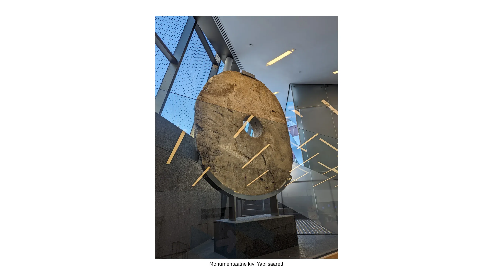

See on tõesti huvitav analüüs Yapi kivide kohta. Saifedean Ammous mainib seda näidet ka oma raamatus "The Bitcoin Standard". Tema sõnul sarnaneb Yapi saare süsteem kõige rohkem Bitcoin-le, mis on omamoodi keskne register, mida igaüks saab vaadata, mis on avalik, säilitab kontosid ja haldab asjade omandiõigust. See antropoloogiline vaatenurk näitab, et kõik see kujutab endast kokkulepet või sotsiaalset konsensust ühiskonnas, mis on põhimõtteliselt õige. Ja ma leian, et see kadunud kivide mainimine on väga huvitav. Nad sõitsid sadade kilomeetrite kaugusele merele väikeste parvedega ja tõid kivid tagasi. Mõnikord langes kivi merepõhja, kuid seda kivi kasutati ikkagi rahasüsteemis. Inimene võis öelda: "Jah, me kukkusime kivi sellesse kohta; see on minu, seega saame seda vahetada". Vahetuse hõlbustamiseks ei olnud tingimata vaja füüsilist valdust, sest kivid olid nii suured, et nad jäid sageli ühte kohta. Selle asemel keskenduti nende kivide vahetamisele tehinguliselt, võimaldades omandiõiguse vahetumist ilma, et kivid tegelikult liiguksid. Tegemist oli "konsensuse tõestamise" vormiga, mis tõi esile huvitava antropoloogilise vaatenurga rahale.

### Protovaluutad ja sotsiaalsed kohustused

Etnograafid üle kogu maailma on täheldanud, et ühiskonnad kasutasid "protovaluutasid" või "primitiivseid valuutasid", nagu karbid, riie, kariloomad, sool ja kivid, mis täitsid funktsioone, mida tavaliselt omistatakse rahale, nagu maksevahend ja väärtuse säilitamine, ilma et nad oleksid regulaarselt tegutsenud vahendajatena igapäevaste kaupade vahetamisel.

Seega kirjeldame siinkohal rahasüsteeme, mida ei pruugitud tingimata igapäevasteks vahetusteks.

Ja ma tahaksin teile meelde tuletada, et need kõik olid valuutad enne müntide tekkimist, ja ma ei tea, kui vale on öelda valuuta. Ma eelistan öelda valuuta. Võin mainida, et kirjanduses räägitakse sageli protovaluutadest, et viidata rahale enne münte. Kuid nagu me nägime esimeses osas, ** usun, et rahasüsteemid olid olemas ammu enne müntide ilmumist**.

Neid primitiivseid valuutasid kasutati peamiselt üksikisikutega seotud põhiliste sotsiaalsete kohustuste haldamiseks, näiteks abielu, konfliktide hüvitamine (Wergeld) või pealike vahelised kingitused. Näiteks Pärsia impeeriumis loodi esimesed mündid spetsiaalselt sõjalise maksevahendina, mitte vahetusvahendina.

Seega on ürgsele rahale üks oluline omadus: see on maksevahend, kuid väga harva on see materiaalse kauba otsese vahetuse vahend. Me peame siinkohal silmas seda, et see oli maksevahend teatud sotsiaalsete kohustuste, hõimude, pealike vaheliste vahetuste, kuulsa wergeldi, veriraha, eest tasumise vahend. Enne õigussüsteemide tekkimist, kui keegi pani toime mõrva, maksti hüvitist perekonnale, kes kannatas oma lähedase mõrva tõttu. Selle eest tuli maksta hinda, seda nimetati vererahaks ja see on üks makseviis. Oli ka kaasavara, mis on samuti üks maksevorm. Nendes varajastes rahakasutustes maksevormina oli see rohkem seotud inimlike ja sotsiaalsete kohustustega kui igapäevaste ostude eest tasumisega. Selle teooria kohaselt olid need tavalisemad igapäevased vahetused rohkem seotud krediidi, edasilükatud krediidi, kingituse eest kingituse ja toiduratsiooni ümberjaotamisega. Nende vahetuste haldamiseks oli veel üks sotsiaalse korralduse vorm. Samuti on oluline meeles pidada, et ühiskonnas, kus igaüks on isemajandav, teeb oma põllumajandust, puudub spetsialiseerumine ja igapäevaste vahetuste jaoks on väga vähe vajadust rahasüsteemi järele. Ja sellepärast olid esimesed rahavormid need, mida me just kirjeldasime, kaasavara, vereraha, lihtsalt sellepärast, et need olid esimesed vahetused, kus meil oli vaja maksevahendit, ammu enne, kui meil oli vaja kaubelda, vahetada leiba raha vastu igapäevaselt, sest primitiivsetes ühiskondades see nii ei toiminud. Igaüks hoolitses oma vajaduste eest ja spetsialiseerumist veel ei olnud. Ma arvan, et olen seda pikemalt käsitlenud kõigis selle kursuse eelnevates loengutes.

Nendes ühiskondades, kus puudus arenenud tööjaotus, jäi otsene teabevahetus piiratuks ja toimus peamiselt isiklike sõprus- või liitlassuhete raames. Piisava spetsialiseerumise puudumine ei tinginud vajadust raha järele tänapäevases mõttes.

Sellised antropoloogid nagu Quiggin ja Einzig rõhutavad krediidi ülimuslikkust: **Primitiivne majanduselu on haaratud hiiglaslikust krediitide ja isiklike võlgade võrgustikust, kus raha sekkub eriti siis, kui maksed peavad olema kohesed ja kompensatsioone ei saa kergesti edasi lükata.**

Nii et inimesed vahetavad asju, saavad teha edasilükatud krediiti, kuid mõnel juhul ei saa makseid edasi lükata, nii et valuuta või protovaluutad võivad olla kasulikud sel hetkel, et vahetus oleks kohe lõplik.

### Anonüümsuse innovatsioon

See analüüs viib sügavamale mõtlemisele: selle asemel, et vastandada raha vahetuskaubandusele, on asjakohasem mõista selle tekkimist kui arengut krediidi ja võla keerulistest süsteemidest. Raha toob kaasa fundamentaalse uuenduse: **anonüümsus**. Ja siinkohal on minu jaoks huvitav see antropoloogiline teooria raha tekkimise kohta. Kui te olete väike grupp inimesi ja annate üksteisele edasilükatud krediiti, siis te ilmselt tunnete üksteist. Ma arvan, et selleks, et see süsteem toimiks, peavad inimesed üksteist ilmselgelt tundma. Ja rahaga tehtud makse võimaldab anonüümsust. See võimaldab teil teha makse ilma, et inimesed teaksid isegi teie nime, ilma et nad teaksid, kes te olete. Nad saavad teha vahetuse kohese ja lõpliku arvelduse. Ja just seda võimaldab raha.

Erinevalt krediidist, mis on alati nominaalne, võimaldab raha anonüümseid, üldistatud ja kohe vabastavaid tehinguid. **See raha ainulaadne vabastav jõud on tema otsustav üleolek.**

Seega on raha kaugel sellest, et olla tagasihoidlik vahend, mis hõlbustab majanduslikku vahetust, vaid suur sotsiaalne uuendus, mis on tihedalt seotud inimlike institutsioonide ja tavade arenguga, alates isiklikust krediidist ** kuni üldistatud, anonüümse maksesüsteemini**. See antropoloogiline areng näitab, et raha, mis on palju rohkem kui lihtne vahetusvahend, kujutab endast võimsat sotsiaalset institutsiooni, mis kujundab inimühiskondi põhjalikult, kuni selleni, et sellest on saanud meie kaasaegsetes ühiskondades majandustegevuse eesmärk.

Siin mõistame, et lõpuks on meie kaasaegsetes ühiskondades majandusliku vahetuse eesmärk just raha omamine, samal ajal kui vanasti ei olnud see üldse nii. Majandusliku vahetuse tegelik eesmärk oli kaupade või kaupade omamine tarbimiseks. Ja tänapäeval, võttes kasutusele uuenduse raha, on majandusliku vahetuse eesmärk selle raha kogumine, sest see võimaldab meil vahetada seda kauba vastu, nagu üldiselt aktsepteeritakse. Me saame seda vahetada kauba vastu, mida me vajame, kui me seda vajame.

## Registri ühendamine

<chapterId>7664442a-91c1-5ce4-a8bd-53b7371a3e3d</chapterId>

:::video id=473fc284-5375-4e1b-b0cd-6b51ba0cc3b8:::

### Raamatupidamisregistri teooria

Uurime nüüd koos erinevaid ettepanekuid nende kahe rahateooria, s.t. raha tekkimise teooria võla-raha kaudu ja kauba-raha tekkimise rahateooria, ühendamiseks. Räägime Lynn Aldeni ühendamisettepanekust tema kuulsas raamatus "Purunenud raha eest", mille Consensus'i poolt toodetud tõlke pealkiri saab tõenäoliselt olema "Rupture monétaire".

*Väljavõte Lyn Aldeni raamatust "Broken Money":*

> Põhimõtteliselt on raha raamatupidamisregister. Kaubaraha on looduse poolt juhitud register. Pangaraha on rahvusriikide poolt hallatav register. Avatud lähtekoodiga raha on register, mida juhivad selle kasutajad.

Siinkohal viitab Lyn Bitcoin-le.

### Varude ja voogude suhe ja nappus

> Mõned haruldased keemilised elemendid, näiteks roodium, on haruldasemad kui kuld, kuid nende varude suhe on väike, sest tööstus tarbib neid sama kiiresti kui neid kaevandatakse. Roodiummünti või -valuplokki saab osta spetsiaalse kollektsiooni- või väärtuse säilitamiseks, kuid see ei sobi ühiskondlikult aktsepteeritud rahana ja seega ei teki seda loomulikult rahana.

Saifedean räägib sellest pikemalt oma raamatus "The Bitcoin Standard". Neile, kes ei ole kursis varude ja voogude suhtega, on see lihtsalt siis, kui võrrelda olemasolevaid varusid, turul olevaid reserve, uute varude sissevooluga võrreldes, uute varude sissevooluga. See on sageli üsna intuitiivne, sest te võite arvata, et midagi, mida on suurtes kogustes, ei ole napilt saadaval, kuid tegelikult ei ole. Küsimus on pigem selles, kui suur on teie tootmisvõimsus, et seda tarnida. Pigem annab meile selle mudeli kohaselt uue varu olemasolu võimekus teavet selle kohta, kas see objekt on haruldane või mitte. See ei ole haruldane mitte sellepärast, et meil ei ole midagi laos, vaid võib-olla lihtsalt sellepärast, et meil ei ole seda asja. Seega, kui me võtame kulla, siis meil on palju kulla varusid, sest seda kasutatakse väärtuse säilitajana, ja uute varude sissevool on umbes 1% kuni 3% aastas uutest kulla varudest, mis saabuvad kulla mining kaudu. Samas, kui me räägime roodiumist, siis see on haruldasem kui kuld, kuid meil ei ole varusid, sest see tarbitakse ära, kui see kulub. Seega ei ole vaja palju uut pakkumist, et olemasolevat varu kahekordistada. Samas kui kulla puhul kulub vähemalt 50 aastat, et uuendada, et kahekordistada varusid. Erinevalt enamikust tarbitavatest kaupadest, mille puhul on üsna lihtne ja ei ole vaja palju aastaid toota, et olemasolevat varu kahekordistada, sest seda tarbitakse jooksvalt.

*"Kuld on kogu kaasaegse ajaloo jooksul säilitanud varude ja rahavoogude suhtarvu 25x kuni 100x, tavaliselt 50x või rohkem, kusjuures lühiajaliselt ei langenud see kunagi alla 16x, isegi 19. sajandi keskel toimunud kullapalaviku ajal ei langenud see alla 16x. "*

Seega tähendaks 25 aastat varude kahekordistamiseks 25 aastat ja 100 aastat tähendaks 100 aastat varude kahekordistamiseks. Saifedean ütleb oma raamatus, et isegi kui me kahekordistaksime kulla tootmist, näiteks 1,5%-lt 3%-le, ei oleks sellel tingimata suurt mõju kulla hinnale.

*"Hõbe on üldiselt 10x või rohkem, mis on ikka veel suhteliselt kõrge.*

*Enamiku teiste kaupade puhul on varude ja voogude suhe väiksem kui 1 või 2. Isegi kõige haruldasemate elementide, nagu plaatina ja roodium, varude voolavuse suhe on suhteliselt madal nende kiire tööstusliku tarbimise tõttu" *

### Kulla ja hõbeda paremus

*"Lühidalt öeldes, alati, kui kaubavaluuta on sattunud konkurentsile kulla ja hõbedaga, on viimased lõpuks alati võitnud. Teised toorained võivad jääda valuutadeks piiratud ajaks või teatud piirkondades, kuid kuld ja hõbe on alati tõestanud oma võimet saada ülemaailmselt konkurentsivõimeliseks valuutaks ja domineerida konkurentsis. See on tingitud sellest, et tsivilisatsioonide kohtumisel oli kulla ja hõbeda omanikel alati tehnoloogiline võime devalveerida teisi valuutavorme, samas kui karbid, pärlid, kariloomad, sool, riie või madalamad metallid ei suutnud kunagi kulda või hõbedat devalveerida. "*Kulla ja hõbeda omanikud ei saanud kunagi devalveerida

Nii et seda on jälle väga hästi kirjeldatud raamatus "The Bitcoin Standard", kus Saifedean räägib Aafrika hõimudest, kes kasutasid klaashelmeid. Ja kui Veneetsia kaupmehed saabusid lastiga, mis oli täis klaashelmeid, sest nad suutsid neid tol ajal tööstuslikult toota, neil oli selleks tehnoloogiline võimekus, siis see destabiliseeris nende rahvaste rahasüsteemi täielikult ja nad suutsid nende ressursse sõna otseses mõttes röövida. See on Saifedeani tees.

### Arvestusüksus ja krediit

*"Ajalooliselt, isegi kui krediiti kasutati otseselt vahetusinstrumendina, oli see tavaliselt vääringustatud rahaliste kaupade ühikutes, mis olid loomulikult valitud nende omaduste järgi. "*

See on väga huvitav punkt, mida Ulrich ja mina oleme arutanud. Isegi kui Mesopotaamia tempel oli mingi asutus, mis suutis seda krediidi mõistet hallata, oli arvestusühikuks seekel. Mitte miski ei kinnita, et seekel oli autoriteetselt kehtestatud templi poolt. Sekel võis tekkida loomulikul teel, kaupmeeste vajadusest importida ja eksportida koos teiste ümbruskonna rahvastega. Meil on selle kohta tõendeid ühe Kanese kaupmehe näol (ma mainisin seda 1. osas), kes tegi just seda, importides väärismetalle, mida ei kasutatud mitte nende füüsilise kaubaväärtuse, vaid pigem väärtuse säilitamise eesmärgil. Ainus probleem on see, et me ei tea, kas me võime eeldada, et selle hõbeda, hõbesekeli valiku tegid kaupmehed või tegi seda tempel. Kuid Ulrichil on väga hea argument, mis paneb meid arvama, et tõenäoliselt oli see pigem kaupmeeste poolt tehtud.

*"Seega võib nende kahe teooria ühendamist kirjeldada kui "raha raamatupidamisteooriat" ("raha pearaamatuteooria"), kuna see kirjeldab mõlemale teooriale ühist põhiloogikat. Nii paindlik sotsiaalne krediit kui ka kollektsioneeritavad protovaluutad pärinevad inimkonna algusaegadest. Mõlemal juhul peavad eri suurusega inimrühmad omavahel raamatupidamislikku pearaamatut, et vältida vajaduste kahekordset kokkulangevust, vähendada hõõrdumist vahetamisel ja olla likviidsete säästude vormiks. Oluline erinevus seisneb selles, millisele asutusele on registri pidamine usaldatud." *

Ühelt poolt juhib loodus rahapakkumise laienemist. Nii et kui me võtame kulla, kuna see on üsna haruldane, siis on seda raske kaevandada. Kuldmüntide kaevandamisel on mingi piir. Niisiis, nappust juhib loodus. Ja registrit hoiab valduse mõiste. Register on detsentraliseeritud. Omandit tõestab asjaolu, et te omate kuldmünti või kullatükki. Ja krediidiraha puhul juhib nappust inimeste võime saada krediiti. Või fiatraha puhul juhib nappust võim. Just nemad otsustavad, kas trükkida rohkem või mitte, et vältida inflatsioonilisi katastroofe. Nii et mõnel juhul võib registrit juhtida ka token omanik, paberraha puhul paberraha. Seepärast on see registrisse kantud, jutumärkides, dematerialiseeritud. Noh, materialiseeritud, kuid virtuaalne. Ta omab seda kuulsat token, ja see tõestab valdamist. Ja see võib sama hästi olla reaalses registris, nagu kirjaraha puhul, pangas, kus tegelikult juhib inimpank, kes mida omab registri suhtes.

## Ühendamine rahalise lisatasu kaudu

<chapterId>093756e5-8908-55e5-bb76-376a3a3cc4d3</chapterId>

:::video id=eabc342a-ecbd-46ca-a347-e914917e7c4f:::

### Rahalise preemia mõiste

Selles jaotises, mis on pühendatud erinevatele ettepanekutele raha tekkimise erinevate teooriate ühendamiseks, pakkusin just välja Lyn Aldeni teooria, registriteooria. Mul on oma ettepanek kahe rahateooria ühendamiseks. See on rahapreemia, rahapreemia mõiste. Niisiis, raha väärtust saab seletada selle rahanõudlusest tuleneva rahapreemiaga, olgu see siis savitahvlite, väärismetallist müntide, pangatähtede või bitcoinide kujul. Rahapreemia põhineb lihtsalt usaldusel, et keegi vahetab selle raha tulevikus võrreldava hinna eest.

Ma püüan siinkohal näidata, et olenemata sellest, kas tegemist on fiatiga, st pangatähtedega, millel puudub kasutusväärtus, kas tegemist on kuldmüntidega või mis tahes metalliga, kullanugetiga või valuplokiga, ** sageli moodustab suurema osa selle väärtusest ** rahaline preemia. Kui me võtame kullatüki, siis teatud osa selle väärtusest seletatakse selle kasutusväärtusega, selle kasutamisega tööstuses või ehete valmistamiseks. Pange tähele, et nõudlus ehete järele tuleneb sageli nende rahalisest väärtusest. Inimesed hoiavad ehteid omamoodi väärtuse säilitajana, nii et ma lisan selle veidi rahapreemiasse, sest sageli on see pigem rahaline nõudlus, et mängida rolli rahas.

Seega võib öelda, et umbes 10% kullanõudlusest on seotud tööstusega. Kulla väärtuses oleks meil väike osa, ütleme 10%, mis oleks seletatav selle tööstusliku nõudlusega, selle nõudlusega kulla kasutamise järele, kus kulda tarbitakse. Ülejäänud osa on selgelt nõudlus selle rahalise kasutamise järele väärtuse säilitajana.

### Ametiasutuse boonus ja fiat

Ja kui võrrelda kullatükki kuldmündiga, siis on veel üks kiht. Kuldmünt on löödud asutuse poolt, ja tükis sisalduvale kullale on ka nõudlus, et seda saaks kasutada, et seda saaks tarbida tööstuses. Samuti on sellel väärtuse säilitajana rahaline lisatasu. Lisaks sellele on veel üks lisakihi, mida ma nimetan autoriteedipreemiaks, mille puhul on mündi hind sageli suurem kui kullatüki ostujõud, sest münt on lihtsamini kasutatav. See muudab vahetused sujuvamaks, sest seda ei ole vaja kaaluda. Tavaliselt tagab asutus selle puhtuse. Ja kui võrrelda seda kullatükiga, on templiga kuldmünt tavaliselt rohkem väärt kui lihtne kullatükk. Ja see on ka normaalne, sest selle tembeldamiseks kulub ressursse.

Sama põhimõte kehtib ka paberraha puhul. Paberrahal ei ole tegelikult mingit kasutusväärtust, välja arvatud ehk maja kütmiseks, ja see juhtus Weimari vabariigi ajal. Seega puudub tegelik nõudlus selle kasutusväärtuse järele. Teisest küljest on minu arvates olemas ainult autoriteedipreemia.

See on rahalise lisatasu üks vorm, rahalise lisatasu pealekandmine. Kuid selle rahaline lisatasu tuleneb asjaolust, et see on seaduslik maksevahend, ja siis sunnivad ametiasutused teid seda ostma, et maksta oma makse. Seega on fiat-valuutal tingimata teatav rahaline nõudlus, mis tuleneb asjaolust, et see on maksustatud ja te peate seda vähemalt omandama, et maksta oma makse. Ja selle tulemusena jääb see üldtunnustatud maksevahendiks. Seega tahavad inimesed seda oma vajaduste rahuldamiseks omandada.

### Rahanõudluse kaudu toimuv ühtlustamine

Ja miks on see rahapreemia ettepanek võlaraha ja kaubaraha teooriate ühendamine? Noh, ma ei leia, et kuldmündi väärtus tuleneb tingimata selle "sisemisest väärtusest". Ei, tegelikult on see sama palju usalduse mõiste kui fiatraha puhul. See on rahanõudluse mõiste. Ja see ei ole tegelikult sellepärast, et tal on väike protsent tööstuslikust kasutusest, veel üks "kasulikkus". Kui me ütleme, et tööstuslik kasutus moodustab 10% selle väärtusest, siis võiksime hinnata seda 300 dollariga untsi kohta. Kui kulda müüakse turul 3000 dollari eest untsist, siis 300 ja 3000 dollari vahe on kuulus rahaline preemia. See on see rahaline nõudlus kulla järele, mis seletab seda. See, et fiatil on null kasutusväärtus, ei tähenda, et see oleks kuidagi teisiti. Minu jaoks on see täpselt sama asi. Nii et mõlemal poolel, võlaraha või kaubaraha teoorias, ei usu ma, et mingi lisakvaliteet, mis kulla puhul oleks minimaalse kasutusväärtusega, midagi muudaks.

Teisest küljest on kindel, et **Emitsiooni tasandil, vastavalt Misesi regressiooniteoreemile, võime pakkuda välja, et see kasutamine loob algselt nõudluse ja algatab protsessi, mis muutub rahaks.** Samas, võlaraha tasandil on see pigem autoriteedi poolt peale pandud, nii et allikas, tekkimise algatamine ja mõisted on täiesti erinevad. ** Kuid ma arvan, et väärtuse tasandil, kuidas seletada raha väärtust, saame rahapreemiaga sama lihtsalt seletada, miks fiat-rahal on see väärtus, mida me talle omistame, ja miks kaubarahal on see väärtus**, mida me talle omistame. Minu jaoks on see sama protsess ja seda nimetatakse rahapreemiaks.

#### Rahaline lisatasu

See on kõik. Raha väärtust saab seletada rahanõudlusest tuleneva rahalise preemiaga, olgu see siis savitahvlite, väärismetallist müntide, pangatähtede või bitcoinide kujul.

Rahaline preemia põhineb lihtsalt usaldusel, et keegi vahetab selle raha hiljem võrreldava hinna vastu.

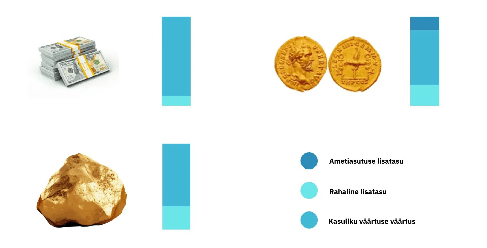

# Raha erinevad määratlused

<partId>77b7918a-8c3b-11f0-b688-6b2ab22378c9</partId>

## Raha vs valuuta vs monnaie vs argent vs devise

<chapterId>bf8a6d21-df88-5d23-a0a5-e9a5c1300554</chapterId>

:::video id=d9c9e7df-9db3-4a9f-801e-10d3fc7dfc22:::

### Rahaterminite semantika

Selles eri rahateooriaid ja eriti raha määratlusi käsitlevas osas tahaksin teha lühikese kõrvalepõike semantika teemal. Tahaksin veidi sügavamalt uurida mitmete rahaga seotud sõnade määratlusi ja võrrelda neid nende ingliskeelsete vastetega. Näiteks money, currency, võrreldes monnaie, argent ja devise. Niisiis, see käib nii.

Väike semantika:

Kui me ütleme "**raha**" (de la monnaie), arvab enamik inimesi, et me viitame väikesele vahetusrahale, mida me saame tehingu eest. Ja kui me ütleme "**valuuta**" (la monnaie), arvavad inimesed tõenäoliselt, et me viitame riigi valuutale. Kanada valuuta on Kanada dollar. Nii ongi.

Aga kuidas on lood rahaga (de l'argent)? Varas ei ütle kunagi: "Anna mulle kogu oma vahetusraha!" (varas võib olla pettunud, kui ta saab lihtsalt münte, millel pole peaaegu mingit väärtust).

Ei, karjub varas: "Anna mulle **kõik, mis raha**". Ja kui varas seisab teie ees tänaval, siis peab ta tingimata silmas **pangatähti** teie taskus.

Teisest küljest, kui varas üritab teid keerulisemal viisil petta, püüdes varastada teie vara, tühjendades kõik teie pangakontod, siis ütleme, et **sellane võtab kogu teie raha**. Siin viitab sõna "raha" **isiku varandusele**.

Seega on sõnal raha kaks määratlust: raha (pangatähed) ja rikkus.

### Valuuta vs monnaie vs devise

Valuuta (devise) on tingimata teise riigi valuuta, muidu ütleme lihtsalt raha (monnaie). Kui te olete prantslane, siis ütleksite: "La livre sterling est la devise du Royaume-Uni et l'euro et la monnaie de l'Europe" (naelsterling on Ühendkuningriigi valuuta ja euro on Euroopa valuuta).

Sageli kalduvad inimesed, kes ei ole nende terminite tõlkimisel süvenenud nendesse semantilistesse probleemidesse, sageli rääkima valuutast (devise), kui see on kirjutatud valuuta, kuid ei, valuuta on raha (monnaie), kui see on teie riigi valuuta, ja devise, kui me räägime teistest valuutadest. Seega on probleem, mida ma sageli näen, et inglise keeles on kaks sõna: on "money", mis on mõiste, ja on "currency", mis on tegelikult riigi rahaühik, mida kasutatakse vahetuseks. Nii et me võime lihtsalt rääkida raha mõistest; see on lihtne - see on mõiste sõna *raha*; see on raha üldiselt. Ja *raha* on väga lihtne võrdsustada riigi valuutaga. Samas prantsuse keeles ütlevad inimesed kahjuks sageli, et jah, "mais ce n'est pas une monnaie", kui nad räägivad bitcoinist, sest see ei ole riigi valuuta, kuid sageli, ma arvan, et nad viitavad hoopis terminitele valuuta. See on ühest küljest vale, sest alates El Salvadorist on bitcoin olnud riigi valuuta. Fakt on see, et inimesed ütlevad sageli: *aga ei, see ei ole riigi valuuta, see ei saa olla raha*. Aga tegelikult, kui me viitame laiemale mõistele *raha*, siis minu arvates sobib bitcoin sellesse määratlusse suurepäraselt. Lihtsalt prantsuse keeles ei ole meil nende kahe mõiste eraldamiseks kaks sõna. Võiksime öelda, et sõna argent viitab rahale, kuid kahjuks ei ole see selle täpne määratlus. *Argent* (raha) viitab rikkusele või pangatähtedele. Te ei saa tegelikult teha võrdsustust sõnaga *raha*. *Raha* on tegelikult raha (monnaie) mõiste.

## Saifedean Ammousi määratlus

<chapterId>07c4ba50-168c-567a-8957-0b187ff75f97</chapterId>

:::video id=936d6d3b-6d45-468e-bc44-85fbce9b857a:::

#### Mis on raha?

Raha on lihtsalt midagi, mida te omate või omandate, mitte selleks, et seda ise kasutada või tarbida, vaid selleks, et seda hiljem vahetada teiste kaupade või teenuste vastu, mida te vajate. (Saifedean)

Raha omandab rahalise preemia, kui kauba järele on olemas rahaline nõudlus, et täita ühte või mitut raha rolli.

Rahaline kaup peab olema piisavalt napp, et rahaline preemia püsiks (et takistada pakkumise kohandumist rahalise nõudlusega).

### Rahaline lisatasu

Selles jaotises, mis käsitleb erinevaid valuuta definitsioone, tahtsin lühidalt rääkida Saifedeani definitsioonist raamatus "The Bitcoin Standard", mis on mulle alati suurt huvi pakkunud. Seda lugedes tundus see mulle üsna lihtne. Ja me lisame sellele määratlusele ka rahapreemia mõiste. Nagu Saifedean oma raamatus mainib, on tingimata olemas puuduse mõiste. Küsimus on, mis on raha?

> Raha on lihtsalt midagi, mida te omate või omandate, mitte selleks, et seda enda pärast kasutada või tarbida, vaid selleks, et hiljem vahetada see teiste kaupade või teenuste vastu, mida te vajate.

Niisiis on see määratlus, mida Saifedean mainib raamatus "The Bitcoin Standard". Mina lisaksin, et valuuta (la monnaie) omandab rahalise preemia, kui kauba järele on rahaline nõudlus, et mängida ühte või mitut valuuta rolli. Seega võiks öelda, et valuutal, mis toimib väärtuse säilitajana, on rahaline nõudlus, mis annab sellele rahalise preemia, sest inimesed tahavad seda soetada, näiteks väärtuse säilitajana või vahetusvahendina.

### Puudus ja turumehhanismid

Sellele peaksime minu arvates kindlasti lisama, et rahaline hüve peab olema piisavalt napp, et rahaline preemia säiliks. See on väga oluline. **Kui mingi kaup tekib rahana kasutamiseks ja me näeme, et selle hind tõuseb, siis tavaliselt, kui kaup ei ole piisavalt haruldane, tahavad inimesed seda rohkem toota, et saada kasu sellest väärtuse tõusust, kui hind tõuseb**. Seetõttu on enamikul turul olevatel kaupadel suhteliselt fikseeritud hind. Kui hind tõuseb, kipub tootmine suurenema. Kui hind langeb, väheneb tootmine. Toimub mingi turu kohandumine. **Ja kui kaup on piisavalt haruldane, nagu kuld, siis turumehhanism ei kompenseeri seda suurenenud nõudlust rahaliseks kasutamiseks. Seega muutub muutuja, see on hind. Nagu bitcoiniga**. Kui bitcoini hind tõuseb, siis me ei tooda rohkem bitcoine. Nii et see, mis kohandub, on hind. Ja seepärast oleme aastaid näinud, et bitcoini hind tõuseb, kui nõudlus bitcoini järele suureneb. Kuna maailmas ei ole kedagi, kes saaks muuta algoritmi ja öelda "nõudlus on suurem, hind tõuseb, me toodame rohkem" **Uute bitcoinide pakkumine on ette programmeeritud ja ette teada**. Nii et see ongi see, millest ma rääkisin, et rahaline hüve peab olema piisavalt haruldane, et rahaline preemia püsiks ja seega ei saaks turumehhanismid kinni püüda, et takistada pakkumise kohandumist selle uue rahalise nõudlusega.

## Maksevahendid ja vabastav väärtus

<chapterId>5d424039-e342-56f7-9d8b-bba9551831a9</chapterId>

:::video id=af4c0765-8111-4cb7-891b-3ee54d6e7054:::

### Maksevahendid vs. vahetusvahendid

Selles raha erinevatele määratlustele pühendatud osas soovitan koos vaadata tsitaati Alain Testarti raamatust "Aux origines de la monnaie" ("Raha päritolu"), mis käsitleb raha kui maksevahendit ja vabastavat väärtust.

*Alain Testart defineerib oma teoses Aux origines de la monnaie raha kui maksevahendit:*

> Maksevahendite funktsioon erineb siinkohal vahetusvahendite funktsioonist, kuivõrd on olemas maksed ilma vastutasuta, maksed, millega ei osteta midagi. Knies (1873:192 jj.) arendab pikemalt seda teemat kaupade üleandmise kohta, mis ei seisne vahetusaktides, nagu näiteks wergeld (veriraha või kompositsioon mõrva eest) või maksud. Carl Menger ründas seda neljandat funktsiooni oma 1892. aasta artiklis "Geld", mida peetakse üldiselt üheks kõige otsustavamaks selle teema kohta. Ilma et see oleks täielikult diskrediteeritud, näib, et tänapäeval on maksevahendite funktsiooni idee majandusmõtlemises unustatud või vähemalt tagasi lükatud vahetusvahendite funktsiooni kasuks.
>

> Raha kasutatakse maksmiseks: selles valguses vaadatuna on see vabastamise vahend, mis kirjeldab kogu oma üldisuses maksevahendi funktsiooni. Selles suhtes räägime me raha "vabastavast võimust". Le Petit Robert'i järgi on vabastav jõud "see, mis mõjub (kohustusest, võlast) vabastavalt". Grand Larousse'i järgi on vabastav makse igasugune "makse, mis tehakse seaduslikel tingimustel nii, et võlausaldaja ei saa võla kustumist vaidlustada". Rahal on see võimsus par excellence; see on isegi see, mis määratleb selle seadusliku maksevahendi staatuse, kuna keegi ei saa keelduda rahas tehtud maksest, olgu siis müüja või võlausaldaja. Raha on ainus kaup, mille tasumisest ei saa keelduda, olenemata sellest, kas võlg on võlgu kaupmehele või maksuhaldurile. Kõigist kaupadest on see privileeg ainult rahal. "See on see privileeg," kirjutab Charles. Gide (1921 I: 443), mis moodustab selle, mida me nimetame seaduslikuks maksevahendiks.
>

> Iga vahetus, mis seisneb ühe kauba üleandmises teise kauba vastu või tingimusel, et vastutasuks antakse teine kaup, tähendab tingimata, et vastuvõtja on kohustatud andma selle vastaspoole. Maksmine on selle kohustuse täitmine. Seega eeldab igasugune vahetus maksmist, kuid mitte igasugune maksmine ei tähenda vahetust. On makseid, mille puhul puudub vastutasu, s.t makseid, mis ei võimalda saada teist kaupa ja mida ei tehta sel eesmärgil. Maksud jäävad siinkohal eeskujuks; mainida tuleks ka igasuguseid trahve, mida makstakse riigiasutustele, ja hüvitisi, mida tuleb maksta teistele põhimõttel, et see, kes teistele kahju tekitab, peab selle heastama.

### Maksed ilma vastaspooleta

See illustreerib selgelt autori teesi. Tegelikult eristab ta neid kahte. Tema jaoks on vahetus nii kauba üleandmine kui ka makse. Maksmine on järgmine. Ja maksmine võib toimuda ilma vahetuseta. Ta toob näiteid, kuidas parkimistrahvi või trahvi maksmine on lihtsalt makse. Vastutasuks ei saa tegelikult teenust. Mõni võib väita, et riik teeb teile vastutasuks teenust, teenust, mis seisneb parkimistrahvide andmises. Ta on üsna selgelt seisukohal, et maksude maksmine on tegelikult makse ilma vastaspooleta, selles mõttes, et maksude maksmine on nõutav, isegi kui te ei saa tingimata teenust. Ta ütleb, et tegelikult on määratletud, et maksude maksmine on lihtsalt makse; ei ole kohustust saada vastutasuks teenuseid. Olen seda arutanud paljude oma kolleegidega ja nad ei pruugi selle arusaamaga nõustuda. Aga see on autori tees. Ta üritab maksmise mõistet paigutada ja lahutada seda vahetusest nende näidetega, näiteks trahvi, maksude maksmise kohta. Ka näiteks kaasavara, ta väljendab, et kaasavara on makse, te ei pruugi midagi saada selle eest. Keegi, kes seda ettepanekut kritiseerib, võib öelda: "Jah, aga te saate vastutasuks naise." Nii et see ongi arutelu tase sellel teemal.

Samuti on olemas wergeld ehk vereraha. Nii et see on lihtsalt kompensatsioonimaks. Mu sõber Ulrich ütleks:

> Jah, kuid selle eest saate selle faili suletud.

Niisiis, te olete toime pannud kuriteo, näiteks mõrva. Sel ajal maksate te wergeld ja pärast seda, noh, teid vabastatakse sellest olukorrast. Nii et seal on vabastav jõud. Kas sa saad midagi vastu?" Autori sõnul mitte. Mõne mu kolleegi sõnul küll.

Ma arvan, et selles arutelus näeme, et wergeld on üks hea näide makse määratlemiseks. Tegelikult on selge, et te ei saa midagi vastu.

## Võlaraha vs. kaubaraha

<chapterId>4093677a-c8e8-5828-b994-15c01656186e</chapterId>

:::video id=f49cf5cc-288e-4daa-a1ff-b9de73506f4e:::

### Põhimõtteline arutelu

Selle erinevate rahamõisteid ja -teooriaid käsitleva osa raames uurime siiski koos kahte diametraalselt vastandlikku nägemust: "raha on alati võlg" või "raha on alati kaup". Ühelt poolt on võlapõhise rahateooria pooldajad, kes väidavad: "Ei, raha on alati võlg! Teiselt poolt väidavad meie kuulsad kullafännid: "Aga ei, näete, raha on alati kaup, see on alati kuld; kõik muu, vekslid, võlakirjad, on ainult krediit, mitte raha".

Uurime koos nende teooriate selget kokkuvõtet.

### Teooria "alati võlg"

Siin on kokkuvõte rahateooriast, mis on tuntud kui **"võlaraha "**, mille kohaselt raha on põhimõtteliselt võlg:

Selle teooria kohaselt, mille on välja töötanud eelkõige Alfred Mitchell-Innes ja mida on edasi arendanud David Graeber, on raha oma olemuselt võlgade tunnustamine, mis tuleneb krediidisuhetest, mis ajalooliselt eelnesid otsesele rahavahetusele. Selle asemel, et tuleneda vajadusest, mis on seotud vahetuskaubandusega, on raha pigem üksikute isikute või rühmade vaheliste sotsiaalsete kohustuste või võlgade arvestamise, ülekandmise ja tasumise viis.

Seega ringleb kogu raha kui ühe isiku või institutsiooni võlg teisele, mille taga on usaldus ja ühiskondlik või riiklik autoriteet, mis tagab selle kehtivuse. Niisiis, kui me omame - nagu ma juba mainisin -, kui me omame raha, siis on meil nõue ühiskonna vastu ja ühiskond on meile võlgu. Raha ei ole seega kunagi neutraalne või autonoomne, vaid alati aluseks on võlg: raha omamine tähendab sisuliselt nõude omamist ühiskonna või majandusliku kogukonna vastu.

See arutluskäik on vastuolus klassikalise ideega rahast kui lihtsast "vahekaubast" ning rõhutab selle asemel sotsiaalsete ja poliitiliste suhete keskset rolli raha loomisel ja haldamisel.

**Minu arvustus:**

Mind häirib selle teooria puhul see, et selles väidetakse, et raha on alati võlg, kuigi meil on näiteid kahe erineva hõimu vahelisest vahetusest, kus näiteks kulda vahetatakse, kus tehing on lõplikult lõplik ja latentset võlga ei jää. Selle teooria pooldajad ütlevad meile sageli, et need vahetused ei ole rahavahetus, vaid barter. Nagu juba mainitud, ma ei ole sellega nõus. See on rahavahetus, sest kulda ei tarbita, vaid seda kasutatakse rahana.

### Teooria "alati kaup"

**Alati kaup:**

Siin on selge kokkuvõte rahateooriast, mida tuntakse kui **"kaubaraha "**, kus raha tekib alati kaubana, eelkõige kullana, mis tekib vajadusest olla võimeline kauplema, kaubana, mida üldiselt aktsepteeritakse välismaal ja mida soetatakse kauplemise eesmärgil.

Selle klassikaliste majandusteadlaste (Adam Smith, David Ricardo) poolt välja töötatud ja Marxi poolt üle võetud teooria kohaselt tekib raha loomulikult kui kaup teiste seas, sageli väärismetall nagu kuld või hõbe, millel on oma rahalisest rollist sõltumatu sisemine väärtus. Esialgu valivad majanduses osalejad need kaubad spontaanselt, et hõlbustada kaubavahetust tänu nende olemuslikele omadustele (nappus, kestvus, jagatavus ja stabiilsus).

Kaubaraha eristab selle füüsiline olemasolu ja väärtus, mis on määratud selle tootmiseks ühiskondlikult vajaliku tööjõu hulgaga (nagu Marxil). Ühiskond kasutab näiteks kulda mitte ainult vahetustegevuse lihtsustamiseks, vaid ka arvestusühikuna, väärtuse säilitajana ja universaalse vahetusvahendina.

Selles nägemuses säilitab raha alati reaalse väärtuse, kuna see on endiselt seotud käegakatsutava kaubaga. Isegi kui raha roll muutub abstraktseks (vermitud mündid, pangatähed või pühakirjaraha), tuleneb selle kehtivus ikkagi otseselt või kaudselt viitest aluseks olevale kaubale, nagu kuld. Seetõttu rõhutab see teooria raha materiaalset ja majanduslikku päritolu, erinevalt teooriatest, mis peavad seda pelgalt konventsiooniks või võlgadeks. Selle teooria kohaselt oleks igasugune raha kujutamine asendusrahaga, näiteks kullas lunastatava veksliga, krediit.

**Minu arvustus:**

Pange tähele, et see nägemus sarnaneb kaubarahateooria nägemusega, kuid läheb sammu võrra kaugemale. Nad teevad ettepaneku, et raha peaks **alati** olema kaup. Ja kui me neile ütleme: "*Ja, aga me võime nõustuda, et pangatäht on selle grupi jaoks raha; seda saab varustada kullaga, see toimib ja pangatäht kui selline on raha*".

Vastuseks toovad nad meile näiteks riietusruumi kupongi. Nad ütlevad: "Jah, aga ei, kui teil on riietusruumi kupong, kas me saame kassakupongi nimetada riietusriietuseks?

Muidugi mitte, see on nagu tunnustus, sisuliselt nõue, mis võimaldab teil oma rõiva tagasi saada. See paralleel ei pea paika, sest riietuskupong ei ole üldtunnustatud makseviis. **Raha ei ole nõue konkreetsele esemele nagu rõivas; see on viis, vahetusvahend, vahetusvahend ehk üldiselt aktsepteeritud maksevahend**.

Seega ei saa tõmmata paralleele riietusruumi kupongi ja fiatvaluuta rahatähe vahel, sest riietusruumi kupong võimaldab teil saada vastutasuks teatud kaupa, see on token, mis võimaldab teil oma kaupa tagasi saada. Samas kui pangatäht, fiatvaluuta, on universaalne kupong, mis võimaldab teile juurdepääsu mis tahes hüvele.

Ja minu arvates võib muidugi isegi fiatraha pidada rahaks, kui elanikkond seda selliseks peab. Ja minu arvates on semantiline viga väita, et see ei saa olla raha, sest see on kupong, mille abil saab tõelist raha, vähemalt sel ajal, mis oli aluseks kuld.

Mul ei ole mingit probleemi pidada seifis hoitavat kuldmünti ja seda kuldmünti esindavat pangatähte rahaks. Minu jaoks ei ole mingit semantilist probleemi, tegemist on lihtsalt kahte liiki rahaga. Kui ma ei eksi, siis Mises seletab seda nähtust väga hästi, rääkides rahaasendajatest.

Nende nägemus taandub sellele, et pangakirstus olevat kuldmünti ja seda kujutavat pangatähte ei saa pidada üheaegselt rahaks. Mina isiklikult ei näe selles mingit probleemi; ma ei näe selles olukorras mingit paradoksaalsust. Need, kes usuvad, et raha on alati kaup, ei näe asju nii nagu mina.

**See on ülevaatlik ülevaade kapuutsikupongide kontseptsioonist raamatust *Aux origines de la monnaie*:**

*Märkus 14: "Rist (1938: 372, märkus 1) on teinud suurepärase kriitika - suurepärase, sest see on just sellel alusel, millele Knapp ennast asetab, õiguslikul alusel - paberraha ja tšekkide võrdluse kohta: kui me võime mõlemal juhul rääkida mingist nõudest, siis põhiline erinevus on see, et esimesel juhul, ja ainult esimesel, on see nõue ilma konkreetse objektita

Samuti märgib sama autor **nõude** kohta järgmist:

> Bastiat'l on täiesti vaba voli kujutleda kogu ühiskonna jaoks mõeldud vautšerit, mis esitatakse "tohutu basaarina", kuid see väike lisa, see näiliselt süütu laiendus, ongi kogu erinevus krediidi ja raha vahel. Raha ei ole nõue konkreetsele kauplusele. Anonüümset nõuet ei ole olemas. Kuid just anonüümsus, mis iseloomustab raha, ja seega selle üldisus, on see, mis teeb selle nii võimsaks. Raha ei ole nagu krediit, veel vähem on see kuidagi sellega taandatav. **Raha on palju enamat kui krediit.**

**Paradoks: võlaraha vs. kauba raha**

Paradoks, mis illustreerib kõige paremini võla- ja kaubaraha teooriate vahelist sügavat dihhotoomiat, puudutab küsimust, kas kuld on tänapäeval valuuta.

Ühest küljest määratleb võla-rahateooria raha eelkõige kui vahetusvahendit või maksevahendit, mida üldiselt aktsepteerib või isegi kehtestab avalik võim. Sellest vaatenurgast vaadatuna ei ole kuld enam raha, kuna seda ei kasutata ega aktsepteerita laialdaselt üldise vahetusvahendina.

Teisalt, kaubarahateooria käsitleb raha kui käegakatsutavat kaupa, mille ühiskond on spontaanselt valinud oma sisemiste omaduste (nappus, kestvus, jagatavus jne) tõttu. Selle lähenemisviisi kohaselt on kuld endiselt tõeline universaalne raha ja kõik muud rahavormid on tänapäeval põhimõtteliselt vaid usaldusel põhinev krediit.

See paradoks näitab selgelt lõhet nende kahe rahakäsitluse vahel: esimese jaoks ei ole kuld enam valuuta, teise jaoks on see vastupidi ainus tõeline valuuta.

## Kaasaegne rahateooria

<chapterId>8efc29af-3193-5d97-ad9f-e608b32924ff</chapterId>

:::video id=f8127cb7-46a1-468c-bbb5-97bf0a8b8837:::

### Kaasaegse rahateooria põhimõtted

Selle erinevate rahateooriate osa lõpetuseks räägime rahateooriate imelapsest, mida imetlevad paljud tänapäeva keskpankades töötavad majandusteadlased ja mida nimetatakse kaasaegseks rahateooriaks, mida sageli nimetatakse MMT-ks.

**Modern Monetary Theory (MMT)** on majanduslik lähenemine, mille kohaselt ei saa riik, millel on oma suveräänne valuuta (nagu USA, Kanada või Jaapan), kunagi rahapuudust tunda, sest ta saab alati emiteerida rohkem raha, et rahastada oma kulutusi. Selle teooria kohaselt:

- Raha on riigi looming, mitte piiratud ressurss**

- Maksud ja laenuvõtmine ei kasutata otseselt riiklike kulutuste rahastamiseks, vaid pigem inflatsiooni reguleerimiseks, majandusliku käitumise mõjutamiseks ja nõudluse säilitamiseks riigi valuuta järele.*

- Valitsuse kulutuste tegelik piir on inflatsioon, mitte eelarvepuudujääk või riigivõlg.

- Kui loodud raha suunatakse sektoritesse, mis suudavad seda vastu võtta, ei teki ka inflatsiooni.

- Seetõttu peab valitsus kohandama oma kulutusi vastavalt olemasolevatele tegelikele ressurssidele (tööjõud, tööstusvõimsus, loodusvarad), et vältida ülemäärast inflatsiooni.

### Maksude roll MMTs

Nii et siit leiate kuulsa vastuse kõigile neile, kes ütlevad: "Jah, aga kui me saame raha trükkida, miks me siis makse maksame?" Noh, MMT-l on sellele mõttele õige vastus. On tõsi, et fiat-süsteemis, tänapäeva süsteemis, ei ole tehniliselt midagi, mis piiraks rahaloome, välja arvatud inflatsioon. Aga nad väidavad, et esiteks on maksustamine vajalik inflatsiooni piiramiseks, kuna see võtab raha majandusest välja. Niisiis, kui meil ei ole makse, mis kompenseeriksid seda, võib kogu see rahaloome lõpuks tekitada inflatsiooni. Maksud, väidavad nad, on sõna otseses mõttes viis, kuidas eemaldada süsteemist raha, et piirata inflatsiooni.

Mis puudutab raha investeerimist sektoritesse, mis suudavad seda vastu võtta, siis võime tuua näiteks Ameerika Ühendriigid, kes annavad triljoneid dollareid sõjatööstusele, mis ei põhjusta inflatsiooni, sest sõjatööstus, sõjalis-tööstuslik kompleks, on täiesti võimeline neid triljoneid dollareid vastu võtma.

Teisest küljest, kui te tahate ehitada rohkem teid ning ressursid ja töövõtjad, kes neid toota saavad, on piiratud, tekitab teede eelarve kahekordistamine tingimata puudujäägi mõju tööjõule, kes neid teid luua saab. Seega tõuseb hind turujõudude, pakkumise ja nõudluse tulemusena. Kui meie kõiketeadlikud juhid teavad, kuhu raha panna, siis tehniliselt ei tohiks see inflatsiooni põhjustada. Ja ma vastaksin, et praktikas on üsna selge, et see põhjustab inflatsiooni.

Kokkuvõtteks võib öelda, et MMT kohaselt saab riik kasutada oma rahapoliitilist võimekust, et saavutada täistööhõive ning rahastada sotsiaalseid ja ökoloogilisi investeeringuid, kontrollides samal ajal inflatsiooni asjakohase eelarvepoliitika abil. Sageli on ka teise majandusmõtte koolkonna, keyneslaste, eesmärk juhtida töötust intressimäärade juhtimise kaudu ning rahastada sotsiaalseid ja ökoloogilisi investeeringuid, kontrollides samal ajal inflatsiooni asjakohase eelarvepoliitika abil.

### MMT läbivaatamine

See teooria kehtib ainult käputäie riikide kohta (vt Stephanie Keltoni säutsu), mis on tõeliselt rahapoliitiliselt suveräänsed, st nad võivad võtta võlga oma vääringus. Seda teooriat on raske rakendada impordist sõltuvate riikide suhtes, mis peavad säilitama rahvusvahelise usalduse oma valuuta vastu.

Ja mis on tõeline rahaline suveräänsus? See tähendab võimalust võtta võlga oma vääringus. Teil peab olema võimalik saavutada kaubandusbilansi ülejääk, et teil oleks piisavalt valuutareserve, piisavalt välisvaluutat, nii et te ei peaks importimiseks raha välisvaluutas koguma. See puudutab mõnda riiki.

Allpool näete Stephanie Keltoni säutsu, kes on selle liikumise omamoodi plakatinaine. Ta on kirjutanud raamatu "The Deficit Myth". Selles säutsus kirjutab ta, et erinevad riigid nagu Ameerika Ühendriigid, Jaapan, Kanada, Austraalia, Ühendkuningriik, ei saa raha otsa.

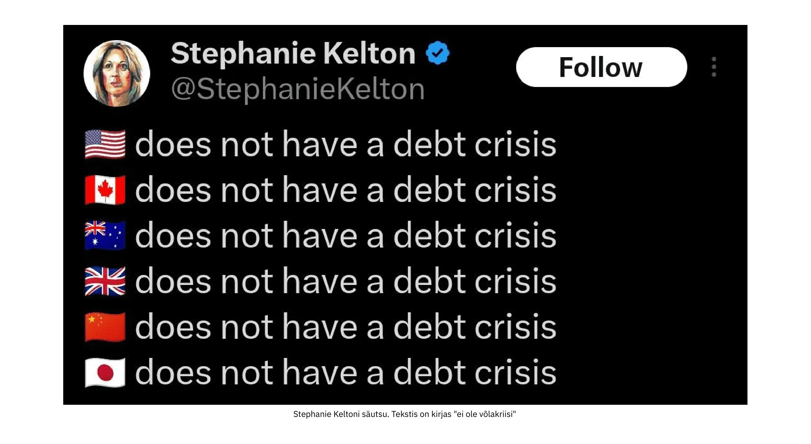

Kummalisel kombel on seal loetletud ainult kuus riiki? Miks see nii on? Sest neil on tegelik rahaline suveräänsus. Kuid Maal on umbes 200 riiki ja mitte kõik neist ei ole rahanduslikult suveräänsed. Seega on minu kriitika selle teooria suhtes, lisaks sellele, et see on veidi kummaline ja mittefunktsionaalne, see, et see toimib ainult mõne riigi puhul, mis on tõeliselt rahanduslikult suveräänsed, st nende riikide puhul, kes saavad emiteerida oma vääringus riigivõlakirju. Teatud määral läheb see ülejäänud maailma kahjuks. Selle valuuta loomisega ekspordivad nad justkui oma inflatsiooni mujale, sarnaselt sellega, mida Ameerika Ühendriigid on aastakümneid teinud oma ülemäärase privileegiga. See sarnaneb rahakolonialismi vormiga, kus riigid, kellel on ülemaailmne usaldus ja nõudlus oma valuuta järele, võivad trükkida nii palju raha kui nad soovivad, ilma et nad peaksid tekitama märkimisväärset inflatsiooni, sageli seetõttu, et nad ekspordivad seda inflatsiooni.

Seda teooriat on raske rakendada impordist sõltuvate majanduste suhtes, mis peavad säilitama rahvusvahelise usalduse oma valuuta vastu.

See teooria nõuab ka majanduse teatud tasemel tsentraliseeritud planeerimist, eelkõige selleks, et tagada suurem kontroll reaalsete ressursside (töötajad, tooraine, tööstuslik võimsus) üle ja juhtida inflatsiooni.

# Raha langus ja taassünd

<partId>87a34ca9-782b-5ade-b51a-400f88ed7b0c</partId>

## Kreeka mündid

<chapterId>7714195f-74ce-5f8c-be5f-59302d39fff4</chapterId>

:::video id=8e5c3091-0910-471b-8d4b-0dc6e9afa656:::

### Taust ja kontekst

Enne kui alustame, siin on ajalooline taust:

**Ilooline taust:**

**Roomlased kutsusid kreeklasi "Graeci" ja Kreekat "Graecia".**

**Kreeklased nimetasid end "hellenid" ja oma riiki "Hellas".**

**Homer** (sündinud umbes 8. sajandil eKr)

Legendaarne kreeka luuletaja, arvatavasti *Iliase* ja *Odüsseia* autor.

Umbes **750 eKr: Lükurgos**, Sparta müütiline seadusandja, kehtestas väidetavalt sõjaväelisel distsipliinil ja lihtsusel põhineva spartalaste põhiseaduse.

**Numa Pompilius** (753-673 eKr.)

Rooma teine kuningas, kes on kuulus selle poolest, et andis Roomale esimesed religioossed ja õiguslikud institutsioonid.

**Draakon**, Ateena seadusandja (7. sajand eKr), kuulus oma äärmiselt karmide seaduste poolest, sellest ka nimetus "draakon".

**594 eKr: Solon** saab Ateena seadusandjaks ja reformib radikaalselt Ateena ühiskonda, eelkõige kaotades võlaorjuse.

**776 EKR: Antiikolümpiamängud**

Esimesed regulaarsed spordimängud toimusid Olümpias iga nelja aasta tagant, ühendades Kreeka linnu.

**Pythagoras** (ca. 570-495 eKr)

Kreeka filosoof ja matemaatik, kuulus oma teoreemiaga täisnurkse kolmnurga kohta.

**Kenofanees Kolofonist** (u. 570-478 eKr.)

Sokratese-eelne filosoof, kes on tuntud oma traditsioonilise kreeka polüteismi kriitika poolest.

**490 eKr: Maratoni lahing**

Ateenlased tõrjusid võidukalt pärslaste sissetungi, mis tähistas Kreeka tsivilisatsiooni jaoks otsustavat pöördepunkti.

**Herodotos** (umbes 484-425 eKr), keda kutsuti "ajaloo isaks", kirjutas ulatusliku teose, milles kirjeldas Pärsia sõdu, sealhulgas kreeklaste võitu Kserxese üle 480 eKr.

**Sokrates** (470-399 eKr)

Ateena filosoof, kes on tuntud oma dialektilise meetodi ning eetika- ja eneseteadmiste õpetuse poolest.

**Aristophanes** (u. 446-386 eKr.)

Ateena näitekirjanik, kuulus oma satiiriliste komöödiate, näiteks *Konnakodanikud*, poolest.

**Sophokles** (5. sajand eKr) kritiseerib oma näidendis *Antigone* raha kui moraalse ja poliitilise korruptsiooni allikat tülinori Kreoni kaudu.

**Platon** (umbes 428-348 eKr)

Kreeka filosoof, Sokratese õpilane, akadeemia rajaja, raamatu *Republik* autor.

**431-404 EKR: Peloponnesose sõda**

Suur konflikt Ateena ja Sparta vahel, mis lõppes Ateena kaotusega.

**431 EKR**: Ateena rahastab Peloponnesose sõda, lahjendades oma kuld- ja hõbemünte, et suurendada ringluses olevate müntide hulka, mis põhjustab inflatsiooni.

**Kenofon** (umbes 430-355 eKr.)

Ateena kirjanik, filosoof ja kindral, Sokratese õpilane, *Anabasis* autor.

**414 EKR**: Ateena hakkab Peloponnesose sõda kaotama pärast katastroofilist retke Sitsiiliasse.

**405 EKR: Aristophanes** kirjeldab oma näidendis *Konnakotkad* selgesõnaliselt hõbeda drakma devalveerimist ja madalamate pronksmüntide ilmumist Ateenas, illustreerides põhimõtet, mida tänapäeval tuntakse "Greshami seaduse" nime all.

**404 EKR**: Ateena kapituleerub pärast Sparta pikka piiramist.

**Aristoteles** (384-322 eKr)

Suur kreeka filosoof, Platoni õpilane, lütseumi rajaja, tuntud oma loogika, bioloogia ja poliitilise filosoofia alaste tööde poolest.

**327 EKR**: Aleksander Suur vallutab Persepoli ja Pärsia impeeriumi idaprovintsid, laiendades oma impeeriumi märkimisväärselt.

**323 EKR**: Aleksander suri Babüloonias ilma selge pärijana, mis tekitas sõdu tema kindralite (diadokite) vahel, et jagada impeerium.

**Arhimedes** (umbes 287-212 eKr)

Kreeka matemaatik, füüsik ja leiutaja, kuulus oma avastuste poolest geomeetria ja mehaanika alal.

**196 eKr: Rosetta kivi** graveeritakse vaarao Ptolemaios V valitsusajal, mis võimaldab hiljem dešifreerida Egiptuse hieroglüüfe.

**192-188 EKR: Rooma-Seleukiidide sõda**

Rooma võitis Antiokos III juhitud Seleukiidide impeeriumi, tugevdades oma mõju Kreekas ja Väike-Aasias.

**146 eKr: Korintose lahing**

Roomlased hävitasid Kreeka linna Korintose, mis tähistas Kreeka poliitilise iseseisvuse lõppu ja Kreeka järkjärgulist integreerimist Rooma maailmaga.

Selles antiikajast, Rooma langemisest ja keskajast rääkivas osas alustame Kreeka münte käsitleva osaga.

Vana-Kreeka mündi ajalugu algas umbes 600 eKr, kui Kreeka linnad võtsid kiiresti üle Väike-Aasia Lüüdiast pärit uuenduse, kasutades esialgu elektrumi ja hiljem hõbedat. Esimesed Kreeka mündid vermiti Aegina saarel, millel oli kujutatud mere- või maismaakilpkonn, kuid alates 5. sajandist eKr sai Ateena drahmast, mida kaunistasid Athena ja öökull, rahasümbol par excellence, mis domineeris tollal suuresti rahvusvahelises kaubanduses.

Ja mul on õnne, et mul on sellest ajast pärit Kreeka drahmi koopia, mille tagaküljel on see kuulus öökull ja figuur. See on tetradrahm, mis oli suurem kui lihtne drahm.

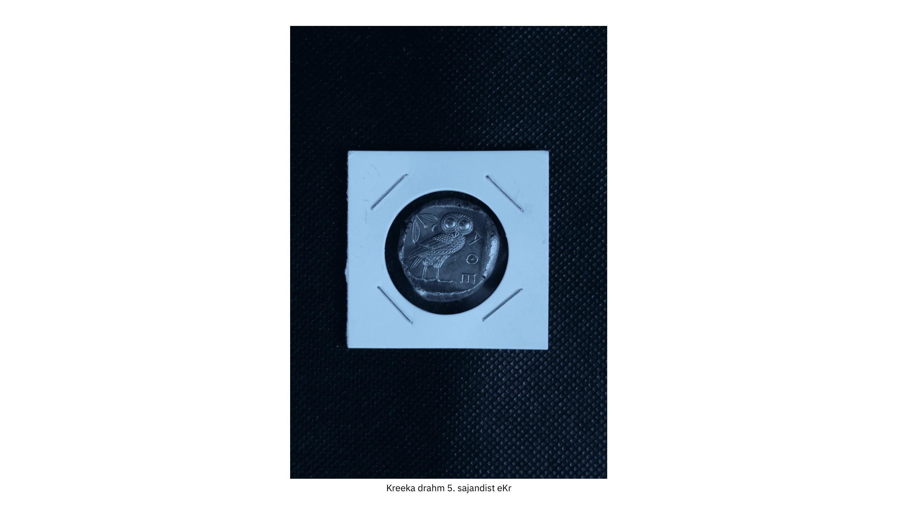

Igal Kreeka linnal kujunes välja oma suhe rahaga. Ateenas oli raha tihedalt seotud poliitilise ja majandusliku võimuga. Kuulus Ateena dekreet 5. sajandi lõpus eKr kehtestas Ateena raha ainuõigusliku kasutamise tema liitlaste territooriumidel, tugevdades sellega tema majanduslikku hegemooniat. Ateena kogus ka suuri kuldvarusid hädaolukordadeks, mida hoiti Akropolil, võib-olla majandusliku ettevaatlikkuse sümbolina. Seevastu Sparta, mis oli rangete väärtustega sõjaväelinn, otsustas rangelt piirata raha kasutamist, keelates oma kodanikel omada kuld- või hõbemünte. Sparta eelistas kasutada raskeid raudvarraste, et takistada väliskaubandust ja säilitada sotsiaalset ühtekuuluvust.

Sõdu rahastati sageli valuutamanipulatsioonide abil. Peloponnesose sõja ajal (431-404 eKr) kasutas Ateena drastilisi devalveerimisi, et maksta oma vägedele. Kuna Ateena kaotas 413. aastal eKr Spartalaste okupatsiooni tõttu juurdepääsu oma hõbekaevandustele, pidi ta 407/406 eKr kiirelt sulatama kullast kujusid, et vermida uusi münte. Seejärel lõi ta 406/405 eKr hõbedaga kaetud pronksmünte, mis põhjustas rahakriisi, mida illustreeris **Aristofanes**, kes juba meenutab seda, mida tänapäeval tuntakse Greshami seadusena: halb raha tõrjub välja hea raha. See hädaolukorra raha demonteeriti pärast sõda kiiresti, et taastada usaldus Ateena mündi vastu.

Klassikalise perioodi lõppu tähistas Makedoonia tõus Filip II ja tema poja Aleksander Suure juhtimisel, mis häiris põhjalikult Kreeka rahalist tasakaalu. Tänu Pangea mäe tohututele kulla- ja hõbekaevandustele tootis Philippus II oma sõjaliste ja poliitiliste kampaaniate rahastamiseks rohkesti raha, kehtestades lihtsa ja praktilise kuld-hõbedastandardi (10:1). Tema kullastatareid, mis tähistasid tema võitu olümpiamängudel, ringlesid kuni Lääne-Euroopani ja jõudsid isegi Inglismaale. Aleksander jätkas seda rahapoliitikat, levitades laialdaselt **Atlandi** drahmi oma idapoolsete vallutuste ajal kuni Indiani. See müntide massiline ringlus tähistas hellenistliku ajastu algust, mil valitsejate kujutised asendasid järk-järgult jumalate kujutised müntidel. See uuendus võimaldas hellenistlike monarhide põlvkondadel end reklaamida, lükates traditsioonilised jumalad oma müntide tagaküljel teisejärgulisse rolli.

Pärast Aleksandri surma 323. aastal eKr jagasid tema kindralid tema tohutu impeeriumi, rajades dünastiaid Egiptuses (Ptolemaioste), Süürias (Seleukiidide) ja mujal. Need hellenistlikud kuningriigid võtsid kasutusele erinevaid rahasüsteeme: Ptolemaioste kehtestasid raharingluse kontrollimiseks suletud rahasüsteemi, eelistades kasutada sisemise rahana teravilja, et säästa väärismetalle väliste sõjaliste kulutuste jaoks. Samal ajal sai Rhodosest suur kaubanduskeskus, enne kui roomlased nõrgestasid seda majanduslikult, kehtestades 167 eKr Delose vabasadamana.

Raha kasutamine oli palgasõdurite tasustamisel keskse tähtsusega. Aleksandri sõdurid said igapäevaselt hõbedrakke.

Ratsavägi, Aleksandri kõrgelt spetsialiseerunud armee eliit, sai keskmiselt kaks drahmi päevas, jalaväelane ühe drahmi ja tavaline palgasõdur kaks kolmandikku drahmast, mis oli kahekordne palk võrreldes lihtsa töölise palgaga.

Peloponnesose sõja ajal maksti sõduritele samuti märkimisväärseid summasid: üle 1200 talendi Samose mässu mahasurumiseks ja üle 2000 talendi Potidea piiramiseks.

Selleks ajaks, kui see armee oli täielikult Väike-Aasias, oli kogumaksumus umbes kakskümmend talenti päevas ehk umbes pool tonni hõbedat ehk 120 000 drahmi.

Kreeka müntidel oli ka oluline kultuuriline roll, sest iga linn püüdis oma identiteeti kinnitada, vermides oma kohalikke või mütoloogilisi sümboleid sisaldavaid münte. Näiteks Herakles kujutas Heraklest (Herakles) võitlemas lõviga, Küreenes aga kuulsat ravimtaime silphiumit.

Vaatamata oma mitmekesisusele ja piirkondlikele kõikumistele jätsid klassikaline kreeka ja hellenistlik rahapoliitika Vahemere piirkonna majandus- ja kultuurilukku püsiva jälje, mõjutades oluliselt hilisemaid rahasüsteeme kuni Rooma rahani, kes võttis järk-järgult üle ja arendas Kreeka majanduskontseptsioone oma keiserliku majanduse ülesehitamiseks.

## Valuuta mõju Kreekas

<chapterId>3a5e6c7d-699c-5567-87cd-3374c49d55a9</chapterId>

:::video id=0c79a59c-e179-4893-a414-1b8de0930eb9:::

### Ateena ja kontrast Spartaga

Ateena ja Sparta vastasseis klassikalise Kreeka perioodil näitab kahte radikaalselt erinevat poliitilise ja majandusliku korralduse mudelit. Kui Sparta lükkas metallraha tagasi kodaniku usaldusel põhineva isemajandava süsteemi kasuks, siis Ateena võttis selle tehnoloogia täielikult omaks, et ehitada ja säilitada oma mereimpeeriumi.

### Mereväe rahaline vajadus

Ateena impeerium jäi oma suurejoonelisest nimest hoolimata geograafiliselt tagasihoidlikuks - sisuliselt Ateena ja Egeuse mere äärsed linnad. Selle võim rajanes Delose liidul, sõjalisel liidul, mida Ateena kui hegemoon domineeris. Selline keiserlik struktuur nõudis ühtset majandusinstrumenti: Ateena hõbemünti.

Selle rahalise vajaduse keskmes oli laevastiku ülalpidamine. Üks Ateena trireme maksis üks kuni kaks talenti hõbedat - märkimisväärne summa. Kuna Ateena pidi ülal pidama mitusada laeva, oli vaja tõhusat maksusüsteemi. Rahast sai hädavajalik vahend vasallilinnadelt maksu kogumiseks ja mereväe väljaheitevõime rahastamiseks, mis tagas impeeriumi ühtekuuluvuse.

### Rahaline kehtestamine kui domineerimise vahend

Ateena kehtestas oma hõbevaluuta kõigile Delose Liidu liikmetele. See rahapoliitika ühtlustamine teenis mitmeid strateegilisi eesmärke. Esiteks hõlbustas see maksude kogumist, luues ühise arvestusühiku. Teiseks tugevdas see vasallilinnade majanduslikku sõltuvust Ateenast. Lõpuks oli see Ateena võimu sümboolne projektsioon kogu mereimpeeriumi ulatuses.

Selline rahapoliitika on teravas vastuolus Spartani mudeliga. Sparta, maavõim, võis oma elatuses toetuda Peloponnesose helootide (orjade) tööjõule. Selle suletud, linnakeskne majandussüsteem ei vajanud keerukaid rahapoliitilisi vahendeid. Kodanikud-sõdurid elasid koos, jagasid ühist sööki ja ei vajanud raha igapäevasteks vahetusteks.

### Valuuta kui merekaubanduse vahend

Kuna Ateena impeerium oli meresõitja, pidi see olema avatud kaubandusele. Erinevalt sissepoole suunatud Spartast pidi Ateena oma ellujäämiseks ja õitsenguks kauplema välismaailmaga. Rahast sai Vahemere piirkonna kaubanduse hädavajalik vahend.

Selline välissuunitlus lõi positiivse ringi: kaubandus andis tulusid, need tulud rahastasid laevastikku, laevastik kaitses kaubateid ja hoidis impeeriumi üleval ning impeerium kehtestas Ateena valuuta, mis hõlbustas kaubandust. Valuuta ei olnud enam lihtsalt vahetusvahend, vaid sellest sai keisririigi strateegia tugisammas.

### Rahalise võimu piirid

Vaatamata sellele majanduslikule keerukusele näitas Ateena rahaline võimsus Peloponnesose sõja ajal oma piire. Spartalaste maavägede vastu ei piisanud Ateena mereväe- ja rahalisest ülekaalust. Kallid ekspeditsioonid, näiteks katastroofiline Siracusade sõjakäik Sitsiilias, ammendasid rahalised ressursid, kuid ei toonud otsustavat võitu.

Ajalugu näitab, et kuigi valuuta on võimas vahend võimu projitseerimiseks, ei ole see sõjalise ülemvõimu garantii. Sparta, millel puudus metallist raha, kuid oli märkimisväärne sotsiaalne ühtekuuluvus, võitis lõpuks Ateena rahaimpeeriumi.

### Kaks mudelit, kaks saatust

Ateena ja Sparta vastasseis illustreerib kahte põhimõttelist lähenemist sotsiaalsele ja majanduslikule korraldusele. Ateena esindab avatud, kaubanduslikku, rahapõhist mudelit - moodsate mereimpeeriumide eelkäijat. Sparta kehastab suletud, autarkistlikku mudelit, mis põhineb pigem kodanike usaldusel kui rahalistel vahenditel.

Need kaks süsteemi näitavad, et valuuta kasutuselevõtt on tihedalt seotud valitud poliitilise ja majandusliku mudeliga. Sellise mere- ja kaubandusriigi jaoks nagu Ateena muutus raha hädavajalikuks. Sellise suletud sõdalasühiskonna jaoks nagu Sparta kujutab see endast ohtu sotsiaalsele korrale. See iidne kahestumine mõjutab siiani arutelusid raha rolli üle ühiskonnakorralduses.

## Rooma Vabariik

<chapterId>0bc80983-33e1-5881-85bb-7c22f3144a9a</chapterId>

:::video id=dc05ca97-d29c-4679-bfeb-912c47d86ce2:::

### Rooma Vabariigi ajalugu

- 753 - 509 eKr: Rooma kuningriik**
- 753 EKR: Rooma asutamine** (traditsiooniliselt omistatakse Romulusele).
- 509 - 27 EKR: Rooma Vabariik**, Roomast saab vabariik, mida valitsevad valitud senat ja konsulid.
- 280 - 275 EKR: Püüriuse sõda**. Epiruse kuningas Pürrhos võitleb roomlaste vastu Lõuna-Itaalias, saavutades kulukaid võite ("Pürrhose võidud").
- 264 - 146 EKR: Puunia sõjad**. Suur konflikt, milles Rooma ja Karthago vastanduvad Vahemere lääneosa valitsemise pärast.
- Hannibal (247 - umbes 181 eKr)**. Legendaarne Kartaago kindral, kuulus oma armee ja elevantidega Alpide ületamise eest, et rünnata Roomat Teise Puunia sõja ajal.
- 146 eKr: Korintose lahing**. Rooma hävitab Kreeka linna Korintose ja kehtestab oma lõpliku ülemvõimu Kreeka mandriosas.
- 91 - 87 eKr: sotsiaalne sõda**. Rooma Itaalia liitlaste ülestõus, kes nõudsid Rooma kodakondsust, mis viis lõpuks nende täieliku integreerumiseni kodanike hulka.
- 64 eKr: Seleukiidide vastupanu lõpp**. Rooma kaotab lõplikult Seleukiidide mõju Süürias, tugevdades oma positsiooni Vahemere idaosas.
- 55 EKR: Julius Caesar vallutab Kesk- ja Lääne-Euroopa**. Julius Caesar laiendab Rooma ülemvõimu Gallias (tänapäeva Prantsusmaal) ning tungib Germaniasse ja Bretagne'ile.
- 43 EKR: Teise triumviraadi moodustamine**. Poliitiline liit Octavianuse (hiljem Augustus), Marcus Antoniuse ja Lepiduse vahel, et stabiliseerida Rooma pärast Caesari mõrva.
- 27 eKr: Pax Romana** algus. Poliitilise stabiilsuse ja õitsengu periood Augustuse valitsemise ajal, mis tähistab Rooma impeeriumi algust.

### Rooma hiline rahaline algus

Selles antiikajast rääkivas osas pöörame nüüd meie tähelepanu Rooma Vabariigile. Rooma rahaline ajalugu algas palju hiljem kui kreeklaste ja pärslaste oma. Rooma asutati 753. aastal eKr, kuid ootas peaaegu neli sajandit, enne kui võttis mündirahanduse tõeliselt kasutusele. Selle pika aja jooksul kasutasid roomlased algelist vahetussüsteemi, mille aluseks olid ebakorrapärased pronksitükid, mida nimetati aes rude'iks ja mis nõudis iga tehingu puhul täpset kaalumist. Alles 4. sajandi lõpus eKr hakkas Rooma kreeka ja etruskide mõjul emiteerima oma esimesi münte, eelkõige pronksist valatud münte nagu Hiinas, aes grave, mis olid Rooma rahavahetusele iseloomulikud kuni **Teise Puunia sõjani**.

### Kreeka mõju ja esimesed hõbemündid

Otsustav kohtumine Lõuna-Itaalia kreeklastega tõeliselt tutvustas roomlastele hõbemüntide vermimist. Umbes 280 eKr hakkas Rooma valmistama oma hõbemünte Kreeka didrahmide jäljendamiseks. Rooma esimene regulaarne hõbemüntide emissioon pärineb täpselt aastast 269 eKr, millel on kujutatud legendaarsed kaksikud Romulus ja Remus, keda imetab hunt, mis on muutunud ikooniliseks sümboliks.

Tegelikult kujutavad paljud Rooma münte vabariigi ajastust asutamismüüte. Minu omaga saate tutvuda siin allpool: see on suurepärane, tõeline mündi kuningas Tatiuse münt. See illustreerib müüti naiste röövimisest sabiinlastelt. Tatius oli selle piirkonna kuningas ja asutamismüüt räägib sellest, kuidas roomlased röövisid naisi sabiinlastelt, kes elasid lähedal asuva rahva seas. Hiljem sai kuningas Tatiusest koos Romulusega, kes oli üks Rooma asutajatest, kaaskuningas.

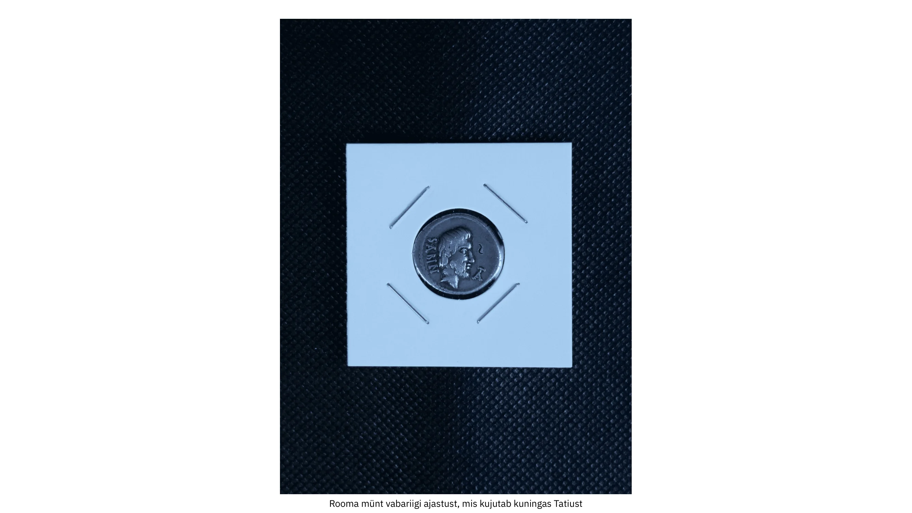

### Sõna "mündi" päritolu ja Juno Moneta tempel

Termin "mündi" on pärit Juno Moneta templist Roomas. Legendi kohaselt hoiatasid Gallia sissetungi ajal 390. aastal eKr kapitooliumi pühad haned roomlasi ähvardava ohu eest. Kapitooliumi kaitsja jumalanna Juno tänutäheks ehitati tema auks tempel, millest peagi sai Rooma müntide rahapaja.

### Puunia sõjad ja valuutakriisid

Sõjalised konfliktid mõjutasid märkimisväärselt Rooma rahanduse arengut. Teise Puunia sõja ajal (218-201 eKr) Karthago vastu seisis Rooma Hannibali sissetungi tõttu silmitsi tõsiste finantsraskustega. Nende kiireloomuliste vajaduste leevendamiseks võttis Rooma esmakordselt kasutusele erakorralise kuldmüntide emissiooni ning vähendas oluliselt oma hõbemüntide väärtust, mille esialgne puhtusaste oli 97% ja langes ligikaudu 89%-ni. Ka pronksmüntide (aes) kaal langes järsult, kaotades kuue aasta jooksul peaaegu 80%.

Siinkohal võime me taas pöörduda tagasi kontseptsiooni juurde, mida oleme varem arutanud seoses sellega, et kreeklased sulatasid templitesse ladustatud väärismetallid, et aidata leevendada majanduskriise. Ja et rääkida **Kartagost**, siis siin allpool saate imetleda tõelist kartaagolastest mündi minu kogust. Nendel Kartaago müntidel oli ühel küljel palmipuu ja teisel küljel hobune. Sellel mündil ei ole hobune väga hästi äratuntav, a see on väga kulunud.

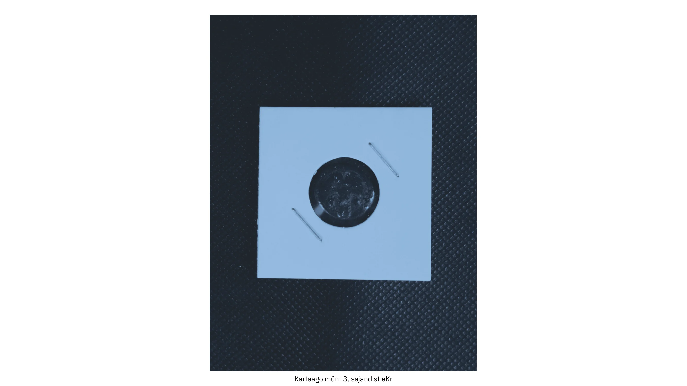

Selle tulemusel langes ka pronksmüntide, nn aes'i kaal järsult, kaotades kuue aastaga peaaegu 80%. Seega langes nende pronksmüntide, mis ei olnud väärismetall ja mida kasutati igapäevases kaubanduses, kaal väga palju, mis oli märk nende sõdade tõttu toimunud raha devalveerimisest.

### Hõbedünar ja rahaline stabiilsus

Selle kriitilise olukorra taustal võttis Rooma 212. aasta paiku eKr kasutusele kuulsa hõbedase denari. See reform tagas märkimisväärse rahalise stabiilsuse, kusjuures denaar jäi peaaegu 450 aastaks valitsevaks vääringuks. Rooma võlgneb selle stabiilsuse rangele juhtimisele, vaatamata suurele ümberhindamisele 146 eKr. ja märkimisväärsele tootmisele oma tohutute armeede rahastamiseks, eelkõige Puunia, Sotsia (91-87 eKr.) ja Makedoonia sõja ajal. Näiteks maksis ühe Rooma leegioni ülalpidamine umbes 1,5 miljonit denarit aastas, mis näitab rahavajaduse ulatust.

Väljaspool Rooma piire põhjustasid sõjad Rooma mõju all olevates piirkondades suuri devalveerumisi. Puunia Kartaago nägi, kuidas tema elektronmüntide puhtus langes järsult, 4. sajandi 98%-lt kulla osakaalult vaid 30%-le teise Puunia sõja ajal, samal ajal kui tema hõbemüntide puhtus langes 18%-le.

### Rahaliste motiivide areng

Koos Rooma laienemisega arenes ka müntide iseloom: algselt anonüümsed ja patriootilised mündid võtsid järk-järgult kasutusele isikupärased kujundused, millel olid kujutatud müntide vermijate (müntide lööjate) võimsad perekonnad. See üleminek sümboliseerib selgelt Rooma Vabariigi lõpu poliitilisi muutusi.

Lõpuks, kuigi Rooma domineeris majanduslikult Vahemere maailmas, säilitas ta oma maksevahendite osas teatava lihtsuse: peale otsese müntide vahetamise ei olnud välja töötatud ühtegi muud tõelist rahavahetuse vormi, välja arvatud maksude ülekandmine ja eliidile reserveeritud erakrediit.

## Rooma impeerium

<chapterId>2dc44e50-112a-5abf-97ae-8e0a9ecda989</chapterId>

:::video id=f8d6f3d6-9ee4-4504-888e-4f12b3f20489:::

**Ilooline taust:**

**Printsiipium** oli Rooma keisririigi valitsemisvorm Augustuse valitsemise algusest 27. aastal eKr kuni kolmanda sajandi kriisi lõpuni 284. aastal pKr.

**27 eKr: Pax Romana algus**

Poliitilise stabiilsuse ja õitsengu periood Augustuse valitsemise ajal, mis tähistab Rooma impeeriumi algust.

**Augustus (30 eKr kuni 14 pKr)** reformis radikaalselt Rooma rahasüsteemi, kehtestades püsiva ja stabiilse standardi keiserlikule rahapoliitikale.

**Augustus oli ka üks esimesi tunnustatud antiikmüntide ja kivististe kogujaid**.

**54 REKLAAMI - 68 REKLAAMI: Nero**

Vastuoluline Rooma keiser, kes oli tuntud oma türannia, tagakiusamise ja katastroofilise juhtimise poolest pärast Rooma põlemist.

**64 AD: Rooma suur tulekahju**

Suur tulekahju hävitab suure osa linnast; Nerot süüdistatakse selle eest vastutamises.

**69 pKr: nelja keisri aasta**

Kaootiline periood, kus neli keisrit järgnesid üksteisele kiiresti (Galba, Otho, Vitellius, Vespasianus).

**79 AD: Vesuuviuse purskamine**

Vulkaan, mis hävitas Pompeji ja Herculaneumi linnad, säilitades erandlikult nende jäänused tuha all.

**165 REKLAAMI - 180 REKLAAMI: Antoniuse katk**

Laastav epideemia, mis nõrgestas Rooma impeeriumi Marcus Aureliuse ja Commoduse ajal.

**200 pKr: territoriaalne kõrghetk ja Pax Romana järkjärguline lõpp**

Rooma saavutas oma maksimaalse laienemise, kuid hakkas kannatama sisemise ebastabiilsuse ja majandusraskuste all.

**212 AD: Caracalla edikt kodakondsuse kohta**

Keiser Caracalla andis maksubaasi laiendamiseks peaaegu kõigile keisririigi elanikele Rooma kodakondsuse.

**220 pKr: suurte barbarite sissetungide algus**

Esimesed märkimisväärsed germaani rahvaste sissetungid üle Rooma piiride.

**235 REKLAAMI - 285 REKLAAMI: Poliitiline ja sõjaline kriis 3. sajandil**

Ajavahemik, mida iseloomustab poliitiline ebastabiilsus, paljud lühiajalised keisrid, kodusõjad, majanduskriisid ja pidevad sissetungid.

**Aurelianus (270-275 pKr) hindas Rooma raha** radikaalselt ümber, püüdes taastada selle nominaalväärtuse vaatamata kõrgele inflatsioonile.

**301 AD: Diocletianuse hinnaedikt**

Keiser Diocletianus püüdis asjata peatada ohjeldamatut inflatsiooni, kehtestades kogu impeeriumis range hinna- ja palgakontrolli.

**312 AD: Konstantinus**

Esimene kristlik keiser, Konstantinoopoli asutaja, stabiliseeris raha, võttes kasutusele "soliduse", suure puhtuse ja stabiilsusega kuldmündi.

**476 AD: Lääne-Rooma impeeriumi lagunemine**

Rooma vallutatakse erinevate germaani rahvaste (sealhulgas ostrogootide) poolt, mida peetakse Lääne-Rooma impeeriumi ametlikuks lõpuks.

### Augustuse rahareformid

Selles antiikajast rääkivas osas oleme juba jõudnud Rooma impeeriumi juurde. Rooma keisririigi rahalist ajalugu iseloomustab metallist raha, eelkõige kulla, hõbeda ja pronksi intensiivne kasutamine, kuid ka mitmed valuutakriisid, mis olid tihedalt seotud poliitiliste ja sõjaliste rahutustega. Vabariigi lõpus, Julius Caesari ajal, võttis Rooma 46. aastal eKr kasutusele kuldse aureuse, umbes 8 grammi kaaluva mündi, mida võeti laialdaselt vastu kogu Euroopas ja Vahemere piirkonnas. Caesar standardiseeris need kuldmündid ja lõi esimesed mündid, millel oli elava inimese portree, lükates sellega ümber antiikse vabariigi traditsiooni, mis eelistas anonüümseid, kollektiivseid sümboleid. See areng käis käsikäes suurte poliitiliste muutuste perioodiga, mil isikliku võimu näol asendusid järk-järgult vabariiklikud institutsioonid.

Pärast Caesari mõrva 44. aastal eKr võttis Octavianus (Augustus) Rooma üle kontrolli, asutades 27. aastal eKr impeeriumi. Tema valitsemisaeg tõi kaasa rahasüsteemi täieliku reformi, mis tõi Rooma majandusele püsiva stabiilsuse. Augustuse ajal oli üks kuldne aureus võrdne 25 hõbedase denariga, mis omakorda oli väärt 4 pronksist sestertiit. Selline rahaline stabiilsus püsis kogu esimese sajandi jooksul pKr, mida sageli kirjeldatakse kui Rooma majanduse kuldajastut.

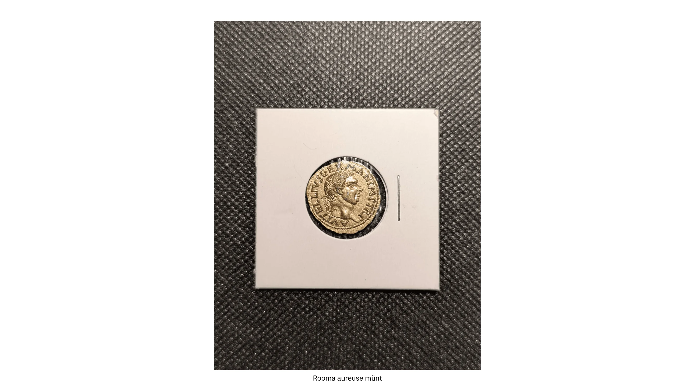

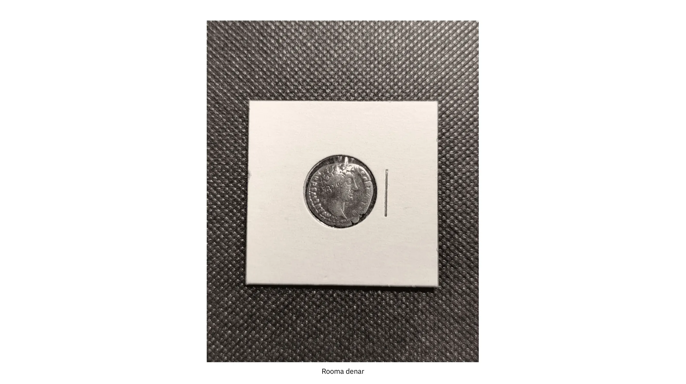

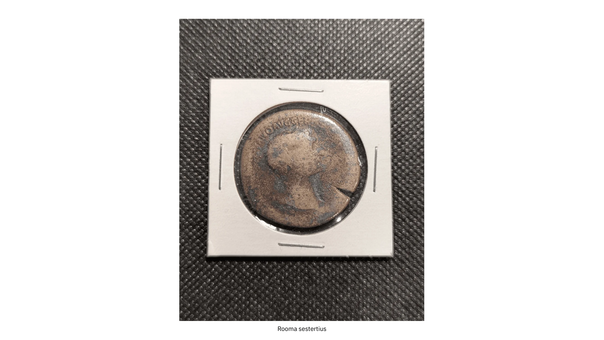

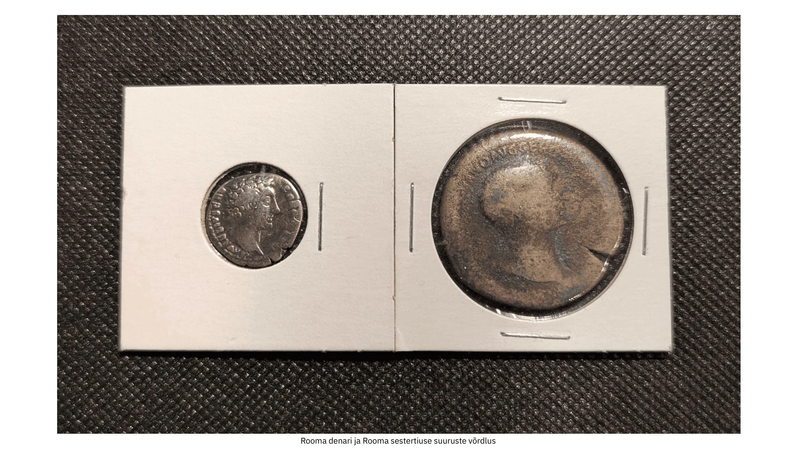

Alates Nero ajast (54-68 pKr) hakkas Rooma siiski oma münte aeglaselt devalveerima, vähendades järk-järgult nende kaalu ja puhtust, et rahastada kasvavaid keiserlikke kulutusi, eriti pärast Rooma suurt tulekahju 64 pKr. Neil devalveerimistel oli märkimisväärne mõju: puhtamad mündid kõrvaldati ringlusest varumise või ekspordi teel vastavalt **Greshami seadusele**, samal ajal kui devalveeritud mündid paljunesid, põhjustades järkjärgulist hinnatõusu.

Kolmas sajand tähistab dramaatilist pöördepunkti, kus keisrite Septimius Severuse, Caracalla ja Gallienuse ajal devalveerimine järsult kiirenes. Peamise hõbemündi, denariuse ja seejärel antoninianuse hõbedasisaldus langes vaid 2%ni. Samal ajal vähenes aureuse kulla kaal poole võrra. Selle rahakriisiga kaasnesid enneolematu poliitiline ebastabiilsus, barbarite sissetungid ja korduvad kodusõjad.

See osa võimaldab mul tutvustada selle osa viimast tükki: antoninianus. Selle mündi algne nimetus on teadmata, kuid me nimetame seda tänapäeval antoninianusena. Selle eripära on see, et seda hinnatakse kahe denari väärtuses, kuigi see on ainult 1,5 korda suurem kui denar. Peale selle muutusid need mündid aja jooksul pelgalt billonimüntideks, mis tähendab, et need valmistati pigem hõbeda ja muude metallide sulamist kui puhtast hõbedast. Sageli olid mündid lihtsalt hõbedaga kaetud, mis on tähelepanuväärne näide raha lagunemisest.

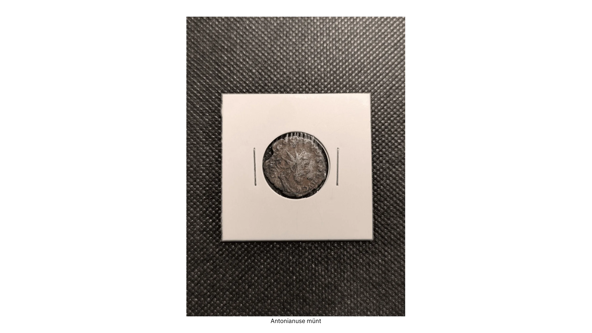

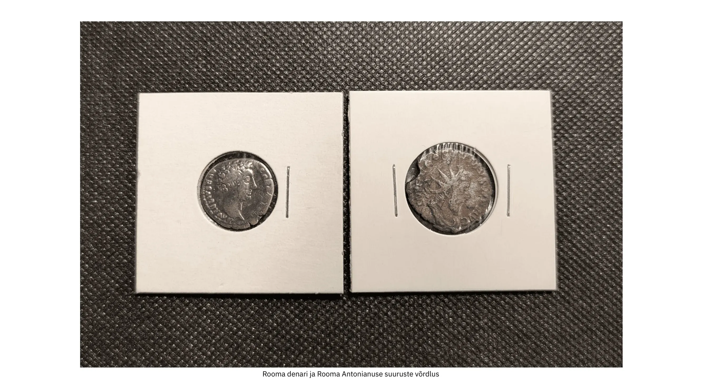

Sellise olukorraga silmitsi seistes püüdis keiser Aurelianus (270-275 pKr) süsteemi stabiliseerida, hinnates nominaalselt valuutad ümber, kuid tegelikult kehtestas see reform inflatsioonimehhanismi, fikseerides kunstlikult olemasolevate valuutade väärtuse kõrgemal tasemel.

Ma teen sel teemal kõrvalepõike. 3. sajandil toimus inflatsiooni kiire eksponentsiaalne kasv. Eelnevalt, kuigi mündid olid devalveeritud, andis nende ükshaaval käsitsi vermimine teatava kontrolli inflatsiooni üle. Statistika näitab, et 300 aastat kestnud devalveerimise ajal oli inflatsioon keskmiselt umbes 4% aastas. Vahetult enne Aurelianuse reformi oli inflatsioon umbes 3% aastas.

Aurelianus võttis XXI müntidel kasutusele puhtuse mõõtmise, mis näitab, et 20 osa pronksi ja 1 osa hõbeda suhe on 5% puhtusest. Ta turustas neid 5% hõbemünte ja tembeldas neile XXI märgi. Samas kutsus ta tagasi ka kõik teised, rohkem devalveerunud mündid ja tembeldas neile sama XXI märgi. Sellega väärtustati tegelikult kõigi müntide nimiväärtus ümber. Tulemuseks oli vapustav inflatsioonimäär 20% aastas, mis ületas tunduvalt varasema 3%-lise määra enne selle tehnika rakendamist.

Tegelikult oli Aurelianus see, kes leiutas selle devalveerimise vormi, mis on palju kiirem kui metalli järkjärguline devalveerimine, mis sundis meid ikka veel ükshaaval münte trükkima. Ta võttis kõik olemasolevad mündid, kutsus need tagasi ja tembeldas need löögiga, et muuta nende nimiväärtust. See on tõeline pöördepunkt. Siis muutus inflatsioon eksponentsiaalseks.

Selle äärmusliku devalveerimise visuaalseks illustreerimiseks leidsin mõned huvitavad statistilised andmed teravilja hinna kohta Egiptuses alates 40. aastast eKr kuni 3. sajandini, mis hõlmab üle 300 aasta. Allpool näete Kreeka tetradrahmi minu kollektsioonist. Sel ajal, 3. sajandil Rooma okupatsiooni all olnud Egiptuses oli samaväärne Egiptuse tetradrahm. Drahmade nimiväärtus oli endiselt kasutusel ja see vastas denaarile.

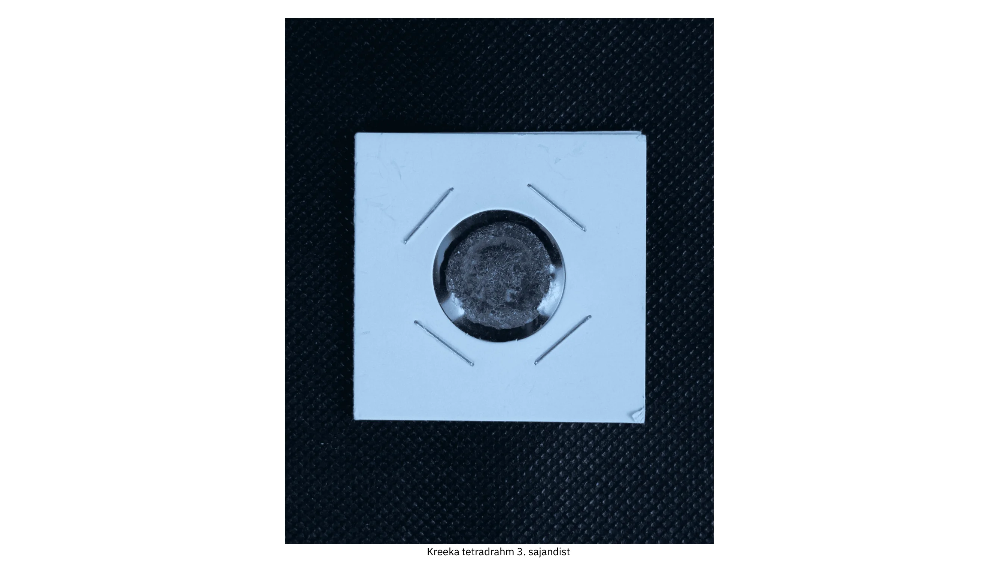

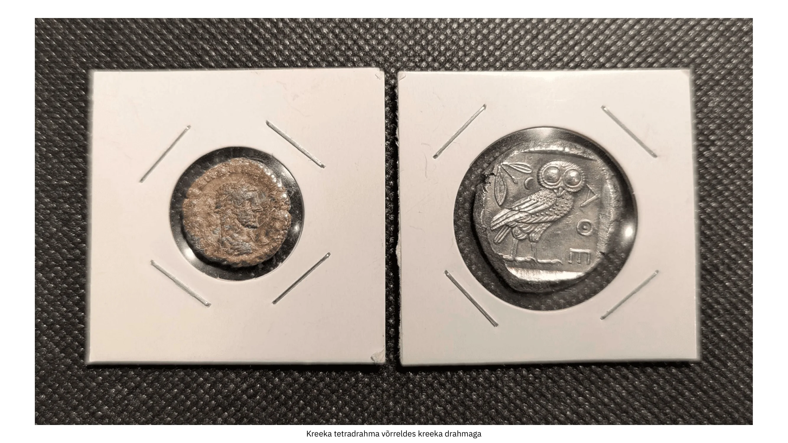

Seega oli minu Egiptuse tetradrahm samaväärne denariga. Näete, et münt on valmistatud billonist (või pronksist), seega ei sisalda see väärismetalli. Võite võrrelda seda Kreeka tetradrahmi originaaliga, et näha füüsilist devalveerumist nende 300 aasta jooksul. Tegemist on Egiptuse teravilja hinna miljonikordse tõusuga.

See on Aurelianuse reformi füüsiline väljendus. Tuleb märkida, et enamus, keskmine inflatsioon nende 300 aasta jooksul oli umbes 4%. Alles lõpus, kui Aurelianus tegi oma reformi, muutus see inflatsioon üsna eksponentsiaalseks ja me jõudsime selle 1 miljoni suurusele mõõtühikule. Hinnad olid 3. sajandi lõpus miljon korda kõrgemad kui 1. sajandil eKr.

Tema järeltulija **Diokletianus** (284-305 pKr) üritas veelgi radikaalsemaid reforme: ta andis välja uusi vääringuid (eelkõige argenteuse, mis oli puhtam, kuid liiga piiratud koguses), kehtestas drastilise hinnakontrolli (301. aasta hinnaeedikti) ja **loomas mitterahaliste maksete maksusüsteemi**. Neile jõupingutustele vaatamata ei suutnud Diokletianuse reformid ohjeldada ohjeldamatut inflatsiooni.

Seistes silmitsi keeldumisega tarnida kaupu ja teenuseid devalveeritud raha eest, kehtestas Diocletianus **päriliku kastisüsteemi**, et siduda talupojad ja nende järeltulijad oma maaga.

Mida siin tegelikult tuleb mõista, on see, et juhtus see, et talupojad keeldusid tarnimast oma toodangut devalveeritud valuuta eest, ja meie armsa Diocletianuse vastus oli luua **pärilikud kastid**, öeldes: "teie, te ei saa oma maalt lahkuda, teie lapsed ei saa oma maalt lahkuda, sama kehtib ka sõdurite kohta, te olete sõdurid, te nõustute saama palka minu valuutas". Üleminekulahendusena maksti neile mitterahalist tasu (liha, toit, teravili), sest ta keeldus neile raha andmisest. Nii kehtestas ta selle päriliku kastisüsteemi, et sundida inimesi oma ametiga seotud olema, nii et nad ei saanud lihtsalt töökohta vahetada, kui nad püüdsid devalveeritud valuutaga mitte nõustuda.

Selle näite illustreerimiseks on mul siin tekst, väljavõte raamatust "*Monetary Regime and Inflation*":

> Kuna inimesed ei soovinud töötada ja tarnida kaupu devalveeritud valuuta vastu, mille nimiväärtus oli kõrgem kui selle sisemine või turuväärtus, tuli neid sundida töötama, kehtestades mitterahalised maksud. [...] Talupoegade jaoks muutus ebaseaduslikuks oma registreeritud kodudest lahkumine. Põllumehed muutusid seega päranduslikult maaga seotud olevaks.
>

> See pärilik kastisüsteem levis järk-järgult: Diocletianus sundis sõdurite poegi sõjaväes teenima, samas kui rahatöökodade, samuti Diocletianuse loodud kangakudumis- ja värvimisvabrikute töölised muutusid riigiorjadeks, kelle teenistus oli pärilik. Hiljem said ka kullakaevurid pärilikuks kastiks. Tõenäoliselt eksisteerisid juba Diokletianuse ajal ka teised pärilikud klassid, eelkõige pagarite ja lihunike kild [...] Roomas, samuti piiskopkonna laevakaptenite kild, kes vedasid Rooma vilja ja muid avalikke veoseid.

Konstantinoopoli (306-337 pKr) õnnestus rahasüsteem lõpuks stabiliseerida, võttes 312. aastal kasutusele soliduse, puhtast kullast mündi, mille kvaliteedi ja kaalu ta rangelt garanteeris. Soliduse puhtuse ja kaalu kontrollimiseks oli olemas terve süsteem. **See stabiilsus puudutas siiski ainult rikkalikku eliiti ja keiserlikku administratsiooni**, samas kui **rahva enamus kannatas jätkuvalt madala kvaliteediga raha ja pideva inflatsiooni all**. Solidus püsis stabiilsena Idaimpeeriumis (Bütsantsis), kus see püsis üle aastatuhande, samal ajal kui läänes killunes mündirahastus väikesteks, madala väärtusega müntideks, mis kaasnes Rooma impeeriumi lõpliku majandusliku ja poliitilise lagunemisega, mis lõppes lõplikult 476. aastal pKr.

Lõpetuseks tahaksin jagada teiega seda tsitaati *A History of Money: Glyn Davies'i "Raha ajalugu kuni tänapäevani", mis võtab meisterlikult kokku selle, mis võib-olla viis Rooma allakäiguni:

*"Maksud olid järjekindlalt ebapiisavad ning nende üha ebapiisavamate, hilinenud ja väga nähtavate maksudega seotud raskused sundisid Roomat toetuma pigem lihtsale, kohesele ja varjatud maksustamisviisile: valuuta devalveerimisele. Lühiajalised, ad hoc reformid ei suutnud seda iidset langustrendi ümber pöörata. Rahaline surve, mis tulenes müntide kulumisest, laevahukkudest, idast ostetud luksuskaupade tõttu tekkinud rahavoolust, germaani barbaritele pakutud kingitustest, linnarahvastiku kasvust, põllumajandusliku tootmise vähenemisest, rikkamate kaevanduste järkjärgulisest ammendumisest ja eelkõige "leiva ja tsirkuse" poliitikast, mida peeti hädavajalikuks, et säilitada linnaelus minimaalne kord - kõik need kumulatiivsed surved viisid Rooma pidevale raha devalveerimisele, vaheldumisi ebaõnnestumiseks määratud reformidega. "*

*Lisaks tasuta või odavale leivale ja veinile jagati aeg-ajalt ka keiserlikke liberaalseid toetusi ("congiaria") rahaliste eraldiste kujul, eriti Trajanuse (98-117 pKr) ja veelgi enam Hadrianuse (117-138 pKr) ja tema järeltulijate ajal. See, mida keiser ja kodanikud olid algselt pidanud erandlikuks privileegiks, oli 2. sajandi alguseks muutunud tavapäraseks ootuseks. Need jaotused "kujutasid endast rasket koormust riigikassale ja aitasid omal moel kaasa riigi pankrotistumisele "*

## Seosed rahapoliitika lahjendamise ja inflatsiooni vahel: põhjustest tagajärgedeni

<chapterId>38d5781c-e900-53f7-baa7-413655d71754</chapterId>

:::video id=3999256d-aafe-4502-9b72-dfa8491a2777:::

Selles osas vaadeldakse rahapoliitika lahjendamise ja inflatsiooni vahelisi seoseid alates põhjustest kuni tagajärgedeni. Raha lahjendamine on üks peamisi majanduslikke nähtusi Rooma rahanduse ajaloos, millel on otsene mõju inflatsioonile. Alates 1. sajandist pKr toimus hõbemüntide (denaride) lahjendamine algselt aeglaselt alates Nero valitsemisajast (54-68 pKr), mida kiirendasid korduvad sõjalised ja finantskriisid, eelkõige Septimius Severuse (193-211) ja Gallienuse (253-268) ajal.

Samuti täheldame aureuse järkjärgulist devalveerimist. See erinevus devalveerimise kiiruses toob esile kaks punkti:

1. Arvestusühiku roll bimetallismi puhul riigi kontrollimisel raha üle. Käesolevas näites on arvestusühikuks denaar. Olen tuvastanud kolm erinevat viisi arvestusühiku väärtuse juhtimiseks: devalveerimine (metalli lahjendamine), redominatsioon (antoninianus) ja nimiväärtuse kehtestamine märkega "XXI" (Aurelianus)

2. Riigi soov lükata võimalikult kaua edasi aureuse, väärtuse reservi, mis võimaldab eliidil säilitada oma ostujõudu vähemkindlustatud inimeste arvelt, devalveerimist. Me pöördume selle põhimõtte juurde kursuse jooksul sageli tagasi, eriti seoses kontseptsiooniga, mida tuntakse "Cantillon'i efektina", ja Maravedi ümbernimetamistega Hispaanias.

See nähtus on üsna huvitav ja on kordunud läbi ajaloo. Me vaatame seda Maravedi puhul uuesti üle järgmises osas. See muster on ilmne ka kõigi reservvaluutade puhul; reservväärtusühik, näiteks Rooma aureus, jääb puutumata. Samas devalveerub sageli see arvestusühik, mida elanikkond kasutab kaubanduses ja igapäevastes tehingutes. Selle tulemusena mõjutab rahainflatsioon tavainimesi, samas kui need, kes saavad endale kuldmünte lubada, jäävad suures osas puutumata.

Ja muide, **seda sama nähtust tekitab täna valuuta devalveerimine, mis võimaldab finantsvarade väärtuse tõusu**, ja nii muutuvad vaesemaks just need inimesed, kes kasutavad valuutat, kõige vaesemad inimesed, ja see omakorda rikastab raha loomise kaudu nende varasid, kes on võimelised, kellel on vahendid, et end devalveerimise eest kaitsta, ja nii süvendab see sotsiaalset ebavõrdsust. See on minu väike poliitiline sõnavõtt.

Seda, mida ma just kirjeldasin, nimetatakse Cantilloni efektiks. Me näeme, et see härrasmees elas John Law'i ajal, mida me käsitleme ka ühes järgmises osas.

Aurelianuse ajal algatatud reformid võimaldasid inflatsioonil hüppeliselt tõusta. Raha nimiväärtuse inflatsiooni ei piiranud enam rahapajade võime käsitsi münte valmistada. Juba vermitud münte võis nüüd lihtsalt märgistada ja rahapakkumise nimiväärtus kasvas kiiremini.

Mul on kaks tsitaati, mida tahan teiega jagada seoses Aurelianusega. Esimene pärineb raamatust *A History of Money: From Ancient Times to the Present Day*:

*"Mis puutub Rooma majandusse, siis Aurelianuse panus oli pigem katastroof kui triumf. Tema "reformi" olemusele oli suures osas võlgu, et inflatsioonitempo suutis kasvada kaugemale sellest, mis oli olnud võimalik isegi vastutustundetu Gallienuse ajal. Kahe sajandi jooksul pärast Aurelianust muutus inflatsioon kogu Rooma impeeriumis endeemiliseks "*

Teine pärineb raamatust *Ancient History from Coins* ja käsitleb rahasüsteemi eraldumist kullast:

*"Aurelianuse reform muutis kuldraha ja ülejäänud rahasüsteemi vahelist suhet. Enne seda olid muud liiki rahad seotud **aureusega** vastavalt ametlikele kursidele (25 Egiptuse denarit või 25 tetradrahmi ühe aureuse eest jne). Pärast reformi hakkas kuldraha **väärtus vabalt kõikuma**, nagu iga muu kaup, samal ajal kui ülejäänud rahasüsteemi **väärtus langes**, kuna **sulamid nõrgenesid**, kuna neid ei toetanud enam **kuld**. Kuna arvestusühikuks jäi teoreetiliselt hõbe (denaar või Egiptuses drakma), tõusid hinnad, kuna valuuta odavnes. "*

Nagu näete, mõjutas see arvestusühikuna kasutatava valuuta devalveerimine ebaproportsionaalselt vähekindlustatud inimesi, samal ajal kui kuldrahaga seotuse lahutamine kaitses nende ostujõudu, kes võisid endale lubada säästmist kulla kui väärtuse säilitaja kaudu.

Siinkohal tuleb mõista, et kui denari ja aureuse vahel on seos, siis isegi kui te devalveerite denari, siis kui teil on ikkagi võimalik oma denarit aureuse vastu vahetada sellise kursiga (25 denarit 1 aureuse eest), siis inimesed vahetavad kindlasti oma denari teie aureuse vastu, sest denar on ülehinnatud ja aureus alahinnatud. Kuid selles reformis eemaldati see seos. Seega ei saanud inimesed enam denareid vahetada kulla vastu devalveeritud hõbemetalli vastu. Siis said need, kellel oli juurdepääs kuldmüntidele, end tõesti kaitsta, sest pärast seda ei saanud inimesed enam ülehinnatud devalveeritud hõbedat alahinnatud puhta kulla vastu vahetada. See on väga oluline hetk valuuta arengus.

Selle Aurelianuse reformi mõjusid illustreerivad suurepäraselt need tsitaadid raamatust *Monetary Regimes and Inflation*:

*"Keisrite Claudiuse (41-54 pKr) ja Constantiuse (337-361 pKr) valitsemisaegade vahel tõusis Egiptuse vabaturul nisu hind, väljendatud drahmades, **suurenes üle miljoni korra**. Spektraalne hinnainflatsioon on üks 3. ja 4. sajandist pKr. pärit keskseid majanduslikke fakte" (Lendon 1990, lk 106). Kuid see areng on **vähem dramaatiline, kui tundub**, sest see vastab **keskmisele 4,4 % aastasele inflatsioonimäärale**. Ja Wassinki (1991, lk. 482) sõnul algas inflatsioon tegelikult **nimelt alles 238. aastal pKr**"*

*"Sellest kuupäevast alates kiirenes inflatsioon aeglaselt, sest **hästi raha tõrjuti esmalt ringlusest välja**, nii et kogu rahapakkumine alguses peaaegu üldse ei suurenenud. Seejärel saavutas see 250. ja 293. aasta vahel keskmiselt **3,65% aastas**, tõustes 293. ja 301. aasta vahel **22,28%-ni** (Wassink 1991, lk 466), st kuni keiser Diocletianuse **aborditud rahareformideni**. See nähtus on ** eriti muljetavaldav inflatsiooni puhul metallipõhises raharežiimis**. "*

See raha lahjendamisega seotud inflatsiooni nähtus reageeris algselt Rooma riigi aeg-ajalt esinevatele rahakriisidele. Vähendades müntide väärismetallisisaldust, säilitades samas nende nimiväärtuse, suurendas riik ajutiselt oma ressursse. Kuid hinnad ei reageerinud kohe: Rooma süsteem oli tõepoolest teatud määral kleepuv, mis tähendas, et palgad ja hinnad kohanesid aeglaselt järjestikuste devalveerimistega. Siiski tõusid hinnad pärast teatavat künnist järsult, et viia turg uuesti tasakaalu vääringute tegeliku väärtusega.

Nagu eespool mainitud, on see nähtus eriti ilmne alates 3. sajandi keskpaigast. Rikkalikult dokumenteeritud Egiptuses kasvasid hinnad Aurelianuse ajal (274 pKr) pärast valuuta ametlikku ümberhindamist 10 korda, hoolimata esialgsest püüdest stabiliseerida. Seejärel kehtestati Diocletianuse ajal (301 pKr) hinnaeediktiga drastiline kontroll inflatsiooni ohjeldamiseks, ilma et oleks tegeletud selle algpõhjusega - ületootmine ja rahapoliitiline degradeerumine -, põhjustades seega ettearvatava läbikukkumise. Pidev inflatsioon surub majanduse lõpuks kahetasandilise süsteemi suunas: **Eliit, keda kaitsevad kullareservid (nagu Konstantinoopoli solidus**), naudib stabiilsust, samas kui suurem osa elanikkonnast kannatab jätkuvalt kroonilise inflatsiooni all, **näidates, mida tänapäeval tuntakse Cantillon'i efektina**

Rooma rahapoliitika lahjendamise ja inflatsiooni vahel on selge seos, mille põhjused on sisuliselt seotud kroonilise eelarvepuudujäägi, pidevate sõjaliste kulutuste ja riigi kehva majandusjuhtimisega.

## Rooma impeeriumi langemine

<chapterId>b6ec0914-227b-509c-8108-b09eec9bb904</chapterId>

:::video id=91d4fee5-59bb-4ab9-a90b-e1125c71decb:::

### Valuuta devalveerimine ja Rooma kokkuvarisemine

Austria majandusteaduskond, eelkõige Ludwig von Misesi kaudu, pakkus välja Rooma kokkuvarisemise rahalise tõlgenduse. Selles nägemuses purustas Rooma valuuta järkjärguline devalveerimine keerulise tööjaotussüsteemi, mis hoidis üleval 60 miljoni elanikuga impeeriumi. Raha, majanduse koordineerimise keskne vahend, kui see oli korrumpeerunud, viis kogu sotsiaalse ja majandusliku struktuuri kokkuvarisemisele.

See rahapoliitika halvenemine ei hävitanud mitte ainult impeeriumi sisemist ühtekuuluvust. See katkestas ka kaubandussidemed naaberrahvastega. Kuna "barbarid" jäid ilma Roomaga peetavast kaubandusest saadavatest hüvedest, pöördusid nad rahumeelsest koostööst rüüstamisele. Invasioonid ei olnud seega mitte ainult sõjalise iseloomuga, vaid ka põhimõttelise majandusliku kokkuvarisemise tulemus.

### Keiserliku devalveerimise kolm etappi

Rooma rahaajaloo võib jagada kolmeks eri perioodiks. Esimene, alates Julius-Claudiuse ajast kuni Antoniini aegadeni (27 eKr - 2. sajandi lõpp), säilitas suhtelise stabiilsuse. Trajanuse ajal saavutas impeerium oma kõrgpunkti: 5 miljoni km² suurune Rooma sai ajaloo esimeseks miljonilinnaks. Denari säilitas hõbeda puhtusastme 98-80% - mõõdukas devalveerimine võimaldas siiski majanduselu toimida.

Teisel perioodil, 3. sajandil, valitses sõjaline anarhia. Mõne aastakümne jooksul järgnesid üksteisele kakskümmend kuus keisrit. Raha kukkus kokku: antoninianus, mis pidi väärt olema kaks denarit, sisaldas ainult 1,5 metallkaalu - esimene katse lahutada juriidiline ja tegelik väärtus. See manipulatsioon käivitas Greshami seaduse: halb raha tõrjub välja hea raha. Kodanikud varusid häid münte, kulutades ainult devalveeritud münte.

Arheoloogide poolt avastatud raha-aarded näitavad seda majanduslikku ärevust. Maetud amforad näitavad kihistumise kaudu, kuidas roomlased ladustasid kõigepealt parimad mündid, lisades järk-järgult devalveerunud mündid. Need iidsed "virnad" annavad tunnistust inimese tegevusest ebakindluse tingimustes - püüdest säilitada väärtust lagunevas maailmas.

### Konstantinoopoli ja duaalne süsteem

Konstantinoopoli (310-337) püüdis impeeriumi stabiliseerida radikaalsete reformide abil. Ta lõi kuldse soliduse, mis oli valitsuse poolt rangelt kontrollitav valuuta. Ametnikud kontrollisid süstemaatiliselt kaalu ja puhtust. Raha emiteerimine jäi piiratud ja oli seotud sõjasaagiga. Sellest valuutast sai ainuõiguslik võimuvahend: maksud maksti solidusena ja leegionärid said oma palka kullast.

Samal ajal kasutas rahvas pronksist nummust, mida pidevalt devalveeriti. Aastal 445 maksis solidus 7000 nummi, aastal 498 aga 16 800 nummi. See kahesugune süsteem institutsionaliseeris Cantilloni efekti: need, kellel oli ligipääs solidusele - administratsioon, maaomanikud - olid inflatsiooni eest kaitstud. Plebs, kes piirdus nummusega, vaesus paratamatult.

Selline rahaline eraldatus lõi kaks paralleelset majandust, millel puudus ametlik vahetuskurss. Solidus jäi arvestusühikuks, kuid seda ringles väga vähe. Nummat kasutati igapäevaseks vahetuseks, kuid see kaotas pidevalt oma väärtust. Selline rahaarhitektuur aimas ette kujuneva feodaalsüsteemi ebavõrdsust.

### Tööjaotuse kokkuvarisemine

Valuuta devalveerimine hävitas järk-järgult majanduse spetsialiseerumise. Ilma usaldusväärse arvestusühikuta kukkus Vahemere piirkonna kaubandus kokku. Rooma spetsialiseerunud käsitöölised ei saanud enam Egiptuse või Galliaga kaubelda. Provintsid võtsid kasutusele oma valuutad, mis mitmekordistas kaubandustõkkeid.

Seistes silmitsi selle lagunemisega, põgenes linnarahvas maale - linnade väljaränne pööras ümber sajandite pikkuse linnastumise. Käsitöölised loobusid oma elukutsetest ja läksid elatuspõllumajandusse. Suurtest mõisatest (latifundia) said isemajanduslikud saared, mis meenutasid keskaegseid maavaldusi.

Diocletianus nõudis meeleheitel isegi mitterahalisi makse - see oli rahalise ebaõnnestumise ülim tunnustus. Tema maksimumediktiga (301) püüti kontrollida hindu, kiirendades tagasipöördumist vahetuskaubandusele. Majanduse keerukus taandus tsivilisatsioonieelsetele vormidele.

### Ellujäämine kulla abil Roomas kuni Bütsantsini

Paradoksaalsel kombel elas solidus üle Lääne impeeriumi. Bütsants säilitas selle kuni 11. sajandini, tagades veel tuhat aastat majanduslikku stabiilsust. Läänes on selle mälestus säilinud: prantsuse sõna "sou" tuleneb solidusest, mis on keeleline tunnistus kadunud rahalisest hiilgusest.

Maaomanikest, kes olid säilitanud oma varanduse kullas, said feodaalid. Kiriklikud struktuurid, ainsad säilinud institutsioonid, tagasid sotsiaalsed sidemed, mida raha ei suutnud enam tagada. Euroopa killunes autarkiavaldkondadeks, millest igaühel oli oma elatusmajandus.

See muutumine näitab keeruliste tsivilisatsioonide haprust. Tööjaotus, mis võimaldas Roomal toita miljonit elanikku, sõltus täielikult rahalisest usaldusest. Kui see usaldus murdus, varises hoone kokku, mis viis Euroopa peaaegu aastatuhandeks tagasi primitiivsete majandusvormide juurde.

## Pimedad ajad ja keskaeg

<chapterId>a5856873-6142-57be-8a73-1f9e3df83792</chapterId>

:::video id=86b8da9b-3831-443d-b170-58c2bea3ad54:::

Raha ajalugu ja tekkimist keskajal iseloomustavad taandarengu, uuenduste ja majandusliku taastumise perioodid.

Näiteks kui Rooma armee lahkus Suurbritanniast, ei tulnud saarele enam ühtegi Rooma münti. Umbes 435. aastal pKr kadus müntide kasutamine Suurbritannias täielikult, mis on ainulaadne nähtus endistes Rooma provintsides. Peaaegu kaks sajandit oli Briti majandus ilma mündita kuni 7. sajandini, mil järk-järgult ilmusid taas Merovingide ja kontinentaalsete inspiratsioonidega mündid.

Alates 8. sajandist aitas kristlik mõju kaasa mündi taas kasutusele võtmisele Põhja-Euroopas. Selle perioodi võtmeisikuks oli frankide kuningas Pepin Lühike, kes võttis 752. aastal kasutusele denari, mille hiljem võttis kasutusele tema poeg Karl Suur. Karl Suur laiendas laialdaselt hõbedase denari kasutamist, luues mitmeks sajandiks Euroopa rahastandardi.

Inglismaal elavnes mündindus märkimisväärselt, kui 765. aasta paiku Mercia kuninga Offa ajal hakati valmistama hõbepenni. See raha sai nii oluliseks, et see jäi 500 aasta jooksul praktiliselt muutumatuks.

Esimese selle perioodiga seotud esemena näitan teile ühe tolleaegse inglise penni reproduktsiooni.

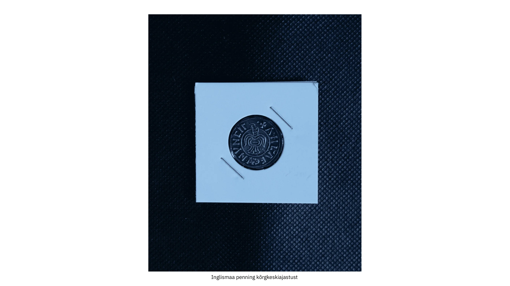

Pärast Rooma rahasüsteemi kokkuvarisemist langes Euroopa keskajal feodalismi. Suurem osa elanikkonnast kasutas madala väärtusega vask- või pronksmünte, mis tihtipeale lahjendasid raha, piirates seeläbi kaubavahetust pikkade vahemaade taha.

Raha kui maksevahendi tagasipöördumine toimus järk-järgult, kulmineerudes 13. sajandil kuldfloori ilmumisega Firenzes 1252. aastal, millele järgnes Veneetsias kuldduat. Neid kuldmünte kasutati laialdaselt tänu kaubanduse laienemisele ja kasvavale vajadusele usaldusväärsete, rahvusvaheliselt tunnustatud maksevahendite järele.

Inglismaal kaitses rahasüsteemi lahjendamise eest uuenduslik maksupoliitika, näiteks William Vallutaja poolt pärast 1066. aastat kehtestatud maamaks, mis säilitas pennysterlingi kvaliteedi. Oluline on siinkohal mõista, et tolleaegsed valitsejad võisid riigi rahastamiseks raha devalveerida ja **tehtud maksu kehtestamine võimaldas hoida raha stabiilsena ja rahastada riiki maksude kaudu**

Kiusatus saada kasu raha lahjendamise kaudu tõi aga kaasa kriise, nagu Henrik I valitsemisajal 12. sajandil, kui mündi kvaliteet langes järsult. Ranged reformid, millega mõnikord kaasnesid vägivaldsed meetmed mündiomanike vastu, taastasid ajutiselt usalduse raha vastu.

Keskajal kujunesid välja ka keerukad finantstavad, nagu näiteks Inglismaal kasutati tallipulkasid, et vältida liigkasuvõtmise keeldu ja laiendada krediiti. Kirik ei olnud väga huvitatud intressiga laenudest, seega kasutati erinevaid meetodeid intressi kasutamise keelust kõrvalehoidmiseks.

Need uuendused olid vastus kroonilisele metallraha puudusele ja soodustasid embrüonaalse finantsturu tekkimist.

Vahepeal stimuleerisid ristisõjad Vahemere piirkonna kaubandust, soodustades rahvusvahelise kaubavahetuse ja uute pangandustavade arengut, eelkõige templirüütlite ordu kaudu. Templirüütlitest said olulised finantsvahendajad, kes võimaldasid ristisõdijatel saada likviidsust kodust kaugel, mis oli kaasaegse Euroopa pangandussüsteemi eelkäija.

Et luua seos templirüütlitega, näete siin alljärgnevalt ühe Prantsuse keskaegse mündi, mille keskel on ilus rist. Selle ajastu müntidel oli see rist üsna tavaline.

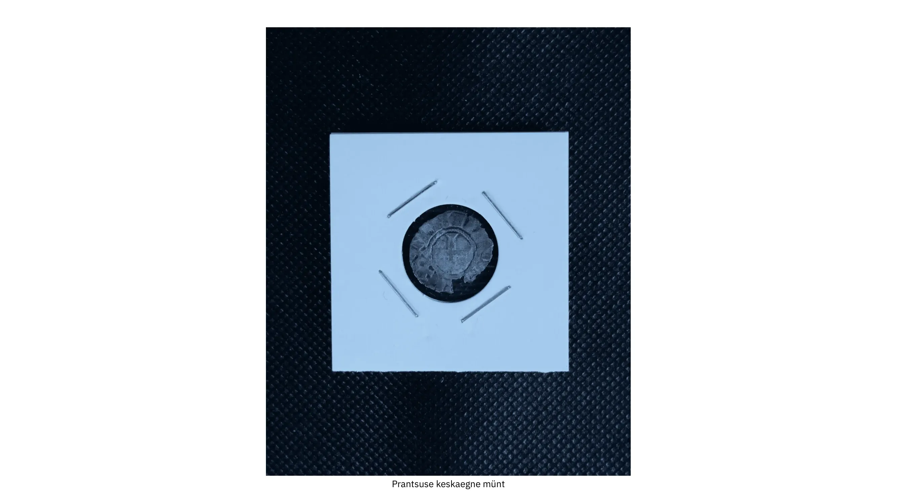

Lõpuks tõid sellised suured kriisid nagu must surm (1346-1353) kaasa põhjalikud majanduslikud muutused. Rahvaarvu järsk vähenemine tõi kaasa palkade järsu tõusu, trotsides valitsuse püüdlusi säilitada varasemat palgataset.

Samal ajal sundis saja-aastane sõda (1337-1453) riike võtma agressiivsemat fiskaalpoliitikat oma armeede rahastamiseks, mis aitas kaasa feodaalsüsteemi nõrgenemisele.

Seega iseloomustas keskaega pidev pinge kaubanduses usaldusväärse raha vajaduse ja valitsejate pideva ahvatluse vahel lahjendada raha vahetu kasumi saamiseks. See konflikt kujundas põhjalikult Euroopa rahanduse arengut, pannes aluse kaasaegsetele majandussüsteemidele.

Selle osa lõpetuseks tahaksin lisada ühe üsna huvitava anekdoodi Inglismaalt umbes sellest ajast. See anekdoot on pärit Glyn Daviesi raamatust "History of Money".

Ta mainib, et Inglismaal kandis üleminek parlamendile võlakoorma suveräänilt parlamendile, mille tulemuseks oli riigi krooniline võlgnevus. Enne seda lasus võlg suverääni õlgadel.

Kui parlament suutis haarata osa sellest rahaloome võimust, võimaldas ta luua pikaajalisi võlgasid, mida kandis rahvas, mitte kuningas. Varem, kui kuningas läks pankrotti või kui toimus kuningavahetus, kustutati võlg koos temaga.

Hetkel, mil parlament loob võla, tekib riigivõla mõiste, kuna see on potentsiaalselt ajaliselt piiramatu. Niikaua kui riik eksisteerib, niikaua kui parlament eksisteerib, on see võlg olemas ja nad pidid leidma kõikvõimalikke viise selle refinantseerimiseks ja selle jaotamiseks aja jooksul. See on suur paradigmamuutus, kus enam ei olnud kuningas või kuningriik, kes garanteeris või kandis nende võlgade koormat; nüüd oli see parlament ja seega selle kodanikud.

## Renessanss

<chapterId>1d1dfb05-70b4-5b7b-9708-373c2182950d</chapterId>

:::video id=4977b4f3-c7b2-41a5-ad7b-a96a8cca4092:::

Oleme nüüd jõudnud kursuse sellesse ossa, kus me räägime renessansiks nimetatud perioodist. See toimub traagilise kriisi taustal, kus katk levib laevadele sisenenud rottidel olevate kirpude kaudu. See tragöödia annab meile aga teavet kaubanduse ja reisimise kasvu kohta kõrgkeskajal. Varem ei liikunud sel perioodil nii palju inimesi nii kaugele ja nii kiiresti.

### Firenze Florin

Kuldmüntide tagasipöördumine Euroopasse renessansi ajal tähistab olulist pöördepunkti rahaajaloos. **See algas Firenze Floriniga 1252. aastal, mis oli esimene suurem kuldmünt, mis Euroopas pärast Rooma langemist vermiti**. Tänu oma märkimisväärselt püsivale kaalule ja puhtusele (umbes 3,5 grammi puhast kulda) jäi florin nelja sajandi jooksul muutumatuks ja muutus kiiresti oluliseks üleeuroopaliseks rahapoliitiliseks võrdlusaluseks.

Allpool näete ühe Florini reproduktsiooni: tinakullast Florin, mille on valmistanud prantsuse kunstnik, kes valmistab suurepäraseid käsitsi graveeritud ja löödud tükke.

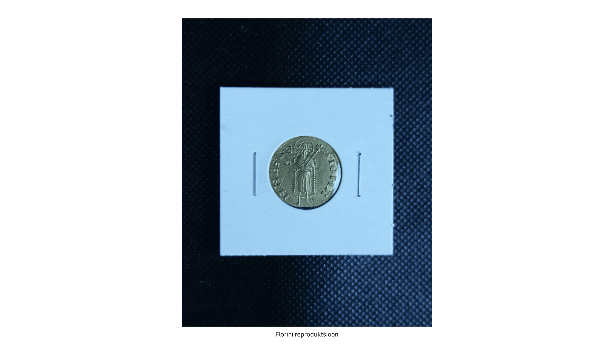

Tagasipöördumine kuldmüntide juurde oli tingitud konkreetsest kontekstist: Bütsantsi soliduse kokkuvarisemine ja mongolite sissetungidest tingitud moslemimaailma majanduslik langus tekitasid rahvusvahelises kaubanduses rahalise vaakumi.

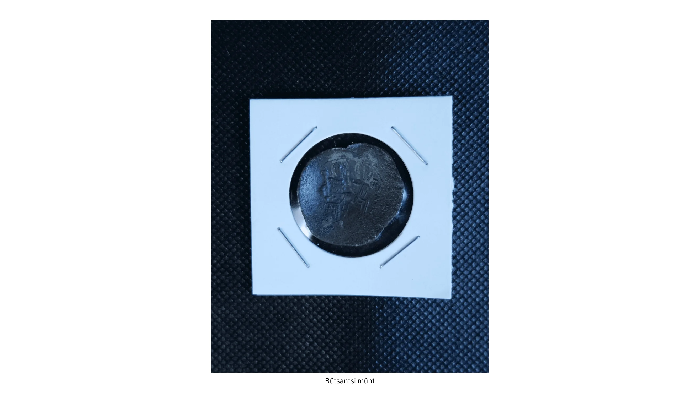

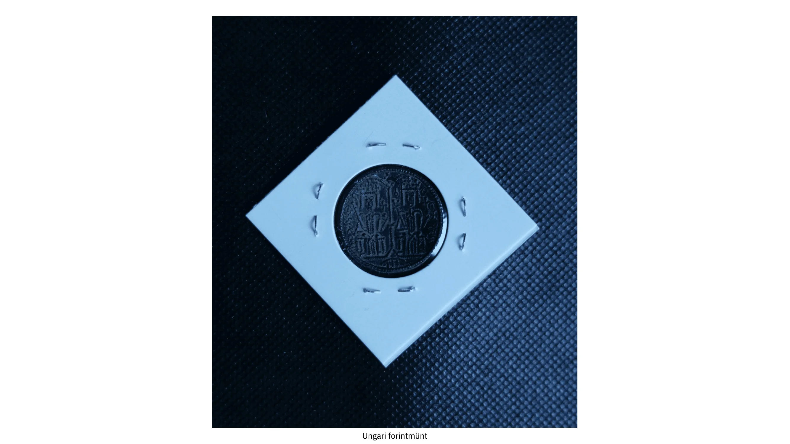

Esimesel pildil on üks Bütsantsi münt, mis on minu arvates üsna huvitav. Toon paralleeli samast perioodist pärit mündiga Ungarist (teine pilt üleval). Ungari münt on tassikujuline, nagu miniatuurne kauss. Ikonograafias on kujutatud religioosseid figuure, kes on kujutatud kuningatena, kes hoiavad riste kõrvuti. See tükk on kausikujuline ja pärineb Ungarist.

Teiste riikide müntide kopeerimine oli üsna tavaline. Kuna Bütsantsi mündid olid üldtunnustatud, kopeerisid teised riigid neid sageli. Nagu te võite näha, kui te neid kõrvuti võrdlete: need mündid on väga sarnased.

Põhja-Itaalia, eelkõige Firenze, Veneetsia ja Genova, kasutasid seda olukorda ära, et tuua turule uued kõvad väärismündid - stabiilselt väärismetalli sisaldusega mündid. Veneetsia järgis Firenze eeskuju, lüües 1270. aastal välja dukaadi, mis oli peaaegu identne floriiniga ja mida kasutati laialdaselt Vahemere piirkonna kaubanduses.

Floriinist sai esimene rahvusvaheline reservvaluuta, mis võeti enne 14. sajandi lõppu kasutusele enam kui 150 Euroopa linnas. Medici juhitud ulatusliku Firenze pangavõrgu loomisega moderniseeriti põhjalikult raha- ja raamatupidamine, vähendades isegi vajadust füüsiliselt kulda transportida.

See on veel üks väga huvitav punkt. Oli aeg, mil merereisidel kaotati palju müntide saadetisi. See tehnoloogiline edusamm - registrid koos kahekordse raamatupidamisega - võimaldas luua pühakirjaraha. See võimaldas vähendada müntide arveldamist ja kasutada selle asemel kirjalike kannete süsteemi, mis vähendab oluliselt riski, et raha läheb teel kaotsi.

Rahanduse arenguga kaasnes ka pangandusmeetodite märkimisväärne areng. Osaliselt inspireerituna ristisõdade kokkupuutest moslemite pangandustavadega, tekkisid keskaegses Euroopas juba 13. sajandil Firenze, Veneetsia, Barcelona ja Genova algelised pangandussüsteemid. Templirüütlid, religioosne ja sõjaline ordu, olid juba välja töötanud süsteemi, mis võimaldas ristisõdijatel reisida ilma oma varandust kaasa võtmata.

Nad hoiustasid raha oma riigi templiristi kontoris ja võisid seejärel reisida kirjaga ja koguda mündid oma ristisõja sihtkohta jõudes.

See tähendas, et me ei pidanud kaasas kandma väärismetallist münte.

Sel perioodil sai Euroopa tänu Marco Polo 13. sajandi reisile teada paberraha olemasolust Hiinas. Kuid pangatähtede väljatöötamine ootas veel mitu sajandit, sest Euroopa eelistas kõigepealt täiustada oma metallmüntide valmistamise meetodeid. Leonardo da Vinci, kes oli lähedane Luca Paciolile, tuntud vannutatud raamatupidaja, aitas aktiivselt kaasa rahapresside täiustamisele, edendades kiiremat ja ühtlasemat münditootmist.

Me viitame kursuse alguses mainitud pendlilöögitehnikale. See meetod võimaldas toota ühtlasemaid münte kui vasaraga löömine ja, mis on oluline, võimaldas ka müntide serva ümbritsevaid kandeid, nagu ma eelnevalt näitasin. Allpool on kujutatud Euroopa taler aastast 1793, mille serval on selgelt näha kiri.

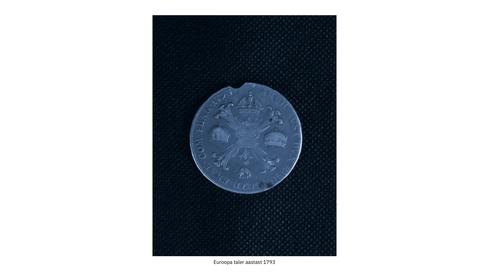

15. sajandil koges Euroopa aga tõsist valuutakriisi, mille käigus halvenes Euroopa rahade hõbedasisaldus üldiselt, mis langes 1450. aasta paiku alla 5%.

Alates 16. sajandist nihkus rahaline raskuskese Hispaaniasse, mida stimuleerisid Aragóni ja Kastiilia kuningriikide liitumine, rekonkista lõpp ja suured mereavastused, nagu Christoph Kolumbuse avastus 1492. aastal. Ameerika kaevandustest pärit massiline hõbeda sissevool häiris põhjalikult Euroopa ja maailma majanduslikku tasakaalu, õhutades nii inflatsiooni kui ka uusi geopoliitilisi pingeid.

Renessanss tähistas ka suurt kunstilist arengut rahanduses, mille müntide hulka kuulusid sellised mündid nagu taler (Joachimsthaler), millest pärineb mõiste "dollar". Need suured hõbemündid peegeldavad uusi kunstilisi ja mehaanilisi rahapritsimistehnikaid, mida võimaldasid Põhja-Euroopast pärit tehnilised uuendused.

Lõpuks, finantsrenessanss juhatas sisse ülemineku majanduslikule modernsusele, panganduse, krediidi ja finantsturgude arenguga ning moodsa kapitalismi esimeste vormide tekkimisega suurtes kaubanduslinnades Amsterdamis, Londonis ja Stockholmis, mis pani aluse rahvusvahelisele finantssüsteemile, nagu me seda tänapäeval tunneme. Ja see on meie järgmise video teema.

# Raha konfiskeerimine riigi poolt

<partId>17cfb1b4-5bc1-53e0-b035-05c7cf76be92</partId>

## Maailma reservvaluutade areng

<chapterId>d65cc352-e7ca-5f03-9b23-dd1fae5c0395</chapterId>

:::video id=82710062-8fff-426c-93af-923c08d82233:::

### Väärismetallide ajalooline tähtsus

Tere tulemast siia reservvaluutade ja keskpankade tekkimist käsitlevasse ossa. Selle uue jaotise esimese punktina keskendume maailma reservvaluutade arengule.

Väärismetalle, eriti kulda ja hõbedat, on pikka aega peetud impeeriumide rikkuse ja võimu aluseks. Janu kulla järele on alati olnud domineerivaks liikumapanevaks jõuks ning just väärismetallide sissevoolul oli kõige otsesem ja ilmsem mõju Euroopa rahapoliitilisele arengule. Keskajal ja varajase renessansi ajal oli see kinnisidee kulla ja hõbeda suhtes tingitud raskustest säilitada väärtust muude kaubavormide puhul, samuti välisriikide tugevast nõudlusest, eriti idamaade kaubanduses.

Sajandite jooksul on mitmed impeeriumid järgnenud üksteisele kui ülemaailmsetele majanduskeskustele. Riigile, mis domineerib maailmakaubanduses teatud perioodil, antakse tavaliselt reservvaluuta staatus. Nende hulka kuuluvad:

- Hispaania ja Portugal (15. ja 16. sajand)

- Ühendatud provintsid (Madalmaad) 17. sajandil

- Prantsusmaa ja Suurbritannia 18. ja 19. sajandil

- Ameerika Ühendriigid 20. sajandil

### Portugali buum ja reaal (1450-1530)

**Portugal** domineeris 15. sajandi teisel poolel ja 16. sajandi alguses maailmakaubanduses, sest **Portugali Real** oli suhteliselt ühtlase kaaluga hõbemünt. Tänu oma edusammudele meresõidu alal leidsid portugallased uusi mereteid Aafrikasse, Aasiasse ja Uude Maailma. Sõjaväekindlused ja kaubapunktid paljunesid Aafrikast kuni Hiinani (Macau).

Vastuseks Euroopa nõudlusele kulla ja hõbeda järele "oli suurte avastuste pidevaks ajendiks kaubanduslik kasum, eelkõige kulla ja hõbeda otsimine" Kuid Portugali impeerium, mis oli ülepaisutatud ja seisis silmitsi hollandlaste, inglaste ja prantslaste konkurentsiga, hakkas siiski langema.

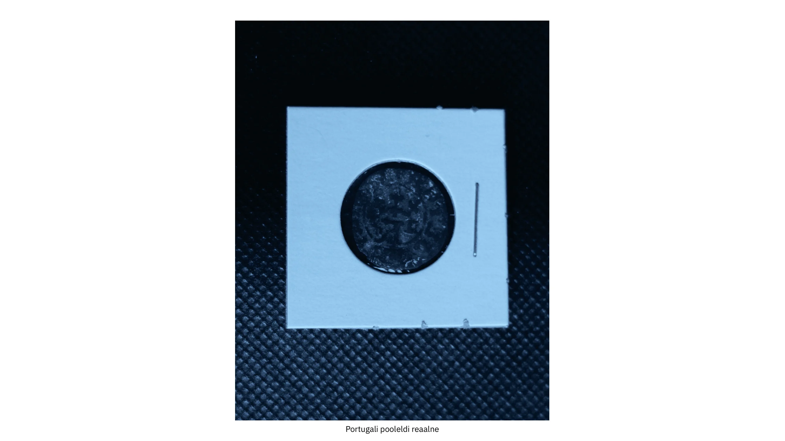

Siin üleval näete Portugali poolreaalset poolsaadet nende merealade vallutuste ajast.

### Hispaania apogee ja Hispaania dollar (1535-17. sajand)

Uue Maailma vallutamisega muutus **Hispaania** domineerivaks mängijaks. Selle monarh, kes kontrollis hiiglaslikke hõbekaevandusi (Potosí Boliivias, Zacatecas Mehhikos), suutis vermida raha puhtast hõbedast, vältides nii omaenda valuuta - **Hispaania reali** - devalveerimist

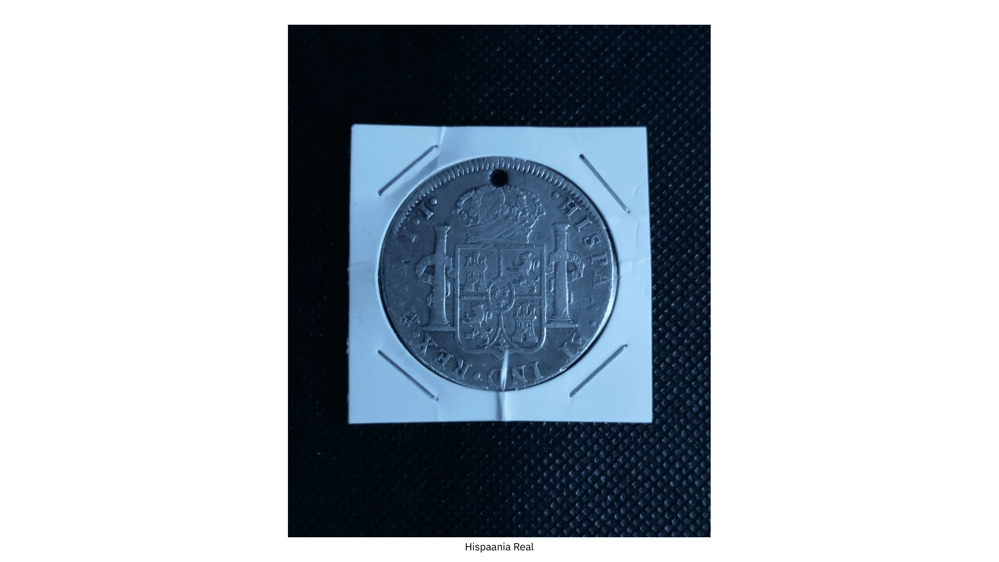

Hispaania real, mida tuntakse ka kui "kaheksandikku", sai oma hüüdnime seetõttu, et see lõigati sageli kaheksandikeks, et luua väiksemaid münte. Seda tunti ka kui **Hispaania dollarit**. Ülaltoodud münt pärineb aastast 1814, seega on see veidi uuem näide. Kõige esimesed Hispaania dollari mündid ei olnud siiski nii rafineeritud; need olid vasaraga löödud ja üldiselt vähem ümarad ja teravad.

Eriti huvitav on see, et Hispaania dollar oli tol ajal rahvusvaheline reservvaluuta. Hispaania ametiasutused andsid välja ka oma kohalikku valuutat, maravedi, ja kohandasid rahapakkumist regulaarselt tagasivõtmise teel. Näiteks võis algselt ühe maravedi väärtusega vask- või pronksmünt meenutada ja templiga "2", hiljem "4" ja nii edasi, kuni võib-olla "8" Kõrgresolutsiooniga fotol on selgelt näha mündile tembeldatud "8". See meetod laiendas tõhusalt rahapakkumist... mis paratamatult tõi kaasa inflatsiooni.

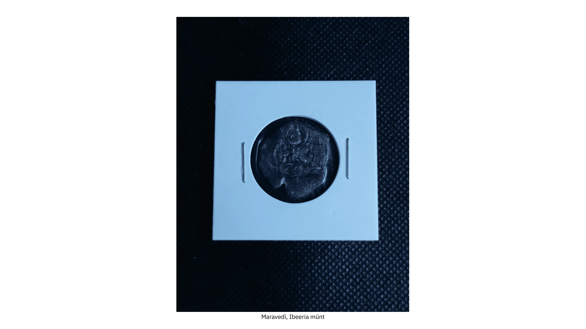

Kui me vaatame reservvaluutade ajalugu, siis selgub huvitav punkt: impeeriumid ei paisutanud oma valuutat seni, kuni nad säilitasid reservvaluuta staatuse. **Või alles nende ülemvõimu lõppedes devalveerisid nad seda, kaotades selle privileegi, mis seejärel anti edasi uuele impeeriumile**.

Hispaanias domineeris Hispaania dollar peaaegu 200 aastat maailmakaubanduses, eriti Hiina ja Euroopa vahel. Neid münte võis leida isegi Hiina sadamates. Ja siinkohal saame ajaloost silmapilgu: Ameerika dollar pärineb otse sellest valuutast. Kui Ameerika Ühendriigid moodustati 1792. aastal, võttis ta vastu seaduse omaenda valuuta vermimiseks ning esimesed dollarid loodi Hispaania dollari eeskujul, nii nime kui ka mündi suuruse poolest.

Selleks, et anda teile ettekujutus selle väärtusest, oli Ameerika dollar algselt hõbemünt, mis kaalus peaaegu untsi ehk tänases rahas 30-40 eurot, erinevalt tänasest paberrahast. Mis puutub Hispaania dollarisse, siis see ringles nii laialdaselt, et seda peetakse esimeseks tõeliseks ülemaailmseks vääringuks.

See väärismetallide sissevool Ameerikast põhjustas aga Euroopas inflatsiooni. Hinnarevolutsiooni ajal (umbes 1540-1640) kasvasid elukallidus Inglismaal seitse korda. Hispaanias mõjus hõbeda rohkus perversselt ressursi needusena, mis takistas tugevate pangandusasutuste arengut.

Seejärel seisis Hispaania silmitsi arvukate sõjaliste konfliktidega (Flandria, Madalmaad, Kolmekümneaastane sõda) ja tema rahandus varises järk-järgult kokku. Selle asemel, et devalveerida maailmakuulsat hõbemünti, otsustasid järjestikused valitsejad jätta maksmata või devalveerida kohaliku elanikkonna poolt kasutatavat vaskmünti (vellón). Seda kirjeldasin varem Maravedis.

### Hollandi tõus (17. sajand)

Pärast Pürenee poolsaare apokalüüsimaailma tekkis 17. sajandil **Hollandiast** uus kaubandusjõud. Merekaubandus, VOC (Hollandi Ida-India kompanii) ja **Amsterdami börsi Exchange** (Antwerpeni börsi eeskujul) asutamine tegid sellest kaubandusvabariigist keskuse.

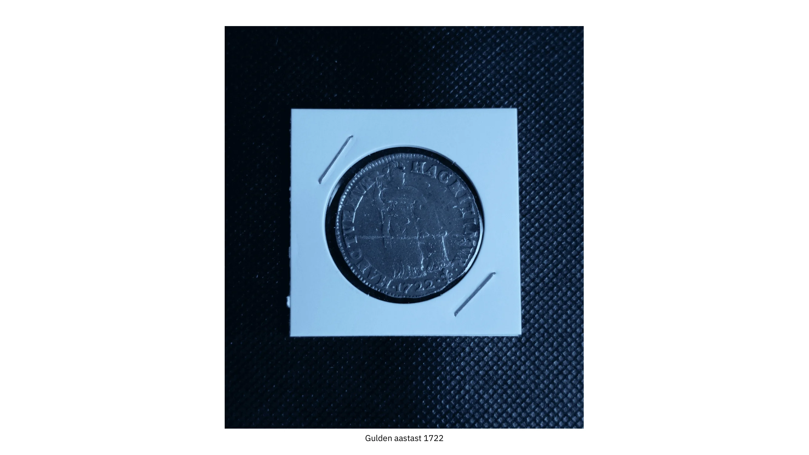

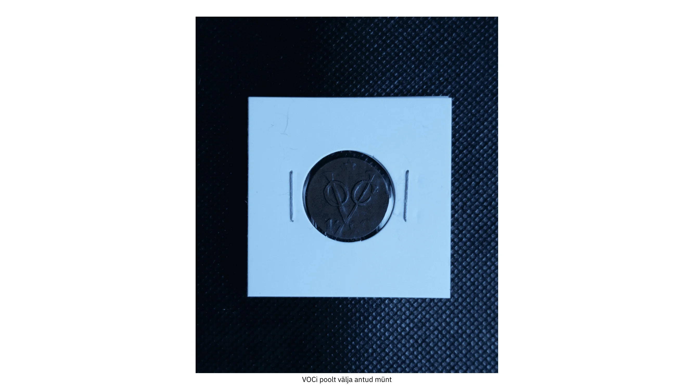

Esimesel pildil on näha 1722. aasta Gulden (ilus hõbemünt), teisel pildil aga VOCi poolt emiteeritud münt.

VOC oli oma aja kohta äärmiselt võimas ettevõte: tal oli oma armee ja ta andis isegi oma raha välja.

Hollandlased leiutasid kaasaegse kapitalismi, mis sai alguse riskide jaotamise vahendina riskantsetes ettevõtmistes, nagu ekspeditsioonid Uude Maailma või uute kaubateede otsimine. Aktsiaseltsid võimaldasid mitmel investoril ühendada oma raha ja jagada riski. Nende vahetuste hõlbustamiseks oli seejärel vaja luua institutsioonid, mis olid võimelised läbirääkimisi pidama ja neid väärtpabereid vahetama. Nii loodi 1602. aastal esimene aktsiaselts ja börs.

Hollandi raha, **Gulden**, sai usaldusväärseks tänu oma puhtusele hõbedast ja seejärel selle vastuvõtmisele Amsterdami pangas (1609), kus hoiused muutusid Euroopas eelistatud rahavormiks. See on väga oluline punkt, mida tuleb mainida. Jah, muidugi olid mündid, kuid see, mis tol ajal tegelikult raha moodustas, oli pühakirjaraha vorm. Tegelikult käis suur osa maailma kaubandusest läbi Amsterdami panga raamatute. See oli tõeline pangandusalane läbimurre: rahvusvaheline kaubandus ei toimunud enam tingimata füüsiliste müntidega, vaid otse panga raamatupidamisdokumentide kaudu.

Seda õitsenguperioodi iseloomustas kulla ja hõbeda suur sissevool, eriti teistest inflatsiooni või rahakontrolli rakendavatest riikidest. Siin on üks huvitav tegelane, keda tuleb mainida: **Thomas Gresham**. Sel ajal töötas ta Madalmaades inglise kuningliku võimu heaks, hallates rahavooge kahe riigi vahel. See oli seesama Gresham, kes jättis meile kuulsa **"Greshami seaduse "**.

Siiski sai ka Hollandi impeerium lõpuks otsa. Sõjad Inglismaaga, guldenite lahjendamine konflikti ajal ja teiste võimude (Prantsusmaa ja Inglismaa) konkurents andis märku Hollandi hegemoonia lõpust. Pärast neljandat Inglise-Hollandi sõda (1780-84) muutus guldeni kui reservvaluuta langus pöördumatuks.

### Prantsuse võim, ambitsioonid ja ebaõnnestumised (17.-18. sajand)

Louis XIV ajal sai **Frangiast** Euroopa suurim mandrivõim. Prantsuse valuuta ei saavutanud siiski kunagi domineeriva võrdlusaluse staatust: arvukad devalveerimised, rasked maksud ja kulukad sõjad (Augsburgi liit, Hispaania pärilussõda jne) mõjutasid tugevalt rahasüsteemi stabiilsust.

Esimese suurema paberraha eksperimendi viis läbi John Law (1716-1720). Banque Générale andis välja riigivõlalubadustega tagatud veksleid. See skeem viis 1720. aastal spekulatiivse mulli ja kokkuvarisemiseni (Mississippi mull). See katastroof jättis Prantsusmaale püsiva usaldamatuse paberraha suhtes. Just see katastroofiline kogemus viis Richard Cantillon'i rikkaks tänu sellele põhimõtete sätestamise süsteemile, mida nüüd tuntakse Cantillon'i efektina, kus rahaprintimine rikastab neid, kellel on juurdepääs trükipressile.

Kui see usaldamatus lõpuks hajus, toimus järjekordne Prantsuse paberi fiasko: revolutsioonilised **assignats**. Alates 1790. aastast vaimulike vara konfiskeerimise alusel emiteeritud assignatid kogesid galopeerivat hüperinflatsiooni, mis tegi neist ametlikult ajaloo esimese hüperinflatsiooni, mis ületas 50% kuus. Kuigi 1795. aastal oli nende nimiväärtus mitmekordistunud, kaubeldi nendega vaid mõne protsendi ulatuses nende algsest väärtusest.

Rangemaid seadusi püüti kehtestada assignat, kuid edutult. Valitsus püüdis seda kehtestada, minnes nii kaugele, et ähvardas neid, kes seda ei aktsepteerinud, surmaga, ja sundis poepidajad avatuks jääma. Kuid loomulikult ei õnnestunud see lõpuks.

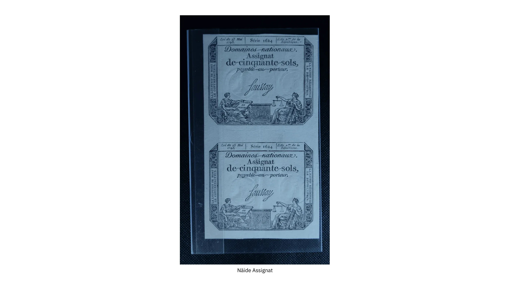

Kuna see paberraha asendas kõik kvaliteetsed väärismetallist mündid, järgides kuulsat Greshami seadust, tekkis mündipuudus. Uute müntide vermimiseks kasutati vaimulikelt konfiskeeritud kellametalli. Allpool näete kaunist kellametallitükki, mis on valmistatud vaimulikelt võetud müntide sisse sulatamise teel taaskasutatud vasest.

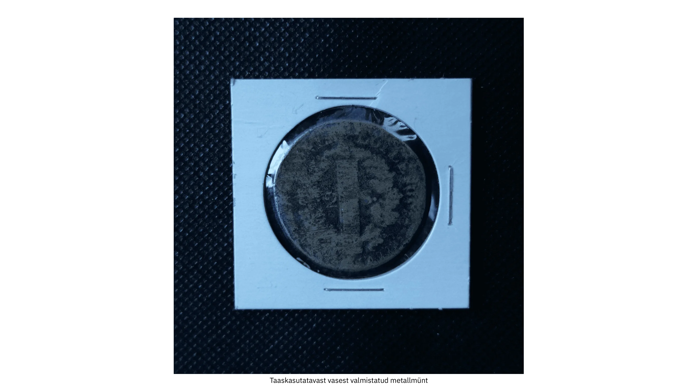

### Briti domineerimine (18. sajand - 20. sajandi algus)

**England** sai 18. sajandil Madalmaadest möödudes domineerivaks jõuks. Inglise nael on vanim veel kasutuses olev valuuta, mis oli algselt seotud naelaga hõbedat. Järk-järgult tugevnes selle staatus, mida toetas finants- ja maksurevolutsioon: parlamentaarne monarhia, tugev maksukogumisvõime ja Inglise Panga loomine 1694. aastal.

Pärast mitmeid sõdu Prantsusmaa vastu võitis Ühendkuningriik 1815. aastal (Waterloo), kinnitades oma ülemvõimu. Kogu 19. sajandi jooksul oli naelsterling maailma reservvaluuta. Tipphetkel, mil Suurbritannia moodustas vaid 2,5% maailma rahvastikust, tootis ta 20% maailma sissetulekust ja kontrollis peaaegu veerandit maakera pindalast.

**Industria revolutsioon** ja **kuldstandardi** kasutuselevõtt (1717 või 1718, Isaac Newtoni järelevalve all kuninglikus rahapajas) tugevdas naela usaldusväärsust. Inglise Pank võttis vastu kullastandardi 4,25 naela kullauntsi kohta, mis võimaldas pangatähtede omanikel konverteerida oma pangatähed kullaks.

Esimene maailmasõda (1914-1918) tegi sellele süsteemile siiski lõpu. Nädalate jooksul peatasid kõik sõdivad suurriigid kulla konverteeritavuse. Briti impeerium ja hiljem ka nael väljusid Teisest maailmasõjast nõrgestatuna, andes 20. sajandil teed Ameerika dollarile.

Ja artefaktina näete allpool mõned ilusad ja huvitavad tükid. Need on rahalised kaalud. Esimene neist on suverään: varaseimad kujutised naelast. Mul on neid münte kujutavad rahapunnid ainult sellepärast, et ma ei saa endale lubada tõelise suverääni ostmist. Nende kaalumiseks kasutasime kaalusid ja panime siis teisele poole suverääni väärtusele vastava rahalise kaalu.

Suverään oli rahaline münt - kuldmünt, mille väärtus oli algselt üks nael.

Kuulsale suveräänile eelnes Guinea, mis toimis samal põhimõttel. Guinea sai oma nime väärismetallide järgi, mis olid pärit Guinea piirkonnast.

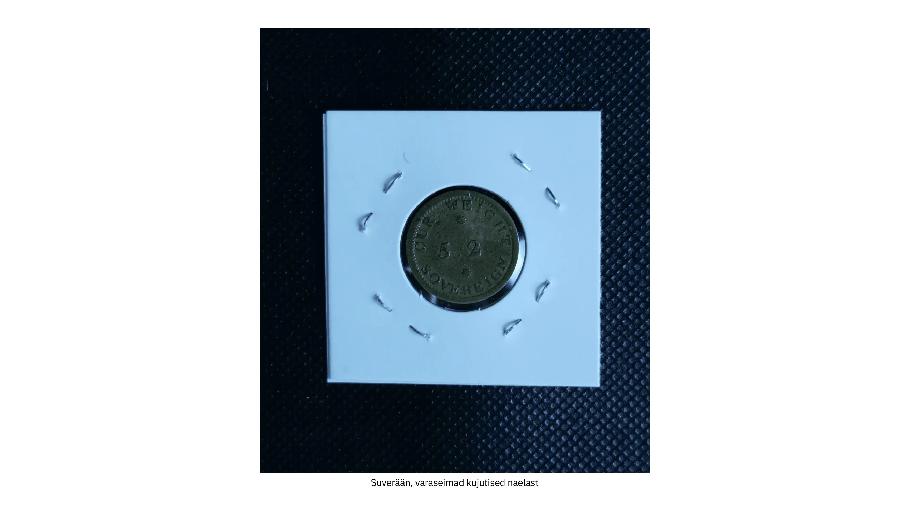

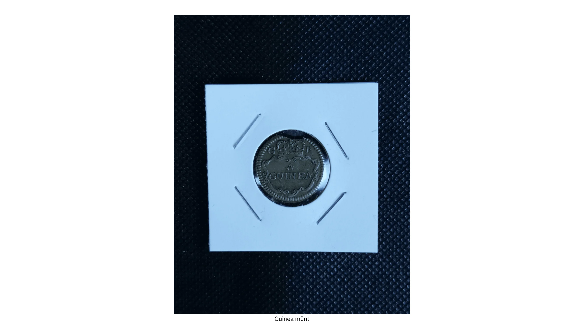

## Keskpankade tekkimine

<chapterId>15777771-1e28-55f7-a400-69868a47079b</chapterId>

:::video id=7661b7b5-e00f-48f3-b69a-6fb2eb5ebba4:::

Pärast seda osa, mis käsitleb esimeste reservvaluutade ajalugu ja nende arengut, järgneb lõik keskpankade tekkimise kohta. See järgib paljuski sama rada, mis reservvaluutade tekkimisel, kuid keskendub veidi rohkem tolleaegsetele pangandustehnoloogiatele.

### Pankade ja protopankade algus

Juba 13. sajandil töötasid itaallased (Firenze, Genova, Veneetsia...) välja kahekordse arvestuse meetodid. Hiljem sai **Antwerpenist** (16. sajand) Põhja-Euroopa juhtiv finantskeskus, mille rolli võttis hiljem üle **Amsterdam** tänu Amsterdami börsil Exchange (1609), kus kaubeldi VOCi aktsiatega.

Antwerpenis toimusid kaupmeeste messid, kus kaupmehed sageli kogunesid võlgade tasumiseks, mis viis uute finantsinstrumentide leiutamiseni. Alljärgnev, 1761. aastal dateeritud ja uuem veksel on **veksel**. Sellel on käsitsi kirjutatud üksikasjad ja kiri tagaküljel, mis teeb sellest ajastust suurepärase artefakti.

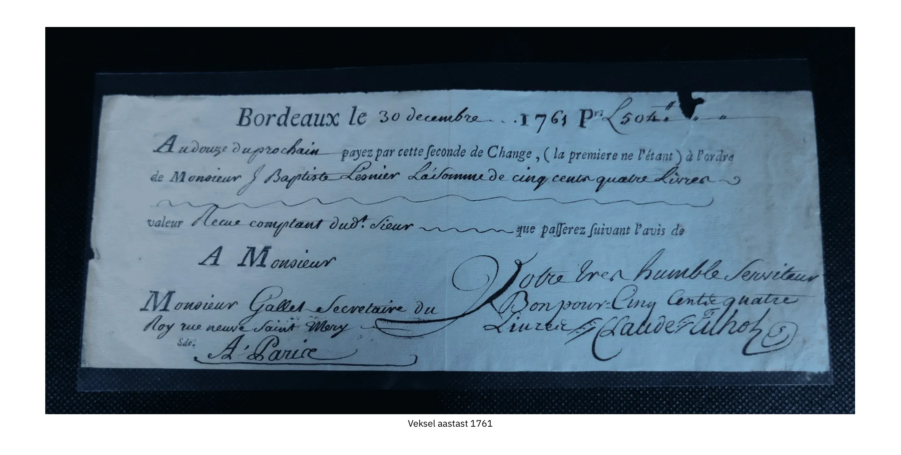

See pritsimine viis keerukamate pangandusasutuste loomiseni. **Lombardia pankurid** ja hiljem Hollandi kaupmehed täiustasid krediidiinstrumente (vekslid, vekslid jne). Kaasaegne pangandussüsteem põhineb sellel ideel: raha võib olla krediit, mitte ainult metall.

Nagu näete, toob see meid tagasi meie algse küsimuse juurde raha päritolu kohta.

Kas raha tuleneb kaubast, mis tekib vahetusvajadusest, või tekib see krediidist? Selle jälgi võib selles osas veel leida.

### Rootsi näide: Stockholms Banco ja Riksens Ständers Bank

Liigume edasi Rootsi, kus loodi esimene keskpank.

**Rootsi** oli keskpanganduse teerajaja: 1657. aastal lõi Johan Palmstruch **Stockholmi Panga**, mis oli volitatud laenama rohkem kui tema metallivarusid, mis tähistas seega [fraktsionaalreservi panganduse](https://planb.academy/resources/glossary/fractional-reserves) sündi. Kuid ülemäärane pangatähtede emiteerimine põhjustas 1663. aastal paanika ja panga ülejooksu. Noh, noh...

1668. aastal asutati Stockholmis Riksens Ständers Bank, maailma esimene tõeline keskpank. Kuid ka see kannatas kriiside all (1709, 1715...), mis olid seotud pangatähtede kuritarvitamisega, sageli kuningriigi sõdade rahastamiseks.

### John Law ebaõnnestunud riigipööre

Läheme Prantsusmaale, kus me taas kord leiame meie armastatud John Law'i.

**John Law**, šotlane, veenis regenti (Orleansi hertsogi) looma erapanga, Banque Générale (1716), mis oli volitatud emiteerima pabereid kulla, hõbeda ja valitsuse võlgade vastu. Sellest sai Banque Royale (1718) ja see aitas Mississippi kompanii aktsiatel tõusta.

Kui reaalsus jõudis spekulatsioonidele järele, **paanikat süvendas otsus keelata kulla omamine ja sundida kasutama Law'i pangatähti**. Noh, noh...

Lõpuks lõhkes mull 1720. aastal, põhjustades kokkuvarisemise, mis hävitas paberraha usaldusväärsuse Prantsusmaal pikaks ajaks.

### Amsterdami pank, teedrajava mudeli tõusmine

Nüüd oleme jõudnud Amsterdami 1609. aastasse, kus **Amsterdami pank** (Wisselbank) haaras kontrolli müntide hoidmise ja konverteeritavuse üle Amsterdamis. Ta keelas erapangatähtede ringluse ja sundis metallmüntide hoiustamist oma võlvides. Vähehaaval võtsid nad kontrolli raha üle. Nad keelasid rahavahetajatel münte enda juures hoida. Rahavahetajad töötasid terve päeva ja pidid päeva lõpus oma mündid Amsterdami panga võlvides hoiule andma. Nagu ma juba mainisin, ei kasutatud rahvusvahelises kaubanduses tingimata metallmünte. See oli panga raamatupidamises kirjapandud kirjaraha.

Tänu Hollandi kaupmeeste võimule mängis pank esimese de facto "keskpanga" rolli, stabiliseerides maailmakaubandust. Aja jooksul andis ta siiski VOCile tagatiseta laene ja lõpuks lõppes tal metall oma arvete katteks. 1790. aastal selgus, et ta oli VOCile suuri summasid laenanud ja kuulutas praktiliselt välja pankroti, mis hävitas guldeni usaldusväärsuse. Noh, noh...

### Bank of England, kaasaegse panganduse asutamisakt

17. sajandi Inglismaal ladustasid kulda ja hõbedat kullassepad, kes väljastasid kviitungeid. See osaliselt detsentraliseeritud korraldus osutus oma piirideks, kui kroonil tekkis suur vajadus rahastada sõda Prantsusmaa vastu.

1694. aastal asutati **Bank of England (BoE)**. Bank of England sündis seega Londoni äriringkondade ja valitsuse vahel sõlmitud abielu tulemusena, sest valitsus otsis meeleheitlikult raha sõja jaoks.

Pank sai pangatähtede emiteerimise monopoli Inglismaal (seda tugevdati 1708, 1742 jne). Sellest ajast alates ringlesid müntide kõrval ka kullavarudega tagatud paberrahad. See on oluline punkt raha järkjärgulise ülevõtmise mõistmiseks riigiasutuste poolt. Kõigepealt takistas Amsterdami Pank rahavahetajatel münte hoida ja sundis neid neid pangale tagasi andma. Inglismaal keelati erapankadel oma kullas lunastatavate rahatähtede emiteerimine.

Nad lubasid erapankadel küll pangatähti emiteerida, kuid neid võis vahetada ainult Bank of Englandi pangatähtede vastu.

Inglismaa Panga vekslid, naelsterlingid, olid lunastatavad kullaga. See lisas valuutale kolmanda kihi. Nii et meil on kuld baasil, seejärel Inglismaa Panga pangavekslid ja seejärel erapankade pangavekslid peal. Enne seda võisid erapangad emiteerida oma kullas lunastatavaid veksleid. See on järjekordne etapp raha järk-järgulisel ülevõtmisel riigiasutuste poolt.

Pank rahastas riiki tohutute laenudega ja struktureeris tohutut riigivõlga, mis rahastas majandusbuumi.

See mudel konsolideerus 18. ja 19. sajandi jooksul, nii et naelast sai Inglismaa Panga ja kullastandardi pitseri all maailma reservvaluuta.

**Maailma reservvaluutad** on sajandite jooksul järgnenud üksteisele, mille ajendiks on olnud riigi või impeeriumi majanduslik, kaubanduslik ja sõjaline võimsus: Portugal, Hispaania, Madalmaad, seejärel Suurbritannia, enne kui 20. sajandil domineerisid Ameerika Ühendriigid. Igal juhul näeme sarnast tsüklit: majanduslik ekspansioon, kaubanduslik edu, valuuta rahvusvaheline kasutuselevõtt, võlgad, kulukad sõjad, rahaloome või krediidi kuritarvitamine ja lõpuks langus.

**Keskpankade teke** oli järkjärguline protsess. Need institutsioonid tekkisid sageli kulukate sõdade kontekstis, võimaldades riigil end võlgade kaudu rahastada. Kui võeti kasutusele kullastandard (Inglismaa, 17.-19. sajand), andis see stabiilsuse varjundi, kuni 20. sajandi suured maailmasõjad viisid kulla konverteeritavusest järk-järgult loobumiseni. Raha vermimise õigus nihkus seega kuninglikust monopolist keerulisematele üksustele, kõigepealt eraõiguslikele (kullassepad, pankurid), seejärel poolavalikele (keskpangad), mis peegeldab rahasuveräänsuse arengut institutsionaliseeritud, globaliseerunud vormide suunas.

Niisiis, see on see, mida ma varem kirjeldasin. Me oleme sageli nihutanud riigivõla koormuse otse kas keskpankadele või õiguslike institutsioonide, näiteks parlamendi, rahaloome lubamisele.

Ja kõige tähtsam fakt on see, et **Me oleme läinud võlgadest, mis võisid kaduda riigi pankroti tõttu, võlgadesse, mis jäid peamiselt elanikkonna õlgadele**.

## Tee fiat-süsteemi juurde

<chapterId>27a98545-d350-56ee-a200-92468e6b9b33</chapterId>

:::video id=e27a753e-aeee-4307-a65c-9506aab380a1:::

Oleme nüüdseks jõudnud selle raha ajalugu käsitleva kursuse lõpuni ja selle lõpetamiseks tahtsin teha ettepaneku kahe teema kohta. Esimene teema on erinevad etapid, mis viisid meie praeguse fiat-valuutasüsteemini. Me vaatame uuesti läbi 5. peatükis esitatud faktid keskpankade loomise kohta ning lisame USA dollari mõiste, mis on lõppkokkuvõttes praegune reservvaluuta. Vaatleme, kuidas see arenes, kuidas dollar tekkis, kuidas ta arenes, kuidas ta muutus, milliseid etappe ta läbis, et saada fiat-süsteemiks, sest dollari algupära on hõbemünt.

Kohe pärast seda annan teile lühikese lõigu rahanduse ajaloost, et aidata teil mõista, kuidas me jõudsime heaoluriiki. Seega vaatleme kahte teemat: kuidas me jõudsime fiat-süsteemi ja kohe seejärel, kuidas rahanduse areng viis meid heaoluriigi kontseptsioonini.

### Kaasaegse panganduse Euroopa alused

Läheme tagasi 13. sajandisse koos floriiniga. Et mõista, kuidas me jõudsime fiat-mudelini, peame alustama 13. sajandist. Floriini kõrval tekkis samal ajal Medici ajal ka üks tehnoloogia, nimelt vekslite kontseptsioon.

Siis tuli Antwerpeni börs koos diskonteerimise ja vekslite kontseptsiooniga.

Siis, nagu me nägime, oli meil VOC, esimene Amsterdami börs. See tähistas kapitalismi sündi, ettevõtte aktsiate ja aktsiate vahetamisega. Seejärel kehtestas Amsterdami pank dekreediga hoiuste kasutamise. See tähendas, et münte tuli hoiustada päeva lõpus. Rahavahetajad ei saanud enam vahetusraha müntidena hoida.

Seejärel loodi 17. sajandi lõpus Inglismaa Pank, kuna oli vaja luua võlgu sõja rahastamiseks. Sel ajal said erapangad kolmandaks rahakihiks. Muide, kogu see lõik, alates floriinist kuni keskpanga loomise mõisteni, on äärmiselt hästi kokku võetud Nick Bhatia kuulsas raamatus "Layered Money", mida mul oli õnn koos mõne kolleegiga tõlkida. Tegime selle tõlkimisega suurepärast tööd, et kõikjal prantsuskeelsed inimesed saaksid nendest õpetustest kasu.

Seega oleme 17. sajandi lõpus. Inglismaa Pank loodi sõja rahastamiseks.

Kolmanda kihi võtsid üle erapangad. Tegelikult ei olnud erapankade võlakirjad enam kullaga lunastatavad: kullaga lunastatavad olid Inglismaa keskpanga võlakirjad. See näitab vahetusvolituste haaramist institutsiooni poolt, milleks on Bank of England.

Siis tuli 1776. aasta paanika. Kõik tormasid ülespoole rahapüramiidi. See tähendab, et 1776. aastal toimus pangajooks, ja nii püüdsid kõik inimesed, kellel oli kolmanda kihi paber, st erapanga vekslid, saada Inglise Panga veksleid, ja seejärel püüdsid saada kulda, kuid ilmselt ei olnud võlvides piisavalt kulda. Nad kuulutasid välja omamoodi panganduspuhkuse, et vältida kuldvekslite tagasimaksmist, ja sellest tekkis viimase abinõude laenuandja mõiste.

### USA dollari areng

Me läksime floriinilt üle Inglismaa Panga asutamisele. Loomulikult olid vahepeal esimene ja teine maailmasõda, kuid varem, 1796. aastal, toimusid arengud ka teisel pool Atlandi ookeani. Aastal 1776 oli Ameerika veel Briti koloonia ja kolooniad kasutasid seda paberraha. Allpool on kujutatud Connecticuti kahesillingiline rahatäht aastast 1776.

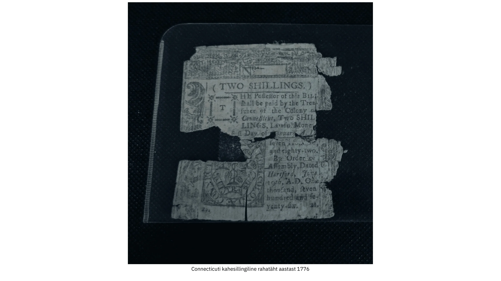

Enne sõja väljakuulutamist Inglismaale ja lõpuks omaenda valuuta väljaandmist kasutasid kolooniad seda paberraha koos Hispaania dollariga sularahatehingute tegemiseks. Tegelikult jäi mõiste "dollar" tähistama Ameerika dollarit.

Kui ma ei eksi, võtsid nad 1792. aastal vastu seaduse, mis lubas neil raha vermida. Näitena on allpool toodud üks tänapäeva ajastu Ameerika dollar.

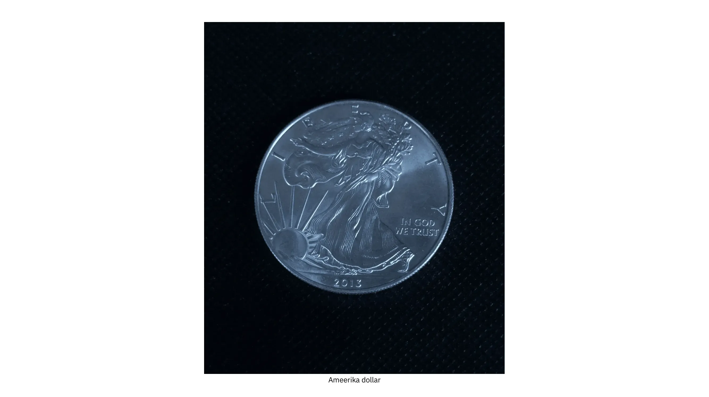

Ilmselt ei ole selle nimiväärtus vaid üks dollar; see on väärt umbes 30 või 40 dollarit, sest see esindab untsi hõbedat. Selle väärtus kõigub vastavalt hõbeda hinnale, tavaliselt on see vähemalt 30 või 40 USA dollarit. Tänapäeval säilitab paberdollar muidugi ainult oma nimiväärtuse, mis on üks dollar, kuid tol ajal oli USA dollaril see hõbeda väärtus.

Räägime nüüd Ameerika kodusõjast. Konföderaalid trükkisid raha, mis oli hüperpaisutatud. See nähtus ei ole ametlikus Hanke-Kruse nimekirjas, sest see ei jõudnud 50% hüperinflatsioonini. Küll aga oli inflatsioonimäär 40% kuus, mis näitab, et sõja ajal trükiti märkimisväärne hulk raha.

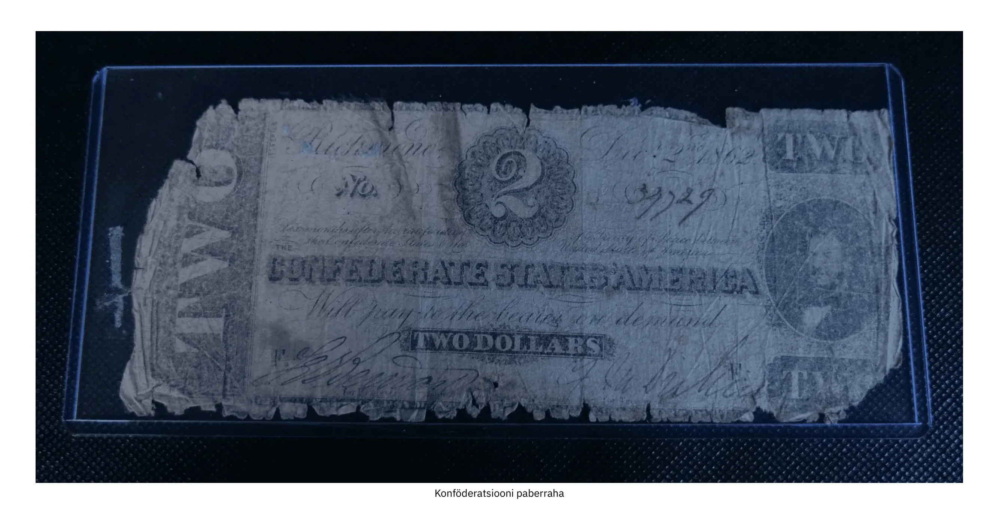

Nende põhjapoolsetel vastastel olid ka dollarid. Just ülalpool võis näha konföderatsiooni dollareid, allpool aga põhjapoolsete dollareid. Neid nimetati "roheliseks dollariks", sest nende tagakülg oli roheline.

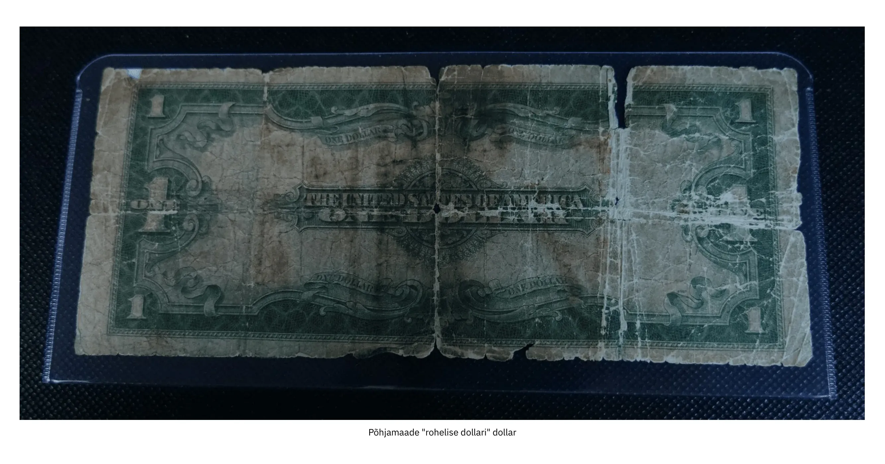

Ja ma kutsun teid üles võrdlema suuruste erinevust tänapäeva pangatähtedega. Toona olid pangatähed suuremad.

Nagu me teame, võitis põhja pool, nii et taasühinenud Ameerika Ühendriikide valuutaks sai roheline dollar. Siis tuli FEDi asutamine 1913. aastal ja esimene maailmasõda.

Esimese maailmasõja järel trükitud pangatähtede viimases seerias oli alati märge "nõudmisel kullaks lunastatav". Seega osteti 1928. aastal 20 dollariga peaaegu unts kulda, sest kulla hind oli 20,67 dollarit. Alloleval pildil oleva rahatähega võis 1928. aastal osta untsi kulda.

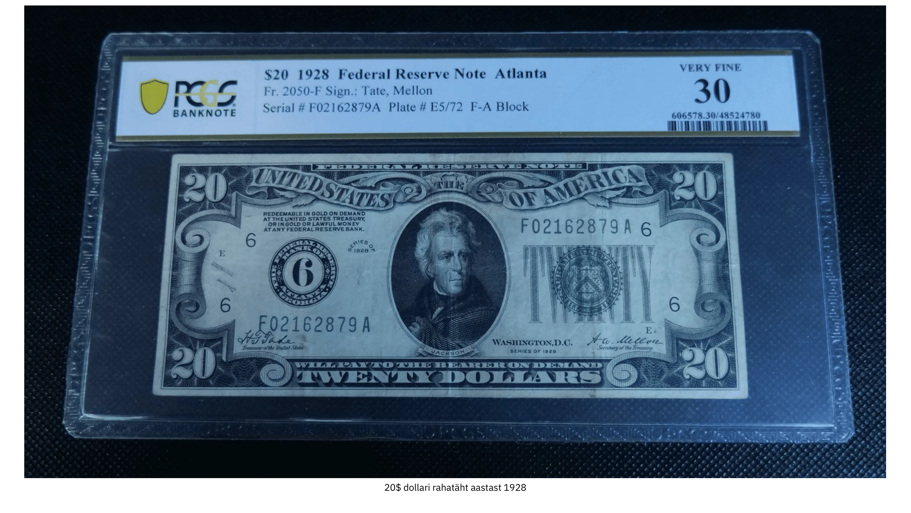

Tänapäeval on unts kulda väärt 3000 USA dollarit. Seega näete siin muidugi devalveerimise jõudu. See oli viimane rahatäht, mis sisaldas sõnu "lunastatav kullas". Me näeme, et kohe pärast täidesaatvat määrust 6102, nad konfiskeeriksid kogu kulla. Tegelikult konfiskeeriksid nad nii kulla kui ka kullatunnistused.

Allpool näete kuldset sertifikaati aastast 1928.

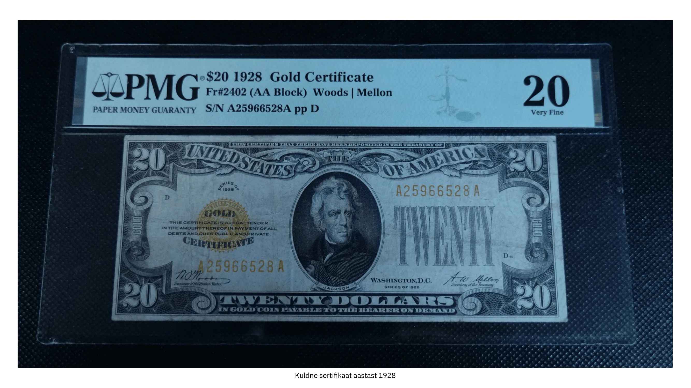

See ei olnud mitte ainult "lunastatav kullas" nagu 1928. aasta rahatäht, vaid ka kuldmüntides: tegemist on tõepoolest "kuldsertifikaadiga". Need on kõik konfiskeeritud pärast Executive Order 6102. Kuni 1964. aastani oli nende omamine isegi ebaseaduslik.

Mul on väga hea meel, et mul on üks.

Alates 1964. aastast muutus kulla omamine ebaseaduslikuks, kuni 1974. aastani, kui ma ei eksi. 70ndatel lubati inimestel pärast Nixoni šokki, mida me kirjeldame varsti, kulda koguda. 1933. aastal, kui nad andsid välja "Executive Order 6102", konfiskeerisid nad kulla ja selle omamine muutus ebaseaduslikuks. Saite suure vanglakaristuse, kui teid tabati oma kulla hoidmisel. Neil päevil vahetati pärast 1934. aastat iga unts kulda alltoodud sarnase rahatähe vastu.

Nagu me ütlesime, oli 1928. aastal dollaril veel tekst "lunastatav kullas".

Pärast korralduse 6102 väljaandmist konfiskeerisid nad kogu kulla ja vahetasid 20,67 dollarit iga untsi kulla eest. Seejärel tuli pettus päevavalgele: nad andsid 1934. aastal välja uued rahatähed, millele oli trükitud tekst "see rahatäht on seaduslik maksevahend kõigi võlgade eest".

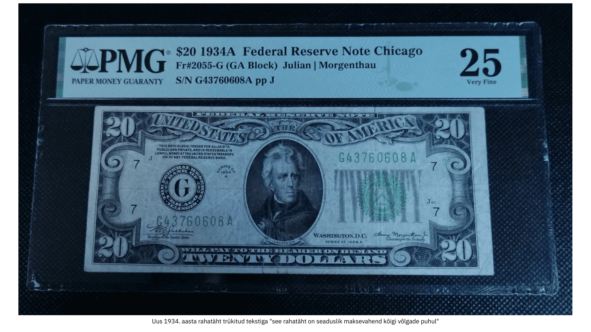

Siinkohal tekib mõiste "seaduslik maksevahend", mis asendab väljendi "lunastatav kullas" Need kaks arvet võivad näida identsed, ainult mõned sõnad on muutunud, kuid pettus seisneb selles, et dollar devalveeriti sel perioodil; selle väärtus langes 20,67 dollarilt untsi kulla eest 35 dollarini untsi eest 1934. aastal. See tähendas umbes 40%-lise devalveerimise!

Siis tuli teine maailmasõda. Pärast sõda koondas Bretton Woodsi kokkulepe suure osa maailma kullast Ameerika Ühendriikidesse. Vastutasuks andsid ameeriklased välja pangatähti, kuigi need pangatähed ei olnud enam üldsusele kulla vastu lunastatavad. Selle asemel jäid need riigi tasandil kulla vastu vahetatavaks.

Lõpuks hakkasid sellised riigid nagu Prantsusmaa ja Saksamaa kahtlustama, et tõenäoliselt on USA hoidlates ringluses rohkem dollarivõlakirju kui kulda.

Nii et nad palusid oma kulda tagasi tuua. Noh, nad ütlesid: "Okei, me teeme seda, aga see võtab natuke aega." 1971. aastal katkestas meie sõber Richard Nixon lõplikult pangatähtede ja kulla vahelise seose, süüdistades selle käigus spekulante.

Kuld oli alahinnatud 35 dollariga untsi kohta, mis ei vastanud ei trükitud rahamahule ega selle tegelikule turuväärtusele. Mõne aasta jooksul tõusis hind 34 dollarilt 800 dollarini. Sarnaselt ajaloolistele näidetele, näiteks Roomas, kus denari ja soliduse vaheline seos katkestati, lubati kulla ujuda. See tõi kaasa hinna avastamise protsessi, mille tulemusel hinnati kulda seejärel dollarites väljendatuna palju kõrgemaks.

### Kaasaegne fiat-valuutasüsteem ja selle tagajärjed

See osa võtab kokku, kuidas me liikusime hõbedal või kullal põhinevast rahasüsteemist. Vähehaaval omandasid institutsioonid üha rohkem võimu raha üle. Lõpuks katkestas ühepoolne otsus täielikult väärismetallide ja raha vahelise seose, mis järgnes liigsele emissioonile.

Selle tulemusena ei ole enam mingit seost kulla ja pangatähtede või pühakirjaraha vahel. Ja see ei ole isegi mitte fraktsionaalreservi süsteem - see on vananenud kontseptsioon. Selle asemel emiteerivad ja loovad erapangad raha pangakrediidi kaudu. Raha luuakse peamiselt sel viisil ja see on korrelatsioonis keskpanga kehtestatud põhiintressimääraga.

Piirangut tõesti ei ole. Vähemalt Ameerikas ja Kanadas ei ole enam kohustuslikku reservi taset. Ainus reserv on pankade vajadus korraldada, et nad suudaksid reageerida pankadevahelistele vahetustele, et likviidsus ei lõppeks.

Nad peavad lihtsalt veenduma, et nad saavad neid ülekandeid teha, kuid ei ole mingit 3%, 1%, 10% kohustuslikku reservi. Me oleme tõesti eemaldunud fraktsionaalse reservi kontseptsioonist. Nüüd on keskpangad, valitsused eelarvepuudujääkide kaudu, keskpangad kvantitatiivse lõdvendamise (QE) kaudu ja erapangad pangalaenude loomise kaudu, mis võivad suurendada kogu rahapakkumist ja minu arvates põhjustada inflatsiooni.

Raha ja inflatsiooni vahelise seose mõistmiseks soovitan Plan ₿ Academy kursust, mis on pühendatud sellele teemale. Saate teada, mis vahe on hinnatõusul, mida me elus näeme, ja inflatsioonil. Need ei ole üks ja sama asi. Tegelikult, kui me viitame inflatsioonile, räägime sageli hinnatõusust, mitte inflatsioonist endast. Inflatsioon on üsna täpne mõiste, mida seletatakse rahapakkumise suurenemisega.

https://planb.academy/courses/caa75343-ac90-4249-bcca-0e2e57c3a0f1

Selle fiat-maailma käsitleva osa lõpetuseks tahaksin juhtida tähelepanu ressursile, mis aitab teil paremini mõista nähtusi, mida ma just selgitasin, näiteks inflatsiooni.

Tänan teid tähelepanu eest.

## Rahamullide ajalugu

<chapterId>b6451c46-917d-11f0-97de-6bc5081765fa</chapterId>

:::video id=5967d9a6-aae4-4b84-a283-71b1b735bca4:::

### Paberraha leiutamine ja esimene suur mull

Keskpankade loomisega 18. sajandil sündis tõeline revolutsioon: maagiline raha pangatähtede kujul. Kõige silmatorkavam näide Prantsusmaal on John Law. See šotlane, kes oli Pariisis eksiilis, pakkus regendile, Orléans'i hertsogile, välja lahenduse kuningliku rahanduse pankrotistumisele, luues riigipanga ja koloniaalkaubandusettevõtte: kuulsa **Banque Royale** ja **Compagnie du Mississippi**.

Selle süsteemiga sidus Law paberraha oma ettevõtte aktsiatega. Mida rohkem pangatähti ringlusse läks, seda suurem oli aktsiate väärtus ja seda kindlam tundus pank olevat... kuni spekulatsioonid ületasid tegelikkuse. Mull lõhkes ootamatult 1720. aastal, hävitades aadli, kodanluse ja suure osa Euroopast, kes olid tulnud spekuleerima rue Quincampoix'ile. Tulemuseks oli Prantsusmaal püsiv usaldamatus paberraha vastu ja Euroopa esimene õppetund spekulatiivsete mullide kohta.

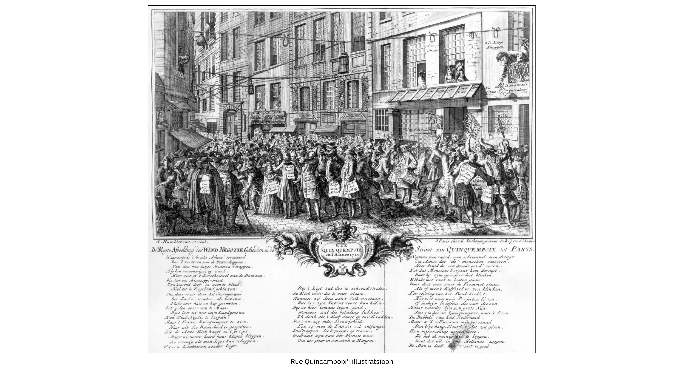

### Kui maa muutub "tagatiseks"

Sada aastat hiljem rajas Prantsuse revolutsioon uut teed **assignat'idega**, mis oli konfiskeeritud kirikuvara tagatisega tagatud raha. See oli paberil atraktiivne idee - muuta maa rahaliseks tagatiseks -, kuid ebaefektiivne: maa ei ole ei likviidne ega jagatav. Tulemus: hüperinflatsioon, mitmekordsed keelud maa kasutamisele, kontrollimatu inflatsioon ja puudus.

Napoleon, keda see kaos sügavalt mõjutas, kehtestas 1800. aastal Prantsusmaa keskpanga loomisega taas kulla ja hõbeda kui rahapõhja, tagades sellega oma armee korrapärase palga. Pragmaatiline viis usalduse taastamiseks: maksta kõvas vääringus.

### Roaring Twenties ja 1929. aasta suur depressioon

Jätame kaks sajandit vahele. Pärast Esimest maailmasõda rahastasid valitsused jõupingutusi inflatsiooni ja kulla peatamise kaudu. 1920. aastatel järgis Ameerika Ühendriikide Föderaalreservi rahapoliitikat, et toetada Briti naelsterlingit. Tulemuseks oli lihtne laenamine, ohjeldamatu spekuleerimine Wall Streetil, aktsiate ostmine krediidiga ning kinnisvara- ja pangandusmulli tekkimine.

Kui masinavärk läks segi, oli 1929. aasta kokkuvarisemine vältimatu: massilised pankade pankrotid, rekordiline tööpuudus ja järjekorrad supiköökides. See tekitas püsiva väärarusaama, et **kõik milline deflatsioon on halb**, samas kui me peame eristama deflatsiooni läbi majanduskasvu (tervislik) ja deflatsiooni läbi võla (laastav).

### Aasia 90ndatel ja doominoefekt

1990ndatel aastatel pani "Aasia ime" maailma unistama. Exchange kursid olid seotud dollariga, majanduskasv oli 8-10% ja lääne kapital voolas sisse. Kõik oli hästi... kuni tõusulaine taandus. Pankrotid kerkisid, valuutad devalveerusid 80% ja investorid hävitati. IMF pidi sekkuma, kehtestades valusaid reforme. Sama stsenaarium nagu alati: rikkalik kapital, krediidiga toidetud mullid, seejärel kokkuvarisemine.

### 2008 ja püsiva mulli ajastu

Internetimullile (2000) järgnes kinnisvaramull. Väärtpaberistamine muutis pangalaenud "kolmekordseks" finantstooteks, mis levisid üle kogu maailma. Lubadus: kõrvaldada risk, lahjendades seda. Tegelikkus: kõik riskid olid tegelikult korrelatsioonis. Kui kinnisvara kukkus kokku, kukkus ka kogu ülemaailmne pangandussüsteem.

Tulemus: ulatuslikud riiklikud päästeprogrammid, kvantitatiivne lõdvendamine ja nullintressimäärad. Ja sellega koos ka peataolek: iga kriis ei puhasta enam liigseid kulusid, vaid neid kaetakse üha suurema võla ja rahaprintimisega. See ongi see, mis viis praeguse olukorrani: **"kõikmulli "**, kus kõik - aktsiad, kinnisvara, kunst, krüpto, isegi Pokémon-kaardid - paisub kunstlikult üles.

### Maagilise raha igavene tagasipöördumine

Sajandist sajandisse ilmneb üks konstant: niipea, kui ühiskond usub, et ta saab reaalsete kaupade tootmise asemel luua rikkust rahaga, tekivad mullid. Alates John Law'st kuni 2008. aastani, alates Rue Quincampoix'st kuni Wall Streetini kordub protsess: eufooria, krediit, buum ja kokkuvarisemine.

Ja lõpuks, kui keegi ei usalda enam paberit, otsivad inimesed alati midagi muud - kulda, maad, turvalisi varjupaiku... või uusi valuutasid. Eile kehtestas Napoleon metalli, täna näevad mõned Bitcoin järeltulijana.

Rahanduse ajalugu on lõputu tsükkel: trükkimine, spekuleerimine, kokkuvarisemine. Kuni järgmise mullini.

## Raha ja vägivald

<chapterId>9486fe64-854f-5e17-86b3-8873baca39a8</chapterId>

:::video id=bd6d0807-2d8f-4637-a0f5-1e990e5c0d0f:::

Selles lühikeses osas vaadatakse veel kord üle paljud sündmused, mida me oleme juba kursuse jooksul näinud, ning tehakse kokkuvõte mõnest anekdoodist, mida ma pean huvitavaks.

### Tehnoloogia ja vägivald

Siin on mõned anekdoodid, millest me oleme ilmselt juba kursusel rääkinud. Need on sissejuhatuseks väga põnevale arutelule, mille pidasin Theoga tema loengust B-Ondys, mis oli minu arvates väga huvitav seoses sellega, kuidas tehnoloogiline areng mõjutab vägivalla suhet elanikkonna ja riigi vahel.

### Raha ja riiklik sund

Selle osa sissejuhatuseks annan teile lühikese ja mittetäieliku loetelu, et tuletada teile meelde sündmusi, mida me oleme tõenäoliselt juba kursusel käsitlenud.

Üks seos, mida ma juba praegu raha ja vägivallaga seostan, on see, et kui tegemist on väärtusetu paberrahaga, mida saab lõpmatuseni trükkida, siis on sellega sageli kaasas igasugused reeglid ja igasugused ohud. Võime juba rääkida assignatidest, kus pangatähtedele oli sõna otseses mõttes kirjutatud, et võltsijaid ähvardab surm. Tolleaegsetest juriidilistest tekstidest on lihtne leida surmaähvardusi neile, kes seda kuulsat paberraha ei aktsepteerinud.

Et jääda Prantsusmaale, nägin ühes juriidilises tekstis, mille ma sain kätte revolutsiooniajastust, et "päevaraha" giljotiini transportimise ja käitamise eest oli kirjeldatud valuutaga seotud osades. Minu arvates oli see üsna hullumeelne.

Me oleme rääkinud ka Hiina mündipidamisest, kus riik teostab järelevalvet rahapritsimise üle. Nägime kursuse alguses ühes osas, et kui mündid, millest mõned olid vähem ilusad, visati ära, olid sellel õiguslikud tagajärjed.

On ka üks anekdoot Inglismaa kuningast, kes lõikas lõpuks rahapidajaile käed maha, kui nad ei käitunud nii, nagu ta ootas.

Samuti olen lugenud, et Hiinas on budistlikest kloostritest konfiskeeritud vask. Ajal, mil vask hakkas väärtustama ja destabiliseeris nende majandust - mis põhines fiatraha vormil, millel oli metalli väärtusega vähe pistmist -, otsisid nad koha, kus oli rikkust, ja konfiskeerisid kloostritest vase.

Sama kehtis Inglismaa kloostrite kohta Inglismaa reformatsiooni ajal. Kui kuulus kuningas tülitses paavstiga abielulahutuse üle, oli selle taga veel üks põhjus: ta kasutas kloostrite kaotamist ära, et haarata kinni neis kiriklikes organisatsioonides sisalduv rikkus.

Prantsuse revolutsiooni ajal konfiskeerisid nad kogu kiriku vara. Nad nägid, et sulatatud kirikukelladest on loodud ilusad mündid.

Kui minna veelgi kaugemale tagasi, siis üks kõige selgemini väljendunud majandusliku vägivalla ja vabaduse, vabadusemürgiste seaduste mõisteid on **Diokletianus oma pärilikkuskastiga, mis oli otseselt seotud sellega, et talupojad ei tahtnud enam vastu võtta devalveeritud raha**. Nad tahtsid lahkuda oma talupojatööst ja Diokletianus reageeris sellele lihtsalt sellega, et ütles neile: "te ei saa oma maad maha jätta ja teie lapsed samuti mitte". Sama kehtis ka sõdurite kohta.

Ma arvan, et see on üsna selgesõnaline vägivalla vorm. Ma võiksin lõpetuseks rääkida templirüütlitest või Prantsuse kuningast. Kui templirüütlid Prantsusmaale asusid, siis kujutan ette, et ta nägi templirüütli rikkuse mannat ja tal olid riigi rahastamisprobleemid. Ta kaebas templirüütliordeni kohtusse ja mõned neist suutsid osa aardest ära käia, mis on andnud põhjust väga huvitavaks näiteringiks USAs või Kanadas. Ma ei tea, kes seda tootis, aga selle nimi on *Tammsaare mõistatus*. See räägib inimestest, kes arvavad, et Kanadas, Maritimesi saarel on maetud templiristi aare ja nad on aastaid - võib-olla isegi üle kümne aasta - puurinud, et teha mingi kaevu. Nad on leidnud kaevu, kus on palju galeriisid, ja nad otsivad sellele saarele, mis on selle telesaate teema, templirüütlite poolt maetud aaret. Ma tervitan oma isa, kes on selle saate suur fänn.

Nii et siin ongi see: väga lühike loetelu faktidest, mida me oleme selle kursuse jooksul näinud, mis minu arvates tõstavad seost vägivallaga. Jätan teile järgmise osa Theolt, kes räägib meile väga huvitava loo tehnoloogilistest muutustest ja võimu tasakaalust rahva ja võimude vahel.

Aitäh!

## Organiseeritud vägivalla majanduslikud tagajärjed

<chapterId>66bd4674-2159-5489-ad4b-ec5e3fb691af</chapterId>

:::video id=c8b063c6-aeb4-4a94-9027-b11d369e71a4:::

### Organiseeritud vägivald ja riigi areng

Ajaloolane Frederic C. Lane pakub välja revolutsioonilise teesi: riigi anatoomia läbi ajaloo on kujundatud vägivalla projitseerimiseks kasutatud tehnoloogiate abil. Lähtudes Weberi põhimõttest, et riigil on legitiimse vägivalla monopol, täheldab Lane, et see monopol - mis paradoksaalsel kombel on selles valdkonnas tõhusam kui konkurents - areneb vastavalt rünnaku ja kaitse kulude vahelisele suhtele.

See analüüs, mida võtavad üles raamatu "The Sovereign Individual" (1997) autorid, selgitab poliitilise korralduse ajaloolisi muutusi: keskaegsest feodaalsest süsteemist renessansiaja linnriikideni, seejärel tööstuslike rahvusriikide ja lõpuks kaasaegsete heaoluriikideni. Iga üleminek vastab suurele tehnoloogilisele läbimurdele vägivalla kasutamises, mis toimub umbes iga 400-500 aasta tagant.

### Keskaegne tasakaal

Keskajal domineeris üle 90% ulatuses agraarmajandus. Talupoeg, kes oli sõna otseses mõttes juurdunud oma maa külge, ei saanud põgeneda isanda ja tema rüütlite eest. Sõjatehnika - käsitsi sepistatud soomus, aastatepikkune mõõgakoolitus - oli äärmiselt kallis. See asümmeetria eelistas massiliselt rünnakut kaitsele.

Liikumatu põllumajandustootja muutub kohaliku vägivallamonopoli vangi. Tema võimekus maksude sissenõudmiseks saavutab uued kõrgused - kuigi paradoksaalsel kombel jäävad keskaegsed maksud tagasihoidlikuks võrreldes tänapäevaste 78% kohustuslike maksudega. Isand saab maksustada oma äranägemise järgi, sest talupoeg ei saa vastu seista ega lahkuda.

### Kaupmeeste renessanss

Hansakaubanduse tekkimine põhjas ja Vahemere piirkonna kaubanduse tekkimine lõunas muutis olukorda. Kaupmehed, kes olid peamised lisandväärtuse loojad, omasid liikuvat kapitali - oma laevu. Nad vajasid ainult kerget mereväe miilitsaid, sest meredele oli raske valvata. Ennekõike võisid nad kergesti naabersadamasse siirduda, kui maksud muutusid ülemääraseks.

Selline liikuvus tekitas maksukonkurentsi linnriikide vahel. Veneetsia, Genova ja Brügge pidid pakkuma võimalikult liberaalset raamistikku: usaldusväärsed lepingud, kvaliteetne raha, kindlustus, minimaalne maksustamine. Vürstid pidid pigem meelitama kui sundima. Sümmeetria pöördub ümber: kaitse (põgenemise kaudu) muutub lihtsamaks kui rünnak.

### Tööstusajastu

Tööstusrevolutsioon tõi endaga kaasa feodalismi sarnase konfiguratsiooni. Tehased, raudteed ja konveierliinid kujutavad endast tohutuid, liikumatuid investeeringuid. Henry Ford ei saanud oma tehaseid maksude tõttu ümber paigutada. Töötajad, kes olid koondunud tööstuslinnadesse, ühinesid ametiühingutesse, et pidada kollektiivseid läbirääkimisi, mitte kolida individuaalselt.

Tekkis "heaoluriik": tööstusplaneerimine (Jaapan, Korea), infrastruktuuride sõjaline kaitse, minimaalsed sotsiaaltoetused tööjõule. Teine maailmasõda illustreeris seda haavatavust: vaenlase tehaste pommitamine muutus domineerivaks strateegiaks. Füüsilise kapitali koondumine võimaldas massiivset maksude väljavõtmist heaoluriigi rahastamiseks.

### Mikroprotsessorite revolutsioon

Kolm tehnoloogilist uuendust on nüüd neid iidseid tasakaalusid häirimas. Mikroprotsessor on muutmas sõjapidamist: Nevadas asuv operaator juhib drooni Afganistanis kirurgilise täpsusega. Pärsia lahe sõda (1991) näitas seda läbimurret: maailma suuruselt neljas armee (Iraak) hävitati 45 päevaga, kusjuures koalitsioonipoolel hukkus vähem kui 200 inimest. Tehnoloogiline üleolek tegi frontaalse rünnaku võimatuks.

Internet ja asümmeetriline krüptograafia on muutmas väärtuse loomist. Arendaja võib töötada kõikjal, kus on MacBook ja Starlink, ning eksportida oma toodangut koheselt ja tasuta. Digitaalsed nomaadid pääsevad geograafilisest vangistusest, pannes riigid üksteise vastu nii, nagu seda ei ole nähtud alates renessansist.

Bitcoin kujutab endast selle loogika kulminatsiooni: riigist vabastatud valuuta, mida kaitseb puutumatu krüptograafiline kilp. Rikkus muutub kaitstavaks igasuguse füüsilise jõu eest. Üksikisik saab tagasi võime end riigi monopoli vastu kaitsta.

### Vestfaali mudeli kokkuvarisemine

Lääne heaoluriigid, mis on loodud tööstusajastu jaoks, on vananemas. Väärtuse loojad - arendajad, kunstnikud, rahastajad - rändavad Singapuri, Dubaisse või El Salvadori, eelistades minimaalse maksustamise eest vähem avalikke teenuseid. Kaasaegsed hiiglased nagu Apple ja Tether ei vaja kontoreid ega füüsilist infrastruktuuri.

See ajude äravool tekitab spiraali: vähem netosissemaksjaid, halvenevad avalikud teenused, suurenevad maksud nendele, kes jäävad, ja kiireneb lahkumine. Riigid peavad radikaalselt vähendama oma tegevust või minema pankrotti. Killustumine väikesteks, konkurentsivõimelisteks jurisdiktsioonideks - uus digitaalsete linnriikide mudel - näib olevat vältimatu.

Ajalugu õpetab meile, et sellised üleminekud võtavad aega põlvkondi. Kuid Bitcoin valuuta ja riigi lahutamine võib protsessi kiirendada. Üksikisikud hääletavad nüüd oma jalgadega ja oma krüptograafiliste rahakottidega, joonistades globaalse võimu kaarti ümber mööda piirjooni, mida me alles hakkame tajuma.

## Väga lühike finantsajalugu

<chapterId>1d37fff1-a091-5034-8e71-4af590b8ffce</chapterId>

:::video id=fdfabbc6-e4d8-463a-8522-19176f8fb460:::

Pärast seda raha ajaloo kirjeldust, mis viib meid otse fiat-süsteemini, tahaksin kiiresti ja lühidalt selgitada rahanduse arengut, mis viis lõpuks heaoluriigi tekkimiseni. Algselt, Rooma ajal, olid meil mündid.

Mündid olid finantstehnoloogia, mis võimaldas impeeriumil maksta sõduritele, laieneda ja kaubelda. See töötas väga hästi, välja arvatud see, et lõpuks toimus liiga palju devalveerimisi. Ühel hetkel, kui nad lõpetasid laienemise ning sõdadest ja territooriumide laiendamisest saadud saagist, kukkus nende süsteem kokku.

### Finantstehnoloogiate areng

Siis tuli keskaeg, mil toimus väga vähe arengut kuni floriini kasutuselevõtmiseni, mis tõi tagasi stabiilse valuuta, ning panganduse arengud Itaalias ja Antwerpenis, kus töötati välja "raha ajaväärtuse" mõiste - teisisõnu diskonteerimine. Nad arendasid diskonteerimise välja, et luua paberraha vorm, mille puhul anti välja "veksel", st lubadus, et hilisemal kuupäeval saab tagasi 100 dollarit pluss intressimäära.

See süsteem lõi finantstehnoloogia, mis võimaldab omanikul müüa võlakirja enne tähtaja lõppu, nii et kui te müüte selle pärast 4 kuud 6 kuu pikkusest tähtajast, maksab isik tegelikult preemiat, et kompenseerida saamata jäänud 2 kuu tootluse kaotust.

See oli tollal Antwerpenis ja Amsterdamis välja töötatud finantstehnoloogia. Hiljem nägime keskpankade arengut ja viimase abinõuna tegutseva laenuandja mõistet. Võib väita, et Amsterdami panga ajal loobuti müntide kasutamisest rahvusvahelises kaubanduses käsikirjalise raha kasuks.

Hiljem, 18. sajandil, võime finantstehnoloogia osas rääkida kindlustusest. Neil Fergusoni raamatus "The Ascent of Money" on väga hästi jutustatud anekdoot. Esimene kindlustusselts, mis sündis, kandis nime **Scottish Widowss**, ja sisuliselt oli see vaimulikkond, kes soovis arendada kindlustust preestrite jaoks, kes mõnikord surid varem, surid äkki. Vaimulikud hoolitsesid toona Šotimaal aasta aega oma naiste ja järglaste eest. Ja nii leidsid vaimulikud, et see üheaastane periood on ehk natuke liiga lühike. Selle tulemusena **leiutasid nad kindlustusmatemaatilised arvutused**, et arvutada sõna otseses mõttes välja, kui palju sissemaksjaid on vaja, et süsteem kataks oma kulud, sõltuvalt enneaegselt surnud preestrite arvust.

Nad töötasid välja kindlustusmatemaatilised arvutused, et öelda: "Okei, noh, iga preester annab meile selle summa. Siis, kui preester sureb, noh, kindlustus katab kulud, et tagada tema naise ja laste ellujäämine, kuni nad on iseseisvad." Nii et see oli esimene kindlustusselts nimega "Scottish Widows", mis populariseeris selle süsteemi ja kus seda kasutati.

### Erakindlustusest heaoluriiki

Seega on kindlustus osa finantstehnoloogia ajaloost. Ja see toob mind heaoluriigi kontseptsiooni juurde, mis seisneb selles, et erakindlustus sattus lõpuks vastu probleemile, optimeerimise mõistele, kus me ütleme endale, et kui me pakume tervisekindlustust inimestele, kes on terved, siis võib neil olla vähem huvi kindlustusmakseid maksta, sest nad ütlevad endale: "Ma olen terve, ma ei haigestu". Teisest küljest, inimesed, kes teavad, et nad on haiged, tahavad kindlasti tellida.

See süsteem tekitab tasakaalustamatuse haigete inimeste arvu vahel, kes võtavad ravikindlustuse, ja tervete inimeste vahel, kes võivad võtta vähem ravikindlustust. Seega tekib omamoodi tasakaalustamatus: kui arvutada arvud, siis need ei tasakaalustuks, sest tõenäoliselt ei suudaks kindlustada piisavalt palju terveid inimesi, et kompenseerida kulusid. Majandusteaduses on see mõiste **moraalne oht**.

Üks esitatud ideedest on kindlustuse kohustuslikuks muutmine. Kui kõik on kohustatud panustama, siis tasakaalustab see kogu asja ja nii terved kui ka ebatervislikud inimesed maksavad, jaotades riskid suuremale elanikkonnale.

Seega on riik paljudes maailma osades öelnud: "Noh, me hoolitseme selle eest". Kuigi ma ei ole selles küsimuses ekspert, näen, et sama argumentatsiooni kohaldatakse tõenäoliselt ka igasuguste muude kindlustusvormide, näiteks töötuskindlustuse puhul. On soov lihtsustada ja optimeerida, lähtudes ideest, et see on lihtsam, kui selle eest hoolitseb vaid üks organisatsioon.

Minu arvates viis see kõigi nende kindlustuskontseptsioonide tsentraliseerimiseni ja lõpuks heaoluriigi sünnini, kus kõik need finantskontseptsioonid, mis olid algselt eraettevõtted, eraalgatused kindlustusturu vajaduse rahuldamiseks, et jagada riski elanikkonna vahel, haaras riik kinni põhjustel, mis on ilmselt üsna loogilised seoses moraalse ohu ja optimeerimise sooviga.

### Alternatiivsed mudelid ja mõtisklused riigimonopolide kohta

Lõppkokkuvõttes on mõnes riigis, näiteks Kanadas, mitu kindlustusliiki - tervisekindlustus, töötuskindlustus -, mis on riiklikud monopolid.

Ma võin teile tuua ühe näite, mida ma tean. Šveitsis on süsteem veidi teistsugune. Seal on eraõiguslikud vastastikused kindlustusseltsid ja erahaiglad, nii et te saate valida oma vastastikust kindlustusseltsi, te saate valida oma paketi oma vastastikuses kindlustusseltsis. Te saate ikkagi suhteliselt universaalseid teenuseid, isegi kui suur osa sellest süsteemist jääb eraviisiliseks.

Nii et ma arvan, et see on võimalik, et see on ka eraviisiline. Aga kõik, mida ma tahtsin teile kirjeldada, ei ole tegelikult avaldus, et väljendada, kas üks süsteem on parem kui teine, vaid pigem selgitada teile, et lugedes finantsajalugu, sain aru, miks läänes, eriti Prantsusmaal, eriti Kanadas, riik tahtis võtta kontrolli nende finantspõhimõtete üle.

Ma tahtsin öelda, et kindlustuse mõiste on ennekõike rahanduse areng ning nagu valitsused mõnikord nii hästi oskavad, püüavad nad seda kontrollida, nagu nad on püüdnud kontrollida raha, ja seda mitmel põhjusel. Üks põhjus on muide viimase abinõuna laenuandja kontseptsioon.

Mõte on selles, et on palju parem, kui selle taga on suur institutsioon, mis jaotab riski laiemalt. See oli algne algatus viimase abinõuna tegutseva laenuandja idee taga, kus see institutsioon võiks tegelikult valida asutused, mis on piisavalt tugevad, et ellu jääda, ja vältida nende kokkuvarisemist, laenates neile raha.

Toona oli tõeline analüüs, kui see mõiste lõpuks esimest korda ilmus, kuid lõpuks juhtus see, et me päästame kõik, "too big to fail", see kehtib peaaegu kõigi pankade kohta, sest toimub tsentraliseerimine, ja ka kõigi suurettevõtete kohta. Lõpuks näeme, et see on ikkagi kontseptsioon, mida riik kohaldab "laias laastus", sarnaselt kindlustuse kontseptsioonile, mida ma teile just kirjeldasin.

Lõpuks otsustab riik, et ta hakkab kõige eest hoolitsema, muutes Šotimaal konkreetse probleemi lahendamiseks loodud finantstehnoloogia tohutuks heaoluriigiks, mida me täna teame. See kasutab kindlustusmatemaatilisi finantspõhimõtteid, et pakkuda teenuseid oma abivajavale elanikkonnale. Kuid me võime nõustuda, et sellest süsteemist tulenevad monopolid tekitavad igasuguseid probleeme, mida me praegu kogeme sellistes riikides nagu Kanada ja Prantsusmaa. Õnneks on olemas erinevad mudelid, nagu näiteks Šveitsis.

Me peame lihtsalt mõistma, et see heaoluriigi kontseptsioon pärineb rahandusest. See arusaam viitab sellele, et me võime uurida muid võimalusi peale kuulsate riigimonopolide, ja ma kohaldaksin seda mõttekäiku isegi keskpankade kui viimase abinõuna tegutsevate laenuandjate kontseptsioonile - kuid see on teise aja teema.

# Lõpposa

<partId>9bada469-7ef0-511a-9eaa-f8eb66d5906f</partId>

## Hinnake seda kursust

<chapterId>a9494e2b-8a4d-5811-8a7b-b4a91fb22778</chapterId>

<isCourseReview>true</isCourseReview>

## Kokkuvõte

<chapterId>1094e793-b4c6-5782-aa4a-71cde00ce7c0</chapterId>

<isCourseConclusion>true</isCourseConclusion>