# سفری در تاریخ سکه‌شناسی

این دوره جذاب شما را به کاوش در تکامل شگفت‌انگیز پول از اولین تمدن‌ها تا سیستم پولی کنونی ما می‌برد. ما از دوران نوسنگی تا زمان‌های مدرن عبور خواهیم کرد و کشف خواهیم کرد که چگونه پول تمدن‌های بزرگ انسانی را شکل داده و توسط آن‌ها شکل گرفته است. از پول اولیه بین‌النهرین تا ارزهای دیجیتال، سکه‌های لیدیایی، فلورین رنسانس و ظهور بانکداری مرکزی - این دوره دیدگاهی جامع از یکی از ارکان اساسی جوامع ما ارائه می‌دهد.

+++
# مقدمه

<partId>59878a67-8a1d-5d6b-af41-5b847c14363c</partId>

## مقدمه‌ای بر تاریخچه پول

<chapterId>ca53597e-be9a-5261-a55f-11fac8504a68</chapterId>

:::video id=08ff35ca-8a40-4286-abaf-71283faf6e78:::

به این دوره درباره تاریخ پول خوش آمدید. همانطور که عنوان نشان می‌دهد، ما قصد داریم با هم به بررسی تکامل تاریخی سکه‌ها بپردازیم. از دوران نوسنگی تا به امروز، به امپراتوری‌ها و تمدن‌های بزرگ گذشته نگاهی خواهیم انداخت.

با این حال، این دوره محدود به یک توالی ساده از تاریخ‌ها یا رویدادهای تاریخی نیست. بلکه هدف واقعی ما ارائه درکی عمیق از مفاهیم اساسی مرتبط با ظهور پول، یا بهتر بگوییم، ارزها است.

### مفاهیم اساسی برای بررسی

بنابراین ما در مورد ظهور صحبت می‌کنیم: ظهور خود ارزها، سیستم‌های پولی، بانک‌ها، پول کاغذی، بانک‌های مرکزی، و در نهایت، ظهور سیستم پولی "فیات" فعلی.

ما سفر خود را به دنیای پیش‌ارزها با ظهور پول بدهی و واحدهای حساب در بین‌النهرین آغاز می‌کنیم، همچنین سیستم‌های دیگری مانند جهیزیه و خون‌بها در جوامع ابتدایی. همچنین خواهیم دید که چگونه سیستم‌های پولی واقعی در مصر باستان، خیلی قبل از پادشاهی میانه، وجود داشته‌اند.

سپس به ظهور اولین سکه‌ها در لیدیا می‌پردازیم، لحظه‌ای کلیدی که اغلب به عنوان آغاز واقعی پول در کتاب‌های درسی اقتصاد در نظر گرفته می‌شود. ما بررسی خواهیم کرد که چگونه این سکه‌ها توانستند به لطف پارسیان، اسکندر کبیر، سپس روم گسترش یابند، قبل از اینکه سرانجام خود را تحمیل کنند، تسلط یابند و فروپاشند.

از آنجا، با مسلح شدن به هر آنچه آموخته‌ایم، زمانی را که نیاز داریم صرف خواهیم کرد تا با هم درباره تعریف واقعی پول تأمل کنیم و از ایده‌های پیش‌فرضی مانند "پول همیشه یک بدهی است" یا "پول همیشه یک کالا است" فراتر برویم. در واقعیت، پول هم یک کالا و هم یک قرارداد اجتماعی است. به‌ویژه، ما به بحث درباره مفهوم حق بیمه پول خواهیم پرداخت و تلاش خواهیم کرد تا نظریه‌های مختلفی که ظهور پول را توضیح می‌دهند، یکپارچه کنیم.

### دوره‌های کلیدی و نوآوری‌های پولی

سپس به دوره‌ای پرآشوب می‌پردازیم که با نوعی بی‌ثباتی در زمینه پولی مشخص می‌شود، اما با این حال شاهد ظهور نوآوری‌های چشمگیری مانند پنی انگلیسی بود که برای رشوه دادن به مهاجمان دانمارکی استفاده می‌شد و پوند شارلمانی که خاطره آن هنوز هم در برخی اسکناس‌های مدرن باقی مانده است.

ما همچنین به چگونگی ظهور اولین سیستم‌های انتقال پول از راه دور در دوران جنگ‌های صلیبی خواهیم پرداخت. سپس زمان آن است که به تأثیر فلورین، ارزی که با رنسانس همراه بود، و ورود فلزات گرانبها از قاره آمریکا، که تأثیر عمیقی بر قیمت‌های اروپایی داشت، نگاهی بیندازیم.

ما به‌طور مفصل به ظهور پول کاغذی و بانکداری مرکزی خواهیم پرداخت و شباهت‌هایی با تاریخ بحران‌های مالی و پیامدهای اغلب خشونت‌آمیز آن‌ها خواهیم کشید.

در نهایت، ما یک مقایسه با سیستم پولی معاصر خود خواهیم داشت، پیامدهای آن را بررسی خواهیم کرد و تاریخچه مالی را دنبال خواهیم کرد تا بهتر بفهمیم چگونه به دولت رفاه امروزی رسیده‌ایم.

و به‌عنوان یک امتیاز، ما همچنین به بسیاری از پیوندهای ریشه‌شناسی جذاب مرتبط با پول نگاه خواهیم کرد که همچنان بر زندگی روزمره ما در زبان‌های مختلف تأثیر می‌گذارند.

### ساختار دوره

این دوره به سه بخش اصلی تقسیم شده است.

بخش اول به ظهور پول می‌پردازد، بخش دوم به رنسانس پول و سقوط آن، و بخش سوم نشان می‌دهد که چگونه نهادهای دولتی یا دولت به تدریج کنترل پول را به دست گرفتند و به سیستم فیات کنونی منجر شدند.

متشکرم و لذت ببرید!

# ظهور صرافی‌ها

<partId>da5e4981-9ea5-5208-beab-3b75c9043632</partId>

## از آسترالوپیتکوس تا انسان مدرن

<chapterId>34a773aa-f2d3-5c26-8be4-f2cd79ed6fbc</chapterId>

:::video id=4f333013-4b2a-42ab-8761-593fafc971ca:::

### چرا از نوسنگی شروع کنیم؟

چرا برای صحبت درباره پول به دوران نوسنگی برگردیم؟ پاسخ ساده است: ما نمی‌توانیم ظهور پول را به‌طور کامل درک کنیم بدون اینکه به ظهور خود تمدن‌ها نیز نگاه کنیم. برای درک اینکه چرا اولین سیستم‌های پولی به وجود آمدند، باید بفهمیم چه چیزی باعث شد گروه‌های شکارچی-گردآورنده کوچ‌نشین به سکونت روی آورند.

قبیله‌ای که هیچ تقسیم کاری ندارد، هیچ تخصصی وجود ندارد و هر فرد مسئول تولید نیازهای خود است، به سادگی نیازی به پول ندارد. به همین ترتیب، یک جامعه کشاورزی که فقط به کشاورزی معیشتی می‌پردازد و هر فرد برای خود کشت می‌کند، هنوز نیازی به یک واسطه تبادل جهانی احساس نمی‌کند.

### یکجانشینی و پیامدهای آن

به همین دلیل فکر می‌کنم جالب است که کاوش خود را از دوره نوسنگی آغاز کنیم. خواهیم دید که چگونه سکونت‌گزینی به تدریج منجر به شکل‌گیری روستاها، سپس شهرها و در نهایت تمدن‌های بزرگ شد. این سکونت‌گزینی و تولید مازاد غذایی بود که تخصصی شدن کار را ممکن ساخت و زمینه حاصلخیزی را برای ظهور و تکامل اولین مفاهیم پولی فراهم کرد.

همان‌طور که تعاملات انسانی منجر به شکل‌گیری زبان می‌شود، می‌توانیم در نظر بگیریم که پول به‌طور طبیعی ظاهر می‌شود یا نه (همانند اینکاها و اسپارت‌ها)، در جریان شکل‌گیری و سازمان‌دهی تمدن‌ها. به نظر من، ظهور یا عدم ظهور پول کاملاً به شکل سازمان‌دهی اجتماعی و اقتصادی هر جامعه بستگی دارد.

### تاریخچه تکامل انسان

اما ابتدا، بیایید به یک زمینه تاریخی حتی گسترده‌تر نگاه کنیم.

مانند هر ارائه اول، من دقیقا برعکس آنچه در مقدمه دوره گفتم عمل خواهم کرد و فهرستی از تاریخ‌ها و رویدادهای تاریخی که به دنبال یکدیگر می‌آیند را به شما ارائه می‌دهم. ایده اینجا این است که ظهور پول را در بستر تاریخی آن قرار دهیم، در ارتباط با دیگر پیشرفت‌های انسانی مانند پخت و پز غذا، چرخ، اهلی‌سازی برخی غلات و حیوانات، ساخت اهرام و تأسیس اولین شهرها.

بنابراین، بیایید نگاهی به تکامل بشر از زمان‌های پیش از تاریخ به بعد بیندازیم.

بررسی اجمالی تکامل انسان از استرالوپیتکوس تا انسان مدرن، با پیگیری پیشرفت‌های فناوری و جابجایی‌های جمعیتی تا دوره نوسنگی.

### زمینه تاریخی بشریت

- 3 میلیون سال پیش** - ظهور *Australopithecus*.
- 2 میلیون سال پیش** - هومینین‌ها شروع به ترک آفریقا می‌کنند.
- 1.6 میلیون سال پیش** - هومینین‌ها به جنوب اروپا و آسیا می‌رسند.
- 1 میلیون سال پیش** - اولین شواهد از پخت و پز خانگی با آتش (استخوان‌های سوخته و بقایای گیاهی در غار ووندرورک، آفریقای جنوبی).
- حدود 400,000 سال قبل از میلاد** - نئاندرتال‌ها در اروپا و آسیا زندگی می‌کنند.
- حدود ۳۰۰,۰۰۰ پیش از میلاد** - ظهور *انسان خردمند*.
- ۸۰,۰۰۰ سال پیش** - *Homo sapiens* مهاجرت به تمام نقاط جهان را آغاز می‌کند.
- 73,000 سال پیش** - غارهای بلومبوس در آفریقای جنوبی (قدیمی‌ترین اشکال هنری شناخته شده).
- ۵۰,۰۰۰ سال پیش** - *Homo sapiens* به اروپا رسید.
- 30,000 سال پیش** - نقاشی‌های غار از غار شووه در فرانسه.
- ۱۵,۰۰۰ سال پیش** - نقاشی‌های غار لاسکو در فرانسه و هنر صخره‌ای استرالیا.
- حدود ۹۰۰۰ پیش از میلاد** - اهلی‌سازی جو در هلال حاصل‌خیز.
- حدود ۹۰۰۰ پیش از میلاد** - کشت ذرت در مکزیک.
- حدود ۸۰۰۰ پیش از میلاد** - اهلی‌سازی بز و گوسفند در هلال حاصل‌خیز.
- حدود 7250 پیش از میلاد** - عین غزال (اردن) یک روستا با چند صد نفر سکنه را نشان می‌دهد.
- حدود ۷۰۰۰ پیش از میلاد** - چاتال‌هویوک (ترکیه) تا ۸۰۰۰ نفر جمعیت دارد.
- حدود ۶۵۰۰ پیش از میلاد** - زندگی یکجانشینی در یونان آغاز می‌شود.
- ۶۰۰۰ سال پیش** - آغاز آبیاری رودخانه‌ای در مصر و بین‌النهرین.
- حدود ۵۰۰۰ پیش از میلاد** - ظهور ترکیب کشاورزی "سه خواهر" (ذرت، کدو، لوبیا).
- حدود 4000 قبل از میلاد** - اهلی‌سازی شتر در آسیای مرکزی. (خانواده شترسانان در دوره ائوسن، 45 میلیون سال پیش، در آمریکای شمالی منشأ گرفتند. این شترها سپس از طریق نوار باریکی از زمین که در آن زمان دو قاره را در تنگه برینگ به هم متصل می‌کرد، به آسیا مهاجرت کردند. بخش دیگری از این خانواده به سمت آمریکای جنوبی حرکت کردند، جایی که نوادگان آن‌ها هنوز هم زندگی می‌کنند: لاماها، آلپاکاها و ویکونیاها).
- حدود ۳۵۰۰-۳۰۰۰ پیش از میلاد** - مردم بوتای شروع به اهلی کردن و پرورش اسب‌ها می‌کنند.
- در حدود آغاز عصر برنز** - سومریان قبلاً چرخ و قایق بادبانی را اختراع کرده بودند و حساب، نجوم و اولین شکل نوشتن را توسعه داده بودند.
- حدود ۲۸۰۰ پیش از میلاد** - اوروک در اوج خود به جمعیتی تا ۸۰,۰۰۰ نفر رسید.
- ۲۶۰۰-۲۲۰۰ پیش از میلاد** - اولین نشانه‌های توسعه شهری در جهان یونان. گسترش محصولات مدیترانه‌ای (گندم، انگور، زیتون).
- ۲۵۶۰ پیش از میلاد** - ساخت هرم بزرگ جیزه.
- حدود ۱۵۰۰ پیش از میلاد** - تمدن مینوسی.
- حدود ۱۳۰۰ پیش از میلاد** - تمدن میسنی.
- حدود ۱۲۵۰ تا ۱۱۵۰ پیش از میلاد** - فروپاشی تمدن‌های عصر برنز.
- قرن ۱ میلادی** - بربرهای شمال آفریقا شتر را اهلی می‌کنند.

بنابراین، این مرور تاریخی به ما دیدگاهی درباره ظهور برخی فناوری‌ها، اهلی‌سازی برخی حیوانات و فرهنگ‌ها می‌دهد تا آن را در زمینه ظهور نوشتار و پول قرار دهیم، که موضوع بخش بعدی ما خواهد بود.

## از شکارچی-گردآورنده تا کشاورز: طلوع تمدن

<chapterId>ea950b6e-9eb7-553d-8f04-0eb042bb1f5a</chapterId>

:::video id=4b49a376-f6f4-42a0-86fa-264997a079f0:::

### گذار به کشاورزی و یکجانشینی

در این فصل، ما درباره گذار از شکار و گردآوری به کشاورزی معیشتی، صنایع دستی و تجارت صحبت خواهیم کرد. احساس کردم توضیح این گذار به زندگی نشینی و کشاورزی مهم است تا بفهمیم چگونه اولین شهرها ساخته شدند، که در نهایت به ایجاد و ظهور سیستم‌های پولی خاص در دوران باستان منجر شد.

این بخش گزیده‌ای از دوره‌ای موجود در وب‌سایت The Great Courses به نام بین‌النهرین باستان، زندگی در گهواره تمدن است که توسط پروفسور آماندا پودانی از دانشگاه پلی‌تکنیک ایالتی کالیفرنیا، پومونا ارائه شده است.

### پارادوکس‌های پذیرش کشاورزی

کشاورزی ابتدایی حدود ۱۰۵۰۰ سال پیش در خاور نزدیک، در اطراف شمال غربی سوریه و جنوب ترکیه ظاهر شد. امروزه، گروه‌های شکارچی-گردآورنده مدرن عجله‌ای برای پذیرش کشاورزی ندارند و احتمالاً همین امر در دوره نوسنگی نیز صادق بود.

**اولین روستاها به وضوح قبل از اهلی‌سازی گیاهان و حیوانات ساخته شده بودند.** مردم به این دلیل ساکن نشدند که کشاورزی به آن‌ها اجازه داد؛ برعکس، آن‌ها ابتدا ساکن شدند و تنها خیلی بعدتر، حدود ۳۰۰۰ سال بعد، شروع به کشاورزی کردند.

شکار و گردآوری به‌خوبی کار می‌کرد، بنابراین نیازی به کاشت بذر برای تولید غذا نداشتند. امروزه، شکارچی-گردآوران زمان آزاد بیشتری نسبت به اولین کشاورزان دارند که از فناوری‌های بسیار ابتدایی استفاده می‌کردند.

بنابراین، آنچه که ما اینجا می‌گوییم این است که مردم شکارچی-گردآورنده مدرن ابتدایی زمان آزاد بیشتری نسبت به اولین کشاورزان دوره نوسنگی دارند، که به هر حال، فناوری‌های نسبتاً ابتدایی برای کشت داشتند. این مردم برای تولید غذا سخت‌تر کار می‌کردند نسبت به قبایل ابتدایی مدرن ما که با شکار و گردآوری زندگی می‌کنند.

مطالعات استخوانی همچنین نشان می‌دهند که اولین کشاورزان کوچکتر و کمتر قوی‌تر از شکارچی-گردآورانی بودند که پیش از آنها زندگی می‌کردند. رژیم غذایی کشاورزان محدودتر از رژیم غذایی شکارچی-گردآوران بود. آنها نان بسیار بیشتری می‌خوردند، اما گوشت بسیار کمتری مصرف می‌کردند و همچنین به دلیل تراشه‌های سنگی که در تولید آرد استفاده می‌شد، دندان‌های ضعیف‌تری داشتند. وقتی آنها با سنگ آرد درست می‌کردند، تراشه‌هایی ایجاد می‌شد.

کسانی که رژیم "کتو" را دنبال می‌کنند موافقند: خوردن مقدار زیادی نان احتمالاً به اندازه خوردن گوشت خوب نیست.

### نظریه‌ها درباره پذیرش کشاورزی

با توجه به تمام این معایب، چه کسی در آن زمان تصمیم می‌گرفت که کشاورز شود؟ خوب، برخی نظریه‌های محبوب پیشنهاد می‌دهند که انسان‌ها مجبور به پذیرش کشاورزی شدند و این واقعاً یک انتخاب نبود. حتی با وجود غلات وحشی، یک مشکل عمده وجود داشت. مقادیر زیادی از غلات نمی‌توانست به راحتی حمل شود. آنها باید در جایی ذخیره می‌شدند. وقتی غلات ذخیره شد، منطقی بود که در نزدیکی آن بمانید. بنابراین، شما غلات وحشی را پرورش می‌دادید که لزوماً کشاورزی نبود، و وقتی آن را به مقدار زیاد پرورش می‌دادید، باید آن را در جایی ذخیره می‌کردید که حمل آن را دشوار می‌کرد. این احتمالاً به اولین مراحل سکونت‌گزینی کمک کرد. ممکن است این دلیل اولیه‌ای بوده باشد که مردم در یک مکان خاص ساکن شدند. اگر این مکان غذا را در تمام طول سال فراهم می‌کرد، نیازی به دنبال کردن گله‌ها یا سفر مداوم نبود.

در فرهنگ ناتوفیان، تا صد نفر در روستاهایی متشکل از خانه‌های گرد زندگی می‌کردند. نظریه‌ای محبوب که آغاز کشاورزی را توضیح می‌دهد این است که این تغییر توسط تغییرات آب و هوایی تحریک شده است. حدود ۱۱,۰۰۰ سال پیش، آب و هوا در خاور نزدیک سردتر و خشک‌تر از قبل شد. گیاهان و حیواناتی که قبلاً فراوان بودند، کمیاب‌تر شدند. جوامع سپس شروع به کشت گیاهانی کردند که به آن‌ها وابسته بودند، یا حیوانات جوان را نگه می‌داشتند تا آن‌ها را پرورش دهند و از آن‌ها بهره‌مند شوند، مانند گوسفند، بز و گاو، که به خوبی به چنین پرورشی می‌پرداختند. این یک فرآیند بسیار تدریجی بوده است. بنابراین، لحظه دقیقی وجود نداشت که همه آن‌ها به کشاورزانی تبدیل شوند که حیوانات را اهلی می‌کردند.

نظریه دیگری این است که خود روستاها مشکلی را ایجاد کردند که با اهلی‌سازی حل شد. شکار و گردآوری فشرده می‌توانست محیط طبیعی را بی‌ثبات کند. بر اساس یک فرضیه، ناتوفیان به چنان موفقیت جمعیتی دست یافته بودند که برای محیط بلافصل خود بیش از حد زیاد شده بودند. بنابراین، باتلاق‌ها و مناطقی که محصولات طبیعی در آن رشد می‌کردند ممکن است برای جمعیت روستا به اندازه کافی مولد نبوده باشند. محیط بلافصل قادر به تأمین نیاز همه نبود. سپس ممکن است شروع به کشت مستقیم در محل و افزایش منابع غذایی خود کرده باشند.

## تجارت نوسنگی

<chapterId>8e495224-6d55-58f6-a9dc-ac2814281cfa</chapterId>

:::video id=d04245af-e416-48b1-8157-d569207a32c4:::

### گذار از دوران پارینه‌سنگی به نوسنگی

دوره نوسنگی نشان‌دهنده یک گسست اساسی در تاریخ بشر است، که در تضاد شدید با جوامع پارینه‌سنگی که پیش از آن بودند، قرار دارد. در دوره پارینه‌سنگی، جمعیت‌های اروپایی به شدت پراکنده بودند: تنها ۷,۰۰۰ نفر در سراسر قاره ۲۰,۰۰۰ سال پیش زندگی می‌کردند، که به گروه‌های کوچک کوچ‌نشین ۲۰ تا ۵۰ نفری سازماندهی شده بودند و گله‌های بزرگ مهاجر را در فواصل وسیع دنبال می‌کردند.

گرمایش جهانی در پایان عصر یخبندان این سازمان اجتماعی را به‌طور ریشه‌ای دگرگون کرد. ظهور جنگل‌ها جانوران مهاجر را با جانوران جنگلی کم‌تحرک‌تر جایگزین کرد و به گروه‌های انسانی امکان داد تا نیمه‌ساکن شوند. این تحول با یک رونق جمعیتی چشمگیر همراه بود: از جمعیت تخمینی اروپا بین 10,000 تا 50,000 نفر در پایان دوره پارینه‌سنگی، در دوره نوسنگی میانه و نهایی به بین 1 تا 5 میلیون نفر افزایش یافت.

### اختراع کار و مالکیت

این یکجانشینی تدریجی منجر به تحولات عمیق اجتماعی شد. **کشاورزی نوسنگی به پیدایش مفهوم مدرن کار انجامید**: وابستگی به یک قلمرو خاص به معنای مراقبت از دارایی خود، ذخیره کردن ثمرات کار و برنامه‌ریزی برای برداشت‌های آینده بود. این رابطه جدید با زمان - به تعویق انداختن استفاده فعلی برای سود آینده - سازماندهی اجتماعی را متحول کرد.

سفالگری نمونه‌ای کامل از این تکامل است: در ابتدا برای ذخیره غلات و بذرها توسعه یافت و شاهدی بر این توانایی جدید برای پیش‌بینی نیازها در طول زمان است. برخی از پیش‌تاریخ‌شناسان حتی معتقدند که بدون این سیستم‌های ذخیره‌سازی، نوسنگی ممکن نبود.

**مالکیت خصوصی به عنوان نهاد مرکزی** این جوامع جدید ظهور کرد. در حالی که مالکیت فردی در دوره پارینه‌سنگی (نیزه‌های شکار شخصی) وجود داشت، در دوره نوسنگی به یک بُعد سرزمینی بی‌سابقه دست یافت. این تصاحب زمین اولین درگیری‌های بین‌انسانی مستند باستان‌شناسی را ایجاد کرد که نیاز به ظهور یک عملکرد امنیت سرزمینی را ضروری ساخت.

### تخصص و تقسیم کار

کشاورزی امکان تغذیه جمعیت‌های بزرگ‌تر را فراهم کرد، در حالی که برخی افراد را از فعالیت‌های تولیدی دیگر آزاد کرد. این تخصص نوظهور - کشاورزان، سفالگران، صنعتگران، نگهبانان - پایه‌های تقسیم کار و سلسله مراتب اجتماعی را بنا نهاد.

بقایای باستان‌شناسی گواهی بر این لایه‌بندی رو به رشد می‌دهند: تدفین‌ها از گورهای جمعی به گورهای فردی متمایز تکامل یافتند و مسکن از یکنواختی معماری به ساختارهایی که وضعیت‌های اجتماعی متمایز را نشان می‌دهند، تغییر کرد. اشیاء تدفینی - زیورآلات، ابزارهای تخصصی، سفال - نشان‌دهنده ظهور مفهومی از ثروت و پرستیژ اجتماعی هستند.

### ظهور مبادلات از راه دور

تجزیه و تحلیل باستان‌شناسی شبکه‌های تبادل شگفت‌انگیزی را برای آن زمان آشکار می‌کند. موادی مانند ابسیدین، سنگ سبز (دولریت، جادئیت)، صدف‌ها و قیر صدها کیلومتر دورتر از محل استخراج‌شان یافت شده‌اند. تبرهای سنگ سبز صیقلی، که برای جنگل‌زدایی و ساخت روستاهای اولیه ضروری بودند، در سراسر اروپا در دوره نوسنگی در گردش بودند.

این مبادلات هم به مواد خام و هم به اشیاء تمام‌شده مربوط می‌شوند و نشان‌دهنده‌ی قدردانی از تخصص هنری هستند. ارزشی که به آن‌ها نسبت داده می‌شود، هم نادر بودن ماده و هم مهارت فنی لازم برای تبدیل آن را در بر می‌گیرد.

سازماندهی مبادلات بسته به مقیاس مورد نظر متفاوت است. **درون جوامع**، انسان‌شناسان فرضیه اقتصاد هدیه و مقابله به مثل را ترجیح می‌دهند، با سیستم‌های اعتباری غیررسمی که بر اساس اعتماد بین‌فردی استوار است. در این گروه‌های محدود، "عدد دانبار" (حداکثر 150 نفر برای حفظ روابط مستقیم اعتماد) امکان مبادلات معوق را بدون هیچ مکانیزم بازاری فراهم می‌کند.

انواع مختلفی از مبادله کالا وجود دارد:

- **مبادله مستقیم**: تبادل فوری کالا با کالا
- **معامله پایاپای گسترده**: مبادله کالا با خدمات یا وعده‌ها
- **معامله پایاپای معوق**: بدهی بین فردی با بازپرداخت بعدی

**بین جوامع مختلف**، نبود پیوندهای اعتماد شخصی باعث ظهور مبادلات رسمی‌تر شد. برخی کالاها به تدریج از طریق توانایی‌شان در تقاضا شدن توسط گروه‌های خارجی، وضعیت ویژه‌ای پیدا کردند و اولین اشکال پیش‌ارز را پیش‌بینی کردند.

مکتب اقتصادی اتریشی این تکامل را به عنوان ظهور خودجوش کالاهای مبادله‌ای ممتاز تفسیر می‌کند. صدف‌ها، که به لحاظ باستان‌شناسی از اوایل دوره میان‌سنگی تأیید شده‌اند، این پدیده را نشان می‌دهند: یافت شده در مکان‌هایی دور از مبدأ جغرافیایی خود (صدف‌های مدیترانه‌ای در غرب فرانسه، صدف‌های نوردیک در سایت‌های دیگر)، آن‌ها به یک شناخت مشترک از ارزش مبادله‌ای خود شهادت می‌دهند.

این کالاها با **توانایی خود در تقاضا شدن توسط دیگران** متمایز می‌شوند، که یک ویژگی اساسی است که عملکرد پولی را پیش‌بینی می‌کند. اگرچه آنها به استانداردسازی ارزهای تاریخی نرسیدند، اما اولین گام‌ها به سوی سیستم‌های مبادله غیرشخصی بودند، که پیش‌نیازی برای توسعه جوامع پیچیده فراتر از چارچوب قبیله‌ای است.

بنابراین، نوسنگی پایه‌های اقتصاد مدرن را بنا نهاد: تخصصی شدن کار، مالکیت خصوصی، انباشت ثروت، سلسله‌مراتب اجتماعی، و ظهور سیستم‌های مبادله پیچیده‌ای که از پیوندهای خویشاوندی و همسایگی مستقیم فراتر رفتند.

## شکل‌گیری اولین شهرها و ظهور نوشتن

<chapterId>d6b799c2-8bf1-11f0-9c54-1b9f4f4c7011</chapterId>

:::video id=3ca18105-9856-4ceb-925c-c9e9215af21b:::

### آبیاری و پیدایش شهرهای بزرگ

در این فصل، ما درباره چگونگی شکل‌گیری اولین شهرهای بزرگ این بخش از تاریخ صحبت خواهیم کرد و به‌طور واضح دلایل ظهور نوشتار در بین‌النهرین را بررسی خواهیم کرد.

حدود ۶۰۰۰ سال پیش، در دره‌های حاصلخیز مصر و بین‌النهرین، جوامع انسانی با توسعه آبیاری شروع به مهار رودخانه‌ها کردند. این تسلط بر آب، امکان کشت فراوان را فراهم کرد و به ظهور شهرهای بزرگ مانند شهر معروف اوروک، که در جنوب عراق امروزی واقع شده است، کمک کرد.

در حدود ۳۵۰۰ سال قبل از میلاد، اوروک به بزرگ‌ترین شهر جهان تبدیل شد و در حدود ۲۸۰۰ سال قبل از میلاد به اوج خود رسید و جمعیتی تا ۸۰,۰۰۰ نفر داشت. در این زمان، دو نوآوری عمده به طور عمیقی تمدن سومری را تحت تأثیر قرار دادند: ظهور یک دولت سازمان‌یافته که قادر به اداره یک دولت واقعی بود و اختراع انقلابی نوشتن.

### اختراع نوشتار میخی

نوشتن در حدود ۳۰۰۰ سال قبل از میلاد در این شهر متولد شد و انگیزه اصلی آن نیازهای اقتصادی بود. با توجه به پیچیدگی فزاینده جامعه و مبادلات آن، مدیران معابد و کاخ‌ها به ابزاری قابل اعتماد برای ثبت دقیق معاملات اقتصادی، مانند تحویل مواد، انتقالات داخلی و موجودی‌های در دسترس نیاز داشتند.

سیستمی که توسعه داده شد "خط میخی" نامیده شد، از لاتین "cuneus" به معنای "گوه"، که به استفاده از قلمی به شکل گوه برای چاپ نشانه‌ها بر روی لوح‌های گلی مرطوب اشاره دارد.

در زیر، می‌توانید از نسخه من از یک لوح با نوشته‌های میخی لذت ببرید. برای نوشتن روی این لوح‌ها، فکر می‌کنم از نوعی قلم ساخته شده از نی استفاده می‌کردند تا روی گل مرطوب خطوط را ترسیم کرده و اشکال، یعنی نوشتار میخی را ایجاد کنند.

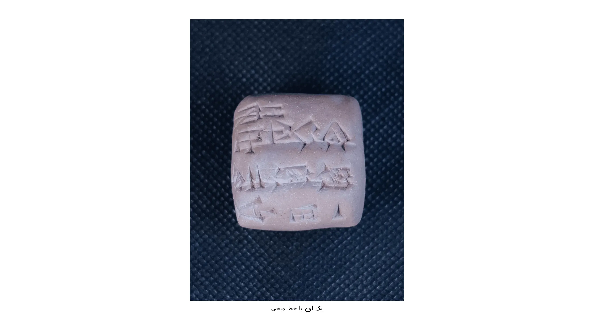

من همچنین چیزی دارم که معتقدم یک لوح اصیل سومری با یک خط میخی کوچک در مرکز آن است. روی این لوح، امضاهایی با غلتاندن یک استوانه ایجاد شده که بعداً به شما نشان خواهم داد.

علائم با ارقام کوچک به عنوان امضا در زمانی که اکثر مردم نمی‌توانستند بنویسند، استفاده می‌شد، زیرا تنها کاتبان ماهر این توانایی را داشتند.

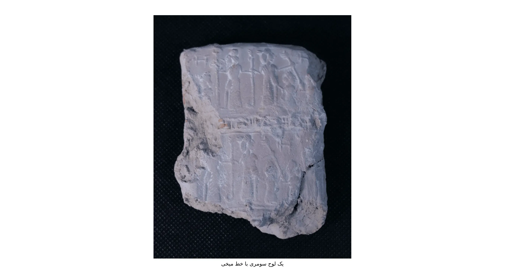

در زیر، می‌توانید استوانه‌ای که در بالا ذکر شد را ببینید: یک سنگ حکاکی شده با اشکال خاص. مردم از این استوانه امضایی که به انگلیسی به عنوان مهر استوانه‌ای شناخته می‌شود، برای امضای نامه‌ها استفاده می‌کردند. این روشی بود برای مشخص کردن نام نویسندگان یا نشان دادن اینکه نامه‌ها به نام آن‌ها نوشته شده‌اند.

بنابراین کاتبان آن زمان از قلم گوه‌ای شکل خود برای چاپ نشانه‌ها بر روی لوح‌های خیس استفاده می‌کردند.

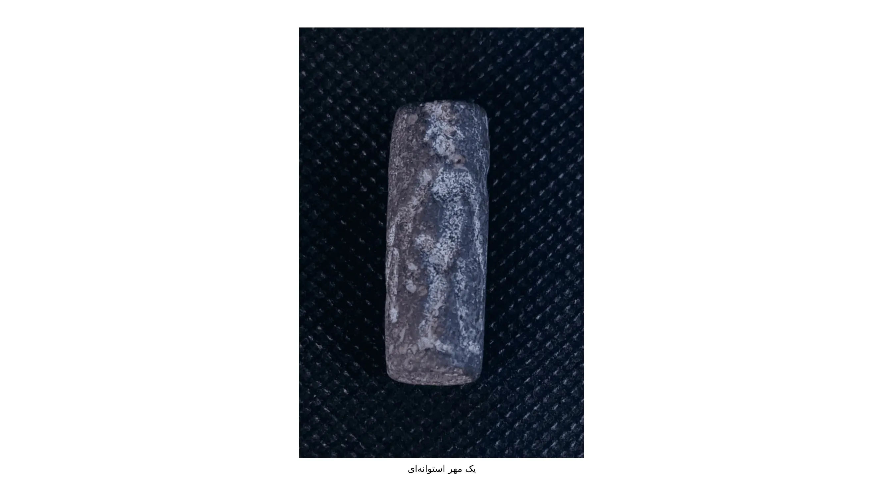

کاراکترهای میخی نمایانگر یک زبان نبودند، بلکه یک سیستم نوشتاری برای ثبت زبان‌های گفتاری بودند. به زبان انگلیسی، ما می‌گوییم "نوشتن یک زبان نوشتاری است"، و سپس می‌گوییم که "میخی یک خط است، نه یک زبان". بنابراین، به زبان فرانسوی، ما می‌گوییم که میخی یک زبان نیست، بلکه روشی برای رمزگذاری یک زبان است.

### تکامل و کاربردهای نوشتن

در طول قرون اولیه وجود خود، این خط محدود باقی ماند و اساساً به عنوان یک سیستم یادآوری برای ثبت مقادیر، فهرست کالاهای کشاورزی و تجهیزات خدمت می‌کرد. تنها به تدریج توانست **نام‌ها و جملات کامل را به صورت آوایی بازنمایی کند**.

در ابتدا، نام‌ها نمی‌توانستند به خط میخی بیان شوند زیرا این خط عمدتاً اشیاء و عناصر واقعیت، مانند گاو یا گندم، را که به صورت تصاویر کوچک نمایش داده می‌شدند، نشان می‌داد. با گذشت زمان، این تصاویر به شکلی پیشرفته‌تر از خط تکامل یافتند که امکان نمایش نام‌ها و مفاهیم پیچیده را فراهم می‌کرد.

اگر نام شخص، به عنوان مثال، لورا بود، می‌توانستیم یک کلمه، یک مخفف که شبیه "water" صدا می‌داد و یک دوم که شبیه "ras" بود، بگیریم و با آن نام لورا را تشکیل دهیم. این‌گونه بود که اولین شکل زبان نوشتاری توسعه یافت.

برای ثبت، برای نمایش اختصارات به صورت اصلی، اگر می‌خواستید سر یک گاو نر را بکشید، می‌توانستید شکل سر گاو نر را ببینید. کم‌کم، نقاشی‌ها ساده شدند تا چیزی بیش از یک نوع خط را نشان ندهند. محققان بر این باورند که این اتفاق افتاد زیرا مردم لوح‌های گلی مرطوب را در یک دست نگه می‌داشتند، بنابراین بازکشیدن حروف اول با چرخاندن آن‌ها آسان‌تر بود. همچنین تصور می‌شود که این به دلیل نحوه نگه‌داشتن لوح‌ها توسط کاتبان بوده است.

شما هنوز می‌توانید ارتباط با، مثلاً، گندم یا سر گاو نر را در اختصارات میخی ببینید، و آنها همیشه به یک طرف متمایل هستند.

در طول سه هزاره استفاده از آن، نوشتار میخی عمدتاً برای حفظ سوابق اقتصادی و اداری به کار می‌رفت. با این حال، ساکنان بین‌النهرین به زودی تمایل عمیقی برای حفظ هر چیزی که شایسته بود در برابر آزمون زمان به صورت مکتوب بایستد، پیدا کردند. بنابراین، داستان‌ها، افسانه‌ها و ترانه‌هایی که تا آن زمان به صورت شفاهی توسط موسیقی‌دانان سیار منتقل می‌شدند، به صورت مکتوب جاودانه شدند و اغلب توسط کاتبان در حال آموزش کپی می‌شدند. آن‌ها متون موجود را کپی می‌کردند، عمدتاً افسانه‌ها یا متونی که دارای ارزش فرهنگی خاصی بودند.

یک مثال مهم **حماسه گیلگمش** است، که احتمالاً **پادشاه تاریخی دولت‌شهر سومری اوروک** در حدود ۲۹۰۰-۲۳۵۰ قبل از میلاد بوده است.

این شکل نوشتار، که هم ابزار مدیریت اقتصادی و هم یک واسطه فرهنگی بود، تا قرن اول میلادی ادامه داشت، قبل از اینکه برای همیشه ناپدید شود و پشت سر خود شهادتی ارزشمند از تمدنی که در آن متولد شده بود، باقی بگذارد.

## نقش لوح‌های سومری

<chapterId>a396e6c5-56cc-5410-9e6b-0274401c5425</chapterId>

:::video id=a0729a35-01ec-4aa4-828f-d4ccc2eb168e:::

### سیستم‌های اعتبار پیش از پولی

در بین‌النهرین باستان، سازماندهی اقتصادی بر اساس مکانیزم‌های بسیار پیشرفته‌ای بود که مدت‌ها قبل از اختراع سکه‌های فلزی وجود داشتند. از همان ابتدا، سیستم‌های اعتباری رسمی و غیررسمی به عنوان شکلی اساسی از پول وجود داشتند که به جمعیت‌های محلی امکان انجام بسیاری از معاملات اقتصادی پیچیده را می‌دادند.

اختراع خط میخی دقیقاً برای پاسخگویی به نیازهای اداری و اقتصادی بود. لوح‌های گلی مشهور بین‌النهرین عمدتاً برای ثبت انواع مختلف قراردادها استفاده می‌شدند: وام‌های خصوصی، فروش، اجاره، رهن و حتی توافق‌نامه‌های ازدواج. نوشتن این لوح‌ها نیاز به تخصص کاتبان متخصص داشت، کاری که از نظر زمان و تلاش هزینه‌بر بود، **اما زمانی که منافع مالی در میان بود، توجیه‌پذیر بود.** مردم در آن زمان برای یکدیگر نامه‌های عاشقانه نمی‌نوشتند، آنها از کاتب برای نوشتن درباره نگرانی‌هایشان استفاده نمی‌کردند. آنها کاتب را برای نوشتن اسناد استخدام می‌کردند، چه ارتباطی وجود داشت و چه دلیل اقتصادی.

همچنین شایان ذکر است که برخی از این لوح‌ها به عنوان اوراق قرضه حامل در گردش بودند و آزادانه دست به دست می‌شدند.

به عنوان مثال، یک نوع توپ سفالی با سنگ‌های کوچک در داخل آن وجود داشت.

در بیرون گلوله سفالی، عددی نوشته و امضا شده بود که نشان‌دهنده تعدادی واحد بود. در داخل، این سنگ‌ها وجود داشتند و کسی که می‌خواست تأیید کند، واقعاً اعتبارسنجی کند که این ابزار واقعاً نشان‌دهنده X تعداد واحد است.

مثال دیگر، یک لوح که در جنوب غربی بغداد امروزی پیدا شده است، مقرر می‌کند که یک بدهکار متعهد می‌شود تا ۳۳۰ واحد غله را در روز برداشت به طلبکار بازپرداخت کند. حتی جالب‌تر، لوح دیگری به وضوح بیان می‌کند که بدهی چهار واحد جو باید مستقیماً به حامل لوح بازپرداخت شود، بنابراین **مفهوم پرداخت به حامل را معرفی می‌کند، که یک مفهوم به‌ویژه نوآورانه برای آن زمان بود**.

از ۲۰۰۰ سال قبل از میلاد به بعد، قانونی وجود داشت که همه معاملات تجاری، حتی کوچک‌ترین آن‌ها، باید به صورت مکتوب و با حضور شاهدان امضا می‌شد. تصور کنید چه بوروکراسی عظیمی در آن روزها برای ثبت همه معاملات در دفاتری که، یادآوری می‌کنم، از گل توسط کاتبان ساخته می‌شد، وجود داشت. این سخت‌گیری قانونی به منظور جلوگیری از اختلافات آینده بر سر مالکیت و حقوق کالاهای مبادله شده بود. اغلب شاهدان برای شهادت دادن به اینکه قرارداد واقعاً امضا شده بود، فراخوانده می‌شدند.

در حوزه خصوصی نیز، برخی خانواده‌ها و افراد در فعالیت‌های اقتصادی به اندازه‌ای پیچیده شرکت داشتند که نیاز به مدیریت دقیق داشت. خانه یک کاهن آنونیتوم به نام اور-اوتو در شهر شمالی بابل، سیپار-امنانو کشف شد که حاوی نزدیک به ۲,۰۰۰ لوح بود. این اسناد شامل قراردادهای وام خصوصی، اسناد فروش و اجاره‌نامه‌ها، همچنین نامه‌ها، متون مذهبی و علمی بودند که به تنوع و اهمیت آرشیوهای خصوصی در آن زمان شهادت می‌دهند.

قابل توجه است که نامه‌هایی که توسط کاتبان نوشته می‌شدند تقریباً به‌طور انحصاری با منافع مالی مرتبط بودند: شکایاتی درباره‌ی کمک‌هزینه‌های ناکافی، پرداخت‌های معوقه‌ی جهیزیه یا درخواست‌های فوری مادی دیگر. در آن روزها، نوشته‌های شخصی مانند نامه‌های عاشقانه وجود نداشت و حتی اشاره به بیماری نیز نادر بود.

نمونه‌ای تأثیرگذار از چنین نامه‌ای این واقعیت اقتصادی را نشان می‌دهد: یک مکاتبه‌کننده ناراحتی خود را پس از اینکه بدون پول یا آذوقه رها شد و شریکش او را ترک کرد، در حالی که قحطی شدیدی به آشور ضربه زد، ابراز می‌کند. او نیاز فوری خود به خرید غلات را توصیف می‌کند و درخواست می‌کند که معادل نقدی منسوجاتش به سرعت برای او ارسال شود تا از معیشت روزانه‌اش اطمینان حاصل کند.

این نامه، خطاب به شریک زندگی‌اش، به نظر می‌رسد که نشان می‌دهد او برای تجارت به جای دیگری رفته و او را بی‌پول رها کرده است. او به او یادآوری می‌کند که باید به مقادیری از پول دسترسی داشته باشد تا بتواند غلات بخرد و مالیات معبد خود را بپردازد. این شاید نزدیک‌ترین چیزی باشد که می‌توانیم به یک بحث نوشته شده در نامه‌ای از آن زمان برسیم. نامه‌ها تقریباً همیشه به معاملات اقتصادی مربوط می‌شدند و این نامه نیز به یک وضعیت اقتصادی نامطمئن مربوط می‌شود.

بنابراین، اسناد بین‌النهرینی که به دست ما رسیده‌اند عمدتاً مبادلات اقتصادی را منعکس می‌کنند، زیرا آن‌ها منحصراً برای انتقال کالاهایی با ارزش شناخته‌شده تهیه شده‌اند: پول، غلات، کالاهای مختلف، املاک و مستغلات، پرداخت مالیات‌های معبد. این آرشیوها نه تنها کارایی و دقت اداری این تمدن باستانی را نشان می‌دهند، بلکه توانایی آن در مدیریت مبادلات اقتصادی پیچیده در طول یک دوره بسیار طولانی را نیز آشکار می‌سازند.

## کنترل نخبگان بر روی لوح‌های سومری

<chapterId>c6d3df0e-b1e1-58dc-ab35-9f76bbc39393</chapterId>

:::video id=04a95fb8-a701-4a48-9ce8-0e9b6ba256fd:::

### نوشتن، فناوری‌ای که پیش از هر چیز اقتصادی است

برخلاف باور عمومی، اختراع نوشتن در بین‌النهرین حدود ۴۰۰۰ سال پیش در ابتدا به نیازهای ارتباطات شخصی یا ادبی خدمت نمی‌کرد. **خط میخی در درجه اول یک فناوری اقتصادی بود** که تنها زمانی توجیه می‌شد که منافع مالی مهمی در خطر بود. سومریان از نوشتن برای مکاتبه با یکدیگر یا بیان احساسات خود استفاده نمی‌کردند، بلکه به‌طور انحصاری برای مستندسازی معاملات تجاری و مالی خود به کار می‌بردند.

این تخصص را می‌توان با هزینه قابل توجه نوشتن بر روی لوح توضیح داد. حکاکی بر روی خاک رس نیاز به تخصص فنی ویژه، زمان قابل توجه و مواد خاص داشت. تنها معاملاتی که ارزش اقتصادی کافی داشتند، این سرمایه‌گذاری را توجیه می‌کردند و یک آستانه طبیعی برای دسترسی به این فناوری انقلابی ایجاد می‌کردند.

لوح‌های میخی یک سیستم مالی با پیچیدگی قابل توجه برای زمان خود را آشکار می‌کنند. مردم بین‌النهرین یک مجموعه کامل از ابزارهای مالی مدرن را توسعه داده بودند: **وام‌های خصوصی با بهره، اسناد فروش، قراردادهای اجاره، رهن و حتی قراردادهای ازدواج با بندهای مالی**. این پیچیدگی گواهی بر یک اقتصاد بازار توسعه‌یافته است که بسیار دور از تصویر ساده‌انگارانه مبادله ابتدایی است که اغلب با این تمدن‌های باستانی مرتبط می‌شود.

برخی از لوح‌ها به عنوان اوراق بهادار واقعی عمل می‌کردند و بدون نیاز به شناسایی دارنده اصلی، آزادانه از دستی به دست دیگر منتقل می‌شدند. این نوآوری امکان تبادل فوق‌العاده روان را فراهم کرد و پیش‌درآمدی بر سیستم‌های مالی مدرن بود. علاوه بر این، قوانین خاصی حتی الزام می‌کردند که تمامی معاملات تجاری به صورت مکتوب رسمی شوند و بدین ترتیب استفاده از نوشتار در حوزه اقتصادی را نهادینه می‌کردند.

### انحصار دانش و کنترل اقتصادی

مرکزیت نوشتن در اقتصاد قدرت قابل توجهی به کسانی که این فناوری را تسلط داشتند، اعطا کرد. **کاتبان، که عموماً به معابد و نهادهای حاکم متصل بودند، کنترل دوفاکتوی سیستم مالی را در دست داشتند**. تخصص نادر و ارزشمند آن‌ها، آن‌ها را به نگهبانان تمام معاملات مهم تبدیل کرده بود.

این انحصار دانش تصادفی نبود. مقامات هر دلیلی برای حفظ این انحصار داشتند، زیرا دموکراتیزه کردن نوشتن می‌توانست کنترل آن‌ها بر اقتصاد را کاهش داده و خطر جعل را افزایش دهد. حضور سیستماتیک شاهدان در مراسم امضا نشان‌دهنده این نگرانی مداوم درباره اصالت اسناد است.

الزام قانونی برای ثبت تمام معاملات تجاری به صورت مکتوب به چندین هدف استراتژیک خدمت می‌کرد: کنترل مالی، نظارت دقیق حسابداری، و حفظ وابستگی بازیگران اقتصادی به دستگاه اداری. **بدین ترتیب، دولت بین‌النهرین توانایی مدیریت بدهی‌های بین‌فردی را در مقیاس اجتماعی به خود اختصاص داد** و نوشتار را به ابزاری برای قدرت اقتصادی تبدیل کرد.

### همزیستی دو نظام پولی

تجزیه و تحلیل لوح‌ها واقعیت اقتصادی پیچیده‌تری را نسبت به حضور فراگیر آن‌ها در آرشیوها نشان می‌دهد. بسیاری از لوح‌ها به **شِکِل نقره** به عنوان واحد ارزش اشاره می‌کنند که نشان‌دهنده وجود موازی یک سیستم پولی مبتنی بر کالاهای فیزیکی استاندارد شده است.

این دوگانگی را می‌توان با لایه‌بندی اجتماعی آن زمان توضیح داد. **سیستم لوح‌های میخی برای یک نخبگان محدود محفوظ بود**: روحانیون، بازرگانان مرفه و مدیرانی که قادر به خواندن، نوشتن و تفسیر این اسناد پیچیده بودند. برای استفاده مؤثر از یک لوح حامل، فرد نه تنها باید می‌دانست چگونه آن را رمزگشایی کند، بلکه باید قادر به تأیید اصالت آن و درک پیامدهای قانونی‌اش نیز می‌بود.

**توده جمعیت، که از این سیستم نخبه‌گرا کنار گذاشته شده بود، مکانیزم‌های مبادله‌ای خود را توسعه داد**. مردم عادی از سیستم‌های قابل دسترس‌تری مانند اندازه‌گیری‌های استاندارد غلات، وزن‌های پول و سایر کالاهای به‌راحتی قابل اندازه‌گیری استفاده می‌کردند که هر کسی بدون مهارت‌های تخصصی می‌توانست آن‌ها را ارزیابی کند.

این اقتصاد محبوب، اگرچه کمتر در آرشیوهای رسمی مستند شده است، احتمالاً پویاتر و انعطاف‌پذیرتر از سیستم لوح‌ها بود. این اقتصاد مبادلات سریع روزانه را بدون نیاز به کاتبان امکان‌پذیر می‌کرد و نیازهای فوری صنعتگران، کشاورزان و بازرگانان کوچک را برآورده می‌ساخت.

شِکِل نقره، که اغلب در لوح‌ها به عنوان مرجع ارزش ذکر شده است، احتمالاً به عنوان پلی بین این دو سیستم اقتصادی موازی عمل می‌کرده و تبدیل بین بدهی‌های نوشته شده و پرداخت‌های فیزیکی را ممکن می‌ساخته است.

### ظهور خودجوش در مقابل کنترل نهادی

این همزیستی یک بحث اساسی در تاریخ اقتصادی را نشان می‌دهد: **تقابل بین ظهور خودجوش وسایل مبادله و تصاحب نهادی پول**. از یک سو، کالاهایی مانند پول به طور طبیعی از نیازهای مبادله‌ای مردم پدید آمدند. از سوی دیگر، نهادها این رویه‌ها را تصاحب و رسمی کردند تا جریان آن‌ها را کنترل کنند.

معبدهای سومری این تنش را به تصویر می‌کشیدند: آن‌ها از نوآوری‌های پولی محبوب (اشاره به شکل) استفاده می‌کردند در حالی که ابزارهای کنترلی خود را توسعه می‌دادند (لوح‌های میخی). این استراتژی به آن‌ها امکان می‌داد تا از مزایای هر دو سیستم بهره‌مند شوند: مشروعیت مردمی ارزهای سنتی و کنترل اداری بدهی‌های رسمی.

تجربه‌ی بین‌النهرین پیشینه‌های پایداری برای تکامل سیستم‌های مالی ایجاد می‌کند. این تجربه نشان می‌دهد که **پیشرفت مالی اغلب چندین هزاره قبل از نوآوری‌های تکنولوژیکی رخ می‌دهد** که معمولاً با آن‌ها مرتبط است. مفاهیم بهره، اعتبار، اسناد قابل معامله و وثیقه‌ی رهنی منتظر اختراع پول فلزی نماندند تا توسعه یابند.

این دوره مهم همچنین مسائل قدرت ذاتی در هر نوآوری پولی را آشکار می‌کند: چه کسی فناوری را کنترل می‌کند، چه کسی قوانین را تعریف می‌کند، و چگونه سیستم‌های رسمی و شیوه‌های مردمی بیان می‌شوند. این سوالات بنیادی در طول تاریخ اقتصادی پایدار بوده‌اند و به مباحثات معاصر درباره ارزهای دیجیتال و رمزارزها گسترش یافته‌اند.

# اقتصاد و پول در تمدن‌های باستانی

<partId>a16bcf4c-8c3a-11f0-9e79-2bd363a484bd</partId>

## تمدن‌های بزرگ عصر برنز

<chapterId>fab9334c-7385-5d7c-ad40-7d152beb22a1</chapterId>

:::video id=737e12e8-1033-4210-b1dd-b8a680f68b17:::

در این بخش با عنوان "تمدن‌های بزرگ عصر برنز"، با بخشی از کتاب *تاریخچه پول: از دوران باستان تا به امروز* نوشته گلین دیویس شروع خواهیم کرد، که به نظر من مقدمه‌ای عالی برای این بخش درباره تمدن‌های بزرگ باستان است.

> تاین‌بی حدود بیست و یک "تمدن" مختلف را شناسایی می‌کند، اما از آنجا که پانزده مورد از این تمدن‌ها به طور مستقیم یا غیرمستقیم از نمونه‌های قبلی مشتق شده‌اند، او تعداد تمدن‌های مستقلاً توسعه‌یافته را به شش کاهش می‌دهد: سومری، مصری، مینوسی، چینی، مایایی و آندی. از میان این‌ها، تنها اینکاهای آند توانستند بدون استفاده از پول به درجه بالایی از تمدن دست یابند، اگرچه به طور متناقضی آن‌ها به وفور از موادی که عموماً برای استفاده به عنوان پول بهترین محسوب می‌شوند - طلا و نقره - برخوردار بودند.

اینکاها سیستم پولی نداشتند، اما مقدار زیادی فلزات گرانبها داشتند. واقعاً یک پارادوکس است. بیایید با نقل قول ادامه دهیم:

> هرچه جامعه‌ای طبقاتی‌تر و سیستم برنامه‌ریزی آن دقیق‌تر باشد، نیاز به استفاده از پول برای جمعیت آن کمتر است. این ممکن است توضیح دهد که چرا فاتحان اسپانیایی کشف کردند که مکزیکی‌ها، که دولتشان نسبتاً آزادتر بود، به طور منظم از پودر طلا (نگهداری شده در لوله‌های شفاف) و دانه‌های کاکائو (نگهداری شده برای پرداخت‌های بزرگ در کیسه‌های ۲۴۰۰۰ واحدی) به عنوان ارز استفاده می‌کردند، در حالی که برعکس، اینکاها که بر اساس سلسله‌مراتب بسیار سخت‌تری سازماندهی شده بودند، اصلاً ارز نداشتند: استثنایی که توسط یک قاعده سخت تأیید می‌شود. منشأ پول در چین کاملاً مستقل از سایر تمدن‌ها بود؛ با این حال، نزدیکی نسبی تمدن‌های سومری، مصری و مینوسی تردیدهایی را در مورد میزان ناآگاهی آن‌ها از شیوه‌های پولی برمی‌انگیزد، به ویژه با توجه به تجارت گسترده‌ای که از زمان‌های بسیار قدیم برقرار شده بود.

در چین، سکه‌ها با رویکردی کاملاً متفاوت از سنت‌های غربی توسعه یافتند. از ابتدا پول فیات بودند. آن‌ها سکه‌های ریخته‌گری شده بودند.

و در اینجا، آقای دیویس به تجارت اشاره می‌کند. در واقع در زمان‌های خاصی بین چینی‌ها و سایر جمعیت‌ها مبادلاتی وجود داشت، اما واسطه مبادله برای تجارت خارجی بیشتر ابریشم بود. همان‌طور که بعداً خواهیم دید، طلا نیز در مناطق مرزی چین که جمعیت چینی کمتری داشت، استفاده می‌شد. و حتی برای تجارت بین‌المللی هم نه؛ برای آن، ابریشم بود.

بنابراین، تصور می‌کنم که شاید برای قالب سکه‌ها، آن‌ها تحت تأثیر تمدن‌های دیگر همان دوره که این فناوری را توسعه داده بودند، قرار گرفته باشند.

اما به وضوح، ماهیت پول در چین کاملاً متفاوت از غرب بود. ما در بخش بعدی درباره چین به طور مفصل به این موضوع بازخواهیم گشت.

در مورد این شهرهای معروف سومری، چند یادداشت اینجا دارم. می‌توانیم به اوروک اشاره کنیم، که شهری بسیار قدیمی و تأثیرگذار بود، معروف به اندازه قابل توجه و فرهنگ پیشرفته‌اش، به ویژه با توسعه نوشتن و برنامه‌ریزی شهری.

و همچنین می‌خواستم به حماسه معروف گیلگمش اشاره کنم. گیلگمش احتمالاً یک پادشاه تاریخی شهر سومری اوروک در حدود ۲۹۰۰ سال قبل از میلاد بود. او احتمالاً پادشاه این شهر-دولت سومری بود.

ما همچنین می‌توانیم از سارگون اکدی صحبت کنیم که از ۲۳۳۴ تا ۲۲۷۹ قبل از میلاد حکومت کرد.

او اولین فرمانروای امپراتوری اکدی بود، که یکی دیگر از تمدن‌هایی است که در بین‌النهرین ظهور کرد. و من سارگون را ذکر می‌کنم زیرا او اولین کسی بود که یک سرویس پستی برای این لوح‌های معروف که قبلاً به شما معرفی کرده‌ام، ایجاد کرد.

تصور کنید که واقعاً پاکت‌های سفالی وجود داشتند. لوح‌ها می‌توانستند در پاکت‌های سفالی با امضای شخص در بیرون پیچیده شوند تا محرمانگی را تضمین کنند. بنابراین مردم پاکت را می‌شکستند تا لوح را بازیابی کنند. ما این سیستم پستی را به سارگون اکدی مدیون هستیم.

سپس بابل وجود دارد، شهر بزرگی که به پایتخت امپراتوری بابلی تبدیل شد. تمدنی دیگر، مشهور به زیگورات و کاخ‌های باشکوهش، و قانون معروف حمورابی که به خاطر کد قانونی بسیار پیشرفته‌اش شناخته شده است.

و دو شهر برای پایان دادن به این بخش. ما آشور را داریم که پایتخت امپراتوری آشوریان و یک مرکز مذهبی مهم بود. و نینوا را داریم که بعدها پایتخت امپراتوری آشوریان شد. آنها پایتخت خود را به آنجا منتقل کردند و این شهر به خاطر ارتش قدرتمند، کاخ‌های وسیع و کتابخانه‌هایش شناخته می‌شود. و همچنین یکی از مکان‌های احتمالی باغ‌های معلق افسانه‌ای بابل است. ما اغلب از این شگفتی معروف دنیای باستان می‌شنویم.

اما هیچ اثری از این باغ‌های معلق معروف در بابل وجود ندارد. از سوی دیگر، در نینوا شواهد باستان‌شناسی از باغ‌هایی در چندین طبقه وجود دارد. ممکن است تاریخ‌نگاران یونانی مانند هرودوت نینوا را با بابل اشتباه گرفته باشند. وقتی آنها از شهرهای بین‌النهرین بازدید می‌کردند، شاید به آن به عنوان بابل اشاره می‌کردند. آثاری از باغ‌های معلق معروف در نینوا پیدا شده است و ممکن است محققان تعجب کنند که آیا نینوا همان مکان معروفی است که این باغ‌ها در آن قرار داشته‌اند و به عنوان باغ‌های معلق بابلی شناخته می‌شود.

## سازمان اقتصادی در بین‌النهرین

<chapterId>6afb6fc8-cbb7-56a5-8427-484b4b7d7477</chapterId>

:::video id=aa6a2cbd-5916-4ae3-ad4f-65f0bd5643fa:::

### ساختارهای اقتصادی پیشاسرمایه‌داری و برده‌داری

به این بخش درباره سازمان اقتصادی در بین‌النهرین خوش آمدید. اقتصاد پیشاسرمایه‌داری سه مرحله اصلی را طی کرد: ابتدایی، برده‌داری و فئودالی.

فئودالی، البته، بسیار بعدتر است، به وضوح در قرون وسطی، و ما قبلاً از مرحله ابتدایی که قبلاً با پارینه‌سنگی توصیف کردیم، عبور کرده‌ایم. اکنون، در بین‌النهرین، وقتی درباره سازماندهی اقتصادی صحبت می‌کنیم، درباره برده‌داری صحبت می‌کنیم.

با این حال، در بین‌النهرین، بخش عمده‌ای از کارها توسط طبقه‌ای وابسته مشابه بردگان انجام می‌شد که به‌طور قانونی مالکیت اربابان خود نبودند اما از طریق اجبار فیزیکی یا ایدئولوژیک از ثمرات کار خود محروم می‌شدند.

### نقش معابد و کاخ‌ها به عنوان مراکز اقتصادی

زمین‌داری‌های بزرگ بر اقتصاد تسلط داشتند. مالکان زمین، زمین‌های خود را به‌طور مستقیم با استخدام کارگران بهره‌برداری می‌کردند یا زمین‌های خود را در ازای اجاره بها اجاره می‌دادند. آن‌ها همچنین در فعالیت‌های مالی شرکت می‌کردند و پول را با نرخ‌های بهره بالا، معمولاً حدود ۲۰٪ تا ۳۳.۳٪ در سال، قرض می‌دادند، که این روش‌ها به‌طور چشمگیری با قوانین سخت‌گیرانه‌تر عبرانیان همسایه در تضاد بود.

وام‌هایی که کشاورزان دریافت می‌کردند، به‌جز در مورد شرکت‌های کشتیرانی، برای سرمایه‌گذاری مولد نبودند، بلکه بیشتر برای تضمین بقای آن‌ها تا برداشت بعدی بود. این وضعیت اغلب به بدهی مزمن کشاورزان منجر می‌شد.

اجازه دهید یک مقایسه با دوره‌ای جدیدتر در دوران باستان (روم) انجام دهم، جایی که شهروندان از اجاره‌های کشاورزی تولید شده توسط دهقانان و کار غیرآزاد، و همچنین غنائم جنگی زندگی می‌کردند. **این درآمدها بین شهروندان توزیع می‌شد، نه برای کسب سود بیشتر، بلکه برای ارتقاء وضعیت اجتماعی آن‌ها.** تجارت و صنایع دستی عموماً به گروه‌هایی خارج از نخبگان اجتماعی واگذار می‌شد. همه این‌ها با اقتصادهای قرون وسطی که به سمت سود از طریق تجارت و صنایع دستی گرایش داشتند، در تضاد است.

بنابراین آنچه که ما سعی داریم اینجا بگوییم این است که من در حال ترسیم یک شباهت با این واقعیت هستم که مردم از ابزارهای مالی وام‌دهی لزوماً برای بهبود وسایل تولید خود استفاده نمی‌کردند، و بعدها در رم، سودها لزوماً مجدداً سرمایه‌گذاری نمی‌شدند، بلکه برای افزایش اعتبار افرادی که می‌توانستند از این سودها بهره‌مند شوند، استفاده می‌شدند. ما هنوز فاصله زیادی با روحیه سرمایه‌داری که بعدها در قرون وسطی پدیدار شد داریم، زمانی که شغل‌ها می‌توانستند برای بهبود وسایل تولید ایجاد شوند و مازادها در جستجوی سود گرفته و ایجاد می‌شدند. بنابراین می‌توانیم ببینیم که سازمان اقتصادی هنوز به مرحله سوم از تحولات اقتصادی ذکر شده در بالا نرسیده بود.

### ظهور سیستم‌های اعتباری و واحدهای حسابداری

**کارل پولانی سه شکل از مبادله اقتصادی را متمایز می‌کند: تقابل بین گروه‌های متقارن،** که در قبایل ابتدایی وجود دارد، جایی که واقعاً نیازی به پول نداریم زیرا به یکدیگر اعتبار غیررسمی می‌دهیم و مبادله و توزیع مجدد می‌کنیم. **توزیع مجدد متمرکز در اطراف معابد و کاخ‌ها،** این شکل از مبادله با بین‌النهرین سازگار است، جایی که معابد در مرکز سازمان اقتصادی بودند و می‌توانستند در یک زمان ثروت را به شکل جیره‌ها بازگردانند و توزیع کنند. تنها بعداً مفهوم دستمزد معرفی شد. بنابراین، تا کنون، ما شکل ابتدایی (1)، توزیع مجدد متمرکز (2) در معابد و کاخ‌ها را داریم و سپس می‌توانیم نهایتاً به مبادلات بازار (3) راه بدهیم. اگرچه بازار به شکلی که امروز می‌فهمیم به طور کامل وجود نداشت، حضور مبادلات بازار در بین‌النهرین غیرقابل انکار است، که با وجود اصطلاحات خاص در زبان اکدی و با حضور شواهد باستان‌شناسی از قیمت‌ها، سودها، زیان‌ها، نوسانات و وضعیت‌های کمبود تأیید می‌شود.

خانوارهای بین‌النهرین به‌طور مستقل تمام مراحل تولید کشاورزی را مدیریت می‌کردند، از کاشت تا فرآوری نهایی به نان و آبجو. زنان همچنین منسوجات مورد نیاز وابستگان خود را تولید می‌کردند. برای کالاهایی که به‌صورت محلی تولید نمی‌شدند، خانوارها به بازرگانان متخصص مراجعه می‌کردند.

روابط خانوادگی در تجارت اهمیت ویژه‌ای داشتند. در دوره پالو-آشوری (حدود ۱۹۱۰-۱۸۳۰ قبل از میلاد)، بازرگانان شهر آشور یک مستعمره تجاری در کانیش در آناتولی تأسیس کردند و قلع و منسوجات را در ازای طلا و نقره وارد می‌کردند. تجارت بر اساس کسب‌وکارهای خانوادگی بود که به‌طور نزدیکی از طریق ازدواج و مشارکت‌های تجاری به هم مرتبط بودند. کانیش تنها یک حلقه در یک شبکه تجارت بین‌المللی گسترده بود.

در این مبادلات، فلزاتی وجود داشتند و آن‌ها فلزات گرانبها بودند و نه لزوماً، برای مثال، مس که در آن زمان واقعاً مفید بود، و ما فکر می‌کنیم که این فلزات برای مفاهیم ذخیره ارزش مبادله می‌شدند. بنابراین نمی‌توانستیم لزوماً از مبادله کالا به کالا صحبت کنیم، جایی که دو کالا به خاطر مفید بودنشان مبادله می‌شوند، بلکه بیشتر یک مفهوم پرداخت با آگاهی خاصی از انباشت فلزات گرانبها برای استفاده به عنوان ذخیره ارزش و نه استفاده از آن‌ها به عنوان یک کالا، برای مثال، استفاده از برنز برای ساخت زره.

خراج‌ها و مالیات‌ها عمدتاً به صورت کالا (جو یا نقره وزن‌شده) پرداخت می‌شدند. معابد و کاخ‌ها مراکز اصلی اقتصادی، اداری، سیاسی و مذهبی بودند و همچنین اولین وظایف بانکی را از طریق سپرده‌گذاری امن کالاها، ابتدا غلات، سپس سایر محصولات کشاورزی و در نهایت فلزات گران‌بها انجام می‌دادند. به این ترتیب، اولین عملیات اعتباری و وام‌دهی توسعه یافت، مدت‌ها قبل از ظهور سکه‌ها.

اقتصاد بین‌النهرین عمدتاً از جو و نقره به عنوان استانداردهای ارزش استفاده می‌کرد. نقره در واحدهای استانداردی مانند "سیکل" (sìqlum) با وزنی حدود 8.33 گرم وزن می‌شد. از اوایل دوره بابلی باستان (تحت حکومت حمورابی)، نقره به عنوان وسیله‌ای رایج برای پرداخت استفاده می‌شد، با مفهومی اولیه از ارزش اسمی ("nūbum") در مقابل وزن واقعی ("šuqulum")، **که مفهوم مدرن ارز فیات را پیش‌بینی می‌کرد**.

اما هنوز پول فیات به معنای دقیق کلمه نبود. هیچ تصوری از یک مهر با یک شخصیت معتبر وجود نداشت، اما تصوری از یک واحد حساب اسمی وجود داشت، در مقابل تصور فلز وزن شده. در زبان برای این دو مفهوم تمایزی وجود داشت و فکر می‌کنم ذکر آن مهم است.

گذار به بازار کار دستمزدی، فرآیندی دشوار بود. این گذار نیازمند دو نوآوری مفهومی عمده بود: جداسازی کار فرد از محصول نهایی و معرفی "زمان کار" به عنوان یک واحد قابل اندازه‌گیری. برای داشتن این مفهوم از کارمند دستمزدی و حقوق‌بگیر، ابتدا باید از این دو نوآوری عبور می‌کردیم. **در هزاره سوم، کار ابتدا با جیره‌های ثابت جبران می‌شد و سپس به تدریج در ابتدای هزاره دوم به سمت سیستم دستمزدی تکامل یافت.**

سرانجام، از قرن ۲۶ قبل از میلاد به بعد، مفهوم واقعی ارزش پولی شکل گرفت، اگرچه "پول" بین‌النهرین سکه نبود، بلکه یک معیار وزنی از غلات یا فلز بود. **بنابراین، برای معاملات مهم یا در زمینه‌هایی که نیاز به حفظ ارزش بود، اغلب ترجیح داده می‌شد که غلات به نقره تبدیل شود، که نگهداری آن آسان‌تر بود.** کمی شبیه به مثال کانیش، جایی که فلز نقره برای ذخیره‌سازی دریافت می‌شد.

از قرن بیست و یکم پیش از میلاد به بعد، **با ناپدید شدن مجازی مبادلات نامتقارن**، مشاهده می‌کنیم که در قراردادهای واگذاری، فعل "sa" به پرداخت قیمت اشاره دارد. این مفهوم که "sa" نامیده می‌شود، در قراردادها ظاهر می‌شود و به پرداخت قیمت اشاره دارد، نه اندازه‌گیری یک کالای خاص. "Sa" به سادگی به پرداخت یا قیمت اشاره دارد. این یک انسان‌شناس است که این موضوع را یادداشت کرده و ذکر می‌کند که این واقعاً یک پیشرفت است؛ ما نوعی دوگانگی بین قبل و بعد از معرفی این فعل "sa" در قراردادها مشاهده می‌کنیم.

نمی‌توانیم داده‌های تجربی موجود در آرشیوهای خاور نزدیک را که به وجود **برخی مکانیزم‌های بازار**، شامل **مفاهیم سود** و **زیان**، **نوسانات قیمت** و شرایط **کمیابی** اشاره دارند، نادیده بگیریم. اما دشواری اساسی در تعیین اهمیت نسبی مبادلات مبتنی بر بازار در کل اقتصاد باستانی بین‌النهرین نهفته است.

فکر می‌کنم کارشناسان این حوزه نشانه‌هایی از این مفاهیم بازار را دیده‌اند، اما واقعاً نمی‌توانند به ما بگویند که چقدر از اقتصاد آن زمان بر اساس این مفهوم بازار مدرن‌تر یا مکانیزم‌های دیگر بوده است.

ما می‌دانیم که وجود داشته است، اما نمی‌دانیم که آیا راه اصلی، مثلاً برای تعیین قیمت‌ها یا تجارت بوده است یا خیر.

این بخش درباره سازمان اقتصادی در بین‌النهرین به پایان می‌رسد.

در بخش‌های بعدی، همین کار را برای مصر و چین انجام خواهیم داد.

## سازمان اقتصادی و پولی در مصر باستان

<chapterId>bffcc16c-7fbf-5992-a0fa-6a7726d7d287</chapterId>

:::video id=40c1c4e5-b190-4bb6-b8a0-810c9ce7698b:::

### پیشینه تاریخی و دوره‌های مصر

این بخش به سازمان اقتصادی و پولی مصر باستان اختصاص دارد. برای ارائه یک پیش‌زمینه کوتاه، در اینجا فهرست و توضیح مختصری از دوره‌های مورد بحث آمده است.

- پادشاهی کهن (حدود ۲۵۷۵ - حدود ۲۱۳۰ پیش از میلاد)**. دوره‌ای که با ساخت اهرام بزرگ، به ویژه اهرام جیزه، مشخص می‌شود. این دوران عصر طلایی سلطنت متمرکز مصر بود.
- پادشاهی میانه (حدود ۱۹۳۸ - حدود ۱۶۳۰ قبل از میلاد)**. رنسانس سیاسی و فرهنگی پس از یک دوره بی‌ثباتی.
- پادشاهی نوین (حدود ۱۵۳۹ - ۱۰۷۵ پیش از میلاد)**. دوره‌ای از گسترش سرزمینی، قدرت نظامی و تجارت بین‌المللی. این دوره شامل سلطنت فراعنه معروفی مانند توت‌عنخ‌آمون و رامسس دوم است.
- ۱۳۲۳ پیش از میلاد - مرگ توت‌عنخ‌آمون**. فرعون جوان در سن حدود ۱۸-۱۹ سالگی درگذشت. مقبره تقریباً دست‌نخورده او در سال ۱۹۲۲ کشف شد و آن را به یکی از مشهورترین اکتشافات باستان‌شناسی تبدیل کرد.
- رامسس دوم - حکومت ۱۲۷۹-۱۲۱۳ قبل از میلاد**. یکی از قدرتمندترین فرعون‌های پادشاهی نوین. شناخته شده برای لشکرکشی‌های نظامی، بناهای بزرگش و احتمالاً انعقاد اولین پیمان صلح شناخته شده.
- ۱۲۷۵ پیش از میلاد - مردمان دریا**. تهاجمات یا مهاجرت‌های گروه‌هایی که به "مردمان دریا" معروف‌اند، چندین تمدن مدیترانه‌ای از جمله مصر را بی‌ثبات می‌کنند.
- نبرد زوئیس - ۱۱۷۸ پیش از میلاد**. درگیری بین ارتش مصر و مهاجمان، احتمالاً مرتبط با اقوام دریایی. یکی از بسیاری از نبردها در پایان پادشاهی نوین.
- دوره متاخر** دوره‌ای از تاریخ مصر باستان است که از حدود ۶۶۴ تا ۳۳۲ قبل از میلاد ادامه داشت.
- کلئوپاترا هفتم (۶۹ - ۳۰ قبل از میلاد)**. آخرین ملکه مصر، مشهور به خاطر هوش، جذابیت و اتحادهایش با ژولیوس سزار و مارک آنتونی، و احتمالاً همچنین به خاطر بینی‌اش. سلطنت او پایان مصر فراعنه را قبل از الحاق آن به روم نشان داد.

تا هزاره‌های پنجم و چهارم پیش از میلاد، مصر در حال تجربه فعالیت‌های تجاری شدید در مقیاس بزرگ بود که از طریق تجارت دریایی، رودخانه‌ای و زمینی (به‌ویژه توسط کاروان‌های الاغ) نوبیا، فلسطین، لیبی و مناطق دریای سرخ را به هم متصل می‌کرد.

### سیستم‌های اولیه تبادل و پول‌های باستانی

با ظهور اولین حکومت‌های مصر در حدود ۳۶۵۰-۳۴۰۰ قبل از میلاد، سایت معادی، در جنوب قاهره امروزی، به یک مرکز عمده برای فناوری مس و تجارت راه دور تبدیل شد، به ویژه با بین‌النهرین از طریق سواحل سوریه.

اگرچه تجارت در مقیاس بزرگ عمدتاً بر مبنای مبادله کالا به کالا بود، اما احتمالاً یک شکل ابتدایی از پول ("پالئو-ارز") که از اقلام پرستیژی مانند سنگ‌های نیمه‌قیمتی و صدف‌های فسیلی تشکیل شده بود، وجود داشت. طلا احتمالاً در این مبادلات نقش مهمی ایفا می‌کرد. اولین اشاره صریح به سکه در اسناد مصری در اواسط هزاره سوم قبل از میلاد نشان‌دهنده یک توسعه طولانی مرتبط با شیوه‌های تجاری است.

در جوامع باستانی (در اینجا لزوماً درباره مصر صحبت نمی‌کنیم، بلکه به طور کلی درباره جوامع باستانی صحبت می‌کنیم)، پرداخت‌ها مکرر بودند، نه برای خرید مستقیم، بلکه برای پرداخت مهریه، مراسم مذهبی و سایر تعهدات اجتماعی. این معاملات نیاز به قیمت‌گذاری و ارزیابی دقیق داشتند. بسیاری از جوامع ابتدایی دارای اشیاء ممتاز و قابل شمارش بودند که ارزش بر اساس آنها تخمین زده می‌شد. اگر مهریه‌ای پرداخت می‌کنید، البته باید مقداری از یک شیء را که قرار است مبادله شود برای پرداخت مهریه یادداشت کنید. این ارزش اساساً ارزش افراد است.

در جوامع باستانی، قبل از ظهور پول یا سیستم‌های پولی، پرداخت‌هایی وجود داشت، اما اغلب با تعهدات اجتماعی مرتبط بودند و ارزش آن‌ها از ارزش افراد ناشی می‌شد، مانند پرداخت مهریه یا خون‌بها.

بازگشت به مصر، در دوران امپراتوری باستان، "شات(y)" که در اصل یک واحد پولی ملموس (یک سکه کوچک طلا یا نقره با وزن حدود 7.6 گرم) بود، به سرعت از عملکرد واقعی خود به عنوان یک ارز سخت به یک **عملکرد حسابداری** تبدیل شد که منجر به مفهوم ارزش شد. می‌توانیم در آن نوعی واحد حساب برای بیان ارزش را تشخیص دهیم که در اصل نوعی سکه بود، اما واقعاً نمی‌توان آن را سکه نامید زیرا مهر نشده است، بلکه فقط یک اندازه‌گیری فلز است. ما به مفهوم یک واحد حساب نزدیک‌تر می‌شویم.

این مفهوم شات(y) سرانجام کنار گذاشته شد، شاید به دلیل خطر تقلب. بعداً خواهیم دید که مصریان در پذیرش سکه‌های مهر شده کند بودند و حتی پس از اینکه همسایگانشان آن‌ها را پذیرفتند، همچنان به وزن کردن آن‌ها ادامه دادند.

در قرون وسطی، نقره به ندرت برای معاملات روزمره استفاده می‌شد، که عمدتاً با اندازه‌گیری‌های غلات و مقادیر نان انجام می‌شد. در این دوره بود که نوعی پول نوشتاری ظاهر شد، جایی که پرداخت‌ها می‌توانستند به صورت کتبی ثبت شوند یا از طریق انتقال واقعی انجام شوند.

در پادشاهی نوین، سیستم پولی پیچیده‌تر شد و ارزهای کالایی مختلفی که به فلزات (طلا، نقره، مس)، پارچه‌های استاندارد، غلات و روغن ارزش‌گذاری می‌شدند، در آن ادغام شدند. پارچه‌ها به عنوان "اندازه‌های پارچه" شناخته می‌شدند. **قیمت کالاهای روزمره اغلب به صورت غلات یا مس بیان می‌شد، در حالی که اشیاء قیمتی به طلا یا نقره ارزش‌گذاری می‌شدند. نقره که در مصر کمیاب‌تر از طلا بود، به خصوص ارزشمند شد.** نقره نسبت به طلا که در مصر فراوان‌تر بود، بیش از حد ارزش‌گذاری شده بود.

تا دوره متاخر (هزاره اول قبل از میلاد)، نقره به فلز رایج مبادله در سراسر خاور نزدیک تبدیل شده بود. این فلز به شکل شمش، سکه‌های فلزی یا حلقه‌ها در گردش بود که در معابد وزن و علامت‌گذاری می‌شدند و وزن و خلوص آن‌ها تضمین می‌شد، اگرچه به تصویر یک حاکم ضرب نشده بودند. این موضوع بعداً اتفاق افتاد و موضوع بخش بعدی درباره لیدی‌ها خواهد بود.

همچنین باید توجه داشت که مصریان باستان اصطلاح "hedj" را برای پول داشتند و از آن به‌طور کلی برای تعیین هر وسیله پرداختی که به عنوان مابه‌ازا در یک معامله خدمت می‌کرد، استفاده می‌شد، چه برای فلز، غلات، پارچه یا کالاهای مختلف (چوب، حیوانات، خدمات و غیره). نمونه‌های مستند نشان می‌دهند که مصریان می‌توانستند یک معامله را با ترکیب محصولات مختلف که ارزش کل آن‌ها به واحدهای مسی ("deben") بیان می‌شد، تسویه کنند.

**معبدها نقش مرکزی در اقتصاد مصر داشتند: آنها گنجینه‌های قابل توجهی از فلزات گرانبها (طلا و نقره) را جمع‌آوری و ذخیره می‌کردند که برای تجلیل از خدایان در نظر گرفته شده بود، اما همچنین به عنوان یک ذخیره پولی که می‌توانست در صورت نیاز به چرخه اقتصادی بازگردانده شود، خدمت می‌کرد**. ما نمونه‌هایی از تمدن‌های دیگر را خواهیم دید که ذخایر ارزشمندی را در معابد جمع‌آوری می‌کردند، مانند مجسمه‌ها، که در صورت جنگ، کمبود ارز یا بحران ذوب می‌شدند. این یک موضوع تکراری در طول تاریخ است.

همچنین شایان ذکر است که کشت کتان یک انحصار سلطنتی بود که به معابد اعطا می‌شد و تولید پارچه‌های گران‌بها اهمیت اقتصادی آن‌ها را تأیید می‌کرد.

مصریان باستان تمایز روشنی بین جنبه ایدئولوژیک فلزات گرانبها که به الوهیت مرتبط بود (طلا به عنوان نماد گوشت خدایان و نقره به عنوان نماد استخوان‌های آن‌ها) و عملکرد عملی آن‌ها به عنوان ارز که به عنوان مرجع برای سایر اشکال پرداخت عمل می‌کرد، قائل بودند.

از این رو، اگرچه مصر باستان تا دوره متاخر یک ارز ضرب‌شده قابل مقایسه با سیستم‌های پولی مدرن توسعه نداد، اما دارای یک سیستم پولی پیشرفته بود که بر اساس استفاده ترکیبی از پول نوشتاری، واحدهای حساب دقیق، پول کالایی و فلزات گرانبها با ارزش‌گذاری بر اساس وزن بود.

خود سکه‌ها وزن شدند و دو مفهوم متفاوت به وجود آمد: **"ضرب سکه" و "پول"**. من از دو اصطلاح در انگلیسی استفاده کردم. اول، "ضرب سکه" به سکه‌ها اشاره دارد، مفهومی که بعداً به وجود می‌آید، و ما همچنین این مفهوم پول را داریم. ما می‌توانیم یک مفهوم خاص از "پول" را با واحدهای حسابی که به تازگی به صورت پول بیان کردم تعریف کنیم، اما که هنوز سکه نبودند، بنابراین "ضرب سکه" کمی بعدتر با لیدی‌ها به وجود می‌آید.

بنابراین، سکه‌ها پیش‌نیازی برای پول نیستند، **به‌طوری‌که می‌توانیم وجود پول را به اوایل هزاره سوم بپذیریم،** در هر صورت و بدون هیچ شکی در طول هزاره دوم و به‌ویژه در دوران حکومت حمورابی.

نکته‌ای که باید اینجا به خاطر داشت، و این همان چیزی است که نویسنده در کتاب "خاستگاه‌های پول" به آن اشاره می‌کند، این است که هیچ شکی نیست که مفهوم پول در آن زمان، در این سیستم‌های پولی، وجود داشته است و اشتباه است که تولد مفهوم پول را به ظهور سکه‌ها مرتبط کنیم.

در نهایت، مفاهیم پولانی از هم‌پذیری و بازتوزیع که اغلب به مصر باستان اعمال می‌شود، نیاز به دقت بیشتری دارند: در حالی که این مفاهیم وجود دارند، اما چارچوبی انحصاری تشکیل نمی‌دهند. مصر فرعونی اقتصادی پیچیده‌ای را توسعه داده بود که به طور کامل مبادلات تجاری پیشرفته را که از اعمال مذهبی و آیینی متمایز بود، در بر می‌گرفت و نشان‌دهنده خودمختاری واقعی حوزه اقتصادی از ایدئولوژیک بود.

این ویژگی به این مفهوم مرتبط است که فلزات گرانبها با یک الوهیت خاص مرتبط بودند، اما همچنان قادر به تمایز بودند.

من این موضوع را مطرح می‌کنم زیرا پولانی به استفاده از این فلزات گرانبها به عنوان یک مفهوم عمدتاً مذهبی یا الهی اشاره کرده است. با این حال، ما پیشنهاد می‌کنیم که این فلزات همچنین در سیستم اقتصادی ادغام شده بودند و مصریان از قبل قادر به انجام چنین تمایزاتی بودند.

در پایان، مایلم از کتاب "خاستگاه‌های پول" نقل قول کنم که هدف از این اختراع، یعنی پول ضرب‌شده را فهرست می‌کند. چندین نکته وجود دارد، اما فقط می‌خواهم بر نکته ۵ تأکید کنم:

*توسعه امکان بازی اقتصادی از طریق استفاده از روش‌هایی مانند کاهش ارزش و ارزیابی مجدد متوالی برای کاهش یا افزایش واردات و صادرات با هزینه کمتر*

بنابراین، حتی در آن زمان‌های باستانی، نویسنده پیشنهاد می‌کند که سکه‌ها قبلاً اختراع شده یا تحت کنترل دولت ظاهر شده بودند و از نظر مقدار فلزات گرانبها و وزن برای مدیریت اقتصاد دستکاری می‌شدند. اجازه دهید یک نکته کوچک در مورد بخش بعدی به شما بگویم. **حتی در ابتدایی‌ترین اشکال سکه‌ها، که از الکتروم، آلیاژی از طلا و نقره ساخته شده بودند، ما از تحلیل محتوای فلزات گرانبها در این سکه‌ها می‌دانیم که اولین صادرکنندگان، به عنوان مثال، کرزوس، طلای کمتری نسبت به الکتروم طبیعی داشتند.**

این بدان معناست که آنها قبلاً می‌دانستند چگونه طلا و نقره را جدا کنند و سکه‌هایی با محتوای طلای کمتر صادر می‌کردند.

نویسنده پیشنهاد می‌کند که از اولین روزهای ضرب سکه، فراتر از صرفاً تأیید وزن و تسهیل تجارت، قدرت ضرب پول از همان ابتدا برای افزایش مقدار صادر شده، احتمالاً به عنوان شکلی از برنامه‌ریزی اقتصادی، مورد سوءاستفاده قرار می‌گرفت.

## نشانه‌های ارز و سازمان اقتصادی و پولی در چین باستان

<chapterId>e08d3be9-423c-5cf3-a606-6ad54e2261af</chapterId>

:::video id=ae7e6367-1725-455e-bfe6-359be1f443e5:::

در این بخش با عنوان "پول نشانه و سازمان اقتصادی و پولی چین باستان"، خواهیم دید که پول چین باستان دارای ویژگی‌های متمایزی از سنت‌های غربی است. ارز چینی از همان ابتدا یک "ارز نشانه" بود. اطلاعات این بخش بر اساس یادداشت‌هایی است که پس از خواندن کتاب "Aux origines de la monnaie" برداشته‌ام.

### مفهوم ارز نشانه و ویژگی‌های متمایز آن

به گفته نویسنده، پول نشانه معادل ارز فیات امروزی است. این یک ارز است که ارزش آن به محتوای فلزی‌اش مرتبط نیست. از همان ابتدا، این نوعی توافق، یک اجماع اجتماعی در مورد ارزش این سکه‌ها بود.

سکه‌های باستانی چینی دارای ویژگی‌هایی هستند که با سنت‌های غربی متفاوت است. این سکه‌ها عمدتاً فلزی بودند، اما به جای ضرب، ریخته‌گری می‌شدند و تصویر حاکم را نداشتند. به طور شگفت‌انگیزی، دولت چین انحصاری در صدور پول نداشت. این لیبرالیسم ظاهری را می‌توان با نبود نیاز اقتصادی به انحصار در صدور پول توضیح داد، به لطف منابع مالیاتی فراوانی که از جمعیت بزرگ قابل مالیات‌گیری جمع‌آوری می‌شد.

ارز چینی همچنین با جنبه اعتباری خود مشخص می‌شود. از همان ابتدا، تقلیدهای برنزی از صدف‌های دریایی به عنوان ارز استفاده می‌شدند، بدون هیچ ارتباط مستقیمی با ارزش ذاتی فلز استفاده شده. اگر به تاریخ بسیار دور برگردیم، چینی‌ها از صدف‌های دریایی به عنوان ارز استفاده می‌کردند. در نهایت، زمانی که صدف‌ها بسیار کمیاب شدند، آن‌ها نسخه‌هایی از مس ساختند و این کپی‌ها همان ارزش چیز واقعی را داشتند.

بنابراین، ارز چینی بر اساس ارزش ماده یا کمیابی نسبی کالای اصلی (مثلاً صدف) نبود، بلکه بر اساس اعتماد جمعی به استفاده از آن به عنوان واسطه مبادله - به عبارت دیگر، یک نشانه پولی - بود.

### از صدف‌های کاوری تا تقلیدهای فلزی

صدف کاوری به طور گسترده به عنوان یک واحد پولی ابتدایی استفاده می‌شد. کتیبه‌های باستانی نشان می‌دهند که از اوایل سلسله‌های شانگ و ژو (اولین سلسله‌های هزاره اول و دوم قبل از میلاد)، صدف‌های کاوری نه تنها برای پاداش دادن به اعمال نظامی، بلکه برای **پرداخت کار، سنجش ارزش و خرید زمین** نیز استفاده می‌شدند.

نکته مهمی که باید به خاطر داشت این است که این ابزار فقط برای مقاصد محدود توسط جامعه استفاده نمی‌شد. از آن برای پاداش‌های نظامی، پرداخت برای کار و اندازه‌گیری ارزش استفاده می‌شد. ما ردپای این موضوع را در نوشته‌های باستان‌شناسان پیدا می‌کنیم. در حالی که نمی‌دانیم آیا به صورت روزانه برای خرید نان استفاده می‌شد یا نه، اما شواهدی داریم که می‌توانست برای انواع معاملات ذکر شده در بالا استفاده شود.

با گذشت زمان، کمبود صدف‌های واقعی کاوری منجر به تولید تقلیدهایی از جنس برنز، استخوان، مروارید یا سنگ شد، به‌ویژه برای استفاده در زمینه‌های تدفینی تا از قفل شدن ارزش‌های واقعی در مقبره‌ها جلوگیری شود. این تغییر در ماده همچنین به ایده کنترل شاهزاده بر پول مرتبط است، کنترلی که اگر شاهزاده پول را بسازد، آسان‌تر است.

آنچه که باید در اینجا درک کنیم این است که با عبور از محدودیت کمبود طبیعی صدف‌ها، اگر شاهزاده بتواند خودش ارز را ایجاد کند، کنترل بیشتری بر مدیریت اقتصاد به او می‌دهد.

برخلاف بین‌النهرین، که در آن سکه‌ها به وزن فلزات گران‌بها مرتبط بودند، اصطلاحات سکه‌شناسی چینی مستقیماً از اشکال اولیه اشیایی که به عنوان ارز استفاده می‌شدند، مشتق شده‌اند: صدف‌ها (bei)، چاقوها (dao)، بیل‌ها (bu)، و سکه‌های گرد (quan یا qian). بنابراین، می‌توانیم ببینیم که منشأ کلمات مرتبط با پول در چین به این اشیا اشاره داشته است. در مقابل، در غرب، ما تعدادی اصطلاحات پولی داریم که از مفاهیمی کاملاً متفاوت از این‌ها می‌آیند و بیشتر به ویژگی‌های فیزیکی و وزن اشیای پولی مرتبط هستند. این تفاوت‌های ریشه‌شناسی به وضوح شکاف بین دیدگاه‌های غربی و چینی نسبت به پول را نشان می‌دهند.

در چین، ارزش پولی کاملاً اعتباری بود و بر اساس یک قرارداد اجتماعی بین دولت، تولیدکنندگان و بازرگانان قرار داشت.

### تنظیم اقتصادی و فلسفه پولی

دولت چین از پول به عنوان ابزاری برای تنظیم اقتصادی استفاده می‌کرد: در زمان‌های فراوانی پول، ارزش پول کاهش می‌یافت و خرید کالاها برای مردم آسان‌تر می‌شد. برعکس، در زمان‌های کمبود پول، ارزش پول افزایش می‌یافت و قدرت خرید دولت برای عملیات بعدی‌اش تقویت می‌شد.

می‌توان در اینجا ارتباطی با تورم و کاهش تورم برقرار کرد. با عرضه پول ثابت، اگر بهره‌وری اقتصاد افزایش یابد، ارزش پول افزایش می‌یابد. برعکس، اگر بهره‌وری کاهش یابد، ارزش پول کاهش می‌یابد. با این حال، در این مثال، عکس این موضوع صادق است. احتمالاً به این دلیل که شاهزاده انحصار کامل در تولید پول نداشت، اما همچنان نشان می‌دهد که ارزش پول به شرایط اقتصادی مرتبط بود.

فیلسوف مو دی (قرن ۵-۴ قبل از میلاد) قبلاً این رابطه بین قیمت و ارزش را تحلیل کرده بود: به گفته او، تغییرات قیمت بازتاب‌دهنده‌ی مفهوم واقعی ارزانی یا گرانی مطلق نیستند، بلکه بیشتر نشان‌دهنده‌ی یک رابطه‌ی نوسانی بین کالاها و پول هستند، مستقل از ارزش اسمی ثابت علامت ارز.

بنابراین، به جای اینکه بگوید سکه طلا به خودی خود دارای نوعی ارزش پایه‌ای است، مانند ارزش استفاده یا ارزش ذاتی، او اشاره می‌کند که ارزش علامت پولی بیشتر از وضعیت اقتصاد ناشی می‌شود.

در چین، سکه‌ها لزوماً نیازی به علامت‌گذاری رسمی یا تضمین نداشتند. پذیرش آن‌ها تنها به اعتماد جمعی بستگی داشت، که توضیح می‌دهد چرا سکه‌های برنزی یا مسی بدون کتیبه‌های خاص توانستند برای مدت طولانی به‌طور آزادانه در گردش باشند.

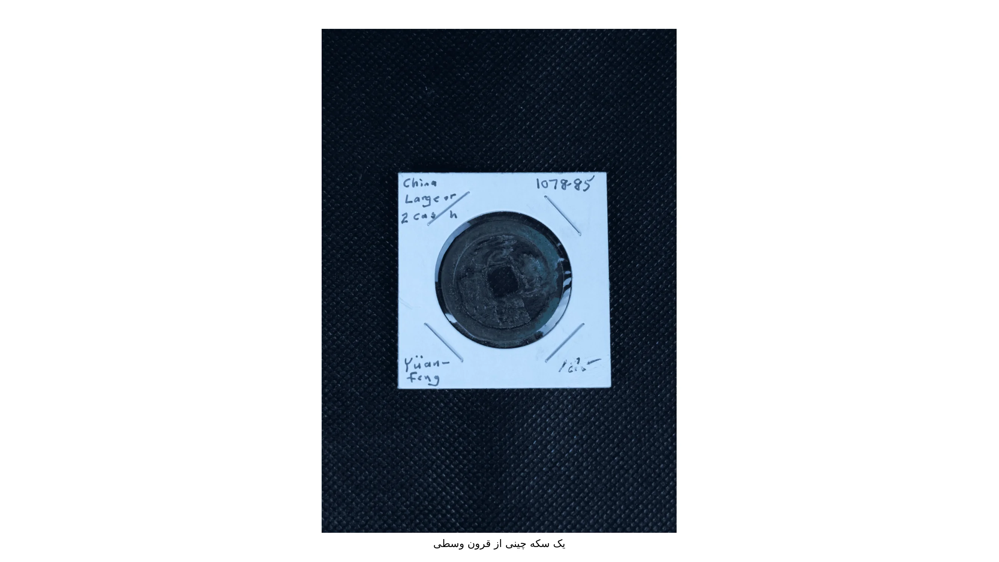

سکه‌ای که در بالا مشاهده می‌کنید، یک سکه چینی از قرون وسطی است. این سکه ریخته‌گری شده و دارای یک سوراخ مربعی در مرکز است. این سوراخ برای عبور دادن طناب و به هم بستن سکه‌ها به منظور ساخت دستبند یا گردنبند استفاده می‌شد. با این حال، این سکه‌ها عمدتاً برای پوشیدن نبودند؛ بلکه بیشتر برای مقاصد حسابداری استفاده می‌شدند. آن‌ها می‌توانستند به صورت رشته‌های بزرگ به هم متصل شوند تا واحدهای حسابداری را تشکیل دهند، به طوری که قطعات به هم قفل می‌شدند. لزوماً هیچ علامت خاصی روی آن‌ها نبود و گاهی اوقات فقط دایره‌های برنزی ساده بودند.

انحصار پولی دولت، که به‌طور دیرهنگام توسط وودی از سلسله هان در سال 113 قبل از میلاد تأسیس شد، اغلب به چالش کشیده می‌شد و به بازیگران خصوصی یا محلی مختلف اجازه می‌داد تا ارزهای خود را صادر کنند، به شرطی که از اعتماد اجتماعی کافی برخوردار بودند.

**ارزش ذاتی پایین ارزهای چینی مانع از احتکار شده و گردش روان آنها را تضمین می‌کرد**. فلزات گرانبها به ندرت به عنوان ارز در گردش استفاده می‌شدند تا از احتکار جلوگیری شود. طلا، به دلیل گران بودن، معمولاً کنار گذاشته می‌شد و خرج نمی‌شد. در عوض، **تنها ابریشم به عنوان یک ارز با ارزش واقعی در تجارت بین‌المللی چین نمایندگی می‌کرد**. چینی‌ها با استفاده از ابریشم، نه طلا، تجارت می‌کردند.

در طول بحران‌های اقتصادی یا پولی، به‌ویژه زمانی که قیمت مس در حال افزایش بود، راه‌حل‌های نوآورانه‌ای اتخاذ شد: به این ترتیب، از اوایل قرن دوم میلادی، سکه‌های در گردش بریده شدند تا واحدهای کوچکتری ایجاد شود و امکان گردش روان با هزینه کمتر فراهم شود. دوره‌های دیگری مانند دوره وانگ مانگ (اوایل قرن اول میلادی) با ارزهای بسیار اعتباری آزمایش کردند، جایی که ارزش اسمی بسیار بالاتر از محتوای واقعی فلزی آن‌ها بود و به این ترتیب اسکناس‌ها را پیش‌بینی می‌کردند. آن‌ها یک سکه را گرفته و ارزش‌هایی مانند ۵۰، ۱۰۰ یا ۲۰۰ را بر روی آن مهر می‌زدند تا مقادیر بزرگتری مانند ۲۰۰ سکه را نشان دهند. این عمل احتمالاً به تورم قابل توجهی منجر شد.

همان‌طور که در بالا ذکر شد، این سیستم بر اساس یک قرارداد اجتماعی بین دولت، تولیدکنندگان و بازرگانان بود، اما همچنین بر قوانین استبدادی و سخت‌گیرانه برای کسانی که بازی را رعایت نمی‌کردند، به ویژه در رابطه با انتخاب قطعات (چه زیبا یا نه) یا طول پارچه‌ها (که با استاندارد مطابقت نداشت) استوار بود.

به نظر من، این سیستم خیلی محکم نیست. این سیستم عمدتاً به قوانین سختگیرانه‌ای متکی بود که مقامات و بازرگانان را ملزم به پذیرش سکه‌های آسیب‌دیده می‌کرد، تحت تهدید تحریم‌ها.

### نوآوری‌های پولی چین و تأثیر اقتصادی آن‌ها

چین همچنین پیشگام در صدور اشکال اولیه پول کاغذی بود که در ابتدا در پاسخ به کمبود فلز در قرن نهم میلادی به کار گرفته شد. علیرغم مزایای اولیه، این ارزهای کاغذی به طور منظم به مارپیچ‌های تورمی منجر می‌شدند وقتی که بیش از حد صادر می‌شدند، همانطور که در دوره‌های سونگ یا مینگ مشاهده شد، زمانی که صدور بیش از حد به بحران‌های جدی ارزی منجر شد، که توسط مارکو پولو در قرن سیزدهم به تصویر کشیده شد، که حتی اشاره کرد که جعل چنین پول کاغذی با مجازات مرگ روبرو بود. نمی‌توانم اشاره به نوعی خشونت را نادیده بگیرم.

بنابراین، تجربه چینی با یک مفهوم عمیقاً اعتباری از پول، انعطاف‌پذیری قابل توجه سیستم پولی و استفاده زودهنگام از ارزهای کاغذی مشخص می‌شود که بر اساس اعتماد بین بازیگران اقتصادی استوار است نه بر ارزش ذاتی رسانه‌های مورد استفاده.

## سازمان اجتماعی و اقتصادی در دوران باستان

<chapterId>4023c3ce-7a47-5ac4-8f5f-c7ab699ab20f</chapterId>

:::video id=2761efe4-21cf-4f06-9bda-c03f9ff39012:::

### بحث در مورد انگل‌شناسی شهری

رابطه بین شهرهای باستانی و مناطق پیرامونی آن‌ها یک سوال اساسی را مطرح می‌کند: آیا این مراکز شهری به عنوان انگل‌های استخراج‌کننده ثروت عمل می‌کردند، یا به عنوان موتورهای تخصص اقتصادی مفید؟ فرضیه انگل‌گرایی پیشنهاد می‌کند که شهرهای عصر برنز، به‌ویژه در بین‌النهرین، **به‌طور سیستماتیک ارزش بیشتری از مناطق روستایی خود استخراج می‌کردند تا آنچه بازمی‌گرداندند**، و اساساً از طریق اجاره و مالیات زندگی می‌کردند بدون اینکه ارزش معادلی ایجاد کنند.

این دیدگاه در فروپاشی امپراتوری روم نیز منعکس شد: زمانی که گسترش سرزمینی متوقف شد، جریان ثروت خارجی خشکید و احتمالاً اقتصادی شهری را آشکار کرد که قادر به تأمین مالی خود نبود. به این ترتیب، شهرها "فراتر از توان خود" زندگی می‌کردند و به جای تولید، به استخراج وابسته بودند.

### تخصص به عنوان محرک ایجاد ارزش

یک خوانش اقتصادی جایگزین این دیدگاه انگلی را به چالش می‌کشد. **شهرهای باستانی بیش از هر چیز به عنوان مراکز تخصص و تقسیم کار عمل می‌کردند**. نقش آن‌ها فراتر از استخراج ساده بود: آن‌ها صنایع دستی تخصصی را متمرکز می‌کردند، شبکه‌های تجاری را سازماندهی می‌کردند و به عنوان مراکز مبادلات دوربرد خدمت می‌کردند.

این تخصص شهری یک وابستگی متقابل مولد با مناطق پیرامونی ایجاد کرد. **شهرها نمی‌توانستند بدون تأمینات کشاورزی روستایی زنده بمانند، اما مناطق پیرامونی در مقابل از محصولات صنایع دستی، نوآوری‌های فنی و دسترسی به شبکه‌های تجاری مدیترانه‌ای بهره‌مند می‌شدند**. تقسیم کار امکان افزایش بهره‌وری متقابل را فراهم کرد، حتی اگر توزیع منافع ممکن بود نامتعادل به نظر برسد.

ناامنی غذایی مزمن آن زمان تا حدی این عدم تقارن ظاهری را توضیح می‌دهد. خطر قحطی و نابودی محصولات تهدیدی دائمی برای جمعیت‌های روستایی بود، در حالی که صنعتگران شهری که به شبکه‌های تجارت بین‌المللی متصل بودند، از ثبات اقتصادی بیشتری برخوردار بودند.

### تکامل تاریخی، از دوران باستان تا قرون وسطی

تضاد بین سازماندهی باستانی و قرون وسطایی این مسئله را روشن می‌کند. **دوران باستان تقسیم کار در مقیاس بزرگ را ترجیح می‌داد، با شهرهایی که به کل دنیای مدیترانه باز بودند**. تجارت و تخصص به سطوح پیشرفته‌ای رسیدند و شبکه‌های اقتصادی گسترده‌ای ایجاد کردند.

سقوط امپراتوری روم منجر به تکه‌تکه شدن رادیکال شد: **دوران فئودالی این سازمان متمرکز را با یک سیستم غیرمتمرکز از املاک خودکفا جایگزین کرد**. ویلاهای روستیکای روم باستان به ماتریس سینیوری‌های قرون وسطی تبدیل شدند و موزاییکی از جزایر اقتصادی تقریباً خودکفا را ایجاد کردند که توسط روحانیت یا اشراف مدیریت می‌شدند.

این تمرکززدایی قرون وسطایی، در حالی که کارایی تجاری را کاهش می‌داد، به طرز متناقضی مقاومت بیشتری در برابر شوک‌های خارجی ارائه می‌کرد. املاک فئودالی روابط متوازنتری بین مراکز قدرت و جمعیت‌های روستایی ایجاد کردند، حتی اگر این سازماندهی بهره‌وری مرتبط با تخصصی‌سازی را محدود می‌کرد.

### ظهور بازارهای شهری

کشفیات باستان‌شناسی وجود **بندرهای خرید و محله‌های تجاری در شهرهای بین‌النهرین در اوایل هزاره دوم** را نشان می‌دهند. این زیرساخت‌ها گواهی بر وجود بازارهای سازمان‌یافته هستند، حتی اگر عملکرد دقیق آن‌ها همچنان مورد بحث باشد.

کارل پولانی، که در ابتدا نسبت به وجود مکانیزم‌های واقعی بازار در دوران باستان تردید داشت، موضع خود را با اذعان به اینکه ممکن است ظهور اولیه مبادلات بازار را دست کم گرفته باشد، تعدیل کرد. این تحول فکری پیچیدگی تفسیر سیستم‌های اقتصادی باستانی را نشان می‌دهد، جایی که توزیع نهادی، مبادله متقابل و معاملات بازار نوپا همزیستی داشتند.

### اسپارتا در مقابل آتن

مقایسه بین اسپارتا و آتن به‌خوبی رابطه بین سیستم پولی و سازمان اجتماعی را نشان می‌دهد. **اسپارتا نمایانگر مدلی از یک جامعه به‌شدت سلسله‌مراتبی است که عمداً استفاده از پول را رد کرد**، در حالی که آتن یک اقتصاد پولی پیشرفته را برای همراهی با سیستم دموکراتیک خود توسعه داد.

رد اسپارتی‌ها به پول خودجوش نبود، بلکه **نهادی و ایدئولوژیک** بود. رهبران اسپارتا نگران بودند که پول ارزش‌های نظامی و مدنی را فاسد کند و سیستم مبتنی بر اعتماد مستقیم بین فردی بین شهروندان را ترجیح می‌دادند.

برای جلوگیری از استفاده از پول، اسپارتا از **میله‌های فلزی سنگین و غیرعملی** استفاده می‌کرد که به‌طور متناقضی نشان‌دهنده درک شهودی از ویژگی‌های پولی (قابلیت تقسیم، قابلیت حمل، دوام) بود که آن‌ها در تلاش برای خنثی‌سازی آن بودند.

### محدودیت‌های مدل ضد پولی

سازمان اسپارتا محدودیت‌های **عدد دانبار** را در مقیاس اجتماعی نشان می‌دهد. **با رد کردن پول به عنوان یک واسطه‌ی خنثی برای مبادله، اسپارتا خود را محکوم به محدود کردن جامعه‌ی مدنی خود به تعداد محدودی از شهروندان کرد که قادر به حفظ روابط اعتماد مستقیم بودند**. هومویوی (شهروندان اسپارتا) تنها 1% از کل جمعیت را تشکیل می‌دادند و توسط هزاران هیلوت (برده) احاطه شده بودند.

این سازمان، که در ابتدا منبعی از انسجام نظامی استثنایی بود، به لحاظ ساختاری شکننده ثابت شد. **نبرد لوکترا (۳۷۱ قبل از میلاد) محدودیت‌های این سیستم را نشان داد**: از دست دادن جان‌ها به طور جبران‌ناپذیری بافت اجتماعی اسپارت را در هم شکست و منجر به فروپاشی مدل تمدنی آن‌ها شد.

شهرهای رقیب (آتن، کورینت، تبس)، با سیستم‌های پولی توسعه‌یافته، **اقتصادهای غنی‌تر و مقاوم‌تری را حفظ کردند** که قادر به جبران خسارات انسانی از طریق بازسازی اقتصادی و مهاجرت بودند.

### اعتماد شخصی در مقابل اعتماد نهادی

تجربه اسپارتان خطرات ذاتی در یک جامعه که به‌طور انحصاری بر اساس اعتماد بین‌فردی استوار است، به‌جای مکانیزم‌های نهادی بی‌طرف را نشان می‌دهد. در حالی که این مدل انسجام اجتماعی شدیدی ایجاد می‌کند، جامعه را در برابر شوک‌های جمعیتی آسیب‌پذیر می‌سازد.

با امکان‌پذیر کردن تراکنش‌های ناشناس و غیرشخصی، پول مقاومت سیستمیک برتری را ارائه می‌دهد. این امر اجازه می‌دهد تا گسترش اجتماعی فراتر از محدودیت‌های اعتماد مستقیم صورت گیرد و مبادلات خارجی و رشد اقتصادی را تسهیل می‌کند.

### پارادوکس اینکا، ثروت بدون پول

امپراتوری اینکا یک پارادوکس جذاب ارائه می‌دهد: **تمدنی با ثروت عظیم طلا اما بدون سیستم پولی**. مانند اسپارتا، این مدل بر اساس یک سازماندهی سلسله مراتبی سخت و برنامه‌ریزی متمرکز بود، اما در برابر فاتحان با اقتصادهای پولی انعطاف‌پذیر آسیب‌پذیر بود.

این شکنندگی ساختاری سیستم‌های ضد پولی در برابر جوامع پولی یک الگوی تاریخی تکراری است که نشان می‌دهد **رد نهادی پول، به جای تقویت انسجام اجتماعی، می‌تواند به طور متناقضی تمدن‌ها را در برابر چالش‌های خارجی و تغییرات تاریخی تضعیف کند.**

تحلیل این مدل‌های تاریخی نشان می‌دهد که پول، فراتر از عملکرد مبادله‌ای خود، نشانگر و تسهیل‌کننده پیچیدگی اجتماعی است و به تمدن‌ها امکان می‌دهد تا از محدودیت‌های تحمیل‌شده توسط روابط بین‌فردی مستقیم فراتر روند.

# تولد پول ضرب شده

<partId>232e365a-8c3b-11f0-b276-b3ab70d1a5a1</partId>

## ظهور سکه‌ها

<chapterId>40ed3414-3066-57bd-bc1b-617ad0a354e0</chapterId>

:::video id=1d6834c4-98a3-43fe-ba80-04be51b0486e:::

اکنون به اصل موضوع رسیده‌ایم: ظاهر شدن سکه‌ها. من بر کلمه 'سکه' تأکید می‌کنم زیرا در بخش‌های قبلی دیده‌ایم که پول یا سیستم‌های پولی در تمدن‌هایی که پیش از مردم لیدیه، یونانیان و پارسیان وجود داشتند، بسیار حاضر بودند. فکر می‌کنم از آنچه که به تازگی دیده‌ایم، این موضوع کاملاً واضح است. بنابراین، این بخش به ظهور واقعی سکه‌ها اختصاص دارد و با عنوان: *ظهور سکه‌ها* نام‌گذاری شده است.

### 起源 لیدیان و ایونیایی سکه‌ها

برای شروع این بخش، مایلم بخشی از کتاب گلین دیویس، تاریخچه پول، را اینجا به شما ارائه دهم.

*گزیده‌ای از کتاب تاریخچه پول: از دوران باستان تا امروز نوشته گلین دیویس:*

> از زادگاه خود در لیدیا و ایونیا، دانش و استفاده از سکه‌ها به سرعت به شرق، به امپراتوری پارس و به غرب، از طریق بقیه جزایر ایونی و اژه به سرزمین اصلی یونان و سپس به مستعمرات غربی آن، به ویژه سیسیل گسترش یافت. همچنین به سمت شمال به مقدونیه، تراکیه و دریای سیاه گسترش یافت، اما در مصر تنها به صورت جزئی، با اکراه و با تأخیر پذیرفته شد.

فکر می‌کنم جالب است که اینجا ذکر کنم که در مصر، آنها مدت‌ها پس از ظهور فناوری سکه‌زنی، همچنان سکه‌ها را وزن می‌کردند. فکر می‌کنم این نکته مهمی است که باید به آن توجه کرد. نقل قول ادامه دارد:

> به طور مشابه، سرزمین اصلی ایتالیا نیز در ابتدا در پذیرش نوآوری‌های مالی یونانی نسبتاً کند بود، در مقابل سرعتی که این نوآوری‌ها توسط سیسیل پذیرفته شدند.

*به‌جز این دو استثنای محدود (ایتالیای قاره‌ای و مصر سفلی)، استفاده از سکه به سرعت در کشورهای هم‌مرز با مدیترانه مرکزی و شرقی، و همچنین در سراسر امپراتوری وسیع و در حال رشد پارس، از بین‌النهرین **تا هند** گسترش یافت. هنوز مشخص نیست که آیا هند تا آن زمان به‌طور مستقل یک سیستم پولی ابتدایی را توسعه داده بود یا نه، مستقل از تحولات چینی یا لیدیایی. صرف‌نظر از اینکه هند به‌طور مستقل ارز خود را توسعه داده بود یا نه، افزایش تماس‌ها بین هند و خاور نزدیک منجر به این شد که سکه‌های هندی به‌طور مستقیم از اختراع لیدیایی و یونانی اقتباس شوند، ابتدا از طریق امپراتوری پارس و سپس امپراتوری مقدونی* (با فتوحات اسکندر کبیر و پدرش).

*به این دلایل، تأثیر مستقیم هرگونه اختراع بومی هندی پول ناچیز بود، در مقایسه با اهمیت فراوان اختراعات پولی مستقل چین در شرق، و حتی بیشتر از آن، توسعه‌های لیدیایی و یونانی در غرب.*

### توزیع جغرافیایی و سازگاری‌های منطقه‌ای

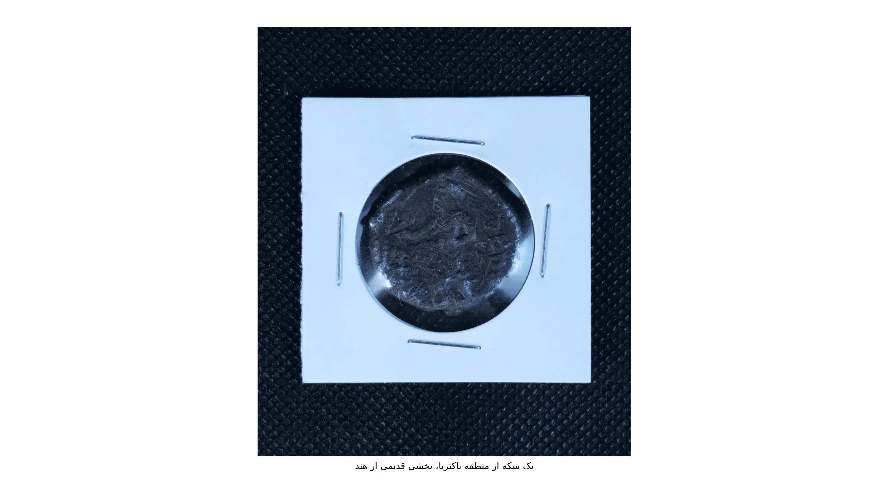

برای به تصویر کشیدن این دوره به صورت بصری، در بالا یک سکه از منطقه‌ای در هند، منطقه باختر، که نزدیک به غرب شبه‌جزیره هند و نزدیک به افغانستان است، آورده شده است. در این منطقه، سکه‌هایی وجود داشتند که احتمالاً از سکه‌های یونانی الهام گرفته بودند و یکی از شخصیت‌های سلطنتی آن‌ها را به تصویر می‌کشیدند.

## لیدی‌ها و پارسی‌ها

<chapterId>eb802ab8-8ffd-5b25-907f-8944f120ed14</chapterId>

:::video id=f151eb42-5ff3-4ca1-9af1-1ae2a5e051c0:::

### اولین سکه‌های الکتروم لیدیایی

از آنجا که نمی‌توانیم ظاهر سکه‌های لیدیه و پارسیان را جدا کنیم، بیایید به آن بخش از جهان در شرق یونان برویم که امروزه ترکیه را تشکیل می‌دهد. اولین سکه‌هایی که در غرب ظاهر شدند به حدود اواسط قرن هفتم قبل از میلاد در مناطق لیدیه و ایونیا، واقع در ترکیه امروزی، بازمی‌گردند. این نوآوری بنیادی حدود ۶۵۰ تا ۶۰۰ قبل از میلاد به وجود آمد، با کشفیات باستان‌شناسی قابل توجهی مانند اولین سکه‌هایی که در معبد آرتمیس در افسوس یافت شد و به حدود ۶۰۰ قبل از میلاد تاریخ‌گذاری شده‌اند. این سکه‌های ابتدایی از الکتروم، آلیاژی طبیعی از طلا و نقره با انعکاس‌های کهربایی ساخته شده بودند و اغلب ظاهری خام داشتند و تنها با ضربه‌ها یا نقش‌های ابتدایی علامت‌گذاری شده بودند.

در زیر، می‌توانید یکی از اولین سکه‌های لیدیایی را ببینید که شیری با شکارش در جلو را نشان می‌دهد. ممکن است متوجه یک مهر یا سوراخ در پشت شوید که برخی معتقدند برای آزمایش خلوص فلز و اطمینان از اینکه فقط یک لایه سطحی نیست، استفاده می‌شده است. در حالی که این یکی از اولین نمونه‌هاست، مهم است که توجه داشته باشید که این قطعه یک کپی است. تمام قطعات طلایی و الکتروم من نسخه‌های کپی یا بازسازی‌های مدرن هستند که برای جلوگیری از خرج کردن تمام پس‌اندازم در این مجموعه طراحی شده‌اند.

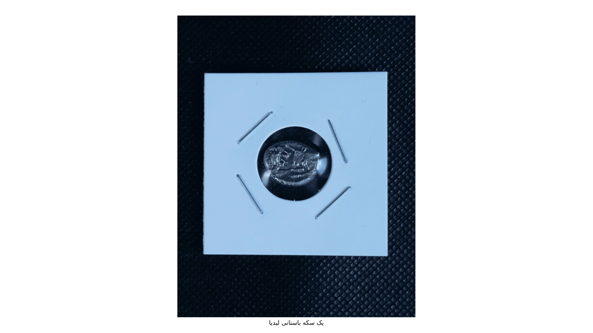

اما من همچنین یک قطعه واقعی فارسی دارم که قرار است ببینیم. این چیزی است که این قطعات اولیه به نظر می‌رسیدند. این شبیه یک نوع توده (یا کلوخه، به انگلیسی) فلزی است که در آن زمان مهر شده بود.

برخلاف باور عمومی که پول برای تسهیل تجارت روزمره و جایگزینی با مبادله کالا به کالا اختراع شد، به نظر می‌رسد که اولین سکه‌های لیدیایی، هخامنشی و یونانی در ابتدا برای تجارت‌های کوچک‌مقیاس استفاده نمی‌شدند. در واقع، واحدهای پولی برای استفاده روزمره بسیار بزرگ بودند. علاوه بر این، گردش آن‌ها به مناطقی نزدیک به محل تولیدشان محدود بود.

در اینجا، لازم می‌دانم ذکر کنم که، اگرچه در چندین اثر با ماهیت انسان‌شناسی خوانده‌ام، سکه‌ها، همان‌طور که قبلاً نشان داده‌ام - چه سکه‌های الکتروم و چه این سکه‌ی پارسی که به زودی به آن بازخواهم گشت - برای خرید نان، مثلاً هر روز، خیلی بزرگ بودند. من برآوردهایی دیده‌ام که ما را به این فکر می‌اندازد که معادل یک روز کار برای یک دهقان یا سرباز بوده است، بنابراین خیلی بزرگ بود. این مانند تلاش برای پرداخت دستمزد یک روز برای وعده غذایی، صبحانه یا ناهار شماست. به جز اینکه در آثار دیگر دیده‌ام که واحدهای کوچکتری از این توده‌ها پیدا شده‌اند، بنابراین سکه‌های کوچکتر، که ممکن است ما را به این فکر بیندازد که شاید استفاده‌ای ممکن برای خریدهای روزمره وجود داشته باشد.

بنابراین، "اثبات" انسان‌شناسی که نشان می‌دهد این سکه‌ها برای تجارت روزمره استفاده نمی‌شدند، زیرا واحد یا نام آن‌ها خیلی بزرگ بود، به نظر من خیلی محکم نیست زیرا ما نمونه‌هایی از سکه‌های کوچکتر پیدا کرده‌ایم که می‌توانستند برای خریدهای روزمره تطبیق داده شوند.

### نقش دولت در ایجاد پول

起 منشأ واقعی سکه‌ها به نظر می‌رسد که با اقدام مستقیم دولت‌ها مرتبط باشد. دو فرضیه اصلی در این زمینه وجود دارد: اولی، ایده‌آلیستی، بین اصطلاح یونانی 'nomisma' (پول) و 'nomos' (قانون) یک موازی می‌کشد و پیشنهاد می‌کند که پول با تدوین قوانین مرتبط بوده و اقتدار و سازماندهی سیاسی شهرها را تقویت می‌کرده است. دومی، فرضیه‌ای واقع‌گرایانه‌تر که امروزه به طور گسترده پذیرفته شده است، این است که پول در درجه اول وسیله‌ای برای دولت‌ها بوده تا کنترل اقتصادی و اجتماعی را اعمال کنند. با تضمین رسمی وزن و ارزش فلزات گرانبهایی که در آن‌ها وجود داشت، دولت‌ها قادر بودند گردش و ارزش این سکه‌ها را دستکاری کنند و اعتماد و حق بیمه نقدینگی خاصی برای ارزهای داخلی ایجاد کنند.

واقعاً جالب است که بدانیم ما شواهدی از این موضوع داریم. به عنوان مثال، در سکه‌های الکتروم، باید بدانید که الکتروم طبیعی معمولاً حدود ۷۰٪ طلا و ۳۰٪ نقره است. در اولین سکه‌هایی که پیدا و تحلیل کردیم، به‌ویژه سکه‌های اولیه لیدیایی، به نظر می‌رسد که محتوای طلا بیشتر در حدود ۵۰ تا ۵۵٪ است به جای ۷۰٪. این نشان می‌دهد که حتی در آن زمان، صادرکنندگان سکه سعی داشتند سهم فلز گرانبها را کاهش دهند، احتمالاً برای تولید سکه‌های بیشتر و به نظر رساندن آن‌ها به همان ارزش یک توده بدون علامت الکتروم طبیعی. و در اینجا باید گفت که واقعاً از زمان این کروئسوس معروف، همانند *ثروتمند مثل کروئسوس*، این امکان‌پذیر بود زیرا از زمان او بود که ما فناوری جداسازی طلا و نقره را داشتیم.

سکه‌زنی لیدیایی در دوران سلطنت پادشاه مشهور کرزوس (561-546 قبل از میلاد)، که به خاطر ثروت افسانه‌ای‌اش معروف بود، دستخوش تحول عمده‌ای شد. در این زمان، لیدیایی‌ها متالورژی را به کمال رساندند تا طلا و نقره را از الکتروم جدا کنند و بدین ترتیب اولین سکه‌های دوفلزی، یعنی سکه‌های جداگانه طلا و نقره را معرفی کردند.

### گسترش پارسی و پذیرش یونانی

هنگامی که آنها لیدیه را در سال ۵۴۶ پیش از میلاد فتح کردند، پارسیان هخامنشی بلافاصله این نوآوری را پذیرفتند. حدود ۵۰۰ پیش از میلاد، تحت سلطنت داریوش اول، پارسیان سیستم پولی خود را با داریک‌های طلایی و سیگلوی‌های نقره‌ای تأسیس کردند که اغلب تصویر شاهی را در حالت‌های جنگی نشان می‌دادند. این سکه‌های شاهی پارسی عمدتاً در مناطق هلنیزه شده امپراتوری پارس استفاده می‌شد و به تدریج گسترش یافت، اگرچه استفاده از آن نابرابر باقی ماند، با **برخی مناطق، مانند مصر، که هنوز ترجیح می‌دادند مبادله را با فلز وزن شده (شمش) انجام دهند.**.

در بالا، می‌توانید یک سیگلوس (یا سیگلو) اصیل پارسی را تحسین کنید. طراحی کوچک شامل یک پادشاه است، اگرچه سوراخ آن کمی ساییده شده است. سیگلو یک سکه نقره‌ای است، در مقابل داریک که از طلا ساخته شده بود. پارسیان می‌توانستند این دو فلز را تشخیص دهند و از سکه‌های الکتروم فاصله گرفتند. بنابراین، آنها نظام دو فلزی را پیاده‌سازی کردند و از هر دو طلا و نقره استفاده کردند در حالی که همان مفهوم سکه‌های ساخته شده از فلزات گرانبها را حفظ کردند، اغلب با سوراخی در پشت، احتمالاً برای بررسی محتوای فلز.

پذیرش سریع سکه‌ها توسط یونانیان به نظر می‌رسد که با تماس‌های نزدیک آن‌ها با لیدی‌ها، به‌ویژه از طریق مستعمرات یونانی در آسیای صغیر تحریک شده باشد. اولین یونانیانی که سکه ضرب کردند احتمالاً ساکنان آئگینا در اواسط قرن ششم قبل از میلاد بودند که دراخما را معرفی کردند، وزنی که از منطقه‌ای به منطقه دیگر متفاوت بود و نام آن به‌طور تحت‌اللفظی به معنای "مشت غله" یا "مشت تیر" است.

موفقیت سکه‌های یونانی به همان اندازه به دلیل راحتی آن‌ها برای معاملات مهم، مانند پرداخت به سربازان مزدور، بود که به دلیل گسترش اقتصادی و سیاسی شهرها. ارز به سرعت به یک عنصر مرکزی در اقتصاد یونان و بعدها روم تبدیل شد، در حالی که یک بُعد نمادین قوی را حفظ کرد، به ویژه از طریق ارتباط آن با قانون (نوموس).

سرانجام، گسترش سریع سکه‌زنی شاهدی بر یک تحول عمیق در جوامع باستانی است، جایی که تدوین ارزش‌های پولی همگام با سازماندهی دولتی پیش می‌رفت. این تحول، پایه‌های اقتصادی و سیاسی برای ظهور دموکراسی‌های یونانی، به‌ویژه در آتن، را فراهم کرد، جایی که پول نقش حیاتی در عملکرد شهر دموکراتیک ایفا می‌کرد.

نکته کلیدی که باید از این بخش به خاطر سپرد این است که ما به طور خاص در مورد **سکه‌ها** صحبت می‌کنیم، نه پول به طور کلی. جنبه مرکزی که به وضوح نمایان می‌شود، **اعتماد به مرجع صادرکننده** است که به طور مستقیم با ویژگی‌های فنی سکه‌ها (وزن، خلوص، ارزش اسمی) مرتبط است. دقیقاً همین اعتماد است که به دولت یا مرجع صادرکننده امکان می‌دهد تا از ابتدا درجه‌ای از کنترل یا حتی دستکاری در ارزش و گردش این سکه‌ها را اعمال کند.

## مداخله نهادی و اولین سکه‌ها

<chapterId>3e1efd08-99e3-5a32-9908-3185fef0e640</chapterId>

:::video id=84847cf6-9e46-4a8c-9f35-25a27496cc4b:::

### ماهیت دوگانه پول

ظهور پول ضرب شده یک سوال اساسی را مطرح می‌کند: آیا پول یک خلق خودجوش بازار است یا نهادی است که توسط قدرت تحمیل شده است؟ این تنش مفهومی دو دیدگاه کاملاً متفاوت را در مقابل یکدیگر قرار می‌دهد.

از یک سو، مکتب اقتصادی اتریشی از این ایده دفاع می‌کند که پول کالایی - به‌ویژه طلا - به دلیل ویژگی‌های ذاتی‌اش مانند دوام، قابلیت حمل، تقسیم‌پذیری و قابلیت تعویض، به‌طور طبیعی توسط بازیگران اقتصادی انتخاب شده است. از این منظر، دولت سپس این ارز خودجوش را برای کنترل عرضه آن به خود اختصاص داد. این یک نهاد است که به‌طور طبیعی از نیازهای بازار پدیدار می‌شود قبل از اینکه توسط قدرت سیاسی تصاحب شود.

در مقابل، دیدگاه انسان‌شناسی و نهادی بر این باور است که پول واقعاً با سکه‌زنی دولتی به وجود می‌آید. مرجع مربوطه به‌طور آگاهانه با زدن مهر خود، ارز را ایجاد می‌کند و بدین ترتیب فلز را به یک ابزار پولی واقعی تبدیل می‌کند. این دیدگاه نشان می‌دهد که اولین سکه‌های لیدیایی عمدتاً برای پرداخت به ارتش‌ها استفاده می‌شدند - یک استاتر تقریباً معادل دستمزد روزانه یک سرباز بود.

### مزایای پارادوکسیکال استانداردسازی دولتی

با وجود این تنش نظری، حتی اقتصاددانان اتریشی نیز به برخی از مزایای مداخله دولت در پول اذعان دارند. استانداردسازی از طریق ضرب سکه بسیاری از مشکلات عملی تجارت را حل می‌کند.

بدون یک مرجع صدور گواهینامه، بازیگران اقتصادی با خطرات مداوم مواجه هستند: سکه‌های تقلبی، تقلب در ثبت و دستکاری وزن. این اقدامات باعث ایجاد اصطکاک در اقتصاد می‌شوند، زیرا برخی سکه‌ها پذیرفته می‌شوند در حالی که برخی دیگر رد می‌شوند. در تئوری، مهر رسمی وزن و کیفیت را تضمین می‌کند و تجارت را روان‌تر می‌سازد.

این ضمانت در بازار دارای قیمتی قابل مشاهده است: یک سکه طلای ضرب شده بیشتر از معادل طلای خام خود ارزش دارد. این حق بیمه ارزش گواهی را منعکس می‌کند - بازرگانان دیگر نیازی به تأیید اصالت فلز از طریق آزمایش‌های شیمیایی یا تشدید ندارند. مداخله دولت، به طور متناقض، اصطکاک را از بین می‌برد و با ایجاد اعتماد نهادی، تجارت را تسهیل می‌کند.

### دستکاری ارز از همان ابتدا

داستان اولین سکه‌های لیدیه‌ای یک تناقض نگران‌کننده را آشکار می‌کند. تحلیل‌های اخیر نشان می‌دهند که محتوای طلای این سکه‌های الکتروم به‌طور سیستماتیک کمتر از الکتروم طبیعی بوده است. مرجعی که کیفیت را تأیید می‌کرد، همزمان ترکیب را دستکاری می‌کرد.

این تمرین دوگانگی کاربرد سکه‌زنی را نشان می‌دهد. برای بازار، مبادلات را روان‌تر می‌کند و تضمینی برای استانداردسازی ارائه می‌دهد. برای مرجع صادرکننده، به ابزاری برای کنترل اقتصادی از طریق کاهش تبدیل می‌شود. با کاهش محتوای طلا در حالی که ارزش اسمی را حفظ می‌کند، دولت به طور مؤثر عرضه پول را افزایش می‌دهد - ایجاد واحدهای پولی بیشتر از همان مقدار فلز گرانبها.

با این حال، خود دولت همچنان تحت تأثیر این دستکاری محدود باقی ماند. همان‌طور که در مثال سکه طلای کنستانتین در قرن چهارم نشان داده شده است، اداره روم به دقت کیفیت سکه‌ها را بررسی می‌کرد، زیرا خواستار پرداخت با سکه‌های با کیفیت بود. دولت علاقه حیاتی به حفظ کیفیت سکه‌های خود داشت تا ارزش درآمدهای مالیاتی خود را تضمین کند.

### تحلیل اقتصادی کاهش ارزش پول

مطالعه کاهش ارزش ارز الگوهای ثابتی را در طول تاریخ نشان می‌دهد. برای سکه‌های فلزی، اقتصاددانان درصد فلزات گرانبها موجود در سکه‌ها را دنبال می‌کنند - یک منحنی نزولی که نشان‌دهنده کاهش ارزش تدریجی است. برای پول کاغذی مدرن، عکس این موضوع صادق است: عرضه پول در گردش مشاهده می‌شود و افزایش آن نشان‌دهنده کاهش ارزش است.

هر دو روش همان پدیده بنیادی را اندازه‌گیری می‌کنند: کاهش ارزش پولی. چه با کاهش محتوای فلزات گرانبها و چه با چاپ اسکناس‌های جدید، مکانیزم یکسان باقی می‌ماند. هرچه یک مرجع واحدهای پولی بیشتری از همان منابع واقعی ایجاد کند، هر واحد بیشتر ارزش خود را از دست می‌دهد.

این دستکاری، که از اولین سکه‌های لیدیایی قابل مشاهده است، نشان می‌دهد که کنترل پول همیشه مسئله‌ای از قدرت بوده است. پول ضرب‌شده به این ترتیب نشان‌دهنده یک نوآوری فنی قابل توجه همراه با ابزاری برای کنترل اقتصادی است - دوگانگی‌ای که در طول تاریخ پولی، تا به امروز ادامه دارد.

## تولید قطعات

<chapterId>b205f4f2-c293-5308-b812-a998de9ad45e</chapterId>

:::video id=47c612ec-d97e-4498-b50e-7e66518bd56d:::

### از حباب‌های سوراخ‌شده تا سکه‌های ضرب‌شده

پس از بخشی درباره ظهور سکه‌ها، می‌خواستم بخشی بسیار کوتاه درباره تکامل ساخت سکه معرفی کنم. همان‌طور که دیده‌ایم، همه چیز با توده‌های الکتروم آغاز شد و با طلا و نقره ادامه یافت، جایی که هر دو طرف با یک مهر مشخص می‌شدند، یا با چهره پادشاه یا سوراخی در پشت برای بررسی خلوص.

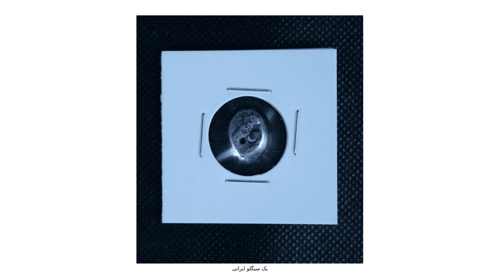

بعداً، همان‌طور که در بخش بعدی بررسی خواهیم کرد، یونانی‌ها این فناوری را با ایجاد سکه‌های گرد که از دو طرف چکش‌کاری شده بودند، بهبود بخشیدند. آن‌ها یک قطعه صاف و مسطح از فلز گران‌بها را می‌گرفتند، طرح مورد نظر را روی یک طرف حک می‌کردند و سپس با دست آن را چکش‌کاری می‌کردند تا سکه نهایی ساخته شود.

فناوری ضرب سکه‌های دستی به صورت فردی احتمالاً نقشی در کنترل تورم در آن زمان ایفا کرده است، حتی با وجود اینکه سکه‌ها اغلب برای افزایش تولید رقیق می‌شدند. این امر به ویژه در دوره رومی و تا حدی کمتر در طول برخی جنگ‌ها در دوره یونانی مشهود بود. در حالی که ضرب سکه به صورت تک‌تک ظرفیت مقامات برای تولید انبوه را محدود می‌کرد، به طور مؤثری به کنترل تورم کمک می‌کرد، علی‌رغم کاهش ارزش‌های قابل توجهی که رخ داد. بنابراین، تکامل از یک توده فلزی که به آن ضربه زده می‌شد به یک سکه گرد و چکش‌خورده پیشرفت کرد.

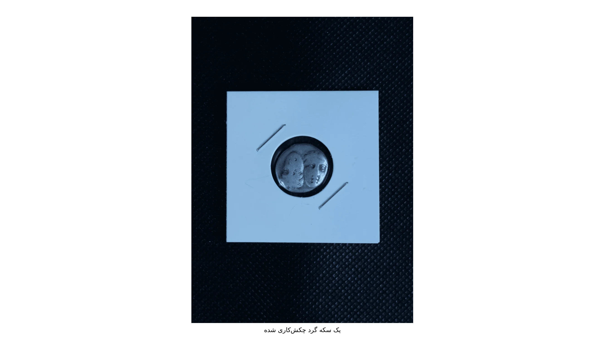

### تکامل قرون وسطی

در قرون وسطی، روندی نیز وجود داشت که سکه‌ها را پهن‌تر و نازک‌تر می‌کردند. یکی از دلایل این کار این بود که آزمایش صدای سکه‌ها آسان‌تر می‌شد، که اغلب به عنوان نشانه‌ای از اصالت استفاده می‌شد. با پهن کردن نقره، فرکانس مشخصی تولید می‌شد، بنابراین مردم می‌توانستند خلوص سکه را به سادگی با گوش دادن به آن تأیید کنند. این عمل به تولد اصطلاح "پول صدا" منجر شد. در زمینه پول صدا، وزن استاندارد با استفاده از ترازو یا "تربوشت" برای وزن‌کشی تعیین می‌شد. بنابراین، تکامل از سکه‌های کوچک و گرد به سکه‌های کمی نازک‌تر و پهن‌تر ادامه یافت.

### ضربه آونگ

آخرین فناوری که در پایان قرون وسطی و در آغاز عصر مدرن ظهور کرد، مفهوم ضربه پاندولی بود. این فناوری نوعی پیچ بود که برای ضرب سکه‌ها سفت می‌شد و به این ترتیب سکه‌هایی با این شکل جدید ضرب تولید می‌شدند. آنچه در مورد این توسعه ویژه بود، توانایی حکاکی یک الگو بر روی سطح سکه برای حل مشکل بریدن بود. بریدن شامل برداشتن بخشی از سکه برای بازیابی نقره گرانبها بود که سپس می‌توانست برای ضرب سکه‌های دیگر استفاده شود یا به سادگی به عنوان یک منبع نگهداری شود.

بنابراین این مفهوم ضربه آونگی به پدیده برش کمک کرد. و جالب است که این فناوری در واقع از فرانسه آمده است. در انگلستان، به عنوان مثال، آنها مهندسان فرانسوی را استخدام کردند تا بیایند و به آنها نشان دهند چگونه این ماشین‌ها را بسازند. چیزی که به نظر من خنده‌دار است این است که حامیان ضرب سکه با چکش بودند که با آن مخالف بودند و اجرای این فناوری را به تأخیر انداختند. در هر فناوری خوبی، همیشه افرادی هستند که با آن مخالفند و می‌خواهند فناوری قدیمی را حفظ کنند. به نظر من خیلی عجیب بود که حتی یک فناوری که واقعاً برتر به نظر می‌رسد - می‌توانید قطعات بیشتری بسازید، سخت‌تر کپی می‌شوند - هنوز هم افرادی بودند که به روش معروف چکش وابسته بودند. تغییری بین تولید قطعاتی که با این ضربه آونگی معروف ساخته می‌شدند و سپس بازگشت به ضربه چکشی وجود داشت. و در نهایت، البته، این ضربه آونگی بود که سرانجام جای خود را گرفت و به ما این قطعات مدرن زیبا را داد که در آن می‌توانید خطوط کوچک، شیارهای کوچک را پیدا کنید تا از برش جلوگیری شود، احتمالاً مربوط به کلمه برش، شیارها، و هنوز هم می‌توانید امروز شیارها یا متن یا نقاشی‌هایی را ببینید که بر روی لبه قطعه حک شده‌اند.

# نظریه‌های مختلف درباره ظهور پول

<partId>72ac694f-9248-550d-90c1-91af3d234380</partId>

## نظریه‌ها درباره ظهور پول و تعاریف مختلف آن

<chapterId>7d699d4d-8c70-55b5-bf36-609f3fd90bcf</chapterId>

:::video id=523c873f-501b-4954-b79f-7e74c0f685a5:::

به این بخش خوش آمدید که به نظریه‌های مختلف درباره پیدایش پول و تعاریف گوناگون آن اختصاص دارد. در اینجا یک گزیده کوتاه از کتاب *Aux origines de la monnaie* آورده شده است که به نظر من، دو نظریه اصلی که در این بخش بررسی خواهیم کرد را خلاصه می‌کند.

> این مقدمه‌ی کوتاه هیچ هدف دیگری جز برجسته کردن زمینه‌ی نظرسنجی ندارد. در سطح مفهومی، بحث بین حامیان نظریه‌ی ک. پولانی و م. وبر باز است. برای گروه اول، هدیه و بازتوزیع نقش مرکزی دارند و مبادله‌ی بازار تنها نقشی حاشیه‌ای، عمدتاً در مبادلات بین‌المللی، ایفا می‌کند. برای دیگران، برعکس، بازار در قلب فرآیند تاریخی کنونی قرار دارد.

به عنوان مثال، در بین‌النهرین، یک نظریه ظهور پیشنهاد می‌کند که معبد، به عنوان مرجع، واحد حساب یا واحد پولی را ایجاد می‌کند، آن را تحمیل می‌کند و سپس بازرگانان آن را برای تجارت می‌پذیرند. نظریه مخالف بیان می‌کند که، نه، این واحد پولی به طور طبیعی از بازار برای تسهیل تجارت ظهور می‌کند. نمونه‌های مستند خوبی از این در بین‌النهرین وجود دارد.

در مورد مبادله کالا به کالا، برخی نظریه‌ها پیشنهاد می‌کنند که این روش عمدتاً در مبادلات بین‌المللی استفاده می‌شد، یعنی با افرادی که به سادگی به آن‌ها اعتماد نداشتیم.

بنابراین این همان کاری است که ما در این بخش انجام خواهیم داد. ما قصد داریم نوعی بررسی انجام دهیم تا نظریه‌های مختلف درباره ظهور پول و تعاریف مختلف از اینکه پول چیست را ارائه دهیم. ما به ارائه و نقد نظریه‌های اقتصاددانان کلاسیک و انسان‌شناسان خواهیم پرداخت. حتی خوش‌شانس خواهم بود که اولریش فرومی با من باشد، که دیدگاه یک اقتصاددان اتریشی را در مورد این موضوعات مختلف ارائه خواهد داد.

## ظهور پول برای اقتصاددانان کلاسیک

<chapterId>1d3776cd-0dfd-5297-af48-c6f41e257a7e</chapterId>

:::video id=873a16c1-17ac-448d-8941-df4feb7ab79d:::

این بخش به نظریه‌های مختلف درباره ظهور پول اختصاص دارد. اولین موضوعی که مورد بررسی قرار می‌گیرد، ظهور پول بر اساس نظریه اقتصاددانان کلاسیک است.

### نظریه کلاسیک آدام اسمیت

بر اساس نظریه‌های اقتصادی کلاسیک، به‌ویژه نظریه‌ای که توسط آدام اسمیت مطرح شد، پول به‌طور طبیعی از مبادله کالا به کالا و در پاسخ به محدودیت‌های آن پدید آمد. در ابتدا، مبادلات به‌صورت مستقیم و از طریق مبادله کالا به کالا انجام می‌شد، اما این روش اغلب به دلیل مشکل "تلاقی دوگانه خواسته‌ها" پیچیده بود: هر فرد باید دقیقاً چیزی را که دیگری می‌خواست، در اختیار داشت. به‌تدریج، برخی کالاها (مانند نمک، فلزات گران‌بها و دام) به دلیل کاربرد، دوام و قابلیت تقسیم‌پذیری‌شان به‌عنوان واسطه‌های مبادله توسط همه پذیرفته شدند. بدین ترتیب، پول به‌طور خودجوش ظاهر شد تا مبادلات اقتصادی را تسهیل و روان کند.

### انتقاد از نظریه کلاسیک

در اینجا نقد من از این نظریه است. با توجه به همه چیزهایی که در بخش قبلی دیده‌ایم، فکر می‌کنم می‌توانیم بگوییم که این ایده که **سکه‌ها** تکامل یافته‌ی مبادله کالا به کالا هستند، اشتباه است، صرفاً به این دلیل که سکه ضرب شده قطعاً از سوی قدرت ظهور می‌کند، زیرا توسط قدرت ضرب می‌شود. دلایل متعددی برای این وجود دارد، از جمله تمایل مقامات به کنترل اقتصاد و به دست گرفتن کنترل پول.

از سوی دیگر، اگر درباره پول به عنوان یک مفهوم صحبت کنیم، نه لزوماً سکه‌ها، موضوع کمتر واضح است زیرا با اولین سکه‌ها، استاترهای لیدیایی، ما به توده‌های نقره‌ای برخورد کرده‌ایم که علامت‌گذاری نشده بودند. هنوز مشخص نیست که آیا آن‌ها در گردش بودند یا خیر. اگر در گردش بودند، این بدان معناست که مردم ممکن است در ابتدا این دارایی را به عنوان یک ارز بالقوه که می‌تواند به طور گسترده‌ای مورد تقاضا قرار گیرد و به راحتی مبادله شود، شناسایی کرده باشند. و شاید تنها پس از آن بود که مقامات این وضعیت را متوجه شدند و با گذاشتن مهر بر روی آن، آن را تأیید کردند.

مزایای زیادی برای انجام این کار وجود دارد - نیازی به بررسی، وزن کردن و این چیزها نیست. بدیهی است که ما در مورد آن صحبت خواهیم کرد. اما به نظر من، سکه‌ها به وضوح ابزاری هستند که از ابتدا توسط دولت‌ها استفاده شده‌اند. با این حال، در مورد ظهور پول به عنوان چنین، نمی‌دانیم که آیا واقعاً از یک مرجع که آن را تحمیل کرده آمده است یا اینکه از طریق تجارت یا مبادلات تجاری پدید آمده است. من در این بخش بحث بسیار جالبی در این مورد با همکارم اولریش خواهم داشت.

ما قبلاً می‌دانیم که اولین سکه‌های فلزی گرانبها برای تسهیل مبادلات روزانه استفاده نمی‌شدند زیرا ارزش آنها بسیار بالا بود. همچنین می‌دانیم که آنها عمدتاً برای پرداخت‌های نظامی استفاده می‌شدند. این یک استدلال خوب برای این نظریه است که پول لزوماً از بازار پدید نیامده است. واحدهای حساب، نام‌گذاری‌های اولین سکه‌ها، احتمالاً برای خرید نان یا خرید روزانه بسیار بزرگ بودند. به عنوان مثال، می‌توانست معادل دستمزد یک روز باشد. نه لزوماً که مردم در آن روزها دستمزد دریافت می‌کردند، اما این برای دادن ایده‌ای از مقیاس است. بنابراین این سکه‌ها احتمالاً قدرت خرید زیادی داشتند تا در تجارت کوچک‌مقیاس استفاده شوند. از سوی دیگر، هیچ چیزی نمی‌گوید که این سکه‌ها برای انجام مبادلات بزرگتر، مانند مبادلات تجاری، استفاده نمی‌شدند. ما می‌دانیم که آنها عمدتاً برای پرداخت‌های نظامی استفاده می‌شدند. این یکی از محبوب‌ترین نظریه‌ها برای توضیح ظهور اولین سکه‌ها است. به یاد داشته باشید، ما در اینجا درباره سکه‌ها صحبت می‌کنیم، نه لزوماً درباره پول به طور کلی. بنابراین، اولین سکه‌ها نقش اولیه خود را داشتند و آن پرداخت برای پرداخت‌های نظامی، برای مزدوران بود.

به عنوان مثال، اسکندر کبیر از آن به خوبی استفاده کرد، همانطور که بعداً خواهیم دید.

ما همچنین دیده‌ایم که در اوایل چین باستان، صدف‌های کاوری برای تبادل اقتصادی استفاده می‌شدند (**پرداخت دستمزد، اندازه‌گیری ارزش و خرید زمین)**. علاوه بر این، در بین‌النهرین و مصر، سیستم‌های پولی کاربردی وجود داشتند و برای تجارت، پرداخت دستمزد و پرداخت مالیات استفاده می‌شدند. آنچه من در اینجا پیشنهاد می‌کنم این است که قطعاً اشتباه است که فکر کنیم سکه‌ها در مفهوم غربی از نیاز به روان‌تر کردن مبادلات به وجود آمده‌اند.

از آنجا که سکه‌ها توسط یک مرجع صادر می‌شوند، شاید بتوانیم فرض کنیم که از ابتدا با مراجع صادرکننده مرتبط بوده‌اند. این منطقی است. از سوی دیگر، ما لزوماً نمی‌دانیم که اشکال پول یا اشکال سیستم‌های پولی، پیش‌سکه‌ها، که قبل از آنها وجود داشتند، چگونه پدیدار شدند. از یک سو، ما پیشنهاد می‌کنیم که این معابد بودند که این واحدهای پولی را شناسایی کردند و پس از آن مردم از آنها استفاده کردند. و از سوی دیگر، به شما خواهیم گفت، نه، این بازرگانان بودند که به یک وسیله مبادله، راهی برای تجارت با دنیای خارج نیاز داشتند و آنها بودند که، به عنوان مثال، فلز نقره را شناسایی کردند تا استفاده شود زیرا از دنیای خارج تقاضا می‌شد. نکته این است که ما واقعاً نمی‌دانیم. به همین دلیل است که دو نظریه متضاد داریم. ما مدرک کاملی نداریم که توضیح دهد آیا پول به طور طبیعی از نیاز به تجارت، مثلاً توسط بازرگانان، پدیدار می‌شود یا اینکه از مرجع نشأت می‌گیرد.

### تمایز بین سکه‌ها و پول اولیه

در نتیجه، فکر می‌کنم می‌توانیم بگوییم که سکه‌ها لزوماً از اقتدار نشأت می‌گیرند، زیرا توسط همان اقتدار ضرب شده‌اند. از سوی دیگر، فکر نمی‌کنم بتوانیم بگوییم که اشتباه است پیشنهاد کنیم که پول (آنچه پیش از سکه‌ها بود) نمی‌توانست برای تسهیل مبادله به وجود آمده باشد. فکر می‌کنم در تمام مثال‌هایی که در بالا دیده‌ایم، مثال‌هایی از این دست فراوان است.

## افسانه مبادله کالا به کالا

<chapterId>0fcd4964-ac36-5163-a8cf-1aacebc0d2c0</chapterId>

:::video id=0ede29ab-8acd-4d79-9282-bd5991b97076:::

### بررسی دیوید گریبر

ما به‌تازگی ظهور پول را طبق نظر اقتصاددانان کلاسیک بررسی کرده‌ایم. اکنون قصد داریم به مفهومی به نام افسانه مبادله کالا به کالا بپردازیم.

یکی از انتقادها به این نظریه کلاسیک درباره ظهور پول، کمبود شواهد تاریخی برای حمایت از ایده‌های آن است.

نقدی که به عنوان "افسانه مبادله کالا" شناخته می‌شود، توسط انسان‌شناس دیوید گربر و دیگران فرموله شده است و ایده کلاسیک که پول به طور طبیعی از مبادله کالا به وجود آمده را به چالش می‌کشد. بر اساس این نقد، هیچ شواهد تاریخی یا انسان‌شناسی وجود ندارد که نشان دهد جوامع به طور سیستماتیک قبل از ظهور پول از مبادله کالا استفاده کرده‌اند. در واقع، جوامع باستانی بر اساس اعتبار، بدهی، تعهدات اجتماعی و مبادلات آیینی عمل می‌کردند. بنابراین "افسانه مبادله کالا" یک ساختار نظری است که برای توجیه دیدگاه اقتصادی کلاسیک طراحی شده و هیچ پایه تجربی واقعی ندارد.

با این حال، باید توجه داشت که این نظریه وجود مبادله کالا به کالا را انکار نمی‌کند، به عنوان مثال، برای مبادلات بین قبایل مختلف. این نظریه تنها انکار می‌کند که مبادله کالا به کالا فعالیتی به طور گسترده در این گروه‌های به اصطلاح ابتدایی بوده است و اینکه پول یک تکامل منطقی از این فعالیت‌ها خواهد بود. این نظریه انکار می‌کند که مبادله کالا به کالا به طور گسترده درون یک قبیله استفاده می‌شده است و اینکه پول در نهایت برای تسهیل مبادلات و حل مشکلاتی که با مبادله کالا به کالا وجود داشت، به وجود آمده است. در عوض، بر اساس این نظریه، این گروه‌ها شکلی از اعتبار غیررسمی یا هدیه در برابر هدیه را تمرین می‌کردند.

### جوامع ابتدایی در مقابل تمدن‌های بزرگ

**در اینجا برخی توضیحات در مورد تمدن‌های بزرگ دوران باستان آمده است.** من فکر می‌کنم این نظریه قطعاً در مورد گروه‌های ابتدایی (بدون دولت) گذشته و حتی امروز صدق می‌کند (مثلاً قبایلی که توسط کاوشگران در قرون ۱۸ و ۱۹ مطالعه شده‌اند). به وضوح، آنها از مبادله کالا به کالا استفاده نمی‌کردند، بلکه از اشکال مبادله‌ای که قبلاً ذکر کردم استفاده می‌کردند، به دلایلی که قبلاً ذکر کرده‌ایم (تقسیم کار ضعیف، کشاورزی معیشتی). با این حال، من فکر نمی‌کنم این نظریه در مورد تمدن‌های بزرگ گذشته، مانند بین‌النهرین و مصر باستان، صدق کند.

در اینجا دو گزیده از *Aux origines de la monnaie* در این مورد آمده است:

> مدلی که توسط م. موس در اثر معروفش "هدیه" ترسیم شده است، با همان میزان اجماع و اشتیاق و البته با کمبود بصیرت توسط مصرشناسان پذیرفته شده است. این امر منجر به تعدادی سردرگمی شده است که در اینجا به آن‌ها نمی‌پردازیم. فقط باید اشاره کنیم که این مدل به جوامع به‌اصطلاح ابتدایی اعمال می‌شود، که این امر در مورد مصر فرعونی صدق نمی‌کند.

> نان‌ها، یعنی غلات فرآوری‌شده، بنابراین واحدهای حساب بودند که مانند شات (y) در پادشاهی قدیم، امکان افتتاح اعتبارات در کالاهای متنوع را نیز فراهم می‌کردند. این مثال ساده نشان می‌دهد که اقتصاد مصر فرعونی به یک سیستم بازتوزیع محدود نمی‌شد. این اقتصاد بسیار پیچیده بود و شامل مبادلات متعددی می‌شد.

بنابراین، همان‌طور که قبلاً در بخش مربوط به مصر و حتی بین‌النهرین و چین دیدیم، می‌توانیم ببینیم که حتی این تمدن‌های باستانی، اما نه ابتدایی، به دلیل وجود دولت، به نظر من، از سیستم‌های پولی استفاده می‌کردند. فکر می‌کنم این موضوع به‌خوبی در بخش اول این دوره نشان داده شد. بنابراین، این مفهوم بده‌بستان، اعتبار معوق، به این تمدن‌های بزرگ اعمال نمی‌شود. دلایل دقیق ظهور پول همچنان یک معما باقی مانده است. ما نمی‌دانیم که آیا این نیاز از سوی بازرگانان برای تجارت با دنیای خارج ناشی شده است یا اینکه توسط معبد در این دوره‌های باستانی تحمیل شده است.

## ظهور پول از طریق پول بدهی

<chapterId>4f508615-aa61-5d62-89d3-cecd02aeaa62</chapterId>

:::video id=a23f547f-3906-4f4a-8f72-5d78c649d0c4:::

### پول به عنوان یک IOU

در این بخش، نظریه پول بدهی را پوشش می‌دهیم.

نظریه **پول بدهی** که به‌طور قابل‌توجهی توسط اقتصاددان آلفرد میچل-اینس توسعه یافته و بعدها توسط دیوید گربر گسترش یافته است، ادعا می‌کند که پول از مبادله کالا به کالا منشأ نگرفته، بلکه از روابط بدهی و اعتباری که از نخستین جوامع انسانی وجود داشته‌اند، سرچشمه گرفته است. بر اساس این نظریه، پول زمانی ظاهر می‌شود که تعهدات اجتماعی (بدهی‌ها بین افراد یا گروه‌ها) قابل اندازه‌گیری و انتقال‌پذیر می‌شوند. این مفهوم، ایده کمّی‌سازی مبادلات و انتقال را معرفی می‌کند. بنابراین، پول پیش از هر چیز یک **شناسایی بدهی** است که توسط اعتماد متقابل پشتیبانی می‌شود و اغلب توسط اقتدار سیاسی یا مذهبی تضمین می‌شود، نه کالایی که صرفاً به عنوان واسطه‌ای در مبادلات عمل می‌کند.

شکلی حتی پیشرفته‌تر از این نظریه این است که تمام پول‌ها بدهی هستند. بنابراین کسی که پول دارد، ادعایی بر جامعه به‌طور کلی دارد، ادعایی بر همه کسانی که آن پول را می‌پذیرند. و از آنجا که پول، **در دیدگاه آنها، باید به‌صورت اجباری پذیرفته شود**، در غیر این صورت پول نیست، زیرا اگر بتوانید این پول را رد کنید، سیستم آنها کار نمی‌کند. در یک گروه خاص که یک ارز را شناسایی کرده است، همه کسانی که آن را دارند، انگار که به همه اعضای دیگر آن جامعه که آن ارز را می‌پذیرند بدهکارند، و کسانی که ارز را می‌پذیرند، به نوعی به شخصی که آن واحد پولی را دارد بدهکارند. این اساساً نظریه آنهاست.

### انتقاد از سیستم اجباری

**انتقاد من از این نظریه:**

اجازه دهید یک انتقاد کوچک از این نظریه داشته باشم. من قبول دارم که پول نوعی اجماع اجتماعی است. این یک اعتمادی است که یک گروه به یک "نشانه" پولی می‌گذارد، هر چه که باشد. بنابراین من به مفهوم اعتماد متقابل معتقدم، که بعداً با مفهوم حق بیمه پولی دوباره به آن خواهیم پرداخت. جایی که پیچیده می‌شود این است که طرفداران این نظریه یک مفهوم تعهد اضافه می‌کنند و بر مفهوم بدهی اصرار دارند. برای آنها، وقتی کسی یک token پولی دارد، او یک ادعا بر جامعه به عنوان یک کل دارد و بنابراین جامعه به دارنده بدهکار است. همچنین یک تعهد برای تسویه وجود دارد، به طوری که اعضای گروه موظف به پذیرش token هستند؛ در غیر این صورت، به نظر آنها، سیستم کار نخواهد کرد. من فکر می‌کنم سیستمی که در بالا در چین باستان توصیف شد، این نظریه را به خوبی نشان می‌دهد.

از نظر من، می‌توانم به راحتی سیستمی را تصور کنم که در آن پول یک توافق اجتماعی است که در آن token انتخاب شده به طور کلی به عنوان وسیله‌ای برای پرداخت پذیرفته می‌شود، بدون هیچ تعهد رسمی. می‌توانم سیستمی مانند آن را ببینم که اگر مردم به میل خود آن را بپذیرند، کار کند. می‌تواند کار کند. از سوی دیگر، اغلب با تعهدات، پول قانونی و خشونت همراه است که بعداً در بخشی خواهیم دید. اما از نظر تئوری، این تصور را ندارم که این سیستم به خوبی کار کند. فکر می‌کنم Bitcoin یک مثال است. Bitcoin ارزش دارد زیرا دارای یک حق بیمه پولی است، زیرا تقاضا برای استفاده پولی از آن وجود دارد، یعنی ذخایر ارزش، شاید همچنین وسیله‌ای برای مبادله یا محافظت در برابر سیستم فیات. هیچ‌کس مجبور به پذیرش آن نیست و هرچه بیشتر به عنوان وسیله‌ای برای پرداخت پذیرفته شود، بیشتر می‌تواند به عنوان وسیله‌ای برای مبادله استفاده شود. ما می‌توانیم از آن به عنوان ذخیره ارزش بدون هیچ مشکلی استفاده کنیم. در این مورد شکی نیست. منظورم این است که Bitcoin به نظر من مثالی است، نوعی ارز که شکلی از توافق اجتماعی است که در آن فکر می‌کنیم اگر بعداً مقداری بخریم، می‌توانیم پول خود را پس بگیریم، آن را به دست می‌آوریم تا بتوانیم بعداً آن را مبادله کنیم، تا قدرت خرید خود را حفظ کنیم.

این دیدگاه کمتر محدودکننده از نظریه به توضیح چگونگی تجارت دو جامعه متمایز با یک token پولی مانند طلا کمک می‌کند، بدون ایجاد ادعا یا بدهی بین این جوامع. من معتقدم که تحمیل پذیرش در جامعه در تجارت بین دو قبیله کار نمی‌کند، زیرا قبیله دیگر تحت سلطه نیست. قبیله B تحت سلطه قبیله A نیست. اما با این حال، همان token پولی را می‌پذیرد، مثلاً طلا. حالا، ممکن است مردم به من بگویند "بله، اما این به این دلیل است که شرکت B نیز تصمیم گرفته که طلا ارز آنها باشد"، بنابراین کار می‌کند. بله، واقعاً کار می‌کند، اما در آن نقطه هیچ بدهی ایجاد نمی‌شود. این یک معامله نهایی است. بنابراین، وقتی شرکت A کالایی را با طلا در شرکت B مبادله می‌کند، هیچ بدهی ایجاد نمی‌شود، معامله کامل می‌شود. و به وضوح، شخص در شرکت B این سکه یا قطعه طلا را به دست نیاورده است تا بعداً توسط افراد شرکت A پرداخت شود. او آن را می‌پذیرد تا با طلا مبادله شود. او آن را می‌پذیرد تا بعداً، احتمالاً در قبیله خودش، مبادله شود. بنابراین، در این مثال، هیچ بدهی ایجاد نمی‌شود، هیچ ادعای نهفته‌ای وجود ندارد، این صرفاً یک مبادله مستقیم، یک پرداخت مستقیم است. طرفداران ارز بدهی به ما خواهند گفت که این مبادله کالا است. و من مخالفم، زیرا مبادله کالا تبادل یک کالای مستقیم است. مبادله مستقیم کالا تبادل یک کالا با کالای دیگر است، برای استفاده. کالاها برای استفاده مبادله می‌شوند، در حالی که در مورد ما، طلا به وضوح به عنوان ارز استفاده می‌شود زیرا قرار نیست برای انجام کار دیگری استفاده شود؛ قرار است بعداً به عنوان وسیله پرداخت استفاده شود. بنابراین، به نظر من، این در دسته مبادله کالا قرار نمی‌گیرد.

داشتن یک token پولی یک "ادعا" بر جامعه نیست، بلکه امیدی است که token در تاریخ بعدی با ارزشی قابل مقایسه پذیرفته شود.

## ظهور خودجوش پول

<chapterId>e3ef86b1-73b9-5140-a61e-2ab6a5b0b2d4</chapterId>

:::video id=e543995f-d5e2-49d7-9133-e397b46e0833:::

برای مکتب اقتصادی اتریشی که توسط کارل منگر آغاز شد، پول به طور طبیعی از یک اقتصاد مبادله‌ای که با مشکل دوگانگی خواسته‌ها مواجه است، پدیدار می‌شود. در این دیدگاه، افراد به طور خودجوش به کالاهای واسطه‌ای که مبادله را تسهیل می‌کنند، همگرا می‌شوند - کالاهایی که به طور مستقیم مصرف نمی‌شوند، بلکه به عنوان کالاهایی شناخته می‌شوند که ظرفیت تقاضای گسترده‌ای دارند.

این کالاهای پولی باید دارای ویژگی‌هایی باشند که از زمان ارسطو شناسایی شده‌اند: آنها باید به عنوان ذخیره ارزش، وسیله مبادله و واحد حساب عمل کنند. عوامل اقتصادی به تدریج آنها را شناسایی، انباشته و ذخیره می‌کنند و بدین ترتیب ظهور آنها به عنوان پول آغاز می‌شود. این فرآیند کاملاً خودجوش است - پول نمایانگر یک پاسخ طبیعی بازار به مشکل هماهنگی مبادلات است، بدون دخالت آگاهانه یک مرجع.

### بحث "افسانه مبادله کالا به کالا"

انسان‌شناسانی مانند دیوید گریبر این دیدگاه را به چالش می‌کشند و به "افسانه مبادله کالا به کالا" اشاره می‌کنند. استدلال آن‌ها: هیچ تمدن پیچیده‌ای که صرفاً بر مبنای مبادله مستقیم کالا به کالا باشد، هرگز مستند نشده است. بلکه جوامع ابتدایی مورد مطالعه از سیستم‌های اعتبار غیررسمی و تبادل متقابل استفاده می‌کردند. گریبر ادعا می‌کند که بدهی پیش از مبادله کالا به کالا وجود داشته است و به هزاران لوح بین‌النهرینی که روابط اعتباری را مستند می‌کنند، اشاره می‌کند.

با این حال، این انتقاد بر اساس تعریفی محدود از مبادله کالا به کالا است. همان‌طور که منگر در سال ۱۸۹۲ اشاره کرد، مبادله کالا به کالا فراتر از تبادل مستقیم کالا با کالا است. این شامل انتقالات معوق، خدمات در ازای دستمزد و مبادلات با زمان‌بندی نیز می‌شود - چیزی که منگر آن را "انتقالات یک‌جانبه بین افراد" نامید. این شکل گسترده‌تر از مبادله کالا به کالا می‌تواند در دایره‌های محدود اعتماد با سیستم‌های اعتباری همزیستی کند.

عدم وجود مدرک به معنای عدم وجود نیست و اقتصاددانان اتریشی اذعان دارند که هیچ جامعه پیچیده‌ای نمی‌تواند به طور پایدار تنها بر اساس مبادله مستقیم توسعه یابد - از این رو ظهور ضروری پول.

### مورد بین‌النهرین: بازرگانان در برابر معابد

بحث در مورد منشأ شکل نقره‌ای بین‌النهرین در حال شکل‌گیری است. دو تفسیر متضاد وجود دارد. دیدگاه نهادی بر این باور است که معابد - که مراکز واقعی اقتصادی و معنوی بودند - نقره را به عنوان ارز برای ساختاردهی به اقتصاد تحمیل کردند. لوح‌های میخی، که در میان روحانیون و نخبگان تجاری متمرکز شده‌اند، گواهی بر این کنترل متمرکز هستند.

تفسیر اتریشی برعکس را پیشنهاد می‌کند: این بازرگانان بودند که پول را برای تجارت‌های دوردست پذیرفتند. با چالش تجارت با بیگانگان فراتر از مرزهای بین‌النهرین - از آناتولی تا خلیج فارس - مواجه شدند و به چیزی نیاز داشتند که به طور جهانی قابل شناسایی، بادوام و قابل حمل باشد. نقره به دلیل ویژگی‌های ذاتی‌اش انتخاب طبیعی بود. معابد تنها یک عملی را که قبلاً توسط استفاده تجاری برقرار شده بود، تأیید کردند.

این پایان‌نامه بر اساس مبادلات مستند بین کانش در آناتولی و آشور است، جایی که بازرگانان منسوجات را با فلز نقره مبادله می‌کردند - نه به خاطر کاربرد مادی آن، بلکه به عنوان ذخیره ارزش. این معاملات فراتر از مبادله ساده بودند و وجود یک ارز کالایی واقعی را نشان می‌دادند.

### نمونه مدرن اردوگاه‌های زندان

اقتصاددان ریچارد رادفورد، که در طول جنگ جهانی دوم در آلمان زندانی بود، یک مورد جالب از ظهور خودجوش پولی را مستند کرد. در اردوگاه‌ها، سیگارها به طور طبیعی به واحد مبادله تبدیل شدند - قابل تقسیم، استاندارد شده، و به طور گسترده پذیرفته شده. حتی غیرسیگاری‌ها نیز آن‌ها را پذیرفتند و به ارزش مبادله جهانی آن‌ها پی بردند.

این میکروکاسم اصل اتریشی را نشان می‌دهد: در مواجهه با مشکل هماهنگی مبادلات، افراد به طور خودجوش به سمت کالای "قابل فروش" بیشتر همگرا می‌شوند. هیچ مرجعی پول سیگاری را تحمیل نکرد؛ این از عمل روزانه زندانیانی که به دنبال بهینه‌سازی مبادلات خود بودند، پدید آمد.

### همگرایی ترجیحات فردی

اساساً، پول نمایانگر همگرایی ترجیحات فردی به سمت یک کالای مشترک پذیرفته‌شده است. بازرگانان بین‌النهرین، مانند زندانیان ردفورد، کالایی را شناسایی کردند که عدم قطعیت مبادلات آینده را به حداقل می‌رساند. این انتخاب منتظر تأیید یا تحمیل یک مرجع مرکزی نمی‌ماند - بلکه از عقلانیت عملی بازیگران اقتصادی که با چالش‌های مبادله مواجه هستند، پدیدار می‌شود.

بحث بین ظهور خودجوش و نهادسازی آگاهانه همچنان باز است، زیرا شواهد تاریخی پراکنده است. اما تحلیل اتریشی توضیحی منسجم ارائه می‌دهد: پول از نیازهای عملی تجارت متولد شد و مقامات صرفاً شیوه‌هایی را که قبلاً توسط استفاده بازار برقرار شده بود، نهادینه کردند.

## چشم‌انداز انسان‌شناختی از ظهور پول

<chapterId>ec48c5d8-47ed-530f-beb7-c44fd0b62880</chapterId>

:::video id=8c1f8764-75af-4fb6-a98b-55de3b7da02e:::

### 起‌های غیر اقتصادی پول

در این بخش، ما به بررسی دیدگاه انسان‌شناسی در مورد ظهور پول می‌پردازیم، دیدگاهی غنی که به‌طور عمیقی نظریه‌های اقتصادی کلاسیک را به چالش می‌کشد.

برخلاف نظریه سنتی که پول به طور طبیعی از مبادله کالا به کالا برای تسهیل تبادل اقتصادی به وجود آمده است، تحقیقات انسان‌شناسی نشان می‌دهد که ظهور پول عمدتاً ریشه در علل غیر اقتصادی دارد. این امر ناشی از سازوکارهای اجتماعی مانند پرداخت‌های خراج، جبران خسارت قتل (وِرگلد معروف) و جهیزیه (پول عروس) است، اما همچنین از مراسم، اعمال مذهبی، سیاسی و نمادین، بسیار بیشتر از نیازهای ساده بازار سرچشمه می‌گیرد.

در جوامع ابتدایی، پول به ندرت برای مبادله روزمره کالاهای مادی استفاده می‌شد، برخلاف تعریف کلاسیک پول به عنوان "وسیله مبادله". در واقع، این جوامع به طور گسترده‌ای از اعتبار استفاده می‌کردند، با پرداخت‌های معوق که در شبکه‌های وسیع روابط اجتماعی و شخصی جای گرفته بود. این سیستم‌های اعتبار همه‌جا حاضر به طور منطقی و تاریخی قبل از ظهور پول وجود داشتند.

این همان چیزی است که دیدگاه آنها را خلاصه می‌کند. ما این موضوع را در ویدیوی قبلی با اولریش در چت خود مورد بحث قرار دادیم. من شما را به لذت بردن از نظرات اولریش در این باره دعوت می‌کنم، که این رویکرد را کمی به چالش می‌کشد. و بنابراین، در دیدگاه انسان‌شناسی، ما اغلب این مفهوم را داریم که پول از یک مرجع یا یک مفهوم اجتماعی که بر نیازهای بازار مقدم است، می‌آید.

### مثال سنگ‌های یاپ

در زیر، می‌توانید نمونه‌ای چشمگیر از سنگ‌های یادبود در جزیره یاپ را تحسین کنید. برخی از این سنگ‌ها، علیرغم عدم تحرک یا حتی ناپدید شدن فیزیکی، به لطف یک توافق جمعی همچنان به طور کامل به عنوان پول عمل می‌کردند و بر بُعد اجتماعی و نمادین پول تأکید می‌کردند.

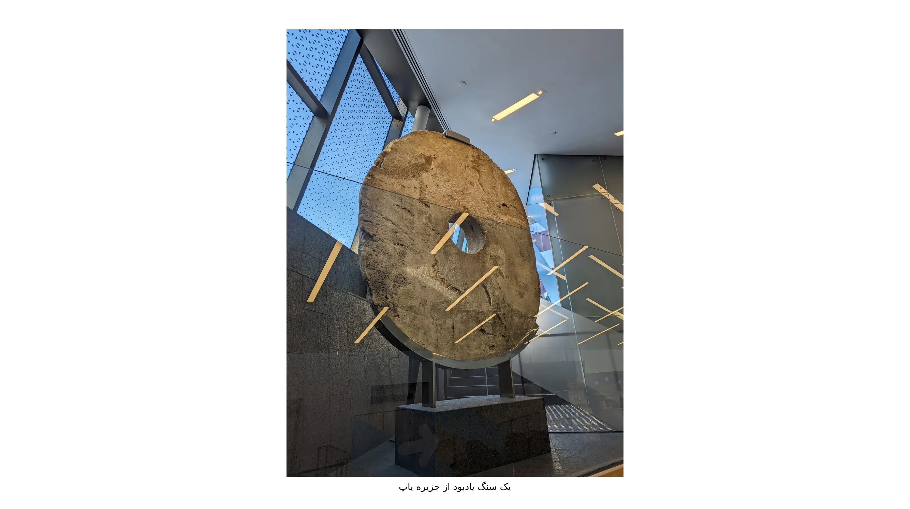

این یک تحلیل واقعاً جالب از سنگ‌های یاپ است. سیف‌الدین آموس نیز این مثال را در کتاب خود "استاندارد Bitcoin" ذکر می‌کند. به گفته او، سیستم جزیره یاپ بیشترین شباهت را به Bitcoin دارد، نوعی رکورد مرکزی که همه می‌توانند به آن مراجعه کنند، که عمومی است، حساب‌ها را نگه می‌دارد و مالکیت چیزها را مدیریت می‌کند. این دیدگاه انسان‌شناسی نشان می‌دهد که همه این‌ها نمایانگر یک توافق یا اجماع اجتماعی درون جامعه است که اساساً دقیق است. و من این اشاره به سنگ‌های گمشده را بسیار جالب می‌دانم. آن‌ها صدها کیلومتر به دریا می‌رفتند و سنگ‌ها را با قایق‌های کوچک برمی‌گرداندند. گاهی اوقات سنگ به کف دریا می‌افتاد، اما این سنگ همچنان در سیستم پولی استفاده می‌شد. یک نفر می‌توانست بگوید "بله، ما سنگ را در چنین مکانی انداختیم؛ این مال من است، بنابراین می‌توانیم آن را مبادله کنیم". لزوماً نیازی به مالکیت فیزیکی برای تسهیل مبادله نبود، زیرا سنگ‌ها آنقدر بزرگ بودند که اغلب در یک مکان باقی می‌ماندند. در عوض، تمرکز بر تغییر دست‌ها با این سنگ‌ها به صورت معاملاتی بود، که اجازه می‌داد مالکیت بدون حرکت واقعی سنگ‌ها تغییر کند. این یک نوع "اثبات اجماع" بود که یک دیدگاه انسان‌شناسی جالب در مورد پول را برجسته می‌کند.

### پروتوکرنسی‌ها و تعهدات اجتماعی

مردم‌نگاران در سراسر جهان مشاهده کرده‌اند که جوامع از "پیش‌پول‌ها" یا "پول‌های ابتدایی"، مانند صدف، پارچه، دام، نمک و سنگ استفاده می‌کنند که وظایفی را که معمولاً به پول نسبت داده می‌شود، مانند وسیله پرداخت و ذخیره ارزش، انجام می‌دهند، اما به طور منظم به عنوان واسطه در مبادله کالاهای روزمره عمل نمی‌کنند.

بنابراین، در اینجا ما سیستم‌های پولی را توصیف می‌کنیم که لزوماً برای مبادلات روزمره استفاده نمی‌شدند.

و می‌خواهم به شما یادآوری کنم که این‌ها همگی ارزها قبل از ظهور سکه‌ها بودند و نمی‌دانم چقدر اشتباه است که بگوییم ارز. من ترجیح می‌دهم بگویم ارز. می‌توانم ذکر کنم که در ادبیات، اغلب از پیش‌ارزها برای اشاره به پول قبل از سکه‌ها صحبت می‌شود. اما همان‌طور که در بخش اول دیدیم، **من معتقدم که سیستم‌های پولی مدت‌ها قبل از ظهور سکه‌ها وجود داشته‌اند**.

این ارزهای ابتدایی عمدتاً برای مدیریت تعهدات اجتماعی اساسی مرتبط با افراد، مانند ازدواج، جبران خسارت درگیری (ویرگلد)، یا هدایا بین رؤسا استفاده می‌شدند. به عنوان مثال، در امپراتوری پارس، اولین سکه‌ها به طور خاص به عنوان وسیله‌ای برای پرداخت نظامی ایجاد شدند و نه به عنوان وسیله‌ای برای مبادله.

بنابراین، پول ابتدایی یک ویژگی اساسی دارد: وسیله‌ای برای پرداخت است، اما به ندرت وسیله‌ای برای مبادله مستقیم کالاهای مادی است. منظور ما این است که این وسیله‌ای برای پرداخت تعهدات اجتماعی خاص، برای قبایل، برای مبادلات بین رؤسا، ویرگل معروف، پول خون بود. قبل از ظهور سیستم‌های قضایی، اگر کسی مرتکب قتل می‌شد، برای خانواده‌ای که از قتل عزیزشان رنج می‌بردند، جبرانی وجود داشت. برای این کار قیمتی وجود داشت که به آن پول خون می‌گفتند و این یک شکل از پرداخت بود. همچنین جهیزیه وجود داشت که آن هم شکلی از پرداخت بود. در این استفاده‌های اولیه از پول به عنوان شکلی از پرداخت، بیشتر به تعهدات انسانی و اجتماعی مربوط می‌شد تا به پرداخت‌های خریدهای روزمره. بر اساس این نظریه، این مبادلات روزمره بیشتر به اعتبار، اعتبار معوق، هدیه به هدیه، و توزیع مجدد جیره‌ها مربوط می‌شد. شکل دیگری از سازمان اجتماعی برای مدیریت این مبادلات وجود داشت. همچنین مهم است به یاد داشته باشیم که در جامعه‌ای که همه خودکفا هستند، کشاورزی خود را انجام می‌دهند، هیچ تخصصی وجود ندارد و نیاز بسیار کمی به سیستم پولی برای مبادلات روزمره وجود دارد. و به همین دلیل است که اولین اشکال پول همان چیزی بود که توصیف کردیم، جهیزیه، پول خون، به سادگی به این دلیل که این‌ها اولین مبادلاتی بودند که به وسیله‌ای برای پرداخت نیاز داشتیم، خیلی قبل از اینکه نیاز به تجارت، مبادله نان با پول به صورت روزانه داشته باشیم، زیرا در جوامع ابتدایی، این‌گونه کار نمی‌کرد. هر کس نیازهای خود را تأمین می‌کرد و هنوز تخصصی وجود نداشت. فکر می‌کنم این موضوع را به طور مفصل در تمام سخنرانی‌های قبلی این دوره پوشش داده‌ام.

در این جوامع، با عدم تقسیم کار پیشرفته، مبادلات مستقیم محدود باقی ماند و عمدتاً در چارچوب روابط شخصی دوستی یا اتحاد صورت می‌گرفت. نبود تخصص کافی، نیازی به پول به معنای مدرن آن ایجاد نمی‌کرد.

انسان‌شناسانی مانند کویگین و آینزیگ بر برتری اعتبار اصرار دارند: **زندگی اقتصادی ابتدایی در شبکه‌ای عظیم از اعتبارات و بدهی‌های شخصی گرفتار است، جایی که پول به‌ویژه زمانی وارد عمل می‌شود که پرداخت‌ها باید فوری انجام شوند و جبران‌ها به‌راحتی نمی‌توانند به تعویق بیفتند.**

بنابراین، مردم کالاها را مبادله می‌کنند، می‌توانند اعتبار معوق ایجاد کنند، اما در برخی موارد، نمی‌توانید پرداخت را به تعویق بیندازید، بنابراین ارز یا پیش‌ارزها می‌توانند در این نقطه برای داشتن نهایی فوری در مبادله مفید باشند.

### نوآوری ناشناس بودن

این تحلیل به تأمل عمیق‌تری منجر می‌شود: به‌جای مخالفت با پول در برابر مبادله کالا به کالا، درک ظهور آن به‌عنوان تکاملی از سیستم‌های پیچیده اعتبار و بدهی مرتبط‌تر است. پول یک نوآوری اساسی معرفی می‌کند: **ناشناس بودن**. و اینجاست که این نظریه انسان‌شناسی درباره ظهور پول جالب می‌شود. اگر شما یک گروه کوچک از افراد باشید و به یکدیگر اعتبار معوق بدهید، به‌وضوح یکدیگر را می‌شناسید. فکر می‌کنم برای اینکه این سیستم کار کند، مردم باید یکدیگر را بشناسند، به‌وضوح. و پرداختی که با پول انجام می‌شود، امکان ناشناس بودن را فراهم می‌کند. این امکان را می‌دهد که پرداختی انجام دهید بدون اینکه مردم حتی نام شما را بدانند، بدون اینکه مردم حتی بدانند شما کی هستید. آنها می‌توانند مبادله‌ای برای تسویه فوری و نهایی انجام دهند. و این دقیقاً همان چیزی است که پول امکان‌پذیر می‌کند.

برخلاف اعتبار، که همیشه اسمی است، پول امکان معاملات ناشناس، عمومی و بلافاصله آزادکننده را فراهم می‌کند. **این قدرت آزادکننده منحصر به فرد پول، برتری قاطع آن است.**

بنابراین، پول نه تنها یک ابزار ساده برای تسهیل مبادلات اقتصادی نیست، بلکه یک نوآوری اجتماعی مهم است که به شدت با تکامل نهادها و شیوه‌های انسانی مرتبط است، از اعتبار شخصی **تا یک سیستم پرداخت عمومی و ناشناس**. این تکامل انسان‌شناختی نشان می‌دهد که پول، بسیار بیشتر از یک وسیله ساده مبادله، یک نهاد اجتماعی قدرتمند است که به شدت جوامع انسانی را شکل می‌دهد، تا جایی که در جوامع مدرن ما، به خودی خود هدف فعالیت اقتصادی تبدیل شده است.

در اینجا، ما متوجه می‌شویم که در نهایت، در جوامع مدرن ما، هدف اصلی مبادله اقتصادی داشتن پول است، در حالی که در گذشته اصلاً این‌گونه نبود. هدف اصلی مبادله اقتصادی داشتن کالاها یا اجناس برای مصرف بود. و امروزه، با معرفی نوآوری پول، هدف مبادله اقتصادی انباشت این پول است، زیرا به ما امکان می‌دهد آن را برای کالا مبادله کنیم، همان‌طور که به طور کلی پذیرفته شده است. ما می‌توانیم آن را برای کالایی که نیاز داریم، زمانی که به آن نیاز داریم، مبادله کنیم.

## یکپارچه‌سازی ثبات‌ها

<chapterId>7664442a-91c1-5ce4-a8bd-53b7371a3e3d</chapterId>

:::video id=473fc284-5375-4e1b-b0cd-6b51ba0cc3b8:::

### نظریه ثبت حسابداری

اکنون قصد داریم با هم به بررسی پیشنهادهای مختلف برای یکپارچه‌سازی این دو نظریه پولی بپردازیم، یعنی نظریه ظهور پول از طریق پول-بدهی و نظریه پولی ظهور پول-کالا. ما قصد داریم درباره پیشنهاد یکپارچه‌سازی لین آلدن در کتاب معروفش "برای پول شکسته"، که عنوان ترجمه آن توسط کنسنس احتمالاً "گسست پولی" نامیده خواهد شد، صحبت کنیم.

*گزیده‌ای از پول شکسته نوشته لین آلدن:*

> اساساً، پول یک دفتر حسابداری است. پول کالایی یک دفتر ثبت است که توسط طبیعت اداره می‌شود. پول بانکی یک دفتر کل است که توسط دولت-ملت‌ها اداره می‌شود. پول متن‌باز یک دفتر کل است که توسط کاربرانش اداره می‌شود.

در اینجا، لین به Bitcoin اشاره می‌کند.

### نسبت موجودی به جریان و کمیابی

> برخی عناصر شیمیایی نادر، مانند رودیوم، از طلا نادرتر هستند، اما نسبت‌های ذخیره به جریان پایینی دارند زیرا توسط صنعت به سرعتی که استخراج می‌شوند، مصرف می‌شوند. یک سکه یا شمش رودیوم می‌تواند به عنوان یک کالای کلکسیونی تخصصی یا ذخیره ارزش خریداری شود، اما به عنوان یک ارز پذیرفته شده اجتماعی مناسب نیست و بنابراین به طور طبیعی به عنوان پول ظاهر نمی‌شود.

سیف‌الدین در کتاب خود "استاندارد Bitcoin" به طور مفصل در این باره صحبت می‌کند. برای کسانی که با نسبت موجودی به جریان آشنا نیستند، این نسبت به سادگی زمانی است که موجودی موجود، ذخایری که در بازار وجود دارد، را با موجودی جدیدی که وارد می‌شود، مقایسه می‌کنید. این اغلب برخلاف انتظار است، زیرا ممکن است فکر کنید چیزی که به مقدار زیاد دارید کمیاب نیست، اما در واقع این‌طور نیست. بیشتر مسئله ظرفیت شما برای تأمین آن است. بلکه، این ظرفیت ما برای داشتن موجودی جدید است که طبق این مدل، به ما اطلاعات می‌دهد که آیا این شیء نادر است یا نه. این به این دلیل نیست که ما چیزی در موجودی نداریم که نادر است، بلکه شاید فقط آن را نداریم. بنابراین، اگر طلا را در نظر بگیریم، ما مقدار زیادی موجودی طلا داریم زیرا به عنوان ذخیره ارزش استفاده می‌شود، و جریان ورودی موجودی‌های جدید چیزی حدود ۱٪ تا ۳٪ در سال از موجودی‌های جدید طلا است که از طریق mining طلا وارد می‌شود. در حالی که، آنچه او اینجا می‌گوید، اگر درباره رودیوم صحبت کنیم، این فلز نادرتر از طلا است، اما ما هیچ موجودی نداریم زیرا به محض ورود مصرف می‌شود. بنابراین برای دو برابر کردن موجودی موجود، نیاز به عرضه جدید زیادی نیست. در حالی که با طلا، حداقل ۵۰ سال طول می‌کشد تا موجودی دو برابر شود. برخلاف اکثر کالاهایی که مصرف می‌شوند، که نسبتاً آسان است و سال‌های زیادی تولید لازم نیست تا موجودی موجود دو برابر شود، زیرا به محض ورود مصرف می‌شود.

*"طلا در طول تاریخ مدرن نسبت ذخیره به جریان بین 25x تا 100x را حفظ کرده است، معمولاً حدود 50x یا بیشتر، و به‌طور موقت هرگز به زیر 16x نرسیده است، حتی در طول تب طلای اواسط قرن نوزدهم."*

بنابراین، ۲۵ به معنای ۲۵ سال برای دو برابر شدن سهام است و ۱۰۰ به معنای ۱۰۰ سال برای دو برابر شدن سهام. سیف‌الدین در کتابش می‌گوید حتی اگر تولید طلا را دو برابر کنیم، مثلاً از ۱.۵٪ به ۳٪، لزوماً تأثیر زیادی بر قیمت آن نخواهد داشت.

*"نقره به طور کلی نسبت موجودی به جریان 10 برابر یا بیشتر دارد که همچنان نسبتاً بالا است.*

*اکثر کالاهای دیگر نسبت موجودی به جریان کمتر از ۱ یا ۲ دارند. حتی نادرترین عناصر، مانند پلاتین و رودیوم، به دلیل مصرف سریع صنعتی نسبت موجودی به جریان نسبتاً پایینی دارند."*

### برتری طلا و نقره

*"به طور خلاصه، هر زمان که یک ارز کالایی در رقابت با طلا و نقره قرار گرفته است، در نهایت طلا و نقره همیشه برتری یافته‌اند. سایر کالاها ممکن است برای دوره‌های محدود یا در مناطق خاصی به عنوان ارز باقی بمانند، اما طلا و نقره همیشه توانایی خود را برای تبدیل شدن به ارزهای رقابتی جهانی و تسلط بر رقابت اثبات کرده‌اند. این به این دلیل است که وقتی تمدن‌ها با هم ملاقات می‌کردند، دارندگان طلا و نقره همیشه توانایی تکنولوژیکی برای کاهش ارزش سایر اشکال ارز را داشتند، در حالی که دارندگان صدف، مروارید، دام، نمک، پارچه یا فلزات کم‌ارزش هرگز نمی‌توانستند ارزش طلا یا نقره را کاهش دهند."*

بنابراین این موضوع بار دیگر به‌طور بسیار خوبی در استاندارد Bitcoin توضیح داده شده است، جایی که سیف‌الدین درباره قبایل آفریقا که از مهره‌های شیشه‌ای استفاده می‌کردند صحبت می‌کند. و زمانی که تاجران ونیزی با محموله‌های پر از مهره‌های شیشه‌ای رسیدند، زیرا در آن زمان قادر به تولید صنعتی آن‌ها بودند و ظرفیت تکنولوژیکی برای انجام این کار را داشتند، این امر سیستم پولی این مردم را کاملاً بی‌ثبات کرد و آن‌ها توانستند منابعشان را به‌طور کامل غارت کنند. این نظریه سیف‌الدین است.

### واحد پول و اعتبار

*"به طور تاریخی، حتی زمانی که اعتبار به طور مستقیم به عنوان ابزاری برای مبادله استفاده می‌شد، معمولاً به واحدهای کالاهای پولی که به طور طبیعی به خاطر ویژگی‌هایشان انتخاب شده بودند، نام‌گذاری می‌شد."*

این نکته بسیار جالبی است و یکی از مواردی است که اولریش و من در حال بحث درباره آن بوده‌ایم. حتی اگر معبد در بین‌النهرین نوعی مرجعیت بود که می‌توانست این مفهوم اعتبار را مدیریت کند، واحد حساب، شکل بود. هیچ چیزی وجود ندارد که تأیید کند شکل به‌طور رسمی توسط معبد تعیین شده بود. شکل می‌توانست به‌طور طبیعی و از طریق نیاز بازرگانان به واردات و صادرات با دیگر مردمان در نزدیکی به وجود آمده باشد. ما شواهدی از این داریم، به شکل یک بازرگان در کانیش (که در بخش ۱ به آن اشاره کردم) که دقیقاً همین کار را انجام داد، فلزات گرانبهایی را وارد کرد که برای ارزش کالای فیزیکی‌شان استفاده نمی‌شدند، بلکه به‌عنوان ذخیره ارزش به کار می‌رفتند. تنها مشکل این است که نمی‌دانیم آیا می‌توانیم فرض کنیم که این انتخاب نقره، شکل نقره‌ای، توسط بازرگانان انجام شده یا توسط معبد. اما اولریش استدلال بسیار خوبی دارد که ما را به این فکر می‌اندازد که احتمالاً این انتخاب بیشتر از سوی بازرگانان انجام شده است.

*"بنابراین، اتحاد دو نظریه می‌تواند به عنوان یک "نظریه حسابداری پول" ("نظریه دفتر کل پول") توصیف شود زیرا منطق اساسی مشترک بین هر دو نظریه را توصیف می‌کند. هم اعتبار اجتماعی انعطاف‌پذیر و هم ارزهای اولیه قابل جمع‌آوری به آغاز بشریت بازمی‌گردند. در هر دو مورد، گروه‌های انسانی با اندازه‌های مختلف یک دفتر حسابداری را در میان خود نگه می‌دارند تا از نیاز به برآورده کردن تصادف دوگانه خواسته‌ها جلوگیری کنند، اصطکاک در مبادلات را کاهش دهند و به عنوان شکلی از پس‌انداز نقدی عمل کنند. تفاوت اساسی در مرجعی است که به نگهداری ثبت‌نامه سپرده شده است."*

از یک سو، طبیعت مدیریت گسترش عرضه پول را بر عهده دارد. بنابراین، اگر به طلا نگاه کنیم، به دلیل کمیاب بودن آن، استخراج آن دشوار است. یک نوع محدودیت در تعداد سکه‌های طلا که می‌توان استخراج کرد وجود دارد. بنابراین، کمیابی توسط طبیعت مدیریت می‌شود. و ثبت توسط مفهوم مالکیت نگهداری می‌شود. ثبت غیرمتمرکز است. مالکیت با این واقعیت ثابت می‌شود که شما یک سکه طلا یا یک قطعه طلا دارید. و در مورد پول اعتباری، کمیابی توسط توانایی افراد در دریافت اعتبار مدیریت می‌شود. یا در مورد ارز فیات، کمیابی توسط مقامات مدیریت می‌شود. آنها هستند که تصمیم می‌گیرند که آیا بیشتر چاپ کنند یا نه، تا از فاجعه‌های تورمی جلوگیری کنند. بنابراین، در برخی موارد، ثبت نیز می‌تواند توسط مالک token مدیریت شود، در مورد پول کاغذی. به همین دلیل است که در ثبت، به صورت نقل قول، غیرمادی وارد می‌شود. خوب، مادی، اما مجازی. او این token معروف را دارد و این چیزی است که مالکیت را ثابت می‌کند. و به همان اندازه می‌تواند در یک ثبت واقعی باشد، همانند پول اسکریپت، در یک بانک، جایی که واقعاً بانک انسانی مدیریت می‌کند که چه کسی چه چیزی را در رابطه با ثبت مالک است.

## اتحاد از طریق حق بیمه پولی

<chapterId>093756e5-8908-55e5-bb76-376a3a3cc4d3</chapterId>

:::video id=eabc342a-ecbd-46ca-a347-e914917e7c4f:::

### مفهوم حق بیمه پولی

در این بخش که به پیشنهادات مختلف برای یکپارچه‌سازی نظریه‌های مختلف درباره ظهور پول اختصاص دارد، من به‌تازگی نظریه لین آلدن، نظریه ثبت را پیشنهاد کرده‌ام. من پیشنهاد خودم را برای یکپارچه‌سازی دو نظریه پولی دارم. این پیشنهاد، مفهوم پرمیوم پولی است. بنابراین، ارزش پول می‌تواند با پرمیوم پولی که از تقاضای پولی آن ناشی می‌شود، توضیح داده شود، چه به شکل لوح‌های گلی، سکه‌های فلزات گرانبها، اسکناس یا بیت‌کوین. پرمیوم پولی به سادگی بر اساس این اعتماد است که کسی در آینده این ارز را با قیمتی قابل مقایسه مبادله خواهد کرد.

آنچه که من سعی دارم اینجا نشان دهم این است که به سادگی، چه پول فیات باشد، یعنی اسکناس‌هایی بدون ارزش استفاده، چه سکه‌های طلا یا هر فلز دیگری، یک قطعه طلای خام یا شمش، **اغلب این حق بیمه پولی است که بخش عمده‌ای از ارزش آن را تشکیل می‌دهد**. اگر یک قطعه طلا را در نظر بگیریم، بخشی از ارزش آن توسط ارزش استفاده‌اش توضیح داده می‌شود، استفاده‌اش در صنعت یا برای ساخت جواهرات. توجه داشته باشید که تقاضا برای جواهرات اغلب از ارزش پولی آن ناشی می‌شود. مردم جواهرات را به عنوان نوعی ذخیره ارزش نگه می‌دارند، بنابراین من این را کمی در حق بیمه پولی قرار می‌دهم زیرا اغلب تقاضای نسبتاً پولی برای ایفای نقش در پول است.

بنابراین می‌توان گفت که حدود ۱۰٪ از تقاضای طلا برای صنعت است. در ارزش طلا، ما بخشی کوچک، بگوییم ۱۰٪، خواهیم داشت که توسط این تقاضای صنعتی، این تقاضا برای استفاده از طلا، جایی که طلا مصرف می‌شود، توضیح داده می‌شود. بقیه به وضوح تقاضا برای استفاده پولی آن به عنوان ذخیره ارزش است.

### پاداش اقتدار و فیات

و اگر یک قطعه طلا را با یک سکه طلا مقایسه کنید، لایه دیگری وجود دارد. سکه طلا توسط یک مرجع مهر شده است و طلای موجود در قطعه نیز از تقاضا برای استفاده، تقاضا برای مصرف در صنعت برخوردار است. همچنین به عنوان یک ذخیره ارزش از یک حق بیمه پولی برخوردار است. علاوه بر این، یک لایه اضافی وجود دارد که من آن را حق بیمه مرجع می‌نامم، جایی که اغلب قیمت، قدرت خرید بیشتری برای سکه نسبت به قطعه طلا وجود دارد، زیرا استفاده از سکه ساده‌تر است. این امر مبادلات را روان‌تر می‌کند، زیرا نیازی به وزن کردن آن نیست. مرجع معمولاً خلوص آن را تضمین می‌کند. و اگر آن را با یک قطعه طلا مقایسه کنید، یک سکه طلای مهر شده معمولاً بیشتر از یک قطعه طلای ساده ارزش دارد. و این هم طبیعی است، زیرا برای مهر کردن آن منابعی لازم است.

این همان اصل برای پول کاغذی فیات است. پول کاغذی واقعاً هیچ ارزش استفاده‌ای ندارد، مگر شاید برای گرم کردن یک خانه، و این در طول جمهوری وایمار اتفاق افتاد. بنابراین هیچ تقاضای واقعی برای ارزش استفاده آن وجود ندارد. از سوی دیگر، به نظر من تنها یک حق تقدم برای اقتدار وجود دارد.

این یک نوع حق بیمه پولی است، یک پوشش اضافی بر حق بیمه پولی. اما حق بیمه پولی آن از این واقعیت ناشی می‌شود که پول قانونی است و سپس مقامات شما را مجبور می‌کنند آن را بخرید تا مالیات خود را بپردازید. بنابراین، به طور ضروری، ارز فیات دارای نوعی تقاضای پولی است که از این واقعیت ناشی می‌شود که مالیات گرفته می‌شود و شما باید حداقل آن را برای پرداخت مالیات خود به دست آورید. و در نتیجه، به عنوان یک وسیله پرداخت عمومی پذیرفته شده باقی می‌ماند. بنابراین مردم می‌خواهند آن را به دست آورند تا نیازهای خود را برآورده کنند.

### اتحاد از طریق تقاضای پولی

و چرا این پیشنهاد برای یک حق بیمه پولی به عنوان یک اتحاد از دو نظریه پول بدهی و پول کالایی واجد شرایط است؟ خوب، من احساس نمی‌کنم که ارزش یک سکه طلا لزوماً از "ارزش ذاتی" آن ناشی می‌شود. نه، در واقع، این به اندازه پول فیات یک مفهوم اعتماد است. این یک مفهوم از تقاضای پولی است. و واقعاً به این دلیل نیست که درصد کمی از استفاده صنعتی دارد، یک "کاربرد" دیگر. اگر بگوییم استفاده صنعتی ۱۰٪ از ارزش آن است، می‌توانیم آن را به قیمت ۳۰۰ دلار در هر اونس ارزش‌گذاری کنیم. اگر طلا در بازار به قیمت ۳۰۰۰ دلار در هر اونس فروخته شود، تفاوت بین ۳۰۰ دلار و ۳۰۰۰ دلار همان حق بیمه پولی معروف است. این تقاضای پولی برای طلا است که آن را توضیح می‌دهد. فقط به این دلیل که پول فیات ارزش استفاده صفر دارد به این معنا نیست که تفاوتی دارد. برای من، این دقیقاً همان چیز است. بنابراین در هر دو طرف، نظریه پول بدهی یا پول کالایی، فکر نمی‌کنم که نوعی کیفیت اضافی که طلا به دلیل داشتن ارزش استفاده حداقلی داشته باشد چیزی را تغییر دهد.

از سوی دیگر، مسلم است که **در سطح ظهور، طبق قضیه بازگشت میزس، می‌توانیم پیشنهاد کنیم که این استفاده تقاضایی در مبدأ ایجاد می‌کند و فرآیندی را آغاز می‌کند که به پول تبدیل می‌شود.** در حالی که در سطح پول بدهی، بیشتر یک تحمیل از سوی یک مرجع است، بنابراین منبع، آغاز ظهور و مفاهیم کاملاً متفاوت هستند. **اما فکر می‌کنم که در سطح ارزش، چگونه می‌توان ارزش پول را توضیح داد، با حق بیمه پولی، می‌توان به همان سادگی توضیح داد که چرا پول فیات ارزشی دارد که به آن نسبت می‌دهیم و چرا پول کالایی ارزشی دارد** که به آن نسبت می‌دهیم. برای من، این همان فرآیند است و به آن حق بیمه پولی گفته می‌شود.

#### حق بیمه پولی

همین است. ارزش پول را می‌توان با حق بیمه پولی ناشی از تقاضای پولی آن توضیح داد، چه به صورت لوح‌های گلی، سکه‌های فلزات گرانبها، اسکناس یا بیت‌کوین.

حق بیمه پولی صرفاً بر اساس اعتمادی است که شخصی این پول را بعداً با قیمتی قابل مقایسه مبادله خواهد کرد.

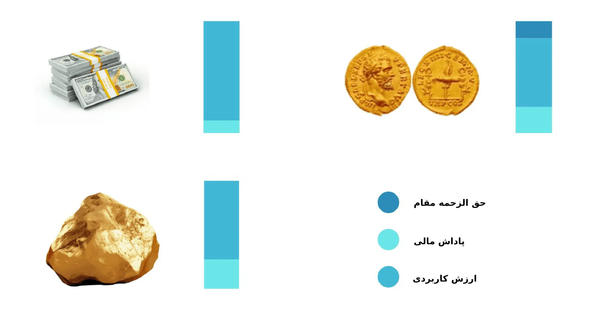

# تعاریف مختلف پول

<partId>77b7918a-8c3b-11f0-b688-6b2ab22378c9</partId>

## پول در مقابل ارز در مقابل monnaie در مقابل argent در مقابل devise

<chapterId>bf8a6d21-df88-5d23-a0a5-e9a5c1300554</chapterId>

:::video id=d9c9e7df-9db3-4a9f-801e-10d3fc7dfc22:::

### معانی اصطلاحات پولی

در این بخش درباره نظریه‌های مختلف پولی و به‌ویژه درباره تعاریف پول، می‌خواهم یک نکته کوتاه درباره موضوع معناشناسی بیان کنم. می‌خواهم کمی عمیق‌تر به تعاریف چندین کلمه مرتبط با پول بپردازم و آن‌ها را با معادل‌های انگلیسی‌شان مقایسه کنم. برای مثال، پول، ارز، در مقایسه با monnaie، argent و devise. بنابراین، به این صورت پیش می‌رود.

کمی معناشناسی:

وقتی می‌گوییم "**پول**" (de la monnaie)، بیشتر مردم فکر می‌کنند که منظور ما پول خردی است که در ازای یک معامله دریافت می‌کنیم. و اگر بگوییم "**ارز**" (la monnaie)، احتمالاً مردم فکر می‌کنند که منظور ما ارز یک کشور است. ارز کانادا دلار کانادایی است. درست است.

اما در مورد پول (de l'argent) چطور؟ یک دزد هرگز نخواهد گفت "همه پول خردت را بده!" (ممکن است دزد با دریافت سکه‌های بی‌ارزش ناامید شود).

نه، دزد فریاد خواهد زد: "همه **پول‌هایت** را بده". و اگر دزد در خیابان جلوی شما ایستاده باشد، او لزوماً به **اسکناس‌ها** در جیبتان اشاره می‌کند.

از سوی دیگر، اگر دزد سعی کند به روشی پیچیده‌تر شما را فریب دهد و با خالی کردن تمام حساب‌های بانکی‌تان دارایی‌های شما را بدزدد، می‌گوییم که **او تمام پول شما را خواهد برد**. در اینجا کلمه "پول" به **ثروت فرد** اشاره دارد.

بنابراین دو تعریف برای کلمه پول وجود دارد: نقد (اسکناس) و ثروت.

### ارز در مقابل monnaie در مقابل devise

یک ارز (devise) لزوماً ارز یک کشور دیگر است، در غیر این صورت ما فقط می‌گوییم پول (monnaie). اگر فرانسوی باشید، می‌گویید: "La livre sterling est la devise du Royaume-Uni et l'euro et la monnaie de l'Europe" (پوند استرلینگ ارز بریتانیا است و یورو ارز اروپا است).

اغلباً، افرادی که به این مشکلات معنایی نپرداخته‌اند، در ترجمه این اصطلاحات، تمایل دارند که از کلمه ارز (devise) استفاده کنند وقتی که نوشته شده ارز، اما نه، ارز پول (monnaie) است وقتی که ارز کشور شماست، و ارز (devise) وقتی است که درباره ارزهای دیگر صحبت می‌کنیم. و بنابراین، مشکلی که اغلب می‌بینم این است که در انگلیسی، دو کلمه وجود دارد: "پول" که یک مفهوم است، و "ارز" که واقعاً واحد یک کشور است که برای مبادلات استفاده می‌شود. بنابراین می‌توانیم به سادگی درباره مفهوم پول صحبت کنیم؛ آسان است - این مفهوم کلمه *پول* است؛ پول به طور کلی. و *ارز* به سادگی می‌تواند با ارز یک کشور برابر شود. در حالی که در فرانسه، متأسفانه، مردم اغلب می‌گویند بله، "اما این یک پول نیست" وقتی درباره بیت‌کوین صحبت می‌کنند زیرا ارز یک کشور نیست، اما اغلب، فکر می‌کنم که آنها به جای آن به اصطلاحات ارز اشاره می‌کنند. این از یک طرف اشتباه است، زیرا از زمان السالوادور، بیت‌کوین ارز یک کشور شده است. واقعیت این است که مردم اغلب می‌گویند: *اما نه، این ارز یک کشور نیست، نمی‌تواند پول باشد*. اما در واقع، اگر به مفهوم گسترده‌تر *پول* اشاره کنیم، بیت‌کوین به نظر من به طور کامل در این تعریف جا می‌گیرد. فقط در فرانسه، ما دو کلمه برای جدا کردن این دو مفهوم نداریم. می‌توانیم بگوییم که کلمه argent به ارز اشاره دارد، اما متأسفانه، این تعریف دقیق آن نیست. *Argent* (پول) به ثروت یا اسکناس‌ها اشاره دارد. واقعاً نمی‌توانید با کلمه *پول* برابری کنید. *پول* واقعاً مفهوم ارز (monnaie) است.

## تعریف سیف‌الدین آموس

<chapterId>07c4ba50-168c-567a-8957-0b187ff75f97</chapterId>

:::video id=936d6d3b-6d45-468e-bc44-85fbce9b857a:::

#### پول چیست؟

پول به سادگی چیزی است که شما مالک آن هستید یا به دست می‌آورید نه برای استفاده یا مصرف به خاطر خود آن، بلکه برای مبادله بعدی با کالاها یا خدمات دیگری که ممکن است به آن‌ها نیاز داشته باشید. (سیف‌الدین)

پول زمانی که تقاضای پولی برای کالا وجود دارد، یک حق بیمه پولی به دست می‌آورد تا یکی یا چند نقش پول را ایفا کند.

کالای پولی باید به اندازه‌ای کمیاب باشد که حق بیمه پولی پایدار بماند (تا از تطبیق عرضه با تقاضای پولی جلوگیری شود).

### حق بیمه پولی

در این بخش درباره تعاریف مختلف ارز، می‌خواستم به‌طور مختصر درباره تعریف سیف‌الدین در استاندارد Bitcoin صحبت کنم که همیشه برای من بسیار جالب بوده است. وقتی آن را خواندم، به نظرم بسیار ساده آمد. و ما همچنین قصد داریم مفهوم حق بیمه پولی را به این تعریف اضافه کنیم. همان‌طور که سیف‌الدین در کتابش ذکر می‌کند، لزوماً یک مفهوم کمبود وجود دارد. سوال این است که پول چیست؟

> پول به سادگی چیزی است که شما مالک آن هستید یا به دست می‌آورید، نه برای استفاده یا مصرف به خاطر خود، بلکه برای مبادله بعدی با کالاها یا خدمات دیگری که ممکن است به آن‌ها نیاز داشته باشید.

بنابراین این تعریفی است که سیف‌الدین در استاندارد Bitcoin ذکر می‌کند. من اضافه می‌کنم که یک ارز (la monnaie) زمانی که تقاضای پولی برای کالا وجود دارد، برای ایفای یک یا چند نقش ارز، یک حق بیمه پولی کسب می‌کند. بنابراین می‌توان گفت ارزی که به عنوان ذخیره ارزش عمل می‌کند، تقاضای پولی خواهد داشت که به آن حق بیمه پولی می‌دهد، زیرا مردم می‌خواهند آن را به دست آورند، به عنوان مثال به عنوان ذخیره ارزش یا به عنوان واسطه مبادله.

### کمیابی و مکانیسم‌های بازار

به این، فکر می‌کنم باید حتماً اضافه کنیم که کالای پولی باید به اندازه کافی کمیاب باشد تا حق بیمه پولی باقی بماند. این بسیار مهم است. **اگر کالایی به عنوان پول ظهور کند و ببینیم که قیمت آن در حال افزایش است، معمولاً اگر کالا به اندازه کافی نادر نباشد، مردم می‌خواهند بیشتر از آن تولید کنند تا از این افزایش ارزش زمانی که قیمت بالا می‌رود، بهره‌مند شوند**. به همین دلیل است که بیشتر کالاها در بازار قیمت نسبتاً ثابتی دارند. وقتی قیمت افزایش می‌یابد، تولید تمایل به افزایش دارد. وقتی قیمت کاهش می‌یابد، تولید کاهش می‌یابد. نوعی تنظیم بازار وجود دارد. **و وقتی کالایی به اندازه کافی نادر است، مانند طلا، مکانیزم بازار برای این افزایش تقاضا برای استفاده پولی جبران نمی‌کند. بنابراین متغیری که تغییر می‌کند، قیمت است. مانند بیت‌کوین**. وقتی قیمت بیت‌کوین بالا می‌رود، ما بیت‌کوین بیشتری تولید نمی‌کنیم. بنابراین چیزی که تنظیم می‌شود، قیمت است. و به همین دلیل است که سال‌هاست شاهد افزایش قیمت بیت‌کوین هستیم زیرا تقاضا برای بیت‌کوین افزایش می‌یابد. از آنجا که هیچ‌کس روی زمین نمی‌تواند الگوریتم را تغییر دهد و بگوید "تقاضا بیشتر شده، قیمت در حال افزایش است، ما بیشتر تولید خواهیم کرد." **عرضه بیت‌کوین‌های جدید از پیش برنامه‌ریزی شده و از پیش شناخته شده است**. بنابراین این چیزی است که می‌گفتم، که کالای پولی باید به اندازه کافی نادر باشد تا حق بیمه پولی پایدار بماند و بنابراین توسط مکانیزم‌های بازار گرفتار نشود، تا از تنظیم عرضه به این تقاضای پولی جدید جلوگیری شود.

## وسایل پرداخت و ارزش آزادسازی

<chapterId>5d424039-e342-56f7-9d8b-bba9551831a9</chapterId>

:::video id=af4c0765-8111-4cb7-891b-3ee54d6e7054:::

### وسایل پرداخت در مقابل وسایل مبادله

در این بخش که به تعاریف مختلف پول اختصاص دارد، پیشنهاد می‌کنم با هم به نقل‌قولی از کتاب "Aux origines de la monnaie" (خاستگاه‌های پول)، متنی از آلن تستار در مورد پول به عنوان وسیله‌ای برای پرداخت و ارزش آزادکننده، نگاهی بیندازیم.

*از کتاب Aux origines de la monnaie، آلن تستار پول را به عنوان وسیله‌ای برای پرداخت تعریف می‌کند:*

> عملکرد وسایل پرداخت در اینجا به عنوان متمایز از عملکرد وسایل مبادله در نظر گرفته شده است، تا جایی که پرداخت‌هایی بدون مابه‌ازا وجود دارد، پرداخت‌هایی که چیزی نمی‌خرند. کنیس (1873:192 و بعد) این موضوع انتقال کالاها که شامل اعمال مبادله نمی‌شود را به تفصیل بررسی می‌کند، مانند مورد ویرگل (پول خون یا جبران برای قتل) یا مالیات‌ها. کارل منگر در مقاله خود در سال 1892 با عنوان "Geld" به شدت به این عملکرد چهارم حمله کرد، مقاله‌ای که به طور کلی یکی از قاطع‌ترین مقالات در این موضوع محسوب می‌شود. بدون اینکه کاملاً بی‌اعتبار شده باشد، به نظر می‌رسد ایده عملکرد وسایل پرداخت در تفکر اقتصادی امروز فراموش شده یا حداقل به نفع عملکرد وسایل مبادله رد شده است.
>

> پول برای پرداخت استفاده می‌شود: از این منظر، پول ابزاری برای رهایی است که در تمام کلیت خود، عملکرد یک وسیله پرداخت را توصیف می‌کند. از این نظر، ما از "قدرت رهایی‌بخش" پول صحبت می‌کنیم. به گفته لو پتی روبر، قدرت رهایی‌بخش "آن چیزی است که اثر آزاد کردن (از یک تعهد، یک بدهی) را دارد". به گفته گراند لارووس، پرداخت رهایی‌بخش هر "پرداختی است که تحت شرایط قانونی انجام می‌شود به گونه‌ای که طلبکار نمی‌تواند انقراض بدهی را به چالش بکشد". پول این قدرت را به طور عالی دارد؛ حتی چیزی است که وضعیت پول قانونی آن را تعریف می‌کند، زیرا هیچ‌کس نمی‌تواند پرداختی را که با پول انجام شده است، چه فروشنده و چه طلبکار، رد کند. پول تنها کالایی است که نمی‌توان آن را در پرداخت آنچه بدهکار است، رد کرد، صرف‌نظر از اینکه بدهی به یک تاجر یا مالیات‌گیرنده باشد. در میان تمام کالاها، تنها پول این امتیاز را دارد. "این امتیاز است"، می‌نویسد چارلز. گید (1921 I: 443)، که چیزی را تشکیل می‌دهد که ما آن را پول قانونی می‌نامیم.
>

> هر مبادله‌ای که شامل انتقال یک کالا به ازای کالای دیگر باشد، یا به شرطی که کالای دیگری در ازای آن داده شود، لزوماً تعهدی را بر عهده گیرنده قرار می‌دهد تا این طرف مقابل را فراهم کند. پرداخت، انجام این تعهد است. بنابراین، هر مبادله‌ای پرداخت را در بر دارد، اما هر پرداختی مبادله را در بر ندارد. پرداخت‌هایی وجود دارند که بدون طرف مقابل هستند، یعنی پرداخت‌هایی که امکان به دست آوردن کالای دیگری را فراهم نمی‌کنند و برای این منظور انجام نمی‌شوند. مالیات‌ها همچنان مثال معیار در اینجا هستند؛ همچنین باید به جریمه‌های مختلفی که به مقامات عمومی پرداخت می‌شود و جبران خسارت‌هایی که به دیگران بر اساس این اصل که کسی که به دیگران آسیب می‌زند باید آن را جبران کند، اشاره کنیم.

### پرداخت‌ها بدون طرف مقابل

این یک تصویر واضح از تز نویسنده است. در واقع، او بین این دو تمایز قائل می‌شود. برای او، مبادله هم انتقال کالا و هم پرداخت است. پرداخت بعد از آن می‌آید. و پرداخت می‌تواند بدون مبادله رخ دهد. او مثال‌هایی از چگونگی پرداخت جریمه پارکینگ یا جریمه نقدی را به عنوان صرفاً یک پرداخت ارائه می‌دهد. شما واقعاً در ازای آن خدماتی دریافت نمی‌کنید. برخی ممکن است استدلال کنند که دولت در ازای آن به شما خدماتی ارائه می‌دهد، خدماتی مانند دادن جریمه پارکینگ. او به وضوح بیان می‌کند که پرداخت مالیات واقعاً یک پرداخت بدون طرف مقابل است، به این معنا که پرداخت مالیات الزامی است، حتی اگر لزوماً خدماتی دریافت نکنید. او می‌گوید که واقعاً تعریف شده است که پرداخت مالیات فقط یک پرداخت است؛ هیچ الزامی برای دریافت خدمات در ازای آن وجود ندارد. من این موضوع را با بسیاری از همکارانم مطرح کرده‌ام و آن‌ها لزوماً با این مفهوم موافق نیستند. اما این تز نویسنده است. او سعی می‌کند مفهوم پرداخت را جای‌گذاری کند و آن را از مبادلات با این مثال‌ها، مانند جریمه و پرداخت مالیات جدا کند. همچنین، به عنوان مثال، مهریه را بیان می‌کند که مهریه یک پرداخت است؛ شما لزوماً چیزی در ازای آن دریافت نمی‌کنید. کسی که این پیشنهاد را نقد می‌کند ممکن است بگوید "بله، اما شما در ازای آن یک همسر دریافت می‌کنید." بنابراین این سطح بحث در این موضوع است.

همچنین ویرگلند، یا پول خون وجود دارد. بنابراین این فقط یک پرداخت برای جبران است. دوست من اولریش می‌گفت:

> بله، اما در عوض این پرونده بسته می‌شود.

بنابراین، شما مرتکب جرمی شده‌اید، مثلاً یک قتل. در آن زمان، شما ویرگیلد را پرداخت می‌کنید و بعد از آن، خوب، از آن وضعیت آزاد می‌شوید. بنابراین یک قدرت آزادکننده وجود دارد. آیا چیزی در عوض دریافت می‌کنید؟" به گفته نویسنده، نه. به گفته برخی از همکاران من، بله.

فکر می‌کنم که در این بحث، می‌توانیم ببینیم که ویرگل یکی از مثال‌های خوب برای تعریف یک پرداخت است. در واقع، به وضوح، شما چیزی در ازای آن دریافت نمی‌کنید.

## پول بدهی در مقابل پول کالایی

<chapterId>4093677a-c8e8-5828-b994-15c01656186e</chapterId>

:::video id=f49cf5cc-288e-4daa-a1ff-b9de73506f4e:::

### بحث بنیادی

همچنان در زمینه این بخش درباره تعاریف و نظریه‌های مختلف پولی، بیایید با هم دو دیدگاه کاملاً متضاد را بررسی کنیم: "پول همیشه بدهی است" یا "پول همیشه یک کالا است". از یک سو، طرفداران نظریه پولی مبتنی بر بدهی ادعا می‌کنند: "نه، پول همیشه بدهی است!" از سوی دیگر، طرفداران مشهور طلا می‌گویند: "اما نه، ببینید، پول همیشه یک کالا است، همیشه طلا است؛ هر چیز دیگری، اسکناس‌ها، تعهدات، فقط اعتبار است، نه پول".

بیایید با هم خلاصه‌ای واضح از این نظریه‌ها را بررسی کنیم.

### نظریه "همیشه یک بدهی"

در اینجا خلاصه‌ای از نظریه پولی معروف به **"پول بدهی"** آمده است که بر اساس آن، پول اساساً شکلی از بدهی است:

بر اساس این نظریه، که به‌ویژه توسط آلفرد میچل-اینس توسعه یافته و توسط دیوید گربر بیشتر توسعه یافته است، پول ذاتاً به‌عنوان تأیید بدهی شناخته می‌شود که از روابط اعتباری که به‌طور تاریخی پیش از مبادلات مستقیم پولی وجود داشته‌اند، نشأت می‌گیرد. به‌جای اینکه از نیازی مرتبط با مبادله کالا به کالا ناشی شود، پول به‌عنوان راهی برای حسابداری، انتقال و تسویه تعهدات یا بدهی‌های اجتماعی بین افراد یا گروه‌ها ظاهر می‌شود.

بنابراین، تمام پول به عنوان بدهی که توسط یک شخص یا نهاد به شخص یا نهاد دیگری بدهکار است، در گردش است و توسط اعتماد و اقتدار اجتماعی یا دولتی که اعتبار آن را تضمین می‌کند، پشتیبانی می‌شود. بنابراین، به گفته آن‌ها، وقتی ما پول داریم - همان‌طور که قبلاً ذکر کرده‌ام - وقتی ما پول داریم، ما یک ادعا بر جامعه داریم و جامعه به ما بدهکار است. بنابراین پول هرگز خنثی یا مستقل نیست، بلکه همیشه یک بدهی اساسی است: نگه داشتن پول اساساً به معنای داشتن یک ادعا بر جامعه یا یک جامعه اقتصادی است.

این استدلال با ایده کلاسیک پول به عنوان یک "کالای واسطه ساده" در تضاد است و در عوض بر نقش مرکزی روابط اجتماعی و سیاسی در ایجاد و مدیریت پول تأکید می‌کند.

**بررسی من:**

آنچه در مورد این نظریه مرا آزار می‌دهد این است که ادعا می‌کند پول همیشه یک بدهی است، در حالی که ما نمونه‌هایی از مبادلات بین دو قبیله مختلف داریم که مثلاً طلا مبادله می‌کنند، جایی که معامله به طور قطعی نهایی است و هیچ بدهی پنهانی باقی نمی‌ماند. طرفداران این نظریه اغلب به ما می‌گویند که این مبادلات، مبادلات پولی نیستند، بلکه مبادله کالا به کالا هستند. همان‌طور که قبلاً ذکر شد، من مخالفم. این یک مبادله پولی است، زیرا طلا قرار نیست مصرف شود؛ قرار است به عنوان پول استفاده شود.

### نظریه "همیشه یک کالا"

**همیشه یک کالا:**

در اینجا خلاصه‌ای واضح از نظریه پولی معروف به **"پول کالایی"** آمده است، جایی که پول همیشه به عنوان یک کالا ظاهر می‌شود، به ویژه طلا، که از نیازی برای توانایی تجارت ناشی می‌شود، کالایی که به طور کلی در خارج از کشور پذیرفته می‌شود و برای اهداف تجاری به دست می‌آید.

بر اساس این نظریه، که توسط اقتصاددانان کلاسیک (آدام اسمیت، دیوید ریکاردو) توسعه یافته و توسط مارکس مورد توجه قرار گرفته است، پول به طور طبیعی به عنوان یک کالا در میان دیگر کالاها ظاهر می‌شود، اغلب یک فلز گرانبها مانند طلا یا نقره، که دارای ارزش ذاتی مستقل از نقش پولی آن است. در ابتدا، این کالاها به طور خودجوش توسط بازیگران اقتصادی برای تسهیل تجارت انتخاب می‌شوند، به لطف ویژگی‌های ذاتی آن‌ها (کمیابی، دوام، تقسیم‌پذیری و پایداری).

پول کالایی با وجود فیزیکی خود و ارزشی که توسط میزان کار اجتماعی لازم برای تولید آن تعیین می‌شود، متمایز می‌شود (همان‌طور که در مارکس آمده است). جامعه از طلا، به عنوان مثال، نه تنها برای ساده‌سازی مبادله کالا به کالا بلکه به عنوان واحد حساب، ذخیره ارزش و واسطه جهانی مبادله استفاده می‌کند.

در این دیدگاه، پول همیشه ارزش واقعی خود را حفظ می‌کند، زیرا به یک کالای ملموس مرتبط است. حتی زمانی که نقش پول انتزاعی می‌شود (سکه‌های ضرب‌شده، اسکناس‌ها یا پول اعتباری)، اعتبار آن همچنان به‌طور مستقیم یا غیرمستقیم از ارجاع به یک کالای زیربنایی مانند طلا ناشی می‌شود. بنابراین این نظریه بر منشأ مادی و اقتصادی پول تأکید دارد، در مقابل نظریاتی که آن را صرفاً یک قرارداد یا بدهی می‌دانند. بر اساس این نظریه، هر گونه نمایندگی پول توسط یک جایگزین، مانند یک اسکناس قابل بازخرید با طلا، اعتبار محسوب می‌شود.

**بررسی من:**

توجه داشته باشید که این دیدگاه شبیه به نظریه پول کالایی است، اما یک قدم فراتر می‌رود. آنها پیشنهاد می‌کنند که پول **همیشه** باید یک کالا باشد. و وقتی به آنها می‌گوییم: "*بله، اما می‌توانیم توافق کنیم که یک اسکناس برای این گروه پول است؛ می‌تواند با طلا پشتیبانی شود، کار می‌کند، و اسکناس به خودی خود پول است*".

در پاسخ، آنها مثال کوپن رختکن را به ما خواهند داد. آنها خواهند گفت: "بله، اما نه، وقتی شما یک کوپن رختکن برای لباس خود دارید، آیا می‌توانیم کوپن صندوق را لباس بنامیم؟"

البته که نه، این مانند یک تأییدیه، یک ادعا است که به شما اجازه می‌دهد لباس خود را پس بگیرید. این مقایسه درست نیست، زیرا کوپن رختکن یک روش پرداخت عمومی پذیرفته شده نیست. **پول ادعایی بر یک شیء خاص مانند یک لباس نیست؛ بلکه یک روش، یک وسیله مبادله، یک واسطه مبادله، یا یک وسیله پرداخت عمومی پذیرفته شده است**.

بنابراین نمی‌توانید بین یک کوپن رختکن و یک اسکناس ارز فیات مقایسه‌ای بکشید، زیرا کوپن رختکن به شما اجازه می‌دهد تا یک کالای خاص را در ازای آن دریافت کنید، این یک token است که به شما اجازه می‌دهد کالای خود را بازیابی کنید. در حالی که یک اسکناس، ارز فیات، یک کوپن جهانی است که به شما امکان دسترسی به هر کالایی را می‌دهد.

و به نظر من، البته، حتی پول فیات می‌تواند به عنوان پول در نظر گرفته شود اگر توسط جمعیت به عنوان چنین چیزی در نظر گرفته شود. و فکر می‌کنم اصرار بر اینکه نمی‌تواند پول باشد یک خطای معنایی است، زیرا این یک کوپن برای به دست آوردن پول واقعی است، حداقل در آن زمان، که طلا به عنوان پایه بود.

من هیچ مشکلی با در نظر گرفتن سکه طلایی که در گاوصندوق نگهداری می‌شود و اسکناسی که نماینده آن سکه طلا است به عنوان ارز ندارم. برای من، هیچ مشکلی از نظر معنایی وجود ندارد، این فقط دو نوع ارز است. اگر اشتباه نکنم، میزس این پدیده را با صحبت درباره جانشین‌های پولی به خوبی توضیح می‌دهد.

چشم‌انداز آن‌ها به این واقعیت خلاصه می‌شود که نمی‌توانید یک سکه طلا در خزانه بانک و اسکناسی که نمایانگر آن است را همزمان به عنوان پول در نظر بگیرید. شخصاً، من هیچ مشکلی با این موضوع نمی‌بینم؛ من هیچ پارادوکسی در این وضعیت نمی‌بینم. کسانی که معتقدند پول همیشه یک کالا است، به شیوه‌ای که من می‌بینم، نگاه نمی‌کنند.

**در اینجا نقدی بر مفهوم کوپن رختکن از کتاب *Aux origines de la monnaie* آمده است:**

*یادداشت 14: "انتقاد عالی - عالی زیرا بر همان اساسی است که کناپ خود را قرار می‌دهد، یعنی اساس قانونی - توسط ریست (1938: 372، یادداشت 1) از مقایسه بین پول کاغذی و ژتون‌های اتاق چک: اگر بتوانیم در هر دو مورد از نوعی ادعا صحبت کنیم، تفاوت اساسی این است که در مورد اول، و فقط در مورد اول، این یک ادعا بدون یک شیء خاص است.

همچنین، در مورد **ادعا**، همان نویسنده به نکات زیر اشاره می‌کند:

> باستیا آزاد است که یک کوپن برای کل جامعه را به‌عنوان "یک بازار بزرگ" تصور کند، اما این افزودنی کوچک، این گسترش ظاهراً بی‌ضرر، تمام تفاوت بین اعتبار و پول است. پول ادعایی بر یک فروشگاه خاص نیست. چیزی به نام ادعای ناشناس وجود ندارد. اما ناشناسی که پول را مشخص می‌کند، و بنابراین عمومیت آن، چیزی است که آن را بسیار قدرتمند می‌سازد. پول مانند اعتبار نیست، و حتی کمتر از آن به هیچ وجه قابل تقلیل به آن نیست. **پول بسیار بیشتر از اعتبار است.**

**یک پارادوکس: پول بدهی در مقابل پول کالایی**

پارادوکسی که به بهترین شکل دوگانگی عمیق بین نظریه‌های پول بدهی و پول کالایی را نشان می‌دهد، به مسئله این که آیا طلا امروز یک ارز است یا خیر، مربوط می‌شود.

از یک سو، نظریه پول-بدهی پول را در درجه اول به عنوان واسطه مبادله یا وسیله پرداخت تعریف می‌کند که به طور عمومی پذیرفته شده یا حتی توسط یک مرجع عمومی تحمیل شده است. از این منظر، طلا دیگر یک ارز نیست، زیرا به طور گسترده به عنوان یک واسطه مبادله عمومی استفاده یا پذیرفته نمی‌شود.

از سوی دیگر، نظریه پول کالایی، پول را به عنوان یک کالای ملموس می‌بیند که به طور خودجوش توسط جامعه به دلیل ویژگی‌های ذاتی آن (کمیابی، دوام، تقسیم‌پذیری و غیره) انتخاب شده است. بر اساس این رویکرد، طلا همچنان ارز واقعی جهانی باقی می‌ماند و تمام اشکال دیگر پول امروزی، اساساً چیزی بیش از اعتباری مبتنی بر اعتماد نیستند.

این پارادوکس به وضوح شکاف بین این دو مفهوم پولی را نشان می‌دهد: برای اولی، طلا دیگر یک ارز نیست؛ برای دومی، برعکس، طلا تنها ارز واقعی موجود باقی می‌ماند.

## نظریه پولی مدرن

<chapterId>8efc29af-3193-5d97-ad9f-e608b32924ff</chapterId>

:::video id=f8127cb7-46a1-468c-bbb5-97bf0a8b8837:::

### اصول نظریه پولی مدرن

برای خاتمه دادن به این بخش درباره نظریه‌های مختلف پولی، بیایید درباره اعجوبه نظریه‌های پولی صحبت کنیم که مورد تحسین بسیاری از اقتصاددانان مدرن که برای بانک‌های مرکزی کار می‌کنند قرار گرفته است و به نام نظریه پولی مدرن شناخته می‌شود که اغلب به عنوان MMT شناخته می‌شود.

**نظریه پولی مدرن (MMT)** یک رویکرد اقتصادی است که معتقد است یک دولت با ارز مستقل خود (مانند ایالات متحده، کانادا یا ژاپن) هرگز نمی‌تواند پولش تمام شود، زیرا همیشه می‌تواند برای تأمین مالی هزینه‌های خود پول بیشتری صادر کند. بر اساس این نظریه:

- پول یک خلق دولت است، نه یک منبع محدود**

- مالیات و وام‌گیری به‌طور مستقیم برای تأمین مالی هزینه‌های عمومی استفاده نمی‌شوند، بلکه برای تنظیم تورم، تأثیرگذاری بر رفتار اقتصادی و حفظ تقاضا برای ارز ملی به کار می‌روند.*

- حد واقعی برای هزینه‌های دولتی تورم است، نه کسری بودجه یا بدهی عمومی.

- اگر پول ایجاد شده به بخش‌هایی که می‌توانند آن را جذب کنند هدایت شود، تورمی نیز وجود نخواهد داشت.

- بنابراین دولت باید هزینه‌های خود را بر اساس منابع واقعی موجود (نیروی انسانی، ظرفیت صنعتی، منابع طبیعی) تنظیم کند تا از تورم بیش از حد جلوگیری کند.

### نقش مالیات در MMT

بنابراین، اینجا پاسخ معروف به همه کسانی که می‌گویند: "بله، اما اگر می‌توانیم پول چاپ کنیم، چرا مالیات می‌دهیم؟" را خواهید یافت. خوب، نظریه پولی مدرن (MMT) پاسخ درستی به این ایده دارد. درست است که در سیستم فیات، در سیستم مدرن، از نظر فنی، چیزی برای محدود کردن خلق پول وجود ندارد، به جز تورم. اما آنها پیشنهاد می‌کنند که اولاً، مالیات برای محدود کردن تورم ضروری است، زیرا پول را از اقتصاد خارج می‌کند. بنابراین، اگر مالیات برای جبران نداشته باشیم، این خلق پول می‌تواند در نهایت تورم ایجاد کند. آنها استدلال می‌کنند که مالیات به معنای واقعی کلمه راهی برای خارج کردن پول از سیستم برای محدود کردن تورم است.

در مورد پولی که در بخش‌هایی سرمایه‌گذاری می‌شود که می‌توانند آن را جذب کنند، می‌توان به مثال ایالات متحده اشاره کرد که تریلیون‌ها دلار به صنعت نظامی اختصاص می‌دهد، که باعث تورم نمی‌شود زیرا صنعت نظامی، مجتمع نظامی-صنعتی، به‌طور کامل قادر به جذب این تریلیون‌ها دلار است.

از سوی دیگر، اگر بخواهید جاده‌های بیشتری بسازید و منابع و پیمانکارانی که می‌توانند آن‌ها را تولید کنند محدود باشند، دو برابر کردن بودجه برای جاده‌ها لزوماً اثر کمبود بر نیروی کاری که می‌تواند این جاده‌ها را بسازد ایجاد می‌کند. بنابراین قیمت به دلیل نیروهای بازار، عرضه و تقاضا افزایش خواهد یافت. اگر رهبران دانای کل ما بدانند که پول را کجا قرار دهند، از نظر فنی نباید باعث تورم شود. و من پاسخ می‌دهم که در عمل، کاملاً واضح است که این کار باعث تورم می‌شود.

در نتیجه، بر اساس نظریه MMT، دولت می‌تواند از ظرفیت خود برای ایجاد پول به منظور دستیابی به اشتغال کامل و تأمین مالی سرمایه‌گذاری‌های اجتماعی و زیست‌محیطی استفاده کند، در حالی که از طریق یک سیاست مالی مناسب، تورم را کنترل می‌کند. همچنین اغلب هدف اقتصاددانان کینزی، که یک مکتب دیگر از تفکر اقتصادی است، مدیریت بیکاری از طریق مدیریت نرخ بهره و تأمین مالی سرمایه‌گذاری‌های اجتماعی و زیست‌محیطی در حالی که تورم را از طریق یک سیاست مالی مناسب کنترل می‌کنند، می‌باشد.

### بررسی MMT

این نظریه تنها برای تعداد کمی از کشورها (به توییت استفانی کلتون مراجعه کنید) که از حاکمیت پولی واقعی برخوردارند، یعنی می‌توانند بدهی را به ارز خود افزایش دهند، کاربرد دارد. این نظریه برای اقتصادهای وابسته به واردات که باید اعتماد بین‌المللی به ارز خود را حفظ کنند، دشوار است.

و حاکمیت پولی واقعی چیست؟ به معنای توانایی در گرفتن وام به ارز خودتان است. شما باید بتوانید مازاد تجاری داشته باشید تا ذخایر ارزی کافی، ارز خارجی کافی داشته باشید، به طوری که نیازی به جمع‌آوری پول به ارز خارجی برای واردات کالا نداشته باشید. این موضوع به تعداد معدودی از کشورها مربوط می‌شود.

در زیر می‌توانید توییتی از استفانی کلتون ببینید که به نوعی زن پوستر برای این جنبش است. او کتابی به نام "افسانه کسری بودجه" نوشته است. در توییت، او می‌نویسد که کشورهای مختلفی مانند ایالات متحده، ژاپن، کانادا، استرالیا، بریتانیا نمی‌توانند پولشان تمام شود.

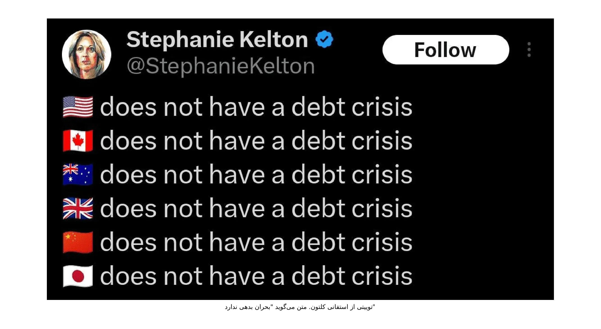

عجیب است که فقط شش کشور را فهرست می‌کند؟ چرا اینطور است؟ زیرا آنها دارای حاکمیت پولی واقعی هستند. اما حدود ۲۰۰ کشور در زمین وجود دارد و همه آنها حاکمیت پولی ندارند. بنابراین، انتقاد من از این نظریه، علاوه بر اینکه کمی عجیب و غیرعملی است، این است که فقط برای چند کشوری که از حاکمیت پولی واقعی برخوردارند کار می‌کند، کشورهایی که می‌توانند اوراق خزانه را به ارز خود صادر کنند. تا حدی، این به ضرر بقیه جهان است. با ایجاد این ارز، گویی آنها تورم خود را به جای دیگری صادر می‌کنند، شبیه به آنچه ایالات متحده با امتیاز گزاف خود برای دهه‌ها انجام داده است. این شبیه به نوعی استعمار پولی است، جایی که کشورهایی که اعتماد جهانی و تقاضا برای ارز خود دارند می‌توانند بدون مواجهه با تورم قابل توجه، به هر میزان که بخواهند پول چاپ کنند، اغلب به این دلیل که آن تورم را صادر می‌کنند.

این نظریه برای اقتصادهای وابسته به واردات که نیاز به حفظ اعتماد بین‌المللی به ارز خود دارند، دشوار است.

این نظریه همچنین نیاز به سطح معینی از برنامه‌ریزی متمرکز اقتصادی دارد، به ویژه برای اطمینان از کنترل بیشتر بر منابع واقعی (کارگران، مواد خام، ظرفیت صنعتی) و مدیریت تورم.

# سقوط و تولد دوباره پول

<partId>87a34ca9-782b-5ade-b51a-400f88ed7b0c</partId>

## سکه‌های یونانی

<chapterId>7714195f-74ce-5f8c-be5f-59302d39fff4</chapterId>

:::video id=8e5c3091-0910-471b-8d4b-0dc6e9afa656:::

### زمینه و محتوا

قبل از شروع، در اینجا پیشینه تاریخی آمده است:

**پیشینه تاریخی:**

**رومی‌ها به یونانی‌ها "Graeci" و به یونان "Graecia" می‌گفتند.**

**یونانی‌ها خود را "هلنی‌ها" و کشورشان را "هلاس" می‌نامیدند.**

**هومر** (متولد حدود قرن ۸ قبل از میلاد)

شاعر افسانه‌ای یونانی، نویسنده فرضی *ایلیاد* و *اودیسه*.

حدود **۷۵۰ قبل از میلاد: لیکورگوس**، قانون‌گذار افسانه‌ای اسپارتا، گفته می‌شود که قانون اساسی اسپارتا را بر اساس انضباط نظامی و سادگی بنا نهاده است.

**نوما پومپیلیوس** (۷۵۳-۶۷۳ قبل از میلاد)

پادشاه دوم روم، معروف به اعطای اولین نهادهای مذهبی و قانونی به روم.

**دراکو**، قانون‌گذار آتنی (قرن ۷ قبل از میلاد)، معروف به قوانین بسیار سخت‌گیرانه‌اش، از این رو اصطلاح "دراکونی".

**۵۹۴ پیش از میلاد: سولون** به عنوان قانون‌گذار در آتن منصوب می‌شود و جامعه آتنی را به‌طور اساسی اصلاح می‌کند، به‌ویژه با لغو بردگی به دلیل بدهی.

**۷۷۶ پیش از میلاد: بازی‌های المپیک باستان**

اولین بازی‌های ورزشی منظم هر چهار سال یک‌بار در المپیا برگزار می‌شد و شهرهای یونانی را گرد هم می‌آورد.

**فیثاغورس** (حدود ۵۷۰-۴۹۵ پیش از میلاد)

فیلسوف و ریاضیدان یونانی، مشهور به قضیه‌اش در مورد مثلث قائم‌الزاویه.

**زنوفانس کلوفونی** (حدود ۵۷۰-۴۷۸ پیش از میلاد)

فیلسوف پیشاسقراطی که به خاطر انتقاد از چندخدایی سنتی یونان شناخته شده است.

**۴۹۰ پیش از میلاد: نبرد ماراتون**

آتن‌ها با موفقیت یک تهاجم پارسی را دفع کردند و نقطه عطف قاطعی برای تمدن یونان رقم زدند.

**هرودوت** (حدود ۴۸۴-۴۲۵ پیش از میلاد)، که به "پدر تاریخ" معروف است، اثری گسترده درباره جنگ‌های پارسی نوشت که شامل پیروزی یونانیان بر خشایارشا در سال ۴۸۰ پیش از میلاد می‌شود.

**سقراط** (۴۷۰-۳۹۹ قبل از میلاد)

فیلسوف آتنی مشهور به روش دیالکتیکی و آموزش‌هایش در زمینه اخلاق و خودشناسی.

**آریستوفان** (ح. ۴۴۶-۳۸۶ پیش از میلاد)

نمایشنامه‌نویس آتنی، مشهور به خاطر کمدی‌های هجوآمیزش مانند *قورباغه‌ها*.

**سوفوکل** (قرن 5 قبل از میلاد)، در نمایشنامه *آنتیگونه*، از طریق شخصیت ظالم کرئون، پول را به عنوان منبع فساد اخلاقی و سیاسی نقد می‌کند.

**افلاطون** (حدود ۴۲۸-۳۴۸ پیش از میلاد)

فیلسوف یونانی، شاگرد سقراط، بنیان‌گذار آکادمی، نویسنده *جمهوریت*.

**۴۳۱-۴۰۴ پیش از میلاد: جنگ پلوپونز**

درگیری عمده بین آتن و اسپارتا که با شکست آتن به پایان رسید.

**۴۳۱ قبل از میلاد**: آتن با رقیق کردن سکه‌های طلا و نقره خود برای افزایش مقدار در گردش، جنگ پلوپونزی را تأمین مالی می‌کند که باعث تورم می‌شود.

**گزنفون** (ح. ۴۳۰-۳۵۵ پیش از میلاد)

نویسنده، فیلسوف و ژنرال آتنی، شاگرد سقراط، نویسنده *Anabasis*.

**414 قبل از میلاد**: آتن پس از یک لشکرکشی فاجعه‌بار به سیسیل، شروع به از دست دادن جنگ پلوپونزی می‌کند.

**405 قبل از میلاد: آریستوفان**، در نمایشنامه *قورباغه‌ها*، به‌طور صریح کاهش ارزش درهم نقره و ظهور سکه‌های برنزی بی‌کیفیت در آتن را توصیف می‌کند و اصل معروف به "قانون گرشام" را به تصویر می‌کشد.

**۴۰۴ قبل از میلاد**: آتن پس از محاصره طولانی توسط اسپارت تسلیم می‌شود.

**ارسطو** (۳۸۴-۳۲۲ پیش از میلاد)

فیلسوف بزرگ یونانی، شاگرد افلاطون، بنیان‌گذار لوکئوم، شناخته‌شده برای کارهایش در منطق، زیست‌شناسی و فلسفه سیاسی.

**۳۲۷ پیش از میلاد**: اسکندر کبیر تخت جمشید و استان‌های شرقی امپراتوری پارس را فتح می‌کند و امپراتوری خود را به‌طور قابل‌توجهی گسترش می‌دهد.

**323 قبل از میلاد**: اسکندر در بابل بدون وارث مشخصی درگذشت و این امر باعث جنگ‌هایی بین ژنرال‌های او (دیادوخی) برای تقسیم امپراتوری شد.

**ارشمیدس** (حدود ۲۸۷-۲۱۲ قبل از میلاد)

ریاضیدان، فیزیکدان و مخترع یونانی، مشهور به اکتشافاتش در هندسه و مکانیک.

**۱۹۶ پیش از میلاد: سنگ روزتا** در دوران سلطنت فرعون بطلمیوس پنجم حکاکی می‌شود و بعدها رمزگشایی هیروگلیف‌های مصری را ممکن می‌سازد.

**۱۹۲-۱۸۸ پیش از میلاد: جنگ روم و سلوکیان**

روم امپراتوری سلوکی به رهبری آنتیوخوس سوم را شکست داد و نفوذ خود را در یونان و آسیای صغیر تثبیت کرد.

**۱۴۶ پیش از میلاد: نبرد کورینت**

رومیان شهر یونانی کورینت را ویران کردند که این امر به معنای پایان استقلال سیاسی یونان و ادغام تدریجی یونان در دنیای روم بود.

برای این بخش درباره باستان، سقوط روم و قرون وسطی، با بخشی درباره سکه‌های یونانی شروع خواهیم کرد.

تاریخ سکه‌زنی در یونان باستان حدود ۶۰۰ سال قبل از میلاد آغاز شد، زمانی که شهرهای یونانی به سرعت این نوآوری را از لیدیه در آسیای صغیر پذیرفتند و ابتدا از الکتروم و سپس از نقره استفاده کردند. اولین سکه‌های یونانی در جزیره آئگینا ضرب شدند و دارای تصویر لاک‌پشت دریایی یا زمینی بودند، اما این درهم آتنی بود که با تزئینات آتنا و جغد، از قرن ۵ قبل از میلاد به نماد پولی برتر تبدیل شد و به طور گسترده‌ای بر تجارت بین‌المللی آن زمان تسلط یافت.

و من خوش‌شانس هستم که یک نسخه از دراخمای یونانی از آن دوره با آن جغد معروف و یک تصویر در پشت آن دارم. این یک تترا دراخما است که بزرگتر از یک دراخمای ساده بود.

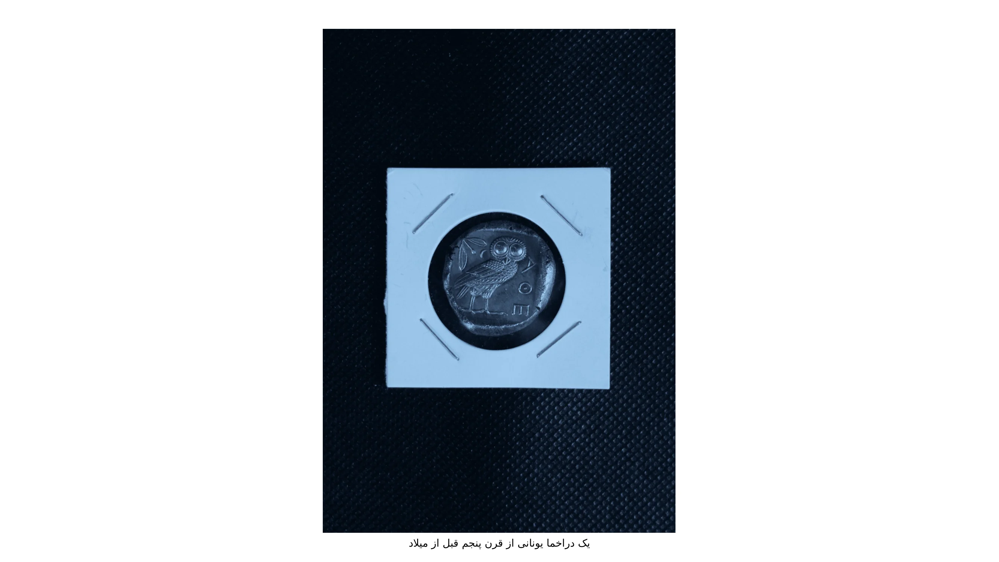

هر شهر یونانی رابطه خاص خود را با پول توسعه داد. در آتن، ارز به شدت با قدرت سیاسی و اقتصادی مرتبط بود. فرمان معروف آتنی در اواخر قرن پنجم قبل از میلاد استفاده انحصاری از ارز آتنی را در قلمروهای متحد خود تحمیل کرد و بدین ترتیب هژمونی اقتصادی خود را تقویت نمود. آتن همچنین ذخایر بزرگی از طلا را برای مواقع اضطراری جمع‌آوری کرد که در آکروپولیس نگهداری می‌شد، شاید به عنوان نمادی از احتیاط اقتصادی آن. در مقابل، اسپارتا، شهری نظامی با ارزش‌های سختگیرانه، تصمیم گرفت استفاده از پول را به شدت محدود کند و به شهروندانش اجازه نداد که سکه‌های طلا یا نقره داشته باشند. اسپارتا ترجیح داد از میله‌های سنگین آهنی استفاده کند تا تجارت خارجی را دلسرد کرده و انسجام اجتماعی را حفظ کند.

جنگ‌ها اغلب از طریق دستکاری ارز تأمین مالی می‌شدند. در طول جنگ پلوپونزی (۴۳۱-۴۰۴ قبل از میلاد)، آتن به کاهش ارزش‌های شدید برای پرداخت به نیروهای خود متوسل شد. با از دست دادن دسترسی به معادن نقره خود به دلیل اشغال دکلیا توسط اسپارت‌ها در ۴۱۳ قبل از میلاد، آتن مجبور شد مجسمه‌های طلایی را ذوب کند تا به سرعت سکه‌های جدیدی در ۴۰۷/۴۰۶ قبل از میلاد ضرب کند. سپس، در ۴۰۶/۴۰۵ قبل از میلاد، او سکه‌های برنزی با روکش نقره ایجاد کرد که باعث بحران پولی شد که توسط **آریستوفان** به تصویر کشیده شده است، که از آنچه امروزه به عنوان قانون گرشام شناخته می‌شود، یاد می‌کند: پول بد پول خوب را از میدان به در می‌کند. این ارز اضطراری به سرعت پس از جنگ از گردش خارج شد تا اعتماد به سکه‌های آتنی بازگردد.

پایان دوره کلاسیک با ظهور مقدونیه تحت فرمانروایی فیلیپ دوم و پسرش اسکندر کبیر مشخص شد که به شدت تعادل پولی یونان را برهم زد. به لطف معادن وسیع طلا و نقره کوه پانگئا، فیلیپ دوم مقدار زیادی پول برای تأمین مالی کمپین‌های نظامی و سیاسی خود تولید کرد و یک استاندارد ساده و عملی طلا-نقره (10:1) را برقرار نمود. استاترهای طلای او که پیروزی‌اش در بازی‌های المپیک را جشن می‌گرفتند، تا غرب اروپا و حتی انگلستان در گردش بودند. اسکندر این سیاست پولی را دنبال کرد و در طول فتوحاتش در شرق تا هند، درهم **آتن** را به طور گسترده‌ای به گردش درآورد. این گردش گسترده سکه‌ها آغازگر دوره هلنیستی بود، زمانی که تصویر فرمانروایان به تدریج جایگزین تصویر خدایان بر روی سکه‌ها شد. این نوآوری به نسل‌های پادشاهان هلنیستی این امکان را داد تا خود را ترویج کنند و خدایان سنتی را به نقشی ثانویه در پشت سکه‌هایشان تقلیل دهند.

پس از مرگ اسکندر در ۳۲۳ پیش از میلاد، ژنرال‌های او امپراتوری وسیعش را تقسیم کرده و سلسله‌هایی در مصر (بطلمیوسیان)، سوریه (سلوکیان) و جاهای دیگر تأسیس کردند. این پادشاهی‌های هلنیستی سیستم‌های پولی متنوعی را پذیرفتند: بطلمیوسیان یک سیستم پولی بسته را برای کنترل گردش پول اعمال کردند و ترجیح دادند از غله به عنوان ارز داخلی استفاده کنند تا فلزات گرانبها را برای هزینه‌های نظامی خارجی حفظ کنند. همزمان، رودس به یک مرکز تجاری مهم تبدیل شد تا اینکه توسط رومیان که دلس را به عنوان یک بندر آزاد در ۱۶۷ پیش از میلاد تأسیس کردند، از نظر اقتصادی تضعیف شد.

استفاده از پول برای پرداخت مزدوران اهمیت داشت. سربازان اسکندر روزانه دراخم نقره دریافت می‌کردند.

سواره‌نظام، نخبه‌ی ارتش بسیار تخصصی اسکندر، به‌طور متوسط روزانه دو دراخما دریافت می‌کردند، یک پیاده‌نظام یک دراخما، و یک مزدور عادی دو سوم دراخما، دو برابر دستمزد یک کارگر ساده.

در طول جنگ پلوپونزی، مبالغ قابل توجهی نیز به سربازان پرداخت شد: بیش از ۱۲۰۰ تالنت برای سرکوب شورش ساموس و بیش از ۲۰۰۰ تالنت برای محاصره پوتیدئا.

تا زمانی که این ارتش به طور کامل در آسیای صغیر درگیر شد، هزینه کل حدود بیست تالنت در روز بود، یا حدود نیم تن نقره، یا ۱۲۰,۰۰۰ دراخما.

سکه‌زنی یونانی همچنین نقش فرهنگی مهمی ایفا کرد، زیرا هر شهر به دنبال آن بود که هویت خود را با ضرب سکه‌های خود با نمادهای محلی یا اسطوره‌ای به نمایش بگذارد. به عنوان مثال، هراکلیوس هرکول (هرکول) را در حال مبارزه با یک شیر به تصویر کشید، در حالی که سیرن گیاه دارویی معروف سیلفیوم را نشان داد.

در نهایت، با وجود تنوع و نوسانات منطقه‌ای، سکه‌های یونان کلاسیک و هلنیستی تأثیر ماندگاری بر تاریخ اقتصادی و فرهنگی دنیای مدیترانه گذاشتند و سیستم‌های پولی بعدی را تا روم به شدت تحت تأثیر قرار دادند، که به تدریج مفاهیم اقتصادی یونانی را پذیرفت و توسعه داد تا اقتصاد امپراتوری خود را ساختار دهد.

## تأثیر ارز در یونان

<chapterId>3a5e6c7d-699c-5567-87cd-3374c49d55a9</chapterId>

:::video id=0c79a59c-e179-4893-a414-1b8de0930eb9:::

### آتن و تضاد با اسپارتا

تقابل بین آتن و اسپارتا در دوره کلاسیک یونان دو مدل کاملاً متفاوت از سازماندهی سیاسی و اقتصادی را نشان می‌دهد. در حالی که اسپارتا پول فلزی را رد کرد و به جای آن به یک سیستم خودکفا مبتنی بر اعتماد مدنی روی آورد، آتن به طور کامل این فناوری را پذیرفت تا امپراتوری دریایی خود را بسازد و حفظ کند.

### ضرورت مالی قدرت دریایی

امپراتوری آتنی، علیرغم نام پرآوازه‌اش، از نظر جغرافیایی محدود باقی ماند - اساساً آتن و شهرهای دریای اژه. قدرت آن بر اتحادیه دلوس، یک اتحاد نظامی تحت سلطه آتن به عنوان هژمون، استوار بود. این ساختار امپراتوری به یک ابزار اقتصادی یکپارچه نیاز داشت: سکه نقره‌ای آتنی.

نگهداری از یک ناوگان در قلب این ضرورت پولی قرار داشت. هزینه یک تریریم آتنی بین یک تا دو تالنت نقره بود - مبلغی قابل توجه. با وجود چند صد کشتی برای نگهداری، آتن به یک سیستم مالیاتی کارآمد نیاز داشت. ارز به ابزار ضروری برای جمع‌آوری خراج از شهرهای وابسته و تأمین مالی نیروی دریایی تبدیل شد که انسجام امپراتوری را تضمین می‌کرد.

### تحمیل پولی به عنوان ابزاری برای سلطه‌گری

آتن ارز نقره‌ای خود را بر تمامی اعضای اتحادیه دلوس تحمیل کرد. این استانداردسازی پولی چندین هدف استراتژیک را دنبال می‌کرد. اولاً، با ایجاد یک واحد حساب مشترک، جمع‌آوری خراج‌ها را تسهیل می‌کرد. ثانیاً، وابستگی اقتصادی شهرهای تابع به آتن را تقویت می‌کرد. در نهایت، به‌طور نمادین قدرت آتن را در سراسر امپراتوری دریایی به نمایش می‌گذاشت.

این سیاست پولی به شدت با مدل اسپارتی در تضاد است. اسپارتا، به عنوان یک قدرت زمینی، می‌توانست برای تأمین معاش خود به کار نیروی کار هیلوت‌های پلوپونزی (بردگان) تکیه کند. سیستم اقتصادی بسته و شهرمحور آن نیازی به ابزارهای پولی پیچیده نداشت. شهروند-سربازان با هم زندگی می‌کردند، وعده‌های غذایی مشترک داشتند و برای مبادلات روزانه به پول نیازی نداشتند.

### ارز به عنوان وسیله‌ای برای تجارت دریایی

ماهیت دریانوردی امپراتوری آتن به این معنا بود که باید به تجارت باز باشد. برخلاف اسپارتای درون‌گرا، آتن برای بقا و شکوفایی خود مجبور بود با دنیای خارج تجارت کند. ارز به ابزار ضروری تجارت مدیترانه‌ای تبدیل شد.

این جهت‌گیری خارجی یک چرخه فضیلت‌آمیز ایجاد کرد: تجارت درآمد ایجاد کرد، این درآمدها ناوگان را تأمین مالی کردند، ناوگان مسیرهای تجاری را محافظت کرد و امپراتوری را حفظ کرد، و امپراتوری ارز آتنی را تحمیل کرد که تجارت را تسهیل کرد. ارز دیگر صرفاً وسیله‌ای برای مبادله نبود، بلکه به ستون استراتژی امپراتوری تبدیل شد.

### محدودیت‌های قدرت پولی

علیرغم این پیچیدگی اقتصادی، قدرت پولی آتن در طول جنگ پلوپونزی محدودیت‌های خود را نشان داد. در برابر نیروهای زمینی اسپارت، برتری دریایی و مالی آتن کافی نبود. اعزام‌های پرهزینه، مانند کمپین فاجعه‌بار سیراکوز در سیسیل، منابع مالی را بدون دستیابی به پیروزی قاطع به پایان رساند.

تاریخ نشان می‌دهد که ارز، در حالی که ابزاری قدرتمند برای نمایش قدرت است، تضمینی برای تسلط نظامی نیست. اسپارتا، بدون ارز فلزی اما با انسجام اجتماعی قابل توجه، در نهایت بر امپراتوری پولی آتن پیروز شد.

### دو مدل، دو سرنوشت

تقابل بین آتن و اسپارتا دو رویکرد اساسی به سازماندهی اجتماعی و اقتصادی را نشان می‌دهد. آتن نمایانگر مدل باز، تجاری و پولی‌شده است - پیشگام امپراتوری‌های دریایی مدرن. اسپارتا مدل بسته و خودکفا را تجسم می‌بخشد که بر پایه اعتماد مدنی به‌جای ابزارهای پولی استوار است.

این دو سیستم نشان می‌دهند که پذیرش ارز به شدت با مدل سیاسی و اقتصادی انتخاب شده مرتبط است. برای یک قدرت دریایی و تجاری مانند آتن، پول ضروری شد. برای یک جامعه جنگجوی بسته مانند اسپارتا، این امر تهدیدی برای نظم اجتماعی محسوب می‌شود. این دوگانگی باستانی همچنان به بحث‌ها درباره نقش پول در سازماندهی جوامع اطلاع می‌دهد.

## جمهوری روم

<chapterId>0bc80983-33e1-5881-85bb-7c22f3144a9a</chapterId>

:::video id=dc05ca97-d29c-4679-bfeb-912c47d86ce2:::

### تاریخ جمهوری روم

- ۷۵۳ - ۵۰۹ قبل از میلاد: پادشاهی روم**
- ۷۵۳ پیش از میلاد: بنیان‌گذاری رم** (به‌طور سنتی به رومولوس نسبت داده می‌شود).
- 509 - 27 قبل از میلاد: جمهوری روم**، روم به یک جمهوری تبدیل می‌شود که توسط یک سنای انتخابی و کنسول‌ها اداره می‌شود.
- 280 - 275 قبل از میلاد: جنگ پیریک**. پیرروس، پادشاه اپیروس، در جنوب ایتالیا با رومیان می‌جنگد و پیروزی‌های پرهزینه‌ای ("پیروزی‌های پیریک") به دست می‌آورد.
- 264 - 146 قبل از میلاد: جنگ‌های پونیک**. درگیری عمده‌ای که روم را در برابر کارتاژ برای تسلط بر مدیترانه غربی قرار داد.
- هانیبال (۲۴۷ - حدود ۱۸۱ پیش از میلاد)**. ژنرال افسانه‌ای کارتاژی، مشهور به عبور از آلپ با ارتش و فیل‌هایش برای حمله به رم در طول جنگ دوم پونیک.
- ۱۴۶ پیش از میلاد: نبرد کورینت**. روم شهر یونانی کورینت را نابود می‌کند و سلطه نهایی خود را بر سرزمین اصلی یونان اعمال می‌کند.
- ۹۱ - ۸۷ پیش از میلاد: جنگ اجتماعی**. شورش متحدان ایتالیایی روم که خواستار شهروندی رومی بودند و در نهایت به ادغام کامل آنها در شهروندی منجر شد.
- ۶۴ پیش از میلاد: پایان مقاومت سلوکیان**. روم به طور قطعی نفوذ سلوکیان در سوریه را از بین می‌برد و تسلط خود را بر مدیترانه شرقی تحکیم می‌بخشد.
- ۵۵ پیش از میلاد: ژولیوس سزار اروپای مرکزی و غربی را فتح می‌کند**. ژولیوس سزار سلطه روم را بر گل (فرانسه امروزی) گسترش می‌دهد و وارد ژرمانیا و بریتانیا می‌شود.
- ۴۳ پیش از میلاد: تشکیل دومین تریومویرات**. اتحاد سیاسی بین اکتاویان (بعدها آگوستوس)، مارک آنتونی و لپیدوس، برای تثبیت روم پس از ترور سزار.
- ۲۷ پیش از میلاد: آغاز صلح رومی**. دوره‌ای از ثبات سیاسی و شکوفایی تحت حکومت آگوستوس که آغاز امپراتوری روم را نشان می‌دهد.

### آغازهای دیرهنگام پولی رم

در این بخش درباره باستان، اکنون توجه خود را به جمهوری روم معطوف می‌کنیم. تاریخ پولی روم بسیار دیرتر از یونانیان و پارسیان آغاز شد. روم که در سال 753 قبل از میلاد تأسیس شد، تقریباً چهار قرن صبر کرد تا واقعاً سکه‌زنی را بپذیرد. در طول این دوره طولانی، رومیان از یک سیستم مبادله ابتدایی با قطعات نامنظم برنزی به نام aes rude استفاده می‌کردند که نیاز به وزن‌کشی دقیق برای هر معامله داشت. تنها در پایان قرن چهارم قبل از میلاد، تحت تأثیر یونانیان و اتروسکان‌ها، روم شروع به صدور اولین سکه‌های خود کرد، به‌ویژه در برنز ریخته‌گری شده مانند چین، aes grave، که مشخصه مبادلات رومی تا **جنگ دوم پونیک** بود.

### تأثیر یونانی و اولین سکه‌های نقره‌ای

مواجهه تعیین‌کننده با یونانیان جنوب ایتالیا واقعاً رومیان را با سکه‌های نقره ضرب‌شده آشنا کرد. حدود ۲۸۰ قبل از میلاد، رم شروع به تولید سکه‌های نقره خود به تقلید از دیدراخم‌های یونانی کرد. اولین انتشار منظم سکه‌های نقره در رم به‌طور دقیق به ۲۶۹ قبل از میلاد بازمی‌گردد که دوقلوهای افسانه‌ای رومولوس و رموس را نشان می‌دهد که توسط گرگ ماده شیر داده می‌شوند، نمادی که به یک آیکون تبدیل شده است.

در واقع، بسیاری از سکه‌های رومی از دوره جمهوری، اسطوره‌های بنیان‌گذاری را به تصویر می‌کشند. شما می‌توانید سکه من را در زیر ببینید: این یک سکه واقعی و عالی از شاه تاتیوس است. این سکه اسطوره ربودن زنان از سابین‌ها را نشان می‌دهد. تاتیوس پادشاه این منطقه بود و اسطوره بنیان‌گذاری حکایت از آن دارد که رومیان زنان را از سابین‌ها، جمعیتی که در نزدیکی زندگی می‌کردند، ربودند. پس از آن، شاه تاتیوس به همراه رومولوس، یکی از بنیان‌گذاران رم، به عنوان هم‌پادشاه درآمد.

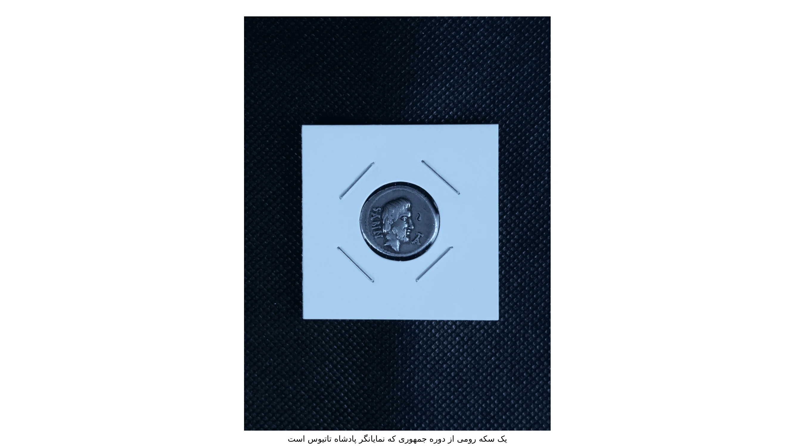

### خاستگاه کلمه "سکه" و معبد جونو مونه‌تا

اصطلاح "سکه" ریشه در معبد جونو مونه‌تا در رم دارد. طبق افسانه‌ها، در جریان تهاجم گالی‌ها در سال 390 قبل از میلاد، غازهای مقدس کاپیتول رومیان را از خطری قریب‌الوقوع آگاه کردند. برای تشکر از الهه جونو، محافظ کاپیتول، معبدی به افتخار او ساخته شد و به زودی به ضرابخانه سکه‌های رومی تبدیل شد.

### جنگ‌های پونیک و بحران‌های ارزی

درگیری‌های نظامی تأثیر قابل‌توجهی بر توسعه پولی روم داشتند. در طول جنگ دوم پونیک (۲۰۱-۲۱۸ قبل از میلاد) علیه کارتاژ، روم با مشکلات مالی شدیدی در مواجهه با تهاجم هانیبال روبرو شد. برای رفع این نیازهای فوری، روم برای اولین بار به انتشار استثنایی سکه‌های طلا و همچنین کاهش قابل‌توجه ارزش سکه‌های نقره خود متوسل شد، به‌طوری‌که خلوص اولیه ۹۷٪ به حدود ۸۹٪ کاهش یافت. وزن سکه‌های برنزی (aes) نیز به‌طور چشمگیری کاهش یافت و در عرض شش سال تقریباً ۸۰٪ از دست داد.

در اینجا، می‌توانیم به مفهومی که قبلاً درباره آن بحث کرده‌ایم، یعنی ذوب فلزات گرانبها ذخیره شده در معابد توسط یونانیان برای کمک به کاهش بحران‌های اقتصادی، بازگردیم. و برای صحبت درباره **کارتاژ**، در زیر می‌توانید یک سکه واقعی کارتاژی از مجموعه من را تحسین کنید. این سکه‌های کارتاژی دارای یک درخت نخل در یک طرف و یک اسب در طرف دیگر بودند. در این سکه، اسب خیلی قابل تشخیص نیست، زیرا بسیار فرسوده است.

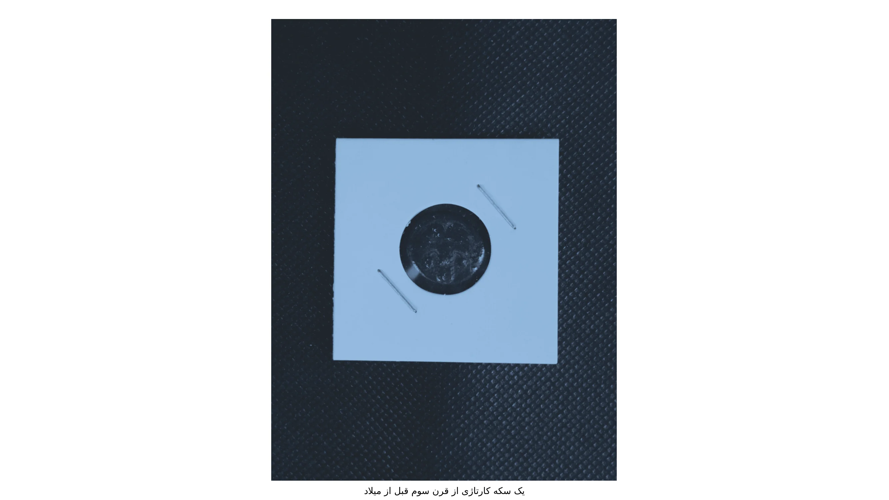

در نتیجه، وزن سکه‌های برنزی که به عنوان aes شناخته می‌شوند، نیز به شدت کاهش یافت و در عرض شش سال تقریباً 80٪ از دست داد. بنابراین، وزن این سکه‌های برنزی که فلز گرانبهایی نبودند و در تجارت روزمره استفاده می‌شدند، به شدت کاهش یافت که نشانه‌ای از کاهش ارزش پولی به دلیل این جنگ‌ها بود.

### دناریوس نقره و ثبات پولی

در این زمینه بحرانی بود که رم در حدود سال ۲۱۲ قبل از میلاد، دیناریوس نقره معروف را معرفی کرد. این اصلاحات ثبات پولی قابل توجهی را تضمین کرد و دیناریوس برای تقریباً ۴۵۰ سال به عنوان ارز غالب باقی ماند. رم این ثبات را مدیون مدیریت دقیق خود است، علیرغم یک تغییر قیمت عمده در سال ۱۴۶ قبل از میلاد و تولید قابل توجه برای تأمین مالی ارتش‌های عظیم خود، به ویژه در طول جنگ‌های پونیک، اجتماعی (۹۱-۸۷ قبل از میلاد) و مقدونی. به عنوان مثال، نگهداری یک لژیون رومی به تنهایی حدود ۱.۵ میلیون دیناریوس در سال هزینه داشت که مقیاس نیازهای پولی را نشان می‌دهد.

فراتر از مرزهای روم، جنگ‌ها منجر به کاهش ارزش عمده در مناطق تحت نفوذ روم شدند. کارتاژ پونیک شاهد کاهش چشمگیر خلوص الکتروم خود بود، از ۹۸٪ طلا در قرن چهارم به تنها ۳۰٪ در طول جنگ دوم پونیک، در حالی که سکه‌های نقره آن به ۱۸٪ خلوص کاهش یافتند.

### تکامل انگیزه‌های پولی

با گسترش روم، ویژگی سکه‌ها نیز تکامل یافت: در ابتدا ناشناس و میهن‌پرستانه بودند، اما به تدریج طراحی‌های شخصی‌سازی شده‌ای را به خود گرفتند که خانواده‌های قدرتمند ضرب‌کنندگان سکه (کسانی که سکه‌ها را ضرب می‌کردند) را به تصویر می‌کشید. این گذار به وضوح نماد تحولات سیاسی اواخر جمهوری روم است.

در نهایت، در حالی که رم از نظر اقتصادی بر دنیای مدیترانه تسلط داشت، در روش‌های پرداخت خود نوعی سادگی را حفظ کرد: هیچ شکل واقعی از انتقال پول به جز مبادله مستقیم سکه‌ها توسعه نیافت، به استثنای انتقالات مالیاتی و اعتبارات خصوصی که برای نخبگان محفوظ بود.

## امپراتوری روم

<chapterId>2dc44e50-112a-5abf-97ae-8e0a9ecda989</chapterId>

:::video id=f8d6f3d6-9ee4-4504-888e-4f12b3f20489:::

**پیشینه تاریخی:**

**پرینکیپاته** شکل حکومت امپراتوری در امپراتوری روم بود که از آغاز سلطنت آگوستوس در ۲۷ قبل از میلاد تا پایان بحران قرن سوم در ۲۸۴ میلادی ادامه داشت.

**۲۷ پیش از میلاد: آغاز صلح رومی**

دوره‌ای از ثبات سیاسی و رونق اقتصادی تحت سلطنت آگوستوس، که آغاز امپراتوری روم را نشان می‌دهد.

**آگوستوس (۳۰ قبل از میلاد تا ۱۴ میلادی)** سیستم پولی روم را به‌طور اساسی اصلاح کرد و استانداردی پایدار و ماندگار برای سکه‌های امپراتوری ایجاد نمود.

**آگوستوس همچنین یکی از اولین کلکسیونرهای شناخته‌شده** سکه‌های باستانی و فسیل‌ها بود.

**۵۴ میلادی - ۶۸ میلادی: نرون**

امپراتور بحث‌برانگیز روم، که به خاطر استبداد، آزار و اذیت‌ها و مدیریت فاجعه‌بار پس از آتش‌سوزی رم شناخته شده است.

**۶۴ میلادی: آتش‌سوزی بزرگ رم**

آتش‌سوزی بزرگی بخش زیادی از شهر را ویران می‌کند؛ نرون متهم به مسئولیت می‌شود.

**۶۹ میلادی: سال چهار امپراتور**

دوره‌ای پر هرج و مرج با چهار امپراتور به ترتیب سریع (گالبا، اوتو، ویتلیوس، وسپاسیان).

**۷۹ میلادی: فوران وزوویوس**

آتشفشانی که شهرهای پمپئی و هرکولانیوم را نابود کرد و بقایای آن‌ها را به‌طور استثنایی زیر خاکستر حفظ کرد.

**۱۶۵ میلادی - ۱۸۰ میلادی: طاعون آنتونین**

همه‌گیری ویرانگری که امپراتوری روم را تحت حکومت مارکوس آئورلیوس و کومودوس تضعیف کرد.

**۲۰۰ میلادی: اوج قلمرو و پایان تدریجی صلح رومی**

رم به حداکثر گسترش خود رسید، اما شروع به رنج بردن از بی‌ثباتی داخلی و مشکلات اقتصادی کرد.

**212 میلادی: فرمان کاراکالا دربارهٔ شهروندی**

امپراتور کاراکالا به منظور گسترش پایه مالیاتی، به تقریباً تمامی ساکنان امپراتوری شهروندی روم را اعطا کرد.

**۲۲۰ میلادی: آغاز تهاجمات بزرگ بربرها**

اولین تهاجمات قابل توجه اقوام ژرمنی از مرزهای روم.

**۲۳۵ میلادی - ۲۸۵ میلادی: بحران سیاسی و نظامی قرن سوم**

دوره‌ای که با بی‌ثباتی سیاسی مشخص می‌شود، با امپراتوران کوتاه‌مدت، جنگ‌های داخلی، بحران‌های اقتصادی و تهاجمات مداوم.

**اورلیان (۲۷۰-۲۷۵ میلادی) به‌طور رادیکال ارزش پول روم را بازنگری کرد** و تلاش کرد تا ارزش اسمی آن را علیرغم تورم بالا بازگرداند.

**301 میلادی: فرمان قیمت‌گذاری دیوکلتیان**

امپراتور دیوکلتیان به‌طور بیهوده تلاش کرد تا با اعمال کنترل‌های سختگیرانه بر قیمت‌ها و دستمزدها در سراسر امپراتوری، تورم فزاینده را متوقف کند.

**312 میلادی: کنستانتین**

اولین امپراتور مسیحی، بنیان‌گذار قسطنطنیه، ارز را با معرفی "سولیدوس"، یک سکه طلای با خلوص و ثبات بالا، تثبیت کرد.

**۴۷۶ میلادی: سقوط امپراتوری روم غربی**

روم توسط اقوام مختلف ژرمنی (از جمله اوستروگوت‌ها) تصرف می‌شود، رویدادی که به عنوان پایان رسمی امپراتوری روم غربی در نظر گرفته می‌شود.

### اصلاحات پولی آگوستوس

در این بخش درباره دوران باستان، ما به امپراتوری روم رسیده‌ایم. تاریخ پولی امپراتوری روم با استفاده گسترده از ارزهای فلزی، به‌ویژه طلا، نقره و برنز، و همچنین با بحران‌های متعدد ارزی که به ناآرامی‌های سیاسی و نظامی مرتبط بودند، مشخص می‌شود. در پایان جمهوری، تحت حکومت ژولیوس سزار، رم در سال ۴۶ قبل از میلاد سکه طلای آئورئوس را معرفی کرد، سکه‌ای که حدود ۸ گرم وزن داشت و در سراسر اروپا و حوزه مدیترانه به‌طور گسترده پذیرفته شد. سزار این سکه‌های طلا را استاندارد کرد و اولین سکه‌هایی را ضرب کرد که تصویر یک انسان زنده را داشتند، و بدین ترتیب یک سنت جمهوری‌خواهانه قدیمی که نمادهای ناشناس و جمعی را ترجیح می‌داد، را برهم زد. این توسعه با دوره‌ای از تحولات بزرگ سیاسی همراه بود که در آن قدرت شخصی به تدریج جایگزین نهادهای جمهوری‌خواهانه شد.

پس از ترور سزار در ۴۴ قبل از میلاد، اکتاویان (آگوستوس) کنترل رم را به دست گرفت و در ۲۷ قبل از میلاد امپراتوری را تأسیس کرد. دوران حکومت او شاهد اصلاح کامل سیستم پولی بود که ثبات پایداری به اقتصاد روم بخشید. در زمان آگوستوس، یک آئورئوس طلایی معادل ۲۵ دیناری نقره‌ای بود که خود ارزشی برابر با ۴ سسترتی برنزی داشت. این ثبات پولی در طول قرن اول میلادی ادامه یافت، دوره‌ای که اغلب به عنوان عصر طلایی اقتصادی برای روم توصیف می‌شود.

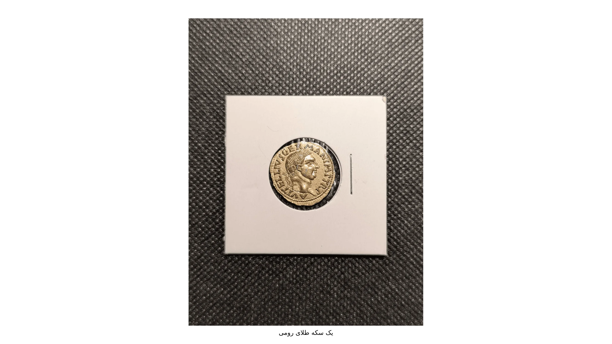

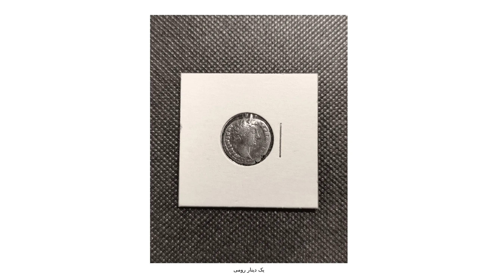

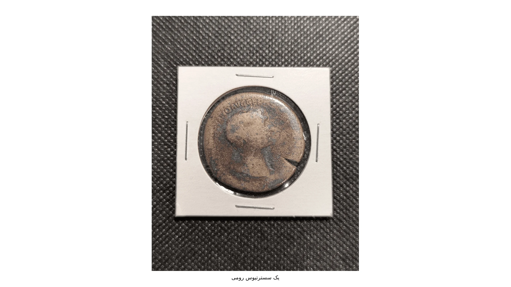

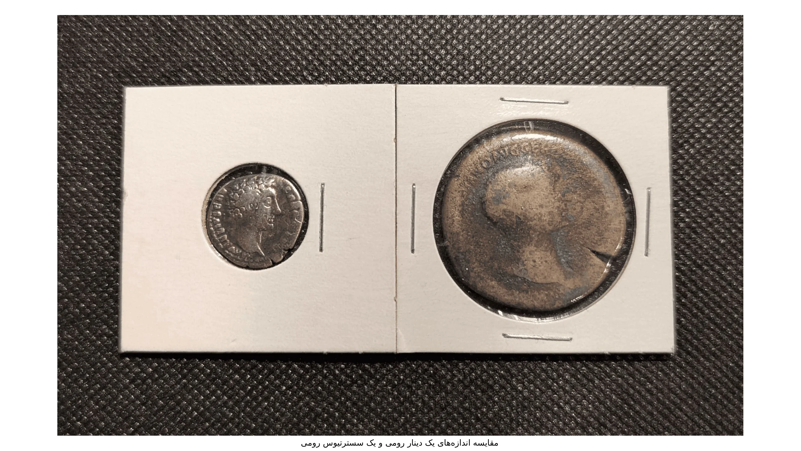

با این حال، از زمان نرون به بعد (۵۴-۶۸ میلادی)، رم شروع به کاهش تدریجی ارزش سکه‌های خود کرد و به تدریج وزن و خلوص آن‌ها را برای تأمین هزینه‌های فزاینده امپراتوری، به ویژه پس از آتش‌سوزی بزرگ رم در سال ۶۴ میلادی، کاهش داد. این کاهش ارزش‌ها اثرات قابل توجهی داشت: سکه‌های خالص‌تر از طریق احتکار یا صادرات از گردش خارج شدند، مطابق با **قانون گرشام**، در حالی که سکه‌های کاهش‌یافته ارزش گسترش یافتند و باعث افزایش تدریجی قیمت‌ها شدند.

سده سوم نقطه عطفی چشمگیر را نشان می‌دهد، با شتابی فوق‌العاده در کاهش ارزش‌ها تحت امپراتوران سپتیموس سوروس، کاراکالا و گالینوس. سکه اصلی نقره، دناریوس و سپس آنتونینیانوس، محتوای نقره‌اش به تنها ۲٪ کاهش یافت. همزمان، وزن طلای آئورئوس به نصف کاهش یافت. این بحران پولی با بی‌ثباتی سیاسی بی‌سابقه، تهاجمات بربرها و جنگ‌های داخلی مکرر همراه بود.

این بخش به من اجازه می‌دهد تا آخرین قطعه در این بخش را معرفی کنم: آنتونینیانوس. نام اصلی این سکه ناشناخته است، اما امروزه ما به آن به عنوان آنتونینیانوس اشاره می‌کنیم. این سکه به دلیل ارزش‌گذاری به دو دناریوس، با وجود اینکه تنها 1.5 برابر بزرگتر از یک دناریوس است، متمایز است. علاوه بر این، با گذشت زمان، این سکه‌ها به سکه‌های بیلون تبدیل شدند، به این معنی که از آلیاژی از نقره و فلزات دیگر ساخته شده بودند و نه از نقره خالص. این سکه‌ها اغلب فقط با نقره پوشانده می‌شدند و به عنوان نمونه‌ای قابل توجه از زوال پولی خدمت می‌کردند.

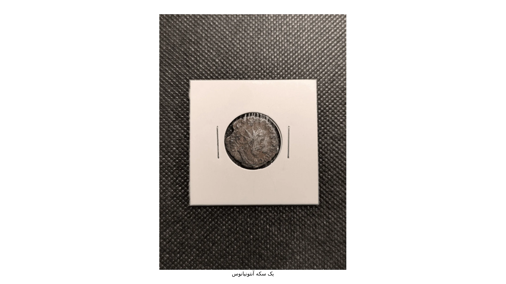

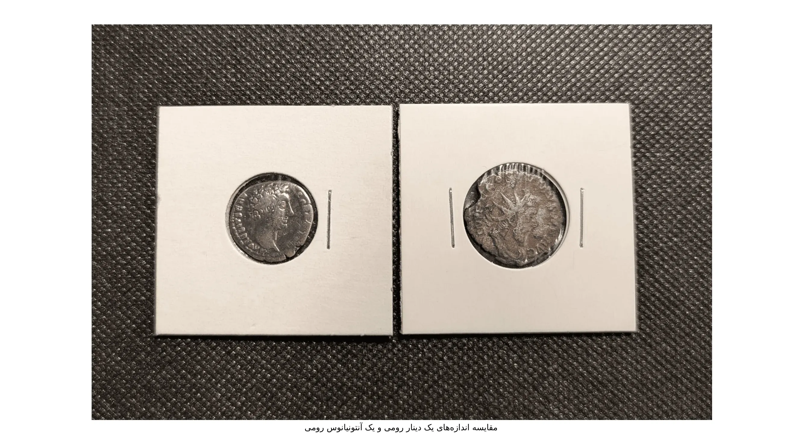

در مواجهه با این وضعیت، امپراتور اورلیان (۲۷۰-۲۷۵ میلادی) تلاش کرد تا با بازنگری اسمی ارزها، سیستم را تثبیت کند، اما این اصلاح در واقع یک مکانیزم تورمی را معرفی کرد که با تثبیت مصنوعی ارزش ارزهای موجود در سطح بالاتری همراه بود.

من یک انحراف در موضوع معرفی خواهم کرد. در طول قرن سوم، تورم به سرعت به صورت نمایی افزایش یافت. قبلاً، حتی با اینکه سکه‌ها کاهش ارزش داشتند، فرآیند دستی ضرب آن‌ها به صورت تک‌تک، کنترل معینی بر تورم فراهم می‌کرد. آمارها نشان می‌دهند که در طول بیش از ۳۰۰ سال کاهش ارزش، تورم به طور متوسط حدود ۴٪ در سال بود. درست قبل از اصلاحات اورلیان، تورم تقریباً ۳٪ سالانه بود.

اورلیان یک اندازه‌گیری خلوص بر روی سکه با علامت XXI معرفی کرد که نشان‌دهنده ترکیبی از ۲۰ قسمت برنز به ۱ قسمت نقره یا ۵٪ خلوص بود. او این سکه‌های ۵٪ نقره را بازاریابی کرد و علامت XXI را بر روی آن‌ها مهر زد. با این حال، او همچنین تمام سکه‌های دیگر که ارزش کمتری داشتند را جمع‌آوری کرد و همان علامت XXI را بر روی آن‌ها مهر زد. این به طور مؤثری ارزش اسمی تمام سکه‌ها را بازتعریف کرد. نتیجه آن نرخ تورم شگفت‌انگیز ۲۰٪ در سال بود که بسیار بیشتر از نرخ قبلی ۳٪ قبل از اجرای این تکنیک بود.

این واقعاً اورلیان بود که این شکل از کاهش ارزش را ابداع کرد، که بسیار سریع‌تر از کاهش تدریجی ارزش فلز است، که هنوز ما را مجبور می‌کرد سکه‌ها را یکی یکی چاپ کنیم. کاری که او انجام داد این بود که تمام سکه‌های موجود را جمع‌آوری کرد و با یک مهر، ارزش اسمی آن‌ها را تغییر داد. این یک نقطه عطف واقعی است. از آن زمان بود که تورم به صورت نمایی افزایش یافت.

برای نشان دادن بصری این کاهش ارزش شدید، من به برخی آمارهای جالب در مورد قیمت غلات در مصر از ۴۰ قبل از میلاد تا قرن سوم، که بیش از ۳۰۰ سال را در بر می‌گیرد، دست یافته‌ام. در زیر، شما می‌توانید یک تترا دراخما یونانی از مجموعه من را ببینید. در آن زمان، در مصر تحت اشغال روم در قرن سوم، معادل آن یک تترا دراخما مصری بود. واحد پول دراخما همچنان مورد استفاده بود و با یک دیناریوس مطابقت داشت.

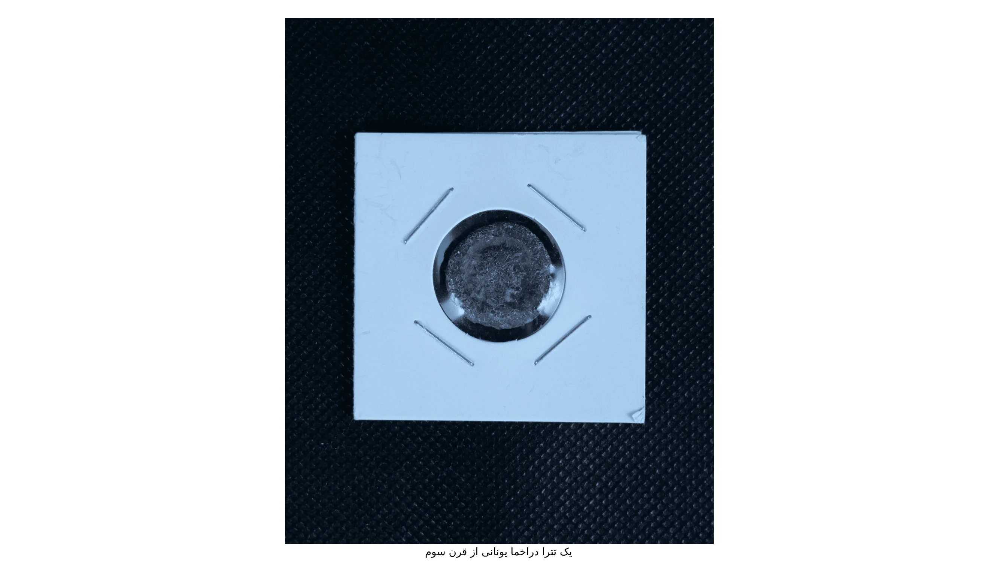

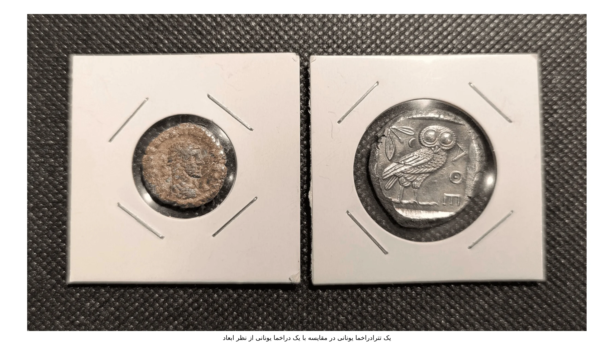

بنابراین تترا دراخم مصری که دارم معادل یک دیناریوس بود. می‌توانید ببینید که سکه از بیلون (یا برنز) ساخته شده است، بنابراین هیچ فلز گرانبهایی ندارد. می‌توانید آن را با تترا دراخم یونانی اصلی مقایسه کنید تا کاهش ارزش فیزیکی در طول این ۳۰۰ سال را ببینید. این یک افزایش میلیون برابری در قیمت غلات در مصر است.

این بیان فیزیکی اصلاحات اورلیان است. باید توجه داشت که اکثریت، میانگین این ۳۰۰ سال تورم، حدود ۴٪ بود. تنها در پایان، زمانی که اورلیان اصلاحات خود را انجام داد، این تورم به صورت نمایی افزایش یافت و به این اندازه ۱ میلیون رسیدیم. قیمت‌ها در پایان قرن سوم یک میلیون برابر بیشتر از قرن اول قبل از میلاد بود.

جانشین او **دیوکلسین** (284-305 میلادی) تلاش کرد اصلاحات حتی رادیکال‌تری انجام دهد: او ارزهای جدیدی صادر کرد (به‌ویژه آرژنتئوس، که خالص‌تر بود اما به‌طور محدود در دسترس بود)، کنترل‌های شدید قیمتی را اعمال کرد (فرمان قیمت‌گذاری سال 301 میلادی) و **یک سیستم مالیاتی مبتنی بر پرداخت‌های غیرنقدی ایجاد کرد**. با وجود این تلاش‌ها، اصلاحات دیوکلسین نتوانست تورم بی‌رویه را مهار کند.

در مواجهه با امتناع از تأمین کالاها و خدمات در ازای ارز بی‌ارزش، دیوکلتیان **یک سیستم طبقاتی موروثی** را برقرار کرد تا دهقانان و نوادگان آن‌ها را به زمین‌هایشان متصل کند.

آنچه واقعاً باید در اینجا درک شود این است که آنچه اتفاق افتاد این بود که دهقانان از تحویل محصولات خود در ازای ارز بی‌ارزش شده خودداری کردند و پاسخ دیوکلتیان عزیز ما ایجاد **طبقات موروثی** بود با گفتن "تو، تو نمی‌توانی زمینت را ترک کنی، فرزندانت نمی‌توانند زمینشان را ترک کنند، همین امر برای سربازان هم صدق می‌کند، شما سرباز هستید، شما موافقت می‌کنید که با ارز من پرداخت شوید". به عنوان یک راه‌حل انتقالی، به آنها به صورت جنسی (در گوشت، غذا، غلات) پرداخت می‌شد زیرا او از دادن پول به آنها خودداری کرد. بنابراین او این سیستم طبقات موروثی را تحمیل کرد تا مردم را مجبور کند به تجارت خود وابسته بمانند، بنابراین نمی‌توانستند به سادگی شغل خود را تغییر دهند اگر سعی می‌کردند ارز بی‌ارزش شده را نپذیرند.

برای توضیح این مثال، در اینجا متنی دارم، بخشی از کتاب "*نظام پولی و تورم*":

> از آنجا که مردم تمایلی به کار و تحویل کالا در برابر ارزی که ارزش اسمی آن بالاتر از ارزش ذاتی یا بازار آن بود نداشتند، مجبور شدند با تحمیل مالیات به صورت کالا به کار وادار شوند. [...] ترک خانه‌های ثبت‌شده برای دهقانان غیرقانونی شد. به این ترتیب، جمعیت کشاورزی به طور موروثی به زمین وابسته شد.
>

> این سیستم طبقاتی موروثی به تدریج گسترش یافت: دیوکلتیان پسران سربازان را مجبور کرد که در ارتش خدمت کنند، در حالی که کارگران در کارگاه‌های پول، و همچنین در کارخانه‌های بافندگی و رنگرزی که دیوکلتیان ایجاد کرده بود، به بردگان دولتی با خدمت موروثی تبدیل شدند. معدنچیان طلا نیز بعدها به یک طبقه موروثی تبدیل شدند. دیگر طبقات موروثی احتمالاً در زمان دیوکلتیان وجود داشتند، به ویژه اصناف نانوایان و قصابان [...] در رم، و همچنین اصناف اسقفی کاپیتان‌های کشتی که غلات و دیگر محموله‌های عمومی را به رم حمل می‌کردند.

کنستانتین (306-337 میلادی) بود که سرانجام با معرفی سولیدوس در سال 312، یک سکه طلای خالص که کیفیت و وزن آن را به شدت تضمین می‌کرد، موفق به تثبیت سیستم پولی شد. یک سیستم کامل برای بررسی خلوص و وزن سولیدوس وجود داشت. **این ثبات، با این حال، تنها بر نخبگان ثروتمند و اداره امپراتوری تأثیر گذاشت**، در حالی که **اکثریت جمعیت همچنان از ارز بی‌کیفیت و تورم مداوم رنج می‌بردند**. سولیدوس در امپراتوری شرقی (بیزانس) پایدار باقی ماند، جایی که بیش از یک هزاره دوام آورد، در حالی که در غرب، سکه‌ها به سکه‌های کوچک و کم‌ارزش تقسیم شدند و با فروپاشی نهایی اقتصادی و سیاسی امپراتوری روم که در سال 476 میلادی به طور قطعی سقوط کرد، همراه شد.

در پایان، مایلم این نقل قول از *تاریخچه پول: از دوران باستان تا به امروز* نوشته گلین دیویس را با شما به اشتراک بگذارم که به‌طور ماهرانه‌ای خلاصه می‌کند چه چیزی شاید به سقوط رم منجر شد:

*"مالیات‌ها به طور مداوم ناکافی بودند و مشکلات مرتبط با این مالیات‌های به طور فزاینده ناکافی، با تأخیر تنظیم شده و بسیار مشهود، رم را وادار کرد تا بیشتر به یک شکل آسان، فوری و پنهان از مالیات‌گیری تکیه کند: کاهش ارزش پول. اصلاحات کوتاه‌مدت و موقتی نتوانستند این روند قدیمی زوال را معکوس کنند. فشارهای مالی ناشی از فرسودگی سکه‌ها، غرق شدن کشتی‌ها، نشت پول به دلیل خرید کالاهای لوکس از شرق، هدایای ارائه شده به بربرهای ژرمنی، رشد جمعیت شهری، کاهش تولید کشاورزی، خستگی تدریجی غنی‌ترین معادن و بالاتر از همه سیاست‌های "نان و سیرک" که برای حفظ حداقل نظم در زندگی شهری ضروری تلقی می‌شدند - همه این فشارهای تجمعی رم را به کاهش مداوم ارزش پول وادار کرد که با اصلاحات گاه‌به‌گاه محکوم به شکست همراه بود."*

*علاوه بر نان و شراب رایگان یا ارزان، بخشش‌های امپراتوری ("congiaria") به صورت تخصیص‌های پولی از زمان به زمان توزیع می‌شد، به‌ویژه در دوران تراژان (۹۸-۱۱۷ میلادی) و حتی بیشتر در دوران هادریان (۱۱۷-۱۳۸ میلادی) و جانشینان او. آنچه که امپراتور و شهروندان در ابتدا به عنوان یک امتیاز استثنایی تلقی می‌کردند، تا اوایل قرن دوم به یک انتظار معمولی تبدیل شده بود. این توزیع‌ها "بار سنگینی بر خزانه عمومی تحمیل کرده و به نوبه خود به ورشکستگی دولت کمک کردند".*

## پیوندهای بین رقیق‌سازی پولی و تورم: از علل تا پیامدها

<chapterId>38d5781c-e900-53f7-baa7-413655d71754</chapterId>

:::video id=3999256d-aafe-4502-9b72-dfa8491a2777:::

این بخش به ارتباط بین رقیق‌سازی پولی و تورم می‌پردازد، از علل تا پیامدها. رقیق‌سازی پولی یکی از پدیده‌های مهم اقتصادی در تاریخ پولی روم است که تأثیرات مستقیمی بر تورم دارد. از قرن اول میلادی، یک مرحله اولیه کند از رقیق‌سازی سکه‌های نقره (دناریوس) از دوران حکومت نرون (54-68 میلادی) آغاز شد که با بحران‌های نظامی و مالی مکرر، به ویژه در دوران سپتیموس سوروس (193-211) و گالینوس (253-268) تسریع شد.

ما همچنین به کاهش تدریجی‌تر ارزش آئورئوس توجه می‌کنیم. این تفاوت در نرخ کاهش ارزش دو نکته را برجسته می‌کند:

1. نقش واحد حساب در نظام دو فلزی برای کنترل دولتی پول. واحد حساب در این مثال دیناریوس است. من سه روش مختلف برای مدیریت ارزش واحد حساب شناسایی کرده‌ام: کاهش ارزش (رقیق‌سازی فلز)، تغییر نام (آنتونینیانوس) و اعمال ارزش اسمی با علامت‌گذاری "XXI" (اورلیان).

۲. تمایل دولت به تعویق انداختن تا حد ممکن کاهش ارزش آئورئوس، ذخیره ارزشی که به نخبگان امکان می‌دهد قدرت خرید خود را به هزینه افراد کم‌خوشبخت حفظ کنند. ما به طور مکرر به این اصل در طول دوره بازخواهیم گشت، به ویژه در ارتباط با مفهومی که به عنوان "اثر کانتیلون" شناخته می‌شود و تغییر نام‌های ماراویدی در اسپانیا.

این پدیده بسیار جالب است و در طول تاریخ بارها تکرار شده است. ما در بخش بعدی به آن با ماراویدی بازخواهیم گشت. این الگو در مورد تمام ارزهای ذخیره نیز مشهود است؛ واحد ارزش ذخیره، مانند اورئوس در روم، دست نخورده باقی می‌ماند. با این حال، واحد حسابی که توسط عموم مردم برای تجارت و معاملات روزمره استفاده می‌شود، اغلب کاهش ارزش پیدا می‌کند. در نتیجه، تورم پولی بر مردم عادی تأثیر می‌گذارد، در حالی که کسانی که توانایی خرید سکه‌های طلا را دارند، تا حد زیادی تحت تأثیر قرار نمی‌گیرند.

و به هر حال، **این همان پدیده‌ای است که امروز با کاهش ارزش ارز ایجاد می‌شود، که به دارایی‌های مالی اجازه می‌دهد ارزششان افزایش یابد**، و بنابراین این افراد استفاده‌کننده از ارز، یعنی فقیرترین افراد هستند که فقیرتر می‌شوند، و این به نوبه خود از طریق ایجاد پول، دارایی‌های کسانی را که توانایی و وسایل محافظت از خود در برابر کاهش ارزش را دارند، غنی‌تر می‌کند و بنابراین نابرابری‌های اجتماعی را عمیق‌تر می‌کند. این نظر سیاسی کوچک من است.

آنچه که من به تازگی توصیف کردم به اثر کانتیلون معروف است. خواهیم دید که این آقا در زمان جان لاو زندگی می‌کرد، موضوعی که در بخش بعدی نیز به آن خواهیم پرداخت.

اصلاحاتی که در دوران سلطنت اورلیان آغاز شد، اجازه داد تورم افزایش یابد. تورم در ارزش اسمی پول دیگر به توانایی ضرابخانه‌ها در تولید سکه به صورت دستی محدود نبود. سکه‌هایی که قبلاً ضرب شده بودند اکنون می‌توانستند به سادگی علامت‌گذاری شوند و ارزش اسمی عرضه پول سریع‌تر افزایش یافت.

دو نقل‌قول در ارتباط با اورلیان برای به اشتراک گذاشتن با شما دارم. اولین نقل‌قول از *تاریخچه پول: از دوران باستان تا به امروز*:

*"تا جایی که به اقتصاد روم مربوط می‌شود، سهم اورلیان بیشتر یک فاجعه بود تا یک پیروزی. این عمدتاً به دلیل ماهیت "اصلاح" او بود که نرخ تورم توانست بسیار فراتر از آنچه قبلاً ممکن بود افزایش یابد، حتی تحت حکومت غیرمسئول گالیِنوس. برای دو قرن پس از اورلیان، تورم در سراسر امپراتوری روم بومی شد."*

دومی از کتاب *تاریخ باستان از سکه‌ها* می‌آید و به جدا شدن سیستم پولی از طلا مربوط می‌شود:

*"اصلاحات اورلیان رابطه بین پول طلا و بقیه سیستم پولی را تغییر داد. قبل از آن، انواع دیگر ارزها بر اساس نرخ‌های رسمی به **آئورئوس** متصل بودند (۲۵ دینار مصری یا ۲۵ تترا درهم برای یک آئورئوس، و غیره). پس از اصلاحات، پول طلا شروع به **نوسان آزاد در ارزش** کرد، مانند هر کالای دیگر، در حالی که بقیه سیستم پولی به دلیل **تضعیف آلیاژها** و عدم **پشتیبانی توسط طلا**، **ارزش خود را از دست دادند**. از آنجا که واحد حساب به طور نظری بر اساس نقره باقی ماند (دینار، یا در مصر درهم)، با کاهش ارزش ارز، قیمت‌ها افزایش یافتند. "*

همان‌طور که می‌بینید، این کاهش ارزش پولی که به عنوان واحد حساب عمل می‌کرد، به طور نامتناسبی بر افراد کم‌درآمد تأثیر گذاشت، در حالی که قطع ارتباط با پول طلا قدرت خرید کسانی را که توانایی پس‌انداز در ذخیره ارزش یعنی طلا را داشتند، حفظ کرد.

آنچه باید در اینجا درک کنید این است که اگر ارتباطی بین دیناریوس و آئورئوس وجود داشته باشد، حتی اگر دیناریوس را کاهش ارزش دهید، اگر هنوز بتوانید دیناریوس خود را با نرخ (25 دیناریوس برای 1 آئورئوس) با آئورئوس مبادله کنید، مردم قطعاً دیناریوس خود را با آئورئوس شما مبادله خواهند کرد زیرا دیناریوس بیش از حد ارزش‌گذاری شده و آئورئوس کم‌ارزش‌گذاری شده خواهد بود. اما در این اصلاح، این ارتباط را حذف کردند. بنابراین مردم دیگر نمی‌توانستند دیناریوس را با فلز نقره کاهش ارزش‌یافته در برابر طلا مبادله کنند. در این زمان بود که کسانی که به سکه‌های طلا دسترسی داشتند واقعاً می‌توانستند از خود محافظت کنند، زیرا بعد از آن مردم دیگر نمی‌توانستند نقره کاهش ارزش‌یافته بیش از حد ارزش‌گذاری شده را با طلای خالص کم‌ارزش‌گذاری شده مبادله کنند. این یک لحظه بسیار مهم در تکامل ارز است.

نمونه‌ای برجسته از اثرات این اصلاحات توسط اورلیان به‌خوبی با این نقل‌قول‌ها از کتاب *نظام‌های پولی و تورم* نشان داده شده است:

*"بین سلطنت امپراتوران کلودیوس (۴۱-۵۴ میلادی) و کنستانتیوس (۳۳۷-۳۶۱ میلادی)، قیمت گندم در بازار آزاد مصر، به دِرَخما بیان شده، **بیش از یک میلیون برابر افزایش یافت**. تورم قیمت چشمگیر یکی از حقایق اقتصادی مرکزی قرون ۳ و ۴ میلادی است" (لندون ۱۹۹۰، ص. ۱۰۶). اما این توسعه **کمتر از آنچه به نظر می‌رسد دراماتیک است**، زیرا با **نرخ تورم سالانه متوسط ۴.۴٪** مطابقت دارد. و به گفته واسینک (۱۹۹۱، ص. ۴۸۲)، تورم در واقع **تنها در سال ۲۳۸ میلادی آغاز شد**"*

*"از این تاریخ به بعد، تورم به آرامی شتاب گرفت، زیرا **پول خوب ابتدا از گردش خارج شد**، به طوری که عرضه کل پول در ابتدا تقریباً افزایش نیافت. سپس، به نرخ متوسط سالانه **3.65% بین 250 و 293** رسید و به **22.28% بین 293 و 301** افزایش یافت (Wassink 1991, p. 466)، یعنی تا **اصلاحات پولی ناکام امپراتور دیوکلتیان**. این پدیده **به ویژه برای تورم در یک رژیم پولی مبتنی بر فلز بسیار چشمگیر است**. "*

این پدیده تورم مرتبط با رقیق‌سازی پولی در ابتدا به بحران‌های نقدی گاه‌به‌گاه دولت روم پاسخ می‌داد. با کاهش محتوای فلزات گران‌بها در سکه‌ها در حالی که ارزش اسمی آن‌ها حفظ می‌شد، دولت به طور موقت منابع خود را افزایش می‌داد. اما قیمت‌ها بلافاصله واکنش نشان نمی‌دادند: در واقع، سیستم رومی دارای نوعی چسبندگی بود که باعث می‌شد دستمزدها و قیمت‌ها به کندی به کاهش ارزش‌های متوالی تطبیق یابند. با این حال، پس از یک آستانه معین، قیمت‌ها به شدت افزایش می‌یافتند تا بازار را با ارزش واقعی ارزها به تعادل برسانند.

همان‌طور که در بالا ذکر شد، این پدیده به‌ویژه از اواسط قرن سوم میلادی به بعد به‌وضوح دیده می‌شود. در مصر، منطقه‌ای با مستندات غنی، قیمت‌ها تحت حکومت اورلیان (۲۷۴ میلادی) پس از ارزیابی مجدد رسمی ارز، ده برابر شد، علیرغم تلاش اولیه برای تثبیت. سپس، تحت حکومت دیوکلتیان (۳۰۱ میلادی)، فرمان قیمت‌ها کنترل‌های شدیدی را برای مهار تورم اعمال کرد بدون اینکه به علت اصلی - تولید بیش از حد و تخریب پولی - بپردازد، که منجر به شکست قابل پیش‌بینی شد. تورم مداوم در نهایت اقتصاد را به سمت یک سیستم دو لایه سوق می‌دهد: **نخبگان، که با ذخایر طلا محافظت می‌شوند (مانند سولیدوس کنستانتین**)، از ثبات برخوردارند، در حالی که اکثریت جمعیت همچنان از تورم مزمن رنج می‌برند، **که آنچه امروز به عنوان اثر کانتیلون شناخته می‌شود را نشان می‌دهد.**

بین کاهش ارزش پول روم و تورم ارتباط واضحی وجود دارد که علل آن اساساً به کسری‌های مالی مزمن، هزینه‌های نظامی بی‌وقفه و مدیریت ضعیف اقتصادی دولت مرتبط است.

## سقوط امپراتوری روم

<chapterId>b6ec0914-227b-509c-8108-b09eec9bb904</chapterId>

:::video id=91d4fee5-59bb-4ab9-a90b-e1125c71decb:::

### کاهش ارزش ارز و سقوط رم

مکتب اقتصادی اتریش، به ویژه از طریق لودویگ فن میزس، تفسیری پولی از سقوط روم ارائه داد. در این دیدگاه، کاهش تدریجی ارزش پول روم سیستم پیچیده تقسیم کار را که امپراتوری با ۶۰ میلیون نفر جمعیت را حفظ می‌کرد، نابود کرد. پول، که ابزار مرکزی هماهنگی اقتصادی بود، زمانی که فاسد شد، به فروپاشی کل ساختار اجتماعی و اقتصادی منجر شد.

این وخامت پولی نه تنها انسجام داخلی امپراتوری را از بین برد. بلکه پیوندهای تجاری با مردمان همسایه را نیز قطع کرد. محروم از مزایای تجارت با روم، "بربرها" از همکاری مسالمت‌آمیز به غارتگری روی آوردند. بنابراین تهاجمات نه تنها ماهیت نظامی داشتند، بلکه نتیجه یک فروپاشی اقتصادی بنیادی نیز بودند.

### سه مرحله کاهش ارزش امپریالیستی

تاریخ پولی روم را می‌توان به سه دوره متمایز تقسیم کرد. اولین دوره، از ژولیو-کلودیان‌ها تا آنتونین‌ها (۲۷ قبل از میلاد - پایان قرن دوم)، ثبات نسبی را حفظ کرد. تحت حکومت تراژان، امپراتوری به اوج خود رسید: با پوشش ۵ میلیون کیلومتر مربع، رم به اولین شهر میلیونی تاریخ تبدیل شد. دیناریوس خلوص نقره‌ای بین ۹۸٪ تا ۸۰٪ را حفظ کرد - کاهش ارزش متوسطی که هنوز به اقتصاد اجازه عملکرد می‌داد.

دوره دوم، قرن سوم، دوره‌ای از هرج و مرج نظامی بود. بیست و شش امپراتور در عرض چند دهه یکی پس از دیگری به قدرت رسیدند. ارز سقوط کرد: آنتونینیانوس، که قرار بود ارزش دو دناری را داشته باشد، تنها 1.5 از نظر وزن فلزی داشت - اولین تلاش برای جدا کردن ارزش قانونی و واقعی. این دستکاری قانون گرشام را فعال می‌کند: پول بد، پول خوب را از گردش خارج می‌کند. شهروندان سکه‌های خوب را ذخیره کرده و فقط سکه‌های بی‌ارزش را خرج می‌کردند.

گنجینه‌های پولی کشف شده توسط باستان‌شناسان این نگرانی اقتصادی را آشکار می‌کنند. آمفوره‌های دفن شده نشان می‌دهند که چگونه رومیان ابتدا بهترین سکه‌ها را قرار می‌دادند و به تدریج سکه‌های کم‌ارزش‌تر را اضافه می‌کردند. این "پشته‌های" باستانی گواهی بر اقدام انسانی در مواجهه با عدم قطعیت هستند - تلاشی برای حفظ ارزش در دنیایی رو به زوال.

### کنستانتین و سیستم دوگانه

کنستانتین (۳۱۰-۳۳۷) تلاش کرد تا از طریق اصلاحات رادیکال امپراتوری را تثبیت کند. او سکه طلای سولیدوس را ایجاد کرد، ارزی که به‌طور دقیق توسط اداره کنترل می‌شد. مقامات به‌طور سیستماتیک وزن و خلوص آن را بررسی می‌کردند. انتشار آن محدود باقی ماند و به غنائم جنگی مرتبط بود. این ارز به ابزار انحصاری قدرت تبدیل شد: مالیات‌ها با سولیدوس پرداخت می‌شد و لژیون‌ها حقوق خود را به طلا دریافت می‌کردند.

در همان زمان، مردم از نوموس برنزی استفاده می‌کردند که به طور مداوم ارزش خود را از دست می‌داد. در سال 445، یک سولیدوس معادل 7,000 نوموس بود؛ در سال 498، 16,800. این سیستم دوگانه اثر کانتیلون را نهادینه کرد: کسانی که به سولیدوس دسترسی داشتند - اداره‌کنندگان، زمین‌داران - از تورم محافظت می‌شدند. عوام، که به نوموس محدود بودند، به طور غیرقابل اجتنابی فقیرتر می‌شدند.

این جدایی پولی دو اقتصاد موازی با هیچ نرخ تبادل رسمی ایجاد کرد. سولیدوس به عنوان واحد حساب باقی ماند، اما بسیار کم در گردش بود. نوموس برای مبادلات روزانه استفاده می‌شود، اما به طور مداوم ارزش خود را از دست می‌دهد. این معماری پولی نابرابری‌های سیستم فئودالی در حال ظهور را پیش‌بینی می‌کرد.

### سقوط تقسیم کار

کاهش ارزش ارز به تدریج تخصص اقتصادی را نابود کرد. بدون یک واحد حساب قابل اعتماد، تجارت مدیترانه‌ای فروپاشید. صنعتگران متخصص روم دیگر نمی‌توانستند با مصر یا گل تجارت کنند. استان‌ها ارزهای خود را پذیرفتند و اصطکاک‌های تجاری را چند برابر کردند.

در مواجهه با این فروپاشی، جمعیت شهری به حومه شهر گریختند - یک مهاجرت معکوس شهری که قرن‌ها شهرنشینی را معکوس کرد. صنعتگران حرفه‌های خود را برای کشاورزی معیشتی رها کردند. املاک بزرگ (لاتیفونیا) به جزایر خودکفا تبدیل شدند و پیش‌درآمدی بر سینیوری‌های قرون وسطی بودند.

در ناامیدی، دیوکلسین حتی مالیات‌ها را به صورت کالا درخواست کرد - نهایت اعتراف به شکست پولی. فرمان حداکثر او (301) تلاش کرد تا قیمت‌ها را کنترل کند و بازگشت به مبادله کالا به کالا را تسریع کرد. پیچیدگی اقتصادی به اشکال پیش از تمدن بازگشت.

### بقا از طریق طلا از روم تا بیزانس

به‌طور متناقض، سولیدوس از امپراتوری غربی جان سالم به در برد. بیزانس آن را تا قرن یازدهم حفظ کرد و هزار سال دیگر ثبات اقتصادی را تضمین کرد. در غرب، خاطره آن باقی مانده است: کلمه فرانسوی "sou" از سولیدوس مشتق شده است، که گواهی زبانی بر شکوه پولی از دست رفته است.

مالکانی که ثروت خود را به صورت طلا حفظ کرده بودند به اربابان فئودال تبدیل شدند. ساختارهای کلیسایی، تنها نهادهای باقی‌مانده، پیوندهای اجتماعی را فراهم می‌کردند که پول دیگر نمی‌توانست تضمین کند. اروپا به حوزه‌های خودکفا تقسیم شد، هر کدام با اقتصاد معیشتی خود.

این تحول شکنندگی تمدن‌های پیچیده را آشکار می‌کند. تقسیم کار که به رم امکان می‌داد تا یک میلیون نفر را تغذیه کند، کاملاً به اعتماد پولی وابسته بود. زمانی که این اعتماد شکسته شد، بنا فرو ریخت و اروپا را برای نزدیک به یک هزاره به اشکال ابتدایی اقتصادی بازگرداند.

## عصر تاریکی و قرون وسطی

<chapterId>a5856873-6142-57be-8a73-1f9e3df83792</chapterId>

:::video id=86b8da9b-3831-443d-b170-58c2bea3ad54:::

تاریخ و ظهور پول در قرون وسطی با دوره‌های پسرفت، نوآوری و بهبود اقتصادی مشخص می‌شود.

به عنوان مثال، زمانی که ارتش روم بریتانیا را ترک کرد، دیگر سکه‌های رومی وارد این جزیره نشدند. حدود سال ۴۳۵ میلادی، استفاده از سکه‌ها به طور کامل در بریتانیا ناپدید شد، پدیده‌ای منحصر به فرد در استان‌های سابق روم. برای نزدیک به دو قرن، اقتصاد بریتانیا بدون سکه بود تا اینکه در قرن هفتم، سکه‌های الهام گرفته از مروونژی و قاره‌ای به تدریج دوباره ظاهر شدند.

از قرن هشتم به بعد، تأثیر مسیحیت به بازمعرفی سکه در شمال اروپا کمک کرد. شخصیت کلیدی در این دوره پپین کوتاه، پادشاه فرانک‌ها بود که در سال ۷۵۲ دینار را معرفی کرد و بعدها توسط پسرش شارلمانی پذیرفته شد. شارلمانی استفاده از دینار نقره را به طور گسترده‌ای گسترش داد و یک استاندارد پولی اروپایی برای چندین قرن ایجاد کرد.

در انگلستان، ضرب سکه با تولید پنی نقره‌ای تحت حکومت شاه آفا از مرسیا در حدود سال 765 میلادی، احیای قابل توجهی یافت. این ارز چنان اهمیت پیدا کرد که به مدت 500 سال تقریباً بدون تغییر باقی ماند.

به عنوان اولین اثر مرتبط با این دوره، اجازه دهید یک نسخه بازتولید شده از یک پنی انگلیسی از آن زمان را به شما نشان دهم.

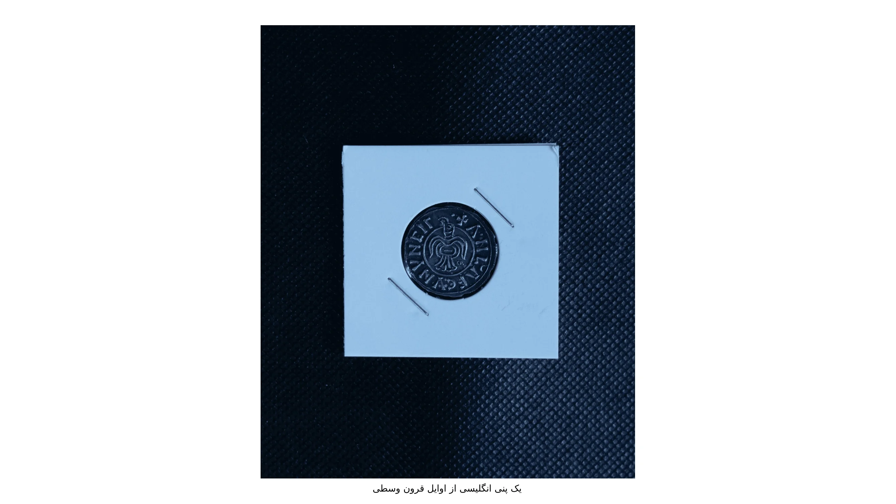

در طول قرون وسطی متأخر، اروپا پس از فروپاشی سیستم پولی روم به فئودالیسم فرو رفت. اکثریت جمعیت از سکه‌های مسی یا برنزی با ارزش پایین استفاده می‌کردند که اغلب دچار کاهش ارزش می‌شدند و بنابراین تجارت در فواصل طولانی محدود می‌شد.

بازگشت سکه به عنوان وسیله‌ای برای پرداخت به تدریج اتفاق افتاد و در قرن سیزدهم با ظهور فلورین طلایی در فلورانس در سال ۱۲۵۲ و به دنبال آن دوکات طلایی در ونیز به اوج خود رسید. این سکه‌های طلا به دلیل گسترش تجارت و نیاز فزاینده به وسایل پرداخت قابل اعتماد و پذیرفته شده بین‌المللی به طور گسترده‌ای مورد استفاده قرار گرفتند.

در انگلستان، سیستم پولی از کاهش ارزش توسط سیاست‌های مالی نوآورانه محافظت می‌شد، مانند مالیات بر زمین که توسط ویلیام فاتح پس از سال ۱۰۶۶ معرفی شد و کیفیت پنی استرلینگ را حفظ کرد. نکته مهمی که باید درک شود این است که در آن زمان، حاکمان می‌توانستند برای تأمین مالی دولت، ارزش ارز را کاهش دهند، و **معرفی این مالیات امکان حفظ ثبات ارز و تأمین مالی دولت از طریق مالیات را فراهم کرد.**

با این حال، وسوسه کسب سود از طریق کاهش ارزش پولی منجر به بحران‌هایی شد، همان‌طور که در دوران سلطنت هنری اول در قرن دوازدهم، زمانی که کیفیت سکه‌ها به شدت کاهش یافت. اصلاحات شدید، که گاهی با اقدامات خشونت‌آمیز علیه سکه‌زنان همراه بود، به طور موقت اعتماد به ارز را بازگرداند.

در قرون وسطی، ظهور روش‌های مالی پیچیده‌ای مانند استفاده از چوب‌خط‌ها در انگلستان برای دور زدن ممنوعیت ربا و گسترش اعتبار مشاهده شد. کلیسا علاقه زیادی به وام‌های با بهره نداشت، بنابراین از تکنیک‌های مختلفی برای دور زدن ممنوعیت استفاده از بهره استفاده می‌شد.

این نوآوری‌ها پاسخی به کمبود مزمن پول فلزی بودند و ظهور یک بازار مالی نوپا را تشویق کردند.

در همین حال، جنگ‌های صلیبی تجارت مدیترانه‌ای را تحریک کردند و توسعه مبادلات بین‌المللی و شیوه‌های جدید بانکی را، به‌ویژه از طریق محفل شوالیه‌های معبد، تقویت کردند. شوالیه‌های معبد به واسطه‌های مالی مهمی تبدیل شدند که به صلیبیون امکان می‌دادند تا در دوردست از خانه، نقدینگی به دست آورند و سیستم بانکی مدرن اروپایی را پیش‌بینی می‌کردند.

برای ایجاد ارتباط با شوالیه‌های معبد، در زیر می‌توانید یک سکه قرون وسطایی فرانسوی را مشاهده کنید که در مرکز آن یک صلیب زیبا قابل تشخیص است. در این دوره، معمول بود که سکه‌ها این صلیب را داشته باشند.

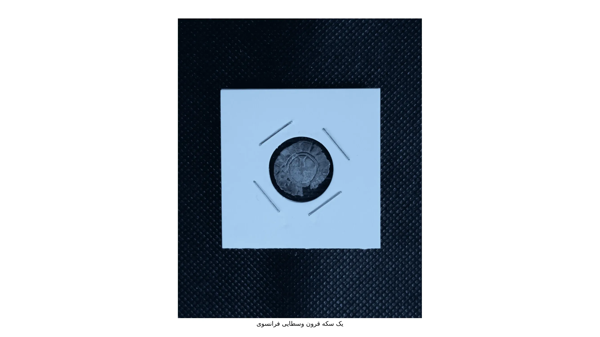

در نهایت، بحران‌های بزرگی مانند طاعون سیاه (۱۳۴۶-۱۳۵۳) تحولات اقتصادی عمیقی را به همراه داشتند. کاهش شدید جمعیت منجر به افزایش شدید دستمزدها شد و تلاش‌های دولت برای حفظ سطوح قبلی پرداخت‌ها را به چالش کشید.

همزمان، جنگ صدساله (1337-1453) دولت‌ها را مجبور کرد تا سیاست‌های مالی تهاجمی‌تری برای تأمین مالی ارتش‌های خود اتخاذ کنند که به تضعیف نظام فئودالی کمک کرد.

قرون وسطی به این ترتیب با تنش مداوم بین نیاز به پول قابل اعتماد برای تجارت و وسوسه مداوم حاکمان برای کاهش ارزش پول به منظور سود فوری مشخص شد. این تضاد به طور عمیقی توسعه پولی اروپا را شکل داد و پایه‌های سیستم‌های اقتصادی مدرن را بنا نهاد.

برای خاتمه دادن به این بخش، می‌خواهم یک حکایت جالب از انگلستان در این زمان اضافه کنم. این حکایت از کتاب "تاریخچه پول" نوشته گلین دیویس گرفته شده است.

ذکر می‌کند که در انگلستان، انتقال به پارلمان بار بدهی را از دوش حاکم به پارلمان منتقل کرد و منجر به بدهی مزمن دولتی شد. قبل از آن، بدهی بر دوش حاکم سنگینی می‌کرد.

زمانی که پارلمان توانست بخشی از این قدرت خلق پول را به دست آورد، این امر امکان ایجاد بدهی‌های بلندمدتی را فراهم کرد که بر عهده مردم بود، نه پادشاه. پیش از این، اگر پادشاه ورشکسته می‌شد یا تغییر پادشاه رخ می‌داد، بدهی با او از بین می‌رفت.

به محض اینکه ایجاد بدهی توسط پارلمان انجام می‌شود، مفهوم بدهی حاکمیتی پدیدار می‌شود، زیرا این بدهی به طور بالقوه در طول زمان نامحدود است. تا زمانی که دولت وجود دارد، تا زمانی که پارلمان وجود دارد، این بدهی وجود دارد و آنها باید انواع روش‌های تأمین مالی مجدد و گسترش آن در طول زمان را پیدا می‌کردند. این یک تغییر اساسی در پارادایم است، جایی که دیگر پادشاه یا خاندان سلطنتی تضمین‌کننده یا متحمل بار این بدهی‌ها نبودند؛ بلکه اکنون پارلمان و بنابراین شهروندان آن بودند.

## رنسانس

<chapterId>1d1dfb05-70b4-5b7b-9708-373c2182950d</chapterId>

:::video id=4977b4f3-c7b2-41a5-ad7b-a96a8cca4092:::

اکنون به بخشی از دوره رسیده‌ایم که درباره دوره‌ای به نام رنسانس صحبت می‌کنیم. این دوره در پس‌زمینه‌ای از بحران تراژیک رخ می‌دهد، با گسترش شهاب‌وار طاعون توسط کک‌ها روی موش‌هایی که به کشتی‌ها سوار می‌شوند. با این حال، این تراژدی به ما درباره رشد تجارت و سفر در دوره قرون وسطای متأخر اطلاعات می‌دهد. در اوایل این دوره، افراد زیادی به این سرعت و به این دوری حرکت نمی‌کردند.

### فلورین فلورانس

بازگشت سکه‌های طلا به اروپا در دوران رنسانس نقطه عطفی اساسی در تاریخ پولی محسوب می‌شود. **همه چیز با فلورین فلورانس در سال ۱۲۵۲ آغاز شد، اولین سکه طلای مهمی که از زمان سقوط روم در اروپا ضرب شد**. با وزن و خلوص فوق‌العاده ثابت خود (حدود ۳.۵ گرم طلای خالص)، فلورین به مدت چهار قرن بدون تغییر باقی ماند و به سرعت به یک مرجع پولی ضروری در سراسر اروپا تبدیل شد.

در زیر می‌توانید بازتولیدی از یک فلورین را ببینید: یک فلورین طلایی ساخته شده از قلع و مهر شده توسط یک هنرمند فرانسوی که قطعات عالی می‌سازد، به صورت دستی حکاکی و ضرب شده است.

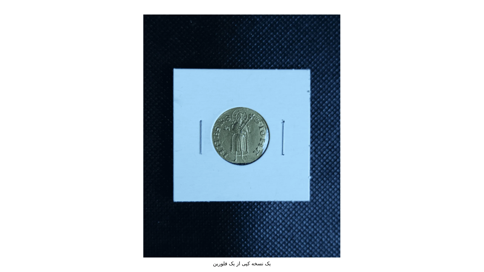

بازگشت به سکه‌های طلا توسط یک زمینه خاص هدایت شد: فروپاشی سولیدوس بیزانسی و افول اقتصادی دنیای مسلمان به دلیل تهاجمات مغول یک خلاء پولی در تجارت بین‌المللی ایجاد کرد.

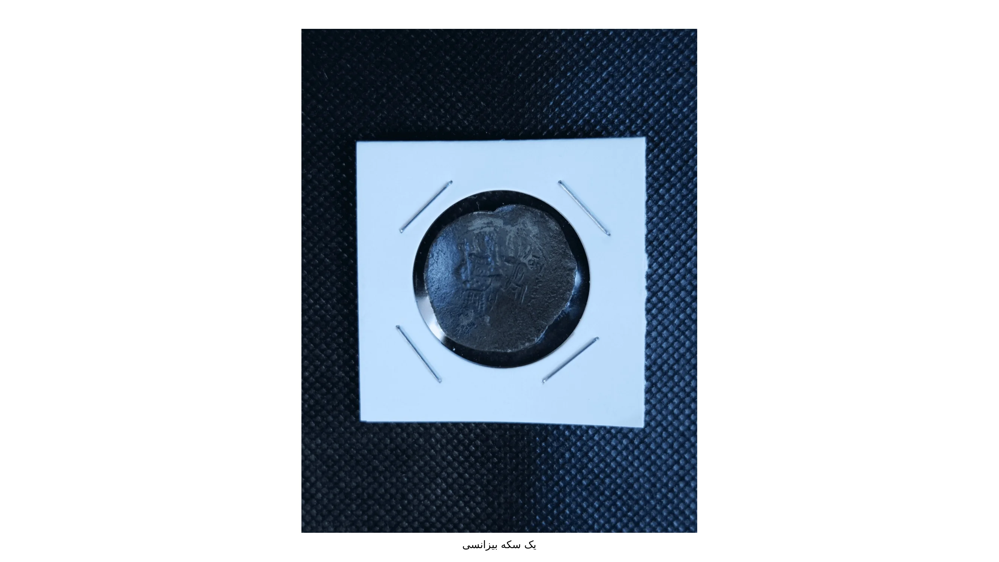

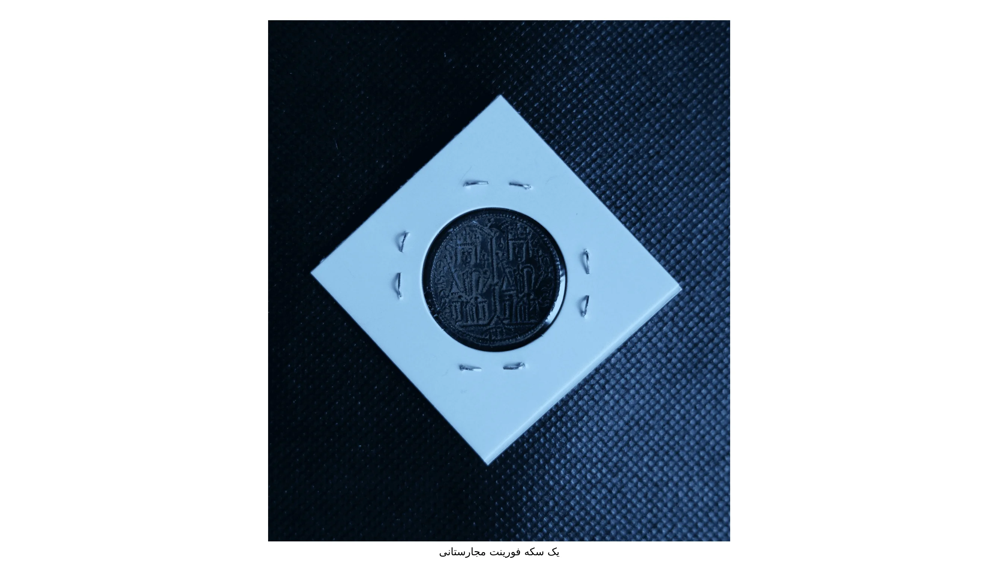

تصویر اول بالا یک سکه بیزانسی را نشان می‌دهد که به نظر من بسیار جالب است. قصد دارم آن را با سکه‌ای از همان دوره از مجارستان (تصویر دوم بالا) مقایسه کنم. سکه مجارستانی به شکل فنجان است، مانند یک کاسه کوچک. آیکونوگرافی آن شامل شخصیت‌های مذهبی است که به عنوان پادشاهانی که صلیب‌ها را در کنار هم نگه داشته‌اند، به تصویر کشیده شده‌اند. این قطعه به شکل کاسه است و منشأ آن از مجارستان است.

کپی کردن سکه‌ها از کشورهای دیگر کاملاً مرسوم بود. از آنجا که سکه‌های بیزانسی به طور کلی پذیرفته شده بودند، کشورهای دیگر اغلب آن‌ها را کپی می‌کردند. همان‌طور که می‌توانید با مقایسه آن‌ها در کنار هم ببینید: این قطعات بسیار شبیه به هم هستند.

شمال ایتالیا، به ویژه فلورانس، ونیز و جنوا، از این شرایط بهره بردند تا ارزهای سخت جدیدی را راه‌اندازی کنند - سکه‌هایی با محتوای فلز گرانبهای پایدار. ونیز با پیروی از مثال فلورانس، در سال ۱۲۷۰ دوکات را ضرب کرد، ارزی که تقریباً با فلورین یکسان بود و به طور گسترده در تجارت مدیترانه‌ای استفاده می‌شد.

فلورین به اولین ارز ذخیره بین‌المللی تبدیل شد که قبل از پایان قرن چهاردهم در بیش از 150 شهر اروپایی پذیرفته شد. با ایجاد شبکه بانکی بزرگ فلورانسی، به رهبری خاندان مدیچی، مدیریت پولی و حسابداری به طور کامل مدرن شد و حتی نیاز به حمل فیزیکی طلا را کاهش داد.

این یک نکته واقعاً جالب دیگر است. زمانی بود که تعداد زیادی از محموله‌های سکه در سفرهای دریایی گم می‌شدند. این پیشرفت تکنولوژیکی - دفاتر حسابداری دوطرفه - امکان ایجاد پول اعتباری را فراهم کرد. این امر امکان کاهش تعداد تسویه‌حساب‌های سکه‌ای را فراهم کرد و به جای آن از یک سیستم ورودی‌های نوشتاری استفاده شد که به طور قابل توجهی خطر از دست دادن پول در حین انتقال را کاهش می‌دهد.

تحولات پولی همچنین با تکامل قابل توجهی در روش‌های بانکی همراه بود. با الهام از تماس‌های جنگ‌های صلیبی با شیوه‌های بانکی مسلمانان، اروپا در قرون وسطی شاهد ظهور سیستم‌های بانکی ابتدایی در فلورانس، ونیز، بارسلونا و جنوا در اوایل قرن سیزدهم بود. شوالیه‌های معبد، یک نظام مذهبی و نظامی، قبلاً سیستمی را توسعه داده بودند که به صلیبیون اجازه می‌داد بدون حمل ثروت خود سفر کنند.

آن‌ها وجوه را در یک دفتر تمپلار در کشور خود واریز می‌کردند و سپس می‌توانستند با نوعی نامه سفر کنند و سکه‌ها را پس از رسیدن به مقصد جنگ صلیبی خود جمع‌آوری کنند.

این به این معنا بود که ما مجبور نبودیم سکه‌های فلزی گرانبها را با خود حمل کنیم.

در همین دوره بود که اروپا از وجود پول کاغذی در چین آگاه شد، به لطف سفر مارکو پولو در قرن سیزدهم. با این حال، توسعه اسکناس‌ها چندین قرن به تعویق افتاد، زیرا اروپا ترجیح داد ابتدا روش‌های ضرب سکه‌های فلزی خود را بهبود بخشد. لئوناردو داوینچی، که به لوکا پاچیولی، یک حسابدار خبره مشهور، نزدیک بود، به طور فعال در بهبود دستگاه‌های ضرب سکه مشارکت داشت و تولید سریع‌تر و یکنواخت‌تر سکه‌ها را ترویج می‌کرد.

ما به تکنیک ضربه آونگ که قبلاً در دوره ذکر شد، اشاره می‌کنیم. این روش امکان تولید سکه‌های یکنواخت‌تر را نسبت به ضربه چکشی فراهم کرد و مهم‌تر از آن، اجازه داد تا نوشته‌هایی در اطراف لبه سکه قرار گیرد، همان‌طور که قبلاً نشان دادم. سکه زیر یک تالر اروپایی از سال 1793 است که به وضوح نوشته‌هایی بر روی لبه آن دیده می‌شود.

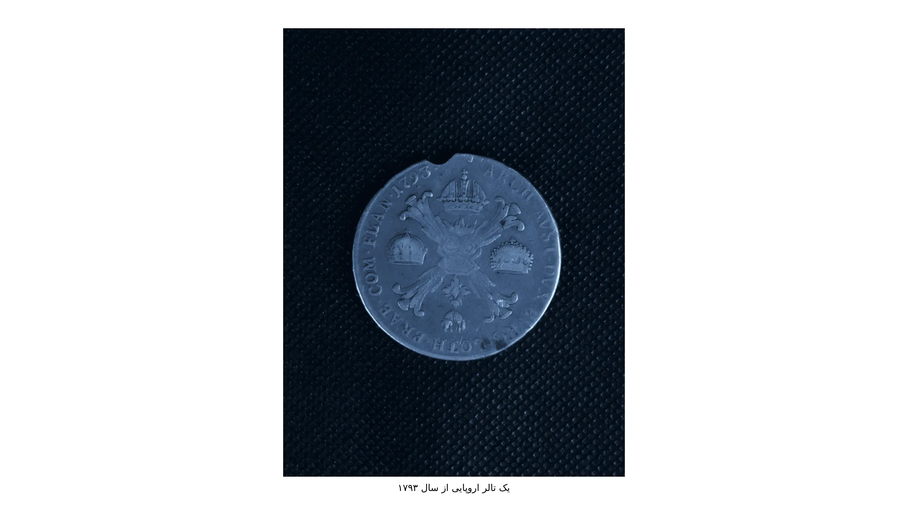

با این حال، در قرن ۱۵، اروپا با یک بحران جدی ارزی مواجه شد، به طوری که محتوای نقره ارزهای اروپایی به طور کلی کاهش یافت و تا حدود سال ۱۴۵۰ به کمتر از ۵٪ رسید.

از قرن شانزدهم به بعد، مرکز ثقل پولی به اسپانیا منتقل شد، که با اتحاد پادشاهی‌های آراگون و کاستیا، پایان ریکونکیستا، و اکتشافات بزرگ دریایی مانند کشف کریستف کلمب در سال ۱۴۹۲ تحریک شد. ورود گسترده نقره از معادن آمریکا به شدت تعادل‌های اقتصادی اروپا و جهان را برهم زد و هم تورم و هم تنش‌های ژئوپلیتیکی جدیدی را به وجود آورد.

رنسانس همچنین نشان‌دهنده یک تحول بزرگ هنری در سکه‌زنی بود، با سکه‌هایی مانند تالر (یوآخیمستالر)، که منشأ اصطلاح "دلار" است. این سکه‌های نقره بزرگ نشان‌دهنده تکنیک‌های جدید هنری و مکانیکی ضرب سکه هستند که با نوآوری‌های فنی از شمال اروپا ممکن شده‌اند.

سرانجام، رنسانس مالی گذار به مدرنیته اقتصادی را با توسعه بانکداری، اعتبار و بازارهای مالی و ظهور اولین اشکال سرمایه‌داری مدرن در شهرهای بزرگ تجاری آمستردام، لندن و استکهلم به ارمغان آورد و پایه‌های سیستم مالی بین‌المللی را همان‌طور که امروز می‌شناسیم بنا نهاد. و این موضوع ویدیوی بعدی ماست.

# توقیف پول توسط دولت

<partId>17cfb1b4-5bc1-53e0-b035-05c7cf76be92</partId>

## تکامل ارزهای ذخیره جهانی

<chapterId>d65cc352-e7ca-5f03-9b23-dd1fae5c0395</chapterId>

:::video id=82710062-8fff-426c-93af-923c08d82233:::

### اهمیت تاریخی فلزات گرانبها

به این بخش درباره ظهور ارزهای ذخیره و بانک‌های مرکزی خوش آمدید. به عنوان اولین نکته از این بخش جدید، ما بر تکامل ارزهای ذخیره جهانی تمرکز خواهیم کرد.

فلزات گرانبها، به ویژه طلا و نقره، مدت‌ها به عنوان پایه ثروت و قدرت در امپراتوری‌ها محسوب می‌شدند. عطش برای طلا همواره نیروی محرکه غالب بوده است و این ورود فلزات گرانبها بود که بیشترین تأثیر مستقیم و آشکار را بر تحولات پولی در اروپا داشت. در زمان‌های قرون وسطی و اوایل رنسانس، این وسواس نسبت به طلا و نقره به دلیل دشواری حفظ ارزش در سایر اشکال کالاها و همچنین تقاضای قوی از سوی قدرت‌های خارجی، به ویژه در تجارت با شرق، بود.

در طول قرن‌ها، چندین امپراتوری به عنوان مراکز اقتصادی جهانی یکی پس از دیگری موفق شده‌اند. کشوری که در یک دوره معین بر تجارت جهانی تسلط دارد، معمولاً وضعیت ارز ذخیره را دریافت می‌کند. این‌ها شامل:

- اسپانیا و پرتغال (قرن‌های ۱۵ و ۱۶)

- استان‌های متحد (هلند) در قرن هفدهم

- فرانسه و بریتانیا در قرن‌های 18 و 19

- ایالات متحده در قرن بیستم

### رونق پرتغالی و رئال (۱۵۳۰-۱۴۵۰)

**پرتغال** در نیمه دوم قرن 15 و اوایل قرن 16 بر تجارت جهانی تسلط داشت، با **رئال پرتغالی**، سکه نقره‌ای با وزن نسبتاً یکنواخت. پرتغالی‌ها، به لطف پیشرفت‌های خود در ناوبری، مسیرهای دریایی جدیدی به آفریقا، آسیا و دنیای جدید پیدا کردند. قلعه‌های نظامی و پست‌های تجاری از آفریقا تا چین (ماکائو) افزایش یافتند.

در پاسخ به تقاضای اروپا برای طلا و نقره، "انگیزه‌ی دائمی برای اکتشافات بزرگ، سود تجاری بود، به‌ویژه جستجوی طلا و نقره." با این حال، امپراتوری پرتغال که بیش از حد گسترش یافته بود و با رقابت از سوی هلندی‌ها، انگلیسی‌ها و فرانسوی‌ها مواجه بود، شروع به زوال کرد.

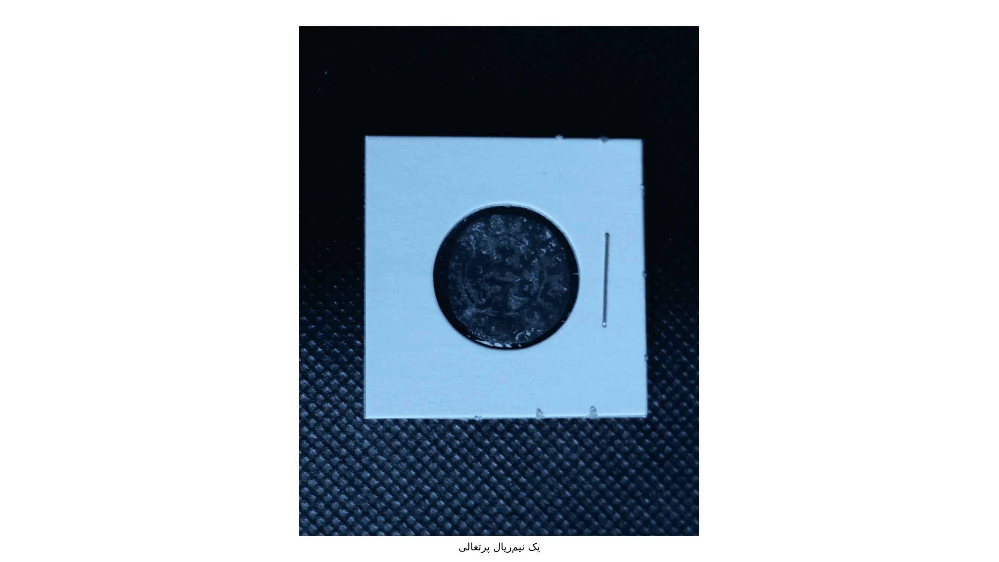

در بالا می‌توانید یک نیم‌ریال پرتغالی از زمان این فتوحات دریایی را ببینید.

### اوج اسپانیا و دلار اسپانیایی (۱۵۳۵-قرن ۱۷)

با فتح دنیای جدید، **اسپانیا** به بازیگر مسلط تبدیل شد. پادشاه آن، با کنترل معادن نقره عظیم (پوتوسی در بولیوی، زاکاتکاس در مکزیک)، موفق به ضرب سکه با نقره خالص شد و بدین ترتیب از کاهش ارزش پول خود، یعنی **رئال اسپانیایی،** جلوگیری کرد.

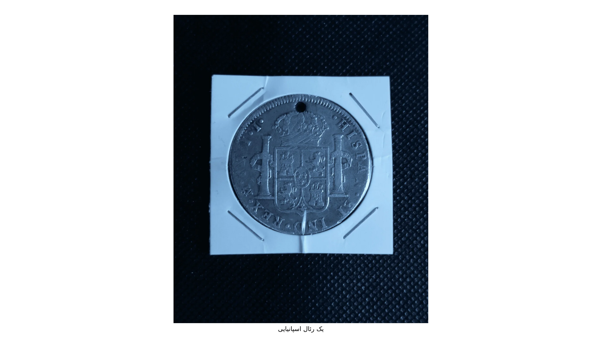

ریال اسپانیایی، که به عنوان "تکه هشت" نیز شناخته می‌شود، این لقب را به این دلیل گرفت که اغلب به هشت قسمت تقسیم می‌شد تا سکه‌های کوچکتری ایجاد کند. همچنین به عنوان **دلار اسپانیایی** شناخته می‌شد. سکه‌ای که در بالا می‌بینید مربوط به سال 1814 است و نمونه‌ای کمی جدیدتر است. با این حال، اولین سکه‌های دلار اسپانیایی به این اندازه تصفیه‌شده نبودند؛ آنها با چکش ضرب می‌شدند و عموماً کمتر گرد و تیز بودند.

نکته جالب این است که دلار اسپانیایی در آن زمان به عنوان ارز ذخیره بین‌المللی عمل می‌کرد. مقامات اسپانیایی همچنین ارز محلی خود، ماراویدی، را صادر می‌کردند و به طور منظم عرضه پول را از طریق فراخوان‌ها تنظیم می‌کردند. به عنوان مثال، یک سکه مسی یا برنزی که در ابتدا به ارزش یک ماراویدی بود ممکن است فراخوانده شده و با "2" مهر شود، سپس با "4" و به همین ترتیب، احتمالاً به "8" برسد. در عکس با وضوح بالا، می‌توانید به وضوح "8" مهر شده روی سکه را ببینید. این روش به طور مؤثری عرضه پول را گسترش داد... که به طور اجتناب‌ناپذیری به تورم منجر شد.

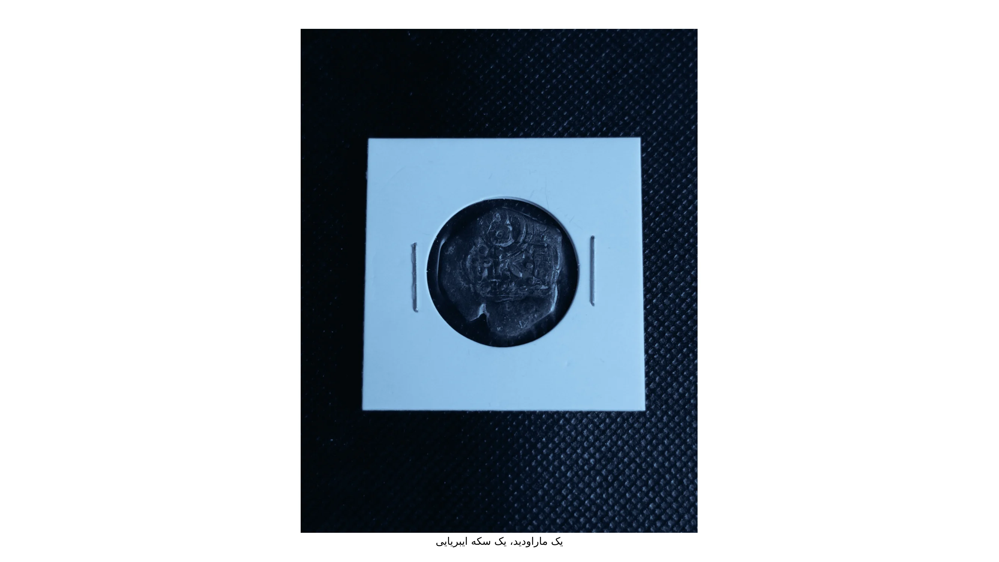

اگر به تاریخ ارزهای ذخیره نگاه کنیم، نکته جالبی پدیدار می‌شود: امپراتوری‌ها تا زمانی که وضعیت ارز ذخیره خود را حفظ می‌کردند، ارزهای خود را تورم نمی‌دادند. **تنها در پایان سلطه خود بود که آن را کاهش ارزش داده و این امتیاز را از دست می‌دادند، که سپس به یک امپراتوری جدید منتقل می‌شد.**

در اسپانیا، دلار اسپانیایی برای نزدیک به ۲۰۰ سال بر تجارت جهانی تسلط داشت، به ویژه بین چین و اروپا. این سکه‌ها حتی در بنادر چین نیز یافت می‌شدند. و اینجاست که از تاریخ یک چشمک می‌گیریم: دلار آمریکایی مستقیماً از این ارز می‌آید. زمانی که ایالات متحده در سال ۱۷۹۲ تشکیل شد، قانونی برای ضرب ارز خود تصویب کرد و اولین دلارهای آن بر اساس مدل دلار اسپانیایی، هم از نظر نام و هم اندازه سکه، ایجاد شدند.

برای اینکه ایده‌ای از ارزش آن به شما بدهم، یک دلار آمریکایی در اصل یک سکه نقره‌ای بود که تقریباً یک اونس وزن داشت، یا بین €30 و €40 به پول امروزی، برخلاف ارز کاغذی که امروز می‌شناسیم. در مورد دلار اسپانیایی، آنقدر به طور گسترده در گردش بود که به عنوان اولین ارز جهانی واقعی محسوب می‌شود.

با این حال، این هجوم فلزات گرانبها از آمریکا باعث تورم در اروپا شد. در طول انقلاب قیمت‌ها (حدود 1540-1640)، هزینه زندگی در انگلستان هفت برابر افزایش یافت. در اسپانیا، فراوانی نقره اثر معکوس نفرین منابع را داشت و مانع توسعه مؤسسات بانکی قوی شد.

متعاقباً، اسپانیا با درگیری‌های نظامی متعددی (فلاندرز، هلند، جنگ سی‌ساله) مواجه شد و امور مالی آن به تدریج فروپاشید. به جای کاهش ارزش سکه نقره‌ای مشهور جهانی، حاکمان متوالی تصمیم گرفتند که بر روی سکه مسی (ولون) که توسط جمعیت محلی استفاده می‌شد، نکول یا کاهش ارزش کنند. این همان چیزی است که قبلاً با مرویدیس توضیح دادم.

### ظهور هلندی‌ها (قرن ۱۷)

پس از اوج‌گیری ایبری، **هلند** در قرن هفدهم به عنوان یک قدرت تجاری جدید ظهور کرد. تجارت دریایی، شرکت هند شرقی هلند (VOC)، و تأسیس **بورس آمستردام Exchange** (الهام گرفته از بورس آنتورپ) این جمهوری بازرگان را به یک مرکز تبدیل کرد.

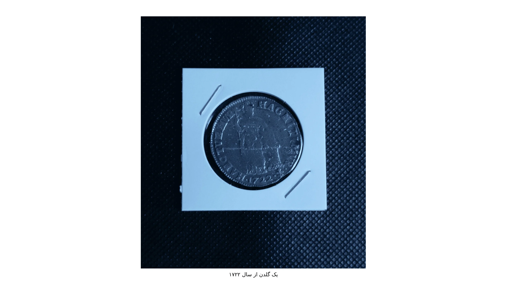

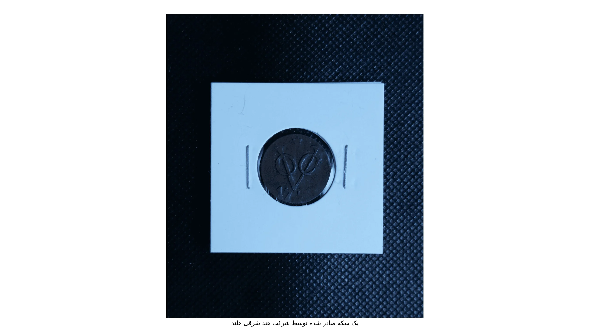

در اولین عکس بالا، می‌توانید یک گولدن از سال ۱۷۲۲ (یک سکه نقره‌ای زیبا) را ببینید، در حالی که در دومی، یک سکه صادر شده توسط VOC وجود دارد.

VOC یک شرکت بسیار قدرتمند در زمان خود بود: این شرکت ارتش خود را داشت و حتی ارز خود را صادر می‌کرد.

هلندی‌ها سرمایه‌داری مدرن را اختراع کردند که به عنوان وسیله‌ای برای توزیع ریسک در سرمایه‌گذاری‌های پرخطر مانند اعزام به دنیای جدید یا جستجوی مسیرهای تجاری جدید آغاز شد. شرکت‌های سهامی به چندین سرمایه‌گذار این امکان را می‌دادند که پول خود را جمع کنند و ریسک را به اشتراک بگذارند. برای تسهیل این مبادلات، لازم بود نهادهایی ایجاد شوند که قادر به مذاکره و مبادله این اوراق بهادار باشند. بنابراین، در سال 1602، اولین شرکت سهامی و بورس اوراق بهادار ایجاد شد.

ارز هلند، **گولدن**، به دلیل خلوص نقره‌اش اعتبار یافت و سپس با پذیرش آن توسط بانک آمستردام (1609)، جایی که سپرده‌ها به شکل ترجیحی پول در اروپا تبدیل شدند، اعتبار بیشتری پیدا کرد. این نکته بسیار مهمی برای ذکر است. بله، البته سکه‌ها وجود داشتند، اما آنچه واقعاً در آن روزها پول محسوب می‌شد، نوعی پول دفتری بود. در واقع، بخش زیادی از تجارت جهانی از طریق دفاتر بانک آمستردام انجام می‌شد. این یک پیشرفت واقعی در بانکداری بود: تجارت بین‌المللی دیگر لزوماً با سکه‌های فیزیکی انجام نمی‌شد، بلکه مستقیماً از طریق سوابق حسابداری بانک صورت می‌گرفت.

این دوره‌ی شکوفایی با ورود گسترده‌ی طلا و نقره مشخص می‌شد، به‌ویژه از کشورهای دیگر که به تورم یا کنترل پولی می‌پرداختند. یک شخصیت جالب برای ذکر وجود دارد: **توماس گرشام**. در این زمان، او برای خاندان سلطنتی انگلستان در هلند کار می‌کرد و جریان پول بین این دو کشور را مدیریت می‌کرد. این همان گرشامی است که قانون معروف **"قانون گرشام"** را برای ما به جا گذاشت.

با این حال، امپراتوری هلند نیز در نهایت از نفس افتاد. جنگ‌ها با انگلستان، کاهش ارزش گولدن در زمان‌های درگیری، و رقابت با دیگر قدرت‌ها (فرانسه و انگلستان) پایان هژمونی هلند را نشان دادند. پس از جنگ چهارم انگلیس و هلند (1780-84)، کاهش ارزش گولدن به عنوان یک ارز ذخیره غیرقابل برگشت شد.

### قدرت، جاه‌طلبی‌ها و شکست‌های فرانسه (قرون ۱۷-۱۸)

تحت لوئی چهاردهم، **فرانسه** به بزرگ‌ترین قدرت قاره‌ای در اروپا تبدیل شد. با این حال، ارز فرانسه هرگز به وضعیت یک مرجع غالب دست نیافت: کاهش ارزش‌های متعدد، مالیات‌های سنگین و جنگ‌های پرهزینه (اتحاد آگسبورگ، جنگ جانشینی اسپانیا و غیره) به شدت بر ثبات سیستم پولی تأثیر گذاشت.

اولین آزمایش بزرگ در زمینه پول کاغذی توسط جان لاو (۱۷۱۶-۱۷۲۰) انجام شد. بانک ژنرال اسکناس‌هایی را صادر کرد که با وعده‌های بدهی دولتی پشتیبانی می‌شدند. این طرح به یک حباب سفته‌بازی و فروپاشی (حباب می‌سی‌سی‌پی) در سال ۱۷۲۰ منجر شد. این فاجعه باعث شد که فرانسه به طور ماندگار به پول کاغذی بی‌اعتماد شود. این تجربه فاجعه‌بار بود که ریچارد کانتیلون را به ثروت رساند، به لطف این سیستم بیان اصول که اکنون به عنوان اثر کانتیلون شناخته می‌شود، جایی که چاپ پول کسانی را که به دستگاه چاپ دسترسی دارند، ثروتمند می‌کند.

وقتی این بی‌اعتمادی سرانجام فروکش کرد، یک فاجعه کاغذی دیگر در فرانسه رخ داد: **آسینیا**های انقلابی. این آسینیاها که از سال ۱۷۹۰ به بعد بر اساس مصادره اموال روحانیت صادر شدند، دچار ابر تورم شتابان شدند و به‌طور رسمی اولین ابر تورم در تاریخ شدند که بیش از ۵۰٪ در ماه افزایش یافت. در سال ۱۷۹۵، اگرچه ارزش اسمی آنها چند برابر شده بود، اما تنها با چند درصد از ارزش اولیه خود معامله می‌شدند.

قوانین محدودکننده‌تری برای تحمیل اساینات جستجو شد، اما بدون موفقیت. دولت تلاش کرد آن را تحمیل کند، تا جایی که کسانی را که آن را نمی‌پذیرفتند به مرگ تهدید کرد و مغازه‌داران را مجبور به باز نگه داشتن مغازه‌ها کرد. اما البته، در نهایت، این کارساز نبود.

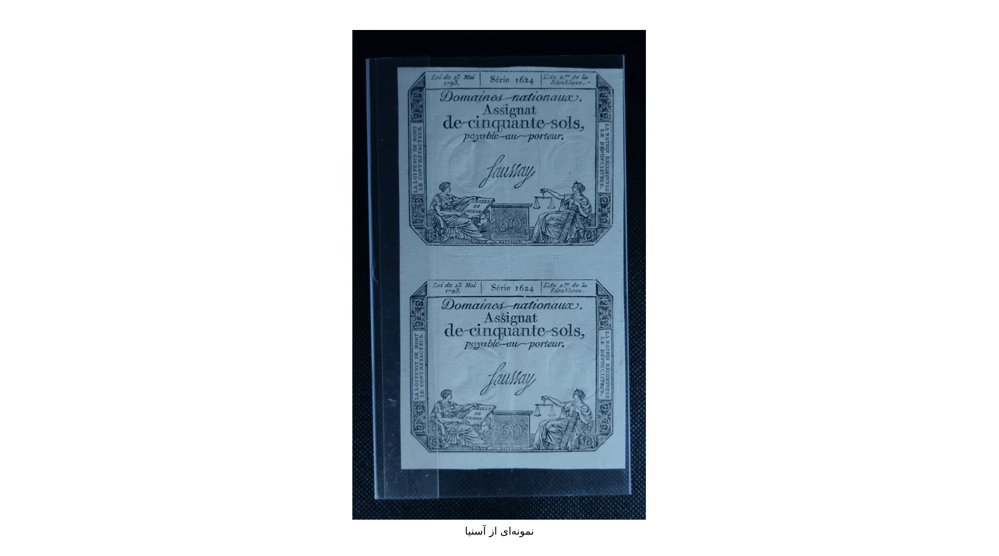

همان‌طور که این اسکناس جایگزین تمام سکه‌های فلزی با کیفیت شد و با قانون معروف گرشام همسو گردید، کمبود سکه به وجود آمد. برای ضرب سکه‌های جدید، از فلز ناقوس که از روحانیت ضبط شده بود، استفاده کردند. در زیر می‌توانید یک قطعه زیبا از فلز ناقوس را ببینید که از مس بازیابی‌شده با ذوب سکه‌های گرفته‌شده از روحانیت ساخته شده است.

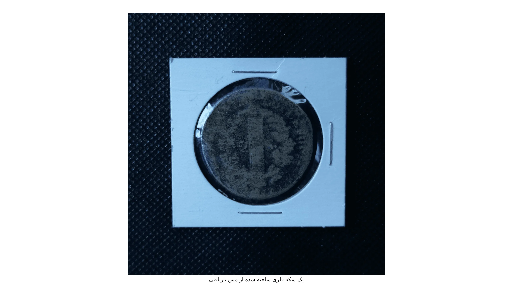

### سلطه بریتانیا (قرن 18 - اوایل قرن 20)

**انگلستان**، با پیشی گرفتن از هلند، به قدرت غالب در قرن ۱۸ تبدیل شد. پوند استرلینگ قدیمی‌ترین ارز در حال استفاده است که در ابتدا به یک پوند نقره مرتبط بود. به تدریج، جایگاه آن قوی‌تر شد و با یک انقلاب مالی و مالیاتی پشتیبانی شد: سلطنت پارلمانی، ظرفیت قوی در جمع‌آوری مالیات و تأسیس بانک انگلستان در سال ۱۶۹۴.

پس از یک سری جنگ‌ها علیه فرانسه، پادشاهی متحده در سال 1815 (واترلو) پیروز شد و برتری خود را تأیید کرد. در طول قرن 19، پوند استرلینگ به عنوان ارز ذخیره جهانی عمل می‌کرد. در اوج خود، با تنها 2.5% از جمعیت جهان، بریتانیا 20% از درآمد جهانی را تولید می‌کرد و تقریباً یک چهارم سطح زمین را کنترل می‌کرد.

**انقلاب صنعتی** و پذیرش **استاندارد طلا** (۱۷۱۷ یا ۱۷۱۸، تحت نظارت آیزاک نیوتن در ضرابخانه سلطنتی) اعتبار پوند را تقویت کرد. بانک انگلستان استاندارد طلای ۴.۲۵ پوند به ازای هر اونس طلا را پذیرفت و به دارندگان اسکناس اجازه داد تا اسکناس‌های خود را به طلا تبدیل کنند.

با این حال، جنگ جهانی اول (۱۹۱۴-۱۹۱۸) به این سیستم پایان داد. در عرض چند هفته، تمامی قدرت‌های بزرگ درگیر جنگ تبدیل‌پذیری طلا را به حالت تعلیق درآوردند. امپراتوری بریتانیا و بعدها پوند، از جنگ جهانی دوم در وضعیتی ضعیف بیرون آمدند و در قرن بیستم جای خود را به دلار آمریکا دادند.

و به عنوان یک اثر، می‌توانید برخی از قطعات زیبا و جالب را در زیر ببینید. این‌ها وزنه‌های پولی هستند. اولین آن‌ها سکه‌ی پوند است: اولین نمایش‌های پوند. من فقط وزنه‌های پولی برای نمایش این سکه‌ها دارم زیرا نمی‌توانم یک سکه‌ی واقعی پوند بخرم. برای وزن کردن آن‌ها، از ترازو استفاده کردیم و سپس وزنه‌ی پولی معادل ارزش پوند را در طرف دیگر قرار دادیم.

سکهٔ سلطنتی یک سکهٔ پولی بود - یک سکهٔ طلا که در اصل یک پوند ارزش داشت.

پیش از سکه معروف sovereign، گینی وجود داشت که بر اساس همان اصل عمل می‌کرد. گینی به خاطر فلزات گرانبهایی که در آن وجود داشت و از منطقه گینه تأمین می‌شد، نام‌گذاری شده بود.

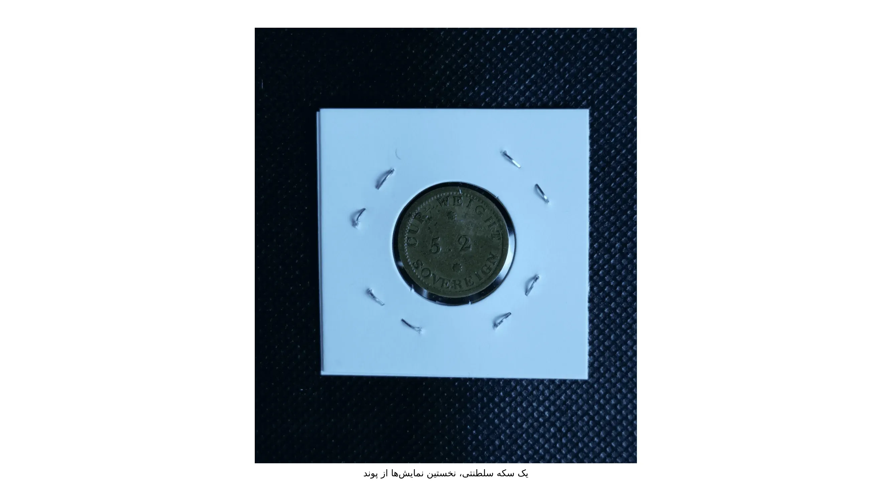

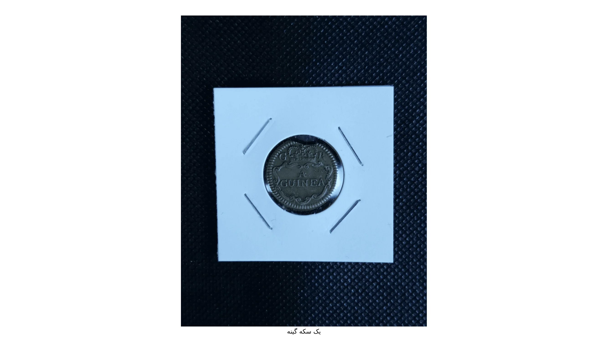

## ظهور بانک‌های مرکزی

<chapterId>15777771-1e28-55f7-a400-69868a47079b</chapterId>

:::video id=7661b7b5-e00f-48f3-b69a-6fb2eb5ebba4:::

در ادامه این بخش درباره تاریخچه اولین ارزهای ذخیره و تکامل آن‌ها، اینجا بخشی درباره ظهور بانک‌های مرکزی است. این مسیر تقریباً مشابه با ظهور ارزهای ذخیره است، اما کمی بیشتر بر فناوری‌های بانکی آن زمان تمرکز دارد.

### آغاز بانک‌ها و شبه‌بانک‌ها

از اوایل قرن سیزدهم، ایتالیایی‌ها (فلورانس، جنوا، ونیز...) تکنیک‌های حسابداری دوطرفه را توسعه دادند. بعدها، **آنتورپ** (قرن 16) به مرکز مالی پیشرو در شمال اروپا تبدیل شد، نقشی که بعدها توسط **آمستردام** به لطف بورس آمستردام Exchange (1609) که در آن سهام VOC معامله می‌شد، به عهده گرفته شد.

آنتورپ میزبان نمایشگاه‌های بازرگانی بود که در آن تاجران به طور مکرر برای تسویه بدهی‌ها گرد هم می‌آمدند و این امر منجر به اختراع ابزارهای مالی جدید شد. سند زیر، به تاریخ 1761 و جدیدتر، یک **سفته** است. این سند دارای جزئیات دست‌نویس به همراه نوشته‌هایی در پشت آن است که آن را به یک اثر هنری باشکوه از آن دوره تبدیل کرده است.

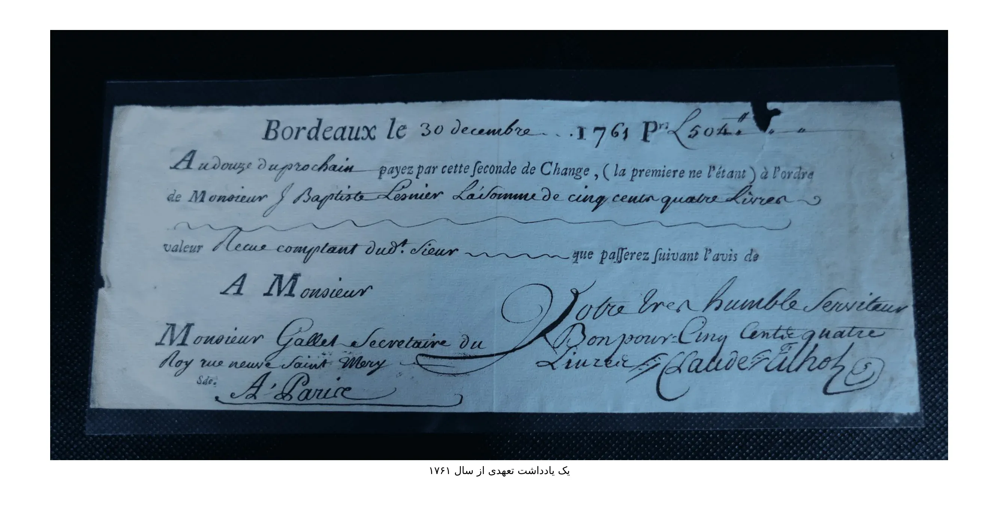

این جوشش منجر به ایجاد مؤسسات بانکی پیشرفته‌تری شد. **بانکداران لومبارد** و بعدها بازرگانان هلندی ابزارهای اعتباری (اسناد مبادله، سفته‌ها و غیره) را تکمیل کردند. سیستم بانکی مدرن بر اساس این ایده استوار است: پول می‌تواند اعتبار باشد، نه فقط فلز.

همان‌طور که می‌بینید، این ما را به پرسش اصلی‌مان درباره منشأ پول بازمی‌گرداند.

آیا پول از کالایی که از نیاز به مبادله پدید می‌آید نشأت می‌گیرد، یا از اعتبار سرچشمه می‌گیرد؟ ردپای این موضوع را هنوز هم می‌توان در این بخش یافت.

### مثال سوئدی: Stockholms Banco و Riksens Ständers Bank

بیایید به سوئد برویم، جایی که اولین بانک مرکزی ایجاد شد.

**سوئد** پیشگام در بانکداری مرکزی بود: در سال 1657، یوهان پالمستروک **استکهلم بانک** را ایجاد کرد که مجاز به وام‌دهی بیش از ذخایر فلزی خود بود و بدین ترتیب تولد بانکداری ذخیره کسری را رقم زد. اما صدور بیش از حد اسکناس منجر به وحشت و هجوم به بانک در سال 1663 شد. خب، خب...

در سال 1668، بانک Riksens Ständers، اولین بانک مرکزی واقعی جهان، در استکهلم تأسیس شد. با این حال، این بانک نیز از بحران‌هایی (1709، 1715...) که به سوءاستفاده از اسکناس‌ها، اغلب برای تأمین مالی جنگ‌های پادشاهی مرتبط بود، رنج برد.

### کودتای نافرجام جان لاو

بیایید به فرانسه برویم، جایی که بار دیگر جان لاو محبوب خود را پیدا می‌کنیم.

**جان لاو**، یک اسکاتلندی، نایب‌السلطنه (دوک اورلئان) را متقاعد کرد تا یک بانک خصوصی به نام بانک ژنرال (۱۷۱۶) ایجاد کند که مجاز به صدور اسکناس در برابر طلا، نقره و بدهی‌های دولتی بود. این بانک به بانک رویال (۱۷۱۸) تبدیل شد و به افزایش سهام شرکت می‌سی‌سی‌پی کمک کرد.

وقتی واقعیت به شایعات رسید، **وحشت با تصمیم به ممنوعیت نگهداری طلا و اجبار به استفاده از اسکناس‌های لاو تشدید شد**. خب، خب...

سرانجام، حباب در سال ۱۷۲۰ ترکید و باعث فروپاشی شد که اعتبار پول کاغذی در فرانسه را برای مدت طولانی از بین برد.

### بانک آمستردام، ظهور یک مدل پیشگام

اکنون به آمستردام در سال 1609 منتقل شده‌ایم، جایی که **بانک آمستردام** (Wisselbank) کنترل نگهداری و تبدیل سکه‌ها را در آمستردام به دست گرفت. این بانک گردش اسکناس‌های خصوصی را ممنوع کرد و سپرده‌گذاری سکه‌های فلزی را در خزانه‌های خود اجباری کرد. کم‌کم، کنترل ارز را به دست آوردند. آن‌ها صرافان را از نگهداری سکه‌ها با خود منع کردند. صرافان تمام روز کار می‌کردند و در پایان روز مجبور بودند سکه‌های خود را در خزانه‌های بانک آمستردام سپرده‌گذاری کنند. همان‌طور که اشاره کردم، لزوماً سکه‌های فلزی در تجارت بین‌المللی استفاده نمی‌شد. این پول اسنادی در دفاتر بانک بود.

به لطف قدرت تجاری هلندی، این بانک نقش اولین "بانک مرکزی" دوفاکتو را ایفا کرد و تجارت جهانی را تثبیت نمود. با این حال، با گذشت زمان، وام‌های بدون تضمین به VOC اعطا کرد و در نهایت فلز کافی برای پشتیبانی از اسکناس‌های خود نداشت. در سال 1790، مشخص شد که مبالغ زیادی به VOC قرض داده است و عملاً اعلام ورشکستگی کرد و اعتبار گولدن را نابود کرد. خب، خب...

### بانک انگلستان، قانون تأسیس بانکداری مدرن

در انگلستان قرن هفدهم، طلا و نقره توسط زرگران نگهداری می‌شد و آن‌ها رسیدهایی صادر می‌کردند. این سازماندهی نیمه‌متمرکز محدودیت‌های خود را زمانی نشان داد که تاج و تخت برای جنگ با فرانسه به شدت به تأمین مالی نیاز پیدا کرد.

در سال 1694، **بانک انگلستان (BoE)** تأسیس شد. بانک انگلستان به این ترتیب از یک ازدواج مصلحتی بین جامعه تجاری لندن و دولت که به شدت به دنبال یافتن منابع مالی برای جنگ بود، به وجود آمد.

بانک انحصار صدور اسکناس در انگلستان را به دست آورد (تقویت شده در سال‌های ۱۷۰۸، ۱۷۴۲، و غیره). از آن زمان، پول کاغذی که با ذخایر طلا پشتیبانی می‌شد، در کنار سکه‌ها در گردش بود. این نکته مهمی برای درک تدریجی تسلط نهادهای دولتی بر پول است. ابتدا، بانک آمستردام از صرافان جلوگیری کرد که سکه‌ها را نگه دارند و آنها را مجبور کرد که سکه‌ها را به بانک بازگردانند. در انگلستان، بانک‌های خصوصی از صدور اسکناس‌های قابل بازخرید با طلا منع شدند.

آنها به بانک‌های خصوصی اجازه دادند تا اسکناس صادر کنند، اما این اسکناس‌ها فقط می‌توانستند با اسکناس‌های بانک انگلستان مبادله شوند.

اسکناس‌های بانک انگلستان، پوند استرلینگ، قابل بازخرید با طلا بودند. این امر لایه سومی به ارز اضافه کرد. بنابراین ما طلا را در پایه داریم، سپس اسکناس‌های بانک انگلستان، و سپس اسکناس‌های بانک‌های خصوصی در بالا. قبل از آن، بانک‌های خصوصی می‌توانستند اسکناس‌های خود را که قابل بازخرید با طلا بودند، صادر کنند. این مرحله دیگری در تصاحب تدریجی ارز توسط نهادهای دولتی است.

بانک با وام‌های کلان به دولت کمک کرد و بدهی عمومی عظیمی را که رونق اقتصادی را تأمین مالی می‌کرد، ساختاردهی کرد.

این مدل در طول قرن‌های ۱۸ و ۱۹ تثبیت شد، تا جایی که پوند به ارز ذخیره جهانی تبدیل شد، تحت مهر بانک انگلستان و استاندارد طلا.

**ارزهای ذخیره جهانی** در طول قرن‌ها یکی پس از دیگری آمده‌اند، تحت تأثیر قدرت اقتصادی، تجاری و نظامی یک دولت یا امپراتوری: پرتغال، اسپانیا، هلند، سپس بریتانیا، قبل از اینکه ایالات متحده در قرن بیستم به تسلط برسد. در هر مورد، ما یک چرخه مشابه را مشاهده می‌کنیم: گسترش اقتصادی، موفقیت تجاری، پذیرش بین‌المللی ارز، بدهی، جنگ‌های پرهزینه، استفاده نادرست از خلق پول یا اعتبار، و در نهایت افول.

ظهور بانک‌های مرکزی فرآیندی تدریجی بود. این نهادها اغلب در زمینه جنگ‌های پرهزینه به وجود آمدند و به دولت امکان می‌دادند تا از طریق بدهی خود را تأمین مالی کند. هنگامی که استاندارد طلا پذیرفته شد (انگلستان، قرون 17-19)، ظاهری از ثبات فراهم کرد، تا اینکه جنگ‌های بزرگ جهانی قرن بیستم منجر به ترک تدریجی قابلیت تبدیل طلا شد. قدرت ضرب سکه بدین ترتیب از انحصار سلطنتی به نهادهای پیچیده‌تری منتقل شد، ابتدا خصوصی (طلافروشان، بانکداران)، سپس نیمه‌عمومی (بانک‌های مرکزی)، که نشان‌دهنده تکامل حاکمیت پولی به سمت اشکال نهادی و جهانی‌شده است.

بنابراین، این همان چیزی است که قبلاً توضیح می‌دادم. ما اغلب بار بدهی حاکمیتی را مستقیماً به بانک‌های مرکزی یا اجازه ایجاد پول توسط نهادهای قانونی، مانند پارلمان، منتقل کرده‌ایم.

و مهم‌ترین واقعیت در اینجا این است که **ما از بدهی‌ای که می‌توانست از طریق ورشکستگی دولت ناپدید شود به بدهی‌ای رسیده‌ایم که عمدتاً بر دوش جمعیت قرار دارد**.

## جاده به سوی سیستم فیات

<chapterId>27a98545-d350-56ee-a200-92468e6b9b33</chapterId>

:::video id=e27a753e-aeee-4307-a65c-9506aab380a1:::

اکنون به پایان این دوره درباره تاریخچه پول رسیده‌ایم و برای خاتمه دادن به آن، می‌خواهم دو موضوع را پیشنهاد کنم. موضوع اول مراحل مختلفی است که به سیستم ارز فیات کنونی ما منجر شده است. ما به بررسی مجدد حقایق از بخش ۵ درباره ایجاد بانک‌های مرکزی خواهیم پرداخت و مفهوم دلار آمریکا را اضافه خواهیم کرد، که در نهایت ارز ذخیره کنونی است. ما نگاهی خواهیم داشت به چگونگی تکامل آن، چگونگی پیدایش دلار، چگونگی تکامل آن، چگونگی تغییر آن، و مراحلی که طی کرده تا به یک سیستم فیات تبدیل شود، زیرا منشأ دلار یک سکه نقره‌ای است.

سپس، بلافاصله پس از آن، قصد دارم بخشی کوتاه درباره تاریخچه مالی به شما ارائه دهم تا به شما کمک کند بفهمید چگونه به دولت رفاه رسیدیم. بنابراین، به دو موضوع خواهیم پرداخت: چگونه به سیستم فیات رسیدیم، و سپس بلافاصله پس از آن، چگونه تکامل مالی ما را به مفهوم دولت رفاه رساند.

### پایه‌های اروپایی بانکداری مدرن

بیایید به قرن سیزدهم با فلورین برگردیم. برای درک چگونگی رسیدن به مدل فیات، باید از قرن سیزدهم شروع کنیم. همزمان با فلورین، یک فناوری با مدیچی ظهور کرد، مفهوم برات‌ها.

سپس بورس اوراق بهادار آنتورپ آمد، با مفهوم تنزیل و سفته‌های وعده‌دار.

سپس، همان‌طور که دیده‌ایم، ما VOC را داشتیم، اولین بازار سهام در آمستردام. این رویداد تولد سرمایه‌داری را با سهام شرکت‌ها و تبادل سهام نشان داد. سپس بانک آمستردام استفاده از سپرده‌ها را با فرمانی تحمیل کرد. این به این معنا بود که سکه‌ها باید در پایان روز سپرده‌گذاری می‌شدند. این صرافان بودند که دیگر نمی‌توانستند پول خرد را به صورت سکه نگه دارند.

سپس ایجاد بانک انگلستان به دلیل نیاز به ایجاد بدهی برای تأمین مالی جنگ در پایان قرن هفدهم صورت گرفت. در آن زمان، بانک‌های خصوصی به عنوان لایه سوم پول تبدیل شدند. به هر حال، این بخش کامل، از فلورین تا مفهوم ایجاد بانک مرکزی، به طور فوق‌العاده‌ای در کتاب معروف نیک باتیا "پول لایه‌ای" خلاصه شده است، که من خوش‌شانس بودم که با چند همکار آن را ترجمه کنم. ما کار بزرگی در ترجمه آن انجام دادیم تا فرانسوی‌زبانان در همه جا بتوانند از این آموزه‌ها بهره‌مند شوند.

بنابراین ما در پایان قرن هفدهم هستیم. بانک انگلستان برای تأمین مالی جنگ ایجاد شد.

بانک‌های خصوصی لایه سوم ارز را به دست گرفتند. در واقع، اسکناس‌های بانک‌های خصوصی دیگر قابل بازخرید با طلا نبودند: این اسکناس‌های بانک انگلستان بودند که قابل بازخرید با طلا بودند. این نشان‌دهنده تصاحب قدرت مبادله توسط نهادی است که بانک انگلستان است.

سپس وحشت سال 1776 فرا رسید. همه به سمت هرم پول هجوم آوردند. معنای این امر این است که در سال 1776، هجوم به بانک‌ها رخ داد و بنابراین همه افرادی که کاغذهای لایه سوم، یعنی اسکناس‌های بانک‌های خصوصی داشتند، سعی کردند اسکناس‌های بانک انگلستان را به دست آورند و سپس سعی کردند طلا به دست آورند، اما به وضوح طلای کافی در خزانه‌ها وجود نداشت. آنها نوعی تعطیلی بانکی اعلام کردند تا از بازپرداخت اسکناس‌های طلا جلوگیری کنند و این منجر به پیدایش مفهوم وام‌دهنده نهایی شد.

### تکامل دلار آمریکا

ما از فلورین به تأسیس بانک انگلستان منتقل شدیم. البته، در این میان جنگ‌های جهانی اول و دوم رخ دادند، اما پیش‌تر، در سال 1796، تحولاتی در آن سوی اقیانوس اطلس نیز در حال وقوع بود. در سال 1776، آمریکا هنوز یک مستعمره بریتانیا بود و مستعمرات از این ارز کاغذی استفاده می‌کردند. در زیر یک اسکناس دو شیلینگی کانکتیکات از سال 1776 آمده است.

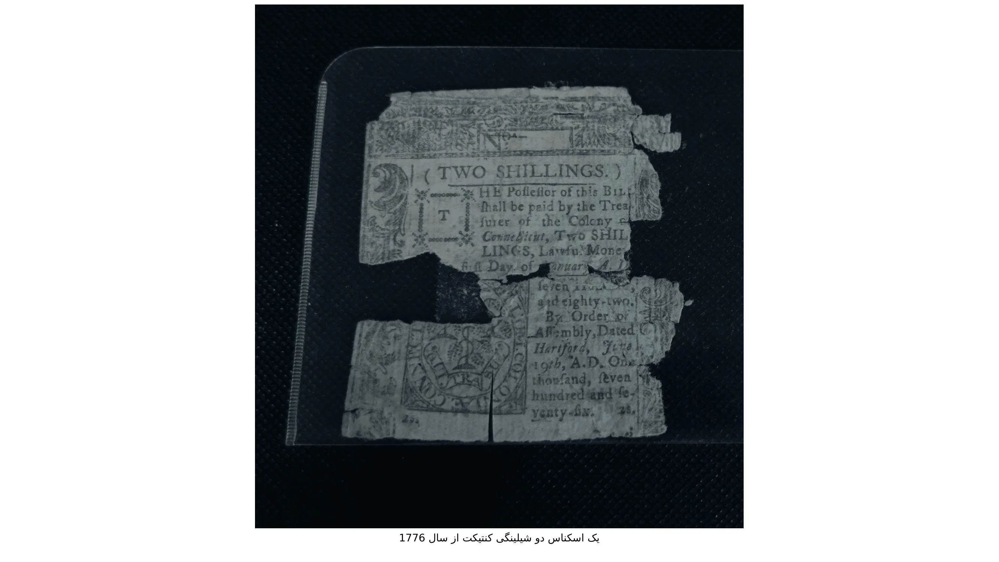

قبل از اعلام جنگ به انگلستان و در نهایت صدور ارز خود، مستعمرات از این ارز کاغذی به همراه دلار اسپانیایی برای معاملات نقدی استفاده می‌کردند. در واقع، اصطلاح "دلار" برای اشاره به دلار آمریکایی باقی ماند.

اگر اشتباه نکنم، در سال 1792 قانونی تصویب شد که به آن‌ها اجازه می‌داد سکه ضرب کنند. به عنوان مثال، نمونه زیر یک دلار آمریکایی از دوران مدرن است.

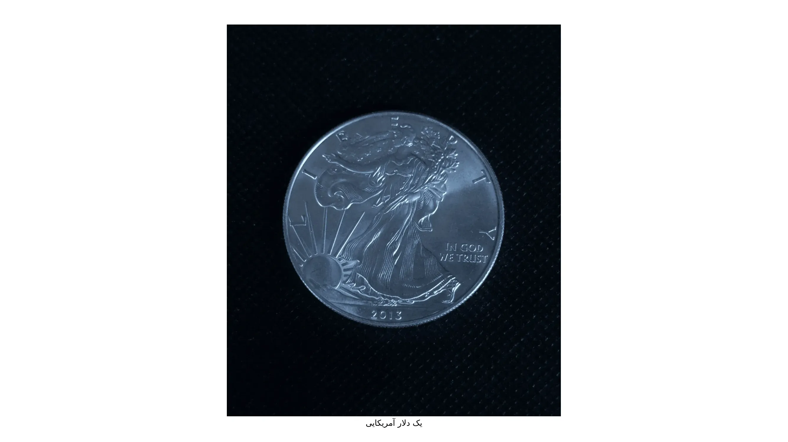

خب، بدیهی است که ارزش اسمی آن فقط یک دلار نیست؛ ارزش آن حدود ۳۰ یا ۴۰ دلار است، زیرا نمایانگر یک اونس نقره است. ارزش آن بر اساس قیمت نقره نوسان دارد و معمولاً حداقل ۳۰ یا ۴۰ دلار آمریکا است. امروزه، البته، یک دلار کاغذی فقط ارزش اسمی یک دلار را دارد، اما در آن زمان، دلار آمریکا بر اساس این ارزش نقره پایه‌گذاری شده بود.

بیایید اکنون درباره جنگ داخلی در آمریکا صحبت کنیم. کنفدراسیون‌ها در حال چاپ پول بودند که به شدت دچار تورم شد. این پدیده در فهرست رسمی هنکه-کروس گنجانده نشده است، زیرا به نرخ ابر تورم ۵۰٪ نرسید. با این حال، نرخ تورم ماهانه ۴۰٪ را تجربه کرد که نشان‌دهنده چاپ مقدار قابل توجهی ارز در طول جنگ بود.

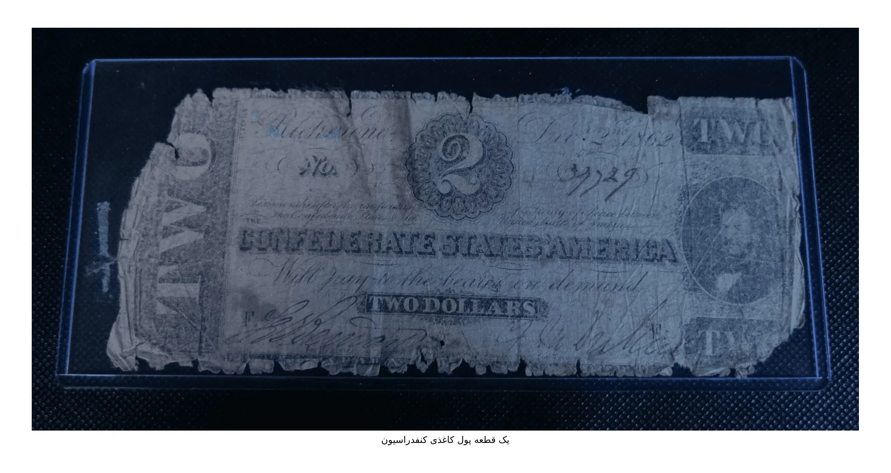

حریفان شمالی آن‌ها نیز دلار داشتند. درست در بالا، می‌توانید دلارهای کنفدراسیون را ببینید، در حالی که در پایین می‌توانید دلارهای شمالی را مشاهده کنید. به آن‌ها "گرین‌بک" می‌گفتند زیرا پشت آن‌ها سبز بود.

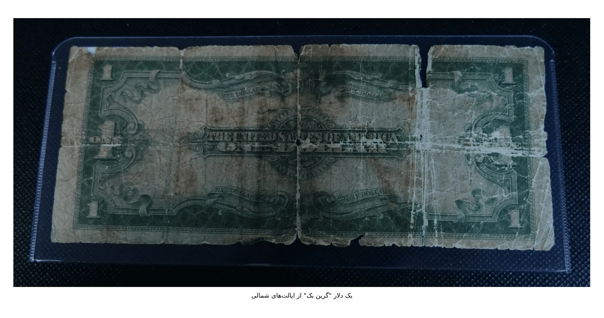

و من از شما دعوت می‌کنم تا تفاوت اندازه را با اسکناس‌های مدرن مقایسه کنید. در آن زمان، اسکناس‌ها بزرگ‌تر بودند.

همان‌طور که می‌دانیم، شمال پیروز شد، بنابراین دلار به ارز ایالت‌های متحد آمریکا تبدیل شد. سپس تأسیس فدرال رزرو در سال ۱۹۱۳ و جنگ جهانی اول رخ داد.

پس از جنگ جهانی اول، آخرین سری اسکناس‌های چاپ‌شده همیشه شامل عبارت "قابل بازخرید با طلا به‌محض درخواست" بود. بنابراین، در سال ۱۹۲۸، ۲۰ دلار تقریباً یک اونس طلا می‌خرید، زیرا قیمت طلا ۲۰.۶۷ دلار بود. اسکناس در تصویر زیر می‌توانست در سال ۱۹۲۸ یک اونس طلا بخرد.

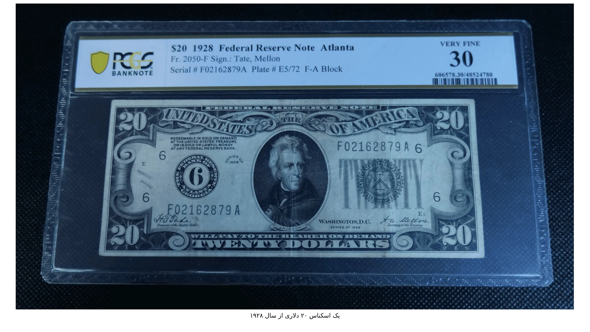

امروز، یک اونس طلا به ارزش ۳۰۰۰ دلار آمریکا است. بنابراین می‌توانید قدرت کاهش ارزش را اینجا ببینید، البته. این آخرین اسکناس حاوی کلمات "قابل بازخرید با طلا" بود. ما خواهیم دید که بلافاصله پس از فرمان اجرایی ۶۱۰۲، آنها تمام طلا را مصادره کردند. در واقع، آنها هم طلا و هم گواهی‌های طلا را مصادره کردند.

در زیر می‌توانید یک گواهی طلا از سال ۱۹۲۸ را ببینید.

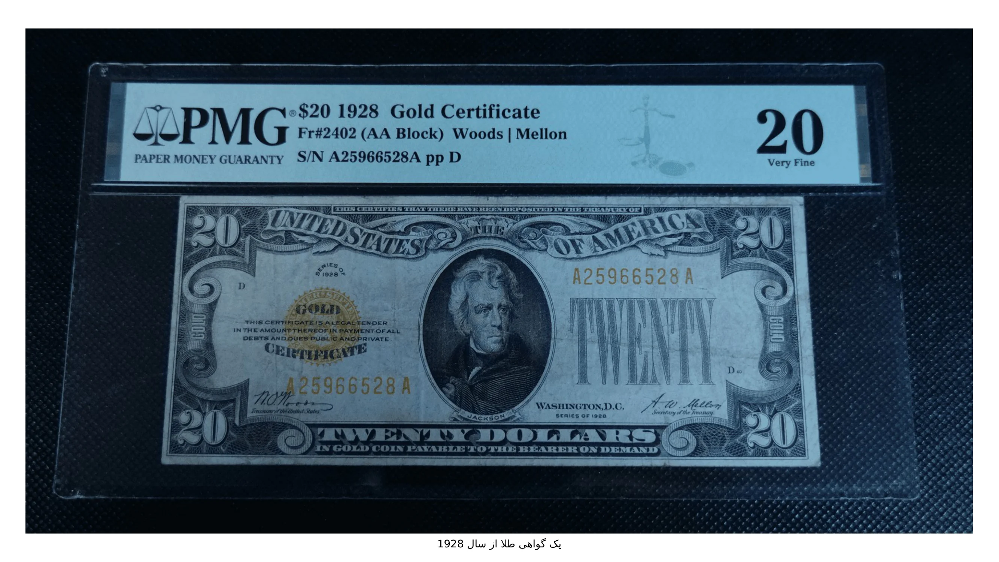

نه تنها مانند اسکناس ۱۹۲۸ "قابل بازخرید با طلا" بود، بلکه با سکه‌های طلا نیز قابل بازخرید بود: واقعاً یک "گواهی طلا" است. همه آن‌ها پس از فرمان اجرایی ۶۱۰۲ ضبط شدند. تا سال ۱۹۶۴، حتی داشتن آن‌ها غیرقانونی بود.

من خیلی خوشحالم که یکی دارم.

از سال 1964، مالکیت طلا غیرقانونی شد تا سال 1974، اگر اشتباه نکنم. در دهه 70، پس از شوک نیکسون، به مردم اجازه دادند که طلا جمع‌آوری کنند، که به زودی توضیح خواهیم داد. در سال 1933، زمانی که "دستور اجرایی 6102" صادر شد، طلا مصادره شد و مالکیت آن غیرقانونی شد. اگر در حال نگهداری طلا دستگیر می‌شدید، حکم زندان طولانی دریافت می‌کردید. در آن روزها، هر اونس طلا با اسکناسی مشابه اسکناس زیر، پس از سال 1934، مبادله می‌شد.

همان‌طور که گفتیم، در سال ۱۹۲۸، روی دلار هنوز عبارت "قابل بازخرید با طلا" نوشته شده بود.

پس از صدور فرمان اجرایی ۶۱۰۲، آن‌ها تمام طلا را مصادره کردند و به ازای هر اونس طلا ۲۰.۶۷ دلار مبادله کردند. پس از آن، کلاهبرداری آشکار شد: آن‌ها در سال ۱۹۳۴ اسکناس‌های جدیدی با متن چاپ‌شده "این اسکناس برای تمامی بدهی‌ها پول قانونی است" صادر کردند.

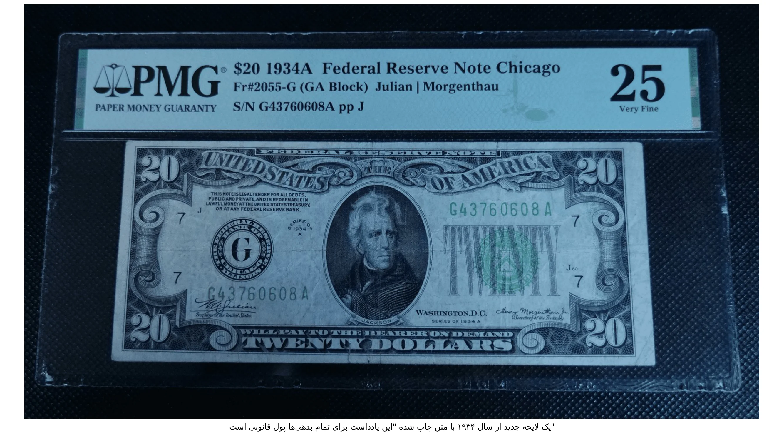

مفهوم پول قانونی در اینجا ظاهر می‌شود و جایگزین عبارت "قابل بازخرید با طلا" می‌شود. این دو اسکناس ممکن است یکسان به نظر برسند و تنها چند کلمه تغییر کند، اما کلاهبرداری در این واقعیت نهفته است که دلار در این دوره کاهش ارزش پیدا کرد؛ ارزش آن از یک اونس طلا که 20.67 دلار بود به 35 دلار در هر اونس در سال 1934 کاهش یافت. این کاهش ارزش تقریباً 40٪ را نشان می‌داد!

سپس جنگ جهانی دوم آغاز شد. پس از جنگ، توافق‌نامه برتون وودز بخش زیادی از طلای جهان را در ایالات متحده متمرکز کرد. آمریکایی‌ها در ازای آن اسکناس‌هایی صادر کردند، اگرچه این اسکناس‌ها دیگر برای عموم مردم قابل تبدیل به طلا نبودند. در عوض، آن‌ها در سطح دولتی قابل تبدیل به طلا باقی ماندند.

سرانجام، کشورهایی مانند فرانسه و آلمان شروع به ظن بردن کردند که احتمالاً اسکناس‌های دلار بیشتری در گردش است تا طلای موجود در خزانه‌های ایالات متحده.

بنابراین آنها درخواست کردند که طلای خود را بازگردانند. خوب، آنها گفتند: "باشه، ما این کار را انجام می‌دهیم، اما کمی زمان می‌برد." در سال ۱۹۷۱، دوست ما ریچارد نیکسون ارتباط بین اسکناس‌ها و طلا را برای همیشه قطع کرد و در این فرآیند، دلالان را مقصر دانست.

طلا با قیمت ۳۵ دلار در هر اونس کمتر از ارزش واقعی خود ارزیابی شده بود، قیمتی که با حجم پول چاپ شده یا ارزش واقعی بازار آن مطابقت نداشت. تنها در چند سال، قیمت از ۳۴ دلار به ۸۰۰ دلار افزایش یافت. مشابه مثال‌های تاریخی، مانند در روم، جایی که ارتباط بین دیناریوس و سولیدوس قطع شد، به طلا اجازه داده شد تا شناور شود. این واقعیت منجر به فرآیند کشف قیمت شد که در نتیجه آن طلا به مراتب بالاتر از نظر ارزش دلاری ارزیابی شد.

### سیستم مدرن ارز فیات و پیامدهای آن

این بخش خلاصه‌ای از چگونگی انتقال ما از یک سیستم پولی مبتنی بر نقره یا طلا را بیان می‌کند. کم‌کم، نهادها قدرت بیشتری بر پول به دست آوردند. در نهایت، یک تصمیم یک‌جانبه به طور کامل ارتباط بین فلزات گرانبها و پول را قطع کرد، پس از یک انتشار بیش از حد.

در نتیجه، دیگر هیچ ارتباطی بین طلا و اسکناس یا پول اعتباری وجود ندارد. و حتی سیستم ذخیره جزئی هم نیست - این یک مفهوم قدیمی است. در عوض، بانک‌های خصوصی از طریق اعتبار بانکی پول صادر و ایجاد می‌کنند. پول عمدتاً به این روش ایجاد می‌شود و با نرخ بهره کلیدی که توسط بانک مرکزی تعیین می‌شود، مرتبط است.

واقعاً هیچ محدودیتی وجود ندارد. دیگر هیچ سطح ذخیره اجباری وجود ندارد، حداقل در آمریکا و کانادا. تنها ذخیره مورد نیاز این است که بانک‌ها باید بتوانند برای پاسخ به مبادلات بین‌بانکی ترتیب دهند تا از کمبود نقدینگی جلوگیری کنند.

آن‌ها فقط باید مطمئن شوند که می‌توانند این انتقال‌ها را انجام دهند، اما هیچ ذخیره اجباری ۳٪، ۱٪، ۱۰٪ وجود ندارد. ما واقعاً از مفهوم ذخیره جزئی فاصله گرفته‌ایم. اکنون، این بانک‌های مرکزی، دولت‌ها از طریق کسری‌های مالی، بانک‌های مرکزی از طریق تسهیل کمی (QE)، و بانک‌های خصوصی از طریق ایجاد وام‌های بانکی هستند که می‌توانند عرضه کل پول را افزایش دهند و به نظر من، باعث تورم شوند.

برای درک ارتباط بین پول و تورم، من یک دوره در Plan ₿ Academy دارم که به این موضوع اختصاص داده شده است. شما تفاوت بین افزایش قیمت‌ها، که چیزی است که در زندگی مشاهده می‌کنیم، و تورم را خواهید آموخت. این‌ها یکسان نیستند. در واقع، وقتی به تورم اشاره می‌کنیم، اغلب درباره افزایش قیمت‌ها صحبت می‌کنیم، نه خود تورم. تورم یک مفهوم نسبتاً دقیق است که با افزایش عرضه پول توضیح داده می‌شود.

https://planb.academy/courses/caa75343-ac90-4249-bcca-0e2e57c3a0f1

برای نتیجه‌گیری این بخش درباره دنیای فیات، می‌خواهم به منبعی اشاره کنم که به شما کمک می‌کند پدیده‌هایی که به تازگی توضیح دادم، مانند تورم، را بهتر درک کنید.

با تشکر از توجه شما.

## تاریخچه حباب‌های پولی

<chapterId>b6451c46-917d-11f0-97de-6bc5081765fa</chapterId>

:::video id=5967d9a6-aae4-4b84-a283-71b1b735bca4:::

### اختراع پول کاغذی و اولین حباب بزرگ

با ایجاد بانک‌های مرکزی در قرن هجدهم، یک انقلاب واقعی به وجود آمد: پول جادویی به شکل اسکناس. برجسته‌ترین مثال در فرانسه، جان لاو است. این اسکاتلندی که به پاریس تبعید شده بود، به نایب‌السلطنه، دوک اورلئان، پیشنهادی برای حل ورشکستگی مالی سلطنتی ارائه داد که شامل ایجاد یک بانک دولتی و یک شرکت تجاری استعماری بود: **بانک رویال** معروف و **کمپانی می‌سی‌سی‌پی**.

با این سیستم، لاو پول کاغذی را به سهام شرکت خود مرتبط کرد. هرچه اسکناس‌های بیشتری در گردش بود، ارزش سهام بالاتر می‌رفت و بانک به نظر محکم‌تر می‌رسید... تا زمانی که سفته‌بازی از واقعیت پیشی گرفت. حباب ناگهان در سال ۱۷۲۰ ترکید و اشراف، بورژوازی و بخش زیادی از اروپا که برای سفته‌بازی به خیابان کوینکامپوآ آمده بودند را نابود کرد. نتیجه: بی‌اعتمادی ماندگار به پول کاغذی در فرانسه و اولین درس اروپا در مورد حباب‌های سفته‌بازی.

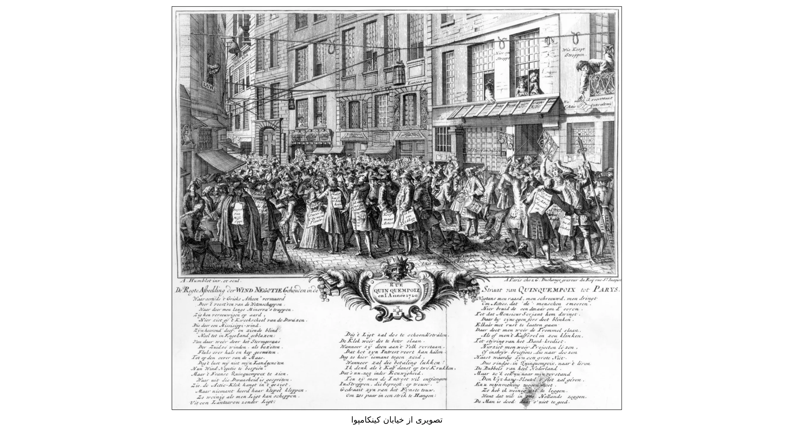

### وقتی زمین "وثیقه" می‌شود

یک قرن بعد، انقلاب فرانسه با **assignats**، ارزی که با اموال مصادره شده کلیسا پشتیبانی می‌شد، راه جدیدی را آغاز کرد. ایده‌ای جذاب روی کاغذ - تبدیل زمین به وثیقه پولی - اما ناکارآمد: زمین نه نقدشونده است و نه قابل تقسیم. نتیجه: ابر تورم، ممنوعیت‌های متعدد در استفاده از زمین، تورم غیرقابل کنترل و کمبودها.

ناپلئون که به شدت تحت تأثیر این آشفتگی قرار گرفته بود، در سال ۱۸۰۰ با تأسیس بانک فرانسه، طلا و نقره را به عنوان پایه پولی مجدداً برقرار کرد و بدین ترتیب پرداخت منظم ارتش‌های خود را تضمین نمود. یک راه عمل‌گرایانه برای بازگرداندن اعتماد: پرداخت با ارز سخت.

### دههٔ بیست پرشور و رکود بزرگ ۱۹۲۹

بیایید دو قرن را نادیده بگیریم. پس از جنگ جهانی اول، دولت‌ها تلاش را از طریق تورم و تعلیق طلا تأمین مالی کردند. در دهه ۱۹۲۰، فدرال رزرو آمریکا سیاست پولی بیش از حد تسهیل‌کننده‌ای را برای حمایت از پوند بریتانیا دنبال کرد. نتیجه: اعتبار آسان، سفته‌بازی بی‌حد و حصر در وال استریت، خرید سهام با اعتبار، و ظهور حباب املاک و مستغلات و بانکداری.

وقتی ماشین از کنترل خارج شد، سقوط سال 1929 اجتناب‌ناپذیر بود: شکست‌های عظیم بانکی، رکورد بیکاری و صف‌های طولانی در آشپزخانه‌های خیریه. این امر منجر به این تصور غلط مداوم شد که **همه کاهش قیمت‌ها بد است**، در حالی که ما باید بین کاهش قیمت از طریق رشد (سالم) و کاهش قیمت از طریق بدهی (ویرانگر) تمایز قائل شویم.

### آسیا در دهه ۹۰ و اثر دومینو

در دهه ۱۹۹۰، "معجزه آسیایی" جهان را به رؤیا فرو برده بود. نرخ‌های Exchange به دلار متصل شده بودند، رشد اقتصادی بین ۸ تا ۱۰ درصد بود و سرمایه غربی به سوی این منطقه سرازیر می‌شد. همه چیز خوب بود... تا زمانی که جزر و مد فروکش کرد. ورشکستگی‌ها به صورت زنجیره‌ای اتفاق افتادند، ارزها تا ۸۰ درصد کاهش ارزش پیدا کردند و سرمایه‌گذاران نابود شدند. صندوق بین‌المللی پول مجبور به مداخله شد و اصلاحات دردناکی را تحمیل کرد. همان سناریوی همیشگی: سرمایه فراوان، حباب‌های تغذیه‌شده از اعتبار، سپس فروپاشی.

### ۲۰۰۸ و عصر حباب دائمی

حباب اینترنت (2000) با حباب املاک و مستغلات ساب‌پرایم دنبال شد. تبدیل وام‌های بانکی به محصولات مالی "تریپل-A" از طریق اوراق بهادارسازی، در سراسر جهان گسترش یافت. وعده: حذف ریسک با رقیق کردن آن. واقعیت: همه ریسک‌ها در واقع همبسته بودند. وقتی املاک و مستغلات فروپاشید، کل سیستم بانکی جهانی نیز فروپاشید.

نتیجه: کمک‌های مالی عظیم عمومی، تسهیل کمی و نرخ‌های بهره صفر. و همراه با آن، یک هجوم بی‌پایان: هر بحران دیگر افراط‌ها را پاک نخواهد کرد، بلکه با بدهی و چاپ پول بیشتر پوشش داده خواهد شد. این همان چیزی است که به وضعیت کنونی منجر شد: **"حباب همه چیز"**، جایی که همه چیز - سهام، املاک و مستغلات، هنر، ارزهای دیجیتال، حتی کارت‌های پوکمون - به طور مصنوعی متورم می‌شود.

### بازگشت ابدی پول جادویی

از یک قرن به قرن دیگر، یک امر ثابت پدیدار می‌شود: به محض اینکه یک جامعه باور کند که می‌تواند با پول به جای تولید کالاهای واقعی ثروت ایجاد کند، حباب‌ها ظاهر می‌شوند. از جان لاو تا ۲۰۰۸، از خیابان کنکامپوآ تا وال استریت، این فرآیند تکرار می‌شود: سرخوشی، اعتبار، رونق و رکود.

و در نهایت، به طور غیرقابل اجتناب، وقتی دیگر هیچ‌کس به کاغذ اعتماد ندارد، مردم به دنبال چیز دیگری می‌گردند - طلا، زمین، پناهگاه‌های امن... یا ارزهای جدید. دیروز ناپلئون فلز را تحمیل کرد، امروز برخی Bitcoin را به عنوان جانشین می‌بینند.

تاریخچه مالی یک چرخه بی‌پایان است: چاپ، سفته‌بازی، فروپاشی. تا حباب بعدی.

## پول و خشونت

<chapterId>9486fe64-854f-5e17-86b3-8873baca39a8</chapterId>

:::video id=bd6d0807-2d8f-4637-a0f5-1e990e5c0d0f:::

این بخش کوتاه بسیاری از رویدادهایی را که در طول دوره دیده‌ایم، مرور خواهد کرد و چند حکایت که به نظر من جالب هستند را خلاصه می‌کند.

### فناوری و خشونت

در اینجا چند حکایت وجود دارد که احتمالاً قبلاً در دوره به آن‌ها پرداخته‌ایم. آن‌ها به عنوان مقدمه‌ای برای یک بحث بسیار جذاب که با تئو درباره‌ی سخنرانی‌ای که در بی-آندی ارائه داد، عمل می‌کنند. من این سخنرانی را از نظر چگونگی تأثیر پیشرفت‌های تکنولوژیکی بر رابطه‌ی خشونت بین جمعیت و دولت بسیار جالب یافتم.

### پول و اجبار دولتی

برای معرفی این بخش، قصد دارم فهرستی مختصر و غیر جامع ارائه دهم، فقط برای یادآوری رویدادهایی که احتمالاً قبلاً در دوره پوشش داده‌ایم.

یک ارتباطی که می‌توانم بین پول و خشونت برقرار کنم این است که وقتی صحبت از پول کاغذی بی‌ارزش می‌شود که می‌تواند به طور بی‌نهایت چاپ شود، اغلب با انواع قوانین و انواع تهدیدها همراه است. ما می‌توانیم در مورد اساینات‌ها صحبت کنیم، جایی که به‌طور واقعی روی اسکناس‌ها نوشته شده بود که جاعلان با مرگ تهدید می‌شدند. در متون قانونی آن زمان به راحتی می‌توان تهدیدات مرگ برای کسانی که این پول کاغذی معروف را قبول نمی‌کردند، پیدا کرد.

برای ماندن در فرانسه، در یکی از متون قانونی که توانستم از دوران انقلاب به دست آورم، دیدم که "پردیوم" برای حمل و نقل و کارکرد گیوتین در بخش‌های مربوط به ارز توصیف شده بود. این را به نوعی عجیب یافتم.

ما همچنین درباره سکه‌زنی در چین صحبت کرده‌ایم، با نظارت دولت بر ضرب سکه‌ها. در بخشی در ابتدای دوره دیدیم که وقتی سکه‌ها، که برخی از آن‌ها کمتر زیبا بودند، کنار گذاشته می‌شدند، پیامدهای قانونی وجود داشت.

همچنین حکایتی درباره پادشاهی در انگلستان وجود دارد که دست کسانی را که پول ضرب می‌کردند، اگر مطابق انتظار او رفتار نمی‌کردند، قطع می‌کرد.

همچنین، در چین، درباره توقیف مس از صومعه‌های بودایی خوانده‌ام. در زمانی که ارزش مس در حال افزایش بود و اقتصاد آن‌ها - که بر پایه نوعی پول فیات بود که ارتباط کمی با ارزش فلز داشت - را بی‌ثبات می‌کرد، آن‌ها به جستجوی مکانی که ثروت وجود داشت پرداختند و مس را از صومعه‌ها توقیف کردند.

همین امر در مورد صومعه‌ها در انگلستان در طول اصلاحات انگلیسی صدق می‌کرد. زمانی که پادشاه معروف بر سر طلاق خود با پاپ مشاجره کرد، دلیل دیگری پشت آن همه بود: او از لغو صومعه‌ها برای تصاحب ثروت موجود در این سازمان‌های کلیسایی بهره‌برداری کرد.

در طول انقلاب فرانسه، آن‌ها تمام دارایی‌های کلیسا را مصادره کردند. آن‌ها سکه‌های زیبایی را دیدند که از ذوب کردن ناقوس‌های کلیسا ساخته شده بودند.

اگر حتی به گذشته‌های دورتر برگردیم، یکی از واضح‌ترین مفاهیم خشونت اقتصادی و آزادی، قوانین آزادی‌کُش، **دیوکلسین با نظام طبقاتی موروثی‌اش بود که مستقیماً به این واقعیت مرتبط بود که دهقانان دیگر نمی‌خواستند ارز بی‌ارزش شده را بپذیرند**. آنها می‌خواستند کار خود به عنوان دهقان را ترک کنند و دیوکلسین به سادگی با گفتن "شما نمی‌توانید زمین خود را ترک کنید و فرزندانتان هم نمی‌توانند" واکنش نشان داد. همین امر در مورد سربازان نیز صدق می‌کرد.

فکر می‌کنم این یک شکل کاملاً آشکار از خشونت است. می‌توانم با صحبت درباره شوالیه‌های معبد یا یک پادشاه فرانسوی نتیجه‌گیری کنم. وقتی شوالیه‌های معبد در فرانسه مستقر شدند، تصور می‌کنم او ثروت معبد را دید و با مشکلات مالی دولتی مواجه شد. او از دستور معبد شکایت کرد و برخی از آنها توانستند با بخشی از گنجینه فرار کنند، که این موضوع باعث ایجاد یک نمایش بسیار جالب در ایالات متحده یا کانادا شده است. نمی‌دانم چه کسی آن را تولید کرده، اما نام آن *راز جزیره اوک* است. این درباره افرادی است که فکر می‌کنند یک گنجینه معبد در جزیره‌ای در کانادا، در مناطق دریایی، دفن شده و آنها سال‌ها - شاید حتی بیش از یک دهه - در حال حفاری برای ساخت نوعی چاه بوده‌اند. آنها چاهی با گالری‌های زیاد پیدا کرده‌اند و به دنبال گنجینه‌ای هستند که توسط شوالیه‌های معبد در این جزیره دفن شده، که موضوع این برنامه تلویزیونی است. به پدرم سلام می‌کنم که طرفدار بزرگ این نمایش است.

بنابراین، اینجا دارید: فهرستی بسیار سریع از حقایقی که در طول این دوره دیده‌ایم و به نظر من، ارتباط با خشونت را مطرح می‌کنند. شما را با بخش بعدی از تئو تنها می‌گذارم، که قرار است داستانی بسیار جالب درباره تغییرات تکنولوژیکی و توازن قدرت بین عوام و مقامات را برایمان بگوید.

متشکرم!

## پیامدهای اقتصادی خشونت سازمان‌یافته

<chapterId>66bd4674-2159-5489-ad4b-ec5e3fb691af</chapterId>

:::video id=c8b063c6-aeb4-4a94-9027-b11d369e71a4:::

### خشونت سازمان‌یافته و تکامل دولت

فردریک سی. لین، تاریخ‌نگار، یک نظریه انقلابی پیشنهاد می‌کند: آناتومی دولت در طول تاریخ توسط فناوری‌هایی که برای اعمال خشونت استفاده می‌شوند، شکل می‌گیرد. با شروع از اصل وبر که دولت انحصار خشونت مشروع را در اختیار دارد، لین مشاهده می‌کند که این انحصار - که به‌طور متناقضی کارآمدتر از رقابت در این زمینه است - بر اساس رابطه بین هزینه حمله و هزینه دفاع تکامل می‌یابد.

این تحلیل، که توسط نویسندگان "فرد حاکم" (1997) مطرح شده است، تغییرات تاریخی در سازماندهی سیاسی را توضیح می‌دهد: از سیستم فئودالی قرون وسطی به دولت‌شهرهای رنسانس، سپس به دولت-ملت‌های صنعتی و در نهایت به دولت‌های رفاه مدرن. هر گذار با یک پیشرفت تکنولوژیکی عمده در اعمال خشونت مطابقت دارد که تقریباً هر 400-500 سال رخ می‌دهد.

### تعادل قرون وسطایی

در قرون وسطی، اقتصاد کشاورزی بیش از ۹۰٪ غالب بود. دهقان، که به معنای واقعی کلمه به زمین خود وابسته بود، نمی‌توانست از ارباب و شوالیه‌هایش فرار کند. فناوری نظامی - زره‌های دست‌ساز، سال‌ها آموزش شمشیرزنی - بسیار گران‌قیمت بود. این عدم تقارن به شدت حمله را بر دفاع ترجیح می‌داد.

تولیدکننده کشاورزی غیرمتحرک به اسیر انحصارگر محلی خشونت تبدیل می‌شود. ظرفیت او برای استخراج مالیات به اوج‌های جدیدی می‌رسد - اگرچه به‌طور متناقضی، مالیات‌های قرون وسطی در مقایسه با ۷۸٪ از مالیات‌های اجباری در زمان‌های مدرن همچنان متواضع باقی می‌مانند. ارباب می‌تواند به دلخواه مالیات بگیرد، زیرا دهقان نمی‌تواند مقاومت کند یا ترک کند.

### رنسانس بازرگان

ظهور تجارت هانزایی در شمال و تجارت مدیترانه‌ای در جنوب وضعیت را دگرگون کرد. بازرگانان، که اصلی‌ترین خالقان ارزش افزوده بودند، سرمایه متحرک خود - کشتی‌هایشان - را در اختیار داشتند. آن‌ها تنها به نیروهای دریایی سبک نیاز داشتند، زیرا کنترل دریاها دشوار بود. مهم‌تر از همه، آن‌ها می‌توانستند به راحتی به یک بندر همسایه مهاجرت کنند اگر مالیات‌ها بیش از حد شود.

این تحرک رقابت مالیاتی بین شهر-دولت‌ها ایجاد کرد. ونیز، جنوا و بروژ مجبور بودند آزادترین چارچوب ممکن را ارائه دهند: قراردادهای قابل اعتماد، ارز با کیفیت، بیمه، مالیات حداقلی. شاهزادگان مجبور بودند بیشتر جذب کنند تا اجبار. تقارن معکوس می‌شود: دفاع (از طریق فرار) آسان‌تر از حمله می‌شود.

### عصر صنعتی

انقلاب صنعتی با خود پیکربندی‌ای شبیه به فئودالیسم به همراه آورد. کارخانه‌ها، راه‌آهن‌ها و خطوط مونتاژ نمایانگر سرمایه‌گذاری‌های عظیم و غیرقابل جابجایی هستند. هنری فورد قادر به جابجایی کارخانه‌های خود در مواجهه با مالیات نبود. کارگران، متمرکز در شهرهای صنعتی، به جای مهاجرت فردی، اتحادیه تشکیل دادند تا به صورت جمعی مذاکره کنند.

"دولت رفاه" پدیدار شد: برنامه‌ریزی صنعتی (ژاپن، کره)، حفاظت نظامی از زیرساخت‌ها، حداقل مزایای اجتماعی برای نیروی کار. جنگ جهانی دوم این آسیب‌پذیری را نشان داد: بمباران کارخانه‌های دشمن به استراتژی غالب تبدیل شد. تمرکز سرمایه فیزیکی امکان استخراج مالیات گسترده برای تأمین مالی دولت رفاه را فراهم کرد.

### انقلاب ریزپردازنده

سه نوآوری تکنولوژیکی اکنون این تعادل‌های دیرینه را برهم می‌زنند. ریزپردازنده در حال تحول جنگ است: یک اپراتور در نوادا با دقت جراحی یک پهپاد را در افغانستان هدایت می‌کند. جنگ خلیج فارس (۱۹۹۱) این پیشرفت را نشان داد: چهارمین ارتش بزرگ جهان (عراق) در ۴۵ روز نابود شد، با کمتر از ۲۰۰ کشته در طرف ائتلاف. برتری تکنولوژیکی حمله مستقیم را غیرممکن کرد.

اینترنت و رمزنگاری نامتقارن در حال انقلاب در ایجاد ارزش هستند. یک توسعه‌دهنده می‌تواند از هر جایی با یک مک‌بوک و استارلینک کار کند و تولید خود را به‌صورت فوری و رایگان صادر کند. کوچ‌نشینان دیجیتال از اسارت جغرافیایی فرار می‌کنند و دولت‌ها را به شکلی که از زمان رنسانس دیده نشده بود، در برابر یکدیگر قرار می‌دهند.

Bitcoin نشان‌دهنده اوج این منطق است: ارزی که از دولت آزاد شده و توسط یک سپر رمزنگاری غیرقابل نفوذ محافظت می‌شود. ثروت در برابر هر نیروی فیزیکی قابل دفاع می‌شود. فرد توانایی دفاع از خود در برابر انحصار دولتی را بازمی‌یابد.

### سقوط مدل وستفالیایی

دولت‌های رفاه غربی، که برای عصر صنعتی طراحی شده‌اند، در حال منسوخ شدن هستند. خالقان ارزش - توسعه‌دهندگان، هنرمندان، مالی‌چی‌ها - به سنگاپور، دبی یا السالوادور مهاجرت می‌کنند و خدمات عمومی کمتر را در ازای مالیات حداقلی ترجیح می‌دهند. غول‌های مدرن مانند اپل و تتر نیازی به دفاتر یا زیرساخت‌های فیزیکی ندارند.

این فرار مغزها یک مارپیچ ایجاد می‌کند: کاهش تعداد مشارکت‌کنندگان خالص، خدمات عمومی ضعیف‌تر، افزایش مالیات بر کسانی که می‌مانند و تسریع در خروج‌ها. ایالت‌ها باید به طور رادیکال کوچک شوند یا ورشکسته شوند. تجزیه به حوزه‌های کوچک و رقابتی - یک مدل جدید از دولت‌شهرهای دیجیتال - به نظر اجتناب‌ناپذیر می‌رسد.

تاریخ به ما می‌آموزد که این انتقال‌ها نسل‌ها به طول می‌انجامد. اما جدایی ارز و دولت توسط Bitcoin می‌تواند این فرآیند را تسریع کند. افراد اکنون با پای خود و کیف‌پول‌های رمزنگاری‌شده‌شان رأی می‌دهند و نقشه قدرت جهانی را بر اساس خطوطی که تازه شروع به درک آن‌ها کرده‌ایم، بازترسیم می‌کنند.

## تاریخچه‌ای بسیار کوتاه از امور مالی

<chapterId>1d37fff1-a091-5034-8e71-4af590b8ffce</chapterId>

:::video id=fdfabbc6-e4d8-463a-8522-19176f8fb460:::

پس از این شرح تاریخچه پول، که ما را به سیستم فیات می‌رساند، می‌خواهم به سرعت و به‌طور مختصر تکامل مالی را توضیح دهم که در نهایت به دولت رفاه منجر شد. در ابتدا، در زمان روم، ما سکه داشتیم.

سکه‌ها یک فناوری مالی بودند که به امپراتوری اجازه می‌داد به سربازان پرداخت کند، گسترش یابد و تجارت کند. این سیستم بسیار خوب عمل می‌کرد، به جز اینکه در نهایت کاهش ارزش‌های زیادی رخ داد. در مقطعی که آن‌ها از گسترش باز ایستادند و دیگر غنایمی از جنگ‌ها و گسترش قلمرو به دست نمی‌آوردند، سیستم آن‌ها فروپاشید.

### تکامل فناوری‌های مالی

سپس دوران قرون وسطی فرا رسید، زمانی که تا ظهور فلورین، که ارز پایداری را به ارمغان آورد، و توسعه‌های بانکی در ایتالیا و آنتورپ، که مفهوم "ارزش زمانی پول" در آنجا توسعه یافت - به عبارت دیگر، تنزیل - تحول چندانی رخ نداد. آنها تنزیل را برای ایجاد نوعی پول کاغذی توسعه دادند که در آن یک "سفته" صادر می‌شد، یعنی وعده‌ای که در تاریخ بعدی بتوان ۱۰۰ دلار به علاوه نرخ بهره را بازیابی کرد.

این سیستم یک فناوری مالی ایجاد کرده است که به دارنده اجازه می‌دهد تا قبل از پایان دوره، سند را بفروشد، بنابراین اگر آن را پس از ۴ ماه از یک دوره ۶ ماهه بفروشید، شخص در واقع یک حق بیمه پرداخت می‌کند تا جبران کاهش بازده برای ۲ ماه باقی‌مانده شود.

این یک فناوری مالی بود که در آن زمان در آنتورپ و آمستردام توسعه یافت. بعدها، ما شاهد تکامل بانک‌های مرکزی و مفهوم وام‌دهنده نهایی بودیم. می‌توان استدلال کرد که در دوران بانک آمستردام، استفاده از سکه‌ها در تجارت بین‌المللی به نفع پول اسکریپتوری کنار گذاشته شد.

بعداً، در قرن هجدهم، از نظر فناوری مالی، می‌توانیم درباره بیمه صحبت کنیم. بنابراین، یک حکایت بسیار خوب در کتاب نیل فرگوسن "صعود پول" نقل شده است. اولین شرکت بیمه‌ای که تأسیس شد، **اسکاتیش ویدوز** نام داشت و اساساً، این روحانیون بودند که می‌خواستند بیمه‌ای برای کشیشانی که گاهی زودتر و ناگهانی می‌مردند، توسعه دهند. در آن زمان، روحانیون به مدت یک سال از همسران و فرزندان خود در اسکاتلند مراقبت می‌کردند. و بنابراین، روحانیون این دوره یک‌ساله را شاید کمی کوتاه می‌دانستند. در نتیجه، **آن‌ها محاسبات اکچوئری را اختراع کردند** تا به‌طور دقیق تعداد مشارکت‌کنندگان لازم برای پوشش هزینه‌های سیستم را بسته به تعداد کشیشانی که زودتر از موعد می‌مردند، محاسبه کنند.

آن‌ها محاسبات بیمه‌ای را توسعه دادند تا بگویند "خب، هر کشیش این مقدار به ما می‌دهد. سپس، اگر کشیش بمیرد، خب، بیمه هزینه‌ها را پوشش می‌دهد تا بقای همسر و فرزندان او تا زمانی که خودکفا شوند، تضمین شود." بنابراین اولین شرکت بیمه به نام "Scottish Widows" بود که این سیستم را محبوب کرد و جایی که آن را به کار گرفت.

### از بیمه خصوصی تا دولت رفاه

بنابراین بیمه بخشی از تاریخ فناوری مالی است. و این مرا به مفهوم دولت رفاه می‌رساند، که در آن بیمه خصوصی در نهایت با مشکلی مواجه شد، یک مفهوم بهینه‌سازی، جایی که به خود می‌گوییم، اگر بیمه سلامت را به افرادی که سالم هستند ارائه دهیم، ممکن است علاقه کمتری به پرداخت حق بیمه داشته باشند زیرا به خود می‌گویند، "من سالم هستم، بیمار نخواهم شد". از سوی دیگر، افرادی که می‌دانند بیمار هستند قطعاً می‌خواهند مشترک شوند.

این سیستم باعث ایجاد عدم تعادل بین تعداد افراد بیمار که بیمه سلامت می‌گیرند و افراد سالم که ممکن است کمتر بیمه بگیرند، می‌شود. بنابراین نوعی عدم تعادل وجود دارد: اگر ارقام را محاسبه کنید، احتمالاً نمی‌توانید به اندازه کافی افراد سالم را بیمه کنید تا هزینه‌ها را جبران کنید. در اقتصاد، این مفهوم به عنوان **خطر اخلاقی** شناخته می‌شود.

یکی از ایده‌هایی که مطرح شده این است که بیمه اجباری شود. اگر همه موظف به مشارکت باشند، این امر کل موضوع را متعادل می‌کند و هم افراد سالم و هم افراد ناسالم مشارکت خواهند کرد و ریسک‌ها را در بزرگترین جمعیت توزیع می‌کند.

و بنابراین، در بسیاری از نقاط جهان، دولت گفته است: "خب، ما از آن مراقبت خواهیم کرد". در حالی که من در این زمینه متخصص نیستم، می‌توانم ببینم که همین استدلال احتمالاً به انواع دیگر بیمه‌ها، مانند بیمه بیکاری، اعمال می‌شود. تمایلی برای ساده‌سازی و بهینه‌سازی وجود دارد، بر اساس این ایده که اگر فقط یک سازمان برای مراقبت از آن وجود داشته باشد، ساده‌تر خواهد بود.

به نظر من، این امر منجر به تمرکز تمامی این مفاهیم بیمه‌ای شد و در نهایت به تولد دولت رفاه انجامید، جایی که تمامی این مفاهیم مالی که در اصل بنگاه‌های خصوصی و ابتکارات خصوصی برای پاسخگویی به نیاز بازار بیمه برای توزیع ریسک در میان جمعیت بودند، توسط دولت به دلایلی که احتمالاً در رابطه با خطر اخلاقی و تمایل به بهینه‌سازی کاملاً منطقی هستند، تصاحب شدند.

### مدل‌های جایگزین و تأملاتی بر انحصارهای دولتی

در نهایت، در برخی کشورها مانند کانادا، ما با چندین نوع بیمه - بیمه سلامت، بیمه بیکاری - که انحصار دولتی هستند، مواجه می‌شویم.

می‌توانم مثالی که می‌دانم را به شما بدهم. در سوئیس، سیستم کمی متفاوت است. شرکت‌های بیمه متقابل خصوصی و بیمارستان‌های خصوصی وجود دارند، بنابراین شما می‌توانید شرکت بیمه متقابل خود را انتخاب کنید، می‌توانید بسته خود را درون شرکت بیمه متقابل خود انتخاب کنید. شما همچنان خدمات نسبتاً جهانی دریافت می‌کنید، حتی اگر بخش بزرگی از این سیستم خصوصی باقی بماند.

بنابراین فکر می‌کنم ممکن است که به صورت خصوصی نیز اداره شود. اما هر آنچه که می‌خواستم برای شما توصیف کنم، در واقع، بیانی برای بیان اینکه آیا یک سیستم بهتر از دیگری است یا نه، نبود، بلکه بیشتر برای توضیح این بود که در خواندن تاریخچه مالی، متوجه شدم چرا در غرب، به‌ویژه در فرانسه، به‌ویژه در کانادا، دولت می‌خواست کنترل این اصول مالی را به دست بگیرد.

نکته‌ای که می‌خواستم مطرح کنم این است که مفهوم بیمه در درجه اول یک تکامل در حوزه مالی است و همان‌طور که دولت‌ها گاهی در انجام این کارها بسیار خوب عمل می‌کنند، سعی خواهند کرد کنترل آن را به دست بگیرند، درست همان‌طور که تلاش کرده‌اند کنترل پول را به دست بگیرند، به دلایل مختلف. یکی از این دلایل، به‌طور اتفاقی، مفهوم وام‌دهنده نهایی است.

ایده این است که اگر یک نهاد بزرگ پشت آن باشد که ریسک را به طور گسترده‌تری توزیع کند، بسیار بهتر است. این ابتکار اولیه پشت مفهوم وام‌دهنده آخرین راه‌حل بود، جایی که این نهاد می‌توانست در واقع نهادهایی را انتخاب کند که به اندازه کافی قوی بودند تا زنده بمانند و با وام دادن به آنها از فروپاشی جلوگیری کند.

در آن زمان، یک تحلیل واقعی وجود داشت وقتی که این مفهوم برای اولین بار ظاهر شد، اما آنچه در نهایت اتفاق افتاد این است که ما همه را نجات دادیم، "بیش از حد بزرگ برای شکست"، این به تقریباً همه بانک‌ها اعمال می‌شود زیرا تمرکز وجود دارد، و همچنین به همه شرکت‌های بزرگ. در نهایت، می‌بینیم که این هنوز یک مفهومی است که "به طور گسترده" توسط دولت اعمال می‌شود، مشابه با مفهوم بیمه که به تازگی برای شما توضیح دادم.

در نهایت، دولت تصمیم می‌گیرد که از همه چیز مراقبت کند و یک فناوری مالی که در اسکاتلند برای حل یک مشکل خاص ایجاد شده بود را به دولت رفاه گسترده‌ای که امروز می‌شناسیم تبدیل می‌کند. این دولت از اصول مالی بیم‌سنجی برای ارائه خدمات به جمعیت نیازمند خود استفاده می‌کند. با این حال، می‌توانیم توافق کنیم که انحصارهایی که از این سیستم ناشی می‌شوند، انواع مشکلات را ایجاد می‌کنند که در حال حاضر در کشورهایی مانند کانادا و فرانسه تجربه می‌کنیم. خوشبختانه، مدل‌های متفاوتی وجود دارند، مانند مدل سوئیس.

ما به سادگی باید درک کنیم که این مفهوم دولت رفاه از امور مالی نشأت می‌گیرد. این درک نشان می‌دهد که می‌توانیم به دنبال راه‌هایی غیر از انحصارات معروف دولتی باشیم، و حتی این استدلال را به مفهوم بانک‌های مرکزی به عنوان وام‌دهندگان نهایی اعمال می‌کنم - اما این موضوعی برای زمان دیگری است.

# بخش نهایی

<partId>9bada469-7ef0-511a-9eaa-f8eb66d5906f</partId>

## این دوره را ارزیابی کنید

<chapterId>a9494e2b-8a4d-5811-8a7b-b4a91fb22778</chapterId>

<isCourseReview>true</isCourseReview>

## نتیجه‌گیری

<chapterId>1094e793-b4c6-5782-aa4a-71cde00ce7c0</chapterId>

<isCourseConclusion>true</isCourseConclusion>