# Matka kolikoiden historiaan

Tämä kiehtova kurssi vie sinut tutkimaan rahan kiehtovaa kehitystä varhaisimmista sivilisaatioista nykyiseen rahajärjestelmäämme. Käymme läpi aikakausia neoliittisesta ajasta nykyaikaan ja selvitämme, miten raha on muokannut ja miten suuret ihmiskunnan sivilisaatiot ovat muokanneet sitä. Mesopotamian protorahasta kryptovaluuttoihin, lydialaisiin kolikoihin, renessanssin floriniin ja keskuspankkitoiminnan syntyyn - tämä kurssi tarjoaa kattavan näkökulman yhteen yhteiskuntiemme peruspilareista.

+++
# Johdanto

<partId>59878a67-8a1d-5d6b-af41-5b847c14363c</partId>

## Johdatus rahan historiaan

<chapterId>ca53597e-be9a-5261-a55f-11fac8504a68</chapterId>

:::video id=08ff35ca-8a40-4286-abaf-71283faf6e78:::

Tervetuloa tälle rahan historiaa käsittelevälle kurssille. Kuten otsikosta voi päätellä, tutkimme yhdessä kolikoiden historiallista kehitystä. Neoliittiselta kaudelta nykypäivään tarkastelemme menneisyyden suurimpia imperiumeja ja sivilisaatioita.

Tämä kurssi ei kuitenkaan rajoitu pelkkään päivämäärien tai historiallisten tapahtumien kronologiaan. Todellisena tavoitteena on pikemminkin antaa syvällinen käsitys rahan tai pikemminkin valuuttojen syntyyn liittyvistä peruskäsitteistä.

### Tutkittavat peruskäsitteet

Puhumme siis syntymisestä: itse valuuttojen, rahajärjestelmien, pankkien, paperirahan ja keskuspankkien syntymisestä ja lopulta nykyisen "fiat"-rahajärjestelmän syntymisestä.

Aloitamme matkamme protovaluuttoihin velkarahojen ja tiliyksiköiden synnystä Mesopotamiassa sekä muista järjestelmistä, kuten myötäjäisistä ja verirahasta alkukantaisissa yhteiskunnissa. Näemme myös, miten todellisia rahajärjestelmiä oli olemassa jo muinaisessa Egyptissä, jo kauan ennen Keskistä valtakuntaa.

Siirrymme sitten ensimmäisten kolikoiden ilmestymiseen Lydiassa, jota pidetään usein taloustieteen oppikirjoissa rahan todelliseksi alkuhetkeksi. Tarkastelemme, miten nämä kolikot pystyivät leviämään persialaisten, Aleksanteri Suuren ja sitten Rooman ansiosta, ennen kuin ne lopulta pääsivät valloilleen, hallitsivat ja romahtivat.

Siitä eteenpäin, kaiken oppimamme kanssa varustautuneina, otamme aikaa pohtia yhdessä rahan määritelmää ja pääsemme ennakkoluulojen, kuten "raha on aina velkaa" tai "raha on aina hyödyke", yläpuolelle. Todellisuudessa raha on sekä tavara että sosiaalinen konventio. Keskustelemme erityisesti rahapalkkion käsitteestä ja pyrimme yhdistämään rahan syntyä selittäviä teorioita.

### Keskeiset ajanjaksot ja rahapoliittiset innovaatiot

Sitten siirrytään levottomaan ajanjaksoon, jolle oli ominaista rahapoliittinen epävakaus, mutta jonka aikana syntyivät kuitenkin niinkin silmiinpistävät innovaatiot kuin Englannin penni, jota käytettiin tanskalaisten valloittajien lahjomiseen, ja Kaarle Suuren punta, jonka muisto on edelleen nähtävissä eräissä nykyaikaisissa seteleissä.

Tarkastelemme myös sitä, miten ristiretkien aikana syntyivät ensimmäiset rahansiirtojärjestelmät. Sitten on aika tarkastella renessanssin aikaisen valuutan, floriinin, vaikutusta ja jalometallien saapumista Amerikasta, mikä vaikutti merkittävästi Euroopan hintoihin.

Tarkastelemme yksityiskohtaisesti paperirahan ja keskuspankkitoiminnan syntyä ja vedämme yhtäläisyyksiä rahoituskriisien historiaan ja niiden usein väkivaltaisiin seurauksiin.

Lopuksi rinnastamme tämänhetkiseen rahajärjestelmäämme, tutkimme sen seurauksia ja jäljitämme rahoituksen historiaa, jotta ymmärtäisimme paremmin, miten olemme päätyneet nykyiseen hyvinvointivaltioon.

Bonuksena tarkastelemme myös monia kiehtovia etymologisia yhteyksiä, jotka liittyvät rahaan ja jotka vaikuttavat edelleen jokapäiväiseen elämäämme eri kielissä.

### Kurssin rakenne

Kurssi on jaettu kolmeen pääosaan.

Ensimmäisessä osassa tarkastellaan rahan syntyä, toisessa osassa rahan renessanssia ja sen romahdusta ja kolmannessa osassa kerrotaan, miten valtiolliset instituutiot tai valtio vähitellen ottivat rahan haltuunsa, mikä johti nykyiseen fiat-järjestelmään.

Kiitos ja nauttikaa!

# Pörssien syntyminen

<partId>da5e4981-9ea5-5208-beab-3b75c9043632</partId>

## Australopithecuksesta nykyihmiseen

<chapterId>34a773aa-f2d3-5c26-8be4-f2cd79ed6fbc</chapterId>

:::video id=4f333013-4b2a-42ab-8761-593fafc971ca:::

### Miksi aloittaa neoliittisesta ajasta

Miksi mennä takaisin neoliittiselle ajalle puhuaksemme rahasta? Vastaus on yksinkertainen: emme voi ymmärtää rahan syntyä täysin tarkastelematta myös itse sivilisaatioiden syntyä. Ymmärtääksemme, miksi ensimmäiset rahajärjestelmät syntyivät, meidän on ymmärrettävä, mikä sai vaeltavat metsästäjä-keräilijä-ryhmät asettumaan aloilleen.

Heimossa, jossa ei ole työnjakoa eikä erikoistumista ja jossa jokainen yksilö on vastuussa siitä, että hän tuottaa tarvitsemansa, ei yksinkertaisesti tarvita rahaa. Samoin maatalousyhteisö, joka harjoittaa vain omavaraistaloutta ja jossa kukin viljelee itseään varten, ei vielä tunne tarvetta yleismaailmalliselle vaihdonvälittäjälle.

### Istuminen ja sen seuraukset

Siksi on mielestäni mielenkiintoista aloittaa tutkimuksemme neoliittiselta kaudelta. Näemme, miten istuttaminen synnytti vähitellen kyliä, sitten kaupunkeja ja lopulta suuria sivilisaatioita. Juuri istuttaminen ja ruokaylijäämien tuottaminen mahdollistivat työn erikoistumisen ja loivat hedelmällisen maaperän, joka oli välttämätön ensimmäisten rahakäsitteiden syntymiselle ja kehittymiselle.

Aivan kuten inhimillinen vuorovaikutus synnyttää kielen, voimme ajatella, että raha syntyy luonnollisesti tai ei (kuten inkoilla ja spartalaisilla) sivilisaatioiden muodostumisen ja organisoitumisen aikana. Mielestäni rahan esiintymisellä tai esiintymättömyydellä on kaikki tekemistä kunkin yhteiskunnan sosiaalisen ja taloudellisen organisaation muodon kanssa.

### Ihmisen evoluution kronologia

Mutta ensin tarkastellaan vielä laajempaa historiallista kontekstia.

Kuten kaikissa ensimmäisissä esityksissä, aion tehdä täsmälleen päinvastoin kuin mitä sanoin kurssin johdannossa ja antaa sinulle luettelon päivämääristä ja historiallisista tapahtumista, jotka seuraavat toisiaan. Ajatuksena on sijoittaa rahan synty historialliseen kontekstiinsa suhteessa muihin ihmisen saavutuksiin, kuten ruoanvalmistukseen, pyörään, tiettyjen viljojen ja eläinten kesyttämiseen, pyramidien rakentamiseen ja ensimmäisten kaupunkien perustamiseen.

Katsotaanpa siis ihmiskunnan kehitystä esihistoriallisesta ajasta lähtien.

Yleiskatsaus ihmisen evoluutioon Australopithecuksesta nykyihmiseen, jossa seurataan teknologista kehitystä ja väestöliikkeitä aina neoliittiselle kaudelle asti.

### Ihmiskunnan historiallinen tausta

- 3 miljoonaa vuotta sitten** - *Australopithecus* ilmestyy.
- 2 miljoonaa vuotta sitten** - Hominiinit alkavat lähteä Afrikasta.
- 1.6 miljoonaa vuotta sitten** - Hominiinit saapuvat Etelä-Eurooppaan ja Aasiaan.
- 1 miljoona vuotta sitten** - Ensimmäiset todisteet kotitalouksien ruoanlaitosta tulella (hiiltyneitä luita ja kasvien jäänteitä Wonderwerkin luolassa Etelä-Afrikassa).
- Noin 400 000 eKr** - Neandertalinihmiset elävät Euroopassa ja Aasiassa.
- Noin 300 000 eKr** - *Homo sapiensin* ilmaantuminen.
- 80 000 vuotta sitten** - *Homo sapiens* alkaa vaeltaa kaikkialle maailmaan.
- 73 000 vuotta sitten** - Blombosin luolat Etelä-Afrikassa (vanhimmat tunnetut taidemuodot).
- 50 000 vuotta sitten** - *Homo sapiens* saapui Eurooppaan.
- 30 000 vuotta sitten** - Luolamaalauksia Chauvet'n luolasta Ranskassa.
- 15 000 vuotta sitten** - Lascaux'n luolamaalaukset Ranskassa ja Australian kalliotaide.
- Noin 9000 eKr** - Ohran kesyttäminen hedelmällisellä puolikujalla.
- Noin 9000 eaa** - Maissin viljely Meksikossa.
- Noin 8000 eKr** - Vuohien ja lampaiden kesyttäminen hedelmällisellä puolikujalla.
- Noin 7250 eaa** - Ain Ghazal (Jordania) paljastaa muutaman sadan asukkaan kylän.
- Noin 7000 eKr** - Çatalhöyükissä (Turkki) oli jopa 8000 asukasta.
- Noin 6500 eaa** - Istumajärjestelmä alkaa Kreikassa.
- 6000 vuotta sitten** - Jokikastelun alku Egyptissä ja Mesopotamiassa.
- Noin 5000 eaa** - "Kolmen sisaren" maatalousyhdistelmän (maissi, kurpitsa, pavut) ilmaantuminen.
- Noin 4000 eKr** - Kamelin kesyttäminen Keski-Aasiassa. (Kamelieläinten suku on peräisin Pohjois-Amerikasta 45 miljoonaa vuotta sitten eoseenikaudella.) Nämä kamelit olisivat sen jälkeen siirtyneet Aasiaan Beringin salmen ohutta kaistaletta pitkin, joka yhdisti tuohon aikaan kaksi maanosaa toisiinsa. Toinen osa heimosta olisi suunnannut Etelä-Amerikkaan, jossa sen jälkeläiset elävät yhä nykyäänkin: laamat, alpakat ja vikunjat).
- Noin 3500-3000 eaa** - Botai-kansa alkaa kesyttää ja kasvattaa hevosia.
- Pronssikauden alun tienoilla** - Sumerilaiset olivat jo keksineet pyörän ja purjeveneen sekä kehittäneet aritmetiikan, tähtitieteen ja ensimmäisen kirjoitusmuodon.
- Noin 2800 eKr** - Urukin väkiluku oli huipussaan jopa 80 000.
- 2600-2200 eaa** - Ensimmäiset merkit kaupunkikehityksestä kreikkalaisessa maailmassa. Välimeren viljelykasvien (vehnä, viiniköynnös, oliivit) leviäminen.
- 2560 eKr** - Gizan suuren pyramidin rakentaminen.
- Noin 1500 eKr** - minolainen sivilisaatio.
- Noin 1300 eKr** - Mykeneläinen sivilisaatio.
- Noin 1250-1150 eaa** - Pronssikauden sivilisaatioiden romahdus.
- 1. vuosisata jKr** - Pohjois-Afrikan berberit kesyttävät kamelin.

Tässä on siis tämä historiallinen katsaus, jonka tarkoituksena on antaa meille näkökulma tiettyjen teknologioiden, tiettyjen eläinten kesyttämisen ja kulttuurien syntyyn, jotta voimme suhteuttaa ne kirjoituksen ja rahan syntyyn, joka on seuraavan jakson aiheena.

## Metsästäjä-keräilijästä maanviljelijäksi: Sivilisaation alku

<chapterId>ea950b6e-9eb7-553d-8f04-0eb042bb1f5a</chapterId>

:::video id=4b49a376-f6f4-42a0-86fa-264997a079f0:::

### Siirtyminen maanviljelyyn ja sedentarisaatio

Tässä luvussa käsittelemme siirtymistä metsästyksestä ja keräilystä omavaraiseen maanviljelyyn, käsityöläisyyteen ja kauppaan. Minusta oli tärkeää selittää tämä siirtyminen istumajärjestykseen ja maanviljelyyn, jotta ymmärrettäisiin, miten ensimmäiset kaupungit rakennettiin, mikä johti lopulta tiettyjen rahajärjestelmien luomiseen ja syntymiseen antiikin aikana.

Tämä osio on ote The Great Courses -verkkosivustolla saatavilla olevasta kurssista Ancient Mesopotamia, Life in the Cradle of Civilization, jonka on pitänyt professori Amanda Podany Kalifornian osavaltion ammattikorkeakoulusta Ponomasta.

### Maatalouden käyttöönoton paradoksit

Alkukantainen maanviljely alkoi noin 10 500 vuotta sitten Lähi-idässä, Luoteis-Syyrian ja Etelä-Turkin alueella. Nykyään nykyaikaisilla metsästäjä-keräilijä-ryhmillä ei ole kiire ottaa maanviljelyä käyttöön, ja sama päti todennäköisesti myös neoliittisella kaudella.

**Ensimmäiset kylät rakennettiin selvästi ennen kasvien ja eläinten kesyttämistä.** Ihmiset eivät asettuneet aloilleen siksi, että maanviljelys olisi sallinut sen; päinvastoin, he asettuivat aluksi aloilleen ja aloittivat maanviljelyn vasta paljon myöhemmin, noin 3 000 vuotta myöhemmin.

Metsästys ja keräily yksinkertaisesti toimi hyvin, joten heidän ei tarvinnut istuttaa siemeniä tuottaakseen ruokansa. Nykyään metsästäjillä ja keräilijöillä on paljon enemmän vapaa-aikaa kuin ensimmäisillä maanviljelijöillä, jotka käyttivät hyvin alkeellista teknologiaa.

Tarkoitamme siis, että nykyaikaisilla primitiivisillä metsästäjä-keräilijä-kansoilla on enemmän vapaa-aikaa kuin neoliittisen kauden ensimmäisillä maanviljelijöillä, joilla oli loppujen lopuksi melko alkeellista viljelyteknologiaa. Nämä ihmiset tekivät enemmän töitä tuottaakseen ruokaa kuin nykyaikaiset primitiiviset heimomme, jotka elävät metsästämällä ja keräämällä.

Luustotutkimukset osoittavat myös, että ensimmäiset maanviljelijät olivat pienempiä ja vähemmän vankkoja kuin heitä edeltäneet metsästäjä-keräilijät. Maanviljelijöiden ruokavalio oli rajoitetumpi kuin metsästäjä-keräilijöiden. He söivät paljon enemmän leipää, mutta paljon vähemmän lihaa, ja heillä oli myös huonommat hampaat jauhojen valmistuksessa käytetyn kivenmurikan vuoksi. Kun he valmistivat jauhoja kivistä, siitä syntyi sirpaleita.

Ketoruokavaliota noudattavat ovat varmasti samaa mieltä siitä, että paljon leipää syöminen ei todennäköisesti ole yhtä hyväksi kuin lihan syöminen.

### Maatalouden käyttöönottoa koskevat teoriat

Kuka olisi kaikkien näiden haittojen vuoksi valinnut maanviljelijän ammatin tuolloin? No, joidenkin suosittujen teorioiden mukaan ihmiset pakotettiin omaksumaan maanviljely, eikä se oikeastaan ollut heidän valintansa. Jopa luonnonvaraisten viljojen kanssa oli suuri ongelma. Suuria viljamääriä ei voitu kuljettaa helposti. Ne oli varastoitava jonnekin. Kun vilja oli varastoitu, oli järkevää pysyä lähellä. Niinpä viljeltiin luonnonvaraista viljaa, joka ei välttämättä ollut maataloutta, ja kun sitä kasvatettiin suuria määriä, se oli varastoitava jonnekin, mikä vaikeutti sen kuljettamista. Tämä todennäköisesti vaikutti sedentarisoitumisen ensimmäisiin vaiheisiin. Se saattoi hyvinkin olla alkuperäinen syy siihen, miksi ihmiset asettuivat asumaan tiettyyn paikkaan. Jos tämä paikka tarjosi ruokaa ympäri vuoden, ei tarvinnut seurata laumoja tai matkustaa jatkuvasti.

Natoufilaisessa kulttuurissa jopa sata ihmistä asui yhdessä pyöreistä taloista koostuvissa kylissä. Suosittu teoria, joka selittää maatalouden alkua, on, että ilmastonmuutos vauhditti tätä muutosta. Noin 11 000 vuotta sitten Lähi-idän ilmasto muuttui aiempaa kylmemmäksi ja kuivemmaksi. Aiemmin runsaina esiintyneet kasvit ja eläimet kävivät harvinaisemmiksi. Tällöin yhteisöt olisivat alkaneet viljellä kasveja, joista ne olivat riippuvaisia, tai pitää nuoria eläimiä kasvattaakseen ja saadakseen niistä hyötyä, kuten lampaita, vuohia ja nautoja, jotka sopivat hyvin tällaiseen kasvatukseen. Tämä olisi ollut hyvin asteittainen prosessi. Ei siis ollut tarkkaa hetkeä, jolloin kaikista tuli maanviljelijöitä, jotka kesyttivät eläimiä.

Toinen teoria on, että kylät itse loivat ongelman, joka ratkaistiin kesyttämällä. Intensiivinen metsästys ja keräily olisi horjuttanut luonnonympäristöä. Erään hypoteesin mukaan natoufilaiset olivat saavuttaneet sellaisen väestötieteellisen menestyksen, että heistä oli tullut liian lukuisia lähiympäristöönsä nähden. Näin ollen suot ja alueet, joilla viljeltiin luonnonkasveja, eivät ehkä olleet riittävän tuottavia kylän väestölle. Lähiympäristö ei kyennyt elättämään kaikkia. Silloin he olisivat ryhtyneet viljelemään suoraan paikan päällä ja kasvattamaan ravintovarantojaan.

## Neoliittinen kauppa

<chapterId>8e495224-6d55-58f6-a9dc-ac2814281cfa</chapterId>

:::video id=d04245af-e416-48b1-8157-d569207a32c4:::

### Paleoliittisen kauden ja neoliittisen kauden välinen siirtymäkausi

Neoliittinen kausi merkitsee perustavanlaatuista murrosta ihmiskunnan historiassa, joka on jyrkässä ristiriidassa sitä edeltäneiden paleoliittisten yhteiskuntien kanssa. Paleoliittisella kaudella Euroopan väestöt olivat erittäin hajallaan: vain 7000 ihmistä asui koko mantereella 20 000 vuotta sitten, ja he olivat järjestäytyneet pieniin 20-50 hengen nomadiryhmiin, jotka seurasivat suuria vaelluslaumoja valtavien etäisyyksien päähän.

Jääkauden lopulla tapahtunut ilmaston lämpeneminen muutti tätä sosiaalista organisaatiota radikaalisti. Metsien syntyminen korvasi vaeltava eläimistö istuvammalla metsäeläimistöllä, mikä mahdollisti ihmisryhmien muuttumisen puolipaikallaan eläviksi. Tähän muutokseen liittyi huomattava väestökehitys: paleoliittisen kauden lopun 10 000-50 000 asukkaan väestömäärä Euroopassa kasvoi keski- ja loppuneoliittisella kaudella 1-5 miljoonaan asukkaaseen.

### Työn ja omaisuuden keksiminen

Tämä asteittainen istuttaminen johti syvällisiin yhteiskunnallisiin muutoksiin. **Neoliittinen maanviljely synnytti nykyaikaisen työn käsitteen**: sitoutuminen tiettyyn alueeseen merkitsi omaisuuden hoitamista, työn hedelmien varastointia ja tulevien satojen suunnittelua. Tämä uusi suhde aikaan - nykyhetken käytön lykkääminen tulevan hyödyn saamiseksi - mullisti sosiaalisen organisaation.

Keramiikka on täydellinen esimerkki tästä kehityksestä: se kehitettiin alun perin viljan ja siementen säilyttämiseen, ja se on nyt todiste tästä uudesta kyvystä suunnitella tarpeita ajan kuluessa. Jotkut esihistorioitsijat ovat jopa sitä mieltä, että neoliittinen aika ei olisi ollut mahdollinen ilman näitä säilytysjärjestelmiä.

**Yksityisomistus nousi näiden uusien yhteiskuntien keskeiseksi instituutioksi**. Yksilöllinen omaisuus oli olemassa jo paleoliittisella kaudella (henkilökohtaiset metsästyskeihäät), mutta neoliittisella kaudella se sai ennennäkemättömän alueellisen ulottuvuuden. Tämä maanomistus synnytti ensimmäiset arkeologisesti dokumentoidut ihmisten väliset konfliktit, jotka edellyttivät alueellisen turvallisuustehtävän syntymistä.

### Erikoistuminen ja työnjako

Maatalous mahdollisti suurempien väestöryhmien ruokkimisen ja vapautti samalla osan ihmisistä muusta tuotannollisesta toiminnasta. Tämä kehittyvä erikoistuminen - maanviljelijät, savenvalajat, käsityöläiset, vartijat - loi perustan työnjaolle ja sosiaalisille hierarkioille.

Arkeologiset jäännökset todistavat tästä kasvavasta kerrostuneisuudesta: hautaukset kehittyivät kollektiivisista hautauksista yksilöllisiksi haudoiksi, ja asunnot muuttuivat arkkitehtonisesti yhtenäisistä rakennuksista rakennelmiksi, jotka paljastivat erilaiset sosiaaliset asemat. Hautaesineet - koristeet, erikoistyökalut ja keramiikka - osoittavat, että rikkaus ja sosiaalinen arvostus ovat kehittyneet.

### Etävaihdon syntyminen

Arkeologinen analyysi paljastaa aikakaudelle yllättäviä vaihtoverkostoja. Materiaaleja, kuten obsidiaania, vihreää kiveä (doleriittia, jadeiittia), simpukankuoria ja bitumia löydettiin satojen kilometrien päästä niiden louhintapaikoista. Kiillotetut vihreän kiven kirveet, jotka olivat välttämättömiä metsänhakkuussa ja varhaisten kylien rakentamisessa, kiersivät koko neoliittisen ajan Euroopassa.

Nämä vaihdot koskevat sekä raaka-aineita että valmiita esineitä, ja ne paljastavat käsityöläisen erikoistumisen arvostuksen. Arvossa yhdistyvät sekä materiaalin harvinaisuus että sen muuntamiseen tarvittava tekninen taito.

Vaihdon järjestäminen vaihtelee tarkasteltavan mittakaavan mukaan. **Yhteisöjen sisällä** antropologit suosivat hypoteesia lahjan ja vastalahjan taloudesta, johon liittyy epävirallisia luottojärjestelmiä, jotka perustuvat ihmisten väliseen luottamukseen. Näissä rajoitetuissa ryhmissä "Dunbarin määrä" (enintään 150 henkilöä suorien luottamussuhteiden ylläpitämiseksi) mahdollistaa lykätyn vaihdon ilman markkinamekanismeja.

Vaihtokauppaa on monenlaista:

- **Suora vaihtokauppa**: tavaran välitön vaihtaminen tavarasta tavaraan
- **laajennettu vaihtokauppa**: tavaroiden vaihtaminen palveluihin tai lupauksiin
- **Lykätty vaihtokauppa**: henkilöiden välinen velka, joka maksetaan myöhemmin takaisin

**Henkilökohtaisen luottamuksen siteiden puuttuminen eri yhteisöjen välillä** suosi muodollisemman vaihdon syntymistä. Tietyt tavarat saivat vähitellen erityisaseman, koska ne olivat vieraiden ryhmien kysyntää, mikä ennakoi ensimmäisiä protovaluutan muotoja.

[Itävaltalainen taloustieteen koulukunta](https://planb.academy/resources/glossary/austrian-school) tulkitsee tämän kehityksen etuoikeutettujen vaihtohyödykkeiden spontaaniksi syntymiseksi. Jo mesoliittiselta kaudelta lähtien arkeologisesti todistetut simpukat kuvaavat tätä ilmiötä: ne löytyvät kaukaa maantieteellisestä alkuperästään (Välimeren simpukat Länsi-Ranskasta, pohjoismaiset simpukat muista paikoista) ja todistavat, että niiden vaihtoarvo on yleisesti tunnustettu.

Nämä hyödykkeet eroavat toisistaan siten, että ne ovat **kykyisiä olla muiden kysyntänä**, mikä on olennainen ominaisuus, joka edeltää rahan toimintaa. Vaikka niillä ei saavutettu historiallisten valuuttojen standardointia, ne olivat ensimmäisiä askeleita kohti depersonalisoituja vaihtojärjestelmiä, jotka olivat edellytys monimutkaisten yhteiskuntien kehittymiselle heimokehyksen ulkopuolelle.

Neoliittinen kausi loi näin ollen modernin talouden perustan: työn erikoistuminen, yksityisomistus, varallisuuden kasautuminen, sosiaalinen hierarkkisoituminen ja kehittyneiden vaihto-järjestelmien syntyminen, jotka ylittivät sukulaisuuden ja suoran naapuruuden siteet.

## Ensimmäisten kaupunkien muodostuminen ja kirjoituksen syntyminen

<chapterId>d6b799c2-8bf1-11f0-9c54-1b9f4f4c7011</chapterId>

:::video id=3ca18105-9856-4ceb-925c-c9e9215af21b:::

### Kastelu ja suurten kaupunkien synty

Tässä luvussa keskustelemme siitä, miten tämän historian osan ensimmäiset suuret kaupungit syntyivät, ja luonnollisesti keskustelemme myös syistä, jotka johtivat kirjoituksen syntyyn Mesopotamiassa.

Noin 6 000 vuotta sitten Egyptin ja Mesopotamian hedelmällisissä laaksoissa ihmisyhteisöt alkoivat hyödyntää jokia kehittämällä kastelujärjestelmiä. Tämä veden hallitseminen mahdollisti runsaan viljelyn, mikä edisti suurten kaupunkien, kuten kuuluisan Urukin kaupungin, syntymistä nykyisessä Etelä-Irakissa.

Noin 3500 eaa. Urukista tuli maailman suurin kaupunki, ja se saavutti huippunsa noin 2800 eaa., jolloin sen väkiluku oli jopa 80 000. Tänä aikana kaksi merkittävää innovaatiota leimasi sumerialaista sivilisaatiota syvästi: syntyi jäsennelty hallitus, joka kykeni hallinnoimaan todellista valtiota, ja keksittiin mullistava kirjoitus.

### Kiillekirjoituksen keksiminen

Kirjoittaminen syntyi tässä kaupungissa noin 3000 eaa., ja sen taustalla olivat ensisijaisesti taloudelliset tarpeet. Yhteiskunnan ja sen vaihtotoiminnan monimutkaistuessa temppelien ja palatsien hallintoelimet tarvitsivat luotettavan välineen, jonka avulla taloudelliset tapahtumat, kuten materiaalitoimitukset, sisäiset siirrot ja käytettävissä olevat varastot, voitiin kirjata tarkasti.

Kehitettyä järjestelmää kutsuttiin nimellä "kiilakirjoitus", joka tulee latinankielisestä sanasta "cuneus", joka tarkoittaa "kiilaa", viitaten siihen, että kosteisiin savitauluihin painettiin merkkejä kiilanmuotoisella kynällä.

Tässä alla voit ihailla kopiotani taulusta, jossa on kiilakirjoitusta. Uskon, että näille tauluille kirjoitettaessa käytettiin jonkinlaista ruovosta tehtyä kynää, jolla märän saven jälkiä jäljitettiin ja luotiin muotoja, kiilakirjoitusta.

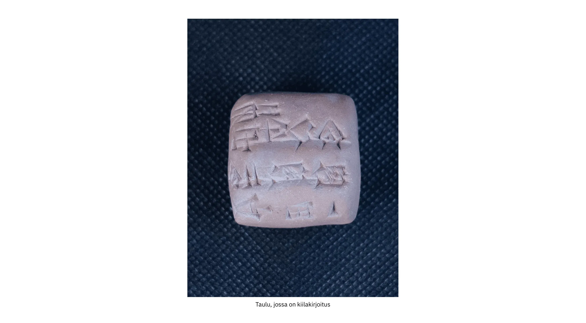

Minulla on myös uskoakseni aito sumerilainen taulu, jonka keskellä on pieni kiilakirjoitus. Tässä taulussa on sylinteriä pyörittämällä tehtyjä allekirjoituksia, jotka näytän teille myöhemmin.

Pienillä numeroilla varustetut merkit toimivat allekirjoituksina aikana, jolloin suurin osa ihmisistä ei osannut kirjoittaa, sillä vain taitavilla kirjureilla oli tämä kyky.

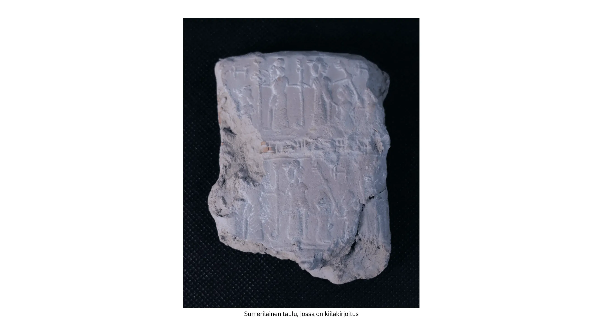

Alla näet edellä mainitun sylinterin: kivi, johon on kaiverrettu erityisiä muotoja. Ihmisillä oli tapana pyörittää tätä allekirjoitussylinteriä, joka tunnetaan englanniksi nimellä cylinder seal, kirjeiden allekirjoittamiseksi. Se oli tapa ilmaista kirjoittajien nimet tai osoittaa, että ne oli laadittu heidän nimissään.

Sen ajan kirjurit käyttivät siis kiilamaista kynää painaakseen merkkejä märille tauluille.

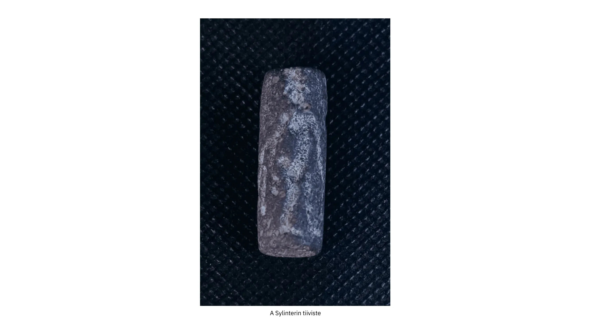

Kiilteiset merkit eivät edustaneet kieltä, vaan kirjoitusjärjestelmää puhuttujen kielten tallentamiseksi. Englanniksi sanoisimme, että "writing is a written language", ja sitten sanoisimme, että "cuneiform is a script, not a language". Ranskaksi sanottaisiin, että kiilteinen kirja ei ole kieli vaan tapa koodata kieli.

### Kirjoittamisen kehitys ja käyttö

Ensimmäisten vuosisatojensa aikana tämä kirjoitus pysyi suppeana ja toimi lähinnä muistinvaraisena järjestelmänä määrien, maataloustuotteiden luetteloiden ja varusteiden kirjaamiseen. Vasta vähitellen se kykeni **foneettisesti esittämään nimiä** ja kokonaisia lauseita.

Alun perin nimiä ei voitu ilmaista kiilakirjoituksella, koska siinä esitettiin ensisijaisesti esineitä ja todellisuuden elementtejä, kuten härkää tai vehnää, jotka oli kuvattu pieninä kuvina. Ajan myötä nämä kuvat kehittyivät kehittyneemmäksi kirjoitusmuodoksi, joka mahdollisti nimien ja monimutkaisten käsitteiden esittämisen.

Jos henkilön nimi olisi ollut esimerkiksi Laura, olisimme voineet ottaa sanan, lyhenteen, joka kuulostaa sanalta "vesi", ja toisen sanan, kuten "ras", ja muodostaa siitä nimen Laura. Näin kehittyi kirjoitetun kielen ensimmäinen muoto.

Muistutettakoon, että alun perin lyhenteiden esittämiseksi, jos halusit piirtää härän pään, voit nähdä härän pään muodon. Vähitellen piirustukset yksinkertaistettiin niin, että ne edustivat vain jonkinlaista viivaa. Tutkijat uskovat, että näin tapahtui, koska ihmiset pitivät märkää savitaulua toisessa kädessä, joten nimikirjaimet oli helpompi piirtää uudelleen kääntämällä niitä. Sen uskotaan johtuvan myös tavasta, jolla kirjurit pitelivät tauluja.

Kiilteisissä akronyymeissä on edelleen nähtävissä yhteys esimerkiksi vehnään tai härän päähän, ja ne ovat aina kallistuneet toiselle puolelle.

Kolmen vuosituhannen ajan kiilakirjoitusta käytettiin pääasiassa taloudellisten ja hallinnollisten tietojen säilyttämiseen. Mesopotamian asukkaat kehittivät kuitenkin pian syvän halun säilyttää kirjallisessa muodossa kaiken sen, mikä ansaitsi kestää aikaa. Niinpä tarinat, legendat ja laulut, joita kiertävät muusikot olivat tähän asti välittäneet suullisesti, ikuistettiin kirjallisesti, ja usein koulutetut kirjurit kopioivat ne. He kopioivat jo olemassa olevia tekstejä, lähinnä legendoja tai tekstejä, joilla oli tiettyä kulttuurista arvoa.

Tärkeä esimerkki on **Gilgamesh-eepos**, joka on mahdollisesti **historiallinen Urukin sumerilaisen kaupunkivaltion kuningas** noin 2900-2350 eaa.

Tämä kirjoitusmuoto, joka oli sekä taloushallinnon väline että kulttuurin vektori, kesti 1. vuosisadalle jKr. asti, ennen kuin se katosi lopullisesti, jättäen jälkeensä arvokkaan todistuksen sivilisaatiosta, joka näki sen syntymän.

## Sumerilaisten tablettien rooli

<chapterId>a396e6c5-56cc-5410-9e6b-0274401c5425</chapterId>

:::video id=a0729a35-01ec-4aa4-828f-d4ccc2eb168e:::

### Rahaa edeltävät luottojärjestelmät

Muinaisessa Mesopotamiassa taloudellinen organisaatio perustui erittäin kehittyneisiin mekanismeihin, jotka olivat olemassa jo kauan ennen metallirahojen keksimistä. Viralliset ja epäviralliset luottojärjestelmät olivat jo alusta alkaen olennainen rahan muoto, jonka avulla paikallinen väestö pystyi toteuttamaan monia monimutkaisia taloudellisia liiketoimia.

Kiillekirjoitus keksittiin juuri hallinnollisten ja taloudellisten tarpeiden tyydyttämiseksi. Kuuluisia mesopotamialaisia savitauluja käytettiin pääasiassa erilaisten sopimusten kirjaamiseen: yksityisten lainojen, kauppojen, vuokrasopimusten, kiinnitysten ja jopa avioehtosopimusten kirjaamiseen. Näiden taulujen kirjoittaminen vaati erikoistuneiden kirjurien asiantuntemusta, mikä oli aikaa ja vaivaa vievää ja kallista, **mutta perusteltua, kun kyse oli taloudellisista eduista.** Ihmiset eivät tuolloin kirjoittaneet toisilleen rakkauskirjeitä eivätkä käyttäneet kirjuria kirjoittaakseen ahdistuksistaan. He palkkasivat kirjurin kirjoittamaan asiakirjoja, olipa siihen sitten yhteys tai taloudellinen syy.

On myös syytä mainita, että osa näistä tableteista liikkui haltijavelkakirjoina ja vaihtoi vapaasti omistajaa.

Oli esimerkiksi eräänlainen savipallo, jonka sisällä oli pieniä kiviä.

Savipallon ulkopuolelle kirjoitettiin ja allekirjoitettiin numero, joka edusti yksikkömäärää. Sisällä oli kiviä ja joku, joka halusi varmistaa, että tämä väline todella edusti X:ää yksikkömäärää.

Toisessa esimerkissä, nykyisestä Bagdadista lounaaseen löydetyssä taulussa, määrätään, että velallinen sitoutuu maksamaan velkojalle 330 mittaa viljaa sadonkorjuupäivänä. Vielä kiehtovampaa on se, että eräässä toisessa taulussa todetaan selvästi, että neljän ohramittarin suuruinen velka on maksettava suoraan taulun haltijalle, jolloin **esitetään ajassa erityisen innovatiivinen ajatus maksusta haltijalle**.

Vuodesta 2000 eKr. lähtien oli voimassa laki, jonka mukaan kaikki kaupalliset liiketoimet, jopa pienimmätkin, oli virallistettava kirjallisesti ja allekirjoitettava todistajien läsnä ollessa. Kuvitelkaa, millainen valtava byrokratia tuohon aikaan oli kirjata kaikki liiketoimet rekistereihin, jotka kirjurit tekivät, muistutan teitä, savesta. Tämän oikeudellisen kurinalaisuuden tarkoituksena oli estää tulevat kiistat vaihdettujen tavaroiden omistuksesta ja oikeuksista. Usein kutsuttiin todistajia todistamaan, että sopimus oli todellakin allekirjoitettu.

Myös yksityisellä sektorilla tietyt perheet ja yksityishenkilöt harjoittavat taloudellista toimintaa, joka on niin monimutkaista, että se vaatii tiukkaa hallinnointia. Pohjois-babylonialaisesta Sippar-Amnanun kaupungista löydettiin Ur-Utu-nimisen Anunitum-papin talo, jossa oli lähes 2 000 taulua. Näihin asiakirjoihin sisältyi yksityisiä lainasopimuksia, kauppakirjoja ja vuokrasopimuksia sekä kirjeitä, uskonnollisia ja akateemisia tekstejä, mikä todistaa yksityisarkistojen monimuotoisuudesta ja merkityksestä tuolloin.

On huomattavaa, että kirjureiden kirjoittamat kirjeet koskivat lähes yksinomaan taloudellisia asioita: valituksia riittämättömistä korvauksista, vireillä olevista myötäjäismaksuista tai muista kiireellisistä aineellisista pyynnöistä. Henkilökohtaisia kirjoituksia, kuten rakkauskirjeitä, ei tuohon aikaan ollut olemassa, ja jopa maininnat sairauksista olivat harvinaisia.

Eräs koskettava esimerkki tällaisesta kirjeestä havainnollistaa tätä taloudellista todellisuutta: kirjeenvaihtaja ilmaisee ahdistuksensa jäätyään ilman rahaa tai elintarvikkeita kumppaninsa lähdettyä, kun Assuriin iski vakava nälänhätä. Hän kuvailee kiireellistä tarvetta ostaa viljaa ja pyytää, että hänelle lähetettäisiin pikaisesti tekstiilejä vastaava rahamäärä, jotta hän voisi turvata päivittäisen toimeentulonsa.

Tämä kirje, joka oli osoitettu hänen kumppanilleen, näyttää osoittavan, että tämä oli lähtenyt muualle kaupoille ja jättänyt naisen pennittömäksi. Hän muistuttaa miehelle, että hänen on saatava rahaa, jotta hän voi ostaa viljaa ja maksaa temppeliveronsa. Tämä on ehkä lähimpänä tuon ajan kirjeeseen kirjoitettua väitettä. Kirjeet liittyivät lähes aina taloudellisiin liiketoimiin, ja juuri tämä kirje liittyy epävarmaan taloudelliseen tilanteeseen.

Meille säilyneet mesopotamialaiset asiakirjat kuvastavat siis pääasiassa taloudellista vaihtoa, sillä ne laadittiin yksinomaan sellaisten tavaroiden siirtoa varten, joilla oli tunnustettu arvo: raha, vilja, erilaiset tavarat, kiinteistöt, temppeliverojen maksaminen. Nämä arkistot paljastavat paitsi tämän muinaisen sivilisaation tehokkuuden ja hallinnollisen tarkkuuden myös sen kyvyn hallita monimutkaisia taloudellisia vaihtoja hyvin pitkän ajanjakson ajan.

## Eliitin valvonta sumerilaisissa tableteissa

<chapterId>c6d3df0e-b1e1-58dc-ab35-9f76bbc39393</chapterId>

:::video id=04a95fb8-a701-4a48-9ce8-0e9b6ba256fd:::

### Kirjoittaminen, tekniikka, joka on ennen kaikkea taloudellista

Toisin kuin yleisesti luullaan, kirjoituksen keksiminen Mesopotamiassa noin 4 000 vuotta sitten ei alun perin palvellut henkilökohtaisen tai kirjallisen viestinnän tarpeita. **Kiillekirjoitus oli ennen kaikkea taloudellinen teknologia**, joka oli perusteltua vain silloin, kun kyseessä olivat tärkeät taloudelliset edut. Sumerilaiset eivät käyttäneet kirjoitusta keskinäiseen kirjeenvaihtoon tai tunteiden ilmaisemiseen, vaan yksinomaan kaupallisten ja taloudellisten liiketoimien dokumentointiin.

Tämä erikoistuminen selittyy tablettikirjoittamisen huomattavilla kustannuksilla. Kaiverrus savesta vaati erityistä teknistä asiantuntemusta, paljon aikaa ja erityisiä materiaaleja. Vain riittävän arvokkaat liiketoimet oikeuttivat taloudellisesti tämän investoinnin, mikä loi luonnollisen kynnyksen tämän vallankumouksellisen teknologian käyttöönotolle.

Kiillekirja-taulut paljastavat rahoitusjärjestelmän, joka oli aikakauteensa nähden huomattavan monimutkainen. Mesopotamialaiset olivat kehittäneet täydellisen arsenaalin nykyaikaisia rahoitusvälineitä: **yksityislainat korkoineen, kauppakirjat, vuokrasopimukset, kiinnitykset ja jopa avioehtosopimukset, joihin sisältyi rahoituslausekkeita**. Tämä hienostuneisuus todistaa kehittyneestä markkinataloudesta, joka on kaukana siitä yksinkertaistetusta mielikuvasta primitiivisestä vaihtokaupasta, joka usein liitetään näihin muinaisiin sivilisaatioihin.

Jotkin tabletit toimivat todellisina haltijapapereina, jotka kiertävät vapaasti kädestä käteen ilman, että niiden alkuperäistä haltijaa tarvitsee tunnistaa. Tämä innovaatio mahdollisti huomattavan sujuvan vaihdon, joka oli nykyaikaisia rahoitusjärjestelmiä edeltävä. Lisäksi erityislainsäädännössä vaadittiin jopa, että kaikki kaupalliset liiketoimet oli virallistettava kirjallisesti, mikä vakiinnutti kirjallisen tiedon käytön talouden alalla.

### Tiedon monopoli ja taloudellinen valvonta

Kirjoittamisen keskeinen asema taloudessa antoi huomattavaa valtaa niille, jotka hallitsivat tämän tekniikan. ** Kirjoittajilla, jotka olivat yleensä yhteydessä temppeleihin ja hallitseviin instituutioihin, oli tosiasiallinen määräysvalta rahoitusjärjestelmässä**. Heidän harvinainen ja korvaamaton asiantuntemuksensa teki heistä kaikkien tärkeiden liiketoimien vartijoita.

Tämä tiedon monopoli ei ollut sattumaa. Viranomaisilla oli täysi etu säilyttää tämä yksinoikeus, sillä kirjoittamisen demokratisointi olisi heikentänyt heidän talousvalvontaansa ja lisännyt väärentämisen riskiä. Todistajien järjestelmällinen läsnäolo allekirjoitustilaisuuksissa paljastaa, että asiakirjojen aitous oli jatkuvasti esillä.

Lakisääteinen velvollisuus kirjata kaikki kaupalliset liiketoimet kirjallisesti palveli useita strategisia tavoitteita: verovalvontaa, tiukkaa kirjanpidon valvontaa ja talouden toimijoiden riippuvuuden säilyttämistä hallintokoneistosta. **Mesopotamian valtio otti näin haltuunsa kyvyn hallita ihmisten välistä velkaa** yhteiskunnallisessa mittakaavassa ja muutti siten kirjoittamisen taloudellisen vallan välineeksi.

### Kahden rahajärjestelmän rinnakkaiselo

Tablettien analyysi paljastaa vivahteikkaamman taloudellisen todellisuuden kuin mitä niiden arkistoissa kaikkialle levinnyt esiintyminen antaa ymmärtää. Monissa tauluissa mainitaan viittauksia **hopeasekeliin** arvoyksikkönä, mikä viittaa standardoituihin fyysisiin tavaroihin perustuvan rahajärjestelmän rinnakkaiseen olemassaoloon.

Tämä kaksinaisuus voidaan selittää ajan sosiaalisella kerrostuneisuudella. **Kiillekirjajärjestelmä oli varattu rajoitetulle eliitille**: papistolle, vauraille kauppiaille ja hallintovirkamiehille, jotka kykenivät lukemaan, kirjoittamaan ja tulkitsemaan näitä monimutkaisia asiakirjoja. Jotta kantataulua voitiin käyttää tehokkaasti, oli paitsi osattava tulkita se, myös kyettävä tarkistamaan sen aitous ja ymmärrettävä sen oikeudelliset seuraukset.

**Väestönjoukko, joka jäi tämän elitistisen järjestelmän ulkopuolelle, kehitti omat vaihtomekanisminsa**. Tavalliset ihmiset käyttivät helpommin lähestyttäviä järjestelmiä, kuten standardoituja viljan mittoja, rahan painoja ja muita helposti mitattavissa olevia tavaroita, joita kuka tahansa pystyi arvioimaan ilman erityisosaamista.

Tämä kansantalous, jota on vähemmän dokumentoitu virallisissa arkistoissa, oli todennäköisesti dynaamisempi ja joustavampi kuin tablettijärjestelmä. Se mahdollisti nopean päivittäisen vaihdon ilman kirjureita, ja se vastasi käsityöläisten, maanviljelijöiden ja pienten kauppiaiden välittömiin tarpeisiin.

Hopeasekeli, joka mainitaan taulukoissa usein arvoviitteenä, toimi luultavasti siltana näiden kahden rinnakkaisen talousjärjestelmän välillä ja mahdollisti kirjallisten velkojen ja fyysisten maksujen muuntamisen.

### Spontaani syntyminen ja institutionaalinen valvonta

Tämä rinnakkaiselo kuvastaa taloushistorian peruskeskustelua: **Vaihtovälineiden spontaanin syntymisen ja rahan institutionaalisen haltuunoton välinen vastakkainasettelu**. Toisaalta rahan kaltaiset hyödykkeet ovat syntyneet luonnollisesti ihmisten vaihtotarpeista. Toisaalta instituutiot omaksuivat ja virallistivat nämä käytännöt hallitakseen niiden virtausta.

Sumerin temppelit olivat tämän jännitteen ruumiillistuma: ne käyttivät kansanomaisia rahapoliittisia innovaatioita (viittaukset sekeliin) ja kehittivät samalla omia ohjauskeinojaan (kiilakirjoitustaulut). Tämän strategian avulla he pystyivät hyödyntämään molempien järjestelmien etuja: perinteisten valuuttojen kansanoikeudellista legitimiteettiä ja virallistettujen velkojen hallinnollista valvontaa.

Mesopotamian kokemukset ovat pysyviä ennakkotapauksia rahoitusjärjestelmien kehitykselle. Se osoittaa, että **taloudellinen kehittyneisyys edeltää usein useita vuosituhansia** teknologisia innovaatioita, jotka yleensä liitetään siihen. Koron, luoton, siirtokelpoisten instrumenttien ja kiinnitysvakuuden käsitteet eivät kehittyneet vasta metallirahan keksimisen jälkeen.

Tämä merkittävä ajanjakso paljastaa myös kaikkiin rahapoliittisiin innovaatioihin liittyvät valtakysymykset: kuka hallitsee teknologiaa, kuka määrittelee säännöt ja miten viralliset järjestelmät ja suositut käytännöt nivoutuvat yhteen. Nämä peruskysymykset ovat jatkuneet läpi koko taloushistorian ja ulottuvat nykypäivän keskusteluihin digitaalisista valuutoista ja [kryptovaluutoista](https://planb.academy/resources/glossary/cryptocurrency).

# Talous ja raha muinaisissa sivilisaatioissa

<partId>a16bcf4c-8c3a-11f0-9e79-2bd363a484bd</partId>

## Pronssikauden suuret sivilisaatiot

<chapterId>fab9334c-7385-5d7c-ad40-7d152beb22a1</chapterId>

:::video id=737e12e8-1033-4210-b1dd-b8a680f68b17:::

Tässä jaksossa, jonka otsikko on "Pronssikauden suuret sivilisaatiot", aloitamme otteella kirjasta *A History of Money: From Ancient Times to Present Day*, jonka on kirjoittanut Glyn Davies ja joka on mielestäni erinomainen johdanto tähän antiikin suuria sivilisaatioita käsittelevään jaksoon.

> Toynbee tunnistaa noin kaksikymmentäyksi erilaista "sivilisaatiota", mutta koska näistä viisitoista on suoraan tai epäsuorasti peräisin aiemmista esimerkeistä, hän vähentää itsenäisesti kehittyneiden sivilisaatioiden määrän kuuteen: sumerilaisiin, egyptiläisiin, minolaisiin, kiinalaisiin, mayoihin ja Andien maihin. Näistä vain Andien inkat onnistuivat saavuttamaan korkean sivilisaatioasteen ilman rahan käyttöä, vaikka paradoksaalista kyllä, heillä oli runsaasti materiaaleja, joita yleisesti pidetään parhaina rahana käytettäviksi - kultaa ja hopeaa.

Inkoilla ei ollut rahajärjestelmää, mutta heillä oli runsaasti jalometalleja. Melkoinen paradoksi. Jatketaan lainausta:

> Mitä kerrostuneempi yhteiskunta on ja mitä tarkemmin se on suunnitellut ja mitä tehokkaampi sen suunnittelujärjestelmä on, sitä vähemmän rahaa tarvitaan sen väestölle. Tämä selittänee sen, miksi espanjalaiset valloittajat havaitsivat, että meksikolaiset, joiden hallinto oli suhteellisesti vapaamielisempi, käyttivät rahana säännöllisesti kultajauhetta (jota säilytettiin läpinäkyvissä putkissa) ja kaakaopapuja (joita säilytettiin suuria maksuja varten 24 000 yksikön pusseissa), kun taas inkoilla, jotka olivat järjestäytyneet paljon tiukemman hierarkian mukaisesti, ei ollut lainkaan rahaa: poikkeus, jonka tiukka sääntö vahvistaa. Rahan synty Kiinassa oli täysin riippumaton muista sivilisaatioista; sumerien, egyptiläisten ja minolaisten sivilisaatioiden suhteellinen läheisyys herättää kuitenkin epäilyksiä siitä, missä määrin ne olivat tietämättömiä rahakäytännöistä, varsinkin kun otetaan huomioon jo varhaisimpina aikoina käyty laaja kauppa.

Kiinassa kolikoita kehitettiin täysin eri tavalla kuin länsimaisia perinteitä. Se oli alusta alkaen [fiat-rahaa](https://planb.academy/resources/glossary/fiat). Ne olivat valettuja kolikoita.

Ja tässä yhteydessä Davies mainitsee kaupan. Kiinalaisten ja muiden kansojen välillä oli tosiaan vaihtokauppaa tiettyinä aikoina, mutta ulkomaankaupan vaihtovälineenä oli pikemminkin silkki. Kuten näemme myöhemmin, kultaa käytettiin myös Kiinan rajaseuduilla, joilla kiinalainen väestö oli pienempi. Eikä edes ulkomaankaupassa; siihen käytettiin silkkiä.

Kuvittelen siis, että kolikoiden muotoiluun ovat saattaneet vaikuttaa muut saman aikakauden sivilisaatiot, jotka kehittivät tämän tekniikan.

On kuitenkin selvää, että rahan olemus oli Kiinassa täysin erilainen kuin länsimaissa. Palaamme tähän yksityiskohtaisesti myöhemmässä Kiinaa käsittelevässä jaksossa.

Näistä kuuluisista sumerilaisista kaupungeista minulla on tässä muutama huomautus. Voimme mainita Urukin, joka oli hyvin varhainen ja vaikutusvaltainen kaupunki, kuuluisa huomattavasta koostaan ja kehittyneestä kulttuuristaan, erityisesti kirjoituksen ja kaupunkisuunnittelun kehittymisestä.

Halusin myös mainita kuuluisan Gilgamesh-eepoksen. Gilgamesh oli luultavasti sumerilaisen Urukin kaupungin historiallinen kuningas noin vuonna 2900 eKr. Hän oli luultavasti tämän sumerilaisen kaupunkivaltion kuningas.

Voimme puhua myös Akkadin Sargonista, joka hallitsi vuosina 2334-2279 eaa.

Hän oli ensimmäinen hallitsija Akkadian valtakunnassa, joka on toinen Mesopotamiassa syntynyt sivilisaatio. Mainitsen Sargonin, koska hän oli ensimmäinen, joka perusti postipalvelun näille kuuluisille tauluille, jotka olen jo esitellyt teille.

Kuvittele, että olisi todella ollut jopa savikuoria. Tabletit voitaisiin kääriä savikuoriin, joiden ulkopinnalla olisi henkilön allekirjoitus luottamuksellisuuden varmistamiseksi. Ihmiset siis murtaisivat kirjekuoren saadakseen tabletin. Olemme tämän postijärjestelmän velkaa Akkadin Sargonille.

Sitten on Babylon, suuri kaupunki, josta tuli Babylonian valtakunnan pääkaupunki. Toinen sivilisaatio, joka tunnetaan mahtavasta siksuratistaan ja palatseistaan sekä kuuluisasta Hammurabin säännöstöstä, joka tunnetaan parhaiten erittäin kehittyneestä lakikoodistaan.

Ja kaksi kaupunkia tämän jakson päätteeksi. Meillä on Ašur, joka oli Assyrian valtakunnan pääkaupunki ja tärkeä uskonnollinen keskus. Ja meillä on Ninive, joka oli myöhemmin Assyrian valtakunnan pääkaupunki. He siirsivät pääkaupunkinsa sinne, ja se tunnetaan mahtavasta armeijastaan, valtavista palatseistaan ja kirjastoistaan. Se on myös yksi Babylonin legendaaristen riippuvien puutarhojen mahdollisista sijainneista. Kuulemme usein tästä kuuluisasta antiikin maailman ihmeestä.

Babyloniassa ei kuitenkaan ole jälkeäkään näistä kuuluisista riippuvista puutarhoista. Sen sijaan Ninivessä on arkeologisia todisteita useiden kerrosten puutarhoista. On mahdollista, että kreikkalaiset historioitsijat, kuten Herodotos, sekoittivat Niniven ja Babylonin. Kun he vierailivat Mesopotamiassa sijaitsevissa kaupungeissa, he ehkä viittasivat siihen Babylonina. Ninivestä on löydetty jälkiä kuuluisista riippuvista puutarhoista, ja tutkijat saattavat miettiä, onko Ninive se kuuluisa paikka, jossa nämä puutarhat sijaitsivat, joita kutsutaan Babylonian riippuviksi puutarhoiksi.

## Mesopotamian taloudellinen organisaatio

<chapterId>6afb6fc8-cbb7-56a5-8427-484b4b7d7477</chapterId>

:::video id=aa6a2cbd-5916-4ae3-ad4f-65f0bd5643fa:::

### Esikapitalistiset taloudelliset rakenteet ja orjuus

Tervetuloa tähän Mesopotamian taloudellista organisaatiota käsittelevään jaksoon. Esikapitalistinen talous kävi läpi kolme päävaihetta: alkukantainen, orjatalous ja feodaalitalous.

Feodaalinen on tietenkin paljon myöhemmin, ilmeisesti keskiajalla, ja olemme jo ohittaneet alkukantaisen vaiheen, jota kuvailimme aiemmin paleoliittisen kauden yhteydessä. Kun puhumme Mesopotamiassa taloudellisesta organisaatiosta, puhumme orjuudesta.

Mesopotamiassa suurimman osan työstä teki kuitenkin orjien kaltainen riippuvainen luokka, joka ei ollut laillisesti isäntänsä omaisuutta vaan jolta riistettiin työnsä hedelmät fyysisen tai ideologisen pakottamisen avulla.

### Temppelien ja palatsien rooli talouskeskuksina

Taloutta hallitsivat suuret maaomistukset. Maanomistajat hyödynsivät maitaan suoraan palkkaamalla työntekijöitä tai vuokraamalla maitaan vuokria vastaan. He harjoittivat myös rahoitustoimintaa ja lainasivat rahaa korkealla korolla, yleensä noin 20-33,3 prosenttia vuodessa, mikä oli jyrkässä ristiriidassa naapurimaiden heprealaisten tiukempien sääntöjen kanssa.

Maanviljelijöiden ottamia lainoja ei ollut tarkoitettu tuotannollisiin investointeihin - lukuun ottamatta laivayhtiöitä - vaan pikemminkin varmistamaan selviytyminen seuraavaan satoon asti. Tämä tilanne johti usein viljelijöiden krooniseen velkaantumiseen.

Sallikaa minun vetää rinnastus antiikin (Rooman) uudempaan aikaan, jolloin kansalaiset elivät talonpoikien ja vapaan työvoiman tuottamista maatalousvuokrista sekä sotasaaliista. **Nämä tulot jaettiin kansalaisten kesken, ei generate:n voittojen lisäämiseksi, vaan heidän sosiaalisen asemansa parantamiseksi.** Kauppa ja käsityö jätettiin yleensä yhteiskunnallisen eliitin ulkopuolisille ryhmille. Kaikki tämä on ristiriidassa keskiaikaisen talouden kanssa, joka oli suuntautunut voittojen saamiseen kaupan ja käsityön kautta.

Yritämme siis sanoa, että vedän rinnastuksen siihen, että ihmiset käyttivät rahoituslainojen välineitä ei välttämättä tuotantovälineidensä parantamiseen, ja myöhemmin Roomassa voittoja ei välttämättä sijoitettu uudelleen, vaan niitä käytettiin pikemminkin niiden ihmisten arvovallan kasvattamiseen, jotka saattoivat hyötyä näistä voitoista. Olemme vielä kaukana siitä kapitalistisesta hengestä, joka syntyi myöhemmin keskiajalla, jolloin työpaikkoja voitiin luoda tuotantovälineiden parantamiseksi ja ylijäämät otettiin ja luotiin voiton tavoittelemiseksi. Voimme siis nähdä, että taloudellinen organisaatio ei ollut vielä saavuttanut edellä lueteltujen taloudellisten kehityskulkujen kolmatta vaihetta.

### Luottojärjestelmien ja laskentayksiköiden syntyminen

**Karl Polanyi erottaa kolme taloudellisen vaihdon muotoa: symmetristen ryhmien välinen vastavuoroisuus,** joka vallitsisi primitiivisissä heimoissa, joissa emme oikeastaan tarvitse rahaa, koska annamme toisillemme epävirallista luottoa ja vaihdamme ja jaamme uudelleen. **Temppelien ja palatsien ympärille keskitetty uudelleenjako,** tämä vaihdon muoto on yhteensopiva Mesopotamian kanssa, jossa temppelit olivat taloudellisen organisaation keskipisteenä ja pystyivät aikoinaan antamaan takaisin, jakamaan varallisuutta annosten muodossa. Vasta myöhemmin otettiin käyttöön palkan käsite. Tähän asti meillä on siis alkeellinen muoto (1), keskitetty uudelleenjako (2) temppeleissä ja palatseissa, ja sitten voimme vihdoin väistyä markkinavaihdon tieltä (3). Vaikka markkinoita ei ollutkaan täysin olemassa sellaisina kuin me ne nykyään ymmärrämme, on kiistatonta, että Mesopotamiassa oli markkinavaihtoa, mistä ovat osoituksena erityiset termit akkadinkielisessä kielessä ja arkeologiset todisteet hinnoista, voitoista, tappioista, vaihteluista ja niukkuuden tilanteista.

Mesopotamian kotitaloudet hoitivat itsenäisesti maataloustuotannon kaikki vaiheet kylvöstä leivän ja oluen valmistukseen. Naiset tuottivat myös huollettaviensa tarvitsemat tekstiilit. Kotitaloudet kääntyivät erikoistuneiden kauppiaiden puoleen sellaisten tavaroiden hankkimiseksi, joita ei tuotettu paikallisesti.

Perhesiteet olivat erityisen tärkeitä kaupankäynnissä. Paleoassyrialaisella kaudella (noin 1910-1830 eaa.) Ashurin kaupungin kauppiaat perustivat Kaneshiin Anatoliaan kauppayhdyskunnan, josta he toivat tina- ja tekstiilituotteita kultaa ja hopeaa vastaan. Kaupankäynti perustui perheyrityksiin, jotka olivat tiiviisti sidoksissa toisiinsa avioliiton ja kauppakumppanuuksien kautta. Kanesh oli vain yksi lenkki laajassa kansainvälisessä kauppaverkostossa.

Näissä vaihdoissa käytettiin metalleja, ja ne olivat jalometalleja eivätkä välttämättä esimerkiksi kuparia, joka oli tuolloin todella käyttökelpoista, ja uskomme, että näitä metalleja vaihdettiin arvon säilymisen käsitteisiin. Emme siis välttämättä voisi puhua vaihtokaupasta, jossa kahta tavaraa vaihdetaan niiden hyödyllisyyden vuoksi, vaan pikemminkin maksun käsitteestä, johon liittyi tietty tietoisuus jalometallien hamstraamisesta niiden käyttämiseksi arvon säilyttäjinä eikä niiden käyttämiseksi hyödykkeinä, esimerkiksi pronssin käyttäminen haarniskan valmistukseen.

Maksut ja verot maksettiin pääasiassa luontoissuorituksina (ohrana tai punnittuna hopeana). Temppelit ja palatsit olivat tärkeimmät taloudelliset, hallinnolliset, poliittiset ja uskonnolliset keskukset, ja ne hoitivat myös ensimmäiset pankkitoiminnot tallettamalla turvallisesti tavaroita, ensin viljaa, sitten muita maataloustuotteita ja lopulta jalometalleja. Tällä tavoin kehitettiin ensimmäiset luotto- ja lainatoiminnot kauan ennen kolikoiden ilmestymistä.

Mesopotamian taloudessa käytettiin pääasiassa ohraa ja hopeaa arvon mittareina. Hopea punnittiin standardoiduissa yksiköissä, kuten sìqlumissa (sekeli), joka oli noin 8,33 grammaa. Jo muinaisbabylonialaisella kaudella (Hammurabin aikana) hopeaa käytettiin yleisenä maksuvälineenä, ja jo varhaisessa vaiheessa käytettiin nimellisarvoa ("nūbum") vastakohtana todelliselle painolle ("šuqulum"), mikä ennakoi nykyaikaista fiat-valuutan käsitettä**.

Se ei kuitenkaan ollut vielä fiat-rahaa sanan varsinaisessa merkityksessä. Siihen ei kuulunut leima, jolla oli arvovalta, mutta siihen kuului nimellinen laskentayksikkö, toisin kuin punnittuun metalliin. Näille kahdelle käsitteelle oli olemassa kielellinen ero, ja mielestäni on tärkeää mainita se.

Siirtyminen palkkatyömarkkinoille oli vaikeaa. Se edellytti kahta merkittävää käsitteellistä uudistusta: henkilön työn ja lopputuotteen erottamista toisistaan ja "työajan" käyttöönottoa mitattavana yksikkönä. Jotta meillä olisi palkkatyöntekijän käsite, meidän oli ensin käytävä läpi nämä kaksi innovaatiota. **IIIᵉ vuosituhannella työstä maksettiin aluksi kiinteät korvaukset, minkä jälkeen se kehittyi vähitellen kohti palkkajärjestelmää IIᵉ vuosituhannen alussa.** *

Lopulta, 26. vuosisadalta eKr. alkaen, vakiintui todellinen käsitys rahan arvosta, vaikka mesopotamialainen "raha" ei ollutkaan kolikko vaan pikemminkin painotettu viljan tai metallin mitta. **Siten tärkeissä liiketoimissa tai tilanteissa, joissa arvon säilyttämistä vaadittiin, vilja muutettiin usein mieluummin hopeaksi, joka oli helpommin säilytettävissä.** Vähän kuin Kaneshin esimerkissä, jossa hopeametallia saatiin varastoitavaksi.

2000-luvulta eKr. lähtien, **epäsymmetrisen vaihdannan lähes hävitessä**, huomaamme, että toimeksiantosopimuksissa verbi sa viittaa hinnan maksamiseen. Tämä käsite, jota kutsutaan "sa", esiintyy sopimuksissa ja viittaa hinnan maksamiseen, ei tietyn hyödykkeen mittaamiseen. "Sa" viittaa yksinkertaisesti maksuun tai hintaan. Eräs antropologi panee tämän merkille ja mainitsee, että kyseessä on todellinen läpimurto; näemme eräänlaisen kahtiajaon ennen ja jälkeen tämän "sa"-verbin käyttöönoton sopimuksissa.

Emme voi jättää huomiotta Lähi-idän arkistoista löytyviä empiirisiä tietoja, jotka todistavat **joidenkin markkinamekanismien** olemassaolosta, joihin sisältyy **voiton** ja **tappion** käsitteitä, **hinnanvaihteluita** ja **puutetilanteita**. Perusvaikeus on kuitenkin määritellä markkinapohjaisen vaihdannan suhteellinen merkitys muinaisessa Mesopotamian taloudessa kokonaisuutena.

Uskon, että alan asiantuntijat ovat nähneet jälkiä näistä markkinakonsepteista, mutta he eivät oikein pysty kertomaan meille, kuinka suuri osa silloisesta taloudesta perustui tähän uudenaikaisempaan markkinakonseptiin tai muihin mekanismeihin.

Tiedämme, että se oli olemassa, mutta emme tiedä, oliko se tärkein tapa esimerkiksi hintojen määrittämisessä tai kaupankäynnissä.

Tähän päättyy Mesopotamian taloudellista organisaatiota käsittelevä jakso.

Seuraavissa jaksoissa teemme saman Egyptin ja Kiinan osalta.

## Muinaisen Egyptin taloudellinen ja rahapoliittinen organisaatio

<chapterId>bffcc16c-7fbf-5992-a0fa-6a7726d7d287</chapterId>

:::video id=40c1c4e5-b190-4bb6-b8a0-810c9ce7698b:::

### Historiallinen tausta ja egyptiläiset kaudet

Tämä jakso on omistettu muinaisen Egyptin taloudelliselle ja rahapoliittiselle organisaatiolle. Jotta saisitte hieman taustatietoa, tässä on luettelo ja lyhyt kuvaus kyseisistä ajanjaksoista.

- Vanha valtakunta (n. 2575 - n. 2130 eaa.)**. Ajanjakso, jota leimaa suurten pyramidien, erityisesti Gizan pyramidien, rakentaminen. Tämä oli keskitetyn egyptiläisen monarkian kulta-aikaa.
- Keskimmäinen valtakunta (n. 1938 - n. 1630 eaa.)**. Poliittinen ja kulttuurinen renessanssi epävakaan kauden jälkeen.
- Uusi valtakunta (n. 1539 - 1075 eaa.)**. Alueellisen laajentumisen, sotilaallisen vallan ja kansainvälisen kaupan kausi. Siihen kuuluu kuuluisien faaraoiden, kuten Tutankhamonin ja Ramses II:n, valtakausi.
- 1323 EKR. - Tutankhamonin kuolema**. Nuori faarao kuoli noin 18-19-vuotiaana. Hänen lähes ehjä hautansa löydettiin vuonna 1922, mikä teki siitä yhden kuuluisimmista arkeologisista löydöistä.
- Ramses II - Hallitsi 1279-1213 eaa**. Yksi Uuden valtakunnan voimakkaimmista faaraoista. Tunnetaan sotaretkistään, suurista muistomerkeistään ja siitä, että hän teki todennäköisesti ensimmäisen tunnetun rauhansopimuksen.
- 1275 eaa. - Merikansat**. Merikansoiksi kutsuttujen ryhmien hyökkäykset tai vaellukset horjuttavat useita Välimeren alueen sivilisaatioita, myös Egyptiä.
- Xoïsin taistelu - 1178 eKr**. Egyptin armeijan ja hyökkääjien välinen konflikti, joka liittyi todennäköisesti merikansoihin. Yksi monista taisteluista Uuden valtakunnan lopussa.
- Myöhäiskausi** on muinaisen Egyptin historian ajanjakso noin vuodesta 664 vuoteen 332 eaa.
- Kleopatra VII (69 - 30 eKr.)**. Egyptin viimeinen kuningatar, kuuluisa älykkyydestään, karismastaan ja liittolaisuudestaan Julius Caesarin ja Marcus Antoniuksen kanssa sekä luultavasti myös nenästään. Hänen valtakautensa merkitsi faraonisen Egyptin loppua ennen sen liittämistä Roomaan.

Egyptissä oli jo 5. ja 4. vuosituhannella eaa. vilkasta ja laajamittaista kaupallista toimintaa, joka yhdisti Nubian, Palestiinan, Libyan ja Punaisenmeren alueet meri-, joki- ja maakaupan kautta (erityisesti aasikaravaanien avulla).

### Varhaiset vaihtojärjestelmät ja paleovaluutta

Ensimmäisten egyptiläisten päällikkövaltakuntien syntyessä noin 3650-3400 eaa. nykyisestä Kairosta etelään sijaitsevasta Maadista tuli merkittävä kupariteknologian ja pitkän matkan kaupan keskus, erityisesti Syyrian rannikon kautta Mesopotamiaan.

Vaikka laajamittainen kaupankäynti perustui pääasiassa vaihtokauppaan, alkeellinen rahan muoto ("paleovaluutta"), joka koostui arvoesineistä, kuten puolijalokivistä ja fossiilisista simpukoista, oli todennäköisesti olemassa. Kullalla oli todennäköisesti jo tärkeä rooli näissä vaihdoissa. Ensimmäinen nimenomainen maininta kolikosta egyptiläisissä asiakirjoissa 3. vuosituhannen puolivälissä eaa. kuvastaa pitkää kehitystä, joka liittyi kauppatapoihin.

Arkaaisessa yhteiskunnassa (tässä ei välttämättä puhuta Egyptistä, vaan arkaaisista yhteiskunnista yleensä) maksuja suoritettiin usein, ei suoranaisesti ostosten tekemiseksi vaan myötäjäisten, uskonnollisten rituaalien ja muiden sosiaalisten velvoitteiden maksamiseksi. Nämä liiketoimet edellyttivät tarkkaa hinnoittelua ja arvonmääritystä. Monissa alkukantaisissa yhteiskunnissa oli etuoikeutettuja, rahanmuotoisia (eli laskettavissa olevia) esineitä, joiden arvo arvioitiin. Jos on maksamassa myötäjäisiä, on tietenkin kirjattava ylös jokin määrä esinettä, joka vaihdetaan myötäjäisten maksamiseksi. Tämä arvo on lähinnä ihmisten arvo.

Arkaaisissa yhteiskunnissa, ennen rahan tai rahajärjestelmien syntymistä, maksuja oli olemassa, mutta ne liittyivät usein sosiaalisiin velvoitteisiin, ja niiden arvo perustui yksilöiden arvoon, kuten myötäjäisten tai verirahan maksamisessa.

Palatakseni Egyptiin, antiikin valtakunnan aikana "shât(y)", joka oli alun perin konkreettinen rahayksikkö (pieni kulta- tai hopeakolikko, joka painoi noin 7,6 grammaa), siirtyi hyvin nopeasti todellisesta tehtävästään kovana valuuttana **kirjanpitotehtävään**, joka synnytti arvon käsitteen. Voimme tunnistaa siinä eräänlaisen laskentayksikön, jolla ilmaistaan arvoa, joka alun perin oli eräänlainen kolikko, mutta emme voi oikeastaan kutsua sitä kolikoksi, koska sitä ei ole leimattu, vaan se on vain metallista valmistettu mitta. Lähestymme tiliyksikön käsitettä.

Tästä shât(y)-käsitteestä luovuttiin lopulta, ehkä petosriskin vuoksi. Myöhemmin näemme, että egyptiläiset ottivat leimattuja kolikoita käyttöön hitaasti ja jopa jatkoivat niiden punnitsemista, vaikka heidän naapurinsa olivat ottaneet ne käyttöön.

Keskiajalla hopeaa käytettiin harvoin jokapäiväisissä liiketoimissa, joissa käytettiin pääasiassa viljan ja leivän mittoja. Tänä aikana ilmestyi kirjallisen rahan muoto, jossa maksut voitiin kirjata kirjallisesti tai tosiasiallisella siirrolla.

Uudessa valtakunnassa rahajärjestelmä monimutkaistui, ja siihen yhdistyivät erilaiset hyödykevaluutat, jotka arvostettiin metalleina (kulta, hopea, kupari), standardoituina kankaina, viljana ja öljynä. Kankaista käytettiin nimitystä "kangasmitta". **Käyttötuotteiden hinnat ilmaistiin usein viljana tai kuparina, kun taas arvoesineet arvostettiin kullassa tai hopeassa. Hopea, joka oli Egyptissä harvinaisempaa kuin kulta, tuli erityisen arvokkaaksi.** Hopea oli yliarvostettua verrattuna kultaan, jota oli Egyptissä runsaammin.

Myöhäiskaudelle (ensimmäinen vuosituhat eaa.) mennessä hopeasta oli tullut yleinen vaihtometalli koko Lähi-idässä. Hopea oli liikkeellä harkkoina, metallirahoina tai sormuksina, jotka punnittiin ja merkittiin temppeleissä, mikä takasi niiden painon ja puhtauden, vaikka niitä ei lyötykään hallitsijan kuvassa. Tämä tapahtui myöhemmin, ja sitä käsitellään myöhemmin lydialaisia käsittelevässä jaksossa.

On myös huomattava, että muinaisilla egyptiläisillä oli termi "hedj", jolla tarkoitettiin rahaa, ja sitä käytettiin yleisnimityksenä kaikista maksuvälineistä, joita käytettiin vastikkeena liiketoimissa, olipa kyse sitten metallista, viljasta, kankaasta tai erilaisista tavaroista (puusta, eläimistä, palveluista jne.). Dokumentoidut esimerkit osoittavat, että egyptiläiset saattoivat maksaa liiketoimen yhdistämällä erilaisia tuotteita, joiden kokonaisarvo ilmaistiin kupariyksiköissä ("deben").

**Temppeleillä oli keskeinen asema Egyptin taloudessa: ne keräsivät ja hamstrasivat huomattavia jalometalliaarteita (kultaa ja hopeaa), joiden tarkoituksena oli kunnioittaa jumalia, mutta myös toimia rahavarantona, joka voitiin tarvittaessa ottaa takaisin talouselämän piiriin**. Näemme esimerkkejä muista sivilisaatioista, jotka keräsivät temppeleihin arvokkaita varantoja, kuten patsaita, jotka sulatettiin sodan, rahapulan tai kriisin sattuessa. Tämä on toistuva teema läpi historian.

On myös syytä mainita, että pellavan viljely oli temppeleille myönnetty kuninkaallinen monopoli, ja arvokkaiden kankaiden valmistus vahvisti niiden taloudellista merkitystä.

Muinaiset egyptiläiset erottivat selvästi toisistaan jalometallien ideologisen, jumaluuteen liittyvän ulottuvuuden (kulta edusti jumalten lihaa, hopea niiden luita) ja niiden käytännöllisen tehtävän rahana, joka toimi vertailukohtana kaikille muille maksuvälineille.

Vaikka muinaisessa Egyptissä kehitettiinkin vasta myöhäiskaudella nykyaikaisia rahajärjestelmiä vastaava rahapaino, sillä oli kuitenkin kehittynyt rahajärjestelmä, joka perustui kirjoitusrahan, tarkkojen laskentayksiköiden, tavara-rahan ja painon mukaan arvostettujen jalometallien yhdistettyyn käyttöön.

Itse kolikot punnittiin, mikä johti kahteen eri käsitteeseen: **"kolikko" ja "raha "**. Käytin kahta englanninkielistä termiä. Ensinnäkin "coinage" viittaa kolikoihin, käsitteeseen, joka tulee myöhemmin, ja meillä on myös tämä rahan käsite. Voimme jo määritellä tietyn käsitteen "raha" niiden laskentayksiköiden avulla, jotka äsken ilmaisin rahana, mutta jotka eivät vielä olleet kolikoita, joten "coinage" tulee hieman myöhemmin lydialaisten myötä.

Kolikot eivät siis ole rahan edellytys, **jopa niin paljon, että voimme myöntää rahan olemassaolon jo kolmannella vuosituhannella,** joka tapauksessa ja epäilemättä jo toisella vuosituhannella ja erityisesti Hammurabin valtakaudella.

Tässä yhteydessä on tärkeää muistaa, ja tämä on se, mitä kirjailija mainitsee kirjassaan "The Origins of Money", että rahan käsite oli epäilemättä olemassa jo tuolloin näissä rahajärjestelmissä, ja on virhe yhdistää rahan synty käsitteenä kolikoiden ilmestymiseen.

Polanyin vastavuoroisuuden ja uudelleenjaon käsitteitä, joita sovelletaan usein muinaiseen Egyptiin, on myös tarkennettava: vaikka ne ovatkin olemassa, ne eivät muodosta yksinomaista kehystä. Faraoninen Egypti oli kehittänyt monimutkaisen talouden, johon oli täysin integroitu kehittynyt kaupallinen vaihto, joka erosi uskonnollisista ja rituaalisista käytännöistä, mikä osoittaa, että talouden ja ideologian alueet olivat todella itsenäisiä.

Tämä erityispiirre liittyy siihen, että jalometallit yhdistettiin tiettyyn jumaluuteen, mutta ne pystyivät silti erottumaan toisistaan.

Otan tämän esille, koska Polanyi viittasi näiden jalometallien käyttöön ensisijaisesti uskonnollisena tai jumalallisena käsitteenä. Me kuitenkin ehdotamme, että ne olivat myös osa talousjärjestelmää ja että egyptiläiset kykenivät jo tekemään tällaisia erotteluja.

Lopuksi haluaisin lainata kirjaa "The Origins of Money", jossa luetellaan tämän keksinnön, rahan, tarkoitus. Siinä on useita kohtia, mutta haluaisin vain korostaa kohtaa 5:

*kehittää mahdollisuutta taloudelliseen peliin käyttämällä menetelmiä, kuten devalvaatioita ja peräkkäisiä revalvaatioita, jotta tuontia ja vientiä voidaan vähentää tai lisätä alhaisemmilla kustannuksilla*

Kirjoittaja ehdottaa siis, että jo noina arkaaisina aikoina kolikot oli keksitty tai ne olivat syntyneet valtion valvonnassa ja että niiden jalometallien määrää ja painoa manipuloitiin jo talouden hallitsemiseksi. Sallikaa minun antaa teille pieni skuuppi eräästä seuraavasta osiosta. **Jopa kolikoiden varhaisimmissa muodoissa, jotka oli valmistettu elektrumista, kullan ja hopean seoksesta, tiedämme näiden kolikoiden jalometallien pitoisuuksia analysoimalla, että ensimmäisillä liikkeeseenlaskijoilla, esimerkiksi Kroesoksella, oli vähemmän kultaa kuin luonnollisessa elektrumissa**

Tämä tarkoittaa, että he osasivat jo erottaa kullan ja hopean toisistaan ja laskivat liikkeeseen kolikoita, jotka sisälsivät vähemmän kultaa.

Kirjoittaja esittää, että jo kolikoiden varhaisimmista ajoista lähtien rahanvalmistusvaltuuksia käytettiin väärin liikkeeseen lasketun rahamäärän kasvattamiseen, mahdollisesti taloudellisen suunnittelun keinona, eikä pelkästään painon todentamiseen ja kaupankäynnin helpottamiseen.

## Merkkivaluutta sekä talous- ja rahapoliittinen organisaatio muinaisessa Kiinassa

<chapterId>e08d3be9-423c-5cf3-a606-6ad54e2261af</chapterId>

:::video id=ae7e6367-1725-455e-bfe6-359be1f443e5:::

Tässä jaksossa, jonka otsikko on "Merkkiraha ja muinaisen Kiinan taloudellinen ja rahapoliittinen organisaatio", näemme, että muinaisella kiinalaisella rahalla on länsimaisista perinteistä poikkeavia piirteitä. Kiinalainen raha oli jo alusta alkaen "merkkivaluutta". Tämän jakson tiedot perustuvat muistiinpanoihin, jotka tein luettuani kirjan "Aux origines de la monnaie".

### Merkkivaluutan käsite ja sen erityispiirteet

Kirjoittajan mukaan merkkiraha vastaa nykyistä fiat-valuuttaa. Se on valuutta, jonka arvo ei ole sidoksissa sen metallipitoisuuteen. Alusta alkaen kyseessä oli eräänlainen sopimus, sosiaalinen konsensus näiden kolikoiden arvosta.

Muinaisen Kiinan kolikoissa on piirteitä, jotka eroavat länsimaisista perinteistä. Ne olivat pääasiassa metallisia, mutta ne oli pikemminkin valettu kuin lyöty, eikä niissä ollut hallitsijan kuvaa. Yllättävää kyllä, Kiinan valtiolla ei ollut monopolia rahan liikkeeseen laskemisessa. Tämä näennäinen liberaalisuus voidaan selittää sillä, että rahan liikkeeseenlaskun monopoliin ei ollut taloudellista tarvetta, koska verovelvollisen väestön määrä oli suuri ja verovaroja oli runsaasti.

Kiinalaiselle valuutalle on ominaista myös sen uskottava luonne. Alusta alkaen rahana käytettiin lehmänkakkujen (simpukoiden) pronssijäljitelmiä, joilla ei ollut suoraa yhteyttä käytetyn metallin itseisarvoon. Jos menemme historiassa hyvin kauas taaksepäin, kiinalaiset käyttivät simpukankuoria valuuttana. Kun simpukankuorista tuli lopulta liian vähän, he valmistivat kuparista jäljennöksiä, joilla oli sama arvo kuin aidoilla simpukoilla.

Kiinalainen valuutta ei siis perustunut materiaalin arvoon tai alkuperäisen esineen (esim. simpukoiden) suhteelliseen harvinaisuuteen vaan kollektiiviseen luottamukseen sen käyttöön vaihdon välineenä - toisin sanoen rahan merkkiin.

### Kauriinkuorista metallisiin jäljitelmiin

Karhunvatukkaa käytettiin laajalti alkeellisena rahayksikkönä. Muinaiset kirjoitukset osoittavat, että jo Shang- ja Zhou-dynastioiden (ensimmäisen ja toisen vuosituhannen eaa. ensimmäiset dynastiat) aikana lehmänkuoria käytettiin paitsi sotilaallisten tekojen palkitsemiseen myös **työn palkitsemiseen, arvon mittaamiseen ja maan ostamiseen**.

Tässä yhteydessä on tärkeää muistaa, että se ei ollut mikä tahansa väline, jota yhteiskunta käytti rajoitettuihin tarkoituksiin. Sitä käytettiin sotilaspalkkioihin, työstä maksamiseen ja arvon mittaamiseen. Löydämme tästä jälkiä arkeologien kirjoituksista. Vaikka emme tiedä, käytettiinkö sitä päivittäin leivän ostamiseen, meillä on todisteita siitä, että sitä on voitu käyttää edellä mainittuihin liiketoimiin.

Ajan myötä aitojen lehmänkuurnan kuorien niukkuus johti pronssista, luusta, helmiäisestä tai kivestä valmistettujen jäljitelmien valmistamiseen erityisesti hautaustilaisuuksiin, jotta vältettäisiin aitojen arvojen kiinnittyminen hautakammioihin. Välineen vaihtaminen liittyy myös ajatukseen ruhtinaan rahan hallinnasta, joka on sitäkin helpompaa, jos ruhtinas itse valmistaa rahat.

Meidän on ymmärrettävä, että jos ruhtinas voi luoda valuutan itse, hän voi hallita talouden hallintaa paremmin, kun hän ylittää simpukankuorien luonnollisen niukkuuden asettamat rajoitukset.

Toisin kuin Mesopotamiassa, jossa kolikot liittyivät jalometallin painoon, kiinalainen kolikkoterminologia juontaa juurensa suoraan rahana käytettyjen esineiden alkuperäisestä muodosta: lehmänkakku (bei), veitsi (dao), lapio (bu) ja pyöreä kolikko (quan tai qian). Näin ollen voimme nähdä, että rahaan liittyvien sanojen alkuperä Kiinassa viittasi näihin esineisiin. Sitä vastoin länsimaissa on useita rahaan liittyviä termejä, jotka juontavat juurensa aivan erilaisista käsitteistä, jotka liittyvät enemmän rahaesineiden fyysisiin ominaisuuksiin ja painoon. Nämä etymologiset erot osoittavat selvästi länsimaisen ja kiinalaisen rahakäsityksen välisen kahtiajaon.

Kiinassa rahallinen arvo oli täysin uskottu, ja se perustui valtion, tuottajien ja kauppiaiden väliseen sosiaaliseen sopimukseen.

### Talouden sääntely ja rahapoliittinen filosofia

Kiinan valtio käytti rahaa talouden säätelyvälineenä: rahan yltäkylläisyyden aikana rahan arvo laski, jolloin ihmisten oli helpompi ostaa tavaroita. Sitä vastoin rahapulan aikana rahan arvo nousi, mikä vahvisti valtion ostovoimaa sen myöhempiä toimia varten.

Tässä voidaan luoda yhteys [inflaatioon](https://planb.academy/resources/glossary/inflation) ja deflaatioon. Kun rahan määrä on kiinteä, jos talouden tuottavuus kasvaa, rahan arvo nousee. Vastaavasti jos tuottavuus laskee, rahan arvo laskee. Tässä esimerkissä tilanne on kuitenkin päinvastainen. Todennäköisesti siksi, että ruhtinaalla ei ollut täydellistä monopolia rahan tuotannossa, mutta se osoittaa silti, että rahan arvo oli sidoksissa taloudellisiin olosuhteisiin.

Filosofi Mo Di (5.-4. vuosisata eKr.) oli jo analysoinut tätä hinnan ja arvon välistä suhdetta: hänen mukaansa hinnanvaihtelut eivät heijasta todellista halpuuden tai absoluuttisen kalleuden käsitettä, vaan pikemminkin tavaroiden ja rahan välistä vaihtelevaa suhdetta, joka on riippumaton valuutan merkin vakaasta nimellisarvosta.

Sen sijaan, että hän sanoisi, että kultakolikolla olisi jonkinlainen perusarvo sinänsä, kuten käyttöarvo tai itseisarvo, hän huomauttaa, että rahamerkin arvo tulee pikemminkin talouden tilasta.

Kiinassa kolikoiden ei välttämättä tarvinnut olla virallisesti merkittyjä tai taattuja. Niiden hyväksyminen riippui yksinomaan kollektiivisesta luottamuksesta, mikä selittää, miksi pronssi- tai kuparikolikot, joissa ei ollut erityisiä merkintöjä, saattoivat kiertää vapaasti pitkään.

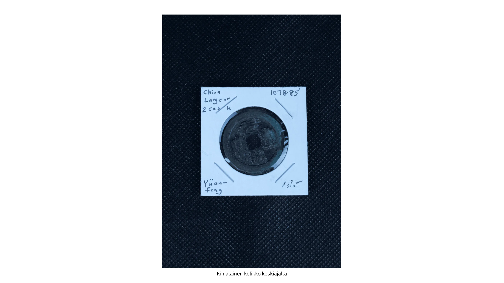

Yllä oleva kolikko on kiinalainen kolikko keskiajalta. Se on valettu kolikko, jonka keskellä on neliönmuotoinen reikä. Tämän reiän läpi pujotettiin köysi, jonka avulla kolikot voitiin pujottaa yhteen rannekorujen tai kaulakorujen tekemiseksi. Niitä ei kuitenkaan ensisijaisesti pidetty, vaan niitä käytettiin lähinnä kirjanpitotarkoituksiin. Ne voitiin kiinnittää toisiinsa ja muodostaa tiliyksikköjä suurina nauhoina, joiden palat olivat toisiinsa kiinnitettyjä. Niissä ei välttämättä ollut mitään erityisiä merkkejä, joskus ne olivat yksinkertaisesti pronssisia ympyröitä.

Valtion rahamonopoli, jonka Han-dinastian Wudi perusti myöhään vuonna 113 eaa., kyseenalaistettiin usein, ja erilaiset yksityiset tai paikalliset toimijat saivat laskea liikkeeseen omia valuuttojaan, jos ne nauttivat riittävää yhteiskunnallista luottamusta.

**Kiinalaisten valuuttojen alhainen itseisarvo esti niiden hamstraamisen ja takasi niiden sujuvan kierron**.Jalometalleja käytettiin harvoin kiertävänä valuuttana hamstraamisen estämiseksi. Koska kulta oli liian kallista, se tyypillisesti ennemmin pantiin syrjään kuin käytettiin. Sen sijaan **vain silkki edusti todellista arvokasta valuuttaa Kiinan kansainvälisessä kaupassa**. Kiinalaiset kävivät kauppaa silkillä, eivät kullalla.

Talous- ja rahakriisien aikana, erityisesti kuparin hinnan noustessa, käytettiin innovatiivisia ratkaisuja: jo 2. vuosisadalla jKr. liikkeessä olevia kolikoita leikattiin pienemmiksi yksiköiksi, jotta liikkeessä oloa voitiin ylläpitää pienemmillä kustannuksilla. Muina aikakausina, kuten Wang Mangin aikana (1. vuosisadan alussa jKr.), kokeiltiin erittäin arvokkaita valuuttoja, joiden nimellisarvot olivat paljon suurempia kuin niiden todellinen metallipitoisuus, mikä oli esiaste seteleille. Kolikkoihin leimattiin arvot 50, 100 tai 200 osoittamaan suurempia määriä, kuten 200 kolikkoa. Tämä käytäntö todennäköisesti vaikutti merkittävään inflaatioon.

Kuten edellä mainittiin, tämä järjestelmä perustui valtion, tuottajien ja kauppiaiden väliseen sosiaaliseen sopimukseen, mutta myös autoritaarisiin ja ankariin sääntöihin niitä kohtaan, jotka eivät pelanneet peliä, erityisesti kappaleiden valinnan (olivatpa ne kauniita tai eivät) tai kankaiden pituuden (jotka eivät olleet standardin mukaisia) osalta.

Minun vaatimaton mielipiteeni on, että se ei ole kovin vankka järjestelmä. Se perustui pääasiassa tiukkoihin sääntöihin, joiden mukaan virkamiesten ja kauppiaiden on pakko hyväksyä vahingoittuneet kolikot sanktioiden uhalla.

### Kiinan rahapoliittiset innovaatiot ja niiden taloudelliset vaikutukset

Kiina oli myös edelläkävijä varhaisen paperirahan liikkeeseen laskemisessa, joka alun perin otettiin käyttöön vastauksena metallipulaan 9. vuosisadalla jKr. Alkuperäisistä eduistaan huolimatta nämä paperivaluutat johtivat säännöllisesti inflaatiokierteeseen, kun niitä laskettiin liikaa liikkeelle, kuten Song- ja Ming-kaudella, jolloin liiallinen liikkeeseenlasku johti vakaviin valuuttakriiseihin, joista Marco Polo kertoi 1200-luvulla ja totesi jopa, että tällaisten paperirahojen väärentämisestä rangaistiin kuolemalla. En voi olla huomauttamatta eräästä väkivallan muodosta.

Kiinalaiselle kokemukselle on siis ominaista syvästi uskottava käsitys rahasta, rahajärjestelmän huomattava joustavuus ja paperivaluuttojen varhainen käyttö, joka perustuu pikemminkin talouden toimijoiden väliseen luottamukseen kuin käytettyjen välineiden itseisarvoon.

## Yhteiskunnallinen ja taloudellinen järjestäytyminen antiikin aikana

<chapterId>4023c3ce-7a47-5ac4-8f5f-c7ab699ab20f</chapterId>

:::video id=2761efe4-21cf-4f06-9bda-c03f9ff39012:::

### Kaupunkien loiskeskustelu

Antiikin kaupunkien ja niiden sisämaan välinen suhde herättää perustavanlaatuisen kysymyksen: toimivatko nämä kaupunkikeskukset vaurautta imevinä loisina vai hyödyllisen taloudellisen erikoistumisen moottoreina? Loishypoteesin mukaan pronssikauden kaupungit, erityisesti Mesopotamiassa, **systeemisesti imivät maaseutualueiltaan enemmän arvoa kuin ne palauttivat** ja elivät pääasiassa vuokrilla ja veroilla luomatta vastaavaa arvoa.

Tämä näkemys toistui Rooman valtakunnan romahduksessa: kun alueellinen laajeneminen loppui, ulkoisen vaurauden virta tyrehtyi, mikä saattoi paljastaa kaupunkitalouden, joka ei kyennyt rahoittamaan itseään. Kaupungit olisivat näin ollen eläneet "yli varojensa" ja olleet riippuvaisia pikemminkin louhinnasta kuin tuotannosta.

### Erikoistuminen arvonluonnin edistäjänä

Vaihtoehtoinen taloudellinen näkemys kyseenalaistaa tämän loismaisen näkemyksen. **Muinaiset kaupungit toimivat ennen kaikkea erikoistumisen ja työnjaon keskuksina**. Niiden rooli oli muutakin kuin pelkkää louhintaa: ne keskittivät erikoistuneita käsityöläisammatteja, organisoivat kauppaverkostoja ja toimivat pitkän matkan vaihdon solmukohtina.

Tämä kaupunkien erikoistuminen loi tuottavan keskinäisen riippuvuuden sisämaan kanssa. **Kaupungit eivät selvinneet ilman maaseudun maataloustoimituksia, mutta sisämaa hyötyi vastineeksi käsiteollisuustuotteista, teknisistä innovaatioista ja pääsystä Välimeren alueen kauppaverkostoihin**. Työnjako mahdollisti molemminpuoliset tuottavuushyödyt, vaikka hyötyjen jakautuminen saattoi vaikuttaa epätasapainoiselta.

Tuon ajan krooninen elintarviketurva selittää osittain tämän näennäisen epäsymmetrian. Nälänhädän ja sadon tuhoutumisen vaara oli maaseudun väestön jatkuva uhka, kun taas kaupunkien käsityöläiset, jotka olivat yhteydessä kansainvälisiin kauppaverkostoihin, nauttivat suuremmasta taloudellisesta vakaudesta.

### Historiallinen kehitys, antiikista keskiaikaan

Antiikin ja keskiaikaisen organisaation välinen kontrasti valaisee tätä kysymystä. ** Antiikissa suosittiin laajamittaista työnjakoa, ja kaupungit olivat avoimia koko Välimeren maailmalle**. Kauppa ja erikoistuminen saavuttivat kehittyneen tason ja loivat laajoja taloudellisia verkostoja.

Rooman valtakunnan romahtaminen johti radikaaliin pirstoutumiseen: **Feodaalikausi korvasi tämän keskitetyn organisaation itseriittoisista kartanoista koostuvalla hajautetulla järjestelmällä**. Muinaisista roomalaisista villas rusticae -tiloista tuli keskiaikaisten maalaiskunnat, jotka muodostivat mosaiikin lähes omavaraisista taloudellisista saarekkeista, joita papisto tai aatelisto hallinnoi.

Tämä keskiaikainen hajauttaminen vähensi kaupallista tehokkuutta, mutta paradoksaalisesti tarjosi samalla paremman vastustuskyvyn ulkoisille häiriöille. Feodaalikartanot kehittivät tasapainoisempia suhteita valtakeskusten ja maaseutuväestön välille, vaikka tämä organisaatio rajoitti erikoistumiseen liittyviä tuottavuushyötyjä.

### Kaupunkimarkkinoiden syntyminen

Arkeologiset löydöt paljastavat, että Mesopotamian kaupungeissa oli jo toisella vuosituhannella **kauppasatamia ja kauppakortteleita**. Nämä perusrakenteet todistavat järjestäytyneiden markkinoiden olemassaolosta, vaikka niiden tarkasta toiminnasta kiistelläänkin.

Karl Polanyi, joka alun perin suhtautui epäilevästi aitojen markkinamekanismien olemassaoloon antiikin aikana, tarkensi kantaansa myöntämällä, että hän on saattanut aliarvioida markkinapörssien varhaista syntymistä. Tämä älyllinen kehitys kuvastaa antiikin talousjärjestelmien tulkinnan monimutkaisuutta, sillä niissä institutionaalinen uudelleenjako, vastavuoroinen vaihto ja orastavat markkinatapahtumat esiintyivät rinnakkain.

### Sparta vastaan Ateena

Spartan ja Ateenan välinen vertailu havainnollistaa täydellisesti rahajärjestelmän ja yhteiskunnallisen organisaation välistä suhdetta. **Sparta edustaa mallia tiukasti hierarkkisesta yhteiskunnasta, joka tietoisesti hylkäsi rahan käytön**, kun taas Ateena kehitti demokraattiseen järjestelmäänsä liittyen kehittyneen rahatalouden.

Spartalaisten kieltäytyminen rahasta ei ollut spontaania, vaan **institutionaalista ja ideologista**. Spartalaisten johtajat pelkäsivät, että raha turmelisi sotilaalliset ja kansalaisarvot, ja pitivät parempana järjestelmää, joka perustui kansalaisten väliseen suoraan keskinäiseen luottamukseen.

Sparta käytti rahan käytön estämiseksi **raskasta, epäkäytännöllistä metallia**, mikä paradoksaalisesti osoittaa intuitiivista ymmärrystä rahan ominaisuuksista (jaettavuus, kuljetettavuus, kestävyys), jotka se pyrki neutraloimaan.

### Anti-monetaarisen mallin rajat

Spartalaisten organisaatio havainnollistaa **Dunbarin luvun** rajoituksia sovellettuna yhteiskunnalliseen mittakaavaan. **Hylkäämällä rahan neutraalina vaihtovälineenä Sparta tuomitsi itsensä rajoittamaan kansalaisyhteiskuntansa rajoitettuun määrään kansalaisia, jotka kykenivät ylläpitämään suoria luottamussuhteita**. Homoioi (Spartan kansalaiset) muodostivat vain yhden prosentin koko väestöstä, ja heitä ympäröivät tuhannet hilotit (orjat).

Tämä alun perin poikkeuksellisen sotilaallisen yhteenkuuluvuuden lähteenä toiminut organisaatio osoittautui rakenteellisesti hauraaksi. **Leuctresin taistelu (371 eaa.) osoitti tämän järjestelmän rajat**: ihmishenkien menetys rikkoi peruuttamattomasti spartalaisten yhteiskuntarakenteen, mikä johti heidän sivilisaatiomallinsa romahtamiseen.

Kilpailevilla kaupungeilla (Ateena, Korintti, Theeba), joilla oli kehittyneet rahajärjestelmät, oli rikkaammat ja kestävämmät taloudet**, jotka pystyivät korvaamaan inhimilliset menetykset taloudellisen jälleenrakentamisen ja maahanmuuton avulla.

### Henkilökohtainen ja institutionaalinen luottamus

Spartalaisten kokemus paljastaa **riskit, joita liittyy yhteiskuntaan, joka perustuu yksinomaan ihmisten väliseen luottamukseen** neutraalien institutionaalisten mekanismien sijaan. Vaikka tämä malli loi voimakasta sosiaalista yhteenkuuluvuutta, se jätti yhteiskunnan alttiiksi väestörakenteen häiriöille.

Raha mahdollistaa nimettömät ja persoonattomat transaktiot, joten se tarjoaa paremman systeemisen kestävyyden. Se mahdollistaa sosiaalisen laajentumisen suoran luottamuksen rajojen ulkopuolelle, mikä helpottaa ulkomaanvaihtoa ja talouskasvua.

### Inka-paradoksi, rikkaus ilman rahaa

Inkavaltakunta on kiehtova paradoksi: **sivilisaatio, jolla oli valtavat kultarikkaudet mutta ei rahajärjestelmää**. Spartan tavoin tämä malli perustui jäykkään hierarkkiseen organisaatioon ja keskitettyyn suunnitteluun, mutta osoittautui haavoittuvaksi valloittajille, joilla oli joustava rahatalous.

Rahanvastaisten järjestelmien rakenteellinen hauraus rahayhteiskuntien edessä on toistuva historiallinen malli, joka viittaa siihen, että **institutionaalinen rahan hylkääminen ei suinkaan vahvista sosiaalista yhteenkuuluvuutta vaan voi paradoksaalisesti heikentää sivilisaatioita** ulkoisten haasteiden ja historiallisten muutosten edessä.

Näiden historiallisten mallien analyysi paljastaa, että raha on vaihtotehtävänsä ohella sosiaalisen monimutkaisuuden merkkinä ja edistäjänä, jonka avulla sivilisaatiot voivat ylittää suorien ihmissuhteiden asettamat rajat.

# Rahapainetun rahan synty

<partId>232e365a-8c3b-11f0-b276-b3ab70d1a5a1</partId>

## Kolikoiden syntyminen

<chapterId>40ed3414-3066-57bd-bc1b-617ad0a354e0</chapterId>

:::video id=1d6834c4-98a3-43fe-ba80-04be51b0486e:::

Olemme nyt tulleet asian ytimeen: kolikoiden ulkonäköön. Korostan tässä sanaa "kolikko", koska olemme nähneet aiemmissa jaksoissa, että raha tai rahajärjestelmät olivat vahvasti läsnä lydialaisia, kreikkalaisia ja persialaisia edeltäneissä sivilisaatioissa. Se on mielestäni melko selvää siitä, mitä olemme juuri nähneet. Siksi tämä jakso on omistettu varsinaisten kolikoiden syntyyn, ja sen otsikko on: *Kolikoiden synty*.

### Lydian ja Joonian kolikoiden alkuperä

Aloittaakseni tämän jakson haluaisin tarjota teille otteen Glyn Daviesin kirjasta A History of Money, joka on tässä.

*Ote kirjasta A History of Money: From Ancient Times to the Present Day by Glyn Davies:*

> Lydiasta ja Joonian alueelta kolikoiden tuntemus ja käyttö levisi nopeasti itään Persian valtakuntaan ja länteen Joonian ja Egeanmeren saarten kautta Manner-Kreikkaan ja sieltä sen läntisiin siirtomaihin, erityisesti Sisiliaan. Se levisi myös pohjoiseen Makedoniaan, Traakiaan ja Mustallemerelle, mutta Egyptissä se hyväksyttiin vain osittain, vastahakoisesti ja myöhään.

Minusta on mielenkiintoista mainita tässä yhteydessä, että Egyptissä jatkettiin kolikoiden punnitsemista vielä kauan sen jälkeen, kun kolikkopainotekniikka oli tullut käyttöön. Mielestäni se on tärkeää huomata. Lainaus jatkuu:

> Myös Manner-Italia omaksui aluksi melko hitaasti kreikkalaiset rahoitusinnovaatiot, kun taas Sisiliassa ne omaksuttiin nopeasti.

*Näitä kahta rajoitettua poikkeusta (Manner-Italia ja Ala-Egypti) lukuun ottamatta kolikoiden käyttö levisi nopeasti Välimeren keski- ja itäosiin rajoittuviin maihin sekä laajaan ja kasvavaan Persian valtakuntaan Mesopotamiasta **Intiaan.** On epäselvää, oliko Intia jo tähän aikaan kehittänyt itsenäisesti alkuvaiheen rahajärjestelmän riippumatta Kiinan tai Lydian kehityksestä. Riippumatta siitä, oliko Intia kehittänyt itsenäisesti oman rahayksikkönsä, Intian ja Lähi-idän lisääntyneet yhteydet johtivat siihen, että Intian kolikko oli suora mukautus lydialaisten ja kreikkalaisten keksinnöistä ensin Persian valtakunnan ja sitten Makedonian valtakunnan* kautta (Aleksanteri Suuren ja hänen isänsä valloitusten myötä).

*Näistä syistä Intian alkuperäiskansojen rahakeksintöjen suora vaikutus oli vähäinen verrattuna idässä sijaitsevan Kiinan selvästi itsenäisten rahakeksintöjen ja lännessä sijaitsevien lydialaisten ja kreikkalaisten rahakeksintöjen ylivoimaiseen merkitykseen*

### Maantieteellinen levinneisyys ja alueelliset mukautukset

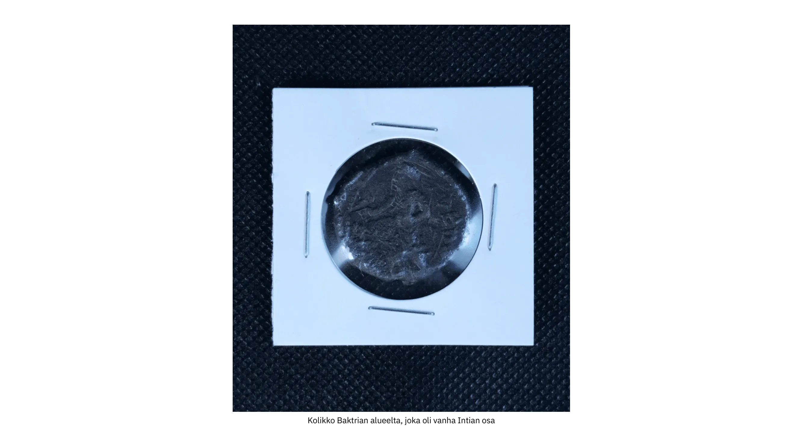

Tämän ajanjakson havainnollistamiseksi kuvassa on kolikko Intian Baktrian alueelta, joka sijaitsee lähellä Intian niemimaan länsiosaa, lähellä Afganistania. Tällä alueella oli kolikoita, jotka olivat luultavasti saaneet vaikutteita kreikkalaisista kolikoista, joissa esiintyi yksi heidän kuninkaallisista henkilöistään.

## Lydialaiset ja persialaiset

<chapterId>eb802ab8-8ffd-5b25-907f-8944f120ed14</chapterId>

:::video id=f151eb42-5ff3-4ca1-9af1-1ae2a5e051c0:::

### Ensimmäiset lydialaiset elektrumkolikot

Koska emme voi erottaa kolikoiden ilmestymistä Lydiasta ja persialaisista, siirrymme siihen osaan maailmaa, joka sijaitsee Kreikan itäpuolella ja muodostaa nykyisen Turkin. Ensimmäiset lännessä ilmestyneet kolikot ovat peräisin noin 7. vuosisadan puolivälistä eaa. Lydian ja Joonian alueilta, jotka sijaitsevat nykyisen Turkin alueella. Tämä perustavanlaatuinen innovaatio näki päivänvalon noin 650-600 eaa., ja merkittäviä arkeologisia löytöjä, kuten Efesoksen Artemiksen temppelistä löydetyt ensimmäiset kolikot, on ajoitettu noin 600 eaa. Nämä alkukantaiset kolikot valmistettiin elektrumista, joka oli kullan ja hopean luonnollista seosta, jossa oli meripihkanvärisiä heijastuksia, ja ne olivat usein karkean näköisiä, ja niihin oli merkitty pelkkiä lyöntejä tai alkeellisia kuvioita.

Alla näet yhden varhaisimmista lydialaisista kolikoista, jossa on leijona ja sen saalis edessä. Takapuolella saattaa olla leima tai reikä, jonka jotkut uskovat käytetyn metallin puhtauden testaamiseen ja sen varmistamiseen, ettei kyseessä ollut vain pintakerros. Vaikka kyseessä on yksi varhaisimmista esimerkeistä, on tärkeää huomata, että kyseessä on kopio. Kaikki kulta- ja elektrumkappaleeni ovat jäljennöksiä tai nykyaikaisia uusintoja, joiden tarkoituksena on estää minua käyttämästä kaikkia säästöjäni tähän kokoelmaan.

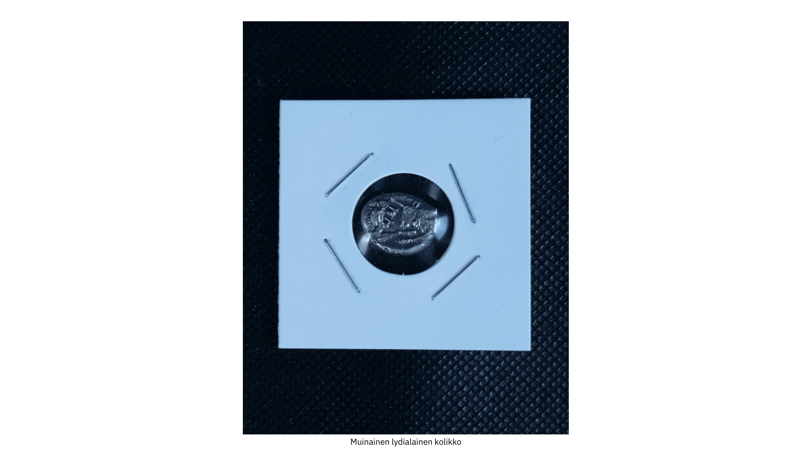

Mutta minulla on myös oikea persialainen teos, jonka näemme pian. Tältä nämä varhaiset kappaleet näyttivät. Se on kuin eräänlainen metallitahra (tai -klöntti, englanniksi), joka leimattiin tuolloin.

Toisin kuin laajalle levinnyt käsitys, jonka mukaan raha keksittiin helpottamaan jokapäiväistä kaupankäyntiä ja korvaamaan vaihtokauppa, näyttää siltä, että ensimmäisiä lydialaisia, akaalais- ja kreikkalaiskolikoita ei alun perin käytetty pienimuotoiseen kaupankäyntiin. Rahayksiköt olivatkin aivan liian suuria jokapäiväiseen käyttöön. Lisäksi niiden kierto rajoittui alueille, jotka sijaitsivat lähellä niiden valmistuspaikkaa.

Tässä yhteydessä on mielestäni tärkeää mainita, että vaikka olen lukenut useista antropologisista teoksista, kolikot, kuten olen jo osoittanut - olivatpa ne sitten elektrum-kolikoita tai tämä persialainen kolikko, johon palaan aivan pian - olivat liian suuria, jotta niistä olisi voinut ostaa leipää vaikkapa joka päivä. Olen nähnyt arvioita, joiden perusteella voisi ajatella, että se vastasi talonpojan tai sotilaan päivätyötä, joten se oli liian suuri. Se on kuin yrittäisi maksaa päivän palkan ateriasta, aamiaisesta tai lounaasta. Paitsi että olen nähnyt muissa teoksissa, että näistä räpylöistä on löydetty pienempiä yksiköitä, siis pienempiä kolikoita, mikä saattaa saada meidät ajattelemaan, että ehkä oli mahdollista käyttöä jokapäiväisiin ostoksiin.

Antropologinen "todiste" siitä, että kolikoita ei käytetty jokapäiväisessä kaupankäynnissä, koska nimellisarvo tai yksikkö oli liian suuri, ei ole mielestäni kovin vankka, koska olemme löytäneet esimerkkejä pienemmistä kolikoista, jotka olisi voitu sovittaa jokapäiväisiin ostoksiin.

### Valtion rooli rahan luomisessa

Kolikoiden todellinen alkuperä näyttää liittyvän valtioiden suoraan toimintaan. Aiheesta on kaksi päähypoteesia: ensimmäinen, idealistinen, vetää kreikkalaisen termin "nomisma" (raha) ja "nomos" (laki) välille yhtäläisyyden ja esittää, että raha liittyi lakien kodifiointiin, joka vahvisti kaupunkien auktoriteettia ja poliittista organisaatiota. Toisen, realistisemman ja nykyään laajalti hyväksytyn hypoteesin mukaan raha oli ennen kaikkea keino, jolla valtiot pystyivät harjoittamaan taloudellista ja sosiaalista valvontaa. Kun valtiot takasivat virallisesti kolikoiden sisältämien jalometallien painon ja arvon, ne pystyivät manipuloimaan kolikoiden kiertoa ja arvoa, mikä loi luottamusta ja kotimaisille valuutoille ominaisia likviditeettipreemioita.

On todella mielenkiintoista tietää, että meillä on todisteita tästä. Esimerkiksi elektrumkolikoiden osalta on syytä tietää, että luonnollinen elektrum on yleensä noin 70 prosenttia kultaa ja 30 prosenttia hopeaa. Ensimmäisissä löytämissämme ja analysoimissamme kolikoissa, erityisesti varhaisissa lydialaisissa kolikoissa, kultapitoisuus näyttäisi olevan 70 prosentin sijasta noin 50-55 prosenttia. Tämä viittaa siihen, että jo tuolloin kolikoiden liikkeeseenlaskijat pyrkivät vähentämään arvokkaamman metallin osuutta, luultavasti tuottaakseen enemmän kolikoita ja saadakseen ne näyttämään samanarvoisilta kuin merkitsemätön luonnonelektrumin kappale. Ja tässä yhteydessä on todettava, että tämä oli mahdollista vasta tämän kuuluisan Krösuksen, kuten *rikkaan Krösuksen*, aikana, koska hänen aikanaan meillä oli tekniikka kullan ja hopean erottamiseksi toisistaan.

Lydian kolikkoihin tuli suuri muutos legendaarisesta rikkaudestaan tunnetun kuuluisan kuningas Kroesoksen (561-546 eaa.) aikana. Tuolloin lydialaiset kehittivät metallurgian, jonka avulla he pystyivät erottamaan kullan ja hopean elektrumista, ja ottivat näin käyttöön ensimmäiset bimetallirahat eli erilliset kulta- ja hopeakolikot.

### Persian laajentuminen ja Kreikan omaksuminen

Kun akhamenidipersialaiset valloittivat Lydian vuonna 546 eaa., he ottivat tämän innovaation välittömästi käyttöön. Noin vuonna 500 eaa. Dareios I:n aikana persialaiset perustivat oman rahajärjestelmänsä, jossa käytettiin kultaisia darikkeja ja hopeisia sigloja, joissa oli usein kuninkaallinen kuva sotaisassa asennossa. Tätä persialaista kuninkaallista kolikkoa käytettiin pääasiassa Persian valtakunnan hellenisoituneilla alueilla, ja se levisi vähitellen, vaikka sen käyttö pysyi epätasaisena, sillä **joillakin alueilla, kuten Egyptissä, vaihdettiin edelleen mieluummin punnittua metallia (bullion) **.

Yläpuolella voit ihailla aitoa persialaista sigloia (tai siglosia). Pienessä kuviossa on kuningas, joskin reikä on hieman kulunut pois. Siglos on hopeakolikko, toisin kuin daric, joka oli valmistettu kullasta. Persialaiset osasivat erottaa nämä kaksi metallia toisistaan, ja he siirtyivät pois elektrumkolikoista. Niinpä he ottivat käyttöön bimetallismin, jossa käytettiin sekä kultaa että hopeaa, mutta samalla säilytettiin sama käsite kuin jalometalleista valmistetuissa kolikoissa, joiden takaosassa oli usein reikä, jonka tarkoituksena oli oletettavasti tarkistaa metallipitoisuus.

Kreikkalaisten nopeaa kolikoiden käyttöönottoa näyttää edistäneen heidän läheiset yhteytensä lydialaisiin, erityisesti Vähä-Aasian kreikkalaisten siirtokuntien kautta. Ensimmäiset kreikkalaiset, jotka leimasivat kolikoita, olivat luultavasti Aeginan asukkaat kuudennen vuosisadan puolivälissä eaa. He ottivat käyttöön drakman, jonka paino vaihteli alueittain ja jonka nimi tarkoittaa kirjaimellisesti "kourallista viljaa" tai "kourallista nuolia".

Kreikkalaisten kolikoiden menestys johtui yhtä lailla niiden kätevyydestä tärkeissä liiketoimissa, kuten palkkasotilaiden maksamisessa, kuin kaupunkien taloudellisesta ja poliittisesta laajentumisesta. Rahasta tuli nopeasti Kreikan ja myöhemmin myös Rooman talouden keskeinen osa, ja sillä oli samalla vahva symbolinen ulottuvuus, joka johtui erityisesti sen yhteydestä lakiin (nomos).

Rahojen nopea leviäminen todistaa antiikin yhteiskuntien syvällisestä muutoksesta, jossa raha-arvojen kodifiointi kulki käsi kädessä valtion organisaation kanssa. Tämä kehitys loi taloudellisen ja poliittisen perustan kreikkalaisten demokratioiden nousulle, erityisesti Ateenassa, jossa rahalla oli ratkaiseva rooli demokraattisen kaupungin toiminnassa.

Tärkeintä tässä osiossa on muistaa, että puhumme nimenomaan **kolikoista**, emme rahasta yleensä. Keskeinen näkökohta, joka nousee selvästi esiin, on **luottamus liikkeeseen laskevaan viranomaiseen**, joka liittyy suoraan kolikoiden teknisiin ominaisuuksiin (paino, puhtaus, nimellisarvo). Juuri tämän luottamuksen ansiosta valtio tai liikkeeseen laskeva viranomainen voi alusta alkaen valvoa tai jopa manipuloida kolikoiden arvoa ja liikkeeseenlaskua.

## Institutionaalinen toiminta ja ensimmäiset kolikot

<chapterId>3e1efd08-99e3-5a32-9908-3185fef0e640</chapterId>

:::video id=84847cf6-9e46-4a8c-9f35-25a27496cc4b:::

### Rahan kaksoisluonne

Rahan synty herättää perustavanlaatuisen kysymyksen: onko raha markkinoiden spontaani luomus vai viranomaisten määräämä instituutio? Tämä käsitteellinen jännite asettaa vastakkain kaksi radikaalisti erilaista näkemystä.

Itävaltalainen taloustieteen koulukunta puolustaa ajatusta, jonka mukaan taloudelliset toimijat ovat luonnostaan valinneet hyödykerahan - erityisesti kullan - sen luontaisten ominaisuuksien, kuten kestävyyden, siirrettävyyden, jaettavuuden ja korvattavuuden vuoksi. Tästä näkökulmasta katsottuna valtio otti tämän spontaanin rahan haltuunsa hallitakseen sen tarjontaa. Se on instituutio, joka syntyy luonnollisesti markkinoiden tarpeista ennen kuin poliittinen valta ottaa sen haltuunsa.

Sen sijaan antropologisen ja institutionaalisen näkemyksen mukaan raha syntyy vasta valtion kolikoiden liikkeeseenlaskun myötä. Viranomainen luo valuutan tietoisesti kiinnittämällä sinettinsä, jolloin metalli muuttuu aidoksi rahavälineeksi. Tämän näkemyksen mukaan varhaisimpia lydialaisia kolikoita käytettiin pääasiassa armeijoiden maksamiseen - yksi stater vastasi suunnilleen sotilaan päiväpalkkaa.

### Valtion standardoinnin paradoksaaliset edut

Tästä teoreettisesta jännitteestä huolimatta jopa itävaltalaiset taloustieteilijät tunnustavat valtion rahapoliittisen intervention tietyt edut. Rahapainon avulla tapahtuva standardointi ratkaisee useita käytännön kaupankäynnin ongelmia.

Ilman sertifiointiviranomaista talouden toimijat joutuvat jatkuvasti kohtaamaan riskejä: väärennettyjä kolikoita, petoksia ja painon manipulointia. Nämä käytännöt aiheuttavat kitkaa talouteen, sillä jotkin kolikot hyväksytään ja toiset hylätään. Teoriassa virallinen leima takaa painon ja laadun, mikä tekee kaupankäynnistä sujuvampaa.

Tällä takuulla on markkinoilla havaittava hinta: lyöty kultakolikko on arvokkaampi kuin vastaava raakakulta. Tämä palkkio kuvastaa sertifioinnin arvoa - kauppiaiden ei enää tarvitse itse varmistaa metallin aitoutta kemiallisilla tai resonanssikokeilla. Valtion väliintulo poistaa paradoksaalisesti kitkaa ja helpottaa kaupankäyntiä luomalla institutionaalista luottamusta.

### Valuutan manipulointi alusta alkaen

Ensimmäisten lydialaisten valtiomiesten tarina paljastaa huolestuttavan ironian. Viimeaikaiset analyysit osoittavat, että näiden elektrumkolikoiden kultapitoisuus oli järjestelmällisesti alhaisempi kuin luonnollisen elektrumin. Laadunvarmistusviranomainen manipuloi samanaikaisesti koostumusta.

Tämä käytäntö kuvaa kolikoiden kaksoishyödyllisyyttä. Markkinoille se tekee vaihdoista sujuvampia ja takaa standardoinnin. Liikkeeseenlaskevalle viranomaiselle siitä tulee taloudellisen valvonnan väline laimentamisen kautta. Vähentämällä kultapitoisuutta ja säilyttämällä samalla nimellisarvon valtio lisää tehokkaasti rahan määrää - samalla jalometallilla luodaan enemmän rahayksiköitä.

Valtiota itseään tämä manipulointi kuitenkin rajoitti. Kuten Konstantinuksen kultasoliduksen esimerkki 4. vuosisadalla osoittaa, Rooman hallinto tarkasti tunnollisesti kolikoiden laadun, koska se vaati saada maksun hyvillä kolikoilla. Viranomaisella oli elintärkeä intressi ylläpitää omien kolikoidensa laatua, jotta se voisi taata verotulojensa arvon.

### Devalvaation taloudellinen analyysi

Valuutan devalvaation tutkiminen paljastaa johdonmukaisia malleja kautta historian. Metallirahojen osalta taloustieteilijät seuraavat kolikoiden sisältämän jalometallin prosenttiosuutta - laskeva käyrä osoittaa asteittaista devalvaatiota. Nykyaikaisen paperirahan kohdalla tilanne on päinvastainen: kiertävän rahan määrää tarkkaillaan, ja sen kasvu on merkki devalvaatiosta.

Molemmat menetelmät mittaavat samaa perusilmiötä: rahallisen arvon laimenemista. Mekanismi pysyy samana riippumatta siitä, vähennetäänkö jalometallipitoisuutta vai painetaanko uusia seteleitä. Mitä enemmän rahayksiköitä viranomainen luo samoista todellisista resursseista, sitä enemmän kukin yksikkö menettää arvoaan.

Tämä manipulointi, joka on havaittavissa jo varhaisimmista lydialaisista kolikoista lähtien, viittaa siihen, että rahan hallinnassa on aina ollut kyse vallasta. Rahapainettu raha on siis merkittävä tekninen innovaatio, joka on yhdistetty taloudellisen kontrollin välineeseen - kaksinaisuus, joka on jatkunut läpi koko rahahistorian aina nykypäivään asti.

## Osien valmistus

<chapterId>b205f4f2-c293-5308-b812-a998de9ad45e</chapterId>

:::video id=47c612ec-d97e-4498-b50e-7e66518bd56d:::

### Rei'itetyistä rakeista lyötyihin kolikoihin

Kolikoiden syntyä käsittelevän jakson jälkeen halusin esitellä hyvin lyhyen jakson kolikoiden valmistuksen kehityksestä. Kuten olemme nähneet, kaikki alkoi elektrumista ja jatkui kullalla ja hopealla, joiden molemmat puolet merkittiin lyönnillä, joko kuninkaan kasvoilla tai reiällä kääntöpuolella puhtauden tarkistamiseksi.

Myöhemmin kreikkalaiset kehittivät tätä tekniikkaa, kuten seuraavassa jaksossa esitellään, ja loivat pyöreitä kolikoita, jotka oli vasaroitu molemmilta puolilta. He ottivat sileän, tasaisen jalometallipalan, kaiversivat halutun kuvion toiselle puolelle ja vasaroivat sen jälkeen käsin valmiin kolikon.

Yksittäisten kolikoiden käsinlyönnin tekniikalla oli todennäköisesti merkitystä inflaation hillitsemisessä tuona aikana, vaikka kolikoita usein laimennettiinkin tuotannon lisäämiseksi. Tämä oli erityisen ilmeistä roomalaisella kaudella ja vähäisemmässä määrin eräiden kreikkalaisen kauden sotien aikana. Vaikka kolikoiden lyöminen yksitellen rajoitti viranomaisten valmiuksia massatuotantoon, se vaikutti tehokkaasti inflaation hallintaan huolimatta tapahtuneista merkittävistä devalvaatioista. Kolikko kehittyi siten lyötävästä metallitölpystä pyöreäksi, vasaroiduksi kolikoksi.

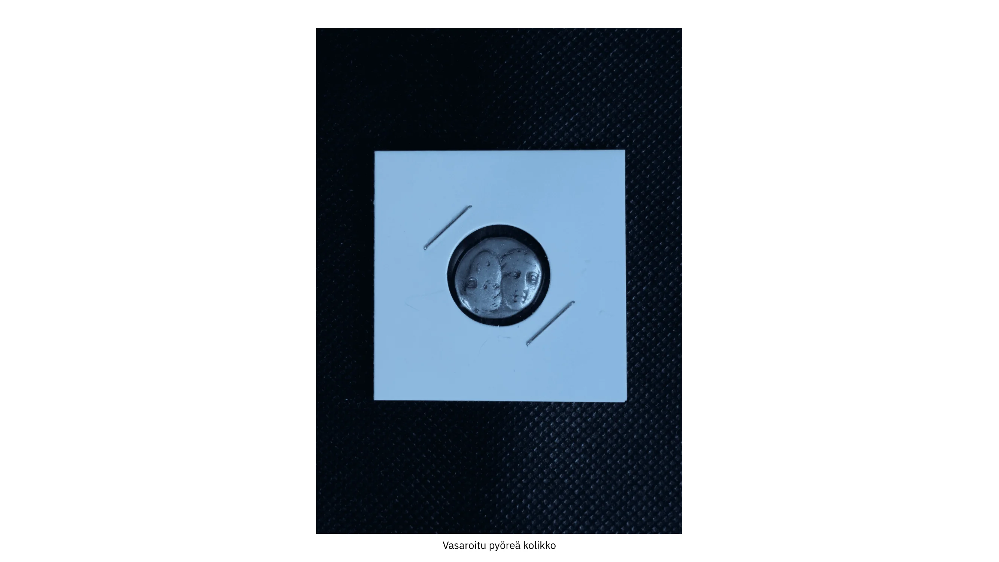

### Keskiaikainen kehitys

Keskiajalla kolikoita alettiin myös levittää, jolloin niistä tehtiin leveämpiä ja ohuempia. Yksi syy tähän oli se, että kolikoiden ääni oli helpompi testata, ja sitä käytettiin usein aitouden mittarina. Levittämällä hopeaa ulospäin saatiin aikaan erilainen taajuus, joten kolikon puhtaus voitiin varmistaa yksinkertaisesti kuuntelemalla sitä. Tästä käytännöstä syntyi termi "ääniraha". Äänellisen rahan yhteydessä standardipaino määritettiin käyttämällä punnitukseen vaakaa tai "trebuchetia". Näin kehitys jatkui pienistä, pyöreistä kolikoista hieman ohuempiin ja leveämpiin kolikoihin.

### Heiluri iskee

Viimeinen tekniikka, joka saapui keskiajan lopulla, uuden ajan alussa, oli heiluri-iskujen käsite. Se oli eräänlainen ruuvi, jota kiristettiin kolikoiden lyömiseksi, jolloin kolikot syntyivät tällä uudella lyöntitavalla. Erityistä tässä kehityksessä oli se, että kolikon pintaan voitiin kaivertaa kuvio, jolla ratkaistiin kolikon irtoamista koskeva ongelma. Leikkaaminen tarkoitti sitä, että kolikosta poistettiin osa jalometallihopeaa, jota voitiin käyttää muiden kolikoiden lyömiseen tai yksinkertaisesti säilyttää resurssina.

Tämä käsite heilurin iskusta auttoi siis leikkausilmiön kanssa. On mielenkiintoista huomata, että tämä tekniikka on itse asiassa peräisin Ranskasta. Esimerkiksi Englannissa palkattiin ranskalaisia insinöörejä näyttämään, miten näitä koneita tehdään. Hassua on mielestäni se, että vasaralyöntiä vastustivat kannattajat, jotka viivyttelivät tämän tekniikan soveltamista. Missä tahansa hyvässä teknologiassa on aina ihmisiä, jotka vastustavat sitä ja haluavat säilyttää vanhan teknologian. Minusta oli aika hullua huomata, että vaikka teknologia vaikuttaa todella ylivoimaiselta - osia voidaan valmistaa enemmän ja niitä on vaikeampi kopioida - oli silti ihmisiä, jotka olivat kiintyneitä kuuluisaan vasaramenetelmään. Siirtyminen tapahtui sen välillä, että valmistettiin osia, jotka oli tehty tällä kuuluisalla heiluri-iskumenetelmällä, ja sitten palattiin takaisin vasaralyöntimenetelmään. Lopulta heiluri-isku oli tietenkin se, joka lopulta sai jalansijaa ja antoi meille nämä kauniit nykyaikaiset kappaleet, joissa on joko pieniä viivoja, pieniä harjanteita ympäriinsä, jotta vältettäisiin leikkautuminen, mikä liittyy luultavasti sanaan leikkautuminen, harjanteet, ja vielä nykyäänkin näkee joko harjanteita tai tekstiä tai piirroksia, jotka on kaiverrettu kappaleen reunaan.

# Erilaisia teorioita rahan synnystä

<partId>72ac694f-9248-550d-90c1-91af3d234380</partId>

## Rahan syntyä ja sen eri määritelmiä koskevat teoriat

<chapterId>7d699d4d-8c70-55b5-bf36-609f3fd90bcf</chapterId>

:::video id=523c873f-501b-4954-b79f-7e74c0f685a5:::

Tervetuloa tähän osioon, jossa käsitellään erilaisia teorioita rahan synnystä ja sen eri määritelmiä. Seuraavassa on lyhyt ote kirjasta *Aux origines de la monnaie*, joka mielestäni tiivistää ne kaksi pääteoriaa, joita tarkastelemme tässä jaksossa.

> Tämän lyhyen johdannon tarkoituksena on ainoastaan korostaa tutkimuksen taustaa. Käsitteellisellä tasolla keskustelu on avoin K. Polanyin teesin kannattajien ja M. Weberin kannattajien välillä. Ensin mainituille lahja ja uudelleenjako ovat keskeisessä asemassa, ja markkinavaihdolla on vain marginaalinen rooli, lähinnä kansainvälisessä vaihdossa. Toisille taas markkinat ovat nykyisen historiallisen prosessin ytimessä.

Esimerkiksi Mesopotamiassa erään teorian mukaan temppeli auktoriteettina luo tili- tai rahayksikön, määrää sen, ja kauppiaat ottavat sen käyttöön kaupankäynnissä. Vastakkaisen teorian mukaan rahayksikkö syntyy luonnollisesti markkinoilta kaupankäynnin helpottamiseksi. Mesopotamiasta löytyy tästä hyvin perusteltuja esimerkkejä.

Joidenkin teorioiden mukaan vaihtokauppaa käytettiin lähinnä kansainvälisessä vaihdannassa, eli sellaisten ihmisten kanssa, joihin emme yksinkertaisesti luottaneet.

Niinpä teemme tässä jaksossa. Teemme eräänlaisen tutkimuksen, jossa esitellään erilaisia teorioita rahan synnystä ja erilaisia määritelmiä siitä, mitä raha on. Esittelemme ja kritisoimme sekä klassisten taloustieteilijöiden että antropologien teesejä. Minulla on jopa onni saada mukaani Ulrich, joka esittelee itävaltalaisen taloustieteilijän näkökulman näihin eri aiheisiin.

## Rahan syntyminen klassisille taloustieteilijöille

<chapterId>1d3776cd-0dfd-5297-af48-c6f41e257a7e</chapterId>

:::video id=873a16c1-17ac-448d-8941-df4feb7ab79d:::

Tämä jakso on omistettu erilaisille teorioille rahan synnystä. Ensimmäinen käsiteltävä aihe on rahan synty klassisten taloustieteilijöiden mukaan.

### Adam Smithin klassinen teoria

Klassisten talousteorioiden, erityisesti Adam Smithin edustaman teorian mukaan raha syntyi luonnollisesti vaihtokaupasta vastauksena sen rajoituksiin. Aluksi vaihdot toteutettiin suoralla vaihtokaupalla, mutta tätä menetelmää hankaloitti usein "tarpeiden kaksinkertaisen yhteneväisyyden" ongelma: kummallakin oli oltava hallussaan juuri se, mitä toinen halusi. Vähitellen tietyt hyödykkeet (kuten suola, jalometallit ja karja) tulivat kaikkien hyväksymiksi vaihdon välituotteiksi niiden hyödyllisyyden, kestävyyden ja jaettavuuden ansiosta. Näin raha syntyi spontaanisti helpottamaan ja sujuvoittamaan taloudellista vaihtoa.

### Klassisen teorian kritiikki

Seuraavassa kritisoin tätä teoriaa. Kaiken edellisessä osiossa näkemämme perusteella voimme mielestäni jo sanoa, että käsitys siitä, että **kolikot** ovat vaihtokaupan evoluutio, on väärä yksinkertaisesti siksi, että lyöty kolikko on ehdottomasti peräisin auktoriteetista, koska se on auktoriteetin lyömä. Tähän on useita syitä, eikä vähiten viranomaisten halu hallita taloutta, ottaa raha haltuunsa.

Toisaalta, jos puhumme rahasta käsitteenä, ei välttämättä kolikoista, asia ei ole yhtä selvä, koska ensimmäisistä kolikoista, Lydian statereista, on löydetty hopeatilkkuja, joita ei ole merkitty. Jää nähtäväksi, olivatko ne liikkeessä. Jos ne olivat liikkeessä, se tarkoittaa, että ihmiset ovat saattaneet alun perin pitää tätä omaisuutta potentiaalisena valuuttana, jota voitaisiin kysyä laajalti ja vaihtaa helposti. Ja ehkä vasta jälkikäteen viranomaiset huomasivat tilanteen ja ottivat sen haltuunsa laittamalla siihen leiman sen varmentamiseksi.

Tästä on monia etuja - sitä ei tarvitse tarkistaa, punnita ja niin edelleen. Puhumme tietenkin siitä. Mutta mielestäni kolikot ovat selvästi väline, jota valtiot ovat käyttäneet alusta alkaen. Mitä tulee rahan syntyyn sellaisenaan, emme kuitenkaan tiedä, onko se todella peräisin viranomaiselta, joka määräsi sen, vai syntyikö se kaupan tai kaupallisen vaihdon kautta. Käyn tästä aiheesta erittäin mielenkiintoisen keskustelun kollegani Ulrichin kanssa myöhemmin tässä jaksossa.

Tiedämme jo, että ensimmäisiä jalometallikolikoita ei käytetty päivittäiseen vaihtoon, koska niiden arvo oli aivan liian korkea. Tiedämme myös, että niitä käytettiin pääasiassa sotilaallisiin maksuihin. Tämä on hyvä argumentti teesille, jonka mukaan raha ei välttämättä syntynyt markkinoilta. Laskentayksiköt, ensimmäisten kolikoiden nimellisarvot, olivat todennäköisesti liian suuria esimerkiksi leivän ostamiseen tai päivittäisten ostosten tekemiseen. Se saattoi olla esimerkiksi päivän palkkaa vastaava summa. Ei välttämättä niin, että ihmisille maksettiin palkkaa tuohon aikaan, mutta tämä antaa teille käsityksen mittakaavasta. Näillä kolikoilla oli siis todennäköisesti liian suuri ostovoima käytettäväksi pienimuotoisessa kaupassa. Toisaalta mikään ei kuitenkaan estäisi sitä, etteikö näitä kolikoita olisi käytetty suurempiin vaihtokauppoihin, kuten kauppiaiden vaihtokauppoihin. Tiedämme, että niitä käytettiin pääasiassa sotilaallisiin maksuihin. Tämä on yksi suosituimmista teorioista, joilla selitetään ensimmäisten kolikoiden ilmestymistä. Muista, että puhumme tässä kolikoista, emme välttämättä rahasta yleensä. Ensimmäisillä kolikoilla oli siis ensimmäinen tehtävänsä, ja se oli sotilasmaksujen maksaminen palkkasotilaille.

Esimerkiksi Aleksanteri Suuri käytti sitä hyväkseen, kuten näemme myöhemmin.

Olemme myös nähneet, että jo muinaisessa Kiinassa karhunvatukan kuoria käytettiin taloudelliseen vaihtoon (**työstä maksettu korvaus, arvon mittaaminen ja maan ostaminen)**. Lisäksi Mesopotamiassa ja Egyptissä oli jo olemassa toimivia rahajärjestelmiä, joita käytettiin kaupankäyntiin, palkanmaksuun ja verojen maksuun. Tarkoitan tällä sitä, että on ehdottomasti väärin ajatella, että länsimaisen käsityksen mukaiset kolikot ovat syntyneet tarpeesta tehdä vaihdoista sujuvampia.

Koska kolikot ovat viranomaisten liikkeeseen laskemia, voimme ehkä olettaa, että ne ovat alusta alkaen olleet sidoksissa liikkeeseen laskeviin viranomaisiin. Se on järkevää. Toisaalta emme välttämättä tiedä, miten niitä edeltäneet rahan muodot tai rahajärjestelmien muodot, protokolikot, ovat syntyneet. Yhtäältä aiomme ehdottaa, että temppelit tunnistivat nämä rahayksiköt, ja sen jälkeen ihmiset käyttivät niitä. Ja toisaalta kerromme teille, että ei, vaan kauppiaat tarvitsivat vaihtovälineen, tavan käydä kauppaa ulkomaailman kanssa, ja juuri he tunnistivat esimerkiksi hopeametallin, jota käytettiin, koska sille oli kysyntää ulkomaailmassa. Pointti on se, ettemme oikeastaan tiedä. Siksi meillä on kaksi vastakkaista teoriaa. Meillä ei ole täydellistä näyttöä siitä, syntyykö raha luonnostaan esimerkiksi kauppiaiden kaupankäynnin tarpeesta vai onko se peräisin auktoriteetista.

### Kolikoiden ja primitiivisen rahan erottaminen toisistaan

Yhteenvetona voidaan mielestäni sanoa, että kolikot ovat väistämättä peräisin auktoriteetista, koska kyseinen auktoriteetti on leimannut ne. Toisaalta en usko, että voimme sanoa, että on väärin väittää, että raha (joka edelsi kolikoita) ei olisi voinut syntyä vaihtamisen helpottamiseksi. Mielestäni kaikissa edellä mainituissa esimerkeissä on runsaasti esimerkkejä tässä mielessä.

## Vaihtokaupan myytti

<chapterId>0fcd4964-ac36-5163-a8cf-1aacebc0d2c0</chapterId>

:::video id=0ede29ab-8acd-4d79-9282-bd5991b97076:::

### David Graeberin arvostelu

Olemme juuri käsitelleet rahan syntyä klassisten taloustieteilijöiden mukaan. Nyt käsittelemme käsitettä, joka tunnetaan nimellä vaihtokauppamyytti.

Yksi kritiikki tätä klassista teoriaa rahan synnystä kohtaan on se, että sen ajatusten tueksi ei ole historiallisia todisteita.

Muun muassa antropologi David Graeberin muotoilema "vaihtokauppamyytiksi" kutsuttu kritiikki kyseenalaistaa klassisen ajatuksen, jonka mukaan raha on syntynyt luonnollisesti vaihtokaupasta. Tämän kritiikin mukaan ei ole olemassa historiallisia tai antropologisia todisteita siitä, että yhteiskunnat olisivat järjestelmällisesti käyttäneet vaihtokauppaa ennen rahan syntyä. Itse asiassa muinaiset yhteiskunnat olisivat toimineet luoton, velan, sosiaalisten velvoitteiden ja seremoniallisen vaihdon pohjalta. "Vaihtokauppa-myytti" on siis teoreettinen konstruktio, jolla pyritään perustelemaan klassista talousnäkemystä, eikä sillä ole todellista empiiristä perustaa.

On kuitenkin huomattava, että tämä teoria ei kiellä sitä, etteikö vaihtokauppaa olisi ollut olemassa esimerkiksi eri heimojen välisessä vaihdossa. Se vain kiistää, että vaihtokauppa olisi ollut laajalti harjoitettua toimintaa näissä niin sanotuissa alkukantaisissa ryhmissä ja että raha olisi looginen jatkumo näille käytännöille. Se kiistää sen tosiasian, että vaihtokauppaa käytettiin laajalti heimon sisällä ja että raha syntyi lopulta sujuvoittamaan vaihtoja ja ratkaisemaan vaihtokaupan yhteydessä esiintyneet ongelmat. Tämän teorian mukaan nämä ryhmät käyttivät sen sijaan eräänlaista epävirallista luottoa tai lahjaa lahjasta.

### Alkukantaiset yhteiskunnat vs. suuret sivilisaatiot

**Tässä on joitakin selvennyksiä antiikin suuriin sivilisaatioihin liittyen.** Mielestäni tämä teoria pätee ehdottomasti menneisyyden ja jopa nykypäivän primitiivisiin (valtiottomiin) ryhmiin (esim. tutkimusmatkailijoiden 1700- ja 1800-luvuilla tutkimiin heimoihin). Ne eivät selvästikään käyttäneet vaihtokauppaa, vaan pikemminkin aiemmin mainitsemiani vaihdon muotoja, syistä, jotka olemme jo maininneet (heikko työnjako, omavaraistalous). En kuitenkaan usko, että tämä teoria pätee menneisyyden suuriin sivilisaatioihin, kuten Mesopotamiaan ja muinaiseen Egyptiin.

Seuraavassa on kaksi otetta *Aux origines de la monnaie* -kirjasta tästä aiheesta:

> Egyptologit ovat omaksuneet M. Maussin kuuluisassa "Lahjassaan" hahmotteleman mallin yhtä yksimielisesti ja innostuneesti kuin ymmärtämättömyydelläkin. Tämä on johtanut moniin sekaannuksiin, joihin emme tässä yhteydessä puutu. Todettakoon vain, että tämä malli koskee niin sanottuja primitiivisiä yhteiskuntia, mikä ei koske faraonista Egyptiä.

> Leivät eli jalostetut viljat olivat siis laskentayksiköitä, jotka mahdollistivat vanhan valtakunnan shâtin (y) tavoin myös luottojen avaamisen eri tavaroihin. Tämä yksinkertainen esimerkki osoittaa, että faraonisen Egyptin talous ei rajoittunut pelkästään uudelleenjakojärjestelmään. Se oli erittäin monimutkainen, ja siihen kuului lukuisia vaihtoja.

Kuten aiemmin Egyptin ja jopa Mesopotamian ja Kiinan kohdalla näimme, voimme nähdä, että jopa nämä muinaiset, mutta ei primitiiviset sivilisaatiot käyttivät mielestäni rahajärjestelmiä, koska niissä oli valtio. Mielestäni tämä osoitettiin laajasti tämän kurssin ensimmäisessä jaksossa. Ja näin ollen tämä käsitys antamisesta ja ottamisesta, lykätystä luotosta, ei päde näihin suuriin sivilisaatioihin. Tarkat syyt rahan syntyyn ovat siis edelleen mysteeri. Emme tiedä, johtuiko se kauppiaiden tarpeesta käydä kauppaa ulkomaailman kanssa vai oliko se temppelin määräämä näinä muinaisina aikoina.

## Rahan syntyminen velkarahan avulla

<chapterId>4f508615-aa61-5d62-89d3-cecd02aeaa62</chapterId>

:::video id=a23f547f-3906-4f4a-8f72-5d78c649d0c4:::

### Raha velkakirjana

Tässä jaksossa käsitellään velkarahan teoriaa.

Erityisesti taloustieteilijä Alfred Mitchell-Innesin kehittämässä ja myöhemmin David Graeberin laajentamassa **velkarahateoriassa** väitetään, että raha ei ole peräisin vaihtokaupasta vaan pikemminkin velka- ja luottosuhteista, joita oli olemassa jo varhaisimmissa ihmisyhteisöissä. Tämän teorian mukaan raha syntyy, kun sosiaaliset velvoitteet (yksilöiden tai ryhmien väliset velat) muuttuvat määrällisiksi ja siirrettäviksi. Tässä käsitteessä otetaan käyttöön vaihtojen ja siirtojen kvantifioinnin käsite. Raha olisi siis ennen kaikkea **velan tunnustaminen**, jonka taustalla on keskinäinen luottamus ja jonka takaa usein poliittinen tai uskonnollinen auktoriteetti, eikä niinkään hyödyke, joka toimii pelkkänä vaihdon välittäjänä.

Vielä kehittyneempi muoto tästä teoriasta on se, että kaikki raha on velkaa. Rahaa omistavalla henkilöllä on siis saatava yhteiskunnalta yleensä, saatava kaikilta niiltä, jotka hyväksyvät tämän rahan. Ja koska raha on **heidän näkemyksensä mukaan** hyväksyttävä pakollisella tavalla, muuten se ei ole rahaa, koska jos rahasta voi kieltäytyä, heidän järjestelmänsä ei toimi. Tietyssä ryhmässä, joka on määritellyt valuutan, kaikki ne, jotka omistavat sen, ovat ikään kuin velkaa kaikille muille yhteiskunnan jäsenille, jotka hyväksyvät tuon valuutan, ja niillä, jotka hyväksyvät valuutan, on eräänlainen velka sille henkilölle, joka omistaa tuon rahayksikön. Tämä on pohjimmiltaan heidän teoriansa.

### Pakollista järjestelmää koskeva kritiikki

**Kritiikkini tätä teoriaa kohtaan:**

Sallikaa minun esittää yksi pieni kritiikki tätä teoriaa kohtaan. Hyväksyn sen, että raha on eräänlainen sosiaalinen konsensus. Se on luottamus, jonka ryhmä antaa rahan "merkille", mikä se sitten onkin. Kannatan siis keskinäisen luottamuksen käsitettä, johon palaamme myöhemmin rahapalkkion käsitteen yhteydessä. Asia mutkistuu, kun tämän teorian kannattajat lisäävät siihen velvoitteen käsitteen ja vaativat velan käsitettä. Heidän mukaansa, kun joku omistaa rahallisen token:n, hänellä on saaminen koko yhteisöltä, ja yhteisö olisi näin ollen velkaa haltijalleen. Lisäksi olisi olemassa velvollisuus sopia, ja ryhmän jäsenten olisi hyväksyttävä token; muuten järjestelmä ei heidän mukaansa toimisi. Mielestäni edellä kuvattu muinaisen Kiinan järjestelmä edustaa hyvin tätä teoriaa.

Omalta osaltani voin helposti kuvitella järjestelmän, jossa raha on sosiaalinen yhteisymmärrys, jossa valittu token on yleisesti hyväksytty maksuväline ilman muodollista velvoitetta. Voin kuvitella tällaisen järjestelmän toimivan, jos ihmiset hyväksyvät sen omasta vapaasta tahdostaan. Se voi toimia. Toisaalta siihen liittyy usein velvoitteita, laillisia maksuvälineitä ja väkivaltaa, joita käsittelemme myöhemmin eräässä jaksossa. Mutta teoreettisesti minulla ei ole sellaista käsitystä, että tämä järjestelmä voisi toimia. Bitcoin on mielestäni esimerkki. Bitcoin:lla on arvoa, koska sillä on rahapalkkio, koska sille on kysyntää, jotta sitä voidaan käyttää rahassa, eli se on arvovaranto, ehkä myös vaihtoväline tai suoja fiat-järjestelmää vastaan. Kenenkään ei ole pakko hyväksyä sitä, ja mitä enemmän sitä hyväksytään maksuvälineeksi, sitä enemmän sitä voidaan käyttää vaihdon välineenä. Voimme jo nyt käyttää sitä ongelmitta arvovarastona. Siitä ei ole epäilystäkään. Tarkoitukseni on sanoa, että Bitcoin vaikuttaa minusta esimerkiltä, eräänlaiselta valuutalta, joka on eräänlainen sosiaalinen yhteisymmärrys, jossa uskomme saavamme rahamme takaisin, jos ostamme niitä myöhemmin, hankimme ne voidaksemme vaihtaa ne myöhemmin, jotta voimme säilyttää ostovoimamme.

Tämä vähemmän rajoittava näkemys teoriasta auttaa selittämään, miten kaksi erillistä yhteiskuntaa voi käydä kauppaa kullan kaltaisella rahanarvoisella token:llä ilman, että kyseisten yhteiskuntien välille syntyy saatavia tai velkoja. Hyväksymisen pakottaminen yhteiskunnassa ei mielestäni toimi kahden heimon välisessä kaupassa, koska toinen heimo ei ole auktoriteetin alainen. Heimo B ei ole heimon A auktoriteetin alainen. Silti se hyväksyy saman rahan token, vaikkapa kullan. Ihmiset saattavat sanoa minulle: "Niin, mutta se johtuu siitä, että myös yritys B on päättänyt, että kulta on heidän valuuttansa", joten se toimii. Kyllä, se toimii, mutta siinä vaiheessa ei synny velkaa. Se on lopullinen transaktio. Kun yritys A siis vaihtaa tavaran kultaan yrityksessä B, velkaa ei synny, vaan transaktio on päättynyt. Ja on selvää, että henkilö yrityksessä B ei ole hankkinut tätä kultakolikkoa tai -nugettia, jotta ihmiset yrityksessä A maksaisivat hänelle myöhemmin. Hän hyväksyy sen vaihdettavaksi kultaan. Hän ottaa sen vastaan vaihtaakseen sen myöhemmin, luultavasti omassa heimossaan. Tässä esimerkissä ei siis synny velkaa, ei ole piilevää vaatimusta, vaan kyseessä on yksinkertaisesti suora vaihto, suora maksu. Velkavaluutan kannattajat sanovat meille, että tämä on vaihtokauppaa. Olen eri mieltä, koska vaihtokauppa on suoran tavaran vaihtoa. Suora vaihtokauppa on yhden tavaran vaihtamista toiseen tavaraan, käyttöön. Tavaroita vaihdetaan käytettäväksi, kun taas meidän tapauksessamme kultaa käytetään selvästi valuuttana, koska sitä ei käytetä mihinkään muuhun, vaan sitä käytetään myöhemmin maksuvälineenä. Mielestäni se ei siis kuulu vaihtokaupan kategoriaan.

Rahanarvoisen token:n omistaminen ei ole "vaatimus" yhteisöä kohtaan, vaan pikemminkin toive siitä, että token hyväksytään myöhemmin vastaavaan arvoon.

## Rahan spontaani syntyminen

<chapterId>e3ef86b1-73b9-5140-a61e-2ab6a5b0b2d4</chapterId>

:::video id=e543995f-d5e2-49d7-9133-e397b46e0833:::

Carl Mengerin perustaman itävaltalaisen taloustieteen koulukunnan mukaan raha syntyy luonnostaan vaihdantataloudesta, jossa on ongelmana tarpeiden kaksinkertainen päällekkäisyys. Tämän näkemyksen mukaan yksilöt lähentyvät spontaanisti välituotteita, jotka helpottavat vaihtoa - ei suoraan kulutettavia tavaroita, vaan hyödykkeitä, jotka on tunnustettu niiden kyvystä olla laajasti kysyttyjä.

Näillä rahahyödykkeillä on oltava Aristoteleesta lähtien tunnistettuja ominaisuuksia: niiden on toimittava arvon säilyttäjinä, vaihtovälineinä ja laskentayksikköinä. Talouden toimijat tunnistavat, keräävät ja tallentavat niitä vähitellen, jolloin ne alkavat syntyä rahaksi. Prosessi on täysin spontaani - raha on markkinoiden luonnollinen vastaus vaihdannan koordinoinnin ongelmaan ilman viranomaisten tietoista puuttumista asiaan.

### Keskustelu vaihtokauppamyytistä

Antropologit, kuten David Graeber, kiistävät tämän näkemyksen ja vetoavat "vaihtokauppamyyttiin". Heidän väitteensä mukaan yhtään monimutkaista sivilisaatiota, joka perustuisi pelkästään suoraan vaihtokauppaan, ei ole koskaan dokumentoitu. Tutkituissa primitiivisissä yhteiskunnissa käytettiin pikemminkin epävirallisia luotto- ja vastavuoroisuusjärjestelmiä. Graeber väittää, että velka edelsi vaihtokauppaa, ja siteeraa tuhansia mesopotamialaisia tauluja, jotka dokumentoivat luottosuhteita.

Tämä kritiikki perustuu kuitenkin vaihtokaupan suppeaan määritelmään. Kuten Menger totesi jo vuonna 1892, vaihtokauppa on muutakin kuin pelkkää tavaroiden suoraa vaihtamista tavaroista tavaroihin. Siihen kuuluvat myös lykkäyssiirrot, palveluja palkkaa vastaan ja ajalliset vaihdot, joita Menger kutsui "yksilöiden välisiksi yksipuolisiksi siirroiksi". Tämä laajennettu vaihtokaupan muoto voi toimia rinnakkain luottojärjestelmien kanssa rajoitetuissa luottamuspiireissä.

Todisteiden puuttuminen ei ole todiste puuttumisesta, ja itävaltalaiset taloustieteilijät tunnustavat, ettei mikään monimutkainen yhteiskunta voi kehittyä kestävästi pelkän suoran vaihtokaupan pohjalta - tästä syystä rahan syntyminen on välttämätöntä.

### Mesopotamian tapaus: kauppiaat vastaan temppelit

Keskustelu kiteytyy Mesopotamian hopeasekelin alkuperän ympärille. On olemassa kaksi vastakkaista tulkintaa. Institutionaalisen näkemyksen mukaan temppelit - todelliset taloudelliset ja hengelliset keskukset - asettivat hopean valuutaksi talouden jäsentämiseksi. Tästä keskitetystä valvonnasta todistavat kiilakirjoitustaulut, jotka ovat keskittyneet papiston ja kauppiaiden eliitin keskuuteen.

Itävaltalaisen tulkinnan mukaan asia on päinvastoin: kauppiaat ottivat rahan käyttöön pitkän matkan kaupassa. He joutuivat käymään kauppaa muukalaisten kanssa Mesopotamian rajojen ulkopuolella - Anatoliasta Persianlahdelle - ja tarvitsivat jotain yleisesti tunnistettavaa, kestävää ja kuljetettavaa. Hopea oli luonnollinen valinta sen luontaisten ominaisuuksien vuoksi. Temppelit vain vahvistivat kaupallisessa käytössä jo vakiintuneen käytännön.

Tämä tutkielma perustuu Anatoliassa sijaitsevan Kaneshin ja Assurin väliseen dokumentoituun kauppaan, jossa kauppiaat vaihtoivat tekstiilejä hopeametalliin - ei sen materiaalisen hyödyn vuoksi vaan arvovarastona. Nämä liiketoimet menivät pelkkää vaihtokauppaa pidemmälle ja paljastivat aidon tavaravaluutan olemassaolon.

### Nykyaikainen esimerkki vankileireistä

Taloustieteilijä Richard Radford, joka oli vankina Saksassa toisen maailmansodan aikana, dokumentoi kiehtovan tapauksen rahan spontaanista syntymisestä. Leireillä savukkeista tuli luonnostaan vaihtoyksikkö - ne olivat jaettavissa, standardoituja ja laajalti hyväksyttyjä. Jopa tupakoimattomat ottivat savukkeet käyttöönsä, koska ne tunnistivat niiden yleismaailmallisen vaihtoarvon.

Tämä mikrokosmos havainnollistaa itävaltalaista periaatetta: kun yksilöt joutuvat kohtaamaan vaihdon koordinoinnin ongelman, he löytävät spontaanisti "myydyimmän" tavaran. Mikään viranomainen ei määrännyt savukerahaa, vaan se syntyi vankien päivittäisistä käytännöistä, joilla he pyrkivät optimoimaan vaihtonsa.

### Yksilöllisten mieltymysten lähentyminen

Pohjimmiltaan raha edustaa yksilöllisten mieltymysten lähentymistä kohti hyväksyttyä yhteistä hyvää. Mesopotamialaiset kauppiaat, kuten Radfordin vangitkin, tunnistivat hyödykkeen, joka minimoi tulevien vaihtojen epävarmuuden. Tämä valinta ei odota keskusviranomaisen lupaa tai määräämistä, vaan se syntyy vaihdon haasteiden edessä olevien taloudellisten toimijoiden käytännön rationaalisuudesta.

Keskustelu spontaanin syntymisen ja tietoisen perustamisen välillä on edelleen avoin, sillä historialliset todisteet ovat hajanaisia. Itävaltalainen analyysi tarjoaa kuitenkin johdonmukaisen selityksen: raha syntyi kaupankäynnin käytännön tarpeista, ja viranomaiset vain institutionalisoivat markkinakäytäntöjä, jotka olivat jo vakiintuneet.

## Antropologinen näkemys rahan synnystä

<chapterId>ec48c5d8-47ed-530f-beb7-c44fd0b62880</chapterId>

:::video id=8c1f8764-75af-4fb6-a98b-55de3b7da02e:::

### Rahan ei-taloudellinen alkuperä

Tässä jaksossa tarkastelemme antropologista näkemystä rahan synnystä, joka on rikas näkökulma, joka kyseenalaistaa perusteellisesti klassiset talousteoriat.

Vastoin perinteistä teoriaa, jonka mukaan raha syntyi luonnostaan vaihtokaupasta taloudellisen vaihdannan helpottamiseksi, antropologinen tutkimus osoittaa, että rahan syntyyn on pitkälti muita kuin taloudellisia syitä. Se juontaa juurensa yhteiskunnallisista mekanismeista, kuten tribuuteista, murhakorvauksista (kuuluisa Wergeld) ja myötäjäisistä (morsiusraha), mutta myös seremoniallisista, uskonnollisista, poliittisista ja symbolisista käytännöistä, paljon enemmän kuin yksinkertaisista markkinatarpeista.

Alkukantaisissa yhteiskunnissa rahaa käytettiin harvoin aineellisten hyödykkeiden päivittäiseen vaihtoon, mikä on vastoin rahan klassista määritelmää "vaihdon välineenä". Itse asiassa näissä yhteiskunnissa käytettiin massiivisesti luottoa, ja lykkäysmaksut olivat osa laajoja sosiaalisten ja henkilökohtaisten suhteiden verkostoja. Nämä kaikkialle levinneet luottojärjestelmät edeltivät loogisesti ja historiallisesti rahan syntyä.

Tämä on heidän visionsa. Keskustelemme tästä Ulrichin kanssa edellisen videon keskustelussa. Annan teidän nauttia Ulrichin kommenteista aiheesta, jotka haastavat hieman tätä lähestymistapaa. Antropologisessa näkemyksessä meillä on siis usein käsitys, että raha tulee auktoriteetilta tai yhteiskunnalliselta käsitteeltä, joka edeltää markkinoiden tarpeita.

### Yapin kivien esimerkki

Alla voit ihailla silmiinpistävää esimerkkiä Yapin saaren monumentaalisista kivistä. Jotkin näistä kivistä toimivat liikkumattomuudestaan tai jopa fyysisestä katoamisestaan huolimatta edelleen täysin rahana kollektiivisen sopimuksen ansiosta, mikä korostaa rahan sosiaalista ja symbolista ulottuvuutta.

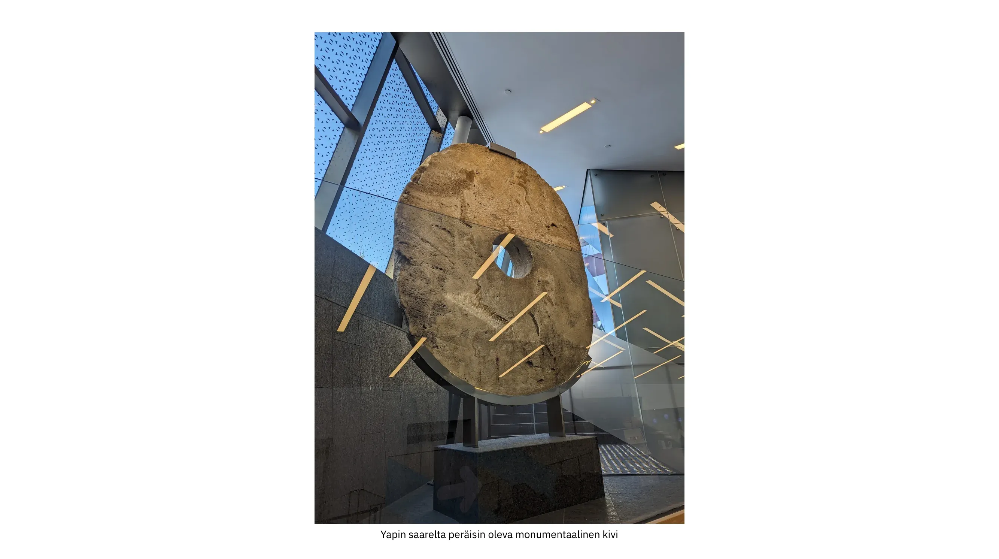

Tämä on todella mielenkiintoinen analyysi Yapin kivistä. Myös Saifedean Ammous mainitsee tämän esimerkin kirjassaan "The Bitcoin Standard". Hänen mukaansa Yap-saarten järjestelmä muistuttaa eniten Bitcoin:ta, eräänlaista keskusrekisteriä, johon kaikki voivat tutustua ja joka on julkinen, ylläpitää tilejä ja hallinnoi asioiden omistusta. Tämä antropologinen näkökulma havainnollistaa, että kaikki tämä edustaa sopimusta tai sosiaalista yhteisymmärrystä yhteiskunnassa, mikä on pohjimmiltaan oikein. Ja minusta tämä maininta kadonneista kivistä on hyvin mielenkiintoinen. He lähtivät satoja kilometrejä merelle pienillä lautoilla ja toivat kivet takaisin. Joskus kivi putosi merenpohjaan, mutta sitä käytettiin silti rahajärjestelmässä. Henkilö voisi sanoa: "Kyllä, pudotimme kiven tällaiseen paikkaan; se on minun, joten voimme vaihtaa sen". Vaihdon helpottamiseksi ei välttämättä tarvittu fyysistä hallussapitoa, sillä kivet olivat niin suuria, että ne jäivät usein yhteen paikkaan. Sen sijaan keskityttiin vaihtamaan näiden kivien kanssa omistajaa transaktionomaisesti, jolloin omistusoikeus saattoi vaihtua ilman, että kivet itse asiassa liikkuivat. Kyseessä oli eräänlainen "konsensustodistus", joka korostaa mielenkiintoista antropologista näkökulmaa rahaan.

### Protovaluutat ja sosiaaliset velvoitteet

Etnografit ympäri maailmaa ovat havainneet yhteiskuntien käyttävän "protovaluuttoja" tai "alkukantaisia valuuttoja", kuten simpukankuoria, kankaita, karjaa, suolaa ja kiviä, jotka täyttivät rahan tavanomaiset funktiot, kuten maksuvälineenä ja arvon säilyttäjänä, mutta eivät kuitenkaan säännöllisesti toimineet välittäjinä jokapäiväisten tavaroiden vaihdossa.

Tässä kuvataan siis rahajärjestelmiä, joita ei välttämättä käytetty jokapäiväiseen vaihtoon.

Haluaisin muistuttaa teitä siitä, että nämä kaikki olivat valuuttoja ennen kolikoiden tuloa, enkä tiedä, kuinka väärin on sanoa valuuttaa. Sanon mieluummin valuutta. Voin mainita, että kirjallisuudessa puhutaan usein protovaluutoista viitaten rahaan ennen kolikoita. Mutta kuten ensimmäisessä jaksossa todettiin, ** uskon, että rahajärjestelmiä oli olemassa jo kauan ennen kolikoiden ilmestymistä**.

Näitä alkukantaisia valuuttoja käytettiin pääasiassa yksilöihin liittyvien perustavanlaatuisten sosiaalisten velvoitteiden hoitamiseen, kuten avioliiton solmimiseen, konfliktikorvauksiin (Wergeld) tai päälliköiden välisiin lahjoihin. Esimerkiksi Persian valtakunnassa ensimmäiset kolikot luotiin nimenomaan sotilaalliseksi maksuvälineeksi eikä niinkään vaihtovälineeksi.

Alkukantaisella rahalla on siis yksi olennainen piirre: se on maksuväline, mutta hyvin harvoin aineellisten hyödykkeiden suoranaisen vaihdon väline. Tarkoitamme, että se oli maksuväline, jolla maksettiin tiettyjä sosiaalisia velvoitteita, heimoja, päälliköiden välisiä vaihtoja, kuuluisaa wergeldia, verirahalla. Ennen oikeusjärjestelmien syntymistä, jos joku syyllistyi murhaan, perheelle, joka kärsi läheisensä murhasta, maksettiin korvausta. Tästä oli maksettava hinta, sitä kutsuttiin verirahaksi, ja se on eräänlainen maksu. Oli myös myötäjäiset, joka on myös maksun muoto. Näissä rahan varhaisissa käyttötavoissa maksumuotona se liittyi enemmän inhimillisiin ja sosiaalisiin velvoitteisiin kuin jokapäiväisten ostosten maksamiseen. Tämän teorian mukaan nämä tavallisemmat arkipäiväiset vaihdot liittyivät enemmän luottoon, lykättyyn luottoon, lahja lahjasta ja annosten uudelleenjakoon. Näiden vaihtojen hallitsemiseksi oli olemassa toisenlainen sosiaalinen organisaatio. On myös tärkeää muistaa, että yhteiskunnassa, jossa kaikki ovat omavaraisia, harjoittavat omaa maanviljelystään, ei ole erikoistumista, ja jokapäiväisiä vaihtoja varten tarvitaan hyvin vähän rahajärjestelmää. Ja siksi ensimmäiset rahan muodot olivat juuri kuvaamamme, myötäjäiset, veriraha, yksinkertaisesti siksi, että nämä olivat ensimmäiset vaihdot, joissa tarvitsimme maksuvälineen, kauan ennen kuin tarvitsimme kaupankäyntiä, leivän vaihtamista rahaan päivittäin, koska alkukantaisissa yhteiskunnissa se ei toiminut niin. Jokainen huolehti omista tarpeistaan, eikä erikoistumista vielä ollut. Luulen, että olen käsitellyt tätä pitkään kaikilla tämän kurssin aiemmilla luennoilla.

Näissä yhteiskunnissa, joissa ei ollut kehittynyttä työnjakoa, suora vaihto oli vähäistä, ja se tapahtui pääasiassa henkilökohtaisissa ystävyys- tai liittosuhteissa. Riittävän erikoistumisen puuttuminen ei edellyttänyt rahaa nykyaikaisessa merkityksessä.

Quigginin ja Einzigin kaltaiset antropologit korostavat luoton ensisijaisuutta: **Alkukantainen talouselämä on kiinni jättiläismäisessä luottojen ja henkilökohtaisten velkojen verkostossa, jossa raha on mukana erityisesti silloin, kun maksujen on oltava välittömiä ja korvauksia ei voi helposti lykätä.**

Ihmiset siis vaihtavat tavaroita, voivat tehdä lykättyjä luottoja, mutta joissakin tapauksissa maksua ei voi lykätä, joten valuutta tai protovaluutat voivat olla hyödyllisiä tässä vaiheessa, jotta vaihdolle saadaan välitön lopullisuus.

### Anonymiteetin innovaatio

Tämä analyysi johtaa syvällisempään pohdintaan: sen sijaan, että raha asetettaisiin vastakkain vaihtokaupan kanssa, on olennaisempaa ymmärtää rahan synty evoluutiona monimutkaisista luotto- ja velkajärjestelmistä. Raha tuo mukanaan perustavanlaatuisen innovaation: **anonymiteetti**. Ja juuri tässä kohtaa pidän tätä antropologista teoriaa rahan synnystä mielenkiintoisena. Jos olette pieni joukko ihmisiä ja annatte toisillenne lykättyjä luottoja, tunnette ilmeisesti toisenne. Uskon, että jotta tämä järjestelmä toimisi, ihmisten on ilmeisesti tunnettava toisensa. Ja rahalla suoritettu maksu mahdollistaa anonymiteetin. Sen avulla voi suorittaa maksun ilman, että ihmiset tietävät edes nimeäsi, ilman, että he tietävät, kuka olet. He voivat tehdä vaihdon välitöntä ja lopullista selvitystä varten. Ja juuri sen raha mahdollistaa.

Toisin kuin luotto, joka on aina nominatiivinen, raha mahdollistaa anonyymit, yleiset ja välittömästi vapauttavat liiketoimet. **Tämä rahan ainutlaatuinen vapauttava voima on sen ratkaiseva ylivoima.**

Raha ei siis suinkaan ole vaatimaton väline taloudellisen vaihdon helpottamiseksi, vaan se on merkittävä sosiaalinen innovaatio, joka liittyy läheisesti inhimillisten instituutioiden ja käytäntöjen kehitykseen henkilökohtaisesta luotosta **yleiseen, anonyymiin maksujärjestelmään**. Tämä antropologinen kehitys osoittaa, että raha on paljon enemmän kuin pelkkä vaihtoväline, se on voimakas sosiaalinen instituutio, joka muokkaa syvällisesti ihmisyhteisöjä niin, että siitä on tullut nyky-yhteiskunnissamme taloudellisen toiminnan tarkoitus.

Tässä yhteydessä huomaamme, että viime kädessä nyky-yhteiskunnissamme taloudellisen vaihdon tarkoituksena on rahan omistaminen, kun taas ennen vanhaan näin ei ollut lainkaan. Taloudellisen vaihdon tarkoituksena oli omistaa tavaroita tai hyödykkeitä kulutusta varten. Ja nykyään, kun rahan innovaatio on otettu käyttöön, taloudellisen vaihdon tarkoituksena on kerätä tätä rahaa, koska sen avulla voimme vaihtaa sitä tavaraan, kuten yleisesti hyväksytään. Voimme vaihtaa sen tarvitsemaamme tavaraan silloin, kun tarvitsemme sitä.

## Rekisterin yhdistäminen

<chapterId>7664442a-91c1-5ce4-a8bd-53b7371a3e3d</chapterId>

:::video id=473fc284-5375-4e1b-b0cd-6b51ba0cc3b8:::

### Kirjanpidon rekisteriteoria

Aiomme nyt tutkia yhdessä erilaisia ehdotuksia näiden kahden rahateorian, eli velkarahan kautta syntyneen rahan syntyyn liittyvän teorian ja hyödykerahan syntyyn liittyvän rahateorian, yhdistämiseksi. Puhumme Lynn Aldenin yhdistämisehdotuksesta hänen kuuluisassa kirjassaan "For Broken Money", jonka Consensuksen tuottaman käännöksen nimi on todennäköisesti "Rupture monétaire".

*Ote kirjasta Broken Money by Lyn Alden:*

> Raha on pohjimmiltaan kirjanpidollinen rekisteri. Tavararaha on luonnon hallitsema rekisteri. Pankkiraha on kansallisvaltioiden hallitsema rekisteri. Avoimen lähdekoodin raha on käyttäjiensä hallitsema tilikirja.

Tässä Lyn viittaa Bitcoin:ään.

### Varastovirtasuhde ja niukkuus

> Jotkin harvinaiset kemialliset alkuaineet, kuten rodium, ovat kultaakin harvinaisempia, mutta niiden varastojen vaihtuvuus on alhainen, koska teollisuus kuluttaa ne yhtä nopeasti kuin ne louhitaan. Rodiumkolikkoa tai -harkkoa voi ostaa erikoiskeräilyesineeksi tai arvoesineeksi, mutta se ei sovellu yhteiskunnallisesti hyväksytyksi valuutaksi, joten se ei synny luonnostaan rahana.

Saifedean puhuu tästä pitkään kirjassaan "The Bitcoin Standard". Niille, jotka eivät tunne varasto-virtaussuhdetta, kerrottakoon, että se tarkoittaa yksinkertaisesti sitä, että kun verrataan olemassa olevaa varastoa, markkinoilla olevia varantoja, uuteen varastoon, joka on tulossa, eli uusien varastojen tuloon. Se on usein melko intuition vastainen, koska saatetaan ajatella, että jotain, jota on suuria määriä, ei ole niukasti saatavilla, mutta itse asiassa se ei ole. Kyse on pikemminkin kapasiteetista, joka sinulla on sen toimittamiseen. Pikemminkin kapasiteetti, joka meillä on uusien varastojen hankkimiseen, antaa meille tämän mallin mukaan tietoa siitä, onko tämä esine harvinainen vai ei. Se ei ole harvinaista siksi, että meillä ei ole jotakin varastossa, vaan siksi, että meillä ei ehkä ole sitä. Jos otetaan esimerkiksi kulta, meillä on paljon kultavarastoja, koska sitä käytetään arvon säilyttäjänä, ja uusien varastojen tulo on noin 1-3 prosenttia vuodessa kullan mining:n kautta tulevista uusista kultavarastoista. Jos taas puhutaan rodiumista, se on harvinaisempaa kuin kulta, mutta sitä ei ole varastossa, koska se kulutetaan sitä mukaa kuin se kuluu. Ei siis tarvita paljon uutta tarjontaa kaksinkertaistamaan olemassa olevaa varastoa. Kun taas kullan kohdalla varastojen kaksinkertaistaminen vaatisi vähintään 50 vuotta. Toisin kuin useimpien kulutushyödykkeiden kohdalla, joissa varastojen kaksinkertaistaminen on melko helppoa eikä vaadi montaa vuotta tuotantoa, koska niitä kulutetaan sitä mukaa kuin niitä kuluu.

*"Kulta on säilyttänyt varasto- ja virtaussuhteen 25x-100x välillä koko modernin historian ajan, yleensä noin 50x tai enemmän, eikä se ole koskaan laskenut alle 16x:n, ei edes 1800-luvun puolivälin kultakuumeen aikana. "*

Joten 25 tarkoittaisi 25 vuotta kannan kaksinkertaistamiseen ja 100 tarkoittaisi 100 vuotta kannan kaksinkertaistamiseen. Saifedean sanoo kirjassaan, että vaikka kaksinkertaistaisimme kullan tuotannon vaikkapa 1,5 prosentista 3 prosenttiin, sillä ei välttämättä olisi suurta vaikutusta kullan hintaan.

*"Hopean varasto-virta-suhde on yleensä vähintään 10-kertainen, mikä on edelleen suhteellisen korkea.*"

*Useimpien muiden hyödykkeiden varastovirtasuhde on alle 1 tai 2. Jopa harvinaisimpien alkuaineiden, kuten platinan ja rodiumin, varastovirtasuhde on suhteellisen alhainen niiden nopean teollisen kulutuksen vuoksi." *

### Kullan ja hopean paremmuus

*"Lyhyesti sanottuna, aina kun hyödykevaluutta on joutunut kilpailemaan kullan ja hopean kanssa, jälkimmäinen on lopulta aina voittanut. Muut hyödykkeet saattavat pysyä valuuttoina rajoitetun ajan tai tietyillä alueilla, mutta kulta ja hopea ovat aina osoittaneet kykynsä tulla maailmanlaajuisesti kilpailukykyisiksi valuutoiksi ja hallita kilpailua. Tämä johtuu siitä, että sivilisaatioiden kohdatessa kullan ja hopean haltijoilla oli aina teknologinen kyky devalvoida muita valuuttamuotoja, kun taas simpukoiden, helmien, karjan, suolan, kankaan tai huonompien metallien haltijat eivät koskaan voineet devalvoida kultaa tai hopeaa." *

Tätä kuvataan jälleen kerran erittäin hyvin The Bitcoin Standardissa, jossa Saifedean puhuu Afrikan heimoista, jotka käyttivät lasihelmiä. Ja kun venetsialaiset kauppiaat saapuivat lastien kanssa, jotka olivat täynnä lasihelmiä, koska he pystyivät tuottamaan niitä teollisesti tuohon aikaan, heillä oli siihen teknologinen kapasiteetti, se horjutti täysin näiden kansojen rahajärjestelmän, ja he pystyivät kirjaimellisesti ryöstämään heidän resurssinsa. Tämä on Saifedeanin teesi.

### Tiliyksikkö ja hyvitys

*"Historiallisesti jopa silloin, kun luottoa käytettiin suoraan vaihtovälineenä, se oli yleensä ilmaistu rahahyödykkeiden yksiköissä, jotka oli luonnollisesti valittu niiden ominaisuuksien perusteella. "*

Tämä on hyvin mielenkiintoinen seikka, josta Ulrich ja minä olemme keskustelleet. Vaikka Mesopotamian temppeli olikin eräänlainen viranomainen, joka pystyi hallinnoimaan tätä luoton käsitettä, laskentayksikkö oli sekeli. Mikään ei vahvista, että temppeli olisi vahvistanut sekelin arvovaltaisesti. Sekeli on voinut syntyä luonnollisesti, kun kauppiailla oli tarve tuoda ja viedä tavaraa muiden lähiseudun kansojen kanssa. Meillä on tästä todisteita Kaneshin kauppiaan muodossa (mainitsin tämän osassa 1), joka teki juuri näin tuoden maahan jalometalleja, joita ei käytetty niiden fyysisen hyödykearvon vuoksi vaan pikemminkin arvovarastona. Ainoa ongelma on se, ettemme tiedä, voimmeko olettaa, että tämän hopean, hopeasekelin, valinnan tekivät kauppiaat vai tekikö sen temppeli. Ulrichilla on kuitenkin erittäin hyvä argumentti, joka saa meidät ajattelemaan, että se oli luultavasti pikemminkin kauppiaiden puolella, että se tehtiin.

*"Näin ollen näiden kahden teorian yhdistämistä voidaan kuvata "rahan kirjanpitoteoriaksi" ("rahan pääkirjateoriaksi"), koska se kuvaa molemmille teorioille yhteistä peruslogiikkaa. Sekä joustava sosiaalinen luotto että keräilykelpoiset protovaluutat ovat peräisin jo ihmiskunnan alkuajoilta. Molemmissa tapauksissa erikokoiset ihmisryhmät pitävät keskenään kirjanpitokirjaa välttääkseen tarpeiden kaksinkertaisen yhteensattuman, vähentääkseen vaihtokitkaa ja toimiakseen likvidinä säästömuotona. Olennainen ero on siinä, mikä taho huolehtii rekisterin pitämisestä." *

Toisaalta luonto hallitsee rahan tarjonnan laajentumista. Jos otetaan esimerkiksi kulta, joka on melko harvinaista ja jota on vaikea louhia. Kaivettavien kultakolikoiden määrälle on eräänlainen raja. Luonto siis hallitsee niukkuutta. Ja rekisteriä pitää hallussaan hallussapidon käsite. Rekisteri on hajautettu. Hallussapito todistetaan sillä, että omistat kultakolikon tai kultakimpaleen. Luottorahan tapauksessa niukkuutta hallitsee ihmisten kyky saada luottoa. Fiat-valuutan tapauksessa niukkuutta hallitsee viranomainen. He päättävät, painetaanko lisää vai ei, jotta vältetään inflaatiokatastrofit. Niinpä joissakin tapauksissa rekisteriä voi hallita myös token:n omistaja, paperirahan tapauksessa. Siksi se merkitään rekisteriin lainausmerkeissä, dematerialisoituna. No, aineellistettu, mutta virtuaalinen. Hänellä on hallussaan tämä kuuluisa token, ja se todistaa hallussapidon. Ja se voi aivan yhtä hyvin olla todellisessa rekisterissä, kuten pyhien kirjoitusten mukaisessa rahassa, pankissa, jossa oikeastaan ihmispankki hallinnoi sitä, kuka omistaa mitä suhteessa rekisteriin.

## Rahapalkkion avulla tapahtuva yhtenäistäminen

<chapterId>093756e5-8908-55e5-bb76-376a3a3cc4d3</chapterId>

:::video id=eabc342a-ecbd-46ca-a347-e914917e7c4f:::

### Rahapalkkion käsite

Tässä jaksossa, joka on omistettu rahan syntyä koskevien eri teorioiden yhdistämistä koskeville ehdotuksille, olen juuri ehdottanut Lyn Aldenin teoriaa eli rekisteriteoriaa. Minulla on oma ehdotukseni kahden rahateorian yhdistämiseksi. Se on rahapalkkio, rahapalkkion käsite. Rahan arvo voidaan siis selittää sen rahakysynnästä johtuvalla rahapreemiolla, olipa se sitten savitaulujen, jalometallirahojen, seteleiden tai bitcoinien muodossa. Rahapreemio perustuu yksinkertaisesti siihen luottamukseen, että joku vaihtaa tämän valuutan tulevaisuudessa vastaavaan hintaan.

Yritän tässä osoittaa, että olipa kyseessä sitten fiat, eli setelit, joilla ei ole käyttöarvoa, tai kultakolikot tai mikä tahansa metalli, kultakimpale tai kultaharkko, **suurimman osan sen arvosta muodostaa usein rahapalkkio**. Jos otamme kultakimpaleen, tietty osa sen arvosta selittyy sen käyttöarvolla, sen käytöllä teollisuudessa tai korujen valmistuksessa. Huomaa, että korujen kysyntä johtuu usein niiden rahallisesta arvosta. Ihmiset säilyttävät koruja eräänlaisena arvosäilönnä, joten otan tämän hieman mukaan rahapreemioon, koska se on usein melko rahan kysyntää, jotta sillä olisi merkitystä rahassa.

Voidaan siis sanoa, että noin 10 prosenttia kullan kysynnästä on teollisuuden kysyntää. Kullan arvossa olisi pieni osa, sanotaan vaikka 10 prosenttia, joka selittyisi tällä teollisuuden kysynnällä, kullan käytön kysynnällä, jossa kultaa kulutetaan. Loppuosa on selvästi kysyntää, joka kohdistuu sen rahalliseen käyttöön arvon säilyttäjänä.

### Viranomaisbonus ja fiat

Ja jos verrataan kultapalaa kultakolikkoon, on vielä yksi kerros lisää. Kultakolikko on viranomaisen leimaama, ja kappaleen sisältämälle kullalle on myös kysyntää, kysyntää, joka kohdistuu teollisuuteen. Se nauttii myös rahapalkkiota arvon säilyttäjänä. Lisäksi on olemassa kerros, jota kutsun viranomaispalkkioksi, jossa kolikolla on usein suurempi hinta, suurempi ostovoima kuin kultakappaleella, koska kolikkoa on yksinkertaisempi käyttää. Se tekee vaihdosta sujuvampaa, koska sitä ei tarvitse punnita. Viranomainen takaa yleensä sen puhtauden. Ja jos sitä verrataan kultakappaleeseen, leimattu kultakolikko on yleensä arvokkaampi kuin yksinkertainen kultakappale. Sekin on normaalia, koska leimaaminen vaatii resursseja.

Sama periaate pätee fiat- eli paperirahaan. Paperirahalla ei oikeastaan ole mitään käyttöarvoa, paitsi ehkä talon lämmittämiseen, ja niin tapahtui Weimarin tasavallan aikana. Sen käyttöarvolle ei siis ole todellista kysyntää. Toisaalta mielestäni vain auktoriteettipreemio on olemassa.

Se on eräänlainen rahapalkkio, joka on rahapalkkion päällekkäisyys. Mutta sen rahapalkkio johtuu siitä, että se on laillinen maksuväline, ja viranomaiset pakottavat sinut ostamaan sitä maksaaksesi verosi. Fiat-valuutalla on siis väistämättä eräänlainen rahallinen kysyntä, joka johtuu siitä, että sitä verotetaan ja sitä on ainakin hankittava verojen maksamiseksi. Ja tämän seurauksena se on edelleen yleisesti hyväksytty maksuväline. Ihmiset haluavat siis hankkia sitä täyttääkseen tarpeensa.

### Rahan kysynnän avulla tapahtuva yhtenäistäminen

Ja miksi tämä rahapalkkiota koskeva ehdotus voidaan luokitella velkarahaa ja hyödykerahaa koskevien kahden teorian yhdistämiseksi? No, minusta kultakolikon arvo ei välttämättä johdu sen "itseisarvosta". Ei, itse asiassa se on yhtä lailla luottamuksen käsite kuin fiat-rahan kohdalla. Se on rahan kysynnän käsite. Eikä se todellakaan johdu siitä, että sillä on pieni prosenttiosuus teollista käyttöä, toista "hyötykäyttöä". Jos sanotaan, että teollinen käyttö on 10 prosenttia sen arvosta, se voisi olla 300 dollaria unssilta. Jos kultaa myydään markkinoilla 3 000 dollarilla unssilta, 300 dollarin ja 3 000 dollarin välinen ero on kuuluisa rahallinen preemio. Tämä kullan rahamääräinen kysyntä selittää sen. Se, että fiatilla ei ole käyttöarvoa, ei tarkoita, että se olisi jotenkin erilaista. Minulle se on täsmälleen sama asia. Joten kummallakaan puolella, velkarahateoriassa tai hyödykerahateoriassa, en usko, että se ylimääräinen ominaisuus, että kullalla on minimaalinen käyttöarvo, muuttaa mitään.

Toisaalta on varmaa, että **Em emergenssin tasolla, Misesin regressioteorian mukaan, voimme ehdottaa, että tämä käyttö luo kysyntää alun perin ja käynnistää prosessin, josta tulee rahaa.** Kun taas velkarahan tasolla se on enemmänkin viranomaisen määräämä, joten lähde, emergenssin käynnistyminen ja käsitteet ovat täysin erilaisia. **Mutta uskon, että arvon tasolla, eli miten selittää rahan arvo, voimme rahapalkkion avulla yhtä hyvin selittää, miksi fiat-rahalla on se arvo, jonka sille annamme, ja miksi tavara-rahalla on se arvo**, jonka sille annamme. Minulle kyse on samasta prosessista, ja sitä kutsutaan rahapreemioksi.

#### Rahapalkkio

Siinä kaikki. Rahan arvo voidaan selittää sen rahakysynnästä johtuvalla rahapreemiolla, olipa se sitten savitaulujen, jalometallirahojen, seteleiden tai bitcoinien muodossa.

Rahapalkkio perustuu yksinkertaisesti luottamukseen siihen, että joku vaihtaa tämän rahan myöhemmin vastaavaan hintaan.

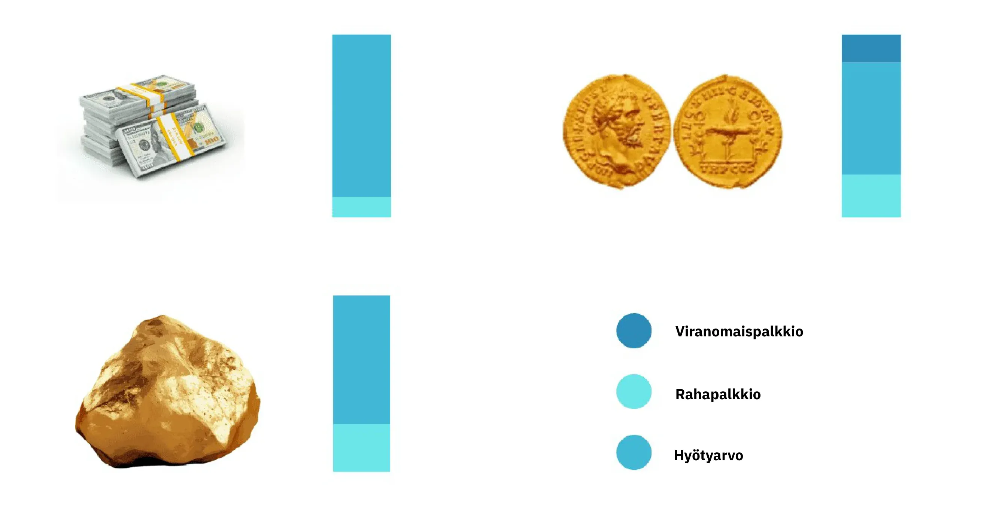

# Rahan erilaiset määritelmät

<partId>77b7918a-8c3b-11f0-b688-6b2ab22378c9</partId>

## Raha vs valuutta vs monnaie vs argent vs devise

<chapterId>bf8a6d21-df88-5d23-a0a5-e9a5c1300554</chapterId>

:::video id=d9c9e7df-9db3-4a9f-801e-10d3fc7dfc22:::

### Rahatermien semantiikka

Tässä eri rahateorioita ja erityisesti rahan määritelmiä käsittelevässä jaksossa haluaisin tehdä lyhyen sivulauseen semantiikasta. Haluaisin syventyä hieman useiden rahaan liittyvien sanojen määritelmiin ja verrata niitä niiden englanninkielisiin vastineisiin. Esimerkiksi money, currency, verrattuna monnaie, argent ja devise. Se menee siis näin.

Vähän semantiikkaa:

Kun sanomme "**rahaa**" (de la monnaie), useimmat ihmiset luulevat, että viittaamme pieneen vaihtorahaan, jonka saamme vastineeksi liiketoimesta. Ja jos sanomme "**valuutta**" (la monnaie), ihmiset luultavasti luulevat, että tarkoitamme valtion valuuttaa. Kanadan valuutta on Kanadan dollari. Aivan oikein.

Mutta entä raha (de l'argent)? Varas ei koskaan sano: "Anna minulle kaikki vaihtorahasi!" (varas saattaa hyvinkin pettyä saadessaan pelkkiä kolikoita, joilla ei ole juuri mitään arvoa).

Ei, varas huutaa: "Anna minulle **kaikki rahasi**". Ja jos varas seisoo edessänne kadulla, hän viittaa välttämättä **taskussanne oleviin seteleihin**.

Toisaalta, jos varas yrittää huijata sinua hienostuneemmalla tavalla ja yrittää varastaa varallisuutesi tyhjentämällä kaikki pankkitilisi, sanoisimme, että **varas vie kaikki rahasi**. Tässä sana "raha" viittaa **yksilön varallisuuteen**.

Sanalla raha on siis kaksi määritelmää: käteinen raha (setelit) ja varallisuus.

### Valuutta vs monnaie vs devise

Valuutta (devise) on välttämättä toisen maan valuutta, muuten puhutaan vain rahasta (monnaie). Jos olet ranskalainen, sanoisit: "La livre sterling est la devise du Royaume-Uni et l'euro et la monnaie de l'Europe" (Englannin punta on Yhdistyneen kuningaskunnan valuutta ja euro on Euroopan valuutta).

Usein ihmiset, jotka eivät ole perehtyneet näihin semanttisiin ongelmiin, puhuvat näitä termejä kääntäessään usein valuutasta (devise), kun kyseessä on kirjoitettu valuutta, mutta ei, valuutta on rahaa (monnaie), kun kyseessä on oman maanne valuutta, ja se on devise, kun puhumme muista valuutoista. Ongelma, jonka usein näen, on se, että englannin kielessä on kaksi sanaa: "money" on käsite ja "currency" on maan rahayksikkö, jota käytetään vaihdossa. Voimme siis puhua vain rahan käsitteestä; se on helppoa - se on sanan *raha* käsite; se on raha yleensä. Ja *valuutta* on hyvin helppo rinnastaa maan rahaan. Kun taas ranskaksi ihmiset valitettavasti usein sanovat kyllä, "mais ce n'est pas une monnaie", kun puhutaan bitcoinista, koska se ei ole maan valuutta, mutta usein he viittaavat mielestäni sen sijaan termiin valuutta. Tämä on toisaalta väärin, sillä El Salvadorista lähtien bitcoin on ollut valtion valuutta. Tosiasia on kuitenkin se, että ihmiset sanovat usein: *mutta ei, se ei ole valtion valuutta, se ei voi olla rahaa*. Mutta itse asiassa, jos viittaamme laajempaan *rahan* käsitteeseen, bitcoin sopii mielestäni täydellisesti tähän määritelmään. Meillä ei vain ole ranskan kielessä kahta sanaa näiden kahden käsitteen erottamiseksi toisistaan. Voisimme sanoa, että sana argent viittaa rahaan, mutta valitettavasti se ei ole sen tarkka määritelmä. *Argent* (raha) viittaa varallisuuteen tai seteleihin. Sanalle *raha* ei voi oikeastaan tehdä vastaavuutta. *Raha* on oikeastaan käsite valuutta (monnaie).

## Saifedean Ammousin määritelmä

<chapterId>07c4ba50-168c-567a-8957-0b187ff75f97</chapterId>

:::video id=936d6d3b-6d45-468e-bc44-85fbce9b857a:::

#### Mitä raha on?

Raha on yksinkertaisesti jotakin, jonka omistat tai hankit, mutta jota ei käytetä tai kuluteta sen itsensä vuoksi, vaan joka vaihdetaan myöhemmin muihin tarvitsemiisi tavaroihin tai palveluihin. (Saifedean)

Raha saa rahapreemion, kun tavaralle on rahamääräistä kysyntää, jotta se voisi toimia yhdessä tai useammassa rahan tehtävässä.

Rahahyödykkeen on oltava riittävän niukka, jotta rahapalkkio säilyy (jotta tarjonta ei sopeutuisi rahan kysyntään).

### Rahapalkkio

Tässä valuutan eri määritelmiä käsittelevässä jaksossa halusin puhua lyhyesti Saifedeanin määritelmästä kirjassa The Bitcoin Standard, joka on aina kiinnostanut minua suuresti. Se vaikutti lukiessani varsin yksinkertaiselta. Ja aiomme myös lisätä tähän määritelmään rahapalkkion käsitteen. Kuten Saifedean mainitsee kirjassaan, on välttämättä olemassa niukkuuden käsite. Kysymys kuuluu, mitä raha on?

> Raha on yksinkertaisesti jotakin, jonka omistat tai hankit, mutta sitä ei ole tarkoitettu käytettäväksi tai kulutettavaksi itsensä vuoksi, vaan vaihdettavaksi myöhemmin muihin tarvitsemiisi tavaroihin tai palveluihin.

Tämä on siis määritelmä, jonka Saifedean mainitsee The Bitcoin Standardissa. Lisäisin vielä, että valuutta (la monnaie) saa rahapalkkion, kun tavaralle on rahamääräistä kysyntää, jotta se voisi toimia yhdessä tai useammassa valuutan roolissa. Voidaan siis sanoa, että valuutalla, joka toimii arvon säilyttäjänä, on rahallinen kysyntä, joka antaa sille rahallisen preemion, koska ihmiset haluavat hankkia sitä esimerkiksi arvon säilyttäjänä tai vaihdon välineenä.

### Niukkuus ja markkinamekanismit

Tähän olisi mielestäni ehdottomasti lisättävä, että rahanarvoisen hyödykkeen on oltava riittävän niukka, jotta rahapalkkio olisi mahdollista. Tämä on hyvin tärkeää. **Jos jokin tavara syntyy käytettäväksi rahana ja näemme, että sen hinta nousee, tavallisesti, jos tavara ei ole tarpeeksi harvinainen, ihmiset haluavat tuottaa sitä enemmän hyötyäkseen tästä arvonnoususta, kun hinta nousee**. Tämän vuoksi useimmilla markkinoilla olevilla tavaroilla on suhteellisen kiinteä hinta. Kun hinta nousee, tuotanto yleensä lisääntyy. Kun hinta laskee, tuotanto vähenee. Kyseessä on eräänlainen markkinoiden sopeutuminen. **Ja kun tavara on tarpeeksi harvinainen, kuten kulta, markkinamekanismi ei kompensoi tätä lisääntynyttä kysyntää rahakäyttöön. Joten muuttuja muuttuu, se on hinta. Kuten bitcoinin kohdalla**. Kun bitcoinin hinta nousee, emme tuota lisää bitcoineja. Hinta siis muuttuu. Siksi bitcoinin hinta on jo vuosia noussut, kun bitcoinin kysyntä kasvaa. Koska maailmassa ei ole ketään, joka voisi muuttaa algoritmia ja sanoa, että "kysyntä on lisääntynyt, hinta nousee, joten tuotamme enemmän" **Uusien bitcoinien tarjonta on ohjelmoitu etukäteen, ja se tiedetään etukäteen**. Sitä siis tarkoitin, että rahallisen hyödykkeen on oltava riittävän harvinainen, jotta rahallinen preemio säilyy, eivätkä markkinamekanismit siis saa sitä kiinni, jotta tarjonta ei sopeutuisi tähän uuteen rahalliseen kysyntään.

## Maksuvälineet ja vapauttava arvo

<chapterId>5d424039-e342-56f7-9d8b-bba9551831a9</chapterId>

:::video id=af4c0765-8111-4cb7-891b-3ee54d6e7054:::

### Maksuvälineet vs. vaihtovälineet

Tässä rahan eri määritelmille omistetussa jaksossa ehdotan, että tarkastelemme yhdessä lainausta Alain Testartin kirjasta "Aux origines de la monnaie" (Rahan alkuperä), joka käsittelee rahaa maksuvälineenä ja vapauttavana arvona.

*Kirjassa Aux origines de la monnaie Alain Testart määrittelee rahan maksuvälineeksi:*

> Maksuvälineiden tehtävä ymmärretään tässä yhteydessä erillisenä vaihtovälineiden tehtävästä, koska on olemassa maksuja ilman vastiketta, maksuja, joilla ei osteta mitään. Knies (1873:192 ja sitä seuraavat luvut) kehittää pitkään tätä teemaa, joka koskee tavaroiden siirtoja, jotka eivät koostu vaihtotoimista, kuten wergeldin (veriraha tai korvaus murhasta) tai verojen tapauksessa. Carl Menger hyökkäsi tätä neljättä funktiota vastaan vuonna 1892 julkaistussa artikkelissaan "Geld", jota pidetään yleisesti yhtenä ratkaisevimmista aiheeseen liittyvistä artikkeleista. Ajatus maksuvälineen funktiosta näyttää nykyään unohtuneen taloudellisessa ajattelussa tai ainakin hylätyn vaihtovälineen funktion sijasta, vaikka se ei olekaan täysin kumottu.
>

> Rahaa käytetään maksamiseen: näin tarkasteltuna se on vapautuksen väline, joka kuvaa kaikessa yleisyydessään maksuvälineen tehtävää. Tässä yhteydessä puhutaan rahan "vapauttavasta voimasta". Le Petit Robertin mukaan vapauttava voima on "se, joka vapauttaa (velvoitteesta, velasta)". Grand Laroussen mukaan vapauttava maksu on "maksu, joka suoritetaan laillisin ehdoin siten, että velkoja ei voi kiistää velan lakkauttamista". Rahalla on tämä voima par excellence; se jopa määrittelee sen laillisen maksuvälineen aseman, sillä kukaan ei voi kieltäytyä rahana suoritetusta maksusta, ei myyjä eikä velkoja. Raha on ainoa tavara, jonka maksamisesta ei voi kieltäytyä, olipa velka sitten kauppiaalle tai verottajalle. Kaikista tavaroista vain rahalla on tämä etuoikeus. "Se on tämä etuoikeus", kirjoittaa Kaarle. Gide (1921 I: 443), joka muodostaa sen, mitä kutsumme lailliseksi maksuvälineeksi.
>

> Vaihto, joka koostuu yhden tavaran luovuttamisesta toista vastaan tai sillä edellytyksellä, että vastineeksi annetaan toinen tavara, merkitsee väistämättä vastaanottajan velvollisuutta antaa vastapuolelle tämä tavara. Maksu on tämän velvoitteen täyttämistä. Kaikki vaihto edellyttää siis maksua, mutta kaikki maksu ei edellytä vaihtoa. On olemassa maksuja, joissa ei ole vastapuolta, eli maksuja, jotka eivät mahdollista toisen hyödykkeen saamista ja joita ei suoriteta tätä tarkoitusta varten. Verot ovat tässä yhteydessä edelleen malliesimerkki, mutta on mainittava myös kaikenlaiset sakot, joita maksetaan viranomaisille, ja korvaukset, jotka on maksettava muille sen periaatteen mukaisesti, että sen, joka aiheuttaa vahinkoa toiselle, on korvattava se.

### Maksut ilman vastapuolta

Tämä on selkeä osoitus kirjoittajan teesistä. Itse asiassa hän tekee eron näiden kahden välillä. Hänelle vaihto on sekä tavaroiden siirtoa että maksua. Maksu on seuraava. Ja maksu voi tapahtua ilman vaihtoa. Hän antaa esimerkkejä siitä, että pysäköintivirhemaksun tai sakon maksaminen on vain maksu. Vaihdossa ei oikeastaan saada palvelua. Jotkut saattavat väittää, että valtio tekee teille palveluksen vastineeksi, antaa teille pysäköintisakkoja. Hän on varsin selväsanainen siitä, että verojen maksaminen on oikeastaan maksu ilman vastapuolta siinä mielessä, että verojen maksaminen on välttämätöntä, vaikkei välttämättä saisikaan palvelua. Hän sanoo, että verojen maksaminen on todellakin määritelty siten, että se on vain maksu; vastineeksi ei ole velvollisuutta saada palveluja. Olen keskustellut tästä monien kollegojeni kanssa, eivätkä he välttämättä ole samaa mieltä tästä käsityksestä. Mutta tämä on kirjoittajan teesi. Hän yrittää sijoittaa maksun käsitteen ja irrottaa sen vaihdosta näillä esimerkeillä, esimerkiksi sakosta, veronmaksusta. Myös esimerkiksi myötäjäiset, hän ilmaisee, että myötäjäiset ovat maksu; ei välttämättä saa jotain vastineeksi. Joku, joka kritisoi tätä ehdotusta, saattaisi sanoa: "Kyllä, mutta vaihdossa saa vaimon." Siinä on siis keskustelun taso tästä aiheesta.

On myös wergeld eli veriraha. Se on siis vain korvaus. Ystäväni Ulrich sanoisi:

> Kyllä, mutta saat vastineeksi tämän tiedoston suljettua.

Olet siis tehnyt rikoksen, esimerkiksi murhan. Silloin maksat verorahaa, ja sen jälkeen pääset vapaaksi tilanteesta. Siinä on siis vapauttava voima. Saatko mitään vastineeksi?" Kirjoittajan mukaan ei. Joidenkin kollegojeni mukaan kyllä.

Mielestäni tässä keskustelussa voidaan todeta, että wergeld on yksi hyvä esimerkki maksun määrittelystä. Itse asiassa on selvää, että et saa mitään vastineeksi.

## Velkaraha vs. hyödykeraha

<chapterId>4093677a-c8e8-5828-b994-15c01656186e</chapterId>

:::video id=f49cf5cc-288e-4daa-a1ff-b9de73506f4e:::

### Peruskeskustelu

Tarkastellaan vielä tässä rahapolitiikan eri määritelmiä ja teorioita käsittelevässä jaksossa kahta täysin vastakkaista näkemystä: "raha on aina velkaa" tai "raha on aina hyödyke". Toisaalta on velkapohjaisen rahateorian kannattajia, jotka väittävät: "Ei, raha on aina velkaa!" Toisaalta kuuluisat kultakärpäsemme väittävät: "Mutta ei, raha on aina hyödyke, se on aina kultaa; kaikki muu, vekselit, velkakirjat, on vain luottoa, ei rahaa".

Tutustutaan yhdessä selkeään yhteenvetoon näistä teorioista.

### "Aina velkaa" -teoria

Seuraavassa on yhteenveto **"velkarahaksi "** kutsutusta rahateoriasta, jonka mukaan raha on pohjimmiltaan velkaa:

Tämän erityisesti Alfred Mitchell-Innesin kehittämän ja David Graeberin edelleen kehittämän teorian mukaan raha on luonteeltaan velan tunnustamista, joka juontaa juurensa luottosuhteista, jotka ovat historiallisesti edeltäneet suoraa rahanvaihtoa. Raha ei ole syntynyt vaihtokauppaan liittyvästä tarpeesta, vaan se on pikemminkin tapa, jolla yksilöiden tai ryhmien väliset sosiaaliset velvoitteet tai velat kirjataan, siirretään ja maksetaan.

Näin ollen kaikki raha liikkuu velkana, jonka yksi henkilö tai instituutio on velkaa toiselle ja jonka takana on luottamus ja yhteiskunnallinen tai valtiollinen auktoriteetti, joka takaa sen voimassaolon. Heidän mukaansa siis kun meillä on hallussamme - kuten jo mainitsin - kun meillä on hallussamme rahaa, meillä on vaatimus yhteiskuntaa kohtaan, ja yhteiskunta on meille velkaa. Raha ei siis koskaan ole neutraalia tai autonomista, vaan sen taustalla on aina velka: rahan hallussapito merkitsee pohjimmiltaan sitä, että omistamme saatavan yhteiskunnalta tai talousyhteisöltä.

Tämä päättely on ristiriidassa klassisen ajatuksen kanssa rahasta yksinkertaisena "välihyödykkeenä" ja korostaa sen sijaan sosiaalisten ja poliittisten suhteiden keskeistä roolia rahan luomisessa ja hallinnassa.

**Minun arvosteluni:**

Minua häiritsee tässä teoriassa se, että siinä väitetään, että raha on aina velkaa, vaikka meillä on esimerkkejä kahden eri heimon välisestä vaihdosta, kun he esimerkiksi vaihtavat kultaa, jolloin liiketoimi on lopullisesti lopullinen eikä piilevää velkaa jää. Tämän teorian kannattajat sanovat meille usein, että nämä vaihdot eivät ole rahanvaihtoa, vaan vaihtokauppaa. Kuten jo mainittiin, olen eri mieltä. Kyse on rahanvaihdosta, koska kultaa ei kuluteta, vaan sitä käytetään rahana.

### "Aina hyödyke" -teoria

**Aina hyödyke:**

Tässä on selkeä yhteenveto rahateoriasta, joka tunnetaan nimellä **"hyödykeraha "**, jossa raha syntyy aina hyödykkeenä, erityisesti kultana, joka syntyy tarpeesta käydä kauppaa, hyödykkeenä, joka yleensä hyväksytään ulkomailla ja joka hankitaan kaupankäyntitarkoituksiin.

Tämän klassisten taloustieteilijöiden (Adam Smith, David Ricardo) kehittämän ja Marxin omaksuman teorian mukaan raha syntyy luonnostaan hyödykkeenä muiden joukossa, usein jalometallina, kuten kultana tai hopeana, jolla on rahasta riippumaton itseisarvo. Talouden toimijat valitsevat aluksi spontaanisti nämä hyödykkeet kaupankäynnin helpottamiseksi niiden luontaisten ominaisuuksien (niukkuus, kestävyys, jaettavuus ja vakaus) ansiosta.

Hyödykerahan erottaa sen fyysinen olemassaolo ja arvo, joka määräytyy sen tuottamiseen yhteiskunnallisesti tarvittavan työn määrän mukaan (kuten Marxilla). Yhteiskunta käyttää esimerkiksi kultaa paitsi vaihtokaupan yksinkertaistamiseen myös laskentayksikkönä, arvon säilyttäjänä ja yleismaailmallisena vaihtovälineenä.

Tässä visiossa raha säilyttää aina todellisen arvonsa, koska se on edelleen sidoksissa konkreettiseen hyödykkeeseen. Vaikka rahan rooli muuttuisi abstraktiksi (lyötyjä kolikoita, seteleitä tai kirjoitusrahaa), sen pätevyys perustuu silti suoraan tai epäsuorasti viittaukseen taustalla olevaan hyödykkeeseen, kuten kultaan. Tässä teoriassa korostetaan siis rahan aineellista ja taloudellista alkuperää, toisin kuin teorioissa, joissa sitä pidetään pelkkänä sopimuksena tai velkana. Tämän teorian mukaan kaikki rahan esittäminen korvaavalla välineellä, kuten kullalla lunastettavalla vekselillä, olisi luottoa.

**Minun arvosteluni:**

Huomaa, että tämä näkemys muistuttaa hyödykerahateorian näkemystä, mutta menee vielä askeleen pidemmälle. He ehdottavat, että rahan pitäisi **aina** olla hyödyke. Ja kun me sanomme heille: "*Joo, mutta voimme sopia, että seteli on rahaa tälle ryhmälle; sen vakuutena voi olla kultaa, se toimii, ja seteli sinänsä on rahaa*".

Vastauksena he antavat meille esimerkin pukuhuonekupongista. He sanovat: "Voimmeko kutsua kassakuponkia vaatteeksi, kun sinulla on pukuhuonekuponki?

Ei tietenkään, vaan se on kuin kuittaus, lähinnä vaatimus, jonka avulla voit saada vaatteesi takaisin. Tämä rinnastus ei pidä paikkaansa, koska pukuhuonekuponki ei ole yleisesti hyväksytty maksutapa. **Raha ei ole vaatimus tietystä esineestä, kuten vaatteesta, vaan se on tila, vaihtoväline, vaihdon väline tai yleisesti hyväksytty maksuväline**.

Pukuhuonekupongin ja fiat-valuuttaseptin välillä ei siis voi vetää yhtäläisyyttä, sillä pukuhuonekupongin avulla voit saada vaihdossa tietyn tavaran, se on token, jonka avulla voit hakea tavarasi takaisin. Kun taas seteli, fiat-valuutta, on yleismaailmallinen kuponki, jonka avulla voit saada mitä tahansa tavaraa.

Ja minun mielestäni tietenkin myös fiat-rahaa voidaan pitää rahana, jos väestö pitää sitä sellaisena. Ja mielestäni on semanttinen virhe väittää, ettei se voi olla rahaa, koska se on kuponki, jolla voi saada todellista rahaa, ainakin tuolloin, joka oli kultaa.

Minulle ei ole ongelma pitää kassakaapissa säilytettävää kultakolikkoa ja kultakolikkoa edustavaa seteliä valuuttana. Minulle ei ole mitään semanttista ongelmaa, kyse on vain kahdenlaisesta valuutasta. Jos en erehdy, Mises selittää tämän ilmiön hyvin puhumalla rahan korvikkeista.

Heidän näkemyksensä tiivistyy siihen, että pankkiholvissa olevaa kultakolikkoa ja sitä edustavaa seteliä ei voi pitää samanaikaisesti rahana. Henkilökohtaisesti en näe tässä mitään ongelmaa, en näe tilanteessa mitään paradoksia. Ne, jotka uskovat, että raha on aina hyödyke, eivät näe asioita samalla tavalla kuin minä.

**Tässä on katsaus pukuhuonekuponkikonseptiin kirjasta *Aux origines de la monnaie*:**

*Huomautus 14: "Erinomaista kritiikkiä - erinomaista siksi, että se perustuu juuri sille perustalle, jolle Knapp itse asettuu, eli oikeudelliselle perustalle - esittää Rist (1938: 372, huomautus 1) paperirahan ja shekkihuoneen merkkien vertailusta: jos voimme puhua jonkinlaisesta saatavasta molemmissa tapauksissa, niin perustavanlaatuinen ero on siinä, että ensin mainitussa tapauksessa, ja vain ensin mainitussa, kyse on saatavasta ilman tiettyä esinettä

Lisäksi sama kirjoittaja toteaa **vaatimuksen** osalta seuraavaa:

> Bastiatilla on täysi vapaus kuvitella koko yhteiskunnan arvoseteli, joka esitetään "valtavana basaarina", mutta tämä pieni lisäys, tämä näennäisen harmiton laajennus, on koko ero luoton ja rahan välillä. Raha ei ole vaatimus tietystä kaupasta. Anonyymiä saatavaa ei ole olemassakaan. Mutta juuri anonymiteetti, joka on ominaista rahalle, ja siten sen yleisluonteisuus, tekee siitä niin voimakkaan. Raha ei ole luoton kaltainen, eikä se ole millään tavoin siihen rinnastettavissa. **Raha on paljon enemmän kuin luotto.*

**Paradoksi: velkaraha vs. hyödykeraha**

Paradoksi, joka kuvaa parhaiten velkaraha- ja hyödykerahateorioiden välistä syvää kahtiajakoa, liittyy kysymykseen siitä, onko kulta nykyään valuutta.

Toisaalta velkarahateoriassa raha määritellään ennen kaikkea vaihdon välittäjäksi tai maksuvälineeksi, jonka julkinen viranomainen yleisesti hyväksyy tai jopa määrää. Tästä näkökulmasta katsottuna kulta ei ole enää valuuttaa, koska sitä ei käytetä tai hyväksytä yleisesti yleisenä vaihdonvälineenä.

Toisaalta hyödykerahateoriassa raha nähdään aineellisena hyödykkeenä, jonka yhteiskunta valitsee spontaanisti sen luontaisten ominaisuuksien (niukkuus, kestävyys, jaettavuus jne.) vuoksi. Tämän lähestymistavan mukaan kulta on edelleen todellinen yleismaailmallinen valuutta, ja kaikki muut rahan muodot ovat nykyään pohjimmiltaan vain luottamukseen perustuvaa luottoa.

Tämä paradoksi osoittaa selvästi näiden kahden rahakäsityksen välisen kuilun: ensin mainituille kulta ei ole enää valuutta, jälkimmäisille se on päinvastoin ainoa todellinen valuutta.

## Moderni rahateoria

<chapterId>8efc29af-3193-5d97-ad9f-e608b32924ff</chapterId>

:::video id=f8127cb7-46a1-468c-bbb5-97bf0a8b8837:::

### Nykyaikaisen rahateorian periaatteet

Tämän eri rahateorioita käsittelevän jakson lopuksi puhutaan rahateorioiden ihmelapsesta, jota monet nykyaikaiset keskuspankkien palveluksessa olevat taloustieteilijät ihailevat ja joka on nimetty moderniksi rahateoriaksi, joka tunnetaan usein nimellä MMT.

**Moderni rahateoria (MMT)** on taloudellinen lähestymistapa, jonka mukaan valtiolla, jolla on oma suvereeni valuutta (kuten Yhdysvalloilla, Kanadalla tai Japanilla), ei voi koskaan loppua rahat kesken, koska se voi aina laskea liikkeelle lisää rahaa menojensa rahoittamiseksi. Tämän teorian mukaan:

- Raha on valtion luomus, ei rajallinen resurssi**

- Veroja ja lainanottoa ei käytetä suoraan julkisten menojen rahoittamiseen, vaan pikemminkin inflaation säätelemiseen, taloudelliseen käyttäytymiseen vaikuttamiseen ja kansallisen valuutan kysynnän ylläpitämiseen.*

- Julkisten menojen todellinen raja on inflaatio, ei budjettivaje tai julkinen velka.

- Jos luotu raha ohjataan aloille, jotka voivat käyttää sitä, inflaatiota ei myöskään synny.

- Hallituksen on siksi mukautettava menojaan käytettävissä olevien todellisten resurssien (työvoima, teollinen kapasiteetti, luonnonvarat) mukaan liiallisen inflaation välttämiseksi.

### Verojen rooli MMT:ssä

Täältä löydät kuuluisan vastauksen kaikille niille, jotka sanovat: "Niin, mutta jos voimme painaa rahaa, miksi maksamme veroja?" MMT:llä on oikea vastaus tähän ajatukseen. On totta, että fiat-järjestelmässä, nykyaikaisessa järjestelmässä, teknisesti ottaen mikään ei rajoita rahan luomista, inflaation lisäksi. Mutta he aikovat ehdottaa, että ensinnäkin verotus on välttämätöntä inflaation rajoittamiseksi, koska se poistaa rahaa taloudesta. Jos meillä ei siis ole veroja kompensoimassa, kaikki tämä rahan luominen voi lopulta aiheuttaa inflaatiota. He väittävät, että verot ovat kirjaimellisesti tapa poistaa rahaa järjestelmästä inflaation rajoittamiseksi.

Rahan sijoittamisesta aloille, jotka voivat ottaa sen vastaan, voidaan mainita esimerkkinä Yhdysvallat, joka antaa biljoonia dollareita sotateollisuudelle, mikä ei aiheuta inflaatiota, koska sotateollisuus, sotateollisuuskompleksi, pystyy täysin ottamaan vastaan nämä biljoonat dollarit.

Toisaalta, jos halutaan rakentaa lisää teitä ja jos resursseja ja urakoitsijoita, jotka pystyvät niitä tuottamaan, on rajallisesti, teiden budjetin kaksinkertaistaminen aiheuttaa väistämättä niukkuutta työvoimaan, joka pystyy rakentamaan näitä teitä. Hinta siis nousee markkinavoimien, kysynnän ja tarjonnan seurauksena. Jos kaikkitietävät johtajamme tietävät, mihin rahat sijoitetaan, teknisesti ottaen sen ei pitäisi aiheuttaa inflaatiota. Vastaisin, että käytännössä on aivan selvää, että se aiheuttaa inflaatiota.

Yhteenvetona voidaan todeta, että MMT:n mukaan valtio voi käyttää rahanluontikykyään täystyöllisyyden saavuttamiseksi ja sosiaalisten ja ekologisten investointien rahoittamiseksi samalla kun se hillitsee inflaatiota asianmukaisella finanssipolitiikalla. Myös keynesiläisten taloustieteilijöiden, toisen talousajattelun koulukunnan, tavoitteena on usein hallita työttömyyttä ohjaamalla korkotasoa ja rahoittamalla sosiaalisia ja ekologisia investointeja sekä hillitsemällä inflaatiota asianmukaisella finanssipolitiikalla.

### MMT-arviointi

Tämä teoria pätee vain kouralliseen joukkoon maita (ks. Stephanie Keltonin twiitti), jotka nauttivat todellisesta rahapoliittisesta suvereniteetista, eli ne voivat ottaa velkaa omassa valuutassaan. Teoriaa on vaikea soveltaa tuontiriippuvaisiin talouksiin, joiden on säilytettävä kansainvälinen luottamus valuuttaansa.

Entä mitä on todellinen rahapoliittinen suvereniteetti? Se tarkoittaa sitä, että voi ottaa velkaa omassa valuutassaan. Teidän on pystyttävä ylläpitämään kauppataseen ylijäämää, jotta teillä on riittävästi valuuttavarantoja, riittävästi ulkomaanvaluuttaa, jotta teidän ei tarvitse nostaa rahaa ulkomaanvaluutassa voidaksenne tuoda tavaroita. Tämä koskee kourallista maita.

Alla näet tviitin Stephanie Keltonilta, joka on eräänlainen tämän liikkeen juliste. Hän kirjoitti kirjan nimeltä "The Deficit Myth". Twiitissä hän kirjoittaa, että eri mailta, kuten Yhdysvalloilta, Japanilta, Kanadalta, Australialta ja Yhdistyneeltä kuningaskunnalta, ei voi loppua rahat kesken.

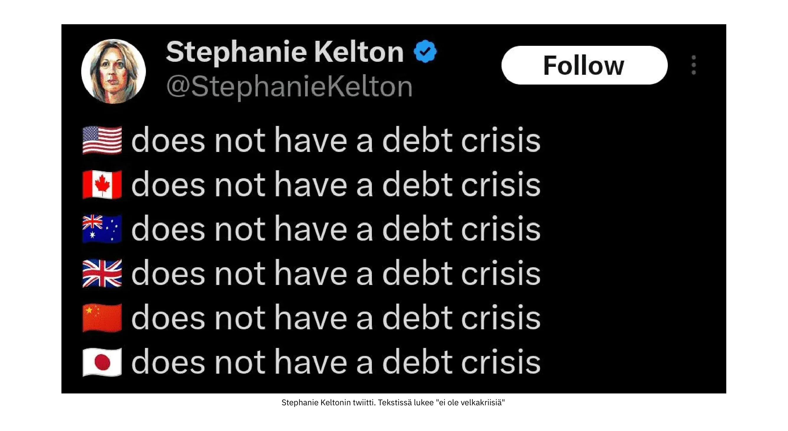

Kummallista kyllä, siinä luetellaan vain kuusi maata? Miksi? Koska niillä on todellinen rahapoliittinen itsemääräämisoikeus. Maapallolla on kuitenkin noin 200 maata, eikä kaikilla niistä ole rahapoliittista itsemääräämisoikeutta. Kritisoin tätä teoriaa sen lisäksi, että se on hieman outo ja toimimaton, myös siksi, että se toimii vain muutamissa maissa, jotka nauttivat todellista rahapoliittista itsemääräämisoikeutta, eli niissä maissa, jotka voivat laskea liikkeelle omassa valuutassaan olevia valtionvelkakirjoja. Jossain määrin se on haitaksi muulle maailmalle. Luomalla tämän valuutan ne ikään kuin veisivät inflaationsa muualle, samaan tapaan kuin Yhdysvallat on tehnyt kohtuuttomilla etuoikeuksillaan vuosikymmeniä. Tämä muistuttaa eräänlaista rahallista kolonialismia, jossa maat, joilla on maailmanlaajuista luottamusta ja kysyntää valuutalleen, voivat painaa niin paljon rahaa kuin haluavat ilman merkittävää inflaatiota, usein siksi, että ne vievät inflaation ulkomaille.

Tätä teoriaa on vaikea soveltaa tuontiriippuvaisiin talouksiin, joiden on säilytettävä kansainvälinen luottamus valuuttaansa kohtaan.

Tämä teoria edellyttää myös tietynasteista keskitettyä talouden suunnittelua, erityisesti reaaliresurssien (työntekijät, raaka-aineet, teollinen kapasiteetti) paremman valvonnan varmistamiseksi ja inflaation hallitsemiseksi.

# Rahan kaatuminen ja uudestisyntyminen

<partId>87a34ca9-782b-5ade-b51a-400f88ed7b0c</partId>

## Kreikan kolikot

<chapterId>7714195f-74ce-5f8c-be5f-59302d39fff4</chapterId>

:::video id=8e5c3091-0910-471b-8d4b-0dc6e9afa656:::

### Tausta ja konteksti

Ennen kuin aloitamme, tässä on historiallinen tausta:

**Historiallinen tausta:**

**Roomalaiset kutsuivat kreikkalaisia nimellä "Graeci" ja Kreikkaa nimellä "Graecia".**

**Kreikkalaiset kutsuivat itseään "helleeniksi" ja maataan "Hellakseksi".**

**Homer** (syntynyt noin 8. vuosisadalla eKr.)

Legendaarinen kreikkalainen runoilija, oletettavasti *Iliaanin* ja *Odysseian* kirjoittaja.

Noin **750 eKr.: Lykurgoksen**, Spartan myyttisen lainsäätäjän, sanotaan perustaneen sotilaskuriin ja yksinkertaisuuteen perustuvan spartalaisen perustuslain.

**Numa Pompilius** (753-673 eKr.)

Rooman toinen kuningas, kuuluisa siitä, että hän antoi Roomalle sen ensimmäiset uskonnolliset ja oikeudelliset instituutiot.

**Drakoni**, ateenalainen lainsäätäjä (7. vuosisata eKr.), joka oli kuuluisa erittäin ankarista laeistaan, mistä termi "drakoni".

**594 eKr.: Solonista** tulee Ateenan lainsäätäjä, ja hän uudistaa radikaalisti ateenalaista yhteiskuntaa erityisesti poistamalla velkaorjuuden.

**776 EKR: Antiikin olympialaiset**

Ensimmäiset säännölliset urheilukisat järjestettiin Olympiassa joka neljäs vuosi, ja ne kokosivat yhteen Kreikan kaupungit.

**Pythagoras** (n. 570-495 eKr.)

Kreikkalainen filosofi ja matemaatikko, kuuluisa suorakulmaista kolmiota koskevasta teoreemastaan.

**Xenofanes Kolofonilainen** (noin 570-478 eKr.)

Esisokraattinen filosofi, joka tunnetaan perinteisen kreikkalaisen polyteismin kritiikistään.

**490 eKr.: Marathonin taistelu**

Ateenalaiset torjuivat voitokkaasti persialaisten hyökkäyksen, mikä merkitsi ratkaisevaa käännekohtaa kreikkalaiselle sivilisaatiolle.

**Herodotos** (n. 484-425 eKr.), jota kutsutaan "historian isäksi", kirjoitti laajan teoksen, jossa hän kuvailee Persian sotia, mukaan lukien Kreikan voitto Kserksekseksestä vuonna 480 eKr.

**Sokrates** (470-399 eKr.)

Ateenalainen filosofi, joka oli kuuluisa dialektisesta metodistaan sekä etiikkaa ja itsetuntemusta koskevasta opetuksestaan.

**Aristofanes** (n. 446-386 eKr.)

Ateenalainen näytelmäkirjailija, kuuluisa satiirisista komedioistaan, kuten *Sammakot*.

**Sophokles** (5. vuosisata eKr.) arvostelee näytelmässään *Antigone* rahaa moraalisen ja poliittisen korruption lähteenä tyranni Kreonin kautta.

**Platon** (n. 428-348 eKr.)

Kreikkalainen filosofi, Sokrateen oppilas, Akatemian perustaja, *Tasavallan* kirjoittaja.

**431-404 EKR: Peloponnesoksen sota**

Merkittävä konflikti Ateenan ja Spartan välillä, joka päättyy Ateenan tappioon.

**431 EKR**: Ateena rahoittaa Peloponnesoksen sodan laimentamalla kulta- ja hopeakolikoitaan lisätäkseen liikkeessä olevien kolikoiden määrää, mikä aiheuttaa inflaation.

**Ksenofon** (n. 430-355 eKr.)

Ateenalainen kirjailija, filosofi ja kenraali, Sokrateen oppilas, *Anabasis*:n kirjoittaja.

**414 EKR**: Ateena alkaa hävitä Peloponnesoksen sotaa Sisiliaan suuntautuneen katastrofaalisen sotaretken jälkeen.

**405 EKR: Aristofanes** kuvaa näytelmässään *Sammakot* nimenomaisesti hopeisen drakman devalvoitumista ja huonompien pronssikolikoiden ilmaantumista Ateenassa, mikä havainnollistaa periaatetta, joka tunnetaan nykyään nimellä "Greshamin laki".

**404 EKR**: Ateena antautuu Spartan pitkän piirityksen jälkeen.

**Aristoteles** (384-322 eKr.)

Merkittävä kreikkalainen filosofi, Platonin oppilas, lyseon perustaja, tunnettu logiikan, biologian ja poliittisen filosofian alalta.

**327 EKR**: Aleksanteri Suuri valloittaa Persepolin ja Persian valtakunnan itäiset provinssit ja laajentaa valtakuntaansa huomattavasti.

**323 EKR**: Aleksanteri kuoli Babyloniassa ilman selvää perillistä, mikä aiheutti sotia hänen kenraaliensa (diadokien) välillä valtakunnan jakamiseksi.

**Arkimedees** (n. 287-212 eKr.)

Kreikkalainen matemaatikko, fyysikko ja keksijä, kuuluisa geometrian ja mekaniikan keksinnöistään.

**196 eKr.: Rosettan kivi** kaiverretaan faarao Ptolemaios V:n aikana, mikä mahdollistaa myöhemmin egyptiläisten hieroglyfien tulkinnan.

**192-188 EKR: Roomalais-seleukidien sota**

Rooma kukisti Antiokhos III:n johtaman Seleukidien valtakunnan ja lujitti vaikutusvaltaansa Kreikassa ja Vähä-Aasiassa.

**146 eKr.: Korintin taistelu**

Roomalaiset tuhosivat kreikkalaisen Korintin kaupungin, mikä merkitsi Kreikan poliittisen itsenäisyyden loppua ja Kreikan asteittaista integroitumista roomalaiseen maailmaan.

Tässä antiikin, Rooman kukistumisen ja keskiajan jaksossa aloitamme kreikkalaisia kolikoita käsittelevällä jaksolla.

Muinaisen Kreikan kolikkojen historia alkoi noin vuonna 600 eaa., kun kreikkalaiset kaupungit ottivat nopeasti käyttöön Vähä-Aasian Lyytiasta peräisin olevan innovaation, jossa käytettiin aluksi elektrumia ja myöhemmin hopeaa. Ensimmäiset kreikkalaiset kolikot lyötiin Aeginan saarella, ja niissä oli meri- tai maakilpikonnia, mutta Ateenan drakmasta, jota koristivat Athene ja pöllö, tuli 5. vuosisadalta eaa. alkaen rahan tunnus, joka hallitsi tuolloin pitkälti kansainvälistä kauppaa.

Minulla on onneksi kopio tuolta ajalta peräisin olevasta kreikkalaisesta drakmasta, jonka kääntöpuolella on tuo kuuluisa pöllö ja hahmo. Se on tetradrahma, joka oli suurempi kuin yksinkertainen drakma.

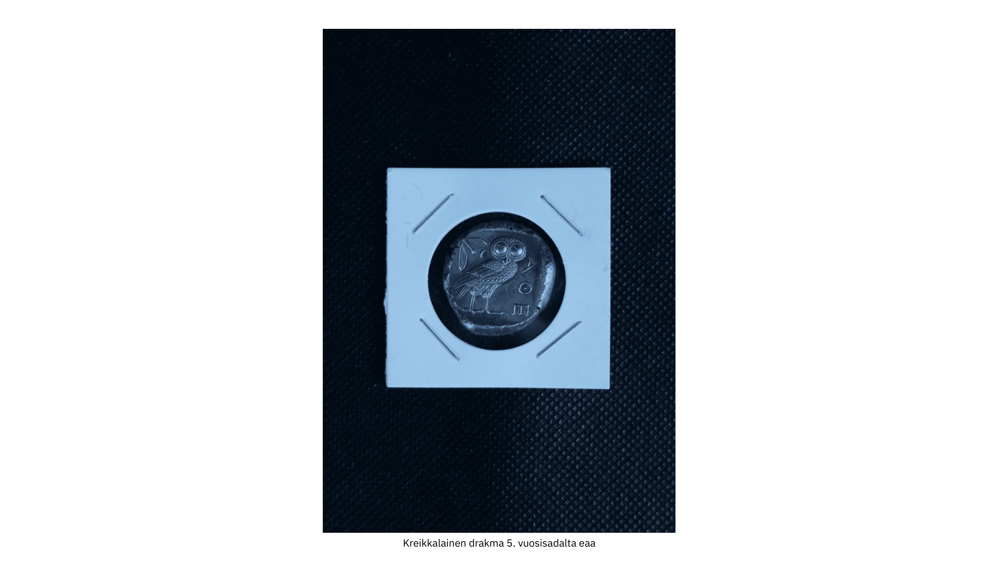

Jokainen kreikkalainen kaupunki kehitti oman suhteensa rahaan. Ateenassa valuutta oli tiiviisti sidoksissa poliittiseen ja taloudelliseen valtaan. Kuuluisa ateenalainen asetus 5. vuosisadan lopulla eaa. velvoitti käyttämään yksinomaan ateenalaista valuuttaa sen liittolaisalueilla ja vahvisti näin sen taloudellista hegemoniaa. Ateena keräsi myös suuria kultavarantoja hätätilanteita varten, joita säilytettiin Akropolilla, ehkäpä taloudellisen varovaisuuden symbolina. Sparta, sotilaskaupunki, jolla oli tiukat arvot, päätti sitä vastoin rajoittaa ankarasti rahan käyttöä ja kielsi kansalaisiaan omistamasta kulta- tai hopeakolikoita. Sparta käytti mieluummin raskaita rautaharkkoja estääkseen ulkomaankauppaa ja ylläpitääkseen sosiaalista yhteenkuuluvuutta.

Sotia rahoitettiin usein valuutan manipuloinnilla. Peloponnesoksen sodan aikana (431-404 eaa.) Ateena turvautui rajuihin devalvaatioihin maksaakseen sotilailleen. Koska Ateena menetti pääsyn hopeakaivoksiinsa, kun spartalaiset miehittivät Dekelian vuonna 413 eaa., se joutui sulattamaan kultapatsaita, jotta se voisi lyödä kiireesti uusia kolikoita vuosina 407/406 eaa. Vuonna 406/405 eaa. se loi hopealla päällystettyjä pronssikolikoita, mikä aiheutti rahakriisin, jota kuvasi **Aristofanes**, joka jo muistutti siitä, mitä nykyään kutsutaan Greshamin laiksi: huono raha ajaa hyvän rahan pois. Tämä hätävaravaluutta demonetisoitiin nopeasti sodan jälkeen, jotta luottamus Ateenan kolikoihin saatiin palautettua.

Klassisen kauden loppua leimasi Makedonian nousu Filippos II:n ja hänen poikansa Aleksanteri Suuren johdolla, mikä horjutti perusteellisesti Kreikan rahatalouden tasapainoa. Pangea-vuoren valtavien kulta- ja hopeakaivosten ansiosta Filippos II tuotti runsaasti rahaa sotilaallisten ja poliittisten kampanjoidensa rahoittamiseen ja otti käyttöön yksinkertaisen ja käytännöllisen kulta-hopea-standardin (10:1). Hänen olympiakisojen voittoa juhlistavat kultakolikkopatsaansa kiersivät Länsi-Eurooppaan asti, jopa Englantiin asti. Aleksanteri jatkoi tätä rahapolitiikkaa ja laittoi laajalti liikkeelle **Attilaisen** drakman valloitustensa aikana idässä aina Intiaan asti. Tämä kolikoiden laajamittainen liikkeeseenlasku merkitsi hellenistisen aikakauden alkua, jolloin hallitsijoiden kuvat korvasivat vähitellen jumalien kuvat kolikoissa. Tämän innovaation ansiosta hellenististen monarkkien sukupolvet pystyivät mainostamaan itseään ja perinteiset jumalat jäivät kolikoiden kääntöpuolella toissijaiseen asemaan.

Aleksanterin kuoltua vuonna 323 eaa. hänen kenraalinsa jakoivat hänen valtavan valtakuntansa ja perustivat dynastioita muun muassa Egyptiin (Ptolemaiokset) ja Syyriaan (Seleukidit). Nämä hellenistiset valtakunnat ottivat käyttöön erilaisia rahajärjestelmiä: Ptolemaiokset ottivat käyttöön suljetun rahajärjestelmän rahan kierron valvomiseksi ja käyttivät mieluummin viljaa sisäisenä valuuttana säästääkseen jalometalleja ulkoisia sotilasmenoja varten. Samaan aikaan Rodoksesta tuli merkittävä kauppakeskus ennen kuin roomalaiset heikensivät sitä taloudellisesti ja perustivat Deloksen vapaasatamaksi vuonna 167 eaa.

Rahan käyttö oli keskeistä palkkasotilaiden palkkauksessa. Aleksanterin sotilaat saivat päivittäin hopeadrakmoja.

Ratsuväki, Aleksanterin pitkälle erikoistuneen armeijan eliitti, sai keskimäärin kaksi drakmaa päivässä, jalkaväki yhden drakman ja tavallinen palkkasotilas kaksi kolmasosaa drakmasta, mikä oli kaksinkertainen palkka tavalliseen työläiseen verrattuna.

Peloponnesoksen sodan aikana sotilaille maksettiin myös huomattavia summia: yli 1 200 talenttia Samoksen kapinan kukistamiseksi ja yli 2 000 talenttia Potidean piirittämiseksi.

Kun tämä armeija oli täysin mukana Vähä-Aasiassa, kokonaiskustannukset olivat noin kaksikymmentä talenttia päivässä eli noin puoli tonnia hopeaa eli 120 000 drakmaa.

Kreikkalaisilla kolikoilla oli myös tärkeä kulttuurinen merkitys, sillä kukin kaupunki pyrki vahvistamaan identiteettiään lyömällä omia kolikoita, joissa oli paikallisia tai mytologisia symboleja. Esimerkiksi Herakleios kuvasi Herakleen (Hercules) taistelevan leijonaa vastaan, kun taas Kyrenessä kuuluisaa lääkekasvia silphiumia.

Moninaisuudestaan ja alueellisista vaihteluistaan huolimatta klassisen Kreikan ja hellenistisen ajan kolikot jättivät pysyvän jäljen Välimeren alueen talous- ja kulttuurihistoriaan ja vaikuttivat syvästi myöhempiin rahajärjestelmiin aina Roomaan asti, joka vähitellen omaksui ja kehitti kreikkalaisia talouskonsepteja oman keisarillisen taloutensa jäsentämiseksi.

## Valuutan vaikutus Kreikassa

<chapterId>3a5e6c7d-699c-5567-87cd-3374c49d55a9</chapterId>

:::video id=0c79a59c-e179-4893-a414-1b8de0930eb9:::

### Ateena ja kontrasti Spartan kanssa

Ateenan ja Spartan vastakkainasettelu klassisen Kreikan aikana paljastaa kaksi radikaalisti erilaista poliittisen ja taloudellisen organisaation mallia. Sparta hylkäsi metallirahan ja suosi kansalaisluottamukseen perustuvaa omavaraista järjestelmää, kun taas Ateena otti tämän teknologian täysin käyttöön rakentaakseen ja ylläpitääkseen merellisen imperiuminsa.

### Merivoiman rahallinen tarve

Mahtavasta nimestään huolimatta Ateenan valtakunta pysyi maantieteellisesti vaatimattomana - se käsitti lähinnä Ateenan ja Egeanmeren kaupungit. Sen valta perustui Deloksen liittoon, sotilasliittoon, jota Ateena hallitsi hegemonina. Tämä keisarillinen rakenne edellytti yhtenäistä taloudellista välinettä: Ateenan hopeakolikkoa.

Laivaston ylläpito oli tämän rahallisen välttämättömyyden ytimessä. Yksittäinen ateenalainen trireme maksoi yhdestä kahteen talenttia hopeaa - huomattava summa. Koska Ateenan oli ylläpidettävä useita satoja aluksia, se tarvitsi tehokkaan verojärjestelmän. Valuutasta tuli välttämätön väline, jolla kerättiin veroja vasallikaupungeilta ja rahoitettiin merivoimien etenemisvoimat, jotka takasivat valtakunnan yhteenkuuluvuuden.

### Rahan määrääminen hallinnan välineenä

Ateena asetti hopeavaluutan kaikille Delosin liiton jäsenille. Tämä rahan standardointi palveli useita strategisia tavoitteita. Ensinnäkin se helpotti verojen keräämistä luomalla yhteisen laskentayksikön. Toiseksi se vahvisti vasallikaupunkien taloudellista riippuvuutta Ateenasta. Lisäksi se symbolisesti osoitti Ateenan vallan koko merivaltakunnassa.

Tämä rahapolitiikka on jyrkässä ristiriidassa spartalaisen mallin kanssa. Sparta, joka oli maavalta, saattoi luottaa elantonsa turvautumiseen peloponnesialaisten heloottien (orjien) työhön. Sen suljettu, kaupunkikeskeinen talousjärjestelmä ei edellyttänyt kehittyneitä rahapoliittisia välineitä. Kansalaissotilaat asuivat yhdessä, jakoivat yhteiset ateriat eivätkä tarvinneet rahaa päivittäiseen vaihtoon.

### Valuutta merikaupan välineenä

Koska Ateenan valtakunta oli luonteeltaan merenkulkija, sen oli oltava avoin kaupalle. Toisin kuin sisäänpäin kääntynyt Sparta, Ateenan oli käytävä kauppaa ulkomaailman kanssa selviytyäkseen ja vaurastuakseen. Valuutasta tuli Välimeren kaupan välttämätön väline.

Tämä ulkoinen suuntautuminen loi myönteisen kierteen: kauppa tuotti tuloja, nämä tulot rahoittivat laivastoa, laivasto suojasi kauppareittejä ja ylläpiti valtakuntaa, ja valtakunta otti käyttöön Ateenan valuutan, joka helpotti kaupankäyntiä. Valuutta ei ollut enää pelkkä vaihtoväline, vaan siitä tuli keisarillisen strategian peruspilari.

### Rahapoliittisen vallan rajat

Tästä taloudellisesta kehittyneisyydestä huolimatta Ateenan rahapoliittinen valta osoitti rajansa Peloponnesoksen sodan aikana. Spartan maajoukkojen edessä Ateenan merellinen ja taloudellinen ylivoima ei riittänyt. Kalliit sotaretket, kuten katastrofaalinen Syrakusan sotaretki Sisiliassa, kuluttivat taloudellisia resursseja tuomatta kuitenkaan ratkaisevaa voittoa.

Historia osoittaa, että vaikka valuutta on voimakas väline vallan levittämisessä, se ei ole tae sotilaallisesta ylivallasta. Sparta, jolla ei ollut metallivaluuttaa mutta huomattavaa sosiaalista yhteenkuuluvuutta, voitti lopulta Ateenan rahaimperiumin.

### Kaksi mallia, kaksi kohtaloa

Ateenan ja Spartan välinen vastakkainasettelu kuvastaa kahta perustavaa laatua olevaa lähestymistapaa yhteiskunnalliseen ja taloudelliseen organisaatioon. Ateena edustaa avointa, kaupallista ja rahamääräistä mallia - nykyaikaisten meri-imperiumien edeltäjä. Sparta edustaa suljettua, itsehallinnollista mallia, joka perustui pikemminkin kansalaisluottamukseen kuin rahavälineisiin.

Nämä kaksi järjestelmää osoittavat, että valuutan käyttöönotto liittyy läheisesti valittuun poliittiseen ja taloudelliseen malliin. Ateenan kaltaiselle merenkulku- ja kauppavallalle raha oli välttämätön. Spartan kaltaiselle suljetulle soturiyhteiskunnalle se oli uhka sosiaaliselle järjestykselle. Tämä muinainen kahtiajako on yhä keskeisessä asemassa keskusteluissa, jotka koskevat rahan roolia yhteiskuntien järjestäytymisessä.

## Rooman tasavalta

<chapterId>0bc80983-33e1-5881-85bb-7c22f3144a9a</chapterId>

:::video id=dc05ca97-d29c-4679-bfeb-912c47d86ce2:::

### Rooman tasavallan historia

- 753 - 509 eaa.: Rooman kuningaskunta**
- 753 EKR: Rooman perustaminen** (perinteisesti Romulus).
- 509 - 27 EKR: Roomalainen tasavalta**, Roomasta tulee tasavalta, jota hallitsevat vaaleilla valittu senaatti ja konsulit.
- 280 - 275 EKR: Pyrrhoksen sota**. Epeirosin kuningas Pyrrhos taistelee roomalaisia vastaan Etelä-Italiassa ja saavuttaa kalliita voittoja ("Pyrrhoksen voitot").
- 264 - 146 EKR: Puniset sodat**. Merkittävä konflikti, jossa Rooma ja Karthago kamppailivat läntisen Välimeren alueen herruudesta.
- Hannibal (247 - n. 181 eaa.)**. Legendaarinen karthagolainen kenraali, joka oli kuuluisa siitä, että hän ylitti Alpit armeijansa ja elefanttiensa kanssa hyökätäkseen Roomaan toisen Punisen sodan aikana.
- 146 eaa.: Korintin taistelu**. Rooma tuhoaa kreikkalaisen Korintin kaupungin ja määrää lopullisen herruuden Manner-Kreikassa.
- 91 - 87 eKr.: yhteiskunnallinen sota**. Rooman italialaisten liittolaisten kapina, jossa vaadittiin Rooman kansalaisuutta, mikä johti lopulta heidän täyteen integroitumiseensa kansalaisten joukkoon.
- 64 eKr.: Seleukidien vastarinnan loppu**. Rooma eliminoi lopullisesti Seleukidien vaikutusvallan Syyriassa ja lujittaa asemaansa itäisellä Välimerellä.
- 55 EKR: Julius Caesar valloittaa Keski- ja Länsi-Euroopan**. Julius Caesar laajentaa Rooman vallan Galliaan (nykyiseen Ranskaan) ja tunkeutuu Germaniaan ja Bretagneen.
- 43 EAA: Toisen triumviraatin muodostaminen**. Octaviuksen (myöhemmin Augustus), Marcus Antoniuksen ja Lepiduksen poliittinen liitto, jonka tarkoituksena oli vakauttaa Rooma Caesarin murhan jälkeen.
- 27 eKr.: Pax Romana** alkaa. Poliittisen vakauden ja vaurauden kausi Augustuksen valtakaudella, joka merkitsee Rooman valtakunnan alkua.

### Rooman myöhäiset rahapoliittiset alut

Tässä antiikkia käsittelevässä jaksossa kiinnitämme nyt huomiota Rooman tasavaltaan. Rooman rahahistoria alkoi paljon myöhemmin kuin kreikkalaisten ja persialaisten. Vuonna 753 eaa. perustettu Rooma odotti lähes neljä vuosisataa, ennen kuin se todella otti käyttöön rahanvalmistuksen. Tämän pitkän ajanjakson aikana roomalaiset käyttivät alkeellista vaihto-järjestelmää, jossa käytettiin epäsäännöllisiä pronssikappaleita, joita kutsuttiin nimellä aes rude, ja joka edellytti tarkkaa punnitsemista jokaista liiketoimia varten. Vasta 4. vuosisadan lopulla eaa. kreikkalaisten ja etruskien vaikutuksesta Rooma alkoi laskea liikkeeseen ensimmäisiä kolikoitaan, erityisesti Kiinan tapaan valettuja pronssikolikoita, aes graveja, jotka olivat tyypillisiä roomalaiselle kaupankäynnille aina **toiseen Punilaiseen sotaan** asti.

### Kreikan vaikutus ja ensimmäiset hopeakolikot

Ratkaiseva kohtaaminen Etelä-Italian kreikkalaisten kanssa toi roomalaisille hopeakolikoiden lyömisen todellisen käyttöön. Noin vuonna 280 eaa. Rooma alkoi valmistaa omia hopeakolikoitaan kreikkalaisia didrakmeja jäljitellen. Ensimmäinen säännöllinen hopeakolikkojen liikkeeseenlasku Roomassa ajoittuu tarkalleen vuoteen 269 eKr., ja siinä on legendaariset kaksoset Romulus ja Remus, joita susi imee, symboli, josta on tullut ikoninen.

Itse asiassa monissa Rooman tasavallan aikaisten roomalaisten kolikoissa kuvataan perustamismyyttejä. Voit nähdä omani alla: se on upea, aito kolikko kuningas Tatiukselta. Se kuvaa myyttiä naisten sieppauksesta sabiineilta. Tatius oli tämän alueen kuningas, ja perustamismyytti kertoo, kuinka roomalaiset sieppasivat naisia lähellä asuneelta sabiineilta. Sittemmin kuningas Tatiuksesta tuli Rooman perustajiin kuuluneen Romuluksen kanssa yhteiskuningas.

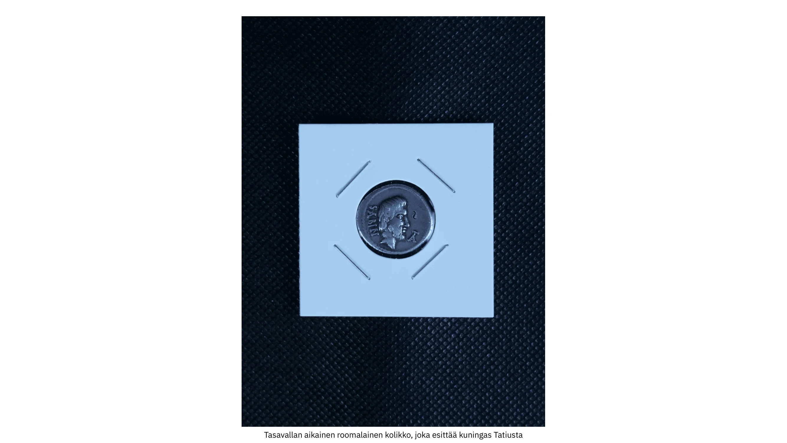

### Sanan "kolikko" alkuperä ja Juno Monetan temppeli

Termi "kolikko" on peräisin Juno Monetan temppelistä Roomassa. Legendan mukaan vuonna 390 eaa. tapahtuneen gallialaisten hyökkäyksen aikana Capitolin pyhät hanhet varoittivat roomalaisia uhkaavasta vaarasta. Kapitolin suojelijana toimineen jumalatar Junon kiittämiseksi hänen kunniakseen pystytettiin temppeli, josta tuli pian roomalaisten kolikoiden rahapaja.

### Puniset sodat ja valuuttakriisit

Sotilaalliset konfliktit vaikuttivat merkittävästi Rooman rahapolitiikan kehitykseen. Karthagoa vastaan käydyn toisen Punisen sodan (218-201 eaa.) aikana Rooma joutui vakaviin taloudellisiin vaikeuksiin Hannibalin hyökkäyksen vuoksi. Näiden kiireellisten tarpeiden lievittämiseksi Rooma turvautui ensimmäistä kertaa poikkeukselliseen kultakolikoiden liikkeeseenlaskuun sekä hopeakolikoidensa merkittävään devalvaatioon, jolloin niiden alkuperäinen puhtausaste oli 97 prosentista noin 89 prosenttiin. Myös pronssikolikoiden (aes) paino laski jyrkästi, lähes 80 prosenttia kuudessa vuodessa.

Tässä yhteydessä voimme palata käsitteeseen, josta olemme aiemmin keskustelleet ja joka koskee sitä, että kreikkalaiset sulattivat temppeleihin varastoituja jalometalleja lievittääkseen talouskriisejä. Ja puhuaksemme **Karthagosta**, tässä alla voitte ihailla aitoa karthagolaista kolikkoa kokoelmastani. Näissä karthagolaisissa kolikoissa oli toisella puolella palmu ja toisella puolella hevonen. Tällä kolikolla hevonen ei ole kovin hyvin tunnistettavissa, ja se on hyvin kulunut.

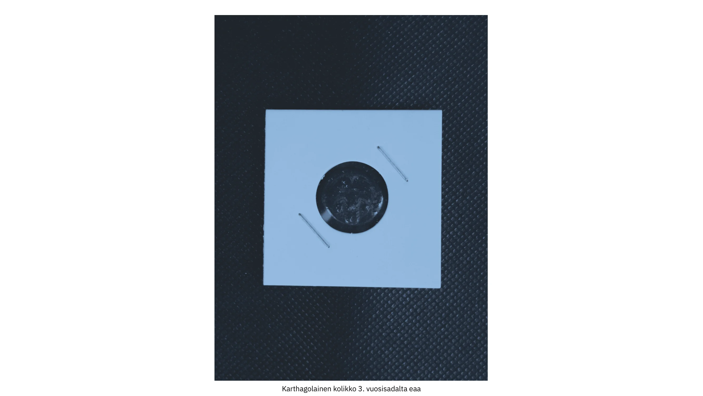

Tämän seurauksena myös pronssikolikoiden, niin sanottujen aes-kolikoiden, paino laski jyrkästi, lähes 80 prosenttia kuudessa vuodessa. Näiden pronssikolikoiden, jotka eivät olleet jalometallia ja joita käytettiin jokapäiväisessä kaupankäynnissä, paino siis laski paljon, mikä oli merkki rahan arvon alenemisesta näiden sotien vuoksi.

### Hopeadenaari ja rahan vakaus

Tätä kriittistä taustaa vasten Rooma otti käyttöön kuuluisan hopeisen denaarin noin vuonna 212 eaa. Tämä uudistus varmisti huomattavan rahapoliittisen vakauden, ja denaari pysyi hallitsevana valuuttana lähes 450 vuoden ajan. Tämä vakaus oli Rooman tiukan hallinnon ansiota, vaikka vuonna 146 eaa. tehtiin suuri uudelleenhinnoittelu ja huomattavaa tuotantoa sen valtavien armeijoiden rahoittamiseksi erityisesti Punian, Sosiaalisen (91-87 eaa.) ja Makedonian sotien aikana. Esimerkiksi yhden roomalaisen legioonan ylläpitäminen maksoi noin 1,5 miljoonaa denaria vuodessa, mikä osoittaa rahantarpeen suuruuden.

Rooman rajojen ulkopuolella sodat johtivat suuriin devalvaatioihin Rooman vaikutuspiirissä olevilla alueilla. Punilaisen Karthagon elektrumin puhtaus laski dramaattisesti: sen kultapitoisuus laski 4. vuosisadan 98 prosentista vain 30 prosenttiin toisen punisen sodan aikana, kun taas sen hopeakolikoiden puhtausaste laski 18 prosenttiin.

### Rahamotiivien kehitys

Rooman laajentumisen myötä myös kolikoiden luonne kehittyi: aluksi nimettömät ja isänmaalliset kolikot saivat vähitellen yksilöllisiä kuvioita, joissa esiintyivät kolikoiden lyöjien (kolikoiden lyöjien) vaikutusvaltaiset perheet. Tämä muutos symboloi selvästi Rooman tasavallan lopun poliittisia muutoksia.

Vaikka Rooma hallitsi Välimeren maailmaa taloudellisesti, se säilytti maksuvälineissään tietynlaisen yksinkertaisuuden: muuta todellista rahansiirtoa kuin suora kolikoiden vaihto ei ollut kehitetty, lukuun ottamatta veronsiirtoja ja eliitille varattuja yksityisiä luottoja.

## Rooman valtakunta

<chapterId>2dc44e50-112a-5abf-97ae-8e0a9ecda989</chapterId>

:::video id=f8d6f3d6-9ee4-4504-888e-4f12b3f20489:::

**Historiallinen tausta:**

**Prinsipaatti** oli keisarillinen hallintomuoto Rooman valtakunnassa Augustuksen valtakauden alusta vuonna 27 eaa. kolmannen vuosisadan kriisin loppuun vuonna 284 jKr. asti.

**27 eKr.: Pax Romanan alku**

Poliittisen vakauden ja vaurauden kausi Augustuksen valtakaudella, joka merkitsi Rooman valtakunnan alkua.

**Augustus (30 eKr. - 14 jKr.)** uudisti radikaalisti Rooman rahajärjestelmää ja loi keisarilliselle rahapolitiikalle pysyvän ja vakaan standardin.

**Augustus oli myös yksi ensimmäisistä tunnustetuista antiikin kolikoiden ja fossiilien keräilijöistä**.

**54 AD - 68 AD: Nero**

Kiistelty Rooman keisari, joka tunnettiin tyranniastaan, vainoistaan ja katastrofaalisesta hallinnostaan Rooman palamisen jälkeen.

**64 AD: Rooman suuri tulipalo**

Suuri tulipalo tuhoaa suuren osan kaupungista; Neroa syytetään syylliseksi.

**69 jKr.: Neljän keisarin vuosi**

Kaoottinen ajanjakso, jolloin neljä keisaria seurasi nopeasti peräkkäin (Galba, Otho, Vitellius, Vespasianus).

**79 JKR: Vesuviuksen purkaus**

Tulivuori, joka tuhosi Pompeijin ja Herculaneumin kaupungit, säilyttäen poikkeuksellisesti niiden jäännökset tuhkan alla.

**165 MAINOS - 180 MAINOS: Antoniuksen rutto**

Tuhoisa epidemia, joka heikensi Rooman valtakuntaa Marcus Aureliuksen ja Commoduksen aikana.

**200 jKr.: Alueellinen huippu ja Pax Romanan asteittainen päättyminen**

Rooma saavutti suurimman laajentumisensa, mutta alkoi kärsiä sisäisestä epävakaudesta ja taloudellisista vaikeuksista.

**212 JKR: Caracallan kansalaisuutta koskeva asetus**

Keisari Caracalla myönsi Rooman kansalaisuuden lähes kaikille valtakunnan asukkaille laajentaakseen veropohjaa.

**220 jKr.: Suurten barbaarihyökkäysten alku***

Ensimmäiset merkittävät germaanisten kansojen hyökkäykset Rooman rajojen yli.

**235 MAINOS - 285 MAINOS: Kolmannen vuosisadan poliittinen ja sotilaallinen kriisi**

Ajanjakso, jolle oli ominaista poliittinen epävakaus, monet lyhytikäiset keisarit, sisällissodat, talouskriisit ja jatkuvat hyökkäykset.

**Aurelianus (270-275 jKr.) revalvoi radikaalisti Rooman valuutan** ja yritti palauttaa sen nimellisarvon korkeasta inflaatiosta huolimatta.

**301 JKR: Diocletianuksen hintaedikti**

Keisari Diocletianus yritti turhaan pysäyttää hillittömän inflaation määräämällä tiukkoja hinta- ja palkkavalvontatoimia koko valtakunnassa.

**312 JKR: Konstantinus**

Ensimmäinen kristitty keisari, Konstantinopolin perustaja, vakiinnutti valuutan ottamalla käyttöön "soliduksen", erittäin puhtaan ja vakaan kultakolikon.

**476 JKR: Läntisen Rooman valtakunnan hajoaminen**

Useat germaaniset kansat (mukaan lukien Pohjankodit) valtaavat Rooman, ja tätä tapahtumaa pidetään Länsi-Rooman valtakunnan virallisena loppuna.

### Augustuksen rahapoliittiset uudistukset

Tässä antiikkia käsittelevässä jaksossa olemme jo saapuneet Rooman valtakuntaan. Rooman valtakunnan rahahistorialle on ominaista metallirahan, erityisesti kullan, hopean ja pronssin, intensiivinen käyttö, mutta myös useat valuuttakriisit, jotka liittyvät läheisesti poliittisiin ja sotilaallisiin levottomuuksiin. Tasavallan lopussa Julius Caesarin johdolla Rooma otti vuonna 46 eaa. käyttöön kultaisen aureuksen, noin 8 gramman painoisen kolikon, joka hyväksyttiin laajalti kaikkialla Euroopassa ja Välimeren alueella. Caesar standardisoi nämä kultakolikot ja löi ensimmäiset kolikot, joissa oli elävän ihmisen muotokuva, ja kumosi näin antiikin tasavallan perinteen, joka suosi nimettömiä, kollektiivisia symboleja. Tähän kehitykseen liittyi merkittävä poliittinen murroskausi, jolloin henkilökohtainen valta korvasi vähitellen tasavaltaiset instituutiot.

Caesarin murhan jälkeen vuonna 44 eaa. Octavianus (Augustus) otti Rooman vallan haltuunsa ja perusti valtakunnan vuonna 27 eaa. Hänen valtakaudellaan rahajärjestelmä uudistettiin täydellisesti, mikä toi kestävää vakautta Rooman talouteen. Augustuksen aikana yksi kultainen aureus vastasi 25 hopeadenaaria, ja sen arvo oli 4 pronssista sestertiusta. Tämä rahapoliittinen vakaus jatkui koko ensimmäisen vuosisadan ajan jKr., ja tätä ajanjaksoa kuvataan usein Rooman talouden kulta-aikana.

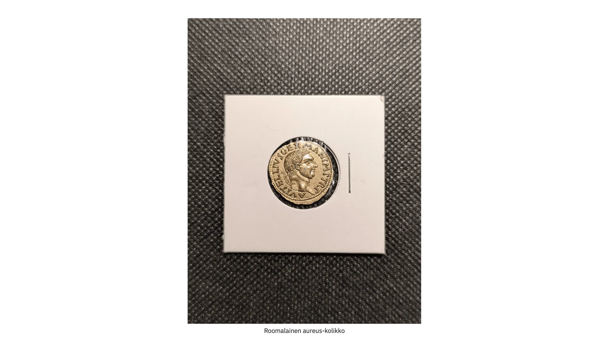

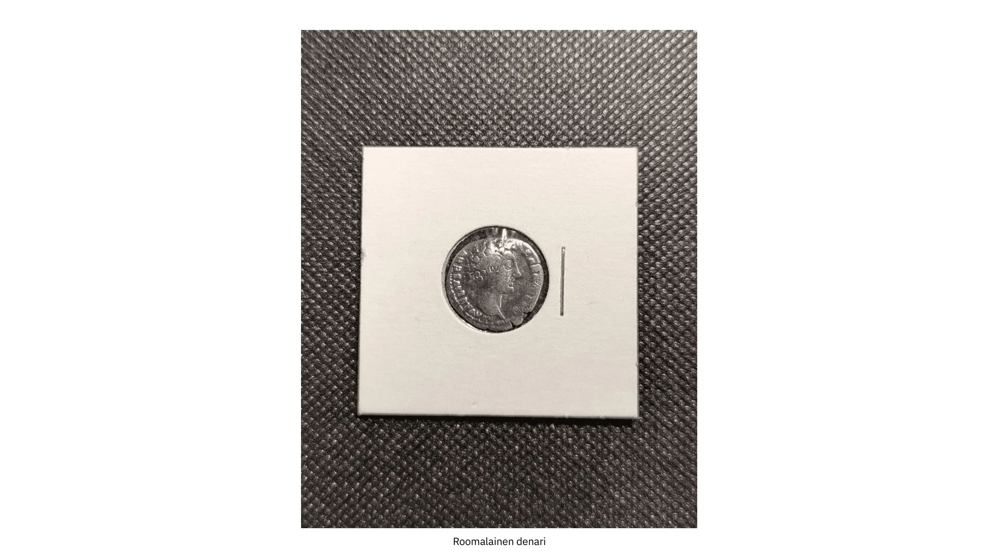

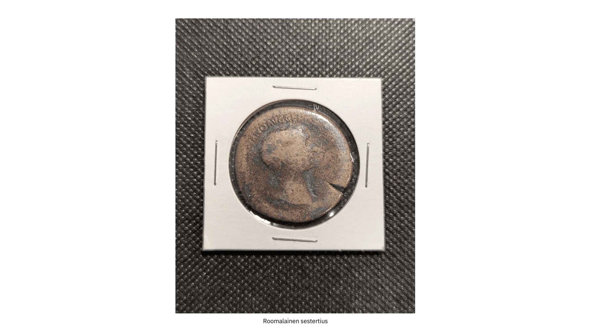

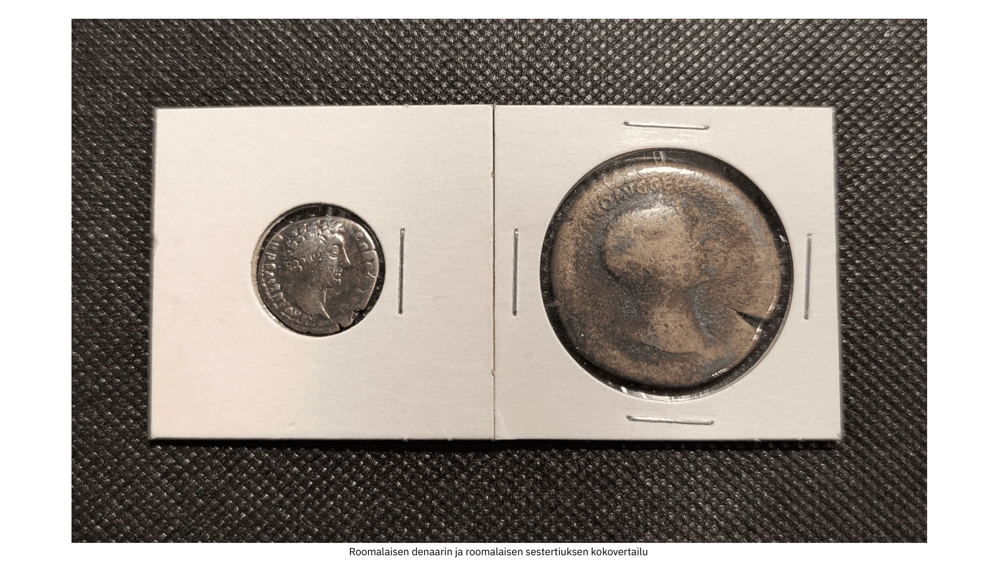

Nerosta lähtien (54-68 jKr.) Rooma alkoi kuitenkin hitaasti devalvoida kolikoitaan vähentämällä asteittain niiden painoa ja puhtausastetta keisarikunnan kasvavien menojen rahoittamiseksi, erityisesti Rooman suuren tulipalon jälkeen vuonna 64 jKr. Näillä devalvaatioilla oli huomattavia vaikutuksia: puhtaampia kolikoita poistettiin kierrosta varastoimalla tai viemällä niitä **Greshamin lain** mukaisesti, kun taas devalvoituja kolikoita kertyi yhä enemmän, mikä johti hintojen asteittaiseen nousuun.

Kolmas vuosisata merkitsi dramaattista käännekohtaa, kun devalvaatio kiihtyi dramaattisesti keisareiden Septimius Severuksen, Caracallan ja Gallienuksen aikana. Tärkeimmän hopeakolikon, denaarin ja myöhemmin antoninianuksen, hopeapitoisuus laski vain 2 prosenttiin. Samaan aikaan aureuksen kultapaino putosi puoleen. Rahakriisiin liittyi ennennäkemätöntä poliittista epävakautta, barbaarihyökkäyksiä ja toistuvia sisällissotia.

Tässä osassa voin esitellä tämän jakson viimeisen kappaleen: antoninianuksen. Tämän kolikon alkuperäistä nimeä ei tunneta, mutta nykyään siitä käytetään nimitystä antoninianus. Sen arvo on kaksi denaria, vaikka se on vain 1,5 kertaa suurempi kuin denari. Lisäksi näistä kolikoista tuli ajan myötä pelkkiä billon-kolikoita, mikä tarkoittaa, että ne valmistettiin hopean ja muiden metallien seoksesta eikä puhtaasta hopeasta. Kolikot oli usein vain päällystetty hopealla, ja ne toimivat huomattavana esimerkkinä rahan rappeutumisesta.

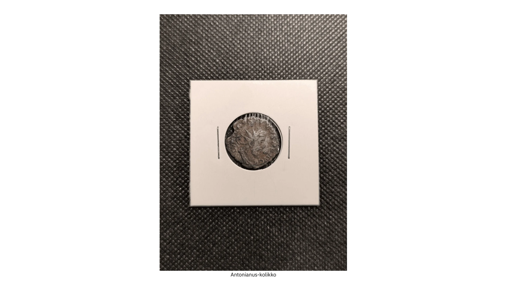

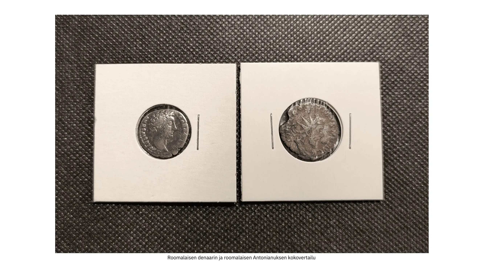

Tilanteen edessä keisari Aurelianus (270-275 jKr.) yritti vakauttaa järjestelmää nimellisesti revalvoimalla valuutat, mutta tämä uudistus johti itse asiassa inflaatiomekanismiin kiinnittämällä olemassa olevien valuuttojen arvon keinotekoisesti korkeammalle tasolle.

Esitän tässä yhteydessä eksymyksen aiheeseen. 3. vuosisadalla inflaatio kasvoi nopeasti eksponentiaalisesti. Aiemmin, vaikka kolikot devalvoitiin, niiden lyöminen yksi kerrallaan käsityönä tarjosi jonkinlaisen inflaation hallinnan. Tilastot osoittavat, että 300 vuotta kestäneen devalvaation aikana inflaatio oli keskimäärin noin 4 prosenttia vuodessa. Juuri ennen Aurelianuksen uudistusta inflaatio oli noin 3 prosenttia vuodessa.

Aurelianus otti käyttöön XXI-merkkisessä kolikossa puhtausmittauksen, joka osoitti koostumusta 20 osaa pronssia ja 1 osa hopeaa eli 5 prosentin puhtausastetta. Hän markkinoi näitä 5 prosentin hopeakolikoita ja leimasi niihin XXI-merkin. Hän kuitenkin palautti myös kaikki muut, enemmän devalvoituneet kolikot ja leimasi niihin saman XXI-merkin. Näin kaikkien kolikoiden nimellisarvo nousi. Lopputuloksena oli huikea 20 prosentin vuotuinen inflaatio, joka ylitti reilusti ennen tämän tekniikan käyttöönottoa vallinneen 3 prosentin inflaatiovauhdin.

Aurelianus keksi tämän devalvaatiomuodon, joka on paljon nopeampi kuin metallin asteittainen devalvaatio, joka pakotti meidät edelleen painamaan kolikoita yksi kerrallaan. Hän otti kaikki olemassa olevat kolikot, kutsui ne takaisin ja leimasi ne lyöntipainolla niiden nimellisarvon muuttamiseksi. Se on todellinen käännekohta. Silloin inflaatiosta tuli eksponentiaalinen.

Havainnollistaakseni tätä äärimmäistä devalvaatiota olen löytänyt joitakin kiehtovia tilastoja viljan hinnasta Egyptissä vuodesta 40 eKr. aina 3. vuosisadalle saakka, joka kattaa yli 300 vuotta. Alla näet kreikkalaisen tetradrakman kokoelmastani. Tuohon aikaan, Rooman miehittämässä Egyptissä 3. vuosisadalla, vastaava arvo oli egyptiläinen tetradrahma. Drakmojen nimellisarvo oli edelleen käytössä, ja se vastasi denaaria.

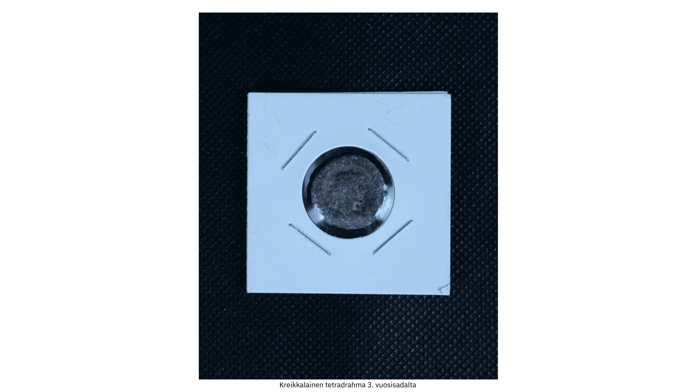

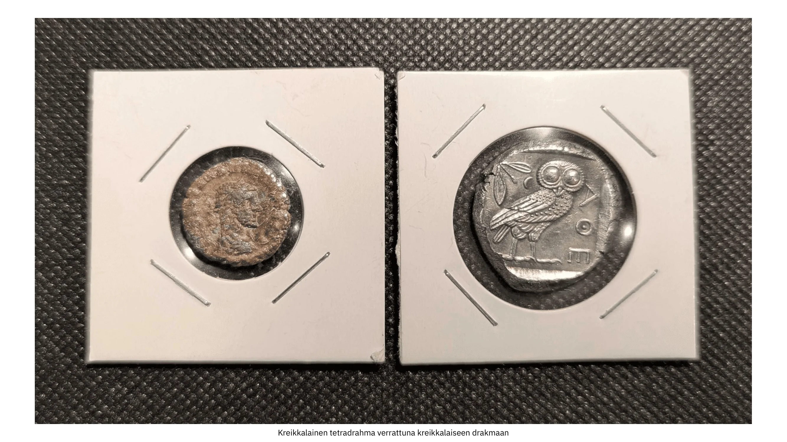

Minulla oleva egyptiläinen tetradrakmi vastasi siis denaaria. Kolikko on tehty billonista (eli pronssista), joten se ei sisällä jalometallia. Voit verrata sitä alkuperäiseen kreikkalaiseen tetradrakmiin ja nähdä fyysisen devalvoitumisen näiden 300 vuoden aikana. Se on miljoonakertainen viljan hinnan nousu Egyptissä.

Se on Aurelianuksen uudistuksen fyysinen ilmentymä. On huomattava, että suurin osa, keskiarvo näiden 300 vuoden inflaation aikana, oli noin 4 prosenttia. Vasta lopussa, kun Aurelianus toteutti uudistuksensa, inflaatiosta tuli melko eksponentiaalista, ja päädyimme tähän miljoonan euron mittaukseen. Hinnat olivat 3. vuosisadan lopussa miljoona kertaa korkeammat kuin 1. vuosisadalla eKr.

Hänen seuraajansa **Diocletianus** (284-305 jKr.) yritti vielä radikaalimpia uudistuksia: hän laski liikkeelle uusia valuuttoja (erityisesti argenteuksen, joka oli puhtaampi mutta määrältään liian rajallinen), määräsi jyrkkiä hintasäännöksiä (vuoden 301 jKr. hintaedikti) ja **perusti luontoissuorituksiin perustuvan verojärjestelmän**. Näistä ponnisteluista huolimatta Diocletianuksen uudistukset eivät onnistuneet hillitsemään hillitöntä inflaatiota.

Koska Diocletianus joutui kieltäytymään tavaroiden ja palvelujen toimittamisesta devalvoitunutta valuuttaa vastaan, hän otti käyttöön **perinnöllisen kastijärjestelmän** sitoakseen talonpojat ja heidän jälkeläisensä maahansa.

Tässä yhteydessä on ymmärrettävä, että talonpojat kieltäytyivät toimittamasta tuotteitaan devalvoitunutta valuuttaa vastaan, ja rakkaan Diocletianuksemme vastaus oli luoda **perinnöllisiä kasteja** sanomalla, että "te ette voi jättää maatanne, lapsenne eivät voi jättää maataan, samoin sotilaat, olette sotilaita ja suostutte saamaan palkkaa minun valuutallani". Siirtymäkauden ratkaisuna heille maksettiin luontoissuorituksina (lihana, ruokana, viljana), koska hän kieltäytyi antamasta heille rahaa. Niinpä hän otti käyttöön tämän perinnöllisen kastijärjestelmän pakottaakseen ihmiset sitoutumaan ammattiinsa, jotta he eivät voisi yksinkertaisesti vaihtaa työpaikkaa, jos he yrittäisivät olla hyväksymättä devalvoitua valuuttaa.

Tämän esimerkin havainnollistamiseksi minulla on tässä teksti, ote kirjasta "*Monetary Regime and Inflation*":

> Koska ihmiset olivat haluttomia tekemään työtä ja toimittamaan tavaroita devalvoitunutta valuuttaa vastaan, jonka nimellisarvo oli korkeampi kuin sen luontainen arvo tai markkina-arvo, heidät oli pakotettava työskentelemään määräämällä luontoismaksuja. [...] Talonpoikien oli kiellettyä poistua rekisteröidyistä kodeistaan. Maatalousväestö kiinnittyi näin ollen perinnöllisesti maahan.
>

> Tämä perinnöllinen kastijärjestelmä levisi vähitellen: Diocletianus pakotti sotilaiden pojat palvelemaan armeijassa, kun taas rahapajojen sekä Diocletianuksen perustamien kutomo- ja värjäystehtaiden työntekijöistä tuli valtion orjia, joilla oli perinnöllinen palvelusoikeus. Myös kullankaivajista tuli myöhemmin perinnöllinen kasti. Muitakin perinnöllisiä luokkia oli luultavasti olemassa jo Diokletianuksen aikana, erityisesti leipurien ja lihakauppiaiden killat [...] Roomassa sekä hiippakunnalliset laivakapteenien killat, jotka kuljettivat viljaa ja muita julkisia tavaroita Roomaan.

Konstantinus (306-337 jKr.) onnistui lopulta vakauttamaan rahajärjestelmän ottamalla vuonna 312 käyttöön soliduksen, puhtaan kultakolikon, jonka laadun ja painon hän takasi tiukasti. Soliduksen puhtauden ja painon todentamiseksi oli olemassa kokonainen järjestelmä. **Tämä vakaus vaikutti kuitenkin vain varakkaaseen eliittiin ja keisarilliseen hallintoon**, kun taas **väestön enemmistö kärsi edelleen huonolaatuisesta valuutasta ja jatkuvasta inflaatiosta**. Solidus säilyi vakaana itäisessä valtakunnassa (Bysantissa), jossa se kesti yli vuosituhannen, kun taas lännessä kolikkoanti hajosi pieniin, arvoltaan vähäisiin kolikoihin, mikä seurasi Rooman valtakunnan lopullista taloudellista ja poliittista hajoamista, joka tapahtui lopullisesti vuonna 476 jKr.

Lopuksi haluaisin jakaa kanssanne tämän lainauksen kirjasta *A History of Money: From Ancient Times to the Present Day*, jonka on kirjoittanut Glyn Davies ja joka kiteyttää mestarillisesti sen, mikä ehkä johti Rooman tuhoon:

*"Verot olivat jatkuvasti riittämättömiä, ja vaikeudet, jotka liittyivät näihin yhä riittämättömämpiin, myöhässä mukautettuihin ja erittäin näkyviin veroihin, saivat Rooman turvautumaan yhä enemmän helppoon, välittömään ja piilotettuun verotusmuotoon: valuutan devalvaatioon. Lyhytikäiset, tilapäiset uudistukset eivät onnistuneet kääntämään tätä ikiaikaista laskusuuntausta. Kolikoiden kulumisen aiheuttamat taloudelliset paineet, laivojen haaksirikot, idästä ostettujen ylellisyystavaroiden aiheuttamat rahavuodot, germaanisille barbaareille tarjotut lahjat, kaupunkiväestön kasvu, maataloustuotannon väheneminen, rikkaimpien kaivosten asteittainen ehtyminen ja ennen kaikkea "leipä ja sirkushuveja" koskeva politiikka, jota pidettiin välttämättömänä, jotta kaupunkielämässä voitaisiin ylläpitää vähimmäismäärä järjestystä, - kaikki nämä kumulatiiviset paineet johtivat Rooman jatkuvaan rahan arvon alentamiseen, jonka välissä oli satunnaisia, epäonnistumaan tuomittuja uudistuksia." *

*Ilmaisen tai halvan leivän ja viinin lisäksi jaettiin aika ajoin keisarillisia vapautuksia ("congiaria") rahallisena avustuksena, erityisesti Trajanuksen (98-117 jKr.) aikana ja vielä enemmän Hadrianuksen (117-138 jKr.) ja hänen seuraajiensa aikana. Se, mitä keisari ja kansalaiset olivat aluksi pitäneet poikkeuksellisena etuoikeutena, oli 2. vuosisadan alkuun mennessä muuttunut tavanomaiseksi odotukseksi. Nämä jakelut "muodostivat raskaan taakan julkiselle kassalle ja edistivät omalla tavallaan valtion konkurssia "*

## Rahan laimentamisen ja inflaation väliset yhteydet: syistä seurauksiin

<chapterId>38d5781c-e900-53f7-baa7-413655d71754</chapterId>

:::video id=3999256d-aafe-4502-9b72-dfa8491a2777:::

Tässä jaksossa tarkastellaan rahapolitiikan laimenemisen ja inflaation välisiä yhteyksiä syistä seurauksiin. Rahan laimentuminen on yksi Rooman rahahistorian suurimmista taloudellisista ilmiöistä, jolla on suoria vaikutuksia inflaatioon. Ensimmäisellä vuosisadalla jKr. hopeakolikoiden (denaarien) laimeneminen alkoi hitaasti Neron (54-68 jKr.) hallituskaudesta alkaen, ja sitä kiihdyttivät toistuvat sotilaalliset ja taloudelliset kriisit, erityisesti Septimius Severuksen (193-211) ja Gallienuksen (253-268) aikana.

Huomaamme myös aureuksen asteittaisemman devalvoitumisen. Tämä ero devalvaationopeudessa korostaa kahta seikkaa:

1. Laskentayksikön rooli bimetallismissa rahan valtiollisessa valvonnassa. Tässä esimerkissä laskentayksikkö on denari. Olen tunnistanut kolme erilaista tapaa hallita laskentayksikön arvoa: devalvaatio (metallin laimentaminen), uudelleen nimittäminen (antoninianus) ja nimellisarvon määrääminen merkinnällä "XXI" (Aurelianus)

2. Valtion halu lykätä mahdollisimman pitkään aureuksen devalvoitumista, arvoreservin, jonka avulla eliitti voi säilyttää ostovoimansa heikommassa asemassa olevien kustannuksella. Tähän periaatteeseen palataan usein kurssin aikana, erityisesti "Cantillon-ilmiönä" tunnetun käsitteen ja Espanjassa tapahtuneen Maravedin uudelleen nimeämisen yhteydessä.

Tämä ilmiö on varsin mielenkiintoinen, ja se on toistunut läpi historian. Käymme siihen uudelleen Maravedien kanssa myöhemmässä jaksossa. Tämä kuvio on ilmeinen myös kaikkien reservivaluuttojen kohdalla; vara-arvoyksikkö, kuten Rooman aureus, pysyy koskemattomana. Kuitenkin se laskentayksikkö, jota suuri väestö käyttää kaupankäynnissä ja jokapäiväisissä liiketoimissa, devalvoituu usein. Tämän seurauksena rahainflaatio vaikuttaa tavalliseen kansaan, kun taas ne, joilla on varaa kultakolikoihin, pysyvät suurelta osin koskemattomina.

Ja muuten, **tämä on sama ilmiö, joka syntyy nykyään valuutan devalvoitumisen myötä, mikä mahdollistaa rahoitusvarojen arvonnousun**, ja näin ollen ihmiset, jotka käyttävät valuuttaa, köyhimmät ihmiset, köyhtyvät, ja tämä puolestaan rikastuttaa rahanluonnin kautta niiden varoja, jotka pystyvät ja joilla on keinoja suojautua devalvoitumiselta, ja näin ollen se syventää sosiaalista eriarvoisuutta. Siinä oli pieni poliittinen kiihkoiluni.

Äsken kuvaamani ilmiö on nimeltään Cantillon-ilmiö. Näemme, että tämä herra eli John Law'n aikana, ja käsittelemme tätä aihetta myös seuraavassa jaksossa.

Aurelianuksen valtakaudella aloitetut uudistukset mahdollistivat inflaation nousun. Rahan nimellisarvon inflaatiota ei enää rajoittanut rahapajojen kyky valmistaa kolikoita käsin. Jo lyötyjä kolikoita voitiin nyt yksinkertaisesti merkitä, ja rahamäärän nimellisarvo kasvoi nopeammin.

Minulla on kaksi lainausta, jotka haluan jakaa kanssanne Aurelianukseen liittyen. Ensimmäinen on peräisin kirjasta *A History of Money: Antiikin ajoista nykypäivään*:

*"Rooman talouden kannalta Aurelianuksen panos oli pikemminkin katastrofi kuin voitto. Hänen "uudistuksensa" luonteesta johtui suurelta osin se, että inflaatiovauhti pystyi nousemaan paljon suuremmaksi kuin mikä oli ollut mahdollista aiemmin, jopa vastuuttoman Gallienuksen aikana. Kahden vuosisadan ajan Aurelianuksen jälkeen inflaatiosta tuli endeeminen koko Rooman valtakunnassa "*

Toinen on peräisin kirjasta *Ancient History from Coins* ja koskee rahajärjestelmän irrottamista kullasta:

*"Aurelianuksen uudistus muutti kultaisen rahan ja muun rahajärjestelmän välistä suhdetta. Sitä ennen muut valuuttatyypit oli sidottu **aureukseen** virallisten kurssien mukaisesti (25 egyptiläistä denaria tai 25 tetradrakmia yhtä aureusta vastaan jne.). Uudistuksen jälkeen kultaisen rahan arvo alkoi **heilahtaa vapaasti**, kuten minkä tahansa muun hyödykkeen, kun taas muun rahajärjestelmän arvo **romahti**, mikä johtui **seosten heikkenemisestä**, koska sen **takaajana ei enää ollut kulta**. Koska laskentayksikkö perustui edelleen teoreettisesti hopeaan (denaari tai Egyptissä drakma), hinnat nousivat valuutan arvon laskiessa. "*

Kuten huomaatte, tämä laskentayksikkönä toimineen valuutan devalvaatio vaikutti suhteettomasti vähävaraisiin, kun taas yhteyden katkaiseminen kultaiseen rahaan suojasi niiden ostovoimaa, joilla oli varaa säästää kullan kaltaiseen arvovarastoon.

Sinun on ymmärrettävä, että jos denarin ja aureuksen välillä on yhteys, vaikka denari devalvoitaisiinkin, jos voit silti vaihtaa denariasi aureukseen tällä kurssilla (25 denaria yhdestä aureuksesta), ihmiset vaihtavat varmasti denarinsa aureukseen, koska denari on yliarvostettu ja aureus aliarvostettu. Tässä uudistuksessa tämä linkki kuitenkin poistettiin. Ihmiset eivät siis enää voineet vaihtaa denaareja kultaan nähden devalvoituneeseen hopeametalliin. Silloin ne, joilla oli käytössään kultakolikoita, pystyivät todella suojautumaan, koska sen jälkeen ihmiset eivät enää voineet vaihtaa yliarvostettua devalvoitua hopeaa aliarvostettuun puhtaaseen kultaan. Tämä on erittäin tärkeä hetki valuutan kehityksessä.

Nämä lainaukset kirjasta *Monetary Regimes and Inflation* ovat erinomainen esimerkki Aurelianuksen uudistuksen vaikutuksista:

*"Keisareiden Claudiuksen (41-54 jKr.) ja Constantiuksen (337-361 jKr.) valtakausien välisenä aikana vehnän hinta Egyptin avoimilla markkinoilla drakmoissa ilmaistuna **nousi yli miljoonakertaiseksi**. Näyttävä hintainflaatio on yksi keskeisistä taloudellisista tosiasioista 3. ja 4. vuosisadalla jKr." (Lendon 1990, s. 106). Tämä kehitys ei kuitenkaan ole niin dramaattinen kuin miltä se näyttää**, sillä se vastaa **keskimääräistä 4,4 prosentin vuotuista inflaatiota**. Wassinkin (1991, s. 482) mukaan inflaatio alkoi itse asiassa **vain vuonna 238 jKr**"*

*"Tästä päivämäärästä lähtien inflaatio kiihtyi hitaasti, kun **hyvä raha ajettiin ensin pois kierrosta**, niin että rahan kokonaismäärä ei aluksi kasvanut juuri lainkaan. Sittemmin se saavutti vuosina 250-293** keskimäärin **3,65 prosentin vuotuisen kasvun, joka nousi **22,28 prosenttiin vuosina 293-301** (Wassink 1991, s. 466), eli keisari Diocletianuksen **abortoitujen rahareformien** aikaan asti. Tämä ilmiö on **erityisen vaikuttava inflaation kannalta metallipohjaisessa rahajärjestelmässä**. "*

Tämä rahan laimentamiseen liittyvä inflaatioilmiö oli alun perin vastaus Rooman valtion ajoittaisiin käteiskriiseihin. Vähentämällä kolikoiden jalometallipitoisuutta ja säilyttämällä samalla niiden nimellisarvon valtio kasvatti tilapäisesti varojaan. Hinnat eivät kuitenkaan reagoineet välittömästi: roomalainen järjestelmä oli itse asiassa hieman tahmea, minkä vuoksi palkat ja hinnat sopeutuivat hitaasti peräkkäisiin devalvaatioihin. Tietyn kynnysarvon jälkeen hinnat kuitenkin nousivat jyrkästi, jotta markkinat saatiin takaisin tasapainoon valuuttojen todellisen arvon kanssa.

Kuten edellä mainittiin, tämä ilmiö on erityisen ilmeinen 3. vuosisadan puolivälistä lähtien. Runsaasti dokumentoidulla alueella Egyptissä hinnat kymmenkertaistuivat Aurelianuksen aikana (274 jKr.) valuutan virallisen revalvaation jälkeen, vaikka aluksi oli yritetty vakauttaa. Diocletianuksen aikana (301 jKr.) hintaediktillä asetettiin sitten jyrkkiä valvontatoimia inflaation hillitsemiseksi puuttumatta sen perimmäiseen syyhyn eli ylituotantoon ja rahan arvon alenemiseen, mikä johti ennustettavissa olevaan epäonnistumiseen. Jatkuva inflaatio ajaa lopulta talouden kohti kaksitasoista järjestelmää: **Kultavarantojen (kuten Konstantinuksen soliduksen**) suojaama eliitti nauttii vakaudesta, kun taas väestön enemmistö kärsii edelleen kroonisesta inflaatiosta, ** mikä osoittaa, mitä nykyään kutsutaan Cantillon-ilmiöksi**

Rooman rahan laimentamisen ja inflaation välillä on selvä yhteys, jonka syyt liittyvät olennaisesti kroonisiin julkisen talouden alijäämiin, jatkuviin sotilasmenoihin ja valtion huonoon taloushallintoon.

## Rooman valtakunnan kaatuminen

<chapterId>b6ec0914-227b-509c-8108-b09eec9bb904</chapterId>

:::video id=91d4fee5-59bb-4ab9-a90b-e1125c71decb:::

### Valuutan devalvaatio ja Rooman romahdus

Itävaltalainen taloustieteen koulukunta, erityisesti Ludwig von Mises, esitti rahapoliittisen tulkinnan Rooman tuhosta. Tämän näkemyksen mukaan Rooman valuutan asteittainen devalvoituminen murskasi monimutkaisen työnjakojärjestelmän, joka piti yllä 60 miljoonan asukkaan imperiumia. Kun raha, talouden koordinoinnin keskeinen väline, oli korruptoitunut, se johti koko yhteiskunnallisen ja taloudellisen rakenteen romahtamiseen.

Tämä rahapolitiikan heikkeneminen ei ainoastaan tuhonnut valtakunnan sisäistä yhteenkuuluvuutta. Se katkaisi myös kauppasuhteet naapurikansojen kanssa. Koska "barbaarit" menettivät Rooman kanssa käytävästä kaupasta koituvat hyödyt, he siirtyivät rauhanomaisesta yhteistyöstä saalistukseen. Hyökkäykset eivät siis olleet pelkästään sotilaallisia, vaan ne olivat seurausta perustavanlaatuisesta taloudellisesta romahduksesta.

### Keisarillisen devalvaation kolme vaihetta

Rooman rahahistoria voidaan jakaa kolmeen eri ajanjaksoon. Ensimmäinen, Julius-Claudien ja Antoniinien välinen ajanjakso (27 eKr. - 2. vuosisadan loppu), oli suhteellisen vakaa. Trajanuksen aikana valtakunta saavutti huippunsa: Roomasta tuli historian ensimmäinen miljoonakaupunki, joka kattoi 5 miljoonaa neliökilometriä. Denariuksen hopean puhtausaste on edelleen 98-80 prosenttia - maltillinen devalvaatio, joka kuitenkin mahdollisti talouden toiminnan.

Toinen ajanjakso, 3. vuosisata, oli sotilaallisen anarkian aikaa. Kaksikymmentäkuusi keisaria seurasi toisiaan muutamassa vuosikymmenessä. Valuutta romahti: antoninianus, jonka oletettiin olevan kahden denarin arvoinen, sisälsi metallipainoltaan vain 1,5 denaria - ensimmäinen yritys erottaa laillinen ja todellinen arvo toisistaan. Tämä manipulointi käynnistää Greshamin lain: huono raha ajaa hyvän rahan pois. Kansalaiset hamstrasivat hyviä kolikoita ja tuhlasivat vain devalvoituja kolikoita.

Arkeologien löytämät raha-aarteet paljastavat tämän taloudellisen ahdistuksen. Haudatut amforat osoittavat kerrostumisen avulla, miten roomalaiset tallettivat ensin parhaat kolikot ja lisäsivät vähitellen arvoltaan alentuneita kolikoita. Nämä muinaiset "pinot" todistavat ihmisen toiminnasta epävarmuuden edessä - yrityksestä säilyttää arvo rappeutuvassa maailmassa.

### Konstantinus ja kaksoisjärjestelmä

Konstantinus (310-337) yritti vakauttaa valtakuntaa radikaaleilla uudistuksilla. Hän loi kultaisen soliduksen, joka oli hallinnon tiukasti valvoma valuutta. Virkamiehet tarkistivat järjestelmällisesti painon ja puhtauden. Liikkeeseenlasku oli rajoitettu ja sidoksissa sotasaaliiseen. Tästä valuutasta tuli yksinomainen vallan väline: verot maksettiin soliduksina, ja legioonat saivat palkkansa kullassa.

Samaan aikaan kansa käytti pronssista valmistettua nummusta, jonka arvo aleni jatkuvasti. Vuonna 445 soliduksen arvo oli 7 000 nummia, vuonna 498 16 800 nummia. Tämä kaksoisjärjestelmä vakiinnutti Cantillon-ilmiön: ne, joilla oli pääsy solidukseen - hallinto, maanomistajat - olivat suojassa inflaatiolta. Plebs, joka oli rajoittunut nummukseen, köyhtyi vääjäämättä.

Tämä rahapoliittinen erottelu loi kaksi rinnakkaista taloutta, joilla ei ollut virallista valuuttakurssia. Solidus säilyi laskentayksikkönä, mutta sitä käytettiin hyvin vähän. Nummusta käytettiin päivittäiseen vaihtoon, mutta se menetti jatkuvasti arvoaan. Tämä raha-arkkitehtuuri ennakoi kehittyvän feodaalijärjestelmän eriarvoisuutta.

### Työnjaon romahtaminen

Valuutan devalvaatio tuhosi vähitellen talouden erikoistumisen. Ilman luotettavaa laskentayksikköä Välimeren alueen kauppa romahti. Rooman erikoistuneet käsityöläiset eivät enää voineet käydä kauppaa Egyptin tai Gallian kanssa. Maakunnat ottivat käyttöön omat valuuttansa, mikä lisäsi kaupan kitkaa.

Tämän hajoamisen edessä kaupunkiväestö pakeni maaseudulle - kaupunkipako käänsi vuosisatojen ajan jatkuneen kaupungistumisen päinvastaiseksi. Käsityöläiset hylkäsivät ammattinsa ja siirtyivät omavaraiseen maanviljelyyn. Suurista kartanoista (latifundia) tuli omavaraisia saarekkeita, jotka muistuttivat keskiaikaisia maalaiskuntia.

Epätoivoissaan Diocletianus jopa vaati veroja luontoissuorituksina - tämä oli rahapoliittisen epäonnistumisen perimmäinen tunnustus. Hänen maksimiediktillään (301) yritettiin hillitä hintoja ja nopeuttaa paluuta vaihtokauppaan. Talouden monimutkaisuus taantui esisivistyksellisiin muotoihin.

### Selviytyminen kullan avulla Roomasta Bysanttiin asti

Paradoksaalista kyllä, solidus säilyi läntisen valtakunnan aikana. Bysantti säilytti sen 1100-luvulle asti, mikä takasi tuhannen vuoden taloudellisen vakauden. Lännessä sen muisto elää edelleen: ranskan kielen sana "sou" on peräisin solidus-sanasta, mikä on kielellinen todiste kadonneesta rahan suuruudesta.

Maanomistajista, jotka olivat säilyttäneet varallisuutensa kullassa, tuli feodaaleja. Kirkolliset rakenteet, ainoat säilyneet instituutiot, tarjosivat sosiaaliset siteet, joita raha ei enää pystynyt takaamaan. Eurooppa pirstoutui itsehallinnollisiksi alueiksi, joilla kullakin oli oma omavaraistaloutensa.

Tämä muutos paljastaa monimutkaisten sivilisaatioiden haurauden. Työnjako, jonka ansiosta Rooma pystyi ruokkimaan miljoona asukasta, riippui täysin rahanluottamuksesta. Kun tämä luottamus murtui, rakennelma romahti, ja Eurooppa palasi lähes vuosituhanneksi alkeellisiin talousmuotoihin.

## Pimeä keskiaika ja keskiaika

<chapterId>a5856873-6142-57be-8a73-1f9e3df83792</chapterId>

:::video id=86b8da9b-3831-443d-b170-58c2bea3ad54:::

Rahan historiaa ja syntyä keskiajalla leimaavat taantuman, innovaatioiden ja taloudellisen elpymisen kaudet.

Kun esimerkiksi Rooman armeija lähti Britanniasta, saarelle ei enää tuotu roomalaisia kolikoita. Noin vuonna 435 jKr. kolikoiden käyttö hävisi kokonaan Britanniasta, mikä oli ainutlaatuinen ilmiö entisissä Rooman maakunnissa. Britannian talous oli lähes kahden vuosisadan ajan ilman kolikoita, kunnes 7. vuosisadalla Merovingien ja Manner-Euroopan inspiroimat kolikot ilmestyivät vähitellen uudelleen.

Kahdeksannesta vuosisadasta alkaen kristillinen vaikutus vaikutti osaltaan siihen, että Pohjois-Euroopassa otettiin uudelleen käyttöön kolikko. Tämän ajanjakson avainhenkilö oli frankkien kuningas Pepin Lyhyt, joka otti vuonna 752 käyttöön denaarin, jonka hänen poikansa Kaarle Suuri myöhemmin otti käyttöön. Kaarle Suuri laajensi laajalti hopeisen denaarin käyttöä ja loi Euroopan rahanormin useiksi vuosisadoiksi.

Englannissa rahanvalmistus elpyi merkittävästi, kun Mercian kuningas Offa valmisti hopeapennin noin vuonna 765. Tästä valuutasta tuli niin tärkeä, että se säilyi lähes muuttumattomana 500 vuoden ajan.

Ensimmäisenä tähän ajanjaksoon liittyvänä esineenä näytän teille jäljennöksen englantilaisesta pennistä tuolta ajalta.

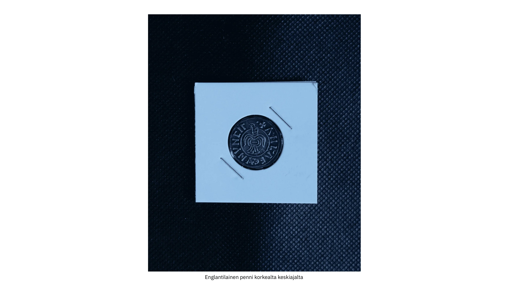

Korkean keskiajan aikana Eurooppa ajautui feodalismiin Rooman rahajärjestelmän romahdettua. Suurin osa väestöstä käytti vähäarvoisia kupari- tai pronssikolikoita, jotka usein laimenivat, mikä rajoitti pitkien matkojen pituista kauppaa.

Kolikoiden paluu maksuvälineeksi tapahtui vähitellen, ja se huipentui 1200-luvulla, kun Firenzessä vuonna 1252 otettiin käyttöön kultainen floriini ja Venetsiassa kultainen dukaatti. Näitä kultakolikoita käytettiin laajalti kaupan laajentumisen ja luotettavien, kansainvälisesti hyväksyttyjen maksuvälineiden kasvavan tarpeen ansiosta.

Englannissa rahajärjestelmää suojeltiin laimentumiselta innovatiivisella veropolitiikalla, kuten Vilhelm Valloittajan vuoden 1066 jälkeen käyttöön ottamalla maaverolla, joka säilytti pennin laadun. Tässä on tärkeää ymmärtää, että tuon ajan hallitsijat saattoivat devalvoida valuuttaa rahoittaakseen valtion toimintaa, ja **maaveron käyttöönotto mahdollisti valuutan pitämisen vakaana ja valtion rahoittamisen verotuksen avulla**

Kiusaus hyötyä rahan laimentamisesta johti kuitenkin kriiseihin, kuten Henrik I:n hallituskaudella 1200-luvulla, jolloin kolikoiden laatu laski dramaattisesti. Ankarat uudistukset, joihin toisinaan liittyi väkivaltaisia toimenpiteitä rahanlaskijoita vastaan, palauttivat väliaikaisesti luottamuksen rahaan.

Keskiajalla syntyi myös kehittyneitä rahoituskäytäntöjä, kuten Englannissa käytettiin laskutikkuja koronkiskontakiellon kiertämiseksi ja luoton myöntämiseksi. Kirkko ei ollut kovin innostunut korollisista lainoista, joten korkokiellon kiertämiseksi käytettiin erilaisia tekniikoita.

Nämä innovaatiot olivat vastaus metallirahan krooniseen puutteeseen, ja ne edistivät alkuvaiheen rahoitusmarkkinoiden syntymistä.

Ristiretket puolestaan edistivät Välimeren alueen kauppaa ja edistivät kansainvälisen kaupankäynnin ja uusien pankkitoimintatapojen kehittymistä, erityisesti temppeliritarikunnan kautta. Temppeliritareista tuli tärkeitä rahoituksen välittäjiä, joiden avulla ristiretkeläiset saivat maksuvalmiutta kaukana kotimaastaan, mikä ennakoi nykyaikaista eurooppalaista pankkijärjestelmää.

Jotta yhteys temppeliherroihin olisi mahdollista, voitte tarkastella alla olevaa ranskalaista keskiaikaista kolikkoa, jonka keskellä on kaunis risti. Tämä risti oli varsin yleinen tämän aikakauden kolikoissa.

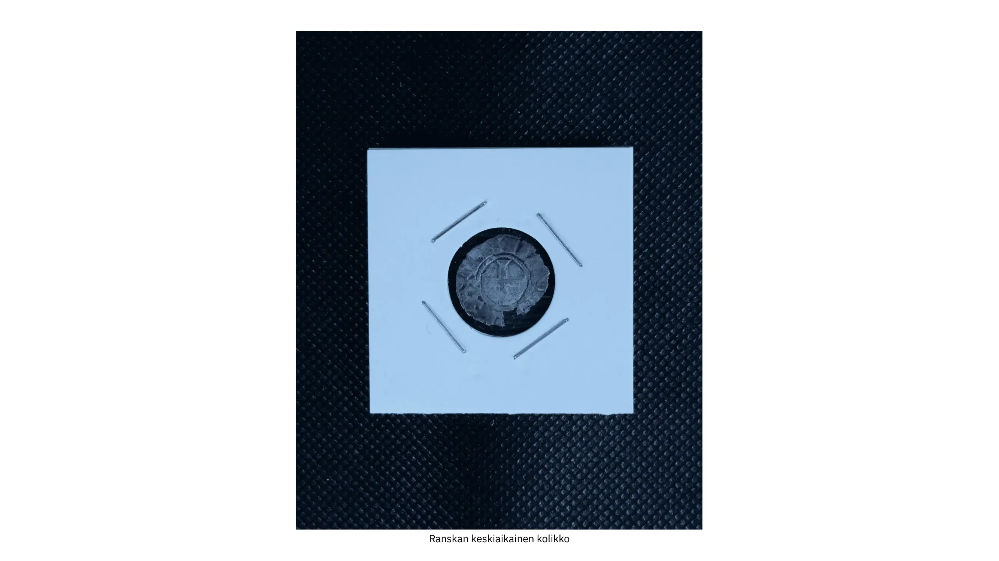

Suuret kriisit, kuten musta surma (1346-1353), aiheuttivat syvällisiä taloudellisia muutoksia. Väestön voimakas väheneminen johti palkkojen jyrkkään nousuun, mikä uhmasi hallituksen pyrkimyksiä säilyttää aiempi palkkataso.

Samaan aikaan satavuotinen sota (1337-1453) pakotti valtiot omaksumaan aggressiivisempaa veropolitiikkaa armeijoidensa rahoittamiseksi, mikä osaltaan heikensi feodaalijärjestelmää.

Keskiaikaa leimasi siis jatkuva jännite luotettavan rahan tarpeen välillä kaupankäyntiä varten ja hallitsijoiden jatkuvan houkutuksen laimentaa rahaa välittömän voiton saamiseksi. Tämä ristiriita muokkasi syvästi Euroopan rahakehitystä ja loi perustan nykyaikaisille talousjärjestelmille.

Tämän jakson päätteeksi haluaisin lisätä melko mielenkiintoisen anekdootin Englannista samoihin aikoihin. Tämä anekdootti on peräisin Glyn Daviesin kirjasta "History of Money".

Siinä mainitaan, että Englannissa siirtyminen parlamenttiin siirsi velkataakan hallitsijalta parlamentille, mikä johti valtion krooniseen velkaantumiseen. Sitä ennen velka painoi hallitsijan harteilla.

Kun parlamentti sai osan rahanluomisvallasta haltuunsa, se mahdollisti sellaisten pitkäaikaisten velkojen luomisen, jotka kansa, ei kuningas, maksoi. Jos kuningas meni konkurssiin tai jos kuningas vaihtui, velka kuoli hänen mukanaan.

Heti kun parlamentti luo velan, syntyy käsite valtionvelka, koska se on potentiaalisesti rajoittamaton ajallisesti. Niin kauan kuin valtio on olemassa, niin kauan kuin parlamentti on olemassa, tämä velka on olemassa, ja heidän oli keksittävä kaikenlaisia tapoja sen jälleenrahoittamiseksi ja jakamiseksi ajan mittaan. Kyseessä on merkittävä paradigman muutos, jossa kuningas tai kuninkaalliset eivät enää olleet ne, jotka takasivat tai kantoivat näiden velkojen taakan, vaan nyt se oli parlamentti ja siten sen kansalaiset.

## Renessanssi

<chapterId>1d1dfb05-70b4-5b7b-9708-373c2182950d</chapterId>

:::video id=4977b4f3-c7b2-41a5-ad7b-a96a8cca4092:::

Olemme nyt päässeet kurssin siihen osaan, jossa puhumme renessanssiksi kutsutusta ajanjaksosta. Se tapahtuu traagisen kriisin taustaa vasten, kun rutto levisi nopeasti laivoihin nousseiden rottien kirppujen välityksellä. Tämä tragedia antaa meille kuitenkin tietoa kaupan ja matkustamisen kasvusta korkeakeskiajalla. Aikaisemmin tällä kaudella ihmiset eivät liikkuneet niin kauas ja niin nopeasti.

### Firenzen Florin

Kultaisen metallirahan paluu Eurooppaan renessanssin aikana merkitsi ratkaisevaa käännekohtaa rahahistoriassa. **Kaikki alkoi Firenzen Florinista vuonna 1252, joka oli ensimmäinen merkittävä kultakolikko, joka lyötiin Euroopassa sitten Rooman kukistumisen**. Huomattavan vakaan painonsa ja puhtausasteensa (noin 3,5 grammaa puhdasta kultaa) ansiosta florin pysyi muuttumattomana neljän vuosisadan ajan, ja siitä tuli nopeasti tärkeä yleiseurooppalainen rahapoliittinen viitearvo.

Alla näet jäljennöksen Florinista: kultainen Florin, joka on valmistettu tinasta ja jonka on leimannut ranskalainen taiteilija, joka valmistaa erinomaisia, käsin kaiverrettuja ja lyötyjä kappaleita.

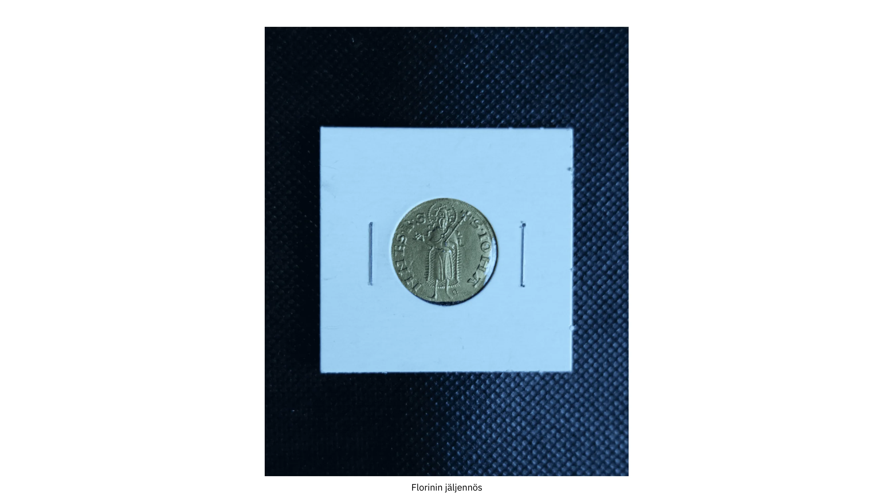

Paluu kultakolikoihin johtui erityisestä tilanteesta: Bysantin soliduksen romahtaminen ja mongolien hyökkäysten aiheuttama muslimimaailman taloudellinen taantuma loivat rahallisen tyhjiön kansainväliseen kauppaan.

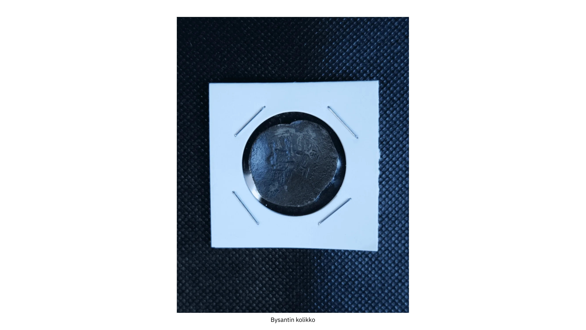

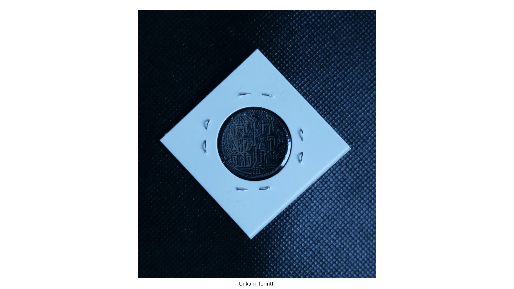

Yllä olevassa ensimmäisessä kuvassa on Bysantin kolikko, joka on mielestäni varsin mielenkiintoinen. Vedän rinnakkain saman ajanjakson kolikon, joka on peräisin Unkarista (toinen kuva yllä). Unkarilainen kolikko on kupin muotoinen, kuin pienoiskulho. Ikonografiassa on uskonnollisia hahmoja, jotka on kuvattu kuninkaina, jotka pitävät ristiä vierekkäin. Tämä kappale on kulhon muotoinen ja peräisin Unkarista.

Muiden maiden kolikoiden kopiointi oli varsin tavallista. Koska Bysantin kolikot olivat yleisesti hyväksyttyjä, muut maat kopioivat niitä usein. Kuten voit nähdä, kun vertaat niitä vierekkäin: nämä kolikot ovat hyvin samankaltaisia.

Pohjois-Italia, erityisesti Firenze, Venetsia ja Genova, hyödynsi tätä tilannetta ja lanseerasi uusia kovia valuuttoja - kolikoita, joiden jalometallipitoisuus oli vakaa. Venetsia seurasi Firenzen esimerkkiä lyömällä vuonna 1270 dukaatin, joka oli lähes identtinen florinin kanssa ja jota käytettiin laajalti Välimeren kaupassa.

Florinista tuli ensimmäinen kansainvälinen varavaluutta, ja se otettiin käyttöön yli 150 eurooppalaisessa kaupungissa ennen 1300-luvun loppua. Medicien johtaman laajan firenzeläisen pankkiverkoston luomisen myötä raha- ja kirjanpitohallinto nykyaikaistui perusteellisesti, ja jopa kullan fyysinen kuljetus väheni.

Tämä on toinen todella mielenkiintoinen seikka. Aikoinaan monet kolikkolähetykset katosivat merimatkoilla. Tämä teknologinen edistysaskel - rekisterit ja kaksinkertainen kirjanpito - mahdollisti pyhien kirjoitusten mukaisen rahan luomisen. Tämä mahdollisti sen, että kolikkolähetysten määrää voitiin vähentää ja sen sijaan käyttää kirjallisten merkintöjen järjestelmää, mikä vähentää huomattavasti riskiä rahan häviämisestä kuljetuksen aikana.

Rahapoliittiseen kehitykseen liittyi myös pankkimenetelmien merkittävä kehitys. Keskiajan Euroopassa syntyi jo 1300-luvulla Firenzessä, Venetsiassa, Barcelonassa ja Genovassa alkeellisia pankkijärjestelmiä, jotka saivat osittain vaikutteita ristiretkien yhteydessä muslimien pankkikäytäntöihin. Temppeliherrat, uskonnollinen ja sotilaallinen ritarikunta, oli jo kehittänyt järjestelmän, jonka avulla ristiretkeläiset saattoivat matkustaa ottamatta varallisuuttaan mukaansa.

He tallettivat varoja temppeliritareiden toimistoon kotimaassaan, ja he saattoivat sitten matkustaa kirjeen muodossa ja noutaa kolikot saapuessaan ristiretkikohteeseensa.

Näin meidän ei tarvinnut kantaa mukanamme jalometallirahoja.

Tänä aikana Eurooppa sai myös tietää paperirahan olemassaolosta Kiinassa Marco Polon 1200-luvulla tekemän matkan ansiosta. Seteleiden kehittäminen odotti kuitenkin useita vuosisatoja, sillä Eurooppa halusi ensin kehittää metallirahanvalmistusmenetelmänsä täydelliseksi. Leonardo da Vinci, joka oli lähellä Luca Paciolia, tunnettua tilintarkastajaa, osallistui aktiivisesti rahapuristimien parantamiseen ja edisti nopeampaa ja tasaisempaa kolikoiden valmistusta.

Viittaamme aiemmin kurssilla mainittuun heiluri-iskutekniikkaan. Tämä menetelmä mahdollisti tasaisempien kolikoiden valmistuksen verrattuna vasaralyöntiin, ja mikä tärkeintä, se mahdollisti myös kolikon reunan ympärille tehtävät merkinnät, kuten aiemmin osoitin. Alla oleva kolikko on eurooppalainen taleri vuodelta 1793, jonka reunassa on selvästi kirjoitusta.

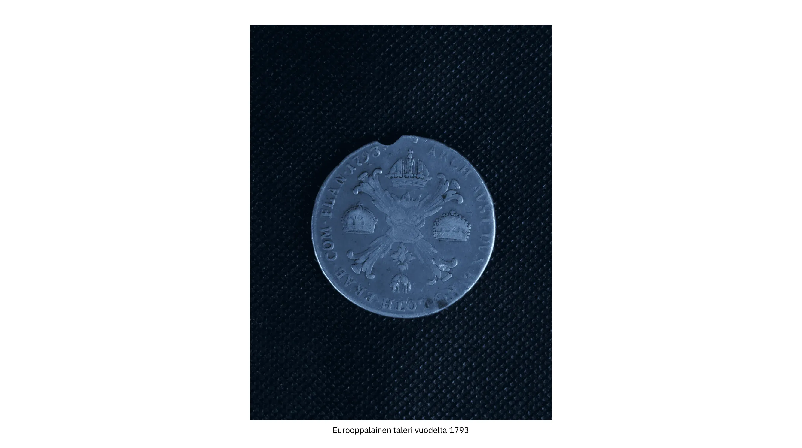

1400-luvulla Eurooppa kuitenkin koki vakavan valuuttakriisin, ja eurooppalaisten valuuttojen hopeapitoisuus heikkeni yleisesti ja laski alle 5 prosenttiin noin vuonna 1450.

Rahapolitiikan painopiste siirtyi 1500-luvulta lähtien Espanjaan, mitä vauhdittivat Aragonian ja Kastilian kuningaskuntien liitto, Reconquistan päättyminen ja Kristoffer Kolumbuksen vuonna 1492 tekemien suurten merilöytöjen kaltaiset löydöt. Amerikkalaisista kaivoksista tuleva valtava hopean tulva horjutti perusteellisesti Euroopan ja maailman talouden tasapainoa ja kiihdytti sekä inflaatiota että uusia geopoliittisia jännitteitä.

Renessanssi merkitsi myös merkittävää taiteellista kehitystä kolikoissa, kuten talerissa (Joachimsthaler), josta on peräisin termi "dollari". Nämä suuret hopeakolikot kuvastavat uusia taiteellisia ja mekaanisia lyöntitekniikoita, jotka Pohjois-Euroopasta peräisin olevat tekniset innovaatiot mahdollistivat.

Rahoituksen renessanssi merkitsi siirtymistä taloudelliseen nykyaikaan, kun pankkitoiminta, luotonanto ja rahoitusmarkkinat kehittyivät ja suurissa kaupallisissa kaupungeissa Amsterdamissa, Lontoossa ja Tukholmassa syntyivät modernin kapitalismin ensimmäiset muodot, jotka loivat perustan nykyiselle kansainväliselle rahoitusjärjestelmälle. Siitä käsittelemme seuraavassa videossamme.

# Valtion suorittama rahan takavarikointi

<partId>17cfb1b4-5bc1-53e0-b035-05c7cf76be92</partId>

## Maailman varantovaluuttojen kehitys

<chapterId>d65cc352-e7ca-5f03-9b23-dd1fae5c0395</chapterId>

:::video id=82710062-8fff-426c-93af-923c08d82233:::

### Jalometallien historiallinen merkitys

Tervetuloa tähän jaksoon, jossa käsitellään varantovaluuttojen ja keskuspankkien syntyä. Tämän uuden jakson ensimmäisenä kohtana keskitymme maailmanlaajuisten varantovaluuttojen kehitykseen.

Jalometalleja, erityisesti kultaa ja hopeaa, on pitkään pidetty valtakuntien rikkauden ja vallan perustana. Kullanhimo on aina ollut hallitseva liikkeellepaneva voima, ja juuri jalometallien tulo vaikutti suorimmin ja selvimmin Euroopan rahapoliittiseen kehitykseen. Keskiajalla ja renessanssin alkuvaiheessa tämä pakkomielle kultaan ja hopeaan johtui siitä, että muiden kauppatavaroiden arvon säilyttäminen oli vaikeaa, sekä ulkovaltojen voimakkaasta kysynnästä, erityisesti idän kanssa käytävässä kaupassa.

Vuosisatojen kuluessa useat imperiumit ovat seuranneet toisiaan maailman talouskeskuksina. Maalle, joka hallitsee maailmankauppaa tiettynä ajanjaksona, myönnetään yleensä reservivaluutan asema. Näitä ovat mm:

- Espanja ja Portugali (1400- ja 1500-luvuilla)

- Yhdistyneet provinssit (Alankomaat) 1600-luvulla

- Ranska ja Iso-Britannia 1700- ja 1800-luvuilla

- Yhdysvallat 1900-luvulla

### Portugalin nousukausi ja real (1450-1530)

**Portugali** hallitsi maailmankauppaa 1400-luvun jälkipuoliskolla ja 1500-luvun alkupuoliskolla Portugalin Realilla**, joka oli suhteellisen tasapainoinen hopeakolikko. Portugalilaiset löysivät merenkulun kehittymisen ansiosta uusia merireittejä Afrikkaan, Aasiaan ja Uuteen maailmaan. Sotilaslinnakkeet ja kauppapaikat lisääntyivät Afrikasta Kiinaan (Macaoon).

Vastauksena Euroopan kullan ja hopean kysyntään "suurten löytöjen jatkuvana motiivina oli kaupallinen voitto, erityisesti kullan ja hopean tavoittelu" Portugalin valtakunta, joka oli ylimitoitettu ja joutui kilpailemaan hollantilaisten, englantilaisten ja ranskalaisten kanssa, alkoi kuitenkin taantua.

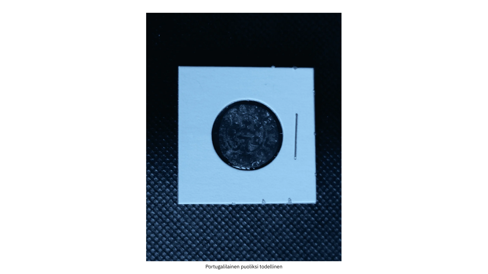

Tässä yllä näet portugalilaisen puolireaalin näiden merellisten valloitusten ajalta.

### Espanjan huippukausi ja Espanjan dollari (1535-17. vuosisata)

Uuden maailman valloituksen myötä **Espanjasta** tuli hallitseva toimija. Sen monarkki, joka hallitsi jättimäisiä hopeakaivoksia (Potosí Boliviassa, Zacatecas Meksikossa), onnistui lyömään rahaa puhtaasta hopeasta ja välttämään näin oman valuuttansa, **Espanjan realin**, arvon alenemisen

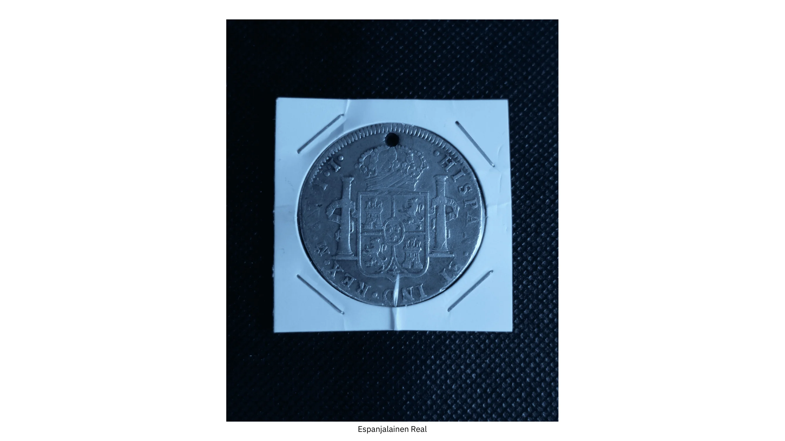

Espanjalainen real, joka tunnetaan myös nimellä "kasipala", sai lempinimensä, koska se leikattiin usein kahdeksasosiin pienempien kolikoiden luomiseksi. Se tunnettiin myös nimellä **Espanjan dollari**. Yllä näkyvä kolikko on vuodelta 1814, joten se on hieman uudempi esimerkki. Aivan ensimmäiset espanjalaiset dollarikolikot eivät kuitenkaan olleet yhtä hienostuneita; ne oli lyöty vasaralla ja ne olivat yleensä vähemmän pyöreitä ja teräviä.

Erityisen mielenkiintoista on se, että Espanjan dollari toimi tuolloin kansainvälisenä varantovaluuttana. Espanjan viranomaiset laskivat liikkeelle myös omaa paikallista valuuttaa, maravediä, ja mukauttivat rahan määrää säännöllisesti muistutusten avulla. Esimerkiksi kupari- tai pronssikolikko, jonka arvo oli alun perin yksi maravedi, saatettiin palauttaa ja leimata merkinnällä "2", myöhemmin merkinnällä "4" ja niin edelleen, ja lopulta se saattoi olla jopa "8" Korkearesoluutioisessa kuvassa näkyy selvästi kolikkoon leimattu "8". Tämä menetelmä laajensi tehokkaasti rahan määrää... mikä johti väistämättä inflaatioon.

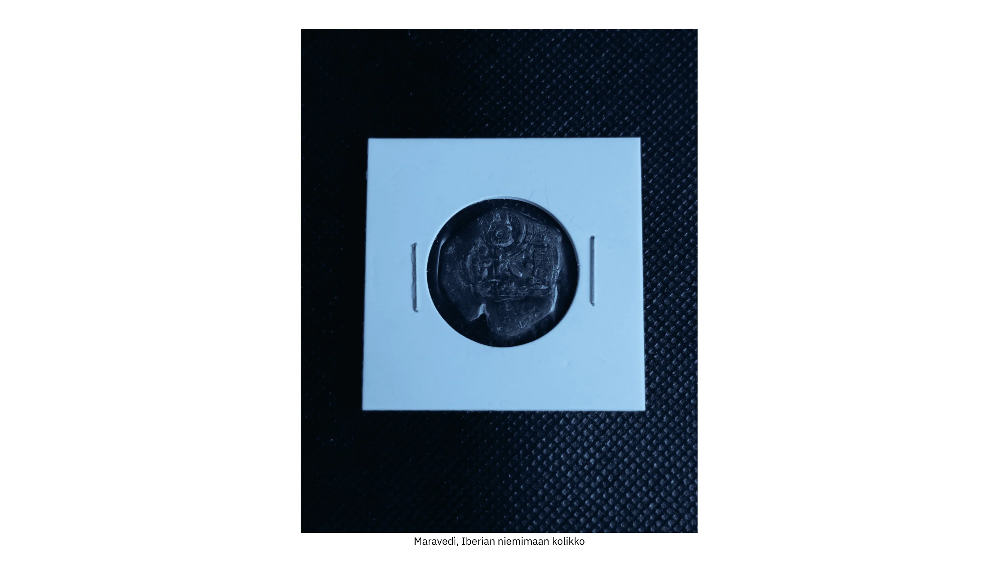

Jos tarkastelemme varantovaluuttojen historiaa, esiin nousee mielenkiintoinen seikka: imperiumit eivät paisuttaneet valuuttojaan niin kauan kuin ne säilyttivät varantovaluutta-asemansa. **Vain hallinnan päättyessä ne päätyivät devalvoimaan sitä ja menettivät tämän etuoikeuden, joka sitten siirtyi uudelle imperiumille**.

Espanjassa Espanjan dollari hallitsi maailmankauppaa lähes 200 vuoden ajan erityisesti Kiinan ja Euroopan välillä. Näitä kolikoita löytyi jopa Kiinan satamista. Ja tässä kohtaa saamme historiasta vinkkiä: Yhdysvaltain dollari on peräisin suoraan tästä valuutasta. Kun Yhdysvallat perustettiin vuonna 1792, se hyväksyi lain oman valuutan lyönnistä, ja sen ensimmäiset dollarit luotiin Espanjan dollarin mallin mukaan sekä nimensä että kolikon koon osalta.

Amerikan dollari oli alun perin hopeakolikko, joka painoi lähes unssin eli nykyrahassa 30-40 euroa, toisin kuin nykyiset paperivaluutat. Espanjan dollari oli niin laajalti liikkeellä, että sitä pidetään ensimmäisenä todellisena maailmanlaajuisena valuuttana.

Jalometallien tulo Amerikasta aiheutti kuitenkin inflaation Euroopassa. Hintavallankumouksen aikana (n. 1540-1640) elinkustannukset nousivat Englannissa seitsenkertaisiksi. Espanjassa hopean runsaudella oli kieroutunut resurssikirous, joka esti vakaiden pankkilaitosten kehittämisen.

Tämän jälkeen Espanja joutui lukuisiin sotilaallisiin konflikteihin (Flanderi, Alankomaat, kolmikymmenvuotinen sota), ja sen talous romahti vähitellen. Maailmankuulun hopeakolikon devalvoimisen sijasta peräkkäiset hallitsijat päättivät jättää maksamatta paikallisen väestön käyttämän kuparikolikon (vellón) tai alentaa sen arvoa. Tätä kuvasin aiemmin Maravedisin kohdalla.

### Alankomaiden nousu (1600-luku)

Iberian niemimaan huipun jälkeen Alankomaista** tuli uusi kauppamahti 1600-luvulla. Merikauppa, VOC (Alankomaiden Itä-Intian komppania) ja **Amsterdamin pörssi Exchange**:n perustaminen (Antwerpenin pörssin innoittamana) vakiinnuttivat tämän kauppavaltakunnan aseman.

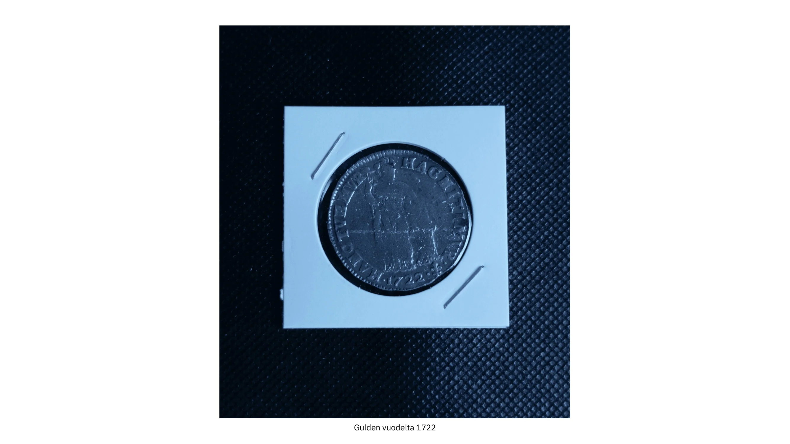

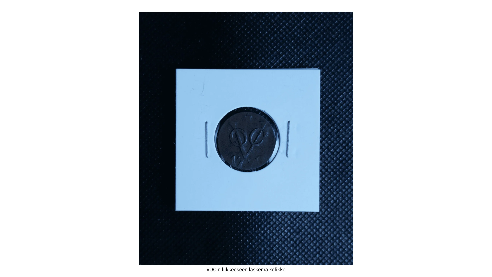

Yllä olevassa ensimmäisessä kuvassa on Gulden vuodelta 1722 (kaunis hopeakolikko), kun taas toisessa kuvassa on VOC:n liikkeeseen laskema kolikko.

VOC oli aikakauteensa nähden erittäin vaikutusvaltainen yhtiö: sillä oli oma armeija ja se jopa laski liikkeelle omaa valuuttaa.

Hollantilaiset keksivät nykyaikaisen kapitalismin, joka alkoi riskien jakamisen keinona riskialttiissa yrityksissä, kuten tutkimusmatkoilla Uuteen maailmaan tai uusien kauppareittien etsimisessä. Osakeyhtiöt antoivat useille sijoittajille mahdollisuuden yhdistää rahansa ja jakaa riskit. Näiden vaihtojen helpottamiseksi oli sitten tarpeen luoda instituutioita, jotka pystyivät neuvottelemaan ja vaihtamaan näitä arvopapereita. Niinpä vuonna 1602 perustettiin ensimmäinen osakeyhtiö ja pörssi.

Alankomaiden rahayksikkö, **Gulden**, sai uskottavuutta, koska se oli puhdasta hopeaa ja koska Amsterdamin pankki otti sen käyttöön (1609), jolloin talletuksista tuli suosituin rahamuoto Euroopassa. Tämä on erittäin tärkeä seikka, joka on syytä mainita. Kyllä, tietysti oli olemassa kolikoita, mutta se, mikä todella muodosti rahaa tuohon aikaan, oli eräänlainen kirjoitusraha. Itse asiassa suuri osa maailmankaupasta kulki Amsterdamin pankin kirjojen kautta. Tämä oli todellinen pankkitoiminnan läpimurto: kansainvälistä kauppaa ei enää välttämättä käyty fyysisillä kolikoilla, vaan suoraan pankin kirjanpidon kautta.

Tälle vaurauskaudelle oli ominaista kullan ja hopean suuri virta erityisesti muista maista, jotka harjoittivat inflaatiota tai rahapolitiikan valvontaa. Mainittakoon eräs mielenkiintoinen hahmo: **Thomas Gresham**. Hän työskenteli tuohon aikaan Englannin kuninkaallisten palveluksessa Alankomaissa ja hoiti rahavirtoja näiden kahden maan välillä. Juuri tämä Gresham jätti meille kuuluisan **"Greshamin lain "**.

Kuitenkin myös Alankomaiden valtakunta loppui aikanaan. Sodat Englannin kanssa, guldenin heikentyminen konfliktien aikana ja muiden valtojen (Ranskan ja Englannin) kilpailu merkitsivät Alankomaiden hegemonian loppua. Neljännen englantilais-hollantilaisen sodan (1780-84) jälkeen guldenin heikkeneminen varavaluuttana oli peruuttamaton.

### Ranskan valta, pyrkimykset ja epäonnistumiset (17.-18. vuosisadat)

Ludvig XIV:n aikana Ranskasta** tuli Euroopan suurin mannermainen suurvalta. Ranskan valuutta ei kuitenkaan koskaan saavuttanut hallitsevan viitekehyksen asemaa: lukuisat devalvaatiot, raskas verotus ja kalliit sodat (Augsburgin liitto, Espanjan perintösota jne.) vaikuttivat raskaasti rahajärjestelmän vakauteen.

John Law (1716-1720) teki ensimmäisen merkittävän kokeilun paperirahan alalla. Banque Générale laski liikkeeseen vekseleitä, joiden vakuutena oli lupauksia valtion velasta. Tämä järjestelmä johti spekulatiiviseen kuplaan ja romahdukseen (Mississippi-kupla) vuonna 1720. Tämä katastrofi jätti Ranskaan pysyvän epäluottamuksen paperirahaa kohtaan. Juuri tämä katastrofaalinen kokemus johti siihen, että Richard Cantillon vaurastui tämän nykyisin Cantillon-ilmiönä tunnetun periaatteiden mukaisen järjestelmän ansiosta, jossa rahan painaminen rikastuttaa niitä, joilla on pääsy painokoneeseen.

Kun tämä epäluottamus lopulta hälveni, tuli toinen ranskalainen paperifiasko: vallankumoukselliset **assignat**. Näitä assignatteja laskettiin liikkeelle vuodesta 1790 alkaen papiston omaisuuden takavarikoimisen perusteella, ja ne kokivat hurjan hyperinflaation, joka oli virallisesti historian ensimmäinen hyperinflaatio, joka ylitti 50 prosenttia kuukaudessa. Vaikka niiden nimellisarvo oli moninkertaistunut, vuonna 1795 niillä käytiin kauppaa vain muutamalla prosentilla niiden alkuperäisestä arvosta.

Tiukemmilla laeilla pyrittiin määräämään assignat, mutta siinä ei onnistuttu. Hallitus yritti pakottaa sitä, ja se meni niin pitkälle, että se uhkasi kuolemalla niitä, jotka eivät hyväksyneet sitä, ja pakotti kauppiaita pysymään auki. Mutta lopulta se ei tietenkään toiminut.

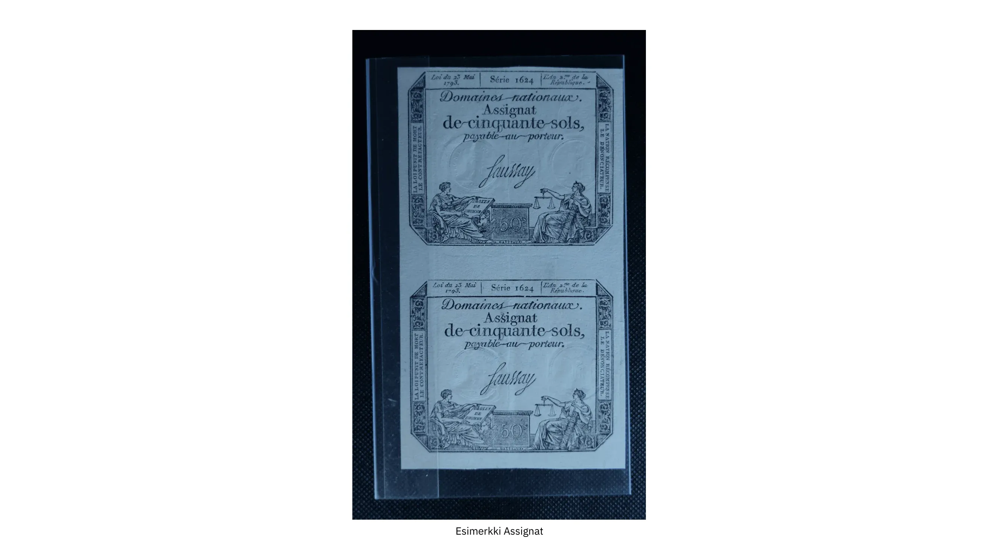

Kun tämä paperiraha korvasi kaikki laadukkaat jalometallirahat ja noudatti kuuluisaa Greshamin lakia, syntyi kolikkopula. Uusien kolikoiden lyömiseen käytettiin papistolta takavarikoitua kellometallia. Alla näet kauniin kappaleen kellometallia, joka on valmistettu takaisin saadusta kuparista sulattamalla papistolta otettuja kolikoita.

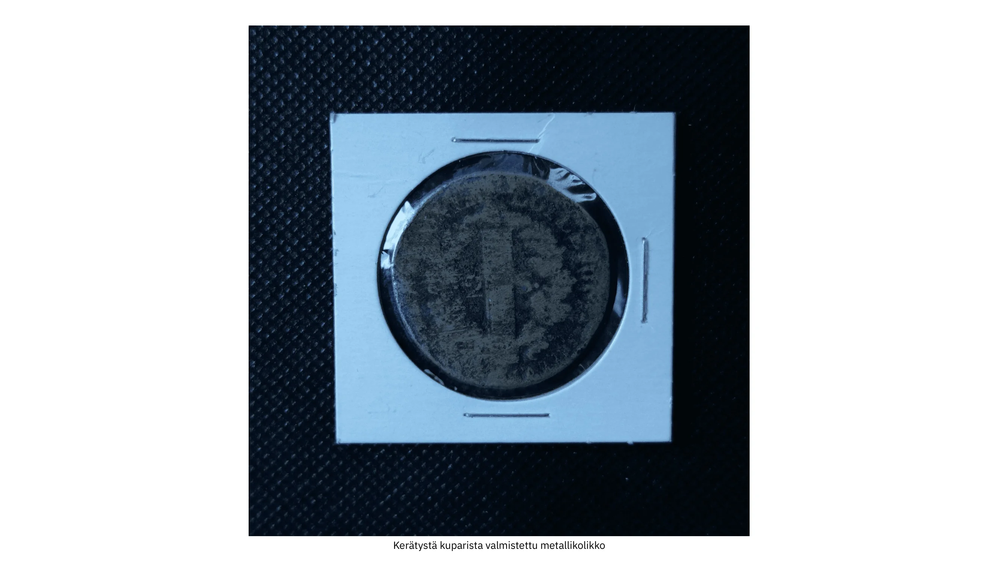

### Britannian ylivalta (18.-20. vuosisadan alku)

**Englannista** tuli Alankomaiden ohittamisen jälkeen hallitseva suurvalta 1700-luvulla. Englannin punta on vanhin yhä käytössä oleva valuutta, joka alun perin oli sidottu hopeapuntaan. Vähitellen sen asema vahvistui rahoitus- ja verovallankumouksen tukemana: parlamentaarinen monarkia, vahva veronkantokyky ja Englannin keskuspankin perustaminen vuonna 1694\.

Ranskaa vastaan käytyjen sotien jälkeen Yhdistynyt kuningaskunta voitti sodan vuonna 1815 (Waterloo), mikä vahvisti sen ylivaltaa. Englannin punta toimi koko 1800-luvun ajan maailman varantovaluuttana. Huippuvuosinaan Britannia tuotti vain 2,5 prosenttia maailman väestöstä, mutta se tuotti 20 prosenttia maailman tuloista ja hallitsi lähes neljäsosaa maapallon pinta-alasta.

Teollinen vallankumous** ja **kultakannan** käyttöönotto (1717 tai 1718, Isaac Newtonin valvonnassa kuninkaallisessa rahapajassa) vahvistivat punnan uskottavuutta. Englannin keskuspankki otti käyttöön kultakannan 4,25 puntaa kultaunssia kohti, jolloin setelinomistajat saivat vaihtaa setelinsä kullaksi.

Ensimmäinen maailmansota (1914-1918) teki kuitenkin lopun tästä järjestelmästä. Viikkojen kuluessa kaikki suuret sotaa käyvät valtiot keskeyttivät kullan vaihdettavuuden. Brittiläinen imperiumi ja myöhemmin punta selviytyivät toisesta maailmansodasta heikentyneinä, ja 1900-luvulla ne väistyivät Yhdysvaltain dollarin tieltä.

Alla on joitakin kauniita ja mielenkiintoisia esineitä. Nämä ovat rahapainoja. Ensimmäinen on sovereign: punnan varhaisimmat esitykset. Minulla on rahapainoja vain näiden kolikoiden esittämiseksi, koska minulla ei ole varaa ostaa oikeaa sovereignia. Niiden punnitsemiseen käytimme vaa'alla ja asetimme sitten sovereignin arvoa vastaavan rahapainon toiselle puolelle.

Valtakunta oli rahakolikko - kultakolikko, jonka arvo oli alun perin yksi punta.

Kuuluisaa sovereignia edelsi guinea, joka toimi samalla periaatteella. Guinea sai nimensä sen sisältämien, Guinean alueelta peräisin olevien jalometallien mukaan.

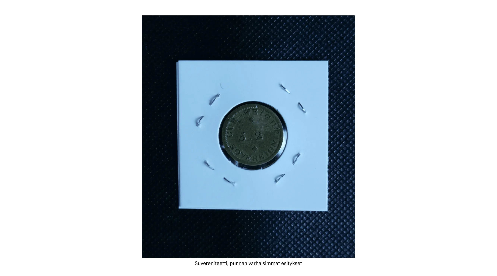

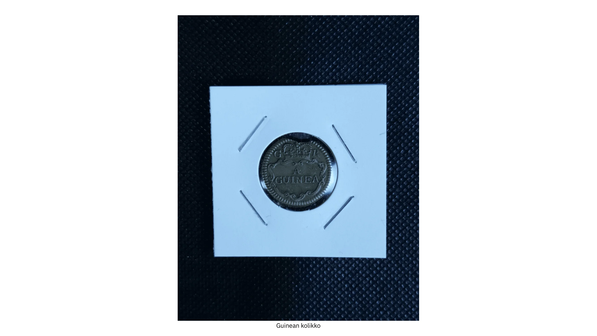

## Keskuspankkien syntyminen

<chapterId>15777771-1e28-55f7-a400-69868a47079b</chapterId>

:::video id=7661b7b5-e00f-48f3-b69a-6fb2eb5ebba4:::

Ensimmäisten varantovaluuttojen historiaa ja niiden kehitystä käsittelevän jakson jälkeen on vuorossa jakso keskuspankkien synnystä. Se seuraa pitkälti samaa polkua kuin varantovaluuttojen synty, mutta keskittyy hieman enemmän tuon ajan pankkiteknologiaan.

### Pankkien ja protopankkien alkuajat

Jo 1200-luvulla italialaiset (Firenze, Genova, Venetsia jne.) kehittivät kaksinkertaisen kirjanpidon tekniikan. Myöhemmin **Antwerpista** (1500-luvulla) tuli Pohjois-Euroopan johtava rahoituskeskus, jonka aseman myöhemmin otti **Amsterdam** Amsterdamin pörssin (1609) ansiosta, jossa VOC:n osakkeilla käytiin kauppaa.

Antwerpenissä järjestettiin kauppamessuja, joilla kauppiaat kokoontuivat usein selvittämään velkojaan, mikä johti uusien rahoitusvälineiden keksimiseen. Alla oleva, vuodelta 1761 oleva uudempi vekseli on **vekseli**. Siinä on käsinkirjoitettuja yksityiskohtia ja merkintöjä kääntöpuolella, mikä tekee siitä upean esineen tuolta ajalta.

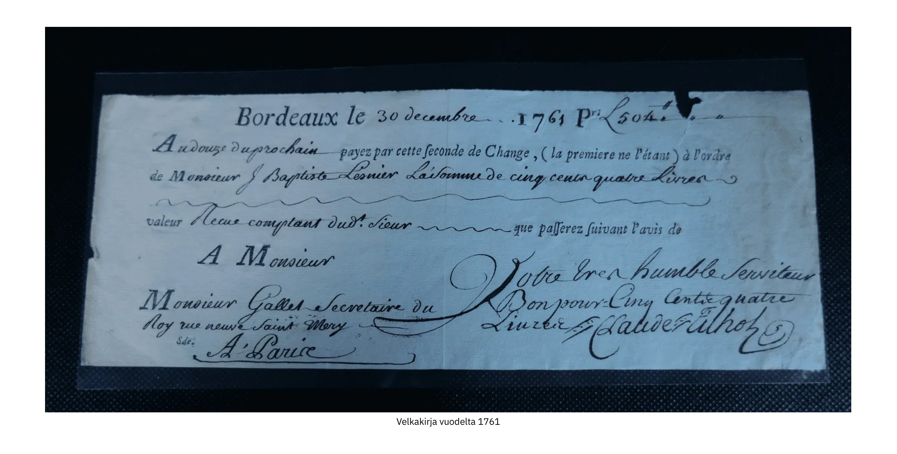

Tämä kuohunta johti kehittyneempien pankkilaitosten perustamiseen. **Lombardialaiset pankkiirit** ja myöhemmin hollantilaiset kauppiaat kehittivät luottovälineitä (vekseleitä, velkakirjoja jne.). Nykyaikainen pankkijärjestelmä perustuu tähän ajatukseen: raha voi olla luottoa, ei vain metallia.

Kuten huomaatte, tämä vie meidät takaisin alkuperäiseen kysymykseen rahan alkuperästä.

Onko raha peräisin hyödykkeestä, joka syntyy vaihdon tarpeesta, vai syntyykö se luotosta? Jälkiä tästä löytyy vielä tästä osiosta.

### Ruotsin esimerkki: Stockholms Banco ja Riksens Ständers Bank

Siirrytään Ruotsiin, jossa perustettiin ensimmäinen keskuspankki.

**Ruotsi** oli keskuspankkitoiminnan edelläkävijä: Johan Palmstruch perusti vuonna 1657 **Tukholman pankin**, jolla oli lupa antaa lainaa enemmän kuin sen metallivarannot olivat, mikä merkitsi [murtoreservipankkitoiminnan](https://planb.academy/resources/glossary/fractional-reserves) syntyä. Liiallinen setelien liikkeeseenlasku johti kuitenkin paniikkiin ja pankin ryntäykseen vuonna 1663. Kappas vain...

Vuonna 1668 Tukholmaan perustettiin Riksens Ständers Bank, maailman ensimmäinen todellinen keskuspankki. Myös se kärsi kuitenkin kriiseistä (1709, 1715...), jotka liittyivät seteleiden väärinkäyttöön, usein valtakunnan sotien rahoittamiseksi.

### John Law'n epäonnistunut vallankaappaus

Suuntaamme Ranskaan, jossa tapaamme jälleen kerran rakkaan John Law'n.

*skotlantilainen *John Law** sai regentin (Orleansin herttuan) suostuteltua perustamaan yksityisen pankin, Banque Généralen (1716), jolla oli oikeus laskea liikkeeseen papereita kultaa, hopeaa ja valtion velkoja vastaan. Siitä tuli Banque Royale (1718), ja se auttoi Mississippi Companyn osakkeita nousemaan.

Kun todellisuus ja spekulaatiot saivat toisensa, **paniikkia pahensi päätös kieltää kullan hallussapito ja pakottaa käyttämään lain seteleitä**. Kappas vain...

Lopulta kupla puhkesi vuonna 1720 ja aiheutti romahduksen, joka tuhosi paperirahan uskottavuuden Ranskassa pitkäksi aikaa.

### Bank of Amsterdam, uraauurtavan mallin nousu

Siirrymme nyt Amsterdamiin vuonna 1609, jolloin **Amsterdamilainen pankki** (Wisselbank) otti haltuunsa kolikoiden säilytyksen ja vaihdettavuuden Amsterdamissa. Se kielsi yksityisten seteleiden liikkeelle laskemisen ja pakotti tallettamaan metallikolikot sen holveihin. Vähitellen he saivat valuutan hallinnan itselleen. Ne kielsivät rahanvaihtajia pitämästä kolikoita itsellään. Rahanvaihtajat työskentelivät koko päivän, ja heidän oli päivän päätteeksi talletettava kolikkonsa Amsterdamin pankin holveihin. Kuten olen maininnut, kansainvälisessä kaupassa ei välttämättä käytetty metallikolikoita. Kyse oli pankin kirjanpidossa olevasta kirjallisesta rahasta.

Alankomaiden kauppiaiden vallan ansiosta pankki toimi ensimmäisenä tosiasiallisena "keskuspankkina", joka vakautti maailmankauppaa. Ajan mittaan se kuitenkin myönsi vakuudettomia lainoja VOC:lle, ja lopulta siltä loppui metalli vekseliensä vakuudeksi. Vuonna 1790 kävi ilmi, että pankki oli lainannut suuria summia VOC:lle, ja se teki käytännössä konkurssin, mikä tuhosi guldenin uskottavuuden. Kappas vain...

### Englannin keskuspankki, modernin pankkitoiminnan perustamislaki

1600-luvun Englannissa kultaa ja hopeaa säilytettiin kultasepissä, jotka antoivat kuitteja. Tämä osittain hajautettu organisaatio osoittautui rajalliseksi, kun kruunu joutui tarvitsemaan valtavasti rahoitusta Ranskaa vastaan käytävää sotaa varten.

Vuonna 1694 perustettiin **Bank of England (BoE)**. Englannin pankki syntyi siis Lontoon liike-elämän ja hallituksen välisestä avioliitosta, sillä hallitus etsi epätoivoisesti varoja sotaa varten.

Pankki sai monopolin seteleiden liikkeeseenlaskuun Englannissa (jota vahvistettiin vuosina 1708, 1742 jne.). Siitä lähtien kolikoiden rinnalla liikkui paperista rahaa, jonka vakuutena oli kultavaranto. Tämä on tärkeä seikka, kun halutaan ymmärtää rahan asteittaista siirtymistä valtion laitosten haltuun. Amsterdamin pankki esti ensin rahanvaihtajia säilyttämästä kolikoita ja pakotti heidät palauttamaan ne pankille. Englannissa yksityisiä pankkeja kiellettiin laskemasta liikkeelle omia, kullalla lunastettavia seteleitään.

Yksityiset pankit saivat laskea liikkeeseen seteleitä, mutta ne voitiin vaihtaa vain Englannin keskuspankin seteleihin.

Englannin pankin setelit, puntia, voitiin lunastaa kullalla. Tämä lisäsi valuuttaan kolmannen kerroksen. Pohjalla on siis kultaa, sitten Englannin pankin seteleitä ja päälle yksityisten pankkien seteleitä. Sitä ennen yksityiset pankit saattoivat laskea liikkeeseen omia seteleitään, jotka voitiin lunastaa kullalla. Tämä on toinen vaihe siinä vaiheessa, kun valtiolliset instituutiot asteittain ottavat valuutan haltuunsa.

Pankki rahoitti valtiota laajoilla lainoilla ja järjesti valtavan julkisen velan, jolla rahoitettiin talouskasvua.

Tämä malli vakiintui 1700- ja 1800-luvuilla niin pitkälle, että Englannin punnasta tuli maailman varantovaluutta Englannin keskuspankin ja kultakannan sinetöimänä.

**Maailman varantovaluutat** ovat vuosisatojen ajan seuranneet toisiaan valtion tai imperiumin taloudellisen, kaupallisen ja sotilaallisen voiman ohjaamina: Portugali, Espanja, Alankomaat, sitten Iso-Britannia, ennen kuin Yhdysvallat tuli hallitsevaksi 1900-luvulla. Kussakin tapauksessa on nähtävissä samanlainen sykli: taloudellinen laajeneminen, kaupallinen menestys, valuutan kansainvälinen käyttöönotto, velkaantuminen, kalliit sodat, rahanluonnin tai luoton väärinkäyttö ja lopulta taantuminen.

**Keskuspankkien syntyminen** oli asteittainen prosessi. Nämä instituutiot syntyivät usein kalliiden sotien yhteydessä, jolloin valtio pystyi rahoittamaan itseään velan avulla. Kun kultakanta otettiin käyttöön (Englannissa 1600-1900-luvuilla), se tarjosi vakautta, kunnes 1900-luvun suuret maailmansodat johtivat siihen, että kullan vaihdettavuudesta luovuttiin vähitellen. Valta rahanlyöntivaltaa siirrettiin näin kuninkaalliselta monopolista monimutkaisemmille yksiköille, jotka olivat ensin yksityisiä (kultasepät, pankkiirit) ja sitten puolijulkisia (keskuspankit), mikä kuvastaa rahapoliittisen suvereniteetin kehittymistä kohti institutionalisoituneita ja globalisoituneita muotoja.

Tätä siis kuvailin aiemmin. Olemme usein siirtäneet valtionvelan taakan suoraan joko keskuspankeille tai oikeudellisten instituutioiden, kuten parlamentin, myöntämälle luvalle luoda rahaa.

Ja tärkein tosiasia tässä on se, että **velka, joka saattoi kadota valtiovallan konkurssin kautta, on muuttunut velaksi, joka lepää pääasiassa väestön harteilla**.

## Tie fiat-järjestelmään

<chapterId>27a98545-d350-56ee-a200-92468e6b9b33</chapterId>

:::video id=e27a753e-aeee-4307-a65c-9506aab380a1:::

Olemme nyt päässeet rahan historiaa käsittelevän kurssin loppuun, ja sen päättämiseksi haluan ehdottaa kahta aihetta. Ensimmäinen aihe on eri vaiheet, jotka johtivat nykyiseen fiat-valuuttajärjestelmään. Käymme uudelleen läpi luvussa 5 esitetyt faktat keskuspankkien perustamisesta ja lisäämme siihen käsitteen Yhdysvaltain dollari, joka on viime kädessä nykyinen varantovaluutta. Tarkastelemme, miten se kehittyi, miten dollari syntyi, miten se kehittyi, miten se muuttui, mitä vaiheita se kävi läpi tullakseen fiat-järjestelmäksi, koska dollarin alkuperä on hopeakolikko.

Välittömästi sen jälkeen esittelen teille lyhyen pätkän rahoituksen historiasta, jotta ymmärtäisitte, miten hyvinvointivaltioon on tultu. Tarkastelemme siis kahta aihetta: sitä, miten päädyimme fiat-järjestelmään, ja heti sen jälkeen sitä, miten rahoituksen kehitys johti meidät hyvinvointivaltion käsitteeseen.

### Nykyaikaisen pankkitoiminnan eurooppalainen perusta

Palataanpa 1300-luvulle, jolloin oli kyse florinista. Ymmärtääksemme, miten päädyimme fiat-malliin, meidän on aloitettava 1300-luvulta. Floriinin rinnalle syntyi samaan aikaan Medicien kanssa eräs tekniikka, vekselien käsite.

Sitten tuli Antwerpenin pörssi ja sen diskonttaus- ja vekselikonsepti.

Sitten, kuten olemme nähneet, meillä oli VOC, Amsterdamin ensimmäiset pörssit. Se merkitsi kapitalismin syntyä, kun yhtiöiden osakkeet ja osakkeiden vaihto olivat käytössä. Amsterdamin pankki määräsi sitten asetuksella talletusten käytön. Tämä tarkoitti sitä, että kolikot oli talletettava päivän päätteeksi. Rahanvaihtajat eivät enää voineet säilyttää vaihtorahoja kolikoina.

Sitten perustettiin Englannin keskuspankki, koska 1700-luvun lopulla oli tarpeen luoda velkaa sodan rahoittamiseksi. Tuolloin yksityisistä pankeista tuli rahan kolmas kerros. Muuten, tämä koko jakso, guldenista keskuspankin luomisen käsitteeseen, on erittäin hyvin tiivistetty Nick Bhatian kuuluisassa kirjassa "Layered Money", jonka minulla oli onni kääntää muutaman kollegani kanssa. Teimme hienoa työtä sen kääntämisessä, jotta ranskankieliset kaikkialla voisivat hyötyä näistä opetuksista.

Olemme siis 1700-luvun lopussa. Englannin pankki perustettiin sodan rahoittamiseksi.

Yksityiset pankit ottivat haltuunsa valuutan kolmannen kerroksen. Itse asiassa yksityisten pankkien vekseleitä ei enää voitu lunastaa kullalla: ainoastaan Englannin keskuspankin vekselit voitiin lunastaa kullalla. Tämä osoittaa, että Englannin keskuspankki oli ottanut haltuunsa vaihtovallan.

Sitten tuli vuoden 1776 paniikki. Kaikki ryntäsivät rahapyramidia ylöspäin. Tämä tarkoittaa sitä, että vuonna 1776 pankkeihin hyökättiin, ja kaikki ihmiset, joilla oli kolmannen kerroksen papereita eli yksityisten pankkien seteleitä, yrittivät hankkia Englannin pankin seteleitä, ja sitten he yrittivät hankkia kultaa, mutta ilmeisesti holveissa ei ollut tarpeeksi kultaa. He julistivat eräänlaisen pankkiloman välttääkseen kultalainojen takaisinmaksun, ja tämä synnytti viimeisen keinon lainanantajan käsitteen.

### Yhdysvaltain dollarin kehitys

Siirryimme guldenista Englannin pankin perustamiseen. Välissä olivat tietenkin ensimmäinen ja toinen maailmansota, mutta jo aiemmin, vuonna 1796, tapahtui kehitystä myös Atlantin toisella puolella. Vuonna 1776 Amerikka oli vielä Britannian siirtomaa, ja siirtokunnat käyttivät tätä paperivaluuttaa. Alla on Connecticutin kahden shillingin seteli vuodelta 1776.

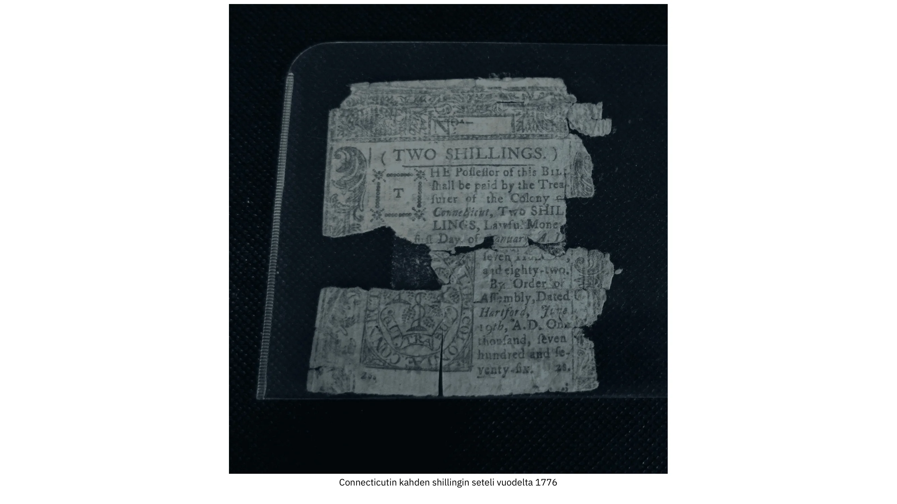

Ennen kuin siirtomaat julistivat sodan Englannille ja lopulta laskivat liikkeelle oman rahansa, ne käyttivät tätä paperivaluuttaa Espanjan dollarin ohella käteiskaupassa. Itse asiassa termi "dollari" jäi merkitsemään Yhdysvaltain dollaria.

Jos en erehdy, vuonna 1792 he hyväksyivät lain, joka salli rahan lyönnin. Esimerkkinä alla oleva dollari on nykyajan amerikkalainen dollari.

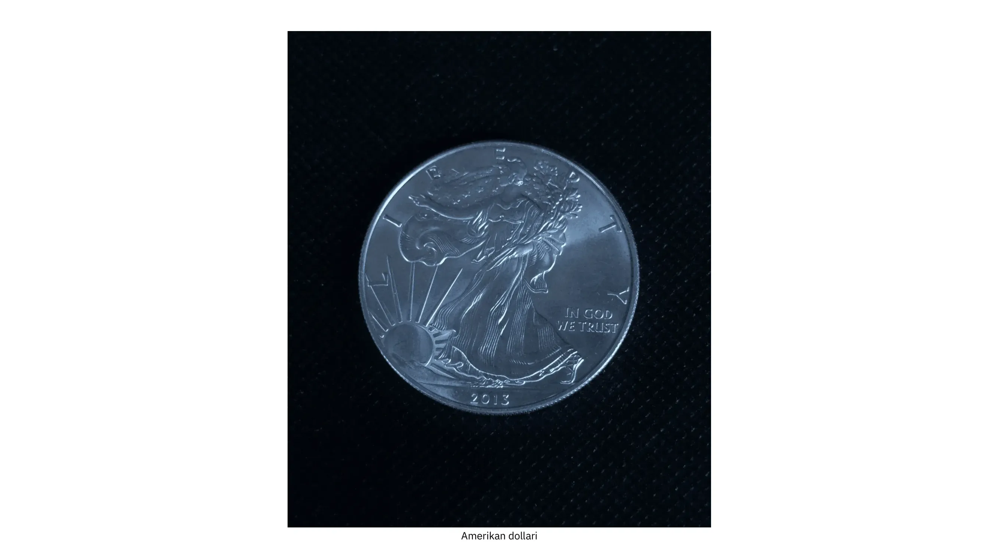

Sen nimellisarvo ei tietenkään ole vain yksi dollari, vaan se on arvoltaan noin 30 tai 40 dollaria, koska se edustaa unssia hopeaa. Sen arvo vaihtelee hopean hinnan mukaan, ja yleensä se on vähintään 30 tai 40 Yhdysvaltain dollaria. Nykyään paperidollari säilyttää tietysti vain yhden dollarin nimellisarvonsa, mutta tuolloin Yhdysvaltain dollari perustui tähän hopeaarvoon.

Puhutaan nyt Amerikan sisällissodasta. Konfederaatiot painoivat rahaa, joka oli hyperinflatoitua. Tämä ilmiö ei sisälly viralliseen Hanke-Krusin luetteloon, koska se ei saavuttanut 50 prosentin hyperinflaatiota. Se koki kuitenkin 40 prosentin kuukausittaisen inflaation, mikä osoittaa, että sodan aikana painettiin huomattava määrä rahaa.

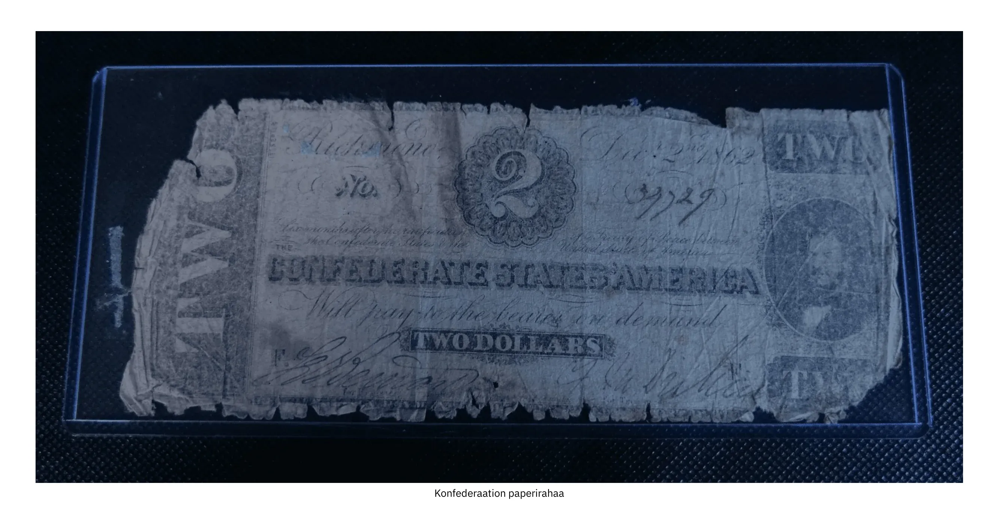

Heidän pohjoisilla vastustajillaan oli myös dollareita. Yläpuolella on konfederaation dollareita ja alapuolella pohjoisen dollareita. Niitä kutsuttiin "greenbackiksi", koska niiden selkä oli vihreä.

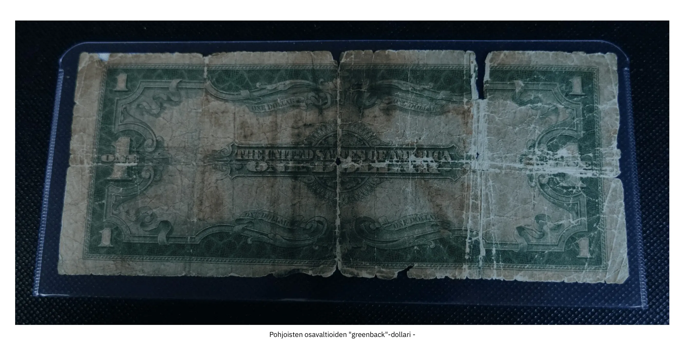

Ja pyydän teitä vertaamaan kokoeroa nykyaikaisiin seteleihin. Silloin setelit olivat suurempia.

Kuten tiedämme, pohjoinen voitti, joten yhdistyneiden Yhdysvaltojen osavaltioiden valuutaksi tuli dollari. Sitten tulivat FED:n perustaminen vuonna 1913 ja ensimmäinen maailmansota.

Ensimmäisen maailmansodan jälkeen painettujen seteleiden viimeisessä sarjassa oli aina maininta "vaadittaessa lunastettavissa kullaksi". Vuonna 1928 20 dollarilla sai siis lähes unssin kultaa, sillä kullan hinta oli 20,67 dollaria. Alla olevan kuvan setelillä saattoi ostaa unssin kultaa vuonna 1928.

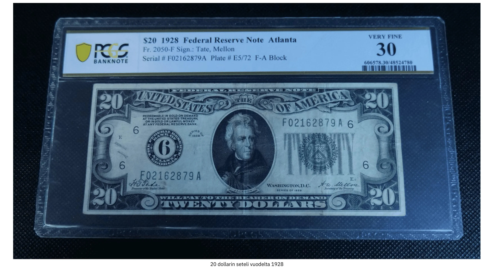

Nykyään unssin kullan arvo on 3 000 Yhdysvaltain dollaria. Tässä näkyy tietenkin devalvaation voima. Se oli viimeinen seteli, joka sisälsi sanat "lunastettavissa kullaksi". Näemme, että heti toimeenpanomääräyksen 6102 jälkeen he takavarikoivat kaiken kullan. Itse asiassa he takavarikoivat sekä kullan että kultatodistukset.

Alla näet kultaisen sertifikaatin vuodelta 1928.

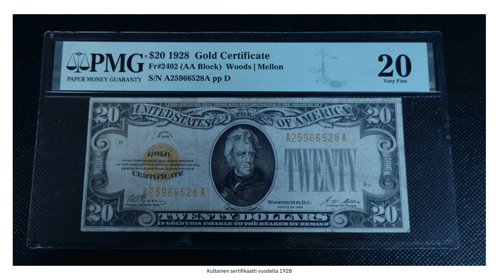

Sen lisäksi, että se oli "lunastettavissa kullaksi" kuten vuoden 1928 seteli, se oli myös lunastettavissa kultakolikoiksi: se on todellakin "kultasertifikaatti". Ne kaikki takavarikoitiin Executive Order 6102:n jälkeen. Vuoteen 1964 asti niiden omistaminen oli jopa laitonta.

Olen hyvin iloinen, että minulla on sellainen.

Vuodesta 1964 lähtien kullan omistaminen oli laitonta, vuoteen 1974 asti, jos en erehdy. 70-luvulla ihmisille annettiin lupa kerätä kultaa Nixonin shokin jälkeen, jota kuvaamme pian. Vuonna 1933, kun he antoivat toimeenpanomääräyksen 6102, he takavarikoivat kullan ja sen hallussapidosta tuli laitonta. Jos jäi kiinni kullan hallussapidosta, sai kovan vankilatuomion. Tuohon aikaan jokainen unssillinen kultaa vaihdettiin alla olevan kaltaiseen seteliin vuoden 1934 jälkeen.

Kuten sanoimme, vuonna 1928 dollarissa oli vielä teksti "lunastettavissa kullasta".

Täytäntöönpanomääräyksen 6102 antamisen jälkeen he takavarikoivat kaiken kullan ja vaihtoivat 20,67 dollaria jokaisesta kultaunssista. Sen jälkeen huijaus tuli ilmi: he laskivat vuonna 1934 liikkeeseen uusia seteleitä, joihin oli painettu teksti "tämä seteli on laillinen maksuväline kaikkiin velkoihin".

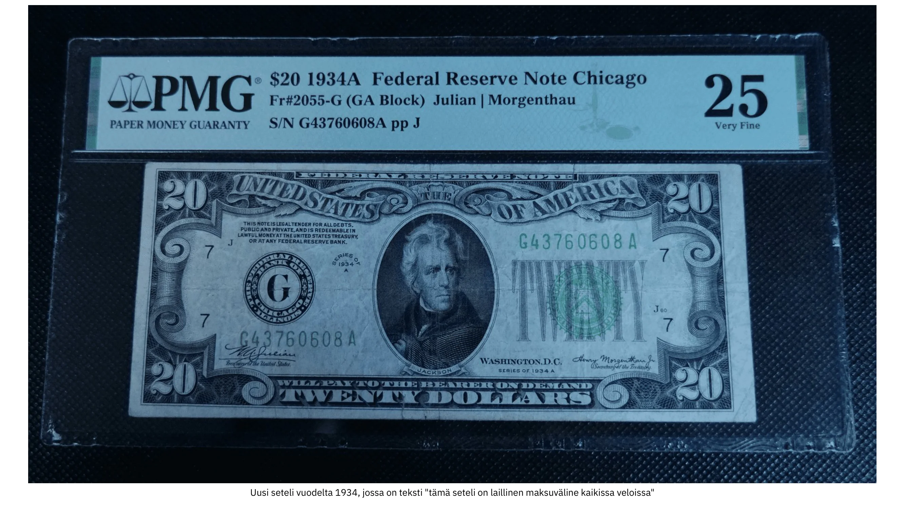

Laillisen maksuvälineen käsite nousee tässä esiin ja korvaa ilmauksen "lunastettavissa kullalla" Nämä kaksi seteliä saattavat näyttää identtisiltä, sillä vain muutama sana on muuttunut, mutta huijaus piilee siinä, että dollari devalvoitui tänä aikana; sen arvo laski 20,67 dollarista 35 dollariin unssilta vuonna 1934. Se merkitsi noin 40 prosentin devalvaatiota!

Sitten tuli toinen maailmansota. Sodan jälkeen Bretton Woodsin sopimuksella keskitettiin suuri osa maailman kullasta Yhdysvaltoihin. Amerikkalaiset laskivat vastineeksi liikkeeseen seteleitä, joita suuri yleisö ei kuitenkaan enää voinut lunastaa kullaksi. Sen sijaan ne olivat edelleen vaihdettavissa kultaan osavaltiotasolla.

Lopulta Ranskan ja Saksan kaltaiset maat alkoivat epäillä, että liikkeessä oli todennäköisesti enemmän dollarin seteleitä kuin kultaa Yhdysvaltain holveissa.

Niinpä he pyysivät kullan kotiuttamista. He sanoivat: "Hyvä on, teemme sen, mutta se vie vähän aikaa." Vuonna 1971 ystävämme Richard Nixon katkaisi lopullisesti seteleiden ja kullan välisen yhteyden ja syytti samalla keinottelijoita.

Kulta oli aliarvostettua, 35 dollaria unssilta, mikä ei vastannut painetun rahan määrää eikä sen todellista markkina-arvoa. Vain muutamassa vuodessa hinta nousi 34 dollarista 800 dollariin. Kullan annettiin kellua, kuten historiallisissa esimerkeissä, kuten Roomassa, jossa denaarin ja soliduksen välinen yhteys katkaistiin. Tämä johti hinnanmuodostusprosessiin, jonka seurauksena kullan arvo dollareina ilmaistuna nousi sen jälkeen paljon korkeammaksi.

### Nykyaikainen fiat-valuuttajärjestelmä ja sen vaikutukset

Tässä osassa tiivistetään, miten siirryimme hopeaan tai kultaan perustuvasta rahajärjestelmästä. Vähitellen instituutiot saivat yhä enemmän valtaa rahaan. Lopulta yksipuolinen päätös katkaisi kokonaan jalometallien ja rahan välisen yhteyden, mikä johti liialliseen liikkeeseenlaskuun.

Näin ollen kullan ja seteleiden tai kirjallisen rahan välillä ei ole enää mitään yhteyttä. Eikä kyse ole edes murtoreservijärjestelmästä - se on vanhentunut käsite. Sen sijaan yksityiset pankit laskevat liikkeeseen ja luovat rahaa pankkiluoton kautta. Raha luodaan pääasiassa tällä tavoin, ja se korreloi keskuspankin asettaman ohjauskoron kanssa.

Rajoja ei todellakaan ole. Ainakaan Amerikassa ja Kanadassa ei ole enää pakollisia reservitasoja. Ainoa reservi on pankkien tarve järjestää pankkien välinen vaihto, jotta likviditeetti ei loppuisi kesken.

Heidän on vain varmistettava, että he voivat tehdä nämä siirrot, mutta mitään 3, 1 tai 10 prosentin pakollista varausta ei ole. Olemme todella siirtyneet pois murtoreservin käsitteestä. Nyt keskuspankit, hallitukset julkisen talouden alijäämien kautta, keskuspankit määrällisen keventämisen (QE) kautta ja yksityiset pankit pankkilainojen luomisen kautta voivat lisätä rahan kokonaismäärää ja mielestäni aiheuttaa inflaatiota.

Jos haluatte ymmärtää rahan ja inflaation välisen yhteyden, suosittelen Plan ₿ Academy:ssä pitämääni kurssia, joka on omistettu tälle aiheelle. Opit eron hintojen nousun, jota näemme elämässä, ja inflaation välillä. Ne eivät ole sama asia. Itse asiassa, kun puhumme inflaatiosta, puhumme usein hintojen noususta, emme itse inflaatiosta. Inflaatio on melko tarkka käsite, joka selittyy rahan määrän kasvulla.

https://planb.academy/courses/caa75343-ac90-4249-bcca-0e2e57c3a0f1

Tämän fiat-maailmaa käsittelevän osion lopuksi haluan mainita erään resurssin, joka auttaa sinua ymmärtämään paremmin äsken selittämäni ilmiöt, kuten inflaation.

Kiitos huomiostanne.

## Rahakuplien historia

<chapterId>b6451c46-917d-11f0-97de-6bc5081765fa</chapterId>

:::video id=5967d9a6-aae4-4b84-a283-71b1b735bca4:::

### Paperirahan keksiminen ja ensimmäinen suuri kupla

Kun keskuspankit perustettiin 1700-luvulla, syntyi todellinen vallankumous: taikaraha seteleiden muodossa. Ranskassa vaikuttavin esimerkki on John Law'n esimerkki. Tämä Pariisissa maanpaossa asuva skotti ehdotti regentille, Orléansin herttualle, ratkaisua kuninkaallisen talouden konkurssin ratkaisemiseksi perustamalla valtionpankin ja siirtomaakauppayhtiön: kuuluisat **Banque Royale** ja **Compagnie du Mississippi**.

Tämän järjestelmän avulla Law yhdisti paperirahan yhtiönsä osakkeisiin. Mitä enemmän seteleitä oli liikkeellä, sitä korkeampi oli osakkeiden arvo ja sitä vakaampi pankki näytti olevan... kunnes spekulaatio ylitti todellisuuden. Kupla puhkesi yllättäen vuonna 1720 ja tuhosi aateliston, porvariston ja suuren osan Eurooppaa, joka oli tullut spekuloimaan rue Quincampoix'lla. Tuloksena oli pysyvä epäluulo paperirahaa kohtaan Ranskassa ja Euroopan ensimmäinen oppitunti keinottelukuplista.

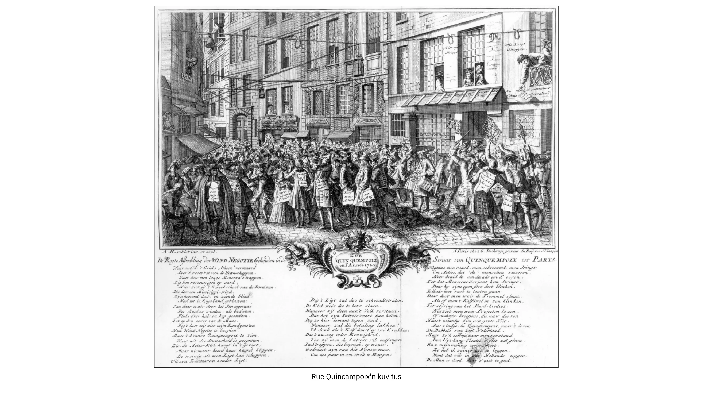

### Kun maasta tulee "vakuus"

Vuosisataa myöhemmin Ranskan vallankumous loi uuden tien **assignatilla**, joka oli takavarikoidulla kirkon omaisuudella tuettu valuutta. Paperilla ajatus oli houkutteleva - maan muuttaminen rahan vakuudeksi - mutta tehoton: maa ei ole likvidi eikä jaettavissa. Tuloksena oli hyperinflaatio, useita maankäyttökieltoja, hallitsematon inflaatio ja pula.

Napoleon, johon tämä kaaos vaikutti syvästi, palautti kullan ja hopean rahapohjaksi vuonna 1800 perustamalla Banque de Francen ja varmistamalla näin armeijoidensa säännöllisen palkanmaksun. Käytännöllinen tapa palauttaa luottamus: maksetaan kovassa valuutassa.

### Roaring Twenties ja vuoden 1929 suuri lama

Hypätään kaksi vuosisataa eteenpäin. Ensimmäisen maailmansodan jälkeen hallitukset rahoittivat ponnistelut inflaatiolla ja kullan jäädyttämisellä. 1920-luvulla Yhdysvaltain keskuspankki harjoitti liian sallivaa rahapolitiikkaa tukeakseen Britannian puntaa. Seurauksena oli helppo luotonanto, hillitön keinottelu Wall Streetillä, osakkeiden ostaminen luotolla sekä kiinteistö- ja pankkikuplan syntyminen.

Kun kone meni sekaisin, vuoden 1929 romahdus oli väistämätön: massiivisia pankkien konkursseja, ennätystyöttömyyttä ja jonoja soppakeittiöissä. Tästä syntyi sitkeä harhaluulo, että **kaikki deflaatio on pahasta**, vaikka meidän on erotettava toisistaan kasvusta johtuva deflaatio (terve) ja velasta johtuva deflaatio (tuhoisa).

### Aasia 90-luvulla ja dominovaikutus

1990-luvulla "Aasian ihme" sai maailman unelmoimaan. Exchange-kurssit oli sidottu dollariin, kasvu oli 8-10 prosenttia ja länsimaista pääomaa virtasi maahan. Kaikki oli hyvin... kunnes vuorovesi laski. Konkursseja tuli räjähdysmäisesti, valuutat devalvoituivat 80 prosenttia, ja sijoittajat menivät pilalle. IMF:n oli puututtava asiaan ja määrättävä kivuliaita uudistuksia. Sama skenaario kuin aina: runsaasti pääomaa, luottokuplia ja sitten romahdus.

### vuosi 2008 ja pysyvän kuplan aikakausi

Internet-kuplaa (2000) seurasi subprime-kiinteistökupla. Arvopaperistaminen muutti pankkilainat kolminkertaisiksi rahoitustuotteiksi, joita levitettiin ympäri maailmaa. Lupaus: riskin poistaminen laimentamalla sitä. Todellisuus: kaikki riskit korreloivat keskenään. Kun kiinteistöt romahtivat, romahti myös koko maailmanlaajuinen pankkijärjestelmä.

Tuloksena oli massiivisia julkisia pelastustoimia, määrällistä elvytystä ja nollakorkoja. Ja sen myötä hurja kiire: jokainen kriisi ei enää puhdista ylilyöntejä, vaan se katetaan yhä suuremmalla velalla ja rahan painamisella. Tämä on johtanut nykyiseen tilanteeseen: **"kaiken kuplaan "**, jossa kaikki - osakkeet, kiinteistöt, taide, krypto, jopa Pokémon-kortit - paisuu keinotekoisesti.

### Taikarahan ikuinen paluu

Vuosisadasta toiseen on havaittavissa yksi vakio: heti kun yhteiskunta uskoo voivansa luoda vaurautta rahalla sen sijaan, että se tuottaisi todellisia hyödykkeitä, syntyy kuplia. John Law'sta vuoteen 2008, rue Quincampoix'n kadulta Wall Streetille prosessi toistuu: euforia, luotto, noususuhdanne ja romahdus.

Ja lopulta, kun kukaan ei enää luota paperiin, ihmiset etsivät aina jotain muuta - kultaa, maata, turvasatamia... tai uusia valuuttoja. Eilen Napoleon käytti metallia, ja nykyään jotkut pitävät Bitcoin:tä seuraajana.

Rahoituksen historia on loputon sykli: tulosta, spekuloi, romahda. Seuraavaan kuplaan asti.

## Raha ja väkivalta

<chapterId>9486fe64-854f-5e17-86b3-8873baca39a8</chapterId>

:::video id=bd6d0807-2d8f-4637-a0f5-1e990e5c0d0f:::

Tässä lyhyessä jaksossa käydään läpi monia tapahtumia, joita olemme jo nähneet kurssin aikana, ja esitetään yhteenveto muutamista mielestäni mielenkiintoisista anekdooteista.

### Teknologia ja väkivalta

Tässä on muutamia anekdootteja, joista olemme todennäköisesti jo puhuneet kurssilla. Ne johdattelevat hyvin kiehtovaan keskusteluun, jonka kävin Theon kanssa hänen B-Ondyssa pitämästään luennosta, joka oli mielestäni hyvin mielenkiintoinen sen kannalta, miten teknologian kehitys vaikuttaa väestön ja valtion väliseen väkivaltasuhteeseen.

### Raha ja valtion pakkokeinot

Esittelen tämän jakson lyhyesti ja epätäydellisesti muistuttaakseni sinua tapahtumista, joita olemme todennäköisesti jo käsitelleet kurssilla.

Yksi yhteys, jonka voin jo nyt luoda rahan ja väkivallan välille, on se, että kun on kyse arvottomasta paperirahasta, jota voidaan painaa loputtomiin, siihen liittyy usein kaikenlaisia sääntöjä ja kaikenlaisia uhkauksia. Voimme jo puhua assignateista, joissa seteleihin oli kirjaimellisesti kirjoitettu, että väärentäjiä uhattiin kuolemalla. Ajan lakiteksteistä on helppo löytää tappouhkauksia niille, jotka eivät hyväksyneet tätä kuuluisaa paperirahaa.

Jotta voisin pysyä Ranskassa, eräässä vallankumouskauden aikaisesta lakitekstistä, jonka sain käsiini, näin, että giljotiinin kuljetuksesta ja käytöstä maksettava päiväraha oli kuvattu valuuttaan liittyvissä osissa. Minusta tämä oli melko hassua.

Olemme puhuneet myös kolikoista Kiinassa, jossa valtio valvoo rahapainoa. Näimme kurssin alussa eräässä jaksossa, että kun kolikoita, joista osa oli vähemmän kauniita, heitettiin pois, siitä oli oikeudellisia seurauksia.

Englannissa on myös anekdootti eräästä kuninkaasta, joka päätyi katkaisemaan rahanvalmistajien kädet, jos nämä eivät käyttäytyneet hänen odotustensa mukaisesti.

Olen myös lukenut, että Kiinassa on takavarikoitu kuparia buddhalaisluostareista. Aikana, jolloin kuparin arvo nousi ja horjutti heidän talouttaan - joka perustui eräänlaiseen fiat-rahaan, jolla ei ollut juurikaan tekemistä metallin arvon kanssa - he turvautuivat etsimään paikan, jossa oli vaurautta, ja takavarikoivat kuparin luostareista.

Sama koski Englannin luostareita uskonpuhdistuksen aikana. Kun kuuluisa kuningas riiteli paavin kanssa avioerosta, taustalla oli toinenkin syy: hän käytti luostareiden lakkauttamista hyväkseen takavarikoidakseen näiden kirkollisten järjestöjen sisältämän rikkauden.

Ranskan vallankumouksen aikana he takavarikoivat kaikki kirkon varat. He näkivät kauniita kolikoita, jotka luotiin sulatetuista kirkonkelloista.

Jos menemme vielä kauemmas taaksepäin, yksi selkeimmistä taloudellisen väkivallan ja vapauden, vapaudenmurhaa aiheuttavien lakien käsitteistä on **Diocletianus ja hänen perinnöllinen kastinsa, joka liittyi suoraan siihen, että talonpojat eivät enää halunneet hyväksyä devalvoitua valuuttaa**. He halusivat jättää työnsä talonpoikina, ja Diocletianus reagoi siihen yksinkertaisesti sanomalla heille: "Ette voi jättää maata, eivätkä myöskään lapsenne voi jättää sitä". Sama päti sotilaisiin.

Minusta se on melko selkeä väkivallan muoto. Voisin lopettaa puhumalla temppeliritareista tai Ranskan kuninkaasta. Kun temppeliritarit asettuivat Ranskaan, kuvittelen, että hän näki temppeliritareiden rikkauksien mannaa ja että hänellä oli valtion rahoitusongelmia. Hän haastoi temppeliritarijärjestön oikeuteen, ja jotkut heistä pystyivät kävelemään pois osan aarteista, mikä on synnyttänyt hyvin mielenkiintoisen sarjan Yhdysvalloissa tai Kanadassa. En tiedä kuka sen tuotti, mutta sen nimi on *Tammisaaren mysteeri*. Se kertoo ihmisistä, jotka uskovat, että Kanadan Maritimesissa sijaitsevalle saarelle on haudattu temppeliritareiden aarre, ja he ovat poranneet vuosia - ehkä jopa yli vuosikymmenen - tehdäkseen jonkinlaisen kaivon. He ovat löytäneet kaivon, jossa on paljon gallerioita, ja he etsivät aarretta, jonka temppeliritarit hautasivat tälle saarelle, joka on tämän tv-ohjelman aiheena. Tervehdin isääni, joka on tämän ohjelman suuri fani.

Siinä on siis lyhyt luettelo kurssin aikana havaitsemistamme tosiasioista, jotka mielestäni lisäävät yhteyttä väkivaltaan. Jätän teidät seuraavaan osaan, jonka Theo kertoo meille hyvin mielenkiintoisen tarinan teknologisesta muutoksesta ja vallan tasapainosta rahvaan ja viranomaisten välillä.

Kiitos!

## Järjestäytyneen väkivallan taloudelliset seuraukset

<chapterId>66bd4674-2159-5489-ad4b-ec5e3fb691af</chapterId>

:::video id=c8b063c6-aeb4-4a94-9027-b11d369e71a4:::

### Järjestäytynyt väkivalta ja valtion kehitys

Historioitsija Frederic C. Lane esittää vallankumouksellisen teesin: väkivallan levittämiseen käytetyt teknologiat ovat muokanneet valtion anatomiaa kautta historian. Lähtökohtana on weberiläinen periaate, jonka mukaan valtiolla on monopoli lailliseen väkivaltaan, ja Lane toteaa, että tämä monopoli - joka paradoksaalisesti on tehokkaampi kuin kilpailu tällä alalla - kehittyy hyökkäyksen ja puolustuksen kustannusten välisen suhteen mukaan.

Tämä analyysi, jota "The Sovereign Individual" -teoksen (1997) kirjoittajat ovat jatkaneet, selittää poliittisen organisaation historialliset muutokset: keskiaikaisesta feodaalijärjestelmästä renessanssin kaupunkivaltioihin, sitten teollistuneisiin kansallisvaltioihin ja lopulta nykyaikaisiin hyvinvointivaltioihin. Jokainen siirtymä vastaa suurta teknologista läpimurtoa väkivallan käytössä, ja se tapahtuu noin 400-500 vuoden välein.

### Keskiaikainen tasapaino

Keskiajalla maatilatalous oli yli 90-prosenttisesti hallitseva. Kirjaimellisesti maahansa juurtunut talonpoika ei voinut paeta herraa ja hänen ritareitaan. Sotateknologia - käsin taotut haarniskat, vuosien miekkakoulutus - oli äärimmäisen kallista. Tämä epäsymmetria suosi voimakkaasti hyökkäystä puolustuksen sijaan.

Liikkumattomasta maataloustuottajasta tulee paikallisen väkivaltamonopolin vanki. Hänen veronkantokykynsä nousee uusiin ulottuvuuksiin - vaikka paradoksaalista kyllä, keskiaikaiset verot ovatkin vaatimattomia verrattuna nykyajan 78 prosenttiin pakollisista maksuista. Herra voi verottaa mielensä mukaan, koska talonpoika ei voi vastustaa eikä lähteä.

### Kauppiaiden renessanssi

Hansakaupan syntyminen pohjoisessa ja Välimeren kaupan kehittyminen etelässä muutti tilannetta. Kauppiailla, jotka olivat lisäarvon tärkeimpiä tuottajia, oli liikkuvaa pääomaa - laivojaan. He tarvitsivat vain kevyitä merisotilaita, sillä meriä oli vaikea valvoa. Ennen kaikkea he pystyivät helposti siirtymään naapurisatamaan, jos verotus kävi kohtuuttomaksi.

Tämä liikkuvuus loi verokilpailua kaupunkivaltioiden välille. Venetsian, Genovan ja Bruggen oli tarjottava mahdollisimman liberaalit puitteet: luotettavat sopimukset, laadukas valuutta, vakuutukset ja minimaalinen verotus. Ruhtinaiden oli pikemminkin vieteltävä kuin pakotettava. Symmetria kääntyy päinvastaiseksi: puolustautumisesta (pakenemalla) tulee helpompaa kuin hyökkäämisestä.

### Teollinen aikakausi

Teollinen vallankumous toi mukanaan feodalismia muistuttavan järjestelmän. Tehtaat, rautatiet ja liukuhihnat ovat massiivisia, liikkumattomia investointeja. Henry Ford ei voinut siirtää tehtaitaan verotuksen vuoksi. Teollisuuskaupunkeihin keskittyneet työntekijät järjestäytyivät ammattiyhdistyksiin neuvotellakseen kollektiivisesti sen sijaan, että he olisivat siirtyneet yksilöllisesti.

Syntyi "hyvinvointivaltio": teollinen suunnittelu (Japani, Korea), infrastruktuurien sotilaallinen suojelu, vähimmäissosiaalietuudet työvoimalle. Toinen maailmansota osoitti tämän haavoittuvuuden: vihollisen tehtaiden pommittamisesta tuli hallitseva strategia. Fyysisen pääoman keskittyminen mahdollisti massiivisen veronkierron hyvinvointivaltion rahoittamiseksi.

### Mikroprosessorien vallankumous

Kolme teknologista innovaatiota on nyt horjuttamassa näitä ikivanhoja tasapainoja. Mikroprosessori muuttaa sodankäyntiä: Nevadassa toimiva operaattori ohjaa Afganistanissa lennokkia kirurgisella tarkkuudella. Persianlahden sota (1991) osoitti tämän läpimurron: maailman neljänneksi suurin armeija (Irak) tuhottiin 45 päivässä, ja liittoutuman puolella kuoli alle 200 ihmistä. Teknologinen ylivoima teki rintamahyökkäyksen mahdottomaksi.

Internet ja epäsymmetrinen kryptografia mullistavat arvon luomisen. Kehittäjä voi työskennellä missä tahansa MacBookin ja Starlinkin avulla ja viedä tuotantonsa välittömästi ja ilmaiseksi. Digitaaliset nomadit pakenevat maantieteellisestä vankeudesta ja asettavat valtiot toisiaan vastaan tavalla, jollaista ei ole nähty sitten renessanssin.

Bitcoin edustaa tämän logiikan huipentumaa: valtiosta vapautettu valuutta, jota suojaa loukkaamaton kryptografinen suoja. Rikkaus on puolustettavissa mitä tahansa fyysistä voimaa vastaan. Yksilö saa takaisin kyvyn puolustautua valtion monopolia vastaan.

### Westfalenin mallin romahtaminen

Teollista aikakautta varten suunnitellut länsimaiset hyvinvointivaltiot ovat vanhentumassa. Arvonluojat - rakennuttajat, taiteilijat ja rahoittajat - muuttavat Singaporeen, Dubaihin tai El Salvadoriin ja haluavat vähemmän julkisia palveluja vastineeksi minimaalisesta verotuksesta. Applen ja Tetherin kaltaiset nykyaikaiset jättiläiset eivät tarvitse toimistoja eivätkä fyysistä infrastruktuuria.

Tämä aivovuoto aiheuttaa kierteen: nettomaksajien määrä vähenee, julkiset palvelut heikkenevät, jäävien verotus lisääntyy ja lähtö kiihtyy. Valtioiden on supistettava radikaalisti tai mentävä konkurssiin. Pirstoutuminen pieniksi, kilpailukykyisiksi lainkäyttöalueiksi - uusi digitaalisten kaupunkivaltioiden malli - näyttää väistämättömältä.

Historia opettaa meille, että nämä siirtymät kestävät sukupolvia. Bitcoin:n mukainen valuutan ja valtion erottaminen toisistaan voi kuitenkin nopeuttaa prosessia. Yksilöt äänestävät nyt jaloillaan ja kryptografisilla lompakoillaan, mikä piirtää globaalin vallan karttaa uudelleen linjoilla, joita vasta alamme hahmottaa.

## Rahoituksen hyvin lyhyt historia

<chapterId>1d37fff1-a091-5034-8e71-4af590b8ffce</chapterId>

:::video id=fdfabbc6-e4d8-463a-8522-19176f8fb460:::

Tämän rahan historiaa koskevan selostuksen jälkeen, joka vie meidät aina fiat-järjestelmään asti, haluaisin selittää nopeasti ja ytimekkäästi rahoituksen kehityksen, joka lopulta johti hyvinvointivaltioon. Aluksi, Rooman aikana, meillä oli kolikoita.

Kolikot olivat rahoitusteknologia, jonka avulla valtakunta pystyi maksamaan sotilaille, laajentumaan ja käymään kauppaa. Se toimi erittäin hyvin, paitsi että lopulta tapahtui liikaa devalvaatioita. Jossain vaiheessa, kun he lakkasivat laajentumasta ja saamasta sotasaaliita sodistaan ja alueidensa laajentamisesta, heidän järjestelmänsä romahti.

### Rahoitusteknologian kehitys

Sitten tuli keskiaika, jolloin kehitys oli hyvin vähäistä, kunnes floriini toi takaisin vakaan valuutan ja pankkitoiminta kehittyi Italiassa ja Antwerpenissä, jossa kehitettiin "rahan aika-arvon" käsite - toisin sanoen diskonttaus. He kehittivät diskonttauksen luodakseen paperirahan muodon, jossa annettiin "velkakirja" eli lupaus siitä, että myöhempänä ajankohtana saisi takaisin 100 dollaria korkoineen.

Tämä järjestelmä loi rahoitusteknologian, jonka avulla haltija voi myydä velkakirjan ennen sen voimassaoloajan päättymistä, joten jos velkakirja myydään 4 kuukauden kuluttua 6 kuukauden voimassaoloajasta, haltija itse asiassa maksaa preemion, jolla korvataan jäljellä olevien 2 kuukauden tuoton menetys.

Kyseessä oli Antwerpenissä ja Amsterdamissa tuolloin kehitetty rahoitusteknologia. Myöhemmin kehittyivät keskuspankit ja viime käden lainanantajan käsite. Voidaan väittää, että Amsterdamin pankin aikana kolikoiden käytöstä kansainvälisessä kaupassa luovuttiin kirjallisen rahan hyväksi.

Myöhemmin, 1700-luvulla, voidaan puhua vakuutuksista rahoitusteknologian osalta. Neil Fergusonin kirjassa "The Ascent of Money" kerrotaan hyvin eräs anekdootti. Ensimmäinen vakuutusyhtiö, joka syntyi, oli nimeltään **Scottish Widowss**, ja pohjimmiltaan kyse oli papistosta, joka halusi kehittää vakuutuksen papeille, jotka kuolivat joskus aikaisemmin, kuolivat äkillisesti. Papisto huolehti tuohon aikaan vaimoistaan ja jälkeläisistään Skotlannissa vuoden ajan. Niinpä papisto koki tämän yhden vuoden jakson ehkä hieman liian lyhyeksi. Tämän seurauksena **he keksivät vakuutusmatemaattiset laskelmat**, joilla kirjaimellisesti laskettiin, kuinka monta vakuutusmaksun suorittajaa tarvittiin, jotta järjestelmä kattaisi kustannuksensa, riippuen ennenaikaisesti kuolleiden pappien määrästä.

He kehittivät vakuutusmatemaattisia laskelmia, joissa sanottiin: "No niin, jokainen pappi antaa meille tämän summan. Jos pappi sitten kuolee, vakuutus kattaa kulut, joilla varmistetaan hänen vaimonsa ja lastensa selviytyminen, kunnes he ovat omavaraisia." Ensimmäinen vakuutusyhtiö nimeltä "Scottish Widows" teki siis tämän järjestelmän tunnetuksi ja otti sen käyttöön.

### Yksityisestä vakuutuksesta hyvinvointivaltioon

Vakuutus on siis osa rahoitusteknologian historiaa. Tästä pääsenkin hyvinvointivaltion käsitteeseen, eli siihen, että yksityiset vakuutukset törmäsivät lopulta ongelmaan, optimoinnin käsitteeseen, jossa sanomme itsellemme, että jos tarjoamme sairausvakuutuksen terveille ihmisille, he eivät ehkä ole yhtä kiinnostuneita maksamaan vakuutusmaksua, koska he sanovat itselleen: "Olen terve, en sairastu". Toisaalta ihmiset, jotka tietävät olevansa sairaita, haluavat varmasti tilata vakuutuksen.

Tämä järjestelmä aiheuttaa epätasapainon sairaiden ihmisten määrän välillä, jotka ottavat sairausvakuutuksen, ja terveiden ihmisten välillä, jotka saattavat ottaa vähemmän vakuutuksia. Näin syntyy eräänlainen epätasapaino: jos luvut laskettaisiin, ne eivät olisi tasapainossa, koska todennäköisesti ei pystyttäisi vakuuttamaan tarpeeksi terveitä ihmisiä, jotta kustannukset saataisiin korvattua. Taloustieteessä tämä on käsite **moral hazard**.

Yksi esitetyistä ajatuksista on se, että vakuutuksesta pitäisi tehdä pakollinen. Jos kaikki ovat velvollisia maksamaan vakuutusmaksuja, koko asia tasapainottuu, ja sekä terveet että sairaat ihmiset maksavat vakuutusmaksuja, jolloin riskit jakautuvat suurimmalle osalle väestöstä.

Niinpä monissa osissa maailmaa valtio on sanonut: "No, me huolehdimme siitä". Vaikka en olekaan tämän asian asiantuntija, ymmärrän, että samaa päättelyä sovelletaan todennäköisesti kaikenlaisiin muihin vakuutusmuotoihin, kuten työttömyysvakuutukseen. Halutaan yksinkertaistaa ja optimoida, ja tämä perustuu ajatukseen, että kaikki on yksinkertaisempaa, jos vain yksi organisaatio huolehtii siitä.

Mielestäni tämä johti kaikkien näiden vakuutuskonseptien keskittämiseen ja lopulta hyvinvointivaltion syntyyn, jossa valtio tarttui kaikkiin näihin rahoituskonsepteihin, jotka olivat alun perin yksityisiä yrityksiä, yksityisiä aloitteita, joilla pyrittiin vastaamaan vakuutusmarkkinoiden tarpeeseen jakaa riskejä väestön kesken, syistä, jotka ovat luultavasti varsin loogisia moraalikadon ja optimointitahdon kannalta.

### Vaihtoehtoisia malleja ja pohdintoja valtion monopoleista

Viime kädessä joissakin maissa, kuten Kanadassa, useat vakuutustyypit - sairausvakuutus, työttömyysvakuutus - ovat valtion monopoleja.

Voin antaa teille esimerkin, jonka tunnen. Sveitsissä järjestelmä on hieman erilainen. Siellä on yksityisiä keskinäisiä vakuutusyhtiöitä ja yksityisiä sairaaloita, joten voit valita keskinäisen vakuutusyhtiösi ja pakettisi keskinäisen vakuutusyhtiösi sisällä. Saatte silti suhteellisen yleisiä palveluja, vaikka suuri osa järjestelmästä onkin yksityistä.

On siis mahdollista, että se on myös yksityisomistuksessa. Mutta kaikki se, mitä halusin kuvata teille, ei itse asiassa ole lausunto, jossa ilmaistaan, onko toinen järjestelmä parempi kuin toinen, vaan pikemminkin selittää teille, että lukiessani rahoituksen historiaa tajusin, miksi länsimaissa, erityisesti Ranskassa ja erityisesti Kanadassa, valtio halusi ottaa nämä rahoitusperiaatteet hallintaansa.

Halusin sanoa, että vakuutuskäsite on ennen kaikkea rahoituksen evoluutio, ja kuten hallitukset ovat joskus niin hyviä tekemään, ne yrittävät ottaa sen hallintaansa, aivan kuten ne ovat yrittäneet ottaa hallintaansa rahan, monista syistä. Yksi syy on muuten viime käden lainanantajan käsite.

Ajatuksena on, että on paljon parempi, jos taustalla on suuri instituutio, joka jakaa riskin laajemmin. Tämä oli alkuperäinen aloite viimeisen keinon lainanantajan käsitteen taustalla, jossa tämä laitos voisi itse asiassa valita laitokset, jotka olivat riittävän vahvoja selviytyäkseen, ja estää niiden romahtamisen lainaamalla niille rahaa.

Tuolloin tehtiin todellinen analyysi, kun tämä käsite lopulta ilmestyi ensimmäistä kertaa, mutta lopulta kaikki pelastettiin, "liian suuri kaatumaan", joka koskee lähes kaikkia pankkeja, koska ne on keskitetty, ja myös kaikkia suuria yrityksiä. Loppujen lopuksi näemme, että se on edelleen käsite, jota valtio soveltaa "laajasti", samaan tapaan kuin vakuutuskonsepti, jota juuri kuvailin teille.

Lopulta valtio päättää, että se aikoo huolehtia kaikesta, ja muuttaa Skotlannissa tietyn ongelman ratkaisemiseksi luodun rahoitusteknologian nykyiseksi laajaksi hyvinvointivaltioksi. Se käyttää vakuutusmatemaattisia rahoitusperiaatteita tarjotakseen palveluja sitä tarvitsevalle väestölle. Voimme kuitenkin olla yhtä mieltä siitä, että tästä järjestelmästä aiheutuvat monopolit aiheuttavat kaikenlaisia ongelmia, joita koemme tällä hetkellä Kanadan ja Ranskan kaltaisissa maissa. Onneksi on olemassa erilaisia malleja, kuten Sveitsin malli.

Meidän on yksinkertaisesti ymmärrettävä, että tämä hyvinvointivaltion käsite on peräisin rahoituksesta. Tämä oivallus viittaa siihen, että voimme tutkia muitakin keinoja kuin kuuluisia valtion monopoleja, ja voisin jopa soveltaa tätä päättelyä keskuspankkien käsitteeseen viimeisen keinon lainanantajina - mutta se on aihe toiselle kerralle.

# Viimeinen osa

<partId>9bada469-7ef0-511a-9eaa-f8eb66d5906f</partId>

## Arvioi tätä kurssia

<chapterId>a9494e2b-8a4d-5811-8a7b-b4a91fb22778</chapterId>

<isCourseReview>true</isCourseReview>

## Päätelmä

<chapterId>1094e793-b4c6-5782-aa4a-71cde00ce7c0</chapterId>

<isCourseConclusion>true</isCourseConclusion>