# Un voyage à travers l'histoire de la monnaie

Ce cours captivant vous emmènera explorer l'évolution fascinante de la monnaie depuis les premières civilisations jusqu'à notre système monétaire actuel. Nous traverserons les époques, du Néolithique aux temps modernes, en découvrant comment la monnaie a façonné et été façonnée par les grandes civilisations humaines. De la proto-monnaie mésopotamienne aux cryptomonnaies, en passant par les pièces lydiennes, le florin de la Renaissance et l'avènement des banques centrales, ce cours offre une perspective complète sur l'un des piliers fondamentaux de nos sociétés.

+++
# Introduction 
<partId>59878a67-8a1d-5d6b-af41-5b847c14363c</partId>

## Introduction à l'Histoire de la monnaie
<chapterId>ca53597e-be9a-5261-a55f-11fac8504a68</chapterId>
:::video id=08ff35ca-8a40-4286-abaf-71283faf6e78:::

Bienvenue dans ce cours consacré à l'histoire de la monnaie. Évidemment, comme son titre l'indique, nous allons explorer ensemble l'évolution historique des monnaies. Nous traverserons les époques, du Néolithique jusqu'à nos jours, en abordant les principaux empires et grandes civilisations que l'humanité a connus.

Toutefois, ce cours ne se limite pas à une simple chronologie de dates ou d'événements historiques. Notre véritable objectif est plutôt de comprendre en profondeur les concepts fondamentaux liés à l'émergence de la monnaie ou plutôt DES monnaies.

### Les concepts fondamentaux à explorer

Nous parlerons donc d'émergence : l'émergence des monnaies elles-mêmes, des systèmes monétaires, des banques, de la monnaie papier, des banques centrales, et enfin, l'apparition du système monétaire actuel dit "fiat".

Nous débuterons notre voyage avec les proto-monnaies en évoquant l'émergence de la monnaie-dette et des unités de compte en Mésopotamie, ainsi que d'autres systèmes tels que la dot ou le prix du sang dans les sociétés primitives. Nous verrons aussi comment de véritables systèmes monétaires existaient déjà dans l'Égypte antique, bien avant le Moyen Empire.

Nous poursuivrons ensuite avec l'apparition des premières pièces de monnaie en Lydie, moment-clé souvent considéré comme le début véritable de la monnaie selon les manuels d'économie. Nous examinerons comment ces pièces ont pu se répandre grâce aux Perses, à Alexandre le Grand, puis à Rome, pour finalement s'imposer, dominer et s'effondrer.

À partir de là, forts de tout ce que nous aurons appris, nous prendrons le temps nécessaire pour réfléchir ensemble à la définition même de la monnaie, en allant au-delà des idées reçues telles que "la monnaie est toujours une dette" ou "la monnaie est toujours une marchandise". En réalité, la monnaie est à la fois un bien et une convention sociale. Nous discuterons notamment du concept de prime monétaire et tenterons d'unifier les différentes théories expliquant l'apparition de la monnaie.

### Périodes clés et innovations monétaires

Ensuite, nous aborderons une période trouble, marquée par une certaine instabilité monétaire, où émergent pourtant des innovations marquantes telles que le penny anglais servant à soudoyer les envahisseurs danois, ou la livre de Charlemagne, dont le souvenir persiste encore aujourd'hui sur certains billets modernes.

Nous étudierons également comment les croisades ont vu l'apparition des premiers systèmes de transfert d'argent à distance. Puis viendra le temps d'observer l'impact du Florin, monnaie qui a accompagné la Renaissance, ainsi que l'arrivée des métaux précieux en provenance des Amériques, bouleversant profondément les prix européens.

Nous détaillerons l'avènement de la monnaie papier et des banques centrales, en établissant des parallèles avec l'histoire des crises financières et leurs répercussions souvent violentes.

Enfin, nous terminerons en dressant un parallèle avec notre système monétaire contemporain, en explorant ses conséquences, et en retraçant l'histoire de la finance pour mieux comprendre comment nous en sommes arrivés à l'État-providence actuel.

Et, en bonus, nous examinerons aussi les nombreux liens étymologiques fascinants liés à la monnaie, qui continuent d'affecter notre quotidien dans différentes langues.

### Structure du cours

Ce cours est séparé en trois parties majeures.

La première partie se consacre à l'émergence de la monnaie, la deuxième partie se consacre à la renaissance de la monnaie, puis sa chute, et la troisième partie s’efforcera de démontrer comment les institutions étatiques ou l'État ont pris petit à petit le contrôle de la monnaie pour mener au système fiat actuel.

Merci et bon visionnement !

# L’émergence des échanges
<partId>da5e4981-9ea5-5208-beab-3b75c9043632</partId>

## De l'Australopithèque à l'Homme Moderne
<chapterId>34a773aa-f2d3-5c26-8be4-f2cd79ed6fbc</chapterId>
:::video id=4f333013-4b2a-42ab-8761-593fafc971ca:::

### Pourquoi commencer au Néolithique

Pourquoi remonter jusqu'au Néolithique pour parler de monnaie ? La réponse est simple : on ne peut pas comprendre pleinement l'émergence de la monnaie sans évoquer en parallèle l'émergence des civilisations elles-mêmes. Pour saisir pourquoi les premiers systèmes monétaires ont vu le jour, il nous faut comprendre ce qui a poussé les groupes nomades de chasseurs-cueilleurs à se sédentariser.

Une tribu sans division du travail, sans spécialisation, où chaque individu est responsable de produire ce dont il a besoin, n'a tout simplement pas besoin de monnaie. De même, une communauté agricole pratiquant uniquement une agriculture de subsistance, où chacun cultive pour soi-même, ne ressent pas encore la nécessité d'un intermédiaire d'échange universel.

### La sédentarisation et ses conséquences

C'est pourquoi je trouve ça intéressant de débuter notre exploration au Néolithique. Nous verrons comment la sédentarisation a progressivement donné naissance à des villages, puis à des cités et finalement à de grandes civilisations. C'est cette sédentarisation et la production d'excédents alimentaires qui a rendu possible la spécialisation du travail, créant ainsi le terreau fertile indispensable à l'apparition et à l'évolution des premiers concepts monétaires.

De même que les interactions humaines donnent naissance au langage, on peut considérer que la monnaie apparaît naturellement, ou pas (Incas, Spartiates), au cours du processus de formation et d'organisation des civilisations. Cette apparition ou non-apparition de la monnaie a selon moi tout à voir avec la forme d'organisation sociale et économique de chaque société.

### Chronologie de l'évolution humaine

Mais avant, attardons nous à un contexte historique encore plus large.

Comme toute première présentation, je vais faire exactement le contraire de ce que je vous ai annoncé dans l’introduction du cours c'est-à-dire vous énumérer une liste de dates et d’événements historiques qui s'enchaînent. L’idée ici c’est de placer l’émergence de la monnaie dans son contexte historique par rapport à d’autres avancées humaines comme la cuisson des aliments, la roue, la domestication de certaines céréales et de certains animaux, la construction des pyramides et la fondation des premières cités.

Donc, regardons ensemble cette évolution de l'humanité à partir de la préhistoire.  
Le survol de l'évolution de l'homme depuis l'Australopithèque à l'homme moderne en suivant les avancées technologiques et les déplacements de population jusqu'aux Néolithiques.

### Cadre historique de l'humain

- **Il y a 3 millions d'années** – Apparition d'*Australopithecus*.
- **Il y a 2 millions d'années** – Les homininés commencent à quitter l'Afrique.
- **Il y a 1,6 million d'années** – Les homininés atteignent le sud de l'Europe et l'Asie.
- **Il y a 1 million d'années** – Premières preuves de cuisson domestique au feu (os et restes végétaux carbonisés dans la grotte de Wonderwerk en Afrique du Sud).
- **Vers 400 000 ans av. J.-C.** – Les Néandertaliens habitent en Europe et en Asie.
- **Vers 300 000 ans av. J.-C.** – Apparition d'*Homo sapiens*.
- **Il y a 80 000 ans** – *Homo sapiens* commence à migrer vers toutes les régions du monde.
- **Il y a 73 000 ans** – Grottes de Blombos en Afrique du Sud (plus anciennes formes d'art connues).
- **Il y a 50 000 ans** – *Homo sapiens* atteint l'Europe.
- **Il y a 30 000 ans** – Peintures rupestres de la grotte Chauvet en France.
- **Il y a 15 000 ans** – Peintures rupestres de Lascaux en France et art rupestre australien.
- **Vers 9000 av. J.-C.** – Domestication de l'orge dans le Croissant fertile.
- **Vers 9000 av. J.-C.** – Culture du maïs au Mexique.
- **Vers 8000 av. J.-C.** – Domestication des chèvres et des moutons dans le Croissant fertile.
- **Vers 7250 av. J.-C.** – Ain Ghazal (Jordanie) révèle un village de quelques centaines d'habitants.
- **Vers 7000 av. J.-C.** – Çatalhöyük (Turquie) compte jusqu'à 8000 habitants.
- **Vers 6500 av. J.-C.** – Apparition de la vie sédentaire en Grèce.
- **Il y a 6000 ans** – Début de l'irrigation par dérivation des rivières en Égypte et en Mésopotamie.
- **Vers 5000 av. J.-C.** – Apparition de la combinaison agricole des "trois sœurs" (maïs, courges, haricots).
- **Vers 4000 av. J.-C.** – Domestication du chameau en Asie centrale. (La famille des camélidés est née en Amérique du Nord, durant l'Éocène voici 45 millions d'années. Ces chameaux auraient ensuite migré jusqu'en Asie par une mince langue de terre qui reliait à ce moment les deux continents dans le détroit de Béring. Une autre partie de la famille aurait pris la direction de l'Amérique du Sud, où ses descendants vivent encore aujourd'hui : les lamas, alpagas et vigognes).
- **Vers 3500-3000 av. J.-C.** – Le peuple Botai commence à domestiquer et à élever des chevaux.
- **Vers le début de l’âge du Bronze** – Les Sumériens inventent déjà la roue et le voilier, et développent l'arithmétique, l'astronomie et la première forme d'écriture.
- **Vers 2800 av. J.-C.** – Uruk, à son apogée, atteint une population pouvant atteindre 80 000 habitants.
- **2600-2200 av. J.-C.** – Premiers signes de développement urbain dans le monde grec. Expansion des cultures méditerranéennes (blé, vigne, olive).
- **2560 av. J.-C.** – Construction de la grande pyramide de Gizeh.
- **Vers 1500 av. J.-C.** – Civilisation minoenne.
- **Vers 1300 av. J.-C.** – Civilisation mycénienne.
- **Vers 1250 à 1150 av. J.-C.** – Effondrement des civilisations de l’âge du Bronze.
- **1er siècle de notre ère** – Les Berbères d'Afrique du Nord domestiquent le chameau.

Donc, voilà ce survol historique pour nous donner une perspective de l'apparition de certaines technologies, domestication de certains animaux et de cultures, pour le mettre en contexte avec l'apparition de l'écriture et de la monnaie, qui sera le sujet de notre prochaine section.

## Des Chasseurs-Cueilleurs aux Agriculteurs : L'Aube de la Civilisation
<chapterId>ea950b6e-9eb7-553d-8f04-0eb042bb1f5a</chapterId>
:::video id=4b49a376-f6f4-42a0-86fa-264997a079f0:::

### La transition vers l'agriculture et la sédentarisation

Dans ce chapitre, nous allons parler de la transition de la chasse et de la cueillette à l'agriculture de subsistance, l'artisanat et les échanges. Je trouvais ça important d'expliquer ce passage vers la sédentarité et l'agriculture pour comprendre comment les premières cités se sont construites qui ont mené éventuellement à la création, à l'émergence de certains systèmes monétaires durant l'Antiquité.

Cette section est un extrait d'un cours disponible sur le site The Great Courses qui s'appelle en anglais Ancient Mesopotamia, Life in the Cradle of Civilization, donné par le professeur Amanda Podany de la California State Polytechnic University de Ponoma.

### Les paradoxes de l'adoption de l'agriculture

L'agriculture primitive est apparue il y a environ 10 500 ans au Proche-Orient, autour du nord-ouest de la Syrie et du sud de la Turquie. De nos jours, les groupes de chasseurs-cueilleurs modernes ne sont pas pressés d'adopter l'agriculture, il en était probablement de même durant le Néolithique.

**Les premiers villages ont clairement été construits avant la domestication des plantes et des animaux.** Les gens ne se sont pas installés parce que l'agriculture leur permettait, au contraire, ils se sont d'abord sédentarisés et seulement bien plus tard, 3 000 ans après, ils ont commencé à cultiver.

La chasse et la cueillette fonctionnaient simplement très bien, ils n'avaient donc pas besoin de planter des graines pour produire leur nourriture. Aujourd'hui, les chasseurs-cueilleurs disposent de beaucoup plus de temps libre que les premiers agriculteurs qui utilisaient des technologies très rudimentaires.

Donc, ce qu'on veut dire ici, c'est que ce qu'on peut observer chez les peuples primitifs modernes de chasseurs-cueilleurs, c'est qu'ils ont plus de temps libre que ce qu'on peut comprendre des premiers agriculteurs au Néolithique qui avaient, somme toute, des technologies assez rudimentaires pour faire la culture. Ces gens-là travaillaient plus pour produire leur nourriture que nos tribus primitives modernes qui vivent de la chasse et de la cueillette.

Les études sur les ossements montrent également que les premiers agriculteurs étaient plus petits et moins robustes que les chasseurs-cueilleurs qui les avaient précédés. Le régime alimentaire des agriculteurs était plus restreint que celui des chasseurs-cueilleurs. Ils consommaient beaucoup plus de pain, mais bien moins de viande et avaient également des dents en plus mauvais état à cause des éclats de roches utilisés dans la production de la farine. Lorsqu’ils produisaient de la farine avec des roches, ça faisait des éclats.

Ceux qui sont adepte du régime sont “keto” seront d'accord avec ça, manger beaucoup de pain, c'est probablement moins bien que manger de la viande.

### Les théories sur l'adoption de l'agriculture

Étant donné tous ces désavantages, qui aurait choisi à l'époque de devenir agriculteur? Bon, certaines théories populaires suggèrent que les humains ont été forcés à adopter l'agriculture et qu'il ne s'agirait pas vraiment d'un choix. Même avec des céréales sauvages, un problème majeur se posait. De grandes quantités de grains ne pouvaient pas être transportés facilement. Il fallait les stocker quelque part. Une fois le grain stocké, il devenait logique de rester à proximité. Donc, on fait des cultures de grains sauvages, ce n'est pas nécessairement de l'agriculture, et quand on en cultive en grande quantité, il faut bien les stocker quelque part et ce n'est pas facile à transporter. C'est probablement ce qui a contribué aux premières phases de sédentarisation. C'est peut-être la raison initiale qui a poussé les hommes à se fixer à un endroit précis. Si ce lieu fournissait de la nourriture tout au long de l'année, il devenait inutile de suivre les troupeaux ou de voyager constamment.

Dans la culture natoufienne, jusqu'à une centaine d'individus vivaient ensemble dans des villages constitués de maisons rondes. Une théorie populaire expliquant le début de l'agriculture avance que ce changement fut stimulé par l'évolution du climat. Il y a environ 11 000 ans, le climat du Proche-Orient est devenu plus froid et plus sec qu'auparavant. Les plantes, les animaux qui étaient auparavant abondants, sont devenus plus rares. Les communautés auraient alors commencé à cultiver les plantes dont elles dépendaient ou à garder les jeunes animaux pour les élever et en tirer profit, comme les moutons, les chèvres, le bovin, qui se prêteraient bien à cet élevage. Ce processus aurait été très progressif. Donc, il n'y a pas eu un moment précis où ils sont devenus tous agriculteurs qui domestiquent des animaux.

Une autre théorie propose que les villages eux-mêmes ont créé le problème résolu par la domestication. La chasse et la cueillette intensives auraient déstabilisé l'environnement naturel. Selon une hypothèse, les Natoufiens auraient connu un tel succès démographique qu'ils seraient devenus trop nombreux pour leur environnement immédiat. Donc, les marécages, les zones où il y avait des cultures naturelles sont devenues peut-être pas assez productives pour le nombre de population du village. L'environnement immédiat n'était pas capable de subvenir aux besoins de tous. Ils auraient alors commencé à cultiver directement sur place et augmenter leur approvisionnement en nourriture.

## Les échanges au néolithique
<chapterId>8e495224-6d55-58f6-a9dc-ac2814281cfa</chapterId>
:::video id=d04245af-e416-48b1-8157-d569207a32c4:::

### La Transition Paléolithique-Néolithique 

La période néolithique marque une rupture fondamentale dans l'histoire humaine, contrastant radicalement avec les sociétés paléolithiques qui l'ont précédée. Au paléolithique, les populations européennes étaient extrêmement dispersées : seulement 7 000 personnes peuplaient l'ensemble du continent il y a 20 000 ans, organisées en petits groupes nomades de 20 à 50 individus qui suivaient les grands troupeaux migrateurs sur de vastes distances.

Le réchauffement climatique de la fin de l'ère glaciaire transforme radicalement cette organisation sociale. L'émergence des forêts remplace la faune migratrice par une faune forestière plus sédentaire, permettant aux groupes humains de se semi-sédentariser. Cette transformation s'accompagne d'un boom démographique spectaculaire : d'une population européenne estimée entre 10 000 et 50 000 personnes à la fin du paléolithique, on passe à 1 à 5 millions d'habitants au néolithique moyen et final.

### L'Invention du Travail et de la Propriété

Cette sédentarisation progressive engendre des transformations sociales profondes. **L'agriculture néolithique fait naître la notion moderne de travail** : l'attachement à un territoire spécifique nécessite de prendre soin de sa propriété, de stocker les fruits de son labeur et de planifier les récoltes futures. Cette relation nouvelle au temps - différer l'utilisation présente pour un bénéfice futur - révolutionne l'organisation sociale.

La poterie illustre parfaitement cette évolution : initialement développée pour stocker céréales et graines, elle témoigne de cette capacité nouvelle à projeter ses besoins dans le temps. Certains préhistoriens considèrent même que le néolithique n'aurait pas été possible sans ces systèmes de stockage.

**La propriété privée émerge comme institution centrale** de ces nouvelles sociétés. Si la propriété individuelle existait déjà au paléolithique (lance de chasse personnelle), elle prend au néolithique une dimension territoriale inédite. Cette appropriation foncière génère les premiers conflits inter-humains documentés archéologiquement, nécessitant l'émergence d'une fonction de sécurisation des territoires.

### La Spécialisation et la Division du Travail

L'agriculture permet de nourrir des populations plus importantes tout en libérant une partie des individus d'autres activités productives. Cette spécialisation naissante - agriculteurs, potiers, artisans, gardiens - constitue les fondements de la division du travail et de la hiérarchisation sociale.

Les vestiges archéologiques témoignent de cette stratification croissante : les sépultures évoluent de tombes collectives vers des sépultures individuelles différenciées, et l'habitat passe d'une uniformité architecturale à des constructions révélant des statuts sociaux distincts. Les objets funéraires - parures, outils spécialisés, poteries - indiquent l'émergence d'une notion de richesse et de prestige social.

### L'Émergence des Échanges à Distance

L'analyse archéologique révèle des réseaux d'échange surprenants pour l'époque. Des matériaux comme l'obsidienne, les roches vertes (dolérite, jadéite), les coquillages ou le bitume se retrouvent à des centaines de kilomètres de leurs zones d'extraction. Les haches polies en roche verte, essentielles pour la déforestation et l'aménagement des premiers villages, circulent ainsi dans toute l'Europe néolithique.

Ces échanges concernent tant les matières premières que les objets finis, révélant une appréciation de la spécialisation artisanale. La valeur attribuée intègre à la fois la rareté du matériau et la compétence technique nécessaire à sa transformation.

L'organisation des échanges varie selon l'échelle considérée. **À l'intérieur des communautés**, les anthropologues privilégient l'hypothèse d'une économie du don et du contre-don, avec des systèmes de crédit informel basés sur la confiance interpersonnelle. Dans ces groupes restreints, le "nombre de Dunbar" (150 personnes maximum pour maintenir des relations de confiance directe) permet des échanges différés sans mécanisme marchand.

On distingue ainsi plusieurs formes de troc :
- Le **troc direct** : échange immédiat bien contre bien
- Le **troc élargi** : échange bien contre service ou promesse
- Le **troc différé** : dette interpersonnelle avec remboursement ultérieur

**Entre communautés différentes**, l'absence de liens de confiance personnelle favorise l'émergence d'échanges plus formalisés. Certains biens acquièrent progressivement un statut particulier par leur capacité à être demandés par des groupes extérieurs, préfigurant les premières formes de proto-monnaie.

L'école autrichienne d'économie interprète cette évolution comme l'émergence spontanée de biens d'échange privilégiés. Les coquillages, attestés archéologiquement dès le mésolithique, illustrent ce phénomène : retrouvés loin de leur origine géographique (coquillages méditerranéens dans l'ouest de la France, coquillages nordiques sur d'autres sites), ils témoignent d'une reconnaissance commune de leur valeur d'échange.

Ces biens se distinguent par leur **capacité à être demandés par autrui**, qualité essentielle qui préfigure la fonction monétaire. Sans atteindre la standardisation des monnaies historiques, ils constituent les premiers jalons vers des systèmes d'échange dépersonnalisés, condition nécessaire au développement de sociétés complexes dépassant le cadre tribal.

Le néolithique établit ainsi les bases de l'économie moderne : spécialisation du travail, propriété privée, accumulation de richesses, hiérarchisation sociale et émergence de systèmes d'échange sophistiqués qui transcendent les liens de parenté et de voisinage direct.

## La formation des premières cités et l'émergence de l'écriture
<chapterId>d6b799c2-8bf1-11f0-9c54-1b9f4f4c7011</chapterId>

:::video id=3ca18105-9856-4ceb-925c-c9e9215af21b:::

### L'irrigation et la naissance des grandes cités

Dans ce chapitre, nous allons discuter de comment les premières grandes cités de cette portion de l'histoire se sont constituées et on va évidemment discuter des raisons sous-jacentes à cette émergence de l'écriture en Mésopotamie.

Il y a environ 6000 ans, dans la vallée fertile d'Égypte et de Mésopotamie, des communautés humaines commencèrent à domestiquer les fleuves en développant l'irrigation. Cette maîtrise de l'eau a permis une culture abondante, favorisant l'émergence de grandes villes telles que la célèbre cité d'Uruk, située dans le sud actuel de l'Irak.

Vers 3500 avant notre ère, Uruk devint la plus grande ville du monde, atteignant son apogée vers 2800 av. J.-C., avec une population pouvant atteindre 80 000 habitants. À cette époque, deux innovations majeures marquèrent profondément la civilisation sumérienne : l'apparition d'un gouvernement structuré capable d'administrer un véritable État et l'invention révolutionnaire de l'écriture.

### L'invention de l'écriture cunéiforme

L'écriture naquit vers 3000 av. J.-C. dans cette cité, motivée principalement par des besoins économiques. Face à la complexité grandissante de la société et de ses échanges, les administrateurs des temples et palais eurent besoin d'un outil fiable pour consigner précisément les transactions économiques, comme les livraisons de matériaux, les transferts internes et les stocks disponibles.

Le système mis au point fut appelé "cunéiforme", du latin "cuneus" signifiant "coin", en référence à l'utilisation d'un stylet taillé en forme de coin pour imprimer des signes sur des tablettes d'argile humides.

Ici, j'ai une copie d'une tablette avec de l'écriture cunéiforme dessus, donc ils avaient un espèce de stylet fait avec des roseaux, il me semble, et ils traçaient dans de l'argile humide les formes, l'écriture cunéiforme, pour noter sur ces tablettes.

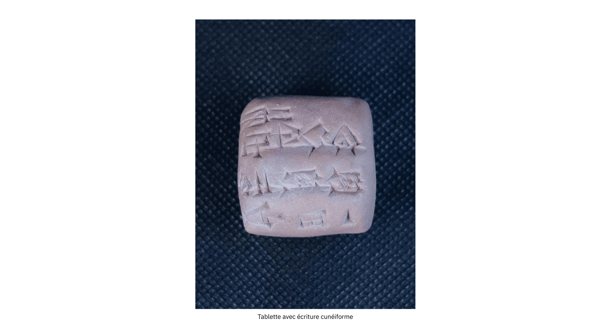  

J'ai aussi ce qui, je pense, est une vraie tablette sumérienne avec, au centre, une petite écriture cuneiforme. Sur cette tablette, on remarque des signatures qui sont faites en roulant un cylindre, que je vais vous montrer à l'instant.

Ces marques avec des petits personnages étaient la forme de signature de l'époque quand on signait un contrat ou une lettre, tout simplement parce que les gens, évidemment, ne savaient pas écrire, il n'y avait que les scribes qui maîtrisaient cette technique.

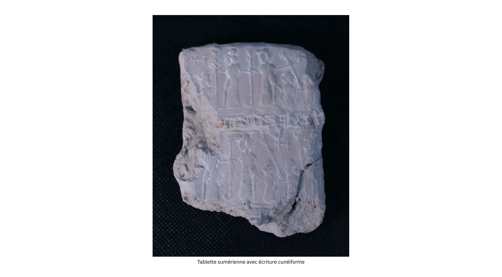  

Et ici, j'ai ce fameux cylindre qui est en fait une pierre où on a gravé certaines formes et on roulait ce cylindre de signature, qu'on appelle un cylinder seal en anglais, pour signer des lettres et signifier que c'est nous, l'auteur, ou nous qui avons rédigé, ou que cette lettre a été rédigée en notre nom.

Les scribes de l'époque utilisaient donc ce fameux stylet en forme de coin pour imprimer des signes sur des tablettes humides.

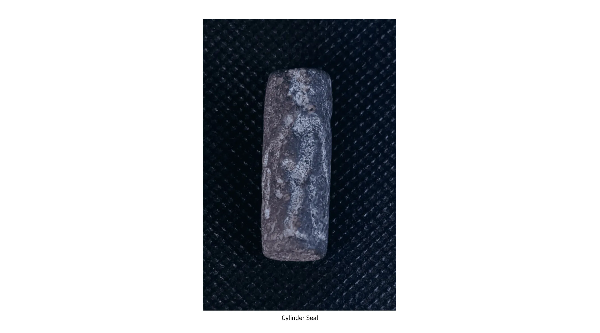  

Le cunéiforme n'était pas une langue, mais bien un système d'écriture permettant d'enregistrer les langues parlées. En anglais, on dirait «writing is written language», et puis on dirait que «cuneiforme is a script, not a language». Donc, on dirait en français que le cunéiforme n'est pas une langue, mais une façon de codifier un langage.

### L'évolution et les usages de l'écriture

Durant ses premiers siècles d'existence, cette écriture resta limitée, servant essentiellement de système mnémotechnique pour enregistrer des quantités, des listes de biens agricoles et d'équipements. Ce n'est que progressivement qu'elle devint capable de **rendre phonétiquement des noms** et des phrases complètes.

Donc, au début, par exemple, pour les noms, on ne pouvait pas écrire des noms avec l'écriture cunéiforme parce que ça représentait simplement des choses, des éléments de la réalité, comme un bœuf ou du blé, qui étaient tracés. C'était vraiment des petites images, et à force, c'est devenu vraiment une forme de script.

Pour les noms, si la personne s'appelait, disons, Laura, on prendra un mot, un sigle qui sonne comme "l'eau" et un deuxième comme "ras", et on formera le nom Laura avec. C'est comme ça que la première forme d'écriture de la langue s'est développée.

Et pour la petite histoire, les sigles étaient à l'origine, disons, on dessine la tête d'un bœuf, on voyait la forme de la tête de bœuf, et petit à petit, les dessins ont été simplifiés pour ne représenter que des espèces de lignes. Et à force, ils ont tourné dans un sens, et les savants pensent que c'est parce qu'ils tenaient la tablette d'argile humide dans une main et que c'était plus simple de refaire les sigles en les tournant. On pense que c'est dû à la façon dont les scribes tenaient ces tablettes.

On peut encore aujourd'hui constater le lien avec, disons, le blé ou la tête de bœuf dans les sigles cunéiformes, et ils sont toujours penchés sur le côté.

L'écriture cunéiforme, tout au long de ses trois millénaires d'utilisation, conserva comme rôle principal la tenue de registres économiques et administratifs. Toutefois, très vite, les habitants de Mésopotamie développèrent un profond désir de préserver par écrit tout ce qui méritait de traverser le temps. Ainsi, les récits, légendes et chants, jusque-là transmis oralement par les musiciens itinérants, furent immortalisés par écrit souvent recopiés par des scribes en formation. Ils copiaient des textes qui existaient déjà. Et souvent, c'était ces légendes ou ces textes qui avaient une certaine valeur culturelle.

On peut citer ici l’exemple de **l'Épique de Gilgamesh**, possiblement un **roi historique de la cité-État sumérienne d'Uruk** vers 2900–2350 av. J.-C.

Cette écriture, à la fois outil de gestion économique et vecteur culturel, perdura jusqu'au Ier siècle de notre ère, avant de disparaître définitivement, laissant derrière elle un témoignage précieux de la civilisation qui l'avait vue naître.

## Le rôles des tablettes sumériennes
<chapterId>a396e6c5-56cc-5410-9e6b-0274401c5425</chapterId>
:::video id=a0729a35-01ec-4aa4-828f-d4ccc2eb168e:::

### Les systèmes de crédit pré-monétaires

En Mésopotamie ancienne, l'organisation économique reposait sur des mécanismes très sophistiqués, qui existaient bien avant l'invention des pièces de monnaie métalliques. Dès l'origine, les systèmes de crédit formels et informels constituaient déjà une forme essentielle de monnaie, permettant aux populations locales de réaliser de nombreuses transactions économiques complexes.

C'est précisément pour répondre aux besoins administratifs et économiques que l'écriture cunéiforme fut inventée. Les célèbres tablettes d'argile mésopotamiennes servaient principalement à consigner divers types de contrats : prêts privés, ventes, locations, hypothèques et même accords de mariage. Rédiger ces tablettes demandait l'expertise de scribes spécialisés, une tâche coûteuse en temps et en effort, **mais justifiée dès lors que des intérêts financiers étaient en jeu.** Les gens ne s'écrivaient pas des lettres d'amour à l'époque, ils n'utilisaient pas un scribe pour s'écrire sur leurs angoisses. Ils engageaient un scribe pour rédiger des documents, qu'il y avait un lien ou une raison économique.

On peut aussi mentionner que certaines de ces tablettes circulaient comme titres au porteur, pouvant ainsi changer de mains librement.

Par exemple, il existait une forme de balle d'argile où il y avait des petites pierres à l'intérieur.  
Sur le tour de la balle d'argile, il y avait un chiffre qui était écrit et signé, représentant un nombre d'unités. À l'intérieur, il y avait ces roches et quelqu'un qui voulait vérifier, valider vraiment que cet instrument représentait vraiment bien un nombre X d'unités.

Un autre exemple, une tablette retrouvée au sud-ouest de l'actuelle Bagdad stipule par exemple qu'un débiteur s'engage à rembourser à un créancier 330 mesures de céréales le jour de la récolte. Plus fascinant encore, une autre tablette indique clairement qu'une dette de quatre mesures d'orge doit être remboursée directement au porteur de la tablette, **introduisant ainsi la notion de paiement au porteur, un concept particulièrement innovant pour l'époque**.

À partir de 2000 av. J.-C., une loi imposait de formaliser par écrit et de signer toutes les transactions commerciales, même les plus minimes, en présence de témoins. Imaginez à quel point c'était une bureaucratie immense à l'époque de consigner toutes les transactions dans des registres faits, je vous le rappelle, fait d’argile par des scribes. Cette rigueur légale visait à prévenir les litiges futurs concernant la propriété et les droits sur les biens échangés. Les témoins étaient souvent appelés pour témoigner que ce contrat avait bel et bien été signé.

Dans la sphère privée également, certaines familles et individus s'engageaient dans des activités économiques suffisamment complexes pour nécessiter une gestion rigoureuse. On a ainsi découvert, dans la ville nord-babylonienne de Sippar-Amnanu, la maison d'un prêtre d’Anunitum nommé Ur-Utu, contenant près de 2000 tablettes. Ces documents comprenaient des contrats de prêts privés, des actes de ventes, de locations, mais aussi des lettres, des textes religieux et scolaires, témoignant de la diversité et de l'importance des archives privées de l'époque.

Il est notable que les lettres rédigées par les scribes concernaient presque exclusivement des intérêts financiers : réclamations concernant des allocations insuffisantes, versements de dots en attente ou autres demandes matérielles urgentes. À cette époque, les écrits personnels tels que les lettres d'amour n'existaient pas, et même les mentions de maladies étaient rares.

Un exemple poignant d'une telle lettre illustre cette réalité économique : un correspondant exprime son désarroi après avoir été laissé sans argent ni provisions lors du départ de son partenaire, alors qu'une famine sévère frappait Assur. Il décrit son besoin urgent d'acheter du grain et réclame qu'on lui envoie rapidement l'équivalent en argent de ses textiles afin d'assurer sa subsistance quotidienne.

Cette lettre adressée à son partenaire, semble indiquer qu’il était parti faire du commerce ailleurs la laissant sans le sou. Elle lui rappelle qu'elle doit avoir accès à des mesures d'argent pour pouvoir s'acheter du grain et payer ses impôts au temple. C'est peut-être le plus proche qu'on peut s'approcher d'une dispute écrite dans une lettre de l'époque. Les lettres étaient presque toujours en relation avec des transactions économiques, et on relate justement dans cette lettre une situation économique précaire.

Ainsi, les documents mésopotamiens qui nous sont parvenus reflètent principalement des échanges économiques, puisqu'ils étaient rédigés exclusivement lors de transferts de biens ayant une valeur reconnue : argent, grain, marchandises diverses, biens immobiliers, paiement de taxes au temple. Ces archives révèlent non seulement l'efficacité et la précision administrative de cette civilisation antique, mais également sa capacité à gérer des échanges économiques complexes sur une très longue période.

## Le contrôle des élites sur les tablettes sumériennes
<chapterId>c6d3df0e-b1e1-58dc-ab35-9f76bbc39393</chapterId>
:::video id=04a95fb8-a701-4a48-9ce8-0e9b6ba256fd:::

### L'Écriture, Une Technologie Économique Avant Tout

Contrairement à une idée répandue, l'invention de l'écriture en Mésopotamie il y a environ 4000 ans ne répondait pas initialement à des besoins de communication personnelle ou littéraire. **L'écriture cunéiforme était avant tout une technologie économique**, justifiée uniquement lorsque des intérêts financiers importants étaient en jeu. Les Sumériens n'utilisaient pas l'écriture pour correspondre entre eux ou exprimer leurs sentiments, mais exclusivement pour documenter leurs transactions commerciales et financières.

Cette spécialisation s'explique par le coût considérable de la rédaction des tablettes. Graver dans l'argile demandait une expertise technique pointue, un temps considérable et des matériaux spécifiques. Seules les transactions d'une valeur suffisante justifiaient économiquement cet investissement, créant ainsi un seuil naturel d'accès à cette technologie révolutionnaire.

Les tablettes cunéiformes révèlent un système financier d'une complexité remarquable pour l'époque. Les Mésopotamiens avaient développé un arsenal complet d'instruments financiers modernes : **prêts privés avec intérêts, actes de vente, contrats de location, hypothèques et même contrats de mariage avec clauses financières**. Cette sophistication témoigne d'une économie marchande développée, bien éloignée de l'image simpliste du troc primitif souvent associée à ces civilisations anciennes.

Certaines tablettes fonctionnaient comme de véritables **titres au porteur**, circulant librement de main en main sans nécessiter l'identification du détenteur original. Cette innovation permettait une fluidité des échanges remarquable, préfigurant les systèmes financiers modernes. Une législation spécifique imposait même la formalisation écrite de toutes les transactions commerciales, institutionnalisant ainsi l'usage de l'écriture dans la sphère économique.

### Le Monopole du Savoir et le Contrôle Économique

Cette centralité de l'écriture dans l'économie conférait un pouvoir considérable à ceux qui maîtrisaient cette technologie. **Les scribes, généralement attachés aux temples et aux institutions dirigeantes, détenaient de facto le contrôle du système financier**. Leur expertise rare et précieuse en faisait les gardiens obligés de toute transaction importante.

Ce monopole du savoir n'était pas fortuit. Les autorités avaient tout intérêt à maintenir cette exclusivité, car démocratiser l'écriture aurait dilué leur contrôle sur l'économie et multiplié les risques de falsification. La présence systématique de témoins lors des signatures révèle d'ailleurs cette préoccupation constante de l'authenticité des documents.

L'obligation légale de consigner par écrit toutes les transactions commerciales servait plusieurs objectifs stratégiques : contrôle fiscal, suivi comptable rigoureux, et maintien de la dépendance des acteurs économiques envers l'appareil administratif. **L'État mésopotamien s'appropriait ainsi la capacité de gérer la dette interpersonnelle** à l'échelle sociétale, transformant l'écriture en instrument de pouvoir économique.

### La Coexistence de Deux Systèmes Monétaires

L'analyse des tablettes révèle une réalité économique plus nuancée que ne le suggère leur omniprésence dans les archives. De nombreuses tablettes mentionnent des références au **shekel d'argent** comme unité de valeur, indiquant l'existence parallèle d'un système monétaire basé sur des biens physiques standardisés.

Cette dualité s'explique par la stratification sociale de l'époque. **Le système des tablettes cunéiformes était réservé à une élite restreinte** : clergé, marchands prospères, et administrateurs capables de lire, écrire et interpréter ces documents complexes. Pour utiliser efficacement une tablette au porteur, il fallait non seulement savoir la déchiffrer, mais aussi pouvoir en vérifier l'authenticité et en comprendre les implications juridiques.

**La masse de la population, exclue de ce système élitiste, développait ses propres mécanismes d'échange**. Les gens ordinaires utilisaient des systèmes plus accessibles : mesures standardisées de grain, poids d'argent, et autres biens facilement quantifiables que chacun pouvait évaluer sans compétences spécialisées.

Cette économie populaire, bien que moins documentée dans les archives officielles, était probablement plus dynamique et flexible que le système des tablettes. Elle permettait des échanges quotidiens rapides sans recours aux scribes, répondant aux besoins immédiats des artisans, agriculteurs et petits commerçants.

Le shekel d'argent, fréquemment mentionné dans les tablettes comme référence de valeur, servait probablement de pont entre ces deux systèmes économiques parallèles, permettant la conversion entre dettes écrites et paiements physiques.

### L'Émergence Spontanée Versus le Contrôle Institutionnel

Cette coexistence illustre un débat fondamental en histoire économique : **l'opposition entre émergence spontanée des moyens d'échange et appropriation institutionnelle de la monnaie**. D'un côté, les biens-monnaies comme l'argent émergeaient naturellement des besoins d'échange de la population. De l'autre, les institutions s'appropriaient et formalisaient ces pratiques pour en contrôler les flux.

Les temples sumériens incarnent parfaitement cette tension : ils utilisaient les innovations monétaires populaires (références au shekel) tout en développant leurs propres instruments de contrôle (tablettes cunéiformes). Cette stratégie leur permettait de capter les bénéfices des deux systèmes : la légitimité populaire des biens-monnaies traditionnels et le contrôle administratif des créances formalisées.

L'expérience mésopotamienne établit des precedents durables pour l'évolution des systèmes financiers. Elle démontre que **la sophistication financière précède souvent de plusieurs millénaires les innovations technologiques** qu'on lui associe habituellement. Les concepts d'intérêt, de crédit, de titre négociable et de garantie hypothécaire n'attendent pas l'invention de la monnaie métallique pour se développer.

Cette période fondatrice révèle également les enjeux de pouvoir inhérents à toute innovation monétaire : qui contrôle la technologie, qui définit les règles, et comment s'articulent systèmes formels et pratiques populaires. Ces questions traversent l'histoire économique jusqu'aux débats contemporains sur les monnaies numériques et les cryptomonnaies.

# Économie et monnaie dans les civilisations antiques 
<partId>a16bcf4c-8c3a-11f0-9e79-2bd363a484bd</partId>

## Les grandes civilisations de l’âge du Bronze
<chapterId>fab9334c-7385-5d7c-ad40-7d152beb22a1</chapterId>
:::video id=737e12e8-1033-4210-b1dd-b8a680f68b17:::

Dans cette section intitulée "Les grandes civilisations de l'âge du bronze", nous allons débuter avec un extrait du livre: *A History of Money: From Ancient Times to the Present Day par Glyn Davies.* Je trouve que cet extrait est une excellente introduction à cette section où on parle des grandes civilisations de l'Antiquité.

> Toynbee identifie environ vingt-et-une "civilisations" différentes, mais, puisque quinze d'entre elles dérivaient directement ou indirectement d'exemples antérieurs, il réduit le nombre de civilisations indépendamment développées à six : la sumérienne, l'égyptienne, la minoenne, la chinoise, la maya et l'andine. Parmi celles-ci, seuls les Incas des Andes ont réussi à atteindre un haut degré de civilisation sans utiliser de monnaie, bien que paradoxalement, ils disposaient en abondance des matériaux généralement considérés comme les meilleurs pour servir de monnaie – l'or et l'argent.

Les Incas n'avaient pas de système monétaire, mais avait une abondance de métaux précieux. C'est assez paradoxal. Poursuivons avec la citation:

> Plus une société est stratifiée, et plus son système de planification est méticuleusement efficace, moins l'utilisation de la monnaie est nécessaire pour sa population. Cela peut expliquer pourquoi les conquistadors espagnols découvrirent que les Mexicains, dont le gouvernement était relativement plus libéral, utilisaient régulièrement de la poudre d'or (conservée dans des tubes transparents) et des fèves de cacao (conservées pour de gros paiements en sacs de 24 000 unités) comme monnaie, tandis qu’à l'inverse, les Incas, organisés selon une hiérarchie beaucoup plus rigide, n'avaient aucune monnaie : une exception confirmée par une règle stricte. L'origine de la monnaie en Chine s’est faite de manière totalement indépendante des autres civilisations ; cependant, la proximité relative des civilisations sumérienne, égyptienne et minoenne laisse subsister des doutes quant à leur degré d'ignorance respective sur leurs pratiques monétaires, surtout compte tenu des échanges commerciaux importants établis dès des périodes très anciennes.

En Chine, les pièces de monnaie ont été développées avec une approche complètement différente des traditions occidentales. C'était du fiat dès l'origine. C'était de la monnaie coulée.  
Et ici, M. Davies mentionne des échanges. Il y avait en effet des échanges entre les Chinois et d'autres populations à certaines époques mais l'intermédiaire d'échange était plutôt la soie pour faire du commerce extérieur. Et on peut aussi noter qu'en Chine, et on le verra plus tard, que dans les régions frontalière, avec moins de population chinoises, on utilisait l'or. Et même pas pour le commerce international, pour ça, c'était la soie.

Donc, j'imagine que peut-être pour le format des pièces, ils ont peut-être pu être influencés par d'autres civilisations de la même époque qui ont développé cette technologie.  
Mais clairement, l'essence de la monnaie était complètement différente en Chine qu'en Occident. On va y revenir abondamment dans la section subséquente au sujet de la Chine.

Concernant ces fameuses cités sumériennes, j'ai quelques notes ici. On peut parler de Uruk, qui était une cité très précoce et influente, célèbre pour sa taille considérable et sa culture avancée, notamment avec le développement de l'écriture et de l'urbanisme.

Et je voulais mentionner aussi le fameux épique de Gilgamesh. Gilgamesh était probablement un roi historique de la cité sumérienne d'Uruk vers 2900 avant Jésus-Christ. Il était probablement le roi de cette cité-état sumérienne.

Aussi, on peut parler de Sargon d'Akkad, qui a régné de 2334 à 2279 avant notre ère.  
C'était le premier dirigeant de l'Empire akkadien, qui est une autre civilisation qui a émergé en Mésopotamie. Et je vous mentionne Sargon parce que c'est le premier qui a instauré un service postal de ces fameuses tablettes ici, que je vous ai déjà présentées.

Imaginez-vous qu'il y avait vraiment même des enveloppes en argile. Les tablettes pouvaient être enveloppées dans des enveloppes d'argile où il y avait les signatures de la personne qu'on pouvait voir à l'extérieur et ça permettait d'avoir une certaine confidentialité. Donc les gens cassaient cette enveloppe pour récupérer la tablette. Et on doit ce système postal à Sargon d'Akkad.

Ensuite, on pourrait parler rapidement de Babylone, la grande cité devenue capitale de l'Empire babylonien. Une autre civilisation, réputée pour ses imposants Ziggourat et ses palais, et le célèbre code d'Hammourabi, surtout connu pour son code juridique très avancé.

Et deux cités pour conclure cette section. On a Assur, qui était la capitale de l'Empire assyrien, un important centre religieux. Et on a Ninive, qui fut ensuite la capitale de l'Empire assyrien. Ils y ont déménagé leur capitale et elle est connue pour son armée puissante, ses vastes palais et bibliothèques. Et elle est également un des emplacements possibles des légendaires jardins suspendus de Babylone. On entend souvent cette fameuse merveille du monde de l'Antiquité.  
Mais on n'a pas de traces à Babylone de ces fameux jardins suspendus. Tandis qu'à Ninive, on a vraiment des preuves archéologiques qu'il y avait des jardins sur des étages. Il est possible qu’il existait une confusion entre Ninive et Babylone chez les historiens grecs qui en font mention, comme Hérodote. Lorsqu'ils visitaient des villes en Mésopotamie, peut-être qu'ils y référaient en tant que Babylone. On a trouvé des traces de fameux jardins suspendus à Ninive et les savants se demandent peut-être que Ninive est ce fameux endroit où il y avait ces jardins auxquels on réfère en tant que jardins suspendus de Babylone.

## Organisation économique en Mésopotamie
<chapterId>6afb6fc8-cbb7-56a5-8427-484b4b7d7477</chapterId>
:::video id=aa6a2cbd-5916-4ae3-ad4f-65f0bd5643fa:::

### Les structures économiques pré-capitalistes et l'esclavagisme

Bienvenue dans cette section consacrée à l'organisation économique en Mésopotamie. L'économie pré-capitaliste a connu trois grandes étapes : primitive, esclavagiste, et féodale. 

Féodale, c'est plus tard évidemment au Moyen Âge et nous avons déjà passé l'étape primitive qu'on a décrit plus haut avec le paléolithique et maintenant, en Mésopotamie, quand on parle d'organisation économique, on parle plutôt de l'esclavagisme.

Cependant, en Mésopotamie, l'essentiel du travail était assuré par une classe dépendante semblable à l'esclavage, sans être juridiquement propriété de ses maîtres, mais qui était privée des fruits de son travail par coercition physique ou idéologique.

### Le rôle des temples et palais comme centres économiques

Les grandes propriétés foncières dominaient l'économie. Les propriétaires exploitaient directement leurs terres en engageant des travailleurs, ou bien ils louaient leurs terres en échange de rentes. Ils exerçaient également des activités financières en prêtant de l'argent à des taux d'intérêt élevés, généralement autour de 20 % à 33,3 % par an, pratiques qui contrastaient fortement avec les règles plus strictes des Hébreux voisins.

Les emprunts contractés par les paysans n'étaient pas destinés à des investissements productifs, sauf exception faite des entreprises maritimes, mais plutôt à assurer leur survie jusqu’à la prochaine récolte. Cette situation entraînait fréquemment l'endettement chronique des paysans.

Je me permets de faire un petit parallèle ici avec une période plus récente durant l’antiquité (Rome) où les citoyens vivaient des rentes agricoles produites par les paysans et la main-d'œuvre non-libre ainsi que du butin issu des guerres. **Ces revenus étaient répartis entre les citoyens, non pas pour générer davantage de profits, mais pour rehausser leur statut social.** Le commerce et l'artisanat étaient généralement laissés à des groupes extérieurs à l'élite sociale. Tout ceci contraste avec les économies médiévales orientées vers le profit par le commerce et l'artisanat.

Donc ce qu'on essaie d'exprimer ici c'est que je fais un parallèle avec le fait que les gens se servaient d'outils financiers de prêt pas nécessairement pour leur permettre d'améliorer leurs outils de production et plus tard à Rome les profits ne servaient pas nécessairement pour être réinvestis mais plutôt c'était plutôt d'augmenter le prestige des gens qui pouvaient profiter de ces profits. On est encore loin de l'esprit capitaliste qui a émergé plus tard au Moyen-Âge où on pouvait faire des emplois pour améliorer les moyens de production et on prenait les surplus, on créait des surplus pour une certaine recherche de profit. On peut donc voir que l'organisation économiques n'étaient pas encore rendues à la troisième étape des évolutions économiques qu'on a listées plus haut.

### L'émergence des systèmes de crédit et des unités de compte

**Karl Polanyi distingue trois formes d'échange économique : la réciprocité entre groupes symétriques,** ça ce serait dans les tribus primitives où on n'a pas vraiment besoin de monnaie parce qu'on se fait du crédit informel et on se fait des échanges et de la redistribution. **La redistribution centralisée autour des temples et des palais,** cette forme d’échange est compatible avec la Mésopotamie où les temples étaient au centre de l'organisation économique et pouvaient à une certaine époque redonner, distribuer la richesse sous forme de rations. C’est plus tard qu’on va intégrer la notion de salaire. Donc jusqu’à maintenant on a la forme primitive (1), la redistribution centralisée (2) dans les temples et les palais et ensuite on peut finalement laisser place aux échanges sur les marchés (3)**.** Bien que le marché tel que nous le concevons aujourd'hui n'existait pas pleinement, la présence d’échanges marchands en Mésopotamie est incontestable, attestée par l’existence de termes spécifiques en akkadien et par la présence d’évidences archéologiques de prix, profits, pertes, fluctuations et situations de pénurie.

Les ménages mésopotamiens géraient de manière autonome toutes les étapes de production agricole, depuis les semailles jusqu'à la transformation finale en pain et bière. Les femmes assuraient aussi la production de textiles nécessaires aux dépendants. Pour les biens non produits localement, les ménages faisaient appel à des marchands spécialisés.

Les liens familiaux étaient particulièrement importants dans les échanges commerciaux. Ainsi, durant la période paléo-assyrienne (vers 1910-1830 av. J.-C.), des marchands originaires de la ville d’Assur avaient établi une colonie marchande à Kanesh en Anatolie, où ils importaient étain et textiles contre de l’or et de l’argent. Le commerce fonctionnait sur la base d'entreprises familiales étroitement liées par des mariages et des partenariats commerciaux. Kanesh n’était d'ailleurs qu'un maillon d’un vaste réseau commercial international.

Dans ces échanges, il y avait des métaux, et c'était des métaux précieux et pas nécessairement, par exemple, du cuivre qui avait vraiment une utilité à l'époque, et on pense que ces métaux-là étaient échangés pour des notions de réserve de valeur. On ne pouvait donc pas nécessairement parler de troc, deux biens qu'on échangeait pour leur utilité, mais bien vraiment une notion de paiement avec une certaine conscience de thésauriser les métaux précieux pour leur usage de réserve de valeur et non pour les utiliser en tant que marchandise, par exemple, l'usage du bronze pour faire des armures.

Le tribut et les taxes étaient principalement payés en nature (orge ou argent pesé). Les temples et les palais constituaient les principaux centres économiques, administratifs, politiques et religieux, assurant aussi les premières fonctions bancaires par le dépôt sécurisé de biens, d'abord du grain, puis d'autres produits agricoles et enfin des métaux précieux. Ainsi se développèrent les premières opérations de crédit et de prêts, bien avant l’apparition des pièces de monnaie.

L’économie mésopotamienne utilisait principalement l’orge et l’argent comme étalons de valeur. L'argent se pesait selon des unités standardisées, comme le sìqlum (shekel) d’environ 8,33 grammes. Dès la période babylonienne ancienne (sous Hammurabi), l’argent servait de moyen de paiement courant avec une notion précoce de valeur nominale ("nūbum") par opposition au poids réel ("šuqulum"), **anticipant ainsi le concept moderne de monnaie fiduciaire**.

Mais ce n'était pas déjà de la monnaie fiduciaire à proprement parler. Il n'y avait pas la notion d'estampe avec une figure d’autorité, mais y avait une notion d'une unité de compte nominale, en opposition à la notion de métal pesée. Il y avait une distinction dans la langue pour ces deux concepts et je trouve ça important de le mentionner.

La transition vers un marché du travail salarié a été difficile. Elle nécessitait deux innovations conceptuelles majeures : la séparation du travail de la personne et du produit final, et l'introduction du "temps de travail" comme unité mesurable. Pour avoir cette notion de salaire et de salarié, il a fallu d’abord passer par ces deux innovations. **Au IIIᵉ millénaire, le travail se rémunérait d'abord par des rations fixes, avant d’évoluer progressivement vers un système de salaires au début du IIᵉ millénaire.**

Finalement, à partir du XXVIᵉ siècle av. J.-C., une véritable notion de valeur monétaire s'installa durablement, même si la "monnaie" mésopotamienne n’était pas une pièce frappée, mais plutôt une mesure pondérale en céréales ou en métaux. **Ainsi, lors de transactions importantes ou dans des contextes nécessitant la conservation de la valeur, on préférait souvent convertir les céréales en argent, plus facilement conservable.** Un peu comme l’exemple de Kanesh ou on recevait de l’argent métal à thésauriser.

À partir du XXI siècle avant notre ère, **avec la quasi-disparition des échanges asymétriques**, on note que dans les contrats de cessions, le verbe sa, désigne le paiement du prix. On voit dans les contrats l’apparition de cette notion qui s'appelle "sa" et ça fait référence au paiement d'un prix et non par une mesure d’une denrée en particulier. Le “sa” fait simplement référence à un paiement ou à un prix. C’est un anthropologue qui note ça et mentionne que c'est vraiment une avancée, on voit une espèce de dichotomie entre le avant et après de cette introduction du verbe "sa" dans les contrats.

On ne peut ignorer les données empiriques présentes dans les archives du Proche-Orient attestant de l'existence de **certains mécanismes de marché**, intégrant les **notions de profit** et de **perte**, les **fluctuations des prix** et des situations de **pénurie**. Mais la difficulté fondamentale réside dans la détermination de l'importance relative de l'échange par le biais du marché au sein de l'ensemble de l'économie mésopotamienne ancienne.

Je pense que les experts dans ce domaine ont vu des traces de ces concepts de marché, mais ils ne sont pas vraiment capables de nous dire à quel point, quelle part de l'économie de l'époque était basée sur ce concept plus moderne de marché ou par d'autres mécanismes.  
On sait que ça existait, mais on ne sait pas si c'était la façon principale, disons, de déterminer des prix ou de faire des échanges.

C'est ce qui conclut cette section sur l'organisation économique en Mésopotamie.  
Dans les prochaines sections, nous allons faire le même travail pour l'Égypte et la Chine.

## Organisation économique et monétaire en Égypte ancienne
<chapterId>bffcc16c-7fbf-5992-a0fa-6a7726d7d287</chapterId>
:::video id=40c1c4e5-b190-4bb6-b8a0-810c9ce7698b:::

### Cadre historique et périodes égyptiennes

Cette section sera consacrée à l'organisation économique et monétaire en Égypte ancienne. Pour vous donner juste un petit peu de contexte voici une liste et une courte description des périodes en question.

- **Ancien Empire (env. 2575 \- env. 2130 av. J.-C.)**. Période marquée par la construction des grandes pyramides, notamment celles de Gizeh. C’est l’âge d’or de la monarchie égyptienne centralisée.
- **Moyen Empire (1938 \- env. 1630 av. J.-C.)**. Renaissance politique et culturelle après une période d’instabilité.
- **Nouvel Empire (env. 1539 \- 1075 av. J.-C.)**. Période d’expansion territoriale, de puissance militaire et d’échanges internationaux. Elle comprend les règnes de pharaons célèbres comme Toutankhamon et Ramsès II.
- **1323 av. J.-C. – Mort de Toutankhamon**. Le jeune pharaon meurt à environ 18-19 ans. Sa tombe presque intacte sera découverte en 1922, devenant l'une des plus célèbres découvertes archéologiques.
- **Ramsès II – Règne de 1279 à 1213 av. J.-C.**. L’un des plus puissants pharaons du Nouvel Empire. Connu pour ses campagnes militaires, ses grands monuments, et pour avoir probablement conclu le premier traité de paix connu.
- **1275 av. J.-C. – Peuples de la mer**. Invasions ou migrations de groupes appelés "Peuples de la mer" qui déstabilisent plusieurs civilisations méditerranéennes, dont l’Égypte.
- **Bataille de Xoïs – 1178 av. J.-C.**. Conflit entre l’armée égyptienne et des envahisseurs, probablement liés aux Peuples de la mer. Elle fait partie des nombreuses luttes de la fin du Nouvel Empire.
- **La Basse Époque** est la période de l'histoire de l'Égypte antique qui va des environs de 664 à 332 av.
- **Cléopâtre VII (69 \- 30 av. J.-C.)**. Dernière reine d’Égypte, célèbre pour son intelligence, son charisme et ses alliances avec Jules César puis Marc Antoine et probablement aussi pour son nez. Son règne marque la fin de l'Égypte pharaonique avant son annexion par Rome.

Dès les Ve et IVe millénaires avant notre ère, l’Égypte connaissait déjà une intense activité commerciale à grande échelle reliant la Nubie, la Palestine, la Libye et les régions de la mer Rouge, à travers des échanges maritimes, fluviaux et terrestres (notamment par caravanes d’ânes).

### Les premiers systèmes d'échange et la paléomonnaie

Avec l'émergence des premières chefferies égyptiennes vers 3650-3400 av. J.-C., le site de Maadi, au sud de l'actuelle ville du Caire, devint un centre majeur pour la technologie du cuivre et les échanges à longue distance, notamment avec la Mésopotamie par la côte syrienne.

Bien que les échanges volumineux reposaient principalement sur le troc, une forme primitive de monnaie ("paléomonnaie"), constituée d'objets de prestige comme des pierres semi-précieuses et des coquillages fossiles, existait probablement. L'or jouait probablement déjà un rôle important dans ces échanges. La première mention explicite d'une monnaie dans les documents égyptiens au milieu du IIIe millénaire av. J.-C. reflète une longue maturation liée aux pratiques commerciales.

Dans la société archaïque (ici on ne parle pas nécessairement de l’Egypte mais des sociétés archaïques en général), les paiements étaient fréquents, non pour acheter directement, mais pour payer la dot, les rituels religieux, et d’autres obligations sociales. Ces transactions supposaient une tarification et une évaluation précises. Nombre de sociétés primitives disposent d'objets privilégiés, monétiformes, c'est-à-dire dénombrables, dans les termes desquels est estimée cette valeur. Si on paye une dote, évidemment, il faut noter une quantité quelconque d'un objet à échanger pour payer la dote. Valeur qui, pour l'essentiel, n'est autre que celle des personnes.

Dans les sociétés archaïques, avant l'apparition de monnaie ou des systèmes monétaires, il y avait des paiements, mais ils étaient souvent liés à des obligations sociales, et leur valeur découlait de la valeur des personnes, comme dans la paiement de la dote ou du prix du sang.

Pour en revenir à l’Égypte, durant l’ancien empire apparaît le "shât(y)", unité monétaire concrète à l’origine (petite pièce d'or ou d'argent d'environ 7,6 grammes), est très vite passé de sa fonction réelle d'espèce sonnante et trébuchante à une **fonction comptable** qui a engendré la notion de valeur. On peut y reconnaître une espèce d’une unité de compte pour exprimer la valeur, qui à l'origine était une sorte de pièce, mais on ne peut pas vraiment parler de pièce de monnaie parce que ce n'est pas estampé, c'est juste une mesure de métal. On se rapproche de la notion d'unité de compte.

Cette notion de shât(y) fut éventuellement abandonnée, peut-être liée aux risques de fraude. On verra plus tard que les Égyptiens ont tardé à adopter les pièces de monnaies estampées et ont même continué à les peser, même après leur adoption par leurs voisins.

Au Moyen Empire, l’argent-métal était rarement utilisé pour les transactions courantes, celles-ci s’effectuant essentiellement avec des mesures de céréales et quantités de pains. C’est durant cette période que semble apparaître une forme de monnaie scripturale, où les paiements peuvent être enregistrés par écrit, ou par transfert réel.

Au Nouvel Empire, le système monétaire devint plus complexe, intégrant différentes monnaies-marchandises évaluées en métaux (or, argent, cuivre), en étoffes standardisées, en céréales et en huile. Pour les étoffes, on parlait de mesures de tissus. **Les prix des marchandises courantes étaient souvent exprimés en céréales ou en cuivre, tandis que les objets précieux étaient évalués en or ou en argent. L’argent, plus rare en Égypte que l’or, devint particulièrement prisé.** L'argent était surévalué comparé à l'or qui était plus abondant en Égypte.

À la Basse Époque (premier millénaire av. J.-C.), l'argent était devenu le métal d’échange courant dans tout le Proche-Orient. Il circulait sous forme de lingots, de pièces métalliques ou d'anneaux pesés et marqués dans les temples, garantissant leur poids et pureté sans qu'il s'agisse toutefois de monnaie frappée à l'effigie d’un souverain. Ça, c'est arrivé plus tard et ce sera le sujet d'une subséquente section au sujet des Lydiens.

On peut noter aussi que les anciens égyptiens avaient un terme, "hedj", pour désigner l’argent et était utilisé de manière générique pour désigner tout moyen de paiement servant de contrepartie lors d’une transaction, qu’il s’agisse de métal, de céréales, d’étoffes ou de biens divers (bois, animaux, services, etc.). Des exemples documentés montrent que les Égyptiens pouvaient régler une transaction en combinant divers produits dont la valeur totale était exprimée en unités de cuivre ("deben").

**Les temples jouaient un rôle central dans l’économie égyptienne : ils collectaient et thésaurisaient des trésors considérables en métaux précieux (or et argent) destinés à honorer les dieux mais aussi à servir de réserve monétaire pouvant être réintroduite dans le circuit économique selon les besoins**. Nous verrons des exemples de ça où d'autres civilisations accumulaient comme ça des réserves de valeur dans les temples par exemple des statues pour éventuellement être fondue au besoin en cas de guerre, s'il y a pénurie de monnaie ou en cas de crise. Ça, ça revient assez souvent dans l'histoire.

On peut aussi mentionner que la culture du lin était un monopole royal concédé aux temples, et la fabrication d’étoffes précieuses confirmait leur importance économique.

Les anciens Égyptiens faisaient clairement la distinction entre l'aspect idéologique des métaux précieux, liés à la divinité (l’or représentant la chair des dieux, l’argent leurs os), et leur fonction pratique en tant que monnaie servant de référence pour toutes les autres formes de paiement.  
Ainsi, bien que l’Égypte antique n'ait pas développé une monnaie frappée comparable aux systèmes monétaires modernes avant la période tardive, elle possédait un système monétaire sophistiqué, basé sur l'utilisation combinée de monnaie scripturale, d’unités de compte précises, de monnaie-marchandise et de métaux précieux évalués au poids.

Les pièces de monnaie elles-mêmes étaient pesées, si bien qu'on aboutit à deux concepts différents, celui de **“coinage" et celui de "money"**. J'ai utilisé deux termes en anglais. D’abord le “coinage” qui réfère aux pièces de monnaie, un concept qui vient plus tard, et on a aussi ce concept de monnaie comme "money". On peut déjà définir une certaine notion de "money" par les unités de compte que je viens de vous exprimer en mesure d'argent, mais qui n'étaient pas encore des pièces de monnaie, donc "coinage" qui viennent un peu plus tard avec les Lydiens.

Et donc, les pièces de monnaie ne sont pas une condition préalable à la monnaie, **si bien qu'on peut admettre l'existence de la monnaie dès le Ille millénaire,** en tout cas et sans aucun doute au cours du Ile millénaire et particulièrement sous le règne de Hammourabi.

Ce qui est important de retenir ici, et c’est ce que l'auteur qui mentionne dans le livre "Aux origines de la monnaie", est qu’il n'y a aucun doute sur le fait que le concept de monnaie existait déjà à l'époque, dans ces systèmes monétaires et qu'on fait erreur de lier la naissance de la monnaie en tant que concept à l'apparition des pièces de monnaie.

Enfin, les concepts de réciprocité et de redistribution développés par Polanyi, souvent appliqués à l’Égypte ancienne, doivent être nuancés : bien qu’existant, ils ne constituent pas un cadre exclusif. L’Égypte pharaonique avait développé une économie complexe intégrant pleinement des échanges marchands sophistiqués, distincts des pratiques religieuses et rituelles, démontrant une réelle autonomie du domaine économique par rapport au domaine idéologique.

Cette particularité est en lien avec la notion que les métaux précieux étaient liés à une certaine divinité mais ils étaient quand même capables d'avoir une distinction.

Je le soulève ici, parce que Polanyi référait à l'usage de ces métaux précieux comme une notion plutôt religieuse ou de divinité, quand en fait on propose ici que c'était aussi intégré dans le système économique et que les Égyptiens étaient déjà à même de faire une distinction.

Pour conclure, je vais reprendre une citation du livre "Aux origines de la monnaie", qui liste à quoi sert cette invention, la monnaie frappée. Il y a plusieurs points, mais je voudrais insister seulement sur le point 5:

*développer la possibilité du jeu économique par la mise en œuvre de méthodes telles que les dévaluations, réévaluations successives qui permettent de réduire, d'augmenter à moindre coût importation et exportation.*

Donc, déjà à ces époques archaïques, l'auteur propose que les pièces de monnaie aient déjà été inventées ou ont émergé sous un contrôle étatique et jouaient déjà avec leurs quantité de métaux précieux et leur poids pour gérer l'économie. Je me permets déjà de vous faire un petit scoop par rapport à une section plus subséquente. **Déjà dans les premières formes de pièces de monnaie qui étaient en électrum, qui est un alliage d'or et d'argent, on sait quand on analyse le taux de métaux précieux dans ces pièces des premiers émetteurs, par exemple Crésus, avaient moins d'or que dans l'électrum naturel.**

Ça veut dire qu'ils savaient déjà séparer l'or et l'argent, et qu'ils émettaient des pièces contenant moins d’or.

L'auteur nous propose que dès les premières utilisations de pièces de monnaie, au-delà de simplement certifier le poids, de faciliter et de fluidifier les échanges, on abusait déjà du pouvoir de battre monnaie pour en augmenter la quantité émise, possiblement pour appliquer une certaine forme de planification économique.

## La monnaie signe et l’organisation économique et monétaire en Chine antique
<chapterId>e08d3be9-423c-5cf3-a606-6ad54e2261af</chapterId>
:::video id=ae7e6367-1725-455e-bfe6-359be1f443e5:::

Dans cette section intitulée "La monnaie signe et l'organisation économique et monétaire en Chine antique" nous verrons que la monnaie antique chinoise présente des caractéristiques distinctes des traditions occidentales. La monnaie chinoise était déjà une “monnaie signe” dès son origine. Les enseignements de cette section sont tirés des notes que j'ai prises suite à la lecture du livre "Aux origines de la monnaie".

### Le concept de monnaie signe et ses caractéristiques distinctes

La monnaie signe, selon l'auteur, est l'équivalent du fiat actuel. C'est une monnaie qui n'a pas une valeur liée à son contenu de métal. C'était dès l'origine une espèce d'entente, un consensus social sur la valeur de ces pièces de monnaie.

La monnaie antique chinoise présente des caractéristiques distinctes des traditions occidentales. Elle était principalement métallique mais coulée et non frappée, sans porter l'effigie d'un souverain. De manière surprenante, l'État chinois n'avait pas le monopole de l'émission monétaire. Ce libéralisme apparent peut s’expliquer par l’absence de nécessité économique de monopoliser l’émission monétaire, grâce aux abondantes ressources fiscales prélevées sur une large population imposable.

La monnaie chinoise se caractérise aussi par son aspect fiduciaire. Dès le début, des imitations en bronze de cauris (coquillages marins) servaient de monnaie, sans rapport direct avec la valeur intrinsèque du métal utilisé. Si on recule très loin dans l'histoire, les Chinois utilisaient des coquillages comme monnaie. Éventuellement, quand les coquillages sont devenus trop rares, ils ont fait des répliques en cuivre et ces copies avaient la même valeur que les vrai coquillages.

La monnaie chinoise n’était donc pas fondée sur la valeur du matériau ou la relative rareté de l’élément original (par exemple de coquillage), mais sur la confiance collective dans son usage comme moyen d’échange, en d’autres mots, un signe monétaire.

### Des cauris aux imitations métalliques 

Le cauri était très utilisé comme unité monétaire primitive. Les inscriptions antiques montrent que, dès les dynasties Shang et Zhou (les premières dynasties du premier et deuxième millénaires avant notre ère), les cauris servaient non seulement à récompenser des actes militaires mais aussi à **rémunérer le travail, mesurer la valeur et acheter des biens fonciers**.

Ce qui est important de retenir ici c’est que ce n'était pas juste un outil quelconque qui était utilisé par la société pour des usages restreints. On note des récompenses militaires, paiement pour le travail, la mesure de la valeur. On trouve des traces comme ça dans les écritures dans les recherches archéologiques. On ne sait pas si ça permettait d'acheter du pain dans le quotidien, disons, mais on possède des traces que que ça pouvait servir à faire les types de transactions mentionnées ci-haut.

Avec le temps, la raréfaction des cauris réels a poussé à produire des imitations en bronze, os, nacre ou pierre, utilisées notamment dans les contextes funéraires pour éviter d’immobiliser des valeurs réelles dans les tombes. Il faut aussi rattacher ce changement de support à l'idée du contrôle du prince sur la monnaie, contrôle d'autant plus facile si le prince fabrique la monnaie.

Ce qu'il faut comprendre ici, c'est qu'au lieu de se limiter par la  notion de rareté naturelle des coquillages, si le prince peut créer lui-même la monnaie, ça lui permet plus de s'immiscer dans la gestion de l'économie.

Contrairement à la Mésopotamie où les monnaies étaient liées au poids du métal précieux, la terminologie chinoise des monnaies provient directement des formes initiales des objets utilisés comme monnaie : cauris (bei), couteaux (dao), bêches (bu), et pièces rondes (quan ou qian). Donc, on voit que l'origine des mots en lien avec la monnaie en Chine faisait référence à ces objets. Et nous, en Occident, on a plusieurs termes monétaires qui viennent de concepts qui sont assez différents de ceux-là, plutôt liés aux caractéristiques physiques et au poids des objets monétaires. Ces différences étymologiques démontrent très bien le schisme entre la vision occidentale et chinoise de la monnaie. 

Ainsi, en Chine, la valeur monétaire était totalement fiduciaire et reposait sur une convention sociale entre l'État, les producteurs et les commerçants.

### Régulation économique et philosophie monétaire

L'État chinois utilisait la monnaie comme un instrument de régulation économique : en période d'abondance monétaire, la valeur de la monnaie diminuait, facilitant l'achat par les populations, tandis qu'en période de pénurie monétaire, celle-ci gagnait en valeur, renforçant ainsi le pouvoir d'achat étatique pour ses prochaines opérations.

On peut faire ici un lien avec l'inflation et la déflation. Lorsqu’on a une masse monétaire fixe, si on augmente la productivité de l’économie, la valeur de la monnaie monte. Si la productivité baisse, la valeur de monnaie diminue. Mais par contre, dans cet exemple ci-haut, c'est un peu l'inverse. Probablement parce que le Prince n’avait pas un monopole complet sur la production de la monnaie, mais ça dénote quand même une notion que la valeur de la monnaie était liée aux conditions économiques.

Le philosophe Mo Di (Ve-IVe siècle av. J.-C.) avait déjà analysé cette relation entre prix et valeur : selon lui, les variations des prix ne reflètent pas une réelle notion de bon marché ou de cherté absolue, mais plutôt un rapport fluctuant entre biens et monnaie, indépendamment de la valeur nominale stable du signe monétaire.

Donc ici, au lieu de dire que, la pièce de monnaie en or aurait une espèce de valeur de base en tant que telle, comme une valeur d'usage ou une valeur intrinsèque, il souligne que la valeur du signe monétaire venait plutôt de l'état de l'économie.

En Chine, la monnaie n’avait pas nécessairement besoin de marque ou de garantie officielle. Son acceptation dépendait uniquement de la confiance collective, ce qui explique pourquoi des monnaies de bronze ou cuivre sans inscriptions spécifiques ont pu circuler librement pendant longtemps.

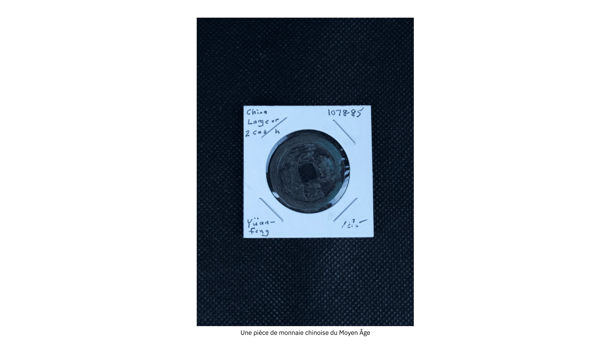

Voici une pièce de monnaie de la Chrine qui date du Moyen Âge. Il s’agit d’une pièce coulée avec un trou carré au milieu. Cela permettait de passer une corde puis faire des espèces de bracelets ou des colliers, mais pas nécessairement pour porter, c'était plus pour la comptabilité. Ça permettait de les mettre ensemble et de former des sorte d’unités de compte sous forme de grandes ficelles avec les pièces imbriquées une sur une. Il n'y avait pas nécessairement des marques spécifiques, parfois c'était simplement des ronds de bronze.

Le monopole monétaire de l’État, instauré tardivement par Wudi des Han en 113 av. J.-C., était souvent remis en cause, permettant ainsi à divers acteurs privés ou locaux d’émettre leurs propres monnaies, à condition que celles-ci bénéficient d'une confiance sociale suffisante.

**La valeur intrinsèque faible des monnaies chinoises évitait la thésaurisation, garantissant ainsi leur circulation fluide**. En effet, les métaux précieux étaient rarement utilisés comme monnaie courante pour éviter leur thésaurisation. Ils ne voulaient pas utiliser l'or parce que l'or, ça valait trop cher, donc thésaurisé. C'était ça le concept. **Seule la soie représentait une réelle monnaie de haute valeur dans les échanges internationaux chinois**. Les Chinois faisaient du commerce extérieur avec de la soie, pas avec de l’or.

Lors de crises économiques ou monétaires, notamment lorsque le prix du cuivre montait, des solutions innovantes furent adoptées : ainsi, dès le IIe siècle apr. J.-C., des monnaies en circulation furent coupées pour créer des unités plus petites, permettant de maintenir une circulation fluide à moindre coût. **D’autres périodes, telles que celle de Wang Mang (début Ier siècle apr. J.-C.), expérimentèrent des monnaies fortement fiduciaires avec des valeurs faciales très supérieures à leur contenu métallique réel, préfigurant ainsi les billets de banque**. Ce que ça veut dire, c'est qu'ils prenaient une pièce et estampaient disons 50, 100, 200 dessus pour représenter 200 pièces. Ça devait créer beaucoup d'inflation.

Ce système reposait, comme mentionné précédemment, sur une convention sociale entre l'État, les producteurs et les commerçants mais aussi sur des règles autoritaires et sévères pour ceux qui ne jouaient pas le jeu notamment en lien avec le choix des pièces (belles ou pas belles) ou la longueur des tissus (non conforme à l’étalon). 

À mon humble avis, ce n'est pas très solide comme système. Il reposait surtout sur des règles strictes pour les fonctionnaires et les commerçants pour qu’ils acceptent les pièces endommagées, sous menace de sanctions.

### Innovations monétaires chinoises et leur impact économique

La Chine est également pionnière dans l'émission de formes précoces de monnaie papier, initialement adoptées en réponse à une pénurie de métal au IXe siècle apr. J.-C. Malgré leurs avantages initiaux, ces monnaies papier ont régulièrement conduit à des spirales inflationnistes lorsqu'elles étaient émises en trop grande quantité, comme en témoignent les périodes Song ou Ming, où des émissions excessives entraînèrent de graves crises monétaires, illustrées par Marco Polo au XIIIe siècle, qui nota même que la falsification de cette monnaie papier était punie de mort. Je ne peux m'empêcher de souligner une forme de violence ici.

Ainsi, l’expérience chinoise se caractérise par une conception profondément fiduciaire de la monnaie, une flexibilité remarquable du système monétaire et une utilisation précoce des monnaies papier, fondées sur la confiance entre les acteurs économiques plutôt que sur la valeur intrinsèque des supports utilisés.

## Organisation sociétale et économique durant l’antiquité 
<chapterId>4023c3ce-7a47-5ac4-8f5f-c7ab699ab20f</chapterId>
:::video id=2761efe4-21cf-4f06-9bda-c03f9ff39012:::

### Le Débat sur le Parasitisme Urbain

La relation entre les cités antiques et leur arrière-pays soulève une question fondamentale : ces centres urbains fonctionnaient-ils comme des parasites extracteurs de richesses, ou comme des moteurs de spécialisation économique bénéfique ? L'hypothèse du parasitisme suggère que les villes de l'âge de bronze, notamment en Mésopotamie, **extrayaient systématiquement plus de valeur de leurs territoires ruraux qu'elles n'en retournaient**, vivant essentiellement de rentes et de taxes sans créer de valeur équivalente.

Cette vision trouve un écho dans l'effondrement de l'Empire romain : lorsque l'expansion territoriale cesse, les flux de richesses extérieures se tarissent, révélant potentiellement une économie urbaine incapable de s'autofinancer. Les cités auraient ainsi vécu "au-dessus de leurs moyens", dépendantes de l'extraction plutôt que de la production.

### La Spécialisation Comme Moteur de Création de Valeur

Une lecture économique alternative conteste cette vision parasitaire. **Les cités antiques fonctionnaient avant tout comme centres de spécialisation et de division du travail**. Leur rôle dépassait la simple extraction : elles concentraient l'artisanat spécialisé, organisaient les réseaux commerciaux, et servaient de plaques tournantes pour les échanges à longue distance.

Cette spécialisation urbaine créait une interdépendance productive avec l'arrière-pays. **Les villes ne pouvaient survivre sans l'approvisionnement agricole rural, mais l'arrière-pays bénéficiait en retour des produits artisanaux, des innovations techniques, et de l'accès aux réseaux commerciaux méditerranéens**. La division du travail permettait des gains de productivité mutuels, même si la répartition des bénéfices pouvait sembler déséquilibrée.

L'insécurité alimentaire chronique de l'époque explique partiellement cette asymétrie apparente. Les risques de famine et de destruction des récoltes fragilisaient constamment les populations rurales, tandis que les artisans urbains, connectés aux réseaux d'échange internationaux, jouissaient d'une plus grande stabilité économique.

### Évolution Historique, De l'Antiquité au Moyen Âge

Le contraste entre l'organisation antique et médiévale éclaire cette problématique. **L'Antiquité privilégiait une division du travail à grande échelle, avec des villes ouvertes sur l'ensemble du monde méditerranéen**. Le commerce et la spécialisation atteignaient des niveaux sophistiqués, créant des réseaux économiques étendus.

L'effondrement romain provoque une fragmentation radicale : **l'époque féodale substitue à cette organisation centralisée un système décentralisé de domaines autarciques**. Les anciennes villas rusticae romaines deviennent la matrice des seigneuries médiévales, créant une mosaïque d'îlots économiques quasi-autosuffisants gérés par le clergé ou la noblesse.

Cette décentralisation médiévale, bien que réduisant l'efficacité commerciale, offrait paradoxalement une plus grande résilience face aux chocs externes. Les domaines féodaux développaient des relations plus équilibrées entre centres de pouvoir et populations rurales, même si cette organisation limitait les gains de productivité liés à la spécialisation.

### L'Émergence des Marchés Urbains

Les découvertes archéologiques révèlent l'existence de **ports commerciaux et quartiers marchands dans les cités mésopotamiennes dès le deuxième millénaire**. Ces infrastructures attestent de l'existence de marchés organisés, même si leur fonctionnement exact reste débattu.

Karl Polanyi, initialement sceptique sur l'existence de véritables mécanismes de marché dans l'Antiquité, a nuancé sa position en reconnaissant avoir possiblement sous-estimé l'émergence précoce des échanges marchands. Cette évolution intellectuelle reflète la complexité de l'interprétation des systèmes économiques antiques, où coexistaient redistributions institutionnelles, échanges de réciprocité, et transactions marchandes naissantes.

### Sparte contre Athènes

La comparaison entre Sparte et Athènes illustre parfaitement la relation entre système monétaire et organisation sociale. **Sparte représente un modèle de société rigidement hiérarchisée qui rejette délibérément l'usage de la monnaie**, tandis qu'Athènes développe une économie monétaire sophistiquée accompagnant son système démocratique.

Le rejet spartiate de la monnaie n'était pas spontané mais **institutionnel et idéologique**. Les dirigeants spartiates craignaient que la monnaie ne corrompe les valeurs militaires et civiques, privilégiant un système basé sur la confiance interpersonnelle directe entre citoyens.

Pour dissuader l'usage monétaire, Sparte utilisait des **barres de métal lourdes et impraticables**, démontrant paradoxalement une compréhension intuitive des qualités monétaires (divisibilité, transportabilité, durabilité) qu'ils s'efforçaient de neutraliser.

### Les Limites du Modèle Anti-Monétaire

L'organisation spartiate illustre les contraintes du **nombre de Dunbar** appliquées à l'échelle sociétale. **En rejetant la monnaie comme intermédiaire d'échange neutre, Sparte se condamnait à limiter sa société civique à un nombre restreint de citoyens capables de maintenir des relations de confiance directe**. Les homoioi (citoyens spartiates) ne représentaient qu'environ 1% de la population totale, entourés de milliers d'hilotes (esclaves).

Cette organisation, initialement source de cohésion militaire exceptionnelle, s'avéra structurellement fragile. **La bataille de Leuctres (371 av. J.-C.) démontra les limites de ce système** : les pertes humaines subies brisèrent irrémédiablement le tissu social spartiate, entraînant l'effondrement de leur modèle civilisationnel.

Les cités concurrentes (Athènes, Corinthe, Thèbes), dotées de systèmes monétaires développés, **maintenaient des économies plus riches et plus résilientes**, capable de compenser les pertes humaines par la reconstruction économique et l'immigration.

### Confiance Personnelle versus Confiance Institutionnelle

L'expérience spartiate révèle les **risques inhérents à une société basée exclusivement sur la confiance interpersonnelle** plutôt que sur des mécanismes institutionnels neutres. Bien que créant une cohésion sociale intense, ce modèle rendait la société vulnérable aux chocs démographiques.

La monnaie, en permettant des **transactions anonymes et dépersonnalisées**, offre une résilience systémique supérieure. Elle autorise l'expansion sociale au-delà des limites de la confiance directe, facilitant les échanges avec l'étranger et la croissance économique.

### Le Paradoxe Inca, Richesse sans Monnaie

L'Empire inca présente un paradoxe fascinant : **une civilisation disposant d'immenses richesses aurifères mais dépourvue de système monétaire**. Comme Sparte, ce modèle reposait sur une organisation hiérarchique rigide et une planification centralisée, mais s'avéra vulnérable face à des conquistadors disposant d'économies monétaires flexibles.

Cette fragilité structurelle des systèmes anti-monétaires face aux sociétés monétaires constitue un pattern historique récurrent, suggérant que **le rejet institutionnel de la monnaie, loin de renforcer la cohésion sociale, peut paradoxalement fragiliser les civilisations** face aux défis externes et aux changements historiques.

L'analyse de ces modèles historiques révèle que la monnaie, au-delà de sa fonction d'échange, constitue un marqueur et un facilitateur de complexité sociale, permettant aux civilisations de dépasser les limites imposées par les relations interpersonnelles directes.

# La naissance de la monnaie frappée
<partId>232e365a-8c3b-11f0-b276-b3ab70d1a5a1</partId>

## L’émergence des pièces de monnaie
<chapterId>40ed3414-3066-57bd-bc1b-617ad0a354e0</chapterId>
:::video id=1d6834c4-98a3-43fe-ba80-04be51b0486e:::

Nous en sommes maintenant arrivés au point névralgique de l'apparition des pièces de monnaie à proprement parler. J'insiste ici sur le mot pièce parce qu'on a bien vu dans les sections précédentes que la monnaie ou les systèmes monétaires étaient bien présents dans les civilisations qui ont précédé les peuples de Lydie, les Grecs, les Perses. C'est assez clair je pense avec ce qu'on vient de voir. Et donc cette section est dédiée à l'apparition des pièces de monnaie à proprement parler et s’intitule: *L'émergence des pièces de monnaie*.

### L'origine lydienne et ionienne des pièces de monnaie

Pour débuter cette section je vous propose un extrait du livre A History of Money de Glyn Davies juste ici.

*Extrait de A History of Money: From Ancient Times to the Present Day de Glyn Davies:*

> À partir de son lieu d'origine en Lydie et en Ionie, la connaissance et l'utilisation des pièces de monnaie se sont rapidement propagées vers l'est, au sein de l'empire perse, et vers l'ouest, à travers les îles Ioniennes et Égéennes jusqu'à la Grèce continentale, puis vers ses colonies occidentales, en particulier la Sicile. Cette innovation s'est également diffusée vers le nord, atteignant la Macédoine, la Thrace et la mer Noire, mais n’a été acceptée que partiellement, tardivement et à contrecœur en Égypte. 

Je trouve intéressant de mentionner ici qu’en Égypte ils ont continué de peser les pièces longtemps même après l’avènement de la technologie des pièces de monnaie frappées. Je trouve ça important de le mentionner. On poursuit la citation:

> De même, l'Italie continentale fut initialement lente à adopter ces innovations financières grecques, contrastant avec la rapidité d'acceptation observée en Sicile.

*Hormis ces deux exceptions limitées (l'Italie continentale et la Basse-Égypte), l'utilisation de la monnaie s'est rapidement répandue autour des pays bordant la Méditerranée centrale et orientale, ainsi qu’à travers le vaste et croissant empire perse, depuis la Mésopotamie **jusqu’en Inde.** Il subsiste un doute quant à savoir si l'Inde avait déjà développé de manière autonome à cette époque un embryon de système monétaire, indépendamment des développements chinois ou lydiens. Indépendamment de la question de savoir si l’Inde a inventé elle-même sa monnaie, les contacts de plus en plus étroits entre l'Inde et le Proche-Orient eurent pour résultat pratique que le monnayage indien devint une adaptation directe de l'invention lydienne et grecque, par l'intermédiaire d'abord de l'empire perse puis de l’empire macédonien* (avec les conquêtes d’Alexandre Legrand et son père).

*Pour ces raisons, l'influence directe d'une éventuelle invention indigène indienne de la monnaie fut mineure, comparativement à l'importance écrasante des inventions monétaires clairement indépendantes de la Chine à l'est, et encore davantage des développements lydiens et grecs à l'ouest.*

### La diffusion géographique et les adaptations régionales

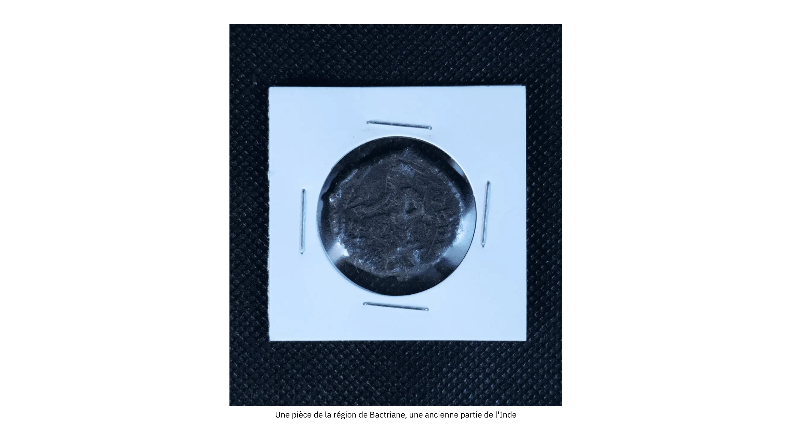

Pour illustrer cette époque, voici un pièce de la région de l'Indes, une pièces de la région Bactriane qui est un peu à l'Ouest de la péninsule indienne, proche de l'Afghanistan dans cette zone-là, on retrouvait des pièces qui étaient probablement inspirées des pièces grecques où figure une de leur personnalité royale.

## Les Lydiens et les Perses
<chapterId>eb802ab8-8ffd-5b25-907f-8944f120ed14</chapterId>
:::video id=f151eb42-5ff3-4ca1-9af1-1ae2a5e051c0:::

### Les premières pièces lydiennes en électrum

Comme on ne peut pas séparer l'apparition des pièces de monnaie de la Lydie et des Perses, transportons-nous vers cette région du monde à l'est de la Grèce et qui forme aujourd'hui la Turquie. L'apparition des premières pièces de monnaie en Occident remonte approximativement au milieu du VIIe siècle avant J.-C., dans les régions de Lydie et d'Ionie, situées dans l'actuelle Turquie. C'est vers 650 à 600 av. J.-C. que cette innovation fondamentale voit le jour, avec des découvertes archéologiques notables comme les premières pièces trouvées dans le temple d'Artémis à Éphèse, datées autour de 600 av. J.-C. Ces pièces primitives étaient constituées d'électrum, un alliage naturel d'or et d'argent aux reflets ambrés, et avaient souvent une apparence grossière, simplement marquées de poinçons ou de motifs rudimentaires.

J'ai ici une des premières pièces lydiennes qui représente une espèce de lion avec une proie à l'avant et on remarque qu'il y a souvent une étampe, une espèce de trou formé à l'arrière et certains pensent que c'est peut-être pour évaluer la pureté du métal pour éviter que ce soit juste une espèce de couche en superficie. Ça c'est une des premières pièces. Cette pièce-là, évidemment, c'est une copie. Toutes mes pièces en or ou en électrum sont des copies ou des recréations modernes pour éviter de passer toutes mes économies dans cette collection.

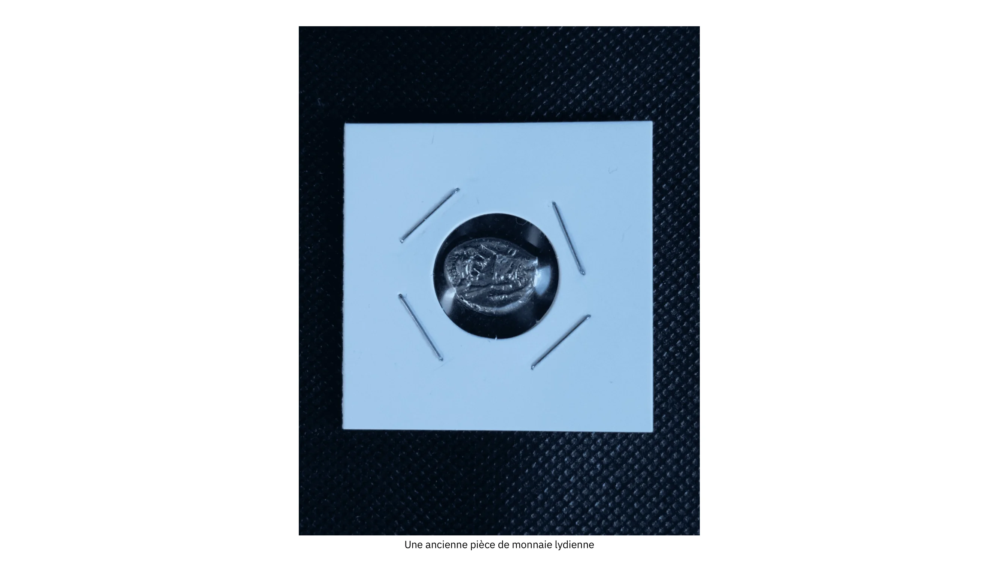

Mais j'ai aussi une vraie pièce perse que l'on va voir à l'instant. C'est à quoi ressemblaient ces premières pièces. C'est comme des espèces de blobs, de lumps en anglais, de métaux qui étaient étampés à l'époque.

Contrairement à l'idée répandue selon laquelle la monnaie aurait été inventée pour faciliter les échanges quotidiens et remplacer le troc, il semble que les premières monnaies lydiennes, achéménides et grecques n'aient pas servi initialement au petit commerce. En effet, les unités monétaires sont beaucoup trop grosses pour un usage quotidien. De plus, leur circulation restait limitée à des régions proches de leur lieu de fabrication.

Ici, je trouve important de mentionner que, bien que j'ai lu dans plusieurs ouvrages d'allégeance anthropologique, que les pièces, comme j'ai déjà montré, celle en électrum ou cette pièce perse à laquelle je vais revenir dans très peu de temps, étaient trop grosses pour acheter du pain, disons, tous les jours. J'ai vu des estimations qui, pouvaient nous faire penser que c'était l'équivalent d'une journée de travail pour un paysan ou pour un soldat, donc ce serait trop gros. C'est comme si vous essayiez de payer avec une journée de salaire pour votre repas, pour votre petit-déjeuner ou votre déjeuner. Sauf que j'ai vu dans d'autres ouvrages qu'on a retrouvé des unités plus petites de ces blobs, donc des pièces plus petites, qui peuvent nous faire penser que peut-être qu'il y avait une utilisation possible pour des achats quotidiens.  
Donc ici, la “preuve” anthropologique que ce n'était pas utilisé pour du commerce quotidien, parce que la dénomination ou l'unité était trop grosse, n’est pas très solide à mon avis car avons trouvé des exemples de pièces qui sont plus petites, qui auraient pu être adaptées aux achats quotidiens.

### Le rôle de l'État dans la création monétaire

L'origine réelle des pièces de monnaie semble plutôt liée à l'action directe des États. Deux grandes hypothèses existent à ce sujet : la première, idéaliste, fait un parallèle entre le terme grec nomisma (monnaie) et nomos (loi), suggérant que la monnaie était liée à la codification des lois, renforçant l'autorité et l'organisation politique des cités. La seconde hypothèse, plus réaliste et largement admise aujourd'hui, est que la monnaie aurait d'abord constitué un moyen pour les États d'exercer un contrôle économique et social. En garantissant officiellement le poids et la valeur des métaux précieux qu'elles contenaient, les États pouvaient ainsi manipuler la circulation et la valeur de ces pièces, créant des primes de confiance et de liquidité propres aux monnaies domestiques.

C’est super intéressant de savoir qu'on a des preuves de ça. Par exemple, dans les pièces en électrum, il faut savoir que l'électrum naturelle a normalement environ 70 % d'or et 30 % d'argent, et dans les premières pièces qu'on trouve où on a analysé les quantités de ces métaux, pour les premières pièces de la Lidy, il semblerait que c'est plus autour de 50 à 55 % d'or au lieu de 70, donc on pourrait voir que déjà, à cette époque, les émetteurs de monnaies essayaient de réduire la part du métal plus précieux probablement pour pouvoir en produire plus et mettre un saut pour faire comme si elle valait la même chose qu'un blob d'électrum naturel non marqué. Et ici, il faut dire que c'est vraiment à partir de l’époque de ce fameux Crésus, comme dans *riche comme Crésus*, que c'était possible parce que c'est à partir de son époque qu'on avait la technologie pour séparer l'or et l'argent.

La monnaie lydienne connut une évolution importante sous le règne du célèbre roi Crésus (561-546 av. J.-C.), réputé pour sa richesse légendaire. À cette époque, les Lydiens perfectionnèrent la métallurgie pour séparer l'or et l'argent de l'électrum, introduisant ainsi les premières monnaies bimétalliques, c'est-à-dire distinctes en or et en argent.

### L'expansion perse et l'adoption grecque

Lorsqu'ils conquirent la Lydie en 546 av. J.-C., les Perses achéménides adoptèrent immédiatement cette innovation. Vers 500 av. J.-C., sous le règne de Darius Ier, les Perses établirent leur propre système monétaire avec des darics en or et des siglois en argent, portant souvent l'effigie royale dans des postures guerrières. Cette monnaie royale persane était principalement utilisée dans les régions hellénisées de l'Empire perse et se répandit progressivement, bien que son usage reste inégal, **certaines régions, comme l'Égypte, continuant de préférer l'échange en métal pesé (bullion).**.

J'ai ici un vrai sigloi ou siglos perse. Le petit design qu'on a ici représente un roi avec la trouche un peu effacée. C'est cette pièce en argent et contrairement au darik lui qui était en or. Ils étaient donc en mesure de séparer ces deux métaux, ce n'était plus des pièces d'électrum, ils ont séparé les pièces d'or et les pièces d'argent avec un bimétallisme, mais avec le même concept de blob de pièces de métal précieux avec un trou à l'arrière, encore là on suppose que c'était pour en vérifier la teneur en métal.

L'adoption rapide de la monnaie par les Grecs semble avoir été stimulée par leurs contacts étroits avec les Lydiens, notamment par les colonies grecques d'Asie Mineure. Les premiers Grecs à frapper monnaie furent probablement les habitants d'Égine vers la mi-VIe siècle av. J.-C., introduisant notamment la drachme, dont le poids variait selon les régions, et dont le nom signifie littéralement "poignée de grains» ou une “poignée de flèches”.

Le succès de la monnaie grecque est lié aussi bien à sa commodité pour les transactions importantes, comme le paiement des mercenaires, qu'à l'expansion économique et politique des cités. La monnaie devint alors rapidement un élément central de l'économie grecque et, plus tard, romaine, tout en conservant une dimension symbolique forte, notamment par son association à la loi (nomos).

Enfin, l'expansion rapide des pièces de monnaies témoigne d'une transformation profonde des sociétés antiques, où la codification des valeurs monétaires allait de pair avec l'organisation étatique. Cette évolution posera les bases économiques et politiques pour l'essor des démocraties grecques, en particulier à Athènes, où la monnaie jouera un rôle crucial dans le fonctionnement de la cité démocratique.

Un point essentiel à retenir de cette section est que nous parlons spécifiquement des **pièces de monnaie** et non de la monnaie en général. L'aspect central qui ressort clairement est celui de la **confiance envers l'autorité émettrice**, directement liée aux caractéristiques techniques des pièces (poids, pureté, valeur nominale). C’est précisément cette confiance qui permet à l'État ou à l'autorité émettrice d’exercer un certain contrôle ou même de manipuler la valeur et la circulation de ces monnaies dès leur origine. 

## L’intervention institutionnelle et les premières pièces de monnaie 
<chapterId>3e1efd08-99e3-5a32-9908-3185fef0e640</chapterId>

:::video id=84847cf6-9e46-4a8c-9f35-25a27496cc4b:::

### La double nature de la monnaie 

L'émergence de la monnaie frappée soulève une question fondamentale : la monnaie est-elle une création spontanée du marché ou une institution imposée par l'autorité ? Cette tension conceptuelle oppose deux visions radicalement différentes.

D'un côté, l'école autrichienne d'économie défend l'idée que la monnaie marchandise - particulièrement l'or - a été naturellement sélectionnée par les acteurs économiques pour ses qualités intrinsèques : durabilité, portabilité, divisibilité et fongibilité. Dans cette perspective, l'État s'est ensuite accaparé cette monnaie spontanée pour en contrôler l'offre. C'est une institution qui émerge naturellement des besoins du marché avant d'être captée par le pouvoir politique.

À l'opposé, la vision anthropologique et institutionnelle soutient que la monnaie naît véritablement avec la frappe étatique. L'autorité créerait consciemment la monnaie en y apposant son sceau, transformant ainsi le métal en véritable instrument monétaire. Cette perspective suggère que les premières pièces lydiennes servaient principalement au paiement des armées - un statère correspondant approximativement au salaire journalier d'un soldat.

### Les avantages paradoxaux de la standardisation étatique

Malgré cette tension théorique, même les économistes autrichiens reconnaissent certains bénéfices à l'intervention étatique dans la monnaie. La standardisation par frappe résout plusieurs problèmes pratiques du commerce.

Sans autorité de certification, les acteurs économiques font face à des risques constants : pièces falsifiées, fraudes au limage, manipulations du poids. Ces pratiques créent des frictions dans l'économie, certaines pièces étant acceptées tandis que d'autres sont refusées. L'estampe officielle garantit théoriquement le poids et la qualité, fluidifiant ainsi les échanges.

Cette garantie a un prix observable sur le marché : une pièce d'or frappée vaut plus que son équivalent en or brut. Ce premium reflète la valeur de la certification - les marchands n'ont plus besoin de vérifier eux-mêmes l'authenticité du métal par des tests chimiques ou de résonance. L'intervention étatique, paradoxalement, élimine des frictions et facilite le commerce en créant une confiance institutionnalisée.

### La manipulation monétaire dès l'origine 

L'histoire des premiers statères lydiens révèle une ironie troublante. Les analyses récentes montrent que la teneur en or de ces pièces d'électrum était systématiquement inférieure à celle de l'électrum naturel. L'autorité qui certifiait la qualité manipulait simultanément la composition.

Cette pratique illustre la double utilité de la frappe monétaire. Pour le marché, elle fluidifie les échanges et offre une garantie de standardisation. Pour l'autorité émettrice, elle devient un outil de contrôle économique par la dilution. En réduisant la teneur en or tout en maintenant la valeur nominale, l'État augmente effectivement la masse monétaire - créant plus d'unités monétaires à partir de la même quantité de métal précieux.

L'État lui-même reste toutefois contraint par cette manipulation. Comme l'illustre l'exemple du solidus d'or de Constantin au IVe siècle, l'administration romaine vérifiait scrupuleusement la qualité des pièces car elle exigeait d'être payée en bonne monnaie. L'autorité a un intérêt vital à maintenir la qualité de sa propre monnaie pour garantir la valeur de ses revenus fiscaux.

### L'analyse économique de la dévaluation 

L'étude de la dévaluation monétaire révèle des patterns constants à travers l'histoire. Pour les monnaies métalliques, les économistes suivent le pourcentage de métal précieux contenu dans les pièces - une courbe descendante indiquant la dévaluation progressive. Pour la monnaie fiduciaire moderne, c'est l'inverse : on observe la masse monétaire circulante, dont l'augmentation signale la dévaluation.

Les deux méthodes mesurent le même phénomène fondamental : la dilution de la valeur monétaire. Que ce soit par la réduction de la teneur en métal précieux ou par l'impression de nouveaux billets, le mécanisme reste identique. Plus l'autorité crée d'unités monétaires à partir des mêmes ressources réelles, plus chaque unité perd de sa valeur.

Cette manipulation, observable dès les premières pièces lydiennes, suggère que le contrôle monétaire a toujours été un enjeu de pouvoir. La monnaie frappée représente ainsi une innovation technique remarquable doublée d'un instrument de contrôle économique - une dualité qui traverse toute l'histoire monétaire jusqu'à nos systèmes contemporains.

## La fabrication des pièces
<chapterId>b205f4f2-c293-5308-b812-a998de9ad45e</chapterId>

:::video id=47c612ec-d97e-4498-b50e-7e66518bd56d:::

### Des blobs poinçonnés aux pièces frappées

Donc comme nous venons de faire une section sur l'émergence des pièces de monnaie, je voulais faire une très courte section sur l'évolution de la fabrication les pièces. Comme nous l'avons vu, tout ça commence avec des blobs d'électrum et ensuite d'or et d'argent, où on marquait avec un poinçon les deux faces, soit avec la tronche du roi ou un trou à l'arrière pour vérifier la pureté.

Ensuite, ce qu'on va voir dans une section subséquente, les Grecs ont perfectionné cette technologie en faisant des pièces rondes qui étaient frappées au marteau sur les deux faces et donc on installait une pièce ronde, plate de métaux précieux qui était lisse et on frappait au marteau les deux côtés avec un modèle où on avait gravé à l'inverse la marque qu'on voulait inscrire et on cognait comme ça, à la main, les pièces.

Et d'ailleurs cette technologie de frappe à la main, une par une, a probablement aidé à contrôler la notion d'inflation à cette époque, même si on diluait fortement les pièces de monnaie pour en produire plus. C'est ce qu'on va voir définitivement dans la période romaine et un peu dans la période grecque durant certaines guerres. Cette notion de fabrication de pièces une à la fois, limitait quand même la capacité de production de l'autorité et avait un effet, disons, positif sur le contrôle de l'inflation malgré les énormes dévaluations qu'on a pu voir. Donc on est passé d'un blob qui était poinçonné à une pièce ronde qui était frappée au marteau.

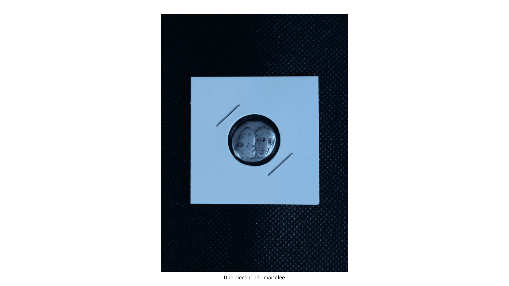

### L'évolution médiévale 

On a aussi une notion dont je voulais parler, je pourrais le faire avec cet outil métallique ici.  
Il y avait une notion aussi éventuellement au Moyen-Âge d'étalement de la pièce, donc on la faisait de plus en plus large, de plus en plus mince et une des raisons c'était que c'était plus facile de tester le son. Comme ça, en étalant l'argent, ça faisait une fréquence et on pouvait valider une notion de pureté de la pièce simplement en l'écoutant. C'est d'où vient l'expression d'ailleurs argent sonnant. Et le trébuchant Dans l'argent sonnant et trébuchant, c'était la notion du trébuchet pour le peser. Et donc on est passé de pièces rondes, petites, à des pièces un peu plus minces et plus larges.

### La frappe au balancier

Et la dernière technologie arrivée à la fin du Moyen-Âge, au début de l'ère moderne j'imagine, c'est la notion de frappe au balancier. Et là, c'était une sorte de vis que l'on serrait pour frapper les pièces, donc générer les pièces avec cette nouvelle forme de frappe. Et ce que ça avait de particulier, c'est qu'on pouvait mettre un motif sur l'extérieur de la pièce pour essayer de régler le problème de l'écrêtage où on enlevait une certaine partie de la pièce pour récupérer l'argent précieux et peut-être couler d'autres pièces ou simplement garder le métal en tant que ressource.

Donc cette notion de frappe au balancier a aidé avec ce phénomène d'écrêtage. Et fait intéressant à noter que c'est une technologie qui est venue de la France en fait. En Angleterre par exemple, ils ont engagé des ingénieurs français pour venir leur montrer comment faire ces machines. Et ce qui est loufoque, je trouve, c'est qu'il y a des partisans des monnaies frappées au marteau qui étaient contre et qui ont retardé l'application de cette technologie. Comme quoi dans toute bonne technologie, il y a toujours des gens qui sont réfractaires, qui veulent garder l'ancienne technologie. J'avais trouvé ça assez loufoque de me rendre compte que même une technologie qui semble vraiment supérieure, on peut faire plus de pièces, ils sont plus difficiles à copier, il y avait encore des gens qui étaient attachés à la fameuse méthode du marteau et il y a eu un passage entre des productions de pièces qui étaient faites avec cette fameuse frappe au balancier pour ensuite retourner à la frappe au marteau. Et finalement, c'est la frappe au balancier évidemment qui a fini par s’installer et nous a donné ces belles pièces modernes où on peut retrouver soit des petites lignes, des petites crêtes autour pour éviter l'écrêtage, probablement que ça a un lien avec le mot écrêtage, les crêtes, et on peut voir encore aujourd'hui soit des crêtes ou du texte ou des dessins qui sont inscrits sur le rebord de la pièce.

# Les différentes théories sur l'émergence de la monnaie
<partId>72ac694f-9248-550d-90c1-91af3d234380</partId>

## Théories sur l’émergence de la monnaie et ses différentes définitions
<chapterId>7d699d4d-8c70-55b5-bf36-609f3fd90bcf</chapterId>
:::video id=523c873f-501b-4954-b79f-7e74c0f685a5:::

Bienvenue dans ce segment qui est dédié aux différentes théories sur l'émergence de la monnaie et ses différentes définitions. Voici un court extrait du livre *Aux origines de la monnaie* qui, je trouve, résume assez bien et de manière très succincte les deux thèses principales auxquelles nous nous intéresserons dans cette section. 

> Ce rapide préambule n'a d'autre but que de mettre en relief le contexte de l'enquête. Sur le plan conceptuel, le débat est ouvert entre les tenants de la thèse de K. Polanyi et les adeptes de celle de M. Weber. Pour les premiers, le don et la redistribution tiennent une place centrale, l'échange marchand ne jouant qu'un rôle marginal, principalement dans les échanges internationaux. Pour les autres, au contraire, le marché est au cœur du processus historique en cours.

Par exemple, pour la Mésopotamie, une des théorie sur l’émergence est que le temple, l'autorité, crée l'unité de compte ou l'unité monétaire, l'impose, et ensuite, les marchands l'adoptent pour faire du commerce. La théorie opposée, c'est que non, cette unité monétaire émerge naturellement du marché pour permettre ce fameux commerce. Et on a des exemples bien sourcés de ça en Mésopotamie.

Pour le troc, certaines théories proposent qu’il aurait principalement été utilisé dans les échanges internationaux, donc avec les gens avec lesquels on n'a pas confiance, tout simplement.

C'est donc le travail qu'on va faire dans cette partie. On va faire une sorte d'enquête pour présenter les différentes théories sur l'émergence de la monnaie et les différentes définitions de ce qu'est la monnaie. On va autant présenter et critiquer  les thèses des économistes classiques que les thèses des anthropologues. J'aurai même la chance d'avoir Ulrich Fromy avec moi, qui va nous présenter l'angle d'un économiste autrichien sur ces différents sujets.

## L’émergence de la monnaie pour les économistes classiques
<chapterId>1d3776cd-0dfd-5297-af48-c6f41e257a7e</chapterId>

:::video id=873a16c1-17ac-448d-8941-df4feb7ab79d:::

Ce segment est dédié aux différentes théories sur l'émergence de la monnaie. Le premier sujet que l'on va couvrir est l'émergence de la monnaie pour les économistes classiques.

### La théorie classique d'Adam Smith 

Selon les théories économiques classiques, en particulier celle défendue par Adam Smith, la monnaie émerge naturellement du troc en réponse à ses limites. Au départ, les échanges étaient réalisés par le troc direct, mais cette méthode était souvent compliquée par le problème de la "double coïncidence des besoins" : il fallait que chaque personne possède exactement ce que l’autre désirait. Progressivement, certaines marchandises (comme le sel, les métaux précieux, ou le bétail) ont été acceptées par tous comme moyen d'échange intermédiaire grâce à leur utilité, leur durabilité et leur divisibilité. Ainsi, la monnaie apparaît spontanément pour faciliter et fluidifier les échanges économiques.

### Critique de la théorie classique 

Voici ma critique de cette théorie. Avec tout ce qu'on a vu dans la section précédente, je pense qu'on peut déjà affirmer que cette notion que les **pièces monnaie** sont une évolution du troc est erronée tout simplement parce que la pièce de monnaie frappée émerge définitivement de l'autorité, puisqu'elle est frappée par l'autorité. Il y a plusieurs raisons à ça notamment le désire des autorités de contrôler l'économie, de prendre le contrôle sur la monnaie

Par contre, si on parle de la monnaie en tant que concept, pas nécessairement des pièces de monnaie, là, c'est moins clair parce que déjà avec les premières pièces de monnaie, les statères lydiens, on a trouvé des blobs d'argent qui n'étaient pas marqués. Reste à savoir si ils circulaient. S'ils circulaient, ça veut dire que les gens ont peut-être identifié à la base ce bien-là comme une potentielle monnaie qui pouvait être demandée généralement et être échangée facilement. Et c'est peut-être qu'après que l'autorité a remarqué cette situation et en a pris le contrôle en mettant une étampe dessus pour le certifier.

Il y a beaucoup d'avantages à faire ça, pas besoin de le vérifier, le peser, tout ça. Évidemment, on en parlera. Mais selon moi, je pense que les pièces de monnaie, c'est clairement un outil qui a été utilisé de la part des États dès l'origine. Mais après, au niveau de l'émergence de la monnaie en tant que tel, on ne le sait pas si ça vient vraiment d'une autorité qui l'a imposé ou si ça émerge par le commerce ou les échanges marchands. J’aurai une discussion très intéressante à ce sujet avec mon collègue Ulrich plus tard dans cette section.

Déjà on sait que les première pièces de monnaie de métaux précieux n’ont pas été utilisées pour fluidifier les échanges quotidiens parce que leur valeur était bien trop grande. On sait aussi qu’elles ont surtout été utilisées pour les paiements militaires. Ça, c'est un bon argument pour la thèse que la monnaie n’a pas nécessairement émergé du marché. C'est que les unités de compte, les dénominations des premières pièces de monnaie étaient probablement trop grandes pour, disons, acheter du pain ou faire des emplettes quotidiennes. Ça pouvait par exemple équivaloir à l'équivalent d'une journée de salaire. Pas nécessairement que les gens étaient payés avec des salaires à l'époque, mais c'est pour vous donner une idée de l'ampleur. Ces pièces avaient donc probablement un trop grand pouvoir d’achat pour être utilisées dans le petit commerce. Par contre, il n'y a rien qui dit que ces pièces n'auraient pas été utilisées pour faire des échanges plus gros, par exemple des échanges marchands. On sait qu'elles ont surtout été utilisées pour les paiements militaires. C'est une des théories très répandues pour expliquer l'apparition des premières pièces de monnaie. Je vous le rappelle, ici, on parle des pièces de monnaie, pas nécessairement de la monnaie en général. Donc, les premières pièces de monnaie ont eu leur premier rôle, c'était de payer les paiements militaires, les mercenaires.  
Par exemple, Alexandre Legrand en a fait grand usage, on le verra plus tard.

On a aussi vu que dès la Chine antique, les cauris servaient aux échanges économiques (**rémunérer le travail, mesurer la valeur et acheter des biens fonciers)**. Qui plus est, en Mésopotamie et en Égypte, des systèmes monétaires fonctionnels existent déjà et servent aux échanges, aux paiements de salaire et aux paiements de taxes. Ce que je suggère ici c’est qu’il est définitivement erroné de penser que les pièces de monnaie dans la conception occidentale émergent du besoin de fluidifier les échanges. 

Les pièces de monnaie, comme elles sont émises par une autorité, on peut peut-être penser que depuis le début, elles sont liées aux autorités émettrices. C’est logique. Par contre, on ne sait pas nécessairement comment ont émergé les formes de monnaie ou les formes de système monétaire, les proto-monnaies, qui les ont précédées. D'un côté, on va vous proposer que ce sont les temples qui ont identifié ces unités monétaires et, après, les gens l'ont utilisée. Et, de l’autre, on va vous dire, non, c'est les marchands qui avaient besoin d'un moyen d'échange, une façon d'échanger avec l'extérieur, et c'est eux qui ont identifié, par exemple, l'argent métal, pour être utilisé parce que c'était demandé par l'extérieur. Ce qu’il faut retenir c’est qu’on ne le sait pas vraiment. C'est pour ça qu'on a les deux théories qui s'opposent. On n'a pas de preuve parfaite qui va nous expliquer est-ce que la monnaie émerge naturellement du besoin de commercer, par exemple des marchands, ou ça émane de l'autorité.

### Distinguer pièces de monnaie et monnaie primitive

En conclusion, je pense qu'on peut dire que les pièces de monnaie émanent nécessairement de l'autorité puisqu'elles ont été estampées par ladite autorité. Par contre, je ne pense pas qu'on puisse affirmer qu'il est erroné de dire que la monnaie (celle qui précède les pièces de monnaie), n'ait pas pu émerger pour faciliter les échanges. Je pense que dans tout ce qu'on a vu précédemment, les exemples en ce sens abondent.

## Le mythe du troc
<chapterId>0fcd4964-ac36-5163-a8cf-1aacebc0d2c0</chapterId>
:::video id=0ede29ab-8acd-4d79-9282-bd5991b97076:::

### La critique de David Graeber

Nous venons de couvrir de l'émergence de la monnaie selon les économistes classiques. Maintenant, nous allons nous attaquer à un concept nommé le mythe du troc.

De cette théorie classique de l'émergence de la monnaie apparaît éventuellement une critique qui souligne le manque de preuves historiques pour en soutenir les idées.

La critique appelée **"mythe du troc"**, formulée notamment par l'anthropologue **David Graeber**, remet en question l'idée classique selon laquelle la monnaie aurait émergé naturellement du troc. Selon cette critique, aucune preuve historique ou anthropologique ne montre que des sociétés aient utilisé systématiquement le troc avant l'apparition de la monnaie. En réalité, les sociétés anciennes auraient plutôt fonctionné sur des logiques de crédit, de dettes, d'obligations sociales ou encore d'échanges cérémoniels. Le "mythe du troc" serait donc une construction théorique visant à justifier la vision économique classique, sans fondement empirique réel.

Il faut quand même noter que cette théorie ne nie pas que le troc ait existé, par exemple pour des échanges entre différentes tribus. Elle nie simplement que le troc ait été une activité largement pratiquée au sein de ces groupes dit primitifs et que la monnaie serait une évolution logique à ces pratiques. Elle nie le fait que le troc était très utilisé à l'intérieur d'une tribu et qu'éventuellement la monnaie émane pour fluidifier les échanges et régler les difficultés qui existent avec le troc. Ces groupes auraient plutôt, selon cette théorie, pratiqué une forme de crédit informel ou le don contre don.

### Sociétés primitives vs grandes civilisations

**Voici certaines précisions en lien avec les grandes civilisations de l'antiquité ancienne.** Je pense que cette théorie s’applique définitivement aux groupes primitifs (sans État) anciens et même modernes (par exemple les tribus qui ont été étudiées au 18e ou au 19e siècle par des explorateurs). Clairement, on voyait qu'ils n'utilisaient pas le troc, ils utilisaient plutôt les formes d'échanges que j'ai mentionnées précédemment, pour des raisons que l’on a déjà mentionnées (faible division du travail, agriculture de subsistance). Par contre, je pense que cette théorie ne s’applique pas aux grandes civilisations du passé comme la Mésopotamie et l’Égypte antique.

Notons ici deux extraits de *Aux origines de la monnaie* à ce sujet:

> Le modèle exposé par M. Mauss dans son célèbre Essai sur le don a été adopté par les égyptologues avec autant d'unanimité et d'enthousiasme que de manque de discernement. Il en résulte des confusions sur lesquelles nous ne nous étendrons pas ici. Notons simplement que ce modèle s'applique à des sociétés dites primitives, ce qui n'est pas le cas de l'Égypte pharaonique.
> 
> Les pains, c'est-à-dire les céréales transformées, sont donc des unités de compte qui, comme les shât (y) de l'Ancien Empire, permettent aussi d'ouvrir des crédits en biens diversifiés. Par ce simple exemple, nous entrevoyons que l'économie de l'Egypte pharaonique n'est pas circonscrite à un système de redistribution. Très complexe, elle inclut en outre une multitude d'échanges.

Donc, comme on l’a vu précédemment dans la section de l'Égypte et même de la Mésopotamie et même de la Chine, on voit que même ces civilisations anciennes, mais pas primitives, de par la présence d’un état, utilisaient à mon avis des systèmes monétaires. Je pense qu'on l'a amplement démontré dans la première section de ce cours. Et donc, cette notion de dons-contre-dons, de crédits différés, ne s'applique pas à ces grandes civilisations. Les raisons précises de l'émergence de la monnaie restent donc un mystère. On ne sait pas si ça émane du besoin des marchands de commercer avec l'extérieur ou si ça a été imposé par le temple dans ces périodes anciennes.

## L'émergence de la monnaie par la monnaie-dette
<chapterId>4f508615-aa61-5d62-89d3-cecd02aeaa62</chapterId>

:::video id=a23f547f-3906-4f4a-8f72-5d78c649d0c4:::

### Monnaie comme reconnaissance de dette

Dans cette section, nous allons couvrir la théorie de la monnaie-dette.

La théorie de la **monnaie-dette**, développée notamment par l'économiste Alfred Mitchell-Innes et approfondie plus tard par David Graeber, affirme que la monnaie n'est pas née du troc, mais plutôt des relations de dette et de crédit présentes dès les premières sociétés humaines. Selon cette théorie, la monnaie apparaît lorsque des obligations sociales (dettes entre individus ou groupes) deviennent quantifiées et transférables. Donc on introduit ici la notion de quantification des échanges et la notion de transfert. Ainsi, la monnaie serait avant tout une **reconnaissance de dette**, soutenue par la confiance mutuelle et souvent garantie par l'autorité politique ou religieuse, plutôt qu'une marchandise servant simplement d'intermédiaire dans les échanges.

Il y existe une forme encore plus poussée de cette théorie qui dirait que toute monnaie est une dette. Donc, quelqu'un qui possède de la monnaie aurait une créance sur la société en général, une créance sur tous ceux qui acceptent cette monnaie. Et comme la monnaie, **dans leur vision, doit être acceptée de manière obligatoire**, sinon ce n'est pas une monnaie parce que si on peut refuser cette monnaie, leur système ne fonctionne pas. Dans un groupe donné qui a identifié une monnaie, tous ceux qui en possèdent, c'est comme s'ils avaient une créance envers tous les autres membres de cette société qui acceptent cette monnaie, et ceux qui acceptent la monnaie ont une forme de dette envers la personne qui possède cette unité monétaire. C'est essentiellement leur théorie.

### Critique du système obligatoire

**Ma critique de cette théorie:**  

Laissez-moi déjà faire une toute petite critique de cette théorie. Je veux bien que la monnaie soit une sorte de consensus social. Une confiance qu’un groupe accorde à un “signe” monétaire, quel qu’il soit. J’adhère donc au concept de confiance mutuelle, qu’on reprendra plus tard avec le concept de la prime monétaire. Là où ça devient compliqué c’est lorsque les partisans de cette théorie y ajoutent une notion d’obligation et insiste sur la notion de dette. Pour eux, lorsque quelqu’un possède un jeton monétaire, il détient un créance sur la société dans son ensemble et la société aurait donc une dette envers le détenteur. Il existerait aussi une obligation de règlement, les membres du groupe seraient obligés d’accepter le jeton, sinon selon eux, le système ne fonctionnerait pas. Je pense que le système décrit précédemment en Chine antique représente bien cette théorie.

De mon côté, je peux facilement imaginer un système où la monnaie est un consensus social ou le jeton choisi est généralement accepté comme moyen de paiement, sans obligation formelle. Je peux voir un système comme ça qui fonctionne si les gens l'acceptent de leur plein gré. Ça peut fonctionner. Par contre, ça vient souvent avec des obligations, le cours légal, la violence, qu'on verra plus tard dans une section. Mais théoriquement, je n'ai pas l'impression que ce système peut tout à fait fonctionner. Je crois que Bitcoin en est un exemple. Bitcoin a une valeur parce qu'il a une prime monétaire, parce qu'il y a de la demande pour en faire un usage monétaire, soit des réserves de valeur, peut-être aussi de moyens d'échange ou une protection contre le système fiat. Personne n'est obligé de l'accepter, et de plus en plus que ce sera accepté comme moyen de paiement, on pourra en faire de plus en plus un usage de moyens d'échange. On peut d'ores et déjà, sans problème en faire un usage de réserve de valeur. Ça, il n'y a pas de doute là-dessus. Ce que je veux dire, c'est que Bitcoin me semble être un exemple, une espèce de monnaie qui est une forme de consensus social où on pense qu'on va pouvoir récupérer nos billes si on en achète plus tard, on l'acquiert pour pouvoir l'échanger plus tard, pour conserver son pouvoir d'achat.

Cette vision moins contraignante de cette théorie permet notamment d’expliquer comment deux sociétés distinctes peuvent faire des échanges, avec un jeton monétaire comme l’or, sans engendrer de créance ou de dette entre lesdites sociétés. D’en forcer l'acceptation dans la société, je trouve que ça ne fonctionne pas dans le commerce entre deux tribus, parce que l'autre tribu n'est pas soumise à l'autorité. La tribu B n'est pas soumise à l'autorité de la tribu A. Mais pourtant, elle accepte le même jeton monétaire disnons, l'or. Et là, les gens pourraient me dire “oui, mais c'est parce que la société B a aussi décidé que l'or était leur monnaie”, donc ça fonctionne. Oui en effet, ça fonctionne, mais il n'y a pas de création de dette à ce moment-là. C'est une transaction finale. Donc, quand la société A échange un bien contre de l'or à la société B, il n'y a pas de création de dette, la transaction est complétée. Et clairement, la personne de la société B n'a pas acquis cette pièce d'or ou cette pépite d'or pour se faire payer plus tard par des gens de la société A. Elle l'accepte pour être échangée plus tard probablement dans sa propre tribu. Donc, dans cet exemple, il n'y a pas de création de dette, il n'y a pas de créance latente, c'est simplement un échange direct, un paiement direct. Et les partisans de la monnaie dette vont nous dire que ça, c'est du troc. Et moi, je ne suis pas d'accord parce que le troc, c'est l'échange d'un bien direct. Le troc direct, c'est un échange d'un bien contre un autre bien, pour l'utiliser. Les biens sont échangés pour être utilisés, tandis que dans notre cas ici, l'or est clairement utilisé comme une monnaie parce qu'elle ne va pas être utilisée pour faire autre chose, elle va être utilisée plus tard comme moyen de paiement. Donc, à mon avis, ça ne rentre pas dans la catégorie du troc.

Posséder un jeton monétaire n’est pas une “créance” sur la société, c’est plutôt une espérance que ce jeton sera accepté, plus tard, à une valeur comparable.

## L’émergence spontanée de la monnaie 
<chapterId>e3ef86b1-73b9-5140-a61e-2ab6a5b0b2d4</chapterId>
:::video id=e543995f-d5e2-49d7-9133-e397b46e0833:::

Pour l'école autrichienne d'économie, initiée par Carl Menger, la monnaie émerge naturellement d'une économie de troc confrontée au problème de la double coïncidence des besoins. Dans cette vision, les individus convergent spontanément vers des biens intermédiaires qui facilitent les échanges - non pas des biens directement consommés, mais des marchandises reconnues pour leur capacité à être largement demandées.

Ces biens monétaires doivent posséder des qualités identifiées depuis Aristote : servir de réserve de valeur, de moyen d'échange et d'unité de compte. Les acteurs économiques les identifient progressivement, les accumulent et les épargnent, amorçant ainsi leur émergence comme monnaie. Ce processus est entièrement spontané - la monnaie représente une réponse naturelle du marché au problème de coordination des échanges, sans intervention consciente d'une autorité.

### Le débat sur le "mythe du troc"

Les anthropologues comme David Graeber contestent cette vision en invoquant le "mythe du troc". Leur argument : aucune civilisation complexe basée uniquement sur le troc direct n'a jamais été documentée. Les sociétés primitives étudiées utilisaient plutôt des systèmes de crédit informel et de réciprocité. Graeber affirme que la dette précède le troc, s'appuyant sur les milliers de tablettes mésopotamiennes documentant des relations de crédit.

Cette critique repose cependant sur une définition restrictive du troc. Comme le soulignait déjà Menger en 1892, le troc dépasse le simple échange direct bien contre bien. Il englobe aussi les transferts différés, les services contre salaires, les échanges avec temporalité - ce que Menger appelait les "transferts unilatéraux entre individus". Cette forme élargie de troc peut coexister avec les systèmes de crédit dans des cercles de confiance restreints.

L'absence de preuve n'étant pas preuve d'absence, et les économistes autrichiens reconnaissent d'ailleurs qu'aucune société complexe ne peut se développer durablement sur la base du seul troc direct - d'où précisément l'émergence nécessaire de la monnaie.

### Le cas mésopotamien, marchands versus temples

Le débat se cristallise autour de l'origine du shekel d'argent mésopotamien. Deux interprétations s'affrontent. La vision institutionnelle défend que les temples - véritables centres économiques et spirituels - ont imposé l'argent comme monnaie pour structurer l'économie. Les tablettes cunéiformes, concentrées chez le clergé et les élites marchandes, témoigneraient de ce contrôle centralisé.

L'interprétation autrichienne propose une lecture inverse : ce sont les marchands qui ont adopté l'argent pour le commerce longue distance. Face au défi d'échanger avec des inconnus au-delà des frontières mésopotamiennes - de l'Anatolie au golfe Persique - ils avaient besoin d'un bien universellement reconnaissable, durable et transportable. L'argent s'est imposé naturellement par ses qualités intrinsèques. Les temples n'ont fait qu'entériner une pratique déjà établie par l'usage commercial.

Cette thèse s'appuie sur les échanges documentés entre Kanesh en Anatolie et Assur, où les marchands échangeaient textiles contre argent métal - non pour son utilité matérielle mais comme réserve de valeur. Ces transactions dépassaient le simple troc et révèlent l'existence d'une véritable monnaie marchandise.

### L'exemple moderne des camps de prisonniers

L'économiste Richard Radford, prisonnier en Allemagne durant la Seconde Guerre mondiale, a documenté un cas fascinant d'émergence monétaire spontanée. Dans les camps, les cigarettes sont devenues naturellement l'unité d'échange - divisibles, standardisées, largement acceptées. Même les non-fumeurs les adoptaient, reconnaissant leur valeur d'échange universelle.

Ce microcosme illustre le principe autrichien : face au problème de coordination des échanges, les individus convergent spontanément vers le bien le plus "vendable". Aucune autorité n'a imposé la cigarette-monnaie ; elle a émergé de la pratique quotidienne des prisonniers cherchant à optimiser leurs échanges.

### La convergence des préférences individuelles

La monnaie représente fondamentalement la convergence des préférences individuelles vers un bien commun accepté. Les marchands mésopotamiens, comme les prisonniers de Radford, ont identifié le bien minimisant l'incertitude des échanges futurs. Cette sélection n'attend pas l'autorisation ou l'imposition d'un pouvoir central - elle émerge de la rationalité pratique des acteurs économiques confrontés aux défis de l'échange.

Le débat entre émergence spontanée et institution consciente reste ouvert, les preuves historiques étant fragmentaires. Mais l'analyse autrichienne offre une explication cohérente : la monnaie naît des besoins pratiques du commerce, les autorités ne faisant qu'institutionnaliser des pratiques déjà établies par l'usage marchand.

## La vision anthropologique de l’émergence de la monnaie
<chapterId>ec48c5d8-47ed-530f-beb7-c44fd0b62880</chapterId>
:::video id=8c1f8764-75af-4fb6-a98b-55de3b7da02e:::

### Les origines non-économiques de la monnaie

Dans cette section, nous allons explorer la vision anthropologique de l'émergence de la monnaie, une perspective riche qui remet profondément en question les théories économiques classiques.

Contrairement à la théorie traditionnelle selon laquelle la monnaie aurait émergé naturellement du troc pour faciliter les échanges économiques, la recherche anthropologique montre que l’apparition de la monnaie s’enracine largement dans des causes non-économiques. Elle découle de mécanismes sociaux tels que le paiement de tributs, les compensations pour meurtres (le fameux Wergeld), les dots (bride-money), mais aussi de pratiques cérémonielles, religieuses, politiques et symboliques, bien plus que de simples nécessités marchandes.

La monnaie dans les sociétés primitives n’était que très rarement utilisée pour les échanges quotidiens de biens matériels, contrairement à ce qu’affirme la définition classique de la monnaie comme "moyen d’échange". En réalité, ces sociétés faisaient massivement usage du crédit, avec des paiements différés inscrits dans de vastes réseaux de relations sociales et personnelles. Ces systèmes de crédit, omniprésents, précédaient logiquement et historiquement l’apparition de la monnaie.

C'est ce qui résume leur vision. On en discute avec Ulrich dans notre discussion dans la vidéo précédente. Je vais vous laisser apprécier les propos d’Ulrich à ce sujet qui contestent un peu cette approche. Et donc, dans la vision anthropologique, on a souvent cette notion de monnaie qui viendrait d'une autorité ou d'un concept social précèdant les besoins marchands.

### L'exemple des pierres de Yap

Un exemple frappant est celui des pierres monumentales de l'île de Yap. Certaines de ces pierres, malgré leur immobilité voire leur disparition physique, continuaient à fonctionner pleinement comme monnaie grâce à un accord collectif, soulignant ainsi la dimension essentiellement sociale et symbolique de la monnaie.

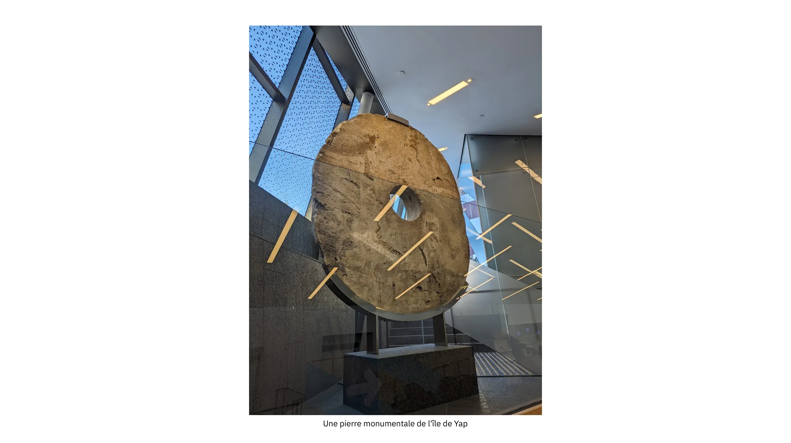

C'est vraiment une analyse intéressante du cas des pierres de Yap. Saifedean Ammous mentionne aussi cet exemple dans son livre l’Étalon Bitcoin. C'est selon lui, le système qui ressemble le plus à bitcoin, une espèce de registre central qui est à la vue de tous, qui est public, qui tient les comptes, qui gère qui possède quoi. Et donc cette vision anthropologique récupère ce même exemple pour expliquer que tout ça ne représente qu'un accord, un consensus social dans cette société, c'est tout à fait vrai. Et je trouve cette mention des pierres perdues très intéressante. Ils allaient chercher les pierres en bateau à des centaines de kilomètres sur la mer avec des petits radeaux et ramenaient les pierres. Ça arrivait des fois que la pierre tombait au fond. Mais cette pierre avait toujours cours dans le système monétaire. Une personne pouvait dire "oui, donc la pierre qu'on a échappée, tu vois, à tel endroit, bien elle est à moi, donc on peut se l'échanger". Il n'y avait pas nécessairement un besoin de physicalité, de possession pour permettre de l'échange parce qu'en fait les pierres étaient tellement grosses qu'elles restaient souvent au même endroit. Donc, c'était plutôt le changement de main de ces pierres. Ça se faisait de manière transactionnelle, mais la possession changeait sans nécessairement qu'elle bouge. C'est une espèce de preuve du consensus. Je trouve ça super intéressant de le voir dans cette vision anthropologique de la monnaie.

### Les proto-monnaies et obligations sociales

Les ethnographes ont observé partout à travers le monde des sociétés utilisant des "proto-monnaies" ou des "monnaies primitives", telles que coquillages, tissus, bétail, sel, pierres, qui remplissaient les fonctions attribuées habituellement à la monnaie, telles que moyen de paiement et réserve de valeur, sans pourtant servir régulièrement d’intermédiaire aux échanges de biens quotidiens.

Donc, ici, on décrit qu'il y avait des systèmes monétaires, mais qui ne servaient pas nécessairement à faire des échanges quotidiens.

Et je rappelle que tout ça, c'est des monnaies avant l'apparition des pièces de monnaie et je ne sais pas à quel point c'est un abus de langage de dire monnaie. Moi je préfère dire monnaie. Je peux mentionner que dans la littérature, on parle souvent de protomonnaies pour parler de la monnaie avant les pièces de monnaie. Mais comme on a vu dans la première section, j**e crois qu'il existait des systèmes monétaires bien avant l'apparition des pièces de monnaie**.

Ces monnaies primitives servaient principalement à gérer des obligations sociales fondamentales liées aux personnes, telles que le mariage, les compensations liées aux conflits (Wergeld), ou encore les dons entre chefs. Par exemple, dans l’Empire perse, les premières monnaies étaient spécifiquement créées comme moyen de paiement militaire plutôt que comme moyen d’échange.

La monnaie primitive présente donc une caractéristique essentielle : elle est un moyen de paiement, mais très rarement un moyen d’échange direct des biens matériels. Ce qu'on veut dire ici, c'est que c'est un moyen de paiement pour certaines obligations sociales, des tribus, des échanges entre les chefs, le fameux wergeld, le prix du sang. Avant l'apparition des systèmes de justice, si quelqu'un commettait un meurtre, il y avait une réparation pour la famille qui souffrait du meurtre de leur proche. Il y avait un prix à payer pour ça, ça s'appelait le prix du sang et c'est une forme de paiement. Il y avait la dote aussi qui est aussi une forme de paiement. Dans ces premiers usages de monnaie comme mode de paiement, c'était surtout lié à l'humain et aux obligations sociales plutôt qu'au des paiements pour achats du quotidien. Selon cette théorie, ces échanges du quotidien, plus courants, étaient plutôt reliés au crédit, crédit différé, le don contre don, la redistribution des rations. Il y avait une autre forme d’organisation sociale pour gérer ces échanges-là. Et aussi, il faut se rappeler que si on recule dans nos apprentissages, que dans une société où tout le monde est autosuffisant, fait son propre agriculture, il n'y a pas de spécialisation, on a très peu besoin de toute façon d'un système monétaire pour les échanges quotidiens. Et c'est pour ça que les premières formes de monnaie étaient ce qu'on vient de décrire, la dote, le prix du sang, tout simplement parce que c'était les premiers échanges où on avait besoin d'un mode de paiement, bien avant qu'on ait besoin de commercer, de s'échanger du pain contre de la monnaie quotidiennement parce que dans les sociétés primitives, ça ne fonctionnait pas comme ça. Chacun subvenait à ses propres besoins et il n'y avait pas encore de spécialisation. Je pense que j'ai présenté ça abondamment déjà dans tout ce qu'on a vu précédemment dans ce cours.

Dans ces sociétés sans division poussée du travail, les échanges directs restaient limités, se déroulant surtout au sein de relations personnelles d’amitié ou d’alliance. L’absence de spécialisation suffisante ne nécessitait pas de monnaie au sens moderne.

Les anthropologues tels que Quiggin et Einzig insistent sur la prééminence du crédit : l**a vie économique primitive est prise dans un réseau gigantesque de crédits et de dettes personnelles, où la monnaie intervient surtout lorsque les paiements doivent être immédiats et où les compensations ne peuvent être facilement différées.**

Donc, les gens s'échangent des trucs, peuvent faire du crédit différé, mais dans certains cas, on ne peut pas différer le paiement, donc la monnaie où des protomonnaies peuvent être utiles à ce moment-là pour avoir une finalité immédiate à l’échange.

### L'innovation de l'anonymat

Cette analyse conduit à une réflexion plus profonde : plutôt que d'opposer la monnaie au troc, il est plus pertinent de comprendre son émergence comme une évolution à partir des systèmes complexes de crédit et de dettes. La monnaie introduit alors une innovation fondamentale : **l'anonymat**. Et là, je trouve que c'est là que c'est intéressant cette théorie anthropologique de l'émergence de la monnaie. C'est que si on est un petit groupe de personnes et qu'on se fait du crédit différé, évidemment on se connaît. Je pense qu'à la base, pour que ce système fonctionne, les gens doivent se connaître, évidemment. Et un paiement avec de la monnaie, ça permet l'anonymat. Ça permet de faire un paiement sans que les gens connaissent même leur nom, sans que les gens soient au courant de qui est cette personne. Ils peuvent faire un échange qui va avoir un règlement immédiat et final. C'est précisément ce que la monnaie permet de faire.

Contrairement au crédit, qui est toujours nominatif, la monnaie permet des transactions anonymes, généralisées et immédiatement libératoires. **Ce pouvoir libératoire unique à la monnaie constitue sa supériorité décisive**.

Ainsi, loin de n'être qu’un modeste outil facilitant les échanges économiques, la monnaie constitue une innovation sociale majeure, étroitement liée à l’évolution des institutions et des pratiques humaines, allant du crédit personnel **à un système de paiement généralisé et anonyme.** Cette évolution anthropologique montre que la monnaie, bien plus qu'un simple moyen d’échange, représente une puissante institution sociale façonnant profondément les sociétés humaines, jusqu’à devenir, dans nos sociétés modernes, la finalité même de l’activité économique.

Ici, on se rend compte qu'au final, dans nos sociétés modernes, la finalité même des échanges économiques, c'est de posséder de la monnaie, alors qu'à l'époque, ce n’était pas du tout ça. La finalité même d'un échange économique, c'était de posséder un bien ou des denrées pour être consommé. Et aujourd'hui, en introduisant l'innovation de la monnaie, le but des échanges économiques, c'est d'accumuler cette monnaie, puisqu'elle nous permet à terme de l'échanger contre le bien, comme elle est généralement acceptée. On peut l'échanger contre le bien dont on a besoin au moment voulu.

## L’unification par le registre 
<chapterId>7664442a-91c1-5ce4-a8bd-53b7371a3e3d</chapterId>
:::video id=473fc284-5375-4e1b-b0cd-6b51ba0cc3b8:::

### La théorie du registre comptable

Nous allons maintenant explorer ensemble différentes propositions d'unification de ces deux théories monétaires, donc la théorie de l'émergence de la monnaie par la monnaie-dette et la théorie monétaire de l'émergence de la monnaie-marchandise. Nous allons parler de cette proposition d'unification de Lynn Alden dans son fameux livre "For Broken Money" dont le titre de la traduction produit par Consensus sera probablement appelé "Rupture monétaire".

*Extrait de Broken Money par Lyn Alden:*

> Fondamentalement, la monnaie est un registre comptable. La monnaie-marchandise est un registre régi par la nature. La monnaie bancaire est un registre régi par les États-nations. La monnaie open-source est un registre régi par ses utilisateurs.

Ici, Lyn fait référence à Bitcoin.

### Le ratio stock-flux et la rareté

> Certains éléments chimiques rares, comme le rhodium, sont plus rares que l'or, mais ont des ratios stock-flux faibles parce qu'ils sont consommés par l’industrie aussi rapidement qu’ils sont extraits. Une pièce ou un lingot de rhodium peut être acheté comme objet de collection spécialisé ou comme réserve de valeur, mais ne convient pas comme monnaie socialement acceptée, et n’émerge donc pas naturellement en tant que monnaie.

Saifedean en parle abondamment dans son livre "L'Étalon bitcoin". Pour ceux qui ne sont pas familiers avec le ratio stock-à-flux, c'est simplement quand on compare les stocks existants, les réserves qui existent sur le marché, comparées au nouveau stock qui arrive, l'influx de nouveaux stocks. C'est assez contre-intuitif souvent parce qu'on pourrait penser que quelque chose qu'on a en grande quantité n'est pas rare, mais en fait, non. C'est plutôt la capacité qu'on a d'avoir du nouveau stock qui, selon ce modèle, nous donne l'information à savoir si cet objet est rare ou pas. Ce n'est pas parce qu'on n'a pas quelque chose en stock que c'est rare, c'est juste peut-être qu'on n'en a pas. Donc, si on prend l'or, on a beaucoup de stocks d'or parce que c'est utilisé comme une réserve de valeur et l'apport de nouveaux stocks, c'est quelque chose comme 1 à 3 % par année de nouveaux stocks d'or qui arrivent par le minage d'or. Tandis que, ce qu'elle dit ici, si on parle de rhodium, c'est plus rare que l'or, mais on n'a aucun stock parce que c'est consommé à mesure. Ça ne prend donc pas beaucoup de nouveaux apports pour doubler le stock existant. Tandis qu'avec l'or, ça prendrait au moins 50 ans pour renouveler, pour doubler le stock. Contrairement à la plupart des marchandises qui sont consommées où c'est assez facile, et ne prend pas beaucoup d'années de production pour doubler le stock existant puisqu'il est consommé à mesure.

*"L'or a maintenu un ratio stock-à-flux compris entre 25x et 100x tout au long de l'histoire moderne, généralement autour de 50x ou plus, ne tombant brièvement jamais au-dessous de 16x, même pendant la Ruée vers l’or du milieu du XIXᵉ siècle."*

Donc, 25, ce serait 25 ans pour doubler le stock et 100, ce serait 100 ans pour en doubler le stock. Saifedean dit dans son livre que même si on doublait la production d'or, on passait disons de 1,5 à 3 %, ça n'aurait pas nécessairement un gros effet sur son prix.

*"L'argent a généralement un ratio stock-flux de 10x ou plus, ce qui reste relativement élevé.*  
*La plupart des autres marchandises ont un ratio stock-flux inférieur à 1 ou 2\. Même les éléments les plus rares, comme le platine et le rhodium, possèdent des ratios stock-flux relativement faibles en raison de leur rapide consommation industrielle."*

### La supériorité de l'or et de l'argent

*"En somme, à chaque fois qu'une monnaie-marchandise s'est retrouvée en concurrence avec l'or et l'argent, ces derniers ont toujours fini par s’imposer. D’autres marchandises pouvaient demeurer monnaie pendant des périodes limitées ou dans certaines régions spécifiques, mais l’or et l’argent ont toujours prouvé leur capacité à devenir des monnaies compétitives à l’échelle mondiale et à dominer la concurrence. Ceci s'explique par le fait que lorsque les civilisations se rencontraient, les détenteurs d’or et d’argent avaient toujours la capacité technologique de dévaluer les autres formes de monnaie, tandis que les détenteurs de coquillages, de perles, de bétail, de sel, de tissus ou de métaux inférieurs ne pouvaient jamais dévaluer l’or ou l’argent."*

Donc ça c'est encore une fois extrêmement bien décrit dans l'Étalon Bitcoin où Saifedean parle des tribus en Afrique qui utilisaient des perles de verre. Et quand les marchands vénitiens sont arrivés avec des cargaisons remplies de billes de verre parce qu'ils étaient capables d'en produire de manière industrielle à l'époque, qu'ils avaient la technologie pour faire ça, ça a complètement déstabilisé le système monétaire de ces peuples et ils ont pu littéralement piller leurs ressources. C'est la thèse de Saifedean.

### L'unité de compte et le crédit

*"Historiquement, même lorsque le crédit servait directement d'instrument d'échange, ce crédit était généralement libellé en unités de marchandises monétaires naturellement choisies grâce à leurs propriétés."*

Ça c'est hyper intéressant, on en parle avec Ulrich dans notre discussion. Même si le temple en Mésopotamie était une espèce d'autorité qui pouvait gérer cette notion de crédit, l'unité de compte c'était le shekel, il n'y a rien qui nous confirme que le shekel a été implanté de manière autoritaire par le temple. Le shekel aurait pu émerger naturellement, par le besoin des commerçants de faire de l'import-export avec d'autres peuples aux alentours. Et ça c'est pas une supputation, on a des preuves de ça, on a un marchand, à Kanesh, j'en parle dans la première partie, qui faisait exactement ça, de l'import-export et importait des métaux précieux qui n'étaient pas utilisés pour leur propriété physique de marchandise, mais bien pour des notions de réserve de valeur. Le seul problème c'est qu'on ne sait pas si on peut supposer que ce choix de l'argent, du shekel d'argent, a été fait par les marchands et on peut aussi supposer que ce choix a été fait par le temple. Mais Ulrich a un très bon argumentaire qui nous pousse à penser que c'est probablement plutôt du côté des marchands que ça s'est fait.

*"Ainsi, l'unification des deux théories peut être décrite comme une "théorie comptable de la monnaie" ("ledger theory of money") puisqu’elle décrit la logique fondamentale commune à ces deux théories. Le crédit social flexible ainsi que les proto-monnaies de collection remontent tous deux à l’aube de l’humanité. Dans les deux cas, des groupes humains de tailles variées tiennent un registre comptable entre eux pour éviter de devoir satisfaire la double coïncidence des besoins, réduire la friction dans les échanges, et servir de forme d'épargne liquide. La différence essentielle tient à l'autorité à qui est confiée la tenue du registre."*

D'un côté on a la nature qui gère l'expansion de la masse monétaire. Donc, si on prend l'or, comme c'est assez rare, c'est difficile d'en miner. Il y a une forme de limite au nombre de monnaies d'or qu'on peut extraire. Donc la rareté est gérée par la nature. Et le registre, il est tenu par le concept de possession. Le registre est comme décentralisé. La possession est prouvée par le fait qu'on possède une pièce d'or ou cette pépite d'or. Et dans le cas de la monnaie crédit, la rareté est gérée par la capacité des gens à obtenir du crédit. Ou dans le cas d'une monnaie fiat, la rareté est gérée par l'autorité. C'est eux qui décident s'il faut en imprimer plus ou pas pour éviter les catastrophes d'inflation. Donc, le registre peut aussi, dans certains cas, être géré, quand il s'agit de monnaie de papier, par le possesseur du jeton. C'est ça qui fait qu'il est inscrit dans le registre, en guillemets, dématérialisé. Bien en fait, matérialisé, mais virtuel. Il possède ce fameux jeton, c'est ce qui prouve la possession. Et ça peut tout simplement aussi être dans un vrai registre, comme avec la monnaie scripturale, dans une banque, où c'est vraiment la banque des humains qui gère qui possède quoi face au registre.

## L’unification par la prime monétaire
<chapterId>093756e5-8908-55e5-bb76-376a3a3cc4d3</chapterId>
:::video id=eabc342a-ecbd-46ca-a347-e914917e7c4f:::

### Le concept de prime monétaire

Dans cette section dédiée aux différentes propositions d'unification des différentes théories sur l'émergence de la monnaie, je viens de vous proposer la théorie de Lyn Alden, la théorie du registre. J'ai ma propre proposition de théorie d'unification des deux théories monétaires. C'est par la prime monétaire, le concept de prime monétaire. Donc, la valeur de la monnaie peut s'expliquer par la prime monétaire découlant de sa demande monétaire, que ce soit sous forme de tablettes d'argile, de pièces en métaux précieux ou de billets de banque ou de bitcoin. La prime monétaire repose simplement sur la confiance qu'une personne échangera cette monnaie plus tard pour un prix comparable.

Ce que j'essaie de démontrer ici, c'est tout simplement que ce soit du fiat, donc des billets de banque sans valeur d'usage, que ce soit des pièces de monnaie en or ou même n'importe quel métal, une pépite d'or ou un lingot, **c'est souvent la prime monétaire qui fait la plus grande partie de sa valeur**. Si on prend une pépite d'or, il y a une certaine partie de sa valeur qui est expliquée par sa valeur d'usage, de son usage en industrie, ou pour faire des bijoux. Remarquez que la demande pour faire des bijoux vient souvent de la valeur monétaire. Les gens conservent des bijoux un peu comme une réserve de valeur, donc, j'intègre ça un peu dans la prime monétaire parce que c'est souvent une demande plutôt monétaire pour jouer un rôle de la monnaie.

Mais donc, on pourrait dire qu'il y a à peu près 10 % de la demande de l'or que c'est pour l'industrie. Dans la valeur de l'or, on aurait une petite partie qui serait disons 10 % qui serait expliquée par cette demande industrielle, cette demande d'usage de l'or où on consomme l'or. Tout le reste, c'est clairement la demande pour son usage monétaire de réserve de valeur.

### La prime d'autorité et le fiat

Et si on compare une pépite d'or à une pièce d'or, là on rajoute une couche de plus. La pièce d'or est estampée par une autorité et l'or qui est contenu dans la pièce, jouit aussi d'une demande d'usage, d'une demande pour être consommée dans l'industrie. Elle jouit aussi d'une prime monétaire de réserve de valeur. Et en plus, il y a une surcouche que j'appelle la prime d'autorité où il y aura souvent un prix, un pouvoir d'achat plus grand pour la pièce de monnaie que la pépite puisque la pièce de monnaie est plus simple à utiliser. Ça fluidifie les échanges, pas besoin de la peser. L'autorité normalement garantit sa pureté. Et si on compare à la pépite, une pièce de monnaie en or étampée a en général une plus grande valeur que la simple pépite d'or. Et aussi c'est normal parce que ça prend des ressources pour l'estamper.

C'est le même principe pour le fiat, la monnaie papier. La monnaie papier n'a pas vraiment de valeur d'usage, à part peut-être pour chauffer une maison et c'est arrivé durant la République de Weimar. Donc il n'y a pas vraiment de demande pour sa valeur d'usage. Par contre, il n'y a que de la prime d'autorité, à mon avis.

C'est une forme de prime monétaire, c'est une surcouche en fait de la prime monétaire. Mais sa prime monétaire vient du fait qu'il y a un cours légal, puis l'autorité vous oblige à vous en procurer pour payer vos impôts. Donc nécessairement, la monnaie fiat a une forme de demande monétaire venant du fait qu'elle est imposée et que vous devez à tout le moins en acquérir pour payer vos impôts. Et découlant de tout ça, ça reste un moyen de paiement généralement accepté. Donc les gens souhaitent en acquérir pour répondre à leurs besoins.

### L'unification par la demande monétaire

Et pourquoi cette proposition de prime monétaire peut être qualifiée d'unification des deux théories de la monnaie dette et de la monnaie marchandise? C'est que moi, je n'ai pas l'impression que la valeur d'une pièce d'or, ça vient nécessairement de sa “valeur intrinsèque”. Non, en fait, c'est autant une notion de confiance que pour de la monnaie fiat. C'est une notion de demande monétaire. Et ce n'est pas vraiment parce qu'elle a un petit pourcentage d'usage industriel, une “utilité” autre. Si on dit que l’usage en industrie est 10% de sa valeur, on pourrait évaluer ça à 300 $ par once. Si l’or se vend à 3 000 $ l'once sur le marché, la différence entre 300$ et le 3 000$, c'est la fameuse prime monétaire. C'est cette demande monétaire pour l'or qui l'explique. Ce n'est pas parce que le fiat a zéro valeur d'usage que c'est différent. Pour moi, c'est exactement la même chose. Donc des deux côtés, la théorie de la monnaie dette ou de la monnaie marchandise, je ne pense pas que l'espèce de qualité de plus que l'or aurait d'avoir une valeur d'usage minime ça change quoi que ce soit.

Par contre, c'est certain qu'**au niveau de l'émergence, selon le théorème de régression de Mises, on peut proposer que cet usage-là crée une demande à l'origine et initie cette le processus qui devient monnaie.** Tandis qu'au sujet, au niveau de la monnaie dette, c'est plus une imposition d'une autorité, donc la source, l'initiation de l'émergence et des concepts complètement différents. **Mais je pense qu'au niveau de la valeur, comment expliquer la valeur de la monnaie, avec la prime monétaire, on peut autant expliquer pourquoi la monnaie fiat a cette valeur qu'on lui attribue et pourquoi la monnaie marchandise a cette valeur** qu'on lui attribue. Pour moi, c'est le même processus et ça s'appelle la prime monétaire.

#### La prime monétaire

Voilà. La valeur de la monnaie peut s’expliquer par la prime monétaire découlant de sa demande monétaire, que ce soit sous la forme de tablettes d’argile, de pièces en métaux précieux, de billets de banque ou de Bitcoin.
La prime monétaire repose simplement sur la confiance qu’une personne échangera cet argent plus tard pour un prix comparable.

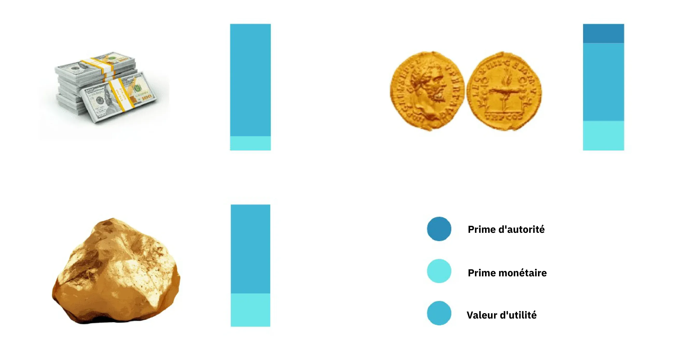

# Les différentes définitions de la monnaie
<partId>77b7918a-8c3b-11f0-b688-6b2ab22378c9</partId>

## Money vs currency vs monnaie vs argent vs devise
<chapterId>bf8a6d21-df88-5d23-a0a5-e9a5c1300554</chapterId>
:::video id=d9c9e7df-9db3-4a9f-801e-10d3fc7dfc22:::

### Sémantique des termes monétaires

Dans cette section au sujet des différentes théories monétaires et surtout sur les définitions de la monnaie, j'aimerais qu'on fasse une petite aparté au sujet de la sémantique. J'aimerais qu'on creuse un peu le sujet des définitions de plusieurs mots relatifs à la monnaie et nous allons les comparer à leurs équivalents en anglais. Par exemple, money, currency, comparé à monnaie, argent et devise. Alors, ça va comme suit.

Un peu de sémantique:

Lorsque qu’on dit “**de la monnaie**” la plupart des gens penseront qu’on fait référence à la petite monnaie qu’on reçoit en retour lors d’une transaction. Et si on dit “**la monnaie**” les gens penseront probablement qu’on réfère plutôt à la monnaie d’un État. La monnaie du Canada est le dollar Canadien. C’est juste.

Mais qu’en est-il de l’argent ? Un voleur ne vous dira jamais “donne moi toute ta monnaie \!” (le voleur pourrait certes être déçu de recevoir que de simples pièces de monnaie presque sans valeur).

Non, le voleur va plutôt crier: “Donne moi **tout ton argent**”. Et si le voleur est devant toi, dans la rue, il fait nécessairement référence **aux billets de banque** dans ta poche.

Par contre, si le voleur essaie de te frauder de manière plus sophistiqué, qu’il essaie de te voler ton patrimoine, en vidant tous tes comptes en banques, on dira dans ce cas qu’**il te prendra tout ton argent**. Ici le mot “argent” fait référence à **la richesse de l’individu**.

Il existe donc deux définitions pour le mot argent, les espèces (les billets) et la richesse.

### Currency vs monnaie vs devise

Une devise est nécessairement la monnaie d'un autre pays, sinon on dit juste monnaie. Si on est français, on dira: “La livre sterling est la devise de du Royaume-Unis et l’euro et la monnaie de l’Europe”.

Souvent, les gens qui n'ont pas creusé ces problèmes de sémantique, dans la traduction de ces termes, seront portés souvent à parler de devise quand c'est écrit currency, mais non, currency, c'est monnaie quand c'est la monnaie de votre pays, et c'est devise lorsqu'on parle d'autres monnaies. Et donc, la problématique ici que je vois souvent, c'est que en anglais, il y a deux mots, il y a “money” qui est un concept et il y a “currency” qui est vraiment l'unité d'un pays qui est utilisé pour faire les échanges. Donc, on peut parler juste du concept de monnaie, c'est facile, c'est le concept du mot *money*, c'est la monnaie en général et *currency*, c'est très simple à équivaloir à la monnaie d'un pays. Tandis qu'en français, malheureusement, souvent, les gens vont dire oui, «mais ce n'est pas une monnaie» en parlant de bitcoin parce que ce n'est pas la monnaie d'un pays, mais souvent, je crois qu'ils font référence aux termes plutôt currency. C'est faux d'un côté parce depuis le El Salvador bitcoin est bien la monnaie d'un État. Il reste que souvent, les gens vont dire: *mais non, ce n'est pas la monnaie d'un état, ça ne peut pas être de la monnaie*. Mais en fait, si on fait référence aux mots plus larges, le concept de *money* en anglais, bitcoin rentre dans cette définition parfaitement à mon avis. Et donc, on peut tout à fait dire que bitcoin est une monnaie, c'est simplement  qu'en français, nous n'avons pas deux mots pour séparer ces deux concepts. On pourrait dire qu'on a le mot argent qui fait plutôt référence à monnaie, mais malheureusement, ce n'est pas sa définition précise. *Argent*, c'est plutôt la richesse ou les billets. On ne peut pas vraiment faire une équivalence avec le mot *money*. *Money* c'est vraiment le concept de monnaie.

## La définition de Saifedean Ammous 

<chapterId>07c4ba50-168c-567a-8957-0b187ff75f97</chapterId>

:::video id=936d6d3b-6d45-468e-bc44-85fbce9b857a:::

#### Qu'est ce que la monnaie ? 

La monnaie est simplement quelque chose que vous possédez ou acquérez non pas pour être utilisé ou consommé pour ses propres caractéristiques, mais pour être échangé plus tard contre d'autres biens ou services dont vous pourriez avoir besoin. (Saifedean)
La monnaie acquiert une prime monétaire lorsqu’une demande monétaire existe pour le bien, pour jouer un ou des rôles de la monnaie.
Le bien monétaire doit être assez rare pour que la prime monétaire puisse subsister (pour prévenir l’ajustement de l’offre face à la demande monétaire).

### La prime monétaire

Dans cette section au sujet des différentes définitions de la monnaie, je voulais parler rapidement de la définition que Saifedean nous propose dans l'Étalon Bitcoin, qui m'a toujours très intéressé. Elle m'a frappé quand je l'ai lu, je la trouvais assez simple. Et on va ajouter aussi le concept de la prime monétaire à cette définition. Et comme Saifedean le mentionne dans son livre, il y a nécessairement un concept de rareté. On peut se demander qu'est-ce que la monnaie.

> La monnaie, c'est simplement quelque chose que vous possédez ou acquérez, non pas pour être utilisé ou consommé pour ses propres caractéristiques, mais pour être échangé plus tard contre d'autres biens ou services dont vous pourriez avoir besoin.

Donc ça, c'est la définition que Saifedean mentionne dans l'Étalon Bitcoin. Moi, j'ajoute à ça que la monnaie acquiert une prime monétaire lorsqu'une demande monétaire existe pour le bien, pour jouer un ou des rôles de la monnaie. Donc on pourrait dire qu'une monnaie qui sert de réserve de valeur aura une demande monétaire qui lui donne une prime monétaire, puisque des gens souhaitent l'acquérir, par exemple comme réserve de valeur ou comme moyen d'échange. 

### La rareté et les mécanismes de marché

À ça, je pense qu'il faut définitivement ajouter que le bien monétaire doit être assez rare pour que la prime monétaire puisse subsister. C'est très important. **Si un bien émerge pour être utilisé comme monnaie et qu'on voit que son prix monte, normalement, si le bien n'est pas assez rare, les gens vont vouloir en produire plus pour profiter de ce gain de valeur quand le prix monte**. Et donc, c'est ce qui fait que la plupart des marchandises sur les marchés ont un prix relativement fixe. Quand le prix monte, la production a tendance à augmenter. Quand le prix baisse, la production baisse. Il y a une espèce d'ajustement par le marché. **Et quand un bien est assez rare, comme l'or, le mécanisme du marché ne va pas compenser cette demande accrue pour l'usage monétaire**. **Donc, c'est la variable qui change, c'est le prix. Comme avec Bitcoin**. Quand le prix de Bitcoin monte, on ne produit pas plus de Bitcoin. Donc, ce qui s'ajuste, c'est le prix. Et c'est pourquoi on voit, depuis des années, le prix de Bitcoin monter à mesure que la demande pour Bitcoin augmente. Puisqu'il n'y a personne sur Terre qui peut changer l'algorithme et dire "il y a plus de demandes, le prix monte, on va en produire plus, **l'offre de nouveaux Bitcoins est programmée à l'avance, et connue à l'avance**. Donc, c'est ce que je disais, c'est que le bien monétaire doit être assez rare pour que la prime monétaire puisse subsister, donc ne pas être rattrapée par les mécanismes de marché, pour prévenir l'ajustement de l'offre face à cette nouvelle demande monétaire.

## Moyen de paiement et valeur libératoire
<chapterId>5d424039-e342-56f7-9d8b-bba9551831a9</chapterId>
:::video id=af4c0765-8111-4cb7-891b-3ee54d6e7054:::

### Moyen de paiement vs moyen d'échange

Dans cette section dédiée aux différentes définitions de la monnaie, je vous propose qu'on regarde ensemble une citation qui vient du livre "Aux origines de la monnaie", un texte d'Alain Testart au sujet des moyens de paiement de la monnaie en tant que moyens de paiement et de valeurs libératoires.

*Extrait de Aux origines de la monnaie Alain Testart qui définie la monnaie comme un moyen de paiement:*

> La fonction de moyen de paiement y est conçue comme distincte de la fonction de moyen d'échange, dans la mesure où il y a des paiements sans contrepartie, des paiements qui n'achètent rien. Knies (1873 :192 sq.) développe longuement ce thème des transferts de biens qui ne consistent pas en actes d'échange, ainsi que c'est le cas pour le wergeld (prix du sang ou composition pour meurtre) ou l'impôt. Carl Menger attaquera cette quatrième fonction dans son article "Geld" de 1892, généralement considéré comme un des plus décisifs en la matière. Sans avoir été totalement discréditée, l'idée de la fonction de moyen de paiement semble aujourd'hui bien oubliée dans la pensée économique, du moins récusée en faveur de celle de moyen d'échange.
> 
> La monnaie sert à payer : vue sous cet aspect, elle est un instrument de libération  ce qui décrit dans toute sa généralité la fonction de moyen de paiement. On parle à ce propos du "pouvoir libératoire" de la monnaie. Le pouvoir libératoire, c'est, selon Le Petit Robert, ce "qui a pour effet de libérer (d'une obligation, d'une dette)". Un paiement libératoire, c'est, selon le Grand Larousse, tout "paiement effectué dans les conditions légales de telle manière que le créancier ne puisse pas contester l'extinction de la dette". La monnaie possède par excellence ce pouvoir libératoire ; c'est même ce qui définit son cours légal, car nul ne peut refuser, vendeur ou créancier, un paiement exécuté en monnaie. La monnaie est le seul bien qui ne peut être refusé pour le paiement de ce qui est dû et peu importe que la dette soit due à un commerçant ou au fisc. Seule parmi tous les biens, la monnaie détient ce privilège. "C'est ce privilège, écrit Charles. Gide (1921 I : 443), qui constitue ce qu'on appelle le cours légal.
> 
> Tout échange consistant en la cession d'un bien contre un autre ou à condition qu'un autre bien soit remis en contrepartie, implique nécessairement pour celui qui reçoit le bien une obligation de fournir cette contrepartie. Le paiement, c'est l'exécution de cette obligation. Tout échange implique donc paiement, mais tout paiement n'implique pas échange. Il y a des paiements sans contrepartie, c'est-à-dire des paiements qui ne permettent pas d'obtenir un autre bien et ne sont d'ailleurs pas faits dans ce but. L'impôt reste ici l'exemple de référence; il faut aussi évoquer les amendes de toutes sortes payées à la puissance publique, les réparations dues à autrui selon le principe que celui qui cause dommage à autrui doit le réparer.  

### Paiements sans contrepartie

On voit bien ici la thèse de cet auteur. En fait, il distingue les deux. Pour lui, un échange, c'est à la fois un transfert de biens et un paiement. Le paiement vient ensuite. Et le paiement, il peut survenir sans échange. Il donne des exemples que payer un PV, une amende, c'est qu'un paiement. Tu n'as pas vraiment de service en échange. Il y en a qui pourra argumenter que l'État te rend un service en échange, un service de te donner des PV. Lui, il est assez clair sur le fait que le paiement des impôts, c'est vraiment un paiement sans contrepartie, dans le sens que le paiement d'impôt est exigé, même si on n'obtient pas nécessairement de service. Il dit que c'est vraiment défini que le paiement d'impôt, c'est qu'un paiement, il n'y a pas une obligation d'obtenir des services en échange. Ça, j'en ai discuté avec plein de mes collègues et ils n'étaient pas nécessairement d'accord avec cette notion. Mais c'est la thèse de l'auteur. Il essaie de placer la notion de paiement et de la détacher des échanges avec ces exemples-là, par exemple, de PV, de paiement d'impôt. Aussi, par exemple, la dot, il exprime que la dot, c'est un paiement, tu n'as pas nécessairement quelque chose en échange. Quelqu'un qui critique cette proposition pourrait dire "Oui, mais tu obtiens une femme en échange." Donc, voilà le niveau du débat à ce sujet.

On peut aussi mentionner le wergeld, le prix du sang. Donc, ce n'est qu'un paiement pour compenser. Mon ami Ulrich me dirait: 
> Oui, mais tu obtiens la fermeture de ce dossier en échange.

Donc, tu as commis un crime, un meurtre par exemple, à l'époque tu payes le verguel et après ça, bien tu obtiens la libération de cette situation. Donc, il y a quand même un pouvoir libératoire. Est-ce que tu obtiens quelque chose en échange?" Selon l'auteur, non. Selon certains de mes collègues, oui.

Je pense que dans cette discussion, on peut voir que le wergeld est un des bons exemples pour définir un paiement. En fait, clairement, on ne reçoit pas de bien en contrepartie.

## Monnaie dette vs monnaie marchandise
<chapterId>4093677a-c8e8-5828-b994-15c01656186e</chapterId>
:::video id=f49cf5cc-288e-4daa-a1ff-b9de73506f4e:::

### Le débat fondamental

Toujours dans le cadre de cette section sur les différentes définitions et théories monétaires, nous allons explorer ensemble deux visions diamétralement opposées : "la monnaie est toujours de la dette" ou "la monnaie est toujours une marchandise". D’un côté, on trouve les partisans de la théorie monétaire fondée sur la dette, qui affirment : "Mais non, la monnaie, c’est toujours de la dette \!". En face, nos fameux gold bugs soutiennent : "Mais non, vous voyez bien, la monnaie, c’est toujours une marchandise, c’est toujours de l’or ; tout le reste, billets, reconnaissances de dette ce n’est que du crédit, pas de la monnaie".

Explorerons ensemble un résumé clair de ces différentes théories.

### La théorie "toujours une dette"

Voici un résumé de la théorie monétaire dite **"monnaie-dette"**, selon laquelle la monnaie est fondamentalement une forme de dette :

Selon cette théorie, développée notamment par Alfred Mitchell-Innes et approfondie par David Graeber, la monnaie est intrinsèquement une reconnaissance de dette, issue des relations de crédit qui préexistaient historiquement aux échanges monétaires directs. Plutôt que de surgir d’un besoin lié au troc, la monnaie apparaît comme une façon de comptabiliser, transférer et régler des obligations sociales ou des dettes entre individus ou groupes.

Ainsi, tout argent circule en tant que dette d’une personne ou d'une institution envers une autre, soutenue par la confiance et l'autorité sociale ou étatique garantissant sa validité. Donc, selon eux, quand on possède, comme j'ai évoqué, quand on possède de la monnaie, on a une créance sur la société et la société a une dette envers nous. La monnaie ne serait donc jamais neutre ou autonome, mais toujours une dette sous-jacente : détenir de la monnaie signifie essentiellement posséder une créance sur la société ou une communauté économique.

Ce raisonnement contredit l’idée classique de la monnaie comme simple "marchandise intermédiaire", et souligne plutôt le rôle central des relations sociales et politiques dans la création et la gestion de la monnaie.

**Ma critique:**

Ce qui me dérange en fait dans cette théorie, c'est d'affirmer que la monnaie est toujours une dette quand on a tout à fait des exemples d'échanges entre deux tribus différentes qui vont par exemple s'échanger de l'or ou la transaction est définitivement finale, il n'y a pas de dette latente qui reste. Souvent les partisans de cette théorie nous diront que ces échanges ne sont pas des échanges monétaires, c'est du troc. Comme déjà évoqué, je ne suis pas d'accord. C'est un échange monétaire puisque l'or ne va pas être consommé, l'or va être ensuite utilisé comme monnaie.

### La théorie "toujours une marchandise"

**Toujours une marchandise:**

Voici un résumé clair de la théorie monétaire dite **"monnaie-marchandise"**, où la monnaie émerge toujours comme une marchandise, notamment l'or qui émerge d'un besoin de pouvoir commercer, une marchandise qui sera généralement acceptée à l'extérieur et que l’on acquiert à des fins de commerce.

Selon cette théorie, développée par les économistes classiques (Adam Smith, David Ricardo) et reprise par Marx, la monnaie émerge naturellement comme une marchandise parmi d'autres, souvent un métal précieux tel que l'or ou l'argent, qui possède une valeur intrinsèque indépendante de son rôle monétaire. Initialement, ces marchandises sont choisies spontanément par les acteurs économiques pour faciliter les échanges grâce à leurs qualités intrinsèques (rareté, durabilité, divisibilité et stabilité).

La monnaie-marchandise se distingue par son existence physique et une valeur déterminée par la quantité de travail socialement nécessaire à sa production (chez Marx notamment). La société utilise ainsi l’or, par exemple, non seulement pour simplifier le troc, mais aussi comme unité de compte, réserve de valeur, et moyen universel d’échange.

Dans cette vision, la monnaie conserve toujours une valeur réelle, car elle reste liée à une marchandise tangible. Même lorsque le rôle de la monnaie devient abstrait (pièces frappées, billets ou monnaie scripturale), sa validité provient toujours, directement ou indirectement, d’une référence à une marchandise sous-jacente comme l'or. Cette théorie insiste donc sur l'origine matérielle et économique de la monnaie, en opposition aux théories qui la considèrent comme une simple convention ou une dette. Selon cette théorie, toute représentation de la monnaie par un substitut, par exemple un billet remboursable en or, serait du crédit.

**Ma critique:**

On remarquera que cette vision ressemble à celle de la théorie de la monnaie-marchandise, mais c'est un pas plus loin. Ils proposent que la monnaie soit **toujours** une marchandise. Et quand on va leur dire: "*oui, mais on peut s'entendre qu'un billet de banque, c'est la monnaie pour ce groupe, il peut être backé par de l’or, ça fonctionne, et le billet de banque en tant que tel, c'est de la monnaie*".

En réponse à ça ils vont nous donner l'exemple du coupon de vestiaire. Ils vont nous dire: "*oui, mais non, est-ce que quand tu as un coupon de vestiaire pour ton vêtement, est-ce qu'on peut appeler le coupon de caisse un vêtement ?*".

Bien sûr que non, c'est comme une reconnaissance, une créance, dans le fond, qui va te permettre de récupérer ton vêtement. Ce parallèle-là ne tient pas, puisque un coupon de vestiaire, ce n'est pas un mode de paiement généralement accepté. **La monnaie, ce n'est pas une créance sur un objet spécifique comme un vêtement, c'est un mode, un moyen d'échange, un intermédiaire d'échange, ou un moyen de paiement généralement accepté**.

Donc, on ne peut pas faire un parallèle entre un coupon de vestiaire et un billet de monnaie fiat, puisque le coupon de vestiaire te permet d'obtenir un bien en particulier en échange, c'est un jeton qui vous permet de récupérer votre bien, tandis qu'un billet de banque, la monnaie fiat, c'est un coupon universel qui te permet d'accéder à n'importe quel bien.

Et à mon sens, évidemment, même la monnaie fiat peut être considérée comme de la monnaie si elle est considérée comme tel par la population. Et je trouve que c'est une erreur de sémantique d'insister sur le fait que ça ne peut pas être de la monnaie, puisque c'est un coupon pour obtenir la vraie monnaie, du moins à l'époque, qui était l'or sous-jacent.

Je n'ai pas de problème à considérer comme la pièce d'or qui est conservée dans le coffre et le billet qui représente cette pièce d'or comme de la monnaie. Pour moi, il n'y a pas de problème de sémantique, c'est juste deux sortes de monnaies. Mises l’expliquent très bien ce phénomène-là en parlant des substituts monétaires, si je ne me trompe pas.

Leur vision se résume au fait qu'on ne peut pas en même temps considérer la pièce d'or qui est dans un coffre à la banque et le billet de banque qui la représente comme de la monnaie. Personnellement, je n’y vois aucun problème, je ne vois aucun paradoxe dans cette situation. Les partisans de que la monnaie est toujours une marchandise ne voient pas les choses de la même manière que moi.

**Voici une critique du concept du coupon de vestiaire qui vient du livre *Aux origines de la monnaie*:**  
*Note 14: «Excellente critique \- excellente parce qu'elle est sur le terrain même où se place Knapp, le terrain juridique \- par Rist (1938: 372, note 1\) de la comparaison entre papier-monnaie et jeton de vestiaire: si on peut parler d'une sorte de créance dans les deux cas, la différence fondamentale est que dans le premier cas, et dans le premier seulement, il s'agit de créance sans objet déterminé.»*

Aussi, au sujet de la **créance**, le même auteur note ceci:  
*«Bastiat a beau jeu d'imaginer un bon d'achat sur l'ensemble de la société présentée comme "un immense bazar", ce petit ajout, cette petite extension en apparence anodine, c’est toute la différence entre le crédit et la monnaie. La monnaie ne consiste pas en une créance sur un magasin particulier. Il n'y a pas de créance anonyme. Tandis que l'anonymat qui caractérise la monnaie, et donc sa généralité, fait toute sa puissance. La monnaie n'est pas comme le crédit, encore moins lui est-elle en quoi que ce soit réductible. **La monnaie est beaucoup plus que le crédit.**»*

**Un paradoxe : monnaie dette vs monnaie marchandise**

Le paradoxe qui illustre le mieux la profonde dichotomie entre les théories de la monnaie-dette et de la monnaie-marchandise concerne la question de savoir si l'or est une monnaie aujourd'hui.

D'un côté, la théorie de la monnaie-dette définit la monnaie avant tout comme un intermédiaire d’échange ou moyen de paiement globalement accepté, voire imposé par une autorité publique. Selon cette perspective, l'or ne constitue plus aujourd'hui une monnaie, puisqu'il n'est pas largement utilisé ni accepté comme moyen d'échange courant.

De l'autre côté, la théorie de la monnaie-marchandise considère la monnaie comme une marchandise tangible, choisie spontanément par la société en raison de ses caractéristiques intrinsèques (rareté, durabilité, divisibilité, etc.). Selon cette approche, l'or reste la véritable monnaie universelle, et toutes les autres formes monétaires actuelles ne sont, fondamentalement, que du crédit reposant sur la confiance.

Ce paradoxe montre clairement l'écart entre ces deux conceptions monétaires : pour la première, l'or n'est plus une monnaie ; pour la seconde, il demeure au contraire la seule véritable monnaie existante.

## La Théorie Monétaire Moderne
<chapterId>8efc29af-3193-5d97-ad9f-e608b32924ff</chapterId>
:::video id=f8127cb7-46a1-468c-bbb5-97bf0a8b8837:::

### Principes de la théorie monétaire moderne

Pour finir cette section au sujet des différentes théories monétaires, nous allons parler de l'enfant prodige des théories monétaires, admirée de plusieurs économistes modernes qui travaillent pour des banques centrales et j'ai nommé la théorie monétaire moderne souvent connue sous le nom de MMT.

La **théorie monétaire moderne (MMT – Modern Monetary Theory)** est une approche économique selon laquelle un État disposant de sa propre monnaie souveraine (comme les États-Unis, le Canada ou le Japon) ne peut jamais manquer d'argent, puisqu'il peut toujours émettre davantage de monnaie pour financer ses dépenses. Selon cette théorie :

**La monnaie est une création de l'État, et non une ressource limitée.**
* Les impôts et les emprunts ne servent pas directement à financer les dépenses publiques, mais plutôt à réguler l'inflation, à influencer le comportement économique et à maintenir la demande pour la monnaie nationale.  
**La véritable limite aux dépenses gouvernementales est l'inflation, et non le déficit budgétaire ou la dette publique.**
*Si la monnaie créée se dirige vers des secteurs qui peuvent l'absorber, il n'y aura pas non plus d'inflation.*
**Le gouvernement doit donc ajuster ses dépenses en fonction des ressources réelles disponibles (main-d'œuvre, capacités industrielles, ressources naturelles) pour éviter une inflation excessive.**

### Rôle des impôts dans la MMT

Donc ici, vous trouverez la fameuse réponse à tous ceux qui se disent "Ouais, mais si on peut imprimer de la monnaie, pourquoi on paie des impôts?" Eh bien, la MMT répond de la bonne façon à cette idée. C'est vrai que dans le système fiat, dans le système moderne, techniquement, il n'y a rien qui limite la création monétaire, à part l'inflation. Mais justement, eux vont nous proposer que, de un, l'impôt est nécessaire pour limiter cette inflation, puisqu'elle va retirer de la monnaie de l'économie. Donc, si on n'a pas d'impôt pour compenser, toute cette création monétaire pourrait à terme créer de l'inflation. Les impôts, selon eux, c'est littéralement une façon de retirer de la monnaie dans le système pour limiter l'inflation.

Au sujet de la monnaie investie dans les secteurs qui peuvent l’absorber, on peut mentionner l’exemple des États-Unis qui donne des milliers de milliards de dollars à l'industrie militaire, ça ne cause pas d'inflation parce que l'industrie militaire, le complexe militaro-industriel puisqu'il est tout à fait capable d'absorber ces milliers de milliards de dollars.

Par contre, si vous voulez construire plus de routes et qu'il y a une limite aux ressources et aux entrepreneurs qui pourront produire lesdites routes, si vous doublez le budget pour les routes, nécessairement, ça va créer un effet de rareté sur la main-d'oeuvre qui pourra créer ces routes. Donc le prix va augmenter de par les forces du marché, par l'offre et la demande. Si nos grands dirigeants omniscient savent où mettre la monnaie, techniquement, ça ne devrait pas causer l'inflation. Et moi, je leur répondrais que, dans la pratique, on voit très bien que ça crée de l'inflation.

En conclusion, selon la MMT, l'État peut utiliser sa capacité de création monétaire pour atteindre le plein emploi, financer des investissements sociaux et écologiques, tout en contrôlant l’inflation par une politique fiscale adaptée. C'est souvent aussi le but des économistes keynésiens, qui est une autre école de pensée économique, de gérer le chômage par la gestion des taux d'intérêt.  Financer des investissements sociaux et écologiques tout en contrôlant l'inflation par une politique fiscale adaptée.

### Critique de la MMT

Cette théorie ne s’applique qu’à une poignée de pays (voir tweet de Stephanie Kelton) qui jouissent d’une vraie souveraineté monétaire c'est-à-dire qu’ils peuvent lever de la dette dans leur propre monnaie. Cette théorie s'applique difficilement aux économies dépendantes des importations, qui doivent maintenir la confiance internationale dans leur monnaie.

Et qu’est-ce qu’une vraie souveraineté monétaire? C'est qu'on peut lever sa dette dans sa propre monnaie. Il faut être en mesure d'avoir un surplus commercial pour avoir assez de réserves de monnaie, de devises étrangères pour ne pas être obligé de lever des fonds dans les devises étrangères pour pouvoir importer des denrées. Ça concerne une poignée de pays.  
J'ai un tweet ici de, justement, Stéphanie Kelton, qui est une espèce de poster woman de ce mouvement, qui a écrit un livre qui s'appelle "The Deficit Myth", qui mentionne dans un de ses tweets que différents pays comme les États-Unis, le Japon, le Canada, l'Australie, le Royaume-Uni, ne peuvent pas manquer de monnaie.

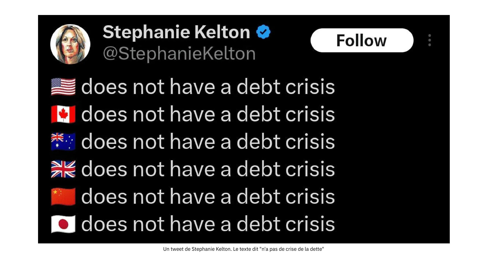

Étrangement, elle ne liste que six pays ? Pourquoi ? Parce qu'ils ont une vraie souveraineté monétaire. Mais il y a environ 200 pays sur la Terre et ils n'ont pas tous une souveraineté monétaire. Donc, ce que je reproche à cette théorie, en plus d'être un peu étrange et non fonctionnelle, c'est qu'elle ne fonctionne que pour quelques pays qui jouissent d'une vraie souveraineté monétaire, ceux qui peuvent émettre des bons du trésor dans leur propre monnaie. Et ça se fait un peu au détriment du reste du monde. C'est comme si, en créant cette monnaie, ils exportaient leur inflation ailleurs, comme les États-Unis font avec leur privilège exorbitant depuis des décennies. C'est presque une espèce de forme de colonialisme monétaire où les pays qui jouissent d'une confiance à l'échelle mondiale et d’une demande pour leur monnaie pour acheter des biens qu'ils produisent, peuvent imprimer de la monnaie autant qu'ils veulent sans trop causer l'inflation parce qu'en général, ils l'exportent. 

Cette théorie s'applique difficilement aux économies dépendantes des importations qui doivent maintenir la confiance internationale dans leur monnaie.

Aussi, cette théorie nécessite un certain niveau de planification centralisée de l’économie notamment pour assurer le une surveillance accrue sur les ressources réelles (travailleurs, matières premières, capacités industrielles) et pour gérer l’inflation.

# La chute et la renaissance de la monnaie
<partId>87a34ca9-782b-5ade-b51a-400f88ed7b0c</partId>

## Les monnaies grecques
<chapterId>7714195f-74ce-5f8c-be5f-59302d39fff4</chapterId>
:::video id=8e5c3091-0910-471b-8d4b-0dc6e9afa656:::

### Cadre historique et contextuel

Avant de commercer voici le cadre historique :

**Cadre historique:**

**Les Romains appelaient les Grecs "Graeci" et la Grèce "Graecia".**

**Les Grecs s'appelaient eux-mêmes "Hellènes" et leur pays "Hellas".**

**Homère** (né vers le VIIIe siècle av. J.-C.)  
 Poète grec légendaire, auteur présumé de *L’Iliade* et de *L’Odyssée*.

Vers **750 av. J.-C. : Lycurgue**, législateur mythique de Sparte, aurait établi la constitution spartiate basée sur la discipline militaire et la simplicité.

**Numa Pompilius** (753-673 av. J.-C.)  
 Second roi de Rome, célèbre pour avoir donné à Rome ses premières institutions religieuses et légales.

**Dracon**, législateur athénien (VIIe siècle av. J.-C.), célèbre pour ses lois extrêmement sévères d’où le terme "draconien".

**594 av. J.-C. : Solon** devient législateur à Athènes et réforme profondément la société athénienne, notamment en abolissant l'esclavage pour dettes.

**776 av. J.-C. : Jeux olympiques antiques**  
 Premiers jeux sportifs réguliers célébrés à Olympie tous les quatre ans, rassemblant les cités grecques.

**Pythagore** (env. 570-495 av. J.-C.)  
 Philosophe et mathématicien grec, célèbre pour son théorème sur le triangle rectangle.

**Xénophane de Colophon** (env. 570-478 av. J.-C.)  
 Philosophe pré-socratique connu pour ses critiques du polythéisme grec traditionnel.

**490 av. J.-C. : Bataille de Marathon**  
 Les Athéniens repoussent victorieusement une invasion perse, marquant un tournant décisif pour la civilisation grecque.

**Hérodote** (env. 484-425 av. J.-C.), surnommé "père de l’histoire", rédige une vaste œuvre décrivant les guerres médiques, notamment la victoire des Grecs sur Xerxès en 480 av. J.-C.

**Socrate** (470-399 av. J.-C.)  
 Philosophe athénien célèbre pour sa méthode dialectique et son enseignement sur l’éthique et la connaissance de soi.

**Aristophane** (env. 446-386 av. J.-C.)  
 Dramaturge athénien, célèbre pour ses comédies satiriques comme *Les Grenouilles*.

**Sophocle** (Ve siècle av. J.-C.), dans sa pièce *Antigone*, critique la monnaie comme source de corruption morale et politique par l’intermédiaire du tyran Créon.

**Platon** (env. 428-348 av. J.-C.)  
 Philosophe grec, élève de Socrate, fondateur de l’Académie, auteur de *La République*.

**431-404 av. J.-C. : Guerre du Péloponnèse**  
 Conflit majeur opposant Athènes à Sparte, se concluant par la défaite d’Athènes.

**431 av. J.-C.** : Athènes finance la guerre du Péloponnèse en diluant ses monnaies d'or et d'argent pour en augmenter la quantité en circulation, causant de l’inflation.

**Xénophon** (env. 430-355 av. J.-C.)  
 Écrivain, philosophe et général athénien, disciple de Socrate, auteur de l’*Anabase*.

**414 av. J.-C.** : Athènes commence à perdre la guerre du Péloponnèse après une désastreuse expédition en Sicile.

**405 av. J.-C. : Aristophane**, dans sa pièce *Les Grenouilles*, décrit explicitement la dévaluation de la drachme d'argent et l'apparition de pièces inférieures en bronze à Athènes, illustrant le principe connu aujourd’hui sous le nom de "Loi de Gresham".

**404 av. J.-C.** : Athènes capitule après un long siège mené par Sparte.

**Aristote** (384-322 av. J.-C.)  
Philosophe grec majeur, élève de Platon, fondateur du Lycée, connu pour ses travaux en logique, en biologie et en philosophie politique.

**327 av. J.-C.** : Alexandre le Grand conquiert Persépolis et les provinces orientales de l’empire perse, étendant ainsi considérablement son empire.

**323 av. J.-C.** : Alexandre meurt à Babylone sans héritier clair, provoquant des guerres entre ses généraux (diadoques) pour se partager l’empire.

**Archimède** (env. 287-212 av. J.-C.)  
 Mathématicien, physicien et inventeur grec, célèbre pour ses découvertes en géométrie et en mécanique.

**196 av. J.-C. : La Pierre de Rosette** est gravée sous le règne du pharaon Ptolémée V, permettant plus tard le déchiffrement des hiéroglyphes égyptiens.

**192-188 av. J.-C. : Guerre romano-séleucide**  
 Rome défait l'empire Séleucide dirigé par Antiochos III, consolidant son influence en Grèce et en Asie Mineure.

**146 av. J.-C. : Bataille de Corinthe**  
 Les Romains détruisent la cité grecque de Corinthe, marquant la fin de l’indépendance politique grecque et l’intégration progressive de la Grèce au sein du monde romain.

Pour cette section au sujet de l'Antiquité, la chute de Rome et le Moyen Âge, nous allons commencer avec une section sur les monnaies grecques.

L'histoire de la monnaie dans la Grèce antique commence aux alentours de 600 av. J.-C., lorsque les cités grecques adoptent rapidement l’innovation venue de Lydie, en Asie Mineure, utilisant initialement l'électrum puis l'argent. Les premières monnaies grecques furent frappées sur l’île d’Égine, arborant une tortue marine ou terrestre, mais c'est la drachme athénienne, décorée d’Athéna et d’une chouette, qui devint le symbole monétaire par excellence à partir du Ve siècle av. J.-C., dominant largement les échanges internationaux de l'époque.

Et j'ai la chance d'avoir une copie d'un drachme grec de l'époque avec cette fameuse chouette et une figure à l'arrière. C'est un tétradrachme qui était plus gros qu’un simple drachme.

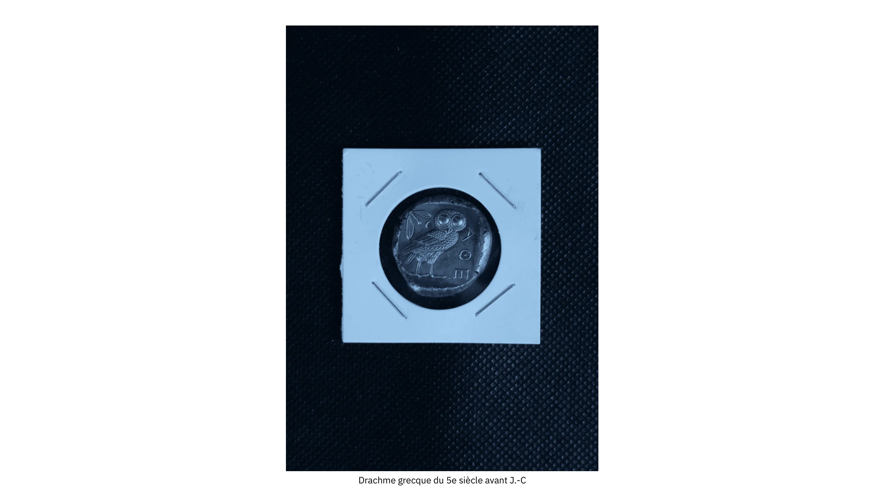

Chaque cité grecque développa son propre rapport à la monnaie. À Athènes, la monnaie fut profondément liée à la puissance politique et économique. Le fameux décret athénien de la fin du Ve siècle av. J.-C. imposa l’usage exclusif de la monnaie athénienne dans ses territoires alliés, renforçant ainsi son hégémonie économique. Athènes accumulait aussi de grandes réserves d'or en cas d'urgence, conservées sur l'Acropole, peut-être un symbole de sa prudence économique. À l’inverse, Sparte, cité militaire aux valeurs rigoureuses, choisit de restreindre fortement l’usage de la monnaie, interdisant à ses citoyens la possession de pièces en or ou en argent. Sparte préférait utiliser de lourdes barres de fer afin de décourager le commerce extérieur et maintenir sa cohésion sociale.

Les guerres furent souvent financées par des manipulations monétaires. Pendant la guerre du Péloponnèse (431-404 av. J.-C.), Athènes procéda à des dévaluations drastiques pour payer ses troupes. Privée de l'accès à ses mines d'argent par l'occupation spartiate de Décélie en 413 av. J.-C., Athènes dut fondre des statues en or pour frapper de nouvelles monnaies en urgence en 407/406 av. J.-C. Puis, en 406/405 av. J.-C., elle créa des pièces de bronze plaquées d’argent, causant une crise monétaire illustrée par **Aristophane**, qui évoque déjà ce que l’on appelle aujourd’hui la loi de Gresham : la mauvaise monnaie chassant la bonne. Cette monnaie d'urgence fut rapidement démonétisée après la guerre pour restaurer la confiance en la monnaie athénienne.

La fin de la période classique fut marquée par la montée de la Macédoine avec Philippe II et son fils Alexandre le Grand, bouleversant profondément l’équilibre monétaire grec. Grâce aux importantes mines d'or et d'argent du mont Pangée, Philippe II produisit une abondance monétaire qui finança ses campagnes militaires et politiques, instaurant un étalon or-argent simple et pratique (10:1). Ses statères d'or, célébrant sa victoire aux Jeux Olympiques, circulèrent même jusqu'en Europe occidentale atteignant même l’Angleterre. Alexandre poursuivit cette politique monétaire, diffusant largement la drachme **attique** au cours de ses conquêtes en Orient jusqu'en Inde. Cette circulation massive de monnaies marqua le début de l’ère hellénistique, où l’image des souverains remplaça progressivement celle des divinités sur les pièces. Cette innovation permit à des générations de monarques hellénistiques de se mettre en valeur, reléguant les dieux traditionnels à un rôle secondaire au revers de leurs monnaies.

Après la mort d’Alexandre en 323 av. J.-C., ses généraux se partagèrent son immense empire, établissant des dynasties en Égypte (les Ptolémées), en Syrie (les Séleucides) et ailleurs. Ces royaumes hellénistiques adoptèrent des systèmes monétaires variés : les Ptolémées imposèrent un système monétaire fermé pour contrôler la circulation de l'argent, préférant utiliser des céréales comme monnaie interne afin d'économiser les métaux précieux pour leurs dépenses militaires externes. En parallèle, Rhodes devint un centre commercial majeur avant d'être affaibli économiquement par les Romains qui établirent Delos comme port franc en 167 av. J.-C.

L’usage de la monnaie fut central dans la rémunération des mercenaires. Les soldats d'Alexandre recevaient quotidiennement des drachmes en argent.

La cavalerie, élite de l’armée hautement spécialisée d’Alexandre, recevait en moyenne deux drachmes par jour, un fantassin un drachme, et un mercenaire ordinaire, deux tiers de drachme, soit le double du salaire d’un simple ouvrier.

Durant la guerre du Péloponnèse, des sommes considérables furent également versées aux soldats : plus de 1200 talents pour réprimer la révolte de Samos et plus de 2000 talents pour assiéger Potidée.

Au moment où cette armée fut pleinement engagée en Asie Mineure, le coût total s’élevait à environ vingt talents par jour, soit environ une demi-tonne d’argent, ou 120 000 drachmes.

La monnaie grecque eut aussi un rôle culturel important, chaque cité cherchant à affirmer son identité en frappant ses propres pièces avec des symboles locaux ou mythologiques. Par exemple, Héraclée représentait Héraclès (Hercule) combattant un lion, tandis que Cyrène montrait la célèbre plante médicinale silphium.

Enfin, malgré leur variété et leurs fluctuations régionales, les monnaies grecques classiques et hellénistiques marquèrent durablement l’histoire économique et culturelle du monde méditerranéen, influençant profondément les systèmes monétaires ultérieurs jusqu’à Rome, qui adopta progressivement et développa les concepts économiques grecs pour structurer sa propre économie impériale.

## L'impact de la monnaie en Grèce
<chapterId>3a5e6c7d-699c-5567-87cd-3374c49d55a9</chapterId>
:::video id=0c79a59c-e179-4893-a414-1b8de0930eb9:::

### Athènes et le contraste avec Sparte

L'opposition entre Athènes et Sparte durant la période classique grecque révèle deux modèles radicalement différents d'organisation politique et économique. Alors que Sparte rejette la monnaie métallique au profit d'un système autarcique basé sur la confiance civique, Athènes embrasse pleinement cette technologie pour construire et maintenir son empire maritime.

### La nécessité monétaire d'une puissance navale

L'Empire athénien, malgré son nom grandiose, reste géographiquement modeste - essentiellement Athènes et les cités de la mer Égée. Sa puissance repose sur la Ligue de Délos, une alliance militaire dominée par Athènes comme hégémon. Cette structure impériale nécessite un instrument économique unifié : la monnaie d'argent athénienne.

Le maintien d'une flotte constitue le cœur de cette nécessité monétaire. Une seule trière athénienne coûte entre un et deux talents d'argent - une somme considérable. Avec plusieurs centaines de navires à entretenir, Athènes doit disposer d'un système fiscal efficace. La monnaie devient l'outil indispensable pour collecter les tributs des cités vassales et financer cette force de projection navale qui garantit la cohésion de l'empire.

### L'imposition monétaire comme outil de domination

Athènes impose sa monnaie d'argent à tous les membres de la Ligue de Délos. Cette standardisation monétaire sert plusieurs objectifs stratégiques. D'abord, elle facilite la collecte des tributs en créant une unité de compte commune. Ensuite, elle renforce la dépendance économique des cités vassales envers Athènes. Enfin, elle projette symboliquement la puissance athénienne à travers tout l'empire maritime.

Cette politique monétaire contraste fortement avec le modèle spartiate. Sparte, puissance terrestre, peut compter sur le travail des hilotes (esclaves) du Péloponnèse pour sa subsistance. Son système économique fermé, centré sur la cité, ne nécessite pas d'instrument monétaire sophistiqué. Les citoyens-soldats vivent ensemble, partagent les repas communs, et n'ont pas besoin de monnaie pour les échanges quotidiens.

### La monnaie comme vecteur du commerce maritime

La nature maritime de l'empire athénien impose une ouverture commerciale. Contrairement à Sparte tournée vers l'intérieur, Athènes doit commercer avec l'extérieur pour sa survie et sa prospérité. La monnaie devient l'instrument indispensable de ces échanges commerciaux méditerranéens.

Cette orientation externe crée un cercle vertueux : le commerce génère des revenus, ces revenus financent la flotte, la flotte protège les routes commerciales et maintient l'empire, l'empire impose la monnaie athénienne qui facilite le commerce. La monnaie n'est plus seulement un moyen d'échange mais devient un pilier de la stratégie impériale.

### Les limites de la puissance monétaire

Malgré cette sophistication économique, la puissance monétaire athénienne montre ses limites durant la guerre du Péloponnèse. Face à la force terrestre spartiate, la supériorité navale et financière d'Athènes ne suffit pas. Les expéditions coûteuses, comme la désastreuse campagne de Syracuse en Sicile, épuisent les ressources financières sans apporter la victoire décisive.

L'histoire révèle ainsi que la monnaie, bien qu'outil puissant de projection de puissance, ne garantit pas la domination militaire. Sparte, sans monnaie métallique mais avec une cohésion sociale remarquable, finit par l'emporter sur l'empire monétaire athénien.

### Deux modèles, deux destins

L'opposition Athènes-Sparte illustre deux approches fondamentales de l'organisation sociale et économique. Athènes représente le modèle ouvert, commercial, monétarisé - précurseur des empires maritimes modernes. Sparte incarne le modèle fermé, autarcique, basé sur la confiance civique plutôt que sur l'instrument monétaire.

Ces deux systèmes révèlent que l'adoption de la monnaie dépend étroitement du modèle politique et économique choisi. Pour une puissance maritime et commerciale comme Athènes, la monnaie devient indispensable. Pour une société guerrière fermée comme Sparte, elle représente une menace à l'ordre social. Cette dichotomie antique éclaire encore aujourd'hui les débats sur le rôle de la monnaie dans l'organisation des sociétés.

## La République romaine
<chapterId>0bc80983-33e1-5881-85bb-7c22f3144a9a</chapterId>
:::video id=dc05ca97-d29c-4679-bfeb-912c47d86ce2:::

### Cadre historique de la république romaine

- **753 \- 509 av. J.-C. : Royaume de Rome**
- **753 av. J.-C. : Fondation de Rome** (traditionnellement attribuée à Romulus).
- **509 \- 27 av. J.-C. : République romaine**, Rome devient une république gouvernée par un Sénat et des consuls élus.
- **280-275 av. J.-C. : Guerre de Pyrrhus**. Pyrrhus, roi d'Épire, combat les Romains en Italie du Sud, remportant des victoires coûteuses ("victoires à la Pyrrhus").
- **264 \- 146 av. J.-C. : Guerres puniques**. Conflits majeurs opposant Rome à Carthage pour la domination de la Méditerranée occidentale.
- **Hannibal (247 \- vers 181 av. J.-C.)**. Général carthaginois légendaire, célèbre pour avoir traversé les Alpes avec son armée et ses éléphants afin d'attaquer Rome durant la Deuxième Guerre punique.
- **146 av. J.-C. : Bataille de Corinthe**. Rome détruit la cité grecque de Corinthe et impose sa domination définitive sur la Grèce continentale.
- **91 \- 87 av. J.-C. : Guerre sociale**. Révolte des alliés italiens de Rome réclamant la citoyenneté romaine, ce qui conduit finalement à leur intégration complète dans la citoyenneté.
- **64 av. J.-C. : Fin de la résistance séleucide**. Rome élimine définitivement l’influence séleucide en Syrie, consolidant son emprise sur l'Orient méditerranéen.
- **55 av. J.-C. : Jules César conquiert l'Europe centrale et occidentale**. Jules César étend la domination romaine sur la Gaule (France actuelle) et pénètre en Germanie et en Bretagne.
- **43 av. J.-C. : Formation du Second triumvirat**. Alliance politique entre Octave (futur Auguste), Marc Antoine et Lépide, pour stabiliser Rome après l’assassinat de César.
- **27 av. J.-C. : Début de la Pax Romana**. Période de stabilité politique et de prospérité sous le règne d’Auguste qui marque le début de l'Empire romain.

### Les débuts monétaires tardifs de Rome

Dans le cadre de cette section sur l'Antiquité, nous allons maintenant nous attarder à la République romaine. L'histoire monétaire de Rome débute bien tardivement comparée aux Grecs et aux Perses. Fondée en 753 av. J.-C., Rome attendit près de quatre siècles avant de véritablement adopter la monnaie. Pendant cette longue période, les Romains utilisaient un système primitif d'échange avec des morceaux de bronze irréguliers appelés aes rude, nécessitant une pesée précise à chaque transaction. Ce n'est qu'à la fin du IVe siècle av. J.-C., sous l’influence grecque et étrusque, que Rome commence à émettre ses premières monnaies, notamment en bronze coulé comme en Chine, l'aes grave, caractéristique des échanges romains jusqu'à **la deuxième guerre punique**.

### L'influence grecque et les premières monnaies d'argent

La rencontre déterminante avec les Grecs d'Italie du Sud initie véritablement les Romains à la monnaie d'argent frappée. Ainsi, vers 280 av. J.-C., Rome commence à produire ses propres pièces d’argent imitant les didrachmes grecques. La première émission régulière de monnaies d’argent à Rome date précisément de 269 av. J.-C., arborant les jumeaux légendaires Romulus et Remus allaités par la louve, un symbole devenu iconique.

On retrouve d’ailleurs plusieurs représentations de mythes fondateurs sur les pièces romaines de l’époque de la république. Et j'en ai une ici, une superbe pièce, c'est une vraie, du roi, du roi Tatius. Cette pièce illustre un mythe de l'enlèvement des femmes à Sabine. Donc ce fameux Tatius était le roi dans cette région. Il existait un mythe fondateur où les Romains seraient allés enlever les femmes à Sabine, un peuple qui vivait près des Romains. Et plus tard, le roi Tatius est devenu un co-roi avec un des fondateurs de Rome, le roi Romulus.

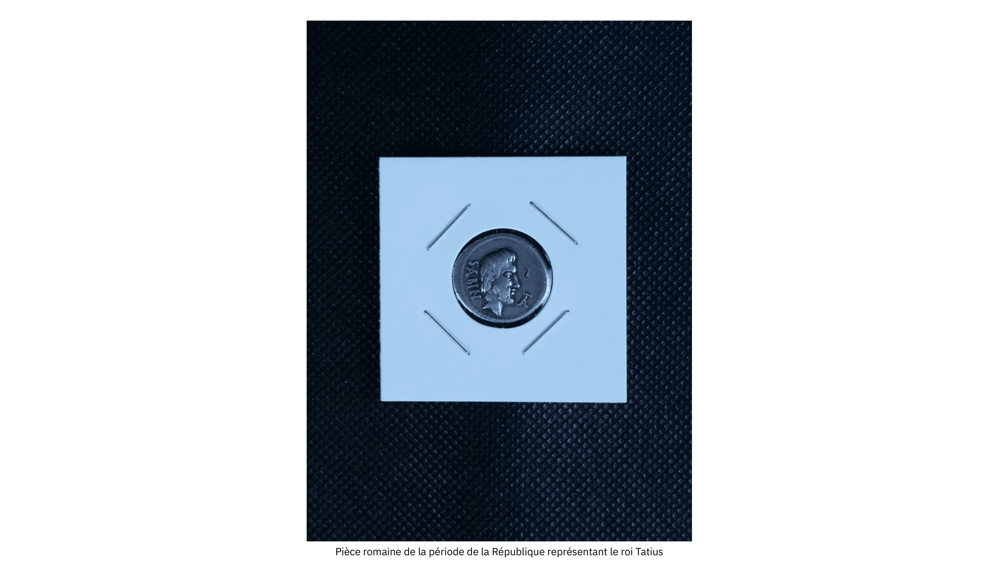

### L'origine du mot "monnaie" et le temple de Juno Moneta

Le terme "monnaie" tire d'ailleurs son origine du temple de Juno Moneta à Rome. Selon la légende, lors d’une invasion gauloise en 390 av. J.-C., les oies sacrées du Capitole auraient alerté les Romains d’un danger imminent. Pour remercier la déesse Juno, protectrice du Capitole, un temple fut érigé en son honneur et devint rapidement le lieu de frappe des monnaies romaines.

### Les guerres puniques et les crises monétaires

Les conflits militaires influencent considérablement l'évolution monétaire romaine. Durant la deuxième guerre punique (218-201 av. J.-C.) contre Carthage, Rome connut des difficultés financières sévères face à l’invasion d’Hannibal. Pour pallier ces besoins urgents, Rome recourut pour la première fois à une émission exceptionnelle de pièces d’or, ainsi qu'à une dévaluation significative de sa monnaie en argent, passant d'une pureté initiale de 97% à environ 89%. Le poids des monnaies de bronze (aes) chuta également drastiquement, perdant près de 80 % en six ans.

Ici, on retrouve un concept qu'on a déjà énoncé avec les Grecs d'une fonte de métaux précieux qui étaient conservés dans un temple pour pallier à des crises économiques. Et pour parler de **Carthage**, j'ai ici une vraie pièce carthaginoise. Ces pièces carthaginoises arboraient un palmier d'un côté, on peut le voir ici, probablement qu'on le verra beaucoup mieux sur la photo en haute résolution, et de l'autre côté, c'était un cheval. Et sur cette pièce, le cheval n'est pas très reconnaissable, elle est très usée.

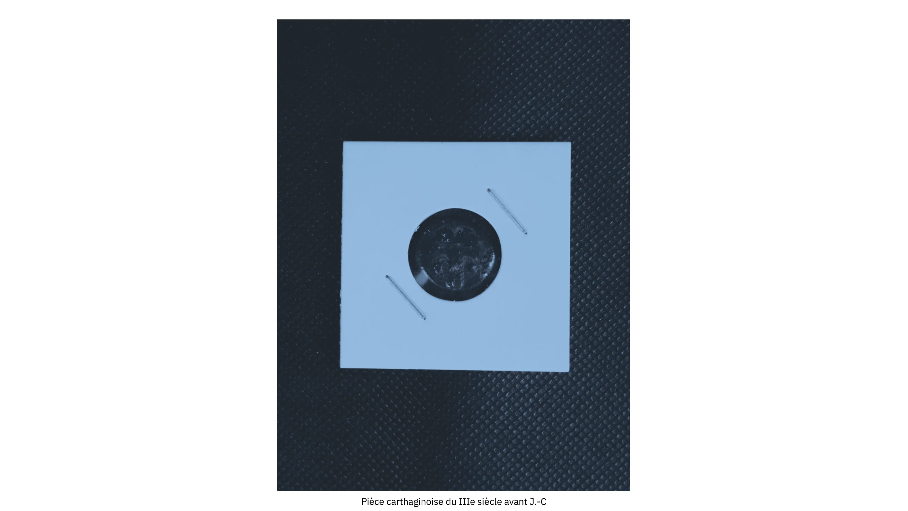

Donc, le poids des monnaies de bronze, AES, chuta également drastiquement, perdant près de 80 % en six ans. Donc, le poids de ces pièces en bronze, qui n'étaient pas un métal précieux et qui étaient utilisées dans le commerce courant, a diminué beaucoup, ce qui était un signe d'évaluation monétaire due à ces guerres.

### Le denier d'argent et la stabilité monétaire

C'est dans ce contexte critique que Rome instaure vers 212 av. J.-C. le célèbre denier d'argent. Cette réforme assure une solidité monétaire remarquable, le denier demeurant la monnaie dominante durant près de 450 ans. Rome doit cette stabilité à une gestion rigoureuse, malgré une retarification majeure en 146 av. J.-C. et une production considérable pour financer ses immenses armées, notamment durant les guerres puniques, sociales (91-87 av. J.-C.) et macédoniennes. À titre d’exemple, maintenir une seule légion romaine coûtait environ 1,5 million de deniers par an, illustrant l’ampleur des besoins monétaires.

Au-delà des frontières romaines, les guerres engendrèrent d’importantes dévaluations dans les régions sous influence romaine. Ainsi, la Carthage punique vit la pureté de son électrum chuter dramatiquement, passant de 98% d’or au IVe siècle à seulement 30% pendant la seconde guerre punique, tandis que ses monnaies d'argent tombèrent jusqu’à 18% de pureté.

### L'évolution des motifs monétaires

Avec l'expansion de Rome, le caractère des monnaies évolua aussi : initialement anonymes et patriotiques, les pièces adoptèrent progressivement des motifs personnalisés mettant en avant les familles puissantes des monnayeurs (ceux qui frappaient la monnaie). Cette transition symbolise clairement les transformations politiques de la République romaine tardive.

Enfin, si Rome domina économiquement le monde méditerranéen, elle conserva une certaine simplicité dans ses moyens de paiement : aucune véritable forme de transfert monétaire autre que l’échange direct de pièces ne fut développée, à l’exception des transferts d’impôts et des crédits privés réservés à l’élite.

## L'Empire Romain
<chapterId>2dc44e50-112a-5abf-97ae-8e0a9ecda989</chapterId>
:::video id=f8d6f3d6-9ee4-4504-888e-4f12b3f20489:::

**Cadre historique:**

**Le Principat** était la forme de gouvernement impérial de l'Empire romain depuis le début du règne d'Auguste en 27 av. J.-C. jusqu'à la fin de la crise du troisième siècle en 284 ap. J.-C.

**27 av. J.-C. : Début de la Pax Romana**  
 Période de stabilité politique et de prospérité sous le règne d'Auguste qui marque le début de l'Empire romain.

**Auguste (30 av. J.-C. à 14 ap. J.-C.)** réforme en profondeur le système monétaire romain, établissant un standard durable et stable pour les monnaies impériales.

**Auguste est également l'un des premiers collectionneurs** reconnus de monnaies antiques et de fossiles.

**54 \- 68 ap. J.-C. : Néron**  
 Empereur romain controversé, connu pour sa tyrannie, ses persécutions et sa gestion désastreuse après l'incendie de Rome.

**64 ap. J.-C. : Grand incendie de Rome**  
 Incendie majeur qui ravage une grande partie de la ville ; Néron est accusé d’en être responsable.

**69 ap. J.-C. : Année des quatre empereurs**  
 Période chaotique où quatre empereurs se succèdent rapidement (Galba, Othon, Vitellius, Vespasien).

**79 ap. J.-C. : Éruption du Vésuve**  
 Volcan qui détruit les villes de Pompéi et Herculanum, préservant exceptionnellement leurs vestiges sous les cendres.

**165 \- 180 ap. J.-C. : Peste antonine**  
 Épidémie dévastatrice qui fragilise fortement l'Empire romain sous Marc Aurèle et Commode.

**200 ap. J.-C. : Apogée territorial et fin progressive de la Pax Romana**  
 Rome atteint son extension maximale, mais commence à souffrir d'instabilité interne et de difficultés économiques.

**212 ap. J.-C. : Édit de Caracalla sur la citoyenneté**  
 L’empereur Caracalla accorde la citoyenneté romaine à presque tous les habitants de l’empire, afin d'élargir l'assiette fiscale.

**220 ap. J.-C. : Début des grandes invasions barbares**  
 Premières incursions significatives de peuples germaniques à travers les frontières romaines.

**235 \- 285 ap. J.-C. : Crise politique et militaire du IIIe siècle**  
 Période marquée par une forte instabilité politique avec de nombreux empereurs éphémères, guerres civiles, crises économiques et invasions continues.

**Aurélien (270-275 ap. J.-C.) réévalue profondément la monnaie romaine** en tentant de restaurer sa valeur nominale malgré une importante inflation.

**301 ap. J.-C. : Édit des prix de Dioclétien**  
 L’empereur Dioclétien tente vainement de stopper l’inflation galopante en imposant un contrôle strict des prix et des salaires dans tout l’empire.

**312 ap. J.-C. : Constantin**  
 Premier empereur chrétien, fondateur de Constantinople, stabilise la monnaie en introduisant le "solidus", monnaie d’or de grande pureté et stabilité.

**476 ap. J.-C. : Chute de l’Empire romain d’Occident**  
 Rome est prise par divers peuples germaniques (dont les Ostrogoths), événement considéré comme marquant la fin officielle de l’Empire romain d’Occident.

### Réformes monétaires d'Auguste

Dans cette section sur l'Antiquité, nous en sommes déjà arrivés à l'Empire Romain. L’histoire monétaire de l’Empire romain se distingue par un usage intensif de la monnaie métallique, notamment l’or, l’argent et le bronze, mais également par de multiples crises monétaires, liées étroitement à des troubles politiques et militaires. Dès la fin de la République, sous Jules César, Rome introduit en 46 av. J.-C. l’aureus en or, monnaie d'environ 8 grammes, largement acceptée à travers l’Europe et le bassin méditerranéen. César standardise ces monnaies d’or et frappe les premières pièces portant le portrait d’un homme vivant, bouleversant ainsi une tradition républicaine ancienne qui privilégiait des symboles anonymes et collectifs. Cette évolution accompagne une période de transformation politique majeure, où le pouvoir personnel remplace progressivement les institutions républicaines.

Après l'assassinat de César en 44 av. J.-C., Octave (Auguste) prend le contrôle de Rome, établissant l’Empire en 27 av. J.-C. Son règne voit une réforme complète du système monétaire, stabilisant durablement l'économie romaine. Au temps d'Auguste, un aureus en or équivaut à 25 deniers d'argent, lui-même valant 4 sesterces en bronze. Cette stabilité monétaire se prolonge durant le premier siècle après Jésus-Christ, période souvent décrite comme un âge d’or économique pour Rome.  

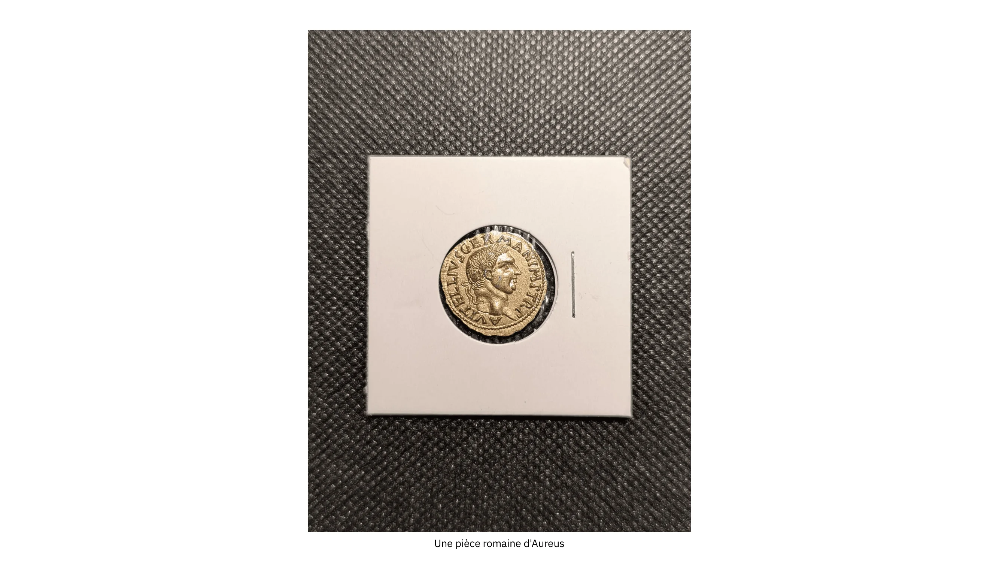

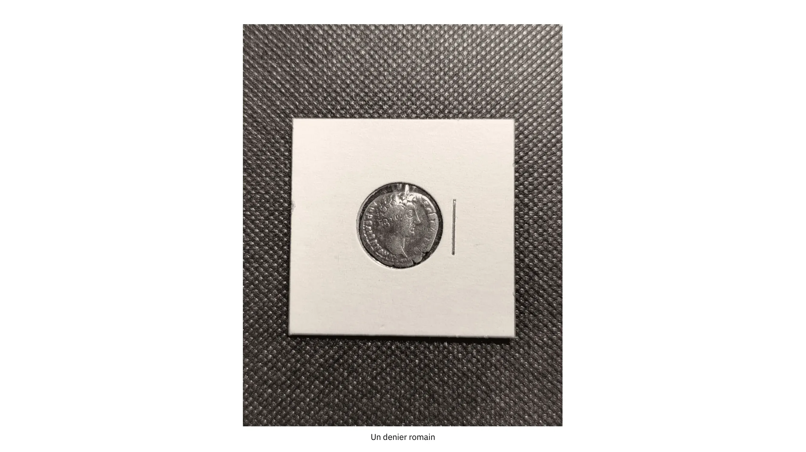

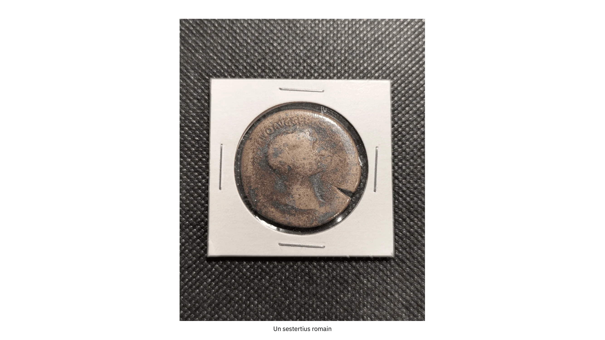

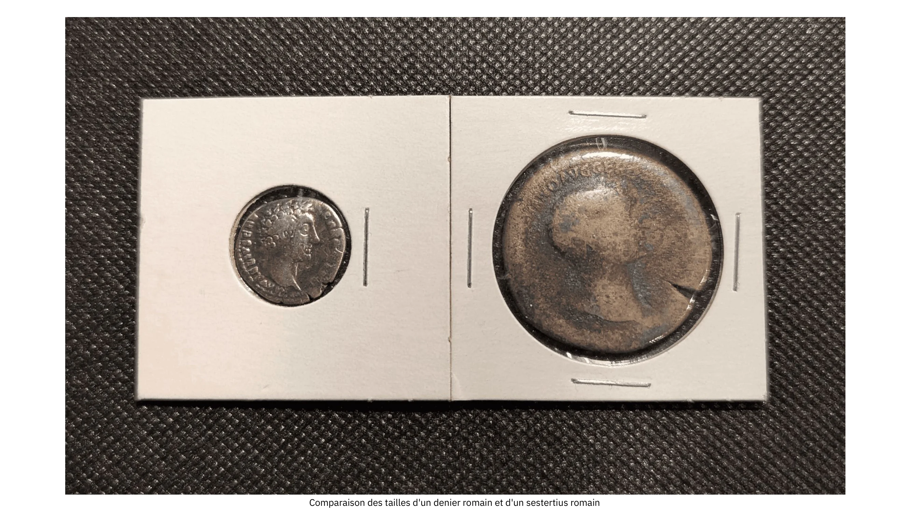

Cependant, à partir de Néron (54-68 ap. J.-C.), Rome amorce une lente dévaluation de ses monnaies, réduisant progressivement leur poids et leur pureté pour financer les dépenses impériales croissantes, notamment après le grand incendie de Rome en 64 ap. J.-C. Ces dévaluations entraînent des effets notables : les pièces plus pures sont retirées de la circulation par thésaurisation ou exportation, conformément à la loi de **Gresham**, tandis que des monnaies dévaluées prolifèrent, provoquant une hausse graduelle des prix.

Le troisième siècle marque un tournant dramatique avec une accélération spectaculaire des dévaluations sous les empereurs Septime Sévère, Caracalla et Gallien. La monnaie d'argent principale, le denier puis l’antoninien, voit sa teneur en argent diminuer jusqu'à seulement 2%. En parallèle, le poids de l'aureus en or chute de moitié. Cette crise monétaire s'accompagne d’une instabilité politique sans précédent, d’invasions barbares et de guerres civiles récurrentes.

Ça me permet d'introduire la dernière pièce de cette section, un antoninien. On ne sait pas comment cette pièce s'appelait à l'époque. Nous, on l'appelle un antoninien. Cette pièce a cette particularité de valoir deux deniers mais le problème, c'est qu'elle n'est 1.5 fois plus grosse qu’un denier. De plus, éventuellement, ce n'était que des pièces de billon, donc un alliage non pur d'argent et d'autres métaux. Les pièces étaient simplement recouvertes d'argent. C'était un bel exemple de déchéance monétaire.

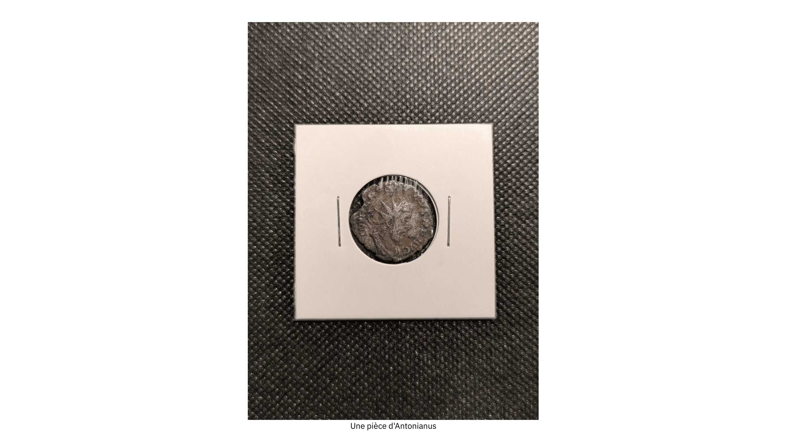

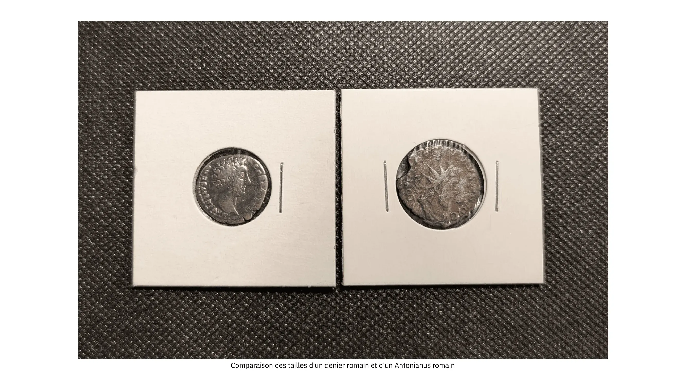

Face à cette situation, l'empereur Aurélien (270-275) tente de stabiliser le système en revalorisant nominalement les monnaies, mais **cette réforme introduit en réalité un mécanisme inflationniste en fixant artificiellement la valeur des monnaies existantes à un niveau supérieur.**

Et je prends une petite pause pour faire un petit laïus à ce sujet. C'est vraiment à cette époque que l'inflation au 3e siècle a pris un tournant presque exponentiel. Avant, même si les pièces étaient dévaluées, le fait qu'elles étaient faites à la main, une par une, frappées, nous assurait quand même d'un certain contrôle sur l'inflation. J'ai des statistiques que sur ces 300 ans de dévaluation, ça équivalait à peut-être 4% d'inflation par année. Juste avant cette réforme d'Aurélien, l'inflation était autour de 3% annuellement. Aurélien a estampé une mesure de pureté sur la monnaie le signe XXI, donc 20 parts de bronze pour une part d'argent, donc 5 % de pureté. Il a mis en marché ces pièces-là de 5 % d'argent et il a étampé ce signe dessus. Le problème, c'est qu'il a rappelé toutes les autres pièces, les pièces qui étaient vraiment plus dévaluées et a aussi estamper le fameux XXI dessus. Il a donc réévalué la valeur nominale, la valeur faciale de toutes pièces. Et ce que ça a donné, c'est une inflation de 20 % par année au lieu du 3 % qu'on voyait avant l’apparition de cette technique.

C'est vraiment Aurélien qui a inventé cette forme de dévaluation qui est beaucoup plus rapide que la dévaluation graduelle du métal, qui forçait quand même à imprimer les pièces une par une. Lui, ce qu'il a fait, c'est prendre toutes les pièces existantes, les rappeler et les étamper avec un poinçon pour changer leur valeur nominale. C'est vraiment un point tournant. C'est à partir de ce moment-là que l'inflation est devenue exponentielle.

Une façon d'exprimer, de vous faire apprécier de manière visuelle cet extrême d'évaluation, j'ai trouvé des statistiques très intéressantes sur le prix du grain en Égypte à partir de 40 avant notre ère et jusqu'au 3e siècle, donc sur 300 ans. J'ai par exemple un tétradrachma grec. Il y avait l'équivalent en Égypte à l'époque, un tétradrachme égyptien sous occupation romaine au 3e siècle. En Égypte, ils utilisaient encore la dénomination drachmas et c'était l'équivalent d'un denier.

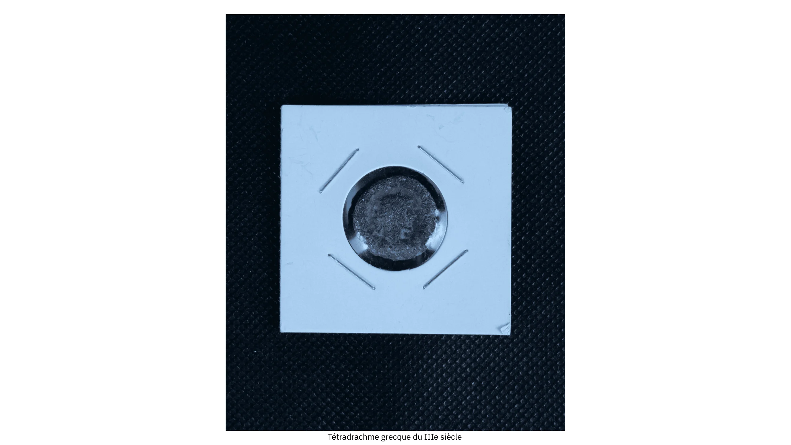

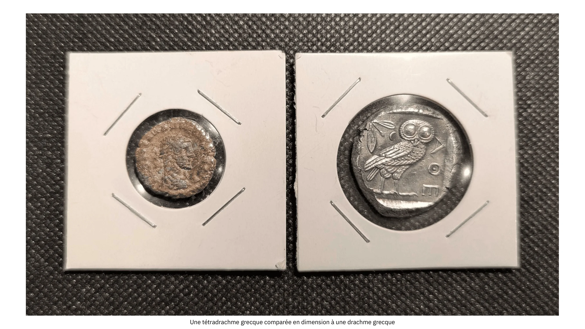

Donc le tétradrachme égyptien que j'ai ici, était l'équivalent d'un denier. On voit que la pièce est en billon ou en bronze, qu’il n'y a aucun métal précieux. On peut le comparer au tetradrachm grec d’origine pour voir la dévaluation physique sur ces 300 ans. C'est une multiplication par un million du prix du grain en Égypte.

C'est l'expression physique de la réforme d'Aurélien. Il faut noter que la majorité, la moyenne pendant ces 300 ans d'inflation, c'était environ 4 %. Et c'est plutôt à la fin, lorsqu'Aurélien a fait sa réforme, que cette inflation-là est devenue plutôt exponentielle et qu'on est arrivé à cette mesure de 1 million. Les prix ont été un million de fois supérieurs à la fin du 3e siècle, comparé au 1er siècle avant notre ère.

Son successeur **Dioclétien** (284-305) tente des réformes encore plus radicales : il émet de nouvelles monnaies (notamment l’argenteus, plus pur mais trop limité en quantité), impose des contrôles drastiques sur les prix (édit des prix de 301 ap. J.-C.) et **établit un système fiscal basé sur les paiements en nature**. Malgré ces efforts, les réformes de Dioclétien échouent à enrayer l’inflation galopante.

Face au refus de fournir des marchandises et des services contre de la monnaie dévaluée, Dioclétien instaure **un système de caste héréditaire** pour attacher les paysans et leurs descendants à leur terres.

Il faut vraiment comprendre ici que ce qui s'est passé, c'est que les paysans ont refusé de livrer leurs produits en échange de monnaie dévaluée, et la réponse de notre cher Dioclétien, c'est de créer des **castes héréditaires** en disant "toi, tu peux ne pas quitter ta terre, tes enfants ne peuvent pas quitter leur terre, même chose pour les soldats, tu es soldats, tu acceptes d'être payé dans ma monnaie". Comme solution de transition, ils étaient payés en nature (en viande, en nourriture, en grains) parce qu'il refusait la monnaie. Il impose donc ce système de caste héréditaire pour forcer les gens à être attachés à leur métier pour pas qu'ils puissent simplement changer de métier s'ils cherchent à ne pas accepter la monnaie dévaluée.  
Pour illustrer cet exemple, ici j'ai un texte, un extrait du livre "*Monetary Regime and Inflation*":

> Comme les gens n'étaient pas prêts à travailler et à livrer des biens contre une monnaie dévaluée, dont la valeur nominale était supérieure à sa valeur intrinsèque ou à sa valeur sur le marché, il fallut les contraindre à travailler en imposant des taxes en nature. [...] il devint illégal pour les paysans de quitter leur domicile enregistré. La population agricole devint ainsi héréditairement attachée à la terre. 
>
> Ce système de castes héréditaires s'étendit progressivement : Dioclétien contraignit les fils de soldats à servir dans l’armée, tandis que les travailleurs des ateliers monétaires, ainsi que ceux des manufactures de tissage et de teinture que Dioclétien avait créées, devinrent esclaves d’État, avec un service héréditaire. Les chercheurs d’or constituèrent eux aussi plus tard une caste héréditaire. D’autres classes héréditaires existaient probablement déjà à l’époque de Dioclétien, notamment les guildes des boulangers et bouchers [...] à Rome, ainsi que les guildes diocésaines des capitaines de navires qui transportaient le grain et d’autres cargaisons publiques vers Rome.

C’est finalement Constantin (306-337) qui réussit à stabiliser le système monétaire en introduisant le solidus en 312, une monnaie d’or pure dont il garantit strictement la qualité et le poids. Il existait tout un système pour vérifier la pureté et le poids du solidus. **Cette stabilité n’affecte cependant qu’une élite fortunée et l’administration impériale**, tandis que la **majorité de la population continue à souffrir d'une monnaie de faible qualité et d’une inflation persistante**. Le solidus reste stable dans l’Empire d’Orient (Byzance), où il perdure plus d’un millénaire, alors qu’en Occident, la monnaie se fragmente en petites pièces de faible valeur, accompagnant la désintégration économique et politique finale de l’Empire romain, qui chute définitivement en 476 ap. J.-C.

Pour conclure, j’aimerais vous partager cette citation de l’ouvrage *A History of Money: From Ancient Times to the Present Day* par Glyn Davies qui résume magistralement ce qui mena, peut-être, Rome à sa perte:

*«Les taxes étaient constamment insuffisantes, et les difficultés liées à ces impôts de plus en plus inadéquats, ajustés tardivement et très visibles, poussèrent Rome à se fier davantage à une forme d'imposition facile, immédiate et cachée : la dévaluation de la monnaie. Des réformes ponctuelles et de courte durée ne parvinrent pas à inverser cette tendance séculaire au déclin. Les pressions financières causées par l'usure des pièces de monnaie, les naufrages, les fuites monétaires dues à l'achat de produits de luxe venant de l'Orient, les cadeaux offerts aux barbares germaniques, la croissance des populations urbaines, le déclin de la production agricole, l’épuisement progressif des mines les plus riches, et surtout les politiques du "pain et jeux", jugées essentielles pour maintenir un minimum d'ordre dans la vie urbaine, toutes ces pressions cumulées incitèrent Rome à une dévaluation monétaire constante, entrecoupée de réformes occasionnelles vouées à l’échec.»*

*En plus du pain et du vin distribués gratuitement ou à bas prix, des libéralités impériales ("congiaria"), sous la forme d’allocations monétaires, furent distribuées de temps en temps, particulièrement sous Trajan (98–117 apr. J.-C.) et encore davantage sous Hadrien (117–138 apr. J.-C.) et ses successeurs. Ce que l'empereur et les citoyens avaient initialement considéré comme un privilège exceptionnel était devenu, dès le début du IIe siècle, une attente coutumière. Ces distributions "constituaient un lourd fardeau pour le trésor public et contribuèrent à leur manière à la faillite de l’État".*

## Liens entre dilution monétaire et inflation : des causes aux conséquences
<chapterId>38d5781c-e900-53f7-baa7-413655d71754</chapterId>
:::video id=3999256d-aafe-4502-9b72-dfa8491a2777:::

Dans cette section, on va s'intéresser aux liens entre la dilution monétaire et l'inflation de ses causes aux conséquences. La dilution monétaire est l'un des phénomènes économiques majeurs de l’histoire monétaire romaine, avec des effets directs sur l’inflation. Dès le Ier siècle ap. J.-C., on observe une première phase lente de dilution de la monnaie d'argent (denier) à partir du règne de Néron (54-68 ap. J.-C.), accélérée par la suite lors de crises militaires et financières répétées, notamment sous Septime Sévère (193-211) puis sous Gallien (253-268).

On note aussi une dévaluation plus graduelle de l’aureus. Cette différence entre le taux de dévaluation souligne deux choses:

1 \- Le rôle de l’unité de compte dans le bimétallisme pour le contrôle de la monnaie par l’État. L’unité de compte dans cet exemple est le denier. Je dénote trois façons différentes de gérer la valeur de l’unité de compte, la dévaluation (dilution du métal), la redénomination (antoninien) et l’imposition d’une valeur faciale par le marquage “XXI” (Aurélien)

2 \- La volonté de l’État de repousser le plus longtemps possible la dévaluation de l’outil de réserve de valeur, l'aureus, qui permet aux élites de conserver leur pouvoir d’achat au détriment des moins fortunés. Nous reverrons ce principe assez souvent dans ce cours notamment avec le concept nommé “effet Cantillon” et avec les redénominations du Maravedi en Espagne.

Donc, ce qu'il faut comprendre ici, le phénomène est très intéressant, et on le voit se répéter à travers l'histoire. On va le revoir avec le Maravedi dans une section subséquente. On a vu ça avec toutes les monnaies de réserve aussi après, durant l'histoire des monnaies de réserve. On ne touche pas à l'unité de réserve de valeur, qui est par exemple l'auréus à Rome, mais on ne se gêne pas pour dévaluer l'unité de compte qui sert à la population, qui sert dans le commerce, dans les échanges quotidiens. Donc, on refile l'inflation monétaire au peuple, et ceux qui ont les moyens d'avoir des pièces d'or ne sont pas touchés.

Et en passant, **c'est le même phénomène qui se crée aujourd'hui avec la dévaluation monétaire, qui permet aux actifs financiers de prendre de la valeur**, et donc c'est les gens qui se servent de la monnaie, donc les gens les plus pauvres qui s'appauvrissent, et ça enrichit par la bande, par la création monétaire, les actifs de ceux qui sont capables, qui ont les moyens de se protéger contre la dévaluation, et donc ça creuse les iniquités sociales. Voilà, c'était mon petit laïus politique.

Ce que je viens de décrire, ça s'appelle l'effet Cantillon. On va le voir que ce monsieur vivait à l'époque de John Law, un sujet qu'on va couvrir aussi dans une section subséquente.

La réforme initiée durant le règne d’Aurélien a permis à l’inflation de s’envoler. L’inflation de la valeur nominale de la monnaie n’était plus limitée par la capacité des maisons de la monnaie à produire des pièces, à la main. On pouvait maintenant apposer une simple marque aux pièces déjà frappées et ainsi faire augmenter plus rapidement la valeur nominale de la masse monétaire. 

J’ai deux citations à vous partager en lien avec Aurélien. La première vient de *A History of Money: From Ancient Times to the Present Day*:

*"en ce qui concerne l’économie romaine, la contribution d’Aurélien fut davantage un désastre qu’un triomphe. C’est en grande partie à cause de la nature de sa "réforme" que le taux d’inflation a pu augmenter bien au-delà de ce qui avait été possible auparavant, même sous l’irresponsable Gallien. Après Aurélien, pendant deux siècles, l’inflation devint endémique dans l’ensemble de l’Empire romain.»*

La deuxième vient de l’ouvrage *Ancient History from Coins* et concerne le détachement du système monétaire de l’or :

*«La réforme d’Aurélien a modifié la relation entre la monnaie d’or et le reste du système monétaire. Avant celle-ci, les autres types de monnaies étaient liés à l’**aureus** selon des taux officiels (25 deniers ou 25 tétradrachmes égyptiens pour un aureus, etc.). Après la réforme, la monnaie d’or a commencé à **fluctuer librement en valeur**, comme n’importe quelle marchandise, tandis que le reste du système monétaire **s’effondrait en valeur** en raison de l’**affaiblissement des alliages**, n’étant plus **adossé à l’or**. Comme l’unité de compte restait théoriquement basée sur l’argent (le denier, ou en Égypte la drachme), les prix augmentaient à mesure que la monnaie se dépréciait.»*

Comme on l’aura compris, cette dévaluation de la monnaie qui servait d’unité de compte affectait disproportionnellement les moins nantis, tandis que les détachement du lien avec la monnaie en or protégeait le pouvoir d’achat de ceux qui pouvaient se permettre d’épargner dans cette réserve de valeur qu’est l’or.

Ce qu’il faut comprendre ici c’est que si il y a un lien entre le denier et l’aureus, même si tu dévalues le denier, si tu es encore capable d'échanger tes deniers contre des aureus à ce taux (25 deniers pour 1 aureus), les gens vont définitivement échanger leurs deniers contre tes aureus puisque les deniers vont être surévalués et l'oreus sous-évalué. Mais dans cette réforme ils ont enlevé ce lien. Les gens ne pouvaient donc plus échanger des deniers contre de l'argent métal dévalués contre de l’or. C'est à partir de là où ceux qui avaient accès à des pièces d'or pouvaient vraiment se protéger parce qu'on ne pouvait plus après permettre aux gens d'échanger de l'argent dévalué surévalué contre de l'or pur sous-évalué. C’est un moment très important de cette évolution de la monnaie.

Un exemple frappant des effets de cette réforme par Aurélien est parfaitement illustré par ces citations tirées du livre *Monetary Regimes and Inflation*:

*«Entre les règnes des empereurs Claude (41–54 ap. J.-C.) et Constance (337–361 ap. J.-C.), le prix du blé sur le marché libre en Égypte, exprimé en drachmes, **a été multiplié par plus d’un million**. L’inflation spectaculaire des prix est l’un des faits économiques centraux des IIIe et IVe siècles ap. J.-C." (Lendon 1990, p. 106). Mais cette évolution est **moins dramatique qu’il n’y paraît**, car elle correspond à un **taux d’inflation annuel moyen de 4,4 %**. Et selon Wassink (1991, p. 482), l’inflation n’aurait en réalité commencé **qu’en 238 ap. J.-C.**»*

*«À partir de cette date, l’inflation s’est lentement accélérée, car **la bonne monnaie a d’abord été chassée de la circulation**, si bien que la masse monétaire totale n’a presque pas augmenté au début. Par la suite, elle aurait atteint un taux annuel moyen de **3,65 % entre 250 et 293**, pour ensuite grimper à **22,28 % entre 293 et 301** (Wassink 1991, p. 466), c’est-à-dire jusqu’aux **réformes monétaires avortées de l’empereur Dioclétien**. Ce phénomène est **particulièrement impressionnant pour une inflation dans un régime monétaire fondé sur le métal**.»*

Ce phénomène d’inflation lié à la dilution monétaire répond initialement aux crises ponctuelles de trésorerie de l’État romain. En réduisant la teneur en métal précieux des pièces tout en maintenant leur valeur nominale, l’État augmentait temporairement ses ressources. Mais les prix ne réagissaient pas immédiatement : en effet, le système romain connaissait une certaine rigidité des prix ("stickiness"), ce qui faisait que les salaires et les prix tardaient à s’adapter aux dévaluations successives. Néanmoins, après un certain seuil, les prix augmentaient brutalement pour rééquilibrer le marché avec la valeur réelle des monnaies.

Comme on vient de le mentionner, ce phénomène est particulièrement évident à partir du milieu du IIIe siècle. En Égypte, région richement documentée, les prix sont multipliés par 10 sous Aurélien (274 ap. J.-C.) après une réévaluation officielle de la monnaie, malgré une tentative initiale de stabilisation. Puis, sous Dioclétien (301 ap. J.-C.), l’édit sur les prix impose un contrôle drastique pour freiner l'inflation sans s'attaquer à la cause profonde – la surproduction et la dégradation monétaire –, causant ainsi un échec prévisible. L'inflation persistante pousse finalement l’économie vers un système à deux vitesses : **l'élite, protégée par des réserves d'or (comme le solidus de Constantin**), profite de la stabilité, alors que la majorité de la population continue à subir une inflation chronique, **illustrant ce qu'on appelle aujourd'hui l’effet Cantillon.**

Ainsi, on observe un lien clair entre la dilution monétaire romaine et l’inflation, dont les causes sont essentiellement liées aux déficits fiscaux chroniques, aux dépenses militaires incessantes et à une mauvaise gestion économique étatique.

## La chute de l’Empire Romain
<chapterId>b6ec0914-227b-509c-8108-b09eec9bb904</chapterId>
:::video id=91d4fee5-59bb-4ab9-a90b-e1125c71decb:::

### La dévaluation monétaire et l'effondrement de Rome 

L'école autrichienne d'économie, notamment à travers Ludwig von Mises, propose une interprétation monétaire de la chute de Rome. Dans cette vision, la dévaluation progressive de la monnaie romaine a brisé le système complexe de division du travail qui soutenait un empire de 60 millions d'habitants. La monnaie, instrument central de coordination économique, une fois corrompue, entraîne l'effondrement de toute la structure sociale et économique.

Cette dégradation monétaire ne détruit pas seulement la cohésion interne de l'empire. Elle rompt également les liens commerciaux avec les peuples frontaliers. Les "barbares", privés des bénéfices du commerce avec Rome, passent de la coopération pacifique à la prédation. Les invasions ne sont donc pas uniquement militaires mais résultent d'une rupture économique fondamentale.

### Les trois phases de la dévaluation impériale

L'histoire monétaire romaine se divise en trois périodes distinctes. La première, des Julio-Claudiens aux Antonins (27 av. J-C - fin IIe siècle), maintient une relative stabilité. Sous Trajan, l'empire atteint son apogée : 5 millions de km², Rome devient la première ville millionnaire de l'histoire. Le denier conserve une pureté d'argent de 98% à 80% - une dévaluation modérée permettant encore le fonctionnement économique.

La deuxième période, le IIIe siècle, marque l'anarchie militaire. Vingt-six empereurs se succèdent en quelques décennies. La monnaie s'effondre : l'antoninien, censé valoir deux deniers, n'en contient que 1,5 en poids métallique - première tentative de divorce entre valeur légale et valeur réelle. Cette manipulation déclenche la loi de Gresham : la mauvaise monnaie chasse la bonne. Les citoyens thésaurisent les bonnes pièces, ne dépensant que les dévaluées.

Les trésors monétaires découverts en archéologie révèlent cette anxiété économique. Les amphores enterrées montrent, par stratification, comment les Romains déposaient d'abord les meilleures pièces, ajoutant progressivement les dévaluées. Ces "stacks" antiques témoignent de l'action humaine face à l'incertitude - une tentative de préserver la valeur dans un monde en déliquescence.

### Constantin et le système dual 

Constantin (310-337) tente de stabiliser l'empire par une réforme radicale. Il crée le solidus d'or, monnaie strictement contrôlée par l'administration. Des fonctionnaires vérifient systématiquement poids et pureté. L'émission reste limitée, liée aux butins de guerre. Cette monnaie devient l'instrument exclusif du pouvoir : les impôts se paient en solidus, les légions reçoivent leur solde en or.

Parallèlement, le peuple utilise le nummus de bronze, constamment dévalué. En 445, un solidus vaut 7 000 nummi ; en 498, 16 800. Ce système dual institutionnalise l'effet Cantillon : ceux ayant accès au solidus - administration, propriétaires terriens - sont protégés de l'inflation. La plèbe, cantonnée au nummus, s'appauvrit inexorablement.

Cette séparation monétaire crée deux économies parallèles sans taux de change officiel. Le solidus reste l'unité de compte, mais circule peu. Le nummus sert aux échanges quotidiens mais perd constamment de sa valeur. Cette architecture monétaire préfigure les inégalités du système féodal émergent.

### L'effondrement de la division du travail

La dévaluation monétaire détruit progressivement la spécialisation économique. Sans unité de compte fiable, le commerce méditerranéen s'effondre. Les artisans spécialisés de Rome ne peuvent plus échanger avec l'Égypte ou la Gaule. Les provinces adoptent leurs propres monnaies, multipliant les frictions commerciales.

Face à cette désintégration, la population urbaine fuit vers les campagnes - un exode urbain inversant des siècles d'urbanisation. Les artisans abandonnent leurs métiers pour l'agriculture de subsistance. Les grands domaines (latifundia) deviennent des îlots autarciques, préfigurant les seigneuries médiévales.

Dioclétien, désespéré, exige même les impôts en nature - aveu ultime de l'échec monétaire. Son édit du maximum (301) tente de contrôler les prix, accélérant le retour au troc. La complexité économique régresse vers des formes pré-civilisationnelles.

### La survie par l'or de Rome à Byzance

Le solidus survit paradoxalement à l'empire d'Occident. Byzance le maintient jusqu'au XIe siècle, assurant mille ans de stabilité économique supplémentaire. En Occident, son souvenir persiste : le mot français "sou" dérive de solidus, témoignage linguistique d'une grandeur monétaire perdue.

Les propriétaires terriens ayant préservé leur richesse en or deviennent les seigneurs féodaux. Les structures ecclésiastiques, seules institutions survivantes, assurent le lien social que la monnaie ne peut plus garantir. L'Europe se fragmente en domaines autarciques, chacun avec sa propre économie de subsistance.

Cette transformation révèle la fragilité des civilisations complexes. La division du travail, permettant à Rome de nourrir un million d'habitants, dépend entièrement de la confiance monétaire. Une fois cette confiance brisée, l'édifice s'effondre, ramenant l'Europe à des formes économiques primitives pour près d'un millénaire.

## L’âge des ténèbres et le Moyen Âge
<chapterId>a5856873-6142-57be-8a73-1f9e3df83792</chapterId>
:::video id=86b8da9b-3831-443d-b170-58c2bea3ad54:::

L'histoire et l'émergence de la monnaie au Moyen Âge sont marquées par des périodes de régression, d'innovation et de rétablissement économique.

Par exemple, lorsque l’armée romaine quitte la Grande-Bretagne, plus aucune monnaie romaine n’entre sur l'île. Vers 435 après J.-C., l'utilisation de la monnaie disparut complètement en Grande-Bretagne, phénomène unique dans les anciennes provinces romaines. Pendant près de deux siècles, l'économie britannique se passe de monnaie jusqu'au VIIe siècle, où des monnaies d'inspiration mérovingienne et continentale refirent progressivement leur apparition.

À partir du VIIIe siècle, l'influence chrétienne contribua à la réintroduction de la monnaie en Europe du Nord. La figure clé de cette époque fut Pépin le Bref, roi des Francs, qui instaura le denier en 752, repris ensuite par son fils Charlemagne. Ce dernier étendit largement l'usage du denier d'argent, créant ainsi une norme monétaire européenne pour plusieurs siècles.  
En Angleterre, la monnaie connut un regain significatif avec la production du penny en argent sous le roi Offa de Mercie vers 765\. Cette monnaie devint si importante qu'elle resta quasiment inchangée pendant 500 ans.

Comme premier artefact liés à cette période, je vous propose une reproduction d'un penny anglais de l'époque.

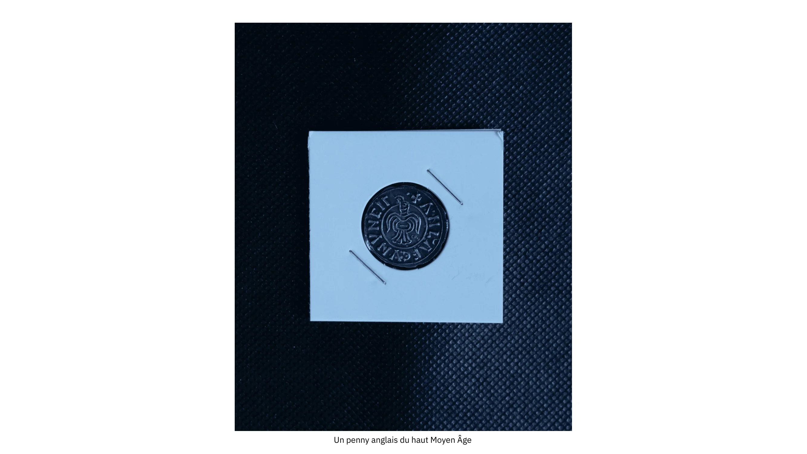

Durant le haut Moyen Âge, l'Europe bascula vers le féodalisme suite à l'effondrement du système monétaire romain. La majorité de la population utilisait des monnaies de faible valeur en cuivre ou en bronze, souvent sujettes à la dilution monétaire, limitant ainsi les échanges commerciaux sur de longues distances.

Le retour de la monnaie comme moyen de paiement se fit graduellement, culminant au XIIIe siècle avec l'apparition du florin d’or à Florence en 1252, puis du ducat d’or à Venise. Ces monnaies d’or connurent une large diffusion grâce à l'expansion du commerce et aux besoins croissants en moyens de paiement fiables et acceptés internationalement.

En Angleterre, le système monétaire fut protégé de la dilution grâce à des politiques fiscales innovantes, comme la taxe foncière introduite par Guillaume le Conquérant après 1066, permettant de préserver la qualité du penny sterling. Ici, ce qui est important de comprendre, c'est que les souverains à cette époque pouvaient dévaluer la monnaie pour financer l'État, et **l'introduction de cette taxe a permis de garder la monnaie stable et de financer l'État par la taxe.**

Cependant, la tentation du profit par la dilution monétaire mena à des crises, comme sous le règne d'Henri Ier au XIIe siècle, où la qualité des monnaies chuta dramatiquement. Des réformes sévères, parfois accompagnées de mesures violentes envers les monnayeurs, permirent de restaurer temporairement la confiance dans la monnaie.

Le Moyen Âge vit également l'apparition de pratiques financières sophistiquées, comme l'usage des bâtons de comptage (tally sticks) en Angleterre, permettant de contourner l'interdiction de l'usure et d'étendre le crédit. L'Église n'était pas très friande des prêts avec intérêt, donc on utilisait différentes techniques pour contourner cette prohibition sur l'utilisation des intérêts.

Ces innovations répondaient au manque chronique de monnaie métallique et favorisèrent l’émergence d'un marché financier embryonnaire.

Les croisades, quant à elles, stimulèrent le commerce méditerranéen, favorisant le développement des échanges internationaux et de nouvelles pratiques bancaires, notamment par l'Ordre des Templiers. Ces derniers devinrent d'importants intermédiaires financiers, permettant aux croisés d'obtenir des liquidités loin de chez eux, préfigurant ainsi le système bancaire européen moderne.

Et pour faire le lien avec les Templiers, j'ai ici une monnaie médiévale française, et on peut reconnaître au centre une belle croix. C'était assez commun pour les monnaies de cette époque d'arborer cette croix.

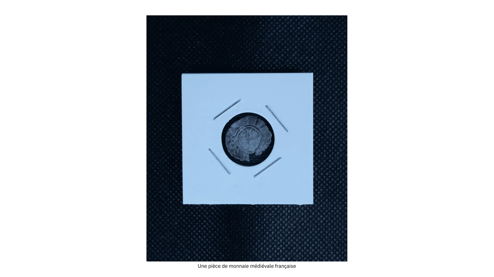

Enfin, les grandes crises, comme la Peste noire (1346-1353), provoquèrent de profondes transformations économiques. La forte baisse démographique entraîna une augmentation brutale des salaires, défiant les tentatives gouvernementales de maintenir les anciens niveaux de rémunération.

Parallèlement, la guerre de Cent Ans (1337-1453) força les États à adopter des politiques fiscales plus agressives pour financer leurs armées, contribuant à l'affaiblissement du système féodal.

Le Moyen Âge fut ainsi marqué par une constante tension entre le besoin de monnaie fiable pour le commerce et la tentation permanente pour les souverains de diluer la monnaie afin d'en tirer des profits immédiats. Ce conflit façonna profondément l'évolution monétaire européenne, préparant ainsi les fondations des systèmes économiques modernes.

Et en conclusion de cette section, j'ajouterais une anecdote assez intéressante qui s'est passée à cette période en Angleterre. Cette anecdote est tirée du livre ici, "History of Money" par Glyn Davies.

On y mentionne qu'en Angleterre, le passage vers le Parlement a permis de transférer le poids de la dette du souverain vers le Parlement, ce qui a permis un endettement chronique de l'État. Parce qu'avant ça  la dette pesait sur les épaules du souverain.

Et une fois que le Parlement a pu saisir une partie de ce pouvoir de création monétaire, ça a permis la création de dettes à long terme qui étaient sur le dos de la population et non sur les épaules du roi. Avant si le roi faisait faillite ou si on changeait de roi, la dette s'éteignait avec lui.

Au moment où la création de dette est faite par le Parlement, ça fait émerger le concept de la dette souveraine qui est, elle est potentiellement illimitée sur la durée. Tant que l'État existe, tant que le Parlement existe, cette dette existe et il fallait qu'ils trouvent toutes sortes de moyens de la refinancer et de l’étaler dans le temps. C'est un changement de paradigme important où ce n'était plus le roi, la royauté, qui garantissait ou qui avait le poids de ces dettes, c’était maintenant le Parlement et donc ses citoyens.

## La renaissance
<chapterId>1d1dfb05-70b4-5b7b-9708-373c2182950d</chapterId>
:::video id=4977b4f3-c7b2-41a5-ad7b-a96a8cca4092:::

Nous en sommes déjà arrivés à la section du cours où nous parlons de cette période que l'on nomme la Renaissance. Elle se déroule sur fond d'une crise tragique avec la propagation fulgurante de la peste par des puces sur des rats qui embarquent sur les bateaux. Cette tragédie nous informe toutefois sur la croissance des échanges et des déplacements de la période du haut médiéval. Plus tôt durant cette période, pas autant de gens se déplaçaient aussi loin et aussi rapidement.

### le Florin de Florence

Le retour des monnaies d'or en Europe durant la Renaissance marque un tournant fondamental dans l'histoire monétaire. **Tout commence avec le Florin de Florence en 1252, première grande monnaie en or frappée en Europe depuis la chute de Rome**. Avec un poids et une pureté remarquablement constants (environ 3,5 grammes d'or pur), le florin se maintient inchangé pendant quatre siècles et devient rapidement une référence monétaire pan-européenne incontournable.

Et ici, j'ai une reproduction d'un Florin. Un Florin d'or fait en étain et estampé par un artiste français qui fait d'excellentes pièces, gravées et frappées à la main.

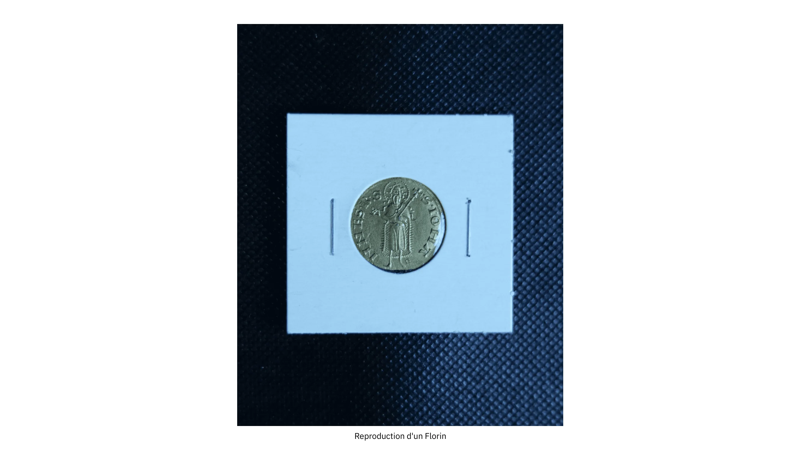

Ce retour des monnaies d’or est motivé par un contexte précis : la chute du solidus byzantin et le déclin économique musulman causé par les invasions mongoles créent un vide monétaire pour les échanges internationaux.

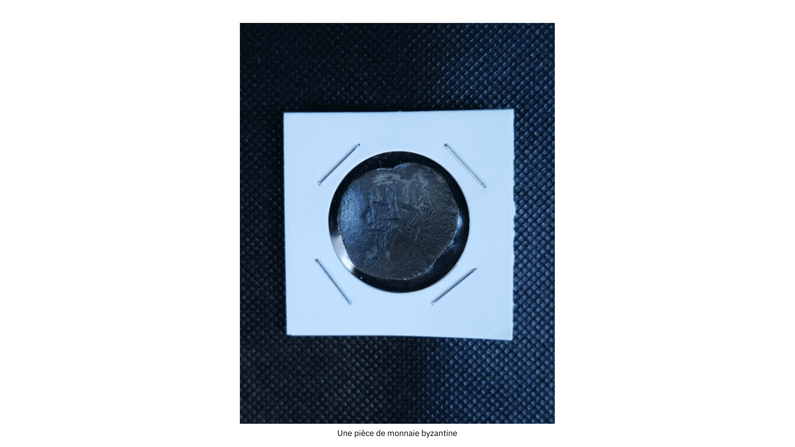

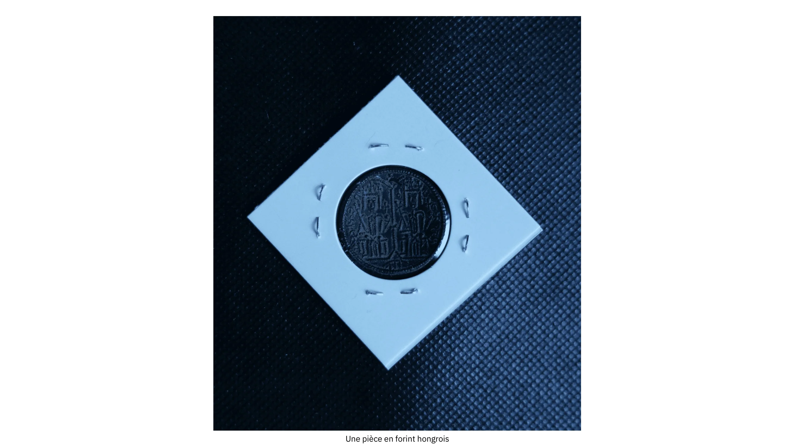

J'ai ici une pièce byzantine que je trouve intéressante. Je vais vous faire un parallèle avec une monnaie de l'époque, une monnaie de la Hongrie de l'époque. C'est une pièce qui est est en forme de coupe, comme un petit bol miniature. Et l'iconographie dessus, c'est une espèce de figure religieuse et des rois qui tiennent des croix dans leurs mains côte à côte. C'est le même genre de pièce sous forme de coupe et celle-là vient de Hongrie. C'était assez coutumier de copier les pièces des autres pays. Comme les pièces byzantines étaient globalement acceptées, ça arrivait que d'autres pays copient ces pièces. On peut voir quand on les compare côte à côte, ces pièces se ressemblent beaucoup.

L'Italie du Nord, notamment Florence, Venise et Gênes, profite de ce contexte pour lancer de nouvelles monnaies dures, des monnaies dont la teneur en métaux précieux est stable. Venise suit l’exemple de Florence en frappant le ducat en 1270, une monnaie presque identique au florin et utilisée largement dans le commerce méditerranéen.

Le florin devient la première monnaie de réserve internationale, adoptée dans plus de 150 villes européennes avant la fin du XIVe siècle. Avec la création d'un réseau bancaire florentin d’envergure, mené par les Médicis, la gestion monétaire et comptable se modernise profondément, réduisant même le besoin de transporter physiquement l’or.

Ça, c'est quelque chose qui est super intéressant aussi. À une époque, on perdait beaucoup de cargaisons de pièces dans des voyages dans la mer. Cette avancée technologique, les registres avec la comptabilité à double entrée, permet la création de monnaie scripturale. On peut donc réduire le nombre de règlements en pièces et plutôt faire un jeu d'écriture, ça réduit beaucoup le risque de perte de monnaie dans les transports.

Le développement monétaire s'accompagne aussi d’une évolution significative des méthodes bancaires. Inspirée en partie par les contacts des Croisades avec les pratiques bancaires musulmanes, l'Europe médiévale voit émerger des systèmes bancaires rudimentaires à Florence, Venise, Barcelone et Gênes dès le XIIIe siècle. Les Templiers, ordre religieux et militaire, propose déjà un système permettant aux croisés de voyager sans emporter directement leur fortune avec eux.

Donc, ils déposaient dans leur pays un bureau des Templiers, et ils pouvaient se déplacer avec une forme de lettre et récupérer les pièces quand ils arrivaient à destination pour leur croisade.  
Donc, ça permettait de ne pas se déplacer avec les pièces de métaux précieux.

C'est aussi pendant cette période que l’Europe prend connaissance de l'existence de la monnaie papier utilisée en Chine, grâce au voyage de Marco Polo au XIIIe siècle. Cependant, le développement des billets de banque attendra plusieurs siècles, car l'Europe préfère d’abord perfectionner ses méthodes de frappe de monnaies métalliques. Leonardo da Vinci, proche de Luca Pacioli, un expert comptable renommé, contribue activement à l'amélioration des presses monétaires, favorisant une production de pièces de monnaie plus rapide et uniforme.

On parle ici évidemment de la frappe au balancier auquel j’ai fait référence plus tôt dans le cours. Ça permettait de faire des pièces plus uniformes que la frappe au marteau, et ça permettait surtout d'écrire autour, un peu comme je vous ai déjà montré, sur le taler. C'est un taler européen de 1793, et donc on voit qu'il y a une écriture sur la frange.

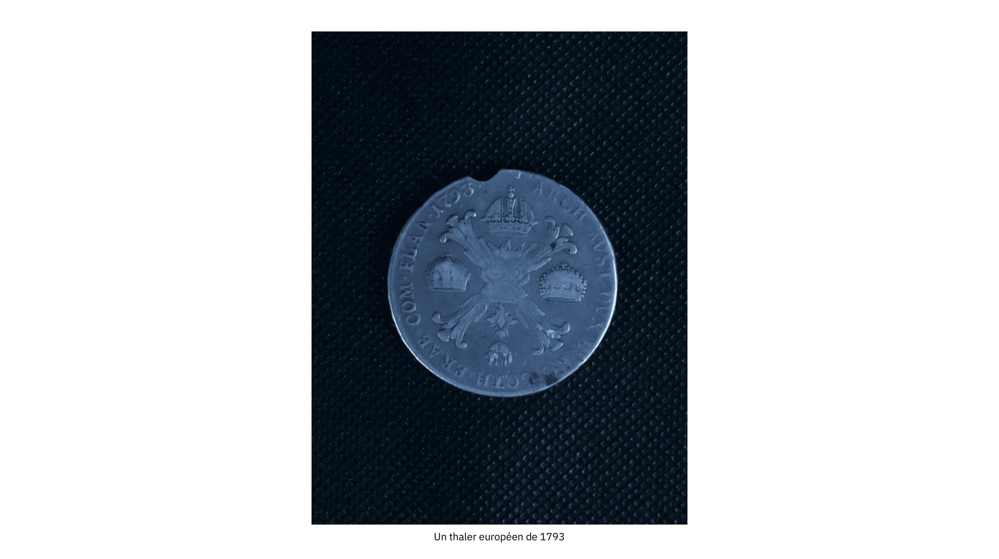

Au XVe siècle, toutefois, l'Europe connaît une grave crise monétaire avec une dégradation généralisée de la teneur en argent des monnaies européennes, qui tombe à moins de 5 % vers 1450\.

À partir du XVIe siècle, le centre de gravité monétaire se déplace vers l’Espagne, stimulé par l’union des royaumes d’Aragon et de Castille, la fin de la Reconquista, et les grandes découvertes maritimes comme celle de Christophe Colomb en 1492\. L’arrivée massive d’argent des mines américaines bouleverse profondément les équilibres économiques européens et mondiaux, alimentant à la fois inflation et nouvelles tensions géopolitiques.

La Renaissance marque aussi une évolution artistique majeure dans la frappe monétaire, avec des monnaies comme le thaler (Joachimsthaler), qui sera à l’origine du terme "dollar". Ces grandes pièces en argent reflètent les nouvelles techniques artistiques et mécaniques de frappe permises par l’innovation technique venue du nord de l’Europe.

Enfin, la Renaissance financière amorce la transition vers la modernité économique avec le développement de la banque, du crédit, des marchés financiers, et l’émergence des premières formes de capitalisme moderne dans les grandes villes commerciales d’Amsterdam, Londres et Stockholm, posant ainsi les bases du système financier international tel qu'on le connaît aujourd’hui. Et ce sera justement le sujet de notre prochaine vidéo.

# La saisie de la monnaie par l’État
<partId>17cfb1b4-5bc1-53e0-b035-05c7cf76be92</partId>
 
## L'évolution des monnaies de réserve mondiales
<chapterId>d65cc352-e7ca-5f03-9b23-dd1fae5c0395</chapterId>
:::video id=82710062-8fff-426c-93af-923c08d82233:::

### L'importance historique des métaux précieux

Bienvenue à cette section au sujet de l'émergence des monnaies de réserve et des banques centrales.Comme premier point de cette nouvelle section, nous allons nous concentrer sur l'évolution des réserves, des monnaies, pardon, de réserves mondiales.

Les métaux précieux, spécialement l’or et l’argent, ont longtemps été considérés comme la base de la richesse et de la puissance des empires. La soif d’or a toujours été un moteur dominant, et ce fut l’afflux de métaux précieux qui eut les effets les plus directs et évidents sur les développements monétaires en Europe. À l’époque médiévale et début Renaissance, cette obsession pour l’or et l’argent s’explique par la difficulté à conserver la valeur dans d’autres formes de marchandises, ainsi que par la forte demande des puissances étrangères, notamment dans le commerce avec l’Orient.

Au fil des siècles, plusieurs empires se sont succédé comme centres économiques mondiaux. Le pays qui domine le commerce mondial durant une période donnée obtient en général le statut de monnaie de réserve. On mentionne ainsi :

**L'Espagne et le Portugal (XVe et XVIe siècles)**
* Les Provinces-Unies (Pays-Bas) au XVIIe  
*La France et la Grande-Bretagne aux XVIIIe et XIXe*
**Les États-Unis au XXe siècle**

### L'essor portugais et le Real (1450-1530)

**Le Portugal** dominait le commerce mondial durant la seconde moitié du XVe et le début du XVIe siècle, avec le **Portuguese Real**. Il s’agissait d’une pièce d’argent de poids relativement uniforme. Les Portugais, grâce à leurs avancées en navigation, trouvèrent de nouvelles routes maritimes vers l’Afrique, l’Asie et le Nouveau Monde. Les forts militaires et comptoirs maritimes se multiplièrent de l’Afrique jusqu’en Chine (Macau).

Pour répondre à la soif d’or et d’argent en Europe, "la motivation constante des grandes découvertes fut le profit commercial et surtout la quête d’or et d’argent". Toutefois, l’Empire portugais, trop étendu et concurrencé par les Hollandais, Anglais et Français, déclina par la suite.

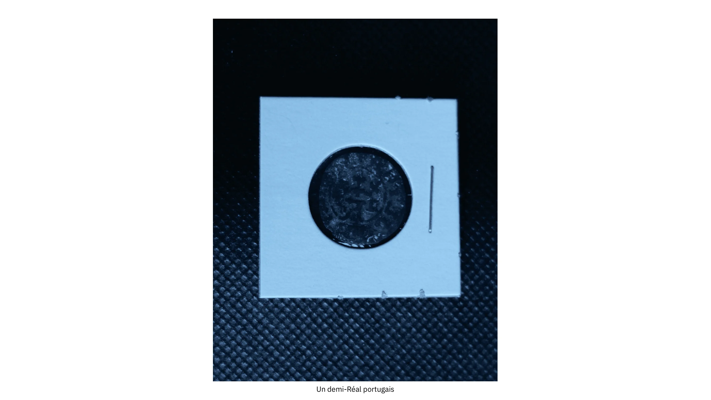

Voici un artefact, un demi-réal presto qui date de l'époque de ces conquêtes Maritime.

### L'apogée espagnole et le Spanish Dollar (1535-XVIIe siècle)

Avec la conquête du Nouveau Monde, **l’Espagne** devint l’acteur dominant. Son monarque, contrôlant de gigantesques mines d’argent (Potosí en Bolivie, Zacatecas au Mexique), réussit à battre monnaie en argent pur, évitant ainsi de déprécier la sienne : le **Real Espagnol.**  

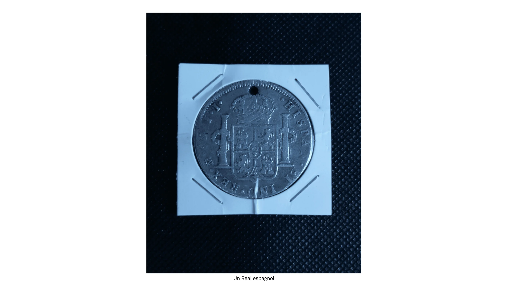

Le réal espagnol, qu’on appelle aussi le « piece of eight ». Il est surnommé ainsi parce qu’on le coupait souvent en huit pour créer de la monnaie plus petite. On l’appelle aussi le **dollar espagnol**. La pièce que vous voyez ici date de 1814, donc c’est un exemplaire un peu plus récent. Les toutes premières pièces du dollar espagnol, elles, n’étaient pas aussi parfaites : c’étaient des pièces frappées au marteau, beaucoup moins rondes et moins nettes.

Ce qui est vraiment intéressant, c’est que le dollar espagnol était la monnaie de réserve internationale à l’époque. L’autorité espagnol avait aussi sa monnaie locale, le maravedi, et pour ajuster la masse monétaire, il procédait à des rappels réguliers. Par exemple, une pièce en cuivre ou en bronze valant initialement un maravedi pouvait être rappelée et estampée avec un « 2 », puis plus tard avec un « 4 », et ainsi de suite jusqu’à « 8 ». Sur la photo haute définition, on voit clairement un « 8 » estampé. C’est une façon de faire grandir la masse monétaire… et forcément, ça créait de l’inflation.

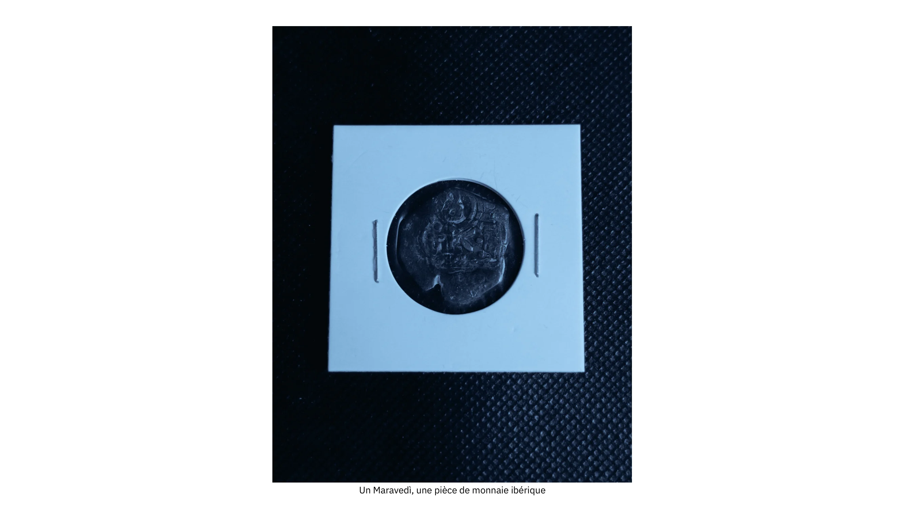

Si on regarde l’histoire des monnaies de réserve, un point intéressant émerge : les empires n’inflationnaient pas leur monnaie tant qu’elle gardait ce statut de monnaie de réserve. **Ce n’est qu’à la fin de leur domination qu’ils finissaient par la dévaluer, perdant ce privilège, qui passait alors à un nouvel empire.**

En Espagne, le dollar espagnol a dominé le commerce mondial pendant près de 200 ans, notamment entre la Chine et l’Europe. On retrouvait ces pièces jusque dans les ports chinois. Et c’est là qu’il y a un petit clin d’œil historique : le dollar américain vient directement de cette monnaie. Quand les États-Unis se sont formés en 1792, ils ont passé une loi pour battre leur propre monnaie, et leurs premiers dollars ont été créés sur le modèle du dollar espagnol, autant par le nom que par la taille de la pièce.

Pour se rendre compte de la valeur, à l’origine, un dollar américain était une pièce d’argent pesant presque une once, donc entre 30 et 40 € d’argent aujourd’hui, contrairement au billet de papier qu’on connaît maintenant. Et le dollar espagnol, lui, circulait tellement qu’il est considéré comme la première véritable monnaie globale.

Cependant, cet afflux de métaux précieux venant des Amériques causa de l’inflation en Europe. Durant la révolution des prix (env. 1540-1640), le coût de la vie en Angleterre fut multiplié par sept. En Espagne, l’abondance d’argent eut un effet pervers de ‘resource curse’, freinant le développement d’institutions bancaires solides.

Par la suite, l’Espagne fit face à de nombreux conflits militaires (Flandres, Pays-Bas, guerre de Trente Ans), et ses finances s’effondrèrent peu à peu. Les souverains successifs choisirent, plutôt que de dévaluer la pièce d’argent mondialement acceptée, de faire défaut ou de déprécier la monnaie de cuivre (vellon) utilisée par la population locale. C’est ce que je vous ai décrit plus tôt avec le Maravedis.

### L’ascension hollandaise (XVIIe siècle)

Après l’apogée ibérique, **les Pays-Bas** s’imposent comme nouvelle puissance commerciale au XVIIe siècle. Le commerce maritime, la VOC (Dutch East India Company) et la fondation de la **Bourse d’Amsterdam** (inspirée de celle d’Anvers) érigent cette république marchande au rang de plaque tournante.

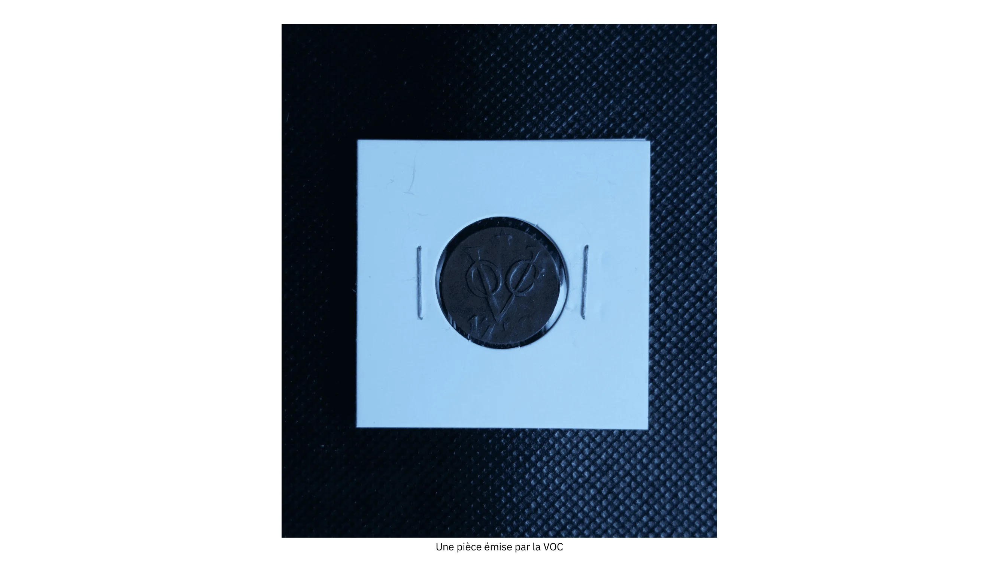

Voici un Gulden de 1722, une belle pièce en argent ainsi qu’un pièce émise par la VOC

La VOC était une compagnie extrêmement puissante pour l’époque : elle possédait sa propre armée et émettait même sa propre monnaie.

Les Hollandais inventèrent le capitalisme moderne qui à l’origine, c’est essentiellement la distribution du risque dans des entreprises risquées, comme les expéditions vers le Nouveau Monde ou la recherche de nouvelles routes commerciales. Les sociétés par actions ont permis à plusieurs investisseurs de mettre de l’argent ensemble et de partager le risque. Pour faciliter ces échanges, il a ensuite fallu créer des institutions capables de négocier et d’échanger ces titres. C’est ainsi qu’en 1602 naissent la première société par actions et la première bourse.

La monnaie hollandaise, le **Gulden**, gagna en crédibilité grâce à sa pureté en argent, puis grâce à son adoption par la Banque d’Amsterdam (1609), où les dépôts devinrent une forme préférée de monnaie en Europe. C’est un point très important à mentionner. Oui, bien sûr, il existait les pièces, mais ce qui constituait vraiment la monnaie à cette époque, c’était une forme de monnaie scripturale. En fait, une grande partie du commerce mondial passait par les livres de compte de la Banque d’Amsterdam. C’était une véritable avancée bancaire : les échanges marchands internationaux ne se faisaient plus nécessairement avec des pièces physiques, mais directement à travers les écritures comptables de la banque.

Cette période de prospérité s’illustra par un important afflux d’or et d’argent provenant notamment des autres pays pratiquant l’inflation ou le contrôle monétaire. Il y a d’ailleurs un personnage intéressant à mentionner. À cette époque, un certain **Thomas** **Gresham** a travaillé pour la royauté anglaise aux Pays-Bas, afin de gérer les flux monétaires entre les deux pays. C’est ce même Gresham qui nous a laissé la fameuse "**loi de Gresham**".

Néanmoins, l’Empire hollandais finit, lui aussi, par s’essouffler. Les guerres contre l’Angleterre, la dilution du gulden en temps de conflit, ainsi que la concurrence d’autres puissances (France et Angleterre) signèrent la fin de l’hégémonie hollandaise. Après la Quatrième Guerre anglo-néerlandaise (1780-84), le déclin du gulden comme monnaie de réserve devint irrémédiable.

### La puissance française, velléités et échecs (XVIIe – XVIIIe)

La **France**, sous Louis XIV, devint la plus grande puissance continentale d’Europe. Pourtant, la monnaie française n’atteignit jamais le statut de référence dominante : de nombreuses dévaluations, la lourde taxation, les guerres coûteuses (guerre de la Ligue d’Augsbourg, de la Succession d’Espagne, etc.) ont pesé sur la stabilité du système monétaire.

La première grande expérience de papier-monnaie fut menée par un certain John Law (1716-1720). La Banque Générale émettant des billets adossés à des promesses de dette d’État. Ce stratagème se solda par une bulle spéculative et un effondrement (la ‘Mississippi Bubble’) en 1720\. Cette catastrophe laissa la France durablement méfiante vis-à-vis de la monnaie papier. C’est cette expérience désastreuse qui mena Richard Cantillon qui lui s’est enrichi grâce à ce système d’énoncer les principes maintenant connu sous le nom d’effet Cantillon où l’impression monétaire enrichit ceux qui ont accès à la presse à billets.

Lorsque cette méfiance s’est finalement estompée, autre fiasco du papier français : les **assignats** révolutionnaires. Émis à partir de 1790 basés la confiscation des biens du clergé. Ces assignats connurent une hyperinflation galopante, donc c'est officiellement la première hyperinflation qui a dépassé le 50 % par mois de l'histoire. En 1795, alors que leur valeur nominale avait été multipliée, ils s'échangeaient à quelques pourcentages de leur valeur initiale.

Des lois plus restrictives voulaient imposer l'assignat, mais sans succès. Le gouvernement a essayé de l'imposer en allant jusqu'à menacer de mort ceux qui ne l'acceptaient pas et en forçant les commerçants à rester ouverts. Mais évidemment, au final, ça n'a pas fonctionné.

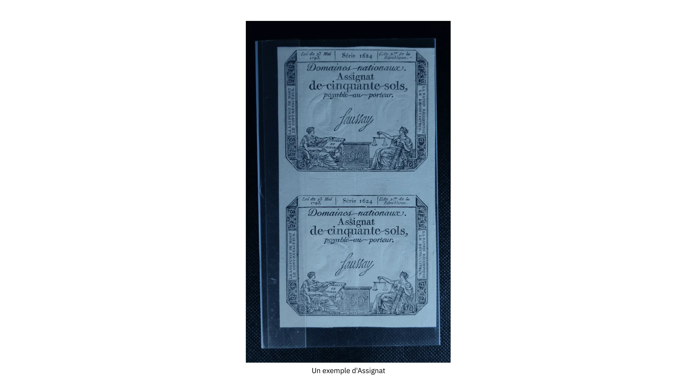

Comme cette monnaie papier a fait disparaître toute la bonne monnaie en métaux précieux, conformément à cette fameuse loi de Gresham, ils se sont retrouvés avec une pénurie de pièces et pour frapper des pièces, ils ont utilisé le métal de cloche saisi au clergé. Voici une belle pièce de métal de cloche frappée à partir de ce cuivre récupéré, en faisant fondre les pièces saisies au clergé.

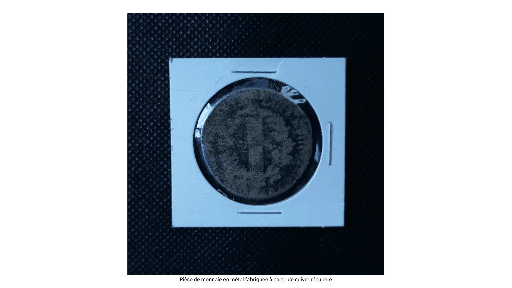

### La domination britannique (XVIIIe – début XXe siècle)

**L’Angleterre**, après avoir dépassé les Pays-Bas, s’imposa comme puissance dominante au XVIIIe siècle. La livre sterling est la plus ancienne monnaie encore en usage, liée à l’origine à une livre d’argent. Graduellement, son statut s’affermit, soutenu par une révolution financière et fiscale : la monarchie parlementaire, la forte capacité à lever l’impôt et la création de la Banque d’Angleterre en 1694\.

Au fil des guerres contre la France, le Royaume-Uni sortit vainqueur en 1815 (Waterloo), ce qui confirma sa suprématie. Durant le XIXe siècle, la livre sterling agit comme monnaie de réserve mondiale. À son apogée, avec seulement 2,5% de la population mondiale, la Grande-Bretagne produisit 20% du revenu global et contrôlait près du quart de la surface terrestre.

La **Révolution industrielle** et l’adoption d’un **Gold Standard** (1717 ou 1718, sous la supervision d’Isaac Newton au Royal Mint) renforcèrent la crédibilité de la livre. La Banque d’Angleterre adopta un étalon or à 4,25 livres par once d’or, permettant aux détenteurs de billets de les convertir en or.

Cependant, la Première Guerre mondiale (1914-1918) mit fin à ce système. En quelques semaines, toutes les grandes puissances belligérantes suspendirent la convertibilité or. L’empire britannique, puis la livre, sortirent exsangues de la Seconde Guerre mondiale, cédant la place au dollar américain au XXe siècle.

Et comme artefact, ici, j'ai des belles pièces intéressantes. En fait, ce sont des poids monétaires. Celui-là, c'est le souverain. Donc, les premières représentations de la livre, c'est des souverains. Je possède seulement des poids monétaire pour représenter ces pièces parce que je n'ai pas les moyens d'acheter un vrai souverain. Donc, pour les peser, on avait la balance, puis on mettait le poids monétaire de l'équivalent du souverain.

Et ça, les souverains, c'était une pièce monétaire qui est une pièce d'or qui valait un livre à l'origine. Et précédant ce fameux souverain, on retrouvait la Guinée, le même principe, une pièce de monnaie. Le Guinée était nommé ainsi parce que l'origine des métaux précieux qu'il contenait venait de ce pays, la Guinée.

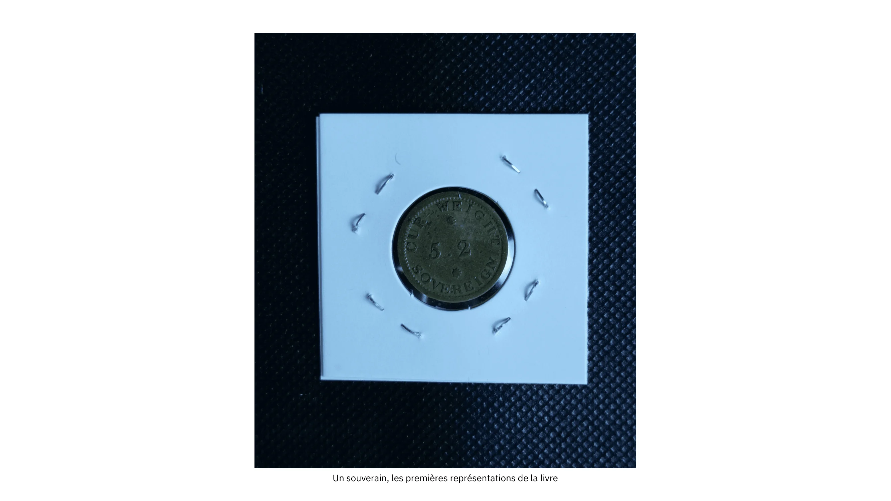
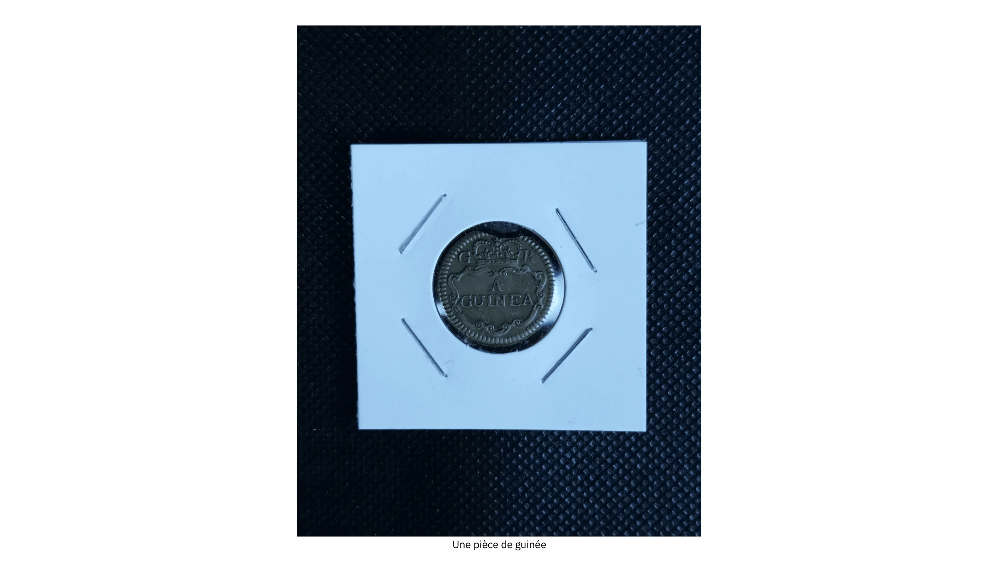

## L'émergence des banques centrales
<chapterId>15777771-1e28-55f7-a400-69868a47079b</chapterId>

:::video id=7661b7b5-e00f-48f3-b69a-6fb2eb5ebba4:::

Suite à cette section sur l'histoire des premières monnaies de réserve, l'évolution des monnaies de réserve, voici un segment sur l'émergence des banques centrales. Ça suit à peu près le même chemin que l'émergence des monnaies de réserve, mais ça se concentre un peu plus sur les technologies bancaires de l'époque.

### Les prémices des banques et proto-bourses 
Dès le XIIIe siècle, les Italiens (Florence, Gênes, Venise…) développent des techniques de comptabilité en partie double. Plus tard, **Anvers** (XVIe s.) devint la première place financière de l’Europe du Nord, puis ce rôle revint à **Amsterdam**, grâce à la Bourse d’Amsterdam (1609) où s’échangeaient les actions de la VOC.

À Anvers on avait des foires marchandes où les marchands se rencontraient souvent pour faire des règlements de dette. Et à l'époque, on a inventé des nouveaux outils financiers. Celui est un peu plus récent, 1761, mais donc ça c'est un **billet à ordre**. On voit que c'est écrit à la main et on peut voir qu'il y a des inscriptions à l'arrière C'est un magnifique artefact de l'époque.

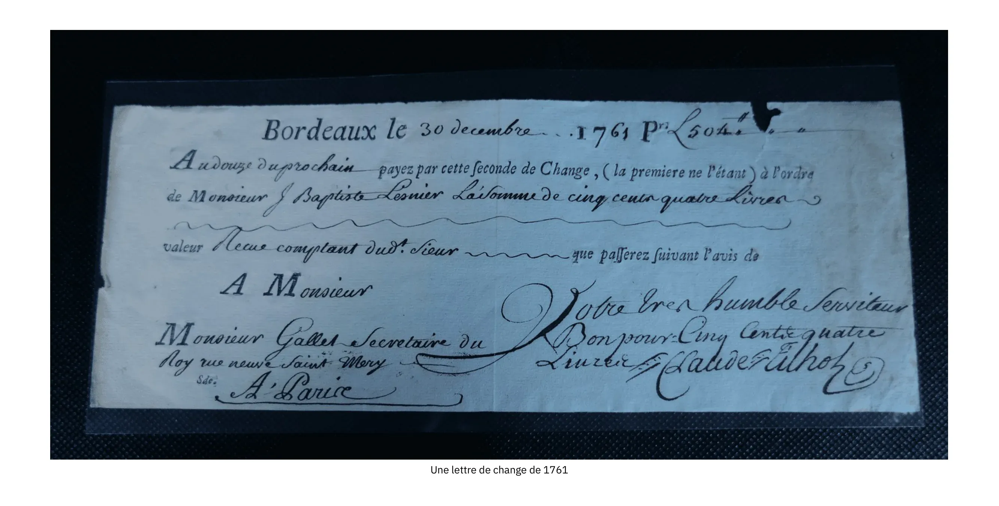

Cette effervescence suscita la création d’institutions bancaires plus sophistiquées. Les **banquiers lombards** puis les marchands hollandais perfectionnèrent les instruments de crédit (lettres de change, billets à ordre, etc.). Le système bancaire moderne repose sur cette idée : la monnaie peut être du crédit, et pas simplement du métal.

On voit que déjà ça revient à notre question d'origine sur les origines de la monnaie.  
Est-ce que la monnaie émane bien d'une marchandise qui émerge du besoin d'échanger ou est-ce qu'elle émerge du crédit? On peut retrouver encore des traces dans cette section.

### L’exemple suédois, Stockholms Banco et Riksens Ständers Bank

Déplaçons-nous maintenant en Suède où la toute première banque centrale fut créée.

**La Suède** fut pionnière en matière de banque centrale : en 1657, Johan Palmstruch créa le **Stockholm Banco**, autorisé à prêter plus que ses réserves en métal, donc ici on a la naissance de la réserve fractionnaire. Mais l’émission excessive de billets provoqua une panique et une ruée vers la banque dès 1663\. Tiens tiens ..

En 1668, pour pallier ces dérives, Riksens Ständers Bank, la première banque centrale du monde, fut fondée à Stockholm. Toutefois, elle aussi subit des crises (1709, 1715…) liées à l’abus de billets, souvent pour financer les guerres du royaume.

### Le coup d’éclat manqué de John Law 

Dirigeons-nous vers la France où l’on retrouve encore notre cher John Law.

**John Law**, écossais, persuada le Régent (Duc d’Orléans) de créer une banque privée, la Banque Générale (1716), autorisée à émettre du papier contre de l’or, de l’argent et les dettes de l’État. Devenue Banque Royale (1718), elle favorisa l’envolée des actions de la Compagnie du Mississippi.

Lorsque la réalité rattrapa la spéculation, **la panique fut aggravée par la décision d’interdire la détention d’or et d’obliger l’usage des billets de Law**. Tiens tiens ..

Finalement, la bulle éclata en 1720, causant un effondrement qui ruina la crédibilité du papier-monnaie en France pour longtemps.

### La Banque d’Amsterdam, l’essor d’un modèle précurseur

On se transporte maintenant à Amsterdam en 1609, où la **Bank of Amsterdam** (Wisselbank) saisit le contrôle de la garde des pièces et de la convertibilité à Amsterdam, interdisant la circulation de billets de caisse privés et imposant le dépôt des monnaies métalliques dans ses coffres. Ils ont grappillé petit à petit le contrôle sur la monnaie. Elles interdisaient les changeurs de conserver les pièces avec eux. Les changeurs travaillaient toute la journée et devaient aller déposer leurs pièces dans les coffres de la Banque d'Amsterdam à la fin de la journée. Et j'ai déjà mentionné aussi que ce n'étaient plus nécessairement les pièces de métal au niveau du commerce international qui étaient utilisées. C'était vraiment la monnaie scripturale dans les livres de la banque.

Grâce à la puissance marchande hollandaise, la banque joua un rôle de première "banque centrale" de facto, stabilisant le commerce mondial. Au fil du temps, cependant, elle octroya des prêts sans couverture à la VOC et finit par manquer de métal pour soutenir ses billets. "En 1790, il apparut qu’elle avait prêté de grandes sommes à la VOC, et déclara pratiquement faillite, ruinant la crédibilité du gulden. Tiens tiens ..

### La Banque d’Angleterre, acte fondateur de la modernité bancaire

Dans l’Angleterre du XVIIe siècle, on stockait or et argent chez les orfèvres (goldsmiths) qui émettaient des reçus. Cette organisation, partiellement décentralisée, montra ses limites lorsque la Couronne se retrouva en besoin massif de financement pour la guerre contre la France.

En **1694**, on fonda alors la **Bank of England (BoE)**. Ainsi la Banque d’Angleterre naquit d’un mariage de convenance entre le monde des affaires londoniens et le gouvernement, désespéré de trouver des fonds pour la guerre.

Celle-ci obtint le monopole d’émission des billets en Angleterre (renforcé en 1708, 1742, etc.). Désormais, le monnaie de papier adossée à des réserves d’or circulait au même titre que les pièces. Donc ici, ce qui est important de comprendre pour notre notion de prise de contrôle de plus en plus ferme de l'État ou des institutions étatiques, sur la monnaie. On a d’abord la Banque d'Amsterdam qui empêche les changeurs de garder les pièces et les force à les ramener à la Banque. En Angleterre, on ajoute l’interdiction pour les banques privées d'émettre leurs propres billets échangeables en or.

Ils ont quand même permis aux banques privées d'émettre leurs billets, mais ces billets-là n’étaient échangeable que contre des billets de banque de la Banque d'Angleterre

Les billets de la Banque d'Angleterre, les livres sterling, étaient échangeables en or. Donc ils ont ajouté une troisième couche à la monnaie. Nous avons donc l'or à la base, ensuite les billets de la Banque d'Angleterre, et après on pouvait avoir des billets de banques privées par dessus. Avant ça, les banques privées pouvaient émettre leurs propres billets échangeables en or. C’est donc une autre étape de la prise de contrôle progressive de la monnaie par les institutions étatiques.

La Banque finança l’État par de vastes emprunts et structura l’immense dette publique qui finançait l’essor économique.

Ce modèle se consolida au cours du XVIIIe et XIXe siècle, au point que "la livre devint monnaie de réserve mondiale, sous le sceau de la Banque d’Angleterre et de l’étalon-or.

**Les monnaies de réserve mondiales** se sont succédé au fil des siècles, portée par la puissance économique, commerciale et militaire d’un État ou d’un empire : Portugal, Espagne, Pays-Bas, puis Grande-Bretagne, avant que les États-Unis ne dominent au XXe siècle. À chaque fois, on constate un cycle semblable : expansion économique, succès commercial, adoption internationale de la monnaie, endettement, guerres coûteuses, usage abusif de la création monétaire ou du crédit, et finalement déclin.

**L’émergence des banques centrales** s’est faite progressivement. Ces institutions naissent souvent dans le contexte de guerres coûteuses, permettant à l’État de se financer par la dette. L’étalon-or, lorsqu’il fut adopté (Angleterre, XVIIe-XIXe s.), donna un vernis de stabilité, jusqu’aux grandes guerres mondiales du XXe siècle qui conduisirent à l’abandon progressif de la convertibilité or. Ainsi, le pouvoir de battre monnaie est passé du monopole royal à des entités plus complexes, d’abord privées (orfèvres, banquiers), puis semi-publiques (banques centrales), reflétant l’évolution de la souveraineté monétaire vers des formes institutionnalisées et mondialisées.

Donc, c'est un peu ce que je vous décrivais un petit peu plus tôt. On est passé souvent du poids de la dette des souverains directement vers soit les banques centrales ou soit la permission en fait de créer de la monnaie par les institutions juridiques, le Parlement par exemple.

Et le fait le plus important ici, c'est qu'**on est passé d'une dette qui pouvait disparaître par la faillite du souverain à une dette qui reposait principalement sur les épaules de la population**.

## La route vers le système fiat
<chapterId>27a98545-d350-56ee-a200-92468e6b9b33</chapterId>
:::video id=e27a753e-aeee-4307-a65c-9506aab380a1:::

Nous en sommes déjà arrivés à la fin de ce cours sur l'histoire de la monnaie et en toute fin de cours, j'avais envie de vous proposer deux sujets. Le premier sujet est les différentes étapes qui ont mené à notre système actuel fiat. Donc on va reprendre essentiellement les faits qu'on a vus dans le point 5 au sujet de la création des banques centrales. On va le voir assez rapidement de façon succincte et après la différence c'est qu'on va ajouter le concept du dollar américain qui est ultimement la monnaie de réserve actuelle. On va voir un peu comment ça a évolué, comment le dollar est né, le dollar est né de quoi, comment il a évolué, comment il a changé, quelles étapes il est passé pour devenir un système fiat parce que l'origine du dollar c'est une pièce en argent.

Ensuite, tout de suite après, je vais vous faire un petit segment très court sur l'histoire de la finance pour comprendre très facilement comment on est arrivé à l'état de providence. Donc on va voir deux sujets. Nous allons voir comment on est arrivé au système fiat et tout de suite après, on va regarder comment l'évolution de la finance nous a mené au concept de l'état de providence.

### Les fondations européennes du système bancaire moderne 

Retournons au 13e siècle avec le florin. Pour savoir comment on en est arrivé au modèle fiat, il faut commencer l'histoire au 13e siècle. Donc oui on a le florin mais il y avait quand même une technologie qui est apparue à la même époque avec les Médicis, le concept de lettres de change.

Ensuite, on a eu la bourse à Anvers avec le concept d'escompte et de billets à ordre.  
Ensuite, comme on a vu, on a eu la VOC, le premier marché d'action à Amsterdam. Donc c'était la naissance du capitalisme avec les compagnies par action et l'échange de ces titres. La banque d'Amsterdam a par la suite imposé l'utilisation des dépôts par décret. Donc on était obligé de déposer les pièces à la fin de la journée. C'est les changeurs qui ne pouvaient plus garder la monnaie sous forme de pièces.

Ensuite est venue la création de la banque d'Angleterre par nécessité de créer la dette pour financer la guerre à la fin du 17e siècle. Donc les banques privées, à cette époque, ont été relayées à la troisième couche de la monnaie. En passant, toute cette section-là, du florin jusqu'à la notion de création des banques centrales, c'est extrêmement bien résumé dans le fameux livre "La monnaie pyramide" de Nick Batia, "Layered Money" en anglais, que j'ai eu la chance de traduire avec quelques collègues. On a fait un super travail de traduction pour permettre aux francophones de partout de pouvoir profiter de ces enseignements.

Donc on est à la fin du 17e siècle. La banque d'Angleterre a été créée pour financer la guerre.  
Les banques privées ont été relayées sur la troisième couche de la monnaie. En fait, les billets des banques privées n'étaient plus échangeables en or et c'était les billets de la banque d'Angleterre qui, eux, étaient échangeables en or. Et ça, ça démontre une saisie du pouvoir de l'échange par l'institution qu'est la banque d'Angleterre.

Ensuite, on a la panique de 1776. Tout le monde remonte la pyramide de la monnaie. Ce que ça veut dire, c'est qu'en 1776, il y a une ruée vers les banques et donc tous les gens qui ont des papiers de la troisième couche, donc des billets des banques privées, essaient d'obtenir des billets de la banque d'Angleterre puis ensuite essaient d'obtenir l'or, mais évidemment, il n'y avait pas assez d'or dans les coffres. Ils ont décrété un espèce de congé bancaire pour éviter de rembourser les billets en or et ça, ça a donné naissance au concept de prêteur de dernier recours.

### L'évolution du dollar américain 

Donc, on est passé du florin jusqu'à la banque d'Angleterre. Ensuite, évidemment, il y a eu l'étape de la Première Guerre, de la Deuxième Guerre, mais avant, là on est en 1796, de l'autre côté de l'Atlantique, on a les Américains. En 1776, c'était encore une colonie anglaise, britannique, et donc les colonies, ça c'est un billet du Connecticut, c'est un vrai, c'est un billet de deux shillings du Connecticut de 1776.

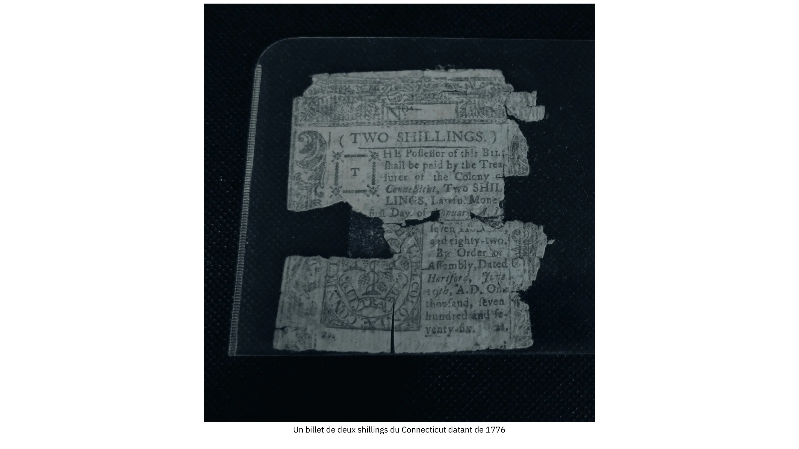

C'est juste avant qu'ils déclarent la guerre à l'Angleterre et puissent éventuellement émettre leur propre monnaie. Entre-temps, il y avait cette monnaie-papier, mais ils utilisaient aussi le dollar espagnol pour les espèces, pour les pièces. D'ailleurs, le nom dollar est resté pour le dollar américain.

Donc, je crois que c'est en 1792, si je ne dis pas de bêtises, qu'ils ont décrété une loi pour leur permettre de battre monnaie. Et pour vous donner un exemple, ça c'est un dollar américain moderne.

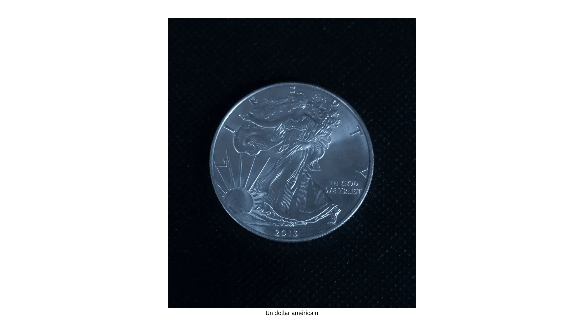

Bon, évidemment, ça ne vaut pas un dollar, il y a environ 30 ou 40 dollars de valeur, c'est un once en fait d'argent, donc dépendamment du cours de l'argent, ça vaut au moins 30 ou 40 dollars US. Aujourd'hui, évidemment, ça ne vaut plus qu'un dollar, mais ça représente précisément le format de l'époque. Le dollar américain démarre de cette valeur en argent.

Ensuite, on peut passer à la guerre civile en Amérique. On avait les confédérés qui ont imprimé de l'argent. Cette monnaie a eu de l'hyperinflation. Ce n'est pas dans la liste officielle de Hanke-Krus parce que ça n'a pas atteint le 50 %, mais ça a atteint 40 % d'inflation mensuelle. Donc, ils en ont imprimé beaucoup durant la guerre.

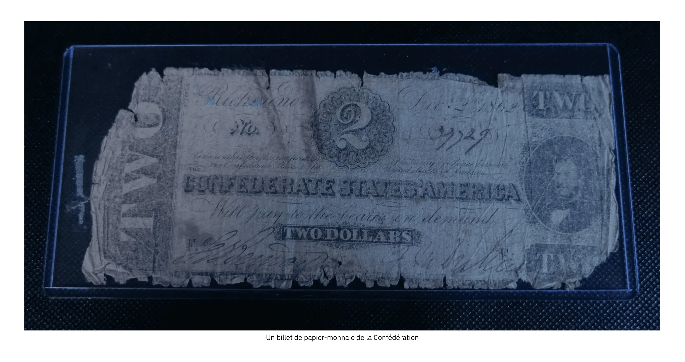

Et leurs opposants, au nord, avaient des dollars aussi. On vient de voir des dollars confédérés, et maintenant c'est les dollars du nord. Et ils s'appelaient le greenback parce que le dos était vert.

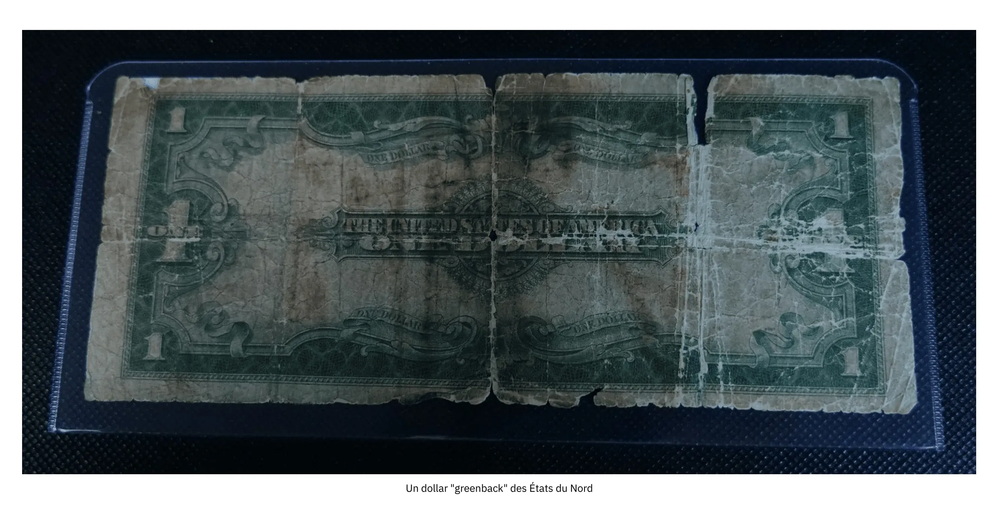

Et je vous invite à comparer la différence de grandeur avec les billets modernes. Les billets à l'époque étaient étaient plus gros.

Donc, c'est le nord qui a gagné. Le greenback est devenu la monnaie des Amériques. Et après, on a eu la fondation de la FED en 1913. Ensuite, on a eu la Première Guerre mondiale.  
Et à la suite de la Première Guerre mondiale, dans la dernière série de billets imprimés, on voyait toujours la mention "redeemable in gold on demand". Donc, ces billets-là, en 1928, il faut quand même réaliser que 20 $ à l'époque, ça achetait près d'un once d'or. Le prix de l'or, c'était 20,67 $. Donc, on peut dire que 20,67 $ par once. Et donc, ce billet pouvait acheter un once d'or en 1928.  

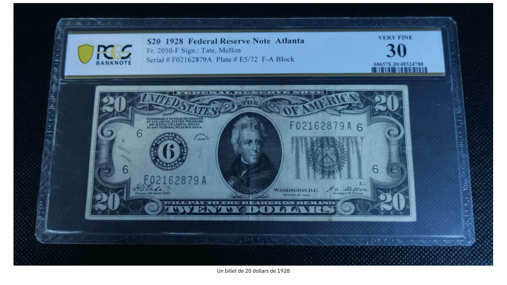

Et aujourd'hui, une once d'or, ça vaut 3 000 $ US. Et donc, on peut voir ici tout le pouvoir de la dévaluation, évidemment. Et ce billet est le dernier imprimé avec la mention "redeemable in gold". On verra tout de suite après qu'après le Order 6102, où ils ont saisi tout l'or. D'ailleurs, ils ont saisi l'or et ils ont aussi saisi les certificats d'or. Donc, ça, c'est un "gold certificate" de 1928.

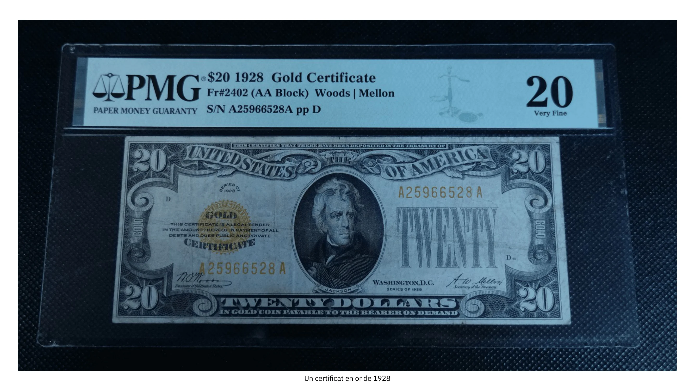

Et lui, en plus d'être "redeemable in gold" comme le billet de 1928, ce l'était en pièces d'or. C'est vraiment écrit en pièces d'or. C'est vraiment un "gold certificate". Et ils ont tous été saisis. C'était illégal jusqu'en 1964 d'en posséder. Je suis très content d'en posséder un.  
C'était illégal. Puis en 1964, c'était illégal de posséder de l'or jusqu'en 1974, si je ne m'abuse. Mais dans les années 70, ils ont permis aux gens d'accumuler de l'or après le choc Nixon qu'on va mentionner bientôt. Et donc, à partir de 1933, quand ils ont fait le "order 6102", l'ordre exécutif 6102, ils ont saisi l'or. C'était illégal d'en posséder. Il y avait de grosses peines de prison si vous étiez pris à garder votre or. À l'époque, chaque once d'or a été échangé pour un billet comme celui-là, après en 1934. Donc, en 1928, c'est encore écrit "redeemable in gold".  
En 1933, ils font l'ordre exécutif 6102. Ils saisissent tout l'or. Et après, ils donnent 20,67$ pour chaque once d'or. Et après, voici l'arnaque. Ils sortent des nouveaux billets en 1934 et c'est écrit dessus "this note is legal tender for all debt".

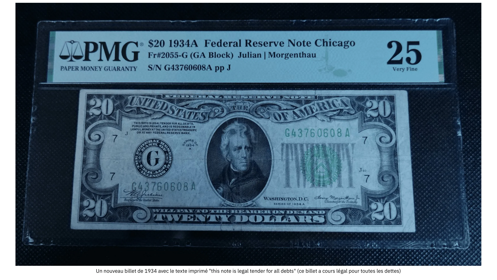

Donc, on a la notion de cours légal ici qui apparaît, qui remplace le "redeemable in gold". Les deux billets se ressemblent, c'est juste la petite mention qui change. Et l'arnaque, c'est qu'ils ont dévalué le dollar à cette époque. C'est passé d'un once d'or pour 20,67$ à 35$ dollars l'once en 1934. C'était une dévaluation du dollar d'environ 40 %. Il y a eu une dévaluation du dollar à cette époque.

Ensuite vient la Deuxième Guerre mondiale. Après la Deuxième Guerre mondiale, il y a l'accord de Bretton Woods centralisent tout l'or du monde aux États-Unis. Les Américains émettent des billets en échange. Les billets ne sont plus échangeables en or au niveau de la population, mais sont échangeables en or au niveau des États.

À terme, il y a des pays comme la France, l'Allemagne, qui se doutaient qu'il y avait probablement plus de billets de dollars en circulation que d'or dans les coffres aux États-Unis.  
Donc, ils ont demandé de rapatrier leur or. Et bien, ils ont dit "ok, d'accord, on va le faire, mais ça va prendre un peu de temps". En 1971, on a notre ami Richard Nixon qui coupe le lien entre les billets et l'or définitivement en blâmant par la bande, les spéculateurs.

L'or était sous-évalué. L'or était encore à 35 dollars par once, ce qui ne reflétait pas du tout le volume de monnaie qui avait été imprimé, ni la valeur sur le marché de l'or. On a justement vu son prix passer de 34 à 800 dollars en quelques années. Comme on a vu, d'ailleurs, dans des périodes précédentes, il y a certains moments, par exemple à Rome, où on détachait cette espèce de lien entre, disons, le denier puis le solidus pour laisser l'or flotter. Et c'est ce qui s'est passé à ce moment-là. L'or a flotté. Il y a eu une découverte de prix et l'or a valu beaucoup plus cher en dollar par la suite.

### Le système monétaire fiat moderne et ses implications

Et c'est ce qui résume, en fait, comment on est passé d'un système monétaire basé sur l'argent métal ou sur l'or. Petit à petit les institutions ont grappillé de plus en plus de pouvoirs au sujet de la monnaie. Et au final, on a une décision unilatérale de couper complètement le lien entre les métaux précieux et la monnaie, suite à une sur-impression.

C'est ce qui fait qu'aujourd'hui, il n'existe plus de lien entre l'or et les billets, ou la monnaie scripturale. Et ce n'est même pas non plus un système de réserve fractionnaire, c'est un peu dépassé ce concept. C'est plutôt les banques privées qui émettent, qui créent par le crédit bancaire la monnaie. La monnaie est surtout créée par le crédit bancaire, la création est corrélée au taux d'intérêt directeur qui est décidé par la banque centrale.

Il n'y a pas vraiment de limite. Il n'y a plus vraiment de niveau de réserve, en tout cas en Amérique et au Canada, le niveau de réserve est simplement se résume au fait que les banques doivent s'arranger pour être capables de répondre aux échanges interbancaires pour ne pas manquer de liquidité.

Il faut juste qu'elles s'assurent de pouvoir faire ces transferts-là, mais il n'y a pas un 3 %, 1 %, 10 % de réserve obligatoire. On a vraiment quitté le concept de réserve fractionnaire. Maintenant, c'est les banques centrales, les gouvernements par leur déficit fiscal, les banques centrales par le "quantitative easing", le QE, et les banques privées par la création de crédits bancaires qui peuvent faire augmenter la masse monétaire totale et, selon moi, sur l'inflation.

Et d'ailleurs, en conclusion, si vous voulez comprendre très bien le lien entre la monnaie et l'inflation, j'ai un cours sur Plan B d'environ cinq heures dédié à ce sujet et vous allez apprendre, en fait, la différence entre l'augmentation des prix, ce qu'on voit dans la vie, et l'inflation. Ce n'est pas la même chose. Souvent, quand on fait référence à l'inflation, on parle plutôt d'augmentation des prix et pas de l'inflation. L'inflation, c'est un concept assez précis qui s'explique par l'augmentation de la masse monétaire.

Et donc, ça me permet de conclure ce sujet sur le monde fiat en vous expliquant qu'il existe une ressource pour mieux comprendre les phénomènes que je viens d'expliquer peuvent découler de cette situation qui est l'inflation.

Je vous remercie pour votre attention.

## L'histoire des bulles monétaires 
<chapterId>b6451c46-917d-11f0-97de-6bc5081765fa</chapterId>

:::video id=5967d9a6-aae4-4b84-a283-71b1b735bca4:::

### L’invention de la monnaie papier et la première grande bulle

Avec la création des banques centrales au XVIIIᵉ siècle, une vraie révolution a vu le jour : l’argent magique sous forme de billets. L’exemple le plus marquant en France reste John Law. Cet Écossais exilé à Paris proposa au régent, le duc d’Orléans, de résoudre la faillite des finances royales en créant une banque d’État et une compagnie commerciale coloniale : la fameuse **Banque Royale** et la **Compagnie du Mississippi**.

Par ce système, Law lia monnaie papier et actions de sa compagnie. Plus de billets circulaient, plus les actions grimpaient, plus la banque semblait solide… jusqu’à ce que la spéculation dépasse de loin la réalité. La bulle éclata brutalement en 1720, ruinant nobles, bourgeois, et une bonne partie de l’Europe venue spéculer rue Quincampoix. Résultat : méfiance durable envers la monnaie papier en France, et première leçon européenne de bulle spéculative.

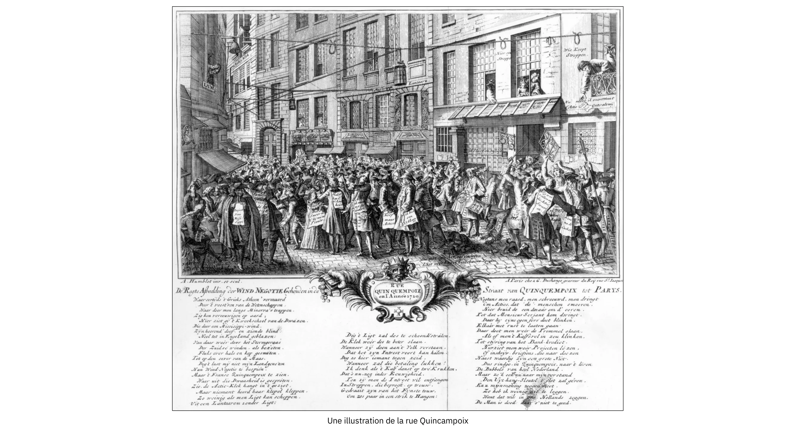

### Quand le foncier devient « garantie »

Un siècle plus tard, la Révolution française innova à son tour avec les **assignats**, monnaie adossée aux biens saisis de l’Église. Une idée séduisante sur le papier – transformer le foncier en garantie monétaire – mais inefficace : les terres ne sont ni liquides, ni divisibles. Résultat : hyperinflation, interdictions multiples pour contraindre à leur usage, inflation incontrôlée et pénuries. 

Napoléon, profondément marqué par ce chaos, rétablit l’or et l’argent comme base monétaire en 1800 avec la création de la Banque de France, garantissant du même coup la solde régulière de ses armées. Une manière pragmatique de regagner confiance : payer en pièces sonnantes et trébuchantes.

### Les années folles et la grande crise de 1929

Sautons deux siècles. Après la Première Guerre mondiale, les États financèrent l’effort par l’inflation et la suspension de l’or. Dans les années 1920, la Fed américaine pratiqua une politique monétaire trop accommodante pour soutenir la livre sterling britannique. Résultat : crédit facile, spéculation effrénée sur Wall Street, achats d’actions à crédit, émergence d’une bulle immobilière et bancaire. 

Quand la machine s’emballa, le krach de 1929 fut inévitable : faillites bancaires massives, chômage record, files devant les soupes populaires. De là naquit l’idée fausse mais persistante que **toute déflation est mauvaise**, alors qu’il faut distinguer entre une déflation par croissance (saine) et une déflation par dette (dévastatrice).

### L’Asie des années 90 et l’effet domino

Dans les années 1990, le « miracle asiatique » fit rêver le monde. Taux de change arrimés au dollar, croissance à 8-10 %, capitaux occidentaux affluant. Tout allait bien… jusqu’à ce que la marée se retire. Faillites en cascade, monnaies dévaluées de 80 %, investisseurs ruinés. Le FMI dut intervenir, imposant des réformes douloureuses. Même scénario que toujours : capital abondant, bulles nourries à crédit, puis effondrement.

### 2008 et l’ère de la bulle permanente

La bulle Internet (2000) fut suivie par la bulle immobilière des subprimes. La titrisation transforma des prêts bancaires en produits financiers « triple A », disséminés partout dans le monde. La promesse : éliminer le risque en le diluant. La réalité : tous les risques étaient en réalité corrélés. Quand l’immobilier s’écroula, c’est l’ensemble du système bancaire mondial qui vacilla.

Résultat : sauvetages publics massifs, quantitative easing, taux zéro. Et avec cela, une fuite en avant : chaque crise ne purgera plus les excès, mais sera couverte par toujours plus de dette et d’impression monétaire. C’est ce qui a mené à la situation actuelle : **la “everything bubble”**, où tout – actions, immobilier, art, crypto, même les cartes Pokémon – gonfle artificiellement.

### Le retour éternel de l’argent magique

D’un siècle à l’autre, une constante se dessine : dès qu’une société croit pouvoir créer de la richesse avec de la monnaie au lieu de produire des biens réels, les bulles apparaissent. De John Law à 2008, de la rue Quincampoix à Wall Street, le processus se répète : euphorie, crédit, emballement, puis ruine.  

Et à la fin, invariablement, lorsque plus personne n’a confiance dans le papier, les peuples cherchent autre chose – or, terres, valeurs refuges… ou monnaies nouvelles. Hier Napoléon imposait le métal, aujourd’hui certains voient la relève dans Bitcoin.  

L’histoire de la finance n’est qu’un cycle sans fin : imprimer, spéculer, s’effondrer. Jusqu’à la prochaine bulle.

## Monnaie et violence
<chapterId>9486fe64-854f-5e17-86b3-8873baca39a8</chapterId>
:::video id=bd6d0807-2d8f-4637-a0f5-1e990e5c0d0f:::

Cette courte section au sujet de la monnaie et la violence reviendra sur plusieurs événements qu'on a déjà vus à travers tout le cours. Juste pour faire un petit résumé de certaines anecdotes que je trouve intéressantes.

### Technologie et rapport de violence

Une petite liste d'anecdotes qu'on a probablement déjà parlé dans le cours. Et c'est en vue d'introduire une discussion fort fascinante que j'ai eue avec Théo au sujet d'une conférence que Théo avait donnée à B-Ondy que je trouvais fort intéressante au niveau des avancements technologiques et les effets que ça a sur le rapport de violence entre la population et l'État.

### Monnaie et coercition étatique

Et donc pour introduire cette section, je vais vous faire une petite liste, vraiment pas exhaustive, c'est pour vous rappeler les événements qu'on a probablement déjà couverts dans le cours.  
Donc, un lien avec la monnaie et la violence que je peux déjà faire, c'est souvent lorsqu'il s'agit d'une monnaie papier sans valeur qu'on peut imprimer à l'infini, ça vient souvent avec toutes sortes de règles et toutes sortes de menaces. Et on peut déjà parler des assignats où c'était littéralement écrit sur le papier que les contrefacteurs étaient menacés de mort et ainsi on trouve facilement dans les textes de loi de l'époque des menaces de mort pour ceux qui n'acceptaient pas cette fameuse monnaie papier.

Toujours en France, dans un des textes de loi que j'ai pu obtenir au sujet de la France lors de la Révolution, j'ai vu dans certains textes de loi liés à la monnaie, la description du per diem pour le transport de la guillotine, pour ceux qui transportaient et opéraient la guillotine, on décrit le per diem auquel ils ont le droit pour faire leur travail, je trouvais ça assez loufoque.

Aussi, on a parlé de la monnaie en Chine, la monnaie signe en Chine, ça venait aussi avec tout un encadrement de l'État et on a vu dans cette section au début du cours que le choix des pièces, on écartait certaines pièces qui étaient moins belles, il y avait des conséquences prévues dans la loi pour ça.

On a aussi une anecdote où un roi en Angleterre finit par couper la main de ceux qui frappent la monnaie s'ils n'avaient pas le comportement espéré face à leur travail.

Aussi, en Chine, j'ai lu des références à une saisie de cuivre dans les monastères bouddhistes. À un moment où le cuivre a pris en valeur, ça déstabilisait leur économie qui était basée sur une espèce de monnaie-signe qui n'avait pas tellement de lien avec la valeur du métal, ils ont recouru à trouver un endroit où il y avait des richesses et ils ont saisi le cuivre des monastères en Chine.

Même chose pour les monastères en Angleterre durant la réforme anglaise. Lorsque le fameux roi s'est chicané avec le pape en lien avec son divorce, il y avait une autre raison en dessous de tout ça, de ce divorce avec le Pape, c'est qu'il a profité de l'abolition de tous les monastères pour saisir les richesses qui étaient contenues dans ces organisations ecclésiastiques.

Même chose avec la France, lors de la révolution, ils ont saisi tous les avoirs de l'Église. Ils ont vu créer des belles pièces de monnaie à partir de métal de cloche.

Si on revient encore plus en arrière, une des notions de violence économique et de liberté, des lois liberticides, c'est vraiment **Dioclétien avec sa caste héréditaire qui était directement liée au fait que les paysans ne voulaient plus accepter la monnaie dévaluée**, donc ils voulaient quitter leur travail de paysans, et Dioclétien a réagi tout simplement en leur disant "vous ne pouvez pas quitter votre terre et vos enfants non plus", même chose pour les soldats.

Je trouve que c'est une forme de violence assez explicite et je pourrais conclure en parlant des Templiers ou un roi français. Lorsque les Templiers se sont établis en France, j'imagine qu'il a vu la manne des richesses des Templiers et qu'il avait des problèmes de financement d'État. Il leur a fait un procès à l'Ordre des Templiers et certains ont pu partir avec une partie du trésor et ça donne une émission très intéressante aux États-Unis ou au Canada. Je ne sais pas c'est produit par qui, mais c'est le Le Mystère d'Oak Island, donc c'est des gens qui pensent qu'il y a un trésor de Templiers qui est enfoui sur une île au Canada, dans les Maritimes, et ils forent depuis des années, peut-être même plus d'une dizaine d'années, pour faire une espèce de puits. Ils ont trouvé un puits avec beaucoup de galeries et ils cherchent un trésor enfoui par les Templiers sur cette île et ça a justement donné cette émission de télé. Je salue mon père qui est un grand fan de cette émission.

Alors voilà, c'est la petite liste très rapide de faits qu'on a vu pendant, la plupart des faits qu'on a vu pendant ce cours qui, je pense, soulève un lien avec la violence et je vous laisse avec la prochaine partie de Théo qui va nous raconter une histoire très intéressante par rapport aux changements technologiques et du rapport de pouvoir entre la plèbe et les autorités.  
Merci !

## Les conséquences économiques de la violence organisée 
<chapterId>66bd4674-2159-5489-ad4b-ec5e3fb691af</chapterId>
:::video id=c8b063c6-aeb4-4a94-9027-b11d369e71a4:::

### La violence organisée et l'évolution de l'État 

L'historien Frederic C. Lane propose une thèse révolutionnaire : l'anatomie de l'État à travers l'histoire est façonnée par les technologies de projection de la violence. Partant du principe wébérien que l'État détient le monopole de la violence légitime, Lane observe que ce monopole - paradoxalement plus efficient que la concurrence dans ce domaine - évolue selon les rapports entre coût d'attaque et coût de défense.

Cette analyse, reprise par les auteurs de "L'Individu Souverain" (1997), explique les mutations historiques de l'organisation politique : du système féodal médiéval aux cités-États de la Renaissance, puis aux États-nations industriels et enfin aux États-providence modernes. Chaque transition correspond à une rupture technologique majeure dans l'exercice de la violence, survenant approximativement tous les 400-500 ans.

### L'équilibre médiéval 

Au Moyen Âge, l'économie agraire domine à 90%. Le paysan, littéralement enraciné à sa terre, ne peut fuir face au seigneur et ses chevaliers. La technologie militaire - armures forgées artisanalement, entraînement à l'épée durant des années - coûte extrêmement cher. Cette asymétrie favorise massivement l'attaque sur la défense.

Le producteur agricole, immobile, devient captif du monopoleur local de violence. Sa capacité d'extraction fiscale atteint des sommets - bien que, paradoxalement, les impôts médiévaux restent modestes comparés aux 78% de prélèvements obligatoires modernes. Le seigneur peut taxer à volonté car le paysan ne peut ni résister ni partir.

### La Renaissance marchande 

L'émergence du commerce hanséatique au Nord et méditerranéen au Sud transforme la donne. Les marchands, créateurs principaux de valeur ajoutée, possèdent un capital mobile - leurs navires. Ils n'ont besoin que de milices maritimes légères, les mers étant difficiles à policer. Surtout, ils peuvent facilement migrer vers le port voisin si la taxation devient excessive.

Cette mobilité crée une concurrence fiscale entre cités-États. Venise, Gênes, Bruges doivent offrir le cadre le plus libéral possible : contrats fiables, monnaie de qualité, assurances, taxation minimale. Les princes doivent séduire plutôt que contraindre. L'asymétrie s'inverse : la défense (par la fuite) devient plus facile que l'attaque.

### L'ère industrielle 

La révolution industrielle ramène une configuration proche du féodalisme. Les usines, chemins de fer, chaînes de montage représentent des investissements massifs et immobiles. Henry Ford ne peut délocaliser ses installations face à la taxation. Les ouvriers, concentrés dans les cités industrielles, se syndiquent pour négocier collectivement plutôt que de migrer individuellement.

L'État "provident-stratège" émerge : planification industrielle (Japon, Corée), protection militaire des infrastructures, minima sociaux pour la main-d'œuvre. La Seconde Guerre mondiale illustre cette vulnérabilité : bombarder les usines ennemies devient la stratégie dominante. La concentration du capital physique permet une extraction fiscale massive pour financer l'État-providence.

### La révolution du microprocesseur 

Trois innovations technologiques bouleversent aujourd'hui ces équilibres millénaires. Le microprocesseur transforme la guerre : un opérateur au Nevada pilote un drone en Afghanistan avec une précision chirurgicale. La guerre du Golfe (1991) démontre cette rupture : la quatrième armée mondiale (Irak) est anéantie en 45 jours avec moins de 200 morts côté coalition. La supériorité technologique rend l'attaque frontale impossible.

Internet et la cryptographie asymétrique révolutionnent la création de valeur. Un développeur peut travailler de n'importe où avec un MacBook et Starlink, exportant sa production instantanément et gratuitement. Les "digital nomads" échappent à la captivité géographique, mettant les États en concurrence comme jamais depuis la Renaissance.

Bitcoin représente l'aboutissement de cette logique : une monnaie affranchie de l'État, protégée par un bouclier cryptographique inviolable. La richesse devient défendable contre toute force physique. L'individu regagne une capacité de défense absolue face au monopole étatique.

### L'effondrement du modèle westphalien

Les États-providence occidentaux, conçus pour l'ère industrielle, deviennent obsolètes. Les créateurs de valeur - développeurs, artistes, financiers - migrent vers Singapour, Dubai ou El Salvador, préférant moins de services publics contre une taxation minimale. Les géants modernes (Apple, Tether) n'ont besoin ni de bureaux ni d'infrastructures physiques.

Cette fuite des cerveaux crée une spirale : moins de contributeurs nets, services publics dégradés, taxation accrue sur ceux qui restent, accélération des départs. Les États doivent radicalement réduire leur périmètre ou faire faillite. Le morcellement en petites juridictions compétitives - nouveau modèle de cités-États numériques - semble inévitable.

L'histoire nous enseigne que ces transitions durent des générations. Mais la séparation monnaie-État opérée par Bitcoin pourrait accélérer le processus. L'individu vote désormais avec ses pieds et son portefeuille cryptographique, redessinant la carte du pouvoir mondial selon des lignes que nous commençons seulement à percevoir.

## Une très courte histoire de la finance
<chapterId>1d37fff1-a091-5034-8e71-4af590b8ffce</chapterId>
:::video id=fdfabbc6-e4d8-463a-8522-19176f8fb460:::

Suite à ce récit de l'histoire de la monnaie qui nous amène jusqu'au système fiat, j'aimerais assez rapidement et de manière très succincte vous expliquer l'évolution de la finance qui a mené éventuellement à l'état-providence. Au départ, à l'époque romaine, on a eu des pièces de monnaie.

C'est une technologie financière qui a permis à l'empire de payer des soldats, de s'expandre, de faire le commerce. Ça a très bien fonctionné, sauf qu'éventuellement, il y avait trop d'évaluations. À un moment où ils ont cessé l'expansion et ils ont arrêté d'avoir des butins de leurs guerres, de l'expansion de territoire, leur système s'est effondré.

### L'évolution des technologies financières 

Ensuite, on a eu le Moyen-Âge où il y avait assez peu d'évolution jusqu'à le Florin qui a ramené une monnaie stable et les développements bancaires en Italie et à Anvers où on a développé l'espèce de concept de "time value of money", donc l'escompte. Ils ont développé l'escompte pour avoir une forme de monnaie papier où on promet un titre "promissory note", une promesse que plus tard on pourra récupérer 100$ plus un taux d'intérêt.

On a développé une technologie financière pour pouvoir vendre le billet avant la fin du terme, donc si tu le vends après 4 mois sur un terme de 6 mois, la personne va payer une prime en fait pour compenser pour la perte de rendement des 2 mois qui restent.

Donc ça, c'était une technologie financière qui a été développée à Anvers et à Amsterdam à cette époque. Après, on a vu l'évolution des banques centrales, la notion de prêteur de dernier recours. On peut penser que durant la Banque d'Amsterdam, on a délaissé l'usage des pièces au niveau du commerce international pour se concentrer sur la monnaie scripturale.

Plus tard au 18e siècle, au niveau de la technologie financière, on peut parler des assurances. Donc on a une anecdote qui est très bien racontée dans le livre «The Ascent of Money» de Neil Ferguson. La première compagnie d'assurance qui est née s'appelle «**Scottish Widow**» puis essentiellement, c'était le clergé qui voulait développer une assurance pour les prêtres qui parfois mouraient plus tôt, mouraient subitement. Le clergé, à l'époque, s'occupait pendant un an de sa femme et de sa descendance en Écosse. Et donc le clergé trouvait ça peut-être un peu trop court et donc **ils ont inventé les calculs actuaires** pour calculer littéralement comment ça prenait de contribuable dans ce système pour que, dépendamment aussi de combien de prêtres mouraient subitement trop tôt.

Ils ont développé des calculs actuatiels pour dire «Bon, bien, chaque prêtre nous donne tel montant puis si le prêtre meurt, bien, l'assurance va couvrir pour assurer la survie de sa femme et ses enfants jusqu'à leur mort probablement.» Donc c'est la première compagnie d'assurance qui s'appelait «Scottish Widow» qui a inventé ce système et là ce système s'est déployé.

### De l'assurance privée à l'État-providence

Donc l'assurance fait partie de l'histoire de la technologie de la finance. Et ça, ça m'amène en fait au concept de l'État-providence, c'est que ces assurances privées éventuellement ont rencontré un problème, une notion d'optimisation où on se dit si on fait une assurance santé et qu'on l'offre aux gens qui sont en santé, ils vont peut-être avoir moins d'intérêt à payer la prime parce qu'ils se disent «Moi je suis en santé, je ne serai pas malade.» Tandis que les gens qui savent qu'ils sont malades, ils vont certainement vouloir souscrire.

Et donc tu vas avoir un débalancement entre le nombre de personnes malades qui vont souscrire à l'assurance santé, contrairement aux gens qui sont en santé qui vont peut-être moins souscrire. Donc ça fait une sorte de débalancement et si tu avais calculé des chiffres, ils ne vont pas balancer parce que tu ne seras probablement pas capable d'assurer assez de gens en santé pour souscrire à ton assurance. En économie, c'est le concept de **l'aléa moral**.

Une des idées qui a été proposée, c'est de rendre ces assurances obligatoires. Si tout le monde est obligé de contribuer, ça rebalance tout le truc et autant les gens en santé que les gens pas en santé vont contribuer et ça va distribuer les risques à la plus grande population.

Et donc dans plusieurs régions du monde, l'État s'est dit ben nous allons prendre charge de cette situation. Et j'imagine, je ne suis pas un expert sur cette question, mais je peux voir que ce même raisonnement probablement est appliqué à toutes sortes d'autres formes d'assurances comme l'assurance chômage. On voit une volonté de simplification et d'optimisation, on se dit que ce sera plus simple s'il y a juste un organisme qui s'en occupe.

Donc je pense que ça a mené, à mon avis, une centralisation de tous ces concepts d'assurance qui mènent à la naissance de l'État-providence où tous ces concepts de finances qui étaient à l'origine des entreprises privées, des initiatives privées pour répondre à un besoin du marché d'assurance pour distribuer le risque dans la population a été saisi par l'État pour des raisons probablement assez logiques par rapport à l'aléa morale et des volontés d'optimisation.

### Modèles alternatifs et réflexions sur les monopoles d'État

Et au final, dans certains pays comme le Canada, on se retrouve avec plusieurs types d'assurances, assurance santé, assurance chômage, qui sont des monopoles de l'État.

Je peux donner un exemple que je connais. Je sais qu'en Suisse, c'est un peu différent.  
En Suisse, il y a des mutuelles privées, il y a des hôpitaux privés et donc tu peux choisir ta mutuelle, tu peux choisir ton forfait dans ta mutuelle et tu as des services relativement universels, même si une grande part de ce système reste privé.

Donc je crois que c'est possible que ça soit aussi opéré par le privé. Mais tout ce que je voulais vous décrire, en fait, c'est pas non plus un énoncé pour vous exprimer si un système est mieux que l'autre, c'était plutôt pour vous expliquer qu'en lisant sur l'histoire de la finance, je me suis rendu compte de la raison pourquoi en Occident, notamment en France, notamment au Canada, l'État a voulu prendre le contrôle de ses principes financiers.

Ce que je voulais amener, c'est que ce concept d'assurance, c'est avant tout une évolution de la finance et comme parfois les gouvernements savent si bien le faire, vont essayer d'en prendre le contrôle, comme ils ont cherché à prendre le contrôle de la monnaie pour plusieurs raisons. Une des raisons, par ailleurs, pour la monnaie, c'est le concept de prêteur de dernier recours.

C'est bien mieux s'il y a une grosse institution en arrière qui distribue le risque plus largement. C'était l'initiative initiale où, si je reviens à cette notion de prêteur de dernier recours, où cette institution-là pouvait choisir en fait celles qui sont assez solides pour survivre, on va les empêcher de s'effondrer en leur prêtant de l'argent.

À l'époque, il y avait vraiment une analyse quand ce concept-là est finalement apparu pour la première fois, mais à la fin, en fait, on sauve tout le monde, "too big to fail", ça s'applique à presque toutes les banques parce qu'il y a de la centralisation, et aussi à toutes les grosses entreprises et donc on voit qu'à la fin, c'est encore un concept qui est appliqué "at large" par l'État, un peu comme le concept de l'assurance que je viens de vous décrire.

À la fin, l'État décide qu'il s'occupe de tout, donc cette technologie financière qui a été créée pour la première fois en Écosse pour répondre à un problème spécifique nous amène à terme à cette État-providence qui utilise ses principes financiers d'actuariat pour offrir des services à sa population qui ont des besoins, mais je pense qu'on peut s'entendre qu'il y a la notion de monopole qui en découle amène toutes sortes de problèmes que l'on vit en ce moment au Canada, qu'on vit en France, et je pense qu'il existe des modèles différents à proposer, par exemple la Suisse.

Il faut simplement réaliser que ce concept d'État-providence émane de la finance et qu'il y a probablement d'autres voies qu'on peut explorer que les fameux monopoles d'État, et j'appliquerais même ce raisonnement au concept de prêteur dernier recours des banques centrales, mais ça c'est un autre sujet.

# Section finale
<partId>9bada469-7ef0-511a-9eaa-f8eb66d5906f</partId>

## Évaluer ce cours
<chapterId>a9494e2b-8a4d-5811-8a7b-b4a91fb22778</chapterId>

<isCourseReview>true</isCourseReview>

## Conclusion
<chapterId>1094e793-b4c6-5782-aa4a-71cde00ce7c0</chapterId>

<isCourseConclusion>true</isCourseConclusion>

