# सिक्कों के इतिहास की एक यात्रा

यह आकर्षक पाठ्यक्रम आपको प्राचीन सभ्यताओं से लेकर हमारी वर्तमान मौद्रिक प्रणाली तक, मुद्रा के आकर्षक विकास की खोज पर ले जाएगा। हम नवपाषाण काल ​​से लेकर आधुनिक काल तक, विभिन्न युगों को पार करेंगे और यह पता लगाएंगे कि कैसे मुद्रा ने महान मानव सभ्यताओं को आकार दिया है और कैसे उन्हें आकार दिया गया है। मेसोपोटामिया के आदिम मुद्रा से लेकर क्रिप्टोकरेंसी, लिडियन सिक्कों, पुनर्जागरणकालीन फ्लोरिन और केंद्रीय बैंकिंग के आगमन तक - यह पाठ्यक्रम हमारे समाज के मूलभूत स्तंभों में से एक पर एक व्यापक दृष्टिकोण प्रदान करता है।

+++
# परिचय

<partId>59878a67-8a1d-5d6b-af41-5b847c14363c</partId>

## धन के इतिहास का परिचय

<chapterId>ca53597e-be9a-5261-a55f-11fac8504a68</chapterId>

:::video id=08ff35ca-8a40-4286-abaf-71283faf6e78:::

मुद्रा के इतिहास पर इस पाठ्यक्रम में आपका स्वागत है। जैसा कि शीर्षक से पता चलता है, हम सिक्कों के ऐतिहासिक विकास का अन्वेषण करेंगे। नवपाषाण काल ​​से लेकर आज तक, हम अतीत के प्रमुख साम्राज्यों और सभ्यताओं पर नज़र डालेंगे।

हालाँकि, यह पाठ्यक्रम केवल तिथियों या ऐतिहासिक घटनाओं के कालक्रम तक सीमित नहीं है। बल्कि, हमारा असली उद्देश्य मुद्रा, या यूँ कहें कि मुद्राओं के उद्भव से जुड़ी मूलभूत अवधारणाओं की गहन समझ प्रदान करना है।

### अन्वेषण हेतु मूलभूत अवधारणाएँ

तो हम उद्भव के बारे में बात कर रहे हैं: स्वयं मुद्राओं का उद्भव, मौद्रिक प्रणालियों का, बैंकों का, कागजी मुद्रा का, केंद्रीय बैंकों का, और अंततः, वर्तमान "फिएट" मौद्रिक प्रणाली का उद्भव।

हम मेसोपोटामिया में ऋण मुद्रा और लेखा इकाइयों के उद्भव के साथ-साथ आदिम समाजों में दहेज और रक्त मुद्रा जैसी अन्य प्रणालियों के उद्भव के साथ आदि-मुद्राओं की अपनी यात्रा शुरू करते हैं। हम यह भी देखेंगे कि मध्य साम्राज्य से बहुत पहले, प्राचीन मिस्र में वास्तविक मौद्रिक प्रणालियाँ कैसे मौजूद थीं।

इसके बाद हम लिडिया में पहले सिक्कों के प्रचलन की ओर बढ़ते हैं, एक महत्वपूर्ण क्षण जिसे अर्थशास्त्र की पाठ्यपुस्तकों के अनुसार अक्सर मुद्रा की वास्तविक शुरुआत माना जाता है। हम इस बात की पड़ताल करेंगे कि कैसे ये सिक्के फारसियों, सिकंदर महान और फिर रोम की बदौलत फैल पाए, और अंततः खुद को स्थापित करने, हावी होने और ढहने से पहले।

वहाँ से, अब तक सीखी गई हर चीज़ से लैस होकर, हम पैसे की परिभाषा पर एक साथ विचार करने के लिए समय निकालेंगे, और "पैसा हमेशा एक ऋण होता है" या "पैसा हमेशा एक वस्तु होता है" जैसी पूर्वधारणाओं से आगे बढ़ेंगे। वास्तव में, पैसा एक वस्तु और एक सामाजिक परंपरा दोनों है। विशेष रूप से, हम मनी प्रीमियम की अवधारणा पर चर्चा करेंगे और पैसे के उद्भव की व्याख्या करने वाले विभिन्न सिद्धांतों को एकीकृत करने का प्रयास करेंगे।

### प्रमुख अवधियाँ और मौद्रिक नवाचार

इसके बाद हम एक संकटपूर्ण अवधि की ओर मुड़ते हैं, जो मौद्रिक दृष्टि से एक निश्चित अस्थिरता से चिह्नित थी, फिर भी इस अवधि में अंग्रेजी पेनी जैसे उल्लेखनीय नवाचारों का उदय हुआ, जिसका उपयोग डेनिश आक्रमणकारियों को रिश्वत देने के लिए किया गया था, और शारलेमेन का पाउंड, जिसकी स्मृति आज भी कुछ आधुनिक बैंकनोटों पर बनी हुई है।

हम यह भी देखेंगे कि धर्मयुद्धों के दौरान पहली दूरस्थ धन हस्तांतरण प्रणालियों का उदय कैसे हुआ। इसके बाद फ्लोरिन, पुनर्जागरण काल ​​की मुद्रा, और अमेरिका से कीमती धातुओं के आगमन के प्रभाव पर भी नज़र डालेंगे, जिसका यूरोपीय कीमतों पर गहरा प्रभाव पड़ा।

हम कागजी मुद्रा और केंद्रीय बैंकिंग के आगमन पर विस्तार से विचार करेंगे, तथा वित्तीय संकटों के इतिहास और उनके अक्सर हिंसक परिणामों के साथ इसकी तुलना करेंगे।

अंत में, हम अपनी समकालीन मौद्रिक प्रणाली के साथ इसकी तुलना करेंगे, इसके परिणामों का अन्वेषण करेंगे, तथा वित्त के इतिहास का पता लगाएंगे, ताकि यह बेहतर ढंग से समझा जा सके कि हम आज के कल्याणकारी राज्य तक कैसे पहुंचे।

और, बोनस के रूप में, हम धन से संबंधित कई आकर्षक व्युत्पत्ति संबंधी संबंधों पर भी नज़र डालेंगे, जो विभिन्न भाषाओं में हमारे दैनिक जीवन को प्रभावित करते रहते हैं।

### पाठ्यक्रम संरचना

यह पाठ्यक्रम तीन प्रमुख भागों में विभाजित है।

भाग I में मुद्रा के उद्भव, भाग II में मुद्रा के पुनर्जागरण और उसके पतन तथा भाग III में दिखाया गया है कि किस प्रकार राज्य संस्थाओं या राज्य ने धीरे-धीरे मुद्रा पर नियंत्रण कर लिया, जिसके परिणामस्वरूप वर्तमान फिएट प्रणाली अस्तित्व में आई।

धन्यवाद और आनंद लें!

# एक्सचेंजों का उदय

<partId>da5e4981-9ea5-5208-beab-3b75c9043632</partId>

## ऑस्ट्रेलोपिथेकस से आधुनिक मानव तक

<chapterId>34a773aa-f2d3-5c26-8be4-f2cd79ed6fbc</chapterId>

:::video id=4f333013-4b2a-42ab-8761-593fafc971ca:::

### नवपाषाण काल ​​से शुरुआत क्यों?

धन के बारे में बात करने के लिए नवपाषाण काल ​​तक क्यों जाना चाहिए? इसका उत्तर सरल है: सभ्यताओं के उद्भव को देखे बिना हम धन के उद्भव को पूरी तरह से नहीं समझ सकते। यह समझने के लिए कि पहली मौद्रिक प्रणालियाँ क्यों अस्तित्व में आईं, हमें यह समझना होगा कि खानाबदोश शिकारी-संग्राहक समूहों को बसने के लिए क्या प्रेरित किया।

एक जनजाति जिसमें श्रम-विभाजन नहीं है, कोई विशेषज्ञता नहीं है, जहाँ प्रत्येक व्यक्ति अपनी ज़रूरत की चीज़ें पैदा करने के लिए ज़िम्मेदार है, उसे धन की कोई ज़रूरत नहीं है। इसी तरह, एक कृषि समुदाय जो केवल निर्वाह खेती करता है, जहाँ प्रत्येक व्यक्ति अपने लिए खेती करता है, उसे अभी तक किसी सार्वभौमिक विनिमय मध्यस्थ की आवश्यकता महसूस नहीं होती है।

### गतिहीनता और इसके परिणाम

इसीलिए मुझे लगता है कि नवपाषाण काल ​​से अपनी खोज शुरू करना दिलचस्प होगा। हम देखेंगे कि कैसे स्थायी निवास ने धीरे-धीरे गाँवों, फिर शहरों और अंततः महान सभ्यताओं को जन्म दिया। इसी स्थायी निवास और खाद्य अधिशेष के उत्पादन ने श्रम विशेषज्ञता को संभव बनाया, जिससे पहली मौद्रिक अवधारणाओं के उद्भव और विकास के लिए आवश्यक उपजाऊ ज़मीन तैयार हुई।

जिस प्रकार मानवीय अंतःक्रियाएँ भाषा को जन्म देती हैं, उसी प्रकार हम यह मान सकते हैं कि सभ्यताओं के निर्माण और संगठन के दौरान मुद्रा स्वाभाविक रूप से प्रकट होती है या नहीं (जैसे इंका और स्पार्टन्स के साथ)। मेरी राय में, मुद्रा का प्रकट होना या न होना प्रत्येक समाज के सामाजिक और आर्थिक संगठन के स्वरूप से जुड़ा है।

### मानव विकास का कालक्रम

लेकिन पहले, आइए हम एक व्यापक ऐतिहासिक संदर्भ पर नजर डालें।

किसी भी पहली प्रस्तुति की तरह, मैं पाठ्यक्रम के परिचय में कही गई बातों के बिल्कुल विपरीत जा रहा हूँ और आपको एक के बाद एक आने वाली तिथियों और ऐतिहासिक घटनाओं की सूची दूँगा। यहाँ विचार यह है कि मुद्रा के उद्भव को उसके ऐतिहासिक संदर्भ में, अन्य मानवीय प्रगतियों जैसे भोजन पकाने, पहिये, कुछ अनाजों और पशुओं को पालतू बनाने, पिरामिडों के निर्माण और पहले शहरों की स्थापना के संदर्भ में रखा जाए।

तो, आइए प्रागैतिहासिक काल से लेकर अब तक मानव जाति के विकास पर एक नज़र डालें।

ऑस्ट्रेलोपिथेकस से लेकर आधुनिक मानव तक मानव विकास का अवलोकन, तकनीकी प्रगति और नवपाषाण काल ​​तक जनसंख्या आंदोलनों का अनुसरण।

### मानव जाति का ऐतिहासिक संदर्भ

- 3 मिलियन वर्ष पूर्व** - *ऑस्ट्रेलोपिथेकस* का आविर्भाव।
- 2 मिलियन वर्ष पूर्व** - होमिनिन्स ने अफ्रीका छोड़ना शुरू किया।
- 1.6 मिलियन वर्ष पूर्व** - होमिनिन दक्षिणी यूरोप और एशिया पहुंचे।
- 10 लाख वर्ष पूर्व** - आग से घरेलू खाना पकाने का पहला साक्ष्य (वंडरवर्क गुफा, दक्षिण अफ्रीका में जली हुई हड्डियां और पौधे के अवशेष)।
- लगभग 400,000 ईसा पूर्व** - निएंडरथल यूरोप और एशिया में रहते थे।
- लगभग 300,000 ईसा पूर्व** - होमो सेपियंस का आविर्भाव।
- 80,000 वर्ष पूर्व - होमो सेपियंस ने विश्व के सभी भागों में प्रवास करना शुरू किया।
- 73,000 वर्ष पूर्व** - दक्षिण अफ्रीका में ब्लोम्बोस गुफाएं (सबसे प्राचीनतम ज्ञात कला रूप)।
- 50,000 वर्ष पूर्व** - *होमो सेपियंस* यूरोप पहुंचा।
- 30,000 वर्ष पूर्व** - फ्रांस में चौवेट गुफा से प्राप्त गुफा चित्र।
- 15,000 वर्ष पूर्व** - फ्रांस में लास्कोक्स गुफा चित्रकारी और आस्ट्रेलियाई शैल कला।
- लगभग 9000 ई.पू.** - उपजाऊ अर्द्धचन्द्राकार क्षेत्र में जौ की खेती।
- लगभग 9000 ई.पू.** - मेक्सिको में मकई की खेती।
- लगभग 8000 ई.पू.** - उपजाऊ अर्द्धचन्द्राकार क्षेत्र में बकरियों और भेड़ों का पालन।
- लगभग 7250 ई.पू.** - ऐन ग़ज़ल (जॉर्डन) में कुछ सौ निवासियों वाले एक गांव का पता चलता है।
- लगभग 7000 ईसा पूर्व** - चताल्होयुक (तुर्की) में 8,000 निवासी थे।
- लगभग 6500 ई.पू.** - ग्रीस में गतिहीन जीवन की शुरुआत हुई।
- 6000 वर्ष पूर्व** - मिस्र और मेसोपोटामिया में नदी सिंचाई की शुरुआत।
- लगभग 5000 ई.पू.** - "तीन बहनों" के कृषि संयोजन (मक्का, स्क्वैश, सेम) का उदय।
- लगभग 4000 ईसा पूर्व** - मध्य एशिया में ऊँट का पालतूकरण। (ऊँट परिवार की उत्पत्ति 45 मिलियन वर्ष पूर्व इओसीन काल के दौरान उत्तरी अमेरिका में हुई थी। ये ऊँट उस समय बेरिंग जलडमरूमध्य में दो महाद्वीपों को जोड़ने वाली एक पतली पट्टी के रास्ते एशिया की ओर पलायन कर गए होंगे। परिवार का एक अन्य भाग दक्षिण अमेरिका की ओर चला गया होगा, जहाँ इसके वंशज आज भी रहते हैं: लामा, अल्पाका और विकुना)।
- लगभग 3500-3000 ईसा पूर्व** - बोटाई लोगों ने घोड़ों को पालना और उनका प्रजनन करना शुरू किया।
- कांस्य युग की शुरुआत के आसपास** - सुमेरियों ने पहले ही पहिये और नाव का आविष्कार कर लिया था, और अंकगणित, खगोल विज्ञान और लेखन का पहला रूप विकसित कर लिया था।
- लगभग 2800 ई.पू.** - अपने चरम पर उरुक की जनसंख्या 80,000 तक पहुंच गयी थी।
- 2600-2200 ईसा पूर्व** - यूनानी दुनिया में शहरी विकास के पहले संकेत। भूमध्यसागरीय फ़सलों (गेहूँ, बेलें, जैतून) का विस्तार।
- 2560 ई.पू.** - गीज़ा के महान पिरामिड का निर्माण।
- लगभग 1500 ई.पू.** - मिनोअन सभ्यता।
- लगभग 1300 ई.पू.** - माइसीनियन सभ्यता।
- लगभग 1250 से 1150 ई.पू.** - कांस्य युगीन सभ्यताओं का पतन।
- पहली शताब्दी ईसवी** - उत्तरी अफ्रीकी बर्बर लोगों ने ऊँट को पालतू बनाया।

तो, यहाँ यह ऐतिहासिक अवलोकन है जो हमें कुछ प्रौद्योगिकियों, कुछ जानवरों और संस्कृतियों के उद्भव पर एक परिप्रेक्ष्य प्रदान करता है, ताकि इसे लेखन और धन के उद्भव के संदर्भ में रखा जा सके, जो हमारे अगले अनुभाग का विषय होगा।

## शिकारी-संग्राहक से किसान तक: सभ्यता का उदय

<chapterId>ea950b6e-9eb7-553d-8f04-0eb042bb1f5a</chapterId>

:::video id=4b49a376-f6f4-42a0-86fa-264997a079f0:::

### कृषि और स्थायी निवास की ओर संक्रमण

इस अध्याय में, हम शिकार और संग्रहण से लेकर जीविका-निर्वाह कृषि, शिल्प और व्यापार तक के परिवर्तन के बारे में बात करेंगे। मुझे लगा कि गतिहीन जीवन और कृषि की ओर इस परिवर्तन को समझाना ज़रूरी है, ताकि यह समझा जा सके कि शुरुआती शहरों का निर्माण कैसे हुआ, जिससे अंततः प्राचीन काल में कुछ मौद्रिक प्रणालियों का निर्माण और उद्भव हुआ।

यह खंड द ग्रेट कोर्सेज वेबसाइट पर उपलब्ध प्राचीन मेसोपोटामिया, सभ्यता के पालने में जीवन नामक पाठ्यक्रम से लिया गया है, जिसे कैलिफोर्निया स्टेट पॉलिटेक्निक यूनिवर्सिटी, पोनोमा की प्रोफेसर अमांडा पोडनी द्वारा पढ़ाया गया है।

### कृषि अपनाने के विरोधाभास

आदिम कृषि लगभग 10,500 साल पहले निकट पूर्व में, उत्तर-पश्चिमी सीरिया और दक्षिणी तुर्की के आसपास दिखाई दी थी। आज, आधुनिक शिकारी-संग्राहक समूह कृषि अपनाने की जल्दी में नहीं हैं, और संभवतः नवपाषाण काल ​​में भी यही सच था।

**पहले गांव स्पष्ट रूप से पौधों और जानवरों के पालतू बनाए जाने से पहले बसाए गए थे।** लोग इसलिए बसने नहीं लगे क्योंकि कृषि ने उन्हें ऐसा करने की अनुमति दी थी; इसके विपरीत, वे पहले बस गए और बहुत बाद में, लगभग 3,000 साल बाद, उन्होंने खेती शुरू की।

शिकार और संग्रहण बहुत कारगर थे, इसलिए उन्हें अपना भोजन उगाने के लिए बीज बोने की ज़रूरत नहीं थी। आज, शिकारी-संग्राहकों के पास पहले के किसानों की तुलना में कहीं ज़्यादा खाली समय है, जो बहुत ही बुनियादी तकनीकों का इस्तेमाल करते थे।

तो, हम यहाँ यह कह रहे हैं कि आधुनिक आदिम शिकारी-संग्राहक लोगों के पास नवपाषाण काल ​​के पहले किसानों की तुलना में ज़्यादा खाली समय था, जिनके पास खेती की अपेक्षाकृत बुनियादी तकनीकें थीं। ये लोग भोजन पैदा करने के लिए हमारे आधुनिक आदिम जनजातियों की तुलना में ज़्यादा मेहनत करते थे, जो शिकार और संग्रह करके अपना जीवन यापन करते हैं।

हड्डियों पर किए गए अध्ययनों से यह भी पता चलता है कि पहले किसान अपने पूर्ववर्ती शिकारी-संग्राहकों की तुलना में छोटे और कम मज़बूत थे। किसानों का आहार शिकारी-संग्राहकों की तुलना में ज़्यादा सीमित था। वे रोटी ज़्यादा खाते थे, लेकिन मांस बहुत कम, और आटे के उत्पादन में इस्तेमाल होने वाले पत्थर के टुकड़ों के कारण उनके दाँत भी कमज़ोर थे। जब वे पत्थरों से आटा बनाते थे, तो उसमें से किरचें निकलती थीं।

जो लोग "कीटो" आहार का पालन करते हैं वे इस बात से सहमत होंगे कि बहुत अधिक रोटी खाना संभवतः मांस खाने जितना अच्छा नहीं है।

### कृषि को अपनाने के सिद्धांत

इन सभी नुकसानों को देखते हुए, उस समय किसान बनना कौन चुनता? खैर, कुछ लोकप्रिय सिद्धांत बताते हैं कि मनुष्यों को कृषि अपनाने के लिए मजबूर किया गया था और यह वास्तव में एक विकल्प नहीं था। जंगली अनाज के साथ भी, एक बड़ी समस्या थी। बड़ी मात्रा में अनाज आसानी से नहीं ले जाया जा सकता था। उन्हें कहीं संग्रहीत करना पड़ता था। एक बार अनाज संग्रहीत हो जाने के बाद, पास में रहना समझदारी थी। इसलिए, आप जंगली अनाज उगाते थे, जो जरूरी नहीं कि कृषि हो, और जब आप इसे बड़ी मात्रा में उगाते थे, तो आपको इसे कहीं संग्रहीत करना पड़ता था, जिससे इसे परिवहन करना मुश्किल हो जाता था। इसने संभवतः स्थायीकरण के शुरुआती चरणों में योगदान दिया। यह संभवतः प्रारंभिक कारण रहा होगा कि लोग किसी विशेष स्थान पर क्यों बस गए। यदि यह स्थान पूरे वर्ष भोजन प्रदान करता है, तो झुंडों का पालन करने या लगातार यात्रा करने की कोई आवश्यकता नहीं थी।

नाटोफ़ियन संस्कृति में, गोल घरों वाले गाँवों में सौ से ज़्यादा लोग एक साथ रहते थे। कृषि की शुरुआत की व्याख्या करने वाला एक लोकप्रिय सिद्धांत यह है कि यह परिवर्तन जलवायु परिवर्तन से प्रेरित था। लगभग 11,000 साल पहले, निकट पूर्व की जलवायु पहले से ज़्यादा ठंडी और शुष्क हो गई। जो पौधे और जानवर पहले प्रचुर मात्रा में थे, वे दुर्लभ हो गए। तब समुदायों ने उन पौधों की खेती शुरू कर दी जिन पर वे निर्भर थे, या भेड़, बकरी और गाय जैसे छोटे जानवरों को पालना और उनसे लाभ कमाना शुरू कर दिया, जो इस तरह के प्रजनन के लिए उपयुक्त थे। यह एक बहुत ही क्रमिक प्रक्रिया रही होगी। इसलिए, ऐसा कोई निश्चित समय नहीं था जब वे सभी किसान बन गए और जानवरों को पालतू बनाया।

एक अन्य सिद्धांत यह है कि गाँवों ने स्वयं ही समस्याएँ पैदा कीं, जिनका समाधान पालतू बनाने से हुआ। गहन शिकार और संग्रहण ने प्राकृतिक पर्यावरण को अस्थिर कर दिया होगा। एक परिकल्पना के अनुसार, नाटोफ़ियों ने इतनी जनसांख्यिकीय सफलता प्राप्त कर ली थी कि वे अपने आस-पास के वातावरण के लिए बहुत अधिक संख्या में हो गए थे। इस प्रकार, दलदल और वे क्षेत्र जहाँ प्राकृतिक फसलें उगाई जाती थीं, गाँव की आबादी के लिए पर्याप्त उत्पादक नहीं रहे होंगे। आस-पास का वातावरण सभी के लिए भोजन उपलब्ध कराने में सक्षम नहीं था। इसलिए उन्होंने सीधे उसी स्थान पर खेती शुरू कर दी होगी और अपनी खाद्य आपूर्ति बढ़ा दी होगी।

## नवपाषाण व्यापार

<chapterId>8e495224-6d55-58f6-a9dc-ac2814281cfa</chapterId>

:::video id=d04245af-e416-48b1-8157-d569207a32c4:::

### पुरापाषाण-नवपाषाण संक्रमण

नवपाषाण काल ​​मानव इतिहास में एक बुनियादी बदलाव का प्रतीक है, जो इससे पहले के पुरापाषाण समाजों से बिल्कुल अलग है। पुरापाषाण काल ​​में, यूरोपीय आबादी अत्यधिक बिखरी हुई थी: 20,000 साल पहले पूरे महाद्वीप में केवल 7,000 लोग रहते थे, जो 20 से 50 व्यक्तियों के छोटे-छोटे खानाबदोश समूहों में संगठित थे, जो विशाल प्रवासी झुंडों के साथ लंबी दूरी तय करते थे।

हिमयुग के अंत में वैश्विक तापमान वृद्धि ने इस सामाजिक व्यवस्था को आमूलचूल रूप से बदल दिया। वनों के उद्भव ने प्रवासी जीवों की जगह अधिक गतिहीन वन जीवों ने ले ली, जिससे मानव समूह अर्ध-गतिहीन हो गए। इस परिवर्तन के साथ ही एक अद्भुत जनसांख्यिकीय उछाल भी आया: पुरापाषाण काल ​​के अंत में अनुमानित 10,000 से 50,000 के बीच की यूरोपीय आबादी से, मध्य और अंतिम नवपाषाण काल ​​में यह बढ़कर 10 से 50 लाख निवासियों के बीच हो गई।

### कार्य और संपत्ति का आविष्कार

इस क्रमिक स्थायीकरण ने गहन सामाजिक परिवर्तनों को जन्म दिया। **नवपाषाणकालीन कृषि ने श्रम की आधुनिक अवधारणा को जन्म दिया**: किसी विशिष्ट क्षेत्र से जुड़ाव का अर्थ था अपनी संपत्ति की देखभाल करना, अपने श्रम के फल का भंडारण करना और भविष्य की फसलों की योजना बनाना। समय के साथ इस नए संबंध ने - भविष्य के लाभ के लिए वर्तमान उपयोग को स्थगित करने की नीति ने - सामाजिक संगठन में क्रांति ला दी।

मिट्टी के बर्तन इस विकास का एक आदर्श उदाहरण हैं: शुरुआत में अनाज और बीजों के भंडारण के लिए विकसित किए गए, ये समय के साथ ज़रूरतों को दर्शाने की इस नई क्षमता के साक्षी हैं। कुछ प्रागैतिहासिक लोग तो यह भी मानते हैं कि इन भंडारण प्रणालियों के बिना नवपाषाण काल ​​संभव नहीं होता।

**निजी संपत्ति इन नए समाजों की केंद्रीय संस्था बनकर उभरी**। जहाँ पुरापाषाण काल ​​में व्यक्तिगत संपत्ति (निजी शिकार के भाले) पहले से ही मौजूद थी, वहीं नवपाषाण काल ​​में इसने अभूतपूर्व क्षेत्रीय आयाम ग्रहण कर लिया। इस भूमि अधिग्रहण ने पुरातात्विक रूप से प्रलेखित प्रथम अंतर-मानवीय संघर्षों को जन्म दिया, जिससे एक क्षेत्रीय सुरक्षा कार्य का उदय आवश्यक हो गया।

### विशेषज्ञता और श्रम विभाजन

कृषि ने बड़ी आबादी का पेट भरना संभव बनाया, साथ ही कुछ लोगों को अन्य उत्पादक गतिविधियों से मुक्त भी किया। इस उभरती हुई विशेषज्ञता - किसान, कुम्हार, शिल्पकार, रक्षक - ने श्रम विभाजन और सामाजिक पदानुक्रम की नींव रखी।

पुरातात्विक अवशेष इस बढ़ते स्तरीकरण के साक्षी हैं: सामूहिक कब्रगाहों से विकसित होकर विभेदित व्यक्तिगत कब्रगाहों में तब्दील हो गए, और आवास स्थापत्य की एकरूपता से अलग-अलग सामाजिक स्थितियों को प्रकट करने वाले निर्माणों की ओर बढ़ गए। अंत्येष्टि वस्तुएँ - आभूषण, विशिष्ट औज़ार, मिट्टी के बर्तन - धन और सामाजिक प्रतिष्ठा की धारणा के उद्भव का संकेत देते हैं।

### दूरस्थ आदान-प्रदान का उदय

पुरातात्विक विश्लेषण से उस समय के आश्चर्यजनक विनिमय नेटवर्क का पता चलता है। ओब्सीडियन, हरी चट्टानें (डोलराइट, जेडाइट), सीपियाँ और बिटुमेन जैसी सामग्रियाँ उनके निष्कर्षण स्थलों से सैकड़ों किलोमीटर दूर पाई गईं। पॉलिश की हुई हरी चट्टान की कुल्हाड़ियाँ, जो वनों की कटाई और प्रारंभिक गाँवों के निर्माण के लिए आवश्यक थीं, पूरे नवपाषाण यूरोप में प्रचलित थीं।

ये आदान-प्रदान कच्चे माल और तैयार वस्तुओं, दोनों से संबंधित हैं, जो कारीगरी की विशेषज्ञता की सराहना को दर्शाते हैं। मूल्य निर्धारण में सामग्री की दुर्लभता और उसे रूपांतरित करने के लिए आवश्यक तकनीकी कौशल, दोनों का समावेश होता है।

आदान-प्रदान का संगठन विचारित पैमाने के अनुसार बदलता रहता है। **समुदायों के भीतर**, मानवविज्ञानी पारस्परिक विश्वास पर आधारित अनौपचारिक ऋण प्रणालियों के साथ उपहार और प्रति-उपहार की अर्थव्यवस्था की परिकल्पना का समर्थन करते हैं। इन प्रतिबंधित समूहों में, "डनबार संख्या" (विश्वास के प्रत्यक्ष संबंध बनाए रखने के लिए अधिकतम 150 लोग) बिना किसी बाज़ार तंत्र के विलंबित आदान-प्रदान को संभव बनाती है।

वस्तु विनिमय के कई प्रकार हैं:

- **प्रत्यक्ष वस्तु विनिमय**: वस्तु के बदले वस्तु का तत्काल विनिमय
- **विस्तारित वस्तु विनिमय**: सेवाओं या वादों के बदले वस्तुओं का आदान-प्रदान
- **आस्थगित वस्तु विनिमय**: बाद में चुकौती के साथ पारस्परिक ऋण

**विभिन्न समुदायों के बीच** व्यक्तिगत विश्वास के बंधनों के अभाव ने अधिक औपचारिक आदान-प्रदान के उद्भव को बढ़ावा दिया। कुछ वस्तुओं ने विदेशी समूहों द्वारा माँग की जाने की क्षमता के कारण धीरे-धीरे एक विशेष दर्जा प्राप्त कर लिया, जिसने आदि-मुद्रा के प्रारंभिक रूपों का पूर्वाभास कराया।

[ऑस्ट्रियाई अर्थशास्त्र](https://planb.academy/resources/glossary/austrian-school) इस विकास को विशेषाधिकार प्राप्त विनिमय वस्तुओं के स्वतःस्फूर्त उद्भव के रूप में व्याख्यायित करता है। मध्यपाषाण काल ​​से ही पुरातात्विक रूप से प्रमाणित सीपियाँ इस परिघटना को दर्शाती हैं: अपने भौगोलिक उद्गम से दूर पाए गए (पश्चिमी फ़्रांस में भूमध्यसागरीय सीपियाँ, अन्य स्थलों पर नॉर्डिक सीपियाँ), ये सीपियाँ उनके विनिमय मूल्य की सामान्य मान्यता की गवाही देती हैं।

इन वस्तुओं की पहचान उनकी **दूसरों द्वारा माँगी जाने की क्षमता** से होती है, जो एक आवश्यक गुण है जो मौद्रिक कार्य को पूर्वनिर्धारित करता है। हालाँकि वे ऐतिहासिक मुद्राओं के मानकीकरण को प्राप्त नहीं कर पाए, फिर भी वे अवैयक्तिक विनिमय प्रणालियों की ओर पहला कदम थे, जो जनजातीय ढाँचे से परे जटिल समाजों के विकास के लिए एक पूर्वापेक्षा थी।

इस प्रकार नवपाषाण काल ​​ने आधुनिक अर्थव्यवस्था की नींव रखी: श्रम का विशिष्टीकरण, निजी संपत्ति, धन संचय, सामाजिक पदानुक्रम, तथा परिष्कृत विनिमय प्रणालियों का उदय, जो रिश्तेदारी और प्रत्यक्ष पड़ोसी के बंधनों से परे थे।

## पहले शहरों का निर्माण और लेखन का उदय

<chapterId>d6b799c2-8bf1-11f0-9c54-1b9f4f4c7011</chapterId>

:::video id=3ca18105-9856-4ceb-925c-c9e9215af21b:::

### सिंचाई और महान शहरों का जन्म

इस अध्याय में हम चर्चा करेंगे कि इतिहास के इस भाग के प्रथम महान नगर कैसे अस्तित्व में आए, और हम स्पष्ट रूप से मेसोपोटामिया में लेखन के उद्भव के पीछे के कारणों पर भी चर्चा करेंगे।

लगभग 6,000 साल पहले, मिस्र और मेसोपोटामिया की उपजाऊ घाटियों में, मानव समुदायों ने सिंचाई के विकास के ज़रिए नदियों का दोहन शुरू किया। पानी पर इस नियंत्रण ने प्रचुर मात्रा में खेती को संभव बनाया, जिससे आज के दक्षिणी इराक में स्थित प्रसिद्ध शहर उरुक जैसे बड़े शहरों का उदय हुआ।

लगभग 3500 ईसा पूर्व, उरुक दुनिया का सबसे बड़ा शहर बन गया, जो लगभग 2800 ईसा पूर्व अपने चरम पर पहुँच गया, और इसकी आबादी 80,000 तक पहुँच गई। इस समय, सुमेरियन सभ्यता में दो प्रमुख नवाचारों ने गहरी छाप छोड़ी: एक ऐसी संरचित सरकार का उदय जो एक सच्चे राज्य का प्रशासन करने में सक्षम थी, और लेखन का क्रांतिकारी आविष्कार।

### क्यूनिफॉर्म लेखन का आविष्कार

इस शहर में लेखन का जन्म लगभग 3000 ईसा पूर्व हुआ था, जो मुख्यतः आर्थिक ज़रूरतों से प्रेरित था। समाज और उसके आदान-प्रदान की बढ़ती जटिलता को देखते हुए, मंदिर और महल प्रशासकों को आर्थिक लेन-देन, जैसे सामग्री की आपूर्ति, आंतरिक हस्तांतरण और उपलब्ध स्टॉक, का सटीक रिकॉर्ड रखने के लिए एक विश्वसनीय उपकरण की आवश्यकता थी।

विकसित की गई प्रणाली को "क्यूनिफॉर्म" कहा गया, जो लैटिन शब्द "क्यूनस" से लिया गया है जिसका अर्थ है "पच्चर", जो गीली मिट्टी की पट्टियों पर चिह्न मुद्रित करने के लिए पच्चर के आकार की लेखनी के उपयोग के संदर्भ में है।

नीचे, आप मेरी कीलाक्षर लिपि वाली एक पट्टिका की प्रति देख सकते हैं। मेरा मानना ​​है कि इन पट्टिकाओं पर लिखने के लिए, गीली मिट्टी पर आकृतियाँ बनाने के लिए, सरकंडों से बनी एक प्रकार की लेखनी का इस्तेमाल किया जाता था।

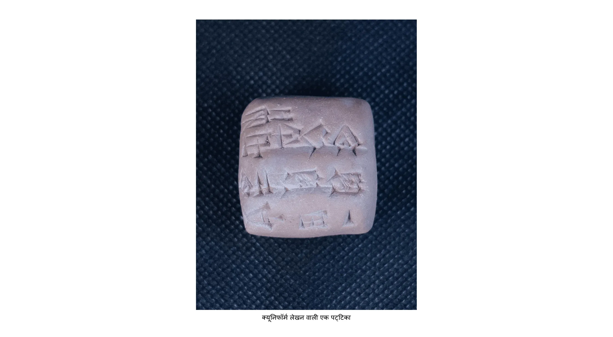

मेरे पास एक और पट्टिका है जो मुझे लगता है कि असली सुमेरियन है, जिसके बीच में एक छोटी सी क्यूनिफॉर्म लिपि है। इस पट्टिका पर एक बेलन को घुमाकर बनाए गए हस्ताक्षर हैं, जो मैं आपको बाद में दिखाऊँगा।

छोटे-छोटे अंकों वाले चिह्न उस समय हस्ताक्षर के रूप में काम आते थे, जब अधिकांश लोग लिख नहीं सकते थे, क्योंकि केवल कुशल लेखकों के पास ही यह क्षमता थी।

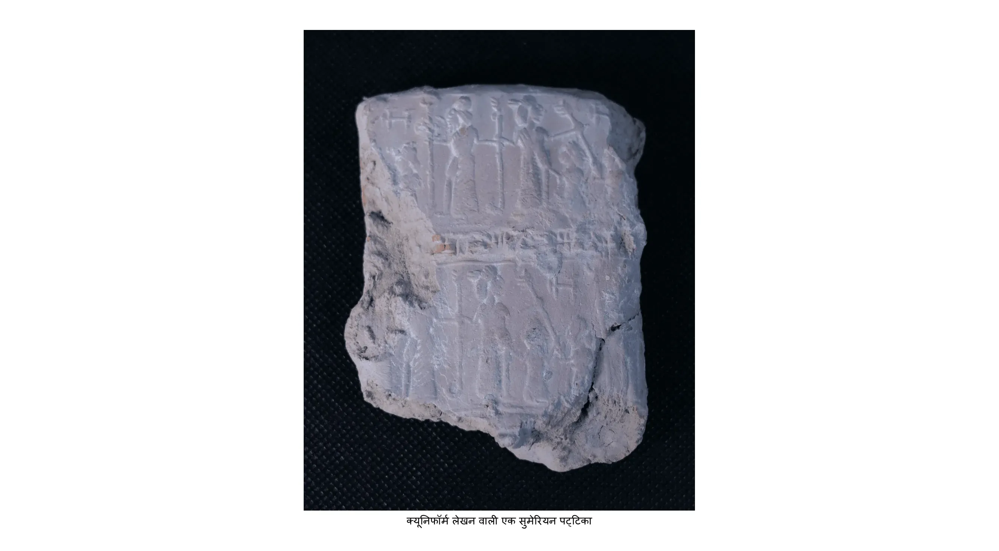

नीचे, आप ऊपर बताए गए सिलेंडर को देख सकते हैं: एक पत्थर जिस पर विशिष्ट आकृतियाँ उकेरी गई हैं। लोग पत्रों पर हस्ताक्षर करने के लिए इस विशिष्ट सिलेंडर को घुमाते थे, जिसे अंग्रेज़ी में सिलेंडर सील कहते हैं। यह लेखकों के नामों को स्पष्ट रूप से दर्शाने या यह दर्शाने का एक तरीका था कि वे उनके नाम पर रचित हैं।

इसलिए उस समय के लेखक गीली पट्टियों पर संकेत मुद्रित करने के लिए पच्चर के आकार की लेखनी का प्रयोग करते थे।

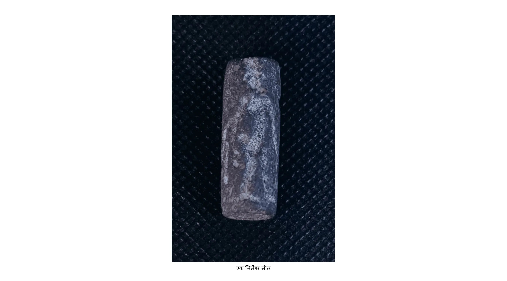

क्यूनिफॉर्म लिपि किसी भाषा का प्रतिनिधित्व नहीं करती थी, बल्कि बोली जाने वाली भाषाओं को लिखने की एक लेखन प्रणाली थी। अंग्रेज़ी में, हम कहते थे "लेखन एक लिखित भाषा है", और फिर हम कहते थे कि "क्यूनिफॉर्म एक लिपि है, भाषा नहीं"। तो, फ़्रांसीसी में, हम कहते थे कि क्यूनिफॉर्म कोई भाषा नहीं, बल्कि भाषा को संहिताबद्ध करने का एक तरीका है।

### लेखन का विकास और उपयोग

अपने अस्तित्व की शुरुआती शताब्दियों में, यह लिपि सीमित रही, और मूलतः मात्राओं, कृषि उत्पादों और उपकरणों की सूची लिखने के लिए एक स्मृति-सूचना प्रणाली के रूप में ही काम करती रही। धीरे-धीरे ही यह **नामों का ध्वन्यात्मक अनुवाद** और पूरे वाक्य लिखने में सक्षम हो पाई।

शुरुआत में, क्यूनिफॉर्म लिपि में नाम व्यक्त नहीं किए जा सकते थे क्योंकि यह मुख्य रूप से वस्तुओं और वास्तविकता के तत्वों, जैसे बैल या गेहूँ, को छोटी छवियों के रूप में दर्शाती थी। समय के साथ, ये छवियाँ लिपि के एक अधिक विकसित रूप में विकसित हुईं, जिससे नामों और जटिल अवधारणाओं को व्यक्त करना संभव हो गया।

उदाहरण के लिए, अगर किसी व्यक्ति का नाम लौरा होता, तो हम एक शब्द, एक संक्षिप्त रूप जो "पानी" जैसा लगता हो और दूसरा "रास" जैसा, लेकर उससे लौरा नाम बना सकते थे। इस तरह लिखित भाषा का पहला रूप विकसित हुआ।

जानकारी के लिए, मूल रूप से संक्षिप्ताक्षरों को दर्शाने के लिए, अगर आप बैल का सिर बनाना चाहते थे, तो आप बैल के सिर का आकार देख सकते थे। धीरे-धीरे, चित्रों को सरल बनाया गया ताकि वे एक तरह की रेखा से ज़्यादा कुछ न दिखें। विद्वानों का मानना ​​है कि ऐसा इसलिए हुआ क्योंकि लोग गीली मिट्टी की पट्टिका को एक हाथ में पकड़े रहते थे, जिससे उन्हें मोड़कर फिर से प्रारंभिक अक्षर बनाना आसान हो जाता था। ऐसा माना जाता है कि ऐसा लेखकों द्वारा पट्टिकाओं को पकड़ने के तरीके के कारण भी हुआ था।

आप अभी भी क्यूनिफॉर्म संक्षिप्ताक्षरों में गेहूं या बैल के सिर के साथ संबंध देख सकते हैं, और वे हमेशा एक तरफ झुके हुए होते हैं।

अपने तीन सहस्राब्दियों के उपयोग के दौरान, कीलाकार लिपि मुख्यतः आर्थिक और प्रशासनिक अभिलेखों को बनाए रखने के लिए प्रयुक्त होती थी। हालाँकि, मेसोपोटामिया के निवासियों में जल्द ही समय की कसौटी पर खरी उतरने योग्य हर चीज़ को लिखित रूप में संरक्षित करने की गहरी इच्छा जागृत हो गई। इस प्रकार, कहानियाँ, किंवदंतियाँ और गीत, जो अब तक घुमंतू संगीतकारों द्वारा मौखिक रूप से प्रसारित किए जाते थे, लिखित रूप में अमर हो गए, और अक्सर प्रशिक्षण प्राप्त लेखकों द्वारा उनकी प्रतिलिपियाँ बनाई गईं। उन्होंने पहले से मौजूद ग्रंथों की प्रतिलिपियाँ बनाईं, मुख्यतः किंवदंतियाँ या ऐसे ग्रंथ जिनका कोई विशिष्ट सांस्कृतिक मूल्य था।

इसका एक महत्वपूर्ण उदाहरण गिलगमेश महाकाव्य है, जो संभवतः 2900-2350 ईसा पूर्व के आसपास सुमेरियन शहर-राज्य उरुक का एक ऐतिहासिक राजा था।

लेखन का यह रूप, जो एक आर्थिक प्रबंधन उपकरण और सांस्कृतिक वाहक दोनों था, पहली शताब्दी ईस्वी तक चला, तथा उसके बाद हमेशा के लिए लुप्त हो गया, तथा अपने पीछे उस सभ्यता का एक अनमोल साक्ष्य छोड़ गया जिसने इसे जन्म दिया था।

## सुमेरियन गोलियों की भूमिका

<chapterId>a396e6c5-56cc-5410-9e6b-0274401c5425</chapterId>

:::video id=a0729a35-01ec-4aa4-828f-d4ccc2eb168e:::

### पूर्व-मौद्रिक ऋण प्रणालियाँ

प्राचीन मेसोपोटामिया में, आर्थिक संगठन अत्यधिक परिष्कृत तंत्रों पर आधारित था जो धातु के सिक्कों के आविष्कार से बहुत पहले से मौजूद थे। शुरू से ही, औपचारिक और अनौपचारिक ऋण प्रणालियाँ मुद्रा का एक अनिवार्य रूप थीं, जिससे स्थानीय आबादी कई जटिल आर्थिक लेन-देन करने में सक्षम थी।

प्रशासनिक और आर्थिक ज़रूरतों को पूरा करने के लिए ही क्यूनिफ़ॉर्म लिपि का आविष्कार किया गया था। प्रसिद्ध मेसोपोटामिया की मिट्टी की पट्टियों का इस्तेमाल मुख्यतः विभिन्न प्रकार के अनुबंधों को दर्ज करने के लिए किया जाता था: निजी ऋण, बिक्री, किराया, बंधक और यहाँ तक कि विवाह समझौते भी। इन पट्टियों को लिखने के लिए विशेष लिपिकों की विशेषज्ञता की आवश्यकता होती थी, जो समय और मेहनत के लिहाज से महंगा काम था, **लेकिन जब वित्तीय हित दांव पर हों तो यह उचित था।** उस समय लोग एक-दूसरे को प्रेम पत्र नहीं लिखते थे, वे अपनी चिंताओं को लिखने के लिए लिपिकों की मदद नहीं लेते थे। वे दस्तावेज़ लिखने के लिए लिपिकों को नियुक्त करते थे, चाहे उनका कोई संबंध हो या कोई आर्थिक कारण।

यह भी उल्लेखनीय है कि इनमें से कुछ पट्टिकाएं धारक बांड के रूप में प्रसारित होती थीं, तथा स्वतंत्र रूप से हाथों में बदलती रहती थीं।

उदाहरण के लिए, वहाँ मिट्टी की एक गेंद थी जिसके अन्दर छोटे-छोटे पत्थर थे।

मिट्टी के गोले के बाहर एक संख्या लिखी और हस्ताक्षरित थी, जो कई इकाइयों को दर्शाती थी। अंदर, कुछ पत्थर थे और कोई व्यक्ति यह सत्यापित करना चाहता था कि यह यंत्र वास्तव में X संख्या की इकाइयों को दर्शाता है।

एक और उदाहरण, वर्तमान बगदाद के दक्षिण-पश्चिम में मिली एक पट्टिका पर लिखा है कि एक ऋणी फसल के दिन ऋणदाता को 330 मन अनाज चुकाने का वचन देता है। इससे भी ज़्यादा दिलचस्प बात यह है कि एक और पट्टिका पर साफ़ लिखा है कि चार मन जौ का ऋण सीधे पट्टिका धारक को चुकाना होगा, इस प्रकार **धारक को भुगतान की अवधारणा का परिचय दिया गया, जो उस समय के लिए एक विशेष रूप से नवीन अवधारणा थी**।

2000 ईसा पूर्व से, एक कानून लागू था जिसके अनुसार सभी व्यापारिक लेन-देन, यहाँ तक कि सबसे छोटे लेन-देन भी, लिखित रूप में औपचारिक रूप से किए जाने और गवाहों की उपस्थिति में हस्ताक्षर किए जाने आवश्यक थे। कल्पना कीजिए कि उन दिनों कितनी बड़ी नौकरशाही रही होगी, जिसमें सभी लेन-देन, मैं आपको याद दिला दूँ, मिट्टी से बने रजिस्टरों में दर्ज किए जाते थे। इस कानूनी कठोरता का उद्देश्य विनिमय की गई वस्तुओं के स्वामित्व और अधिकारों को लेकर भविष्य में होने वाले विवादों को रोकना था। गवाहों को अक्सर यह प्रमाणित करने के लिए बुलाया जाता था कि अनुबंध पर वास्तव में हस्ताक्षर किए गए थे।

निजी क्षेत्र में भी, कुछ परिवार और व्यक्ति इतने जटिल आर्थिक कार्यों में लगे हुए थे कि उनके लिए कठोर प्रबंधन की आवश्यकता थी। उत्तरी बेबीलोन के सिप्पार-अम्नानु शहर में उर-उतु नामक एक अनुनीतुम पुजारी का घर मिला, जिसमें लगभग 2,000 पट्टिकाएँ थीं। इन दस्तावेज़ों में निजी ऋण अनुबंध, बिक्री और पट्टे के दस्तावेज़, साथ ही पत्र, धार्मिक और शैक्षणिक ग्रंथ शामिल थे, जो उस समय के निजी अभिलेखागार की विविधता और महत्व को दर्शाते हैं।

यह उल्लेखनीय है कि लेखकों द्वारा लिखे गए पत्र लगभग पूरी तरह से वित्तीय हितों से संबंधित होते थे: अपर्याप्त भत्ते, लंबित दहेज भुगतान या अन्य आवश्यक भौतिक अनुरोधों की शिकायतें। उन दिनों, प्रेम पत्र जैसे व्यक्तिगत लेखन का प्रचलन नहीं था, और बीमारी का उल्लेख भी दुर्लभ था।

ऐसे ही एक पत्र का एक मार्मिक उदाहरण इस आर्थिक सच्चाई को दर्शाता है: एक संवाददाता अपनी व्यथा व्यक्त करता है कि जब उसका साथी असूर में भयंकर अकाल के दौरान चला गया, तो उसके पास न तो पैसे थे और न ही खाने-पीने की चीज़ें। वह अनाज खरीदने की अपनी तत्काल आवश्यकता बताता है, और माँग करता है कि उसके कपड़ों के बराबर नकद राशि उसे शीघ्र भेजी जाए ताकि उसकी रोज़ी-रोटी चल सके।

अपने साथी को लिखे इस पत्र से ऐसा लगता है कि वह उसे बेसहारा छोड़कर कहीं और व्यापार करने चला गया है। वह उसे याद दिलाती है कि अनाज खरीदने और मंदिर के कर चुकाने के लिए उसके पास पर्याप्त धन होना ज़रूरी है। शायद यही उस समय के किसी पत्र में लिखे गए तर्क के सबसे करीब है। पत्र लगभग हमेशा आर्थिक लेन-देन से जुड़े होते थे, और यह पत्र भी एक अनिश्चित आर्थिक स्थिति से संबंधित है।

इस प्रकार, हमारे पास जो मेसोपोटामिया के दस्तावेज़ आए हैं, वे मुख्यतः आर्थिक आदान-प्रदान को दर्शाते हैं, क्योंकि ये विशेष रूप से मान्यता प्राप्त मूल्य वाली वस्तुओं के हस्तांतरण के लिए तैयार किए गए थे: धन, अनाज, विभिन्न वस्तुएँ, अचल संपत्ति, मंदिर करों का भुगतान। ये अभिलेख न केवल इस प्राचीन सभ्यता की दक्षता और प्रशासनिक सटीकता को दर्शाते हैं, बल्कि बहुत लंबे समय तक जटिल आर्थिक आदान-प्रदान को प्रबंधित करने की इसकी क्षमता को भी दर्शाते हैं।

## सुमेरियन गोलियों पर अभिजात वर्ग का नियंत्रण

<chapterId>c6d3df0e-b1e1-58dc-ab35-9f76bbc39393</chapterId>

:::video id=04a95fb8-a701-4a48-9ce8-0e9b6ba256fd:::

### लेखन, एक ऐसी तकनीक जो सबसे अधिक किफायती है

आम धारणा के विपरीत, लगभग 4,000 साल पहले मेसोपोटामिया में लेखन का आविष्कार शुरू में व्यक्तिगत या साहित्यिक संचार की ज़रूरतों को पूरा नहीं करता था। **क्यूनिफ़ॉर्म लिपि सबसे पहले और सबसे महत्वपूर्ण एक आर्थिक तकनीक थी**, जिसका औचित्य तभी था जब महत्वपूर्ण वित्तीय हित दांव पर लगे हों। सुमेरवासी लिपि का इस्तेमाल एक-दूसरे से पत्र-व्यवहार करने या अपनी भावनाओं को व्यक्त करने के लिए नहीं, बल्कि केवल अपने व्यापारिक और वित्तीय लेन-देन दर्ज करने के लिए करते थे।

इस विशेषज्ञता को पट्टिका लेखन की भारी लागत से समझा जा सकता है। मिट्टी पर उत्कीर्णन के लिए विशिष्ट तकनीकी विशेषज्ञता, पर्याप्त समय और विशिष्ट सामग्रियों की आवश्यकता होती थी। केवल पर्याप्त मूल्य के लेन-देन ही इस निवेश को आर्थिक रूप से उचित ठहराते थे, जिससे इस क्रांतिकारी तकनीक तक पहुँच के लिए एक स्वाभाविक सीमा बनती थी।

क्यूनिफॉर्म पट्टियाँ उस समय की असाधारण रूप से जटिल वित्तीय प्रणाली का खुलासा करती हैं। मेसोपोटामियावासियों ने आधुनिक वित्तीय साधनों का एक पूरा भंडार विकसित कर लिया था: **ब्याज सहित निजी ऋण, बिक्री के दस्तावेज़, किराये के अनुबंध, बंधक, और यहाँ तक कि वित्तीय शर्तों वाले विवाह अनुबंध**। यह परिष्कृतता एक विकसित बाजार अर्थव्यवस्था का प्रमाण है, जो इन प्राचीन सभ्यताओं से जुड़ी आदिम वस्तु विनिमय की सरलीकृत छवि से कोसों दूर है।

कुछ पट्टिकाएँ वास्तविक धारक प्रतिभूतियों की तरह काम करती थीं, जो मूल धारक की पहचान की आवश्यकता के बिना एक हाथ से दूसरे हाथ में स्वतंत्र रूप से प्रसारित होती थीं। इस नवाचार ने विनिमय की उल्लेखनीय तरलता को संभव बनाया, जो आधुनिक वित्तीय प्रणालियों का पूर्वाभास था। इसके अलावा, विशिष्ट कानूनों में सभी वाणिज्यिक लेन-देन को लिखित रूप में औपचारिक रूप देने की भी आवश्यकता थी, इस प्रकार आर्थिक क्षेत्र में लेखन के उपयोग को संस्थागत रूप दिया गया।

### ज्ञान और आर्थिक नियंत्रण का एकाधिकार

अर्थव्यवस्था में लेखन की केंद्रीयता ने इस तकनीक में निपुण लोगों को काफ़ी शक्ति प्रदान की। **लिपिक, जो आमतौर पर मंदिरों और शासकीय संस्थाओं से जुड़े होते थे, वित्तीय प्रणाली पर वास्तविक नियंत्रण रखते थे**। उनकी दुर्लभ और अमूल्य विशेषज्ञता ने उन्हें सभी महत्वपूर्ण लेन-देन का संरक्षक बना दिया।

ज्ञान पर यह एकाधिकार कोई संयोग नहीं था। अधिकारियों को इस विशिष्टता को बनाए रखने में पूरा हित था, क्योंकि लेखन को लोकतांत्रिक बनाने से अर्थव्यवस्था पर उनका नियंत्रण कमज़ोर हो जाता और जालसाजी का ख़तरा बढ़ जाता। हस्ताक्षर समारोहों में गवाहों की व्यवस्थित उपस्थिति दस्तावेज़ की प्रामाणिकता के प्रति उनकी निरंतर तत्परता को दर्शाती है।

सभी वाणिज्यिक लेन-देनों को लिखित रूप में दर्ज करने की कानूनी बाध्यता ने कई रणनीतिक उद्देश्यों की पूर्ति की: राजकोषीय नियंत्रण, कठोर लेखा निगरानी, ​​और आर्थिक खिलाड़ियों की प्रशासनिक तंत्र पर निर्भरता बनाए रखना। इस प्रकार मेसोपोटामिया राज्य ने सामाजिक स्तर पर पारस्परिक ऋण प्रबंधन की क्षमता को अपने अधिकार में ले लिया, जिससे लेखन आर्थिक शक्ति के एक साधन में बदल गया।

### दो मौद्रिक प्रणालियों का सह-अस्तित्व

इन पट्टिकाओं के विश्लेषण से एक अधिक सूक्ष्म आर्थिक वास्तविकता का पता चलता है, जो अभिलेखों में उनकी सर्वव्यापी उपस्थिति से प्रतीत होती है। कई पट्टिकाओं में मूल्य की इकाई के रूप में **चाँदी के शेकेल** का उल्लेख है, जो मानकीकृत भौतिक वस्तुओं पर आधारित एक मौद्रिक प्रणाली के समानांतर अस्तित्व का संकेत देता है।

इस द्वंद्व को उस समय के सामाजिक स्तरीकरण से समझा जा सकता है। **क्यूनिफॉर्म पट्टिका प्रणाली एक सीमित अभिजात वर्ग के लिए आरक्षित थी**: पादरी, समृद्ध व्यापारी, और प्रशासक जो इन जटिल दस्तावेज़ों को पढ़ने, लिखने और व्याख्या करने में सक्षम थे। वाहक पट्टिका का प्रभावी ढंग से उपयोग करने के लिए, न केवल उसे समझना आना चाहिए, बल्कि उसकी प्रामाणिकता की पुष्टि करने और उसके कानूनी निहितार्थों को समझने में भी सक्षम होना चाहिए।

**इस अभिजात्य व्यवस्था से बाहर रखी गई आबादी के बड़े हिस्से ने अपनी विनिमय प्रणालियाँ विकसित कीं**। आम लोग अनाज के मानकीकृत माप, पैसे के वज़न और अन्य आसानी से मापी जा सकने वाली वस्तुओं जैसी अधिक सुलभ प्रणालियों का इस्तेमाल करते थे, जिनका मूल्यांकन कोई भी बिना किसी विशेष कौशल के कर सकता था।

यह लोकप्रिय अर्थव्यवस्था, हालाँकि आधिकारिक अभिलेखागारों में कम दर्ज है, संभवतः पट्टिका प्रणाली की तुलना में अधिक गतिशील और लचीली थी। इसने लिपिकों की सहायता के बिना, दैनिक आदान-प्रदान को तेज़ किया और कारीगरों, किसानों और छोटे व्यापारियों की तात्कालिक ज़रूरतों को पूरा किया।

चांदी के शेकेल, जिसका उल्लेख अक्सर मूल्य संदर्भ के रूप में पट्टिकाओं में किया गया है, संभवतः इन दो समानांतर आर्थिक प्रणालियों के बीच एक सेतु के रूप में कार्य करता था, जिससे लिखित ऋण और भौतिक भुगतान के बीच रूपांतरण संभव होता था।

### स्वतःस्फूर्त उद्भव बनाम संस्थागत नियंत्रण

यह सह-अस्तित्व आर्थिक इतिहास में एक बुनियादी बहस को दर्शाता है: **विनिमय के साधनों के स्वतःस्फूर्त उद्भव और मुद्रा के संस्थागत विनियोग के बीच विरोध**। एक ओर, मुद्रा जैसी वस्तुएँ लोगों की विनिमय आवश्यकताओं से स्वाभाविक रूप से उभरीं। दूसरी ओर, संस्थाओं ने इन प्रथाओं को अपनाकर उनके प्रवाह को नियंत्रित करने के लिए उन्हें औपचारिक रूप दिया।

सुमेरियन मंदिर इस तनाव के प्रतीक थे: उन्होंने लोकप्रिय मौद्रिक नवाचारों (शेकेल के संदर्भ) का इस्तेमाल किया और साथ ही अपने नियंत्रण उपकरण (क्यूनिफॉर्म पट्टियाँ) भी विकसित किए। इस रणनीति ने उन्हें दोनों प्रणालियों का लाभ उठाने में सक्षम बनाया: पारंपरिक मुद्राओं की लोकप्रिय वैधता और औपचारिक ऋणों का प्रशासनिक नियंत्रण।

मेसोपोटामिया का अनुभव वित्तीय प्रणालियों के विकास के लिए स्थायी मिसाल कायम करता है। यह दर्शाता है कि **वित्तीय परिष्कार अक्सर तकनीकी नवाचारों से कई सहस्राब्दियों पहले होता है**, जो आमतौर पर उससे जुड़े होते हैं। ब्याज, ऋण, परक्राम्य लिखतों और बंधक संपार्श्विक की अवधारणाओं ने धातु मुद्रा के आविष्कार का इंतज़ार नहीं किया।

यह महत्वपूर्ण काल ​​किसी भी मौद्रिक नवाचार में निहित शक्ति संबंधी मुद्दों को भी उजागर करता है: तकनीक को कौन नियंत्रित करता है, नियम कौन निर्धारित करता है, और औपचारिक प्रणालियाँ और लोकप्रिय प्रथाएँ कैसे व्यक्त की जाती हैं। ये मूलभूत प्रश्न पूरे आर्थिक इतिहास में बने रहे हैं, और डिजिटल मुद्राओं और [क्रिप्टोकरेंसी](https://planb.academy/resources/glossary/cryptocurrency) पर समकालीन बहसों तक फैले हुए हैं।

# प्राचीन सभ्यताओं में अर्थव्यवस्था और धन

<partId>a16bcf4c-8c3a-11f0-9e79-2bd363a484bd</partId>

## कांस्य युग की महान सभ्यताएँ

<chapterId>fab9334c-7385-5d7c-ad40-7d152beb22a1</chapterId>

:::video id=737e12e8-1033-4210-b1dd-b8a680f68b17:::

"कांस्य युग की महान सभ्यताएँ" शीर्षक वाले इस खंड में, हम ग्लिन डेविस द्वारा लिखित पुस्तक *ए हिस्ट्री ऑफ मनी: फ्रॉम एनशिएंट टाइम्स टू प्रेजेंट डे* के एक अंश से शुरुआत करेंगे, जो मुझे लगता है कि प्राचीन काल की महान सभ्यताओं पर इस खंड का एक उत्कृष्ट परिचय है।

> टॉयनबी लगभग इक्कीस अलग-अलग "सभ्यताओं" की पहचान करते हैं, लेकिन चूँकि इनमें से पंद्रह सभ्यताएँ प्रत्यक्ष या अप्रत्यक्ष रूप से पूर्ववर्ती उदाहरणों से उत्पन्न हुई थीं, इसलिए वे स्वतंत्र रूप से विकसित सभ्यताओं की संख्या घटाकर छह कर देते हैं: सुमेरियन, मिस्र, मिनोअन, चीनी, माया और एंडियन। इनमें से, केवल एंडीज़ के इंका ही बिना मुद्रा का उपयोग किए उच्च स्तर की सभ्यता प्राप्त करने में सफल रहे, हालाँकि विडंबना यह है कि उनके पास उन सामग्रियों की प्रचुरता थी जिन्हें आमतौर पर मुद्रा के रूप में उपयोग के लिए सर्वोत्तम माना जाता है - सोना और चाँदी।

इंकाओं के पास कोई मौद्रिक व्यवस्था नहीं थी, लेकिन उनके पास बहुमूल्य धातुओं की प्रचुरता थी। कितना विरोधाभासी है! आइए इस उद्धरण को आगे बढ़ाते हैं:

> एक समाज जितना अधिक स्तरीकृत होता है, और उसकी योजना प्रणाली जितनी अधिक कुशल होती है, उसकी आबादी के लिए धन का उपयोग उतना ही कम आवश्यक होता है। यह समझा सकता है कि क्यों स्पेनिश विजेताओं ने पाया कि मैक्सिकन, जिनकी सरकार अपेक्षाकृत अधिक उदार थी, नियमित रूप से सोने के पाउडर (पारदर्शी ट्यूबों में रखे गए) और कोको बीन्स (24,000 इकाइयों के बैग में बड़े भुगतान के लिए रखे गए) को मुद्रा के रूप में इस्तेमाल करते थे, जबकि इसके विपरीत, इंकाओं, जो एक बहुत अधिक कठोर पदानुक्रम के अनुसार संगठित थे, के पास कोई मुद्रा नहीं थी: एक अपवाद जो एक सख्त नियम द्वारा पुष्टि की गई थी। चीन में धन की उत्पत्ति अन्य सभ्यताओं से पूरी तरह से स्वतंत्र थी; हालांकि, सुमेरियन, मिस्र और मिनोअन सभ्यताओं की सापेक्ष निकटता मौद्रिक प्रथाओं के बारे में उनकी संबंधित अज्ञानता की सीमा के बारे में संदेह पैदा करती है, विशेष रूप से शुरुआती समय में स्थापित व्यापक व्यापार को देखते हुए।

चीन में, सिक्कों का विकास पश्चिमी परंपराओं से बिल्कुल अलग दृष्टिकोण से किया गया था। शुरुआत से ही ये [फिएट मुद्राएँ](https://planb.academy/resources/glossary/fiat) थीं। ये ढले हुए सिक्के थे।

और यहाँ, श्री डेविस व्यापार का ज़िक्र करते हैं। कुछ समय में चीनियों और अन्य आबादियों के बीच आदान-प्रदान ज़रूर हुआ था, लेकिन विदेशी व्यापार का माध्यम रेशम ही था। जैसा कि हम आगे देखेंगे, चीन के सीमावर्ती क्षेत्रों में, जहाँ चीनी आबादी कम थी, सोने का भी इस्तेमाल होता था। और अंतर्राष्ट्रीय व्यापार के लिए भी नहीं; उसके लिए रेशम ही इस्तेमाल होता था।

इसलिए, मैं कल्पना करता हूं कि शायद सिक्कों के प्रारूप के लिए, वे उसी युग की अन्य सभ्यताओं से प्रभावित रहे होंगे जिन्होंने इस तकनीक को विकसित किया था।

लेकिन साफ़ है कि चीन में पैसे का सार पश्चिम से बिल्कुल अलग था। चीन पर अगले खंड में हम इस पर विस्तार से चर्चा करेंगे।

इन प्रसिद्ध सुमेरियन शहरों के बारे में, मेरे पास यहाँ कुछ टिप्पणियाँ हैं। हम उरुक का ज़िक्र कर सकते हैं, जो एक बहुत ही प्राचीन और प्रभावशाली शहर था, जो अपने विशाल आकार और उन्नत संस्कृति, विशेष रूप से लेखन और शहरी नियोजन के विकास के लिए प्रसिद्ध था।

और मैं प्रसिद्ध गिलगमेश महाकाव्य का भी ज़िक्र करना चाहता हूँ। गिलगमेश संभवतः 2900 ईसा पूर्व के आसपास सुमेरियन शहर उरुक का एक ऐतिहासिक राजा था। वह संभवतः इसी सुमेरियन नगर-राज्य का राजा था।

हम अक्कड़ के सरगोन की भी बात कर सकते हैं, जिसने 2334 से 2279 ईसा पूर्व तक शासन किया।

वह अक्कादियन साम्राज्य का पहला शासक था, जो मेसोपोटामिया में उभरी एक और सभ्यता थी। और मैं सार्गोन का ज़िक्र इसलिए कर रहा हूँ क्योंकि वह यहाँ की इन प्रसिद्ध पट्टिकाओं के लिए डाक सेवा स्थापित करने वाला पहला व्यक्ति था, जिनका परिचय मैं आपको पहले ही दे चुका हूँ।

कल्पना कीजिए कि वास्तव में मिट्टी के लिफाफे भी होते थे। गोपनीयता बनाए रखने के लिए, इन गोलियों को मिट्टी के लिफाफों में लपेटकर बाहर व्यक्ति के हस्ताक्षर किए जा सकते थे। इसलिए लोग गोली निकालने के लिए लिफाफा तोड़ देते थे। इस डाक व्यवस्था के लिए हम अक्कड़ के सार्गोन के आभारी हैं।

फिर है बेबीलोन, वह महान शहर जो बेबीलोन साम्राज्य की राजधानी बना। एक और सभ्यता, जो अपने भव्य ज़िग्गुरात और महलों के लिए प्रसिद्ध है, और प्रसिद्ध हम्मुराबी संहिता, जो अपनी अत्यंत उन्नत कानूनी संहिता के लिए जानी जाती है।

और इस खंड का समापन दो शहरों से होता है। हमारे पास अश्शूर है, जो असीरियन साम्राज्य की राजधानी थी और एक महत्वपूर्ण धार्मिक केंद्र था। और हमारे पास निनवेह है, जो बाद में असीरियन साम्राज्य की राजधानी बना। उन्होंने अपनी राजधानी वहीं स्थापित की और यह अपनी शक्तिशाली सेना, विशाल महलों और पुस्तकालयों के लिए जाना जाता है। और यह बेबीलोन के प्रसिद्ध हैंगिंग गार्डन्स के संभावित स्थानों में से एक भी है। हम अक्सर प्राचीन दुनिया के इस प्रसिद्ध अजूबे के बारे में सुनते हैं।

लेकिन बेबीलोन में इन प्रसिद्ध लटकते बागों का कोई निशान नहीं है। दूसरी ओर, निनवेह में कई मंजिलों पर बगीचों के पुरातात्विक साक्ष्य मौजूद हैं। यह संभव है कि हेरोडोटस जैसे यूनानी इतिहासकारों ने निनवेह को बेबीलोन समझ लिया हो। जब उन्होंने मेसोपोटामिया के शहरों का दौरा किया, तो शायद उन्होंने इसे बेबीलोन ही कहा होगा। निनवेह में प्रसिद्ध लटकते बागों के निशान मिले हैं, और विद्वानों को आश्चर्य हो सकता है कि क्या निनवेह ही वह प्रसिद्ध जगह है जहाँ ये बाग स्थित थे, जिन्हें बेबीलोन के लटकते बाग कहा जाता है।

## मेसोपोटामिया में आर्थिक संगठन

<chapterId>6afb6fc8-cbb7-56a5-8427-484b4b7d7477</chapterId>

:::video id=aa6a2cbd-5916-4ae3-ad4f-65f0bd5643fa:::

### पूर्व-पूंजीवादी आर्थिक संरचनाएं और गुलामी

मेसोपोटामिया के आर्थिक संगठन पर इस खंड में आपका स्वागत है। पूर्व-पूंजीवादी अर्थव्यवस्था तीन मुख्य चरणों से गुज़री: आदिम, दास और सामंती।

सामंतवाद, ज़ाहिर है, बहुत बाद में आया, ज़ाहिर है मध्य युग में, और हम उस आदिम अवस्था को पार कर चुके हैं जिसका वर्णन हमने पहले पुरापाषाण काल ​​में किया था। अब, मेसोपोटामिया में, जब हम आर्थिक संगठन की बात करते हैं, तो हम गुलामी की बात कर रहे होते हैं।

हालाँकि, मेसोपोटामिया में, अधिकांश कार्य दासों के समान आश्रित वर्ग द्वारा किया जाता था, जो कानूनी रूप से अपने स्वामियों की संपत्ति नहीं थे, बल्कि शारीरिक या वैचारिक दबाव के माध्यम से उन्हें उनके श्रम के फल से वंचित कर दिया जाता था।

### आर्थिक केंद्रों के रूप में मंदिरों और महलों की भूमिका

बड़े भू-स्वामियों का अर्थव्यवस्था पर प्रभुत्व था। ज़मींदार मज़दूरों को काम पर रखकर अपनी ज़मीन का सीधा शोषण करते थे, या किराए के बदले अपनी ज़मीन किराए पर देते थे। वे वित्तीय गतिविधियों में भी लगे रहते थे, ऊँची ब्याज दरों पर, आमतौर पर लगभग 20% से 33.3% प्रति वर्ष, पैसा उधार देते थे, जो पड़ोसी यहूदियों के कड़े नियमों से बिल्कुल अलग था।

किसानों द्वारा लिए गए ऋण उत्पादक निवेश के लिए नहीं थे - शिपिंग कंपनियों को छोड़कर - बल्कि अगली फसल तक अपना जीवनयापन सुनिश्चित करने के लिए थे। इस स्थिति के कारण अक्सर किसान लगातार कर्ज में डूबे रहते थे।

मुझे प्राचीन काल (रोम) के एक और हालिया काल से तुलना करने की अनुमति दीजिए, जहाँ नागरिक किसानों और अस्वीकृत श्रमिकों द्वारा अर्जित कृषि लगान और युद्ध की लूट पर निर्भर रहते थे। **ये राजस्व नागरिकों में बाँटे जाते थे, अधिक लाभ के लिए नहीं, बल्कि उनकी सामाजिक स्थिति को बढ़ाने के लिए।** व्यापार और शिल्प आम तौर पर सामाजिक अभिजात वर्ग से बाहर के समूहों के लिए छोड़ दिए जाते थे। यह सब व्यापार और शिल्प के माध्यम से लाभ कमाने पर केंद्रित मध्ययुगीन अर्थव्यवस्थाओं के विपरीत है।

तो हम यहाँ जो कहना चाह रहे हैं, वह यह है कि मैं इस तथ्य के साथ एक समानता स्थापित कर रहा हूँ कि लोग वित्तीय ऋण साधनों का उपयोग ज़रूरी नहीं कि अपने उत्पादन के साधनों को बेहतर बनाने के लिए करते थे, और बाद में रोम में, मुनाफ़े को ज़रूरी नहीं कि पुनर्निवेशित किया जाता था, बल्कि उन लोगों की प्रतिष्ठा बढ़ाने के लिए इस्तेमाल किया जाता था जो इन मुनाफ़ों से लाभान्वित हो सकते थे। हम अभी भी उस पूँजीवादी भावना से बहुत दूर हैं जो बाद में मध्य युग में उभरी, जब उत्पादन के साधनों को बेहतर बनाने के लिए नौकरियाँ पैदा की जा सकती थीं, और मुनाफ़े की तलाश में अधिशेष लिया और बनाया जाता था। इसलिए हम देख सकते हैं कि आर्थिक संगठन अभी तक ऊपर सूचीबद्ध आर्थिक विकास के तीसरे चरण तक नहीं पहुँचा था।

### ऋण प्रणालियों और लेखा इकाइयों का उदय

**कार्ल पोलानी आर्थिक विनिमय के तीन रूपों में अंतर करते हैं: सममित समूहों के बीच पारस्परिकता,** जो आदिम जनजातियों में होती है जहाँ हमें वास्तव में धन की आवश्यकता नहीं होती क्योंकि हम एक-दूसरे को अनौपचारिक ऋण देते हैं और विनिमय व पुनर्वितरण करते हैं। **मंदिरों और महलों के इर्द-गिर्द केंद्रित पुनर्वितरण,** विनिमय का यह रूप मेसोपोटामिया के अनुकूल है, जहाँ मंदिर आर्थिक संगठन के केंद्र में थे और एक समय में राशन के रूप में धन वापस दे सकते थे, वितरित कर सकते थे। मजदूरी की अवधारणा बाद में ही शुरू हुई। इसलिए, अब तक, हमारे पास मंदिरों और महलों में आदिम रूप (1), केंद्रीकृत पुनर्वितरण (2) है, और फिर हम अंततः बाजार विनिमय (3) को रास्ता दे सकते हैं। हालाँकि बाजार जैसा कि हम आज समझते हैं, वह पूरी तरह से अस्तित्व में नहीं था, मेसोपोटामिया में बाजार विनिमय की उपस्थिति निर्विवाद है, जो अक्कादियन में विशिष्ट शब्दों के अस्तित्व और कीमतों, लाभ, हानि, उतार-चढ़ाव और अभाव की स्थितियों के पुरातात्विक साक्ष्यों की उपस्थिति से प्रमाणित है।

मेसोपोटामिया के परिवार कृषि उत्पादन के सभी चरणों का स्वतंत्र रूप से प्रबंधन करते थे, बुवाई से लेकर रोटी और बीयर बनाने तक। महिलाएँ अपने आश्रितों के लिए आवश्यक वस्त्र भी बनाती थीं। स्थानीय स्तर पर उत्पादित न होने वाली वस्तुओं के लिए, परिवार विशेष व्यापारियों की ओर रुख करते थे।

व्यापार में पारिवारिक संबंध विशेष रूप से महत्वपूर्ण थे। पैलियो-असीरियन काल (लगभग 1910-1830 ईसा पूर्व) के दौरान, अशूर शहर के व्यापारियों ने अनातोलिया के कनेश में एक व्यापारिक उपनिवेश स्थापित किया, जहाँ वे सोने और चाँदी के बदले टिन और वस्त्र आयात करते थे। व्यापार पारिवारिक व्यवसायों पर आधारित था, जो विवाह और व्यावसायिक साझेदारियों से घनिष्ठ रूप से जुड़े थे। कनेश एक विशाल अंतर्राष्ट्रीय व्यापार नेटवर्क की एक कड़ी मात्र था।

इन आदान-प्रदानों में धातुएँ थीं, और वे कीमती धातुएँ थीं, ज़रूरी नहीं कि उदाहरण के लिए, तांबा, जो उस समय वास्तव में उपयोगी था, और हमारा मानना ​​है कि इन धातुओं का आदान-प्रदान मूल्य के भंडार की धारणा के लिए किया जाता था। इसलिए हम अनिवार्य रूप से वस्तु विनिमय की बात नहीं कर सकते, जहाँ दो वस्तुओं का आदान-प्रदान उनकी उपयोगिता के आधार पर किया जाता है, बल्कि यह भुगतान की एक धारणा है जिसमें कीमती धातुओं को मूल्य के भंडार के रूप में उपयोग करने के लिए जमा करने और उन्हें एक वस्तु के रूप में उपयोग न करने की एक निश्चित जागरूकता होती है, उदाहरण के लिए, कवच बनाने के लिए कांसे का उपयोग।

कर और कर मुख्यतः वस्तु (जौ या तौले हुए चाँदी) के रूप में चुकाए जाते थे। मंदिर और महल मुख्य आर्थिक, प्रशासनिक, राजनीतिक और धार्मिक केंद्र थे, और वस्तुओं, पहले अनाज, फिर अन्य कृषि उत्पादों और अंततः कीमती धातुओं के सुरक्षित जमा के माध्यम से पहला बैंकिंग कार्य भी करते थे। इस प्रकार, सिक्कों के आगमन से बहुत पहले, पहला ऋण और ऋण संचालन विकसित हुआ।

मेसोपोटामिया की अर्थव्यवस्था में मूल्य के मानक के रूप में मुख्यतः जौ और चाँदी का उपयोग किया जाता था। चाँदी का वजन मानक इकाइयों में होता था, जैसे कि लगभग 8.33 ग्राम का शेकेल। प्राचीन बेबीलोन काल (हम्मुराबी के शासनकाल) से ही, चाँदी का उपयोग भुगतान के एक सामान्य साधन के रूप में किया जाता था, जिसमें वास्तविक वजन ("शुकुलम") के बजाय नाममात्र मूल्य ("नूबम") की प्रारंभिक धारणा थी, **जो आधुनिक फिएट मुद्रा की अवधारणा का पूर्वाभास देता है**।

लेकिन यह अभी तक शब्द के सख्त अर्थ में फिएट मुद्रा नहीं थी। इसमें अधिकार-चिह्न वाली किसी मोहर की धारणा नहीं थी, बल्कि खाते की एक नाममात्र इकाई की धारणा थी, जो तौले गए धातु की धारणा के विपरीत थी। इन दोनों अवधारणाओं की भाषा में एक अंतर था, और मुझे लगता है कि इसका उल्लेख करना ज़रूरी है।

वेतन-श्रम बाज़ार में संक्रमण एक कठिन प्रक्रिया थी। इसके लिए दो प्रमुख वैचारिक नवाचारों की आवश्यकता थी: व्यक्ति के कार्य को अंतिम उत्पाद से अलग करना, और "कार्य समय" को एक मापनीय इकाई के रूप में प्रस्तुत करना। वेतन और वेतनभोगी कर्मचारी की इस अवधारणा को समझने के लिए, हमें पहले इन दो नवाचारों से गुजरना पड़ा। **तीसरी सहस्राब्दी में, काम का पारिश्रमिक शुरू में निश्चित अनुपात में दिया जाता था, और फिर दूसरी सहस्राब्दी की शुरुआत में धीरे-धीरे वेतन प्रणाली की ओर विकसित हुआ।**

अंततः, 26वीं शताब्दी ईसा पूर्व से, मौद्रिक मूल्य की एक वास्तविक धारणा ने जड़ें जमा लीं, भले ही मेसोपोटामिया का "धन" कोई सिक्का नहीं था, बल्कि अनाज या धातु का एक तौला हुआ माप था। **इस प्रकार, महत्वपूर्ण लेन-देन के लिए या मूल्य संरक्षण की आवश्यकता वाले संदर्भों में, अनाज को अक्सर चांदी में बदलना पसंद किया जाता था, जिसे अधिक आसानी से संरक्षित किया जा सकता था।** यह कुछ-कुछ कनेश के उदाहरण जैसा है, जहाँ चांदी धातु को संचय के लिए प्राप्त किया जाता था।

21वीं शताब्दी ईसा पूर्व से, **विषम विनिमय के लगभग लुप्त होने के साथ**, हम देखते हैं कि समनुदेशन अनुबंधों में, क्रिया सा, मूल्य के भुगतान को संदर्भित करती है। यह धारणा, जिसे "सा" कहा जाता है, अनुबंधों में दिखाई देती है और मूल्य के भुगतान को संदर्भित करती है, न कि किसी विशेष वस्तु के माप को। "सा" केवल भुगतान या मूल्य को संदर्भित करता है। यह एक मानवविज्ञानी है जो इस पर ध्यान देता है और बताता है कि यह वास्तव में एक बड़ी सफलता है; हम अनुबंधों में क्रिया "सा" के इस प्रयोग के पहले और बाद के बीच एक प्रकार का द्वैत देखते हैं।

हम निकट पूर्वी अभिलेखों में मौजूद अनुभवजन्य आंकड़ों को नज़रअंदाज़ नहीं कर सकते, जो **कुछ बाज़ार तंत्रों** के अस्तित्व की पुष्टि करते हैं, जिनमें **लाभ** और **हानि** की धारणाएँ, **कीमतों में उतार-चढ़ाव** और **कमी** की स्थितियाँ** शामिल हैं। लेकिन मूल कठिनाई प्राचीन मेसोपोटामिया की अर्थव्यवस्था में बाज़ार-आधारित विनिमय के सापेक्ष महत्व को निर्धारित करने में है।

मुझे लगता है कि इस क्षेत्र के विशेषज्ञों ने इन बाजार अवधारणाओं के निशान देखे हैं, लेकिन वे वास्तव में हमें यह बताने में सक्षम नहीं हैं कि उस समय की अर्थव्यवस्था का कितना हिस्सा इस अधिक आधुनिक बाजार अवधारणा या अन्य तंत्रों पर आधारित था।

हम जानते हैं कि यह अस्तित्व में था, लेकिन हम यह नहीं जानते कि क्या यह मूल्य निर्धारण या व्यापार का मुख्य तरीका था।

मेसोपोटामिया में आर्थिक संगठन पर यह खंड यहीं समाप्त होता है।

अगले खंडों में हम मिस्र और चीन के लिए भी यही करेंगे।

## प्राचीन मिस्र में आर्थिक और मौद्रिक संगठन

<chapterId>bffcc16c-7fbf-5992-a0fa-6a7726d7d287</chapterId>

:::video id=40c1c4e5-b190-4bb6-b8a0-810c9ce7698b:::

### ऐतिहासिक पृष्ठभूमि और मिस्र काल

यह खंड प्राचीन मिस्र के आर्थिक और मौद्रिक संगठन को समर्पित है। आपको थोड़ी पृष्ठभूमि देने के लिए, यहाँ संबंधित काल की एक सूची और संक्षिप्त विवरण दिया गया है।

- प्राचीन साम्राज्य (लगभग 2575 - लगभग 2130 ईसा पूर्व)**। यह काल महान पिरामिडों, विशेष रूप से गीज़ा के पिरामिडों के निर्माण से चिह्नित था। यह केंद्रीकृत मिस्री राजतंत्र का स्वर्ण युग था।
- मध्य साम्राज्य (लगभग 1938 - लगभग 1630 ई.पू.)**. अस्थिरता की अवधि के बाद राजनीतिक और सांस्कृतिक पुनर्जागरण।
- नया साम्राज्य (लगभग 1539 - 1075 ईसा पूर्व)**। क्षेत्रीय विस्तार, सैन्य शक्ति और अंतर्राष्ट्रीय व्यापार का काल। इसमें तूतनखामुन और रामसेस द्वितीय जैसे प्रसिद्ध फ़राओ का शासनकाल शामिल है।
- 1323 ईसा पूर्व - तूतनखामुन की मृत्यु**। युवा फ़राओ की मृत्यु लगभग 18-19 वर्ष की आयु में हुई। उसका लगभग अक्षुण्ण मकबरा 1922 में खोजा गया, जिससे यह सभी पुरातात्विक खोजों में सबसे प्रसिद्ध बन गया।
- रामसेस द्वितीय - शासनकाल 1279-1213 ईसा पूर्व**। नए साम्राज्य के सबसे शक्तिशाली फ़राओ में से एक। अपने सैन्य अभियानों, अपने विशाल स्मारकों और संभवतः पहली ज्ञात शांति संधि के लिए जाने जाते हैं।
- 1275 ई.पू. - समुद्री लोग**। "समुद्री लोग" नामक समूहों के आक्रमणों या प्रवासों ने मिस्र सहित कई भूमध्यसागरीय सभ्यताओं को अस्थिर कर दिया।
- ज़ोइस का युद्ध - 1178 ईसा पूर्व**। मिस्र की सेना और आक्रमणकारियों के बीच संघर्ष, संभवतः समुद्री लोगों से जुड़ा हुआ। नए साम्राज्य के अंत में हुए कई युद्धों में से एक।
- उत्तर काल** प्राचीन मिस्र के इतिहास का लगभग 664 से 332 ईसा पूर्व का काल है।
- क्लियोपेट्रा VII (69 - 30 ईसा पूर्व)**। मिस्र की अंतिम रानी, ​​जो अपनी बुद्धिमत्ता, करिश्मे और जूलियस सीज़र और मार्क एंटनी के साथ संबंधों के लिए, और संभवतः अपनी नाक के लिए भी प्रसिद्ध थीं। उनके शासनकाल ने रोम द्वारा मिस्र पर कब्ज़ा करने से पहले फैरोनिक मिस्र के अंत को चिह्नित किया।

5वीं और 4थी सहस्राब्दी ईसा पूर्व तक, मिस्र में बड़े पैमाने पर तीव्र वाणिज्यिक गतिविधियां चल रही थीं, जो समुद्री, नदी और स्थल व्यापार (विशेष रूप से गधा कारवां द्वारा) के माध्यम से नूबिया, फिलिस्तीन, लीबिया और लाल सागर क्षेत्रों को जोड़ती थीं।

### प्रारंभिक विनिमय प्रणालियाँ और पुरा-मुद्रा

लगभग 3650-3400 ई.पू. प्रथम मिस्री सरदारी के उदय के साथ, वर्तमान काहिरा के दक्षिण में मादी नामक स्थान, ताम्र प्रौद्योगिकी और लंबी दूरी के व्यापार, विशेष रूप से सीरियाई तट के माध्यम से मेसोपोटामिया के साथ, का एक प्रमुख केंद्र बन गया।

हालाँकि बड़े पैमाने पर व्यापार मुख्यतः वस्तु विनिमय पर आधारित था, फिर भी मुद्रा का एक आदिम रूप ("पुरा-मुद्रा") संभवतः अस्तित्व में था, जो अर्ध-कीमती पत्थरों और जीवाश्म सीपियों जैसी प्रतिष्ठित वस्तुओं से बना होता था। इन विनिमयों में सोने की भूमिका संभवतः पहले से ही महत्वपूर्ण रही होगी। तीसरी सहस्राब्दी ईसा पूर्व के मध्य में मिस्र के दस्तावेज़ों में सिक्के का पहला स्पष्ट उल्लेख वाणिज्यिक प्रथाओं से जुड़े एक लंबे विकास को दर्शाता है।

प्राचीन समाज में (यहाँ हम ज़रूरी तौर पर मिस्र की बात नहीं कर रहे हैं, बल्कि सामान्यतः प्राचीन समाजों की बात कर रहे हैं), भुगतान अक्सर होते थे, सीधे खरीदने के लिए नहीं, बल्कि दहेज, धार्मिक अनुष्ठानों और अन्य सामाजिक दायित्वों को पूरा करने के लिए। इन लेन-देन के लिए सटीक मूल्य निर्धारण और मूल्यांकन की आवश्यकता होती थी। कई आदिम समाजों में विशेषाधिकार प्राप्त, मुद्रारूपी (अर्थात गणनीय) वस्तुएँ होती थीं, जिनके आधार पर इस मूल्य का अनुमान लगाया जाता था। यदि आप दहेज दे रहे हैं, तो निश्चित रूप से, आपको दहेज के बदले में दी जाने वाली वस्तु की कुछ मात्रा लिखनी होगी। यह मूल्य मूलतः लोगों का होता है।

पुरातन समाजों में, धन या मौद्रिक प्रणालियों के आगमन से पहले, भुगतान होते थे, लेकिन वे अक्सर सामाजिक दायित्वों से जुड़े होते थे, और उनका मूल्य व्यक्तियों के मूल्य से प्राप्त होता था, जैसे दहेज या रक्त धन का भुगतान।

मिस्र की बात करें तो, प्राचीन साम्राज्य के दौरान, "शैट(य)", जो मूल रूप से एक ठोस मौद्रिक इकाई (लगभग 7.6 ग्राम वज़न का एक छोटा सोने या चाँदी का सिक्का) था, बहुत जल्दी ही एक ठोस मुद्रा के रूप में अपने वास्तविक कार्य से एक **लेखा कार्य** में बदल गया, जिससे मूल्य की अवधारणा का जन्म हुआ। हम इसमें मूल्य को व्यक्त करने के लिए एक प्रकार की लेखा इकाई को पहचान सकते हैं, जो मूल रूप से एक प्रकार का सिक्का था, लेकिन हम इसे वास्तव में सिक्का नहीं कह सकते क्योंकि इस पर मुहर नहीं लगी होती, यह केवल धातु का एक माप है। हम लेखा इकाई की अवधारणा के करीब पहुँच रहे हैं।

शत(य) की इस धारणा को अंततः त्याग दिया गया, शायद धोखाधड़ी के जोखिम के कारण। हम आगे देखेंगे कि मिस्रवासियों ने मुद्रांकित सिक्कों को अपनाने में देरी की और यहाँ तक कि उन्हें तोलना भी जारी रखा, भले ही उनके पड़ोसियों ने उन्हें अपना लिया था।

मध्य युग में, चाँदी का इस्तेमाल रोज़मर्रा के लेन-देन में बहुत कम होता था, ये लेन-देन मुख्यतः अनाज के नाप और रोटी की मात्रा के साथ किए जाते थे। इसी काल में एक प्रकार की धार्मिक मुद्रा का उदय हुआ, जहाँ भुगतान लिखित रूप में या वास्तविक हस्तांतरण द्वारा दर्ज किए जा सकते थे।

नए साम्राज्य में, मौद्रिक प्रणाली और अधिक जटिल हो गई, जिसमें धातुओं (सोना, चाँदी, ताँबा), मानकीकृत कपड़ों, अनाज और तेल में मूल्यांकित विभिन्न वस्तु मुद्राएँ एकीकृत हो गईं। कपड़ों को "कपड़े के माप" कहा जाता था। **रोज़मर्रा की वस्तुओं की कीमतें अक्सर अनाज या ताँबे में व्यक्त की जाती थीं, जबकि कीमती वस्तुओं का मूल्य सोने या चाँदी में होता था। चाँदी, जो मिस्र में सोने से भी दुर्लभ थी, विशेष रूप से मूल्यवान हो गई।** सोने की तुलना में चाँदी का मूल्य अधिक था, जो मिस्र में अधिक प्रचुर मात्रा में था।

उत्तर काल (पहली सहस्राब्दी ईसा पूर्व) तक, चाँदी निकट पूर्व में विनिमय की एक सामान्य धातु बन गई थी। यह सिल्लियों, धातु के सिक्कों या अंगूठियों के रूप में प्रचलन में थी, जिन्हें मंदिरों में तौला और अंकित किया जाता था, जिससे उनके वजन और शुद्धता की गारंटी मिलती थी, हालाँकि उन्हें किसी सम्राट की प्रतिमा में ढाला नहीं जाता था। यह बाद में आया, और लिडियनों पर एक आगामी खंड का विषय होगा।

यह भी ध्यान देने योग्य है कि प्राचीन मिस्रवासियों के पास धन के लिए एक शब्द "हेज" था, और इसका इस्तेमाल सामान्यतः किसी भी लेन-देन में प्रतिफल के रूप में इस्तेमाल होने वाले भुगतान के साधन के लिए किया जाता था, चाहे वह धातु, अनाज, कपड़ा या विभिन्न वस्तुओं (लकड़ी, पशु, सेवाएँ, आदि) के लिए हो। दस्तावेज़ी उदाहरणों से पता चलता है कि मिस्रवासी विभिन्न उत्पादों को मिलाकर लेन-देन निपटाते थे, जिनका कुल मूल्य तांबे की इकाइयों ("डेबेन") में व्यक्त किया जाता था।

**मिस्र की अर्थव्यवस्था में मंदिरों की केंद्रीय भूमिका थी: वे बहुमूल्य धातुओं (सोना और चाँदी) का विशाल भंडार एकत्रित और संचित करते थे, जिसका उद्देश्य देवताओं का सम्मान करना था, साथ ही एक मौद्रिक भंडार के रूप में भी काम करना था जिसे आवश्यकतानुसार आर्थिक क्षेत्र में पुनः शामिल किया जा सकता था।** हम अन्य सभ्यताओं के उदाहरण देखेंगे जहाँ युद्ध, मुद्रा की कमी या संकट की स्थिति में मंदिरों में मूर्तियों जैसे मूल्यवान भंडार जमा किए जाते थे। यह पूरे इतिहास में एक बार-बार आने वाला विषय है।

यह भी उल्लेखनीय है कि लिनेन की खेती पर मंदिरों को शाही एकाधिकार दिया गया था, तथा कीमती कपड़ों के निर्माण से उनका आर्थिक महत्व सुनिश्चित हुआ।

प्राचीन मिस्रवासियों ने बहुमूल्य धातुओं के वैचारिक पहलू, जो कि देवत्व से जुड़ा था (सोना देवताओं के शरीर का प्रतिनिधित्व करता है, चांदी उनकी हड्डियों का) तथा मुद्रा के रूप में उनके व्यावहारिक कार्य, जो कि अन्य सभी भुगतान विधियों के लिए संदर्भ के रूप में कार्य करता था, के बीच स्पष्ट अंतर किया था।

इस प्रकार, यद्यपि प्राचीन मिस्र ने बाद के काल तक आधुनिक मौद्रिक प्रणालियों के समतुल्य कोई मुद्रा विकसित नहीं की थी, फिर भी उसके पास एक परिष्कृत मौद्रिक प्रणाली थी, जो धर्मग्रंथों के धन, लेखा की सटीक इकाइयों, वस्तु धन और वजन के आधार पर मूल्यवान कीमती धातुओं के संयुक्त उपयोग पर आधारित थी।

सिक्कों को तौला जाता था, जिससे दो अलग-अलग अवधारणाएँ जन्म लेती थीं: **"सिक्का" और "धन"। मैंने अंग्रेज़ी में दो शब्दों का इस्तेमाल किया। पहला, "सिक्का" का अर्थ सिक्कों से है, जो बाद में आया, और हमारे पास धन की भी अवधारणा है। हम "धन" की एक खास अवधारणा को पहले से ही उन लेखांकन इकाइयों से परिभाषित कर सकते हैं जिन्हें मैंने अभी धन के संदर्भ में व्यक्त किया है, लेकिन जो तब तक सिक्के नहीं थे, इसलिए "सिक्का" लिडियन लोगों के साथ थोड़ा बाद में आया।

और इसलिए, सिक्के धन के लिए पूर्वापेक्षित नहीं हैं, **इतना कि हम तीसरी सहस्राब्दी में ही धन के अस्तित्व को स्वीकार कर सकते हैं,** किसी भी मामले में और बिना किसी संदेह के दूसरी सहस्राब्दी के दौरान और विशेष रूप से हम्मुराबी के शासनकाल के दौरान।

यहां याद रखने वाली बात यह है, और लेखक ने "द ओरिजिन्स ऑफ मनी" पुस्तक में इसका उल्लेख किया है, कि इसमें कोई संदेह नहीं है कि इन मौद्रिक प्रणालियों में उस समय धन की अवधारणा पहले से ही मौजूद थी, और एक अवधारणा के रूप में धन के जन्म को सिक्कों के उद्भव से जोड़ना एक गलती है।

अंत में, पोलानी की पारस्परिकता और पुनर्वितरण की अवधारणाएँ, जिन्हें अक्सर प्राचीन मिस्र पर लागू किया जाता था, को सूक्ष्मता से समझने की आवश्यकता है: हालाँकि ये मौजूद हैं, लेकिन ये कोई विशिष्ट ढाँचा नहीं बनातीं। फ़ारोनिक मिस्र ने एक जटिल अर्थव्यवस्था विकसित की थी जो धार्मिक और अनुष्ठानिक प्रथाओं से अलग, परिष्कृत वाणिज्यिक आदान-प्रदान को पूरी तरह से एकीकृत करती थी, जिससे आर्थिक क्षेत्र की वैचारिक क्षेत्र से वास्तविक स्वायत्तता प्रदर्शित होती थी।

यह विशिष्टता इस धारणा से जुड़ी है कि कीमती धातुएं किसी विशेष देवता से जुड़ी होती हैं, फिर भी उनमें भेद किया जा सकता है।

मैं यह बात इसलिए उठा रहा हूँ क्योंकि पोलानी ने इन कीमती धातुओं के इस्तेमाल को मुख्यतः धार्मिक या दैवीय धारणा के रूप में संदर्भित किया था। हालाँकि, हम यह प्रस्ताव कर रहे हैं कि इन्हें आर्थिक व्यवस्था में भी शामिल किया गया था, और मिस्रवासी पहले से ही इस तरह के भेद करने में सक्षम थे।

अंत में, मैं "द ओरिजिन्स ऑफ़ मनी" पुस्तक से एक उद्धरण देना चाहूँगा, जिसमें इस आविष्कार, यानी मुद्रा के निर्माण का उद्देश्य बताया गया है। इसमें कई बिंदु हैं, लेकिन मैं केवल बिंदु 5 पर ज़ोर देना चाहूँगा:

*कम लागत पर आयात और निर्यात को कम करने या बढ़ाने के लिए अवमूल्यन और क्रमिक पुनर्मूल्यांकन जैसे तरीकों के उपयोग के माध्यम से आर्थिक खेल की संभावना विकसित करना*

इसलिए, उस प्राचीन काल में भी, लेखक का मानना ​​है कि सिक्कों का आविष्कार हो चुका था या वे राज्य के नियंत्रण में थे और अर्थव्यवस्था को चलाने के लिए उनमें कीमती धातुओं की मात्रा और वज़न के हिसाब से हेरफेर किया जा रहा था। मुझे अगले भाग के बारे में थोड़ी जानकारी देने की अनुमति दें। **यहाँ तक कि सिक्कों के शुरुआती रूपों में भी, जो सोने और चाँदी के मिश्रधातु, इलेक्ट्रम से बने थे, इन सिक्कों में कीमती धातुओं की मात्रा का विश्लेषण करने से हमें पता चलता है कि पहले जारीकर्ता, उदाहरण के लिए, क्रोएसस, के पास प्राकृतिक इलेक्ट्रम की तुलना में कम सोना था।**

इसका मतलब यह है कि वे पहले से ही जानते थे कि सोने और चांदी को कैसे अलग किया जाता है, और उन्होंने कम सोने वाले सिक्के जारी किए।

लेखक का सुझाव है कि सिक्कों के निर्माण के आरंभिक दिनों से ही, केवल वजन प्रमाणित करने और व्यापार को सुविधाजनक बनाने के अलावा, मुद्रा ढालने की शक्ति का दुरुपयोग जारी की जाने वाली मात्रा को बढ़ाने के लिए किया जा रहा था, संभवतः आर्थिक नियोजन के एक रूप के रूप में।

## प्राचीन चीन में सांकेतिक मुद्रा और आर्थिक एवं मौद्रिक संगठन

<chapterId>e08d3be9-423c-5cf3-a606-6ad54e2261af</chapterId>

:::video id=ae7e6367-1725-455e-bfe6-359be1f443e5:::

इस खंड, जिसका शीर्षक है "प्राचीन चीन का सांकेतिक मुद्रा और आर्थिक एवं मौद्रिक संगठन", में हम देखेंगे कि प्राचीन चीनी मुद्रा की पश्चिमी परंपराओं से अलग विशेषताएँ हैं। चीनी मुद्रा शुरू से ही एक "सांकेतिक मुद्रा" थी। इस खंड की जानकारी "ऑक्स ओरिजिनेस डे ला मोने" पुस्तक पढ़ने के बाद मेरे द्वारा लिए गए नोट्स पर आधारित है।

### सांकेतिक मुद्रा की अवधारणा और इसकी विशिष्ट विशेषताएं

लेखक के अनुसार, सांकेतिक मुद्रा आज की फ़िएट मुद्रा के समतुल्य है। यह एक ऐसी मुद्रा है जिसका मूल्य उसकी धातु सामग्री से जुड़ा नहीं होता। शुरू से ही, यह इन सिक्कों के मूल्य पर एक प्रकार का समझौता, एक सामाजिक सहमति थी।

प्राचीन चीनी सिक्कों की विशेषताएँ पश्चिमी परंपराओं से भिन्न हैं। ये मुख्यतः धातु से बने होते थे, लेकिन ढाले नहीं जाते थे, बल्कि ढाले जाते थे, और इन पर किसी सम्राट की छवि नहीं होती थी। आश्चर्यजनक रूप से, चीनी राज्य का मुद्रा जारी करने पर एकाधिकार नहीं था। इस स्पष्ट उदारवाद को इस बात से समझाया जा सकता है कि मुद्रा जारी करने पर एकाधिकार की कोई आर्थिक आवश्यकता नहीं थी, जिसका श्रेय एक बड़ी कर-योग्य आबादी पर लगाए गए प्रचुर कर संसाधनों को जाता है।

चीनी मुद्रा की एक और खासियत इसका प्रत्ययी पहलू भी है। शुरू से ही, कौड़ियों (समुद्री सीपियों) की कांसे की नकल मुद्रा के रूप में इस्तेमाल की जाती रही है, जिसका इस्तेमाल की गई धातु के आंतरिक मूल्य से कोई सीधा संबंध नहीं है। अगर हम इतिहास में बहुत पीछे जाएँ, तो चीनी लोग समुद्री सीपियों को मुद्रा के रूप में इस्तेमाल करते थे। आखिरकार, जब सीपियाँ बहुत दुर्लभ हो गईं, तो उन्होंने तांबे की प्रतिकृतियाँ बनाईं, और इन प्रतियों का मूल्य असली चीज़ के बराबर ही था।

इसलिए चीनी मुद्रा सामग्री के मूल्य या मूल वस्तु (जैसे शंख) की सापेक्षिक दुर्लभता पर आधारित नहीं थी, बल्कि विनिमय के माध्यम के रूप में इसके उपयोग में सामूहिक विश्वास पर आधारित थी - दूसरे शब्दों में, एक मौद्रिक संकेत के रूप में।

### कौड़ियों से लेकर धातु की नकल तक

कौड़ी का इस्तेमाल प्राचीन मुद्रा के रूप में व्यापक रूप से होता था। प्राचीन शिलालेखों से पता चलता है कि शांग और झोउ राजवंशों (पहली और दूसरी सहस्राब्दी ईसा पूर्व के पहले राजवंश) के समय से ही, कौड़ियों का इस्तेमाल न केवल सैन्य कार्यों के लिए, बल्कि **काम के बदले पारिश्रमिक देने, मूल्य मापने और ज़मीन खरीदने** के लिए भी किया जाता था।

यहाँ यह याद रखना ज़रूरी है कि यह समाज द्वारा सीमित उद्देश्यों के लिए इस्तेमाल किया जाने वाला कोई साधारण औज़ार नहीं था। इसका इस्तेमाल सैन्य पुरस्कारों, काम के बदले भुगतान और मूल्य मापने के लिए किया जाता था। पुरातत्वविदों के लेखन में हमें इसके निशान मिलते हैं। हालाँकि हमें नहीं पता कि इसका इस्तेमाल रोज़ाना रोटी खरीदने के लिए किया जाता था या नहीं, लेकिन हमारे पास इस बात के प्रमाण ज़रूर हैं कि इसका इस्तेमाल ऊपर बताए गए लेन-देन के लिए किया जाता रहा होगा।

समय के साथ, असली कौड़ियों की कमी के कारण, कांसे, हड्डी, मोती या पत्थर से बनी नकली कौड़ियों का उत्पादन शुरू हो गया, खासकर अंत्येष्टि के दौरान इस्तेमाल के लिए ताकि कब्रों में असली कौड़ियों को स्थिर होने से बचाया जा सके। माध्यम का यह परिवर्तन राजकुमार के धन पर नियंत्रण के विचार से भी जुड़ा है, और अगर राजकुमार धन कमाता है तो यह नियंत्रण और भी आसान हो जाता है।

यहां हमें यह समझने की जरूरत है कि, समुद्री शंखों की प्राकृतिक कमी की सीमा से आगे बढ़कर, यदि राजकुमार स्वयं मुद्रा का निर्माण कर सकता है, तो इससे उसे अर्थव्यवस्था के प्रबंधन पर अधिक नियंत्रण प्राप्त होता है।

मेसोपोटामिया के विपरीत, जहाँ सिक्के कीमती धातु के भार से जुड़े थे, चीनी सिक्का शब्दावली सीधे मुद्रा के रूप में प्रयुक्त वस्तुओं के प्रारंभिक आकार से ली गई है: कौड़ियाँ (बेई), चाकू (दाओ), हुकुम (बू), और गोल सिक्के (क्वान या कियान)। इस प्रकार, हम देख सकते हैं कि चीन में मुद्रा से संबंधित शब्दों की उत्पत्ति इन्हीं वस्तुओं से हुई है। इसके विपरीत, पश्चिम में, हमारे पास कई मौद्रिक शब्द हैं जो इनसे बिल्कुल भिन्न अवधारणाओं से आते हैं, जो मौद्रिक वस्तुओं की भौतिक विशेषताओं और भार से अधिक संबंधित हैं। ये व्युत्पत्ति संबंधी अंतर स्पष्ट रूप से मुद्रा के बारे में पश्चिमी और चीनी दृष्टिकोणों के बीच के अंतर को दर्शाते हैं।

चीन में, मौद्रिक मूल्य पूरी तरह से प्रत्ययी था, जो राज्य, उत्पादकों और व्यापारियों के बीच सामाजिक परंपरा पर आधारित था।

### आर्थिक विनियमन और मौद्रिक दर्शन

चीनी राज्य ने धन का उपयोग आर्थिक विनियमन के एक साधन के रूप में किया: धन की प्रचुरता के समय, धन का मूल्य कम हो जाता था, जिससे लोगों के लिए सामान खरीदना आसान हो जाता था। इसके विपरीत, धन की कमी के समय, धन का मूल्य बढ़ जाता था, जिससे राज्य की क्रय शक्ति उसके बाद के कार्यों के लिए मज़बूत हो जाती थी।

यहाँ [मुद्रास्फीति](https://planb.academy/resources/glossary/inflation) और अपस्फीति के बीच एक संबंध स्थापित किया जा सकता है। स्थिर मुद्रा आपूर्ति में, यदि अर्थव्यवस्था की उत्पादकता बढ़ती है, तो मुद्रा का मूल्य बढ़ता है। इसके विपरीत, यदि उत्पादकता घटती है, तो मुद्रा का मूल्य घटता है। हालाँकि, इस उदाहरण में, विपरीत सत्य है। संभवतः इसलिए क्योंकि राजकुमार का मुद्रा के उत्पादन पर पूर्ण एकाधिकार नहीं था, फिर भी यह दर्शाता है कि मुद्रा का मूल्य आर्थिक परिस्थितियों से जुड़ा था।

दार्शनिक मो डि (5वीं-4थी शताब्दी ईसा पूर्व) ने पहले ही कीमत और मूल्य के बीच के इस संबंध का विश्लेषण कर लिया था: उनके अनुसार, मूल्य में उतार-चढ़ाव सस्तेपन या पूर्ण महँगाई की वास्तविक धारणा को नहीं दर्शाते हैं, बल्कि यह वस्तुओं और धन के बीच एक अस्थिर संबंध को दर्शाते हैं, जो मुद्रा चिह्न के स्थिर नाममात्र मूल्य से स्वतंत्र है।

अतः यहां, यह कहने के बजाय कि सोने के सिक्के का कोई आधारभूत मूल्य होगा, जैसे उपयोग मूल्य या आंतरिक मूल्य, वह बताते हैं कि मौद्रिक चिह्न का मूल्य अर्थव्यवस्था की स्थिति से आता है।

चीन में, सिक्कों पर आधिकारिक तौर पर अंकित या गारंटी की ज़रूरत नहीं होती थी। उनकी स्वीकार्यता पूरी तरह से सामूहिक विश्वास पर निर्भर करती थी, यही वजह है कि बिना किसी विशिष्ट शिलालेख वाले कांसे या तांबे के सिक्के लंबे समय तक बेरोकटोक प्रचलन में रहे।

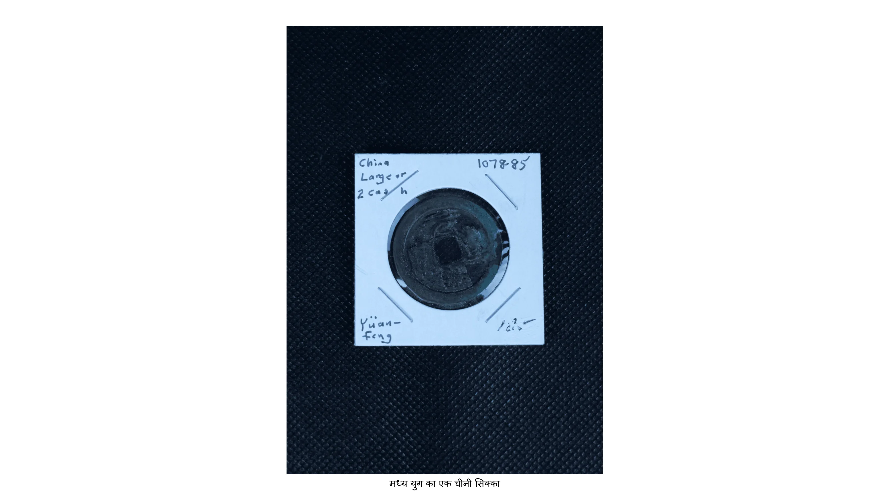

ऊपर वाला मध्य युग का एक चीनी सिक्का है। यह एक ढला हुआ सिक्का है जिसके बीच में एक चौकोर छेद है। इस छेद का इस्तेमाल रस्सी पिरोने के लिए किया जाता था जिससे सिक्कों को एक साथ पिरोकर कंगन या हार बनाए जा सकते थे। हालाँकि, ये मुख्य रूप से पहनने के लिए नहीं थे; इनका इस्तेमाल मुख्य रूप से हिसाब-किताब के लिए किया जाता था। इन्हें एक साथ पिरोकर बड़ी डोरियों के रूप में हिसाब-किताब की इकाइयाँ बनाई जा सकती थीं, जिनके टुकड़े आपस में जुड़े होते थे। इन पर कोई खास निशान नहीं होते थे, कभी-कभी ये सिर्फ़ काँसे के गोले होते थे।

राज्य के मौद्रिक एकाधिकार को, जिसे हान राजवंश के वुडी द्वारा 113 ई.पू. में विलम्ब से स्थापित किया गया था, अक्सर चुनौती दी जाती थी, जिससे विभिन्न निजी या स्थानीय खिलाड़ियों को अपनी मुद्राएं जारी करने की अनुमति मिल जाती थी, बशर्ते कि उन्हें पर्याप्त सामाजिक विश्वास प्राप्त हो।

**चीनी मुद्राओं का कम आंतरिक मूल्य जमाखोरी को रोकता था, जिससे उनका सुचारू प्रचलन सुनिश्चित होता था**। जमाखोरी को रोकने के लिए कीमती धातुओं का प्रचलन मुद्रा के रूप में शायद ही कभी इस्तेमाल किया जाता था। सोना बहुत महंगा होने के कारण, आमतौर पर उसे खर्च करने के बजाय अलग रख दिया जाता था। इसके बजाय, **चीनी अंतर्राष्ट्रीय व्यापार में केवल रेशम ही वास्तविक उच्च-मूल्य वाली मुद्रा का प्रतिनिधित्व करता था**। चीनी लोग रेशम का इस्तेमाल करते थे, सोने का नहीं।

आर्थिक या मौद्रिक संकटों के दौरान, खासकर जब तांबे की कीमत बढ़ रही थी, नए समाधान अपनाए गए: इस प्रकार, दूसरी शताब्दी ईस्वी की शुरुआत में, प्रचलन में मौजूद सिक्कों को काटकर छोटी इकाइयाँ बनाई गईं, जिससे कम लागत पर तरल परिसंचरण बनाए रखा जा सके। अन्य युगों, जैसे वांग मांग (पहली शताब्दी ईस्वी की शुरुआत) में, अत्यधिक प्रत्ययी मुद्राओं के साथ प्रयोग किए गए, जहाँ अंकित मूल्य उनकी वास्तविक धातु सामग्री से कहीं अधिक थे, इस प्रकार बैंक नोटों का पूर्वाभास हुआ। उन्होंने एक सिक्का लिया और उस पर 50, 100, या 200 जैसे मूल्य अंकित किए, ताकि बड़ी राशि, जैसे 200 सिक्के, दर्शाए जा सकें। इस प्रथा ने संभवतः मुद्रास्फीति में महत्वपूर्ण योगदान दिया।

जैसा कि ऊपर बताया गया है, यह प्रणाली राज्य, उत्पादकों और व्यापारियों के बीच सामाजिक परंपरा पर आधारित थी, लेकिन साथ ही उन लोगों के लिए सत्तावादी और कठोर नियमों पर भी आधारित थी जो इस खेल को नहीं खेलते थे, विशेष रूप से कपड़ों के चयन (चाहे वे सुंदर हों या नहीं) या कपड़ों की लंबाई (मानक के अनुरूप नहीं) के संबंध में।

मेरी विनम्र राय में, यह कोई बहुत ठोस व्यवस्था नहीं है। यह मुख्यतः सख्त नियमों पर आधारित है, जिसके तहत अधिकारियों और व्यापारियों को प्रतिबंधों की धमकी के साथ क्षतिग्रस्त सिक्के स्वीकार करने पड़ते हैं।

### चीनी मौद्रिक नवाचार और उनका आर्थिक प्रभाव

चीन कागजी मुद्रा के शुरुआती रूपों को जारी करने में भी अग्रणी था, जिसे 9वीं शताब्दी ईस्वी में धातु की कमी के जवाब में अपनाया गया था। अपने शुरुआती लाभों के बावजूद, इन कागजी मुद्राओं के अत्यधिक जारी होने पर नियमित रूप से मुद्रास्फीति में वृद्धि होती थी, जैसा कि सोंग या मिंग काल में देखा गया था, जब अत्यधिक जारी होने से गंभीर मुद्रा संकट पैदा हो गया था, जिसका उदाहरण 13वीं शताब्दी में मार्को पोलो ने दिया था, जिन्होंने यहाँ तक कहा था कि इस तरह की कागजी मुद्रा की जालसाजी के लिए मौत की सजा दी जा सकती थी। मैं यहाँ हिंसा के एक रूप की ओर इशारा किए बिना नहीं रह सकता।

इस प्रकार, चीनी अनुभव की विशेषता है धन की गहन विश्वासपरक अवधारणा, मौद्रिक प्रणाली का उल्लेखनीय लचीलापन, तथा कागजी मुद्राओं का प्रारंभिक उपयोग, जो प्रयुक्त मीडिया के आंतरिक मूल्य के बजाय आर्थिक खिलाड़ियों के बीच विश्वास पर आधारित है।

## प्राचीन काल में सामाजिक और आर्थिक संगठन

<chapterId>4023c3ce-7a47-5ac4-8f5f-c7ab699ab20f</chapterId>

:::video id=2761efe4-21cf-4f06-9bda-c03f9ff39012:::

### शहरी परजीविता बहस

प्राचीन नगरों और उनके भीतरी इलाकों के बीच का संबंध एक बुनियादी सवाल खड़ा करता है: क्या ये शहरी केंद्र धन-संचय करने वाले परजीवियों की तरह काम करते थे, या लाभकारी आर्थिक विशेषज्ञता के इंजन की तरह? परजीविता की परिकल्पना बताती है कि कांस्य युग के नगर, खासकर मेसोपोटामिया में, **अपने ग्रामीण इलाकों से जितना मूल्य लौटाते थे, उससे कहीं ज़्यादा मूल्य व्यवस्थित रूप से निकालते थे**, और बराबर मूल्य सृजित किए बिना मूलतः किराए और करों पर निर्भर रहते थे।

यह दृष्टिकोण रोमन साम्राज्य के पतन में भी प्रतिध्वनित हुआ: जब क्षेत्रीय विस्तार रुक गया, तो बाहरी धन का प्रवाह रुक गया, जिससे संभवतः एक ऐसी शहरी अर्थव्यवस्था का उदय हुआ जो स्वयं को वित्तपोषित करने में असमर्थ थी। इस प्रकार, शहर "अपनी क्षमता से अधिक" जीवन जीते, उत्पादन के बजाय निष्कर्षण पर निर्भर होते।

### मूल्य सृजन चालक के रूप में विशेषज्ञता

एक वैकल्पिक आर्थिक व्याख्या इस परजीवी दृष्टि को चुनौती देती है। **प्राचीन शहर मुख्यतः विशेषज्ञता और श्रम विभाजन के केंद्रों के रूप में कार्य करते थे**। उनकी भूमिका केवल शोषण से कहीं आगे तक जाती थी: वे विशिष्ट शिल्पों का संकेन्द्रण करते थे, व्यापार नेटवर्क का आयोजन करते थे, और लंबी दूरी के आदान-प्रदान के केंद्र के रूप में कार्य करते थे।

इस शहरी विशेषज्ञता ने भीतरी इलाकों के साथ एक उत्पादक परस्पर निर्भरता पैदा की। **शहर ग्रामीण कृषि आपूर्ति के बिना जीवित नहीं रह सकते थे, लेकिन बदले में भीतरी इलाकों को हस्तशिल्प उत्पादों, तकनीकी नवाचारों और भूमध्यसागरीय व्यापार नेटवर्क तक पहुँच से लाभ हुआ।** श्रम विभाजन ने पारस्परिक उत्पादकता लाभ की अनुमति दी, भले ही लाभों का वितरण असंतुलित प्रतीत होता हो।

उस समय की दीर्घकालिक खाद्य असुरक्षा इस स्पष्ट विषमता की आंशिक व्याख्या करती है। अकाल और फसल विनाश का खतरा ग्रामीण आबादी के लिए लगातार बना रहता था, जबकि अंतर्राष्ट्रीय व्यापार नेटवर्क से जुड़े शहरी कारीगरों को अधिक आर्थिक स्थिरता प्राप्त थी।

### ऐतिहासिक विकास, प्राचीन काल से मध्य युग तक

प्राचीन और मध्यकालीन संगठन के बीच का अंतर इस मुद्दे पर प्रकाश डालता है। **प्राचीन काल में बड़े पैमाने पर श्रम विभाजन को प्राथमिकता दी जाती थी, जहाँ शहर पूरे भूमध्यसागरीय क्षेत्र के लिए खुले थे**। व्यापार और विशेषज्ञता उन्नत स्तर पर पहुँच गए, जिससे व्यापक आर्थिक नेटवर्क का निर्माण हुआ।

रोमन साम्राज्य के पतन के कारण आमूल-चूल विखंडन हुआ: **सामंती युग ने इस केंद्रीकृत संगठन की जगह आत्मनिर्भर जागीरों की एक विकेन्द्रीकृत व्यवस्था स्थापित कर दी**। प्राचीन रोमन विलास रस्टिके मध्ययुगीन सेग्न्यूरीज़ का आधार बन गए, जिससे पादरी या कुलीन वर्ग द्वारा प्रबंधित लगभग आत्मनिर्भर आर्थिक द्वीपों का एक मोज़ेक बन गया।

इस मध्ययुगीन विकेंद्रीकरण ने, जहाँ वाणिज्यिक दक्षता को कम किया, वहीं विडंबना यह है कि इसने बाहरी झटकों के प्रति अधिक लचीलापन प्रदान किया। सामंती सम्पदाओं ने सत्ता के केंद्रों और ग्रामीण आबादी के बीच अधिक संतुलित संबंध विकसित किए, भले ही इस संगठन ने विशेषज्ञता से जुड़ी उत्पादकता वृद्धि को सीमित कर दिया।

### शहरी बाजारों का उदय

पुरातात्विक खोजों से पता चलता है कि **दूसरी सहस्राब्दी की शुरुआत में ही मेसोपोटामिया के शहरों में व्यापारिक बंदरगाह और केंद्र मौजूद थे।** ये बुनियादी ढाँचे संगठित बाज़ारों के अस्तित्व की पुष्टि करते हैं, हालाँकि उनकी कार्यप्रणाली पर अभी भी बहस जारी है।

कार्ल पोलानी, जो शुरू में प्राचीन काल में वास्तविक बाज़ार तंत्रों के अस्तित्व को लेकर संशयी थे, ने अपनी स्थिति को यह स्वीकार करते हुए स्पष्ट किया कि हो सकता है कि उन्होंने बाज़ार विनिमय के प्रारंभिक उद्भव को कम करके आंका हो। यह बौद्धिक विकास प्राचीन आर्थिक प्रणालियों की व्याख्या की जटिलता को दर्शाता है, जहाँ संस्थागत पुनर्वितरण, पारस्परिक विनिमय और नवजात बाज़ार लेनदेन एक साथ मौजूद थे।

### स्पार्टा बनाम एथेंस

स्पार्टा और एथेंस के बीच तुलना मौद्रिक प्रणाली और सामाजिक संगठन के बीच संबंधों को पूरी तरह से दर्शाती है। **स्पार्टा एक कठोर पदानुक्रमित समाज का मॉडल प्रस्तुत करता है जिसने जानबूझकर धन के उपयोग को अस्वीकार कर दिया**, जबकि एथेंस ने अपनी लोकतांत्रिक प्रणाली के साथ एक परिष्कृत मौद्रिक अर्थव्यवस्था विकसित की।

स्पार्टन्स द्वारा धन का निषेध स्वतःस्फूर्त नहीं था, बल्कि **संस्थागत और वैचारिक** था। स्पार्टन नेताओं को डर था कि धन सैन्य और नागरिक मूल्यों को भ्रष्ट कर देगा, इसलिए वे नागरिकों के बीच प्रत्यक्ष पारस्परिक विश्वास पर आधारित व्यवस्था को प्राथमिकता देते थे।

धन के उपयोग को हतोत्साहित करने के लिए, स्पार्टा ने **भारी, अव्यावहारिक धातु की छड़ों** का प्रयोग किया, जो विरोधाभासी रूप से मौद्रिक गुणों (विभाज्यता, परिवहनीयता, स्थायित्व) की सहज समझ को प्रदर्शित करता था, जिसे वे बेअसर करने का प्रयास कर रहे थे।

### मौद्रिक-विरोधी मॉडल की सीमाएँ

स्पार्टन संगठन सामाजिक पैमाने पर लागू **डनबार की संख्या** की सीमाओं को दर्शाता है। **मुद्रा को विनिमय के एक तटस्थ माध्यम के रूप में अस्वीकार करके, स्पार्टा ने अपने नागरिक समाज को सीमित संख्या में नागरिकों तक सीमित कर दिया, जो प्रत्यक्ष विश्वास के संबंध बनाए रखने में सक्षम थे।** होमोइओई (स्पार्टन नागरिक) कुल जनसंख्या का केवल 1% प्रतिनिधित्व करते थे, जो हज़ारों हिलोट्स (दासों) से घिरे रहते थे।

यह संगठन, जो शुरू में असाधारण सैन्य एकजुटता का स्रोत था, संरचनात्मक रूप से कमजोर साबित हुआ। **ल्यूकट्रेस की लड़ाई (371 ईसा पूर्व) ने इस प्रणाली की सीमाओं को प्रदर्शित किया**: जीवन की हानि ने स्पार्टन सामाजिक ताने-बाने को अपूरणीय रूप से तोड़ दिया, जिससे उनकी सभ्यतागत मॉडल का पतन हो गया।

प्रतिस्पर्धी शहरों (एथेंस, कोरिंथ, थेब्स) ने विकसित मौद्रिक प्रणालियों के साथ, **अधिक समृद्ध, अधिक लचीली अर्थव्यवस्थाओं को बनाए रखा**, जो आर्थिक पुनर्निर्माण और आव्रजन के माध्यम से मानवीय नुकसान की भरपाई करने में सक्षम थे।

### व्यक्तिगत बनाम संस्थागत विश्वास

स्पार्टन का अनुभव तटस्थ संस्थागत तंत्रों के बजाय केवल पारस्परिक विश्वास पर आधारित समाज में निहित जोखिमों को उजागर करता है। गहन सामाजिक सामंजस्य स्थापित करते हुए, इस मॉडल ने समाज को जनसांख्यिकीय झटकों के प्रति संवेदनशील बना दिया।

गुमनाम और अवैयक्तिक लेन-देन को संभव बनाकर, मुद्रा बेहतर प्रणालीगत लचीलापन प्रदान करती है। यह प्रत्यक्ष विश्वास की सीमाओं से परे सामाजिक विस्तार की अनुमति देती है, जिससे विदेशी मुद्रा विनिमय और आर्थिक विकास सुगम होता है।

### इंका विरोधाभास, धन के बिना धन

इंका साम्राज्य एक दिलचस्प विरोधाभास प्रस्तुत करता है: **एक सभ्यता जिसके पास अपार स्वर्ण संपदा थी, लेकिन कोई मौद्रिक व्यवस्था नहीं थी**। स्पार्टा की तरह, यह मॉडल भी एक कठोर पदानुक्रमित संगठन और केंद्रीकृत योजना पर आधारित था, लेकिन लचीली मौद्रिक अर्थव्यवस्था वाले विजेताओं के लिए असुरक्षित साबित हुआ।

मौद्रिक समाजों के समक्ष मौद्रिक-विरोधी प्रणालियों की यह संरचनात्मक कमजोरी एक आवर्ती ऐतिहासिक पैटर्न है, जो यह सुझाता है कि **धन की संस्थागत अस्वीकृति, सामाजिक सामंजस्य को मजबूत करने के बजाय, बाह्य चुनौतियों और ऐतिहासिक परिवर्तन के समक्ष सभ्यताओं को विरोधाभासी रूप से कमजोर कर सकती है।**

इन ऐतिहासिक मॉडलों के विश्लेषण से पता चलता है कि मुद्रा, अपने विनिमय कार्य से परे, सामाजिक जटिलता का सूचक और सुविधाकर्ता है, जो सभ्यताओं को प्रत्यक्ष पारस्परिक संबंधों द्वारा लगाई गई सीमाओं को पार करने में सक्षम बनाता है।

# ढाले गए धन का जन्म

<partId>232e365a-8c3b-11f0-b276-b3ab70d1a5a1</partId>

## सिक्कों का उदय

<chapterId>40ed3414-3066-57bd-bc1b-617ad0a354e0</chapterId>

:::video id=1d6834c4-98a3-43fe-ba80-04be51b0486e:::

अब हम मुद्दे की जड़ पर आ गए हैं: सिक्कों का उद्भव। मैं यहाँ 'सिक्का' शब्द पर ज़ोर दे रहा हूँ क्योंकि हमने पिछले खंडों में देखा है कि लिडियन लोगों, यूनानियों और फारसियों से पहले की सभ्यताओं में मुद्रा या मौद्रिक प्रणालियाँ बहुतायत में मौजूद थीं। मुझे लगता है कि हमने अभी जो देखा है, उससे यह बात बिल्कुल स्पष्ट है। इसलिए, यह खंड वास्तविक सिक्कों के उद्भव को समर्पित है और इसका शीर्षक है: *सिक्कों का उद्भव*।

### सिक्कों की लिडियन और आयोनियन उत्पत्ति

इस खंड की शुरुआत में, मैं आपको ग्लिन डेविस की पुस्तक, ए हिस्ट्री ऑफ मनी, से एक उद्धरण प्रस्तुत करना चाहूंगा।

*ग्लिन डेविस द्वारा लिखित पुस्तक 'ए हिस्ट्री ऑफ मनी: फ्रॉम एनशिएंट टाइम्स टू द प्रेजेंट डे' से उद्धृत:*

> लिडिया और आयोनिया में अपने जन्मस्थान से, सिक्कों का ज्ञान और उपयोग पूर्व में फ़ारसी साम्राज्य में और पश्चिम में शेष आयोनियन और एजियन द्वीपों से होते हुए मुख्य भूमि ग्रीस और फिर उसके पश्चिमी उपनिवेशों, विशेष रूप से सिसिली तक तेज़ी से फैला। यह उत्तर में मैसेडोनिया, थ्रेस और काला सागर तक भी फैला, लेकिन मिस्र में इसे आंशिक रूप से, अनिच्छा से और देर से ही सही, स्वीकार किया गया।

मुझे यहाँ यह बताना दिलचस्प लगता है कि मिस्र में, सिक्का निर्माण तकनीक के आगमन के बहुत बाद तक, सिक्कों को तौलना जारी रहा। मुझे लगता है कि यह ध्यान रखना ज़रूरी है। उद्धरण आगे कहता है:

> इसी प्रकार, मुख्य भूमि इटली भी ग्रीक वित्तीय नवाचारों को स्वीकार करने में पहले तो धीमी थी, जबकि सिसिली ने उन्हें तेजी से अपनाया।

*इन दो सीमित अपवादों (महाद्वीपीय इटली और निचला मिस्र) के अलावा, सिक्कों का प्रयोग मध्य और पूर्वी भूमध्य सागर की सीमा से लगे देशों के साथ-साथ विशाल और बढ़ते फ़ारसी साम्राज्य में, मेसोपोटामिया से लेकर भारत तक तेज़ी से फैला।** यह अभी भी स्पष्ट नहीं है कि भारत ने इस समय तक, चीनी या लिडियन विकास से स्वतंत्र, एक प्रारंभिक मौद्रिक प्रणाली विकसित कर ली थी या नहीं। भारत ने स्वतंत्र रूप से अपनी मुद्रा विकसित की थी या नहीं, इस पर ध्यान दिए बिना, भारत और निकट पूर्व के बीच बढ़ते संपर्कों के कारण भारतीय सिक्के लिडियन और यूनानी आविष्कार का प्रत्यक्ष रूपांतर बन गए, पहले फ़ारसी साम्राज्य और फिर मैसेडोनियन साम्राज्य* (सिकंदर महान और उसके पिता की विजयों के साथ)।

*इन कारणों से, किसी भी स्वदेशी भारतीय मुद्रा आविष्कार का प्रत्यक्ष प्रभाव पूर्व में चीन के स्पष्ट रूप से स्वतंत्र मौद्रिक आविष्कारों के अत्यधिक महत्व की तुलना में नगण्य था, तथा पश्चिम में लिडियन और ग्रीक विकास का महत्व तो और भी अधिक था।*

### भौगोलिक वितरण और क्षेत्रीय अनुकूलन

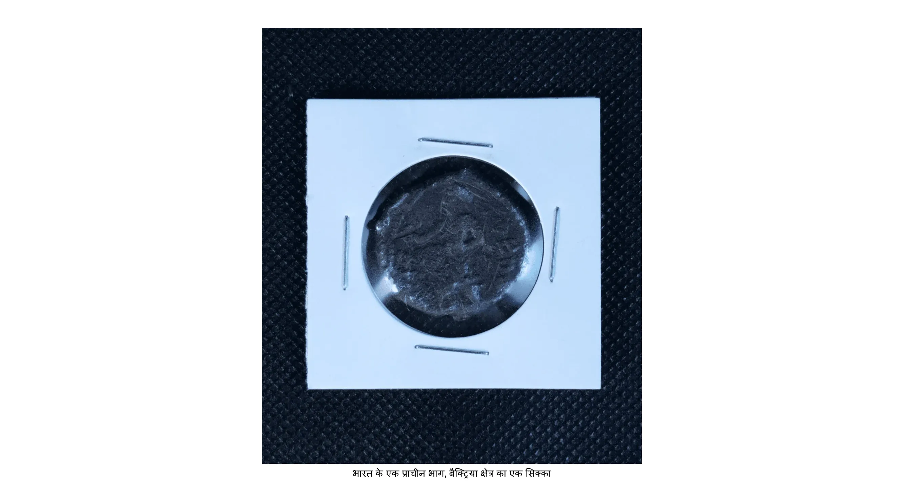

इस काल को दृश्य रूप में दर्शाने के लिए, ऊपर भारत के एक क्षेत्र, बैक्ट्रिया क्षेत्र का एक सिक्का दिखाया गया है, जो भारतीय प्रायद्वीप के पश्चिम में, अफ़ग़ानिस्तान के पास स्थित है। इस क्षेत्र में ऐसे सिक्के थे जो संभवतः यूनानी सिक्कों से प्रेरित थे जिन पर उनके किसी शाही व्यक्तित्व की छवि अंकित थी।

## लिडियन और फारसी

<chapterId>eb802ab8-8ffd-5b25-907f-8944f120ed14</chapterId>

:::video id=f151eb42-5ff3-4ca1-9af1-1ae2a5e051c0:::

### पहले लिडियन इलेक्ट्रम सिक्के

चूँकि हम लिडिया और फारसियों के सिक्कों के स्वरूप को अलग नहीं कर सकते, तो चलिए ग्रीस के पूर्व में दुनिया के उस हिस्से की ओर चलते हैं, जो आज तुर्की है। पश्चिम में दिखाई देने वाले पहले सिक्के लगभग 7वीं शताब्दी ईसा पूर्व के मध्य में, वर्तमान तुर्की में स्थित लिडिया और इओनिया क्षेत्रों में पाए गए थे। लगभग 650 से 600 ईसा पूर्व के बीच यह मौलिक नवाचार सामने आया, जिसमें उल्लेखनीय पुरातात्विक खोजें हुईं, जैसे कि इफिसुस के आर्टेमिस मंदिर में पाए गए पहले सिक्के, जो लगभग 600 ईसा पूर्व के थे। ये आदिम सिक्के इलेक्ट्रम से बने होते थे, जो सोने और चांदी का एक प्राकृतिक मिश्र धातु है जिसमें एम्बर रंग की झलक होती है, और अक्सर दिखने में अपरिष्कृत होते थे, जिन पर केवल छिद्र या अल्पविकसित रूपांकन अंकित होते थे।

नीचे, आप लिडियन सिक्कों में से एक देख सकते हैं, जिसमें एक शेर अपने शिकार के साथ सामने की ओर बना हुआ है। आपको पीछे की तरफ एक मोहर या छेद दिखाई दे सकता है, जिसके बारे में कुछ लोगों का मानना ​​है कि इसका इस्तेमाल धातु की शुद्धता की जाँच करने और यह सुनिश्चित करने के लिए किया गया था कि यह सिर्फ़ एक ऊपरी परत न हो। हालाँकि यह शुरुआती उदाहरणों में से एक है, लेकिन यह ध्यान रखना ज़रूरी है कि यह एक प्रति है। मेरे सभी सोने और इलेक्ट्रम के सिक्के प्रतिकृतियाँ या आधुनिक पुनर्निर्माण हैं, जिन्हें इस संग्रह पर मेरी सारी बचत खर्च करने से रोकने के लिए डिज़ाइन किया गया है।

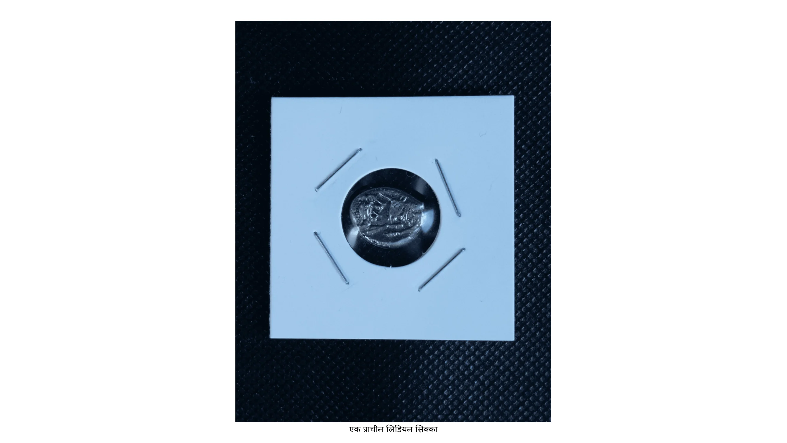

लेकिन मेरे पास एक असली फ़ारसी कलाकृति भी है जिसे हम देखने वाले हैं। ये शुरुआती कलाकृतियाँ कुछ ऐसी दिखती थीं। यह धातु का एक गोला (या अंग्रेज़ी में कहें तो गांठ) जैसा है जिस पर उस समय मुहर लगाई जाती थी।

इस व्यापक धारणा के विपरीत कि मुद्रा का आविष्कार रोज़मर्रा के व्यापार को सुगम बनाने और वस्तु विनिमय के विकल्प के रूप में किया गया था, ऐसा प्रतीत होता है कि प्रारंभिक लिडियन, अकेमेनिड और यूनानी सिक्कों का उपयोग शुरू में छोटे पैमाने के व्यापार के लिए नहीं किया गया था। वास्तव में, ये मुद्रा इकाइयाँ रोज़मर्रा के उपयोग के लिए बहुत बड़ी थीं। इसके अलावा, इनका प्रचलन उनके उत्पादन के आस-पास के क्षेत्रों तक ही सीमित था।

यहाँ, मुझे यह बताना ज़रूरी लगता है कि, हालाँकि मैंने मानवशास्त्रीय प्रकृति की कई कृतियों में पढ़ा है, सिक्के, जैसा कि मैं पहले ही बता चुका हूँ - चाहे इलेक्ट्रम वाले हों या यह फ़ारसी सिक्का, जिस पर मैं थोड़ी देर में फिर लौटूँगा - रोज़ाना रोटी खरीदने के लिए बहुत बड़े थे। मैंने ऐसे अनुमान देखे हैं जिनसे हमें लगता है कि यह किसी किसान या सैनिक के एक दिन के काम के बराबर है, इसलिए यह बहुत बड़ा होगा। यह अपने भोजन, नाश्ते या दोपहर के भोजन के लिए एक दिन की मज़दूरी देने जैसा है। सिवाय इसके कि मैंने अन्य कृतियों में देखा है कि इन धब्बों की छोटी इकाइयाँ मिली हैं, यानी छोटे सिक्के, जो हमें यह सोचने पर मजबूर कर सकते हैं कि शायद रोज़मर्रा की खरीदारी के लिए इनका कोई संभावित उपयोग रहा होगा।

अतः यहाँ, मानवशास्त्रीय "प्रमाण" कि इसका उपयोग रोजमर्रा के व्यापार के लिए नहीं किया जाता था, क्योंकि मूल्यवर्ग या इकाई बहुत बड़ी थी, मेरी राय में बहुत ठोस नहीं है, क्योंकि हमें ऐसे सिक्कों के उदाहरण मिले हैं जो छोटे हैं, जिन्हें रोजमर्रा की खरीदारी के लिए अनुकूलित किया जा सकता था।

### धन सृजन में राज्य की भूमिका

सिक्कों की वास्तविक उत्पत्ति राज्यों की प्रत्यक्ष कार्रवाई से जुड़ी हुई प्रतीत होती है। इस विषय पर दो मुख्य परिकल्पनाएँ हैं: पहली, आदर्शवादी, ग्रीक शब्द 'नोमिस्मा' (मुद्रा) और 'नोमोस' (कानून) के बीच समानता दर्शाती है, जो यह सुझाव देती है कि मुद्रा कानूनों के संहिताकरण से जुड़ी थी, जो शहरों के अधिकार और राजनीतिक संगठन को सुदृढ़ करती थी। दूसरी, अधिक यथार्थवादी परिकल्पना, जो आज व्यापक रूप से स्वीकृत है, यह है कि मुद्रा सबसे पहले और सबसे महत्वपूर्ण रूप से राज्यों के लिए आर्थिक और सामाजिक नियंत्रण का एक साधन थी। इनमें निहित कीमती धातुओं के वजन और मूल्य की आधिकारिक गारंटी देकर, राज्य इन सिक्कों के प्रचलन और मूल्य में हेरफेर करने में सक्षम थे, जिससे घरेलू मुद्राओं के लिए विशिष्ट विश्वास और तरलता प्रीमियम का निर्माण हुआ।

यह जानना वाकई दिलचस्प है कि हमारे पास इसके प्रमाण हैं। उदाहरण के लिए, इलेक्ट्रम सिक्कों में, आपको पता होना चाहिए कि प्राकृतिक इलेक्ट्रम आमतौर पर लगभग 70% सोना और 30% चाँदी होता है। हमें मिले और विश्लेषित शुरुआती सिक्कों में, खासकर शुरुआती लिडियन सिक्कों में, सोने की मात्रा 70 के बजाय लगभग 50 से 55% ज़्यादा प्रतीत होती है। इससे पता चलता है कि उस समय भी, सिक्का जारीकर्ता ज़्यादा कीमती धातु की मात्रा कम करने की कोशिश कर रहे थे, शायद ज़्यादा सिक्के बनाने और उन्हें प्राकृतिक इलेक्ट्रम के एक अचिह्नित कण के बराबर दिखाने के लिए। और यहाँ, यह कहना होगा कि यह वास्तव में इस प्रसिद्ध क्रोएसस के समय से ही संभव हुआ था, यानी *क्रोएसस जितना अमीर*, क्योंकि उनके समय से ही हमारे पास सोने और चाँदी को अलग करने की तकनीक थी।

लिडियन सिक्कों का विकास प्रसिद्ध राजा क्रोएसस (561-546 ईसा पूर्व) के शासनकाल में हुआ, जो अपनी अद्भुत संपत्ति के लिए प्रसिद्ध थे। इस समय, लिडियनों ने इलेक्ट्रम से सोने और चाँदी को अलग करने की धातु विज्ञान में निपुणता हासिल की, और इस प्रकार पहले द्विधात्विक सिक्के, यानी अलग-अलग सोने और चाँदी के सिक्के, प्रचलन में आए।

### फ़ारसी विस्तार और यूनानी अपनाना

546 ईसा पूर्व में लिडिया पर विजय प्राप्त करने के बाद, अचमेनिद फारसियों ने तुरंत इस नवाचार को अपना लिया। लगभग 500 ईसा पूर्व, डेरियस प्रथम के शासनकाल में, फारसियों ने सोने के डारिक्स और चांदी के सिग्लोइस के साथ अपनी स्वयं की मौद्रिक प्रणाली स्थापित की, जिन पर अक्सर युद्ध जैसी मुद्रा में शाही प्रतिमा अंकित होती थी। इस शाही फारसी मुद्रा का प्रयोग मुख्यतः फारसी साम्राज्य के हेलेनाइज्ड क्षेत्रों में किया जाता था और धीरे-धीरे इसका प्रसार हुआ, हालाँकि इसका उपयोग असमान रहा, **मिस्र जैसे कुछ क्षेत्रों में अभी भी तौले हुए धातु (बुलियन) में विनिमय को प्राथमिकता दी जाती थी।**

ऊपर, आप एक असली फ़ारसी सिग्लोई (या सिग्लोस) की प्रशंसा कर सकते हैं। छोटे डिज़ाइन में एक राजा की आकृति है, हालाँकि छेद थोड़ा घिस गया है। सिग्लोस एक चाँदी का सिक्का है, जबकि डारिक सोने से बना था। फ़ारसी लोग इन दोनों धातुओं में अंतर कर सकते थे, और वे इलेक्ट्रम सिक्कों से दूर हो गए। इसलिए, उन्होंने द्विधातुवाद को अपनाया, जिसमें सोने और चाँदी दोनों का इस्तेमाल किया गया, जबकि कीमती धातुओं से बने सिक्कों की अवधारणा को बनाए रखा गया, अक्सर पीछे की ओर एक छेद होता था, संभवतः धातु की मात्रा की जाँच के लिए।

ऐसा प्रतीत होता है कि यूनानियों द्वारा सिक्कों को तेज़ी से अपनाना, लिडियन लोगों के साथ उनके घनिष्ठ संपर्कों, विशेष रूप से एशिया माइनर में यूनानी उपनिवेशों के माध्यम से, से प्रेरित था। सिक्के ढालने वाले पहले यूनानी संभवतः छठी शताब्दी ईसा पूर्व के मध्य में एजिना के निवासी थे, जिन्होंने ड्राक्मा मुद्रा प्रचलित की, जिसका वज़न क्षेत्र-दर-क्षेत्र भिन्न होता था, और जिसके नाम का शाब्दिक अर्थ है "मुट्ठी भर अनाज" या "मुट्ठी भर तीर"।

यूनानी सिक्कों की सफलता भाड़े के सैनिकों के भुगतान जैसे महत्वपूर्ण लेन-देन में उनकी सुविधा के साथ-साथ शहरों के आर्थिक और राजनीतिक विस्तार के कारण भी थी। मुद्रा तेजी से यूनानी और बाद में रोमन अर्थव्यवस्था का एक केंद्रीय तत्व बन गई, साथ ही इसने एक मज़बूत प्रतीकात्मक आयाम भी बनाए रखा, विशेष रूप से कानून (नोमोस) के साथ अपने जुड़ाव के माध्यम से।

अंततः, सिक्कों का तेज़ी से विस्तार प्राचीन समाजों में हुए एक गहन परिवर्तन का प्रमाण है, जहाँ मौद्रिक मूल्यों का संहिताकरण राज्य संगठन के साथ-साथ चलता था। इस विकास ने यूनानी लोकतंत्रों के उदय की आर्थिक और राजनीतिक नींव रखी, विशेष रूप से एथेंस में, जहाँ लोकतांत्रिक शहर के संचालन में मुद्रा की महत्वपूर्ण भूमिका थी।

इस खंड में याद रखने वाली एक महत्वपूर्ण बात यह है कि हम विशेष रूप से **सिक्कों** की बात कर रहे हैं, सामान्य मुद्रा की नहीं। मुख्य पहलू जो स्पष्ट रूप से उभर कर आता है, वह है **जारीकर्ता प्राधिकारी में विश्वास**, जो सीधे सिक्कों की तकनीकी विशेषताओं (वजन, शुद्धता, अंकित मूल्य) से जुड़ा है। यही विश्वास राज्य या जारीकर्ता प्राधिकारी को शुरू से ही इन सिक्कों के मूल्य और प्रचलन पर कुछ हद तक नियंत्रण रखने या यहाँ तक कि उनमें हेरफेर करने में सक्षम बनाता है।

## संस्थागत हस्तक्षेप और पहले सिक्के

<chapterId>3e1efd08-99e3-5a32-9908-3185fef0e640</chapterId>

:::video id=84847cf6-9e46-4a8c-9f35-25a27496cc4b:::

### धन की दोहरी प्रकृति

गढ़े हुए धन का उदय एक बुनियादी सवाल उठाता है: क्या धन बाज़ार की स्वतःस्फूर्त रचना है या सत्ता द्वारा थोपी गई कोई संस्था? यह वैचारिक तनाव दो बिल्कुल अलग दृष्टिकोणों को एक-दूसरे के विरुद्ध खड़ा करता है।

एक ओर, ऑस्ट्रियाई अर्थशास्त्र स्कूल इस विचार का समर्थन करता है कि वस्तु मुद्रा - विशेष रूप से सोना - आर्थिक कर्ताओं द्वारा स्वाभाविक रूप से उसके अंतर्निहित गुणों: स्थायित्व, सुवाह्यता, विभाज्यता और विनिमयशीलता के कारण चुनी गई थी। इस दृष्टिकोण से, राज्य ने इस स्वतःस्फूर्त मुद्रा को उसकी आपूर्ति को नियंत्रित करने के लिए अपने अधीन कर लिया। यह एक ऐसी संस्था है जो राजनीतिक सत्ता द्वारा कब्ज़ा किए जाने से पहले बाज़ार की ज़रूरतों से स्वाभाविक रूप से उभरती है।

इसके विपरीत, मानवशास्त्रीय और संस्थागत दृष्टिकोण यह मानता है कि मुद्रा वास्तव में राज्य के सिक्कों के साथ अस्तित्व में आती है। प्राधिकारी जानबूझकर अपनी मुहर लगाकर मुद्रा का निर्माण करते थे, इस प्रकार धातु को एक वास्तविक मौद्रिक साधन में बदल देते थे। यह दृष्टिकोण बताता है कि प्रारंभिक लिडियन सिक्कों का उपयोग मुख्यतः सेनाओं को भुगतान करने के लिए किया जाता था - एक स्टेटर मोटे तौर पर एक सैनिक के दैनिक वेतन के बराबर होता था।

### राज्य मानकीकरण के विरोधाभासी लाभ

इस सैद्धांतिक तनाव के बावजूद, ऑस्ट्रियाई अर्थशास्त्री भी मुद्रा में राज्य के हस्तक्षेप के कुछ लाभों को स्वीकार करते हैं। टकसाल द्वारा मानकीकरण कई व्यावहारिक व्यापारिक समस्याओं का समाधान करता है।

प्रमाणन प्राधिकरण के बिना, आर्थिक खिलाड़ियों को लगातार जोखिमों का सामना करना पड़ता है: नकली सिक्के, धोखाधड़ी और वज़न में हेराफेरी। ये प्रथाएँ अर्थव्यवस्था में टकराव पैदा करती हैं, क्योंकि कुछ सिक्के स्वीकार किए जाते हैं जबकि कुछ अस्वीकार कर दिए जाते हैं। सिद्धांत रूप में, आधिकारिक मुहर वज़न और गुणवत्ता की गारंटी देती है, जिससे व्यापार अधिक सुचारू हो जाता है।

इस गारंटी की बाज़ार में एक स्पष्ट कीमत है: एक ढले हुए सोने के सिक्के की कीमत उसके कच्चे सोने के बराबर से ज़्यादा होती है। यह प्रीमियम प्रमाणीकरण के मूल्य को दर्शाता है - व्यापारियों को अब रासायनिक या अनुनाद परीक्षणों के ज़रिए धातु की प्रामाणिकता स्वयं सत्यापित करने की ज़रूरत नहीं है। विडंबना यह है कि राज्य का हस्तक्षेप, संस्थागत विश्वास पैदा करके, घर्षण को कम करता है और व्यापार को सुगम बनाता है।

### शुरू से ही मुद्रा हेरफेर

पहले लिडियन स्टेटर्स की कहानी एक परेशान करने वाली विडंबना को उजागर करती है। हाल के विश्लेषणों से पता चलता है कि इन इलेक्ट्रम सिक्कों में सोने की मात्रा प्राकृतिक इलेक्ट्रम की तुलना में व्यवस्थित रूप से कम थी। गुणवत्ता प्रमाणित करने वाला प्राधिकारी, साथ ही साथ, संरचना में भी हेरफेर कर रहा था।

यह प्रथा सिक्कों की दोहरी उपयोगिता को दर्शाती है। बाज़ार के लिए, यह विनिमय को अधिक तरल बनाता है और मानकीकरण की गारंटी प्रदान करता है। जारीकर्ता प्राधिकारी के लिए, यह तनुकरण के माध्यम से आर्थिक नियंत्रण का एक साधन बन जाता है। नाममात्र मूल्य को बनाए रखते हुए सोने की मात्रा को कम करके, राज्य प्रभावी रूप से मुद्रा आपूर्ति बढ़ाता है - समान मात्रा में कीमती धातु से अधिक मौद्रिक इकाइयाँ बनाता है।

हालाँकि, राज्य स्वयं इस हेरफेर से विवश रहा। जैसा कि चौथी शताब्दी में कॉन्स्टेंटाइन के गोल्ड सॉलिडस के उदाहरण से स्पष्ट है, रोमन प्रशासन सिक्कों की गुणवत्ता की सावधानीपूर्वक जाँच करता था, क्योंकि वह अच्छी मुद्रा में भुगतान की माँग करता था। अपने कर राजस्व के मूल्य की गारंटी के लिए, सत्ता का अपने सिक्कों की गुणवत्ता बनाए रखने में गहरा हित था।

### अवमूल्यन का आर्थिक विश्लेषण

मुद्रा अवमूल्यन का अध्ययन पूरे इतिहास में लगातार पैटर्न को उजागर करता है। धातु के सिक्कों के लिए, अर्थशास्त्री सिक्कों में निहित कीमती धातु के प्रतिशत पर नज़र रखते हैं - एक अवरोही वक्र जो प्रगतिशील अवमूल्यन का संकेत देता है। आधुनिक कागजी मुद्रा के लिए, विपरीत सत्य है: परिसंचारी मुद्रा आपूर्ति देखी जाती है, और इसकी वृद्धि अवमूल्यन का संकेत देती है।

दोनों विधियाँ एक ही मूलभूत घटना को मापती हैं: मौद्रिक मूल्य का क्षीणन। चाहे बहुमूल्य धातु की मात्रा कम करके हो या नए बैंक नोट छापकर, प्रक्रिया एक ही रहती है। कोई प्राधिकरण समान वास्तविक संसाधनों से जितनी अधिक मौद्रिक इकाइयाँ बनाता है, उतनी ही अधिक प्रत्येक इकाई अपना मूल्य खो देती है।

यह हेरफेर, जो शुरुआती लिडियन सिक्कों से देखा जा सकता है, बताता है कि मौद्रिक नियंत्रण हमेशा से ही सत्ता का मुद्दा रहा है। इस प्रकार, ढाला गया धन एक उल्लेखनीय तकनीकी नवाचार और आर्थिक नियंत्रण के एक साधन का प्रतिनिधित्व करता है - एक ऐसा द्वंद्व जो मौद्रिक इतिहास में, आज तक, चलता आ रहा है।

## भागों का निर्माण

<chapterId>b205f4f2-c293-5308-b812-a998de9ad45e</chapterId>

:::video id=47c612ec-d97e-4498-b50e-7e66518bd56d:::

### छिद्रित बूँदों से लेकर ढले सिक्कों तक

सिक्कों के उद्भव पर एक खंड के बाद, मैं सिक्का निर्माण के विकास पर एक बहुत ही संक्षिप्त खंड प्रस्तुत करना चाहता था। जैसा कि हम देख चुके हैं, इसकी शुरुआत इलेक्ट्रम के छोटे-छोटे टुकड़ों से हुई, और फिर सोने और चाँदी के साथ आगे बढ़ी, जहाँ दोनों तरफ एक छेद करके, या तो राजा के चेहरे से, या फिर शुद्धता की जाँच के लिए पीछे की तरफ एक छेद करके, निशान बनाया जाता था।

बाद में, जैसा कि हम अगले भाग में जानेंगे, यूनानियों ने इस तकनीक को और निखारा और गोल सिक्के बनाए जिन्हें दोनों तरफ से हथौड़े से ठोंका जाता था। वे कीमती धातु का एक चिकना, चपटा टुकड़ा लेते थे, उसके एक तरफ मनचाहा डिज़ाइन उकेरते थे, और फिर उसे हाथ से ठोंककर तैयार सिक्का बनाते थे।

उस समय, हाथ से सिक्के ढालने की तकनीक ने मुद्रास्फीति को नियंत्रित करने में भूमिका निभाई होगी, हालाँकि उत्पादन बढ़ाने के लिए अक्सर सिक्कों को पतला किया जाता था। यह रोमन काल में और कुछ हद तक, यूनानी काल के कुछ युद्धों के दौरान विशेष रूप से स्पष्ट था। हालाँकि एक-एक करके सिक्के ढालने से अधिकारियों की बड़े पैमाने पर उत्पादन क्षमता सीमित हो गई, लेकिन इससे मुद्रास्फीति को नियंत्रित करने में प्रभावी योगदान मिला, भले ही मूल्यह्रास में उल्लेखनीय गिरावट आई हो। इस प्रकार, यह विकास धातु के एक छोटे से टुकड़े से शुरू होकर एक गोल, हथौड़े से ठोककर बनाए गए सिक्के तक पहुँच गया।

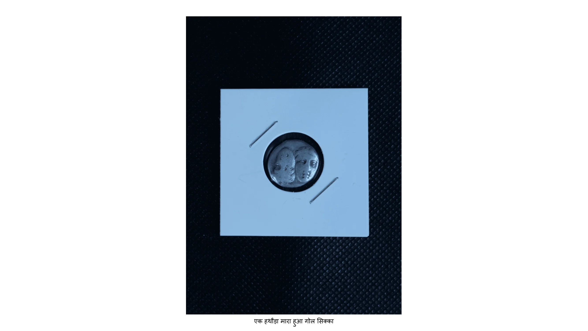

### मध्यकालीन विकास

मध्य युग में, सिक्कों को फैलाकर उन्हें चौड़ा और पतला बनाने का भी चलन था। इसका एक कारण यह था कि इससे उनकी ध्वनि की जाँच करना आसान हो जाता था, जिसे अक्सर प्रामाणिकता के सूचक के रूप में इस्तेमाल किया जाता था। चाँदी को फैलाकर, एक विशिष्ट ध्वनि उत्पन्न की जाती थी, जिससे लोग केवल उसे सुनकर ही सिक्के की शुद्धता की पुष्टि कर सकते थे। इस प्रथा ने "साउंड मनी" शब्द को जन्म दिया। सॉन्ड मनी के संदर्भ में, मानक भार तौलने के लिए एक तराजू या "ट्रेबुशेट" का उपयोग करके निर्धारित किया जाता था। इस प्रकार, छोटे, गोल सिक्कों से लेकर थोड़े पतले, चौड़े सिक्कों तक का विकास जारी रहा।

### पेंडुलम का प्रहार

मध्य युग के अंत में, आधुनिक युग की शुरुआत में, पेंडुलम स्ट्राइकिंग की अवधारणा आई। यह एक प्रकार का पेंच था जिसे सिक्कों पर प्रहार करने के लिए कस दिया जाता था, जिससे इस नए प्रकार के प्रहार वाले सिक्के बनते थे। इस विकास की खासियत यह थी कि सिक्के की सतह पर एक पैटर्न उकेरने की क्षमता विकसित हुई जिससे कतरन की समस्या का समाधान हो गया। कतरन में सिक्के के एक हिस्से को हटाकर कीमती चाँदी प्राप्त की जाती थी, जिसका उपयोग बाद में अन्य सिक्के ढालने में किया जा सकता था या फिर उसे एक संसाधन के रूप में रखा जा सकता था।

तो पेंडुलम स्ट्राइकिंग की इस धारणा ने क्लिपिंग की प्रक्रिया में मदद की। और यह जानना दिलचस्प है कि यह तकनीक असल में फ्रांस से आई थी। उदाहरण के लिए, इंग्लैंड में, उन्होंने फ्रांसीसी इंजीनियरों को काम पर रखा था ताकि वे आकर उन्हें ये मशीनें बनाना सिखाएँ। मुझे लगता है, अजीब बात यह है कि हैमर मिंटिंग के कुछ समर्थक इसके खिलाफ थे और इस तकनीक के इस्तेमाल में देरी कर रहे थे। किसी भी अच्छी तकनीक में, हमेशा ऐसे लोग होते हैं जो इसके खिलाफ होते हैं, जो पुरानी तकनीक को ही बनाए रखना चाहते हैं। मुझे यह जानकर बहुत अजीब लगा कि एक ऐसी तकनीक जो वाकई बेहतर लगती है - आप ज़्यादा पुर्ज़े बना सकते हैं, उनकी नकल करना मुश्किल है - फिर भी ऐसे लोग थे जो प्रसिद्ध हैमर विधि से जुड़े हुए थे। इस प्रसिद्ध पेंडुलम स्ट्राइकिंग से बने पुर्ज़ों के उत्पादन और फिर हैमर स्ट्राइकिंग की ओर लौटने के बीच एक बदलाव आया। और अंत में, निश्चित रूप से, यह पेंडुलम की मार ही थी जिसने अंततः पकड़ बनाई और हमें ये सुंदर आधुनिक कलाकृतियां दीं, जहां आप छोटी रेखाएं, क्लिपिंग से बचने के लिए चारों ओर छोटी लकीरें पा सकते हैं, संभवतः क्लिपिंग, लकीरें शब्द से संबंधित हैं, और आप आज भी लकीरें या पाठ या चित्र देख सकते हैं जो टुकड़े के किनारे पर अंकित हैं।

# धन के उद्भव पर विभिन्न सिद्धांत

<partId>72ac694f-9248-550d-90c1-91af3d234380</partId>

## धन के उद्भव और उसकी विभिन्न परिभाषाओं पर सिद्धांत

<chapterId>7d699d4d-8c70-55b5-bf36-609f3fd90bcf</chapterId>

:::video id=523c873f-501b-4954-b79f-7e74c0f685a5:::

धन के उद्भव और उसकी विभिन्न परिभाषाओं पर आधारित विभिन्न सिद्धांतों को समर्पित इस खंड में आपका स्वागत है। यहाँ *Aux origines de la monnaie* पुस्तक का एक संक्षिप्त अंश दिया गया है, जो मुझे लगता है कि इस खंड में जिन दो मुख्य सिद्धांतों पर हम विचार करेंगे, उनका सार प्रस्तुत करता है।

> इस संक्षिप्त प्रस्तावना का उद्देश्य सर्वेक्षण के संदर्भ को उजागर करना है। वैचारिक स्तर पर, के. पोलानी के सिद्धांत के समर्थकों और एम. वेबर के समर्थकों के बीच बहस खुली है। पूर्व के लिए, उपहार और पुनर्वितरण एक केंद्रीय भूमिका निभाते हैं, जबकि बाजार विनिमय, मुख्यतः अंतर्राष्ट्रीय आदान-प्रदान में, केवल एक सीमांत भूमिका निभाता है। इसके विपरीत, अन्य लोगों के लिए, बाजार वर्तमान ऐतिहासिक प्रक्रिया के केंद्र में है।

उदाहरण के लिए, मेसोपोटामिया में, उद्भव का एक सिद्धांत यह बताता है कि मंदिर, एक प्राधिकारी के रूप में, लेखा इकाई या मौद्रिक इकाई का निर्माण करता है, उसे लागू करता है, और फिर व्यापारी उसे व्यापार के लिए अपना लेते हैं। विपरीत सिद्धांत यह मानता है कि, नहीं, यह मौद्रिक इकाई व्यापार को सुगम बनाने के लिए बाज़ार से स्वाभाविक रूप से उभरती है। मेसोपोटामिया में इसके सुविख्यात उदाहरण मौजूद हैं।

जहां तक ​​वस्तु विनिमय का प्रश्न है, कुछ सिद्धांत बताते हैं कि इसका प्रयोग मुख्यतः अंतर्राष्ट्रीय आदान-प्रदान में किया जाता था, अर्थात् ऐसे लोगों के साथ जिन पर हम भरोसा नहीं करते थे।

तो इस खंड में हम यही करने जा रहे हैं। हम मुद्रा के उद्भव और मुद्रा की विभिन्न परिभाषाओं पर विभिन्न सिद्धांतों को प्रस्तुत करने के लिए एक प्रकार का सर्वेक्षण करेंगे। हम शास्त्रीय अर्थशास्त्रियों और मानवविज्ञानियों, दोनों के सिद्धांतों को प्रस्तुत और उनकी आलोचना करेंगे। मैं भाग्यशाली हूँ कि मेरे साथ उलरिच फ्रॉमी भी होंगे, जो इन विभिन्न विषयों पर एक ऑस्ट्रियाई अर्थशास्त्री का दृष्टिकोण प्रस्तुत करेंगे।

## शास्त्रीय अर्थशास्त्रियों के लिए धन का उदय

<chapterId>1d3776cd-0dfd-5297-af48-c6f41e257a7e</chapterId>

:::video id=873a16c1-17ac-448d-8941-df4feb7ab79d:::

यह खंड मुद्रा के उद्भव से संबंधित विभिन्न सिद्धांतों पर केंद्रित है। इसमें सबसे पहले शास्त्रीय अर्थशास्त्रियों के अनुसार मुद्रा के उद्भव पर चर्चा की जाएगी।

### एडम स्मिथ का क्लासिक सिद्धांत

शास्त्रीय आर्थिक सिद्धांतों, विशेष रूप से एडम स्मिथ द्वारा प्रतिपादित सिद्धांतों के अनुसार, मुद्रा अपनी सीमाओं के कारण वस्तु विनिमय से स्वाभाविक रूप से उत्पन्न हुई। प्रारंभ में, विनिमय प्रत्यक्ष वस्तु विनिमय द्वारा किया जाता था, लेकिन यह विधि अक्सर "इच्छाओं के दोहरे संयोग" की समस्या से जटिल हो जाती थी: प्रत्येक व्यक्ति के पास ठीक वही होना चाहिए जो दूसरे को चाहिए। धीरे-धीरे, कुछ वस्तुओं (जैसे नमक, कीमती धातुएँ और पशुधन) को उनकी उपयोगिता, स्थायित्व और विभाज्यता के कारण सभी ने विनिमय के मध्यवर्ती साधन के रूप में स्वीकार कर लिया। इस प्रकार, मुद्रा स्वतः ही आर्थिक विनिमय को सुगम और गतिशील बनाने के लिए प्रकट हुई।

### शास्त्रीय सिद्धांत की आलोचना

इस सिद्धांत की मेरी आलोचना यहाँ है। पिछले भाग में हमने जो कुछ भी देखा है, उसके आधार पर, मुझे लगता है कि हम पहले ही कह सकते हैं कि यह धारणा कि सिक्के वस्तु विनिमय का एक विकास हैं, ग़लत है, क्योंकि ढाला गया सिक्का निश्चित रूप से सत्ता से निकलता है, क्योंकि वह सत्ता द्वारा ही ढाला जाता है। इसके कई कारण हैं, जिनमें से एक है सत्ता की अर्थव्यवस्था को नियंत्रित करने और धन पर नियंत्रण करने की इच्छा।

दूसरी ओर, अगर हम मुद्रा को एक अवधारणा के रूप में देख रहे हैं, न कि सिक्कों के रूप में, तो यह उतना स्पष्ट नहीं है क्योंकि शुरुआती सिक्कों, लिडियन स्टेटर्स, में हमें चाँदी के धब्बे मिले हैं जिन पर कोई निशान नहीं था। यह देखना बाकी है कि क्या वे प्रचलन में थे। अगर वे प्रचलन में थे, तो इसका मतलब है कि लोगों ने शुरू में इस संपत्ति को एक संभावित मुद्रा के रूप में पहचाना होगा जिसकी व्यापक रूप से माँग हो सकती थी और जिसका आसानी से आदान-प्रदान किया जा सकता था। और हो सकता है कि बाद में ही अधिकारियों ने इस स्थिति पर ध्यान दिया हो और इसे प्रमाणित करने के लिए इस पर मुहर लगाकर इसे अपने नियंत्रण में ले लिया हो।

ऐसा करने के कई फायदे हैं - इसे जाँचने, तौलने वगैरह की ज़रूरत नहीं। ज़ाहिर है, हम इस बारे में बात करेंगे। लेकिन मेरी राय में, सिक्के स्पष्ट रूप से एक ऐसा साधन हैं जिसका इस्तेमाल राज्यों द्वारा शुरू से ही किया जाता रहा है। हालाँकि, मुद्रा के उद्भव के संदर्भ में, हम नहीं जानते कि यह वास्तव में किसी ऐसे प्राधिकारी से आया जिसने इसे लागू किया या यह व्यापार या वाणिज्यिक आदान-प्रदान के माध्यम से उभरा। इस विषय पर मैं अपने सहयोगी उलरिच के साथ इस खंड में आगे एक बहुत ही रोचक चर्चा करूँगा।

हम पहले से ही जानते हैं कि शुरुआती कीमती धातुओं के सिक्कों का इस्तेमाल दैनिक लेन-देन के लिए नहीं किया जाता था क्योंकि उनका मूल्य बहुत ज़्यादा था। हम यह भी जानते हैं कि इनका इस्तेमाल मुख्यतः सैन्य भुगतान के लिए होता था। यह इस सिद्धांत के लिए एक अच्छा तर्क है कि मुद्रा अनिवार्य रूप से बाज़ार से नहीं आई थी। लेखांकन की इकाइयाँ, यानी शुरुआती सिक्कों के मूल्यवर्ग, शायद रोटी खरीदने या रोज़मर्रा की खरीदारी करने के लिए बहुत बड़े थे। उदाहरण के लिए, यह एक दिन की मज़दूरी के बराबर हो सकता था। ज़रूरी नहीं कि उन दिनों लोगों को मज़दूरी दी जाती हो, लेकिन यह आपको पैमाने का अंदाज़ा देने के लिए है। इसलिए इन सिक्कों में शायद इतनी ज़्यादा क्रय शक्ति थी कि इन्हें छोटे पैमाने के व्यापार में इस्तेमाल नहीं किया जा सकता था। दूसरी ओर, यह कहने का कोई आधार नहीं है कि इन सिक्कों का इस्तेमाल बड़े लेन-देन, जैसे व्यापारिक लेन-देन, के लिए नहीं किया जाता होगा। हम जानते हैं कि इनका इस्तेमाल मुख्यतः सैन्य भुगतान के लिए होता था। यह शुरुआती सिक्कों के उद्भव की व्याख्या करने वाले सबसे लोकप्रिय सिद्धांतों में से एक है। याद रखें, हम यहाँ सिक्कों की बात कर रहे हैं, ज़रूरी नहीं कि सामान्य रूप से मुद्रा की। तो, पहले सिक्कों की पहली भूमिका थी, और वह थी सैन्य भुगतान, भाड़े के सैनिकों के लिए भुगतान करना।

उदाहरण के लिए, सिकंदर महान ने इसका भरपूर उपयोग किया, जैसा कि हम बाद में देखेंगे।

हमने यह भी देखा है कि प्राचीन चीन में भी, कौड़ियों का इस्तेमाल आर्थिक विनिमय (**श्रम का पारिश्रमिक, मूल्य मापन और ज़मीन ख़रीदने) के लिए किया जाता था**। इसके अलावा, मेसोपोटामिया और मिस्र में, कार्यात्मक मौद्रिक प्रणालियाँ पहले से ही मौजूद थीं और उनका इस्तेमाल व्यापार, मज़दूरी और कर भुगतान के लिए किया जाता था। मैं यहाँ यह कहना चाह रहा हूँ कि यह सोचना बिल्कुल ग़लत है कि पश्चिमी अवधारणा में सिक्कों का उद्भव विनिमय को और अधिक गतिशील बनाने की ज़रूरत से हुआ है।

चूँकि सिक्के किसी प्राधिकारी द्वारा जारी किए जाते हैं, इसलिए हम शायद यह मान सकते हैं कि शुरू से ही, वे जारी करने वाले प्राधिकारियों से जुड़े रहे होंगे। यह बात समझ में आती है। दूसरी ओर, हमें यह ज़रूरी नहीं पता कि मुद्रा के रूप या मौद्रिक प्रणालियों के रूप, यानी आदि-सिक्के, उनसे पहले कैसे उभरे। एक ओर, हम यह सुझाव देंगे कि मंदिरों ने ही इन मौद्रिक इकाइयों की पहचान की और बाद में लोगों ने उनका इस्तेमाल किया। और, दूसरी ओर, हम आपको बताएँगे कि नहीं, व्यापारियों को ही विनिमय के साधन, बाहरी दुनिया के साथ व्यापार करने के तरीके की ज़रूरत थी, और उन्होंने ही, उदाहरण के लिए, चाँदी धातु की पहचान की, जिसका इस्तेमाल बाहरी दुनिया में उसकी माँग के कारण किया जाता था। मुद्दा यह है कि हम वास्तव में नहीं जानते। इसीलिए हमारे पास दो विरोधी सिद्धांत हैं। हमारे पास यह समझाने के लिए कोई ठोस प्रमाण नहीं है कि मुद्रा स्वाभाविक रूप से व्यापार करने की ज़रूरत से, उदाहरण के लिए व्यापारियों द्वारा, उभरती है या यह प्राधिकारियों से उत्पन्न होती है।

### सिक्कों और आदिम मुद्रा के बीच अंतर

अंत में, मुझे लगता है कि हम कह सकते हैं कि सिक्के अनिवार्य रूप से सत्ता से ही निकले हैं, क्योंकि उन पर उसी सत्ता की मुहर लगी थी। दूसरी ओर, मुझे नहीं लगता कि हम यह कह सकते हैं कि यह कहना गलत होगा कि मुद्रा (जो सिक्कों से पहले थी) विनिमय को सुगम बनाने के लिए नहीं आई होगी। मुझे लगता है कि ऊपर हमने जितने भी उदाहरण देखे हैं, उनमें इस अर्थ में कई उदाहरण मौजूद हैं।

## वस्तु विनिमय का मिथक

<chapterId>0fcd4964-ac36-5163-a8cf-1aacebc0d2c0</chapterId>

:::video id=0ede29ab-8acd-4d79-9282-bd5991b97076:::

### डेविड ग्रेबर की समीक्षा

हमने अभी-अभी शास्त्रीय अर्थशास्त्रियों के अनुसार मुद्रा के उद्भव पर चर्चा की है। अब हम वस्तु विनिमय मिथक नामक अवधारणा पर चर्चा करेंगे।

धन के उद्भव के इस क्लासिक सिद्धांत की एक आलोचना यह है कि इसके विचारों के समर्थन में ऐतिहासिक साक्ष्यों का अभाव है।

मानवविज्ञानी डेविड ग्रेबर और अन्य लोगों द्वारा प्रतिपादित "वस्तु विनिमय मिथक" नामक आलोचना, इस पारंपरिक धारणा को चुनौती देती है कि मुद्रा स्वाभाविक रूप से वस्तु विनिमय से उत्पन्न हुई। इस आलोचना के अनुसार, ऐसा कोई ऐतिहासिक या मानवशास्त्रीय प्रमाण नहीं है जो यह दर्शाए कि मुद्रा के आगमन से पहले समाजों में व्यवस्थित रूप से वस्तु विनिमय का प्रयोग होता था। वास्तव में, प्राचीन समाज ऋण, कर्ज, सामाजिक दायित्वों और औपचारिक आदान-प्रदान के आधार पर संचालित होते थे। इसलिए, "वस्तु विनिमय मिथक" एक सैद्धांतिक रचना है जिसे शास्त्रीय आर्थिक दृष्टि को सही ठहराने के लिए रचा गया है, जिसका कोई वास्तविक अनुभवजन्य आधार नहीं है।

हालाँकि, यह ध्यान देने योग्य है कि यह सिद्धांत इस बात से इनकार नहीं करता कि वस्तु विनिमय, उदाहरण के लिए, विभिन्न जनजातियों के बीच विनिमय के लिए, अस्तित्व में था। यह केवल इस बात से इनकार करता है कि इन तथाकथित आदिम समूहों में वस्तु विनिमय एक व्यापक रूप से प्रचलित गतिविधि थी, और यह कि मुद्रा इन प्रथाओं का एक तार्किक विकास होगा। यह इस तथ्य से इनकार करता है कि किसी जनजाति में वस्तु विनिमय का व्यापक रूप से उपयोग किया जाता था, और यह कि मुद्रा अंततः विनिमय को सुचारू बनाने और वस्तु विनिमय से जुड़ी कठिनाइयों को हल करने के लिए उत्पन्न हुई। इसके बजाय, इस सिद्धांत के अनुसार, ये समूह अनौपचारिक ऋण या उपहार के बदले उपहार का एक रूप प्रचलित करते थे।

### आदिम समाज बनाम महान सभ्यताएँ

**यहाँ प्राचीन काल की महान सभ्यताओं के बारे में कुछ स्पष्टीकरण दिए गए हैं।** मुझे लगता है कि यह सिद्धांत अतीत के आदिम (राज्यविहीन) समूहों पर और आज भी लागू होता है (जैसे, 18वीं और 19वीं शताब्दी में खोजकर्ताओं द्वारा अध्ययन की गई जनजातियाँ)। स्पष्ट रूप से, वे वस्तु विनिमय का उपयोग नहीं करते थे, बल्कि उन विनिमय विधियों का उपयोग करते थे जिनका मैंने पहले उल्लेख किया है, और इसके कारण हम पहले ही बता चुके हैं (कमज़ोर श्रम विभाजन, निर्वाह खेती)। हालाँकि, मुझे नहीं लगता कि यह सिद्धांत अतीत की महान सभ्यताओं, जैसे मेसोपोटामिया और प्राचीन मिस्र पर लागू होता है।

इस विषय पर *औक्स ओरिजिन्स डे ला मोनाई* से दो अंश यहां दिए गए हैं:

> एम. मौस द्वारा अपनी प्रसिद्ध कृति "द गिफ्ट" में प्रस्तुत मॉडल को मिस्र के विद्वानों ने उतनी ही सर्वसम्मति और उत्साह से अपनाया है जितनी कि विवेक की कमी से। इससे कई भ्रम पैदा हुए हैं, जिन पर हम यहाँ चर्चा नहीं करेंगे। बस इतना ध्यान रखें कि यह मॉडल तथाकथित आदिम समाजों पर लागू होता है, जो कि फैरोनिक मिस्र के मामले में नहीं है।

> इसलिए, रोटियाँ, यानी प्रसंस्कृत अनाज, लेखांकन की इकाइयाँ थीं, जो प्राचीन साम्राज्य के शात (य) की तरह, विविध वस्तुओं में ऋण खोलने में भी सक्षम थीं। यह सरल उदाहरण दर्शाता है कि फ़ारोनिक मिस्र की अर्थव्यवस्था केवल पुनर्वितरण प्रणाली तक सीमित नहीं थी। यह अत्यधिक जटिल थी, जिसमें अनेक प्रकार के विनिमय शामिल थे।

तो, जैसा कि हमने पहले मिस्र और यहाँ तक कि मेसोपोटामिया और चीन वाले भाग में देखा था, हम देख सकते हैं कि ये प्राचीन, लेकिन आदिम नहीं, सभ्यताएँ भी, राज्य की उपस्थिति के कारण, मेरे विचार से, मौद्रिक प्रणालियों का उपयोग करती थीं। मुझे लगता है कि इस पाठ्यक्रम के पहले भाग में यह स्पष्ट रूप से प्रदर्शित किया गया था। और इसलिए, लेन-देन, या विलंबित ऋण की यह धारणा इन महान सभ्यताओं पर लागू नहीं होती। इसलिए मुद्रा के उद्भव के सटीक कारण एक रहस्य बने हुए हैं। हम नहीं जानते कि यह व्यापारियों की बाहरी दुनिया के साथ व्यापार करने की आवश्यकता से उत्पन्न हुआ था, या इन प्राचीन काल में इसे मंदिरों द्वारा लागू किया गया था।

## ऋण धन के माध्यम से धन का उदय

<chapterId>4f508615-aa61-5d62-89d3-cecd02aeaa62</chapterId>

:::video id=a23f547f-3906-4f4a-8f72-5d78c649d0c4:::

### IOU के रूप में धन

इस खंड में हम ऋण धन के सिद्धांत को कवर करेंगे।

अर्थशास्त्री अल्फ्रेड मिशेल-इनेस द्वारा विकसित और बाद में डेविड ग्रेबर द्वारा विस्तारित ऋण मुद्रा का सिद्धांत इस बात पर ज़ोर देता है कि मुद्रा की उत्पत्ति वस्तु विनिमय से नहीं, बल्कि प्रारंभिक मानव समाजों से मौजूद ऋण और ऋण संबंधों से हुई है। इस सिद्धांत के अनुसार, मुद्रा तब प्रकट होती है जब सामाजिक दायित्व (व्यक्तियों या समूहों के बीच ऋण) परिमाणित और हस्तांतरणीय हो जाते हैं। यह अवधारणा विनिमय और हस्तांतरण के परिमाणीकरण की अवधारणा का परिचय देती है। इस प्रकार, मुद्रा मुख्यतः ऋण की एक मान्यता होगी, जो पारस्परिक विश्वास द्वारा समर्थित होगी और अक्सर राजनीतिक या धार्मिक सत्ता द्वारा गारंटीकृत होगी, न कि केवल विनिमय में मध्यस्थ के रूप में कार्य करने वाली एक वस्तु।

इस सिद्धांत का एक और भी उन्नत रूप यह है कि सारा धन एक ऋण है। इसलिए जिसके पास धन है, उसका समग्र समाज पर, उन सभी पर अधिकार होगा जो उस धन को स्वीकार करते हैं। और चूँकि धन, **उनके दृष्टिकोण में, अनिवार्य रूप से स्वीकार किया जाना चाहिए**, अन्यथा वह धन नहीं है, क्योंकि यदि आप उस धन को अस्वीकार कर सकते हैं, तो उनकी प्रणाली काम नहीं करती। किसी दिए गए समूह में, जिसने एक मुद्रा की पहचान की है, उसके सभी धारकों का, मानो उस समाज के उन सभी सदस्यों के प्रति ऋण है जो उस मुद्रा को स्वीकार करते हैं, और जो लोग उस मुद्रा को स्वीकार करते हैं, उनका उस व्यक्ति के प्रति एक प्रकार का ऋण होता है जिसके पास वह मौद्रिक इकाई होती है। मूलतः यही उनका सिद्धांत है।

### अनिवार्य प्रणाली की आलोचना

**इस सिद्धांत की मेरी आलोचना:**

मुझे इस सिद्धांत की एक छोटी सी आलोचना करने दीजिए। मैं मानता हूँ कि मुद्रा एक प्रकार की सामाजिक सहमति है। यह एक विश्वास है जो एक समूह किसी मौद्रिक "चिह्न" में रखता है, चाहे वह कुछ भी हो। इसलिए मैं पारस्परिक विश्वास की अवधारणा का समर्थन करता हूँ, जिस पर हम बाद में मौद्रिक प्रीमियम की अवधारणा के साथ फिर से चर्चा करेंगे। यह तब जटिल हो जाता है जब इस सिद्धांत के समर्थक दायित्व की अवधारणा को जोड़ते हैं और ऋण की अवधारणा पर ज़ोर देते हैं। उनके अनुसार, जब किसी के पास मौद्रिक token होता है, तो उसका पूरे समुदाय पर दावा होता है, और इसलिए समुदाय धारक का ऋणी होगा। इसमें निपटान का दायित्व भी होगा, जिसमें समूह के सदस्यों को token स्वीकार करना अनिवार्य होगा; अन्यथा, उनके विचार से, यह प्रणाली काम नहीं करेगी। मुझे लगता है कि प्राचीन चीन में ऊपर वर्णित प्रणाली इस सिद्धांत का अच्छी तरह से प्रतिनिधित्व करती है।

जहाँ तक मेरी बात है, मैं आसानी से एक ऐसी व्यवस्था की कल्पना कर सकता हूँ जहाँ मुद्रा एक सामाजिक सहमति हो, जहाँ चुना गया token भुगतान के साधन के रूप में आम तौर पर स्वीकार किया जाता है, बिना किसी औपचारिक बाध्यता के। मैं ऐसी व्यवस्था को काम करते हुए देख सकता हूँ अगर लोग इसे अपनी इच्छा से स्वीकार करें। यह काम कर सकती है। दूसरी ओर, यह अक्सर दायित्वों, वैध मुद्रा और हिंसा के साथ आती है, जिसके बारे में हम आगे एक खंड में चर्चा करेंगे। लेकिन सैद्धांतिक रूप से, मुझे नहीं लगता कि यह व्यवस्था पूरी तरह से काम कर सकती है। मुझे लगता है कि Bitcoin एक उदाहरण है। Bitcoin का मूल्य है क्योंकि इसमें एक मौद्रिक प्रीमियम है, क्योंकि इसके मौद्रिक उपयोग की माँग है, यानी मूल्य के भंडार के रूप में, शायद विनिमय का साधन या फिएट प्रणाली के विरुद्ध सुरक्षा के रूप में भी। कोई भी इसे स्वीकार करने के लिए बाध्य नहीं है, और जितना अधिक इसे भुगतान के साधन के रूप में स्वीकार किया जाता है, उतना ही अधिक इसका विनिमय के साधन के रूप में उपयोग किया जा सकता है। हम इसे पहले से ही बिना किसी समस्या के मूल्य के भंडार के रूप में उपयोग कर सकते हैं। इसमें कोई संदेह नहीं है। मेरे कहने का तात्पर्य यह है कि Bitcoin मुझे एक उदाहरण लगता है, एक प्रकार की मुद्रा जो सामाजिक सहमति का एक रूप है, जहां हम सोचते हैं कि यदि हम बाद में कुछ खरीदते हैं तो हम अपना पैसा वापस पा सकेंगे, हम इसे बाद में विनिमय करने में सक्षम होने के लिए प्राप्त करते हैं, ताकि हमारी क्रय शक्ति बनी रहे।

सिद्धांत का यह कम प्रतिबंधात्मक दृष्टिकोण यह समझाने में मदद करता है कि कैसे दो अलग-अलग समाज सोने जैसे मौद्रिक token के साथ व्यापार कर सकते हैं, बिना उन समाजों के बीच कोई दावा या ऋण बनाए। मुझे लगता है कि समाज में स्वीकृति के लिए दबाव डालना दो जनजातियों के बीच व्यापार में कारगर नहीं होता, क्योंकि दूसरी जनजाति अधिकार के अधीन नहीं होती। जनजाति B, जनजाति A के अधिकार के अधीन नहीं है। फिर भी, वह उसी मौद्रिक token को स्वीकार करती है, मान लीजिए सोना। अब, लोग मुझसे कह सकते हैं, "हाँ, लेकिन ऐसा इसलिए है क्योंकि कंपनी B ने भी तय किया है कि सोना उनकी मुद्रा है", इसलिए यह काम करता है। हाँ, यह काम करता है, लेकिन उस समय कोई ऋण निर्माण नहीं होता। यह एक अंतिम लेनदेन है। इसलिए, जब कंपनी A, कंपनी B में किसी वस्तु का सोने से विनिमय करती है, तो कोई ऋण निर्माण नहीं होता, लेनदेन पूरा हो जाता है। और स्पष्ट रूप से, कंपनी B के व्यक्ति ने यह सोने का सिक्का या डली कंपनी A के लोगों द्वारा बाद में भुगतान करने के लिए नहीं खरीदी है। वह इसे सोने के बदले में स्वीकार करता है। वह इसे बाद में, संभवतः अपनी ही जनजाति के भीतर, विनिमय के लिए स्वीकार करता है। तो, इस उदाहरण में, कोई ऋण सृजन नहीं है, कोई अव्यक्त दावा नहीं है, यह बस एक प्रत्यक्ष विनिमय है, एक प्रत्यक्ष भुगतान है। ऋण मुद्रा के समर्थक हमें बताएँगे कि यह वस्तु विनिमय है। और मैं इससे असहमत हूँ, क्योंकि वस्तु विनिमय एक प्रत्यक्ष वस्तु का विनिमय है। प्रत्यक्ष वस्तु विनिमय एक वस्तु का दूसरी वस्तु के बदले, उपयोग के लिए विनिमय है। वस्तुओं का उपयोग करने के लिए विनिमय किया जाता है, जबकि हमारे मामले में, सोने का उपयोग स्पष्ट रूप से एक मुद्रा के रूप में किया जाता है क्योंकि इसका उपयोग किसी और काम के लिए नहीं किया जाएगा; इसका उपयोग बाद में भुगतान के साधन के रूप में किया जाएगा। इसलिए, मेरी राय में, यह वस्तु विनिमय की श्रेणी में नहीं आता है।

मौद्रिक token का स्वामित्व समुदाय पर कोई "दावा" नहीं है, बल्कि यह एक आशा है कि token को बाद में तुलनीय मूल्य पर स्वीकार कर लिया जाएगा।

## धन का स्वतःस्फूर्त उदय

<chapterId>e3ef86b1-73b9-5140-a61e-2ab6a5b0b2d4</chapterId>

:::video id=e543995f-d5e2-49d7-9133-e397b46e0833:::

कार्ल मेंगर द्वारा प्रवर्तित ऑस्ट्रियाई अर्थशास्त्र विद्यालय के अनुसार, मुद्रा स्वाभाविक रूप से वस्तु विनिमय अर्थव्यवस्था से उत्पन्न होती है, जहाँ आवश्यकताओं के दोहरे संयोग की समस्या होती है। इस दृष्टिकोण में, व्यक्ति स्वतःस्फूर्त रूप से उन मध्यवर्ती वस्तुओं पर केंद्रित हो जाते हैं जो विनिमय को सुगम बनाती हैं - प्रत्यक्ष रूप से उपभोग की जाने वाली वस्तुएँ नहीं, बल्कि व्यापक रूप से माँग की जाने वाली वस्तुओं की पहचान।

इन मौद्रिक वस्तुओं में अरस्तू द्वारा पहचाने गए गुण अवश्य होने चाहिए: ये मूल्य के भंडार, विनिमय के साधन और लेखांकन की इकाई के रूप में कार्य करें। आर्थिक कारक धीरे-धीरे इन्हें पहचानते, संचित करते और सहेजते हैं, इस प्रकार मुद्रा के रूप में इनका उद्भव आरंभ होता है। यह प्रक्रिया पूरी तरह से स्वतःस्फूर्त होती है - मुद्रा, किसी प्राधिकरण के सचेत हस्तक्षेप के बिना, विनिमय के समन्वय की समस्या के प्रति एक स्वाभाविक बाजार प्रतिक्रिया का प्रतिनिधित्व करती है।

### "वस्तु विनिमय मिथक" बहस

डेविड ग्रेबर जैसे मानवविज्ञानी इस दृष्टिकोण का खंडन करते हैं और "वस्तु विनिमय मिथक" का हवाला देते हैं। उनका तर्क है: प्रत्यक्ष वस्तु विनिमय पर आधारित किसी भी जटिल सभ्यता का कभी भी दस्तावेजीकरण नहीं किया गया है। बल्कि, अध्ययन किए गए आदिम समाजों में अनौपचारिक ऋण और पारस्परिक आदान-प्रदान की प्रणालियाँ प्रचलित थीं। ग्रेबर ने ऋण संबंधों का दस्तावेजीकरण करने वाली हजारों मेसोपोटामिया की पट्टिकाओं का हवाला देते हुए दावा किया है कि ऋण वस्तु विनिमय से पहले प्रचलित था।

हालाँकि, यह आलोचना वस्तु विनिमय की एक प्रतिबंधात्मक परिभाषा पर आधारित है। जैसा कि मेंगर ने 1892 में बताया था, वस्तु विनिमय केवल वस्तुओं के बदले वस्तुओं के सीधे आदान-प्रदान से कहीं आगे जाता है। इसमें विलंबित हस्तांतरण, वेतन के बदले सेवाएँ, और अस्थायी आदान-प्रदान भी शामिल हैं - जिसे मेंगर ने "व्यक्तियों के बीच एकतरफा हस्तांतरण" कहा था। वस्तु विनिमय का यह विस्तारित रूप विश्वास के सीमित दायरे में ऋण प्रणालियों के साथ सह-अस्तित्व में रह सकता है।

प्रमाण का अभाव, प्रमाण के अभाव का प्रमाण नहीं है, और ऑस्ट्रियाई अर्थशास्त्री मानते हैं कि कोई भी जटिल समाज केवल प्रत्यक्ष वस्तु विनिमय के आधार पर स्थायी रूप से विकसित नहीं हो सकता है - इसलिए धन का उद्भव आवश्यक है।

### मेसोपोटामिया मामला: व्यापारी बनाम मंदिर

मेसोपोटामिया के चाँदी के शेकेल की उत्पत्ति को लेकर बहस ज़ोर पकड़ रही है। इसकी दो विरोधी व्याख्याएँ हैं। संस्थागत दृष्टिकोण यह है कि मंदिरों - जो सच्चे आर्थिक और आध्यात्मिक केंद्र हैं - ने अर्थव्यवस्था को संरचित करने के लिए चाँदी को मुद्रा के रूप में लागू किया। पादरी और व्यापारी अभिजात वर्ग के बीच केंद्रित कीलाकार पट्टियाँ इस केंद्रीकृत नियंत्रण की गवाही देती हैं।

ऑस्ट्रियाई व्याख्या इसके विपरीत संकेत देती है: व्यापारी ही थे जिन्होंने लंबी दूरी के व्यापार के लिए मुद्रा का प्रयोग किया। मेसोपोटामिया की सीमाओं से परे - अनातोलिया से लेकर फारस की खाड़ी तक - अजनबियों के साथ व्यापार करने की चुनौती का सामना करते हुए, उन्हें ऐसी चीज़ की ज़रूरत थी जो सर्वत्र पहचानी जा सके, टिकाऊ हो और परिवहन योग्य हो। चाँदी अपने अंतर्निहित गुणों के कारण एक स्वाभाविक विकल्प थी। मंदिरों ने व्यावसायिक उपयोग द्वारा पहले से ही स्थापित एक प्रथा की पुष्टि की।

यह शोध प्रबंध अनातोलिया के कनेश और असूर के बीच हुए दस्तावेज़ी लेन-देन पर आधारित है, जहाँ व्यापारी कपड़ों के बदले चाँदी का आदान-प्रदान करते थे - उसकी भौतिक उपयोगिता के लिए नहीं, बल्कि मूल्य के भंडार के रूप में। ये लेन-देन केवल वस्तु-विनिमय से कहीं आगे जाते थे, जिससे एक वास्तविक वस्तु मुद्रा के अस्तित्व का पता चलता है।

### जेल शिविरों का आधुनिक उदाहरण

द्वितीय विश्व युद्ध के दौरान जर्मनी में कैदी रहे अर्थशास्त्री रिचर्ड रेडफोर्ड ने स्वतःस्फूर्त मुद्रा के उद्भव का एक दिलचस्प उदाहरण प्रस्तुत किया है। शिविरों में, सिगरेट स्वाभाविक रूप से विनिमय की इकाई बन गई - विभाज्य, मानकीकृत और व्यापक रूप से स्वीकृत। यहाँ तक कि धूम्रपान न करने वालों ने भी, उनके सार्वभौमिक विनिमय मूल्य को पहचानते हुए, उन्हें अपना लिया।

यह सूक्ष्म जगत ऑस्ट्रियाई सिद्धांत को दर्शाता है: आदान-प्रदान के समन्वय की समस्या का सामना करते हुए, व्यक्ति स्वतः ही सबसे "बिक्री योग्य" वस्तु पर केंद्रित हो जाते हैं। किसी भी प्राधिकारी ने सिगरेट के पैसे नहीं थोपे; यह कैदियों द्वारा अपने आदान-प्रदान को बेहतर बनाने की दैनिक कोशिशों से उपजा था।

### व्यक्तिगत प्राथमिकताओं का अभिसरण

मूलतः, मुद्रा व्यक्तिगत प्राथमिकताओं के एक स्वीकृत सामान्य हित की ओर अभिसरण का प्रतिनिधित्व करती है। मेसोपोटामिया के व्यापारियों ने, रैडफोर्ड के कैदियों की तरह, उस हित की पहचान की जो भविष्य के आदान-प्रदान की अनिश्चितता को कम करता था। यह चयन किसी केंद्रीय प्राधिकरण के अनुमोदन या अधिरोपण की प्रतीक्षा नहीं करता - यह विनिमय की चुनौतियों का सामना करने वाले आर्थिक कर्ताओं की व्यावहारिक तर्कसंगतता से उभरता है।

स्वतःस्फूर्त उद्भव और सचेत संस्था के बीच बहस अभी भी जारी है, क्योंकि ऐतिहासिक साक्ष्य खंडित हैं। लेकिन ऑस्ट्रियाई विश्लेषण एक सुसंगत व्याख्या प्रस्तुत करता है: मुद्रा का जन्म वाणिज्य की व्यावहारिक आवश्यकताओं से हुआ था, और प्राधिकारियों ने बाज़ार के उपयोग द्वारा पहले से स्थापित प्रथाओं को केवल संस्थागत रूप दिया था।

## धन के उद्भव की मानवशास्त्रीय दृष्टि

<chapterId>ec48c5d8-47ed-530f-beb7-c44fd0b62880</chapterId>

:::video id=8c1f8764-75af-4fb6-a98b-55de3b7da02e:::

### धन की गैर-आर्थिक उत्पत्ति

इस खंड में, हम धन के उद्भव के मानवशास्त्रीय दृष्टिकोण का अन्वेषण करेंगे, जो एक समृद्ध परिप्रेक्ष्य है जो शास्त्रीय आर्थिक सिद्धांतों को गहराई से चुनौती देता है।

इस पारंपरिक सिद्धांत के विपरीत कि आर्थिक विनिमय को सुगम बनाने के लिए वस्तु विनिमय से मुद्रा का उद्भव स्वाभाविक रूप से हुआ, मानवशास्त्रीय शोध दर्शाते हैं कि मुद्रा का उद्भव मुख्यतः गैर-आर्थिक कारणों से हुआ है। यह सामाजिक तंत्रों जैसे कि कर-भुगतान, हत्या के लिए मुआवज़ा (प्रसिद्ध वेरगेल्ड) और दहेज (वधू-धन) से उत्पन्न होता है, बल्कि औपचारिक, धार्मिक, राजनीतिक और प्रतीकात्मक प्रथाओं से भी उत्पन्न होता है, जो साधारण बाज़ार की ज़रूरतों से कहीं अधिक है।

आदिम समाजों में, भौतिक वस्तुओं के दैनिक आदान-प्रदान के लिए मुद्रा का प्रयोग बहुत कम होता था, जो मुद्रा की "विनिमय माध्यम" की शास्त्रीय परिभाषा के विपरीत है। वास्तव में, इन समाजों में ऋण का व्यापक उपयोग होता था, जिसमें सामाजिक और व्यक्तिगत संबंधों के विशाल नेटवर्क में विलंबित भुगतान अंतर्निहित होते थे। तार्किक और ऐतिहासिक रूप से, ये सर्वव्यापी ऋण प्रणालियाँ मुद्रा के उद्भव से पहले की थीं।

यही उनकी दृष्टि का सार है। हमने पिछले वीडियो में उलरिच के साथ इस पर चर्चा की थी। मैं आपको इस विषय पर उलरिच की टिप्पणियों का आनंद लेने दूँगा, जो इस दृष्टिकोण को थोड़ा चुनौती देती हैं। और इसलिए, मानवशास्त्रीय दृष्टि में, हमारे पास अक्सर यह धारणा होती है कि धन किसी प्राधिकरण या सामाजिक अवधारणा से आता है जो बाज़ार की ज़रूरतों से पहले आता है।

### याप पत्थरों का उदाहरण

नीचे, आप याप द्वीप पर स्थित स्मारकीय पत्थरों के एक अद्भुत उदाहरण की प्रशंसा कर सकते हैं। इनमें से कुछ पत्थर, अपनी गतिहीनता या यहाँ तक कि भौतिक रूप से लुप्त होने के बावजूद, एक सामूहिक समझौते के कारण पूरी तरह से मुद्रा के रूप में कार्य करते रहे, जो मुद्रा के मूलतः सामाजिक और प्रतीकात्मक आयाम को रेखांकित करता है।

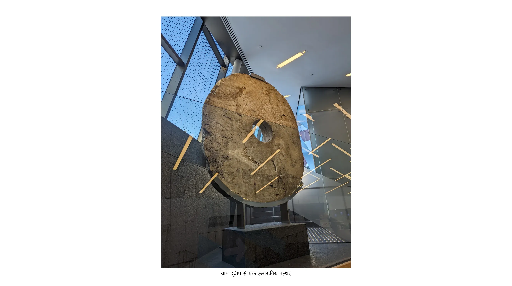

याप पत्थरों का यह वाकई एक दिलचस्प विश्लेषण है। सैफेडियन अम्मोस ने अपनी पुस्तक "द जीडब्ल्यू-6 स्टैंडर्ड" में भी इस उदाहरण का उल्लेख किया है। उनके अनुसार, याप द्वीप प्रणाली सबसे ज़्यादा जीडब्ल्यू-6 से मिलती-जुलती है, एक तरह का केंद्रीय अभिलेख जिसे हर कोई देख सकता है, यानी सार्वजनिक, हिसाब-किताब रखता है और चीज़ों के स्वामित्व का प्रबंधन करता है। यह मानवशास्त्रीय दृष्टिकोण दर्शाता है कि यह सब समाज के भीतर एक समझौते या सामाजिक सहमति का प्रतिनिधित्व करता है, जो मूल रूप से सटीक है। और मुझे खोए हुए पत्थरों का यह उल्लेख बहुत दिलचस्प लगता है। वे छोटी-छोटी नावों में सैकड़ों किलोमीटर दूर समुद्र में जाते और पत्थर वापस लाते। कभी-कभी पत्थर समुद्र की तलहटी में गिर जाता, लेकिन फिर भी उस पत्थर का इस्तेमाल मौद्रिक प्रणाली में होता। कोई व्यक्ति कह सकता था, "हाँ, हमने पत्थर को ऐसी जगह गिराया था; यह मेरा है, इसलिए हम इसे बदल सकते हैं"। विनिमय को सुगम बनाने के लिए भौतिक स्वामित्व की आवश्यकता नहीं थी, क्योंकि पत्थर इतने बड़े थे कि वे अक्सर एक ही जगह पर रहते थे। इसके बजाय, इन पत्थरों को लेन-देन के माध्यम से हाथों में बदलने पर ध्यान केंद्रित किया गया था, जिससे पत्थरों के वास्तव में स्थानांतरित हुए बिना ही स्वामित्व बदल सके। यह "सर्वसम्मति का प्रमाण" का एक रूप था, जो धन पर एक दिलचस्प मानवशास्त्रीय परिप्रेक्ष्य को उजागर करता था।

### प्रोटोमुद्राएं और सामाजिक दायित्व

दुनिया भर के नृवंशविज्ञानियों ने देखा है कि समाज "प्राचीन मुद्राओं" या "आदिम मुद्राओं" का उपयोग करते थे, जैसे कि सीपियां, कपड़ा, पशुधन, नमक और पत्थर, जो आमतौर पर धन से संबंधित कार्यों को पूरा करते थे, जैसे कि भुगतान का साधन और मूल्य का भण्डार, हालांकि वे रोजमर्रा की वस्तुओं के आदान-प्रदान में मध्यस्थ के रूप में नियमित रूप से कार्य नहीं करते थे।

इसलिए, यहां हम उन मौद्रिक प्रणालियों का वर्णन कर रहे हैं जिनका उपयोग आवश्यक रूप से दिन-प्रतिदिन के लेन-देन के लिए नहीं किया जाता था।

और मैं आपको याद दिलाना चाहूँगा कि ये सभी मुद्राएँ सिक्कों के आगमन से पहले की थीं, और मुझे नहीं पता कि मुद्रा कहना कितना ग़लत है। मैं मुद्रा कहना ज़्यादा पसंद करता हूँ। मैं यह बता सकता हूँ कि साहित्य में, हम अक्सर सिक्कों से पहले की मुद्रा को संदर्भित करने के लिए आद्य-मुद्राओं का उल्लेख करते हैं। लेकिन जैसा कि हमने पहले भाग में देखा, **मेरा मानना ​​है कि सिक्कों के आगमन से बहुत पहले भी मौद्रिक प्रणालियाँ मौजूद थीं**।

इन आदिम मुद्राओं का उपयोग मुख्यतः व्यक्तियों से जुड़े मूलभूत सामाजिक दायित्वों, जैसे विवाह, संघर्ष क्षतिपूर्ति (वेर्गेल्ड), या सरदारों के बीच उपहारों के प्रबंधन के लिए किया जाता था। उदाहरण के लिए, फ़ारसी साम्राज्य में, पहले सिक्के विनिमय के साधन के बजाय विशेष रूप से सैन्य भुगतान के साधन के रूप में बनाए गए थे।

इसलिए आदिम मुद्रा की एक अनिवार्य विशेषता है: यह भुगतान का एक साधन है, लेकिन भौतिक वस्तुओं के प्रत्यक्ष विनिमय का साधन बहुत कम ही होता है। यहाँ हमारा तात्पर्य यह है कि यह कुछ सामाजिक दायित्वों, जनजातियों के लिए, सरदारों के बीच आदान-प्रदान, प्रसिद्ध वेरगेल्ड, रक्त मुद्रा, के लिए भुगतान का एक साधन था। न्याय प्रणालियों के आगमन से पहले, यदि कोई हत्या करता था, तो उसके प्रियजन की हत्या से पीड़ित परिवार को क्षतिपूर्ति मिलती थी। इसके लिए एक कीमत चुकानी पड़ती थी, इसे रक्त मुद्रा कहा जाता था और यह भुगतान का एक रूप है। दहेज भी था, जो भुगतान का एक रूप है। भुगतान के रूप में मुद्रा के इन प्रारंभिक उपयोगों में, यह रोजमर्रा की खरीदारी के भुगतान की तुलना में मानवीय और सामाजिक दायित्वों से अधिक संबंधित था। इस सिद्धांत के अनुसार, ये अधिक सामान्य दैनिक आदान-प्रदान ऋण, आस्थगित ऋण, उपहार के बदले उपहार और राशन के पुनर्वितरण से अधिक संबंधित थे। इन आदान-प्रदानों को प्रबंधित करने के लिए सामाजिक संगठन का एक और रूप मौजूद था। यह भी याद रखना ज़रूरी है कि, एक ऐसे समाज में जहाँ हर कोई आत्मनिर्भर हो, अपनी खेती खुद करता हो, कोई विशेषज्ञता नहीं होती, और रोज़मर्रा के लेन-देन के लिए किसी मौद्रिक प्रणाली की बहुत कम ज़रूरत होती है। और इसीलिए मुद्रा के शुरुआती रूप वही थे जिनका हमने अभी वर्णन किया है, दहेज, रक्त मुद्रा, क्योंकि ये वो शुरुआती लेन-देन थे जहाँ हमें भुगतान के साधन की ज़रूरत पड़ी, व्यापार करने से बहुत पहले, रोज़मर्रा की रोटी के बदले पैसे की ज़रूरत पड़ी, क्योंकि आदिम समाजों में, यह इस तरह से काम नहीं करता था। हर कोई अपनी ज़रूरतें खुद पूरी करता था, और तब तक कोई विशेषज्ञता नहीं थी। मुझे लगता है कि मैंने इस पाठ्यक्रम के पिछले सभी व्याख्यानों में इस पर विस्तार से चर्चा की है।

इन समाजों में, जहाँ श्रम का कोई उन्नत विभाजन नहीं था, प्रत्यक्ष आदान-प्रदान सीमित रहा, जो मुख्यतः मित्रता या गठबंधन के व्यक्तिगत संबंधों के अंतर्गत होता था। पर्याप्त विशेषज्ञता के अभाव में आधुनिक अर्थों में मुद्रा की आवश्यकता नहीं थी।

क्विगिन और आइन्ज़िग जैसे मानवविज्ञानी ऋण की प्रधानता पर जोर देते हैं: **आदिम आर्थिक जीवन ऋण और व्यक्तिगत ऋणों के विशाल नेटवर्क में फंसा हुआ है, जहां धन विशेष रूप से तब हस्तक्षेप करता है जब भुगतान तत्काल होना चाहिए और क्षतिपूर्ति को आसानी से स्थगित नहीं किया जा सकता है।**

इसलिए, लोग सामान का आदान-प्रदान करते हैं, विलंबित ऋण ले सकते हैं, लेकिन कुछ मामलों में, आप भुगतान को स्थगित नहीं कर सकते, इसलिए इस समय मुद्रा या प्रोटो-मुद्राएं विनिमय को तत्काल अंतिम रूप देने के लिए उपयोगी हो सकती हैं।

### गुमनामी का नवाचार

यह विश्लेषण एक गहन चिंतन की ओर ले जाता है: मुद्रा को वस्तु विनिमय से अलग करने के बजाय, ऋण और उधार की जटिल प्रणालियों से इसके उद्भव को समझना अधिक प्रासंगिक है। मुद्रा एक मौलिक नवाचार प्रस्तुत करती है: गुमनामी। और यहीं पर मुझे मुद्रा के उद्भव का यह मानवशास्त्रीय सिद्धांत दिलचस्प लगता है। यदि आप लोगों का एक छोटा समूह हैं और एक-दूसरे को विलंबित ऋण देते हैं, तो आप स्पष्ट रूप से एक-दूसरे को जानते हैं। मुझे लगता है कि इस प्रणाली के काम करने के लिए, लोगों को एक-दूसरे को जानना ज़रूरी है, ज़ाहिर है। और मुद्रा से किया गया भुगतान गुमनामी की अनुमति देता है। यह आपको भुगतान करने की अनुमति देता है, बिना किसी को आपका नाम पता चले, बिना किसी को यह पता चले कि आप कौन हैं। वे तत्काल और अंतिम निपटान के लिए विनिमय कर सकते हैं। और मुद्रा वास्तव में यही संभव बनाती है।

ऋण के विपरीत, जो हमेशा नाममात्र का होता है, मुद्रा गुमनाम, सामान्यीकृत और तत्काल मुक्तिदायी लेन-देन को संभव बनाती है। **मुद्रा की यह अद्वितीय मुक्तिदायी शक्ति ही इसकी निर्णायक श्रेष्ठता है।**

इस प्रकार, आर्थिक विनिमय को सुगम बनाने वाले एक मामूली साधन से कहीं आगे, मुद्रा एक प्रमुख सामाजिक नवाचार है, जो व्यक्तिगत ऋण से लेकर एक सामान्यीकृत, अनाम भुगतान प्रणाली तक, मानव संस्थाओं और प्रथाओं के विकास से गहराई से जुड़ा है। यह मानवशास्त्रीय विकास दर्शाता है कि मुद्रा, विनिमय के एक साधारण साधन से कहीं अधिक, एक शक्तिशाली सामाजिक संस्था का प्रतिनिधित्व करती है, जो मानव समाजों को गहराई से आकार देती है, यहाँ तक कि हमारे आधुनिक समाजों में, आर्थिक गतिविधि का मूल उद्देश्य बन गई है।

यहाँ, हम समझते हैं कि अंततः, हमारे आधुनिक समाजों में, आर्थिक विनिमय का मूल उद्देश्य धन प्राप्त करना है, जबकि पहले ऐसा बिल्कुल नहीं था। आर्थिक विनिमय का मूल उद्देश्य उपभोग के लिए वस्तुओं या वस्तुओं का स्वामित्व प्राप्त करना था। और आज, मुद्रा के आविष्कार के द्वारा, आर्थिक विनिमय का उद्देश्य इस धन को संचित करना है, क्योंकि यह हमें इसे वस्तु के बदले में विनिमय करने में सक्षम बनाता है, जैसा कि आम तौर पर स्वीकार किया जाता है। हम इसे अपनी ज़रूरत के अनुसार, अपनी ज़रूरत की वस्तु के बदले में विनिमय कर सकते हैं।

## रजिस्टर एकीकरण

<chapterId>7664442a-91c1-5ce4-a8bd-53b7371a3e3d</chapterId>

:::video id=473fc284-5375-4e1b-b0cd-6b51ba0cc3b8:::

### लेखांकन रजिस्टर सिद्धांत

अब हम इन दोनों मौद्रिक सिद्धांतों, यानी ऋण-मुद्रा के माध्यम से मुद्रा के उद्भव के सिद्धांत और वस्तु-मुद्रा के उद्भव के मौद्रिक सिद्धांत, के एकीकरण के विभिन्न प्रस्तावों पर एक साथ विचार करेंगे। हम लिन एल्डेन की प्रसिद्ध पुस्तक "फॉर ब्रोकन मनी" में उनके एकीकरण प्रस्ताव पर चर्चा करेंगे, जिसका कॉन्सेनसस द्वारा किया गया अनुवाद संभवतः "रप्चर मोनेटेयर" कहलाएगा।

*लिन एल्डेन द्वारा लिखित ब्रोकन मनी से उद्धृत:*

> मूलतः, मुद्रा एक लेखा रजिस्टर है। वस्तु मुद्रा प्रकृति द्वारा शासित एक रजिस्टर है। बैंक मुद्रा राष्ट्र-राज्यों द्वारा शासित एक बहीखाता है। मुक्त-स्रोत मुद्रा अपने उपयोगकर्ताओं द्वारा शासित एक बहीखाता है।

यहां, लिन का तात्पर्य Bitcoin से है।

### स्टॉक-प्रवाह अनुपात और दुर्लभता

> कुछ दुर्लभ रासायनिक तत्व, जैसे रोडियम, सोने से भी दुर्लभ होते हैं, लेकिन इनका स्टॉक-फ्लो अनुपात कम होता है क्योंकि खनन के तुरंत बाद ही उद्योग द्वारा इनका उपभोग कर लिया जाता है। रोडियम का सिक्का या पिंड एक विशेष संग्रहणीय वस्तु या मूल्य के भंडार के रूप में खरीदा जा सकता है, लेकिन सामाजिक रूप से स्वीकृत मुद्रा के रूप में उपयुक्त नहीं है, और इसलिए यह स्वाभाविक रूप से मुद्रा के रूप में प्रकट नहीं होता है।

सैफेडियन अपनी पुस्तक "द जीडब्ल्यू-8 स्टैंडर्ड" में इस बारे में विस्तार से बात करते हैं। जो लोग स्टॉक-टू-फ्लो अनुपात से परिचित नहीं हैं, उनके लिए यह बस मौजूदा स्टॉक, बाज़ार में मौजूद भंडार, की तुलना आने वाले नए स्टॉक, नए स्टॉक के आगमन से करने पर होता है। यह अक्सर सहज ज्ञान के विपरीत होता है, क्योंकि आप सोच सकते हैं कि आपके पास जो बड़ी मात्रा में है वह दुर्लभ नहीं है, लेकिन वास्तव में ऐसा नहीं है। यह उस क्षमता का प्रश्न है जो आपके पास उसे आपूर्ति करने के लिए है। बल्कि, इस मॉडल के अनुसार, नए स्टॉक को बनाए रखने की हमारी क्षमता ही हमें यह जानकारी देती है कि वह वस्तु दुर्लभ है या नहीं। ऐसा नहीं है कि हमारे पास कोई वस्तु स्टॉक में नहीं है, बल्कि हो सकता है कि वह हमारे पास न हो। इसलिए, अगर हम सोने को लें, तो हमारे पास बहुत सारा सोने का स्टॉक है क्योंकि इसका उपयोग मूल्य के भंडार के रूप में किया जाता है, और नए स्टॉक का आगमन सोने के जीडब्ल्यू-9 के माध्यम से आने वाले नए सोने के स्टॉक का लगभग 1% से 3% प्रति वर्ष है। जबकि, वह यहाँ जो कह रही हैं, अगर हम रोडियम की बात कर रहे हैं, तो यह सोने से भी दुर्लभ है, लेकिन हमारे पास इसका कोई स्टॉक नहीं है क्योंकि इसका उपभोग समय के साथ होता रहता है। इसलिए मौजूदा स्टॉक को दोगुना करने के लिए बहुत ज़्यादा नई आपूर्ति की ज़रूरत नहीं है। जबकि सोने के मामले में, स्टॉक को दोगुना करने के लिए नवीनीकरण में कम से कम 50 साल लगेंगे। ज़्यादातर उपभोग की जाने वाली वस्तुओं के विपरीत, जहाँ यह काफ़ी आसान है, और मौजूदा स्टॉक को दोगुना करने में ज़्यादा साल नहीं लगते, क्योंकि इसका उपभोग समय के साथ होता रहता है।

*"आधुनिक इतिहास में सोने का स्टॉक-टू-फ्लो अनुपात 25x से 100x के बीच बना रहा है, जो आमतौर पर 50x या उससे अधिक होता है, तथा 19वीं शताब्दी के मध्य में गोल्ड रश के दौरान भी यह कभी 16x से नीचे नहीं गिरा।"*

तो, 25 का मतलब होगा स्टॉक को दोगुना करने में 25 साल, और 100 का मतलब होगा स्टॉक को दोगुना करने में 100 साल। सैफेडियन अपनी किताब में कहते हैं कि अगर हम सोने का उत्पादन दोगुना भी कर दें, मान लीजिए 1.5% से 3%, तो भी इसकी कीमत पर कोई खास असर नहीं पड़ेगा।

*"चांदी का स्टॉक-फ्लो अनुपात सामान्यतः 10 गुना या उससे अधिक होता है, जो अभी भी अपेक्षाकृत अधिक है।"

*अधिकांश अन्य वस्तुओं का स्टॉक-प्रवाह अनुपात 1 या 2 से कम होता है। यहां तक ​​कि प्लैटिनम और रोडियम जैसे दुर्लभ तत्वों का भी तेजी से औद्योगिक उपभोग होने के कारण स्टॉक-प्रवाह अनुपात अपेक्षाकृत कम होता है।"*

### सोने और चांदी की श्रेष्ठता

*"संक्षेप में, जब भी किसी वस्तु की मुद्रा ने खुद को सोने और चाँदी के साथ प्रतिस्पर्धा में पाया है, तो अंत में सोने और चाँदी ही हमेशा विजयी रहे हैं। अन्य वस्तुएँ सीमित अवधि के लिए या विशिष्ट क्षेत्रों में ही मुद्राएँ बनी रह सकती हैं, लेकिन सोने और चाँदी ने हमेशा वैश्विक रूप से प्रतिस्पर्धी मुद्राएँ बनने और प्रतिस्पर्धा पर हावी होने की अपनी क्षमता साबित की है। ऐसा इसलिए है क्योंकि जब सभ्यताएँ आपस में मिली थीं, तो सोने और चाँदी के धारकों के पास हमेशा अन्य प्रकार की मुद्राओं का अवमूल्यन करने की तकनीकी क्षमता थी, जबकि सीपियों, मोतियों, पशुधन, नमक, कपड़े या निम्न धातुओं के धारक सोने या चाँदी का अवमूल्यन कभी नहीं कर सकते थे।"*

तो इसका वर्णन Bitcoin स्टैंडर्ड में भी बहुत अच्छी तरह से किया गया है, जहाँ सैफेडियन अफ्रीका के उन कबीलों के बारे में बात करते हैं जो काँच के मोतियों का इस्तेमाल करते थे। और जब वेनिस के व्यापारी काँच के मोतियों से भरे माल के साथ आए, क्योंकि उस समय वे औद्योगिक रूप से इनका उत्पादन कर सकते थे, उनके पास ऐसा करने की तकनीकी क्षमता थी, तो इसने इन लोगों की मौद्रिक व्यवस्था को पूरी तरह से अस्थिर कर दिया और वे सचमुच उनके संसाधनों को लूटने में सक्षम हो गए। यही सैफेडियन का सिद्धांत है।

### लेखा और जमा की इकाई

*"ऐतिहासिक रूप से, जब ऋण का उपयोग सीधे विनिमय के साधन के रूप में किया जाता था, तब भी इसे आमतौर पर मौद्रिक वस्तुओं की इकाइयों में दर्शाया जाता था, जो स्वाभाविक रूप से उनके गुणों के लिए चुनी जाती थीं।"*

यह एक बहुत ही रोचक बिंदु है, और इसी पर उलरिच और मैं चर्चा करते रहे हैं। भले ही मेसोपोटामिया का मंदिर एक प्रकार का प्राधिकार था जो ऋण की इस अवधारणा को नियंत्रित कर सकता था, फिर भी लेखांकन की इकाई शेकेल ही थी। इस बात की पुष्टि करने वाला कोई प्रमाण नहीं है कि शेकेल की स्थापना मंदिर द्वारा आधिकारिक रूप से की गई थी। शेकेल स्वाभाविक रूप से, आसपास के अन्य लोगों के साथ आयात-निर्यात करने के लिए व्यापारियों की आवश्यकता के कारण उत्पन्न हुआ होगा। हमारे पास इसका प्रमाण है, कनेश के एक व्यापारी के रूप में (जिसका उल्लेख मैंने भाग 1 में किया है), जिसने ठीक यही किया, कीमती धातुओं का आयात किया जिनका उपयोग उनके भौतिक वस्तु मूल्य के लिए नहीं, बल्कि मूल्य के भंडार के रूप में किया जाता था। एकमात्र समस्या यह है कि हम यह नहीं जानते कि क्या हम यह मान सकते हैं कि चाँदी, चाँदी के शेकेल का यह चुनाव व्यापारियों द्वारा किया गया था, या यह मंदिर द्वारा किया गया था। लेकिन उलरिच के पास एक बहुत ही ठोस तर्क है जो हमें यह सोचने पर मजबूर करता है कि यह संभवतः व्यापारियों के पक्ष में ही किया गया था।

*"इस प्रकार, दोनों सिद्धांतों के एकीकरण को "धन का लेखा सिद्धांत" ("धन का बहीखाता सिद्धांत") कहा जा सकता है क्योंकि यह दोनों सिद्धांतों में समान मूलभूत तर्क का वर्णन करता है। लचीला सामाजिक ऋण और संग्रहणीय आदि-मुद्राएँ, दोनों ही मानवता के उदय के समय से चली आ रही हैं। दोनों ही मामलों में, विभिन्न आकार के मानव समूह आवश्यकताओं के दोहरे संयोग से बचने, विनिमय में घर्षण को कम करने और तरल बचत के रूप में कार्य करने के लिए आपस में एक लेखा बहीखाता रखते हैं। मूल अंतर रजिस्टर रखने के लिए सौंपे गए प्राधिकारी में निहित है।"*

एक ओर, प्रकृति मुद्रा आपूर्ति के विस्तार का प्रबंधन करती है। इसलिए, अगर हम सोने को लें, क्योंकि यह काफी दुर्लभ है, इसलिए इसका खनन मुश्किल है। खनन किए जा सकने वाले सोने के सिक्कों की संख्या की एक तरह की सीमा होती है। इसलिए दुर्लभता का प्रबंधन प्रकृति द्वारा किया जाता है। और रजिस्टर स्वामित्व की अवधारणा द्वारा नियंत्रित होता है। रजिस्टर विकेंद्रीकृत है। स्वामित्व इस तथ्य से सिद्ध होता है कि आपके पास एक सोने का सिक्का या सोने का एक टुकड़ा है। और क्रेडिट मनी के मामले में, दुर्लभता का प्रबंधन लोगों की ऋण प्राप्त करने की क्षमता द्वारा किया जाता है। या फ़िएट मुद्रा के मामले में, दुर्लभता का प्रबंधन प्राधिकरण द्वारा किया जाता है। मुद्रास्फीति की आपदाओं से बचने के लिए, वे ही तय करते हैं कि अधिक मुद्रा छापनी है या नहीं। इसलिए, कुछ मामलों में, रजिस्टर का प्रबंधन token के स्वामी द्वारा भी किया जा सकता है, कागजी मुद्रा के मामले में। इसीलिए इसे रजिस्टर में, उद्धरण चिह्नों में, अभौतिक रूप में दर्ज किया जाता है। हाँ, भौतिक रूप में, लेकिन आभासी। उसके पास यह प्रसिद्ध token है, और यही स्वामित्व को प्रमाणित करता है। और यह वास्तविक रजिस्टर में भी आसानी से हो सकता है, जैसा कि धर्मग्रंथों में वर्णित धन के साथ होता है, बैंक में, जहां वास्तव में मानव बैंक ही यह प्रबंधित करता है कि रजिस्टर के संबंध में किसका क्या स्वामित्व है।

## मौद्रिक प्रीमियम के माध्यम से एकीकरण

<chapterId>093756e5-8908-55e5-bb76-376a3a3cc4d3</chapterId>

:::video id=eabc342a-ecbd-46ca-a347-e914917e7c4f:::

### मौद्रिक प्रीमियम अवधारणा

मुद्रा के उद्भव पर विभिन्न सिद्धांतों को एकीकृत करने के विभिन्न प्रस्तावों को समर्पित इस खंड में, मैंने अभी-अभी लिन एल्डन के सिद्धांत, रजिस्टर सिद्धांत, का प्रस्ताव रखा है। दो मौद्रिक सिद्धांतों के एकीकरण के लिए मेरा अपना प्रस्ताव है। यह मौद्रिक प्रीमियम है, मौद्रिक प्रीमियम की अवधारणा। इसलिए, मुद्रा के मूल्य को उसकी मौद्रिक माँग से उत्पन्न होने वाले मौद्रिक प्रीमियम द्वारा समझाया जा सकता है, चाहे वह मिट्टी की गोलियों, कीमती धातु के सिक्कों, बैंक नोटों या बिटकॉइन के रूप में हो। मौद्रिक प्रीमियम केवल इस विश्वास पर आधारित है कि भविष्य में कोई व्यक्ति इस मुद्रा को तुलनीय मूल्य पर बदल देगा।

मैं यहाँ जो प्रदर्शित करने का प्रयास कर रहा हूँ, वह बिल्कुल सरल है कि चाहे वह फ़िएट मुद्रा हो, यानी बिना उपयोग मूल्य वाले बैंक नोट, चाहे वह सोने के सिक्के हों या कोई अन्य धातु, सोने का एक टुकड़ा हो या एक सिल्लियाँ, **अक्सर मौद्रिक प्रीमियम ही उसके मूल्य का अधिकांश हिस्सा बनाता है**। अगर हम सोने का एक टुकड़ा लें, तो उसके मूल्य का एक निश्चित भाग उसके उपयोग मूल्य, उद्योग में उसके उपयोग या आभूषण बनाने में उसके उपयोग से निर्धारित होता है। ध्यान दें कि आभूषणों की माँग अक्सर उसके मौद्रिक मूल्य से उत्पन्न होती है। लोग आभूषणों को एक प्रकार के मूल्य भंडार के रूप में रखते हैं, इसलिए मैं इसे मौद्रिक प्रीमियम में थोड़ा सा शामिल करता हूँ क्योंकि यह अक्सर धन में भूमिका निभाने के लिए एक मौद्रिक माँग होती है।

तो आप कह सकते हैं कि सोने की लगभग 10% माँग उद्योग जगत के लिए है। सोने के मूल्य में, हमारे पास एक छोटा सा हिस्सा होगा, मान लीजिए 10%, जिसकी व्याख्या इस औद्योगिक माँग से की जा सकती है, यानी सोने के उपयोग की माँग, जहाँ सोने का उपभोग होता है। बाकी माँग स्पष्ट रूप से मूल्य के भंडार के रूप में इसके मौद्रिक उपयोग की माँग है।

### प्राधिकरण बोनस और फिएट

और अगर आप सोने के एक टुकड़े की तुलना सोने के सिक्के से करें, तो एक और परत होती है। सोने के सिक्के पर एक अधिकारी की मुहर होती है, और उस सिक्के में मौजूद सोने की भी उपयोग की मांग होती है, उद्योग में खपत की मांग होती है। मूल्य के भंडार के रूप में इसे एक मौद्रिक प्रीमियम भी प्राप्त होता है। इसके अलावा, एक और परत होती है जिसे मैं अधिकारी प्रीमियम कहता हूँ, जहाँ अक्सर एक कीमत होती है, सोने के टुकड़े की तुलना में सिक्के की क्रय शक्ति अधिक होती है, क्योंकि सिक्के का उपयोग करना आसान होता है। यह विनिमय को अधिक तरल बनाता है, क्योंकि इसे तौलने की कोई आवश्यकता नहीं होती। अधिकारी आमतौर पर इसकी शुद्धता की गारंटी देते हैं। और अगर आप इसकी तुलना सोने के टुकड़े से करें, तो मुहर लगे सोने के सिक्के की कीमत आमतौर पर सोने के एक साधारण टुकड़े से अधिक होती है। और यह भी सामान्य है, क्योंकि इस पर मुहर लगाने के लिए संसाधनों की आवश्यकता होती है।

यही सिद्धांत फ़िएट मुद्रा, यानी कागज़ी मुद्रा के लिए भी लागू होता है। कागज़ी मुद्रा का वास्तव में कोई उपयोग मूल्य नहीं होता, सिवाय शायद घर गर्म करने के, और ऐसा वाइमर गणराज्य के दौरान हुआ था। इसलिए इसके उपयोग मूल्य की कोई वास्तविक माँग नहीं है। दूसरी ओर, मेरी राय में, अधिकार का केवल एक प्रीमियम है।

यह एक प्रकार का मौद्रिक प्रीमियम है, जो मौद्रिक प्रीमियम पर एक आवरण है। लेकिन इसका मौद्रिक प्रीमियम इस तथ्य से आता है कि यह वैध मुद्रा है, और फिर अधिकारी आपको कर चुकाने के लिए इसे खरीदने के लिए मजबूर करते हैं। इसलिए, अनिवार्य रूप से, फिएट मुद्रा की एक प्रकार की मौद्रिक मांग होती है जो इस तथ्य से उत्पन्न होती है कि इस पर कर लगाया जाता है और आपको अपने कर चुकाने के लिए कम से कम इसे प्राप्त करना ही पड़ता है। और परिणामस्वरूप, यह भुगतान का एक सर्वमान्य साधन बना हुआ है। इसलिए लोग अपनी ज़रूरतों को पूरा करने के लिए इसे प्राप्त करना चाहते हैं।

### मौद्रिक मांग के माध्यम से एकीकरण

और मौद्रिक प्रीमियम का यह प्रस्ताव ऋण मुद्रा और वस्तु मुद्रा के दो सिद्धांतों के एकीकरण के रूप में क्यों योग्य है? खैर, मुझे नहीं लगता कि सोने के सिक्के का मूल्य अनिवार्य रूप से उसके "आंतरिक मूल्य" से आता है। नहीं, वास्तव में, यह उतना ही विश्वास का विचार है जितना कि फिएट मुद्रा का। यह मौद्रिक माँग का विचार है। और ऐसा इसलिए नहीं है क्योंकि इसका औद्योगिक उपयोग, एक और "उपयोगिता" का एक छोटा प्रतिशत है। अगर हम कहें कि औद्योगिक उपयोग इसके मूल्य का 10% है, तो हम इसका मूल्य $300 प्रति औंस मान सकते हैं। अगर सोना बाजार में $3,000 प्रति औंस बिकता है, तो $300 और $3,000 के बीच का अंतर प्रसिद्ध मौद्रिक प्रीमियम है। सोने की यही मौद्रिक माँग इसे समझाती है। सिर्फ़ इसलिए कि फिएट मुद्रा का उपयोग मूल्य शून्य है, इसका मतलब यह नहीं कि यह अलग है। मेरे लिए, यह बिल्कुल एक ही बात है। इसलिए, दोनों ही पक्षों पर, ऋण मुद्रा या वस्तु मुद्रा के सिद्धांत पर, मुझे नहीं लगता कि सोने में न्यूनतम उपयोग मूल्य होने की अतिरिक्त गुणवत्ता से कुछ भी बदलता है।

दूसरी ओर, यह निश्चित है कि **उद्भव के स्तर पर, माइस के समाश्रयण प्रमेय के अनुसार, हम यह प्रस्ताव कर सकते हैं कि यह प्रयोग मूल में माँग उत्पन्न करता है और उस प्रक्रिया को आरंभ करता है जो मुद्रा बन जाती है।** जबकि, ऋण मुद्रा के स्तर पर, यह किसी प्राधिकारी द्वारा अधिरोपण अधिक होता है, इसलिए स्रोत, उद्भव की शुरुआत और अवधारणाएँ पूरी तरह से भिन्न हैं। **लेकिन मुझे लगता है कि मूल्य के स्तर पर, मुद्रा के मूल्य की व्याख्या कैसे की जाए, मौद्रिक प्रीमियम के साथ, हम उतनी ही आसानी से समझा सकते हैं कि फ़िएट मुद्रा का वह मूल्य क्यों होता है जो हम उसे देते हैं और कमोडिटी मुद्रा का वह मूल्य क्यों होता है जो हम उसे देते हैं। मेरे लिए, यह एक ही प्रक्रिया है, और इसे मुद्रा प्रीमियम कहा जाता है।

#### मौद्रिक प्रीमियम

बस इतना ही। धन का मूल्य उसकी मौद्रिक माँग से उत्पन्न होने वाले मौद्रिक प्रीमियम से समझाया जा सकता है, चाहे वह मिट्टी की गोलियों, कीमती धातु के सिक्कों, बैंक नोटों या बिटकॉइन के रूप में हो।

मौद्रिक प्रीमियम केवल इस विश्वास पर आधारित है कि कोई व्यक्ति बाद में इस धन को तुलनीय मूल्य पर बदल देगा।

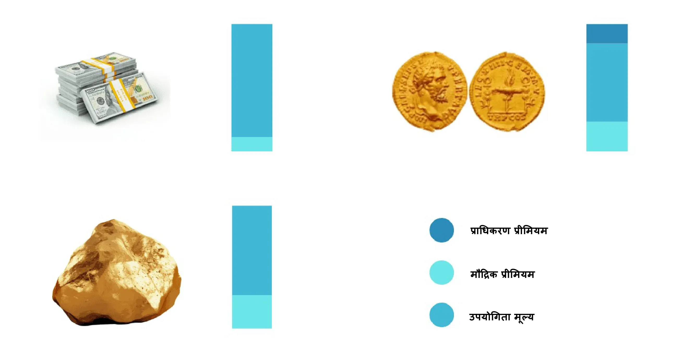

# धन की विभिन्न परिभाषाएँ

<partId>77b7918a-8c3b-11f0-b688-6b2ab22378c9</partId>

## पैसा बनाम मुद्रा बनाम मुद्रा बनाम चांदी बनाम डिवाइस

<chapterId>bf8a6d21-df88-5d23-a0a5-e9a5c1300554</chapterId>

:::video id=d9c9e7df-9db3-4a9f-801e-10d3fc7dfc22:::

### मौद्रिक शब्दों का अर्थ विज्ञान

विभिन्न मौद्रिक सिद्धांतों और विशेष रूप से मुद्रा की परिभाषाओं पर इस खंड में, मैं शब्दार्थ विज्ञान के विषय पर एक संक्षिप्त टिप्पणी करना चाहूँगा। मैं मुद्रा से संबंधित कई शब्दों की परिभाषाओं का थोड़ा और गहराई से अध्ययन करना चाहूँगा और उनकी तुलना उनके अंग्रेजी समकक्षों से करना चाहूँगा। उदाहरण के लिए, मुद्रा, मुद्रा, मुद्रा, अर्जेन्ट और डिवाइस की तुलना में। तो, यह इस प्रकार है।

थोड़ा सा शब्दार्थ:

जब हम "**पैसा**" (de la monnaie) कहते हैं, तो ज़्यादातर लोग सोचेंगे कि हम किसी लेन-देन के बदले में मिलने वाले छोटे-मोटे नोटों की बात कर रहे हैं। और अगर हम "**मुद्रा**" (la monnaie) कहते हैं, तो लोग शायद सोचेंगे कि हम किसी राज्य की मुद्रा की बात कर रहे हैं। कनाडा की मुद्रा कैनेडियन डॉलर है। जी हाँ, बिलकुल।

लेकिन पैसे का क्या? एक चोर कभी नहीं कहेगा, "मुझे अपना सारा खुला पैसा दे दो!" (हो सकता है कि चोर लगभग बिना किसी मूल्य के सिक्के पाकर निराश हो जाए)।

नहीं, चोर चिल्लाएगा: "मुझे अपना सारा पैसा दे दो"। और अगर चोर सड़क पर आपके सामने खड़ा है, तो वह ज़रूर आपकी जेब में पड़े नोटों की ओर इशारा कर रहा होगा।

दूसरी ओर, अगर चोर आपको ज़्यादा परिष्कृत तरीके से ठगने की कोशिश करता है, आपके सभी बैंक खाते खाली करके आपकी संपत्ति चुराने की कोशिश करता है, तो हम कहेंगे कि **वह आपका सारा पैसा ले लेगा**। यहाँ "धन" शब्द का अर्थ **व्यक्ति की संपत्ति** है।

अतः धन शब्द की दो परिभाषाएँ हैं: नकदी (बैंक नोट) और धन।

### मुद्रा बनाम मुद्रा बनाम उपकरण

एक मुद्रा (डिवाइस) अनिवार्य रूप से किसी दूसरे देश की मुद्रा होती है, अन्यथा हम इसे सिर्फ़ पैसा (मुद्रा) कहते हैं। अगर आप फ़्रांसीसी हैं, तो आप कहेंगे: "ला लिव्रे स्टर्लिंग एस्ट ला डिवाइस डू रॉयल यूनी एट ल'यूरो एट ला मोने डे ल'यूरोप" (पाउंड स्टर्लिंग यूनाइटेड किंगडम की मुद्रा है और यूरो यूरोप की मुद्रा है)।

अक्सर, जो लोग इन शब्दों के अनुवाद में इन अर्थ संबंधी समस्याओं में नहीं पड़े हैं, वे अक्सर मुद्रा (devise) की बात करते हैं जब इसे currency लिखा जाता है, लेकिन नहीं, जब currency आपके देश की मुद्रा होती है तो वह money (monnaie) होती है, और जब हम दूसरी मुद्राओं की बात करते हैं तो वह devise होती है। और इसलिए, यहाँ जो समस्या मैं अक्सर देखता हूँ वह यह है कि अंग्रेज़ी में दो शब्द हैं: एक "money", जो एक अवधारणा है, और दूसरी "currency", जो वास्तव में किसी देश की इकाई है जिसका उपयोग विनिमय करने के लिए किया जाता है। तो हम बस पैसे की अवधारणा के बारे में बात कर सकते हैं; यह आसान है - यह *money* शब्द की अवधारणा है; यह सामान्य रूप से पैसा है। और *currency* को किसी देश की मुद्रा के बराबर समझना बहुत आसान है। जबकि फ़्रांसीसी में, दुर्भाग्य से, बिटकॉइन के बारे में बात करते समय लोग अक्सर हाँ, "mais ce n'est pas une monnaie" कहते हैं क्योंकि यह किसी देश की मुद्रा नहीं है, लेकिन अक्सर, मुझे लगता है कि वे इसके बजाय मुद्रा शब्द का उल्लेख कर रहे होते हैं। यह एक ओर तो गलत है, क्योंकि अल सल्वाडोर के समय से, बिटकॉइन एक राज्य की मुद्रा रही है। सच तो यह है कि लोग अक्सर कहेंगे: *लेकिन नहीं, यह किसी राज्य की मुद्रा नहीं है, यह धन नहीं हो सकता*। लेकिन वास्तव में, अगर हम *धन* की व्यापक अवधारणा का उल्लेख करें, तो मेरी राय में, बिटकॉइन इस परिभाषा में पूरी तरह से फिट बैठता है। बस फ़्रांसीसी में, इन दोनों अवधारणाओं को अलग करने के लिए हमारे पास दो शब्द नहीं हैं। हम कह सकते हैं कि अर्जेन्ट शब्द मुद्रा को संदर्भित करता है, लेकिन दुर्भाग्य से, यह इसकी सटीक परिभाषा नहीं है। *अर्जेन्ट* (धन) धन या बैंक नोट को संदर्भित करता है। आप वास्तव में *धन* शब्द के साथ कोई समानता नहीं बना सकते। *धन* वास्तव में मुद्रा (मुद्रा) की अवधारणा है।

## सैफेडियन अम्मौस की परिभाषा

<chapterId>07c4ba50-168c-567a-8957-0b187ff75f97</chapterId>

:::video id=936d6d3b-6d45-468e-bc44-85fbce9b857a:::

#### पैसा क्या है?

धन केवल एक ऐसी वस्तु है जो आपके पास होती है या जिसे आप अर्जित करते हैं, न कि केवल अपने लिए उपयोग या उपभोग करने के लिए, बल्कि बाद में अन्य वस्तुओं या सेवाओं के लिए विनिमय करने के लिए जिसे आपको आवश्यकता हो सकती है। (सैफडीन)

जब किसी वस्तु के लिए धन की एक या अधिक भूमिकाएं निभाने हेतु मौद्रिक मांग मौजूद होती है, तो धन को मौद्रिक प्रीमियम प्राप्त होता है।

मौद्रिक प्रीमियम को कायम रखने के लिए मौद्रिक वस्तु का पर्याप्त रूप से दुर्लभ होना आवश्यक है (ताकि आपूर्ति को मौद्रिक मांग के अनुरूप समायोजित होने से रोका जा सके)।

### मौद्रिक प्रीमियम

मुद्रा की विभिन्न परिभाषाओं पर इस खंड में, मैं द जीडब्ल्यू-12 स्टैंडर्ड में सैफेडियन की परिभाषा के बारे में संक्षेप में बात करना चाहता था, जो मुझे हमेशा से बहुत दिलचस्प लगी है। इसे पढ़ने पर मुझे यह काफी सरल लगी। और हम इस परिभाषा में मौद्रिक प्रीमियम की अवधारणा को भी जोड़ने जा रहे हैं। जैसा कि सैफेडियन ने अपनी पुस्तक में उल्लेख किया है, दुर्लभता की अवधारणा अनिवार्य रूप से मौजूद है। प्रश्न यह है कि मुद्रा क्या है?

> धन केवल एक ऐसी वस्तु है जो आपके पास होती है या आप उसे प्राप्त करते हैं, इसका उपयोग या उपभोग अपने लिए नहीं किया जाता, बल्कि बाद में अन्य वस्तुओं या सेवाओं के बदले में इसका आदान-प्रदान किया जाता है जिनकी आपको आवश्यकता हो सकती है।

तो यही वह परिभाषा है जिसका ज़िक्र सैफेडियन ने Bitcoin स्टैंडर्ड में किया है। मैं इसमें यह भी जोड़ना चाहूँगा कि जब किसी वस्तु की मौद्रिक माँग होती है, तो मुद्रा (ला मोने) एक मौद्रिक प्रीमियम प्राप्त करती है, ताकि वह मुद्रा की एक या एक से ज़्यादा भूमिकाएँ निभा सके। तो आप कह सकते हैं कि मूल्य के भंडार के रूप में काम करने वाली मुद्रा की एक मौद्रिक माँग होगी जो उसे एक मौद्रिक प्रीमियम प्रदान करती है, क्योंकि लोग इसे प्राप्त करना चाहते हैं, उदाहरण के लिए मूल्य के भंडार के रूप में या विनिमय के माध्यम के रूप में।

### कमी और बाजार तंत्र

इसमें, मुझे लगता है कि हमें यह ज़रूर जोड़ना चाहिए कि मौद्रिक प्रीमियम के बने रहने के लिए मौद्रिक वस्तु पर्याप्त रूप से दुर्लभ होनी चाहिए। यह बहुत महत्वपूर्ण है। **यदि कोई वस्तु मुद्रा के रूप में उपयोग के लिए उभरती है और हम देखते हैं कि उसकी कीमत बढ़ रही है, तो आम तौर पर, यदि वह वस्तु पर्याप्त रूप से दुर्लभ नहीं है, तो लोग कीमत बढ़ने पर मूल्य में इस वृद्धि का लाभ उठाने के लिए उसका अधिक उत्पादन करना चाहेंगे**। यही कारण है कि बाज़ार में अधिकांश वस्तुओं की कीमत अपेक्षाकृत स्थिर होती है। जब कीमत बढ़ती है, तो उत्पादन बढ़ने की प्रवृत्ति होती है। जब कीमत गिरती है, तो उत्पादन भी कम हो जाता है। यह एक प्रकार का बाज़ार समायोजन है। **और जब कोई वस्तु पर्याप्त रूप से दुर्लभ होती है, जैसे सोना, तो बाज़ार तंत्र मौद्रिक उपयोग की इस बढ़ी हुई माँग की भरपाई नहीं कर पाता। इसलिए यह परिवर्तनशील कारक है, वह है कीमत। जैसे बिटकॉइन के साथ**। जब बिटकॉइन की कीमत बढ़ती है, तो हम अधिक बिटकॉइन का उत्पादन नहीं करते। इसलिए जो समायोजित होता है वह है कीमत। और इसीलिए, वर्षों से, हमने बिटकॉइन की माँग बढ़ने के साथ बिटकॉइन की कीमत में भी वृद्धि देखी है। चूँकि धरती पर ऐसा कोई नहीं है जो एल्गोरिथम को बदलकर कह सके कि "माँग बढ़ रही है, कीमत बढ़ रही है, हम और उत्पादन करेंगे।" **नए बिटकॉइन की आपूर्ति पहले से तय होती है और पहले से ज्ञात होती है**। तो मैं यही कह रहा था कि मौद्रिक वस्तु इतनी दुर्लभ होनी चाहिए कि मौद्रिक प्रीमियम बना रहे, और इसलिए बाज़ार तंत्र की पकड़ में न आए, जिससे आपूर्ति इस नई मौद्रिक माँग के अनुकूल न हो सके।

## भुगतान के साधन और मुक्ति मूल्य

<chapterId>5d424039-e342-56f7-9d8b-bba9551831a9</chapterId>

:::video id=af4c0765-8111-4cb7-891b-3ee54d6e7054:::

### भुगतान के साधन बनाम विनिमय के साधन

धन की विभिन्न परिभाषाओं को समर्पित इस खंड में, मेरा सुझाव है कि हम सब मिलकर "ऑक्स ओरिजिनेस डे ला मोने" (धन की उत्पत्ति) पुस्तक से एक उद्धरण देखें, जो एलेन टेस्टार्ट द्वारा भुगतान के साधन और मुक्तिदायी मूल्य के रूप में धन के विषय पर लिखा गया एक ग्रन्थ है।

*ऑक्स ओरिजिन्स डे ला मोनाई से, एलेन टेस्टार्ट ने पैसे को भुगतान के साधन के रूप में परिभाषित किया है:*

> यहाँ भुगतान के साधनों के कार्य को विनिमय के साधनों के कार्य से अलग माना गया है, क्योंकि ये बिना प्रतिफल के भुगतान होते हैं, ऐसे भुगतान जो कुछ भी नहीं खरीदते। नीज़ (1873:192 ff.) ने वस्तुओं के हस्तांतरण के इस विषय को विस्तार से विकसित किया है जो विनिमय के कार्यों में शामिल नहीं होते, जैसे कि वेरगेल्ड (रक्त मुद्रा या हत्या के लिए क्षतिपूर्ति) या करों के मामले में। कार्ल मेंगर ने अपने 1892 के लेख "गेल्ड" में इस चौथे कार्य पर हमला किया, जिसे आमतौर पर इस विषय पर सबसे निर्णायक लेखों में से एक माना जाता है। पूरी तरह से बदनाम हुए बिना, भुगतान के साधनों के कार्य का विचार आज आर्थिक चिंतन में भुला दिया गया है, या कम से कम विनिमय के साधनों के पक्ष में खारिज कर दिया गया है।
>

> मुद्रा का उपयोग भुगतान के लिए किया जाता है: इस दृष्टि से देखा जाए तो यह मुक्ति का एक साधन है, जो अपनी व्यापकता में भुगतान के साधन के कार्य को दर्शाता है। इस संबंध में, हम मुद्रा की "मुक्ति शक्ति" की बात करते हैं। ले पेटिट रॉबर्ट के अनुसार, मुक्ति शक्ति "वह है जिसका प्रभाव (किसी दायित्व, ऋण से) मुक्ति देने का होता है"। ग्रैंड लारूस के अनुसार, मुक्ति भुगतान कोई भी "कानूनी शर्तों के तहत इस तरह से किया गया भुगतान है कि लेनदार ऋण के उन्मूलन का विरोध न कर सके"। मुद्रा में यह शक्ति सर्वोत्कृष्ट है; यही इसकी वैध मुद्रा स्थिति को भी परिभाषित करती है, क्योंकि कोई भी, चाहे विक्रेता हो या लेनदार, मुद्रा में किए गए भुगतान को अस्वीकार नहीं कर सकता। मुद्रा एकमात्र ऐसी वस्तु है जिसे बकाया राशि के भुगतान में अस्वीकार नहीं किया जा सकता, चाहे ऋण किसी व्यापारी का हो या करदाता का। सभी वस्तुओं में, केवल मुद्रा ही यह विशेषाधिकार रखती है। चार्ल्स गिडे (1921 I: 443) लिखते हैं, "यही विशेषाधिकार है, जो वह बनाता है जिसे हम वैध मुद्रा कहते हैं।"
>

> किसी भी विनिमय में, जिसमें एक वस्तु के बदले दूसरी वस्तु का हस्तांतरण शामिल हो, या बदले में दूसरी वस्तु दिए जाने की शर्त हो, प्राप्तकर्ता की ओर से इस प्रतिपक्ष को प्रदान करने का दायित्व अनिवार्य रूप से निहित होता है। भुगतान इस दायित्व की पूर्ति है। इसलिए, सभी विनिमय भुगतान को दर्शाते हैं, लेकिन सभी भुगतान विनिमय को नहीं दर्शाते। कुछ भुगतान प्रतिपक्ष रहित भी होते हैं, अर्थात् ऐसे भुगतान जो किसी अन्य वस्तु को प्राप्त करने में सक्षम नहीं बनाते, और इस उद्देश्य के लिए नहीं किए जाते। कर यहाँ मानक उदाहरण बने हुए हैं; हमें सार्वजनिक प्राधिकरणों को दिए जाने वाले सभी प्रकार के जुर्माने और दूसरों को दिए जाने वाले हर्जाने का भी उल्लेख करना चाहिए, इस सिद्धांत पर कि जो दूसरों को नुकसान पहुँचाता है, उसे उसकी भरपाई करनी होगी।

### प्रतिपक्ष के बिना भुगतान

यह लेखक के सिद्धांत का एक स्पष्ट उदाहरण है। वास्तव में, वह दोनों के बीच अंतर करता है। उसके लिए, विनिमय वस्तुओं का हस्तांतरण और भुगतान दोनों है। भुगतान इसके बाद आता है। और भुगतान बिना विनिमय के भी हो सकता है। वह उदाहरण देते हैं कि कैसे पार्किंग टिकट या जुर्माना देना भी एक भुगतान है। बदले में आपको वास्तव में कोई सेवा नहीं मिलती। कुछ लोग तर्क दे सकते हैं कि राज्य बदले में आपको एक सेवा दे रहा है, आपको पार्किंग टिकट देकर। वह इस तथ्य पर बिल्कुल स्पष्ट हैं कि करों का भुगतान वास्तव में बिना किसी प्रतिपक्ष के भुगतान है, इस अर्थ में कि करों का भुगतान करना अनिवार्य है, भले ही आपको कोई सेवा आवश्यक रूप से प्राप्त न हो। वह कहते हैं कि यह वास्तव में परिभाषित है कि करों का भुगतान केवल एक भुगतान है; बदले में सेवाएँ प्राप्त करने की कोई बाध्यता नहीं है। मैंने अपने कई सहयोगियों के साथ इस पर चर्चा की है, और वे इस धारणा से सहमत नहीं हैं। लेकिन लेखक का सिद्धांत यही है। वह भुगतान की धारणा को इन उदाहरणों, जैसे जुर्माना, कर भुगतान, के माध्यम से, विनिमय से अलग करने का प्रयास करते हैं। उदाहरण के लिए, दहेज के मामले में, वह कहते हैं कि दहेज एक भुगतान है; ज़रूरी नहीं कि बदले में आपको कुछ मिले। इस प्रस्ताव की आलोचना करने वाला कोई व्यक्ति कह सकता है, "हाँ, लेकिन बदले में आपको एक पत्नी मिलती है।" तो इस विषय पर बहस का स्तर यही है।

वेर्गेल्ड, यानी खून का पैसा भी होता है। तो यह बस मुआवज़े के तौर पर दिया जाने वाला भुगतान है। मेरे दोस्त उलरिच कहते थे:

> हां, लेकिन बदले में आपको यह फ़ाइल बंद कर दी जाएगी।

तो, आपने कोई अपराध किया है, जैसे कि हत्या। उस समय, आप वेरगेल्ड का भुगतान करते हैं, और उसके बाद, आप उस स्थिति से मुक्त हो जाते हैं। तो एक मुक्तिदायक शक्ति है। क्या आपको बदले में कुछ मिलता है?" लेखक के अनुसार, नहीं। मेरे कुछ सहयोगियों के अनुसार, हाँ।

मुझे लगता है कि इस चर्चा में, हम देख सकते हैं कि भुगतान को परिभाषित करने के लिए वेरगेल्ड एक अच्छा उदाहरण है। दरअसल, स्पष्ट रूप से, आपको बदले में कुछ भी नहीं मिलता है।

## ऋण मुद्रा बनाम वस्तु मुद्रा

<chapterId>4093677a-c8e8-5828-b994-15c01656186e</chapterId>

:::video id=f49cf5cc-288e-4daa-a1ff-b9de73506f4e:::

### मौलिक बहस

फिर भी, विभिन्न मौद्रिक परिभाषाओं और सिद्धांतों पर इस खंड के संदर्भ में, आइए दो परस्पर विरोधी दृष्टिकोणों पर एक साथ विचार करें: "धन हमेशा ऋण होता है" या "धन हमेशा एक वस्तु होता है"। एक ओर, ऋण-आधारित मौद्रिक सिद्धांत के समर्थक हैं, जो दावा करते हैं: "नहीं, धन हमेशा ऋण होता है! दूसरी ओर, हमारे प्रसिद्ध स्वर्ण-कीट तर्क देते हैं: "लेकिन नहीं, देखिए, धन हमेशा एक वस्तु होता है, यह हमेशा सोना होता है; बाकी सब कुछ, बिल, ऋण-पत्र, यह केवल ऋण है, धन नहीं"।

आइये हम सब मिलकर इन सिद्धांतों का स्पष्ट सारांश देखें।

### "हमेशा कर्ज में" सिद्धांत

यहां "ऋण मुद्रा" के नाम से ज्ञात मौद्रिक सिद्धांत का सारांश दिया गया है, जिसके अनुसार मुद्रा मूलतः ऋण का ही एक रूप है:

इस सिद्धांत के अनुसार, जिसे विशेष रूप से अल्फ्रेड मिशेल-इनेस द्वारा विकसित किया गया था और जिसे डेविड ग्रेबर ने और आगे बढ़ाया, मुद्रा मूलतः ऋण की स्वीकृति है, जो ऐतिहासिक रूप से प्रत्यक्ष मौद्रिक विनिमय से पहले मौजूद ऋण संबंधों से उत्पन्न होती है। वस्तु विनिमय से जुड़ी किसी आवश्यकता से उत्पन्न होने के बजाय, मुद्रा व्यक्तियों या समूहों के बीच सामाजिक दायित्वों या ऋणों का लेखा-जोखा रखने, हस्तांतरण करने और निपटाने का एक तरीका प्रतीत होती है।

इस प्रकार, सारा धन एक व्यक्ति या संस्था द्वारा दूसरे व्यक्ति या संस्था को दिए गए ऋण के रूप में परिचालित होता है, जिसकी वैधता की गारंटी एक ट्रस्ट और सामाजिक या राज्य प्राधिकरण द्वारा दी जाती है। इसलिए, उनके अनुसार, जब हमारे पास - जैसा कि मैंने पहले ही उल्लेख किया है - धन होता है, तो समाज पर हमारा अधिकार होता है, और समाज पर हमारा ऋण होता है। इसलिए धन कभी भी तटस्थ या स्वायत्त नहीं होता, बल्कि हमेशा एक अंतर्निहित ऋण होता है: धन रखने का मूलतः अर्थ है समाज या आर्थिक समुदाय पर अधिकार होना।

यह तर्क धन को एक साधारण "मध्यवर्ती वस्तु" मानने की क्लासिक अवधारणा का खंडन करता है, तथा इसके बजाय धन के सृजन और प्रबंधन में सामाजिक और राजनीतिक संबंधों की केंद्रीय भूमिका पर जोर देता है।

**मेरी समीक्षा:**

इस सिद्धांत के बारे में मुझे जो बात परेशान करती है, वह यह है कि यह दावा करता है कि धन हमेशा एक ऋण होता है, जबकि हमारे पास दो अलग-अलग जनजातियों के बीच विनिमय के उदाहरण हैं, उदाहरण के लिए, सोने का आदान-प्रदान, जहाँ लेन-देन निश्चित रूप से अंतिम होता है और कोई गुप्त ऋण नहीं रहता। इस सिद्धांत के समर्थक अक्सर हमें बताते हैं कि ये विनिमय मौद्रिक विनिमय नहीं, बल्कि वस्तु विनिमय हैं। जैसा कि पहले ही उल्लेख किया गया है, मैं इससे असहमत हूँ। यह एक मौद्रिक विनिमय है, क्योंकि सोने का उपभोग नहीं किया जाएगा; इसका उपयोग धन के रूप में किया जाएगा।

### "हमेशा एक वस्तु" सिद्धांत

**हमेशा एक वस्तु:**

यहां "वस्तु मुद्रा" के नाम से ज्ञात मौद्रिक सिद्धांत का स्पष्ट सारांश दिया गया है, जहां मुद्रा सदैव एक वस्तु के रूप में उभरती है, विशेष रूप से सोना, जो व्यापार करने की आवश्यकता से उभरता है, एक ऐसी वस्तु जिसे आम तौर पर विदेशों में स्वीकार किया जाता है और जिसे व्यापारिक उद्देश्यों के लिए अधिग्रहित किया जाता है।

शास्त्रीय अर्थशास्त्रियों (एडम स्मिथ, डेविड रिकार्डो) द्वारा विकसित और मार्क्स द्वारा अपनाए गए इस सिद्धांत के अनुसार, मुद्रा स्वाभाविक रूप से अन्य वस्तुओं के अलावा एक वस्तु के रूप में उभरती है, अक्सर सोने या चाँदी जैसी कीमती धातु के रूप में, जिसका एक आंतरिक मूल्य होता है जो उसकी मौद्रिक भूमिका से स्वतंत्र होता है। शुरुआत में, इन वस्तुओं को आर्थिक खिलाड़ी अपने आंतरिक गुणों (दुर्लभता, स्थायित्व, विभाज्यता और स्थिरता) के कारण व्यापार को सुगम बनाने के लिए स्वतः ही चुन लेते हैं।

वस्तु मुद्रा की पहचान उसके भौतिक अस्तित्व और उसके उत्पादन के लिए सामाजिक रूप से आवश्यक श्रम की मात्रा द्वारा निर्धारित मूल्य से होती है (जैसा कि मार्क्स ने किया है)। उदाहरण के लिए, समाज सोने का उपयोग न केवल वस्तु विनिमय को सरल बनाने के लिए करता है, बल्कि लेखांकन की एक इकाई, मूल्य के भंडार और विनिमय के एक सार्वभौमिक माध्यम के रूप में भी करता है।

इस दृष्टिकोण में, मुद्रा हमेशा एक वास्तविक मूल्य बनाए रखती है, क्योंकि यह किसी मूर्त वस्तु से जुड़ी रहती है। यहाँ तक कि जब मुद्रा की भूमिका अमूर्त हो जाती है (ढलाई किए गए सिक्के, बैंक नोट, या धर्मग्रंथों में वर्णित मुद्रा), तब भी इसकी वैधता प्रत्यक्ष या अप्रत्यक्ष रूप से, सोने जैसी किसी अंतर्निहित वस्तु के संदर्भ से प्राप्त होती है। इसलिए यह सिद्धांत मुद्रा की भौतिक और आर्थिक उत्पत्ति पर ज़ोर देता है, उन सिद्धांतों के विपरीत जो इसे केवल एक परंपरा या ऋण मानते हैं। इस सिद्धांत के अनुसार, किसी विकल्प द्वारा मुद्रा का कोई भी प्रतिनिधित्व, जैसे कि सोने में भुनाए जाने वाला बिल, ऋण होगा।

**मेरी समीक्षा:**

ध्यान दें कि यह दृष्टिकोण वस्तु-मुद्रा सिद्धांत से मिलता-जुलता है, लेकिन एक कदम आगे जाता है। वे प्रस्ताव करते हैं कि धन को हमेशा एक वस्तु ही रहना चाहिए। और जब हम उनसे कहते हैं: "हाँ, लेकिन हम इस बात पर सहमत हो सकते हैं कि इस समूह के लिए बैंक नोट ही धन है; यह सोने से समर्थित हो सकता है, यह काम करता है, और बैंक नोट अपने आप में धन है"।

जवाब में, वे हमें लॉकर रूम कूपन का उदाहरण देंगे। वे कहेंगे: "हाँ, लेकिन नहीं, जब आपके पास अपने परिधान के लिए लॉकर रूम कूपन है, तो क्या हम कैश रजिस्टर कूपन को परिधान कह सकते हैं?"

बिल्कुल नहीं, यह एक पावती, एक दावे की तरह है, जो आपको अपना परिधान वापस पाने में मदद करेगा। यह समानता सही नहीं है, क्योंकि लॉकर रूम कूपन भुगतान का एक सामान्य रूप से स्वीकृत तरीका नहीं है। **पैसा किसी विशिष्ट वस्तु, जैसे परिधान, पर दावा नहीं है; यह एक तरीका, विनिमय का एक साधन, विनिमय का माध्यम, या भुगतान का एक सामान्य रूप से स्वीकृत तरीका है**।

इसलिए आप लॉकर रूम कूपन और फ़िएट करेंसी बिल के बीच कोई समानता नहीं बना सकते, क्योंकि लॉकर रूम कूपन आपको बदले में कोई खास वस्तु प्राप्त करने की अनुमति देता है, यह token है जो आपको अपनी वस्तु वापस पाने की अनुमति देता है। जबकि बैंकनोट, यानी फ़िएट करेंसी, एक सार्वभौमिक कूपन है जो आपको किसी भी वस्तु तक पहुँच प्रदान करता है।

और मेरी राय में, बेशक, अगर आम जनता इसे मुद्रा मानती है, तो फिएट मुद्रा को भी मुद्रा माना जा सकता है। और मुझे लगता है कि यह कहना एक अर्थगत त्रुटि है कि यह मुद्रा नहीं हो सकती, क्योंकि यह वास्तविक मुद्रा प्राप्त करने का एक कूपन है, कम से कम उस समय तो, जो अंतर्निहित सोना था।

मुझे तिजोरी में रखे सोने के सिक्के और उस सोने के सिक्के को दर्शाने वाले नोट को मुद्रा मानने में कोई दिक्कत नहीं है। मेरे लिए, इसमें शब्दार्थ की कोई समस्या नहीं है, ये बस दो तरह की मुद्राएँ हैं। अगर मैं गलत नहीं हूँ, तो माइस ने मौद्रिक विकल्पों के बारे में बात करके इस घटना को बहुत अच्छी तरह समझाया है।

उनकी दृष्टि इस तथ्य पर आधारित है कि आप बैंक की तिजोरी में रखे सोने के सिक्के और उसे दर्शाने वाले बैंक नोट को एक ही समय में मुद्रा नहीं मान सकते। व्यक्तिगत रूप से, मुझे इसमें कोई समस्या नहीं दिखती; मुझे इस स्थिति में कोई विरोधाभास नहीं दिखता। जो लोग मानते हैं कि पैसा हमेशा एक वस्तु है, वे चीजों को मेरी नज़र से नहीं देखते।

**यहाँ पुस्तक *Aux origines de la monnaie* से लॉकर रूम कूपन अवधारणा की समीक्षा दी गई है:**

*नोट 14: "उत्कृष्ट आलोचना - उत्कृष्ट इसलिए क्योंकि यह उसी आधार पर है जिस पर नैप स्वयं को रखते हैं, कानूनी आधार - रिस्ट (1938: 372, नोट 1) द्वारा कागजी मुद्रा और चेकरूम टोकन के बीच तुलना के बारे में: यदि हम दोनों मामलों में एक प्रकार के दावे की बात कर सकते हैं, तो मूलभूत अंतर यह है कि पहले मामले में, और केवल पहले मामले में, यह एक विशिष्ट उद्देश्य के बिना दावा है

इसके अलावा, दावे के विषय पर, वही लेखक निम्नलिखित बातें नोट करता है:

> बास्टियाट पूरे समाज के लिए एक वाउचर की कल्पना करने के लिए पूरी तरह स्वतंत्र हैं, जिसे "एक विशाल बाज़ार" के रूप में प्रस्तुत किया गया है, लेकिन यह छोटा सा जोड़, यह प्रतीत होता है कि हानिरहित विस्तार, ऋण और मुद्रा के बीच का पूरा अंतर है। मुद्रा किसी विशेष दुकान पर दावा नहीं है। गुमनाम दावा जैसी कोई चीज़ नहीं होती। लेकिन मुद्रा की विशेषता, और इसलिए इसकी व्यापकता, ही इसे इतना शक्तिशाली बनाती है। मुद्रा ऋण की तरह नहीं है, और न ही इसे किसी भी तरह से कम किया जा सकता है। **मुद्रा ऋण से कहीं अधिक है।**

**एक विरोधाभास: ऋण मुद्रा बनाम वस्तु मुद्रा**

ऋण-मुद्रा और वस्तु-मुद्रा सिद्धांतों के बीच गहन द्वंद्व को सबसे अच्छे ढंग से दर्शाने वाला विरोधाभास इस प्रश्न से संबंधित है कि क्या सोना आज मुद्रा है।

एक ओर, ऋण-मुद्रा सिद्धांत मुद्रा को सबसे पहले एक विनिमय मध्यस्थ या भुगतान के साधन के रूप में परिभाषित करता है जिसे आम तौर पर स्वीकार किया जाता है, या यहाँ तक कि किसी सार्वजनिक प्राधिकरण द्वारा लागू भी किया जाता है। इस दृष्टिकोण से, सोना अब मुद्रा नहीं रह गया है, क्योंकि इसका व्यापक रूप से उपयोग नहीं किया जाता है या इसे विनिमय के एक सामान्य माध्यम के रूप में स्वीकार नहीं किया जाता है।

दूसरी ओर, वस्तु-मुद्रा सिद्धांत मुद्रा को एक मूर्त वस्तु के रूप में देखता है, जिसे समाज अपनी अंतर्निहित विशेषताओं (दुर्लभता, स्थायित्व, विभाज्यता, आदि) के कारण स्वतः चुनता है। इस दृष्टिकोण के अनुसार, सोना ही सच्ची सार्वभौमिक मुद्रा है, और आज मुद्रा के अन्य सभी रूप, मूलतः, विश्वास पर आधारित ऋण से अधिक कुछ नहीं हैं।

यह विरोधाभास इन दो मौद्रिक अवधारणाओं के बीच के अंतर को स्पष्ट रूप से दर्शाता है: पहले के लिए, सोना अब मुद्रा नहीं है; इसके विपरीत, दूसरे के लिए, यह अस्तित्व में एकमात्र सच्ची मुद्रा बनी हुई है।

## आधुनिक मौद्रिक सिद्धांत

<chapterId>8efc29af-3193-5d97-ad9f-e608b32924ff</chapterId>

:::video id=f8127cb7-46a1-468c-bbb5-97bf0a8b8837:::

### आधुनिक मौद्रिक सिद्धांत के सिद्धांत

विभिन्न मौद्रिक सिद्धांतों पर इस खंड का समापन करते हुए, आइए मौद्रिक सिद्धांतों के उस विलक्षण बालक के बारे में बात करें, जिसकी प्रशंसा केंद्रीय बैंकों के लिए काम करने वाले कई आधुनिक अर्थशास्त्रियों ने की है, तथा जिसे आधुनिक मौद्रिक सिद्धांत का नाम दिया गया है, जिसे प्रायः एमएमटी के रूप में जाना जाता है।

**आधुनिक मौद्रिक सिद्धांत (एमएमटी)** एक आर्थिक दृष्टिकोण है जो मानता है कि अपनी संप्रभु मुद्रा वाले किसी देश (जैसे अमेरिका, कनाडा या जापान) के पास कभी भी मुद्रा की कमी नहीं होगी, क्योंकि वह अपने खर्चों के लिए हमेशा अधिक मुद्रा जारी कर सकता है। इस सिद्धांत के अनुसार:

- धन राज्य का सृजन है, सीमित संसाधन नहीं**

- करों और उधार का उपयोग सीधे तौर पर सार्वजनिक व्यय को वित्तपोषित करने के लिए नहीं किया जाता है, बल्कि मुद्रास्फीति को नियंत्रित करने, आर्थिक व्यवहार को प्रभावित करने और राष्ट्रीय मुद्रा की मांग को बनाए रखने के लिए किया जाता है।*

- सरकारी व्यय की वास्तविक सीमा मुद्रास्फीति है, न कि बजट घाटा या सार्वजनिक ऋण।

- यदि सृजित धन को ऐसे क्षेत्रों में लगाया जाए जो उसे अवशोषित कर सकें, तो मुद्रास्फीति भी नहीं होगी।

- इसलिए सरकार को अत्यधिक मुद्रास्फीति से बचने के लिए उपलब्ध वास्तविक संसाधनों (मानवशक्ति, औद्योगिक क्षमता, प्राकृतिक संसाधन) के अनुसार अपने व्यय को समायोजित करना चाहिए।

### एमएमटी में करों की भूमिका

तो यहाँ आपको उन सभी लोगों के लिए एक प्रसिद्ध उत्तर मिलेगा जो कहते हैं, "हाँ, लेकिन अगर हम पैसा छाप सकते हैं, तो हम कर क्यों दे रहे हैं?" खैर, MMT के पास इस विचार का सही उत्तर है। यह सच है कि आधुनिक प्रणाली में, तकनीकी रूप से, मुद्रा सृजन को मुद्रास्फीति के अलावा, सीमित करने वाला कुछ भी नहीं है। लेकिन वे यह सुझाव देने जा रहे हैं कि, सबसे पहले, मुद्रास्फीति को सीमित करने के लिए कराधान आवश्यक है, क्योंकि यह अर्थव्यवस्था से धन को हटा देगा। इसलिए, यदि हमारे पास क्षतिपूर्ति के लिए कर नहीं हैं, तो यह सारा धन सृजन अंततः मुद्रास्फीति पैदा कर सकता है। उनका तर्क है कि कर वस्तुतः मुद्रास्फीति को सीमित करने के लिए प्रणाली से धन को हटाने का एक तरीका है।

ऐसे क्षेत्रों में निवेशित धन के विषय पर जो इसे अवशोषित कर सकते हैं, हम संयुक्त राज्य अमेरिका का उदाहरण दे सकते हैं, जो सैन्य उद्योग को खरबों डॉलर देता है, जिससे मुद्रास्फीति नहीं होती है क्योंकि सैन्य उद्योग, सैन्य-औद्योगिक परिसर, इन खरबों डॉलर को अवशोषित करने में पूरी तरह सक्षम है।

दूसरी ओर, अगर आप और सड़कें बनाना चाहते हैं, और उन्हें बनाने वाले संसाधनों और ठेकेदारों की एक सीमा है, तो सड़कों के बजट को दोगुना करने से उन कर्मचारियों की कमी ज़रूर पैदा होगी जो इन सड़कों का निर्माण कर सकते हैं। इसलिए बाज़ार की ताकतों, आपूर्ति और माँग के परिणामस्वरूप कीमतें बढ़ेंगी। अगर हमारे सर्वज्ञ नेता जानते हैं कि पैसा कहाँ लगाना है, तो तकनीकी रूप से, इससे मुद्रास्फीति नहीं होनी चाहिए। और मैं जवाब दूँगा कि, व्यवहार में, यह बिल्कुल स्पष्ट है कि इससे मुद्रास्फीति होती है।

निष्कर्षतः, एमएमटी के अनुसार, राज्य अपनी धन सृजन क्षमता का उपयोग पूर्ण रोज़गार प्राप्त करने और सामाजिक एवं पारिस्थितिक निवेश को वित्तपोषित करने के लिए कर सकता है, साथ ही एक उपयुक्त राजकोषीय नीति के माध्यम से मुद्रास्फीति को नियंत्रित कर सकता है। आर्थिक विचारधारा के एक अन्य संप्रदाय, कीन्सियन अर्थशास्त्रियों का भी अक्सर यही उद्देश्य होता है कि ब्याज दरों को नियंत्रित करके बेरोज़गारी को नियंत्रित किया जाए और एक उपयुक्त राजकोषीय नीति के माध्यम से मुद्रास्फीति को नियंत्रित करते हुए सामाजिक एवं पारिस्थितिक निवेश को वित्तपोषित किया जाए।

### एमएमटी समीक्षा

यह सिद्धांत केवल कुछ ही देशों पर लागू होता है (स्टेफ़नी केल्टन का ट्वीट देखें) जो सच्ची मौद्रिक संप्रभुता का आनंद लेते हैं, यानी वे अपनी मुद्रा में ऋण जुटा सकते हैं। यह सिद्धांत आयात पर निर्भर अर्थव्यवस्थाओं पर लागू करना मुश्किल है, जिन्हें अपनी मुद्रा में अंतर्राष्ट्रीय विश्वास बनाए रखना ज़रूरी है।

और सच्ची मौद्रिक संप्रभुता क्या है? इसका मतलब है अपनी मुद्रा में कर्ज़ लेने में सक्षम होना। आपको पर्याप्त मुद्रा भंडार, पर्याप्त विदेशी मुद्रा रखने के लिए व्यापार अधिशेष चलाने में सक्षम होना होगा, ताकि आपको वस्तुओं का आयात करने के लिए विदेशी मुद्रा में धन जुटाने की ज़रूरत न पड़े। यह कुछ ही देशों से संबंधित है।

नीचे, आप स्टेफ़नी केल्टन का एक ट्वीट देख सकते हैं, जो इस आंदोलन की एक तरह से पोस्टर वुमन हैं। उन्होंने "द डेफिसिट मिथ" नामक एक किताब लिखी है। इस ट्वीट में, वह लिखती हैं कि अमेरिका, जापान, कनाडा, ऑस्ट्रेलिया, यूनाइटेड किंगडम जैसे विभिन्न देश पैसे की कमी से नहीं बच सकते।

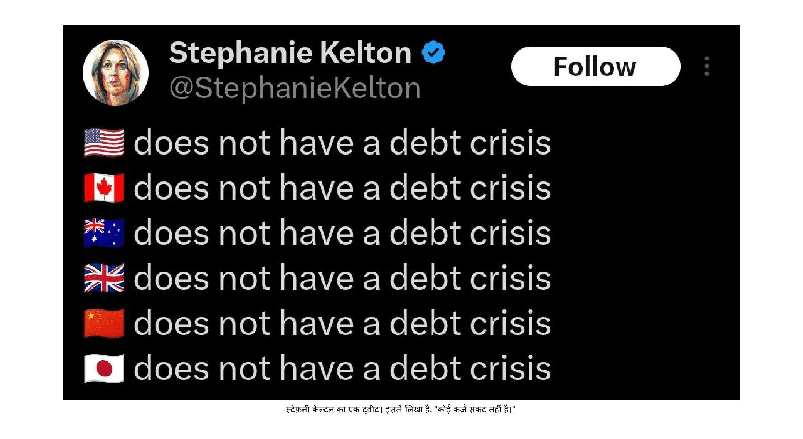

अजीब बात है, इसमें सिर्फ़ छह देशों का ज़िक्र है? ऐसा क्यों? क्योंकि उनके पास असली मौद्रिक संप्रभुता है। लेकिन दुनिया में लगभग 200 देश हैं, और उन सभी के पास मौद्रिक संप्रभुता नहीं है। इसलिए, इस सिद्धांत की मेरी आलोचना, थोड़ी अजीब और अप्रभावी होने के अलावा, यह है कि यह केवल उन कुछ देशों के लिए काम करता है जिनके पास सच्ची मौद्रिक संप्रभुता है, यानी वे जो अपनी मुद्रा में ट्रेजरी बिल जारी कर सकते हैं। कुछ हद तक, यह बाकी दुनिया के लिए नुकसानदेह है। इस मुद्रा का निर्माण करके, ऐसा लगता है जैसे वे अपनी मुद्रास्फीति को कहीं और निर्यात कर रहे थे, ठीक वैसे ही जैसे संयुक्त राज्य अमेरिका दशकों से अपने अत्यधिक विशेषाधिकारों के साथ करता आ रहा है। यह एक तरह के मौद्रिक उपनिवेशवाद जैसा है, जहाँ जिन देशों को अपनी मुद्रा पर वैश्विक विश्वास और माँग है, वे बिना किसी बड़ी मुद्रास्फीति के जितना चाहें उतना पैसा छाप सकते हैं, अक्सर इसलिए क्योंकि वे उस मुद्रास्फीति को निर्यात करते हैं।

यह सिद्धांत आयात पर निर्भर अर्थव्यवस्थाओं पर लागू करना कठिन है, जिन्हें अपनी मुद्रा में अंतर्राष्ट्रीय विश्वास बनाए रखने की आवश्यकता होती है।

यह सिद्धांत अर्थव्यवस्था की एक निश्चित स्तर की केंद्रीकृत योजना की भी मांग करता है, विशेष रूप से वास्तविक संसाधनों (श्रमिकों, कच्चे माल, औद्योगिक क्षमता) पर अधिक नियंत्रण सुनिश्चित करने और मुद्रास्फीति का प्रबंधन करने के लिए।

# धन का पतन और पुनर्जन्म

<partId>87a34ca9-782b-5ade-b51a-400f88ed7b0c</partId>

## ग्रीक सिक्के

<chapterId>7714195f-74ce-5f8c-be5f-59302d39fff4</chapterId>

:::video id=8e5c3091-0910-471b-8d4b-0dc6e9afa656:::

### पृष्ठभूमि और संदर्भ

शुरू करने से पहले, ऐतिहासिक पृष्ठभूमि इस प्रकार है:

**ऐतिहासिक पृष्ठभूमि:**

**रोमवासी यूनानियों को "ग्रेसी" और ग्रीस को "ग्रेसिया" कहते थे।**

**यूनानियों ने खुद को "हेलेनेस" और अपने देश को "हेलास" कहा।**

**होमर** (जन्म लगभग 8वीं शताब्दी ईसा पूर्व)

महान यूनानी कवि, जिन्हें इलियड और ओडिसी का लेखक माना जाता है।

लगभग 750 ई.पू.: ऐसा कहा जाता है कि स्पार्टा के पौराणिक विधायक लाइकर्गस ने सैन्य अनुशासन और सादगी पर आधारित स्पार्टन संविधान की स्थापना की थी।

**नुमा पोम्पिलियस** (753-673 ईसा पूर्व)

रोम के दूसरे राजा, रोम को उसकी पहली धार्मिक और कानूनी संस्थाएँ देने के लिए प्रसिद्ध।

**ड्रैकन**, एथेनियन विधायक (7वीं शताब्दी ईसा पूर्व), अपने अत्यंत कठोर कानूनों के लिए प्रसिद्ध, इसलिए इसे "ड्रैकोनियन" शब्द से जाना जाता है।

**594 ई.पू.: सोलोन** एथेंस में विधायक बने और उन्होंने ऋण दासता को समाप्त करके, विशेष रूप से एथेनियन समाज में आमूलचूल सुधार किया।

**776 ईसा पूर्व: प्राचीन ओलंपिक खेल**

ओलंपिया में हर चार साल में पहली बार नियमित खेल आयोजित किये गए, जिससे यूनानी शहर एक साथ आये।

**पाइथागोरस** (लगभग 570-495 ईसा पूर्व)

यूनानी दार्शनिक और गणितज्ञ, जो समकोण त्रिभुज पर अपने प्रमेय के लिए प्रसिद्ध थे।

**कोलोफोन के ज़ेनोफेनेस** (लगभग 570-478 ईसा पूर्व)

पूर्व-सुकराती दार्शनिक, पारंपरिक ग्रीक बहुदेववाद की आलोचना के लिए जाने जाते हैं।

**490 ईसा पूर्व: मैराथन की लड़ाई**

एथेनियाई लोगों ने फारसी आक्रमण को विजयी ढंग से विफल कर दिया, जो यूनानी सभ्यता के लिए एक निर्णायक मोड़ था।

**हेरोडोटस** (लगभग 484-425 ई.पू.), जिन्हें "इतिहास का पिता" उपनाम दिया गया था, ने फारसी युद्धों का वर्णन करते हुए एक विशाल ग्रंथ लिखा, जिसमें 480 ई.पू. में जेरेक्सेस पर यूनान की विजय भी शामिल थी।

**सुकरात** (470-399 ईसा पूर्व)

एथेनियन दार्शनिक अपनी द्वंद्वात्मक पद्धति और नैतिकता और आत्म-ज्ञान पर अपनी शिक्षा के लिए प्रसिद्ध थे।

**अरिस्टोफेन्स** (लगभग 446-386 ईसा पूर्व)

एथेनियन नाटककार, द फ्रॉग्स जैसे व्यंग्यात्मक हास्य नाटकों के लिए प्रसिद्ध।

**सोफोकल्स** (5वीं शताब्दी ईसा पूर्व) ने अपने नाटक *एंटीगोन* में तानाशाह क्रेओन के माध्यम से धन को नैतिक और राजनीतिक भ्रष्टाचार के स्रोत के रूप में आलोचना की है।

**प्लेटो** (लगभग 428-348 ईसा पूर्व)

यूनानी दार्शनिक, सुकरात के शिष्य, अकादमी के संस्थापक, *द रिपब्लिक* के लेखक।

**431-404 ईसा पूर्व: पेलोपोनेसियन युद्ध**

एथेंस और स्पार्टा के बीच बड़ा संघर्ष, जिसका अंत एथेंस की हार के साथ हुआ।

**431 ई.पू.**: एथेंस ने प्रचलन में सोने और चांदी के सिक्कों की मात्रा बढ़ाने के लिए पेलोपोनेसियन युद्ध को वित्तपोषित किया, जिससे मुद्रास्फीति बढ़ गई।

**ज़ेनोफ़ोन** (लगभग 430-355 ईसा पूर्व)

एथेनियन लेखक, दार्शनिक और जनरल, सुकरात के शिष्य, *एनाबैसिस* के लेखक।

**414 ई.पू.**: सिसिली के विनाशकारी अभियान के बाद एथेंस पेलोपोनेसियन युद्ध हारने लगा।

**405 ई.पू.: अरिस्टोफेन्स** ने अपने नाटक *द फ्रॉग्स* में स्पष्ट रूप से चांदी के ड्राचमा के अवमूल्यन और एथेंस में घटिया कांस्य सिक्कों के प्रचलन का वर्णन किया है, जो आज "ग्रेशम के नियम" के रूप में ज्ञात सिद्धांत को दर्शाता है।

**404 ई.पू.**: स्पार्टा द्वारा लम्बी घेराबंदी के बाद एथेंस ने आत्मसमर्पण कर दिया।

**अरस्तू** (384-322 ईसा पूर्व)

प्रमुख यूनानी दार्शनिक, प्लेटो के छात्र, लिसेयुम के संस्थापक, तर्कशास्त्र, जीव विज्ञान और राजनीतिक दर्शन में अपने कार्य के लिए जाने जाते हैं।

**327 ई.पू.**: सिकंदर महान ने पर्सेपोलिस और फारसी साम्राज्य के पूर्वी प्रांतों पर विजय प्राप्त की, तथा अपने साम्राज्य का काफी विस्तार किया।

**323 ई.पू.**: सिकंदर की बेबीलोन में बिना किसी स्पष्ट उत्तराधिकारी के मृत्यु हो गई, जिससे साम्राज्य को विभाजित करने के लिए उसके सेनापतियों (डायडोची) के बीच युद्ध छिड़ गया।

**आर्किमिडीज़** (लगभग 287-212 ईसा पूर्व)

यूनानी गणितज्ञ, भौतिक विज्ञानी और आविष्कारक, ज्यामिति और यांत्रिकी में अपनी खोजों के लिए प्रसिद्ध।

**196 ई.पू.: रोसेटा स्टोन** को फिरौन टॉलेमी पंचम के शासनकाल के दौरान उत्कीर्ण किया गया, जिससे बाद में मिस्र के चित्रलिपि को समझने में सहायता मिली।

**192-188 ईसा पूर्व: रोमानो-सेल्यूसिड युद्ध**

रोम ने एंटिओकस तृतीय के नेतृत्व वाले सेल्यूसिड साम्राज्य को पराजित कर दिया, जिससे ग्रीस और एशिया माइनर में उसका प्रभाव मजबूत हो गया।

**146 ईसा पूर्व: कोरिंथ का युद्ध**

रोमनों ने यूनानी शहर कोरिंथ को नष्ट कर दिया, जिससे यूनानी राजनीतिक स्वतंत्रता का अंत हो गया तथा ग्रीस का रोमन दुनिया में धीरे-धीरे एकीकरण हो गया।

प्राचीनता, रोम के पतन और मध्य युग पर आधारित इस खंड के लिए, हम ग्रीक सिक्कों पर आधारित खंड से शुरुआत करेंगे।

प्राचीन ग्रीस में सिक्कों का इतिहास लगभग 600 ईसा पूर्व शुरू हुआ, जब यूनानी शहरों ने एशिया माइनर के लिडिया से इस नवाचार को तुरंत अपना लिया, जिसमें शुरुआत में इलेक्ट्रम और बाद में चाँदी का इस्तेमाल किया गया। पहले यूनानी सिक्के एजिना द्वीप पर ढाले गए थे, जिन पर समुद्री या स्थलीय कछुआ अंकित था, लेकिन एथेना और उल्लू से सजे एथेनियन ड्राचमा, 5वीं शताब्दी ईसा पूर्व से सर्वश्रेष्ठ मौद्रिक प्रतीक बन गए, और उस समय अंतर्राष्ट्रीय व्यापार पर इसका काफी प्रभाव था।

और मैं भाग्यशाली हूँ कि मेरे पास उस काल के एक ग्रीक ड्राचमा की एक प्रति है जिसके पीछे वह प्रसिद्ध उल्लू और एक आकृति बनी है। यह एक टेट्राड्राचमा है, जो साधारण ड्राचमा से बड़ा होता था।

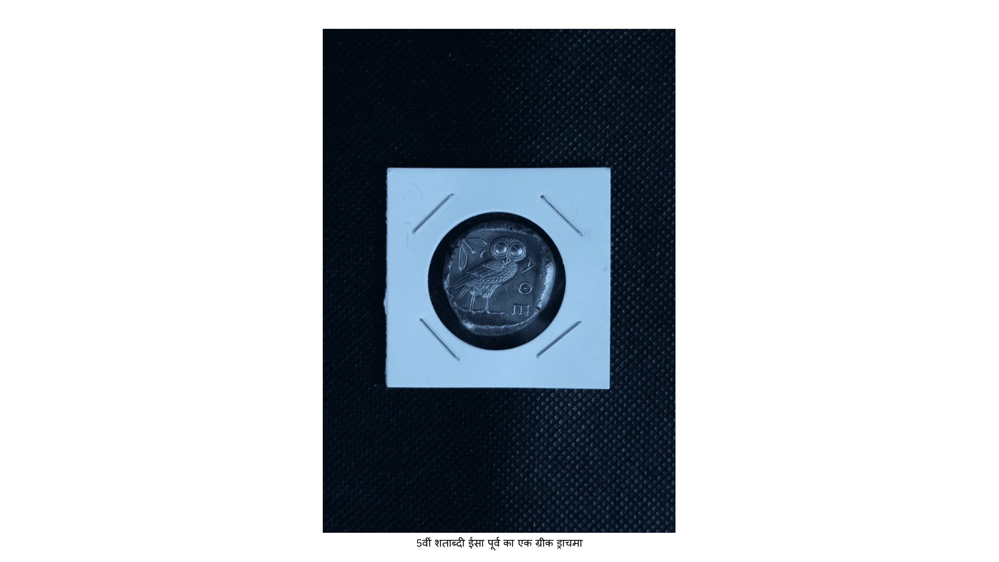

प्रत्येक यूनानी शहर ने मुद्रा के साथ अपना अलग रिश्ता विकसित किया। एथेंस में, मुद्रा राजनीतिक और आर्थिक शक्ति से गहराई से जुड़ी हुई थी। ईसा पूर्व पाँचवीं शताब्दी के उत्तरार्ध के प्रसिद्ध एथेनियन आदेश ने अपने संबद्ध क्षेत्रों में एथेनियन मुद्रा के अनन्य उपयोग को अनिवार्य कर दिया, जिससे उसका आर्थिक आधिपत्य और मज़बूत हुआ। एथेंस ने आपात स्थितियों के लिए सोने के विशाल भंडार भी जमा किए, जिन्हें शायद उसकी आर्थिक समझदारी के प्रतीक के रूप में एक्रोपोलिस में रखा गया था। इसके विपरीत, कठोर मूल्यों वाले एक सैन्य शहर, स्पार्टा ने मुद्रा के उपयोग पर कठोर प्रतिबंध लगाने का विकल्प चुना, अपने नागरिकों को सोने या चाँदी के सिक्के रखने से मना किया। स्पार्टा विदेशी व्यापार को हतोत्साहित करने और सामाजिक एकता बनाए रखने के लिए भारी लोहे की सलाखों का इस्तेमाल करना पसंद करता था।

युद्धों का वित्तपोषण अक्सर मुद्रा हेरफेर से होता था। पेलोपोनेसियन युद्ध (431-404 ईसा पूर्व) के दौरान, एथेंस ने अपने सैनिकों को भुगतान करने के लिए भारी अवमूल्यन का सहारा लिया। 413 ईसा पूर्व में डेसिलिया पर स्पार्टन्स के कब्जे के कारण अपनी चाँदी की खदानों तक पहुँच से वंचित होने के कारण, एथेंस को 407/406 ईसा पूर्व में आनन-फानन में नए सिक्के ढालने के लिए सोने की मूर्तियों को पिघलाना पड़ा। फिर, 406/405 ईसा पूर्व में, उसने चाँदी से मढ़े काँसे के सिक्के बनाए, जिससे एक मौद्रिक संकट पैदा हुआ, जिसका उदाहरण **अरिस्टोफेन्स** ने दिया है, जिन्होंने पहले ही उस बात का उदाहरण दिया है जिसे आज ग्रेशम का नियम कहा जाता है: खराब मुद्रा अच्छी मुद्रा को बाहर निकाल देती है। युद्ध के बाद एथेनियन सिक्कों में विश्वास बहाल करने के लिए इस आपातकालीन मुद्रा को तुरंत विमुद्रीकृत कर दिया गया।

शास्त्रीय काल का अंत फिलिप द्वितीय और उनके पुत्र सिकंदर महान के नेतृत्व में मैसेडोनिया के उदय से चिह्नित था, जिसने यूनानी मौद्रिक संतुलन को बुरी तरह से बिगाड़ दिया। माउंट पैंजिया की विशाल सोने और चांदी की खदानों की बदौलत, फिलिप द्वितीय ने अपने सैन्य और राजनीतिक अभियानों के वित्तपोषण के लिए प्रचुर मात्रा में धन अर्जित किया और एक सरल और व्यावहारिक स्वर्ण-रजत मानक (10:1) की स्थापना की। ओलंपिक खेलों में उनकी जीत का जश्न मनाते हुए उनके स्वर्ण स्टेटर पश्चिमी यूरोप तक, यहाँ तक कि इंग्लैंड तक भी प्रचलन में आए। सिकंदर ने इस मौद्रिक नीति का पालन किया और पूर्व में अपनी विजयों के दौरान भारत तक **एटिक** ड्राचमा का व्यापक रूप से प्रचलन किया। सिक्कों के इस विशाल प्रचलन ने हेलेनिस्टिक युग की शुरुआत को चिह्नित किया, जब सिक्कों पर धीरे-धीरे देवताओं की छवि का स्थान संप्रभुओं की छवि ने ले लिया। इस नवाचार ने हेलेनिस्टिक सम्राटों की पीढ़ियों को खुद को बढ़ावा देने में सक्षम बनाया, जिससे उनके सिक्कों के पीछे पारंपरिक देवताओं की भूमिका गौण हो गई।

323 ईसा पूर्व में सिकंदर की मृत्यु के बाद, उसके सेनापतियों ने उसके विशाल साम्राज्य को विभाजित कर दिया और मिस्र (टॉलेमी), सीरिया (सेल्यूसिड) और अन्य जगहों पर राजवंशों की स्थापना की। इन हेलेनिस्टिक साम्राज्यों ने विभिन्न प्रकार की मौद्रिक प्रणालियाँ अपनाईं: टॉलेमी ने धन के संचलन को नियंत्रित करने के लिए एक बंद मौद्रिक प्रणाली लागू की, जिसमें बाहरी सैन्य व्यय के लिए कीमती धातुओं को बचाने के लिए आंतरिक मुद्रा के रूप में अनाज का उपयोग करना पसंद किया गया। इसी समय, रोमनों द्वारा आर्थिक रूप से कमजोर किए जाने से पहले, रोड्स एक प्रमुख व्यापारिक केंद्र बन गया, जिन्होंने 167 ईसा पूर्व में डेलोस को एक मुक्त बंदरगाह के रूप में स्थापित किया।

भाड़े के सैनिकों के पारिश्रमिक में धन का उपयोग केंद्रीय था। सिकंदर के सैनिकों को प्रतिदिन चाँदी के द्राख्मा मिलते थे।

सिकंदर की अति विशिष्ट सेना के कुलीन वर्ग, घुड़सवार सेना को प्रतिदिन औसतन दो द्राख्मा मिलते थे, पैदल सैनिक को एक द्राख्मा, तथा साधारण भाड़े के सैनिक को दो-तिहाई द्राख्मा मिलता था, जो एक साधारण श्रमिक के वेतन से दोगुना था।

पेलोपोनेसियन युद्ध के दौरान, सैनिकों को भी काफी धनराशि दी गई थी: समोस विद्रोह को दबाने के लिए 1,200 से अधिक टैलेंट और पोटिडिया की घेराबंदी के लिए 2,000 से अधिक टैलेंट।

जब तक यह सेना एशिया माइनर में पूरी तरह से सक्रिय हो गई, तब तक कुल लागत लगभग बीस प्रतिभा प्रति दिन, या लगभग आधा टन चांदी, या 120,000 द्राख्मा थी।

यूनानी सिक्कों ने भी एक महत्वपूर्ण सांस्कृतिक भूमिका निभाई, क्योंकि प्रत्येक शहर स्थानीय या पौराणिक प्रतीकों वाले अपने सिक्के ढालकर अपनी पहचान स्थापित करने का प्रयास करता था। उदाहरण के लिए, हेराक्लियस ने हेराक्लीज़ (हरक्यूलिस) को शेर से लड़ते हुए चित्रित किया, जबकि साइरेन ने प्रसिद्ध औषधीय पौधे सिल्फ़ियम को दर्शाया।

अंततः, अपनी विविधता और क्षेत्रीय उतार-चढ़ाव के बावजूद, शास्त्रीय यूनानी और हेलेनिस्टिक सिक्कों ने भूमध्यसागरीय विश्व के आर्थिक और सांस्कृतिक इतिहास पर एक स्थायी छाप छोड़ी, जिसने बाद की मौद्रिक प्रणालियों को रोम तक गहराई से प्रभावित किया, जिसने धीरे-धीरे यूनानी आर्थिक अवधारणाओं को अपनाया और विकसित करके अपनी स्वयं की साम्राज्यवादी अर्थव्यवस्था की संरचना की।

## ग्रीस में मुद्रा का प्रभाव

<chapterId>3a5e6c7d-699c-5567-87cd-3374c49d55a9</chapterId>

:::video id=0c79a59c-e179-4893-a414-1b8de0930eb9:::

### एथेंस और स्पार्टा के साथ तुलना

शास्त्रीय यूनानी काल के दौरान एथेंस और स्पार्टा के बीच विरोध राजनीतिक और आर्थिक संगठन के दो बिल्कुल अलग मॉडलों को उजागर करता है। जहाँ स्पार्टा ने नागरिक विश्वास पर आधारित एक आत्मनिर्भर प्रणाली के पक्ष में धातु मुद्रा को अस्वीकार कर दिया, वहीं एथेंस ने अपने समुद्री साम्राज्य के निर्माण और रखरखाव के लिए इस तकनीक को पूरी तरह अपनाया।

### नौसैनिक शक्ति की मौद्रिक आवश्यकता

एथेनियन साम्राज्य, अपने भव्य नाम के बावजूद, भौगोलिक रूप से छोटा ही रहा - मुख्यतः एथेंस और एजियन सागर के शहर। इसकी शक्ति डेलोस लीग पर आधारित थी, जो एक सैन्य गठबंधन था जिस पर एथेंस का प्रभुत्व था। इस साम्राज्यवादी संरचना के लिए एक एकीकृत आर्थिक साधन की आवश्यकता थी: एथेनियन चाँदी का सिक्का।

इस मौद्रिक आवश्यकता का मूल आधार एक बेड़ा बनाए रखना था। एक एथेनियन त्रिरेम की कीमत एक से दो टैलेंट चाँदी के बीच होती थी - जो एक बड़ी रकम थी। सैकड़ों जहाजों के रखरखाव के लिए, एथेंस को एक कुशल कर प्रणाली की आवश्यकता थी। जागीरदार शहरों से कर वसूलने और साम्राज्य की एकता सुनिश्चित करने वाले नौसैनिक प्रक्षेपण बल के वित्तपोषण के लिए मुद्रा एक अनिवार्य साधन बन गई।

### प्रभुत्व के साधन के रूप में मौद्रिक अधिरोपण

एथेंस ने डेलोस लीग के सभी सदस्यों पर अपनी चाँदी की मुद्रा लागू की। इस मौद्रिक मानकीकरण के कई रणनीतिक उद्देश्य थे। पहला, इसने एक समान लेखा इकाई बनाकर कर संग्रह को सुगम बनाया। दूसरा, इसने एथेंस पर जागीरदार शहरों की आर्थिक निर्भरता को मज़बूत किया। अंततः, इसने पूरे समुद्री साम्राज्य में एथेनियन शक्ति का प्रतीकात्मक रूप से प्रदर्शन किया।

यह मौद्रिक नीति स्पार्टन मॉडल से बिल्कुल अलग है। स्पार्टा, एक भू-शक्ति, अपनी जीविका के लिए पेलोपोनेसियन हेलोट्स (दासों) के श्रम पर निर्भर रह सकता था। इसकी बंद, शहर-केंद्रित आर्थिक व्यवस्था को परिष्कृत मौद्रिक साधनों की आवश्यकता नहीं थी। नागरिक-सैनिक एक साथ रहते थे, एक ही भोजन करते थे, और उन्हें दैनिक लेन-देन के लिए धन की आवश्यकता नहीं थी।

### समुद्री व्यापार के साधन के रूप में मुद्रा

एथेनियन साम्राज्य की समुद्री प्रकृति के कारण उसे व्यापार के लिए खुला रहना पड़ा। अंतर्मुखी स्पार्टा के विपरीत, एथेंस को अपने अस्तित्व और समृद्धि के लिए बाहरी दुनिया के साथ व्यापार करना पड़ा। मुद्रा भूमध्यसागरीय व्यापार का अनिवार्य साधन बन गई।

इस बाह्य अभिविन्यास ने एक सद्चक्र का निर्माण किया: व्यापार से राजस्व उत्पन्न होता था, इस राजस्व से बेड़े का वित्तपोषण होता था, बेड़े से व्यापार मार्गों की रक्षा होती थी और साम्राज्य का रखरखाव होता था, और साम्राज्य एथेनियन मुद्रा लागू करता था, जिससे व्यापार सुगम होता था। मुद्रा अब केवल विनिमय का साधन नहीं रह गई थी, बल्कि साम्राज्यवादी रणनीति का एक स्तंभ बन गई थी।

### मौद्रिक शक्ति की सीमाएँ

इस आर्थिक परिष्कार के बावजूद, पेलोपोनेसियन युद्ध के दौरान एथेनियन मौद्रिक शक्ति ने अपनी सीमाएँ दिखाईं। स्पार्टन थल सेनाओं के सामने, एथेंस की नौसैनिक और वित्तीय श्रेष्ठता पर्याप्त नहीं थी। सिसिली में विनाशकारी सिरैक्यूज़ अभियान जैसे महँगे अभियानों ने निर्णायक विजय प्राप्त किए बिना ही वित्तीय संसाधनों को समाप्त कर दिया।

इतिहास गवाह है कि मुद्रा, शक्ति प्रदर्शन का एक शक्तिशाली साधन होते हुए भी, सैन्य प्रभुत्व की गारंटी नहीं है। धातु मुद्रा के बिना, लेकिन उल्लेखनीय सामाजिक एकजुटता के साथ, स्पार्टा अंततः एथेनियन मौद्रिक साम्राज्य पर विजयी हुआ।

### दो मॉडल, दो नियति

एथेंस और स्पार्टा के बीच का विरोध सामाजिक और आर्थिक संगठन के दो मूलभूत दृष्टिकोणों को दर्शाता है। एथेंस एक खुले, वाणिज्यिक, मौद्रिक मॉडल का प्रतिनिधित्व करता है - जो आधुनिक समुद्री साम्राज्यों का अग्रदूत है। स्पार्टा एक बंद, स्वायत्त मॉडल का प्रतीक है, जो मौद्रिक साधनों के बजाय नागरिक विश्वास पर आधारित है।

ये दोनों प्रणालियाँ दर्शाती हैं कि मुद्रा को अपनाना चुने गए राजनीतिक और आर्थिक मॉडल से गहराई से जुड़ा है। एथेंस जैसी समुद्री और व्यापारिक शक्ति के लिए, मुद्रा अपरिहार्य हो गई। स्पार्टा जैसे बंद योद्धा समाज के लिए, यह सामाजिक व्यवस्था के लिए एक ख़तरा बन गया। यह प्राचीन द्वंद्व आज भी समाजों के संगठन में मुद्रा की भूमिका पर बहस को प्रभावित करता है।

## रोमन गणराज्य

<chapterId>0bc80983-33e1-5881-85bb-7c22f3144a9a</chapterId>

:::video id=dc05ca97-d29c-4679-bfeb-912c47d86ce2:::

### रोमन गणराज्य का इतिहास

- 753 - 509 ईसा पूर्व: रोम का साम्राज्य**
- 753 ई.पू.: रोम की स्थापना** (पारंपरिक रूप से इसका श्रेय रोमुलस को दिया जाता है)।
- 509 - 27 ई.पू.: रोमन गणराज्य**, रोम एक निर्वाचित सीनेट और कौंसल द्वारा शासित गणराज्य बन गया।
- 280 - 275 ईसा पूर्व: पाइरिक युद्ध**। एपिरस के राजा पाइरहस ने दक्षिणी इटली में रोमनों के साथ युद्ध किया और महंगी जीत ("पाइरिक विजय") हासिल की।
- 264 - 146 ई.पू.: प्यूनिक युद्ध**। पश्चिमी भूमध्य सागर पर प्रभुत्व के लिए रोम और कार्थेज के बीच प्रमुख संघर्ष।
- हैनिबल (247 - लगभग 181 ई.पू.)**. महान कार्थेजियन सेनापति, जो द्वितीय प्यूनिक युद्ध के दौरान रोम पर आक्रमण करने के लिए अपनी सेना और हाथियों के साथ आल्प्स पर्वत को पार करने के लिए प्रसिद्ध था।
- 146 ईसा पूर्व: कोरिंथ का युद्ध**. रोम ने यूनानी शहर कोरिंथ को नष्ट कर दिया और मुख्य भूमि ग्रीस पर अपना अंतिम प्रभुत्व स्थापित कर लिया।
- 91 - 87 ई.पू.: सामाजिक युद्ध**. रोम के इतालवी सहयोगियों द्वारा रोमन नागरिकता की मांग को लेकर विद्रोह, जिसके परिणामस्वरूप अंततः उन्हें पूर्ण रूप से नागरिकता में शामिल कर लिया गया।
- 64 ई.पू.: सेल्यूसिड प्रतिरोध का अंत**। रोम ने सीरिया में सेल्यूसिड प्रभाव को पूरी तरह समाप्त कर दिया और पूर्वी भूमध्य सागर पर अपनी पकड़ मजबूत कर ली।
- 55 ईसा पूर्व: जूलियस सीज़र ने मध्य और पश्चिमी यूरोप पर विजय प्राप्त की**। जूलियस सीज़र ने गॉल (वर्तमान फ़्रांस) पर रोमन प्रभुत्व का विस्तार किया और जर्मेनिया और ब्रिटनी में प्रवेश किया।
- 43 ई.पू.: द्वितीय त्रिमूर्ति का गठन। सीज़र की हत्या के बाद रोम को स्थिर करने के लिए ऑक्टेवियन (बाद में ऑगस्टस), मार्क एंटनी और लेपिडस के बीच राजनीतिक गठबंधन।
- 27 ईसा पूर्व: पैक्स रोमाना** की शुरुआत। ऑगस्टस के शासनकाल में राजनीतिक स्थिरता और समृद्धि का दौर, जिसने रोमन साम्राज्य की शुरुआत को चिह्नित किया।

### रोम की देर से मौद्रिक शुरुआत

प्राचीनता पर इस खंड में, अब हम अपना ध्यान रोमन गणराज्य की ओर मोड़ते हैं। रोम का मौद्रिक इतिहास यूनानियों और फारसियों के इतिहास से बहुत बाद में शुरू हुआ। 753 ईसा पूर्व में स्थापित, रोम ने सिक्कों को सही मायने में अपनाने से पहले लगभग चार शताब्दियों तक प्रतीक्षा की। इस लंबी अवधि के दौरान, रोमनों ने अनियमित कांसे के टुकड़ों, जिन्हें ऐस रूड कहा जाता था, के साथ विनिमय की एक आदिम प्रणाली का उपयोग किया, जिसमें प्रत्येक लेनदेन के लिए सटीक वजन की आवश्यकता होती थी। केवल चौथी शताब्दी ईसा पूर्व के अंत में, यूनानी और एट्रस्केन प्रभाव के तहत, रोम ने अपने पहले सिक्के जारी करना शुरू किया, विशेष रूप से चीन की तरह कांसे के ढले हुए, ऐस ग्रेव, जो **द्वितीय प्यूनिक युद्ध** तक रोमन विनिमय की विशेषता थी।

### ग्रीक प्रभाव और पहले चांदी के सिक्के

दक्षिणी इटली के यूनानियों के साथ निर्णायक मुठभेड़ ने रोमनों को वास्तव में ढले हुए चाँदी के सिक्कों से परिचित कराया। लगभग 280 ईसा पूर्व, रोम ने यूनानी डिड्राकम्स की नकल में अपने चाँदी के सिक्के बनाना शुरू किया। रोम में चाँदी के सिक्कों का पहला नियमित प्रकाशन ठीक 269 ईसा पूर्व का है, जिसमें पौराणिक जुड़वाँ रोमुलस और रेमस को मादा भेड़िये द्वारा दूध पिलाते हुए दिखाया गया है, जो एक ऐसा प्रतीक बन गया है जो अब एक प्रतिष्ठित प्रतीक बन गया है।

दरअसल, गणतंत्र काल के कई रोमन सिक्के संस्थापक मिथकों को दर्शाते हैं। आप नीचे मेरा सिक्का देख सकते हैं: यह राजा टाटियस का एक शानदार, असली सिक्का है। यह सबाइन्स की महिलाओं के अपहरण के मिथक को दर्शाता है। टाटियस इस क्षेत्र का राजा था, और यह संस्थापक मिथक बताता है कि कैसे रोमनों ने सबाइन्स, जो पास में रहने वाली एक आबादी थी, की महिलाओं का अपहरण किया था। इसके बाद, राजा टाटियस रोम के संस्थापकों में से एक, रोमुलस के साथ सह-राजा बन गए।

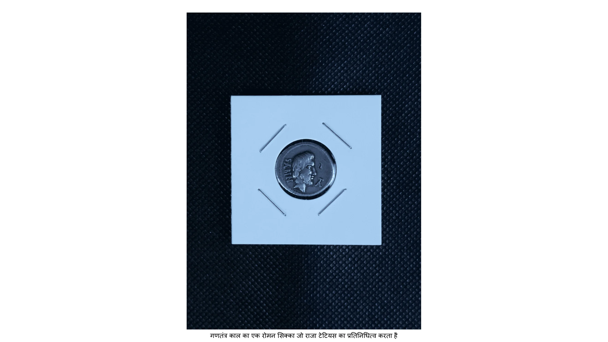

### "सिक्का" शब्द की उत्पत्ति और जूनो मोनेटा का मंदिर

"सिक्का" शब्द की उत्पत्ति रोम स्थित जूनो मोनेटा के मंदिर से हुई है। किंवदंती है कि 390 ईसा पूर्व में एक गैलिक आक्रमण के दौरान, कैपिटल के पवित्र हंसों ने रोमनों को एक आसन्न खतरे के प्रति सचेत किया था। कैपिटल की रक्षक देवी जूनो के सम्मान में, उनके सम्मान में एक मंदिर बनाया गया और जल्द ही यह रोमन सिक्कों की टकसाल बन गया।

### प्यूनिक युद्ध और मुद्रा संकट

सैन्य संघर्षों का रोमन मौद्रिक विकास पर गहरा प्रभाव पड़ा। कार्थेज के विरुद्ध द्वितीय प्यूनिक युद्ध (218-201 ई.पू.) के दौरान, हैनिबल के आक्रमण के कारण रोम को गंभीर वित्तीय कठिनाइयों का सामना करना पड़ा। इन तात्कालिक आवश्यकताओं को पूरा करने के लिए, रोम ने पहली बार असाधारण रूप से सोने के सिक्के जारी किए, साथ ही अपने चाँदी के सिक्कों का भी महत्वपूर्ण अवमूल्यन किया, जो प्रारंभिक शुद्धता 97% से घटकर लगभग 89% रह गया। काँसे के सिक्कों (aes) का भार भी काफी कम हो गया, जो छह वर्षों में लगभग 80% कम हो गया।

यहाँ, हम उस अवधारणा पर फिर से विचार कर सकते हैं जिस पर हम पहले चर्चा कर चुके हैं कि आर्थिक संकटों को कम करने के लिए यूनानियों ने मंदिरों में रखी कीमती धातुओं को पिघलाया था। और **कार्थेज** के बारे में बात करने के लिए, नीचे आप मेरे संग्रह से एक असली कार्थेजियन सिक्के की प्रशंसा कर सकते हैं। इन कार्थेजियन सिक्कों के एक तरफ ताड़ का पेड़ और दूसरी तरफ एक घोड़ा बना हुआ था। इस सिक्के पर घोड़ा ज़्यादा पहचाना नहीं जा सकता, बल्कि बहुत घिसा हुआ है।

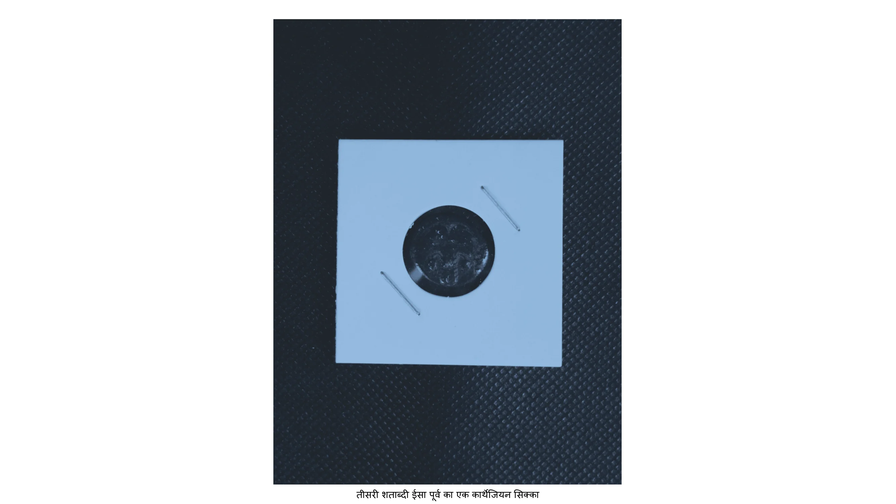

परिणामस्वरूप, कांसे के सिक्कों, जिन्हें एईएस कहा जाता है, का वज़न भी तेज़ी से कम हो गया, छह वर्षों में लगभग 80% कम हो गया। इस प्रकार, इन कांसे के सिक्कों, जो कोई कीमती धातु नहीं थे और रोज़मर्रा के व्यापार में इस्तेमाल होते थे, का वज़न काफ़ी कम हो गया, जो इन युद्धों के कारण हुए मौद्रिक अवमूल्यन का संकेत था।

### चाँदी का दीनार और मौद्रिक स्थिरता

इसी महत्वपूर्ण पृष्ठभूमि में रोम ने लगभग 212 ईसा पूर्व प्रसिद्ध चाँदी के दीनार का प्रचलन शुरू किया। इस सुधार ने उल्लेखनीय मौद्रिक स्थिरता सुनिश्चित की और दीनार लगभग 450 वर्षों तक प्रमुख मुद्रा बना रहा। रोम को यह स्थिरता कठोर प्रबंधन के कारण मिली, हालाँकि 146 ईसा पूर्व में एक बड़े पुनर्मूल्यन और अपनी विशाल सेनाओं के वित्तपोषण के लिए, विशेष रूप से प्यूनिक, सोशल (91-87 ईसा पूर्व) और मैसेडोनियन युद्धों के दौरान, पर्याप्त उत्पादन हुआ था। उदाहरण के लिए, एक रोमन सेना को बनाए रखने में प्रति वर्ष लगभग 15 लाख दीनार का खर्च आता था, जो मौद्रिक आवश्यकताओं के पैमाने को दर्शाता है।

रोमन सीमाओं से परे, युद्धों के कारण रोमन प्रभाव वाले क्षेत्रों में मुद्रा का अवमूल्यन हुआ। प्यूनिक कार्थेज में इलेक्ट्रम की शुद्धता में नाटकीय रूप से गिरावट आई, चौथी शताब्दी में 98% सोने से दूसरे प्यूनिक युद्ध के दौरान यह घटकर केवल 30% रह गई, जबकि इसके चाँदी के सिक्कों की शुद्धता घटकर 18% रह गई।

### मौद्रिक उद्देश्यों का विकास

रोम के विस्तार के साथ, सिक्कों का चरित्र भी विकसित हुआ: शुरुआत में गुमनाम और देशभक्तिपूर्ण, सिक्कों ने धीरे-धीरे टकसालों (सिक्के ढालने वालों) के शक्तिशाली परिवारों की व्यक्तिगत डिज़ाइन अपना लीं। यह परिवर्तन स्पष्ट रूप से रोमन गणराज्य के उत्तरार्ध के राजनीतिक परिवर्तनों का प्रतीक है।

अंततः, जबकि रोम ने भूमध्यसागरीय विश्व पर आर्थिक रूप से प्रभुत्व बनाए रखा, उसने भुगतान के अपने साधनों में एक निश्चित सरलता बनाए रखी: सिक्कों के प्रत्यक्ष विनिमय के अलावा मौद्रिक हस्तांतरण का कोई अन्य वास्तविक रूप विकसित नहीं हुआ, कर हस्तांतरण और अभिजात वर्ग के लिए आरक्षित निजी ऋणों को छोड़कर।

## रोमन साम्राज्य

<chapterId>2dc44e50-112a-5abf-97ae-8e0a9ecda989</chapterId>

:::video id=f8d6f3d6-9ee4-4504-888e-4f12b3f20489:::

**ऐतिहासिक पृष्ठभूमि:**

**प्रिंसिपेट** रोमन साम्राज्य में 27 ईसा पूर्व में ऑगस्टस के शासनकाल की शुरुआत से लेकर 284 ईस्वी में तीसरी सदी के संकट के अंत तक शाही सरकार का रूप था।

**27 ईसा पूर्व: पैक्स रोमाना की शुरुआत**

ऑगस्टस के शासनकाल में राजनीतिक स्थिरता और समृद्धि का काल, जो रोमन साम्राज्य की शुरुआत का प्रतीक है।

**ऑगस्टस (30 ई.पू. से 14 ई.)** ने रोमन मौद्रिक प्रणाली में आमूलचूल सुधार किया, तथा शाही सिक्कों के लिए एक स्थायी और स्थिर मानक स्थापित किया।

**ऑगस्टस प्राचीन सिक्कों और जीवाश्मों के प्रथम मान्यता प्राप्त संग्रहकर्ताओं में से एक थे।**

**54 ई. - 68 ई.: नीरो**

विवादास्पद रोमन सम्राट, जो रोम के जलने के बाद अपने अत्याचार, उत्पीड़न और विनाशकारी प्रबंधन के लिए जाना जाता है।

**64 ई.: रोम की भीषण आग**

शहर के अधिकांश भाग में भीषण आग लग जाती है; नीरो पर इसके लिए जिम्मेदार होने का आरोप लगाया जाता है।

**69 ई.: चार सम्राटों का वर्ष**

एक अराजक काल जिसमें चार सम्राटों ने शीघ्र उत्तराधिकार प्राप्त किया (गाल्बा, ओथो, विटेलियस, वेस्पासियन)।

**79 ई.: विसुवियस विस्फोट**

ज्वालामुखी जिसने पोम्पेई और हरकुलेनियम शहरों को नष्ट कर दिया, राख के नीचे उनके अवशेषों को असाधारण रूप से संरक्षित किया।

**165 ई. - 180 ई.: एंटोनिन प्लेग**

विनाशकारी महामारी जिसने मार्कस ऑरेलियस और कॉमोडस के अधीन रोमन साम्राज्य को कमजोर कर दिया।

**200 ई.: प्रादेशिक चरमोत्कर्ष और पैक्स रोमाना का क्रमिक अंत**

रोम अपने अधिकतम विस्तार पर पहुंच गया, लेकिन आंतरिक अस्थिरता और आर्थिक कठिनाइयों से ग्रस्त होने लगा।

**212 ई.: नागरिकता पर काराकाल्ला का आदेश**

सम्राट काराकाल्ला ने कर आधार को व्यापक बनाने के लिए साम्राज्य के लगभग सभी निवासियों को रोमन नागरिकता प्रदान की।

**220 ई.: महान बर्बर आक्रमणों की शुरुआत**

रोमन सीमाओं के पार जर्मनिक लोगों का पहला महत्वपूर्ण आक्रमण।

**235 ई. - 285 ई.: तीसरी शताब्दी का राजनीतिक और सैन्य संकट**

यह काल राजनीतिक अस्थिरता से चिह्नित था, जिसमें कई अल्पकालिक सम्राट, गृह युद्ध, आर्थिक संकट और निरंतर आक्रमण हुए।

**ऑरेलियन (270-275 ई.) ने रोमन मुद्रा का मौलिक पुनर्मूल्यांकन किया**, तथा उच्च मुद्रास्फीति के बावजूद इसके नाममात्र मूल्य को बहाल करने का प्रयास किया।

**301 ई.: डायोक्लेटियन का मूल्य आदेश**

सम्राट डायोक्लेटियन ने पूरे साम्राज्य में सख्त मूल्य और मजदूरी नियंत्रण लागू करके अनियंत्रित मुद्रास्फीति को रोकने का व्यर्थ प्रयास किया।

**312 ई.: कॉन्स्टेंटाइन**

प्रथम ईसाई सम्राट, कांस्टेंटिनोपल के संस्थापक ने "सॉलिडस" नामक अत्यंत शुद्धता और स्थिरता वाले स्वर्ण सिक्के को प्रचलन में लाकर मुद्रा को स्थिर किया।

**476 ई.: पश्चिमी रोमन साम्राज्य का पतन**

रोम पर विभिन्न जर्मनिक लोगों (ओस्ट्रोगोथ्स सहित) का कब्जा हो गया, इस घटना को पश्चिमी रोमन साम्राज्य के आधिकारिक अंत के रूप में माना जाता है।

### ऑगस्टस के मौद्रिक सुधार

पुरातनता पर इस खंड में, हम पहले ही रोमन साम्राज्य तक पहुँच चुके हैं। रोमन साम्राज्य का मौद्रिक इतिहास धातु मुद्रा, विशेष रूप से सोना, चाँदी और कांसे के व्यापक उपयोग से चिह्नित है, लेकिन साथ ही कई मुद्रा संकटों से भी, जो राजनीतिक और सैन्य अशांति से निकटता से जुड़े थे। गणतंत्र के अंत में, जूलियस सीज़र के शासनकाल में, रोम ने 46 ईसा पूर्व में स्वर्ण ऑरियस नामक सिक्का चलाया, जिसका वजन लगभग 8 ग्राम था और जिसे पूरे यूरोप और भूमध्यसागरीय बेसिन में व्यापक रूप से स्वीकार किया गया। सीज़र ने इन स्वर्ण सिक्कों का मानकीकरण किया और जीवित व्यक्ति के चित्र वाले पहले सिक्के ढाले, इस प्रकार अनाम, सामूहिक प्रतीकों को तरजीह देने वाली प्राचीन गणतंत्रात्मक परंपरा को उलट दिया। इस विकास के साथ एक बड़ा राजनीतिक परिवर्तन का दौर आया, जिसमें व्यक्तिगत शक्ति ने धीरे-धीरे गणतंत्रात्मक संस्थाओं का स्थान ले लिया।

44 ईसा पूर्व में सीज़र की हत्या के बाद, ऑक्टेवियन (ऑगस्टस) ने रोम पर अधिकार कर लिया और 27 ईसा पूर्व में साम्राज्य की स्थापना की। उनके शासनकाल में मौद्रिक प्रणाली में व्यापक सुधार हुआ, जिससे रोमन अर्थव्यवस्था में स्थायी स्थिरता आई। ऑगस्टस के समय, एक स्वर्ण ऑरियस 25 चांदी के दीनार के बराबर था, जो स्वयं 4 कांस्य सेस्टर्टी के बराबर था। यह मौद्रिक स्थिरता पहली शताब्दी ईस्वी तक जारी रही, जिसे अक्सर रोम के आर्थिक स्वर्ण युग के रूप में वर्णित किया जाता है।

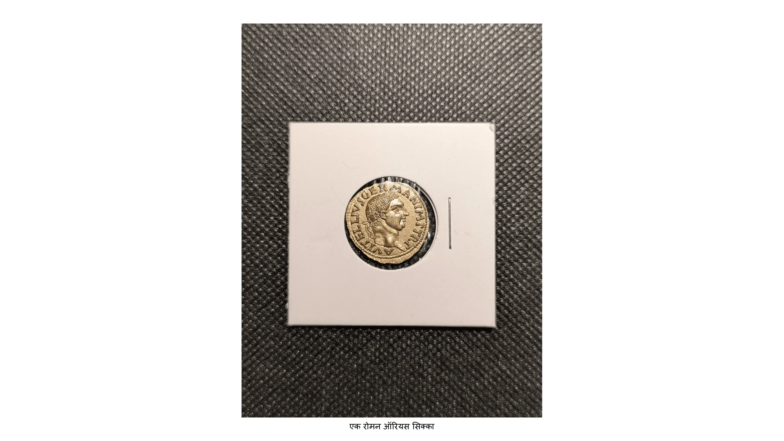

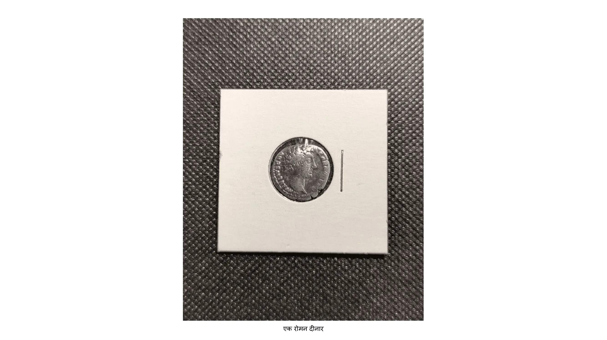

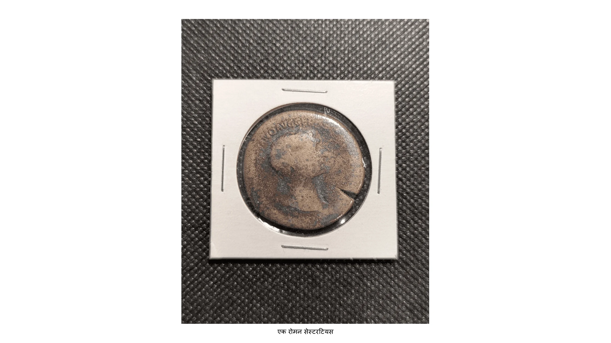

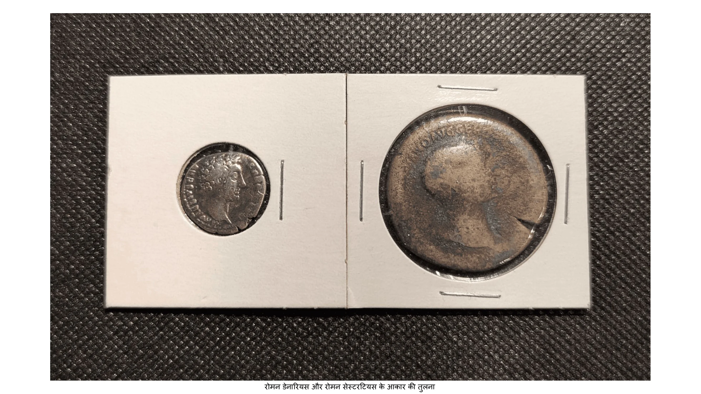

हालांकि, नीरो के बाद से (54-68 ई.) रोम ने अपने सिक्कों का धीरे-धीरे अवमूल्यन शुरू कर दिया, और बढ़ते शाही खर्च को पूरा करने के लिए उनके वजन और शुद्धता को उत्तरोत्तर कम किया, विशेष रूप से 64 ई. में रोम की भीषण आग के बाद। इन अवमूल्यनों के उल्लेखनीय प्रभाव हुए: **ग्रेशम के नियम** के अनुसार, शुद्ध सिक्कों को जमाखोरी या निर्यात के माध्यम से प्रचलन से वापस ले लिया गया, जबकि अवमूल्यन किए गए सिक्कों का प्रचलन बढ़ता गया, जिससे कीमतों में धीरे-धीरे वृद्धि हुई।

तीसरी शताब्दी एक नाटकीय मोड़ का प्रतीक है, जब सम्राट सेप्टिमियस सेवेरस, कैराकल्ला और गैलिएनस के शासनकाल में अवमूल्यन में अभूतपूर्व तेज़ी आई। मुख्य चाँदी के सिक्के, डेनारियस और फिर एंटोनिनियस, में चाँदी की मात्रा घटकर केवल 2% रह गई। इसी समय, ऑरियस का सोने का वज़न आधा रह गया। इस मौद्रिक संकट के साथ अभूतपूर्व राजनीतिक अस्थिरता, बर्बर आक्रमण और बार-बार होने वाले गृहयुद्ध भी हुए।

यह भाग मुझे इस खंड के अंतिम भाग से परिचित कराता है: एंटोनिनियनस। इस सिक्के का मूल नाम अज्ञात है, लेकिन आज हम इसे एंटोनिनियनस कहते हैं। इसकी खासियत यह है कि यह एक दीनार से केवल डेढ़ गुना बड़ा होने के बावजूद, दो दीनार के बराबर मूल्य का है। इसके अलावा, समय के साथ, ये सिक्के केवल बिलियन सिक्के बन गए, यानी ये शुद्ध चाँदी के बजाय चाँदी और अन्य धातुओं के मिश्रधातु से बने थे। इन सिक्कों पर अक्सर चाँदी की परत चढ़ाई जाती थी, जो मौद्रिक पतन का एक उल्लेखनीय उदाहरण है।

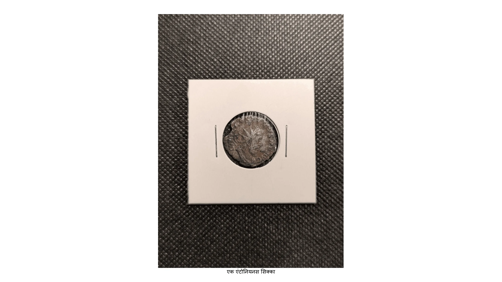

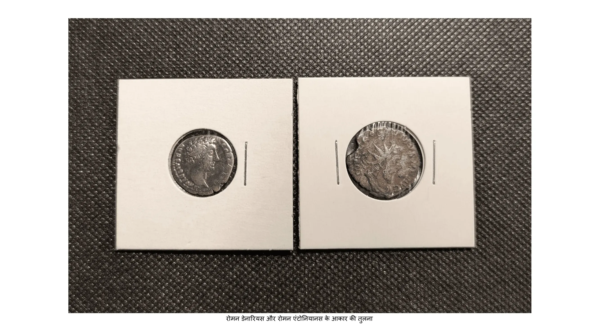

इस स्थिति का सामना करते हुए, सम्राट ऑरेलियन (270-275 ई.) ने मुद्राओं का नाममात्र पुनर्मूल्यांकन करके प्रणाली को स्थिर करने का प्रयास किया, लेकिन इस सुधार ने वास्तव में मौजूदा मुद्राओं के मूल्य को कृत्रिम रूप से उच्च स्तर पर स्थिर करके मुद्रास्फीति तंत्र की शुरुआत की।

मैं इस विषय पर एक विषयांतर प्रस्तुत करूँगा। तीसरी शताब्दी के दौरान, मुद्रास्फीति में तीव्र घातांक वृद्धि हुई। इससे पहले, हालाँकि सिक्कों का अवमूल्यन हो चुका था, फिर भी उन्हें एक-एक करके ढालने की हस्तनिर्मित प्रक्रिया ने मुद्रास्फीति पर कुछ नियंत्रण प्रदान किया। आँकड़े बताते हैं कि 300 वर्षों के अवमूल्यन के दौरान, मुद्रास्फीति औसतन लगभग 4% प्रति वर्ष रही। ऑरेलियन के सुधार से ठीक पहले, मुद्रास्फीति लगभग 3% प्रति वर्ष थी।

ऑरेलियन ने XXI चिह्न वाले सिक्के पर शुद्धता मापक प्रणाली लागू की, जो 20 भाग कांसे और 1 भाग चांदी के मिश्रण, यानी 5% शुद्धता को दर्शाता था। उन्होंने इन 5% चांदी के सिक्कों को बाजार में उतारा और उन पर XXI चिह्न अंकित किया। हालाँकि, उन्होंने अन्य सभी, अधिक अवमूल्यन वाले सिक्कों को भी वापस मँगवाया और उन पर भी वही XXI चिह्न अंकित किया। इससे सभी सिक्कों का अंकित मूल्य प्रभावी रूप से पुनर्मूल्यांकित हो गया। इसका परिणाम प्रति वर्ष 20% की चौंका देने वाली मुद्रास्फीति दर थी, जो इस तकनीक के लागू होने से पहले की 3% दर से कहीं अधिक थी।

दरअसल, ऑरेलियन ने ही अवमूल्यन के इस रूप का आविष्कार किया था, जो धातु के क्रमिक अवमूल्यन से कहीं ज़्यादा तेज़ है, जिसके कारण हमें एक-एक करके सिक्के छापने पड़ते थे। उन्होंने जो किया वह यह था कि सभी मौजूदा सिक्कों को लिया, उन्हें वापस बुलाया और उन पर एक मुक्का मारकर उनका अंकित मूल्य बदल दिया। यह एक वास्तविक मोड़ था। तभी मुद्रास्फीति घातीय हो गई।

इस अत्यधिक अवमूल्यन को स्पष्ट रूप से दर्शाने के लिए, मुझे मिस्र में 40 ईसा पूर्व से लेकर तीसरी शताब्दी तक, यानी 300 वर्षों से भी अधिक समय तक, अनाज की कीमत के कुछ रोचक आँकड़े मिले हैं। नीचे, आप मेरे संग्रह से एक यूनानी टेट्राद्राचमा देख सकते हैं। उस समय, तीसरी शताब्दी में रोमन आधिपत्य वाले मिस्र में, इसका समतुल्य एक मिस्री टेट्राद्राचमा था। द्राचमा का मूल्यवर्ग अभी भी प्रचलन में था, और यह एक दीनार के बराबर होता था।

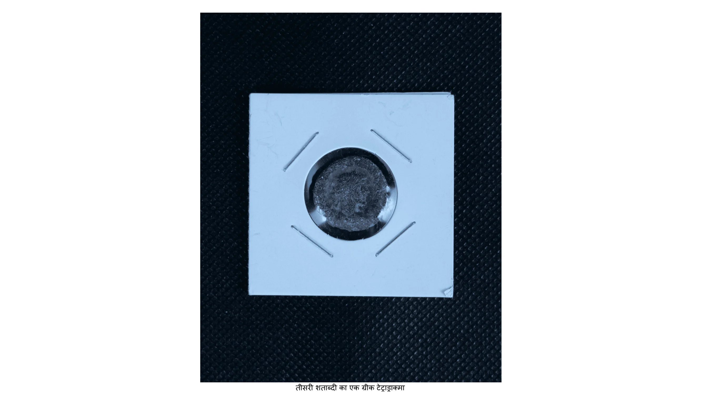

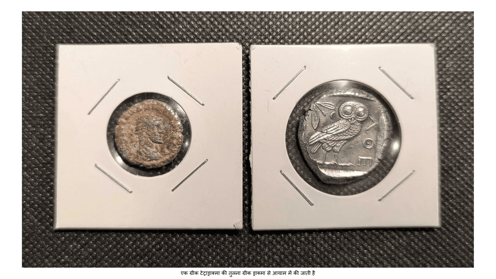

तो मेरे पास जो मिस्र का टेट्राड्राचम है, वह एक दीनार के बराबर है। आप देख सकते हैं कि यह सिक्का बिलियन (या कांसे) का बना है, इसलिए इसमें कोई कीमती धातु नहीं है। इन 300 वर्षों में हुए भौतिक अवमूल्यन को देखने के लिए आप इसकी तुलना मूल यूनानी टेट्राड्राचम से कर सकते हैं। यह मिस्र में अनाज की कीमत में दस लाख गुना वृद्धि है।

यह ऑरेलियन के सुधार की भौतिक अभिव्यक्ति है। यह ध्यान देने योग्य है कि इन 300 वर्षों की मुद्रास्फीति का अधिकांश भाग, औसत, लगभग 4% था। यह केवल अंत में, जब ऑरेलियन ने अपना सुधार लागू किया, तब मुद्रास्फीति में काफी वृद्धि हुई और हम 1 मिलियन के इस माप पर पहुँचे। तीसरी शताब्दी के अंत में कीमतें पहली शताब्दी ईसा पूर्व की तुलना में दस लाख गुना अधिक थीं।

उनके उत्तराधिकारी **डायोक्लेटियन** (284-305 ई.) ने और भी ज़्यादा क्रांतिकारी सुधारों का प्रयास किया: उन्होंने नई मुद्राएँ जारी कीं (विशेषकर अर्जेंटियस, जो ज़्यादा शुद्ध तो थीं, लेकिन मात्रा में सीमित थीं), कठोर मूल्य नियंत्रण लागू किए (301 ई. का मूल्य आदेश) और **वस्तुओं के भुगतान पर आधारित एक कर प्रणाली स्थापित की**। इन प्रयासों के बावजूद, डायोक्लेटियन के सुधार अनियंत्रित मुद्रास्फीति पर अंकुश लगाने में विफल रहे।

अवमूल्यित मुद्रा के बदले में वस्तुओं और सेवाओं की आपूर्ति से इनकार करने के कारण, डायोक्लेटियन ने किसानों और उनके वंशजों को उनकी भूमि से बांधने के लिए **एक वंशानुगत जाति व्यवस्था** की स्थापना की।

यहाँ वास्तव में समझने वाली बात यह है कि हुआ यह था कि किसानों ने अवमूल्यन की गई मुद्रा के बदले अपनी उपज देने से इनकार कर दिया, और हमारे प्रिय डायोक्लेटियन की प्रतिक्रिया यह थी कि उन्होंने **वंशानुगत जातियाँ** बनाईं, यह कहकर कि "तुम अपनी ज़मीन नहीं छोड़ सकते, तुम्हारे बच्चे अपनी ज़मीन नहीं छोड़ सकते, सैनिकों के लिए भी यही बात है, तुम सैनिक हो, तुम मेरी मुद्रा में वेतन लेने के लिए सहमत हो"। एक संक्रमणकालीन समाधान के रूप में, उन्हें वस्तु (मांस, भोजन, अनाज) के रूप में भुगतान किया जाता था क्योंकि डायोक्लेटियन उन्हें पैसे देने से इनकार कर देते थे। इसलिए उन्होंने लोगों को अपने व्यापार से जुड़े रहने के लिए मजबूर करने हेतु यह वंशानुगत जाति व्यवस्था लागू की, ताकि अगर वे अवमूल्यन की गई मुद्रा को स्वीकार न करने की कोशिश करें तो वे आसानी से नौकरी न बदल सकें।

इस उदाहरण को स्पष्ट करने के लिए, मेरे पास एक पाठ है, जो "मौद्रिक व्यवस्था और मुद्रास्फीति" पुस्तक से लिया गया है:

> चूँकि लोग अवमूल्यित मुद्रा, जिसका अंकित मूल्य उसके आंतरिक या बाज़ार मूल्य से ज़्यादा था, के बदले काम करने और सामान पहुँचाने के लिए तैयार नहीं थे, इसलिए उन पर वस्तुगत कर लगाकर उन्हें काम करने के लिए मजबूर किया गया। [...] किसानों के लिए अपने पंजीकृत घरों को छोड़ना गैरकानूनी हो गया। इस प्रकार, खेती करने वाली आबादी ज़मीन से वंशानुगत रूप से जुड़ी हुई हो गई।
>

> यह वंशानुगत जाति व्यवस्था धीरे-धीरे फैलती गई: डायोक्लीशियन ने सैनिकों के बेटों को सेना में सेवा करने के लिए मजबूर किया, जबकि धन-संग्रहशालाओं में काम करने वाले, साथ ही डायोक्लीशियन द्वारा स्थापित बुनाई और रंगाई के कारखानों में काम करने वाले, वंशानुगत सेवा के साथ राज्य के दास बन गए। स्वर्ण खनिक भी बाद में एक वंशानुगत जाति बन गए। डायोक्लीशियन के समय में संभवतः अन्य वंशानुगत वर्ग पहले से ही मौजूद थे, विशेष रूप से रोम में बेकरियों और कसाईयों के संघ [...], साथ ही जहाज कप्तानों के धर्मप्रांतीय संघ जो अनाज और अन्य सार्वजनिक माल रोम तक पहुँचाते थे।

कॉन्स्टेंटाइन (306-337 ई.) ही थे जिन्होंने अंततः 312 ई. में सॉलिडस नामक शुद्ध सोने का सिक्का चलाकर मौद्रिक प्रणाली को स्थिर करने में सफलता प्राप्त की, जिसकी गुणवत्ता और वजन की उन्होंने कड़ी गारंटी दी थी। सॉलिडस की शुद्धता और वजन की जाँच के लिए एक पूरी व्यवस्था थी। **हालाँकि, इस स्थिरता का असर केवल धनी अभिजात वर्ग और शाही प्रशासन पर ही पड़ा**, जबकि **अधिकांश आबादी निम्न-गुणवत्ता वाली मुद्रा और निरंतर मुद्रास्फीति से जूझती रही**। सॉलिडस पूर्वी साम्राज्य (बाइज़ेंटियम) में स्थिर रहा, जहाँ यह एक सहस्राब्दी से भी अधिक समय तक चला, जबकि पश्चिम में, सिक्के छोटे, कम मूल्य के सिक्कों में विखंडित हो गए, जिसके साथ ही रोमन साम्राज्य का अंतिम आर्थिक और राजनीतिक विघटन भी हुआ, जिसका 476 ई. में निर्णायक पतन हुआ।

अंत में, मैं आपके साथ ग्लिन डेविस द्वारा लिखित *ए हिस्ट्री ऑफ मनी: फ्रॉम एनशिएंट टाइम्स टू द प्रेजेंट डे* से यह उद्धरण साझा करना चाहूंगा, जो कुशलतापूर्वक बताता है कि संभवतः रोम के पतन का कारण क्या था:

*"कर लगातार अपर्याप्त थे, और इन लगातार बढ़ते अपर्याप्त, विलंबित रूप से समायोजित और अत्यधिक दृश्यमान करों से जुड़ी कठिनाइयों ने रोम को कराधान के एक आसान, तात्कालिक और छिपे हुए रूप पर अधिक निर्भर रहने के लिए प्रेरित किया: मुद्रा अवमूल्यन। अल्पकालिक, तदर्थ सुधार पतन की इस सदियों पुरानी प्रवृत्ति को उलटने में विफल रहे। सिक्कों के घिसने-घिसाने, जहाज़ों के डूबने, पूर्व से विलासिता की वस्तुओं की ख़रीद के कारण धन के रिसाव, जर्मनिक बर्बर लोगों को दिए गए उपहारों, शहरी आबादी में वृद्धि, कृषि उत्पादन में गिरावट, सबसे समृद्ध खदानों के क्रमिक रूप से समाप्त होने, और सबसे बढ़कर शहरी जीवन में न्यूनतम व्यवस्था बनाए रखने के लिए आवश्यक समझी जाने वाली "रोटी और सर्कस" नीतियों के कारण उत्पन्न वित्तीय दबाव - इन सभी संचयी दबावों ने रोम को निरंतर मौद्रिक अवमूल्यन की ओर अग्रसर किया, जिसके बीच-बीच में विफलता के लिए अभिशप्त सुधार भी हुए।"*

*मुफ़्त या सस्ती रोटी और शराब के अलावा, समय-समय पर, विशेष रूप से ट्राजन (98-117 ई.) के शासनकाल में, और उससे भी ज़्यादा हैड्रियन (117-138 ई.) और उसके उत्तराधिकारियों के शासनकाल में, धन आवंटन के रूप में शाही उदारताएँ ("कॉन्जियारिया") वितरित की जाती थीं। जिसे सम्राट और नागरिक शुरू में एक असाधारण विशेषाधिकार मानते थे, वह दूसरी शताब्दी के आरंभ तक एक सामान्य अपेक्षा बन गई थी। इन वितरणों ने "सरकारी खजाने पर भारी बोझ डाला और अपने तरीके से राज्य के दिवालियेपन में योगदान दिया"।*

## मौद्रिक कमजोरीकरण और मुद्रास्फीति के बीच संबंध: कारणों से परिणामों तक

<chapterId>38d5781c-e900-53f7-baa7-413655d71754</chapterId>

:::video id=3999256d-aafe-4502-9b72-dfa8491a2777:::

यह खंड मौद्रिक क्षीणन और मुद्रास्फीति के बीच संबंधों पर, कारणों से लेकर परिणामों तक, विचार करता है। मौद्रिक क्षीणन रोमन मौद्रिक इतिहास की प्रमुख आर्थिक घटनाओं में से एक है, जिसका मुद्रास्फीति पर सीधा प्रभाव पड़ता है। पहली शताब्दी ईस्वी से, नीरो (54-68 ईस्वी) के शासनकाल से चाँदी के सिक्कों (डेनारियस) के क्षीणन का एक प्रारंभिक धीमा दौर शुरू हुआ, जो बार-बार आने वाले सैन्य और वित्तीय संकटों, विशेष रूप से सेप्टिमियस सेवेरस (193-211) और गैलिएनस (253-268) के शासनकाल में, और तेज़ हो गया।

हम ऑरियस के क्रमिक अवमूल्यन को भी देखते हैं। अवमूल्यन की दर में यह अंतर दो बिंदुओं पर प्रकाश डालता है:

1. द्विधातुवाद में धन पर राज्य नियंत्रण हेतु लेखांकन इकाई की भूमिका। इस उदाहरण में लेखांकन इकाई दीनार है। मैंने लेखांकन इकाई के मूल्य प्रबंधन के तीन अलग-अलग तरीके पहचाने हैं: अवमूल्यन (धातु का तनुकरण), पुनर्मूल्यांकन (एंटोनिनियनस) और "XXI" (ऑरेलियन) अंकित करके अंकित मूल्य लगाना।

2. राज्य की इच्छा, ऑरियस के अवमूल्यन को यथासंभव लंबे समय तक टालने की है, वह मूल्य भंडार जो अभिजात वर्ग को कम भाग्यशाली लोगों की कीमत पर अपनी क्रय शक्ति बनाए रखने में सक्षम बनाता है। हम इस पाठ्यक्रम में इस सिद्धांत पर बार-बार विचार करेंगे, विशेष रूप से "कैंटिलोन प्रभाव" नामक अवधारणा और स्पेन में मारावेदी के पुनर्नामकरण के संबंध में।

यह घटना काफी रोचक है और पूरे इतिहास में बार-बार घटित हुई है। हम अगले खंड में मारावेदी के साथ इस पर फिर से विचार करेंगे। यह पैटर्न सभी आरक्षित मुद्राओं में भी स्पष्ट है; मूल्य की आरक्षित इकाई, जैसे रोम में ऑरियस, अपरिवर्तित रहती है। हालाँकि, व्यापार और दैनिक लेन-देन के लिए आम जनता द्वारा उपयोग की जाने वाली लेखांकन इकाई का अक्सर अवमूल्यन होता है। परिणामस्वरूप, मौद्रिक मुद्रास्फीति आम लोगों को प्रभावित करती है, जबकि जो लोग सोने के सिक्के खरीद सकते हैं, वे काफी हद तक अप्रभावित रहते हैं।

और वैसे, **यह वही परिघटना है जो आज मुद्रा अवमूल्यन के साथ पैदा हो रही है, जिससे वित्तीय संपत्तियों का मूल्य बढ़ता है**, और इसलिए मुद्रा का इस्तेमाल करने वाले लोग, सबसे गरीब लोग, और गरीब होते जाते हैं, और बदले में, मुद्रा सृजन के ज़रिए, उन लोगों की संपत्ति समृद्ध होती है जो सक्षम हैं, जिनके पास अवमूल्यन से खुद को बचाने के साधन हैं, और इस तरह यह सामाजिक असमानताओं को और गहरा करता है। यह मेरी छोटी सी राजनीतिक टिप्पणी है।

मैंने अभी जो वर्णन किया है उसे कैंटिलन प्रभाव कहते हैं। हम देखेंगे कि यह सज्जन जॉन लॉ के समय में रहते थे, जिस विषय पर हम अगले भाग में भी चर्चा करेंगे।

ऑरेलियन के शासनकाल में शुरू किए गए सुधारों ने मुद्रास्फीति को आसमान छूने दिया। मुद्रा के अंकित मूल्य में मुद्रास्फीति अब टकसालों द्वारा हाथ से सिक्के बनाने की क्षमता तक सीमित नहीं थी। पहले से ढाले जा चुके सिक्कों पर अब आसानी से अंकन किया जा सकता था, और मुद्रा आपूर्ति का नाममात्र मूल्य तेज़ी से बढ़ता गया।

ऑरेलियन के संबंध में मेरे पास आपके साथ साझा करने के लिए दो उद्धरण हैं। पहला उद्धरण *धन का इतिहास: प्राचीन काल से वर्तमान तक* से लिया गया है:

*"जहाँ तक रोमन अर्थव्यवस्था का सवाल है, ऑरेलियन का योगदान विजय से ज़्यादा एक आपदा था। यह काफी हद तक उसके "सुधार" की प्रकृति के कारण ही था कि मुद्रास्फीति की दर पहले की तुलना में कहीं अधिक बढ़ गई, यहाँ तक कि गैर-ज़िम्मेदार गैलेनियस के शासन में भी। ऑरेलियन के बाद दो शताब्दियों तक, मुद्रास्फीति पूरे रोमन साम्राज्य में एक आम समस्या बन गई।"*

दूसरा प्रश्न *सिक्कों से प्राचीन इतिहास* नामक पुस्तक से लिया गया है और यह मौद्रिक प्रणाली को सोने से अलग करने से संबंधित है:

ऑरेलियन के सुधार ने स्वर्ण मुद्रा और शेष मौद्रिक प्रणाली के बीच के संबंध को बदल दिया। इससे पहले, अन्य प्रकार की मुद्राएँ आधिकारिक दरों (एक ऑरियस के लिए 25 मिस्री दीनार या 25 टेट्राड्राचम, आदि) के अनुसार ऑरियस से जुड़ी हुई थीं। सुधार के बाद, स्वर्ण मुद्रा के मूल्य में किसी भी अन्य वस्तु की तरह स्वतंत्र रूप से उतार-चढ़ाव होने लगा, जबकि शेष मौद्रिक प्रणाली का मूल्य मिश्र धातुओं के कमज़ोर होने के कारण गिर गया, क्योंकि अब यह सोने द्वारा समर्थित नहीं थी। चूँकि लेखांकन की इकाई सैद्धांतिक रूप से चाँदी (दीनार, या मिस्र में द्राख्मा) पर आधारित रही, इसलिए मुद्रा के अवमूल्यन के साथ कीमतें बढ़ती गईं।

जैसा कि आप देख सकते हैं, लेखांकन की इकाई के रूप में कार्य करने वाली मुद्रा के अवमूल्यन ने असमान रूप से कम संपन्न लोगों को प्रभावित किया, जबकि स्वर्ण मुद्रा के साथ संबंध के विच्छेद ने उन लोगों की क्रय शक्ति की रक्षा की जो मूल्य के भंडार, अर्थात् सोने, में बचत कर सकते थे।

आपको यहाँ यह समझना होगा कि अगर दीनार और ऑरियस के बीच कोई संबंध है, तो भले ही आप दीनार का अवमूल्यन कर दें, अगर आप अभी भी इस दर पर अपने दीनार को ऑरियस से बदल सकते हैं (25 दीनार के बदले 1 ऑरियस), तो लोग निश्चित रूप से अपने दीनार को आपके ऑरियस से बदलेंगे क्योंकि दीनार का मूल्य अधिक होगा और ऑरियस का कम। लेकिन इस सुधार में, इस संबंध को हटा दिया गया। इसलिए लोग अब दीनार को सोने के बदले अवमूल्यित चांदी से नहीं बदल सकते थे। तभी सोने के सिक्कों तक पहुँच रखने वाले लोग वास्तव में अपनी रक्षा कर सकते थे, क्योंकि इसके बाद लोग अधिक मूल्य वाली अवमूल्यित चांदी को कम मूल्य वाले शुद्ध सोने से नहीं बदल सकते थे। मुद्रा के विकास में यह एक बहुत ही महत्वपूर्ण क्षण है।

ऑरेलियन द्वारा किए गए इस सुधार के प्रभावों का एक उल्लेखनीय उदाहरण मौद्रिक व्यवस्था और मुद्रास्फीति पुस्तक के इन उद्धरणों द्वारा स्पष्ट रूप से दर्शाया गया है:

*"सम्राट क्लॉडियस (41-54 ई.) और कॉन्स्टेंटियस (337-361 ई.) के शासनकाल के बीच, मिस्र के खुले बाज़ार में गेहूँ की कीमत, जिसे द्राख्मा में व्यक्त किया जाता था, **दस लाख से भी ज़्यादा बढ़ गई**। तीसरी और चौथी शताब्दी ई. के प्रमुख आर्थिक तथ्यों में से एक है कीमतों में ज़बरदस्त उछाल" (लेंडन 1990, पृष्ठ 106)। लेकिन यह विकास जितना दिखता है, उससे कम नाटकीय है, क्योंकि यह **औसत वार्षिक मुद्रास्फीति दर 4.4%** के बराबर है। और वासिंक (1991, पृष्ठ 482) के अनुसार, मुद्रास्फीति वास्तव में **केवल 238 ई. में ही शुरू हुई थी**"*

*"इस तिथि के बाद से, मुद्रास्फीति धीरे-धीरे बढ़ने लगी, क्योंकि **अच्छी मुद्रा को सबसे पहले प्रचलन से बाहर कर दिया गया**, जिससे कुल मुद्रा आपूर्ति में शुरुआत में लगभग कोई वृद्धि नहीं हुई। इसके बाद, यह 250 और 293 के बीच 3.65% की औसत वार्षिक दर पर पहुँच गई, जो 293 और 301 के बीच बढ़कर 22.28% हो गई (वासिंक 1991, पृष्ठ 466), यानी सम्राट डायोक्लेटियन के असफल मौद्रिक सुधारों तक। यह घटना धातु-आधारित मौद्रिक व्यवस्था में मुद्रास्फीति के लिए विशेष रूप से प्रभावशाली है।"*

मौद्रिक क्षीणन से जुड़ी मुद्रास्फीति की यह घटना शुरू में रोमन राज्य के सामयिक नकदी संकटों का जवाब थी। सिक्कों का अंकित मूल्य बनाए रखते हुए उनमें बहुमूल्य धातुओं की मात्रा कम करके, राज्य ने अस्थायी रूप से अपने संसाधनों में वृद्धि की। लेकिन कीमतों ने तुरंत प्रतिक्रिया नहीं दी: वास्तव में, रोमन प्रणाली में एक निश्चित स्थिरता थी, जिसका अर्थ था कि मजदूरी और कीमतें क्रमिक अवमूल्यन के अनुकूल होने में धीमी थीं। फिर भी, एक निश्चित सीमा के बाद, कीमतें तेज़ी से बढ़तीं और बाज़ार को मुद्राओं के वास्तविक मूल्य के साथ संतुलन में लातीं।

जैसा कि ऊपर बताया गया है, यह परिघटना तीसरी शताब्दी के मध्य से विशेष रूप से स्पष्ट होती है। मिस्र में, जो एक समृद्ध रूप से प्रलेखित क्षेत्र है, स्थिरीकरण के प्रारंभिक प्रयास के बावजूद, मुद्रा के आधिकारिक पुनर्मूल्यांकन के बाद ऑरेलियन (274 ईस्वी) के शासनकाल में कीमतों में 10 गुना वृद्धि की गई। फिर, डायोक्लेटियन (301 ईस्वी) के शासनकाल में, मूल्य निर्धारण संबंधी आदेश ने मुद्रास्फीति को रोकने के लिए कठोर नियंत्रण लागू कर दिए, लेकिन मूल कारण - अतिउत्पादन और मौद्रिक अवमूल्यन - का समाधान नहीं किया - जिससे एक पूर्वानुमानित विफलता हुई। लगातार मुद्रास्फीति अंततः अर्थव्यवस्था को दो-स्तरीय प्रणाली की ओर धकेलती है: **स्वर्ण भंडार (कॉन्स्टेंटाइन के सॉलिडस की तरह**) द्वारा संरक्षित अभिजात वर्ग, स्थिरता का आनंद लेता है, जबकि अधिकांश आबादी लगातार मुद्रास्फीति से जूझती रहती है, **जो आज कैंटिलन प्रभाव के रूप में जाना जाता है।**

रोमन मौद्रिक कमजोरीकरण और मुद्रास्फीति के बीच एक स्पष्ट संबंध है, जिसके कारण अनिवार्य रूप से दीर्घकालिक राजकोषीय घाटे, निरंतर सैन्य खर्च और राज्य के खराब आर्थिक प्रबंधन से जुड़े हैं।

## रोमन साम्राज्य का पतन

<chapterId>b6ec0914-227b-509c-8108-b09eec9bb904</chapterId>

:::video id=91d4fee5-59bb-4ab9-a90b-e1125c71decb:::

### मुद्रा अवमूल्यन और रोम का पतन

ऑस्ट्रियाई अर्थशास्त्र विद्यालय ने, विशेष रूप से लुडविग वॉन मिज़ के माध्यम से, रोम के पतन की एक मौद्रिक व्याख्या प्रस्तुत की। इस दृष्टिकोण के अनुसार, रोमन मुद्रा के क्रमिक अवमूल्यन ने श्रम विभाजन की उस जटिल प्रणाली को ध्वस्त कर दिया जिसने 6 करोड़ निवासियों वाले साम्राज्य को टिकाए रखा था। आर्थिक समन्वय का केंद्रीय साधन, मुद्रा, एक बार भ्रष्ट हो जाने पर, संपूर्ण सामाजिक और आर्थिक संरचना के पतन का कारण बनी।

इस आर्थिक गिरावट ने न केवल साम्राज्य की आंतरिक एकता को नष्ट कर दिया। इसने पड़ोसी लोगों के साथ व्यापारिक संबंध भी तोड़ दिए। रोम के साथ व्यापार के लाभों से वंचित, "बर्बर" शांतिपूर्ण सहयोग से हटकर लूटपाट की ओर मुड़ गए। इसलिए ये आक्रमण न केवल सैन्य प्रकृति के थे, बल्कि एक बुनियादी आर्थिक पतन का परिणाम भी थे।

### साम्राज्यवादी अवमूल्यन के तीन चरण

रोमन मौद्रिक इतिहास को तीन अलग-अलग कालखंडों में विभाजित किया जा सकता है। पहला, जूलियो-क्लाउडियन से लेकर एंटोनिन्स (27 ईसा पूर्व - दूसरी शताब्दी के अंत) तक, अपेक्षाकृत स्थिर रहा। ट्राजन के शासनकाल में, साम्राज्य अपने चरमोत्कर्ष पर पहुँच गया: 50 लाख वर्ग किमी में फैला, रोम इतिहास का पहला करोड़पति शहर बन गया। दीनार की चाँदी की शुद्धता 98% से 80% तक बनी रहती है - एक मामूली अवमूल्यन के बावजूद, अर्थव्यवस्था चलती रही।

दूसरी अवधि, तीसरी शताब्दी, सैन्य अराजकता का काल थी। कुछ ही दशकों के अंतराल में छब्बीस सम्राट एक के बाद एक सत्ता पर काबिज हुए। मुद्रा का पतन हो गया: एंटोनिनियस, जिसकी अनुमानित कीमत दो दीनार थी, में धातु का भार केवल 1.5 दीनार था - कानूनी और वास्तविक मूल्य को अलग करने का पहला प्रयास। इस हेरफेर ने ग्रेशम के नियम को लागू किया: खराब मुद्रा अच्छी मुद्रा को बाहर निकाल देती है। नागरिकों ने अच्छे सिक्कों को जमा कर लिया और केवल अवमूल्यन वाले सिक्कों को ही खर्च किया।

पुरातत्वविदों द्वारा खोजे गए मौद्रिक खजाने इस आर्थिक चिंता को उजागर करते हैं। दफ़न किए गए एम्फ़ोरा, स्तरीकरण द्वारा, दर्शाते हैं कि कैसे रोमनों ने सबसे अच्छे सिक्कों को पहले जमा किया, और धीरे-धीरे अवमूल्यन वाले सिक्कों को भी जमा किया। ये प्राचीन "ढेर" अनिश्चितता के दौर में मानवीय क्रियाकलापों के साक्षी हैं - एक क्षयग्रस्त दुनिया में मूल्य को संरक्षित करने का एक प्रयास।

### कॉन्स्टेंटाइन और दोहरी प्रणाली

कॉन्स्टेंटाइन (310-337) ने आमूल-चूल सुधारों के माध्यम से साम्राज्य को स्थिर करने का प्रयास किया। उन्होंने गोल्ड सॉलिडस नामक एक मुद्रा की शुरुआत की, जिस पर प्रशासन का कड़ा नियंत्रण था। अधिकारी व्यवस्थित रूप से वज़न और शुद्धता की जाँच करते थे। मुद्रा का निर्गमन सीमित था, और युद्ध की लूट से जुड़ा हुआ था। यह मुद्रा सत्ता का एकमात्र साधन बन गई: कर सॉलिडस में चुकाए जाते थे, और सेनाओं को उनका वेतन सोने में मिलता था।

उसी समय, लोग कांसे के नुम्मस का इस्तेमाल करते थे, जिसका लगातार अवमूल्यन होता रहता था। 445 में, एक सॉलिडस की कीमत 7,000 नुम्मी थी; 498 में, 16,800। इस दोहरी व्यवस्था ने कैंटिलोन प्रभाव को संस्थागत बना दिया: सॉलिडस तक पहुँच रखने वाले - प्रशासन, ज़मींदार - मुद्रास्फीति से सुरक्षित थे। नुम्मस तक सीमित आम जनता, लगातार गरीब होती गई।

इस मौद्रिक पृथक्करण ने दो समानांतर अर्थव्यवस्थाओं का निर्माण किया, जिनकी कोई आधिकारिक विनिमय दर नहीं थी। सॉलिडस लेखांकन की इकाई बना रहा, लेकिन इसका प्रचलन बहुत कम था। न्यूमस का उपयोग दैनिक विनिमय के लिए किया जाता है, लेकिन इसका मूल्य लगातार कम होता जाता है। इस मौद्रिक संरचना ने उभरती हुई सामंती व्यवस्था की असमानताओं का पूर्वाभास कराया।

### श्रम विभाजन का पतन

मुद्रा अवमूल्यन ने धीरे-धीरे आर्थिक विशेषज्ञता को नष्ट कर दिया। विश्वसनीय लेखा इकाई के अभाव में, भूमध्यसागरीय व्यापार ध्वस्त हो गया। रोम के विशेषज्ञ कारीगर अब मिस्र या गॉल के साथ व्यापार नहीं कर सकते थे। प्रांतों ने अपनी मुद्राएँ अपना लीं, जिससे व्यापारिक मतभेद बढ़ गए।

इस विघटन का सामना करते हुए, शहरी आबादी ग्रामीण इलाकों की ओर पलायन कर गई - एक ऐसा शहरी पलायन जिसने सदियों से चले आ रहे शहरीकरण को उलट दिया। कारीगरों ने अपने व्यवसाय छोड़कर जीविका के लिए खेती शुरू कर दी। बड़ी-बड़ी जागीरें (लैटिफंडिया) आत्मनिर्भर द्वीप बन गईं, जो मध्ययुगीन सेग्न्यूरीज़ का पूर्वाभास देती थीं।

हताशा में, डायोक्लीशियन ने वस्तु के रूप में करों की भी मांग की - जो मौद्रिक विफलता की अंतिम स्वीकृति थी। उनके अधिकतम आदेश (301) ने कीमतों को नियंत्रित करने का प्रयास किया, जिससे वस्तु विनिमय की वापसी में तेज़ी आई। आर्थिक जटिलताएँ सभ्यता-पूर्व रूपों में वापस लौट गईं।

### रोम से बाइज़ैन्टियम तक सोने के माध्यम से अस्तित्व

विडंबना यह है कि सॉलिडस पश्चिमी साम्राज्य में भी कायम रहा। बाइज़ेंटियम ने इसे 11वीं शताब्दी तक बनाए रखा, जिससे एक हज़ार साल तक आर्थिक स्थिरता बनी रही। पश्चिम में, इसकी स्मृति आज भी बनी हुई है: फ्रांसीसी शब्द "सौ" सॉलिडस से निकला है, जो खोई हुई मौद्रिक भव्यता का भाषाई प्रमाण है।

जिन ज़मींदारों ने अपनी संपत्ति सोने में जमा कर रखी थी, वे सामंती प्रभु बन गए। चर्च की संरचनाएँ, जो एकमात्र जीवित संस्थाएँ थीं, सामाजिक बंधन प्रदान करती थीं जिनकी गारंटी अब धन नहीं दे सकता था। यूरोप स्वायत्तशासी क्षेत्रों में विखंडित हो गया, जिनमें से प्रत्येक की अपनी निर्वाह अर्थव्यवस्था थी।

यह परिवर्तन जटिल सभ्यताओं की नाज़ुकता को उजागर करता है। श्रम विभाजन, जिसके कारण रोम दस लाख निवासियों का भरण-पोषण कर पाता था, पूरी तरह से मौद्रिक विश्वास पर निर्भर था। एक बार यह विश्वास टूट गया, तो यह ढाँचा ढह गया और यूरोप लगभग एक सहस्राब्दी तक आदिम आर्थिक स्वरूप में लौट गया।

## अंधकार युग और मध्य युग

<chapterId>a5856873-6142-57be-8a73-1f9e3df83792</chapterId>

:::video id=86b8da9b-3831-443d-b170-58c2bea3ad54:::

मध्य युग में धन का इतिहास और उद्भव प्रतिगमन, नवाचार और आर्थिक सुधार की अवधियों से चिह्नित है।

उदाहरण के लिए, जब रोमन सेना ब्रिटेन से चली गई, तो द्वीप पर कोई और रोमन सिक्का नहीं आया। लगभग 435 ईस्वी में, ब्रिटेन में सिक्कों का चलन पूरी तरह से गायब हो गया, जो पूर्व रोमन प्रांतों में एक अनोखी घटना थी। लगभग दो शताब्दियों तक, ब्रिटिश अर्थव्यवस्था सातवीं शताब्दी तक सिक्कों के बिना रही, जब मेरोविंगियन और महाद्वीपीय-प्रेरित सिक्के धीरे-धीरे फिर से प्रकट हुए।

आठवीं शताब्दी के बाद से, ईसाई धर्म के प्रभाव ने उत्तरी यूरोप में सिक्कों के पुनः प्रचलन में योगदान दिया। इस काल के प्रमुख व्यक्ति फ्रैंक्स के राजा पेपिन द शॉर्ट थे, जिन्होंने 752 में दीनार का प्रचलन शुरू किया, जिसे बाद में उनके पुत्र शारलेमेन ने अपनाया। शारलेमेन ने चाँदी के दीनार के प्रचलन को व्यापक रूप से बढ़ाया और कई शताब्दियों तक एक यूरोपीय मौद्रिक मानक का निर्माण किया।

इंग्लैंड में, 765 के आसपास मर्सिया के राजा ऑफा के शासनकाल में चांदी के पैसे के उत्पादन के साथ सिक्का निर्माण में महत्वपूर्ण पुनरुत्थान हुआ। यह मुद्रा इतनी महत्वपूर्ण हो गई कि 500 ​​वर्षों तक लगभग अपरिवर्तित रही।

इस काल से संबंधित पहली कलाकृति के रूप में, मैं आपको उस समय की एक अंग्रेजी पैनी की प्रतिकृति दिखाता हूँ।

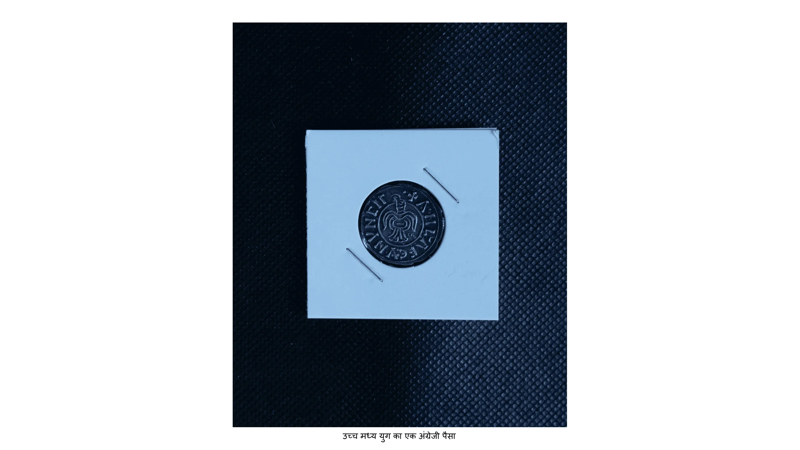

उच्च मध्य युग के दौरान, रोमन मौद्रिक प्रणाली के पतन के बाद यूरोप सामंतवाद में गिर गया। अधिकांश आबादी कम मूल्य के तांबे या कांसे के सिक्कों का इस्तेमाल करती थी, जो अक्सर मुद्रा के कमजोर पड़ने के कारण होते थे, जिससे लंबी दूरी पर व्यापार सीमित हो जाता था।

भुगतान के साधन के रूप में सिक्कों की वापसी धीरे-धीरे हुई, जिसकी परिणति 13वीं शताब्दी में फ्लोरेंस में 1252 में सोने के फ्लोरिन और उसके बाद वेनिस में सोने के ड्यूकैट के आगमन के साथ हुई। व्यापार के विस्तार और विश्वसनीय, अंतरराष्ट्रीय स्तर पर स्वीकृत भुगतान साधनों की बढ़ती ज़रूरत के कारण इन सोने के सिक्कों का व्यापक रूप से उपयोग किया जाने लगा।

इंग्लैंड में, नवीन राजकोषीय नीतियों द्वारा मौद्रिक प्रणाली को कमजोर होने से बचाया गया था, जैसे कि 1066 के बाद विलियम द कॉन्करर द्वारा लागू किया गया भूमि कर, जिसने पेनी स्टर्लिंग की गुणवत्ता को बनाए रखा। यहाँ यह समझना महत्वपूर्ण है कि उस समय के संप्रभु राज्य को वित्तपोषित करने के लिए मुद्रा का अवमूल्यन कर सकते थे, और **इस कर के लागू होने से मुद्रा को स्थिर रखना और कराधान के माध्यम से राज्य को वित्तपोषित करना संभव हो गया।**

हालाँकि, मुद्रा के कमजोर पड़ने से लाभ कमाने के प्रलोभन ने संकटों को जन्म दिया, जैसा कि 12वीं शताब्दी में हेनरी प्रथम के शासनकाल में हुआ, जब सिक्कों की गुणवत्ता में भारी गिरावट आई। कठोर सुधारों, और कभी-कभी सिक्का निर्माताओं के खिलाफ हिंसक उपायों के साथ, ने अस्थायी रूप से मुद्रा में विश्वास बहाल किया।

मध्य युग में परिष्कृत वित्तीय प्रथाओं का भी उदय हुआ, जैसे इंग्लैंड में सूदखोरी पर प्रतिबंध को दरकिनार करने और ऋण देने के लिए टैली स्टिक का इस्तेमाल। चर्च ब्याज-आधारित ऋणों के प्रति बहुत उत्सुक नहीं था, इसलिए ब्याज के उपयोग पर प्रतिबंध को दरकिनार करने के लिए विभिन्न तकनीकों का इस्तेमाल किया गया।

ये नवाचार धातु मुद्रा की दीर्घकालिक कमी की प्रतिक्रिया थे, तथा इन्होंने एक प्रारंभिक वित्तीय बाजार के उद्भव को प्रोत्साहित किया।

इस बीच, धर्मयुद्धों ने भूमध्यसागरीय व्यापार को प्रोत्साहित किया, अंतर्राष्ट्रीय आदान-प्रदान और नई बैंकिंग प्रथाओं के विकास को बढ़ावा दिया, विशेष रूप से नाइट्स टेम्पलर के आदेश के माध्यम से। नाइट्स टेम्पलर महत्वपूर्ण वित्तीय मध्यस्थ बन गए, जिससे धर्मयोद्धाओं को घर से दूर तरलता प्राप्त करने में मदद मिली, जो आधुनिक यूरोपीय बैंकिंग प्रणाली का पूर्वाभास था।

टेम्पलर्स से संबंध जोड़ने के लिए, नीचे आप एक फ्रांसीसी मध्ययुगीन सिक्का देख सकते हैं, जिसके बीच में एक सुंदर क्रॉस अंकित है। इस युग के सिक्कों पर यह क्रॉस अंकित होना आम बात थी।

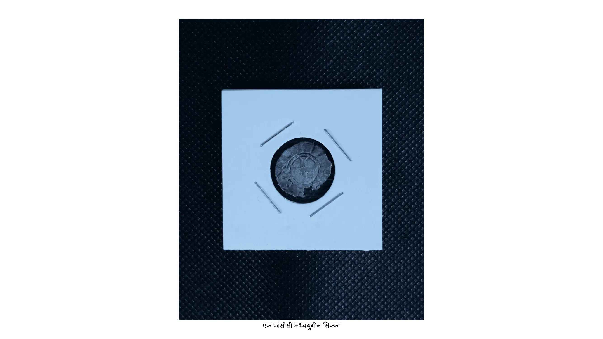

अंततः, ब्लैक डेथ (1346-1353) जैसे बड़े संकटों ने गहन आर्थिक परिवर्तन लाए। जनसंख्या में तीव्र गिरावट के कारण मज़दूरी में तीव्र वृद्धि हुई, जिसने पारिश्रमिक के पिछले स्तर को बनाए रखने के सरकारी प्रयासों को विफल कर दिया।

इसी समय, सौ साल के युद्ध (1337-1453) ने राज्यों को अपनी सेनाओं के वित्तपोषण के लिए अधिक आक्रामक राजकोषीय नीतियां अपनाने के लिए मजबूर किया, जिससे सामंती व्यवस्था कमजोर हुई।

इस प्रकार, मध्य युग व्यापार के लिए विश्वसनीय मुद्रा की आवश्यकता और शासकों द्वारा तत्काल लाभ के लिए मुद्रा को कम करने के निरंतर प्रलोभन के बीच निरंतर तनाव से चिह्नित था। इस संघर्ष ने यूरोपीय मौद्रिक विकास को गहराई से आकार दिया और आधुनिक आर्थिक प्रणालियों की नींव रखी।

इस भाग को समाप्त करते हुए, मैं उसी समय के इंग्लैंड का एक दिलचस्प किस्सा जोड़ना चाहूँगा। यह किस्सा ग्लिन डेविस की पुस्तक "हिस्ट्री ऑफ़ मनी" से लिया गया है।

इसमें उल्लेख किया गया है कि इंग्लैंड में, संसद के हाथों में जाने से ऋण का भार संप्रभु से संसद पर स्थानांतरित हो गया, जिसके परिणामस्वरूप राज्य पर दीर्घकालिक ऋणग्रस्तता का बोझ बढ़ गया। इससे पहले, ऋण का भार संप्रभु के कंधों पर था।

एक बार जब संसद को धन सृजन की इस शक्ति का कुछ हिस्सा मिल गया, तो उसने दीर्घकालिक ऋण बनाने की सुविधा प्रदान की, जिसका भार राजा पर नहीं, बल्कि जनता पर पड़ता था। पहले, अगर राजा दिवालिया हो जाता था या राजा बदल जाता था, तो ऋण उसके साथ ही समाप्त हो जाता था।

जैसे ही संसद द्वारा ऋण का सृजन किया जाता है, संप्रभु ऋण की अवधारणा उभरती है, क्योंकि यह समय के साथ असीमित हो सकता है। जब तक राज्य है, जब तक संसद है, यह ऋण मौजूद है, और उन्हें इसे पुनर्वित्त करने और समय के साथ इसे फैलाने के सभी प्रकार के तरीके खोजने पड़े। यह एक बड़ा प्रतिमान परिवर्तन है, जहाँ अब राजा या राजघराने इन ऋणों की गारंटी नहीं देते थे या इनका भार वहन नहीं करते थे; अब संसद और इसलिए उसके नागरिक ही इन ऋणों की गारंटी देते थे।

## पुनर्जागरण

<chapterId>1d1dfb05-70b4-5b7b-9708-373c2182950d</chapterId>

:::video id=4977b4f3-c7b2-41a5-ad7b-a96a8cca4092:::

अब हम पाठ्यक्रम के उस भाग में पहुँच गए हैं जहाँ हम पुनर्जागरण काल ​​के बारे में बात करते हैं। यह एक दुखद संकट की पृष्ठभूमि में घटित होता है, जिसमें जहाज़ों पर सवार चूहों पर सवार पिस्सुओं द्वारा प्लेग का तेज़ी से फैलाव हुआ था। हालाँकि, यह त्रासदी हमें उच्च मध्यकालीन काल में व्यापार और यात्रा के विकास के बारे में बताती है। इस काल के पहले, इतने लोग इतनी दूर और इतनी तेज़ी से यात्रा नहीं करते थे।

### फ्लोरेंस का फ्लोरिन

पुनर्जागरण के दौरान यूरोप में सोने के सिक्कों की वापसी ने मौद्रिक इतिहास में एक महत्वपूर्ण मोड़ ला दिया। **इसकी शुरुआत 1252 में फ्लोरेंस के फ्लोरिन से हुई, जो रोम के पतन के बाद यूरोप में ढाला गया पहला प्रमुख सोने का सिक्का था।** अपने उल्लेखनीय स्थिर वजन और शुद्धता (लगभग 3.5 ग्राम शुद्ध सोने) के साथ, फ्लोरिन चार शताब्दियों तक अपरिवर्तित रहा और शीघ्र ही एक आवश्यक अखिल-यूरोपीय मौद्रिक संदर्भ बन गया।

नीचे आप फ्लोरिन की प्रतिकृति देख सकते हैं: यह एक स्वर्ण फ्लोरिन है जो टिन से बना है और एक फ्रांसीसी कलाकार द्वारा अंकित किया गया है जो उत्कृष्ट कलाकृतियां बनाता है, उत्कीर्ण करता है और हाथ से ढालता है।

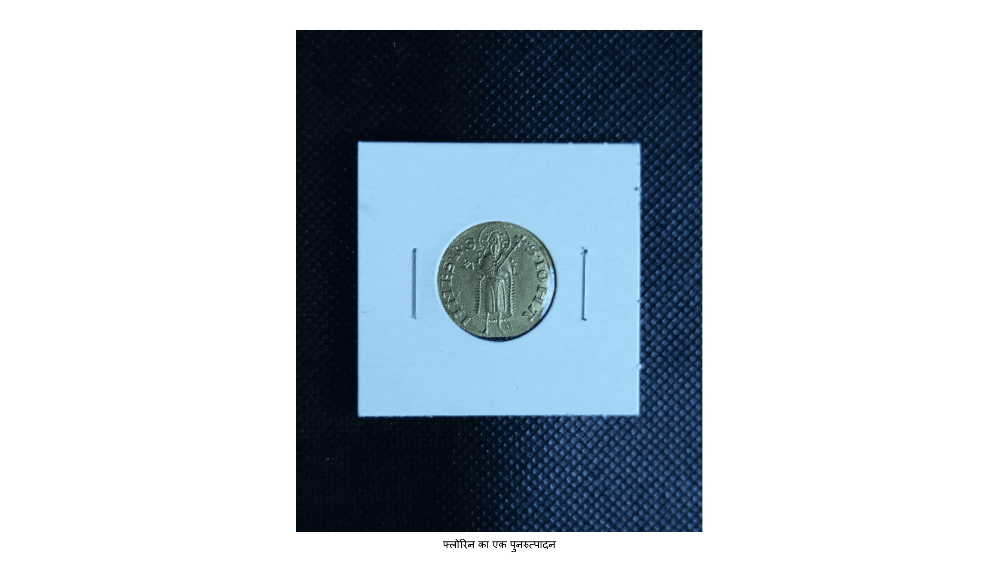

सोने के सिक्कों की ओर यह वापसी एक विशिष्ट संदर्भ से प्रेरित थी: बीजान्टिन सोलिडस के पतन और मंगोल आक्रमणों के कारण मुस्लिम दुनिया की आर्थिक गिरावट ने अंतर्राष्ट्रीय व्यापार में एक मौद्रिक शून्य पैदा कर दिया था।

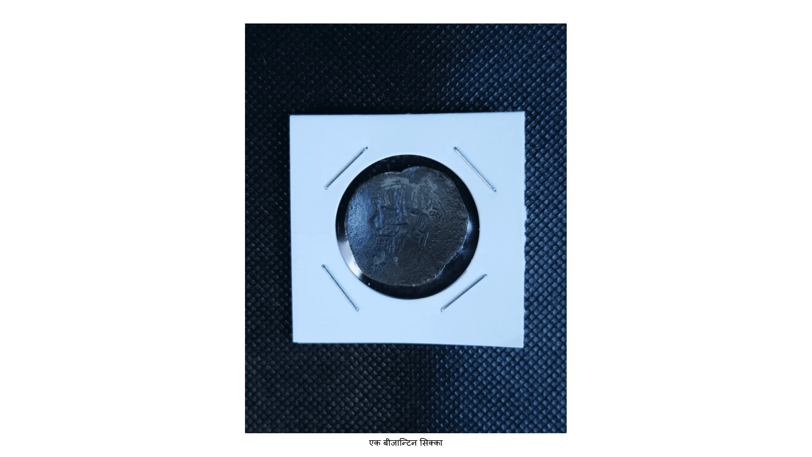

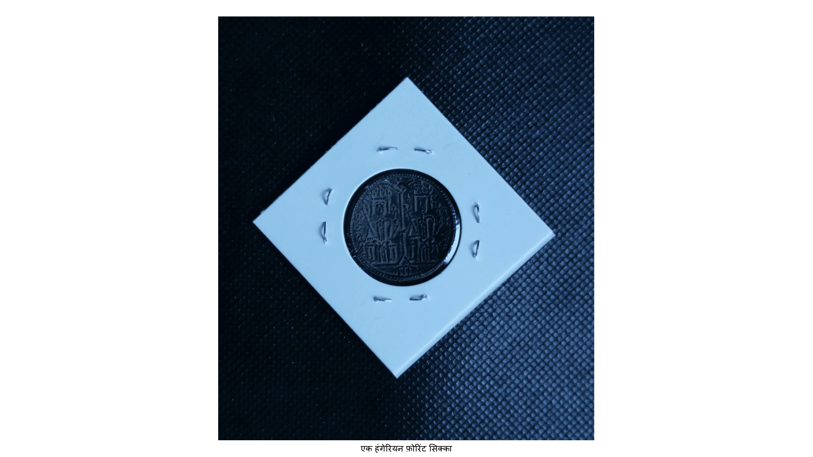

ऊपर दी गई पहली तस्वीर में एक बीजान्टिन सिक्का दिखाया गया है जो मुझे काफी दिलचस्प लगा। मैं उसी काल के हंगरी के एक सिक्के (ऊपर दी गई दूसरी तस्वीर) से इसकी तुलना करने जा रहा हूँ। हंगेरियन सिक्का प्याले के आकार का है, एक छोटे कटोरे जैसा। इसमें धार्मिक आकृतियों को राजाओं के रूप में दर्शाया गया है जो एक-दूसरे के बगल में क्रॉस पकड़े हुए हैं। यह कटोरानुमा सिक्का हंगरी से आया है।

दूसरे देशों के सिक्कों की नकल करना आम बात थी। चूँकि बीजान्टिन सिक्के आम तौर पर स्वीकार किए जाते थे, इसलिए दूसरे देश अक्सर उनकी नकल करते थे। जैसा कि आप दोनों की तुलना करके देख सकते हैं: ये सिक्के बहुत मिलते-जुलते हैं।

उत्तरी इटली, खासकर फ्लोरेंस, वेनिस और जेनोआ ने इस संदर्भ का लाभ उठाकर नई कठोर मुद्राएँ - स्थिर कीमती धातु सामग्री वाले सिक्के - जारी किए। वेनिस ने फ्लोरेंस के उदाहरण का अनुसरण करते हुए 1270 में डुकाट मुद्रा ढाली, जो लगभग फ्लोरिन जैसी ही थी और भूमध्यसागरीय व्यापार में व्यापक रूप से इस्तेमाल की जाती थी।

फ्लोरिन पहली अंतरराष्ट्रीय आरक्षित मुद्रा बन गई, जिसे 14वीं शताब्दी के अंत से पहले 150 से ज़्यादा यूरोपीय शहरों में अपनाया गया। मेडिसी के नेतृत्व में बड़े पैमाने पर फ्लोरेंटाइन बैंकिंग नेटवर्क के निर्माण के साथ, मौद्रिक और लेखा प्रबंधन का पूरी तरह से आधुनिकीकरण हुआ, यहाँ तक कि सोने के भौतिक परिवहन की आवश्यकता भी कम हो गई।

यह एक और दिलचस्प बात है। एक समय था जब समुद्री यात्राओं में सिक्कों की बहुत सारी खेपें खो जाती थीं। इस तकनीकी प्रगति - दोहरी प्रविष्टि वाले रजिस्टरों - ने धर्मग्रंथों के धन का निर्माण संभव बनाया। इससे सिक्कों के लेन-देन की संख्या कम करना और उसकी जगह लिखित प्रविष्टियों की प्रणाली का उपयोग करना संभव हो गया, जिससे पारगमन में धन खोने का जोखिम काफी कम हो गया।

मौद्रिक विकास के साथ-साथ बैंकिंग पद्धतियों में भी उल्लेखनीय विकास हुआ। मुस्लिम बैंकिंग प्रथाओं के साथ धर्मयुद्धों के संपर्क से प्रेरित होकर, मध्ययुगीन यूरोप में 13वीं शताब्दी की शुरुआत में ही फ्लोरेंस, वेनिस, बार्सिलोना और जेनोआ में अल्पविकसित बैंकिंग प्रणालियों का उदय हुआ। नाइट्स टेम्पलर, एक धार्मिक और सैन्य संगठन, ने पहले ही एक ऐसी प्रणाली विकसित कर ली थी जिससे धर्मयोद्धा अपनी संपत्ति साथ लिए बिना यात्रा कर सकते थे।

वे अपने देश में टेम्पलर कार्यालय में धनराशि जमा कर देते थे और फिर एक पत्र के साथ यात्रा कर सकते थे तथा अपने धर्मयुद्ध स्थल पर पहुंचकर सिक्के एकत्र कर सकते थे।

इसका मतलब यह था कि हमें कीमती धातु के सिक्के साथ लेकर चलने की जरूरत नहीं थी।

इसी दौरान यूरोप को चीन में कागजी मुद्रा के अस्तित्व का एहसास हुआ, जिसका श्रेय 13वीं शताब्दी में मार्को पोलो की यात्रा को जाता है। हालाँकि, बैंक नोटों के विकास में कई शताब्दियों का इंतज़ार करना पड़ा, क्योंकि यूरोप पहले अपनी धातु मुद्रा निर्माण पद्धति को बेहतर बनाना चाहता था। लियोनार्डो दा विंची, जो प्रसिद्ध चार्टर्ड अकाउंटेंट लुका पचियोली के करीबी थे, ने मुद्रा प्रेस के सुधार में सक्रिय रूप से योगदान दिया, जिससे तेज़ और अधिक एकरूप मुद्रा उत्पादन को बढ़ावा मिला।

हम पेंडुलम से प्रहार करने की तकनीक की बात कर रहे हैं जिसका ज़िक्र इस पाठ्यक्रम में पहले किया गया था। इस विधि से हथौड़े से प्रहार करने की तुलना में अधिक एकरूप सिक्के बनते थे और, महत्वपूर्ण बात यह है कि इससे सिक्के के किनारों पर शिलालेख बनाने की सुविधा मिलती थी, जैसा कि मैंने पहले प्रदर्शित किया था। नीचे दिया गया चित्र 1793 का एक यूरोपीय थैलर है, जिसके किनारे पर स्पष्ट रूप से लिखावट दिखाई देती है।

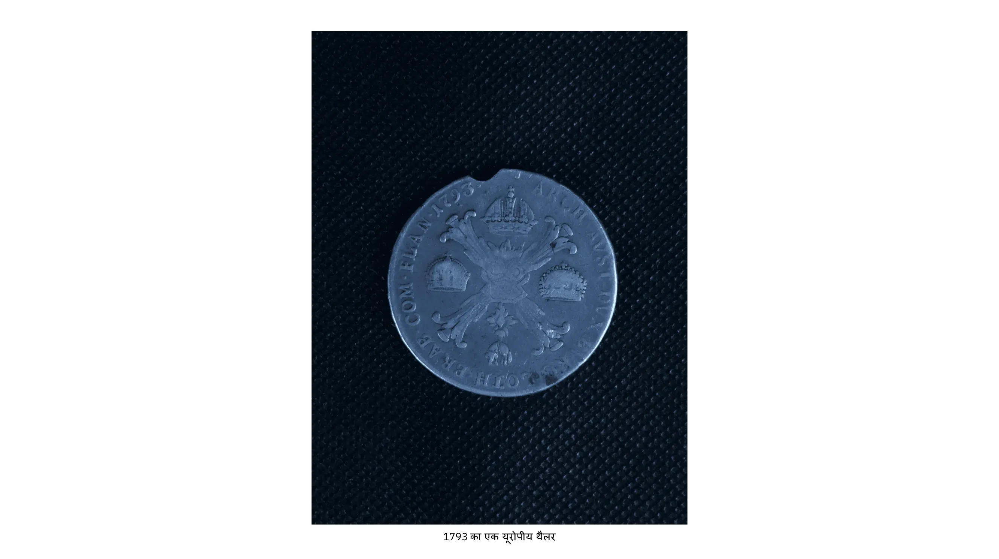

हालाँकि, 15वीं शताब्दी में यूरोप को गंभीर मुद्रा संकट का सामना करना पड़ा, जिससे यूरोपीय मुद्राओं में चांदी की मात्रा में सामान्य गिरावट आई, जो 1450 के आसपास 5% से भी कम हो गई।

16वीं शताब्दी के बाद से, मौद्रिक गुरुत्वाकर्षण का केंद्र स्पेन की ओर स्थानांतरित हो गया, जो आरागॉन और कैस्टिले के राज्यों के एकीकरण, रिकोनक्विस्टा के अंत और 1492 में क्रिस्टोफर कोलंबस जैसी महान समुद्री खोजों से प्रेरित था। अमेरिकी खानों से चांदी के बड़े पैमाने पर प्रवाह ने यूरोपीय और वैश्विक आर्थिक संतुलन को बुरी तरह से बिगाड़ दिया, जिससे मुद्रास्फीति और नए भू-राजनीतिक तनाव दोनों को बढ़ावा मिला।

पुनर्जागरण काल ​​ने सिक्कों की ढलाई में भी एक बड़ा कलात्मक विकास किया, जिसमें थैलर (जोआचिमस्थलर) जैसे सिक्के शामिल थे, जिनसे "डॉलर" शब्द का जन्म हुआ। ये बड़े चाँदी के सिक्के उत्तरी यूरोप के तकनीकी नवाचारों द्वारा संभव हुई नई कलात्मक और यांत्रिक ढलाई तकनीकों को दर्शाते हैं।

अंततः, वित्तीय पुनर्जागरण ने आर्थिक आधुनिकता की ओर संक्रमण का सूत्रपात किया, बैंकिंग, ऋण और वित्तीय बाज़ारों के विकास के साथ, और एम्स्टर्डम, लंदन और स्टॉकहोम जैसे महान व्यावसायिक शहरों में आधुनिक पूँजीवाद के प्रथम रूपों के उदय के साथ, जिसने अंतर्राष्ट्रीय वित्तीय प्रणाली की नींव रखी, जैसा कि हम आज जानते हैं। और यही हमारे अगले वीडियो का विषय है।

# राज्य द्वारा धन की जब्ती

<partId>17cfb1b4-5bc1-53e0-b035-05c7cf76be92</partId>

## विश्व की आरक्षित मुद्राओं का विकास

<chapterId>d65cc352-e7ca-5f03-9b23-dd1fae5c0395</chapterId>

:::video id=82710062-8fff-426c-93af-923c08d82233:::

### कीमती धातुओं का ऐतिहासिक महत्व

आरक्षित मुद्राओं और केंद्रीय बैंकों के उद्भव पर इस खंड में आपका स्वागत है। इस नए खंड के पहले बिंदु के रूप में, हम वैश्विक आरक्षित मुद्राओं के विकास पर ध्यान केंद्रित करेंगे।

बहुमूल्य धातुओं, विशेषकर सोने और चाँदी को, लंबे समय से साम्राज्यों में धन और शक्ति का आधार माना जाता रहा है। सोने की लालसा हमेशा से एक प्रमुख प्रेरक शक्ति रही है, और बहुमूल्य धातुओं के प्रवाह का ही यूरोप में मौद्रिक विकास पर सबसे प्रत्यक्ष और स्पष्ट प्रभाव पड़ा। मध्यकालीन और प्रारंभिक पुनर्जागरण काल ​​में, सोने और चाँदी के प्रति यह आकर्षण अन्य प्रकार के व्यापारों में मूल्य बनाए रखने की कठिनाई के साथ-साथ विदेशी शक्तियों, विशेष रूप से पूर्वी देशों के साथ व्यापार में, की भारी माँग के कारण था।

सदियों से, कई साम्राज्य एक-दूसरे के बाद वैश्विक आर्थिक केंद्र बने हैं। किसी निश्चित अवधि में विश्व व्यापार पर प्रभुत्व रखने वाले देश को आमतौर पर आरक्षित मुद्रा का दर्जा दिया जाता है। इनमें शामिल हैं:

- स्पेन और पुर्तगाल (15वीं और 16वीं शताब्दी)

- 17वीं शताब्दी में संयुक्त प्रांत (नीदरलैंड)

- 18वीं और 19वीं शताब्दी में फ्रांस और ग्रेट ब्रिटेन

- 20वीं सदी में संयुक्त राज्य अमेरिका

### पुर्तगाली उछाल और रियल (1450-1530)

15वीं शताब्दी के उत्तरार्ध और 16वीं शताब्दी के आरंभ में पुर्तगाल ने विश्व व्यापार पर अपना प्रभुत्व स्थापित किया, और इसके लिए उसने पुर्तगाली रियल नामक एक अपेक्षाकृत समान वज़न वाला चाँदी का सिक्का चलाया। नौवहन में अपनी प्रगति के कारण पुर्तगालियों को अफ्रीका, एशिया और नई दुनिया के लिए नए समुद्री मार्ग मिले। अफ्रीका से लेकर चीन (मकाऊ) तक सैन्य किले और व्यापारिक चौकियाँ बढ़ती गईं।

यूरोप की सोने और चाँदी की माँग के जवाब में, "महान खोजों के पीछे निरंतर प्रेरणा वाणिज्यिक लाभ था, विशेष रूप से सोने और चाँदी की खोज।" हालाँकि, पुर्तगाली साम्राज्य, जो अत्यधिक विस्तारित था और डच, अंग्रेज़ों और फ़्रांसीसी लोगों से प्रतिस्पर्धा का सामना कर रहा था, पतन की ओर अग्रसर होने लगा।

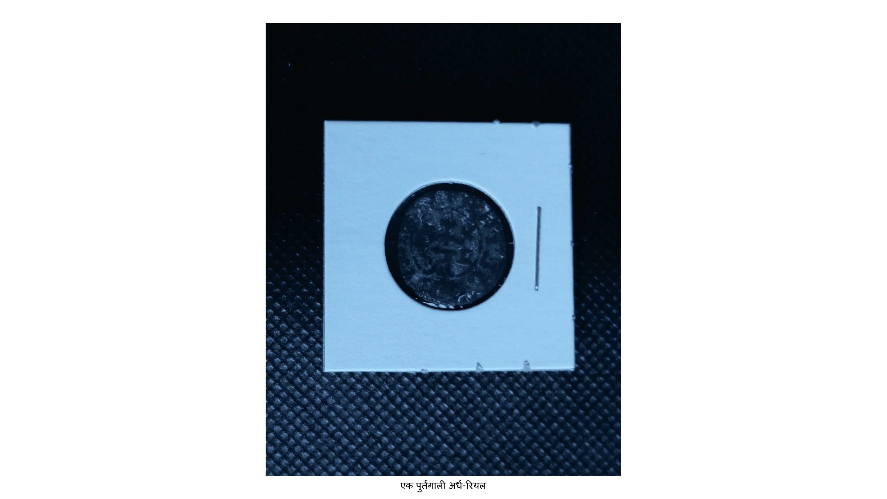

यहां ऊपर आप इन समुद्री विजयों के समय का एक पुर्तगाली अर्ध-रियल देख सकते हैं।

### स्पेनिश अपोजी और स्पेनिश डॉलर (1535-17वीं शताब्दी)

नई दुनिया पर विजय के साथ, **स्पेन** प्रमुख खिलाड़ी बन गया। विशाल चाँदी की खदानों (बोलीविया में पोटोसी, मेक्सिको में ज़काटेकास) पर नियंत्रण रखने वाले इसके सम्राट ने शुद्ध चाँदी से मुद्रा ढालने में सफलता प्राप्त की, जिससे उसकी अपनी मुद्रा: **स्पेनिश रियल** का अवमूल्यन होने से बच गया।

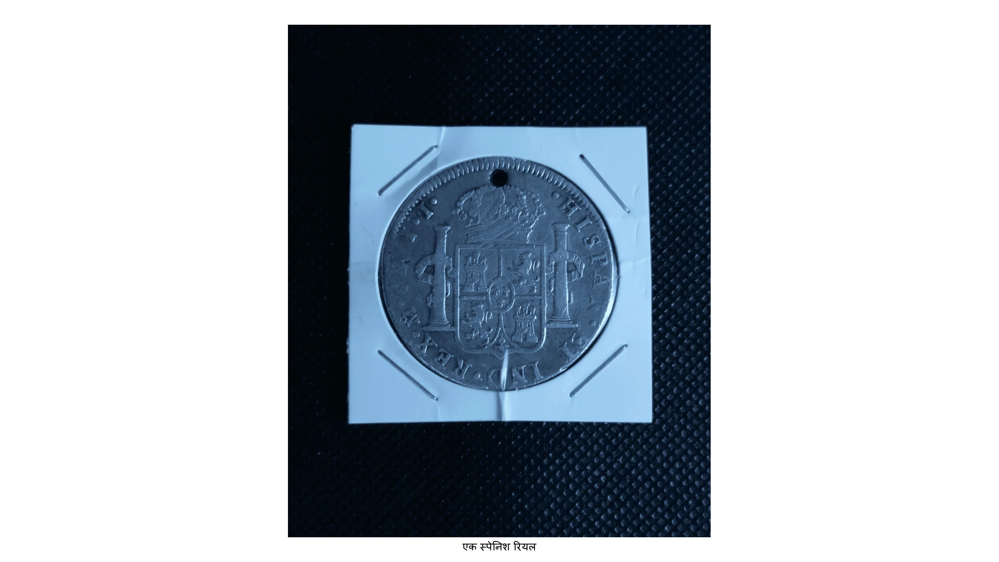

स्पैनिश रियल, जिसे "आठ का टुकड़ा" भी कहा जाता है, को यह उपनाम इसलिए मिला क्योंकि इसे अक्सर छोटे सिक्के बनाने के लिए आठवें टुकड़ों में काटा जाता था। इसे **स्पैनिश डॉलर** के नाम से भी जाना जाता था। ऊपर आप जो सिक्का देख रहे हैं, वह 1814 का है, जो इसे थोड़ा नया उदाहरण बनाता है। हालाँकि, शुरुआती स्पैनिश डॉलर के सिक्के उतने परिष्कृत नहीं थे; वे हथौड़े से ठोंके गए थे और आम तौर पर कम गोल और कुरकुरे थे।

खास बात यह है कि उस समय स्पेनिश डॉलर अंतरराष्ट्रीय आरक्षित मुद्रा के रूप में कार्य करता था। स्पेनिश अधिकारी अपनी स्थानीय मुद्रा, मारावेदी, भी जारी करते थे और नियमित रूप से मुद्रा आपूर्ति को वापस मंगाकर समायोजित करते थे। उदाहरण के लिए, एक मारावेदी मूल्य के तांबे या कांसे के सिक्के को वापस मंगाकर उस पर "2" और फिर बाद में "4" अंकित किया जा सकता था, और इसी तरह संभवतः "8" तक पहुँचा जा सकता था। उच्च-रिज़ॉल्यूशन वाली तस्वीर में, आप सिक्के पर अंकित "8" स्पष्ट रूप से देख सकते हैं। इस पद्धति ने मुद्रा आपूर्ति को प्रभावी रूप से बढ़ा दिया... जिससे अनिवार्य रूप से मुद्रास्फीति हुई।

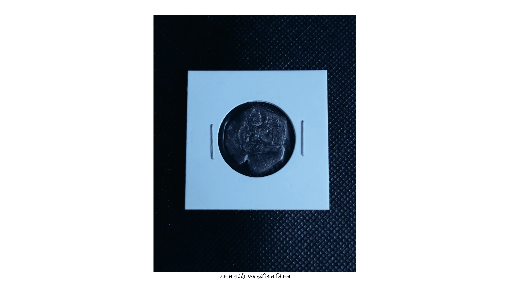

अगर हम आरक्षित मुद्राओं के इतिहास पर नज़र डालें, तो एक दिलचस्प बात सामने आती है: साम्राज्यों ने अपनी मुद्राओं को तब तक नहीं बढ़ाया जब तक उन्होंने अपनी आरक्षित मुद्रा का दर्जा बरकरार रखा। **अपने प्रभुत्व के अंत में ही उन्होंने इसका अवमूल्यन किया, जिससे यह विशेषाधिकार छिन गया, और फिर यह विशेषाधिकार एक नए साम्राज्य को सौंप दिया गया**।

स्पेन में, स्पेनिश डॉलर ने लगभग 200 वर्षों तक विश्व व्यापार पर, विशेष रूप से चीन और यूरोप के बीच, अपना दबदबा बनाए रखा। ये सिक्के चीनी बंदरगाहों पर भी पाए जा सकते थे। और यहीं से हमें इतिहास की एक झलक मिलती है: अमेरिकी डॉलर सीधे इसी मुद्रा से आता है। 1792 में जब संयुक्त राज्य अमेरिका का गठन हुआ, तो उसने अपनी मुद्रा ढालने के लिए एक कानून पारित किया, और उसके पहले डॉलर नाम और सिक्के के आकार, दोनों में स्पेनिश डॉलर के मॉडल पर बनाए गए थे।

आपको इसके मूल्य का अंदाज़ा देने के लिए, अमेरिकी डॉलर मूल रूप से लगभग एक औंस वज़न का चाँदी का सिक्का था, या आज के हिसाब से €30 से €40 के बीच, आज की कागजी मुद्रा के विपरीत। जहाँ तक स्पेनिश डॉलर की बात है, इसका प्रचलन इतना व्यापक था कि इसे पहली सच्ची वैश्विक मुद्रा माना जाता है।

हालाँकि, अमेरिका से कीमती धातुओं के इस प्रवाह ने यूरोप में मुद्रास्फीति को जन्म दिया। मूल्य क्रांति (लगभग 1540-1640) के दौरान, इंग्लैंड में जीवनयापन की लागत सात गुना बढ़ गई। स्पेन में, चाँदी की प्रचुरता ने संसाधन अभिशाप का विकृत प्रभाव डाला, जिससे ठोस बैंकिंग संस्थानों के विकास में बाधा उत्पन्न हुई।

इसके बाद, स्पेन को कई सैन्य संघर्षों (फ़्लैंडर्स, नीदरलैंड्स, तीस वर्षीय युद्ध) का सामना करना पड़ा और उसकी वित्तीय स्थिति धीरे-धीरे चरमरा गई। विश्व-प्रसिद्ध चाँदी के सिक्के का अवमूल्यन करने के बजाय, बाद के शासकों ने स्थानीय जनता द्वारा इस्तेमाल किए जाने वाले ताँबे के सिक्के (वेल्लोन) का मूल्यह्रास या तो कम कर दिया। यही मैंने पहले मारावेदियों के साथ वर्णित किया था।

### डच उदय (17वीं शताब्दी)

इबेरियन अपोजी के बाद, 17वीं शताब्दी में नीदरलैंड एक नई व्यापारिक शक्ति के रूप में उभरा। समुद्री व्यापार, वीओसी (डच ईस्ट इंडिया कंपनी) और एम्स्टर्डम स्टॉक जीडब्ल्यू-15 (एंटवर्प से प्रेरित) की स्थापना ने इस व्यापारिक गणराज्य को एक केंद्र के रूप में स्थापित किया।

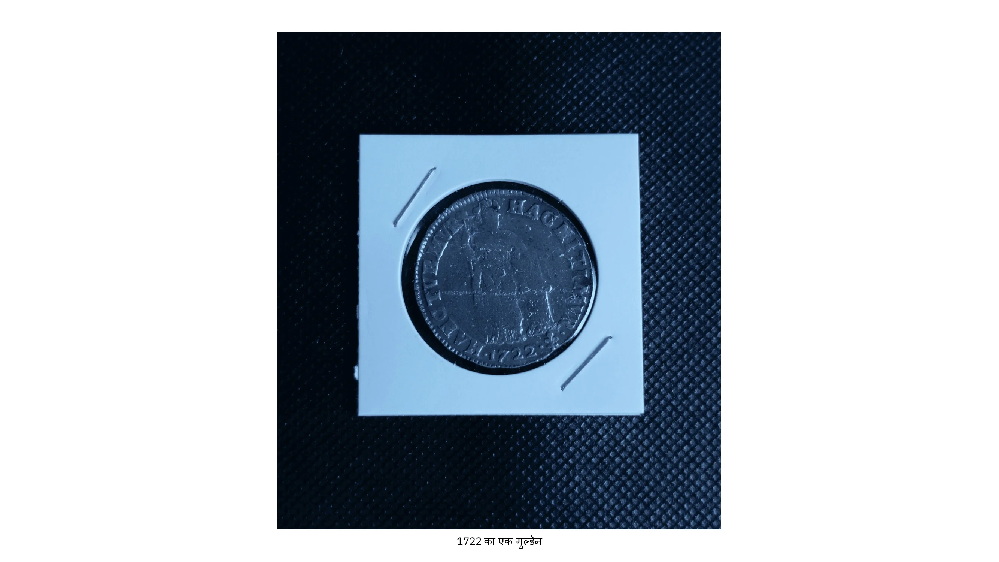

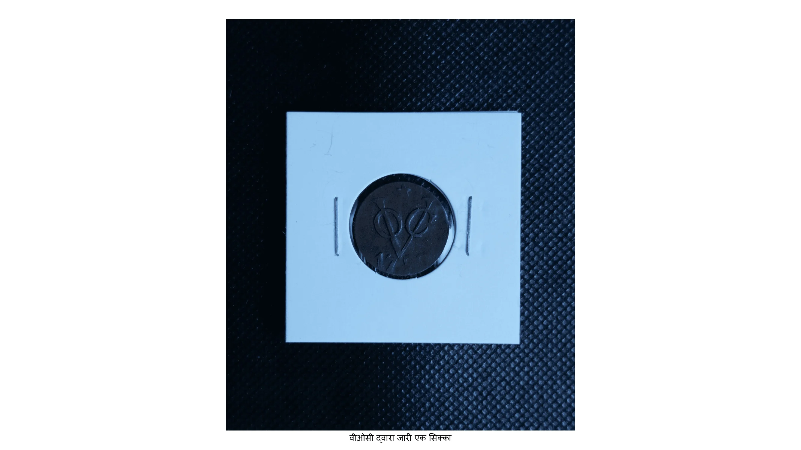

ऊपर दी गई पहली तस्वीर में आप 1722 का गुल्डेन (एक सुंदर चांदी का सिक्का) देख सकते हैं, जबकि दूसरी तस्वीर में वीओसी द्वारा जारी किया गया एक सिक्का है।

वीओसी अपने समय के लिए एक अत्यंत शक्तिशाली कंपनी थी: इसकी अपनी सेना थी और इसने अपनी मुद्रा भी जारी की थी।

डच लोगों ने आधुनिक पूंजीवाद का आविष्कार किया, जिसकी शुरुआत नई दुनिया की यात्रा या नए व्यापार मार्गों की खोज जैसे जोखिम भरे उपक्रमों में जोखिम बांटने के साधन के रूप में हुई। संयुक्त स्टॉक कंपनियों ने कई निवेशकों को अपना पैसा जमा करने और जोखिम साझा करने में सक्षम बनाया। इन आदान-प्रदानों को सुगम बनाने के लिए, इन प्रतिभूतियों पर बातचीत और आदान-प्रदान करने में सक्षम संस्थाओं का निर्माण आवश्यक था। इस प्रकार, 1602 में, पहली संयुक्त स्टॉक कंपनी और स्टॉक एक्सचेंज की स्थापना हुई।

डच मुद्रा, गुल्डेन, अपनी शुद्धता वाली चाँदी के कारण विश्वसनीयता प्राप्त कर चुकी थी, और फिर बैंक ऑफ़ एम्स्टर्डम (1609) द्वारा इसे अपनाए जाने के बाद, जहाँ जमा यूरोप में मुद्रा का एक पसंदीदा रूप बन गया। यह एक बहुत ही महत्वपूर्ण बिंदु है जिसका उल्लेख करना ज़रूरी है। हाँ, सिक्के ज़रूर थे, लेकिन उन दिनों वास्तव में मुद्रा का अर्थ एक प्रकार का धार्मिक धन था। वास्तव में, दुनिया का अधिकांश व्यापार बैंक ऑफ़ एम्स्टर्डम के खातों के माध्यम से होता था। यह बैंकिंग में एक वास्तविक सफलता थी: अंतर्राष्ट्रीय व्यापार अब अनिवार्य रूप से भौतिक सिक्कों से नहीं, बल्कि सीधे बैंक के लेखा अभिलेखों के माध्यम से संचालित होता था।

समृद्धि के इस दौर की पहचान सोने और चाँदी के बड़े पैमाने पर आगमन से हुई, खासकर मुद्रास्फीति या मौद्रिक नियंत्रण वाले दूसरे देशों से। एक दिलचस्प किरदार का ज़िक्र करना ज़रूरी है: **थॉमस ग्रेशम**। इस दौरान, वह नीदरलैंड में अंग्रेज़ राजघराने के लिए काम करते थे और दोनों देशों के बीच धन के प्रवाह का प्रबंधन करते थे। यही ग्रेशम थे जिन्होंने हमें प्रसिद्ध **"ग्रेशम कानून"** दिया।

फिर भी, डच साम्राज्य भी अंततः क्षीण हो गया। इंग्लैंड के साथ युद्ध, संघर्ष के समय गुल्डेन का कमजोर होना, और अन्य शक्तियों (फ्रांस और इंग्लैंड) से प्रतिस्पर्धा ने डच आधिपत्य के अंत का संकेत दिया। चौथे एंग्लो-डच युद्ध (1780-84) के बाद, आरक्षित मुद्रा के रूप में गुल्डेन का पतन अपरिवर्तनीय हो गया।

### फ्रांसीसी शक्ति, महत्वाकांक्षाएँ और विफलताएँ (17वीं-18वीं शताब्दी)

लुई XIV के शासनकाल में, **फ्रांस** यूरोप की सबसे बड़ी महाद्वीपीय शक्ति बन गया। हालाँकि, फ्रांसीसी मुद्रा कभी भी एक प्रमुख संदर्भ का दर्जा हासिल नहीं कर पाई: कई अवमूल्यन, भारी कराधान और महंगे युद्धों (ऑग्सबर्ग लीग, स्पेनिश उत्तराधिकार युद्ध, आदि) ने मौद्रिक प्रणाली की स्थिरता पर भारी असर डाला।

कागज़ी मुद्रा का पहला बड़ा प्रयोग जॉन लॉ (1716-1720) ने किया था। बैंक जनरल ने सरकारी ऋण के वादों के साथ नोट जारी किए। इस योजना के कारण 1720 में सट्टा बुलबुला फूट पड़ा और उसका पतन (मिसिसिपी बुलबुला) हुआ। इस आपदा ने फ्रांस में कागज़ी मुद्रा के प्रति अविश्वास को स्थायी बना दिया। इसी विनाशकारी अनुभव के कारण रिचर्ड कैंटिलन सिद्धांतों को बताने की इस प्रणाली के कारण धनी बन गए, जिसे अब कैंटिलन प्रभाव के रूप में जाना जाता है, जहाँ मुद्रा मुद्रण उन लोगों को समृद्ध बनाता है जिनके पास मुद्रण मशीन तक पहुँच है।

जब यह अविश्वास अंततः समाप्त हुआ, तो एक और फ्रांसीसी कागज़ी विफलता सामने आई: क्रांतिकारी **असाइनेट्स**। पादरियों की संपत्ति की ज़ब्ती के आधार पर 1790 के बाद से जारी किए गए इन असाइनेट्स में तीव्र मुद्रास्फीति देखी गई, जिससे वे आधिकारिक तौर पर इतिहास में पहली बार 50% प्रति माह से अधिक की मुद्रास्फीति बन गए। 1795 में, हालाँकि उनका अंकित मूल्य कई गुना बढ़ गया था, फिर भी वे अपने शुरुआती मूल्य के कुछ ही प्रतिशत पर कारोबार कर रहे थे।

और भी कड़े कानून बनाकर इस नियम को लागू करने की कोशिश की गई, लेकिन कामयाबी नहीं मिली। सरकार ने इसे लागू करने की कोशिश की, यहाँ तक कि इसे न मानने वालों को मौत की धमकी दी गई और दुकानदारों को अपनी दुकानें खुली रखने के लिए मजबूर किया गया। लेकिन, ज़ाहिर है, अंततः यह तरीका काम नहीं आया।

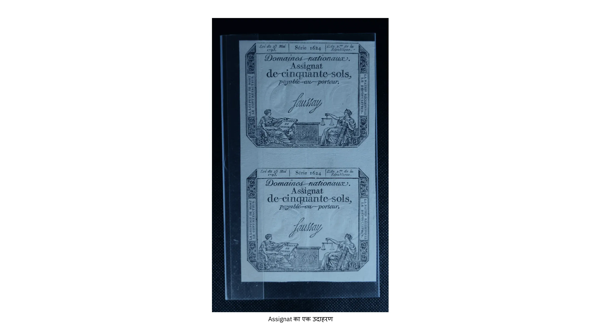

जैसे ही इस कागजी मुद्रा ने प्रसिद्ध ग्रेशम के नियम के अनुरूप, सभी उच्च-गुणवत्ता वाले कीमती धातु के सिक्कों की जगह ले ली, सिक्कों की कमी हो गई। नए सिक्के ढालने के लिए, उन्होंने पादरियों से जब्त की गई बेल मेटल का इस्तेमाल किया। नीचे आप बेल मेटल का एक सुंदर नमूना देख सकते हैं, जिसे पादरियों से लिए गए सिक्कों को पिघलाकर प्राप्त तांबे से बनाया गया है।

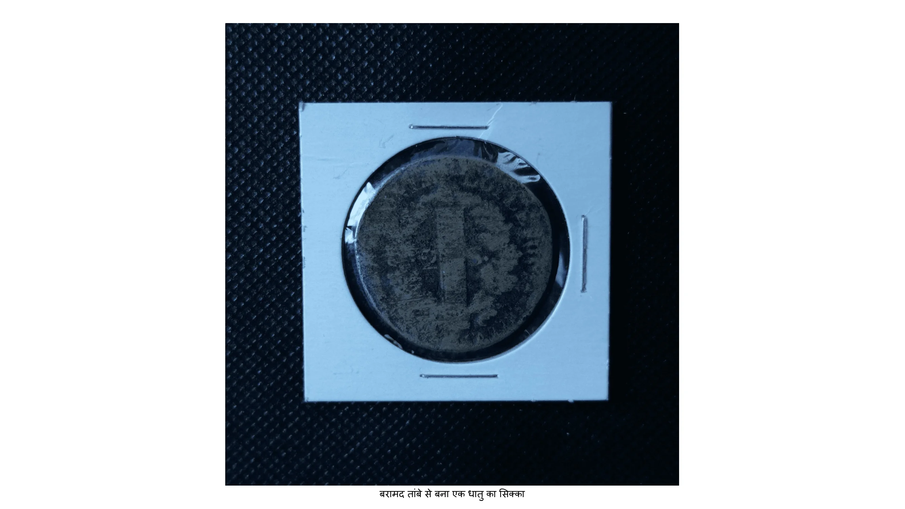

### ब्रिटिश प्रभुत्व (18वीं - 20वीं शताब्दी के प्रारंभ)

**इंग्लैंड**, नीदरलैंड को पीछे छोड़कर, 18वीं शताब्दी में एक प्रमुख शक्ति बन गया। पाउंड स्टर्लिंग आज भी प्रचलन में सबसे पुरानी मुद्रा है, जो मूल रूप से एक पाउंड चाँदी से जुड़ी थी। धीरे-धीरे, इसकी स्थिति मज़बूत होती गई, जिसे वित्तीय और राजकोषीय क्रांति का सहारा मिला: संसदीय राजतंत्र, मज़बूत कर-संग्रह क्षमता, और 1694 में बैंक ऑफ़ इंग्लैंड की स्थापना।

फ्रांस के खिलाफ कई युद्धों के बाद, यूनाइटेड किंगडम 1815 (वाटरलू) में विजयी हुआ, जिससे उसकी सर्वोच्चता पुष्ट हुई। 19वीं शताब्दी के दौरान, पाउंड स्टर्लिंग विश्व की आरक्षित मुद्रा के रूप में कार्य करता रहा। अपने चरम पर, विश्व की केवल 2.5% जनसंख्या के साथ, ब्रिटेन वैश्विक आय का 20% उत्पन्न करता था और पृथ्वी के लगभग एक-चौथाई भाग पर उसका नियंत्रण था।

औद्योगिक क्रांति और स्वर्ण मानक (1717 या 1718 में, रॉयल मिंट में आइज़ैक न्यूटन की देखरेख में) को अपनाने से पाउंड की विश्वसनीयता और मज़बूत हुई। बैंक ऑफ़ इंग्लैंड ने प्रति औंस सोने के लिए 4.25 पाउंड का स्वर्ण मानक अपनाया, जिससे नोटधारकों को अपने नोट सोने में बदलने की सुविधा मिली।

हालाँकि, प्रथम विश्व युद्ध (1914-1918) ने इस प्रणाली को समाप्त कर दिया। कुछ ही हफ़्तों में, सभी प्रमुख युद्धरत शक्तियों ने सोने की परिवर्तनीयता को निलंबित कर दिया। ब्रिटिश साम्राज्य, और बाद में पाउंड, द्वितीय विश्व युद्ध से कमज़ोर अवस्था में उभरे, और 20वीं सदी में अमेरिकी डॉलर ने उनकी जगह ले ली।

और एक कलाकृति के रूप में, आप नीचे कुछ सुंदर और दिलचस्प चीज़ें देख सकते हैं। ये मुद्रा बाट हैं। पहला है सॉवरेन: पाउंड का सबसे पुराना रूप। मेरे पास इन सिक्कों को दर्शाने के लिए सिर्फ़ मुद्रा बाट हैं क्योंकि मैं असली सॉवरेन नहीं खरीद सकता। इन्हें तौलने के लिए, हमने तराजू का इस्तेमाल किया और फिर सॉवरेन के मूल्य के बराबर मुद्रा बाट को दूसरी तरफ़ रख दिया।

सॉवरेन एक मौद्रिक सिक्का था - एक सोने का सिक्का जिसका मूल मूल्य एक पाउंड था।

प्रसिद्ध सॉवरेन से पहले गिनी मुद्रा थी, जो इसी सिद्धांत पर काम करती थी। गिनी का नाम उसमें मौजूद कीमती धातुओं के कारण पड़ा, जो गिनी क्षेत्र से प्राप्त होती थीं।

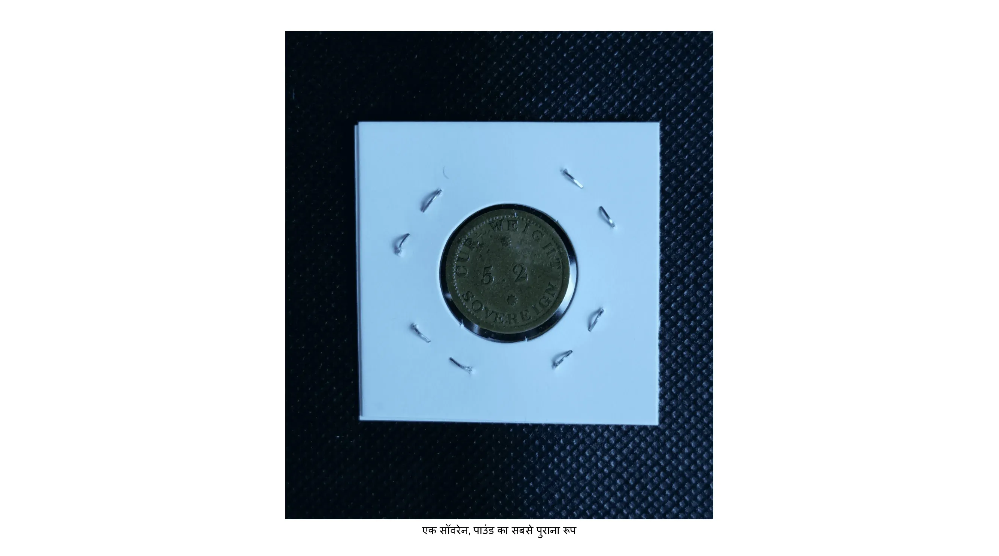

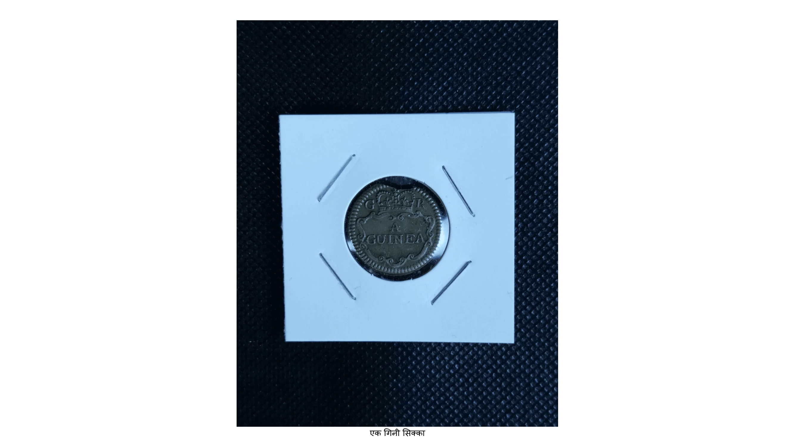

## केंद्रीय बैंकों का उदय

<chapterId>15777771-1e28-55f7-a400-69868a47079b</chapterId>

:::video id=7661b7b5-e00f-48f3-b69a-6fb2eb5ebba4:::

पहली आरक्षित मुद्राओं के इतिहास और उनके विकास पर इस खंड के बाद, यहाँ केंद्रीय बैंकों के उद्भव पर एक खंड प्रस्तुत है। यह आरक्षित मुद्राओं के उद्भव के लगभग समान ही है, लेकिन उस समय की बैंकिंग तकनीकों पर थोड़ा अधिक ध्यान केंद्रित करता है।

### बैंकों और प्रोटो-बैंकों की शुरुआत

13वीं शताब्दी की शुरुआत में ही, इटलीवासियों (फ्लोरेंस, जेनोआ, वेनिस...) ने दोहरी-प्रविष्टि लेखांकन तकनीकें विकसित कर ली थीं। बाद में, **एंटवर्प** (16वीं शताब्दी) उत्तरी यूरोप का प्रमुख वित्तीय केंद्र बन गया, और यह भूमिका बाद में **एम्स्टर्डम** ने संभाली, जिसका श्रेय एम्स्टर्डम स्टॉक Exchange (1609) को जाता है, जहाँ VOC शेयरों का कारोबार होता था।

एंटवर्प में व्यापारी मेले लगते थे जहाँ व्यापारी अक्सर कर्ज़ चुकाने के लिए इकट्ठा होते थे, जिससे नए वित्तीय साधनों का आविष्कार हुआ। नीचे दिया गया बिल, जो 1761 और उससे भी हाल का है, एक वचन पत्र है। इसमें हस्तलिखित विवरण और पीछे की ओर शिलालेख हैं, जो इसे उस काल की एक शानदार कलाकृति बनाते हैं।

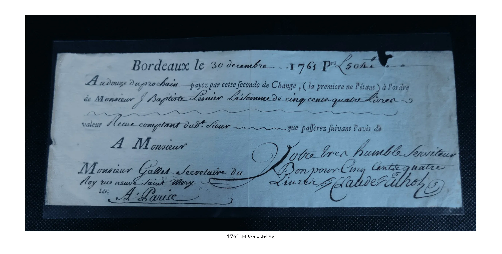

इस उत्साह ने और भी परिष्कृत बैंकिंग संस्थाओं के निर्माण को जन्म दिया। **लोम्बार्ड बैंकरों** और बाद में डच व्यापारियों ने ऋण साधनों (विनिमय पत्र, वचन पत्र, आदि) को परिष्कृत किया। आधुनिक बैंकिंग प्रणाली इस विचार पर आधारित है: धन केवल धातु नहीं, ऋण भी हो सकता है।

जैसा कि आप देख सकते हैं, यह हमें धन की उत्पत्ति के बारे में हमारे मूल प्रश्न पर वापस लाता है।

क्या मुद्रा किसी वस्तु से उत्पन्न होती है जो विनिमय की आवश्यकता से उत्पन्न होती है, या यह ऋण से उत्पन्न होती है? इसके निशान अभी भी इस खंड में पाए जा सकते हैं।

### स्वीडिश उदाहरण: स्टॉकहोम्स बैंको और रिकसेन्स स्टैंडर्स बैंक

आइये स्वीडन की ओर चलें, जहां सबसे पहला केंद्रीय बैंक बनाया गया था।

**स्वीडन** केंद्रीय बैंकिंग में अग्रणी था: 1657 में, जोहान पामस्ट्रुच ने **स्टॉकहोम बैंको** की स्थापना की, जिसे अपने धातु भंडार से अधिक उधार देने का अधिकार दिया गया, इस प्रकार [आंशिक आरक्षित बैंकिंग](https://planb.academy/resources/glossary/fractional-reserves) का जन्म हुआ। लेकिन अत्यधिक बैंक नोट जारी करने के कारण 1663 में अफरा-तफरी मच गई और बैंक पर धावा बोल दिया गया। खैर, खैर...

1668 में, स्टॉकहोम में दुनिया के पहले सच्चे केंद्रीय बैंक, रिक्सेंस स्टैंडर्स बैंक की स्थापना हुई। हालाँकि, इसे भी बैंक नोटों के दुरुपयोग से जुड़े संकटों (1709, 1715...) का सामना करना पड़ा, जिसका इस्तेमाल अक्सर राज्य के युद्धों के वित्तपोषण के लिए किया जाता था।

### जॉन लॉ का असफल तख्तापलट

चलिए फ्रांस की ओर चलें, जहां हम एक बार फिर अपने प्रिय जॉन लॉ से मिलेंगे।

एक स्कॉटिश नागरिक **जॉन लॉ** ने रीजेंट (ड्यूक ऑफ़ ऑरलियन्स) को एक निजी बैंक, बैंके जेनरल (1716) बनाने के लिए राजी किया, जिसे सोने, चाँदी और सरकारी ऋणों के बदले कागज़ जारी करने का अधिकार दिया गया। यह बैंके रोयाल (1718) बन गया और इसने मिसिसिपी कंपनी के शेयरों को आसमान छूने में मदद की।

जब हकीकत अटकलों से टकराई, तो **सोना रखने पर प्रतिबंध लगाने और लॉ के नोटों के इस्तेमाल को मजबूर करने के फैसले से घबराहट और बढ़ गई।** खैर, खैर...

अंततः 1720 में यह बुलबुला फट गया, जिससे पतन हुआ और फ्रांस में कागजी मुद्रा की विश्वसनीयता लंबे समय तक के लिए नष्ट हो गई।

### बैंक ऑफ एम्स्टर्डम, एक अग्रणी मॉडल का उदय

अब हम 1609 के एम्स्टर्डम में पहुँचते हैं, जहाँ **बैंक ऑफ़ एम्स्टर्डम** (विसेलबैंक) ने एम्स्टर्डम में सिक्कों की सुरक्षा और परिवर्तनीयता पर नियंत्रण कर लिया था। इसने निजी बैंक नोटों के प्रचलन पर प्रतिबंध लगा दिया और अपनी तिजोरियों में धातु के सिक्के जमा करने का आदेश दिया। धीरे-धीरे, उन्होंने मुद्रा पर नियंत्रण हासिल कर लिया। उन्होंने मुद्रा परिवर्तकों को अपने पास सिक्के रखने से मना कर दिया। मुद्रा परिवर्तक दिन भर काम करते थे और दिन के अंत में उन्हें अपने सिक्के बैंक ऑफ़ एम्स्टर्डम की तिजोरियों में जमा करने पड़ते थे। जैसा कि मैंने बताया, अंतर्राष्ट्रीय व्यापार में ज़रूरी नहीं कि धातु के सिक्के ही इस्तेमाल होते थे। यह बैंक के बहीखातों में दर्ज़ धार्मिक मुद्रा थी।

डच व्यापारिक शक्ति के कारण, बैंक ने विश्व व्यापार को स्थिर करते हुए, पहले वास्तविक "केंद्रीय बैंक" की भूमिका निभाई। हालाँकि, समय के साथ, इसने वीओसी को असुरक्षित ऋण दिए और अंततः अपने बिलों का समर्थन करने के लिए धातु समाप्त हो गई। 1790 में, यह पता चला कि इसने वीओसी को बड़ी रकम उधार दी थी, और लगभग दिवालिया घोषित कर दिया, जिससे गुल्डेन की विश्वसनीयता धूमिल हो गई। खैर, खैर...

### बैंक ऑफ इंग्लैंड, आधुनिक बैंकिंग की स्थापना करने वाला

17वीं सदी के इंग्लैंड में, सोना और चाँदी सुनारों द्वारा जमा किए जाते थे, जो रसीदें जारी करते थे। इस आंशिक रूप से विकेन्द्रीकृत व्यवस्था की सीमाएँ तब सामने आईं जब राजशाही को फ्रांस के खिलाफ युद्ध के लिए भारी वित्तीय सहायता की आवश्यकता महसूस हुई।

1694 में, **बैंक ऑफ़ इंग्लैंड (BoE)** की स्थापना हुई। इस प्रकार, बैंक ऑफ़ इंग्लैंड का जन्म लंदन के व्यापारिक समुदाय और सरकार के बीच एक सुविधाजनक समझौते से हुआ, जो युद्ध के लिए धन जुटाने के लिए बेताब थी।

बैंक ने इंग्लैंड में बैंक नोट जारी करने पर एकाधिकार प्राप्त कर लिया (जिसे 1708, 1742, आदि में और मज़बूत किया गया)। तब से, स्वर्ण भंडार द्वारा समर्थित कागजी मुद्रा, सिक्कों के साथ-साथ प्रचलन में आई। राज्य संस्थाओं द्वारा मुद्रा के क्रमिक अधिग्रहण को समझने के लिए यह एक महत्वपूर्ण बिंदु है। सबसे पहले, बैंक ऑफ एम्स्टर्डम ने मुद्रा विनिमयकर्ताओं को सिक्के रखने से रोका और उन्हें बैंक को वापस करने के लिए बाध्य किया। इंग्लैंड में, निजी बैंकों को सोने में भुनाए जाने वाले अपने स्वयं के नोट जारी करने से प्रतिबंधित कर दिया गया था।

उन्होंने निजी बैंकों को बैंक नोट जारी करने की अनुमति तो दी, लेकिन इन्हें केवल बैंक ऑफ इंग्लैंड के नोटों के बदले ही बदला जा सकता था।

बैंक ऑफ इंग्लैंड के नोट, पाउंड स्टर्लिंग, सोने में भुनाए जा सकते थे। इससे मुद्रा में एक तीसरी परत जुड़ गई। यानी, हमारे पास सबसे नीचे सोना है, फिर बैंक ऑफ इंग्लैंड के नोट, और फिर सबसे ऊपर निजी बैंकों के नोट। इससे पहले, निजी बैंक सोने में भुनाए जा सकने वाले अपने नोट जारी कर सकते थे। यह सरकारी संस्थाओं द्वारा मुद्रा के क्रमिक अधिग्रहण का एक और चरण है।

बैंक ने राज्य को भारी मात्रा में ऋण दिया तथा विशाल सार्वजनिक ऋण की संरचना की, जिससे आर्थिक उछाल को वित्तपोषित किया गया।

यह मॉडल 18वीं और 19वीं शताब्दियों के दौरान इस हद तक समेकित हो गया कि पाउंड, बैंक ऑफ इंग्लैंड और स्वर्ण मानक की मुहर के तहत विश्व की आरक्षित मुद्रा बन गया।

**दुनिया की आरक्षित मुद्राएँ** सदियों से एक के बाद एक बदलती रही हैं, किसी राज्य या साम्राज्य की आर्थिक, वाणिज्यिक और सैन्य शक्ति से प्रेरित: पुर्तगाल, स्पेन, नीदरलैंड, फिर ग्रेट ब्रिटेन, 20वीं सदी में संयुक्त राज्य अमेरिका के प्रभुत्व में आने से पहले। हर मामले में, हम एक समान चक्र देखते हैं: आर्थिक विस्तार, व्यावसायिक सफलता, मुद्रा का अंतर्राष्ट्रीय स्तर पर अपनाया जाना, ऋणग्रस्तता, महंगे युद्ध, मुद्रा सृजन या ऋण का दुरुपयोग, और अंततः पतन।

**केंद्रीय बैंकों का उदय** एक क्रमिक प्रक्रिया थी। ये संस्थाएँ अक्सर महँगे युद्धों के संदर्भ में उभरीं, जिससे राज्य ऋण के माध्यम से स्वयं को वित्तपोषित करने में सक्षम हुए। जब ​​स्वर्ण मानक अपनाया गया (इंग्लैंड, 17वीं-19वीं शताब्दी), तो इसने स्थिरता का एक आवरण प्रदान किया, लेकिन 20वीं शताब्दी के महायुद्धों के कारण स्वर्ण परिवर्तनीयता का धीरे-धीरे परित्याग हो गया। इस प्रकार मुद्रा ढालने की शक्ति शाही एकाधिकार से अधिक जटिल संस्थाओं, पहले निजी (स्वर्णकार, बैंकर), और फिर अर्ध-सार्वजनिक (केंद्रीय बैंक) के पास स्थानांतरित हो गई, जो मौद्रिक संप्रभुता के संस्थागत, वैश्वीकृत रूपों की ओर विकास को दर्शाता है।

तो, यही तो मैं पहले बता रहा था। हमने अक्सर संप्रभु ऋण का बोझ सीधे केंद्रीय बैंकों पर या संसद जैसी कानूनी संस्थाओं द्वारा मुद्रा निर्माण की अनुमति पर डाल दिया है।

और यहां सबसे महत्वपूर्ण तथ्य यह है कि **हम एक ऐसे ऋण से गुजर चुके हैं जो संप्रभु के दिवालियापन के कारण खत्म हो सकता था, और अब हम एक ऐसे ऋण में पहुंच चुके हैं जो मुख्य रूप से जनता के कंधों पर है।**

## फिएट प्रणाली की राह

<chapterId>27a98545-d350-56ee-a200-92468e6b9b33</chapterId>

:::video id=e27a753e-aeee-4307-a65c-9506aab380a1:::

अब हम मुद्रा के इतिहास पर इस पाठ्यक्रम के अंत तक पहुँच चुके हैं, और इसे समाप्त करने के लिए, मैं दो विषयों का प्रस्ताव रखना चाहता हूँ। पहला विषय उन विभिन्न चरणों से संबंधित है जिनसे हमारी वर्तमान फिएट मुद्रा प्रणाली का निर्माण हुआ। हम खंड 5 में केंद्रीय बैंकों के निर्माण से संबंधित तथ्यों पर पुनर्विचार करेंगे, और हम अमेरिकी डॉलर की अवधारणा को भी शामिल करेंगे, जो अंततः वर्तमान आरक्षित मुद्रा है। हम इस पर विचार करेंगे कि इसका विकास कैसे हुआ, डॉलर कैसे अस्तित्व में आया, यह कैसे विकसित हुआ, इसमें कैसे परिवर्तन हुए, यह किन चरणों से गुज़रकर एक फिएट प्रणाली बन गया, क्योंकि डॉलर की उत्पत्ति एक चाँदी के सिक्के से हुई थी।

इसके तुरंत बाद, मैं आपको वित्त के इतिहास पर एक संक्षिप्त खंड प्रस्तुत करूँगा, ताकि आप समझ सकें कि हम कल्याणकारी राज्य तक कैसे पहुँचे। तो हम दो विषयों पर विचार करेंगे: हम फिएट प्रणाली तक कैसे पहुँचे, और उसके तुरंत बाद, वित्त के विकास ने हमें कल्याणकारी राज्य की अवधारणा तक कैसे पहुँचाया।

### आधुनिक बैंकिंग की यूरोपीय नींव

आइए 13वीं शताब्दी में फ्लोरिन के दौर में वापस चलते हैं। यह समझने के लिए कि हम फ़िएट मॉडल तक कैसे पहुँचे, हमें 13वीं शताब्दी से शुरुआत करनी होगी। फ्लोरिन के साथ-साथ, मेडिसी के समय में एक और तकनीक उभरी, विनिमय पत्र की अवधारणा।

इसके बाद एंटवर्प स्टॉक एक्सचेंज आया, जिसमें डिस्काउंटिंग और प्रोमिसरी बिल की अवधारणा थी।

फिर, जैसा कि हम देख चुके हैं, एम्स्टर्डम में पहला शेयर बाज़ार, वीओसी, अस्तित्व में आया। इसने पूंजीवाद के जन्म को चिह्नित किया, जिसमें कंपनी के शेयर और शेयरों का आदान-प्रदान शामिल था। इसके बाद एम्स्टर्डम बैंक ने एक आदेश जारी करके जमा राशि का उपयोग लागू कर दिया। इसका मतलब था कि दिन के अंत में सिक्के जमा करने होते थे। अब मुद्रा विनिमयकर्ता ही थे जो सिक्कों के रूप में छुट्टा नहीं रख सकते थे।

फिर 17वीं सदी के अंत में युद्ध के वित्तपोषण हेतु ऋण लेने की आवश्यकता के कारण बैंक ऑफ़ इंग्लैंड की स्थापना हुई। उस समय, निजी बैंक मुद्रा की तीसरी परत बन गए। वैसे, फ्लोरिन से लेकर केंद्रीय बैंक के निर्माण की अवधारणा तक, इस पूरे खंड का सारांश निक भाटिया की प्रसिद्ध पुस्तक "लेयर्ड मनी" में बहुत अच्छी तरह से दिया गया है, जिसका अनुवाद करने का सौभाग्य मुझे कुछ सहयोगियों के साथ मिला। हमने इसका अनुवाद बहुत अच्छी तरह से किया ताकि दुनिया भर के फ्रेंच भाषी इन शिक्षाओं से लाभान्वित हो सकें।

तो हम 17वीं सदी के अंत में हैं। बैंक ऑफ़ इंग्लैंड की स्थापना युद्ध के वित्तपोषण के लिए की गई थी।

निजी बैंकों ने मुद्रा की तीसरी परत पर कब्ज़ा कर लिया। दरअसल, निजी बैंकों के बिल अब सोने में भुनाए नहीं जा सकते थे: बैंक ऑफ़ इंग्लैंड के बिल ही सोने में भुनाए जा सकते थे। यह दर्शाता है कि बैंक ऑफ़ इंग्लैंड जैसी संस्था ने विनिमय की शक्ति पर कब्ज़ा कर लिया है।

फिर 1776 की दहशत आई। हर कोई धन के पिरामिड की ओर दौड़ पड़ा। इसका मतलब यह है कि 1776 में बैंकों पर भीड़ उमड़ पड़ी, और इसलिए जिन लोगों के पास तीसरी परत के कागज़, यानी निजी बैंक बिल थे, वे बैंक ऑफ़ इंग्लैंड के बिल निकालने की कोशिश करने लगे, और फिर सोना निकालने की कोशिश करने लगे, लेकिन ज़ाहिर है कि तिजोरियों में पर्याप्त सोना नहीं था। उन्होंने सोने के बिल वापस न चुकाने के लिए एक तरह की बैंकिंग छुट्टी घोषित कर दी, और इसी से अंतिम उपाय के ऋणदाता की अवधारणा का जन्म हुआ।

### अमेरिकी डॉलर का विकास

हम फ्लोरिन से बैंक ऑफ इंग्लैंड की स्थापना की ओर बढ़ रहे हैं। बेशक, इस बीच प्रथम और द्वितीय विश्व युद्ध भी हुए, लेकिन उससे पहले, 1796 में, अटलांटिक के दूसरी ओर भी विकास हो रहा था। 1776 में, अमेरिका अभी भी एक ब्रिटिश उपनिवेश था, और उपनिवेश इसी कागजी मुद्रा का इस्तेमाल करते थे। नीचे 1776 का कनेक्टिकट का दो शिलिंग का नोट है।

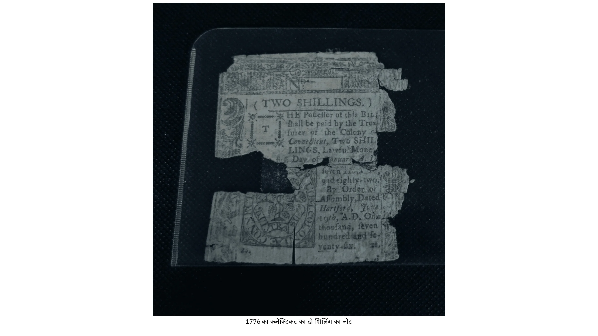

इंग्लैंड पर युद्ध की घोषणा करने और अंततः अपनी मुद्रा जारी करने से पहले, उपनिवेशों ने नकद लेन-देन के लिए स्पेनिश डॉलर के साथ-साथ इस कागजी मुद्रा का भी इस्तेमाल किया। दरअसल, "डॉलर" शब्द अमेरिकी डॉलर को ही दर्शाता रहा।

अगर मैं गलत नहीं हूँ, तो 1792 में उन्होंने एक कानून पारित किया था जिससे उन्हें मुद्रा बनाने की अनुमति मिल गई थी। उदाहरण के लिए, नीचे दिया गया चित्र आधुनिक युग का एक अमेरिकी डॉलर है।

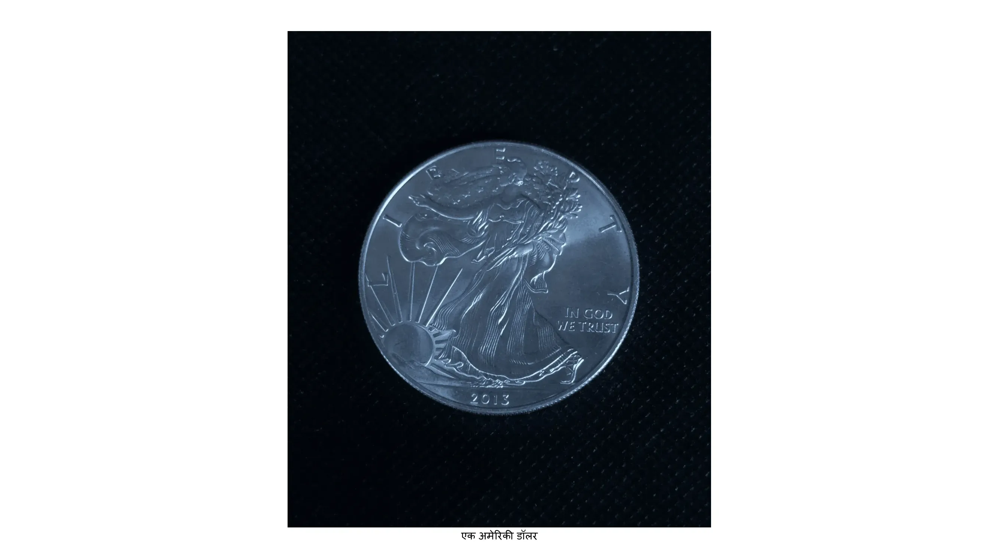

ज़ाहिर है, इसका अंकित मूल्य सिर्फ़ एक डॉलर नहीं है; इसकी क़ीमत लगभग 30 या 40 डॉलर है, क्योंकि यह एक औंस चाँदी के बराबर है। इसका मूल्य चाँदी की कीमत के आधार पर घटता-बढ़ता रहता है, आमतौर पर यह कम से कम 30 या 40 अमेरिकी डॉलर के आसपास होता है। आज, बेशक, एक कागज़ के डॉलर का अंकित मूल्य सिर्फ़ एक डॉलर ही रहता है, लेकिन उस समय, अमेरिकी डॉलर इसी चाँदी के मूल्य पर आधारित था।

अब बात करते हैं अमेरिका में हुए गृहयुद्ध की। कॉन्फ़ेडरेट मुद्रा छाप रहे थे, जो अत्यधिक मुद्रास्फीति वाली थी। यह घटना आधिकारिक हान्के-क्रस सूची में शामिल नहीं है, क्योंकि यह 50% की अति-मुद्रास्फीति दर तक नहीं पहुँची थी। हालाँकि, इसमें मासिक मुद्रास्फीति दर 40% थी, जो दर्शाती है कि युद्ध के दौरान पर्याप्त मात्रा में मुद्रा छापी गई थी।

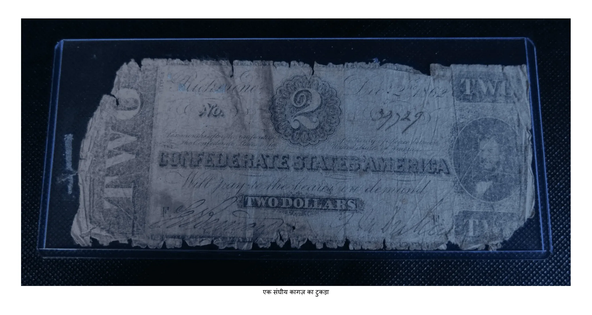

उनके उत्तरी विरोधियों के पास भी डॉलर थे। ठीक ऊपर, आप कॉन्फेडरेट डॉलर देख सकते थे, जबकि नीचे आप उत्तरी डॉलर देख सकते थे। इन्हें "ग्रीनबैक" कहा जाता था क्योंकि इनका पिछला भाग हरा होता था।

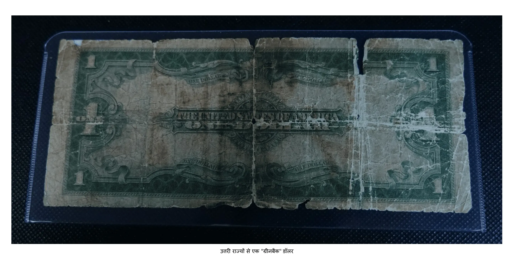

और मैं आपको आधुनिक बैंक नोटों के आकार के अंतर की तुलना करने के लिए आमंत्रित करता हूँ। उस समय, बैंक नोट बड़े होते थे।

जैसा कि हम जानते हैं, उत्तरी अमेरिका की जीत हुई, इसलिए ग्रीनबैक पुनः एकीकृत अमेरिकी राज्यों की मुद्रा बन गया। फिर 1913 में फेड की स्थापना हुई और प्रथम विश्व युद्ध छिड़ गया।

प्रथम विश्व युद्ध के बाद, छपे बैंक नोटों की आखिरी श्रृंखला में हमेशा "माँग पर सोने में भुनाया जा सकता है" लिखा होता था। इसलिए, 1928 में, 20 डॉलर में लगभग एक औंस सोना खरीदा जा सकता था, क्योंकि सोने की कीमत 20.67 डॉलर थी। नीचे दी गई तस्वीर में दिख रहे नोट से 1928 में एक औंस सोना खरीदा जा सकता था।

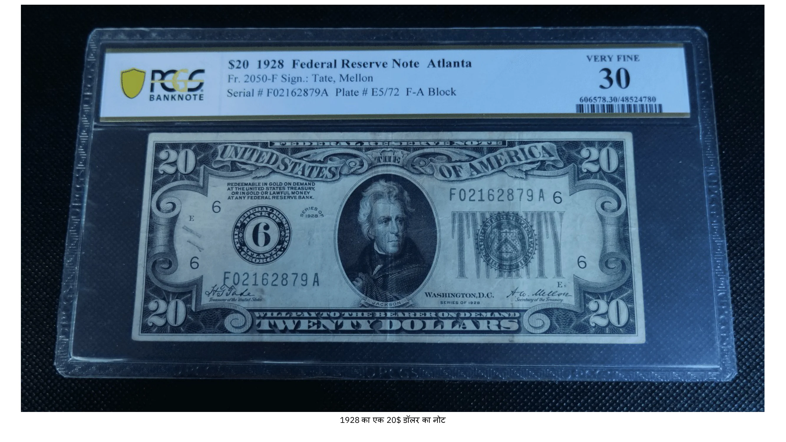

आज, एक औंस सोने की कीमत 3,000 अमेरिकी डॉलर है। तो आप यहाँ अवमूल्यन की ताकत देख सकते हैं, बिल्कुल। यह आखिरी बिल था जिसमें "सोने में भुनाया जा सकता है" लिखा था। हम देखेंगे कि कार्यकारी आदेश 6102 के तुरंत बाद, उन्होंने सारा सोना ज़ब्त कर लिया। दरअसल, उन्होंने सोना और सोने के प्रमाणपत्र दोनों ज़ब्त कर लिए।

नीचे आप 1928 का स्वर्ण प्रमाणपत्र देख सकते हैं।

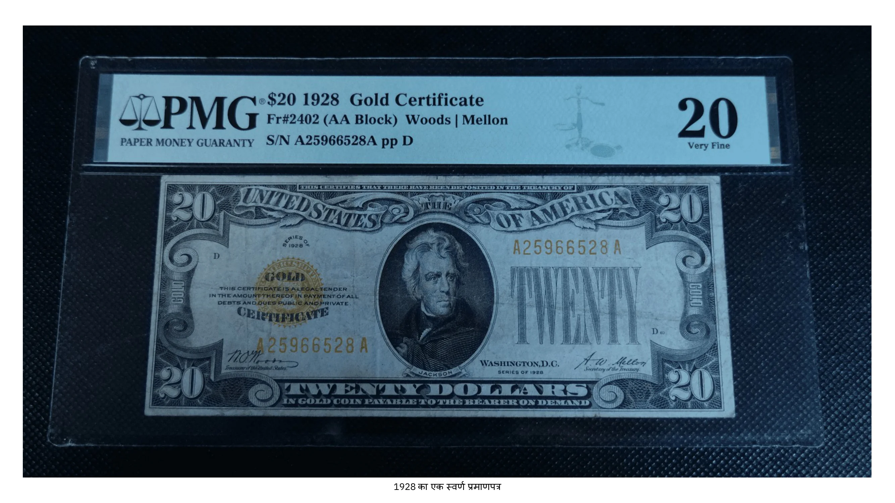

1928 के नोट की तरह यह न सिर्फ़ "सोने में भुनाया जा सकता था", बल्कि सोने के सिक्कों में भी भुनाया जा सकता था: यह वास्तव में एक "स्वर्ण प्रमाणपत्र" है। कार्यकारी आदेश 6102 के बाद ये सभी ज़ब्त कर लिए गए। 1964 तक, इन्हें रखना भी गैरकानूनी था।

मुझे इसे पाकर बहुत खुशी है।

अगर मैं गलत नहीं हूँ, तो 1964 से सोना रखना गैरकानूनी हो गया था, और 1974 तक ऐसा ही चलता रहा। 70 के दशक में, निक्सन के झटके के बाद, जिसका हम आगे वर्णन करेंगे, लोगों को सोना जमा करने की अनुमति दे दी गई थी। 1933 में, जब उन्होंने "कार्यकारी आदेश 6102" जारी किया, तो सोना ज़ब्त कर लिया गया और उसे अपने पास रखना गैरकानूनी हो गया। अगर आप सोना रखते हुए पकड़े जाते, तो आपको भारी जेल की सज़ा होती थी। उन दिनों, 1934 के बाद, हर औंस सोने के बदले नीचे दिए गए नोट जैसा एक नोट दिया जाता था।

जैसा कि हमने कहा, 1928 में भी डॉलर पर "सोने में भुनाया जा सकता है" लिखा होता था।

कार्यकारी आदेश 6102 जारी होने के बाद, उन्होंने सारा सोना ज़ब्त कर लिया और हर औंस सोने के बदले 20.67 डॉलर देने लगे। इसके बाद, घोटाला सामने आया: उन्होंने 1934 में नए नोट जारी किए जिन पर लिखा था, "यह नोट सभी ऋणों के लिए वैध मुद्रा है।"

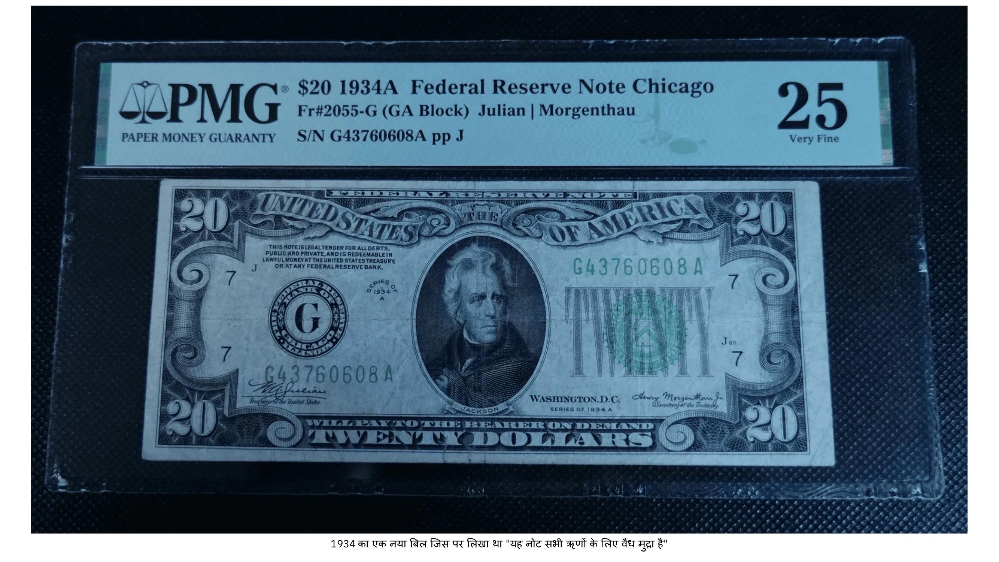

यहाँ "सोने में भुनाए जाने योग्य" वाक्यांश की जगह वैध मुद्रा की अवधारणा उभरती है। दोनों नोट देखने में एक जैसे लग सकते हैं, बस कुछ शब्दों में बदलाव है, लेकिन घोटाला इस तथ्य में निहित है कि इस अवधि के दौरान डॉलर का अवमूल्यन हुआ था; 1934 में सोने के एक औंस की कीमत $20.67 से घटकर $35 प्रति औंस रह गई। यह लगभग 40% का अवमूल्यन दर्शाता है!

फिर दूसरा विश्व युद्ध शुरू हुआ। युद्ध के बाद, ब्रेटन वुड्स समझौते ने दुनिया के अधिकांश सोने को संयुक्त राज्य अमेरिका में केंद्रीकृत कर दिया। अमेरिकियों ने बदले में बैंक नोट जारी किए, हालाँकि अब आम जनता इन नोटों को सोने के बदले नहीं बदल सकती थी। इसके बजाय, राज्य स्तर पर इनका सोने के बदले विनिमय जारी रहा।

अंततः, फ्रांस और जर्मनी जैसे देशों को संदेह होने लगा कि अमेरिकी तिजोरियों में सोने की तुलना में प्रचलन में संभवतः डॉलर के नोट अधिक हैं।

इसलिए उन्होंने अपना सोना वापस लाने की माँग की। उन्होंने कहा, "ठीक है, हम कर देंगे, लेकिन इसमें थोड़ा समय लगेगा।" 1971 में, हमारे मित्र रिचर्ड निक्सन ने बैंक नोटों और सोने के बीच के संबंध को हमेशा के लिए तोड़ दिया, और इसके लिए सट्टेबाजों को ज़िम्मेदार ठहराया।

सोने का मूल्य 35 डॉलर प्रति औंस कम आंका गया था, जो मुद्रित मुद्रा की मात्रा या उसके वास्तविक बाजार मूल्य के अनुरूप नहीं था। कुछ ही वर्षों में, इसकी कीमत 34 डॉलर से बढ़कर 800 डॉलर हो गई। रोम जैसे ऐतिहासिक उदाहरणों की तरह, जहाँ दीनार और सॉलिडस के बीच का संबंध टूट गया था, सोने को तैरने दिया गया। इस तथ्य ने मूल्य निर्धारण की एक प्रक्रिया को जन्म दिया, जिसके परिणामस्वरूप उसके बाद सोने का मूल्य डॉलर के संदर्भ में बहुत अधिक हो गया।

### आधुनिक फिएट मुद्रा प्रणाली और इसके निहितार्थ

यह भाग संक्षेप में बताता है कि कैसे हम चाँदी या सोने पर आधारित मौद्रिक प्रणाली से आगे बढ़े। धीरे-धीरे, संस्थाओं ने मुद्रा पर अधिकाधिक शक्ति प्राप्त कर ली। अंततः, एकतरफा निर्णय ने, अत्यधिक निर्गम के बाद, कीमती धातुओं और मुद्रा के बीच के संबंध को पूरी तरह से तोड़ दिया।

परिणामस्वरूप, अब सोने और बैंक नोटों या धर्मग्रंथों के धन के बीच कोई संबंध नहीं रह गया है। और यह कोई आंशिक आरक्षित निधि प्रणाली भी नहीं है - यह एक पुरानी अवधारणा है। इसके बजाय, निजी बैंक बैंक ऋण के माध्यम से मुद्रा जारी करते हैं और बनाते हैं। मुद्रा मुख्यतः इसी तरह बनाई जाती है और केंद्रीय बैंक द्वारा निर्धारित प्रमुख ब्याज दर से संबंधित होती है।

वास्तव में कोई सीमा नहीं है। अब कोई अनिवार्य आरक्षित निधि स्तर नहीं है, कम से कम अमेरिका और कनाडा में तो नहीं। एकमात्र आरक्षित निधि यह है कि बैंकों को अंतर-बैंक एक्सचेंजों पर प्रतिक्रिया देने के लिए व्यवस्था करनी पड़ती है ताकि तरलता की कमी न हो।

उन्हें बस यह सुनिश्चित करने की ज़रूरत है कि वे ये हस्तांतरण कर सकें, लेकिन कोई 3%, 1%, 10% अनिवार्य आरक्षित निधि नहीं है। हम सचमुच आंशिक आरक्षित निधि की अवधारणा से दूर जा चुके हैं। अब, केंद्रीय बैंक, सरकारें राजकोषीय घाटे के ज़रिए, केंद्रीय बैंक मात्रात्मक सहजता (QE) के ज़रिए, और निजी बैंक बैंक ऋण देकर कुल मुद्रा आपूर्ति बढ़ा सकते हैं और, मेरी राय में, मुद्रास्फीति को बढ़ावा दे सकते हैं।

मुद्रा और मुद्रास्फीति के बीच के संबंध को समझने के लिए, मैं Plan ₿ Academy पर इस विषय पर समर्पित एक पाठ्यक्रम की अनुशंसा करता हूँ। आप मूल्य वृद्धि, जो हम जीवन में देखते हैं, और मुद्रास्फीति के बीच अंतर सीखेंगे। ये दोनों एक ही चीज़ नहीं हैं। वास्तव में, जब हम मुद्रास्फीति की बात करते हैं, तो हम अक्सर मूल्य वृद्धि की बात करते हैं, न कि मुद्रास्फीति की। मुद्रास्फीति एक काफी सटीक अवधारणा है, जिसे मुद्रा आपूर्ति में वृद्धि द्वारा समझाया जाता है।

https://planb.academy/courses/caa75343-ac90-4249-bcca-0e2e57c3a0f1

फिएट दुनिया पर इस खंड को समाप्त करते हुए, मैं एक संसाधन की ओर इशारा करना चाहूंगा जो आपको मुद्रास्फीति जैसी घटनाओं को बेहतर ढंग से समझने में मदद करेगा, जिन्हें मैंने अभी समझाया है।

आपके ध्यान देने के लिए धन्यवाद!

## धन बुलबुले का इतिहास

<chapterId>b6451c46-917d-11f0-97de-6bc5081765fa</chapterId>

:::video id=5967d9a6-aae4-4b84-a283-71b1b735bca4:::

### कागजी मुद्रा का आविष्कार और पहला महान बुलबुला

अठारहवीं सदी में केंद्रीय बैंकों के निर्माण के साथ, एक वास्तविक क्रांति का जन्म हुआ: बैंक नोटों के रूप में जादुई मुद्रा। फ्रांस में इसका सबसे उल्लेखनीय उदाहरण जॉन लॉ का है। पेरिस में निर्वासित इस स्कॉटिश नागरिक ने रीजेंट, ड्यूक डी'ऑरलियन्स के सामने एक सरकारी बैंक और एक औपनिवेशिक व्यापारिक कंपनी: प्रसिद्ध **बैंक रॉयल** और **कंपनी डू मिसिसिपी** की स्थापना करके शाही वित्तीय संकट के समाधान का प्रस्ताव रखा।

इस प्रणाली के साथ, लॉ ने कागज़ी मुद्रा को अपनी कंपनी के शेयरों से जोड़ दिया। जितने ज़्यादा बैंक नोट प्रचलन में आए, शेयरों का मूल्य उतना ही ज़्यादा होता गया, और बैंक उतना ही मज़बूत लगने लगा... जब तक कि सट्टेबाजी वास्तविकता से आगे नहीं निकल गई। 1720 में यह बुलबुला अचानक फूट गया, जिससे कुलीन वर्ग, पूंजीपति वर्ग और यूरोप का एक बड़ा हिस्सा बर्बाद हो गया, जो रुए क्विंकैम्पोइक्स पर सट्टा लगाने आया था। नतीजा: फ्रांस में कागज़ी मुद्रा के प्रति एक स्थायी अविश्वास, और सट्टा बुलबुलों में यूरोप का पहला सबक।

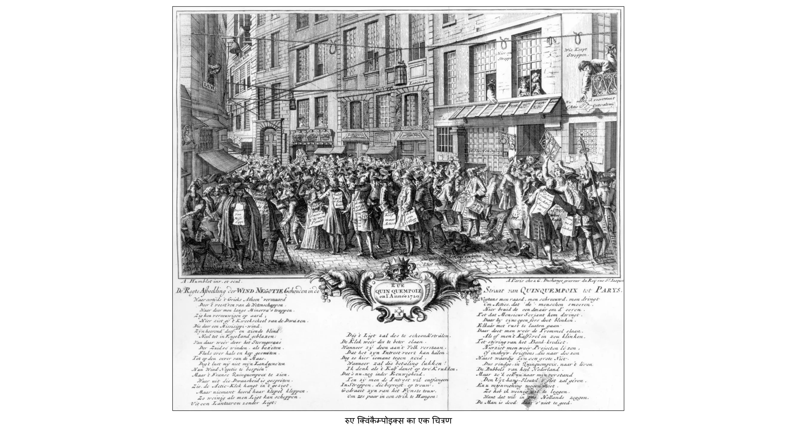

### जब भूमि "संपार्श्विक" बन जाती है

एक सदी बाद, फ्रांसीसी क्रांति ने **असाइनेट्स** नामक मुद्रा के साथ नई ज़मीन तैयार की, जो ज़ब्त चर्च की संपत्ति से समर्थित थी। कागज़ पर तो यह एक आकर्षक विचार था - ज़मीन को मौद्रिक संपार्श्विक में बदलना - लेकिन अप्रभावी: ज़मीन न तो तरल है और न ही विभाज्य। नतीजा: अति मुद्रास्फीति, भूमि उपयोग पर कई प्रतिबंध, अनियंत्रित मुद्रास्फीति और अभाव।

इस अराजकता से बुरी तरह प्रभावित नेपोलियन ने 1800 में बैंक डी फ्रांस की स्थापना के साथ सोने और चांदी को मौद्रिक आधार के रूप में पुनः स्थापित किया, जिससे उसकी सेनाओं को नियमित वेतन की गारंटी मिली। विश्वास वापस पाने का एक व्यावहारिक तरीका: हार्ड करेंसी में भुगतान करना।

### द रोअरिंग ट्वेंटीज़ और 1929 की महामंदी

चलिए दो सदियों पीछे चलते हैं। प्रथम विश्व युद्ध के बाद, सरकारों ने मुद्रास्फीति और सोने के मूल्यह्रास के ज़रिए इस प्रयास को वित्तपोषित किया। 1920 के दशक में, अमेरिकी फेड ने ब्रिटिश पाउंड को सहारा देने के लिए अत्यधिक उदार मौद्रिक नीति अपनाई। नतीजा: आसान ऋण, वॉल स्ट्रीट पर बेलगाम सट्टेबाजी, उधार पर शेयर ख़रीद, और रियल एस्टेट व बैंकिंग बुलबुले का उदय।

जब मशीन गड़बड़ा गई, तो 1929 की मंदी अवश्यंभावी थी: बड़े पैमाने पर बैंक विफलताएँ, रिकॉर्ड बेरोजगारी, और सूप किचन में लंबी कतारें। इससे यह लगातार गलत धारणा बनी रही कि **सभी अपस्फीति बुरी होती है**, जबकि हमें विकास के माध्यम से होने वाली अपस्फीति (स्वस्थ) और ऋण के माध्यम से होने वाली अपस्फीति (विनाशकारी) के बीच अंतर करने की आवश्यकता है।

### 90 के दशक में एशिया और डोमिनो प्रभाव

1990 के दशक में, "एशियाई चमत्कार" ने दुनिया को सपने दिखाए थे। Exchange की दरें डॉलर से जुड़ी थीं, विकास दर 8-10% थी, और पश्चिमी पूँजी का प्रवाह हो रहा था। सब कुछ ठीक चल रहा था... जब तक कि ज्वार कम नहीं हो गया। दिवालियापन की बाढ़ आ गई, मुद्राओं का 80% अवमूल्यन हो गया, और निवेशक बर्बाद हो गए। आईएमएफ को हस्तक्षेप करना पड़ा और दर्दनाक सुधार लागू करने पड़े। हमेशा की तरह वही स्थिति: प्रचुर पूँजी, ऋण-पोषित बुलबुले, फिर पतन।

### 2008 और स्थायी बुलबुले का युग

इंटरनेट बुलबुले (2000) के बाद सबप्राइम रियल एस्टेट बुलबुला आया। प्रतिभूतिकरण ने बैंक ऋणों को "ट्रिपल-ए" वित्तीय उत्पादों में बदल दिया, जो पूरी दुनिया में फैल गए। वादा: जोखिम को कम करके उसे खत्म करना। हकीकत: सभी जोखिम वास्तव में परस्पर जुड़े हुए थे। जब रियल एस्टेट का पतन हुआ, तो पूरी वैश्विक बैंकिंग प्रणाली भी ध्वस्त हो गई।

नतीजा: बड़े पैमाने पर सार्वजनिक राहत पैकेज, मात्रात्मक सहजता और शून्य ब्याज दरें। और इसके साथ ही, एक बेतहाशा दौड़: हर संकट अब अतिरेक को दूर नहीं करेगा, बल्कि उसे और ज़्यादा कर्ज़ और मुद्रा छापने से ढक देगा। यही वर्तमान स्थिति का कारण है: **"सब कुछ बुलबुला"**, जहाँ सब कुछ - शेयर, रियल एस्टेट, कला, क्रिप्टो, यहाँ तक कि पोकेमॉन कार्ड भी - कृत्रिम रूप से बढ़ रहा है।

### जादुई धन की शाश्वत वापसी

एक सदी से दूसरी सदी तक, एक बात लगातार उभरती रहती है: जैसे ही कोई समाज यह मान लेता है कि वह असली चीज़ें बनाने के बजाय पैसे से दौलत पैदा कर सकता है, बुलबुले उभर आते हैं। जॉन लॉ से लेकर 2008 तक, रुए क्विंकैम्पोइक्स से लेकर वॉल स्ट्रीट तक, यह प्रक्रिया खुद को दोहराती है: उत्साह, ऋण, तेज़ी और मंदी।

और अंत में, हमेशा की तरह, जब कोई भी कागज़ पर भरोसा नहीं करता, तो लोग किसी और चीज़ की तलाश करते हैं - सोना, ज़मीन, सुरक्षित ठिकाने... या नई मुद्राएँ। कल नेपोलियन ने धातु थोपी थी, आज कुछ लोग Bitcoin को उसका उत्तराधिकारी मानते हैं।

वित्त का इतिहास एक अंतहीन चक्र है: छापना, अटकलें लगाना, पतन। अगले बुलबुले तक।

## धन और हिंसा

<chapterId>9486fe64-854f-5e17-86b3-8873baca39a8</chapterId>

:::video id=bd6d0807-2d8f-4637-a0f5-1e990e5c0d0f:::

इस छोटे से भाग में हम उन अनेक घटनाओं पर पुनः विचार करेंगे जिन्हें हम पाठ्यक्रम के दौरान देख चुके हैं, तथा कुछ ऐसे किस्से संक्षेप में प्रस्तुत करेंगे जो मुझे दिलचस्प लगे।

### प्रौद्योगिकी और हिंसा

यहाँ कुछ किस्से दिए गए हैं जिन पर हम शायद इस पाठ्यक्रम में पहले ही चर्चा कर चुके हैं। ये किस्से थियो के साथ बी-ओंडी में दिए गए उनके एक व्याख्यान पर हुई एक बेहद दिलचस्प चर्चा का परिचय देते हैं, जो मुझे इस संदर्भ में बेहद दिलचस्प लगा कि तकनीकी प्रगति जनसंख्या और राज्य के बीच हिंसा के संबंधों को कैसे प्रभावित करती है।

### धन और राज्य का दबाव

इस अनुभाग का परिचय देने के लिए, मैं आपको एक संक्षिप्त और गैर-संपूर्ण सूची देने जा रहा हूं, ताकि आपको उन घटनाओं की याद दिलाई जा सके जिन्हें हमने संभवतः पाठ्यक्रम में पहले ही कवर कर लिया है।

धन और हिंसा के बीच एक कड़ी जो मैं पहले ही जोड़ सकता हूँ, वह यह है कि जब बेकार कागज़ के नोटों की बात आती है, जिन्हें अनंत काल तक छापा जा सकता है, तो अक्सर उनके साथ तरह-तरह के नियम और धमकियाँ भी जुड़ी होती हैं। हम पहले से ही असाइनैट्स की बात कर सकते हैं, जहाँ बैंक नोटों पर लिखा होता था कि जालसाज़ों को मौत की धमकी दी जाती है। उस समय के कानूनी ग्रंथों में उन लोगों के लिए मौत की धमकियाँ आसानी से मिल जाती हैं जो इस प्रसिद्ध कागज़ के नोट को स्वीकार नहीं करते थे।

फ़्रांस में रहते हुए, क्रांतिकारी युग से संबंधित एक कानूनी ग्रंथ में, जो मुझे मिला, मैंने देखा कि गिलोटिन के परिवहन और संचालन के लिए "प्रतिदिन" का विवरण मुद्रा-संबंधी खंडों में दिया गया था। मुझे यह बात कुछ अजीब लगी।

हमने चीन में सिक्कों की ढलाई के बारे में भी बात की है, जहाँ राज्य ढलाई की निगरानी करता है। पाठ्यक्रम की शुरुआत में हमने एक भाग में पढ़ा था कि जब कुछ कम सुंदर सिक्कों को त्याग दिया जाता था, तो उसके कानूनी परिणाम होते थे।

इंग्लैंड के एक राजा के बारे में भी एक किस्सा है, जिसने धन कमाने वालों के हाथ काट दिए थे, क्योंकि वे उसकी अपेक्षा के अनुरूप व्यवहार नहीं करते थे।

इसके अलावा, चीन में, मैंने बौद्ध मठों से ताँबे की ज़ब्ती के बारे में पढ़ा है। ऐसे समय में जब ताँबे का मूल्य बढ़ रहा था और उनकी अर्थव्यवस्था अस्थिर हो रही थी - जो एक प्रकार की फ़िएट मुद्रा पर आधारित थी जिसका धातु के मूल्य से कोई लेना-देना नहीं था - उन्होंने ऐसी जगह ढूँढ़ी जहाँ धन हो और मठों से ताँबा ज़ब्त कर लिया।

अंग्रेजी सुधार के दौरान इंग्लैंड के मठों पर भी यही बात लागू हुई। जब प्रसिद्ध राजा का पोप से तलाक को लेकर झगड़ा हुआ, तो इसके पीछे एक और कारण था: उसने मठों के उन्मूलन का फायदा उठाकर इन धार्मिक संगठनों की संपत्ति पर कब्ज़ा कर लिया।

फ्रांसीसी क्रांति के दौरान, उन्होंने चर्च की सारी संपत्ति ज़ब्त कर ली। उन्होंने पिघली हुई चर्च की घंटियों से बने खूबसूरत सिक्के देखे।

अगर हम और भी पीछे जाएँ, तो आर्थिक हिंसा और आज़ादी, और स्वतंत्रता-हत्या क़ानूनों की सबसे स्पष्ट धारणाओं में से एक है **डायोक्लेटियन की वंशानुगत जाति, जिसका सीधा संबंध इस बात से था कि किसान अब अवमूल्यित मुद्रा स्वीकार नहीं करना चाहते थे**। वे किसानी का काम छोड़ना चाहते थे, और डायोक्लेटियन ने उनसे बस इतना कहा, "तुम अपनी ज़मीन नहीं छोड़ सकते, और न ही तुम्हारे बच्चे।" यही बात सैनिकों पर भी लागू होती थी।

मुझे लगता है कि यह हिंसा का एक बहुत ही स्पष्ट रूप है। मैं नाइट्स टेम्पलर या किसी फ्रांसीसी राजा के बारे में बात करके अपनी बात समाप्त कर सकता हूँ। जब नाइट्स टेम्पलर फ्रांस में बस गए, तो मुझे लगता है कि उन्होंने टेम्पलर की संपत्ति का खजाना देखा और उन्हें सरकारी धन की समस्या हुई। उन्होंने टेम्पलर ऑर्डर पर मुकदमा दायर किया, और उनमें से कुछ खजाने का कुछ हिस्सा लेकर भागने में सफल रहे, जिसके कारण अमेरिका और कनाडा में एक बहुत ही दिलचस्प शो बना। मुझे नहीं पता कि इसे किसने बनाया, लेकिन इसका नाम है *द मिस्ट्री ऑफ़ ओक आइलैंड*। यह उन लोगों के बारे में है जो सोचते हैं कि कनाडा के एक द्वीप पर, मैरीटाइम्स में, टेम्पलर का खजाना दबा हुआ है, और वे वर्षों से - शायद एक दशक से भी ज़्यादा समय से - किसी तरह का कुआँ बनाने के लिए खुदाई कर रहे हैं। उन्हें कई दीर्घाओं वाला एक कुआँ मिला है, और वे इस द्वीप पर नाइट्स टेम्पलर द्वारा दबाए गए खजाने की तलाश कर रहे हैं, जो इस टीवी शो का विषय है। मैं अपने पिता को सलाम करता हूँ, जो इस शो के बहुत बड़े प्रशंसक हैं।

तो लीजिए, आपके सामने है: इस कोर्स के दौरान हमने जो तथ्य देखे हैं, उनकी एक छोटी सी सूची, जो मुझे लगता है कि हिंसा से जुड़ाव को दर्शाती है। अब मैं आपको थियो के अगले भाग के साथ छोड़ता हूँ, जो हमें तकनीकी बदलाव और आम जनता और अधिकारियों के बीच शक्ति संतुलन के बारे में एक बेहद दिलचस्प कहानी सुनाएगा।

धन्यवाद!

## संगठित हिंसा के आर्थिक परिणाम

<chapterId>66bd4674-2159-5489-ad4b-ec5e3fb691af</chapterId>

:::video id=c8b063c6-aeb4-4a94-9027-b11d369e71a4:::

### संगठित हिंसा और राज्य का विकास

इतिहासकार फ्रेडरिक सी. लेन एक क्रांतिकारी सिद्धांत प्रस्तुत करते हैं: इतिहास में राज्य की संरचना हिंसा को प्रक्षेपित करने के लिए प्रयुक्त तकनीकों द्वारा आकार लेती रही है। वेबर के इस सिद्धांत से शुरू करते हुए कि वैध हिंसा पर राज्य का एकाधिकार है, लेन का मानना ​​है कि यह एकाधिकार - जो विरोधाभासी रूप से इस क्षेत्र में प्रतिस्पर्धा से कहीं अधिक कुशल है - आक्रमण की लागत और बचाव की लागत के बीच के संबंध के अनुसार विकसित होता है।

"द सॉवरेन इंडिविजुअल" (1997) के लेखकों द्वारा किया गया यह विश्लेषण, राजनीतिक संगठन में ऐतिहासिक परिवर्तनों की व्याख्या करता है: मध्ययुगीन सामंती व्यवस्था से लेकर पुनर्जागरण के नगर-राज्यों तक, फिर औद्योगिक राष्ट्र-राज्यों तक और अंततः आधुनिक कल्याणकारी राज्यों तक। प्रत्येक परिवर्तन हिंसा के प्रयोग में एक बड़ी तकनीकी सफलता से मेल खाता है, जो लगभग हर 400-500 वर्षों में घटित होता है।

### मध्ययुगीन संतुलन

मध्य युग में, कृषि अर्थव्यवस्था 90% से भी ज़्यादा प्रमुख थी। किसान, जो सचमुच अपनी ज़मीन से जुड़ा हुआ था, अपने स्वामी और उसके शूरवीरों से भाग नहीं सकता था। सैन्य तकनीक - हाथ से गढ़े कवच, वर्षों की तलवारबाज़ी की शिक्षा - बेहद महँगी थी। इस विषमता ने रक्षा की तुलना में आक्रमण को व्यापक रूप से प्राथमिकता दी।

गतिहीन कृषि उत्पादक स्थानीय हिंसा के एकाधिकारवादी का बंदी बन जाता है। कर वसूली की उसकी क्षमता नई ऊँचाइयों को छूती है - हालाँकि, विडंबना यह है कि मध्ययुगीन कर आधुनिक समय के 78% अनिवार्य करों की तुलना में मामूली ही रहते हैं। स्वामी अपनी इच्छानुसार कर लगा सकता है, क्योंकि किसान न तो विरोध कर सकता है और न ही छोड़ सकता है।

### व्यापारी पुनर्जागरण

उत्तर में हंसियाटिक व्यापार और दक्षिण में भूमध्यसागरीय व्यापार के उदय ने स्थिति को बदल दिया। अतिरिक्त मूल्य के मुख्य निर्माता, व्यापारियों के पास गतिशील पूँजी थी - उनके जहाज़। उन्हें केवल हल्के समुद्री मिलिशिया की आवश्यकता थी, क्योंकि समुद्र पर पुलिस का नियंत्रण मुश्किल था। सबसे बढ़कर, अगर कर अत्यधिक हो जाता, तो वे आसानी से किसी पड़ोसी बंदरगाह पर जा सकते थे।

इस गतिशीलता ने नगर-राज्यों के बीच कर प्रतिस्पर्धा को जन्म दिया। वेनिस, जेनोआ और ब्रुगेस को यथासंभव उदार ढाँचा प्रदान करना पड़ा: विश्वसनीय अनुबंध, गुणवत्तापूर्ण मुद्रा, बीमा, न्यूनतम कराधान। राजकुमारों को दबाव डालने के बजाय प्रलोभन देना पड़ा। समरूपता उलट जाती है: बचाव (भागकर) आक्रमण से आसान हो जाता है।

### औद्योगिक युग

औद्योगिक क्रांति अपने साथ सामंतवाद जैसा एक ढाँचा लेकर आई। कारखाने, रेलमार्ग और असेंबली लाइनें विशाल, स्थिर निवेश का प्रतिनिधित्व करती हैं। हेनरी फोर्ड कराधान के कारण अपने संयंत्रों को स्थानांतरित करने में असमर्थ थे। औद्योगिक शहरों में केंद्रित श्रमिकों ने व्यक्तिगत रूप से पलायन करने के बजाय सामूहिक रूप से बातचीत करने के लिए संघ बनाया।

"कल्याणकारी राज्य" का उदय हुआ: औद्योगिक नियोजन (जापान, कोरिया), बुनियादी ढाँचों की सैन्य सुरक्षा, और कार्यबल के लिए न्यूनतम सामाजिक लाभ। द्वितीय विश्व युद्ध ने इस कमजोरी को दर्शाया: दुश्मन के कारखानों पर बमबारी प्रमुख रणनीति बन गई। भौतिक पूँजी के संकेंद्रण ने कल्याणकारी राज्य के वित्तपोषण के लिए बड़े पैमाने पर कर वसूली को संभव बनाया।

### माइक्रोप्रोसेसर क्रांति

तीन तकनीकी नवाचार अब इन सदियों पुराने संतुलन को बिगाड़ रहे हैं। माइक्रोप्रोसेसर युद्धकला को बदल रहा है: नेवादा का एक ऑपरेटर अफ़ग़ानिस्तान में एक ड्रोन को सटीकता से उड़ा रहा है। खाड़ी युद्ध (1991) ने इस सफलता को दर्शाया: दुनिया की चौथी सबसे बड़ी सेना (इराक) का 45 दिनों में सफाया कर दिया गया, जिसमें गठबंधन सेना की ओर से 200 से भी कम मौतें हुईं। तकनीकी श्रेष्ठता ने सामने से हमला करना असंभव बना दिया।

इंटरनेट और असममित क्रिप्टोग्राफी मूल्य सृजन में क्रांति ला रहे हैं। एक डेवलपर मैकबुक और स्टारलिंक के साथ कहीं से भी काम कर सकता है, और अपने उत्पादन को तुरंत और मुफ़्त में निर्यात कर सकता है। डिजिटल खानाबदोश भौगोलिक कैद से बच निकलते हैं और राज्यों को एक-दूसरे के खिलाफ़ इस तरह से खड़ा करते हैं जैसा पुनर्जागरण काल ​​के बाद से नहीं देखा गया।

Bitcoin इसी तर्क की पराकाष्ठा है: एक ऐसी मुद्रा जो राज्य से मुक्त है, एक अटूट क्रिप्टोग्राफ़िक कवच द्वारा सुरक्षित। धन किसी भी भौतिक बल के विरुद्ध सुरक्षित हो जाता है। व्यक्ति राज्य के एकाधिकार के विरुद्ध अपनी रक्षा करने की क्षमता पुनः प्राप्त कर लेता है।

### वेस्टफेलियन मॉडल का पतन

औद्योगिक युग के लिए डिज़ाइन किए गए पश्चिमी कल्याणकारी राज्य अब पुराने पड़ रहे हैं। मूल्य निर्माता - डेवलपर, कलाकार, वित्तपोषक - सिंगापुर, दुबई या अल सल्वाडोर की ओर पलायन कर रहे हैं, जहाँ उन्हें न्यूनतम कराधान के बदले कम सार्वजनिक सेवाएँ पसंद हैं। एप्पल और टेथर जैसी आधुनिक दिग्गज कंपनियों को न तो कार्यालयों की ज़रूरत है और न ही भौतिक बुनियादी ढाँचे की।

यह प्रतिभा पलायन एक चक्रव्यूह रचता है: शुद्ध योगदानकर्ताओं की संख्या में कमी, सार्वजनिक सेवाओं का ह्रास, रहने वालों पर करों में वृद्धि, और तेज़ी से पलायन। राज्यों को आकार में आमूल-चूल कटौती करनी होगी या दिवालिया हो जाना होगा। छोटे, प्रतिस्पर्धी क्षेत्राधिकारों में विखंडन - डिजिटल नगर-राज्यों का एक नया मॉडल - अपरिहार्य प्रतीत होता है।

इतिहास हमें सिखाता है कि इन बदलावों में पीढ़ियाँ लग जाती हैं। लेकिन Bitcoin में मुद्रा और राज्य का पृथक्करण इस प्रक्रिया को तेज़ कर सकता है। अब लोग अपने पैरों और अपने क्रिप्टोग्राफ़िक वॉलेट से वोट करते हैं, जिससे वैश्विक शक्ति का नक्शा उन रेखाओं के साथ फिर से बनता है जिन्हें हम अभी समझना शुरू कर रहे हैं।

## वित्त का एक बहुत ही संक्षिप्त इतिहास

<chapterId>1d37fff1-a091-5034-8e71-4af590b8ffce</chapterId>

:::video id=fdfabbc6-e4d8-463a-8522-19176f8fb460:::

मुद्रा के इतिहास के इस विवरण के बाद, जो हमें सीधे फिएट प्रणाली तक ले जाता है, मैं वित्त के विकास को संक्षेप में और जल्दी से समझाना चाहूँगा जिसने अंततः कल्याणकारी राज्य का मार्ग प्रशस्त किया। शुरुआत में, रोमन काल में, हमारे पास सिक्के थे।

सिक्के एक वित्तीय तकनीक थे जिनसे साम्राज्य सैनिकों को वेतन दे सकता था, विस्तार कर सकता था और व्यापार कर सकता था। यह बहुत कारगर रहा, लेकिन अंततः इसका बहुत अधिक अवमूल्यन हुआ। एक समय ऐसा आया जब उन्होंने विस्तार करना बंद कर दिया और युद्धों तथा क्षेत्र विस्तार से लूट का माल प्राप्त करना बंद कर दिया, तो उनकी व्यवस्था ध्वस्त हो गई।

### वित्तीय प्रौद्योगिकियों का विकास

फिर मध्य युग आया, जब फ्लोरिन तक बहुत कम विकास हुआ, जिसने एक स्थिर मुद्रा वापस ला दी, और इटली और एंटवर्प में बैंकिंग विकास हुआ, जहाँ "धन के समय मूल्य" की अवधारणा विकसित हुई - दूसरे शब्दों में, छूट। उन्होंने छूट का विकास कागजी मुद्रा के एक रूप को बनाने के लिए किया जिसमें एक "प्रॉमिसरी नोट" जारी किया जाता था, यानी एक वादा कि बाद में कोई व्यक्ति $100 और ब्याज दर वसूल सकेगा।

इस प्रणाली ने एक वित्तीय प्रौद्योगिकी का निर्माण किया जो धारक को अवधि समाप्त होने से पहले नोट बेचने की अनुमति देता है, इसलिए यदि आप इसे 6 महीने की अवधि में से 4 महीने बाद बेचते हैं, तो व्यक्ति वास्तव में शेष 2 महीनों के लिए उपज के नुकसान की भरपाई के लिए प्रीमियम का भुगतान करेगा।

यह उस समय एंटवर्प और एम्स्टर्डम में विकसित एक वित्तीय तकनीक थी। बाद में, हमने केंद्रीय बैंकों और अंतिम ऋणदाता की अवधारणा का विकास देखा। यह तर्क दिया जा सकता है कि बैंक ऑफ एम्स्टर्डम के दौरान, अंतर्राष्ट्रीय व्यापार में सिक्कों का उपयोग बंद कर दिया गया और धर्मग्रंथों के धन का उपयोग शुरू हो गया।

बाद में, 18वीं सदी में, वित्तीय तकनीक के संदर्भ में, हम बीमा के बारे में बात कर सकते हैं। नील फर्ग्यूसन की पुस्तक "द एसेंट ऑफ़ मनी" में एक किस्सा बहुत ही खूबसूरती से बताया गया है। पहली बीमा कंपनी का नाम स्कॉटिश विडोज़ था, और मूलतः पादरी ही थे जो उन पादरियों के लिए बीमा विकसित करना चाहते थे जिनकी कभी-कभी समय से पहले, अचानक मृत्यु हो जाती थी। उस समय, पादरी एक साल के लिए स्कॉटलैंड में अपनी पत्नियों और बच्चों की देखभाल कर रहे थे। इसलिए पादरियों को यह एक साल की अवधि शायद थोड़ी कम लगी। परिणामस्वरूप, उन्होंने बीमांकिक गणनाओं का आविष्कार किया, जिससे प्रणाली की लागतों को पूरा करने के लिए आवश्यक योगदानकर्ताओं की संख्या की गणना की जा सके, जो समय से पहले मरने वाले पादरियों की संख्या पर निर्भर करती थी।

उन्होंने बीमांकिक गणनाएँ विकसित कीं और कहा, "ठीक है, हर पादरी हमें यह राशि देता है। फिर, अगर पादरी की मृत्यु हो जाती है, तो बीमा उसकी पत्नी और बच्चों के आत्मनिर्भर होने तक उनके जीवनयापन के खर्चों को वहन करेगा।" इस प्रकार, "स्कॉटिश विडोज़" नामक पहली बीमा कंपनी ने इस प्रणाली को लोकप्रिय बनाया और इसे वहीं लागू किया गया।

### निजी बीमा से कल्याणकारी राज्य तक

तो बीमा वित्तीय प्रौद्योगिकी के इतिहास का एक हिस्सा है। और यह मुझे कल्याणकारी राज्य की अवधारणा की ओर ले जाता है, जिसमें निजी बीमा को अंततः एक समस्या का सामना करना पड़ा, अनुकूलन की एक धारणा, जहाँ हम खुद से कहते हैं, अगर हम स्वस्थ लोगों को स्वास्थ्य बीमा देते हैं, तो हो सकता है कि वे प्रीमियम देने में कम रुचि लें क्योंकि वे खुद से कहते हैं, "मैं स्वस्थ हूँ, मैं बीमार नहीं पड़ूँगा"। दूसरी ओर, जो लोग जानते हैं कि वे बीमार हैं, वे निश्चित रूप से सदस्यता लेना चाहेंगे।

यह व्यवस्था स्वास्थ्य बीमा लेने वाले बीमार लोगों की संख्या और कम स्वास्थ्य बीमा लेने वाले स्वस्थ लोगों की संख्या के बीच असंतुलन पैदा करती है। इस प्रकार, एक प्रकार का असंतुलन है: यदि आप आँकड़ों की गणना करें, तो वे संतुलित नहीं होंगे क्योंकि आप संभवतः लागत की भरपाई के लिए पर्याप्त स्वस्थ लोगों का बीमा नहीं कर पाएँगे। अर्थशास्त्र में, इसे **नैतिक जोखिम** की अवधारणा कहा जाता है।

एक विचार जो सामने रखा गया है, वह है बीमा को अनिवार्य बनाना। अगर सभी को योगदान देने के लिए बाध्य किया जाए, तो इससे पूरी व्यवस्था में संतुलन आ जाएगा और स्वस्थ और अस्वस्थ दोनों तरह के लोग योगदान देंगे, जिससे जोखिम सबसे बड़ी आबादी पर बँट जाएगा।

और इसलिए, दुनिया के कई हिस्सों में, सरकार ने कहा है, "ठीक है, हम इसका ध्यान रखेंगे"। हालाँकि मैं इस मुद्दे का विशेषज्ञ नहीं हूँ, लेकिन मैं देख सकता हूँ कि यही तर्क शायद अन्य सभी प्रकार के बीमा, जैसे बेरोज़गारी बीमा, पर भी लागू होता है। सरलीकरण और अनुकूलन की इच्छा इस विचार पर आधारित है कि अगर इसका ध्यान रखने के लिए केवल एक ही संगठन होगा तो यह आसान होगा।

मेरी राय में, इससे सभी बीमा अवधारणाओं का केंद्रीकरण हुआ और अंततः कल्याणकारी राज्य का जन्म हुआ, जहां ये सभी वित्तीय अवधारणाएं, जो मूल रूप से निजी उद्यम थे, बीमा बाजार की जरूरतों को पूरा करने के लिए निजी पहल थीं, ताकि जोखिम को आबादी के बीच वितरित किया जा सके, उन पर राज्य ने उन कारणों से कब्जा कर लिया जो नैतिक जोखिम और अनुकूलन की इच्छा के संबंध में संभवतः काफी तार्किक हैं।

### वैकल्पिक मॉडल और राज्य के एकाधिकार पर विचार

अंततः, कनाडा जैसे कुछ देशों में, हमें कई प्रकार के बीमा - स्वास्थ्य बीमा, बेरोजगारी बीमा - प्राप्त होते हैं, जिन पर राज्य का एकाधिकार होता है।

मैं आपको एक उदाहरण दे सकता हूँ, मुझे पता है। स्विट्ज़रलैंड में व्यवस्था थोड़ी अलग है। वहाँ निजी म्युचुअल बीमा कंपनियाँ और निजी अस्पताल हैं, इसलिए आप अपनी म्युचुअल बीमा कंपनी चुन सकते हैं, आप अपनी म्युचुअल बीमा कंपनी के भीतर अपना पैकेज चुन सकते हैं। आपको अपेक्षाकृत सार्वभौमिक सेवाएँ मिलती हैं, भले ही इस व्यवस्था का एक बड़ा हिस्सा निजी ही रहे।

इसलिए मुझे लगता है कि यह संभव है कि यह निजी तौर पर भी संचालित हो। लेकिन मैं आपको जो कुछ भी बताना चाहता था, वह वास्तव में यह बताने के लिए नहीं था कि एक प्रणाली दूसरी से बेहतर है या नहीं, बल्कि यह आपको यह समझाने के लिए था कि वित्त के इतिहास के बारे में पढ़ते हुए, मुझे एहसास हुआ कि पश्चिम में, खासकर फ्रांस में, और खासकर कनाडा में, राज्य इन वित्तीय सिद्धांतों पर नियंत्रण क्यों रखना चाहता था।

मैं जो कहना चाहता था, वह यह है कि बीमा की अवधारणा सबसे पहले और सबसे महत्वपूर्ण रूप से वित्त का एक विकास है, और जैसा कि सरकारें कभी-कभी इसमें माहिर होती हैं, वे इसे नियंत्रित करने की कोशिश करेंगी, ठीक वैसे ही जैसे उन्होंने कई कारणों से धन को नियंत्रित करने की कोशिश की है। संयोग से, एक कारण अंतिम उपाय के रूप में ऋणदाता की अवधारणा है।

विचार यह है कि अगर इसके पीछे कोई बड़ी संस्था हो जो जोखिम को ज़्यादा व्यापक रूप से वितरित करे, तो यह ज़्यादा बेहतर होगा। अंतिम ऋणदाता की अवधारणा के पीछे यही प्रारंभिक पहल थी, जहाँ यह संस्था वास्तव में उन संस्थाओं को चुन सकती थी जो जीवित रहने के लिए पर्याप्त मज़बूत हों और उन्हें ऋण देकर उन्हें टूटने से बचा सकती थी।

उस समय, जब यह अवधारणा पहली बार सामने आई, तो इसका वास्तविक विश्लेषण किया गया था, लेकिन अंततः जो हुआ वह यह है कि हम सभी को बचा लेते हैं, "बहुत बड़ा, असफल होने के लिए बहुत बड़ा", यह लगभग सभी बैंकों पर लागू होता है क्योंकि वहाँ केंद्रीकरण है, और सभी बड़ी कंपनियों पर भी। अंततः, हम देखते हैं कि यह अभी भी एक ऐसी अवधारणा है जिसे राज्य द्वारा "व्यापक रूप से" लागू किया जाता है, बीमा की अवधारणा के समान, जिसका मैंने अभी आपको वर्णन किया है।

अंततः, राज्य यह निर्णय लेता है कि वह सब कुछ संभालेगा, और स्कॉटलैंड में किसी विशिष्ट समस्या के समाधान के लिए बनाई गई वित्तीय तकनीक को उस विशाल कल्याणकारी राज्य में बदल देता है जिसे हम आज जानते हैं। यह अपनी ज़रूरतमंद आबादी को सेवाएँ प्रदान करने के लिए बीमांकिक वित्तीय सिद्धांतों का उपयोग करता है। हालाँकि, हम इस बात से सहमत हो सकते हैं कि इस प्रणाली से उत्पन्न एकाधिकार कई प्रकार की समस्याएँ पैदा करते हैं, जिनका हम वर्तमान में कनाडा और फ्रांस जैसे देशों में अनुभव कर रहे हैं। सौभाग्य से, अलग-अलग मॉडल मौजूद हैं, जैसे कि स्विट्जरलैंड में।

हमें बस यह समझना होगा कि कल्याणकारी राज्य की यह अवधारणा वित्त से ही निकलती है। यह समझ बताती है कि हम प्रसिद्ध सरकारी एकाधिकार के अलावा अन्य रास्ते भी तलाश सकते हैं, और मैं इस तर्क को अंतिम उपाय के रूप में केंद्रीय बैंकों की अवधारणा पर भी लागू करूँगा - लेकिन यह विषय किसी और समय के लिए है।

# अंतिम खंड

<partId>9bada469-7ef0-511a-9eaa-f8eb66d5906f</partId>

## इस पाठ्यक्रम का मूल्यांकन करें

<chapterId>a9494e2b-8a4d-5811-8a7b-b4a91fb22778</chapterId>

<isCourseReview>true</isCourseReview>

## निष्कर्ष

<chapterId>1094e793-b4c6-5782-aa4a-71cde00ce7c0</chapterId>

<isCourseConclusion>true</isCourseConclusion>