# Sebuah perjalanan melalui sejarah mata uang koin

Kursus yang menarik ini akan membawa Anda pada eksplorasi evolusi uang yang menarik dari peradaban paling awal hingga sistem moneter kita saat ini. Kita akan melintasi zaman, dari zaman Neolitikum hingga zaman modern, menemukan bagaimana uang telah membentuk dan dibentuk oleh peradaban besar manusia. Dari proto-money Mesopotamia hingga mata uang kripto, koin Lydia, florin Renaisans, dan munculnya perbankan sentral - kursus ini menawarkan perspektif komprehensif tentang salah satu pilar fundamental masyarakat kita.

+++
# Pendahuluan

<partId>59878a67-8a1d-5d6b-af41-5b847c14363c</partId>

## Pengantar Sejarah Uang

<chapterId>ca53597e-be9a-5261-a55f-11fac8504a68</chapterId>

:::video id=08ff35ca-8a40-4286-abaf-71283faf6e78:::

Selamat datang di kursus sejarah uang ini. Seperti judulnya, kita akan menjelajahi evolusi sejarah koin bersama-sama. Dari era Neolitikum hingga hari ini, kita akan melihat kerajaan dan peradaban besar di masa lalu.

Namun, kursus ini tidak terbatas pada kronologi sederhana tentang tanggal atau peristiwa sejarah. Namun, tujuan kami yang sebenarnya adalah untuk memberikan pemahaman mendalam tentang konsep-konsep dasar yang terlibat dalam kemunculan uang, atau lebih tepatnya, mata uang.

### Konsep-konsep dasar untuk dijelajahi

Jadi, kita berbicara tentang kemunculan: kemunculan mata uang itu sendiri, sistem moneter, bank, uang kertas, bank sentral, dan akhirnya, kemunculan sistem moneter "fiat" saat ini.

Kita akan memulai perjalanan kita ke dalam proto-mata uang dengan kemunculan uang utang dan unit-unit akun di Mesopotamia, serta sistem lain seperti mas kawin dan uang darah di masyarakat primitif. Kita juga akan melihat bagaimana sistem moneter yang sebenarnya sudah ada di Mesir kuno, jauh sebelum Kerajaan Pertengahan.

Kita kemudian beralih ke kemunculan koin pertama di Lydia, sebuah momen penting yang sering dianggap sebagai awal mula uang menurut buku-buku pelajaran ekonomi. Kita akan melihat bagaimana koin-koin ini dapat menyebar berkat Persia, Alexander Agung, lalu Roma, sebelum akhirnya memaksakan diri, mendominasi, dan runtuh.

Dari sana, berbekal semua yang telah kita pelajari, kita akan meluangkan waktu untuk merefleksikan definisi uang, melampaui gagasan yang sudah terbentuk sebelumnya seperti "uang selalu merupakan utang" atau "uang selalu merupakan komoditas". Pada kenyataannya, uang adalah barang dan konvensi sosial. Secara khusus, kita akan membahas konsep premi uang dan mencoba menyatukan berbagai teori yang menjelaskan kemunculan uang.

### Periode-periode penting dan inovasi moneter

Kita kemudian beralih ke periode yang sulit, ditandai dengan ketidakstabilan tertentu dalam hal moneter, yang bagaimanapun juga melihat munculnya inovasi mencolok seperti penny Inggris, yang digunakan untuk menyuap penjajah Denmark, dan pound Charlemagne, yang kenangannya masih bertahan hingga saat ini pada beberapa uang kertas modern.

Kita juga akan melihat bagaimana Perang Salib mendorong munculnya sistem transfer uang jarak jauh yang pertama. Kemudian, saatnya untuk melihat dampak Florin, mata uang yang menyertai Renaisans, dan kedatangan logam mulia dari Amerika, yang memiliki pengaruh besar pada harga-harga di Eropa.

Kita akan melihat secara rinci munculnya uang kertas dan perbankan sentral, menarik kesejajaran dengan sejarah krisis keuangan dan dampaknya yang sering kali sangat kejam.

Terakhir, kita akan menarik kesejajaran dengan sistem moneter kontemporer kita, mengeksplorasi konsekuensinya, dan menelusuri sejarah keuangan untuk lebih memahami bagaimana kita sampai pada negara kesejahteraan saat ini.

Dan, sebagai bonus, kita juga akan melihat banyak hubungan etimologis yang menarik terkait dengan uang, yang terus memengaruhi kehidupan kita sehari-hari dalam berbagai bahasa.

### Struktur kursus

Kursus ini dibagi menjadi tiga bagian utama.

Bagian I membahas kemunculan uang, Bagian II membahas kebangkitan uang dan keruntuhannya, dan Bagian III menunjukkan bagaimana institusi negara atau negara secara bertahap mengambil alih kendali atas uang, yang mengarah ke sistem fiat saat ini.

Terima kasih dan selamat menikmati!

# Munculnya bursa

<partId>da5e4981-9ea5-5208-beab-3b75c9043632</partId>

## Dari Australopithecus hingga Manusia Modern

<chapterId>34a773aa-f2d3-5c26-8be4-f2cd79ed6fbc</chapterId>

:::video id=4f333013-4b2a-42ab-8761-593fafc971ca:::

### Mengapa memulai dari zaman Neolitikum

Mengapa harus kembali ke zaman Neolitikum untuk membicarakan tentang uang? Jawabannya sederhana: kita tidak dapat sepenuhnya memahami kemunculan uang tanpa melihat kemunculan peradaban itu sendiri. Untuk memahami mengapa sistem moneter pertama muncul, kita perlu memahami apa yang membuat kelompok pemburu-pengumpul nomaden menetap.

Sebuah suku tanpa pembagian kerja, tanpa spesialisasi, di mana setiap individu bertanggung jawab untuk menghasilkan apa yang dia butuhkan, sama sekali tidak membutuhkan uang. Demikian juga, sebuah komunitas pertanian yang hanya mempraktikkan pertanian subsisten, di mana setiap orang bercocok tanam untuk diri mereka sendiri, belum merasakan kebutuhan akan perantara pertukaran universal.

### Sedentarisasi dan konsekuensinya

Itulah mengapa saya pikir menarik untuk memulai penjelajahan kita pada periode Neolitikum. Kita akan melihat bagaimana sedentarisasi secara bertahap memunculkan desa, lalu kota, dan akhirnya peradaban besar. Sedentarisasi dan produksi surplus makanan inilah yang memungkinkan spesialisasi tenaga kerja, menciptakan lahan subur yang penting bagi kemunculan dan evolusi konsep moneter pertama.

Sama seperti interaksi manusia yang memunculkan bahasa, kita bisa menganggap bahwa uang muncul secara alami, atau tidak (seperti pada suku Inca dan Sparta), dalam proses pembentukan dan pengorganisasian peradaban. Menurut pendapat saya, kemunculan atau ketidakmunculan uang ada hubungannya dengan bentuk organisasi sosial dan ekonomi setiap masyarakat.

### Kronologi evolusi manusia

Namun pertama-tama, mari kita lihat konteks historis yang lebih luas lagi.

Seperti presentasi pertama lainnya, saya akan melakukan kebalikan dari apa yang saya katakan dalam pengantar kursus dan memberikan Anda daftar tanggal dan peristiwa bersejarah yang mengikuti satu sama lain. Idenya di sini adalah untuk menempatkan kemunculan uang dalam konteks sejarahnya, dalam kaitannya dengan kemajuan manusia lainnya seperti memasak makanan, roda, domestikasi sereal dan hewan tertentu, pembangunan piramida, dan pendirian kota-kota pertama.

Jadi, mari kita lihat evolusi umat manusia dari zaman prasejarah dan seterusnya.

Gambaran umum evolusi manusia dari Australopithecus hingga manusia modern, mengikuti kemajuan teknologi dan pergerakan populasi hingga periode Neolitikum.

### Konteks sejarah umat manusia

- 3 juta tahun yang lalu** - Kemunculan *Australopithecus*.
- 2 juta tahun yang lalu** - Hominin mulai meninggalkan Afrika.
- 1.6 juta tahun yang lalu** - Hominin mencapai Eropa selatan dan Asia.
- 1 juta tahun yang lalu** - Bukti pertama memasak di rumah dengan api (tulang-tulang hangus dan sisa-sisa tanaman di Gua Wonderwerk, Afrika Selatan).
- Sekitar 400.000 SM** - Neanderthal hidup di Eropa dan Asia.
- Sekitar 300.000 SM** - Kemunculan *Homo sapiens*.
- 80.000 tahun yang lalu** - *Homo sapiens* mulai bermigrasi ke seluruh penjuru dunia.
- 73.000 tahun yang lalu** - Gua Blombos di Afrika Selatan (bentuk seni tertua yang diketahui).
- 50.000 tahun yang lalu** - *Homo sapiens* mencapai Eropa.
- 30.000 tahun yang lalu** - Lukisan gua dari gua Chauvet di Prancis.
- 15.000 tahun yang lalu** - Lukisan gua Lascaux di Prancis dan seni cadas Australia.
- Sekitar 9000 SM** - Domestikasi jelai di daerah Bulan Sabit Subur.
- Sekitar 9000 SM** - Budidaya jagung di Meksiko.
- Sekitar 8000 SM** - Domestikasi kambing dan domba di Bulan Sabit Subur.
- Sekitar tahun 7250 SM** - Ain Ghazal (Yordania) mengungkapkan sebuah desa dengan beberapa ratus penduduk.
- Sekitar 7000 SM** - Çatalhöyük (Turki) memiliki hingga 8.000 penduduk.
- Sekitar 6500 SM** - Kehidupan menetap dimulai di Yunani.
- 6000 tahun yang lalu** - Awal irigasi sungai di Mesir dan Mesopotamia.
- Sekitar 5000 SM** - Munculnya kombinasi pertanian "tiga bersaudara" (jagung, labu, kacang-kacangan).
- Sekitar 4000 SM** - Domestikasi unta di Asia Tengah. (Keluarga unta berasal dari Amerika Utara pada masa Eosen 45 juta tahun yang lalu. Unta-unta ini kemudian bermigrasi ke Asia melalui sebidang tanah tipis yang menghubungkan kedua benua pada waktu itu di Selat Bering. Bagian lain dari keluarga ini kemudian menuju ke Amerika Selatan, di mana keturunannya masih hidup sampai sekarang: llama, alpacas, dan vicuna).
- Sekitar 3500-3000 SM** - Suku Botai mulai menjinakkan dan membiakkan kuda.
- Sekitar awal Zaman Perunggu** - Bangsa Sumeria telah menemukan roda dan perahu layar, serta mengembangkan aritmatika, astronomi, dan bentuk tulisan pertama.
- Sekitar tahun 2800 SM** - Uruk, pada puncaknya, mencapai populasi hingga 80.000 jiwa.
- 2600-2200 SM** - Tanda-tanda pertama perkembangan kota di dunia Yunani. Perluasan tanaman Mediterania (gandum, tanaman merambat, zaitun).
- 2560 SM** - Pembangunan Piramida Agung Giza.
- Sekitar 1500 SM** - Peradaban Minoa.
- Sekitar 1300 SM** - Peradaban Mycenaean.
- Sekitar tahun 1250 hingga 1150 SM** - Runtuhnya peradaban Zaman Perunggu.
- abad ke-1 Masehi** - Suku Berber Afrika Utara menjinakkan unta.

Jadi, berikut ini adalah tinjauan historis untuk memberi kita perspektif tentang kemunculan teknologi tertentu, domestikasi hewan tertentu, dan budaya, untuk menempatkannya dalam konteks kemunculan tulisan dan uang, yang akan menjadi topik bahasan kita selanjutnya.

## Dari Pemburu-Pengumpul menjadi Petani: Fajar Peradaban

<chapterId>ea950b6e-9eb7-553d-8f04-0eb042bb1f5a</chapterId>

:::video id=4b49a376-f6f4-42a0-86fa-264997a079f0:::

### Transisi ke pertanian dan sedentarisasi

Dalam bab ini, kita akan membahas tentang transisi dari berburu dan meramu ke pertanian subsisten, kerajinan tangan, dan perdagangan. Saya merasa penting untuk menjelaskan transisi menuju kehidupan menetap dan pertanian ini, untuk memahami bagaimana kota-kota pertama dibangun, yang pada akhirnya mengarah pada penciptaan dan kemunculan sistem moneter tertentu selama Zaman Kuno.

Bagian ini adalah kutipan dari kursus yang tersedia di situs web The Great Courses yang berjudul Mesopotamia Kuno, Kehidupan di Tempat Lahir Peradaban, yang diberikan oleh Profesor Amanda Podany dari California State Polytechnic University, Ponoma.

### Paradoks dalam mengadopsi pertanian

Pertanian primitif muncul sekitar 10.500 tahun yang lalu di Timur Dekat, di sekitar barat laut Suriah dan selatan Turki. Saat ini, kelompok pemburu-pengumpul modern tidak terburu-buru mengadopsi pertanian, dan hal yang sama mungkin juga terjadi pada periode Neolitikum.

**Desa-desa pertama jelas dibangun sebelum domestikasi tanaman dan hewan.** Orang-orang tidak menetap karena pertanian memungkinkan mereka untuk melakukannya; sebaliknya, mereka menetap terlebih dahulu dan baru kemudian, sekitar 3.000 tahun kemudian, mereka mulai bercocok tanam.

Berburu dan meramu bekerja dengan sangat baik, sehingga mereka tidak perlu menanam benih untuk menghasilkan makanan. Saat ini, para pemburu-pengumpul memiliki lebih banyak waktu luang daripada petani pertama, yang menggunakan teknologi yang sangat sederhana.

Jadi, apa yang kami katakan di sini adalah bahwa masyarakat pemburu-pengumpul primitif modern memiliki lebih banyak waktu luang daripada yang kita pahami dari para petani pertama pada periode Neolitikum, yang memiliki, bagaimanapun juga, teknologi yang cukup sederhana untuk bercocok tanam. Orang-orang ini bekerja lebih keras untuk menghasilkan makanan daripada suku-suku primitif modern, yang hidup dengan berburu dan meramu.

Studi tulang juga menunjukkan bahwa petani pertama berukuran lebih kecil dan kurang kuat dibandingkan pemburu-pengumpul yang mendahuluinya. Pola makan para petani lebih terbatas dibandingkan dengan para pemburu-pengumpul. Mereka makan lebih banyak roti, tetapi lebih sedikit daging, dan juga memiliki gigi yang lebih buruk karena serpihan batu yang digunakan dalam produksi tepung. Ketika mereka membuat tepung dengan batu, itu menghasilkan serpihan-serpihan.

Mereka yang mengikuti diet "keto" akan setuju: makan banyak roti mungkin tidak sebaik makan daging.

### Teori-teori tentang adopsi pertanian

Dengan semua kerugian ini, siapa yang akan memilih untuk menjadi petani saat itu? Beberapa teori populer mengatakan bahwa manusia dipaksa untuk mengadopsi pertanian dan itu bukanlah sebuah pilihan. Bahkan dengan biji-bijian liar pun, ada masalah besar. Biji-bijian dalam jumlah besar tidak dapat diangkut dengan mudah. Biji-bijian itu harus disimpan di suatu tempat. Setelah biji-bijian disimpan, masuk akal untuk tetap berada di dekatnya. Jadi, Anda menanam biji-bijian liar, yang belum tentu merupakan hasil pertanian, dan ketika Anda menanamnya dalam jumlah besar, Anda harus menyimpannya di suatu tempat, sehingga sulit untuk diangkut. Hal ini mungkin berkontribusi pada fase pertama sedentarisasi. Ini mungkin merupakan alasan awal mengapa orang menetap di suatu tempat. Jika tempat ini menyediakan makanan sepanjang tahun, tidak perlu mengikuti kawanan ternak atau melakukan perjalanan terus-menerus.

Dalam budaya Natoufian, hingga seratus orang tinggal bersama di desa-desa yang terdiri dari rumah-rumah bundar. Sebuah teori populer yang menjelaskan awal mula pertanian adalah bahwa perubahan ini didorong oleh perubahan iklim. Sekitar 11.000 tahun yang lalu, iklim di Timur Dekat menjadi lebih dingin dan lebih kering dari sebelumnya. Tumbuhan dan hewan yang sebelumnya berlimpah menjadi lebih langka. Masyarakat kemudian mulai membudidayakan tanaman yang menjadi tumpuan hidup mereka, atau memelihara hewan-hewan muda untuk dibesarkan dan diambil manfaatnya, seperti domba, kambing, dan sapi, yang cocok untuk pengembangbiakan seperti itu. Ini merupakan proses yang sangat bertahap. Jadi, tidak ada saat yang tepat ketika mereka semua menjadi petani yang memelihara hewan.

Teori lainnya adalah bahwa desa-desa itu sendiri yang menciptakan masalah yang diselesaikan dengan domestikasi. Perburuan dan pengumpulan makanan secara intensif akan mengganggu kestabilan lingkungan alam. Menurut salah satu hipotesis, suku Natoufia telah mencapai kesuksesan demografis sehingga mereka menjadi terlalu banyak untuk lingkungan sekitarnya. Oleh karena itu, rawa-rawa dan area di mana tanaman alami tumbuh mungkin tidak cukup produktif untuk populasi desa. Lingkungan sekitar tidak mampu menyediakan kebutuhan bagi semua orang. Mereka kemudian mulai bercocok tanam langsung di lokasi dan meningkatkan pasokan makanan mereka.

## Perdagangan Neolitikum

<chapterId>8e495224-6d55-58f6-a9dc-ac2814281cfa</chapterId>

:::video id=d04245af-e416-48b1-8157-d569207a32c4:::

### Transisi Paleolitikum-Neolitikum

Periode Neolitikum menandai jeda fundamental dalam sejarah manusia, sangat berbeda dengan masyarakat Paleolitikum yang mendahuluinya. Pada masa Paleolitikum, populasi Eropa sangat terpencar: hanya 7.000 orang yang mendiami seluruh benua pada 20.000 tahun yang lalu, terorganisir dalam kelompok-kelompok nomaden kecil beranggotakan 20 hingga 50 orang yang mengikuti kawanan besar yang bermigrasi dalam jarak yang sangat jauh.

Pemanasan global di akhir Zaman Es secara radikal mengubah organisasi sosial ini. Munculnya hutan menggantikan fauna yang bermigrasi dengan fauna hutan yang lebih banyak menetap, sehingga memungkinkan kelompok manusia menjadi semi-menghuni. Transformasi ini disertai dengan ledakan demografis yang spektakuler: dari perkiraan populasi Eropa antara 10.000 hingga 50.000 jiwa pada akhir Paleolitikum, pada masa Neolitikum Tengah dan Akhir, populasi manusia melonjak menjadi 1 hingga 5 juta jiwa.

### Penemuan Pekerjaan dan Properti

Sedentarisasi bertahap ini menyebabkan transformasi sosial yang mendalam. **Pertanian Neolitikum memunculkan gagasan modern tentang kerja**: keterikatan pada wilayah tertentu berarti menjaga properti seseorang, menyimpan hasil kerja seseorang dan merencanakan panen di masa depan. Hubungan baru dengan waktu ini - menunda penggunaan saat ini untuk keuntungan di masa depan - merevolusi organisasi sosial.

Tembikar adalah ilustrasi sempurna dari evolusi ini: awalnya dikembangkan untuk menyimpan sereal dan biji-bijian, tembikar menjadi saksi dari kemampuan baru untuk memproyeksikan kebutuhan dari waktu ke waktu. Beberapa ahli prasejarah bahkan menganggap bahwa Neolitikum tidak akan mungkin terjadi tanpa sistem penyimpanan ini.

**Kepemilikan pribadi muncul sebagai institusi utama** dari masyarakat baru ini. Meskipun kepemilikan individu sudah ada pada masa Paleolitikum (tombak berburu pribadi), pada masa Neolitikum, hal ini mengambil dimensi teritorial yang belum pernah terjadi sebelumnya. Perampasan tanah ini menghasilkan konflik antar-manusia pertama yang didokumentasikan secara arkeologis, yang mengharuskan munculnya fungsi keamanan teritorial.

### Spesialisasi dan Pembagian Kerja

Pertanian memungkinkan untuk memberi makan populasi yang lebih besar, sekaligus membebaskan beberapa individu dari kegiatan produktif lainnya. Spesialisasi yang muncul ini - petani, pembuat tembikar, pengrajin, penjaga - meletakkan dasar bagi pembagian kerja dan hierarki sosial.

Peninggalan arkeologis menjadi saksi dari stratifikasi yang berkembang ini: pemakaman berevolusi dari pemakaman kolektif menjadi pemakaman individu yang berbeda, dan perumahan bergerak dari keseragaman arsitektur menjadi konstruksi yang menunjukkan status sosial yang berbeda. Benda-benda pemakaman - ornamen, peralatan khusus, tembikar - menunjukkan munculnya gagasan tentang kekayaan dan gengsi sosial.

### Munculnya pertukaran jarak jauh

Analisis arkeologi mengungkapkan jaringan pertukaran yang mengejutkan pada masa itu. Bahan-bahan seperti obsidian, batu hijau (dolerit, giok), kerang, dan aspal ditemukan ratusan kilometer dari lokasi ekstraksi mereka. Kapak batu hijau yang telah dipoles, yang penting untuk penggundulan hutan dan pembangunan desa-desa awal, beredar di seluruh Eropa Neolitikum.

Pertukaran ini menyangkut bahan mentah dan benda jadi, yang mengungkapkan apresiasi terhadap spesialisasi pengrajin. Nilai yang dikaitkan mengintegrasikan kelangkaan bahan dan keterampilan teknis yang diperlukan untuk mengubahnya.

Organisasi pertukaran bervariasi sesuai dengan skala yang dipertimbangkan. **Di dalam komunitas, para antropolog menyukai hipotesis ekonomi hadiah dan balasan hadiah, dengan sistem kredit informal yang didasarkan pada kepercayaan antarpribadi. Dalam kelompok-kelompok terbatas ini, "angka Dunbar" (maksimum 150 orang untuk menjaga hubungan kepercayaan langsung) memungkinkan pertukaran yang ditangguhkan tanpa mekanisme pasar.

Ada beberapa jenis barter:

- Barter langsung: pertukaran barang dengan barang secara langsung
- Barter yang diperluas: menukar barang dengan jasa atau janji
- Barter yang ditangguhkan: utang antarpribadi dengan pembayaran berikutnya

**Di antara komunitas yang berbeda, tidak adanya ikatan kepercayaan pribadi mendukung munculnya pertukaran yang lebih formal. Barang-barang tertentu secara bertahap memperoleh status khusus melalui kemampuan mereka untuk diminta oleh kelompok-kelompok asing, yang menjadi awal dari bentuk-bentuk proto-mata uang.

[Mazhab ekonomi Austria](https://planb.academy/resources/glossary/austrian-school) menafsirkan evolusi ini sebagai kemunculan spontan dari barang pertukaran yang istimewa. Kerang, yang secara arkeologis dibuktikan sejak zaman Mesolitikum, menggambarkan fenomena ini: ditemukan jauh dari asal geografisnya (kerang Mediterania di Prancis barat, kerang Nordik di situs lain), mereka menjadi bukti pengakuan umum atas nilai tukarnya.

Barang-barang ini dibedakan berdasarkan kemampuannya untuk diminta oleh orang lain, sebuah kualitas penting yang mendasari fungsi moneter. Meskipun mereka tidak mencapai standarisasi mata uang historis, mereka adalah langkah pertama menuju sistem pertukaran yang tidak dipersonalisasi, sebuah prasyarat untuk pengembangan masyarakat yang kompleks di luar kerangka kerja kesukuan.

Dengan demikian, Neolitikum meletakkan dasar-dasar ekonomi modern: spesialisasi tenaga kerja, kepemilikan pribadi, akumulasi kekayaan, hirarki sosial, dan munculnya sistem pertukaran yang canggih yang melampaui ikatan kekerabatan dan ketetanggaan langsung.

## Pembentukan kota-kota pertama dan munculnya tulisan

<chapterId>d6b799c2-8bf1-11f0-9c54-1b9f4f4c7011</chapterId>

:::video id=3ca18105-9856-4ceb-925c-c9e9215af21b:::

### Irigasi dan lahirnya kota-kota besar

Dalam bab ini, kita akan membahas bagaimana kota-kota besar pertama di bagian sejarah ini terbentuk, dan tentu saja kita akan membahas alasan-alasan di balik kemunculan tulisan di Mesopotamia.

Sekitar 6.000 tahun yang lalu, di lembah-lembah subur di Mesir dan Mesopotamia, komunitas manusia mulai memanfaatkan sungai dengan mengembangkan irigasi. Penguasaan air ini memungkinkan budidaya yang melimpah, mendukung munculnya kota-kota besar seperti kota Uruk yang terkenal, yang terletak di Irak selatan saat ini.

Sekitar tahun 3500 SM, Uruk menjadi kota terbesar di dunia, mencapai puncak kejayaannya sekitar tahun 2800 SM, dengan jumlah penduduk mencapai 80.000 jiwa. Pada masa ini, dua inovasi besar menandai peradaban Sumeria secara mendalam: kemunculan pemerintahan terstruktur yang mampu mengelola negara yang sebenarnya, dan penemuan revolusioner tulisan.

### Penemuan tulisan berhuruf paku

Tulisan lahir di kota ini sekitar tahun 3000 SM, yang dimotivasi oleh kebutuhan ekonomi. Dihadapkan dengan semakin kompleksnya masyarakat dan pertukarannya, administrator kuil dan istana membutuhkan alat yang dapat diandalkan untuk mencatat transaksi ekonomi secara akurat, seperti pengiriman bahan, transfer internal, dan stok yang tersedia.

Sistem yang dikembangkan disebut "cuneiform", dari bahasa Latin "cuneus" yang berarti "baji", mengacu pada penggunaan stylus berbentuk baji untuk mencetak tanda pada tablet tanah liat yang lembap.

Di bawah ini, Anda dapat mengagumi salinan tablet dengan tulisan paku. Untuk menulis pada tablet ini, saya yakin mereka menggunakan semacam stylus yang terbuat dari alang-alang, untuk menjiplak tanah liat basah dan menciptakan bentuk tulisan paku.

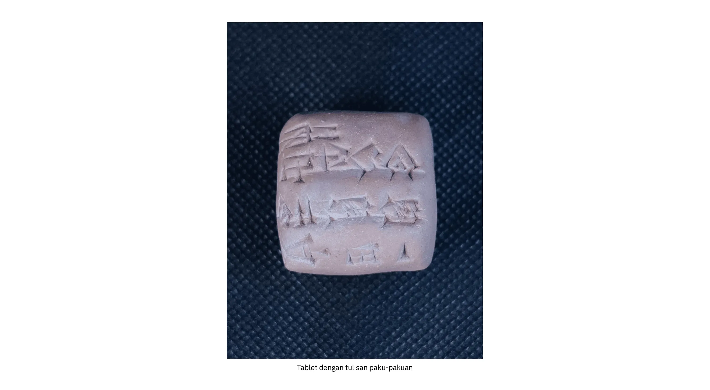

Saya juga memiliki apa yang saya yakini sebagai tablet Sumeria asli dengan tulisan paku kecil di tengahnya. Pada tablet ini, ada tanda tangan yang dibuat dengan menggulung silinder, yang akan saya tunjukkan nanti.

Tanda dengan angka-angka kecil berfungsi sebagai tanda tangan pada masa ketika kebanyakan orang tidak bisa menulis, karena hanya juru tulis terampil yang memiliki kemampuan itu.

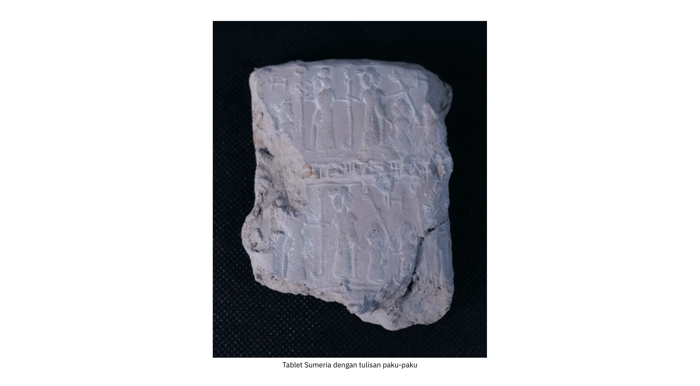

Di bawah ini, Anda dapat melihat silinder yang disebutkan di atas: batu yang diukir dengan bentuk tertentu. Orang-orang biasa menggulung silinder tanda tangan ini, yang dikenal sebagai segel silinder dalam bahasa Inggris, untuk menandatangani surat. Ini adalah cara untuk menegaskan nama penulis, atau untuk mengindikasikan bahwa surat itu disusun atas nama mereka.

Oleh karena itu, para juru tulis pada waktu itu menggunakan stylus berbentuk baji untuk mencetak tanda pada tablet basah.

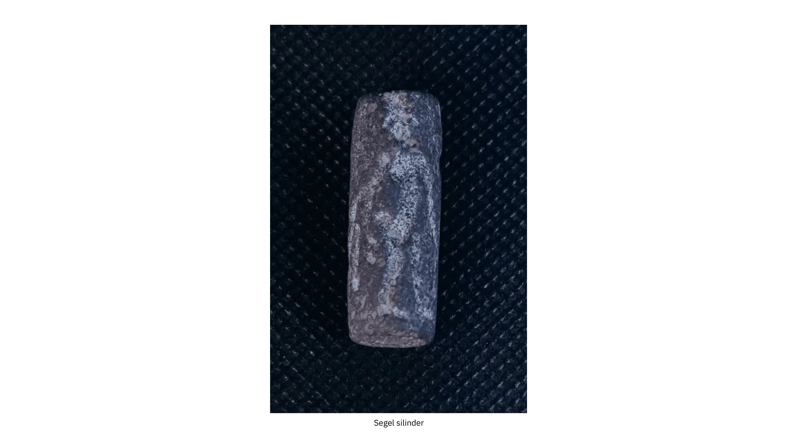

Aksara paku tidak merepresentasikan sebuah bahasa, tetapi sebuah sistem penulisan untuk merekam bahasa lisan. Dalam bahasa Inggris, kita akan mengatakan "tulisan adalah bahasa tertulis", dan kemudian kita akan mengatakan bahwa "paku payung adalah aksara, bukan bahasa". Jadi, dalam bahasa Prancis, kita akan mengatakan bahwa paku aksara bukanlah sebuah bahasa, tetapi sebuah cara untuk mengkodifikasikan sebuah bahasa.

### Evolusi dan penggunaan tulisan

Selama abad-abad pertama keberadaannya, aksara ini masih terbatas, yang pada dasarnya berfungsi sebagai sistem mnemonik untuk mencatat jumlah, daftar barang pertanian, dan peralatan. Hanya secara bertahap aksara ini menjadi mampu untuk **mengucapkan nama secara fonetis** dan kalimat lengkap.

Awalnya, nama tidak dapat diekspresikan dalam aksara paku karena aksara ini terutama mewakili objek dan elemen realitas, seperti lembu atau gandum, yang digambarkan sebagai gambar kecil. Seiring berjalannya waktu, gambar-gambar ini berevolusi menjadi bentuk aksara yang lebih berkembang, yang memungkinkan untuk merepresentasikan nama dan konsep yang kompleks.

Jika nama orang tersebut adalah Laura, misalnya, kita dapat mengambil sebuah kata, sebuah akronim yang terdengar seperti "air" dan kata kedua seperti "ras", dan membentuk nama Laura dengannya. Begitulah bentuk pertama dari bahasa tertulis berkembang.

Sebagai catatan, untuk merepresentasikan akronim pada awalnya, jika Anda ingin menggambar kepala lembu, Anda bisa melihat bentuk kepala lembu. Sedikit demi sedikit, gambar disederhanakan menjadi tidak lebih dari sekadar garis. Para ahli percaya bahwa hal ini terjadi karena orang memegang tablet tanah liat basah dengan satu tangan, sehingga lebih mudah untuk menggambar ulang inisial dengan memutarnya. Hal ini juga diperkirakan karena cara para juru tulis memegang tablet.

Anda masih bisa melihat hubungan dengan, misalnya, gandum atau kepala sapi dalam akronim paku, dan selalu condong ke satu sisi.

Selama tiga milenium penggunaannya, tulisan paku terutama berfungsi untuk menyimpan catatan ekonomi dan administrasi. Namun, penduduk Mesopotamia segera mengembangkan keinginan mendalam untuk melestarikan segala sesuatu yang layak untuk bertahan dalam ujian waktu dalam bentuk tertulis. Dengan demikian, cerita, legenda, dan lagu-lagu, yang sampai sekarang disampaikan secara lisan oleh para musisi keliling, diabadikan dalam bentuk tulisan, yang sering kali disalin oleh para juru tulis dalam pelatihan. Mereka menyalin teks-teks yang telah ada, terutama legenda atau teks yang memiliki nilai budaya tertentu.

Contoh penting adalah **Epos Gilgamesh**, yang mungkin merupakan **raja bersejarah dari negara kota Uruk di Sumeria** sekitar tahun 2900-2350 SM.

Bentuk tulisan ini, yang merupakan alat manajemen ekonomi dan vektor budaya, bertahan hingga abad ke-1 Masehi, sebelum menghilang untuk selamanya, meninggalkan kesaksian berharga bagi peradaban yang menjadi saksi kelahirannya.

## Peran tablet Sumeria

<chapterId>a396e6c5-56cc-5410-9e6b-0274401c5425</chapterId>

:::video id=a0729a35-01ec-4aa4-828f-d4ccc2eb168e:::

### Sistem kredit pra-moneter

Di Mesopotamia kuno, organisasi ekonomi didasarkan pada mekanisme yang sangat canggih yang sudah ada jauh sebelum penemuan koin logam. Sejak awal, sistem kredit formal dan informal sudah menjadi bentuk uang yang penting, yang memungkinkan masyarakat setempat melakukan banyak transaksi ekonomi yang kompleks.

Justru untuk memenuhi kebutuhan administratif dan ekonomi, tulisan paku ditemukan. Tablet-tablet tanah liat Mesopotamia yang terkenal itu terutama digunakan untuk mencatat berbagai jenis kontrak: pinjaman pribadi, penjualan, penyewaan, hipotek, dan bahkan perjanjian pernikahan. Menulis tablet-tablet ini membutuhkan keahlian juru tulis khusus, sebuah tugas yang mahal dalam hal waktu dan tenaga, **tetapi dibenarkan ketika kepentingan finansial dipertaruhkan** Orang-orang tidak menulis surat cinta satu sama lain pada masa itu, mereka tidak menggunakan juru tulis untuk menulis tentang kegelisahan mereka. Mereka menyewa juru tulis untuk menulis dokumen, entah karena ada hubungan atau alasan ekonomi.

Perlu juga disebutkan bahwa beberapa tablet ini beredar sebagai obligasi pembawa, berpindah tangan dengan bebas.

Contohnya, ada bentuk bola tanah liat dengan batu-batu kecil di dalamnya.

Di bagian luar bola tanah liat, sebuah angka ditulis dan ditandatangani, yang mewakili sejumlah unit. Di dalamnya, ada batu-batu ini dan seseorang yang ingin memverifikasi, untuk benar-benar memvalidasi bahwa instrumen ini benar-benar mewakili sejumlah X unit.

Contoh lain, sebuah tablet yang ditemukan di barat daya Baghdad saat ini, menetapkan bahwa seorang debitur berjanji untuk membayar kreditur sebanyak 330 takar gandum pada hari panen. Yang lebih menarik lagi, tablet lain dengan jelas menyatakan bahwa utang empat takar jelai harus dilunasi langsung kepada pembawa tablet tersebut, dengan demikian **memperkenalkan gagasan pembayaran kepada pembawa tablet, sebuah konsep yang sangat inovatif pada masa itu**.

Sejak tahun 2000 SM dan seterusnya, ada hukum yang mewajibkan semua transaksi komersial, bahkan yang terkecil sekalipun, untuk diformalkan secara tertulis dan ditandatangani di hadapan para saksi. Bayangkan betapa besarnya birokrasi pada masa itu untuk mencatat semua transaksi dalam buku catatan yang dibuat dari tanah liat oleh para juru tulis. Ketatnya hukum ini dimaksudkan untuk mencegah perselisihan di masa depan mengenai kepemilikan dan hak atas barang yang dipertukarkan. Para saksi sering dipanggil untuk memberikan kesaksian bahwa kontrak memang telah ditandatangani.

Di ranah pribadi juga, keluarga-keluarga dan individu-individu tertentu terlibat dalam kegiatan ekonomi yang cukup rumit sehingga membutuhkan manajemen yang ketat. Rumah seorang pendeta Anunitum bernama Ur-Utu ditemukan di kota Sippar-Amnanu di Babilonia utara, yang berisi hampir 2.000 tablet. Dokumen-dokumen ini termasuk kontrak pinjaman pribadi, akta jual beli dan sewa-menyewa, serta surat-surat, teks-teks keagamaan dan akademis, yang menjadi bukti keragaman dan pentingnya arsip pribadi pada saat itu.

Patut dicatat bahwa surat-surat yang ditulis oleh para juru tulis hampir secara eksklusif berkaitan dengan kepentingan keuangan: keluhan tentang tunjangan yang tidak mencukupi, pembayaran mas kawin yang tertunda, atau permintaan materi mendesak lainnya. Pada masa itu, tulisan-tulisan pribadi seperti surat cinta tidak ada, dan bahkan menyebutkan tentang penyakit pun jarang.

Sebuah contoh surat yang pedih menggambarkan realitas ekonomi ini: seorang koresponden mengungkapkan kesusahannya setelah ditinggalkan tanpa uang atau perbekalan saat rekannya pergi, sementara kelaparan parah melanda Assur. Dia menjelaskan kebutuhannya yang mendesak untuk membeli gandum, dan meminta agar uang tunai yang setara dengan tekstilnya dikirim kepadanya dengan cepat untuk memastikan makanan sehari-hari.

Surat ini, yang ditujukan kepada pasangannya, tampaknya menunjukkan bahwa dia telah pergi berdagang ke tempat lain, meninggalkannya tanpa uang. Dia mengingatkannya bahwa dia harus memiliki akses ke sejumlah uang untuk membeli gandum dan membayar pajak kuilnya. Ini mungkin yang paling mendekati argumen yang ditulis dalam sebuah surat pada masa itu. Surat hampir selalu berkaitan dengan transaksi ekonomi, dan surat ini berkaitan dengan situasi ekonomi yang genting.

Dengan demikian, dokumen-dokumen Mesopotamia yang sampai kepada kita terutama mencerminkan pertukaran ekonomi, karena dibuat secara eksklusif untuk transfer barang dengan nilai yang diakui: uang, biji-bijian, berbagai barang, real estat, pembayaran pajak kuil. Arsip-arsip ini tidak hanya mengungkapkan efisiensi dan ketepatan administratif peradaban kuno ini, tetapi juga kemampuannya untuk mengelola pertukaran ekonomi yang kompleks dalam jangka waktu yang sangat lama.

## Kontrol elit pada tablet Sumeria

<chapterId>c6d3df0e-b1e1-58dc-ab35-9f76bbc39393</chapterId>

:::video id=04a95fb8-a701-4a48-9ce8-0e9b6ba256fd:::

### Menulis, sebuah teknologi yang di atas segalanya ekonomis

Berlawanan dengan kepercayaan umum, penemuan tulisan di Mesopotamia sekitar 4.000 tahun yang lalu pada awalnya tidak melayani kebutuhan komunikasi pribadi atau sastra. **Tulisan paku paku pertama-tama dan terutama merupakan teknologi ekonomi**, yang dibenarkan hanya ketika kepentingan finansial yang penting dipertaruhkan. Bangsa Sumeria tidak menggunakan tulisan untuk berkorespondensi satu sama lain atau mengekspresikan perasaan mereka, tetapi secara eksklusif untuk mendokumentasikan transaksi komersial dan keuangan mereka.

Spesialisasi ini dapat dijelaskan oleh biaya penulisan tablet yang cukup besar. Mengukir dalam tanah liat membutuhkan keahlian teknis khusus, waktu yang cukup lama dan bahan yang spesifik. Hanya transaksi dengan nilai yang cukup secara ekonomi yang membenarkan investasi ini, menciptakan ambang batas alami untuk akses ke teknologi revolusioner ini.

Tablet-tablet paku-paku tersebut mengungkapkan sistem keuangan dengan kompleksitas yang luar biasa pada masanya. Bangsa Mesopotamia telah mengembangkan persenjataan lengkap instrumen keuangan modern: **pinjaman pribadi dengan bunga, akta penjualan, kontrak sewa, hipotek, dan bahkan kontrak pernikahan dengan klausul keuangan**. Kecanggihan ini membuktikan adanya ekonomi pasar yang maju, jauh dari gambaran sederhana tentang barter primitif yang sering dikaitkan dengan peradaban kuno ini.

Beberapa tablet berfungsi sebagai surat berharga asli, beredar secara bebas dari tangan ke tangan tanpa memerlukan identifikasi pemegang aslinya. Inovasi ini memungkinkan kelancaran pertukaran yang luar biasa, yang menjadi cikal bakal sistem keuangan modern. Lebih jauh lagi, undang-undang khusus bahkan mengharuskan semua transaksi komersial diformalkan dalam bentuk tertulis, sehingga melembagakan penggunaan tulisan dalam bidang ekonomi.

### Monopoli Pengetahuan dan Kontrol Ekonomi

Sentralitas tulisan dalam perekonomian memberikan kekuasaan yang cukup besar bagi mereka yang menguasai teknologi ini. **Para penulis, yang umumnya terikat dengan kuil dan institusi penguasa, memegang kendali de facto atas sistem keuangan**. Keahlian mereka yang langka dan tak ternilai menjadikan mereka sebagai penjaga semua transaksi penting.

Monopoli pengetahuan ini bukanlah suatu kebetulan. Pihak berwenang sangat berkepentingan untuk mempertahankan eksklusivitas ini, karena demokratisasi tulisan akan melemahkan kendali mereka atas ekonomi dan meningkatkan risiko pemalsuan. Kehadiran saksi yang sistematis pada upacara penandatanganan menunjukkan keasyikan yang terus-menerus dengan keaslian dokumen.

Kewajiban hukum untuk mencatat semua transaksi komersial secara tertulis memiliki beberapa tujuan strategis: kontrol fiskal, pengawasan akuntansi yang ketat, dan menjaga ketergantungan para pelaku ekonomi terhadap aparat administratif. **Negara Mesopotamia dengan demikian mengambil alih kemampuan untuk mengelola utang antarpribadi** dalam skala masyarakat, dan dengan demikian mengubah tulisan menjadi instrumen kekuatan ekonomi.

### Hidup Berdampingan dengan Dua Sistem Moneter

Analisis tablet-tablet tersebut mengungkapkan realitas ekonomi yang lebih bernuansa daripada kehadirannya di mana-mana dalam arsip. Banyak tablet yang menyebutkan referensi tentang **shekel perak** sebagai satuan nilai, yang mengindikasikan keberadaan paralel dari sistem moneter yang didasarkan pada barang-barang fisik yang terstandardisasi.

Dualitas ini dapat dijelaskan oleh stratifikasi sosial pada masa itu. **Sistem tablet berhuruf paku diperuntukkan bagi kalangan elit terbatas**: pendeta, pedagang yang makmur, dan administrator yang mampu membaca, menulis, dan menafsirkan dokumen-dokumen yang rumit ini. Untuk menggunakan tablet beraksara secara efektif, seseorang tidak hanya harus mengetahui cara menguraikannya, tetapi juga harus dapat memverifikasi keasliannya dan memahami implikasi hukumnya.

**Massa penduduk, yang tidak termasuk dalam sistem elitis ini, mengembangkan mekanisme pertukarannya sendiri**. Orang biasa menggunakan sistem yang lebih mudah diakses seperti ukuran biji-bijian yang terstandardisasi, berat uang, dan barang-barang lain yang mudah diukur yang dapat dievaluasi oleh siapa pun tanpa keahlian khusus.

Ekonomi populer ini, meskipun kurang terdokumentasi dalam arsip resmi, mungkin lebih dinamis dan fleksibel daripada sistem tablet. Sistem ini memungkinkan pertukaran harian yang cepat tanpa bantuan juru tulis, memenuhi kebutuhan mendesak para pengrajin, petani, dan pedagang kecil.

Syikal perak, yang sering disebut dalam tablet sebagai referensi nilai, mungkin berfungsi sebagai jembatan antara dua sistem ekonomi paralel ini, yang memungkinkan konversi antara utang tertulis dan pembayaran fisik.

### Kemunculan Spontan Versus Kontrol Institusional

Koeksistensi ini menggambarkan perdebatan mendasar dalam sejarah ekonomi: **pertentangan antara kemunculan alat tukar secara spontan dan penggunaan uang secara institusional**. Di satu sisi, komoditas seperti uang muncul secara alami dari kebutuhan pertukaran masyarakat. Di sisi lain, institusi mengambil alih dan memformalkan praktik-praktik ini untuk mengontrol alirannya.

Kuil-kuil Sumeria melambangkan ketegangan ini: mereka menggunakan inovasi moneter yang populer (referensi ke syikal) sambil mengembangkan instrumen kontrol mereka sendiri (tablet berhuruf paku). Strategi ini memungkinkan mereka untuk memetik manfaat dari kedua sistem: legitimasi populer dari mata uang tradisional dan kontrol administratif atas utang yang diformalkan.

Pengalaman Mesopotamia menjadi preseden abadi bagi evolusi sistem keuangan. Hal ini menunjukkan bahwa **kecanggihan finansial sering kali mendahului inovasi teknologi selama beberapa milenium**, yang biasanya terkait dengannya. Konsep bunga, kredit, instrumen yang dapat dinegosiasikan, dan jaminan hipotek tidak menunggu penemuan uang logam untuk berkembang.

Periode penting ini juga mengungkapkan masalah kekuasaan yang melekat pada setiap inovasi moneter: siapa yang mengendalikan teknologi, siapa yang menentukan aturan, dan bagaimana sistem formal dan praktik populer diartikulasikan. Pertanyaan-pertanyaan mendasar ini terus berlanjut sepanjang sejarah ekonomi, meluas ke perdebatan kontemporer tentang mata uang digital dan [mata uang kripto](https://planb.academy/resources/glossary/cryptocurrency).

# Ekonomi dan uang dalam peradaban kuno

<partId>a16bcf4c-8c3a-11f0-9e79-2bd363a484bd</partId>

## Peradaban-peradaban besar dari Zaman Perunggu

<chapterId>fab9334c-7385-5d7c-ad40-7d152beb22a1</chapterId>

:::video id=737e12e8-1033-4210-b1dd-b8a680f68b17:::

Pada bagian ini yang berjudul "Peradaban besar Zaman Perunggu", kita akan mulai dengan kutipan dari buku *Sejarah Uang: Dari Zaman Kuno hingga Masa Kini* oleh Glyn Davies, yang menurut saya merupakan pengantar yang sangat baik untuk bagian tentang peradaban-peradaban besar di zaman kuno ini.

> Toynbee mengidentifikasi sekitar dua puluh satu "peradaban" yang berbeda, namun karena lima belas di antaranya berasal secara langsung atau tidak langsung dari contoh-contoh sebelumnya, ia mengurangi jumlah peradaban yang berkembang secara independen menjadi enam: Sumeria, Mesir, Minoa, Tiongkok, Maya, dan Andes. Dari jumlah tersebut, hanya suku Inca di Andes yang berhasil mencapai tingkat peradaban yang tinggi tanpa menggunakan uang, meskipun secara paradoks mereka memiliki kelimpahan bahan yang secara umum dianggap paling baik untuk digunakan sebagai uang, yaitu emas dan perak.

Suku Inca tidak memiliki sistem moneter, namun mereka memiliki banyak sekali logam mulia. Sebuah paradoks. Mari kita lanjutkan dengan kutipannya:

> Semakin bertingkat sebuah masyarakat, dan semakin cermat sistem perencanaannya, semakin tidak diperlukan penggunaan uang bagi penduduknya. Hal ini mungkin menjelaskan mengapa penjajah Spanyol menemukan bahwa orang Meksiko, yang pemerintahannya relatif lebih liberal, secara teratur menggunakan bubuk emas (disimpan dalam tabung transparan) dan biji kakao (disimpan untuk pembayaran dalam jumlah besar dalam kantong berisi 24.000 unit) sebagai mata uang, sementara sebaliknya, suku Inca, yang diorganisir berdasarkan hirarki yang lebih kaku, tidak memiliki mata uang sama sekali: sebuah perkecualian yang dikukuhkan dengan peraturan yang ketat. Asal mula uang di Tiongkok sama sekali tidak bergantung pada peradaban lain; namun, kedekatan peradaban Sumeria, Mesir, dan Minoa menimbulkan keraguan tentang sejauh mana ketidaktahuan mereka tentang praktik moneter, terutama mengingat perdagangan yang luas yang telah ada sejak masa-masa awal.

Di Tiongkok, koin dikembangkan dengan pendekatan yang sama sekali berbeda dengan tradisi Barat. Sejak awal, koin-koin tersebut adalah uang kertas. Koin-koin itu adalah koin tuang.

Dan di sini, Tuan Davies menyebutkan tentang perdagangan. Memang ada pertukaran antara orang Tionghoa dan populasi lain pada waktu-waktu tertentu, tetapi alat tukar untuk perdagangan luar negeri adalah sutra. Seperti yang akan kita lihat nanti, emas juga digunakan di daerah perbatasan Tiongkok, di mana populasi orang Tionghoa lebih kecil. Dan bahkan bukan untuk perdagangan internasional; untuk itu, sutra.

Jadi, saya membayangkan bahwa mungkin untuk format koin, mereka mungkin telah dipengaruhi oleh peradaban lain di era yang sama yang mengembangkan teknologi ini.

Namun yang jelas, esensi dari uang benar-benar berbeda di Tiongkok dibandingkan di Barat. Kami akan membahas hal ini secara panjang lebar di bagian selanjutnya tentang Cina.

Mengenai kota-kota Sumeria yang terkenal ini, saya memiliki beberapa catatan di sini. Kita bisa menyebut Uruk, yang merupakan kota yang sangat awal dan berpengaruh, yang terkenal dengan ukurannya yang besar dan budayanya yang maju, terutama dengan perkembangan tulisan dan perencanaan kota.

Dan saya juga ingin menyebutkan epos Gilgamesh yang terkenal. Gilgamesh mungkin adalah seorang raja bersejarah dari kota Uruk di Sumeria sekitar tahun 2900 SM. Dia mungkin adalah raja dari negara kota Sumeria ini.

Kita juga dapat berbicara tentang Sargon dari Akkad, yang memerintah dari tahun 2334 hingga 2279 SM.

Dia adalah penguasa pertama Kekaisaran Akkadia, yang merupakan peradaban lain yang muncul di Mesopotamia. Dan saya menyebut Sargon karena dia adalah orang pertama yang mendirikan layanan pos untuk tablet-tablet terkenal di sini, yang telah saya perkenalkan kepada Anda.

Bayangkan jika amplop tanah liat benar-benar ada. Tablet dapat dibungkus dalam amplop tanah liat dengan tanda tangan orang tersebut di bagian luarnya untuk memastikan kerahasiaannya. Jadi, orang akan membuka amplop tersebut untuk mengambil tabletnya. Kita berhutang sistem pos ini kepada Sargon dari Akkad.

Lalu ada Babilonia, kota besar yang menjadi ibu kota Kekaisaran Babilonia. Peradaban lain, yang terkenal dengan Ziggurat dan istananya yang megah, serta Kode Hammurabi yang terkenal, yang terkenal dengan kode hukumnya yang sangat maju.

Dan dua kota sebagai penutup bagian ini. Kita memiliki Ashur, yang merupakan ibu kota Kekaisaran Asyur, sebuah pusat keagamaan yang penting. Dan ada Niniwe, yang kemudian menjadi ibu kota Kekaisaran Asyur. Mereka memindahkan ibu kota mereka ke sana dan terkenal dengan pasukannya yang kuat, istana dan perpustakaan yang luas. Dan juga merupakan salah satu lokasi yang mungkin untuk Taman Gantung Babilonia yang legendaris. Kita sering mendengar keajaiban dunia kuno yang terkenal ini.

Namun, tidak ada jejak taman gantung yang terkenal ini di Babilonia. Di Niniwe, di sisi lain, ada bukti arkeologis tentang taman-taman di beberapa lantai. Ada kemungkinan sejarawan Yunani seperti Herodotus mengacaukan Niniwe dengan Babel. Ketika mereka mengunjungi kota-kota di Mesopotamia, mungkin mereka menyebutnya sebagai Babel. Jejak taman-taman gantung yang terkenal telah ditemukan di Niniwe, dan para ahli mungkin bertanya-tanya apakah Niniwe adalah tempat yang terkenal di mana taman-taman ini berada, yang disebut sebagai Taman Gantung Babilonia.

## Organisasi ekonomi di Mesopotamia

<chapterId>6afb6fc8-cbb7-56a5-8427-484b4b7d7477</chapterId>

:::video id=aa6a2cbd-5916-4ae3-ad4f-65f0bd5643fa:::

### Struktur ekonomi pra-kapitalis dan perbudakan

Selamat datang di bagian organisasi ekonomi di Mesopotamia. Ekonomi pra-kapitalis melewati tiga tahap utama: primitif, perbudakan, dan feodal.

Feodal, tentu saja, muncul belakangan, jelas pada Abad Pertengahan, dan kita telah melewati tahap primitif yang telah kita jelaskan sebelumnya dengan Paleolitikum. Sekarang, di Mesopotamia, ketika kita berbicara tentang organisasi ekonomi, kita berbicara tentang perbudakan.

Namun, di Mesopotamia, sebagian besar pekerjaan dilakukan oleh kelas yang bergantung, mirip dengan budak, yang secara hukum tidak menjadi milik tuannya, namun dirampas hasil kerja mereka melalui paksaan fisik atau ideologis.

### Peran candi dan istana sebagai pusat ekonomi

Kepemilikan tanah yang luas mendominasi perekonomian. Para pemilik tanah mengeksploitasi tanah mereka secara langsung dengan mempekerjakan pekerja, atau menyewakan tanah mereka dengan imbalan uang sewa. Mereka juga terlibat dalam kegiatan keuangan, meminjamkan uang dengan suku bunga tinggi, umumnya sekitar 20% hingga 33,3% per tahun, praktik yang sangat kontras dengan aturan yang lebih ketat di negara tetangga, Ibrani.

Pinjaman yang diambil oleh para petani tidak ditujukan untuk investasi produktif - kecuali untuk perusahaan perkapalan - melainkan untuk memastikan kelangsungan hidup mereka hingga panen berikutnya. Situasi ini sering kali menyebabkan para petani terlilit hutang yang kronis.

Izinkan saya untuk menarik paralel dengan periode yang lebih baru pada masa kuno (Roma), di mana warga hidup dari sewa pertanian yang dihasilkan oleh para petani dan tenaga kerja bebas, serta rampasan perang. **Pendapatan ini didistribusikan di antara warga, bukan untuk menambah keuntungan, tetapi untuk meningkatkan status sosial mereka.** Perdagangan dan kerajinan tangan pada umumnya diserahkan kepada kelompok-kelompok di luar elit sosial. Semua ini berbeda dengan ekonomi abad pertengahan yang berorientasi pada keuntungan melalui perdagangan dan kerajinan.

Jadi, apa yang ingin kami sampaikan di sini adalah bahwa saya menggambar paralel dengan fakta bahwa orang menggunakan alat pinjaman keuangan tidak selalu untuk meningkatkan alat produksi mereka, dan kemudian di Roma, keuntungan tidak selalu diinvestasikan kembali, melainkan digunakan untuk meningkatkan prestise orang-orang yang dapat mengambil manfaat dari keuntungan ini. Kita masih jauh dari semangat kapitalis yang muncul kemudian di Abad Pertengahan, ketika pekerjaan dapat diciptakan untuk meningkatkan alat produksi, dan surplus diambil dan diciptakan untuk mengejar keuntungan. Jadi kita dapat melihat bahwa organisasi ekonomi belum mencapai tahap ketiga dari evolusi ekonomi yang disebutkan di atas.

### Munculnya sistem kredit dan unit akun

**Karl Polanyi membedakan tiga bentuk pertukaran ekonomi: timbal balik antara kelompok-kelompok simetris,** yang terjadi pada suku-suku primitif di mana kita tidak terlalu membutuhkan uang karena kita saling memberikan kredit informal dan pertukaran dan redistribusi. **Redistribusi terpusat di sekitar kuil dan istana,** bentuk pertukaran ini sesuai dengan Mesopotamia, di mana kuil-kuil menjadi pusat organisasi ekonomi dan pada suatu waktu dapat memberikan kembali, mendistribusikan kekayaan dalam bentuk jatah. Baru kemudian gagasan tentang upah diperkenalkan. Jadi, hingga saat ini, kita memiliki bentuk primitif (1), redistribusi terpusat (2) di kuil-kuil dan istana-istana, dan kemudian kita akhirnya bisa memberi jalan kepada pertukaran pasar (3). Meskipun pasar seperti yang kita pahami saat ini tidak sepenuhnya ada, kehadiran pertukaran pasar di Mesopotamia tidak terbantahkan, dibuktikan dengan adanya istilah-istilah khusus dalam bahasa Akkadia dan dengan adanya bukti arkeologis tentang harga, keuntungan, kerugian, fluktuasi, dan situasi kelangkaan.

Rumah tangga Mesopotamia secara mandiri mengelola semua tahap produksi pertanian, mulai dari menabur hingga pemrosesan akhir menjadi roti dan bir. Para wanita juga memproduksi tekstil yang dibutuhkan oleh keluarga mereka. Untuk barang-barang yang tidak diproduksi secara lokal, rumah tangga beralih ke pedagang khusus.

Ikatan keluarga sangat penting dalam perdagangan. Selama periode Paleo-Assyria (sekitar 1910-1830 SM), para pedagang dari kota Ashur mendirikan koloni perdagangan di Kanesh di Anatolia, mengimpor timah dan tekstil untuk ditukar dengan emas dan perak. Perdagangan didasarkan pada bisnis keluarga yang terkait erat dengan pernikahan dan kemitraan komersial. Kanesh hanyalah salah satu mata rantai dalam jaringan perdagangan internasional yang luas.

Dalam pertukaran ini, ada logam, dan itu adalah logam mulia dan belum tentu, misalnya, tembaga, yang sangat berguna pada saat itu, dan kami berpikir bahwa logam-logam ini dipertukarkan dengan gagasan penyimpan nilai. Jadi kita tidak bisa serta merta berbicara tentang barter, di mana dua barang dipertukarkan untuk kegunaannya, tetapi lebih kepada gagasan pembayaran dengan kesadaran tertentu untuk menimbun logam mulia untuk digunakan sebagai penyimpan nilai dan bukan untuk menggunakannya sebagai komoditas, misalnya, penggunaan perunggu untuk membuat baju besi.

Upeti dan pajak sebagian besar dibayarkan dalam bentuk barang (jelai atau perak yang ditimbang). Kuil dan istana adalah pusat ekonomi, administrasi, politik dan agama utama, dan juga menjalankan fungsi perbankan pertama melalui penyimpanan barang yang aman, pertama biji-bijian, kemudian produk pertanian lainnya, dan akhirnya logam mulia. Dengan cara ini, operasi kredit dan pinjaman pertama dikembangkan, jauh sebelum kemunculan koin.

Perekonomian Mesopotamia terutama menggunakan jelai dan perak sebagai standar nilai. Perak ditimbang dalam unit standar, seperti sìqlum (syikal) sekitar 8,33 gram. Pada awal periode Babilonia kuno (di bawah Hammurabi), perak digunakan sebagai alat pembayaran yang umum, dengan gagasan awal tentang nilai nominal ("nūbum") yang bertentangan dengan berat nyata ("šuqulum"), **mengantisipasi konsep mata uang fiat modern**.

Namun, itu belum menjadi uang kertas dalam arti yang sebenarnya. Tidak ada gagasan tentang stempel dengan figur otoritas, tetapi ada gagasan tentang unit akun nominal, yang berlawanan dengan gagasan tentang logam yang ditimbang. Ada perbedaan dalam bahasa untuk kedua konsep ini, dan saya pikir penting untuk disebutkan.

Transisi ke pasar tenaga kerja berupah merupakan transisi yang sulit. Hal ini membutuhkan dua inovasi konseptual utama: pemisahan pekerjaan seseorang dari produk akhir, dan pengenalan "waktu kerja" sebagai unit yang dapat diukur. Untuk memiliki gagasan tentang upah dan karyawan yang digaji, pertama-tama kami harus melalui dua inovasi ini. **Pada milenium III, pekerjaan pada awalnya diupah dengan jatah tetap, sebelum berangsur-angsur berkembang menjadi sistem upah pada awal milenium II.**

Akhirnya, sejak abad ke-26 SM dan seterusnya, gagasan nyata tentang nilai moneter mulai berakar, meskipun "uang" Mesopotamia bukanlah koin, melainkan ukuran biji-bijian atau logam yang ditimbang. **Oleh karena itu, untuk transaksi-transaksi penting atau dalam konteks yang membutuhkan pengawetan nilai, sering kali lebih disukai untuk mengubah biji-bijian menjadi perak, yang lebih mudah diawetkan.** Sedikit mirip dengan contoh Kanaan, di mana logam perak diterima untuk ditimbun.

Sejak abad ke-21 SM dan seterusnya, **dengan hilangnya pertukaran asimetris secara virtual**, kami mencatat bahwa dalam kontrak penugasan, kata kerja sa, mengacu pada pembayaran harga. Gagasan ini, yang disebut "sa", muncul dalam kontrak dan mengacu pada pembayaran harga, bukan pengukuran komoditas tertentu. "Sa" secara sederhana mengacu pada pembayaran atau harga. Seorang antropolog mencatat hal ini dan menyebutkan bahwa ini adalah sebuah terobosan; kita melihat semacam dikotomi antara sebelum dan sesudah diperkenalkannya kata kerja "sa" dalam kontrak.

Kita tidak bisa mengabaikan data empiris yang ada dalam arsip Timur Dekat yang membuktikan adanya **beberapa mekanisme pasar**, yang menggabungkan **nilai keuntungan** dan **kerugian**, **fluktuasi harga** dan situasi **kelangkaan**. Namun, kesulitan mendasarnya terletak pada penentuan kepentingan relatif dari pertukaran berbasis pasar dalam ekonomi Mesopotamia kuno secara keseluruhan.

Saya rasa para ahli di bidang ini telah melihat jejak-jejak konsep pasar ini, tetapi mereka tidak benar-benar dapat memberi tahu kita seberapa besar ekonomi pada masa itu didasarkan pada konsep pasar yang lebih modern atau mekanisme lainnya.

Kami tahu itu ada, tetapi kami tidak tahu apakah itu cara utama, katakanlah, untuk menentukan harga atau perdagangan.

Demikianlah kesimpulan dari bagian organisasi ekonomi di Mesopotamia.

Pada bagian berikutnya, kami akan melakukan hal yang sama untuk Mesir dan Cina.

## Organisasi ekonomi dan moneter di Mesir kuno

<chapterId>bffcc16c-7fbf-5992-a0fa-6a7726d7d287</chapterId>

:::video id=40c1c4e5-b190-4bb6-b8a0-810c9ce7698b:::

### Latar belakang sejarah dan periode Mesir

Bagian ini didedikasikan untuk organisasi ekonomi dan moneter Mesir kuno. Untuk memberikan sedikit latar belakang, berikut ini adalah daftar dan deskripsi singkat dari periode yang dimaksud.

- Kerajaan Lama (sekitar 2575 - sekitar 2130 SM)**. Periode yang ditandai dengan pembangunan piramida-piramida besar, terutama piramida Giza. Ini adalah masa keemasan monarki Mesir yang terpusat.
- Kerajaan Pertengahan (sekitar 1938 - sekitar 1630 SM)**. Kebangkitan politik dan budaya setelah periode ketidakstabilan.
- Kerajaan Baru (c. 1539 - 1075 SM)**. Periode perluasan wilayah, kekuatan militer, dan perdagangan internasional. Masa ini mencakup masa pemerintahan firaun terkenal seperti Tutankhamen dan Ramses II.
- 1323 SM. - Kematian Tutankhamun**. Firaun muda ini meninggal pada usia sekitar 18-19 tahun. Makamnya yang hampir utuh ditemukan pada tahun 1922, menjadikannya salah satu penemuan arkeologi yang paling terkenal.
- Ramses II - Memerintah 1279-1213 SM**. Salah satu firaun paling kuat dari Kerajaan Baru. Dikenal karena kampanye militernya, monumen-monumen besarnya, dan karena mungkin telah menandatangani perjanjian perdamaian pertama yang diketahui.
- 1275 SM - Bangsa Laut**. Invasi atau migrasi kelompok-kelompok yang disebut "Orang Laut" mengacaukan beberapa peradaban Mediterania, termasuk Mesir.
- Pertempuran Xoïs - 1178 SM**. Konflik antara tentara Mesir dan penjajah, mungkin terkait dengan Bangsa Laut. Salah satu dari banyak pertempuran di akhir Kerajaan Baru.
- Periode Akhir** adalah periode sejarah Mesir kuno dari sekitar tahun 664 hingga 332 SM.
- Cleopatra VII (69 - 30 SM)**. Ratu terakhir Mesir, terkenal karena kecerdasan, karisma dan aliansinya dengan Julius Caesar dan Marc Antony, dan mungkin juga karena hidungnya. Masa pemerintahannya menandai akhir dari Firaun Mesir sebelum dianeksasi oleh Roma.

Pada milenium ke-5 dan ke-4 SM, Mesir telah mengalami aktivitas komersial yang intens dalam skala besar, yang menghubungkan Nubia, Palestina, Libya, dan wilayah Laut Merah melalui perdagangan laut, sungai, dan darat (terutama dengan kafilah keledai).

### Sistem pertukaran awal dan mata uang purba

Dengan munculnya kerajaan Mesir pertama sekitar tahun 3650-3400 SM, situs Maadi, di sebelah selatan Kairo saat ini, menjadi pusat utama teknologi tembaga dan perdagangan jarak jauh, terutama dengan Mesopotamia melalui pantai Suriah.

Meskipun perdagangan skala besar terutama didasarkan pada barter, bentuk uang primitif ("mata uang paleo"), yang terbuat dari barang-barang prestise seperti batu semi mulia dan cangkang fosil, mungkin sudah ada. Emas mungkin sudah memainkan peran penting dalam pertukaran ini. Penyebutan koin secara eksplisit pertama kali dalam dokumen Mesir pada pertengahan milenium ke-3 SM mencerminkan perkembangan panjang yang terkait dengan praktik-praktik komersial.

Dalam masyarakat kuno (di sini kita tidak harus berbicara tentang Mesir, tetapi masyarakat kuno pada umumnya), pembayaran sering terjadi, bukan untuk membeli secara langsung, tetapi untuk membayar mahar, ritual keagamaan, dan kewajiban sosial lainnya. Transaksi-transaksi ini membutuhkan penetapan harga dan penilaian yang tepat. Banyak masyarakat primitif memiliki benda-benda yang memiliki hak istimewa dan dapat dihitung, yang nilainya dapat diperkirakan. Jika Anda membayar mas kawin, tentu saja, Anda harus mencatat sejumlah kuantitas objek yang akan ditukar untuk membayar mas kawin. Nilai ini pada dasarnya adalah nilai orang.

Dalam masyarakat kuno, sebelum munculnya uang atau sistem moneter, ada pembayaran, tetapi sering kali pembayaran tersebut dikaitkan dengan kewajiban sosial, dan nilainya berasal dari nilai individu, seperti dalam pembayaran mas kawin atau uang darah.

Kembali ke Mesir, pada masa kekaisaran kuno, "shât(y)", yang awalnya merupakan unit moneter konkret (koin emas atau perak kecil dengan berat sekitar 7,6 gram), dengan sangat cepat beralih dari fungsi sebenarnya sebagai mata uang keras menjadi **fungsi akuntansi** yang memunculkan gagasan tentang nilai. Kita dapat mengenali di dalamnya semacam unit akun untuk mengekspresikan nilai, yang pada awalnya adalah sejenis koin, tetapi kita tidak dapat benar-benar menyebutnya koin karena tidak dicap, itu hanya ukuran logam. Kita semakin dekat dengan gagasan tentang unit akun.

Gagasan shât(y) ini akhirnya ditinggalkan, mungkin karena risiko penipuan. Kita akan lihat nanti bahwa orang Mesir lambat mengadopsi koin berstempel dan bahkan terus menimbangnya, bahkan setelah koin-koin tersebut diadopsi oleh tetangga mereka.

Pada Abad Pertengahan, perak jarang digunakan untuk transaksi sehari-hari, yang sebagian besar dilakukan dengan takaran biji-bijian dan roti. Pada periode inilah muncul bentuk uang kertas, di mana pembayaran dapat dicatat secara tertulis, atau melalui transfer.

Di Kerajaan Baru, sistem moneter menjadi lebih kompleks, mengintegrasikan berbagai mata uang komoditas yang dinilai dengan logam (emas, perak, tembaga), kain standar, sereal, dan minyak. Kain disebut sebagai "ukuran kain". **Harga barang sehari-hari sering kali dinyatakan dalam biji-bijian atau tembaga, sementara benda-benda berharga dinilai dengan emas atau perak. Perak, yang lebih langka di Mesir daripada emas, menjadi sangat berharga.** Perak dihargai terlalu tinggi dibandingkan dengan emas, yang lebih berlimpah di Mesir.

Pada Periode Akhir (milenium pertama sebelum masehi), perak telah menjadi logam pertukaran yang umum di seluruh Timur Dekat. Perak beredar dalam bentuk batangan, koin logam atau cincin, yang ditimbang dan ditandai di kuil-kuil, menjamin berat dan kemurniannya, meskipun tidak dicetak dalam bentuk patung penguasa. Hal itu muncul kemudian, dan akan menjadi subjek dari bagian selanjutnya tentang orang Lydia.

Perlu juga dicatat bahwa orang Mesir kuno memiliki istilah, "hedj", untuk uang, dan istilah ini digunakan secara umum untuk menunjuk alat pembayaran apa pun yang berfungsi sebagai pertimbangan dalam suatu transaksi, baik untuk logam, biji-bijian, kain, atau berbagai barang (kayu, hewan, jasa, dll.). Contoh-contoh yang terdokumentasi menunjukkan bahwa orang Mesir dapat menyelesaikan sebuah transaksi dengan menggabungkan berbagai produk yang nilai totalnya dinyatakan dalam satuan tembaga ("deben").

**Kuil-kuil memainkan peran sentral dalam perekonomian Mesir: kuil-kuil ini mengumpulkan dan menimbun harta karun yang cukup besar berupa logam mulia (emas dan perak) yang dimaksudkan untuk menghormati para dewa, namun juga berfungsi sebagai cadangan moneter yang dapat dimasukkan kembali ke dalam sirkuit ekonomi sesuai kebutuhan**. Kita akan melihat contoh-contoh peradaban lain yang mengumpulkan cadangan berharga di kuil-kuil, seperti patung-patung, untuk dilebur jika terjadi perang, kekurangan mata uang, atau krisis. Ini adalah tema yang berulang sepanjang sejarah.

Perlu juga disebutkan bahwa budidaya linen adalah monopoli kerajaan yang diberikan kepada kuil-kuil, dan pembuatan kain yang berharga menegaskan kepentingan ekonomi mereka.

Orang Mesir kuno membuat perbedaan yang jelas antara aspek ideologis logam mulia, yang terkait dengan ketuhanan (emas mewakili daging para dewa, dan perak mewakili tulang-tulang mereka), dan fungsi praktisnya sebagai mata uang yang berfungsi sebagai referensi untuk semua bentuk pembayaran lainnya.

Dengan demikian, meskipun Mesir kuno tidak mengembangkan mata uang yang dicetak yang sebanding dengan sistem moneter modern hingga periode akhir, Mesir memiliki sistem moneter yang canggih, berdasarkan penggunaan gabungan uang kitab suci, unit akun yang tepat, uang komoditas, dan logam mulia yang dinilai berdasarkan berat.

Koin-koin itu sendiri ditimbang, sehingga memunculkan dua konsep yang berbeda: **"koin" dan "uang". Saya menggunakan dua istilah dalam bahasa Inggris. Pertama, "coinage" mengacu pada koin, sebuah konsep yang muncul belakangan, dan kita juga memiliki konsep uang. Kita sudah bisa mendefinisikan pengertian "uang" dengan unit-unit akun yang baru saja saya ungkapkan dalam istilah uang, tetapi belum berupa koin, jadi "coinage" muncul sedikit kemudian dengan orang Lydia.

Jadi, koin bukanlah prasyarat untuk uang, **sehingga kita dapat mengakui keberadaan uang sejak milenium ke-3,** bagaimanapun juga dan tanpa keraguan selama milenium ke-2 dan khususnya di bawah pemerintahan Hammurabi.

Yang penting untuk diingat di sini, dan inilah yang disebutkan oleh penulis dalam buku "The Origins of Money", adalah bahwa tidak diragukan lagi bahwa konsep uang telah ada pada saat itu, dalam sistem moneter ini, dan merupakan sebuah kesalahan jika mengaitkan lahirnya uang sebagai sebuah konsep dengan kemunculan koin.

Akhirnya, konsep timbal balik dan redistribusi Polanyi, yang sering diterapkan pada Mesir kuno, perlu diberi nuansa: meskipun ada, konsep ini tidak membentuk kerangka kerja yang eksklusif. Mesir Firaun telah mengembangkan ekonomi yang kompleks yang sepenuhnya mengintegrasikan pertukaran komersial yang canggih, yang berbeda dengan praktik-praktik keagamaan dan ritual, yang menunjukkan otonomi nyata dari domain ekonomi dari domain ideologis.

Keunikan ini terkait dengan anggapan bahwa logam mulia dikaitkan dengan keilahian tertentu, namun tetap dapat dibedakan.

Saya mengemukakan hal ini karena Polanyi merujuk pada penggunaan logam mulia ini sebagai gagasan yang terutama bersifat religius atau ilahi. Namun, kami mengusulkan bahwa mereka juga diintegrasikan ke dalam sistem ekonomi, dan bahwa orang Mesir sudah mampu membuat perbedaan seperti itu.

Sebagai penutup, saya ingin mengutip dari buku "The Origins of Money", yang mencantumkan tujuan dari penemuan ini, yaitu mencetak uang. Ada beberapa poin, tetapi saya hanya ingin menekankan poin ke-5:

*mengembangkan kemungkinan permainan ekonomi melalui penggunaan metode seperti devaluasi dan revaluasi berturut-turut untuk mengurangi atau meningkatkan impor dan ekspor dengan biaya yang lebih rendah*

Jadi, bahkan pada zaman kuno tersebut, penulis mengusulkan bahwa koin sudah ditemukan atau muncul di bawah kendali negara dan sudah dimanipulasi dalam hal jumlah logam mulia dan beratnya untuk mengatur perekonomian. Izinkan saya untuk memberikan sedikit bocoran mengenai bagian selanjutnya. **Bahkan dalam bentuk koin yang paling awal, yang terbuat dari elektrum, paduan emas dan perak, kita tahu dari analisis kandungan logam mulia dalam koin-koin ini bahwa penerbit pertama, misalnya, Croesus, memiliki lebih sedikit emas dibandingkan dengan elektrum alami.**

Ini berarti mereka sudah mengetahui cara memisahkan emas dan perak, dan mengeluarkan koin yang mengandung lebih sedikit emas.

Penulis berpendapat bahwa sejak masa-masa awal mata uang koin, lebih dari sekadar menyatakan berat dan memfasilitasi perdagangan, kekuasaan untuk mencetak uang telah disalahgunakan untuk meningkatkan jumlah yang dikeluarkan, mungkin sebagai bentuk perencanaan ekonomi.

## Tanda mata uang dan organisasi ekonomi dan moneter di Tiongkok kuno

<chapterId>e08d3be9-423c-5cf3-a606-6ad54e2261af</chapterId>

:::video id=ae7e6367-1725-455e-bfe6-359be1f443e5:::

Pada bagian ini, yang berjudul "Uang tanda dan organisasi ekonomi dan moneter Tiongkok kuno", kita akan melihat bahwa uang Tiongkok kuno memiliki karakteristik yang berbeda dari tradisi Barat. Mata uang Tiongkok sudah merupakan "mata uang tanda" sejak awal. Informasi dalam bagian ini didasarkan pada catatan yang saya buat setelah membaca buku "Aux origines de la monnaie".

### Konsep mata uang tanda dan fitur-fiturnya yang khas

Menurut penulis, uang tanda setara dengan mata uang fiat saat ini. Ini adalah mata uang yang tidak memiliki nilai yang terkait dengan kandungan logamnya. Sejak awal, ini adalah semacam kesepakatan, konsensus sosial tentang nilai koin-koin ini.

Mata uang Tiongkok kuno memiliki karakteristik yang berbeda dari tradisi Barat. Sebagian besar terbuat dari logam, tetapi dituang, bukan dicetak, dan tidak memiliki patung penguasa. Anehnya, negara Tiongkok tidak memonopoli penerbitan uang. Liberalisme yang tampak jelas ini dapat dijelaskan dengan tidak adanya kebutuhan ekonomi untuk memonopoli penerbitan uang, berkat sumber daya pajak yang melimpah yang dikenakan pada populasi kena pajak yang besar.

Mata uang Tiongkok juga dicirikan oleh aspek fidusia. Sejak awal, tiruan perunggu dari cowry (kerang laut) digunakan sebagai mata uang, tanpa ada hubungan langsung dengan nilai intrinsik logam yang digunakan. Jika kita kembali ke masa lampau, orang Tiongkok menggunakan kerang laut sebagai mata uang. Akhirnya, ketika kerang menjadi terlalu langka, mereka membuat replikanya dari tembaga, dan tiruan ini memiliki nilai yang sama dengan yang asli.

Oleh karena itu, mata uang Tiongkok tidak didasarkan pada nilai material atau kelangkaan relatif dari barang asli (misalnya kerang), tetapi pada kepercayaan kolektif dalam penggunaannya sebagai alat tukar - dengan kata lain, tanda moneter.

### Dari cangkang cowrie hingga imitasi logam

Cowrie secara luas digunakan sebagai unit moneter primitif. Prasasti kuno menunjukkan bahwa, sejak dinasti Shang dan Zhou (dinasti pertama pada milenium pertama dan kedua sebelum masehi), cangkang cowrie tidak hanya digunakan untuk memberi imbalan atas tindakan militer, tetapi juga untuk **mengupah pekerjaan, mengukur nilai, dan membeli tanah**.

Yang penting untuk diingat di sini adalah bahwa ini bukan sembarang alat yang digunakan oleh masyarakat untuk tujuan terbatas. Alat ini digunakan untuk penghargaan militer, pembayaran untuk pekerjaan, dan pengukuran nilai. Kami menemukan jejak-jejak ini dalam tulisan-tulisan para arkeolog. Meskipun kita tidak tahu apakah uang logam itu digunakan untuk membeli roti setiap hari, kita memiliki bukti bahwa uang logam itu bisa digunakan untuk jenis-jenis transaksi yang disebutkan di atas.

Seiring berjalannya waktu, kelangkaan cangkang cowrie asli menyebabkan produksi tiruan dari perunggu, tulang, mutiara atau batu, terutama untuk digunakan dalam konteks pemakaman untuk menghindari melumpuhkan nilai asli di makam. Perubahan media ini juga terkait dengan gagasan tentang kontrol pangeran atas uang, kontrol yang lebih mudah jika pangeran menghasilkan uang.

Apa yang perlu kita pahami di sini adalah, dengan bergerak melampaui batasan kelangkaan alami kerang, jika pangeran dapat menciptakan mata uangnya sendiri, hal ini memberinya kontrol yang lebih besar atas pengelolaan ekonomi.

Tidak seperti Mesopotamia, di mana koin dikaitkan dengan berat logam mulia, terminologi mata uang Tiongkok berasal langsung dari bentuk awal benda-benda yang digunakan sebagai mata uang: pundi-pundi (bei), pisau (dao), sekop (bu), dan koin bundar (quan atau qian). Dengan demikian, kita dapat melihat bahwa asal mula kata-kata yang berhubungan dengan uang di Tiongkok merujuk pada benda-benda tersebut. Sebaliknya, di Barat, kita memiliki sejumlah istilah moneter yang berasal dari konsep yang sangat berbeda dari ini, lebih terkait dengan karakteristik fisik dan berat benda moneter. Perbedaan etimologis ini dengan jelas menunjukkan perpecahan antara visi Barat dan Cina tentang uang.

Di Cina, nilai moneter sepenuhnya bersifat fidusia, berdasarkan konvensi sosial antara Negara, produsen, dan pedagang.

### Regulasi ekonomi dan filosofi moneter

Negara Tiongkok menggunakan uang sebagai instrumen pengaturan ekonomi: pada saat moneter berlimpah, nilai uang menurun, sehingga memudahkan orang untuk membeli barang. Sebaliknya, pada masa kelangkaan moneter, nilai uang meningkat, memperkuat daya beli negara untuk operasi selanjutnya.

Di sini dapat dikaitkan dengan [inflasi](https://planb.academy/resources/glossary/inflation) dan deflasi. Dengan jumlah uang beredar yang tetap, jika produktivitas ekonomi meningkat, nilai uang akan naik. Sebaliknya, jika produktivitas turun, nilai uang menurun. Namun, dalam contoh ini, yang terjadi adalah sebaliknya. Mungkin karena sang pangeran tidak memiliki monopoli penuh atas produksi uang, namun hal ini masih menunjukkan bahwa nilai uang terkait dengan kondisi ekonomi.

Filsuf Mo Di (abad ke-5 hingga ke-4 SM) telah menganalisis hubungan antara harga dan nilai ini: menurutnya, variasi harga tidak mencerminkan gagasan nyata tentang murah atau mahalnya, tetapi lebih kepada hubungan yang berfluktuasi antara barang dan uang, terlepas dari nilai nominal yang stabil dari tanda mata uang.

Jadi di sini, alih-alih mengatakan bahwa koin emas akan memiliki semacam nilai dasar seperti itu, seperti nilai guna atau nilai intrinsik, ia menunjukkan bahwa nilai tanda moneter lebih berasal dari kondisi ekonomi.

Di Tiongkok, koin tidak perlu ditandai atau dijamin secara resmi. Penerimaannya hanya bergantung pada kepercayaan kolektif, yang menjelaskan mengapa koin perunggu atau tembaga tanpa prasasti khusus dapat beredar bebas untuk waktu yang lama.

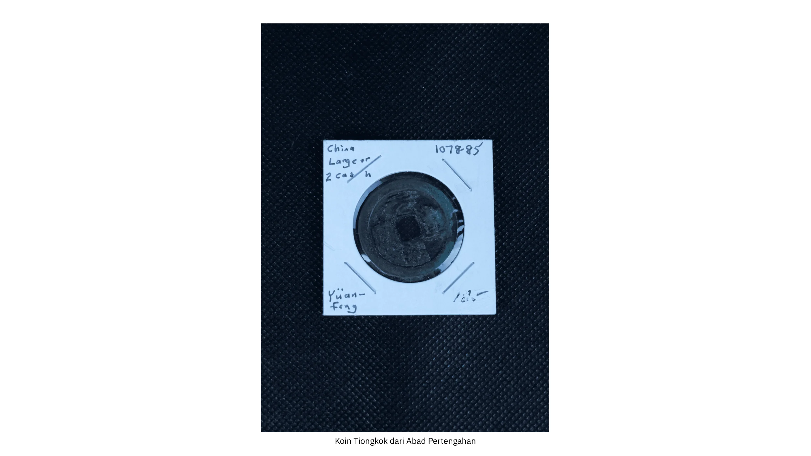

Koin di atas adalah koin Cina dari Abad Pertengahan. Koin ini adalah koin cor yang memiliki lubang persegi di tengahnya. Lubang ini digunakan untuk memasukkan tali, sehingga koin-koin tersebut dapat dirangkai menjadi gelang atau kalung. Namun, ini bukan untuk dipakai; koin-koin ini terutama digunakan untuk tujuan akuntansi. Koin-koin tersebut dapat dirangkai bersama untuk membentuk unit-unit akun dalam bentuk untaian besar, dengan potongan-potongan yang saling bertautan. Tidak selalu ada tanda khusus, terkadang hanya berupa lingkaran perunggu.

Monopoli moneter negara, yang terlambat didirikan oleh Wudi dari Dinasti Han pada tahun 113 SM, sering kali ditentang, sehingga memungkinkan berbagai pemain swasta atau lokal untuk menerbitkan mata uang mereka sendiri, asalkan mereka mendapatkan kepercayaan sosial yang cukup.

**Nilai intrinsik mata uang Tiongkok yang rendah mencegah penimbunan, menjamin kelancaran peredarannya** Logam mulia jarang digunakan sebagai mata uang yang beredar untuk mencegah penimbunan. Emas, karena terlalu mahal, biasanya disisihkan daripada dibelanjakan. Sebaliknya, **hanya sutra yang mewakili mata uang bernilai tinggi dalam perdagangan internasional Tiongkok**. Orang Tiongkok berdagang menggunakan sutra, bukan emas.

Selama krisis ekonomi atau moneter, terutama ketika harga tembaga meningkat, solusi inovatif diadopsi: jadi, pada awal abad ke-2 Masehi, koin yang beredar dipotong untuk membuat unit yang lebih kecil, sehingga memungkinkan sirkulasi uang dipertahankan dengan biaya yang lebih rendah. Era lainnya, seperti era Wang Mang (awal abad ke-1 Masehi), bereksperimen dengan mata uang yang sangat fidusia, di mana nilai nominalnya jauh lebih tinggi daripada kandungan logam yang sebenarnya, sehingga mendahului uang kertas. Mereka mengambil sebuah koin dan mencantumkan nilai seperti 50, 100, atau 200 di atasnya untuk menunjukkan jumlah yang lebih besar, seperti 200 koin. Praktik ini kemungkinan besar berkontribusi pada inflasi yang signifikan.

Seperti yang telah disebutkan di atas, sistem ini didasarkan pada konvensi sosial antara Negara, produsen, dan pedagang, tetapi juga pada aturan otoriter dan keras bagi mereka yang tidak ikut bermain, terutama dalam kaitannya dengan pilihan potongan (apakah indah atau tidak) atau panjang kain (tidak sesuai standar).

Menurut pendapat saya, ini bukanlah sistem yang solid. Sistem ini hanya mengandalkan peraturan ketat yang mengharuskan para pejabat dan pedagang untuk menerima koin yang rusak, dengan ancaman sanksi.

### Inovasi moneter Tiongkok dan dampak ekonominya

Cina juga merupakan pelopor dalam penerbitan bentuk awal uang kertas, yang awalnya diadopsi sebagai respons terhadap kekurangan logam pada abad ke-9 Masehi. Terlepas dari keuntungan awalnya, mata uang kertas ini secara teratur menyebabkan spiral inflasi ketika diterbitkan secara berlebihan, seperti yang disaksikan pada periode Song atau Ming, ketika penerbitan yang berlebihan menyebabkan krisis mata uang yang serius, diilustrasikan oleh Marco Polo pada abad ke-13, yang bahkan mencatat bahwa pemalsuan uang kertas semacam itu dapat dihukum mati. Saya tidak bisa tidak menunjukkan sebuah bentuk kekerasan di sini.

Dengan demikian, pengalaman Cina ditandai dengan konsepsi fidusia yang mendalam tentang uang, fleksibilitas sistem moneter yang luar biasa, dan penggunaan awal mata uang kertas, yang didasarkan pada kepercayaan di antara para pelaku ekonomi dan bukan pada nilai intrinsik media yang digunakan.

## Organisasi sosial dan ekonomi pada zaman kuno

<chapterId>4023c3ce-7a47-5ac4-8f5f-c7ab699ab20f</chapterId>

:::video id=2761efe4-21cf-4f06-9bda-c03f9ff39012:::

### Perdebatan Parasitisme Perkotaan

Hubungan antara kota-kota kuno dan daerah pedalamannya menimbulkan pertanyaan mendasar: apakah pusat-pusat kota ini berfungsi sebagai parasit yang mengeruk kekayaan, atau sebagai mesin spesialisasi ekonomi yang menguntungkan? Hipotesis parasitisme menyatakan bahwa kota-kota Zaman Perunggu, terutama di Mesopotamia, **secara sistematis mengeruk lebih banyak nilai dari wilayah pedesaan mereka daripada yang mereka kembalikan**, pada dasarnya hidup dari uang sewa dan pajak tanpa menciptakan nilai yang setara.

Visi ini digemakan dalam keruntuhan Kekaisaran Romawi: ketika ekspansi teritorial berhenti, aliran kekayaan eksternal mengering, yang berpotensi mengungkapkan ekonomi perkotaan yang tidak mampu membiayai dirinya sendiri. Kota-kota akan hidup "di luar kemampuan mereka", bergantung pada ekstraksi daripada produksi.

### Spesialisasi sebagai Pendorong Penciptaan Nilai

Pembacaan ekonomi alternatif menantang visi parasit ini. **Kota-kota kuno berfungsi terutama sebagai pusat spesialisasi dan pembagian kerja. Peran mereka lebih dari sekadar ekstraksi sederhana: mereka memusatkan kerajinan tangan khusus, mengorganisir jaringan perdagangan, dan berfungsi sebagai pusat pertukaran jarak jauh.

Spesialisasi kota ini menciptakan saling ketergantungan yang produktif dengan daerah pedalaman. **Kota tidak dapat bertahan hidup tanpa pasokan pertanian dari pedesaan, tetapi daerah pedalaman mendapat manfaat dari produk kerajinan, inovasi teknis, dan akses ke jaringan perdagangan Mediterania**. Pembagian kerja memungkinkan peningkatan produktivitas bersama, meskipun distribusi manfaatnya mungkin tampak tidak seimbang.

Kerawanan pangan yang kronis pada masa itu sebagian menjelaskan asimetri yang tampak ini. Risiko kelaparan dan kerusakan tanaman merupakan ancaman konstan bagi penduduk pedesaan, sementara para pengrajin di perkotaan, yang terhubung dengan jaringan perdagangan internasional, menikmati stabilitas ekonomi yang lebih besar.

### Evolusi Sejarah, Dari Zaman Kuno Hingga Abad Pertengahan

Kontras antara organisasi kuno dan abad pertengahan menjelaskan masalah ini. **Zaman kuno mengutamakan pembagian kerja berskala besar, dengan kota-kota yang terbuka bagi seluruh dunia Mediterania**. Perdagangan dan spesialisasi mencapai tingkat yang canggih, menciptakan jaringan ekonomi yang luas.

Runtuhnya Kekaisaran Romawi menyebabkan fragmentasi radikal: **Era feodal menggantikan organisasi terpusat ini dengan sistem desentralisasi perkebunan swasembada**. Vila-vila Romawi kuno rusticae menjadi matriks seigneuries abad pertengahan, menciptakan mosaik pulau-pulau ekonomi yang hampir swasembada yang dikelola oleh para pendeta atau bangsawan.

Desentralisasi abad pertengahan ini, meskipun mengurangi efisiensi komersial, secara paradoks menawarkan ketahanan yang lebih besar terhadap guncangan eksternal. Perkebunan feodal mengembangkan hubungan yang lebih seimbang antara pusat-pusat kekuasaan dan penduduk pedesaan, meskipun organisasi ini membatasi keuntungan produktivitas yang terkait dengan spesialisasi.

### Munculnya Pasar Perkotaan

Penemuan arkeologi mengungkapkan adanya pelabuhan perbelanjaan dan tempat perdagangan di kota-kota Mesopotamia pada awal milenium kedua. Infrastruktur ini membuktikan keberadaan pasar yang terorganisir, meskipun fungsi pastinya masih diperdebatkan.

Karl Polanyi, yang awalnya skeptis mengenai keberadaan mekanisme pasar yang asli di zaman kuno, kemudian meralat posisinya dengan mengakui bahwa ia mungkin telah meremehkan kemunculan awal pertukaran pasar. Evolusi intelektual ini mencerminkan kompleksitas dalam menafsirkan sistem ekonomi kuno, di mana redistribusi institusional, pertukaran timbal balik, dan transaksi pasar yang baru lahir hidup berdampingan.

### Sparta versus Athena

Perbandingan antara Sparta dan Athena dengan sempurna menggambarkan hubungan antara sistem moneter dan organisasi sosial. **Sparta mewakili model masyarakat hirarkis yang kaku yang dengan sengaja menolak penggunaan uang**, sementara Athena mengembangkan ekonomi moneter yang canggih untuk mendampingi sistem demokrasinya.

Penolakan Sparta terhadap uang tidak terjadi secara spontan, tetapi bersifat institusional dan ideologis. Para pemimpin Sparta khawatir bahwa uang akan merusak nilai-nilai militer dan sipil, dan lebih memilih sistem yang didasarkan pada kepercayaan antarpribadi secara langsung di antara warga negara.

Untuk mencegah penggunaan uang, Sparta menggunakan batang logam yang berat dan tidak praktis, yang secara paradoks menunjukkan pemahaman intuitif tentang kualitas uang (dapat dibagi, dapat dibawa, tahan lama) yang ingin mereka netralkan.

### Batasan Model Anti-Moneter

Organisasi Sparta menggambarkan kendala **jumlah Dunbar** yang diterapkan pada skala masyarakat. **Dengan menolak uang sebagai alat tukar yang netral, Sparta mengutuk dirinya sendiri karena membatasi masyarakat sipilnya pada sejumlah kecil warga negara yang mampu mempertahankan hubungan kepercayaan langsung**. Kaum homoioi (warga negara Sparta) hanya mewakili 1% dari total populasi, dikelilingi oleh ribuan hilote (budak).

Organisasi ini, yang awalnya merupakan sumber kohesi militer yang luar biasa, terbukti rapuh secara struktural. **Pertempuran Leuctres (371 SM) menunjukkan batas-batas sistem ini**: hilangnya nyawa yang tidak dapat diperbaiki menghancurkan tatanan sosial Sparta, yang menyebabkan runtuhnya model peradaban mereka.

Kota-kota yang bersaing (Athena, Korintus, Thebes), dengan sistem moneter yang maju, **mempertahankan ekonomi yang lebih kaya dan lebih tangguh**, mampu mengkompensasi kerugian manusia melalui rekonstruksi ekonomi dan imigrasi.

### Kepercayaan Pribadi versus Kepercayaan Institusional

Pengalaman Spartan mengungkapkan risiko yang melekat pada masyarakat yang hanya didasarkan pada kepercayaan antarpribadi, bukan pada mekanisme kelembagaan yang netral. Meskipun menciptakan kohesi sosial yang kuat, model ini membuat masyarakat rentan terhadap guncangan demografis.

Dengan memungkinkan transaksi anonim dan tanpa nama, uang menawarkan ketahanan sistemik yang unggul. Ini memungkinkan ekspansi sosial melampaui batas kepercayaan langsung, memfasilitasi pertukaran mata uang asing dan pertumbuhan ekonomi.

### Paradoks Suku Inca, Kekayaan tanpa Uang

Kekaisaran Inca menyajikan paradoks yang menarik: **sebuah peradaban dengan kekayaan emas yang luar biasa tetapi tidak memiliki sistem moneter**. Seperti Sparta, model ini didasarkan pada organisasi hirarkis yang kaku dan perencanaan terpusat, tetapi terbukti rentan terhadap penjajah dengan ekonomi moneter yang fleksibel.

Kerapuhan struktural dari sistem anti-moneter dalam menghadapi masyarakat moneter adalah pola sejarah yang berulang, menunjukkan bahwa **penolakan institusional terhadap uang, jauh dari memperkuat kohesi sosial, secara paradoksal dapat melemahkan peradaban** dalam menghadapi tantangan eksternal dan perubahan sejarah.

Analisis dari model-model historis ini mengungkapkan bahwa uang, di luar fungsi pertukarannya, adalah penanda dan fasilitator kompleksitas sosial, yang memungkinkan peradaban untuk melampaui batas-batas yang ditentukan oleh hubungan interpersonal langsung.

# Kelahiran uang kertas

<partId>232e365a-8c3b-11f0-b276-b3ab70d1a5a1</partId>

## Munculnya koin

<chapterId>40ed3414-3066-57bd-bc1b-617ad0a354e0</chapterId>

:::video id=1d6834c4-98a3-43fe-ba80-04be51b0486e:::

Sekarang kita telah sampai pada inti dari masalah ini: kemunculan koin. Saya menekankan kata 'koin' di sini karena kita telah melihat di bagian sebelumnya bahwa uang atau sistem moneter sangat banyak terdapat di peradaban yang mendahului bangsa Lydia, Yunani, dan Persia. Saya rasa cukup jelas dari apa yang baru saja kita lihat. Oleh karena itu, bagian ini didedikasikan untuk kemunculan koin yang tepat dan berhak: *Kemunculan koin*.

### Asal-usul koin Lydia dan Ionia

Untuk mengawali bagian ini, saya ingin menawarkan sebuah kutipan dari buku Glyn Davies, A History of Money, di sini.

*Kutipan dari A History of Money: Dari Zaman Kuno hingga Saat Ini oleh Glyn Davies:*

> Dari tempat kelahirannya di Lydia dan Ionia, pengetahuan dan penggunaan koin menyebar dengan cepat ke timur ke kekaisaran Persia dan ke barat melalui seluruh pulau Ionia dan Aegea ke daratan Yunani, dan kemudian ke koloni-koloni di bagian barat, terutama Sisilia. Hal ini juga menyebar ke utara ke Makedonia, Thrace, dan Laut Hitam, tetapi hanya sebagian, dengan enggan dan terlambat diterima di Mesir.

Menarik untuk disebutkan di sini bahwa di Mesir, mereka terus menimbang koin lama setelah munculnya teknologi koin cetak. Saya pikir itu penting untuk dicatat. Kutipan berlanjut:

> Demikian pula, daratan Italia juga pada awalnya agak lambat dalam menerima inovasi keuangan Yunani, berbeda dengan kecepatan adopsi inovasi tersebut oleh Sisilia.

*Terlepas dari dua pengecualian terbatas ini (benua Italia dan Mesir Hilir), penggunaan mata uang koin menyebar dengan cepat di sekitar negara-negara yang berbatasan dengan Mediterania tengah dan timur, serta melintasi Kekaisaran Persia yang luas dan terus berkembang, dari Mesopotamia **hingga India.** Masih belum jelas apakah India telah secara mandiri mengembangkan sistem moneter embrionya pada saat itu, terlepas dari perkembangan Cina atau Lydia. Terlepas dari apakah India telah secara mandiri mengembangkan mata uangnya sendiri, meningkatnya kontak antara India dan Timur Dekat menyebabkan mata uang India menjadi adaptasi langsung dari penemuan Lydia dan Yunani, pertama-tama melalui Kekaisaran Persia dan kemudian Kekaisaran Makedonia* (dengan penaklukan Aleksander Agung dan ayahnya).

*Karena alasan-alasan ini, pengaruh langsung dari penemuan uang pribumi India sangat kecil, dibandingkan dengan pentingnya penemuan moneter yang jelas-jelas independen dari Cina di timur, dan bahkan lebih penting lagi dari perkembangan Lydia dan Yunani di barat*

### Distribusi geografis dan adaptasi regional

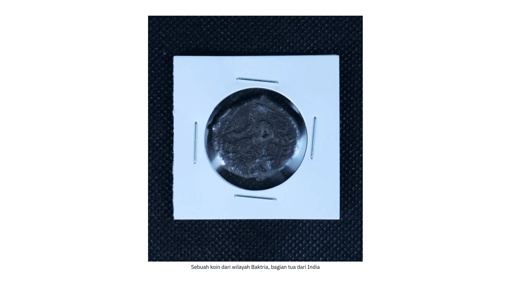

Untuk mengilustrasikan periode ini dalam bentuk visual, di atas ini adalah koin dari sebuah wilayah di India, yaitu wilayah Baktria, yang terletak di sebelah barat semenanjung India, dekat dengan Afganistan. Di daerah ini, ada koin yang mungkin terinspirasi oleh koin Yunani yang menampilkan salah satu tokoh kerajaan mereka.

## Lydia dan Persia

<chapterId>eb802ab8-8ffd-5b25-907f-8944f120ed14</chapterId>

:::video id=f151eb42-5ff3-4ca1-9af1-1ae2a5e051c0:::

### Koin elektrum Lydian pertama

Karena kita tidak bisa memisahkan kemunculan koin dari Lydia dan Persia, mari kita beralih ke bagian dunia di sebelah timur Yunani, yang saat ini menjadi Turki. Koin-koin pertama yang muncul di Barat berasal dari sekitar pertengahan abad ke-7 SM, di wilayah Lydia dan Ionia, yang terletak di wilayah yang sekarang menjadi Turki. Sekitar tahun 650 hingga 600 SM, inovasi mendasar ini mulai terlihat, dengan penemuan arkeologi penting seperti koin pertama yang ditemukan di kuil Artemis di Efesus, yang berasal dari tahun 600 SM. Koin-koin primitif ini terbuat dari elektrum, paduan alami emas dan perak dengan pantulan warna kuning, dan sering kali terlihat kasar, hanya ditandai dengan pukulan atau motif yang belum sempurna.

Di bawah ini, Anda bisa melihat salah satu koin Lydia paling awal, yang menampilkan seekor singa dengan mangsanya di depan. Anda mungkin melihat cap atau lubang di bagian belakang, yang menurut beberapa orang digunakan untuk menguji kemurnian logam dan memastikan bahwa itu bukan hanya lapisan permukaan. Meskipun ini adalah salah satu contoh paling awal, penting untuk dicatat bahwa karya ini adalah salinan. Semua karya emas dan elektrik saya adalah replika atau kreasi modern, yang dirancang untuk mencegah saya menghabiskan semua tabungan saya untuk koleksi ini.

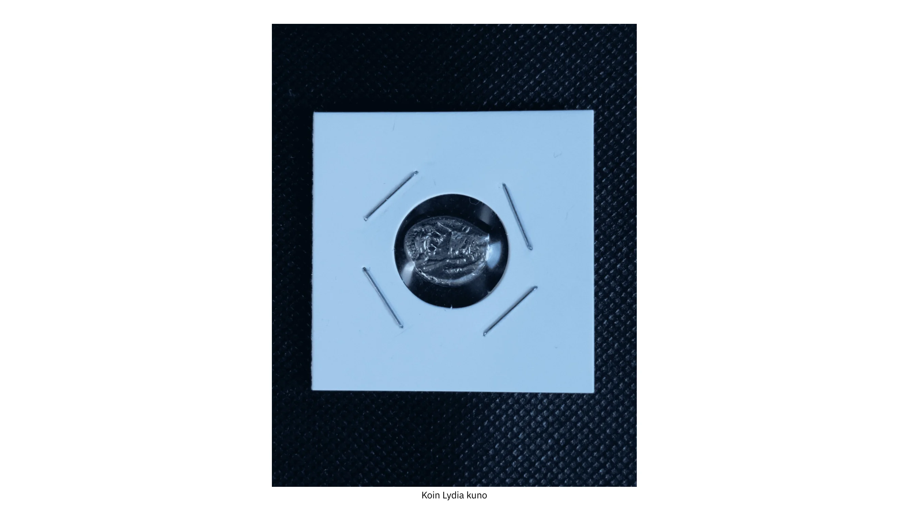

Tetapi saya juga memiliki karya Persia asli yang akan kita lihat. Seperti inilah bentuk karya-karya awal ini. Ini seperti semacam gumpalan (atau gumpalan, dalam bahasa Inggris) logam yang dicap pada saat itu.

Berlawanan dengan kepercayaan umum bahwa uang diciptakan untuk memfasilitasi perdagangan sehari-hari dan menggantikan barter, tampaknya koin-koin Lydia, Achaemenid, dan Yunani yang pertama pada awalnya tidak digunakan untuk perdagangan skala kecil. Memang, unit moneternya terlalu besar untuk digunakan sehari-hari. Terlebih lagi, peredarannya terbatas pada wilayah yang dekat dengan tempat mereka diproduksi.

Di sini, saya merasa penting untuk menyebutkan bahwa, meskipun saya telah membaca beberapa karya yang bersifat antropologis, koin-koin tersebut, seperti yang telah saya tunjukkan - baik koin elektrum atau koin Persia yang akan saya bahas sebentar lagi - terlalu besar untuk membeli roti, misalnya, setiap hari. Saya telah melihat perkiraan yang akan membuat kita berpikir bahwa itu setara dengan satu hari kerja untuk seorang petani atau tentara, jadi itu terlalu besar. Ini seperti mencoba membayar upah sehari untuk makan, sarapan, atau makan siang Anda. Kecuali bahwa saya telah melihat dalam karya-karya lain bahwa unit-unit yang lebih kecil dari gumpalan-gumpalan ini telah ditemukan, jadi koin-koin yang lebih kecil, yang mungkin membuat kita berpikir bahwa mungkin ada kemungkinan penggunaan untuk pembelian sehari-hari.

Jadi di sini, "bukti" antropologis bahwa koin tersebut tidak digunakan untuk perdagangan sehari-hari, karena denominasi atau satuannya terlalu besar, menurut saya tidak terlalu kuat karena kami telah menemukan contoh koin yang lebih kecil, yang dapat disesuaikan dengan pembelian sehari-hari.

### Peran Negara dalam penciptaan uang

Asal usul koin yang sebenarnya tampaknya terkait dengan tindakan langsung negara. Ada dua hipotesis utama mengenai hal ini: yang pertama, yang idealis, menarik kesejajaran antara istilah Yunani 'nomisma' (uang) dan 'nomos' (hukum), yang menunjukkan bahwa uang terkait dengan kodifikasi hukum, yang memperkuat otoritas dan organisasi politik kota. Hipotesis kedua yang lebih realistis, yang diterima secara luas saat ini, adalah bahwa uang pertama-tama dan terutama merupakan sarana bagi negara untuk melakukan kontrol ekonomi dan sosial. Dengan secara resmi menjamin berat dan nilai logam mulia yang dikandungnya, negara dapat memanipulasi sirkulasi dan nilai koin-koin ini, menciptakan kepercayaan dan premi likuiditas khusus untuk mata uang domestik.

Sangat menarik untuk mengetahui bahwa kami memiliki bukti akan hal ini. Sebagai contoh, pada koin elektrum, Anda harus tahu bahwa elektrum alami biasanya terdiri dari 70% emas dan 30% perak. Pada koin-koin pertama yang kami temukan dan analisis, khususnya koin-koin Lydian awal, kandungan emasnya tampaknya lebih banyak sekitar 50 hingga 55%, bukan 70. Hal ini menunjukkan bahwa bahkan pada saat itu, para penerbit koin mencoba mengurangi bagian logam yang lebih berharga, mungkin untuk menghasilkan lebih banyak koin dan membuatnya tampak bernilai sama dengan gumpalan elektrum alami yang tidak bertanda. Dan di sini, harus dikatakan bahwa hal ini benar-benar terjadi pada masa Croesus yang terkenal ini, seperti dalam *kaya seperti Croesus*, bahwa hal ini dimungkinkan karena pada masanyalah kita memiliki teknologi untuk memisahkan emas dan perak.

Mata uang Lydia mengalami evolusi besar selama masa pemerintahan raja Croesus yang terkenal (561-546 SM), yang terkenal dengan kekayaannya yang melegenda. Pada masa ini, bangsa Lydia menyempurnakan metalurgi untuk memisahkan emas dan perak dari elektrum, sehingga memperkenalkan koin bimetalik pertama, yaitu koin emas dan perak yang terpisah.

### Ekspansi Persia dan adopsi Yunani

Ketika mereka menaklukkan Lydia pada tahun 546 SM, Persia Achaemenid segera mengadopsi inovasi ini. Sekitar tahun 500 SM, di bawah pemerintahan Darius I, Persia membentuk sistem moneter mereka sendiri dengan daric emas dan siglois perak, yang sering kali menampilkan patung kerajaan dalam pose perang. Mata uang kerajaan Persia ini terutama digunakan di wilayah Helenistik Kekaisaran Persia dan secara bertahap menyebar, meskipun penggunaannya tetap tidak merata, dengan **beberapa wilayah, seperti Mesir, masih lebih menyukai pertukaran dalam logam yang ditimbang (emas batangan)**.

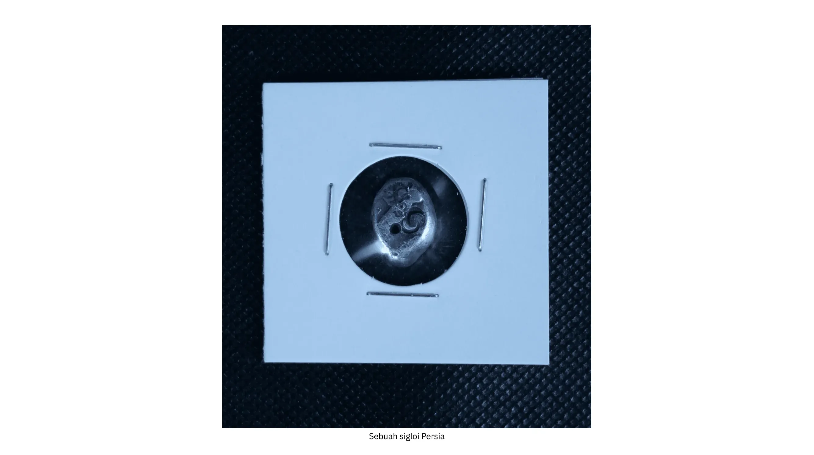

Di atas, Anda dapat mengagumi sigloi (atau siglos) Persia asli. Desainnya yang kecil menampilkan seorang raja, meskipun lubangnya sudah sedikit terkikis. Siglos adalah koin perak, berbeda dengan daric yang terbuat dari emas. Bangsa Persia dapat membedakan kedua logam ini, dan mereka beralih dari koin elektrum. Jadi, mereka menerapkan bimetalisme, menggunakan emas dan perak dengan tetap mempertahankan konsep yang sama yaitu koin yang terbuat dari logam mulia, sering kali dengan lubang di bagian belakang, mungkin untuk memeriksa kandungan logamnya.

Adopsi koin yang cepat oleh orang Yunani tampaknya telah didorong oleh kontak dekat mereka dengan orang Lydia, terutama melalui koloni-koloni Yunani di Asia Kecil. Orang Yunani pertama yang mencetak koin mungkin adalah penduduk Aegina pada pertengahan abad keenam SM, yang memperkenalkan drachma, yang beratnya bervariasi dari satu daerah ke daerah lain, dan namanya secara harfiah berarti "segenggam biji-bijian" atau "segenggam panah".

Keberhasilan mata uang Yunani tidak hanya karena kemudahannya untuk transaksi penting, seperti pembayaran tentara bayaran, tetapi juga karena perluasan ekonomi dan politik kota-kota. Mata uang dengan cepat menjadi elemen utama ekonomi Yunani dan, kemudian, Romawi, dengan tetap mempertahankan dimensi simbolis yang kuat, terutama melalui hubungannya dengan hukum (nomos).

Akhirnya, ekspansi koin yang cepat menjadi saksi dari transformasi besar masyarakat kuno, di mana kodifikasi nilai moneter berjalan seiring dengan organisasi negara. Evolusi ini meletakkan fondasi ekonomi dan politik bagi kebangkitan demokrasi Yunani, terutama di Athena, di mana uang memainkan peran penting dalam berfungsinya kota yang demokratis.

Poin penting yang perlu diingat dari bagian ini adalah bahwa kita berbicara secara khusus mengenai **koin**, bukan uang secara umum. Aspek utama yang muncul dengan jelas adalah **kepercayaan terhadap otoritas penerbit**, yang secara langsung terkait dengan karakteristik teknis koin (berat, kemurnian, nilai nominal). Kepercayaan inilah yang memungkinkan negara atau otoritas penerbit untuk melakukan kontrol atau bahkan memanipulasi nilai dan peredaran koin sejak awal.

## Intervensi kelembagaan dan koin pertama

<chapterId>3e1efd08-99e3-5a32-9908-3185fef0e640</chapterId>

:::video id=84847cf6-9e46-4a8c-9f35-25a27496cc4b:::

### Sifat ganda dari uang

Kemunculan uang kertas menimbulkan pertanyaan mendasar: apakah uang merupakan ciptaan spontan dari pasar atau institusi yang dipaksakan oleh otoritas? Ketegangan konseptual ini mempertemukan dua visi yang sangat berbeda satu sama lain.

Di satu sisi, mazhab ekonomi Austria mempertahankan gagasan bahwa uang komoditas - terutama emas - secara alami dipilih oleh para pelaku ekonomi karena kualitas intrinsiknya: daya tahan, mudah dibawa, dapat dibagi, dan dapat dipertukarkan. Dari perspektif ini, negara kemudian mengambil alih mata uang spontan ini untuk mengontrol pasokannya. Ini adalah sebuah institusi yang muncul secara alami dari kebutuhan pasar sebelum ditangkap oleh kekuatan politik.

Sebaliknya, pandangan antropologis dan institusional menyatakan bahwa uang benar-benar muncul dari koin negara. Otoritas secara sadar menciptakan mata uang dengan membubuhkan stempelnya, sehingga mengubah logam menjadi instrumen moneter asli. Perspektif ini menunjukkan bahwa koin-koin Lydia yang paling awal terutama digunakan untuk membayar tentara - satu stater kira-kira setara dengan upah harian seorang prajurit.

### Keuntungan paradoksal dari standardisasi negara

Terlepas dari ketegangan teoritis ini, bahkan para ekonom Austria mengakui manfaat tertentu dari intervensi negara terhadap uang. Standarisasi dengan mencetak uang memecahkan sejumlah masalah perdagangan praktis.

Tanpa adanya otoritas sertifikasi, para pelaku ekonomi akan menghadapi risiko yang terus menerus: koin palsu, penipuan pengajuan, dan manipulasi berat. Praktik-praktik ini menciptakan gesekan dalam perekonomian, karena beberapa koin diterima sementara yang lain ditolak. Secara teori, stempel resmi menjamin berat dan kualitas, membuat perdagangan menjadi lebih lancar.

Jaminan ini memiliki harga yang dapat diamati di pasar: koin emas yang dicetak bernilai lebih tinggi daripada emas mentah. Harga premium ini mencerminkan nilai sertifikasi - pedagang tidak perlu lagi memverifikasi keaslian logam melalui uji kimia atau resonansi. Intervensi negara, secara paradoks, menghilangkan gesekan dan memfasilitasi perdagangan dengan menciptakan kepercayaan yang dilembagakan.

### Manipulasi mata uang sejak awal

Kisah tentang negarawan Lydia pertama mengungkapkan sebuah ironi yang mengganggu. Analisis terbaru menunjukkan bahwa kandungan emas dari koin-koin elektrik ini secara sistematis lebih rendah daripada elektrik alami. Otoritas yang mensertifikasi kualitas secara bersamaan memanipulasi komposisi.

Praktik ini menggambarkan kegunaan ganda dari mata uang kripto. Bagi pasar, hal ini membuat pertukaran menjadi lebih lancar dan menawarkan jaminan standardisasi. Bagi otoritas penerbit, ini menjadi alat kontrol ekonomi melalui pengenceran. Dengan mengurangi kandungan emas sambil mempertahankan nilai nominal, negara secara efektif meningkatkan jumlah uang beredar - menciptakan lebih banyak unit moneter dari jumlah logam mulia yang sama.

Namun, negara itu sendiri tetap dibatasi oleh manipulasi ini. Seperti yang diilustrasikan oleh contoh solidus emas Konstantinus pada abad ke-4, pemerintah Romawi dengan cermat memeriksa kualitas koin, karena mereka menuntut pembayaran dengan koin yang baik. Pemerintah sangat berkepentingan untuk menjaga kualitas mata uangnya sendiri untuk menjamin nilai pendapatan pajaknya.

### Analisis ekonomi dari devaluasi

Studi mengenai devaluasi mata uang menunjukkan pola yang konsisten sepanjang sejarah. Untuk koin logam, para ekonom melacak persentase logam mulia yang terkandung di dalam koin - kurva menurun yang mengindikasikan devaluasi progresif. Untuk uang kertas modern, yang terjadi adalah sebaliknya: jumlah uang beredar diamati, dan peningkatannya menandakan devaluasi.

Kedua metode ini mengukur fenomena fundamental yang sama: dilusi nilai uang. Baik dengan mengurangi kandungan logam mulia atau mencetak uang kertas baru, mekanismenya tetap sama. Semakin banyak unit moneter yang dibuat oleh otoritas dari sumber daya riil yang sama, semakin banyak pula setiap unit kehilangan nilainya.

Manipulasi ini, yang dapat diamati dari koin-koin Lydian yang paling awal, menunjukkan bahwa kontrol moneter selalu menjadi masalah kekuasaan. Dengan demikian, uang yang dicetak mewakili inovasi teknis yang luar biasa yang digabungkan dengan instrumen kontrol ekonomi - sebuah dualitas yang berlangsung sepanjang sejarah moneter, hingga saat ini.

## Manufaktur suku cadang

<chapterId>b205f4f2-c293-5308-b812-a998de9ad45e</chapterId>

:::video id=47c612ec-d97e-4498-b50e-7e66518bd56d:::

### Dari gumpalan yang dilubangi hingga koin yang dicetak

Setelah bagian tentang kemunculan koin, saya ingin memperkenalkan bagian yang sangat singkat tentang evolusi pembuatan koin. Seperti yang telah kita lihat, semuanya dimulai dengan gumpalan elektrum, dilanjutkan dengan emas dan perak, di mana kedua sisinya ditandai dengan sebuah lubang, baik dengan wajah raja, atau lubang di bagian belakang untuk memeriksa kemurniannya.

Kemudian, seperti yang akan kita bahas di bagian selanjutnya, orang Yunani menyempurnakan teknologi ini dengan menciptakan koin bundar yang dipalu di kedua sisinya. Mereka akan mengambil sepotong logam mulia yang halus dan rata, mengukir desain yang diinginkan di satu sisi, lalu memaluinya dengan tangan untuk membuat koin jadi.

Teknologi pencetakan koin dengan tangan secara individual kemungkinan besar berperan dalam mengendalikan inflasi pada masa itu, meskipun koin-koin tersebut sering kali diencerkan untuk meningkatkan produksi. Hal ini terutama terlihat pada masa Romawi dan, pada tingkat yang lebih rendah, selama perang tertentu pada masa Yunani. Meskipun mencetak koin satu per satu membatasi kapasitas otoritas untuk produksi massal, hal ini secara efektif berkontribusi pada pengendalian inflasi, terlepas dari devaluasi signifikan yang terjadi. Dengan demikian, evolusi berkembang dari gumpalan logam yang dilubangi menjadi koin bulat yang dipalu.

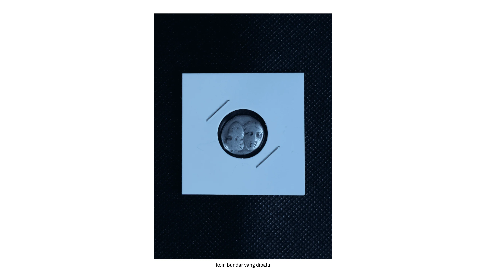

### Evolusi abad pertengahan

Pada Abad Pertengahan, ada juga tren penyebaran koin, membuatnya lebih lebar dan tipis. Salah satu alasannya adalah agar lebih mudah untuk menguji suaranya, yang sering digunakan sebagai indikator keasliannya. Dengan menyebarkan perak, frekuensi yang berbeda dihasilkan, sehingga orang dapat memvalidasi kemurnian koin hanya dengan mendengarkannya. Praktik ini melahirkan istilah "uang suara". Dalam konteks uang suara, berat standar ditentukan dengan menggunakan timbangan atau "trebuchet" untuk menimbang. Dengan demikian, evolusi berlanjut dari koin kecil dan bulat menjadi koin yang sedikit lebih tipis dan lebih lebar.

### Pemogokan pendulum

Teknologi terakhir yang muncul di akhir Abad Pertengahan, di awal era modern, adalah gagasan tentang pemukul pendulum. Ini adalah semacam sekrup yang dikencangkan untuk memukul koin, sehingga menghasilkan koin dengan bentuk pemukulan yang baru ini. Yang menarik dari perkembangan ini adalah kemampuan untuk mengukir pola pada permukaan koin untuk mengatasi masalah pemotongan. Pemotongan melibatkan pemindahan sebagian koin untuk mendapatkan kembali perak yang berharga, yang kemudian dapat digunakan untuk mencetak koin lain atau disimpan sebagai sumber daya.

Jadi, gagasan tentang pemukulan pendulum ini membantu fenomena kliping. Dan menarik untuk dicatat bahwa teknologi ini sebenarnya berasal dari Prancis. Di Inggris, misalnya, mereka mempekerjakan insinyur Prancis untuk datang dan menunjukkan kepada mereka cara membuat mesin ini. Yang lucu, menurut saya, ada pendukung pencetakan palu yang menentangnya dan menunda penerapan teknologi ini. Dalam setiap teknologi yang bagus, selalu ada orang yang menentangnya, yang ingin mempertahankan teknologi lama. Menurut saya, cukup gila untuk menyadari bahwa bahkan teknologi yang tampaknya sangat unggul - Anda dapat membuat lebih banyak komponen, lebih sulit untuk ditiru - masih ada orang yang terikat pada metode palu yang terkenal itu. Terjadi pergeseran antara memproduksi komponen yang dibuat dengan pemukulan pendulum yang terkenal ini, dan kemudian kembali ke pemukulan palu. Dan akhirnya, tentu saja, pemukulan pendulumlah yang akhirnya bertahan dan memberi kita karya-karya modern yang indah ini di mana Anda bisa menemukan garis-garis kecil, tonjolan-tonjolan kecil di sekelilingnya untuk menghindari pemotongan, mungkin terkait dengan kata pemotongan, tonjolan, dan Anda masih bisa melihat hingga saat ini, baik tonjolan atau teks atau gambar yang tertulis di tepi bagian tersebut.

# Berbagai teori tentang kemunculan uang

<partId>72ac694f-9248-550d-90c1-91af3d234380</partId>

## Teori-teori tentang kemunculan uang dan berbagai definisinya

<chapterId>7d699d4d-8c70-55b5-bf36-609f3fd90bcf</chapterId>

:::video id=523c873f-501b-4954-b79f-7e74c0f685a5:::

Selamat datang di segmen ini yang didedikasikan untuk berbagai teori tentang kemunculan uang dan berbagai definisinya. Berikut ini adalah kutipan singkat dari buku *Aux origines de la monnaie* yang, menurut saya, merangkum dua teori utama yang akan kita bahas di bagian ini.

> Pendahuluan singkat ini tidak memiliki tujuan lain selain untuk menyoroti konteks dari survei ini. Pada tingkat konseptual, perdebatan terbuka antara pendukung tesis K. Polanyi dan pendukung tesis M. Weber. Bagi yang pertama, hadiah dan redistribusi memainkan peran sentral, dengan pertukaran pasar hanya memainkan peran marjinal, terutama dalam pertukaran internasional. Sebaliknya, bagi yang lain, pasar adalah jantung dari proses sejarah saat ini.

Sebagai contoh, di Mesopotamia, salah satu teori kemunculannya menyatakan bahwa kuil, sebagai otoritas, menciptakan unit akun atau unit moneter, memberlakukannya, dan kemudian para pedagang mengadopsinya untuk perdagangan. Teori yang berlawanan menyatakan bahwa, tidak, unit moneter ini muncul secara alami dari pasar untuk memfasilitasi perdagangan. Ada banyak contoh yang bersumber dari Mesopotamia.

Mengenai barter, beberapa teori menyatakan bahwa barter terutama digunakan dalam pertukaran internasional, yaitu dengan orang yang tidak kita percayai.

Jadi, itulah yang akan kita lakukan di bagian ini. Kita akan melakukan semacam survei untuk menyajikan berbagai teori tentang kemunculan uang dan berbagai definisi tentang apa itu uang. Kita akan menyajikan dan mengkritik tesis-tesis dari para ekonom dan antropolog klasik. Saya bahkan cukup beruntung bisa mengajak Ulrich Fromy, yang akan mempresentasikan perspektif ekonom Austria tentang berbagai subjek ini.

## Munculnya uang bagi para ekonom klasik

<chapterId>1d3776cd-0dfd-5297-af48-c6f41e257a7e</chapterId>

:::video id=873a16c1-17ac-448d-8941-df4feb7ab79d:::

Segmen ini didedikasikan untuk berbagai teori tentang kemunculan uang. Topik pertama yang akan dibahas adalah kemunculan uang menurut para ekonom klasik.

### Teori klasik Adam Smith

Menurut teori ekonomi klasik, khususnya yang dipelopori oleh Adam Smith, uang muncul secara alami dari barter sebagai jawaban atas keterbatasannya. Awalnya, pertukaran dilakukan dengan barter langsung, tetapi metode ini sering kali dipersulit oleh masalah "double coincidence of wants": setiap orang harus memiliki apa yang diinginkan orang lain. Lambat laun, komoditas tertentu (seperti garam, logam mulia, dan ternak) diterima oleh semua orang sebagai alat tukar perantara, berkat kegunaan, daya tahan, dan dapat dibagi. Dengan demikian, uang secara spontan muncul untuk memfasilitasi dan memperlancar pertukaran ekonomi.

### Kritik terhadap teori klasik

Berikut adalah kritik saya terhadap teori ini. Dengan semua yang telah kita lihat di bagian sebelumnya, saya pikir kita sudah bisa mengatakan bahwa gagasan bahwa **koin** adalah evolusi dari barter adalah salah hanya karena koin yang dicetak pasti muncul dari otoritas, karena dicetak oleh otoritas. Ada beberapa alasan untuk hal ini, tidak terkecuali keinginan pihak berwenang untuk mengendalikan ekonomi, untuk mengendalikan uang.

Di sisi lain, jika kita berbicara tentang uang sebagai sebuah konsep, bukan koin, maka hal ini kurang jelas karena, dengan koin pertama, yaitu Lydian Staters, kita telah menemukan gumpalan perak yang tidak bertanda. Masih harus dilihat apakah koin-koin itu beredar. Jika koin-koin tersebut beredar, ini berarti bahwa orang-orang mungkin telah mengidentifikasi aset ini sebagai mata uang potensial yang dapat diminati secara luas dan mudah ditukarkan. Dan mungkin baru setelah itu pihak berwenang menyadari situasi ini dan mengendalikannya dengan membubuhkan stempel untuk mengesahkannya.

Ada banyak keuntungan untuk melakukan hal ini - tidak perlu memeriksanya, menimbangnya, dan sebagainya. Tentu saja, kita akan membicarakannya. Namun menurut saya, koin jelas merupakan alat yang telah digunakan oleh negara sejak awal. Namun, dalam hal kemunculan uang seperti itu, kita tidak tahu apakah itu benar-benar berasal dari otoritas yang memberlakukannya atau apakah itu muncul melalui perdagangan atau pertukaran komersial. Saya akan berdiskusi tentang hal ini dengan kolega saya, Ulrich, di bagian selanjutnya.

Kita telah mengetahui bahwa koin logam mulia pertama tidak digunakan untuk memfasilitasi pertukaran harian karena nilainya yang terlalu tinggi. Kita juga tahu bahwa koin-koin tersebut terutama digunakan untuk pembayaran militer. Ini adalah argumen yang bagus untuk tesis bahwa uang tidak serta merta muncul dari pasar. Unit-unit akun, denominasi koin pertama, mungkin terlalu besar untuk, misalnya, membeli roti atau berbelanja sehari-hari. Misalnya, bisa jadi setara dengan upah satu hari. Belum tentu orang-orang dibayar dengan upah pada masa itu, tapi itu untuk memberi Anda gambaran tentang skalanya. Jadi, koin-koin ini mungkin memiliki daya beli yang terlalu besar untuk digunakan dalam perdagangan skala kecil. Di sisi lain, tidak ada yang mengatakan bahwa koin-koin ini tidak akan digunakan untuk melakukan pertukaran yang lebih besar, seperti pertukaran pedagang. Kita tahu bahwa koin-koin ini terutama digunakan untuk pembayaran militer. Ini adalah salah satu teori yang paling populer untuk menjelaskan kemunculan koin pertama. Ingat, kita berbicara tentang koin di sini, bukan tentang uang secara umum. Jadi, koin pertama memiliki peran pertama mereka, dan itu adalah untuk membayar pembayaran militer, untuk tentara bayaran.

Alexander Agung, misalnya, memanfaatkannya dengan baik, seperti yang akan kita lihat nanti.

Kita juga telah melihat bahwa sejak zaman Tiongkok kuno, cangkang kerang digunakan untuk pertukaran ekonomi (**mengupah tenaga kerja, mengukur nilai, dan membeli tanah)**. Terlebih lagi, di Mesopotamia dan Mesir, sistem moneter fungsional sudah ada dan digunakan untuk perdagangan, pembayaran upah dan pembayaran pajak. Apa yang saya sarankan di sini adalah bahwa adalah salah jika berpikir bahwa koin dalam konsepsi Barat muncul dari kebutuhan untuk membuat pertukaran menjadi lebih lancar.

Karena koin dikeluarkan oleh otoritas, kita mungkin dapat berasumsi bahwa, sejak awal, koin tersebut telah dikaitkan dengan otoritas yang mengeluarkannya. Hal ini masuk akal. Di sisi lain, kita tidak selalu tahu bagaimana bentuk uang atau bentuk sistem moneter, proto-koin, yang mendahuluinya muncul. Di satu sisi, kami akan menyarankan bahwa kuil-kuillah yang mengidentifikasi unit-unit moneter ini dan, setelah itu, orang-orang menggunakannya. Dan, di sisi lain, kami akan memberitahu Anda, tidak, para pedaganglah yang membutuhkan alat tukar, cara untuk berdagang dengan dunia luar, dan merekalah yang mengidentifikasi, misalnya, logam perak, untuk digunakan karena logam ini diminati oleh dunia luar. Intinya, kita tidak benar-benar tahu. Itulah mengapa kita memiliki dua teori yang berlawanan. Kita tidak memiliki bukti yang sempurna untuk menjelaskan apakah uang muncul secara alami dari kebutuhan untuk berdagang, misalnya oleh para pedagang, atau apakah uang berasal dari otoritas.

### Membedakan antara koin dan uang primitif

Sebagai kesimpulan, saya rasa kita bisa mengatakan bahwa koin pasti berasal dari otoritas, karena koin dicap oleh otoritas tersebut. Di sisi lain, saya rasa tidak salah jika kita mengatakan bahwa uang (yang mendahului koin) tidak mungkin muncul untuk memfasilitasi pertukaran. Saya pikir dalam semua contoh yang telah kita lihat di atas, contoh-contoh dalam pengertian ini berlimpah.

## Mitos barter

<chapterId>0fcd4964-ac36-5163-a8cf-1aacebc0d2c0</chapterId>

:::video id=0ede29ab-8acd-4d79-9282-bd5991b97076:::

### Ulasan David Graeber

Kita baru saja membahas kemunculan uang menurut para ekonom klasik. Sekarang kita akan membahas konsep yang dikenal sebagai mitos barter.

Salah satu kritik terhadap teori klasik kemunculan uang ini adalah kurangnya bukti historis yang mendukung ide-idenya.

Kritik yang dikenal sebagai "mitos barter", yang dirumuskan oleh antropolog David Graeber, antara lain, menantang gagasan klasik bahwa uang muncul secara alami dari barter. Menurut kritik ini, tidak ada bukti historis atau antropologis yang menunjukkan bahwa masyarakat secara sistematis menggunakan barter sebelum munculnya uang. Faktanya, masyarakat kuno akan beroperasi berdasarkan kredit, utang, kewajiban sosial, dan pertukaran seremonial. Oleh karena itu, "mitos barter" adalah sebuah konstruksi teoritis yang dirancang untuk membenarkan visi ekonomi klasik, tanpa dasar empiris yang nyata.

Namun, perlu dicatat bahwa teori ini tidak menyangkal bahwa barter ada, misalnya, untuk pertukaran antara suku-suku yang berbeda. Teori ini hanya menyangkal bahwa barter merupakan aktivitas yang dipraktikkan secara luas di dalam kelompok-kelompok yang disebut primitif, dan bahwa uang merupakan evolusi logis dari praktik-praktik ini. Teori ini menyangkal fakta bahwa barter digunakan secara luas di dalam sebuah suku, dan bahwa uang pada akhirnya muncul untuk memperlancar pertukaran dan menyelesaikan kesulitan yang ada dalam barter. Sebaliknya, menurut teori ini, kelompok-kelompok ini mempraktikkan suatu bentuk kredit informal atau hadiah untuk hadiah.

### Masyarakat primitif vs peradaban besar

**Berikut adalah beberapa klarifikasi mengenai peradaban besar di zaman kuno ** Saya pikir teori ini pasti berlaku untuk kelompok primitif (tanpa negara) di masa lalu dan bahkan hingga saat ini (misalnya, suku-suku yang dipelajari oleh para penjelajah di abad ke-18 dan ke-19). Jelas, mereka tidak menggunakan barter, melainkan bentuk-bentuk pertukaran yang saya sebutkan sebelumnya, karena alasan yang telah kami sebutkan (pembagian kerja yang lemah, pertanian subsisten). Namun, saya rasa teori ini tidak berlaku untuk peradaban besar di masa lalu, seperti Mesopotamia dan Mesir kuno.

Berikut adalah dua kutipan dari *Aux origines de la monnaie* mengenai hal ini:

> Model yang diuraikan oleh M. Mauss dalam bukunya yang terkenal "The Gift" telah diadopsi oleh para ahli Mesir dengan suara bulat dan antusiasme yang sama besarnya dengan kurangnya ketajaman. Hal ini telah menyebabkan sejumlah kebingungan, yang tidak akan kita bahas di sini. Mari kita catat bahwa model ini berlaku untuk apa yang disebut masyarakat primitif, yang tidak berlaku untuk Mesir Firaun.

> Oleh karena itu, roti, yaitu sereal olahan, adalah unit akun yang, seperti shât (y) di Kerajaan Lama, juga memungkinkan pembukaan kredit untuk barang-barang yang beragam. Contoh sederhana ini menunjukkan bahwa ekonomi Mesir Firaun tidak terbatas pada sistem redistribusi. Sistem ini sangat kompleks, melibatkan banyak pertukaran.

Jadi, seperti yang kita lihat sebelumnya pada bagian tentang Mesir dan bahkan Mesopotamia dan Cina, kita dapat melihat bahwa bahkan peradaban kuno, tetapi tidak primitif, ini, karena adanya negara, menurut pendapat saya, menggunakan sistem moneter. Saya rasa hal ini sudah cukup ditunjukkan pada bagian pertama kursus ini. Jadi, gagasan memberi-dan-menerima, kredit yang ditangguhkan, tidak berlaku pada peradaban-peradaban besar ini. Oleh karena itu, alasan yang tepat untuk kemunculan uang masih menjadi misteri. Kita tidak tahu apakah uang berasal dari kebutuhan para pedagang untuk berdagang dengan dunia luar, atau apakah uang dipaksakan oleh kuil pada masa-masa kuno ini.

## Munculnya uang melalui uang utang

<chapterId>4f508615-aa61-5d62-89d3-cecd02aeaa62</chapterId>

:::video id=a23f547f-3906-4f4a-8f72-5d78c649d0c4:::

### Uang sebagai IOU

Pada bagian ini, kita akan membahas teori tentang uang utang.

Teori "uang utang", yang dikembangkan terutama oleh ekonom Alfred Mitchell-Innes dan kemudian diperluas oleh David Graeber, menyatakan bahwa uang tidak berasal dari barter, melainkan dari hubungan utang-piutang yang sudah ada sejak masyarakat manusia paling awal. Menurut teori ini, uang muncul ketika kewajiban sosial (utang antar individu atau kelompok) menjadi terukur dan dapat dipindahtangankan. Konsep ini memperkenalkan gagasan kuantifikasi pertukaran dan transfer. Dengan demikian, uang akan menjadi alat pembayaran utang, yang didukung oleh rasa saling percaya dan sering kali dijamin oleh otoritas politik atau agama, daripada komoditas yang hanya berfungsi sebagai perantara dalam pertukaran.

Bentuk yang lebih maju dari teori ini adalah bahwa semua uang adalah utang. Jadi, seseorang yang memiliki uang akan memiliki klaim terhadap masyarakat secara umum, klaim terhadap semua orang yang menerima uang tersebut. Dan karena uang, **dalam pandangan mereka, harus diterima dengan cara yang wajib**, jika tidak, itu bukan uang, karena jika Anda bisa menolak uang ini, sistem mereka tidak akan berfungsi. Dalam sebuah kelompok tertentu yang telah mengidentifikasi sebuah mata uang, semua orang yang memilikinya, seolah-olah mereka memiliki hutang kepada semua anggota masyarakat lain yang menerima mata uang tersebut, dan mereka yang menerima mata uang tersebut memiliki hutang kepada orang yang memiliki unit moneter tersebut. Ini pada dasarnya adalah teori mereka.

### Kritik terhadap sistem wajib

**Kritik saya terhadap teori ini:**

Izinkan saya menyampaikan satu kritik kecil terhadap teori ini. Saya menerima bahwa uang adalah semacam konsensus sosial. Ini adalah kepercayaan yang diberikan oleh sebuah kelompok pada "tanda" moneter, apa pun itu. Jadi saya menganut konsep saling percaya, yang akan kita bahas lagi nanti dengan konsep premi moneter. Yang menjadi rumit adalah ketika para pendukung teori ini menambahkan gagasan kewajiban dan bersikeras pada gagasan utang. Bagi mereka, ketika seseorang memiliki token moneter, mereka memiliki klaim terhadap komunitas secara keseluruhan, dan komunitas akan berhutang kepada pemegangnya. Juga akan ada kewajiban untuk melunasinya, dengan anggota kelompok diwajibkan untuk menerima token; jika tidak, dalam pandangan mereka, sistem tidak akan berfungsi. Saya pikir sistem yang dijelaskan di atas di Tiongkok kuno mewakili teori ini dengan baik.

Bagi saya, saya dapat dengan mudah membayangkan sebuah sistem di mana uang adalah konsensus sosial di mana token yang dipilih secara umum diterima sebagai alat pembayaran, tanpa kewajiban formal. Saya bisa melihat sistem seperti itu bekerja jika orang-orang menerimanya atas kehendak mereka sendiri. Itu bisa berhasil. Di sisi lain, sistem ini sering kali disertai dengan kewajiban, alat pembayaran yang sah, dan kekerasan, yang akan kita lihat nanti di bagian lain. Namun secara teoritis, saya tidak memiliki kesan bahwa sistem ini bisa berhasil. Menurut saya, Bitcoin adalah contohnya. Bitcoin memiliki nilai karena memiliki premi moneter, karena ada permintaan untuk digunakan sebagai moneter, yaitu cadangan nilai, mungkin juga alat tukar atau perlindungan terhadap sistem fiat. Tidak ada yang berkewajiban untuk menerimanya, dan semakin banyak yang menerimanya sebagai alat pembayaran, semakin banyak pula yang dapat digunakan sebagai alat pertukaran. Kita sudah dapat menggunakannya sebagai penyimpan nilai tanpa masalah. Tidak ada keraguan tentang itu. Yang ingin saya katakan adalah bahwa Bitcoin menurut saya adalah sebuah contoh, semacam mata uang yang merupakan bentuk konsensus sosial di mana kita berpikir bahwa kita akan bisa mendapatkan uang kita kembali jika kita membelinya nanti, kita mendapatkannya untuk dapat menukarnya nanti, untuk mempertahankan daya beli kita.

Pandangan teori yang tidak terlalu ketat ini membantu menjelaskan bagaimana dua masyarakat yang berbeda dapat berdagang dengan token moneter seperti emas, tanpa menciptakan klaim atau utang di antara kedua masyarakat tersebut. Menurut saya, memaksakan penerimaan dalam masyarakat tidak akan berhasil dalam perdagangan antara dua suku, karena suku lain tidak tunduk pada otoritas. Suku B tidak tunduk pada otoritas suku A. Namun, mereka menerima alat tukar yang sama, misalnya emas. Sekarang, orang mungkin berkata kepada saya "Ya, tapi itu karena perusahaan B juga memutuskan bahwa emas adalah mata uang mereka", jadi itu berhasil. Ya memang benar, ini bekerja, tetapi tidak ada penciptaan utang pada saat itu. Ini adalah transaksi akhir. Jadi, ketika perusahaan A menukarkan sebuah barang dengan emas di perusahaan B, tidak ada penciptaan utang, transaksi selesai. Dan jelas, orang di perusahaan B tidak mendapatkan koin atau bongkahan emas ini untuk dibayar kemudian oleh orang di perusahaan A. Dia menerimanya untuk ditukar dengan emas. Dia menerimanya untuk ditukar nanti, mungkin di dalam sukunya sendiri. Jadi, dalam contoh ini, tidak ada penciptaan utang, tidak ada klaim laten, ini hanyalah pertukaran langsung, pembayaran langsung. Para pendukung mata uang utang akan mengatakan bahwa ini adalah barter. Dan saya tidak setuju, karena barter adalah pertukaran barang langsung. Barter langsung adalah pertukaran satu barang dengan barang lain, untuk digunakan. Barang dipertukarkan untuk digunakan, sedangkan dalam kasus kami, emas jelas digunakan sebagai mata uang karena tidak akan digunakan untuk melakukan hal lain; emas akan digunakan sebagai alat pembayaran. Jadi, menurut saya, ini tidak termasuk dalam kategori barter.

Memiliki token moneter bukanlah sebuah "klaim" terhadap komunitas, melainkan sebuah harapan bahwa token akan diterima di kemudian hari dengan nilai yang sebanding.

## Munculnya uang secara spontan

<chapterId>e3ef86b1-73b9-5140-a61e-2ab6a5b0b2d4</chapterId>

:::video id=e543995f-d5e2-49d7-9133-e397b46e0833:::

Bagi mazhab ekonomi Austria, yang diprakarsai oleh Carl Menger, uang muncul secara alami dari ekonomi barter yang dihadapkan pada masalah kebetulan ganda dari keinginan. Dalam visi ini, individu secara spontan berkumpul pada barang perantara yang memfasilitasi pertukaran - bukan barang yang dikonsumsi secara langsung, tetapi komoditas yang diakui karena kapasitasnya untuk diminati secara luas.

Barang-barang moneter ini harus memiliki kualitas yang diidentifikasi sejak Aristoteles: barang tersebut harus berfungsi sebagai penyimpan nilai, alat tukar, dan satuan hitung. Para pelaku ekonomi secara bertahap mengidentifikasi, mengumpulkan, dan menyimpannya, sehingga memulai kemunculannya sebagai uang. Proses ini sepenuhnya spontan - uang mewakili respons pasar alami terhadap masalah koordinasi pertukaran, tanpa intervensi sadar dari otoritas.

### Perdebatan "mitos barter"

Antropolog seperti David Graeber membantah pandangan ini, dengan menyebut "mitos barter". Argumen mereka: tidak ada peradaban kompleks yang hanya didasarkan pada barter langsung yang pernah didokumentasikan. Sebaliknya, masyarakat primitif yang diteliti menggunakan sistem kredit informal dan timbal balik. Graeber menegaskan bahwa utang mendahului barter, dengan mengutip ribuan tablet Mesopotamia yang mendokumentasikan hubungan kredit.

Namun, kritik ini didasarkan pada definisi barter yang terbatas. Seperti yang ditunjukkan oleh Menger pada tahun 1892, barter lebih dari sekadar pertukaran barang dengan barang secara langsung. Barter juga mencakup transfer yang ditangguhkan, jasa untuk upah, dan pertukaran dengan temporalitas - apa yang disebut Menger sebagai "transfer sepihak antar individu". Bentuk barter yang diperluas ini dapat hidup berdampingan dengan sistem kredit dalam lingkaran kepercayaan yang terbatas.

Ketiadaan bukti bukanlah bukti ketiadaan, dan para ekonom Austria mengakui bahwa tidak ada masyarakat yang kompleks yang dapat berkembang secara berkelanjutan hanya berdasarkan barter langsung - oleh karena itu diperlukan adanya uang.

### Kasus Mesopotamia: pedagang versus kuil

Perdebatan yang terjadi adalah mengenai asal usul syikal perak Mesopotamia. Ada dua interpretasi yang berlawanan. Pandangan institusional menyatakan bahwa kuil-kuil - pusat ekonomi dan spiritual yang sebenarnya - menggunakan perak sebagai mata uang untuk menyusun ekonomi. Tablet-tablet berhuruf paku, yang terkonsentrasi di antara para pendeta dan elit pedagang, menjadi saksi dari kontrol terpusat ini.

Interpretasi Austria menunjukkan hal yang sebaliknya: para pedaganglah yang mengadopsi uang untuk perdagangan jarak jauh. Dihadapkan dengan tantangan untuk berdagang dengan orang asing di luar perbatasan Mesopotamia - dari Anatolia hingga Teluk Persia - mereka membutuhkan sesuatu yang dapat dikenali secara universal, tahan lama, dan mudah dibawa. Perak adalah pilihan alami karena kualitas intrinsiknya. Kuil-kuil tersebut hanya menegaskan sebuah praktik yang telah ditetapkan oleh penggunaan komersial.

Tesis ini didasarkan pada pertukaran yang terdokumentasi antara Kanesh di Anatolia dan Assur, di mana para pedagang menukarkan tekstil dengan logam perak - bukan untuk kegunaan materialnya, tapi sebagai penyimpan nilai. Transaksi-transaksi ini lebih dari sekadar barter, dan mengungkapkan keberadaan mata uang komoditas asli.

### Contoh modern dari kamp penjara

Ekonom Richard Radford, seorang tahanan di Jerman selama Perang Dunia Kedua, mendokumentasikan sebuah kasus menarik tentang kemunculan uang secara spontan. Di kamp-kamp, rokok secara alami menjadi unit pertukaran - dapat dibagi, terstandardisasi, dan diterima secara luas. Bahkan orang yang bukan perokok pun mengadopsinya, mengakui nilai tukar universal mereka.

Mikrokosmos ini menggambarkan prinsip Austria: dihadapkan pada masalah koordinasi pertukaran, individu secara spontan berkumpul pada barang yang paling "bisa dijual". Tidak ada otoritas yang memaksakan uang rokok; uang rokok muncul dari praktik sehari-hari para tahanan yang berusaha mengoptimalkan pertukaran mereka.

### Konvergensi preferensi individu

Pada dasarnya, uang mewakili konvergensi preferensi individu menuju kebaikan bersama yang diterima. Para pedagang Mesopotamia, seperti para tahanan Radford, mengidentifikasi barang yang meminimalkan ketidakpastian dalam pertukaran di masa depan. Pilihan ini tidak menunggu otorisasi atau pemaksaan dari otoritas pusat - pilihan ini muncul dari rasionalitas praktis para pelaku ekonomi yang dihadapkan pada tantangan pertukaran.

Perdebatan antara kemunculan spontan dan institusi yang disadari masih terbuka, karena bukti-bukti historis masih terpisah-pisah. Namun, analisis Austria menawarkan penjelasan yang masuk akal: uang lahir dari kebutuhan praktis perdagangan, dan pemerintah hanya melembagakan praktik-praktik yang telah ditetapkan oleh pasar.

## Visi antropologis tentang kemunculan uang

<chapterId>ec48c5d8-47ed-530f-beb7-c44fd0b62880</chapterId>

:::video id=8c1f8764-75af-4fb6-a98b-55de3b7da02e:::

### Asal-usul non-ekonomi dari uang

Pada bagian ini, kami mengeksplorasi pandangan antropologis mengenai kemunculan uang, sebuah perspektif yang kaya dan sangat menantang teori-teori ekonomi klasik.

Berlawanan dengan teori tradisional bahwa uang muncul secara alami dari barter untuk memfasilitasi pertukaran ekonomi, penelitian antropologis menunjukkan bahwa kemunculan uang sebagian besar berakar pada sebab-sebab non-ekonomi. Uang berasal dari mekanisme sosial seperti pembayaran upeti, kompensasi untuk pembunuhan (Wergeld yang terkenal) dan mas kawin (uang mahar), tetapi juga dari praktik seremonial, agama, politik, dan simbolis, jauh lebih banyak daripada dari kebutuhan pasar yang sederhana.

Pada masyarakat primitif, uang jarang digunakan untuk pertukaran barang material sehari-hari, bertentangan dengan definisi klasik uang sebagai "alat tukar". Faktanya, masyarakat ini menggunakan kredit secara besar-besaran, dengan pembayaran yang ditangguhkan yang tertanam dalam jaringan hubungan sosial dan pribadi yang luas. Sistem kredit yang ada di mana-mana ini secara logis dan historis mendahului kemunculan uang.

Itulah yang merangkum visi mereka. Kami mendiskusikan hal ini dengan Ulrich dalam obrolan kami di video sebelumnya. Saya persilakan Anda menikmati komentar Ulrich tentang masalah ini, yang sedikit menantang pendekatan ini. Jadi, dalam pandangan antropologis, kita sering memiliki gagasan bahwa uang berasal dari otoritas atau konsep sosial yang mendahului kebutuhan pasar.

### Contoh batu Yap

Di bawah ini, Anda dapat mengagumi contoh mencolok dari batu-batu monumental di pulau Yap. Beberapa dari batu-batu ini, meskipun tidak dapat bergerak atau bahkan menghilang secara fisik, tetap berfungsi sepenuhnya sebagai uang berkat kesepakatan bersama, menggarisbawahi dimensi sosial dan simbolis uang pada dasarnya.

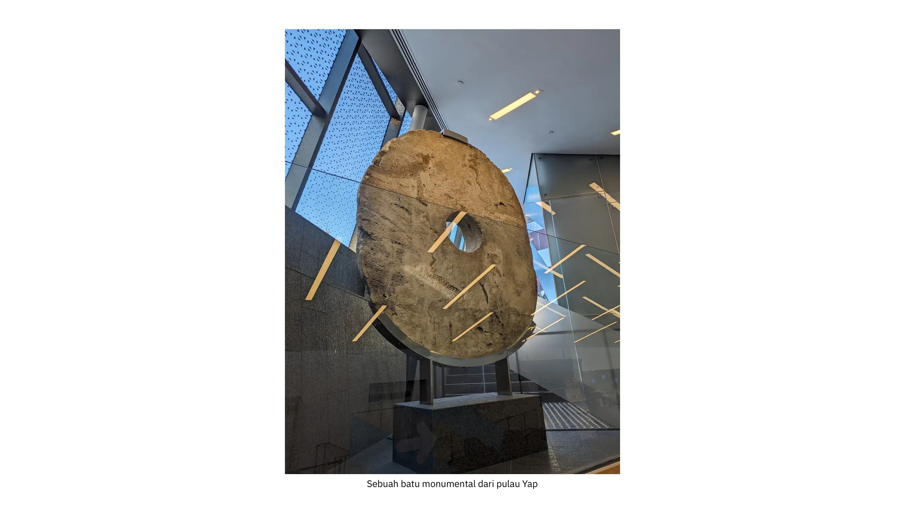

Ini adalah analisis yang sangat menarik tentang batu Yap. Saifedean Ammous juga menyebutkan contoh ini dalam bukunya "The Bitcoin Standard". Menurutnya, sistem Pulau Yap paling mirip dengan Bitcoin, semacam catatan pusat yang dapat dikonsultasikan oleh semua orang, yang bersifat publik, memelihara akun dan mengelola kepemilikan sesuatu. Perspektif antropologis ini menggambarkan bahwa semua ini merupakan kesepakatan atau konsensus sosial dalam masyarakat, yang pada dasarnya akurat. Dan saya menemukan penyebutan tentang batu-batu yang hilang ini sangat menarik. Mereka akan pergi ratusan kilometer ke laut dengan rakit-rakit kecil dan membawa batu-batu itu kembali. Kadang-kadang batu tersebut jatuh ke dasar laut, tapi batu ini masih digunakan dalam sistem moneter. Seseorang dapat mengatakan "Ya, kami menjatuhkan batu ini di tempat ini, ini milik saya, jadi kami dapat menukarnya". Tidak perlu kepemilikan fisik untuk memfasilitasi pertukaran, karena batu-batu tersebut sangat besar sehingga sering kali berada di satu tempat. Sebaliknya, fokusnya adalah pada perpindahan tangan dengan batu-batu ini dengan cara transaksional, yang memungkinkan kepemilikan berpindah tanpa batu-batu tersebut benar-benar berpindah. Ini adalah sebuah bentuk "bukti konsensus", yang menyoroti perspektif antropologis yang menarik tentang uang.

### Mata uang kripto dan kewajiban sosial

Para ahli etnografi di seluruh dunia telah mengamati masyarakat yang menggunakan "proto-mata uang" atau "mata uang primitif", seperti kerang, kain, hewan ternak, garam, dan batu, yang memenuhi fungsi-fungsi yang biasanya dikaitkan dengan uang, seperti alat pembayaran dan penyimpan nilai, tanpa secara teratur bertindak sebagai perantara dalam pertukaran barang sehari-hari.

Jadi, di sini kami menjelaskan sistem moneter yang tidak selalu digunakan untuk pertukaran sehari-hari.

Dan saya ingin mengingatkan Anda bahwa ini semua adalah mata uang sebelum munculnya koin, dan saya tidak tahu seberapa besar kekeliruan untuk mengatakan mata uang. Saya lebih suka menyebutnya mata uang. Saya dapat menyebutkan bahwa dalam literatur, kita sering berbicara tentang proto-mata uang untuk merujuk pada uang sebelum koin. Namun seperti yang kita lihat di bagian pertama, **Saya percaya bahwa ada sistem moneter jauh sebelum kemunculan koin**.

Mata uang primitif ini terutama digunakan untuk mengatur kewajiban sosial mendasar yang terkait dengan individu, seperti pernikahan, kompensasi konflik (Wergeld), atau hadiah antar kepala suku. Di Kekaisaran Persia, misalnya, koin pertama secara khusus diciptakan sebagai alat pembayaran militer daripada alat tukar.

Oleh karena itu, uang primitif memiliki satu karakteristik penting: uang adalah alat pembayaran, tetapi sangat jarang menjadi alat pertukaran langsung untuk barang-barang material. Yang kami maksudkan di sini adalah bahwa uang adalah alat pembayaran untuk kewajiban sosial tertentu, untuk suku-suku, untuk pertukaran antara kepala suku, wergeld yang terkenal, uang darah. Sebelum munculnya sistem peradilan, jika seseorang melakukan pembunuhan, ada ganti rugi bagi keluarga yang menderita akibat pembunuhan orang yang mereka cintai. Ada harga yang harus dibayar untuk hal ini, yang disebut uang darah dan merupakan bentuk pembayaran. Ada juga mas kawin, yang juga merupakan bentuk pembayaran. Dalam penggunaan awal uang sebagai bentuk pembayaran, uang lebih terkait dengan kewajiban manusia dan sosial daripada pembayaran untuk pembelian sehari-hari. Menurut teori ini, pertukaran sehari-hari yang lebih umum ini lebih terkait dengan kredit, kredit yang ditangguhkan, hadiah untuk hadiah, dan redistribusi jatah. Ada bentuk lain dari organisasi sosial untuk mengelola pertukaran ini. Penting juga untuk diingat bahwa, dalam masyarakat di mana setiap orang mandiri, melakukan pertanian sendiri, tidak ada spesialisasi, dan hanya ada sedikit kebutuhan akan sistem moneter untuk pertukaran sehari-hari. Dan itulah mengapa bentuk pertama uang adalah apa yang baru saja kita jelaskan, mas kawin, uang darah, hanya karena ini adalah pertukaran pertama di mana kita membutuhkan alat pembayaran, jauh sebelum kita perlu berdagang, untuk menukar roti dengan uang setiap hari, karena dalam masyarakat primitif, tidak bekerja seperti itu. Setiap orang memenuhi kebutuhannya sendiri, dan belum ada spesialisasi. Saya rasa saya telah membahas hal ini secara panjang lebar di semua kuliah sebelumnya dalam kursus ini.

Dalam masyarakat ini, tanpa adanya pembagian kerja yang maju, pertukaran langsung tetap terbatas, terutama terjadi dalam hubungan pertemanan atau persekutuan. Tidak adanya spesialisasi yang memadai tidak memerlukan uang dalam pengertian modern.

Para antropolog seperti Quiggin dan Einzig bersikeras pada keunggulan kredit: **Kehidupan ekonomi primitif terperangkap dalam jaringan kredit dan utang pribadi yang sangat besar, di mana uang mengintervensi terutama ketika pembayaran harus segera dilakukan dan kompensasi tidak dapat dengan mudah ditangguhkan.**

Jadi, orang menukar barang, dapat membuat kredit yang ditangguhkan, tetapi dalam beberapa kasus, Anda tidak dapat menangguhkan pembayaran, sehingga mata uang atau proto-mata uang dapat berguna pada saat ini untuk mendapatkan finalitas langsung pada pertukaran.

### Inovasi anonimitas

Analisis ini membawa kita pada refleksi yang lebih dalam: daripada mempertentangkan uang dengan barter, akan lebih relevan jika kita memahami kemunculan uang sebagai sebuah evolusi dari sistem kredit dan utang yang kompleks. Uang memperkenalkan sebuah inovasi fundamental: **anonimitas**. Dan di situlah saya menemukan teori antropologi tentang kemunculan uang ini menarik. Jika Anda adalah sekelompok kecil orang dan Anda saling memberikan kredit yang ditangguhkan, Anda jelas saling mengenal satu sama lain. Saya pikir agar sistem ini bisa berjalan, orang-orang harus saling mengenal satu sama lain. Dan pembayaran yang dilakukan dengan uang memungkinkan anonimitas. Hal ini memungkinkan Anda untuk melakukan pembayaran tanpa orang lain mengetahui nama Anda, tanpa orang lain mengetahui siapa Anda. Mereka dapat melakukan pertukaran untuk penyelesaian langsung dan final. Dan itulah yang dimungkinkan oleh uang.

Tidak seperti kredit, yang selalu bersifat nominatif, uang memungkinkan transaksi yang anonim, umum, dan langsung membebaskan. **Kekuatan pembebasan yang unik dari uang ini adalah keunggulannya yang menentukan.**

Dengan demikian, jauh dari sekadar alat sederhana untuk memfasilitasi pertukaran ekonomi, uang merupakan inovasi sosial yang besar, yang terkait erat dengan evolusi institusi dan praktik manusia, dari kredit pribadi **menjadi sistem pembayaran anonim yang digeneralisasi**. Evolusi antropologis ini menunjukkan bahwa uang, lebih dari sekadar alat tukar yang sederhana, mewakili institusi sosial yang kuat, yang secara mendalam membentuk masyarakat manusia, hingga menjadi tujuan utama dari aktivitas ekonomi di masyarakat modern.

Di sini, kita menyadari bahwa pada akhirnya, dalam masyarakat modern kita, tujuan utama dari pertukaran ekonomi adalah untuk memiliki uang, sedangkan di masa lalu, hal ini tidak terjadi sama sekali. Tujuan utama dari pertukaran ekonomi adalah untuk memiliki barang atau komoditas untuk dikonsumsi. Dan hari ini, dengan memperkenalkan inovasi uang, tujuan pertukaran ekonomi adalah untuk mengakumulasi uang ini, karena memungkinkan kita untuk menukarnya dengan barang, seperti yang diterima secara umum. Kita dapat menukarnya dengan barang yang kita butuhkan saat kita membutuhkannya.

## Penyatuan daftar

<chapterId>7664442a-91c1-5ce4-a8bd-53b7371a3e3d</chapterId>

:::video id=473fc284-5375-4e1b-b0cd-6b51ba0cc3b8:::

### Teori register akuntansi

Sekarang kita akan mengeksplorasi bersama berbagai proposal untuk penyatuan kedua teori moneter ini, yaitu teori kemunculan uang melalui utang-uang dan teori moneter kemunculan uang komoditas. Kita akan membahas proposal penyatuan Lynn Alden dalam bukunya yang terkenal, "For Broken Money", yang judul terjemahannya yang diproduksi oleh Consensus mungkin akan berjudul "Rupture monétaire".

*Kutipan dari Broken Money oleh Lyn Alden:*

> Pada dasarnya, uang adalah sebuah register akuntansi. Uang komoditas adalah buku besar yang diatur oleh alam. Uang bank adalah buku besar yang diatur oleh negara-bangsa. Uang sumber terbuka adalah buku besar yang diatur oleh penggunanya.

Di sini, Lyn mengacu ke Bitcoin.

### Rasio aliran stok dan kelangkaan

> Beberapa elemen kimia langka, seperti rhodium, lebih langka daripada emas, tetapi memiliki rasio aliran stok yang rendah karena dikonsumsi oleh industri secepat ditambang. Koin atau batangan rhodium dapat dibeli sebagai barang koleksi atau penyimpan nilai khusus, tetapi tidak cocok sebagai mata uang yang diterima secara sosial, sehingga tidak muncul secara alami sebagai uang.

Saifedean membahas hal ini secara panjang lebar dalam bukunya "The Bitcoin Standard". Bagi mereka yang tidak terbiasa dengan rasio stok terhadap arus, ini adalah ketika Anda membandingkan stok yang ada, cadangan yang ada di pasar, dibandingkan dengan stok baru yang masuk, masuknya stok baru. Hal ini sering kali agak berlawanan dengan intuisi, karena Anda mungkin berpikir bahwa sesuatu yang Anda miliki dalam jumlah besar tidak langka, tetapi kenyataannya tidak. Ini lebih merupakan masalah kapasitas yang Anda miliki untuk memasoknya. Sebaliknya, kapasitas yang kita miliki untuk memiliki stok baru yang, menurut model ini, memberi kita informasi apakah objek ini langka atau tidak. Bukan karena kita tidak memiliki stok, maka barang tersebut langka, mungkin saja kita tidak memilikinya. Jadi, jika kita mengambil emas, kita memiliki banyak stok emas karena digunakan sebagai penyimpan nilai, dan arus masuk stok baru sekitar 1% hingga 3% per tahun dari stok emas baru yang masuk melalui emas mining. Sedangkan, apa yang dia katakan di sini, jika kita berbicara tentang rhodium, itu lebih langka daripada emas, tetapi kita tidak memiliki stok karena dikonsumsi seiring berjalannya waktu. Jadi tidak perlu banyak pasokan baru untuk menggandakan stok yang ada. Sedangkan dengan emas, dibutuhkan setidaknya 50 tahun untuk memperbaharui, untuk menggandakan stok. Tidak seperti kebanyakan barang yang dikonsumsi, di mana cukup mudah, dan tidak perlu bertahun-tahun produksi untuk menggandakan stok yang ada, karena dikonsumsi sambil berjalan.

*"Emas telah mempertahankan rasio stok terhadap arus antara 25x dan 100x sepanjang sejarah modern, biasanya sekitar 50x atau lebih, tidak pernah jatuh di bawah 16x, bahkan selama Gold Rush pada pertengahan abad ke-19. "*

Jadi, 25 berarti 25 tahun untuk menggandakan stok, dan 100 berarti 100 tahun untuk menggandakan stok. Saifedean mengatakan dalam bukunya bahwa bahkan jika kita melipatgandakan produksi emas, dari 1,5% menjadi 3%, hal ini tidak akan berdampak besar pada harganya.

*"Perak umumnya memiliki rasio arus stok 10x atau lebih, yang masih relatif tinggi. "*

*Sebagian besar komoditas lain memiliki rasio stok-aliran kurang dari 1 atau 2. Bahkan elemen yang paling langka, seperti platinum dan rhodium, memiliki rasio stok-aliran yang relatif rendah karena konsumsi industrinya yang cepat. "*

### Keunggulan emas dan perak

*"Singkatnya, setiap kali mata uang komoditas bersaing dengan emas dan perak, yang terakhir selalu menjadi yang teratas pada akhirnya. Komoditas lain mungkin tetap menjadi mata uang untuk periode terbatas atau di wilayah tertentu, tetapi emas dan perak selalu membuktikan kemampuan mereka untuk menjadi mata uang yang kompetitif secara global dan mendominasi persaingan. Hal ini karena ketika peradaban bertemu, pemegang emas dan perak selalu memiliki kapasitas teknologi untuk mendevaluasi bentuk mata uang lainnya, sementara pemegang kerang, mutiara, hewan ternak, garam, kain, atau logam yang lebih rendah tidak akan pernah bisa mendevaluasi emas atau perak. "*

Jadi, hal ini sekali lagi dijelaskan dengan sangat baik dalam Standar Bitcoin di mana Saifedean berbicara tentang suku-suku di Afrika yang menggunakan manik-manik kaca. Dan ketika para pedagang Venesia tiba dengan kargo penuh manik-manik kaca karena mereka mampu memproduksinya secara industri pada saat itu, mereka memiliki kapasitas teknologi untuk melakukannya, hal itu benar-benar mengacaukan sistem moneter orang-orang ini dan mereka dapat menjarah sumber daya mereka. Ini adalah tesis Saifedean.

### Unit akun dan kredit

*"Secara historis, bahkan ketika kredit digunakan secara langsung sebagai alat tukar, biasanya kredit didenominasikan dalam unit komoditas moneter yang dipilih secara alami karena sifat-sifatnya. "*

Itu adalah poin yang sangat menarik, dan salah satu yang telah saya dan Ulrich diskusikan. Bahkan jika bait suci di Mesopotamia adalah semacam otoritas yang dapat mengatur gagasan kredit ini, unit perhitungannya adalah syikal. Tidak ada yang bisa memastikan bahwa syikal ditetapkan secara otoritatif oleh bait suci. Syikal bisa saja muncul secara alamiah, melalui kebutuhan para pedagang untuk mengimpor dan mengekspor dengan orang-orang lain di sekitarnya. Kita memiliki bukti akan hal ini, dalam bentuk seorang pedagang di Kanesh (saya telah menyebutkan hal ini di Bagian 1) yang melakukan hal tersebut, mengimpor logam mulia yang tidak digunakan untuk nilai komoditas fisiknya, melainkan sebagai penyimpan nilai. Satu-satunya masalah adalah kita tidak tahu apakah kita dapat berasumsi bahwa pilihan perak ini, yaitu syikal perak, dibuat oleh para pedagang, atau apakah itu dibuat oleh bait suci. Namun Ulrich memiliki argumen yang sangat bagus yang membuat kita berpikir bahwa kemungkinan besar hal itu dibuat oleh para pedagang.

*"Dengan demikian, penyatuan kedua teori tersebut dapat digambarkan sebagai "teori akuntansi uang" ("teori buku besar uang") karena teori ini menggambarkan logika dasar yang sama untuk kedua teori tersebut. Baik kredit sosial yang fleksibel maupun proto-mata uang yang dapat ditagih sudah ada sejak awal mula manusia. Dalam kedua kasus tersebut, kelompok manusia dengan berbagai ukuran menyimpan buku besar akuntansi di antara mereka sendiri untuk menghindari keharusan memenuhi keinginan yang bertubi-tubi, mengurangi gesekan dalam pertukaran, dan berfungsi sebagai bentuk tabungan likuid. Perbedaan mendasar terletak pada otoritas yang dipercayakan untuk menyimpan catatan tersebut. "*

Di satu sisi, alam mengatur ekspansi jumlah uang beredar. Jadi, jika kita mengambil emas, karena emas cukup langka, sulit untuk ditambang. Ada semacam batasan jumlah koin emas yang bisa ditambang. Jadi kelangkaan dikelola oleh alam. Dan daftarnya dipegang oleh konsep kepemilikan. Daftar ini terdesentralisasi. Kepemilikan dibuktikan dengan fakta bahwa Anda memiliki koin emas atau sekeping emas. Dan dalam kasus uang kredit, kelangkaan dikelola oleh kemampuan orang untuk mendapatkan kredit. Atau dalam kasus mata uang fiat, kelangkaan dikelola oleh otoritas. Merekalah yang memutuskan apakah akan mencetak lebih banyak atau tidak, untuk menghindari bencana inflasi. Jadi, dalam beberapa kasus, register juga dapat dikelola oleh pemilik token, dalam kasus uang kertas. Itu sebabnya ia dimasukkan ke dalam register, dalam tanda petik, tidak berwujud. Yah, terwujud, tapi virtual. Dia memiliki token yang terkenal ini, dan itulah yang membuktikan kepemilikannya. Dan itu bisa dengan mudah berada dalam daftar nyata, seperti halnya uang kertas, di bank, di mana benar-benar bank manusia yang mengelola siapa yang memiliki apa dalam kaitannya dengan daftar tersebut.

## Penyatuan melalui premi moneter

<chapterId>093756e5-8908-55e5-bb76-376a3a3cc4d3</chapterId>

:::video id=eabc342a-ecbd-46ca-a347-e914917e7c4f:::

### Konsep premi moneter

Pada bagian ini yang didedikasikan untuk berbagai proposal untuk menyatukan berbagai teori yang berbeda tentang kemunculan uang, saya baru saja mengusulkan teori Lyn Alden, yaitu teori register. Saya memiliki proposal sendiri untuk menyatukan dua teori moneter. Ini adalah premi moneter, konsep premi moneter. Jadi, nilai uang dapat dijelaskan oleh premi moneter yang timbul dari permintaan moneternya, baik dalam bentuk tablet tanah liat, koin logam mulia, uang kertas, atau bitcoin. Premi moneter secara sederhana didasarkan pada keyakinan bahwa seseorang akan menukarkan mata uang ini di masa depan dengan harga yang sebanding.

Yang ingin saya tunjukkan di sini cukup sederhana, yaitu apakah itu fiat, yaitu uang kertas tanpa nilai guna, apakah itu koin emas atau logam apa pun, bongkahan emas atau batangan emas, **sering kali premi moneterlah yang menentukan sebagian besar nilainya**. Jika kita mengambil sekeping emas, sebagian nilainya dijelaskan oleh nilai gunanya, penggunaannya dalam industri, atau untuk membuat perhiasan. Perhatikan bahwa permintaan perhiasan sering kali berasal dari nilai moneternya. Orang menyimpan perhiasan sebagai semacam penyimpan nilai, jadi saya memasukkannya sedikit ke dalam premi moneter karena sering kali permintaan moneter lebih berperan sebagai uang.

Jadi, bisa dikatakan bahwa sekitar 10% dari permintaan emas adalah untuk industri. Dalam nilai emas, kita akan memiliki sebagian kecil, katakanlah 10%, yang akan dijelaskan oleh permintaan industri ini, permintaan untuk penggunaan emas, di mana emas dikonsumsi. Sisanya jelas merupakan permintaan untuk penggunaan moneter sebagai penyimpan nilai.

### Bonus otoritas dan fiat

Dan jika Anda membandingkan sekeping emas dengan koin emas, ada lapisan lain. Koin emas dicap oleh otoritas, dan emas yang terkandung di dalamnya juga memiliki permintaan untuk digunakan, permintaan untuk dikonsumsi dalam industri. Koin emas juga menikmati premi moneter sebagai penyimpan nilai. Terlebih lagi, ada lapisan yang saya sebut sebagai premi otoritas, di mana sering kali akan ada harga, daya beli yang lebih besar untuk koin daripada kepingan emas, karena koin lebih mudah digunakan. Hal ini membuat pertukaran menjadi lebih lancar, karena tidak perlu menimbangnya. Otoritas biasanya menjamin kemurniannya. Dan jika Anda membandingkannya dengan sepotong emas, koin emas yang dicap umumnya bernilai lebih tinggi daripada sepotong emas biasa. Dan itu juga normal, karena dibutuhkan sumber daya untuk mencapnya.

Ini adalah prinsip yang sama untuk uang kertas. Uang kertas tidak benar-benar memiliki nilai guna, kecuali mungkin untuk menghangatkan rumah, dan itu terjadi pada masa Republik Weimar. Jadi, tidak ada permintaan nyata untuk nilai gunanya. Di sisi lain, hanya ada premium untuk otoritas, menurut saya.

Ini adalah bentuk premi moneter, sebuah hamparan dari premi moneter. Namun, premi moneternya berasal dari fakta bahwa mata uang tersebut adalah alat pembayaran yang sah, dan kemudian pihak berwenang memaksa Anda untuk membelinya untuk membayar pajak. Jadi, tentu saja, mata uang fiat memiliki bentuk permintaan moneter yang timbul dari fakta bahwa mata uang tersebut dikenakan pajak dan Anda setidaknya harus membelinya untuk membayar pajak Anda. Dan sebagai hasilnya, mata uang fiat tetap menjadi alat pembayaran yang diterima secara umum. Jadi, orang ingin mendapatkannya untuk memenuhi kebutuhan mereka.

### Penyatuan melalui permintaan moneter

Dan mengapa proposal untuk premi moneter ini memenuhi syarat sebagai penyatuan dua teori uang utang dan uang komoditas? Well, saya tidak merasa bahwa nilai koin emas harus berasal dari "nilai intrinsiknya". Tidak, pada kenyataannya, ini adalah gagasan tentang kepercayaan seperti halnya pada uang kertas. Ini adalah gagasan tentang permintaan moneter. Dan itu bukan karena ia memiliki persentase penggunaan industri yang kecil, sebuah "utilitas" lain. Jika kita mengatakan bahwa penggunaan industri adalah 10% dari nilainya, kita dapat menilainya pada $300 per ons. Jika emas dijual di pasar dengan harga $3.000 per ons, selisih antara $300 dan $3.000 adalah premium moneter yang terkenal. Permintaan moneter untuk emas inilah yang menjelaskannya. Hanya karena fiat tidak memiliki nilai guna, bukan berarti ada bedanya. Bagi saya, ini adalah hal yang sama. Jadi di kedua sisi, teori uang utang atau uang komoditas, saya tidak berpikir bahwa jenis kualitas ekstra yang dimiliki emas yang memiliki nilai guna minimal akan mengubah apa pun.

Di sisi lain, sudah pasti bahwa **pada tingkat kemunculan, menurut teorema regresi Mises, kita dapat mengusulkan bahwa penggunaan ini menciptakan permintaan di tempat asal dan memulai proses yang menjadi uang** Sedangkan, pada tingkat uang utang, ini lebih merupakan pemaksaan oleh otoritas, sehingga sumber, inisiasi kemunculan, dan konsep-konsepnya sama sekali berbeda. **Tetapi saya pikir pada tingkat nilai, bagaimana menjelaskan nilai uang, dengan adanya premi moneter, kita dapat dengan mudah menjelaskan mengapa uang fiat memiliki nilai yang kita kaitkan dengannya dan mengapa uang komoditas memiliki nilai** yang kita kaitkan dengannya. Bagi saya, ini adalah proses yang sama, dan ini disebut premi uang.

#### Premi moneter

Itu saja. Nilai uang dapat dijelaskan oleh premi moneter yang timbul dari permintaan moneternya, baik dalam bentuk tablet tanah liat, koin logam mulia, uang kertas, atau bitcoin.

Premi moneter hanya didasarkan pada keyakinan bahwa seseorang akan menukarkan uang ini nanti dengan harga yang sebanding.

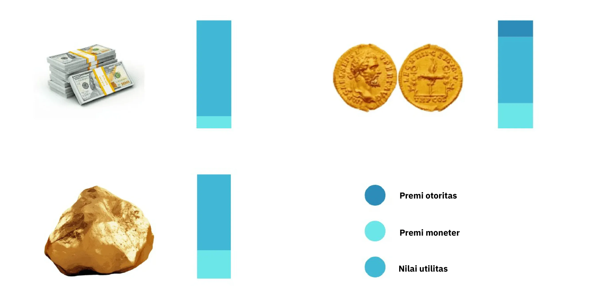

# Definisi uang yang berbeda

<partId>77b7918a-8c3b-11f0-b688-6b2ab22378c9</partId>

## Uang vs mata uang vs monnaie vs argent vs devisa

<chapterId>bf8a6d21-df88-5d23-a0a5-e9a5c1300554</chapterId>

:::video id=d9c9e7df-9db3-4a9f-801e-10d3fc7dfc22:::

### Semantik istilah moneter

Pada bagian ini tentang berbagai teori moneter dan terutama tentang definisi uang, saya ingin membahas sedikit tentang semantik. Saya ingin menggali lebih dalam tentang definisi beberapa kata yang berkaitan dengan uang, dan membandingkannya dengan padanannya dalam bahasa Inggris. Misalnya, uang, mata uang, dibandingkan dengan monnaie, argent, dan devise. Jadi, seperti ini.

Sedikit semantik:

Ketika kita mengatakan "**uang**" (de la monnaie), kebanyakan orang akan mengira bahwa yang dimaksud adalah uang receh yang kita terima sebagai imbalan dari sebuah transaksi. Dan jika kita mengatakan "**mata uang**" (la monnaie), orang mungkin akan mengira bahwa yang dimaksud adalah mata uang suatu negara. Mata uang Kanada adalah dolar Kanada. Itu benar.

Tapi bagaimana dengan uang (de l'argent)? Seorang pencuri tidak akan pernah mengatakan "Berikan semua uang kembalian Anda!" (pencuri mungkin akan kecewa karena hanya menerima uang receh yang hampir tidak ada nilainya).

Tidak, pencuri akan berteriak: "Berikan saya **semua uang Anda**". Dan jika pencuri itu berdiri di depan Anda di jalan, dia pasti mengacu pada uang kertas di saku Anda.

Di sisi lain, jika pencuri mencoba menipu Anda dengan cara yang lebih canggih, mencoba mencuri aset Anda dengan mengosongkan semua rekening bank Anda, kita akan mengatakan bahwa **dia akan mengambil semua uang Anda**. Di sini, kata "uang" mengacu pada "kekayaan individu".

Jadi, ada dua definisi untuk kata uang: uang tunai (uang kertas) dan kekayaan.

### Mata uang vs monnaie vs devise

Mata uang (devise) adalah mata uang negara lain, jika tidak, kita hanya mengatakan uang (monnaie). Jika Anda orang Prancis, Anda akan berkata: "La livre sterling est la devise du Royaume-Uni et l'euro et la monnaie de l'Europe" (Pound sterling adalah mata uang Inggris dan euro adalah mata uang Eropa).

Seringkali, orang yang belum mempelajari masalah semantik ini, dalam menerjemahkan istilah-istilah ini, akan cenderung berbicara tentang mata uang (devise) ketika itu ditulis mata uang, tapi tidak, mata uang adalah uang (monnaie) ketika itu adalah mata uang negara Anda, dan itu adalah devise ketika kita berbicara tentang mata uang lainnya. Jadi, masalah yang sering saya lihat di sini adalah bahwa dalam bahasa Inggris, ada dua kata: ada "uang", yang merupakan konsep, dan ada "mata uang", yang benar-benar merupakan unit dari suatu negara yang digunakan untuk melakukan pertukaran. Jadi kita bisa berbicara tentang konsep uang; mudah saja - ini adalah konsep dari kata *uang*; ini adalah uang secara umum. Dan *mata uang* sangat mudah disamakan dengan mata uang suatu negara. Sedangkan dalam bahasa Prancis, sayangnya, orang akan sering mengatakan ya, "mais ce n'est pas une monnaie" ketika berbicara tentang bitcoin karena ini bukan mata uang suatu negara, tetapi sering kali, saya pikir mereka mengacu pada istilah mata uang sebagai gantinya. Hal ini salah di satu sisi, karena sejak El Salvador, bitcoin telah menjadi mata uang suatu negara. Faktanya, orang akan sering mengatakan: *tapi tidak, ini bukan mata uang negara, ini bukan uang*. Namun pada kenyataannya, jika kita mengacu pada konsep *uang* yang lebih luas, bitcoin sangat cocok dengan definisi ini, menurut pendapat saya. Hanya saja dalam bahasa Perancis, kita tidak memiliki dua kata untuk memisahkan kedua konsep ini. Kita dapat mengatakan bahwa kata argent mengacu pada mata uang, tetapi sayangnya, itu bukan definisi yang tepat. *Argent* (uang) mengacu pada kekayaan atau uang kertas. Anda tidak bisa menyamakannya dengan kata *uang*. *Uang* sebenarnya adalah konsep mata uang (monnaie).

## Definisi Saifedean Ammous

<chapterId>07c4ba50-168c-567a-8957-0b187ff75f97</chapterId>

:::video id=936d6d3b-6d45-468e-bc44-85fbce9b857a:::

#### Apa itu uang?

Uang adalah sesuatu yang Anda miliki atau dapatkan bukan untuk digunakan atau dikonsumsi untuk kepentingannya sendiri, tetapi untuk ditukarkan dengan barang atau jasa lain yang mungkin Anda perlukan. (Saifedean)

Uang memperoleh premi moneter ketika ada permintaan moneter untuk barang tersebut, untuk memainkan satu atau lebih peran uang.

Barang moneter harus cukup langka agar premi moneter dapat bertahan (untuk mencegah penawaran menyesuaikan diri dengan permintaan moneter).

### Premi moneter

Pada bagian ini mengenai definisi mata uang yang berbeda, saya ingin membahas secara singkat mengenai definisi Saifedean dalam Standar Bitcoin, yang selalu menarik bagi saya. Menurut saya, definisi tersebut cukup sederhana ketika saya membacanya. Dan kami juga akan menambahkan konsep premi moneter ke dalam definisi ini. Seperti yang disebutkan Saifedean dalam bukunya, harus ada konsep kelangkaan. Pertanyaannya adalah, apa itu uang?

> Uang adalah sesuatu yang Anda miliki atau peroleh, bukan untuk digunakan atau dikonsumsi demi kepentingannya sendiri, tetapi untuk ditukar nanti dengan barang atau jasa lain yang mungkin Anda butuhkan.

Jadi itulah definisi yang disebutkan Saifedean dalam Standar Bitcoin. Saya akan menambahkan bahwa mata uang (la monnaie) memperoleh premi moneter ketika ada permintaan moneter untuk barang tersebut, untuk memainkan satu atau lebih peran mata uang. Jadi Anda dapat mengatakan bahwa mata uang yang berfungsi sebagai penyimpan nilai akan memiliki permintaan moneter yang memberinya premi moneter, karena orang ingin mendapatkannya, misalnya sebagai penyimpan nilai atau sebagai alat tukar.

### Kelangkaan dan mekanisme pasar

Untuk hal ini, saya rasa kita harus menambahkan bahwa barang moneter harus cukup langka agar premi moneter dapat bertahan. Ini sangat penting. **Jika sebuah barang muncul untuk digunakan sebagai uang dan kita melihat harganya naik, biasanya, jika barang tersebut tidak cukup langka, orang akan ingin memproduksi lebih banyak barang tersebut untuk mengambil keuntungan dari kenaikan nilai ketika harganya naik**. Inilah sebabnya mengapa sebagian besar barang di pasar memiliki harga yang relatif tetap. Ketika harga naik, produksi cenderung meningkat. Ketika harga turun, produksi turun. Ada semacam penyesuaian pasar. **Dan ketika sebuah barang cukup langka, seperti emas, mekanisme pasar tidak akan mengimbangi peningkatan permintaan ini dengan penggunaan uang. Jadi, variabelnya yang berubah, yaitu harga. Sama halnya dengan bitcoin**. Ketika harga bitcoin naik, kami tidak memproduksi lebih banyak bitcoin. Jadi yang menyesuaikan adalah harganya. Dan itulah sebabnya, selama bertahun-tahun, kita telah melihat harga bitcoin naik seiring dengan meningkatnya permintaan akan bitcoin. Karena tidak ada seorang pun di dunia ini yang dapat mengubah algoritme dan mengatakan "ada lebih banyak permintaan, harga akan naik, kami akan memproduksi lebih banyak." **Pasokan bitcoin baru diprogram sebelumnya, dan diketahui sebelumnya**. Jadi itulah yang saya katakan, bahwa barang moneter harus cukup langka agar premi moneter dapat bertahan, dan oleh karena itu tidak terjebak oleh mekanisme pasar, untuk mencegah pasokan menyesuaikan dengan permintaan moneter baru ini.

## Alat pembayaran dan nilai pembebasan

<chapterId>5d424039-e342-56f7-9d8b-bba9551831a9</chapterId>

:::video id=af4c0765-8111-4cb7-891b-3ee54d6e7054:::

### Alat pembayaran vs. alat tukar

Pada bagian yang didedikasikan untuk berbagai definisi uang ini, saya sarankan kita bersama-sama melihat kutipan dari buku "Aux origines de la monnaie" (Asal-usul Uang), sebuah teks oleh Alain Testart tentang masalah uang sebagai alat pembayaran dan nilai yang membebaskan.

*Dari Aux origines de la monnaie, Alain Testart mendefinisikan uang sebagai alat pembayaran:*

> Fungsi alat pembayaran di sini dipahami sebagai sesuatu yang berbeda dari fungsi alat pertukaran, sejauh ada pembayaran tanpa pertimbangan, pembayaran yang tidak membeli apa pun. Knies (1873: 192 dst.) mengembangkan tema ini secara panjang lebar mengenai pemindahan barang yang tidak terdiri dari tindakan pertukaran, seperti dalam kasus wergeld (uang darah atau komposisi untuk pembunuhan) atau pajak. Carl Menger menyerang fungsi keempat ini dalam artikelnya pada tahun 1892 "Geld", yang secara umum dianggap sebagai salah satu yang paling menentukan dalam masalah ini. Tanpa harus didiskreditkan secara total, gagasan tentang fungsi alat pembayaran tampaknya telah dilupakan dalam pemikiran ekonomi saat ini, atau setidaknya ditolak demi fungsi alat tukar.
>

> Uang digunakan untuk membayar: dilihat dari sudut pandang ini, uang adalah instrumen pembebasan, yang menggambarkan fungsi umum dari sebuah alat pembayaran. Dalam hal ini, kita berbicara tentang "kekuatan pembebasan" uang. Menurut Le Petit Robert, kekuatan pembebasan adalah "sesuatu yang memiliki efek membebaskan (dari kewajiban, hutang)". Menurut Grand Larousse, pembayaran yang membebaskan adalah "pembayaran yang dilakukan di bawah kondisi hukum sedemikian rupa sehingga kreditur tidak dapat menggugat penghapusan utang". Uang memiliki kekuatan yang luar biasa ini; bahkan uanglah yang mendefinisikan status alat pembayaran yang sah, karena tidak ada yang bisa menolak pembayaran yang dilakukan dengan uang, baik penjual maupun kreditor. Uang adalah satu-satunya barang yang tidak dapat ditolak dalam pembayaran utang, terlepas dari apakah utang tersebut kepada pedagang atau petugas pajak. Di antara semua barang, hanya uang yang memiliki keistimewaan ini. "Ini adalah hak istimewa," tulis Charles. Gide (1921 I: 443), yang merupakan apa yang kita sebut sebagai alat pembayaran yang sah.
>

> Setiap pertukaran yang terdiri dari pengalihan satu barang dengan barang lain, atau dengan syarat bahwa barang lain diberikan sebagai imbalan, tentu saja menyiratkan kewajiban dari pihak penerima untuk menyediakan barang yang berlawanan. Pembayaran adalah pemenuhan kewajiban ini. Oleh karena itu, semua pertukaran mengimplikasikan pembayaran, tetapi tidak semua pembayaran mengimplikasikan pertukaran. Ada pembayaran tanpa mitra pengimbang, yaitu pembayaran yang tidak memungkinkan diperolehnya barang lain, dan tidak dilakukan untuk tujuan ini. Pajak tetap menjadi contoh tolok ukur di sini; kita juga harus menyebutkan denda dari semua jenis yang dibayarkan kepada otoritas publik, dan ganti rugi yang terutang kepada orang lain berdasarkan prinsip bahwa siapa yang menyebabkan kerusakan pada orang lain harus memperbaikinya.

### Pembayaran tanpa rekanan

Ini adalah ilustrasi yang jelas dari tesis penulis. Bahkan, ia membedakan antara keduanya. Baginya, pertukaran adalah transfer barang dan pembayaran. Pembayaran datang berikutnya. Dan pembayaran dapat terjadi tanpa pertukaran. Dia memberikan contoh bagaimana membayar tiket parkir atau denda hanyalah sebuah pembayaran. Anda tidak benar-benar mendapatkan layanan sebagai gantinya. Beberapa orang mungkin berpendapat bahwa Negara memberikan layanan kepada Anda sebagai gantinya, yaitu dengan memberikan tiket parkir. Dia cukup jelas tentang fakta bahwa membayar pajak sebenarnya adalah pembayaran tanpa imbalan, dalam arti bahwa membayar pajak itu wajib, meskipun Anda tidak mendapatkan layanan. Dia mengatakan bahwa membayar pajak adalah sebuah pembayaran; tidak ada kewajiban untuk mendapatkan layanan sebagai gantinya. Saya telah mendiskusikan hal ini dengan banyak kolega saya, dan mereka tidak selalu setuju dengan gagasan ini. Tapi itulah tesis penulis. Dia mencoba menempatkan gagasan pembayaran dan melepaskannya dari pertukaran dengan contoh-contoh ini, misalnya, pembayaran denda dan pajak. Juga, misalnya, mahar, ia menyatakan bahwa mahar adalah pembayaran; Anda tidak harus mendapatkan sesuatu sebagai gantinya. Seseorang yang mengkritik proposal ini mungkin akan berkata, "Ya, tapi Anda mendapatkan istri sebagai gantinya." Jadi itulah tingkat perdebatan tentang hal ini.

Ada juga wergeld, atau uang darah. Jadi ini hanyalah pembayaran untuk kompensasi. Kata temanku Ulrich:

> Ya, tetapi Anda mendapatkan file ini ditutup sebagai gantinya.

Jadi, Anda telah melakukan kejahatan, pembunuhan misalnya. Pada saat itu, Anda membayar wergeld, dan setelah itu, Anda dibebaskan dari situasi tersebut. Jadi ada kekuatan yang membebaskan. Apakah Anda mendapatkan imbalan?" Menurut penulis, tidak. Menurut beberapa kolega saya, ya.

Saya rasa dalam diskusi ini, kita bisa melihat bahwa wergeld adalah salah satu contoh yang baik untuk mendefinisikan pembayaran. Bahkan, secara jelas, Anda tidak menerima apa pun sebagai imbalannya.

## Uang utang vs uang komoditas

<chapterId>4093677a-c8e8-5828-b994-15c01656186e</chapterId>

:::video id=f49cf5cc-288e-4daa-a1ff-b9de73506f4e:::

### Perdebatan mendasar

Masih dalam konteks bagian definisi dan teori moneter yang berbeda ini, mari kita telusuri bersama dua pandangan yang berlawanan: "uang selalu merupakan utang" atau "uang selalu merupakan komoditas". Di satu sisi, ada pendukung teori moneter berbasis utang, yang menyatakan: "Tidak, uang selalu merupakan utang! Di sisi lain, para penggemar emas yang terkenal membantah: "Tapi tidak, Anda tahu, uang selalu merupakan komoditas, selalu emas; yang lainnya, tagihan, IOU, hanya kredit, bukan uang".

Mari kita jelajahi ringkasan yang jelas dari teori-teori ini bersama-sama.

### Teori "selalu ada utang"

Berikut ini adalah ringkasan dari teori moneter yang dikenal sebagai **"uang utang "**, yang menyatakan bahwa uang pada dasarnya adalah sebuah bentuk utang:

Menurut teori ini, yang dikembangkan secara khusus oleh Alfred Mitchell-Innes dan dikembangkan lebih lanjut oleh David Graeber, uang pada dasarnya adalah pengakuan atas utang, yang berasal dari hubungan kredit yang secara historis sudah ada sebelum pertukaran moneter langsung. Alih-alih muncul dari kebutuhan yang terkait dengan barter, uang muncul sebagai cara untuk memperhitungkan, mentransfer, dan menyelesaikan kewajiban sosial atau utang antara individu atau kelompok.

Dengan demikian, semua uang beredar sebagai utang yang dimiliki oleh satu orang atau institusi kepada orang lain, didukung oleh kepercayaan dan otoritas sosial atau negara yang menjamin keabsahannya. Jadi, menurut mereka, ketika kita memiliki - seperti yang telah saya sebutkan - ketika kita memiliki uang, kita memiliki klaim terhadap masyarakat, dan masyarakat berhutang kepada kita. Oleh karena itu, uang tidak pernah netral atau otonom, tetapi selalu merupakan utang yang mendasarinya: memiliki uang pada dasarnya berarti memiliki klaim atas masyarakat atau komunitas ekonomi.

Alasan ini bertentangan dengan gagasan klasik tentang uang sebagai "komoditas perantara" sederhana, dan sebaliknya menekankan peran sentral hubungan sosial dan politik dalam penciptaan dan pengelolaan uang.

**Ulasan saya:**

Yang mengganggu saya tentang teori ini adalah bahwa teori ini menyatakan bahwa uang selalu merupakan utang, ketika kita memiliki contoh pertukaran antara dua suku yang berbeda yang, misalnya, menukar emas, di mana transaksi tersebut bersifat final dan tidak ada utang laten yang tersisa. Para pendukung teori ini akan sering mengatakan bahwa pertukaran ini bukanlah pertukaran uang, melainkan barter. Seperti yang telah disebutkan, saya tidak setuju. Ini adalah pertukaran moneter, karena emas tidak akan dikonsumsi; emas akan digunakan sebagai uang.

### Teori "selalu menjadi komoditas"

**Selalu menjadi komoditas:**

Berikut adalah ringkasan yang jelas tentang teori moneter yang dikenal sebagai "uang komoditas", di mana uang selalu muncul sebagai komoditas, terutama emas, yang muncul dari kebutuhan untuk dapat berdagang, sebuah komoditas yang secara umum akan diterima di luar negeri dan yang diperoleh untuk tujuan perdagangan.

Menurut teori ini, yang dikembangkan oleh para ekonom klasik (Adam Smith, David Ricardo) dan diambil oleh Marx, uang muncul secara alami sebagai komoditas di antara komoditas lainnya, sering kali berupa logam mulia seperti emas atau perak, yang memiliki nilai intrinsik yang terlepas dari peran moneternya. Pada awalnya, komoditas ini dipilih secara spontan oleh para pelaku ekonomi untuk memfasilitasi perdagangan, berkat kualitas intrinsiknya (kelangkaan, daya tahan, dapat dibagi, dan stabilitas).

Uang komoditas dibedakan berdasarkan keberadaan fisiknya dan nilainya ditentukan oleh jumlah tenaga kerja yang dibutuhkan secara sosial untuk memproduksinya (seperti dalam Marx). Masyarakat menggunakan emas, misalnya, tidak hanya untuk menyederhanakan barter, tetapi juga sebagai satuan hitung, penyimpan nilai, dan alat tukar universal.

Dalam visi ini, uang selalu memiliki nilai riil, karena tetap terkait dengan komoditas yang nyata. Bahkan ketika peran uang menjadi abstrak (koin yang dicetak, uang kertas, atau uang kertas), keabsahannya tetap berasal, secara langsung atau tidak langsung, dari referensi ke komoditas yang mendasarinya seperti emas. Oleh karena itu, teori ini menekankan pada asal-usul material dan ekonomi dari uang, berlawanan dengan teori-teori yang menganggapnya sebagai sebuah konvensi atau utang. Menurut teori ini, representasi uang dengan pengganti, seperti uang kertas yang dapat ditukarkan dengan emas, adalah kredit.

**Ulasan saya:**

Perhatikan bahwa visi ini mirip dengan teori uang komoditas, namun melangkah lebih jauh. Mereka mengusulkan bahwa uang harus **selalu** menjadi komoditas. Dan ketika kita berkata kepada mereka: "*Ya, tapi kita bisa setuju bahwa uang kertas adalah uang untuk kelompok ini; uang kertas bisa didukung oleh emas, bisa berfungsi, dan uang kertas itu sendiri adalah uang*".

Sebagai tanggapan, mereka akan memberikan contoh kupon ruang ganti. Mereka akan berkata: "Ya, tapi tidak, ketika Anda memiliki kupon ruang ganti untuk pakaian Anda, bisakah kami menyebut kupon kasir sebagai pakaian?

Tentu saja tidak, ini seperti sebuah pengakuan, sebuah klaim, pada intinya, yang memungkinkan Anda untuk mendapatkan pakaian Anda kembali. Persamaan ini tidak berlaku, karena kupon ruang ganti bukanlah metode pembayaran yang diterima secara umum. **Uang bukanlah klaim atas objek tertentu seperti pakaian; uang adalah moda, alat tukar, media pertukaran, atau alat pembayaran yang diterima secara umum**.

Jadi, Anda tidak bisa menyamakan kupon ruang ganti dengan uang kertas, karena kupon ruang ganti memungkinkan Anda untuk mendapatkan barang tertentu sebagai gantinya, itu adalah token yang memungkinkan Anda untuk mengambil barang Anda. Sedangkan uang kertas, mata uang fiat, adalah kupon universal yang memungkinkan Anda mengakses barang apa pun.

Dan menurut saya, tentu saja, bahkan uang kertas pun bisa dianggap sebagai uang jika dianggap demikian oleh masyarakat. Dan menurut saya, adalah kesalahan semantik untuk bersikeras bahwa itu bukan uang, karena itu adalah kupon untuk mendapatkan uang sungguhan, setidaknya pada saat itu, yang merupakan emas yang mendasarinya.

Saya tidak memiliki masalah dengan koin emas yang disimpan di brankas dan uang kertas yang mewakili koin emas tersebut sebagai mata uang. Bagi saya, tidak ada masalah semantik, itu hanya dua jenis mata uang. Jika saya tidak salah, Mises menjelaskan fenomena ini dengan sangat baik dengan berbicara tentang pengganti uang.

Visi mereka bermuara pada fakta bahwa Anda tidak bisa menganggap koin emas di brankas bank dan uang kertas yang mewakilinya sebagai uang pada saat yang bersamaan. Secara pribadi, saya tidak melihat ada masalah dengan hal ini; saya tidak melihat adanya paradoks dalam situasi ini. Mereka yang percaya bahwa uang selalu merupakan komoditas tidak melihat segala sesuatunya seperti yang saya lakukan.

**Berikut adalah ulasan konsep kupon ruang ganti dari buku *Aux origines de la monnaie*:**

*Catatan 14: "Kritik yang sangat baik - sangat baik karena berada di atas dasar di mana Knapp menempatkan dirinya sendiri, dasar hukum - oleh Rist (1938: 372, catatan 1) tentang perbandingan antara uang kertas dan token ruang cek: jika kita dapat berbicara tentang semacam klaim dalam kedua kasus tersebut, perbedaan mendasarnya adalah bahwa dalam kasus pertama, dan dalam kasus pertama saja, itu adalah klaim tanpa objek tertentu

Selain itu, mengenai masalah **klaim**, penulis yang sama mencatat hal berikut:

> Bastiat cukup bebas membayangkan voucher untuk seluruh masyarakat yang disajikan sebagai "bazar besar", tetapi tambahan kecil ini, perluasan yang tampaknya tidak berbahaya ini, adalah perbedaan antara kredit dan uang. Uang bukanlah klaim atas toko tertentu. Tidak ada yang namanya klaim anonim. Namun, anonimitas yang menjadi ciri khas uang, dan karena itu keumumannya, adalah apa yang membuatnya begitu kuat. Uang tidak seperti kredit, apalagi direduksi menjadi kredit. **Uang lebih dari sekadar kredit.**

**Sebuah paradoks: uang utang vs uang komoditas**

Paradoks yang paling baik menggambarkan dikotomi mendalam antara teori uang-hutang dan uang-komoditas menyangkut pertanyaan apakah emas adalah mata uang saat ini.

Di satu sisi, teori uang-hutang mendefinisikan uang pertama-tama dan terutama sebagai perantara pertukaran atau alat pembayaran yang diterima secara umum, atau bahkan dipaksakan, oleh otoritas publik. Dari perspektif ini, emas tidak lagi menjadi mata uang, karena emas tidak digunakan secara luas atau diterima sebagai alat tukar yang umum.

Di sisi lain, teori uang komoditas memandang uang sebagai komoditas berwujud, yang secara spontan dipilih oleh masyarakat karena karakteristik intrinsiknya (kelangkaan, daya tahan, kemampuan untuk dibagi, dan lain-lain). Menurut pendekatan ini, emas tetap menjadi mata uang universal yang sebenarnya, dan semua bentuk uang lainnya saat ini pada dasarnya tidak lebih dari kredit yang didasarkan pada kepercayaan.

Paradoks ini dengan jelas menunjukkan kesenjangan antara dua konsepsi moneter ini: untuk yang pertama, emas tidak lagi menjadi mata uang; untuk yang kedua, sebaliknya, emas tetap menjadi satu-satunya mata uang yang benar yang ada.

## Teori Moneter Modern

<chapterId>8efc29af-3193-5d97-ad9f-e608b32924ff</chapterId>

:::video id=f8127cb7-46a1-468c-bbb5-97bf0a8b8837:::

### Prinsip-prinsip teori moneter modern

Sebagai penutup dari bagian tentang berbagai teori moneter ini, mari kita bahas tentang keajaiban kecil dari teori-teori moneter, yang dikagumi oleh banyak ekonom modern yang bekerja di bank sentral, dan dinamakan teori moneter modern, yang sering disebut MMT.

**Teori Moneter Modern (MMT) adalah pendekatan ekonomi yang menyatakan bahwa sebuah negara dengan mata uangnya sendiri (seperti Amerika Serikat, Kanada, atau Jepang) tidak akan pernah kehabisan uang, karena negara tersebut selalu dapat mengeluarkan lebih banyak uang untuk membiayai pengeluarannya. Menurut teori ini:

- Uang adalah ciptaan Negara, bukan sumber daya yang terbatas**

- Pajak dan pinjaman tidak digunakan secara langsung untuk membiayai pengeluaran publik, melainkan untuk mengatur inflasi, memengaruhi perilaku ekonomi, dan mempertahankan permintaan mata uang nasional*

- Batas sebenarnya dari pengeluaran pemerintah adalah inflasi, bukan defisit anggaran atau utang publik.

- Jika uang yang tercipta disalurkan ke sektor-sektor yang dapat menyerapnya, maka tidak akan ada inflasi.

- Oleh karena itu, pemerintah harus menyesuaikan pengeluarannya sesuai dengan sumber daya riil yang tersedia (tenaga kerja, kapasitas industri, sumber daya alam) untuk menghindari inflasi yang berlebihan.

### Peran pajak dalam MMT

Jadi, di sini Anda akan menemukan jawaban terkenal untuk semua orang yang mengatakan, "Ya, tapi jika kita bisa mencetak uang, mengapa kita membayar pajak?" Nah, MMT memiliki jawaban yang tepat untuk pertanyaan ini. Memang benar bahwa dalam sistem fiat, dalam sistem modern, secara teknis, tidak ada yang membatasi penciptaan uang, selain inflasi. Namun, mereka akan menyarankan bahwa, pertama-tama, perpajakan diperlukan untuk membatasi inflasi, karena hal ini akan menghilangkan uang dari perekonomian. Jadi, jika kita tidak memiliki pajak untuk mengimbanginya, semua penciptaan uang ini pada akhirnya dapat menciptakan inflasi. Pajak, menurut mereka, secara harfiah adalah cara untuk mengeluarkan uang dari sistem untuk membatasi inflasi.

Mengenai masalah uang yang diinvestasikan di sektor-sektor yang dapat menyerapnya, kita dapat menyebutkan contoh Amerika Serikat, yang memberikan triliunan dolar kepada industri militer, yang tidak menyebabkan inflasi karena industri militer, kompleks industri militer, sangat mampu menyerap triliunan dolar ini.

Di sisi lain, jika Anda ingin membangun lebih banyak jalan, dan sumber daya serta kontraktor yang dapat memproduksinya terbatas, melipatgandakan anggaran untuk jalan akan menciptakan efek kelangkaan tenaga kerja yang dapat membuat jalan tersebut. Jadi harga akan naik sebagai akibat dari kekuatan pasar, penawaran dan permintaan. Jika para pemimpin kita yang maha tahu tahu ke mana harus menaruh uang, secara teknis, hal itu seharusnya tidak menyebabkan inflasi. Dan saya akan menjawab bahwa, dalam praktiknya, cukup jelas bahwa hal itu menyebabkan inflasi.

Kesimpulannya, menurut MMT, negara dapat menggunakan kapasitasnya untuk menciptakan uang untuk mencapai lapangan kerja penuh dan membiayai investasi sosial dan ekologi, sambil mengendalikan inflasi melalui kebijakan fiskal yang tepat. Hal ini sering kali juga menjadi tujuan para ekonom Keynesian, mazhab pemikiran ekonomi lainnya, untuk mengelola pengangguran dengan mengatur tingkat suku bunga dan membiayai investasi sosial dan ekologi sambil mengendalikan inflasi melalui kebijakan fiskal yang tepat.

### Ulasan MMT

Teori ini hanya berlaku untuk beberapa negara (lihat tweet Stephanie Kelton) yang memiliki kedaulatan moneter yang sebenarnya, yaitu mereka dapat meningkatkan utang dalam mata uang mereka sendiri. Teori ini sulit diterapkan pada ekonomi yang bergantung pada impor, yang harus menjaga kepercayaan internasional terhadap mata uang mereka.

Dan apa yang dimaksud dengan kedaulatan moneter yang sebenarnya? Ini berarti mampu meningkatkan utang dalam mata uang Anda sendiri. Anda harus mampu menjalankan surplus perdagangan untuk memiliki cadangan mata uang yang cukup, mata uang asing yang cukup, sehingga Anda tidak perlu mengumpulkan uang dalam mata uang asing untuk dapat mengimpor barang. Hal ini hanya terjadi di beberapa negara.

Di bawah ini, Anda dapat melihat tweet dari Stephanie Kelton, yang merupakan semacam poster wanita untuk gerakan ini. Ia menulis sebuah buku berjudul "The Deficit Myth". Dalam tweet tersebut, dia menulis bahwa berbagai negara seperti Amerika Serikat, Jepang, Kanada, Australia, Inggris, tidak bisa kehabisan uang.

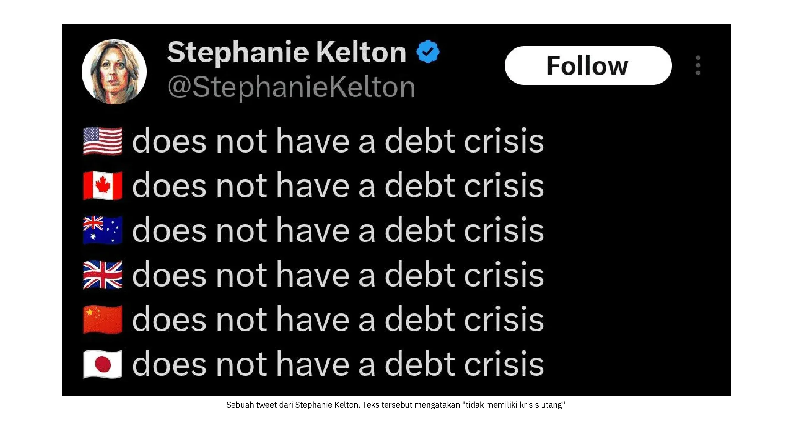

Anehnya, hanya mencantumkan enam negara saja? Mengapa begitu? Karena mereka memiliki kedaulatan moneter yang nyata. Namun, ada sekitar 200 negara di dunia, dan tidak semuanya memiliki kedaulatan moneter. Jadi, kritik saya terhadap teori ini, selain sedikit aneh dan tidak fungsional, adalah bahwa teori ini hanya berlaku untuk beberapa negara yang memiliki kedaulatan moneter yang sebenarnya, yaitu negara-negara yang dapat menerbitkan surat utang dalam mata uang mereka sendiri. Sampai batas tertentu, hal ini merugikan negara-negara lain di dunia. Dengan menciptakan mata uang ini, mereka seperti mengekspor inflasi ke tempat lain, mirip dengan apa yang telah dilakukan Amerika Serikat dengan hak istimewanya yang selangit selama beberapa dekade. Ini menyerupai bentuk kolonialisme moneter, di mana negara-negara yang memiliki kepercayaan dan permintaan global terhadap mata uang mereka dapat mencetak uang sebanyak yang mereka inginkan tanpa menimbulkan inflasi yang signifikan, sering kali karena mereka mengekspor inflasi tersebut.

Teori ini sulit diterapkan pada ekonomi yang bergantung pada impor yang perlu menjaga kepercayaan internasional terhadap mata uangnya.

Teori ini juga menyerukan perencanaan ekonomi terpusat pada tingkat tertentu, terutama untuk memastikan kontrol yang lebih besar terhadap sumber daya riil (pekerja, bahan baku, kapasitas industri) dan untuk mengelola inflasi.

# Kejatuhan dan kelahiran kembali uang

<partId>87a34ca9-782b-5ade-b51a-400f88ed7b0c</partId>

## Koin Yunani

<chapterId>7714195f-74ce-5f8c-be5f-59302d39fff4</chapterId>

:::video id=8e5c3091-0910-471b-8d4b-0dc6e9afa656:::

### Latar belakang dan konteks

Sebelum kita mulai, inilah latar belakang sejarahnya:

**Latar belakang sejarah:**

**Bangsa Romawi menyebut orang Yunani sebagai "Graeci" dan Yunani sebagai "Graecia".**

**Orang Yunani menyebut diri mereka "Hellenes" dan negara mereka "Hellas".**

**Homer** (lahir sekitar abad ke-8 SM)

Penyair Yunani legendaris, yang dianggap sebagai penulis *The Iliad* dan *The Odyssey*.

Sekitar tahun 750 SM: Lycurgus**, pembuat undang-undang mitos Sparta, dikatakan telah menetapkan konstitusi Sparta berdasarkan disiplin militer dan kesederhanaan.

**Numa Pompilius** (753-673 SM)

Raja kedua Roma, yang terkenal karena memberikan Roma institusi agama dan hukum yang pertama.

**Dracon**, legislator Athena (abad ke-7 SM), terkenal dengan hukumnya yang sangat keras, sehingga disebut "kejam".

**594 SM: Solon** menjadi anggota parlemen di Athena dan secara radikal mereformasi masyarakat Athena, terutama dengan menghapuskan perbudakan utang.

**776 SM: Pertandingan Olimpiade Kuno**

Pertandingan olahraga reguler pertama diadakan di Olympia setiap empat tahun sekali, mempertemukan kota-kota di Yunani.

**Pythagoras** (sekitar 570-495 SM)

Filsuf dan matematikawan Yunani, yang terkenal dengan teorema tentang segitiga siku-siku.

**Xenophanes dari Colophon** (sekitar 570-478 SM)

Filsuf pra-Sokrates yang dikenal karena kritiknya terhadap politeisme tradisional Yunani.

**490 SM: Pertempuran Maraton**

Bangsa Athena dengan penuh kemenangan mengusir invasi Persia, menandai titik balik yang menentukan bagi peradaban Yunani.

**Herodotus** (c. 484-425 SM), yang dijuluki "bapak sejarah", menulis sebuah karya besar yang menggambarkan Perang Persia, termasuk kemenangan Yunani atas Xerxes pada tahun 480 SM.

**Socrates** (470-399 SM)

Filsuf Athena yang terkenal dengan metode dialektikanya dan ajarannya tentang etika dan pengetahuan diri.

**Aristophanes** (sekitar 446-386 SM)

Penulis naskah drama Athena, yang terkenal dengan komedi satirnya seperti *The Frogs*.

**Sophocles** (abad ke-5 SM), dalam dramanya *Antigone*, mengkritik uang sebagai sumber korupsi moral dan politik, melalui tokoh tiran Creon.

**Plato** (c. 428-348 SM)

Filsuf Yunani, murid Socrates, pendiri Akademi, penulis *The Republic*.

** 431-404 SM: Perang Peloponnesia**

Konflik besar antara Athena dan Sparta, yang berakhir dengan kekalahan bagi Athena.

**431 SM**: Athena membiayai Perang Peloponnesia dengan mencairkan koin emas dan peraknya untuk meningkatkan jumlah koin yang beredar, sehingga menyebabkan inflasi.

**Xenophon** (sekitar 430-355 SM)

Penulis, filsuf, dan jenderal Athena, murid Socrates, penulis *Anabasis*.

**414 SM**: Athena mulai kalah dalam Perang Peloponnesos setelah ekspedisi yang gagal ke Sisilia.

**405 SM: Aristophanes**, dalam dramanya *The Frogs*, secara eksplisit menggambarkan devaluasi drachma perak dan kemunculan koin perunggu yang lebih rendah di Athena, yang mengilustrasikan prinsip yang sekarang dikenal sebagai "Hukum Gresham".

** 404 SM **: Athena menyerah setelah pengepungan panjang oleh Sparta.

**Aristoteles** (384-322 SM)

Filsuf besar Yunani, murid Plato, pendiri Lyceum, yang dikenal dengan karyanya dalam bidang logika, biologi, dan filsafat politik.

**327 SM**: Aleksander Agung menaklukkan Persepolis dan provinsi-provinsi timur Kekaisaran Persia, memperluas kekaisarannya secara signifikan.

**323 SM**: Aleksander meninggal di Babilonia tanpa ahli waris yang jelas, memicu peperangan antara para jenderalnya (diadochi) untuk memecah-belah kekaisaran.

**Archimedes** (sekitar 287-212 SM)

Matematikawan, fisikawan, dan penemu Yunani, yang terkenal dengan penemuannya dalam bidang geometri dan mekanika.

**196 SM: Batu Rosetta** diukir pada masa pemerintahan Firaun Ptolemeus V, yang memungkinkan penguraian hieroglif Mesir di kemudian hari.

**192-188 SM: Perang Romano-Seljuk**

Romawi mengalahkan kekaisaran Seleukia yang dipimpin oleh Antiokhos III, mengukuhkan pengaruhnya di Yunani dan Asia Kecil.

**146 SM: Pertempuran Korintus**

Bangsa Romawi menghancurkan kota Korintus di Yunani, menandai berakhirnya kemerdekaan politik Yunani dan integrasi Yunani ke dalam dunia Romawi secara bertahap.

Untuk bagian tentang Zaman Kuno, kejatuhan Romawi dan Abad Pertengahan ini, kita akan mulai dengan bagian tentang koin-koin Yunani.

Sejarah mata uang koin di Yunani kuno dimulai sekitar tahun 600 SM, ketika kota-kota Yunani dengan cepat mengadopsi inovasi dari Lydia di Asia Kecil, yang awalnya menggunakan elektrum dan kemudian perak. Koin Yunani pertama dicetak di pulau Aegina, menampilkan kura-kura laut atau darat, tetapi drachma Athena, dihiasi dengan Athena dan burung hantu, yang menjadi simbol moneter terbaik sejak abad ke-5 SM, yang sebagian besar mendominasi perdagangan internasional pada saat itu.

Dan saya cukup beruntung untuk memiliki salinan drachma Yunani dari periode itu dengan burung hantu yang terkenal itu dan sosok di bagian belakangnya. Itu adalah tetradrachma, yang lebih besar dari drachma sederhana.

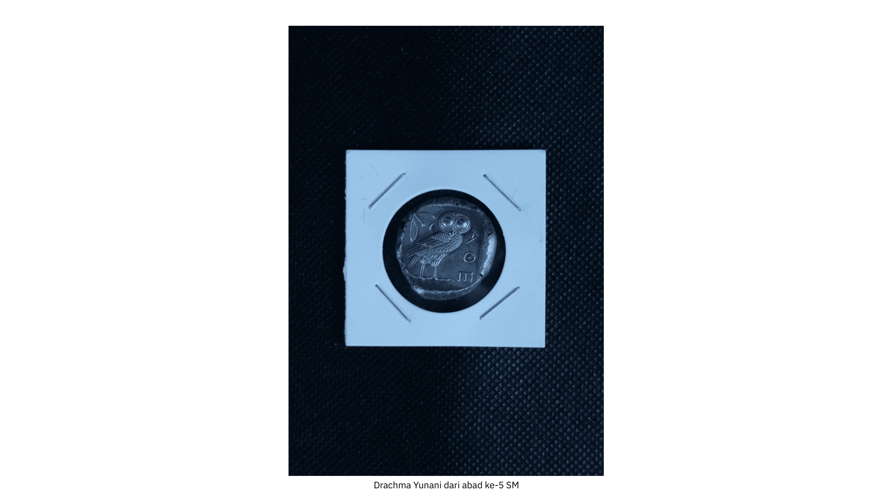

Setiap kota di Yunani memiliki hubungan tersendiri dengan uang. Di Athena, mata uang sangat terkait dengan kekuatan politik dan ekonomi. Dekrit Athena yang terkenal pada akhir abad ke-5 SM memberlakukan penggunaan mata uang Athena secara eksklusif di wilayah sekutunya, sehingga memperkuat hegemoni ekonominya. Athena juga mengumpulkan cadangan emas dalam jumlah besar untuk keadaan darurat, yang disimpan di Acropolis, mungkin sebagai simbol kehati-hatian ekonominya. Sebaliknya, Sparta, sebuah kota militer dengan nilai-nilai yang ketat, memilih untuk sangat membatasi penggunaan uang, melarang warganya untuk memiliki koin emas atau perak. Sparta lebih suka menggunakan batangan besi yang berat untuk mencegah perdagangan luar negeri dan menjaga kohesi sosial.

Perang sering kali dibiayai oleh manipulasi mata uang. Selama Perang Peloponnesos (431-404 SM), Athena melakukan devaluasi drastis untuk membayar pasukannya. Kehilangan akses ke tambang peraknya akibat pendudukan Sparta di Decelia pada tahun 413 SM, Athena harus melebur patung-patung emas untuk mencetak koin baru secara terburu-buru pada tahun 407/406 SM. Kemudian, pada tahun 406/405 SM, dia menciptakan koin perunggu yang dilapisi perak, menyebabkan krisis moneter yang diilustrasikan oleh **Aristophanes**, yang telah membangkitkan apa yang sekarang dikenal sebagai Hukum Gresham: uang yang buruk akan mengusir uang yang baik. Mata uang darurat ini dengan cepat didemonetisasi setelah perang untuk mengembalikan kepercayaan pada koin Athena.

Akhir periode klasik ditandai dengan kebangkitan Makedonia di bawah kepemimpinan Filipus II dan putranya, Alexander Agung, yang sangat mengacaukan keseimbangan moneter Yunani. Berkat tambang emas dan perak yang luas di Gunung Pangea, Filipus II menghasilkan banyak uang untuk membiayai kampanye militer dan politiknya, dengan menetapkan standar emas-perak yang sederhana dan praktis (10:1). Mata uang emasnya, yang merayakan kemenangannya di Olimpiade, beredar hingga ke Eropa Barat, bahkan sampai ke Inggris. Aleksander mengejar kebijakan moneter ini, mengedarkan drachma **Attic** secara luas selama penaklukannya di Timur hingga ke India. Peredaran koin yang masif ini menandai dimulainya era Hellenistik, ketika gambar para penguasa secara bertahap menggantikan gambar dewa-dewi pada koin. Inovasi ini memungkinkan generasi raja-raja Helenistik untuk mempromosikan diri mereka sendiri, menurunkan dewa-dewa tradisional ke peran sekunder di bagian belakang koin mereka.

Setelah kematian Aleksander pada 323 SM, para jenderalnya membagi-bagi kekaisarannya yang sangat besar, mendirikan dinasti-dinasti di Mesir (Ptolemeus), Suriah (Seleukia), dan tempat lainnya. Kerajaan-kerajaan Helenistik ini mengadopsi berbagai sistem moneter: Ptolemies memberlakukan sistem moneter tertutup untuk mengontrol sirkulasi uang, lebih memilih menggunakan biji-bijian sebagai mata uang internal untuk menyimpan logam mulia untuk pengeluaran militer eksternal. Pada saat yang sama, Rhodes menjadi pusat perdagangan utama sebelum akhirnya dilemahkan secara ekonomi oleh Romawi, yang mendirikan Delos sebagai pelabuhan bebas pada tahun 167 SM.

Penggunaan uang merupakan hal yang penting dalam penggajian tentara bayaran. Tentara Aleksander menerima drachma perak setiap hari.

Pasukan kavaleri, pasukan elit Aleksander yang sangat terspesialisasi, menerima rata-rata dua drachma per hari, prajurit infanteri satu drachma, dan tentara bayaran biasa dua pertiga drachma, dua kali lipat dari gaji seorang pekerja biasa.

Selama Perang Peloponnesia, sejumlah besar uang juga dibayarkan kepada para prajurit: lebih dari 1.200 talenta untuk memadamkan pemberontakan Samos dan lebih dari 2.000 talenta untuk mengepung Potidea.

Pada saat pasukan ini sepenuhnya terlibat di Asia Kecil, total biaya yang dikeluarkan adalah sekitar dua puluh talenta per hari, atau sekitar setengah ton perak, atau 120.000 drachma.

Mata uang Yunani juga memainkan peran budaya yang penting, karena setiap kota berusaha untuk menegaskan identitasnya dengan mencetak koinnya sendiri dengan simbol-simbol lokal atau mitologi. Sebagai contoh, Heraklius menggambarkan Heracles (Hercules) bertarung melawan seekor singa, sementara Cyrene menunjukkan tanaman obat silphium yang terkenal.

Akhirnya, terlepas dari keragaman dan fluktuasi regionalnya, mata uang Yunani Klasik dan Hellenistik meninggalkan jejak abadi pada sejarah ekonomi dan budaya dunia Mediterania, yang sangat memengaruhi sistem moneter di kemudian hari hingga Roma, yang secara bertahap mengadopsi dan mengembangkan konsep-konsep ekonomi Yunani untuk menyusun ekonomi kekaisarannya sendiri.

## Dampak mata uang di Yunani

<chapterId>3a5e6c7d-699c-5567-87cd-3374c49d55a9</chapterId>

:::video id=0c79a59c-e179-4893-a414-1b8de0930eb9:::

### Athena dan kontrasnya dengan Sparta

Pertentangan antara Athena dan Sparta selama periode Yunani klasik menunjukkan dua model organisasi politik dan ekonomi yang sangat berbeda. Sementara Sparta menolak uang logam dan memilih sistem swasembada yang didasarkan pada kepercayaan masyarakat, Athena sepenuhnya menggunakan teknologi ini untuk membangun dan mempertahankan kerajaan maritimnya.

### Kebutuhan moneter dari kekuatan angkatan laut

Kekaisaran Athena, terlepas dari namanya yang megah, secara geografis tetap sederhana - pada dasarnya adalah Athena dan kota-kota di Laut Aegea. Kekuatannya bertumpu pada Liga Delos, sebuah aliansi militer yang didominasi oleh Athena sebagai hegemon. Struktur kekaisaran ini membutuhkan instrumen ekonomi terpadu: koin perak Athena.

Mempertahankan armada adalah inti dari kebutuhan moneter ini. Satu kapal trireme Athena berharga antara satu hingga dua talenta perak - jumlah yang cukup besar. Dengan beberapa ratus kapal yang harus dipelihara, Athena membutuhkan sistem pajak yang efisien. Mata uang menjadi alat yang sangat diperlukan untuk mengumpulkan upeti dari kota-kota bawahan dan membiayai kekuatan proyeksi angkatan laut yang menjamin kohesi kekaisaran.

### Pemaksaan moneter sebagai alat dominasi

Athena memberlakukan mata uang peraknya pada semua anggota Liga Delos. Standarisasi moneter ini memiliki beberapa tujuan strategis. Pertama, ini memfasilitasi pengumpulan upeti dengan menciptakan unit akun yang sama. Kedua, hal ini memperkuat ketergantungan ekonomi kota-kota bawahan pada Athena. Terakhir, secara simbolis memproyeksikan kekuatan Athena di seluruh kekaisaran maritim.

Kebijakan moneter ini sangat kontras dengan model Sparta. Sparta, sebuah kekuatan darat, dapat mengandalkan tenaga kerja helot (budak) Peloponnesia untuk memenuhi kebutuhan hidupnya. Sistem ekonominya yang tertutup dan berpusat di kota tidak memerlukan instrumen moneter yang canggih. Warga dan prajurit hidup bersama, berbagi makanan bersama, dan tidak membutuhkan uang untuk pertukaran sehari-hari.

### Mata uang sebagai kendaraan untuk perdagangan maritim

Sifat pelaut dari kekaisaran Athena berarti kekaisaran ini harus terbuka untuk perdagangan. Tidak seperti Sparta yang hanya melihat ke dalam, Athena harus berdagang dengan dunia luar demi kelangsungan hidup dan kemakmurannya. Mata uang menjadi instrumen yang sangat diperlukan dalam perdagangan Mediterania.

Orientasi eksternal ini menciptakan lingkaran yang baik: perdagangan menghasilkan pendapatan, pendapatan ini membiayai armada, armada melindungi rute perdagangan dan mempertahankan kekaisaran, dan kekaisaran memberlakukan mata uang Athena, yang memfasilitasi perdagangan. Mata uang tidak lagi sekadar alat tukar, tetapi menjadi pilar strategi kekaisaran.

### Batas-batas kekuatan moneter

Terlepas dari kecanggihan ekonomi ini, kekuatan moneter Athena menunjukkan batasnya selama Perang Peloponnesos. Dalam menghadapi pasukan darat Sparta, keunggulan angkatan laut dan keuangan Athena tidaklah cukup. Ekspedisi yang mahal, seperti kampanye Syracuse yang membawa bencana di Sisilia, menghabiskan sumber daya keuangan tanpa membawa kemenangan yang menentukan.

Sejarah menunjukkan bahwa mata uang, meskipun merupakan alat yang ampuh untuk memproyeksikan kekuatan, bukanlah jaminan dominasi militer. Sparta, yang tidak memiliki mata uang logam namun memiliki kohesi sosial yang luar biasa, pada akhirnya berhasil menguasai kekaisaran moneter Athena.

### Dua model, dua takdir

Pertentangan antara Athena dan Sparta menggambarkan dua pendekatan mendasar terhadap organisasi sosial dan ekonomi. Athena mewakili model terbuka, komersial, dan dimonetisasi - cikal bakal kerajaan maritim modern. Sparta mewujudkan model tertutup, model autarkis, yang didasarkan pada kepercayaan masyarakat daripada instrumen moneter.

Kedua sistem ini menunjukkan bahwa penggunaan mata uang terkait erat dengan model politik dan ekonomi yang dipilih. Untuk kekuatan maritim dan komersial seperti Athena, uang menjadi sangat diperlukan. Bagi masyarakat prajurit tertutup seperti Sparta, uang merupakan ancaman bagi tatanan sosial. Dikotomi kuno ini masih menginformasikan perdebatan tentang peran uang dalam organisasi masyarakat.

## Republik Romawi

<chapterId>0bc80983-33e1-5881-85bb-7c22f3144a9a</chapterId>

:::video id=dc05ca97-d29c-4679-bfeb-912c47d86ce2:::

### Sejarah Republik Romawi

- 753 - 509 SM: Kerajaan Roma**
- 753 SM: Pendirian kota Roma** (secara tradisional dikaitkan dengan Romulus).
- 509 - 27 SM: Republik Romawi**, Roma menjadi republik yang diperintah oleh Senat dan konsul yang terpilih.
- 280 - 275 SM: Perang Pyrrhic**. Pyrrhus, Raja Epirus, bertempur melawan Romawi di Italia selatan, dan meraih kemenangan besar ("Kemenangan Pyrrhic").
- 264 - 146 SM: Perang Punisia**. Konflik besar yang mempertemukan Roma dengan Kartago untuk menguasai Mediterania barat.
- Hannibal (247 - sekitar 181 SM)**. Jenderal Kartago yang legendaris, terkenal karena menyeberangi Pegunungan Alpen dengan pasukan dan gajahnya untuk menyerang Roma selama Perang Punisia Kedua.
- 146 SM: Pertempuran Korintus**. Roma menghancurkan kota Korintus di Yunani dan memaksakan dominasi terakhirnya di daratan Yunani.
- 91 - 87 SM: Perang Sosial**. Pemberontakan oleh sekutu-sekutu Roma di Italia yang menuntut kewarganegaraan Romawi, yang pada akhirnya berujung pada integrasi penuh mereka ke dalam masyarakat.
- 64 SM: Akhir perlawanan Seleukia**. Roma secara definitif menghilangkan pengaruh Seleukia di Suriah, mengukuhkan cengkeramannya di Mediterania Timur.
- 55 SM: Julius Caesar menaklukkan Eropa Tengah dan Barat**. Julius Caesar memperluas dominasi Romawi atas Galia (sekarang Prancis) dan memasuki Germania dan Brittany.
- 43 SM: Pembentukan Tiga Serangkai Kedua**. Aliansi politik antara Octavianus (kemudian Augustus), Markus Antony, dan Lepidus, untuk menstabilkan Roma setelah pembunuhan Kaisar.
- 27 SM: Awal dari Pax Romana**. Periode stabilitas politik dan kemakmuran di bawah pemerintahan Augustus, menandai dimulainya Kekaisaran Romawi.

### Awal mula moneter Roma yang terlambat

Di bagian Antiquity ini, kita sekarang mengalihkan perhatian kita ke Republik Romawi. Sejarah moneter Roma dimulai jauh lebih lambat dibandingkan dengan Yunani dan Persia. Didirikan pada tahun 753 SM, Roma menunggu hampir empat abad sebelum benar-benar mengadopsi mata uang koin. Selama periode yang panjang ini, orang Romawi menggunakan sistem pertukaran primitif dengan kepingan perunggu yang tidak beraturan yang disebut aes rude, yang membutuhkan penimbangan yang tepat untuk setiap transaksi. Baru pada akhir abad ke-4 SM, di bawah pengaruh Yunani dan Etruria, Roma mulai menerbitkan koin pertamanya, terutama dalam bentuk perunggu seperti di Tiongkok, aes grave, yang menjadi ciri khas pertukaran Romawi hingga **Perang Punisia Kedua**.

### Pengaruh Yunani dan koin perak pertama

Pertemuan yang menentukan dengan orang-orang Yunani di Italia selatan benar-benar memperkenalkan orang Romawi pada koin perak yang dicetak. Sekitar tahun 280 SM, Roma mulai memproduksi koin peraknya sendiri dengan meniru koin-koin Yunani. Koin perak pertama yang diterbitkan secara reguler di Roma tepatnya berasal dari tahun 269 SM, yang menampilkan si kembar legendaris Romulus dan Remus yang sedang disusui oleh serigala betina, sebuah simbol yang telah menjadi ikon.

Faktanya, banyak koin Romawi dari periode Republik yang menggambarkan mitos-mitos pendirinya. Anda bisa melihat milik saya di bawah ini: ini adalah koin asli yang luar biasa dari Raja Tatius. Koin ini menggambarkan mitos penculikan wanita dari suku Sabine. Tatius adalah raja di wilayah ini, dan mitos pendirinya menceritakan bagaimana bangsa Romawi menculik para wanita dari bangsa Sabin, sebuah populasi yang tinggal di dekatnya. Selanjutnya, Raja Tatius menjadi raja bersama dengan Romulus, salah satu pendiri Roma.

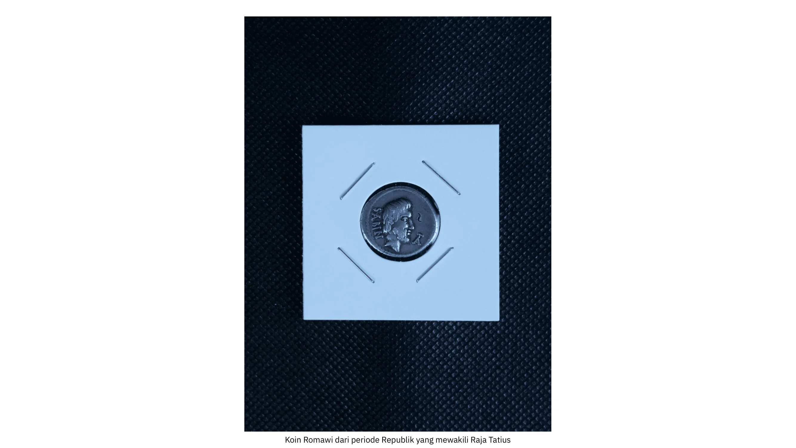

### Asal usul kata "koin" dan kuil Juno Moneta

Istilah "koin" berasal dari kuil Juno Moneta di Roma. Legenda mengatakan bahwa, selama invasi Galia pada tahun 390 SM, angsa suci di Capitol memperingatkan bangsa Romawi akan bahaya yang akan datang. Untuk berterima kasih kepada dewi Juno, pelindung Capitol, sebuah kuil didirikan untuk menghormatinya dan segera menjadi tempat pencetakan koin Romawi.

### Perang Punisia dan krisis mata uang

Konflik militer memiliki pengaruh yang cukup besar terhadap perkembangan moneter Romawi. Selama Perang Punisia Kedua (218-201 SM) melawan Kartago, Roma menghadapi kesulitan keuangan yang parah dalam menghadapi invasi Hannibal. Untuk meringankan kebutuhan mendesak ini, Roma untuk pertama kalinya menggunakan koin emas yang luar biasa, serta mendevaluasi mata uang peraknya secara signifikan, dari kemurnian awal 97% menjadi sekitar 89%. Berat koin perunggu (aes) juga turun secara drastis, kehilangan hampir 80% dalam waktu enam tahun.

Di sini, kita bisa melihat kembali konsep yang telah kita bahas sebelumnya mengenai orang Yunani yang melebur logam mulia yang disimpan di kuil-kuil untuk membantu meringankan krisis ekonomi. Dan untuk berbicara tentang **Carthage**, di bawah ini Anda dapat mengagumi koin Kartago asli dari koleksi saya. Koin Kartago ini menampilkan pohon palem di satu sisi, dan seekor kuda di sisi lainnya. Pada koin ini, kudanya tidak terlalu mudah dikenali, karena sudah sangat usang.

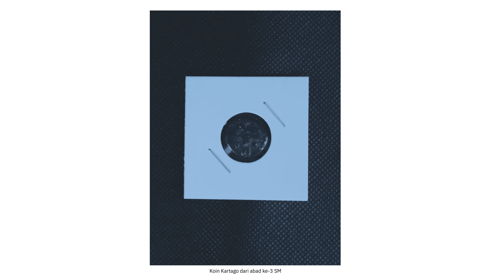

Akibatnya, berat koin perunggu, yang dikenal sebagai aes, juga turun drastis, kehilangan hampir 80% dalam enam tahun. Jadi, berat koin perunggu ini, yang bukan merupakan logam mulia dan digunakan dalam perdagangan sehari-hari, turun drastis, yang merupakan tanda devaluasi moneter akibat perang ini.

### Dinar perak dan stabilitas moneter

Dengan latar belakang yang sangat penting inilah Roma memperkenalkan denarius perak yang terkenal sekitar tahun 212 SM. Reformasi ini memastikan stabilitas moneter yang luar biasa, dengan dinar tetap menjadi mata uang yang dominan selama hampir 450 tahun. Stabilitas ini berkat manajemen yang ketat, meskipun terjadi perubahan harga besar-besaran pada tahun 146 SM dan produksi yang cukup besar untuk membiayai pasukannya yang sangat besar, terutama selama perang Punisia, Sosial (91-87 SM), dan Makedonia. Sebagai contoh, untuk memelihara satu legiun Romawi membutuhkan biaya sekitar 1,5 juta dinar per tahun, yang menggambarkan skala kebutuhan moneter.

Di luar perbatasan Romawi, peperangan menyebabkan devaluasi besar-besaran di wilayah-wilayah yang berada di bawah pengaruh Romawi. Kartago Punisia mengalami penurunan kemurnian elektrum secara dramatis, dari 98% emas pada abad ke-4 menjadi hanya 30% selama Perang Punisia Kedua, sementara koin peraknya turun menjadi 18% kemurnian.

### Evolusi motif moneter

Dengan perluasan kota Roma, karakter koin juga berevolusi: awalnya anonim dan patriotik, koin secara bertahap mengadopsi desain yang dipersonalisasi yang menampilkan keluarga-keluarga yang berkuasa dari para pencetak koin (mereka yang mencetak koin). Transisi ini jelas melambangkan transformasi politik di akhir masa Republik Romawi.

Akhirnya, meskipun Roma mendominasi dunia Mediterania secara ekonomi, Roma tetap mempertahankan kesederhanaan dalam alat pembayarannya: tidak ada bentuk transfer moneter yang nyata selain pertukaran koin secara langsung yang dikembangkan, dengan pengecualian transfer pajak dan kredit pribadi yang diperuntukkan bagi kaum elit.

## Kekaisaran Romawi

<chapterId>2dc44e50-112a-5abf-97ae-8e0a9ecda989</chapterId>

:::video id=f8d6f3d6-9ee4-4504-888e-4f12b3f20489:::

**Latar belakang sejarah:**

**Principal** adalah bentuk pemerintahan kekaisaran di Kekaisaran Romawi sejak awal pemerintahan Augustus pada 27 SM hingga akhir krisis abad ketiga pada 284 Masehi.

**27 SM: Awal dari Pax Romana**

Periode stabilitas politik dan kemakmuran di bawah pemerintahan Augustus, menandai dimulainya Kekaisaran Romawi.

**Agustus (30 SM hingga 14 M)** secara radikal mereformasi sistem moneter Romawi, menetapkan standar yang langgeng dan stabil untuk mata uang kekaisaran.

**Augustus juga merupakan salah satu kolektor koin dan fosil kuno yang pertama kali diakui.

**54 IKLAN - 68 IKLAN: Nero**

Kaisar Romawi yang kontroversial, yang dikenal karena tirani, penganiayaan, dan manajemennya yang membawa bencana setelah pembakaran kota Roma.

** 64 AD: Kebakaran Besar di Roma**

Sebuah kebakaran besar menghancurkan sebagian besar kota; Nero dituduh bertanggung jawab.

**69 Masehi: Tahun Empat Kaisar**

Periode yang kacau dengan empat kaisar secara berurutan (Galba, Otho, Vitellius, Vespasianus).

**79 AD: Letusan Gunung Vesuvius**

Gunung berapi yang menghancurkan kota Pompeii dan Herculaneum, yang secara luar biasa melestarikan sisa-sisa peninggalannya di bawah abu.

**165 IKLAN - 180 IKLAN: Wabah Antonine**

Epidemi dahsyat yang melemahkan Kekaisaran Romawi di bawah kepemimpinan Marcus Aurelius dan Commodus.

**200 M: Puncak teritorial dan akhir bertahap dari Pax Romana**

Roma mencapai perluasan maksimumnya, tetapi mulai mengalami ketidakstabilan internal dan kesulitan ekonomi.

**212 MASEHI: Maklumat Caracalla tentang kewarganegaraan**

Kaisar Caracalla memberikan kewarganegaraan Romawi kepada hampir semua penduduk kekaisaran, untuk memperluas basis pajak.

**220 Masehi: Awal dari invasi barbar yang hebat**

Penyerangan signifikan pertama bangsa Jermanik melintasi perbatasan Romawi.

**235 IKLAN - 285 IKLAN: Krisis politik dan militer pada abad ke-3**

Periode yang ditandai dengan ketidakstabilan politik, dengan banyak kaisar yang berumur pendek, perang saudara, krisis ekonomi, dan invasi yang terus menerus.

**Aurelian (270-275 M) secara radikal merevaluasi mata uang Romawi**, mencoba mengembalikan nilai nominalnya meskipun terjadi inflasi yang tinggi.

**301 MASEHI: Dekrit Harga Diokletianus**

Kaisar Diocletianus mencoba menghentikan inflasi yang merajalela dengan memberlakukan kontrol harga dan upah yang ketat di seluruh kekaisaran.

**312 MASEHI: Konstantinus**

Kaisar Kristen pertama, pendiri Konstantinopel, menstabilkan mata uang dengan memperkenalkan "solidus", sebuah koin emas yang sangat murni dan stabil.

**476 MASEHI: Runtuhnya Kekaisaran Romawi Barat**

Roma direbut oleh berbagai bangsa Jermanik (termasuk bangsa Ostrogoth), sebuah peristiwa yang dianggap menandai berakhirnya Kekaisaran Romawi Barat secara resmi.

### Reformasi moneter Augustus

Pada bagian Zaman Kuno ini, kita telah sampai pada Kekaisaran Romawi. Sejarah moneter Kekaisaran Romawi ditandai dengan penggunaan mata uang logam secara intensif, terutama emas, perak, dan perunggu, tetapi juga dengan beberapa krisis mata uang, yang terkait erat dengan kerusuhan politik dan militer. Pada akhir masa Republik, di bawah Julius Caesar, Roma memperkenalkan aureus emas pada tahun 46 SM, sebuah koin dengan berat sekitar 8 gram yang diterima secara luas di seluruh Eropa dan cekungan Mediterania. Caesar membakukan koin emas ini dan mencetak koin pertama yang menampilkan potret orang yang masih hidup, sehingga menjungkirbalikkan tradisi republik kuno yang lebih menyukai simbol-simbol anonim dan kolektif. Perkembangan ini mengiringi periode transformasi politik yang besar, dengan kekuasaan pribadi secara bertahap menggantikan institusi republik.

Setelah pembunuhan Caesar pada tahun 44 SM, Octavianus (Augustus) mengambil alih kekuasaan Roma, mendirikan Kekaisaran pada tahun 27 SM. Masa pemerintahannya ditandai dengan reformasi total sistem moneter, yang membawa stabilitas jangka panjang pada perekonomian Romawi. Pada masa Augustus, satu aureus emas setara dengan 25 dinar perak, yang juga bernilai 4 sestertii perunggu. Stabilitas moneter ini terus berlanjut sepanjang abad pertama Masehi, sebuah periode yang sering digambarkan sebagai zaman keemasan ekonomi bagi Roma.

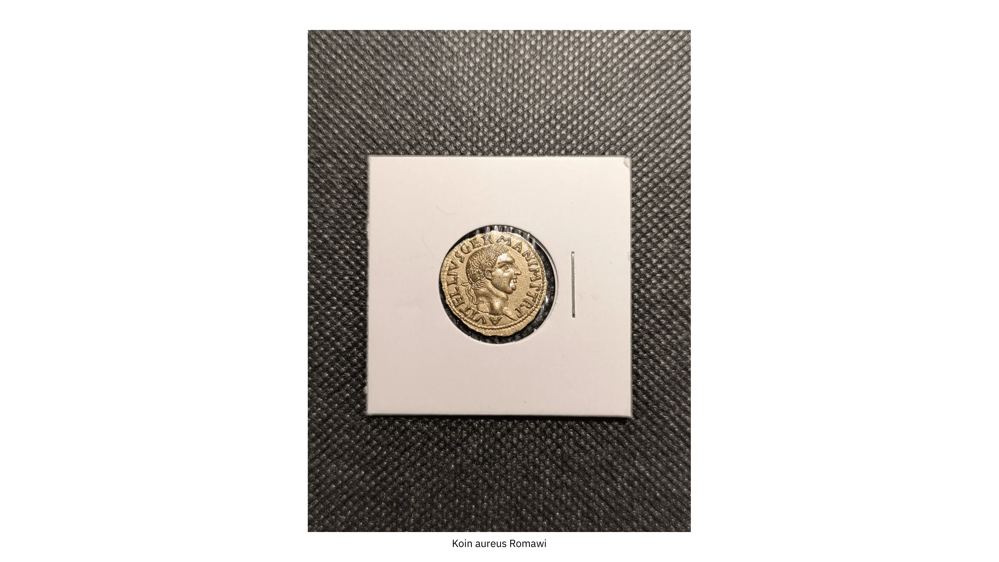

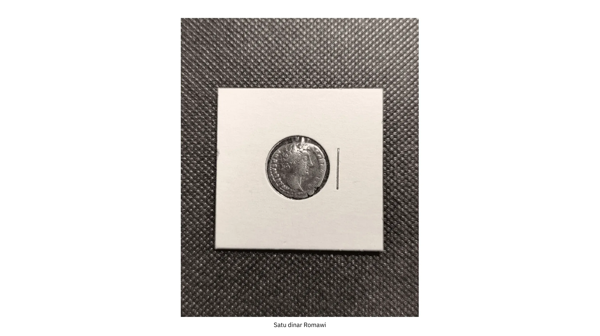

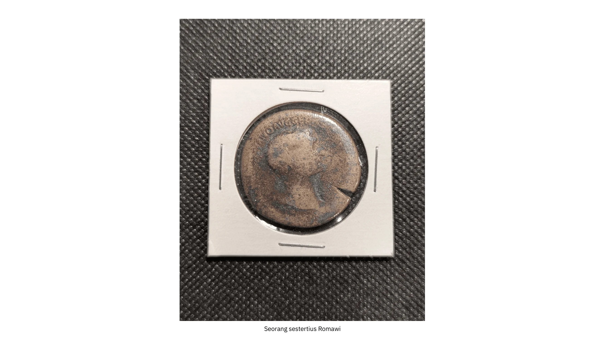

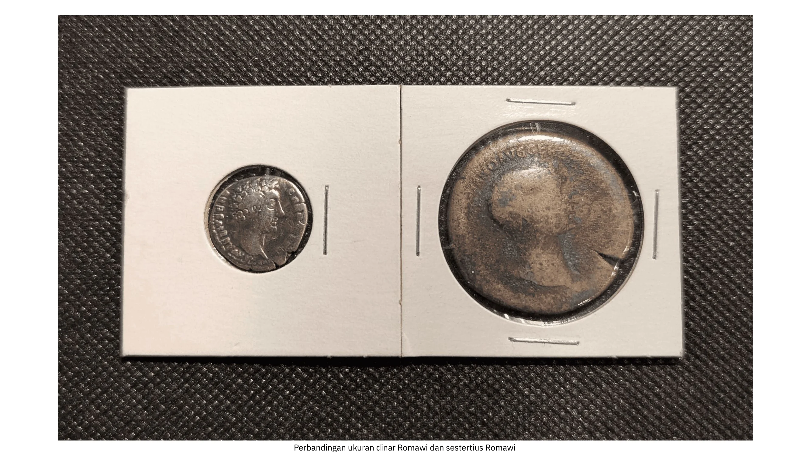

Namun, sejak Nero dan seterusnya (54-68 M), Roma memulai devaluasi koin-koinnya secara perlahan, secara progresif mengurangi berat dan kemurniannya untuk membiayai pengeluaran kekaisaran yang terus meningkat, terutama setelah kebakaran besar di Roma pada tahun 64 M. Devaluasi ini memiliki efek penting: koin yang lebih murni ditarik dari peredaran melalui penimbunan atau ekspor, sesuai dengan **Hukum Gresik**, sementara koin yang didevaluasi berkembang biak, menyebabkan kenaikan harga secara bertahap.

Abad ketiga menandai titik balik yang dramatis, dengan akselerasi spektakuler dalam devaluasi di bawah kaisar Septimius Severus, Caracalla, dan Gallienus. Koin perak utama, dinar dan kemudian antoninianus, mengalami penurunan kandungan perak menjadi hanya 2%. Pada saat yang sama, berat emas aureus turun setengahnya. Krisis moneter ini disertai dengan ketidakstabilan politik yang belum pernah terjadi sebelumnya, invasi barbar, dan perang saudara yang berulang.

Pada bagian ini, saya akan memperkenalkan bagian terakhir dari bagian ini: Antoninianus. Nama asli koin ini tidak diketahui, tetapi kita menyebutnya sebagai antoninianus saat ini. Koin ini memiliki keistimewaan karena dihargai sebesar dua dinar, meskipun ukurannya hanya 1,5 kali lebih besar dari satu dinar. Lebih jauh lagi, seiring berjalannya waktu, koin-koin ini hanya menjadi koin milion, yang berarti koin-koin ini dibuat dari paduan perak dan logam lain, bukan perak murni. Koin-koin ini sering kali hanya dilapisi dengan perak, yang menjadi contoh penting dari pembusukan moneter.

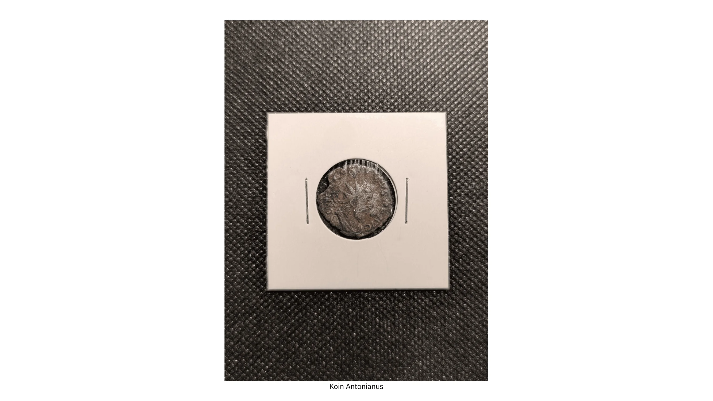

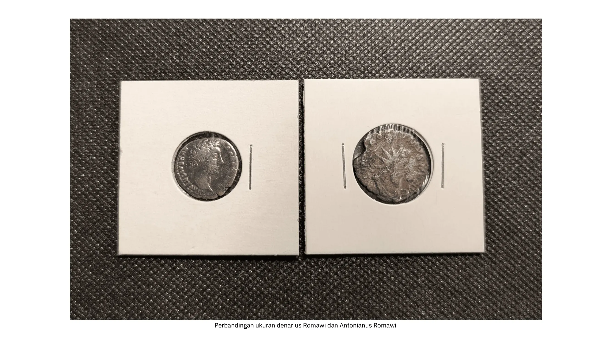

Menghadapi situasi ini, Kaisar Aurelian (270-275 M) berusaha untuk menstabilkan sistem dengan melakukan revaluasi mata uang secara nominal, tetapi reformasi ini sebenarnya memperkenalkan mekanisme inflasi dengan menetapkan nilai mata uang yang ada secara artifisial pada tingkat yang lebih tinggi.

Saya akan memperkenalkan sebuah penyimpangan pada subjek ini. Selama abad ke-3, inflasi mengalami peningkatan eksponensial yang cepat. Sebelumnya, meskipun koin didevaluasi, proses pencetakan koin secara manual satu per satu memberikan kontrol terhadap inflasi. Statistik menunjukkan bahwa selama 300 tahun devaluasi, inflasi rata-rata sekitar 4% per tahun. Tepat sebelum reformasi Aurelian, inflasi sekitar 3% per tahun.

Aurelian memperkenalkan pengukuran kemurnian pada koin tanda XXI, yang menunjukkan komposisi 20 bagian perunggu dan 1 bagian perak, atau kemurnian 5%. Dia memasarkan koin perak 5% ini dan mencap tanda XXI pada koin tersebut. Namun, dia juga menarik semua koin lainnya yang lebih rendah nilainya dan memberi cap XXI yang sama pada koin-koin tersebut. Hal ini secara efektif merevaluasi nilai nominal semua koin. Hasilnya adalah tingkat inflasi yang mengejutkan sebesar 20% per tahun, jauh melebihi tingkat inflasi sebelumnya yang hanya 3% sebelum teknik ini diterapkan.

Aurelian-lah yang menemukan bentuk devaluasi ini, yang jauh lebih cepat daripada devaluasi logam secara bertahap, yang masih memaksa kita untuk mencetak koin satu per satu. Apa yang dia lakukan adalah mengambil semua koin yang ada, menariknya kembali dan mencapnya dengan pukulan untuk mengubah nilai nominalnya. Ini adalah titik balik yang nyata. Saat itulah inflasi menjadi eksponensial.

Untuk mengilustrasikan secara visual devaluasi yang ekstrem ini, saya telah menemukan beberapa statistik menarik tentang harga biji-bijian di Mesir dari tahun 40 SM hingga abad ke-3, yang mencakup lebih dari 300 tahun. Di bawah ini, Anda bisa melihat tetradrachma Yunani dari koleksi saya. Pada saat itu, di Mesir di bawah pendudukan Romawi pada abad ke-3, padanannya adalah tetradrachma Mesir. Denominasi drachma masih digunakan, dan setara dengan satu dinar.

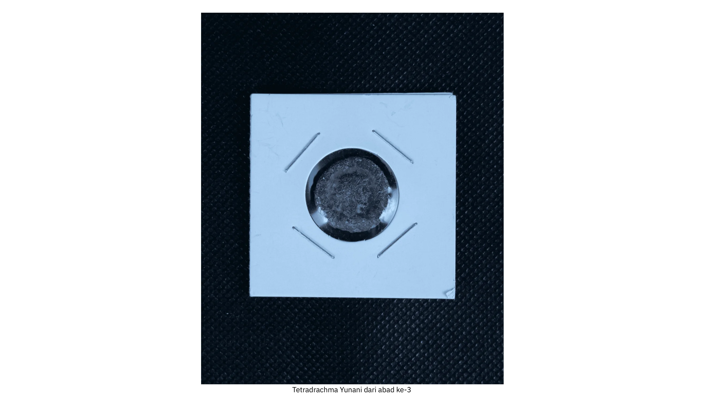

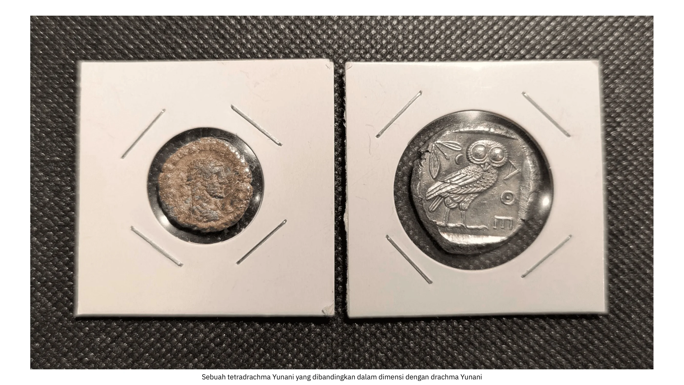

Jadi tetradrachm Mesir yang saya miliki setara dengan satu dinar. Anda bisa melihat bahwa koin ini terbuat dari billon (atau perunggu), jadi tidak mengandung logam mulia. Anda bisa membandingkannya dengan tetradrachm Yunani asli untuk melihat devaluasi fisik selama 300 tahun ini. Ini adalah kenaikan jutaan kali lipat dalam harga biji-bijian di Mesir.

Ini adalah ekspresi fisik dari reformasi Aurelian. Perlu dicatat bahwa mayoritas, rata-rata inflasi selama 300 tahun ini adalah sekitar 4%. Baru pada akhirnya, ketika Aurelian melakukan reformasi, inflasi ini menjadi agak eksponensial dan kita sampai pada ukuran 1 juta. Harga-harga sejuta kali lebih tinggi pada akhir abad ke-3 dibandingkan pada abad ke-1 SM.

Penggantinya, Diocletianus (284-305 M), mencoba melakukan reformasi yang lebih radikal: ia mengeluarkan mata uang baru (terutama argenteus, yang lebih murni namun jumlahnya sangat terbatas), memberlakukan kontrol harga yang drastis (Dekrit Harga 301 M), dan menerapkan sistem pajak yang didasarkan pada pembayaran barang dan jasa. Terlepas dari upaya-upaya ini, reformasi Diocletianus gagal mengekang inflasi yang merajalela.

Menghadapi penolakan untuk memasok barang dan jasa dengan imbalan mata uang yang didevaluasi, Diocletianus melembagakan **sistem kasta turun-temurun** untuk mengikat para petani dan keturunan mereka ke tanah mereka.

Apa yang benar-benar perlu dipahami di sini adalah bahwa apa yang terjadi adalah bahwa para petani menolak untuk menyerahkan hasil panen mereka dengan imbalan mata uang yang didevaluasi, dan tanggapan Diocletianus yang terkasih adalah menciptakan **kasta-kasta turun-temurun** dengan mengatakan "Anda, Anda tidak dapat meninggalkan tanah Anda, anak-anak Anda tidak dapat meninggalkan tanah mereka, hal yang sama untuk para prajurit, Anda adalah prajurit, Anda setuju untuk dibayar dengan mata uang saya". Sebagai solusi transisi, mereka dibayar dalam bentuk barang (daging, makanan, biji-bijian) karena dia menolak memberi mereka uang. Jadi dia memberlakukan sistem kasta turun-temurun ini untuk memaksa orang terikat pada perdagangan mereka, sehingga mereka tidak bisa begitu saja berganti pekerjaan jika mereka tidak mau menerima mata uang yang terdevaluasi.

Untuk mengilustrasikan contoh ini, berikut ini saya memiliki sebuah teks, sebuah kutipan dari buku "*Regime Moneter dan Inflasi*":

> Karena orang tidak mau bekerja dan mengirimkan barang dengan mata uang yang didevaluasi, yang nilai nominalnya lebih tinggi daripada nilai intrinsik atau nilai pasarnya, mereka harus dipaksa untuk bekerja dengan membebankan pajak dalam bentuk barang. [...] Menjadi ilegal bagi para petani untuk meninggalkan rumah mereka yang terdaftar. Dengan demikian, penduduk petani secara turun-temurun terikat pada tanah.
>

> Sistem kasta turun-temurun ini berangsur-angsur menyebar: Diokletianus memaksa anak laki-laki tentara untuk mengabdi di ketentaraan, sementara para pekerja di bengkel-bengkel uang, serta di pabrik-pabrik tenun dan pencelupan yang didirikan Diokletianus, menjadi budak negara, dengan layanan turun-temurun. Para penambang emas juga kemudian menjadi kasta turun-temurun. Kelas-kelas turun-temurun lainnya mungkin sudah ada pada masa Diocletianus, terutama serikat tukang roti dan tukang daging [...] di Roma, serta serikat-serikat keuskupan para kapten kapal yang mengangkut biji-bijian dan kargo publik lainnya ke Roma.

Konstantinus (306-337 M) yang akhirnya berhasil menstabilkan sistem moneter dengan memperkenalkan solidus pada tahun 312, sebuah koin emas murni yang kualitas dan beratnya sangat terjamin. Ada sistem yang memverifikasi kemurnian dan berat solidus. **Namun, stabilitas ini hanya memengaruhi kalangan elit kaya dan pemerintahan kekaisaran, sementara **mayoritas penduduk terus menderita akibat mata uang berkualitas rendah dan inflasi yang terus-menerus**. Solidus tetap stabil di Kekaisaran Timur (Bizantium), di mana ia bertahan selama lebih dari satu milenium, sementara di Barat, mata uang terfragmentasi menjadi koin-koin kecil bernilai rendah, menyertai disintegrasi ekonomi dan politik akhir Kekaisaran Romawi, yang jatuh secara definitif pada tahun 476 Masehi.

Sebagai penutup, saya ingin berbagi dengan Anda kutipan dari *A History of Money* oleh Glyn Davies, yang merangkum sejarah uang: Dari Zaman Kuno hingga Hari Ini* oleh Glyn Davies, yang dengan sangat baik merangkum apa yang mungkin menyebabkan kejatuhan Roma:

*"Pajak secara konsisten tidak memadai, dan kesulitan yang terkait dengan pajak yang semakin tidak memadai, terlambat disesuaikan, dan sangat terlihat ini mendorong Roma untuk lebih mengandalkan bentuk perpajakan yang mudah, langsung, dan tersembunyi: devaluasi mata uang. Reformasi ad hoc yang berumur pendek gagal membalikkan tren kemunduran yang sudah berlangsung lama ini. Tekanan keuangan yang disebabkan oleh keausan koin, karamnya kapal, kebocoran uang karena pembelian barang-barang mewah dari Timur, hadiah yang ditawarkan kepada orang-orang barbar Jermanik, pertumbuhan populasi perkotaan, penurunan produksi pertanian, kelelahan bertahap dari tambang-tambang terkaya, dan di atas semua itu, kebijakan "roti dan sirkus" yang dianggap penting untuk menjaga ketertiban minimum dalam kehidupan perkotaan - semua tekanan kumulatif ini membawa Roma pada devaluasi moneter yang terus-menerus, diselingi dengan reformasi sesekali yang pasti gagal. "*

*Selain roti dan anggur gratis atau murah, liberalitas kekaisaran ("congiaria") dalam bentuk alokasi moneter didistribusikan dari waktu ke waktu, terutama di bawah Trajan (98-117 M) dan bahkan lebih lagi di bawah Hadrian (117-138 M) dan para penerusnya. Apa yang pada awalnya dianggap kaisar dan warga negara sebagai hak istimewa yang luar biasa, pada awal abad ke-2, telah menjadi harapan yang lazim. Pembagian-pembagian ini "menjadi beban berat bagi perbendaharaan publik dan dengan sendirinya berkontribusi pada kebangkrutan negara. "*

## Hubungan antara pelonggaran moneter dan inflasi: dari penyebab hingga konsekuensi

<chapterId>38d5781c-e900-53f7-baa7-413655d71754</chapterId>

:::video id=3999256d-aafe-4502-9b72-dfa8491a2777:::

Bagian ini membahas hubungan antara pelemahan moneter dan inflasi, mulai dari penyebab hingga konsekuensinya. Pelemahan moneter adalah salah satu fenomena ekonomi utama dalam sejarah moneter Romawi, dengan efek langsung pada inflasi. Sejak abad ke-1 Masehi, terdapat fase awal pelemahan mata uang perak (denarius) yang lambat sejak masa pemerintahan Nero (54-68 Masehi) dan seterusnya, yang dipercepat oleh krisis militer dan keuangan yang berulang-ulang, terutama di bawah pemerintahan Septimius Severus (193-211) dan Gallienus (253-268).

Kami juga mencatat devaluasi yang lebih bertahap dari aureus. Perbedaan tingkat devaluasi ini menyoroti dua hal:

1. Peran unit akun dalam bimetalisme untuk kontrol negara atas uang. Unit akun dalam contoh ini adalah dinar. Saya telah mengidentifikasi tiga cara berbeda untuk mengelola nilai unit akun: devaluasi (pengenceran logam), redenominasi (antoninianus), dan pengenaan nilai nominal dengan menandai "XXI" (Aurelian)

2. Keinginan negara untuk menunda selama mungkin devaluasi aureus, cadangan nilai yang memungkinkan kaum elit untuk mempertahankan daya beli mereka dengan mengorbankan mereka yang kurang beruntung. Kami akan sering meninjau kembali prinsip ini sepanjang kursus, terutama sehubungan dengan konsep yang dikenal sebagai "efek Cantillon" dan redenominasi Maravedi di Spanyol.

Fenomena ini cukup menarik dan telah berulang sepanjang sejarah. Kita akan membahasnya kembali dengan Maravedi di bagian selanjutnya. Pola ini juga terlihat jelas pada semua mata uang cadangan; unit nilai cadangan, seperti aureus di Roma, tetap tidak tersentuh. Namun, unit akun yang digunakan oleh masyarakat umum untuk perdagangan dan transaksi sehari-hari sering kali mengalami devaluasi. Akibatnya, inflasi moneter mempengaruhi masyarakat umum, sementara mereka yang mampu membeli koin emas sebagian besar tidak terpengaruh.

Dan omong-omong, **fenomena yang sama juga terjadi saat ini dengan devaluasi mata uang, yang memungkinkan aset keuangan naik nilainya**, dan orang-orang yang menggunakan mata uang tersebut, yaitu orang-orang yang paling miskin, yang menjadi lebih miskin, dan hal ini pada gilirannya memperkaya, melalui penciptaan uang, aset mereka yang mampu, yang memiliki sarana untuk melindungi diri mereka sendiri dari devaluasi, dan hal ini memperdalam ketidaksetaraan sosial. Itulah sedikit kata-kata kasar politik saya.

Apa yang baru saja saya jelaskan disebut efek Cantillon. Kita akan melihat bahwa pria ini hidup pada masa John Law, subjek yang juga akan kita bahas di bagian selanjutnya.

Reformasi yang dimulai pada masa pemerintahan Aurelian memungkinkan inflasi melambung tinggi. Inflasi nilai nominal uang tidak lagi dibatasi oleh kemampuan percetakan untuk memproduksi koin dengan tangan. Koin yang telah dicetak sekarang dapat dengan mudah ditandai, dan nilai nominal jumlah uang beredar meningkat lebih cepat.

Saya memiliki dua kutipan untuk dibagikan kepada Anda sehubungan dengan Aurelian. Yang pertama berasal dari *Sejarah Uang: Dari Zaman Kuno hingga Sekarang*:

*"Sejauh menyangkut ekonomi Romawi, kontribusi Aurelian lebih merupakan bencana daripada kemenangan. Sebagian besar disebabkan oleh sifat "reformasi" yang dilakukannya sehingga tingkat inflasi dapat meningkat jauh melampaui apa yang sebelumnya mungkin terjadi, bahkan di bawah Gallienus yang tidak bertanggung jawab. Selama dua abad setelah Aurelian, inflasi menjadi endemik di seluruh Kekaisaran Romawi "*

Yang kedua berasal dari buku *Sejarah Kuno dari Koin* dan menyangkut pelepasan sistem moneter dari emas:

*"Reformasi Aurelian mengubah hubungan antara uang emas dan sistem moneter lainnya. Sebelumnya, jenis mata uang lain dikaitkan dengan **aureus** menurut nilai resmi (25 dinar Mesir atau 25 tetradrachms untuk satu aureus, dll.). Setelah reformasi, uang emas mulai **berfluktuasi secara bebas dalam nilai**, seperti komoditas lainnya, sementara sistem moneter lainnya **merosot nilainya** karena **pelemahan paduan**, tidak lagi **didukung oleh emas**. Karena unit akun secara teoritis tetap didasarkan pada perak (dinar, atau di Mesir drachma), harga naik karena mata uang terdepresiasi. "*

Seperti yang Anda lihat, devaluasi mata uang yang berfungsi sebagai unit akun ini secara tidak proporsional mempengaruhi mereka yang kurang mampu, sementara pelepasan hubungan dengan uang emas melindungi daya beli mereka yang mampu menabung di penyimpan nilai, yaitu emas.

Yang harus Anda pahami di sini adalah bahwa jika ada hubungan antara dinar dan aureus, bahkan jika Anda mendevaluasi dinar, jika Anda masih bisa menukar dinar Anda dengan aureus dengan nilai tukar saat ini (25 dinar untuk 1 aureus), orang pasti akan menukar dinar mereka dengan aureus Anda karena dinar akan dinilai terlalu tinggi dan aureus terlalu rendah. Namun dalam reformasi ini, mereka menghapus hubungan ini. Jadi, orang tidak bisa lagi menukar dinar dengan logam perak yang terdevaluasi terhadap emas. Pada saat itulah mereka yang memiliki akses ke koin emas benar-benar dapat melindungi diri mereka sendiri, karena setelah itu orang tidak bisa lagi menukar perak yang dinilai terlalu tinggi dengan emas murni yang dinilai terlalu rendah. Ini adalah momen yang sangat penting dalam evolusi mata uang.

Sebuah contoh yang mencolok dari efek reformasi oleh Aurelian ini diilustrasikan dengan sempurna oleh kutipan-kutipan ini dari buku *Monetary Regimes and Inflation*:

*"Di antara masa pemerintahan Kaisar Claudius (41-54 M) dan Konstantius (337-361 M), harga gandum di pasar terbuka di Mesir, yang dinyatakan dalam drachma, **meningkat hingga lebih dari satu juta**. Inflasi harga yang spektakuler adalah salah satu fakta ekonomi utama pada abad ke-3 dan ke-4 Masehi" (Lendon 1990, hal. 106). Namun, perkembangan ini tidak terlalu dramatis dari yang terlihat, karena sesuai dengan tingkat inflasi tahunan rata-rata 4,4%. Dan menurut Wassink (1991, hal. 482), inflasi sebenarnya baru dimulai pada tahun 238 Masehi

*"Sejak tanggal ini dan seterusnya, inflasi perlahan-lahan meningkat, karena **uang yang baik pertama kali dikeluarkan dari peredaran**, sehingga jumlah uang beredar hampir tidak meningkat sama sekali pada awalnya. Selanjutnya, inflasi mencapai tingkat rata-rata tahunan sebesar **3,65% antara tahun 250 dan 293**, meningkat menjadi **22,28% antara tahun 293 dan 301** (Wassink 1991, hlm. 466), yaitu sampai dengan **reformasi moneter yang digagalkan oleh Kaisar Diocletianus**. Fenomena ini **sangat mengesankan untuk inflasi dalam rezim moneter berbasis logam**. "*

Fenomena inflasi yang terkait dengan pengenceran moneter ini pada awalnya merupakan respons terhadap krisis uang tunai yang sesekali terjadi di negara Romawi. Dengan mengurangi kandungan logam mulia pada koin sambil mempertahankan nilai nominalnya, negara untuk sementara meningkatkan sumber dayanya. Namun, harga-harga tidak langsung bereaksi: memang, sistem Romawi memiliki kekakuan tertentu, yang berarti upah dan harga lambat beradaptasi dengan devaluasi yang terjadi secara beruntun. Namun demikian, setelah ambang batas tertentu, harga akan naik tajam untuk membawa pasar kembali seimbang dengan nilai riil mata uang.

Seperti yang telah disebutkan di atas, fenomena ini terlihat jelas sejak pertengahan abad ke-3 dan seterusnya. Di Mesir, sebuah wilayah yang memiliki banyak dokumentasi, harga-harga dikalikan 10 pada masa pemerintahan Aurelian (274 M) setelah revaluasi mata uang secara resmi, meskipun ada upaya awal untuk menstabilkan harga. Kemudian, di bawah Diocletian (301 M), dekrit harga memberlakukan kontrol drastis untuk mengekang inflasi tanpa mengatasi akar penyebabnya - kelebihan produksi dan degradasi moneter - sehingga menyebabkan kegagalan yang dapat diprediksi. Inflasi yang terus-menerus pada akhirnya mendorong ekonomi menuju sistem dua tingkat: **kalangan elit, yang dilindungi oleh cadangan emas (seperti solidus Konstantinus**), menikmati stabilitas, sementara mayoritas penduduk terus mengalami inflasi kronis, *mengilustrasikan apa yang sekarang dikenal sebagai efek Cantillon**

Ada hubungan yang jelas antara pelemahan moneter Romawi dan inflasi, yang penyebabnya pada dasarnya terkait dengan defisit fiskal yang kronis, pengeluaran militer yang tak henti-hentinya, dan manajemen ekonomi negara yang buruk.

## Jatuhnya Kekaisaran Romawi

<chapterId>b6ec0914-227b-509c-8108-b09eec9bb904</chapterId>

:::video id=91d4fee5-59bb-4ab9-a90b-e1125c71decb:::

### Devaluasi mata uang dan runtuhnya Roma

Mazhab ekonomi Austria, terutama melalui Ludwig von Mises, mengajukan interpretasi moneter atas kejatuhan Roma. Dalam visi ini, devaluasi progresif mata uang Romawi menghancurkan sistem pembagian kerja yang kompleks yang menopang kekaisaran yang terdiri dari 60 juta penduduk. Mata uang, instrumen utama koordinasi ekonomi, setelah dikorupsi, menyebabkan runtuhnya seluruh struktur sosial dan ekonomi.

Kemerosotan moneter ini tidak hanya menghancurkan kohesi internal kekaisaran. Hal ini juga memutuskan hubungan perdagangan dengan bangsa-bangsa tetangga. Karena kehilangan keuntungan dari perdagangan dengan Roma, para "barbar" berubah dari kerja sama damai menjadi pemangsa. Oleh karena itu, invasi-invasi tersebut tidak hanya bersifat militer, tetapi juga merupakan hasil dari kehancuran ekonomi yang mendasar.

### Tiga fase devaluasi kekaisaran

Sejarah moneter Romawi dapat dibagi menjadi tiga periode yang berbeda. Periode pertama, dari Julio-Claudians hingga Antonines (27 SM - akhir abad ke-2), relatif stabil. Di bawah kepemimpinan Trajan, kekaisaran mencapai puncak kejayaannya: dengan luas wilayah 5 juta km2, Roma menjadi kota jutawan pertama dalam sejarah. Denarius mempertahankan kemurnian perak 98% hingga 80% - devaluasi moderat yang masih memungkinkan ekonomi berfungsi.

Periode kedua, abad ke-3, adalah periode anarki militer. Dua puluh enam kaisar menggantikan satu sama lain dalam kurun waktu beberapa dekade. Mata uang pun runtuh: antoninianus, yang seharusnya bernilai dua dinar, ternyata hanya berisi 1,5 dalam berat logam - upaya pertama untuk memisahkan nilai legal dan nilai riil. Manipulasi ini memicu Hukum Gresham: uang yang buruk akan mengusir uang yang baik. Warga menimbun koin-koin yang bagus, dan hanya membelanjakan koin-koin yang tidak bernilai.

Harta karun moneter yang ditemukan oleh para arkeolog mengungkapkan kegelisahan ekonomi ini. Amfora yang terkubur menunjukkan, berdasarkan stratifikasi, bagaimana orang Romawi menyimpan koin-koin terbaik terlebih dahulu, dan secara bertahap menambahkan koin-koin yang lebih rendah nilainya. "Tumpukan" kuno ini menjadi saksi atas tindakan manusia dalam menghadapi ketidakpastian - sebuah upaya untuk melestarikan nilai di dunia yang sedang membusuk.

### Konstantinus dan sistem ganda

Konstantinus (310-337) berusaha menstabilkan kekaisaran melalui reformasi radikal. Dia menciptakan emas solidus, mata uang yang dikontrol secara ketat oleh pemerintah. Para pejabat secara sistematis memeriksa berat dan kemurniannya. Penerbitannya tetap terbatas, terkait dengan rampasan perang. Mata uang ini menjadi alat kekuasaan eksklusif: pajak dibayarkan dalam bentuk solidus, dan legiun menerima gaji mereka dalam bentuk emas.

Pada saat yang sama, orang-orang menggunakan nummus perunggu, yang secara konstan mengalami penurunan nilai. Pada tahun 445, sebuah solidus bernilai 7.000 nummi; pada tahun 498, 16.800 nummi. Sistem ganda ini melembagakan efek Kanton: mereka yang memiliki akses ke solidus - pemerintah, pemilik tanah - dilindungi dari inflasi. Rakyat jelata, yang terbatas pada nummus, menjadi semakin miskin.

Pemisahan moneter ini menciptakan dua ekonomi paralel tanpa nilai tukar resmi. Solidus tetap menjadi satuan hitung, tetapi beredar sangat sedikit. Nummus digunakan untuk pertukaran harian, tetapi terus-menerus kehilangan nilainya. Arsitektur moneter ini meramalkan ketidaksetaraan dari sistem feodal yang muncul.

### Runtuhnya pembagian kerja

Devaluasi mata uang secara bertahap menghancurkan spesialisasi ekonomi. Tanpa satuan hitung yang dapat diandalkan, perdagangan Mediterania runtuh. Para pengrajin khusus Roma tidak bisa lagi berdagang dengan Mesir atau Galia. Provinsi-provinsi mengadopsi mata uang mereka sendiri, melipatgandakan gesekan perdagangan.

Menghadapi disintegrasi ini, penduduk kota melarikan diri ke pedesaan - sebuah eksodus perkotaan yang membalikkan urbanisasi selama berabad-abad. Para pengrajin meninggalkan pekerjaan mereka dan beralih ke pertanian subsisten. Perkebunan besar (latifundia) menjadi pulau-pulau yang mandiri, yang menandakan seigneuries abad pertengahan.

Dalam keputusasaan, Diocletianus bahkan menuntut pajak dalam bentuk barang - sebuah pengakuan akhir dari kegagalan moneter. Dekritnya yang maksimum (301) berusaha mengendalikan harga, mempercepat kembalinya barter. Kompleksitas ekonomi mengalami kemunduran ke bentuk-bentuk pra-peradaban.

### Bertahan hidup dengan emas dari Roma hingga Bizantium

Paradoksnya, solidus bertahan dari Kekaisaran Barat. Bizantium mempertahankannya hingga abad ke-11, memastikan stabilitas ekonomi selama seribu tahun. Di Barat, ingatannya tetap ada: kata "sou" dalam bahasa Prancis berasal dari kata solidus, sebuah kesaksian linguistik terhadap kemegahan moneter yang hilang.

Para pemilik tanah yang menyimpan kekayaan mereka dalam bentuk emas menjadi penguasa feodal. Struktur gerejawi, satu-satunya institusi yang masih bertahan, menyediakan ikatan sosial yang tidak dapat dijamin oleh uang. Eropa terpecah-pecah menjadi wilayah-wilayah autarkis, masing-masing dengan ekonomi subsistennya sendiri.

Transformasi ini mengungkapkan kerapuhan peradaban yang kompleks. Pembagian kerja yang memungkinkan Roma untuk memberi makan satu juta penduduknya bergantung sepenuhnya pada kepercayaan moneter. Begitu kepercayaan ini rusak, bangunan ini runtuh, mengembalikan Eropa ke bentuk ekonomi primitif selama hampir satu milenium.

## Abad Kegelapan dan Abad Pertengahan

<chapterId>a5856873-6142-57be-8a73-1f9e3df83792</chapterId>

:::video id=86b8da9b-3831-443d-b170-58c2bea3ad54:::

Sejarah dan kemunculan uang pada Abad Pertengahan ditandai dengan periode kemunduran, inovasi, dan pemulihan ekonomi.

Sebagai contoh, ketika tentara Romawi meninggalkan Britania, tidak ada lagi koin Romawi yang masuk ke pulau ini. Sekitar tahun 435 Masehi, penggunaan koin menghilang sama sekali di Inggris, sebuah fenomena yang unik di bekas provinsi Romawi. Selama hampir dua abad, ekonomi Inggris berjalan tanpa uang logam hingga abad ke-7, ketika koin-koin yang terinspirasi dari Merovingian dan koin-koin yang terinspirasi dari benua Eropa secara bertahap muncul kembali.

Sejak abad ke-8 dan seterusnya, pengaruh Kristen berkontribusi pada pengenalan kembali mata uang di Eropa Utara. Tokoh kunci dalam periode ini adalah Pepin the Short, Raja Franka, yang memperkenalkan denarius pada tahun 752, yang kemudian diadopsi oleh putranya, Charlemagne. Charlemagne memperluas penggunaan denarius perak secara luas, menciptakan standar moneter Eropa selama beberapa abad.

Di Inggris, mata uang koin mengalami kebangkitan yang signifikan dengan produksi penny perak di bawah Raja Offa dari Mercia sekitar tahun 765. Mata uang ini menjadi sangat penting sehingga hampir tidak berubah selama 500 tahun.

Sebagai artefak pertama yang terkait dengan periode ini, izinkan saya menunjukkan kepada Anda sebuah reproduksi dari satu sen Inggris dari masa itu.

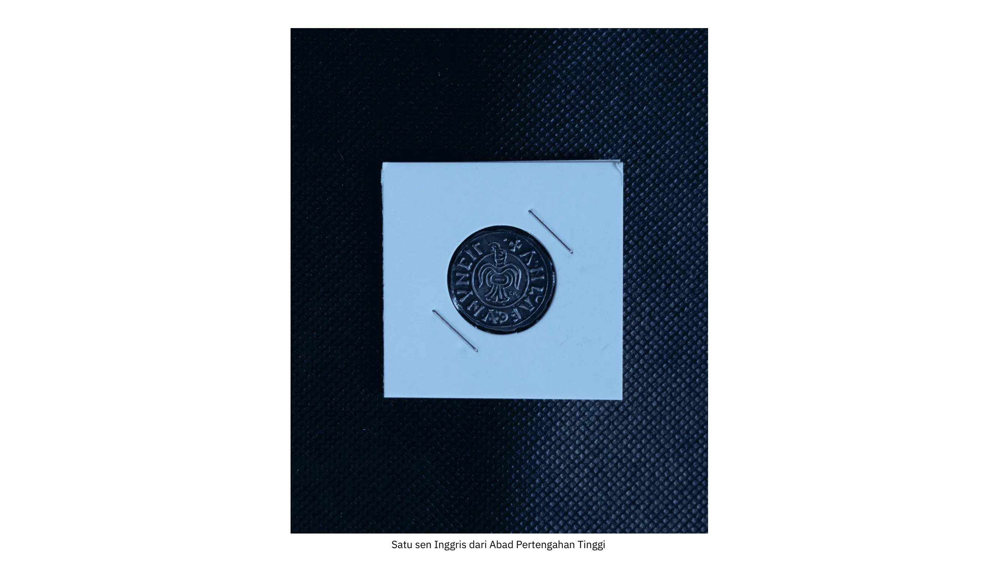

Selama Abad Pertengahan Tinggi, Eropa jatuh ke dalam feodalisme setelah runtuhnya sistem moneter Romawi. Mayoritas penduduk menggunakan koin tembaga atau perunggu bernilai rendah, yang sering kali mengalami pelemahan mata uang, sehingga membatasi perdagangan jarak jauh.

Kembalinya koin sebagai alat pembayaran terjadi secara bertahap, yang berpuncak pada abad ke-13 dengan kemunculan florin emas di Florence pada tahun 1252, diikuti oleh ducat emas di Venesia. Koin-koin emas ini digunakan secara luas berkat perluasan perdagangan dan meningkatnya kebutuhan akan alat pembayaran yang dapat diandalkan dan diterima secara internasional.

Di Inggris, sistem moneter dilindungi dari pelemahan oleh kebijakan fiskal yang inovatif, seperti pajak tanah yang diperkenalkan oleh William sang Penakluk setelah tahun 1066, yang menjaga kualitas penny sterling. Yang penting untuk dipahami di sini adalah bahwa penguasa pada saat itu dapat mendevaluasi mata uang untuk membiayai negara, dan **penerapan pajak ini memungkinkan untuk menjaga mata uang tetap stabil dan membiayai negara melalui perpajakan**

Namun, godaan untuk mendapatkan keuntungan melalui pelemahan moneter menyebabkan krisis, seperti pada masa pemerintahan Henry I pada abad ke-12, ketika kualitas mata uang koin turun drastis. Reformasi yang parah, terkadang disertai dengan tindakan kekerasan terhadap para pembuat koin, untuk sementara waktu memulihkan kepercayaan terhadap mata uang.

Abad Pertengahan juga menyaksikan munculnya praktik keuangan yang canggih, seperti penggunaan tongkat penghitung di Inggris untuk menghindari larangan riba dan memberikan kredit. Gereja tidak terlalu tertarik dengan pinjaman berbunga, sehingga berbagai teknik digunakan untuk menghindari larangan penggunaan bunga.

Inovasi-inovasi ini merupakan respons terhadap kekurangan uang logam yang kronis, dan mendorong munculnya pasar keuangan yang masih dalam tahap embrio.

Sementara itu, Perang Salib mendorong perdagangan Mediterania, mendorong perkembangan pertukaran internasional dan praktik perbankan baru, terutama melalui Ordo Ksatria Templar. Ksatria Templar menjadi perantara keuangan yang penting, memungkinkan para tentara salib memperoleh likuiditas yang jauh dari rumah mereka, yang menjadi cikal bakal sistem perbankan Eropa modern.

Untuk membuat hubungan dengan Templar, di bawah ini Anda dapat mengamati koin abad pertengahan Prancis, di mana Anda dapat mengenali salib yang indah di tengahnya. Sangat umum bagi koin-koin pada era ini untuk menampilkan salib ini.

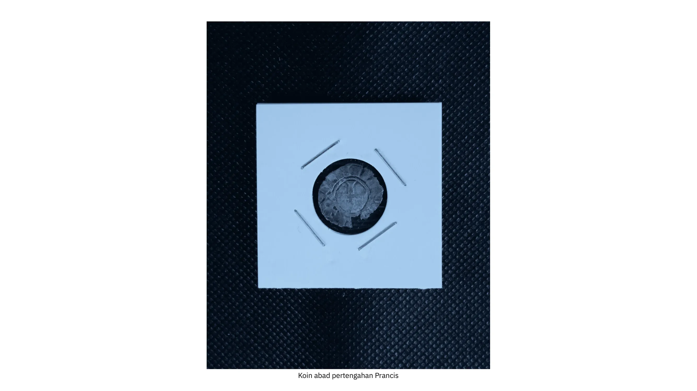

Akhirnya, krisis besar seperti Black Death (1346-1353) membawa transformasi ekonomi yang mendalam. Penurunan tajam dalam populasi menyebabkan kenaikan tajam dalam upah, menentang upaya pemerintah untuk mempertahankan tingkat remunerasi sebelumnya.

Pada saat yang sama, Perang Seratus Tahun (1337-1453) memaksa negara-negara untuk mengadopsi kebijakan fiskal yang lebih agresif untuk membiayai tentara mereka, yang berkontribusi pada melemahnya sistem feodal.

Abad Pertengahan ditandai dengan ketegangan konstan antara kebutuhan akan uang yang dapat diandalkan untuk perdagangan dan godaan konstan bagi para penguasa untuk mencairkan uang demi keuntungan langsung. Konflik ini sangat membentuk perkembangan moneter Eropa, meletakkan dasar-dasar bagi sistem ekonomi modern.

Untuk mengakhiri bagian ini, saya ingin menambahkan sebuah anekdot yang cukup menarik dari Inggris pada masa itu. Anekdot ini diambil dari buku ini, "Sejarah Uang" oleh Glyn Davies.

Disebutkan bahwa di Inggris, pergeseran ke Parlemen mengalihkan beban utang dari penguasa ke Parlemen, yang mengakibatkan utang negara yang kronis. Sebelumnya, utang tersebut dibebankan kepada penguasa.

Setelah Parlemen mampu merebut sebagian dari kekuasaan penciptaan uang ini, hal ini memungkinkan penciptaan utang jangka panjang yang ditanggung oleh rakyat, bukan oleh raja. Sebelumnya, jika raja bangkrut atau ada pergantian raja, maka utang tersebut akan dihapuskan bersamanya.

Pada saat penciptaan utang dilakukan oleh Parlemen, konsep utang negara muncul, karena berpotensi tidak terbatas dari waktu ke waktu. Selama Negara ada, selama Parlemen ada, utang ini akan terus ada, dan mereka harus menemukan berbagai macam cara untuk membiayai kembali dan menyebarkannya dari waktu ke waktu. Ini adalah perubahan paradigma besar, di mana bukan lagi raja atau bangsawan yang menjamin atau menanggung beban utang ini; sekarang Parlemen dan oleh karena itu warga negaranya.

## Kebangkitan

<chapterId>1d1dfb05-70b4-5b7b-9708-373c2182950d</chapterId>

:::video id=4977b4f3-c7b2-41a5-ad7b-a96a8cca4092:::

Sekarang kita telah sampai pada bagian kursus di mana kita berbicara tentang periode yang dikenal sebagai Renaisans. Periode ini berlangsung dengan latar belakang krisis yang tragis, dengan penyebaran wabah yang luar biasa oleh kutu tikus yang menaiki kapal. Namun, tragedi ini memberi tahu kita tentang pertumbuhan perdagangan dan perjalanan pada periode abad pertengahan yang tinggi. Sebelumnya pada periode ini, tidak banyak orang yang bergerak sejauh dan secepat ini.

### Florin dari Florence

Kembalinya mata uang koin emas ke Eropa pada masa Renaisans menandai titik balik fundamental dalam sejarah moneter. **Semuanya dimulai dengan Florin dari Florence pada tahun 1252, koin emas pertama yang dicetak di Eropa sejak kejatuhan Roma**. Dengan berat dan kemurniannya yang sangat konstan (sekitar 3,5 gram emas murni), Florin tetap tidak berubah selama empat abad dan dengan cepat menjadi referensi moneter penting di seluruh Eropa.

Di bawah ini Anda dapat melihat reproduksi Florin: Florin emas yang terbuat dari timah dan dicap oleh seorang seniman Prancis yang membuat karya-karya yang sangat bagus, diukir dan dipukul secara manual.

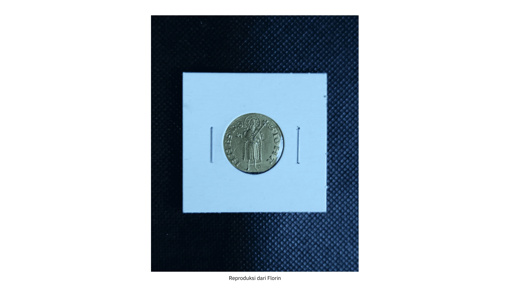

Kembalinya mata uang emas ini didorong oleh konteks tertentu: runtuhnya kekaisaran Bizantium dan kemerosotan ekonomi dunia Muslim akibat invasi Mongol menciptakan kekosongan moneter dalam perdagangan internasional.

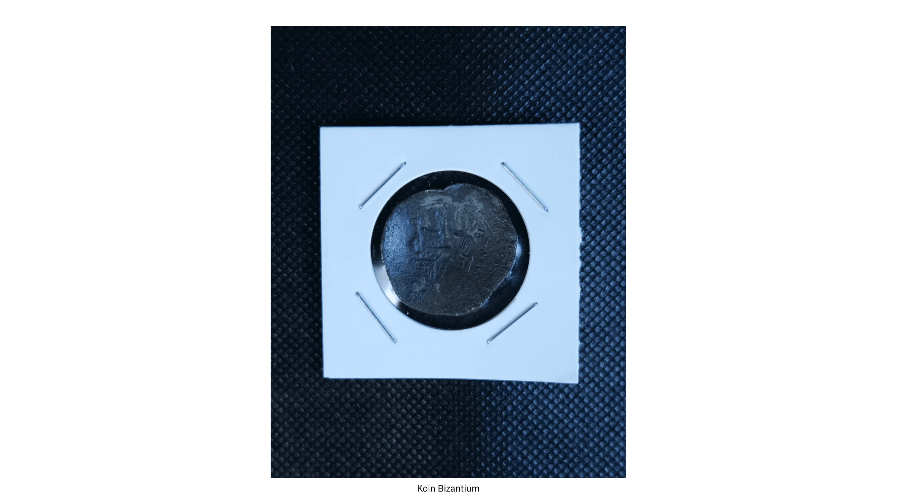

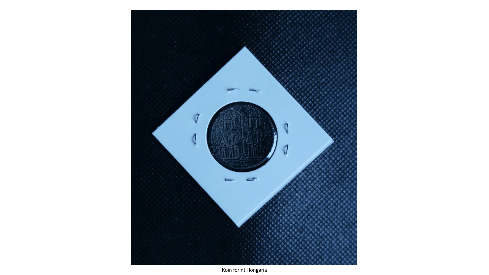

Gambar pertama di atas menunjukkan koin Bizantium yang menurut saya cukup menarik. Saya akan menggambar paralel dengan koin dari periode yang sama dari Hongaria (gambar kedua di atas). Koin Hongaria berbentuk cangkir, seperti mangkuk mini. Ikonografinya menampilkan tokoh-tokoh religius yang digambarkan sebagai raja-raja yang memegang salib berdampingan. Koin ini berbentuk mangkuk dan berasal dari Hongaria.

Meniru koin dari negara lain merupakan hal yang lazim dilakukan. Karena koin-koin Bizantium diterima secara umum, negara-negara lain sering kali menyalinnya. Seperti yang bisa Anda lihat ketika Anda membandingkannya secara berdampingan: kepingan-kepingan ini sangat mirip.

Italia Utara, khususnya Florence, Venesia, dan Genoa, mengambil keuntungan dari konteks ini untuk meluncurkan mata uang keras baru - koin dengan kandungan logam mulia yang stabil. Venesia mengikuti contoh Florence dengan mencetak ducat pada tahun 1270, mata uang yang hampir identik dengan florin dan digunakan secara luas dalam perdagangan Mediterania.

Florin menjadi mata uang cadangan internasional pertama, diadopsi di lebih dari 150 kota di Eropa sebelum akhir abad ke-14. Dengan terciptanya jaringan perbankan Florentine berskala besar, yang dipimpin oleh Medici, manajemen moneter dan akuntansi dimodernisasi secara menyeluruh, bahkan mengurangi kebutuhan untuk mengangkut emas secara fisik.

Itu adalah hal lain yang sangat menarik. Ada suatu masa ketika banyak pengiriman koin hilang dalam perjalanan laut. Kemajuan teknologi ini - register dengan pembukuan dua kali lipat - memungkinkan penciptaan uang tulisan. Hal ini memungkinkan untuk mengurangi jumlah penyelesaian koin dan sebagai gantinya menggunakan sistem pencatatan tertulis, yang sangat mengurangi risiko kehilangan uang dalam perjalanan.

Perkembangan moneter juga disertai dengan evolusi yang signifikan dalam metode perbankan. Terinspirasi sebagian oleh kontak Perang Salib dengan praktik perbankan Muslim, Eropa abad pertengahan melihat munculnya sistem perbankan yang belum sempurna di Florence, Venesia, Barcelona, dan Genoa pada awal abad ke-13. Ksatria Templar, sebuah ordo religius dan militer, telah mengembangkan sebuah sistem yang memungkinkan para prajurit perang salib untuk bepergian tanpa membawa harta mereka.

Mereka akan menyetor dana di kantor Templar di negara mereka dan kemudian dapat melakukan perjalanan dengan membawa surat dan mengambil koin setibanya di tempat tujuan perang salib.

Ini berarti kami tidak perlu membawa-bawa koin logam mulia.

Pada periode ini pula, Eropa mulai mengetahui keberadaan uang kertas di Tiongkok, berkat perjalanan Marco Polo pada abad ke-13. Namun, pengembangan uang kertas akan menunggu beberapa abad, karena Eropa lebih memilih untuk menyempurnakan metode uang logam terlebih dahulu. Leonardo da Vinci, yang dekat dengan Luca Pacioli, seorang akuntan terkenal, secara aktif berkontribusi pada peningkatan mesin cetak uang, mempromosikan produksi koin yang lebih cepat dan lebih seragam.

Kami mengacu pada teknik pemukulan pendulum yang disebutkan sebelumnya dalam kursus ini. Metode ini memungkinkan produksi koin yang lebih seragam dibandingkan dengan pemukulan palu dan, yang terpenting, memungkinkan adanya tulisan di sekitar tepi koin, seperti yang telah saya tunjukkan sebelumnya. Koin di bawah ini adalah thaler Eropa dari tahun 1793, yang dengan jelas menunjukkan tulisan di pinggirannya.

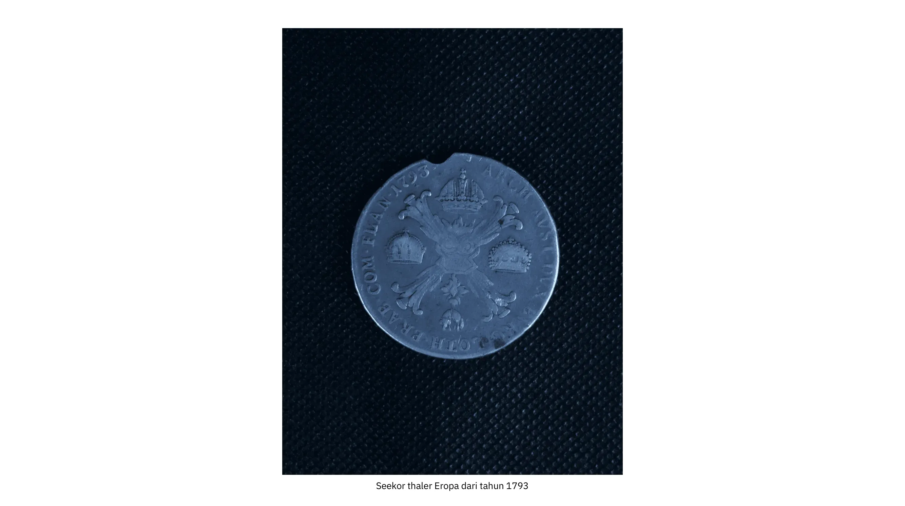

Namun, pada abad ke-15, Eropa mengalami krisis mata uang yang serius, dengan penurunan kandungan perak mata uang Eropa secara umum, yang turun menjadi kurang dari 5% sekitar tahun 1450.

Sejak abad ke-16 dan seterusnya, pusat gravitasi moneter bergeser ke Spanyol, didorong oleh penyatuan kerajaan Aragon dan Kastilia, berakhirnya Reconquista, dan penemuan-penemuan maritim besar seperti Christopher Columbus pada tahun 1492. Masuknya perak dalam jumlah besar dari tambang-tambang Amerika sangat mengacaukan keseimbangan ekonomi Eropa dan global, memicu inflasi dan ketegangan geopolitik yang baru.

Renaisans juga menandai evolusi artistik besar dalam mata uang koin, dengan koin seperti thaler (Joachimsthaler), yang merupakan asal mula istilah "dolar". Koin perak besar ini mencerminkan teknik pencetakan artistik dan mekanis baru yang dimungkinkan oleh inovasi teknis dari Eropa utara.

Akhirnya, Renaisans keuangan mengantarkan transisi menuju modernitas ekonomi, dengan perkembangan perbankan, kredit, dan pasar keuangan, dan munculnya bentuk-bentuk pertama kapitalisme modern di kota-kota komersial besar seperti Amsterdam, London, dan Stockholm, yang meletakkan dasar bagi sistem keuangan internasional seperti yang kita kenal sekarang. Dan itulah topik video kami berikutnya.

# Penyitaan uang oleh Negara

<partId>17cfb1b4-5bc1-53e0-b035-05c7cf76be92</partId>

## Evolusi mata uang cadangan dunia

<chapterId>d65cc352-e7ca-5f03-9b23-dd1fae5c0395</chapterId>

:::video id=82710062-8fff-426c-93af-923c08d82233:::

### Pentingnya sejarah logam mulia

Selamat datang di bagian tentang kemunculan mata uang cadangan dan bank sentral. Sebagai poin pertama dari bagian baru ini, kita akan fokus pada evolusi mata uang cadangan global.

Logam mulia, terutama emas dan perak, telah lama dianggap sebagai dasar kekayaan dan kekuasaan di berbagai kerajaan. Kehausan akan emas selalu menjadi kekuatan pendorong yang dominan, dan masuknya logam mulia inilah yang memiliki efek paling langsung dan nyata pada perkembangan moneter di Eropa. Pada abad pertengahan dan awal Renaisans, obsesi terhadap emas dan perak disebabkan oleh sulitnya mempertahankan nilai dalam bentuk barang dagangan lainnya, serta permintaan yang kuat dari kekuatan asing, terutama dalam perdagangan dengan Timur.

Selama berabad-abad, beberapa kekaisaran telah menggantikan satu sama lain sebagai pusat ekonomi global. Negara yang mendominasi perdagangan dunia selama periode tertentu biasanya dianugerahi status mata uang cadangan. Ini termasuk:

- Spanyol dan Portugal (abad ke-15 dan ke-16)

- Provinsi-provinsi Bersatu (Belanda) pada abad ke-17

- Prancis dan Inggris pada abad ke-18 dan ke-19

- Amerika Serikat pada abad ke-20

### Ledakan Portugis dan Real (1450-1530)

**Portugis mendominasi perdagangan dunia pada paruh kedua abad ke-15 dan awal abad ke-16, dengan menggunakan mata uang Real Portugis, sebuah koin perak dengan berat yang relatif seragam. Berkat kemajuan navigasi mereka, bangsa Portugis menemukan rute laut baru ke Afrika, Asia, dan Dunia Baru. Benteng-benteng militer dan pos-pos perdagangan berlipat ganda dari Afrika hingga Cina (Makau).

Menanggapi permintaan Eropa akan emas dan perak, "motivasi konstan untuk penemuan-penemuan besar itu adalah keuntungan komersial, terutama mengejar emas dan perak." Namun, Kekaisaran Portugis, yang terlalu besar dan menghadapi persaingan dari Belanda, Inggris, dan Prancis, mulai mengalami kemunduran.

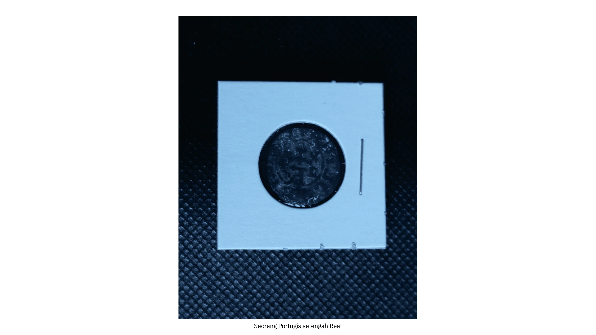

Di sini, di atas, Anda dapat melihat setengah Real Portugis dari masa penaklukan Maritim ini.

### Puncak Spanyol dan Dolar Spanyol (abad ke-15 dan ke-17)

Dengan penaklukan Dunia Baru, **Spanyol** menjadi pemain dominan. Rajanya, yang menguasai tambang perak raksasa (Potosí di Bolivia, Zacatecas di Meksiko), berhasil mencetak uang dengan perak murni, sehingga menghindari depresiasi mata uangnya sendiri: **Real Spanyol**

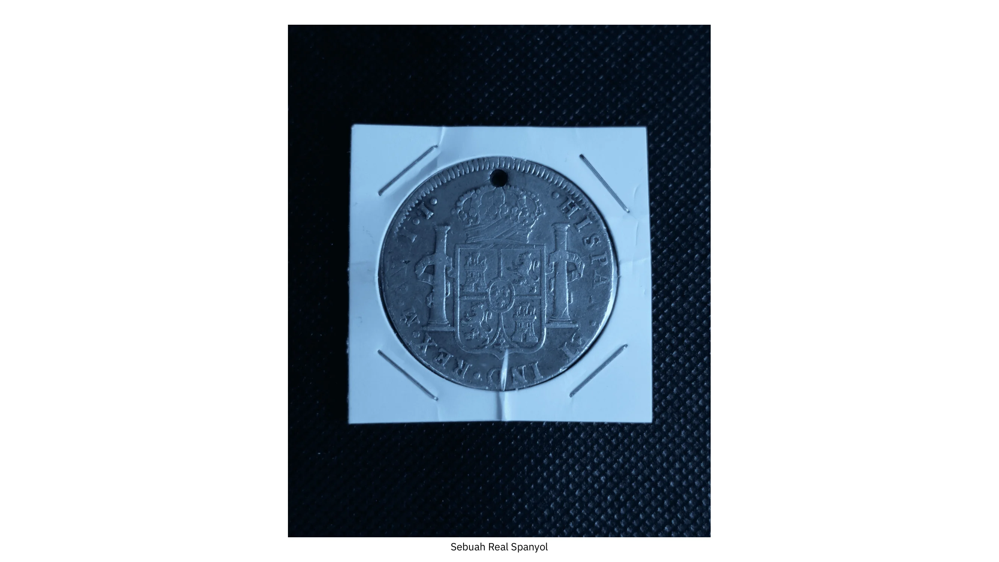

Real Spanyol, yang juga dikenal sebagai "sepotong delapan", mendapatkan julukannya karena sering dipotong menjadi delapan bagian untuk membuat koin yang lebih kecil. Koin ini juga dikenal sebagai **Dolar Spanyol**. Koin yang Anda lihat di atas berasal dari tahun 1814, menjadikannya contoh yang sedikit lebih baru. Namun, koin dolar Spanyol pertama tidak sehalus ini; koin-koin ini dipukul dengan palu dan umumnya tidak terlalu bulat dan tajam.

Yang sangat menarik adalah bahwa dolar Spanyol berfungsi sebagai mata uang cadangan internasional pada saat itu. Otoritas Spanyol juga menerbitkan mata uang lokal mereka sendiri, maravedi, dan secara teratur menyesuaikan jumlah uang beredar melalui penarikan. Sebagai contoh, koin tembaga atau perunggu yang awalnya bernilai satu maravedi mungkin akan ditarik kembali dan dicap dengan "2", kemudian dengan "4", dan seterusnya, sehingga berpotensi mencapai "8" Dalam foto resolusi tinggi, Anda bisa melihat dengan jelas angka "8" yang tertera pada koin. Metode ini secara efektif memperluas jumlah uang beredar... yang pasti menyebabkan inflasi.

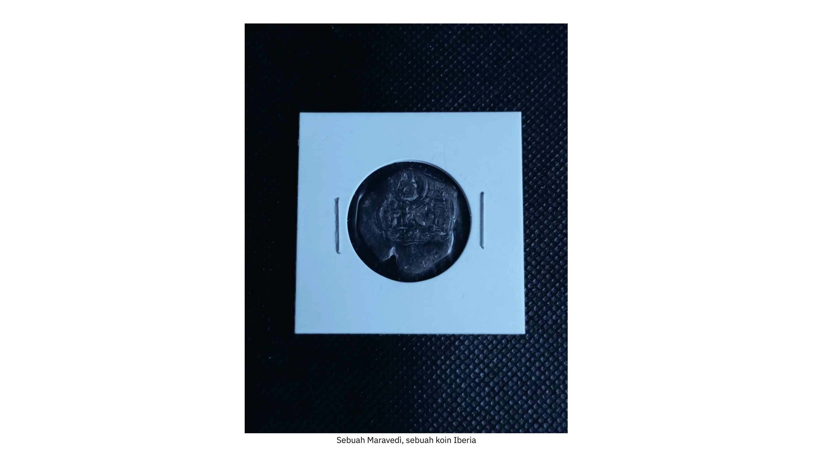

Jika kita melihat sejarah mata uang cadangan, ada satu hal yang menarik: kekaisaran tidak menggembungkan mata uang mereka selama mereka mempertahankan status mata uang cadangan. **Hanya pada akhir dominasi mereka, mereka akhirnya mendevaluasi mata uang tersebut, kehilangan hak istimewa ini, yang kemudian diwariskan kepada kekaisaran baru**.

Di Spanyol, dolar Spanyol mendominasi perdagangan dunia selama hampir 200 tahun, terutama antara Cina dan Eropa. Koin-koin ini bahkan dapat ditemukan di pelabuhan-pelabuhan Cina. Dan di situlah kita mendapatkan sekilas pandang dari sejarah: dolar Amerika berasal langsung dari mata uang ini. Ketika Amerika Serikat dibentuk pada tahun 1792, negara ini mengesahkan undang-undang untuk mencetak mata uangnya sendiri, dan dolar pertamanya dibuat berdasarkan model dolar Spanyol, baik nama maupun ukuran koinnya.

Sebagai gambaran, satu dolar Amerika pada awalnya adalah koin perak seberat hampir satu ons, atau antara €30 dan €40 dalam uang sekarang, tidak seperti mata uang kertas yang kita kenal sekarang. Adapun dolar Spanyol beredar begitu luas sehingga dianggap sebagai mata uang global pertama yang sebenarnya.

Namun, masuknya logam mulia dari Amerika menyebabkan inflasi di Eropa. Selama Revolusi Harga (sekitar tahun 1540-1640), biaya hidup di Inggris meningkat tujuh kali lipat. Di Spanyol, kelimpahan perak memiliki efek kutukan sumber daya yang merugikan, sehingga menghambat perkembangan institusi perbankan yang solid.

Setelah itu, Spanyol menghadapi berbagai konflik militer (Flanders, Belanda, Perang Tiga Puluh Tahun), dan keuangannya berangsur-angsur runtuh. Alih-alih mendevaluasi koin perak yang terkenal di dunia, para penguasa berikutnya memilih untuk tidak menggunakan atau mendepresiasi koin tembaga (vellón) yang digunakan oleh penduduk setempat. Inilah yang saya jelaskan sebelumnya tentang suku Maravida.

### Kebangkitan Belanda (abad ke-17)

Setelah puncak kejayaan Iberia, **Belanda** muncul sebagai kekuatan komersial baru di abad ke-17. Perdagangan maritim, VOC (Perusahaan Hindia Timur Belanda), dan pendirian **Amsterdam Stock Exchange** (terinspirasi dari yang ada di Antwerpen) menjadikan republik pedagang ini sebagai pusat.

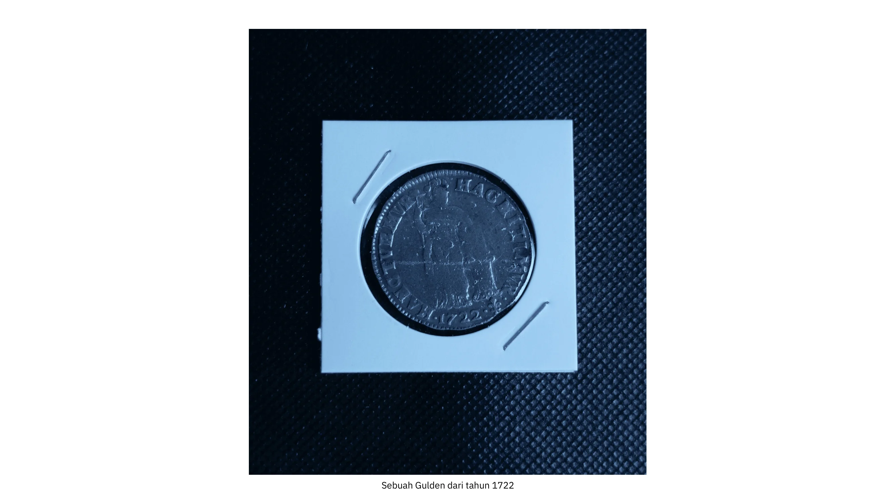

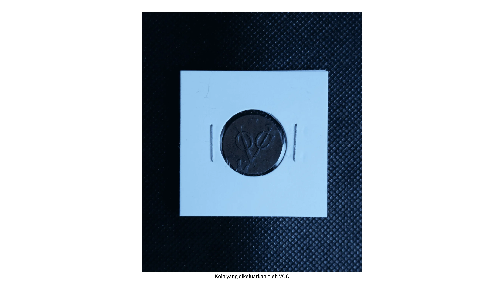

Pada foto pertama di atas, Anda dapat melihat Gulden dari tahun 1722 (koin perak yang indah), sedangkan foto kedua adalah koin yang dikeluarkan oleh VOC.

VOC adalah perusahaan yang sangat kuat pada masanya: mereka memiliki tentara sendiri dan bahkan menerbitkan mata uang sendiri.

Belanda menciptakan kapitalisme modern, yang dimulai sebagai sarana untuk mendistribusikan risiko dalam usaha-usaha berisiko seperti ekspedisi ke Dunia Baru atau pencarian rute perdagangan baru. Perusahaan saham gabungan memungkinkan beberapa investor untuk mengumpulkan uang mereka dan berbagi risiko. Untuk memfasilitasi pertukaran ini, maka perlu dibentuk institusi yang mampu menegosiasikan dan mempertukarkan sekuritas ini. Maka, pada tahun 1602, perusahaan saham gabungan dan bursa saham pertama didirikan.

Mata uang Belanda, Gulden, memperoleh kredibilitas berkat kemurniannya yang terbuat dari perak, dan kemudian diadopsi oleh Bank of Amsterdam (1609), di mana deposito menjadi bentuk uang yang lebih disukai di Eropa. Ini adalah poin yang sangat penting untuk disebutkan. Ya, tentu saja ada koin, tetapi yang benar-benar merupakan uang pada masa itu adalah bentuk uang kertas. Faktanya, sebagian besar perdagangan dunia melewati pembukuan Bank of Amsterdam. Ini adalah terobosan perbankan yang nyata: perdagangan internasional tidak lagi harus dilakukan dengan koin fisik, tetapi langsung melalui catatan akuntansi bank.

Periode kemakmuran ini ditandai dengan masuknya emas dan perak dalam jumlah besar, terutama dari negara-negara lain yang mempraktikkan kontrol inflasi atau moneter. Ada seorang tokoh yang menarik untuk disebutkan: **Thomas Gresham**. Pada masa ini, ia bekerja untuk bangsawan Inggris di Belanda, mengelola aliran uang antara kedua negara. Gresham yang sama inilah yang mewariskan "Hukum Gresham" yang terkenal.

Namun demikian, Kerajaan Belanda pada akhirnya juga kehabisan tenaga. Perang dengan Inggris, melemahnya nilai gulden di masa konflik, dan persaingan dari kekuatan lain (Perancis dan Inggris) menandakan berakhirnya hegemoni Belanda. Setelah Perang Inggris-Belanda Keempat (1780-84), penurunan gulden sebagai mata uang cadangan menjadi tidak dapat dipulihkan.

### Kekuatan, ambisi, dan kegagalan Prancis (abad ke-17 hingga 18)

Di bawah kepemimpinan Louis XIV, **Prancis** menjadi kekuatan benua terbesar di Eropa. Namun, mata uang Prancis tidak pernah mencapai status referensi dominan: banyak devaluasi, pajak yang tinggi, dan perang yang mahal (Liga Augsburg, Perang Suksesi Spanyol, dll.) sangat membebani stabilitas sistem moneter.

Eksperimen besar pertama dalam uang kertas dilakukan oleh John Law (1716-1720). Banque Générale menerbitkan uang kertas yang didukung oleh janji utang pemerintah. Skema ini menyebabkan gelembung spekulatif dan keruntuhan (Gelembung Mississippi) pada tahun 1720. Bencana ini membuat Prancis mengalami ketidakpercayaan yang berkepanjangan terhadap uang kertas. Pengalaman buruk inilah yang membuat Richard Cantillon menjadi kaya raya berkat sistem prinsip-prinsip yang kini dikenal sebagai efek Cantillon, di mana pencetakan uang memperkaya mereka yang memiliki akses ke mesin cetak.

Ketika ketidakpercayaan ini akhirnya memudar, muncullah kegagalan kertas Prancis lainnya: surat utang revolusioner. Diterbitkan dari tahun 1790 dan seterusnya berdasarkan penyitaan properti pendeta, assignats ini mengalami hiperinflasi yang melesat, sehingga secara resmi menjadi hiperinflasi pertama dalam sejarah yang melebihi 50% per bulan. Pada tahun 1795, meskipun nilai nominalnya telah dilipatgandakan, namun hanya diperdagangkan beberapa persen dari nilai awalnya.

Undang-undang yang lebih ketat berusaha untuk memaksakan penetapan tersebut, namun tidak berhasil. Pemerintah mencoba memaksakannya, bahkan sampai mengancam mereka yang tidak menerimanya dengan hukuman mati, dan memaksa para pemilik toko untuk tetap buka. Namun tentu saja, pada akhirnya, hal itu tidak berhasil.

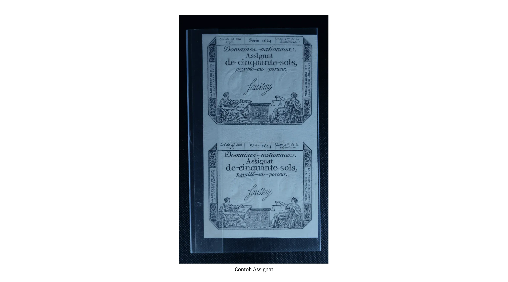

Ketika uang kertas ini menggantikan semua koin logam mulia berkualitas tinggi, sesuai dengan Hukum Gresham yang terkenal, kekurangan koin pun terjadi. Untuk mencetak koin baru, mereka menggunakan logam lonceng yang disita dari para pendeta. Di bawah ini Anda dapat melihat sepotong logam lonceng yang indah, dibuat dari tembaga yang dipulihkan dengan melebur koin-koin yang diambil dari para pendeta.

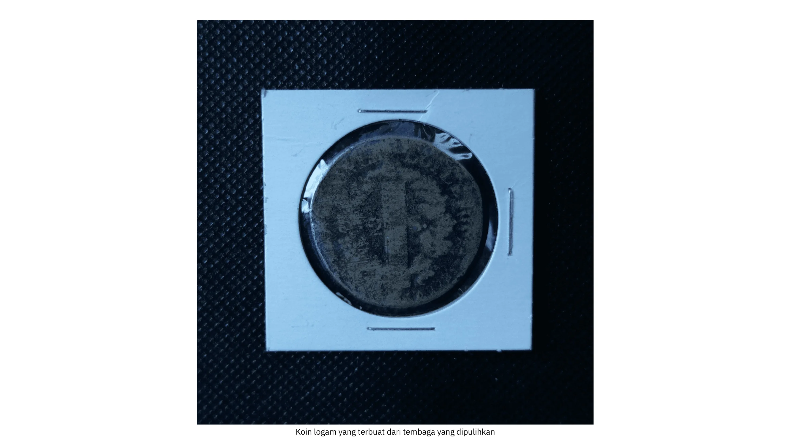

### Dominasi Inggris (abad ke-18 - awal abad ke-20)

**Inggris, setelah mengalahkan Belanda, menjadi kekuatan dominan pada abad ke-18. Poundsterling adalah mata uang tertua yang masih digunakan, yang awalnya terkait dengan satu pon perak. Secara bertahap, statusnya semakin kuat, didukung oleh revolusi keuangan dan fiskal: monarki parlementer, kapasitas penggalangan pajak yang kuat, dan pembentukan Bank of England pada tahun 1694\.

Setelah serangkaian perang melawan Prancis, Inggris muncul sebagai pemenang pada tahun 1815 (Waterloo), yang mengukuhkan supremasinya. Sepanjang abad ke-19, Poundsterling bertindak sebagai mata uang cadangan dunia. Pada puncaknya, dengan hanya 2,5% populasi dunia, Inggris menghasilkan 20% pendapatan global dan menguasai hampir seperempat permukaan bumi.

Revolusi Industri dan penerapan Standar Emas (1717 atau 1718, di bawah pengawasan Isaac Newton di Royal Mint) memperkuat kredibilitas Poundsterling. Bank of England mengadopsi standar emas 4,25 pound per ons emas, yang memungkinkan pemegang uang kertas menukarkan uang kertas mereka menjadi emas.

Namun, Perang Dunia Pertama (1914-1918) mengakhiri sistem ini. Dalam beberapa minggu, semua negara besar yang berperang menangguhkan konvertibilitas emas. Kerajaan Inggris, dan kemudian pound, muncul dari Perang Dunia Kedua dalam keadaan lemah, dan memberi jalan kepada dolar Amerika pada abad ke-20.

Dan sebagai artefak, Anda bisa melihat beberapa karya yang indah dan menarik di bawah ini. Ini adalah timbangan moneter. Yang pertama adalah sovereign: representasi paling awal dari pound. Saya hanya memiliki timbangan uang untuk mewakili koin-koin ini karena saya tidak mampu membeli koin asli. Untuk menimbangnya, kami menggunakan timbangan dan kemudian menempatkan bobot uang yang setara dengan nilai sovereign di sisi lainnya.

Sovereign adalah koin moneter - koin emas yang awalnya bernilai satu pound.

Sebelum sovereign yang terkenal itu adalah guinea, yang beroperasi dengan prinsip yang sama. Guinea dinamai sesuai dengan logam mulia yang dikandungnya, yang bersumber dari wilayah Guinea.

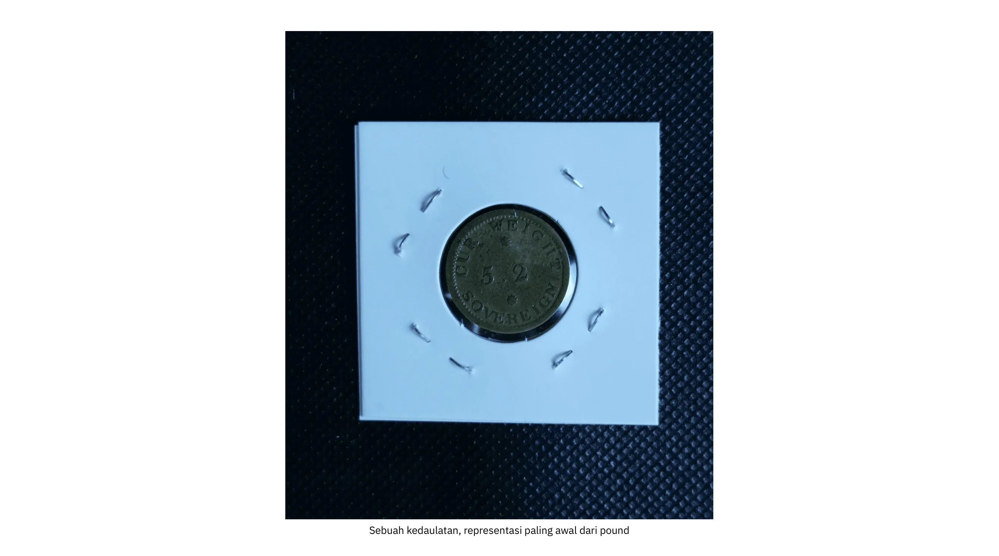

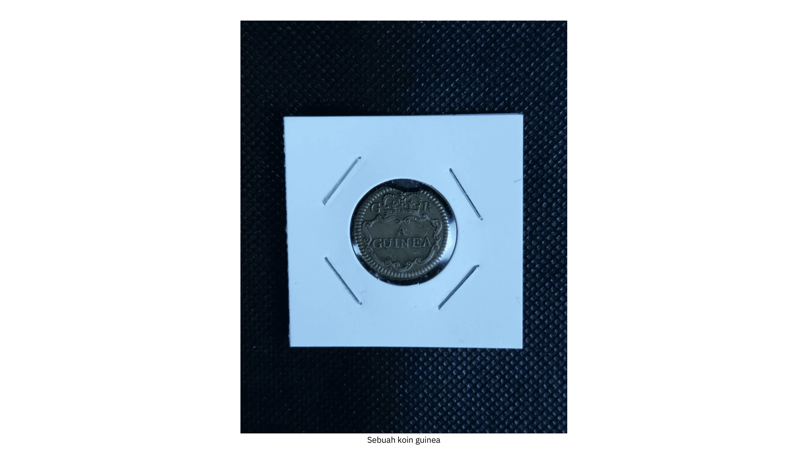

## Munculnya bank sentral

<chapterId>15777771-1e28-55f7-a400-69868a47079b</chapterId>

:::video id=7661b7b5-e00f-48f3-b69a-6fb2eb5ebba4:::

Melanjutkan dari bagian sejarah mata uang cadangan pertama dan evolusinya, berikut ini adalah segmen tentang kemunculan bank sentral. Segmen ini mengikuti jalur yang hampir sama dengan kemunculan mata uang cadangan, namun lebih berfokus pada teknologi perbankan pada saat itu.

### Awal mula bank dan proto-bank

Pada awal abad ke-13, Italia (Florence, Genoa, Venesia...) mengembangkan teknik akuntansi entri ganda. Kemudian, **Antwerp** (abad ke-16) menjadi pusat keuangan terkemuka di Eropa Utara, sebuah peran yang kemudian diambil alih oleh **Amsterdam**, berkat Amsterdam Stock Exchange (1609), di mana saham-saham VOC diperdagangkan.

Antwerpen menjadi tuan rumah pameran dagang di mana para pedagang sering berkumpul untuk menyelesaikan utang, yang mengarah pada penemuan instrumen keuangan baru. Uang kertas di bawah ini, tertanggal 1761 dan yang lebih baru, adalah surat sanggup bayar. Surat ini menampilkan detail tulisan tangan, bersama dengan tulisan di bagian belakangnya, menjadikannya artefak yang luar biasa dari periode tersebut.

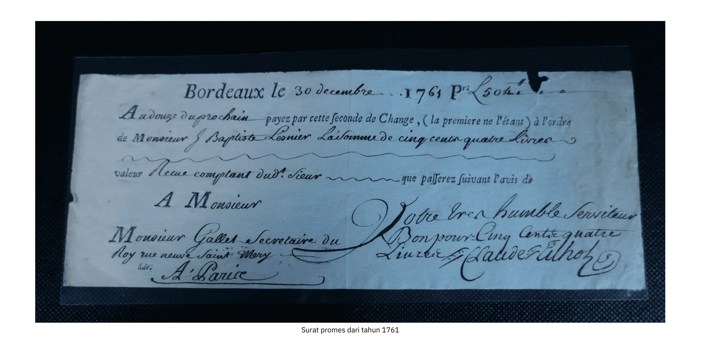

Kegairahan ini mendorong terciptanya institusi perbankan yang lebih canggih. **Para bankir Lombard** dan kemudian para pedagang Belanda menyempurnakan instrumen kredit (wesel, surat sanggup bayar, dan lain-lain). Sistem perbankan modern didasarkan pada ide ini: uang dapat dikreditkan, bukan hanya logam.

Seperti yang Anda lihat, hal ini membawa kita kembali ke pertanyaan awal tentang asal-usul uang.

Apakah uang berasal dari komoditas yang muncul dari kebutuhan untuk bertukar, atau apakah uang muncul dari kredit? Jejak-jejak dari hal ini masih dapat ditemukan di bagian ini.

### Contoh dari Swedia: Stockholms Banco dan Riksens Ständers Bank

Mari kita beralih ke Swedia, tempat bank sentral pertama didirikan.

**Swedia merupakan pelopor dalam perbankan sentral: pada tahun 1657, Johan Palmstruch mendirikan **Stockholm Banco**, yang diberi wewenang untuk meminjamkan lebih banyak daripada cadangan logamnya, sehingga menandai lahirnya [perbankan cadangan fraksional](https://planb.academy/resources/glossary/fractional-reserves). Namun, penerbitan uang kertas yang berlebihan menyebabkan kepanikan dan bank tersebut bangkrut pada tahun 1663. Ya, ya...

Pada tahun 1668, Riksens Ständers Bank, bank sentral pertama di dunia, didirikan di Stockholm. Namun, bank ini juga mengalami krisis (1709, 1715...) yang terkait dengan penyalahgunaan uang kertas, sering kali untuk membiayai perang kerajaan.

### Kudeta gagal John Law

Mari kita menuju Prancis, di mana kita sekali lagi menemukan John Law yang kita cintai.

**John Law**, seorang Skotlandia, membujuk Bupati (Adipati Orleans) untuk mendirikan bank swasta, Banque Générale (1716), yang diberi wewenang untuk menerbitkan surat berharga untuk emas, perak, dan utang pemerintah. Bank ini kemudian menjadi Banque Royale (1718), dan membantu saham Mississippi Company melonjak.

Ketika kenyataan bertemu dengan spekulasi, **kepanikan diperparah dengan keputusan untuk melarang kepemilikan emas dan memaksa penggunaan uang kertas**. Ya, ya...

Akhirnya, gelembung tersebut meledak pada tahun 1720, menyebabkan keruntuhan yang menghancurkan kredibilitas uang kertas di Prancis untuk waktu yang lama.

### Bank of Amsterdam, kebangkitan model perintis

Kita sekarang dibawa ke Amsterdam pada tahun 1609, di mana **Bank of Amsterdam** (Wisselbank) mengambil alih kendali atas penyimpanan dan penukaran koin di Amsterdam. Bank ini melarang peredaran uang kertas pribadi dan memaksakan penyimpanan koin logam di brankas. Sedikit demi sedikit, mereka merebut kendali atas mata uang. Mereka melarang para penukar uang untuk menyimpan koin bersama mereka. Para penukar uang bekerja sepanjang hari dan harus menyimpan koin mereka di brankas Bank of Amsterdam di penghujung hari. Seperti yang telah saya sebutkan, koin-koin yang digunakan dalam perdagangan internasional tidak harus berupa koin logam. Itu adalah uang kertas yang tercatat dalam pembukuan bank.

Berkat kekuatan pedagang Belanda, bank ini memainkan peran sebagai "bank sentral" de facto pertama yang menstabilkan perdagangan dunia. Namun, seiring berjalannya waktu, bank ini memberikan pinjaman tanpa jaminan kepada VOC dan akhirnya kehabisan logam untuk mendukung tagihannya. Pada tahun 1790, diketahui bahwa mereka telah meminjamkan uang dalam jumlah besar kepada VOC, dan secara virtual menyatakan kebangkrutan, sehingga merusak kredibilitas gulden. Ya, ya...

### Bank of England, peletak dasar perbankan modern

Di Inggris pada abad ke-17, emas dan perak disimpan oleh para pengrajin emas, yang mengeluarkan tanda terima. Organisasi yang terdesentralisasi sebagian ini membuktikan keterbatasannya ketika Kerajaan Inggris membutuhkan dana besar-besaran untuk perang melawan Prancis.

Pada tahun 1694, Bank of England (BoE) didirikan. Bank of England lahir dari perkawinan yang nyaman antara komunitas bisnis London dan pemerintah, yang sangat membutuhkan dana untuk perang.

Bank memperoleh monopoli atas penerbitan uang kertas di Inggris (diperkuat pada tahun 1708, 1742, dan seterusnya). Sejak saat itu, uang kertas yang didukung oleh cadangan emas beredar bersama koin. Ini adalah poin penting untuk memahami pengambilalihan uang secara bertahap oleh institusi negara. Pertama, Bank of Amsterdam melarang para penukar uang untuk menyimpan uang koin dan memaksa mereka untuk mengembalikannya ke Bank. Di Inggris, bank-bank swasta dilarang menerbitkan uang kertas mereka sendiri yang dapat ditukarkan dengan emas.

Mereka mengizinkan bank-bank swasta untuk menerbitkan uang kertas, tetapi hanya bisa ditukar dengan uang kertas Bank of England.

Uang kertas Bank of England, pound sterling, dapat ditukarkan dengan emas. Ini menambahkan lapisan ketiga pada mata uang. Jadi, kita memiliki emas di bagian dasar, lalu uang kertas Bank of England, dan kemudian uang kertas bank swasta di atasnya. Sebelum itu, bank swasta dapat menerbitkan uang kertas mereka sendiri yang dapat ditukarkan dengan emas. Ini adalah tahap lain dalam pengambilalihan mata uang secara bertahap oleh institusi negara.

Bank membiayai Negara dengan pinjaman yang sangat besar dan menyusun utang publik yang sangat besar yang membiayai ledakan ekonomi.

Model ini dikonsolidasikan selama abad ke-18 dan ke-19, sampai pada titik di mana pound menjadi mata uang cadangan dunia, di bawah segel Bank of England dan standar emas.

**Mata uang cadangan dunia telah mengikuti satu sama lain selama berabad-abad, didorong oleh kekuatan ekonomi, komersial, dan militer suatu negara atau kekaisaran: Portugal, Spanyol, Belanda, kemudian Inggris, sebelum Amerika Serikat mendominasi di abad ke-20. Dalam setiap kasus, kita melihat siklus yang sama: ekspansi ekonomi, kesuksesan komersial, adopsi mata uang internasional, utang, perang yang mahal, penggunaan penciptaan uang atau kredit yang berlebihan, dan akhirnya kemunduran.

**Kemunculan bank-bank sentral merupakan sebuah proses yang bertahap. Lembaga-lembaga ini sering muncul dalam konteks perang yang mahal, yang memungkinkan negara untuk membiayai dirinya sendiri melalui utang. Ketika standar emas diadopsi (Inggris, abad ke-17 dan ke-19), standar ini memberikan lapisan stabilitas, hingga perang dunia besar di abad ke-20 menyebabkan ditinggalkannya konvertibilitas emas secara bertahap. Kekuasaan untuk mencetak uang kemudian bergeser dari monopoli kerajaan ke entitas yang lebih kompleks, pertama-tama swasta (pengrajin emas, bankir), kemudian semi-publik (bank sentral), yang mencerminkan evolusi kedaulatan moneter menuju bentuk-bentuk yang dilembagakan dan mengglobal.

Jadi, inilah yang saya jelaskan sebelumnya. Kita telah sering mengalihkan beban utang negara secara langsung ke bank sentral atau izin untuk menciptakan uang oleh lembaga-lembaga hukum, seperti Parlemen.

Dan fakta yang paling penting di sini adalah bahwa **kita telah beralih dari utang yang dapat hilang melalui kebangkrutan penguasa menjadi utang yang sebagian besar berada di pundak rakyat**.

## Jalan menuju sistem fiat

<chapterId>27a98545-d350-56ee-a200-92468e6b9b33</chapterId>

:::video id=e27a753e-aeee-4307-a65c-9506aab380a1:::

Sekarang kita telah mencapai akhir dari kursus tentang sejarah uang ini, dan untuk menutupnya, saya ingin mengusulkan dua topik. Topik pertama adalah berbagai tahapan yang mengarah pada sistem mata uang fiat kita saat ini. Kita akan meninjau kembali fakta-fakta dari bagian 5 tentang pembentukan bank sentral, dan kita akan menambahkan konsep dolar AS, yang pada akhirnya menjadi mata uang cadangan saat ini. Kita akan melihat bagaimana perkembangannya, bagaimana dolar muncul, bagaimana ia berevolusi, bagaimana ia berubah, tahap-tahap apa saja yang dilaluinya untuk menjadi sistem fiat, karena asal mula dolar adalah koin perak.

Kemudian, segera setelah itu, saya akan memberi Anda segmen singkat tentang sejarah keuangan, untuk membantu Anda memahami bagaimana kita sampai pada negara kesejahteraan. Jadi kita akan melihat dua topik: bagaimana kita sampai pada sistem fiat, dan kemudian setelah itu, bagaimana evolusi keuangan membawa kita pada konsep negara kesejahteraan.

### Fondasi Eropa untuk perbankan modern

Mari kita kembali ke abad ke-13 dengan florin. Untuk memahami bagaimana kita sampai pada model fiat, kita harus mulai dengan abad ke-13. Bersamaan dengan florin, sebuah teknologi muncul bersamaan dengan Medici, yaitu konsep tagihan pertukaran.

Kemudian muncul bursa saham Antwerp, dengan konsep diskon dan surat utang.

Kemudian, seperti yang telah kita lihat, kita memiliki VOC, pasar saham pertama di Amsterdam. Ini menandai kelahiran kapitalisme, dengan saham perusahaan dan pertukaran saham. Bank Amsterdam kemudian memberlakukan penggunaan deposito melalui keputusan. Ini berarti bahwa koin harus disetorkan pada akhir hari. Para penukar uanglah yang tidak bisa lagi menyimpan uang kembalian dalam bentuk koin.

Kemudian muncullah Bank of England yang didirikan karena kebutuhan untuk menciptakan utang untuk membiayai perang pada akhir abad ke-17. Pada saat itu, bank swasta menjadi lapisan uang ketiga. Ngomong-ngomong, seluruh bagian ini, dari florin hingga gagasan penciptaan bank sentral, dirangkum dengan sangat baik dalam buku Nick Bhatia yang terkenal, "Layered Money", yang cukup beruntung untuk saya terjemahkan dengan beberapa kolega. Kami melakukan pekerjaan yang baik dalam menerjemahkannya sehingga penutur bahasa Prancis di mana pun dapat memperoleh manfaat dari ajaran-ajaran ini.

Jadi kita berada di akhir abad ke-17. Bank of England dibentuk untuk membiayai perang.

Bank-bank swasta mengambil alih lapisan ketiga mata uang. Faktanya, uang kertas bank swasta tidak lagi dapat ditukarkan dengan emas: uang kertas Bank of England-lah yang dapat ditukarkan dengan emas. Hal ini menunjukkan perebutan kekuatan pertukaran oleh institusi yaitu Bank of England.

Kemudian terjadilah kepanikan pada tahun 1776. Semua orang bergegas menaiki piramida uang. Artinya, pada tahun 1776, terjadi rush di bank-bank, sehingga semua orang yang memiliki kertas lapis ketiga, yaitu uang kertas bank swasta, mencoba mendapatkan uang kertas Bank of England, dan kemudian mencoba mendapatkan emas, namun ternyata tidak ada cukup emas di lemari besi. Mereka mengumumkan semacam hari libur perbankan untuk menghindari pembayaran kembali tagihan emas, dan ini memunculkan konsep pemberi pinjaman terakhir.

### Evolusi dolar AS

Kami beralih dari florin ke pendirian Bank of England. Tentu saja, ada Perang Dunia Pertama dan Kedua di masa transisi, tetapi sebelumnya, pada tahun 1796, perkembangan juga terjadi di sisi lain Atlantik. Pada tahun 1776, Amerika masih merupakan koloni Inggris, dan koloni-koloni tersebut menggunakan mata uang kertas ini. Di bawah ini adalah uang kertas Connecticut dua shilling dari tahun 1776.

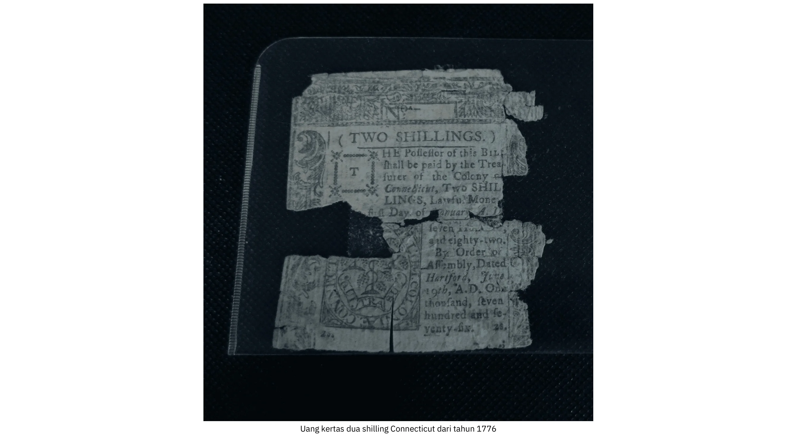

Sebelum menyatakan perang terhadap Inggris dan akhirnya menerbitkan mata uang mereka sendiri, koloni-koloni tersebut menggunakan mata uang kertas ini, di samping dolar Spanyol untuk transaksi tunai. Bahkan, istilah "dolar" tetap digunakan untuk menunjukkan dolar Amerika.

Jika tidak salah, pada tahun 1792 mereka mengesahkan undang-undang yang mengizinkan mereka membuat uang koin. Sebagai contoh, gambar di bawah ini adalah dolar Amerika di era modern.

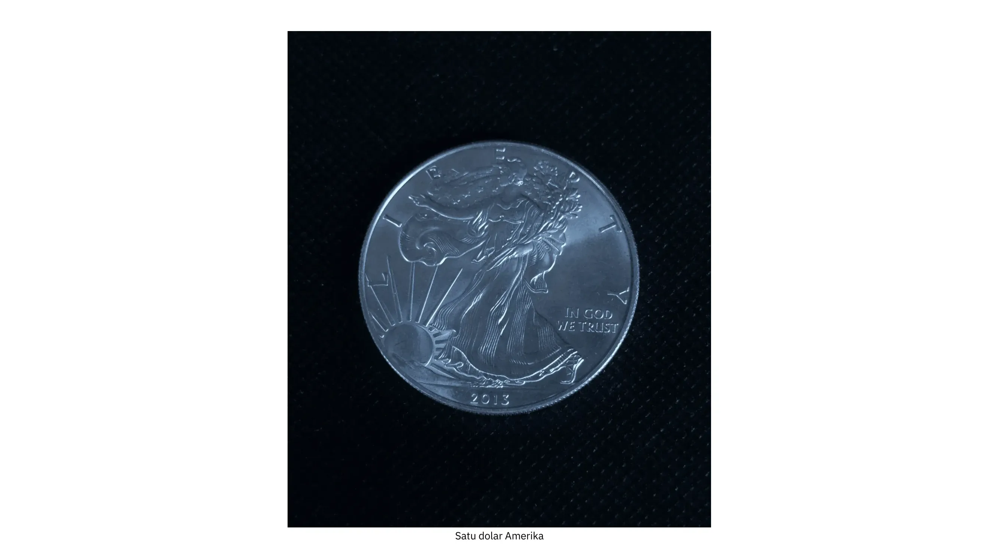

Tentu saja, nilai nominalnya tidak hanya satu dolar; nilainya sekitar 30 atau 40 dolar, karena mewakili satu ons perak. Nilainya berfluktuasi berdasarkan harga perak, biasanya berada di kisaran 30 atau 40 dolar AS. Saat ini, tentu saja, dolar kertas hanya memiliki nilai nominal satu dolar, tetapi pada saat itu, dolar AS berakar pada nilai perak ini.

Mari kita bahas tentang Perang Saudara di Amerika sekarang. Pihak Konfederasi mencetak uang yang mengalami hiperinflasi. Fenomena ini tidak termasuk dalam daftar resmi Hanke-Krus, karena tidak mencapai tingkat hiperinflasi 50%. Namun, tingkat inflasi bulanan mencapai 40%, yang mengindikasikan bahwa sejumlah besar mata uang dicetak selama perang.

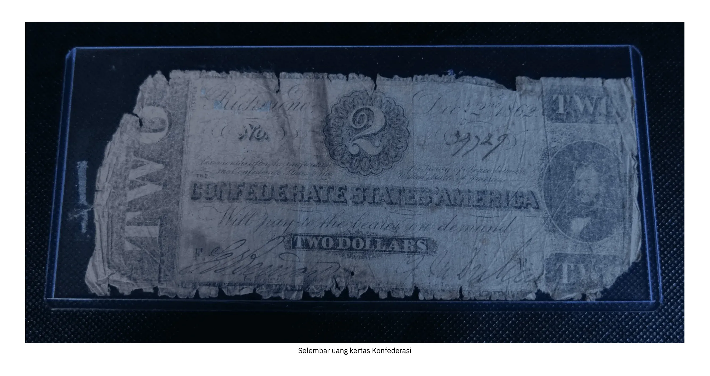

Lawan mereka di utara juga memiliki dolar. Tepat di atas, Anda dapat melihat dolar Konfederasi, sementara di bawah Anda dapat mengamati dolar Utara. Uang ini disebut "greenback" karena bagian belakangnya berwarna hijau.

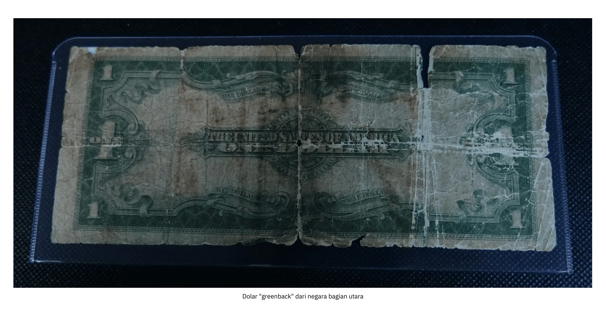

Dan saya mengajak Anda untuk membandingkan perbedaan ukurannya dengan uang kertas modern. Saat itu, uang kertas lebih besar.

Seperti yang kita ketahui, pihak utara menang, sehingga greenback menjadi mata uang negara bagian Amerika yang bersatu kembali. Kemudian muncullah pendirian FED pada tahun 1913, dan Perang Dunia Pertama.

Setelah Perang Dunia Pertama, seri terakhir uang kertas yang dicetak selalu menyertakan kata-kata "dapat ditukarkan dengan emas sesuai permintaan". Jadi, pada tahun 1928, uang kertas $20 dapat membeli hampir satu ons emas, karena harga emas saat itu adalah $20,67. Uang kertas pada gambar di bawah ini dapat membeli satu ons emas pada tahun 1928.

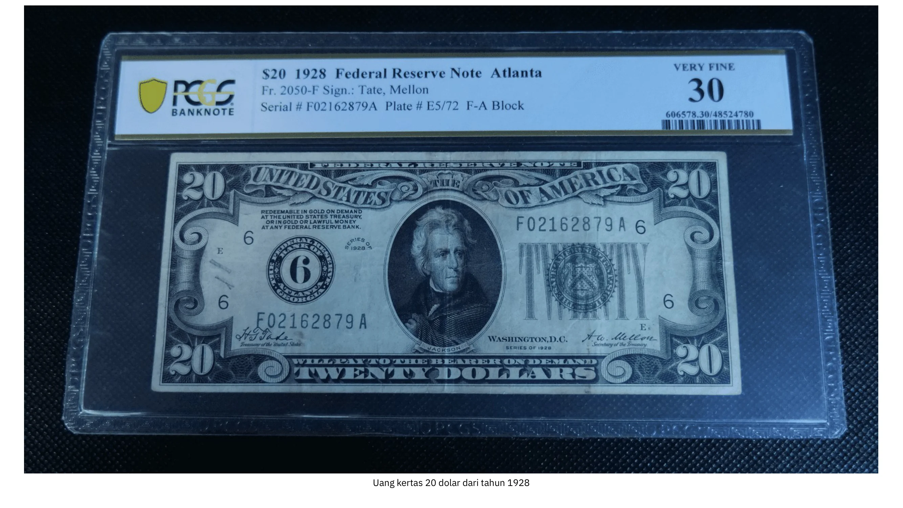

Saat ini, satu ons emas bernilai US$3.000. Jadi, Anda bisa melihat kekuatan devaluasi di sini, tentu saja. Itu adalah uang kertas terakhir yang berisi kata-kata "dapat ditukarkan dengan emas". Kita akan melihat bahwa tepat setelah Perintah Eksekutif 6102, mereka akan menyita semua emas. Bahkan, mereka akan menyita emas dan sertifikat emas.

Di bawah ini Anda dapat melihat sertifikat emas dari tahun 1928.

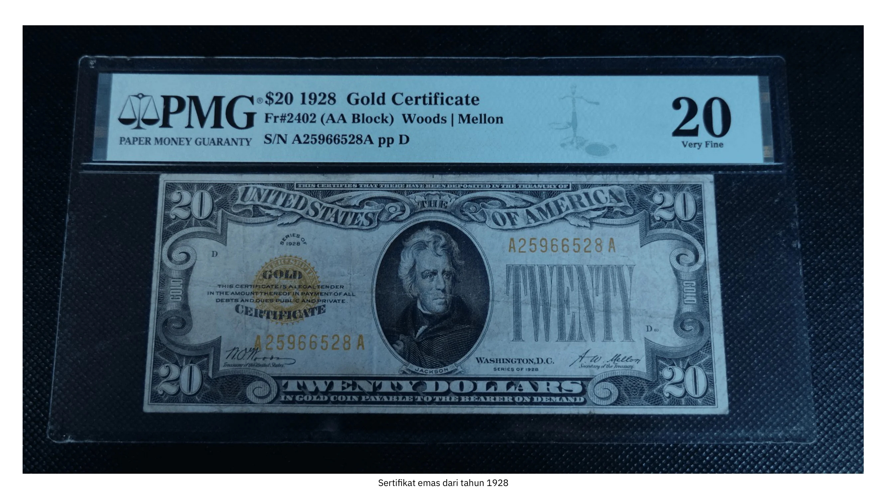

Tidak hanya "dapat ditukarkan dengan emas" seperti uang kertas tahun 1928, tetapi juga dapat ditukarkan dengan koin emas: ini benar-benar "sertifikat emas". Semuanya telah disita setelah Perintah Eksekutif 6102. Hingga tahun 1964, memiliki uang tersebut adalah ilegal.

Saya sangat senang memilikinya.

Mulai tahun 1964, memiliki emas adalah ilegal, sampai tahun 1974, jika saya tidak salah. Pada tahun 70-an, mereka mengizinkan orang untuk mengumpulkan emas setelah goncangan Nixon, yang akan kami jelaskan sebentar lagi. Pada tahun 1933, ketika mereka mengeluarkan "Perintah Eksekutif 6102", mereka menyita emas dan menjadi ilegal untuk memilikinya. Anda akan menerima hukuman penjara yang berat jika ketahuan menyimpan emas Anda. Pada masa itu, setiap ons emas ditukar dengan uang kertas yang mirip dengan uang kertas di bawah ini, setelah tahun 1934.

Seperti yang telah kami katakan, pada tahun 1928, satu dolar masih memiliki tulisan "dapat ditukarkan dengan emas".

Setelah dikeluarkannya Perintah Eksekutif 6102, mereka menyita semua emas dan menukarnya dengan 20,67 dolar AS untuk setiap ons emas. Setelah itu, penipuan tersebut terungkap: mereka menerbitkan uang kertas baru pada tahun 1934 dengan teks yang tercetak "uang kertas ini adalah alat pembayaran yang sah untuk semua utang".

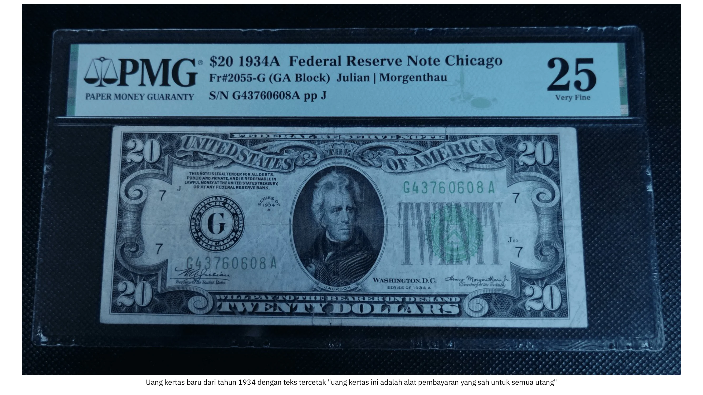

Konsep alat pembayaran yang sah muncul di sini, menggantikan frasa "dapat ditukarkan dengan emas." Kedua uang kertas ini mungkin terlihat identik, dengan hanya beberapa kata yang berubah, tetapi penipuannya terletak pada fakta bahwa dolar didevaluasi selama periode ini; turun dari satu ons emas dihargai $20,67 menjadi $35 per ons pada tahun 1934. Ini mewakili devaluasi sekitar 40%!

Kemudian datanglah Perang Dunia Kedua. Setelah perang, Perjanjian Bretton Woods memusatkan sebagian besar emas dunia di Amerika Serikat. Amerika menerbitkan uang kertas sebagai gantinya, meskipun uang kertas ini tidak lagi dapat ditukarkan dengan emas oleh masyarakat umum. Namun, uang kertas ini tetap dapat ditukar dengan emas di tingkat negara bagian.

Akhirnya, negara-negara seperti Perancis dan Jerman mulai curiga bahwa mungkin ada lebih banyak uang dolar yang beredar daripada emas di brankas AS.

Jadi mereka meminta untuk memulangkan emas mereka. Mereka berkata, "Baiklah, kami akan melakukannya, tetapi akan memakan waktu sedikit lama." Pada tahun 1971, teman kita Richard Nixon memutuskan hubungan antara uang kertas dan emas untuk selamanya, dan menyalahkan para spekulan dalam prosesnya.

Emas dihargai terlalu rendah yaitu $35 per ons, sebuah harga yang tidak sesuai dengan volume uang yang telah dicetak atau nilai pasar yang sebenarnya. Hanya dalam beberapa tahun, harganya melonjak dari $34 menjadi $800. Mirip dengan contoh historis, seperti di Roma, di mana hubungan antara dinar dan solidus terputus, emas dibiarkan mengambang. Fakta ini menyebabkan proses penemuan harga, yang mengakibatkan emas dihargai jauh lebih tinggi dalam mata uang dolar setelahnya.

### Sistem mata uang fiat modern dan implikasinya

Bagian ini merangkum bagaimana kita beralih dari sistem moneter berdasarkan perak atau emas. Sedikit demi sedikit, lembaga-lembaga memperoleh lebih banyak kekuasaan atas uang. Pada akhirnya, sebuah keputusan sepihak benar-benar memutuskan hubungan antara logam mulia dan uang, setelah terjadi penerbitan yang berlebihan.

Akibatnya, tidak ada lagi hubungan antara emas dan uang kertas atau uang kertas. Dan bahkan sistem cadangan fraksional pun tidak ada - itu adalah konsep yang sudah ketinggalan zaman. Sebagai gantinya, bank-bank swasta menerbitkan dan menciptakan uang melalui kredit bank. Uang diciptakan dengan cara ini dan berkorelasi dengan suku bunga yang ditetapkan oleh bank sentral.

Benar-benar tidak ada batasannya. Tidak ada tingkat cadangan wajib lagi, setidaknya di Amerika dan Kanada. Satu-satunya cadangan adalah kebutuhan bank untuk mengatur agar dapat merespons pertukaran antar bank agar tidak kehabisan likuiditas.

Mereka hanya perlu memastikan bahwa mereka dapat melakukan transfer ini, tetapi tidak ada cadangan wajib 3%, 1%, 10%. Kita telah benar-benar beralih dari konsep cadangan wajib. Sekarang, bank sentral, pemerintah melalui defisit fiskal, bank sentral melalui pelonggaran kuantitatif (QE), dan bank-bank swasta melalui penciptaan pinjaman bank yang dapat meningkatkan jumlah uang beredar dan, menurut pendapat saya, menyebabkan inflasi.

Untuk memahami hubungan antara uang dan inflasi, saya merekomendasikan kursus yang saya miliki di Plan ₿ Academy yang didedikasikan untuk subjek ini. Anda akan mempelajari perbedaan antara kenaikan harga, yang kita lihat dalam kehidupan, dan inflasi. Keduanya bukanlah hal yang sama. Faktanya, ketika kita mengacu pada inflasi, kita sering berbicara tentang kenaikan harga, bukan inflasi itu sendiri. Inflasi adalah konsep yang cukup tepat, yang dijelaskan oleh peningkatan jumlah uang beredar.

https://planb.academy/courses/caa75343-ac90-4249-bcca-0e2e57c3a0f1

Sebagai penutup dari bagian dunia fiat ini, saya ingin menunjukkan sebuah sumber yang dapat membantu Anda untuk lebih memahami fenomena yang baru saja saya jelaskan, yaitu inflasi.

Terima kasih atas perhatian Anda.

## Sejarah gelembung uang

<chapterId>b6451c46-917d-11f0-97de-6bc5081765fa</chapterId>

:::video id=5967d9a6-aae4-4b84-a283-71b1b735bca4:::

### Penemuan uang kertas dan gelembung besar pertama

Dengan dibentuknya bank sentral pada abad ke-18, sebuah revolusi nyata lahir: uang ajaib dalam bentuk uang kertas. Contoh yang paling mencolok di Prancis adalah John Law. Orang Skotlandia ini, yang diasingkan di Paris, mengusulkan kepada bupati, Duc d'Orléans, solusi untuk kebangkrutan keuangan kerajaan dengan menciptakan bank negara dan perusahaan perdagangan kolonial: **Banque Royale** yang terkenal dan **Compagnie du Mississippi**.

Dengan sistem ini, Law mengaitkan uang kertas dengan saham perusahaannya. Semakin banyak uang kertas yang beredar, semakin tinggi nilai sahamnya, dan semakin kokoh bank tersebut... hingga spekulasi melampaui kenyataan. Gelembung ini meledak secara tiba-tiba pada tahun 1720, menghancurkan kaum bangsawan, borjuis, dan sebagian besar Eropa, yang berspekulasi di rue Quincampoix. Hasilnya: ketidakpercayaan terhadap uang kertas di Perancis, dan pelajaran pertama di Eropa tentang gelembung spekulatif.

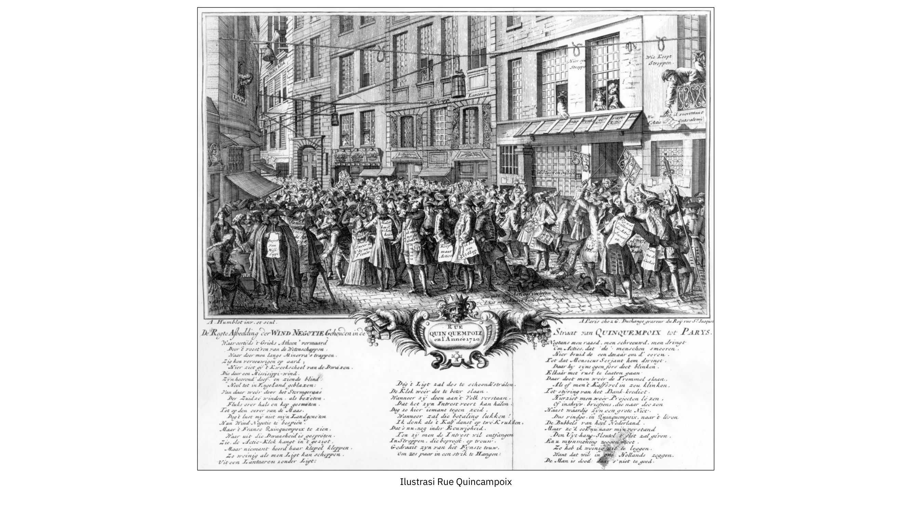

### Ketika tanah menjadi "jaminan"

Satu abad kemudian, Revolusi Prancis membuat terobosan baru dengan **assignats**, mata uang yang didukung oleh properti Gereja yang disita. Ide yang menarik di atas kertas - mengubah tanah menjadi jaminan moneter - tetapi tidak efektif: tanah tidak likuid dan tidak dapat dibagi. Hasilnya: hiperinflasi, berbagai larangan penggunaan lahan, inflasi yang tidak terkendali, dan kelangkaan.

Napoleon, yang sangat terpengaruh oleh kekacauan ini, menetapkan kembali emas dan perak sebagai dasar moneter pada tahun 1800 dengan pembentukan Banque de France, sehingga menjamin pembayaran rutin pasukannya. Cara pragmatis untuk mendapatkan kembali kepercayaan diri: membayar dengan mata uang keras.

### Tahun 20-an dan Depresi Besar tahun 1929

Mari kita lewati dua abad. Setelah Perang Dunia Pertama, pemerintah membiayai upaya tersebut melalui inflasi dan penangguhan emas. Pada tahun 1920-an, Bank Sentral Amerika menerapkan kebijakan moneter yang terlalu akomodatif untuk mendukung pound Inggris. Hasilnya: kredit mudah, spekulasi tak terkendali di Wall Street, pembelian saham secara kredit, dan munculnya gelembung real estat dan perbankan.

Ketika mesin menjadi rusak, kehancuran pada tahun 1929 tidak dapat dihindari: kegagalan bank besar-besaran, rekor pengangguran, dan antrian di dapur umum. Hal ini memunculkan kesalahpahaman yang terus berlanjut bahwa **semua deflasi itu buruk**, padahal kita perlu membedakan antara deflasi karena pertumbuhan (sehat) dan deflasi karena utang (menghancurkan).

### Asia di tahun 90-an dan efek domino

Pada tahun 1990-an, "keajaiban Asia" membuat dunia bermimpi. Nilai tukar Exchange dipatok pada dolar, pertumbuhan mencapai 8-10%, dan modal Barat mengalir deras. Semuanya baik-baik saja... sampai air pasang surut. Kebangkrutan merajalela, mata uang terdevaluasi hingga 80%, dan para investor hancur. IMF harus turun tangan, memaksakan reformasi yang menyakitkan. Skenario yang sama seperti biasanya: modal melimpah, gelembung kredit, lalu runtuh.

### 2008 dan era gelembung permanen

Gelembung Internet (2000) diikuti oleh gelembung real estat subprime. Sekuritisasi mengubah pinjaman bank menjadi produk keuangan "triple-A", yang tersebar di seluruh dunia. Janjinya: menghilangkan risiko dengan mengencerkannya. Kenyataannya: semua risiko ternyata berkorelasi. Ketika real estat runtuh, begitu pula seluruh sistem perbankan global.

Hasilnya: dana talangan publik yang sangat besar, pelonggaran kuantitatif, dan suku bunga nol. Dan dengan itu, terjadi rush: setiap krisis tidak lagi membersihkan eksesnya, tetapi akan ditutupi oleh lebih banyak utang dan pencetakan uang. Inilah yang menyebabkan situasi saat ini: **"gelembung segala sesuatu "**, di mana segala sesuatu - saham, real estat, seni, kripto, bahkan kartu Pokémon - menggelembung secara artifisial.

### Kembalinya uang ajaib yang abadi

Dari satu abad ke abad berikutnya, satu hal yang konstan muncul: segera setelah sebuah masyarakat percaya bahwa mereka dapat menciptakan kekayaan dengan uang dan bukannya memproduksi barang nyata, gelembung muncul. Dari John Law hingga 2008, dari rue Quincampoix hingga Wall Street, prosesnya berulang: euforia, kredit, booming, dan bust.

Dan pada akhirnya, selalu saja, ketika tidak ada yang mempercayai kertas lagi, orang akan mencari sesuatu yang lain - emas, tanah, tempat berlindung yang aman... atau mata uang baru. Kemarin Napoleon memberlakukan logam, hari ini beberapa orang melihat Bitcoin sebagai penggantinya.

Sejarah keuangan adalah siklus yang tidak pernah berakhir: mencetak, berspekulasi, runtuh. Sampai gelembung berikutnya.

## Uang dan kekerasan

<chapterId>9486fe64-854f-5e17-86b3-8873baca39a8</chapterId>

:::video id=bd6d0807-2d8f-4637-a0f5-1e990e5c0d0f:::

Bagian singkat ini akan meninjau kembali banyak peristiwa yang telah kita lihat di sepanjang kursus, meringkas beberapa anekdot yang menurut saya menarik.

### Teknologi dan kekerasan

Berikut ini adalah beberapa anekdot yang mungkin sudah kita bicarakan dalam kursus. Mereka berfungsi untuk memperkenalkan diskusi yang sangat menarik yang saya lakukan dengan Theo tentang kuliah yang dia berikan di B-Ondy, yang menurut saya sangat menarik dalam hal bagaimana kemajuan teknologi mempengaruhi hubungan kekerasan antara penduduk dan Negara.

### Uang dan paksaan negara

Untuk memperkenalkan bagian ini, saya akan memberi Anda daftar singkat dan tidak lengkap, hanya untuk mengingatkan Anda tentang peristiwa yang mungkin sudah kita bahas dalam kursus ini.

Satu kaitan yang sudah bisa saya buat dengan uang dan kekerasan adalah bahwa ketika menyangkut uang kertas yang tidak berharga yang bisa dicetak tanpa batas, sering kali disertai dengan berbagai macam aturan dan segala macam ancaman. Kita sudah bisa berbicara tentang assignat, di mana secara harfiah tertulis di uang kertas bahwa pemalsu diancam dengan hukuman mati. Sangat mudah untuk menemukan dalam teks-teks hukum pada waktu itu ancaman hukuman mati bagi mereka yang tidak menerima uang kertas yang terkenal ini.

Untuk tetap berada di Prancis, dalam salah satu teks hukum yang bisa saya dapatkan dari era Revolusi, saya melihat bahwa "per diem" untuk mengangkut dan mengoperasikan guillotine dijelaskan di bagian yang berhubungan dengan mata uang. Menurut saya, hal ini agak aneh.

Kami juga telah berbicara tentang mata uang koin di Tiongkok, dengan negara yang mengawasi pencetakannya. Kita telah melihat di bagian awal kursus ini bahwa ketika koin, beberapa di antaranya kurang indah, dibuang, ada konsekuensi hukumnya.

Ada juga anekdot tentang seorang raja di Inggris yang akhirnya memotong tangan mereka yang mencetak uang jika mereka tidak berperilaku seperti yang dia harapkan.

Selain itu, di Tiongkok, saya pernah membaca tentang penyitaan tembaga dari biara-biara Buddha. Pada saat nilai tembaga meningkat dan menggoyahkan ekonomi mereka - yang didasarkan pada bentuk uang kertas yang tidak ada hubungannya dengan nilai logam - mereka terpaksa mencari tempat di mana ada kekayaan dan menyita tembaga dari biara-biara.

Hal yang sama juga berlaku pada biara-biara di Inggris selama Reformasi Inggris. Ketika raja yang terkenal itu bertengkar dengan Paus atas perceraiannya, ada alasan lain di balik itu semua: dia mengambil keuntungan dari penghapusan biara untuk merebut kekayaan yang terkandung di dalam organisasi-organisasi gerejawi ini.

Selama Revolusi Perancis, mereka menyita semua aset Gereja. Mereka melihat koin-koin indah yang dibuat dari lonceng gereja yang dilebur.

Jika kita kembali lebih jauh lagi, salah satu gagasan yang paling eksplisit tentang kekerasan ekonomi dan kebebasan, tentang hukum yang membebaskan, adalah **Diokletianus dengan kasta turun-temurunnya yang secara langsung berkaitan dengan fakta bahwa para petani tidak lagi mau menerima mata uang yang terdevaluasi**. Mereka ingin meninggalkan pekerjaan mereka sebagai petani, dan Diocletianus bereaksi dengan mengatakan kepada mereka, "Anda tidak bisa meninggalkan tanah Anda, dan begitu juga dengan anak-anak Anda". Hal yang sama juga berlaku untuk para prajurit.

Menurut saya, itu adalah bentuk kekerasan yang cukup eksplisit. Saya bisa menyimpulkan dengan berbicara tentang Ksatria Templar atau raja Prancis. Ketika Ksatria Templar menetap di Prancis, saya membayangkan dia melihat manna kekayaan Templar dan memiliki masalah pendanaan negara. Dia menggugat Ordo Templar, dan beberapa dari mereka dapat pergi dengan sebagian dari harta karun tersebut, yang telah memunculkan sebuah pertunjukan yang sangat menarik di AS atau Kanada. Saya tidak tahu siapa yang memproduksinya, tapi judulnya *Misteri Pulau Oak*. Ini tentang orang-orang yang berpikir bahwa ada harta karun Templar yang terkubur di sebuah pulau di Kanada, di Maritim, dan mereka telah mengebor selama bertahun-tahun - bahkan mungkin lebih dari satu dekade - untuk membuat semacam sumur. Mereka telah menemukan sebuah sumur dengan banyak galeri, dan mereka mencari harta karun yang dikubur oleh Ksatria Templar di pulau ini, yang merupakan subjek dari acara TV ini. Saya salut dengan ayah saya, yang merupakan penggemar berat acara ini.

Jadi begitulah: daftar singkat dari fakta-fakta yang telah kita lihat selama kursus ini yang, menurut saya, memiliki kaitan dengan kekerasan. Saya akan meninggalkan Anda dengan bagian selanjutnya dari Theo, yang akan menceritakan kepada kita sebuah kisah yang sangat menarik tentang perubahan teknologi dan keseimbangan kekuasaan antara rakyat jelata dan pihak berwenang.

Terima kasih!

## Konsekuensi ekonomi dari kekerasan terorganisir

<chapterId>66bd4674-2159-5489-ad4b-ec5e3fb691af</chapterId>

:::video id=c8b063c6-aeb4-4a94-9027-b11d369e71a4:::

### Kekerasan terorganisir dan evolusi negara

Sejarawan Frederic C. Lane mengajukan sebuah tesis revolusioner: anatomi negara sepanjang sejarah dibentuk oleh teknologi yang digunakan untuk memproyeksikan kekerasan. Berangkat dari prinsip Weberian bahwa negara memegang monopoli atas kekerasan yang sah, Lane mengamati bahwa monopoli ini - yang secara paradoksal lebih efisien daripada kompetisi di bidang ini - berevolusi sesuai dengan hubungan antara biaya penyerangan dan biaya pertahanan.

Analisis ini, yang diambil oleh penulis "The Sovereign Individual" (1997), menjelaskan mutasi historis dalam organisasi politik: dari sistem feodal abad pertengahan ke negara-kota pada masa Renaisans, kemudian ke negara-bangsa industri, dan akhirnya ke negara kesejahteraan modern. Setiap transisi berkaitan dengan terobosan teknologi besar dalam pelaksanaan kekerasan, yang terjadi kira-kira setiap 400-500 tahun.

### Keseimbangan abad pertengahan

Pada Abad Pertengahan, ekonomi agraris lebih dari 90% dominan. Petani, yang secara harfiah berakar pada tanahnya, tidak dapat melarikan diri dari tuan dan ksatria. Teknologi militer - baju besi yang ditempa dengan tangan, pelatihan pedang selama bertahun-tahun - sangat mahal. Asimetri ini secara besar-besaran lebih mengutamakan serangan daripada pertahanan.

Produsen pertanian yang tidak bisa bergerak menjadi tawanan dari monopoli kekerasan lokal. Kapasitasnya untuk menarik pajak mencapai tingkat yang lebih tinggi - meskipun, secara paradoks, pajak pada abad pertengahan tetap sederhana dibandingkan dengan 78% pungutan wajib di zaman modern. Penguasa dapat memungut pajak sesuka hati, karena petani tidak dapat menolak atau pergi.

### Renaisans Pedagang

Munculnya perdagangan Hanseatic di Utara dan perdagangan Mediterania di Selatan mengubah situasi. Para pedagang, pencipta utama nilai tambah, memiliki modal bergerak - kapal-kapal mereka. Mereka hanya membutuhkan milisi maritim yang ringan, karena lautan sulit diawasi. Yang terpenting, mereka dapat dengan mudah berpindah ke pelabuhan tetangga jika pajak menjadi berlebihan.

Mobilitas ini menciptakan persaingan pajak di antara negara-negara kota. Venesia, Genoa, dan Bruges harus menawarkan kerangka kerja yang paling liberal: kontrak yang dapat diandalkan, mata uang yang berkualitas, asuransi, dan pajak yang minimal. Para pangeran harus merayu, bukan memaksa. Simetri berbalik: pertahanan (melalui pelarian) menjadi lebih mudah daripada serangan.

### Era industri

Revolusi Industri membawa konfigurasi yang mirip dengan feodalisme. Pabrik, rel kereta api, dan jalur perakitan merupakan investasi besar yang tidak dapat dipindahkan. Henry Ford tidak dapat merelokasi pabriknya dalam menghadapi perpajakan. Para pekerja, yang terkonsentrasi di kota-kota industri, berserikat untuk bernegosiasi secara kolektif dan bukannya bermigrasi secara individual.

"Negara kesejahteraan" muncul: perencanaan industri (Jepang, Korea), perlindungan militer terhadap infrastruktur, tunjangan sosial minimum untuk tenaga kerja. Perang Dunia Kedua menggambarkan kerentanan ini: mengebom pabrik-pabrik musuh menjadi strategi yang dominan. Konsentrasi modal fisik memungkinkan penarikan pajak besar-besaran untuk membiayai negara kesejahteraan.

### Revolusi mikroprosesor

Tiga inovasi teknologi kini mengacaukan keseimbangan kuno ini. Mikroprosesor mengubah peperangan: seorang operator di Nevada mengemudikan pesawat tak berawak di Afghanistan dengan presisi bedah. Perang Teluk (1991) menunjukkan terobosan ini: pasukan terbesar keempat di dunia (Irak) dihancurkan dalam 45 hari, dengan kurang dari 200 korban jiwa di pihak koalisi. Keunggulan teknologi membuat serangan frontal menjadi tidak mungkin dilakukan.

Internet dan kriptografi asimetris merevolusi penciptaan nilai. Seorang pengembang dapat bekerja dari mana saja dengan MacBook dan Starlink, mengekspor hasil produksinya secara instan dan gratis. Pengembara digital melepaskan diri dari kungkungan geografis, mengadu domba negara satu sama lain dengan cara yang belum pernah terjadi sejak zaman Renaisans.

Bitcoin merupakan puncak dari logika ini: mata uang yang dibebaskan dari Negara, dilindungi oleh perisai kriptografi yang tidak dapat diganggu gugat. Kekayaan menjadi dapat dipertahankan terhadap kekuatan fisik apa pun. Individu mendapatkan kembali kemampuan untuk mempertahankan diri dari monopoli negara.

### Runtuhnya model Westphalian

Negara kesejahteraan Barat, yang dirancang untuk era industri, menjadi usang. Para pencipta nilai - pengembang, seniman, pemodal - bermigrasi ke Singapura, Dubai, atau El Salvador, lebih memilih layanan publik yang lebih sedikit dengan imbalan pajak yang minimal. Raksasa modern seperti Apple dan Tether tidak memerlukan kantor maupun infrastruktur fisik.

Pengurasan tenaga kerja ini menciptakan sebuah spiral: lebih sedikit kontributor bersih, layanan publik yang menurun, peningkatan pajak bagi mereka yang tetap tinggal, dan percepatan keberangkatan. Negara-negara bagian harus melakukan perampingan secara radikal atau bangkrut. Fragmentasi menjadi yurisdiksi kecil yang kompetitif - model baru negara kota digital - tampaknya tidak dapat dihindari.

Sejarah mengajarkan kita bahwa transisi ini membutuhkan waktu beberapa generasi. Namun, pemisahan mata uang dan negara oleh Bitcoin dapat mempercepat prosesnya. Individu sekarang memilih dengan kaki dan dompet kriptografi mereka, menggambar ulang peta kekuatan global di sepanjang garis yang baru saja mulai kita rasakan.

## Sejarah keuangan yang sangat singkat

<chapterId>1d37fff1-a091-5034-8e71-4af590b8ffce</chapterId>

:::video id=fdfabbc6-e4d8-463a-8522-19176f8fb460:::

Setelah penjelasan tentang sejarah uang ini, yang membawa kita sampai ke sistem fiat, saya ingin menjelaskan secara singkat dan ringkas evolusi keuangan yang akhirnya mengarah ke negara kesejahteraan. Awalnya, pada zaman Romawi, kita memiliki koin.

Koin adalah teknologi keuangan yang memungkinkan kekaisaran untuk membayar tentara, memperluas wilayah, dan berdagang. Sistem ini bekerja dengan sangat baik, kecuali pada akhirnya terjadi terlalu banyak devaluasi. Pada suatu titik ketika mereka berhenti berekspansi dan berhenti mendapatkan harta rampasan perang dan perluasan wilayah, sistem mereka runtuh.

### Evolusi teknologi keuangan

Kemudian datanglah Abad Pertengahan, ketika hanya ada sedikit evolusi hingga Florin, yang mengembalikan mata uang yang stabil, dan perkembangan perbankan di Italia dan Antwerp, di mana konsep "nilai waktu dari uang" dikembangkan - dengan kata lain, diskon. Mereka mengembangkan diskonto untuk menciptakan bentuk uang kertas di mana "promes" diterbitkan, yaitu janji bahwa di kemudian hari seseorang akan dapat memperoleh kembali $100 ditambah dengan suku bunga.

Sistem ini menciptakan teknologi keuangan yang memungkinkan pemegangnya untuk menjual surat utang sebelum jangka waktu berakhir, jadi jika Anda menjualnya setelah 4 bulan dari jangka waktu 6 bulan, orang tersebut akan membayar premi untuk mengkompensasi hilangnya imbal hasil selama 2 bulan yang tersisa.

Itu adalah teknologi keuangan yang dikembangkan di Antwerp dan Amsterdam pada saat itu. Kemudian, kita melihat evolusi bank sentral dan gagasan pemberi pinjaman terakhir. Dapat dikatakan bahwa selama Bank of Amsterdam, penggunaan koin dalam perdagangan internasional ditinggalkan dan digantikan oleh uang kertas.

Kemudian, pada abad ke-18, dalam hal teknologi keuangan, kita bisa berbicara tentang asuransi. Ada sebuah anekdot yang diceritakan dengan sangat baik dalam buku Neil Ferguson "The Ascent of Money". Perusahaan asuransi pertama yang lahir bernama **Scottish Widowss**, dan pada dasarnya, para pendeta yang ingin mengembangkan asuransi untuk para pendeta yang terkadang meninggal lebih awal, meninggal secara tiba-tiba. Para pendeta, pada saat itu, merawat istri dan anak mereka di Skotlandia selama setahun. Dan para pendeta merasa bahwa waktu satu tahun itu terlalu singkat. Akibatnya, **mereka menciptakan perhitungan aktuaria** untuk secara harfiah menghitung jumlah kontributor yang diperlukan agar sistem tersebut dapat menutupi biayanya, tergantung pada jumlah pendeta yang meninggal sebelum waktunya.

Mereka mengembangkan perhitungan aktuaria untuk mengatakan "Oke, baiklah, setiap pendeta memberi kita jumlah ini. Kemudian, jika pendeta tersebut meninggal dunia, asuransi akan menanggung biaya untuk memastikan kelangsungan hidup istri dan anak-anaknya sampai mereka mandiri." Jadi, perusahaan asuransi pertama yang disebut "Janda Skotlandia" lah yang mempopulerkan sistem ini, dan di mana sistem ini diterapkan.

### Dari asuransi swasta ke negara kesejahteraan

Jadi asuransi adalah bagian dari sejarah teknologi finansial. Dan ini membawa saya pada konsep negara kesejahteraan, yaitu bahwa asuransi swasta pada akhirnya menghadapi sebuah masalah, sebuah gagasan tentang optimalisasi, di mana kita berkata pada diri kita sendiri, jika kita menawarkan asuransi kesehatan kepada orang-orang yang sehat, mereka mungkin kurang tertarik untuk membayar premi karena mereka berkata pada diri mereka sendiri, "Saya sehat, saya tidak akan sakit". Di sisi lain, orang yang tahu bahwa mereka sakit pasti ingin berlangganan.

Sistem ini menciptakan ketidakseimbangan antara jumlah orang sakit yang akan mengambil asuransi kesehatan, dibandingkan dengan orang sehat yang mungkin mengambil lebih sedikit. Jadi ada semacam ketidakseimbangan: jika Anda menghitung angkanya, jumlahnya tidak akan seimbang karena Anda mungkin tidak akan bisa mengasuransikan cukup banyak orang sehat untuk mengimbangi biayanya. Dalam ilmu ekonomi, ini adalah konsep **moral hazard**.

Salah satu ide yang telah diajukan adalah mewajibkan asuransi. Jika setiap orang diwajibkan untuk berkontribusi, maka akan menyeimbangkan semuanya dan orang yang sehat dan tidak sehat akan berkontribusi, mendistribusikan risiko ke populasi terbesar.

Maka, di banyak bagian dunia, negara mengatakan, "Baiklah, kami akan mengurusnya". Meskipun saya bukan ahli dalam masalah ini, saya dapat melihat bahwa alasan yang sama mungkin diterapkan pada semua jenis asuransi lainnya, seperti asuransi pengangguran. Ada keinginan untuk menyederhanakan dan mengoptimalkan, berdasarkan gagasan bahwa akan lebih mudah jika hanya ada satu organisasi yang mengurusnya.

Menurut pendapat saya, hal ini menyebabkan sentralisasi semua konsep asuransi ini, dan pada akhirnya melahirkan negara kesejahteraan, di mana semua konsep keuangan yang pada awalnya merupakan perusahaan swasta, inisiatif swasta untuk memenuhi kebutuhan pasar asuransi untuk mendistribusikan risiko di antara penduduk, diambil alih oleh negara untuk alasan yang mungkin cukup logis dalam kaitannya dengan moral hazard dan keinginan untuk mengoptimalkan.

### Model-model alternatif dan refleksi atas monopoli negara

Pada akhirnya, di beberapa negara seperti Kanada, kita berakhir dengan beberapa jenis asuransi - asuransi kesehatan, asuransi pengangguran - yang merupakan monopoli negara.

Saya bisa memberikan contoh yang saya tahu. Di Swiss, sistemnya sedikit berbeda. Ada perusahaan asuransi reksa swasta dan rumah sakit swasta, jadi Anda dapat memilih perusahaan asuransi reksa Anda, Anda dapat memilih paket dalam perusahaan asuransi reksa Anda. Anda masih mendapatkan layanan yang relatif universal, meskipun sebagian besar dari sistem ini tetap bersifat pribadi.

Jadi saya pikir mungkin saja sistem ini juga dioperasikan secara pribadi. Tetapi semua yang ingin saya jelaskan kepada Anda, pada kenyataannya, bukanlah pernyataan untuk menyatakan apakah satu sistem lebih baik dari yang lain, melainkan untuk menjelaskan kepada Anda bahwa dalam membaca tentang sejarah keuangan, saya menyadari mengapa di Barat, terutama di Prancis, terutama di Kanada, Negara ingin mengendalikan prinsip-prinsip keuangan ini.

Poin yang ingin saya sampaikan adalah bahwa konsep asuransi adalah evolusi pertama dan terutama dari keuangan, dan karena pemerintah terkadang sangat baik dalam hal ini, mereka akan mencoba mengendalikannya, sama seperti mereka mencoba mengendalikan uang, karena beberapa alasan. Salah satu alasannya adalah konsep pemberi pinjaman terakhir.

Idenya adalah bahwa akan jauh lebih baik jika ada institusi besar di belakangnya yang mendistribusikan risiko secara lebih luas. Itulah inisiatif awal di balik gagasan lender of last resort, di mana institusi ini dapat memilih institusi yang cukup kuat untuk bertahan dan mencegah mereka dari keruntuhan dengan meminjamkan uang kepada mereka.

Pada saat itu, ada analisis yang nyata ketika konsep ini akhirnya muncul untuk pertama kalinya, namun yang akhirnya terjadi adalah kita menyelamatkan semua orang, "terlalu besar untuk gagal", hal ini berlaku pada hampir semua bank karena ada sentralisasi, dan juga pada semua perusahaan besar. Pada akhirnya, kita melihat bahwa ini masih merupakan konsep yang diterapkan secara "luas" oleh Negara, mirip dengan konsep asuransi yang baru saja saya jelaskan kepada Anda.

Pada akhirnya, negara memutuskan bahwa mereka akan mengurus semuanya, mengubah teknologi keuangan yang diciptakan di Skotlandia untuk memecahkan masalah tertentu menjadi negara kesejahteraan yang luas yang kita kenal sekarang. Negara ini menggunakan prinsip-prinsip keuangan aktuaria untuk menawarkan layanan kepada penduduknya yang membutuhkan. Namun, kita bisa sepakat bahwa monopoli yang muncul dari sistem ini menimbulkan berbagai macam masalah, yang saat ini sedang kita alami di negara-negara seperti Kanada dan Prancis. Untungnya, ada model yang berbeda, seperti yang ada di Swiss.

Kita hanya perlu menyadari bahwa konsep negara kesejahteraan ini berasal dari keuangan. Kesadaran ini menunjukkan bahwa kita dapat mengeksplorasi jalan lain selain monopoli negara yang terkenal, dan saya bahkan akan menerapkan alasan ini pada konsep bank sentral sebagai pemberi pinjaman terakhir - tetapi itu adalah topik untuk lain waktu.

# Bagian akhir

<partId>9bada469-7ef0-511a-9eaa-f8eb66d5906f</partId>

## Evaluasi kursus ini

<chapterId>a9494e2b-8a4d-5811-8a7b-b4a91fb22778</chapterId>

<isCourseReview>true</isCourseReview>

## Kesimpulan

<chapterId>1094e793-b4c6-5782-aa4a-71cde00ce7c0</chapterId>

<isCourseConclusion>true</isCourseConclusion>