# Un viaggio nella storia della moneta

Questo corso avvincente vi porterà ad esplorare l'affascinante evoluzione del denaro dalle prime civiltà al nostro attuale sistema monetario. Attraverseremo le epoche, dal Neolitico ai tempi moderni, scoprendo come il denaro abbia plasmato e sia stato plasmato dalle grandi civiltà umane. Dal proto-denaro mesopotamico alle criptovalute, alle monete lidio, al fiorino rinascimentale e all'avvento delle banche centrali, questo corso offre una prospettiva completa su uno dei pilastri fondamentali delle nostre società.

+++
# Introduzione

<partId>59878a67-8a1d-5d6b-af41-5b847c14363c</partId>

## Introduzione alla storia del denaro

<chapterId>ca53597e-be9a-5261-a55f-11fac8504a68</chapterId>

:::video id=08ff35ca-8a40-4286-abaf-71283faf6e78:::

Benvenuti a questo corso sulla storia della moneta. Come suggerisce il titolo, esploreremo insieme l'evoluzione storica delle monete. Dal Neolitico ai giorni nostri, esamineremo i principali imperi e civiltà del passato.

Tuttavia, questo corso non si limita a una semplice cronologia di date o eventi storici. Il nostro vero obiettivo è piuttosto quello di fornire una comprensione approfondita dei concetti fondamentali coinvolti nella nascita del denaro, o meglio, delle valute.

### Concetti fondamentali da esplorare

Stiamo quindi parlando di emergenze: l'emergere delle valute stesse, dei sistemi monetari, delle banche, della cartamoneta, delle banche centrali e, infine, l'emergere dell'attuale sistema monetario "fiat".

Iniziamo il nostro viaggio nelle protovalute con la comparsa del denaro a debito e delle unità di conto in Mesopotamia, oltre ad altri sistemi come la dote e il denaro di sangue nelle società primitive. Vedremo anche come nell'antico Egitto, ben prima del Medio Regno, esistessero già dei veri e propri sistemi monetari.

Passiamo poi alla comparsa delle prime monete in Lidia, un momento chiave spesso considerato come il vero inizio della moneta secondo i manuali di economia. Esamineremo come queste monete riuscirono a diffondersi grazie ai Persiani, ad Alessandro Magno, poi a Roma, prima di imporsi definitivamente, dominare e crollare.

Da lì, armati di tutto ciò che abbiamo imparato, ci prenderemo il tempo necessario per riflettere insieme sulla definizione stessa di denaro, andando oltre idee preconcette come "il denaro è sempre un debito" o "il denaro è sempre una merce". In realtà, il denaro è sia un bene che una convenzione sociale. In particolare, discuteremo il concetto di premio in denaro e cercheremo di unificare le varie teorie che spiegano la nascita del denaro.

### Periodi chiave e innovazioni monetarie

Si passa poi a un periodo travagliato, segnato da una certa instabilità monetaria, che tuttavia vide la nascita di innovazioni eclatanti come il penny inglese, usato per corrompere gli invasori danesi, e la sterlina di Carlo Magno, il cui ricordo persiste ancora oggi su alcune banconote moderne.

Vedremo anche come le Crociate abbiano visto la nascita dei primi sistemi di trasferimento di denaro a distanza. Poi si esaminerà l'impatto del Fiorino, la moneta che accompagnò il Rinascimento, e l'arrivo dei metalli preziosi dalle Americhe, che ebbe un profondo effetto sui prezzi europei.

Analizzeremo in dettaglio l'avvento della cartamoneta e delle banche centrali, tracciando un parallelo con la storia delle crisi finanziarie e delle loro ripercussioni spesso violente.

Infine, faremo un parallelo con il nostro sistema monetario contemporaneo, esplorandone le conseguenze e ripercorrendo la storia della finanza per capire meglio come siamo arrivati all'attuale stato sociale.

E, come bonus, esamineremo anche i numerosi e affascinanti legami etimologici legati al denaro, che continuano a influenzare la nostra vita quotidiana in diverse lingue.

### Struttura del corso

Il corso è suddiviso in tre parti principali.

La prima parte analizza la nascita del denaro, la seconda la rinascita del denaro e la sua caduta, mentre la terza mostra come le istituzioni statali o lo Stato abbiano gradualmente assunto il controllo del denaro, portando all'attuale sistema fiat.

Grazie e buon divertimento!

# L'emergere degli scambi

<partId>da5e4981-9ea5-5208-beab-3b75c9043632</partId>

## Dall'australopiteco all'uomo moderno

<chapterId>34a773aa-f2d3-5c26-8be4-f2cd79ed6fbc</chapterId>

:::video id=4f333013-4b2a-42ab-8761-593fafc971ca:::

### Perché iniziare dal Neolitico

Perché tornare indietro fino al Neolitico per parlare di denaro? La risposta è semplice: non possiamo comprendere appieno l'emergere del denaro senza guardare anche all'emergere delle civiltà stesse. Per capire perché sono nati i primi sistemi monetari, dobbiamo comprendere cosa ha spinto i gruppi di cacciatori-raccoglitori nomadi a stabilirsi.

Una tribù senza divisione del lavoro, senza specializzazione, dove ogni individuo è responsabile della produzione di ciò di cui ha bisogno, semplicemente non ha bisogno di denaro. Allo stesso modo, una comunità agricola che pratica solo un'agricoltura di sussistenza, in cui ognuno coltiva per sé, non sente ancora il bisogno di un intermediario di scambio universale.

### La sedentarizzazione e le sue conseguenze

Ecco perché ritengo interessante iniziare la nostra esplorazione dal Neolitico. Vedremo come la sedentarizzazione abbia gradualmente dato origine ai villaggi, poi alle città e infine alle grandi civiltà. È stata questa sedentarizzazione e la produzione di eccedenze alimentari a rendere possibile la specializzazione del lavoro, creando il terreno fertile essenziale per la nascita e l'evoluzione dei primi concetti monetari.

Così come le interazioni umane danno origine al linguaggio, possiamo pensare che il denaro appaia naturalmente, o meno (come nel caso degli Inca e degli Spartani), nel corso della formazione e dell'organizzazione delle civiltà. A mio avviso, la comparsa o meno del denaro ha a che fare con la forma di organizzazione sociale ed economica di ogni società.

### Cronologia dell'evoluzione umana

Ma prima guardiamo a un contesto storico ancora più ampio.

Come ogni prima presentazione, farò esattamente il contrario di quello che ho detto nell'introduzione al corso e vi darò un elenco di date ed eventi storici che si susseguono. L'idea è di collocare la nascita del denaro nel suo contesto storico, in relazione ad altri progressi umani come la cottura dei cibi, la ruota, l'addomesticamento di alcuni cereali e animali, la costruzione delle piramidi e la fondazione delle prime città.

Diamo quindi uno sguardo all'evoluzione dell'uomo dalla preistoria in poi.

Una panoramica dell'evoluzione umana dall'australopiteco all'uomo moderno, seguendo i progressi tecnologici e i movimenti di popolazione fino al Neolitico.

### Contesto storico dell'umanità

- 3 milioni di anni fa** - Comparsa dell'*Australopiteco*.
- 2 milioni di anni fa** - Gli ominini iniziano a lasciare l'Africa.
- 1.6 milioni di anni fa** - Gli ominini raggiungono l'Europa meridionale e l'Asia.
- 1 milione di anni fa** - Prime prove di cottura domestica con il fuoco (ossa carbonizzate e resti vegetali nella grotta di Wonderwerk, in Sudafrica).
- Circa 400.000 a.C.** - L'uomo di Neanderthal vive in Europa e in Asia.
- Circa 300.000 a.C.** - Comparsa dell'*Homo sapiens*.
- 80.000 anni fa** - L'*Homo sapiens* inizia a migrare in tutte le parti del mondo.
- 73.000 anni fa** - Grotte di Blombos in Sudafrica (le più antiche forme d'arte conosciute).
- 50.000 anni fa** - L'*Homo sapiens* raggiunge l'Europa.
- 30.000 anni fa** - Pitture rupestri dalla grotta Chauvet in Francia.
- 15.000 anni fa** - Pitture rupestri di Lascaux in Francia e arte rupestre australiana.
- Intorno al 9000 a.C.** - Addomesticamento dell'orzo nella Mezzaluna Fertile.
- Intorno al 9000 a.C.** - Coltivazione del mais in Messico.
- Intorno all'8000 a.C.** - Addomesticamento di capre e pecore nella Mezzaluna Fertile.
- 7250 a.C. circa** - Ain Ghazal (Giordania) rivela un villaggio di poche centinaia di abitanti.
- Intorno al 7000 a.C.** - Çatalhöyük (Turchia) conta fino a 8.000 abitanti.
- Intorno al 6500 a.C.** - Inizia la vita sedentaria in Grecia.
- 6000 anni fa** - Inizio dell'irrigazione fluviale in Egitto e Mesopotamia.
- Intorno al 5000 a.C.** - Comparsa della combinazione agricola delle "tre sorelle" (mais, zucca, fagioli).
- Intorno al 4000 a.C.** - Addomesticamento del cammello in Asia centrale. (La famiglia dei camelidi si è originata in Nord America durante l'Eocene, 45 milioni di anni fa. Questi cammelli sarebbero poi migrati in Asia attraverso una sottile striscia di terra che all'epoca collegava i due continenti nello Stretto di Bering. Un'altra parte della famiglia si sarebbe diretta in Sud America, dove ancora oggi vivono i suoi discendenti: lama, alpaca e vigogna).
- Intorno al 3500-3000 a.C.** - Il popolo Botai inizia ad addomesticare e ad allevare i cavalli.
- Intorno all'inizio dell'età del bronzo** - I Sumeri avevano già inventato la ruota e la barca a vela e sviluppato l'aritmetica, l'astronomia e la prima forma di scrittura.
- Intorno al 2800 a.C.** - Uruk, al suo apice, raggiunge una popolazione di 80.000 persone.
- 2600-2200 a.C.** - Primi segni di sviluppo urbano nel mondo greco. Espansione delle colture mediterranee (grano, vite, olivo).
- 2560 a.C.** - Costruzione della Grande Piramide di Giza.
- Intorno al 1500 a.C.** - Civiltà minoica.
- Intorno al 1300 a.C.** - Civiltà micenea.
- Dal 1250 al 1150 a.C. circa** - Crollo delle civiltà dell'Età del Bronzo.
- i secolo d.C.** - I Berberi del Nord Africa addomesticano il cammello.

Ecco quindi questa panoramica storica per darci una prospettiva sull'emergere di certe tecnologie, dell'addomesticamento di certi animali e delle culture, per contestualizzarla con l'emergere della scrittura e del denaro, che saranno oggetto della prossima sezione.

## Dal cacciatore-raccoglitore all'agricoltore: L'alba della civiltà

<chapterId>ea950b6e-9eb7-553d-8f04-0eb042bb1f5a</chapterId>

:::video id=4b49a376-f6f4-42a0-86fa-264997a079f0:::

### Il passaggio all'agricoltura e alla sedentarizzazione

In questo capitolo parleremo della transizione dalla caccia e dalla raccolta all'agricoltura di sussistenza, all'artigianato e al commercio. Ho ritenuto importante spiegare questo passaggio alla vita sedentaria e all'agricoltura, per capire come sono state costruite le prime città, che hanno poi portato alla creazione e all'emergere di alcuni sistemi monetari durante l'Antichità.

Questa sezione è un estratto di un corso disponibile sul sito The Great Courses intitolato Ancient Mesopotamia, Life in the Cradle of Civilization, tenuto dalla professoressa Amanda Podany della California State Polytechnic University, Ponoma.

### I paradossi dell'adozione dell'agricoltura

L'agricoltura primitiva è comparsa circa 10.500 anni fa nel Vicino Oriente, intorno alla Siria nordoccidentale e alla Turchia meridionale. Oggi i moderni gruppi di cacciatori-raccoglitori non hanno fretta di adottare l'agricoltura, e lo stesso probabilmente valeva per il Neolitico.

**I primi villaggi sono stati chiaramente costruiti prima dell'addomesticamento di piante e animali.** L'uomo non si è insediato perché l'agricoltura glielo ha permesso; al contrario, si è insediato per primo e solo molto più tardi, circa 3.000 anni dopo, ha iniziato a coltivare.

La caccia e la raccolta funzionavano semplicemente molto bene, quindi non avevano bisogno di piantare semi per produrre il loro cibo. Oggi i cacciatori-raccoglitori hanno molto più tempo libero rispetto ai primi agricoltori, che utilizzavano tecnologie molto rudimentali.

Quindi, quello che stiamo dicendo è che le moderne popolazioni primitive di cacciatori-raccoglitori hanno più tempo libero di quello che comprendiamo dai primi agricoltori del Neolitico, che avevano, dopo tutto, tecnologie piuttosto rudimentali per la coltivazione. Queste persone lavoravano di più per produrre cibo rispetto alle nostre moderne tribù primitive, che vivono di caccia e raccolta.

Gli studi sulle ossa mostrano anche che i primi agricoltori erano più piccoli e meno robusti dei cacciatori-raccoglitori che li avevano preceduti. La dieta degli agricoltori era più ristretta di quella dei cacciatori-raccoglitori. Mangiavano molto più pane, ma molto meno carne, e avevano anche denti più poveri a causa delle schegge di roccia utilizzate per la produzione di farina. Quando facevano la farina con le rocce, producevano schegge.

Coloro che seguono la dieta "keto" saranno d'accordo: mangiare molto pane probabilmente non fa bene come mangiare carne.

### Teorie sull'adozione dell'agricoltura

Visti tutti questi svantaggi, chi avrebbe scelto di diventare agricoltore a quei tempi? Alcune teorie popolari suggeriscono che gli esseri umani siano stati costretti ad adottare l'agricoltura e che non sia stata una vera scelta. Anche con i cereali selvatici c'era un grosso problema. Grandi quantità di cereali non potevano essere trasportate facilmente. Dovevano essere immagazzinate da qualche parte. Una volta immagazzinato il grano, aveva senso rimanere nelle vicinanze. Quindi, si coltivava grano selvatico, che non era necessariamente agricoltura, e quando lo si coltivava in grandi quantità, bisognava immagazzinarlo da qualche parte, rendendone difficile il trasporto. Questo ha probabilmente contribuito alle prime fasi della sedentarizzazione. Potrebbe essere stata la ragione iniziale per cui le persone si sono stabilite in un determinato luogo. Se questo luogo forniva cibo tutto l'anno, non c'era bisogno di seguire le mandrie o di viaggiare continuamente.

Nella cultura di Natoufian, fino a un centinaio di persone vivevano insieme in villaggi costituiti da case rotonde. Una teoria popolare che spiega l'inizio dell'agricoltura è che questo cambiamento sia stato stimolato dai cambiamenti climatici. Circa 11.000 anni fa, il clima del Vicino Oriente divenne più freddo e secco di prima. Piante e animali che prima erano abbondanti divennero più rari. Le comunità avrebbero quindi iniziato a coltivare le piante da cui dipendevano o a tenere animali giovani per allevarli e trarne profitto, come pecore, capre e bovini, che si prestavano bene a questo tipo di allevamento. Si sarebbe trattato di un processo molto graduale. Quindi, non c'è stato un momento preciso in cui tutti sono diventati agricoltori che hanno addomesticato gli animali.

Un'altra teoria è che i villaggi stessi abbiano creato il problema risolto dall'addomesticamento. La caccia e la raccolta intensiva avrebbero destabilizzato l'ambiente naturale. Secondo un'ipotesi, i Natufiani avevano raggiunto un tale successo demografico da diventare troppo numerosi per l'ambiente circostante. Pertanto, le paludi e le aree in cui venivano coltivate le piante naturali potrebbero non essere state abbastanza produttive per la popolazione del villaggio. L'ambiente circostante non era in grado di provvedere a tutti. Avrebbero quindi iniziato a coltivare direttamente sul posto e ad aumentare le loro scorte di cibo.

## Commercio neolitico

<chapterId>8e495224-6d55-58f6-a9dc-ac2814281cfa</chapterId>

:::video id=d04245af-e416-48b1-8157-d569207a32c4:::

### La transizione paleolitico-neolitico

Il Neolitico segna una cesura fondamentale nella storia dell'umanità, in netto contrasto con le società paleolitiche che lo hanno preceduto. Nel Paleolitico, le popolazioni europee erano estremamente disperse: appena 7.000 persone abitavano l'intero continente 20.000 anni fa, organizzate in piccoli gruppi nomadi di 20-50 individui che seguivano le grandi mandrie migratorie su vaste distanze.

Il riscaldamento globale alla fine dell'era glaciale ha trasformato radicalmente questa organizzazione sociale. La comparsa delle foreste ha sostituito la fauna migratoria con una fauna forestale più sedentaria, consentendo ai gruppi umani di diventare semi-sedentari. Questa trasformazione fu accompagnata da uno spettacolare boom demografico: da una popolazione europea stimata tra i 10.000 e i 50.000 abitanti alla fine del Paleolitico, il Neolitico medio e finale vide un aumento fino a 1-5 milioni di abitanti.

### L'invenzione del lavoro e della proprietà

Questa graduale sedentarizzazione portò a profonde trasformazioni sociali. **L'agricoltura neolitica ha dato origine alla moderna nozione di lavoro**: l'attaccamento a un territorio specifico significava prendersi cura della propria proprietà, conservare i frutti del proprio lavoro e pianificare i raccolti futuri. Questo nuovo rapporto con il tempo - rinviare l'uso del presente per un beneficio futuro - ha rivoluzionato l'organizzazione sociale.

La ceramica è un'illustrazione perfetta di questa evoluzione: sviluppata inizialmente per conservare cereali e semi, testimonia questa nuova capacità di proiettare i bisogni nel tempo. Alcuni preistorici ritengono addirittura che il Neolitico non sarebbe stato possibile senza questi sistemi di stoccaggio.

**La proprietà privata emerse come istituzione centrale** di queste nuove società. Mentre la proprietà individuale esisteva già nel Paleolitico (lance da caccia personali), nel Neolitico assunse una dimensione territoriale senza precedenti. L'appropriazione della terra generò i primi conflitti interumani archeologicamente documentati, rendendo necessaria la nascita di una funzione di sicurezza territoriale.

### Specializzazione e divisione del lavoro

L'agricoltura permise di sfamare popolazioni più numerose, liberando alcuni individui da altre attività produttive. Questa specializzazione emergente - agricoltori, vasai, artigiani, guardie - ha posto le basi per la divisione del lavoro e le gerarchie sociali.

I resti archeologici testimoniano questa crescente stratificazione: le sepolture si sono evolute da tombe collettive a tombe individuali differenziate, e le abitazioni sono passate dall'uniformità architettonica a costruzioni che rivelano status sociali distinti. Gli oggetti funerari - ornamenti, utensili specializzati, vasellame - indicano l'emergere di una nozione di ricchezza e prestigio sociale.

### L'emergere degli scambi a distanza

L'analisi archeologica rivela reti di scambio sorprendenti per l'epoca. Materiali come l'ossidiana, la roccia verde (dolerite, giadeite), le conchiglie e il bitume sono stati ritrovati a centinaia di chilometri dai luoghi di estrazione. Le asce di pietra verde levigata, essenziali per il disboscamento e la costruzione dei primi villaggi, circolavano in tutta l'Europa neolitica.

Questi scambi riguardano sia le materie prime che gli oggetti finiti, rivelando un apprezzamento della specializzazione artigianale. Il valore attribuito integra sia la rarità del materiale sia l'abilità tecnica necessaria per trasformarlo.

L'organizzazione degli scambi varia a seconda della scala considerata. **All'interno delle comunità**, gli antropologi privilegiano l'ipotesi di un'economia del dono e del contro-dono, con sistemi di credito informali basati sulla fiducia interpersonale. In questi gruppi ristretti, il "numero di Dunbar" (150 persone al massimo per mantenere relazioni dirette di fiducia) consente scambi differiti senza alcun meccanismo di mercato.

Esistono diversi tipi di baratto:

- Il **baratto diretto**: scambio immediato di bene per bene
- Il **baratto esteso**: scambio di beni per servizi o promesse
- Il **baratto differito**: debito interpersonale con rimborso successivo

**Tra comunità diverse**, l'assenza di legami di fiducia personale favorì l'emergere di scambi più formalizzati. Alcuni beni acquisirono gradualmente uno status speciale grazie alla loro capacità di essere richiesti da gruppi stranieri, prefigurando le prime forme di proto-moneta.

La [scuola austriaca di economia](https://planb.academy/resources/glossary/austrian-school) interpreta questa evoluzione come l'emergere spontaneo di beni di scambio privilegiati. Le conchiglie, attestate archeologicamente già nel Mesolitico, illustrano questo fenomeno: trovate lontano dalla loro origine geografica (conchiglie mediterranee nella Francia occidentale, conchiglie nordiche in altri siti), testimoniano un riconoscimento comune del loro valore di scambio.

Questi beni si distinguono per la loro **possibilità di essere richiesti da altri**, una qualità essenziale che prefigura la funzione monetaria. Sebbene non abbiano raggiunto la standardizzazione delle monete storiche, sono stati i primi passi verso sistemi di scambio spersonalizzati, un prerequisito per lo sviluppo di società complesse al di là dell'ambito tribale.

Il Neolitico pose così le basi dell'economia moderna: specializzazione del lavoro, proprietà privata, accumulo di ricchezza, gerarchizzazione sociale e nascita di sofisticati sistemi di scambio che trascendevano i legami di parentela e di vicinato diretto.

## La formazione delle prime città e la nascita della scrittura

<chapterId>d6b799c2-8bf1-11f0-9c54-1b9f4f4c7011</chapterId>

:::video id=3ca18105-9856-4ceb-925c-c9e9215af21b:::

### L'irrigazione e la nascita delle grandi città

In questo capitolo parleremo di come sono nate le prime grandi città di questa parte della storia e, ovviamente, delle ragioni che hanno portato alla nascita della scrittura in Mesopotamia.

Circa 6.000 anni fa, nelle fertili valli dell'Egitto e della Mesopotamia, le comunità umane iniziarono a sfruttare i fiumi sviluppando l'irrigazione. Questa padronanza dell'acqua permise di coltivare in abbondanza, favorendo la nascita di grandi città come la famosa Uruk, situata nell'odierno Iraq meridionale.

Intorno al 3500 a.C., Uruk divenne la città più grande del mondo, raggiungendo il suo apice intorno al 2800 a.C., con una popolazione che raggiungeva gli 80.000 abitanti. In questo periodo, due importanti innovazioni segnarono profondamente la civiltà sumera: l'emergere di un governo strutturato in grado di amministrare un vero e proprio Stato e la rivoluzionaria invenzione della scrittura.

### L'invenzione della scrittura cuneiforme

La scrittura è nata in questa città intorno al 3000 a.C., motivata principalmente da esigenze economiche. Di fronte alla crescente complessità della società e dei suoi scambi, gli amministratori dei templi e dei palazzi avevano bisogno di uno strumento affidabile per registrare con precisione le transazioni economiche, come le consegne di materiali, i trasferimenti interni e le scorte disponibili.

Il sistema sviluppato fu chiamato "cuneiforme", dal latino "cuneus" che significa "cuneo", in riferimento all'uso di uno stilo cuneiforme per stampare segni su tavolette di argilla umide.

Qui sotto potete ammirare la mia copia di una tavoletta con scrittura cuneiforme. Per scrivere su queste tavolette, credo che usassero una specie di stilo fatto di canne, per tracciare l'argilla bagnata e creare le forme, la scrittura cuneiforme.

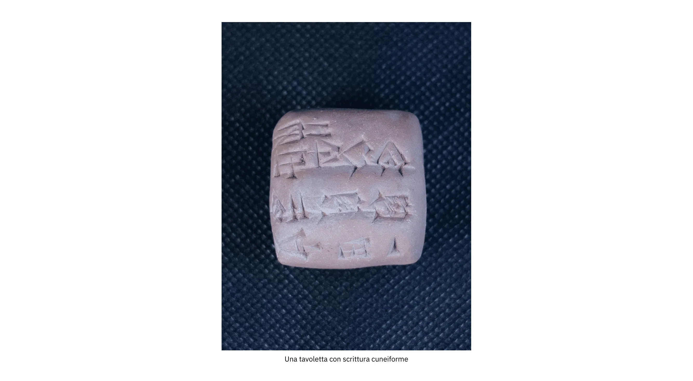

Ho anche una tavoletta sumera autentica con una piccola scrittura cuneiforme al centro. Su questa tavoletta ci sono delle firme fatte rotolando un cilindro, che vi mostrerò in seguito.

I segni con piccole cifre servivano come firme in un'epoca in cui la maggior parte delle persone non era in grado di scrivere, poiché solo gli abili scribi avevano questa capacità.

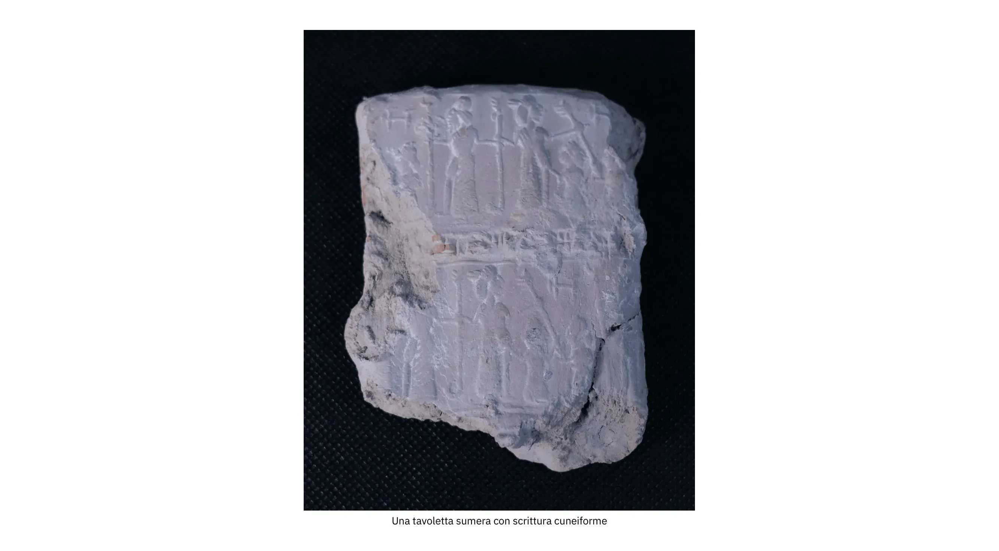

In basso, si può vedere il cilindro di cui sopra: una pietra incisa con forme specifiche. Le persone erano solite far rotolare questo cilindro di firma, noto come cylinder seal in inglese, per firmare le lettere. Era un modo per esplicitare i nomi degli autori o per indicare che erano state composte a loro nome.

Gli scribi dell'epoca utilizzavano quindi uno stilo a forma di cuneo per stampare segni su tavolette bagnate.

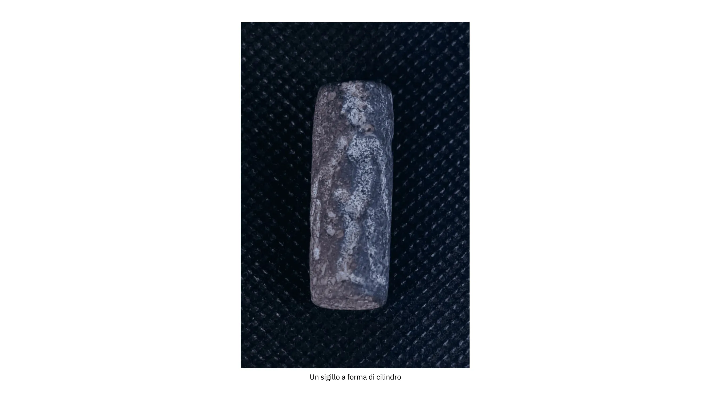

I caratteri cuneiformi non rappresentavano una lingua, ma un sistema di scrittura per registrare le lingue parlate. In inglese diremmo "writing is a written language" (la scrittura è una lingua scritta), e poi diremmo che "cuneiform is a script, not a language" (il cuneiforme è una scrittura, non una lingua). Quindi, in francese, diremmo che il cuneiforme non è una lingua, ma un modo di codificare una lingua.

### L'evoluzione e gli usi della scrittura

Durante i primi secoli di esistenza, questa scrittura rimase limitata, servendo essenzialmente come sistema mnemonico per registrare quantità, elenchi di beni agricoli e attrezzature. Solo gradualmente divenne capace di rendere foneticamente i nomi** e le frasi complete.

Inizialmente, i nomi non potevano essere espressi nella scrittura cuneiforme perché questa rappresentava principalmente oggetti ed elementi della realtà, come il bue o il grano, raffigurati come piccole immagini. Nel corso del tempo, queste immagini si sono evolute in una forma di scrittura più sviluppata, consentendo la rappresentazione di nomi e concetti complessi.

Se la persona si chiamava Laura, per esempio, avremmo potuto prendere una parola, un acronimo che suonava come "acqua" e una seconda come "ras", e formare con essa il nome Laura. È così che si è sviluppata la prima forma di linguaggio scritto.

Per la cronaca, per rappresentare gli acronimi in origine, se si voleva disegnare la testa di un bue, si vedeva la forma della testa del bue. A poco a poco, i disegni si sono semplificati fino a rappresentare nient'altro che una sorta di linea. Gli studiosi ritengono che ciò sia avvenuto perché le persone tenevano la tavoletta di argilla bagnata in una mano, quindi era più facile ridisegnare le iniziali girandole. Si pensa anche che ciò sia dovuto al modo in cui gli scribi tenevano le tavolette.

Si può ancora vedere il collegamento con, ad esempio, il grano o la testa di bue negli acronimi cuneiformi, e sono sempre inclinati da un lato.

Durante i suoi tre millenni di utilizzo, la scrittura cuneiforme è servita principalmente a conservare documenti economici e amministrativi. Tuttavia, gli abitanti della Mesopotamia svilupparono ben presto un desiderio profondo di conservare in forma scritta tutto ciò che meritava di resistere alla prova del tempo. Così, storie, leggende e canti, fino ad allora trasmessi oralmente da musicisti itineranti, furono immortalati per iscritto, spesso copiati da scribi in formazione. Questi copiarono testi già esistenti, soprattutto leggende o testi che avevano un certo valore culturale.

Un esempio importante è l'Epopea di Gilgamesh**, forse un **re storico della città-stato sumera di Uruk** intorno al 2900-2350 a.C..

Questa forma di scrittura, che era sia uno strumento di gestione economica che un vettore culturale, durò fino al I secolo d.C., prima di scomparire definitivamente, lasciando dietro di sé una preziosa testimonianza della civiltà che l'ha vista nascere.

## Il ruolo delle tavolette sumere

<chapterId>a396e6c5-56cc-5410-9e6b-0274401c5425</chapterId>

:::video id=a0729a35-01ec-4aa4-828f-d4ccc2eb168e:::

### Sistemi di credito pre-monetario

Nell'antica Mesopotamia, l'organizzazione economica si basava su meccanismi molto sofisticati che esistevano molto prima dell'invenzione delle monete metalliche. Fin dall'inizio, i sistemi di credito formali e informali erano già una forma essenziale di denaro, che consentiva alle popolazioni locali di effettuare molte transazioni economiche complesse.

Fu proprio per soddisfare le esigenze amministrative ed economiche che fu inventata la scrittura cuneiforme. Le famose tavolette d'argilla mesopotamiche erano utilizzate principalmente per registrare vari tipi di contratti: prestiti privati, vendite, affitti, ipoteche e persino accordi matrimoniali. La scrittura di queste tavolette richiedeva la competenza di scribi specializzati, un compito costoso in termini di tempo e fatica, **ma giustificato quando erano in gioco interessi finanziari.** Le persone non si scrivevano lettere d'amore a vicenda a quel tempo, non usavano uno scriba per scrivere le loro ansie. Assumevano uno scriba per scrivere documenti, che ci fosse un legame o una ragione economica.

Vale la pena ricordare che alcune di queste tavolette circolavano come titoli al portatore, cambiando liberamente di mano.

Per esempio, c'era una forma di palla di argilla con piccole pietre all'interno.

All'esterno della palla di argilla era scritto e firmato un numero che rappresentava un certo numero di unità. All'interno c'erano queste pietre e qualcuno che voleva verificare, convalidare che questo strumento rappresentasse davvero un numero X di unità.

Un altro esempio, una tavoletta ritrovata a sud-ovest dell'attuale Baghdad, stabilisce che un debitore si impegna a restituire al creditore 330 misure di grano il giorno del raccolto. Ancora più affascinante, un'altra tavoletta afferma chiaramente che un debito di quattro misure di orzo deve essere ripagato direttamente al portatore della tavoletta, introducendo così **la nozione di pagamento al portatore, un concetto particolarmente innovativo per l'epoca**.

A partire dal 2000 a.C. esisteva una legge che imponeva che tutte le transazioni commerciali, anche le più piccole, fossero formalizzate per iscritto e firmate in presenza di testimoni. Immaginate che enorme burocrazia fosse a quei tempi registrare tutte le transazioni in registri fatti, vi ricordo, di argilla da scribi. Questo rigore legale aveva lo scopo di prevenire future dispute sulla proprietà e sui diritti dei beni scambiati. Spesso venivano chiamati dei testimoni per attestare che il contratto era stato effettivamente firmato.

Anche nella sfera privata, alcune famiglie e individui svolgevano attività economiche abbastanza complesse da richiedere una gestione rigorosa. Nella città nord-babilonese di Sippar-Amnanu è stata scoperta la casa di un sacerdote di Anunitum di nome Ur-Utu, contenente quasi 2.000 tavolette. Questi documenti comprendevano contratti di prestito privati, atti di vendita e di locazione, nonché lettere, testi religiosi e accademici, a testimonianza della diversità e dell'importanza degli archivi privati dell'epoca.

È da notare che le lettere scritte dagli scribi riguardavano quasi esclusivamente interessi finanziari: lamentele per indennità insufficienti, pagamenti di dote in sospeso o altre richieste materiali urgenti. A quei tempi non esistevano scritti personali come le lettere d'amore e persino le menzioni di malattie erano rare.

Un esempio toccante di lettera di questo tipo illustra questa realtà economica: un corrispondente esprime la sua angoscia dopo essere rimasto senza soldi e senza provviste quando il suo compagno è partito, mentre una grave carestia colpiva Assur. Descrive la sua urgente necessità di acquistare grano e chiede che l'equivalente in denaro dei suoi tessuti gli venga inviato rapidamente per garantirgli il sostentamento quotidiano.

Questa lettera, indirizzata al suo compagno, sembra indicare che lui è partito per commerciare altrove, lasciandola senza un soldo. Gli ricorda che deve avere accesso a misure di denaro per comprare grano e pagare le tasse del tempio. Questa è forse l'argomentazione più vicina a quella scritta in una lettera dell'epoca. Le lettere erano quasi sempre legate a transazioni economiche, e questa lettera si riferisce proprio a una situazione economica precaria.

Così, i documenti mesopotamici giunti fino a noi riflettono soprattutto gli scambi economici, poiché sono stati redatti esclusivamente per trasferimenti di beni con un valore riconosciuto: denaro, grano, beni vari, proprietà immobiliari, pagamento delle tasse del tempio. Questi archivi rivelano non solo l'efficienza e la precisione amministrativa di questa antica civiltà, ma anche la sua capacità di gestire scambi economici complessi per un periodo molto lungo.

## Il controllo delle élite sulle tavolette sumere

<chapterId>c6d3df0e-b1e1-58dc-ab35-9f76bbc39393</chapterId>

:::video id=04a95fb8-a701-4a48-9ce8-0e9b6ba256fd:::

### La scrittura, una tecnologia soprattutto economica

Contrariamente a quanto si crede, l'invenzione della scrittura in Mesopotamia circa 4.000 anni fa non rispondeva inizialmente a esigenze di comunicazione personale o letteraria. **La scrittura cuneiforme era innanzitutto una tecnologia economica**, giustificata solo quando erano in gioco importanti interessi finanziari. I Sumeri non usavano la scrittura per corrispondere tra loro o per esprimere i loro sentimenti, ma esclusivamente per documentare le loro transazioni commerciali e finanziarie.

Questa specializzazione si spiega con il costo considerevole della scrittura su tavoletta. L'incisione nell'argilla richiedeva competenze tecniche specializzate, tempo considerevole e materiali specifici. Solo le transazioni di valore sufficiente giustificavano economicamente questo investimento, creando una soglia naturale di accesso a questa tecnologia rivoluzionaria.

Le tavolette cuneiformi rivelano un sistema finanziario di notevole complessità per l'epoca. I mesopotamici avevano sviluppato un arsenale completo di strumenti finanziari moderni: **prestiti privati con interessi, atti di vendita, contratti di affitto, ipoteche e persino contratti di matrimonio con clausole finanziarie**. Questa sofisticazione testimonia un'economia di mercato sviluppata, ben lontana dall'immagine semplicistica del baratto primitivo che viene spesso associata a queste antiche civiltà.

Alcune tavolette funzionavano come veri e propri titoli al portatore, circolando liberamente di mano in mano senza richiedere l'identificazione del possessore originale. Questa innovazione consentiva una notevole fluidità di scambio, prefigurando i moderni sistemi finanziari. Inoltre, una legislazione specifica richiedeva addirittura che tutte le transazioni commerciali fossero formalizzate per iscritto, istituzionalizzando così l'uso della scrittura nella sfera economica.

### Il monopolio della conoscenza e il controllo economico

La centralità della scrittura nell'economia conferiva un notevole potere a coloro che padroneggiavano questa tecnologia. **Gli scrittori, generalmente legati ai templi e alle istituzioni governative, detenevano di fatto il controllo del sistema finanziario**. La loro rara e preziosa competenza li rendeva custodi di tutte le transazioni importanti.

Questo monopolio della conoscenza non era casuale. Le autorità avevano tutto l'interesse a mantenere questa esclusività, poiché la democratizzazione della scrittura avrebbe diluito il loro controllo sull'economia e aumentato il rischio di falsificazione. La presenza sistematica di testimoni alle cerimonie di firma rivela questa costante preoccupazione per l'autenticità dei documenti.

L'obbligo legale di registrare per iscritto tutte le transazioni commerciali rispondeva a diversi obiettivi strategici: controllo fiscale, monitoraggio rigoroso della contabilità e mantenimento della dipendenza degli attori economici dall'apparato amministrativo. **Lo Stato mesopotamico si appropriò così della capacità di gestire il debito interpersonale** su scala sociale, trasformando la scrittura in uno strumento di potere economico.

### La coesistenza di due sistemi monetari

L'analisi delle tavolette rivela una realtà economica più sfumata di quanto la loro presenza onnipresente negli archivi lascerebbe supporre. Molte tavolette fanno riferimento allo **shekel d'argento** come unità di valore, indicando così l'esistenza parallela di un sistema monetario basato su beni fisici standardizzati.

Questa dualità può essere spiegata dalla stratificazione sociale dell'epoca. **Il sistema delle tavolette cuneiformi era riservato a una ristretta élite**: clero, ricchi mercanti e amministratori in grado di leggere, scrivere e interpretare questi complessi documenti. Per utilizzare efficacemente una tavoletta al portatore, non solo bisognava saperla decifrare, ma anche essere in grado di verificarne l'autenticità e comprenderne le implicazioni legali.

**La massa della popolazione, esclusa da questo sistema elitario, sviluppò i propri meccanismi di scambio**. La gente comune usava sistemi più accessibili, come misure standardizzate di grano, pesi di denaro e altri beni facilmente quantificabili che chiunque poteva valutare senza competenze specifiche.

Questa economia popolare, sebbene meno documentata negli archivi ufficiali, era probabilmente più dinamica e flessibile del sistema delle tavolette. Consentiva rapidi scambi quotidiani senza ricorrere agli scribi, rispondendo alle esigenze immediate di artigiani, agricoltori e piccoli commercianti.

Il siclo d'argento, spesso citato nelle tavolette come riferimento di valore, serviva probabilmente da ponte tra questi due sistemi economici paralleli, consentendo la conversione tra debiti scritti e pagamenti fisici.

### Emersione spontanea e controllo istituzionale

Questa coesistenza illustra un dibattito fondamentale nella storia economica: **L'opposizione tra l'emergere spontaneo dei mezzi di scambio e l'appropriazione istituzionale del denaro**. Da un lato, beni come il denaro sono emersi naturalmente dalle esigenze di scambio delle persone. Dall'altro, le istituzioni si sono appropriate e hanno formalizzato queste pratiche per controllarne il flusso.

I templi sumerici hanno incarnato questa tensione: hanno utilizzato le innovazioni monetarie popolari (riferimenti al siclo) sviluppando al contempo i propri strumenti di controllo (tavolette cuneiformi). Questa strategia permise loro di raccogliere i vantaggi di entrambi i sistemi: la legittimità popolare delle monete tradizionali e il controllo amministrativo dei debiti formalizzati.

L'esperienza mesopotamica stabilisce precedenti duraturi per l'evoluzione dei sistemi finanziari. Dimostra che **la sofisticazione finanziaria spesso precede di diversi millenni** le innovazioni tecnologiche, che di solito vengono associate ad essa. I concetti di interesse, credito, strumenti negoziabili e garanzie ipotecarie non hanno atteso l'invenzione della moneta metallica per svilupparsi.

Questo periodo fondamentale rivela anche le questioni di potere inerenti a qualsiasi innovazione monetaria: chi controlla la tecnologia, chi definisce le regole e come si articolano i sistemi formali e le pratiche popolari. Queste questioni fondamentali si sono protratte per tutta la storia economica, fino ai dibattiti contemporanei sulle valute digitali e sulle [criptovalute](https://planb.academy/resources/glossary/cryptocurrency).

# Economia e denaro nelle civiltà antiche

<partId>a16bcf4c-8c3a-11f0-9e79-2bd363a484bd</partId>

## Le grandi civiltà dell'età del bronzo

<chapterId>fab9334c-7385-5d7c-ad40-7d152beb22a1</chapterId>

:::video id=737e12e8-1033-4210-b1dd-b8a680f68b17:::

In questa sezione intitolata "Le grandi civiltà dell'età del bronzo", inizieremo con un estratto del libro *Una storia del denaro: From Ancient Times to Present Day* di Glyn Davies, che ritengo sia un'eccellente introduzione a questa sezione sulle grandi civiltà dell'antichità.

> Toynbee individua circa ventuno diverse "civiltà", ma poiché quindici di queste derivavano direttamente o indirettamente da esempi precedenti, riduce il numero di civiltà sviluppate in modo indipendente a sei: sumera, egizia, minoica, cinese, maya e andina. Di queste, solo gli Inca delle Ande sono riusciti a raggiungere un alto grado di civiltà senza utilizzare il denaro, anche se paradossalmente avevano un'abbondanza dei materiali generalmente considerati migliori per l'uso del denaro: oro e argento.

Gli Inca non avevano un sistema monetario, ma avevano un'abbondanza di metalli preziosi. Un bel paradosso. Continuiamo con la citazione:

> Più una società è stratificata e più il suo sistema di pianificazione è meticolosamente efficiente, meno l'uso del denaro è necessario per la popolazione. Questo può spiegare perché i conquistadores spagnoli scoprirono che i messicani, il cui governo era relativamente più liberale, usavano regolarmente come moneta la polvere d'oro (conservata in tubi trasparenti) e i semi di cacao (conservati per i grandi pagamenti in sacchi da 24.000 unità), mentre al contrario gli Inca, organizzati secondo una gerarchia molto più rigida, non avevano alcuna moneta: un'eccezione confermata da una regola rigorosa. L'origine del denaro in Cina è totalmente indipendente da altre civiltà; tuttavia, la relativa vicinanza delle civiltà sumera, egizia e minoica solleva dubbi sulla misura della loro rispettiva ignoranza delle pratiche monetarie, soprattutto in considerazione degli ampi scambi commerciali instaurati fin dai tempi più remoti.

In Cina le monete sono state sviluppate con un approccio completamente diverso rispetto alle tradizioni occidentali. Si trattava di denaro [fiat](https://planb.academy/resources/glossary/fiat) fin dall'inizio. Erano monete fuse.

E qui il signor Davies cita il commercio. In effetti, in alcuni periodi ci sono stati scambi tra i cinesi e altre popolazioni, ma il mezzo di scambio per il commercio estero era piuttosto la seta. Come vedremo più avanti, l'oro veniva utilizzato anche nelle regioni di frontiera della Cina, dove la popolazione cinese era più esigua. E nemmeno per il commercio internazionale: per quello c'era la seta.

Quindi, immagino che forse il formato delle monete possa essere stato influenzato da altre civiltà della stessa epoca che hanno sviluppato questa tecnologia.

Ma è chiaro che l'essenza del denaro era completamente diversa in Cina rispetto all'Occidente. Torneremo a lungo su questo punto nella successiva sezione dedicata alla Cina.

Per quanto riguarda queste famose città sumere, ho qui alcune note. Possiamo citare Uruk, che fu una città molto precoce e influente, famosa per le sue notevoli dimensioni e per la sua cultura avanzata, in particolare con lo sviluppo della scrittura e dell'urbanistica.

E volevo anche citare la famosa epopea di Gilgamesh. Gilgamesh era probabilmente un re storico della città sumera di Uruk, intorno al 2900 a.C.. Probabilmente era il re di questa città-stato sumera.

Possiamo anche parlare di Sargon di Akkad, che regnò dal 2334 al 2279 a.C..

Fu il primo sovrano dell'Impero accadico, un'altra civiltà sorta in Mesopotamia. Cito Sargon perché fu il primo a istituire un servizio postale per queste famose tavolette, che vi ho già presentato.

Immaginate che esistano davvero anche le buste di argilla. Le tavolette potrebbero essere avvolte in buste di argilla con la firma della persona all'esterno per garantire la riservatezza. Quindi le persone aprivano la busta per recuperare la tavoletta. Dobbiamo questo sistema postale a Sargon di Akkad.

Poi c'è Babilonia, la grande città che divenne la capitale dell'Impero Babilonese. Un'altra civiltà, rinomata per l'imponente Ziggurat e i suoi palazzi, e per il famoso Codice di Hammurabi, noto soprattutto per il suo avanzatissimo codice legale.

E due città per concludere questa sezione. Abbiamo Ashur, che era la capitale dell'Impero assiro, un importante centro religioso. E Ninive, che fu poi la capitale dell'Impero assiro. Vi trasferirono la loro capitale ed è nota per il suo potente esercito, i suoi vasti palazzi e le sue biblioteche. È anche una delle possibili sedi dei leggendari Giardini Pensili di Babilonia. Si sente spesso parlare di questa famosa meraviglia del mondo antico.

Ma a Babilonia non c'è traccia di questi famosi giardini pensili. A Ninive, invece, ci sono prove archeologiche di giardini su più piani. È possibile che gli storici greci come Erodoto abbiano confuso Ninive con Babilonia. Quando visitavano le città della Mesopotamia, forse la chiamavano Babilonia. A Ninive sono state trovate tracce di famosi giardini pensili e gli studiosi potrebbero chiedersi se Ninive sia il famoso luogo in cui si trovavano questi giardini, chiamati giardini pensili babilonesi.

## Organizzazione economica in Mesopotamia

<chapterId>6afb6fc8-cbb7-56a5-8427-484b4b7d7477</chapterId>

:::video id=aa6a2cbd-5916-4ae3-ad4f-65f0bd5643fa:::

### Strutture economiche precapitalistiche e schiavitù

Benvenuti in questa sezione sull'organizzazione economica in Mesopotamia. L'economia precapitalistica attraversava tre fasi principali: primitiva, schiavistica e feudale.

Il feudalesimo, naturalmente, è molto più tardo, ovviamente nel Medioevo, e abbiamo già superato lo stadio primitivo che abbiamo descritto prima con il Paleolitico. Ora, in Mesopotamia, quando parliamo di organizzazione economica, parliamo di schiavitù.

Tuttavia, in Mesopotamia, la maggior parte del lavoro era svolto da una classe dipendente simile agli schiavi, che non erano legalmente proprietà dei loro padroni, ma venivano privati dei frutti del loro lavoro attraverso la coercizione fisica o ideologica.

### Il ruolo dei templi e dei palazzi come centri economici

L'economia era dominata dalle grandi proprietà terriere. I proprietari terrieri sfruttavano direttamente le loro terre assumendo lavoratori, oppure le affittavano in cambio di rendite. Si dedicavano anche ad attività finanziarie, prestando denaro ad alti tassi d'interesse, generalmente intorno al 20% - 33,3% annuo, pratiche che contrastavano nettamente con le regole più rigide dei vicini Ebrei.

I prestiti contratti dagli agricoltori non erano destinati a investimenti produttivi - ad eccezione delle compagnie di navigazione - ma piuttosto a garantire la sopravvivenza fino al raccolto successivo. Questa situazione ha spesso portato a un indebitamento cronico degli agricoltori.

Permettetemi di fare un parallelo con un periodo più recente dell'antichità (Roma), dove i cittadini vivevano delle rendite agricole prodotte dai contadini e dal lavoro non libero, oltre che dei bottini di guerra. **Queste entrate venivano distribuite tra i cittadini, non per ottenere maggiori profitti, ma per migliorare il loro status sociale.** Il commercio e l'artigianato erano generalmente lasciati a gruppi esterni all'élite sociale. Tutto ciò contrasta con le economie medievali orientate al profitto attraverso il commercio e l'artigianato.

Quindi, quello che stiamo cercando di dire qui è che sto tracciando un parallelo con il fatto che le persone usavano strumenti di prestito finanziario non necessariamente per migliorare i loro mezzi di produzione, e più tardi a Roma, i profitti non erano necessariamente reinvestiti, ma piuttosto usati per aumentare il prestigio delle persone che potevano beneficiare di questi profitti. Siamo ancora lontani dallo spirito capitalista che emerse nel Medioevo, quando si potevano creare posti di lavoro per migliorare i mezzi di produzione e le eccedenze venivano prese e create per perseguire il profitto. Possiamo quindi constatare che l'organizzazione economica non aveva ancora raggiunto il terzo stadio delle evoluzioni economiche sopra elencate.

### L'emergere dei sistemi di credito e delle unità di conto

**Karl Polanyi distingue tre forme di scambio economico: la reciprocità tra gruppi simmetrici,** che si avrebbe nelle tribù primitive, dove non c'è bisogno di denaro perché ci si dà credito informale, si scambia e si ridistribuisce. **Questa forma di scambio è compatibile con la Mesopotamia, dove i templi erano al centro dell'organizzazione economica e potevano un tempo restituire e distribuire la ricchezza sotto forma di razioni. Solo in seguito è stata introdotta la nozione di salario. Quindi, fino ad ora, abbiamo la forma primitiva (1), la ridistribuzione centralizzata (2) nei templi e nei palazzi, per poi lasciare finalmente spazio agli scambi di mercato (3). Anche se il mercato come lo intendiamo oggi non esisteva pienamente, la presenza di scambi di mercato in Mesopotamia è indiscutibile, attestata dall'esistenza di termini specifici in accadico e dalla presenza di testimonianze archeologiche di prezzi, profitti, perdite, fluttuazioni e situazioni di scarsità.

Le famiglie mesopotamiche gestivano autonomamente tutte le fasi della produzione agricola, dalla semina alla trasformazione finale in pane e birra. Le donne producevano anche i tessuti necessari ai loro familiari. Per i beni non prodotti localmente, le famiglie si rivolgevano a mercanti specializzati.

I legami familiari erano particolarmente importanti nel commercio. Durante il periodo paleo-assiro (1910-1830 a.C. circa), i mercanti della città di Ashur stabilirono una colonia commerciale a Kanesh, in Anatolia, importando stagno e tessuti in cambio di oro e argento. Il commercio si basava su imprese familiari strettamente legate da matrimoni e partnership commerciali. Kanesh era solo un anello di una vasta rete commerciale internazionale.

In questi scambi c'erano metalli, e si trattava di metalli preziosi e non necessariamente, ad esempio, di rame, che all'epoca era molto utile, e pensiamo che questi metalli fossero scambiati per nozioni di riserva di valore. Quindi non si potrebbe parlare necessariamente di baratto, in cui due beni vengono scambiati per la loro utilità, ma piuttosto di una nozione di pagamento con una certa consapevolezza di accumulare i metalli preziosi per usarli come riserva di valore e non per usarli come merce, ad esempio l'uso del bronzo per fare armature.

I tributi e le tasse venivano pagati principalmente in natura (orzo o argento pesato). I templi e i palazzi erano i principali centri economici, amministrativi, politici e religiosi e svolgevano anche le prime funzioni bancarie attraverso il deposito sicuro di beni, prima il grano, poi altri prodotti agricoli e infine i metalli preziosi. In questo modo si svilupparono le prime operazioni di credito e prestito, molto prima della comparsa delle monete.

L'economia mesopotamica utilizzava principalmente l'orzo e l'argento come standard di valore. L'argento veniva pesato in unità standardizzate, come il sìqlum (siclo) di circa 8,33 grammi. Già nell'antico periodo babilonese (sotto Hammurabi), l'argento era utilizzato come mezzo di pagamento comune, con una nozione precoce di valore nominale ("nūbum") in contrapposizione al peso reale ("šuqulum"), **anticipando il concetto moderno di moneta fiat**.

Ma non si trattava ancora di denaro fiat in senso stretto. Non c'era la nozione di francobollo con una figura di autorità, ma c'era la nozione di unità di conto nominale, in contrapposizione alla nozione di metallo pesato. C'era una distinzione nel linguaggio per questi due concetti, e credo sia importante menzionarla.

La transizione verso un mercato del lavoro salariato è stata difficile. Ha richiesto due importanti innovazioni concettuali: la separazione del lavoro della persona dal prodotto finale e l'introduzione del "tempo di lavoro" come unità misurabile. Per avere questa nozione di salario e di lavoratore dipendente, abbiamo dovuto prima passare attraverso queste due innovazioni. **Nel IIIᵉ millennio, il lavoro è stato inizialmente retribuito con razioni fisse, per poi evolvere gradualmente verso un sistema salariale all'inizio del IIᵉ millennio.**

Infine, a partire dal 26° secolo a.C., prese piede una vera e propria nozione di valore monetario, anche se il "denaro" mesopotamico non era una moneta, ma piuttosto una misura ponderata di grano o di metallo. **Così, per le transazioni importanti o in contesti che richiedevano la conservazione del valore, si preferiva spesso convertire il grano in argento, più facilmente conservabile ** Un po' come nell'esempio di Kanesh, dove il metallo d'argento veniva ricevuto per essere tesaurizzato.

Dal XXI secolo a.C. in poi, **con la virtuale scomparsa degli scambi asimmetrici**, notiamo che nei contratti di cessione, il verbo sa, si riferisce al pagamento del prezzo. Questa nozione, chiamata "sa", compare nei contratti e si riferisce al pagamento di un prezzo, non alla misurazione di una particolare merce. "Sa" si riferisce semplicemente a un pagamento o a un prezzo. È un antropologo a notarlo e a dire che si tratta di una vera e propria svolta; vediamo una sorta di dicotomia tra il prima e il dopo dell'introduzione del verbo "sa" nei contratti.

Non possiamo ignorare i dati empirici presenti negli archivi del Vicino Oriente che attestano l'esistenza di **alcuni meccanismi di mercato**, che incorporano **nozioni di profitto** e **perdita**, **fluttuazioni dei prezzi** e situazioni di **scarsità**. Ma la difficoltà fondamentale sta nel determinare l'importanza relativa dello scambio basato sul mercato all'interno dell'economia mesopotamica antica nel suo complesso.

Credo che gli esperti in questo campo abbiano visto tracce di questi concetti di mercato, ma non sono in grado di dirci quanto l'economia dell'epoca fosse basata su questo concetto di mercato più moderno o su altri meccanismi.

Sappiamo che esisteva, ma non sappiamo se fosse il modo principale, ad esempio, per determinare i prezzi o il commercio.

Si conclude così questa sezione sull'organizzazione economica in Mesopotamia.

Nelle prossime sezioni, faremo lo stesso per l'Egitto e la Cina.

## Organizzazione economica e monetaria nell'antico Egitto

<chapterId>bffcc16c-7fbf-5992-a0fa-6a7726d7d287</chapterId>

:::video id=40c1c4e5-b190-4bb6-b8a0-810c9ce7698b:::

### Contesto storico e periodi egiziani

Questa sezione è dedicata all'organizzazione economica e monetaria dell'antico Egitto. Per fornire un quadro generale, ecco un elenco e una breve descrizione dei periodi in questione.

- Antico Regno (2575 circa - 2130 circa a.C.)**. Periodo segnato dalla costruzione delle grandi piramidi, in particolare quella di Giza. Fu l'epoca d'oro della monarchia egizia centralizzata.
- Medio Regno (1938 circa - 1630 circa a.C.)**. Rinascita politica e culturale dopo un periodo di instabilità.
- Nuovo Regno (1539 ca. - 1075 ca. a.C.)**. Periodo di espansione territoriale, potenza militare e commercio internazionale. Comprende i regni di faraoni famosi come Tutankhamon e Ramses II.
- 1323 A.C. - Morte di Tutankhamon**. Il giovane faraone morì all'età di circa 18-19 anni. La sua tomba, quasi intatta, fu scoperta nel 1922, diventando una delle più famose scoperte archeologiche.
- Ramses II - Regnò nel 1279-1213 a.C.**. Uno dei più potenti faraoni del Nuovo Regno. Conosciuto per le sue campagne militari, i suoi grandi monumenti e per aver probabilmente concluso il primo trattato di pace conosciuto.
- 1275 a.C. - Popoli del mare**. Invasioni o migrazioni di gruppi chiamati "Popoli del mare" destabilizzano diverse civiltà del Mediterraneo, tra cui l'Egitto.
- Battaglia di Xoïs - 1178 a.C.**. Conflitto tra l'esercito egiziano e gli invasori, probabilmente legati ai Popoli del Mare. Una delle tante battaglie alla fine del Nuovo Regno.
- Il Periodo Tardo** è il periodo della storia dell'antico Egitto che va dal 664 al 332 a.C. circa.
- Cleopatra VII (69-30 a.C.)**. Ultima regina d'Egitto, famosa per la sua intelligenza, il suo carisma e le sue alleanze con Giulio Cesare e Marco Antonio, e probabilmente anche per il suo naso. Il suo regno segnò la fine dell'Egitto faraonico prima dell'annessione a Roma.

Nel V e IV millennio a.C., l'Egitto stava già vivendo un'intensa attività commerciale su larga scala, collegando la Nubia, la Palestina, la Libia e le regioni del Mar Rosso attraverso il commercio marittimo, fluviale e terrestre (in particolare con carovane di asini).

### I primi sistemi di scambio e la paleo-moneta

Con l'emergere dei primi capi egizi intorno al 3650-3400 a.C., il sito di Maadi, a sud dell'attuale Cairo, divenne un importante centro per la tecnologia del rame e per il commercio a lunga distanza, in particolare con la Mesopotamia attraverso la costa siriana.

Sebbene il commercio su larga scala fosse basato principalmente sul baratto, è probabile che esistesse una forma primitiva di denaro ("paleo-moneta"), costituita da oggetti di prestigio come pietre semipreziose e conchiglie fossili. L'oro probabilmente svolgeva già un ruolo importante in questi scambi. La prima menzione esplicita di una moneta nei documenti egizi della metà del III millennio a.C. riflette un lungo sviluppo legato alle pratiche commerciali.

Nella società arcaica (non parliamo necessariamente dell'Egitto, ma delle società arcaiche in generale), i pagamenti erano frequenti, non per acquistare direttamente, ma per pagare le doti, i riti religiosi e altri obblighi sociali. Queste transazioni richiedevano prezzi e valutazioni precise. Molte società primitive avevano oggetti privilegiati, monetiformi (cioè conteggiabili), in termini di cui si stimava il valore. Se si paga una dote, ovviamente, si deve annotare una certa quantità di un oggetto da scambiare per pagare la dote. Questo valore è essenzialmente quello delle persone.

Nelle società arcaiche, prima dell'avvento del denaro o dei sistemi monetari, i pagamenti esistevano, ma erano spesso legati a obblighi sociali e il loro valore derivava dal valore degli individui, come nel caso del pagamento delle doti o del denaro sporco.

Tornando all'Egitto, durante l'antico impero, lo "shât(y)", originariamente un'unità monetaria concreta (una piccola moneta d'oro o d'argento del peso di circa 7,6 grammi), passò molto rapidamente dalla sua reale funzione di moneta forte a una **funzione contabile** che diede origine alla nozione di valore. Possiamo riconoscere in essa una sorta di unità di conto per esprimere il valore, che in origine era una sorta di moneta, ma non possiamo chiamarla veramente moneta perché non è stampata, è solo una misura di metallo. Ci stiamo avvicinando alla nozione di unità di conto.

Questa nozione di shât(y) fu infine abbandonata, forse a causa del rischio di frode. Vedremo più avanti che gli Egizi tardarono ad adottare le monete stampate e continuarono addirittura a pesarle, anche dopo che erano state adottate dai loro vicini.

Nel Medioevo, l'argento era raramente utilizzato per le transazioni quotidiane, che venivano effettuate principalmente con misure di grano e quantità di pane. È in questo periodo che fa la sua comparsa una forma di moneta scritturale, in cui i pagamenti potevano essere registrati per iscritto o tramite trasferimento effettivo.

Nel Nuovo Regno, il sistema monetario divenne più complesso, integrando diverse monete merceologiche valutate in metalli (oro, argento, rame), tessuti standardizzati, cereali e olio. I tessuti venivano chiamati "misure di stoffa". **I prezzi dei beni di uso quotidiano erano spesso espressi in grano o rame, mentre gli oggetti preziosi erano valutati in oro o argento. L'argento, che in Egitto era più raro dell'oro, divenne particolarmente pregiato.** L'argento era sopravvalutato rispetto all'oro, che era più abbondante in Egitto.

Nel periodo tardo (primo millennio a.C.), l'argento era diventato il metallo di scambio comune in tutto il Vicino Oriente. Circolava sotto forma di lingotti, monete metalliche o anelli, che venivano pesati e contrassegnati nei templi, a garanzia del loro peso e della loro purezza, anche se non venivano coniati con l'effigie di un sovrano. Questo aspetto è stato affrontato in un secondo momento e sarà oggetto di una successiva sezione dedicata ai Lidi.

Va inoltre notato che gli antichi Egizi avevano un termine, "hedj", per indicare il denaro, che veniva usato genericamente per designare qualsiasi mezzo di pagamento che servisse da corrispettivo in una transazione, sia per il metallo, il grano, la stoffa o vari beni (legno, animali, servizi, ecc.). Esempi documentati mostrano che gli Egizi potevano regolare una transazione combinando vari prodotti il cui valore totale era espresso in unità di rame ("deben").

**I templi svolgevano un ruolo centrale nell'economia egizia: raccoglievano e tesaurizzavano ingenti tesori di metalli preziosi (oro e argento) destinati a onorare gli dei, ma anche a fungere da riserva monetaria che poteva essere reintrodotta nel circuito economico in caso di necessità**. Vedremo esempi di altre civiltà che accumulano nei templi riserve di valore, come le statue, da fondere in caso di guerra, carenza di valuta o crisi. Questo è un tema ricorrente nella storia.

Vale la pena ricordare che la coltivazione del lino era un monopolio reale concesso ai templi e la produzione di tessuti preziosi ne confermava l'importanza economica.

Gli antichi Egizi facevano una chiara distinzione tra l'aspetto ideologico dei metalli preziosi, legati alla divinità (l'oro rappresentava la carne degli dei, l'argento le loro ossa), e la loro funzione pratica di moneta di riferimento per tutte le altre forme di pagamento.

Quindi, sebbene l'antico Egitto non abbia sviluppato una moneta coniata paragonabile ai sistemi monetari moderni fino al tardo periodo, possedeva un sistema monetario sofisticato, basato sull'uso combinato di moneta scritturale, unità di conto precise, moneta merce e metalli preziosi valutati in base al peso.

Le monete stesse venivano pesate, dando origine a due concetti diversi: **"coinage" e "money "**. Ho usato due termini in inglese. In primo luogo, "coinage" si riferisce alle monete, un concetto che viene dopo, e abbiamo anche questo concetto di denaro. Possiamo già definire una certa nozione di "denaro" attraverso le unità di conto che ho appena espresso in termini di denaro, ma che non erano ancora monete, quindi il "coinage" arriva un po' più tardi con i Lidi.

E così, le monete non sono un prerequisito per il denaro, **tant'è che possiamo ammettere l'esistenza del denaro già nel III millennio,** in ogni caso e senza alcun dubbio durante il II millennio e in particolare sotto il regno di Hammurabi.

Ciò che è importante ricordare, e che l'autore cita nel libro "Le origini del denaro", è che non c'è dubbio che il concetto di denaro esistesse già all'epoca, in questi sistemi monetari, ed è un errore collegare la nascita del denaro come concetto alla comparsa delle monete.

Infine, i concetti di reciprocità e redistribuzione di Polanyi, spesso applicati all'antico Egitto, devono essere sfumati: pur esistendo, non costituiscono un quadro esclusivo. L'Egitto faraonico aveva sviluppato un'economia complessa che integrava pienamente sofisticati scambi commerciali, distinti dalle pratiche religiose e rituali, dimostrando una reale autonomia del dominio economico da quello ideologico.

Questa peculiarità è legata alla nozione che i metalli preziosi erano associati a una certa divinità, ma erano comunque in grado di distinguersi.

Lo dico perché Polanyi ha definito l'uso di questi metalli preziosi come una nozione principalmente religiosa o divina. Tuttavia, noi proponiamo che fossero anche integrati nel sistema economico e che gli Egizi fossero già in grado di fare tali distinzioni.

Per concludere, vorrei citare il libro "Le origini del denaro", che elenca lo scopo di questa invenzione, il denaro coniato. Ci sono diversi punti, ma vorrei solo sottolineare il punto 5:

*sviluppare la possibilità di gioco economico attraverso l'uso di metodi come le svalutazioni e le rivalutazioni successive per ridurre o aumentare le importazioni e le esportazioni a costi inferiori*

Quindi, anche in quei tempi arcaici, l'autore propone che le monete fossero già state inventate o fossero emerse sotto il controllo dello Stato e venissero già manipolate in termini di quantità di metalli preziosi e di peso per gestire l'economia. Permettetemi di darvi un piccolo scoop su una sezione successiva. **Anche nelle prime forme di conio, che erano fatte di electrum, una lega di oro e argento, sappiamo dall'analisi del contenuto di metalli preziosi in queste monete che i primi emittenti, ad esempio Creso, avevano meno oro che nell'electrum naturale **

Ciò significa che sapevano già come separare l'oro e l'argento ed emettevano monete contenenti meno oro.

L'autore suggerisce che fin dai primi tempi della monetazione, al di là della semplice certificazione del peso e della facilitazione del commercio, il potere di battere moneta veniva già abusato per aumentare la quantità emessa, forse come forma di pianificazione economica.

## La moneta dei segni e l'organizzazione economica e monetaria nell'antica Cina

<chapterId>e08d3be9-423c-5cf3-a606-6ad54e2261af</chapterId>

:::video id=ae7e6367-1725-455e-bfe6-359be1f443e5:::

In questa sezione, intitolata "La moneta-segno e l'organizzazione economica e monetaria dell'antica Cina", vedremo che l'antica moneta cinese presenta caratteristiche distinte dalle tradizioni occidentali. La moneta cinese era già una "moneta segno" fin dall'inizio. Le informazioni contenute in questa sezione si basano su appunti presi dopo la lettura del libro "Aux origines de la monnaie".

### Il concetto di moneta-segno e le sue caratteristiche distintive

Secondo l'autore, la moneta-segno è l'equivalente dell'attuale moneta fiat. È una moneta che non ha un valore legato al suo contenuto di metallo. Fin dall'inizio, si trattava di una sorta di accordo, un consenso sociale sul valore di queste monete.

L'antica monetazione cinese presenta caratteristiche diverse dalle tradizioni occidentali. Era principalmente metallica, ma fusa piuttosto che coniata, e non recava l'effigie di un sovrano. Sorprendentemente, lo Stato cinese non aveva il monopolio dell'emissione monetaria. Questo apparente liberalismo si spiega con l'assenza di necessità economiche di monopolizzare l'emissione monetaria, grazie alle abbondanti risorse fiscali prelevate su un'ampia popolazione tassabile.

La moneta cinese si caratterizza anche per il suo aspetto fiduciario. Fin dall'inizio sono state utilizzate come moneta imitazioni in bronzo di conchiglie, senza alcuna relazione diretta con il valore intrinseco del metallo utilizzato. Se andiamo molto indietro nella storia, i cinesi usavano le conchiglie come moneta. Alla fine, quando le conchiglie divennero troppo scarse, ne fecero delle repliche in rame, che avevano lo stesso valore di quelle vere.

La moneta cinese non si basava quindi sul valore del materiale o sulla relativa rarità dell'oggetto originale (ad esempio i molluschi), ma sulla fiducia collettiva nel suo utilizzo come mezzo di scambio - in altre parole, un segno monetario.

### Dalle conchiglie di cowrie alle imitazioni metalliche

Il cowrie era ampiamente utilizzato come unità monetaria primitiva. Le antiche iscrizioni mostrano che, già nelle dinastie Shang e Zhou (le prime dinastie del primo e del secondo millennio a.C.), le conchiglie di cowrie venivano utilizzate non solo per ricompensare le azioni militari, ma anche per **retribuire il lavoro, misurare il valore e acquistare terreni**.

È importante ricordare che non si trattava di uno strumento qualsiasi utilizzato dalla società per scopi limitati. Veniva impiegato per le ricompense militari, il pagamento del lavoro e la misurazione del valore. Ne troviamo traccia negli scritti degli archeologi. Sebbene non sappiamo se fosse usato per comprare il pane su base giornaliera, abbiamo prove che potrebbe essere stato usato per i tipi di transazioni menzionate sopra.

Nel corso del tempo, la scarsità di conchiglie di cowrie vere e proprie ha portato alla produzione di imitazioni in bronzo, osso, madreperla o pietra, in particolare per l'uso in contesti funerari per evitare di immobilizzare i valori reali nelle tombe. Questo cambiamento di supporto è anche legato all'idea del controllo del principe sul denaro, controllo che è tanto più facile se il principe produce il denaro.

Ciò che dobbiamo capire è che, superando il limite della naturale scarsità di conchiglie, se il principe può creare lui stesso la moneta, ha un maggiore controllo sulla gestione dell'economia.

A differenza della Mesopotamia, dove le monete erano legate al peso del metallo prezioso, la terminologia monetaria cinese deriva direttamente dalle forme iniziali degli oggetti usati come moneta: le vacche (bei), i coltelli (dao), le vanghe (bu) e le monete rotonde (quan o qian). Si può quindi notare che l'origine delle parole legate al denaro in Cina si riferiva a questi oggetti. In Occidente, invece, abbiamo una serie di termini monetari che derivano da concetti molto diversi da questi, più legati alle caratteristiche fisiche e al peso degli oggetti monetari. Queste differenze etimologiche dimostrano chiaramente lo scisma tra la visione occidentale e quella cinese del denaro.

In Cina il valore monetario era totalmente fiduciario, basato su una convenzione sociale tra Stato, produttori e mercanti.

### Regolazione economica e filosofia monetaria

Lo Stato cinese utilizzava la moneta come strumento di regolazione economica: in tempi di abbondanza monetaria, il valore del denaro diminuiva, rendendo più facile l'acquisto di beni. Al contrario, nei periodi di scarsità monetaria, il valore del denaro aumentava, rafforzando il potere d'acquisto dello Stato per le sue operazioni successive.

Si può fare un collegamento con [l'inflazione](https://planb.academy/resources/glossary/inflation) e la deflazione. Con una massa monetaria fissa, se la produttività dell'economia aumenta, il valore del denaro aumenta. Al contrario, se la produttività diminuisce, il valore del denaro diminuisce. In questo esempio, tuttavia, è vero il contrario. Probabilmente perché il principe non aveva il monopolio completo della produzione di denaro, ma ciò indica comunque che il valore del denaro era legato alle condizioni economiche.

Il filosofo Mo Di (V-IV secolo a.C.) aveva già analizzato questo rapporto tra prezzo e valore: secondo lui, le variazioni di prezzo non riflettono una reale nozione di convenienza o di caro assoluto, ma piuttosto un rapporto fluttuante tra merci e denaro, indipendentemente dal valore nominale stabile del segno della moneta.

Quindi, invece di dire che la moneta d'oro avrebbe un qualche tipo di valore di base in quanto tale, come il valore d'uso o il valore intrinseco, egli sottolinea che il valore del segno monetario derivava piuttosto dallo stato dell'economia.

In Cina, le monete non avevano necessariamente bisogno di essere ufficialmente contrassegnate o garantite. La sua accettazione dipendeva unicamente dalla fiducia collettiva, il che spiega perché le monete di bronzo o di rame senza iscrizioni specifiche hanno potuto circolare liberamente per molto tempo.

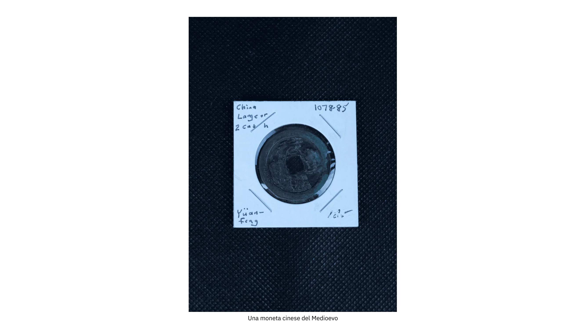

Quella qui sopra è una moneta cinese del Medioevo. Si tratta di una moneta fusa con un foro quadrato al centro. Questo foro veniva utilizzato per infilare una corda, che permetteva di unire le monete per creare braccialetti o collane. Tuttavia, non si trattava di monete da indossare, ma di monete utilizzate principalmente per la contabilità. Potevano essere infilate insieme per formare unità di conto sotto forma di grandi corde, con i pezzi incastrati tra loro. Non c'erano necessariamente segni specifici, a volte si trattava semplicemente di cerchi di bronzo.

Il monopolio monetario dello Stato, istituito tardivamente da Wudi della dinastia Han nel 113 a.C., fu spesso messo in discussione, consentendo a vari attori privati o locali di emettere le proprie monete, a condizione che godessero di sufficiente fiducia sociale.

**Il basso valore intrinseco delle valute cinesi ne impediva l'accaparramento, garantendone la regolare circolazione**. I metalli preziosi erano raramente utilizzati come moneta circolante per evitare l'accaparramento. L'oro, essendo troppo costoso, veniva tipicamente messo da parte piuttosto che speso. Invece, **solo la seta rappresentava una vera e propria moneta di alto valore nel commercio internazionale cinese**. I cinesi commerciavano con la seta, non con l'oro.

Durante le crisi economiche o monetarie, in particolare quando il prezzo del rame aumentava, venivano adottate soluzioni innovative: così, già nel II secolo d.C., le monete in circolazione venivano tagliate per creare unità più piccole, consentendo di mantenere una circolazione fluida a costi inferiori. Altre epoche, come quella di Wang Mang (inizio del I secolo d.C.), sperimentarono monete altamente fiduciarie, il cui valore nominale era di gran lunga superiore all'effettivo contenuto di metallo, prefigurando così le banconote. Prendevano una moneta e vi imprimevano valori come 50, 100 o 200 per indicare importi maggiori, come 200 monete. Questa pratica ha probabilmente contribuito a un'inflazione significativa.

Come già detto, questo sistema si basava su una convenzione sociale tra Stato, produttori e mercanti, ma anche su regole autoritarie e severe per chi non stava al gioco, in particolare per quanto riguarda la scelta delle pezze (belle o meno) o la lunghezza dei tessuti (non in linea con lo standard).

A mio modesto parere, non è un sistema molto solido. Si basava principalmente su regole severe che imponevano ai funzionari e ai commercianti di accettare monete danneggiate, sotto la minaccia di sanzioni.

### Le innovazioni monetarie cinesi e il loro impatto economico

La Cina è stata anche un pioniere nell'emissione delle prime forme di cartamoneta, adottate inizialmente in risposta alla scarsità di metallo nel IX secolo d.C. Nonostante i vantaggi iniziali, queste valute cartacee portavano regolarmente a spirali inflazionistiche quando venivano emesse in eccesso, come testimoniato nei periodi Song e Ming, quando l'emissione eccessiva portò a gravi crisi valutarie, illustrate da Marco Polo nel XIII secolo, che notò persino che la falsificazione di tale cartamoneta era punibile con la morte. Non posso fare a meno di sottolineare una forma di violenza.

L'esperienza cinese è quindi caratterizzata da una concezione profondamente fiduciaria del denaro, da una notevole flessibilità del sistema monetario e dall'uso precoce di valute cartacee, basate sulla fiducia tra gli attori economici piuttosto che sul valore intrinseco dei supporti utilizzati.

## Organizzazione sociale ed economica nell'antichità

<chapterId>4023c3ce-7a47-5ac4-8f5f-c7ab699ab20f</chapterId>

:::video id=2761efe4-21cf-4f06-9bda-c03f9ff39012:::

### Il dibattito sul parassitismo urbano

Il rapporto tra le città antiche e i loro hinterland solleva una questione fondamentale: questi centri urbani funzionavano come parassiti estrattori di ricchezza o come motori di una benefica specializzazione economica? L'ipotesi del parassitismo suggerisce che le città dell'Età del Bronzo, in particolare in Mesopotamia, **estraevano sistematicamente dai loro territori rurali più valore di quanto ne restituissero**, vivendo essenzialmente di rendite e tasse senza creare un valore equivalente.

Questa visione ha trovato eco nel crollo dell'Impero romano: quando l'espansione territoriale è cessata, il flusso di ricchezza esterna si è prosciugato, rivelando potenzialmente un'economia urbana incapace di autofinanziarsi. Le città avrebbero quindi vissuto "al di sopra delle loro possibilità", dipendenti dall'estrazione piuttosto che dalla produzione.

### La specializzazione come fattore di creazione del valore

Una lettura economica alternativa sfida questa visione parassitaria. **Le città antiche funzionavano soprattutto come centri di specializzazione e di divisione del lavoro**. Il loro ruolo andava oltre la semplice estrazione: concentravano mestieri specializzati, organizzavano reti commerciali e fungevano da snodi per gli scambi a lunga distanza.

Questa specializzazione urbana ha creato un'interdipendenza produttiva con l'entroterra. **Le città non potevano sopravvivere senza le forniture agricole rurali, ma l'entroterra beneficiava in cambio di prodotti artigianali, innovazioni tecniche e accesso alle reti commerciali mediterranee**. La divisione del lavoro consentiva di aumentare la produttività reciproca, anche se la distribuzione dei benefici poteva sembrare squilibrata.

L'insicurezza alimentare cronica dell'epoca spiega in parte questa apparente asimmetria. Il rischio di carestia e di distruzione dei raccolti era una minaccia costante per le popolazioni rurali, mentre gli artigiani urbani, collegati alle reti commerciali internazionali, godevano di una maggiore stabilità economica.

### Evoluzione storica, dall'antichità al Medioevo

Il contrasto tra l'organizzazione antica e quella medievale getta luce su questo tema. **L'antichità favorì una divisione del lavoro su larga scala, con città aperte a tutto il mondo mediterraneo**. Il commercio e la specializzazione raggiunsero livelli sofisticati, creando reti economiche estese.

Il crollo dell'Impero romano portò a una radicale frammentazione: **L'epoca feudale sostituì questa organizzazione centralizzata con un sistema decentralizzato di proprietà autosufficienti**. Le antiche villas rusticae romane divennero la matrice delle signorie medievali, creando un mosaico di isole economiche virtualmente autosufficienti gestite dal clero o dalla nobiltà.

Questo decentramento medievale, pur riducendo l'efficienza commerciale, ha paradossalmente offerto una maggiore resistenza agli shock esterni. I possedimenti feudali svilupparono relazioni più equilibrate tra i centri di potere e le popolazioni rurali, anche se questa organizzazione limitò i guadagni di produttività legati alla specializzazione.

### L'emergere dei mercati urbani

Le scoperte archeologiche rivelano l'esistenza di **porti commerciali e quartieri commerciali nelle città mesopotamiche già nel secondo millennio**. Queste infrastrutture attestano l'esistenza di mercati organizzati, anche se il loro esatto funzionamento rimane discusso.

Karl Polanyi, inizialmente scettico sull'esistenza di veri e propri meccanismi di mercato nell'antichità, ha qualificato la sua posizione riconoscendo di aver forse sottovalutato l'emergere precoce degli scambi di mercato. Questa evoluzione intellettuale riflette la complessità dell'interpretazione dei sistemi economici antichi, dove coesistevano redistribuzione istituzionale, scambio reciproco e transazioni di mercato nascenti.

### Sparta contro Atene

Il confronto tra Sparta e Atene illustra perfettamente il rapporto tra sistema monetario e organizzazione sociale. **Sparta rappresenta un modello di società rigidamente gerarchica che ha deliberatamente rifiutato l'uso del denaro**, mentre Atene ha sviluppato una sofisticata economia monetaria per accompagnare il suo sistema democratico.

Il rifiuto spartano del denaro non fu spontaneo, ma **istituzionale e ideologico**. I leader spartani temevano che il denaro avrebbe corrotto i valori militari e civili, preferendo un sistema basato sulla fiducia interpersonale diretta tra i cittadini.

Per scoraggiare l'uso del denaro, Sparta impiegò **barre di metallo pesanti e poco pratiche**, dimostrando paradossalmente una comprensione intuitiva delle qualità monetarie (divisibilità, trasportabilità, durata) che si sforzava di neutralizzare.

### I limiti del modello antimonetario

L'organizzazione spartana illustra i vincoli del **numero di Dunbar** applicato alla scala sociale. **Rifiutando il denaro come mezzo di scambio neutrale, Sparta si condannò a limitare la sua società civica a un numero limitato di cittadini in grado di mantenere relazioni di fiducia diretta**. Gli homoioi (cittadini spartani) rappresentavano appena l'1% della popolazione totale, circondati da migliaia di hilotes (schiavi).

Questa organizzazione, inizialmente fonte di eccezionale coesione militare, si rivelò strutturalmente fragile. **La Battaglia di Leuctres (371 a.C.) dimostrò i limiti di questo sistema**: la perdita di vite umane frantumò irrimediabilmente il tessuto sociale spartano, portando al crollo del loro modello di civiltà.

Le città concorrenti (Atene, Corinto, Tebe), con sistemi monetari sviluppati, **mantenevano economie più ricche e resistenti**, in grado di compensare le perdite umane attraverso la ricostruzione economica e l'immigrazione.

### Fiducia personale e fiducia istituzionale

L'esperienza spartana rivela i **rischi insiti in una società basata esclusivamente sulla fiducia interpersonale** piuttosto che su meccanismi istituzionali neutrali. Pur creando un'intensa coesione sociale, questo modello ha reso la società vulnerabile agli shock demografici.

Consentendo transazioni anonime e spersonalizzate, il denaro offre una resilienza sistemica superiore. Permette l'espansione sociale oltre i limiti della fiducia diretta, facilitando gli scambi con l'estero e la crescita economica.

### Il paradosso Inca, ricchezza senza denaro

L'Impero Inca presenta un affascinante paradosso: **una civiltà con immense ricchezze auree ma senza sistema monetario**. Come Sparta, questo modello si basava su una rigida organizzazione gerarchica e su una pianificazione centralizzata, ma si dimostrò vulnerabile ai conquistadores con economie monetarie flessibili.

Questa fragilità strutturale dei sistemi antimonetari di fronte alle società monetarie è un modello storico ricorrente, che suggerisce che **il rifiuto istituzionale del denaro, lungi dal rafforzare la coesione sociale, può paradossalmente indebolire le civiltà** di fronte alle sfide esterne e ai cambiamenti storici.

L'analisi di questi modelli storici rivela che il denaro, al di là della sua funzione di scambio, è un indicatore e un facilitatore della complessità sociale, che permette alle civiltà di trascendere i limiti imposti dalle relazioni interpersonali dirette.

# La nascita della moneta coniata

<partId>232e365a-8c3b-11f0-b276-b3ab70d1a5a1</partId>

## La nascita delle monete

<chapterId>40ed3414-3066-57bd-bc1b-617ad0a354e0</chapterId>

:::video id=1d6834c4-98a3-43fe-ba80-04be51b0486e:::

Siamo ora giunti al nocciolo della questione: la comparsa delle monete. Sottolineo la parola "moneta" perché abbiamo visto nelle sezioni precedenti che il denaro o i sistemi monetari erano molto presenti nelle civiltà che hanno preceduto i popoli lidio, i greci e i persiani. È abbastanza chiaro, credo, da quanto abbiamo appena visto. Pertanto, questa sezione è dedicata alla comparsa delle monete propriamente dette ed è intitolata: *La comparsa delle monete*.

### Origini lidio-ioniche delle monete

Per dare il via a questa sezione, vorrei proporvi un estratto del libro di Glyn Davies, A History of Money, qui.

*Estratto da Una storia del denaro: Dall'antichità ai giorni nostri di Glyn Davies:*

> Dalla sua nascita in Lidia e in Ionia, la conoscenza e l'uso delle monete si diffuse rapidamente a est nell'impero persiano e a ovest, attraverso il resto delle isole ioniche e dell'Egeo, fino alla Grecia continentale e poi alle sue colonie occidentali, in particolare la Sicilia. Si diffuse anche a nord, in Macedonia, in Tracia e sul Mar Nero, ma in Egitto fu accettata solo parzialmente, con riluttanza e in ritardo.

Trovo interessante ricordare che in Egitto si continuò a pesare le monete molto tempo dopo l'avvento della tecnologia delle monete coniate. Credo che questo sia importante da notare. La citazione continua:

> Allo stesso modo, anche l'Italia continentale fu inizialmente piuttosto lenta nell'accettare le innovazioni finanziarie greche, a differenza della rapidità con cui furono adottate dalla Sicilia.

*A parte queste due limitate eccezioni (l'Italia continentale e il Basso Egitto), l'uso della moneta si diffuse rapidamente in tutti i Paesi che si affacciavano sul Mediterraneo centrale e orientale, oltre che nel vasto e crescente Impero persiano, dalla Mesopotamia **all'India.** Non è ancora chiaro se l'India avesse già sviluppato autonomamente un sistema monetario embrionale in questo periodo, indipendentemente dagli sviluppi cinesi o lidioti. Indipendentemente dal fatto che l'India avesse sviluppato autonomamente una propria moneta, i crescenti contatti tra l'India e il Vicino Oriente fecero sì che la monetazione indiana fosse un adattamento diretto dell'invenzione lidia e greca, prima attraverso l'Impero persiano e poi l'Impero macedone* (con le conquiste di Alessandro Magno e di suo padre).

*Per queste ragioni, l'influenza diretta di un'invenzione monetaria indigena da parte dell'India era minore rispetto all'importanza schiacciante delle invenzioni monetarie chiaramente indipendenti della Cina a est e, ancor più, degli sviluppi lidio-greci a ovest*

### Distribuzione geografica e adattamenti regionali

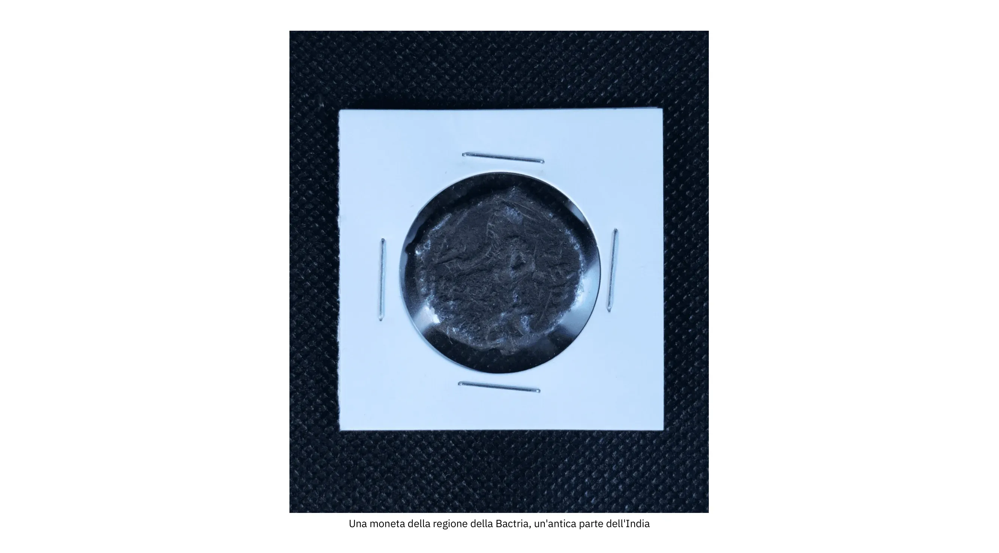

Per illustrare visivamente questo periodo, qui sopra è riportata una moneta proveniente da una regione dell'India, la Bactria, che si trova a ovest della penisola indiana, vicino all'Afghanistan. In quest'area esistevano monete che probabilmente si ispiravano a quelle greche con uno dei loro personaggi reali.

## Lidi e Persiani

<chapterId>eb802ab8-8ffd-5b25-907f-8944f120ed14</chapterId>

:::video id=f151eb42-5ff3-4ca1-9af1-1ae2a5e051c0:::

### Le prime monete in electrum lidio

Poiché non possiamo separare la comparsa delle monete dalla Lidia e dai Persiani, passiamo a quella parte del mondo a est della Grecia, che oggi costituisce la Turchia. Le prime monete apparse in Occidente risalgono a circa la metà del VII secolo a.C., nelle regioni della Lidia e della Ionia, situate nell'attuale Turchia. Fu intorno al 650-600 a.C. che questa fondamentale innovazione vide la luce, con notevoli scoperte archeologiche come le prime monete trovate nel tempio di Artemide a Efeso, datate intorno al 600 a.C.. Queste monete primitive erano fatte di electrum, una lega naturale di oro e argento con riflessi ambrati, e spesso avevano un aspetto rozzo, semplicemente segnato con punzoni o motivi rudimentali.

Qui sotto potete vedere una delle prime monete lidioidiane, raffigurante un leone con la sua preda di fronte. Si può notare un timbro o un foro sul retro, che secondo alcuni serviva a testare la purezza del metallo e ad assicurarsi che non fosse solo uno strato superficiale. Sebbene si tratti di uno dei primi esempi, è importante notare che questo pezzo è una copia. Tutti i miei pezzi in oro ed electrum sono repliche o ricreazioni moderne, progettate per evitare che io spenda tutti i miei risparmi in questa collezione.

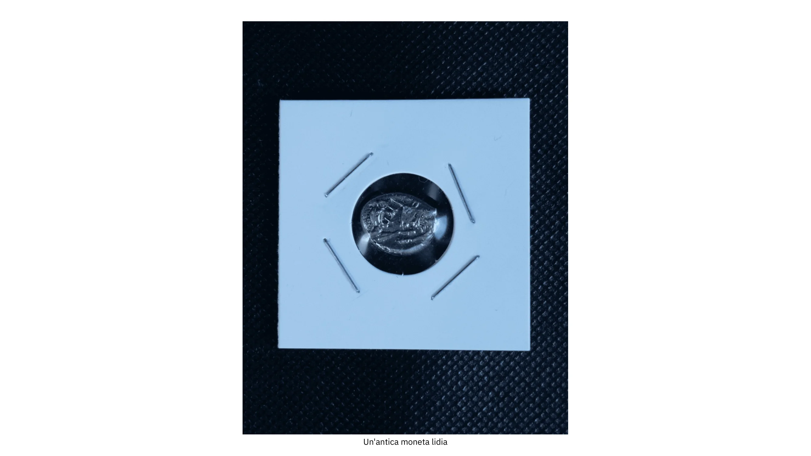

Ma ho anche un vero pezzo persiano che stiamo per vedere. Questo è l'aspetto di questi primi pezzi. Si tratta di una specie di blob (o grumo, in inglese) di metallo che veniva stampato all'epoca.

Contrariamente alla convinzione diffusa che il denaro sia stato inventato per facilitare il commercio quotidiano e sostituire il baratto, sembra che le prime monete lidio, achemenide e greche non fossero inizialmente utilizzate per il commercio su piccola scala. Infatti, le unità monetarie erano troppo grandi per l'uso quotidiano. Inoltre, la loro circolazione era limitata alle regioni vicine al luogo di produzione.

Qui mi sembra importante ricordare che, per quanto ho letto in diverse opere di carattere antropologico, le monete, come ho già mostrato - sia quelle in electrum sia questa moneta persiana su cui tornerò tra poco - erano troppo grandi per comprare il pane, diciamo, ogni giorno. Ho visto stime che ci fanno pensare che fosse l'equivalente di una giornata di lavoro per un contadino o un soldato, quindi troppo grande. È come cercare di pagare un giorno di salario per il proprio pasto, la propria colazione o il proprio pranzo. Tuttavia, in altri lavori ho visto che sono state trovate unità più piccole di questi blob, quindi monete più piccole, il che può farci pensare che forse c'era un possibile uso per gli acquisti di tutti i giorni.

Quindi, la "prova" antropologica che non era usata per il commercio quotidiano, perché il taglio o l'unità era troppo grande, a mio parere non è molto solida, perché abbiamo trovato esempi di monete più piccole, che avrebbero potuto essere adattate agli acquisti quotidiani.

### Il ruolo dello Stato nella creazione di moneta

La vera origine delle monete sembra essere legata all'azione diretta degli Stati. Esistono due ipotesi principali al riguardo: la prima, idealistica, traccia un parallelo tra il termine greco "nomisma" (denaro) e "nomos" (legge), suggerendo che la moneta fosse legata alla codificazione delle leggi, rafforzando l'autorità e l'organizzazione politica delle città. La seconda ipotesi, più realistica e oggi ampiamente accettata, è che la moneta fosse innanzitutto un mezzo per gli Stati di esercitare un controllo economico e sociale. Garantendo ufficialmente il peso e il valore dei metalli preziosi contenuti, gli Stati erano in grado di manipolare la circolazione e il valore di queste monete, creando fiducia e premi di liquidità specifici per le valute nazionali.

È davvero interessante sapere che ne abbiamo le prove. Per esempio, nelle monete in electrum, bisogna sapere che l'electrum naturale è normalmente composto da circa il 70% di oro e il 30% di argento. Nelle prime monete che abbiamo trovato e analizzato, in particolare le prime monete lidio, il contenuto d'oro sembra aggirarsi intorno al 50-55% invece che al 70. Questo suggerisce che già all'epoca gli emittenti di monete cercavano di ottenere il massimo da un'emissione di monete. Ciò suggerisce che già all'epoca gli emittenti di monete cercavano di ridurre la quota del metallo più prezioso, probabilmente per produrre un maggior numero di monete e farle apparire dello stesso valore di un blocco non marcato di electrum naturale. E qui va detto che fu proprio a partire dall'epoca di questo famoso Creso, come dire *ricco come Creso*, che ciò fu possibile perché fu a partire da lui che si ebbe la tecnologia per separare l'oro e l'argento.

La monetazione lidia subì un'importante evoluzione durante il regno del famoso re Creso (561-546 a.C.), noto per la sua leggendaria ricchezza. In questo periodo i Lidi perfezionarono la metallurgia per separare l'oro e l'argento dall'electrum, introducendo così le prime monete bimetalliche, cioè monete d'oro e d'argento separate.

### Espansione persiana e adozione greca

Quando conquistarono la Lidia nel 546 a.C., i Persiani achemenidi adottarono immediatamente questa innovazione. Intorno al 500 a.C., sotto il regno di Dario I, i Persiani stabilirono un proprio sistema monetario con darici d'oro e siglois d'argento, spesso recanti l'effigie reale in pose bellicose. Questa monetazione reale persiana fu utilizzata principalmente nelle regioni ellenizzate dell'Impero persiano e si diffuse gradualmente, anche se il suo uso rimase disomogeneo, con **alcune regioni, come l'Egitto, che preferivano ancora lo scambio in metallo pesato (bullion)**.

In alto, si può ammirare un autentico sigloi (o siglos) persiano. Il piccolo disegno raffigura un re, anche se il foro è stato leggermente consumato. Il siglos è una moneta d'argento, a differenza del daric, che era d'oro. I Persiani erano in grado di distinguere questi due metalli e si allontanarono dalle monete in electrum. Implementarono quindi il bimetallismo, utilizzando sia l'oro che l'argento, pur mantenendo lo stesso concetto di monete fatte di metalli preziosi, spesso con un foro sul retro, presumibilmente per controllare il contenuto di metallo.

La rapida adozione di monete da parte dei Greci sembra essere stata stimolata dagli stretti contatti con i Lidi, in particolare attraverso le colonie greche in Asia Minore. I primi greci a coniare monete furono probabilmente gli abitanti di Egina a metà del VI secolo a.C., che introdussero la dracma, il cui peso variava da regione a regione e il cui nome significa letteralmente "pugno di grano" o "pugno di frecce".

Il successo della moneta greca fu dovuto sia alla sua convenienza per transazioni importanti, come il pagamento dei mercenari, sia all'espansione economica e politica delle città. La moneta divenne rapidamente un elemento centrale dell'economia greca e, più tardi, romana, pur mantenendo una forte dimensione simbolica, in particolare attraverso la sua associazione con la legge (nomos).

Infine, la rapida espansione della moneta testimonia una profonda trasformazione delle società antiche, in cui la codificazione dei valori monetari andò di pari passo con l'organizzazione statale. Questa evoluzione pose le basi economiche e politiche per l'ascesa delle democrazie greche, in particolare ad Atene, dove la moneta svolse un ruolo cruciale nel funzionamento della città democratica.

Un punto chiave da ricordare in questa sezione è che stiamo parlando specificamente di **monete**, non di denaro in generale. L'aspetto centrale che emerge chiaramente è quello della **fiducia nell'autorità emittente**, direttamente collegata alle caratteristiche tecniche delle monete (peso, purezza, valore nominale). È proprio questa fiducia che permette allo Stato o all'autorità emittente di esercitare un certo controllo o addirittura di manipolare il valore e la circolazione di queste monete fin dall'inizio.

## L'intervento istituzionale e le prime monete

<chapterId>3e1efd08-99e3-5a32-9908-3185fef0e640</chapterId>

:::video id=84847cf6-9e46-4a8c-9f35-25a27496cc4b:::

### La doppia natura del denaro

L'emergere del denaro coniato solleva una questione fondamentale: il denaro è una creazione spontanea del mercato o un'istituzione imposta dall'autorità? Questa tensione concettuale contrappone due visioni radicalmente diverse.

Da un lato, la scuola austriaca di economia difende l'idea che la moneta-merce - in particolare l'oro - sia stata scelta naturalmente dagli attori economici per le sue qualità intrinseche: durata, portabilità, divisibilità e fungibilità. In questa prospettiva, lo Stato si è poi appropriato di questa moneta spontanea per controllarne l'offerta. È un'istituzione che emerge naturalmente dalle esigenze del mercato prima di essere catturata dal potere politico.

Al contrario, la visione antropologica e istituzionale ritiene che il denaro nasca realmente con la coniazione da parte dello Stato. L'autorità creerebbe consapevolmente la moneta apponendo il proprio sigillo, trasformando così il metallo in un vero e proprio strumento monetario. Questa prospettiva suggerisce che le prime monete lidiane erano usate principalmente per pagare gli eserciti - uno statere corrispondeva all'incirca alla paga giornaliera di un soldato.

### I vantaggi paradossali della standardizzazione statale

Nonostante questa tensione teorica, anche gli economisti austriaci riconoscono alcuni vantaggi dell'intervento statale sulla moneta. La standardizzazione tramite conio risolve una serie di problemi commerciali pratici.

Senza un'autorità di certificazione, gli operatori economici devono affrontare rischi costanti: monete contraffatte, frodi di deposito e manipolazione del peso. Queste pratiche creano attriti nell'economia, in quanto alcune monete vengono accettate mentre altre vengono rifiutate. In teoria, il timbro ufficiale garantisce peso e qualità, rendendo gli scambi più fluidi.

Questa garanzia ha un prezzo osservabile sul mercato: una moneta d'oro coniata vale di più del suo equivalente in oro grezzo. Questo premio riflette il valore della certificazione: i commercianti non devono più verificare personalmente l'autenticità del metallo attraverso test chimici o di risonanza. L'intervento dello Stato, paradossalmente, elimina gli attriti e facilita il commercio creando una fiducia istituzionalizzata.

### Manipolazione della valuta fin dall'inizio

La storia dei primi stateri lidioti rivela un'inquietante ironia. Analisi recenti dimostrano che il contenuto d'oro di queste monete in electrum era sistematicamente inferiore a quello dell'electrum naturale. L'autorità che certificava la qualità stava contemporaneamente manipolando la composizione.

Questa pratica illustra la duplice utilità della moneta. Per il mercato, rende gli scambi più fluidi e offre una garanzia di standardizzazione. Per l'autorità emittente, diventa uno strumento di controllo economico attraverso la diluizione. Riducendo il contenuto d'oro e mantenendo il valore nominale, lo Stato aumenta di fatto l'offerta di moneta - creando più unità monetarie dalla stessa quantità di metallo prezioso.

Lo Stato stesso, tuttavia, rimase vincolato da questa manipolazione. Come illustrato dall'esempio del solidus d'oro di Costantino nel IV secolo, l'amministrazione romana controllava scrupolosamente la qualità delle monete, poiché esigeva di essere pagata con monete di buona qualità. L'autorità aveva un interesse vitale a mantenere la qualità della propria moneta per garantire il valore delle entrate fiscali.

### Analisi economica della svalutazione

Lo studio della svalutazione della moneta rivela modelli coerenti nel corso della storia. Per le monete metalliche, gli economisti seguono la percentuale di metallo prezioso contenuta nelle monete - una curva discendente che indica una progressiva svalutazione. Per la cartamoneta moderna è vero il contrario: si osserva la massa monetaria circolante, il cui aumento segnala una svalutazione.

Entrambi i metodi misurano lo stesso fenomeno fondamentale: la diluizione del valore monetario. Sia che si riduca il contenuto di metallo prezioso sia che si stampino nuove banconote, il meccanismo rimane lo stesso. Più unità monetarie un'autorità crea dalle stesse risorse reali, più ogni unità perde valore.

Questa manipolazione, osservabile fin dalle prime monete lidioidi, suggerisce che il controllo monetario è sempre stato una questione di potere. La moneta coniata rappresenta quindi una notevole innovazione tecnica unita a uno strumento di controllo economico - una dualità che attraversa tutta la storia monetaria, fino ai giorni nostri.

## Produzione di parti

<chapterId>b205f4f2-c293-5308-b812-a998de9ad45e</chapterId>

:::video id=47c612ec-d97e-4498-b50e-7e66518bd56d:::

### Dai bolli punzonati alle monete coniate

Dopo una sezione sulla nascita delle monete, ho voluto introdurre una brevissima sezione sull'evoluzione della fabbricazione delle monete. Come abbiamo visto, tutto è iniziato con blob di electrum, proseguendo con l'oro e l'argento, dove entrambe le facce erano marcate con un punzone, o con il volto del re, o con un foro sul retro per controllare la purezza.

In seguito, come vedremo in una sezione successiva, i Greci perfezionarono questa tecnologia creando monete rotonde che venivano martellate su entrambi i lati. Prendevano un pezzo liscio e piatto di metallo prezioso, incidevano il disegno desiderato su un lato e poi lo martellavano a mano per creare la moneta finita.

La tecnologia di coniazione a mano delle monete individuali ha probabilmente svolto un ruolo nel controllo dell'inflazione in quel periodo, anche se le monete venivano spesso diluite per aumentare la produzione. Ciò fu particolarmente evidente durante il periodo romano e, in misura minore, durante alcune guerre del periodo greco. Sebbene la coniazione di monete una alla volta limitasse la capacità dell'autorità di produrre in massa, essa contribuì efficacemente al controllo dell'inflazione, nonostante le significative svalutazioni che si verificarono. In questo modo, l'evoluzione passò da una massa di metallo punzonata a una moneta rotonda e martellata.

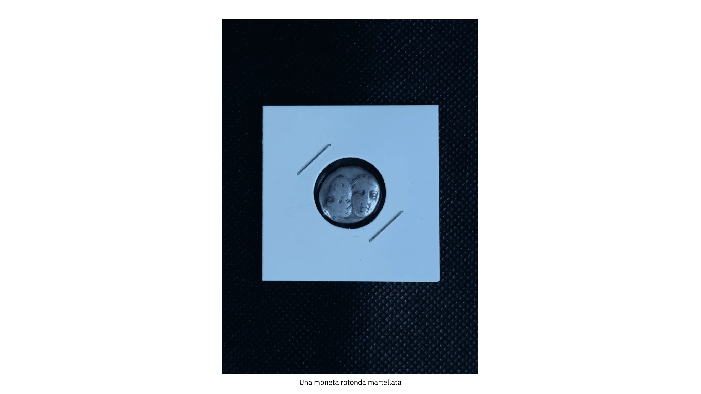

### Evoluzione medievale

Nel Medioevo si diffuse anche la tendenza a distendere le monete, rendendole più larghe e più sottili. Uno dei motivi era che diventava più facile testarne il suono, spesso usato come indicatore di autenticità. Allargando l'argento, si produceva una frequenza distinta, per cui si poteva convalidare la purezza della moneta semplicemente ascoltandola. Questa pratica ha dato origine al termine "moneta sana". Nel contesto della moneta sonante, il peso standard veniva determinato utilizzando una bilancia o un "trabucco" per la pesatura. Così, l'evoluzione è proseguita passando da monete piccole e rotonde a monete leggermente più sottili e più larghe.

### Colpo di pendolo

L'ultima tecnologia arrivata alla fine del Medioevo, all'inizio dell'era moderna, fu la nozione di battitura a pendolo. Si trattava di una sorta di vite che veniva stretta per colpire le monete, generando così monete con questa nuova forma di battitura. La particolarità di questo sviluppo era la possibilità di incidere un disegno sulla superficie della moneta per risolvere il problema del clipping. Il clipping consisteva nel rimuovere una parte della moneta per recuperare l'argento prezioso, che poteva essere utilizzato per coniare altre monete o semplicemente conservato come risorsa.

La nozione di pendolo ha quindi contribuito al fenomeno del clipping. È interessante notare che questa tecnologia proveniva in realtà dalla Francia. In Inghilterra, ad esempio, assunsero ingegneri francesi per mostrare loro come costruire queste macchine. La cosa divertente, a mio avviso, è che c'erano sostenitori della coniazione a martello che erano contrari e che hanno ritardato l'applicazione di questa tecnologia. In ogni buona tecnologia, ci sono sempre persone contrarie, che vogliono mantenere la vecchia tecnologia. Mi è sembrato piuttosto folle rendermi conto che anche una tecnologia che sembra davvero superiore - si possono produrre più pezzi, sono più difficili da copiare - c'erano ancora persone che erano attaccate al famoso metodo del martello. C'è stato un passaggio tra la produzione di pezzi realizzati con la famosa percussione a pendolo e il ritorno alla percussione a martello. E alla fine, naturalmente, è stata la battitura a pendolo ad affermarsi e a darci questi bellissimi pezzi moderni in cui si possono trovare piccole linee, piccole creste per evitare il clipping, probabilmente legate alla parola clipping, creste, e ancora oggi si possono vedere creste o testi o disegni che sono incisi sul bordo del pezzo.

# Diverse teorie sulla nascita del denaro

<partId>72ac694f-9248-550d-90c1-91af3d234380</partId>

## Le teorie sulla nascita del denaro e le sue varie definizioni

<chapterId>7d699d4d-8c70-55b5-bf36-609f3fd90bcf</chapterId>

:::video id=523c873f-501b-4954-b79f-7e74c0f685a5:::

Benvenuti in questa sezione dedicata alle diverse teorie sulla nascita del denaro e alle sue varie definizioni. Ecco un breve estratto del libro *Aux origines de la monnaie* che, a mio avviso, riassume le due principali teorie che analizzeremo in questa sezione.

> Questo breve preambolo non ha altro scopo se non quello di evidenziare il contesto dell'indagine. A livello concettuale, il dibattito è aperto tra i sostenitori delle tesi di K. Polanyi e quelli di M. Weber. Per i primi, il dono e la redistribuzione hanno un ruolo centrale, mentre lo scambio di mercato ha un ruolo marginale, soprattutto negli scambi internazionali. Per gli altri, al contrario, il mercato è al centro dell'attuale processo storico.

Ad esempio, in Mesopotamia, una teoria dell'emersione suggerisce che il tempio, in quanto autorità, crei l'unità di conto o unità monetaria, la imponga e poi i mercanti la adottino per il commercio. La teoria opposta sostiene che, invece, questa unità monetaria emerge naturalmente dal mercato per facilitare il commercio. Ci sono esempi ben documentati di questo in Mesopotamia.

Per quanto riguarda il baratto, alcune teorie suggeriscono che fosse usato soprattutto negli scambi internazionali, cioè con persone di cui non ci si fidava.

Ecco cosa faremo in questa sezione. Condurremo una sorta di indagine per presentare le diverse teorie sulla nascita del denaro e le diverse definizioni di cosa sia il denaro. Presenteremo e criticheremo le tesi degli economisti classici e degli antropologi. Avrò anche la fortuna di avere con me Ulrich, che presenterà il punto di vista di un economista austriaco su questi vari argomenti.

## La nascita del denaro per gli economisti classici

<chapterId>1d3776cd-0dfd-5297-af48-c6f41e257a7e</chapterId>

:::video id=873a16c1-17ac-448d-8941-df4feb7ab79d:::

Questo segmento è dedicato alle diverse teorie sulla nascita del denaro. Il primo argomento da trattare è la nascita della moneta secondo gli economisti classici.

### La teoria classica di Adam Smith

Secondo le teorie economiche classiche, in particolare quella sostenuta da Adam Smith, il denaro è emerso naturalmente dal baratto in risposta ai suoi limiti. Inizialmente, gli scambi avvenivano tramite baratto diretto, ma questo metodo era spesso complicato dal problema della "doppia coincidenza dei desideri": ognuno doveva possedere esattamente ciò che l'altro desiderava. Gradualmente, alcune merci (come il sale, i metalli preziosi e il bestiame) vennero accettate da tutti come mezzi di scambio intermedi, grazie alla loro utilità, durata e divisibilità. Così, il denaro apparve spontaneamente per facilitare e fluidificare gli scambi economici.

### Critica della teoria classica

Ecco la mia critica a questa teoria. Con tutto quello che abbiamo visto nella sezione precedente, penso che possiamo già dire che questa nozione che i **monete** sono un'evoluzione del baratto è sbagliata semplicemente perché la moneta coniata emerge sicuramente dall'autorità, dato che è coniata dall'autorità. Ci sono diverse ragioni per questo, non ultimo il desiderio delle autorità di controllare l'economia, di assumere il controllo del denaro.

D'altra parte, se parliamo di denaro come concetto, non necessariamente di monete, allora la questione è meno chiara perché, con le prime monete, gli stateri lidioidi, abbiamo trovato blob d'argento che non erano marcati. Resta da vedere se fossero in circolazione. Se circolavano, significa che all'inizio la gente potrebbe aver identificato questo bene come una potenziale moneta che potrebbe essere ampiamente richiesta e facilmente scambiata. E forse solo in seguito le autorità si sono accorte di questa situazione e ne hanno preso il controllo apponendo un timbro per certificarla.

Ci sono molti vantaggi nel farlo: non c'è bisogno di controllarlo, pesarlo e tutto il resto. Ovviamente ne parleremo. Ma a mio avviso le monete sono chiaramente uno strumento utilizzato dagli Stati fin dall'inizio. Tuttavia, per quanto riguarda l'emergere del denaro in quanto tale, non sappiamo se sia davvero nato da un'autorità che lo ha imposto o se sia emerso attraverso il commercio o gli scambi commerciali. Su questo tema avrò una discussione molto interessante con il mio collega Ulrich più avanti in questa sezione.

Sappiamo già che le prime monete di metallo prezioso non venivano utilizzate per facilitare gli scambi quotidiani perché il loro valore era troppo alto. Sappiamo anche che venivano utilizzate principalmente per i pagamenti militari. Questo è un buon argomento a favore della tesi che il denaro non è emerso necessariamente dal mercato. Le unità di conto, i tagli delle prime monete, erano probabilmente troppo grandi per, ad esempio, comprare il pane o fare la spesa quotidiana. Potevano, ad esempio, essere l'equivalente del salario di una giornata. Non è detto che a quei tempi si pagasse il salario, ma è per dare un'idea della scala. Quindi queste monete avevano probabilmente un potere d'acquisto troppo elevato per essere utilizzate nel commercio su piccola scala. D'altra parte, nulla vieta che queste monete siano state utilizzate per effettuare scambi più ampi, come quelli mercantili. Sappiamo che venivano utilizzate soprattutto per i pagamenti militari. Questa è una delle teorie più diffuse per spiegare la comparsa delle prime monete. Ricordiamo che stiamo parlando di monete, non necessariamente di denaro in generale. Quindi, le prime monete ebbero il loro primo ruolo, che fu quello di pagare i pagamenti militari, i mercenari.

Alessandro Magno, ad esempio, ne fece grande uso, come vedremo in seguito.

Abbiamo anche visto che già nell'antica Cina le conchiglie di cowrie venivano utilizzate per gli scambi economici (**remunerazione del lavoro, misurazione del valore e acquisto di terreni)**. Inoltre, in Mesopotamia e in Egitto esistevano già sistemi monetari funzionali, utilizzati per il commercio, il pagamento dei salari e delle tasse. Quello che sto suggerendo qui è che è decisamente sbagliato pensare che le monete nella concezione occidentale emergano dalla necessità di rendere gli scambi più fluidi.

Poiché le monete sono emesse da un'autorità, possiamo forse supporre che, fin dall'inizio, siano state collegate alle autorità emittenti. Questo ha senso. D'altra parte, non sappiamo necessariamente come siano nate le forme di denaro o le forme di sistemi monetari, le proto-monete, che le hanno precedute. Da un lato, si ipotizza che siano stati i templi a identificare queste unità monetarie e che poi la gente le abbia utilizzate. Dall'altro lato, vi diremo che no, erano i mercanti che avevano bisogno di un mezzo di scambio, di un modo per commerciare con il mondo esterno, e sono stati loro a identificare, per esempio, il metallo d'argento, da usare perché era richiesto dal mondo esterno. Il punto è che non lo sappiamo davvero. Ecco perché ci sono due teorie opposte. Non abbiamo prove perfette per spiegare se il denaro emerga naturalmente dalla necessità di commerciare, ad esempio da parte dei mercanti, o se emani dall'autorità.

### Distinguere tra monete e denaro primitivo

In conclusione, penso che si possa dire che le monete emanano necessariamente dall'autorità, poiché sono state impresse da tale autorità. D'altra parte, non credo si possa dire che sia sbagliato suggerire che il denaro (quello che ha preceduto le monete) non possa essere emerso per facilitare lo scambio. Credo che in tutti gli esempi che abbiamo visto sopra abbondino esempi in questo senso.

## Il mito del baratto

<chapterId>0fcd4964-ac36-5163-a8cf-1aacebc0d2c0</chapterId>

:::video id=0ede29ab-8acd-4d79-9282-bd5991b97076:::

### La recensione di David Graeber

Abbiamo appena trattato la nascita del denaro secondo gli economisti classici. Ora affronteremo un concetto noto come il mito del baratto.

Una critica a questa teoria classica della nascita del denaro è la mancanza di prove storiche a sostegno delle sue idee.

La critica nota come "mito del baratto", formulata tra gli altri dall'antropologo David Graeber, mette in discussione l'idea classica che il denaro sia emerso naturalmente dal baratto. Secondo questa critica, non esistono prove storiche o antropologiche che dimostrino che le società utilizzassero sistematicamente il baratto prima dell'avvento del denaro. In realtà, le società antiche avrebbero operato sulla base di crediti, debiti, obblighi sociali e scambi cerimoniali. Il "mito del baratto" è quindi un costrutto teorico concepito per giustificare la visione economica classica, senza alcuna base empirica reale.

Va notato, tuttavia, che questa teoria non nega l'esistenza del baratto, ad esempio per gli scambi tra tribù diverse. Semplicemente nega che il baratto fosse un'attività ampiamente praticata all'interno di questi gruppi cosiddetti primitivi, e che il denaro sarebbe una logica evoluzione di queste pratiche. Nega il fatto che il baratto fosse ampiamente utilizzato all'interno di una tribù e che alla fine il denaro sia nato per fluidificare gli scambi e risolvere le difficoltà che esistevano con il baratto. Secondo questa teoria, invece, questi gruppi praticavano una forma di credito informale o di dono per dono.

### Società primitive e grandi civiltà

**Penso che questa teoria si applichi sicuramente ai gruppi primitivi (senza Stato) del passato e anche di oggi (ad esempio, le tribù studiate dagli esploratori nel XVIII e XIX secolo). È chiaro che non usavano il baratto, ma piuttosto le forme di scambio che ho citato prima, per le ragioni che abbiamo già menzionato (debole divisione del lavoro, agricoltura di sussistenza). Tuttavia, non credo che questa teoria sia applicabile alle grandi civiltà del passato, come la Mesopotamia e l'antico Egitto.

Ecco due estratti da *Aux origines de la monnaie* su questo argomento:

> Il modello delineato da M. Mauss nel suo famoso "Il dono" è stato adottato dagli egittologi con tanta unanimità ed entusiasmo quanta mancanza di discernimento. Questo ha portato a una serie di confusioni, che non approfondiremo in questa sede. Ci limitiamo a notare che questo modello si applica alle cosiddette società primitive, il che non è il caso dell'Egitto faraonico.

> I pani, cioè i cereali lavorati, erano quindi unità di conto che, come lo shât (y) dell'Antico Regno, permettevano anche l'apertura di crediti in beni diversificati. Questo semplice esempio dimostra che l'economia dell'Egitto faraonico non si limitava a un sistema di ridistribuzione. Era molto complessa e comportava una moltitudine di scambi.

Quindi, come abbiamo visto in precedenza nella sezione dedicata all'Egitto e anche alla Mesopotamia e alla Cina, possiamo constatare che anche queste civiltà antiche, ma non primitive, grazie alla presenza di uno Stato, a mio avviso, hanno utilizzato sistemi monetari. Credo che questo sia stato ampiamente dimostrato nella prima sezione di questo corso. Quindi, questa nozione di dare-avere, di credito differito, non si applica a queste grandi civiltà. Le ragioni precise della comparsa del denaro rimangono quindi un mistero. Non sappiamo se sia nata dalla necessità dei mercanti di commerciare con il mondo esterno o se sia stata imposta dal tempio in questi periodi antichi.

## L'emergere del denaro attraverso la moneta a debito

<chapterId>4f508615-aa61-5d62-89d3-cecd02aeaa62</chapterId>

:::video id=a23f547f-3906-4f4a-8f72-5d78c649d0c4:::

### Il denaro come pagherò

In questa sezione, trattiamo la teoria della moneta a debito.

La teoria del **denaro a debito**, sviluppata in particolare dall'economista Alfred Mitchell-Innes e successivamente ampliata da David Graeber, afferma che il denaro non ha avuto origine dal baratto, ma piuttosto da relazioni di debito e credito presenti fin dalle prime società umane. Secondo questa teoria, il denaro compare quando gli obblighi sociali (debiti tra individui o gruppi) diventano quantificati e trasferibili. Questo concetto introduce la nozione di quantificazione degli scambi e dei trasferimenti. Il denaro sarebbe quindi soprattutto un **riconoscimento del debito**, sostenuto dalla fiducia reciproca e spesso garantito dall'autorità politica o religiosa, piuttosto che una merce che funge da semplice intermediario negli scambi.

Una forma ancora più avanzata di questa teoria è che tutto il denaro è un debito. Quindi chi possiede denaro avrebbe un credito nei confronti della società in generale, un credito nei confronti di tutti coloro che accettano quel denaro. E poiché il denaro, **nella loro visione, deve essere accettato in modo obbligatorio**, altrimenti non è denaro, perché se si può rifiutare questo denaro, il loro sistema non funziona. In un dato gruppo che ha individuato una moneta, tutti coloro che la possiedono è come se avessero un debito nei confronti di tutti gli altri membri di quella società che accettano quella moneta, e coloro che accettano la moneta hanno una forma di debito nei confronti della persona che possiede quell'unità monetaria. Questa è essenzialmente la loro teoria.

### Critiche al sistema obbligatorio

**La mia critica a questa teoria:**

Vorrei fare una piccola critica a questa teoria. Accetto che il denaro sia una sorta di consenso sociale. È la fiducia che un gruppo ripone in un "segno" monetario, qualunque esso sia. Quindi sottoscrivo il concetto di fiducia reciproca, che riprenderemo più avanti con il concetto di premio monetario. La questione si complica quando i sostenitori di questa teoria aggiungono la nozione di obbligo e insistono sulla nozione di debito. Per loro, quando qualcuno possiede un token monetario, detiene un credito nei confronti della comunità nel suo complesso, e la comunità avrebbe quindi un debito nei confronti del detentore. Ci sarebbe anche un obbligo di pagamento, con i membri del gruppo obbligati ad accettare il token; altrimenti, secondo loro, il sistema non funzionerebbe. Credo che il sistema descritto sopra nell'antica Cina rappresenti bene questa teoria.

Da parte mia, posso facilmente immaginare un sistema in cui il denaro è un consenso sociale in cui il token scelto è generalmente accettato come mezzo di pagamento, senza alcun obbligo formale. Posso vedere un sistema del genere funzionare se le persone lo accettano di loro spontanea volontà. Può funzionare. D'altra parte, spesso è accompagnato da obblighi, moneta legale e violenza, che vedremo più avanti in una sezione. In teoria, però, non ho l'impressione che questo sistema possa funzionare. Il Bitcoin ne è un esempio. Il Bitcoin ha valore perché ha un premio monetario, perché c'è una domanda che lo destina a un uso monetario, cioè a riserve di valore, forse anche a mezzi di scambio o di protezione contro il sistema fiat. Nessuno è obbligato ad accettarlo, e più viene accettato come mezzo di pagamento, più può essere usato come mezzo di scambio. Possiamo già usarlo come riserva di valore senza alcun problema. Su questo non ci sono dubbi. Quello che voglio dire è che il Bitcoin mi sembra un esempio, un tipo di valuta che è una forma di consenso sociale in cui pensiamo di poter recuperare i nostri soldi se ne compriamo un po' più tardi, li acquistiamo per poterli scambiare in seguito, per preservare il nostro potere d'acquisto.

Questa visione meno restrittiva della teoria aiuta a spiegare come due società distinte possano commerciare con un token monetario come l'oro, senza creare un credito o un debito tra queste società. Trovo che forzare l'accettazione nella società non funzioni nel commercio tra due tribù, perché l'altra tribù non è soggetta all'autorità. La tribù B non è soggetta all'autorità della tribù A. Tuttavia, accetta lo stesso token monetario, ad esempio l'oro. Ora, qualcuno potrebbe dirmi: "Sì, ma perché anche la società B ha deciso che l'oro è la sua moneta", quindi funziona. Sì, funziona, ma a quel punto non c'è creazione di debito. Si tratta di una transazione finale. Quindi, quando l'azienda A scambia un bene con l'oro dell'azienda B, non c'è creazione di debito, la transazione è conclusa. E chiaramente, la persona dell'azienda B non ha acquistato questa moneta o pepita d'oro per essere pagata in seguito dalle persone dell'azienda A. La accetta per essere scambiata con l'oro. La accetta per essere scambiata in seguito, probabilmente all'interno della sua tribù. In questo esempio, quindi, non c'è creazione di debito, non c'è rivendicazione latente, è semplicemente uno scambio diretto, un pagamento diretto. I sostenitori della moneta a debito ci diranno che questo è baratto. Non sono d'accordo, perché il baratto è lo scambio di un bene diretto. Il baratto diretto è lo scambio di un bene con un altro bene, per l'uso. I beni vengono scambiati per essere usati, mentre nel nostro caso l'oro è chiaramente usato come moneta perché non verrà usato per fare altro, ma verrà usato in seguito come mezzo di pagamento. Quindi, a mio avviso, non rientra nella categoria del baratto.

Possedere un token monetario non è una "pretesa" nei confronti della comunità, ma piuttosto la speranza che il token venga accettato in un secondo momento a un valore comparabile.

## La nascita spontanea del denaro

<chapterId>e3ef86b1-73b9-5140-a61e-2ab6a5b0b2d4</chapterId>

:::video id=e543995f-d5e2-49d7-9133-e397b46e0833:::

Per la scuola austriaca di economia, iniziata da Carl Menger, il denaro emerge naturalmente da un'economia di baratto che affronta il problema della doppia coincidenza dei desideri. In questa visione, gli individui convergono spontaneamente su beni intermedi che facilitano lo scambio - non beni direttamente consumati, ma beni riconosciuti per la loro capacità di essere ampiamente richiesti.

Questi beni monetari devono possedere qualità identificate fin da Aristotele: devono servire come riserva di valore, mezzo di scambio e unità di conto. Gli agenti economici li identificano, li accumulano e li conservano gradualmente, dando così inizio alla loro nascita come denaro. Questo processo è del tutto spontaneo: il denaro rappresenta una risposta naturale del mercato al problema del coordinamento degli scambi, senza l'intervento consapevole di un'autorità.

### Il dibattito sul "mito del baratto

Antropologi come David Graeber contestano questa visione, invocando il "mito del baratto". La loro tesi è che non è mai stata documentata alcuna civiltà complessa basata esclusivamente sul baratto diretto. Piuttosto, le società primitive studiate utilizzavano sistemi di credito informale e di reciprocità. Graeber afferma che il debito ha preceduto il baratto, citando migliaia di tavolette mesopotamiche che documentano relazioni di credito.

Tuttavia, questa critica si basa su una definizione restrittiva del baratto. Come Menger sottolineò già nel 1892, il baratto va oltre il semplice scambio diretto di beni contro beni. Comprende anche i trasferimenti differiti, i servizi in cambio di salario e gli scambi temporali, quelli che Menger chiamava "trasferimenti unilaterali tra individui". Questa forma estesa di baratto può coesistere con i sistemi di credito in circoli ristretti di fiducia.

L'assenza di prove non è la prova dell'assenza, e gli economisti austriaci riconoscono che nessuna società complessa può svilupparsi in modo sostenibile sulla base del solo baratto diretto - da qui la necessaria comparsa del denaro.

### Il caso mesopotamico: mercanti contro templi

Il dibattito si sta cristallizzando sull'origine dello shekel d'argento mesopotamico. Esistono due interpretazioni opposte. Quella istituzionale sostiene che i templi - veri centri economici e spirituali - imposero l'argento come moneta per strutturare l'economia. Le tavolette cuneiformi, concentrate tra le élite del clero e dei mercanti, testimoniano questo controllo centralizzato.

L'interpretazione austriaca suggerisce il contrario: furono i mercanti ad adottare la moneta per il commercio a lunga distanza. Di fronte alla sfida di commerciare con gli stranieri oltre i confini della Mesopotamia - dall'Anatolia al Golfo Persico - avevano bisogno di qualcosa di universalmente riconoscibile, durevole e trasportabile. L'argento era una scelta naturale per le sue qualità intrinseche. I templi confermarono semplicemente una pratica già consolidata dall'uso commerciale.

Questa tesi si basa su scambi documentati tra Kanesh in Anatolia e Assur, dove i mercanti scambiavano tessuti con metallo d'argento - non per la sua utilità materiale, ma come riserva di valore. Queste transazioni andavano oltre il semplice baratto, rivelando l'esistenza di una vera e propria moneta-merce.

### L'esempio moderno dei campi di prigionia

L'economista Richard Radford, prigioniero in Germania durante la Seconda Guerra Mondiale, ha documentato un caso affascinante di nascita monetaria spontanea. Nei campi, le sigarette divennero naturalmente l'unità di scambio - divisibile, standardizzata, ampiamente accettata. Anche i non fumatori le adottarono, riconoscendone il valore di scambio universale.

Questo microcosmo illustra il principio austriaco: di fronte al problema di coordinare gli scambi, gli individui convergono spontaneamente sul bene più "vendibile". Nessuna autorità ha imposto la moneta a sigaretta; essa è emersa dalla pratica quotidiana dei prigionieri che cercano di ottimizzare i loro scambi.

### La convergenza delle preferenze individuali

In sostanza, il denaro rappresenta la convergenza delle preferenze individuali verso un bene comune accettato. I mercanti mesopotamici, come i prigionieri di Radford, hanno identificato il bene che minimizza l'incertezza degli scambi futuri. Questa selezione non attende l'autorizzazione o l'imposizione di un'autorità centrale, ma emerge dalla razionalità pratica degli attori economici che devono affrontare le sfide dello scambio.

Il dibattito tra nascita spontanea e istituzione consapevole rimane aperto, poiché le prove storiche sono frammentarie. Ma l'analisi austriaca offre una spiegazione coerente: il denaro è nato dalle esigenze pratiche del commercio e le autorità si sono limitate a istituzionalizzare pratiche già consolidate dall'uso del mercato.

## La visione antropologica della nascita del denaro

<chapterId>ec48c5d8-47ed-530f-beb7-c44fd0b62880</chapterId>

:::video id=8c1f8764-75af-4fb6-a98b-55de3b7da02e:::

### Le origini non economiche del denaro

In questa sezione esploriamo la visione antropologica della nascita del denaro, una prospettiva ricca che sfida profondamente le teorie economiche classiche.

Contrariamente alla teoria tradizionale secondo cui il denaro sarebbe emerso naturalmente dal baratto per facilitare lo scambio economico, la ricerca antropologica dimostra che la nascita del denaro è in gran parte radicata in cause non economiche. Nasce da meccanismi sociali come il pagamento di tributi, il risarcimento per l'omicidio (il famoso Wergeld) e le doti (il denaro per la sposa), ma anche da pratiche cerimoniali, religiose, politiche e simboliche, molto più che da semplici necessità di mercato.

Nelle società primitive, il denaro veniva raramente utilizzato per lo scambio quotidiano di beni materiali, contrariamente alla definizione classica di denaro come "mezzo di scambio". In realtà, queste società facevano un uso massiccio del credito, con pagamenti differiti inseriti in vaste reti di relazioni sociali e personali. Questi sistemi di credito onnipresenti hanno logicamente e storicamente preceduto la comparsa del denaro.

Questo è ciò che riassume la loro visione. Ne abbiamo parlato con Ulrich nella nostra chiacchierata nel video precedente. Vi lascio i commenti di Ulrich sull'argomento, che mettono un po' in discussione questo approccio. Nella visione antropologica, spesso il denaro proviene da un'autorità o da un concetto sociale che precede le esigenze del mercato.

### L'esempio delle pietre di Yap

Qui di seguito, potete ammirare un suggestivo esempio delle pietre monumentali dell'isola di Yap. Alcune di queste pietre, nonostante l'immobilità o addirittura la scomparsa fisica, hanno continuato a funzionare pienamente come denaro grazie a un accordo collettivo, sottolineando la dimensione essenzialmente sociale e simbolica del denaro.

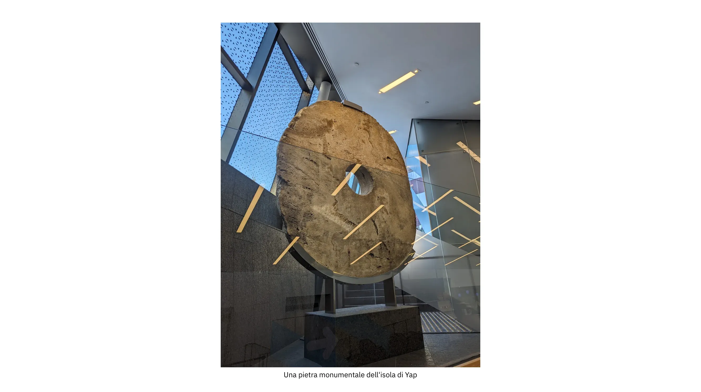

Si tratta di un'analisi davvero interessante delle pietre di Yap. Anche Saifedean Ammous cita questo esempio nel suo libro "The Bitcoin Standard". Secondo lui, il sistema dell'isola di Yap è quello che più si avvicina al Bitcoin, una sorta di registro centrale consultabile da tutti, pubblico, che tiene i conti e gestisce la proprietà delle cose. Questa prospettiva antropologica illustra che tutto ciò rappresenta un accordo o un consenso sociale all'interno della società, che è fondamentalmente accurato. Trovo molto interessante l'accenno alle pietre perdute. Andavano in mare per centinaia di chilometri con piccole zattere e riportavano indietro le pietre. A volte la pietra cadeva in fondo al mare, ma veniva comunque utilizzata nel sistema monetario. Una persona poteva dire: "Sì, la pietra è caduta in un posto simile; è mia, quindi possiamo scambiarla". Non c'era necessariamente bisogno di un possesso fisico per facilitare lo scambio, poiché le pietre erano così grandi che spesso rimanevano in un unico luogo. L'attenzione si concentrava invece sul passaggio di mano di queste pietre in modo transazionale, consentendo il passaggio di proprietà senza che le pietre si muovessero effettivamente. Si trattava di una forma di "prova del consenso", che metteva in luce un'interessante prospettiva antropologica sul denaro.

### Protovalute e obblighi sociali

Gli etnografi di tutto il mondo hanno osservato società che utilizzavano "proto-valute" o "valute primitive", come conchiglie, stoffe, bestiame, sale e pietre, che svolgevano le funzioni solitamente attribuite al denaro, come mezzo di pagamento e riserva di valore, senza tuttavia fungere regolarmente da intermediari nello scambio di beni quotidiani.

Quindi, stiamo descrivendo sistemi monetari che non erano necessariamente utilizzati per gli scambi quotidiani.

E vorrei ricordare che queste erano tutte valute prima dell'avvento delle monete, e non so quanto sia un termine improprio dire moneta. Preferisco dire moneta. Posso dire che in letteratura si parla spesso di proto-currencies per riferirsi al denaro prima delle monete. Ma come abbiamo visto nella prima sezione, **credo che esistessero sistemi monetari molto prima della comparsa delle monete**.

Queste monete primitive erano utilizzate principalmente per gestire gli obblighi sociali fondamentali legati agli individui, come il matrimonio, la compensazione dei conflitti (Wergeld) o i doni tra capi. Nell'Impero persiano, ad esempio, le prime monete furono create appositamente come mezzo di pagamento militare piuttosto che come mezzo di scambio.

Il denaro primitivo ha quindi una caratteristica essenziale: è un mezzo di pagamento, ma molto raramente un mezzo di scambio diretto di beni materiali. Intendiamo dire che era un mezzo di pagamento per alcuni obblighi sociali, per le tribù, per gli scambi tra capi, il famoso wergeld, il denaro di sangue. Prima dell'avvento dei sistemi giudiziari, se qualcuno commetteva un omicidio, c'era un risarcimento per la famiglia che soffriva per l'assassinio del proprio caro. C'era un prezzo da pagare per questo, si chiamava denaro di sangue ed è una forma di pagamento. C'era anche la dote, anch'essa una forma di pagamento. In questi primi usi del denaro come forma di pagamento, esso era più legato a obblighi umani e sociali che a pagamenti per acquisti quotidiani. Secondo questa teoria, gli scambi quotidiani più comuni erano più legati al credito, al credito differito, al dono per dono e alla ridistribuzione delle razioni. Esisteva un'altra forma di organizzazione sociale per gestire questi scambi. È anche importante ricordare che, in una società in cui tutti sono autosufficienti, si coltivano da soli, non c'è specializzazione e c'è pochissimo bisogno di un sistema monetario per gli scambi quotidiani. Ecco perché le prime forme di denaro sono state quelle che abbiamo appena descritto, la dote, il denaro di sangue, semplicemente perché questi sono stati i primi scambi in cui abbiamo avuto bisogno di un mezzo di pagamento, molto prima che avessimo bisogno di commerciare, di scambiare pane per denaro su base giornaliera, perché nelle società primitive non funzionava così. Ognuno provvedeva ai propri bisogni e non c'era ancora la specializzazione. Credo di averne parlato a lungo in tutte le lezioni precedenti di questo corso.

In queste società, prive di una divisione avanzata del lavoro, gli scambi diretti rimasero limitati, avvenendo principalmente all'interno di relazioni personali di amicizia o di alleanza. L'assenza di una sufficiente specializzazione non rendeva necessario il denaro in senso moderno.

Antropologi come Quiggin e Einzig insistono sulla preminenza del credito: **la vita economica primitiva è intrappolata in una gigantesca rete di crediti e debiti personali, dove il denaro interviene soprattutto quando i pagamenti devono essere immediati e le compensazioni non possono essere facilmente differite.**

Quindi, le persone si scambiano cose, possono fare credito differito, ma in alcuni casi non si può differire il pagamento, quindi la moneta o le protovalute possono essere utili a questo punto per avere un'immediata finalizzazione dello scambio.

### L'innovazione dell'anonimato

Questa analisi porta a una riflessione più profonda: piuttosto che contrapporre il denaro al baratto, è più rilevante comprendere la sua nascita come un'evoluzione dei complessi sistemi di credito e debito. Il denaro introduce un'innovazione fondamentale: **l'anonimato**. Ed è qui che trovo interessante questa teoria antropologica dell'emergere del denaro. Se siete un piccolo gruppo di persone e vi fate credito differito a vicenda, ovviamente vi conoscete. Credo che per far funzionare questo sistema, le persone debbano conoscersi, ovviamente. E un pagamento effettuato con denaro permette l'anonimato. Permette di effettuare un pagamento senza che la gente conosca il vostro nome, senza che la gente sappia chi siete. Si può fare uno scambio per un regolamento immediato e definitivo. Ed è proprio questo che il denaro consente.

A differenza del credito, che è sempre nominativo, il denaro consente transazioni anonime, generalizzate e immediatamente liberatorie. **Questo potere liberatorio unico del denaro è la sua superiorità decisiva.**

Quindi, lungi dall'essere un modesto strumento per facilitare lo scambio economico, il denaro è una grande innovazione sociale, strettamente legata all'evoluzione delle istituzioni e delle pratiche umane, dal credito personale **a un sistema di pagamento generalizzato e anonimo**. Questa evoluzione antropologica dimostra che il denaro, molto più che un semplice mezzo di scambio, rappresenta una potente istituzione sociale, che plasma profondamente le società umane, fino a diventare, nelle nostre società moderne, lo scopo stesso dell'attività economica.

Qui ci rendiamo conto che alla fine, nelle nostre società moderne, lo scopo dello scambio economico è il possesso di denaro, mentre in passato non era affatto così. Lo scopo dello scambio economico era quello di possedere beni o merci da consumare. Oggi, con l'introduzione dell'innovazione del denaro, lo scopo dello scambio economico è quello di accumulare questo denaro, poiché ci permette di scambiarlo con un bene, come è generalmente accettato. Possiamo scambiarlo con il bene di cui abbiamo bisogno quando ne abbiamo bisogno.

## Unificazione del registro

<chapterId>7664442a-91c1-5ce4-a8bd-53b7371a3e3d</chapterId>

:::video id=473fc284-5375-4e1b-b0cd-6b51ba0cc3b8:::

### Teoria del registro contabile

Ora esploreremo insieme varie proposte per l'unificazione di queste due teorie monetarie, cioè la teoria dell'emergere del denaro attraverso la moneta-debito e la teoria monetaria dell'emergere della moneta-merce. Parleremo della proposta di unificazione di Lynn Alden nel suo famoso libro "For Broken Money", il cui titolo della traduzione prodotta da Consensus sarà probabilmente "Rupture monétaire".

*Estratto da Broken Money di Lyn Alden:*

> Fondamentalmente, il denaro è un registro contabile. Il denaro delle materie prime è un registro governato dalla natura. Il denaro bancario è un registro governato dagli Stati nazionali. Il denaro open-source è un registro governato dai suoi utenti.

Qui Lyn si riferisce al Bitcoin.

### Il rapporto stock/flussi e la scarsità

> Alcuni elementi chimici rari, come il rodio, sono più rari dell'oro, ma hanno bassi rapporti di stock-flow perché vengono consumati dall'industria con la stessa rapidità con cui vengono estratti. Una moneta o un lingotto di rodio può essere acquistato come oggetto da collezione o riserva di valore, ma non è adatto come moneta socialmente accettata e quindi non emerge naturalmente come denaro.

Saifedean ne parla diffusamente nel suo libro "The Bitcoin Standard". Per chi non ha familiarità con il rapporto stock/flusso, si tratta semplicemente di confrontare lo stock esistente, le riserve che esistono sul mercato, con il nuovo stock in arrivo, l'afflusso di nuove scorte. Spesso è piuttosto controintuitivo, perché si potrebbe pensare che qualcosa che si possiede in grandi quantità non sia scarso, ma in realtà non è così. È più una questione di capacità di approvvigionamento. Piuttosto, è la capacità di avere nuove scorte che, secondo questo modello, ci dà l'informazione se questo oggetto è raro o meno. Non è perché non abbiamo qualcosa in magazzino che è raro, è solo che forse non ce l'abbiamo. Quindi, se prendiamo l'oro, abbiamo molte scorte d'oro perché è usato come riserva di valore, e l'afflusso di nuove scorte è qualcosa come l'1% o il 3% all'anno di nuove scorte d'oro in arrivo attraverso il mining. Invece, se parliamo di rodio, è più raro dell'oro, ma non abbiamo scorte perché viene consumato man mano. Quindi non ci vuole una grande quantità di nuova offerta per raddoppiare le scorte esistenti. Mentre con l'oro ci vorrebbero almeno 50 anni di rinnovamento per raddoppiare le scorte. A differenza della maggior parte dei beni che vengono consumati, per i quali è abbastanza facile e non ci vogliono molti anni di produzione per raddoppiare lo stock esistente, dato che viene consumato man mano.

*"L'oro ha mantenuto un rapporto stock/flussi tra 25x e 100x nel corso della storia moderna, di solito intorno a 50x o più, non scendendo mai brevemente sotto i 16x, nemmeno durante la corsa all'oro della metà del XIX secolo. "*

Quindi, 25 significa 25 anni per raddoppiare lo stock e 100 significa 100 anni per raddoppiare lo stock. Saifedean dice nel suo libro che anche se raddoppiassimo la produzione di oro, ad esempio dall'1,5% al 3%, non avrebbe necessariamente un grande effetto sul suo prezzo.

*"L'argento ha generalmente un rapporto stock-flusso di 10x o più, che è ancora relativamente alto "*

*La maggior parte delle altre materie prime ha un rapporto stock-flusso inferiore a 1 o 2. Anche gli elementi più rari, come il platino e il rodio, hanno rapporti di stock-flow relativamente bassi a causa del loro rapido consumo industriale "*

### La superiorità dell'oro e dell'argento

*"In breve, ogni volta che una commodity currency si è trovata in competizione con l'oro e l'argento, quest'ultimo ha sempre avuto la meglio. Altre materie prime possono rimanere valute per periodi limitati o in regioni specifiche, ma l'oro e l'argento hanno sempre dimostrato la loro capacità di diventare valute competitive a livello globale e di dominare la concorrenza. Questo perché quando le civiltà si sono incontrate, i possessori di oro e argento hanno sempre avuto la capacità tecnologica di svalutare le altre forme di moneta, mentre i possessori di conchiglie, perle, bestiame, sale, stoffa o metalli inferiori non hanno mai potuto svalutare l'oro o l'argento "*

Anche questo è descritto molto bene in The Bitcoin Standard, dove Saifedean parla delle tribù africane che usavano perline di vetro. E quando i mercanti veneziani arrivarono con carichi pieni di perle di vetro, perché all'epoca erano in grado di produrle industrialmente, avevano la capacità tecnologica per farlo, destabilizzarono completamente il sistema monetario di questi popoli e furono in grado di saccheggiare letteralmente le loro risorse. Questa è la tesi di Saifedean.

### Unità di conto e credito

*"Storicamente, anche quando il credito veniva utilizzato direttamente come strumento di scambio, era solitamente denominato in unità di beni monetari naturalmente scelti per le loro proprietà "*

È un punto molto interessante, di cui abbiamo discusso Ulrich e io. Anche se il tempio in Mesopotamia fosse una sorta di autorità in grado di gestire questa nozione di credito, l'unità di conto era il siclo. Non c'è nulla che confermi che il siclo sia stato stabilito con autorità dal tempio. Il siclo potrebbe essere emerso naturalmente, attraverso la necessità dei mercanti di importare ed esportare con altri popoli nelle vicinanze. Ne abbiamo la prova, sotto forma di un mercante di Kanesh (ne ho parlato nella prima parte) che faceva esattamente questo, importando metalli preziosi che non venivano usati per il loro valore fisico di merce, ma piuttosto come riserva di valore. L'unico problema è che non sappiamo se possiamo presumere che questa scelta dell'argento, del siclo d'argento, sia stata fatta dai mercanti o se sia stata fatta dal tempio. Ma Ulrich ha un'ottima argomentazione che ci porta a pensare che probabilmente la scelta fu fatta dai mercanti.

*"L'unificazione delle due teorie può quindi essere descritta come una "teoria contabile del denaro" ("teoria del libro mastro del denaro"), poiché descrive la logica fondamentale comune a entrambe le teorie. Sia il credito sociale flessibile che le protovalute collezionabili risalgono agli albori dell'umanità. In entrambi i casi, gruppi umani di varie dimensioni tengono un registro contabile tra loro per evitare di dover soddisfare la doppia coincidenza dei desideri, ridurre l'attrito negli scambi e servire come forma di risparmio liquido. La differenza essenziale sta nell'autorità incaricata di tenere il registro "*

Da un lato, la natura gestisce l'espansione della massa monetaria. Quindi, se prendiamo l'oro, essendo piuttosto raro, è difficile da estrarre. C'è una sorta di limite al numero di monete d'oro che possono essere estratte. Quindi la scarsità è gestita dalla natura. E il registro è gestito dal concetto di possesso. Il registro è decentralizzato. Il possesso è dimostrato dal fatto che si possiede una moneta d'oro o un pezzo d'oro. Nel caso della moneta di credito, la scarsità è gestita dalla capacità delle persone di ottenere credito. O nel caso della moneta fiat, la scarsità è gestita dall'autorità. Sono loro che decidono se stampare di più o meno, per evitare disastri inflazionistici. Quindi, in alcuni casi, il registro può essere gestito anche dal proprietario del token, nel caso della cartamoneta. Ecco perché viene iscritta nel registro, tra virgolette, dematerializzata. Beh, materializzato, ma virtuale. Egli possiede questo famoso token, e questo è ciò che prova il possesso. E può essere altrettanto facilmente in un registro reale, come nel caso del denaro scritturale, in una banca, dove è proprio la banca umana a gestire chi possiede cosa in relazione al registro.

## L'unificazione attraverso il premio monetario

<chapterId>093756e5-8908-55e5-bb76-376a3a3cc4d3</chapterId>

:::video id=eabc342a-ecbd-46ca-a347-e914917e7c4f:::

### Il concetto di premio monetario

In questa sezione dedicata alle varie proposte di unificazione delle diverse teorie sulla nascita della moneta, ho appena proposto la teoria di Lyn Alden, la teoria del registro. Ho una mia proposta per l'unificazione delle due teorie monetarie. Si tratta del premio monetario, il concetto di premio monetario. Quindi, il valore del denaro può essere spiegato dal premio monetario derivante dalla sua domanda monetaria, che sia sotto forma di tavolette di argilla, monete di metallo prezioso, banconote o bitcoin. Il premio monetario si basa semplicemente sulla fiducia che qualcuno scambierà questa moneta in futuro a un prezzo comparabile.

Quello che sto cercando di dimostrare è semplicemente che sia che si tratti di fiat, cioè di banconote senza valore d'uso, sia che si tratti di monete d'oro o di qualsiasi altro metallo, di una pepita d'oro o di un lingotto, **è spesso il premio monetario a costituire la maggior parte del suo valore**. Se prendiamo un pezzo d'oro, una certa parte del suo valore è spiegata dal suo valore d'uso, dal suo impiego nell'industria o per la fabbricazione di gioielli. Si noti che la domanda di gioielli spesso deriva dal suo valore monetario. Le persone conservano i gioielli come una sorta di riserva di valore, quindi li includo un po' nel premio monetario perché spesso si tratta di una domanda piuttosto monetaria per svolgere un ruolo nella moneta.

Quindi si potrebbe dire che circa il 10% della domanda di oro è destinata all'industria. Nel valore dell'oro, avremmo una piccola parte, diciamo il 10%, che sarebbe spiegata da questa domanda industriale, questa domanda per l'uso dell'oro, dove l'oro viene consumato. Il resto è chiaramente la domanda per il suo uso monetario come riserva di valore.

### Bonus autorità e fiat

E se si confronta un pezzo d'oro con una moneta d'oro, c'è un altro livello. La moneta d'oro è stampata da un'autorità e l'oro contenuto nel pezzo gode anche di una domanda d'uso, una domanda da consumare nell'industria. Gode anche di un premio monetario come riserva di valore. Inoltre, c'è un sovrappiù che io chiamo premio di autorità, per cui spesso la moneta ha un prezzo, un potere d'acquisto maggiore rispetto al pezzo d'oro, perché la moneta è più semplice da usare. Rende gli scambi più fluidi, perché non c'è bisogno di pesarla. L'autorità normalmente ne garantisce la purezza. E se la si confronta con un pezzo d'oro, una moneta d'oro stampata vale generalmente di più di un semplice pezzo d'oro. E anche questo è normale, perché ci vogliono risorse per timbrarla.

Lo stesso principio vale per la cartamoneta. La cartamoneta non ha alcun valore d'uso, tranne forse per riscaldare una casa, e questo è accaduto durante la Repubblica di Weimar. Quindi non c'è una vera domanda per il suo valore d'uso. D'altra parte, a mio avviso, c'è solo un premio per l'autorità.

È una forma di premio monetario, un sovrapposto al premio monetario. Ma il suo premio monetario deriva dal fatto che ha corso legale, e quindi le autorità vi obbligano a comprarla per pagare le tasse. Quindi, necessariamente, la moneta fiat ha una forma di domanda monetaria derivante dal fatto che è tassata e che bisogna acquistarla almeno per pagare le tasse. Di conseguenza, rimane un mezzo di pagamento generalmente accettato. Quindi la gente vuole acquistarla per soddisfare i propri bisogni.

### Unificazione attraverso la domanda monetaria

E perché questa proposta di premio monetario si qualifica come un'unificazione delle due teorie della moneta debito e della moneta merce? Non credo che il valore di una moneta d'oro derivi necessariamente dal suo "valore intrinseco". No, infatti, è una nozione di fiducia, come lo è per la moneta fiat. È una nozione di domanda monetaria. E non lo è perché ha una piccola percentuale di uso industriale, un'altra "utilità". Se diciamo che l'uso industriale è il 10% del suo valore, potremmo valutarlo a 300 dollari l'oncia. Se l'oro viene venduto sul mercato a 3.000 dollari l'oncia, la differenza tra 300 e 3.000 dollari è il famoso premio monetario. È questa domanda monetaria di oro che spiega il fenomeno. Il fatto che il fiat abbia un valore d'uso nullo non significa che sia diverso. Per me è esattamente la stessa cosa. Quindi, da entrambe le parti, la teoria del denaro a debito o del denaro a merce, non credo che la qualità aggiuntiva dell'oro di avere un valore d'uso minimo cambi qualcosa.

D'altra parte, è certo che **a livello di emersione, secondo il teorema di regressione di Mises, possiamo proporre che questo uso crei una domanda all'origine e avvii il processo che diventa denaro.** Mentre, a livello di denaro debito, è più un'imposizione da parte di un'autorità, quindi la fonte, l'avvio dell'emersione e i concetti sono completamente diversi. **Ma credo che a livello di valore, come spiegare il valore del denaro, con il premio monetario, possiamo spiegare altrettanto facilmente perché il denaro fiat ha il valore che gli attribuiamo e perché il denaro merce ha il valore** che gli attribuiamo. Per me è lo stesso processo e si chiama premio monetario.

#### Il premio monetario

È così. Il valore del denaro si spiega con il premio monetario derivante dalla sua domanda monetaria, che sia sotto forma di tavolette di argilla, monete di metallo prezioso, banconote o bitcoin.

Il premio monetario si basa semplicemente sulla fiducia che qualcuno scambierà questo denaro in un secondo momento a un prezzo comparabile.

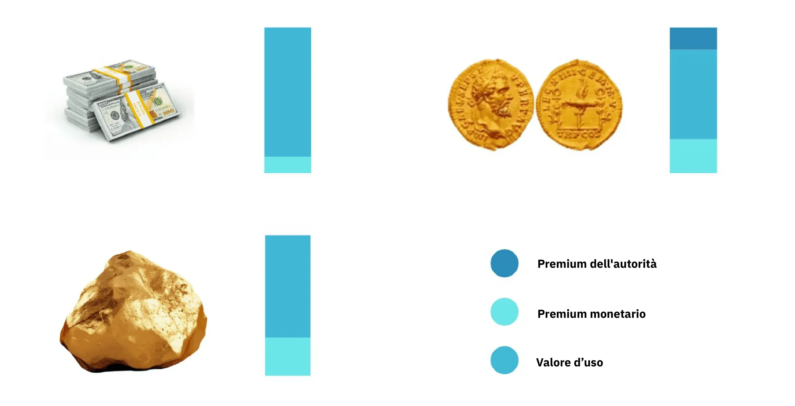

# Diverse definizioni di denaro

<partId>77b7918a-8c3b-11f0-b688-6b2ab22378c9</partId>

## Denaro vs moneta vs monnaie vs argent vs devise

<chapterId>bf8a6d21-df88-5d23-a0a5-e9a5c1300554</chapterId>

:::video id=d9c9e7df-9db3-4a9f-801e-10d3fc7dfc22:::

### Semantica dei termini monetari

In questa sezione dedicata alle varie teorie monetarie e soprattutto alle definizioni di denaro, vorrei fare un breve inciso sul tema della semantica. Vorrei scavare un po' più a fondo nelle definizioni di alcune parole relative al denaro e confrontarle con i loro equivalenti inglesi. Ad esempio, money, currency, rispetto a monnaie, argent e devise. Quindi, la situazione è la seguente.

Un po' di semantica:

Quando diciamo "**denaro**" (de la monnaie), la maggior parte delle persone penserà che ci stiamo riferendo ai piccoli spiccioli che riceviamo in cambio di una transazione. E se diciamo "**valuta**" (la monnaie), la gente probabilmente penserà che ci stiamo riferendo alla valuta di uno Stato. La valuta del Canada è il dollaro canadese. Proprio così.

Ma che dire del denaro (de l'argent)? Un ladro non dirà mai "Dammi tutti gli spiccioli!" (il ladro potrebbe rimanere deluso nel ricevere semplici monete di valore quasi nullo).

No, il ladro griderà: "Dammi **tutti i tuoi soldi**". E se il ladro si trova di fronte a voi per strada, si riferisce necessariamente alle **banconote** che avete in tasca.

D'altra parte, se il ladro cerca di frodarvi in modo più sofisticato, cercando di rubare i vostri beni svuotando tutti i vostri conti bancari, diremo che **si prenderà tutti i vostri soldi**. Qui la parola "denaro" si riferisce al **patrimonio dell'individuo**.

Quindi ci sono due definizioni per la parola denaro: contanti (banconote) e ricchezza.

### Valuta vs monnaie vs devise

Una moneta (devise) è necessariamente la moneta di un altro Paese, altrimenti si dice semplicemente denaro (monnaie). Se siete francesi, direte: "La livre sterling est la devise du Royaume-Uni et l'euro et la monnaie de l'Europe" (La sterlina è la moneta del Regno Unito e l'euro è la moneta dell'Europa).

Spesso, le persone che non hanno approfondito questi problemi semantici, nel tradurre questi termini, saranno inclini a parlare di moneta (devise) quando si tratta di moneta scritta, ma no, la moneta è denaro (monnaie) quando si tratta della moneta del proprio Paese, ed è devise quando si parla di altre valute. Il problema che vedo spesso è che in inglese ci sono due parole: c'è "money", che è un concetto, e c'è "currency", che è l'unità di misura di un Paese che viene utilizzata per gli scambi. Possiamo quindi parlare del concetto di denaro; è facile - è il concetto della parola *denaro*; è il denaro in generale. E *moneta* è molto semplice da equiparare alla valuta di un paese. Mentre in francese, purtroppo, spesso si dice "mais ce n'est pas une monnaie" quando si parla di bitcoin perché non è la valuta di un Paese, ma spesso, credo, ci si riferisce invece ai termini moneta. Questo è sbagliato da un lato, perché da El Salvador il bitcoin è la valuta di uno Stato. Resta il fatto che spesso si dice: *ma no, non è la moneta di uno Stato, non può essere denaro*. Ma in realtà, se ci riferiamo al concetto più ampio di *denaro*, il bitcoin rientra perfettamente in questa definizione, a mio avviso. È solo che in francese non abbiamo due parole per separare questi due concetti. Potremmo dire che la parola argent si riferisce alla moneta, ma purtroppo questa non è la sua definizione precisa. *Argent* (denaro) si riferisce alla ricchezza o alle banconote. Non è possibile fare un'equivalenza con la parola *denaro*. *Il denaro* è in realtà il concetto di moneta (monnaie).

## Definizione di Saifedean Ammous

<chapterId>07c4ba50-168c-567a-8957-0b187ff75f97</chapterId>

:::video id=936d6d3b-6d45-468e-bc44-85fbce9b857a:::

#### Che cos'è il denaro?

Il denaro è semplicemente qualcosa che si possiede o si acquista non per essere usato o consumato in sé, ma per essere scambiato in seguito con altri beni o servizi di cui si può avere bisogno. (Saifede)

Il denaro acquisisce un premio monetario quando esiste una domanda monetaria per il bene, per svolgere uno o più ruoli del denaro.

Il bene monetario deve essere sufficientemente scarso perché il premio monetario persista (per evitare che l'offerta si adegui alla domanda monetaria).

### Il premio monetario

In questa sezione sulle diverse definizioni di moneta, volevo parlare brevemente della definizione di Saifedean in The Bitcoin Standard, che mi ha sempre interessato molto. Quando l'ho letta mi è sembrata molto semplice. A questa definizione aggiungeremo anche il concetto di premio monetario. Come dice Saifedean nel suo libro, c'è necessariamente un concetto di scarsità. La domanda è: che cos'è il denaro?

> Il denaro è semplicemente qualcosa che si possiede o si acquista, non per essere usato o consumato in sé, ma per essere scambiato in seguito con altri beni o servizi di cui si può avere bisogno.

Questa è la definizione che Saifedean cita in The Bitcoin Standard. Aggiungerei che una moneta (la monnaie) acquisisce un premio monetario quando c'è una domanda monetaria per il bene, per svolgere uno o più ruoli della moneta. Quindi si potrebbe dire che una moneta che funge da riserva di valore avrà una domanda monetaria che le conferisce un premio monetario, poiché le persone vogliono acquistarla, ad esempio come riserva di valore o come mezzo di scambio.

### Scarsità e meccanismi di mercato

A questo, credo si debba aggiungere che il bene monetario deve essere sufficientemente scarso perché il premio monetario possa sussistere. Questo è molto importante. **Se un bene emerge per essere usato come denaro e vediamo che il suo prezzo sale, normalmente, se il bene non è abbastanza raro, le persone vorranno produrne di più per approfittare di questo guadagno di valore quando il prezzo sale**. Questo è il motivo per cui la maggior parte dei beni sul mercato ha un prezzo relativamente fisso. Quando il prezzo aumenta, la produzione tende ad aumentare. Quando il prezzo scende, la produzione diminuisce. C'è una sorta di aggiustamento del mercato. **E quando un bene è abbastanza raro, come l'oro, il meccanismo di mercato non riesce a compensare l'aumento della domanda per uso monetario. Quindi è la variabile che cambia, è il prezzo. Come nel caso del bitcoin**. Quando il prezzo del bitcoin sale, non produciamo più bitcoin. Quindi ciò che si adegua è il prezzo. Ed è per questo che da anni vediamo il prezzo del bitcoin aumentare quando aumenta la domanda di bitcoin. Poiché non c'è nessuno sulla Terra che possa cambiare l'algoritmo e dire "c'è più domanda, il prezzo sta salendo, produrremo di più" **L'offerta di nuovi bitcoin è programmata in anticipo e conosciuta in anticipo**. Ecco cosa stavo dicendo, che il bene monetario deve essere abbastanza raro perché il premio monetario persista, e quindi non venga raggiunto dai meccanismi di mercato, per evitare che l'offerta si adegui a questa nuova domanda monetaria.

## Mezzi di pagamento e valore liberatorio

<chapterId>5d424039-e342-56f7-9d8b-bba9551831a9</chapterId>

:::video id=af4c0765-8111-4cb7-891b-3ee54d6e7054:::

### Mezzi di pagamento vs. mezzi di scambio

In questa sezione dedicata alle diverse definizioni di denaro, propongo di esaminare insieme una citazione dal libro "Aux origines de la monnaie" (Le origini del denaro), un testo di Alain Testart sul tema del denaro come mezzo di pagamento e valore liberatorio.

*Da Aux origines de la monnaie, Alain Testart definisce il denaro come un mezzo di pagamento:*

> La funzione di mezzo di pagamento è qui concepita come distinta da quella di mezzo di scambio, nella misura in cui esistono pagamenti senza corrispettivo, pagamenti che non comprano nulla. Knies (1873: 192 e segg.) sviluppa a lungo questo tema dei trasferimenti di beni che non consistono in atti di scambio, come nel caso del wergeld (denaro insanguinato o composizione per omicidio) o delle tasse. Carl Menger attaccò questa quarta funzione nel suo articolo del 1892 "Geld", generalmente considerato uno dei più decisivi sull'argomento. Senza essere stata del tutto screditata, l'idea della funzione di mezzo di pagamento sembra essere stata oggi dimenticata nel pensiero economico, o almeno respinta a favore di quella di mezzo di scambio.
>

> Il denaro serve a pagare: visto in quest'ottica, è uno strumento di liberazione, che descrive in tutta la sua generalità la funzione di mezzo di pagamento. A questo proposito, si parla di "potere liberatorio" del denaro. Secondo Le Petit Robert, il potere liberatorio è "ciò che ha l'effetto di liberare (da un obbligo, da un debito)". Secondo il Grand Larousse, un pagamento liberatorio è qualsiasi "pagamento effettuato in condizioni legali in modo tale che il creditore non possa contestare l'estinzione del debito". Il denaro ha questo potere per eccellenza; è addirittura ciò che definisce il suo corso legale, poiché nessuno può rifiutare un pagamento effettuato in denaro, sia esso venditore o creditore. Il denaro è l'unico bene che non può essere rifiutato in pagamento di ciò che è dovuto, indipendentemente dal fatto che il debito sia verso un commerciante o verso il fisco. Tra tutti i beni, solo il denaro detiene questo privilegio. "È questo privilegio", scrive Charles. Gide (1921 I: 443), che costituisce ciò che chiamiamo corso legale.
>

> Qualsiasi scambio consistente nel trasferimento di un bene per un altro, o a condizione che venga dato un altro bene in cambio, implica necessariamente un obbligo da parte del ricevente di fornire questa contropartita. Il pagamento è l'adempimento di tale obbligo. Tutti gli scambi implicano quindi un pagamento, ma non tutti i pagamenti implicano uno scambio. Esistono pagamenti senza contropartita, cioè pagamenti che non consentono di ottenere un altro bene e non sono effettuati a questo scopo. Le tasse restano l'esempio di riferimento; vanno citate anche le multe di ogni tipo pagate alle autorità pubbliche e i risarcimenti dovuti ad altri secondo il principio che chi causa un danno ad altri deve ripararlo.

### Pagamenti senza controparte

Questa è una chiara illustrazione della tesi dell'autore. In effetti, egli distingue tra le due cose. Per lui, uno scambio è sia un trasferimento di beni che un pagamento. Il pagamento viene dopo. E il pagamento può avvenire anche senza scambio. L'autore fa l'esempio di come il pagamento di un biglietto del parcheggio o di una multa sia solo un pagamento. Non si ottiene un vero e proprio servizio in cambio. Qualcuno potrebbe obiettare che lo Stato vi sta rendendo un servizio in cambio, un servizio che consiste nel farvi pagare le multe per divieto di sosta. È abbastanza chiaro sul fatto che pagare le tasse è davvero un pagamento senza controparte, nel senso che è necessario pagare le tasse, anche se non si ottiene necessariamente un servizio. Dice che è proprio definito che pagare le tasse è solo un pagamento; non c'è alcun obbligo di ottenere servizi in cambio. Ne ho discusso con molti colleghi, che non sono necessariamente d'accordo con questo concetto. Ma questa è la tesi dell'autore. Egli cerca di collocare la nozione di pagamento e di staccarla dagli scambi con questi esempi, per esempio, di multa, di pagamento delle tasse. Inoltre, per esempio, la dote, egli esprime che la dote è un pagamento; non si ottiene necessariamente qualcosa in cambio. Qualcuno che critica questa proposta potrebbe dire: "Sì, ma in cambio si ottiene una moglie" Questo è il livello del dibattito su questo argomento.

C'è anche il wergeld, o denaro di sangue. Quindi è solo un pagamento per compensare. Il mio amico Ulrich direbbe:

> Sì, ma in cambio si ottiene la chiusura di questo file.

Quindi, avete commesso un crimine, ad esempio un omicidio. In quel momento, si paga il wergeld, e dopo, beh, si viene liberati da quella situazione. Quindi c'è un potere liberatorio. Si ottiene qualcosa in cambio?" Secondo l'autore, no. Secondo alcuni colleghi, sì.

Credo che in questa discussione si possa notare che il wergeld è uno dei buoni esempi per definire un pagamento. Infatti, chiaramente, non si riceve nulla in cambio.

## Denaro di debito vs. denaro di merce

<chapterId>4093677a-c8e8-5828-b994-15c01656186e</chapterId>

:::video id=f49cf5cc-288e-4daa-a1ff-b9de73506f4e:::

### Il dibattito fondamentale

Sempre nel contesto di questa sezione sulle diverse definizioni e teorie monetarie, esploriamo insieme due visioni diametralmente opposte: "il denaro è sempre debito" o "il denaro è sempre una merce". Da un lato, ci sono i sostenitori della teoria monetaria basata sul debito, che affermano: "No, il denaro è sempre debito! Dall'altra parte, i nostri famosi gold bugs sostengono che: "Ma no, vedi, il denaro è sempre una merce, è sempre oro; tutto il resto, banconote, pagherò, è solo credito, non denaro".

Vediamo insieme una chiara sintesi di queste teorie.

### La teoria del "debito di sempre

Ecco una sintesi della teoria monetaria nota come **"moneta a debito "**, secondo la quale il denaro è fondamentalmente una forma di debito:

Secondo questa teoria, sviluppata in particolare da Alfred Mitchell-Innes e approfondita da David Graeber, il denaro è intrinsecamente un riconoscimento del debito, derivante dalle relazioni di credito che storicamente hanno preceduto gli scambi monetari diretti. Piuttosto che nascere da una necessità legata al baratto, il denaro appare come un modo per contabilizzare, trasferire e saldare obblighi sociali o debiti tra individui o gruppi.

Quindi, tutto il denaro circola come un debito di una persona o di un'istituzione nei confronti di un'altra, sostenuto dalla fiducia e dall'autorità sociale o statale che ne garantisce la validità. Quindi, secondo loro, quando possediamo - come ho già detto - quando possediamo denaro, abbiamo un credito nei confronti della società, e la società ci deve un debito. Il denaro non è quindi mai neutro o autonomo, ma sempre un debito sottostante: possedere denaro significa essenzialmente possedere un credito nei confronti della società o di una comunità economica.

Questo ragionamento contraddice l'idea classica del denaro come semplice "merce intermedia" e sottolinea invece il ruolo centrale delle relazioni sociali e politiche nella creazione e nella gestione del denaro.

**La mia recensione:**

Ciò che mi disturba di questa teoria è che afferma che il denaro è sempre un debito, quando abbiamo esempi di scambi tra due tribù diverse che, ad esempio, si scambiano oro, dove la transazione è definitivamente conclusa e non rimane alcun debito latente. I sostenitori di questa teoria ci diranno spesso che questi scambi non sono monetari, ma di baratto. Come già detto, non sono d'accordo. Si tratta di uno scambio monetario, poiché l'oro non verrà consumato, ma usato come denaro.

### La teoria del "sempre una merce"

**Sempre una merce:**

Ecco un chiaro riassunto della teoria monetaria nota come **"denaro merce "**, dove il denaro emerge sempre come merce, in particolare l'oro, che emerge dalla necessità di poter commerciare, una merce che sarà generalmente accettata all'estero e che viene acquistata per scopi commerciali.

Secondo questa teoria, sviluppata dagli economisti classici (Adam Smith, David Ricardo) e ripresa da Marx, il denaro emerge naturalmente come una merce tra le altre, spesso un metallo prezioso come l'oro o l'argento, che ha un valore intrinseco indipendente dal suo ruolo monetario. Inizialmente, queste merci vengono scelte spontaneamente dagli attori economici per facilitare gli scambi, grazie alle loro qualità intrinseche (scarsità, durata, divisibilità e stabilità).

Il denaro merce si distingue per la sua esistenza fisica e per un valore determinato dalla quantità di lavoro socialmente richiesto per produrlo (come in Marx). La società utilizza l'oro, ad esempio, non solo per semplificare il baratto, ma anche come unità di conto, riserva di valore e mezzo di scambio universale.

In questa visione, il denaro conserva sempre un valore reale, poiché rimane legato a un bene tangibile. Anche quando il ruolo del denaro diventa astratto (monete coniate, banconote o moneta scritturale), la sua validità deriva ancora, direttamente o indirettamente, da un riferimento a un bene sottostante come l'oro. Questa teoria insiste quindi sull'origine materiale ed economica del denaro, in contrasto con le teorie che lo considerano una mera convenzione o un debito. Secondo questa teoria, qualsiasi rappresentazione del denaro da parte di un sostituto, come una banconota riscattabile in oro, sarebbe un credito.

**La mia recensione:**

Si noti che questa visione assomiglia a quella della teoria della moneta-merce, ma fa un passo in più. Propongono che il denaro sia **sempre** una merce. E quando diciamo loro: "*Sì, ma possiamo concordare che una banconota è denaro per questo gruppo; può essere sostenuta dall'oro, funziona, e la banconota in quanto tale è denaro*".

In risposta, ci forniranno l'esempio del coupon dello spogliatoio. Ci diranno: "Sì, ma no, quando si ha un buono spogliatoio per il proprio indumento, possiamo chiamare il buono cassa un indumento?

Certo che no, è come un riconoscimento, un reclamo, in sostanza, che vi permetterà di riavere il vostro indumento. Questo parallelo non regge, perché il buono dello spogliatoio non è un metodo di pagamento generalmente accettato. **Il denaro non è un diritto su un oggetto specifico come un indumento; è un modo, un mezzo di scambio, un mezzo di scambio o un mezzo di pagamento generalmente accettato**.

Non si può quindi fare un parallelo tra un buono di spogliatoio e una banconota in valuta fiat, poiché il buono di spogliatoio permette di ottenere in cambio un bene particolare, è un token che permette di recuperare il proprio bene. Mentre una banconota, la moneta a corso fisso, è un buono universale che permette di accedere a qualsiasi bene.

E secondo me, ovviamente, anche il denaro fiat può essere considerato denaro se viene considerato tale dalla popolazione. E penso che sia un errore semantico insistere sul fatto che non possa essere denaro, dal momento che si tratta di una cedola per ottenere il vero denaro, almeno all'epoca, che era l'oro sottostante.

Non ho problemi a considerare la moneta d'oro conservata in cassaforte e la banconota che rappresenta quella moneta d'oro come moneta. Per me non c'è alcun problema di semantica, si tratta solo di due tipi di moneta. Se non sbaglio, Mises spiega molto bene questo fenomeno parlando di sostituti monetari.

La loro visione si riduce al fatto che non è possibile considerare contemporaneamente una moneta d'oro nel caveau di una banca e la banconota che la rappresenta come denaro. Personalmente, non vedo alcun problema in questo, non vedo alcun paradosso nella situazione. Chi crede che il denaro sia sempre una merce non vede le cose come le vedo io.

**Ecco una recensione del concetto di cedola da spogliatoio tratta dal libro *Aux origines de la monnaie*:**

*Nota 14: "Ottima la critica - ottima perché proprio sul terreno su cui Knapp si pone, quello giuridico - di Rist (1938: 372, nota 1) al paragone tra cartamoneta e gettoni di cassa: se si può parlare di un tipo di rivendicazione in entrambi i casi, la differenza fondamentale è che nel primo caso, e solo nel primo, si tratta di una rivendicazione senza un oggetto specifico

Inoltre, a proposito del **reclamo**, lo stesso autore osserva quanto segue:

> Bastiat è libero di immaginare un buono per l'intera società presentato come "un immenso bazar", ma questa piccola aggiunta, questa estensione apparentemente innocua, è l'intera differenza tra credito e denaro. Il denaro non è un credito su un particolare negozio. Non esiste un credito anonimo. Ma l'anonimato che caratterizza il denaro, e quindi la sua generalità, è ciò che lo rende così potente. Il denaro non è come il credito, né è in alcun modo riducibile ad esso. **Il denaro è molto più del credito.**

**Un paradosso: il denaro a debito e il denaro a merce

Il paradosso che meglio illustra la profonda dicotomia tra le teorie della moneta-debito e della moneta-merce riguarda la questione se l'oro sia oggi una moneta.

Da un lato, la teoria della moneta-debito definisce la moneta innanzitutto come un intermediario di scambio o un mezzo di pagamento generalmente accettato, o addirittura imposto, da un'autorità pubblica. In questa prospettiva, l'oro non è più una moneta, poiché non è ampiamente utilizzato o accettato come mezzo di scambio comune.

D'altra parte, la teoria della moneta merce considera il denaro come un bene tangibile, scelto spontaneamente dalla società per le sue caratteristiche intrinseche (scarsità, durata, divisibilità, ecc.). Secondo questo approccio, l'oro rimane la vera moneta universale e tutte le altre forme di denaro oggi non sono altro che crediti basati sulla fiducia.

Questo paradosso mostra chiaramente il divario tra queste due concezioni monetarie: per la prima, l'oro non è più una moneta; per la seconda, al contrario, rimane l'unica vera moneta esistente.

## Teoria monetaria moderna

<chapterId>8efc29af-3193-5d97-ad9f-e608b32924ff</chapterId>

:::video id=f8127cb7-46a1-468c-bbb5-97bf0a8b8837:::

### Principi della moderna teoria monetaria

Per concludere questa sezione sulle varie teorie monetarie, parliamo del bambino prodigio delle teorie monetarie, ammirato da molti economisti moderni che lavorano per le banche centrali, e chiamato teoria monetaria moderna, spesso nota come MMT.

*la *Teoria Monetaria Moderna (MMT)** è un approccio economico che sostiene che uno Stato con una propria moneta sovrana (come gli Stati Uniti, il Canada o il Giappone) non può mai esaurire il proprio denaro, poiché può sempre emetterne di più per finanziare la propria spesa. Secondo questa teoria:

- Il denaro è una creazione dello Stato, non una risorsa limitata**

- Le tasse e i prestiti non vengono utilizzati direttamente per finanziare la spesa pubblica, ma piuttosto per regolare l'inflazione, influenzare il comportamento economico e mantenere la domanda di valuta nazionale*

- Il vero limite alla spesa pubblica è l'inflazione, non il deficit di bilancio o il debito pubblico.

- Se il denaro creato viene incanalato in settori in grado di assorbirlo, non ci sarà nemmeno inflazione.

- Il governo deve quindi adeguare la spesa in base alle risorse reali disponibili (manodopera, capacità industriale, risorse naturali) per evitare un'inflazione eccessiva.

### Il ruolo delle tasse nella MMT

Qui troverete la famosa risposta a tutti coloro che dicono: "Sì, ma se possiamo stampare denaro, perché paghiamo le tasse?" Ebbene, la MMT ha la risposta giusta a questa idea. È vero che nel sistema fiat, nel sistema moderno, tecnicamente non c'è nulla che limiti la creazione di denaro, a parte l'inflazione. Ma loro suggeriranno che, in primo luogo, la tassazione è necessaria per limitare l'inflazione, poiché rimuoverà il denaro dall'economia. Quindi, se non abbiamo tasse per compensare, tutta questa creazione di denaro potrebbe creare inflazione. Le tasse, sostengono, sono letteralmente un modo per rimuovere il denaro dal sistema per limitare l'inflazione.

Sul tema del denaro investito in settori che possono assorbirlo, possiamo citare l'esempio degli Stati Uniti, che danno trilioni di dollari all'industria militare, il che non causa inflazione perché l'industria militare, il complesso militare-industriale, è perfettamente in grado di assorbire questi trilioni di dollari.

D'altra parte, se si vogliono costruire più strade e c'è un limite alle risorse e agli appaltatori che possono produrle, raddoppiare il budget per le strade creerà necessariamente un effetto di scarsità sulla forza lavoro che può creare queste strade. Quindi il prezzo aumenterà per effetto delle forze di mercato, della domanda e dell'offerta. Se i nostri leader onniscienti sanno dove mettere i soldi, tecnicamente non dovrebbero causare inflazione. E io risponderei che, in pratica, è abbastanza chiaro che provoca inflazione.

In conclusione, secondo la MMT, lo Stato può utilizzare la sua capacità di creare moneta per raggiungere la piena occupazione e finanziare gli investimenti sociali ed ecologici, controllando al contempo l'inflazione attraverso un'adeguata politica fiscale. L'obiettivo degli economisti keynesiani, un'altra scuola di pensiero economico, è spesso quello di gestire la disoccupazione attraverso la gestione dei tassi di interesse e di finanziare gli investimenti sociali ed ecologici controllando l'inflazione attraverso un'adeguata politica fiscale.

### Recensione MMT

Questa teoria si applica solo a una manciata di Paesi (vedi il tweet di Stephanie Kelton) che godono di una vera sovranità monetaria, cioè possono contrarre debiti nella propria valuta. Questa teoria è difficile da applicare alle economie dipendenti dalle importazioni, che devono mantenere la fiducia internazionale nella loro valuta.

E cos'è la vera sovranità monetaria? Significa essere in grado di aumentare il debito nella propria valuta. Bisogna essere in grado di gestire un surplus commerciale per avere abbastanza riserve valutarie, abbastanza valuta estera, in modo da non dover raccogliere denaro in valuta estera per poter importare beni. Questo riguarda una manciata di Paesi.

Qui sotto potete vedere un tweet di Stephanie Kelton, che è una specie di donna manifesto di questo movimento. Ha scritto un libro intitolato "Il mito del deficit". Nel tweet scrive che diversi Paesi, come gli Stati Uniti, il Giappone, il Canada, l'Australia e il Regno Unito, non possono rimanere senza soldi.

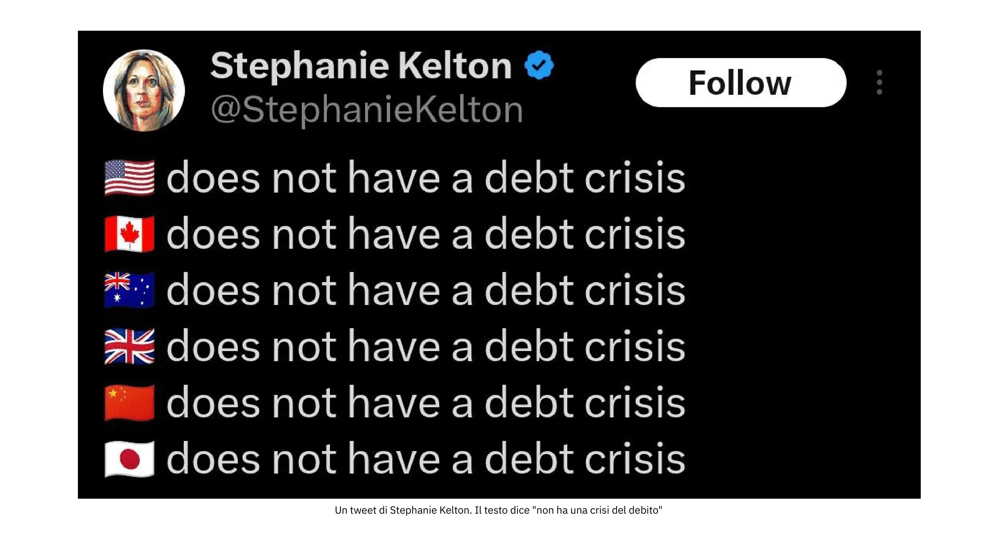

Stranamente, elenca solo sei Paesi? Perché? Perché hanno una vera sovranità monetaria. Ma sulla Terra ci sono circa 200 Paesi e non tutti hanno la sovranità monetaria. Quindi, la mia critica a questa teoria, oltre a essere un po' strana e non funzionale, è che funziona solo per pochi Paesi che godono di una vera sovranità monetaria, quelli che possono emettere buoni del tesoro nella propria valuta. In un certo senso, va a scapito del resto del mondo. Creando questa moneta, è come se esportassero la loro inflazione altrove, un po' come hanno fatto gli Stati Uniti con i loro privilegi esorbitanti per decenni. Si tratta di una forma di colonialismo monetario, in cui i Paesi che godono di una fiducia e di una domanda globale per la loro moneta possono stampare tutta la moneta che vogliono senza incorrere in un'inflazione significativa, spesso perché esportano tale inflazione.

Questa teoria è difficile da applicare alle economie dipendenti dalle importazioni che devono mantenere la fiducia internazionale nella loro valuta.

Questa teoria richiede anche un certo livello di pianificazione centralizzata dell'economia, in particolare per garantire un maggiore controllo sulle risorse reali (lavoratori, materie prime, capacità industriale) e per gestire l'inflazione.

# La caduta e la rinascita del denaro

<partId>87a34ca9-782b-5ade-b51a-400f88ed7b0c</partId>

## Monete greche

<chapterId>7714195f-74ce-5f8c-be5f-59302d39fff4</chapterId>

:::video id=8e5c3091-0910-471b-8d4b-0dc6e9afa656:::

### Contesto

Prima di iniziare, ecco il contesto storico:

**Comprensione storica:**

**I Romani chiamavano i Greci "Graeci" e la Grecia "Graecia "**

**I Greci si chiamavano "Elleni" e il loro paese "Hellas"

**Homer** (nato intorno all'VIII secolo a.C.)

Leggendario poeta greco, presunto autore de *Iliade* e *Odissea*.

Intorno al **750 a.C.: si dice che Licurgo**, il mitico legislatore di Sparta, abbia stabilito la costituzione spartana basata sulla disciplina militare e sulla semplicità.

**Numa Pompilio** (753-673 a.C.)

Secondo re di Roma, famoso per aver dato a Roma le prime istituzioni religiose e giuridiche.

**Dracon**, legislatore ateniese (VII secolo a.C.), famoso per le sue leggi estremamente severe, da cui il termine "draconiano".

**594 a.C.: Solone** diventa legislatore ad Atene e riforma radicalmente la società ateniese, in particolare abolendo la schiavitù per debiti.

**776 A.C: Giochi olimpici antichi**

I primi giochi sportivi regolari si tenevano a Olimpia ogni quattro anni, riunendo le città greche.

**Pitagora** (ca. 570-495 a.C.)

Filosofo e matematico greco, famoso per il suo teorema sul triangolo rettangolo.

**Senofane di Colofone** (570-478 a.C. circa)

Filosofo presocratico noto per la sua critica al politeismo greco tradizionale.

**490 a.C.: Battaglia di Maratona**

Gli Ateniesi respingono vittoriosamente un'invasione persiana, segnando una svolta decisiva per la civiltà greca.

**Erodoto** (484-425 a.C. circa), soprannominato "padre della storia", scrisse una vasta opera che descrive le guerre persiane, compresa la vittoria greca su Serse nel 480 a.C..

**Socrate** (470-399 a.C.)

Filosofo ateniese famoso per il suo metodo dialettico e per il suo insegnamento sull'etica e sulla conoscenza di sé.

**Aristofane** (446-386 a.C. circa)

Drammaturgo ateniese, famoso per le sue commedie satiriche come *Le rane*.

**Sofocle** (V secolo a.C.), nella sua opera teatrale *Antigone*, critica il denaro come fonte di corruzione morale e politica, attraverso il tiranno Creonte.

**Plato** (c. 428-348 a.C.)

Filosofo greco, allievo di Socrate, fondatore dell'Accademia, autore de *La Repubblica*.

**431-404 A.C: Guerra del Peloponneso**

Grande conflitto tra Atene e Sparta, che si conclude con una sconfitta per Atene.

**431 A.C.**: Atene finanzia la Guerra del Peloponneso diluendo le sue monete d'oro e d'argento per aumentarne la quantità in circolazione, causando inflazione.

**Senofonte** (430-355 a.C. circa)

Scrittore, filosofo e generale ateniese, discepolo di Socrate, autore delle *Anabasi*.

**414 A.C.**: Atene inizia a perdere la Guerra del Peloponneso dopo una disastrosa spedizione in Sicilia.

**405 A.C: Aristofane**, nella sua commedia *Le rane*, descrive esplicitamente la svalutazione della dracma d'argento e la comparsa di monete di bronzo inferiori ad Atene, illustrando il principio oggi noto come "Legge di Gresham".

**404 A.C.**: Atene capitola dopo un lungo assedio da parte di Sparta.

**Aristotele** (384-322 a.C.)

Importante filosofo greco, allievo di Platone, fondatore del Liceo, noto per i suoi lavori di logica, biologia e filosofia politica.

**327 A.C.**: Alessandro Magno conquista Persepoli e le province orientali dell'Impero persiano, espandendo notevolmente il suo impero.

**323 A.C.**: Alessandro muore a Babilonia senza un chiaro erede, scatenando guerre tra i suoi generali (diadochi) per la spartizione dell'impero.

**Archimede** (287-212 a.C. circa)

Matematico, fisico e inventore greco, famoso per le sue scoperte in campo geometrico e meccanico.

**196 a.C.: la Stele di Rosetta** viene incisa durante il regno del faraone Tolomeo V, consentendo la successiva decifrazione dei geroglifici egizi.

**192-188 A.C: Guerra Romano-Seleucide**

Roma sconfigge l'impero seleucide guidato da Antioco III, consolidando la propria influenza in Grecia e in Asia Minore.

**146 a.C.: Battaglia di Corinto**

I Romani distruggono la città greca di Corinto, segnando la fine dell'indipendenza politica greca e la graduale integrazione della Grecia nel mondo romano.

Per questa sezione sull'antichità, la caduta di Roma e il Medioevo, inizieremo con una sezione sulle monete greche.

La storia della moneta nell'antica Grecia inizia intorno al 600 a.C., quando le città greche adottarono rapidamente l'innovazione proveniente dalla Lidia in Asia Minore, utilizzando inizialmente l'electrum e successivamente l'argento. Le prime monete greche furono coniate sull'isola di Egina, con una tartaruga marina o terrestre, ma fu la dracma ateniese, decorata con Atena e una civetta, a diventare il simbolo monetario per eccellenza a partire dal V secolo a.C., dominando ampiamente il commercio internazionale dell'epoca.

E ho la fortuna di avere una copia di una dracma greca di quel periodo con il famoso gufo e una figura sul retro. È una tetradracma, che era più grande di una semplice dracma.

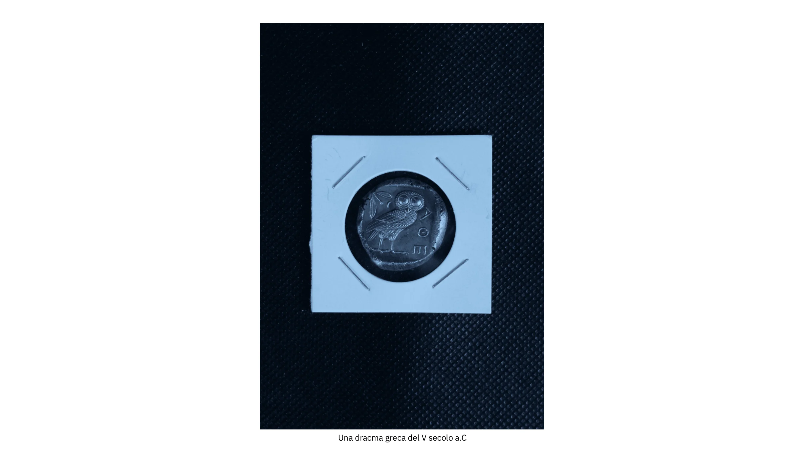

Ogni città greca sviluppò un proprio rapporto con il denaro. Ad Atene, la moneta era profondamente legata al potere politico ed economico. Il famoso decreto ateniese della fine del V secolo a.C. impose l'uso esclusivo della moneta ateniese nei territori alleati, rafforzando così la sua egemonia economica. Atene accumulò anche grandi riserve d'oro per le emergenze, che venivano conservate sull'Acropoli, forse come simbolo della sua prudenza economica. Sparta, invece, città militare dai valori rigorosi, scelse di limitare fortemente l'uso del denaro, vietando ai suoi cittadini di possedere monete d'oro o d'argento. Sparta preferì utilizzare pesanti lingotti di ferro per scoraggiare il commercio estero e mantenere la coesione sociale.

Le guerre venivano spesso finanziate con la manipolazione della valuta. Durante la Guerra del Peloponneso (431-404 a.C.), Atene ricorse a drastiche svalutazioni per pagare le sue truppe. Privata dell'accesso alle sue miniere d'argento dall'occupazione spartana di Decelia nel 413 a.C., Atene dovette fondere statue d'oro per coniare in fretta e furia nuove monete nel 407/406 a.C.. Poi, nel 406/405 a.C., creò monete di bronzo placcate d'argento, provocando una crisi monetaria illustrata da **Aristofane**, che già evoca quella che oggi è nota come Legge di Gresham: la moneta cattiva scaccia quella buona. Questa moneta di emergenza fu rapidamente demonetizzata dopo la guerra per ripristinare la fiducia nella monetazione ateniese.

La fine del periodo classico fu segnata dall'ascesa della Macedonia sotto Filippo II e suo figlio Alessandro Magno, che sconvolse profondamente l'equilibrio monetario greco. Grazie alle vaste miniere d'oro e d'argento del Monte Pangea, Filippo II produsse una grande quantità di denaro per finanziare le sue campagne militari e politiche, stabilendo un semplice e pratico standard oro-argento (10:1). I suoi stateri d'oro, che celebravano la sua vittoria ai Giochi Olimpici, circolarono fino all'Europa occidentale, raggiungendo persino l'Inghilterra. Alessandro perseguì questa politica monetaria, facendo circolare ampiamente la dracma attica durante le sue conquiste in Oriente fino all'India. Questa massiccia circolazione di monete segnò l'inizio dell'era ellenistica, quando l'immagine dei sovrani sostituì gradualmente quella delle divinità sulle monete. Questa innovazione permise a generazioni di monarchi ellenistici di promuovere se stessi, relegando le divinità tradizionali a un ruolo secondario sul rovescio delle loro monete.

Dopo la morte di Alessandro nel 323 a.C., i suoi generali si spartirono il suo immenso impero, fondando dinastie in Egitto (i Tolomei), in Siria (i Seleucidi) e altrove. Questi regni ellenistici adottarono diversi sistemi monetari: i Tolomei imposero un sistema monetario chiuso per controllare la circolazione del denaro, preferendo utilizzare il grano come moneta interna per risparmiare i metalli preziosi per le spese militari esterne. Allo stesso tempo, Rodi divenne un importante centro commerciale prima di essere indebolita economicamente dai Romani, che nel 167 a.C. istituirono Delos come porto franco.

L'uso del denaro era fondamentale per la remunerazione dei mercenari. I soldati di Alessandro ricevevano quotidianamente dracme d'argento.

La cavalleria, l'élite dell'esercito altamente specializzato di Alessandro, riceveva in media due dracme al giorno, un fante una dracma e un mercenario ordinario due terzi di dracma, il doppio del salario di un semplice operaio.

Anche durante la guerra del Peloponneso furono pagate somme considerevoli ai soldati: oltre 1.200 talenti per sedare la rivolta di Samo e oltre 2.000 talenti per assediare Potidea.

Quando l'esercito fu pienamente impegnato in Asia Minore, il costo totale si aggirava intorno ai venti talenti al giorno, ovvero circa mezza tonnellata d'argento, o 120.000 dracme.

La monetazione greca svolse anche un importante ruolo culturale: ogni città cercava di affermare la propria identità coniando le proprie monete con simboli locali o mitologici. Ad esempio, Eraclio raffigurava Eracle (Ercole) che combatteva contro un leone, mentre Cirene mostrava la famosa pianta medicinale silphium.

Infine, nonostante la loro varietà e le fluttuazioni regionali, la monetazione greca classica ed ellenistica ha lasciato un segno duraturo nella storia economica e culturale del mondo mediterraneo, influenzando profondamente i sistemi monetari successivi fino a Roma, che ha gradualmente adottato e sviluppato i concetti economici greci per strutturare la propria economia imperiale.

## L'impatto della moneta in Grecia

<chapterId>3a5e6c7d-699c-5567-87cd-3374c49d55a9</chapterId>

:::video id=0c79a59c-e179-4893-a414-1b8de0930eb9:::

### Atene e il contrasto con Sparta

La contrapposizione tra Atene e Sparta durante il periodo greco classico rivela due modelli di organizzazione politica ed economica radicalmente diversi. Mentre Sparta rifiutava la moneta metallica a favore di un sistema autosufficiente basato sulla fiducia civica, Atene abbracciava pienamente questa tecnologia per costruire e mantenere il suo impero marittimo.

### La necessità monetaria della potenza navale

L'Impero ateniese, nonostante il nome altisonante, rimase geograficamente modesto: essenzialmente Atene e le città del Mar Egeo. Il suo potere si basava sulla Lega di Delo, un'alleanza militare dominata da Atene come egemone. Questa struttura imperiale richiedeva uno strumento economico unificato: la moneta d'argento ateniese.

Il mantenimento di una flotta era al centro di questa necessità monetaria. Una singola trireme ateniese costava da uno a due talenti d'argento - una somma considerevole. Con diverse centinaia di navi da mantenere, Atene aveva bisogno di un sistema fiscale efficiente. La moneta divenne lo strumento indispensabile per raccogliere i tributi dalle città vassalle e per finanziare la forza di proiezione navale che garantiva la coesione dell'impero.

### L'imposizione monetaria come strumento di dominio

Atene impose la sua moneta d'argento a tutti i membri della Lega di Delo. Questa standardizzazione monetaria aveva diversi obiettivi strategici. In primo luogo, facilitava la riscossione dei tributi creando un'unità di conto comune. In secondo luogo, rafforzava la dipendenza economica delle città vassalle da Atene. Infine, proiettava simbolicamente il potere ateniese nell'intero impero marittimo.

Questa politica monetaria contrasta nettamente con il modello spartano. Sparta, una potenza terriera, poteva contare sul lavoro degli eletti (schiavi) del Peloponneso per la propria sussistenza. Il suo sistema economico chiuso, incentrato sulle città, non richiedeva strumenti monetari sofisticati. I cittadini-soldati vivevano insieme, condividevano pasti comuni e non avevano bisogno di denaro per gli scambi quotidiani.

### La moneta come veicolo per il commercio marittimo

La natura marinara dell'impero ateniese lo rendeva aperto al commercio. Diversamente da Sparta, che era ripiegata su se stessa, Atene doveva commerciare con il mondo esterno per la sua sopravvivenza e la sua prosperità. La moneta divenne lo strumento indispensabile del commercio mediterraneo.

Questo orientamento verso l'esterno creava un circolo virtuoso: il commercio generava entrate, queste finanziavano la flotta, la flotta proteggeva le rotte commerciali e manteneva l'impero, e l'impero imponeva la moneta ateniese, che facilitava il commercio. La moneta non era più un semplice mezzo di scambio, ma divenne un pilastro della strategia imperiale.

### I limiti del potere monetario

Nonostante questa sofisticazione economica, il potere monetario ateniese mostrò i suoi limiti durante la Guerra del Peloponneso. Di fronte alle forze terrestri spartane, la superiorità navale e finanziaria di Atene non fu sufficiente. Le costose spedizioni, come la disastrosa campagna di Siracusa in Sicilia, esaurirono le risorse finanziarie senza portare a una vittoria decisiva.

La storia dimostra che la moneta, pur essendo un potente strumento di proiezione del potere, non è garanzia di dominio militare. Sparta, senza moneta metallica ma con una notevole coesione sociale, alla fine prevalse sull'impero monetario ateniese.

### Due modelli, due destini

La contrapposizione tra Atene e Sparta illustra due approcci fondamentali all'organizzazione sociale ed economica. Atene rappresenta il modello aperto, commerciale e monetario, precursore dei moderni imperi marittimi. Sparta incarna il modello chiuso, autarchico, basato sulla fiducia civica piuttosto che su strumenti monetari.

Questi due sistemi dimostrano che l'adozione della moneta è strettamente legata al modello politico ed economico scelto. Per una potenza marittima e commerciale come Atene, la moneta divenne indispensabile. Per una società guerriera e chiusa come Sparta, rappresenta una minaccia per l'ordine sociale. Questa antica dicotomia informa ancora oggi i dibattiti sul ruolo del denaro nell'organizzazione delle società.

## La Repubblica Romana

<chapterId>0bc80983-33e1-5881-85bb-7c22f3144a9a</chapterId>

:::video id=dc05ca97-d29c-4679-bfeb-912c47d86ce2:::

### Storia della Repubblica Romana

- 753 - 509 a.C.: Regno di Roma**
- 753 A.C: Fondazione di Roma** (tradizionalmente attribuita a Romolo).
- 509 - 27 A.C: Repubblica Romana**, Roma diventa una repubblica governata da un Senato eletto e da consoli.
- 280 - 275 A.C: Guerra di Pirro**. Pirro, re dell'Epiro, combatte i Romani nell'Italia meridionale, ottenendo costose vittorie ("vittorie di Pirro").
- 264 - 146 A.C: Guerre puniche**. Grande conflitto che oppone Roma a Cartagine per il dominio del Mediterraneo occidentale.
- Annibale (247 - 181 a.C. circa)**. Leggendario generale cartaginese, famoso per aver attraversato le Alpi con il suo esercito e i suoi elefanti per attaccare Roma durante la Seconda guerra punica.
- 146 a.C.: battaglia di Corinto**. Roma distrugge la città greca di Corinto e impone il suo dominio definitivo sulla Grecia continentale.
- 91-87 a.C.: Guerra sociale**. Rivolta degli alleati italici di Roma che chiedono la cittadinanza romana, che alla fine porterà alla loro piena integrazione nella cittadinanza.
- 64 a.C.: fine della resistenza seleucide**. Roma elimina definitivamente l'influenza seleucide in Siria, consolidando il suo dominio sul Mediterraneo orientale.
- 55 A.C: Giulio Cesare conquista l'Europa centrale e occidentale**. Giulio Cesare estende il dominio romano sulla Gallia (l'attuale Francia) ed entra in Germania e in Bretagna.
- 43 A.C: Formazione del Secondo Triumvirato**. Alleanza politica tra Ottaviano (poi Augusto), Marco Antonio e Lepido, per stabilizzare Roma dopo l'assassinio di Cesare.
- 27 a.C.: inizio della Pax Romana**. Periodo di stabilità politica e prosperità sotto il regno di Augusto, che segna l'inizio dell'Impero Romano.

### Gli inizi monetari tardivi di Roma

In questa sezione dedicata all'antichità, rivolgiamo ora la nostra attenzione alla Repubblica romana. La storia monetaria di Roma è iniziata molto più tardi rispetto a quella dei Greci e dei Persiani. Fondata nel 753 a.C., Roma attese quasi quattro secoli prima di adottare veramente la moneta. Durante questo lungo periodo, i Romani utilizzarono un sistema primitivo di scambio con pezzi di bronzo irregolari chiamati aes rude, che richiedevano una pesatura precisa per ogni transazione. Solo alla fine del IV secolo a.C., sotto l'influenza greca ed etrusca, Roma iniziò a emettere le prime monete, in particolare in bronzo fuso come in Cina, l'aes grave, caratteristico degli scambi romani fino alla **seconda guerra punica**.

### L'influenza greca e le prime monete d'argento

L'incontro decisivo con i Greci dell'Italia meridionale introdusse veramente i Romani alla coniazione di monete d'argento. Intorno al 280 a.C., Roma iniziò a produrre le proprie monete d'argento a imitazione dei didrammi greci. La prima emissione regolare di monete d'argento a Roma risale proprio al 269 a.C., con i leggendari gemelli Romolo e Remo allattati dalla lupa, un simbolo divenuto iconico.

In effetti, molte monete romane del periodo della Repubblica raffigurano miti di fondazione. La mia la potete vedere qui sotto: è una superba moneta autentica del re Tatius. Illustra il mito del rapimento delle donne da parte dei Sabini. Tatius era il re di questa regione e il mito di fondazione racconta di come i Romani rapirono le donne ai Sabini, una popolazione che viveva nelle vicinanze. In seguito, il re Tatius divenne co-re con Romolo, uno dei fondatori di Roma.

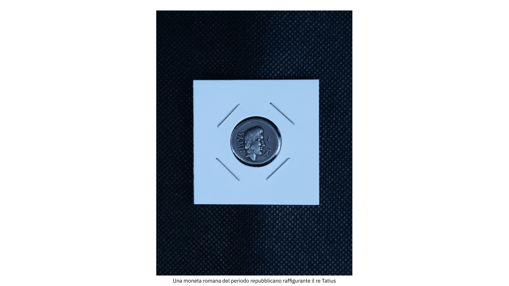

### L'origine della parola "moneta" e il tempio di Giunone Moneta

Il termine "moneta" ha origine nel tempio di Giunone Moneta a Roma. La leggenda narra che, durante un'invasione gallica nel 390 a.C., le oche sacre del Campidoglio avvertirono i Romani di un pericolo imminente. Per ringraziare la dea Giunone, protettrice del Campidoglio, fu eretto un tempio in suo onore che divenne presto la zecca per le monete romane.

### Le guerre puniche e le crisi valutarie

I conflitti militari ebbero una notevole influenza sullo sviluppo monetario romano. Durante la Seconda guerra punica (218-201 a.C.) contro Cartagine, Roma si trovò ad affrontare gravi difficoltà finanziarie di fronte all'invasione di Annibale. Per alleviare queste urgenti necessità, Roma ricorse per la prima volta a un'emissione eccezionale di monete d'oro e a una significativa svalutazione della sua monetazione d'argento, passata da una purezza iniziale del 97% a circa l'89%. Anche il peso delle monete di bronzo (aes) diminuì drasticamente, perdendo quasi l'80% in sei anni.

Qui possiamo rivisitare un concetto che abbiamo già discusso in precedenza, ovvero che i Greci fondevano i metalli preziosi conservati nei templi per contribuire ad alleviare le crisi economiche. E per parlare di **Cartagine**, qui sotto potete ammirare una vera moneta cartaginese della mia collezione. Queste monete cartaginesi presentano una palma su un lato e un cavallo sull'altro. Su questa moneta, il cavallo non è molto riconoscibile, perché è molto consumato.

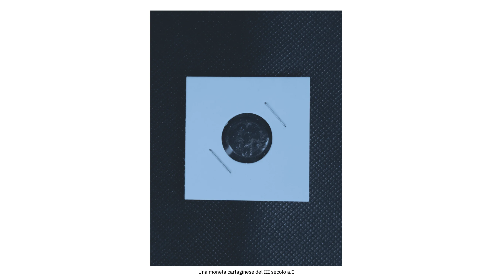

Di conseguenza, anche il peso delle monete di bronzo, note come aes, diminuì drasticamente, perdendo quasi l'80% in sei anni. Quindi, il peso di queste monete di bronzo, che non erano un metallo prezioso e venivano utilizzate nel commercio quotidiano, diminuì molto, segno di una svalutazione monetaria dovuta a queste guerre.

### Il denario d'argento e la stabilità monetaria

È in questo contesto critico che Roma introdusse il famoso denario d'argento intorno al 212 a.C.. Questa riforma assicurò una notevole stabilità monetaria: il denario rimase la moneta dominante per quasi 450 anni. Roma deve questa stabilità a una gestione rigorosa, nonostante un'importante riprezzamento nel 146 a.C. e una notevole produzione per finanziare i suoi immensi eserciti, in particolare durante le guerre puniche, sociali (91-87 a.C.) e macedoni. A titolo di esempio, il mantenimento di una sola legione romana costava circa 1,5 milioni di denari all'anno, a dimostrazione dell'entità del fabbisogno monetario.

Al di là dei confini romani, le guerre portarono a importanti svalutazioni nelle regioni sotto l'influenza romana. La Cartagine punica vide la purezza del suo electrum diminuire drasticamente, passando dal 98% di oro nel IV secolo ad appena il 30% durante la Seconda Guerra Punica, mentre le sue monete d'argento scesero al 18% di purezza.

### L'evoluzione delle motivazioni monetarie

Con l'espansione di Roma, anche il carattere delle monete si evolse: inizialmente anonime e patriottiche, le monete adottarono gradualmente disegni personalizzati con le potenti famiglie dei coniatori (coloro che battevano le monete). Questa transizione simboleggia chiaramente le trasformazioni politiche della tarda Repubblica romana.

Infine, pur dominando il mondo mediterraneo dal punto di vista economico, Roma mantenne una certa semplicità nei mezzi di pagamento: non si sviluppò una vera e propria forma di trasferimento monetario oltre allo scambio diretto di monete, con l'eccezione dei trasferimenti fiscali e dei crediti privati riservati all'élite.

## L'Impero Romano

<chapterId>2dc44e50-112a-5abf-97ae-8e0a9ecda989</chapterId>

:::video id=f8d6f3d6-9ee4-4504-888e-4f12b3f20489:::

**Comprensione storica:**

**Il Principato** fu la forma di governo imperiale dell'Impero romano dall'inizio del regno di Augusto, nel 27 a.C., alla fine della crisi del III secolo, nel 284 d.C..

**27 a.C.: inizio della Pax Romana**

Periodo di stabilità politica e prosperità sotto il regno di Augusto, che segna l'inizio dell'Impero romano.

**Augusto (30 a.C. - 14 d.C.)** riformò radicalmente il sistema monetario romano, stabilendo uno standard duraturo e stabile per la monetazione imperiale.

**Augusto fu anche uno dei primi collezionisti** riconosciuti di monete antiche e di fossili.

**54 D.C. - 68 D.C: Nerone**

Controverso imperatore romano, noto per la sua tirannia, le persecuzioni e la disastrosa gestione dopo l'incendio di Roma.

**64 D.C: Grande incendio di Roma**

Un grande incendio devasta gran parte della città; Nerone viene accusato di esserne il responsabile.

**69 d.C.: Anno dei Quattro Imperatori**

Un periodo caotico con quattro imperatori in rapida successione (Galba, Otone, Vitellio, Vespasiano).

**79 D.C: Eruzione del Vesuvio**

Vulcano che distrusse le città di Pompei ed Ercolano, conservandone eccezionalmente i resti sotto la cenere.

**165 D.C. - 180 D.C: Peste Antonina**

Epidemia devastante che indebolì l'Impero romano sotto Marco Aurelio e Commodo.

**200 d.C.: apogeo territoriale e graduale fine della Pax Romana**

Roma raggiunse la sua massima estensione, ma iniziò a soffrire di instabilità interna e di difficoltà economiche.

**212 D.C: Editto di Caracalla sulla cittadinanza**

L'imperatore Caracalla concesse la cittadinanza romana a quasi tutti gli abitanti dell'impero, al fine di ampliare la base imponibile.

**220 d.C.: inizio delle grandi invasioni barbariche**

Prime incursioni significative di popoli germanici attraverso i confini romani.

**235 D.C. - 285 D.C: Crisi politica e militare del III secolo**

Un periodo segnato dall'instabilità politica, con molti imperatori di breve durata, guerre civili, crisi economiche e continue invasioni.

**Aureliano (270-275 d.C.) rivalutò radicalmente la moneta romana**, cercando di ripristinarne il valore nominale nonostante l'elevata inflazione.

**301 D.C: Editto sui prezzi di Diocleziano**

L'imperatore Diocleziano cercò invano di fermare l'inflazione dilagante imponendo severi controlli sui prezzi e sui salari in tutto l'impero.

**312 D.C: Costantino**

Primo imperatore cristiano, fondatore di Costantinopoli, stabilizzò la moneta introducendo il "solidus", una moneta d'oro di grande purezza e stabilità.

**476 D.C: Caduta dell'Impero Romano d'Occidente**

Roma viene conquistata da vari popoli germanici (tra cui gli Ostrogoti), evento considerato la fine ufficiale dell'Impero Romano d'Occidente.

### Le riforme monetarie di Augusto

In questa sezione sull'antichità, siamo già arrivati all'Impero romano. La storia monetaria dell'Impero romano è caratterizzata dall'uso intensivo di moneta metallica, in particolare oro, argento e bronzo, ma anche da molteplici crisi monetarie, strettamente legate a disordini politici e militari. Alla fine della Repubblica, sotto Giulio Cesare, Roma introdusse nel 46 a.C. l'aureo, una moneta del peso di circa 8 grammi che fu ampiamente accettata in tutta Europa e nel bacino del Mediterraneo. Cesare standardizzò queste monete d'oro e coniò le prime monete con il ritratto di un uomo vivente, ribaltando così un'antica tradizione repubblicana che privilegiava simboli anonimi e collettivi. Questo sviluppo accompagnò un periodo di grandi trasformazioni politiche, con il potere personale che gradualmente sostituì le istituzioni repubblicane.

Dopo l'assassinio di Cesare nel 44 a.C., Ottaviano (Augusto) prese il controllo di Roma, fondando l'Impero nel 27 a.C.. Il suo regno vide una riforma completa del sistema monetario, portando una stabilità duratura all'economia romana. All'epoca di Augusto, un aureo equivaleva a 25 denari d'argento, che a loro volta valevano 4 sesterzi di bronzo. Questa stabilità monetaria continuò per tutto il I secolo d.C., un periodo spesso descritto come un'età dell'oro economica per Roma.

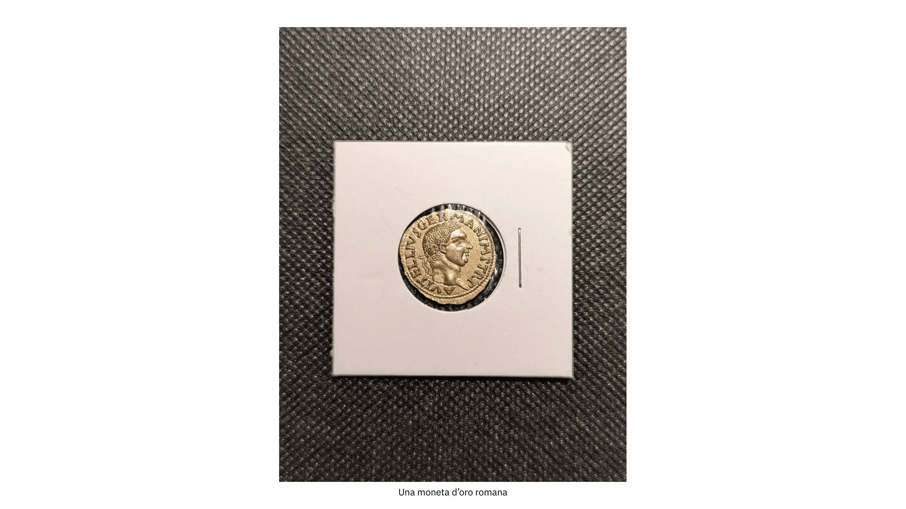

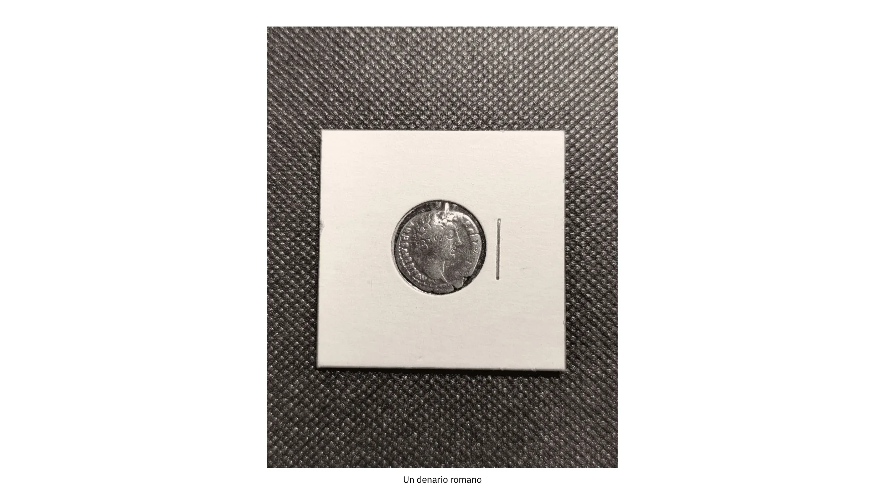

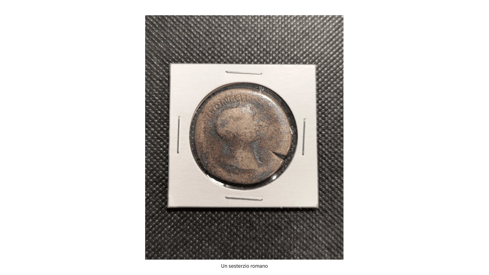

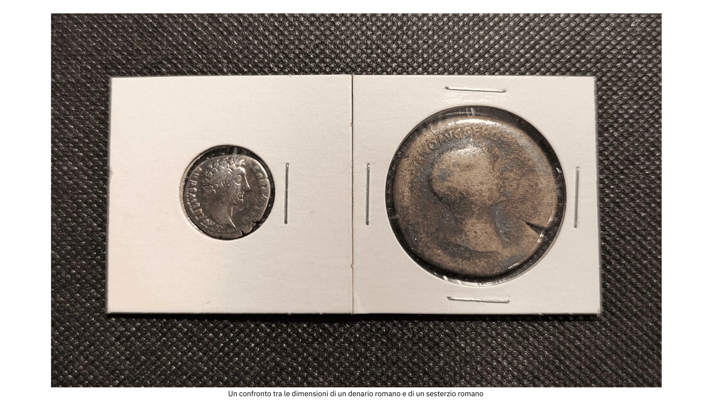

Tuttavia, a partire da Nerone (54-68 d.C.), Roma iniziò una lenta svalutazione delle sue monete, riducendone progressivamente il peso e la purezza per finanziare le crescenti spese imperiali, soprattutto dopo il grande incendio di Roma del 64 d.C.. Queste svalutazioni ebbero effetti notevoli: le monete più pure furono ritirate dalla circolazione attraverso la tesaurizzazione o l'esportazione, secondo la **legge di Gresham**, mentre le monete svalutate proliferarono, causando un graduale aumento dei prezzi.

Il terzo secolo segna una svolta drammatica, con una spettacolare accelerazione delle svalutazioni sotto gli imperatori Settimio Severo, Caracalla e Gallieno. La principale moneta d'argento, il denario e poi l'antoniniano, vide il suo contenuto d'argento scendere ad appena il 2%. Allo stesso tempo, il peso dell'oro dell'aureo si dimezzò. Questa crisi monetaria fu accompagnata da un'instabilità politica senza precedenti, da invasioni barbariche e da ricorrenti guerre civili.

Questa parte mi permette di introdurre l'ultimo pezzo di questa sezione: l'antoniniano. Il nome originale di questa moneta è sconosciuto, ma oggi la chiamiamo antoniniano. Ha la particolarità di essere valutata due denari, nonostante sia solo 1,5 volte più grande di un denario. Inoltre, nel corso del tempo, queste monete divennero semplicemente dei billon, cioè erano fatte di una lega di argento e altri metalli piuttosto che di argento puro. Spesso le monete erano solo rivestite d'argento e costituivano un notevole esempio di decadenza monetaria.

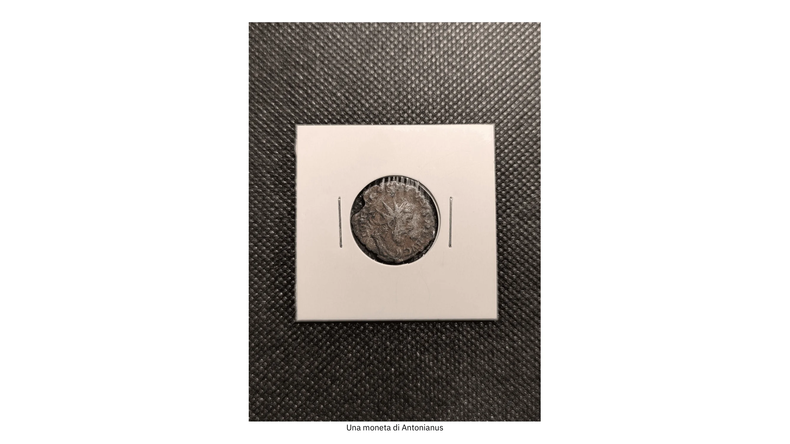

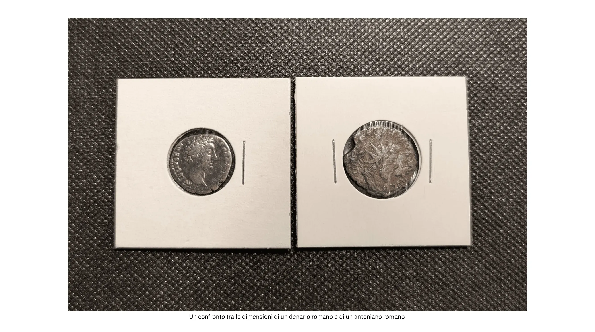

Di fronte a questa situazione, l'imperatore Aureliano (270-275 d.C.) tentò di stabilizzare il sistema rivalutando nominalmente le monete, ma questa riforma introdusse in realtà un meccanismo inflazionistico, fissando artificialmente il valore delle monete esistenti a un livello superiore.

Introduco una digressione sull'argomento. Nel corso del III secolo l'inflazione conobbe un rapido aumento esponenziale. In precedenza, anche se le monete venivano svalutate, il processo artigianale di coniazione delle monete una per una permetteva di controllare l'inflazione. Le statistiche indicano che in 300 anni di svalutazione l'inflazione era in media del 4% all'anno. Poco prima della riforma di Aureliano, l'inflazione era di circa il 3% annuo.

Aureliano introdusse una misura di purezza sulla moneta con il segno XXI, indicando una composizione di 20 parti di bronzo per 1 parte d'argento, ovvero il 5% di purezza. Mise in commercio queste monete d'argento al 5% e vi impresse il segno XXI. Tuttavia, richiamò anche tutte le altre monete più svalutate e vi impresse lo stesso segno XXI. In questo modo rivalutò di fatto il valore nominale di tutte le monete. Il risultato fu un tasso di inflazione sconcertante, pari al 20% annuo, che superava di gran lunga il precedente tasso del 3% prima dell'applicazione di questa tecnica.

Fu proprio Aureliano a inventare questa forma di svalutazione, molto più veloce della svalutazione graduale del metallo, che ci costringeva ancora a stampare monete una per una. Quello che fece fu prendere tutte le monete esistenti, richiamarle e timbrarle con un punzone per cambiarne il valore nominale. È un vero e proprio punto di svolta. Fu allora che l'inflazione divenne esponenziale.

Per illustrare visivamente questa estrema svalutazione, ho trovato alcune affascinanti statistiche sul prezzo del grano in Egitto dal 40 a.C. al III secolo, per un periodo di oltre 300 anni. Qui sotto potete vedere una tetradracma greca della mia collezione. All'epoca, nell'Egitto occupato dai Romani nel III secolo, l'equivalente era una tetradracma egiziana. La denominazione di dracme era ancora in uso e corrispondeva a un denario.

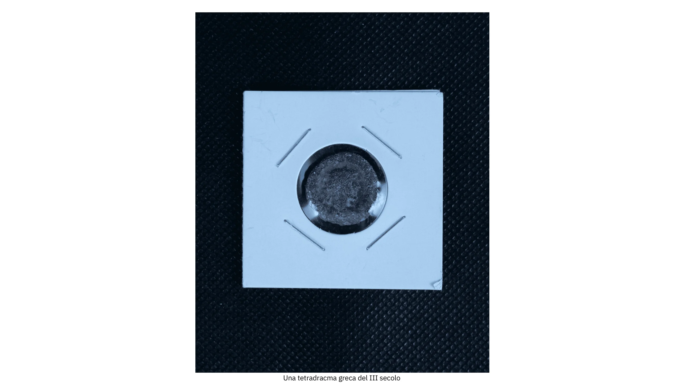

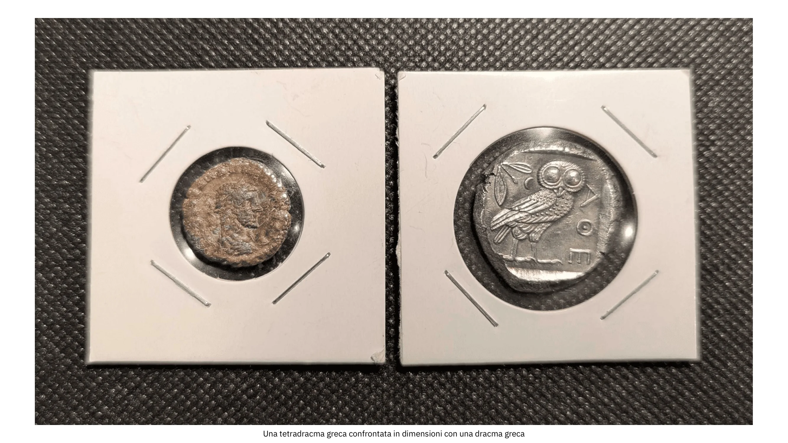

Il tetradramma egiziano in mio possesso era quindi l'equivalente di un denario. Si può notare che la moneta è fatta di billon (o bronzo), quindi non contiene metallo prezioso. Si può confrontare con il tetradramma greco originale per vedere la svalutazione fisica in questi 300 anni. Si tratta di un aumento di milioni di volte del prezzo del grano in Egitto.

È l'espressione fisica della riforma di Aureliano. Va notato che la maggioranza, la media di questi 300 anni di inflazione, era intorno al 4%. Solo alla fine, quando Aureliano fece la sua riforma, questa inflazione divenne piuttosto esponenziale e si arrivò a questa misura di 1 milione. I prezzi erano un milione di volte più alti alla fine del III secolo rispetto al I secolo a.C..

Il suo successore **Diocleziano** (284-305 d.C.) tentò riforme ancora più radicali: emise nuove monete (in particolare l'argenteo, più puro ma in quantità troppo limitata), impose un drastico controllo dei prezzi (Editto dei prezzi del 301 d.C.) e **istituì un sistema fiscale basato sui pagamenti in natura**. Nonostante questi sforzi, le riforme di Diocleziano non riuscirono a contenere l'inflazione dilagante.

Di fronte al rifiuto di fornire beni e servizi in cambio di una moneta svalutata, Diocleziano istituì **un sistema di caste ereditarie** per legare i contadini e i loro discendenti alle loro terre.

Quello che bisogna capire è che i contadini si rifiutarono di consegnare i loro prodotti in cambio di una moneta svalutata, e la risposta del nostro caro Diocleziano fu quella di creare **caste ereditarie** dicendo "tu, non puoi lasciare la tua terra, i tuoi figli non possono lasciare la loro terra, la stessa cosa per i soldati, siete soldati, accettate di essere pagati nella mia moneta". Come soluzione transitoria, venivano pagati in natura (in carne, cibo, grano) perché si rifiutava di dare loro denaro. Quindi impose questo sistema di caste ereditarie per costringere le persone ad essere attaccate al loro mestiere, in modo che non potessero semplicemente cambiare lavoro se cercavano di non accettare la moneta svalutata.

Per illustrare questo esempio, ecco un testo, un estratto del libro "*Regime monetario e inflazione*":

> Poiché le persone non erano disposte a lavorare e a consegnare beni a fronte di una moneta svalutata, il cui valore nominale era superiore al suo valore intrinseco o di mercato, dovettero essere costrette a lavorare imponendo tasse in natura. [...] Per i contadini divenne illegale lasciare le loro case registrate. La popolazione agricola divenne così legata alla terra in modo ereditario.
>

> Questo sistema di caste ereditarie si diffuse gradualmente: Diocleziano costrinse i figli dei soldati a servire nell'esercito, mentre i lavoratori delle officine monetarie, così come quelli delle fabbriche di tessitura e tintura create da Diocleziano, divennero schiavi di Stato, con servizio ereditario. Anche i minatori d'oro divennero in seguito una casta ereditaria. Altre classi ereditarie esistevano probabilmente già al tempo di Diocleziano, in particolare le corporazioni dei fornai e dei macellai [...] a Roma, così come le corporazioni diocesane dei capitani di navi che trasportavano grano e altri carichi pubblici a Roma.

Fu Costantino (306-337 d.C.) che riuscì finalmente a stabilizzare il sistema monetario introducendo nel 312 il solidus, una moneta d'oro puro di cui garantì rigorosamente la qualità e il peso. Esisteva un intero sistema per verificare la purezza e il peso del solidus. **Questa stabilità, tuttavia, riguardava solo una ricca élite e l'amministrazione imperiale**, mentre la **maggioranza della popolazione continuava a soffrire di una moneta di bassa qualità e di una persistente inflazione**. Il solidus rimase stabile nell'Impero d'Oriente (Bisanzio), dove durò per più di un millennio, mentre in Occidente la monetazione si frammentò in monete di piccolo taglio e di scarso valore, accompagnando la definitiva disintegrazione economica e politica dell'Impero Romano, che cadde definitivamente nel 476 d.C..

Per concludere, vorrei condividere con voi questa citazione tratta da *Una storia del denaro: From Ancient Times to the Present Day* di Glyn Davies, che riassume magistralmente ciò che forse ha portato alla caduta di Roma:

*"Le tasse erano sempre inadeguate e le difficoltà associate a queste tasse sempre più inadeguate, tardive e molto visibili spinsero Roma a fare maggiore affidamento su una forma di tassazione facile, immediata e nascosta: la svalutazione della moneta. Riforme ad hoc e di breve durata non riuscirono a invertire questa tendenza secolare al declino. Le pressioni finanziarie causate dall'usura delle monete, dai naufragi, dalle perdite di denaro dovute all'acquisto di beni di lusso dall'Oriente, dai doni offerti ai barbari germanici, dalla crescita delle popolazioni urbane, dal declino della produzione agricola, dal graduale esaurimento delle miniere più ricche e soprattutto dalle politiche di "pane e circo" ritenute essenziali per mantenere un minimo di ordine nella vita urbana - tutte queste pressioni cumulative portarono Roma a una costante svalutazione monetaria, intervallata da occasionali riforme destinate al fallimento "*

*Oltre al pane e al vino gratuiti o a buon mercato, di tanto in tanto venivano distribuite liberalità imperiali ("congiaria") sotto forma di stanziamenti monetari, in particolare sotto Traiano (98-117 d.C.) e ancor più sotto Adriano (117-138 d.C.) e i suoi successori. Quello che all'inizio l'imperatore e i cittadini avevano considerato un privilegio eccezionale, all'inizio del II secolo era diventato un'aspettativa abituale. Queste distribuzioni "costituivano un pesante onere per l'erario pubblico e contribuivano a loro modo alla bancarotta dello Stato "*

## Legami tra diluizione monetaria e inflazione: dalle cause alle conseguenze

<chapterId>38d5781c-e900-53f7-baa7-413655d71754</chapterId>

:::video id=3999256d-aafe-4502-9b72-dfa8491a2777:::

Questa sezione analizza i legami tra diluizione monetaria e inflazione, dalle cause alle conseguenze. La diluizione monetaria è uno dei principali fenomeni economici della storia monetaria romana, con effetti diretti sull'inflazione. A partire dal I secolo d.C., vi fu una prima lenta fase di diluizione della moneta d'argento (denario) a partire dal regno di Nerone (54-68 d.C.), accelerata da ripetute crisi militari e finanziarie, in particolare sotto Settimio Severo (193-211) e Gallieno (253-268).

Notiamo anche una svalutazione più graduale dell'aureo. Questa differenza nel tasso di svalutazione evidenzia due punti:

1. Il ruolo dell'unità di conto nel bimetallismo per il controllo statale della moneta. L'unità di conto in questo esempio è il denario. Ho individuato tre diversi modi di gestire il valore dell'unità di conto: la svalutazione (diluizione del metallo), la ridenominazione (antoniniano) e l'imposizione di un valore nominale tramite la dicitura "XXI" (Aureliano)

2. Il desiderio dello Stato di rimandare il più possibile la svalutazione dell'aureo, la riserva di valore che permette all'élite di mantenere il proprio potere d'acquisto a spese dei meno fortunati. Questo principio verrà spesso ripreso nel corso del corso, soprattutto in relazione al concetto noto come "effetto Cantillon" e alle ridenominazioni dei Maravedi in Spagna.

Questo fenomeno è piuttosto interessante e si è ripetuto nel corso della storia. Lo esamineremo con i Maravedi in una sezione successiva. Questo schema è evidente anche per tutte le valute di riserva: l'unità di valore di riserva, come l'aureo a Roma, rimane inalterata. Tuttavia, l'unità di conto utilizzata dalla popolazione per il commercio e le transazioni quotidiane viene spesso svalutata. Di conseguenza, l'inflazione monetaria colpisce la gente comune, mentre coloro che possono permettersi le monete d'oro rimangono in gran parte inalterati.

E tra l'altro, **è lo stesso fenomeno che si sta creando oggi con la svalutazione della moneta, che permette agli asset finanziari di aumentare di valore**, e quindi sono le persone che usano la moneta, i più poveri, a diventare più poveri, e questo a sua volta arricchisce, attraverso la creazione di moneta, gli asset di coloro che sono in grado, che hanno i mezzi per proteggersi dalla svalutazione, e quindi approfondisce le disuguaglianze sociali. Questo è il mio piccolo sproloquio politico.

Quello che ho appena descritto si chiama effetto Cantillon. Vedremo che questo signore visse ai tempi di John Law, argomento che tratteremo anche in una sezione successiva.

La riforma avviata durante il regno di Aureliano permise un'impennata dell'inflazione. L'inflazione del valore nominale della moneta non era più limitata dalla capacità delle zecche di produrre monete a mano. Le monete già coniate potevano ora essere semplicemente marcate e il valore nominale della massa monetaria aumentava più rapidamente.

Ho due citazioni da condividere con voi a proposito di Aureliano. La prima proviene da *Una storia del denaro: From Ancient Times to the Present Day*:

*"Per quanto riguarda l'economia romana, il contributo di Aureliano fu più un disastro che un trionfo. Fu in gran parte a causa della natura della sua "riforma" che il tasso di inflazione poté aumentare ben oltre quanto era stato possibile in precedenza, anche sotto l'irresponsabile Gallieno. Per due secoli dopo Aureliano, l'inflazione divenne endemica in tutto l'Impero romano "*

La seconda proviene dal libro *Storia antica dalle monete* e riguarda il distacco del sistema monetario dall'oro:

*"La riforma di Aureliano cambiò il rapporto tra la moneta aurea e il resto del sistema monetario. Prima di essa, gli altri tipi di moneta erano legati al **aureo** secondo tassi ufficiali (25 denari egizi o 25 tetradrammi per un aureo, ecc.). Dopo la riforma, la moneta d'oro cominciò a **fluire liberamente di valore**, come qualsiasi altra merce, mentre il resto del sistema monetario **crollò di valore** a causa dell'**indebolimento delle leghe**, non essendo più **garantito dall'oro**. Poiché l'unità di conto rimaneva teoricamente basata sull'argento (il denario, o in Egitto la dracma), i prezzi aumentavano con il deprezzamento della moneta. "*

Come si può notare, questa svalutazione della moneta che fungeva da unità di conto colpiva in modo sproporzionato i meno abbienti, mentre il distacco del legame con la moneta aurea proteggeva il potere d'acquisto di coloro che potevano permettersi di risparmiare in quella riserva di valore che è l'oro.

Se c'è un legame tra il denario e l'aureo, anche se si svaluta il denario, se si è ancora in grado di scambiare il proprio denario con l'aureo a questo tasso (25 denari per 1 aureo), la gente scambierà sicuramente il proprio denario con l'aureo, poiché il denario sarà sopravvalutato e l'aureo sottovalutato. Con questa riforma, però, è stato eliminato questo legame. Così la gente non poteva più scambiare i denari con il metallo d'argento svalutato rispetto all'oro. A quel punto chi aveva accesso alle monete d'oro poteva davvero proteggersi, perché in seguito la gente non poteva più scambiare l'argento svalutato e sopravvalutato con l'oro puro sottovalutato. Questo è un momento molto importante nell'evoluzione della moneta.

Un esempio lampante degli effetti di questa riforma di Aureliano è perfettamente illustrato da queste citazioni tratte dal libro *Regimi monetari e inflazione*:

*"Tra i regni degli imperatori Claudio (41-54 d.C.) e Costanzo (337-361 d.C.), il prezzo del grano sul mercato aperto in Egitto, espresso in dracme, **aumentò di un fattore di oltre un milione**. La spettacolare inflazione dei prezzi è uno dei fatti economici centrali del III e IV secolo d.C." (Lendon 1990, p. 106). Ma questo sviluppo è **meno drammatico di quanto sembri**, poiché corrisponde a un **tasso di inflazione medio annuo del 4,4%**. E secondo Wassink (1991, p. 482), l'inflazione iniziò **solo nel 238 d.C.*"

*"Da questa data in poi, l'inflazione accelerò lentamente, poiché il **denaro buono fu prima espulso dalla circolazione**, cosicché la massa monetaria totale non aumentò quasi per niente all'inizio. Successivamente, raggiunse un tasso medio annuo del **3,65% tra il 250 e il 293**, salendo al **22,28% tra il 293 e il 301** (Wassink 1991, p. 466), cioè fino alle **abortite riforme monetarie dell'imperatore Diocleziano**. Questo fenomeno è **particolarmente impressionante per l'inflazione in un regime monetario basato sui metalli**. "*

Questo fenomeno di inflazione legato alla diluizione monetaria rispondeva inizialmente alle occasionali crisi di liquidità dello Stato romano. Riducendo il contenuto di metallo prezioso delle monete e mantenendone il valore nominale, lo Stato aumentava temporaneamente le proprie risorse. Ma i prezzi non reagirono immediatamente: infatti, il sistema romano aveva una certa vischiosità, il che significava che i salari e i prezzi erano lenti ad adattarsi alle successive svalutazioni. Tuttavia, dopo una certa soglia, i prezzi aumentavano bruscamente per riportare il mercato in equilibrio con il valore reale delle monete.

Come già detto, questo fenomeno è particolarmente evidente a partire dalla metà del III secolo. In Egitto, una regione riccamente documentata, i prezzi furono moltiplicati per 10 sotto Aureliano (274 d.C.) dopo una rivalutazione ufficiale della moneta, nonostante un iniziale tentativo di stabilizzazione. Poi, sotto Diocleziano (301 d.C.), l'editto sui prezzi impose controlli drastici per frenare l'inflazione senza affrontare la causa principale - la sovrapproduzione e il degrado monetario - causando così un prevedibile fallimento. L'inflazione persistente spinge l'economia verso un sistema a due livelli: **l'élite, protetta dalle riserve auree (come il solidus di Costantino**), gode di stabilità, mentre la maggior parte della popolazione continua a soffrire di un'inflazione cronica, **illustrando quello che oggi è noto come effetto Cantillon.**

Esiste un chiaro legame tra la diluizione monetaria romana e l'inflazione, le cui cause sono essenzialmente legate ai cronici deficit fiscali, alle incessanti spese militari e alla cattiva gestione economica dello Stato.

## La caduta dell'Impero Romano

<chapterId>b6ec0914-227b-509c-8108-b09eec9bb904</chapterId>

:::video id=91d4fee5-59bb-4ab9-a90b-e1125c71decb:::

### Svalutazione monetaria e crollo di Roma

La scuola austriaca di economia, in particolare attraverso Ludwig von Mises, ha proposto un'interpretazione monetaria della caduta di Roma. In questa visione, la progressiva svalutazione della moneta romana mandò in frantumi il complesso sistema di divisione del lavoro che sosteneva un impero di 60 milioni di abitanti. La moneta, strumento centrale di coordinamento economico, una volta corrotta, portò al crollo dell'intera struttura sociale ed economica.

Questo deterioramento monetario non solo distrusse la coesione interna dell'impero. Interruppe anche i legami commerciali con i popoli vicini. Privati dei benefici del commercio con Roma, i "barbari" passarono dalla cooperazione pacifica alla predazione. Le invasioni, quindi, non erano solo di natura militare, ma anche il risultato di un crollo economico fondamentale.

### Le tre fasi della svalutazione imperiale

La storia monetaria romana può essere suddivisa in tre periodi distinti. Il primo, dai Giulio-Claudi agli Antonini (27 a.C. - fine del II secolo), mantiene una relativa stabilità. Sotto Traiano, l'impero raggiunse il suo apogeo: con una superficie di 5 milioni di km², Roma divenne la prima città milionaria della storia. Il denario conserva una purezza dell'argento compresa tra il 98% e l'80%: una svalutazione moderata che consente ancora all'economia di funzionare.

Il secondo periodo, il III secolo, fu all'insegna dell'anarchia militare. Ventisei imperatori si succedettero nell'arco di pochi decenni. La moneta crollò: l'antoniniano, che doveva valere due denari, ne conteneva solo 1,5 in peso metallico - il primo tentativo di scindere il valore legale da quello reale. Questa manipolazione innesca la Legge di Gresham: la moneta cattiva scaccia quella buona. I cittadini accumulavano le monete buone, spendendo solo quelle svalutate.

I tesori monetari scoperti dagli archeologi rivelano questa ansia economica. Le anfore sepolte mostrano, per stratificazione, come i Romani depositassero prima le monete migliori, aggiungendo gradualmente quelle svalutate. Queste antiche "pile" testimoniano l'azione umana di fronte all'incertezza, un tentativo di preservare il valore in un mondo in decadenza.

### Costantino e il sistema duale

Costantino (310-337) tentò di stabilizzare l'impero attraverso una riforma radicale. Creò il solidus d'oro, una moneta strettamente controllata dall'amministrazione. I funzionari controllavano sistematicamente il peso e la purezza. L'emissione rimase limitata, legata ai bottini di guerra. Questa moneta divenne lo strumento esclusivo del potere: le tasse venivano pagate in solidus e le legioni ricevevano la paga in oro.

Allo stesso tempo, il popolo utilizzava il nummo di bronzo, che veniva costantemente svalutato. Nel 445, un solidus valeva 7.000 nummi; nel 498, 16.800. Questo doppio sistema istituzionalizzava l'effetto Cantillon: chi aveva accesso al solidus - l'amministrazione, i proprietari terrieri - era protetto dall'inflazione. La plebe, confinata al nummo, diventava inesorabilmente più povera.

Questa separazione monetaria creò due economie parallele senza un tasso di cambio ufficiale. Il solidus rimase l'unità di conto, ma circolò molto poco. Il nummo è utilizzato per gli scambi quotidiani, ma perde costantemente valore. Questa architettura monetaria prefigurava le disuguaglianze del nascente sistema feudale.

### Il crollo della divisione del lavoro

La svalutazione della moneta distrusse gradualmente la specializzazione economica. Senza un'unità di conto affidabile, il commercio mediterraneo crollò. Gli artigiani specializzati di Roma non potevano più commerciare con l'Egitto o la Gallia. Le province adottarono le proprie monete, moltiplicando gli attriti commerciali.

Di fronte a questa disintegrazione, la popolazione urbana fuggì in campagna - un esodo urbano che invertì secoli di urbanizzazione. Gli artigiani abbandonarono i loro mestieri per un'agricoltura di sussistenza. Le grandi proprietà (latifondi) divennero isole autosufficienti, prefigurando le signorie medievali.

Disperato, Diocleziano chiese persino tasse in natura - l'ammissione definitiva del fallimento monetario. Il suo editto della massima (301) tentò di controllare i prezzi, accelerando il ritorno al baratto. La complessità economica regredì a forme pre-civilizzate.

### La sopravvivenza attraverso l'oro da Roma a Bisanzio

Paradossalmente, il solidus sopravvisse all'Impero d'Occidente. Bisanzio lo mantenne fino all'XI secolo, assicurando altri mille anni di stabilità economica. In Occidente, la sua memoria persiste: la parola francese "sou" deriva da solidus, una testimonianza linguistica di una grandezza monetaria perduta.

I proprietari terrieri che avevano conservato le loro ricchezze in oro divennero signori feudali. Le strutture ecclesiastiche, le uniche istituzioni sopravvissute, fornivano i legami sociali che il denaro non poteva più garantire. L'Europa si frammentò in domini autarchici, ciascuno con una propria economia di sussistenza.

Questa trasformazione rivela la fragilità delle civiltà complesse. La divisione del lavoro che permetteva a Roma di sfamare un milione di abitanti dipendeva interamente dalla fiducia monetaria. Quando questa fiducia è venuta meno, l'edificio è crollato, riportando l'Europa a forme economiche primitive per quasi un millennio.

## L'Alto Medioevo e il Medioevo

<chapterId>a5856873-6142-57be-8a73-1f9e3df83792</chapterId>

:::video id=86b8da9b-3831-443d-b170-58c2bea3ad54:::

La storia e l'emergere della moneta nel Medioevo è segnata da periodi di regressione, innovazione e ripresa economica.

Ad esempio, quando l'esercito romano lasciò la Britannia, non entrarono più monete romane nell'isola. Intorno al 435 d.C., l'uso delle monete scomparve completamente in Britannia, un fenomeno unico nelle ex province romane. Per quasi due secoli, l'economia britannica rimase senza moneta fino al VII secolo, quando riapparvero gradualmente le monete di ispirazione merovingia e continentale.

A partire dall'VIII secolo, l'influenza cristiana contribuì alla reintroduzione della moneta nel Nord Europa. La figura chiave di questo periodo fu Pipino il Breve, re dei Franchi, che nel 752 introdusse il denario, poi adottato dal figlio Carlo Magno. Carlo Magno estese ampiamente l'uso del denario d'argento, creando uno standard monetario europeo per diversi secoli.

In Inghilterra, la monetazione conobbe una significativa rinascita con la produzione del penny d'argento sotto il regno di Offa di Mercia, intorno al 765. Questa moneta divenne così importante da rimanere praticamente invariata per 500 anni.

Come primo artefatto relativo a questo periodo, vi mostrerò una riproduzione di un penny inglese dell'epoca.

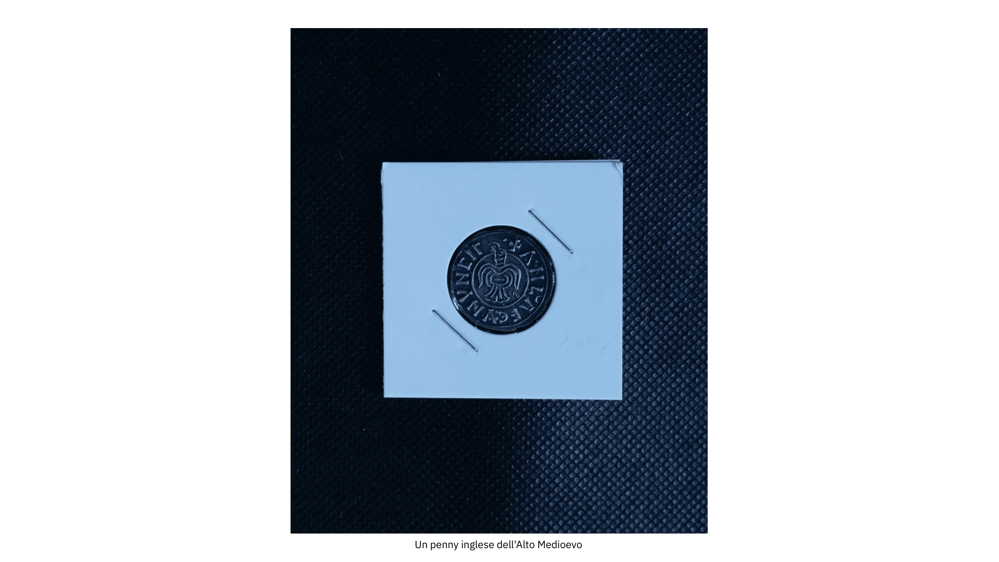

Durante l'Alto Medioevo, l'Europa cadde nel feudalesimo in seguito al crollo del sistema monetario romano. La maggior parte della popolazione utilizzava monete di rame o di bronzo di basso valore, spesso soggette a diluizione monetaria, limitando così il commercio su lunghe distanze.

Il ritorno della moneta come mezzo di pagamento avvenne gradualmente, culminando nel XIII secolo con la comparsa del fiorino d'oro a Firenze nel 1252, seguito dal ducato d'oro a Venezia. Queste monete d'oro furono ampiamente utilizzate grazie all'espansione del commercio e alla crescente necessità di mezzi di pagamento affidabili e accettati a livello internazionale.

In Inghilterra, il sistema monetario fu protetto dalla diluizione grazie a politiche fiscali innovative, come l'imposta fondiaria introdotta da Guglielmo il Conquistatore dopo il 1066, che preservò la qualità del penny sterling. Ciò che è importante capire è che i sovrani dell'epoca potevano svalutare la moneta per finanziare lo Stato, e **l'introduzione di questa tassa rese possibile mantenere la moneta stabile e finanziare lo Stato attraverso la tassazione.**

Tuttavia, la tentazione di trarre profitto dalla diluizione monetaria portò a delle crisi, come nel regno di Enrico I nel XII secolo, quando la qualità della moneta diminuì drasticamente. Riforme severe, talvolta accompagnate da misure violente contro i coniatori, ripristinarono temporaneamente la fiducia nella moneta.

Il Medioevo ha visto anche l'emergere di sofisticate pratiche finanziarie, come l'uso di bastoni per il conteggio in Inghilterra per aggirare il divieto di usura ed estendere il credito. La Chiesa non vedeva di buon occhio i prestiti a interesse, per cui vennero utilizzate varie tecniche per aggirare il divieto di utilizzare gli interessi.

Queste innovazioni furono una risposta alla cronica carenza di moneta metallica e favorirono la nascita di un embrionale mercato finanziario.

Le crociate, nel frattempo, stimolarono il commercio mediterraneo, favorendo lo sviluppo di scambi internazionali e di nuove pratiche bancarie, in particolare attraverso l'Ordine dei Cavalieri Templari. I Cavalieri Templari divennero importanti intermediari finanziari, consentendo ai crociati di ottenere liquidità lontano da casa, prefigurando il moderno sistema bancario europeo.

Per creare un collegamento con i Templari, qui sotto potete osservare una moneta medievale francese, dove si può riconoscere una bella croce al centro. Era abbastanza comune che le monete di quest'epoca recassero questa croce.

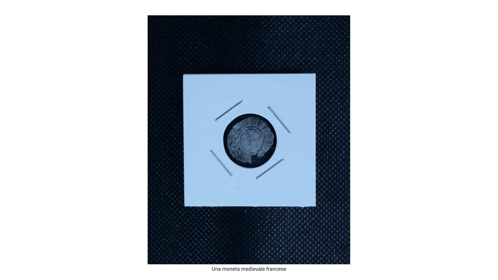

Infine, crisi importanti come la peste nera (1346-1353) portarono a profonde trasformazioni economiche. La forte diminuzione della popolazione portò a un forte aumento dei salari, sfidando i tentativi del governo di mantenere i livelli di remunerazione precedenti.

Allo stesso tempo, la Guerra dei Cento Anni (1337-1453) costrinse gli Stati ad adottare politiche fiscali più aggressive per finanziare i propri eserciti, contribuendo all'indebolimento del sistema feudale.

Il Medioevo fu quindi caratterizzato da una costante tensione tra la necessità di denaro affidabile per il commercio e la costante tentazione dei governanti di diluire il denaro per ottenere un profitto immediato. Questo conflitto ha plasmato profondamente lo sviluppo monetario europeo, gettando le basi dei sistemi economici moderni.

Per concludere questa sezione, vorrei aggiungere un aneddoto piuttosto interessante proveniente dall'Inghilterra di questo periodo. Questo aneddoto è tratto dal libro "Storia del denaro" di Glyn Davies.

Il documento cita che in Inghilterra il passaggio al Parlamento ha trasferito l'onere del debito dal sovrano al Parlamento, determinando un indebitamento cronico dello Stato. Prima di allora, il debito gravava sulle spalle del sovrano.

Una volta che il Parlamento fu in grado di impadronirsi di una parte di questo potere di creazione del denaro, permise la creazione di debiti a lungo termine che erano a carico del popolo, non del re. In precedenza, se il re falliva o se c'era un cambio di re, il debito si estingueva con lui.

Nel momento in cui la creazione del debito viene effettuata dal Parlamento, emerge il concetto di debito sovrano, in quanto potenzialmente illimitato nel tempo. Finché esiste lo Stato, finché esiste il Parlamento, esiste questo debito e si devono trovare tutti i modi per rifinanziarlo e distribuirlo nel tempo. Si tratta di un grande cambiamento di paradigma, in cui non erano più il re o i reali a garantire o a sostenere l'onere di questi debiti, ma il Parlamento e quindi i suoi cittadini.

## Il rinascimento

<chapterId>1d1dfb05-70b4-5b7b-9708-373c2182950d</chapterId>

:::video id=4977b4f3-c7b2-41a5-ad7b-a96a8cca4092:::

Siamo giunti alla sezione del corso in cui parliamo del periodo noto come Rinascimento. Il Rinascimento si svolge in un contesto di crisi tragica, con la diffusione fulminea della peste ad opera delle pulci dei topi imbarcati sulle navi. Questa tragedia, tuttavia, ci informa sulla crescita del commercio e dei viaggi nel periodo altomedievale. All'inizio di questo periodo, non c'erano molti spostamenti così lontani e così veloci.

### Il Fiorino di Firenze

Il ritorno della moneta d'oro in Europa durante il Rinascimento segna una svolta fondamentale nella storia monetaria. **Tutto ebbe inizio con il Fiorino di Firenze del 1252, la prima grande moneta d'oro coniata in Europa dopo la caduta di Roma**. Con un peso e una purezza straordinariamente costanti (circa 3,5 grammi di oro puro), il fiorino rimase invariato per quattro secoli e divenne rapidamente un riferimento monetario paneuropeo essenziale.

Qui sotto potete vedere una riproduzione di un Fiorino: un Fiorino d'oro realizzato in peltro e timbrato da un artista francese che realizza pezzi eccellenti, incisi e battuti manualmente.

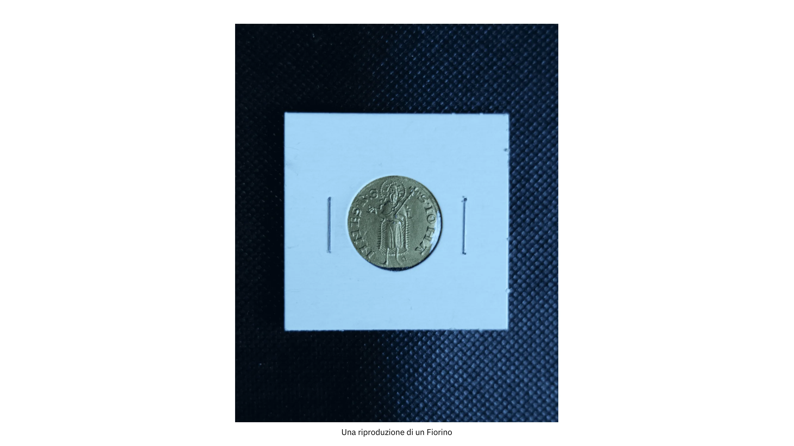

Il ritorno alla moneta d'oro fu determinato da un contesto specifico: il crollo del solidus bizantino e il declino economico del mondo musulmano dovuto alle invasioni mongole crearono un vuoto monetario nel commercio internazionale.

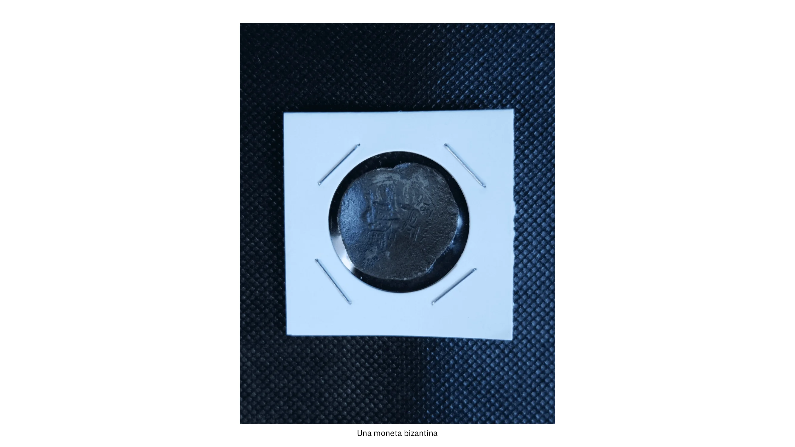

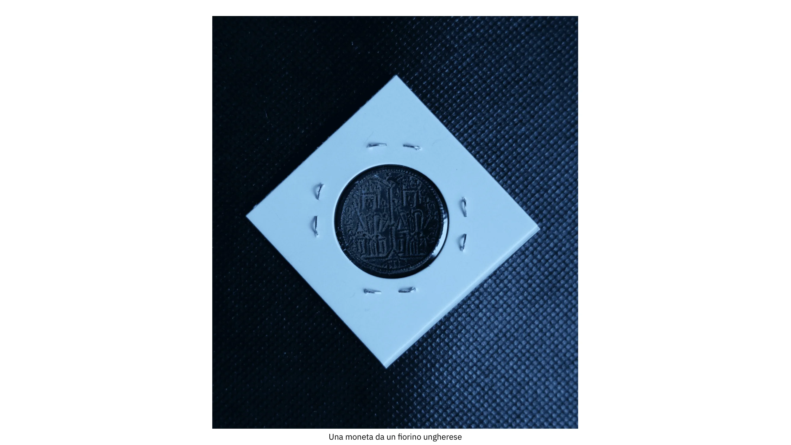

La prima immagine qui sopra mostra una moneta bizantina che ritengo piuttosto interessante. Faccio un parallelo con una moneta ungherese dello stesso periodo (seconda immagine). La moneta ungherese è a forma di coppa, come una ciotola in miniatura. L'iconografia presenta figure religiose raffigurate come re che tengono croci affiancate. Questo pezzo è a forma di scodella e proviene dall'Ungheria.

Era abbastanza consueto copiare le monete di altri paesi. Poiché le monete bizantine erano generalmente accettate, gli altri Paesi le copiavano spesso. Come si può vedere confrontandole l'una accanto all'altra, questi pezzi sono molto simili.

L'Italia settentrionale, in particolare Firenze, Venezia e Genova, approfittò di questo contesto per lanciare nuove valute forti - monete con un contenuto stabile di metallo prezioso. Venezia seguì l'esempio di Firenze coniando il ducato nel 1270, una moneta quasi identica al fiorino e ampiamente utilizzata nel commercio mediterraneo.

Il fiorino divenne la prima moneta di riserva internazionale, adottata in oltre 150 città europee prima della fine del XIV secolo. Con la creazione di una rete bancaria fiorentina su larga scala, guidata dai Medici, la gestione monetaria e contabile fu completamente modernizzata, riducendo persino la necessità di trasportare fisicamente l'oro.

Questo è un altro punto molto interessante. Un tempo molte spedizioni di monete andavano perse durante i viaggi in mare. Questo progresso tecnologico - i registri con la contabilità a doppia entrata - ha permesso la creazione della moneta scritturale. In questo modo è stato possibile ridurre il numero di regolamenti di monete e utilizzare invece un sistema di scritture, che riduce notevolmente il rischio di perdere denaro durante il trasporto.

Lo sviluppo monetario fu accompagnato anche da una significativa evoluzione dei metodi bancari. Ispirata in parte dal contatto delle Crociate con le pratiche bancarie musulmane, l'Europa medievale vide la nascita di sistemi bancari rudimentali a Firenze, Venezia, Barcellona e Genova già nel XIII secolo. I Cavalieri Templari, un ordine religioso e militare, avevano già sviluppato un sistema che permetteva ai crociati di viaggiare senza portare con sé le proprie ricchezze.

Essi depositavano i fondi presso un ufficio templare nel loro Paese e potevano poi viaggiare con un modulo di lettera e ritirare le monete all'arrivo nella destinazione della crociata.

Ciò significava che non dovevamo portarci dietro monete di metallo prezioso.

È sempre in questo periodo che l'Europa viene a conoscenza dell'esistenza della cartamoneta in Cina, grazie al viaggio di Marco Polo nel XIII secolo. Tuttavia, lo sviluppo delle banconote avrebbe atteso diversi secoli, poiché l'Europa preferiva perfezionare prima i metodi di coniazione dei metalli. Leonardo da Vinci, vicino a Luca Pacioli, rinomato commercialista, contribuì attivamente al miglioramento delle presse monetarie, promuovendo una produzione di monete più rapida e uniforme.

Ci riferiamo alla tecnica di battitura a pendolo menzionata in precedenza nel corso. Questo metodo consentiva di produrre monete più uniformi rispetto alla battitura a martello e, cosa importante, permetteva di realizzare iscrizioni sul bordo della moneta, come ho dimostrato in precedenza. Quello qui sotto è un tallero europeo del 1793, che mostra chiaramente una scritta sul bordo.

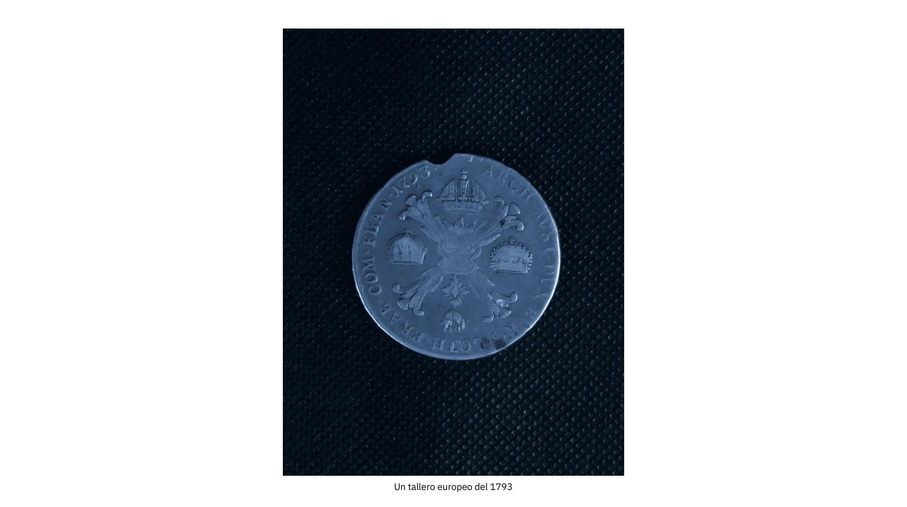

Nel XV secolo, tuttavia, l'Europa attraversò una grave crisi monetaria, con un generale deterioramento del contenuto d'argento delle monete europee, che scese a meno del 5% intorno al 1450.

A partire dal XVI secolo, il centro di gravità monetaria si spostò in Spagna, stimolato dall'unione dei regni di Aragona e Castiglia, dalla fine della Reconquista e dalle grandi scoperte marittime come quella di Cristoforo Colombo nel 1492. Il massiccio afflusso di argento dalle miniere americane sconvolse profondamente gli equilibri economici europei e mondiali, alimentando l'inflazione e nuove tensioni geopolitiche.

Il Rinascimento segnò anche un'importante evoluzione artistica nella monetazione, con monete come il tallero (Joachimsthaler), all'origine del termine "dollaro". Queste monete d'argento di grandi dimensioni riflettono le nuove tecniche di coniazione artistica e meccanica rese possibili dall'innovazione tecnica del Nord Europa.

Infine, il Rinascimento finanziario ha inaugurato la transizione verso la modernità economica, con lo sviluppo delle banche, del credito e dei mercati finanziari e l'emergere delle prime forme di capitalismo moderno nelle grandi città commerciali di Amsterdam, Londra e Stoccolma, gettando le basi del sistema finanziario internazionale come lo conosciamo oggi. Questo è il tema del prossimo video.

# Il sequestro di denaro da parte dello Stato

<partId>17cfb1b4-5bc1-53e0-b035-05c7cf76be92</partId>

## L'evoluzione delle valute di riserva del mondo

<chapterId>d65cc352-e7ca-5f03-9b23-dd1fae5c0395</chapterId>

:::video id=82710062-8fff-426c-93af-923c08d82233:::

### L'importanza storica dei metalli preziosi

Benvenuti in questa sezione dedicata alla nascita delle valute di riserva e delle banche centrali. Come primo punto di questa nuova sezione, ci concentreremo sull'evoluzione delle valute di riserva globali.

I metalli preziosi, in particolare l'oro e l'argento, sono stati a lungo considerati la base della ricchezza e del potere degli imperi. La sete d'oro è sempre stata una forza motrice dominante e fu l'afflusso di metalli preziosi ad avere l'effetto più diretto ed evidente sugli sviluppi monetari in Europa. Nel Medioevo e nel primo Rinascimento, questa ossessione per l'oro e l'argento era dovuta alla difficoltà di conservare il valore di altre forme di merce, oltre che alla forte domanda da parte di potenze straniere, in particolare nel commercio con l'Oriente.

Nel corso dei secoli, diversi imperi si sono succeduti come centri economici globali. Al paese che domina il commercio mondiale in un determinato periodo viene solitamente assegnato lo status di valuta di riserva. Tra questi vi sono:

- Spagna e Portogallo (XV e XVI secolo)

- Le Province Unite (Paesi Bassi) nel XVII secolo

- Francia e Gran Bretagna nei secoli XVIII e XIX

- Gli Stati Uniti nel XX secolo

### Il boom portoghese e il Real (1450-1530)

*il **Portogallo** dominò il commercio mondiale nella seconda metà del XV e all'inizio del XVI secolo, con il **Real portoghese**, una moneta d'argento dal peso relativamente uniforme. Grazie ai loro progressi nella navigazione, i portoghesi scoprirono nuove rotte marittime verso l'Africa, l'Asia e il Nuovo Mondo. I forti militari e le postazioni commerciali si moltiplicarono dall'Africa alla Cina (Macao).

In risposta alla domanda europea di oro e argento, "la motivazione costante delle grandi scoperte fu il profitto commerciale, in particolare la ricerca di oro e argento" Tuttavia, l'Impero portoghese, sovraccarico di risorse e costretto ad affrontare la concorrenza di olandesi, inglesi e francesi, cominciò a declinare.

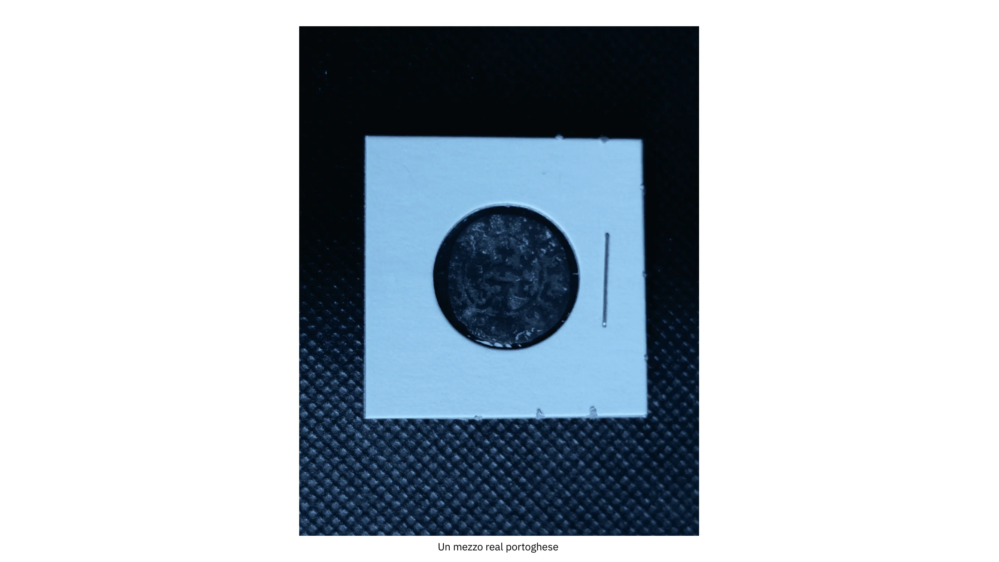

Qui sopra potete vedere un mezzo portoghese dell'epoca delle conquiste marittime.

### L'apogeo spagnolo e il dollaro spagnolo (1535-17° secolo)

Con la conquista del Nuovo Mondo, la **Spagna** divenne l'attore dominante. Il suo monarca, controllando gigantesche miniere d'argento (Potosí in Bolivia, Zacatecas in Messico), riuscì a coniare moneta in argento puro, evitando così di svalutare la propria moneta: il **Reale spagnolo**

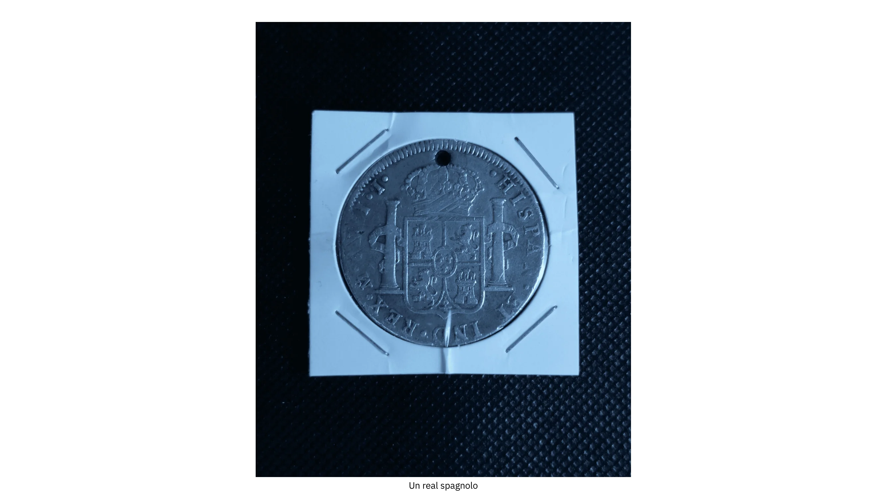

Il real spagnolo, noto anche come "pezzo da otto", deve il suo soprannome al fatto che veniva spesso tagliato in ottavi per creare monete più piccole. Era anche conosciuto come **dollaro spagnolo**. La moneta che vedete qui sopra risale al 1814, quindi è un esempio leggermente più recente. Tuttavia, le primissime monete da un dollaro spagnolo non erano così raffinate; erano battute a martello e generalmente meno rotonde e nitide.

L'aspetto particolarmente interessante è che all'epoca il dollaro spagnolo fungeva da valuta di riserva internazionale. Le autorità spagnole emettevano anche una propria moneta locale, il maravedi, e regolavano regolarmente l'offerta di moneta attraverso richiami. Ad esempio, una moneta di rame o di bronzo del valore iniziale di un maravedi poteva essere richiamata e punzonata con "2", poi con "4" e così via, fino ad arrivare a "8" Nella foto ad alta risoluzione si vede chiaramente l'"8" impresso sulla moneta. Questo metodo espandeva di fatto l'offerta di moneta... il che portava inevitabilmente all'inflazione.

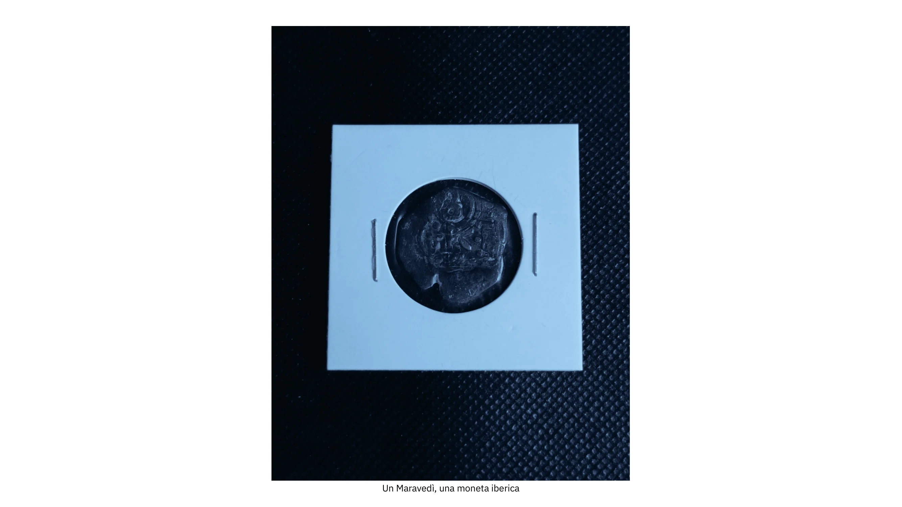

Se analizziamo la storia delle valute di riserva, emerge un punto interessante: gli imperi non inflazionavano le loro valute finché mantenevano il loro status di valuta di riserva. **Solo alla fine della loro dominazione hanno finito per svalutare la moneta, perdendo questo privilegio, che è stato poi trasferito a un nuovo impero**.

In Spagna, il dollaro spagnolo ha dominato il commercio mondiale per quasi 200 anni, in particolare tra Cina ed Europa. Queste monete si trovavano persino nei porti cinesi. Ed è qui che ci arriva una strizzata d'occhio dalla storia: il dollaro americano deriva direttamente da questa moneta. Quando gli Stati Uniti furono costituiti nel 1792, approvarono una legge per coniare la propria moneta e i primi dollari furono creati sul modello del dollaro spagnolo, sia nel nome che nelle dimensioni della moneta.

Per dare un'idea del suo valore, un dollaro americano era originariamente una moneta d'argento del peso di quasi un'oncia, ovvero tra i 30 e i 40 euro in moneta odierna, a differenza della moneta cartacea che conosciamo oggi. Quanto al dollaro spagnolo, circolò così tanto da essere considerato la prima vera moneta globale.

Tuttavia, questo afflusso di metalli preziosi dalle Americhe causò un'inflazione in Europa. Durante la Rivoluzione dei prezzi (1540-1640 circa), il costo della vita in Inghilterra aumentò di sette volte. In Spagna, l'abbondanza di argento ebbe un effetto perverso di maledizione delle risorse, ostacolando lo sviluppo di solide istituzioni bancarie.

In seguito, la Spagna dovette affrontare numerosi conflitti militari (Fiandre, Paesi Bassi, Guerra dei Trent'anni) e le sue finanze crollarono gradualmente. Invece di svalutare la famosa moneta d'argento, i governanti successivi scelsero di svalutare la moneta di rame (vellón) utilizzata dalla popolazione locale. Questo è ciò che ho descritto in precedenza con i Maravedis.

### L'ascesa olandese (XVII secolo)

Dopo l'apogeo iberico, i **Paesi Bassi** emersero come nuova potenza commerciale nel XVII secolo. Il commercio marittimo, la VOC (Compagnia olandese delle Indie orientali) e la fondazione della **Borsa di Amsterdam** (ispirata a quella di Anversa) fecero di questa repubblica mercantile un centro nevralgico.

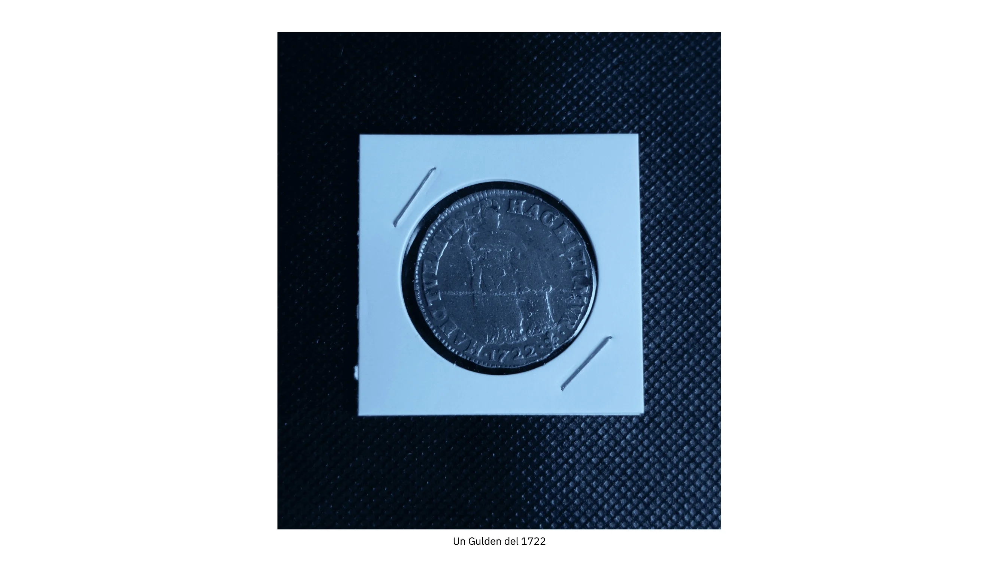

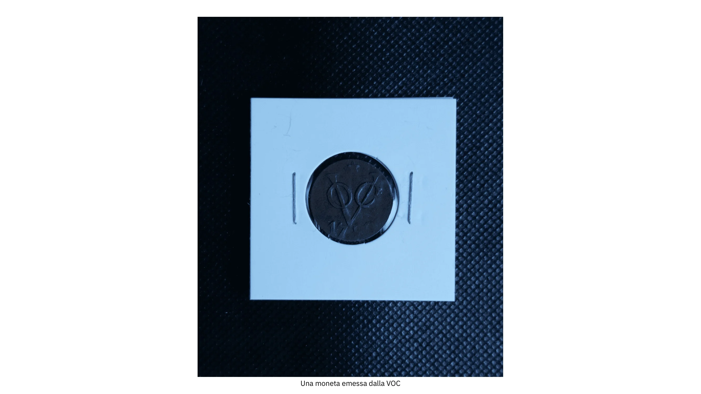

Nella prima foto qui sopra, si può vedere un Gulden del 1722 (una bella moneta d'argento), mentre nella seconda c'è una moneta emessa dalla VOC.

La VOC era una società estremamente potente per l'epoca: aveva un proprio esercito ed emetteva persino una propria moneta.

Gli olandesi hanno inventato il capitalismo moderno, nato come mezzo per distribuire il rischio in imprese rischiose come le spedizioni nel Nuovo Mondo o la ricerca di nuove rotte commerciali. Le società per azioni permettevano a diversi investitori di mettere in comune il proprio denaro e di condividere il rischio. Per facilitare questi scambi, fu necessario creare istituzioni in grado di negoziare e scambiare questi titoli. Così, nel 1602, furono create la prima società per azioni e la prima borsa valori.

La moneta olandese, il **Gulden**, acquistò credibilità grazie alla sua purezza in argento e poi alla sua adozione da parte della Banca di Amsterdam (1609), dove i depositi divennero la forma di denaro preferita in Europa. Questo è un punto molto importante da menzionare. Certo, c'erano le monete, ma ciò che costituiva veramente il denaro a quei tempi era una forma di denaro scritturale. In effetti, gran parte del commercio mondiale passava attraverso i libri della Banca di Amsterdam. Si trattò di una vera e propria svolta bancaria: il commercio internazionale non avveniva più necessariamente con monete fisiche, ma direttamente attraverso i registri contabili della banca.

Questo periodo di prosperità fu caratterizzato da un grande afflusso di oro e argento, in particolare da altri Paesi che praticavano l'inflazione o il controllo monetario. C'è un personaggio interessante da citare: **Thomas Gresham**. In questo periodo lavorava per i reali inglesi nei Paesi Bassi, gestendo il flusso di denaro tra i due Paesi. Fu lo stesso Gresham a lasciarci la famosa **"Legge di Gresham "**.

Tuttavia, anche l'Impero olandese finì per esaurirsi. Le guerre con l'Inghilterra, la diluizione del gulden nei periodi di conflitto e la concorrenza di altre potenze (Francia e Inghilterra) segnarono la fine dell'egemonia olandese. Dopo la quarta guerra anglo-olandese (1780-84), il declino del gulden come moneta di riserva divenne irreversibile.

### Potenza, ambizioni e fallimenti della Francia (XVII-XVIII secolo)

Sotto Luigi XIV, la **Francia** divenne la più grande potenza continentale d'Europa. Tuttavia, la moneta francese non raggiunse mai lo status di riferimento dominante: numerose svalutazioni, pesanti tassazioni e guerre costose (Lega di Augusta, Guerra di Successione Spagnola, ecc.) pesarono molto sulla stabilità del sistema monetario.

Il primo grande esperimento di cartamoneta fu condotto da John Law (1716-1720). La Banque Générale emise banconote garantite da promesse di debito pubblico. Questo schema portò a una bolla speculativa e al suo crollo (la bolla del Mississippi) nel 1720. Questo disastro lasciò in Francia una sfiducia duratura nei confronti della cartamoneta. Fu questa esperienza disastrosa che portò Richard Cantillon a diventare ricco grazie a questo sistema di principi contabili, oggi noto come effetto Cantillon, in cui la stampa di denaro arricchisce chi ha accesso alla macchina da stampa.

Quando questa sfiducia finalmente svanì, un altro fiasco della carta francese: gli **assignats** rivoluzionari. Emessi a partire dal 1790 sulla base della confisca dei beni del clero, questi assignats subirono un'iperinflazione galoppante, diventando ufficialmente la prima iperinflazione della storia a superare il 50% al mese. Nel 1795, nonostante il loro valore nominale fosse stato moltiplicato, venivano scambiati a pochi punti percentuali del loro valore iniziale.

Leggi più restrittive cercarono di imporre l'assignat, ma senza successo. Il governo cercò di imporlo, arrivando a minacciare di morte chi non lo accettava e obbligando i negozianti a rimanere aperti. Ma naturalmente, alla fine, non funzionò.

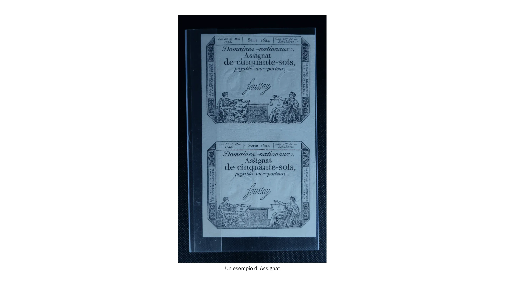

Poiché questa cartamoneta sostituì tutte le monete in metallo prezioso di qualità, in linea con la famosa Legge di Gresham, si verificò una penuria di monete. Per coniare nuove monete, si utilizzò il metallo delle campane sequestrato al clero. Qui sotto potete vedere un bellissimo pezzo di metallo campaniforme, ricavato dal rame recuperato dalla fusione delle monete sottratte al clero.

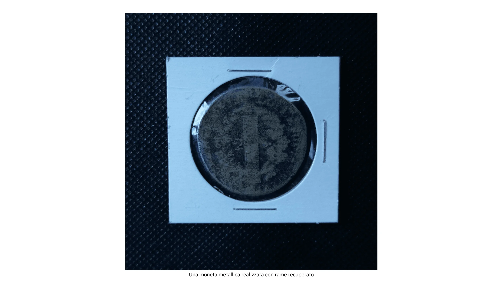

### Dominazione britannica (18° - inizio 20° secolo)

**L'Inghilterra**, dopo aver superato i Paesi Bassi, divenne la potenza dominante nel XVIII secolo. La sterlina è la più antica moneta ancora in uso, originariamente legata a una sterlina d'argento. Gradualmente, il suo status si rafforzò, sostenuto da una rivoluzione finanziaria e fiscale: monarchia parlamentare, forte capacità di riscossione delle imposte e creazione della Banca d'Inghilterra nel 1694.

Dopo una serie di guerre contro la Francia, il Regno Unito ne uscì vittorioso nel 1815 (Waterloo), confermando la propria supremazia. Per tutto il XIX secolo, la sterlina agì come valuta di riserva mondiale. Al suo apice, con appena il 2,5% della popolazione mondiale, la Gran Bretagna produceva il 20% del reddito globale e controllava quasi un quarto della superficie terrestre.

La **rivoluzione industriale** e l'adozione di un **standard aureo** (1717 o 1718, sotto la supervisione di Isaac Newton alla Royal Mint) rafforzarono la credibilità della sterlina. La Banca d'Inghilterra adottò un gold standard di 4,25 sterline per oncia d'oro, consentendo ai detentori di banconote di convertire le loro banconote in oro.

Tuttavia, la Prima guerra mondiale (1914-1918) pose fine a questo sistema. In poche settimane, tutte le principali potenze belligeranti sospesero la convertibilità dell'oro. L'Impero britannico, e in seguito la sterlina, uscirono dalla Seconda guerra mondiale in uno stato di debolezza, lasciando il posto al dollaro americano nel XX secolo.

E come manufatto, qui sotto potete vedere alcuni pezzi belli e interessanti. Si tratta di pesi monetari. Il primo è la sovrana: la prima rappresentazione della sterlina. Ho solo dei pesi monetali per rappresentare queste monete perché non posso permettermi di comprare una vera sovrana. Per pesarle, abbiamo usato una bilancia e poi abbiamo messo il peso monetario equivalente al valore della sovrana sull'altro lato.

La sovrana era una moneta monetaria - una moneta d'oro del valore originario di una sterlina.

Prima della famosa sovrana c'era la ghinea, che funzionava secondo lo stesso principio. La Guinea prendeva il nome dai metalli preziosi che conteneva, provenienti dalla regione della Guinea.

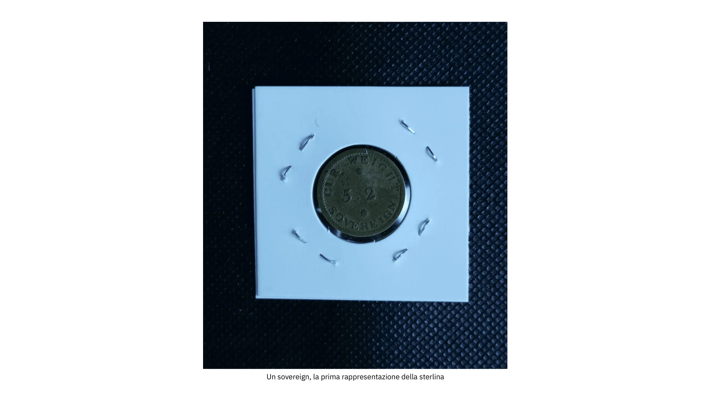

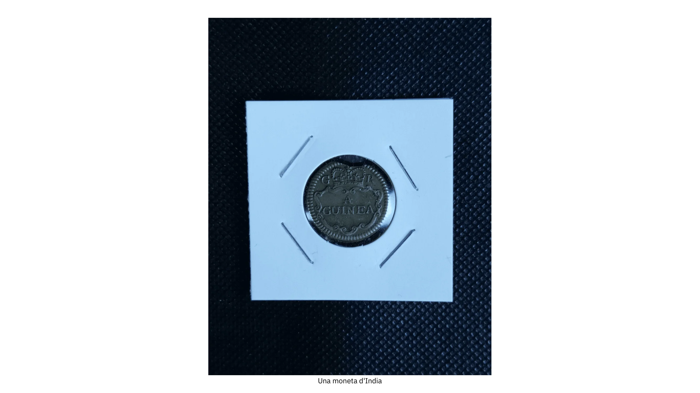

## L'emergere delle banche centrali

<chapterId>15777771-1e28-55f7-a400-69868a47079b</chapterId>

:::video id=7661b7b5-e00f-48f3-b69a-6fb2eb5ebba4:::

Dopo la sezione dedicata alla storia delle prime valute di riserva e alla loro evoluzione, ecco un segmento dedicato alla nascita delle banche centrali. Segue più o meno lo stesso percorso della nascita delle valute di riserva, ma si concentra un po' di più sulle tecnologie bancarie dell'epoca.

### Gli inizi delle banche e delle proto-banche

Già nel XIII secolo, gli italiani (Firenze, Genova, Venezia...) svilupparono le tecniche di contabilità a doppia entrata. In seguito, **Anversa** (XVI sec.) divenne il principale centro finanziario del Nord Europa, ruolo che fu poi ripreso da **Amsterdam**, grazie all'Amsterdam Stock Exchange (1609), dove venivano negoziate le azioni della VOC.

Ad Anversa si tenevano fiere mercantili in cui i commercianti si riunivano spesso per regolare i debiti, portando all'invenzione di nuovi strumenti finanziari. La banconota qui sotto, datata 1761 e più recente, è una **bolletta cambiaria**. Presenta dettagli scritti a mano e iscrizioni sul retro che la rendono un magnifico manufatto dell'epoca.

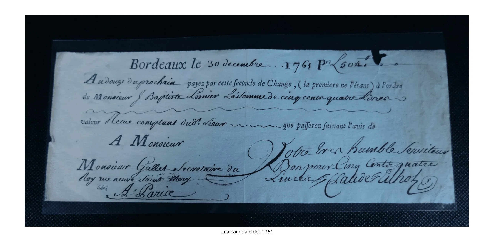

Questa effervescenza portò alla creazione di istituzioni bancarie più sofisticate. **I banchieri lombardi** e successivamente i mercanti olandesi perfezionarono gli strumenti di credito (cambiali, vaglia cambiari, ecc.). Il sistema bancario moderno si basa su questa idea: il denaro può essere credito, non solo metallo.

Come potete vedere, questo ci riporta alla domanda iniziale sulle origini del denaro.

Il denaro deriva da una merce che emerge dalla necessità di scambiare, oppure emerge dal credito? In questa sezione se ne trovano ancora le tracce.

### L'esempio svedese: Stockholms Banco e Riksens Ständers Bank

Passiamo alla Svezia, dove è stata creata la prima banca centrale.

**La Svezia** è stata un pioniere dell'attività bancaria centrale: nel 1657 Johan Palmstruch creò il **Banco di Stoccolma**, autorizzato a prestare più delle sue riserve metalliche, segnando così la nascita della banca a [riserva frazionaria](https://planb.academy/resources/glossary/fractional-reserves). Ma l'eccessiva emissione di banconote portò al panico e all'assalto alla banca nel 1663. Bene, bene...

Nel 1668 fu fondata a Stoccolma la Riksens Ständers Bank, la prima vera banca centrale del mondo. Tuttavia, anch'essa soffrì di crisi (1709, 1715...) legate all'abuso di banconote, spesso per finanziare le guerre del regno.

### Il fallito colpo di stato di John Law

Andiamo in Francia, dove troviamo ancora una volta il nostro amato John Law.

**Lo scozzese John Law** convinse il Reggente (Duca d'Orleans) a creare una banca privata, la Banque Générale (1716), autorizzata a emettere carta contro oro, argento e debiti pubblici. Divenne la Banque Royale (1718) e contribuì all'impennata delle azioni della Compagnia del Mississippi.

Quando la realtà ha raggiunto la speculazione, **il panico è stato esacerbato dalla decisione di vietare la detenzione di oro e di imporre l'uso di Law's notes**. Bene, bene...

Infine, la bolla scoppiò nel 1720, causando un crollo che rovinò la credibilità della cartamoneta in Francia per molto tempo a venire.

### Banca di Amsterdam, l'ascesa di un modello pionieristico

Siamo ora trasportati ad Amsterdam nel 1609, dove la **Banca di Amsterdam** (Wisselbank) prese il controllo della custodia e della convertibilità delle monete ad Amsterdam. Vietò la circolazione di banconote private e impose il deposito di monete metalliche nei suoi caveau. A poco a poco, si impadronirono del controllo della moneta. Vietarono ai cambiavalute di tenere con sé le monete. I cambiavalute lavoravano tutto il giorno e alla fine della giornata dovevano depositare le monete nei caveau della Banca di Amsterdam. Come ho già detto, non erano necessariamente le monete di metallo a essere utilizzate nel commercio internazionale. Si trattava di denaro scritturale iscritto nei libri contabili della banca.

Grazie al potere mercantile olandese, la banca svolse il ruolo di prima "banca centrale" de facto, stabilizzando il commercio mondiale. Col tempo, tuttavia, concesse prestiti non garantiti alla VOC e finì per esaurire il metallo a garanzia delle sue fatture. Nel 1790 emerse che aveva prestato ingenti somme alla VOC, che praticamente dichiarò bancarotta, rovinando la credibilità del gulden. Bene, bene...

### La Banca d'Inghilterra, atto costitutivo dell'attività bancaria moderna

Nell'Inghilterra del XVII secolo, l'oro e l'argento venivano conservati dagli orafi, che rilasciavano ricevute. Questa organizzazione parzialmente decentralizzata dimostrò i suoi limiti quando la Corona si trovò ad avere un enorme bisogno di finanziamenti per la guerra contro la Francia.

Nel 1694 fu fondata la **Banca d'Inghilterra (BoE)**. La Banca d'Inghilterra nacque così da un matrimonio di convenienza tra la comunità imprenditoriale londinese e il governo, che era alla disperata ricerca di fondi per la guerra.

La Banca ottenne il monopolio dell'emissione di banconote in Inghilterra (rafforzato nel 1708, 1742, ecc.). Da quel momento in poi, accanto alle monete circolò anche la cartamoneta sostenuta da riserve auree. Questo è un punto importante per comprendere la graduale acquisizione della moneta da parte delle istituzioni statali. In primo luogo, la Banca di Amsterdam impedì ai cambiavalute di tenere monete e li obbligò a restituirle alla Banca. In Inghilterra, alle banche private fu vietato di emettere banconote proprie riscattabili in oro.

Le banche private potevano emettere banconote, ma queste potevano essere cambiate solo con banconote della Banca d'Inghilterra.

Le banconote della Banca d'Inghilterra, in sterline, erano rimborsabili in oro. Questo ha aggiunto un terzo livello alla valuta. Quindi abbiamo l'oro alla base, poi le banconote della Banca d'Inghilterra e infine le banconote delle banche private. Prima di allora, le banche private potevano emettere le proprie banconote riscattabili in oro. Questa è un'altra fase della graduale acquisizione della moneta da parte delle istituzioni statali.

La Banca ha finanziato lo Stato con ingenti prestiti e ha strutturato l'enorme debito pubblico che ha finanziato il boom economico.

Questo modello si consolidò nel corso del XVIII e XIX secolo, fino a far diventare la sterlina la valuta di riserva mondiale, sotto il sigillo della Banca d'Inghilterra e del gold standard.

**Le valute di riserva del mondo** si sono succedute nel corso dei secoli, guidate dal potere economico, commerciale e militare di uno Stato o di un impero: Portogallo, Spagna, Paesi Bassi, poi Gran Bretagna, prima che gli Stati Uniti arrivassero a dominare nel XX secolo. In ogni caso, si assiste a un ciclo simile: espansione economica, successo commerciale, adozione internazionale della moneta, indebitamento, guerre costose, uso abusivo della creazione di moneta o del credito, e infine declino.

**L'emergere delle banche centrali** è stato un processo graduale. Queste istituzioni sono spesso sorte nel contesto di guerre costose, consentendo allo Stato di finanziarsi attraverso il debito. Quando fu adottato il gold standard (Inghilterra, XVII-XIX secolo), esso fornì una parvenza di stabilità, finché le grandi guerre mondiali del XX secolo portarono al graduale abbandono della convertibilità dell'oro. Il potere di battere moneta si spostò così dal monopolio reale a entità più complesse, prima private (orafi, banchieri), poi semipubbliche (banche centrali), riflettendo l'evoluzione della sovranità monetaria verso forme istituzionalizzate e globalizzate.

Questo è ciò che descrivevo prima. Abbiamo spesso spostato l'onere del debito sovrano direttamente sulle banche centrali o sull'autorizzazione a creare denaro da parte di istituzioni legali, come il Parlamento.

E il fatto più importante è che **si è passati da un debito che poteva scomparire con la bancarotta del sovrano a un debito che gravava principalmente sulle spalle della popolazione**.

## La strada verso il sistema fiat

<chapterId>27a98545-d350-56ee-a200-92468e6b9b33</chapterId>

:::video id=e27a753e-aeee-4307-a65c-9506aab380a1:::

Siamo giunti alla fine di questo corso sulla storia del denaro e, per concluderlo, volevo proporre due argomenti. Il primo argomento riguarda le varie fasi che hanno portato al nostro attuale sistema di moneta fiat. Rivedremo i fatti della sezione 5 sulla creazione delle banche centrali e aggiungeremo il concetto di dollaro USA, che è in definitiva l'attuale valuta di riserva. Vedremo come si è evoluto, come è nato il dollaro, come si è evoluto, come è cambiato, quali fasi ha attraversato per diventare un sistema fiat, perché l'origine del dollaro è una moneta d'argento.

Poi, subito dopo, vi proporrò un breve segmento sulla storia della finanza, per aiutarvi a capire come siamo arrivati allo Stato sociale. Quindi affronteremo due argomenti: come siamo arrivati al sistema fiat e, subito dopo, come l'evoluzione della finanza ci ha portato al concetto di Stato sociale.

### Le basi europee della banca moderna

Torniamo al XIII secolo con il fiorino. Per capire come siamo arrivati al modello fiat, dobbiamo partire dal XIII secolo. Accanto al fiorino, contemporaneamente ai Medici emerse una tecnologia, il concetto di cambiale.

Poi arrivò la borsa di Anversa, con il suo concetto di sconto e di cambiali.

Poi, come abbiamo visto, c'è stato il VOC, il primo mercato azionario di Amsterdam. Questo segnò la nascita del capitalismo, con le azioni delle società e lo scambio di azioni. La banca di Amsterdam impose poi per decreto l'uso dei depositi. Ciò significava che le monete dovevano essere depositate alla fine della giornata. Furono i cambiavalute a non poter più tenere il resto in forma di moneta.

Poi fu creata la Banca d'Inghilterra per la necessità di creare debito per finanziare la guerra alla fine del XVII secolo. A quel punto, le banche private divennero il terzo strato della moneta. A proposito, tutta questa sezione, dal fiorino alla creazione della banca centrale, è estremamente ben riassunta nel famoso libro di Nick Bhatia "Layered Money", che ho avuto la fortuna di tradurre con alcuni colleghi. Abbiamo fatto un ottimo lavoro di traduzione affinché i francofoni di tutto il mondo potessero beneficiare di questi insegnamenti.

Siamo quindi alla fine del XVII secolo. La Banca d'Inghilterra fu creata per finanziare la guerra.

Le banche private assunsero il terzo livello della moneta. Infatti, le banconote delle banche private non erano più riscattabili in oro: erano le banconote della Banca d'Inghilterra a essere riscattate in oro. Questo dimostra il sequestro del potere di scambio da parte dell'istituzione che è la Banca d'Inghilterra.

Poi arrivò il panico del 1776. Tutti si precipitarono sulla piramide monetaria. Ciò significa che nel 1776 c'è una corsa alle banche, e quindi tutte le persone che hanno carta di terzo livello, cioè banconote di banche private, cercano di ottenere banconote della Banca d'Inghilterra, e poi cercano di ottenere oro, ma ovviamente non c'era abbastanza oro nei caveau. Per evitare di rimborsare le banconote d'oro, dichiararono una sorta di vacanza bancaria, che diede origine al concetto di prestatore di ultima istanza.

### L'evoluzione del dollaro USA

Siamo passati dal fiorino all'istituzione della Banca d'Inghilterra. Naturalmente nel frattempo ci sono state la Prima e la Seconda guerra mondiale, ma prima, nel 1796, si sono verificati sviluppi anche dall'altra parte dell'Atlantico. Nel 1776 l'America era ancora una colonia britannica e le colonie utilizzavano questa moneta cartacea. Qui sotto una banconota da due scellini del Connecticut del 1776.

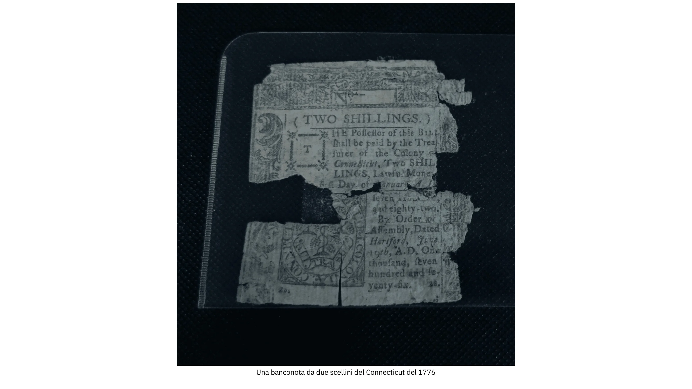

Prima di dichiarare guerra all'Inghilterra e di emettere una propria moneta, le colonie utilizzarono questa cartamoneta, insieme al dollaro spagnolo, per le transazioni in contanti. In effetti, il termine "dollaro" è rimasto per indicare il dollaro americano.

Se non sbaglio, nel 1792 approvarono una legge che consentiva loro di coniare moneta. A titolo di esempio, quello qui sotto è un dollaro americano dell'era moderna.

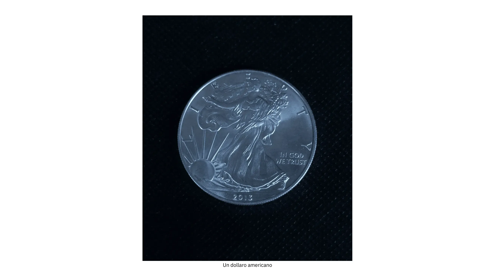

Ovviamente non ha un valore nominale di un solo dollaro, ma di circa 30 o 40 dollari, in quanto rappresenta un'oncia d'argento. Il suo valore fluttua in base al prezzo dell'argento, che in genere lo colloca almeno a 30 o 40 dollari USA. Oggi, naturalmente, un dollaro di carta conserva solo il suo valore nominale di un dollaro, ma all'epoca il dollaro statunitense era radicato in questo valore d'argento.

Parliamo ora della Guerra Civile in America. I Confederati stampavano denaro, che veniva iperinflazionato. Questo fenomeno non è incluso nella lista ufficiale di Hanke-Krus, poiché non raggiunse un tasso di iperinflazione del 50%. Tuttavia, si registrò un tasso di inflazione mensile del 40%, il che indica che durante la guerra fu stampata una notevole quantità di moneta.

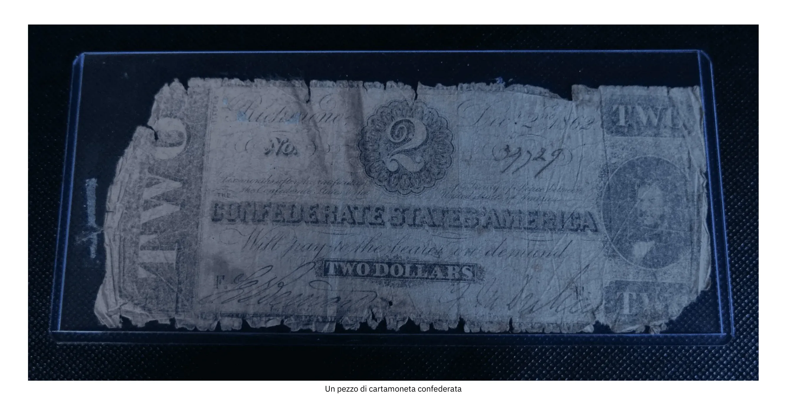

Anche gli avversari del Nord avevano dei dollari. In alto si possono vedere i dollari confederati, mentre in basso si possono osservare i dollari nordisti. Erano chiamati "greenback" perché il retro era verde.

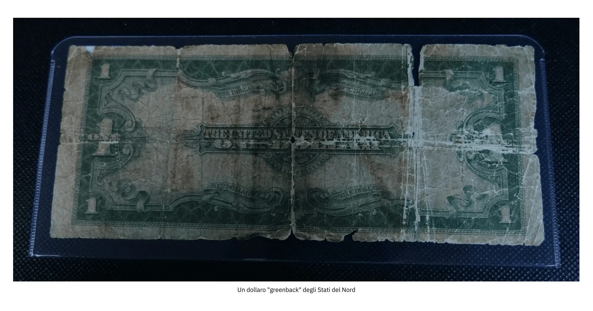

E vi invito a confrontare la differenza di dimensioni con le banconote moderne. All'epoca le banconote erano più grandi.

Come sappiamo, il Nord vinse e il biglietto verde divenne la valuta degli Stati americani riunificati. Poi ci fu la fondazione della FED nel 1913 e la prima guerra mondiale.

All'indomani della Prima Guerra Mondiale, l'ultima serie di banconote stampate includeva sempre la dicitura "redimibile in oro su richiesta". Nel 1928, quindi, 20 dollari compravano quasi un'oncia d'oro, dato che il prezzo dell'oro era di 20,67 dollari. La banconota nell'immagine sottostante poteva acquistare un'oncia d'oro nel 1928.

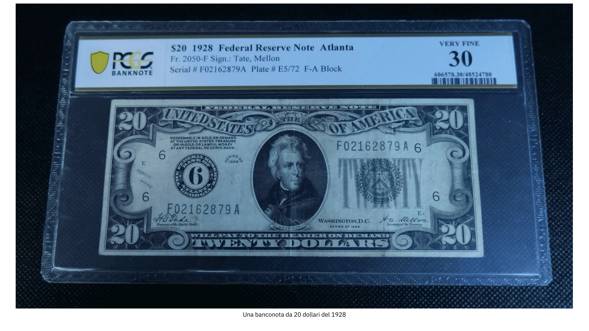

Oggi un'oncia d'oro vale 3.000 dollari USA. Si può quindi notare il potere della svalutazione, ovviamente. Era l'ultima legge che conteneva le parole "riscattabile in oro". Vedremo che subito dopo l'Ordine Esecutivo 6102, sequestreranno tutto l'oro. In realtà, avrebbero sequestrato sia l'oro che i certificati d'oro.

Qui sotto potete vedere un certificato d'oro del 1928.

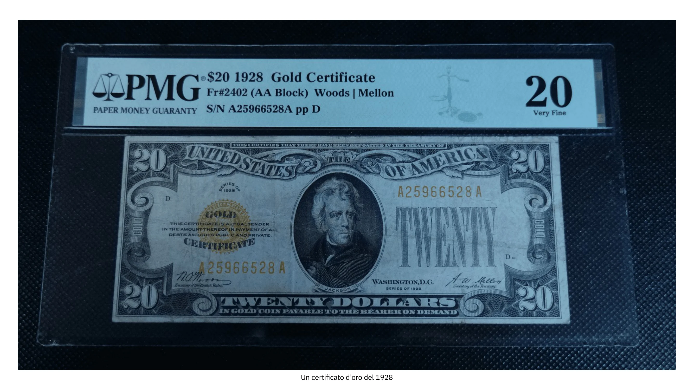

Non solo era "riscattabile in oro" come la banconota del 1928, ma era anche riscattabile in monete d'oro: è davvero un "certificato d'oro". Sono stati tutti sequestrati dopo l'Ordine Esecutivo 6102. Fino al 1964 era addirittura illegale possederli.

Sono molto felice di averne uno.

A partire dal 1964 divenne illegale possedere oro, fino al 1974, se non sbaglio. Negli anni '70, dopo lo shock di Nixon, che descriveremo tra poco, permisero alle persone di accumulare oro. Nel 1933, quando emisero l'Ordine Esecutivo 6102, sequestrarono l'oro e divenne illegale possederlo. Chi veniva sorpreso a detenere l'oro veniva condannato a una pesante pena detentiva. A quei tempi, ogni oncia d'oro veniva scambiata con una banconota simile a quella qui sotto, dopo il 1934.

Come abbiamo detto, nel 1928 un dollaro aveva ancora la scritta "redimibile in oro".

Dopo l'emissione dell'Ordine Esecutivo 6102, sequestrarono tutto l'oro e scambiarono 20,67 dollari per ogni oncia d'oro. In seguito, la truffa venne alla luce: nel 1934 furono emesse nuove banconote con il testo stampato "questa banconota ha corso legale per tutti i debiti".

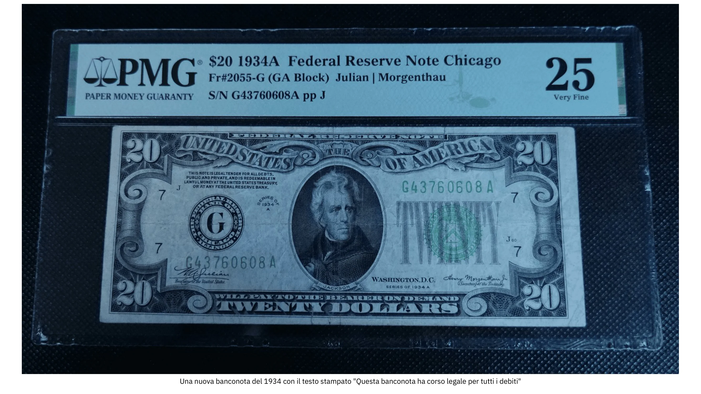

Il concetto di corso legale emerge qui, sostituendo la frase "redimibile in oro" Le due banconote possono sembrare identiche, con solo poche parole che cambiano, ma la truffa sta nel fatto che il dollaro fu svalutato durante questo periodo; passò da un'oncia d'oro valutata a 20,67 dollari a 35 dollari per oncia nel 1934. Si trattava di una svalutazione di circa il 40%!

Poi arrivò la Seconda guerra mondiale. Dopo la guerra, gli accordi di Bretton Woods centralizzarono gran parte dell'oro mondiale negli Stati Uniti. Gli americani emisero in cambio banconote, che però non erano più riscattabili in oro dal pubblico in generale. Al contrario, esse rimasero scambiabili con l'oro a livello statale.

Alla fine, paesi come la Francia e la Germania cominciarono a sospettare che probabilmente c'erano più banconote in circolazione che oro nei caveau degli Stati Uniti.

Così chiesero di rimpatriare il loro oro. E loro risposero: "Va bene, lo faremo, ma ci vorrà un po' di tempo" Nel 1971, il nostro amico Richard Nixon tagliò definitivamente il legame tra banconote e oro, dando la colpa agli speculatori.

L'oro era sottovalutato a 35 dollari l'oncia, un prezzo che non corrispondeva al volume di denaro stampato o al suo reale valore di mercato. Nel giro di pochi anni, il prezzo passò da 34 a 800 dollari. Analogamente agli esempi storici, come a Roma, dove il legame tra il denario e il solidus fu interrotto, l'oro fu lasciato fluttuare. Questo fatto portò a un processo di scoperta dei prezzi, che portò l'oro a essere valutato molto più alto in termini di dollari.

### Il moderno sistema della moneta a corso fisso e le sue implicazioni

Questa parte riassume il passaggio da un sistema monetario basato sull'argento o sull'oro. A poco a poco, le istituzioni hanno acquisito sempre più potere sul denaro. Alla fine, una decisione unilaterale ha interrotto completamente il legame tra metalli preziosi e denaro, a seguito di una sovraemissione.

Di conseguenza, non c'è più alcun legame tra l'oro e le banconote o il denaro scritturale. E non si tratta nemmeno di un sistema a riserva frazionaria, concetto ormai superato. Invece, le banche private emettono e creano denaro attraverso il credito bancario. Il denaro viene creato principalmente in questo modo ed è correlato al tasso di interesse chiave fissato dalla banca centrale.

Non c'è davvero alcun limite. Non esistono più livelli di riserva obbligatori, almeno in America e in Canada. L'unica riserva è la necessità per le banche di organizzarsi per essere in grado di rispondere agli scambi interbancari in modo da non rimanere senza liquidità.

Devono solo assicurarsi di poter effettuare questi trasferimenti, ma non c'è una riserva obbligatoria del 3%, 1%, 10%. Ci siamo veramente allontanati dal concetto di riserva frazionaria. Ora sono le banche centrali, i governi attraverso i deficit fiscali, le banche centrali attraverso il quantitative easing (QE) e le banche private attraverso la creazione di prestiti bancari che possono aumentare l'offerta totale di moneta e, a mio avviso, causare inflazione.

Per capire il legame tra denaro e inflazione, vi consiglio un corso che ho su Plan ₿ Academy dedicato a questo argomento. Imparerete la differenza tra l'aumento dei prezzi, che è ciò che vediamo nella vita, e l'inflazione. Non sono la stessa cosa. Infatti, quando si parla di inflazione, spesso si parla di aumento dei prezzi, non di inflazione in sé. L'inflazione è un concetto abbastanza preciso, che si spiega con l'aumento dell'offerta di moneta.

https://planb.academy/courses/caa75343-ac90-4249-bcca-0e2e57c3a0f1

Per concludere questa sezione sul mondo fiat, vorrei segnalarvi una risorsa che vi aiuterà a comprendere meglio i fenomeni che ho appena spiegato, come l'inflazione.

Grazie per l'attenzione.

## La storia delle bolle monetarie

<chapterId>b6451c46-917d-11f0-97de-6bc5081765fa</chapterId>

:::video id=5967d9a6-aae4-4b84-a283-71b1b735bca4:::

### L'invenzione della cartamoneta e la prima grande bolla speculativa

Con la creazione delle banche centrali nel XVIII secolo, nacque una vera e propria rivoluzione: il denaro magico sotto forma di banconote. L'esempio più eclatante in Francia è quello di John Law. Questo scozzese, esiliato a Parigi, propose al reggente, il Duca d'Orléans, una soluzione alla bancarotta delle finanze reali creando una banca di Stato e una compagnia commerciale coloniale: la famosa **Banque Royale** e la **Compagnie du Mississippi**.

Con questo sistema, Law collegò la cartamoneta alle azioni della sua società. Più banconote circolavano, più alto era il valore delle azioni e più solida sembrava essere la banca... finché la speculazione non superò la realtà. La bolla scoppiò improvvisamente nel 1720, mandando in rovina la nobiltà, la borghesia e gran parte dell'Europa che era venuta a speculare in rue Quincampoix. Il risultato: una sfiducia duratura nella cartamoneta in Francia e la prima lezione europea sulle bolle speculative.

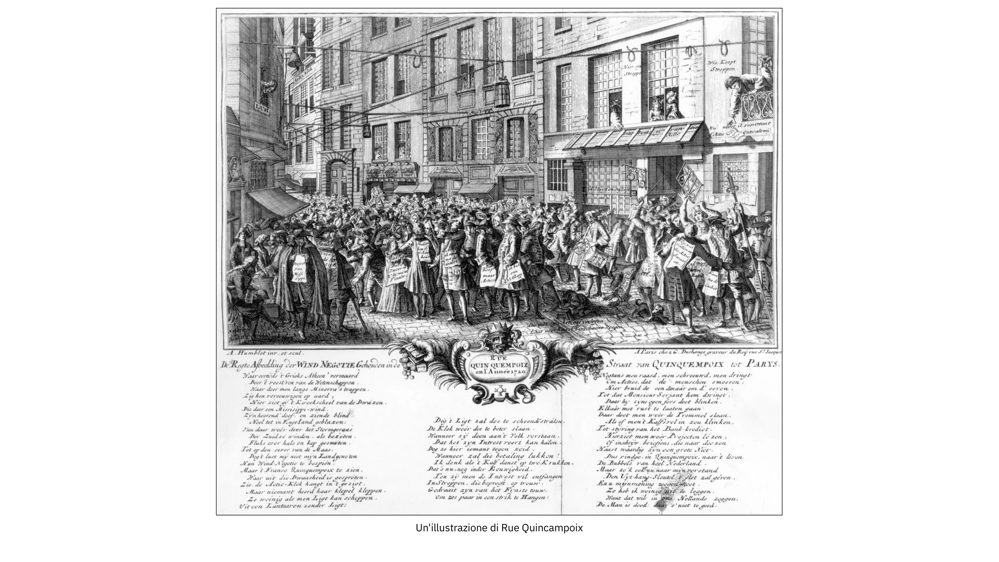

### Quando il terreno diventa "collaterale"

Un secolo più tardi, la Rivoluzione francese aprì una nuova strada con gli **assignats**, una moneta sostenuta dai beni confiscati della Chiesa. Un'idea attraente sulla carta - trasformare la terra in garanzia monetaria - ma inefficace: la terra non è né liquida né divisibile. Il risultato: iperinflazione, molteplici divieti sull'uso della terra, inflazione incontrollata e penuria.

Napoleone, profondamente colpito da questo caos, ristabilì l'oro e l'argento come base monetaria nel 1800 con la creazione della Banque de France, garantendo così la regolare retribuzione dei suoi eserciti. Un modo pragmatico per riconquistare la fiducia: pagare in valuta forte.

### I ruggenti anni Venti e la Grande Depressione del 1929

Saltiamo due secoli. Dopo la Prima Guerra Mondiale, i governi finanziarono lo sforzo attraverso l'inflazione e la sospensione dell'oro. Negli anni Venti, la Fed americana perseguì una politica monetaria eccessivamente accomodante per sostenere la sterlina britannica. Il risultato: credito facile, speculazione sfrenata a Wall Street, acquisti di azioni a credito e l'emergere di una bolla immobiliare e bancaria.

Quando la macchina andò in tilt, il crollo del 1929 fu inevitabile: massicci fallimenti bancari, disoccupazione record e code alle mense dei poveri. Ciò ha dato origine al persistente equivoco secondo cui **tutta la deflazione è negativa**, mentre occorre distinguere tra deflazione da crescita (sana) e deflazione da debito (devastante).

### L'Asia degli anni '90 e l'effetto domino

Negli anni '90, il "miracolo asiatico" faceva sognare il mondo. I tassi del Exchange erano ancorati al dollaro, la crescita era dell'8-10% e i capitali occidentali stavano affluendo. Tutto andava bene... finché la marea non si è ritirata. I fallimenti si susseguirono a cascata, le valute si svalutarono dell'80% e gli investitori furono rovinati. Il FMI è dovuto intervenire, imponendo riforme dolorose. Lo stesso scenario di sempre: capitali abbondanti, bolle alimentate dal credito, poi il crollo.

### il 2008 e l'era della bolla permanente

La bolla di Internet (2000) è stata seguita dalla bolla immobiliare dei subprime. La cartolarizzazione ha trasformato i prestiti bancari in prodotti finanziari "a tripla A", diffusi in tutto il mondo. La promessa: eliminare il rischio diluendolo. La realtà: tutti i rischi erano in realtà correlati. Quando il settore immobiliare è crollato, è crollato anche l'intero sistema bancario globale.

Il risultato: massicci salvataggi pubblici, quantitative easing e tassi di interesse zero. E con ciò, una corsa a capofitto: ogni crisi non eliminerà più gli eccessi, ma sarà coperta da sempre più debito e stampa di denaro. Questo è ciò che ha portato alla situazione attuale: **La "bolla di tutto "**, in cui ogni cosa - azioni, immobili, arte, criptovalute, persino le carte Pokémon - si gonfia artificialmente.

### L'eterno ritorno del denaro magico

Da un secolo all'altro, emerge una costante: non appena una società crede di poter creare ricchezza con il denaro invece che con la produzione di beni reali, compaiono le bolle. Da John Law al 2008, da rue Quincampoix a Wall Street, il processo si ripete: euforia, credito, boom e fallimento.

E alla fine, invariabilmente, quando nessuno si fida più della carta, la gente cerca qualcos'altro - oro, terra, rifugi sicuri... o nuove valute. Ieri Napoleone imponeva il metallo, oggi alcuni vedono il Bitcoin come successore.

La storia della finanza è un ciclo infinito: stampare, speculare, crollare. Fino alla prossima bolla.

## Denaro e violenza

<chapterId>9486fe64-854f-5e17-86b3-8873baca39a8</chapterId>

:::video id=bd6d0807-2d8f-4637-a0f5-1e990e5c0d0f:::

Questa breve sezione ripercorrerà molti degli eventi che abbiamo già visto durante il corso, riassumendo alcuni aneddoti che ritengo interessanti.

### Tecnologia e violenza

Ecco alcuni aneddoti di cui probabilmente abbiamo già parlato durante il corso. Servono a introdurre una discussione molto affascinante che ho avuto con Theo a proposito di una conferenza che ha tenuto a B-Ondy, che ho trovato molto interessante per quanto riguarda il modo in cui i progressi tecnologici influenzano il rapporto di violenza tra la popolazione e lo Stato.

### Denaro e coercizione statale

Per introdurre questa sezione, vi fornirò un elenco breve e non esaustivo, solo per ricordarvi gli eventi che probabilmente abbiamo già trattato nel corso.

Un collegamento che posso già fare con il denaro e la violenza è che quando si tratta di cartamoneta senza valore che può essere stampata all'infinito, spesso è accompagnata da regole e minacce di ogni tipo. Possiamo già parlare degli assignats, dove era letteralmente scritto sulle banconote che i falsari erano minacciati di morte. È facile trovare nei testi giuridici dell'epoca minacce di morte per chi non accettava questa famosa cartamoneta.

Per rimanere in Francia, in uno dei testi giuridici dell'epoca rivoluzionaria che sono riuscito a procurarmi, ho visto che la "diaria" per il trasporto e il funzionamento della ghigliottina era descritta nelle sezioni relative alla moneta. Ho trovato la cosa piuttosto bizzarra.

Abbiamo anche parlato del conio delle monete in Cina, con lo Stato che supervisionava il conio. Abbiamo visto in una sezione all'inizio del corso che quando le monete, alcune delle quali meno belle, venivano scartate, c'erano conseguenze legali.

C'è anche un aneddoto su un re inglese che finì per tagliare le mani a coloro che coniavano denaro se non si comportavano come lui si aspettava.

Inoltre, in Cina, ho letto del sequestro di rame dai monasteri buddisti. In un momento in cui il rame stava acquistando valore e destabilizzava la loro economia - che si basava su una forma di denaro fiat che aveva poco a che fare con il valore del metallo - sono ricorsi a trovare un posto dove c'era ricchezza e hanno sequestrato il rame dai monasteri.

Lo stesso vale per i monasteri in Inghilterra durante la Riforma inglese. Quando il famoso re litigò con il Papa per il suo divorzio, c'era un'altra ragione dietro a tutto questo: approfittò dell'abolizione dei monasteri per impadronirsi delle ricchezze contenute in queste organizzazioni ecclesiastiche.

Durante la Rivoluzione francese, sequestrarono tutti i beni della Chiesa. Si videro bellissime monete create dalle campane fuse delle chiese.

Se andiamo ancora più indietro, una delle nozioni più esplicite di violenza economica e libertà, di leggi liberticide, è **Diocleziano con la sua casta ereditaria che era direttamente collegata al fatto che i contadini non volevano più accettare la moneta svalutata**. Volevano lasciare il loro lavoro di contadini e Diocleziano reagì semplicemente dicendo loro: "Non potete lasciare la vostra terra e nemmeno i vostri figli". La stessa cosa valeva per i soldati.

Credo che sia una forma di violenza piuttosto esplicita. Potrei concludere parlando dei Cavalieri Templari o di un re francese. Quando i Cavalieri Templari si stabilirono in Francia, immagino che il re abbia visto la manna della ricchezza templare e abbia avuto problemi di finanziamento statale. Fece causa all'Ordine dei Templari e alcuni di loro riuscirono a portare via parte del tesoro, il che ha dato origine a uno spettacolo molto interessante negli Stati Uniti o in Canada. Non so chi l'abbia prodotto, ma si chiama *Il mistero di Oak Island*. Si tratta di persone che pensano che ci sia un tesoro dei Templari sepolto su un'isola in Canada, nelle Marittime, e che hanno trivellato per anni - forse anche più di un decennio - per realizzare una specie di pozzo. Hanno trovato un pozzo con molte gallerie e stanno cercando un tesoro sepolto dai Cavalieri Templari su quest'isola, che è il soggetto di questa serie televisiva. Saluto mio padre, che è un grande fan di questa serie.

Ecco quindi un rapido elenco di fatti che abbiamo visto durante questo corso e che, a mio avviso, fanno emergere il legame con la violenza. Vi lascio con la prossima parte di Theo, che ci racconterà una storia molto interessante sul cambiamento tecnologico e sull'equilibrio di potere tra la plebe e le autorità.

Grazie!

## Le conseguenze economiche della violenza organizzata

<chapterId>66bd4674-2159-5489-ad4b-ec5e3fb691af</chapterId>

:::video id=c8b063c6-aeb4-4a94-9027-b11d369e71a4:::

### La violenza organizzata e l'evoluzione dello Stato

Lo storico Frederic C. Lane propone una tesi rivoluzionaria: l'anatomia dello Stato nel corso della storia è plasmata dalle tecnologie utilizzate per proiettare la violenza. Partendo dal principio weberiano secondo cui lo Stato detiene il monopolio della violenza legittima, Lane osserva che questo monopolio - paradossalmente più efficiente della concorrenza in questo campo - si evolve in base al rapporto tra il costo dell'attacco e il costo della difesa.

Questa analisi, ripresa dagli autori di "L'individuo sovrano" (1997), spiega le mutazioni storiche dell'organizzazione politica: dal sistema feudale medievale alle città-stato del Rinascimento, poi agli Stati nazionali industriali e infine ai moderni Stati sociali. Ogni transizione corrisponde a un importante progresso tecnologico nell'esercizio della violenza, che si verifica all'incirca ogni 400-500 anni.

### Equilibrio medievale

Nel Medioevo, l'economia agraria era dominante per oltre il 90%. Il contadino, letteralmente radicato alla sua terra, non poteva fuggire dal signore e dai suoi cavalieri. La tecnologia militare - armature forgiate a mano, anni di addestramento alla spada - era estremamente costosa. Questa asimmetria favoriva in modo massiccio l'attacco rispetto alla difesa.

Il produttore agricolo immobile diventa prigioniero del monopolista locale della violenza. La sua capacità di estrazione fiscale raggiunge nuove vette - anche se, paradossalmente, le tasse medievali rimangono modeste rispetto al 78% dei prelievi obbligatori dei tempi moderni. Il signore può tassare a piacimento, perché il contadino non può resistere né andarsene.

### Il Rinascimento mercantile

L'emergere del commercio anseatico a nord e del commercio mediterraneo a sud trasformò la situazione. I mercanti, principali creatori di valore aggiunto, possedevano un capitale mobile: le loro navi. Avevano bisogno solo di milizie marittime leggere, poiché i mari erano difficili da controllare. Soprattutto, potevano facilmente migrare in un porto vicino se la tassazione diventava eccessiva.

Questa mobilità creò una concorrenza fiscale tra le città-stato. Venezia, Genova e Bruges dovevano offrire il quadro più liberale possibile: contratti affidabili, moneta di qualità, assicurazioni, tassazione minima. I principi dovevano sedurre piuttosto che costringere. La simmetria si inverte: la difesa (attraverso la fuga) diventa più facile dell'attacco.

### L'era industriale

La rivoluzione industriale ha portato con sé una configurazione simile al feudalesimo. Fabbriche, ferrovie e catene di montaggio rappresentano investimenti massicci e immobili. Henry Ford non era in grado di delocalizzare i suoi impianti a causa delle tasse. I lavoratori, concentrati nelle città industriali, si sindacalizzarono per negoziare collettivamente piuttosto che migrare individualmente.

Nasce il "welfare state": pianificazione industriale (Giappone, Corea), protezione militare delle infrastrutture, prestazioni sociali minime per la forza lavoro. La Seconda guerra mondiale illustrò questa vulnerabilità: il bombardamento delle fabbriche nemiche divenne la strategia dominante. La concentrazione del capitale fisico permise una massiccia estrazione fiscale per finanziare lo Stato sociale.

### La rivoluzione dei microprocessori

Tre innovazioni tecnologiche stanno ora sconvolgendo questi equilibri secolari. Il microprocessore sta trasformando la guerra: un operatore in Nevada pilota un drone in Afghanistan con precisione chirurgica. La Guerra del Golfo (1991) ha dimostrato questa svolta: il quarto esercito più grande del mondo (l'Iraq) è stato spazzato via in 45 giorni, con meno di 200 morti da parte della coalizione. La superiorità tecnologica ha reso impossibile l'attacco frontale.

Internet e la crittografia asimmetrica stanno rivoluzionando la creazione di valore. Uno sviluppatore può lavorare da qualsiasi luogo con un MacBook e Starlink, esportando la propria produzione istantaneamente e gratuitamente. I nomadi digitali sfuggono alla prigionia geografica, mettendo gli Stati gli uni contro gli altri come non si vedeva dai tempi del Rinascimento.

Il Bitcoin rappresenta il culmine di questa logica: una moneta svincolata dallo Stato, protetta da uno scudo crittografico inviolabile. La ricchezza diventa difendibile da qualsiasi forza fisica. L'individuo riacquista la capacità di difendersi dal monopolio statale.

### Il crollo del modello westfaliano

Gli Stati sociali occidentali, progettati per l'era industriale, stanno diventando obsoleti. I creatori di valore - sviluppatori, artisti, finanziatori - stanno migrando a Singapore, Dubai o El Salvador, preferendo meno servizi pubblici in cambio di una tassazione minima. Giganti moderni come Apple e Tether non hanno bisogno né di uffici né di infrastrutture fisiche.

Questa fuga di cervelli crea una spirale: meno contribuenti netti, degrado dei servizi pubblici, aumento della tassazione per chi resta e partenze accelerate. Gli Stati devono ridimensionarsi radicalmente o fallire. La frammentazione in piccole giurisdizioni competitive - un nuovo modello di città-stato digitale - sembra inevitabile.

La storia ci insegna che queste transizioni richiedono generazioni. Ma la separazione tra moneta e Stato prevista dal Bitcoin potrebbe accelerare il processo. Gli individui ora votano con i loro piedi e con i loro portafogli crittografici, ridisegnando la mappa del potere globale lungo linee che stiamo solo iniziando a percepire.

## Breve storia della finanza

<chapterId>1d37fff1-a091-5034-8e71-4af590b8ffce</chapterId>

:::video id=fdfabbc6-e4d8-463a-8522-19176f8fb460:::

Dopo questo racconto della storia del denaro, che ci porta fino al sistema fiat, vorrei spiegare in modo rapido e sintetico l'evoluzione della finanza che alla fine ha portato allo Stato sociale. All'inizio, in epoca romana, c'erano le monete.

Le monete erano una tecnologia finanziaria che permetteva all'impero di pagare i soldati, espandersi e commerciare. Funzionava molto bene, ma alla fine ci furono troppe svalutazioni. A un certo punto, quando smisero di espandersi e di ricevere il bottino delle guerre e dell'espansione territoriale, il loro sistema collassò.

### L'evoluzione delle tecnologie finanziarie

Poi è arrivato il Medioevo, dove l'evoluzione è stata minima fino al Fiorino, che ha riportato una moneta stabile, e agli sviluppi bancari in Italia e ad Anversa, dove è stato sviluppato il concetto di "valore temporale del denaro" - in altre parole, l'attualizzazione. L'attualizzazione è stata sviluppata per creare una forma di cartamoneta in cui veniva emessa una "cambiale", cioè una promessa che in una data successiva si sarebbero potuti recuperare 100 dollari più un tasso di interesse.

Questo sistema ha creato una tecnologia finanziaria che consente al possessore di vendere la nota prima della scadenza, quindi se la si vende dopo 4 mesi di una scadenza di 6 mesi, la persona pagherà effettivamente un premio per compensare la perdita di rendimento per i restanti 2 mesi.

Si trattava di una tecnologia finanziaria sviluppata all'epoca ad Anversa e Amsterdam. In seguito, abbiamo assistito all'evoluzione delle banche centrali e della nozione di prestatore di ultima istanza. Si può affermare che durante la Banca di Amsterdam l'uso delle monete nel commercio internazionale fu abbandonato a favore della moneta scritturale.

Più tardi, nel XVIII secolo, in termini di tecnologia finanziaria, possiamo parlare di assicurazioni. C'è un aneddoto molto ben raccontato nel libro di Neil Ferguson "The Ascent of Money". La prima compagnia assicurativa a nascere si chiamava **Scottish Widowss**, ed era essenzialmente il clero che voleva sviluppare un'assicurazione per i sacerdoti che a volte morivano prima del tempo, morti all'improvviso. Il clero, all'epoca, si occupava delle mogli e della prole in Scozia per un anno. E così il clero trovò questo periodo di un anno forse un po' troppo breve. Di conseguenza, **inventarono dei calcoli attuariali** per calcolare letteralmente il numero di contribuenti necessari affinché il sistema coprisse i costi, a seconda del numero di sacerdoti morti prematuramente.

Hanno sviluppato calcoli attuariali per dire: "Ok, bene, ogni sacerdote ci dà questa somma. Poi, se il sacerdote muore, l'assicurazione coprirà i costi per garantire la sopravvivenza della moglie e dei figli fino a quando non saranno autosufficienti" È stata quindi la prima compagnia assicurativa, chiamata "Scottish Widows", a rendere popolare questo sistema e a diffonderlo.

### Dall'assicurazione privata allo stato sociale

L'assicurazione fa quindi parte della storia della tecnologia finanziaria. E questo mi porta al concetto di Stato sociale, ovvero che l'assicurazione privata alla fine si è scontrata con un problema, una nozione di ottimizzazione, in cui ci diciamo che se offriamo l'assicurazione sanitaria a persone che sono sane, queste potrebbero avere meno interesse a pagare il premio perché si dicono: "Sono sano, non mi ammalerò". D'altro canto, le persone che sanno di essere malate vorranno sicuramente sottoscrivere l'abbonamento.

Questo sistema crea uno squilibrio tra il numero di persone malate che stipuleranno un'assicurazione sanitaria, rispetto alle persone sane che potrebbero stipularne meno. Quindi c'è una sorta di squilibrio: se si calcolano le cifre, queste non si bilanciano perché probabilmente non si riuscirebbe ad assicurare abbastanza persone sane da compensare i costi. In economia, questo è il concetto di **pericolo morale**.

Una delle idee avanzate è quella di rendere obbligatoria l'assicurazione. Se tutti sono obbligati a contribuire, si riequilibra il tutto e sia le persone sane che quelle non sane contribuiranno, distribuendo i rischi alla popolazione più numerosa.

E così, in molte parti del mondo, lo Stato ha detto: "Beh, ce ne occupiamo noi". Pur non essendo un esperto in materia, vedo che questo stesso ragionamento è probabilmente applicato a ogni tipo di altra forma di assicurazione, come quella contro la disoccupazione. C'è il desiderio di semplificare e ottimizzare, basandosi sull'idea che sarà più semplice se ci sarà un'unica organizzazione a occuparsene.

A mio avviso, ciò ha portato a una centralizzazione di tutti questi concetti assicurativi e, in ultima analisi, alla nascita dello Stato sociale, in cui tutti questi concetti finanziari, che in origine erano imprese private, iniziative private per soddisfare un'esigenza del mercato assicurativo di distribuire il rischio tra la popolazione, sono stati presi dallo Stato per ragioni che probabilmente sono abbastanza logiche in relazione all'azzardo morale e al desiderio di ottimizzare.

### Modelli alternativi e riflessioni sui monopoli di Stato

In definitiva, in alcuni Paesi come il Canada, ci ritroviamo con diversi tipi di assicurazione - assicurazione sanitaria, assicurazione contro la disoccupazione - che sono monopoli di Stato.

Posso fare un esempio che conosco. In Svizzera il sistema è un po' diverso. Ci sono mutue private e ospedali privati, quindi si può scegliere la propria mutua, si può scegliere il proprio pacchetto all'interno della propria mutua. Si ottengono comunque servizi relativamente universali, anche se gran parte di questo sistema rimane privato.

Quindi penso che sia possibile che sia anche a gestione privata. Ma tutto quello che volevo descrivervi, in realtà, non è una dichiarazione per esprimere se un sistema è migliore dell'altro, era piuttosto per spiegarvi che leggendo la storia della finanza, mi sono reso conto del perché in Occidente, in particolare in Francia, in particolare in Canada, lo Stato ha voluto assumere il controllo di questi principi finanziari.

Il punto che volevo sottolineare è che il concetto di assicurazione è prima di tutto un'evoluzione della finanza e, come a volte i governi sono così bravi a fare, cercheranno di prenderne il controllo, proprio come hanno cercato di prendere il controllo del denaro, per diverse ragioni. Uno di questi motivi è il concetto di prestatore di ultima istanza.

L'idea è che sia molto meglio se dietro c'è una grande istituzione che distribuisce il rischio in modo più ampio. Questa è stata l'iniziativa iniziale alla base della nozione di prestatore di ultima istanza, in cui questa istituzione poteva effettivamente scegliere le istituzioni abbastanza forti da sopravvivere ed evitare che collassassero prestando loro denaro.

All'epoca, ci fu una vera e propria analisi quando questo concetto apparve per la prima volta, ma ciò che finì per accadere è che salvammo tutti, "too big to fail", si applica a quasi tutte le banche perché c'è la centralizzazione, e anche a tutte le grandi aziende. Alla fine, vediamo che è ancora un concetto che viene applicato "in generale" dallo Stato, simile al concetto di assicurazione che vi ho appena descritto.

Alla fine, lo Stato decide di prendersi cura di tutto, trasformando una tecnologia finanziaria creata in Scozia per risolvere un problema specifico nel vasto stato sociale che conosciamo oggi. Utilizza i principi finanziari attuariali per offrire servizi alla popolazione bisognosa. Tuttavia, possiamo concordare sul fatto che i monopoli che derivano da questo sistema creano ogni sorta di problema, che stiamo attualmente sperimentando in Paesi come il Canada e la Francia. Fortunatamente esistono modelli diversi, come quello svizzero.

Dobbiamo semplicemente renderci conto che questo concetto di Stato sociale deriva dalla finanza. Questa consapevolezza suggerisce che possiamo esplorare altre strade oltre ai famosi monopoli di Stato, e applicherei questo ragionamento anche al concetto di banche centrali come prestatori di ultima istanza - ma questo è un argomento per un'altra volta.

# Sezione finale

<partId>9bada469-7ef0-511a-9eaa-f8eb66d5906f</partId>

## Valutare questo corso

<chapterId>a9494e2b-8a4d-5811-8a7b-b4a91fb22778</chapterId>

<isCourseReview>true</isCourseReview>

## Conclusione

<chapterId>1094e793-b4c6-5782-aa4a-71cde00ce7c0</chapterId>

<isCourseConclusion>true</isCourseConclusion>