# コインの歴史を巡る旅

この魅力的なコースでは、太古の文明から現在の通貨システムまで、お金の魅力的な進化を探求します。新石器時代から現代まで、時代を横断し、貨幣が人類の偉大な文明によってどのように形成され、また形成されてきたかを発見します。メソポタミアの原始貨幣から、暗号通貨、リディア硬貨、ルネサンス期のフロリン、中央銀行の出現まで、このコースは私たちの社会の基本的な柱のひとつである貨幣について包括的な視点を提供します。

+++
# はじめに

<partId>59878a67-8a1d-5d6b-af41-5b847c14363c</partId>

## お金の歴史入門

<chapterId>ca53597e-be9a-5261-a55f-11fac8504a68</chapterId>

:::video id=08ff35ca-8a40-4286-abaf-71283faf6e78:::

貨幣の歴史を学ぶこのコースへようこそ。タイトルの通り、コインの歴史的な変遷を一緒に探っていきましょう。新石器時代から現代まで、過去の主要な帝国と文明を見ていきます。

しかし、このコースは単純な年代記や歴史的出来事に限定されるものではない。むしろ私たちの真の目的は、貨幣、いや通貨の出現に関わる基本的な概念を深く理解することである。

### 探求すべき基本概念

つまり、通貨そのものの出現、通貨システムの出現、銀行の出現、紙幣の出現、中央銀行の出現、そして最終的に現在の「不換紙幣」通貨システムの出現について話しているのだ。

メソポタミアにおける負債貨幣と勘定単位の出現、そして原始社会における持参金や血盟金といったその他の制度から、原始通貨への旅が始まる。また、古代エジプトでは、中王国時代のはるか以前から、実際の通貨制度が存在していたことも見ていく。

経済学の教科書では、貨幣の本当の始まりとされている重要な瞬間である。ペルシャ、アレクサンダー大王、そしてローマのおかげで、これらのコインがどのように広まり、最終的に自らを押しつけ、支配し、崩壊したかを検証する。

そこから、私たちは学んだすべてのことを武器に、「お金とは常に負債である」とか「お金とは常に商品である」といった先入観を越えて、お金の定義そのものについて一緒に考えるために必要な時間を取る。現実には、お金は財であると同時に社会的慣習でもある。特に、マネー・プレミアムの概念について議論し、貨幣の出現を説明するさまざまな理論の統一を試みる。

### 主要な時代と通貨革新

この時代には、デンマークの侵略者を買収するために使われたイングリッシュ・ペニーや、シャルルマーニュのポンドなど、印象的な革新的通貨が登場した。

また、十字軍が最初の遠隔送金システムをどのように出現させたかについても見ていく。そして、ルネサンスに伴う通貨フローリンの影響と、ヨーロッパの物価に大きな影響を与えたアメリカ大陸からの貴金属の到着について見ていく。

紙幣と中央銀行の登場を詳しく見て、金融危機の歴史とそのしばしば起こる暴力的な影響との類似性を描く。

最後に、現代の通貨制度と並行させ、その帰結を探り、金融の歴史をたどることで、今日の福祉国家に至った経緯をより深く理解する。

さらに、ボーナスとして、お金にまつわる多くの魅力的な語源的つながりを見てみよう。

### コース構成

このコースは大きく3つのパートに分かれている。

第I部では貨幣の出現について、第II部では貨幣のルネッサンスとその没落について、第III部では国家機関や国家が徐々に貨幣を管理するようになり、現在の不換紙幣制度に至った経緯について見ていく。

ありがとう！

# 取引所の出現

<partId>da5e4981-9ea5-5208-beab-3b75c9043632</partId>

## アウストラロピテクスから現代人まで

<chapterId>34a773aa-f2d3-5c26-8be4-f2cd79ed6fbc</chapterId>

:::video id=4f333013-4b2a-42ab-8761-593fafc971ca:::

### 新石器時代から始める理由

なぜ新石器時代までさかのぼってお金の話をするのか？答えは簡単で、文明の発生そのものを見なければ、貨幣の発生を完全に理解することはできないからだ。なぜ最初の貨幣制度が生まれたのかを理解するためには、遊牧民である狩猟採集民の集団が定住するようになったきっかけを理解する必要がある。

分業も専門化もせず、各自が必要なものを責任を持って生産する部族には、貨幣は必要ない。同様に、各自が自分のために耕作する、自給自足の農業だけを実践する農業共同体には、普遍的な交換仲介者の必要性はまだ感じられない。

### 定住化とその結果

だからこそ、新石器時代から探究を始めるのは面白いと思う。定住化がどのように村落を生み、やがて都市を生み、ついには偉大な文明を生み出したかを見ていくことになる。この定住化と余剰食料の生産が、労働の専門化を可能にし、最初の貨幣概念の出現と進化に不可欠な肥沃な土壌を作り出したのである。

人間の相互作用から言語が生まれるように、文明が形成され、組織化される過程で、貨幣が自然に現れたり、現れなかったり（インカやスパルタのように）すると考えることができる。私の考えでは、貨幣が現れるか現れないかは、それぞれの社会の社会的・経済的組織の形態にすべて関係している。

### 人類進化の年表

しかし、その前に、さらに広い歴史的背景を見てみよう。

どの最初のプレゼンテーションでもそうであるように、私はコースの序論で述べたこととまったく逆のことをし、日付と歴史的出来事のリストを、互いに続くように紹介するつもりである。ここでは、食べ物の調理、車輪、穀物や動物の家畜化、ピラミッドの建設、最初の都市の建設など、他の人類の進歩との関連において、貨幣の出現を歴史的な文脈の中に位置づけるということである。

では、先史時代から人類の進化を見てみよう。

アウストラロピテクスから現代人までの人類の進化を、新石器時代までの技術の進歩と人口移動に沿って概観する。

### 人類の歴史的背景

- 300万年前** - アウストラロピテクス*の出現。
- 200万年前** - アフリカからヒトが出始める。
- 1.600万年前** - 南ヨーロッパとアジアにヒトが到達。
- 100万年前** - 火を使った家庭料理の最初の証拠（南アフリカ、ワンダーワーク洞窟の炭化した骨と植物遺体）。
- 紀元前40万年頃** - ネアンデルタール人がヨーロッパとアジアに居住。
- 紀元前30万年頃** - ホモ・サピエンス*の出現。
- 80,000年前** - *ホモ・サピエンス*が世界各地への移住を開始。
- 73,000年前** - 南アフリカのブロンボス洞窟（知られている最古の芸術形態）。
- 50,000年前** - *ホモ・サピエンス*がヨーロッパに到達。
- 30,000年前** - フランスのショーヴェ洞窟の洞窟壁画。
- 15,000年前** - フランスのラスコー洞窟壁画とオーストラリアの岩絵。
- 紀元前9000年頃** - 肥沃な三日月地帯で大麦が家畜化される。
- 紀元前9000年頃** - メキシコでトウモロコシ栽培。
- 紀元前8000年頃** - 三日月地帯でヤギとヒツジが家畜化。
- 紀元前7250年頃** - アイン・ガザル（ヨルダン）には、数百人の村があった。
- 紀元前7000年頃** - チャタルホユック（トルコ）には8000人が住んでいた。
- 紀元前6500年頃** - ギリシャで定住生活が始まる。
- 6000年前** - エジプトとメソポタミアで河川灌漑が始まる。
- 紀元前5000年頃** - 「三姉妹」と呼ばれる農作物の組み合わせが登場（トウモロコシ、カボチャ、豆）。
- 紀元前4000年頃** - 中央アジアでラクダが家畜化。(ラクダ科は4500万年前の始新世に北アメリカで誕生した。ラクダ科の動物は、4500万年前の始新世に北米で誕生し、ベーリング海峡を経由してアジアに移動した。ラクダ科の別の一種は南アメリカに向かい、現在もその子孫であるリャマ、アルパカ、ビクーニャが生息している）。
- 紀元前3500～3000年頃** - ボタイ族が馬の家畜化と繁殖を始める。
- 青銅器時代の初め頃** - シュメール人はすでに車輪と帆船を発明し、算術、天文学、そして最初の文字の形を発展させていた。
- 紀元前2800年頃** - 最盛期のウルクの人口は80,000人に達した。
- 紀元前2600-2200年** - ギリシア世界で最初の都市開発の兆し。地中海作物（小麦、ブドウ、オリーブ）の拡大。
- 紀元前2560年** - ギザの大ピラミッド建設。
- 紀元前1500年頃** - ミノア文明。
- 紀元前1300年頃** - ミケーネ文明。
- 紀元前1250年から1150年頃** - 青銅器文明の崩壊。
- 紀元1世紀** - 北アフリカのベルベル人がラクダを家畜化。

そこで、この歴史的概観は、ある種の技術の出現、ある種の動物の家畜化、そして文化について、次のセクションで取り上げる文字や貨幣の出現との関連で、私たちに視点を与えてくれるものである。

## 狩猟採集民から農耕民へ：文明の夜明け

<chapterId>ea950b6e-9eb7-553d-8f04-0eb042bb1f5a</chapterId>

:::video id=4b49a376-f6f4-42a0-86fa-264997a079f0:::

### 農業への移行と定住化

この章では、狩猟採集から自給自足の農業、工芸品、交易への移行についてお話しします。この定住生活と農業への移行を説明することは、最初の都市がどのように建設され、やがて古代におけるある種の貨幣制度の創設と出現につながったかを理解するために重要だと思った。

このセクションは、カリフォルニア州立工科大学ポノマ校のアマンダ・ポダニー教授による「古代メソポタミア、文明発祥の地での生活」というThe Great Coursesのウェブサイトで公開されているコースからの抜粋である。

### 農業導入のパラドックス

原始的な農業は、およそ10,500年前に近東のシリア北西部とトルコ南部あたりに出現した。今日、狩猟採集民の集団は農耕の導入を急がないが、新石器時代も同様だったのだろう。

**最初の村は、明らかに動植物の家畜化より前に作られた。

狩猟と採集が非常にうまく機能していたため、食料を生産するために種を植える必要がなかったのだ。今日、狩猟採集民は、非常に初歩的な技術を使っていた最初の農民たちよりもはるかに自由な時間を持つことができる。

つまり、現代の原始的な狩猟採集民は、新石器時代の最初の農耕民から理解されるよりも自由な時間があるということだ。狩猟採集で生活する現代の原始的な部族よりも、これらの人々は食料を生産するために懸命に働いたのである。

骨の研究からも、最初の農耕民はその前の狩猟採集民よりも小柄で、頑健ではなかったことがわかる。農耕民の食生活は狩猟採集民のそれよりも制限されていた。パンを多く食べたが、肉はあまり食べなかった。また、小麦粉を作る際に岩石の破片を使ったため、歯も貧弱だった。岩石で小麦粉を作ると、破片ができる。

ケト」ダイエットを実践している人なら同意してくれるだろう：パンをたくさん食べるのは、肉を食べるのと同じくらい良くないだろう。

### 農業の導入に関する理論

このようなデメリットを考えると、当時の誰が農業を選んだのだろうか？よく言われる説では、人類は農業を採用せざるを得なかったのであって、選択の余地はなかったというものもある。野生の穀物にも大きな問題があった。大量の穀物は簡単には運べない。どこかで保管しなければならなかった。いったん穀物を貯蔵してしまえば、その近くにとどまることに意味があった。そのため、必ずしも農業とは言えない野生の穀物を栽培し、それを大量に栽培した場合、どこかに保管しなければならず、輸送が困難になった。このことが定住化の最初の段階をもたらしたと考えられる。このことが、人々が特定の場所に定住する最初の理由だったのかもしれない。一年中食べ物がある場所であれば、群れを追ったり、絶えず移動したりする必要がなかったからだ。

ナトゥフィア文化では、100人ほどの人々が円形の家々からなる集落で共同生活をしていた。農業の始まりを説明する一般的な説は、この変化が気候変動によって刺激されたというものだ。およそ1万1000年前、近東の気候は以前よりも寒く乾燥するようになった。それまで豊富に生息していた動植物が希少になった。そのため共同体は、自分たちが依存していた植物を栽培したり、羊やヤギ、牛など、そのような飼育に適した若い動物を飼育して利益を得たりするようになっただろう。これは非常に緩やかなプロセスだっただろう。だから、彼らが家畜を飼う農民になった正確な瞬間はない。

もう一つの説は、家畜化によって解決された問題を村落自身が作り出したというものだ。狩猟と採集を集中的に行えば、自然環境は不安定になる。ある仮説によれば、ナトゥーフィアンたちは人口的な成功を収め、その数が周囲の環境に対して多くなりすぎた。そのため、沼地や自然の作物を栽培していた地域では、村の人口に対して十分な生産性が得られなかった可能性がある。身近な環境では全員を養うことができなかったのだ。そこで、彼らはその土地で直接耕作を始め、食料供給を増やしたのだろう。

## 新石器時代の貿易

<chapterId>8e495224-6d55-58f6-a9dc-ac2814281cfa</chapterId>

:::video id=d04245af-e416-48b1-8157-d569207a32c4:::

### 旧石器時代から新石器時代への移行

新石器時代は、それ以前の旧石器社会とは対照的に、人類の歴史における根本的な断絶を意味する。旧石器時代には、ヨーロッパの人口は極端に分散していた。2万年前に大陸全土に居住していたのはわずか7000人で、20人から50人の小さな遊牧民集団に組織され、大移動の群れを追って広大な距離を移動していた。

氷河期末期の地球温暖化は、この社会組織を根本的に変えた。森林の出現により、移動性の動物相がより定住性の高い森林動物相に取って代わられ、人間集団は半定住生活を送るようになった。旧石器時代の終わりには1万人から5万人と推定されていたヨーロッパの人口が、新石器時代の中期と末期には100万人から500万人にまで増加した。

### 仕事と財産の発明

このように徐々に定住化が進み、社会は大きく変化した。 **新石器時代の農業は、近代的な労働の概念を生み出した**：特定の領土への愛着は、自分の財産の世話をし、労働の成果を貯蔵し、将来の収穫を計画することを意味した。将来の利益のために現在の使用を延期するという、この新しい時間との関係は、社会組織に革命をもたらした。

当初は穀物や種子を貯蔵するために開発された土器は、時間をかけてニーズを予測する新しい能力を証明している。先史時代の研究者の中には、このような貯蔵システムがなければ、新石器時代は実現しなかったと考える人さえいる。

**私有財産は、これらの新しい社会の中心的制度**として登場した。個人の財産は旧石器時代にはすでに存在していたが（個人的な狩猟用の槍）、新石器時代には前例のない領土的な側面を持つようになった。この土地の占有は、考古学的に記録された最初の人間間紛争を引き起こし、領土の安全保障機能の出現を必要とした。

### 専門化と分業

農業は、より多くの人口を養うことを可能にすると同時に、一部の個人を他の生産活動から解放した。農民、陶工、職人、衛兵といった専門化が進み、分業と社会階層の基礎が築かれた。

埋葬は集団墓地から分化した個人墓地へと進化し、住居は画一的な建築物から明確な社会的地位を示す建築物へと変化した。装飾品、特殊な道具、陶器などの副葬品は、富と社会的名声の概念の出現を示している。

### 距離交換の出現

考古学的分析から、当時としては驚くべき交換ネットワークが明らかになった。黒曜石、緑色岩（ドレライト、ジェダイト）、貝殻、ビチューメンなどの材料は、採取地から何百キロも離れた場所で発見された。森林伐採や初期の村の建設に欠かせなかった磨かれた緑色岩の斧は、新石器時代のヨーロッパ全土で流通していた。

これらのやり取りは、原材料と完成品の両方に関するものであり、職人の専門性に対する認識を明らかにしている。その価値には、素材の希少性と、それを加工するのに必要な技術力の両方が含まれている。

交換の組織は、考慮する規模によって異なる。 **共同体**内では、人類学者は贈与と反贈与の経済という仮説を支持し、対人信頼に基づく非公式の信用システムを用いている。このような限定された集団では、「ダンバー数」（直接的な信頼関係を維持するための最大150人）によって、市場メカニズムによらない繰延交換が可能になる。

物々交換にはいくつかの種類がある：

- 直接物々交換**：財と財の即時交換
- 拡張物々交換**：商品とサービスや約束を交換すること。
- 繰延物々交換**：対人債務とその後の返済

**異なる共同体**の間では、個人的な信頼の絆がなかったため、より形式化された交換が生まれた。ある種の商品は、外国の集団から要求されることによって、次第に特別な地位を獲得し、最初の通貨形態の先駆けとなった。

[オーストリア学派の経済学](https://planb.academy/resources/glossary/austrian-school)は、この進化を特権的交換財の自然発生と解釈している。中石器時代から考古学的に証明されている貝殻は、この現象を物語っている。地理的な原産地から遠く離れた場所で発見された貝殻（フランス西部では地中海の貝殻、他の遺跡では北欧の貝殻）は、交換価値が共通に認識されていたことを証明している。

これらの財は、**他者から要求される**能力によって区別され、貨幣機能を先取りする本質的な性質を持っている。歴史的な通貨の標準化には至らなかったが、部族の枠組みを超えた複雑な社会を発展させるための前提条件である、非個人化された交換システムへの第一歩となった。

労働の専門化、私有財産、富の蓄積、社会的階層化、そして親族関係や直接の隣人関係を超越した高度な交換システムの出現である。

## 最初の都市の形成と文字の出現

<chapterId>d6b799c2-8bf1-11f0-9c54-1b9f4f4c7011</chapterId>

:::video id=3ca18105-9856-4ceb-925c-c9e9215af21b:::

### 灌漑と大都市の誕生

この章では、メソポタミアの歴史における最初の大都市がどのようにして誕生したのか、またメソポタミアで文字が誕生した理由についても触れていく。

約6000年前、エジプトやメソポタミアの肥沃な渓谷で、人類は灌漑を発達させ、河川を利用し始めた。この水の支配は豊かな耕作を可能にし、今日のイラク南部に位置する有名な都市ウルクのような大都市の出現を促した。

紀元前3500年頃、ウルクは世界最大の都市となり、紀元前2800年頃には人口80,000人のピークに達した。この頃、シュメール文明は、真の国家を運営できる構造化された政府の出現と、革命的な文字の発明という、2つの大きな革新に大きく特徴づけられた。

### 楔形文字の発明

紀元前3000年頃、この都市で文字が誕生したのは、主に経済的な必要性に突き動かされたからである。社会とその交流の複雑化に直面し、寺院や宮殿の管理者は、資材の納入、内部移転、在庫の有無など、経済取引を正確に記録する信頼できるツールを必要としていた。

開発されたシステムは「楔形文字」と呼ばれ、これはラテン語で「くさび」を意味する「クネウス」に由来する。

下の写真は、私が複製した楔形文字の石版だ。これらの石版に文字を書くために、彼らは葦で作られたスタイラスのようなものを使い、濡れた粘土をなぞって形を作り、楔形文字を書いたのだと思う。

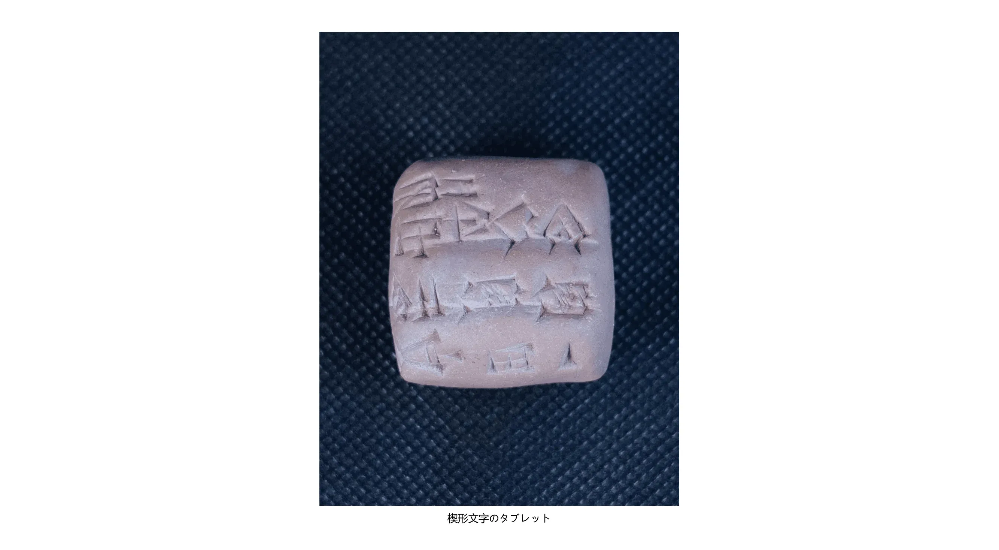

中央に小さな楔形文字が書かれた本物のシュメール文字板と思われるものも持っている。この石版には、円筒を転がして作ったサインがある。

小さな数字で書かれた印は、ほとんどの人が文字を書けなかった時代、熟練した書記だけがその能力を持っていたため、署名の役割を果たしていた。

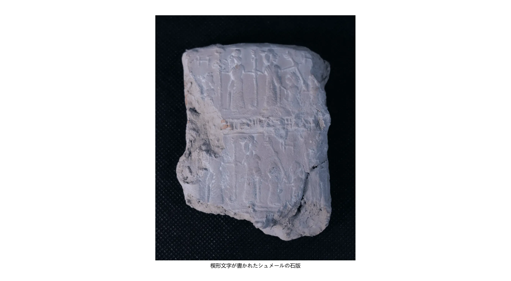

下に見えるのは、前述のシリンダーである。特定の形が刻まれた石である。英語でシリンダー・シールと呼ばれるこのサイン・シリンダーを転がして、人々は手紙にサインをしていた。これは、作者の名前を明示したり、自分の名前で作成されたことを示すための方法だった。

そのため、当時の書記たちは、くさび形のスタイラスを使って、濡れた石版にサインを印刷した。

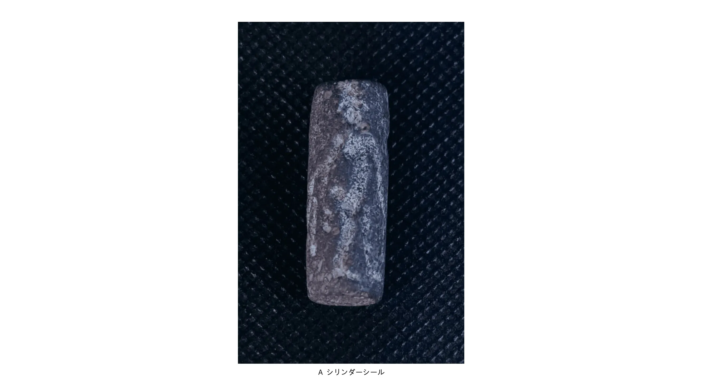

楔形文字は言語を表すものではなく、話し言葉を記録するための文字体系だった。英語では「ライティングは書かれた言語」と言い、「楔形文字は文字であって言語ではない」と言う。フランス語では「楔形文字は言語ではなく、言語を成文化する方法である」と言うわけだ。

### 文字の進化と用途

この文字が誕生して最初の数世紀は、数量や農作物のリスト、設備などを記録するためのニモニック・システムとしての役割にとどまっていた。徐々に、名前**や完全な文章を音声で表記できるようになった。

当初、楔形文字で名前を表現することはできなかった。なぜなら、楔形文字は主に、牛や麦のような現実の物体や要素を小さな画像として表現していたからである。時が経つにつれて、これらのイメージはより発達した文字へと進化し、名前や複雑な概念を表現できるようになった。

例えば、その人の名前がローラだったとしたら、「水」のような単語の頭文字と、「ラス」のような単語の頭文字をとって、ローラという名前ができたはずだ。そうやって最初の文字言語が発達したのだ。

ちなみに、もともと頭文字を表すには、牛の頭を描こうと思えば牛の頭の形が見えた。少しずつ、絵は簡略化され、線のようなものしか表せなくなった。学者たちは、人々が濡れた粘土板を片手で持っていたため、回してイニシャルを描き直すのが簡単だったためにこうなったと考えている。また、筆記者たちの石版の持ち方にも原因があると考えられている。

楔形文字の頭字語には、小麦や牛の頭とのつながりが見られる。

楔形文字は3千年にわたって使用され、主に経済や行政の記録を管理するために使われた。しかし、メソポタミアの住民はやがて、時の試練に耐えるに値するものはすべて文字にして保存したいという根強い欲求を抱くようになった。こうして、それまでは旅回りの音楽家によって口頭で伝えられていた物語、伝説、歌が、文字として不滅のものとなり、しばしば訓練中の書記によって書き写されるようになった。彼らはすでに存在するテキスト、主に伝説や一定の文化的価値を持つテキストをコピーした。

ギルガメシュ叙事詩**は、紀元前2900年から2350年頃のシュメールの都市国家ウルク**の**歴史上の王である可能性がある。

経済管理ツールであると同時に文化的なベクトルでもあったこの文字形式は、紀元1世紀まで続いたが、やがて姿を消し、その誕生を見た文明の貴重な証を残した。

## シュメール文字の役割

<chapterId>a396e6c5-56cc-5410-9e6b-0274401c5425</chapterId>

:::video id=a0729a35-01ec-4aa4-828f-d4ccc2eb168e:::

### 貨幣以前の信用システム

古代メソポタミアでは、経済組織は金属硬貨が発明されるはるか以前から存在した高度に洗練されたメカニズムに基づいていた。当初から、公式・非公式の信用システムはすでに不可欠な貨幣形態であり、地域住民が多くの複雑な経済取引を行うことを可能にしていた。

楔形文字が発明されたのは、まさに行政や経済のニーズに応えるためだった。有名なメソポタミアの粘土板は、主にさまざまな種類の契約を記録するために使われた。個人的なローン、売買、賃貸、抵当権、さらには結婚契約などである。これらの石版を書くには、専門の書記が必要であり、時間と労力がかかる作業であったが、経済的利益がかかっている場合には正当化された。当時、人々はお互いにラブレターを書いたりしなかったし、不安を書くために書記を使ったりもしなかった。

また、これらのタブレットの一部は無記名債券として流通し、自由に手を変えられたことも特筆に値する。

例えば、粘土のボールの中に小さな石が入っているものがあった。

クレイボールの外側には、単位数を表す数字が書かれ、サインされていた。中には石があり、この器械が本当にX個の単位を表しているのか、検証したい人がいた。

別の例として、現在のバグダッドの南西で発見された石版には、債務者は収穫日に債権者に330メジャーの穀物を返済することを約束すると規定されている。さらに興味深いことに、別の石版には、4小節の大麦の借金を石版の所持者に直接返済しなければならないと明記されており、**当時としては特に革新的な「持参人払い」という概念が導入されている**。

紀元前2000年以降、すべての商取引は、たとえ小さなものであっても、文書で正式なものとし、証人の立会いのもとに署名することを義務づける法律があった。当時、書記が粘土で作った台帳にすべての取引を記録することが、どれほど巨大な官僚機構であったか想像してみてほしい。このような法的厳格さは、交換された品物の所有権や権利をめぐる将来の紛争を防ぐためのものだった。契約が本当に締結されたことを証言するために、しばしば証人が呼ばれた。

私的な領域でも、特定の家族や個人が厳密な管理を必要とするほど複雑な経済活動を行っていた。北バビロニアの町シッパール・アムナヌで発見されたウルウトゥというアヌニトゥムの祭司の家には、2000枚近いタブレットが収められていた。これらの文書には、私的な貸借契約書、売買契約書、賃貸借契約書、書簡、宗教書、学術書などが含まれており、当時の私的文書館の多様性と重要性を物語っている。

注目すべきは、律法学者が書いた手紙はほとんど経済的な関心事に限られていたことだ。手当ての不足に対する不満、持参金の未払い、その他の緊急の物質的要求などである。当時は、ラブレターのような個人的な文章は存在せず、病気について言及することさえまれだった。

このような手紙の痛切な例は、このような経済的な現実を物語っている。アスールを深刻な飢饉が襲うなか、文通相手はパートナーが去り、お金も食料もない状態に置かれた苦悩を訴えている。彼は穀物を買う緊急の必要性を述べ、日々の糧を確保するために、織物に相当する現金を早く送ってくれるよう頼んでいる。

この手紙は、彼女のパートナーに宛てたもので、彼がよそへ商売に行き、彼女が無一文になったことを示しているようだ。彼女は、穀物を買い、神殿の税金を納めるためには、小銭を手に入れなければならないことを思い出している。これはおそらく、当時の手紙に書かれた議論に最も近いものだろう。手紙はほとんどの場合、経済取引に関連しており、この手紙はまさに不安定な経済状況に関連している。

そのため、メソポタミアの文書は主に経済的な交流を反映したものである。これらの古文書は、この古代文明の効率性と行政の正確さだけでなく、非常に長期にわたる複雑な経済交流を管理する能力も明らかにしている。

## シュメール文字のエリート支配

<chapterId>c6d3df0e-b1e1-58dc-ab35-9f76bbc39393</chapterId>

:::video id=04a95fb8-a701-4a48-9ce8-0e9b6ba256fd:::

### ライティング、それは何よりも経済的な技術だ

一般に信じられていることとは逆に、約4000年前にメソポタミアで文字が発明されたのは、当初は個人的なコミュニケーションや文学的なコミュニケーションのためではなかった。 **楔形文字は何よりもまず経済技術**であり、重要な経済的利害が絡む場合にのみ正当化された。シュメール人は、互いに連絡を取り合ったり、感情を表現したりするために文字を使ったのではなく、もっぱら商業や金融取引を記録するために文字を使ったのである。

このような専門性は、石版筆記に多大なコストがかかることから説明できる。粘土に文字を刻むには、専門的な技術的専門知識、膨大な時間、特殊な材料が必要だった。十分な価値のある取引のみが経済的にこの投資を正当化し、この革命的な技術にアクセスするための自然な敷居を作り出した。

楔形文字は、当時としては驚くほど複雑な金融システムを明らかにしている。メソポタミア人は、現代的な金融手段を完全に開発していた： **利子つきの個人ローン、売買証書、賃貸契約、抵当権、さらには金融条項つきの結婚契約**などである。このような洗練さは、古代文明にありがちな原始的な物々交換という単純化されたイメージとはかけ離れた、発達した市場経済を物語っている。

一部の位牌は真正の無記名証券として機能し、元の所持者を特定することなく、手から手へと自由に流通した。この技術革新は、現代の金融システムの先駆けとして、驚くべき流動的な交換を可能にした。さらに、特定の法律によって、すべての商取引は書面で正式に行われることが義務づけられ、経済領域における文字の使用が制度化された。

### 知識の独占と経済支配

経済における文字の重要性は、この技術を使いこなす者に大きな権力を与えた。 **一般に寺院や支配機関に所属していた書記は、金融システムを事実上支配していた**。その希少で貴重な専門知識により、彼らはあらゆる重要な取引の守護者となった。

この知識の独占は偶然ではなかった。筆記を民主化すれば、経済に対する支配力が弱まり、偽造の危険性が高まるからだ。署名式に証人が組織的に出席していたことからも、文書の真正性に常に気を配っていたことがわかる。

すべての商取引を書面に記録する法的義務は、財政管理、厳格な会計監視、経済関係者の行政機関への依存の維持など、いくつかの戦略的目的を果たした。 **メソポタミア国家はこうして、対人債務**を社会規模で管理する能力を利用し、文字を経済権力の道具に変えたのである。

### 2つの通貨制度の共存

石版を分析すると、文書館にどこにでもある石版から想像されるよりも、もっと微妙な経済実態が見えてくる。多くの石版は、価値の単位として銀**シェケル**に言及しており、標準化された現物に基づく貨幣制度が並行して存在していたことを示している。

この二重性は、当時の社会階層によって説明することができる。 **楔形文字システムは、聖職者、裕福な商人、そしてこれらの複雑な文書を読み、書き、解釈することのできる行政官といった、限られたエリートたち**のためのものであった。楔形文字を効果的に使用するためには、解読方法を知っているだけでなく、その真正性を確認し、法的な意味を理解する必要があった。

**このエリート主義的なシステムから排除された大衆は、独自の交換メカニズム**を開発した。一般庶民は、標準化された穀物の量りや貨幣の重さなど、専門的な技能がなくても誰もが評価できるような、簡単に数値化できる商品など、より身近なシステムを利用した。

この民衆経済は、公式文書にはあまり記録されていないものの、おそらく石版システムよりもダイナミックで柔軟なものだった。職人、農民、小商人などの即時的なニーズに応え、書記に頼ることなく、日々の迅速なやり取りを可能にした。

銀のシケルは、価値基準としてしばしば石版に記されているが、おそらくこの2つの並行する経済システムの橋渡しの役割を果たし、文書による債務と物理的な支払いとの変換を可能にしたのだろう。

### 自然発生と制度的統制の比較

この共存は、経済史における基本的な論争を物語っている： **交換手段の自然発生と貨幣の制度的充当の対立**である。一方では、貨幣のような商品は人々の交換ニーズから自然に生まれた。他方では、制度がこれらの慣習を流用し、形式化して、その流れをコントロールした。

シュメールの神殿はこの緊張を象徴していた。彼らは民衆の貨幣革新（シケルへの言及）を利用する一方で、独自の管理手段（楔形文字）を開発した。この戦略によって、彼らは伝統的な通貨が持つ民衆の正当性と、形式化された債務が持つ行政管理という、両制度の利点を享受することができたのである。

メソポタミアの経験は、金融システムの進化に関する永続的な先例を確立している。それは、**金融の洗練はしばしば技術革新に数千年**も先行することを示している。利子、信用、譲渡性商品、抵当担保の概念は、金属貨幣の発明を待たずに発展した。

誰が技術を支配するのか、誰がルールを定義するのか、正式な制度と一般的な慣行がどのように明確化されるのか。このような基本的な疑問は、経済史を通じて根強く残り、デジタル通貨や[暗号通貨](https://planb.academy/resources/glossary/cryptocurrency)をめぐる現代の議論にまで及んでいる。

# 古代文明における経済と貨幣

<partId>a16bcf4c-8c3a-11f0-9e79-2bd363a484bd</partId>

## 青銅器時代の偉大な文明

<chapterId>fab9334c-7385-5d7c-ad40-7d152beb22a1</chapterId>

:::video id=737e12e8-1033-4210-b1dd-b8a680f68b17:::

青銅器時代の偉大な文明」と題されたこのセクションでは、まずグリン・デイヴィス著『お金の歴史』から抜粋する：グリン・デイヴィス著『貨幣の歴史：古代から現代まで』からの抜粋である。

> トインビーは21の異なる "文明 "を挙げているが、そのうちの15はそれ以前の例から直接的または間接的に派生したものであるため、彼は独自に発展した文明の数をシュメール、エジプト、ミノア、中国、マヤ、アンデスの6つに減らしている。このうち、貨幣を使わずに高度な文明を築いたのはアンデス山脈のインカ文明だけだが、逆説的なことに、彼らは一般に貨幣として最適とされる金や銀を豊富に持っていた。

インカには貨幣制度はなかったが、貴金属は豊富にあった。実にパラドックスだ。引用を続けよう：

> 社会が階層化されればされるほど、またその計画システムが綿密に効率化されればされるほど、貨幣を使う必要性は低くなる。スペインの征服者たちが、比較的自由な政府であったメキシコ人が、金粉（透明な筒に入れて保管）やカカオ豆（24,000単位の袋に入れ、多額の支払いのために保管）を通貨として常用していたことを発見したのは、このためかもしれない。一方、はるかに厳格な階層に従って組織されていたインカでは、通貨はまったく存在しなかった。しかし、シュメール文明、エジプト文明、ミノア文明が比較的近接していたことから、特に太古の昔に確立された広範な交易を考慮すると、それぞれの文明が貨幣習慣にどの程度無知であったかは疑問が残る。

中国では、西洋の伝統とはまったく異なるアプローチで貨幣が開発された。最初から[不換紙幣](https://planb.academy/resources/glossary/fiat)だった。鋳造貨幣だった。

そしてここで、デイヴィス氏は貿易について触れている。確かにある時期には中国人と他民族の交流はあったが、対外貿易の交換媒体はむしろ絹だった。後述するように、金は中国人の少ない中国の辺境地域でも使われていた。そして、国際貿易でもなく、そのために使われたのが絹だった。

だから、おそらくコインの形式については、この技術を発展させた同時代の他の文明の影響を受けたのではないかと想像している。

しかし、明らかに、中国では貨幣の本質が西洋とはまったく異なっていた。この点については、この後の中国の章で詳しく触れることにしよう。

これらの有名なシュメールの都市について、ここで少し書いておこう。ウルクは非常に早くから影響力を持った都市であり、かなりの規模と高度な文化、特に文字の発達と都市計画で有名である。

そして、有名なギルガメシュ叙事詩についても触れておきたい。ギルガメシュはおそらく紀元前2900年頃のシュメールの都市ウルクの歴史上の王である。彼はおそらくこのシュメールの都市国家の王だった。

紀元前2334年から2279年まで在位したアッカドのサルゴンについても語ることができる。

彼はアッカド帝国の最初の統治者であり、メソポタミアに出現したもうひとつの文明である。サルゴンを取り上げたのは、すでに紹介したこの有名なタブレットの郵便サービスを最初に確立したのが彼だったからだ。

本当に粘土の封筒まであったと想像してみてください。秘匿性を確保するために、石版は外側に本人の署名が書かれた粘土の封筒に包むことができる。だから、人々は石版を取り出すために封筒を破るのだ。この郵便システムは、アッカドのサルゴンに負うところが大きい。

そして、バビロニア帝国の首都となった大都市バビロン。堂々たるジッグラトと宮殿、そして高度な法規範で有名なハンムラビ法典で名高い、もうひとつの文明である。

そして、このセクションを締めくくる2つの都市。アシュールはアッシリア帝国の首都であり、重要な宗教的中心地であった。ニネベは後にアッシリア帝国の首都となった。彼らはそこに首都を移し、強力な軍隊、広大な宮殿、図書館で知られている。そして、伝説的なバビロンの空中庭園の場所のひとつでもある。私たちは、この有名な古代世界の不思議についてよく耳にする。

しかし、バビロンにはこうした有名な空中庭園の痕跡はない。一方、ニネヴェには、数階建ての庭園があったという考古学的証拠がある。ヘロドトスのようなギリシャの歴史家たちは、ニネヴェとバビロンを混同していた可能性がある。彼らがメソポタミアの都市を訪れた際、バビロンと呼んだのかもしれない。有名な空中庭園の痕跡がニネヴェで見つかっており、学者たちは、ニネヴェがバビロニアの空中庭園と呼ばれる、これらの庭園があった有名な場所ではないかと考えているのかもしれない。

## メソポタミアの経済組織

<chapterId>6afb6fc8-cbb7-56a5-8427-484b4b7d7477</chapterId>

:::video id=aa6a2cbd-5916-4ae3-ad4f-65f0bd5643fa:::

### 資本主義以前の経済構造と奴隷制

メソポタミアの経済組織に関するこのセクションへようこそ。資本主義以前の経済は、原始、奴隷、封建という3つの主要な段階を経てきた。

もちろん、封建制はずっと後のことであり、明らかに中世のことである。私たちはすでに、先に旧石器時代で説明したような原始的な段階を過ぎている。メソポタミアでは、経済組織といえば奴隷制のことだ。

しかしメソポタミアでは、労働の大部分は奴隷に似た従属階級が担っていた。彼らは法的には主人の所有物ではなかったが、肉体的あるいは思想的な強制によって労働の成果を奪われていた。

### 経済センターとしての寺院と宮殿の役割

大規模な土地所有が経済を支配していた。土地所有者は、労働者を雇って直接土地を搾取したり、賃料と引き換えに土地を貸し出したりした。彼らはまた金融活動にも従事し、一般的に年利20％から33.3％という高利でお金を貸したが、これは近隣のヘブライ人の厳格な規則とは対照的であった。

農民が借りたローンは、海運会社を除いては、生産的な投資のためではなく、むしろ次の収穫まで生き延びるためのものだった。このため、農民はしばしば慢性的な負債を抱えることになった。

古代ローマでは、市民は農民や不自由な労働者が生産する農作物の賃貸料や戦利品で生活していた。 **これらの収入は、より多くの利益を得るためではなく、社会的地位を高めるために市民に分配された。これらのことは、中世の経済が貿易や工芸を通じて利益を得ることを志向していたのとは対照的である。

つまり、ここで言いたいのは、人々が必ずしも生産手段を向上させるためではなく、金融の貸し出し手段を使ったという事実と、後のローマでは、利益は必ずしも再投資されず、むしろその利益を享受できる人々の名声を高めるために使われたという事実とを並列に描いているということだ。生産手段を改善するために雇用を創出することができ、利益を追求するために余剰金を獲得し創出することができた中世の後期に出現した資本主義精神からは、私たちはまだ遠い。つまり、経済組織はまだ、上に挙げた経済進化の第3段階に達していなかったことがわかる。

### 信用制度と勘定単位の出現

**カール・ポランニーは、経済交換の3つの形態を区別している：対称的なグループ間の互恵性、**原始的な部族では、お互いに非公式の信用を与え、交換や再分配を行うため、実際には貨幣を必要としない。 **寺院や宮殿を中心とした再分配、**この交換形態は、寺院が経済組織の中心であり、一時は配給という形で富を還元し、分配することができたメソポタミアと互換性がある。賃金という概念が導入されたのは後のことである。つまり今までは、原始的な形態（1）、寺院や宮殿での中央集権的な再分配（2）、そして最終的に市場での交換（3）に道を譲ることができる。今日私たちが理解するような市場は完全には存在しなかったが、メソポタミアにおける市場取引の存在は、アッカド語における特定の用語の存在や、価格、利益、損失、変動、希少状況に関する考古学的証拠の存在によって証明されており、議論の余地はない。

メソポタミアの家庭では、種まきからパンやビールに加工するまでの農業生産の全工程を独自に管理していた。女性はまた、扶養家族が必要とする織物も生産していた。地元で生産されない商品については、家々は専門の商人を頼った。

貿易では家族の絆が特に重要だった。古アッシリア時代（紀元前1910年〜1830年頃）、アシュールの商人たちはアナトリアのカネシュに交易植民地を築き、金や銀と引き換えに錫や織物を輸入した。交易は、結婚や商業上の提携によって緊密に結ばれた家族経営に基づいていた。カネシュは、広大な国際貿易ネットワークのひとつのつながりに過ぎなかった。

このような交換には金属が使われ、それは貴金属であって、例えば当時本当に有用であった銅のようなものであったとは限らない。つまり、必ずしも物々交換とは言えず、2つの商品をその有用性で交換したのである。むしろ、貴金属を商品として使用するためではなく、例えば青銅を使って鎧を作るといったように、貴金属を商品として使用するためではなく、価値の貯蔵品として使用するために蓄えておくという、ある種の意識を持った支払いという概念だったのである。

貢ぎ物や税金は主に現物（大麦や量り売りの銀）で支払われた。寺院や宮殿は、経済、行政、政治、宗教の中心地であると同時に、最初は穀物、次にその他の農産物、そして最後には貴金属といった商品を安全に預けることで、最初の銀行機能を果たしていた。このようにして、硬貨が登場するはるか以前に、最初の信用業務と融資業務が発達したのである。

メソポタミア経済は主に大麦と銀を価値の基準としていた。銀は、約8.33グラムのシスクルム（シケル）のような標準化された単位で量られていた。古代バビロニア時代（ハムラビ時代）には早くも銀が一般的な支払い手段として使われ、実質的な重さ（šuqulum）とは対照的に、名目的な価値（nūbum）という概念が早くから存在し、**現代の不換紙幣の概念を先取りしていた**。

しかし、まだ厳密な意味での不換紙幣ではなかった。秤量された金属という概念とは対照的に、名目的な勘定単位という概念があったのです。この2つの概念を表す言葉には違いがありました。

賃金労働市場への移行は困難なものだった。最終製品から労働を切り離すこと、そして測定可能な単位としての「労働時間」を導入することである。賃金労働者と給与労働者という概念を持つためには、まずこの2つの革新を経なければならなかった。 **III_1千年紀には、労働は当初固定給で支払われたが、II_1千年紀の初めには賃金制へと徐々に移行した。

紀元前26世紀以降、メソポタミアの「貨幣」は硬貨ではなく、穀物や金属の重さを量ったものであったが、ついに貨幣価値の概念が定着した。 **そのため、重要な取引や価値の保存が必要な場面では、穀物を銀に換えることがしばしば好まれた。

紀元前21世紀以降、**非対称的な交換が事実上消滅した**現在では、譲渡契約において、「サ」という動詞は代金の支払いを意味する。この "サ "と呼ばれる概念は、契約書に登場し、特定の商品の測定ではなく、代金の支払いを意味する。"サ "は単に支払いや代価を指す。契約書に「サ」という動詞が登場する前と後では、ある種の二分化が見られる。

利益**と損失**の概念、価格変動**、希少性**の状況を組み込んだ**市場メカニズム**の存在を証明する、近東の古文書に存在する経験的データを無視することはできない。しかし、根本的な困難は、古代メソポタミア経済全体における市場ベースの交換の相対的な重要性を判断することにある。

この分野の専門家たちは、このような市場概念の痕跡を目にしていると思うが、当時の経済がどの程度、このようなより近代的な市場概念やその他のメカニズムに基づいていたのか、本当のところはわからない。

それが存在したことは知っているが、価格決定や取引の主要な方法であったかどうかはわからない。

これでメソポタミアの経済組織に関するこのセクションは終わりである。

次のセクションでは、エジプトと中国について同じことをする。

## 古代エジプトにおける経済・通貨組織

<chapterId>bffcc16c-7fbf-5992-a0fa-6a7726d7d287</chapterId>

:::video id=40c1c4e5-b190-4bb6-b8a0-810c9ce7698b:::

### 歴史的背景とエジプト時代

このセクションは、古代エジプトの経済と通貨組織について専門に扱っている。ほんの少し背景を説明するために、ここに問題の時代のリストと簡単な説明があります。

- 古王国時代（紀元前2575年頃～紀元前2130年頃）**。ギザを中心とする大ピラミッドの建設に代表される時代。中央集権的なエジプト王政の黄金時代。
- 中王国（紀元前1938年頃～紀元前1630年頃）**。不安定な時代を経て、政治的・文化的ルネサンス。
- 新王国時代（紀元前1539年頃〜紀元前1075年）**。領土拡大、軍事力、国際貿易の時代。ツタンカーメンやラムセス2世などの有名なファラオの治世が含まれる。
- 紀元前1323年。 - ツタンカーメンの死**。若きファラオは18～19歳で死去。1922年にほぼ無傷の墓が発見され、考古学的発見の中でも最も有名なもののひとつとなった。
- ラムセス2世 - 在位紀元前1279-1213年**。新王国時代最強のファラオの一人。軍事作戦、偉大なモニュメントで知られ、おそらく最初の平和条約を締結したことでも知られる。
- 紀元前1275年 - 海の民**。海の民」と呼ばれる集団の侵入や移動により、エジプトを含むいくつかの地中海文明が不安定になる。
- ソイスの戦い - 紀元前1178年**。エジプト軍と、おそらく海人族に関係すると思われる侵略者との争い。新王国時代末期の多くの戦いのひとつ。
- 後期**とは、古代エジプト史の中で紀元前664年頃から332年頃までの期間を指す。
- クレオパトラ7世（紀元前69年〜紀元前30年）**。その知性とカリスマ性、ユリウス・カエサルやマルク・アントニーとの同盟、そしておそらくその鼻で有名なエジプト最後の女王。彼女の治世は、ローマに併合される前のファラオ朝エジプトの終焉を意味した。

紀元前5、4世紀には、エジプトはすでに大規模な商業活動を経験しており、海上、河川、陸上交易（特にロバのキャラバン）によって、ヌビア、パレスチナ、リビア、紅海地域を結んでいた。

### 初期の為替制度と古銭

紀元前3650～3400年頃に最初のエジプト首長国が出現すると、現在のカイロの南に位置するマーディ遺跡は、銅技術と長距離交易、特にシリア沿岸を経由したメソポタミアとの交易の主要拠点となった。

大規模な交易は主に物々交換に基づいていたが、半貴石や貝化石などの威信をかけた品々で構成される原始的な貨幣（「古銭」）はおそらく存在していた。このような交換において、金はおそらくすでに重要な役割を果たしていた。紀元前3千年紀の中頃、エジプトの文書に初めて明確にコインが登場するのは、商業慣行と結びついた長い発展を反映している。

古代の社会（ここでは必ずしもエジプトの話ではなく、古代の社会全般を指している）では、直接購入するためではなく、持参金や宗教的儀式、その他の社会的義務を支払うために、支払いが頻繁に行われていた。こうした取引には、正確な価格設定と評価が必要だった。多くの原始社会には、この価値を見積もることができる、マネタイズ可能な（＝数えられる）特権的な対象があった。持参金を支払うのであれば、もちろん、持参金を支払うために交換する物体の数量を書き留めておかなければならない。この価値は基本的に人の価値である。

貨幣や貨幣制度が出現する以前の古代の社会では、支払いはあったが、それはしばしば社会的義務と結びついており、その価値は、持参金や血税の支払いのように、個人の価値に由来していた。

エジプトに話を戻すと、古代帝国の時代、「シャット（y）」は、もともとは具体的な貨幣単位（重さ約7.6グラムの小さな金貨または銀貨）であったが、ハードカレンシーとしての本来の機能から、価値という概念を生み出す**会計機能**へと急速に移行した。価値を表現するための一種の勘定単位であり、元々は硬貨の一種であったが、刻印がなく、単なる金属の尺度であるため、実際には硬貨とは呼べない。しかし、刻印がないため、コインとは呼べない。

このシャト（y）の概念は、おそらく詐欺の危険性から、最終的には放棄された。後述するが、エジプト人は刻印貨幣を採用するのが遅く、近隣諸国が採用した後も、貨幣の重さを量り続けていた。

中世では、銀が日常的な取引に使われることはほとんどなく、主に穀物の量り売りやパンの量り売りが行われていた。そのような中、文書や実際の送金によって支払いを記録することができる経典貨幣が登場した。

新王国時代には、貨幣制度はより複雑になり、金属（金、銀、銅）、標準化された織物、穀物、石油で評価されるさまざまな商品通貨が統合された。布地は「布尺」と呼ばれた。 **日用品の価格は穀物や銅で表されることが多く、貴重品は金や銀で評価された。エジプトでは金よりも希少な銀が特に珍重された。** 銀は、エジプトでより豊富に産出された金に比べて過大評価されていた。

後期（紀元前1千年紀）には、銀は近東全域で共通の交換金属となっていた。銀は、インゴット、金属硬貨、指輪の形で流通し、神殿で計量され、その重量と純度が保証された。それは後のことであり、リディア人に関する次のセクションの主題となる。

また、古代エジプト人には「ヘッジ」という貨幣の用語があり、金属、穀物、布、さまざまな商品（木材、動物、役務など）を問わず、取引の対価となるあらゆる支払い手段を総称するために使われていたことにも注目すべきである。記録された例を見ると、エジプト人は様々な産物を組み合わせることで取引を成立させ、その価値の合計を銅の単位（「デベン」）で表していたことがわかる。

**神殿はエジプト経済において中心的な役割を果たした。神々を敬うためだけでなく、必要に応じて経済回路に再投入できる通貨準備金としての役割も果たすために、貴金属（金と銀）のかなりの財宝を集め、蓄えていたのである**。他の文明でも、戦争や通貨不足、危機が起きたときに溶かすために、彫像などの貴重な埋蔵金を神殿に蓄えていた例が見られるだろう。これは歴史を通じて繰り返されてきたテーマである。

また、リネンの栽培は寺院に与えられた王室の専売特許であり、貴重な織物の製造が寺院の経済的重要性を裏付けていたことも特筆に値する。

古代エジプト人は、貴金属が神性（金は神々の肉、銀は神々の骨）と結びついているというイデオロギー的な側面と、他のあらゆる支払い形態の基準となる通貨としての実用的な機能とを明確に区別していた。

このように、古代エジプトは後期まで現代の通貨制度に匹敵する鋳造通貨を発達させなかったが、経典貨幣、正確な勘定単位、商品貨幣、重量で評価される貴金属を組み合わせた使用に基づいて、洗練された通貨制度を持っていた。

硬貨そのものを量ることで、2つの異なる概念が生まれた： **硬貨」と「貨幣」**。英語では2つの用語を使いました。まず、"coinage "は硬貨のことで、これは後に出てくる概念だが、この "money "という概念もある。先ほど貨幣という言葉で表現した勘定単位によって、私たちはすでに「貨幣」というある概念を定義することができますが、それはまだ硬貨ではありませんでしたから、「貨幣」はリディア人より少し後に登場します。

だから、貨幣は貨幣の前提条件ではない。**だから、貨幣の存在を認めることができるのは、早くても3千年紀、**間違いなく2千年紀、特にハムラビ治世下である。

ここで忘れてはならないのは、これは著者が『貨幣の起源』という本の中で触れていることだが、貨幣という概念が当時、これらの貨幣制度の中にすでに存在していたことは間違いないということであり、貨幣という概念の誕生を硬貨の出現と結びつけるのは間違いである。

最後に、ポランニーの互恵性と再分配の概念は、しばしば古代エジプトに適用されるが、ニュアンスを調整する必要がある。ファラオ時代のエジプトは、宗教や儀式とは異なる高度な商業交流を完全に統合した複雑な経済を発展させており、経済領域がイデオロギーから実質的に自律していたことを示している。

この特異性は、貴金属がある種の神性と結びついていたにもかかわらず、なお区別が可能であったという考え方と結びついている。

ポランニーは、貴金属の使用は主に宗教的あるいは神的な概念であると述べているからだ。しかし私たちは、貴金属は経済システムにも組み込まれており、エジプト人はすでにそのような区別ができていたと提案している。

最後に、この発明品、鋳造貨幣の目的を列挙した『貨幣の起源』という本から引用したい。いくつかのポイントがあるが、私はポイント5を強調したい：

*デバリュエーションや連続的な切り上げなどの方法を用いて、低コストで輸出入を削減または増加させることにより、経済プレーの可能性を発展させる*。

つまり、そのような古代の時代にも、すでに貨幣が発明されたり、国家の管理下で出現したりしており、経済運営のために貴金属の量や重さを操作していたと著者は提唱しているのである。この後の部分について、少しスクープさせてほしい。 **金と銀の合金であるエレクトラムで作られた最古の貨幣であっても、これらの貨幣に含まれる貴金属の含有量を分析すると、最初の発行者、たとえばクロイソスは、天然のエレクトラムよりも金の量が少なかったことがわかる。

つまり、彼らはすでに金と銀の分離方法を知っており、金をあまり含まない硬貨を発行していたのである。

著者は、貨幣鋳造の初期から、単に重量を証明し、貿易を促進するだけでなく、貨幣鋳造の権限がすでに悪用され、経済計画の一形態として、おそらく発行量を増やしていたことを示唆している。

## 古代中国における符号通貨と経済・通貨組織

<chapterId>e08d3be9-423c-5cf3-a606-6ad54e2261af</chapterId>

:::video id=ae7e6367-1725-455e-bfe6-359be1f443e5:::

この章では、「古代中国の貨幣と経済・通貨組織」と題して、古代中国の貨幣が西洋の伝統とは異なる特徴を持っていることを見ていこう。中国の貨幣は最初からすでに「記号通貨」だったのである。このセクションの情報は、『Aux origines de la monnaie』という本を読んだ後に取ったメモに基づいている。

### 記号通貨の概念とその特徴

著者によれば、サインマネーは今日の不換紙幣に相当する。金属含有量に連動した価値を持たない通貨だ。当初から、コインの価値に関する一種の合意、社会的コンセンサスだったのだ。

古代中国の貨幣には、西洋の伝統とは異なる特徴がある。主に金属製であったが、鋳造ではなく鋳造であり、君主の肖像はなかった。驚くべきことに、中国国家は貨幣発行を独占していなかった。この見かけの自由主義は、多くの課税対象人口から徴収される豊富な税源のおかげで、貨幣発行を独占する経済的必要性がなかったことで説明できる。

中国の通貨は、その受託的な側面も特徴としている。当初から、貝殻を模した青銅器が通貨として使われており、金属本来の価値とは直接関係がない。歴史をさかのぼれば、中国人は貝殻を通貨として使っていた。やがて貝殻があまりに希少になると、銅でレプリカを作り、そのレプリカは本物と同じ価値を持つようになった。

したがって、中国の通貨は、素材の価値や元の品目（例えば貝）の相対的な希少性ではなく、交換媒体としての使用に対する集団的な信頼、言い換えれば貨幣記号に基づいていた。

### タカラ貝から金属製の模造品まで

タカラ貝は原始的な貨幣単位として広く使われていた。古代の碑文によれば、殷周王朝（紀元前1、2千年の最初の王朝）の頃には、タカラ貝は武功に報いるためだけでなく、**労働の報酬、価値の測定、土地の購入**にも使われていた。

ここで忘れてはならないのは、それは社会が制限された目的のために使用する単なる道具ではなかったということだ。軍事的な報酬、労働の対価、価値の測定などに使われていたのだ。考古学者たちの著作にもその痕跡が見られる。日常的にパンを買うために使われていたかどうかはわからないが、上記のような取引に使われていた可能性があるという証拠はある。

時が経つにつれ、本物のタカラ貝の希少性は、ブロンズ、骨、真珠層、石などで模造品を作ることにつながった。このような媒体の変化は、王子が貨幣を支配するという考え方にもつながっている。

ここで理解しなければならないのは、貝殻の自然な希少性という制限を越えて、王子が自ら通貨を作ることができれば、経済運営をよりコントロールできるようになるということだ。

貨幣が貴金属の重さと結びついていたメソポタミアとは異なり、中国の貨幣用語は、貨幣として使われた物体の最初の形状に直接由来している：牛（ベイ）、ナイフ（ダオ）、スペード（ブ）、丸い貨幣（クアンまたは銭）。このように、中国ではお金にまつわる言葉の語源がこれらの物を指していたことがわかる。対照的に、西洋では、これらとはまったく異なる概念に由来する貨幣用語が数多くあり、貨幣の物理的特性や重量に関連するものが多い。こうした語源の違いは、西洋と中国の貨幣観の分裂を明確に示している。

中国では、貨幣価値は国家、生産者、商人の間の社会的慣習に基づく、完全に信託的なものだった。

### 経済規制と通貨哲学

貨幣が豊富な時代には貨幣の価値が下がり、人々は商品を買いやすくなる。逆に、貨幣が不足しているときは、貨幣の価値が上がり、国家の購買力が強化される。

ここで、[インフレ](https://planb.academy/resources/glossary/inflation)とデフレとの関連性が考えられる。通貨供給量が固定されている場合、経済の生産性が上昇すれば、貨幣価値は上昇する。逆に生産性が下がれば、貨幣価値は下がる。しかし、この例では逆である。おそらく、王子が貨幣の生産を完全に独占していたわけではなかったからだろうが、それでも貨幣の価値が経済状況と連動していたことを示している。

哲学者の莫提（紀元前5～4世紀）は、すでにこの価格と価値の関係を分析していた。彼によれば、価格の変動は、安さや絶対的な高価さという現実的な概念を反映しているのではなく、通貨記号の安定した名目的価値とは無関係に、商品と貨幣の間で変動する関係なのだという。

だからここでは、金貨が使用価値や本質的価値といったある種の基本的価値を持つと言う代わりに、貨幣記号の価値はむしろ経済の状態から生まれると指摘している。

中国では、貨幣は必ずしも公的な刻印や保証を必要としなかった。そのため、特定の刻印のない青銅貨や銅貨が長い間自由に流通することができたのである。

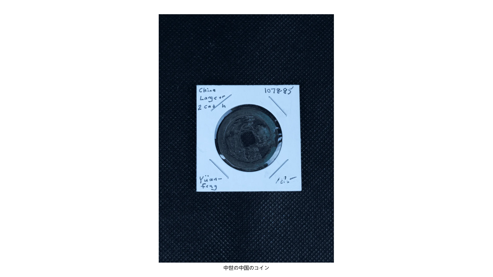

上のものは中世の中国の硬貨。鋳造された硬貨で、中央に四角い穴が開いている。この穴にロープを通し、コインをつないでブレスレットやネックレスを作った。しかし、これは主に身につけるためのものではなく、主に会計のために使われた。硬貨をつなげて大きな紐状にし、それを連動させて会計単位を作ることができたのだ。必ずしも特定のマークがあるわけではなく、単に青銅の円であることもあった。

紀元前113年、漢の武帝によって遅ればせながら確立された国家の通貨独占は、しばしば異議を唱えられ、十分な社会的信用を得ることができれば、さまざまな民間や地方のプレーヤーが独自の通貨を発行することができた。

**貴金属は買いだめを防ぐため、流通通貨として使われることはほとんどなかった。金はあまりに高価であったため、通常、使われるよりも脇に置かれていた。その代わり、**中国の国際貿易において、絹だけが本当の意味で価値の高い通貨だった**。中国人は金ではなく絹を使って貿易をしていた。

経済危機や通貨危機、特に銅の価格が高騰していた時代には、革新的な解決策が採用された。紀元2世紀には、流通する貨幣を裁断して小さな単位を作り、流動的な流通を低コストで維持できるようにした。王莽の時代（紀元1世紀初頭）など、他の時代には、額面価格が実際の金属含有量よりもはるかに高い、銀行券を先取りしたような、非常に信用度の高い通貨の実験が行われた。彼らは硬貨に50、100、200のような価値を刻印し、200枚の硬貨のような大きな金額を示した。このような習慣が、大幅なインフレを招いたと思われる。

前述したように、このシステムは国家、生産者、商人の間の社会的慣習に基づくものであったが、同時に、特に駒の選択（美しいかどうか）や生地の長さ（規格に合っていないかどうか）に関して、ゲームに参加しない人々に対する権威主義的で厳しい規則にも基づいていた。

私の率直な意見では、このシステムはあまり強固なものではなかった。主に、制裁の脅しのもと、役人やトレーダーに損傷したコインを受け入れることを義務づける厳格な規則に依存していた。

### 中国の金融革新とその経済的影響

中国はまた、初期の紙幣発行のパイオニアでもあった。当初は西暦9世紀の金属不足に対応するために採用された。その初期の利点にもかかわらず、これらの紙幣は過剰に発行されると定期的にインフレスパイラルに陥り、宋や明の時代には、過剰な発行が深刻な通貨危機を引き起こしたことが13世紀のマルコ・ポーロによって実証されている。私はここで、一種の暴力を指摘せずにはいられない。

このように、中国の経験は、貨幣に対する深い信認の概念、貨幣制度の顕著な柔軟性、使用されるメディアの本質的な価値よりもむしろ経済関係者間の信頼に基づく紙幣の早期使用によって特徴付けられる。

## 古代における社会・経済組織

<chapterId>4023c3ce-7a47-5ac4-8f5f-c7ab699ab20f</chapterId>

:::video id=2761efe4-21cf-4f06-9bda-c03f9ff39012:::

### 都市の寄生虫論争

古代都市とその後背地との関係は、基本的な問いを提起している。これらの都市中心部は、富を搾取する寄生虫として機能していたのか、それとも有益な経済特化の原動力として機能していたのか。寄生仮説によれば、青銅器時代の都市、特にメソポタミアでは、**組織的に農村領土から返還以上の価値を引き出し**、同等の価値を生み出すことなく、基本的に賃料と税金で生活していたという。

領土の拡大が止まると、外部からの富の流入が途絶え、都市経済は資金繰りに窮することになる。こうして、都市は生産よりも採掘に依存し、「身の丈を超えた」生活を送ることになる。

### 価値創造の原動力としての専門化

別の経済学的読み方は、この寄生的なビジョンに挑戦している。 **古代の都市は、何よりも専門化と分業の中心地として機能していた。その役割は単純な採取にとどまらず、専門技術を集中させ、貿易ネットワークを組織し、長距離交流の拠点としての役割を果たした。

このような都市の特化は、内陸部との生産的な相互依存関係を生み出した。 **都市は農村からの農産物の供給なしには存続できなかったが、後背地はその見返りとして、工芸品や技術革新、地中海貿易網へのアクセスから利益を得た**。利益配分が不均衡に見えたとしても、分業によって相互の生産性を高めることができた。

当時の慢性的な食糧不安も、この非対称性を説明する一因となっている。飢饉や農作物全滅のリスクは農村の人々にとって常に脅威であったのに対し、国際貿易ネットワークにつながる都市の職人たちはより大きな経済的安定を享受していた。

### 歴史的進化、古代から中世へ

古代と中世の組織の対比が、この問題に光を当てている。 **古代は大規模な分業が行われ、都市は地中海世界全体に開かれていた**。貿易と専門化は高度なレベルに達し、広範な経済ネットワークが形成された。

ローマ帝国の崩壊は、急激な分断をもたらした： **封建時代は、この中央集権的な組織に代わって、自給自足の領地からなる分権的な制度**を導入した。古代ローマのヴィラ・ルスティカエが中世のシーニュリーの母体となり、聖職者や貴族によって管理された事実上自給自足の経済島がモザイク状に形成された。

中世の地方分権は、商業効率を低下させる一方で、逆説的に外的ショックへの耐性を高めた。封建領地は、権力中枢と農村住民との間でよりバランスの取れた関係を築いたが、たとえこの組織が専門化による生産性の向上を制限していたとしてもである。

### 都市市場の出現

考古学的発見により、メソポタミアの都市には早くも2千年紀には**ショッピング・ポートや交易所が存在していたことが明らかになっている**。これらのインフラは、正確な機能については議論があるにせよ、組織化された市場が存在したことを証明している。

カール・ポランニーは当初、古代における真の市場メカニズムの存在に懐疑的であったが、市場取引の初期の出現を過小評価していた可能性があることを認めることで、自らの立場を明確にした。このような知的進化は、制度的再分配、相互交換、初期の市場取引が共存していた古代の経済システムを解釈することの複雑さを反映している。

### スパルタ対アテネ

スパルタとアテネの比較は、貨幣制度と社会組織の関係を完璧に示している。 **スパルタは、貨幣の使用を意図的に拒否した厳格な階層社会のモデルであり**、一方アテネは、民主主義制度に付随する高度な貨幣経済を発展させた。

スパルタの金銭拒否は自然発生的なものではなく、**制度的・イデオロギー的**なものだった。スパルタの指導者たちは、金銭が軍事的・市民的価値を堕落させることを恐れ、市民間の直接的な対人信頼に基づくシステムを好んだ。

貨幣の使用を思いとどまらせるために、スパルタは**重くて実用的でない金属棒**を採用し、逆説的だが、貨幣の性質（分割可能性、輸送可能性、耐久性）を直感的に理解していることを示した。

### 反貨幣モデルの限界

スパルタの組織は、社会的規模に適用された**ダンバーの数**の制約を示している。 **中立的な交換媒体としての貨幣を拒否することによって、スパルタは市民社会を直接的な信頼関係を維持できる限られた数の市民に限定することを自らに課した。ホモイオイ（スパルタ市民）は全人口のわずか1％にすぎず、その周囲を何千人ものヒロテ（奴隷）が取り囲んでいた。

この組織は、当初は並外れた軍事的結束力の源泉であったが、構造的に脆弱であることが判明した。 **レウクトレスの戦い（紀元前371年）は、このシステムの限界を証明した**。

貨幣制度が発達した競争都市（アテネ、コリント、テーベ）は、**より豊かで回復力のある経済**を維持し、経済復興と移民によって人的損失を補うことができた。

### 個人的信頼と組織的信頼

スパルタの経験は、中立的な制度的メカニズムではなく、対人的信頼**にのみ基づく社会に内在する**リスクを明らかにしている。このモデルは強烈な社会的結束を生み出す一方で、社会を人口学的ショックに対して脆弱なものにした。

匿名かつ非個人化された取引を可能にすることで、貨幣は優れたシステム回復力を提供する。直接的な信頼の限界を超えた社会的拡大を可能にし、海外との交流や経済成長を促進する。

### インカのパラドックス、お金なき富

インカ帝国は魅力的なパラドックスを提示している。スパルタのように、このモデルは厳格な階層組織と中央集権的な計画に基づいていたが、柔軟な貨幣経済を持つ征服者に弱いことが証明された。

貨幣社会に直面した反貨幣システムのこの構造的脆弱性は、歴史的に繰り返されてきたパターンであり、貨幣に対する制度的拒絶は、社会的結束を強化するどころか、外的な挑戦や歴史的変化に直面して、逆説的に文明を弱体化**させる可能性があることを示唆している。

これらの歴史的モデルを分析すると、貨幣はその交換機能を超えて、文明が直接的な対人関係によって課される限界を超越することを可能にする、社会の複雑さを示すものであり、促進するものであることがわかる。

# 鋳造貨幣の誕生

<partId>232e365a-8c3b-11f0-b276-b3ab70d1a5a1</partId>

## コインの出現

<chapterId>40ed3414-3066-57bd-bc1b-617ad0a354e0</chapterId>

:::video id=1d6834c4-98a3-43fe-ba80-04be51b0486e:::

さて、いよいよ問題の核心であるコインの登場である。ここで「コイン」という言葉を強調するのは、リディア人、ギリシャ人、ペルシア人よりも前の文明では、貨幣や貨幣制度が非常に多く存在していたことを前のセクションで見てきたからである。今見てきたことからも明らかだと思う。というわけで、この章では、コインの出現について取り上げることにする： *コインの出現

### コインの起源はリディアとイオニア

このコーナーの最初に、グリン・デイヴィスの著書『A History of Money』からの抜粋をお届けしよう。

*お金の歴史』より抜粋：グリン・デイヴィス著『古代から現代まで』より抜粋。

> リディアとイオニアで生まれたコインの知識と使用は、東はペルシャ帝国に、西はイオニアとエーゲ海の島々を通ってギリシャ本土に、そして西の植民地、特にシチリアへと急速に広まった。さらに北上してマケドニア、トラキア、黒海にも広まったが、エジプトでは部分的に、不本意ながら、遅ればせながら受け入れられたに過ぎなかった。

エジプトでは、鋳造硬貨の技術が出現した後も、硬貨の重さを量り続けていたことは興味深い。これは重要なことだと思う引用は続く：

> 同様に、イタリア本土も当初はギリシャの金融改革を受け入れるのに時間がかかった。

*この2つの限られた例外（イタリア大陸と下エジプト）を除けば、貨幣の使用は中・東地中海沿岸の国々や、メソポタミア**からインドに至る広大で成長著しいペルシア帝国に急速に広がった。インドが独自に通貨を開発していたかどうかはともかく、インドと近東との交流が深まるにつれて、インドの貨幣はリディアやギリシアの発明をそのまま取り入れたものとなり、最初はペルシャ帝国、次にマケドニア帝国*（アレクサンドロス大王とその父の征服）を経て、インドに伝わった。

*このような理由から、インド土着の貨幣発明の直接的な影響は、東にある中国や、西にあるリディアやギリシアの明らかに独立した貨幣発明の圧倒的な重要性に比べれば、微々たるものであった*1。

### 地理的分布と地域的適応

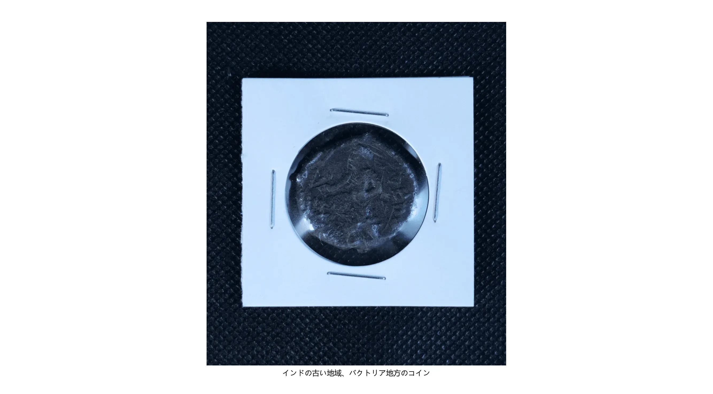

この時代を視覚的に説明するために、インド半島の西、アフガニスタンに近いバクトリア地方のコインを紹介しよう。この地域には、おそらくギリシアのコインからヒントを得たと思われる、王族の人物をモチーフにしたコインがあった。

## リディア人とペルシア人

<chapterId>eb802ab8-8ffd-5b25-907f-8944f120ed14</chapterId>

:::video id=f151eb42-5ff3-4ca1-9af1-1ae2a5e051c0:::

### 最初のリディアのエレクトラム硬貨

コインの出現をリディアとペルシャから切り離すことはできないので、ギリシャの東側、現在のトルコを形成している地域に話を移そう。西洋で最初にコインが出現したのは、紀元前7世紀半ば頃、現在のトルコに位置するリディアとイオニア地方にさかのぼる。紀元前600年頃にエフェソスのアルテミス神殿で最初のコインが発見されるなど、考古学的発見が顕著である。これらの原始的な硬貨は、琥珀色の反射を持つ金と銀の自然合金であるエレクトラムで作られ、しばしば粗末な外観で、単にパンチや初歩的なモチーフでマークされていた。

下の写真は、獲物を前にしたライオンが描かれた、最古のリディア・コインのひとつである。裏面に刻印や穴があることにお気づきだろうか。これは金属の純度を調べ、単なる表面層でないことを確認するために用いられたという説がある。これは最も古い作例のひとつですが、この作品はコピー品であることに注意してください。私のゴールドとエレクトラムの作品はすべてレプリカか現代的な複製品で、このコレクションに貯金を使い果たさないようにするためのものだ。

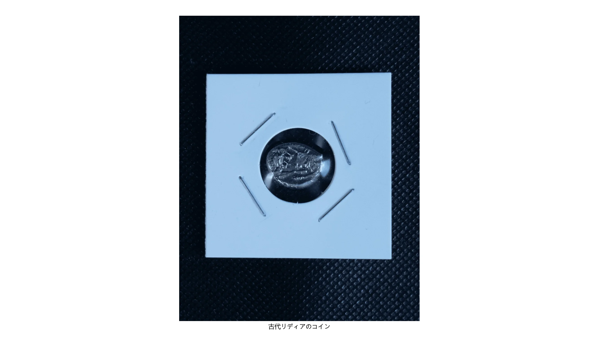

でも、これからお見せする本物のペルシャの作品もあります。これが初期の作品です。当時刻印された金属の塊のようなものです。

貨幣は日常的な交易を容易にし、物々交換に取って代わるために発明されたと広く信じられているのに反して、最初のリディア、アケメネス朝、ギリシアの硬貨は当初、小規模な交易には使われなかったようだ。実際、貨幣単位は日常的に使うには大きすぎた。しかも、流通は生産地に近い地域に限られていた。

ここで、人類学的な性質のいくつかの著作で読んだことがあるが、コインは、すでに示したように、エレクトラムのものであれ、このペルシアのコインであれ、ごく短い時間で話を戻すが、たとえば毎日パンを買うには大きすぎた。農民や兵士の一日の労働に相当すると思わせるような見積もりを見たことがある。食事や朝食、昼食に1日分の賃金を払おうとするようなものだ。ただし、他の作品では、もっと小さな単位の塊が見つかっているのを見たことがあるので、もっと小さな硬貨で、もしかしたら日常の買い物に使う可能性があったのかもしれないと思わせるかもしれない。

つまり、貨幣の額面や単位が大きすぎるため、日常的な取引には使われなかったという人類学的な「証拠」は、あまり確かなものではないと私は考えている。

### 貨幣創造における国家の役割

硬貨の本当の起源は、国家の直接的な行動に関連しているようだ。ひとつは、ギリシャ語の「ノミスマ」（貨幣）と「ノモス」（法律）を並列に考え、貨幣が法律の成文化と結びついて、都市の権威と政治組織を強化したとする理想主義的な仮説である。2つ目の、今日広く受け入れられているより現実的な仮説は、貨幣は何よりもまず、国家が経済的・社会的統制を行使するための手段であったというものだ。貨幣に含まれる貴金属の重量と価値を公式に保証することで、国家は貨幣の流通と価値を操作し、国内通貨特有の信用と流動性プレミアムを生み出すことができた。

その証拠があるというのは、実に興味深いことです。たとえば、エレクトラム硬貨の場合、天然のエレクトラムは通常、金70％、銀30％程度であることを知っておく必要があります。私たちが最初に見つけて分析したコイン、特に初期のリディア・コインでは、金の含有量は70％ではなく、50～55％程度だったようです。このことは、当時でさえ、コインの発行者がより貴重な金属の割合を減らそうとしていたことを示唆している。おそらく、より多くのコインを生産し、無名の天然エレクトラムの塊と同じ価値があるように見せるためだったのだろう。なぜなら、金と銀を分離する技術ができたのは彼の時代からだからである。

リディアの貨幣は、伝説的な富で有名なクロイソス王（紀元前561～546年）の治世に大きな進化を遂げた。この時代、リディア人はエレクトラムから金と銀を分離する冶金術を完成させ、最初のバイメタル・コイン、すなわち金貨と銀貨を分離したコインを導入した。

### ペルシアの拡大とギリシャの導入

紀元前546年にリディアを征服したアケメネス朝ペルシアは、すぐにこの革新を取り入れた。紀元前500年頃、ダレイオス1世の治世下、ペルシャは独自の貨幣制度を確立し、金のダリックスと銀のシグロイを用いた。このペルシャ王家の貨幣は、主にペルシャ帝国のヘレニズム化された地域で使用され、徐々に広まっていったが、**エジプトなど一部の地域では、依然として秤量された金属（地金）での交換が好まれた**。

上の写真は、本物のペルシャのシグロイ（またはシグロス）。穴は少し磨り減っているが、小さなデザインには王が描かれている。ダリックが金貨であったのとは対照的に、シグロスは銀貨である。ペルシア人はこの2つの金属を区別することができ、エレクトラム硬貨から脱却した。そこで彼らはバイメタル主義を導入し、金と銀の両方を使いながら、貴金属で作られた硬貨という同じコンセプトを維持した。

ギリシア人によるコインの急速な普及は、特に小アジアのギリシア植民地を通じて、リディア人との密接な接触によって刺激されたようである。紀元前6世紀半ばにエギナの住民が、地域によって重さが異なるドラクマを導入し、「一握りの穀物」または「一握りの矢」を意味するドラクマという名称のコインを鋳造した。

ギリシア貨幣の成功は、傭兵の支払いなど重要な取引に便利であったことと、都市の経済的・政治的拡大によるところが大きかった。貨幣は、特に法（ノモス）との結びつきによって強い象徴的側面を保ちながら、急速にギリシア経済、後のローマ経済の中心的要素となった。

最後に、貨幣の急速な拡大は、貨幣価値の体系化が国家組織と密接に結びついた古代社会の深遠な変容を物語っている。特にアテネでは、貨幣が民主主義都市の機能において重要な役割を果たした。

このセクションで忘れてはならない重要な点は、私たちは**コイン**について具体的に話しているのであって、貨幣一般について話しているのではないということだ。コインの技術的特性（重さ、純度、額面）と直接結びついている。まさにこの信頼があるからこそ、国家や発行機関は、最初からコインの価値や流通をある程度コントロールしたり、操作したりすることができるのである。

## 制度的介入と最初のコイン

<chapterId>3e1efd08-99e3-5a32-9908-3185fef0e640</chapterId>

:::video id=84847cf6-9e46-4a8c-9f35-25a27496cc4b:::

### お金の二面性

鋳造貨幣の出現は、貨幣は市場の自然発生的な創造物なのか、それとも権威によって押しつけられた制度なのかという根本的な問題を提起している。この概念的な緊張は、根本的に異なる2つのビジョンを互いに対立させる。

一方、オーストリア学派は、商品貨幣（特に金）は、その耐久性、携帯性、分割可能性、腐敗しにくさといった本質的な性質から、経済主体によって自然に選択されたという考え方を擁護している。この考え方からすると、国家はこの自然発生的な通貨を、その供給をコントロールするために利用したことになる。政治権力に取り込まれる前に、市場のニーズから自然に生まれた制度なのである。

対照的に、人類学的・制度的な見解では、貨幣は国家の貨幣鋳造によって真に誕生すると考えられている。権威が意識的に印章を押して通貨を作り、金属を本物の貨幣に変えるのだ。この見解によれば、最古のリディアの硬貨は主に軍隊への支払いに使われ、1ステータルは兵士の日給にほぼ相当した。

### 国家標準化の逆説的利点

このような理論的緊張にもかかわらず、オーストリア経済学者でさえ、国家が貨幣に介入することの一定の利点を認めている。鋳造による標準化は、貿易に関する多くの現実的な問題を解決する。

認証機関がなければ、経済プレーヤーは、偽造コイン、不正申告、重量操作といった絶え間ないリスクに直面する。これらの行為は、あるコインは受け入れられ、あるコインは拒否されるため、経済に摩擦を生む。理論的には、公式スタンプは重量と品質を保証し、取引をより流動的にする。

鋳造された金貨は未加工の金貨よりも価値が高いのです。このプレミアムは認証の価値を反映したものであり、商人はもはや化学的検査や共鳴検査によって自ら金属の真正性を確認する必要がないのである。国家の介入は、逆説的ではあるが、制度化された信頼を生み出すことによって、摩擦をなくし、貿易を促進する。

### 当初からの為替操作

最初のリディアン・スタターの物語は、不穏な皮肉を明らかにしている。最近の分析によると、これらのエレクトラム硬貨の金の含有量は、天然のエレクトラム硬貨の含有量よりも組織的に低かった。品質を証明する権威が、同時に組成を操作していたのである。

この慣行は、硬貨の二重の有用性を示している。市場にとっては、交換がより流動的になり、標準化が保証される。発行当局にとっては、希釈化による経済統制の道具となる。名目価値を維持しながら金の含有量を減らすことで、国家は事実上通貨供給量を増加させ、同じ量の貴金属からより多くの通貨単位を生み出すのである。

しかし、国家そのものは、このような操作に制約され続けた。4世紀のコンスタンティヌスの金ソリダスの例に示されるように、ローマ帝国は貨幣の品質を入念にチェックした。当局は、税収の価値を保証するために、自国の貨幣の品質を維持することに重大な関心を持っていたのである。

### 切り下げの経済分析

通貨の切り下げを研究すると、歴史を通じて一貫したパターンが明らかになる。金属硬貨の場合、経済学者は硬貨に含まれる貴金属の割合を追跡する。現代の紙幣については、その逆である。流通貨幣供給量を観察し、その増加が切り下げのシグナルとなる。

どちらの方法も、貨幣価値の希薄化という基本的な現象は同じである。貴金属の含有量を減らそうが、新しい紙幣を刷ろうが、そのメカニズムは変わらない。当局が同じ実物資源からより多くの通貨単位を作れば作るほど、各単位はその価値を失う。

このような操作は、最古のリディア時代の貨幣から観察することができ、貨幣の管理が常に権力の問題であったことを示唆している。鋳造貨幣はこのように、経済支配の道具と結びついた驚くべき技術革新を象徴している。

## 部品製造

<chapterId>b205f4f2-c293-5308-b812-a998de9ad45e</chapterId>

:::video id=47c612ec-d97e-4498-b50e-7e66518bd56d:::

### 打ち抜かれた塊から鋳造されたコインへ

硬貨の出現についてのセクションの後、硬貨製造の進化についての非常に短いセクションを紹介したいと思います。これまで見てきたように、コインの製造はエレクトラムの塊から始まり、金や銀の製造へと進み、両面に王の顔や純度を確認するための穴が開けられた。

その後、後のセクションで述べるように、ギリシア人はこの技術を改良し、両面をハンマーで叩く丸い硬貨を作った。滑らかで平らな貴金属の片面に必要なデザインを彫り、それを手作業でハンマーで叩いてコインを作り上げたのである。

手作業で硬貨を鋳造する技術は、生産量を増やすために硬貨を希釈することが多かったとはいえ、当時のインフレ抑制に一役買っていたと思われる。これは特にローマ時代や、それほどではないがギリシア時代の戦争中に顕著だった。硬貨を一度に一枚ずつ鋳造することは、当局の大量生産能力を制限する一方で、大幅な切り下げが起こったにもかかわらず、インフレ抑制に効果的に貢献した。こうして、打ち抜かれた金属の塊から、丸く打ち出された硬貨へと進化していったのである。

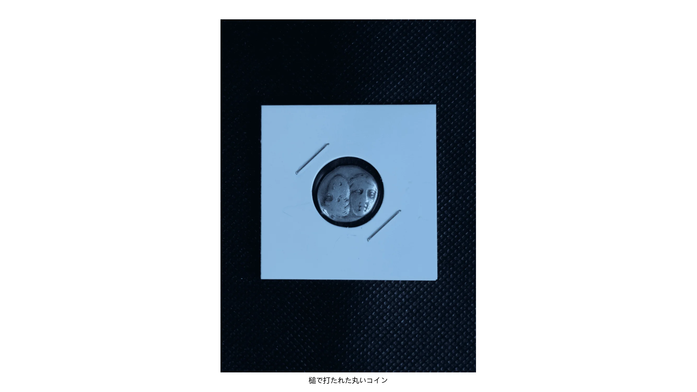

### 中世の進化

中世には、硬貨の幅を広げ、薄くする傾向もあった。その理由のひとつは、真贋の指標としてよく使われたコインの音の検査が容易になったからである。銀を広げることで独特の周波数が発生し、人々はその音を聞くだけでコインの純度を確かめることができた。この習慣が「健全な貨幣」という言葉を生んだ。サウンド・マネーの文脈では、計量に天秤秤や「トレビュシェット」を使って標準重量が決定された。こうして、小さくて丸い硬貨から、少し薄くて幅の広い硬貨へと進化を続けた。

### 振り子打撃

中世の終わり、近代の初めに登場した最後の技術は、振り子打法の概念であった。これは一種のスクリューで、これを締めて硬貨を打ち、この新しい打ち方で硬貨を生成した。この開発で特筆すべきは、クリッピングの問題に対処するために、硬貨の表面に模様を刻むことができたことである。クリッピングとは、硬貨の一部を取り除いて貴重な銀を回収することで、その銀は他の硬貨の鋳造に使用することも、単に資源として保持することもできた。

つまり、この振り子打法の概念がクリッピング現象に役立ったわけだ。興味深いのは、この技術はフランスから伝わったということだ。例えばイギリスでは、フランスの技術者を雇い、この機械の作り方を教えてもらったのです。面白いのは、ハンマー鋳造に反対し、この技術の応用を遅らせた支持者がいたことだと思います。どんな優れた技術にも、それに反対し、古い技術を維持しようとする人たちが必ずいる。より多くのパーツを作ることができ、コピーも難しいという、本当に優れているように見える技術でさえ、有名なハンマー製法に執着する人たちがまだいることに気づいたのは、かなりクレイジーなことだと思いました。この有名な振り子打撃で作られたパーツを生産し、またハンマー打撃に戻るというシフトがあった。そして最終的に、もちろん、振り子打法が定着し、私たちに美しい現代的な作品をもたらしたのです。この作品には、クリッピングを避けるための小さな線、小さな隆起、おそらくクリッピングという言葉に関連した隆起が見られます。

# 貨幣の出現に関するさまざまな理論

<partId>72ac694f-9248-550d-90c1-91af3d234380</partId>

## 貨幣の出現とその様々な定義に関する理論

<chapterId>7d699d4d-8c70-55b5-bf36-609f3fd90bcf</chapterId>

:::video id=523c873f-501b-4954-b79f-7e74c0f685a5:::

このコーナーでは、貨幣の発生とその定義に関するさまざまな説をご紹介します。以下は、このコーナーで取り上げる2つの主要な理論を要約していると思われる、*Aux origines de la monnaie*という本からの短い抜粋です。

> この簡単な前置きは、この調査の背景を強調する以外の目的はない。概念的なレベルでは、K.ポランニーのテーゼを支持する人々とM.ウェーバーの支持する人々の間で論争が繰り広げられている。前者にとっては、贈与と再分配が中心的な役割を果たし、市場交換は、主に国際交流において、ほんのわずかな役割を果たすにすぎない。それとは反対に、他の人々にとっては、市場が現在の歴史的プロセスの中心にある。

例えば、メソポタミアでは、権威者である寺院が勘定単位や貨幣単位を作り、それを商人に課し、商人がそれを貿易に採用したとする説がある。もう一方の説は、そうではなく、この通貨単位は貿易を円滑にするために市場から自然に生まれたというものである。メソポタミアには、このような事例がある。

物々交換については、主に国際的な交換、つまり単に信用できない相手との交換に使われていたという説もある。

そこで、このセクションでは、このようなことをやってみようと思う。貨幣の出現に関するさまざまな理論や、貨幣とは何かについてのさまざまな定義を提示するために、一種の調査を行うつもりである。古典派経済学者と人類学者、双方の理論を紹介し、批判する。幸運なことに、ウルリッヒ・フロミーも同席してくれることになっており、オーストリア経済学者の視点からこれらの様々なテーマについて紹介してくれる。

## 古典派経済学者にとっての貨幣の出現

<chapterId>1d3776cd-0dfd-5297-af48-c6f41e257a7e</chapterId>

:::video id=873a16c1-17ac-448d-8941-df4feb7ab79d:::

このコーナーでは、貨幣の発生に関するさまざまな理論を取り上げる。最初に取り上げるトピックは、古典派経済学者による貨幣の発生である。

### アダム・スミスの古典的理論

古典派経済理論、特にアダム・スミスが唱えた理論によれば、貨幣は物々交換の限界に対処するために、物々交換から自然に生まれたものである。当初、交換は直接的な物々交換によって行われたが、この方法はしばしば「欲求の二重の一致」という問題によって複雑化した。次第に、特定の商品（塩、貴金属、家畜など）が、その有用性、耐久性、分割可能性により、交換の中間手段として万人に受け入れられるようになった。こうして、経済的交換を円滑化し、流動化するために、貨幣が自然発生的に出現したのである。

### 古典理論への批判

以下は、この理論に対する私の批判である。前節で見てきたことをすべて踏まえて、「**コイン**は物々交換の進化形である」という考え方はすでに間違っていると言えると思う。なぜなら、鋳造されたコインは間違いなく権威によって鋳造されるからである。その理由はいくつかあるが、特に当局が経済をコントロールしたい、貨幣を管理したいという欲望があるからだ。

というのも、最初のコインであるリディアン・スタターには、刻印のない銀の塊が見つかっているからだ。それが流通したかどうかはまだわからない。もし流通していたとすれば、人々はもともとこの資産を、広く需要があり、簡単に交換できる潜在的な通貨として認識していたことになる。そして、当局がこの状況に気づき、それを証明するスタンプを押すことで管理したのは、その後だったのかもしれない。

この方法には多くの利点がある--チェックや計量、その他もろもろをする必要がない。もちろん、それについてはこれから話す。しかし、私の考えでは、硬貨は明らかに、最初から国家によって使われてきたツールだ。しかし、貨幣の出現という点では、それが本当に権威から押し付けられたものなのか、それとも貿易や商取引を通じて出現したものなのかはわからない。このテーマについては、このセクションの後半で同僚のウルリッヒと非常に興味深い議論をすることになる。

最初の貴金属硬貨は、その価値があまりにも高すぎたため、日常的な交換には使われなかったことはすでに知られている。また、主に軍事的な支払いに使われたこともわかっている。これは、貨幣は必ずしも市場から生まれたものではないというテーゼの論拠となる。最初の硬貨の額面である勘定単位は、おそらくパンを買ったり日常の買い物をしたりするには大きすぎたのだろう。たとえば、1日分の賃金に相当するような金額だった。必ずしも当時の人々に賃金が支払われていたわけではありませんが、これはその規模を示すものです。つまり、これらの硬貨は小規模な貿易に使うには購買力がありすぎたのだろう。その一方で、これらの硬貨が商人同士の交換など、より大規模な交換に使われなかったとは言い切れない。私たちが知っているのは、主に軍事的な支払いに使われていたということだ。これは、最初の硬貨の出現を説明する最も有力な説のひとつである。ここでは硬貨の話をしているのであって、必ずしも貨幣全般の話をしているわけではないことを忘れないでほしい。つまり、最初の硬貨には最初の役割があり、それは傭兵のための軍事費の支払いだったのだ。

たとえばアレキサンダー大王は、後で見るように、それを大いに利用した。

また、古代中国では早くから、タカラ貝が経済的な交換（労働の報酬、価値の測定、土地の購入）に使われていた**ことも見てきた。さらに、メソポタミアやエジプトでは、機能的な貨幣制度がすでに存在し、貿易、賃金支払い、納税に使われていた。私がここで言いたいのは、西洋の概念における硬貨が、交換をより流動的にする必要性から生まれたと考えるのは間違いだということだ。

硬貨は当局によって発行されるのだから、おそらく最初から発行当局と連動していると考えることができる。それは理にかなっている。その一方で、貨幣の形態や貨幣システムの形態、つまり原始貨幣がどのように出現したかは必ずしもわかっていない。一方では、これらの通貨単位を特定したのは寺院であり、その後、人々はそれを使用したのだと考える。そしてもう一方では、交換手段や外部との取引方法を必要としていたのは商人たちであり、例えば銀の金属を特定したのは彼らであった。要は、本当のところはわからないということだ。だから2つの説があるのです。貨幣が、例えば商人たちの交易の必要性から自然に生まれたのか、それとも権威から生まれたのかを説明する完璧な証拠はない。

### 硬貨と原始貨幣の区別

結論として、硬貨は権威によって刻印されたのだから、必然的に権威から生まれたと言えると思う。その一方で、貨幣（硬貨に先行するもの）が交換を容易にするために出現したはずがない、という指摘は間違っているとは言えないと思う。これまで見てきた例を見ても、このような意味での例はたくさんあると思う。

## 物々交換の神話

<chapterId>0fcd4964-ac36-5163-a8cf-1aacebc0d2c0</chapterId>

:::video id=0ede29ab-8acd-4d79-9282-bd5991b97076:::

### デヴィッド・グレーバーのレビュー

古典派経済学者による貨幣の出現について説明した。今度は、物々交換神話として知られる概念に取り組もう。

貨幣の出現に関するこの古典的な理論に対する批判のひとつは、その考えを裏付ける歴史的証拠がないことである。

人類学者のデイヴィッド・グレーバーらによって提唱された「物々交換神話」と呼ばれる批判は、貨幣が物々交換から自然に生まれたという古典的な考えに異議を唱えるものである。この批判によれば、貨幣の出現以前に社会が体系的に物々交換を利用していたことを示す歴史的・人類学的証拠はない。実際、古代の社会は信用、負債、社会的義務、儀式的な交換に基づいて運営されていたはずである。したがって「物々交換神話」は、古典的な経済観を正当化するために作られた理論的構成であり、実際の経験的根拠はない。

しかし、この説は、たとえば異なる部族間の交換のために物々交換が存在したことを否定しているわけではないことに注意すべきである。単に、物々交換がいわゆる原始的な集団の中で広く行われていたことを否定しているのであり、貨幣がこうした慣習の論理的な進化であろうというのである。部族内で物々交換が広く行われ、やがて交換を流動化させ、物々交換に存在した困難を解決するために貨幣が生まれたという事実を否定しているのだ。その代わりに、この説によれば、これらの部族は非公式な信用や贈与に対する贈与を実践していたことになる。

### 原始社会と偉大な文明

**この理論は、過去の、そして今日でさえも原始的な（無国籍の）集団（例えば、18世紀と19世紀に探検家によって研究された部族）にも間違いなく当てはまると思います。彼らが物々交換を使わず、先に述べたような交換形態を使っていたのは明らかだ。その理由はすでに述べたとおりである（分業の弱さ、自給自足の農業）。しかし、メソポタミアや古代エジプトといった過去の偉大な文明には、この理論は当てはまらないと思う。

以下は、このテーマに関する*Aux origines de la monnaie*からの2つの抜粋である：

> M.モースがその有名な『贈与』で概説したモデルは、エジプト学者たちの間で、見識の欠如と同じくらい一致して熱狂的に採用されてきた。そのため、ここでは触れないが、多くの混乱が生じている。このモデルは、いわゆる原始的な社会に適用されるものであり、ファラオ時代のエジプトには当てはまらないということだ。

> したがって、パン、つまり穀物加工品は、古王国時代のシャット（Y）のように、多様な商品の信用取引を可能にする勘定単位でもあった。この単純な例は、ファラオ時代のエジプト経済が再分配システムに限定されていなかったことを示している。それは非常に複雑で、多数の交換を含んでいた。

だから、先にエジプトやメソポタミア、中国のセクションで見たように、これらの古代、しかし原始的とは言えない文明でさえ、国家の存在ゆえに、貨幣制度を利用していたことがわかる。このことは、このコースの最初のセクションで十分に証明されたと思う。つまり、ギブ・アンド・テイク、信用供与という考え方は、これらの偉大な文明には当てはまらないのだ。したがって、貨幣が出現した正確な理由は謎のままである。貨幣が、商人たちが外界と交易する必要性から生まれたものなのか、それともこれらの古代時代に寺院から課せられたものなのかはわからない。

## デット・マネーによるマネーの出現

<chapterId>4f508615-aa61-5d62-89d3-cecd02aeaa62</chapterId>

:::video id=a23f547f-3906-4f4a-8f72-5d78c649d0c4:::

### 借用書としてのお金

このセクションでは、デット・マネーの理論を取り上げる。

特に経済学者アルフレッド・ミッチェル＝インズが発展させ、後にデイヴィッド・グレーバーが拡張した**負債貨幣**の理論は、貨幣は物々交換から生まれたのではなく、人類最古の社会から存在する負債と信用の関係から生まれたと主張する。この理論によれば、貨幣は社会的義務（個人や集団間の債務）が数値化され、移転可能になったときに出現する。この概念は、交換と移転の数量化という概念を導入している。従って、貨幣は、単に交換の仲介をする商品ではなく、相互の信頼に裏打ちされ、しばしば政治的・宗教的権威によって保証される、**債務の承認**である。

この理論をさらに発展させたものが、すべての貨幣は負債であるというものだ。つまり、お金を持っている人は、社会一般に対して債権を持ち、そのお金を受け入れるすべての人に対して債権を持つことになる。彼らの考えでは、貨幣は強制的に受け入れられなければならない。ある通貨を特定した集団において、その通貨を所有するすべての人は、その通貨を受け入れる社会の他のすべての構成員に対して負債を負っているようなものであり、その通貨を受け入れる人は、その通貨単位を所有する人に対して負債を負っているようなものなのだ。これが本質的な彼らの理論である。

### 義務教育制度への批判

**この理論に対する私の批評：**。

この理論に対して、ひとつだけ小さな批判をさせてほしい。私は、貨幣とは一種の社会的合意であると考える。それが何であれ、集団が貨幣の「しるし」に寄せる信頼である。だから、私は相互信頼の概念に賛同している。これは後で、貨幣プレミアムの概念と一緒にもう一度取り上げることにしよう。ややこしくなるのは、この理論の支持者が義務という概念を加え、負債という概念を主張する場合である。彼らにとって、誰かが貨幣的なtokenを所有することは、共同体全体に対する債権を保有することであり、したがって共同体は保有者に債務を負うことになる。また、和解の義務もあり、集団のメンバーはtokenを受け入れる義務がある。そうでなければ、彼らの考えでは、このシステムは機能しない。私は、上記の古代中国のシステムがこの理論をよく表していると思う。

私としては、お金が社会的なコンセンサスであり、選ばれたtokenが支払い手段として一般的に受け入れられ、正式な義務はないというシステムを容易に想像できる。人々が自らの自由意志でそれを受け入れるのであれば、そのようなシステムが機能するのは目に見えている。それは機能しうる。その反面、義務や法定通貨、暴力が伴うことも多い。しかし理論的には、このシステムがうまく機能する印象はあまりない。Bitcoinがその例だと思います。Bitcoinが価値を持つのは、それが貨幣的プレミアムを持っているからであり、貨幣的使用、つまり価値の準備、おそらく交換手段や不換紙幣システムに対する保護に使われる需要があるからだ。誰もそれを受け入れる義務はなく、支払い手段として受け入れられれば受け入れられるほど、交換手段としても利用できるようになる。私たちはすでに何の問題もなく、価値の貯蔵手段として使うことができる。それは間違いない。私が言いたいのは、Bitcoinはその一例であり、社会的合意の一種である通貨のように思えるということです。

このような制限の少ない理論は、2つの異なる社会が、金のような貨幣tokenを使って、当該社会間に債権や債務を生じさせることなく貿易を行うことができることを説明するのに役立つ。社会的受容を強制することは、2つの部族間の貿易では機能しない。部族Bは部族Aの権威に服従していない。しかし、同じ貨幣token、例えば金を受け入れる。でも、それはB社も金を自分たちの通貨と決めているからだ」と言われるかもしれない。しかし、その時点では負債を生み出すことはない。最終的な取引なのだ。つまり、A社がB社で金と商品を交換しても、負債が生じることはなく、取引は完了する。そして明らかに、B社の人は、A社の人から後で支払いを受けるためにこの金貨や金塊を手に入れたわけではない。おそらくは自分の部族内で、後で交換されるために受け取っているのだ。つまり、この例では負債が生じることもなく、潜在的な請求権もなく、単に直接的な交換、直接的な支払いなのである。負債通貨の支持者は、これは物々交換だと言うだろう。物々交換は直接的な財の交換だからだ。直接的な物々交換とは、ある財と別の財を交換することである。一方、この場合、金は通貨として使われるのは明らかである。だから、物々交換の範疇には入らないというのが私の考えだ。

金銭的なtokenを所有することは、コミュニティに対する "クレーム "ではなく、tokenが後日、同等の価値で受け入れられることを望むものである。

## 貨幣の自然発生

<chapterId>e3ef86b1-73b9-5140-a61e-2ab6a5b0b2d4</chapterId>

:::video id=e543995f-d5e2-49d7-9133-e397b46e0833:::

カール・メンガーによって創始されたオーストリア学派の経済学では、貨幣は欲求の二重の一致という問題に直面する物々交換経済から自然に生まれる。この考え方では、個人は交換を促進する中間財（直接消費される財ではなく、広く需要される商品として認識される財）に自発的に集中する。

これらの貨幣は、アリストテレス以来確認されている性質を持たなければならない。すなわち、価値の貯蔵、交換手段、勘定単位として機能しなければならない。経済主体は、それらを徐々に識別し、蓄積し、保存することで、貨幣としての出現を開始する。このプロセスは完全に自然発生的なものであり、貨幣は、権力者の意識的な介入なしに、交換の調整という問題に対する自然な市場の反応を表している。

### バーター神話」論争

デヴィッド・グレーバーのような人類学者は、「物々交換神話」を持ち出して、この見解に異議を唱えている。彼らの主張：直接的な物々交換のみに基づいた複雑な文明は、これまで記録されていない。むしろ、調査された原始社会では、非公式な信用と互酬性のシステムが使われていた。グレバーは、物々交換よりも借金が先行していたと主張し、信用関係を記録した何千ものメソポタミアの石版を引用している。

しかし、この批判は物々交換の限定的な定義に基づいている。メンガーが1892年に指摘したように、物々交換は単純な財と財の直接交換にとどまらない。物々交換には、後払いの移転、賃金のためのサービス、時間性を伴う交換、つまりメンガーが「個人間の一方的な移転」と呼んだものも含まれる。このような物々交換の拡張形態は、限定された信頼の輪の中で、信用制度と共存することができる。

オーストリア経済学者は、複雑な社会が直接的な物々交換だけでは持続的に発展できないことを認識している。

### メソポタミアの事例：商人対寺院

メソポタミアの銀シケルの起源をめぐって、論争が結晶しつつある。2つの対立する解釈がある。制度的な見方では、真の経済的、精神的な中心である神殿が、経済を構造化するために銀を通貨として押し付けたとする。楔形文字は、聖職者と商人のエリートに集中し、この中央集権的な支配の証となっている。

オーストリアの解釈では、長距離貿易のために貨幣を採用したのは商人たちだった。アナトリアからペルシャ湾まで、メソポタミアの国境を越えて見知らぬ人々と交易をするという課題に直面した彼らは、普遍的に認識でき、耐久性があり、持ち運びが可能なものを必要とした。銀はその本質的な性質から、当然の選択だった。神殿は、商業的な利用によってすでに確立されていた慣習を確認したにすぎない。

この論文は、アナトリアのカネシュとアスールとの間で、商人たちが織物を銀の金属と交換した記録に基づいている。これらの取引は単なる物々交換を超え、真の商品通貨の存在を明らかにした。

### 現代の収容所の例

経済学者のリチャード・ラドフォードは、第二次世界大戦中にドイツの捕虜となり、自然発生的に貨幣が出現した興味深い事例を記録している。収容所では、タバコは自然に交換の単位となった。非喫煙者でさえ、その普遍的な交換価値を認め、タバコを採用した。

この小宇宙は、オーストリアの原則を示している。交換を調整する問題に直面すると、個人は最も「売れる」財に自発的に収束する。たばこ代は、交換を最適化しようとする囚人たちの日々の実践から生まれたのである。

### 個人の嗜好の収束

基本的に、貨幣は個人の選好が受け入れられる共通の善に収束することを表す。メソポタミアの商人たちは、ラドフォードの囚人たちと同じように、将来の交換の不確実性を最小化する財を特定した。この選択は、中央当局の承認や押し付けを待つものではなく、交換という課題に直面した経済主体の実践的合理性から生まれるものである。

歴史的証拠が断片的であるため、自然発生か意識的制度化かの論争は未解決のままである。しかし、オーストリアの分析は首尾一貫した説明を提供している。貨幣は商業の実際的な必要性から生まれたものであり、当局は市場の利用によってすでに確立された慣習を制度化したに過ぎない。

## 貨幣の出現に関する人類学的見解

<chapterId>ec48c5d8-47ed-530f-beb7-c44fd0b62880</chapterId>

:::video id=8c1f8764-75af-4fb6-a98b-55de3b7da02e:::

### 貨幣の非経済的起源

このセクションでは、貨幣の出現に関する人類学的な見解を探る。この豊かな視点は、古典的な経済理論に深い疑問を投げかけるものである。

貨幣は経済的な交換を促進するために物々交換から自然に生まれたという伝統的な説に反して、人類学的な研究は、貨幣の出現の大部分が非経済的な原因に根ざしていることを示している。それは、貢ぎ物の支払い、殺人の補償（有名なヴェルゲルド）、持参金（嫁入り道具）などの社会的メカニズムに由来するものであり、また、儀式的、宗教的、政治的、象徴的な慣習に由来するものでもある。

原始社会では、古典的な貨幣の定義である「交換媒体」に反して、貨幣が日々の物品の交換に使われることはほとんどなかった。実際、これらの社会では、社会的・個人的関係の広大なネットワークに組み込まれた後払いによって、信用が大量に利用されていた。こうしたユビキタスな信用システムは、論理的にも歴史的にも、貨幣の出現に先行していた。

それが彼らのビジョンを要約したものだ。私たちは前のビデオのチャットでウルリッヒとこのことについて話している。ウルリッヒのコメントは、このアプローチに少し疑問を投げかけている。人類学的なビジョンでは、お金は市場のニーズに先立つ権威や社会的概念から生まれるという考え方があります。

### ヤップの石の例

以下に、ヤップ島の記念碑的な石碑の印象的な例を挙げる。これらの石の中には、不動であるにもかかわらず、あるいは物理的に消滅しているにもかかわらず、集団的な合意のおかげで貨幣として完全に機能し続けたものもあり、貨幣の本質的な社会的・象徴的側面を強調している。

これはヤップの石についての実に興味深い分析である。Saifedean Ammousも彼の著書 "The Bitcoin Standard "の中でこの例について触れている。彼によれば、ヤップ島のシステムはBitcoinに最もよく似ており、誰もが参照できる一種の中央記録であり、公的なものであり、勘定を管理し、物の所有権を管理するものだという。この人類学的な視点は、これらすべてが社会内の合意や社会的コンセンサスを表しており、基本的に正確であることを示している。そして、失われた石についての言及は非常に興味深い。彼らは小さないかだで何百キロも海に出て、石を持ち帰った。時には石が海の底に落ちることもあったが、それでもこの石は貨幣システムに使われた。そうだ、こんなところに石を落としたから、これは私のものだ。石はとても大きいので、一か所に留まることが多く、交換を容易にするために物理的に所有する必要は必ずしもなかった。その代わり、石を実際に移動させることなく所有権を移動させることができる、取引的な方法でこれらの石と手を交換することに焦点が当てられていた。これは「合意の証明」の一形態であり、貨幣に対する人類学的な興味深い視点を浮き彫りにしている。

### プロト通貨と社会的義務

世界中の民族学者たちは、貝殻、布、家畜、塩、石などの「原始通貨」あるいは「原始貨幣」を使用している社会を観察してきた。それらは、支払手段や価値の貯蔵といった、通常貨幣に帰属する機能を果たしていたが、日常品の交換の仲介役としては定期的に機能していなかった。

つまり、ここでは必ずしも日常的な交換に使われていたわけではない通貨システムについて説明しているのだ。

そして、これらはすべてコインが登場する以前の通貨であったことを思い出してほしい。私は通貨と言った方がいいと思う。文献上では、硬貨以前の貨幣を指して原始通貨と呼ぶことが多い。しかし、最初のセクションで見たように、**私はコインが登場するずっと前から通貨制度はあったと考えている**。

これらの原始的な通貨は主に、結婚、紛争補償（Wergeld）、首長間の贈与など、個人に関連する基本的な社会的義務を管理するために使用された。例えばペルシャ帝国では、最初の硬貨は交換手段ではなく、軍事的な支払い手段として特別に作られた。

つまり、原始貨幣は支払い手段であり、物品の直接的な交換手段であることはほとんどなかったのである。つまり、ある種の社会的義務、部族、酋長間の交換、有名なヴェルゲルト（血税）の支払い手段であったということだ。司法制度が登場する以前は、誰かが殺人を犯せば、愛する者を殺されて苦しむ家族のために賠償金が支払われた。これには代償が必要で、それは血税と呼ばれ、支払いの一形態である。持参金もあった。このような初期の支払いとしてのお金の使い方では、日常的な買い物のための支払いよりも、人間的・社会的な義務に関連するものが多かった。この理論によれば、こうした日常的な交換は、信用、信用繰延、贈与に対する贈与、配給の再分配と、より関係が深かった。こうしたやり取りを管理するために、別の形の社会組織があったのだ。また、誰もが自給自足で農業を営み、専門化されていない社会では、日常的な交換に貨幣制度はほとんど必要ないということも忘れてはならない。だからこそ、最初の貨幣の形は、今説明したような持参金や血税だったのだ。パンを日常的にお金と交換するような貿易が必要となるずっと前に、私たちが支払い手段を必要としたのは、こうした交換が最初だったからにほかならない。原始社会では、そのような仕組みはなかったからだ。この点については、このコースのこれまでの講義で詳しく説明してきたと思う。

高度に分業化されていないこれらの社会では、直接的な交流は限られたものにとどまり、主に友好関係や同盟関係といった個人的な関係の中で行われていた。十分な専門性がなかったため、近代的な意味での貨幣は必要なかった。

クィギンやアインツィヒのような人類学者は、信用の優位性を主張している： **原始的な経済生活は、債権と個人債務の巨大なネットワークに巻き込まれている。

つまり、人々は物を交換し、信用を先延ばしにすることができるが、場合によっては支払いを先延ばしにすることができないので、通貨やプロト通貨は、交換に即時最終性を持たせるために、この時点で役に立つ。

### 匿名性の革新

貨幣を物々交換と対立させるのではなく、貨幣の出現を信用と負債の複雑なシステムからの進化として理解することがより適切である。貨幣は基本的な革新をもたらす： **匿名性**である。そこで私は、貨幣の出現に関するこの人類学的な理論を面白いと思う。もしあなたが少人数のグループで、互いに信用を延ばし合っているのなら、あなたは明らかにお互いを知っているはずです。このシステムが機能するためには、人々は明らかにお互いを知っていなければならないと思う。そして、お金による支払いは匿名性を可能にする。自分の名前すら知られることなく、自分が誰なのかも知られることなく、支払いを行うことができる。即座に最終的な決済を行うことができる。それこそが、お金が可能にすることなのだ。

常に名目的である信用とは異なり、貨幣は匿名的で一般化され、即座に解放的な取引を可能にする。 **貨幣のこのユニークな解放力こそ、その決定的な優位性である。

このように、貨幣は経済的交換を促進するためのささやかな道具であるどころか、個人的な信用**から一般化された匿名決済システム**へと、人間の制度や慣習の進化と密接に結びついた、大きな社会的革新なのである。この人類学的な進化は、貨幣が単純な交換手段である以上に、強力な社会制度であり、人間社会を深く形成し、現代社会では経済活動の目的そのものとなっていることを示している。

ここで私たちは、現代社会では結局のところ、経済的交換の目的そのものが貨幣を所有することであることに気づく。経済的交換の目的は、消費するための財や商品を所有することだった。そして今日、貨幣という革新的な技術が導入されたことで、経済的交換の目的は、この貨幣を蓄積することである。私たちは、必要な時に必要な財と交換することができる。

## レジスタの統一

<chapterId>7664442a-91c1-5ce4-a8bd-53b7371a3e3d</chapterId>

:::video id=473fc284-5375-4e1b-b0cd-6b51ba0cc3b8:::

### 会計登録理論

この2つの貨幣理論、すなわち負債貨幣による貨幣の発生理論と商品貨幣による貨幣の発生理論を統一するためのさまざまな提案を、これから一緒に探っていこうと思う。リン・オールデンの名著『壊れた貨幣のために』（コンセンサス社による翻訳タイトルはおそらく『Rupture monétaire』であろう）における統一案についてお話しする。

*リン・アルデン著『ブロークン・マネー』より抜粋：*。

> 基本的に、貨幣は会計簿である。商品貨幣は自然が支配する帳簿である。銀行貨幣は国家によって管理される台帳である。オープンソースのマネーは、ユーザーによって管理される台帳である。

ここでいうリンとはBitcoinのことである。

### ストックフロー比率と希少性

> ロジウムのような一部の希少化学元素は金よりも希少だが、採掘と同時に産業界で消費されるため、ストックフロー比率は低い。ロジウムのコインやインゴットは、特殊な収集品や価値の貯蔵品として購入することはできるが、社会的に受け入れられる通貨としては適していないため、貨幣として自然に出現することはない。

サイフェデーンは著書『Bitcoinスタンダード』の中でこのことについて詳しく述べている。ストック・フロー比に馴染みのない人のために簡単に説明すると、既存のストック、つまり市場に存在する埋蔵量と、新しく入ってくるストック、つまり新しいストックの流入量を比較したものである。大量にあるものは希少ではないと思うかもしれないが、実際はそうではない。むしろ、それを供給する能力の問題なのだ。むしろ、このモデルによれば、新しい在庫を持つ能力こそが、この対象が希少かどうかの情報を与えてくれる。在庫がないから希少なのではなく、在庫がないから希少なのだ。つまり、金を例にとれば、金のストックがたくさんあるのは、それが価値の貯蔵として使われているからであり、新しいストックの流入は、金のminingを通じて入ってくる新しい金のストックの年間1％から3％といったところだ。一方、彼女がここで言っているのは、ロジウムの場合、金よりも希少価値が高いが、消費されるためストックがない、ということだ。そのため、既存の在庫を2倍にするために多くの新規供給は必要ない。一方、金の場合、在庫を2倍にするためには、少なくとも50年かけて更新する必要がある。消費されるほとんどの商品とは異なり、金は消費されながら消費されるため、既存の在庫を2倍にするのは簡単で、何年も生産する必要はない。

*"金は近代史を通じて25倍から100倍の株価フローレシオを維持してきたが、通常は50倍前後かそれ以上で、19世紀半ばのゴールドラッシュの時でさえ、一時的に16倍を下回ったことはなかった。"*

つまり、25年なら25年で2倍、100年なら100年で2倍になるということだ。サイフェデアンは著書の中で、金の生産量を1.5%から3%に倍増させたとしても、金の価格に大きな影響を与えるとは限らないと述べている。

*「銀のストックフロー比率は一般的に10倍以上であり、まだ比較的高い。

*他のほとんどの商品のストックフロー比率は1か2以下である。プラチナやロジウムのような希少元素でさえ、工業的に急速に消費されるため、ストックフロー比率は比較的低い」*。

### 金と銀の優位性

*「要するに、コモディティ通貨が金や銀と競争することになったときは、常に後者が最終的にトップに立ってきたのです。他のコモディティは、限られた期間、あるいは特定の地域で通貨であり続けるかもしれないが、金と銀は常に世界的に競争力のある通貨となり、競争を支配する能力を証明してきた。なぜなら、文明が出会ったとき、金と銀の所有者は常に他の通貨形態を切り下げる技術力を持っていたからであり、貝殻、真珠、家畜、塩、布、劣った金属の所有者は金や銀を切り下げることができなかったからである」*。

Bitcoinスタンダード』でも、サイフェデアンがアフリカの部族がガラスビーズを使っていたことを語っている。ベネチアの商人たちが貨物を満載してガラスビーズを運んできたとき、当時彼らは工業的にガラスビーズを生産することができ、そのための技術的能力を持っていたため、これらの民族の貨幣制度を完全に不安定にし、彼らは文字通り彼らの資源を略奪することができた。これがサイフェディアンのテーゼである。

### アカウントとクレジットの単位

*「歴史的には、信用が交換の道具として直接使用された場合でも、その性質から自然に選ばれた貨幣商品単位で表示されるのが普通であった」*。

それは非常に興味深い指摘で、ウルリッヒと私も議論しているところだ。メソポタミアの神殿が信用という概念を管理できる権威のようなものであったとしても、勘定単位はシケルです。シケルが神殿によって権威的に制定されたことを裏付けるものは何もない。商人たちが近隣の他民族と輸出入する必要性から、自然にシケルが生まれたのかもしれない。その証拠に、カネシュの商人（このことは第1回で述べた）が、貴金属を輸入していた。唯一の問題は、この銀の選択、つまり銀のシェケルが商人によって作られたのか、それとも神殿によって作られたのかがわからないことである。しかし、ウルリッヒは、銀が選ばれたのはむしろ商人の側であっただろうと思わせる、非常に優れた議論を展開している。

*「したがって、この2つの理論の統一は、両理論に共通する基本的な論理を記述していることから、「貨幣の会計理論」（「貨幣の元帳理論」）と表現することができる。柔軟な社会的信用と収集可能な原始通貨は、どちらも人類の夜明けまでさかのぼる。どちらの場合も、さまざまな規模の人間集団が、欲求の二重の一致を満たす必要を回避し、交換の摩擦を減らし、流動的な貯蓄の一形態として機能するために、自分たちの間で会計帳簿を管理している。本質的な違いは、台帳を管理する権限を誰に委ねるかにある」*。

一方では、自然がマネーサプライの拡大を管理している。金を例にとると、希少価値が高いため、採掘が難しい。採掘できる金貨の数には限界があります。希少性は自然によって管理されているのです。そしてレジスターは所有という概念によって保持されている。登記簿は分散化されています。所有は、金貨や金塊を所有しているという事実によって証明されます。信用貨幣の場合、希少性は人々が信用を得る能力によって管理される。不換紙幣の場合、希少性は権力によって管理される。インフレの災禍を避けるために、増刷するかどうかを決めるのは当局なのだ。つまり、紙幣の場合、tokenの所有者によっても登録が管理される場合がある。だから、非物質化という引用符が付けられている。まあ、物質化されてはいるが、バーチャルだ。彼はこの有名なtokenを所有し、それが所有の証明となる。そしてそれは、聖典のお金と同じように、実際の登記簿に記載されることもある。銀行では、登記簿との関係で誰が何を所有しているかを管理するのは、実際には人間の銀行なのだ。

## 貨幣プレミアムによる統一

<chapterId>093756e5-8908-55e5-bb76-376a3a3cc4d3</chapterId>

:::video id=eabc342a-ecbd-46ca-a347-e914917e7c4f:::

### 金銭的プレミアムの概念

このセクションでは、貨幣の発生に関する異なる理論を統一するための様々な提案について述べる。この2つの貨幣理論を統一するために、私なりの提案がある。それは、マネタリープレミアムという概念です。つまり、貨幣の価値は、粘土板、貴金属硬貨、銀行券、ビットコインなど、その貨幣需要から生じる貨幣プレミアムで説明できる。マネタリープレミアムは、簡単に言えば、将来、誰かがこの通貨を同等の価格で交換してくれるという確信に基づいている。

私がここで実証しようとしているのは、それが不換紙幣、つまり使用価値のない紙幣であろうと、金貨であろうと、どんな金属であろうと、金塊やインゴットであろうと、**その価値のほとんどを占めるのは、多くの場合、貨幣のプレミアム**であるということだ。金貨であれ、どんな金属であれ、金塊であれ、インゴットであれ、その価値の大部分を占めるのは金銭的プレミアムであることが多い。宝飾品の需要は、多くの場合、その金銭的価値から来ていることに注意してください。人々は一種の価値の保存として宝飾品を保管しているので、むしろ貨幣の役割を果たす需要であることが多いので、私はこれを貨幣プレミアムに少し含めている。

つまり、金の需要の約10％は工業用需要ということになる。金の価値の中で、この工業用需要、つまり金が消費される場所での金の使用に対する需要で説明できるのは、ほんの一部、仮に10％としよう。残りは、価値の貯蔵としての貨幣需要であることは明らかである。

### 権威ボーナスと不換紙幣

そして、金貨と金片を比較した場合、もう一つの層がある。金貨は権威によって刻印され、金貨に含まれる金もまた、使用需要、つまり産業で消費される需要を享受している。また、価値貯蔵としての貨幣的プレミアムも享受している。さらに、私は当局プレミアムと呼んでいるのだが、コインの方が金貨よりも使い方が簡単なため、コインの方が金貨よりも高い価格、高い購買力を持つことが多い。金貨は使い方が簡単なので、金貨の重さを量る必要がなく、交換がよりスムーズになります。通常、当局はその純度を保証している。そして、金貨と比較した場合、刻印された金貨は一般的に単純な金貨よりも価値がある。刻印を押すには資源が必要だからだ。

不換紙幣も同じ原理だ。紙幣は、おそらく暖房のために使われる以外は、何の使用価値も持たない。ワイマール共和国ではそうだった。一方、権威にはプレミアムがつくだけだと私は思う。

これは貨幣プレミアムの一形態であり、貨幣プレミアムの上乗せである。しかし、不換紙幣の貨幣的プレミアムは、不換紙幣が法定通貨であるという事実から生じる。つまり必然的に、不換紙幣は課税され、税金を納めるために少なくともそれを手に入れなければならないという事実から生じる貨幣需要の形を持っている。その結果、不換紙幣は一般に認められた支払手段であり続ける。そのため、人々は自分のニーズを満たすために不換紙幣を手に入れたがる。

### 通貨需要による統一

そして、なぜこの貨幣プレミアムの提案が、デットマネーとコモディティマネーという2つの理論の統一に値するのだろうか？私は、金貨の価値が必ずしもその「本質的価値」に由来するとは思っていない。いや、実際には、不換紙幣の場合と同様に、信認の概念なのだ。貨幣需要の概念なのだ。そして、産業利用の割合が少ないからというのが本当の理由ではなく、もう一つの「効用」である。仮に工業的用途が価値の10％だとすると、1オンスあたり300ドルと評価できる。金が市場で1オンス3,000ドルで売られているとすると、300ドルと3,000ドルの差額が有名な貨幣プレミアムである。金に対するこのような貨幣的需要が説明できる。不換紙幣の使用価値がゼロだからといって、それが違うということにはならない。私にとっては、まったく同じことなのです。だから、デットマネーの理論でもコモディティマネーの理論でも、金が最小限の使用価値しか持たないという特質があっても、何も変わらないと思う。

一方、**創発のレベルでは、ミーゼスの回帰定理によれば、この利用が原点で需要を生み出し、貨幣になるプロセスを開始させるという提案ができることは確かです。 **しかし、価値のレベルでは、貨幣の価値をどのように説明するか、貨幣プレミアムを使えば、なぜ不換紙幣が私たちの帰属する価値を持つのか、なぜ商品貨幣が私たちの帰属する価値**を持つのかを、同じように簡単に説明できると思います。私にとっては、これは同じプロセスであり、マネー・プレミアムと呼ばれている。

#### 貨幣的プレミアム

以上である。貨幣の価値は、粘土板、貴金属硬貨、銀行券、ビットコインのいずれの形であれ、その貨幣需要から生じる貨幣プレミアムによって説明することができる。

金銭的なプレミアムは、単に誰かがこのお金を後で同等の値段と交換してくれるという確信に基づいている。

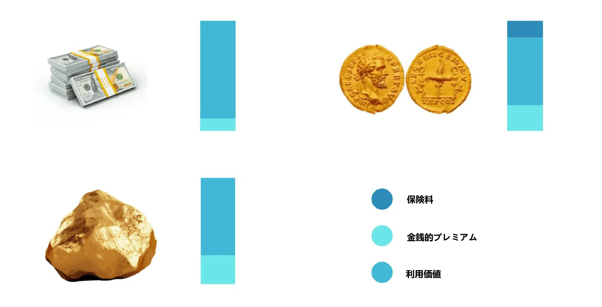

# お金の定義の違い

<partId>77b7918a-8c3b-11f0-b688-6b2ab22378c9</partId>

## お金 vs 通貨 vs monnaie vs argent vs devise

<chapterId>bf8a6d21-df88-5d23-a0a5-e9a5c1300554</chapterId>

:::video id=d9c9e7df-9db3-4a9f-801e-10d3fc7dfc22:::

### 貨幣用語の意味論

さまざまな貨幣理論、特に貨幣の定義に関するこのセクションで、意味論について簡単に触れておきたい。貨幣に関連するいくつかの単語の定義をもう少し掘り下げて、英語の相当語と比較してみたい。例えば、money、currencyをmonnaie、argent、deviseと比較してみる。つまり、こんな感じだ。

少し意味が違う：

私たちが「**お金**」（de la monnaie）と言うと、ほとんどの人は取引の見返りに受け取る小銭のことだと思うだろう。そして「**通貨**」（la monnaie）と言えば、おそらく人々は国家の通貨を指していると思うだろう。カナダの通貨はカナダドルです。そうです。

しかし、お金（de l'argent）についてはどうでしょうか？泥棒は決して "小銭を全部よこせ！"とは言わない。(ほとんど価値のない単なる硬貨を受け取って、泥棒はがっかりするかもしれない）。

いや、泥棒は叫ぶだろう：「いや、泥棒はこう叫ぶだろう。もし泥棒が路上であなたの目の前に立っていたら、泥棒は必ずあなたのポケットの中の**紙幣**を指す。

一方、泥棒がもっと巧妙な方法であなたをだまし取ろうとし、あなたの銀行口座をすべて空にしてあなたの資産を奪おうとする場合は、**彼はあなたのお金をすべて奪う**と言うだろう。ここで言う「お金」とは、**個人の財産**のことである。

つまり、お金という言葉には、現金（紙幣）と富という2つの定義がある。

### 通貨 vs モネ vs デバイス

通貨（devise）は必ず他国の通貨でなければならず、そうでなければ単にお金（monnaie）と言う。フランス人ならこう言うだろう：「ポンドはイギリスの通貨であり、ユーロはヨーロッパの通貨である。

しばしば、このような意味上の問題を掘り下げていない人は、これらの用語を翻訳する際に、通貨と書くとcurrency（devise）と言う傾向があるが、そうではなく、通貨は自国の通貨であればmoney（monnaie）であり、他の通貨について話しているときはdeviseなのである。私がよく目にするこの問題は、英語には2つの単語があるということだ。概念である「money」と、交換に使われる国の単位である「currency」である。つまり、お金の概念について話すだけでいいのです。それは簡単で、*money*という単語の概念です。そして*currency*は、その国の通貨と同一視するのはとても簡単です。一方、フランス語では、残念ながら、ビットコインの話をするときに、「mais ce n'est pas une monnaie（これは国の通貨ではない）」と言われることがよくあります。エルサルバドル以来、ビットコインは国家の通貨だからだ。しかし、人々はしばしばこう言う： *ビットコインは国家の通貨ではない。しかし、実際には、より広い概念である*お金*に言及するならば、ビットコインはこの定義に完璧に当てはまると私は思う。ただフランス語には、この2つの概念を分ける2つの言葉がない。argentという単語は通貨を指すと言えるが、残念ながらそれは正確な定義ではない。 *argent*（お金）は富や紙幣を指す。マネー*という言葉と同義にすることはできない。 *money*は通貨（monnaie）の概念である。

## サイフェデ・アムスの定義

<chapterId>07c4ba50-168c-567a-8957-0b187ff75f97</chapterId>

:::video id=936d6d3b-6d45-468e-bc44-85fbce9b857a:::

#### お金とは何か？

お金とは、単にあなたが所有したり手に入れたりするもので、それ自体を使用したり消費したりするためのものではなく、あなたが必要とするかもしれない他の商品やサービスと後で交換するためのものである。(サイフェデーン)

貨幣が貨幣的プレミアムを獲得するのは、その財に対して貨幣的需要が存在し、貨幣の役割を1つ以上果たす場合である。

貨幣的財は、貨幣的プレミアムが持続するのに十分なほど希少でなければならない（供給が貨幣的需要に調整されるのを防ぐため）。

### 貨幣的プレミアム

通貨のさまざまな定義に関するこのセクションでは、『Bitcoinスタンダード』にあるサイフェデーンの定義について簡単に話したいと思う。それを読んだ時、とてもシンプルだと感じました。そして、この定義にマネタリープレミアムの概念も加えることにする。サイフェディーンが著書の中で触れているように、希少性の概念は必ず存在する。問題は、貨幣とは何かということだ。

> お金とは、単にあなたが所有したり手に入れたりするものであり、それ自体を使用したり消費したりするものではなく、後であなたが必要とするかもしれない他の商品やサービスと交換するためのものである。

これが『Bitcoinスタンダード』でサイフェディアンが述べている定義である。私は、通貨（la monnaie）は、通貨の役割の1つまたは複数を果たすために、財に対する貨幣的需要があるときに、貨幣的プレミアムを獲得する、と付け加えたい。つまり、価値の貯蔵庫として機能する通貨は、人々が価値の貯蔵庫として、あるいは交換の媒体として、その通貨を手に入れたいと思うので、貨幣プレミアムを与える貨幣需要があると言うことができる。

### 希少性と市場メカニズム

これに加えて、貨幣的プレミアムが存在するためには、貨幣的財が十分に希少でなければならない。これは非常に重要なことだ。 **貨幣として使用される財が出現し、その価格が上昇すると、通常、その財の希少性が十分でない場合、人々は価格が上昇すると、その価値の上昇を利用するために、より多くの財を生産しようとします。これが、市場に出回るほとんどの商品の価格が比較的固定されている理由である。価格が上昇すると、生産は増加する傾向にある。価格が下がれば、生産は減少する。一種の市場調整があるのだ。 **そして、ある財が金のように十分に希少である場合、市場メカニズムはこの貨幣的使用のための需要増加を補うことはできない。つまり、変動するのは価格なのです。ビットコイン**のように。ビットコインの価格が上がっても、ビットコインは増産されません。つまり、調整されるのは価格なのです。だから何年も前から、ビットコインの需要が増えるにつれてビットコインの価格が上がっているのです。アルゴリズムを変更して、"需要が増えたから価格が上がる、もっと生産しよう "と言える人はこの世にいない。 **新しいビットコインの供給は事前にプログラムされており、事前に分かっている**。つまり、私が言いたかったのは、貨幣的なプレミアムが持続するためには、貨幣的な財は十分に希少でなければならず、したがって、市場メカニズムに追いつかれることはなく、供給がこの新しい貨幣的な需要に適応するのを防ぐことができる、ということです。

## 支払い手段と解放的価値

<chapterId>5d424039-e342-56f7-9d8b-bba9551831a9</chapterId>

:::video id=af4c0765-8111-4cb7-891b-3ee54d6e7054:::

### 支払手段と交換手段

貨幣のさまざまな定義に捧げられたこのセクションでは、アラン・テスタールによる、支払い手段としての貨幣、そして解放的な価値としての貨幣をテーマとした文章、"Aux origines de la monnaie"（貨幣の起源）からの引用を一緒に見てみることを提案する。

*Aux origines de la monnaie』から、アラン・テスタールは貨幣を支払手段と定義している。

> 支払い手段の機能は、対価のない支払い、つまり何も買わない支払いがある限り、ここでは交換手段の機能とは異なるものとして考えられている。Knies (1873:192 ff.)は、交換行為によらない財貨の移転というこのテーマを、wergeld（血税や殺人の報酬）や税金の場合のように、詳細に展開している。カール・メンガーは1892年に発表した論文『ゲルト』において、この第4の機能を攻撃した。完全に否定されたわけではないが、支払い手段の機能という考え方は、今日の経済思想では忘れ去られたか、少なくとも交換手段の機能を支持して否定されたように思われる。
>

> この観点から見ると、貨幣は解放の道具であり、支払手段としての機能を一般的に表現している。この観点から、私たちは貨幣の「解放力」について語る。ル・プティ・ロベールによれば、解放力とは「（義務や負債から）解放する効果を持つもの」である。大ラルース』によれば、解放的支払いとは「法的条件のもとで、債権者が債務の消滅を争えないように行われる支払い」のことである。売り手であろうと債権者であろうと、貨幣による支払いを拒否することはできないからである。商人に対する債務であろうと税務署に対する債務であろうと、債務の支払いを拒否できない唯一の財は貨幣である。あらゆる財の中で、貨幣だけがこの特権を持っている。「とシャルルは書いている。ギド（1921 I: 443）はこう書いている。
>

> ある財を別の財に交換すること、またはその見返りとして別の財を提供することを条件とする交換は、必然的に受領者側にこの交換相手を提供する義務を意味する。支払いはこの義務の履行である。したがって、すべての交換は支払いを意味するが、すべての支払いが交換を意味するわけではない。すなわち、別の財を得ることを可能にせず、この目的のために行われるのではない支払いである。公的機関に支払うあらゆる種類の罰金や、他者に損害を与えた者はそれを修復しなければならないという原則に基づき他者に支払う賠償金も挙げられる。

### 取引相手なしの支払い

これは著者のテーゼを明確に示している。実際、彼はこの2つを区別している。彼にとって交換とは、財貨の移転であると同時に支払いでもある。支払いはその次である。そして、交換がなくても支払いは起こりうる。駐車違反や罰金を払うのは単なる支払いに過ぎないという例を挙げている。対価としてサービスを受けるわけではない。駐車違反切符を切るというサービスと引き換えに、国はサービスをしているのだと主張する人もいるかもしれない。彼は、必ずしもサービスを得られなくても、納税は必要であるという意味で、納税は本当に相手なしの支払いであるという事実を明確に示している。納税は単なる支払いであり、その対価としてサービスを得る義務はない、というのが彼の定義だ。私はこのことを多くの同僚と議論したが、彼らは必ずしもこの考え方に同意しない。しかし、これが著者の主張なのだ。彼は、例えば罰金や納税の例を挙げて、支払いという概念を置き、それを交換から切り離そうとしている。また、例えば持参金について、彼は持参金は支払いであり、必ずしも交換に何かを得るわけではないと表現している。この提案を批判する人は、"そうだが、その代わりに妻を得るのだ "と言うかもしれない。それがこのテーマに関する議論のレベルなのだ。

ヴェルゲルト（血税）もある。つまり、単なる補償金だ。友人のウルリッヒは言うだろう：

> そうだが、その代わりにこのファイルを閉じてもらう。

例えば殺人を犯したとする。その時はウェルゲルトを支払い、その後はその状況から解放される。解放されるわけです。見返りはあるのか？著者によれば、それはない。私の同僚によれば、そうだ。

今回の議論では、ヴェルゲルドが支払いを定義する良い例の一つであることがわかると思う。実際、明らかに見返りを受け取っていない。

## デット・マネー対コモディティ・マネー

<chapterId>4093677a-c8e8-5828-b994-15c01656186e</chapterId>

:::video id=f49cf5cc-288e-4daa-a1ff-b9de73506f4e:::

### 根本的な議論

異なる貨幣の定義と理論に関するこのセクションの文脈で、正反対の2つのビジョンを一緒に探ってみよう：「貨幣は常に負債である」あるいは「貨幣は常に商品である」。一方には、「貨幣は常に負債である」と主張する負債ベースの貨幣理論の支持者がいる！もう一方では、有名な金の虫たちがこう主張する：「貨幣は常に商品であり、それは常に金である。それ以外のもの、手形、借用書、それは信用に過ぎず、貨幣ではない」。

これらの理論の明確な要約を一緒に探ってみよう。

### 常に負債」説

ここでは、**「デット・マネー」**として知られる貨幣理論を要約する：

特にアルフレッド・ミッチェル＝イネスによって展開され、デイヴィッド・グレーバーによってさらに発展させられたこの理論によれば、貨幣は本質的に債務の承認であり、歴史的に直接的な貨幣交換の前に存在した信用関係に由来する。物々交換と結びついた必要性から生じるのではなく、貨幣は、個人や集団間の社会的義務や負債を計算し、移転し、決済する方法として現れる。

したがって、すべての貨幣は、ある個人または組織が他の個人または組織に対して負っている債務として流通し、その正当性を保証する信用と社会的または国家的権威に支えられている。つまり、彼らによれば、すでに述べたように、私たちが貨幣を所有するとき、私たちは社会に対して債権を持ち、社会は私たちに債務を負っていることになる。したがって、貨幣は決して中立的なものでも自律的なものでもなく、常に根底には負債がある。貨幣を所有するということは、本質的に社会や経済共同体に対する債権を所有するということなのである。

この推論は、貨幣を単純な "中間商品 "とみなす古典的な考え方に反し、その代わりに、貨幣の創造と管理における社会的・政治的関係の中心的役割を強調するものである。

**私のレビュー

この理論で私が気になるのは、貨幣は常に負債であると主張していることである。例えば、異なる2つの部族の間で金の交換が行われた例があるが、そこでは取引は決定的に最終的なものであり、潜在的な負債は残っていない。この理論の支持者はしばしば、こうした交換は貨幣交換ではなく物々交換だと言う。すでに述べたように、私はそうは思わない。なぜなら、金は消費されるのではなく、貨幣として使用されるからである。

### 常に商品」理論

**常に商品である。

ここで、**「商品貨幣」**として知られる貨幣理論の明確な要約を紹介しよう。貨幣は常に商品として出現し、特に金は取引できる必要性から出現し、海外では一般的に受け入れられる商品であり、取引目的で取得される。

古典派経済学者（アダム・スミス、デビッド・リカルド）によって展開され、マルクスによって引き継がれたこの理論によれば、貨幣は、他の商品（多くの場合、金や銀のような貴金属）の中から、貨幣としての役割とは独立した本質的価値を持つ商品として自然に出現する。当初、これらの商品は、その本質的な特質（希少性、耐久性、分割可能性、安定性）のおかげで、貿易を促進するために経済プレーヤーによって自発的に選ばれる。

商品貨幣は、その物理的な存在と、それを生産するために社会的に必要とされる労働の量によって決定される価値によって区別される（マルクスのように）。例えば、社会は金を、物々交換を簡素化するためだけでなく、勘定単位、価値の貯蔵、普遍的な交換媒体として使用している。

このビジョンでは、貨幣は有形の商品と結びついているため、常に実質的な価値を保持している。貨幣の役割が抽象的になっても（鋳造された硬貨、銀行券、経典の貨幣）、その有効性は依然として、直接的または間接的に、金のような基礎となる商品との関連に由来する。したがってこの理論は、貨幣を単なる慣習や負債とみなす理論とは対照的に、貨幣の物質的・経済的起源を主張する。この理論によれば、金で償還可能な手形のような代用品によって貨幣を表現することは、信用である。

**私のレビュー

このビジョンは商品貨幣理論に似ているが、さらに一歩進んでいることに注意されたい。彼らは、貨幣は**常に**商品であるべきだと提案している。そして我々が彼らにこう言う：「銀行券は金で裏付けされ、機能し、そのような銀行券は貨幣である。

それに対して、彼らはロッカールームのクーポンの例を挙げるだろう。こう言うだろう：「でも、ロッカールームのクーポンを衣料品に使った場合、レジのクーポンは衣料品と呼べるのでしょうか？

もちろんそんなことはない。それは、要するに、衣服を取り戻すための承認、請求のようなものだ。ロッカールームのクーポンは一般的に認められている支払い方法ではないからだ。 **お金は衣服のような特定の物に対する請求権ではなく、様式、交換手段、交換媒体、または一般に認められた支払い手段**なのです。

つまり、ロッカールームのクーポンと不換紙幣を並列させることはできない。ロッカールームのクーポンは、交換で特定の財を手に入れることを可能にし、財を取り戻すことを可能にするtokenだからだ。一方、不換紙幣である銀行券は、どんな財にもアクセスできる普遍的なクーポンである。

そして私の考えでは、もちろん不換紙幣であっても、国民がそうみなすのであれば、貨幣とみなすことができる。不換紙幣は、少なくとも当時は金の原資であった本物の貨幣を手に入れるためのクーポン券であったのだから。

金庫に保管されている金貨と、その金貨を象徴する紙幣を通貨とみなすことに問題はない。私にとっては、意味論的な問題はなく、2種類の通貨があるだけなのだ。私の記憶に間違いがなければ、ミーゼスは貨幣の代替物について語ることで、この現象を非常にうまく説明している。

彼らのビジョンは、銀行の金庫にある金貨とそれを表す紙幣を同時に貨幣とみなすことはできないという事実に集約される。個人的には、これには何の問題もなく、パラドックスも見当たらない。貨幣は常に商品であると考える人は、私のようなものの見方はしない。

**以下は、『Aux origines de la monnaie*』に掲載されたロッカールーム・クーポンのコンセプトのレビューである。

*注14）「紙幣と小切手のトークンとの比較に関するRist（1938: 372, 注1）による優れた批判--Knappが自らを置くまさにその根拠、すなわち法的根拠に基づくものであるがゆえに優れている--。

また、**claim**について、同じ著者は次のように記している：

> バスティアは、「巨大なバザール」として提示される社会全体の引換券を自由に想像することができるが、この小さな追加、一見無害に見える拡張こそが、信用と貨幣の違いなのである。お金は特定の店に対する請求権ではない。匿名の債権など存在しない。しかし、その匿名性、つまり貨幣の一般性が、貨幣を非常に強力なものにしているのである。お金は信用とは違うし、信用に還元されるものでもない。 **貨幣は信用以上のものである。

**パラドックス：デット・マネー対コモディティ・マネー

債務貨幣説と商品貨幣説の間の深刻な二律背反を最もよく表しているパラドックスは、金が今日通貨であるかどうかという問題である。

一方、債務貨幣理論では、貨幣を何よりもまず、公権力によって一般的に受け入れられている、あるいは課せられてさえいる交換仲介手段または支払手段と定義する。この観点からすると、金は一般的な交換手段として広く使用されておらず、受け入れられていないため、もはや通貨ではない。

一方、商品貨幣理論では、貨幣を有形商品としてとらえ、その本質的な特性（希少性、耐久性、分割可能性など）から社会が自発的に選択するものとする。この考え方によれば、金は依然として真の世界共通通貨であり、今日の他のあらゆる形態の貨幣は、基本的には信用に基づく信用に過ぎないということになる。

前者にとって金はもはや通貨ではなく、後者にとっては逆に、金は現存する唯一の真の通貨であり続ける。

## 現代通貨理論

<chapterId>8efc29af-3193-5d97-ad9f-e608b32924ff</chapterId>

:::video id=f8127cb7-46a1-468c-bbb5-97bf0a8b8837:::

### 現代貨幣理論の原理

様々な金融理論に関するこのセクションの最後に、中央銀行に勤める多くの現代の経済学者が賞賛し、しばしばMMTとして知られる現代金融理論と名付けられた、金融理論の神童について話そう。

**現代通貨理論（MMT）**とは、独自の主権通貨を持つ国家（アメリカ、カナダ、日本など）は、常に通貨を発行して支出を賄うことができるため、資金不足に陥ることはないとする経済学的アプローチである。この理論によれば

- お金は国家の創造物であり、限られた資源ではない**。

- 税金と借入金は、公共支出を賄うために直接使われるのではなく、インフレを調整し、経済行動に影響を与え、自国通貨の需要を維持するために使われる*。

- 政府支出の本当の限界はインフレであり、財政赤字や公的債務ではない。

- 創出された資金が、それを吸収できる部門に振り向けられれば、インフレも起こらない。

- したがって政府は、過剰なインフレを避けるために、利用可能な実質的資源（労働力、産業能力、天然資源）に応じて支出を調整しなければならない。

### MMTにおける税の役割

でも、お金を印刷できるのなら、なぜ税金を払っているのだろう？"と言う人たちへの有名な答えがここにある。さて、MMTにはこの考えに対する正しい答えがある。確かに不換紙幣制度、つまり現代の制度では、技術的にはインフレを除けば貨幣の創造を制限するものは何もない。しかし、彼らはまず、インフレを抑制するためには課税が必要だと主張する。つまり、もし税金で補わなければ、すべての貨幣創造は最終的にインフレを引き起こす可能性があるのだ。税金は文字通り、インフレを抑えるためにシステムからお金を取り除く方法なのだ、と彼らは主張する。

軍事産業に何兆ドルも投資しているアメリカの例を挙げよう。軍事産業（軍産複合体）は、この何兆ドルもの資金を完璧に吸収することができるからだ。

一方、より多くの道路を建設しようとする場合、それを生産できる資源や請負業者には限りがあるため、道路予算を倍増させれば、必然的に道路を建設できる労働力に希少性が生じる。つまり、市場の力、需要と供給の結果として価格が上昇するのだ。もし全知全能の指導者たちがどこにお金をつぎ込めばいいかを知っているのなら、技術的にはインフレは起こらないはずだ。しかし実際には、インフレを引き起こすことは明らかだ。

結論として、MMTによれば、国家はその資金創造能力を使って、適切な財政政策によってインフレをコントロールしながら、完全雇用を達成し、社会的・生態学的投資を賄うことができる。また、ケインズ派の経済学者は、金利を管理することによって失業率を管理し、適切な財政政策によってインフレを抑制しながら社会的・生態学的投資を賄うことを目的としている。

### MMTレビュー

この理論は、真の通貨主権を享受している、つまり自国通貨で債務を調達できる一握りの国（ステファニー・ケルトンのツイートを参照）にしか当てはまらない。この理論は、自国通貨に対する国際的な信用を維持しなければならない輸入依存型の経済には当てはまりにくい。

真の通貨主権とは何か？それは、自国通貨で負債を調達できることを意味する。十分な外貨準備高を持ち、商品を輸入するために外貨を調達する必要がないように、貿易黒字を出すことができなければならない。これは、ほんの一握りの国々に関することだ。

ステファニー・ケルトンは、この運動の広告塔のような存在だ。彼女は『赤字神話』という本を書いた。このツイートの中で彼女は、アメリカ、日本、カナダ、オーストラリア、イギリスなど、さまざまな国がお金を使い果たすことはないと書いている。

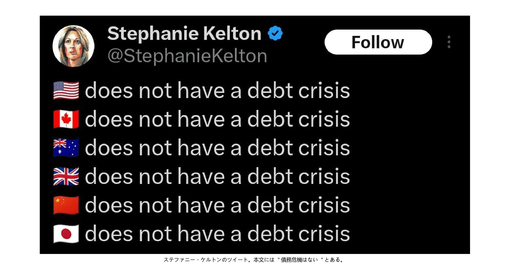

不思議なことに、6カ国しか載っていない。それはなぜか？その6カ国は本当の通貨主権を持っているからだ。しかし、地球上には約200の国があり、そのすべてが通貨主権を持っているわけではない。だから、この理論に対する私の批判は、少し奇妙で機能的でないことを除けば、真の通貨主権を享受している一部の国、つまり自国通貨で国庫証券を発行できる国にしか通用しないということだ。ある程度、世界の他の国々にとっては不利益になる。この通貨を作ることで、インフレを他国に輸出しているようなもので、米国が何十年にもわたって法外な特権でやってきたことと同じだ。自国通貨に対する世界的な信用と需要がある国は、インフレを輸出することで、大きなインフレを起こすことなく、好きなだけお金を刷ることができる。

この理論は、自国通貨に対する国際的な信認を維持する必要がある輸入依存型経済には適用が難しい。

この理論はまた、特に実物資源（労働者、原材料、産業能力）の管理を強化し、インフレを管理するために、一定レベルの中央集権的な経済計画を求めている。

# マネーの没落と再生

<partId>87a34ca9-782b-5ade-b51a-400f88ed7b0c</partId>

## ギリシャコイン

<chapterId>7714195f-74ce-5f8c-be5f-59302d39fff4</chapterId>

:::video id=8e5c3091-0910-471b-8d4b-0dc6e9afa656:::

### 背景と文脈

その前に、歴史的背景を説明しよう：

**歴史的背景

**ローマ人はギリシャ人を "Graeci"、ギリシャを "Graecia "と呼んだ。

**ギリシャ人は自らを「ヘレネス」と呼び、自国を「ヘラス」と呼んだ。

**ホーマー**（紀元前8世紀頃生まれ）

伝説的なギリシャの詩人で、『イリアス』と『オデュッセイア』の作者と推定されている。

紀元前750年頃：スパルタの神話上の立法者リュクルゴス**は、軍事的規律と簡素さに基づくスパルタ憲法を制定したと言われている。

**ヌマ・ポンピリウス**（紀元前753～673年）

ローマ2代目の王で、ローマに最初の宗教的・法的制度を与えたことで有名。

**ドラコン**、アテネの立法者（紀元前7世紀）、非常に厳しい法律で有名。

**紀元前594年： ソロン**がアテネの立法者となり、アテネ社会を抜本的に改革する。

**紀元前776年古代オリンピック

最初の定期的なスポーツ競技会は、4年ごとにオリンピアで開催され、ギリシアの都市が一堂に会した。

**ピタゴラス**（紀元前570～495年頃）

直角三角形の定理で有名なギリシャの哲学者、数学者。

**コロフォンのゼノファネス**（紀元前570～478年頃）

ギリシャの伝統的な多神教を批判したことで知られるソクラテス以前の哲学者。

**紀元前490年：マラトンの戦い

アテナイはペルシアの侵攻を撃退し、ギリシャ文明の決定的な転換点となった。

**ヘロドトス**（紀元前484年頃～紀元前425年頃）は "歴史の父 "と呼ばれ、紀元前480年のクセルクセスに対するギリシアの勝利を含むペルシア戦争を記述した膨大な著作を書いた。

**ソクラテス**（紀元前470～399年）

弁証法と倫理、自己認識に関する教えで有名なアテネの哲学者。

**アリストファネス**（紀元前446年～386年）

アテネの劇作家で、風刺喜劇『カエル』などで有名。

**ソフォクレス**（紀元前5世紀）は、その戯曲『アンティゴネー*』の中で、暴君クレオンを通して、道徳的・政治的腐敗の元凶としての金銭を批判している。

**プラトン**（紀元前428～348年頃）

ギリシャの哲学者、ソクラテスの弟子、アカデミーの創設者、『共和国』の著者。

**紀元前431～404年ペロポネソス戦争

アテネとスパルタの大規模な対立、アテネの敗北に終わる。

**紀元前431年アテネはペロポネソス戦争の資金調達のため、金貨と銀貨を薄めて流通量を増やし、インフレを引き起こす。

**ゼノフォン**（紀元前430～355年頃）

ソクラテスの弟子で、『アナバシス』の著者。

**紀元前414年アテネ、シチリア遠征の惨敗によりペロポネソス戦争に敗れ始める。

**紀元前405年：アリストファネス**は戯曲『蛙』の中で、銀ドラクマの切り下げとアテネにおける粗悪な青銅貨の出現を明確に描写し、今日「グレシャムの法則」として知られる原理を説明している。

**紀元前404年アテネ、スパルタに包囲され降伏。

**アリストテレス**（紀元前384～322年）

ギリシアの代表的な哲学者で、プラトンの弟子、リセウムの創設者、論理学、生物学、政治哲学の研究で知られる。

**紀元前327年アレキサンダー大王、ペルセポリスとペルシャ帝国東部を征服し、帝国を大幅に拡大。

**紀元前323年**：バビロンでアレクサンダーが明確な後継者なく死去し、彼の将軍たち（ディアドチ）の間で帝国分割戦争が勃発。

**アルキメデス**（紀元前287～212年頃）

ギリシャの数学者、物理学者、発明家で、幾何学と力学の発見で有名。

**紀元前196年：プトレマイオス5世の時代にロゼッタ・ストーン**が刻まれ、後のエジプト象形文字の解読を可能にした。

**紀元前192-188年ローマ・セレウコス戦争

ローマはアンティオコス3世率いるセレウコス朝を破り、ギリシャと小アジアにおける影響力を強化した。

**紀元前146年 コリントの戦い

ローマ帝国はギリシアの都市コリントを破壊し、ギリシアの政治的独立は終わり、ギリシアは徐々にローマ世界に統合されていった。

古代、ローマの滅亡、そして中世についてのこのセクションでは、まずギリシャのコインについて説明する。

古代ギリシャにおける貨幣の歴史は、紀元前600年頃に始まった。ギリシャの各都市は、小アジアのリディアからもたらされた技術革新をすぐに取り入れ、当初はエレクトラム、後に銀貨を使用した。最初のギリシャ硬貨はエギナ島で鋳造され、海亀や陸亀が描かれていたが、紀元前5世紀以降、アテナとフクロウが描かれたアテネのドラクマが貨幣のシンボルとなり、当時の国際貿易を大きく支配した。

そして私は幸運にも、あの有名なフクロウと人物が裏面に描かれた当時のギリシャのドラクマのコピーを持っている。これはテトラドラクマで、単純なドラクマよりも大きかった。

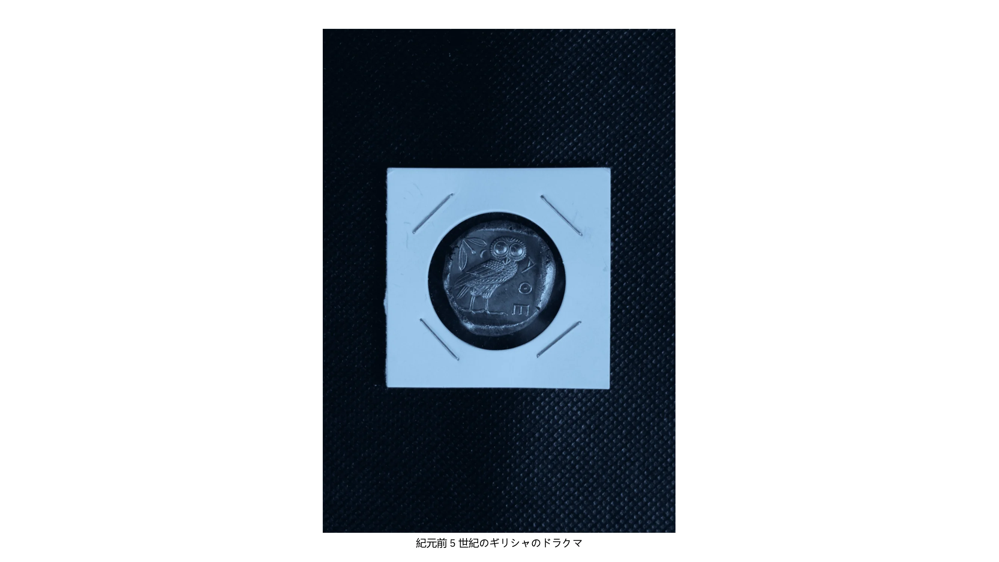

ギリシャの各都市は、貨幣との関係を独自に発展させていった。アテネでは、通貨は政治的・経済的権力と深く結びついていた。紀元前5世紀末の有名なアテネの法令では、同盟領内ではアテネの通貨を独占的に使用することが定められ、アテネの経済的覇権が強化された。アテネはまた、緊急事態に備えて大量の金を蓄え、おそらくその経済的慎重さの象徴としてアクロポリスに保管していた。対照的に、厳格な価値観を持つ軍事都市スパルタは、貨幣の使用を厳しく制限し、市民が金貨や銀貨を所有することを禁じた。スパルタは外国貿易を阻止し、社会の結束を維持するため、重い鉄の棒を好んで使用した。

戦争はしばしば通貨操作によって賄われた。ペロポネソス戦争（前431-前404年）では、アテナイは兵士の給料を支払うために大幅な通貨切り下げを行った。紀元前413年、スパルタによるデセリア占領によって銀鉱の利用権を奪われたアテネは、紀元前407/406年、新しい貨幣を鋳造するために金像を溶かさなければならなかった。その後、紀元前406/405年に銀でメッキした青銅貨を作り、今日グレシャムの法則として知られる「悪貨は良貨を駆逐する」という**アリストファネス**が描いた通貨危機を引き起こした。この緊急通貨は、アテネの貨幣に対する信頼を回復するため、戦後すぐに無効化された。

古典期の終わりは、フィリッポス2世とその息子アレクサンダー大王によるマケドニアの台頭によって、ギリシャの通貨バランスが大きく崩れた。パンゲア山の広大な金銀鉱山のおかげで、フィリッポス2世は軍事・政治運動の資金を豊富に生み出し、シンプルで実用的な金銀本位制を確立した（10:1）。オリンピックでの勝利を祝う彼の金貨は、西ヨーロッパまで流通し、イギリスにまで届いた。アレクサンダーはこの貨幣政策を追求し、東方征服の際には**アッティカ**ドラクマをインドまで広く流通させた。このコインの大量流通は、ヘレニズム時代の始まりであり、コインの神像が次第に君主像に取って代わられた。この技術革新により、ヘレニズム時代の君主たちは、従来の神々を硬貨の裏面における二次的な役割に追いやり、自らを宣伝することができるようになった。

紀元前323年のアレクサンドロスの死後、彼の将軍たちは巨大な帝国を分割し、エジプト（プトレマイオス朝）、シリア（セレウコス朝）などに王朝を設立した。プトレマイオス朝は、貨幣の流通を管理するために閉鎖的な貨幣制度を導入し、対外的な軍事費のために貴金属を節約するために穀物を内部通貨として使用することを好んだ。同時に、ロードス島は主要な交易拠点となったが、紀元前167年にローマ帝国がデロス島を自由港としたため、経済的に弱体化した。

傭兵の報酬の中心は貨幣であった。アレクサンダーの兵士たちは、毎日銀のドラクマを受け取っていた。

アレクサンダーの高度に専門化された軍隊のエリートである騎兵隊は、平均して1日2ドラクマ、歩兵は1ドラクマ、普通の傭兵は3分の2ドラクマと、単純労働者の2倍の賃金を受け取っていた。

ペロポネソス戦争では、サモスの反乱を鎮圧するために1,200タラント以上、ポティデアを包囲するために2,000タラント以上と、兵士たちにもかなりの額が支払われた。

この軍隊が小アジアでフル稼働するまでにかかった費用は、1日あたり約20タラント、銀にして約半トン、12万ドラクマに上った。

ギリシアの貨幣は文化的にも重要な役割を果たしており、各都市はその土地のシンボルや神話的なシンボルをあしらった独自の貨幣を鋳造することで、自国のアイデンティティを主張しようとした。例えば、ヘラクリウスはライオンと戦うヘラクレス（ヘラクレス）を描き、キュレネは有名な薬草シルフィウムを描いた。

最後に、古典ギリシアとヘレニズムの貨幣は、その多様性と地域的な変動にもかかわらず、地中海世界の経済史と文化史に永続的な足跡を残し、その後のローマに至る貨幣制度に多大な影響を与えた。

## ギリシャにおける通貨の影響

<chapterId>3a5e6c7d-699c-5567-87cd-3374c49d55a9</chapterId>

:::video id=0c79a59c-e179-4893-a414-1b8de0930eb9:::

### アテネとスパルタとの対比

古典ギリシア時代のアテネとスパルタの対立は、政治・経済組織における根本的に異なる2つのモデルを明らかにしている。スパルタが市民の信頼に基づく自給自足システムを支持して金属貨幣を拒否したのに対し、アテネは海洋帝国を建設・維持するためにこの技術を全面的に採用した。

### 海軍力の金銭的必要性

アテネ帝国は、その壮大な名前とは裏腹に、アテネとエーゲ海の都市という地理的には控えめなものだった。その権力は、アテネがヘゲモニーとして支配する軍事同盟、デロス同盟にかかっていた。この帝国構造は、統一された経済手段であるアテネの銀貨を必要とした。

艦隊を維持することは、この金銭的必要性の核心であった。アテネの三連船1隻は、銀貨1タラントから2タラントという相当な額であった。数百隻の船を維持するために、アテネは効率的な税制を必要とした。通貨は、属州都市から貢ぎ物を徴収し、帝国の結束を保証する海軍投射部隊の資金を調達するための不可欠な手段となった。

### 支配の道具としての貨幣の押しつけ

アテネはデロス同盟の全加盟国に銀貨を課した。この貨幣の標準化は、いくつかの戦略的目的を果たすものであった。第一に、共通の勘定単位を作ることで貢納金の徴収を容易にした。第二に、家臣団のアテネへの経済的依存を強化した。最後に、海洋帝国全体にアテネの力を象徴的に示すことができた。

この金融政策はスパルタのモデルとは対照的である。スパルタは陸の国であり、ペロポネソスのヘロート（奴隷）の労働力に頼って生活していた。その閉鎖的な都市中心の経済システムは、高度な貨幣手段を必要としなかった。市民である兵士たちは共同生活を送り、食事を共にし、日々のやり取りに貨幣を必要としなかった。

### 海上貿易の手段としての通貨

アテナイ帝国は海洋国家であったため、貿易に開放的でなければならなかった。内向的なスパルタとは異なり、アテネは生存と繁栄のために外界と交易する必要があった。通貨は地中海貿易に不可欠な道具となった。

貿易が収入を生み、その収入が艦隊の資金源となり、艦隊が交易路を守り帝国を維持し、帝国がアテネ通貨を発行して貿易を促進するという好循環が生まれた。通貨はもはや単なる交換手段ではなく、帝国戦略の柱となった。

### 貨幣力の限界

このように経済的に洗練されていたにもかかわらず、ペロポネソス戦争でアテネの通貨力は限界を見せた。スパルタの陸軍を前に、アテネの海軍力と財政力の優位は十分ではなかった。シチリア島でのシラクサ遠征のような高価な遠征は、決定的な勝利をもたらすことなく財源を使い果たした。

歴史は、通貨は力を誇示する強力なツールではあるが、軍事的支配を保証するものではないことを示している。スパルタは金属通貨を持たなかったが、社会的結束力は抜群で、最終的にはアテネの通貨帝国に勝利した。

### 2つのモデル、2つの運命

アテネとスパルタの対立は、社会・経済組織に対する2つの基本的なアプローチを示している。アテネは開放的、商業的、貨幣化されたモデル、すなわち近代海洋帝国の先駆けである。スパルタは、貨幣よりもむしろ市民の信頼に基づく、閉鎖的な自主的モデルを体現している。

この2つの制度は、通貨の採用が政治・経済モデルの選択と密接に結びついていることを示している。アテネのような海洋・商業大国にとって、貨幣は不可欠なものとなった。スパルタのような閉鎖的な武士社会にとって、貨幣は社会秩序を脅かすものであった。この古代の二項対立は、社会組織における貨幣の役割に関する議論に今も影響を与えている。

## ローマ共和国

<chapterId>0bc80983-33e1-5881-85bb-7c22f3144a9a</chapterId>

:::video id=dc05ca97-d29c-4679-bfeb-912c47d86ce2:::

### ローマ共和国の歴史

- 紀元前753年～紀元前509年：ローマ王国**。
- 紀元前753年ローマ建国**（伝統的にロムルスによるとされている）。
- 紀元前509年 - 紀元前27年ローマ共和国**、ローマは選挙で選ばれた元老院と執政官によって統治される共和制国家となる。
- 紀元前280年〜275年ピュロス戦争**。エピルスの王ピュロスが南イタリアでローマ軍と戦い、多大な勝利を収める（「ピュロスの勝利」）。
- 紀元前264年～146年ポエニ戦争**。西地中海の支配をめぐってローマとカルタゴが争った大規模な紛争。
- ハンニバル（紀元前247年〜紀元前181年）**。カルタゴの伝説的将軍。第二次ポエニ戦争時、軍と象を率いてアルプスを越え、ローマを攻撃したことで有名。
- 紀元前146年 コリントの戦い**。ローマがギリシアの都市コリントを破壊し、ギリシア本土に最終的な支配を押し付ける。
- 前91 - 87年： 社会戦争**。ローマの同盟国であったイタリア人がローマ市民権を要求した反乱。
- 紀元前64年：セレウコス朝の抵抗の終結**。ローマはシリアにおけるセレウコス朝の影響力を決定的に排除し、東地中海での支配を強化。
- 紀元前55年ユリウス・カエサル、中央・西ヨーロッパを征服**。ユリウス・カエサルがガリア（現在のフランス）の支配を拡大し、ゲルマニアとブルターニュに進出。
- 紀元前43年第二次三位一体の形成**。カエサル暗殺後のローマを安定させるため、オクタヴィアヌス（後のアウグストゥス）、マルコ・アントニー、レピドゥスが政治同盟を結ぶ。
- 紀元前27年： パクス・ロマーナ**の始まり。アウグストゥス治世下の政治的安定と繁栄の時代で、ローマ帝国の始まり。

### ローマの後期貨幣の始まり

この「古代」のセクションでは、次にローマ共和国に注目する。ローマの貨幣の歴史は、ギリシアやペルシャよりもはるかに遅れて始まった。紀元前753年に建国されたローマは、硬貨を本格的に採用するまでに約4世紀を要した。この長い期間、ローマ人はアエス・ルードと呼ばれる不規則な青銅片を使った原始的な交換システムを使っており、取引のたびに正確な計量が必要だった。紀元前4世紀末、ギリシアとエトルリアの影響下にあったローマが、最初の貨幣を発行し始めたのは、特に中国と同じように鋳造された青銅貨、アエス・グラーブによるもので、**第二次ポエニ戦争**までローマ交換の特徴であった。

### ギリシャの影響と最初の銀貨

南イタリアのギリシア人との決定的な出会いが、ローマ人に銀貨鋳造をもたらした。紀元前280年頃、ローマはギリシアのディドラークムを模倣して独自の銀貨を製造し始めた。ローマで初めて銀貨が発行されたのは、正確には紀元前269年にさかのぼり、伝説の双子ロムルスとレムスが雌狼に乳を飲まされている姿が描かれている。

実際、共和制時代のローマ硬貨には建国神話が描かれているものが多い。タティウス王の素晴らしい本物のコインだ。これはタティウス王の本物のコインで、サビーン人の女性誘拐の神話が描かれている。タティウスはこの地方の王で、建国神話には、ローマ人が近くに住んでいたサビーン人から女性を誘拐したことが描かれている。その後、タティウス王はローマ建国の一人であるロムルスと共同王となった。

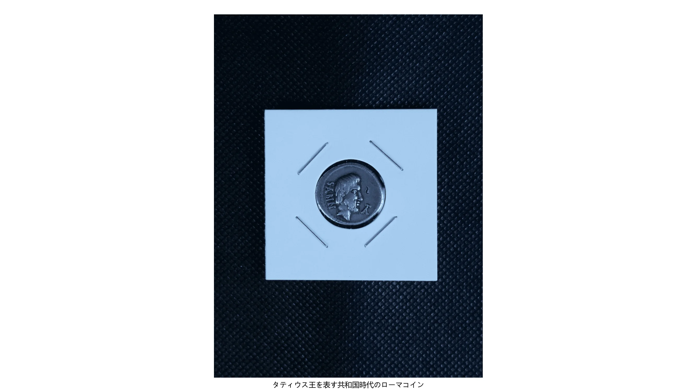

### コイン」の語源とジュノー・モネタ神殿

コイン」の語源は、ローマにあるジュノ・モネタ神殿にある。伝説によると、紀元前390年にガリア軍が侵攻した際、議事堂の神聖なガチョウがローマ人に差し迫った危険を知らせたという。キャピトルの守護神である女神ユノーに感謝するため、彼女に敬意を表して神殿が建てられ、やがてローマ硬貨の造幣局となった。

### ポエニ戦争と通貨危機

軍事衝突はローマの貨幣の発展にも大きな影響を与えた。カルタゴとの第二次ポエニ戦争（紀元前218-201年）中、ローマはハンニバルの侵攻に直面して深刻な財政難に直面した。この緊急の必要性を軽減するため、ローマは初めて例外的な金貨の発行に踏み切るとともに、銀貨の純度を当初の97％から89％程度まで大幅に切り下げた。青銅貨（エース）の重量も激減し、6年間で80％近く減少した。

ここで、ギリシャ人が経済危機を和らげるために神殿に保管されていた貴金属を溶かしたという、以前取り上げたことのあるコンセプトを再び取り上げることができる。そして**カルタゴ**については、私のコレクションから本物のカルタゴのコインをご覧いただきたい。このカルタゴのコインは、片面にヤシの木、もう片面に馬が描かれている。このコインでは、馬はあまり見分けがつかない。

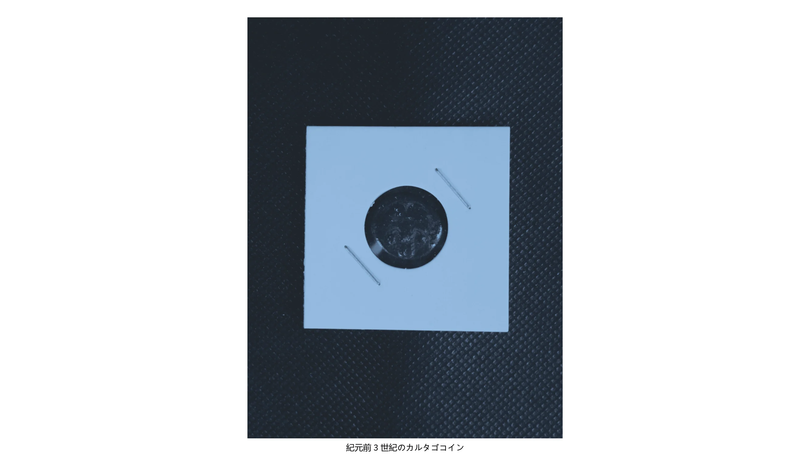

その結果、エースと呼ばれる青銅銭の重量も激減し、6年間で80％近くも減少した。つまり、貴金属ではなく、日常的な交易に使われていたこの青銅銭の重量が大幅に減少したのは、こうした戦争による通貨切り下げの兆候だったのだ。

### 銀のデナリウスと通貨の安定

ローマが有名な銀のデナリウスを導入したのは紀元前212年頃である。この改革によって貨幣の安定は著しくなり、デナリウスは450年近く支配的な通貨であり続けた。ローマは、紀元前146年に大規模な再値下げを行い、特にポエニ戦争、社会戦争（紀元前91～87年）、マケドニア戦争などの巨大な軍隊の資金を調達するためにかなりの生産を行ったにもかかわらず、この安定を保てたのは、厳格な管理のおかげである。例えば、ローマ軍1個軍団の維持には年間約150万デナリもの資金が必要であった。

ローマ帝国の国境を越え、ローマの影響下にあった地域では、戦争によって大きな切り下げが行われた。ポエニ時代のカルタゴでは、エレクトラムの純度が劇的に低下し、4世紀には98％だった金が、第二次ポエニ戦争ではわずか30％に、銀貨は18％まで低下した。

### 貨幣的動機の進化

当初は無名で愛国的であったコインも、次第に鋳造者（コインを鋳造する人）の有力な家柄をあしらった個性的なデザインに変わっていった。この変遷は、ローマ共和国末期の政治的変化を明確に象徴している。

最後に、ローマは地中海世界を経済的に支配していた一方で、その支払い手段にはある種の単純さが保たれていた。税金の授受やエリートのための私的な債権を除いては、硬貨の直接交換以外の実質的な金銭授受の形式は発達していなかった。

## ローマ帝国

<chapterId>2dc44e50-112a-5abf-97ae-8e0a9ecda989</chapterId>

:::video id=f8d6f3d6-9ee4-4504-888e-4f12b3f20489:::

**歴史的背景

**プリンキパト**は、紀元前27年のアウグストゥス治世の始まりから紀元後284年の3世紀の危機の終わりまでのローマ帝国の帝政の形態である。

**紀元前27年：パクス・ロマーナ**の始まり

アウグストゥス治世下の政治的安定と繁栄の時代で、ローマ帝国の始まり。

**アウグストゥス（紀元前30年～紀元後14年）**はローマの貨幣制度を根本的に改革し、帝国貨幣の永続的で安定した基準を確立した。

**アウグストゥスはまた、古代のコインや化石の最初のコレクター**でもあった。

**54年～68年ネロ**年

暴政、迫害、ローマ焼き討ち後の悲惨な経営で知られる物議を醸したローマ皇帝。

**西暦64年ローマの大火

ネロはその責任を問われる。

**西暦69年：四皇の年**。

4人の皇帝（ガルバ、オトー、ヴィテリウス、ヴェスパシアヌス）が立て続けに誕生した混乱期。

**西暦79年：ヴェスヴィオ火山噴火**。

ポンペイとヘルクラネウムの都市を破壊した火山で、その遺骸は灰の下に例外的に保存されている。

**165年～180年アントニンのペスト

マルクス・アウレリウスとコモドゥスのローマ帝国を弱体化させた壊滅的な伝染病。

**紀元200年：領土の頂点とパクス・ロマーナの緩やかな終焉**。

ローマは最大限の拡張を遂げたが、内部の不安定と経済的困難に苦しみ始めた。

**西暦212年市民権に関するカラカラ勅令**。

カラカラ帝は、課税ベースを広げるため、帝国のほぼすべての住民にローマ市民権を与えた。

**西暦220年：蛮族の大侵略の始まり。

ゲルマン民族がローマ帝国の国境を越えて初めて侵入。

**235年～285年3世紀の政治的・軍事的危機**。

政治的に不安定で、短命の皇帝が多く、内戦、経済危機、侵略が続いた時代。

**アウレリアヌス（西暦270-275年）はローマの通貨**を大幅に切り上げ、高インフレにもかかわらず名目価値を回復させようとした。

**西暦301年ディオクレティアヌスの物価勅令**。

ディオクレティアヌス帝は、帝国全土に厳しい物価と賃金の統制を課し、蔓延するインフレを食い止めようとしたが無駄だった。

**西暦312年コンスタンティヌス

コンスタンチノープルの創始者である最初のキリスト教皇帝は、純度が高く安定した金貨「ソリダス」を導入して通貨を安定させた。

**西暦476年西ローマ帝国滅亡

ローマがゲルマン民族（オストロゴート族を含む）に占領され、西ローマ帝国が正式に終焉を迎えたとされる。

### アウグストゥスの貨幣改革

古代に関するこのセクションでは、すでにローマ帝国に到達している。ローマ帝国の通貨史の特徴は、金、銀、青銅を中心とした金属通貨が盛んに使用されたことであるが、同時に政治的・軍事的不安と密接に関連した通貨危機が何度も発生したことである。共和政の末期、ユリウス・カエサルの下、ローマは紀元前46年に金のアウレウスを導入した。これは重さ約8グラムの硬貨で、ヨーロッパや地中海沿岸で広く受け入れられた。カエサルはこの金貨を標準化し、生きた人間の肖像をあしらった最初の貨幣を鋳造し、匿名の集団的シンボルを好んだ古代共和制の伝統を覆した。この発展は、政治的な大転換期に伴うもので、個人的な権力が次第に共和制の制度に取って代わった。

紀元前44年にカエサルが暗殺された後、オクタヴィアヌス（アウグストゥス）がローマを支配し、紀元前27年に帝国を樹立した。彼の治世では通貨制度が全面的に改革され、ローマ経済に永続的な安定をもたらした。アウグストゥスの時代、1金アウレウスは25銀デナリに相当し、それ自体が4銅セステルティに相当した。この通貨の安定は紀元1世紀を通じて続き、しばしばローマ経済の黄金時代と称された。

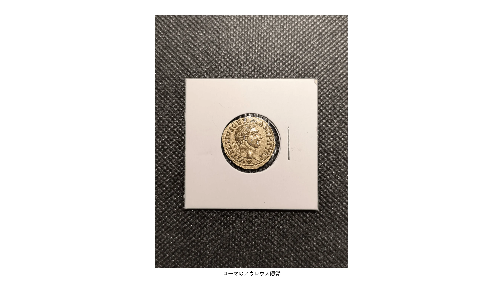

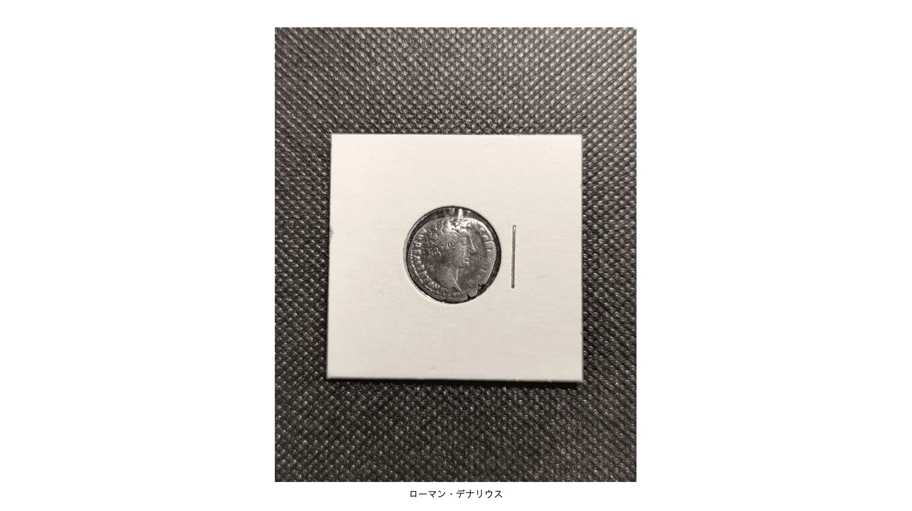

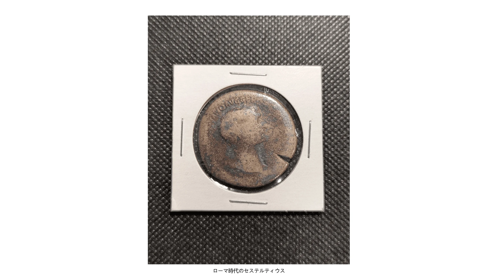

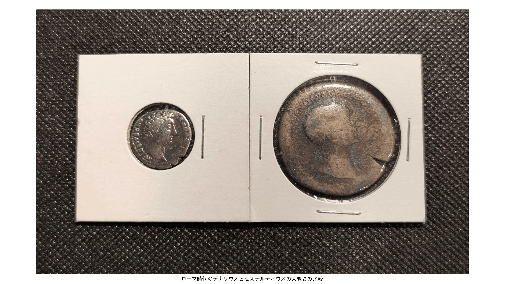

しかし、ネロ以降（AD54～68年）、ローマはコインの緩やかな切り下げを開始し、特にAD64年のローマの大火の後、増大する帝国の支出を賄うために、コインの重量と純度を徐々に減らしていった。グレシャムの法則**に従い、純度の高い硬貨は買いだめや輸出によって流通から排除された。

セプティミウス・セウェルス帝、カラカラ帝、ガリエヌス帝の時代には、銀の切り下げが加速し、3世紀は劇的な転換期となった。主要な銀貨であったデナリウス、そしてアントニニアヌスは、銀の含有率がわずか2％まで低下した。同時に、アウレウスの金貨の重量も半減した。この通貨危機は、未曾有の政治的不安定、蛮族の侵入、内戦の再発を伴った。

この章では、最後の作品であるアントニニアヌスを紹介する。このコインの元の名前は不明だが、今日ではアントニニアヌスと呼ばれている。デナリウスの1.5倍の大きさしかないにもかかわらず、2デナリウスで評価されるという特徴がある。さらに時代とともに、これらの硬貨は単なるビロン・コインとなり、純銀ではなく銀と他の金属の合金で作られるようになった。つまり、純銀ではなく、銀と他の金属の合金で作られたビヨン・コインだったのである。

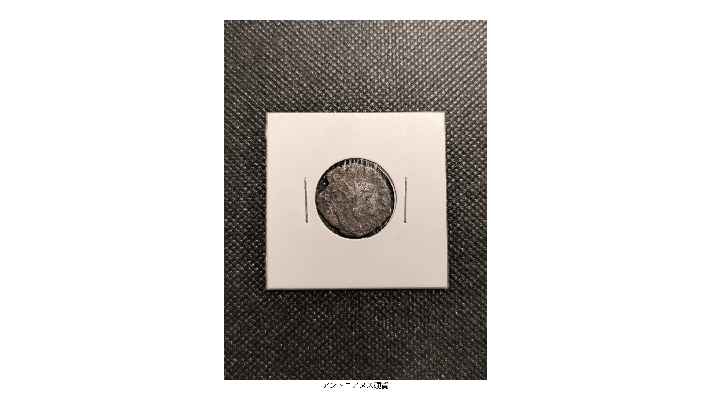

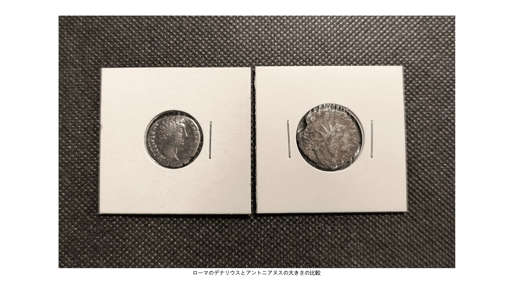

このような状況に直面した皇帝アウレリアヌス（AD270-275）は、名目上は通貨を切り上げることでシステムを安定させようとしたが、この改革は実際には、既存の通貨の価値を人為的に高い水準に固定することでインフレのメカニズムを導入した。

余談を紹介しよう。3世紀、インフレが急激に指数関数的に進んだ。それまでは、貨幣が切り下げられたとしても、それを1枚ずつ鋳造するという手作りのプロセスによって、インフレをある程度抑制することができた。統計によれば、切り下げられた300年間で、インフレ率は年平均約4％だった。アウレリアヌス改革直前のインフレ率は年率約3％だった。

アウレリアヌスは、XXI印の硬貨に純度測定を導入し、青銅20部に対して銀1部、つまり純度5%の組成を示しました。彼はこの5％の銀貨を売り出し、XXI印を押した。しかし、彼は他のもっと価値の下がった硬貨もすべて回収し、同じXXIを刻印した。これによって、すべての硬貨の額面が実質的に再評価された。その結果、年率20％という驚異的なインフレ率となり、この手法が実施される以前のインフレ率3％をはるかに上回った。

アウレリアヌスがこのような貨幣の切り下げ方法を考案したのだ。金属を徐々に切り下げていくよりもはるかに速く、しかも硬貨を一枚ずつ印刷しなければならなかった。アウレリアヌスが行ったのは、既存のコインをすべて回収し、額面を変えるためにパンチでスタンプを押すことだった。まさにターニングポイントだ。インフレが指数関数的に進行したのはそのときだ。

この極端な切り下げを視覚的に説明するために、紀元前40年から3世紀まで、300年以上にわたるエジプトの穀物価格に関する興味深い統計を見つけた。下の写真は、私のコレクションからギリシャのテトラドラクマです。当時、3世紀のローマ占領下のエジプトでは、これに相当するのがエジプトのテトラドラクマだった。ドラクマというデノミネーションはまだ使われており、デナリウスに相当する。

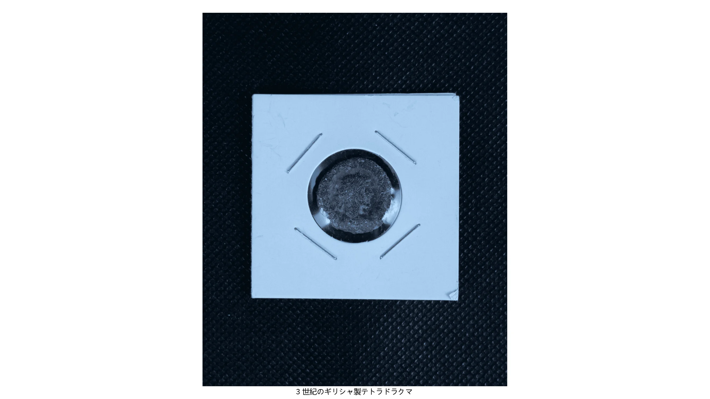

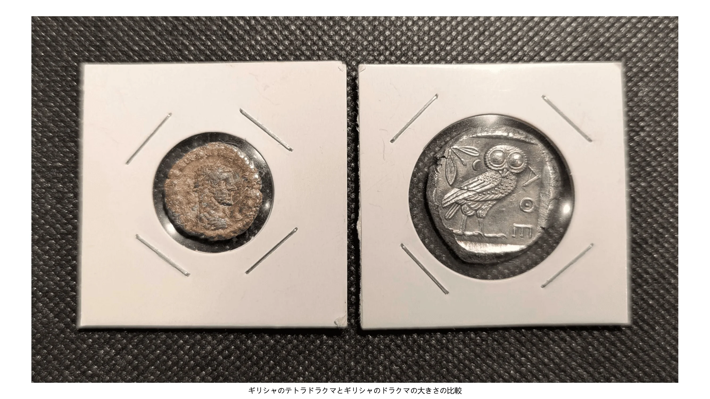

つまり、私が持っているエジプトのテトラドラクマは、デナリウスに相当するものだったのだ。このコインはビヨン（または青銅）製で、貴金属は含まれていないことがわかります。元のギリシャのテトラドラクマと比較すると、この300年間の物理的な切り下げがわかります。エジプトの穀物価格が100万倍になっているのだ。

アウレリアヌスの改革を物理的に表現したものだ。注目すべきは、この300年間のインフレ率の平均は4％程度だったということだ。アウレリアヌスが改革を行った終盤になって、インフレが指数関数的に進行し、100万という数字になったのである。3世紀末の物価は、紀元前1世紀の100万倍であった。

彼の後継者であるディオクレティアヌス**（紀元284年～305年）は、さらに急進的な改革を試みた。新しい通貨（特にアルゲンテウス）を発行し（純度は高いが量が少なすぎた）、大幅な物価統制を課し（紀元301年の物価勅令）、現物支給に基づく税制を確立した**。こうした努力にもかかわらず、ディオクレティアヌスの改革はインフレの蔓延を抑えることができなかった。

ディオクレティアヌスは、切り下げられた通貨と引き換えに商品やサービスを供給することを拒否され、農民とその子孫を土地に結びつけるために**世襲制カースト**を制定した。

ここで本当に理解されなければならないのは、何が起こったかというと、農民が切り下げられた通貨と引き換えに農産物を提供することを拒否したことであり、親愛なるディオクレティアヌスの対応は、「お前たちは自分の土地を離れることはできないし、子供たちも土地を離れることはできない。暫定的な解決策として、彼は彼らに金銭を与えることを拒否したため、彼らには現物（肉、食料、穀物）が支払われた。そのため、彼は世襲制のカースト制度を導入し、人々に自分の商売に執着するよう強制した。

この例を説明するために、『通貨体制とインフレ』という本から抜粋した文章がある：

> 額面価格が本来の価値や市場価値よりも高い切り下げられた通貨に対して、人々は働きたがらず、物資を納入したがらなかったため、現物税を課すことで労働を強制せざるを得なかった。[農民が登録された家を出ることは違法となった。こうして農民は土地に世襲的に執着するようになった。
>

> この世襲制カースト制度は次第に広まっていった：ディオクレティアヌスは兵士の息子に兵役を強制し、貨幣工房やディオクレティアヌスが創設した織物・染色工場で働く労働者は、世襲制の国家奴隷となった。金鉱労働者も後に世襲制カーストとなった。ディオクレティアヌス帝の時代には、その他の世襲階級はすでに存在していたと思われ、ローマではパン職人や肉屋のギルド［...］や、穀物やその他の公共貨物をローマに運ぶ船の船長の教区ギルドなどがその例である。

312年にソリダスを導入し、貨幣制度を安定させることに最終的に成功したのはコンスタンティヌス（西暦306-337年）だった。ソリダスの純度と重量を確認するためのシステムも完備されていた。 **しかし、この安定は裕福なエリート層と帝政にのみ影響を及ぼし、大多数の国民は低品質の通貨と持続的なインフレに苦しみ続けた。ソリダスは東ローマ帝国（ビザンチウム）では安定を保ち、千年以上続いたが、西ローマ帝国では、貨幣は細分化され、価値の低い小額硬貨となり、ローマ帝国の最終的な経済的・政治的崩壊に伴い、西暦476年に決定的に崩壊した。

最後に、グリン・デイヴィス著『お金の歴史』からの引用を紹介しよう：グリン・デイヴィス著『貨幣の歴史：古代から現代まで』からの引用である：

*「租税は一貫して不十分であり、このようなますます不十分で、遅ればせながら調整され、非常に目につきやすい租税に関連する困難は、ローマを、より簡単で、即時的で、隠れた課税形態である通貨切り下げに頼るように駆り立てた。短命でその場しのぎの改革は、この古くからの衰退の傾向を覆すことはできなかった。貨幣の消耗、難破、東方からの贅沢品の購入による貨幣の流出、ゲルマン蛮族への贈与、都市人口の増加、農業生産の衰退、最も豊かな鉱山の漸進的な枯渇、そして何よりも都市生活の最低限の秩序を維持するために不可欠とされた「パンとサーカス」政策、これらすべての累積的な圧力が、ローマを絶え間ない貨幣切り下げへと導き、失敗に終わった改革を時折挟んだ。

*特にトラヤヌス帝（紀元98～117年）の時代には、さらにハドリアヌス帝（紀元117～138年）とその後継者たちの時代には、無料または格安のパンとワインに加えて、金銭的な配分の形で皇帝の自由（"congiaria"）が随時分配された。皇帝と市民が当初は例外的な特権とみなしていたものが、2世紀初頭には慣習的な期待となっていた。これらの分配は「国庫に重い負担をかけ、国家の破産にそれなりに貢献した」*。

## 通貨希薄化とインフレの関係：原因から結果まで

<chapterId>38d5781c-e900-53f7-baa7-413655d71754</chapterId>

:::video id=3999256d-aafe-4502-9b72-dfa8491a2777:::

このセクションでは、貨幣の希薄化とインフレの関連について、原因から結果まで見ていく。貨幣の希薄化は、ローマ貨幣史における主要な経済現象の一つであり、インフレに直接的な影響を与える。紀元1世紀以降、ネロの治世（紀元54～68年）以降、銀貨（デナリウス）の希薄化は当初緩やかな段階であったが、特にセプティミウス・セウェルス（193～211年）とガリエヌス（253～268年）の度重なる軍事・財政危機によって加速された。

また、アウレウスの切り下げがより緩やかであることにも注目したい。この切り下げ率の違いは、2つの点を浮き彫りにしている：

1.バイメタル主義における貨幣の国家管理における会計単位の役割。この例での勘定単位はデナリウスである。すなわち、切り下げ（金属の希釈）、レデノミネーション（アントニニアヌス）、そして「XXI」（アウレリアヌス）の刻印による額面の押しつけである。

2.エリート層が恵まれない人々の犠牲の上に購買力を維持することを可能にする価値の蓄えであるアウレウスの切り下げを可能な限り先延ばしにしたいという国家の願望。この原則は、特に「カンティヨン効果」として知られる概念や、スペインにおけるマラベーディの再両替に関連して、このコースを通してたびたび再確認することになる。

この現象は非常に興味深く、歴史を通じて繰り返されてきた。この現象については、次の章でマラベーディの例で説明する。このパターンは、すべての基軸通貨にも見られる。ローマのアウレウスのような価値の基軸単位はそのままである。しかし、一般の人々が貿易や日常的な取引に使用する勘定単位は、しばしば切り下げられる。その結果、通貨インフレは庶民に影響を及ぼすが、金貨を買える人はほとんど影響を受けない。

通貨切り下げによって金融資産が値上がりし、通貨を使う人々、つまり最も貧しい人々がより貧しくなり、その結果、切り下げから身を守る手段を持つ、能力のある人々の資産が、貨幣の創造によって豊かになり、社会的不平等が深まる。これが私のちょっとした政治的暴言である。

今述べたことは、カンティヨン効果と呼ばれるものである。この紳士はジョン・ローの時代に生きていた。

アウレリアヌス治世に始まった改革は、インフレの高騰を可能にした。貨幣の額面のインフレは、造幣局が手作業で貨幣を製造する能力によって制限されなくなった。すでに鋳造された硬貨に印をつけるだけでよくなり、通貨供給の名目価値はより急速に上昇した。

アウレリアヌスに関して、2つの言葉を紹介したい。ひとつは、『貨幣の歴史』からの引用である：から引用したものである：

*「ローマ経済に関する限り、アウレリアヌスの貢献は勝利というよりむしろ災難だった。無責任なガリエヌスのもとでさえ、インフレ率がそれまで可能であったものをはるかに超えて上昇することができたのは、彼の「改革」の性質によるところが大きかった。アウレリアヌス以降2世紀にわたり、インフレはローマ帝国全体に蔓延した。

もうひとつは、『コインから読み解く古代史』という本からで、貨幣制度が金から切り離されたことに関するものだ：

*「アウレリアヌスの改革は、金貨と他の通貨制度との関係を変えた。それ以前は、他の種類の通貨は公式レート（1アウレウスに対してエジプト・デナリ25またはテトラドラクマ25など）に従って**アウレウス**に連動していた。改革後、金貨は他の商品と同じように**自由に価値を変動させるようになった**が、他の通貨制度は**金の裏付けがなくなり**合金の弱体化**によって**価値を崩壊させた**。会計単位は理論的には銀（デナリウス、エジプトではドラクマ）をベースとしたままであったため、通貨が下落するにつれて物価が上昇した。"*

おわかりのように、勘定単位としての通貨の切り下げは、裕福でない人々に不釣り合いな影響を与えた。一方、金貨との結びつきがなくなったことで、金という価値の貯蔵庫に貯蓄する余裕のある人々の購買力は守られた。

ここで理解しておかなければならないのは、デナリウスとアウレウスの間につながりがあれば、たとえデナリウスを切り下げたとしても、このレート（1アウレウス＝25デナリウス）で自分のデナリウスとアウレウスを交換できるのであれば、デナリウスは過大評価され、アウレウスは過小評価されるため、人々は間違いなく自分のデナリウスと自分のアウレウスを交換するだろうということだ。しかし今回の改革では、このリンクが削除された。そのため、人々は金に対して切り下げられた銀の金属とデナリウスを交換することができなくなった。金貨を手にすることができた人々は、自分の身を守ることができたのです。なぜなら、その後、人々はもはや、過大評価され切り下げられた銀を過小評価された純金と交換することができなくなったからです。これは通貨の進化における非常に重要な瞬間である。

アウレリアヌスによるこの改革の効果を示す顕著な例は、『通貨体制とインフレ』という本からの引用に完璧に示されている：

*「クラウディウス帝（紀元41～54年）とコンスタンティウス帝（紀元337～361年）の治世の間、エジプトの公開市場における小麦の価格はドラクマで表示され、**100万倍以上**に上昇した。壮大な価格インフレは、紀元後3世紀から4世紀にかけての中心的な経済事実の一つである」（Lendon 1990, p. 106）。しかし、この展開は**年平均インフレ率4.4％**に相当するため、**見かけよりは劇的ではない**。そしてWassink (1991, p. 482)によれば、インフレが実際に始まったのは**西暦238年**だけである」**。

*「この日以降、インフレは徐々に加速し、まず**良貨が流通から追い出された**ため、マネーサプライ総量は最初ほとんど増加しなかった。その後、インフレ率は250年から293年の間に年平均3.65％**に達し、293年から301年の間に22.28％**に上昇した（Wassink 1991, p.466）。この現象は、**金属ベースの通貨体制におけるインフレとしては特に印象的である**。"*

貨幣の希薄化と連動したこのインフレ現象は、当初はローマ国家の時折起こる現金危機に対応するものだった。貨幣の額面を維持したまま貴金属の含有量を減らすことで、国家は一時的に財源を増やした。しかし、物価はすぐには反応しなかった。実際、ローマ帝国の制度には一定の粘着性があり、賃金や物価が相次ぐ切り下げに適応するのは遅かった。とはいえ、ある閾値を超えると、物価は急激に上昇し、市場は通貨の実質価値との均衡を取り戻す。

前述したように、この現象は特に3世紀半ば以降に顕著である。資料の豊富なエジプトでは、アウレリアヌス帝（紀元274年）の時代、当初は安定化を図ったにもかかわらず、公式の通貨切り上げの後、物価が10倍になった。その後、ディオクレティアヌス帝（紀元301年）の時代には、物価勅令によって、根本的な原因である過剰生産と貨幣の劣化に取り組むことなく、インフレを抑制するための抜本的な規制が課され、予想通りの失敗を招いた。持続的なインフレは、最終的に経済を二層体制へと押しやる： **コンスタンチヌスのソリダス**のような）金準備に守られたエリート層は安定を享受するが、大多数の国民は慢性的なインフレに苦しみ続ける。

ローマの通貨希薄化とインフレの間には明確な関連性があり、その原因は基本的に慢性的な財政赤字、絶え間ない軍事費、国家の経済管理のまずさにある。

## ローマ帝国の滅亡

<chapterId>b6ec0914-227b-509c-8108-b09eec9bb904</chapterId>

:::video id=91d4fee5-59bb-4ab9-a90b-e1125c71decb:::

### 通貨切り下げとローマ崩壊

オーストリア学派は、特にルートヴィヒ・フォン・ミーゼスを通じて、ローマ崩壊の貨幣的解釈を提唱した。この構想では、ローマ通貨の漸進的な切り下げが、人口6000万人の帝国を支えた複雑な分業システムを打ち砕いた。経済協調の中心的手段であった通貨は、ひとたび堕落すると、社会・経済構造全体の崩壊につながったのである。

この貨幣価値の悪化は、帝国内部の結束を破壊しただけでなく、近隣諸国との貿易関係も断ち切った。近隣諸国との貿易関係も断ち切られた。ローマとの交易による利益を奪われた「蛮族」は、平和的な協力関係から略奪へと転じた。したがって、侵略は軍事的な意味だけでなく、根本的な経済的断絶の結果でもあった。

### 帝国切り捨ての三段階

ローマの貨幣史は3つの時期に分けることができる。最初のユリオ＝クラウディウス朝からアントニヌス朝まで（紀元前27年～2世紀末）は、比較的安定していた。トラヤヌスの時代、帝国は頂点に達し、500万平方キロメートルの面積を持つローマは、歴史上初の億万長者の都市となった。デナリウスの銀純度は98%から80%で、適度な切り下げにより経済が機能していた。

第二の時代、3世紀は軍事的無政府状態だった。数十年の間に26人の皇帝が相次いだ。通貨は崩壊し、2デナリの価値があるとされていたアントニニアヌスは、金属重量でわずか1.5しか含まれていなかった。悪貨は良貨を駆逐する。市民は良い硬貨をため込み、切り下げられた硬貨だけを使うようになった。

考古学者によって発掘された貨幣の宝物は、こうした経済不安を明らかにしている。埋蔵されたアンフォラは、ローマ人がどのようにして最良のコインを最初に堆積させ、徐々に切り下げられたコインを加えていったかを、層別によって示している。これらの古代の "積み重ね "は、不確実性に直面した人間の行動、つまり朽ち果てた世界の中で価値を保とうとする試みの証しである。

### コンスタンティヌスと二重システム

コンスタンティヌス（310-337）は、急進的な改革によって帝国の安定化を図った。彼は金ソリダスを創設し、政権によって厳格に管理された通貨とした。役人は重量と純度を組織的にチェックした。発行は限定的で、戦利品と連動していた。税金はソリダスで納められ、軍団は金で給料を受け取った。

同時に、民衆は青銅のヌンミを使用したが、これは常に切り下げられた。445年、1ソリダスは7,000ヌンミの価値があったが、498年には16,800ヌンミになった。この二重システムは、カンティヨン効果を制度化した。ソリダスへのアクセス権を持つ者たち（行政や土地所有者）はインフレから守られた。平民はヌンミに閉じ込められ、ますます貧しくなった。

この通貨分離により、公式為替レートのない2つの並行経済が生まれた。ソリダスは勘定単位であり続けたが、ほとんど流通しなかった。ヌンムスは日常的な交換に使われるが、常に価値を失っていく。この貨幣構造は、新興の封建制度の不平等を予感させた。

### 分業の崩壊

通貨の切り下げは、経済の専門性を徐々に破壊していった。信頼できる勘定単位がなければ、地中海貿易は崩壊した。ローマの専門職人たちは、エジプトやガリアとの貿易ができなくなった。各州は独自の通貨を採用し、貿易摩擦を増大させた。

この崩壊に直面し、都市住民は田舎に逃げ込んだ。何世紀にもわたる都市化を覆す都市脱出だった。職人たちは、自給自足の農業に従事するために職を捨てた。大規模な領地（ラティフンディア）は自給自足の島となり、中世のシーニュリーを彷彿とさせた。

絶望の淵に立たされたディオクレティアヌスは、貨幣の失敗を認める究極の行為として、現物課税さえ要求した。彼の最大勅令（301年）は物価を統制しようとし、物々交換への回帰を加速させた。経済の複雑さは文明以前の形態に逆戻りした。

### ローマからビザンチウムへ、金でサバイバル

逆説的だが、ソリダスは西方帝国を存続させた。ビザンティウムは11世紀までソリダスを維持し、さらに1000年にわたる経済的安定を確保した。フランス語の "sou "はソリダスに由来し、失われた貨幣の壮大さを言語学的に証明している。

金で富を保っていた地主は封建領主となった。唯一生き残った制度である教会機構は、貨幣がもはや保証できない社会的な結びつきを提供した。ヨーロッパは、それぞれが自給自足の経済を持つ自領に分断された。

この変容は、複雑な文明のもろさを明らかにしている。ローマが100万人の住民を養うことを可能にした分業体制は、完全に金銭的信頼に依存していた。この信頼がいったん崩れると、その建物は崩壊し、ヨーロッパはほぼ千年にわたって原始的な経済形態に逆戻りした。

## 暗黒時代と中世

<chapterId>a5856873-6142-57be-8a73-1f9e3df83792</chapterId>

:::video id=86b8da9b-3831-443d-b170-58c2bea3ad54:::

中世における貨幣の歴史と出現は、後退、革新、経済回復の時期によって特徴づけられる。

たとえば、ローマ軍がブリテン島を去ると、ローマ硬貨は島に入ってこなくなった。西暦435年頃、イギリスでは硬貨の使用が完全に姿を消したが、これは旧ローマ帝国の地方では珍しい現象であった。7世紀になってメロヴィング朝や大陸の影響を受けたコインが徐々に再登場するまで、ほぼ2世紀にわたってイギリス経済はコインのない状態が続いた。

8世紀以降、キリスト教の影響により、北ヨーロッパでは硬貨の再導入が進んだ。この時代の中心人物はフランク王国の王ペピン王で、752年にデナリウスを導入し、後に息子のカール大帝が採用した。シャルルマーニュは銀のデナリウスを広く普及させ、数世紀にわたってヨーロッパの通貨基準を作り上げた。

イングランドでは、765年頃にメルキア王オッファのもとで銀貨ペニーが製造され、貨幣は大きな復活を遂げた。この貨幣は非常に重要なものとなり、500年間ほとんど変わることなく使用され続けた。

この時代に関連する最初の工芸品として、当時のイギリスのペニーの複製品をお見せしよう。

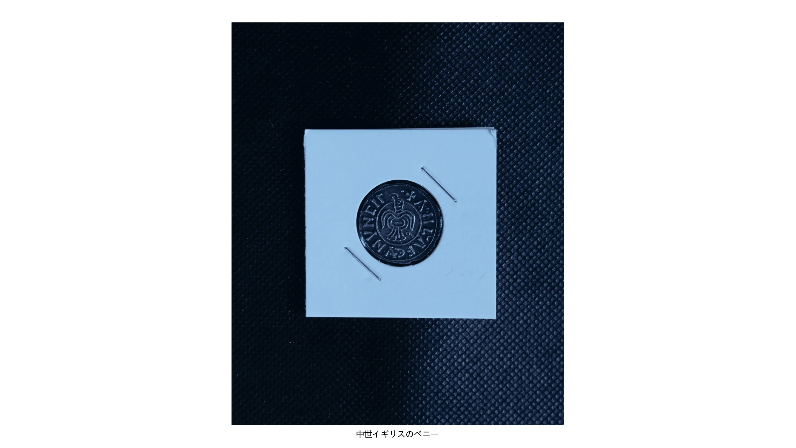

ローマ帝国の通貨制度が崩壊した後、ヨーロッパは封建制に陥った。人口の大半は価値の低い銅貨や青銅貨を使用し、しばしば通貨の希釈が行われたため、長距離の交易は制限された。

決済手段としての硬貨の復活は徐々に進み、13世紀には1252年にフィレンツェで金フロリンが登場し、次いでヴェネツィアで金ドゥカートが登場した。これらの金貨は、貿易の拡大と、国際的に通用する信頼性の高い決済手段の必要性の高まりにより、広く使用されるようになった。

イングランドでは、1066年以降にウィリアム征服王が導入した土地税のような革新的な財政政策によって、通貨制度は希薄化から守られ、ペニー・スターリングの質は保たれた。ここで重要なのは、当時の君主は国家財政を賄うために通貨を切り下げることができたが、**この税の導入により、通貨を安定させ、課税によって国家財政を賄うことが可能になったということだ**。

しかし、貨幣の希薄化によって利益を得ようとする誘惑は、12世紀のヘンリー1世の治世のように、貨幣の質が劇的に低下する危機を招いた。時には貨幣鋳造者に対する暴力的な措置を伴う厳しい改革が行われ、一時的に通貨に対する信頼が回復した。

中世には、イングランドで利殖禁止を回避して信用を拡大するために集計棒が使われるなど、洗練された金融慣行も出現した。教会は有利子融資にあまり乗り気ではなかったため、利子の使用禁止を回避するためにさまざまな手法が用いられた。

これらの技術革新は、慢性的な金属貨幣不足への対応であり、金融市場の胎動を促した。

一方、十字軍は地中海貿易を刺激し、特にテンプル騎士団を通じて国際交流と新しい銀行業務の発展を促進した。テンプル騎士団は重要な金融仲介役となり、十字軍の兵士たちが遠く離れた地でも流動性を確保できるようにした。

テンプル騎士団との関連性を示すために、以下のフランス中世のコインをご覧いただきたいが、中央には美しい十字架が描かれている。この時代のコインには、この十字架が描かれているのが一般的だった。

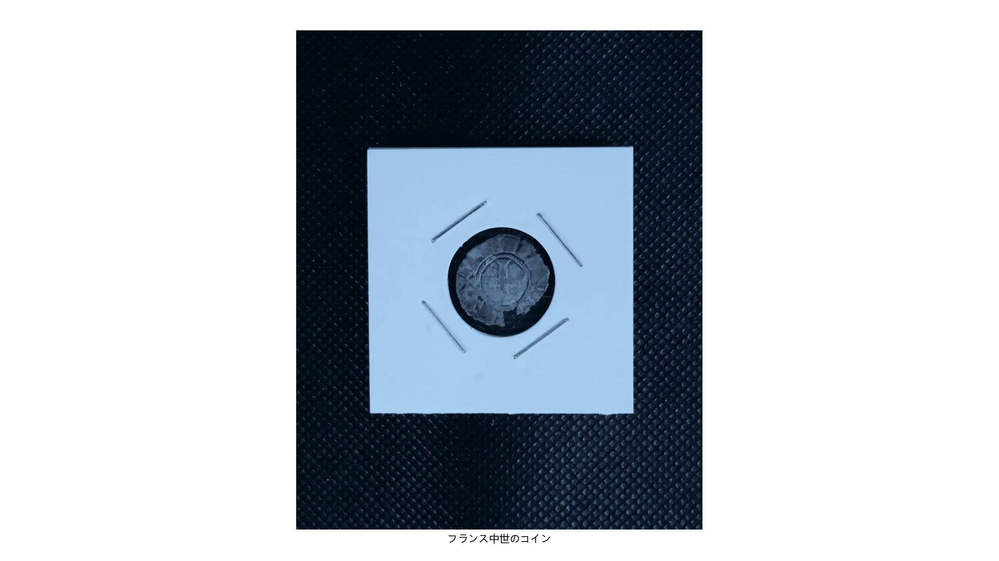

最後に、黒死病（1346-1353年）などの大きな危機が、経済に大きな変革をもたらした。人口の激減は、それまでの報酬水準を維持しようとする政府の試みに逆らい、賃金の急上昇をもたらした。

同時に、百年戦争（1337-1453）によって、各国は軍資金を調達するためにより積極的な財政政策を取らざるを得なくなり、封建制度の弱体化に貢献した。

こうして中世は、貿易のために信頼できる貨幣が必要であることと、支配者が目先の利益のために貨幣を希薄化させようとする誘惑が絶え間なく交錯する、絶え間ない緊張関係によって特徴づけられた。この対立がヨーロッパの貨幣の発展を大きく形作り、近代経済システムの基礎を築いた。

このセクションの最後に、この頃のイギリスでのちょっと面白い逸話を付け加えておきたい。この逸話は、グリン・デイヴィス著『お金の歴史』から引用したものである。

イングランドでは、議会への移行によって債務の負担が君主から議会に移り、慢性的な国家債務を抱えることになった。それ以前は、借金は君主の肩にかかっていた。

議会が貨幣発行権の一部を握ることができるようになると、国王ではなく国民が負担する長期債務を作ることができるようになった。以前は、国王が破産したり国王が交代したりすると、国王とともに債務も消滅していた。

国会によって債務が作られた瞬間、ソブリン債という概念が生まれる。国家が存在する限り、議会が存在する限り、この債務は存在し、彼らはそれを借り換え、長期的に分散させるあらゆる方法を見つけなければならなかった。これは大きなパラダイムシフトであり、これらの債務を保証したり負担したりするのは、もはや国王や王族ではなく、議会であり、したがって国民であった。

## ルネサンス

<chapterId>1d1dfb05-70b4-5b7b-9708-373c2182950d</chapterId>

:::video id=4977b4f3-c7b2-41a5-ad7b-a96a8cca4092:::

ルネサンスと呼ばれる時代について語るセクションにさしかかった。ルネサンス期は、船に乗り込んだネズミについたノミがペストを流行させるという悲劇的な危機を背景にしている。しかし、この悲劇は、中世の高度成長期における貿易と旅行の発展を教えてくれる。この時代の初期には、これほど遠くへ、これほど速く移動する人はそれほど多くなかった。

### フィレンツェのフローリン

ルネサンス期にヨーロッパに金貨が復活したことは、貨幣史における根本的な転換点となった。 **すべての始まりは、1252年にフィレンツェのフローリンが鋳造した金貨であり、ローマ崩壊後ヨーロッパで鋳造された最初の金貨であった**。その重量と純度（約3.5グラムの純金）が驚くほど一定であったため、フローリンは4世紀もの間変わることなく、急速に汎ヨーロッパの通貨基準として不可欠なものとなった。

ピューター製のゴールド・フローリンで、手彫り、手打ちの素晴らしい作品を作るフランスのアーティストによって刻印されている。

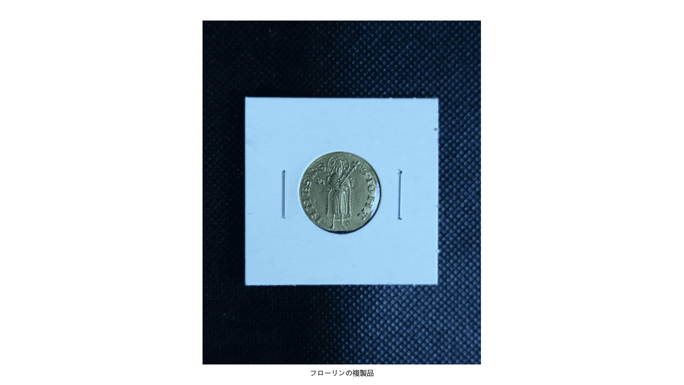

ビザンチン・ソリドゥスの崩壊と、モンゴルの侵攻によるイスラム世界の経済衰退が、国際貿易における貨幣の空白を生み出したのだ。

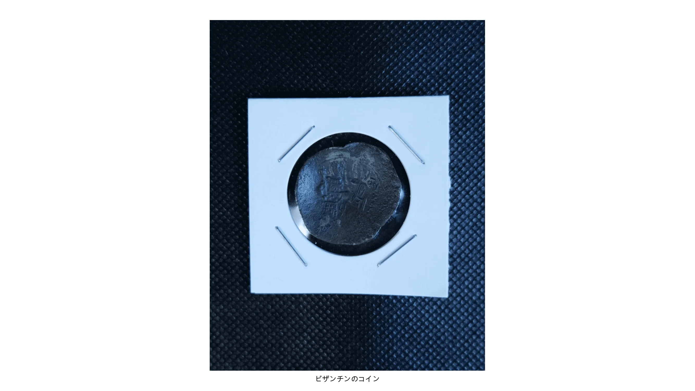

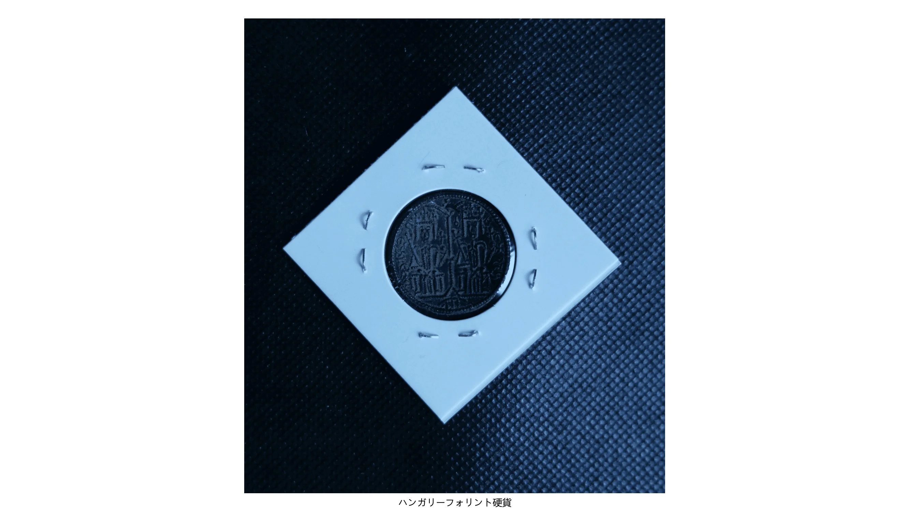

上の最初の画像は、私が非常に興味深いと思うビザンチンのコインです。ハンガリーの同時代のコイン（上の画像2枚目）と並列してみる。ハンガリーのコインは、ミニチュアのボウルのようなカップ型をしている。図像は、十字架を横に並べた王のような宗教的人物が描かれている。こちらはハンガリー産の碗型。

他国のコインをコピーすることは、ごく普通のことだった。ビザンチン硬貨は一般に受け入れられていたので、他国もよく模倣した。並べてみるとわかるが、これらのコインは非常によく似ている。

フィレンツェ、ヴェネツィア、ジェノヴァを中心とする北イタリアは、このような背景を利用して、新しい硬貨、つまり貴金属の含有量が安定した硬貨を発行した。ベネチアはフィレンツェに倣い、1270年にドゥカートというフロリンとほぼ同じ通貨を鋳造し、地中海貿易で広く使われるようになった。

フローリンは最初の国際基軸通貨となり、14世紀末までにヨーロッパの150以上の都市で採用された。メディチ家が主導したフィレンツェの大規模な銀行網の構築により、貨幣と会計の管理は徹底的に近代化され、金を物理的に輸送する必要性さえ減少した。

これも実に興味深い点だ。かつて、多くの硬貨が航海中に紛失した時代があった。この技術の進歩、つまり複式簿記によるレジスターが、経典貨幣の作成を可能にした。これによって、硬貨の精算の回数を減らし、代わりに文字で記入するシステムを使うことが可能になり、輸送中の紛失のリスクを大幅に減らすことができた。

貨幣の発展には、銀行手法の著しい進化も伴っていた。中世ヨーロッパでは、十字軍がイスラム教徒の銀行習慣に接したこともあって、13世紀には早くもフィレンツェ、ヴェネツィア、バルセロナ、ジェノヴァで初歩的な銀行システムが登場した。テンプル騎士団という宗教的・軍事的な騎士団は、十字軍兵士が富を持ち出さずに旅行できるシステムをすでに開発していた。

彼らは自国のテンプル騎士団の事務所に資金を預け、手紙の形を持って旅行し、十字軍の目的地に到着してからコインを受け取ることができた。

つまり、貴金属硬貨を持ち歩く必要がなかったのだ。

13世紀のマルコ・ポーロの旅のおかげで、ヨーロッパが中国の紙幣の存在を知ったのもこの時期だった。しかし、ヨーロッパはまず金属貨幣の方法を完成させることを優先したため、紙幣の開発は数世紀待たされることになる。レオナルド・ダ・ヴィンチは、有名な公認会計士ルカ・パチョーリと親交があり、貨幣圧搾機の改良に積極的に貢献し、より迅速で均一な貨幣製造を促進した。

ここで言う振り子打法とは、講座の冒頭で紹介した技法のことである。この方法によって、ハンマー打ちに比べてより均一な硬貨を製造することができ、また重要なこととして、以前私が実演したように、硬貨の縁に文字を入れることができました。下の写真は1793年のヨーロッパのターラーで、縁にはっきりと文字が記されています。

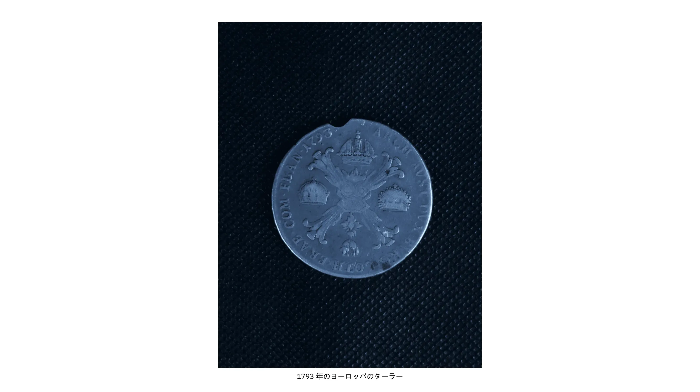

しかし、15世紀に入ると、ヨーロッパは深刻な通貨危機に見舞われ、ヨーロッパ通貨の銀含有率は全般的に悪化し、1450年頃には5％以下にまで落ち込んだ。

16世紀以降、アラゴン王国とカスティーリャ王国の連合、レコンキスタの終結、1492年のクリストファー・コロンブスによる大航海発見などが刺激となり、通貨の重心はスペインに移った。アメリカの鉱山から大量に流入した銀は、ヨーロッパと世界の経済バランスを大きく崩し、インフレと新たな地政学的緊張を煽った。

ルネサンス期には、「ドル」の語源となったターラー（ヨアヒムシュターラー）のような硬貨も登場し、硬貨の芸術的な進化を遂げた。これらの大型銀貨は、北ヨーロッパの技術革新によって可能になった新しい芸術的・機械的鋳造技術を反映している。

最後に、金融ルネッサンスは、銀行、信用、金融市場の発展、そしてアムステルダム、ロンドン、ストックホルムといった大都市における近代資本主義の最初の形態の出現によって、経済的近代への移行を先導し、今日の国際金融システムの基礎を築いた。それが次回のビデオのテーマである。

# 国家による金銭の差し押さえ

<partId>17cfb1b4-5bc1-53e0-b035-05c7cf76be92</partId>

## 世界の基軸通貨の変遷

<chapterId>d65cc352-e7ca-5f03-9b23-dd1fae5c0395</chapterId>

:::video id=82710062-8fff-426c-93af-923c08d82233:::

### 貴金属の歴史的重要性

基軸通貨と中央銀行の出現に関するこのセクションへようこそ。この新しいセクションの最初のポイントとして、世界の基軸通貨の変遷に焦点を当てる。

貴金属、特に金と銀は、長い間、帝国における富と権力の基礎と考えられてきた。金への渇望は常に支配的な原動力であり、ヨーロッパにおける貨幣の発展に最も直接的で明白な影響を与えたのは貴金属の流入であった。中世からルネサンス初期にかけて、金と銀に執着したのは、他の形態の商品では価値を保持することが困難であったことと、外国勢力、特にオリエントとの交易における強い需要によるものであった。

何世紀にもわたり、いくつかの帝国が世界経済の中心地としての地位を互いに引き継いできた。ある期間に世界貿易を支配した国は、通常、基軸通貨の地位を与えられる。以下のような国がある：

- スペインとポルトガル（15、16世紀）

- 17世紀のオランダ連合州

- 18世紀と19世紀のフランスとイギリス

- 20世紀のアメリカ

### ポルトガル・ブームとレアル (1450-1530)

**ポルトガル**は、15世紀後半から16世紀初頭にかけて、比較的均一な重さの銀貨である**ポルトガル・レアル**で世界貿易を支配した。ポルトガル人は航海術の進歩により、アフリカ、アジア、新大陸への新しい海路を発見した。アフリカから中国（マカオ）まで、軍事要塞と交易所が増加した。

ヨーロッパの金と銀の需要に応え、"大発見の絶え間ない動機は商業的利益、特に金と銀の追求だった"。しかし、拡大しすぎたポルトガル帝国は、オランダ、イギリス、フランスとの競争に直面し、衰退し始めた。

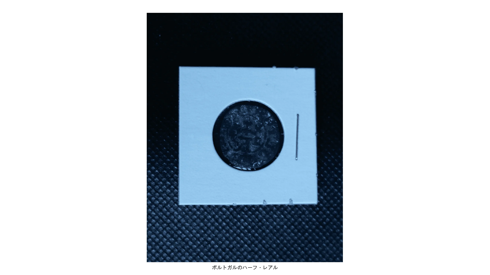

上の写真は、これらの海洋征服時代のポルトガル製ハーフレアルである。

### スペインの頂点とスペイン・ドル（1535-17世紀）

新大陸の征服により、**スペイン**が支配的な存在となった。その君主は巨大な銀山（ボリビアのポトシ、メキシコのサカテカス）を支配し、純銀の貨幣を鋳造することに成功した。

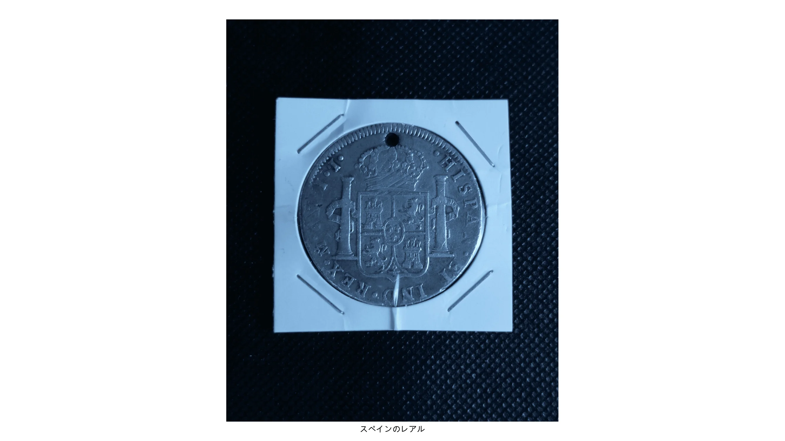

スペイン・レアルは「8分の1枚」としても知られ、そのニックネームは、8分の1にカットして小さな硬貨を作ることが多かったからである。また、**スペイン・ドル**としても知られていた。上のコインは1814年のもので、少し新しい例です。しかし、最初のスペイン・ドル硬貨はそれほど洗練されておらず、ハンマーで打たれたもので、一般的に丸く鮮明ではありませんでした。

特に興味深いのは、スペイン・ドルが当時の国際基軸通貨として機能していたことだ。スペイン当局は独自の地域通貨マラベディも発行し、定期的にリコールによって通貨供給量を調整していた。例えば、当初1マラベディの価値があった銅貨や青銅貨は、リコールされて「2」と刻印され、その後「4」と刻印され......というように、「8」になる可能性もあった。高解像度の写真では、硬貨に刻印された「8」をはっきりと見ることができる。この方法は効果的に通貨供給量を拡大し...必然的にインフレを招いた。

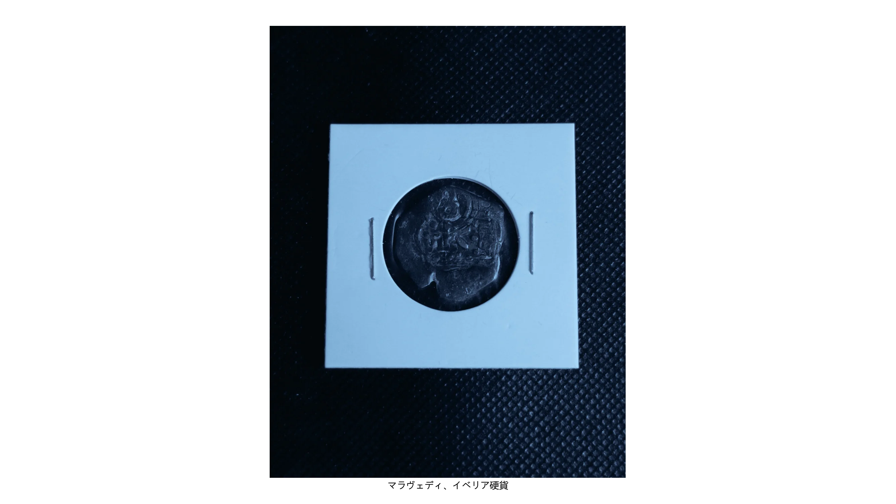

基軸通貨の歴史を見てみると、興味深い点が浮かび上がってくる。 **帝国は基軸通貨としての地位を維持する限り、通貨を膨張させなかったのである。

スペインでは、スペイン・ドルが200年近くにわたって世界貿易、特に中国とヨーロッパ間の貿易を支配した。これらの硬貨は中国の港で見かけることさえあった。アメリカのドルは、この通貨に直接由来しているのだ。1792年にアメリカ合衆国が成立すると、独自の通貨を鋳造するための法律が可決され、最初のドルは名前も硬貨のサイズもスペイン・ドルをモデルとして作られた。

その価値について説明すると、アメリカ・ドルはもともと銀貨で、重さはほぼ1オンス、現在の貨幣に換算すると30ユーロから40ユーロであった。スペイン・ドルに関しては、非常に広く流通したため、最初の真の世界通貨と考えられている。

しかし、このアメリカ大陸からの貴金属の流入は、ヨーロッパにインフレを引き起こした。価格革命（1540年頃～1640年）の間、イングランドの生活費は7倍になった。スペインでは、豊富な銀が資源の呪いという逆効果をもたらし、堅実な銀行制度の発展を妨げた。

その後、スペインは数々の軍事衝突（フランドル戦争、オランダ戦争、30年戦争）に直面し、財政は徐々に破綻していった。歴代の支配者は、世界的に有名な銀貨を切り下げる代わりに、地元住民が使っていた銅貨（ベロン）のデフォルトや減価を選んだ。これが、先にマラベディスで説明したことである。

### オランダの台頭（17世紀）

イベリア半島の頂点を極めた後、**オランダ**は17世紀に新たな商業大国として台頭した。海洋貿易、VOC（オランダ東インド会社）、そして**アムステルダム株式Exchange**（アントワープの株式Exchangeに触発された）の設立により、この商人共和国はハブとしての地位を確立した。

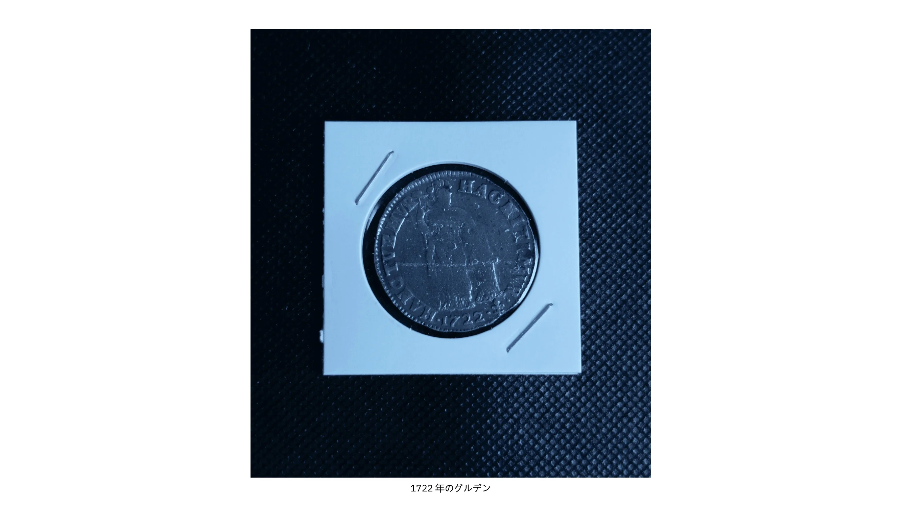

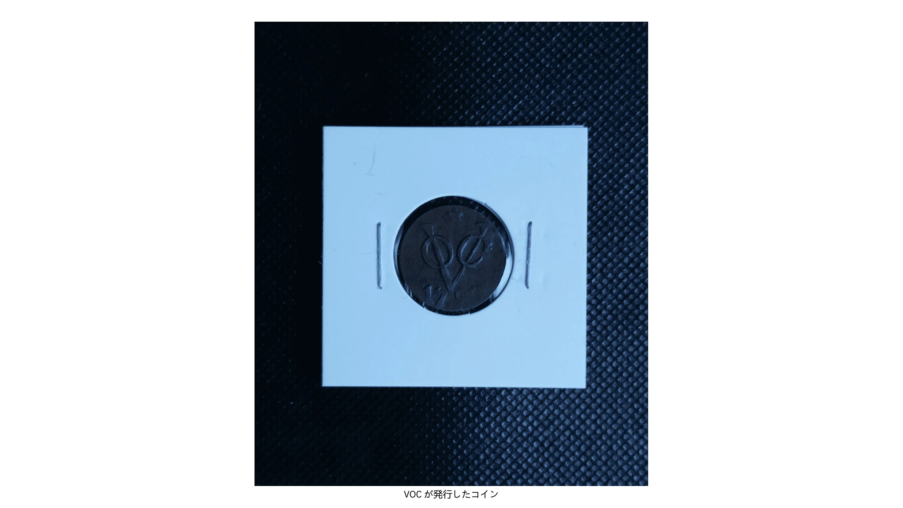

上の写真の1枚目には1722年のグルデン（美しい銀貨）が、2枚目にはVOCが発行したコインが写っている。

VOCは当時としては非常に強力な企業で、独自の軍隊を持ち、独自の通貨まで発行していた。

オランダ人が発明した近代資本主義は、新大陸への遠征や新しい交易路の探索など、危険を伴う事業においてリスクを分散する手段として始まった。株式会社は、複数の投資家が資金を出し合い、リスクを共有することを可能にした。このような交換を容易にするために、これらの証券を交渉・交換できる機関を設立する必要があった。こうして1602年、最初の株式会社と証券取引所が誕生した。

オランダの通貨、**グルデン**は、その銀の純度のおかげで信用を得、その後アムステルダム銀行（1609年）に採用され、預金はヨーロッパで好まれる貨幣形態となった。これは非常に重要なポイントである。もちろん硬貨は存在したが、当時の貨幣を構成していたのは聖典のような貨幣であった。実際、世界の貿易の多くがアムステルダム銀行の帳簿を通過していた。国際貿易は必ずしも物理的な硬貨で行われる必要はなく、銀行の会計記録を通じて直接行われたのである。

この繁栄期には、特にインフレや通貨統制を実践している他国から金銀が大量に流入した。興味深い人物がいる： **トーマス・グレシャム**である。この時期、彼はオランダの英国王室のために働き、2国間のお金の流れを管理していた。有名な「グレシャムの法則」を残したのもこのグレシャムである。

とはいえ、オランダ帝国もやがて力尽きた。イギリスとの戦争、紛争時のグルデンの希薄化、他の列強（フランスとイギリス）との競争は、オランダの覇権の終焉を告げるものであった。第4次英蘭戦争（1780～84年）後、基軸通貨としてのグルデンの衰退は不可逆的なものとなった。

### フランスの権力、野心、失敗（17～18世紀）

ルイ14世の時代、**フランス**はヨーロッパ最大の大陸支配国となった。しかし、フランスの通貨が支配的な基準になることはなかった。数々の切り下げ、重税、費用のかさむ戦争（アウクスブルク同盟、スペイン継承戦争など）が通貨制度の安定に重くのしかかった。

紙幣の最初の大規模な実験は、ジョン・ロー（1716-1720）によって行われた。ジェネラル銀行（Banque Générale）は、政府債務の約束に裏打ちされた紙幣を発行した。この計画は、1720年に投機的なバブルと崩壊（ミシシッピ・バブル）を引き起こした。この災難は、フランスに紙幣に対する不信感を永続的に残した。リシャール・カンティヨンは、この悲惨な経験のおかげで、現在では「カンティヨン効果」として知られる、貨幣の印刷が印刷機を利用できる者を富ませるという原理を持つこの制度のおかげで大金持ちになったのである。

この不信感がようやく薄れた頃、もうひとつのフランス国債の大失敗が起こった。聖職者の財産没収に基づいて1790年以降に発行されたこのアサニャは、急激なハイパーインフレに見舞われた。1795年には、額面は倍になっていたものの、取引価格は当初の数パーセントに過ぎなかった。

より制限的な法律がアサニャを強制しようとしたが、成功しなかった。政府は、それを受け入れない者を死罪にするとまで脅し、店主に営業することを強要して、それを押し付けようとした。しかしもちろん、結局はうまくいかなかった。

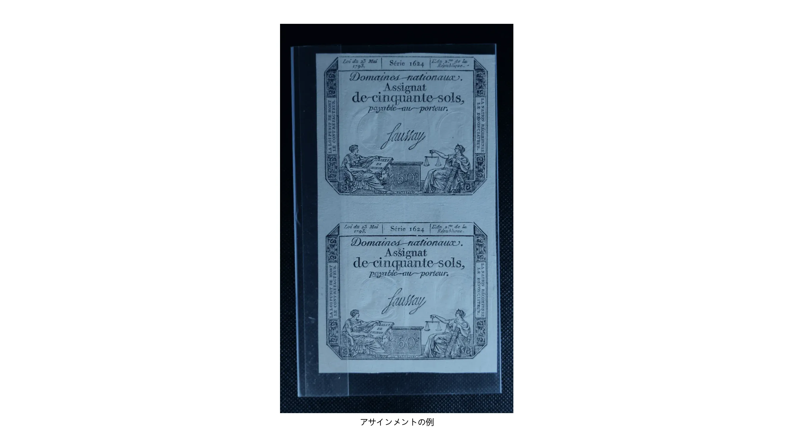

この紙幣がすべての良質な貴金属硬貨に取って代わると、有名なグレシャムの法則に合致し、硬貨不足が生じた。新しい硬貨を鋳造するために、聖職者から押収したベル・メタルが使われた。下の写真は、聖職者から取り上げたコインを溶かして回収した銅で作られた美しいベル・メタルです。

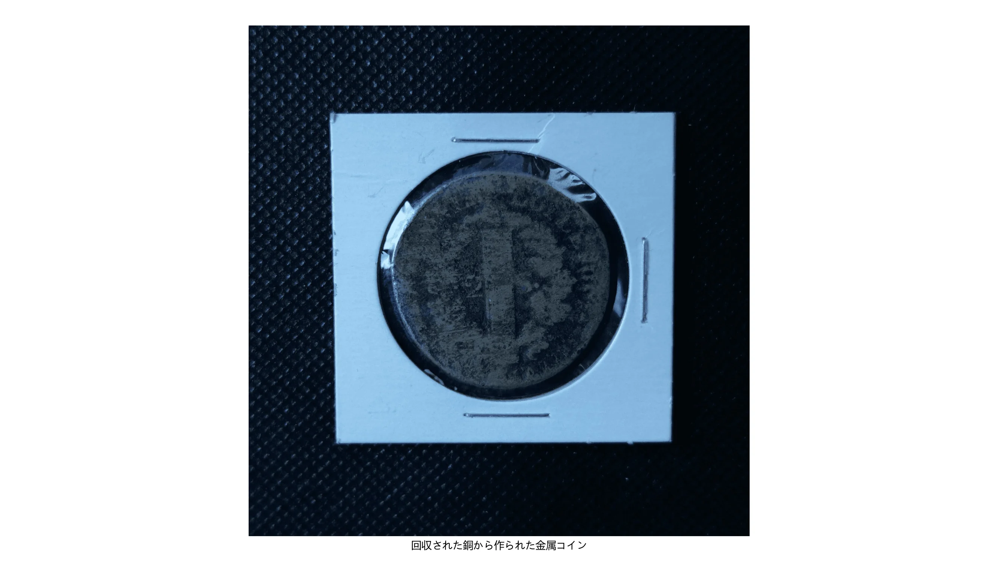

### イギリス支配（18世紀～20世紀初頭）

**18世紀にはオランダを抜き、イギリスが支配的な大国となった。ポンドは現在も使用されている最古の通貨であり、当初は銀1ポンドと連動していた。議会制君主制、強力な徴税能力、1694年のイングランド銀行の設立など、金融・財政革命に支えられ、その地位は徐々に強固なものとなっていった。

フランスとの一連の戦争の後、イギリスは1815年（ワーテルロー）に勝利し、その覇権を確認した。19世紀を通じて、ポンドは世界の基軸通貨として機能した。最盛期には、世界人口のわずか2.5％のイギリスが世界所得の20％を生産し、地球表面のほぼ4分の1を支配していた。

産業革命**と**金本位制**の採用（1717年または1718年、王立造幣局のアイザック・ニュートンの監督下）により、ポンドの信用が高まった。イングランド銀行は金1オンスあたり4.25ポンドの金本位制を採用し、紙幣所持者は紙幣を金に換金できるようになった。

しかし、第一次世界大戦（1914-1918）によって、このシステムは終わりを告げた。数週間のうちに、主要な戦争当事国はすべて金の兌換を停止した。大英帝国、そして後のポンドは、弱体化した状態で第二次世界大戦から脱却し、20世紀にはアメリカのドルに道を譲った。

そして工芸品として、以下にいくつかの美しく興味深い作品をご覧いただきたい。これらは貨幣の分銅である。最初のものはソブリンで、ポンドの最も初期のものです。本物のソブリンは買えないので、これらのコインを表すお金の分銅しか持っていません。重さを量るには秤を使い、ソブリンに相当する貨幣の重さを反対側に置いた。

ソブリンは貨幣であり、もともとは1ポンド相当の金貨であった。

有名なソブリンに先行して、同じ原理で運用されていたギニアがあった。ギニアは、ギニア地方で産出された貴金属を含んでいたことから名付けられた。

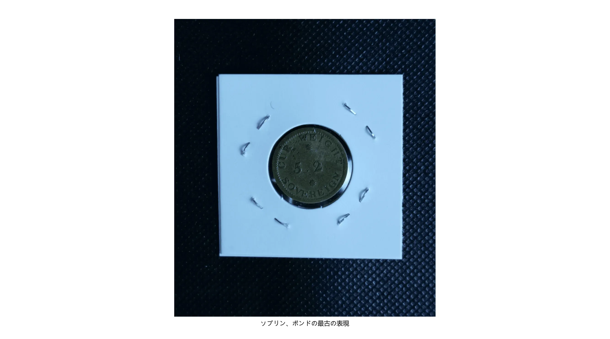

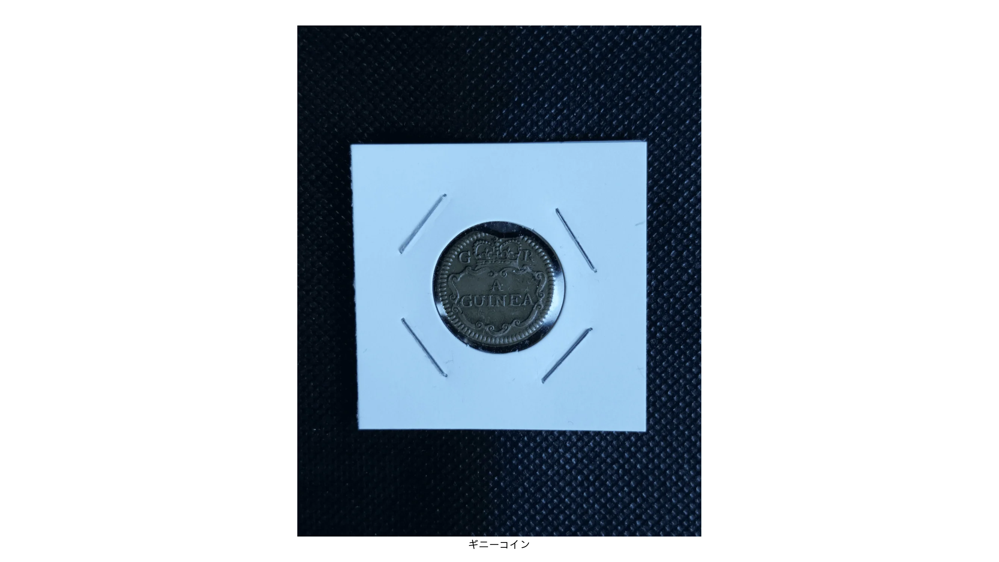

## 中央銀行の出現

<chapterId>15777771-1e28-55f7-a400-69868a47079b</chapterId>

:::video id=7661b7b5-e00f-48f3-b69a-6fb2eb5ebba4:::

最初の基軸通貨とその変遷の歴史に続いて、ここでは中央銀行の出現について述べる。基軸通貨の出現とほぼ同じ経路をたどっているが、当時の銀行技術にもう少し焦点を当てている。

### 銀行とプロトバンクの始まり

早くも13世紀には、イタリア人（フィレンツェ、ジェノヴァ、ヴェネツィア...）が複式簿記の技術を開発した。その後、**アントワープ**（16世紀）は北欧有数の金融センターとなり、その役割は後に**アムステルダム**に引き継がれた。アムステルダム株式Exchange（1609年）のおかげで、VOCの株式が取引されるようになった。

アントワープでは商人の見本市が開催され、商人たちが頻繁に集まって債務を清算したため、新しい金融商品が発明された。下の手形は1761年と新しいもので、**約束手形**である。手書きの詳細と裏面の碑文が特徴で、当時の素晴らしい工芸品である。

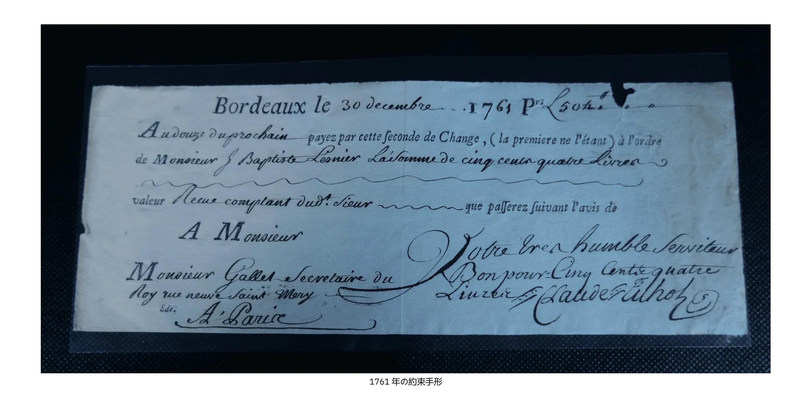

この熱気は、より洗練された銀行機関の創設につながった。 **ロンバルドの銀行家たち**、そして後のオランダ商人たちは、信用商品（為替手形、約束手形など）を完成させた。近代的な銀行システムは、この考えに基づいている。

おわかりのように、これはお金の起源についての最初の疑問に立ち戻ることになる。

貨幣は交換の必要性から生まれる商品から生まれるのか、それとも信用から生まれるのか。その痕跡はまだこのセクションに見られる。

### スウェーデンの例ストックホルム銀行とリクセンス・ステンダース銀行

最初の中央銀行が作られたスウェーデンに話を移そう。

**スウェーデン**は中央銀行のパイオニアである。1657年、ヨハン・パームストルヒは、金属準備高以上の貸し出しを許可された**ストックホルム銀行**を設立し、[分数準備銀行](https://planb.academy/resources/glossary/fractional-reserves)の誕生を祝った。しかし、過剰な銀行券発行がパニックを引き起こし、1663年には銀行が暴走した。さて、さて...

1668年、ストックホルムに世界初の真の中央銀行であるリクセンス・ステンダース銀行が設立された。しかし、この銀行もまた、しばしば王国の戦争資金を調達するための銀行券の乱用に関連した危機（1709年、1715年...）に苦しんだ。

### ジョン・ローのクーデター失敗

フランスに向かおう。そこで再び、愛すべきジョン・ローを見つけるのだ。

**スコットランド人のジョン・ロー**は、摂政（オルレアン公）を説得し、金、銀、政府債務を担保に紙を発行する権限を持つ民間銀行、ジェネラル銀行（Banque Générale）を設立させた（1716年）。この銀行がBanque Royale（1718年）となり、ミシシッピ会社の株を高騰させた。

現実が投機に追いついたとき、**パニックは金の保有を禁止し、ロー紙幣**の使用を強制する決定によって悪化した。さて、さて...

そして1720年、バブルは崩壊し、フランスにおける紙幣の信用は長い間失墜することになった。

### アムステルダム銀行、先駆的モデルの台頭

1609年、アムステルダムでは**アムステルダム銀行**（ヴィッセルバンク）が硬貨の保管と兌換を管理していた。私製紙幣の流通を禁止し、金属硬貨を金庫に預けることを強制した。そして、少しずつ通貨の支配権を奪っていった。両替商にコインを預けることを禁じた。両替商は一日中働き、一日の終わりにコインをアムステルダム銀行の金庫に預けなければならなかった。これまで述べてきたように、国際貿易で使われたのは必ずしも金属硬貨ではなかった。それは銀行の帳簿上の聖典のような貨幣だった。

オランダ商人の力のおかげで、銀行は最初の事実上の「中央銀行」の役割を果たし、世界貿易を安定させた。しかし、やがてVOCに無担保融資を行い、最終的には手形の裏付けとなる金属が底をついた。1790年、VOCに多額の融資をしていたことが明らかになり、事実上の破産宣告を受け、グルデンの信用は失墜した。さてさて...

### イングランド銀行、近代銀行の創設

17世紀のイギリスでは、金銀は金細工師によって保管され、金細工師は領収書を発行していた。この部分的に分散化された組織は、王室が対仏戦争のために大量の資金を必要とすることになったとき、その限界を証明した。

1694年、**イングランド銀行（BoE）**が設立された。こうしてイングランド銀行は、ロンドンの経済界と、戦費調達に躍起になっていた政府との便宜結婚によって誕生した。

イングランド銀行はイングランドにおける銀行券発行の独占権を獲得した（1708年、1742年などに強化）。それ以降、金準備に裏打ちされた紙幣が硬貨とともに流通するようになった。このことは、国家機関が貨幣を徐々に支配していったことを理解する上で重要な点である。まず、アムステルダム銀行は両替商が硬貨を保管することを禁じ、銀行に返却するよう強制した。イングランドでは、民間銀行が金で償還可能な独自の手形を発行することが禁止された。

民間の銀行が銀行券を発行することは認めたが、イングランド銀行券としか交換できなかった。

イングランド銀行のポンド紙幣は金で償還された。これによって通貨に第三の層が加わった。つまり、ベースが金で、その上にイングランド銀行券、さらにその上に民間銀行券があるのです。それ以前は、民間銀行が金で償還可能な独自の紙幣を発行することができた。これは、通貨が国家機関によって徐々に乗っ取られていくもう一つの段階である。

世銀は莫大な融資で国家に資金を供給し、好景気の財源となる莫大な公的債務を構成した。

このモデルは18世紀から19世紀にかけて強化され、イングランド銀行と金本位制のもと、ポンドは世界の基軸通貨となった。

**世界の基軸通貨**は、国家や帝国の経済力、商業力、軍事力に後押しされ、何世紀にもわたって互いに追随してきた：ポルトガル、スペイン、オランダ、そしてイギリス。いずれの場合も、経済の拡大、商業的成功、通貨の国際的な普及、債務、コストのかかる戦争、通貨創造や信用の乱用、そして最終的な衰退という、似たようなサイクルを繰り返してきた。

**中央銀行**の出現は、緩やかな過程であった。このような制度は、多くの場合、費用のかかる戦争の中で生まれ、国家が負債によって資金を調達することを可能にした。金本位制が採用されたとき（17～19世紀のイギリス）、それは安定のうわべを提供したが、20世紀の世界大戦によって金兌換は徐々に放棄された。こうして、貨幣を鋳造する権力は、王室専売から、最初は民間（金細工師、銀行家）、次に半公共（中央銀行）という、より複雑な主体へと移行し、制度化されグローバル化された形態へと貨幣主権が進化したことを反映している。

つまり、これが先ほど私が述べたことだ。私たちはしばしば、国債の負担を中央銀行か、あるいは国会のような法的機関による貨幣発行許可に直接転嫁してきた。

そしてここで最も重要な事実は、**君主の破産によって消滅しうる負債から、**主に国民の肩にかかっている負債に変わったということだ。

## 不換紙幣制度への道

<chapterId>27a98545-d350-56ee-a200-92468e6b9b33</chapterId>

:::video id=e27a753e-aeee-4307-a65c-9506aab380a1:::

貨幣の歴史に関するこの講座も終盤にさしかかり、最後に2つのトピックを提案したい。最初のトピックは、現在の不換紙幣制度に至る様々な段階である。第5章で述べた中央銀行の創設に関する事実を再確認し、最終的に現在の基軸通貨となっている米ドルの概念を加える。ドルの起源は銀貨であるため、ドルがどのように誕生し、どのように進化し、どのように変化し、どのような段階を経て不換紙幣制度になったかを見ていく。

そしてその直後には、福祉国家に至った経緯を理解していただくために、金融の歴史について短い部分をお話しします。つまり、どのようにして不換紙幣制度に至ったのか、そしてその直後に、金融の進化がどのようにして福祉国家の概念に至ったのかということです。

### 近代銀行業のヨーロッパ的基盤

13世紀のフロリンに話を戻そう。不換紙幣モデルに至った経緯を理解するには、13世紀から始める必要がある。フロリンと並んで、メディチ家と同時期に登場した技術が、為替手形という概念である。

その後、アントワープの証券取引所が登場し、割引や約束手形の概念が生まれた。

その後、見てきたように、アムステルダムで最初の株式市場であるVOCが誕生した。これが資本主義の誕生であり、会社の株式と株式の交換が行われた。その後、アムステルダム銀行は法令により預金の使用を義務付けた。つまり、硬貨は一日の終わりに預けなければならなかった。銭を硬貨の形で保管できなくなったのは両替商だった。

そして17世紀末、戦争資金を調達するために債務を創出する必要性からイングランド銀行が創設された。この時、民間銀行が第三の貨幣層となった。ちなみに、フロリンから中央銀行創設の概念に至るこのセクション全体は、ニック・バティアの名著『Layered Money』に非常にうまくまとめられている。私たちは、フランス語圏のあらゆる人々がこれらの教えから恩恵を受けられるよう、素晴らしい翻訳を行った。

17世紀末のことだ。イングランド銀行は戦争資金を調達するために創設された。

民間銀行が通貨の第三層を引き継いだのである。実際、民間銀行の手形はもはや金では換金できず、金で換金できるのはイングランド銀行の手形であった。これは、イングランド銀行という機関が交換権を掌握したことを示している。

そして1776年のパニックがやってきた。誰もがマネーピラミッドを駆け上がった。つまり、1776年に銀行が暴落し、第3層の紙幣、つまり民間の銀行手形を持っていたすべての人々がイングランド銀行の手形を手に入れようとし、さらに金を手に入れようとしましたが、金庫には明らかに十分な金がありませんでした。イングランド銀行は一種の銀行休業日を宣言し、金貨の返済を回避した。

### 米ドルの進化

私たちはフローリンからイングランド銀行の設立へと移行した。もちろん、その間に第一次世界大戦と第二次世界大戦があったが、それ以前の1796年には、大西洋の反対側でも動きがあった。1776年、アメリカはまだイギリスの植民地で、植民地ではこの紙幣が使われていた。下は1776年のコネチカット州の2シリング紙幣。

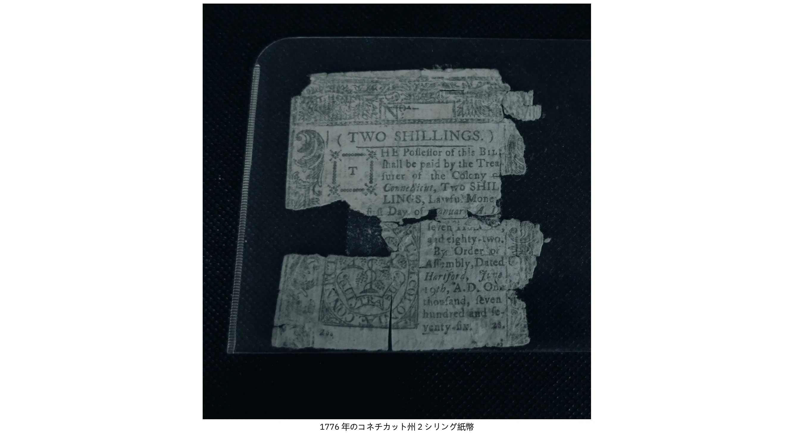

イングランドに宣戦布告し、最終的に自国通貨を発行する前に、植民地はスペイン・ドルと並んでこの紙幣を現金取引に使用した。実際、「ドル」という言葉はアメリカ・ドルを示す言葉として残った。

私の記憶に間違いがなければ、1792年に貨幣の鋳造を許可する法律が成立した。例として、下の写真は近代のアメリカン・ドルである。

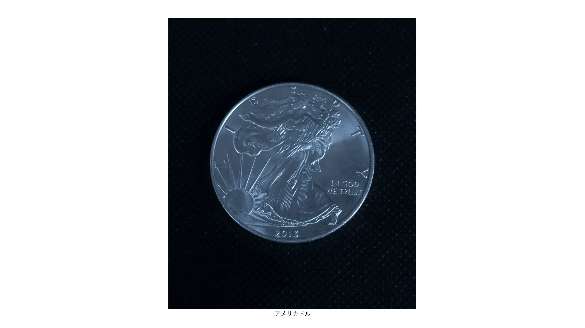

銀1オンスを表すので、30ドルか40ドル程度の価値があります。その価値は銀の価格によって変動するが、通常は少なくとも30ドルか40ドルである。もちろん、現在では1ドルの額面価値しか残っていないが、当時の米ドルはこの銀の価値に根ざしていたのである。

アメリカの南北戦争について話そう。南軍は貨幣を印刷し、ハイパーインフレを起こした。この現象は、50％のハイパーインフレ率には達しなかったため、公式のハンケ・クルス・リストには含まれていない。しかし、毎月40％のインフレ率を記録しており、戦争中に相当量の通貨が印刷されたことを示している。

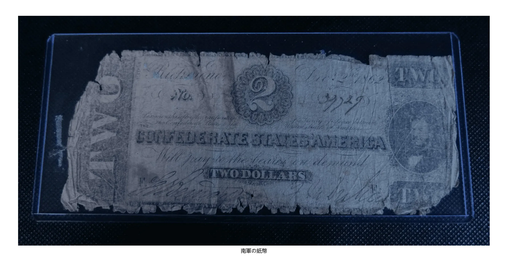

北部の敵対勢力もドルを持っていた。すぐ上に見えるのが南軍のドル、下に見えるのが北軍のドルである。裏面が緑色だったため、「グリーンバック」と呼ばれていた。

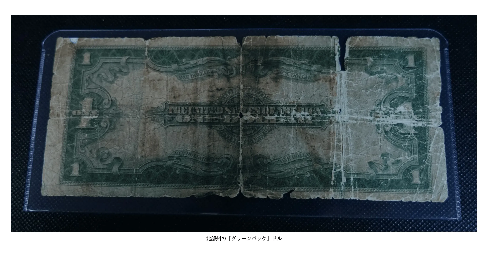

そして、現代の紙幣との大きさの違いを比べてみてほしい。当時の紙幣はもっと大きかった。

ご存知の通り、北部が勝利したため、グリーンバックは統一されたアメリカ各州の通貨となった。その後、1913年にFEDが設立され、第一次世界大戦が勃発した。

第一次世界大戦の余波で、印刷された紙幣の最後のシリーズには必ず「要求に応じて金と交換可能」という文言が含まれていた。つまり、1928年の金価格は20.67ドルであったため、20ドルでほぼ1オンスの金が買えたのである。下の画像の紙幣は、1928年に1オンスの金を買うことができた。

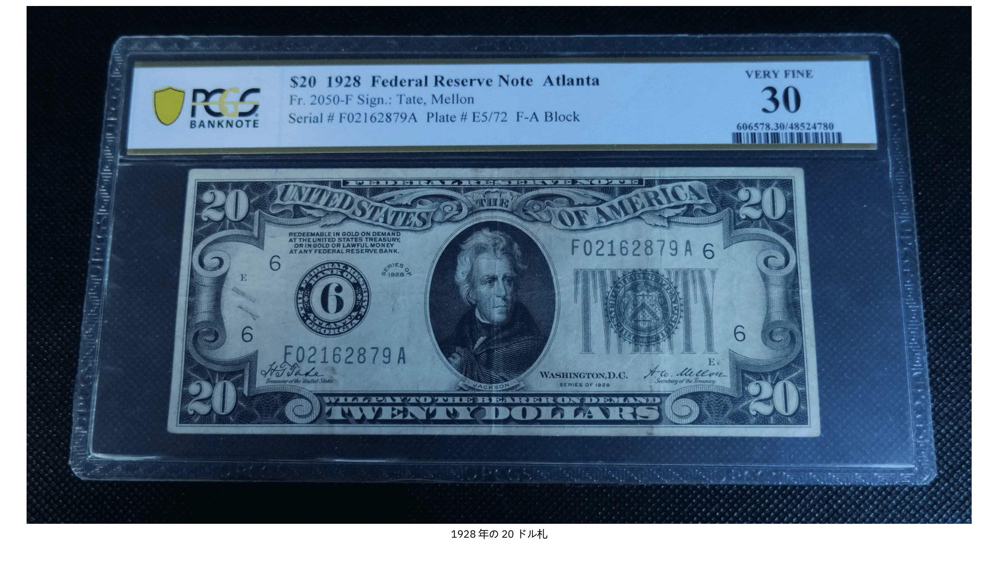

現在、金1オンスの価値は3,000ドルである。もちろん、切り下げの威力はここにある。金で償還可能」という言葉を含む最後の法案だった。大統領令6102の直後、彼らはすべての金を差し押さえるだろう。実際、金と金券の両方を差し押さえるのだ。

下の写真は1928年の金券。

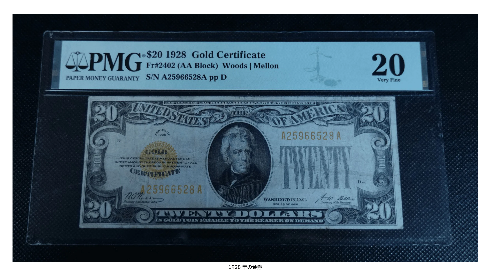

それは1928年のお札のように「金で換金可能」であるだけでなく、金貨でも換金可能であった。大統領令6102以降、それらはすべて押収された。1964年までは所有することさえ違法だった。

持っていて本当に良かった。

1964年から、私の記憶に間違いがなければ1974年まで、金を所有することは違法となった。70年代には、ニクソン・ショックの後、人々は金を蓄えることができるようになった。1933年に「大統領令6102」が出され、金地金が押収され、金地金の所有は違法となった。金を持っていると捕まり、大きな実刑判決を受けることになったのです。1934年以降、金貨は1オンスごとに下のようなお札と交換されました。

1928年当時、1ドルにはまだ「金で償還可能」という文字があった。

大統領令6102号の発令後、彼らはすべての金を押収し、金1オンスにつき20.67ドルと交換した。その後、詐欺が明るみに出た。1934年、彼らは「この紙幣はすべての債務に対して法定通貨である」と印刷された新札を発行した。

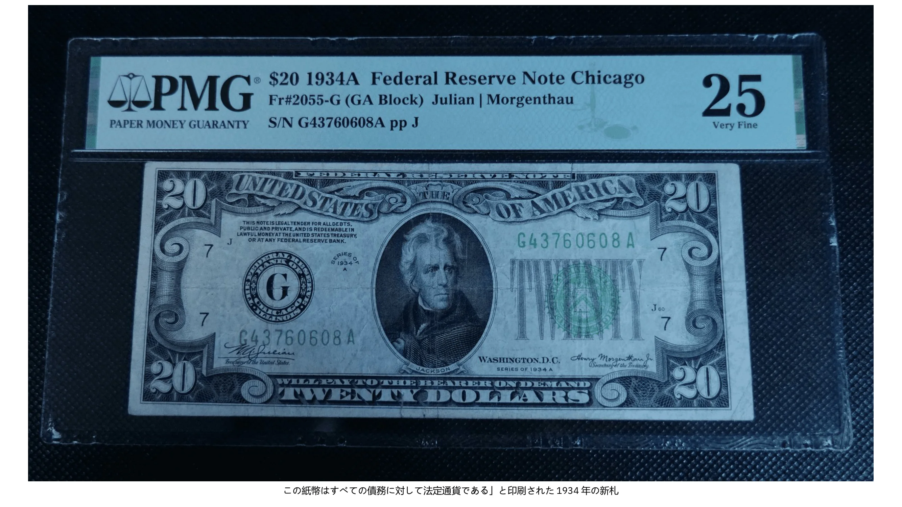

ここで、"金と交換できる "という表現に代わって、法定通貨という概念が登場する。この2つのお札は、単語が少し変わっただけで、同じように見えるかもしれないが、詐欺はこの時期にドルが切り下げられたという事実にある。1オンスの金の価値は20.67ドルだったが、1934年には35ドルにまで下がった。約40％の切り下げである！

その後、第二次世界大戦が起こった。第二次世界大戦後、ブレトンウッズ協定によって世界の金の多くがアメリカに集中された。アメリカはこれと引き換えに紙幣を発行したが、これらの紙幣はもはや一般市民が金と交換できるものではなかった。その代わり、紙幣は州レベルで金と交換可能であり続けた。

やがて、フランスやドイツといった国々は、アメリカの金庫にある金よりも、流通しているドル紙幣のほうが多いのではないかと疑い始めた。

そこで彼らは金塊の本国送還を求めた。彼らは「わかった、そうしよう、だが少し時間がかかる」と答えた。1971年、わが友リチャード・ニクソンは、紙幣と金の結びつきをきっぱりと断ち切り、その過程で投機筋を非難した。

金は1オンスあたり35ドルと過小評価されていた。この価格は、印刷された貨幣の量や真の市場価値に対応していなかった。わずか数年の間に、価格は34ドルから800ドルに急騰した。デナリウスとソリダスのつながりが断ち切られたローマなどの歴史的な例と同様、金は浮動することを許された。この事実が価格発見のプロセスを引き起こし、その結果、金はその後ドル建てではるかに高く評価されるようになった。

### 現代の不換紙幣システムとその意味

この部分は、銀や金に基づく通貨制度からどのように移行していったかを要約している。少しずつ、金融機関は貨幣に対してより大きな力を持つようになった。最終的に、ある一方的な決定が、過剰発行に続いて貴金属と貨幣のつながりを完全に断ち切った。

その結果、金と紙幣や経典の間にはもはや何のつながりもない。分数準備制度でもない。それは時代遅れの概念だ。その代わりに、民間銀行が銀行の信用を通じて貨幣を発行し、創造する。貨幣は主にこの方法で作られ、中央銀行が設定する主要金利と相関関係にある。

本当に制限はない。少なくともアメリカとカナダでは、もう強制的な準備金水準はない。唯一の準備金は、銀行が流動性を使い果たさないように、銀行間取引に対応できるように手配する必要性だけである。

しかし、3％、1％、10％の強制的な準備金はない。私たちは分数準備の概念から本当に離れてしまったのだ。現在、中央銀行、財政赤字を通じた政府、量的緩和（QE）を通じた中央銀行、そして銀行融資を通じた民間銀行が、マネーサプライを増加させ、インフレを引き起こす可能性がある。

お金とインフレの関係を理解するには、Plan ₿ Networkにあるこのテーマに特化したコースをお勧めする。生活の中で目にする物価上昇とインフレの違いを学ぶことができる。両者は同じものではない。実際、インフレという場合、インフレそのものではなく、物価上昇のことを指していることが多い。インフレはかなり正確な概念であり、マネーサプライの増加によって説明される。

https://planb.academy/courses/caa75343-ac90-4249-bcca-0e2e57c3a0f1

不換紙幣の世界に関するこのセクションの最後に、今説明したインフレなどの現象をよりよく理解するための資料を紹介したい。

ご清聴ありがとうございました。

## マネーバブルの歴史

<chapterId>b6451c46-917d-11f0-97de-6bc5081765fa</chapterId>

:::video id=5967d9a6-aae4-4b84-a283-71b1b735bca4:::

### 紙幣の発明と最初の大バブル

18世紀に中央銀行が設立されると、銀行券という形のマジック・マネーという真の革命が生まれた。フランスにおける最も顕著な例は、ジョン・ローのものである。パリに亡命していたこのスコットランド人は、摂政オルレアン公に対して、国営銀行と植民地商社を設立することで王室財政の破綻を解決することを提案した。

このシステムで、ローは紙幣と自社株を結びつけた。紙幣が流通すればするほど、株式の価値は上がり、銀行はより強固なものになった。バブルは1720年に突然崩壊し、貴族、ブルジョワジー、そしてキンカンポワ通りに投機するようになったヨーロッパの多くの人々を破滅に追い込んだ。その結果、フランスでは紙幣に対する不信感が広がり、ヨーロッパで初めて投機的バブルの教訓を得ることになった。

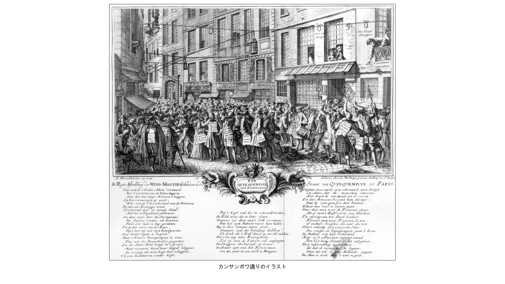

### 土地が "担保 "になるとき

その1世紀後、フランス革命は、差し押さえられた教会財産を裏付けとする通貨、**アッシニャー**で新境地を開いた。土地を貨幣の担保に変えるという、紙の上では魅力的なアイデアだが、土地は流動性も分割可能性もないため、効果はなかった。その結果、ハイパーインフレが起こり、土地の使用は何度も禁止され、インフレは抑制されず、物資不足に陥った。

この混乱に深く影響されたナポレオンは、1800年にフランス銀行を設立し、金と銀を通貨基盤として再確立した。信頼を回復するための現実的な方法、それは硬貨で支払うことであった。

### 華やかな20年代と1929年の世界恐慌

2世紀前に話を戻そう。第一次世界大戦後、各国政府はインフレと金停止によって戦費を賄った。1920年代、アメリカのFRBは英ポンドを支えるため、過度に緩和的な金融政策をとった。その結果、金融緩和、ウォール街での野放図な投機、信用による株式購入、不動産と銀行のバブルが発生した。

この機械がおかしくなったとき、1929年の大暴落は避けられなかった。大規模な銀行破綻、記録的な失業、炊き出しの行列。このため、「デフレはすべて悪い」という誤解が根強くなった。

### 90年代のアジアとドミノ効果

1990年代、「アジアの奇跡」は世界を夢見させた。Exchangeの金利はドルに固定され、成長率は8～10％に達し、欧米の資本が流入した。すべてが順調だった...潮が引くまでは。倒産が連鎖し、通貨は80％切り下げられ、投資家は破滅した。IMFは痛みを伴う改革を課し、介入せざるを得なかった。豊富な資本、信用によるバブル、そして崩壊。

### 2008年と永久バブルの時代

インターネット・バブル（2000年）に続いて、サブプライム不動産バブルが起こった。証券化によって銀行融資は「トリプルA」の金融商品に生まれ変わり、世界中に広まった。約束：リスクを希薄化することでリスクを排除する。現実は、すべてのリスクは相関関係にあった。不動産が崩壊したとき、世界の銀行システム全体も崩壊した。

その結果が、大規模な公的救済、量的緩和、ゼロ金利である。危機が起こるたびに、もはや行き過ぎたものは浄化されず、より多くの負債と貨幣の増刷でカバーされることになる。これが現在の状況を招いている： **株、不動産、美術品、暗号、さらにはポケモンカードに至るまで、あらゆるものが人為的に膨張する。

### マジックマネーの永遠の復活

ある社会が、実物商品を生産する代わりに貨幣で富を創造できると考えるやいなや、バブルが発生するのだ。ジョン・ローから2008年まで、カンサンポワ通りからウォール街まで、このプロセスは繰り返されてきた。

そして結局のところ、誰も紙を信用しなくなると、人々は金、土地、安全な避難所......あるいは新しい通貨といった別のものを探すようになる。昨日はナポレオンが金属を押し付けたが、今日はBitcoinがその後継者だと見る人もいる。

金融の歴史は、印刷、投機、崩壊という終わりのないサイクルだ。次のバブルまで。

## 金と暴力

<chapterId>9486fe64-854f-5e17-86b3-8873baca39a8</chapterId>

:::video id=bd6d0807-2d8f-4637-a0f5-1e990e5c0d0f:::

この短いセクションでは、コースを通してすでに見てきた出来事の多くを再訪し、私が興味深いと思う逸話をいくつか要約する。

### テクノロジーと暴力

ここでは、私たちがこのコースですでに話したであろう逸話をいくつか紹介しよう。これらは、テオがB-Ondyで行った講義について、私がテオと行った非常に興味深い議論を紹介するためのものである。

### 金と国家の強制

このセクションを紹介するために、コースですでに扱ったであろう出来事を思い出してもらうために、簡単で網羅的でないリストを挙げよう。

お金と暴力の関係で私がすでに言えることは、無限に印刷できる無価値な紙幣に関しては、多くの場合、あらゆる種類の規則とあらゆる種類の脅迫が伴うということだ。紙幣には文字通り、偽造者は死罪に処せられると書かれていた。当時の法律書には、この有名な紙幣を受け入れない者に対する殺害予告を簡単に見つけることができる。

フランスに残るために、私が入手できた革命時代の法律書のひとつに、ギロチンの運搬と操作のための「日当」が通貨関連の項目に記載されていた。これはかなり奇妙なことだと思った。

私たちはまた、国家が鋳造を監督する中国における貨幣鋳造についても話してきた。コースの冒頭のセクションで、あまり美しくない硬貨が廃棄された場合、法的な影響があることを見た。

また、イングランドのある王は、自分の期待通りに振る舞わなければ、貨幣を鋳造する者の手を切り落としてしまったという逸話もある。

また、中国では仏教僧院から銅が押収されたという話を読んだことがある。銅の価値が上がり、自国の経済が不安定になりつつあるときに--その経済は、金属の価値とはほとんど関係のない不換紙幣に基づいていた--、彼らは富のある場所を見つけて、僧院から銅を押収するという手段に出たのだ。

同じことが、イギリス宗教改革中のイングランドの修道院にも当てはまった。有名な国王が離婚をめぐってローマ教皇と争ったとき、その背後にはもうひとつの理由があった。

フランス革命の際、彼らは教会の資産をすべて押収した。彼らは、教会の鐘を溶かして作られた美しいコインを見た。

さらにさかのぼれば、経済的暴力と自由、解放的な法律という最も明確な概念のひとつは、**ディオクレティアヌスの世襲制カーストである。彼らは農民としての仕事から離れようとしたが、ディオクレティアヌスは彼らに「お前たちは土地を離れることはできないし、子供たちも離れることはできない」と言っただけだった。同じことが兵士たちにも当てはまった。

それはかなり露骨な暴力だと思う。テンプル騎士団やフランス国王の話をすることで、結論づけることができる。テンプル騎士団がフランスに定住したとき、彼はテンプル騎士団の富というマナを見て、国家財政の問題を抱えたと想像します。彼はテンプル騎士団を訴え、そのうちの何人かは財宝の一部を持ち逃げすることができたのですが、それがアメリカかカナダで非常に興味深い番組を生み出すことになりました。誰が制作したのか知りませんが、『オークアイランドの謎』という番組です。テンプル騎士団の財宝がカナダのマリティーム諸島の島に埋まっていると考えている人たちが、何年も、もしかしたら10年以上も、ある種の井戸を掘削している。彼らはギャラリーがたくさんある井戸を発見し、このテレビ番組のテーマであるこの島にテンプル騎士団が埋めた財宝を探している。この番組の大ファンである父に敬意を表したい。

このコースで目にした、暴力との関連性を高めるような事実をざっと列挙してみた。次はテオから、テクノロジーの変化と、平民と権力者のパワーバランスに関する興味深い話を聞かせてもらおう。

ありがとう！

## 組織的暴力の経済的影響

<chapterId>66bd4674-2159-5489-ad4b-ec5e3fb691af</chapterId>

:::video id=c8b063c6-aeb4-4a94-9027-b11d369e71a4:::

### 組織的暴力と国家の進化

歴史学者フレデリック・C・レーンは、歴史を通じて国家の構造は暴力を行使するためのテクノロジーによって形成されてきたという画期的なテーゼを提唱している。国家は合法的な暴力を独占するというウェーバー的原理から出発し、この独占は逆説的にこの分野での競争よりも効率的であるが、攻撃コストと防衛コストの関係によって発展していく、とレーンは指摘する。

中世の封建制度からルネサンスの都市国家、工業国民国家、そして現代の福祉国家へ。それぞれの変遷は、およそ400年から500年ごとに起こる、暴力の行使における大きな技術的飛躍に対応している。

### 中世のバランス

中世では、農業経済が90％以上を支配していた。文字通り土地に根を下ろした農民は、領主や騎士から逃げることはできなかった。軍事技術-手鍛えの鎧、長年の剣の訓練-は非常に高価だった。この非対称性は、防御よりも攻撃を大いに支持した。

不動の農業生産者は、暴力の地域独占者の虜となる。中世の税金は、逆説的ではあるが、現代における78％の強制徴収に比べれば控えめである。農民は抵抗も退去もできないので、領主は意のままに課税できる。

### 商人ルネッサンス

北方ではハンザ同盟貿易が、南方では地中海貿易が勃興し、状況は一変した。付加価値を生み出す主役である商人たちは、船という移動資本を持っていた。海上の取り締まりは困難であったため、商人たちが必要としたのは軽い海上民兵だけであった。何よりも、課税が過大になれば、近隣の港に簡単に移住することができた。

この流動性は、都市国家間の課税競争を生み出した。ヴェネツィア、ジェノヴァ、ブルージュは、信頼できる契約、質の高い通貨、保険、最小限の課税など、可能な限り自由な枠組みを提供しなければならなかった。王侯は、強制するよりも誘惑しなければならなかった。対称性が逆転し、（逃亡による）防衛は攻撃よりも容易になった。

### 工業化時代

産業革命は、封建制に似た構図をもたらした。工場、鉄道、組立ラインは、巨大で不動の投資である。ヘンリー・フォードは、課税に直面して工場を移転することができなかった。労働者は工業都市に集中し、個人で移動するよりも集団で交渉するために組合を結成した。

産業計画（日本、韓国）、インフラストラクチャーの軍事的保護、労働者に対する最低限の社会的給付。第二次世界大戦は、この脆弱性を示している。敵の工場を爆撃することが支配的な戦略となった。物理的資本の集中は、福祉国家の財源を確保するための巨額の税金の徴収を可能にした。

### マイクロプロセッサー革命

つの技術革新が今、こうした古くからの均衡を崩そうとしている。マイクロプロセッサーは戦争を一変させる。ネバダ州のオペレーターは、アフガニスタンでドローンを外科的な精度で操縦する。湾岸戦争（1991年）は、この画期的な進歩を実証した。世界第4位の軍隊（イラク）を45日間で全滅させ、連合軍側の死者は200人に満たなかった。技術的優位が正面からの攻撃を不可能にしたのだ。

インターネットと非対称暗号は、価値の創造に革命をもたらしている。開発者はMacBookとStarlinkがあればどこからでも仕事ができ、制作物を即座に無料で輸出できる。デジタル・ノマドは地理的な囚われを逃れ、ルネサンス以来の方法で国家同士を戦わせる。

Bitcoinはこの論理の集大成である。国家から解放された通貨は、不可侵の暗号シールドによって保護される。富はいかなる物理的な力に対しても防御可能となる。個人は国家の独占から自らを守る能力を取り戻す。

### ウェストファリア・モデルの崩壊

西欧の福祉国家は、工業化時代のために設計されたものだが、時代遅れになりつつある。開発者、アーティスト、金融業者といった価値創造者たちは、シンガポール、ドバイ、エルサルバドルに移住し、最小限の課税と引き換えに、より少ない公共サービスを好んでいる。アップルやテザーのような現代の巨大企業は、オフィスも物理的なインフラも必要としていない。

このような頭脳流出が、純拠出者の減少、公共サービスの低下、残留者への課税強化、そして離脱の加速というスパイラルを生み出している。州は抜本的に縮小するか、破産するしかない。小規模で競争力のある管轄区域への細分化、つまりデジタル都市国家の新たなモデルは避けられないようだ。

歴史は、こうした移行には何世代もかかることを教えている。しかし、GW21の通貨と国家の分離は、そのプロセスを加速させる可能性がある。個人は自分の足と暗号化された財布で投票するようになり、世界の勢力地図は、私たちが知覚し始めたばかりの線に沿って塗り替えられる。

## 金融のごく短い歴史

<chapterId>1d37fff1-a091-5034-8e71-4af590b8ffce</chapterId>

:::video id=fdfabbc6-e4d8-463a-8522-19176f8fb460:::

不換紙幣制度に至るまでの貨幣の歴史に続いて、最終的に福祉国家につながる金融の進化について、手短に簡潔に説明したい。当初、ローマ時代には硬貨があった。

硬貨は帝国が兵士に報酬を支払い、拡大し、貿易を行うための金融技術だった。それは非常にうまく機能していたが、最終的には切り下げが多すぎた。拡大が止まり、戦争や領土拡大から戦利品を得られなくなったある時点で、そのシステムは崩壊した。

### 金融テクノロジーの進化

その後、中世に入り、フローリンが安定した通貨を復活させ、イタリアとアントワープで銀行業が発展し、「貨幣の時間的価値」という概念が生まれた。彼らは「約束手形」を発行する、つまり、後日100ドルに金利を上乗せして回収することを約束する紙幣を作るために、割引を開発したのである。

この制度は、期間満了前に債券を売却することを可能にする金融技術を生み出し、6カ月の期間のうち4カ月後に売却すれば、残りの2カ月の利回りの損失を補うプレミアムを実際に支払うことになる。

当時、アントワープとアムステルダムで開発された金融技術だった。その後、中央銀行の発展や最後の貸し手という概念が生まれた。アムステルダム銀行の時代には、国際貿易における硬貨の使用は放棄され、経典貨幣が使用されるようになったと言える。

その後、18世紀になると、金融技術という点では、保険について語ることができるようになる。ニール・ファーガソンの著書『The Ascent of Money』には、こんな逸話がある。最初に誕生した保険会社は**スコティッシュ・ウィドウズ**という会社で、基本的には聖職者たちが、突然死することもある司祭のために保険を開発しようとしたのです。当時、聖職者たちはスコットランドで1年間、妻や子供たちの世話をしていました。それで聖職者たちは、この1年という期間が少し短すぎるのではないかと考えたのです。その結果、早死にした司祭の数に応じて、制度がその費用を賄うのに必要な拠出者の数を文字通り計算する数理計算**を発明したのである。

数理計算を開発し、「よし、各神父はこの金額を寄付してくれる。もし司祭が死んだら、その妻と子供たちが自立するまで生き延びるための費用を保険で賄うことができる」。このシステムを普及させたのは、「スコティッシュ・ウィドウズ」という最初の保険会社で、そこでこのシステムが展開された。

### 民間保険から福祉国家へ

つまり、保険は金融技術の歴史の一部なのだ。つまり、健康な人に健康保険を提供すると、「私は健康だから病気にならないだろう」という理由で、保険料を支払うことにあまり興味を示さなくなる可能性がある。一方、自分が病気であることを知っている人は、保険に加入したいと思うだろう。

この制度では、健康保険に加入する病気の人の数と、加入する可能性のある健康な人の数が不均衡になる。つまり、ある種の不均衡が発生するのだ。計算すると、コストを相殺するのに十分な数の健康な人を保険に加入させることができないため、均衡はとれないだろう。経済学では、これは**モラルハザード**という概念である。

保険加入を義務化するというアイデアもある。すべての人に保険料の拠出を義務付ければ、全体のバランスが調整され、健康な人も不健康な人も保険料を拠出するようになり、最大の人口にリスクが分散される。

だから、世界の多くの地域で、国は「それなら私たちが面倒を見ます」と言ってきた。私はこの問題の専門家ではないが、これと同じ理屈が、失業保険など他のあらゆる形態の保険にも適用されているのだろう。単純化し、最適化したいという願望があるのだ。

元々は民間企業であり、国民にリスクを分散させるという保険市場のニーズに応えるための民間の取り組みであったこれらの金融概念が、モラルハザードや最適化を求めるという、おそらく極めて論理的な理由によって、国家によって利用されるようになったのだ。

### 国家独占に関する代替モデルと考察

結局、カナダのようないくつかの国では、健康保険や失業保険など、いくつかの種類の保険が州の独占状態になっている。

私の知っている例を挙げよう。スイスではシステムが少し違います。民間の共済会社と民間の病院があり、共済会社を選ぶこともできるし、共済会社の中でパッケージを選ぶこともできる。このシステムの大部分は私的なものですが、それでも比較的普遍的なサービスを受けることができます。

だから、民間で運営されている可能性もあると思う。しかし、私が皆さんに説明したかったことは、実は、あるシステムが他のシステムより優れているかどうかを表現するための発言ではなく、むしろ、金融の歴史について読む中で、なぜ西洋、特にフランス、特にカナダでは、国がこうした金融の原則を管理しようとしたのかを理解したことを説明したかったのです。

私が言いたかったのは、保険という概念は何よりもまず金融の進化であり、政府が得意とするように、いくつかの理由から、貨幣を支配しようとしたように、保険も支配しようとするだろうということだ。ちなみにその理由のひとつは、最後の貸し手という概念である。

この考え方は、リスクをより広く分散する大きな機関が背後にある方がずっと良いというものだ。これが、最後の貸し手という概念の背景にある最初の構想である。この機関は、生き残るのに十分な強さを持つ機関を実際に選び、お金を貸すことでその機関の破綻を防ぐことができる。

当時、この概念が初めて登場したときは本当に分析が行われましたが、結局のところ、「大きすぎて潰せない」、中央集権化されているためほとんどすべての銀行、そしてすべての大企業に適用され、すべての人を救うことになったのです。結局のところ、今説明した保険の概念と同じように、国によって「大規模に」適用される概念であることに変わりはない。

最終的に国家は、特定の問題を解決するためにスコットランドで生まれた金融技術を、今日のような巨大な福祉国家へと発展させ、すべての面倒を見ることを決定した。数理ファイナンスの原理を利用して、困っている人々にサービスを提供するのだ。しかし、このシステムから生じる独占がさまざまな問題を引き起こすことは同意できる。幸い、スイスのような異なるモデルも存在する。

福祉国家という概念は、金融から生まれたものであることに気づかなければならない。この認識は、有名な国家独占以外の道を探ることができることを示唆している。私はこの推論を、最後の貸し手としての中央銀行の概念にも適用したい。

# 最終節

<partId>9bada469-7ef0-511a-9eaa-f8eb66d5906f</partId>

## このコースを評価する

<chapterId>a9494e2b-8a4d-5811-8a7b-b4a91fb22778</chapterId>

<isCourseReview>true</isCourseReview>

## 結論

<chapterId>1094e793-b4c6-5782-aa4a-71cde00ce7c0</chapterId>

<isCourseConclusion>true</isCourseConclusion>