# 주화의 역사 여행

이 매혹적인 강좌에서는 초기 문명부터 현재의 화폐 시스템에 이르기까지 화폐의 매혹적인 진화를 탐구해 보세요. 신석기 시대부터 현대에 이르기까지 여러 시대를 넘나들며 위대한 인류 문명에서 화폐가 어떻게 형성되고 형성되어 왔는지 알아볼 것입니다. 메소포타미아의 원시 화폐부터 암호화폐, 리디아 동전, 르네상스 플로린, 중앙 은행의 출현에 이르기까지 이 강좌는 우리 사회의 기본 기둥 중 하나인 화폐에 대한 포괄적인 관점을 제공합니다.

+++
# 소개

<partId>59878a67-8a1d-5d6b-af41-5b847c14363c</partId>

## 화폐의 역사 소개

<chapterId>ca53597e-be9a-5261-a55f-11fac8504a68</chapterId>

:::video id=08ff35ca-8a40-4286-abaf-71283faf6e78:::

화폐의 역사에 관한 이 강좌에 오신 것을 환영합니다. 제목에서 알 수 있듯이 동전의 역사적 진화를 함께 살펴볼 것입니다. 신석기 시대부터 현재에 이르기까지 과거의 주요 제국과 문명을 살펴볼 것입니다.

하지만 이 강좌는 단순한 날짜나 역사적 사건의 연표에 국한되지 않습니다. 오히려 화폐, 즉 통화의 출현과 관련된 기본 개념에 대한 심도 있는 이해를 제공하는 것이 진정한 목표입니다.

### 살펴볼 기본 개념

통화 자체의 출현, 통화 시스템, 은행, 지폐, 중앙은행의 출현, 그리고 마지막으로 현재의 '법정화폐' 통화 시스템의 출현에 대해 이야기하고 있습니다.

메소포타미아에서 부채 화폐와 계좌 단위가 등장하고 원시 사회에서 지참금과 혈통 화폐와 같은 다른 시스템이 등장하면서 원시 화폐에 대한 여정을 시작합니다. 또한 중왕국 훨씬 이전인 고대 이집트에서 이미 실제 화폐 시스템이 어떻게 존재했는지도 살펴볼 것입니다.

그런 다음 경제학 교과서에 따르면 화폐의 진정한 시작으로 여겨지는 중요한 순간인 리디아에서 최초의 동전이 등장한 시기로 넘어가 보겠습니다. 이 동전이 페르시아와 알렉산더 대왕, 그리고 로마를 거쳐 어떻게 퍼져나갔고, 마침내 지배와 몰락을 맞이하게 되었는지 살펴볼 것입니다.

지금까지 배운 모든 것을 바탕으로 "돈은 항상 빚이다" 또는 "돈은 항상 상품이다"와 같은 선입견을 넘어 돈의 정의에 대해 함께 생각해보는 시간을 가져보겠습니다. 실제로 돈은 재화인 동시에 사회적 통념이기도 합니다. 특히 화폐 프리미엄의 개념에 대해 논의하고 화폐의 출현을 설명하는 다양한 이론을 통합하는 시도를 해보겠습니다.

### 주요 시기 및 화폐 혁신

그런 다음 덴마크 침략자들에게 뇌물을 주던 영국 페니와 오늘날 일부 현대 지폐에 그 기억이 남아 있는 샤를마뉴의 파운드와 같은 놀라운 혁신이 등장했지만 화폐의 불안정성으로 인해 어려움을 겪었던 시기로 돌아갑니다.

또한 십자군 전쟁으로 인해 최초의 원격 송금 시스템이 어떻게 등장했는지도 살펴볼 것입니다. 그런 다음 르네상스와 함께 등장한 화폐인 플로린의 영향과 유럽 물가에 큰 영향을 미친 아메리카 대륙의 귀금속 도착에 대해 살펴볼 차례입니다.

지폐와 중앙은행의 출현에 대해 자세히 살펴보면서 금융 위기의 역사와 종종 폭력적인 파장을 불러일으킨 사례를 살펴봅니다.

마지막으로 현대의 통화 시스템과 비교하여 그 결과를 살펴보고, 금융의 역사를 추적하여 오늘날의 복지 국가에 도달한 과정을 더 잘 이해할 수 있습니다.

또한, 보너스로 다양한 언어로 일상 생활에 영향을 미치는 돈과 관련된 흥미로운 어원적 연관성도 살펴볼 것입니다.

### 코스 구조

이 과정은 크게 세 부분으로 나뉩니다.

1부에서는 화폐의 출현을, 2부에서는 화폐의 르네상스와 몰락을, 3부에서는 국가 기관 또는 국가가 점차 화폐를 통제하여 현재의 법정 화폐 시스템에 이르게 된 과정을 살펴봅니다.

감사하고 즐기세요!

# 거래소의 등장

<partId>da5e4981-9ea5-5208-beab-3b75c9043632</partId>

## 오스트랄로피테쿠스에서 현대인까지

<chapterId>34a773aa-f2d3-5c26-8be4-f2cd79ed6fbc</chapterId>

:::video id=4f333013-4b2a-42ab-8761-593fafc971ca:::

### 신석기 시대부터 시작해야 하는 이유

왜 신석기 시대까지 거슬러 올라가 돈에 대해 이야기할까요? 답은 간단합니다. 문명의 출현을 살펴보지 않고는 화폐의 출현을 완전히 이해할 수 없기 때문입니다. 최초의 화폐 시스템이 생겨난 이유를 이해하려면 유목 수렵 채집 집단이 정착하게 된 이유를 이해해야 합니다.

분업이나 전문화가 없고 각 개인이 필요한 것을 생산할 책임이 있는 부족은 돈이 필요 없습니다. 마찬가지로, 각자가 직접 경작하는 자급자족 농사만 짓는 농업 공동체도 아직 보편적인 교환 중개자의 필요성을 느끼지 못합니다.

### 정주화와 그 결과

그렇기 때문에 신석기 시대부터 탐험을 시작하는 것이 흥미롭다고 생각합니다. 좌식 생활이 점차 마을로, 도시로, 그리고 마침내 위대한 문명으로 발전하는 과정을 살펴볼 것입니다. 이러한 정주화와 식량 잉여의 생산은 노동의 전문화를 가능하게 했고, 최초의 화폐 개념의 출현과 진화에 필수적인 비옥한 토양을 만들었습니다.

인간의 상호 작용이 언어를 낳는 것처럼, 문명이 형성되고 조직화되는 과정에서 돈은 자연스럽게 나타나거나 그렇지 않다고 생각할 수 있습니다(잉카인과 스파르타인의 경우처럼). 제 생각에는 돈의 등장 여부는 각 사회의 사회 및 경제 조직 형태와 관련이 있다고 생각합니다.

### 인류 진화의 연대기

하지만 먼저 더 광범위한 역사적 맥락을 살펴볼 필요가 있습니다.

다른 첫 번째 프레젠테이션과 마찬가지로, 저는 강좌 소개에서 말씀드린 것과는 정반대로 날짜 및 역사적 사건의 목록을 차례로 보여드리겠습니다. 여기서는 음식 조리, 바퀴, 특정 곡물과 동물의 가축화, 피라미드 건설, 최초의 도시 건설과 같은 다른 인류의 발전과 관련하여 화폐의 출현을 역사적 맥락에 배치하는 것이 아이디어입니다.

그럼 선사 시대부터 인류의 진화에 대해 살펴보겠습니다.

신석기 시대까지의 기술 발전과 인구 이동에 따라 오스트랄로피테쿠스에서 현대인까지 인류의 진화에 대한 개요를 살펴보세요.

### 인류의 역사적 맥락

- 300만 년 전** - *오스트랄로피테쿠스*의 등장.
- 200만 년 전** - 호미닌이 아프리카를 떠나기 시작합니다.
- 1.600만 년 전** - 호미닌이 남유럽과 아시아에 진출했습니다.
- 100만 년 전** - 불을 사용한 최초의 가정 내 요리 증거(남아프리카 원더베르크 동굴의 탄화된 뼈와 식물 유골).
- 기원전 40만 년경** - 네안데르탈인은 유럽과 아시아에 살았습니다.
- 기원전 30만 년경** - *호모 사피엔스*의 등장.
- 80,000년 전** - *호모 사피엔스*가 세계 각지로 이동하기 시작합니다.
- 73,000년 전** - 남아프리카공화국의 블롬보스 동굴(가장 오래된 예술 형식).
- 5만 년 전** - *호모 사피엔스*가 유럽에 도착했습니다.
- 3만 년 전** - 프랑스 쇼베 동굴의 동굴 벽화.
- 15,000년 전** - 프랑스 라스코 동굴 벽화, 호주 암벽화.
- 기원전 9000년경** - 비옥한 초승달에서 보리의 가축화.
- 기원전 9000년경** - 멕시코의 옥수수 재배.
- 기원전 8000년경** - 비옥한 초승달에서 염소와 양이 가축화되었습니다.
- 기원전 7250년경** - 아인 가잘(요르단)에 수백 명의 주민이 사는 마을이 등장합니다.
- 기원전 7000년경** - 카탈회유크(터키)에는 최대 8,000명의 주민이 거주하고 있습니다.
- 기원전 6500년경** - 그리스에서 좌식 생활이 시작됩니다.
- 6000년 전** - 이집트와 메소포타미아에서 강 관개 시작.
- 기원전 5000년경** - "세 자매" 농업 조합(옥수수, 호박, 콩)의 등장.
- 기원전 4000년경** - 중앙아시아에서 낙타의 가축화. (낙타과 낙타는 4,500만 년 전 에오세 때 북미에서 기원했습니다. 이 낙타들은 당시 베링 해협에서 두 대륙을 연결하는 얇은 땅줄기를 통해 아시아로 이동했을 것입니다. 낙타 가족의 또 다른 일부는 오늘날에도 라마, 알파카, 비쿠냐 등 그 후손이 살고 있는 남미로 향했을 것입니다.)
- 기원전 3500~3000년경** - 보타이족이 말을 길들이고 사육하기 시작합니다.
- 청동기 시대**가 시작될 무렵 - 수메르인들은 이미 바퀴와 범선을 발명하고 산술, 천문학, 최초의 문자 체계를 발전시켰습니다.
- 기원전 2800년경** - 우루크의 전성기에는 인구가 최대 8만 명에 달했습니다.
- 기원전 2600~2200년** - 그리스 세계에서 도시 개발의 첫 징후. 지중해 작물(밀, 포도, 올리브)의 확장.
- 기원전 2560년** - 기자의 대피라미드 건설.
- 기원전 1500년경** - 미노아 문명.
- 기원전 1300년경** - 미케네 문명.
- 기원전 1250~1150년경** - 청동기 시대 문명의 붕괴.
- 서기 1세기** - 북아프리카 베르베르족이 낙타를 길들였습니다.

따라서 여기에서는 특정 기술의 출현, 특정 동물의 가축화, 문화의 출현을 다음 섹션의 주제인 글과 화폐의 출현과 연관 지어 살펴보기 위해 역사적 개요를 살펴봅니다.

## 수렵 채집인에서 농부로: 문명의 여명기

<chapterId>ea950b6e-9eb7-553d-8f04-0eb042bb1f5a</chapterId>

:::video id=4b49a376-f6f4-42a0-86fa-264997a079f0:::

### 농업과 정주화로의 전환

이 장에서는 수렵과 채집에서 자급자족 농업, 공예, 무역으로의 전환에 대해 이야기하겠습니다. 저는 좌식 생활과 농업으로의 전환을 설명하고, 최초의 도시가 어떻게 건설되었으며, 결국 고대에 특정 화폐 시스템이 만들어지고 등장하게 되었는지 이해하는 것이 중요하다고 생각했습니다.

이 섹션은 포노마 캘리포니아 주립 폴리테크닉 대학교의 아만다 포다니 교수가 강의한 '고대 메소포타미아, 문명의 요람에서의 삶'이라는 위대한 강좌 웹사이트에서 제공되는 강좌의 일부를 발췌한 것입니다.

### 농업 채택의 역설

원시 농업은 약 10,500년 전 시리아 북서부와 터키 남부 근동 지역에서 나타났습니다. 오늘날 현대의 수렵 채집 집단은 농업을 서두르지 않으며, 신석기 시대에도 마찬가지였을 것입니다.

**최초의 마을은 분명히 동식물이 가축화되기 전에 건설되었습니다.** 사람들은 농업이 가능해져서 정착한 것이 아니라, 오히려 먼저 정착했고 약 3,000년 후에야 농사를 짓기 시작했습니다.

수렵과 채집이 매우 잘 이루어졌기 때문에 식량을 생산하기 위해 씨앗을 심을 필요가 없었습니다. 오늘날 수렵 채집인들은 매우 초보적인 기술을 사용했던 최초의 농부들보다 훨씬 더 많은 자유 시간을 갖게 되었습니다.

따라서 현대의 원시 수렵 채집 민족은 신석기 시대 최초의 농부들보다 훨씬 더 많은 자유 시간을 가졌으며, 이는 결국 상당히 초보적인 경작 기술을 가지고 있었다는 것을 의미합니다. 이 사람들은 사냥과 채집으로 살아가는 현대의 원시 부족보다 더 열심히 식량을 생산했습니다.

뼈 연구에 따르면 최초의 농경민은 그 이전의 수렵 채집민보다 체격이 작고 덜 튼튼했습니다. 농부들의 식단은 수렵 채집인보다 더 제한적이었습니다. 빵은 훨씬 더 많이 먹었지만 고기는 훨씬 적게 먹었고 밀가루 생산에 사용되는 돌 조각 때문에 치아도 약했습니다. 돌로 밀가루를 만들면 파편이 생겼기 때문이죠.

"케토" 식단을 따르는 사람들은 빵을 많이 먹는 것이 육류를 먹는 것만큼 좋지 않다는 데 동의할 것입니다.

### 농업 채택에 관한 이론

이러한 모든 단점을 감안할 때 당시 누가 농부가 되기로 선택했을까요? 일부 학설에 따르면 인간은 어쩔 수 없이 농업을 선택해야 했고, 선택의 여지가 없었다고 합니다. 야생 곡물을 이용하더라도 큰 문제가 있었습니다. 대량의 곡물을 쉽게 운반할 수 없었죠. 어딘가에 저장해야 했죠. 곡물을 저장한 후에는 가까운 곳에 보관하는 것이 좋았습니다. 그래서 농작물이 아닌 야생 곡물을 재배했고, 대량으로 재배하면 어딘가에 저장해야 했기 때문에 운송이 어려웠습니다. 이것이 정착의 첫 단계에 기여했을 가능성이 높습니다. 이것이 사람들이 특정 장소에 정착하게 된 초기 이유였을 수도 있습니다. 일 년 내내 식량이 공급되는 곳이라면 무리를 따라다니거나 끊임없이 이동할 필요가 없었으니까요.

나투피안 문화에서는 최대 100명의 사람들이 둥근 집들로 이루어진 마을에서 함께 살았어요. 농업의 시작을 설명하는 대중적인 이론은 이러한 변화가 기후 변화에 의해 촉진되었다는 것입니다. 약 11,000년 전 근동 지역의 기후는 이전보다 더 춥고 건조해졌습니다. 이전에는 풍부했던 식물과 동물이 희귀해졌습니다. 이에 따라 공동체는 의존하던 식물을 재배하거나 양, 염소, 소 등 사육에 적합한 어린 동물을 키우고 수익을 창출하기 시작했을 것입니다. 이는 매우 점진적인 과정이었을 것입니다. 따라서 모든 사람이 동물을 사육하는 농부가 된 정확한 순간은 없었습니다.

또 다른 이론은 마을 자체가 가축화를 통해 문제를 해결했다는 것입니다. 집중적인 수렵과 채집은 자연 환경을 불안정하게 만들었을 것입니다. 한 가설에 따르면, 나투피안들은 인구학적 성공을 거두어 주변 환경에 비해 너무 많은 수가 되었다고 합니다. 따라서 자연 농작물이 재배되던 늪과 지역은 마을 인구에 비해 충분히 생산적이지 않았을 수 있습니다. 당장의 환경으로는 모두를 부양할 수 없었죠. 그래서 그들은 직접 경작을 시작하여 식량 공급을 늘리기 시작했을 것입니다.

## 신석기 시대 무역

<chapterId>8e495224-6d55-58f6-a9dc-ac2814281cfa</chapterId>

:::video id=d04245af-e416-48b1-8157-d569207a32c4:::

### 구석기 시대에서 신석기 시대로의 전환

신석기 시대는 그 이전의 구석기 사회와는 완전히 대조적으로 인류 역사에 근본적인 단절을 가져온 시기입니다. 구석기 시대에는 유럽 인구가 극도로 분산되어 있었으며, 2만 년 전 유럽 대륙 전체에 거주하는 인구는 7,000명에 불과했고, 20~50명으로 구성된 소규모 유목 집단으로 구성되어 거대한 철새 무리를 따라 먼 거리를 이동했습니다.

빙하기 말기의 지구 온난화는 이 사회 조직을 근본적으로 변화시켰습니다. 숲의 출현으로 이동성 동물이 정주성 산림 동물로 대체되면서 인간 집단은 반정주성이 되었습니다. 이러한 변화와 함께 구석기 말기 유럽 인구는 1만 명에서 5만 명 사이로 추정되던 것이 신석기 중기와 후기에는 100만 명에서 500만 명 사이로 늘어나는 놀라운 인구학적 호황을 맞이하게 됩니다.

### 업무와 재산의 발명

이러한 점진적인 정주화는 사회적으로 큰 변화를 가져왔습니다. **신석기 시대의 농업은 현대의 노동 개념을 탄생시켰습니다**: 특정 지역에 대한 애착은 자신의 재산을 돌보고, 노동의 결실을 저장하고, 미래의 수확을 계획하는 것을 의미했습니다. 미래의 이익을 위해 현재의 사용을 미루는 이 새로운 시간과의 관계는 사회 조직에 혁명을 일으켰습니다.

처음에는 곡물과 씨앗을 저장하기 위해 개발된 도자기는 시간이 지남에 따라 필요를 투사하는 새로운 능력을 보여줍니다. 일부 선사학자들은 이러한 저장 시스템이 없었다면 신석기 시대는 불가능했을 것이라고 생각하기도 합니다.

**사유 재산은 이러한 새로운 사회의 중심 제도**로 등장했습니다. 구석기 시대에는 이미 개인 소유의 사냥용 창이 존재했지만 신석기 시대에는 전례 없는 영토적 차원으로 발전했습니다. 이러한 토지 수용은 고고학적으로 기록된 최초의 인간 간 분쟁을 발생시켰고, 이로 인해 영토 보안 기능이 등장해야 했습니다.

### 전문화 및 분업화

농업은 더 많은 인구를 먹여 살리는 동시에 일부 개인이 다른 생산 활동에서 해방될 수 있게 해주었습니다. 농부, 도공, 장인, 경비원 등 새롭게 등장한 전문 직업은 노동 분업과 사회 계층의 토대를 마련했습니다.

고고학적 유적은 이러한 계층화의 증가를 증명합니다. 매장 방식은 집단 무덤에서 개별 무덤으로 진화했고, 주택은 획일적인 건축에서 뚜렷한 사회적 지위를 드러내는 건축으로 바뀌었습니다. 장신구, 특수 도구, 도자기 등 장례용 물건은 부와 사회적 명성에 대한 개념의 출현을 나타냅니다.

### 원거리 거래소의 등장

고고학적 분석을 통해 당시의 놀라운 교환 네트워크가 밝혀졌습니다. 흑요석, 녹색 암석(백운석, 경옥석), 조개껍질, 역청과 같은 재료가 채취 지점에서 수백 킬로미터 떨어진 곳에서 발견되었습니다. 삼림 벌채와 초기 마을 건설에 필수적이었던 연마된 녹색 암석 도끼는 신석기 시대 유럽 전역에 유통되었습니다.

이러한 교환은 원자재와 완제품 모두에 관한 것으로, 장인의 전문성에 대한 인식을 드러냅니다. 귀속된 가치에는 재료의 희귀성과 재료의 변형에 필요한 기술력이 모두 통합되어 있습니다.

교환의 조직은 고려하는 규모에 따라 다양합니다. **공동체 내에서**, 인류학자들은 대인 간 신뢰에 기반한 비공식적 신용 시스템을 통해 선물과 반대급부의 경제 가설을 선호합니다. 이러한 제한된 집단에서는 '던바 수'(직접적인 신뢰 관계를 유지하기 위한 최대 150명)를 통해 시장 메커니즘 없이 지연된 교환을 가능하게 합니다.

물물교환에는 여러 가지 유형이 있습니다:

- 직접 물물교환**: 재화와 재화의 즉각적인 교환
- 확장된 물물교환**: 서비스나 약속을 위해 상품을 교환하는 것
- 이연된 물물교환**: 추후 상환이 이루어지는 대인간 부채

**서로 다른 커뮤니티 사이에서**, 개인적 신뢰의 유대가 부재한 상황에서 보다 공식화된 거래소가 등장하게 되었습니다. 특정 재화는 외국 그룹에 의해 요구되는 능력을 통해 점차 특별한 지위를 획득하여 최초의 원시 화폐의 형태를 갖추게 되었습니다.

[오스트리아 경제학파](https://planb.academy/resources/glossary/austrian-school)는 이러한 진화를 특권적 교환 상품의 자연스러운 출현으로 해석합니다. 고고학적으로 일찍이 중석기 시대부터 발견된 조개 껍데기는 이러한 현상을 잘 보여줍니다. 지리적 기원(프랑스 서부의 지중해 조개 껍데기, 다른 지역의 북유럽 조개 껍데기)과는 거리가 먼 곳에서 발견되었지만 교환 가치에 대한 공통의 인식을 증명합니다.

이러한 재화는 **다른 사람이 요구할 수 있는 능력**으로 구별되며, 이는 화폐 기능을 전제로 하는 필수적인 특성입니다. 비록 역사적 화폐의 표준화를 달성하지는 못했지만, 부족의 틀을 넘어 복잡한 사회로 발전하기 위한 전제 조건인 탈개인화된 교환 시스템을 향한 첫걸음이었습니다.

따라서 신석기 시대는 노동의 전문화, 사유 재산, 부의 축적, 사회적 계층화, 혈연과 직접적인 이웃 관계를 초월한 정교한 교환 시스템의 출현 등 근대 경제의 토대를 마련했습니다.

## 최초의 도시 형성과 문자의 출현

<chapterId>d6b799c2-8bf1-11f0-9c54-1b9f4f4c7011</chapterId>

:::video id=3ca18105-9856-4ceb-925c-c9e9215af21b:::

### 관개와 위대한 도시의 탄생

이 장에서는 역사상 최초의 위대한 도시들이 어떻게 생겨나게 되었는지, 그리고 메소포타미아에서 문자가 출현하게 된 이유에 대해 분명히 논의할 것입니다.

약 6,000년 전 이집트와 메소포타미아의 비옥한 계곡에서 인류 공동체는 관개 시설을 개발하여 강을 활용하기 시작했습니다. 물을 잘 다룰 수 있게 된 덕분에 오늘날 이라크 남부에 위치한 유명한 도시 우루크와 같은 대도시가 등장할 수 있었습니다.

기원전 3500년경 우루크는 세계에서 가장 큰 도시가 되었고, 기원전 2800년경에는 인구가 최대 8만 명에 달하며 절정에 이르렀습니다. 이 시기에 수메르 문명에는 진정한 국가를 운영할 수 있는 체계적인 정부의 출현과 문자의 혁명적 발명이라는 두 가지 주요 혁신이 크게 자리 잡았습니다.

### 설형 문자의 발명

기원전 3000년경 이 도시에서 문자가 탄생한 것은 주로 경제적 필요에 의한 것이었습니다. 사회와 교류가 점점 복잡해지면서 사원과 궁전 관리자들은 자재 납품, 내부 이체, 재고량 등 경제 거래를 정확하게 기록할 수 있는 신뢰할 수 있는 도구가 필요했습니다.

개발된 시스템은 촉촉한 점토판에 쐐기 모양의 스타일러스를 사용하여 표지판을 인쇄하는 것과 관련하여 '쐐기'를 의미하는 라틴어 '쿠네우스'에서 유래한 '설형 문자'라고 불렀습니다.

아래에서 제가 만든 설형문자가 적힌 석판 모형을 감상하실 수 있습니다. 이 석판에 글을 쓰기 위해 갈대로 만든 일종의 스타일러스를 사용하여 젖은 점토를 추적하고 모양, 즉 설형 문자를 만들었다고 생각합니다.

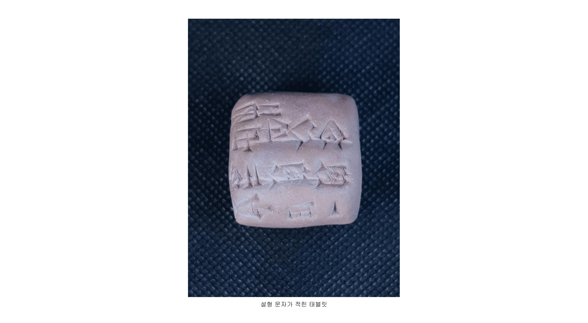

중앙에 작은 설형 문자가 있는 진짜 수메르 석판으로 추정되는 것도 있습니다. 이 석판에는 원통을 굴려서 만든 서명이 있는데, 나중에 보여드릴게요.

숙련된 서예가만이 글을 쓸 수 있었기 때문에 대부분의 사람들이 글을 쓸 수 없었던 시절에는 작은 숫자로 된 표시가 서명으로 사용되었습니다.

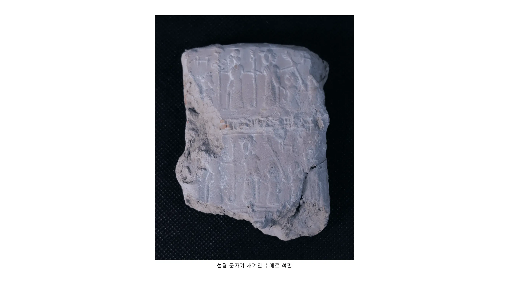

아래에서 위에서 언급한 원통을 볼 수 있습니다. 특정 모양이 새겨진 돌입니다. 사람들은 영어로 실린더 씰이라고 알려진 이 원통을 굴려서 편지에 서명하곤 했습니다. 이는 작성자의 이름을 명시하거나 자신의 이름으로 작성되었음을 표시하는 방법이었습니다.

따라서 당시 서기관들은 쐐기 모양의 스타일러스를 사용하여 젖은 태블릿에 표지판을 인쇄했습니다.

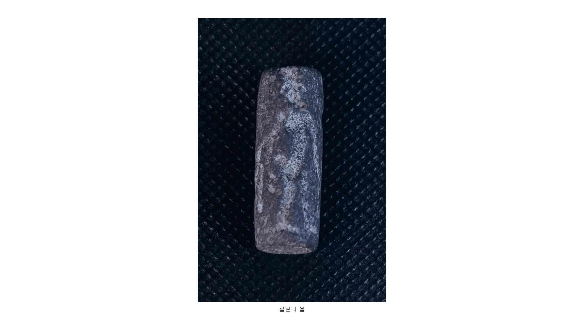

설형 문자는 언어가 아니라 음성 언어를 기록하기 위한 문자 체계였습니다. 영어에서는 "글쓰기는 문자 언어"라고 말한 다음 "설형 문자는 언어가 아니라 문자"라고 말할 수 있습니다. 따라서 프랑스어에서는 설형 문자는 언어가 아니라 언어를 체계화하는 방식이라고 말할 수 있습니다.

### 글쓰기의 진화와 용도

처음 몇 세기 동안 이 문자는 수량, 농산품 목록, 장비 등을 기록하는 니모닉 시스템으로 제한적으로만 사용되었습니다. 그러다가 점차적으로 이름을 음성적으로 표현하고 완전한 문장을 만들 수 있게 되었습니다.

처음에는 설형문자로 이름을 표현할 수 없었는데, 이는 주로 소나 밀과 같은 현실의 사물과 요소를 작은 이미지로 묘사했기 때문입니다. 시간이 지나면서 이러한 이미지는 더욱 발전된 형태의 문자로 진화하여 이름과 복잡한 개념을 표현할 수 있게 되었습니다.

예를 들어 그 사람의 이름이 로라라면 '물'처럼 들리는 약어 한 단어와 '라스'처럼 들리는 약어 두 개를 합쳐서 로라라는 이름을 만들 수 있었을 것입니다. 이것이 최초의 문자 언어가 발전한 방식입니다.

참고로 원래 약어를 표현하기 위해 소의 머리를 그리고 싶으면 소의 머리 모양을 볼 수 있었습니다. 조금씩 그림이 단순화되어 일종의 선으로만 표현할 수 있게 되었습니다. 학자들은 사람들이 젖은 점토판을 한 손에 들고 있었기 때문에 이니셜을 돌려서 다시 그리는 것이 더 쉬웠기 때문에 이런 일이 일어났다고 생각합니다. 또한 서기관들이 석판을 잡는 방식 때문이라고도 생각됩니다.

설형문자 약어에서 밀이나 소의 머리와 같은 단어는 항상 한쪽으로 기울어져 있는 것을 볼 수 있습니다.

3천 년 동안 사용되어 온 설형문자는 주로 경제 및 행정 기록을 유지하는 데 사용되었습니다. 하지만 메소포타미아 주민들은 곧 시간의 흐름에 따라 보존할 가치가 있는 모든 것을 문서로 남기고자 하는 열망을 갖게 되었습니다. 따라서 지금까지 순회 음악가들에 의해 구전으로 전해지던 이야기, 전설, 노래가 문자로 불멸의 기록으로 남게 되었고, 종종 서기관들에 의해 필사되기도 했습니다. 그들은 주로 특정 문화적 가치를 지닌 전설이나 텍스트 등 이미 존재했던 텍스트를 복사했습니다.

중요한 예로 기원전 2900~2350년경 수메르 도시 국가 우르크의 **역사적 왕으로 추정되는 **길가메시 서사시**를 들 수 있습니다.

경제 관리 도구이자 문화적 매개체였던 이 형태의 문자는 서기 1세기까지 지속되다가 영원히 사라졌고, 그 문명의 탄생에 대한 귀중한 증거를 남겼습니다.

## 수메르 석판의 역할

<chapterId>a396e6c5-56cc-5410-9e6b-0274401c5425</chapterId>

:::video id=a0729a35-01ec-4aa4-828f-d4ccc2eb168e:::

### 선지급 신용 시스템

고대 메소포타미아의 경제 조직은 금속 동전이 발명되기 훨씬 전부터 존재했던 고도로 정교한 메커니즘에 기반을 두고 있었습니다. 처음부터 공식 및 비공식 신용 시스템은 이미 화폐의 필수적인 형태였으며, 지역 주민들이 복잡한 경제 거래를 수행할 수 있게 해 주었습니다.

설형 문자가 발명된 것은 행정적, 경제적 필요를 충족시키기 위해서였습니다. 유명한 메소포타미아 점토판은 주로 개인 대출, 매매, 임대, 모기지, 심지어 결혼 계약서 등 다양한 유형의 계약서를 기록하는 데 사용되었습니다. 이러한 석판을 작성하려면 전문 필경사의 전문 지식이 필요했는데, 이는 시간과 노력이 많이 드는 작업이었지만 **금전적 이해관계가 걸려 있을 때는 정당화되었습니다.** 당시 사람들은 서로에게 연애편지를 쓰지 않았고, 자신의 고민을 기록하기 위해 필경사를 고용하지도 않았습니다. 그들은 연줄이 있든 경제적 이유가 있든 서기관을 고용하여 문서를 작성했습니다.

또한 이러한 태블릿 중 일부는 무기명 채권으로 유통되어 손이 자유롭게 바뀌었다는 점도 언급할 가치가 있습니다.

예를 들어, 내부에 작은 돌이 들어 있는 점토 공의 형태가 있었습니다.

점토 공의 겉면에는 단위를 나타내는 숫자가 적혀 있고 서명되어 있었습니다. 안쪽에는 이 돌멩이가 있었고, 누군가는 이 도구가 정말 X개의 단위를 나타내는지 확인하고자 했습니다.

또 다른 예로, 현재의 바그다드 남서쪽에서 발견된 석판에는 채무자가 추수일에 채권자에게 330석의 곡물을 갚아야 한다고 명시되어 있습니다. 더욱 흥미로운 것은 또 다른 석판에는 보리 4석의 빚을 석판의 소지인에게 직접 갚아야 한다고 명시되어 있어 당시로서는 매우 혁신적인 개념인 **소지인에게 지급한다는 개념을 도입**하고 있다는 점입니다.

기원전 2000년 이후부터 모든 상업 거래는 아무리 작은 거래라도 서면으로 공식화하고 증인의 입회하에 서명해야 한다는 법이 있었습니다. 당시에는 모든 거래를 서기관이 진흙으로 만든 장부에 기록하는 것이 얼마나 큰 관료주의였는지 상상해 보세요. 이러한 법적 엄격성은 향후 교환된 물품의 소유권과 권리에 대한 분쟁을 예방하기 위한 것이었습니다. 계약이 실제로 체결되었다는 것을 증언하기 위해 증인이 종종 불려가기도 했습니다.

사적 영역에서도 특정 가족과 개인은 엄격한 관리가 필요할 만큼 복잡한 경제 활동에 참여했습니다. 북바빌로니아의 시파르 암나누 마을에서 우르 우투라는 아누니툼 제사장의 집이 발견되었는데, 그 안에는 약 2,000개의 석판이 들어 있었습니다. 이 문서에는 개인 대출 계약서, 매매 및 임대 증서, 편지, 종교 및 학술 문서가 포함되어 있어 당시 개인 기록 보관소의 다양성과 중요성을 증명합니다.

서기관들이 쓴 편지는 수당 부족에 대한 불만, 지참금 미납 또는 기타 긴급한 물질적 요청 등 거의 전적으로 금전적 이해관계와 관련된 내용이었다는 점이 주목할 만합니다. 당시에는 연애편지와 같은 개인적인 글은 존재하지 않았고 질병에 대한 언급조차 드물었습니다.

한 편지의 가슴 아픈 예는 이러한 경제적 현실을 잘 보여줍니다. 한 통신원은 파트너가 떠난 후 돈과 식량이 없는 상태에서 심각한 기근이 아수르를 강타하자 자신의 고통을 토로합니다. 그는 곡물을 구입해야 하는 긴급한 상황을 설명하며 하루하루 생계를 유지할 수 있도록 현금 상당의 직물을 빨리 보내달라고 요청합니다.

그녀의 파트너에게 보낸 이 편지는 그가 다른 곳으로 무역을 하러 떠나서 무일푼이 되었다는 사실을 알려주는 것 같았습니다. 그녀는 곡물을 구입하고 성전 세금을 내기 위해서는 돈이 있어야 한다고 그에게 상기시킵니다. 이것은 아마도 당시의 편지에 쓰여진 논쟁에 가장 근접한 내용일 것입니다. 편지는 거의 항상 경제 거래와 관련이 있었고, 이 편지 역시 불안정한 경제 상황과 관련이 있습니다.

따라서 우리에게 전해진 메소포타미아 문서는 화폐, 곡물, 다양한 상품, 부동산, 성전 세금 납부 등 가치가 인정되는 상품의 이전만을 위해 작성되었기 때문에 주로 경제적 교환을 반영합니다. 이 기록물은 고대 문명의 효율성과 행정적 정확성뿐만 아니라 매우 오랜 기간 동안 복잡한 경제 교류를 관리할 수 있었던 능력을 보여줍니다.

## 수메르 태블릿의 엘리트 제어

<chapterId>c6d3df0e-b1e1-58dc-ab35-9f76bbc39393</chapterId>

:::video id=04a95fb8-a701-4a48-9ce8-0e9b6ba256fd:::

### 무엇보다도 경제적인 기술, 글쓰기

일반적인 생각과는 달리, 약 4,000년 전 메소포타미아에서 발명된 문자는 처음에는 개인적 또는 문학적 의사소통의 필요성을 충족시키지 못했습니다. **설형문자는 무엇보다도 경제적인 기술**이었으며, 중요한 금전적 이해관계가 걸려 있을 때만 정당화되었습니다. 수메르인들은 서로 연락하거나 자신의 감정을 표현하는 데 문자를 사용하지 않았고 오로지 상업 및 금융 거래를 문서화하는 데만 사용했습니다.

이러한 전문성은 태블릿 판각에 드는 상당한 비용으로 설명할 수 있습니다. 점토로 조각하려면 전문 기술 지식과 상당한 시간, 특정 재료가 필요했습니다. 충분한 가치를 지닌 거래만이 이 투자를 경제적으로 정당화할 수 있었고, 이 혁신적인 기술에 대한 접근을 위한 자연스러운 문턱이 만들어졌습니다.

설형문자 석판은 당시로서는 놀라울 정도로 복잡한 금융 시스템을 보여줍니다. 메소포타미아인들은 현대 금융 상품의 완벽한 무기를 개발했습니다: **이자가 붙는 개인 대출, 매매 증서, 임대 계약서, 모기지, 심지어 재정 조항이 포함된 결혼 계약서까지**. 이러한 정교함은 고대 문명에서 흔히 연상되는 원시적인 물물교환의 단순한 이미지와는 거리가 먼, 발전된 시장 경제를 증명합니다.

일부 태블릿은 원래 소유자의 신원을 확인할 필요 없이 손에서 손으로 자유롭게 유통되는 진정한 무기명 증권으로 기능했습니다. 이러한 혁신은 놀라운 교환의 유동성을 가능하게 하여 현대 금융 시스템의 선구자 역할을 했습니다. 또한 특정 법률에 따라 모든 상거래를 서면으로 공식화하여 경제 영역에서 서면 사용을 제도화하기도 했습니다.

### 지식의 독점과 경제 통제

경제에서 문자의 중심성은 이 기술을 습득한 사람들에게 상당한 권력을 부여했습니다. **일반적으로 사원과 지배 기관에 소속되어 있던 서기관들은 사실상 금융 시스템을 통제했습니다**. 희귀하고 귀중한 전문 지식 덕분에 그들은 모든 중요한 거래의 수호자가 되었습니다.

이러한 지식의 독점은 우연이 아니었습니다. 기록의 민주화는 경제에 대한 통제력을 희석시키고 위조의 위험을 증가시킬 수 있었기 때문에 당국은 이러한 독점권을 유지하는 데 모든 관심을 가졌습니다. 서명식에 증인이 체계적으로 참석하는 것은 문서의 진위 여부에 대한 끊임없는 집착을 드러냅니다.

모든 상거래를 서면으로 기록해야 하는 법적 의무는 재정 통제, 엄격한 회계 감시, 경제 주체들의 행정 장치에 대한 의존도 유지 등 몇 가지 전략적 목표를 달성하는 데 도움이 되었습니다. **따라서 메소포타미아 국가는 사회적 규모의 개인 간 부채**를 관리할 수 있는 능력을 확보함으로써 글쓰기를 경제 권력의 도구로 전환시켰습니다.

### 두 가지 통화 시스템의 공존

석판을 분석해 보면 기록 보관소에서 흔히 볼 수 있는 것보다 더 미묘한 경제적 현실이 드러납니다. 많은 석판에서 **은 세겔**을 가치 단위로 언급하고 있는데, 이는 표준화된 실물 상품에 기반한 화폐 시스템이 병행해서 존재했음을 나타냅니다.

이러한 이중성은 당시의 사회 계층화로 설명할 수 있습니다. **설형 문자 석판 시스템은 복잡한 문서를 읽고, 쓰고, 해석할 수 있는 성직자, 부유한 상인, 행정가 등 제한된 엘리트**에게만 제공되었습니다. 무기명 태블릿을 효과적으로 사용하려면 해독하는 방법을 알아야 할 뿐만 아니라 진위 여부를 확인하고 법적 의미를 이해할 수 있어야 했습니다.

**이 엘리트주의 시스템에서 배제된 대중은 자체적인 교환 메커니즘을 개발했습니다**. 일반 사람들은 곡물의 표준화된 도량형, 화폐의 무게 등 전문적인 기술 없이도 누구나 쉽게 평가할 수 있는 계량화 가능한 재화를 사용했습니다.

이 대중적인 경제는 공식 기록 보관소에 덜 기록되어 있지만 태블릿 시스템보다 더 역동적이고 유연했을 것입니다. 장인, 농부, 소규모 상인들의 즉각적인 필요를 충족시키면서 서기관에 의존하지 않고도 매일 빠르게 교환할 수 있었습니다.

석판에서 가치 기준으로 자주 언급되는 은 세겔은 아마도 이 두 가지 평행 경제 시스템 사이의 가교 역할을 하여 서면 부채와 실물 결제 사이의 전환을 가능하게 했을 것입니다.

### 자발적 발생 대 제도적 통제

이러한 공존은 경제사의 근본적인 논쟁을 보여줍니다: **교환 수단의 자발적 출현과 화폐의 제도적 전유 사이의 대립**. 한편으로 화폐와 같은 상품은 사람들의 교환 욕구에서 자연스럽게 등장했습니다. 다른 한편으로, 기관은 이러한 관행을 전유하고 공식화하여 그 흐름을 통제했습니다.

수메르의 신전은 이러한 긴장의 전형을 보여주었습니다. 수메르 신전은 대중적인 화폐 혁신(세겔 참조)을 사용하면서 자체적인 관리 도구(설형 문자판)를 개발했습니다. 이 전략을 통해 전통 화폐의 대중적 정당성과 공식화된 부채의 행정적 통제라는 두 가지 시스템의 이점을 모두 누릴 수 있었습니다.

메소포타미아의 경험은 금융 시스템의 진화에 대한 지속적인 선례를 남겼습니다. 이는 **금융의 정교함이 기술 혁신보다 몇 천 년 앞서는 경우가 많다는 것을 보여줍니다**. 이자, 신용, 협상 가능한 상품 및 모기지 담보의 개념은 금속 화폐가 발명될 때까지 기다리지 않았습니다.

이 중요한 시기는 또한 모든 화폐 혁신에 내재된 권력 문제, 즉 누가 기술을 통제하고 누가 규칙을 정의하며 공식적인 시스템과 대중적인 관행이 어떻게 표현되는지를 드러냅니다. 이러한 근본적인 질문은 경제 역사 전반에 걸쳐 지속되어 왔으며, 디지털 통화와 [암호화폐](https://planb.academy/resources/glossary/cryptocurrency)에 대한 현대의 논쟁으로까지 확장되었습니다.

# 고대 문명의 경제와 화폐

<partId>a16bcf4c-8c3a-11f0-9e79-2bd363a484bd</partId>

## 청동기 시대의 위대한 문명

<chapterId>fab9334c-7385-5d7c-ad40-7d152beb22a1</chapterId>

:::video id=737e12e8-1033-4210-b1dd-b8a680f68b17:::

"청동기 시대의 위대한 문명"이라는 제목의 이 섹션에서는 *돈의 역사*라는 책에서 발췌한 내용으로 시작하겠습니다: 고대부터 현재까지*(Glyn Davies 저)는 고대의 위대한 문명에 대한 이 섹션의 훌륭한 소개서라고 생각합니다.

> 토인비는 약 21개의 서로 다른 '문명'을 식별하지만, 이 중 15개는 이전의 사례에서 직간접적으로 파생되었으므로 독립적으로 발전한 문명의 수를 수메르, 이집트, 미노아, 중국, 마야, 안데스 등 6개로 줄였습니다. 이 중 안데스 산맥의 잉카 문명만이 화폐를 사용하지 않고도 높은 수준의 문명을 이룩했지만, 역설적이게도 그들은 일반적으로 화폐로 사용하기에 가장 좋다고 여겨지는 금과 은이라는 재료를 풍부하게 보유하고 있었습니다.

잉카인들은 화폐 시스템이 없었지만 귀금속은 풍부하게 보유하고 있었습니다. 꽤나 역설적이죠. 인용문을 계속 이어가 보겠습니다:

> 사회가 더 계층화되고 계획 시스템이 더 세심하게 효율적일수록 인구가 화폐를 사용할 필요성은 줄어듭니다. 스페인 정복자들이 상대적으로 더 자유로운 정부를 가졌던 멕시코인들이 금가루(투명한 튜브에 보관)와 코코아 콩(24,000단위 봉지에 담아 대량 결제를 위해 보관)을 화폐로 정기적으로 사용한 반면, 반대로 훨씬 더 엄격한 위계질서에 따라 조직된 잉카인들은 화폐가 전혀 없었다는 사실을 발견한 것은 엄격한 규칙에 의해 확인된 예외적인 경우일 수 있습니다. 중국에서 화폐의 기원은 다른 문명과는 완전히 독립적이었지만, 수메르, 이집트, 미노스 문명이 상대적으로 가깝다는 점은 특히 초기까지 광범위한 무역이 이루어졌다는 점에서 화폐 관행에 대해 얼마나 무지했는지에 대한 의문을 불러일으킵니다.

중국에서는 서양의 전통과는 완전히 다른 방식으로 동전이 개발되었습니다. 처음부터 [법정 화폐](https://planb.academy/resources/glossary/fiat)였습니다. 주조 동전이었습니다.

그리고 여기서 데이비스 씨는 무역에 대해 언급합니다. 실제로 특정 시기에 중국인과 다른 민족 간의 교류가 있었지만, 대외 무역을 위한 교환 매체는 비단이었습니다. 나중에 살펴보겠지만, 중국 인구가 적은 중국의 국경 지역에서도 금이 사용되었습니다. 그리고 국제 무역을 위해서도 비단이 사용되었습니다.

따라서 동전의 형식은 아마도 이 기술을 개발한 같은 시대의 다른 문명에서 영향을 받았을 것이라고 생각합니다.

하지만 분명한 것은 중국에서 돈의 본질은 서양과 완전히 달랐습니다. 이에 대해서는 다음 중국 섹션에서 자세히 설명하겠습니다.

이 유명한 수메르 도시들과 관련하여 몇 가지 참고할 사항이 있습니다. 매우 초기에 영향력 있는 도시였던 우루크는 상당한 규모와 선진 문화, 특히 문자와 도시 계획의 발달로 유명한 도시입니다.

그리고 유명한 길가메시 서사시도 언급하고 싶었어요. 길가메시는 기원전 2900년경 수메르 도시 우루크의 역사적인 왕이었을 것입니다. 그는 아마도 이 수메르 도시 국가의 왕이었을 것입니다.

기원전 2334년부터 2279년까지 통치한 아카드의 사르곤에 대해서도 이야기할 수 있습니다.

그는 메소포타미아에서 등장한 또 다른 문명인 아카디아 제국의 초대 통치자였습니다. 그리고 제가 사르곤을 언급하는 이유는 그가 이미 소개한 바 있는 유명한 태블릿을 위한 우편 서비스를 이곳에 최초로 설립했기 때문입니다.

실제로 점토 봉투가 있었다고 상상해 보세요. 태블릿은 기밀 유지를 위해 외부에 서명이 있는 점토 봉투에 포장되어 있을 수 있습니다. 그래서 사람들은 태블릿을 찾기 위해 봉투를 뜯었습니다. 이 우편 시스템은 아카드의 사르곤에게 빚을 지고 있습니다.

그리고 바빌로니아 제국의 수도가 된 대도시 바빌론이 있습니다. 또 다른 문명은 위풍당당한 지구라트와 궁전, 고도로 발달한 법전으로 잘 알려진 함무라비 법전으로 유명합니다.

이 섹션을 마무리할 두 도시를 소개합니다. 아시리아 제국의 수도이자 중요한 종교 중심지였던 아슈르가 있습니다. 그리고 나중에 아시리아 제국의 수도였던 니네베가 있습니다. 니느웨는 강력한 군대와 거대한 궁전, 도서관이 있는 도시로 유명합니다. 또한 전설적인 바빌론의 행잉 가든이 있을 가능성이 있는 장소 중 하나이기도 합니다. 우리는 종종 이 고대 세계의 경이로움에 대해 듣곤 합니다.

하지만 바빌론에는 이 유명한 매달린 정원의 흔적이 남아 있지 않아요. 반면에 니네베에는 여러 층에 걸쳐 정원이 있었다는 고고학적 증거가 있습니다. 헤로도토스와 같은 그리스 역사가들이 니네베와 바빌론을 혼동했을 가능성이 있습니다. 그들이 메소포타미아의 도시를 방문했을 때 바빌론이라고 불렀을 수도 있습니다. 니네베에서 유명한 행잉 가든의 흔적이 발견되었고, 학자들은 니네베가 바빌로니아 행잉 가든이라고 불리는 이 정원이 있던 유명한 장소인지 궁금해할 수 있습니다.

## 메소포타미아의 경제 조직

<chapterId>6afb6fc8-cbb7-56a5-8427-484b4b7d7477</chapterId>

:::video id=aa6a2cbd-5916-4ae3-ad4f-65f0bd5643fa:::

### 자본주의 이전의 경제 구조와 노예제

메소포타미아의 경제 조직에 관한 이 섹션에 오신 것을 환영합니다. 자본주의 이전의 경제는 원시, 노예, 봉건이라는 세 가지 주요 단계를 거쳤습니다.

물론 봉건제는 중세 훨씬 후의 일이며, 우리는 이미 앞서 설명한 구석기 시대의 원시 단계를 지나쳤습니다. 이제 메소포타미아에서 경제 조직에 대해 이야기할 때 우리는 노예제도에 대해 이야기하고 있습니다.

그러나 메소포타미아에서는 법적으로 주인의 소유는 아니지만 물리적 또는 이념적 강압을 통해 노동의 결실을 빼앗긴 노예와 유사한 종속 계층이 대부분의 노동을 수행했습니다.

### 경제 중심지로서의 사원과 궁전의 역할

대규모 토지 소유가 경제를 지배했습니다. 지주들은 노동자를 고용하여 토지를 직접 착취하거나 임대료를 받고 토지를 빌려주었습니다. 그들은 또한 금융 활동에도 관여하여 일반적으로 연 20~33.3%의 높은 이자율로 돈을 빌려주었는데, 이는 이웃 히브리인들의 엄격한 규칙과 극명한 대조를 이루는 관행이었습니다.

농부들이 받은 대출은 운송 회사를 제외하고는 생산적인 투자를 위한 것이 아니라 다음 수확기까지 생존을 보장하기 위한 것이었습니다. 이러한 상황은 종종 농부들의 만성적인 부채로 이어졌습니다.

시민들이 농민들이 생산한 농업 지대, 무상 노동, 전쟁 전리품으로 생활했던 고대(로마) 시대와 최근의 시기를 비교해 보겠습니다. **이러한 수입은 시민들에게 분배되었으며, 더 많은 이윤을 얻기 위한 것이 아니라 사회적 지위 향상을 위해 사용되었습니다.** 무역과 공예는 일반적으로 사회 엘리트 외부의 집단에 맡겨졌습니다. 이 모든 것은 무역과 공예를 통한 이윤을 지향하는 중세 경제와는 대조적입니다.

그래서 제가 여기서 말하고자 하는 것은 사람들이 금융 대출 도구를 반드시 생산 수단을 개선하는 데 사용하지 않았고, 로마 시대에는 이윤이 반드시 재투자되지 않고 오히려 이윤을 얻을 수 있는 사람들의 위신을 높이는 데 사용되었다는 사실과 유사하다는 점입니다. 생산 수단을 개선하기 위해 일자리를 창출하고 잉여를 취해 이윤을 추구하던 중세 후반에 등장한 자본주의 정신과는 아직 거리가 멉니다. 따라서 경제 조직은 아직 위에 나열된 경제 진화의 세 번째 단계에 도달하지 못했음을 알 수 있습니다.

### 신용 시스템 및 계정 단위의 등장

**칼 폴라니는 경제적 교환의 세 가지 형태를 대칭적 집단 간의 호혜성**으로 구분하는데, 이는 서로 비공식적으로 신용을 주고받으며 교환하고 재분배하기 때문에 돈이 실제로 필요하지 않은 원시 부족에나 있을 법한 형태입니다. **신전과 궁전을 중심으로 한 재분배** 이러한 형태의 교환은 신전이 경제 조직의 중심이었고 한때 배급의 형태로 부를 환원하고 분배할 수 있었던 메소포타미아에 적합했습니다. 임금이라는 개념은 나중에야 도입되었습니다. 따라서 지금까지 우리는 원시적 형태(1), 사원과 궁전의 중앙 집중식 재분배(2)를 거쳐 마침내 시장 교환(3)으로 나아갈 수 있었습니다. 오늘날 우리가 이해하는 시장이 완전히 존재하지는 않았지만 메소포타미아에 시장 거래소가 존재했다는 것은 아카드어로 된 특정 용어의 존재와 가격, 이익, 손실, 변동 및 희소성 상황에 대한 고고학적 증거로 증명할 수 있는 명백한 사실입니다.

메소포타미아 가정에서는 파종부터 빵과 맥주로 만드는 최종 가공까지 농업 생산의 모든 단계를 독립적으로 관리했습니다. 여성들은 또한 부양가족에게 필요한 직물을 생산했습니다. 현지에서 생산되지 않는 물품의 경우 가정에서는 전문 상인에게 의존했습니다.

무역에서 가족 관계는 특히 중요했습니다. 팔레오-아시리아 시대(기원전 1910~1830년경)에 아슈르 시의 상인들은 아나톨리아의 카네쉬에 무역 식민지를 세우고 금과 은을 대가로 주석과 직물을 수입했습니다. 무역은 결혼과 상업적 파트너십으로 밀접하게 연결된 가족 기업을 기반으로 이루어졌습니다. 카네쉬는 방대한 국제 무역 네트워크의 한 연결 고리에 불과했습니다.

이러한 교환에는 금속이 있었고, 그 금속은 귀금속이었고, 예를 들어 당시에는 정말 유용한 구리가 아니었고, 우리는 이러한 금속이 가치 저장소라는 개념으로 교환되었다고 생각합니다. 따라서 우리는 반드시 두 가지 재화를 유용성에 따라 교환하는 물물 교환이라고 말할 수는 없지만, 예를 들어 청동을 사용하여 갑옷을 만드는 것과 같이 귀금속을 상품으로 사용하지 않고 가치 저장고로 사용하기 위해 귀금속을 비축한다는 특정 인식이있는 지불 개념에 대해 이야기 할 수 있습니다.

공물과 세금은 주로 현물(보리 또는 무게가 나가는 은)로 납부되었습니다. 사원과 궁전은 주요 경제, 행정, 정치, 종교의 중심지였으며 처음에는 곡물, 그다음에는 기타 농산물, 마지막으로 귀금속을 안전하게 보관하여 최초의 은행 기능을 수행하기도 했습니다. 이러한 방식으로 동전이 등장하기 훨씬 전에 최초의 신용 및 대출 업무가 개발되었습니다.

메소포타미아 경제는 주로 보리와 은을 가치의 기준으로 사용했습니다. 은은 약 8.33그램의 시클룸(셰켈)과 같은 표준화된 단위로 계량되었습니다. 고대 바빌로니아 시대(함무라비 시대)에 이미 은은 일반적인 결제 수단으로 사용되었으며, 실제 무게('슈쿨룸')가 아닌 명목 가치('누범')라는 개념이 일찍부터 사용되어 **현대 화폐 개념**을 예상할 수 있었습니다.

하지만 아직 엄격한 의미의 법정 화폐는 아니었습니다. 권위가 있는 우표라는 개념은 없었지만, 계량된 금속이라는 개념과는 달리 명목 단위의 화폐라는 개념이 있었습니다. 이 두 개념의 언어에는 차이가 있었기 때문에 이를 언급하는 것이 중요하다고 생각합니다.

임금 노동 시장으로의 전환은 어려운 일이었습니다. 개인의 노동과 최종 결과물을 분리하고 측정 가능한 단위로 '노동 시간'을 도입하는 두 가지 주요 개념 혁신이 필요했기 때문입니다. 임금과 급여를 받는 직원이라는 개념을 도입하기 위해서는 먼저 이 두 가지 혁신을 거쳐야 했습니다. **3천 년대에는 처음에는 고정된 배급으로 보수를 받았으며, 2천 년대 초에는 점차 임금 체계로 발전했습니다.**

마침내 기원전 26세기 이후부터 메소포타미아의 '화폐'는 동전이 아니라 곡물이나 금속의 무게를 재는 척도였음에도 불구하고 화폐 가치에 대한 진정한 개념이 뿌리내리게 됩니다. **따라서 중요한 거래나 가치 보존이 필요한 상황에서는 보존이 더 쉬운 곡물을 은으로 바꾸는 것이 선호되었습니다.** 비축을 위해 은 금속을 받았던 카네쉬의 사례와 비슷합니다.

기원전 21세기 이후부터 **비대칭 교환이 사실상 사라지면서**, 양도 계약에서 동사 'sa'는 대금 지불을 의미합니다. 계약서에 등장하는 "sa"라는 개념은 특정 상품의 측정이 아닌 가격의 지불을 의미합니다. "Sa"는 단순히 지불 또는 가격을 의미합니다. 한 인류학자는 이 점에 주목하여 계약서에 '사'라는 동사가 도입되기 이전과 이후가 일종의 이분법으로 나뉘는 것을 볼 수 있으며, 이는 정말 획기적이라고 언급했습니다.

이익과 손실의 개념, 가격 변동, 희소성의 상황을 포함하는 **일부 시장 메커니즘**의 존재를 증명하는 근동 고문서에 존재하는 경험적 데이터를 무시할 수는 없습니다. 그러나 근본적인 어려움은 고대 메소포타미아 경제 전체에서 시장 기반 교환의 상대적 중요성을 판단하는 데 있습니다.

이 분야의 전문가들도 이러한 시장 개념의 흔적은 보았지만 당시 경제가 얼마나 현대적인 시장 개념이나 다른 메커니즘에 기반했는지에 대해서는 잘 알지 못한다고 생각합니다.

우리는 그것이 존재했다는 것을 알고 있지만, 그것이 가격 결정이나 거래의 주요 방식이었는지는 알 수 없습니다.

이것으로 메소포타미아의 경제 조직에 대한 이 섹션을 마칩니다.

다음 섹션에서는 이집트와 중국에 대해서도 동일한 작업을 수행합니다.

## 고대 이집트의 경제 및 화폐 조직

<chapterId>bffcc16c-7fbf-5992-a0fa-6a7726d7d287</chapterId>

:::video id=40c1c4e5-b190-4bb6-b8a0-810c9ce7698b:::

### 역사적 배경과 이집트 시대

이 섹션에서는 고대 이집트의 경제 및 화폐 조직에 대해 다룹니다. 약간의 배경 지식을 제공하기 위해 해당 기간의 목록과 간략한 설명을 소개합니다.

- 고대 왕국 (기원전 2575년경 - 기원전 2130년경)**. 위대한 피라미드, 특히 기자의 피라미드 건설로 특징지어지는 시기입니다. 이 시기는 중앙집권적인 이집트 왕정의 황금기였습니다.
- 중왕국 (기원전 1938년경 - 기원전 1630년경)**. 불안정한 시기 이후 정치 및 문화 르네상스.
- 신왕국(기원전 1539년~1075년)**. 영토 확장, 군사력, 국제 무역이 활발했던 시기. 투탕카멘과 람세스 2세 같은 유명한 파라오의 통치 시기가 여기에 포함됩니다.
- 기원전 1323년. - 투탕카멘의 죽음**. 이 젊은 파라오는 18~19세의 나이로 사망했습니다. 그의 무덤은 1922년에 거의 온전한 상태로 발견되어 고고학적으로 가장 유명한 발견 중 하나가 되었습니다.
- 람세스 2세 - 재위 BC 1279-1213**. 신왕국의 가장 강력한 파라오 중 한 명입니다. 그의 군사 작전, 위대한 기념물, 그리고 아마도 최초의 평화 조약을 체결한 것으로 알려져 있습니다.
- 기원전 1275년 - 바다 민족**. "바다 민족"이라고 불리는 집단의 침략 또는 이동으로 이집트를 비롯한 여러 지중해 문명이 불안정해집니다.
- 소이스 전투 - 기원전 1178년**. 이집트 군대와 침략자 사이의 충돌로, 아마도 바다 민족과 관련이 있을 것입니다. 신왕국 말기의 여러 전투 중 하나입니다.
- 후기 시대**는 기원전 664년경부터 332년까지의 고대 이집트 역사 시기입니다.
- 클레오파트라 7세(기원전 69~30년)**. 이집트의 마지막 여왕으로 총명함과 카리스마, 율리우스 시저 및 마크 안토니우스와 동맹을 맺은 것으로 유명하며 코로도 유명합니다. 그녀의 통치는 로마에 합병되기 전 파라오 이집트의 종말을 알렸습니다.

기원전 5,000년과 4,000년에 이미 이집트는 누비아, 팔레스타인, 리비아, 홍해 지역을 해상, 강, 육상 무역(특히 당나귀 캐러밴을 통한)을 통해 연결하며 대규모 상업 활동을 활발히 하고 있었습니다.

### 초기 교환 시스템과 고대의 통화

기원전 3650~3400년경 이집트 최초의 족장이 출현하면서 오늘날 카이로 남쪽의 마디 지역은 구리 기술과 장거리 무역의 주요 중심지가 되었고, 특히 시리아 해안을 통해 메소포타미아와의 교역이 활발해졌습니다.

대규모 무역은 주로 물물교환을 기반으로 이루어졌지만, 준보석이나 화석 조개껍질과 같은 귀한 물건으로 구성된 원시적인 형태의 화폐("고화폐")도 존재했을 가능성이 높습니다. 이러한 거래에서 금은 이미 중요한 역할을 했을 것입니다. 기원전 3,000년 중반 이집트 문서에서 동전에 대한 최초의 명시적인 언급은 상업적 관행과 관련된 오랜 발전을 반영합니다.

고대 사회(여기서는 반드시 이집트가 아니라 고대 사회 전반에 대해 이야기하는 것입니다)에서는 직접 구매가 아닌 지참금, 종교 의식 및 기타 사회적 의무를 지불하기 위해 지불이 빈번하게 이루어졌습니다. 이러한 거래에는 정확한 가격 책정과 가치 평가가 필요했습니다. 많은 원시 사회에는 화폐로 환산할 수 있는 특권적인 물건이 있었고, 이를 기준으로 그 가치를 추정할 수 있었습니다. 지참금을 지불하는 경우라면 당연히 지참금을 지불하기 위해 교환할 물건의 수량을 기록해 두어야 합니다. 이 가치는 본질적으로 사람의 가치입니다.

화폐나 통화 시스템이 등장하기 전의 고대 사회에서도 지불은 있었지만, 지참금이나 혈통의 지불처럼 사회적 의무와 연결되어 있었고, 그 가치는 개인의 가치에서 파생되는 경우가 많았습니다.

고대 제국 시대 이집트로 돌아가서, 원래 구체적인 화폐 단위(약 7.6그램의 작은 금화 또는 은화)였던 '샤트(y)'는 경화로서의 실제 기능에서 가치 개념을 낳은 **회계 기능**으로 매우 빠르게 넘어갔습니다. 우리는 가치를 표현하는 일종의 회계 단위로 인식할 수 있는데, 원래는 동전의 일종이었지만 도장이 찍혀 있지 않고 금속의 척도에 불과하기 때문에 동전이라고 부를 수는 없습니다. 우리는 계정 단위의 개념에 점점 더 가까워지고 있습니다.

이러한 샤트(y)의 개념은 결국 사기의 위험성 때문에 폐기되었습니다. 나중에 이집트인들은 도장이 찍힌 동전을 채택하는 속도가 느렸고 심지어 이웃 나라에서 채택한 후에도 계속 무게를 재는 것을 보게 될 것입니다.

중세 시대에는 은이 일상적인 거래에 거의 사용되지 않았으며, 주로 곡물이나 빵의 양을 측정하는 데 사용되었습니다. 이 시기에 서면이나 실제 송금을 통해 지불을 기록할 수 있는 일종의 경전 화폐가 등장했습니다.

신왕국에서는 화폐 시스템이 더욱 복잡해져 금속(금, 은, 구리), 표준화된 직물, 곡물, 석유로 평가되는 다양한 상품 화폐를 통합했습니다. 직물은 "직물 척도"라고 불렸습니다. **일상용품의 가격은 곡물이나 구리로 표시되는 경우가 많았고, 귀중한 물건은 금이나 은으로 평가되었습니다. 이집트에서는 금보다 희귀한 은이 특히 귀하게 여겨졌습니다.** 이집트에서 더 풍부했던 금에 비해 은은 과대평가되었습니다.

후기 시대(기원전 1,000년)가 되자 은은 근동 전역에서 교환되는 일반적인 금속이 되었습니다. 은은 주괴, 금속 동전 또는 반지 형태로 유통되었으며, 주권자의 형상으로 주조되지는 않았지만 무게와 순도를 보증하기 위해 사원에서 무게를 측정하고 표시했습니다. 이 주화는 나중에 리디안 주화에 대한 다음 섹션에서 다룰 예정입니다.

또한 고대 이집트인들은 돈을 뜻하는 '헤지'라는 용어를 사용했으며, 금속, 곡물, 천 또는 다양한 상품(나무, 동물, 서비스 등)에 상관없이 거래에서 대가로 제공되는 모든 지불 수단을 지칭하는 데 일반적으로 사용되었습니다. 문서화된 사례에 따르면 이집트인들은 총 가치가 구리 단위('데벤')로 표시되는 다양한 상품을 결합하여 거래를 결제할 수 있었습니다.

**신전은 이집트 경제의 중심 역할을 담당했는데, 신을 기리기 위해 귀금속(금과 은)으로 된 상당한 보물을 수집하고 비축하여 필요할 때 경제 순환에 재투입할 수 있는 통화 준비금 역할을 했습니다**. 다른 문명에서도 전쟁, 통화 부족 또는 위기 시 녹여낼 수 있도록 조각상 등 귀중한 매장량을 사원에 쌓아둔 사례를 볼 수 있습니다. 이는 역사적으로 반복되는 주제입니다.

또한 린넨 재배는 사원에 부여된 왕실의 독점권이었고 귀중한 직물의 제조를 통해 경제적 중요성을 확인했다는 점도 언급할 가치가 있습니다.

고대 이집트인들은 귀금속을 신(금은 신의 살, 은은 신의 뼈)과 연관된 관념적 측면과 다른 모든 결제 수단의 기준이 되는 화폐로서의 실용적 기능을 명확히 구분했습니다.

따라서 고대 이집트는 후기까지 현대 화폐 시스템에 필적하는 주조 화폐를 개발하지 못했지만, 경전 화폐, 정확한 계정 단위, 상품 화폐 및 무게로 평가되는 귀금속을 결합하여 정교한 화폐 시스템을 보유하고 있었습니다.

동전 자체의 무게를 측정하여 두 가지 다른 개념이 생겨났습니다: **"주화"와 "화폐"**. 저는 영어로 두 가지 용어를 사용했습니다. 첫째, "주화"는 나중에 나온 개념인 동전을 의미하며, 우리에게는 돈이라는 개념도 있습니다. 방금 돈으로 표현한 계좌 단위로 이미 '돈'의 특정 개념을 정의할 수 있지만 아직 동전이 아니었기 때문에 '주화'는 조금 후에 리디안들과 함께 등장합니다.

따라서 동전은 화폐의 전제 조건이 아니며, **어쩌면 3,000년 전, 특히 함무라비 통치 시기인 2,000년 전에도 의심할 여지 없이 화폐의 존재를 인정할 수 있습니다.

여기서 기억해야 할 중요한 점은 저자가 "화폐의 기원"이라는 책에서 언급하고 있는 내용인데, 당시 화폐라는 개념이 이미 이러한 화폐 시스템에 존재했다는 것은 의심의 여지가 없으며, 개념으로서의 화폐의 탄생을 동전의 출현과 연결 짓는 것은 실수입니다.

마지막으로, 고대 이집트에 종종 적용되는 폴라니의 호혜와 재분배 개념은 미묘한 차이가 있는데, 이러한 개념은 존재하지만 배타적인 틀을 형성하지는 않습니다. 파라오 이집트는 종교적, 의례적 관습과는 별개로 정교한 상업적 교류를 완전히 통합한 복잡한 경제를 발전시켜 이데올로기로부터 경제 영역의 진정한 자율성을 보여주었습니다.

이러한 특성은 귀금속이 특정 신과 연관되어 있지만 여전히 구별할 수 있다는 개념과 관련이 있습니다.

폴라니가 이러한 귀금속의 사용을 주로 종교적 또는 신성한 개념으로 언급했기 때문에 이 이야기를 꺼낸 것입니다. 그러나 우리는 그것들이 경제 시스템에도 통합되었으며 이집트인들은 이미 그러한 구분을 할 수 있었다고 제안하고 있습니다.

결론적으로, 저는 이 발명품인 화폐의 목적을 나열한 "화폐의 기원"이라는 책에서 인용하고 싶습니다. 여러 가지 요점이 있지만 저는 5번 요점만 강조하고 싶습니다:

*평가 절하 및 연속적인 재평가와 같은 방법을 사용하여 더 낮은 비용으로 수입 및 수출을 줄이거나 늘릴 수 있는 경제적 플레이의 가능성을 개발합니다*

따라서 저자는 그 고대의 시대에도 이미 동전이 발명되었거나 국가 통제하에 등장했으며, 경제 관리를 위해 귀금속의 양과 무게가 이미 조작되고 있었다고 주장합니다. 다음 섹션과 관련하여 약간의 특종을 알려드리겠습니다. **금과 은의 합금인 일렉트럼으로 만들어진 초기 형태의 주화에서도 우리는 주화의 귀금속 함량을 분석한 결과, 예를 들어 크로수스와 같은 최초의 발행자들은 천연 일렉트럼보다 금이 적게 함유되어 있었다는 사실을 알고 있습니다**

즉, 그들은 이미 금과 은을 분리하는 방법을 알고 있었고, 금을 적게 함유한 주화를 발행했습니다.

저자는 주화의 초창기부터 단순히 무게를 증명하고 거래를 촉진하는 것을 넘어 화폐 주조 권한이 이미 경제 계획의 한 형태로 발행량을 늘리기 위해 남용되고 있었다고 주장합니다.

## 고대 중국의 화폐와 경제 및 화폐 조직에 서명하기

<chapterId>e08d3be9-423c-5cf3-a606-6ad54e2261af</chapterId>

:::video id=ae7e6367-1725-455e-bfe6-359be1f443e5:::

"부호와 고대 중국의 경제 및 화폐 조직"이라는 제목의 이 섹션에서는 고대 중국 화폐가 서양의 전통과 다른 특징을 가지고 있음을 살펴볼 것입니다. 중국 화폐는 처음부터 이미 '기호 화폐'였습니다. 이 섹션의 정보는 제가 "화폐의 기원"이라는 책을 읽은 후 메모한 내용을 바탕으로 작성했습니다.

### 기호 화폐의 개념과 고유한 특징

저자에 따르면 사인 머니는 오늘날의 법정 화폐와 같은 개념입니다. 금속 함량과 연계된 가치가 없는 화폐입니다. 처음부터 이 코인의 가치에 대한 일종의 합의, 즉 사회적 합의가 있었습니다.

고대 중국 주화는 서양의 전통과는 다른 특징을 가지고 있습니다. 주로 금속으로 만들어졌지만 주조보다는 주조로 만들어졌으며, 주권자의 초상이 새겨져 있지 않았습니다. 놀랍게도 중국 국가는 화폐 발행을 독점하지 않았습니다. 이러한 명백한 자유주의는 많은 과세 대상 인구에 부과되는 풍부한 세수 덕분에 화폐 발행을 독점할 경제적 필요성이 없었기 때문으로 설명할 수 있습니다.

중국 화폐는 또한 신탁적 측면이 특징입니다. 처음부터 청동 모조품(조개껍질)이 화폐로 사용되었는데, 이는 사용된 금속의 본질적인 가치와 직접적인 관련이 없습니다. 역사를 아주 멀리 거슬러 올라가면 중국인들은 조개를 화폐로 사용했습니다. 결국 조개가 너무 희소해지자 구리로 복제품을 만들었고, 이 복제품은 진품과 동일한 가치를 지니게 되었습니다.

따라서 중국 화폐는 재료의 가치나 원래 물건(예: 조개)의 상대적 희소성이 아니라 교환 수단, 즉 화폐 기호로서의 사용에 대한 집단적 신뢰에 기반했습니다.

### 카우리 조개 껍질부터 금속 모조품까지

카우리는 원시 화폐 단위로 널리 사용되었습니다. 고대 비문에 따르면 기원전 1세기와 2세기의 첫 번째 왕조인 상(商)나라와 주(周) 왕조 초기에 코우리 껍질은 군사적 업적에 대한 보상뿐만 아니라 **노동에 대한 보상, 가치 측정, 토지 구매**에도 사용되었습니다.

여기서 기억해야 할 중요한 점은 화폐가 사회에서 제한된 목적으로만 사용된 도구가 아니었다는 점입니다. 군사적 보상, 노동에 대한 지불, 가치 측정에 사용되었습니다. 고고학자들의 글에서 그 흔적을 찾을 수 있습니다. 매일 빵을 사는 데 사용되었는지는 알 수 없지만, 위에서 언급한 유형의 거래에 사용되었을 수 있다는 증거가 있습니다.

시간이 지남에 따라 실제 소라껍질이 희소해지자 청동, 뼈, 자개 또는 돌로 만든 모조품이 생산되었고, 특히 무덤에 실제 가치가 고정되는 것을 피하기 위해 장례식용으로 사용되었습니다. 이러한 매체의 변화는 왕자가 돈을 벌면 더 쉽게 통제할 수 있는 왕자의 돈에 대한 통제라는 생각과도 관련이 있습니다.

여기서 우리가 이해해야 할 것은 조개껍질이 자연적으로 희소하다는 한계를 뛰어넘어 왕자가 직접 화폐를 만들 수 있다면 경제 관리에 대한 통제력을 높일 수 있다는 점입니다.

동전이 귀금속의 무게와 관련이 있었던 메소포타미아와 달리 중국의 화폐 용어는 소(베이), 칼(다오), 스페이드(부), 둥근 동전(꽌 또는 치안) 등 화폐로 사용된 물건의 초기 모양에서 직접 파생되었습니다. 따라서 중국에서 돈과 관련된 단어의 어원이 이러한 사물을 가리키는 것임을 알 수 있습니다. 반면 서양에서는 이와는 전혀 다른 개념에서 유래한 화폐 용어가 많이 있으며, 이는 화폐의 물리적 특성 및 무게와 더 관련이 있습니다. 이러한 어원적 차이는 돈에 대한 서양과 중국의 시각 차이를 명확하게 보여줍니다.

중국에서는 국가, 생산자, 상인 간의 사회적 관습에 따라 화폐 가치가 전적으로 신탁되었습니다.

### 경제 규제와 통화 철학

중국 국가는 화폐를 경제 규제의 도구로 사용했는데, 화폐가 풍부할 때는 화폐의 가치가 하락하여 사람들이 상품을 더 쉽게 구매할 수 있도록 했습니다. 반대로 화폐가 부족한 시기에는 화폐의 가치가 상승하여 국가의 구매력을 강화하여 후속 운영을 강화했습니다.

여기서 [인플레이션](https://planb.academy/resources/glossary/inflation)과 디플레이션을 연결할 수 있습니다. 통화 공급이 고정되어 있는 상태에서 경제의 생산성이 증가하면 화폐의 가치는 상승합니다. 반대로 생산성이 떨어지면 화폐 가치는 하락합니다. 그러나 이 예에서는 그 반대가 사실입니다. 아마도 왕자가 화폐 생산을 완전히 독점하지는 않았지만 화폐의 가치가 경제 상황과 연동되어 있음을 나타냅니다.

철학자 모디(BC 5~4세기)는 이미 가격과 가치의 관계를 분석한 바 있는데, 그에 따르면 가격 변동은 화폐 기호의 안정적인 명목 가치와 무관하게 상품과 화폐 사이의 변동하는 관계를 반영하는 것이지 실제 싸거나 절대적인 귀중함의 개념을 반영하는 것이 아닙니다.

따라서 여기서 그는 금화가 사용 가치나 내재 가치와 같은 일종의 기본 가치를 갖는다고 말하는 대신 화폐 기호의 가치는 오히려 경제의 상태에서 나온다고 지적합니다.

중국에서는 동전에 공식적으로 표시하거나 보증할 필요가 없었습니다. 동전의 수용 여부는 전적으로 집단적 신뢰에 달려 있었기 때문에 특별한 문구가 없는 청동이나 구리 동전이 오랫동안 자유롭게 유통될 수 있었습니다.

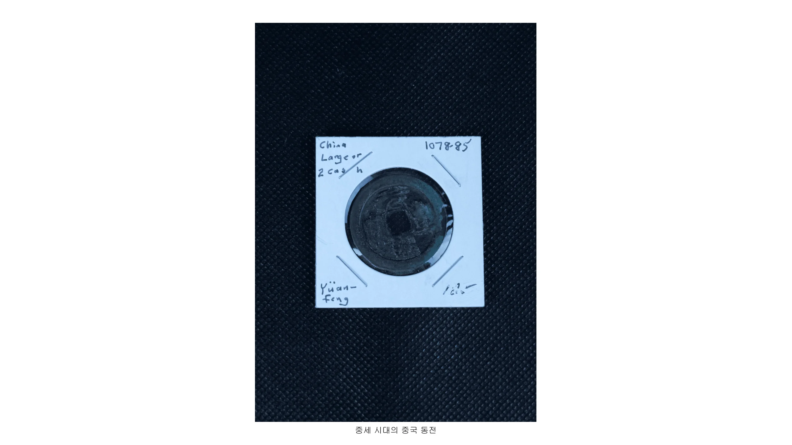

위의 동전은 중세 시대의 중국 동전입니다. 중앙에 사각형 구멍이 있는 주조 동전입니다. 이 구멍에 줄을 끼워 동전을 서로 묶어 팔찌나 목걸이로 만들 수 있었습니다. 하지만 주화는 주로 착용용이 아니라 회계용으로 주로 사용되었습니다. 동전들을 서로 연결하여 큰 줄 형태로 계좌 단위를 만들 수 있었고, 그 조각들이 서로 맞물려 있었습니다. 특별한 표시가 있는 것은 아니었고 때로는 청동 원으로만 표시하기도 했습니다.

기원전 113년 한나라의 우디가 뒤늦게 확립한 국가의 화폐 독점 체제는 종종 도전을 받았고, 다양한 민간 또는 지역 플레이어가 충분한 사회적 신뢰를 얻는다면 자체 화폐를 발행할 수 있게 되었습니다.

**중국 화폐의 낮은 내재가치는 사재기를 방지하여 원활한 유통을 보장했습니다**.귀금속은 사재기를 방지하기 위해 유통 화폐로 거의 사용되지 않았습니다. 금은 너무 비싸서 일반적으로 소비되지 않고 따로 보관되었습니다. 대신 비단만이 중국 국제 무역에서 실질적인 고가 통화를 대표했습니다**. 중국인들은 금이 아닌 비단을 사용하여 무역을 했습니다.

경제 또는 통화 위기, 특히 구리 가격이 상승하는 시기에는 혁신적인 해결책이 채택되었는데, 서기 2세기 초에는 유통되는 동전을 더 작은 단위로 만들어 더 적은 비용으로 유동성을 유지할 수 있도록 했습니다. 왕망 시대(서기 1세기 초)와 같은 다른 시대에는 액면가가 실제 금속 함량보다 훨씬 높은 고신뢰 화폐를 실험하여 지폐의 선구자가 되었습니다. 그들은 동전 한 개에 50, 100, 200과 같은 숫자를 찍어 200개와 같이 더 많은 양을 표시했습니다. 이러한 관행은 상당한 인플레이션을 초래했을 가능성이 높습니다.

위에서 언급했듯이 이 시스템은 국가, 생산자, 상인 간의 사회적 관습에 기반했지만, 특히 조각의 선택(아름답든 아니든) 또는 천의 길이(표준에 맞지 않든)와 관련하여 게임을 하지 않는 사람들에게는 권위주의적이고 엄격한 규칙이 적용되었습니다.

제 소견으로는 그다지 견고한 시스템은 아닙니다. 주로 공무원과 트레이더가 제재를 감수하고 손상된 코인을 수락해야 하는 엄격한 규칙에 의존하고 있습니다.

### 중국의 통화 혁신과 그 경제적 영향

중국은 서기 9세기 금속 부족에 대응하기 위해 처음 도입된 초기 형태의 지폐 발행의 선구자였습니다. 초기의 장점에도 불구하고 이러한 종이 화폐는 과도한 발행으로 인해 심각한 통화 위기를 초래했던 송나라나 명나라 시대에서 볼 수 있듯이 과도한 발행으로 인해 정기적으로 인플레이션을 초래했으며, 13세기 마르코 폴로는 이러한 종이 화폐의 위조는 사형에 처할 수 있다고 언급하기도 했습니다. 여기서 한 가지 폭력의 형태를 지적하지 않을 수 없습니다.

따라서 중국의 경험은 화폐에 대한 깊은 신탁 개념, 통화 시스템의 놀라운 유연성, 사용되는 미디어의 본질적 가치보다는 경제 주체 간의 신뢰에 기반한 지폐의 초기 사용으로 특징지어집니다.

## 고대의 사회 및 경제 조직

<chapterId>4023c3ce-7a47-5ac4-8f5f-c7ab699ab20f</chapterId>

:::video id=2761efe4-21cf-4f06-9bda-c03f9ff39012:::

### 도시 기생 논쟁

고대 도시와 그 배후지의 관계는 근본적인 의문을 제기합니다. 이러한 도시 중심지가 부를 착취하는 기생충으로 기능했을까요, 아니면 유익한 경제 전문화의 엔진으로 기능했을까요? 기생 가설에 따르면 청동기 시대 도시, 특히 메소포타미아의 도시들은 **체계적으로 농촌 영토에서 돌려주는 것보다 더 많은 가치를 추출했으며**, 본질적으로 동등한 가치를 창출하지 않고 임대료와 세금으로 생활했다고 합니다.

이러한 비전은 로마 제국의 붕괴와 함께 반영되었는데, 영토 확장이 중단되자 외부로부터의 부의 유입이 끊어져 도시 경제가 스스로 자금을 조달할 수 없게 되었습니다. 따라서 도시는 생산보다는 수탈에 의존하여 "수단을 넘어서는" 생활을 하게 되었을 것입니다.

### 가치 창출 동력으로서의 전문화

대안적 경제학은 이러한 기생적 시각에 도전합니다. **고대 도시는 무엇보다도 전문화와 분업의 중심지로서 기능했습니다**. 단순한 채취를 넘어 전문 기술을 집중시키고, 무역 네트워크를 조직하고, 장거리 교류를 위한 허브 역할을 수행했습니다.

이러한 도시 전문화는 배후 지역과 생산적인 상호 의존 관계를 형성했습니다. **도시는 농촌의 농산물 공급 없이는 생존할 수 없었지만, 배후지는 장인의 손길, 기술 혁신, 지중해 무역 네트워크에 대한 접근성**을 통해 그 대가로 이익을 얻었습니다. 분업은 혜택의 분배가 불균형해 보일지라도 상호 생산성 향상을 가능하게 했습니다.

당시의 만성적인 식량 불안은 이러한 명백한 비대칭성을 부분적으로 설명합니다. 기근과 농작물 파괴의 위험은 농촌 인구에게는 끊임없는 위협이었지만, 국제 무역 네트워크에 연결된 도시의 장인들은 경제적 안정을 누렸습니다.

### 역사적 진화, 고대부터 중세까지

고대와 중세의 조직을 대조해보면 이 문제가 명확히 드러납니다. **고대는 도시가 지중해 전역에 개방된 대규모 분업 체계를 선호했습니다**. 무역과 전문화가 정교한 수준에 도달하여 광범위한 경제 네트워크가 형성되었습니다.

로마 제국의 붕괴는 급격한 분열로 이어졌습니다: **봉건 시대는 이러한 중앙집권적 조직을 자급자족 영지의 분산형 시스템으로 대체했습니다**. 고대 로마의 빌라 루스티카에가 중세 영주의 모체가 되어 성직자나 귀족이 관리하는 사실상 자급자족하는 경제 섬의 모자이크가 만들어졌습니다.

이러한 중세의 분권화는 상업적 효율성을 떨어뜨렸지만 역설적으로 외부 충격에 대한 회복력을 높였습니다. 봉건 영지는 전문화와 관련된 생산성 향상을 제한하더라도 권력 중심지와 지방 인구 간의 균형 잡힌 관계를 발전시켰습니다.

### 도시 시장의 부상

고고학적 발견에 따르면 메소포타미아 도시에 **2천 년 전부터 쇼핑 항구와 무역 구역이 존재했음이 밝혀졌습니다**. 이러한 인프라는 정확한 기능에 대해서는 아직 논란이 있지만 조직화된 시장이 존재했음을 증명합니다.

처음에는 고대에 진정한 시장 메커니즘이 존재했는지에 대해 회의적이었던 칼 폴라니는 시장 거래의 초기 출현을 과소평가했을 수 있다는 점을 인정함으로써 자신의 입장을 정당화했습니다. 이러한 지적 진화는 제도적 재분배, 상호 교환, 초기 시장 거래가 공존했던 고대 경제 시스템을 해석하는 데 따르는 복잡성을 반영합니다.

### 스파르타 대 아테네

스파르타와 아테네의 비교는 화폐 시스템과 사회 조직 간의 관계를 완벽하게 보여줍니다. **스파르타는 화폐 사용을 의도적으로 거부한 엄격한 위계질서 사회의 모델**인 반면, 아테네는 민주주의 체제와 함께 정교한 화폐 경제를 발전시켰습니다.

스파르타의 돈 거부는 자발적인 것이 아니라 **제도적, 이데올로기적** 원인이었습니다. 스파르타의 지도자들은 돈이 군사적 가치와 시민적 가치를 타락시킬 것을 우려하여 시민들 간의 직접적인 대인 신뢰에 기반한 시스템을 선호했습니다.

스파르타는 화폐 사용을 막기 위해 **무겁고 실용적이지 않은 금속 막대**를 사용했는데, 이는 역설적으로 그들이 무력화하고자 했던 화폐의 특성(분할성, 이동성, 내구성)에 대한 직관적인 이해를 보여줍니다.

### 반화폐 모델의 한계

스파르타 조직은 사회 규모에 적용되는 **던바의 수**의 제약을 잘 보여줍니다. **중립적인 교환 수단으로서 화폐를 거부함으로써 스파르타는 시민 사회를 직접적인 신뢰 관계를 유지할 수 있는 소수의 시민으로 제한하는 것을 스스로 정죄했습니다**. 호모이오이(스파르타 시민)는 전체 인구의 1%에 불과했으며, 수천 명의 힐로테(노예)에 둘러싸여 있었습니다.

처음에는 탁월한 군사적 결속력의 원천이었던 이 조직은 구조적으로 취약한 것으로 드러났습니다. **렉트레스 전투(기원전 371년)는 이 시스템의 한계를 여실히 보여주었습니다**. 인명 손실로 인해 스파르타의 사회 구조는 돌이킬 수 없을 정도로 무너졌고, 결국 그들의 문명 모델은 붕괴되고 말았습니다.

경쟁 도시들(아테네, 코린트, 테베)은 화폐 시스템이 발달하여 **경제 재건과 이민을 통해 인적 손실을 보상할 수 있는 더 풍부하고 회복력 있는 경제를 유지**했습니다.

### 개인 대 기관의 신뢰

스파르타의 경험은 중립적인 제도적 메커니즘이 아닌 대인 신뢰에만 기반한 사회에 내재된 **위험**을 드러냅니다. 이 모델은 강력한 사회적 결속력을 만들어냈지만, 인구 통계적 충격에 취약한 사회로 남았습니다.

익명의 비개인화된 거래를 가능하게 함으로써 화폐는 뛰어난 시스템 복원력을 제공합니다. 화폐는 직접적인 신뢰의 한계를 넘어 사회적 확장을 가능하게 하여 대외 교류와 경제 성장을 촉진합니다.

### 잉카의 역설, 돈 없는 부의 역설

잉카 제국은 **막대한 금의 부를 가졌지만 화폐 시스템이 없었던 문명**이라는 흥미로운 역설을 보여줍니다. 이 모델은 스파르타와 마찬가지로 엄격한 계층적 조직과 중앙집권적 계획에 기반을 두고 있었지만, 유연한 화폐 경제를 가진 정복자들에게는 취약한 것으로 드러났습니다.

화폐 사회에 직면한 반화폐 시스템의 구조적 취약성은 반복되는 역사적 패턴으로, **화폐에 대한 제도적 거부는 사회 결속력을 강화하기는커녕 외부의 도전과 역사적 변화에 직면한 문명**을 역설적으로 약화시킬 수 있음을 시사합니다.

이러한 역사적 모델을 분석해 보면 화폐는 교환 기능을 넘어 사회적 복잡성을 나타내는 지표이자 촉진제이며, 문명이 직접적인 대인 관계의 한계를 뛰어넘을 수 있게 해준다는 사실을 알 수 있습니다.

# 주조 화폐의 탄생

<partId>232e365a-8c3b-11f0-b276-b3ab70d1a5a1</partId>

## 코인의 등장

<chapterId>40ed3414-3066-57bd-bc1b-617ad0a354e0</chapterId>

:::video id=1d6834c4-98a3-43fe-ba80-04be51b0486e:::

이제 문제의 핵심인 동전의 등장에 대해 알아보겠습니다. 여기서 '동전'이라는 단어를 강조하는 이유는 이전 섹션에서 화폐 또는 화폐 시스템이 리디아 민족, 그리스, 페르시아 이전의 문명에서 매우 많이 존재했음을 살펴봤기 때문입니다. 방금 살펴본 내용만 봐도 알 수 있습니다. 따라서 이 섹션의 제목은 동전의 출현에 관한 내용입니다: *동전의 출현*.

### 리디아 및 이오니아 동전의 기원

이 섹션의 시작을 알리는 글귀로 글린 데이비스의 저서 '돈의 역사'에서 발췌한 내용을 소개해 드리고자 합니다.

*돈의 역사에서 발췌: 고대부터 현대까지, Glyn Davies 저:* 발췌:*

> 리디아와 이오니아에서 시작된 동전에 대한 지식과 사용은 동쪽으로 페르시아 제국으로, 서쪽으로 이오니아 섬과 에게해 섬을 거쳐 그리스 본토로, 그리고 서부 식민지, 특히 시칠리아로 빠르게 퍼져나갔습니다. 또한 북쪽으로 마케도니아, 트라키아, 흑해로 퍼졌지만 이집트에서는 마지못해 뒤늦게 부분적으로만 받아들여졌습니다.

이집트에서는 주조 동전 기술이 등장한 후에도 오랫동안 동전의 무게를 쟀다는 점이 흥미롭습니다. 주목해야 할 중요한 사실이라고 생각합니다. 인용문은 계속됩니다:

> 마찬가지로 이탈리아 본토도 시칠리아가 그리스의 금융 혁신을 빠르게 받아들인 것과는 대조적으로 처음에는 다소 느리게 받아들였습니다.

*이 두 가지 제한된 예외(이탈리아 대륙과 이집트 하부)를 제외하면, 주화의 사용은 메소포타미아 **에서 인도에 이르기까지 광대하고 성장하는 페르시아 제국뿐만 아니라 지중해 중부 및 동부 접경 국가를 중심으로 빠르게 확산되었습니다.** 이 무렵 인도가 중국이나 리디아의 발전과 무관하게 이미 독자적으로 초기 화폐 시스템을 개발했는지 여부는 불분명합니다. 인도가 독자적으로 화폐를 개발했는지 여부와 관계없이 인도와 근동 지역 간의 접촉이 증가하면서 인도 주화는 처음에는 페르시아 제국을 거쳐 마케도니아 제국*(알렉산더 대왕과 그의 아버지의 정복으로)을 통해 리디아 및 그리스 발명품을 직접 채택하게 되었습니다.

*이러한 이유로 인도 토착 화폐 발명의 직접적인 영향력은 동쪽의 중국, 서쪽의 리디안과 그리스 발명의 압도적인 중요성에 비해 미미했습니다*

### 지리적 분포 및 지역적 적응

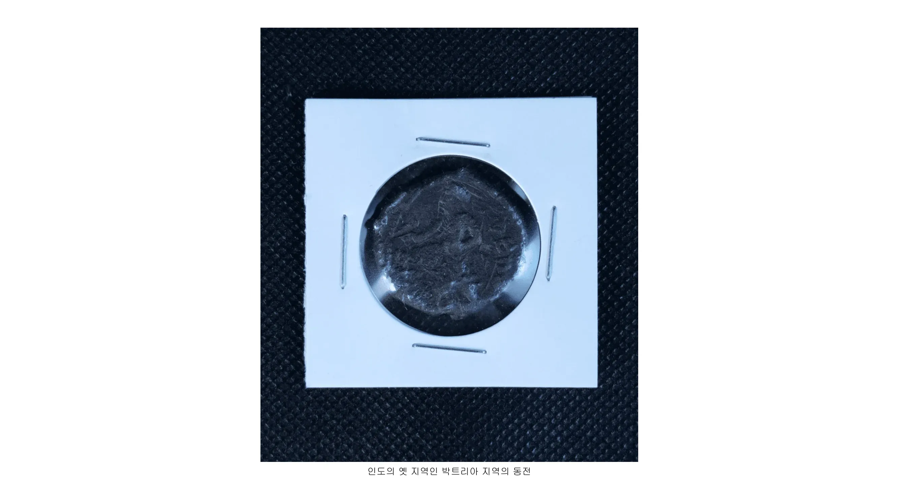

이 시기를 시각적으로 설명하기 위해 위의 그림은 인도 반도의 서쪽, 아프가니스탄과 가까운 인도의 박트리아 지역에서 나온 동전입니다. 이 지역에서는 그리스 주화에서 영감을 받은 것으로 추정되는 왕족 중 한 명이 등장하는 주화가 있었습니다.

## 리디안과 페르시아인

<chapterId>eb802ab8-8ffd-5b25-907f-8944f120ed14</chapterId>

:::video id=f151eb42-5ff3-4ca1-9af1-1ae2a5e051c0:::

### 최초의 리디안 일렉트럼 코인

동전의 출현 시기를 리디아와 페르시아를 구분할 수 없으므로 오늘날 터키를 형성하고 있는 그리스 동쪽 지역으로 넘어가 보겠습니다. 서양에서 최초로 등장한 동전은 기원전 7세기 중엽, 현재의 터키에 위치한 리디아와 이오니아 지역으로 거슬러 올라갑니다. 기원전 650~600년경 에베소의 아르테미스 신전에서 발견된 기원전 600년경의 최초의 동전과 같은 주목할 만한 고고학적 발견과 함께 이 근본적인 혁신이 빛을 보게 된 것은 기원전 650~600년경이었죠. 이 원시 동전은 금과 은의 천연 합금인 일렉트럼으로 만들어져 호박색으로 반사되었으며, 펀치나 초보적인 모티프로 간단하게 표시된 투박한 모양을 하고 있었습니다.

아래에서 가장 초기의 리디아 주화 중 하나를 볼 수 있는데, 사자가 먹이를 앞에 두고 있는 모습이 그려져 있습니다. 뒷면에 스탬프나 구멍이 있는 것을 볼 수 있는데, 이는 금속의 순도를 테스트하고 단순한 표면층이 아닌지 확인하기 위해 사용된 것으로 추정됩니다. 가장 초기의 사례 중 하나이지만, 이 작품은 복제품이라는 점에 유의해야 합니다. 저의 모든 금과 일렉트럼 작품은 복제품이거나 현대적으로 재현한 것으로, 이 컬렉션에 모든 돈을 쓰지 않도록 설계되었습니다.

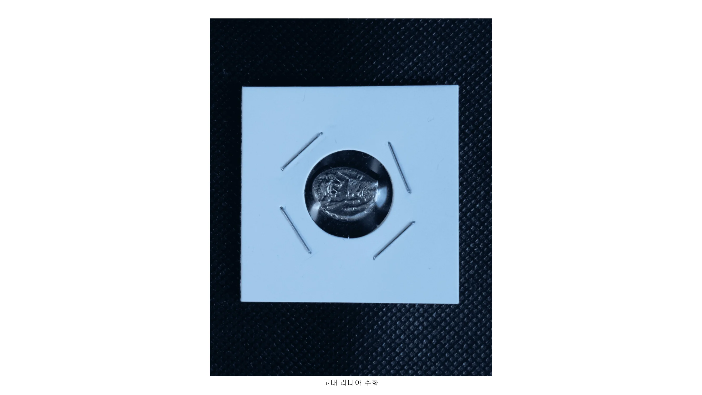

하지만 우리가 곧 보게 될 진짜 페르시아 작품도 있습니다. 이것이 이 초기 작품의 모습입니다. 당시 찍힌 일종의 금속 덩어리(영어로 덩어리)와 비슷합니다.

화폐가 일상적인 거래를 촉진하고 물물교환을 대체하기 위해 발명되었다는 통념과는 달리, 최초의 리디아, 아케메네스, 그리스 동전은 처음에는 소규모 상거래에 사용되지 않았던 것으로 보입니다. 실제로 화폐 단위가 일상적으로 사용하기에는 너무 컸기 때문입니다. 게다가 동전의 유통은 생산지와 가까운 지역으로 제한되었습니다.

여기서 제가 인류학적인 성격의 여러 저작에서 읽은 바 있지만, 이미 소개한 일렉트럼 동전이나 곧 다시 소개할 페르시아 동전은 매일 빵을 사기에는 너무 컸다는 점을 언급하는 것이 중요하다는 것을 알게 되었습니다. 농부나 군인의 하루 일당과 맞먹는다는 추정치를 본 적도 있으니 너무 큰 금액이 아닐 수 없습니다. 마치 한 끼 식사, 아침 식사, 점심 식사로 하루의 임금을 지불하는 것과 같습니다. 다만 다른 작품에서 이보다 작은 단위의 동전, 즉 작은 동전이 발견된 것을 본 적이 있어서 일상적인 구매에 사용할 수 있었을지도 모른다는 생각이 들기도 합니다.

따라서 액면가나 단위가 너무 커서 일상적인 거래에 사용되지 않았다는 인류학적 '증거'는 제 생각에는 그다지 견고하지 않은데, 그보다 더 작고 일상적인 구매에 적용될 수 있었던 동전의 예가 발견되었기 때문입니다.

### 화폐 창출에서 국가의 역할

동전의 실제 기원은 국가의 직접적인 행동과 관련이 있는 것으로 보입니다. 첫 번째 이상주의적 가설은 그리스어 '노미스마'(돈)와 '노모스'(법)를 유사시하여 화폐가 법의 성문화와 연결되어 도시의 권위와 정치 조직을 강화했다는 가설입니다. 오늘날 널리 받아들여지고 있는 보다 현실적인 두 번째 가설은 화폐가 무엇보다도 국가가 경제적, 사회적 통제를 행사하는 수단이었다는 것입니다. 국가는 화폐에 포함된 귀금속의 무게와 가치를 공식적으로 보장함으로써 화폐의 유통과 가치를 조작할 수 있었고, 이를 통해 국내 화폐에 대한 신뢰와 유동성 프리미엄을 창출할 수 있었습니다.

이에 대한 증거가 있다는 것은 정말 흥미로운 사실입니다. 예를 들어, 일렉트럼 동전의 경우 천연 일렉트럼은 일반적으로 금 70%, 은 30% 정도라는 사실을 알아야 합니다. 저희가 처음 발견하고 분석한 동전, 특히 초기 리디아 동전의 경우 금 함량이 70%가 아니라 50~55% 정도인 것으로 보입니다. 이는 당시에도 동전 발행자들이 더 많은 동전을 생산하고 표시가 없는 천연 전구와 같은 가치를 지닌 것처럼 보이게 하기 위해 귀금속의 비중을 줄이려고 노력했음을 시사합니다. 그리고 여기서 *부자 크로에수스처럼*이라는 유명한 크로에수스 시대부터 금과 은을 분리하는 기술이 있었기 때문에 이것이 가능했다고 말해야 합니다.

리디아 주화는 전설적인 부로 유명한 크로에수스 왕(기원전 561~546년)의 통치 기간에 큰 변화를 겪었습니다. 이 시기에 리디아 사람들은 야금술을 완성하여 금과 은을 일렉트럼에서 분리하여 최초의 바이메탈 주화, 즉 금과 은을 분리한 주화를 도입했습니다.

### 페르시아의 확장과 그리스어 채택

기원전 546년 리디아를 정복한 아케메네스 페르시아인들은 즉시 이 혁신을 도입했습니다. 기원전 500년경 다리우스 1세가 통치하던 페르시아는 금 다릭과 은 시글로이스로 독자적인 화폐 시스템을 구축했으며, 종종 호전적인 포즈를 취한 왕의 초상이 새겨져 있었습니다. 이 페르시아 왕실 주화는 주로 페르시아 제국의 헬레니즘화 지역에서 사용되었고 점차 확산되었지만, 이집트 등 일부 지역에서는 여전히 무게가 있는 금속(금괴)으로 교환하는 것을 선호하는 등 그 사용이 불균등하게 유지되었습니다**.

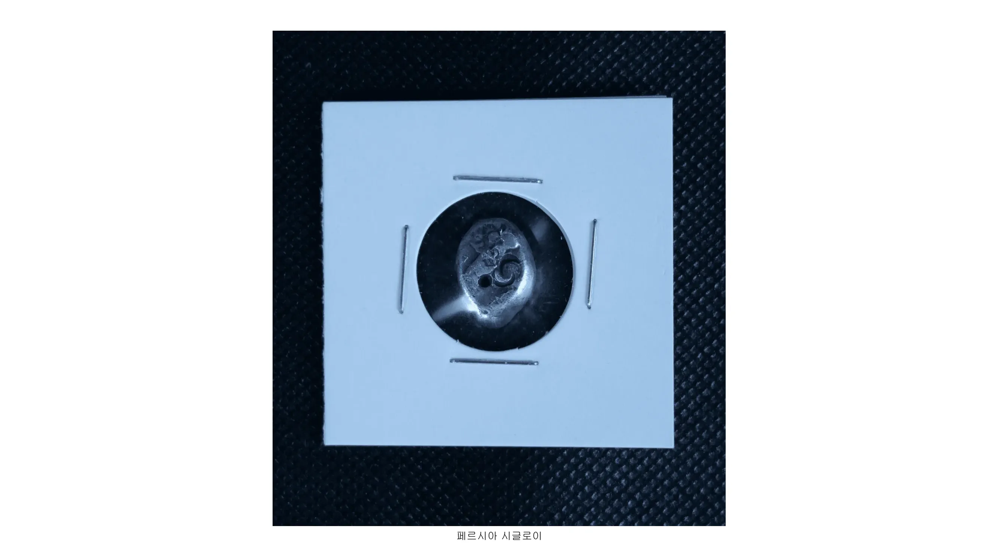

위에서는 진짜 페르시아 시글로이(또는 시글로스)를 감상하실 수 있습니다. 구멍이 약간 닳아 없어졌지만 작은 디자인에 왕이 그려져 있습니다. 시글로이는 금으로 만든 다릭과 달리 은화로 만든 동전입니다. 페르시아인들은 이 두 금속을 구별할 수 있었기 때문에 일렉트럼 주화에서 벗어나게 되었습니다. 그래서 금과 은을 모두 사용하는 바이메탈리즘을 구현하면서 귀금속으로 만든 동전의 개념은 그대로 유지하면서 뒷면에 금속 함량을 확인하기 위해 구멍을 뚫은 경우가 많았습니다.

그리스인들이 동전을 빠르게 채택한 것은 특히 소아시아의 그리스 식민지를 통해 리디아 인들과의 긴밀한 접촉에 의해 자극을 받은 것으로 보입니다. 동전을 주조한 최초의 그리스인은 기원전 6세기 중반에 에게나에 살던 주민들로, 이들은 지역마다 무게가 다르고 이름 그대로 '한 줌의 곡물' 또는 '한 줌의 화살'을 의미하는 드라크마를 도입했을 것입니다.

그리스 주화의 성공은 도시의 경제적, 정치적 확장만큼이나 용병 지불과 같은 중요한 거래에 편리했기 때문이었습니다. 화폐는 그리스와 이후 로마 경제의 중심 요소가 되었으며, 특히 법(노모스)과의 연관성을 통해 강력한 상징적 차원을 유지하면서 빠르게 성장했습니다.

마지막으로, 화폐의 급속한 팽창은 화폐 가치의 성문화가 국가 조직과 함께 진행된 고대 사회의 심오한 변화를 목격할 수 있습니다. 이러한 변화는 그리스 민주주의의 부상을 위한 경제적, 정치적 토대를 마련했으며, 특히 아테네에서는 화폐가 민주적 도시의 기능에 중요한 역할을 했습니다.

이 섹션에서 기억해야 할 핵심 사항은 일반적인 화폐가 아닌 **코인**에 대해 구체적으로 이야기하고 있다는 점입니다. 명확하게 드러나는 핵심적인 측면은 코인의 기술적 특성(무게, 순도, 액면가)과 직결되는 **발행 기관에 대한 신뢰**입니다. 국가나 발행 기관이 코인의 가치와 유통을 처음부터 어느 정도 통제하거나 심지어 조작할 수 있는 것은 바로 이러한 신뢰 때문입니다.

## 제도적 개입과 첫 번째 코인

<chapterId>3e1efd08-99e3-5a32-9908-3185fef0e640</chapterId>

:::video id=84847cf6-9e46-4a8c-9f35-25a27496cc4b:::

### 돈의 이중적 성격

주조 화폐의 출현은 근본적인 질문을 제기합니다. 화폐는 시장의 자발적인 창조물인가 아니면 권위에 의해 부과된 제도인가? 이러한 개념적 긴장은 근본적으로 다른 두 가지 비전을 서로 대립시킵니다.

한편으로 오스트리아 경제학파는 상품 화폐, 특히 금이 내재적 특성인 내구성, 휴대성, 분할 가능성, 대체 가능성 때문에 경제 주체들이 자연스럽게 선택했다는 생각을 옹호합니다. 이러한 관점에서 국가는 이 자연발생적인 화폐의 공급을 통제하기 위해 화폐를 할당했습니다. 화폐는 정치 권력에 의해 장악되기 전에 시장의 필요에 의해 자연스럽게 생겨난 제도입니다.

이와는 대조적으로 인류학적, 제도적 관점에서는 화폐가 실제로 국가 주화를 통해 탄생한다고 주장합니다. 당국이 의식적으로 도장을 찍어 화폐를 만들어 금속을 진정한 화폐 수단으로 탈바꿈시켰을 것입니다. 이 관점에 따르면 초기 리디아 주화는 주로 군대에 지급하는 데 사용되었으며, 1스테이터는 군인의 일당에 해당하는 금액이었습니다.

### 국가 표준화의 역설적인 이점

이러한 이론적 긴장에도 불구하고 오스트리아 경제학자들도 화폐에 대한 국가 개입의 특정 이점을 인정합니다. 화폐 발행을 통한 표준화는 여러 가지 실질적인 무역 문제를 해결합니다.

인증 기관이 없다면 경제 주체들은 위조 코인, 신고 사기, 무게 조작과 같은 끊임없는 위험에 직면하게 됩니다. 이러한 관행은 어떤 코인은 인정되는 반면 어떤 코인은 거부되기 때문에 경제에 마찰을 일으킵니다. 이론적으로 공식 스탬프는 무게와 품질을 보증하여 거래가 더욱 원활하게 이루어지도록 합니다.

이 보증은 시장에서 관찰 가능한 가격을 가지고 있습니다. 주조된 금화는 원금보다 더 높은 가치를 지니고 있습니다. 이 프리미엄은 인증의 가치를 반영하는 것으로, 판매자는 더 이상 화학적 또는 공명 테스트를 통해 금속의 진위 여부를 직접 확인할 필요가 없습니다. 국가의 개입은 역설적이게도 제도화된 신뢰를 구축함으로써 마찰을 없애고 거래를 촉진합니다.

### 처음부터 통화 조작

최초의 리디아 주화 주조자들의 이야기는 충격적인 아이러니를 드러냅니다. 최근 분석에 따르면 이 주화의 금 함량이 천연 주화보다 체계적으로 낮았다는 사실이 밝혀졌습니다. 품질을 인증하는 기관이 동시에 성분을 조작한 것입니다.

이 사례는 코인의 이중적 유용성을 잘 보여줍니다. 시장 입장에서는 거래의 유동성을 높이고 표준화를 보장합니다. 발행 당국 입장에서는 희석을 통한 경제 통제의 도구가 됩니다. 명목 가치는 유지하면서 금 함량을 줄임으로써 국가는 화폐 공급량을 효과적으로 늘려 같은 양의 귀금속으로 더 많은 화폐 단위를 만들 수 있습니다.

그러나 국가 자체는 이러한 조작에 제약을 받았습니다. 4세기 콘스탄티누스 황제의 금화 솔리두스의 예에서 볼 수 있듯이 로마 정부는 좋은 주화로 지불할 것을 요구하면서 주화의 품질을 꼼꼼하게 점검했습니다. 당국은 세수의 가치를 보장하기 위해 자체 주화의 품질을 유지하는 데 큰 관심을 가졌습니다.

### 평가 절하에 대한 경제적 분석

화폐 평가절하에 대한 연구는 역사를 통틀어 일관된 패턴을 보여줍니다. 금속 동전의 경우, 경제학자들은 동전에 포함된 귀금속의 비율을 추적하는데, 이는 점진적인 평가 절하를 나타내는 하강 곡선입니다. 현대 지폐의 경우, 그 반대인 유통 화폐 공급량이 관찰되고 그 증가는 평가절하를 나타냅니다.

두 가지 방법 모두 화폐 가치의 희석이라는 동일한 근본적인 현상을 측정합니다. 귀금속 함량을 줄이든 새 지폐를 인쇄하든 메커니즘은 동일하게 유지됩니다. 당국이 동일한 실물 자원으로 더 많은 화폐 단위를 만들수록 각 단위는 더 많은 가치를 잃게 됩니다.

초기 리디아 주화에서 관찰할 수 있는 이러한 조작은 화폐 통제가 항상 권력의 문제였음을 시사합니다. 따라서 주조 화폐는 놀라운 기술 혁신과 경제적 통제 수단이 결합된 것으로, 이는 화폐의 역사를 통해 오늘날까지 이어져 온 이중성을 나타냅니다.

## 부품 제조

<chapterId>b205f4f2-c293-5308-b812-a998de9ad45e</chapterId>

:::video id=47c612ec-d97e-4498-b50e-7e66518bd56d:::

### 펀칭 블롭에서 주조 동전까지

동전의 출현에 대한 섹션에 이어 동전 제조의 진화에 대한 아주 짧은 섹션을 소개하고자 합니다. 앞서 살펴본 바와 같이, 모든 주화는 금과 은으로 시작하여 양면에 왕의 얼굴이나 순도를 확인하기 위해 뒷면에 구멍이 뚫린 펀치로 표시된 주화로 진행되었습니다.

나중에 다음 섹션에서 살펴보겠지만 그리스인들은 양면을 망치로 두드려서 둥근 동전을 만들어 이 기술을 더욱 발전시켰습니다. 그들은 매끄럽고 평평한 귀금속 조각을 가져다가 한쪽 면에 원하는 디자인을 새긴 다음 손으로 망치로 두드려 완성된 동전을 만들었습니다.

동전을 일일이 손으로 주조하는 기술은 생산량을 늘리기 위해 희석하는 경우가 많았지만, 당시 인플레이션을 억제하는 데 중요한 역할을 했을 가능성이 높습니다. 이러한 현상은 특히 로마 시대와 그리스 시대의 특정 전쟁 중에 더욱 두드러졌습니다. 한 번에 하나씩 주조하는 방식은 당국의 대량 생산 능력을 제한했지만, 상당한 평가 절하가 발생했음에도 불구하고 인플레이션 억제에 효과적으로 기여했습니다. 따라서 금속 덩어리를 두드려서 주조하는 방식에서 동그랗고 두드려서 주조하는 동전으로 발전하게 되었습니다.

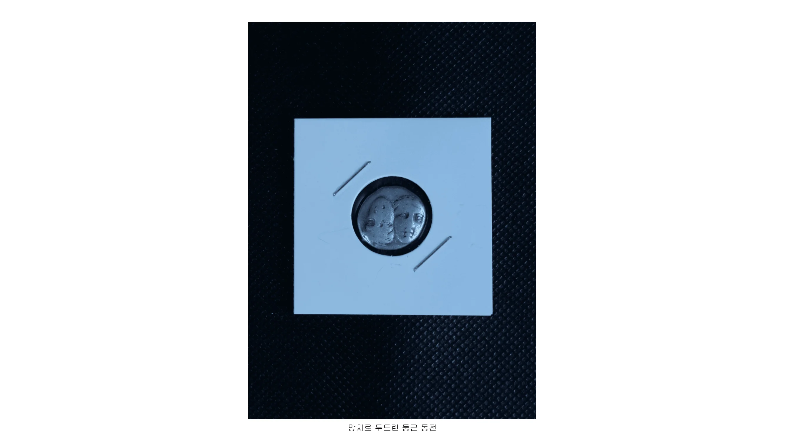

### 중세의 진화

중세 시대에는 동전을 넓게 펴서 더 얇게 만드는 추세도 있었습니다. 그 이유 중 하나는 진위 여부를 판단하는 지표로 자주 사용되던 소리를 테스트하기 쉬워졌기 때문입니다. 은화를 펼치면 뚜렷한 주파수가 발생하기 때문에 사람들은 그 소리만 들어도 동전의 순도를 확인할 수 있었습니다. 이 관행은 "사운드 머니"라는 용어를 탄생시켰습니다. 사운드 머니의 경우, 표준 무게는 저울 또는 "트레버켓"을 사용하여 무게를 측정하는 방식으로 결정되었습니다. 따라서 작고 둥근 동전에서 약간 더 얇고 넓은 동전으로 진화가 계속되었습니다.

### 진자 타격

중세 말, 근대 초기에 마지막으로 등장한 기술은 진자 주조라는 개념이었습니다. 일종의 나사를 조여 동전을 치는 방식으로, 이 새로운 형태의 타격을 통해 동전을 만들 수 있었습니다. 이 개발에서 중요한 것은 주화 표면에 패턴을 새겨서 클리핑 문제를 해결하는 기능이었습니다. 클리핑은 동전의 일부를 제거하여 귀중한 은을 회수한 다음 다른 동전을 주조하는 데 사용하거나 단순히 자원으로 보관할 수 있었습니다.

따라서 진자 타격이라는 개념이 클리핑 현상에 도움이 되었습니다. 흥미로운 점은 이 기술이 실제로 프랑스에서 시작되었다는 점입니다. 예를 들어 영국에서는 프랑스 엔지니어를 고용하여 이 기계를 만드는 방법을 가르쳐주었습니다. 재미있는 점은 해머 주조를 반대하고 이 기술의 적용을 지연시킨 지지자들이 있었다는 것입니다. 좋은 기술에는 항상 반대하는 사람들이 있고, 오래된 기술을 유지하려는 사람들이 있습니다. 더 많은 부품을 만들 수 있고, 모방하기 어렵고, 정말 우수해 보이는 기술인데도 여전히 유명한 해머 방식에 집착하는 사람들이 있다는 사실을 깨닫는 것은 정말 미친 짓이라고 생각했습니다. 이 유명한 진자 타격 방식으로 만든 부품을 생산하다가 다시 망치 타격 방식으로 돌아가는 전환이 있었습니다. 그리고 마침내 펜듈럼 스트라이킹이 자리를 잡으면서 클리핑이라는 단어와 관련이 있는 작은 선, 클리핑을 방지하기 위한 작은 융기, 그리고 오늘날에도 작품의 가장자리에 새겨진 융기나 텍스트 또는 그림을 볼 수 있는 아름다운 현대 작품을 만들 수 있게 되었죠.

# 화폐의 출현에 대한 다양한 이론

<partId>72ac694f-9248-550d-90c1-91af3d234380</partId>

## 화폐의 출현에 관한 이론과 다양한 정의

<chapterId>7d699d4d-8c70-55b5-bf36-609f3fd90bcf</chapterId>

:::video id=523c873f-501b-4954-b79f-7e74c0f685a5:::

돈의 출현과 다양한 정의에 관한 여러 이론을 소개하는 이 코너에 오신 것을 환영합니다. 다음은 이 섹션에서 살펴볼 두 가지 주요 이론을 요약한 책 <돈의 기원>에서 발췌한 짧은 글입니다.

> 이 간단한 서문은 설문조사의 맥락을 강조하는 것 외에는 다른 목적이 없습니다. 개념적 수준에서는 폴라니(K. Polanyi)의 이론을 지지하는 사람들과 베버(M. Weber)의 이론을 지지하는 사람들 사이에 논쟁이 벌어지고 있습니다. 전자의 경우 증여와 재분배가 중심적인 역할을 하며, 시장 교환은 주로 국제 거래에서 미미한 역할만 수행합니다. 반면에 다른 학자들은 시장이 현재 역사적 과정의 핵심이라고 주장합니다.

예를 들어, 메소포타미아에서는 한 가지 출현 이론에 따르면 권위자인 성전이 계정 단위 또는 화폐 단위를 만들고 이를 부과한 다음 상인들이 이를 무역에 도입했다고 합니다. 반대 이론은 이 화폐 단위가 무역을 촉진하기 위해 시장에서 자연스럽게 등장했다고 가정합니다. 메소포타미아에서 이에 대한 좋은 예가 있습니다.

물물교환은 주로 국제 교류, 즉 신뢰하지 않는 사람과의 거래에서 사용되었다는 설이 있습니다.

그래서 이 섹션에서는 이러한 내용을 다루려고 합니다. 돈의 출현에 관한 다양한 이론과 돈에 대한 다양한 정의를 제시하기 위해 일종의 설문조사를 실시할 것입니다. 우리는 고전 경제학자와 인류학자의 논문을 발표하고 비판할 것입니다. 운이 좋게도 이 다양한 주제에 대한 오스트리아 경제학자의 관점을 제시해 줄 울리히 프로미와 함께할 수 있게 되어 기쁩니다.

## 고전 경제학자를 위한 화폐의 출현

<chapterId>1d3776cd-0dfd-5297-af48-c6f41e257a7e</chapterId>

:::video id=873a16c1-17ac-448d-8941-df4feb7ab79d:::

이 섹션에서는 화폐의 출현에 관한 다양한 이론을 다룹니다. 첫 번째로 다룰 주제는 고전 경제학자들이 말하는 화폐의 출현입니다.

### 아담 스미스의 고전적 이론

고전 경제학 이론, 특히 아담 스미스가 주창한 이론에 따르면 화폐는 물물교환의 한계에 대응하여 자연스럽게 등장했습니다. 처음에는 직접 물물교환을 통해 교환이 이루어졌지만, 이 방법은 각자가 원하는 것을 정확히 소유해야 하는 '욕구의 이중 일치'라는 문제로 인해 종종 복잡했습니다. 점차적으로 소금, 귀금속, 가축과 같은 특정 상품은 그 유용성, 내구성, 분할 가능성 덕분에 모든 사람이 중간 교환 수단으로 받아들이게 되었습니다. 따라서 화폐는 자연스럽게 경제 교류를 촉진하고 유동화하기 위해 등장했습니다.

### 고전 이론에 대한 비판

다음은 이 이론에 대한 저의 비판입니다. 이전 섹션에서 살펴본 모든 것을 고려할 때, **코인이 물물교환의 진화라는 개념은 이미 잘못된 것이라고 말할 수 있다고 생각합니다. 왜냐하면 발행된 코인은 권위에 의해 주조되기 때문에 분명히 권위에서 나온 것이기 때문입니다. 여기에는 여러 가지 이유가 있는데, 그중에서도 경제를 통제하고 화폐를 장악하려는 당국의 욕구가 가장 큰 이유입니다.

반면에 동전이 아닌 화폐라는 개념으로 이야기한다면, 최초의 주화인 리디아 주화에서 표시되지 않은 은색 얼룩이 발견되었기 때문에 명확성이 떨어집니다. 이 주화가 유통되었는지 여부는 아직 밝혀지지 않았습니다. 만약 유통되었다면 사람들이 이 자산을 널리 수요가 있고 쉽게 교환할 수 있는 잠재적 화폐로 인식했을 수 있다는 뜻입니다. 그리고 아마도 그 후에야 당국이 이러한 상황을 알아차리고 이를 증명하기 위해 도장을 찍어 통제했을 것입니다.

이렇게 하면 확인하거나 무게를 측정할 필요가 없는 등 많은 이점이 있습니다. 물론 이에 대한 이야기는 나중에 하도록 하겠습니다. 하지만 제 생각에 코인은 처음부터 국가가 사용했던 도구임이 분명합니다. 그러나 화폐의 출현과 관련해서는 실제로 화폐를 부과한 기관에서 나온 것인지 아니면 무역이나 상업적 교환을 통해 등장한 것인지는 알 수 없습니다. 이 섹션의 뒷부분에서 제 동료 울리히와 함께 이 주제에 대해 매우 흥미로운 토론을 해보겠습니다.

최초의 귀금속 동전은 그 가치가 너무 높아서 일상적인 거래에 사용되지 않았다는 사실을 이미 알고 있습니다. 또한 주로 군납에 사용되었다는 사실도 알고 있습니다. 이는 화폐가 반드시 시장에서 출현한 것은 아니라는 논제에 대한 좋은 논거가 됩니다. 최초의 동전의 액면가인 계정 단위는 빵을 사거나 일상적인 쇼핑을 하기에는 너무 컸을 것입니다. 예를 들어, 하루 임금에 해당하는 금액이었을 수도 있습니다. 그 당시 사람들이 반드시 임금을 받았다는 것은 아니지만, 그 규모를 짐작할 수 있습니다. 따라서 이 코인은 소규모 거래에서 사용하기에는 구매력이 너무 컸을 것입니다. 반면에 이 코인이 상인 거래소와 같은 대규모 거래에 사용되지 않았을 것이라고 말할 수 있는 것은 없습니다. 우리는 이 코인이 주로 군대 지불에 사용되었다는 것을 알고 있습니다. 이는 최초의 코인의 출현을 설명하는 가장 인기 있는 이론 중 하나입니다. 여기서 말하는 코인은 일반적인 화폐가 아닌 동전에 관한 이야기라는 점을 기억하세요. 따라서 최초의 동전의 첫 번째 역할은 용병에게 군납금을 지불하는 것이었습니다.

예를 들어 알렉산더 대왕은 나중에 살펴보겠지만 이 기능을 훌륭하게 활용했습니다.

또한 고대 중국에서는 일찍이 카우리 껍질이 경제적 교환(**노동에 대한 보상, 가치 측정, 토지 구매)**에 사용되었다는 사실도 확인했습니다. 또한 메소포타미아와 이집트에서는 이미 기능적인 화폐 시스템이 존재했으며 무역, 임금 지급, 세금 납부 등에 사용되었습니다. 여기서 제가 말씀드리고 싶은 것은 서구적 개념의 코인이 거래의 유동성을 높이기 위한 필요성에서 비롯되었다고 생각하는 것은 분명 잘못된 생각이라는 것입니다.

코인은 기관에서 발행하기 때문에 처음부터 발행 기관과 연계되어 있다고 가정할 수 있습니다. 이는 일리가 있습니다. 반면에 우리는 화폐의 형태나 그 이전의 화폐 시스템인 원형 코인이 어떻게 등장했는지 반드시 알 수는 없습니다. 한편으로는 이러한 화폐 단위를 식별한 것이 사원이었고, 이후 사람들이 이를 사용했다고 추정할 수 있습니다. 그리고 다른 한편으로는 교환 수단, 외부 세계와 거래할 수 있는 수단이 필요했던 것은 상인들이었고, 예를 들어 은 금속이 외부 세계에서 수요가 있었기 때문에 이를 사용하도록 식별한 것은 상인들이었다고 말할 수 있습니다. 요점은 우리가 잘 모른다는 것입니다. 그렇기 때문에 두 가지 상반된 이론이 존재하는 것입니다. 화폐가 상인 등 거래의 필요성에서 자연스럽게 생겨난 것인지, 아니면 권력에 의해 생겨난 것인지 설명할 완벽한 증거는 없습니다.

### 동전과 원시 화폐 구별하기

결론적으로 동전은 권위에 의해 도장이 찍혔기 때문에 반드시 권위에서 비롯되었다고 말할 수 있다고 생각합니다. 반면에 교환을 용이하게 하기 위해 화폐(동전 이전의 것)가 등장할 수 없었다고 말하는 것이 틀렸다고 말할 수는 없다고 생각합니다. 위에서 살펴본 모든 사례에서 이런 의미의 예가 많다고 생각합니다.

## 물물교환의 신화

<chapterId>0fcd4964-ac36-5163-a8cf-1aacebc0d2c0</chapterId>

:::video id=0ede29ab-8acd-4d79-9282-bd5991b97076:::

### 데이비드 그레이버의 리뷰

지금까지 고전 경제학자들이 말하는 화폐의 출현에 대해 살펴보았습니다. 이제 물물교환 신화로 알려진 개념에 대해 알아보겠습니다.

화폐의 출현에 대한 이 고전적인 이론에 대한 한 가지 비판은 그 아이디어를 뒷받침할 역사적 증거가 부족하다는 점입니다.

인류학자 데이비드 그레이버(David Graeber) 등이 제기한 '물물교환 신화'라는 비판은 화폐가 물물교환에서 자연스럽게 생겨났다는 고전적인 생각에 이의를 제기합니다. 이 비판에 따르면, 화폐가 등장하기 전에 사회가 물물교환을 체계적으로 사용했다는 역사적 또는 인류학적 증거는 존재하지 않습니다. 실제로 고대 사회는 신용, 부채, 사회적 의무, 의식적 교환을 기반으로 운영되었을 것입니다. 따라서 '물물교환 신화'는 실제 경험적 근거 없이 고전적 경제 비전을 정당화하기 위해 고안된 이론적 구성물입니다.

그러나 이 이론은 다른 부족 간의 교류와 같은 물물교환이 존재했다는 사실을 부정하는 것이 아니라는 점에 유의해야 합니다. 단지 물물교환이 소위 원시 집단 내에서 널리 행해졌던 활동이었으며, 화폐는 이러한 관행에서 논리적으로 진화한 것이라는 점을 부인할 뿐입니다. 물물교환이 부족 내에서 널리 사용되었다는 사실과 물물교환으로 인한 어려움을 해결하고 교환을 유동화하기 위해 결국 화폐가 등장했다는 사실을 부정하는 것입니다. 대신, 이 이론에 따르면 이 그룹들은 비공식적인 신용 또는 선물 대 선물의 형태를 실천했습니다.

### 원시 사회 대 위대한 문명

**고대 고대의 위대한 문명에 관한 몇 가지 설명이 있습니다.** 저는 이 이론이 과거는 물론 오늘날에도 원시(국가가 없는) 집단(예: 18~19세기 탐험가들이 연구한 부족)에도 분명히 적용된다고 생각합니다. 분명히 그들은 물물교환이 아닌 앞서 언급한 교환 형태를 사용했는데, 이는 앞서 언급한 이유(약한 분업, 자급자족 농업)에서 비롯된 것입니다. 하지만 메소포타미아나 고대 이집트 같은 과거의 위대한 문명에는 이 이론이 적용되지 않는다고 생각합니다.

다음은 이 주제에 대한 *오 오리진 드 라 몽니*의 두 가지 발췌문입니다:

> M. 마우스가 그의 유명한 저서 "선물"에서 설명한 모델은 이집트학자들이 분별력 부족만큼이나 만장일치로 열광적으로 채택했습니다. 이로 인해 여러 가지 혼란이 발생했지만 여기서는 다루지 않겠습니다. 이 모델은 파라오 이집트의 경우가 아닌 소위 원시 사회에 적용된다는 점만 알아두세요.

> 따라서 빵, 즉 가공된 곡물은 구왕국의 샤트(y)와 마찬가지로 다양한 상품에 대한 크레딧을 개설할 수 있는 계정 단위였습니다. 이 간단한 예는 파라오 이집트의 경제가 재분배 시스템에 국한되지 않았음을 보여줍니다. 수많은 교환과 관련된 매우 복잡한 구조였습니다.

따라서 앞서 이집트, 심지어 메소포타미아와 중국에 대한 섹션에서 보았듯이 원시 문명은 아니지만 국가가 존재했기 때문에 이러한 고대 문명에서도 화폐 시스템을 사용했음을 알 수 있습니다. 이는 이 강의의 첫 번째 섹션에서 충분히 설명했다고 생각합니다. 따라서 이 위대한 문명에는 주고받기, 이연된 신용이라는 개념이 적용되지 않습니다. 따라서 화폐의 출현에 대한 정확한 이유는 여전히 미스터리로 남아 있습니다. 상인들이 외부 세계와 무역을 하기 위해 필요해서 생겨난 것인지, 아니면 고대 시대에 신전에 의해 부과된 것인지는 알 수 없습니다.

## 부채 화폐를 통한 화폐의 출현

<chapterId>4f508615-aa61-5d62-89d3-cecd02aeaa62</chapterId>

:::video id=a23f547f-3906-4f4a-8f72-5d78c649d0c4:::

### 차용증으로서의 자금

이 섹션에서는 부채 화폐에 대한 이론을 다룹니다.

경제학자 알프레드 미첼-인네스가 개발하고 나중에 데이비드 그레이버가 확장한 **부채 화폐** 이론은 화폐가 물물교환에서 비롯된 것이 아니라 초기 인류 사회부터 존재했던 부채와 신용 관계에서 비롯되었다고 주장합니다. 이 이론에 따르면 화폐는 사회적 의무(개인 또는 집단 간의 부채)가 계량화되고 양도할 수 있게 되면서 등장합니다. 이 개념은 교환과 이전의 정량화라는 개념을 도입합니다. 따라서 화폐는 단순히 교환의 중개자 역할을 하는 상품이 아니라 상호 신뢰가 뒷받침되고 종종 정치적 또는 종교적 권위에 의해 보장되는 '부채의 인정'이 될 것입니다.

이 이론의 더 발전된 형태는 모든 돈은 부채라는 것입니다. 따라서 돈을 소유한 사람은 일반적으로 사회에 대한 청구권을 가지며, 그 돈을 받아들이는 모든 사람들에 대한 청구권을 가지게 됩니다. 그리고 돈은 **그들의 시각에서 **강제적으로 받아들여야 하기 때문에**, 그렇지 않으면 돈이 아니며, 이 돈을 거부할 수 있다면 그들의 시스템은 작동하지 않기 때문입니다. 특정 통화를 식별한 특정 집단에서 그 통화를 소유한 모든 사람은 그 통화를 받아들이는 그 사회의 다른 모든 구성원에게 빚을 지는 것과 같고, 그 통화를 받아들이는 사람들은 그 화폐 단위를 소유한 사람에게 일종의 빚을 지는 것과 같습니다. 이것이 바로 이들의 이론입니다.

### 강제 시스템에 대한 비판

**이 이론에 대한 나의 비판:**

이 이론에 대해 한 가지 작은 비판을 해보겠습니다. 저는 돈이 일종의 사회적 합의라는 점을 인정합니다. 한 집단이 금전적 '기호'에 대해 갖는 신뢰는 그것이 무엇이든 간에 신뢰입니다. 그래서 저는 상호 신뢰라는 개념에 동의하며, 나중에 금전적 프리미엄이라는 개념으로 다시 다룰 것입니다. 이 이론을 지지하는 사람들이 의무라는 개념을 추가하고 부채라는 개념을 고집할 때 문제가 복잡해집니다. 이들에 따르면, 누군가가 금전적 token을 소유하면 커뮤니티 전체에 대한 청구권을 가지게 되고, 따라서 커뮤니티는 그 소유자에게 빚을 지게 됩니다. 또한 그룹 구성원들은 token을 수락해야 하는 정산 의무가 있으며, 그렇지 않으면 시스템이 작동하지 않을 것입니다. 위에서 설명한 고대 중국의 시스템이 이 이론을 잘 대변한다고 생각합니다.

저는 사회적 합의에 따라 공식적인 의무 없이도 token를 지불 수단으로 받아들이는 시스템을 쉽게 상상할 수 있습니다. 사람들이 자유의지로 받아들인다면 그런 시스템이 작동할 수 있다고 봅니다. 작동할 수 있습니다. 반면에 의무, 법적 입찰 및 폭력이 수반되는 경우가 많으며, 이는 나중에 섹션에서 살펴볼 것입니다. 하지만 이론적으로는 이 시스템이 제대로 작동할 수 있을 것 같지는 않습니다. Bitcoin가 그 예라고 생각합니다. Bitcoin는 금전적 프리미엄이 있기 때문에 가치가 있고, 금전적으로 사용하려는 수요, 즉 가치 보유, 교환 수단 또는 법정 화폐 시스템에 대한 보호 수단이 될 수 있기 때문에 가치가 있습니다. 누구도 이를 받아들일 의무가 없으며, 결제 수단으로 더 많이 받아들여질수록 교환 수단으로 더 많이 사용될 수 있습니다. 우리는 이미 아무런 문제없이 가치 저장 수단으로 사용할 수 있습니다. 의심의 여지가 없습니다. 제가 말씀드리고 싶은 것은 Bitcoin가 나중에 구매하면 돈을 돌려받을 수 있다고 생각하고 구매력을 보존하기 위해 나중에 교환할 수 있도록 획득하는 일종의 사회적 합의의 한 형태인 화폐라는 것입니다.

이 덜 제한적인 이론은 서로 다른 두 사회가 어떻게 두 사회 사이에 청구권이나 부채를 만들지 않고 금과 같은 화폐 token로 거래할 수 있는지 설명하는 데 도움이 됩니다. 다른 부족은 권위에 종속되지 않기 때문에 두 부족 간의 거래에서는 사회의 수용을 강제하는 것이 효과가 없다는 것을 알 수 있습니다. B 부족은 A 부족의 권위에 복종하지 않습니다. 하지만 동일한 화폐, 예를 들어 금을 받아들입니다. 이제 사람들은 "네, 하지만 B 부족도 금을 화폐로 사용하기로 결정했기 때문입니다."라고 말할 수 있습니다. 네, 맞습니다. 하지만 그 시점에서는 부채가 발생하지 않습니다. 최종 거래입니다. 따라서 A 회사가 B 회사에서 상품을 금으로 교환하면 부채가 발생하지 않고 거래가 완료됩니다. 그리고 분명히 B 회사의 사람은 나중에 A 회사의 사람들이 지불하기 위해 이 금화나 너겟을 획득한 것이 아니라 금으로 교환되는 것을 받아들인 것입니다. 그는 나중에 자신의 부족 내에서 교환하기 위해 그것을 받아들입니다. 따라서 이 예에서는 부채의 생성도 없고, 잠재적 청구권도 없으며, 단순히 직접 교환, 직접 지불이 이루어집니다. 부채 화폐를 지지하는 사람들은 이것이 물물교환이라고 말할 것입니다. 물물교환은 직접 재화를 교환하는 것이기 때문에 저는 동의하지 않습니다. 직접 물물교환은 사용을 위해 한 재화를 다른 재화로 교환하는 것입니다. 재화는 사용하기 위해 교환되지만, 우리의 경우 금은 다른 용도로 사용되는 것이 아니라 나중에 지불 수단으로 사용될 것이기 때문에 분명히 통화로 사용됩니다. 따라서 제 생각에는 물물교환 범주에 속하지 않는다고 생각합니다.

금전적 token를 소유하는 것은 커뮤니티에 대한 '청구권'이 아니라 나중에 비슷한 가치로 token가 인정되기를 희망하는 것입니다.

## 돈의 자연스러운 출현

<chapterId>e3ef86b1-73b9-5140-a61e-2ab6a5b0b2d4</chapterId>

:::video id=e543995f-d5e2-49d7-9133-e397b46e0833:::

칼 멩거가 창시한 오스트리아 경제학파에서는 욕구의 이중 일치라는 문제에 직면한 물물교환 경제에서 화폐가 자연스럽게 생겨난다고 보았습니다. 이 비전에서 개인은 직접 소비되는 재화가 아니라 널리 수요될 수 있는 능력을 인정받는 상품, 즉 교환을 촉진하는 중간재에 자발적으로 모이게 됩니다.

이러한 화폐는 아리스토텔레스 이래로 확인된 특성, 즉 가치 저장, 교환 수단 및 계정 단위로서의 역할을 해야 합니다. 경제 주체들은 점차 이를 식별하고, 축적하고, 저축하여 화폐로 출현하기 시작합니다. 이 과정은 전적으로 자발적인 것으로, 화폐는 교환을 조정하는 문제에 대한 시장의 자연스러운 반응을 나타내며 당국의 의식적인 개입 없이도 이루어집니다.

### '물물교환 신화' 논쟁

데이비드 그레이버와 같은 인류학자들은 '물물교환 신화'를 내세우며 이러한 견해에 이의를 제기합니다. 이들의 주장에 따르면 직접적인 물물교환만을 기반으로 한 복잡한 문명은 문서화된 적이 없습니다. 오히려 연구 대상인 원시 사회에서는 비공식적인 신용과 호혜의 시스템이 사용되었습니다. 그레이버는 신용 관계를 기록한 수천 개의 메소포타미아 석판을 인용하며 물물교환보다 부채가 먼저 존재했다고 주장합니다.

그러나 이러한 비판은 물물교환에 대한 제한적인 정의에 근거한 것입니다. 1892년 멩거가 지적했듯이 물물교환은 단순히 재화와 재화를 직접 교환하는 것 이상의 의미를 지닙니다. 또한 물물교환은 지연된 이체, 임금을 위한 서비스, 시간성을 지닌 교환, 즉 멩거가 "개인 간의 일방적인 이체"라고 불렀던 것까지 포함합니다. 이러한 확장된 형태의 물물교환은 제한된 신뢰의 범위 내에서 신용 시스템과 공존할 수 있습니다.

증거가 없다고 해서 부재가 없는 것은 아니며, 오스트리아 경제학자들은 직접적인 물물교환만으로는 복잡한 사회가 지속 가능하게 발전할 수 없으므로 화폐의 출현이 필요하다는 것을 인식하고 있습니다.

### 메소포타미아 사례: 상인 대 신전

메소포타미아 은 세겔의 기원에 대한 논쟁이 구체화되고 있습니다. 두 가지 상반된 해석이 있습니다. 제도적 견해는 진정한 경제 및 정신적 중심지였던 성전이 은을 화폐로 도입하여 경제를 구조화했다고 주장합니다. 성직자와 상인 엘리트 사이에 집중된 설형문자 석판은 이러한 중앙집권적 통제를 증명합니다.

오스트리아의 해석은 정반대로, 장거리 무역을 위해 화폐를 채택한 것은 상인들이라는 것입니다. 아나톨리아에서 페르시아만까지 메소포타미아 국경을 넘어 낯선 이방인들과 거래해야 했던 상인들은 보편적으로 알아볼 수 있고 내구성이 있으며 운반이 가능한 무언가가 필요했습니다. 은은 그 본질적인 특성 때문에 자연스러운 선택이었습니다. 신전들은 상업적 사용으로 이미 확립된 관행을 확인했을 뿐입니다.

이 논문은 아나톨리아의 카네쉬와 아수르 사이의 문서화된 교환을 바탕으로 상인들이 직물을 물질적 효용이 아닌 가치 저장 수단으로 은금속과 교환했다는 사실을 밝혀냈습니다. 이러한 거래는 단순한 물물교환을 넘어 진정한 상품 화폐의 존재를 드러내는 것이었습니다.

### 수용소의 현대적 예

제2차 세계대전 당시 독일 포로였던 경제학자 리처드 래드포드는 자발적으로 화폐가 출현한 흥미로운 사례를 기록했습니다. 수용소에서 담배는 자연스럽게 나눌 수 있고 표준화되어 널리 통용되는 교환 단위가 되었습니다. 비흡연자들도 담배의 보편적인 교환 가치를 인정하여 담배를 채택했습니다.

이 소우주는 교환을 조정하는 문제에 직면한 개인들이 가장 '판매 가능한' 재화에 자발적으로 수렴한다는 오스트리아의 원칙을 잘 보여줍니다. 당국이 담배값을 부과한 것이 아니라, 교환을 최적화하려는 죄수들의 일상적인 관행에서 비롯된 것입니다.

### 개인 취향의 융합

본질적으로 화폐는 개인의 선호가 인정된 공동선을 향해 수렴되는 것을 의미합니다. 메소포타미아 상인들은 래드포드의 죄수들처럼 미래 교환의 불확실성을 최소화하는 재화를 찾아냈습니다. 이러한 선택은 중앙 당국의 승인이나 강요를 기다리는 것이 아니라 교환이라는 과제에 직면한 경제 주체들의 실질적인 합리성에서 비롯된 것입니다.

역사적 증거가 단편적이기 때문에 자연발생적 출현과 의식적 제도 사이의 논쟁은 여전히 열려 있습니다. 그러나 오스트리아의 분석은 일관된 설명을 제공합니다. 화폐는 상업의 실질적인 필요에서 탄생했으며, 당국은 이미 시장에서 확립된 관행을 제도화했을 뿐이라는 것입니다.

## 화폐의 출현에 대한 인류학적 관점

<chapterId>ec48c5d8-47ed-530f-beb7-c44fd0b62880</chapterId>

:::video id=8c1f8764-75af-4fb6-a98b-55de3b7da02e:::

### 돈의 비경제적 기원

이 섹션에서는 화폐의 출현에 대한 인류학적 관점, 즉 고전적 경제 이론에 심오한 도전을 던지는 풍부한 관점을 살펴봅니다.

경제적 교환을 촉진하기 위해 물물교환에서 자연스럽게 화폐가 등장했다는 전통적인 이론과는 달리, 인류학적 연구에 따르면 화폐의 출현은 주로 비경제적 원인에 뿌리를 두고 있는 것으로 나타났습니다. 화폐는 공물 지불, 살인에 대한 보상(유명한 베르겔트), 지참금(신부 지참금) 등의 사회적 메커니즘에서 비롯되었을 뿐만 아니라 단순한 시장 필수품보다는 의식, 종교, 정치, 상징적 관습에서 비롯된 것이 훨씬 더 많습니다.

원시 사회에서 화폐는 '교환의 매개체'라는 고전적인 정의와는 달리 일상적인 물질적 재화의 교환에는 거의 사용되지 않았습니다. 오히려 이러한 사회에서는 방대한 사회적 관계망과 개인적 관계망에 후불제가 내재된 신용을 광범위하게 사용했습니다. 이러한 유비쿼터스 신용 시스템은 논리적으로나 역사적으로 화폐가 등장하기 이전부터 존재했습니다.

이것이 바로 그들의 비전을 요약한 것입니다. 이전 비디오의 채팅에서 울리히와 이에 대해 논의했습니다. 이 주제에 대해 울리히의 의견을 들어보면서 이러한 접근 방식에 약간의 도전을 해보겠습니다. 인류학적 관점에서는 돈이 시장의 필요보다 우선하는 권위나 사회적 개념에서 나온다는 개념을 종종 가지고 있습니다.

### 얍 스톤의 예

아래에서 얍 섬에 있는 기념비적인 돌의 놀라운 예를 감상하실 수 있습니다. 이 돌들 중 일부는 움직이지 않거나 심지어 물리적으로 사라졌음에도 불구하고 단체 협약 덕분에 화폐로서 완전한 기능을 계속하여 화폐의 본질적인 사회적, 상징적 차원을 강조하고 있습니다.

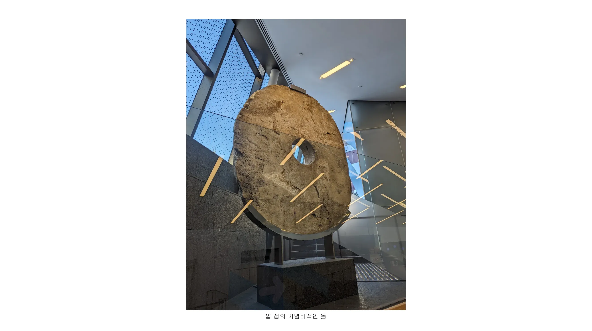

이것은 얍 스톤에 대한 매우 흥미로운 분석입니다. 사이페딘 암무스도 그의 저서 "Bitcoin 표준"에서 이 사례를 언급하고 있습니다. 그에 따르면 얍 섬 시스템은 누구나 참조할 수 있는 일종의 중앙 기록, 즉 공개적이고 계정을 유지하며 사물의 소유권을 관리하는 Bitcoin와 가장 유사하다고 합니다. 이러한 인류학적 관점은 이 모든 것이 사회 내부의 합의 또는 사회적 합의를 의미하며, 이는 근본적으로 정확하다는 것을 보여줍니다. 그리고 저는 잃어버린 돌에 대한 언급이 매우 흥미롭습니다. 그들은 작은 뗏목을 타고 수백 킬로미터를 바다로 나가 돌을 가져왔어요. 때로는 돌이 바다 밑으로 떨어지기도 했지만 이 돌은 여전히 화폐 시스템에서 사용되었습니다. "그래, 우리가 그런 곳에 돌을 떨어뜨렸으니 내 것이니 교환하자"라고 말할 수 있었죠. 돌이 너무 커서 한 곳에 머물러 있는 경우가 많았기 때문에 교환을 용이하게 하기 위해 물리적인 소유가 반드시 필요한 것은 아니었습니다. 대신, 돌을 실제로 움직이지 않고도 소유권을 옮길 수 있도록 거래 방식으로 돌을 주고받는 데 중점을 두었습니다. 이는 일종의 '합의의 증거'로, 돈에 대한 흥미로운 인류학적 관점을 강조하는 것이었습니다.

### 암호화폐와 사회적 의무

전 세계의 민족지학자들은 조개껍질, 천, 가축, 소금, 돌과 같은 '원시 화폐' 또는 '원시 화폐'를 사용하는 사회를 관찰해 왔는데, 이러한 화폐는 지불 수단과 가치 저장고 등 일반적으로 화폐에 부여되는 기능을 수행했지만 일상적인 상품 교환에서 중개자 역할을 하지는 못했습니다.

따라서 여기서는 일상적인 거래에 반드시 사용되지는 않는 화폐 시스템에 대해 설명합니다.

그리고 동전이 등장하기 전에는 모두 화폐였다는 점을 상기시켜 드리고 싶고, 화폐라는 표현이 얼마나 잘못된 표현인지 모르겠습니다. 저는 화폐라는 표현을 선호합니다. 문헌에서 우리는 종종 동전 이전의 화폐를 지칭하기 위해 원시 화폐를 언급하곤 합니다. 하지만 첫 번째 섹션에서 살펴본 것처럼 **동전이 등장하기 훨씬 이전부터 화폐 시스템이 있었다고 생각합니다**.

이러한 원시 화폐는 주로 결혼, 분쟁 보상(베르겔트), 족장 간의 선물 등 개인과 관련된 기본적인 사회적 의무를 관리하는 데 사용되었습니다. 예를 들어 페르시아 제국에서 최초의 동전은 교환 수단이라기보다는 군사적 지불 수단으로 특별히 만들어졌습니다.

따라서 원시 화폐는 지불 수단이지만 물질적 재화를 직접 교환하는 수단은 매우 드물다는 한 가지 필수적인 특징을 가지고 있습니다. 여기서 말하는 것은 특정 사회적 의무, 부족, 족장 간의 교환, 유명한 워르겔드, 피의 돈에 대한 지불 수단이었다는 것입니다. 사법 제도가 등장하기 전에는 누군가가 살인을 저지르면 사랑하는 사람을 살해 한 가족에게 보상이있었습니다. 이를 위해 지불해야 할 대가가 있었는데, 이를 피의 돈이라고 하며 일종의 대가였습니다. 지참금도 있었는데 이 역시 지불의 한 형태였습니다. 이처럼 초기에 화폐가 지불 수단으로 사용되었을 때는 일상적인 구매에 대한 지불보다는 인간적, 사회적 의무와 더 관련이 있었습니다. 이 이론에 따르면 이러한 일상적인 교환은 신용, 지연된 신용, 선물 대 선물, 배급 재분배와 더 관련이 있었습니다. 이러한 교환을 관리하기 위한 또 다른 형태의 사회 조직이 존재했습니다. 모두가 자급자족하고 스스로 농사를 짓는 사회에서는 전문성이 없고 일상적인 교환을 위한 화폐 시스템이 거의 필요하지 않다는 점을 기억하는 것도 중요합니다. 그렇기 때문에 최초의 화폐 형태는 방금 설명한 지참금, 혈통 화폐였습니다. 원시 사회에서는 매일 빵을 돈으로 교환하기 위해 무역이 필요하기 훨씬 전에 지불 수단이 필요했기 때문입니다. 모든 사람이 자신의 필요를 충족시켰고 아직 전문화되지 않았기 때문입니다. 이에 대해서는 이 과정의 이전 강의에서 충분히 다루었다고 생각합니다.

이러한 사회에서는 분업이 발달하지 않았기 때문에 직접적인 교류는 제한적이었고, 주로 우정이나 동맹이라는 개인적인 관계 안에서 이루어졌습니다. 충분한 전문화가 이루어지지 않았기 때문에 현대적 의미의 돈이 필요하지 않았습니다.

퀴긴과 아인지그 같은 인류학자들은 신용의 우위를 주장합니다: **원시 경제 생활은 신용과 개인 부채의 거대한 네트워크에 얽혀 있으며, 특히 지불이 즉각적으로 이루어져야 하고 보상을 쉽게 미룰 수 없을 때 돈이 개입합니다.**

따라서 사람들은 물건을 교환하고, 후불 결제를 할 수 있지만, 어떤 경우에는 결제를 연기할 수 없으므로 이 시점에서 통화나 원시 화폐가 교환을 즉시 완료하는 데 유용할 수 있습니다.

### 익명성의 혁신

이러한 분석은 더 깊은 성찰로 이어집니다. 화폐와 물물교환을 반대하기보다는 신용과 부채의 복잡한 시스템에서 진화한 것으로 이해하는 것이 더 적절합니다. 화폐는 근본적인 혁신을 가져왔습니다: *바로 *익명성**입니다. 바로 이 점에서 저는 화폐의 출현에 대한 인류학적 이론이 흥미롭다고 생각합니다. 소수의 사람들이 서로에게 신용을 부여한다면 서로를 분명히 알고 있을 것입니다. 이 시스템이 작동하려면 당연히 사람들이 서로를 알고 있어야 한다고 생각합니다. 그리고 돈으로 결제하면 익명성이 보장됩니다. 사람들이 내 이름도 모르고, 내가 누구인지도 모른 채 결제를 할 수 있습니다. 즉각적이고 최종적인 결제를 위해 교환할 수 있습니다. 이것이 바로 돈이 가능하게 하는 것입니다.

항상 명목상의 신용과 달리 화폐는 익명으로 일반화되고 즉시 해방적인 거래를 가능하게 합니다. **화폐의 이러한 독특한 해방력이 바로 결정적인 우월성입니다

따라서 화폐는 경제적 교환을 촉진하는 단순한 도구가 아니라 개인 신용 **에서 일반화된 익명 결제 시스템**에 이르기까지 인간의 제도 및 관행의 진화와 밀접하게 연관된 주요한 사회적 혁신입니다. 이러한 인류학적 진화는 화폐가 단순한 교환 수단을 넘어 현대 사회에서는 경제 활동의 목적 자체가 될 정도로 인간 사회를 심오하게 형성하는 강력한 사회 제도임을 보여줍니다.

여기서 우리는 현대 사회에서 경제적 교환의 목적은 결국 돈을 소유하는 것이지만, 과거에는 전혀 그렇지 않았다는 사실을 깨닫게 됩니다. 경제 교환의 목적은 소비를 위한 상품이나 재화를 소유하는 것이었습니다. 그리고 오늘날 화폐의 혁신이 도입되면서 경제 교환의 목적은 일반적으로 받아들여지는 것처럼 화폐를 재화로 교환할 수 있게 되면서 화폐를 축적하는 것입니다. 필요할 때 필요한 재화와 교환할 수 있기 때문입니다.

## 통합 등록

<chapterId>7664442a-91c1-5ce4-a8bd-53b7371a3e3d</chapterId>

:::video id=473fc284-5375-4e1b-b0cd-6b51ba0cc3b8:::

### 회계 등록 이론

이제 우리는이 두 가지 통화 이론, 즉 부채 화폐를 통한 화폐 출현 이론과 상품 화폐의 출현에 대한 통화 이론의 통일을위한 다양한 제안을 함께 살펴볼 것입니다. 오늘은 컨센서스가 번역한 책 제목이 '화폐의 파열'로 유명한 린 앨든의 저서 '깨진 화폐를 위하여'에 나오는 통합 제안에 대해 이야기해 보겠습니다.

*린 앨든의 『브로큰 머니』에서 발췌:*

> 기본적으로 화폐는 회계 장부입니다. 상품 화폐는 자연에 의해 관리되는 장부입니다. 은행 화폐는 국가가 관리하는 장부입니다. 오픈소스 화폐는 사용자가 관리하는 장부입니다.

여기서 Lyn은 Bitcoin을 의미합니다.

### 재고 흐름 비율과 희소성

> 로듐과 같은 일부 희귀 화학 원소는 금보다 희귀하지만 채굴되는 즉시 산업에서 소비되기 때문에 재고 비율이 낮습니다. 로듐 코인이나 주괴는 특별한 수집품이나 가치 저장 수단으로 구매할 수 있지만 사회적으로 통용되는 화폐로는 적합하지 않기 때문에 자연스럽게 화폐로 등장하지 않습니다.

사이페딘은 그의 저서 "Bitcoin 표준"에서 이에 대해 자세히 설명합니다. 재고 대 유동 비율에 익숙하지 않은 분들을 위해 간단히 설명하자면, 시장에 존재하는 기존 재고, 즉 보유량과 새로 유입되는 신규 재고, 즉 유입량을 비교하는 것입니다. 많은 양을 보유하고 있으면 부족하지 않다고 생각할 수 있지만 실제로는 그렇지 않기 때문에 다소 직관적이지 않은 경우가 많습니다. 이는 공급할 수 있는 용량의 문제입니다. 오히려 이 모델에 따르면 이 물건이 희귀한지 아닌지에 대한 정보를 제공하는 것은 새로운 재고를 보유해야 하는 용량입니다. 재고가 없어서 희귀한 것이 아니라, 재고가 없어서 희귀하지 않은 것일 뿐입니다. 그래서 금을 예로 들면, 금은 가치 저장 수단으로 사용되기 때문에 금 재고가 많고, 금 mining를 통해 유입되는 신규 금 재고는 1년에 1~3% 정도입니다. 반면 로듐의 경우 금보다 희귀하지만 사용되면서 소비되기 때문에 재고가 전혀 없습니다. 따라서 기존 재고를 두 배로 늘리기 위해 많은 양의 신규 공급이 필요하지 않습니다. 반면 금의 경우 재고를 두 배로 늘리려면 최소 50년이 걸립니다. 소비되는 대부분의 상품과는 달리, 금은 계속 소비되기 때문에 기존 재고를 두 배로 늘리는 데 많은 생산이 필요하지 않습니다.

*"금은 현대 역사에서 25배에서 100배 사이의 주식 대 유동성 비율을 유지해 왔으며, 19세기 중반의 골드러시 시기에도 잠시 16배 이하로 떨어진 적이 있을 정도로 보통 50배 이상을 유지했습니다. "*

따라서 25는 25년이면 재고가 두 배가 되고, 100이면 100년이면 재고가 두 배가 된다는 뜻입니다. 사이페딘은 그의 저서에서 금 생산량을 1.5%에서 3%로 두 배로 늘린다고 해도 금값에 큰 영향을 미치지는 않을 것이라고 말합니다.

*"은은 일반적으로 10배 이상의 주식 흐름 비율을 보이며, 이는 여전히 상대적으로 높은 수준입니다*

*대부분의 다른 원자재는 재고-유동 비율이 1 또는 2 미만입니다. 백금이나 로듐과 같은 희귀 원소도 산업 소비가 빠르게 이루어지기 때문에 재고 흐름 비율이 상대적으로 낮습니다."*

### 금과 은의 우월성

*"요컨대, 상품 통화가 금과 은과 경쟁할 때마다 결국에는 금과 은이 항상 우위에 있었습니다. 다른 상품은 제한된 기간 동안 또는 특정 지역에서만 통용될 수 있지만, 금과 은은 항상 전 세계적으로 경쟁력 있는 통화가 되어 경쟁에서 우위를 점할 수 있는 능력을 입증해 왔습니다. 문명이 발전할 때 금과 은의 보유자는 항상 다른 형태의 화폐 가치를 떨어뜨릴 수 있는 기술적 능력을 가지고 있었던 반면 조개, 진주, 가축, 소금, 천 또는 열등한 금속의 보유자는 금이나 은의 가치를 떨어뜨릴 수 없었기 때문입니다."*

이는 사이페데인이 유리구슬을 사용했던 아프리카의 부족들에 대해 이야기하는 'Bitcoin 표준'에서도 잘 설명되어 있습니다. 당시 베네치아 상인들은 유리구슬을 산업적으로 생산할 수 있는 기술력을 갖추고 있었기 때문에 유리구슬이 가득한 화물을 가지고 도착했고, 이는 이 부족들의 화폐 시스템을 완전히 불안정하게 만들었으며 말 그대로 그들의 자원을 약탈할 수 있었습니다. 이것이 사이페딘의 논문입니다.

### 계정 및 크레딧 단위

*"역사적으로 신용이 교환 수단으로 직접 사용되더라도, 보통은 그 속성에 따라 자연스럽게 선택된 화폐 상품 단위로 표시되었습니다."*

이는 매우 흥미로운 점이며, 울리히와 제가 논의해 온 주제이기도 합니다. 메소포타미아의 성전이 이 신용 개념을 관리할 수 있는 일종의 권위 기관이었다고 해도, 계좌 단위는 세겔이었습니다. 세겔이 성전에 의해 권위적으로 제정되었다는 것을 확인할 수 있는 증거는 없습니다. 세겔은 인근의 다른 민족과 수출입을 하는 상인들의 필요에 의해 자연스럽게 생겨났을 수 있습니다. 카네쉬의 한 상인(1부에서도 언급했습니다)이 물리적 상품 가치가 아닌 가치 저장 수단으로 귀금속을 수입한 것이 그 증거입니다. 유일한 문제는 은 세겔의 은을 선택한 것이 상인들에 의한 것인지, 아니면 성전에서 만든 것인지 알 수 없다는 것입니다. 하지만 울리히는 상인들의 편에 서서 은을 선택했을 것이라고 생각하게 만드는 아주 좋은 논거를 제시합니다.

*"따라서 두 이론의 통합은 두 이론에 공통된 기본 논리를 설명하기 때문에 "화폐의 회계 이론"("화폐의 원장 이론")으로 설명할 수 있습니다."라고 설명합니다. 유연한 사회적 신용과 수집 가능한 원시 화폐는 모두 인류의 태동으로 거슬러 올라갑니다. 두 경우 모두 다양한 규모의 인간 집단이 서로 간에 회계 장부를 보관하여 이중의 욕구 충족을 피하고, 교환의 마찰을 줄이며, 유동성 저축의 한 형태로서 역할을 합니다. 본질적인 차이는 장부 보관의 권한이 누구에게 위임되어 있느냐에 있습니다."*

한편으로 자연은 통화 공급의 확대를 관리합니다. 따라서 금은 매우 희귀하기 때문에 채굴하기가 어렵습니다. 채굴할 수 있는 금화의 수에는 일종의 제한이 있습니다. 따라서 희소성은 본질적으로 관리됩니다. 그리고 등록부는 소유 개념에 의해 유지됩니다. 장부는 탈중앙화되어 있습니다. 소유는 금화 또는 금 조각을 소유하고 있다는 사실로 증명됩니다. 그리고 신용 화폐의 경우 희소성은 사람들의 신용 획득 능력에 의해 관리됩니다. 또는 법정화폐의 경우 희소성은 당국에 의해 관리됩니다. 인플레이션 재앙을 피하기 위해 더 많이 인쇄할지 말지를 결정하는 것은 바로 정부입니다. 따라서 지폐의 경우 token의 소유자가 등록부를 관리하는 경우도 있습니다. 그렇기 때문에 등록부에 따옴표로 묶인 비물질화 된 상태로 입력됩니다. 글쎄, 물질화되었지만 가상입니다. 그는 이 유명한 token을 소유하고 있고, 그것이 소유를 증명하는 것입니다. 그리고 그것은 성경의 돈과 마찬가지로 실제 등기부등본에 있을 수도 있고, 은행에 있을 수도 있으며, 등기부등본과 관련하여 누가 무엇을 소유하고 있는지 관리하는 것은 실제로 인간 은행입니다.

## 금전적 프리미엄을 통한 통합

<chapterId>093756e5-8908-55e5-bb76-376a3a3cc4d3</chapterId>

:::video id=eabc342a-ecbd-46ca-a347-e914917e7c4f:::

### 금전적 프리미엄 개념

화폐의 출현에 관한 다양한 이론을 통합하기 위한 다양한 제안을 다루는 이 섹션에서는 방금 린 앨든의 이론인 레지스터 이론을 제안했습니다. 두 가지 화폐 이론을 통합하기 위한 제 나름의 제안이 있습니다. 바로 화폐 프리미엄, 즉 화폐 프리미엄의 개념입니다. 따라서 화폐의 가치는 점토판, 귀금속 동전, 지폐 또는 비트코인의 형태에 관계없이 화폐 수요에서 발생하는 화폐 프리미엄으로 설명할 수 있습니다. 화폐 프리미엄은 단순히 누군가가 미래에 이 화폐를 비슷한 가격으로 교환할 것이라는 신뢰에 기반합니다.

제가 여기서 설명하고자 하는 것은 아주 간단하게 법정화폐, 즉 사용 가치가 없는 지폐이든, 금화이든 어떤 금속이든, 금 덩어리이든 주괴이든 **그 가치의 대부분을 차지하는 것은 금전적 프리미엄이라는 것입니다**. 금 조각을 예로 들면, 그 가치의 일정 부분은 사용 가치, 산업에서의 사용 또는 장신구 제작에 의해 설명됩니다. 보석에 대한 수요는 종종 금전적 가치에서 비롯된다는 점에 유의하세요. 사람들은 보석을 일종의 가치 저장 수단으로 보관하기 때문에 화폐의 역할을 하기 위한 금전적 수요인 경우가 많으므로 이를 금전적 프리미엄에 약간 포함시켰습니다.

따라서 금 수요의 약 10%가 산업 수요라고 말할 수 있습니다. 금의 가치에서 산업 수요, 즉 금을 소비하는 금 사용에 대한 수요로 설명할 수 있는 부분은 10% 정도라고 할 수 있습니다. 나머지는 가치 저장 수단으로서 금의 금전적 사용에 대한 수요입니다.

### 권한 보너스 및 법정 화폐

금 조각을 금화와 비교하면 또 다른 층위가 있습니다. 금화에는 당국의 도장이 찍혀 있고, 그 안에 들어 있는 금은 산업에서 소비되는 수요, 즉 사용 수요가 있습니다. 또한 가치 저장 수단으로서 금전적 프리미엄을 누리고 있습니다. 게다가 코인은 사용하기가 더 간편하기 때문에 금보다 코인의 구매력이 더 큰 권위 프리미엄이라고 부르는 오버레이가 존재합니다. 무게를 측정할 필요가 없기 때문에 거래가 더 유동적으로 이루어집니다. 일반적으로 당국이 순도를 보장합니다. 그리고 금과 비교하면 스탬프가 찍힌 금화는 일반적으로 단순한 금화보다 더 가치가 있습니다. 스탬프를 찍는 데 자원이 필요하기 때문에 이는 당연한 결과이기도 합니다.

법정 화폐인 지폐도 마찬가지입니다. 지폐는 집을 난방하는 용도를 제외하고는 실제로 사용 가치가 없으며, 이는 바이마르 공화국 시대에 일어난 일입니다. 따라서 사용 가치에 대한 실제 수요는 없습니다. 반면에 제 생각에는 권위에 대한 프리미엄만 존재할 뿐입니다.

이는 일종의 금전적 프리미엄으로, 금전적 프리미엄에 대한 오버레이입니다. 하지만 법정화폐의 화폐 프리미엄은 법정화폐라는 사실에서 비롯되며, 당국은 세금을 납부하기 위해 법정화폐를 강제로 구매하도록 합니다. 따라서 법정 화폐는 세금이 부과되고 세금을 내기 위해서는 반드시 법정 화폐를 구입해야 한다는 사실에서 발생하는 일종의 금전적 수요가 존재합니다. 그 결과, 법정화폐는 여전히 일반적으로 통용되는 결제 수단으로 남아 있습니다. 따라서 사람들은 자신의 필요를 충족하기 위해 암호화폐를 획득하고자 합니다.

### 화폐 수요를 통한 통일

화폐 프리미엄에 대한 이 제안이 왜 부채 화폐와 상품 화폐의 두 가지 이론을 통합하는 것으로 인정받을 수 있을까요? 저는 금화의 가치가 반드시 '내재적 가치'에서 비롯된다고 생각하지 않습니다. 아니요, 사실 법정화폐와 마찬가지로 신뢰의 개념입니다. 금은 화폐 수요의 개념입니다. 그리고 또 다른 '유틸리티'인 산업적 사용 비율이 적기 때문이 아닙니다. 산업적 용도가 전체 가치의 10%라고 가정하면 온스당 300달러로 평가할 수 있습니다. 금이 온스당 3,000달러에 시장에서 판매된다면 300달러와 3,000달러의 차액이 바로 유명한 금전적 프리미엄입니다. 금에 대한 이러한 금전적 수요가 금값을 설명합니다. 법정화폐의 사용 가치가 제로라고 해서 다른 것은 아닙니다. 제게는 완전히 같은 것입니다. 따라서 부채 화폐 이론이든 상품 화폐 이론이든, 금이 최소한의 사용 가치를 갖는다고 해서 달라지는 것은 아무것도 없다고 생각합니다.

반면에 **출현의 수준에서는 미제스의 회귀 정리에 따라 이러한 사용이 출처에서 수요를 창출하고 화폐가되는 과정을 시작한다고 제안 할 수 있지만 ** 부채 화폐 수준에서는 권위에 의한 부과에 가깝기 때문에 출처, 출현의 시작 및 개념이 완전히 다릅니다. **하지만 화폐의 가치를 설명하는 가치의 수준에서는 화폐 프리미엄을 통해 법정화폐가 왜 우리가 부여하는 가치를 갖는지, 상품화폐가 왜 우리가 부여하는 가치를 갖는지**를 쉽게 설명할 수 있다고 생각합니다. 저에게는 동일한 과정이며, 이를 화폐 프리미엄이라고 부릅니다.

#### 금전적 프리미엄

그게 다입니다. 화폐의 가치는 점토판, 귀금속 동전, 지폐 또는 비트코인의 형태에 관계없이 화폐 수요에서 발생하는 금전적 프리미엄으로 설명할 수 있습니다.

금전적 프리미엄은 단순히 누군가가 나중에 이 돈을 비슷한 가격으로 교환할 것이라는 신뢰에 기반합니다.

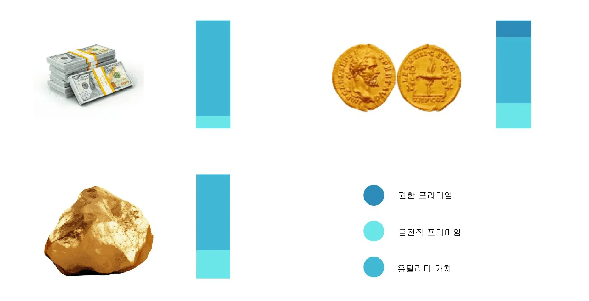

# 돈에 대한 다양한 정의

<partId>77b7918a-8c3b-11f0-b688-6b2ab22378c9</partId>

## 화폐 대 통화 대 몬나에 대 아르젠트 대 디벨롭먼트

<chapterId>bf8a6d21-df88-5d23-a0a5-e9a5c1300554</chapterId>

:::video id=d9c9e7df-9db3-4a9f-801e-10d3fc7dfc22:::

### 화폐 용어의 의미

다양한 화폐 이론, 특히 화폐의 정의에 대한 이 섹션에서는 의미론에 대해 간략히 말씀드리고자 합니다. 돈과 관련된 몇 가지 단어의 정의를 좀 더 자세히 살펴보고 영어에 해당하는 단어와 비교해보고자 합니다. 예를 들어, 돈, 통화, monnaie, argent, devise와 비교해보겠습니다. 따라서 다음과 같이 설명할 수 있습니다.

약간의 의미론적 설명입니다:

"**돈**"(드 라 모니)이라고 하면 대부분의 사람들은 거래의 대가로 받는 잔돈을 가리키는 것으로 생각할 것입니다. 그리고 "**통화**"(라 모니에)라고 하면 사람들은 아마도 한 국가의 통화를 가리킨다고 생각할 것입니다. 캐나다의 통화는 캐나다 달러입니다. 맞습니다.

하지만 돈(드 라젠트)은 어떨까요? 도둑은 "거스름돈 다 주세요!"라고 말하지 않아요 (도둑은 가치가 거의 없는 동전만 받고 실망할 수도 있습니다).

아니, 도둑이 외칠 것입니다: "**돈을 모두 내놔**"라고 외칩니다. 그리고 도둑이 길거리에서 여러분 앞에 서 있다면, 그는 반드시 주머니에 있는 **지폐**를 가리키는 것입니다.

반면에 도둑이 더 정교한 방법으로 사기를 치고 은행 계좌를 모두 비워 자산을 훔치려 한다면 **그는 당신의 돈을 모두 가져갈 것입니다**라고 말할 수 있습니다. 여기서 '돈'이라는 단어는 **개인의 재산**을 의미합니다.

따라서 돈이라는 단어에는 현금(지폐)과 재산이라는 두 가지 정의가 있습니다.

### 통화 대 화폐 대 고안

통화(devise)는 반드시 다른 나라의 통화를 의미하며, 그렇지 않으면 그냥 돈(monnaie)이라고 말합니다. 프랑스인이라면 이렇게 말할 것입니다: "라 리브르 스털링 에스트 라 데브드 뒤 로욤유니와 유로와 라 모니에 드 유럽"(파운드화는 영국의 화폐이고 유로화는 유럽의 화폐입니다).

종종 이러한 의미 문제를 깊이 파고 들지 않은 사람들은 이러한 용어를 번역 할 때 종종 통화라고 쓰여진 경우 통화 (devise)라고 말하는 경향이 있지만 아니요, 통화는 해당 국가의 통화 일 때는 돈 (monnaie), 다른 통화에 대해 이야기 할 때는 devise입니다. 그래서 제가 자주 보는 문제는 영어에는 개념인 '돈'과 실제로 교환에 사용되는 국가의 단위인 '통화'라는 두 가지 단어가 있다는 것입니다. 따라서 돈의 개념에 대해 간단히 설명하자면, *돈*이라는 단어의 개념, 즉 일반적으로 돈입니다. 그리고 *통화*는 한 나라의 통화와 동일시하기 매우 간단합니다. 프랑스에서는 안타깝게도 비트코인이 한 국가의 화폐가 아니기 때문에 비트코인을 이야기할 때 "mais ce n'est pas une monnaie"라고 말하는 경우가 많지만, 통화라는 용어를 대신 사용하는 경우가 많습니다. 엘살바도르 이후 비트코인은 한 국가의 화폐로 사용되었기 때문에 이는 잘못된 표현입니다. 사실 사람들은 종종 이렇게 말하곤 합니다: *하지만 비트코인은 국가의 화폐가 아니며, 화폐가 될 수 없습니다*. 하지만 사실 *화폐*라는 더 넓은 개념을 언급한다면 비트코인은 이 정의에 완벽하게 들어맞는다고 생각합니다. 다만 프랑스어에는 이 두 가지 개념을 구분할 수 있는 두 단어가 없습니다. 아르젠트라는 단어가 화폐를 의미한다고 말할 수 있지만, 안타깝게도 이는 정확한 정의가 아닙니다. *아르젠트*(돈)는 재물 또는 지폐를 의미합니다. 실제로 *돈*이라는 단어와 동등하게 사용할 수는 없습니다. *돈*은 실제로 화폐(몬나이)의 개념입니다.

## 사이페딘 암무스의 정의

<chapterId>07c4ba50-168c-567a-8957-0b187ff75f97</chapterId>

:::video id=936d6d3b-6d45-468e-bc44-85fbce9b857a:::

#### 돈이란 무엇인가요?

돈은 단순히 그 자체로 사용하거나 소비하는 것이 아니라 나중에 필요한 다른 재화나 서비스로 교환하기 위해 소유하거나 획득하는 것입니다. (사이페데스어)

화폐는 재화에 대한 금전적 수요가 존재할 때 화폐의 역할 중 하나 이상을 수행하기 위해 금전적 프리미엄을 얻게 됩니다.

화폐 프리미엄이 지속되려면 화폐 재화가 충분히 희소해야 합니다(공급이 화폐 수요에 맞춰 조정되는 것을 막기 위해).

### 금전적 프리미엄

통화의 다양한 정의에 대한 이 섹션에서는 항상 큰 관심을 가지고 있던 Bitcoin 표준에서 사이페딘의 정의에 대해 간략하게 이야기하고 싶었습니다. 읽었을 때 매우 단순하다는 인상을 받았습니다. 그리고 이 정의에 금전적 프리미엄이라는 개념도 추가하려고 합니다. 사이페딘이 그의 책에서 언급했듯이 화폐에는 반드시 희소성이라는 개념이 존재합니다. 문제는 돈이란 무엇일까요?

> 화폐는 단순히 소유하거나 획득한 것으로, 그 자체로 사용하거나 소비하는 것이 아니라 나중에 필요한 다른 재화나 서비스로 교환하기 위한 것입니다.

이것이 바로 사이페딘이 Bitcoin 표준에서 언급한 정의입니다. 통화(라 모네)는 재화에 대한 금전적 수요가 있을 때 그 통화의 역할 중 하나 이상을 수행하기 위해 금전적 프리미엄을 획득한다고 덧붙이고 싶습니다. 따라서 가치 저장소 역할을 하는 통화는 사람들이 가치 저장소나 교환 수단으로 획득하고자 하는 금전적 수요가 있기 때문에 금전적 프리미엄이 붙는다고 말할 수 있습니다.

### 희소성과 시장 메커니즘

여기에 금전적 프리미엄이 유지되려면 금전적 재화가 충분히 희소해야 한다는 점을 분명히 덧붙여야 한다고 생각합니다. 이것은 매우 중요합니다. **어떤 재화가 화폐로 사용되기 시작하고 그 가격이 상승하는 것을 볼 때, 일반적으로 그 재화가 충분히 희귀하지 않다면 사람들은 가격이 상승할 때 가치 상승의 이득을 취하기 위해 더 많이 생산하려고 할 것입니다**. 이것이 바로 시장에 나와 있는 대부분의 상품이 비교적 고정된 가격을 갖는 이유입니다. 가격이 상승하면 생산량이 증가하는 경향이 있습니다. 가격이 하락하면 생산량은 감소합니다. 일종의 시장 조정이 일어나는 것입니다. **금처럼 희소성이 높은 재화의 경우, 시장 메커니즘이 화폐 사용 수요 증가를 보상하지 못합니다. 따라서 변화하는 변수는 바로 가격입니다. 비트코인**도 마찬가지입니다. 비트코인 가격이 상승한다고 해서 더 많은 비트코인을 생산하지 않습니다. 따라서 조정되는 것은 가격입니다. 그렇기 때문에 수년 동안 비트코인 수요가 증가함에 따라 비트코인 가격이 상승하는 것을 볼 수 있었습니다. 지구상에 알고리즘을 변경하여 "수요가 더 많으니 가격이 오르고 있으니 더 많이 생산하겠다"고 말할 수 있는 사람은 아무도 없기 때문입니다 **새로운 비트코인의 공급은 미리 프로그래밍되어 있고 미리 알려져 있습니다**. 그래서 제가 말씀드린 것은 화폐 프리미엄이 지속되려면 화폐 재화가 충분히 희소해야 하고, 따라서 공급이 새로운 화폐 수요에 맞춰 조정되지 않도록 시장 메커니즘에 의해 따라잡히지 않아야 한다는 것입니다.

## 결제 수단 및 해방적 가치

<chapterId>5d424039-e342-56f7-9d8b-bba9551831a9</chapterId>

:::video id=af4c0765-8111-4cb7-891b-3ee54d6e7054:::

### 결제 수단과 교환 수단

돈에 대한 다양한 정의를 다루는 이 섹션에서는 결제 수단이자 해방적 가치로서의 돈을 주제로 한 알랭 테스타트의 저서 "Aux origins de la monnaie"(돈의 기원)의 인용문을 함께 살펴볼 것을 제안합니다.

*알랭 테스타트는 <화폐의 기원>에서 화폐를 결제 수단으로 다음과 같이 정의합니다

> 여기서 지불 수단의 기능은 대가없는 지불, 아무것도 사지 않는 지불이 있다는 점에서 교환 수단의 기능과 구별되는 것으로 생각됩니다. Knies(1873:192쪽)는 베르겔트(혈돈 또는 살인을 위한 구성) 또는 세금의 경우처럼 교환 행위로 구성되지 않는 재화의 이전이라는 주제를 길게 전개합니다. 칼 멩거는 이 주제에 대해 가장 결정적인 논문 중 하나로 여겨지는 1892년 논문 "Geld"에서 이 네 번째 기능을 공격했습니다. 지불 수단의 기능에 대한 개념은 오늘날 경제학에서 완전히 불신받거나 적어도 교환 수단의 기능에 밀려 잊혀진 듯합니다.
>

> 돈은 지불하는 데 사용됩니다. 이러한 관점에서 보면 돈은 해방의 도구이며, 이는 지불 수단의 기능을 모두 포괄적으로 설명합니다. 이런 점에서 우리는 화폐의 '해방력'에 대해 이야기합니다. 르 쁘띠 로베르에 따르면, 해방력은 "(의무, 부채로부터) 해방시키는 효과가 있는 것"입니다. 그랑 라루즈에 따르면 해방적 지불은 "채권자가 채무의 소멸에 대해 이의를 제기할 수 없는 법적 조건 하에서 이루어지는 지불"입니다. 판매자든 채권자든 누구도 화폐로 이루어진 지불을 거부할 수 없기 때문에 화폐는 이러한 탁월한 힘을 가지고 있으며, 심지어 화폐의 법적 지위를 정의하는 요소이기도 합니다. 상인에게 빚을 졌든 납세자에게 빚을 졌든 상관없이 빚을 갚을 때 거부할 수 없는 유일한 재화는 돈입니다. 모든 재화 중에서 돈만이 이러한 특권을 가지고 있습니다. 찰스는 "바로 이 특권입니다."라고 썼습니다. Gide(1921 I: 443)는 우리가 법정화폐라고 부르는 것을 구성하는 것이 바로 이 특권이라고 말합니다.
>

> 한 재화를 다른 재화로 이전하거나 그 대가로 다른 재화를 제공하는 조건으로 이루어지는 모든 교환에는 반드시 수령인이 이 거래 상대방에게 제공해야 할 의무가 수반됩니다. 대금 지급은 이러한 의무의 이행입니다. 따라서 모든 교환은 지불을 의미하지만 모든 지불이 교환을 의미하는 것은 아닙니다. 거래 상대방이 없는 지급, 즉 다른 재화를 얻을 수 없고 이러한 목적으로 이루어지지 않는 지급도 있습니다. 여기서는 세금이 대표적인 예이며, 공공 기관에 납부하는 모든 종류의 벌금과 타인에게 손해를 끼친 사람이 이를 복구해야 한다는 원칙에 따라 타인에게 지불하는 배상금도 언급해야 합니다.

### 거래 상대방 없는 결제

이것은 저자의 논지를 명확하게 보여주는 예시입니다. 사실 그는 이 둘을 구분합니다. 그에게 교환은 상품의 이전이자 지불입니다. 지불은 그 다음 단계입니다. 그리고 지불은 교환 없이도 이루어질 수 있습니다. 그는 주차위반 딱지나 벌금을 지불하는 것이 어떻게 지불인지 예를 들어 설명합니다. 실제로 대가로 서비스를 받는 것은 아닙니다. 어떤 사람들은 국가가 여러분에게 주차 딱지를 주는 서비스를 대가로 제공하고 있다고 주장할 수 있습니다. 그는 서비스를 반드시 받지 않더라도 세금을 내야 한다는 점에서 세금을 내는 것은 대가 없는 지불이라는 사실을 분명히 합니다. 그는 세금을 내는 것은 대가로 서비스를 받아야 할 의무가 없는 그저 지불일 뿐이라고 정의합니다. 저는 많은 동료들과 이 문제에 대해 논의해 보았지만 이 개념에 반드시 동의하는 것은 아닙니다. 하지만 이것이 저자의 논지입니다. 그는 지불이라는 개념을 벌금, 세금 납부 등의 예시를 통해 교환과 분리시키려고 합니다. 또한 지참금을 예로 들며 지참금도 지불이며 반드시 대가로 무언가를 얻는 것은 아니라고 표현합니다. 이 제안을 비판하는 사람은 "그래, 하지만 그 대가로 아내를 얻잖아"라고 말할 수 있습니다 이것이 이 주제에 대한 논쟁의 수준입니다.

워르겔드, 즉 혈세도 있습니다. 보상을 위해 지불하는 돈입니다. 제 친구 울리히는 이렇게 말하죠:

> 예, 하지만 그 대가로 이 파일을 닫게 됩니다.

예를 들어 살인과 같은 범죄를 저질렀다고 가정해 보겠습니다. 그 당시에는 벌금을 지불하고 그 후에는 그 상황에서 풀려나게 됩니다. 그래서 해방되는 힘이 있죠. 대가로 얻는 것이 있나요?" 저자에 따르면, 그렇지 않다고 합니다. 제 동료들 중 일부는 그렇다고 합니다.

이 논의에서 워르웰드가 대가를 정의하는 좋은 예 중 하나라는 것을 알 수 있다고 생각합니다. 사실, 분명한 것은 대가로 아무것도 받지 않는다는 것입니다.

## 부채 화폐 대 상품 화폐

<chapterId>4093677a-c8e8-5828-b994-15c01656186e</chapterId>

:::video id=f49cf5cc-288e-4daa-a1ff-b9de73506f4e:::

### 근본적인 논쟁

다양한 화폐의 정의와 이론에 대한 이 섹션의 맥락에서, 정반대의 두 가지 비전을 함께 살펴봅시다: "돈은 항상 부채다" 또는 "돈은 항상 상품이다". 한편으로는 "아니, 돈은 항상 부채다!"라고 주장하는 부채 기반 화폐 이론의 지지자들이 있습니다 다른 한편에서는 유명한 골드버그가 이렇게 주장합니다: "아니요, 돈은 항상 상품이고 항상 금입니다. 다른 모든 것, 지폐, 차용증은 돈이 아니라 신용일 뿐입니다"라고 주장합니다.

이러한 이론에 대한 명확한 요약을 함께 살펴보겠습니다.

### "항상 부채" 이론

다음은 **"부채 화폐"**로 알려진 화폐 이론을 요약한 것으로, 화폐는 근본적으로 부채의 한 형태입니다:

특히 알프레드 미첼-인네스가 개발하고 데이비드 그레이버가 더욱 발전시킨 이 이론에 따르면 화폐는 본질적으로 부채의 인정이며, 역사적으로 직접적인 화폐 교환 이전에 존재했던 신용 관계에서 비롯된 것입니다. 화폐는 물물교환과 관련된 필요에서 비롯되었다기보다는 개인이나 집단 간의 사회적 의무나 부채를 설명하고, 이전하고, 정산하는 수단으로 등장합니다.

따라서 모든 돈은 한 개인이나 기관이 다른 사람에게 진 빚으로 유통되며, 그 유효성을 보장하는 신뢰와 사회적 또는 국가적 권위에 의해 뒷받침됩니다. 따라서 앞서 언급했듯이 우리가 돈을 소유할 때 우리는 사회에 대한 청구권을 가지며 사회는 우리에게 빚을 지게 됩니다. 따라서 돈은 결코 중립적이거나 자율적인 것이 아니라 항상 근본적인 빚을 지고 있으며, 돈을 소유한다는 것은 본질적으로 사회 또는 경제 공동체에 대한 채권을 소유하는 것을 의미합니다.

이러한 추론은 화폐를 단순한 '중간 상품'으로 보는 고전적인 생각과 모순되며, 대신 화폐의 창출과 관리에서 사회적, 정치적 관계의 중심적인 역할을 강조합니다.

**내 리뷰: **

이 이론이 마음에 걸리는 이유는 예를 들어 서로 다른 두 부족이 금을 교환하는 경우 거래가 최종적으로 확정되고 잠재적 부채가 남지 않는데도 돈은 항상 부채라고 주장한다는 점입니다. 이 이론을 지지하는 사람들은 종종 이러한 교환이 화폐 교환이 아니라 물물교환이라고 말합니다. 이미 언급했듯이 저는 이에 동의하지 않습니다. 금은 소비되는 것이 아니라 화폐로 사용되기 때문에 화폐 교환입니다.

### "항상 상품"이라는 이론

**항상 상품:**

다음은 **"상품 화폐"**로 알려진 화폐 이론에 대한 명확한 요약으로, 화폐는 항상 상품으로 등장하며, 특히 금은 일반적으로 해외에서 통용되고 거래 목적으로 획득되는 상품인 거래할 수 있어야 한다는 필요성에서 비롯됩니다.

고전 경제학자(아담 스미스, 데이비드 리카르도)가 개발하고 마르크스가 받아들인 이 이론에 따르면 화폐는 화폐로서의 역할과는 별개로 내재적 가치를 지닌 금이나 은과 같은 귀금속으로 자연스레 상품으로 등장합니다. 처음에 이러한 상품은 본질적인 특성(희소성, 내구성, 분할 가능성, 안정성) 덕분에 경제 주체들이 거래를 촉진하기 위해 자발적으로 선택하게 됩니다.

상품 화폐는 물리적 존재와 이를 생산하는 데 사회적으로 필요한 노동량에 따라 결정되는 가치로 구별됩니다(마르크스처럼). 예를 들어, 사회에서는 물물교환을 단순화할 뿐만 아니라 계좌 단위, 가치 저장 수단, 보편적인 교환 수단으로 금을 사용합니다.

이 비전에서 화폐는 유형의 상품과 연결되어 있기 때문에 항상 실제 가치를 유지합니다. 화폐의 역할이 주조된 동전, 지폐 또는 경전처럼 추상화되더라도 그 유효성은 여전히 금과 같은 기본 상품에 대한 참조에서 직간접적으로 파생됩니다. 따라서 이 이론은 화폐를 단순한 관습이나 부채로 간주하는 이론과 달리 화폐의 물질적, 경제적 기원을 주장합니다. 이 이론에 따르면 금으로 교환할 수 있는 지폐와 같은 대체물에 의한 화폐의 표현은 모두 신용이 됩니다.

**내 리뷰: **

이 비전은 상품 화폐 이론과 유사하지만 한 단계 더 나아간다는 점에 주목하세요. 이들은 화폐가 '항상' 상품이어야 한다고 제안합니다. 그리고 우리가 그들에게 이렇게 말합니다: "*예, 하지만 지폐는 금으로 뒷받침될 수 있고, 작동하며, 지폐 자체가 화폐라는 점에는 동의할 수 있습니다*".

이에 대해 라커룸 쿠폰의 예를 들어 설명합니다. 이렇게 말할 것입니다: "네, 하지만 의류에 대한 라커룸 쿠폰이 있는데 계산대 쿠폰을 의류라고 부를 수 있나요?

물론, 이는 본질적으로 의류를 돌려받을 수 있는 확인서, 청구서와 같은 것입니다. 라커룸 쿠폰은 일반적으로 허용되는 결제 수단이 아니므로 이 비유는 적용되지 않습니다. **돈은 의류와 같은 특정 물건에 대한 청구권이 아니라 교환 방식, 교환 수단, 교환 매체 또는 일반적으로 통용되는 결제 수단입니다**.

라커룸 쿠폰은 특정 재화를 교환할 수 있는 쿠폰이고, 지폐는 재화를 회수할 수 있는 token이므로 라커룸 쿠폰과 지폐를 동일시할 수 없습니다. 반면 지폐, 법정 화폐는 모든 상품에 접근할 수 있는 범용 쿠폰입니다.

그리고 제 생각에는 물론 법정 화폐도 대중이 그렇게 생각한다면 화폐로 간주 될 수 있습니다. 그리고 적어도 당시에는 금을 기본으로하는 실제 돈을 얻을 수있는 쿠폰이기 때문에 돈이 될 수 없다고 주장하는 것은 의미 론적 오류라고 생각합니다.

저는 금고에 보관된 금화와 그 금화를 나타내는 지폐를 화폐로 간주하는 데 아무런 문제가 없습니다. 저에게는 의미론의 문제가 아니라 단지 두 종류의 통화일 뿐입니다. 제가 착각하지 않았다면 미제스는 화폐 대체물에 대해 이야기함으로써 이 현상을 아주 잘 설명합니다.

그들의 비전은 은행 금고에 있는 금화와 이를 나타내는 지폐를 동시에 화폐로 간주할 수 없다는 사실로 요약됩니다. 개인적으로 저는 이 상황의 모순을 전혀 문제 삼지 않습니다. 돈이 항상 상품이라고 믿는 사람들은 저처럼 사물을 보지 못합니다.

**라커룸 쿠폰 개념에 대한 책 *오 오리진 드 라 몽니*의 리뷰는 다음과 같습니다

*주 14 : "지폐와 수표 토큰의 비교에 대한 Rist (1938 : 372, 주 1)의 훌륭한 비판 - Knapp이 자신을 배치하는 바로 그 근거, 법적 근거에 있기 때문에 훌륭합니다 : 두 경우 모두에서 일종의 주장에 대해 말할 수 있다면 근본적인 차이점은 첫 번째 경우와 첫 번째 경우에만 특정 대상이없는 주장이라는 점입니다

또한 **클레임**의 주제에 대해 같은 작성자는 다음과 같이 언급하고 있습니다:

> 바스티앙은 사회 전체를 위한 바우처가 '거대한 바자회'로 제시되는 것을 상상할 자유가 있지만, 이 작은 추가, 이 무해해 보이는 확장은 신용과 화폐의 모든 차이점입니다. 돈은 특정 상점에 대한 청구권이 아닙니다. 익명의 청구 같은 것은 존재하지 않습니다. 하지만 화폐의 특징인 익명성, 즉 범용성이야말로 화폐를 강력하게 만드는 요소입니다. 돈은 신용과 같지 않으며, 어떤 식으로든 신용으로 환원할 수 있는 것도 아닙니다. **돈은 신용 그 이상입니다

**역설: 부채 화폐 대 상품 화폐**

부채 화폐 이론과 상품 화폐 이론 사이의 심오한 이분법을 가장 잘 보여주는 역설은 오늘날 금이 화폐인가 하는 문제와 관련이 있습니다.

한편으로 부채 화폐 이론은 화폐를 무엇보다도 공공 기관에 의해 일반적으로 승인되거나 심지어 부과되는 교환 중개자 또는 지불 수단으로 정의합니다. 이러한 관점에서 보면 금은 일반적인 교환 수단으로 널리 사용되거나 받아들여지지 않기 때문에 더 이상 화폐가 아닙니다.

반면 상품 화폐 이론에서는 화폐를 내재적 특성(희소성, 내구성, 분할 가능성 등) 때문에 사회가 자발적으로 선택한 유형의 상품으로 간주합니다. 이 접근 방식에 따르면 금은 여전히 진정한 범용 화폐이며, 오늘날의 다른 모든 형태의 화폐는 근본적으로 신뢰를 기반으로 한 신용에 지나지 않습니다.

이 역설은 두 화폐 개념의 차이를 명확하게 보여줍니다. 전자의 경우 금은 더 이상 화폐가 아니지만, 후자의 경우 반대로 현존하는 유일한 진정한 화폐로 남아 있습니다.

## 현대 화폐 이론

<chapterId>8efc29af-3193-5d97-ad9f-e608b32924ff</chapterId>

:::video id=f8127cb7-46a1-468c-bbb5-97bf0a8b8837:::

### 현대 화폐 이론의 원리

다양한 통화 이론에 대한 이 섹션을 마무리하기 위해 중앙은행에서 일하는 많은 현대 경제학자들이 존경하는 통화 이론의 신동이자 흔히 MMT로 알려진 현대 통화 이론에 대해 이야기해 보겠습니다.

**현대 통화 이론(MMT)**은 미국, 캐나다, 일본과 같이 자체 기축 통화를 보유한 국가는 언제나 더 많은 돈을 발행하여 지출을 조달할 수 있기 때문에 돈이 부족하지 않다고 주장하는 경제 접근 방식입니다. 이 이론에 따르면

- 화폐는 한정된 자원이 아니라 국가의 창조물입니다**

- 세금과 차입은 공공 지출에 직접적으로 사용되지 않고 인플레이션을 조절하고 경제 행동에 영향을 미치며 국가 통화에 대한 수요를 유지하는 데 사용됩니다*

- 정부 지출의 실질적인 한계는 예산 적자나 공공 부채가 아니라 인플레이션입니다.

- 창출된 화폐가 이를 흡수할 수 있는 부문으로 흘러들어가면 인플레이션도 발생하지 않을 것입니다.

- 따라서 정부는 과도한 인플레이션을 피하기 위해 가용한 실제 자원(인력, 산업 능력, 천연 자원)에 따라 지출을 조정해야 합니다.

### MMT에서 세금의 역할

"돈을 찍어낼 수 있는데 왜 세금을 내야 하나요?"라고 말하는 분들에게 유명한 대답이 여기 있습니다 MMT는 이 질문에 대한 정답을 가지고 있습니다. 현대의 법정화폐 시스템에서는 인플레이션을 제외하고는 기술적으로 화폐 발행을 제한할 수 있는 방법이 없는 것이 사실입니다. 하지만 인플레이션을 제한하기 위해서는 첫째, 경제에서 돈을 없애기 때문에 세금이 필요하다는 것이 이들의 주장입니다. 따라서 이를 보상할 세금이 없다면 이 모든 화폐 창출이 결국 인플레이션을 일으킬 수 있습니다. 세금은 말 그대로 인플레이션을 제한하기 위해 시스템에서 돈을 제거하는 방법이라고 그들은 주장합니다.

이를 흡수할 수 있는 분야에 투자되는 돈에 대해서는 군수산업에 수조 달러를 지원하는 미국의 예를 들 수 있는데, 군수산업, 즉 군산복합체가 이 수조 달러를 완벽하게 흡수할 수 있기 때문에 인플레이션을 유발하지 않습니다.

반면에 더 많은 도로를 건설하고 싶은데 도로를 건설할 수 있는 자원과 건설업체에 한계가 있다면, 도로 예산을 두 배로 늘리면 도로를 건설할 수 있는 인력에 대한 희소성 효과가 발생할 수밖에 없습니다. 따라서 시장의 힘과 수요와 공급에 따라 가격이 상승할 것입니다. 전지전능한 지도자가 돈을 어디에 쓸지 안다면 기술적으로 인플레이션을 일으키지 않아야 합니다. 그리고 실제로는 인플레이션을 유발하는 것이 분명하다고 대답하고 싶습니다.

결론적으로 MMT에 따르면 국가는 적절한 재정 정책을 통해 인플레이션을 통제하면서 완전 고용을 달성하고 사회적, 생태적 투자에 자금을 조달하기 위해 화폐를 창출할 수 있는 능력을 사용할 수 있습니다. 또 다른 경제학파인 케인즈주의 경제학자들은 금리를 관리하여 실업률을 관리하고 적절한 재정 정책을 통해 인플레이션을 통제하면서 사회 및 생태적 투자에 자금을 조달하는 것을 목표로 삼기도 합니다.

### MMT 검토

이 이론은 진정한 통화 주권을 누리는, 즉 자국 통화로 부채를 조달할 수 있는 소수의 국가(스테파니 켈튼의 트윗 참조)에만 적용됩니다. 이 이론은 자국 통화에 대한 국제적 신뢰를 유지해야 하는 수입 의존형 경제에는 적용하기 어렵습니다.

진정한 통화 주권이란 무엇인가요? 그것은 자국 통화로 부채를 조달할 수 있다는 것을 의미합니다. 무역 흑자를 내서 충분한 외환보유고와 외화를 보유할 수 있어야 상품을 수입하기 위해 외화로 돈을 조달할 필요가 없습니다. 이는 소수의 국가에만 해당되는 문제입니다.

아래에서 이 운동의 포스터 우먼이라고 할 수 있는 스테파니 켈튼의 트윗을 볼 수 있습니다. 그녀는 "적자 신화"라는 책을 썼습니다. 이 트윗에서 그녀는 미국, 일본, 캐나다, 호주, 영국과 같은 여러 나라에서 돈이 부족하지 않다고 썼습니다.

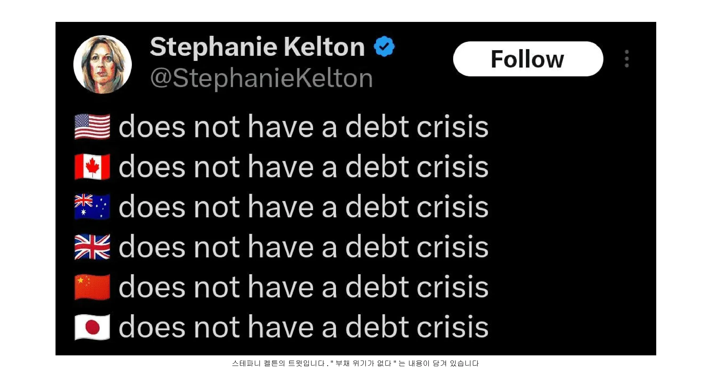

이상하게도 6개 국가만 나열되어 있나요? 왜 그럴까요? 실제 통화 주권을 가지고 있기 때문입니다. 하지만 지구상에는 약 200개의 국가가 있으며 모든 국가가 통화 주권을 가지고 있는 것은 아닙니다. 따라서 이 이론에 대한 저의 비판은 약간 이상하고 작동하지 않는 것 외에도 진정한 통화 주권을 누리는 소수의 국가, 즉 자국 통화로 국채를 발행할 수 있는 국가에만 적용된다는 것입니다. 어느 정도는 전 세계의 다른 국가들에게도 손해를 끼칩니다. 미국이 수십 년 동안 막대한 특권을 누리며 인플레이션을 다른 나라에 수출하는 것과 비슷하게, 자국 통화를 만들어서 인플레이션을 다른 나라에 수출하는 것과 같습니다. 이는 일종의 통화 식민주의와 유사한데, 전 세계적으로 통화에 대한 신뢰와 수요가 있는 국가는 인플레이션을 수출하기 때문에 인플레이션을 크게 일으키지 않고 원하는 만큼의 돈을 찍어낼 수 있는 경우가 많습니다.

이 이론은 자국 통화에 대한 국제적 신뢰를 유지해야 하는 수입 의존형 경제에는 적용하기 어렵습니다.

이 이론은 또한 실물 자원(노동자, 원자재, 산업 능력)에 대한 통제력을 높이고 인플레이션을 관리하기 위해 일정 수준의 중앙 집중식 경제 계획을 요구합니다.

# 돈의 몰락과 재탄생

<partId>87a34ca9-782b-5ade-b51a-400f88ed7b0c</partId>

## 그리스 동전

<chapterId>7714195f-74ce-5f8c-be5f-59302d39fff4</chapterId>

:::video id=8e5c3091-0910-471b-8d4b-0dc6e9afa656:::

### 배경 및 컨텍스트

시작하기 전에 역사적 배경을 설명합니다:

**역사적 배경:**

**로마인들은 그리스인들을 '그레에치', 그리스를 '그레시아'라고 불렀습니다**

**그리스인들은 스스로를 '헬레네스'라고 부르고 그들의 나라를 '헬라스'라고 불렀습니다

**호머** (기원전 8세기경 출생)

그리스 전설의 시인으로, *일리아드*와 *오디세이아*의 작가로 추정되는 인물입니다.

기원전 **750년경: 스파르타의 신화적 입법자인 리쿠르구스**는 군대의 규율과 단순함을 바탕으로 스파르타 헌법을 제정했다고 전해집니다.

**누마 폼필리우스** (기원전 753~673년)

로마에 최초의 종교 및 법률 제도를 도입한 것으로 유명한 로마의 두 번째 왕입니다.

**드라콘**, 아테네의 입법자(기원전 7세기)로, 극도로 엄격한 법으로 유명해 '드라코니안'이라는 용어를 사용했습니다.

**기원전 594년: 솔론**이 아테네의 입법자가 되어 부채 노예제를 폐지하는 등 아테네 사회를 근본적으로 개혁합니다.

**기원전 776년 고대 올림픽**

최초의 정규 스포츠 경기는 4년마다 올림피아에서 개최되어 그리스 도시들을 한자리에 모았습니다.

**피타고라스** (기원전 570~495년경)

직각 삼각형의 정리로 유명한 그리스 철학자이자 수학자입니다.

**콜로폰의 제노판** (기원전 570-478년경)

그리스 전통 다신교를 비판한 것으로 유명한 소크라테스 이전의 철학자.

**기원전 490년: 마라톤 전투**

아테네는 페르시아의 침략을 성공적으로 격퇴하여 그리스 문명의 결정적인 전환점을 마련했습니다.

*'역사의 아버지'라는 별명을 가진 *헤로도토스**(기원전 484~425년경)는 기원전 480년 그리스가 크세르크세스를 상대로 승리하는 등 페르시아 전쟁을 묘사한 방대한 작품을 썼습니다.

**소크라테스** (기원전 470-399년)

변증법적 방법과 윤리와 자기 인식에 대한 가르침으로 유명한 아테네의 철학자.

**아리스토파네스** (기원전 446-386년경)

개구리들』과 같은 풍자 희극으로 유명한 아테네의 극작가.

**소포클레스(기원전 5세기)는 그의 희곡 <안티고네>에서 폭군 크레온을 통해 돈을 도덕적, 정치적 부패의 원천으로 비판합니다.

**플라톤** (기원전 428~348년경)

그리스 철학자, 소크라테스의 제자, 아카데미의 창시자, *공화국*의 저자.

**기원전 431-404년 펠로폰네소스 전쟁**

아테네와 스파르타 간의 대규모 분쟁으로 아테네의 패배로 끝났습니다.

**기원전 431년**: 아테네는 펠로폰네소스 전쟁에 필요한 자금을 조달하기 위해 금화와 은화를 희석하여 유통량을 늘림으로써 인플레이션을 일으킵니다.

**제노폰** (기원전 430-355년경)

아테네의 작가이자 철학자, 장군으로 소크라테스의 제자이며 *아나바시스*의 저자입니다.

**기원전 414년**: 아테네는 시칠리아로의 비참한 원정 끝에 펠로폰네소스 전쟁에서 패배하기 시작합니다.

**기원전 405년: 아리스토파네스**는 그의 희곡 *개구리들*에서 아테네에서 은 드라크마의 평가 절하와 열등한 청동화의 출현을 명시적으로 묘사하며 오늘날 "그레샴의 법칙"으로 알려진 원칙을 설명합니다.

**기원전 404년**: 아테네가 스파르타의 오랜 포위 공격 끝에 항복합니다.

**아리스토텔레스** (기원전 384-322년)

그리스의 주요 철학자이자 플라톤의 제자이자 리세움의 창시자로 논리, 생물학, 정치 철학 분야의 연구로 유명한 인물입니다.

**기원전 327년**: 알렉산더 대왕이 페르세폴리스와 페르시아 제국의 동부 지방을 정복하여 제국을 크게 확장합니다.

**기원전 323년**: 알렉산더는 명확한 후계자 없이 바빌론에서 죽었고, 그의 장군들(디아도키)이 제국을 분열시키기 위해 전쟁을 일으켰습니다.

**아르키메데스** (기원전 287~212년경)

기하학과 역학 분야의 발견으로 유명한 그리스의 수학자이자 물리학자, 발명가입니다.

**기원전 196년: 파라오 프톨레마이오스 5세 시대에 로제타 스톤**이 새겨져 이후 이집트 상형문자의 해독을 가능하게 했습니다.

**192-188 BC: 로마-셀레우코스 전쟁**

로마는 안티오코스 3세가 이끄는 셀레우코스 제국을 물리치고 그리스와 소아시아에서 영향력을 강화했습니다.

**기원전 146년: 코린트 전투**

로마는 그리스의 도시 고린도를 파괴하여 그리스의 정치적 독립을 종식시키고 그리스가 로마 세계에 점진적으로 통합되었음을 알렸습니다.

고대, 로마의 멸망, 중세에 대한 이 섹션에서는 그리스 동전에 대한 섹션부터 시작하겠습니다.

고대 그리스의 주화의 역사는 기원전 600년경에 시작되었는데, 그리스 도시들은 소아시아의 리디아에서 혁신을 빠르게 받아들여 처음에는 일렉트럼을, 나중에는 은을 사용했습니다. 최초의 그리스 주화는 에게나 섬에서 주조되었는데, 바다거북이나 육지거북이 그려져 있었지만, 기원전 5세기부터 아테나와 올빼미가 장식된 아테네 드라크마가 당시 국제 무역을 지배하면서 최고의 화폐 상징으로 자리 잡았습니다.

운이 좋게도 저는 그 유명한 부엉이와 뒷면에 그림이 그려진 그 시대의 그리스 드라크마 사본을 가지고 있습니다. 단순한 드라크마보다 더 큰 테트라 드라크마입니다.

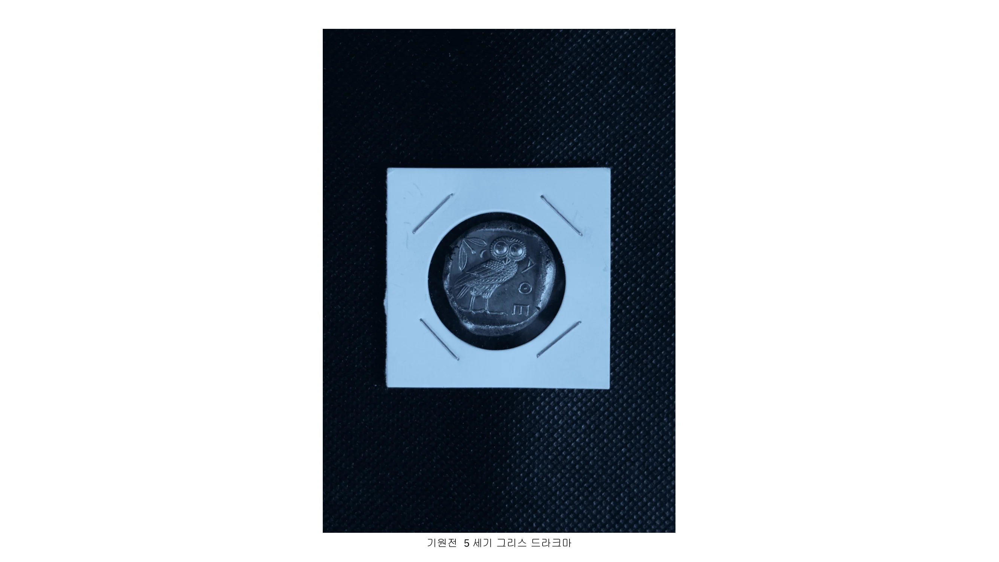

그리스의 각 도시는 화폐와 각자의 관계를 발전시켰습니다. 아테네에서 화폐는 정치 및 경제 권력과 깊은 관련이 있었습니다. 기원전 5세기 후반의 유명한 아테네 법령은 동맹국 영토에서 아테네 화폐를 독점적으로 사용하도록 하여 아테네의 경제적 패권을 강화했습니다. 또한 아테네는 비상시를 대비해 막대한 양의 금을 축적해 아크로폴리스에 보관했는데, 이는 경제적 신중함의 상징으로 여겨졌을 것입니다. 반면 엄격한 가치관을 가진 군사 도시였던 스파르타는 화폐 사용을 엄격하게 제한하여 시민들이 금화나 은화를 소유하는 것을 금지했습니다. 스파르타는 외국과의 무역을 막고 사회 결속을 유지하기 위해 무거운 철봉을 사용하는 것을 선호했습니다.

전쟁은 종종 통화 조작을 통해 자금을 조달했습니다. 펠로폰네소스 전쟁(기원전 431~404년) 당시 아테네는 군대에게 군자금을 지급하기 위해 과감한 평가절하를 단행했습니다. 기원전 413년 스파르타의 데셀리아 점령으로 은광에 접근할 수 없게 된 아테네는 기원전 407/406년에 급히 새 주화를 주조하기 위해 금상을 녹여내야 했습니다. 그 후 기원전 406/405년에는 은으로 도금한 청동 동전을 만들어 오늘날 그레샴의 법칙으로 알려진 '나쁜 화폐는 좋은 화폐를 몰아낸다'는 말을 떠올리게 하는 **아리스토파네스**의 통화 위기를 일으켰습니다. 이 비상 화폐는 전쟁이 끝난 후 아테네 주화에 대한 신뢰를 회복하기 위해 빠르게 화폐화되었습니다.

고전 시대의 끝은 필립 2세와 그의 아들 알렉산더 대왕의 통치 아래 마케도니아가 부상하면서 그리스의 통화 균형이 크게 뒤흔들린 시기였어요. 판게아 산의 광대한 금은광 덕분에 필립 2세는 군사 및 정치 캠페인에 필요한 자금을 풍부하게 생산하여 단순하고 실용적인 금-은 표준을 확립했습니다(10:1). 올림픽에서의 승리를 기념하는 그의 금화는 서유럽까지 유통되었고 심지어 영국에까지 도달했습니다. 알렉산더는 이러한 통화 정책을 추진하여 인도까지 동방을 정복하는 동안 **아틱** 드라크마를 널리 유통시켰습니다. 이 동전의 대량 유통은 헬레니즘 시대의 시작을 알렸으며, 이 시기에는 주권자의 이미지가 점차 동전의 신상을 대체하게 되었습니다. 이 혁신을 통해 여러 세대에 걸친 헬레니즘 군주들은 자신을 홍보할 수 있었고, 전통적인 신들은 동전 뒷면의 부차적인 역할로 밀려났습니다.

기원전 323년 알렉산더가 죽은 후, 그의 장군들은 거대한 제국을 분할하여 이집트(프톨레마이오스 왕조), 시리아(셀레우코스 왕조) 등에 왕조를 세웠습니다. 이 헬레니즘 왕국들은 다양한 화폐 시스템을 채택했는데, 프톨레마이오스는 화폐 유통을 통제하기 위해 폐쇄적인 화폐 시스템을 도입하여 곡물을 내부 통화로 사용하고 귀금속은 외부 군사 지출을 위해 절약하는 것을 선호했습니다. 동시에 로마인들에 의해 경제적으로 약화되기 전까지 로도스는 주요 무역 중심지가 되었으며, 기원전 167년에 델로스를 자유항으로 설립했습니다.

돈의 사용은 용병 보수의 핵심이었습니다. 알렉산더의 병사들은 매일 은 드라크마를 받았습니다.

알렉산더의 고도로 전문화된 군대의 정예인 기병대는 하루 평균 2드라크마, 보병은 1드라크마, 일반 용병은 단순 노동자의 임금의 두 배인 3분의 2드라크마를 받았습니다.

펠로폰네소스 전쟁 중에는 사모스 반란을 진압하는 데 1,200달란트, 포티데아를 포위하는 데 2,000달란트 등 군인들에게도 상당한 액수가 지급되었습니다.

이 군대가 소아시아에 완전히 투입될 때까지 총 비용은 하루에 약 20달란트, 즉 은 반 톤, 즉 12만 드라크마에 달했습니다.

그리스 주화는 또한 중요한 문화적 역할을 했는데, 각 도시마다 지역 또는 신화적 상징을 주조하여 자신의 정체성을 주장하고자 했기 때문입니다. 예를 들어 헤라클레이토스는 사자와 싸우는 헤라클레스(헤라클레스)를, 키레네는 유명한 약용 식물인 실피움을 주조했습니다.

마지막으로, 고전 그리스와 헬레니즘 주화는 그 다양성과 지역적 변동에도 불구하고 지중해 세계의 경제 및 문화사에 지속적인 흔적을 남겼으며, 로마가 점차 그리스 경제 개념을 채택하고 발전시켜 제국 경제를 구성하기까지 후대의 화폐 시스템에 깊은 영향을 미쳤습니다.

## 그리스에서 통화가 미치는 영향

<chapterId>3a5e6c7d-699c-5567-87cd-3374c49d55a9</chapterId>

:::video id=0c79a59c-e179-4893-a414-1b8de0930eb9:::

### 아테네와 스파르타의 대조

고전 그리스 시대 아테네와 스파르타의 대립은 근본적으로 다른 두 가지 정치 및 경제 조직 모델을 보여줍니다. 스파르타는 시민의 신뢰에 기반한 자급자족 시스템을 위해 금속 화폐를 거부한 반면, 아테네는 해양 제국을 건설하고 유지하기 위해 이 기술을 완전히 수용했습니다.

### 해군 전력의 금전적 필요성

아테네 제국은 그 웅장한 이름과는 달리 지리적으로 아테네와 에게 해의 도시들에 국한되어 있었습니다. 제국의 힘은 아테네가 패권을 장악한 군사 동맹인 델로스 연맹에 의존했습니다. 이러한 제국 구조에는 아테네 은화라는 통일된 경제 수단이 필요했습니다.

함대를 유지하는 것은 이러한 금전적 필요성의 핵심이었습니다. 아테네의 트라이엄프 한 척에 은 1달란트에서 2달란트의 비용이 들었는데, 이는 상당한 액수였습니다. 수백 척의 배를 유지해야 했던 아테네는 효율적인 세금 시스템이 필요했습니다. 화폐는 속국 도시로부터 공물을 징수하고 제국의 결속력을 보장하는 해군 투사력에 필요한 자금을 조달하는 데 없어서는 안 될 도구가 되었습니다.

### 지배의 도구로서의 금전적 부과

아테네는 델로스 연맹의 모든 회원국에게 은화를 사용하도록 강요했습니다. 이 화폐 표준화는 몇 가지 전략적 목표를 달성했습니다. 첫째, 공통의 계정 단위를 만들어 공물 징수를 용이하게 했습니다. 둘째, 아테네에 대한 속국 도시들의 경제적 의존도를 강화했습니다. 마지막으로, 아테네의 힘을 해양 제국 전체에 상징적으로 투영했습니다.

이 통화 정책은 스파르타 모델과 뚜렷한 대조를 이룹니다. 육상 강국이었던 스파르타는 펠로폰네소스 헬로트(노예)의 노동력에 의존해 생계를 유지했습니다. 도시 중심의 폐쇄적인 경제 시스템에는 정교한 화폐 수단이 필요하지 않았습니다. 시민과 병사들이 함께 살면서 공동의 식사를 나누고 일상적인 교환을 위해 돈이 필요하지 않았습니다.

### 해상 무역을 위한 수단으로서의 통화

바다를 항해하는 아테네 제국의 특성상 무역에 개방적일 수밖에 없었습니다. 내향적인 스파르타와 달리 아테네는 생존과 번영을 위해 외부 세계와 무역을 해야 했습니다. 화폐는 지중해 무역에서 없어서는 안 될 필수적인 도구가 되었습니다.

무역은 수입을 창출하고, 이 수입은 함대에 자금을 지원하고, 함대는 무역로를 보호하고 제국을 유지하며, 제국은 무역을 촉진하는 아테네 화폐를 부과하는 선순환 구조가 만들어졌습니다. 화폐는 더 이상 단순한 교환 수단이 아니라 제국 전략의 한 축이 되었습니다.

### 화폐 권력의 한계

이러한 경제적 고도화에도 불구하고 아테네의 화폐력은 펠로폰네소스 전쟁에서 한계를 드러냈습니다. 스파르타의 지상군 앞에서 아테네의 해군력과 재정적 우위는 충분하지 않았습니다. 시칠리아의 재앙적인 시라쿠사 작전과 같은 값비싼 원정은 결정적인 승리를 가져오지 못한 채 재정 자원을 고갈시켰습니다.

역사는 화폐가 권력을 투사하는 강력한 도구이기는 하지만 군사적 지배를 보장하지는 않는다는 것을 보여줍니다. 금속 화폐는 없었지만 사회 결속력이 뛰어났던 스파르타는 결국 아테네의 화폐 제국을 제압했습니다.

### 두 가지 모델, 두 가지 운명

아테네와 스파르타의 대립은 사회 및 경제 조직에 대한 두 가지 근본적인 접근 방식을 보여줍니다. 아테네는 현대 해양 제국의 선구자인 개방적이고 상업적이며 화폐화된 모델을 대표합니다. 스파르타는 금전적 수단보다는 시민의 신뢰를 기반으로 하는 폐쇄적이고 자급자족적인 모델을 구현합니다.

이 두 시스템은 화폐의 채택이 선택한 정치 및 경제 모델과 밀접하게 연관되어 있음을 보여줍니다. 아테네와 같은 해양 및 상업 강국에게 화폐는 필수 불가결한 존재가 되었습니다. 스파르타 같은 폐쇄적인 전사 사회에서는 사회 질서를 위협하는 존재였습니다. 이 고대의 이분법은 여전히 사회 조직에서 돈의 역할에 대한 논쟁에 영향을 미치고 있습니다.

## 로마 공화국

<chapterId>0bc80983-33e1-5881-85bb-7c22f3144a9a</chapterId>

:::video id=dc05ca97-d29c-4679-bfeb-912c47d86ce2:::

### 로마 공화국의 역사

- 기원전 753 - 509년: 로마 왕국**
- 기원전 753년: 로마 건국**(전통적으로 로물루스에 기인함).
- 기원전 509 - 27년: 로마 공화국**, 로마는 선출된 원로원과 집정관이 통치하는 공화정이 됩니다.
- 기원전 280 - 275년: 피르흐라 전쟁**. 에피루스의 왕 피루스가 이탈리아 남부에서 로마와 전투를 벌여 값비싼 승리를 거둡니다("피르힉스 승리").
- 기원전 264 - 146년: 포에니 전쟁**. 서부 지중해의 지배권을 놓고 로마와 카르타고가 벌인 대규모 분쟁.
- 한니발 (247 - 기원전 181년경)**. 제2차 포에니 전쟁 당시 로마를 공격하기 위해 군대와 코끼리를 이끌고 알프스를 넘은 것으로 유명한 전설적인 카르타고의 장군.
- 기원전 146년: 코린트 전투**. 로마는 그리스 도시 고린도를 파괴하고 그리스 본토를 최종적으로 지배합니다.
- 기원전 91 - 87년: 사회 전쟁**. 로마의 이탈리아 동맹국들이 로마 시민권을 요구하며 반란을 일으켰고, 결국 이들은 시민으로 완전히 통합되었습니다.
- 기원전 64년: 셀레우코스 저항의 종말**. 로마는 시리아에서 셀레우코스의 영향력을 완전히 제거하여 동부 지중해에 대한 지배력을 공고히 합니다.
- 기원전 55년: 율리우스 시저가 중서부 유럽을 정복합니다**. 율리우스 카이사르가 갈리아(현재의 프랑스)까지 로마의 지배를 확장하고 게르마니아와 브리타니에 입성합니다.
- 기원전 43년: 제2차 삼두정권의 형성**. 카이사르 암살 이후 로마를 안정시키기 위해 옥타비아누스(훗날 아우구스투스), 마크 안토니우스와 레피두스가 정치적 동맹을 맺었습니다.
- 기원전 27년: 팍스 로마나**의 시작. 아우구스투스의 통치 아래 정치적 안정과 번영의 시기로, 로마 제국의 시작을 알리는 시기입니다.

### 로마의 후기 화폐 시작

고대에 대한 이 섹션에서는 이제 로마 공화국에 주목해 보겠습니다. 로마의 화폐 역사는 그리스와 페르시아보다 훨씬 늦게 시작되었습니다. 기원전 753년에 건국된 로마는 주화를 본격적으로 도입하기까지 거의 4세기를 기다렸습니다. 이 오랜 기간 동안 로마인들은 불규칙한 청동 조각인 아에스루드라는 원시적인 교환 시스템을 사용했으며, 거래할 때마다 정확한 계량이 필요했습니다. 그리스와 에트루리아의 영향을 받은 기원전 4세기 말에 이르러서야 로마는 중국에서와 마찬가지로 청동으로 주조된 최초의 주화를 발행하기 시작했는데, 이는 **제2 포에니 전쟁** 전까지 로마 교환의 특징인 아에스 주화였습니다.

### 그리스의 영향과 최초의 은화

남부 이탈리아의 그리스인들과의 결정적인 만남은 로마인들에게 주조된 은화를 진정으로 소개했습니다. 기원전 280년경 로마는 그리스 디드라쿰을 모방하여 자체 은화를 생산하기 시작했습니다. 로마에서 처음으로 정기적으로 발행된 은화는 기원전 269년으로 거슬러 올라가는데, 전설적인 쌍둥이 로물루스와 레무스가 암컷 늑대에게 젖을 빨고 있는 모습이 상징적으로 그려져 있습니다.

실제로 공화정 시대의 많은 로마 주화에는 건국 신화가 그려져 있습니다. 아래에서 제 주화를 보실 수 있는데요, 타티우스 왕의 멋진 실제 주화입니다. 이 동전에는 사빈족의 여성 납치 신화가 그려져 있습니다. 타티우스 왕은 이 지역의 왕이었는데, 건국 신화에 따르면 로마인들이 근처에 살던 사빈족의 여성들을 납치했다는 이야기가 전해집니다. 그 후 타티우스 왕은 로마의 건국자 중 한 명인 로물루스와 공동 왕이 되었어요.

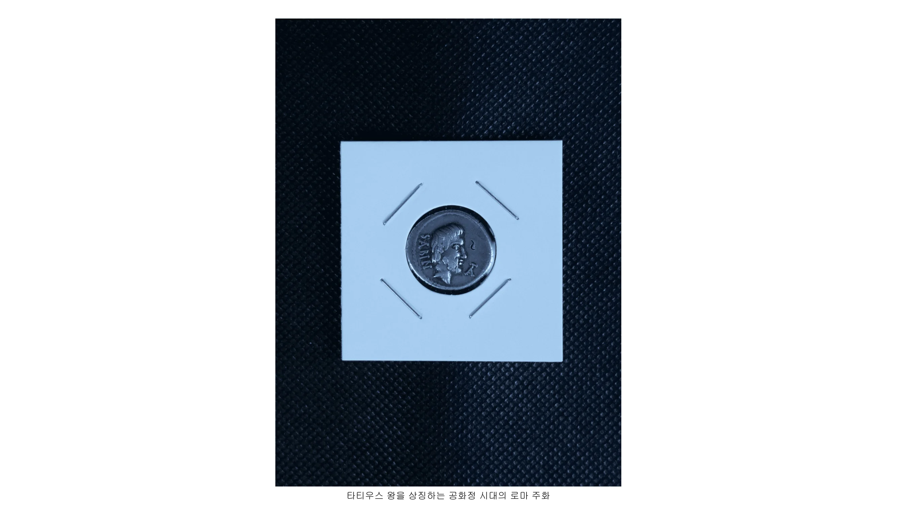

### "동전"이라는 단어의 기원과 주노 모네타의 신전

"동전"이라는 용어는 로마의 주노 모네타 신전에서 유래했습니다. 기원전 390년 갈리아의 침공 당시 국회 의사당의 신성한 거위가 로마인들에게 임박한 위험을 알려줬다는 전설이 전해져 내려오고 있습니다. 캐피톨의 수호신인 주노 여신에게 감사하기 위해 그녀를 기리기 위해 신전이 세워졌고 곧 로마 동전의 주조소가 되었습니다.

### 포에니 전쟁과 통화 위기

군사적 갈등은 로마 화폐 발전에 상당한 영향을 미쳤습니다. 카르타고와의 제2차 포에니 전쟁(기원전 218~201년) 당시 로마는 한니발의 침공으로 심각한 재정적 어려움에 직면했습니다. 이러한 긴급한 필요를 해소하기 위해 로마는 처음으로 예외적으로 금화를 발행하고 은화의 순도를 초기 97%에서 약 89%로 대폭 평가 절하했습니다. 청동 동전(아에스)의 무게도 급격히 감소하여 6년 만에 거의 80%가 감소했습니다.

여기에서는 경제 위기를 완화하기 위해 신전에 보관된 귀금속을 녹여 사용했던 그리스인들에 대해 이전에 논의했던 개념을 다시 한 번 살펴볼 수 있습니다. 그리고 **카르타고**에 대해 이야기하기 위해 아래에서 제 컬렉션의 실제 카르타고 동전을 감상하실 수 있습니다. 이 카르타고 동전에는 한쪽에는 야자수가, 다른 한쪽에는 말이 그려져 있습니다. 이 동전에서 말은 잘 알아볼 수 없을 정도로 많이 닳아 없어졌어요.

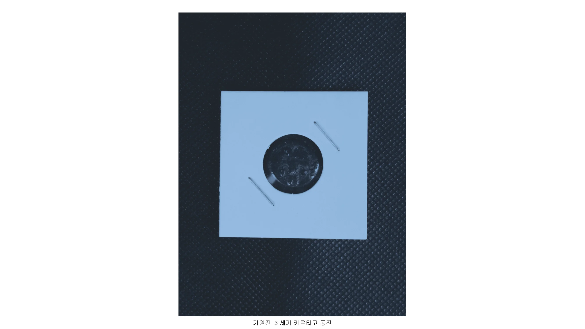

그 결과 에스로 알려진 청동 동전의 무게도 급격히 감소하여 6년 만에 거의 80%가 감소했습니다. 귀금속이 아니었고 일상적인 무역에 사용되던 청동화의 무게가 많이 줄어든 것은 전쟁으로 인한 화폐 가치 하락의 신호였습니다.

### 실버 데나리온과 화폐 안정성

이러한 중요한 배경을 바탕으로 로마는 기원전 212년경 유명한 은제 데나리우스를 도입했습니다. 이 개혁은 놀라운 화폐 안정성을 보장했고, 데나리온은 거의 450년 동안 지배적인 통화로 남았습니다. 로마는 기원전 146년 대대적인 화폐 가격 재조정과 포에니 전쟁, 사회(기원전 91-87년), 마케도니아 전쟁 등 막대한 군대 자금을 조달하기 위한 상당한 생산에도 불구하고 엄격한 관리 덕분에 이러한 안정성을 유지할 수 있었습니다. 예를 들어 로마 군단 하나를 유지하는 데 연간 약 150만 데나리온이 소요되었다는 사실은 당시의 재정적 필요 규모가 어느 정도였는지 알 수 있습니다.

로마 국경 너머에서는 전쟁으로 인해 로마의 영향력 아래 있던 지역의 화폐 가치가 크게 떨어졌습니다. 포에니 카르타고는 4세기 금의 순도가 98%에서 2차 포에니 전쟁 중 30%로 급격히 떨어졌고, 은화의 순도는 18%까지 떨어졌습니다.

### 금전적 동기의 진화

로마의 확장과 함께 주화의 성격도 진화했는데, 처음에는 익명의 애국적인 주화에서 점차 주조자(주화를 주조한 사람)의 권력 가문이 등장하는 개인화된 디자인이 채택되었습니다. 이러한 변화는 로마 후기 공화정의 정치적 변혁을 분명하게 상징합니다.

마지막으로 로마는 지중해 세계를 경제적으로 지배하는 동안에도 지불 수단에서는 어느 정도 단순성을 유지했습니다. 엘리트층을 위한 세금 이체와 사적 신용을 제외하고는 동전의 직접 교환 외에 다른 형태의 화폐 이동은 개발되지 않았습니다.

## 로마 제국

<chapterId>2dc44e50-112a-5abf-97ae-8e0a9ecda989</chapterId>

:::video id=f8d6f3d6-9ee4-4504-888e-4f12b3f20489:::

**역사적 배경:**

**공화정**은 기원전 27년 아우구스투스 통치 초기부터 서기 284년 3세기 위기가 끝날 때까지 로마 제국의 제국 정부 형태였습니다.

**기원전 27년: 팍스 로마나의 시작**

아우구스투스의 통치 아래 정치적 안정과 번영의 시기로, 로마 제국의 시작을 알린 시기입니다.

**아우구스투스(기원전 30년~서기 14년)**는 로마 화폐 시스템을 근본적으로 개혁하여 황실 주화의 지속적이고 안정적인 표준을 확립했습니다.

**아우구스투스는 고대 동전과 화석을 최초로 수집**한 것으로도 유명합니다.

**54 광고 - 68 광고: Nero**

로마가 불타버린 후 폭정과 박해, 비참한 통치로 논란이 된 로마 황제.

**서기 64년: 로마의 대화재**

대형 화재로 도시 대부분이 황폐화되고 네로는 책임자로 지목됩니다.

**서기 69년: 네 황제의 해**

네 명의 황제(갈바, 오토, 비텔리우스, 베스파시아누스)가 연달아 즉위한 혼란스러운 시기입니다.

**서기 79년: 베수비오 화산 폭발**

폼페이와 헤르쿨라네움 도시를 파괴한 화산으로, 화산재 아래 유적은 예외적으로 잘 보존되어 있습니다.

**165 광고 - 180 광고: 안토닌 전염병**

마르쿠스 아우렐리우스와 콤모두스 치하의 로마 제국을 약화시킨 치명적인 전염병입니다.

**서기 200년: 팍스 로마나의 영토적 정점과 점진적 종말**

로마는 최대 확장에 도달했지만 내부 불안정과 경제적 어려움에 시달리기 시작했습니다.

**서기 212년 시민권에 관한 카라칼라 칙령**

카라칼라 황제는 세수 기반을 넓히기 위해 거의 모든 제국 주민에게 로마 시민권을 부여했습니다.

**서기 220년: 야만인 대침략의 시작**

게르만 민족이 로마 국경을 넘어 처음으로 대규모로 침입했습니다.

**235 광고 - 285 광고: 3세기의 정치 및 군사적 위기****

단명하는 황제, 내전, 경제 위기, 지속적인 침략 등 정치적 불안정으로 점철된 시기입니다.

**아우렐리우스(AD 270~275년)는 높은 인플레이션에도 불구하고 로마 화폐의 명목 가치를 회복하기 위해 급진적으로 재평가**를 실시했습니다.

**서기 301년 디오클레티아누스의 가격 칙령**

디오클레티아누스 황제는 제국 전역에 엄격한 물가 및 임금 통제를 시행하여 만연한 인플레이션을 막으려 했으나 헛수고였습니다.

**서기 312년 콘스탄틴**

콘스탄티노플의 창시자인 최초의 기독교 황제는 순도와 안정성이 뛰어난 금화인 '솔리두스'를 도입하여 화폐를 안정화시켰습니다.

**서기 476년 서로마 제국의 멸망**

로마는 여러 게르만 민족(오스트로고트족 포함)에 의해 점령당하는데, 이는 서로마 제국의 공식적인 종말을 알리는 사건으로 여겨집니다.

### 아우구스투스의 화폐 개혁

고대에 대한 이 섹션에서 우리는 이미 로마 제국에 도착했습니다. 로마 제국의 화폐 역사는 금, 은, 청동과 같은 금속 화폐의 집중적인 사용과 정치 및 군사적 불안과 밀접한 관련이 있는 여러 번의 통화 위기가 특징입니다. 공화정 말기 율리우스 카이사르 치하에서 로마는 기원전 46년에 약 8그램의 무게로 유럽과 지중해 유역 전역에서 널리 통용되던 금화인 골드 아우레우스를 도입했습니다. 시저는 이 금화를 표준화하고 살아있는 사람의 초상화가 새겨진 최초의 주화를 주조하여 익명의 집단적 상징을 선호하던 고대 공화정의 전통을 뒤집었습니다. 이러한 발전은 공화정 제도를 점차 개인 권력이 대체하는 중대한 정치적 변혁의 시기를 수반했습니다.

기원전 44년 카이사르가 암살당한 후 옥타비아누스(아우구스투스)가 로마를 장악하여 기원전 27년에 제국을 세웠어요. 그의 통치 기간 동안 화폐 시스템이 완전히 개혁되어 로마 경제에 지속적인 안정을 가져다주었습니다. 아우구스투스 당시 1골드 아우레우스는 25은 데나리온에 해당했으며, 그 자체로 청동 세스테스티아 4개의 가치가 있었습니다. 이러한 화폐 안정은 로마의 경제 황금기라고 불리는 서기 1세기 내내 지속되었습니다.

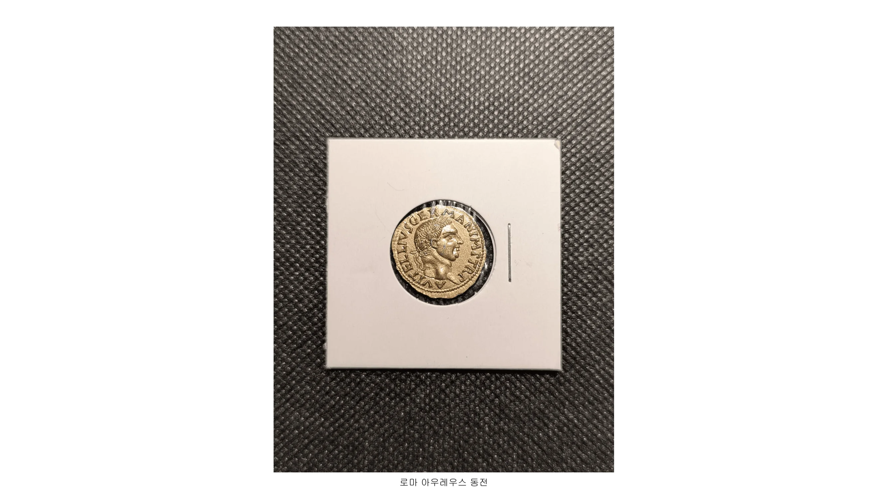

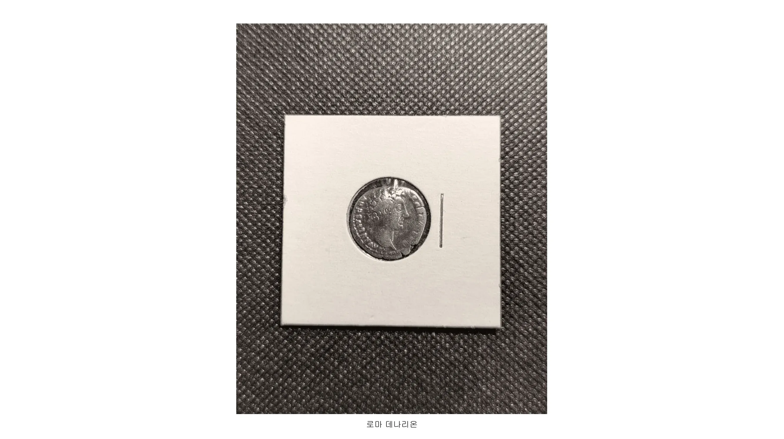

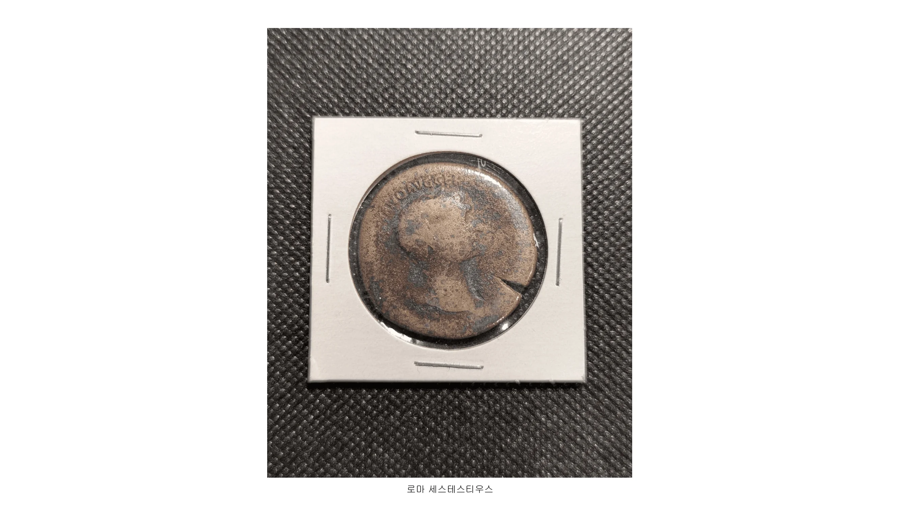

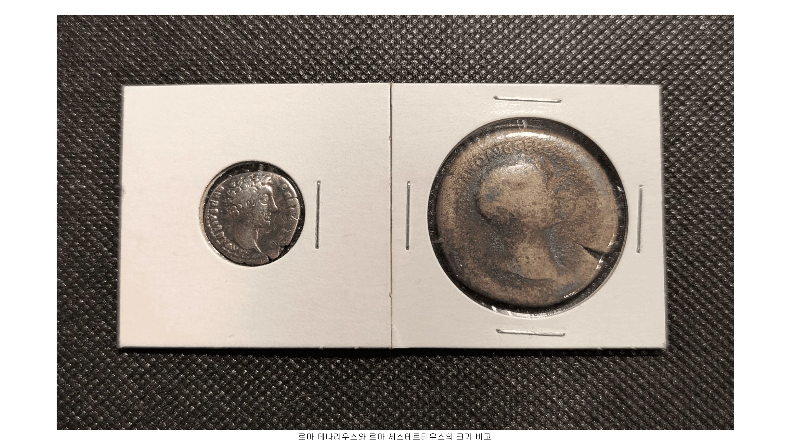

그러나 네로 이후(AD 54~68년)부터 로마는 증가하는 제국 지출을 충당하기 위해 주화의 무게와 순도를 점진적으로 낮추기 시작했고, 특히 AD 64년 로마 대화재 이후에는 주화의 가치를 서서히 평가절하하기 시작했습니다. 이러한 평가 절하는 주목할 만한 효과를 가져왔는데, 순도가 높은 동전은 **그레샴의 법칙**에 따라 비축이나 수출을 통해 유통에서 사라지고 평가 절하된 동전이 확산되어 가격이 점진적으로 상승하는 현상이 발생했습니다.

3세기는 셉티미우스 세베루스, 카라칼라, 갈리엔누스 황제 치하에서 평가절하가 급격히 가속화되는 극적인 전환점이 되는 시기입니다. 주요 은화인 데나리우스에 이어 안토니누스도 은 함량이 2%로 떨어졌습니다. 동시에 아우레우스의 금 무게는 절반으로 떨어졌습니다. 이 화폐 위기는 전례 없는 정치적 불안정, 야만인의 침략, 반복되는 내전을 동반했습니다.

이 부분에서는 이 섹션의 마지막 작품인 안토니누스를 소개합니다. 이 동전의 원래 이름은 알려지지 않았지만 오늘날에는 안토니누스라고 부릅니다. 데나리우스의 1.5배에 불과한 크기임에도 불구하고 2데나리우스의 가치를 지니고 있다는 특징이 있습니다. 또한 시간이 지남에 따라 이 동전은 순은이 아닌 은과 다른 금속의 합금으로 만들어진 빌리온 동전이 되었습니다. 이 동전은 은으로 코팅된 경우가 많았기 때문에 화폐의 부패를 보여주는 대표적인 사례로 꼽힙니다.

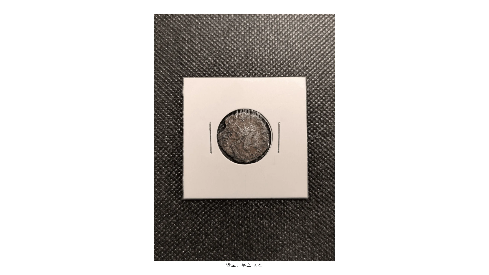

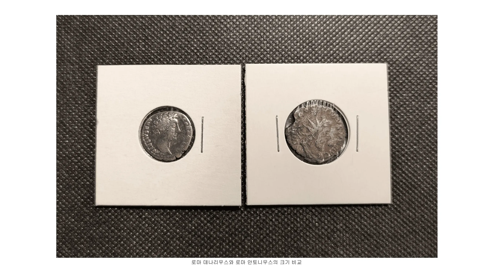

이러한 상황에 직면한 아우렐리안 황제(서기 270~275년)는 명목상 화폐 가치를 재평가하여 시스템을 안정시키려 했지만, 이 개혁은 실제로 기존 화폐의 가치를 인위적으로 더 높은 수준으로 고정함으로써 인플레이션 메커니즘을 도입했습니다.

이 주제에 대한 여담을 소개하겠습니다. 3세기 동안 인플레이션은 기하급수적으로 증가했습니다. 이전에는 동전이 평가절하되더라도 하나하나 수작업으로 주조하는 과정을 통해 인플레이션을 어느 정도 통제할 수 있었습니다. 통계에 따르면 300년 동안의 평가절하 기간 동안 인플레이션은 연평균 약 4%에 달했습니다. 아우렐리안의 개혁 직전 인플레이션은 연간 약 3%였습니다.

아우렐리안은 청동 20과 은 1의 비율, 즉 순도 5%를 나타내는 XXI 기호 주화에 순도 측정법을 도입했습니다. 그는 이 5% 은화를 시중에 판매하고 그 위에 XXI 기호를 찍었습니다. 그러나 그는 더 평가 절하된 다른 동전도 모두 회수하여 동일한 XXI를 찍었습니다. 이로써 모든 동전의 액면가가 효과적으로 재평가되었습니다. 그 결과 이 기법이 시행되기 전의 3%를 훨씬 뛰어넘는 연간 20%의 엄청난 인플레이션율을 기록했습니다.

금속의 점진적인 평가절하보다 훨씬 빠른 이러한 형태의 평가절하를 발명한 것은 실제로 오렐리안이었지만, 여전히 우리는 동전을 하나씩 인쇄해야 했습니다. 그가 한 일은 기존의 모든 동전을 가져다가 회수하고 펀치로 찍어 액면가를 변경하는 것이었습니다. 이것이 진정한 전환점이었습니다. 그때부터 인플레이션이 기하급수적으로 증가하기 시작했습니다.

이러한 극단적인 평가 절하를 시각적으로 설명하기 위해 기원전 40년부터 3세기까지 300년 이상에 걸친 이집트의 곡물 가격에 대한 흥미로운 통계를 발견했습니다. 아래에서 제 컬렉션에 있는 그리스 테트라드라크마를 볼 수 있습니다. 당시 3세기 로마의 점령 아래 있던 이집트에서는 이에 상응하는 것이 이집트 테트라드라크마였습니다. 드라크마라는 화폐 단위는 여전히 사용 중이었으며 데나리온에 해당했습니다.

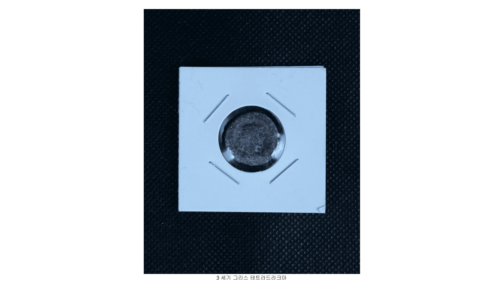

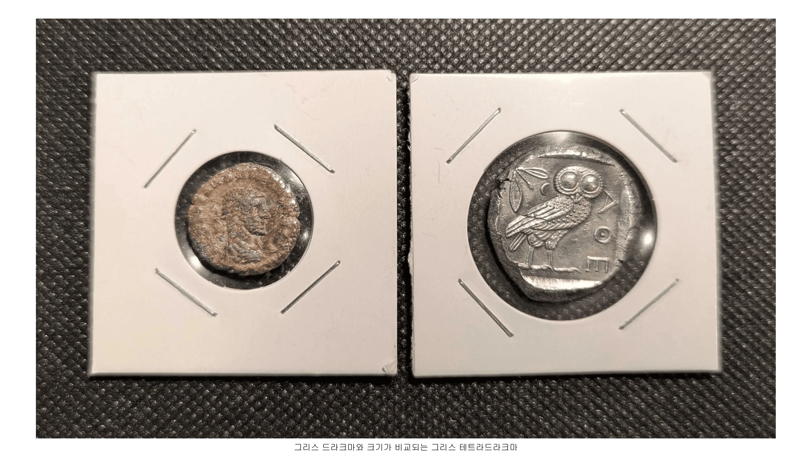

그래서 제가 가지고 있는 이집트 테트라드람은 데나리온에 해당합니다. 동전은 빌론(또는 청동)으로 만들어졌기 때문에 귀금속이 전혀 들어 있지 않다는 것을 알 수 있습니다. 원래 그리스 테트라 드라쿰과 비교하면 300년 동안의 물리적 평가 절하를 확인할 수 있습니다. 이집트의 곡물 가격이 백만 배나 오른 셈입니다.

이는 아우렐리안의 개혁을 물리적으로 표현한 것입니다. 300년 동안의 인플레이션은 평균 4% 정도였다는 점에 주목할 필요가 있습니다. 아우렐리안이 개혁을 단행한 마지막에 이르러서야 인플레이션이 기하급수적으로 증가하여 100만이라는 수치에 도달했습니다. 기원전 1세기에 비해 3세기 말의 물가는 백만 배나 높았습니다.

그의 후계자 **디오클레티아누스**(AD 284-305)는 더욱 급진적인 개혁을 시도했습니다. 새로운 화폐(특히 순수하지만 수량이 너무 제한된 아르젠티우스)를 발행하고 과감한 가격 통제(AD 301년 가격 칙령)를 시행했으며 **현물 지급에 기반한 세금 제도를 확립**했습니다. 이러한 노력에도 불구하고 디오클레티아누스의 개혁은 만연한 인플레이션을 억제하는 데 실패했습니다.

평가 절하된 화폐의 대가로 상품과 서비스를 공급하는 것을 거부당하자 디오클레티아누스는 농민과 그 후손을 토지에 묶어두기 위해 **세습 카스트 제도**를 도입했습니다.

여기서 정말로 이해해야 할 것은 농민들이 평가 절하된 화폐를 받는 대가로 농산물을 제공하는 것을 거부했고, 이에 대한 디오클레티아누스의 대응은 "당신, 당신 땅을 떠날 수 없고, 당신 자식들도 당신 땅을 떠날 수 없으며, 군인들도 마찬가지다, 당신은 군인이니 내 화폐로 임금을 받는 데 동의한다"며 세습 카스트를 만드는 것이었다는 점입니다. 과도기적 해결책으로 그들은 돈을 주지 않겠다는 이유로 현물(고기, 식량, 곡물)을 지급받았습니다. 그래서 그는 사람들이 자신의 직업에 애착을 갖도록 세습 카스트 제도를 도입하여 평가 절하된 화폐를 받아들이지 않으려 해도 직업을 바꿀 수 없도록 했습니다.

이 예시를 설명하기 위해 "*통화 체제와 인플레이션*"이라는 책에서 발췌한 텍스트를 소개합니다:

> 사람들은 액면가가 내재 가치나 시장 가치보다 높은 평가 절하된 화폐에 대해 일하고 물건을 납품하기를 꺼려했기 때문에 현물 세금을 부과하여 강제로 일해야 했습니다. [...] 농민들이 등록한 집을 떠나는 것은 불법이 되었습니다. 따라서 농경 인구는 토지에 유전적으로 애착을 갖게 되었습니다.
>

> 이 세습 카스트 제도는 점차 확산되었습니다: 디오클레티아누스는 군인의 아들을 군대에 복무하도록 강요했고, 디오클레티아누스가 만든 직조 및 염색 공장뿐만 아니라 화폐 작업장의 노동자들은 세습을 통해 국가 노예가 되었습니다. 금 광부도 나중에 세습 계급이 되었습니다. 디오클레티아누스 시대에 이미 다른 세습 계급, 특히 로마의 제빵사와 정육점 길드와 [...] 곡물과 기타 공공 화물을 로마로 운송하는 선박 선장 길드도 존재했을 것입니다.

312년에 품질과 무게를 엄격하게 보증하는 순금 주화인 솔리두스를 도입하여 마침내 화폐 시스템을 안정시키는 데 성공한 사람은 콘스탄티누스(AD 306~337)였습니다. 솔리두스의 순도와 중량을 검증하기 위한 전체 시스템이 갖춰져 있었습니다. **그러나 이러한 안정성은 부유한 엘리트와 황실에만 영향을 미쳤고**, **대다수의 인구는 저품질 화폐와 지속적인 인플레이션으로 계속 고통받았습니다**. 동방 제국(비잔티움)에서는 솔리두스가 안정적으로 유지되어 천 년 이상 지속된 반면, 서양에서는 주화가 저가의 작은 동전으로 분열되면서 로마 제국의 경제적, 정치적 붕괴와 함께 서기 476년에 최종적으로 몰락하게 됩니다.

끝으로 *돈의 역사*에 나오는 이 인용문을 공유해 드리고자 합니다: 로마의 몰락을 초래한 원인을 훌륭하게 요약한 글린 데이비스의 *고대에서 현대까지*에서 인용한 글입니다:

*"세금은 지속적으로 부적절했고, 점점 더 부적절해지고 뒤늦게 조정되고 눈에 잘 띄는 세금과 관련된 어려움으로 인해 로마는 쉽고 즉각적이며 숨겨진 형태의 과세인 통화 평가절하에 더 많이 의존하게 되었습니다. 단기간의 임시방편적인 개혁은 이러한 오랜 쇠퇴 추세를 되돌리지 못했습니다. 동전의 마모로 인한 재정적 압박, 난파, 동방으로부터의 사치품 구매로 인한 자금 유출, 게르만 야만인에게 제공한 선물, 도시 인구의 증가, 농업 생산의 감소, 가장 풍부한 광산의 점진적 고갈, 무엇보다도 도시 생활에서 최소한의 질서를 유지하는 데 필수적인 것으로 여겨지는 "빵과 서커스" 정책 등 이러한 모든 누적된 압박이 로마를 지속적인 화폐 평가절하로 이끌었고, 간혹 실패로 끝난 개혁이 산재해 있었습니다."*

*무료 또는 저렴한 빵과 포도주 외에도, 특히 트라야누스(AD 98-117년)와 하드리아누스(AD 117-138년)와 그의 후계자들에 의해 화폐 배분의 형태로 황실의 자유("콘지리아")가 때때로 배분되었습니다. 황제와 시민들이 처음에는 예외적인 특권으로 여겼던 것이 2세기 초에 이르러서는 관습적인 기대가 되었습니다. 이러한 배당은 "공공 재정에 큰 부담을 주었고, 나름대로 국가 파산에 기여했다"*고 합니다

## 통화 희석과 인플레이션의 연관성: 원인에서 결과까지

<chapterId>38d5781c-e900-53f7-baa7-413655d71754</chapterId>

:::video id=3999256d-aafe-4502-9b72-dfa8491a2777:::

이 섹션에서는 통화 희석과 인플레이션의 연관성을 원인부터 결과까지 살펴봅니다. 화폐 희석은 로마 화폐 역사에서 인플레이션에 직접적인 영향을 미치는 주요 경제 현상 중 하나입니다. 서기 1세기부터 은화(데나리우스)는 네로 통치(서기 54-68년) 이후부터 서서히 희석되는 초기 단계가 있었는데, 특히 셉티미우스 세베루스(193-211년)와 갈리아누스(253-268년) 치하의 반복되는 군사 및 금융 위기로 인해 더욱 가속화되었습니다.

또한 아우레우스의 평가절하가 점진적으로 이루어지고 있다는 점도 주목할 만합니다. 이러한 평가 절하 속도의 차이는 두 가지 점을 강조합니다:

1. 국가의 화폐 통제를 위한 바이메탈리즘에서 계정 단위의 역할. 이 예에서 계정 단위는 데나리온입니다. 저는 계정 단위의 가치를 관리하는 세 가지 방법을 확인했습니다: 평가절하(금속 희석), 리디노미네이션(안토니니우스), "XXI"(아우렐리안) 표시를 통한 액면가 부과

2. 엘리트들이 불우한 사람들을 희생시키면서 구매력을 유지할 수 있게 해주는 가치 보존 수단인 아우레우스의 평가 절하를 가능한 한 오래 연기하려는 국가적 욕망. 특히 "칸티용 효과"로 알려진 개념과 스페인 마라베디의 리디노미네이션과 관련하여 이 원칙을 과정 전반에 걸쳐 자주 재검토할 것입니다.

이 현상은 매우 흥미롭고 역사적으로 반복되어 왔습니다. 다음 섹션에서 마라베디를 통해 다시 살펴보겠습니다. 이러한 패턴은 모든 준비 통화에서도 분명하게 나타나며, 로마의 아우레우스와 같은 가치의 준비 단위는 그대로 유지됩니다. 그러나 일반 대중이 무역과 일상 거래에 사용하는 계좌 단위는 종종 평가절하됩니다. 결과적으로 화폐 인플레이션은 서민에게 영향을 미치지만 금화를 살 수 있는 사람들은 거의 영향을 받지 않습니다.

그건 그렇고, **금융 자산의 가치를 상승시키는 통화 평가 절하로 인해 오늘날 만들어지는 현상과 같은 현상입니다 ** 그래서 통화를 사용하는 사람들, 가장 가난한 사람들이 더 가난 해지고, 이것은 결과적으로 화폐 창출을 통해 평가 절하로부터 자신을 보호 할 수있는 수단을 가진 사람들의 자산을 풍부하게하고, 따라서 사회적 불평등을 심화시킵니다. 이것이 저의 작은 정치적 외침입니다.

방금 설명한 것을 캔틸론 효과라고 합니다. 이 신사는 다음 섹션에서 다룰 주제인 존 로 시대에 살았다는 것을 알게 될 것입니다.

아우렐리우스 통치 기간에 시작된 개혁으로 인플레이션이 치솟았습니다. 화폐 액면가의 인플레이션은 더 이상 조폐국의 수작업 주조 능력에 의해 제한되지 않았습니다. 이미 주조된 동전은 이제 간단히 표시할 수 있게 되었고, 화폐 공급의 명목 가치는 더욱 빠르게 증가했습니다.

오렐리안과 관련하여 여러분과 공유할 두 가지 인용문이 있습니다. 첫 번째는 *돈의 역사*에서 따온 것입니다: 고대부터 현재까지*에서 인용한 것입니다:

*"로마 경제에 관한 한 아우렐리우스의 공헌은 승리라기보다는 재앙에 가까웠습니다. 무책임한 갈리아누스 치하에서도 인플레이션율이 이전보다 훨씬 더 높아질 수 있었던 것은 그의 '개혁'의 성격이 크게 작용했기 때문입니다. 아우렐리우스 이후 2세기 동안 인플레이션은 로마 제국 전역에 만연했습니다."*

두 번째는 *동전으로 본 고대 역사*라는 책에서 나온 것으로, 금에서 화폐 시스템이 분리된 것에 관한 것입니다:

*"아우렐리안의 개혁은 금화와 나머지 통화 시스템 간의 관계를 변화시켰습니다. 그 전에는 다른 종류의 화폐는 공식 환율(1 아우레우스에 25 이집트 데나리온 또는 25 테트라 드라쿰 등)에 따라 **아우레우스**에 연동되어 있었습니다. 개혁 이후 금화는 다른 상품과 마찬가지로 **가치가 자유롭게 변동**하기 시작한 반면, 나머지 통화 시스템은 **합금의 약세**로 인해 **가치가 하락**하여 더 이상 **금에 의해 뒷받침되지** 않았습니다. 이론적으로는 은(데나리우스, 이집트에서는 드라크마)을 기준으로 한 화폐 단위가 유지되었기 때문에 화폐 가치가 하락함에 따라 가격이 상승했습니다. "*

보시다시피, 계좌 단위로 사용되던 화폐의 평가절하는 불균형적으로 가난한 사람들에게 영향을 미쳤고, 금 화폐와의 연결 고리가 끊어지면서 금이라는 가치 저장 수단에 저축할 여유가 있는 사람들의 구매력은 보호되었습니다.

여기서 이해해야 할 점은 데나리우스와 아우레우스 사이에 연결 고리가 있으면 데나리우스를 평가 절하하더라도 이 환율(1 아우레우스당 25데나리우스)로 데나리우스를 아우레우스로 교환할 수 있다면 사람들은 데나리우스는 고평가되고 아우레우스는 저평가되기 때문에 반드시 데나리아를 아우레우스로 교환할 것이라는 점입니다. 하지만 이번 개혁에서는 이 연결고리를 제거했습니다. 따라서 사람들은 더 이상 데나리우스를 금에 비해 평가 절하된 은화로 교환할 수 없게 되었습니다. 그 후 사람들은 더 이상 고평가된 은을 저평가된 순금으로 교환할 수 없었기 때문에 금화에 접근할 수 있었던 사람들은 스스로를 보호할 수 있었습니다. 이는 화폐의 진화에서 매우 중요한 순간입니다.

아우렐리안의 이 개혁의 효과를 보여주는 놀라운 예는 *통화 체제와 인플레이션*이라는 책에서 인용한 이 인용문에서 완벽하게 설명됩니다:

*"클라우디우스 황제(서기 41-54년)와 콘스탄티우스 황제(서기 337-361년) 통치 기간 동안 이집트의 공개 시장에서 밀 가격은 드라크마로 표시되며 **백만 배 이상 상승했습니다**. 엄청난 가격 인플레이션은 서기 3, 4세기의 핵심적인 경제 사실 중 하나입니다."(Lendon 1990, 106쪽). 그러나 이러한 발전은 **연평균 인플레이션율 4.4%**에 해당하기 때문에 **보기보다 덜 극적입니다**. 그리고 Wassink(1991, 482쪽)에 따르면 인플레이션은 실제로 **서기 238년에야 시작되었습니다**"*

*"이 날부터 인플레이션은 서서히 가속화되었는데, **좋은 화폐가 먼저 유통되지 않았기 때문에** 처음에는 총 통화 공급이 거의 증가하지 않았습니다. 그 후 250년에서 293년 사이에 연평균 3.65%에 달했고, 293년에서 301년 사이에는 **22.28%까지 상승했다**(Wassink 1991, 466쪽), 즉 디오클레티아누스 황제의 **화폐 개혁이 중단된 시기까지. 이 현상은 **금속 기반 통화 체제에서 인플레이션에 특히 인상적입니다**. "*

화폐 희석과 관련된 이러한 인플레이션 현상은 처음에는 로마 국가의 가끔씩 발생하는 현금 위기에 대응하기 위해 사용되었습니다. 액면가를 유지하면서 동전의 귀금속 함량을 줄임으로써 국가는 일시적으로 자원을 늘릴 수 있었습니다. 그러나 가격은 즉각적으로 반응하지 않았습니다. 실제로 로마 시스템은 어느 정도 고착성이 있었기 때문에 임금과 물가가 연속적인 평가 절하에 적응하는 속도가 느렸습니다. 그럼에도 불구하고 특정 임계값이 지나면 가격이 급격히 상승하여 시장이 통화의 실제 가치와 균형을 되찾게 됩니다.

위에서 언급했듯이 이러한 현상은 특히 3세기 중반 이후부터 뚜렷하게 나타납니다. 문서 기록이 풍부한 이집트에서는 초기 안정화 시도에도 불구하고 아우렐리우스(AD 274년)가 공식적으로 화폐를 재평가한 후 가격이 10배로 뛰었습니다. 그 후 디오클레티아누스(AD 301년) 치하에서는 과잉 생산과 화폐 가치 하락이라는 근본 원인을 해결하지 않고 인플레이션을 억제하기 위해 물가 칙령을 시행하여 예측 가능한 실패를 초래했습니다. 지속적인 인플레이션은 궁극적으로 경제를 2계층 시스템으로 밀어붙입니다: **콘스탄티누스의 솔리두스**처럼 금 보유량으로 보호받는 엘리트는 안정을 누리는 반면, 대다수 인구는 만성적인 인플레이션에 시달리며 **오늘날 칸티용 효과로 알려진 것을 예시합니다**

로마의 통화 희석과 인플레이션 사이에는 분명한 연관성이 있으며, 그 원인은 본질적으로 만성적인 재정 적자, 끊임없는 군사 지출, 열악한 국가 경제 관리와 관련이 있습니다.

## 로마 제국의 몰락

<chapterId>b6ec0914-227b-509c-8108-b09eec9bb904</chapterId>

:::video id=91d4fee5-59bb-4ab9-a90b-e1125c71decb:::

### 통화 평가 절하와 로마의 붕괴

오스트리아 경제학파는 특히 루트비히 폰 미제스를 통해 로마의 몰락에 대한 화폐학적 해석을 제안했습니다. 이 견해에 따르면 로마 화폐의 점진적인 평가 절하는 인구 6천만 명의 제국을 지탱하던 복잡한 분업 체계를 무너뜨렸습니다. 경제 조정의 중심 도구였던 화폐가 부패하자 사회와 경제 구조 전체가 무너졌습니다.

이러한 통화 악화는 제국의 내부 결속력을 무너뜨렸을 뿐만 아니라. 또한 이웃 민족과의 무역 관계도 단절되었습니다. 로마와의 무역으로 인한 혜택을 박탈당한 '야만인'들은 평화로운 협력에서 약탈로 돌아섰습니다. 따라서 침략은 본질적으로 군사적일 뿐만 아니라 근본적인 경제 붕괴의 결과이기도 했습니다.

### 제국 평가 절하의 세 단계

로마 화폐 역사는 크게 세 시기로 나눌 수 있습니다. 첫 번째 시기는 줄리오-클라우디우스 시대부터 안토니우스 시대(기원전 27~2세기 말)까지로, 비교적 안정된 상태를 유지했습니다. 트라야누스 치하에서 제국은 정점에 이르렀는데, 로마는 5백만 킬로미터²의 면적을 차지하며 역사상 최초의 백만장자 도시가 되었습니다. 데나리우스는 98%에서 80%의 은 순도를 유지하며 적당한 평가 절하를 통해 경제가 여전히 작동할 수 있었습니다.

두 번째 시기인 3세기는 군사적 무정부 상태였습니다. 수십 년 동안 26명의 황제가 서로의 뒤를 이어 황제의 자리에 올랐습니다. 2데나리온의 가치가 있는 것으로 추정되는 안토니누스의 금속 중량은 1.5에 불과했는데, 이는 법적 가치와 실제 가치를 분리하려는 최초의 시도였습니다. 이 조작은 나쁜 화폐가 좋은 화폐를 몰아낸다는 그레샴의 법칙을 촉발시켰습니다. 시민들은 좋은 동전을 사재기하고 가치가 떨어진 동전만 소비했습니다.

고고학자들이 발굴한 화폐 보물은 이러한 경제적 불안감을 드러냅니다. 매장된 암포라에는 로마인들이 가장 좋은 동전을 먼저 쌓아두고 점차 가치가 떨어진 동전을 추가하는 방법을 계층화하여 보여줍니다. 이 고대 '더미'는 불확실성에 직면한 인간의 행동, 즉 쇠퇴하는 세상에서 가치를 보존하려는 시도를 증언합니다.

### 콘스탄틴과 이중 시스템

콘스탄티누스(310~337)는 급진적인 개혁을 통해 제국을 안정시키려 했습니다. 그는 정부에서 엄격하게 통제하는 화폐인 골드 솔리두스를 만들었습니다. 관리들은 무게와 순도를 체계적으로 검사했습니다. 발행량은 전쟁의 전리품과 연계되어 제한적으로 유지되었습니다. 이 화폐는 권력의 독점적 도구가 되어 세금은 솔리두스로 납부되고 군대는 금으로 급여를 받았습니다.

동시에 사람들은 청동 눔무스를 사용했는데, 이 눔무스는 지속적으로 평가 절하되었습니다. 445년에는 솔리두스의 가치가 7,000 눔미였고, 498년에는 16,800 눔미였습니다. 이 이중 시스템은 솔리두스에 접근할 수 있는 사람들, 즉 행정관료와 지주들은 인플레이션으로부터 보호받는 칸틸롱 효과를 제도화했습니다. 눔무스에 갇혀 있던 평민들은 더욱 가난해질 수밖에 없었습니다.

이러한 화폐 분리는 공식 환율 없이 두 개의 평행 경제를 만들었습니다. 솔리두스는 여전히 화폐 단위로 사용되었지만 유통량은 매우 적었습니다. 눔무스는 일상적인 교환에 사용되었지만 지속적으로 가치를 잃었습니다. 이러한 화폐 구조는 신흥 봉건 제도의 불평등을 예고하는 것이었습니다.

### 분업의 붕괴

통화 평가절하는 점차 경제 전문화를 파괴했습니다. 신뢰할 수 있는 단위가 없자 지중해 무역은 붕괴되었습니다. 로마의 전문 장인들은 더 이상 이집트나 갈리아와 교역할 수 없게 되었습니다. 각 지방은 독자적인 화폐를 채택하여 무역 마찰을 가중시켰습니다.

이러한 붕괴에 직면한 도시 인구는 시골로 도망쳤고, 이는 수 세기에 걸친 도시화를 역전시키는 도시 탈출이었습니다. 장인들은 생계형 농업을 위해 무역을 포기했습니다. 대규모 영지(라티펀디아)는 자급자족이 가능한 섬이 되어 중세의 영주제를 예고했습니다.

절망에 빠진 디오클레티아누스는 결국 화폐 정책의 실패를 인정하는 현물 세금을 요구하기도 했습니다. 그의 칙령(301년)은 물가 통제를 시도하여 물물교환으로의 복귀를 가속화했습니다. 경제의 복잡성은 문명 이전의 형태로 퇴보했습니다.

### 로마에서 비잔티움까지 금으로 살아남기

역설적이게도 솔리두스는 서부 제국에서도 살아남았습니다. 비잔티움은 11세기까지 이 화폐를 유지하여 천 년 동안 경제적 안정을 보장했습니다. 서양에서는 프랑스어 '수'가 솔리두스에서 유래한 것으로, 잃어버린 화폐의 웅장함에 대한 언어적 증거로 남아 있습니다.

금으로 재산을 보존하던 지주들은 봉건 영주가 되었습니다. 유일하게 살아남은 제도인 교회는 더 이상 화폐가 보장할 수 없는 사회적 유대를 제공했습니다. 유럽은 각자의 자급자족 경제를 가진 자립적인 영역으로 분열되었습니다.

이러한 변화는 복잡한 문명의 취약성을 드러냅니다. 로마가 백만 명의 주민을 먹여 살릴 수 있었던 분업은 전적으로 금전적 신뢰에 의존했습니다. 이 신뢰가 무너지자 그 구조는 붕괴되었고, 유럽은 거의 천 년 동안 원시 경제 형태로 돌아갔습니다.

## 암흑 시대와 중세 시대

<chapterId>a5856873-6142-57be-8a73-1f9e3df83792</chapterId>

:::video id=86b8da9b-3831-443d-b170-58c2bea3ad54:::

중세 화폐의 역사와 출현은 퇴보, 혁신, 경제 회복의 시기로 특징지어집니다.

예를 들어 로마 군대가 영국을 떠난 후 더 이상 로마 동전이 영국에 들어오지 않았습니다. 서기 435년경에는 영국에서 동전 사용이 완전히 사라졌는데, 이는 옛 로마 지방에서 볼 수 있는 독특한 현상이었습니다. 거의 2세기 동안 영국 경제는 메로빙거와 대륙에서 영감을 받은 동전이 서서히 다시 등장하기 시작한 7세기까지 동전 없이 운영되었습니다.

8세기부터 기독교의 영향이 북유럽에 주화를 다시 도입하는 데 기여했습니다. 이 시기의 주요 인물은 프랑크족의 왕 페팽 더 쇼트로, 752년에 데나리우스를 도입했고 나중에 그의 아들 샤를마뉴가 이를 채택했습니다. 샤를마뉴는 은화 데나리우스의 사용을 널리 확대하여 몇 세기 동안 유럽의 화폐 표준을 만들었습니다.

영국에서는 765년경 머시아의 오파 왕이 은화 페니를 생산하면서 주화가 크게 부흥했습니다. 이 화폐는 매우 중요해져서 500년 동안 거의 변하지 않고 유지되었습니다.

이 시대와 관련된 첫 번째 유물로 당시의 영국 페니를 재현한 것을 보여드리겠습니다.

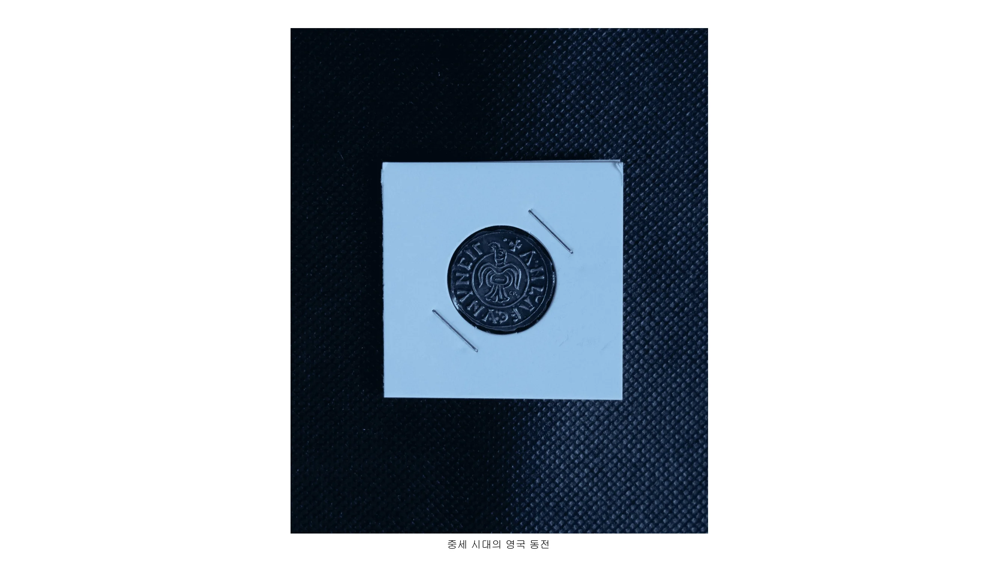

중세 시대에 유럽은 로마 화폐 제도의 붕괴와 함께 봉건주의에 빠졌습니다. 대부분의 인구는 가치가 낮은 구리나 청동 동전을 사용했고, 종종 화폐 가치가 희석되어 장거리 무역에 제한이 있었습니다.

결제 수단으로서 주화의 부활은 점차적으로 이루어졌으며, 13세기에는 1252년 피렌체에서 금화 플로린이 등장하고 베니스에서 금화 두카트가 등장하면서 절정에 이르렀습니다. 이러한 금화는 무역의 확대와 신뢰할 수 있고 국제적으로 통용되는 결제 수단에 대한 필요성이 커지면서 널리 사용되었습니다.

영국에서는 1066년 이후 정복자 윌리엄이 도입한 토지세와 같은 혁신적인 재정 정책으로 화폐 시스템이 희석되지 않도록 보호하여 페니 스털링의 가치를 보존할 수 있었습니다. 여기서 중요한 점은 당시 주권자는 국가 재정을 위해 통화의 가치를 떨어뜨릴 수 있었고, **이 세금의 도입으로 조세를 통해 통화를 안정적으로 유지하고 국가 재정을 조달할 수 있었다는 점입니다**

그러나 화폐 희석을 통해 이익을 얻고자 하는 유혹은 12세기 헨리 1세 때 주화의 질이 급격히 떨어졌던 것처럼 위기로 이어졌습니다. 때때로 주조업자에 대한 폭력적인 조치를 동반한 엄격한 개혁으로 화폐에 대한 신뢰가 일시적으로 회복되었습니다.

중세 시대에는 영국에서 고리대금업 금지를 우회하고 신용을 확장하기 위해 계수봉을 사용하는 등 정교한 금융 관행이 등장하기도 했습니다. 교회는 이자가 붙는 대출을 그다지 좋아하지 않았기 때문에 이자 사용 금지를 회피하기 위해 다양한 기법이 사용되었습니다.

이러한 혁신은 만성적인 금속 화폐 부족에 대한 대응책이었으며, 초기 금융 시장의 출현을 촉진했습니다.

한편 십자군 전쟁은 지중해 무역을 활성화하여 국제 교류와 새로운 금융 관행의 발전을 촉진했으며, 특히 기사단 기사단을 통해 새로운 은행업이 탄생했습니다. 기사단은 중요한 금융 중개자가 되어 십자군이 고국에서 멀리 떨어진 곳에서도 유동성을 확보할 수 있게 해주었고, 이는 현대 유럽 은행 시스템의 선구자가 되었습니다.

기사단과의 연결고리를 만들기 위해 아래에서 중앙에 아름다운 십자가를 볼 수 있는 프랑스 중세 동전을 관찰할 수 있습니다. 이 시대의 동전에는 이 십자가가 새겨져 있는 것이 꽤 흔했습니다.

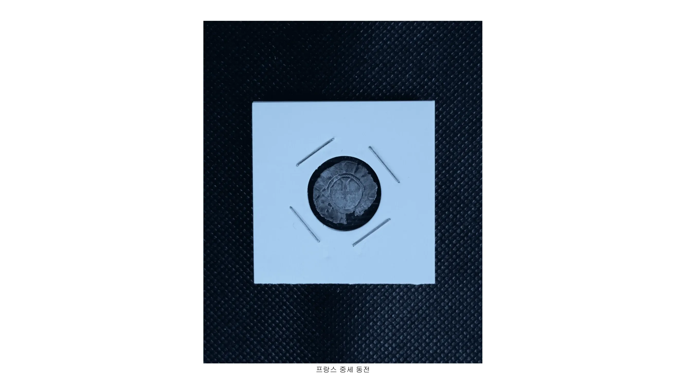

마지막으로 흑사병(1346-1353)과 같은 중대한 위기는 경제에 큰 변화를 가져왔습니다. 인구의 급격한 감소는 임금의 급격한 상승으로 이어졌고, 이전 수준의 보수를 유지하려는 정부의 시도를 무색하게 만들었습니다.

동시에 백년전쟁(1337-1453)으로 인해 국가는 군대 자금을 조달하기 위해 더욱 공격적인 재정 정책을 채택해야 했고, 이는 봉건 제도의 약화에 기여했습니다.

따라서 중세 시대는 무역을 위한 신뢰할 수 있는 화폐의 필요성과 즉각적인 이익을 위해 화폐를 희석하려는 통치자들의 끊임없는 유혹 사이에서 끊임없는 긴장으로 점철되어 있었습니다. 이러한 갈등은 유럽의 화폐 발전에 큰 영향을 미쳤고, 현대 경제 시스템의 토대를 마련했습니다.

이 섹션을 마무리하면서 이 무렵 영국에서 있었던 흥미로운 일화를 하나 덧붙이고자 합니다. 이 일화는 글린 데이비스가 쓴 "돈의 역사"라는 책에서 발췌한 것입니다.

영국에서는 의회로의 전환으로 부채의 부담이 주권자에게서 의회로 이전되어 만성적인 국가 부채가 발생했다고 언급합니다. 그 전에는 부채가 주권자의 어깨를 짓눌렀습니다.

의회가 화폐 발행 권한의 일부를 장악하게 되자 왕이 아닌 국민이 부담하는 장기 부채를 만들 수 있게 되었습니다. 이전에는 왕이 파산하거나 왕이 바뀌면 부채는 왕과 함께 소멸되었습니다.

의회에서 부채를 창출하는 순간, 시간이 지남에 따라 잠재적으로 무제한이 될 수 있는 국채라는 개념이 등장합니다. 국가가 존재하는 한, 의회가 존재하는 한 이 부채는 존재하며, 의회는 부채를 재융자하고 시간이 지남에 따라 부채를 분산시킬 수 있는 모든 방법을 찾아야 했습니다. 이러한 부채를 보증하거나 부담하는 주체가 더 이상 왕이나 왕족이 아니라 의회와 시민으로 바뀌는 패러다임의 전환이 일어난 것입니다.

## 르네상스

<chapterId>1d1dfb05-70b4-5b7b-9708-373c2182950d</chapterId>

:::video id=4977b4f3-c7b2-41a5-ad7b-a96a8cca4092:::

이제 르네상스라고 알려진 시대에 대해 이야기하는 섹션에 도달했습니다. 이 이야기는 배에 탑승한 쥐에 의해 전염병이 급속도로 확산되는 비극적인 위기를 배경으로 진행됩니다. 하지만 이 비극은 중세 시대 무역과 여행의 성장에 대해 알려줍니다. 이 시기 이전에는 그렇게 많은 사람들이 그렇게 멀리, 그렇게 빠르게 이동하지 않았습니다.

### 피렌체의 플로린

르네상스 시대에 금화가 유럽으로 돌아온 것은 화폐 역사의 근본적인 전환점이 되었습니다. **로마 멸망 이후 유럽에서 최초로 주조된 주요 금화인 1252년 피렌체의 플로린에서 시작되었습니다**. 플로린은 놀랍도록 일정한 무게와 순도(순금 약 3.5g)로 4세기 동안 변함없이 유지되어 범유럽의 필수 화폐 기준으로 빠르게 자리 잡았습니다.

아래에서 백랍으로 만든 금색 플로랭을 재현한 것을 볼 수 있습니다. 플로랭은 프랑스 예술가가 수작업으로 조각하고 스탬프를 찍어 만든 훌륭한 작품입니다.

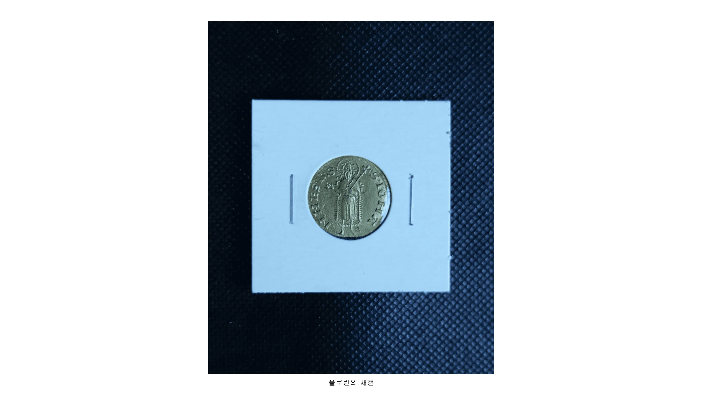

금화로의 복귀는 비잔틴 솔리두스의 붕괴와 몽골의 침략으로 인한 이슬람 세계의 경제적 쇠퇴로 국제 무역에서 화폐 공백이 발생했다는 특정한 맥락에 의해 주도되었습니다.

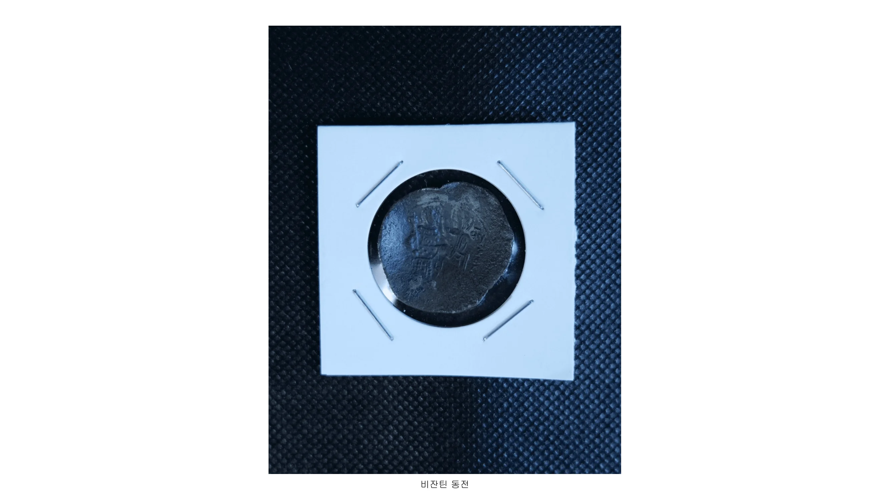

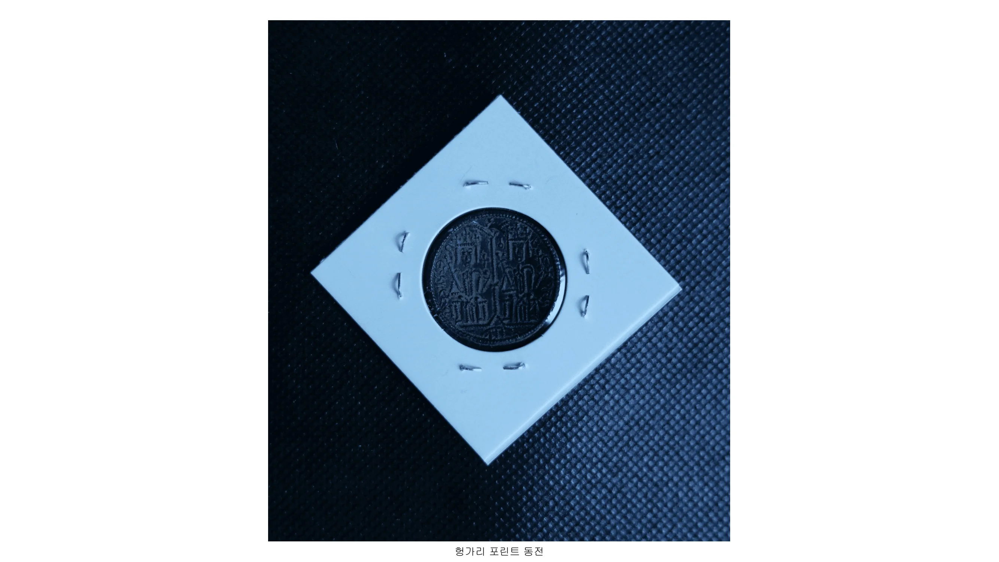

위의 첫 번째 이미지는 제가 꽤 흥미롭게 생각하는 비잔틴 동전을 보여줍니다. 같은 시대의 헝가리 동전(위 두 번째 이미지)과 비교해 보겠습니다. 헝가리 동전은 미니어처 그릇처럼 컵 모양입니다. 도상에는 나란히 십자가를 들고 있는 왕으로 묘사된 종교적 인물이 그려져 있습니다. 이 작품은 그릇 모양이며 헝가리에서 유래했습니다.

다른 나라의 동전을 모방하는 것은 꽤나 관습적인 일이었습니다. 비잔틴 동전이 일반적으로 통용되었기 때문에 다른 나라에서도 이를 모방하는 경우가 많았죠. 나란히 비교해보면 알 수 있듯이 이 주화들은 매우 유사합니다.

피렌체, 베네치아, 제노바를 비롯한 북부 이탈리아는 이러한 상황을 활용하여 안정적인 귀금속 함량을 지닌 새로운 경화, 즉 경화 주화를 발행했습니다. 베니스는 피렌체의 뒤를 이어 1270년에 플로린과 거의 동일한 화폐인 두카트를 주조하여 지중해 무역에서 널리 사용되었습니다.

플로린은 14세기 말까지 150개 이상의 유럽 도시에서 채택된 최초의 국제 준비 통화가 되었습니다. 메디치 가문이 주도한 대규모 피렌체 은행 네트워크가 만들어지면서 화폐 및 회계 관리가 철저하게 현대화되었고, 금을 물리적으로 운반할 필요성까지 줄어들었습니다.

이는 또 다른 흥미로운 점입니다. 해상 항해 중 많은 동전이 분실되던 시절이 있었습니다. 이러한 기술 발전, 즉 복식부기 방식의 장부 덕분에 경전 화폐를 만들 수 있었습니다. 이를 통해 동전 결제 횟수를 줄이고 대신 서면 입력 시스템을 사용할 수 있게 되어 운송 중 손실 위험을 크게 줄일 수 있었습니다.

화폐의 발전과 함께 은행 업무 방식도 크게 발전했습니다. 중세 유럽은 십자군 원정이 이슬람 은행 관행과 접촉하면서 부분적으로 영감을 받아 13세기 초에 피렌체, 베니스, 바르셀로나, 제노바에서 초보적인 은행 시스템이 등장했습니다. 종교 및 군사 단체인 기사단은 이미 십자군이 재산을 가지고 다니지 않고도 여행할 수 있는 시스템을 개발했습니다.

그들은 자국의 기사단 사무소에 자금을 예치한 다음 편지와 함께 여행하여 십자군 목적지에 도착하면 동전을 수령할 수 있었습니다.

귀금속 동전을 들고 다닐 필요가 없다는 뜻입니다.

13세기 마르코 폴로의 여행 덕분에 유럽이 중국에 지폐가 존재한다는 사실을 알게 된 것도 이 시기였습니다. 하지만 유럽은 금속 주조 방식을 먼저 완성하는 것을 선호했기 때문에 지폐의 개발은 몇 세기를 기다려야 했습니다. 유명한 공인 회계사인 루카 파치올리와 친분이 있던 레오나르도 다빈치는 화폐 인쇄기의 개선에 적극적으로 기여하여 더 빠르고 균일한 동전 생산을 촉진했습니다.

이 과정의 앞부분에서 언급한 진자 주조 기법을 언급하고 있습니다. 이 방법을 사용하면 망치 타격에 비해 더 균일한 주화를 생산할 수 있으며, 앞서 설명한 것처럼 주화 가장자리에 각인을 새길 수 있습니다. 아래 사진은 1793년의 유럽 탈러로, 테두리에 글씨가 선명하게 남아 있습니다.

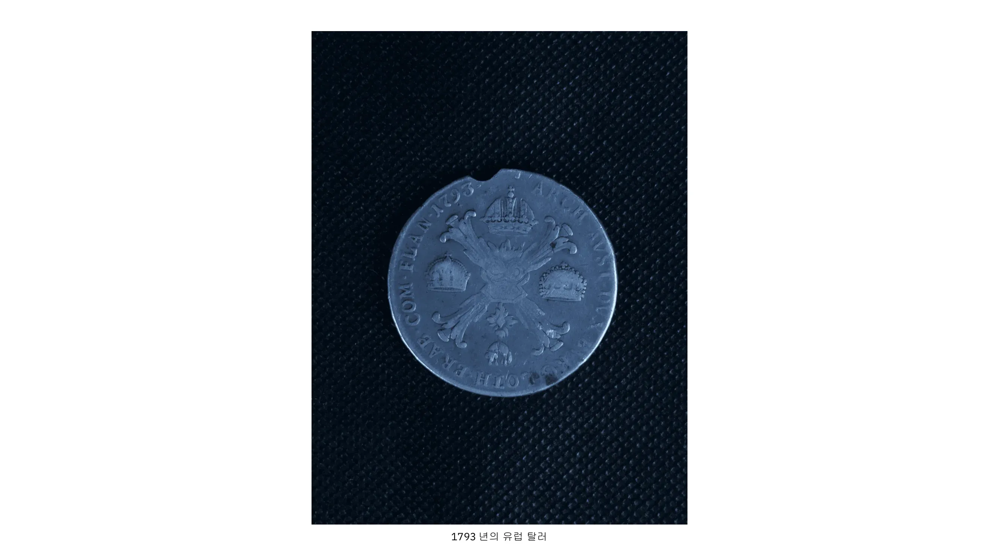

그러나 15세기에 유럽은 심각한 통화 위기를 겪었고, 1450년경에는 유럽 화폐의 은 함량이 5% 미만으로 떨어지는 등 전반적으로 악화되었습니다.

16세기 이후 아라곤 왕국과 카스티야 왕국의 연합, 레콘키스타의 종식, 1492년 크리스토퍼 콜럼버스의 위대한 해양 발견 등의 영향으로 화폐의 무게 중심이 스페인으로 옮겨갔습니다. 미국 광산에서 은이 대량으로 유입되면서 유럽과 세계 경제의 균형이 크게 흔들렸고 인플레이션과 새로운 지정학적 긴장을 불러일으켰습니다.

르네상스 시대에는 "달러"라는 용어의 기원이 된 탈러(요아힘슈탈러)와 같은 주화가 등장하면서 주화의 예술적 진화도 두드러졌습니다. 이 대형 은화는 북유럽의 기술 혁신으로 가능해진 새로운 예술적, 기계적 주조 기술을 반영합니다.

마지막으로 금융 르네상스는 은행, 신용 및 금융 시장의 발전과 암스테르담, 런던, 스톡홀름의 대 상업 도시에서 최초의 근대 자본주의 형태가 등장하면서 오늘날 우리가 알고 있는 국제 금융 시스템의 토대를 마련하는 등 경제적 근대로의 전환을 이끌었습니다. 이것이 바로 다음 동영상의 주제입니다.

# 국가에 의한 금전 압류

<partId>17cfb1b4-5bc1-53e0-b035-05c7cf76be92</partId>

## 전 세계 기축통화의 진화

<chapterId>d65cc352-e7ca-5f03-9b23-dd1fae5c0395</chapterId>

:::video id=82710062-8fff-426c-93af-923c08d82233:::

### 귀금속의 역사적 중요성

준비 통화와 중앙은행의 출현에 관한 이 섹션에 오신 것을 환영합니다. 이 새로운 섹션의 첫 번째 포인트로 글로벌 준비 통화의 진화에 대해 집중적으로 살펴보겠습니다.

귀금속, 특히 금과 은은 오랫동안 제국에서 부와 권력의 근간으로 여겨져 왔습니다. 금에 대한 갈망은 항상 지배적인 원동력이었으며, 유럽의 화폐 발전에 가장 직접적이고 명백한 영향을 미친 것은 귀금속의 유입이었습니다. 중세와 초기 르네상스 시대에 금과 은에 대한 집착은 다른 형태의 상품으로는 가치를 유지하기 어려웠을 뿐만 아니라 특히 동양과의 무역에서 외국 세력의 강력한 수요 때문이었습니다.

수세기에 걸쳐 여러 제국이 세계 경제의 중심지로서 서로를 계승해 왔습니다. 특정 기간 동안 세계 무역을 지배하는 국가는 일반적으로 기축 통화 지위를 부여받습니다. 여기에는 다음이 포함됩니다:

- 스페인과 포르투갈(15세기 및 16세기)

- 17세기 네덜란드의 연합 주(네덜란드)

- 18세기와 19세기의 프랑스와 영국

- 20세기의 미국

### 포르투갈의 붐과 레알(1450-1530)

**포르투갈**은 비교적 균일한 무게의 은화인 **포르투갈 레알**을 통해 15세기 후반과 16세기 초 세계 무역을 지배했습니다. 포르투갈은 항해술의 발전 덕분에 아프리카, 아시아, 신대륙으로 향하는 새로운 항로를 발견했습니다. 아프리카에서 중국(마카오)까지 군사 요새와 교역소가 늘어났습니다.

유럽의 금과 은에 대한 수요에 대응하여 "위대한 발견의 끊임없는 동기는 상업적 이익, 특히 금과 은에 대한 추구였습니다." 그러나 포르투갈 제국은 지나치게 확장된 상태에서 네덜란드, 영국, 프랑스와의 경쟁에 직면하면서 쇠퇴하기 시작했습니다.

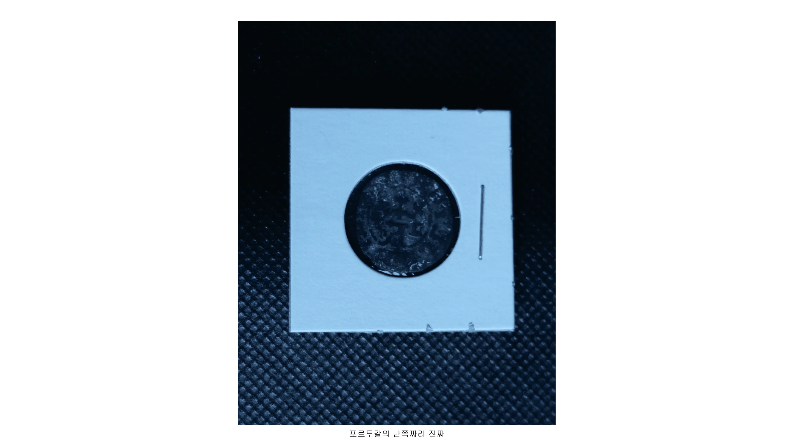

위 사진에서 해양 정복 당시의 포르투갈 하프 리얼을 볼 수 있습니다.

### 스페인의 정점과 스페인 달러(1535~17세기)

신대륙 정복과 함께 **스페인**이 지배적인 플레이어가 되었습니다. 거대한 은광(볼리비아의 포토시, 멕시코의 사카테카스)을 지배한 스페인 군주는 순은으로 화폐를 주조하는 데 성공하여 자국 화폐인 **스페인 레알**의 가치 하락을 피할 수 있었습니다

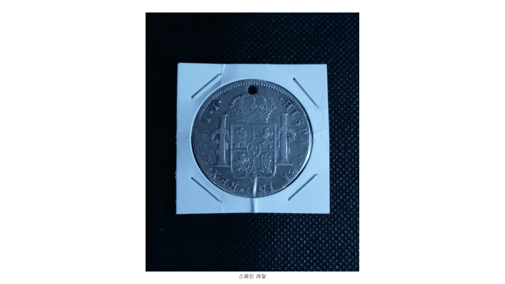

"8조각"이라고도 알려진 스페인 레알은 작은 동전을 만들기 위해 8조각으로 잘라 사용했기 때문에 이런 별명을 얻었습니다. 스페인 달러라고도 합니다. 위에 보이는 동전은 1814년에 발행된 것으로, 조금 더 최근의 예시입니다. 하지만 최초의 스페인 달러 동전은 정제되지 않았으며 망치로 두드려서 일반적으로 덜 둥글고 선명하지 않았습니다.

특히 흥미로운 점은 당시 스페인 달러가 국제 준비 통화로 사용되었다는 점입니다. 스페인 당국은 또한 자국 화폐인 마라베디를 발행하고 정기적으로 리콜을 통해 화폐 공급량을 조정했습니다. 예를 들어, 처음에 1마라베디의 가치가 있는 구리 또는 청동 동전을 리콜하여 "2"로 찍고, 나중에 "4"로 찍는 식으로 "8"까지 찍을 수 있었습니다 고해상도 사진에서 동전에 찍힌 "8"을 선명하게 볼 수 있습니다. 이 방법은 통화 공급을 효과적으로 확대했고, 이는 필연적으로 인플레이션으로 이어졌습니다.

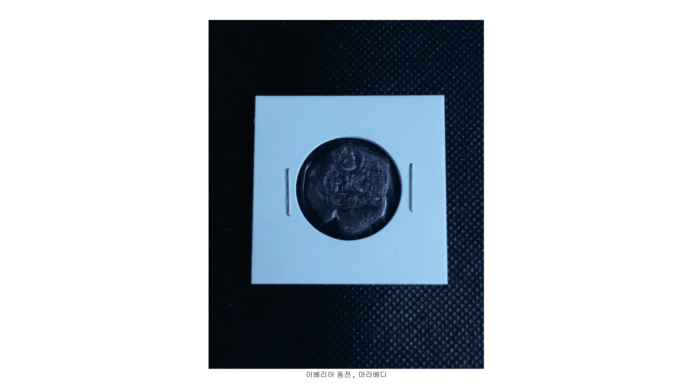

기축통화의 역사를 살펴보면 흥미로운 점이 드러나는데, 제국들이 기축통화 지위를 유지하는 동안에는 통화를 부풀리지 않았다는 점입니다. **지배가 끝날 무렵에야 통화의 가치를 떨어뜨려 이 특권을 잃고 새로운 제국에게 넘겨주었습니다**.

스페인에서는 스페인 달러가 거의 200년 동안 세계 무역, 특히 중국과 유럽 간의 무역을 지배했습니다. 심지어 중국 항구에서도 이 동전을 발견할 수 있었습니다. 미국 달러는 바로 이 화폐에서 유래한 것으로 역사에서 힌트를 얻을 수 있습니다. 미국은 1792년 건국 당시 자국 화폐를 주조하는 법을 통과시켰고, 최초의 달러는 이름과 동전 크기 모두 스페인 달러를 모델로 만들어졌습니다.

미국 달러는 오늘날 우리가 알고 있는 지폐와는 달리 원래 무게가 1온스, 오늘날 돈으로 30~40유로 정도 되는 은화였기 때문에 그 가치를 짐작할 수 있습니다. 스페인 달러의 경우 최초의 진정한 글로벌 통화로 간주될 정도로 널리 유통되었습니다.

그러나 아메리카 대륙에서 유입된 귀금속은 유럽에서 인플레이션을 일으켰습니다. 가격 혁명(1540~1640년경) 기간 동안 영국의 생활비는 7배나 증가했습니다. 스페인에서는 풍부한 은이 자원의 저주 효과를 가져와 견고한 은행 기관의 발전을 저해했습니다.

그 후 스페인은 수많은 군사 분쟁(플랑드르, 네덜란드, 30년 전쟁)에 직면했고 재정은 점차 파탄에 이르렀습니다. 역대 통치자들은 세계적으로 유명한 은화의 가치를 떨어뜨리는 대신 현지 주민들이 사용하는 구리 동전(벨론)의 가치를 떨어뜨리거나 부도 처리하는 방법을 선택했습니다. 앞서 마라베디스족에 대해 설명한 바 있습니다.

### 네덜란드의 부상(17세기)

이베리아 정복 이후 17세기에 **네덜란드**는 새로운 상업 강국으로 부상했습니다. 해상 무역, VOC(네덜란드 동인도 회사), (앤트워프에서 영감을 얻은) **암스테르담 주식 Exchange**의 설립으로 이 상인 공화국은 허브로 자리 잡았습니다.

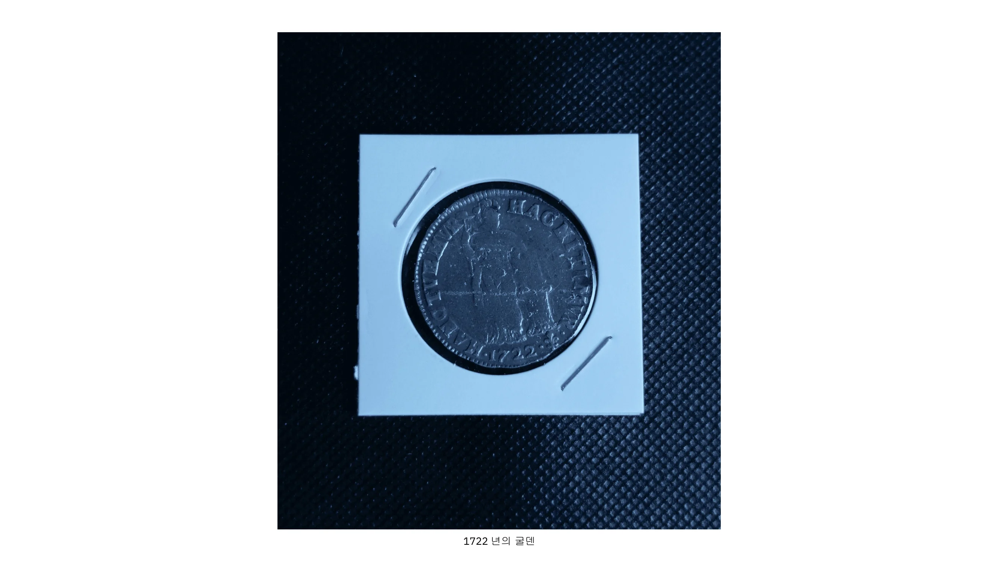

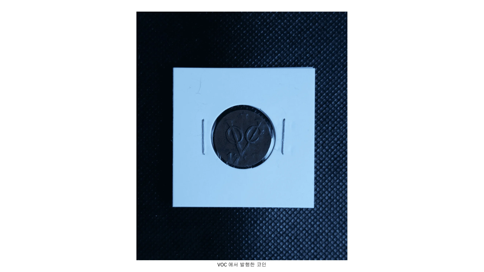

위의 첫 번째 사진에서는 1722년의 굴덴(아름다운 은화)을 볼 수 있고, 두 번째 사진에서는 VOC에서 발행한 동전이 있습니다.

VOC는 자체 군대를 보유하고 자체 화폐까지 발행할 정도로 당시로서는 매우 강력한 회사였습니다.

네덜란드는 신대륙 탐험이나 새로운 무역로 개척과 같은 위험한 모험에서 위험을 분산하기 위한 수단으로 시작된 근대 자본주의를 발명했습니다. 주식회사를 통해 여러 투자자가 자금을 모아 위험을 분담할 수 있었습니다. 이러한 교환을 촉진하기 위해서는 이러한 증권을 협상하고 교환할 수 있는 기관을 만들어야 했습니다. 따라서 1602년 최초의 주식회사와 증권거래소가 탄생했습니다.

네덜란드 화폐인 **굴덴**은 순은으로 만들어져 신뢰를 얻었고, 1609년 암스테르담 은행이 이를 채택하면서 유럽에서 예금이 선호되는 화폐 형태로 자리 잡았습니다. 이것은 언급해야 할 매우 중요한 포인트입니다. 물론 동전도 있었지만 당시의 진정한 화폐는 경전의 한 형태였습니다. 실제로 전 세계 무역의 대부분은 암스테르담 은행의 장부를 통해 이루어졌습니다. 국제 무역은 더 이상 실물 동전이 아니라 은행의 회계 기록을 통해 직접 이루어졌기 때문에 이것은 진정한 은행의 혁신이었습니다.

이 번영의 시기는 특히 인플레이션이나 통화 통제를 시행하는 다른 나라에서 금과 은이 대량으로 유입된 시기였습니다. 흥미로운 인물이 하나 있습니다: **토마스 그레샴**. 당시 그는 네덜란드에서 영국 왕족을 위해 일하며 두 나라 간의 자금 흐름을 관리했습니다. 바로 이 그레샴이 우리에게 유명한 **"그레샴 법칙"**을 남겼습니다.

그럼에도 불구하고 네덜란드 제국도 결국 힘을 다하지 못했습니다. 영국과의 전쟁, 분쟁으로 인한 굴덴의 희석, 다른 강대국(프랑스와 영국)과의 경쟁은 네덜란드 패권의 종말을 알렸습니다. 제4차 영-네덜란드 전쟁(1780-84년) 이후, 준비 통화로서의 굴덴의 쇠퇴는 돌이킬 수 없는 상황이 되었습니다.

### 프랑스의 권력, 야망과 실패(17~18세기)

루이 14세 때 **프랑스**는 유럽에서 가장 위대한 대륙 강국이 되었습니다. 그러나 프랑스 통화는 수많은 평가 절하, 무거운 세금, 비용이 많이 드는 전쟁(아우크스부르크 동맹, 스페인 계승 전쟁 등)으로 인해 통화 시스템의 안정성에 큰 부담을 주었기 때문에 지배적인 기축 통화로서의 지위를 얻지 못했습니다.

지폐의 첫 번째 주요 실험은 존 로(1716-1720)에 의해 수행되었습니다. 프랑스 중앙은행은 정부 부채 약속을 담보로 지폐를 발행했습니다. 이 계획은 1720년 투기 거품과 붕괴(미시시피 버블)로 이어졌습니다. 이 재앙으로 프랑스는 지폐에 대한 지속적인 불신을 갖게 되었습니다. 이 비참한 경험을 통해 리처드 칸티용은 화폐 인쇄가 인쇄기에 접근할 수 있는 사람들을 부유하게 만드는 '칸티용 효과'로 알려진 원칙을 명시하는 시스템 덕분에 부자가 될 수 있었습니다.

이러한 불신이 마침내 사라졌을 때, 또 다른 프랑스 지폐의 실패는 혁명적인 **아싸낫**이었습니다. 1790년부터 성직자 재산 몰수에 근거해 발행된 이 지폐는 급격한 하이퍼인플레이션을 경험했고, 공식적으로 역사상 최초로 월 50%를 초과하는 하이퍼인플레이션을 기록했습니다. 1795년에는 액면가가 몇 배나 올랐음에도 불구하고 초기 가치의 몇 퍼센트에 불과한 가격에 거래되었습니다.

더 제한적인 법률을 제정해 아사르파트를 부과하려 했지만 성공하지 못했습니다. 정부는 이를 받아들이지 않는 사람들을 사형에 처하겠다고 협박하고 상점 주인들에게 계속 영업을 하도록 강요하는 등 강제로 시행하려고 했습니다. 하지만 물론 결국에는 효과가 없었습니다.

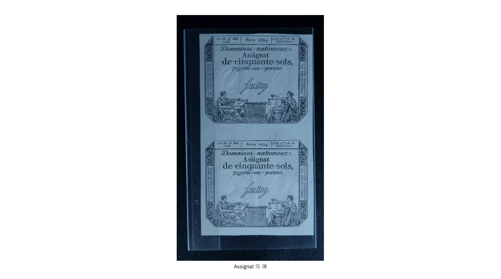

이 지폐가 모든 고급 귀금속 주화를 대체하면서 유명한 그레샴의 법칙에 따라 동전 부족 현상이 발생했습니다. 새로운 동전을 주조하기 위해 성직자들로부터 압수한 종 금속을 사용했습니다. 아래에서 성직자들로부터 압수한 동전을 녹여 회수한 구리로 만든 아름다운 종 금속 조각을 볼 수 있습니다.

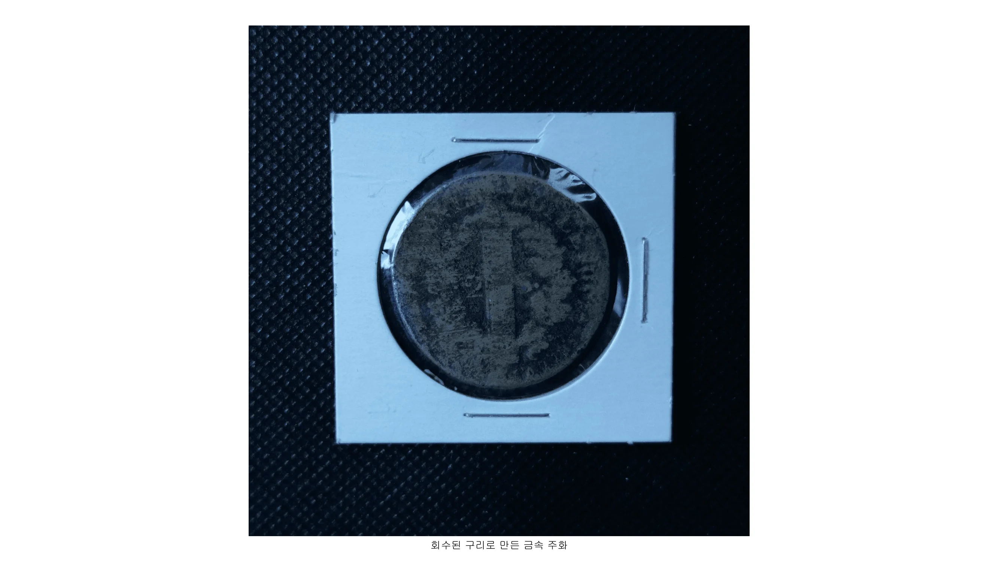

### 영국의 지배(18세기~20세기 초)

*네덜란드를 추월한 *잉글랜드**가 18세기에 지배적인 강국이 되었습니다. 파운드화는 현재 사용되고 있는 가장 오래된 화폐로, 원래는 은 1파운드에 연동되어 있었습니다. 의회 군주제, 강력한 세금 징수 능력, 1694년 영란은행 설립 등 금융 및 재정 혁명에 힘입어 점차 그 위상이 강해졌습니다.

영국은 프랑스와의 전쟁을 연이어 치른 끝에 1815년 워털루 전투에서 승리하며 패권을 확인했습니다. 19세기 내내 파운드화는 세계 기축 통화 역할을 했습니다. 전성기에는 전 세계 인구의 2.5%에 불과했던 영국이 전 세계 소득의 20%를 생산하고 지구 표면의 거의 4분의 1을 지배했습니다.

산업혁명과 금본위제(1717년 또는 1718년, 왕립 조폐국의 아이작 뉴턴 감독 하에)의 채택으로 파운드화의 신뢰도가 더욱 높아졌습니다. 잉글랜드 은행은 금 1온스당 4.25파운드의 금본위제를 채택하여 지폐 소지자가 지폐를 금으로 전환할 수 있도록 했습니다.

하지만 제1차 세계대전(1914~1918년)으로 인해 이 시스템은 종말을 고했습니다. 몇 주 만에 모든 주요 전쟁 강대국들이 금 전환을 중단했습니다. 대영제국과 이후 파운드화는 약화된 상태로 2차 세계대전이 끝나고 20세기에 미국 달러에 자리를 내주었습니다.

그리고 유물로서 아래에서 아름답고 흥미로운 작품을 볼 수 있습니다. 이들은 화폐 도량형입니다. 첫 번째는 파운드의 초기 표현인 소버린입니다. 실제 주화를 살 여유가 없어서 이 동전들을 표현하기 위해 화폐 추만 가지고 있습니다. 저울을 사용하여 무게를 측정한 다음 반대편에 주권의 가치에 해당하는 화폐 추를 놓았습니다.

주화는 원래 1파운드의 가치가 있는 금화였습니다.

유명한 주권 이전에는 같은 원리로 운영된 기니가 있었습니다. 기니는 기니 지역에서 공급되는 귀금속을 함유하고 있어 기니라는 이름이 붙여졌습니다.

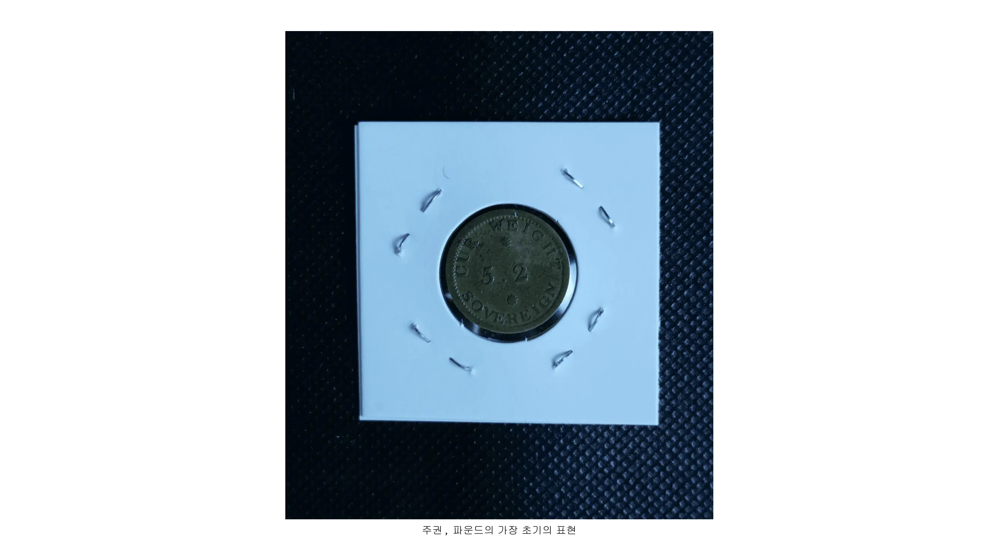

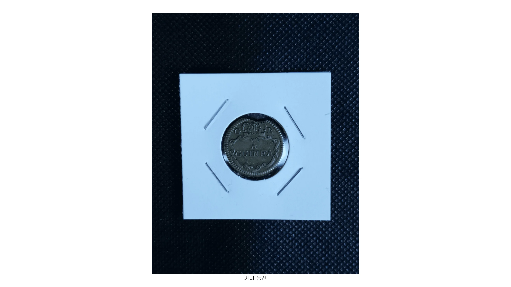

## 중앙 은행의 등장

<chapterId>15777771-1e28-55f7-a400-69868a47079b</chapterId>

:::video id=7661b7b5-e00f-48f3-b69a-6fb2eb5ebba4:::

최초의 준비 통화의 역사와 그 진화에 대한 이 섹션에 이어 이번에는 중앙은행의 출현에 대해 알아보겠습니다. 준비 통화의 출현과 거의 동일한 경로를 따르지만, 당시의 은행 기술에 조금 더 초점을 맞춥니다.

### 은행과 프로토뱅크의 시작

13세기 초, 이탈리아(피렌체, 제노바, 베니스 등)에서는 복식부기 회계 기법을 개발했습니다. 이후 **앤트워프**(16세기)는 북유럽의 주요 금융 중심지가 되었고, 그 역할은 VOC 주식이 거래된 암스테르담 증권거래소 Exchange(1609년) 덕분에 **암스테르담**가 이어받게 되었습니다.

앤트워프에서는 상인들이 빚을 갚기 위해 자주 모이는 상인 박람회가 열렸고, 새로운 금융 상품이 발명되었습니다. 1761년 이후에 발행된 아래 지폐는 **약속 어음**입니다. 뒷면에 비문과 함께 손으로 쓴 세부 사항이 있어 그 시대의 훌륭한 유물입니다.

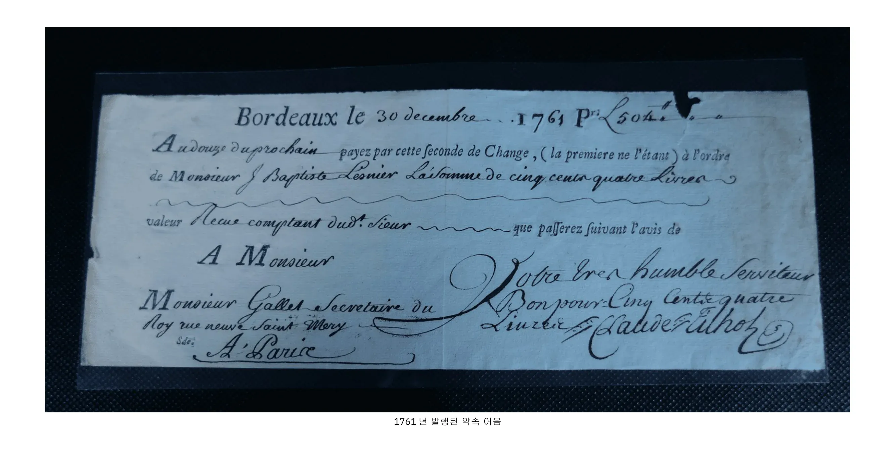

이러한 발포는 보다 정교한 금융 기관의 탄생으로 이어졌습니다. **롬바르드 은행가**와 이후 네덜란드 상인들은 신용 상품(환어음, 약속어음 등)을 완성했습니다. 현대 은행 시스템은 화폐가 단순한 금속이 아니라 신용이 될 수 있다는 아이디어를 기반으로 합니다.

보시다시피, 이것은 돈의 기원에 대한 원래의 질문으로 돌아갑니다.

화폐는 교환의 필요성에서 비롯된 상품에서 비롯된 것일까요, 아니면 신용에서 비롯된 것일까요? 이 섹션에서는 이에 대한 흔적을 여전히 찾아볼 수 있습니다.

### 스웨덴의 사례: 스톡홀름 방코와 릭센 스텐더스 은행의 사례

최초의 중앙은행이 탄생한 스웨덴으로 이동해 보겠습니다.

**1657년 요한 팜스트루흐는 금속 보유량 이상의 대출을 허가받은 **스톡홀름 방코**를 설립하여 [부분 준비금 은행](https://planb.academy/resources/glossary/fractional-reserves)의 탄생을 알린 중앙 은행의 선구자였습니다. 하지만 과도한 지폐 발행으로 인해 1663년 공황이 발생하고 은행이 파산했습니다. 글쎄요, 글쎄요...

1668년, 세계 최초의 진정한 중앙은행인 릭스 스텐더스 은행이 스톡홀름에 설립되었습니다. 그러나 이 은행 역시 왕국의 전쟁 자금 조달을 위한 지폐 남용과 관련된 위기(1709년, 1715년...)로 어려움을 겪었습니다.

### 존 로의 실패한 쿠데타

우리가 사랑하는 존 로를 다시 한 번 만날 수 있는 프랑스로 향합니다.

*스코틀랜드인 *존 로**는 섭정(오를레앙 공작)을 설득하여 금, 은, 정부 부채에 대한 어음 발행 권한을 가진 민간 은행인 방크 제네랄(1716년)을 설립했습니다. 이 은행은 1718년 은행 로얄(Banque Royale)이 되었고, 미시시피 회사의 주가가 치솟는 데 큰 도움이 되었습니다.

현실이 투기를 따라잡자 **금 보유를 금지하고 로의 노트 사용을 강제하는 결정으로 공황은 더욱 악화되었습니다**. 글쎄, 글쎄...

결국 1720년에 거품이 터지면서 프랑스 지폐의 신뢰도가 무너졌고, 이후 오랫동안 지폐의 신뢰도가 떨어졌습니다.

### 암스테르담 은행, 선구적인 모델의 부상

이제 1609년 암스테르담으로 이동하여 **암스테르담 은행**(비셀뱅크)이 암스테르담의 동전 보관 및 전환을 통제했습니다. 이 은행은 개인 지폐의 유통을 금지하고 금고에 금속 동전을 보관하도록 강제했습니다. 조금씩 화폐에 대한 통제권을 장악해 나갔습니다. 그들은 환전상들이 동전을 보관하는 것을 금지했습니다. 환전상들은 하루 종일 일하고 하루가 끝나면 암스테르담 은행의 금고에 동전을 입금해야 했습니다. 앞서 언급했듯이 국제 무역에 사용된 동전은 반드시 금속 동전이 아니었습니다. 은행 장부에는 성경에 기록된 화폐가 있었습니다.

네덜란드 상인들의 힘 덕분에 이 은행은 사실상 최초의 '중앙은행'으로서 세계 무역을 안정시키는 역할을 했습니다. 그러나 시간이 지남에 따라 VOC에 무담보 대출을 제공했고 결국 어음을 뒷받침할 금속이 부족해졌습니다. 1790년에는 VOC에 거액을 빌려준 사실이 드러나면서 사실상 파산을 선언했고, 굴덴의 신뢰도는 땅에 떨어졌습니다. 글쎄요, 글쎄요...

### 현대 은행업의 창시자, 영란은행

17세기 영국에서는 금과 은을 보관하고 영수증을 발행하는 금세공인이 있었습니다. 부분적으로 분산된 이 조직은 프랑스와의 전쟁을 위해 막대한 자금이 필요하게 되자 그 한계를 드러냈습니다.

1694년, **영국은행(BoE)**이 설립되었습니다. 영국 은행은 전쟁 자금 마련이 절실했던 런던의 재계와 정부의 이해관계가 맞아떨어져 탄생한 은행입니다.

영국 은행은 영국에서 지폐 발행에 대한 독점권을 획득했습니다(1708년, 1742년 등 강화). 그 후부터 금 보유고로 뒷받침되는 지폐가 동전과 함께 유통되었습니다. 이는 국가 기관이 화폐를 점진적으로 인수하는 과정을 이해하는 데 중요한 포인트입니다. 먼저 암스테르담 은행은 환전상들이 동전을 보관하는 것을 금지하고 은행에 반환하도록 강제했습니다. 영국에서는 민간 은행이 금으로 상환할 수 있는 자체 지폐를 발행하는 것이 금지되었습니다.

민간 은행에서 지폐를 발행할 수 있도록 허용했지만, 영국은행 지폐로만 교환할 수 있었습니다.

잉글랜드 은행 지폐인 파운드화 지폐는 금으로 교환할 수 있었습니다. 이것은 화폐에 세 번째 계층을 추가했습니다. 즉, 금을 기본으로 하고 그 위에 잉글랜드 은행 지폐, 그리고 그 위에 민간 은행 지폐가 있는 것입니다. 그 전에는 민간 은행이 자체적으로 금으로 상환 가능한 지폐를 발행할 수 있었습니다. 이것은 국가 기관이 통화를 점진적으로 인수하는 또 다른 단계입니다.

은행은 막대한 대출을 통해 국가에 자금을 조달하고 경제 호황을 뒷받침하는 막대한 공공 부채를 구조화했습니다.

이 모델은 18세기와 19세기를 거치면서 영국 은행의 인장과 금본위제 아래 파운드화가 세계 기축 통화가 될 정도로 공고해졌습니다.

**세계 기축 통화**는 수세기 동안 국가 또는 제국의 경제, 상업, 군사력에 따라 서로 영향을 주고받으며 발전해 왔습니다: 포르투갈, 스페인, 네덜란드, 영국을 거쳐 20세기에 미국이 지배적인 지위를 차지하기 전까지 말입니다. 각각의 경우 경제 확장, 상업적 성공, 국제적 통화 채택, 부채, 비용이 많이 드는 전쟁, 화폐 발행 또는 신용의 남용, 그리고 마침내 쇠퇴라는 비슷한 주기를 보았습니다.

**중앙은행의 출현**은 점진적인 과정이었습니다. 이러한 기관은 종종 비용이 많이 드는 전쟁의 맥락에서 생겨났으며, 국가가 부채를 통해 자금을 조달할 수 있도록 했습니다. 금본위제가 채택되었을 때(영국, 17~19세기), 금본위제는 20세기 세계 대전을 거치면서 점차 금화 전환이 포기될 때까지 안정의 기반을 제공했습니다. 따라서 화폐 주조 권한은 왕실의 독점권에서 처음에는 민간(금세공업자, 은행가), 그다음에는 준공공(중앙은행)이라는 보다 복잡한 기관으로 이동했으며, 이는 화폐 주권이 제도화되고 세계화된 형태로 진화하는 것을 반영합니다.

이것이 바로 제가 앞서 설명했던 것입니다. 우리는 종종 국가 부채의 부담을 중앙은행이나 의회와 같은 법적 기관의 화폐 발행 권한으로 직접 전가해 왔습니다.

그리고 여기서 가장 중요한 사실은 **주권자의 파산으로 사라질 수 있는 부채에서 주로 국민들의 어깨에 짊어진 부채로 바뀌었다는 점입니다**.

## 법정 화폐 시스템으로 가는 길

<chapterId>27a98545-d350-56ee-a200-92468e6b9b33</chapterId>

:::video id=e27a753e-aeee-4307-a65c-9506aab380a1:::

이제 화폐의 역사에 대한 강좌의 마지막에 이르렀으며, 이 강좌를 마무리하기 위해 두 가지 주제를 제안하고자 합니다. 첫 번째 주제는 현재의 명목 화폐 시스템에 이르게 된 다양한 단계입니다. 중앙은행의 탄생에 관한 5장의 내용을 다시 한 번 살펴보고, 궁극적으로 현재의 기축 통화인 미국 달러의 개념을 추가할 것입니다. 달러의 기원은 은화이기 때문에 달러가 어떻게 생겨났고, 어떻게 진화했으며, 어떻게 변화했고, 어떤 단계를 거쳐 법정화폐 시스템이 되었는지 살펴볼 것입니다.

그런 다음 곧바로 금융의 역사에 대한 짧은 부분을 통해 우리가 어떻게 복지 국가에 도달했는지 이해하는 데 도움을 드리고자 합니다. 즉, 우리가 어떻게 법정화폐 시스템에 도달했는지, 그리고 그 직후 금융의 발전이 어떻게 복지국가라는 개념으로 이어졌는지 두 가지 주제를 살펴볼 것입니다.

### 현대 은행업의 유럽적 토대

플로린과 함께 13세기로 돌아가 봅시다. 피아트 모델이 어떻게 탄생했는지 이해하려면 13세기부터 시작해야 합니다. 플로린과 함께 메디치 가문과 동시에 등장한 기술이 바로 지폐라는 개념입니다.

그런 다음 할인 및 약속 어음이라는 개념으로 앤트워프 증권 거래소가 등장했습니다.

그리고 앞서 살펴본 것처럼 암스테르담 최초의 주식 시장인 VOC가 열렸습니다. 이것은 회사 주식과 주식 교환을 통해 자본주의의 탄생을 알렸습니다. 그 후 암스테르담 은행은 법령에 따라 예금을 사용하도록 했습니다. 이는 하루가 끝날 때마다 동전을 예치해야 한다는 것을 의미했습니다. 더 이상 거스름돈을 동전 형태로 보관할 수 없게 된 것은 환전상이었습니다.

그 후 17세기 말 전쟁 자금을 조달하기 위해 빚을 내야 할 필요성 때문에 잉글랜드 은행이 설립되었습니다. 그 당시 민간 은행은 화폐의 세 번째 계층이 되었습니다. 그런데 플로린에서 중앙은행 창설 개념에 이르는 이 모든 내용은 제가 운 좋게도 몇몇 동료들과 함께 번역할 수 있었던 닉 바티아의 유명한 저서 "레이어드 머니"에 매우 잘 요약되어 있습니다. 우리는 이 책을 번역하면서 모든 프랑스어 사용자들이 이러한 가르침의 혜택을 누릴 수 있도록 최선을 다했습니다.

17세기 말입니다. 영국 은행은 전쟁 자금을 조달하기 위해 만들어졌습니다.

민간 은행이 화폐의 세 번째 계층을 인수했습니다. 사실 민간 은행 지폐는 더 이상 금으로 교환할 수 없었고, 금으로 교환할 수 있는 것은 영란은행의 지폐였습니다. 이는 잉글랜드 은행이라는 기관이 교환권을 장악했음을 보여줍니다.

그러다 1776년 공황이 찾아왔습니다. 모두가 돈 피라미드 위로 달려갔습니다. 즉, 1776년 은행에 공황이 발생하자 제3계층 지폐, 즉 민간 은행 지폐를 가진 모든 사람들이 잉글랜드 은행 지폐를 구한 다음 금을 구하려고 했지만 금고에 금이 충분하지 않았던 것이죠. 그들은 금 지폐를 갚지 않기 위해 일종의 은행 휴일을 선포했고, 이로 인해 최후의 수단이라는 개념이 생겨났습니다.

### 미국 달러의 진화

플로린에서 영란은행 설립으로 이어졌습니다. 물론 그 사이에 제1차 세계 대전과 제2차 세계 대전이 있었지만, 그보다 앞선 1796년에는 대서양 건너편에서도 발전이 이루어지고 있었습니다. 1776년 당시 미국은 여전히 영국의 식민지였고 식민지에서는 이 종이 화폐를 사용했습니다. 아래는 1776년의 코네티컷 2실링 지폐입니다.

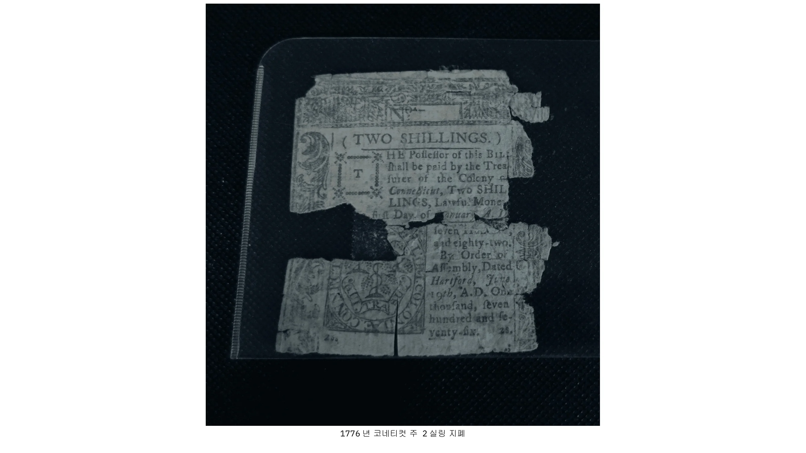

영국에 전쟁을 선포하고 결국 자체 화폐를 발행하기 전까지 식민지에서는 이 종이 화폐를 스페인 달러와 함께 현금 거래에 사용했습니다. 사실 '달러'라는 용어는 미국 달러를 나타내는 용어로 남아있었습니다.

제가 착각하지 않았다면 1792년에 화폐를 주조할 수 있는 법이 통과되었습니다. 예를 들어 아래 그림은 현대의 미국 달러입니다.

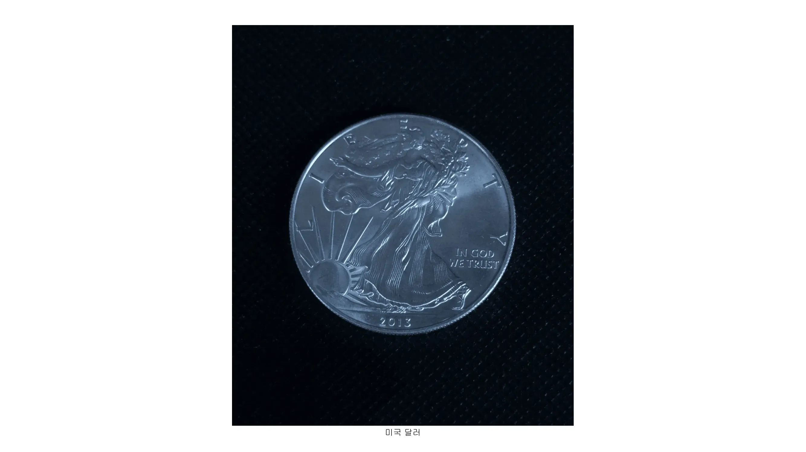

물론 액면가가 1달러에 불과한 것은 아니며, 은 1온스를 나타내므로 약 30~40달러의 가치가 있습니다. 그 가치는 은 가격에 따라 변동하며, 일반적으로 최소 30달러 또는 40달러를 기준으로 합니다. 물론 오늘날 종이 달러는 액면가인 1달러만 유지하지만, 당시 미국 달러는 이 은의 가치에 뿌리를 두고 있었습니다.

이제 미국의 남북전쟁에 대해 이야기해 보겠습니다. 남부군이 화폐를 찍어내면서 인플레이션이 극심했습니다. 이 현상은 50%의 초인플레이션율에 도달하지 않았기 때문에 공식적인 한케-크루스 목록에는 포함되지 않습니다. 그러나 월별 인플레이션율이 40%에 달해 전쟁 기간 동안 상당한 양의 화폐가 인쇄되었음을 알 수 있습니다.

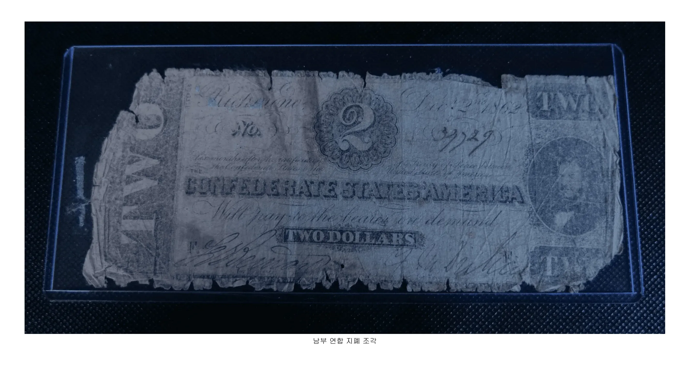

북부의 적군도 달러를 가지고 있었습니다. 바로 위에는 남부 연합군의 달러가, 아래에는 북부 연합군의 달러가 보입니다. 뒷면이 녹색이라서 "그린백"이라고 불렀어요.

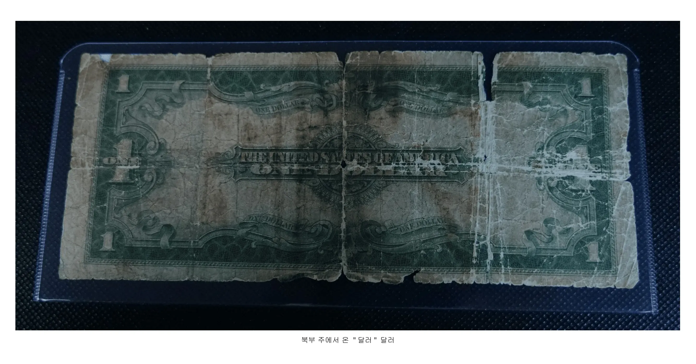

그리고 현대 지폐와의 크기 차이를 비교해 보시기 바랍니다. 당시에는 지폐가 더 컸습니다.

아시다시피 북쪽이 이겼기 때문에 달러는 통일된 미국의 통화가 되었습니다. 그 후 1913년 연방준비제도이사회가 설립되고 1차 세계대전이 발발했습니다.

제1차 세계대전 이후 마지막으로 인쇄된 지폐 시리즈에는 항상 "주문 시 금으로 교환 가능"이라는 문구가 포함되었습니다. 따라서 1928년 당시 금값이 20.67달러였기 때문에 20달러로 거의 1온스의 금을 살 수 있었습니다. 아래 이미지의 지폐는 1928년에 금 1온스를 살 수 있는 금액입니다.

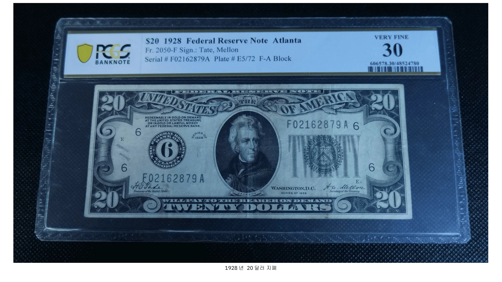

오늘날 금 1온스의 가치는 미화 3,000달러입니다. 물론 여기에서 평가 절하의 힘을 볼 수 있습니다. "금으로 상환 가능"이라는 단어가 포함된 마지막 법안이었죠. 행정명령 6102호 직후에 모든 금을 압수할 수 있다는 것을 알 수 있습니다. 실제로 금과 금 증서를 모두 압수했습니다.

아래에서 1928년에 발행된 금 증서를 볼 수 있습니다.

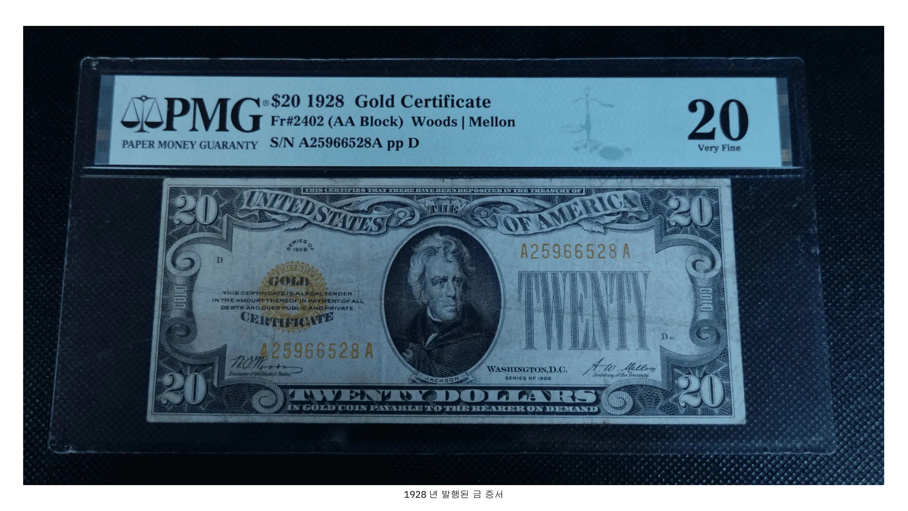

1928년 지폐처럼 '금으로 교환할 수 있을 뿐만 아니라' 금화로도 교환할 수 있었기 때문에 사실상 '금 증서'였습니다. 이 지폐들은 모두 행정명령 6102호 이후 압수되었습니다. 1964년까지만 해도 이러한 지폐를 소유하는 것은 불법이었습니다.

매우 기쁘게 생각합니다.

1964년부터 금을 소유하는 것은 불법이 되었고, 제가 착각하지 않았다면 1974년까지 금을 소유하는 것은 불법이 되었습니다. 70년대에는 닉슨 쇼크 이후 사람들이 금을 축적할 수 있도록 허용했는데, 이는 곧 설명할 것입니다. 1933년 "행정명령 6102호"를 발표하면서 금을 압수하고 금을 소지하는 것이 불법이 되었습니다. 금을 보관하다 적발되면 큰 징역형을 선고받았습니다. 당시에는 1934년 이후 모든 금 1온스는 아래 그림과 비슷한 지폐로 교환되었습니다.

앞서 말했듯이 1928년에도 1달러에는 여전히 "금으로 교환 가능"이라는 문구가 적혀 있었습니다.

행정명령 6102호가 발령된 후, 그들은 모든 금을 압수하고 금 1온스당 20.67달러로 교환했습니다. 이후 1934년 "이 지폐는 모든 채무에 대한 법정화폐입니다"라는 문구가 인쇄된 새 지폐를 발행한 사실이 드러나면서 사기가 밝혀졌습니다.

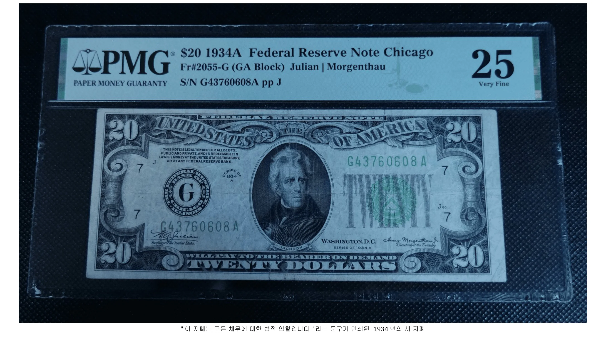

여기에 "금으로 상환 가능"이라는 문구를 대체하는 법정 화폐의 개념이 등장합니다 두 지폐는 단어 몇 개만 바뀌었을 뿐 동일해 보이지만, 이 기간 동안 달러 가치가 평가절하되어 1934년 온스당 20.67달러였던 금의 가치가 35달러로 하락했다는 사실에 사기가 숨겨져 있습니다. 이는 약 40%의 평가 절하를 의미합니다!

그러다 제2차 세계대전이 일어났습니다. 전쟁이 끝난 후 브레튼우즈 협정은 전 세계 금의 대부분을 미국으로 집중시켰습니다. 미국은 그 대가로 지폐를 발행했지만, 이 지폐는 더 이상 일반 대중이 금으로 교환할 수 없었습니다. 대신 국가 차원에서 금으로 교환할 수 있었습니다.

결국 프랑스와 독일 같은 국가에서는 미국 금고에 금보다 달러 지폐가 더 많이 유통되고 있다고 의심하기 시작했습니다.

그래서 그들은 금을 송환해달라고 요청했습니다. 그러자 그들은 "알겠습니다, 하지만 시간이 좀 걸릴 겁니다."라고 답했습니다 1971년, 우리의 친구 리처드 닉슨은 지폐와 금의 연결고리를 완전히 끊어버렸고, 그 과정에서 투기꾼들을 비난했습니다.

금은 온스당 35달러로 저평가되어 있었는데, 이는 인쇄된 화폐의 양이나 실제 시장 가치와 일치하지 않는 가격이었습니다. 불과 몇 년 사이에 가격은 34달러에서 800달러로 급등했습니다. 데나리우스와 솔리두스의 연결이 끊어진 로마에서와 같은 역사적 사례와 유사하게 금은 유동성이 허용되었습니다. 이 사실은 가격 발견의 과정으로 이어졌고, 그 후 금은 달러 기준으로 훨씬 더 높은 가치를 갖게 되었습니다.

### 현대의 법정 화폐 시스템과 그 의미

이 부분은 은이나 금을 기반으로 한 화폐 시스템에서 어떻게 이동했는지를 요약한 부분입니다. 조금씩 기관이 화폐에 대한 권한을 점점 더 많이 갖게 되었습니다. 결국, 일방적인 결정으로 귀금속과 화폐의 연결고리가 완전히 끊어졌고, 과잉 발행이 이어졌습니다.

그 결과, 더 이상 금과 지폐 또는 경전 화폐 사이의 연결고리는 존재하지 않습니다. 그리고 부분 준비금 제도도 구시대적인 개념입니다. 대신 민간 은행이 은행 신용을 통해 화폐를 발행하고 창출합니다. 화폐는 주로 이런 방식으로 만들어지며 중앙은행이 정한 기준금리와 상관관계가 있습니다.

실제로 한도는 없습니다. 적어도 미국과 캐나다에서는 더 이상 의무적인 준비금 수준은 없습니다. 유일한 준비금은 은행이 유동성이 부족하지 않도록 은행 간 거래에 대응할 수 있도록 준비해야 한다는 것입니다.

3%, 1%, 10%의 의무 적립금은 없지만, 이체할 수 있는지 확인하기만 하면 됩니다. 우리는 부분적인 준비금 개념에서 완전히 벗어났습니다. 이제 중앙은행, 재정 적자를 통한 정부, 양적완화(QE)를 통한 중앙은행, 은행 대출을 통한 민간 은행이 총 통화 공급을 늘리고 인플레이션을 유발할 수 있습니다.

돈과 인플레이션의 연관성을 이해하려면 이 주제를 다룬 Plan ₿ Academy 강좌를 추천합니다. 생활에서 흔히 볼 수 있는 물가 상승과 인플레이션의 차이점을 배울 수 있습니다. 둘은 같은 것이 아닙니다. 사실 인플레이션이라고 할 때는 인플레이션 자체가 아니라 가격 상승에 대해 이야기하는 경우가 많습니다. 인플레이션은 통화 공급의 증가로 설명되는 상당히 정확한 개념입니다.

https://planb.academy/courses/caa75343-ac90-4249-bcca-0e2e57c3a0f1

법정화폐 세계에 대한 이 섹션을 마무리하면서 인플레이션과 같은 방금 설명한 현상을 더 잘 이해하는 데 도움이 되는 자료를 소개해드리고자 합니다.

관심을 가져주셔서 감사합니다.

## 화폐 거품의 역사

<chapterId>b6451c46-917d-11f0-97de-6bc5081765fa</chapterId>

:::video id=5967d9a6-aae4-4b84-a283-71b1b735bca4:::

### 지폐의 발명과 최초의 거품 붕괴

18세기에 중앙은행이 탄생하면서 지폐 형태의 마법의 화폐라는 진정한 혁명이 탄생했습니다. 프랑스에서 가장 눈에 띄는 사례는 존 로의 사례입니다. 파리에 유배된 이 스코틀랜드인은 섭정인 도를레앙 공작에게 국영 은행과 식민지 무역 회사, 즉 유명한 **방크 로열**과 **콤파니 뒤 미시시피**를 설립하여 왕실 재정의 파산에 대한 해결책을 제안했습니다.

이 시스템을 통해 로는 지폐를 회사 주식과 연결했습니다. 지폐가 많이 유통될수록 주식의 가치는 높아지고 은행은 더욱 견고해 보였습니다... 하지만 투기가 현실을 앞지르기 전까지는 말이죠. 1720년 갑자기 거품이 터지면서 귀족과 부르주아지, 그리고 퀸캉푸아 거리에 투기를 하러 온 유럽의 많은 사람들이 파산했습니다. 그 결과 프랑스에서는 지폐에 대한 불신이 지속되었고, 유럽에서는 투기 거품에 대한 첫 번째 교훈을 얻게 되었습니다.

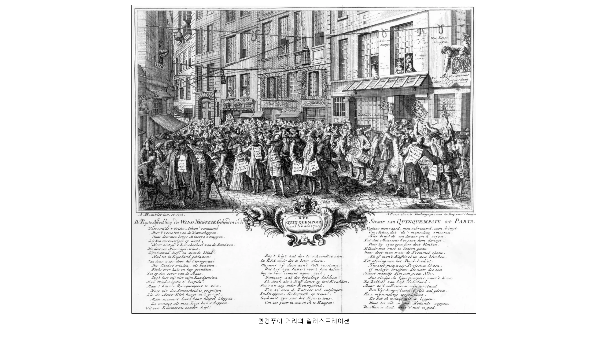

### 토지가 '담보'가 되는 경우

한 세기 후, 프랑스 혁명은 압수된 교회 재산으로 뒷받침되는 통화인 **아시그나트**로 새로운 지평을 열었습니다. 토지를 금전적 담보로 바꾸는 매력적인 아이디어였지만, 토지는 유동적이지도 않고 분할할 수도 없다는 점에서 실효성이 없었습니다. 그 결과 초인플레이션, 토지 사용에 대한 여러 가지 금지, 통제되지 않는 인플레이션, 식량 부족이 발생했습니다.

이러한 혼란에 깊은 영향을 받은 나폴레옹은 1800년 프랑스 중앙은행을 설립하여 금과 은을 화폐 단위로 다시 정립함으로써 군대의 정기적인 급여를 보장했습니다. 신뢰를 회복하기 위한 실용적인 방법: 경화 지급.

### 활기찬 20년대와 1929년 대공황

두 세기는 건너뛰겠습니다. 제1차 세계대전 이후 각국 정부는 인플레이션과 금본위제 폐지를 통해 자금을 조달했습니다. 1920년대에 미국 연준은 영국 파운드화를 지원하기 위해 지나치게 완화적인 통화 정책을 추구했습니다. 그 결과 쉬운 신용, 월스트리트의 무분별한 투기, 신용을 통한 주식 매입, 부동산 및 금융 버블이 발생했습니다.

1929년 대공황은 대규모 은행 부실, 기록적인 실업률, 무료 급식소의 줄서기 등 피할 수 없는 상황으로 이어졌습니다. 이로 인해 '모든 디플레이션은 나쁘다'는 오해가 생겨났지만, 성장을 통한 디플레이션(건강한 디플레이션)과 부채를 통한 디플레이션(파괴적인 디플레이션)을 구분할 필요가 있습니다.

### 90년대의 아시아와 도미노 효과

1990년대 '아시아의 기적'은 전 세계를 꿈꾸게 했습니다. 금리는 달러에 고정되어 있었고, 성장률은 8~10%에 달했으며, 서구 자본이 쏟아져 들어오고 있었습니다. 모든 것이 순조로웠습니다... 하지만 그 기세가 꺾이기 시작했습니다. 파산이 연쇄적으로 발생하고 통화가치는 80%나 평가절하되었으며 투자자들은 큰 손실을 입었습니다. IMF가 개입하여 고통스러운 개혁을 단행해야 했습니다. 풍부한 자본, 신용으로 인한 거품, 그리고 붕괴라는 항상 같은 시나리오가 반복되었습니다.

### 2008년과 영구 버블의 시대

인터넷 버블(2000년)에 이어 서브프라임 부동산 버블이 발생했습니다. 증권화는 은행 대출을 '트리플 A' 금융 상품으로 탈바꿈시켜 전 세계로 확산시켰습니다. 약속: 위험을 희석하여 위험을 제거합니다. 현실: 모든 리스크는 사실 상관관계가 있었습니다. 부동산이 무너지면 전 세계 은행 시스템도 무너졌습니다.

그 결과 대규모 공적 구제금융, 양적 완화, 제로 금리가 등장했습니다. 각 위기는 더 이상 과잉을 해소하는 것이 아니라 더 많은 부채와 화폐 인쇄로 충당하게 될 것입니다. 이것이 현재 상황을 초래한 것입니다: **주식, 부동산, 예술품, 암호화폐, 심지어 포켓몬 카드까지 모든 것이 인위적으로 부풀려지는 "모든 것의 거품"**이 발생하게 된 것입니다.

### 마법의 돈의 영원한 귀환

한 세기부터 다음 세기까지 한 가지 변함없는 사실은 한 사회가 실물을 생산하는 대신 돈으로 부를 창출할 수 있다고 믿는 순간 거품이 나타난다는 점입니다. 존 로부터 2008년까지, 퀸캉푸아 거리부터 월스트리트까지, 행복감, 신용, 호황, 폭락이라는 과정이 반복되고 있습니다.

결국 아무도 더 이상 종이를 신뢰하지 않게 되면 사람들은 금, 땅, 안전한 피난처 또는 새로운 화폐 등 다른 것을 찾게 됩니다. 어제는 나폴레옹이 금속을 도입했지만, 오늘날 일부에서는 Bitcoin가 그 뒤를 이을 것으로 보고 있습니다.

금융의 역사는 인쇄, 투기, 붕괴라는 끝없는 순환의 연속입니다. 다음 버블이 일어날 때까지.

## 돈과 폭력

<chapterId>9486fe64-854f-5e17-86b3-8873baca39a8</chapterId>

:::video id=bd6d0807-2d8f-4637-a0f5-1e990e5c0d0f:::

이 짧은 섹션에서는 교육 과정에서 이미 보았던 많은 이벤트를 다시 살펴보면서 제가 흥미로웠던 몇 가지 일화를 요약해 보겠습니다.

### 기술과 폭력

이 강좌에서 이미 언급한 적이 있는 일화 몇 가지를 소개합니다. 기술 발전이 국민과 국가 간의 폭력 관계에 어떤 영향을 미치는지에 대해 매우 흥미롭게 생각했던 테오의 강연에 대해 제가 테오와 나눈 매우 흥미로운 토론을 소개합니다.

### 돈과 국가의 강압

이 섹션을 소개하기 위해 이미 강좌에서 다룬 적이 있는 이벤트를 상기시키기 위해 전체 목록이 아닌 간략한 목록을 제공하려고 합니다.

제가 이미 돈과 폭력을 연결시킬 수 있는 한 가지 연결고리는 무한정 인쇄할 수 있는 쓸모없는 지폐의 경우 온갖 종류의 규칙과 온갖 종류의 위협이 수반된다는 점입니다. 우리는 이미 지폐에 위조범이 사형에 처해질 수 있다는 문구가 적혀 있던 아사낫에 대해 이야기할 수 있습니다. 이 유명한 지폐를 받지 않은 사람들에 대한 살해 위협은 당시의 법률 문서에서 쉽게 찾을 수 있습니다.

프랑스 혁명 시대에 입수한 법률 텍스트 중 하나에서 단두대 운반 및 운영에 대한 '일당'이 통화 관련 섹션에 설명되어 있는 것을 보았습니다. 저는 이것이 다소 우스꽝스럽다고 생각했습니다.

또한 주조 과정을 국가가 감독하는 중국의 주화에 대해서도 이야기했습니다. 강의 초반에 일부 덜 아름다운 동전을 폐기할 경우 법적 처벌을 받는다는 내용을 살펴봤습니다.

영국의 한 왕이 자신의 뜻대로 행동하지 않으면 화폐를 주조하는 사람들의 손을 잘라버렸다는 일화도 있습니다.

또한 중국에서는 불교 수도원에서 구리를 압수했다는 기사를 읽은 적이 있습니다. 구리의 가치가 상승하면서 금속의 가치와는 거의 상관없는 법정화폐에 기반한 경제가 불안정해지자, 그들은 부를 축적할 수 있는 곳을 찾아 수도원에서 구리를 압수했습니다.

영국 종교 개혁 기간 동안 영국의 수도원에도 똑같이 적용되었습니다. 유명한 왕이 이혼 문제로 교황과 다투었을 때 그 배후에는 또 다른 이유가 있었는데, 바로 수도원 폐지를 이용해 교회 조직에 포함된 재산을 탈취한 것이었습니다.

프랑스 혁명 당시 프랑스 정부는 교회의 모든 자산을 압수했습니다. 그들은 녹아내린 교회 종으로 만든 아름다운 동전을 발견했습니다.

더 거슬러 올라가면, 경제적 폭력과 자유, 해방법에 대한 가장 노골적인 개념 중 하나는 **농민들이 더 이상 평가 절하된 화폐를 받아들이고 싶지 않았다는 사실과 직결된 세습 계급을 가진 디오클레티아누스입니다**. 농민들은 농부로서의 일을 떠나고 싶어 했고, 디오클레티아누스는 "너희는 너희 땅을 떠날 수 없고 너희 자식들도 떠날 수 없다"는 말로 대응했습니다. 병사들에게도 마찬가지였습니다.

꽤 노골적인 형태의 폭력이라고 생각해요. 기사단이나 프랑스 왕에 대해 이야기하면서 결론을 내릴 수 있을 것 같아요. 기사단이 프랑스에 정착했을 때 왕은 기사단의 부를 보고 국가 재정 문제를 겪었을 거라고 생각해요. 그는 기사단을 상대로 소송을 제기했고, 그 중 일부는 보물의 일부를 가져갈 수 있었으며, 그 결과 미국이나 캐나다에서 매우 흥미로운 쇼가 탄생했습니다. 누가 제작했는지는 모르겠지만 *오크섬의 미스터리*라는 프로그램입니다. 캐나다 해양의 한 섬에 템플턴의 보물이 묻혀 있다고 생각하는 사람들이 우물을 만들기 위해 몇 년, 어쩌면 10년 넘게 땅을 파고 있다는 내용입니다. 그들은 많은 갤러리가 있는 우물을 발견했고, 이 섬에 기사단이 묻은 보물을 찾고 있는데, 이것이 바로 이 TV 쇼의 주제입니다. 이 프로그램의 열렬한 팬이신 아버지께 경의를 표합니다.

지금까지 폭력과의 연관성을 제기하는 이 과정에서 우리가 본 사실들을 간략하게 정리해 보았습니다. 다음 시간에는 테오가 기술 변화와 민중과 당국 간의 권력 균형에 대해 매우 흥미로운 이야기를 들려줄 예정입니다.

감사합니다!

## 조직적 폭력의 경제적 결과

<chapterId>66bd4674-2159-5489-ad4b-ec5e3fb691af</chapterId>

:::video id=c8b063c6-aeb4-4a94-9027-b11d369e71a4:::

### 조직적 폭력과 국가의 진화

역사학자 프레데릭 C. 레인은 역사적으로 국가의 구조는 폭력을 투사하는 데 사용된 기술에 의해 형성되었다는 혁명적인 가설을 제시합니다. 국가가 합법적인 폭력을 독점한다는 베버의 원칙에서 출발한 레인은 이 독점이 역설적으로 이 분야의 경쟁보다 더 효율적이며, 공격 비용과 방어 비용의 관계에 따라 진화한다는 사실을 관찰합니다.

"주권자 개인"(1997)의 저자들이 채택한 이 분석은 중세 봉건제에서 르네상스 시대의 도시 국가, 산업 민족 국가, 현대 복지 국가에 이르기까지 정치 조직의 역사적 변천을 설명합니다. 각 전환은 대략 400~500년마다 발생하는 폭력 행사의 주요 기술 혁신에 해당합니다.

### 중세 균형

중세에는 농업 경제가 90% 이상 지배적이었습니다. 말 그대로 땅에 뿌리를 둔 농민은 영주와 기사들로부터 도망칠 수 없었습니다. 수작업으로 만든 갑옷, 수년간의 검술 훈련 등 군사 기술은 매우 비쌌습니다. 이러한 비대칭성은 방어보다 공격에 유리하게 작용했습니다.

움직일 수 없는 농업 생산자는 지역 폭력 독점자의 포로가 됩니다. 역설적이게도 중세의 세금은 현대의 78%에 달하는 강제 부과금에 비하면 여전히 미미한 수준이지만, 그의 세금 징수 능력은 새로운 차원에 도달합니다. 농민은 저항하거나 떠날 수 없기 때문에 영주는 마음대로 세금을 부과할 수 있었습니다.

### 상인 르네상스

북쪽에서는 한자 무역이, 남쪽에서는 지중해 무역이 등장하면서 상황이 바뀌었습니다. 부가가치의 주요 창출자인 상인들은 이동 자본인 배를 소유하고 있었습니다. 바다를 치안하기 어려웠기 때문에 가벼운 해상 민병대만 있으면 되었습니다. 무엇보다도 세금이 과도하게 부과되면 인근 항구로 쉽게 이동할 수 있었습니다.

이러한 이동성은 도시 국가 간의 세금 경쟁을 불러일으켰습니다. 베니스, 제노바, 브뤼헤는 신뢰할 수 있는 계약, 양질의 화폐, 보험, 최소한의 과세 등 가능한 한 가장 자유로운 틀을 제공해야 했습니다. 왕자들은 강압이 아닌 유혹을 해야 했습니다. 공격보다 방어(비행을 통한)가 더 쉬워지는 대칭이 역전된 것입니다.

### 산업 시대

산업혁명은 봉건주의와 유사한 구성을 가져왔습니다. 공장, 철도, 조립 라인은 대규모의 움직이지 않는 투자를 상징합니다. 헨리 포드는 세금 때문에 공장을 이전할 수 없었습니다. 산업 도시에 집중된 노동자들은 개별적으로 이주하기보다는 노동조합을 결성하여 집단적으로 협상했습니다.

산업 계획(일본, 한국), 사회 기반 시설에 대한 군사적 보호, 노동력에 대한 최소한의 사회적 혜택 등 '복지 국가'가 등장했습니다. 2차 세계대전은 이러한 취약성을 잘 보여주었습니다. 적의 공장을 폭격하는 것이 지배적인 전략이 되었습니다. 물적 자본의 집중은 복지 국가 재원 마련을 위한 막대한 세금 징수를 가능하게 했습니다.

### 마이크로프로세서 혁명

세 가지 기술 혁신이 이러한 오래된 균형을 뒤엎고 있습니다. 마이크로프로세서가 전쟁을 변화시키고 있습니다. 네바다의 한 조종사가 아프가니스탄에서 드론을 조종하여 외과적 정밀성을 발휘합니다. 걸프전(1991년)에서 세계 4위 규모의 군대(이라크)가 45일 만에 전멸하고 연합군 측 사망자는 200명 미만이었던 것이 이러한 돌파구를 보여주었습니다. 기술적 우위는 정면 공격을 불가능하게 만들었습니다.

인터넷과 비대칭 암호화는 가치 창출에 혁명을 일으키고 있습니다. 개발자는 MacBook과 Starlink만 있으면 어디서나 작업할 수 있으며, 제작물을 즉시 무료로 내보낼 수 있습니다. 디지털 유목민들은 지리적 속박에서 벗어나 르네상스 이후 볼 수 없었던 방식으로 국가 간 경쟁을 벌이고 있습니다.

Bitcoin은 이러한 논리의 정점을 보여주는 화폐로, 국가로부터 자유로워지고 불가침의 암호화 보호막으로 보호되는 화폐입니다. 부는 어떤 물리적 힘으로부터도 방어할 수 있게 됩니다. 개인은 국가의 독점에 맞서 스스로를 방어할 수 있는 능력을 되찾게 됩니다.

### 웨스트팔리안 모델의 붕괴

산업화 시대를 위해 설계된 서구의 복지 국가는 점점 더 쓸모없어지고 있습니다. 개발자, 예술가, 금융가 등 가치 창출자들은 싱가포르, 두바이, 엘살바도르 등으로 이주하여 최소한의 세금 대신 더 적은 공공 서비스를 선호하고 있습니다. 애플이나 테더와 같은 현대의 거대 기업들은 사무실이나 물리적 인프라가 필요하지 않습니다.

이러한 두뇌 유출은 순 기여자 감소, 공공 서비스 저하, 체류자에 대한 과세 증가, 이탈 가속화라는 악순환을 낳습니다. 주정부는 급격하게 규모를 축소하거나 파산해야 합니다. 새로운 디지털 도시 국가 모델인 소규모의 경쟁적인 관할권으로 분열되는 것은 피할 수 없어 보입니다.

역사는 이러한 전환에 여러 세대가 걸린다는 것을 가르쳐 줍니다. 하지만 Bitcoin의 화폐와 국가의 분리는 그 과정을 가속화할 수 있습니다. 이제 개인은 발과 암호 화폐 지갑으로 투표하며 우리가 이제 막 인식하기 시작한 세계 권력의 지도를 다시 그리고 있습니다.

## 금융의 아주 짧은 역사

<chapterId>1d37fff1-a091-5034-8e71-4af590b8ffce</chapterId>

:::video id=fdfabbc6-e4d8-463a-8522-19176f8fb460:::

법정 화폐 시스템까지 이어지는 화폐의 역사에 대한 설명에 이어, 복지 국가로 이어진 금융의 진화에 대해 빠르고 간결하게 설명해드리고자 합니다. 로마 시대에는 처음에 동전이 있었습니다.

코인은 제국이 군인에게 돈을 지불하고, 영토를 확장하고, 무역을 할 수 있게 해준 금융 기술이었죠. 결국 너무 많은 평가절하가 있었다는 점을 제외하면 매우 잘 작동했습니다. 전쟁과 영토 확장을 통한 전리품 획득이 중단되고 확장을 멈춘 어느 순간, 제국의 시스템은 무너졌습니다.

### 금융 기술의 진화

그 후 안정된 화폐를 되찾은 플로린과 이탈리아와 앤트워프에서 '화폐의 시간 가치', 즉 할인이라는 개념이 개발될 때까지 거의 발전이 없던 중세 시대가 도래했습니다. 이들은 할인을 발전시켜 '약속 어음', 즉 나중에 100달러에 이자율을 더한 금액을 회수할 수 있다는 약속이 담긴 지폐 형태를 만들었습니다.

이 시스템은 만기 전에 어음을 팔 수 있는 금융 기술로, 6개월 만기 중 4개월 후에 팔면 남은 2개월 동안의 수익률 손실을 보전하기 위해 실제로는 프리미엄을 지불하게 됩니다.

당시 앤트워프와 암스테르담에서 개발된 금융 기술이었죠. 이후 중앙은행의 발전과 최후의 수단 대출 기관이라는 개념이 등장했습니다. 암스테르담 은행 시대에 국제 무역에서 동전 사용은 경전 화폐를 선호하여 포기되었다고 주장할 수 있습니다.

18세기 후반, 금융 기술 측면에서 보험에 대해 이야기할 수 있습니다. 닐 퍼거슨의 저서 "돈의 상승"에 잘 알려진 일화가 있습니다. 최초로 탄생한 보험 회사는 '스코틀랜드 위도우스'라는 회사로, 성직자들이 일찍 죽거나 갑작스럽게 사망하는 성직자들을 위한 보험을 개발하고자 했던 것이 시초입니다. 당시 성직자들은 스코틀랜드에서 1년 동안 아내와 자식을 돌보고 있었습니다. 그래서 성직자들은 이 1년이라는 기간이 너무 짧다고 생각했습니다. 그 결과 성직자들은 조기 사망한 성직자 수에 따라 제도의 비용을 충당하는 데 필요한 기여자 수를 계산하기 위해 보험수리적 계산법을 고안해 냈습니다.

그들은 보험 계리 계산을 통해 "각 신부가 이 금액을 기부하면 보험금이 지급됩니다. 그러면 신부가 사망하면 보험이 그의 아내와 자녀가 자립할 때까지 생존을 보장하는 데 필요한 비용을 충당할 것입니다."라고 말했죠 그래서 이 제도를 대중화한 최초의 보험 회사는 '스코틀랜드 미망인'이라는 보험 회사였고, 이 보험이 도입된 곳도 이곳이었습니다.

### 민간 보험에서 복지 국가로

따라서 보험은 금융 기술의 역사의 일부입니다. 그리고 이것은 복지국가의 개념과 연결되는데, 민간 보험은 결국 최적화라는 개념, 즉 건강한 사람들에게 건강 보험을 제공하면 '나는 건강하니 아프지 않을 거야'라고 생각하기 때문에 보험료 납부에 대한 관심이 줄어들 수 있다는 문제에 부딪히게 됩니다. 반면에 자신이 아프다는 것을 알고 있는 사람들은 확실히 가입하고 싶어 할 것입니다.

이 시스템으로 인해 건강 보험에 가입하는 아픈 사람의 수와 덜 가입하는 건강한 사람의 수 사이에 불균형이 생깁니다. 따라서 일종의 불균형이 발생합니다. 수치를 계산해보면 비용을 상쇄할 만큼 건강한 사람이 충분히 보험에 가입하지 않을 수 있기 때문에 수치가 균형을 이루지 못합니다. 경제학에서는 이를 **도덕적 해이**라는 개념으로 설명합니다.

제시된 아이디어 중 하나는 보험 가입을 의무화하는 것입니다. 모든 사람이 의무적으로 보험에 가입하면 전체 균형을 맞추고 건강한 사람과 건강하지 않은 사람 모두 보험에 가입하여 더 많은 사람들에게 위험을 분산시킬 수 있습니다.

그래서 전 세계 많은 지역에서 국가가 "우리가 알아서 하겠다"고 말했습니다. 저는 이 문제에 대한 전문가는 아니지만 실업 보험과 같은 다른 모든 종류의 보험에도 이와 같은 논리가 적용될 수 있다고 생각합니다. 한 기관에서 처리하면 더 간단할 것이라는 생각에 따라 단순화 및 최적화에 대한 욕구가 있습니다.

제 생각에는 이로 인해 이러한 모든 보험 개념이 중앙 집중화되고 궁극적으로 복지 국가가 탄생하게 되었으며, 원래 민간 기업, 보험 시장의 요구를 충족시키기위한 민간 이니셔티브였던 모든 금융 개념이 도덕적 해이와 최적화 욕구와 관련하여 아마도 상당히 논리적인 이유로 국가에 의해 포착되었습니다.

### 국가 독점에 대한 대안 모델과 성찰

궁극적으로 캐나다와 같은 일부 국가에서는 건강 보험, 실업 보험 등 여러 유형의 보험을 국가가 독점하고 있습니다.

제가 아는 한 가지 예를 들어드리겠습니다. 스위스는 시스템이 조금 다릅니다. 민간 상호 보험 회사와 민간 병원이 있기 때문에 상호 보험 회사를 선택할 수 있고, 상호 보험 회사 내에서 패키지를 선택할 수 있습니다. 이 시스템의 상당 부분이 비공개로 유지되더라도 비교적 보편적인 서비스를 받을 수 있습니다.

그래서 개인이 운영하는 것도 가능하다고 생각합니다. 하지만 제가 여러분에게 설명하고자 하는 것은 사실 어느 시스템이 다른 시스템보다 낫다는 것을 표현하려는 것이 아니라 금융의 역사를 읽으면서 서구, 특히 프랑스, 특히 캐나다에서 왜 국가가 이러한 금융 원칙을 통제하기를 원했는지 깨달았다는 것을 설명하기 위함입니다.

제가 말씀드리고 싶은 것은 보험의 개념은 무엇보다도 금융의 진화이며, 정부가 때때로 잘하는 것처럼 여러 가지 이유로 화폐를 통제하려고 했던 것처럼 보험도 통제하려고 할 것이라는 점입니다. 한 가지 이유는 최후의 수단이라는 개념 때문입니다.

이 아이디어는 위험을 더 광범위하게 분산하는 큰 기관이 그 뒤에 있으면 훨씬 낫다는 것입니다. 이것이 바로 최후의 수단 대출 기관이라는 개념의 초기 이니셔티브였으며, 이 기관은 실제로 생존할 수 있을 만큼 튼튼한 기관을 선택하여 돈을 빌려줌으로써 기관의 붕괴를 방지할 수 있었습니다.

당시이 개념이 처음 등장했을 때 실제 분석이 있었지만 결국 일어난 일은 중앙 집중화가 있기 때문에 거의 모든 은행과 모든 대기업에 적용되기 때문에 "너무 커서 실패하기에는 너무 크다"는 모든 사람을 구한다는 것입니다. 결국, 방금 설명한 보험의 개념과 유사하게 국가가 '전반적으로' 적용하는 개념이라는 것을 알 수 있습니다.

결국, 스코틀랜드에서 특정 문제를 해결하기 위해 만들어진 금융 기술이 오늘날 우리가 알고 있는 거대한 복지 국가로 발전하면서 국가가 모든 것을 책임지기로 결정합니다. 스코틀랜드는 보험수리적 재정 원칙을 사용하여 도움이 필요한 국민에게 서비스를 제공합니다. 그러나 이 시스템에서 발생하는 독점으로 인해 현재 캐나다와 프랑스와 같은 국가에서 경험하고 있는 모든 종류의 문제가 발생한다는 데 동의할 수 있습니다. 다행히도 스위스와 같은 다양한 모델이 존재합니다.

복지국가의 개념이 금융에서 비롯되었다는 사실을 깨닫기만 하면 됩니다. 이러한 깨달음은 우리가 유명한 국가 독점 이외의 다른 길을 모색할 수 있음을 시사하며, 저는 이 논리를 최후의 수단으로서의 중앙은행 개념에도 적용하고 싶지만, 이는 다음 기회에 다룰 주제입니다.

# 마지막 섹션

<partId>9bada469-7ef0-511a-9eaa-f8eb66d5906f</partId>

## 이 과정 평가하기

<chapterId>a9494e2b-8a4d-5811-8a7b-b4a91fb22778</chapterId>

<isCourseReview>true</isCourseReview>

## 결론

<chapterId>1094e793-b4c6-5782-aa4a-71cde00ce7c0</chapterId>

<isCourseConclusion>true</isCourseConclusion>