# En reise gjennom myntenes historie

Dette fengslende kurset tar deg med på en utforskning av pengenes fascinerende utvikling fra de tidligste sivilisasjonene til vårt nåværende pengesystem. Vi krysser tidsaldrene, fra yngre steinalder til moderne tid, og oppdager hvordan penger har formet og blitt formet av de store menneskelige sivilisasjonene. Fra mesopotamiske protopenger til kryptovalutaer, lydiske mynter, renessansens florin og sentralbankvesenets fremvekst - dette kurset gir et omfattende perspektiv på en av de grunnleggende pilarene i samfunnet vårt.

+++
# Innledning

<partId>59878a67-8a1d-5d6b-af41-5b847c14363c</partId>

## Introduksjon til pengenes historie

<chapterId>ca53597e-be9a-5261-a55f-11fac8504a68</chapterId>

:::video id=08ff35ca-8a40-4286-abaf-71283faf6e78:::

Velkommen til dette kurset om pengenes historie. Som tittelen antyder, skal vi sammen utforske myntenes historiske utvikling. Fra yngre steinalder til i dag skal vi se på fortidens store imperier og sivilisasjoner.

Dette kurset er imidlertid ikke begrenset til en enkel kronologi av datoer eller historiske hendelser. Målet er snarere å gi en grundig forståelse av de grunnleggende konseptene som er involvert i fremveksten av penger, eller rettere sagt, valutaer.

### Grunnleggende konsepter å utforske

Vi snakker altså om fremvekst: fremveksten av valutaer i seg selv, av pengesystemer, av banker, av papirpenger, av sentralbanker, og til slutt fremveksten av det nåværende "fiat"-pengesystemet.

Vi begynner vår reise inn i proto-valutaer med fremveksten av gjeldspenger og regningsenheter i Mesopotamia, samt andre systemer som medgift og blodpenger i primitive samfunn. Vi skal også se hvordan reelle pengesystemer eksisterte allerede i det gamle Egypt, lenge før Midtens rike.

Deretter går vi videre til de første myntene i Lydia, et nøkkeløyeblikk som ofte regnes som pengenes egentlige begynnelse ifølge lærebøkene i økonomi. Vi ser nærmere på hvordan disse myntene kunne spre seg takket være perserne, Aleksander den store og deretter Roma, før de til slutt trengte seg på, dominerte og kollapset.

Med alt vi har lært, tar vi oss tid til å reflektere over selve definisjonen av penger, og vi går bort fra forutinntatte oppfatninger som "penger er alltid en gjeld" eller "penger er alltid en vare". I virkeligheten er penger både et gode og en sosial konvensjon. Vi vil særlig diskutere begrepet pengepremie og forsøke å forene de ulike teoriene som forklarer pengenes fremvekst.

### Viktige perioder og monetære innovasjoner

Deretter følger en urolig periode, preget av en viss ustabilitet i pengevesenet, men som likevel så fremveksten av så slående nyvinninger som den engelske penny, som ble brukt til å bestikke danske inntrengere, og Karl den stores pund, som fortsatt lever i minnet på enkelte moderne sedler.

Vi skal også se på hvordan korstogene førte til fremveksten av de første systemene for fjernoverføring av penger. Så er det tid for å se på virkningen av florinen, valutaen som fulgte med renessansen, og ankomsten av edle metaller fra Amerika, som hadde en dyptgripende effekt på de europeiske prisene.

Vi ser nærmere på fremveksten av papirpenger og sentralbankvirksomhet, og trekker paralleller til historien om finanskriser og deres ofte voldsomme konsekvenser.

Til slutt trekker vi en parallell til dagens pengesystem, utforsker konsekvensene av det, og sporer finanshistorien for bedre å forstå hvordan vi endte opp med dagens velferdsstat.

Og som en bonus ser vi også på de mange fascinerende etymologiske koblingene knyttet til penger, som fortsetter å påvirke hverdagen vår på ulike språk.

### Kursets struktur

Dette kurset er delt inn i tre hoveddeler.

Del I tar for seg pengenes opprinnelse, del II pengenes renessanse og undergang, og del III viser hvordan statlige institusjoner eller staten gradvis tok kontroll over pengene, noe som førte til dagens fiat-system.

Takk og god fornøyelse!

# Fremveksten av børser

<partId>da5e4981-9ea5-5208-beab-3b75c9043632</partId>

## Fra australopithecus til det moderne mennesket

<chapterId>34a773aa-f2d3-5c26-8be4-f2cd79ed6fbc</chapterId>

:::video id=4f333013-4b2a-42ab-8761-593fafc971ca:::

### Hvorfor begynne i yngre steinalder

Hvorfor gå helt tilbake til yngre steinalder for å snakke om penger? Svaret er enkelt: Vi kan ikke fullt ut forstå fremveksten av penger uten også å se på fremveksten av selve sivilisasjonene. For å forstå hvorfor de første pengesystemene oppsto, må vi forstå hva som fikk nomadiske jeger- og samlergrupper til å slå seg ned.

En stamme uten arbeidsdeling, uten spesialisering, der hver enkelt er ansvarlig for å produsere det han eller hun trenger, har rett og slett ikke behov for penger. På samme måte har et jordbrukssamfunn som kun driver selvbergingsjordbruk, der hver enkelt dyrker for seg selv, ennå ikke behov for et universelt byttemiddel.

### Sedentarisering og konsekvensene av den

Derfor synes jeg det er interessant å starte utforskningen i den neolittiske perioden. Vi skal se hvordan bofasthet gradvis ga opphav til landsbyer, deretter byer og til slutt store sivilisasjoner. Det var denne sedentariseringen og produksjonen av matoverskudd som muliggjorde spesialisering av arbeidskraft, og som skapte grobunn for fremveksten og utviklingen av de første monetære konseptene.

På samme måte som menneskelig interaksjon gir opphav til språk, kan vi tenke oss at penger dukker opp naturlig, eller ikke (som hos inkaene og spartanerne), i løpet av dannelsen og organiseringen av sivilisasjoner. Etter min mening har pengenes opptreden eller ikke-opptreden alt å gjøre med den sosiale og økonomiske organisasjonsformen i det enkelte samfunn.

### Kronologi over menneskets utvikling

Men la oss først se på en enda bredere historisk kontekst.

Som i enhver første presentasjon kommer jeg til å gjøre akkurat det motsatte av det jeg sa i introduksjonen til kurset, og gi dere en liste over datoer og historiske hendelser som følger etter hverandre. Tanken her er å plassere fremveksten av penger i sin historiske kontekst, i forhold til andre menneskelige fremskritt som matlagingen, hjulet, domestiseringen av visse kornsorter og dyr, byggingen av pyramidene og grunnleggelsen av de første byene.

Så la oss ta en titt på menneskehetens utvikling fra forhistorisk tid og fremover.

En oversikt over menneskets utvikling fra australopithecus til det moderne mennesket, der vi følger teknologiske fremskritt og befolkningsbevegelser frem til yngre steinalder.

### Menneskehetens historiske kontekst

- for 3 millioner år siden** - *Australopithecus* dukker opp.
- for 2 millioner år siden** - Homininer begynner å forlate Afrika.
- 1.for 6 millioner år siden** - Homininer når Sør-Europa og Asia.
- 1 million år siden** - Første bevis på matlaging med ild (forkullede bein og planterester i Wonderwerk-hulen i Sør-Afrika).
- Rundt 400 000 f.Kr.** - Neandertalerne lever i Europa og Asia.
- Rundt 300 000 f.Kr.** - Fremveksten av *Homo sapiens*.
- 80 000 år siden** - *Homo sapiens* begynner å migrere til alle deler av verden.
- 73 000 år siden** - Blombos-hulene i Sør-Afrika (eldste kjente kunstformer).
- for 50 000 år siden** - *Homo sapiens* når Europa.
- 30 000 år siden** - Hulemalerier fra Chauvet-hulen i Frankrike.
- 15 000 år siden** - Lascaux-hulemalerier i Frankrike og australsk bergkunst.
- Rundt 9000 f.Kr.** - Domestisering av bygg i Den fruktbare halvmåne.
- Rundt 9000 f.Kr.** - dyrking av mais i Mexico.
- Rundt 8000 f.Kr.** - Domestisering av geiter og sauer i Den fruktbare halvmåne.
- Rundt 7250 f.Kr.** - Ain Ghazal (Jordan) avslører en landsby med noen hundre innbyggere.
- Rundt 7000 f.Kr.** - Çatalhöyük (Tyrkia) har opptil 8000 innbyggere.
- Rundt 6500 f.Kr.** - Det stillesittende livet begynner i Hellas.
- 6000 år siden** - Begynnelsen på elvevanning i Egypt og Mesopotamia.
- Rundt 5000 f.Kr.** - De "tre søstre" (mais, squash og bønner) dukker opp.
- Rundt 4000 f.Kr.** - Domestisering av kamelen i Sentral-Asia. (Kamelfamilien oppsto i Nord-Amerika i eocen for 45 millioner år siden. Disse kamelene kan ha vandret til Asia via en tynn landstripe som på den tiden bandt de to kontinentene sammen i Beringstredet. En annen del av familien kan ha dratt til Sør-Amerika, der deres etterkommere fortsatt lever i dag: lamaer, alpakkaer og vikunjaer).
- Rundt 3500-3000 f.Kr.** - Botai-folket begynner å temme og avle på hester.
- Rundt begynnelsen av bronsealderen** - Sumererne hadde allerede oppfunnet hjulet og seilbåten, og de hadde utviklet aritmetikk, astronomi og den første formen for skrift.
- Rundt 2800 f.Kr.** - Uruk hadde på det meste en befolkning på opptil 80 000 mennesker.
- 2600-2200 f.Kr.** - De første tegnene på byutvikling i den greske verden. Utbredelse av middelhavsavlinger (hvete, vinranker, oliven).
- 2560 f.Kr.** - Byggingen av den store pyramiden i Giza.
- Rundt 1500 f.Kr.** - den minoiske sivilisasjonen.
- Rundt 1300 f.Kr.** - Den mykenske sivilisasjonen.
- Rundt 1250 til 1150 f.Kr.** - Sammenbrudd i bronsealderens sivilisasjoner.
- 1. århundre e.Kr.** - Nordafrikanske berbere gjør kamelen tam.

Her er altså denne historiske oversikten for å gi oss et perspektiv på fremveksten av visse teknologier, domestisering av visse dyr og kulturer, for å sette det i sammenheng med fremveksten av skrift og penger, som vi skal se nærmere på i neste avsnitt.

## Fra jeger og samler til bonde: Sivilisasjonens begynnelse

<chapterId>ea950b6e-9eb7-553d-8f04-0eb042bb1f5a</chapterId>

:::video id=4b49a376-f6f4-42a0-86fa-264997a079f0:::

### Overgangen til jordbruk og sedentarisering

I dette kapittelet skal vi snakke om overgangen fra jakt og sanking til selvbergingsjordbruk, håndverk og handel. Jeg følte at det var viktig å forklare denne overgangen til bofasthet og jordbruk for å forstå hvordan de første byene ble bygget, noe som til slutt førte til opprettelsen og fremveksten av visse pengesystemer i antikken.

Dette avsnittet er et utdrag fra et kurs som er tilgjengelig på nettstedet The Great Courses, Ancient Mesopotamia, Life in the Cradle of Civilization, holdt av professor Amanda Podany ved California State Polytechnic University, Ponoma.

### Paradoksene ved å ta i bruk landbruk

Det primitive jordbruket dukket opp for rundt 10 500 år siden i Midtøsten, i det nordvestlige Syria og sørlige Tyrkia. I dag har moderne jeger- og samlergrupper ingen hastverk med å ta i bruk jordbruk, og det samme var sannsynligvis tilfelle i yngre steinalder.

**De første landsbyene ble helt klart bygget før domestiseringen av planter og dyr ** Menneskene ble ikke bofaste fordi jordbruket gjorde det mulig for dem; tvert imot ble de bofaste først, og først mye senere, rundt 3000 år senere, begynte de å drive jordbruk.

Jakt og sanking fungerte rett og slett veldig bra, så de trengte ikke å så frø for å produsere maten sin. I dag har jegere og samlere mye mer fritid enn de første bøndene, som brukte svært rudimentær teknologi.

Det vi sier her, er altså at moderne primitive jeger- og samlerfolk har mer fritid enn vi forstår av de første bøndene i yngre steinalder, som tross alt hadde ganske rudimentære teknologier for dyrking. Disse menneskene arbeidet hardere for å produsere mat enn våre moderne primitive stammer, som lever av jakt og sanking.

Beinundersøkelser viser også at de første bøndene var mindre og mindre robuste enn jegerne og samlerne som levde før dem. Bøndenes kosthold var mer begrenset enn jegernes og sankernes. De spiste mye mer brød, men mye mindre kjøtt, og de hadde også dårligere tenner på grunn av steinsplintene som ble brukt i melproduksjonen. Når de laget mel med stein, ble det splinter.

De som følger "keto"-dietten, vil være enige: Å spise mye brød er sannsynligvis ikke like bra som å spise kjøtt.

### Teorier om adopsjon av landbruk

Hvem ville ha valgt å bli bonde på den tiden, gitt alle disse ulempene? Noen populære teorier går ut på at menneskene ble tvunget til å drive jordbruk, og at det egentlig ikke var noe valg. Selv med ville kornsorter var det et stort problem. Store mengder korn kunne ikke transporteres på en enkel måte. De måtte lagres et sted. Når kornet først var lagret, var det fornuftig å holde seg i nærheten. Så man dyrket villkorn, som ikke nødvendigvis var jordbruk, og når man dyrket det i store mengder, måtte man lagre det et sted, noe som gjorde det vanskelig å transportere. Dette bidro sannsynligvis til de første fasene av sedentariseringen. Det kan ha vært den første grunnen til at folk slo seg ned på et bestemt sted. Hvis dette stedet ga mat året rundt, var det ikke nødvendig å følge etter flokker eller reise hele tiden.

I den natoufiske kulturen bodde opptil hundre mennesker sammen i landsbyer bestående av runde hus. En populær teori om jordbrukets begynnelse er at denne endringen ble stimulert av klimaendringer. For rundt 11 000 år siden ble klimaet i Midtøsten kaldere og tørrere enn før. Planter og dyr som det tidligere hadde vært rikelig av, ble sjeldnere. Samfunnene begynte da å dyrke plantene de var avhengige av, eller å holde ungdyr for å avle på dem og tjene penger på dem, for eksempel sauer, geiter og storfe, som egner seg godt til slik avl. Dette ville ha vært en svært gradvis prosess. Det var altså ikke noe presist tidspunkt da de alle ble bønder som temmet dyr.

En annen teori er at landsbyene selv skapte problemet som ble løst ved domestisering. Intensiv jakt og sanking ville ha destabilisert det naturlige miljøet. En hypotese går ut på at natufianerne hadde oppnådd så stor demografisk suksess at de var blitt for mange i forhold til omgivelsene sine. Dermed kan det hende at sumpene og områdene der det ble dyrket naturlige vekster, ikke var produktive nok for landsbyens befolkning. Nærmiljøet var ikke i stand til å forsørge alle. Da ville de ha begynt å dyrke direkte på stedet og økt matforsyningen.

## Handel i yngre steinalder

<chapterId>8e495224-6d55-58f6-a9dc-ac2814281cfa</chapterId>

:::video id=d04245af-e416-48b1-8157-d569207a32c4:::

### Overgangen mellom paleolittisk og neolittisk tid

Den neolittiske perioden markerer et fundamentalt brudd i menneskets historie, i sterk kontrast til de paleolittiske samfunnene som gikk forut. I paleolittisk tid var den europeiske befolkningen ekstremt spredt: For 20 000 år siden bodde det bare 7000 mennesker på hele kontinentet, organisert i små nomadiske grupper på 20 til 50 individer som fulgte de store trekkflokkene over enorme avstander.

Den globale oppvarmingen på slutten av istiden forandret denne sosiale organiseringen radikalt. Skogenes fremvekst erstattet trekkfaunaen med en mer stillesittende skogsfauna, noe som gjorde det mulig for menneskegrupper å bli halvsedentære. Denne forvandlingen ble ledsaget av en spektakulær demografisk boom: Fra en anslått europeisk befolkning på mellom 10 000 og 50 000 ved slutten av paleolittisk tid, steg innbyggertallet til mellom 1 og 5 millioner i mellom- og sluttneolittisk tid.

### Oppfinnelsen av arbeid og eiendom

Denne gradvise sedentariseringen førte til dyptgripende sosiale endringer. **Det neolittiske jordbruket ga opphav til det moderne arbeidsbegrepet**: Å være knyttet til et bestemt territorium innebar å ta vare på sin eiendom, lagre fruktene av sitt arbeid og planlegge fremtidige avlinger. Dette nye forholdet til tid - å utsette nåværende bruk til fordel for fremtidig nytte - revolusjonerte den sosiale organiseringen.

Keramikken er en perfekt illustrasjon på denne utviklingen: Den ble opprinnelig utviklet for å oppbevare korn og frø, og vitner om en ny evne til å projisere behov over tid. Noen forhistorikere mener til og med at yngre steinalder ikke ville ha vært mulig uten disse lagringssystemene.

**Privateiendom vokste frem som den sentrale institusjonen** i disse nye samfunnene. Individuell eiendom eksisterte allerede i paleolittisk tid (personlige jaktspyd), men i neolittisk tid fikk den en helt ny territoriell dimensjon. Denne tilegnelsen av land skapte de første arkeologisk dokumenterte konfliktene mellom mennesker, noe som gjorde det nødvendig å etablere en territoriell sikkerhetsfunksjon.

### Spesialisering og arbeidsdeling

Jordbruket gjorde det mulig å brødfø større befolkninger, samtidig som det frigjorde noen individer fra andre produktive aktiviteter. Denne nye spesialiseringen - bønder, pottemakere, håndverkere, vakter - la grunnlaget for arbeidsdeling og sosiale hierarkier.

Arkeologiske levninger vitner om denne økende stratifiseringen: Begravelser utviklet seg fra kollektive til differensierte individuelle graver, og boliger gikk fra arkitektonisk ensartethet til konstruksjoner som avslørte forskjellige sosiale statuser. Gravgods - ornamenter, spesialiserte redskaper og keramikk - vitner om fremveksten av en forestilling om rikdom og sosial prestisje.

### Fremveksten av fjernutveksling

Arkeologiske analyser avslører overraskende utvekslingsnettverk for datiden. Materialer som obsidian, grønn stein (diabas, jadeitt), skjell og bitumen ble funnet hundrevis av kilometer fra utvinningsstedene. Polerte økser av grønn stein, som var avgjørende for avskoging og bygging av tidlige landsbyer, sirkulerte i hele det neolittiske Europa.

Disse utvekslingene gjelder både råmaterialer og ferdige gjenstander, noe som avslører en forståelse av håndverksmessig spesialisering. Verdien som tilskrives, integrerer både materialets sjeldenhet og den tekniske ferdigheten som kreves for å transformere det.

Organiseringen av utvekslingene varierer avhengig av hvilken skala man ser på. **Innenfor lokalsamfunn** foretrekker antropologer hypotesen om en økonomi med gaver og motgaver, med uformelle kredittsystemer basert på mellommenneskelig tillit. I disse begrensede gruppene muliggjør "Dunbar-nummeret" (maksimalt 150 personer for å opprettholde direkte tillitsforhold) utsatt utveksling uten noen markedsmekanisme.

Det finnes flere typer byttehandel:

- Den **direkte byttehandelen**: umiddelbar utveksling av vare mot vare
- Den **utvidede byttehandelen**: bytte av varer mot tjenester eller løfter
- Den **utsatte byttehandelen**: mellommenneskelig gjeld med senere tilbakebetaling

**Fraværet av personlige tillitsbånd mellom ulike samfunn** bidro til fremveksten av mer formaliserte utvekslinger. Visse varer fikk etter hvert en spesiell status fordi de kunne etterspørres av fremmede grupper, noe som foregrep de første formene for proto-valuta.

Den [østerrikske økonomiske skolen](https://planb.academy/resources/glossary/austrian-school) tolker denne utviklingen som en spontan fremvekst av privilegerte byttevarer. Skjell, som er arkeologisk påvist så tidlig som i mesolittisk tid, illustrerer dette fenomenet: De er funnet langt fra sitt geografiske opphav (middelhavsskjell i Vest-Frankrike, nordiske skjell på andre steder), og vitner om en felles erkjennelse av deres bytteverdi.

Disse varene kjennetegnes ved at de **kan etterspørres av andre**, en viktig egenskap som foregriper den monetære funksjonen. Selv om de ikke oppnådde den standardiseringen som historiske valutaer har hatt, var de de første skrittene mot avpersonifiserte byttesystemer, en forutsetning for utviklingen av komplekse samfunn utenfor stammenes rammer.

Den yngre steinalderen la dermed grunnlaget for den moderne økonomien: spesialisering av arbeidskraft, privat eiendom, akkumulering av rikdom, sosial hierarkisering og fremveksten av sofistikerte byttesystemer som overskred slektskapsbånd og direkte naboskap.

## Dannelsen av de første byene og fremveksten av skriftspråket

<chapterId>d6b799c2-8bf1-11f0-9c54-1b9f4f4c7011</chapterId>

:::video id=3ca18105-9856-4ceb-925c-c9e9215af21b:::

### Vanning og de store byenes fødsel

I dette kapittelet skal vi diskutere hvordan de første store byene i denne delen av historien ble til, og vi skal selvsagt også diskutere årsakene til at skriften oppstod i Mesopotamia.

For rundt 6000 år siden, i de fruktbare dalene i Egypt og Mesopotamia, begynte menneskene å utnytte elvene ved å utvikle vanning. Denne beherskelsen av vann gjorde det mulig å dyrke rikelig, noe som bidro til fremveksten av store byer som den berømte byen Uruk, som ligger i dagens Sør-Irak.

Rundt 3500 f.Kr. ble Uruk verdens største by, og den nådde sitt høydepunkt rundt 2800 f.Kr. med en befolkning på opptil 80 000 mennesker. På denne tiden var det to store nyvinninger som satte sitt preg på den sumeriske sivilisasjonen: fremveksten av et strukturert styre som kunne administrere en ekte stat, og den revolusjonerende oppfinnelsen av skriftspråket.

### Oppfinnelsen av kileskriften

Skriften oppsto i denne byen rundt 3000 f.Kr. og var først og fremst motivert av økonomiske behov. I et stadig mer komplekst samfunn med stadig mer utveksling av varer og tjenester trengte tempel- og palassadministratorene et pålitelig verktøy for å registrere økonomiske transaksjoner nøyaktig, for eksempel leveranser av materialer, interne overføringer og tilgjengelige lagre.

Systemet som ble utviklet, ble kalt "kileskrift", fra latin "cuneus" som betyr "kile", med referanse til bruken av en kileformet stylus til å skrive tegn på fuktige leirtavler.

Her nedenfor kan du beundre min kopi av en tavle med kileskrift. For å skrive på disse tavlene tror jeg at de brukte en slags stylus laget av siv for å spore den våte leiren og skape formene, kileskriften.

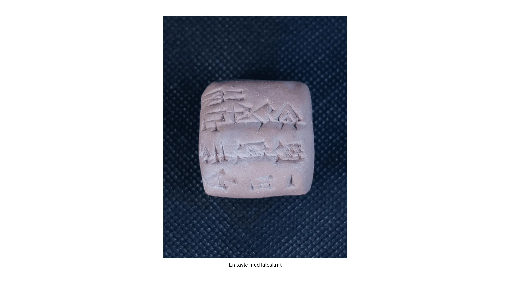

Jeg har også det jeg tror er en ekte sumerisk tavle med en liten kileskrift i midten. På denne tavlen er det signaturer som er laget ved å rulle en sylinder, som jeg skal vise dere etterpå.

Merkene med små tall fungerte som signaturer i en tid da folk flest ikke kunne skrive, ettersom bare dyktige skrivere hadde denne evnen.

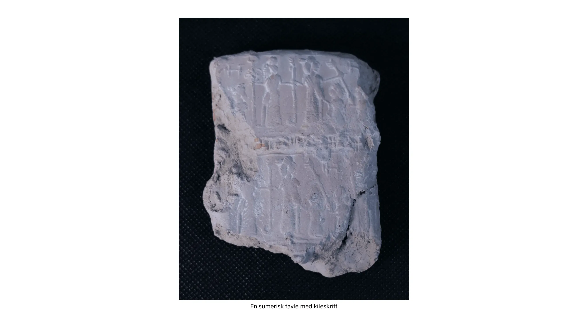

Nedenfor ser du sylinderen som er nevnt ovenfor: en stein inngravert med bestemte former. Denne signatursylinderen, som på engelsk kalles cylinder seal, ble brukt til å rulle sammen for å signere brev. Det var en måte å tydeliggjøre forfatternes navn på, eller å indikere at de var skrevet i deres navn.

Datidens skrivere brukte derfor den kileformede pennen til å skrive ut tegn på våte tavler.

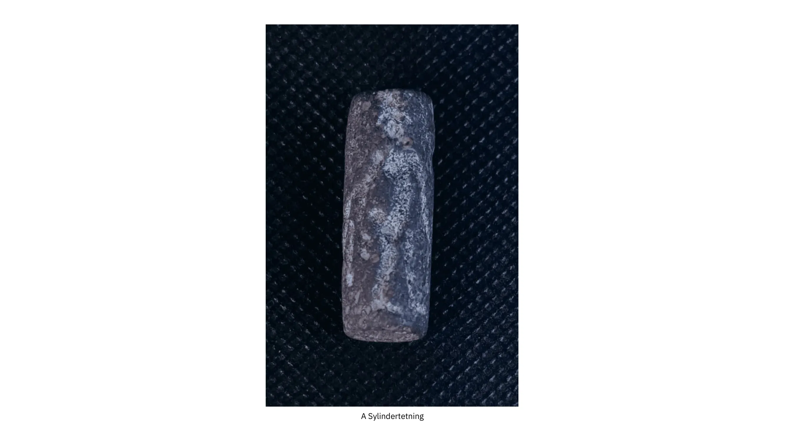

Kileskriften representerte ikke et språk, men et skriftsystem for å nedtegne talte språk. På engelsk ville vi sagt "writing is a written language", og så ville vi sagt at "kileskrift er et skriftspråk, ikke et språk". På fransk ville vi sagt at kileskrift ikke er et språk, men en måte å kodifisere et språk på.

### Utviklingen og bruken av skrift

I løpet av de første århundrene var skriften begrenset, og fungerte hovedsakelig som et huskesystem for å notere mengder, lister over jordbruksvarer og utstyr. Først etter hvert ble den i stand til å gjengi navn** og hele setninger **fonetisk**.

Opprinnelig kunne ikke navn uttrykkes i kileskrift, fordi den først og fremst representerte gjenstander og virkelighetselementer, som for eksempel en okse eller hvete, avbildet som små bilder. Med tiden utviklet disse bildene seg til en mer utviklet form for skrift, som gjorde det mulig å representere navn og komplekse begreper.

Hvis personen for eksempel het Laura, kunne vi ha tatt et ord, et akronym som hørtes ut som "vann" og et annet som "ras", og dannet navnet Laura med det. Det var slik den første formen for skriftspråk utviklet seg.

For ordens skyld: Hvis du opprinnelig ville tegne hodet til en okse, kunne du se formen på oksehodet. Etter hvert ble tegningene forenklet til å kun representere en slags strek. Forskerne mener at dette skjedde fordi man holdt den våte leirtavlen i én hånd, slik at det var lettere å tegne om initialene ved å snu dem. Det antas også å skyldes måten de skriftlærde holdt tavlene på.

Du kan fortsatt se forbindelsen til for eksempel hvete eller oksehodet i kileskriftakronymer, og de lener seg alltid til den ene siden.

I løpet av de tre årtusenene kileskriften ble brukt, tjente den først og fremst til å føre økonomiske og administrative opptegnelser. Men innbyggerne i Mesopotamia utviklet snart et dyptfølt ønske om å bevare alt som fortjente å stå seg gjennom tidene, i skriftlig form. Historier, legender og sanger, som hittil hadde blitt overlevert muntlig av omreisende musikere, ble udødeliggjort i skrift, ofte kopiert av skrivere under opplæring. De kopierte tekster som allerede eksisterte, hovedsakelig legender eller tekster som hadde en viss kulturell verdi.

Et viktig eksempel er **Gilgamesj-eposet**, som muligens er en **historisk konge i den sumeriske bystaten Uruk** rundt 2900-2350 f.Kr.

Denne formen for skrift, som både var et økonomisk styringsverktøy og en kulturell vektor, varte frem til det 1. århundre e.Kr. før den forsvant for godt, og etterlot seg et verdifullt vitnesbyrd om sivilisasjonen som så den bli født.

## De sumeriske tavlenes rolle

<chapterId>a396e6c5-56cc-5410-9e6b-0274401c5425</chapterId>

:::video id=a0729a35-01ec-4aa4-828f-d4ccc2eb168e:::

### Før-monetære kredittsystemer

I det gamle Mesopotamia var den økonomiske organiseringen basert på svært sofistikerte mekanismer som eksisterte lenge før metallmyntene ble oppfunnet. Formelle og uformelle kredittsystemer var allerede fra begynnelsen av en viktig form for penger, som gjorde det mulig for lokalbefolkningen å gjennomføre mange komplekse økonomiske transaksjoner.

Det var nettopp for å dekke administrative og økonomiske behov at kileskriften ble oppfunnet. De berømte mesopotamiske leirtavlene ble hovedsakelig brukt til å nedtegne ulike typer kontrakter: private lån, salg, utleie, pantelån og til og med ekteskapsavtaler. For å skrive disse tavlene måtte man ha spesialiserte skrivere, en oppgave som var kostbar i tid og krefter, **men som var berettiget når økonomiske interesser sto på spill.** Folk skrev ikke kjærlighetsbrev til hverandre på den tiden, og de brukte ikke en skriver til å skrive om bekymringene sine. De hyret en skriver til å skrive dokumenter, enten det var av kjærlighetsmessige eller økonomiske grunner.

Det er også verdt å nevne at noen av disse tablettene sirkulerte som ihendehaverobligasjoner og skiftet eier fritt.

For eksempel var det en form for leirkule med små steiner inni.

På utsiden av leirkulen var det skrevet og signert et tall som representerte et antall enheter. På innsiden var det steiner og noen som ønsket å verifisere, for virkelig å bekrefte at dette instrumentet virkelig representerte X antall enheter.

Et annet eksempel er en tavle som er funnet sørvest for dagens Bagdad, der det står at en skyldner forplikter seg til å betale tilbake 330 mål korn til en kreditor på innhøstingsdagen. Enda mer fascinerende er det at en annen tavle sier klart og tydelig at en gjeld på fire mål bygg skal betales tilbake direkte til tavlebæreren, noe som **innfører begrepet betaling til bæreren, et spesielt innovativt konsept for den tiden**.

Fra 2000 f.Kr. og fremover var det en lov som krevde at alle handelstransaksjoner, selv de minste, skulle formaliseres skriftlig og undertegnes i nærvær av vitner. Forestill deg hvilket enormt byråkrati det var på den tiden å registrere alle transaksjoner i registre laget av leire av skriftlærde. Denne juridiske strengheten skulle forhindre fremtidige tvister om eierskap og rettigheter til de utvekslede varene. Ofte ble vitner innkalt for å bekrefte at kontrakten faktisk var undertegnet.

Også i den private sfæren drev enkelte familier og enkeltpersoner med økonomiske aktiviteter som var komplekse nok til å kreve streng styring. I den nordbabylonske byen Sippar-Amnanu ble det funnet nesten 2000 skrifttavler i huset til en anunitum-prest ved navn Ur-Utu. Disse dokumentene inkluderte private lånekontrakter, salgs- og leiekontrakter, brev, religiøse og akademiske tekster, noe som vitner om mangfoldet og betydningen av private arkiver på denne tiden.

Det er bemerkelsesverdig at brevene som ble skrevet av de skriftlærde, nesten utelukkende handlet om økonomiske interesser: klager over utilstrekkelige godtgjørelser, ventende medgiftsbetalinger eller andre presserende materielle forespørsler. På den tiden fantes det ikke personlige skrifter som kjærlighetsbrev, og selv omtale av sykdom var sjelden.

Et gripende eksempel på et slikt brev illustrerer denne økonomiske virkeligheten: En brevskriver uttrykker sin nød etter å ha blitt stående uten penger og proviant da partneren forlot ham, mens en alvorlig hungersnød rammet Assur. Han beskriver sitt akutte behov for å kjøpe korn, og ber om å få tilsendt et kontantbeløp tilsvarende tekstilene sine raskt, slik at han kan sikre sitt daglige underhold.

Dette brevet, som er adressert til partneren hennes, tyder på at han har dratt av gårde for å drive handel andre steder, slik at hun står uten penger. Hun minner ham om at hun må ha tilgang til penger for å kunne kjøpe korn og betale tempelskatten. Dette er kanskje det nærmeste vi kommer et argument skrevet i et brev fra denne tiden. Brev var nesten alltid knyttet til økonomiske transaksjoner, og nettopp dette brevet handler om en prekær økonomisk situasjon.

De mesopotamiske dokumentene som er overlevert oss, gjenspeiler derfor hovedsakelig økonomiske utvekslinger, siden de utelukkende ble utarbeidet for overføringer av varer med en anerkjent verdi: penger, korn, ulike varer, fast eiendom, betaling av tempelskatter. Disse arkivene avslører ikke bare effektiviteten og den administrative presisjonen til denne gamle sivilisasjonen, men også dens evne til å administrere komplekse økonomiske utvekslinger over en svært lang periode.

## Elitekontroll på sumeriske tavler

<chapterId>c6d3df0e-b1e1-58dc-ab35-9f76bbc39393</chapterId>

:::video id=04a95fb8-a701-4a48-9ce8-0e9b6ba256fd:::

### Skriving, en teknologi som først og fremst er økonomisk

I motsetning til hva mange tror, var det ikke personlig eller litterær kommunikasjon som lå til grunn da skriften ble oppfunnet i Mesopotamia for rundt 4000 år siden. **Kileskriften var først og fremst en økonomisk teknologi**, som bare var berettiget når viktige økonomiske interesser sto på spill. Sumererne brukte ikke skriften til å korrespondere med hverandre eller uttrykke følelser, men utelukkende til å dokumentere sine kommersielle og økonomiske transaksjoner.

Denne spesialiseringen kan forklares med de betydelige kostnadene ved å skrive på tavler. Gravering i leire krevde spesialisert teknisk ekspertise, mye tid og spesifikke materialer. Bare transaksjoner av tilstrekkelig verdi rettferdiggjorde denne investeringen økonomisk, noe som skapte en naturlig terskel for tilgang til denne revolusjonerende teknologien.

Kileskrifttavlene avslører et finanssystem som var bemerkelsesverdig komplekst for sin tid. Mesopotamierne hadde utviklet et komplett arsenal av moderne finansielle instrumenter: **private lån med renter, kjøpekontrakter, leiekontrakter, pantelån og til og med ekteskapskontrakter med finansielle klausuler**. Denne sofistikerte utviklingen vitner om en utviklet markedsøkonomi, langt fra det forenklede bildet av primitiv byttehandel som ofte forbindes med disse gamle sivilisasjonene.

Noen av tavlene fungerte som ekte ihendehaverpapirer, som sirkulerte fritt fra hånd til hånd uten at det var nødvendig å identifisere den opprinnelige innehaveren. Denne nyvinningen muliggjorde en bemerkelsesverdig flyt i utvekslingen, og foregrep moderne finanssystemer. I tillegg krevde spesifikk lovgivning at alle kommersielle transaksjoner skulle formaliseres skriftlig, noe som institusjonaliserte bruken av skrift i den økonomiske sfæren.

### Kunnskapsmonopol og økonomisk kontroll

Skriftens sentrale rolle i økonomien ga betydelig makt til dem som behersket denne teknologien. **Skriverne, som vanligvis var knyttet til templer og herskende institusjoner, hadde de facto kontroll over det finansielle systemet**. Deres sjeldne og uvurderlige ekspertise gjorde dem til voktere av alle viktige transaksjoner.

Dette kunnskapsmonopolet var ingen tilfeldighet. Myndighetene hadde all interesse av å opprettholde denne eksklusiviteten, ettersom en demokratisering av skriftspråket ville ha svekket deres kontroll over økonomien og økt risikoen for forfalskning. Den systematiske tilstedeværelsen av vitner ved underskriftsseremonier avslører denne konstante opptattheten av dokumenters autentisitet.

Den juridiske plikten til å nedtegne alle handelstransaksjoner skriftlig tjente flere strategiske formål: skattekontroll, streng regnskapsovervåking og opprettholdelse av de økonomiske aktørenes avhengighet av det administrative apparatet. **Den mesopotamiske staten tilegnet seg dermed evnen til å håndtere mellommenneskelig gjeld** på en samfunnsmessig skala, og gjorde skriftlighet til et instrument for økonomisk makt.

### Sameksistensen av to monetære systemer

Analysen av tavlene avslører en mer nyansert økonomisk virkelighet enn deres allestedsnærværende tilstedeværelse i arkivene skulle tilsi. Mange av tavlene refererer til **sølvshekelen** som verdienhet, noe som tyder på at det parallelt eksisterte et pengesystem basert på standardiserte fysiske varer.

Denne tosidigheten kan forklares med datidens sosiale lagdeling. **Kileskriftsystemet var forbeholdt en begrenset elite**: geistlige, velstående kjøpmenn og administratorer som var i stand til å lese, skrive og tolke disse komplekse dokumentene. For å kunne bruke en skrifttavle effektivt måtte man ikke bare kunne tyde den, men også være i stand til å verifisere dens autentisitet og forstå dens juridiske implikasjoner.

**Befolkningen, som var ekskludert fra dette elitistiske systemet, utviklet sine egne byttemekanismer**. Vanlige folk brukte mer tilgjengelige systemer som standardiserte kornmål, pengevekter og andre lett kvantifiserbare varer som alle kunne vurdere uten spesialkompetanse.

Denne folkelige økonomien, som er mindre dokumentert i offisielle arkiver, var sannsynligvis mer dynamisk og fleksibel enn tavlesystemet. Den muliggjorde raske, daglige utvekslinger uten bruk av skriftlærde, og dekket de umiddelbare behovene til håndverkere, bønder og små handelsmenn.

Sølvsekkelen, som ofte nevnes i tavlene som en verdireferanse, fungerte trolig som en bro mellom disse to parallelle økonomiske systemene, og gjorde det mulig å veksle mellom skriftlig gjeld og fysiske betalinger.

### Spontan fremvekst versus institusjonell kontroll

Denne sameksistensen illustrerer en grunnleggende debatt i økonomisk historie: **Motsetningen mellom den spontane fremveksten av byttemidler og den institusjonelle tilegnelsen av penger**. På den ene siden oppsto varer som penger naturlig ut fra folks byttebehov. På den andre siden har institusjonene tilegnet seg og formalisert denne praksisen for å kontrollere flyten.

De sumeriske templene var et eksempel på denne spenningen: De brukte populære monetære innovasjoner (referanser til shekelen) samtidig som de utviklet sine egne kontrollinstrumenter (kileskrifttavler). Denne strategien gjorde det mulig for dem å høste fordelene av begge systemene: den folkelige legitimiteten til tradisjonelle valutaer og den administrative kontrollen av formalisert gjeld.

Erfaringene fra Mesopotamia skaper varig presedens for utviklingen av finansielle systemer. Den viser at **finansiell sofistikering ofte går flere årtusener forut for teknologiske nyvinninger**, som vanligvis er forbundet med den. Konseptene rente, kreditt, omsettelige instrumenter og pantesikkerhet ble ikke utviklet først etter at metallpengene ble oppfunnet.

Denne banebrytende perioden avslører også maktspørsmålene som ligger i enhver monetær innovasjon: hvem som kontrollerer teknologien, hvem som definerer reglene, og hvordan formelle systemer og folkelig praksis artikuleres. Disse grunnleggende spørsmålene har vedvart gjennom hele den økonomiske historien, og de har også preget dagens debatter om digitale valutaer og [kryptovalutaer](https://planb.academy/resources/glossary/cryptocurrency).

# Økonomi og penger i antikkens sivilisasjoner

<partId>a16bcf4c-8c3a-11f0-9e79-2bd363a484bd</partId>

## De store sivilisasjonene i bronsealderen

<chapterId>fab9334c-7385-5d7c-ad40-7d152beb22a1</chapterId>

:::video id=737e12e8-1033-4210-b1dd-b8a680f68b17:::

I denne delen med tittelen "De store sivilisasjonene i bronsealderen" starter vi med et utdrag fra boken *A History of Money: From Ancient Times to Present Day* av Glyn Davies, som jeg synes er en utmerket introduksjon til denne delen om de store sivilisasjonene i antikken.

> Toynbee identifiserer rundt 21 ulike "sivilisasjoner", men siden 15 av disse er direkte eller indirekte avledet av tidligere eksempler, reduserer han antallet selvstendig utviklede sivilisasjoner til seks: sumererne, egypterne, minoerne, kineserne, mayaene og andinene. Av disse var det bare inkaene i Andesfjellene som klarte å oppnå en høy grad av sivilisasjon uten å bruke penger, selv om de paradoksalt nok hadde en overflod av de materialene som vanligvis regnes som de beste til å bruke som penger - gull og sølv.

Inkaene hadde ikke noe pengesystem, men de hadde en overflod av edle metaller. Litt av et paradoks. La oss fortsette med sitatet:

> Jo mer stratifisert et samfunn er, og jo mer effektivt planleggingssystemet er, desto mindre nødvendig er bruken av penger for befolkningen. Dette kan forklare hvorfor de spanske erobrerne oppdaget at meksikanerne, som hadde et relativt mer liberalt styresett, regelmessig brukte gullpulver (oppbevart i gjennomsiktige rør) og kakaobønner (oppbevart i sekker på 24 000 enheter for store betalinger) som valuta, mens inkaene, som var organisert etter et mye strengere hierarki, ikke hadde noen valuta i det hele tatt: et unntak som ble bekreftet av en streng regel. Pengenes opprinnelse i Kina var helt uavhengig av andre sivilisasjoner, men den relative nærheten til de sumeriske, egyptiske og minoiske sivilisasjonene gir grunn til å tvile på hvor uvitende de var om pengebruk, særlig med tanke på den omfattende handelen som ble etablert helt tilbake til de tidligste tider.

I Kina ble mynter utviklet med en helt annen tilnærming enn i Vesten. Det var [fiat-penger](https://planb.academy/resources/glossary/fiat) fra starten av. De var støpte mynter.

Og her nevner Davies handel. Det var riktignok utveksling mellom kineserne og andre befolkninger til visse tider, men byttemiddelet for utenrikshandel var snarere silke. Som vi skal se senere, ble gull også brukt i Kinas grenseområder, der den kinesiske befolkningen var mindre. Og ikke engang til internasjonal handel; der var det silke som gjaldt.

Så jeg kan tenke meg at myntenes format kan ha blitt påvirket av andre sivilisasjoner fra samme tid som utviklet denne teknologien.

Men det er klart at penger hadde en helt annen betydning i Kina enn i Vesten. Vi kommer tilbake til dette i den påfølgende delen om Kina.

Når det gjelder disse berømte sumeriske byene, har jeg noen få notater her. Vi kan nevne Uruk, som var en svært tidlig og innflytelsesrik by, berømt for sin betydelige størrelse og avanserte kultur, særlig med utviklingen av skrift og byplanlegging.

Jeg vil også nevne det berømte Gilgamesh-eposet. Gilgamesj var sannsynligvis en historisk konge i den sumeriske byen Uruk rundt 2900 f.Kr. Han var sannsynligvis konge i denne sumeriske bystaten.

Vi kan også snakke om Sargon av Akkad, som regjerte fra 2334 til 2279 f.Kr.

Han var den første herskeren over det akkadiske riket, som er en annen sivilisasjon som oppsto i Mesopotamia. Og jeg nevner Sargon fordi han var den første som etablerte en posttjeneste for disse berømte tavlene her, som jeg allerede har introdusert for dere.

Tenk om det virkelig fantes konvolutter av leire. Tavlene kunne pakkes inn i leirkonvolutter med personens signatur på utsiden for å sikre konfidensialitet. Så kunne folk bryte opp konvolutten for å hente ut tavlen. Dette postsystemet kan vi takke Sargon av Akkad for.

Så har vi Babylon, den store byen som ble hovedstad i det babylonske riket. En annen sivilisasjon, kjent for sin imponerende ziggurat og sine palasser, og den berømte Hammurabis lovbok, som er mest kjent for sitt svært avanserte lovverk.

Og to byer for å avslutte denne delen. Vi har Assur, som var hovedstaden i det assyriske riket, et viktig religiøst senter. Og vi har Ninive, som senere ble hovedstad i det assyriske riket. De flyttet hovedstaden sin dit, og den er kjent for sin mektige hær, store palasser og biblioteker. Og det er også et av de mulige stedene for de legendariske Babylons hengende hager. Vi hører ofte om dette berømte underverket fra den antikke verden.

Men det finnes ingen spor etter disse berømte hengende hagene i Babylon. I Ninive, derimot, finnes det arkeologiske bevis for hager i flere etasjer. Det er mulig at greske historikere som Herodot forvekslet Ninive med Babylon. Når de besøkte byer i Mesopotamia, refererte de kanskje til den som Babylon. Det er funnet spor etter berømte hengende hager i Ninive, og forskere lurer kanskje på om Ninive er det berømte stedet der disse hagene lå, omtalt som de babylonske hengende hager.

## Økonomisk organisering i Mesopotamia

<chapterId>6afb6fc8-cbb7-56a5-8427-484b4b7d7477</chapterId>

:::video id=aa6a2cbd-5916-4ae3-ad4f-65f0bd5643fa:::

### Førkapitalistiske økonomiske strukturer og slaveri

Velkommen til denne delen om økonomisk organisering i Mesopotamia. Den førkapitalistiske økonomien gjennomgikk tre hovedstadier: primitiv, slave- og føydaløkonomi.

Føydal er selvfølgelig mye senere, åpenbart i middelalderen, og vi har allerede passert det primitive stadiet som vi beskrev tidligere med paleolittisk tid. Når vi snakker om økonomisk organisering i Mesopotamia, snakker vi om slaveri.

I Mesopotamia ble imidlertid mesteparten av arbeidet utført av en avhengig klasse som lignet slaver, som ikke juridisk sett var herrenes eiendom, men som ble fratatt fruktene av arbeidet sitt gjennom fysisk eller ideologisk tvang.

### Templenes og palassenes rolle som økonomiske sentre

Store jordeiendommer dominerte økonomien. Jordeierne utnyttet jorden sin direkte ved å ansette arbeidere, eller de leide ut jorda i bytte mot leieinntekter. De drev også med finansvirksomhet og lånte ut penger til høye renter, vanligvis mellom 20 % og 33,3 % per år, en praksis som sto i skarp kontrast til de strengere reglene hos hebreerne i nabolandet.

Lånene bøndene tok opp, var ikke ment for produktive investeringer - med unntak av rederiene - men snarere for å sikre overlevelse frem til neste innhøsting. Denne situasjonen førte ofte til kronisk gjeld hos bøndene.

La meg trekke en parallell til en nyere periode i antikken (Roma), der borgerne levde av jordbruksinntektene fra bønder og ufri arbeidskraft, samt krigsbytte. **Disse inntektene ble fordelt mellom borgerne, ikke for å øke fortjenesten, men for å heve deres sosiale status.** Handel og håndverk var som regel overlatt til grupper utenfor den sosiale eliten. Alt dette står i kontrast til middelalderens økonomier som var innrettet mot profitt gjennom handel og håndverk.

Så det vi prøver å si her, er at jeg trekker en parallell til det faktum at folk brukte finansielle utlånsverktøy ikke nødvendigvis for å forbedre produksjonsmidlene, og senere i Roma ble overskuddet ikke nødvendigvis reinvestert, men heller brukt til å øke prestisjen til de menneskene som kunne dra nytte av dette overskuddet. Vi er fortsatt langt unna den kapitalistiske ånden som vokste frem senere i middelalderen, da arbeidsplasser kunne skapes for å forbedre produksjonsmidlene, og overskudd ble tatt og skapt i jakten på profitt. Vi ser altså at den økonomiske organiseringen ennå ikke hadde nådd det tredje stadiet i den økonomiske utviklingen som er listet opp ovenfor.

### Fremveksten av kredittsystemer og regningsenheter

**Karl Polanyi skiller mellom tre former for økonomisk utveksling: gjensidighet mellom symmetriske grupper,** det vil si i primitive stammer der vi egentlig ikke trenger penger fordi vi gir hverandre uformell kreditt og bytter og omfordeler. **Omfordeling sentralisert rundt templer og palasser,** denne formen for utveksling er forenlig med Mesopotamia, der templene var i sentrum for den økonomiske organiseringen og på et tidspunkt kunne gi tilbake, distribuere rikdom i form av rasjoner. Det var først senere at lønnsbegrepet ble introdusert. Så til nå har vi den primitive formen (1), sentralisert omfordeling (2) i templer og palasser, og så kan vi til slutt vike for markedets utveksling (3). Selv om markedet slik vi forstår det i dag, ikke eksisterte fullt ut, er det udiskutabelt at det fantes markedsbørser i Mesopotamia, noe som bekreftes av eksistensen av spesifikke termer på akkadisk og av arkeologiske bevis på priser, fortjeneste, tap, svingninger og knapphetssituasjoner.

Mesopotamiske husholdninger var selvstendige i alle ledd av jordbruksproduksjonen, fra såing til den endelige foredlingen til brød og øl. Kvinnene produserte også tekstilene som de forsørgede trengte. For varer som ikke ble produsert lokalt, henvendte husholdningene seg til spesialiserte kjøpmenn.

Familiebånd var spesielt viktige i handelen. I paleoassyrisk tid (ca. 1910-1830 f.Kr.) etablerte kjøpmenn fra byen Ashur en handelskoloni i Kanesh i Anatolia, der de importerte tinn og tekstiler i bytte mot gull og sølv. Handelen var basert på familiebedrifter som var tett knyttet sammen gjennom ekteskap og handelssamarbeid. Kanesh var bare ett ledd i et stort internasjonalt handelsnettverk.

I disse utvekslingene var det metaller, og det var edle metaller og ikke nødvendigvis, for eksempel, kobber, som var veldig nyttig på den tiden, og vi tror at disse metallene ble utvekslet mot forestillinger om verdioppbevaring. Vi kan altså ikke nødvendigvis snakke om byttehandel, der to varer byttes mot hverandre på grunn av deres nytteverdi, men snarere en forestilling om betaling med en viss bevissthet om å hamstre edle metaller for å bruke dem som verdilager og ikke for å bruke dem som handelsvare, som for eksempel bruk av bronse til å lage rustninger.

Skatter og avgifter ble hovedsakelig betalt i naturalier (bygg eller veid sølv). Templene og palassene var de viktigste økonomiske, administrative, politiske og religiøse sentrene, og de utførte også de første bankfunksjonene gjennom sikker deponering av varer, først korn, deretter andre landbruksprodukter og til slutt edle metaller. På denne måten ble de første kreditt- og låneoperasjonene utviklet, lenge før myntene dukket opp.

Den mesopotamiske økonomien brukte hovedsakelig bygg og sølv som verdimålestokk. Sølv ble veid i standardiserte enheter, som sìqlum (shekel) på rundt 8,33 gram. Allerede i det gamle Babylon (under Hammurabi) ble sølv brukt som et vanlig betalingsmiddel, med en tidlig forestilling om nominell verdi ("nūbum") i motsetning til reell vekt ("šuqulum"), **forut for det moderne konseptet fiat-valuta**.

Men det var ennå ikke fiat-penger i ordets egentlige forstand. Det fantes ingen forestilling om et stempel med en autoritetsfigur, men det fantes en forestilling om en nominell regningsenhet, i motsetning til forestillingen om veid metall. Det var et skille i språket mellom disse to begrepene, og jeg synes det er viktig å nevne det.

Overgangen til et lønnsarbeidsmarked var vanskelig. Den krevde to store konseptuelle nyvinninger: å skille mellom personens arbeid og sluttproduktet, og å innføre "arbeidstid" som en målbar enhet. For å få dette begrepet om lønnstakere og funksjonærer måtte vi først gjennom disse to innovasjonene. **I det III. årtusen ble arbeidet først avlønnet med faste rater, før det gradvis utviklet seg i retning av et lønnssystem i begynnelsen av det II. årtusen

Fra det 26. århundret f.Kr. og utover fikk en reell forestilling om pengeverdi fotfeste, selv om de mesopotamiske "pengene" ikke var mynter, men veide mål av korn eller metall. **Ved viktige transaksjoner eller i sammenhenger der det var viktig å bevare verdien, foretrakk man derfor ofte å veksle om korn til sølv, som var lettere å ta vare på - litt som i Kanesh, der man mottok sølvmetall for å hamstre det.

Fra og med det 21. århundre f.Kr. og fremover, **med den virtuelle forsvinningen av asymmetriske utvekslinger**, ser vi at verbet sa i oppdragskontrakter refererer til betaling av prisen. Dette begrepet, kalt "sa", forekommer i kontrakter og refererer til betaling av en pris, ikke til måling av en bestemt vare. "Sa" refererer ganske enkelt til en betaling eller en pris. Det er en antropolog som bemerker dette og nevner at det virkelig er et gjennombrudd; vi ser en slags dikotomi mellom før og etter denne innføringen av verbet "sa" i kontrakter.

Vi kan ikke se bort fra de empiriske dataene som finnes i de nærorientalske arkivene, og som vitner om eksistensen av **visse markedsmekanismer**, med **forestillinger om fortjeneste** og **tap**, **prissvingninger** og **knapphetssituasjoner**. Men den grunnleggende vanskeligheten ligger i å bestemme den relative betydningen av markedsbasert utveksling i den mesopotamiske økonomien som helhet.

Jeg tror ekspertene på dette feltet har sett spor av disse markedskonseptene, men de er ikke helt i stand til å fortelle oss hvor mye av datidens økonomi som var basert på dette mer moderne markedskonseptet eller andre mekanismer.

Vi vet at det eksisterte, men vi vet ikke om det var den viktigste måten å fastsette priser eller handle på.

Dette avslutter denne delen om økonomisk organisering i Mesopotamia.

I de neste avsnittene gjør vi det samme for Egypt og Kina.

## Økonomisk og monetær organisering i det gamle Egypt

<chapterId>bffcc16c-7fbf-5992-a0fa-6a7726d7d287</chapterId>

:::video id=40c1c4e5-b190-4bb6-b8a0-810c9ce7698b:::

### Historisk bakgrunn og egyptiske perioder

Denne delen er viet den økonomiske og monetære organiseringen av det gamle Egypt. For å gi deg litt bakgrunn, følger her en liste og en kort beskrivelse av de aktuelle periodene.

- Det gamle riket (ca. 2575 - ca. 2130 f.Kr.)**. En periode preget av byggingen av de store pyramidene, særlig de i Giza. Dette var gullalderen for det sentraliserte egyptiske monarkiet.
- Midtens rike (ca. 1938 - ca. 1630 f.Kr.)**. Politisk og kulturell renessanse etter en periode med ustabilitet.
- Det nye riket (ca. 1539 - 1075 f.Kr.)**. En periode med territoriell ekspansjon, militærmakt og internasjonal handel. Den omfatter regjeringstiden til berømte faraoer som Tutankhamon og Ramses II.
- 1323 F.KR. - Tutankhamons død**. Den unge faraoen døde rundt 18-19 år gammel. Graven hans ble oppdaget i 1922, og den er et av de mest berømte arkeologiske funnene som er gjort.
- Ramses II - regjerte 1279-1213 f.Kr.**. En av de mektigste faraoene i det nye riket. Kjent for sine militære felttog, sine store monumenter og for å ha inngått den første kjente fredsavtalen.
- 1275 f.Kr. - Havfolkene**. Invasjoner eller folkevandringer av grupper kalt "sjøfolkene" destabiliserer flere middelhavssivilisasjoner, inkludert Egypt.
- Slaget ved Xoïs - 1178 f.Kr.**. Konflikt mellom den egyptiske hæren og inntrengere, sannsynligvis knyttet til sjøfolkene. Et av mange slag på slutten av det nye riket.
- Senperioden** er den perioden i det gamle Egypts historie som strekker seg fra rundt 664 til 332 f.Kr.
- Kleopatra VII (69 - 30 f.Kr.)**. Egypts siste dronning, berømt for sin intelligens, karisma og allianser med Julius Cæsar og Marcus Antonius, og sannsynligvis også for nesen sin. Hennes regjeringstid markerte slutten på det faraoniske Egypt før det ble annektert av Roma.

Allerede i det 5. og 4. årtusen f.Kr. var Egypt preget av intens handelsvirksomhet i stor skala, og landet knyttet Nubia, Palestina, Libya og Rødehavsområdet sammen gjennom handel til sjøs, på elvene og over land (særlig med eselkaravaner).

### Tidlige vekslingssystemer og paleo-valuta

Da de første egyptiske høvdingdømmene oppsto rundt 3650-3400 f.Kr., ble Maadi, sør for dagens Kairo, et viktig senter for kobberteknologi og langdistansehandel, særlig med Mesopotamia via den syriske kysten.

Selv om handelen i stor skala hovedsakelig var basert på byttehandel, eksisterte det trolig en primitiv form for penger ("paleo-valuta"), bestående av prestisjegjenstander som halvedelstener og fossile skjell. Gull spilte sannsynligvis allerede en viktig rolle i disse byttene. Den første eksplisitte omtalen av en mynt i egyptiske dokumenter i midten av det tredje årtusen f.Kr. gjenspeiler en lang utvikling knyttet til handelspraksis.

I arkaiske samfunn (her snakker vi ikke nødvendigvis om Egypt, men arkaiske samfunn generelt) var det vanlig med betalinger, ikke for å kjøpe direkte, men for å betale medgift, religiøse ritualer og andre sosiale forpliktelser. Disse transaksjonene krevde presis prising og verdsetting. Mange primitive samfunn hadde privilegerte, monetære (dvs. tellbare) gjenstander som man kunne anslå verdien av. Hvis du skal betale en medgift, må du selvfølgelig notere ned en viss mengde av en gjenstand som skal byttes for å betale medgiften. Denne verdien er i hovedsak verdien av mennesker.

I arkaiske samfunn, før penger og pengesystemer ble innført, fantes det betalinger, men de var ofte knyttet til sosiale forpliktelser, og deres verdi var avledet av enkeltpersoners verdi, som ved betaling av medgift eller blodpenger.

Tilbake til Egypt, under det gamle imperiet, gikk "shât(y)", som opprinnelig var en konkret pengeenhet (en liten gull- eller sølvmynt som veide rundt 7,6 gram), veldig raskt over fra å ha en reell funksjon som hard valuta til å få en **regnskapsfunksjon** som ga opphav til verdibegrepet. Vi kan gjenkjenne en slags regningsenhet for å uttrykke verdi, som opprinnelig var en slags mynt, men vi kan egentlig ikke kalle den en mynt fordi den ikke er stemplet, den er bare et mål av metall. Vi nærmer oss begrepet regningsenhet.

Denne forestillingen om shât(y) ble etter hvert forlatt, kanskje på grunn av risikoen for svindel. Vi skal senere se at egypterne var sene med å ta i bruk stemplede mynter, og at de til og med fortsatte å veie dem, selv etter at naboene hadde tatt dem i bruk.

I middelalderen ble sølv sjelden brukt til daglige transaksjoner, som hovedsakelig ble utført med kornmål og brødmengder. Det var i denne perioden at det dukket opp en form for skriftpenger, der betalinger kunne registreres skriftlig eller ved faktisk overføring.

I det nye riket ble pengesystemet mer komplekst, og integrerte ulike råvarevalutaer som ble verdsatt i metaller (gull, sølv, kobber), standardiserte stoffer, korn og olje. Stoffene ble omtalt som "tøymål". **Prisene på dagligdagse varer ble ofte uttrykt i korn eller kobber, mens kostbare gjenstander ble verdsatt i gull eller sølv. Sølv, som var sjeldnere i Egypt enn gull, ble særlig verdsatt.** Sølv var overpriset i forhold til gull, som det var mer av i Egypt.

I senmiddelalderen (første årtusen f.Kr.) var sølv blitt det vanlige byttemetallet i hele Midtøsten. Det sirkulerte i form av barrer, metallmynter eller ringer, som ble veid og merket i templene, noe som garanterte vekt og renhet, selv om de ikke ble preget i form av en stattholder. Det kom senere, og vil bli gjenstand for et senere avsnitt om lydierne.

Det bør også nevnes at de gamle egypterne hadde et eget begrep for penger, "hedj", som ble brukt som en fellesbetegnelse på ethvert betalingsmiddel som fungerte som vederlag i en transaksjon, enten det gjaldt metall, korn, tøy eller ulike varer (tre, dyr, tjenester osv.). Dokumenterte eksempler viser at egypterne kunne gjøre opp en transaksjon ved å kombinere ulike produkter hvis samlede verdi ble uttrykt i kobberenheter ("deben").

**Templene spilte en sentral rolle i egypternes økonomi: De samlet og oppbevarte betydelige skatter av edle metaller (gull og sølv) som skulle hedre gudene, men også fungere som en valutareserve som kunne settes inn i det økonomiske kretsløpet igjen ved behov**. Vi ser eksempler på at andre sivilisasjoner har samlet verdifulle reserver i templene, for eksempel statuer, som kunne smeltes ned i tilfelle krig, valutamangel eller krise. Dette er et tilbakevendende tema gjennom historien.

Det er også verdt å nevne at dyrking av lin var et kongelig monopol som ble gitt til templene, og produksjonen av kostbare stoffer bekreftet deres økonomiske betydning.

De gamle egypterne skilte klart mellom edelmetallenes ideologiske aspekt, knyttet til guddommelighet (gull representerte gudenes kjøtt, sølv deres ben), og deres praktiske funksjon som valuta, som referanse for alle andre former for betaling.

Selv om det gamle Egypt ikke utviklet en myntenhet som kan sammenlignes med moderne pengesystemer før i slutten av perioden, hadde landet et sofistikert pengesystem basert på en kombinasjon av skriftpenger, presise regneenheter, varepenger og edle metaller verdsatt etter vekt.

Myntene ble veid, noe som ga opphav til to ulike begreper: **"mynt" og "penger"**. Jeg brukte to begreper på engelsk. For det første refererer "coinage" til mynter, et begrep som kommer senere, og vi har også dette begrepet penger. Vi kan allerede definere et visst begrep om "penger" ved hjelp av de regneenhetene jeg nettopp har uttrykt i form av penger, men som ennå ikke var mynter, så "coinage" kommer litt senere med lydierne.

Mynter er altså ikke en forutsetning for penger, **så mye at vi kan innrømme eksistensen av penger så tidlig som i det 3. årtusen,** i alle fall og uten tvil i det 2. årtusen og særlig under Hammurabi.

Det som er viktig å huske her, og som forfatteren nevner i boken "The Origins of Money", er at det ikke er noen tvil om at begrepet penger allerede eksisterte på den tiden, i disse pengesystemene, og det er en feil å knytte fødselen av penger som begrep til myntenes fremvekst.

Endelig må Polanyis begreper om gjensidighet og omfordeling, som ofte brukes på det gamle Egypt, nyanseres: Selv om de eksisterer, danner de ikke et eksklusivt rammeverk. Det faraoniske Egypt hadde utviklet en kompleks økonomi som fullt ut integrerte sofistikerte kommersielle utvekslinger, adskilt fra religiøse og rituelle praksiser, noe som demonstrerer en reell autonomi mellom det økonomiske og det ideologiske domenet.

Denne særegenheten henger sammen med forestillingen om at edle metaller ble assosiert med en viss guddommelighet, men at de likevel var i stand til å skille seg ut.

Jeg nevner dette fordi Polanyi omtalte bruken av disse edle metallene som en primært religiøs eller guddommelig forestilling. Vi foreslår imidlertid at de også var integrert i det økonomiske systemet, og at egypterne allerede var i stand til å gjøre slike distinksjoner.

Avslutningsvis vil jeg sitere fra boken "The Origins of Money", som lister opp formålet med denne oppfinnelsen, myntede penger. Det er flere punkter, men jeg vil bare understreke punkt 5:

*utvikle muligheten for økonomisk spill gjennom bruk av metoder som devalueringer og suksessive revalueringer for å redusere eller øke import og eksport til lavere kostnader*

Så selv i disse arkaiske tider foreslår forfatteren at mynter allerede var oppfunnet eller dukket opp under statlig kontroll og allerede ble manipulert med hensyn til mengde edelt metall og vekt for å styre økonomien. La meg gi deg et lite scoop angående et påfølgende avsnitt. **Selv i de tidligste myntene, som var laget av elektrum, en legering av gull og sølv, vet vi fra analyser av innholdet av edle metaller i disse myntene at de første utstederne, for eksempel Krøsus, hadde mindre gull enn i naturlig elektrum.**

Det betyr at de allerede visste hvordan de skulle skille gull og sølv, og utstedte mynter som inneholdt mindre gull.

Forfatteren antyder at allerede fra myntenes tidligste dager ble makten til å slå mynt misbrukt til å øke mengden utstedte penger, muligens som en form for økonomisk planlegging, i tillegg til bare å sertifisere vekt og lette handel.

## Tegn på valuta og økonomisk og monetær organisering i det gamle Kina

<chapterId>e08d3be9-423c-5cf3-a606-6ad54e2261af</chapterId>

:::video id=ae7e6367-1725-455e-bfe6-359be1f443e5:::

I denne delen, som har tittelen "Tegnpenger og den økonomiske og monetære organiseringen i det gamle Kina", skal vi se at de gamle kinesiske pengene har andre kjennetegn enn vestlige tradisjoner. Den kinesiske valutaen var allerede fra begynnelsen av en "tegnvaluta". Informasjonen i dette avsnittet er basert på notater jeg tok etter å ha lest boken "Aux origines de la monnaie".

### Konseptet tegnvaluta og dets særtrekk

Ifølge forfatteren er tegnpenger det som tilsvarer dagens fiat-valuta. Det er en valuta som ikke har en verdi knyttet til metallinnholdet. Fra begynnelsen av var det en slags avtale, en sosial konsensus om verdien av disse myntene.

Antikkens kinesiske mynter skiller seg fra vestlige tradisjoner. Myntene var hovedsakelig av metall, men de var støpt i stedet for preget, og de var ikke avbildet av en regent. Overraskende nok hadde ikke den kinesiske staten monopol på pengeutstedelse. Denne tilsynelatende liberalismen kan forklares med at det ikke var noe økonomisk behov for å monopolisere pengeutstedelsen, takket være de store skatteinntektene fra en stor skattepliktig befolkning.

Kinesisk valuta kjennetegnes også av sitt fiduciære aspekt. Helt fra begynnelsen av ble bronseimitasjoner av kauris (skjell) brukt som valuta, uten noen direkte sammenheng med metallets egenverdi. Hvis vi går langt tilbake i historien, brukte kineserne skjell som valuta. Etter hvert som skjellene ble for få, laget de kopier i kobber, og disse kopiene hadde samme verdi som den ekte varen.

Kinesisk valuta var derfor ikke basert på materialets verdi eller den relative sjeldenheten til den opprinnelige gjenstanden (f.eks. skalldyr), men på en kollektiv tillit til at den kunne brukes som byttemiddel - med andre ord et monetært tegn.

### Fra kauriskall til metallimitasjoner

Kauriskallet var mye brukt som en primitiv pengeenhet. Gamle inskripsjoner viser at allerede i Shang- og Zhou-dynastiene (de første dynastiene i det første og andre årtusen f.Kr.) ble kauriskall ikke bare brukt til å belønne militære gjerninger, men også til å **belønne arbeid, måle verdier og kjøpe land**.

Det som er viktig å huske her, er at det ikke bare var et hvilket som helst verktøy som samfunnet brukte til begrensede formål. Det ble brukt til militære belønninger, betaling for arbeid og måling av verdi. Vi finner spor av dette i arkeologenes skrifter. Selv om vi ikke vet om den ble brukt til å kjøpe brød på daglig basis, har vi bevis for at den kan ha blitt brukt til den typen transaksjoner som er nevnt ovenfor.

Med tiden førte knappheten på ekte kauriskall til at man begynte å produsere imitasjoner i bronse, bein, perlemor eller stein, særlig til bruk i begravelsessammenheng for å unngå å immobilisere ekte verdier i gravene. Dette medieskiftet er også knyttet til ideen om fyrstens kontroll over pengene, en kontroll som er desto lettere hvis fyrsten selv lager pengene.

Det vi må forstå her, er at hvis fyrsten kan skape valutaen selv, gir det ham større kontroll over styringen av økonomien ved å gå utover begrensningen som ligger i den naturlige knappheten på skjell.

I motsetning til Mesopotamia, der mynter var knyttet til vekten av edelt metall, stammer den kinesiske myntterminologien direkte fra de opprinnelige formene til gjenstandene som ble brukt som valuta: kauris (bei), kniver (dao), spader (bu) og runde mynter (quan eller qian). Dermed kan vi se at opprinnelsen til ord knyttet til penger i Kina refererte til disse gjenstandene. I Vesten har vi derimot en rekke monetære termer som stammer fra helt andre begreper enn disse, og som er mer knyttet til pengeobjektenes fysiske egenskaper og vekt. Disse etymologiske forskjellene viser tydelig skismaet mellom det vestlige og det kinesiske synet på penger.

I Kina var pengeverdien helt og holdent tillitsbasert, basert på en sosial konvensjon mellom staten, produsentene og kjøpmennene.

### Økonomisk regulering og monetær filosofi

Den kinesiske staten brukte penger som et instrument for økonomisk regulering: I tider med overflod av penger sank pengenes verdi, noe som gjorde det lettere for folk å kjøpe varer. I tider med pengemangel økte derimot pengenes verdi, noe som styrket statens kjøpekraft i forbindelse med påfølgende operasjoner.

Her kan det gjøres en kobling til [inflasjon](https://planb.academy/resources/glossary/inflation) og deflasjon. Med en fast pengemengde vil verdien av penger stige dersom produktiviteten i økonomien øker. Motsatt, hvis produktiviteten faller, synker verdien av pengene. I dette eksemplet er det imidlertid motsatt. Sannsynligvis fordi fyrsten ikke hadde fullstendig monopol på pengeproduksjonen, men det indikerer likevel at pengenes verdi var knyttet til økonomiske forhold.

Filosofen Mo Di (5.-4. århundre f.Kr.) hadde allerede analysert dette forholdet mellom pris og verdi: Ifølge ham gjenspeiler ikke prisvariasjoner en reell forestilling om billig eller absolutt dyrt, men snarere et fluktuerende forhold mellom varer og penger, uavhengig av den stabile nominelle verdien av valutaens fortegn.

Så i stedet for å si at gullmynten skulle ha en slags grunnverdi i seg selv, som bruksverdi eller egenverdi, påpeker han her at verdien av det monetære tegnet snarere kom fra tilstanden i økonomien.

I Kina trengte ikke mynter nødvendigvis å være offisielt merket eller garantert. Myntenes aksept var utelukkende avhengig av kollektiv tillit, noe som forklarer hvorfor bronse- eller kobbermynter uten spesifikke inskripsjoner kunne sirkulere fritt i lang tid.

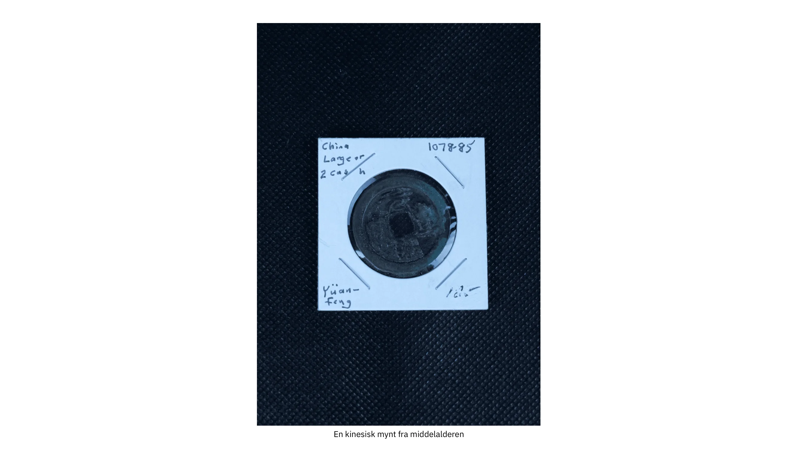

Mynten over er en kinesisk mynt fra middelalderen. Det er en støpt mynt med et firkantet hull i midten. Dette hullet ble brukt til å tre et tau gjennom, slik at myntene kunne henges sammen til armbånd eller halskjeder. Disse myntene var imidlertid ikke først og fremst til å ha på seg, de ble først og fremst brukt til regnskapsformål. Myntene kunne settes sammen til regnskapsenheter i form av store strenger, der brikkene var låst inn i hverandre. Det var ikke nødvendigvis noen spesifikke merker, noen ganger var det bare sirkler av bronse.

Statens pengemonopol, som Wudi fra Han-dynastiet sent etablerte i 113 f.Kr., ble ofte utfordret, slik at ulike private eller lokale aktører kunne utstede sine egne valutaer, forutsatt at de nøt tilstrekkelig tillit i samfunnet.

**Den lave egenverdien til kinesiske valutaer forhindret hamstring, noe som garanterte en jevn sirkulasjon**. Edelmetaller ble sjelden brukt som sirkulerende valuta for å forhindre hamstring. Gull var for dyrt og ble vanligvis lagt til side i stedet for å bli brukt. I stedet var det bare **silke som representerte en virkelig verdifull valuta i kinesisk internasjonal handel**. Kineserne handlet med silke, ikke gull.

Under økonomiske eller monetære kriser, særlig når prisen på kobber steg, ble det tatt i bruk innovative løsninger: Så tidlig som på 200-tallet e.Kr. ble mynter i omløp kuttet for å lage mindre enheter, noe som gjorde det mulig å opprettholde en flytende sirkulasjon til en lavere kostnad. I andre epoker, som under Wang Mang (begynnelsen av det 1. århundre e.Kr.), eksperimenterte man med svært fiduciære valutaer, der den pålydende verdien var langt høyere enn det faktiske metallinnholdet, noe som var en forløper for sedler. De tok en mynt og stemplet verdier som 50, 100 eller 200 på den for å indikere større beløp, for eksempel 200 mynter. Denne praksisen bidro sannsynligvis til betydelig inflasjon.

Som nevnt ovenfor var dette systemet basert på en sosial konvensjon mellom staten, produsentene og kjøpmennene, men også på autoritære og strenge regler for dem som ikke spilte spillet, særlig i forhold til valg av brikker (enten de var vakre eller ikke) eller lengden på stoffene (som ikke var i tråd med standarden).

Etter min ydmyke mening er det ikke et veldig solid system. Det baserte seg hovedsakelig på strenge regler som krevde at tjenestemenn og næringsdrivende måtte godta skadede mynter, under trussel om sanksjoner.

### Kinesiske monetære innovasjoner og deres økonomiske konsekvenser

Kina var også et foregangsland når det gjaldt utstedelse av tidlige former for papirpenger, som opprinnelig ble tatt i bruk som svar på mangel på metall på 800-tallet e.Kr. Til tross for de opprinnelige fordelene førte disse papirvalutaene regelmessig til inflasjonsspiraler når de ble utstedt i for store mengder, som i Song- og Ming-periodene, da overdreven utstedelse førte til alvorlige valutakriser, illustrert av Marco Polo på 1200-tallet, som til og med bemerket at forfalskning av slike papirpenger kunne straffes med døden. Jeg kan ikke la være å påpeke en form for vold her.

Den kinesiske erfaringen kjennetegnes derfor av en utpreget tillitsbasert oppfatning av penger, en bemerkelsesverdig fleksibilitet i pengesystemet og tidlig bruk av papirvalutaer, basert på tillit mellom økonomiske aktører snarere enn på den iboende verdien av mediet som brukes.

## Samfunnsmessig og økonomisk organisering i antikken

<chapterId>4023c3ce-7a47-5ac4-8f5f-c7ab699ab20f</chapterId>

:::video id=2761efe4-21cf-4f06-9bda-c03f9ff39012:::

### Debatten om byparasittisme

Forholdet mellom antikkens byer og deres omland reiser et grunnleggende spørsmål: Fungerte disse urbane sentrene som parasitter som trakk til seg rikdom, eller som motorer for gunstig økonomisk spesialisering? Parasitthypotesen går ut på at bronsealderbyene, særlig i Mesopotamia, **systematisk trakk ut mer verdier fra sine landlige territorier enn de ga tilbake**, og at de i hovedsak levde av leieinntekter og skatter uten å skape tilsvarende verdier.

Denne visjonen ble gjenspeilet i Romerrikets sammenbrudd: Da den territorielle ekspansjonen opphørte, tørket strømmen av rikdom utenfra inn, noe som potensielt avslørte en byøkonomi som var ute av stand til å finansiere seg selv. Byene ville dermed ha levd "over evne" og vært avhengige av utvinning snarere enn produksjon.

### Spesialisering som drivkraft for verdiskaping

En alternativ økonomisk lesning utfordrer denne parasittiske visjonen. **Antikkens byer fungerte først og fremst som sentre for spesialisering og arbeidsdeling**. Deres rolle gikk lenger enn bare utvinning: De konsentrerte spesialisert håndverk, organiserte handelsnettverk og fungerte som knutepunkter for utveksling over lange avstander.

Denne urbane spesialiseringen skapte et gjensidig produktivt avhengighetsforhold til omlandet. **Byene kunne ikke overleve uten forsyninger fra landbruket, men innlandet fikk til gjengjeld nyte godt av håndverksprodukter, tekniske innovasjoner og tilgang til handelsnettverkene rundt Middelhavet**. Arbeidsdelingen gjorde det mulig å oppnå gjensidige produktivitetsgevinster, selv om fordelingen av godene kan ha virket ubalansert.

Datidens kroniske matvareusikkerhet forklarer delvis denne tilsynelatende asymmetrien. Risikoen for hungersnød og ødelagte avlinger var en konstant trussel for befolkningen på landsbygda, mens håndverkerne i byene, som var knyttet til internasjonale handelsnettverk, nøt godt av større økonomisk stabilitet.

### Historisk utvikling, fra antikken til middelalderen

Kontrasten mellom antikkens og middelalderens organisering kaster lys over dette spørsmålet. **Antikken favoriserte en storstilt arbeidsdeling, med byer som var åpne for hele Middelhavsverdenen**. Handel og spesialisering nådde sofistikerte nivåer og skapte omfattende økonomiske nettverk.

Romerrikets sammenbrudd førte til en radikal fragmentering: **Føydaltiden erstattet denne sentraliserte organisasjonen med et desentralisert system av selvforsynte godser**. De gamle romerske villa rusticae ble matrisen for middelalderens seigneurier, og skapte en mosaikk av praktisk talt selvforsynte økonomiske øyer som ble forvaltet av geistligheten eller adelen.

Denne middelalderske desentraliseringen reduserte den kommersielle effektiviteten, men ga paradoksalt nok større motstandskraft mot eksterne sjokk. Føydale godser utviklet mer balanserte relasjoner mellom maktsentra og befolkningen på landsbygda, selv om denne organiseringen begrenset produktivitetsgevinstene knyttet til spesialisering.

### Fremveksten av urbane markeder

Arkeologiske funn viser at det fantes **butikkhavner og handelskvarterer i mesopotamiske byer så tidlig som i det andre årtusen**. Disse infrastrukturene vitner om at det fantes organiserte markeder, selv om det fortsatt er uenighet om hvordan de fungerte.

Karl Polanyi, som i utgangspunktet var skeptisk til eksistensen av ekte markedsmekanismer i antikken, nyanserte sitt standpunkt ved å erkjenne at han kan ha undervurdert den tidlige fremveksten av markedsutvekslinger. Denne intellektuelle utviklingen gjenspeiler kompleksiteten i tolkningen av antikkens økonomiske systemer, der institusjonell omfordeling, gjensidig utveksling og begynnende markedstransaksjoner eksisterte side om side.

### Sparta mot Athen

Sammenligningen mellom Sparta og Aten illustrerer forholdet mellom pengesystemet og samfunnsorganiseringen på en perfekt måte. **Sparta representerer en modell for et strengt hierarkisk samfunn som bevisst avviste bruken av penger**, mens Aten utviklet en sofistikert pengeøkonomi for å ledsage sitt demokratiske system.

Spartanernes avvisning av penger var ikke spontan, men **institusjonell og ideologisk**. De spartanske lederne fryktet at penger ville korrumpere militære og samfunnsmessige verdier, og foretrakk et system basert på direkte mellommenneskelig tillit mellom borgerne.

For å motvirke bruken av penger brukte Sparta **tunge, upraktiske metallstenger**, noe som paradoksalt nok demonstrerte en intuitiv forståelse av de monetære kvalitetene (delbarhet, transportabilitet, holdbarhet) de forsøkte å nøytralisere.

### Grensene for den anti-monetære modellen

Spartas organisasjon illustrerer begrensningene i **Dunbars tall** anvendt på samfunnets skala. **Ved å avvise penger som et nøytralt byttemiddel, dømte Sparta seg selv til å begrense sitt samfunn til et begrenset antall borgere som var i stand til å opprettholde direkte tillitsforhold**. De homoioi (spartanske borgere) utgjorde bare 1 % av den totale befolkningen, omgitt av tusenvis av hiloter (slaver).

Denne organisasjonen, som i utgangspunktet var en kilde til eksepsjonelt militært samhold, viste seg å være strukturelt skjør. **Slaget ved Leuctres (371 f.Kr.) demonstrerte systemets begrensninger**: Tapet av menneskeliv ødela spartanernes sosiale struktur og førte til at deres sivilisasjonsmodell kollapset.

Konkurrerende byer (Athen, Korint, Theben), med utviklede pengesystemer, **opprettholdt rikere og mer robuste økonomier**, som var i stand til å kompensere for menneskelige tap gjennom økonomisk gjenoppbygging og innvandring.

### Personlig versus institusjonell tillit

Erfaringene fra Sparta viser hvilke **risiki som ligger i et samfunn som utelukkende er basert på mellommenneskelig tillit** i stedet for nøytrale institusjonelle mekanismer. Samtidig som denne modellen skapte et sterkt sosialt samhold, gjorde den samfunnet sårbart for demografiske sjokk.

Ved å muliggjøre anonyme og upersonlige transaksjoner gir penger overlegen systemisk motstandskraft. Penger muliggjør sosial ekspansjon utover grensene for direkte tillit, og legger til rette for utenlandshandel og økonomisk vekst.

### Inkaenes paradoks, rikdom uten penger

Inkariket er et fascinerende paradoks: **en sivilisasjon med enorme gullrikdommer, men uten et monetært system**. I likhet med Sparta var denne modellen basert på en rigid hierarkisk organisasjon og sentralisert planlegging, men viste seg sårbar overfor erobrere med fleksible pengeøkonomier.

Denne strukturelle skjørheten i anti-monetære systemer i møte med monetære samfunn er et tilbakevendende historisk mønster, noe som tyder på at **institusjonell avvisning av penger, i stedet for å styrke det sosiale samholdet, paradoksalt nok kan svekke sivilisasjoner** i møte med eksterne utfordringer og historiske endringer.

En analyse av disse historiske modellene viser at penger, utover sin byttefunksjon, er en markør og tilrettelegger for sosial kompleksitet, noe som gjør det mulig for sivilisasjoner å overskride de grensene som direkte mellommenneskelige relasjoner setter.

# Fødselen av myntede penger

<partId>232e365a-8c3b-11f0-b276-b3ab70d1a5a1</partId>

## Fremveksten av mynter

<chapterId>40ed3414-3066-57bd-bc1b-617ad0a354e0</chapterId>

:::video id=1d6834c4-98a3-43fe-ba80-04be51b0486e:::

Vi har nå kommet til sakens kjerne: myntenes utseende. Jeg legger vekt på ordet "mynt" her, fordi vi har sett i de foregående avsnittene at penger eller pengesystemer i høyeste grad var til stede i de sivilisasjonene som gikk forut for de lydiske folkene, grekerne og perserne. Det er ganske tydelig, tror jeg, ut fra det vi nettopp har sett. Derfor er denne delen viet selve myntenes fremvekst og har fått tittelen: *Myntenes fremvekst*.

### Myntenes lydiske og joniske opprinnelse

For å innlede denne delen vil jeg gjerne gi deg et utdrag fra Glyn Davies' bok A History of Money, som du finner her.

*Utdrag fra A History of Money: From Ancient Times to the Present Day av Glyn Davies:*

> Fra Lydia og Ionia spredte kunnskapen om og bruken av mynter seg raskt østover til det persiske riket og vestover gjennom resten av de joniske og egeiske øyene til det greske fastlandet, og deretter til de vestlige koloniene, særlig Sicilia. Den spredte seg også nordover til Makedonia, Thrakia og Svartehavet, men den ble bare delvis, motvillig og sent akseptert i Egypt.

Jeg synes det er interessant å nevne at man i Egypt fortsatte å veie mynter lenge etter at myntteknologien ble tatt i bruk. Det synes jeg er viktig å merke seg. Sitatet fortsetter:

> På samme måte gikk det til å begynne med ganske tregt på det italienske fastlandet med å akseptere de greske økonomiske nyvinningene, i motsetning til på Sicilia, der de ble tatt i bruk så raskt.

*Bortsett fra disse to begrensede unntakene (det kontinentale Italia og Nedre Egypt), spredte bruken av mynter seg raskt rundt i landene som grenser til det sentrale og østlige Middelhavet, så vel som gjennom det enorme og voksende persiske riket, fra Mesopotamia **til India.** Det er fortsatt uklart om India allerede hadde utviklet et embryo til et monetært system på dette tidspunktet, uavhengig av den kinesiske eller lydiske utviklingen. Uansett om India hadde utviklet sin egen valuta eller ikke, førte de økende kontaktene mellom India og Midtøsten til at indiske mynter ble en direkte tilpasning av lydiske og greske oppfinnelser, først gjennom det persiske riket og deretter det makedonske riket* (med erobringene til Aleksander den store og hans far).

*Av disse grunnene var den direkte innflytelsen fra en eventuell indisk pengeoppfinnelse liten, sammenlignet med den overveldende betydningen av de klart uavhengige pengeoppfinnelsene i Kina i øst, og i enda større grad av den lydiske og greske utviklingen i vest*

### Geografisk utbredelse og regionale tilpasninger

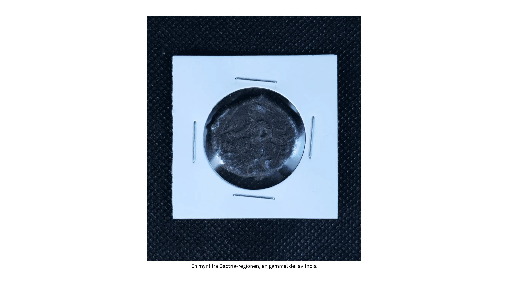

For å illustrere denne perioden visuelt, har vi her gjengitt en mynt fra et område i India, Bactria-regionen, som ligger vest på den indiske halvøya, nær Afghanistan. I dette området fantes det mynter som sannsynligvis var inspirert av greske mynter med en av deres kongelige personligheter.

## Lydiere og persere

<chapterId>eb802ab8-8ffd-5b25-907f-8944f120ed14</chapterId>

:::video id=f151eb42-5ff3-4ca1-9af1-1ae2a5e051c0:::

### De første lydiske elektrum-myntene

Siden vi ikke kan skille ut mynter fra Lydia og perserne, går vi videre til den delen av verden som ligger øst for Hellas, og som i dag utgjør Tyrkia. De første myntene som dukker opp i Vesten, stammer fra omtrent midten av 700-tallet f.Kr. i regionene Lydia og Ionia, som ligger i det nåværende Tyrkia. Det var rundt 650-600 f.Kr. at denne grunnleggende innovasjonen så dagens lys, med bemerkelsesverdige arkeologiske funn som de første myntene som ble funnet i Artemistempelet i Efesos, datert til rundt 600 f.Kr. Disse primitive myntene var laget av elektrum, en naturlig legering av gull og sølv med ravfargede reflekser, og de var ofte primitive i utseende, bare preget med stempler eller rudimentære motiver.

Nedenfor kan du se en av de tidligste lydiske myntene, med en løve med byttet sitt foran. Du vil kanskje legge merke til et stempel eller et hull på baksiden, som noen mener ble brukt til å teste metallets renhet og sikre at det ikke bare var et overflatelag. Selv om dette er et av de tidligste eksemplarene, er det viktig å merke seg at dette er en kopi. Alle mine gull- og elektrumsmykker er kopier eller moderne gjenskapninger, designet for å forhindre at jeg bruker alle sparepengene mine på denne samlingen.

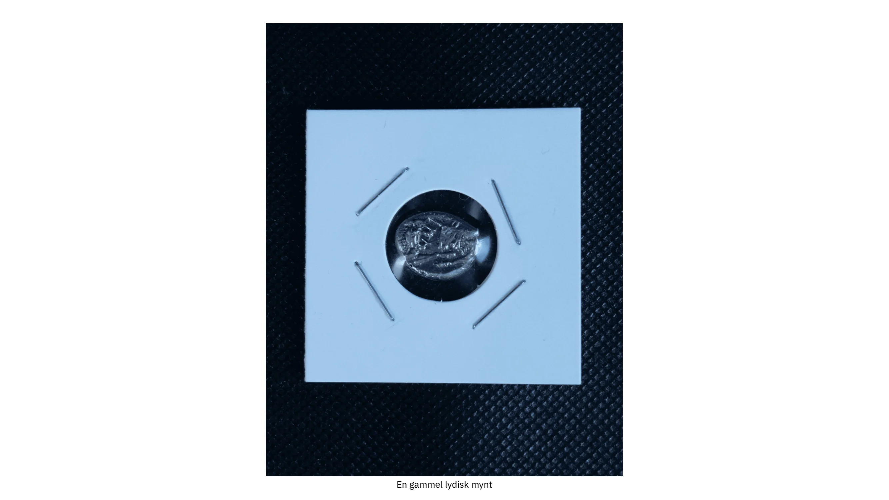

Men jeg har også et ekte persisk stykke som vi snart skal få se. Slik så disse tidlige smykkene ut. Det er som en slags klump (eller klump, på engelsk) av metall som ble stemplet på den tiden.

I motsetning til den utbredte oppfatningen om at penger ble oppfunnet for å lette dagligdags handel og erstatte byttehandel, ser det ut til at de første lydiske, akemenidiske og greske myntene i utgangspunktet ikke ble brukt til handel i liten skala. Pengeenhetene var faktisk altfor store for dagligdags bruk. Dessuten var sirkulasjonen begrenset til regioner i nærheten av der de ble produsert.

Her synes jeg det er viktig å nevne at selv om jeg har lest i flere antropologiske arbeider, var myntene, som jeg allerede har vist - enten det var elektrummyntene eller denne persiske mynten som jeg skal komme tilbake til om en liten stund - for store til å kjøpe brød, for eksempel hver dag. Jeg har sett beregninger som får oss til å tro at det tilsvarte en dags arbeid for en bonde eller en soldat, så det ville være for stort. Det er som å prøve å betale en dagslønn for måltidet ditt, frokosten eller lunsjen din. Men jeg har sett i andre arbeider at man har funnet mindre enheter av disse klumpene, altså mindre mynter, noe som kan få oss til å tenke at det kanskje var en mulig bruk for hverdagslige innkjøp.

Så her er det antropologiske "beviset" for at mynten ikke ble brukt til hverdagshandel, fordi valøren eller enheten var for stor, ikke særlig solid etter min mening, fordi vi har funnet eksempler på mynter som er mindre, og som kunne ha vært tilpasset dagligdagse innkjøp.

### Statens rolle i pengeskapingen

Myntenes egentlige opprinnelse ser ut til å være knyttet til statenes direkte handlinger. Det finnes to hovedhypoteser om dette emnet: Den første, idealistiske, trekker en parallell mellom det greske begrepet "nomisma" (penger) og "nomos" (lov), og antyder at penger var knyttet til kodifisering av lover, noe som styrket byenes autoritet og politiske organisering. Den andre, mer realistiske hypotesen, som er allment akseptert i dag, er at penger først og fremst var et middel for stater til å utøve økonomisk og sosial kontroll. Ved å offisielt garantere vekten og verdien av de edle metallene de inneholdt, kunne statene manipulere sirkulasjonen og verdien av disse myntene, noe som skapte tillit og likviditetspremier som var spesifikke for innenlandske valutaer.

Det er veldig interessant å vite at vi har bevis på dette. Når det gjelder elektrummynter, bør du for eksempel vite at naturlig elektrum normalt består av rundt 70 % gull og 30 % sølv. I de første myntene vi fant og analyserte, spesielt de tidlige lydiske myntene, ser gullinnholdet ut til å ligge rundt 50-55 % i stedet for 70 %. Dette tyder på at myntutgiverne allerede den gang prøvde å redusere andelen av det mer edle metallet, sannsynligvis for å produsere flere mynter og få dem til å se ut til å være like mye verdt som en umerket klump av naturlig elektrum. Og her må det sies at det egentlig var fra denne berømte Krøsus' tid, som i *rik som Krøsus*, at dette var mulig, for det var fra hans tid at vi hadde teknologien til å skille gull og sølv fra hverandre.

Den lydiske myntkunsten gjennomgikk en stor utvikling under den berømte kong Krøsus (561-546 f.Kr.), som var kjent for sin legendariske rikdom. På denne tiden perfeksjonerte lydierne metallurgien for å skille gull og sølv fra elektrum, og introduserte dermed de første bimetalliske myntene, det vil si separate gull- og sølvmynter.

### Persisk ekspansjon og gresk adopsjon

Da de erobret Lydia i 546 f.Kr., tok akemenidiske persere straks i bruk denne innovasjonen. Rundt 500 f.Kr., under Dareios I, etablerte perserne sitt eget pengesystem med gulldariker og sølvsigloer, ofte med kongefiguren i krigerske positurer. Denne kongelige persiske mynten ble hovedsakelig brukt i de helleniserte regionene i Perserriket og spredte seg gradvis, selv om bruken forble ujevn, og **noen regioner, som Egypt, foretrakk fortsatt veksling i veid metall (bullion).**.

Ovenfor kan du beundre en ekte persisk sigloi (eller siglos). Det lille motivet viser en konge, selv om hullet er litt slitt bort. Siglos er en sølvmynt, i motsetning til daric, som var laget av gull. Perserne kunne skille mellom disse to metallene, og de gikk bort fra elektrummynter. Derfor innførte de bimetallisme, det vil si at de brukte både gull og sølv, samtidig som de beholdt det samme konseptet med mynter av edle metaller, ofte med et hull på baksiden, antagelig for å kontrollere metallinnholdet.

Grekernes raske bruk av mynter ser ut til å ha blitt stimulert av deres nære kontakt med lydierne, særlig gjennom de greske koloniene i Lilleasia. De første grekerne som slo mynt, var sannsynligvis innbyggerne i Aegina på midten av 600-tallet f.Kr., som innførte drakmen, hvis vekt varierte fra region til region, og hvis navn bokstavelig talt betyr "håndfull korn" eller "håndfull piler".

Den greske myntenes suksess skyldtes like mye at de var praktiske for viktige transaksjoner, som betaling av leiesoldater, som at de bidro til byenes økonomiske og politiske ekspansjon. Mynter ble raskt et sentralt element i den greske og senere romerske økonomien, samtidig som de beholdt en sterk symbolsk dimensjon, særlig gjennom sin tilknytning til loven (nomos).

Endelig vitner den raske ekspansjonen av myntvesenet om en dyptgripende endring av antikkens samfunn, der kodifiseringen av pengeverdier gikk hånd i hånd med statsorganiseringen. Denne utviklingen la det økonomiske og politiske grunnlaget for fremveksten av greske demokratier, særlig i Aten, der penger spilte en avgjørende rolle for at den demokratiske byen skulle fungere.

Et viktig poeng å huske fra dette avsnittet er at vi snakker spesifikt om **mynter**, ikke penger generelt. Det sentrale aspektet som kommer tydelig frem, er **tilliten til utstedende myndighet**, som er direkte knyttet til myntenes tekniske egenskaper (vekt, renhet, pålydende verdi). Det er nettopp denne tilliten som gjør det mulig for staten eller utstedende myndighet å utøve en viss kontroll eller til og med manipulere verdien og sirkulasjonen av disse myntene fra begynnelsen av.

## Institusjonell intervensjon og de første myntene

<chapterId>3e1efd08-99e3-5a32-9908-3185fef0e640</chapterId>

:::video id=84847cf6-9e46-4a8c-9f35-25a27496cc4b:::

### Pengenes doble natur

Fremveksten av myntede penger reiser et grunnleggende spørsmål: Er penger en spontan skapelse av markedet eller en institusjon påtvunget av myndighetene? Denne konseptuelle spenningen setter to radikalt forskjellige visjoner opp mot hverandre.

På den ene siden forsvarer den østerrikske økonomiske skolen ideen om at råvarepenger - særlig gull - ble naturlig valgt av økonomiske aktører på grunn av sine iboende egenskaper: holdbarhet, bærbarhet, delbarhet og fungibilitet. Ut fra dette perspektivet har staten deretter tilegnet seg denne spontane valutaen for å kontrollere tilbudet. Det er en institusjon som springer naturlig ut av markedets behov, før den blir fanget opp av politisk makt.

Det antropologiske og institusjonelle synet hevder derimot at penger virkelig blir til ved statlig myntning. Myndighetene ville bevisst skape valutaen ved å påføre sitt segl, og dermed forvandle metallet til et ekte pengeinstrument. Dette perspektivet antyder at de tidligste lydiske myntene hovedsakelig ble brukt til å betale hærer - én stater tilsvarte omtrent dagslønnen til en soldat.

### De paradoksale fordelene ved statlig standardisering

Til tross for denne teoretiske spenningen anerkjenner selv østerrikske økonomer visse fordeler ved statlig inngripen i pengevesenet. Standardisering gjennom preging løser en rekke praktiske handelsproblemer.

Uten en sertifiseringsinstans står de økonomiske aktørene overfor en konstant risiko: forfalskede mynter, svindel med arkivering og vektmanipulasjon. Denne praksisen skaper friksjon i økonomien, ettersom noen mynter blir akseptert mens andre blir avvist. I teorien garanterer det offisielle stempelet vekt og kvalitet, noe som gjør handelen mer smidig.

Denne garantien har en observerbar pris på markedet: En preget gullmynt er mer verdt enn tilsvarende mynt i ubearbeidet gull. Denne premien gjenspeiler verdien av sertifiseringen - kjøpmennene trenger ikke lenger selv å verifisere metallets ekthet gjennom kjemiske tester eller resonanstester. Statlig inngripen eliminerer paradoksalt nok friksjon og letter handel ved å skape institusjonalisert tillit.

### Valutamanipulasjon fra første stund

Historien om de første lydiske statere avslører en urovekkende ironi. Nyere analyser viser at gullinnholdet i disse elektrummyntene systematisk var lavere enn i naturlig elektrum. Myndigheten som sertifiserte kvaliteten, manipulerte samtidig sammensetningen.

Denne praksisen illustrerer myntenes doble nytteverdi. For markedet gjør den utvekslingen mer smidig og gir en garanti for standardisering. For de utstedende myndighetene blir det et verktøy for økonomisk kontroll gjennom utvanning. Ved å redusere gullinnholdet samtidig som den nominelle verdien opprettholdes, øker staten effektivt pengemengden - den skaper flere pengeenheter av samme mengde edelt metall.

Staten selv forble imidlertid begrenset av denne manipulasjonen. Som eksemplet med Konstantins gullsolidus på 400-tallet illustrerer, kontrollerte den romerske administrasjonen nøye kvaliteten på myntene, ettersom den krevde å bli betalt med gode mynter. Myndighetene hadde en vital interesse av å opprettholde kvaliteten på sine egne mynter for å garantere verdien av skatteinntektene.

### Økonomisk analyse av devaluering

Studier av valutadevaluering avslører konsistente mønstre gjennom historien. For metallmynter sporer økonomene prosentandelen av edelt metall i myntene - en fallende kurve som indikerer en progressiv devaluering. For moderne papirpenger er det motsatt: Man observerer den sirkulerende pengemengden, og en økning i denne signaliserer devaluering.

Begge metodene måler det samme grunnleggende fenomenet: utvanning av pengeverdien. Enten man reduserer innholdet av edelt metall eller trykker nye sedler, er mekanismen den samme. Jo flere pengeenheter en myndighet skaper av de samme reelle ressursene, desto mer mister hver enhet sin verdi.

Denne manipulasjonen, som kan observeres helt fra de tidligste lydiske myntene, tyder på at pengekontroll alltid har vært et spørsmål om makt. Myntede penger representerer dermed en bemerkelsesverdig teknisk innovasjon kombinert med et instrument for økonomisk kontroll - en dualitet som går igjen i hele pengehistorien, helt frem til i dag.

## Produksjon av deler

<chapterId>b205f4f2-c293-5308-b812-a998de9ad45e</chapterId>

:::video id=47c612ec-d97e-4498-b50e-7e66518bd56d:::

### Fra stansede klumper til mynter

Etter et avsnitt om myntenes tilblivelse, vil jeg komme med et kort avsnitt om utviklingen av myntproduksjonen. Som vi har sett, begynte det hele med klumper av elektrum, og fortsatte med gull og sølv, der begge sider ble merket med et stempel, enten med kongens ansikt eller et hull på baksiden for å sjekke renheten.

Senere, som vi skal se nærmere på i et senere avsnitt, videreutviklet grekerne denne teknologien ved å lage runde mynter som ble hamret på begge sider. De tok et glatt, flatt stykke edelt metall, graverte det ønskede motivet på den ene siden og hamret det deretter for hånd for å skape den ferdige mynten.

Teknologien med å prege mynter for hånd spilte sannsynligvis en rolle i å kontrollere inflasjonen i denne perioden, selv om myntene ofte ble utvannet for å øke produksjonen. Dette var særlig tydelig i romertiden og, i mindre grad, under visse kriger i den greske perioden. Selv om det å prege mynter én og én begrenset myndighetenes kapasitet til masseproduksjon, bidro det effektivt til å kontrollere inflasjonen, til tross for de betydelige devalueringene som forekom. Slik gikk utviklingen fra en metallklump som ble stanset til en rund, hamret mynt.

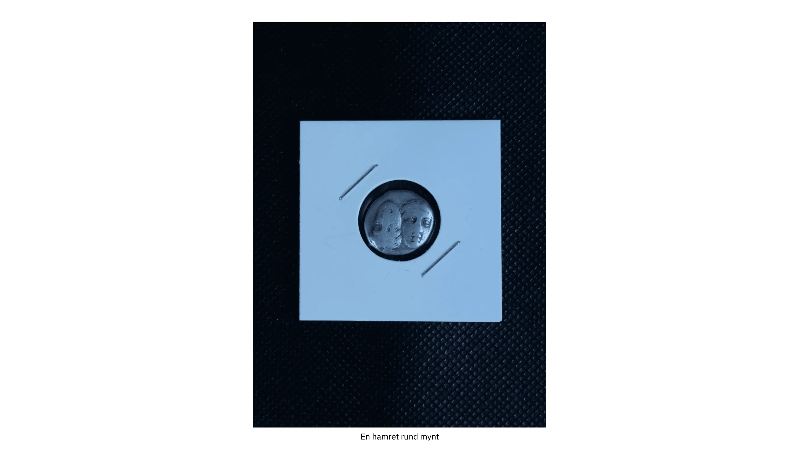

### Middelalderens utvikling

I middelalderen var det også en trend å spre ut myntene, slik at de ble bredere og tynnere. En av grunnene til dette var at det ble lettere å teste lyden, som ofte ble brukt som en indikator på ekthet. Ved å spre ut sølvet ble det produsert en distinkt frekvens, slik at folk kunne validere myntens renhet bare ved å lytte til den. Denne praksisen ga opphav til begrepet "sunne penger". I forbindelse med lydpenger ble standardvekten bestemt ved hjelp av en balansevekt eller "trebuchet" for veiing. Dermed fortsatte utviklingen fra små, runde mynter til litt tynnere og bredere mynter.

### Pendelslag

Den siste teknologien som kom på slutten av middelalderen, i begynnelsen av den moderne tid, var pendelslagverket. Det var en slags skrue som ble strammet til for å slå myntene, og på den måten ble det skapt mynter med denne nye formen for preging. Det spesielle med denne utviklingen var muligheten til å gravere et mønster på overflaten av mynten for å løse problemet med klipping. Klipping innebar at man fjernet en del av mynten for å gjenvinne edelt sølv, som så kunne brukes til å prege andre mynter eller bare beholdes som en ressurs.

Så denne forestillingen om pendelslag hjalp til med klippfenomenet. Og det er interessant å merke seg at denne teknologien faktisk kom fra Frankrike. I England, for eksempel, leide de inn franske ingeniører for å vise dem hvordan de skulle lage disse maskinene. Det som er morsomt, synes jeg, er at det var tilhengere av hammermynting som var imot det og som forsinket anvendelsen av denne teknologien. I all god teknologi er det alltid noen som er imot den, som ønsker å beholde den gamle teknologien. Jeg syntes det var ganske sprøtt å innse at selv med en teknologi som virker veldig overlegen - du kan lage flere deler, de er vanskeligere å kopiere - var det fortsatt folk som var knyttet til den berømte hammermetoden. Det var et skifte mellom å produsere deler som ble laget med den berømte pendelslagverksteknikken, og så gå tilbake til hammerslagverk. Og til slutt var det selvfølgelig pendelslagverket som slo igjennom og ga oss disse vakre, moderne delene, der du kan finne enten små linjer, små riller rundt for å unngå avklipping, sannsynligvis relatert til ordet avklipping, riller, og du kan fremdeles i dag se enten riller eller tekst eller tegninger som er inngravert på kanten av stykket.

# Ulike teorier om pengenes opprinnelse

<partId>72ac694f-9248-550d-90c1-91af3d234380</partId>

## Teorier om pengenes opprinnelse og ulike definisjoner av dem

<chapterId>7d699d4d-8c70-55b5-bf36-609f3fd90bcf</chapterId>

:::video id=523c873f-501b-4954-b79f-7e74c0f685a5:::

Velkommen til dette avsnittet om de ulike teoriene om pengenes opprinnelse og de ulike definisjonene av dem. Her er et kort utdrag fra boken *Aux origines de la monnaie*, som jeg mener oppsummerer de to hovedteoriene vi skal se nærmere på i dette avsnittet.

> Denne korte innledningen tjener ikke noe annet formål enn å fremheve konteksten for undersøkelsen. På det konseptuelle planet er debatten åpen mellom tilhengerne av K. Polanyis tese og tilhengerne av M. Webers tese. For de førstnevnte spiller gave og omfordeling en sentral rolle, mens markedsutveksling bare spiller en marginal rolle, hovedsakelig i internasjonal utveksling. For de andre, derimot, er markedet kjernen i den nåværende historiske prosessen.

I Mesopotamia, for eksempel, er det én teori om fremvekst som går ut på at tempelet, som autoritet, skaper regneenheten eller pengeenheten, innfører den, og så tar kjøpmennene den i bruk for handel. Den motsatte teorien går ut på at denne myntenheten oppstår naturlig fra markedet for å lette handelen. Det finnes godt dokumenterte eksempler på dette i Mesopotamia.

Når det gjelder byttehandel, finnes det teorier om at den først og fremst ble brukt i internasjonal handel, det vil si med folk vi rett og slett ikke stolte på.

Så det er det vi skal gjøre i denne delen. Vi skal foreta en slags undersøkelse for å presentere de ulike teoriene om pengenes opprinnelse og de ulike definisjonene av hva penger er. Vi skal presentere og kritisere tesene til både klassiske økonomer og antropologer. Jeg er til og med så heldig å ha med meg Ulrich Fromy, som vil presentere en østerriksk økonoms perspektiv på disse ulike temaene.

## Pengenes fremvekst for klassiske økonomer

<chapterId>1d3776cd-0dfd-5297-af48-c6f41e257a7e</chapterId>

:::video id=873a16c1-17ac-448d-8941-df4feb7ab79d:::

Dette segmentet er viet de ulike teoriene om pengenes fremvekst. Det første temaet som skal dekkes, er fremveksten av penger ifølge klassiske økonomer.

### Adam Smiths klassiske teori

Ifølge de klassiske økonomiske teoriene, særlig Adam Smiths, oppstod penger som en naturlig følge av byttehandelens begrensninger. Til å begynne med foregikk byttet ved direkte byttehandel, men denne metoden ble ofte komplisert av problemet med "dobbelt sammenfall av behov": Hver person måtte ha nøyaktig det samme som den andre ville ha. Etter hvert ble visse varer (som salt, edle metaller og husdyr) akseptert av alle som mellomliggende byttemidler, takket være deres nytteverdi, holdbarhet og delbarhet. På denne måten oppsto penger spontant for å lette og smidiggjøre økonomiske utvekslinger.

### Kritikk av klassisk teori

Her er min kritikk av denne teorien. Med alt vi har sett i forrige avsnitt, tror jeg vi allerede kan si at denne forestillingen om at **mynter** er en evolusjon av byttehandel er feil, rett og slett fordi den myntede mynten definitivt kommer fra myndighetene, siden den er preget av myndighetene. Det er flere grunner til dette, ikke minst myndighetenes ønske om å kontrollere økonomien, å ta kontroll over pengene.

Hvis vi derimot snakker om penger som konsept, og ikke nødvendigvis mynter, er det mindre entydig, for når det gjelder de første myntene, de lydiske statere, har vi funnet sølvklumper som ikke var merket. Det gjenstår å se om de var i sirkulasjon. Hvis de var i omløp, betyr det at folk opprinnelig kan ha identifisert denne eiendelen som en potensiell valuta som kunne være etterspurt og lett å veksle inn. Og kanskje var det først i ettertid at myndighetene oppdaget dette og tok kontroll over det ved å sette et stempel på det for å sertifisere det.

Det er mange fordeler med å gjøre dette - du trenger ikke å sjekke det, veie det, alt det der. Det kommer vi selvsagt til å snakke om. Men etter min mening er mynter helt klart et verktøy som har blitt brukt av stater helt fra begynnelsen av. Men når det gjelder fremveksten av penger som sådan, vet vi ikke om de egentlig kom fra en autoritet som innførte dem, eller om de oppsto gjennom handel eller kommersielle utvekslinger. Jeg kommer til å ha en svært interessant diskusjon om dette emnet med min kollega Ulrich senere i denne delen.

Vi vet allerede at de første myntene av edelt metall ikke ble brukt til daglig byttehandel, fordi verdien var altfor høy. Vi vet også at de hovedsakelig ble brukt til militære betalinger. Dette er et godt argument for tesen om at penger ikke nødvendigvis oppsto på markedet. Regneenhetene, valørene på de første myntene, var sannsynligvis for store til for eksempel å kjøpe brød eller gjøre daglige innkjøp. Det kunne for eksempel være tilsvarende en dagslønn. Ikke nødvendigvis slik at folk fikk lønn på den tiden, men det er for å gi deg en idé om størrelsesordenen. Så disse myntene hadde sannsynligvis for stor kjøpekraft til å kunne brukes i småhandel. På den annen side er det ingenting som sier at disse myntene ikke kan ha blitt brukt til å gjøre større bytter, for eksempel handelsbytter. Vi vet at de hovedsakelig ble brukt til militære betalinger. Dette er en av de mest populære teoriene for å forklare oppkomsten av de første myntene. Husk at vi snakker om mynter her, ikke nødvendigvis om penger generelt. De første myntene hadde altså sin første rolle, og det var å betale for militære betalinger, for leiesoldater.

Aleksander den store, for eksempel, gjorde stor bruk av det, som vi skal se senere.

Vi har også sett at allerede i det gamle Kina ble kauriskall brukt til økonomisk utveksling (**lønning av arbeidskraft, måling av verdi og kjøp av land)**. I Mesopotamia og Egypt fantes det dessuten allerede funksjonelle pengesystemer som ble brukt til handel, lønnsutbetalinger og skatteinnbetalinger. Det jeg antyder her, er at det definitivt er feil å tro at mynter i vestlig forstand er et resultat av behovet for å gjøre utvekslinger mer flytende.

Siden mynter er utstedt av en myndighet, kan vi kanskje anta at de fra begynnelsen av har vært knyttet til utstedende myndigheter. Det gir mening. På den annen side vet vi ikke nødvendigvis hvordan pengeformene eller formene for pengesystemer, protomyntene, som gikk forut for dem, oppstod. På den ene siden vil vi foreslå at det var templene som identifiserte disse pengeenhetene, og at folk deretter brukte dem. På den andre siden vil vi si at det var kjøpmennene som trengte et byttemiddel, en måte å handle med omverdenen på, og det var de som identifiserte for eksempel sølvmetall, som skulle brukes fordi det var etterspurt fra omverdenen. Poenget er at vi egentlig ikke vet det. Det er derfor vi har de to motstridende teoriene. Vi har ikke perfekte bevis for å forklare om penger oppstår naturlig ut fra behovet for å handle, for eksempel hos kjøpmenn, eller om de kommer fra autoriteter.

### Skille mellom mynter og primitive penger

Avslutningsvis tror jeg vi kan si at mynter nødvendigvis stammer fra en autoritet, siden de ble stemplet av nevnte autoritet. På den annen side tror jeg ikke vi kan si at det er feil å hevde at penger (det som gikk forut for mynter) ikke kan ha oppstått for å lette utveksling. Jeg tror at i alle eksemplene vi har sett ovenfor, finnes det mange eksempler på dette.

## Myten om byttehandel

<chapterId>0fcd4964-ac36-5163-a8cf-1aacebc0d2c0</chapterId>

:::video id=0ede29ab-8acd-4d79-9282-bd5991b97076:::

### David Graebers anmeldelse

Vi har nettopp gått gjennom hvordan penger oppsto ifølge de klassiske økonomene. Nå skal vi ta for oss et konsept som er kjent som byttemyten.

En kritikk mot denne klassiske teorien om pengenes opprinnelse er at den mangler historisk belegg for sine ideer.

Kritikken som kalles "byttemyten", formulert av blant andre antropologen David Graeber, utfordrer den klassiske ideen om at penger oppstod naturlig fra byttehandel. Ifølge denne kritikken finnes det ingen historiske eller antropologiske bevis for at samfunn systematisk benyttet seg av byttehandel før pengenes inntog. I stedet skal antikkens samfunn ha operert på grunnlag av kreditt, gjeld, sosiale forpliktelser og seremonielle utvekslinger. "Byttemyten" er derfor en teoretisk konstruksjon som skal rettferdiggjøre den klassiske økonomiske visjonen, uten noe reelt empirisk grunnlag.

Det er imidlertid viktig å merke seg at denne teorien ikke benekter at byttehandel eksisterte, for eksempel mellom ulike stammer. Den benekter bare at byttehandel var en utbredt aktivitet innenfor disse såkalte primitive gruppene, og at penger skulle være en logisk videreutvikling av denne praksisen. Den benekter det faktum at byttehandel var utbredt innad i en stamme, og at penger etter hvert oppsto for å gjøre utvekslingen smidigere og løse de problemene som eksisterte med byttehandel. I stedet praktiserte disse gruppene ifølge denne teorien en form for uformell kreditt eller gave for gave.

### Primitive samfunn vs. store sivilisasjoner

**Her er noen presiseringer angående de store sivilisasjonene i antikken** Jeg tror denne teorien definitivt gjelder for primitive (statsløse) grupper i fortiden og til og med i dag (f.eks. stammene som ble studert av oppdagelsesreisende på 1700- og 1800-tallet). Det er klart at de ikke brukte byttehandel, men heller de formene for utveksling jeg nevnte tidligere, av grunner vi allerede har nevnt (svak arbeidsdeling, selvbergingsjordbruk). Jeg tror imidlertid ikke denne teorien gjelder for fortidens store sivilisasjoner, som Mesopotamia og det gamle Egypt.

Her er to utdrag fra *Aux origines de la monnaie* om dette emnet:

> Den modellen som M. Mauss skisserte i sin berømte "Gaven", har blitt adoptert av egyptologer med like stor enighet og entusiasme som mangel på dømmekraft. Dette har ført til en rekke forvirringer, som vi ikke skal gå inn på her. La oss bare konstatere at denne modellen gjelder for såkalte primitive samfunn, noe som ikke er tilfellet med det faraoniske Egypt.

> Brød, det vil si bearbeidede kornprodukter, var derfor en regneenhet som, i likhet med shât (y) i Det gamle riket, også gjorde det mulig å åpne kreditter i form av ulike varer. Dette enkle eksemplet viser at økonomien i faraonisk Egypt ikke var begrenset til et system for omfordeling. Den var svært kompleks, og involverte et mangfold av utvekslinger.

Som vi så tidligere i avsnittet om Egypt og til og med Mesopotamia og Kina, kan vi se at selv disse gamle, men ikke primitive, sivilisasjonene, på grunn av tilstedeværelsen av en stat, etter min mening, brukte pengesystemer. Jeg tror dette ble demonstrert i den første delen av dette kurset. Denne forestillingen om å gi og ta, om utsatt kreditt, gjelder altså ikke for disse store sivilisasjonene. De nøyaktige årsakene til pengenes fremvekst forblir derfor et mysterium. Vi vet ikke om de oppsto som følge av kjøpmenns behov for å handle med omverdenen, eller om de ble påtvunget av tempelet i disse gamle periodene.

## Fremveksten av penger gjennom gjeldspenger

<chapterId>4f508615-aa61-5d62-89d3-cecd02aeaa62</chapterId>

:::video id=a23f547f-3906-4f4a-8f72-5d78c649d0c4:::

### Penger som gjeldsbrev

I dette avsnittet tar vi for oss teorien om gjeldspenger.

Teorien om **gjeldspenger**, som særlig ble utviklet av økonomen Alfred Mitchell-Innes og senere utvidet av David Graeber, hevder at penger ikke stammer fra byttehandel, men snarere fra gjelds- og kredittforhold som eksisterte helt fra de tidligste menneskelige samfunnene. Ifølge denne teorien oppstår penger når sosiale forpliktelser (gjeld mellom individer eller grupper) blir kvantifisert og overførbare. Dette konseptet introduserer forestillingen om kvantifisering av utveksling og overføring. Penger skulle dermed først og fremst være en **erkjennelse av gjeld**, støttet av gjensidig tillit og ofte garantert av politisk eller religiøs autoritet, snarere enn en vare som bare fungerer som et mellomledd i utvekslinger.

En enda mer avansert form for denne teorien er at alle penger er en gjeld. Så noen som besitter penger vil ha en fordring på samfunnet generelt, en fordring på alle de som aksepterer disse pengene. Og siden penger, **i deres visjon, må aksepteres på en obligatorisk måte**, ellers er det ikke penger, for hvis du kan nekte disse pengene, fungerer ikke systemet deres. I en gitt gruppe som har identifisert en valuta, er det som om alle de som besitter den, har en gjeld til alle de andre medlemmene av dette samfunnet som aksepterer denne valutaen, og de som aksepterer valutaen har en form for gjeld til den personen som besitter denne pengeenheten. Dette er i hovedsak deres teori.

### Kritikk av det obligatoriske systemet

**Min kritikk av denne teorien

La meg komme med en liten kritikk av denne teorien. Jeg aksepterer at penger er en form for sosial konsensus. Det er en tillit som en gruppe plasserer i et monetært "tegn", hva det enn måtte være. Jeg slutter meg altså til begrepet gjensidig tillit, som vi skal ta opp igjen senere med begrepet pengepremie. Der det blir komplisert, er når tilhengerne av denne teorien legger til et begrep om forpliktelse og insisterer på gjeldsbegrepet. For dem er det slik at når noen er i besittelse av en monetær token, har de en fordring på fellesskapet som helhet, og fellesskapet vil derfor skylde innehaveren en gjeld. Det ville også være en forpliktelse til å gjøre opp for seg, med gruppemedlemmer som er forpliktet til å akseptere token, ellers ville ikke systemet fungere, slik de ser det. Jeg tror systemet i det gamle Kina som er beskrevet ovenfor, representerer denne teorien godt.

For min del kan jeg lett se for meg et system der penger er en sosial konsensus der den valgte token er allment akseptert som betalingsmiddel, uten noen formell forpliktelse. Jeg kan se for meg at et slikt system kan fungere hvis folk aksepterer det av egen fri vilje. Det kan fungere. På den annen side er det ofte forbundet med forpliktelser, tvungne betalingsmidler og vold, som vi skal se nærmere på senere. Men teoretisk sett har jeg ikke inntrykk av at dette systemet kan fungere. Jeg tror Bitcoin er et eksempel. Bitcoin har verdi fordi den har en pengepremie, fordi det er etterspørsel etter å bruke den til pengebruk, det vil si som verdireserve, kanskje også som byttemiddel eller beskyttelse mot fiatsystemet. Ingen er forpliktet til å akseptere den, og jo mer den blir akseptert som betalingsmiddel, desto mer kan den brukes som byttemiddel. Vi kan allerede bruke den som et verdioppbevaringsmiddel uten problemer. Det er det ingen tvil om. Det jeg mener å si, er at Bitcoin for meg ser ut til å være et eksempel, en slags valuta som er en form for sosial konsensus der vi tror vi vil kunne få pengene våre tilbake hvis vi kjøper noe senere, vi anskaffer det for å kunne veksle det senere, for å bevare kjøpekraften vår.

Dette mindre restriktive synet på teorien bidrar til å forklare hvordan to forskjellige samfunn kan handle med en monetær token som gull, uten at det oppstår en fordring eller gjeld mellom disse samfunnene. Å tvinge frem aksept i samfunnet fungerer ikke i handel mellom to stammer, fordi den andre stammen ikke er underlagt autoritet. Stamme B er ikke underlagt stamme A's autoritet. Men likevel aksepterer den den samme monetære token, la oss si gull. Nå vil folk kanskje si til meg: "Ja, men det er fordi selskap B også har bestemt at gull er deres valuta", så det fungerer. Ja, det fungerer, men det skapes ingen gjeld på det tidspunktet. Det er en endelig transaksjon. Så når selskap A bytter en vare mot gull hos selskap B, skapes det ingen gjeld, transaksjonen er fullført. Og det er klart at personen i selskap B ikke har kjøpt denne gullmynten eller gullklumpen for å bli betalt senere av folk i selskap A. Han aksepterer den for å bli byttet mot gull. Han aksepterer den for å bli byttet senere, sannsynligvis innenfor sin egen stamme. I dette eksemplet skapes det altså ingen gjeld, det er ingen latent fordring, det er rett og slett en direkte utveksling, en direkte betaling. Tilhengere av gjeldsvaluta vil fortelle oss at dette er byttehandel. Jeg er uenig, for byttehandel er utveksling av en direkte vare. Direkte byttehandel er bytte av en vare mot en annen vare, til bruk. Varer byttes for å bli brukt, mens i vårt tilfelle brukes gull helt klart som valuta fordi det ikke skal brukes til noe annet; det skal brukes senere som betalingsmiddel. Så etter min mening faller det ikke inn under kategorien byttehandel.

Å eie en monetær token er ikke et "krav" på samfunnet, men snarere et håp om at token vil bli akseptert på et senere tidspunkt til en sammenlignbar verdi.

## Den spontane fremveksten av penger

<chapterId>e3ef86b1-73b9-5140-a61e-2ab6a5b0b2d4</chapterId>

:::video id=e543995f-d5e2-49d7-9133-e397b46e0833:::

For den østerrikske økonomiske skolen, initiert av Carl Menger, oppstår penger naturlig fra en bytteøkonomi som står overfor problemet med dobbelt sammenfall av behov. I denne visjonen konvergerer individer spontant mot mellomliggende varer som gjør det lettere å bytte - ikke varer som forbrukes direkte, men varer som er anerkjent for sin evne til å bli bredt etterspurt.

Disse monetære varene må ha egenskaper som har vært identifisert siden Aristoteles: de må fungere som et verdioppbevaringsmiddel, et byttemiddel og en regningsenhet. De økonomiske aktørene identifiserer, akkumulerer og lagrer dem gradvis, og på den måten oppstår de som penger. Denne prosessen er helt spontan - penger representerer en naturlig markedsrespons på problemet med å koordinere bytter, uten bevisst inngripen fra en autoritet.

### Debatten om "byttehandelsmyten"

Antropologer som David Graeber bestrider dette synet og påberoper seg "byttemyten". Deres argument: Ingen komplekse sivilisasjoner basert utelukkende på direkte byttehandel har noensinne blitt dokumentert. De primitive samfunnene som er studert, har i stedet benyttet seg av uformelle kreditt- og gjensidighetssystemer. Graeber hevder at gjeld gikk forut for byttehandel, og viser til tusenvis av mesopotamiske tavler som dokumenterer kredittforhold.

Denne kritikken er imidlertid basert på en restriktiv definisjon av byttehandel. Som Menger påpekte allerede i 1892, omfatter byttehandel mer enn bare direkte bytte av varer mot varer. Den omfatter også utsatte overføringer, tjenester mot lønn og bytter med tidsbegrensning - det Menger kalte "unilaterale overføringer mellom individer". Denne utvidede formen for byttehandel kan sameksistere med kredittsystemer i begrensede tillitssirkler.

Fravær av bevis er ikke bevis for fravær, og østerrikske økonomer erkjenner at ingen komplekse samfunn kan utvikle seg bærekraftig på grunnlag av direkte byttehandel alene - derav den nødvendige fremveksten av penger.

### Mesopotamia: kjøpmenn versus templer

Debatten utkrystalliserer seg rundt opprinnelsen til den mesopotamiske sølvshekelen. Det finnes to motstridende tolkninger. Den institusjonelle oppfatningen går ut på at templene - de egentlige økonomiske og åndelige sentrene - innførte sølv som valuta for å strukturere økonomien. Kileskrifttavlene, som er konsentrert blant presteskapet og handelseliten, vitner om denne sentraliserte kontrollen.

Den østerrikske tolkningen tyder på det motsatte: Det var kjøpmennene som tok i bruk penger for langdistansehandel. For å kunne handle med fremmede utenfor Mesopotamias grenser - fra Anatolia til Persiabukta - trengte de noe som var universelt gjenkjennelig, holdbart og transportabelt. Sølv var et naturlig valg på grunn av dets iboende kvaliteter. Templene bekreftet ganske enkelt en praksis som allerede var etablert gjennom kommersiell bruk.

Denne avhandlingen baserer seg på dokumenterte utvekslinger mellom Kanesh i Anatolia og Assur, der kjøpmenn byttet tekstiler mot sølvmetall - ikke på grunn av dets materielle nytteverdi, men som et verdioppbevaringsmiddel. Disse transaksjonene gikk lenger enn ren byttehandel, og avslørte eksistensen av en ekte varevaluta.

### Det moderne eksempelet med fangeleirer

Økonomen Richard Radford, som satt i tysk fangenskap under andre verdenskrig, dokumenterte et fascinerende tilfelle av spontan monetær fremvekst. I leirene ble sigaretter en naturlig bytteenhet - delbare, standardiserte og allment aksepterte. Selv ikke-røykere tok dem i bruk, i erkjennelsen av deres universelle bytteverdi.

Dette mikrokosmoset illustrerer det østerrikske prinsippet: Når individer står overfor problemet med å koordinere bytter, finner de spontant frem til den varen som er mest "salgbar". Ingen myndighet påtvang fangene sigarettpenger; de oppsto som en følge av fangenes daglige praksis for å optimalisere sine bytter.

### Konvergens mellom individuelle preferanser

Penger representerer i bunn og grunn en konvergens av individuelle preferanser mot et akseptert fellesgode. Mesopotamiske kjøpmenn, i likhet med Radfords fanger, identifiserte det godet som minimerte usikkerheten ved fremtidige bytter. Dette valget er ikke noe som må godkjennes eller pålegges av en sentral autoritet - det springer ut av den praktiske rasjonaliteten til økonomiske aktører som står overfor utfordringene ved utveksling.

Debatten mellom spontan fremvekst og bevisst institusjon er fortsatt åpen, ettersom de historiske bevisene er fragmentariske. Men den østerrikske analysen gir en sammenhengende forklaring: Penger ble født ut fra handelens praktiske behov, og myndighetene institusjonaliserte bare praksiser som allerede var etablert gjennom markedsbruk.

## Det antropologiske synet på pengenes fremvekst

<chapterId>ec48c5d8-47ed-530f-beb7-c44fd0b62880</chapterId>

:::video id=8c1f8764-75af-4fb6-a98b-55de3b7da02e:::

### Pengenes ikke-økonomiske opprinnelse

I denne delen utforsker vi det antropologiske synet på pengenes opprinnelse, et perspektiv som utfordrer de klassiske økonomiske teoriene på en dyptgripende måte.

I motsetning til den tradisjonelle teorien om at penger oppstod naturlig fra byttehandel for å lette økonomisk utveksling, viser antropologisk forskning at pengenes fremvekst i stor grad har ikke-økonomiske årsaker. Penger stammer fra sosiale mekanismer som tributtbetalinger, kompensasjon for drap (det berømte Wergeld) og medgift (brudepenger), men også fra seremoniell, religiøs, politisk og symbolsk praksis, langt mer enn fra enkle markedsbehov.

I primitive samfunn ble penger sjelden brukt til daglig utveksling av materielle goder, stikk i strid med den klassiske definisjonen av penger som et "byttemiddel". I disse samfunnene ble det i stedet gjort utstrakt bruk av kreditt, med utsatte betalinger som var forankret i omfattende nettverk av sosiale og personlige relasjoner. Disse allestedsnærværende kredittsystemene kom logisk og historisk sett før pengene dukket opp.

Det er det som oppsummerer visjonen deres. Vi diskuterer dette med Ulrich i chatten vår i forrige video. Jeg skal la deg nyte Ulrichs kommentarer om emnet, som utfordrer denne tilnærmingen litt. I den antropologiske visjonen har vi ofte en forestilling om at penger kommer fra en autoritet eller et sosialt konsept som går forut for markedets behov.

### Eksempelet med Yap-steinene

Her nedenfor kan du beundre et slående eksempel på de monumentale steinene på øya Yap. Til tross for at noen av disse steinene var ubevegelige eller til og med fysisk forsvunnet, fortsatte de å fungere fullt ut som penger takket være en kollektiv avtale, noe som understreker pengenes i hovedsak sosiale og symbolske dimensjon.

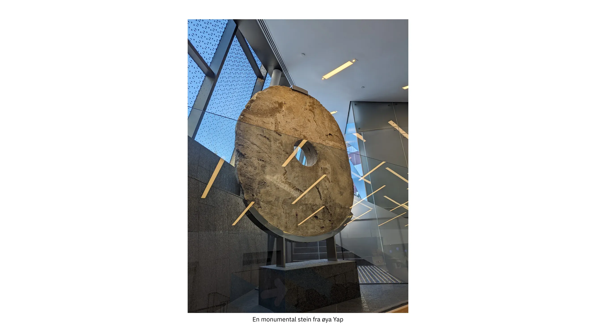

Dette er en virkelig interessant analyse av Yap-steinene. Saifedean Ammous nevner også dette eksemplet i sin bok "The Bitcoin Standard". Ifølge ham er det systemet på Yap Island som ligner mest på Bitcoin, et slags sentralt register som alle kan konsultere, som er offentlig, og som fører regnskap og forvalter eierskap til ting. Dette antropologiske perspektivet illustrerer at alt dette representerer en enighet eller sosial konsensus i samfunnet, noe som er grunnleggende riktig. Og jeg synes dette med de forsvunne steinene er veldig interessant. De dro hundrevis av kilometer ut på havet i små flåter og hentet steinene tilbake. Noen ganger falt steinen på havets bunn, men den ble likevel brukt i pengesystemet. En person kunne si: "Ja, vi mistet steinen på et slikt sted, den er min, så vi kan bytte den". Det var ikke nødvendigvis behov for fysisk besittelse for å lette byttet, ettersom steinene var så store at de ofte ble liggende på ett sted. I stedet var fokuset på å bytte hender med disse steinene på en transaksjonell måte, slik at eierskapet kunne skifte uten at steinene faktisk flyttet på seg. Det var en form for "bevis på konsensus", noe som belyser et interessant antropologisk perspektiv på penger.

### Protovalutaer og sosiale forpliktelser

Etnografer over hele verden har observert samfunn som har brukt "proto-valutaer" eller "primitive valutaer", som skjell, tøy, husdyr, salt og steiner, som oppfylte de funksjonene som vanligvis tilskrives penger, som betalingsmiddel og verdioppbevaring, uten at de regelmessig fungerte som mellomledd i utvekslingen av dagligdagse varer.

Her beskriver vi altså pengesystemer som ikke nødvendigvis ble brukt til daglig byttehandel.

Og jeg vil gjerne minne dere på at alt dette var valutaer før myntenes tid, og jeg vet ikke hvor misvisende det er å si valuta. Jeg foretrekker å si valuta. Jeg kan nevne at vi i litteraturen ofte snakker om proto-valutaer for å referere til penger før mynter. Men som vi så i første avsnitt, **mener jeg at det fantes pengesystemer lenge før myntene dukket opp**.

Disse primitive valutaene ble hovedsakelig brukt til å håndtere grunnleggende sosiale forpliktelser knyttet til enkeltpersoner, som ekteskap, konfliktkompensasjon (Wergeld) eller gaver mellom høvdinger. I Perserriket, for eksempel, ble de første myntene laget spesifikt som et militært betalingsmiddel snarere enn et byttemiddel.

Primitive penger har derfor ett vesentlig kjennetegn: De er et betalingsmiddel, men svært sjelden et middel til direkte utveksling av materielle goder. Det vi mener her, er at det var et betalingsmiddel for visse sosiale forpliktelser, for stammer, for utveksling mellom høvdinger, de berømte wergeld, blodpenger. Før rettssystemene kom, var det slik at hvis noen begikk et drap, ble det gitt oppreisning til familien som led under drapet på sin kjære. Det var en pris å betale for dette, det ble kalt blodpenger, og det er en form for betaling. Det var også medgiften, som også er en form for betaling. I disse tidlige bruksområdene var penger som betalingsmiddel mer knyttet til menneskelige og sosiale forpliktelser enn til betaling for dagligdagse innkjøp. Ifølge denne teorien var disse mer vanlige hverdagslige utvekslingene mer knyttet til kreditt, utsatt kreditt, gave for gave og omfordeling av rasjoner. Det fantes en annen form for sosial organisering for å håndtere disse utvekslingene. Det er også viktig å huske at i et samfunn der alle er selvforsynte og driver sitt eget jordbruk, er det ingen spesialisering, og det er svært lite behov for et pengesystem for daglige bytter. Og det er derfor de første formene for penger var det vi nettopp har beskrevet, medgift, blodpenger, rett og slett fordi dette var de første utvekslingene der vi trengte et betalingsmiddel, lenge før vi trengte å handle, å bytte brød mot penger på daglig basis, for i primitive samfunn fungerte det ikke slik. Alle sørget for sine egne behov, og det fantes ennå ingen spesialisering. Jeg tror jeg har gått grundig gjennom dette i alle de tidligere forelesningene i dette kurset.

I disse samfunnene, som ikke hadde noen avansert arbeidsdeling, var direkte utveksling begrenset og foregikk hovedsakelig innenfor personlige vennskaps- eller allianseforhold. Fraværet av tilstrekkelig spesialisering nødvendiggjorde ikke penger i moderne forstand.

Antropologer som Quiggin og Einzig insisterer på kredittens fremtredende rolle: **det primitive økonomiske livet er fanget i et gigantisk nettverk av kreditter og personlig gjeld, der penger griper inn særlig når betalinger må skje umiddelbart og kompensasjoner ikke uten videre kan utsettes.**

Folk bytter ting, kan gi utsatt kreditt, men i noen tilfeller kan du ikke utsette betalingen, så valuta eller proto-valutaer kan være nyttige på dette punktet for å få en umiddelbar avslutning på utvekslingen.

### Nyvinningen av anonymitet

Denne analysen fører til en dypere refleksjon: I stedet for å sette penger opp mot byttehandel, er det mer relevant å forstå pengenes fremvekst som en evolusjon fra de komplekse systemene med kreditt og gjeld. Penger introduserer en grunnleggende innovasjon: **anonymitet**. Og det er her jeg synes denne antropologiske teorien om pengenes fremvekst er interessant. Hvis man er en liten gruppe mennesker som gir hverandre utsatt kreditt, kjenner man åpenbart hverandre. Jeg tror at for at dette systemet skal fungere, må folk åpenbart kjenne hverandre. Og en betaling med penger gjør det mulig å være anonym. Du kan foreta en betaling uten at folk vet hva du heter, uten at folk vet hvem du er. De kan gjøre opp for seg umiddelbart og endelig. Og det er nettopp det penger muliggjør.

I motsetning til kreditt, som alltid er nominativ, muliggjør penger anonyme, generaliserte og umiddelbart frigjørende transaksjoner. **Denne unike frigjørende kraften til penger er deres avgjørende overlegenhet

Penger er altså langt fra å være et beskjedent verktøy for å lette økonomisk utveksling, men en viktig sosial innovasjon, nært knyttet til utviklingen av menneskelige institusjoner og praksiser, fra personlig kreditt **til et generalisert, anonymt betalingssystem**. Denne antropologiske utviklingen viser at penger, langt mer enn et enkelt byttemiddel, representerer en mektig sosial institusjon som har formet menneskelige samfunn i så stor grad at de i våre moderne samfunn har blitt selve formålet med økonomisk aktivitet.

Her innser vi at i våre moderne samfunn er selve formålet med økonomisk utveksling til syvende og sist å eie penger, mens dette overhodet ikke var tilfellet før i tiden. Da var selve formålet med økonomisk utveksling å eie varer eller varer til forbruk. Og i dag, med innføringen av penger, er formålet med økonomisk utveksling å akkumulere disse pengene, siden de gjør det mulig for oss å bytte dem mot en vare, slik det er allment akseptert. Vi kan bytte dem mot den varen vi trenger når vi trenger den.

## Enhetlig register

<chapterId>7664442a-91c1-5ce4-a8bd-53b7371a3e3d</chapterId>

:::video id=473fc284-5375-4e1b-b0cd-6b51ba0cc3b8:::

### Regnskapsregisterteori

Vi skal nå sammen utforske ulike forslag til forening av disse to monetære teoriene, dvs. teorien om pengenes fremvekst gjennom gjeldspenger og den monetære teorien om fremveksten av varepenger. Vi skal snakke om Lynn Aldens forslag til forening i hennes berømte bok "For Broken Money", som i Consensus' oversettelse trolig vil få tittelen "Rupture monétaire".

*Utdrag fra Broken Money av Lyn Alden:*

> Penger er i bunn og grunn et regnskapsregister. Varepenger er et register styrt av naturen. Bankpenger er en hovedbok styrt av nasjonalstater. Penger med åpen kildekode er en hovedbok styrt av brukerne.

Her refererer Lyn til Bitcoin.

### Forholdet mellom lager og flyt og knapphet

> Noen sjeldne grunnstoffer, som rhodium, er sjeldnere enn gull, men har lav lagerbeholdning fordi de forbrukes av industrien like raskt som de utvinnes. En rhodiummynt eller -barre kan kjøpes som et spesialisert samleobjekt eller verdioppbevaringsmiddel, men egner seg ikke som en sosialt akseptert valuta, og dukker derfor ikke naturlig opp som penger.

Saifedean snakker utførlig om dette i boken "The Bitcoin Standard". For de som ikke er kjent med forholdet mellom lager og flyt, er det ganske enkelt når du sammenligner det eksisterende lageret, reservene som finnes i markedet, sammenlignet med det nye lageret som kommer inn, tilstrømningen av nye varer. Det er ofte ganske kontraintuitivt, fordi du kanskje tror at noe du har i store mengder, ikke er knapt, men det er det faktisk ikke. Det er mer et spørsmål om kapasiteten du har til å levere det. Det er snarere kapasiteten vi har til å skaffe nye varer på lager som, ifølge denne modellen, gir oss informasjon om hvorvidt denne gjenstanden er sjelden eller ikke. Det er ikke fordi vi ikke har noe på lager at det er sjeldent, det er bare kanskje fordi vi ikke har det. Hvis vi tar gull, så har vi mange gullbeholdninger fordi det brukes som et verdioppbevaringsmiddel, og tilførselen av nye gullbeholdninger er noe sånt som 1 % til 3 % per år av nye gullbeholdninger som kommer inn gjennom gull mining. Mens det hun sier her, hvis vi snakker om rhodium, er at det er sjeldnere enn gull, men vi har ikke noe lager fordi det forbrukes underveis. Så det skal ikke mye ny forsyning til for å doble det eksisterende lageret. Med gull ville det tatt minst 50 år å fornye for å doble beholdningen. I motsetning til de fleste varer som forbrukes, der det er ganske enkelt og ikke tar mange års produksjon å doble den eksisterende beholdningen, siden den forbrukes etter hvert som den går.

*"Gull har hatt et forhold mellom lagerbeholdning og strømning på mellom 25x og 100x gjennom hele den moderne historien, vanligvis rundt 50x eller mer, og har i korte perioder aldri falt under 16x, selv ikke under gullrushet på midten av 1800-tallet. "*

Så 25 vil bety 25 år for å doble beholdningen, og 100 vil bety 100 år for å doble beholdningen. Saifedean sier i boken sin at selv om vi doblet gullproduksjonen, fra for eksempel 1,5 % til 3 %, ville det ikke nødvendigvis ha noen stor effekt på gullprisen.

*"Sølv har generelt et lager-strøm-forhold på 10 ganger eller mer, noe som fortsatt er relativt høyt

*De fleste andre råvarer har et lager-strøm-forhold på mindre enn 1 eller 2. Selv de sjeldneste grunnstoffene, som platina og rhodium, har relativt lave lagerflytforhold på grunn av det raske industrielle forbruket."*

### Overlegenheten til gull og sølv

*"Kort sagt, hver gang en råvarevaluta har konkurrert med gull og sølv, har sistnevnte alltid vunnet til slutt. Andre råvarer kan forbli valutaer i begrensede perioder eller i bestemte regioner, men gull og sølv har alltid bevist sin evne til å bli globalt konkurransedyktige valutaer og til å dominere konkurransen. Når sivilisasjoner har møttes, har innehavere av gull og sølv alltid hatt teknologisk kapasitet til å devaluere andre former for valuta, mens innehavere av skjell, perler, husdyr, salt, tøy eller mindreverdige metaller aldri har kunnet devaluere gull eller sølv."*

Så dette er igjen ekstremt godt beskrevet i The Bitcoin Standard, der Saifedean snakker om stammene i Afrika som brukte glassperler. Og da de venetianske kjøpmennene ankom med laster fulle av glassperler, fordi de var i stand til å produsere dem industrielt på den tiden, de hadde den teknologiske kapasiteten til å gjøre det, destabiliserte det det monetære systemet til disse folkene fullstendig, og de var i stand til bokstavelig talt å plyndre ressursene deres. Dette er Saifedeans tese.

### Kontoenhet og kreditt

*"Selv når kreditt ble brukt direkte som et byttemiddel, var den historisk sett vanligvis denominert i enheter av monetære varer som var naturlig valgt på grunn av sine egenskaper."*

Det er et veldig interessant poeng, og det er noe Ulrich og jeg har diskutert. Selv om tempelet i Mesopotamia var en slags autoritet som kunne forvalte dette kredittbegrepet, var regningsenheten shekelen. Det er ingenting som bekrefter at shekelen ble etablert autoritativt av tempelet. Sjekelen kan ha oppstått naturlig, gjennom kjøpmennenes behov for å importere og eksportere med andre folkeslag i nærheten. Vi har bevis for dette, i form av en kjøpmann i Kanesh (jeg nevnte dette i del 1) som gjorde nettopp dette, og importerte edle metaller som ikke ble brukt for sin fysiske vareverdi, men snarere som et verdioppbevaringsmiddel. Problemet er bare at vi ikke vet om vi kan gå ut fra at dette valget av sølv, av sølvsjekkelen, ble gjort av kjøpmennene, eller om det ble gjort av tempelet. Men Ulrich har et veldig godt argument som får oss til å tenke at det nok heller var på kjøpmennene sin side at det ble gjort.

*"Foreningen av de to teoriene kan derfor beskrives som en "regnskapsteori om penger" ("hovedboksteori om penger"), siden den beskriver den grunnleggende logikken som er felles for begge teoriene. Både fleksibel sosial kreditt og samlebare proto-valutaer kan dateres tilbake til menneskehetens begynnelse. I begge tilfeller fører menneskegrupper av ulik størrelse en regnskapsbok seg imellom for å unngå å måtte tilfredsstille dobbelt sammenfall av behov, redusere friksjon i utvekslinger og fungere som en form for likvid sparing. Den vesentlige forskjellen ligger i hvem som har fått ansvaret for å føre regnskapet."*

På den ene siden styrer naturen ekspansjonen av pengemengden. Hvis vi tar gull, som er ganske sjeldent, er det vanskelig å utvinne. Det er en slags grense for hvor mange gullmynter som kan utvinnes. Så knapphet styres av naturen. Og registeret holdes av konseptet om besittelse. Registeret er desentralisert. Besittelse bevises ved at du eier en gullmynt eller et stykke gull. Og når det gjelder kredittpenger, styres knappheten av folks evne til å skaffe seg kreditt. Eller i tilfellet med fiat-valuta styres knappheten av myndighetene. Det er de som bestemmer om det skal trykkes mer eller ikke, for å unngå inflasjonskatastrofer. I noen tilfeller kan registeret også styres av eieren av token, når det gjelder papirpenger. Det er derfor det står i registeret, i anførselstegn, dematerialisert. Vel, materialisert, men virtuell. Han besitter denne berømte token, og det er det som beviser besittelse. Og det kan like gjerne være i et virkelig register, som med skriftens penger, i en bank, hvor det egentlig er den menneskelige banken som styrer hvem som eier hva i forhold til registeret.

## Enighet gjennom pengepremien

<chapterId>093756e5-8908-55e5-bb76-376a3a3cc4d3</chapterId>

:::video id=eabc342a-ecbd-46ca-a347-e914917e7c4f:::

### Det monetære premiekonseptet

I denne delen, som er viet de ulike forslagene til å forene de forskjellige teoriene om pengenes opprinnelse, har jeg nettopp foreslått Lyn Aldens teori, registerteorien. Jeg har mitt eget forslag til en forening av de to monetære teoriene. Det er pengepremien, begrepet pengepremie. Pengenes verdi kan altså forklares med den monetære premien som oppstår som følge av pengeetterspørselen, enten det er i form av leirtavler, edelmetallmynter, sedler eller bitcoin. Pengepremien er rett og slett basert på tilliten til at noen vil veksle inn denne valutaen i fremtiden til en sammenlignbar pris.

Det jeg prøver å vise her, er ganske enkelt at enten det er fiat, altså sedler uten bruksverdi, om det er gullmynter eller et hvilket som helst metall, en gullklump eller en gullbarre, **så er det ofte pengepremien som utgjør mesteparten av verdien**. Hvis vi tar et stykke gull, forklares en viss del av verdien av bruksverdien, bruken i industrien eller til å lage smykker. Legg merke til at etterspørselen etter smykker ofte kommer fra pengeverdien. Folk beholder smykker som et slags verdioppbevaringsmiddel, så jeg inkluderer dette litt i pengepremien fordi det ofte er en ganske monetær etterspørsel å spille en rolle i penger.

Så man kan si at rundt 10 % av etterspørselen etter gull går til industrien. I verdien av gull vil vi ha en liten del, la oss si 10%, som kan forklares av denne industrielle etterspørselen, denne etterspørselen etter bruk av gull, der gull forbrukes. Resten er helt klart etterspørsel etter den monetære bruken av gull som et verdioppbevaringsmiddel.

### Myndighetsbonus og fiat

Og hvis du sammenligner et gullstykke med en gullmynt, er det enda et lag. Gullmynten er stemplet av en myndighet, og gullet i mynten har også en etterspørsel etter bruk, en etterspørsel etter å bli brukt i industrien. Det har også en pengepremie som verdioppbevaringsmiddel. I tillegg kommer det jeg kaller myndighetspremien, der det ofte vil være en pris, en større kjøpekraft for mynten enn for gullstykket, siden mynten er enklere å bruke. Den gjør utvekslingen mer flytende, siden man ikke trenger å veie den. Myndighetene garanterer normalt for renheten. Og hvis du sammenligner den med et gullstykke, er en stemplet gullmynt som regel mer verdt enn et enkelt gullstykke. Og det er også normalt, fordi det krever ressurser å stemple den.

Det er samme prinsipp for fiat, papirpenger. Papirpenger har egentlig ingen bruksverdi, bortsett fra kanskje til å varme opp et hus, og det skjedde under Weimarrepublikken. Så det er ingen reell etterspørsel etter bruksverdien. På den annen side er det bare en premie for autoritet, etter min mening.

Det er en form for pengepremie, et overlegg på pengepremien. Men pengepremien kommer av at den er lovlig betalingsmiddel, og så tvinger myndighetene deg til å kjøpe den for å betale skatten din. Så fiat-valuta har nødvendigvis en form for monetær etterspørsel som følge av at den er beskattet, og du må i det minste kjøpe den for å betale skatten din. Og som et resultat av dette forblir den et allment akseptert betalingsmiddel. Så folk ønsker å anskaffe den for å dekke sine behov.

### Forening gjennom monetær etterspørsel

Og hvorfor kvalifiserer dette forslaget om en pengepremie som en forening av de to teoriene om gjeldspenger og varepenger? Vel, jeg mener ikke at verdien av en gullmynt nødvendigvis kommer fra dens "egenverdi". Nei, det er faktisk like mye et begrep om tillit som det er for fiat-penger. Det er et begrep om monetær etterspørsel. Og det er egentlig ikke fordi den har en liten prosentandel av industriell bruk, et annet "verktøy". Hvis vi sier at industriell bruk utgjør 10 % av verdien, kan vi verdsette det til 300 dollar per unse. Hvis gull selges på markedet for 3 000 dollar per unse, er forskjellen mellom 300 og 3 000 dollar den berømte monetære premien. Det er denne monetære etterspørselen etter gull som forklarer det. Bare fordi fiat har null bruksverdi, betyr ikke det at det er noe annerledes. For meg er det akkurat det samme. Så på begge sider, teorien om gjeldspenger eller råvarepenger, tror jeg ikke at den ekstra egenskapen som gull har ved å ha en minimal bruksverdi, endrer noe som helst.

På den annen side er det sikkert at **på fremvekstnivået, i henhold til Mises' regresjonsteorem, kan vi foreslå at denne bruken skaper en etterspørsel ved opprinnelsen og setter i gang prosessen som blir penger.** Mens på gjeldspengenivået er det mer et pålegg fra en myndighet, så kilden, initieringen av fremveksten og begrepene er helt forskjellige. **Men jeg tror at på verdinivået, hvordan man forklarer pengenes verdi, med den monetære premien, kan vi like gjerne forklare hvorfor fiat-penger har den verdien vi tillegger dem, som hvorfor varepenger har den verdien** vi tillegger dem. For meg er det den samme prosessen, og den kalles pengepremien.

#### Den monetære premien

Sånn er det. Verdien av penger kan forklares med den monetære premien som oppstår som følge av den monetære etterspørselen, enten det er i form av leirtavler, edelmetallmynter, pengesedler eller bitcoin.

Pengepremien er rett og slett basert på tilliten til at noen senere vil veksle disse pengene til en tilsvarende pris.

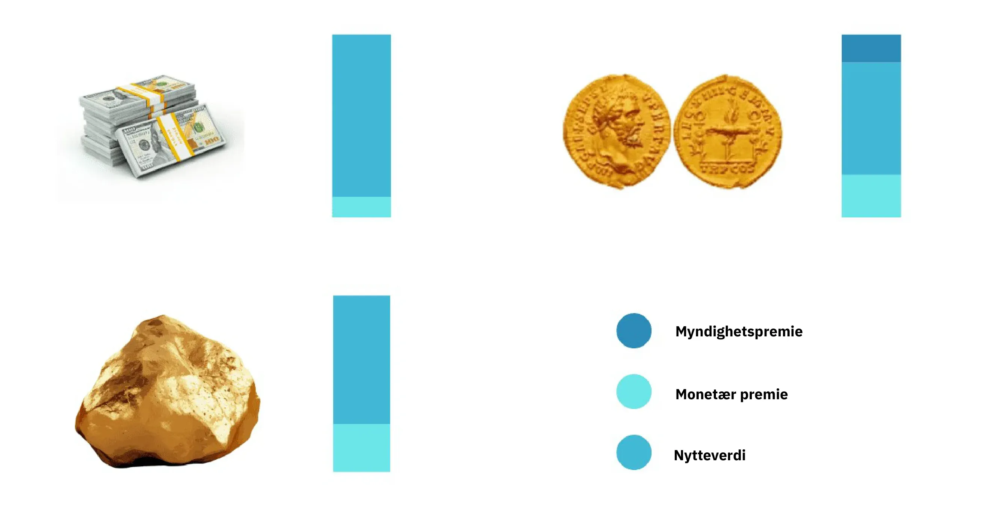

# Ulike definisjoner av penger

<partId>77b7918a-8c3b-11f0-b688-6b2ab22378c9</partId>

## Penger vs valuta vs monnaie vs argent vs devise

<chapterId>bf8a6d21-df88-5d23-a0a5-e9a5c1300554</chapterId>

:::video id=d9c9e7df-9db3-4a9f-801e-10d3fc7dfc22:::

### Semantikk for monetære termer

I denne delen om de ulike pengeteoriene og spesielt om definisjonene av penger, vil jeg gjøre et kort sidesprang til semantikken. Jeg vil grave litt dypere i definisjonene av flere ord som har med penger å gjøre, og sammenligne dem med deres engelske ekvivalenter. For eksempel penger, valuta, sammenlignet med monnaie, argent og devise. Så, det går slik.

Litt semantikk:

Når vi sier "**penger**" (de la monnaie), vil de fleste tro at vi sikter til småpengene vi får i bytte for en transaksjon. Og hvis vi sier "**valuta**" (la monnaie), vil folk sannsynligvis tro at vi sikter til en stats valuta. Canadas valuta er den kanadiske dollaren. Ja, det stemmer.

Men hva med penger (de l'argent)? En tyv vil aldri si "Gi meg alle vekslepengene dine!" (tyven kan godt bli skuffet over å bare få mynter som nesten ikke har noen verdi).

Nei, tyven vil rope: "Gi meg **alle pengene dine**". Og hvis tyven står foran deg på gaten, sikter han nødvendigvis til **pengesedlene** i lommen din.

Hvis tyven derimot forsøker å svindle deg på en mer sofistikert måte, og prøver å stjele verdiene dine ved å tømme alle bankkontoene dine, vil vi si at **han tar alle pengene dine**. Her refererer ordet "penger" til **den enkeltes formue**.

Det finnes altså to definisjoner av ordet penger: kontanter (sedler) og formue.

### Valuta vs monnaie vs devise

En valuta (devise) er nødvendigvis et annet lands valuta, ellers sier vi bare penger (monnaie). Hvis du er fransk, ville du sagt "La livre sterling est la devise du Royaume-Uni et l'euro et la monnaie de l'Europe" (Det britiske pundet er Storbritannias valuta, og euroen er Europas valuta).

Ofte vil folk som ikke har satt seg inn i disse semantiske problemene, når de oversetter disse begrepene, ofte være tilbøyelige til å snakke om valuta (devise) når det står valuta, men nei, valuta er penger (monnaie) når det er ditt lands valuta, og det er devise når vi snakker om andre valutaer. Problemet jeg ofte ser her, er at på engelsk finnes det to ord: "money", som er et begrep, og "currency", som egentlig er den enheten i et land som brukes til å veksle penger. Så vi kan bare snakke om begrepet penger; det er enkelt - det er begrepet *penger*; det er penger generelt. Og *valuta* er veldig enkelt å sidestille med valutaen i et land. På fransk vil folk dessverre ofte si ja, "mais ce n'est pas une monnaie" når de snakker om bitcoin, fordi det ikke er valutaen i et land, men ofte tror jeg de refererer til begrepet valuta i stedet. Dette er feil på den ene siden, for siden El Salvador har bitcoin vært valutaen til en stat. Faktum er at folk ofte vil si *men nei, det er ikke valutaen til en stat, det kan ikke være penger*. Men faktisk, hvis vi refererer til det bredere begrepet *penger*, passer bitcoin perfekt inn i denne definisjonen, etter min mening. Det er bare det at på fransk har vi ikke to ord for å skille disse to begrepene fra hverandre. Vi kan si at ordet argent refererer til valuta, men det er dessverre ikke den presise definisjonen. *Argent* (penger) refererer til rikdom eller pengesedler. Man kan ikke sette likhetstegn med ordet *penger*. *Penger* er egentlig begrepet valuta (monnaie).

## Saifedean Ammous' definisjon

<chapterId>07c4ba50-168c-567a-8957-0b187ff75f97</chapterId>

:::video id=936d6d3b-6d45-468e-bc44-85fbce9b857a:::

#### Hva er penger?

Penger er rett og slett noe du eier eller anskaffer deg, ikke for å bruke eller forbruke dem selv, men for senere å bytte dem mot andre varer eller tjenester du måtte trenge. (Saifedean)

Penger får en pengepremie når det finnes en monetær etterspørsel etter varen, for å spille en eller flere av pengenes roller.

Det monetære godet må være knapt nok til at den monetære premien vedvarer (for å hindre at tilbudet tilpasser seg den monetære etterspørselen).

### Den monetære premien

I dette avsnittet om de ulike definisjonene av valuta vil jeg kort ta for meg Saifedeans definisjon i The Bitcoin Standard, som jeg alltid har vært svært interessert i. Den slo meg som ganske enkel da jeg leste den. Og vi kommer også til å legge til begrepet pengepremie i denne definisjonen. Som Saifedean nevner i boken sin, finnes det nødvendigvis et knapphetsbegrep. Spørsmålet er hva penger er

> Penger er rett og slett noe man eier eller skaffer seg, ikke for å bruke eller forbruke dem selv, men for senere å bytte dem mot andre varer eller tjenester man trenger.

Det er altså den definisjonen Saifedean nevner i The Bitcoin Standard. Jeg vil legge til at en valuta (la monnaie) får en pengepremie når det er en monetær etterspørsel etter varen, for å spille en eller flere av valutaens roller. Så man kan si at en valuta som fungerer som et verdioppbevaringsmiddel vil ha en monetær etterspørsel som gir den en monetær premie, siden folk ønsker å anskaffe den, for eksempel som verdioppbevaringsmiddel eller som byttemiddel.

### Knapphet og markedsmekanismer

Til dette tror jeg vi absolutt bør legge til at det monetære godet må være knapt nok til at den monetære premien kan eksistere. Dette er veldig viktig. **Hvis en vare dukker opp for å brukes som penger og vi ser at prisen på den stiger, vil folk normalt, hvis varen ikke er sjelden nok, ønske å produsere mer av den for å dra nytte av denne verdiøkningen når prisen stiger**. Dette er grunnen til at de fleste varer på markedet har en relativt fast pris. Når prisen stiger, har produksjonen en tendens til å øke. Når prisen faller, faller produksjonen. Det skjer en slags markedstilpasning. **Og når en vare er sjelden nok, som gull, vil ikke markedsmekanismen kompensere for denne økte etterspørselen til pengebruk. Så det er variabelen som endres, det er prisen. Som med bitcoin**. Når prisen på bitcoin går opp, produserer vi ikke mer bitcoin. Så det er prisen som justeres. Og det er derfor vi i årevis har sett prisen på bitcoin stige i takt med at etterspørselen etter bitcoin øker. Siden det ikke er noen på jorden som kan endre algoritmen og si "det er mer etterspørsel, prisen går opp, vi skal produsere mer" **Tilgangen på nye bitcoins er programmert på forhånd, og kjent på forhånd**. Så det var det jeg sa, at det monetære godet må være sjeldent nok til at den monetære premien vedvarer, og derfor ikke fanges opp av markedsmekanismer, for å forhindre at tilbudet tilpasser seg denne nye monetære etterspørselen.

## Betalingsmiddel og frigjørende verdi

<chapterId>5d424039-e342-56f7-9d8b-bba9551831a9</chapterId>

:::video id=af4c0765-8111-4cb7-891b-3ee54d6e7054:::

### Betalingsmiddel vs. byttemiddel

I dette avsnittet om de ulike definisjonene av penger foreslår jeg at vi sammen ser på et sitat fra boken "Aux origines de la monnaie" (Pengenes opprinnelse), en tekst av Alain Testart om penger som betalingsmiddel og frigjørende verdi.

*I Aux origines de la monnaie definerer Alain Testart penger som et betalingsmiddel:*

> Betalingsmidlenes funksjon oppfattes her som forskjellig fra byttemidlenes funksjon, for så vidt som det finnes betalinger uten vederlag, betalinger som ikke kjøper noe. Knies (1873:192 ff.) utvikler utførlig dette temaet om overføringer av goder som ikke består i byttehandlinger, som i tilfellet med wergeld (blodpenger eller mordkompensasjon) eller skatter. Carl Menger angrep denne fjerde funksjonen i sin artikkel "Geld" fra 1892, som generelt regnes som en av de mest avgjørende om emnet. Uten å ha blitt fullstendig diskreditert, ser det ut til at ideen om betalingsmidlenes funksjon er glemt i dagens økonomiske tenkning, eller i det minste forkastet til fordel for byttemidlenes.
>

> Penger brukes til å betale: Sett i dette lyset er de et frigjøringsinstrument, som i all sin allmenhet beskriver funksjonen til et betalingsmiddel. I denne forbindelse snakker vi om pengenes "frigjørende kraft". Ifølge Le Petit Robert er frigjørende kraft "det som virker frigjørende (fra en forpliktelse, en gjeld)". Ifølge Grand Larousse er en frigjørende betaling "enhver betaling som foretas under lovlige forhold på en slik måte at kreditor ikke kan bestride at gjelden slettes". Penger har denne egenskapen par excellence, og det er til og med det som definerer deres status som tvungent betalingsmiddel, siden ingen kan nekte en betaling i penger, verken selger eller kreditor. Penger er den eneste varen som ikke kan nektes å betale det man skylder, uavhengig av om gjelden er til en kjøpmann eller til skattevesenet. Blant alle varer er det bare penger som har dette privilegiet. "Det er dette privilegiet", skriver Charles. Gide (1921 I: 443), som utgjør det vi kaller tvungent betalingsmiddel.
>

> Ethvert bytte som består i overføring av en vare mot en annen, eller på betingelse av at en annen vare gis i retur, innebærer nødvendigvis en forpliktelse fra mottakerens side til å yte denne motparten. Betaling er oppfyllelsen av denne forpliktelsen. All utveksling innebærer derfor betaling, men ikke all betaling innebærer utveksling. Det finnes betalinger uten motpart, det vil si betalinger som ikke gjør det mulig å skaffe seg et annet gode, og som ikke gjøres med dette formålet. Skatter er fortsatt referanseeksemplet her, men vi bør også nevne bøter av alle slag som betales til offentlige myndigheter, og erstatninger til andre ut fra prinsippet om at den som påfører andre skade, må reparere den.

### Betalinger uten motpart

Dette er en tydelig illustrasjon av forfatterens tese. Faktisk skiller han mellom de to. For ham er et bytte både en overføring av varer og en betaling. Betaling kommer deretter. Og betaling kan skje uten bytte. Han gir eksempler på hvordan det å betale en parkeringsbot eller en bot bare er en betaling. Du får egentlig ikke en tjeneste i bytte. Noen vil kanskje hevde at staten gjør deg en tjeneste i bytte, en tjeneste som består i å gi deg parkeringsbøter. Han er helt klar på at det å betale skatt egentlig er en betaling uten motpart, i den forstand at det er påkrevd å betale skatt, selv om du ikke nødvendigvis får en tjeneste. Han sier at det egentlig er definert at det å betale skatt bare er en betaling; det er ingen forpliktelse til å få tjenester i bytte. Jeg har diskutert dette med mange av mine kolleger, og de er ikke nødvendigvis enige i denne oppfatningen. Men det er forfatterens tese. Han prøver å plassere betalingsbegrepet og løsrive det fra utveksling med disse eksemplene, for eksempel bøter og skattebetaling. Han uttrykker også at medgiften er en betaling, og at man ikke nødvendigvis får noe i bytte. Noen som kritiserer dette forslaget, vil kanskje si: "Ja, men du får en kone i bytte." Så det er nivået på debatten om dette emnet.

Det er også wergeld, eller blodpenger. Så det er bare en betaling for å kompensere. Min venn Ulrich ville sagt:

> Ja, men du får denne filen lukket i bytte.

Du har begått en forbrytelse, for eksempel et drap. På det tidspunktet betaler du wergeld, og etter det blir du løslatt fra den situasjonen. Så det er en frigjørende kraft. Får du noe tilbake?" Ifølge forfatteren, nei. Ifølge noen av mine kolleger, ja.

Jeg tror at vi i denne diskusjonen kan se at wergeld er et av de gode eksemplene på hvordan man definerer en betaling. Det er helt klart at du ikke får noe tilbake.

## Gjeldspenger vs. råvarepenger

<chapterId>4093677a-c8e8-5828-b994-15c01656186e</chapterId>

:::video id=f49cf5cc-288e-4daa-a1ff-b9de73506f4e:::

### Den grunnleggende debatten

I forbindelse med dette avsnittet om ulike monetære definisjoner og teorier skal vi likevel se nærmere på to diametralt motsatte oppfatninger: "Penger er alltid gjeld" eller "penger er alltid en vare". På den ene siden har vi tilhengerne av den gjeldsbaserte pengeteorien, som hevder: "Nei, penger er alltid gjeld! På den andre siden argumenterer våre berømte gullfugler: "Men nei, penger er alltid en vare, det er alltid gull; alt annet, veksler, gjeldsbrev, det er bare kreditt, ikke penger".

La oss sammen utforske en oversiktlig oppsummering av disse teoriene.

### Teorien om "alltid en gjeld"

Her er en oppsummering av den monetære teorien som kalles **"gjeldspenger"**, og som går ut på at penger i bunn og grunn er en form for gjeld:

Ifølge denne teorien, som særlig er utviklet av Alfred Mitchell-Innes og videreutviklet av David Graeber, er penger i bunn og grunn en erkjennelse av gjeld, som stammer fra de kredittrelasjonene som historisk sett eksisterte forut for direkte pengeutveksling. Snarere enn å være et resultat av et behov knyttet til byttehandel, fremstår penger som en måte å gjøre rede for, overføre og gjøre opp sosiale forpliktelser eller gjeld mellom individer eller grupper.

Alle penger sirkulerer altså som en gjeld som en person eller institusjon har til en annen, støttet av tillit og sosial eller statlig autoritet som garanterer deres gyldighet. Så når vi besitter - som jeg allerede har nevnt - når vi besitter penger, har vi ifølge dem et krav på samfunnet, og samfunnet står i gjeld til oss. Penger er derfor aldri nøytrale eller autonome, men alltid en underliggende gjeld: Å eie penger betyr i bunn og grunn å eie en fordring på samfunnet eller et økonomisk fellesskap.

Dette resonnementet strider mot den klassiske oppfatningen av penger som en enkel "mellomvare", og understreker i stedet den sentrale rollen sosiale og politiske relasjoner spiller i skapelsen og forvaltningen av penger.

**Min anmeldelse:**

Det som plager meg med denne teorien, er at den hevder at penger alltid er en gjeld, når vi har eksempler på bytter mellom to forskjellige stammer som for eksempel bytter gull, der transaksjonen er endelig avsluttet og det ikke gjenstår noen latent gjeld. Tilhengere av denne teorien vil ofte fortelle oss at disse byttene ikke er pengebytter, men byttehandel. Som allerede nevnt er jeg uenig. Det er et pengebytte, siden gullet ikke skal forbrukes, men brukes som penger.

### Teorien om "alltid en vare"

**Altid en handelsvare:**

Her er en klar oppsummering av pengeteorien kjent som **"råvarepenger"**, der penger alltid oppstår som en råvare, særlig gull, som oppstår ut fra et behov for å kunne handle, en råvare som generelt vil bli akseptert i utlandet og som erverves for handelsformål.

Ifølge denne teorien, som ble utviklet av klassiske økonomer (Adam Smith, David Ricardo) og tatt opp av Marx, oppstår penger naturlig som en vare blant andre, ofte et edelt metall som gull eller sølv, som har en iboende verdi uavhengig av sin monetære rolle. I utgangspunktet blir disse varene spontant valgt av økonomiske aktører for å lette handelen, takket være deres iboende kvaliteter (knapphet, holdbarhet, delbarhet og stabilitet).

Varepenger kjennetegnes ved sin fysiske eksistens og en verdi som bestemmes av mengden arbeid som kreves for å produsere dem (som hos Marx). Samfunnet bruker for eksempel gull, ikke bare for å forenkle byttehandel, men også som en regningsenhet, et verdioppbevaringsmiddel og et universelt byttemiddel.

I denne visjonen beholder penger alltid en reell verdi, ettersom de forblir knyttet til en konkret vare. Selv når pengenes rolle blir abstrakt (mynter, sedler eller skriftpenger), har de fortsatt sin gyldighet, direkte eller indirekte, fra en referanse til en underliggende vare som for eksempel gull. Denne teorien insisterer derfor på pengenes materielle og økonomiske opprinnelse, i motsetning til teorier som betrakter dem som en ren konvensjon eller gjeld. Ifølge denne teorien vil enhver representasjon av penger ved hjelp av et substitutt, for eksempel en veksel som kan innløses i gull, være kreditt.

**Min anmeldelse:**

Legg merke til at denne visjonen ligner på varepengeteorien, men går et skritt videre. De foreslår at penger **alltid** skal være en vare. Og når vi sier til dem "*Ja, men vi kan være enige om at en pengeseddel er penger for denne gruppen; den kan backes opp av gull, den fungerer, og seddelen som sådan er penger*".

Som svar vil de gi oss eksempelet med garderobekupongen. De vil si: "Ja, men nei: "Ja, men nei, når du har en garderobekupong for plagget ditt, kan vi da kalle kassakupongen for et plagg?

Selvsagt ikke, det er som en bekreftelse, et krav, i bunn og grunn, som gjør at du kan få plagget ditt tilbake. Denne parallellen holder ikke, fordi en kupong i garderoben ikke er en allment akseptert betalingsmåte. **Penger er ikke et krav på et spesifikt objekt som et plagg, det er en modus, et byttemiddel, et byttemiddel eller et allment akseptert betalingsmiddel**.

Så du kan ikke trekke en parallell mellom en garderobekupong og en fiat-valutaseddel, siden garderobekupongen lar deg få en bestemt vare i bytte, det er en token som lar deg hente tilbake varen din. Mens en pengeseddel, fiat-valuta, er en universell kupong som gir deg tilgang til et hvilket som helst gode.

Og etter min mening kan selvfølgelig selv fiat-penger betraktes som penger hvis de blir betraktet som det av befolkningen. Og jeg synes det er en semantisk feil å insistere på at det ikke kan være penger, siden det er en kupong for å få tak i ekte penger, i det minste på den tiden, som var det underliggende gullet.

Jeg har ingen problemer med å betrakte gullmynten som ligger i safen, og seddelen som representerer gullmynten, som valuta. For meg er det ikke noe semantisk problem, det er bare to typer valuta. Hvis jeg ikke tar feil, forklarer Mises dette fenomenet veldig godt ved å snakke om monetære substitutter.

Deres syn koker ned til det faktum at man ikke kan betrakte en gullmynt i et bankhvelv og seddelen som representerer den, som penger på samme tid. Personlig ser jeg ikke noe problem med dette; jeg ser ikke noe paradoks i situasjonen. De som mener at penger alltid er en vare, ser ikke ting på samme måte som meg.

**Her er en gjennomgang av kupongkonseptet fra boken *Aux origines de la monnaie*:**

*Note 14: "Utmerket kritikk - utmerket fordi den står på nettopp det grunnlag Knapp plasserer seg på, det juridiske - av Rist (1938: 372, note 1) av sammenligningen mellom papirpenger og sjekkeromsmønter: Hvis vi kan snakke om en slags fordring i begge tilfeller, er den fundamentale forskjellen at i det første tilfellet, og bare i det første, er det en fordring uten et spesifikt objekt..

Når det gjelder **krav**, bemerker den samme forfatteren følgende:

> Bastiat kan godt tenke seg en kupong for hele samfunnet presentert som "en enorm basar", men dette lille tillegget, denne tilsynelatende uskyldige utvidelsen, er hele forskjellen mellom kreditt og penger. Penger er ikke en fordring på en bestemt butikk. Det finnes ikke noe slikt som en anonym fordring. Men det er nettopp anonymiteten som kjennetegner penger, og dermed deres allmenngyldighet, som gjør dem så mektige. Penger er ikke som kreditt, og de kan heller ikke på noen måte reduseres til det. **Penger er mye mer enn kreditt

**Et paradoks: gjeldspenger vs. råvarepenger**

Det paradokset som best illustrerer den dype motsetningen mellom teoriene om gjeldspenger og råvarepenger, er spørsmålet om gull er en valuta i dag.

På den ene siden definerer gjeldspengeteorien penger først og fremst som et byttemiddel eller betalingsmiddel som er allment akseptert, eller til og med pålagt, av en offentlig myndighet. I dette perspektivet er gull ikke lenger en valuta, siden det ikke er allment brukt eller akseptert som et vanlig byttemiddel.

Varepengeteorien ser derimot på penger som en håndgripelig vare, spontant valgt av samfunnet på grunn av sine iboende egenskaper (knapphet, holdbarhet, delbarhet osv.). Ifølge denne tilnærmingen er gull fortsatt den sanne universelle valutaen, og alle andre former for penger i dag er i bunn og grunn ikke annet enn kreditt basert på tillit.

Dette paradokset viser tydelig gapet mellom disse to pengeoppfatningene: For den første er gull ikke lenger en valuta, mens det for den andre fortsatt er den eneste sanne valutaen som eksisterer.

## Moderne monetær teori

<chapterId>8efc29af-3193-5d97-ad9f-e608b32924ff</chapterId>

:::video id=f8127cb7-46a1-468c-bbb5-97bf0a8b8837:::

### Prinsipper for moderne monetær teori

For å avslutte denne delen om de ulike monetære teoriene, la oss snakke om monetærteoriens vidunderbarn, beundret av mange moderne økonomer som jobber for sentralbanker, og kalt moderne monetær teori, ofte kjent som MMT.

**Moderne monetær teori (MMT)** er en økonomisk tilnærming som går ut på at en stat med egen valuta (som USA, Canada eller Japan) aldri kan gå tom for penger, siden den alltid kan utstede mer penger for å finansiere sine utgifter. I henhold til denne teorien

- Penger er skapt av staten, ikke en begrenset ressurs**

- Skatter og lån brukes ikke direkte til å finansiere offentlige utgifter, men snarere til å regulere inflasjonen, påvirke økonomisk atferd og opprettholde etterspørselen etter den nasjonale valutaen*

- Den virkelige grensen for offentlige utgifter er inflasjonen, ikke budsjettunderskuddet eller statsgjelden.

- Hvis pengene som skapes, kanaliseres til sektorer som kan absorbere dem, blir det heller ingen inflasjon.

- Myndighetene må derfor tilpasse utgiftene til de reelle ressursene som er tilgjengelige (arbeidskraft, industrikapasitet, naturressurser) for å unngå for høy inflasjon.

### Skattens rolle i MMT

Så her finner du det berømte svaret til alle dem som sier: "Ja, men hvis vi kan trykke penger, hvorfor betaler vi da skatt?" MMT har det riktige svaret på denne ideen. Det er sant at i fiat-systemet, i det moderne systemet, er det teknisk sett ingenting som begrenser pengeskapingen, bortsett fra inflasjon. Men de kommer til å foreslå at for det første er beskatning nødvendig for å begrense inflasjonen, siden det vil fjerne penger fra økonomien. Så hvis vi ikke har skatter for å kompensere, vil all denne pengeskapingen til slutt kunne skape inflasjon. Skatter, hevder de, er bokstavelig talt en måte å fjerne penger fra systemet på for å begrense inflasjonen.

Når det gjelder penger som investeres i sektorer som kan absorbere dem, kan vi nevne USA, som gir billioner av dollar til militærindustrien, noe som ikke fører til inflasjon fordi militærindustrien, det militærindustrielle komplekset, er fullt ut i stand til å absorbere disse billioner av dollar.

På den annen side, hvis man ønsker å bygge flere veier, og det er begrenset hvor mye ressurser og entreprenører som kan produsere dem, vil en dobling av veibudsjettet nødvendigvis skape en knapphetseffekt på arbeidskraften som kan bygge disse veiene. Prisen vil derfor stige som følge av markedskreftene, tilbud og etterspørsel. Hvis våre allvitende ledere vet hvor pengene skal plasseres, burde det teknisk sett ikke føre til inflasjon. Og jeg vil svare at i praksis er det helt klart at det forårsaker inflasjon.

Ifølge MMT kan staten bruke sin evne til å skape penger til å oppnå full sysselsetting og finansiere sosiale og økologiske investeringer, samtidig som den kontrollerer inflasjonen gjennom en hensiktsmessig finanspolitikk. Keynesianske økonomer, en annen retning innen økonomisk tenkning, har ofte som mål å håndtere arbeidsledigheten ved å styre rentenivået og finansiere sosiale og økologiske investeringer, samtidig som inflasjonen kontrolleres gjennom en hensiktsmessig finanspolitikk.

### MMT-gjennomgang

Denne teorien gjelder bare for en håndfull land (se Stephanie Keltons tweet) som nyter ekte monetær suverenitet, det vil si at de kan ta opp gjeld i sin egen valuta. Denne teorien er vanskelig å anvende på importavhengige økonomier, som må opprettholde internasjonal tillit til valutaen sin.

Og hva er egentlig monetær suverenitet? Det betyr å kunne ta opp gjeld i egen valuta. Man må kunne ha et handelsoverskudd for å ha nok valutareserver, nok utenlandsk valuta, slik at man ikke trenger å ta opp penger i utenlandsk valuta for å kunne importere varer. Dette gjelder en håndfull land.

Her under kan du se en tweet fra Stephanie Kelton, som er en slags plakatkvinne for denne bevegelsen. Hun har skrevet en bok som heter "The Deficit Myth". I tweeten skriver hun at ulike land som USA, Japan, Canada, Australia og Storbritannia ikke kan gå tom for penger.

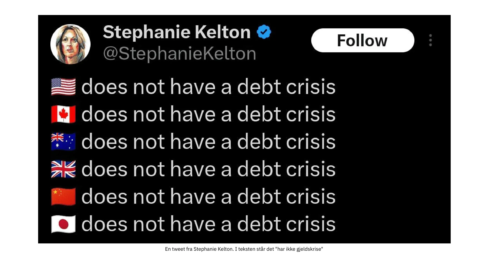

Merkelig nok er det bare seks land på listen? Hvorfor er det slik? Fordi de har reell monetær suverenitet. Men det finnes rundt 200 land på jorden, og ikke alle har monetær suverenitet. Så min kritikk av denne teorien, bortsett fra at den er litt merkelig og ikke-funksjonell, er at den bare fungerer for noen få land som har reell monetær suverenitet, de som kan utstede statskasseveksler i sin egen valuta. Til en viss grad går det på bekostning av resten av verden. Ved å skape denne valutaen er det som om de eksporterer inflasjonen sin til andre land, på samme måte som USA har gjort med sine ublu privilegier i flere tiår. Dette ligner en form for monetær kolonialisme, der land som har global tillit og etterspørsel etter valutaen sin, kan trykke så mye penger de vil uten å pådra seg betydelig inflasjon, ofte fordi de eksporterer inflasjonen.

Denne teorien er vanskelig å anvende på importavhengige økonomier som må opprettholde den internasjonale tilliten til valutaen sin.

Denne teorien krever også en viss grad av sentralisert planlegging av økonomien, særlig for å sikre større kontroll over realressursene (arbeidskraft, råvarer, industrikapasitet) og for å styre inflasjonen.

# Pengenes fall og gjenfødelse

<partId>87a34ca9-782b-5ade-b51a-400f88ed7b0c</partId>

## Greske mynter

<chapterId>7714195f-74ce-5f8c-be5f-59302d39fff4</chapterId>

:::video id=8e5c3091-0910-471b-8d4b-0dc6e9afa656:::

### Bakgrunn og kontekst

Før vi begynner, her er den historiske bakgrunnen:

**Historisk bakgrunn:**

**Romerne kalte grekerne for "Graeci" og Hellas for "Graecia"

**Grekerne kalte seg selv "hellenere" og landet sitt "Hellas"

**Homer** (født rundt det 8. århundre f.Kr.)

Legendarisk gresk dikter, antatt forfatter av *Iliaden* og *Odysséen*.

Rundt **750 f.Kr.: Lykurgos**, Spartas mytiske lovgiver, sies å ha etablert den spartanske grunnloven basert på militær disiplin og enkelhet.

**Numa Pompilius** (753-673 f.Kr.)

Romas andre konge, kjent for å ha gitt Roma sine første religiøse og juridiske institusjoner.

**Drakon**, athensk lovgiver (700-tallet f.Kr.), berømt for sine ekstremt strenge lover, derav betegnelsen "drakonisk".

**594 f.Kr.: Solon** blir lovgiver i Athen og reformerer det athenske samfunnet radikalt, blant annet ved å avskaffe gjeldsslaveriet.

**776 F.KR: Antikkens olympiske leker**

De første regelmessige idrettslekene ble arrangert i Olympia hvert fjerde år, og samlet de greske byene.

**Pytagoras** (ca. 570-495 f.Kr.)

Gresk filosof og matematiker, berømt for sin læresetning om den rettvinklede trekanten.

**Xenofanes av Kolofon** (ca. 570-478 f.Kr.)

Førsokratisk filosof, kjent for sin kritikk av den tradisjonelle greske polyteismen.

**490 f.Kr.: Slaget ved Maraton**

Athenerne slo tilbake en persisk invasjon, noe som markerte et avgjørende vendepunkt for den greske sivilisasjonen.

**Herodot** (ca. 484-425 f.Kr.), også kalt "historiens far", skrev et stort verk som beskriver perserkrigene, inkludert grekernes seier over Xerxes i 480 f.Kr.

**Sokrates** (470-399 f.Kr.)

Filosof fra Athen, kjent for sin dialektiske metode og sin lære om etikk og selverkjennelse.

**Aristophanes** (ca. 446-386 f.Kr.)

Athensk dramatiker, berømt for sine satiriske komedier som *Froskene*.

*i skuespillet *Antigone* kritiserer *Sofokles** (500-tallet f.Kr.) penger som en kilde til moralsk og politisk korrupsjon, gjennom tyrannen Kreon.

**Platon** (ca. 428-348 f.Kr.)

Gresk filosof, elev av Sokrates, grunnlegger av akademiet, forfatter av *Republikken*.

**431-404 F.KR: Peloponnesiske krig**

Stor konflikt mellom Aten og Sparta, som ender med nederlag for Aten.

**431 F.KR: Athen finansierer den peloponnesiske krigen ved å fortynne gull- og sølvmyntene sine for å øke mengden i omløp, noe som fører til inflasjon.

**Xenofon** (ca. 430-355 f.Kr.)

Athensk forfatter, filosof og general, disippel av Sokrates, forfatter av *Anabasis*.

**414 F.KR.**: Athen begynner å tape den peloponnesiske krigen etter en katastrofal ekspedisjon til Sicilia.

**405 F.KR: Aristofanes** beskriver i skuespillet *Froskene* eksplisitt devalueringen av sølvdrakmen og fremveksten av dårligere bronsemynter i Athen, og illustrerer prinsippet som i dag er kjent som "Greshams lov".

**404 F.KR.**: Athen kapitulerer etter en lang beleiring av Sparta.

**Aristoteles** (384-322 f.Kr.)

Stor gresk filosof, elev av Platon, grunnlegger av Lyceum, kjent for sine arbeider innen logikk, biologi og politisk filosofi.

**327 F.KR.**: Aleksander den store erobrer Persepolis og de østlige provinsene i Perserriket, og utvider riket sitt betraktelig.

**323 F.KR.**: Aleksander dør i Babylon uten en klar arving, noe som utløser kriger mellom generalene hans (diadochi) for å dele opp imperiet.

**Arkimedes** (ca. 287-212 f.Kr.)

Gresk matematiker, fysiker og oppfinner, kjent for sine oppdagelser innen geometri og mekanikk.

**196 f.Kr.: Rosettasteinen** blir gravert under farao Ptolemaios V, noe som gjør det mulig å tyde egyptiske hieroglyfer.

**192-188 F.KR: Romersk-seleukidisk krig**

Roma beseiret det seleukidiske riket ledet av Antiokos III, og befestet sin innflytelse i Hellas og Lilleasia.

**146 f.Kr.: Slaget ved Korint**

Romerne ødela den greske byen Korint, noe som markerte slutten på den greske politiske uavhengigheten og den gradvise integreringen av Hellas i den romerske verden.

I denne delen om antikken, Romerrikets fall og middelalderen begynner vi med et avsnitt om greske mynter.

Mynthistorien i antikkens Hellas begynte rundt 600 f.Kr., da greske byer raskt tok i bruk innovasjonen fra Lydia i Lilleasia, først med elektrum og senere med sølv. De første greske myntene ble preget på øya Aegina, med en hav- eller landskilpadde, men det var den athenske drakmen, dekorert med Athene og en ugle, som ble det fremste pengesymbolet fra 500-tallet f.Kr. og som i stor grad dominerte den internasjonale handelen på den tiden.

Og jeg er så heldig å ha en kopi av en gresk drakme fra den perioden, med den berømte uglen og en figur på baksiden. Det er en tetradrakme, som var større enn en vanlig drakme.

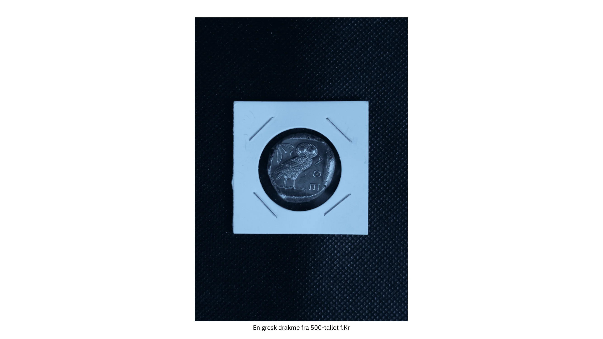

Hver gresk by utviklet sitt eget forhold til penger. I Athen var valutaen dypt knyttet til politisk og økonomisk makt. Det berømte athenske dekretet fra slutten av 500-tallet f.Kr. påla Athen eksklusiv bruk av athensk valuta i sine allierte territorier, og styrket dermed sitt økonomiske hegemoni. Athen samlet også store reserver av gull til nødsituasjoner, som ble oppbevart på Akropolis, kanskje som et symbol på landets økonomiske forsiktighet. Sparta, en militærby med strenge verdier, valgte derimot å begrense pengebruken sterkt, og forbød innbyggerne å eie gull- eller sølvmynter. Sparta foretrakk å bruke tunge jernstenger for å motvirke utenrikshandel og opprettholde det sosiale samholdet.

Kriger ble ofte finansiert ved hjelp av valutamanipulasjon. Under den peloponnesiske krigen (431-404 f.Kr.) måtte Aten ty til drastiske devalueringer for å betale troppene sine. Spartanerne okkuperte Decelia i 413 f.Kr. og fratok Athen tilgangen til sølvgruvene sine, og i 407/406 f.Kr. måtte de smelte ned gullstatuer for å kunne prege nye mynter i all hast. I 406/405 f.Kr. skapte hun så bronsemynter belagt med sølv, noe som førte til en pengekrise, illustrert av **Aristophanes**, som allerede i dag fremkaller det som er kjent som Greshams lov: dårlige penger fordriver gode penger. Denne nødvalutaen ble raskt demonetisert etter krigen for å gjenopprette tilliten til athenske mynter.

Slutten av den klassiske perioden ble preget av Makedonias fremvekst under Filip II og hans sønn Aleksander den store, noe som forrykket den greske pengebalansen. Takket være de enorme gull- og sølvgruvene på Pangea-fjellet produserte Filip II en overflod av penger for å finansiere sine militære og politiske kampanjer, og han innførte en enkel og praktisk gull-sølvstandard (10:1). Hans gullstatere, som feiret hans seier ved de olympiske leker, sirkulerte så langt som til Vest-Europa, og nådde til og med England. Aleksander fortsatte denne pengepolitikken, og under sine erobringer i Østen sirkulerte den attiske drakmen så langt som til India. Denne massive sirkulasjonen av mynter markerte begynnelsen på den hellenistiske æraen, da bildet av regenter gradvis erstattet bildet av guder på myntene. Denne nyvinningen gjorde det mulig for generasjoner av hellenistiske monarker å promotere seg selv, og de tradisjonelle gudene ble henvist til en sekundær rolle på myntenes bakside.

Etter Aleksanders død i 323 f.Kr. delte generalene hans opp det enorme riket og etablerte dynastier i Egypt (ptolemeerne), Syria (seleukidene) og andre steder. Disse hellenistiske kongedømmene innførte ulike pengesystemer: Ptolemeerne innførte et lukket pengesystem for å kontrollere pengesirkulasjonen, og foretrakk å bruke korn som intern valuta for å spare edle metaller til eksterne militære utgifter. Samtidig ble Rhodos et viktig handelssenter før det ble økonomisk svekket av romerne, som etablerte Delos som frihavn i 167 f.Kr.

Penger var en sentral del av avlønningen av leiesoldatene. Aleksanders soldater mottok sølvdrakmer på daglig basis.

Kavaleriet, eliten i Aleksanders høyt spesialiserte hær, fikk i gjennomsnitt to drakmer om dagen, en infanterist én drakme og en vanlig leiesoldat to tredjedeler av en drakme, det dobbelte av lønnen til en enkel arbeider.

Under Peloponneserkrigen ble det også utbetalt betydelige summer til soldater: over 1200 talenter for å slå ned opprøret på Samos og over 2000 talenter for å beleire Potidea.

Da denne hæren var fullt engasjert i Lilleasia, var de totale kostnadene rundt 20 talenter per dag, eller omtrent et halvt tonn sølv, eller 120 000 drakmer.

Gresk myntvesen spilte også en viktig kulturell rolle, ettersom hver by forsøkte å hevde sin identitet ved å prege sine egne mynter med lokale eller mytologiske symboler. Heraklios avbildet for eksempel Herakles (Herkules) i kamp mot en løve, mens Kyrene viste den berømte medisinplanten silphium.

Til tross for mangfoldet og de regionale variasjonene satte de klassiske greske og hellenistiske myntsystemene varige spor i Middelhavsområdets økonomiske og kulturelle historie, og de fikk stor innflytelse på senere pengesystemer helt frem til Roma, som gradvis tok i bruk og videreutviklet greske økonomiske konsepter for å strukturere sin egen keiserlige økonomi.

## Virkningen av valutaen i Hellas

<chapterId>3a5e6c7d-699c-5567-87cd-3374c49d55a9</chapterId>

:::video id=0c79a59c-e179-4893-a414-1b8de0930eb9:::

### Athen og kontrasten til Sparta

Motsetningen mellom Aten og Sparta i den klassiske greske perioden avslører to radikalt forskjellige modeller for politisk og økonomisk organisering. Mens Sparta avviste metallpenger til fordel for et selvforsynt system basert på borgernes tillit, tok Aten i bruk denne teknologien for å bygge og opprettholde sitt maritime imperium.

### Den økonomiske nødvendigheten av sjømakt

Til tross for sitt grandiose navn var det athenske riket geografisk sett beskjedent - det besto i hovedsak av Aten og byene rundt Egeerhavet. Makten hvilte på Delosforbundet, en militær allianse dominert av Aten som hegemon. Denne keiserlige strukturen krevde et enhetlig økonomisk instrument: den athenske sølvmynten.

Å opprettholde en flåte var kjernen i denne økonomiske nødvendigheten. En enkelt athensk trireme kostet mellom én og to talenter sølv - en betydelig sum. Med flere hundre skip å vedlikeholde trengte Athen et effektivt skattesystem. Penger ble et uunnværlig verktøy for å kreve inn tributt fra vasallbyene og finansiere flåtestyrken som skulle sikre imperiets sammenhold.

### Pengepålegg som et verktøy for dominans

Aten innførte sin sølvvaluta for alle medlemmene av Delosforbundet. Denne monetære standardiseringen tjente flere strategiske mål. For det første gjorde den innkrevingen av tributter enklere ved å skape en felles regningsenhet. For det andre forsterket den vasallbyenes økonomiske avhengighet av Athen. Til slutt projiserte den athensk makt symbolsk ut over hele det maritime imperiet.

Denne pengepolitikken står i skarp kontrast til den spartanske modellen. Sparta var en landmakt som kunne basere seg på arbeidskraften til de peloponnesiske helotene (slavene) for sitt livsopphold. Det lukkede, bysentrerte økonomiske systemet krevde ikke sofistikerte pengeinstrumenter. Borgerne og soldatene bodde sammen, delte felles måltider og trengte ikke penger i det daglige.

### Valuta som middel for maritim handel

Det athenske imperiets sjøfart gjorde at det måtte være åpent for handel. I motsetning til det innadvendte Sparta måtte Athen handle med omverdenen for å overleve og oppnå velstand. Valutaen ble det uunnværlige instrumentet i middelhavshandelen.

Denne eksterne orienteringen skapte en god sirkel: Handel genererte inntekter, disse inntektene finansierte flåten, flåten beskyttet handelsrutene og opprettholdt imperiet, og imperiet innførte den athenske valutaen, som gjorde handelen lettere. Valutaen var ikke lenger bare et byttemiddel, men ble en bærebjelke i den keiserlige strategien.

### Grensene for monetær makt

Til tross for denne økonomiske raffinementet viste Athens pengemakt sine begrensninger under den peloponnesiske krigen. Overfor Spartas landstyrker var Athens sjømilitære og økonomiske overlegenhet ikke nok. Dyre ekspedisjoner, som det katastrofale Syrakus-felttoget på Sicilia, tæret på de økonomiske ressursene uten å føre til avgjørende seier.

Historien viser at valuta, selv om det er et mektig verktøy for å projisere makt, ikke er noen garanti for militær dominans. Sparta, som ikke hadde noen metallisk valuta, men et bemerkelsesverdig sosialt samhold, seiret til slutt over det athenske pengeimperiet.

### To modeller, to skjebner

Motsetningen mellom Aten og Sparta illustrerer to grunnleggende tilnærminger til sosial og økonomisk organisering. Athen representerer den åpne, kommersielle, monetariserte modellen - forløperen til de moderne maritime imperiene. Sparta representerer den lukkede, autarkiske modellen, basert på borgerlig tillit snarere enn monetære instrumenter.

Disse to systemene viser at innføringen av valuta er nært knyttet til den politiske og økonomiske modellen som velges. For en sjøfarts- og handelsmakt som Athen ble penger uunnværlige. For et lukket krigersamfunn som Sparta representerte de en trussel mot den sosiale orden. Denne antikke dikotomien preger fortsatt debattene om pengenes rolle i samfunnsorganiseringen.

## Den romerske republikken

<chapterId>0bc80983-33e1-5881-85bb-7c22f3144a9a</chapterId>

:::video id=dc05ca97-d29c-4679-bfeb-912c47d86ce2:::

### Den romerske republikkens historie

- 753 - 509 f.Kr.: Kongeriket Roma**
- 753 F.KR: Grunnleggelsen av Roma** (tradisjonelt tilskrevet Romulus).
- 509 - 27 F.KR: Romersk republikk**, Roma blir en republikk styrt av et valgt senat og konsuler.
- 280-275 F.KR: Pyrrhuskrigen**. Pyrrhus, konge av Epirus, kjemper mot romerne i Sør-Italia og vinner kostbare seire ("pyrrhusseire").
- 264-146 F.KR: De puniske krigene**. En stor konflikt mellom Roma og Kartago om herredømmet over det vestlige Middelhavet.
- Hannibal (247 - ca. 181 f.Kr.)**. Legendarisk karthagisk general, berømt for å ha krysset Alpene med sin hær og elefanter for å angripe Roma under den andre puniske krig.
- 146 f.Kr.: Slaget ved Korint**. Roma ødelegger den greske byen Korint og innfører sitt endelige herredømme over det greske fastlandet.
- 91-87 f.Kr.: Sosial krig**. Opprør fra Romas italienske allierte som krevde romersk statsborgerskap, noe som til slutt førte til at de ble fullt integrert i borgerskapet.
- 64 f.Kr.: Slutt på den seleukidiske motstanden**. Roma eliminerer definitivt seleukidisk innflytelse i Syria, og befester sitt grep om det østlige Middelhavet.
- 55 F.KR: Julius Cæsar erobrer Sentral- og Vest-Europa**. Julius Cæsar utvider det romerske herredømmet over Gallia (dagens Frankrike) og går inn i Germania og Bretagne.
- 43 F.KR: Dannelsen av det andre triumviratet**. Politisk allianse mellom Octavian (senere Augustus), Marcus Antonius og Lepidus for å stabilisere Roma etter mordet på Cæsar.
- 27 f.Kr.: Begynnelsen på Pax Romana**. En periode med politisk stabilitet og velstand under Augustus, som markerer begynnelsen på Romerriket.

### Romas sene monetære begynnelse

I denne delen om antikken retter vi nå oppmerksomheten mot den romerske republikken. Romas monetære historie begynte mye senere enn grekernes og persernes. Roma ble grunnlagt i 753 f.Kr. og ventet nesten fire århundrer før de for alvor tok i bruk mynter. I denne lange perioden brukte romerne et primitivt vekslingssystem med uregelmessige bronsestykker kalt aes rude, som krevde nøyaktig veiing for hver transaksjon. Først på slutten av 400-tallet f.Kr., under gresk og etruskisk innflytelse, begynte Roma å utstede sine første mynter, særlig i bronse støpt som i Kina, aes grave, som var karakteristisk for det romerske vekslingssystemet frem til **den andre puniske krig**.

### Gresk innflytelse og de første sølvmyntene

Det avgjørende møtet med grekerne i Sør-Italia introduserte romerne for alvor for sølvmynter. Rundt 280 f.Kr. begynte Roma å produsere egne sølvmynter etter gresk forbilde. Den første regulære utgivelsen av sølvmynter i Roma dateres helt nøyaktig til 269 f.Kr. og viser de legendariske tvillingene Romulus og Remus som ammes av en ulvehunn, et symbol som har blitt ikonisk.

Mange romerske mynter fra republikkens tid avbilder faktisk grunnleggelsesmyter. Du kan se min her nedenfor: Det er en flott, ekte mynt fra kong Tatius. Den illustrerer myten om bortførelsen av kvinner fra sabinerne. Tatius var konge i denne regionen, og grunnleggelsesmyten forteller om hvordan romerne bortførte kvinner fra sabinerne, en befolkning som bodde i nærheten. Kong Tatius ble senere medkonge med Romulus, en av grunnleggerne av Roma.

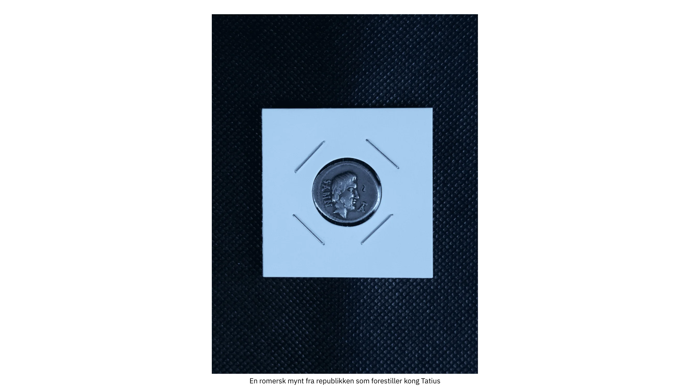

### Opprinnelsen til ordet "mynt" og Juno Moneta-tempelet

Begrepet "mynt" har sin opprinnelse i Juno Moneta-tempelet i Roma. Legenden forteller at under en gallisk invasjon i 390 f.Kr. varslet de hellige gjessene på Capitol romerne om en overhengende fare. For å takke gudinnen Juno, Capitols beskytter, ble det reist et tempel til hennes ære, som snart ble myntverksted for romerske mynter.

### De puniske krigene og valutakriser

Militære konflikter hadde betydelig innflytelse på den romerske pengeutviklingen. Under den andre puniske krigen (218-201 f.Kr.) mot Karthago fikk Roma alvorlige økonomiske problemer i møte med Hannibals invasjon. For å avhjelpe de akutte behovene måtte Roma for første gang utstede en ekstraordinær mengde gullmynter, i tillegg til en betydelig devaluering av sølvmyntene, fra en opprinnelig renhet på 97 % til rundt 89 %. Vekten på bronsemyntene (aes) falt også drastisk, med en nedgang på nesten 80 % i løpet av seks år.

Her kan vi ta opp igjen et konsept vi tidligere har diskutert, nemlig at grekerne smeltet edelmetaller som var lagret i templene for å avhjelpe økonomiske kriser. Og for å snakke om **Kartago**, her nedenfor kan du beundre en ekte karthagisk mynt fra samlingen min. Disse karthagiske myntene hadde et palmetre på den ene siden og en hest på den andre. På denne mynten er hesten ikke så lett å kjenne igjen, og den er veldig slitt.

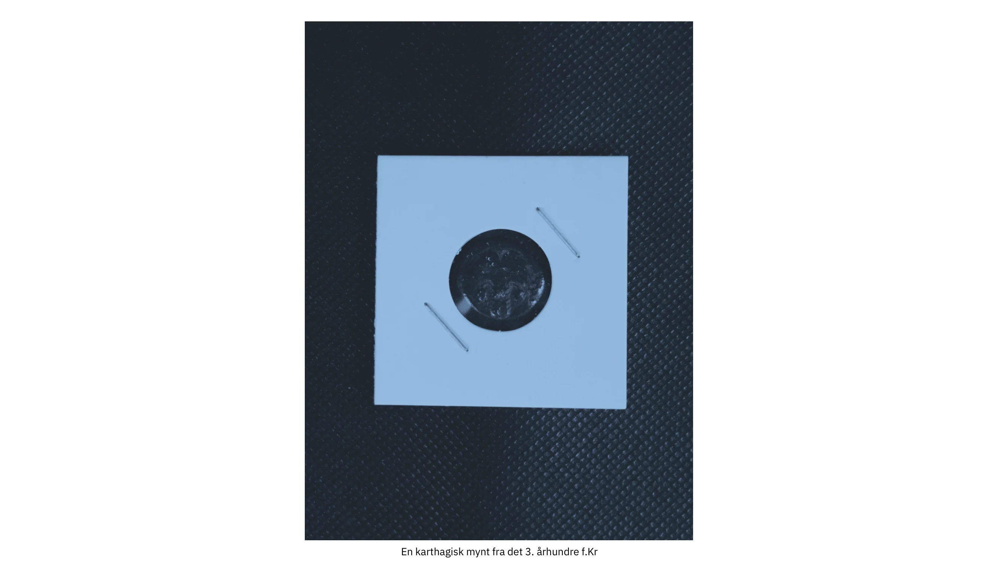

Som et resultat av dette falt også vekten av bronsemynter, kjent som aes, drastisk, med et fall på nesten 80 % på seks år. Vekten på disse bronsemyntene, som ikke var et edelt metall og som ble brukt i daglig handel, falt altså mye, noe som var et tegn på monetær devaluering på grunn av disse krigene.

### Sølvdenaren og monetær stabilitet

Det var mot dette kritiske bakteppet at Roma innførte den berømte sølvdenaren rundt 212 f.Kr. Denne reformen sørget for en bemerkelsesverdig monetær stabilitet, og denaren forble den dominerende valutaen i nesten 450 år. Denne stabiliteten kan Roma takke en streng forvaltning for, til tross for en større omprising i 146 f.Kr. og en betydelig produksjon for å finansiere sine enorme hærer, særlig under de puniske, sosiale (91-87 f.Kr.) og makedonske krigene. For eksempel kostet det rundt 1,5 millioner denarer i året å opprettholde en enkelt romersk legion, noe som illustrerer omfanget av pengebehovet.

Utenfor de romerske grensene førte kriger til store devalueringer i regioner under romersk innflytelse. I det puniske Karthago sank renheten på elektrummyntene dramatisk, fra 98 % gull på 400-tallet til bare 30 % under den andre puniske krigen, mens sølvmyntenes renhet falt til 18 %.

### Utviklingen av pengemotiver

I takt med Romas ekspansjon endret også myntenes karakter seg: Fra å være anonyme og patriotiske, fikk myntene etter hvert personlige motiver med de mektige familiene til myntslagerne (de som preget myntene). Denne overgangen symboliserer tydelig de politiske endringene i den sene romerske republikken.

Selv om Roma dominerte Middelhavsverdenen økonomisk, beholdt landet en viss enkelhet i sine betalingsmidler: Det ble ikke utviklet noen annen form for pengeoverføring enn direkte utveksling av mynter, med unntak av skatteoverføringer og private kreditter forbeholdt eliten.

## Romerriket

<chapterId>2dc44e50-112a-5abf-97ae-8e0a9ecda989</chapterId>

:::video id=f8d6f3d6-9ee4-4504-888e-4f12b3f20489:::

**Historisk bakgrunn:**

**Fyrstedømmet** var den keiserlige styreformen i Romerriket fra begynnelsen av Augustus' regjeringstid i 27 f.Kr. til slutten av krisen i det tredje århundret i 284 e.Kr.

**27 f.Kr.: Begynnelsen på Pax Romana**

En periode med politisk stabilitet og velstand under Augustus, som markerer begynnelsen på Romerriket.

**Augustus (30 f.Kr. til 14 e.Kr.)** reformerte det romerske pengesystemet radikalt og etablerte en varig og stabil standard for keiserlig myntvesen.

**Augustus var også en av de første anerkjente samlerne** av antikke mynter og fossiler.

**54 AD - 68 AD: Nero**

Kontroversiell romersk keiser, kjent for sitt tyranni, sine forfølgelser og sin katastrofale ledelse etter at Roma brant ned.

**64 E.KR: Den store brannen i Roma**

En stor brann herjer store deler av byen, og Nero blir beskyldt for å stå bak.

**69 e.Kr.: De fire keiseres år

En kaotisk periode med fire keisere i rask rekkefølge (Galba, Otho, Vitellius, Vespasian).

**79 E.KR: Vesuvs utbrudd**

Vulkanen som ødela byene Pompeii og Herculaneum, og som unntaksvis bevarte restene av dem under asken.

**165 E.KR. - 180 E.KR: Antoninerpesten**

Ødeleggende epidemi som svekket Romerriket under Marcus Aurelius og Commodus.

**200 e.Kr.: Territorialt høydepunkt og gradvis slutt på Pax Romana**

Roma nådde sin maksimale utstrekning, men begynte å lide av indre ustabilitet og økonomiske vanskeligheter.

**212 E.KR: Caracallas edikt om statsborgerskap**

Keiser Caracalla ga romersk statsborgerskap til nesten alle innbyggerne i imperiet, for å utvide skattegrunnlaget.

**220 e.Kr.: Begynnelsen på de store barbarinvasjonene**

De første germanske folkeslagene av betydning trengte inn over romerske grenser.

**235 AD - 285 AD: Politisk og militær krise i det 3. århundre**

En periode preget av politisk ustabilitet, med mange kortvarige keisere, borgerkriger, økonomiske kriser og stadige invasjoner.

**Aurelian (270-275 e.Kr.) revaluerte den romerske valutaen** radikalt, og forsøkte å gjenopprette dens nominelle verdi til tross for høy inflasjon.

**301 E.KR: Diokletians prisedikt**

Keiser Diokletian forsøkte forgjeves å stanse den galopperende inflasjonen ved å innføre streng pris- og lønnskontroll i hele riket.

**312 E.KR: Konstantin**

Den første kristne keiseren, grunnleggeren av Konstantinopel, stabiliserte valutaen ved å innføre "solidus", en gullmynt med stor renhet og stabilitet.

**476 E.KR: Det vestromerske rikets fall**

Roma blir inntatt av ulike germanske folkeslag (deriblant ostrogoterne), en hendelse som anses å markere den offisielle slutten på det vestromerske riket.

### Augustus' monetære reformer

I denne delen om antikken har vi allerede kommet til Romerriket. Romerrikets pengehistorie er preget av intensiv bruk av metallisk valuta, særlig gull, sølv og bronse, men også av flere valutakriser, tett knyttet til politiske og militære uroligheter. På slutten av republikken, under Julius Cæsar, innførte Roma i 46 f.Kr. gullaureusen, en mynt som veide rundt 8 gram og ble allment akseptert i hele Europa og Middelhavsområdet. Cæsar standardiserte disse gullmyntene og preget de første myntene med portrett av en levende mann, og brøt dermed med en gammel republikansk tradisjon som favoriserte anonyme, kollektive symboler. Denne utviklingen falt sammen med en periode med store politiske omveltninger, der personlig makt gradvis erstattet republikanske institusjoner.

Etter mordet på Cæsar i 44 f.Kr. tok Octavian (Augustus) kontroll over Roma, og etablerte keiserriket i 27 f.Kr. Under hans regjeringstid ble det gjennomført en fullstendig reform av pengesystemet, noe som førte til varig stabilitet i den romerske økonomien. På Augustus' tid tilsvarte en aureus i gull 25 denarer i sølv, som i sin tur var verdt 4 sestertier i bronse. Denne monetære stabiliteten fortsatte gjennom hele det første århundret e.Kr., en periode som ofte beskrives som en økonomisk gullalder for Roma.

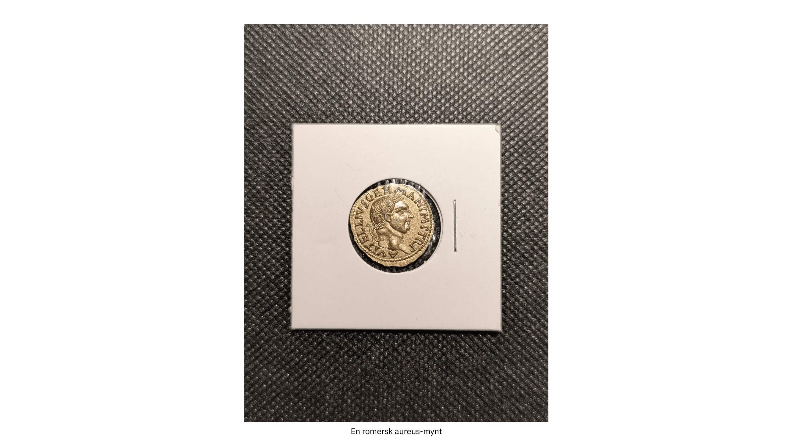

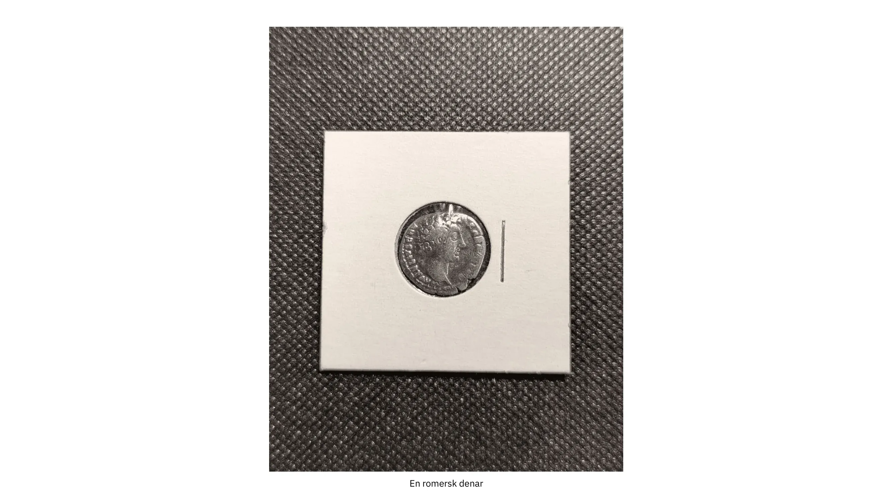

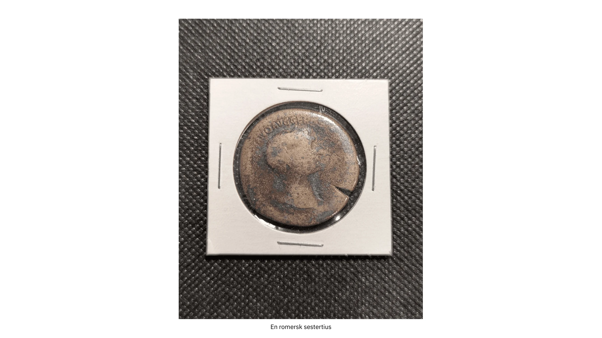

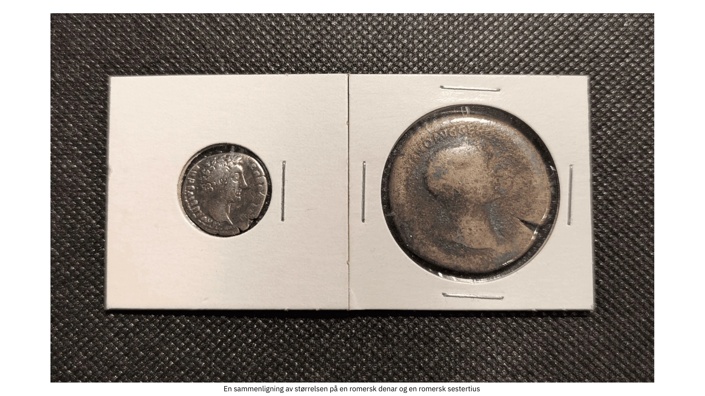

Men fra Nero og utover (54-68 e.Kr.) begynte Roma en langsom devaluering av myntene, som gradvis reduserte myntenes vekt og renhet for å finansiere de økende keiserlige utgiftene, særlig etter den store brannen i Roma i år 64 e.Kr. Disse devalueringene hadde merkbare effekter: De renere myntene ble tatt ut av sirkulasjon gjennom hamstring eller eksport, i samsvar med **Greshams lov**, mens de devaluerte myntene spredte seg, noe som førte til en gradvis prisstigning.

Det tredje århundret markerer et dramatisk vendepunkt, med en spektakulær akselerasjon i devalueringene under keiserne Septimius Severus, Caracalla og Gallienus. Sølvinnholdet i den viktigste sølvmynten, denarius og deretter antoninianus, sank til bare 2 %. Samtidig ble gullvekten til aureusen halvert. Denne monetære krisen ble ledsaget av en politisk ustabilitet uten sidestykke, barbariske invasjoner og gjentatte borgerkriger.

Denne delen gir meg muligheten til å introdusere den siste mynten i denne delen: antoninianus. Det opprinnelige navnet på denne mynten er ukjent, men i dag omtaler vi den som en antoninianus. Den har det særpreget at den ble verdsatt til to denarer, til tross for at den bare var 1,5 ganger større enn en denar. Med tiden ble disse myntene dessuten bare billonmynter, noe som betyr at de ble laget av en legering av sølv og andre metaller i stedet for rent sølv. Myntene var ofte bare belagt med sølv, noe som er et bemerkelsesverdig eksempel på det monetære forfallet.

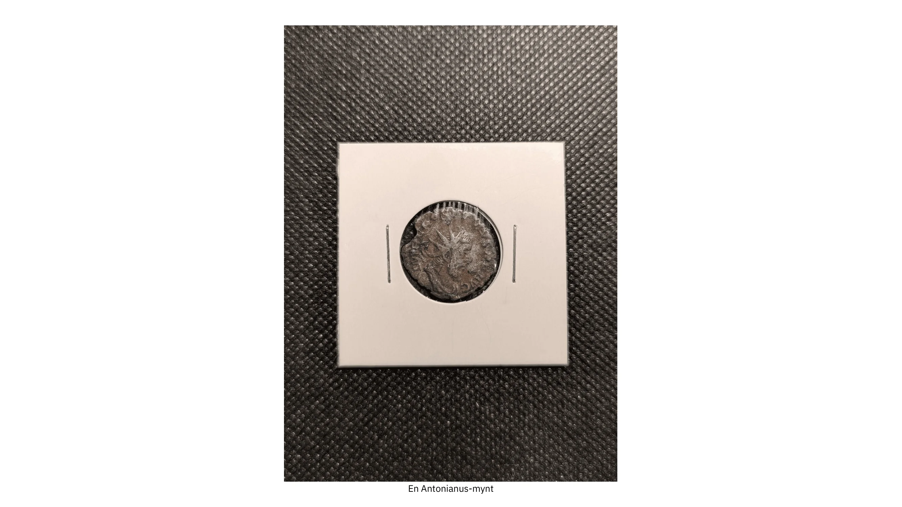

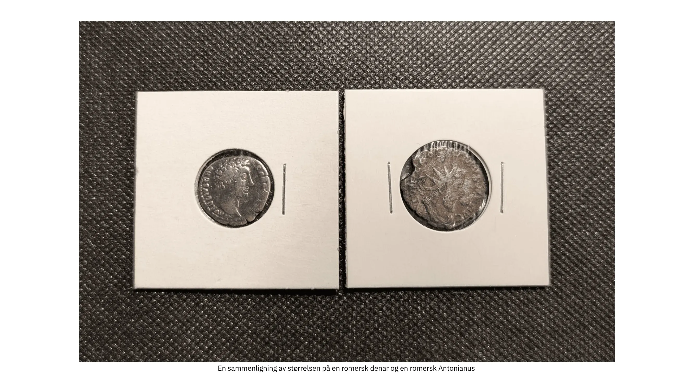

I denne situasjonen forsøkte keiser Aurelian (270-275 e.Kr.) å stabilisere systemet ved å nominelt revaluere valutaene, men denne reformen innførte i realiteten en inflasjonsmekanisme ved at verdien av de eksisterende valutaene ble fikset kunstig på et høyere nivå.

Jeg vil introdusere en digresjon om emnet. I løpet av 300-tallet opplevde inflasjonen en rask eksponentiell økning. Selv om myntene tidligere ble devaluert, ga den håndlagde prosessen med å prege dem én etter én en viss kontroll over inflasjonen. Statistikken viser at inflasjonen i løpet av 300 år med devaluering i gjennomsnitt lå på rundt 4 % per år. Like før Aurelianus' reform var inflasjonen på omtrent 3 % årlig.

Aurelian innførte et renhetsmål på mynten med XXI-tegnet, som indikerte en sammensetning av 20 deler bronse til 1 del sølv, eller 5 % renhet. Han markedsførte disse 5 % sølvmyntene og stemplet XXI-tegnet på dem. Men han tilbakekalte også alle de andre, mer devaluerte myntene og stemplet det samme XXI på dem. Dermed ble pålydende verdi på alle myntene revaluert. Resultatet var en svimlende inflasjon på 20 % per år, noe som langt oversteg den tidligere inflasjonen på 3 % før denne teknikken ble tatt i bruk.

Det var egentlig Aurelian som oppfant denne formen for devaluering, som er mye raskere enn den gradvise devalueringen av metall, som fortsatt tvang oss til å trykke mynter én etter én. Det han gjorde, var å ta alle de eksisterende myntene, tilbakekalle dem og stemple dem med et stempel for å endre pålydende verdi. Det er et virkelig vendepunkt. Det var da inflasjonen ble eksponentiell.

For å illustrere denne ekstreme devalueringen visuelt har jeg funnet noen fascinerende statistikker over kornprisen i Egypt fra 40 f.Kr. til 300-tallet, altså over 300 år. Nedenfor kan du se en gresk tetradrakme fra samlingen min. På den tiden, i Egypt under romersk okkupasjon på 300-tallet, var det tilsvarende en egyptisk tetradrakme. Drakmer var fortsatt i bruk, og de tilsvarte en denar.

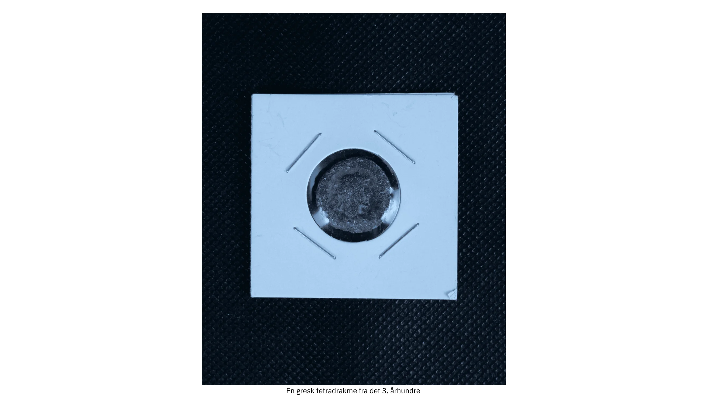

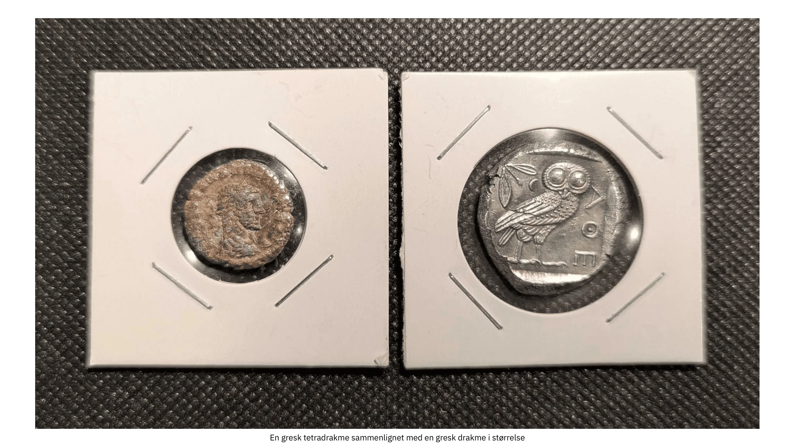

Den egyptiske tetradrachmen jeg har, tilsvarte altså en denar. Du kan se at mynten er laget av billon (eller bronse), så den inneholder ikke noe edelt metall. Du kan sammenligne den med den opprinnelige greske tetradrachmen for å se den fysiske devalueringen i løpet av disse 300 årene. Det er en milliondobling av prisen på korn i Egypt.

Det er det fysiske uttrykket for Aurelians reform. Det er verdt å merke seg at majoriteten, gjennomsnittet i løpet av disse 300 årene med inflasjon, lå på rundt 4 %. Det var først på slutten, da Aurelianus gjennomførte sin reform, at denne inflasjonen ble ganske eksponentiell, og vi kom frem til dette målet på 1 million. Prisene var en million ganger høyere på slutten av 300-tallet enn i det første århundret f.Kr.

Hans etterfølger **Diokletian** (284-305 e.Kr.) forsøkte seg på enda mer radikale reformer: Han utstedte nye valutaer (særlig argenteus, som var renere, men for begrenset i antall), innførte drastisk priskontroll (prisediktet av 301 e.Kr.) og **etablerte et skattesystem basert på naturalier**. Til tross for disse tiltakene klarte ikke Diokletians reformer å bremse den voldsomme inflasjonen.

Diokletian nektet å levere varer og tjenester i bytte mot devaluert valuta, og innførte derfor **et arvelig kastesystem** for å binde bøndene og deres etterkommere til jorden.

Det som virkelig må forstås her, er at det som skjedde var at bøndene nektet å levere sine produkter i bytte mot devaluert valuta, og vår kjære Diokletians svar var å skape **arvelige kaster** ved å si "du, du kan ikke forlate din jord, dine barn kan ikke forlate sin jord, det samme for soldatene, du er soldater, du godtar å bli betalt i min valuta". Som en overgangsløsning ble de betalt in natura (i kjøtt, mat, korn) fordi han nektet å gi dem penger. Så han innførte dette arvelige kastesystemet for å tvinge folk til å være knyttet til yrket sitt, slik at de ikke bare kunne bytte jobb hvis de prøvde å ikke akseptere den devaluerte valutaen.

For å illustrere dette eksemplet har jeg her en tekst, et utdrag fra boken "*Monetary Regime and Inflation*":

> Siden folk ikke var villige til å arbeide og levere varer mot en devaluert valuta, hvis pålydende verdi var høyere enn dens egentlige verdi eller markedsverdi, måtte de tvinges til å arbeide ved å pålegge dem skatter i form av naturalier. (...) Det ble ulovlig for bøndene å forlate sine registrerte hjem. Dermed ble bondebefolkningen arvelig knyttet til jorden.
>

> Dette arvelige kastesystemet spredte seg gradvis: Diokletian tvang soldatsønner til å gjøre tjeneste i hæren, mens arbeiderne i pengeverkstedene, samt i veveriene og fargeriene Diokletian hadde opprettet, ble statsslaver med arvelig tjeneste. Senere ble også gullgraverne en arvelig kaste. Andre arvelige klasser eksisterte sannsynligvis allerede på Diokletians tid, særlig baker- og slakterlaugene [...] i Roma, samt bispedømmets laug av skipskapteiner som fraktet korn og andre offentlige varer til Roma.

Det var Konstantin (306-337 e.Kr.) som til slutt lyktes med å stabilisere pengesystemet ved å innføre solidus i 312, en ren gullmynt som han strengt garanterte kvaliteten og vekten på. Det fantes et helt system for å verifisere solidusens renhet og vekt. **Denne stabiliteten gjaldt imidlertid bare en velstående elite og den keiserlige administrasjonen**, mens **flertallet av befolkningen fortsatte å lide under lav kvalitet på valutaen og vedvarende inflasjon**. Solidusen forble stabil i Østromerriket (Bysants), der den holdt seg i mer enn et årtusen, mens den i Vesten ble fragmentert i små mynter med lav verdi, noe som førte til den endelige økonomiske og politiske oppløsningen av Romerriket, som gikk definitivt i oppløsning i 476 e.Kr.

Avslutningsvis vil jeg gjerne dele dette sitatet fra *A History of Money: From Ancient Times to the Present Day* av Glyn Davies, som på mesterlig vis oppsummerer hva som kanskje førte til Romas undergang:

*"Skattene var gjennomgående utilstrekkelige, og vanskelighetene forbundet med disse stadig mer utilstrekkelige, sent justerte og svært synlige skattene drev Roma til å satse mer på en enkel, umiddelbar og skjult form for beskatning: devaluering av valutaen. Kortvarige ad hoc-reformer klarte ikke å snu denne eldgamle nedgangstrenden. Det økonomiske presset som skyldtes slitasjen på myntene, skipsforlis, pengelekkasjer på grunn av kjøp av luksusvarer fra Østen, gaver til germanske barbarer, veksten i bybefolkningen, nedgangen i jordbruksproduksjonen, den gradvise uttømmingen av de rikeste gruvene, og fremfor alt "brød og sirkus"-politikken som ble ansett som nødvendig for å opprettholde et minimum av orden i bylivet - alt dette kumulative presset førte Roma til en konstant devaluering av valutaen, avbrutt av sporadiske reformer som var dømt til å mislykkes.""*

*I tillegg til gratis eller billig brød og vin ble det fra tid til annen utdelt keiserlige liberaliteter ("congiaria") i form av pengegaver, særlig under Trajan (98-117 e.Kr.) og i enda større grad under Hadrian (117-138 e.Kr.) og hans etterfølgere. Det som keiseren og borgerne i utgangspunktet hadde sett på som et eksepsjonelt privilegium, var på begynnelsen av 200-tallet blitt en vanlig forventning. Disse utdelingene "utgjorde en tung byrde for statskassen og bidro på sin egen måte til statens konkurs".*

## Sammenhengen mellom pengeutvanning og inflasjon: fra årsaker til konsekvenser

<chapterId>38d5781c-e900-53f7-baa7-413655d71754</chapterId>

:::video id=3999256d-aafe-4502-9b72-dfa8491a2777:::

Denne delen tar for seg sammenhengen mellom monetær utvanning og inflasjon, fra årsaker til konsekvenser. Utvanning av sølvmynter er et av de viktigste økonomiske fenomenene i romersk pengehistorie, med direkte effekter på inflasjonen. Fra det første århundret e.Kr. var det en innledende langsom fase med utvanning av sølvmynter (denarer) fra Neros regjeringstid (54-68 e.Kr.) og fremover, som ble fremskyndet av gjentatte militære og finansielle kriser, særlig under Septimius Severus (193-211) og Gallienus (253-268).

Vi ser også en mer gradvis devaluering av aureus. Denne forskjellen i devalueringshastighet belyser to punkter:

1. Kontoenhetens rolle i bimetallismen for statlig kontroll av penger. Regneenheten i dette eksempelet er denaren. Jeg har identifisert tre ulike måter å styre verdien av regneenheten på: devaluering (utvanning av metallet), redenominering (antoninianus) og påføring av en pålydende verdi ved å merke den med "XXI" (Aurelian)

2. Statens ønske om å utsette devalueringen av aureusen, verdireserven som gjør det mulig for eliten å opprettholde sin kjøpekraft på bekostning av de mindre bemidlede, lengst mulig. Vi vil komme tilbake til dette prinsippet flere ganger i løpet av kurset, særlig i forbindelse med den såkalte "Cantillon-effekten" og redenomineringene av Maravedi i Spania.

Dette fenomenet er ganske interessant og har gått igjen opp gjennom historien. Vi kommer tilbake til det med maravediene i et senere avsnitt. Dette mønsteret er tydelig for alle reservevalutaer; reservevalutaenheten, som for eksempel aureusen i Roma, forblir urørt. Men den regneenheten som befolkningen bruker til handel og dagligdagse transaksjoner, blir ofte devaluert. Resultatet er at pengeinflasjonen rammer vanlige folk, mens de som har råd til gullmynter, stort sett forblir upåvirket.

Og forresten, **det er det samme fenomenet som skapes i dag med valutadevaluering, som gjør at finansielle eiendeler stiger i verdi**, og så er det de som bruker valutaen, de fattigste, som blir fattigere, og dette beriker i sin tur, gjennom pengeskaping, eiendelene til de som er i stand til, som har midler til å beskytte seg mot devaluering, og så utdyper det sosiale ulikheter. Det var min lille politiske rant.

Det jeg nettopp har beskrevet, kalles Cantillon-effekten. Vi skal se at denne mannen levde på John Laws tid, et emne vi også skal ta opp i et senere avsnitt.

Reformen som ble satt i gang under Aurelian, førte til at inflasjonen skjøt i været. Inflasjonen i pengenes pålydende verdi var ikke lenger begrenset av myntenes evne til å produsere mynter for hånd. Mynter som allerede var preget, kunne nå enkelt merkes, og den nominelle verdien av pengemengden økte raskere.

Jeg har to sitater jeg vil dele med dere i forbindelse med Aurelian. Det første kommer fra *A History of Money: From Ancient Times to the Present Day*:

*"Når det gjelder den romerske økonomien, var Aurelians bidrag mer en katastrofe enn en triumf. Det var i stor grad på grunn av hans "reform" at inflasjonen kunne øke langt mer enn det som tidligere hadde vært mulig, selv under den uansvarlige Gallienus. I to århundrer etter Aurelian ble inflasjonen endemisk i hele Romerriket."

Den andre er hentet fra boken *Ancient History from Coins* og handler om pengesystemets løsrivelse fra gull:

*"Aurelianus' reform endret forholdet mellom gullpenger og resten av pengesystemet. Før reformen var andre typer valuta knyttet til **aureus** i henhold til offisielle kurser (25 egyptiske denarer eller 25 tetradrakmer for en aureus, osv.) Etter reformen begynte gullpengene å **fluktuere fritt i verdi**, som alle andre varer, mens resten av pengesystemet **kollapset i verdi** på grunn av **svekkelsen av legeringene**, som ikke lenger var **støttet av gull**. Ettersom regningsenheten fortsatt var teoretisk basert på sølv (denaren, eller i Egypt drakmen), steg prisene i takt med at valutaen ble mindre verdt. "*

Som du kan se, rammet denne devalueringen av valutaen som fungerte som regningsenhet uforholdsmessig mye de mindre bemidlede, mens løsrivelsen av koblingen til gullpenger beskyttet kjøpekraften til dem som hadde råd til å spare i gull som verdioppbevaringsmiddel.

Det du må forstå her er at hvis det er en kobling mellom denaren og aureusen, selv om du devaluerer denaren, hvis du fremdeles kan bytte denaren din mot aureus til denne kursen (25 denarer for 1 aureus), vil folk definitivt bytte sin denar mot din aureus siden denaren vil være overpriset og aureusen underpriset. Men i denne reformen fjernet de denne koblingen. Så folk kunne ikke lenger veksle denarer mot sølvmetall som var devaluert mot gull. Det var da de som hadde tilgang til gullmynter virkelig kunne beskytte seg, for etter dette kunne folk ikke lenger veksle overpriset devaluert sølv mot underpriset rent gull. Dette er et svært viktig øyeblikk i valutaens utvikling.

Et slående eksempel på virkningene av Aurelianus' reform illustreres perfekt av disse sitatene fra boken *Monetary Regimes and Inflation*:

*"Mellom keiserne Claudius (41-54 e.Kr.) og Constantius (337-361 e.Kr.) økte prisen på hvete på det åpne markedet i Egypt, uttrykt i drakmer, **med en faktor på over en million**. Spektakulær prisinflasjon er et av de sentrale økonomiske fakta i det 3. og 4. århundre e.Kr." (Lendon 1990, s. 106). Men denne utviklingen er **mindre dramatisk enn den ser ut til**, da den tilsvarer en **gjennomsnittlig årlig inflasjon på 4,4 %**. Og ifølge Wassink (1991, s. 482) begynte inflasjonen faktisk **kun i 238 e.Kr.**"*

*"Fra dette tidspunktet skjøt inflasjonen sakte fart, ettersom **gode penger først ble drevet ut av sirkulasjon**, slik at den totale pengemengden nesten ikke økte i det hele tatt til å begynne med. Deretter nådde den en gjennomsnittlig årlig rate på **3,65 % mellom 250 og 293**, og steg til **22,28 % mellom 293 og 301** (Wassink 1991, s. 466), dvs. frem til keiser Diokletians **aborterte monetære reformer**. Dette fenomenet er **særlig imponerende for inflasjon i et metallbasert monetært regime**. "*

Dette fenomenet med inflasjon knyttet til pengeutvanning var opprinnelig et svar på den romerske statens sporadiske pengekriser. Ved å redusere innholdet av edelt metall i myntene, samtidig som myntenes pålydende verdi ble opprettholdt, økte staten midlertidig sine ressurser. Men prisene reagerte ikke umiddelbart: Det romerske systemet hadde en viss klebrighet, noe som betydde at lønninger og priser var trege til å tilpasse seg suksessive devalueringer. Etter en viss terskel ville prisene likevel stige kraftig for å bringe markedet tilbake i balanse med valutaenes reelle verdi.

Som nevnt ovenfor er dette fenomenet særlig tydelig fra midten av 300-tallet og utover. I Egypt, en region som er rikt dokumentert, ble prisene tidoblet under Aurelian (274 e.Kr.) etter en offisiell revaluering av valutaen, til tross for et innledende forsøk på stabilisering. Under Diokletian (301 e.Kr.) ble det deretter innført drastiske priskontroller for å dempe inflasjonen, uten at man tok tak i den underliggende årsaken - overproduksjon og pengeforringelse - noe som førte til en forutsigbar fiasko. Vedvarende inflasjon fører til slutt økonomien mot et todelt system: **Eliten, beskyttet av gullreserver (som Konstantins solidus**), nyter godt av stabilitet, mens majoriteten av befolkningen fortsetter å lide under kronisk inflasjon, noe som illustrerer det som i dag er kjent som Cantillon-effekten**

Det er en klar sammenheng mellom romersk pengeutvanning og inflasjon, og årsakene til dette er i hovedsak knyttet til kroniske budsjettunderskudd, uopphørlige militærutgifter og dårlig statlig økonomisk styring.

## Romerrikets fall

<chapterId>b6ec0914-227b-509c-8108-b09eec9bb904</chapterId>

:::video id=91d4fee5-59bb-4ab9-a90b-e1125c71decb:::

### Valutadevaluering og Romas kollaps

Den østerrikske økonomiske skolen, særlig gjennom Ludwig von Mises, foreslo en monetær tolkning av Romerrikets fall. I denne visjonen knuste den gradvise devalueringen av den romerske valutaen det komplekse systemet for arbeidsdeling som opprettholdt et imperium med 60 millioner innbyggere. Valutaen, det sentrale instrumentet for økonomisk koordinering, førte til at hele den sosiale og økonomiske strukturen kollapset når den først var ødelagt.

Denne monetære forverringen ødela ikke bare imperiets indre samhold. Den brøt også handelsforbindelsene med nabofolkene. "Barbarene" ble fratatt fordelene ved handelen med Roma, og gikk fra fredelig samarbeid til rovdrift. Invasjonene var derfor ikke bare militære, men også et resultat av et grunnleggende økonomisk sammenbrudd.

### De tre fasene av imperial devaluering

Romersk pengehistorie kan deles inn i tre forskjellige perioder. Den første, fra Julio-claudierne til Antoninerne (27 f.Kr. - slutten av 200-tallet), var relativt stabil. Under Trajan nådde imperiet sitt høydepunkt: Med et areal på 5 millioner km² ble Roma den første millionbyen i historien. Denaren har en sølvrenhet på 98 % til 80 % - en moderat devaluering som fortsatt gjør det mulig for økonomien å fungere.

Den andre perioden, det tredje århundret, var preget av militært anarki. I løpet av noen få tiår avløste 26 keisere hverandre. Valutaen kollapset: en antoninianus, som angivelig skulle være verdt to denarer, inneholdt bare 1,5 i metallvekt - det første forsøket på å skille mellom juridisk og reell verdi. Denne manipulasjonen utløste Greshams lov: Dårlige penger drev ut de gode pengene. Innbyggerne hamstret de gode myntene og brukte bare de devaluerte.

Pengeskatter avdekket av arkeologer avslører denne økonomiske engstelsen. Nedgravde amforaer viser hvordan romerne lagvis deponerte de beste myntene først, og gradvis la til de devaluerte. Disse antikke "stablene" vitner om menneskelig handling i møte med usikkerhet - et forsøk på å bevare verdi i en verden i forfall.

### Konstantin og det duale systemet

Konstantin (310-337) forsøkte å stabilisere imperiet gjennom radikale reformer. Han innførte gullsolidus, en valuta som ble strengt kontrollert av administrasjonen. Embetsmennene kontrollerte systematisk vekt og renhet. Utstedelsen var begrenset og knyttet til krigsbyttet. Denne valutaen ble det eneste maktinstrumentet: Skatter ble betalt i solidus, og legionene fikk lønnen sin i gull.

Samtidig brukte folket bronsenummus, som stadig ble devaluert. I 445 var en solidus verdt 7000 nummi, i 498 var den verdt 16 800. Dette todelte systemet institusjonaliserte Cantillon-effekten: De som hadde tilgang til solidus - administrasjonen og jordeierne - var beskyttet mot inflasjon. Plebeierne, som var begrenset til nummus, ble ubønnhørlig fattigere.

Dette monetære skillet skapte to parallelle økonomier uten noen offisiell valutakurs. Solidusen forble regneenhet, men sirkulerte i svært liten grad. Nummusen ble brukt til daglig veksling, men tapte stadig i verdi. Denne monetære arkitekturen foregrep ulikhetene i det fremvoksende føydalsystemet.

### Kollapsen av arbeidsdelingen

Valutadevalueringen ødela gradvis den økonomiske spesialiseringen. Uten en pålitelig regningsenhet kollapset middelhavshandelen. Romas spesialiserte håndverkere kunne ikke lenger handle med Egypt eller Gallia. Provinsene innførte sine egne valutaer, noe som økte friksjonene i handelen.

I møte med denne oppløsningen flyktet bybefolkningen ut på landsbygda - en urban utvandring som reverserte århundrer med urbanisering. Håndverkere forlot yrkene sine til fordel for selvbergingsjordbruk. Store godser (latifundia) ble selvforsynte øyer, et forvarsel om middelalderens seigneurier.

I desperasjon krevde Diokletian til og med skatter i naturalier - den ultimate innrømmelsen av monetær fiasko. Hans maksimumsedikt (301) forsøkte å kontrollere prisene, noe som fremskyndet en tilbakevending til byttehandel. Den økonomiske kompleksiteten gikk tilbake til førsivilisatoriske former.

### Overlevelse gjennom gull fra Roma til Bysants

Paradoksalt nok overlevde solidusen det vestlige imperiet. Bysants opprettholdt den frem til 1000-tallet, noe som sikret ytterligere tusen år med økonomisk stabilitet. I Vesten lever minnet om den videre: Det franske ordet "sou" stammer fra solidus, et språklig vitnesbyrd om en tapt monetær storhetstid.

Jordeiere som hadde bevart formuen sin i gull, ble føydalherrer. De kirkelige strukturene, som var de eneste gjenlevende institusjonene, sørget for de sosiale båndene som pengene ikke lenger kunne garantere. Europa ble fragmentert i autarkiske domener, hvert med sin egen subsistensøkonomi.

Denne forvandlingen avslører hvor skrøpelige komplekse sivilisasjoner er. Arbeidsdelingen som gjorde det mulig for Roma å brødfø en million innbyggere, var helt og holdent avhengig av monetær tillit. Da denne tilliten ble brutt, kollapset hele byggverket, og Europa ble sendt tilbake til primitive økonomiske former i nesten et årtusen.

## Den mørke middelalderen og middelalderen

<chapterId>a5856873-6142-57be-8a73-1f9e3df83792</chapterId>

:::video id=86b8da9b-3831-443d-b170-58c2bea3ad54:::

Pengenes historie og fremvekst i middelalderen er preget av perioder med tilbakegang, innovasjon og økonomisk oppgang.

Da den romerske hæren forlot Britannia, kom det for eksempel ikke flere romerske mynter inn på øya. Rundt 435 e.Kr. forsvant bruken av mynter helt i Storbritannia, et fenomen som var unikt i de tidligere romerske provinsene. I nesten to århundrer var den britiske økonomien uten mynter, helt til 700-tallet, da merovingiske og kontinentalt inspirerte mynter gradvis dukket opp igjen.

Fra 700-tallet og utover bidro den kristne innflytelsen til at myntvesenet ble gjeninnført i Nord-Europa. Nøkkelfiguren i denne perioden var Pepin den korte, frankernes konge, som innførte denaren i 752, som senere ble adoptert av sønnen Karl den store. Karl den store utvidet bruken av sølvdenaren og skapte en europeisk pengestandard i flere århundrer.

I England fikk myntvesenet et betydelig oppsving med produksjonen av sølvpennyen under kong Offa av Mercia rundt 765. Denne myntenheten ble så viktig at den forble så å si uforandret i 500 år.

Som en første gjenstand fra denne perioden vil jeg vise dere en reproduksjon av en engelsk penny fra den tiden.

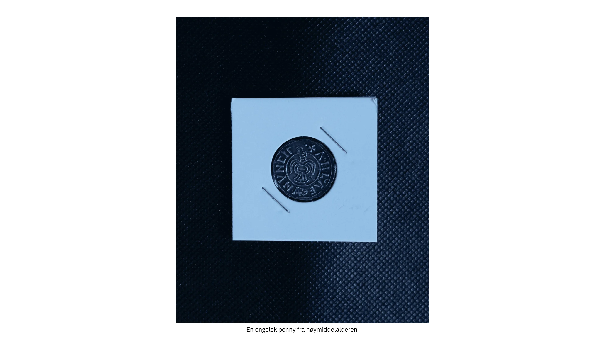

I løpet av høymiddelalderen falt Europa inn i føydalismen etter at det romerske pengesystemet kollapset. Majoriteten av befolkningen brukte kobber- eller bronsemynter av lav verdi, som ofte ble utvannet, noe som begrenset handel over lange avstander.

Myntenes tilbakekomst som betalingsmiddel skjedde gradvis, og kulminerte på 1200-tallet med gullflorinen i Firenze i 1252, etterfulgt av gulldukaten i Venezia. Disse gullmyntene ble mye brukt takket være den ekspanderende handelen og det økende behovet for pålitelige, internasjonalt aksepterte betalingsmidler.

I England ble pengesystemet beskyttet mot utvanning ved hjelp av innovativ finanspolitikk, som for eksempel landskatten som Vilhelm Erobreren innførte etter 1066, og som bevarte kvaliteten på pence sterling. Det som er viktig å forstå her, er at datidens regenter kunne devaluere valutaen for å finansiere staten, og **innføringen av denne skatten gjorde det mulig å holde valutaen stabil og finansiere staten gjennom skattlegging.**

Fristelsen til å tjene penger på å utvanne pengene førte imidlertid til kriser, som under Henrik I på 1100-tallet, da kvaliteten på myntene falt dramatisk. Strenge reformer, noen ganger ledsaget av voldelige tiltak mot myntherrer, gjenopprettet midlertidig tilliten til valutaen.

I middelalderen oppsto det også sofistikerte finansielle praksiser, som for eksempel bruken av tally sticks i England for å omgå forbudet mot åger og gi kreditt. Kirken var ikke særlig begeistret for rentebærende lån, så ulike teknikker ble tatt i bruk for å omgå renteforbudet.

Disse nyvinningene var et svar på den kroniske mangelen på metalliske penger, og de bidro til fremveksten av et gryende finansmarked.

Korstogene stimulerte handelen i Middelhavsområdet og bidro til utviklingen av internasjonal handel og nye bankpraksiser, særlig gjennom Tempelridderordenen. Tempelridderordenen ble viktige finansielle mellommenn som gjorde det mulig for korsfarerne å skaffe seg likviditet langt hjemmefra, noe som var en forløper for det moderne europeiske banksystemet.

For å knytte forbindelsen til tempelridderne, kan du her nedenfor se en fransk middelaldermynt, der du kan gjenkjenne et vakkert kors i midten. Det var ganske vanlig at mynter fra denne tiden hadde dette korset.

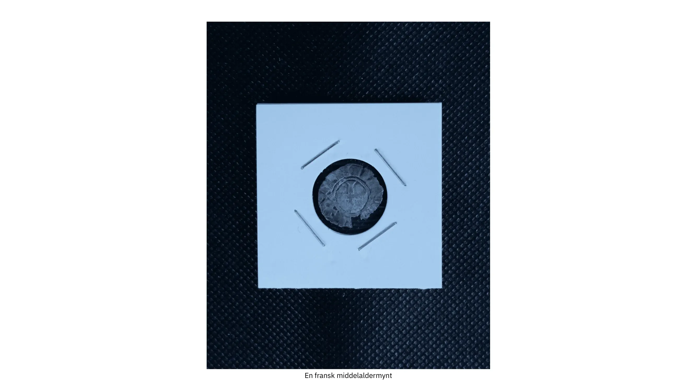

Endelig førte store kriser som Svartedauden (1346-1353) til dyptgripende økonomiske omveltninger. Det kraftige fallet i folketallet førte til en kraftig økning i lønningene, som trosset myndighetenes forsøk på å opprettholde tidligere lønnsnivåer.

Samtidig tvang Hundreårskrigen (1337-1453) statene til å føre en mer aggressiv skattepolitikk for å finansiere hærene sine, noe som bidro til å svekke føydalsystemet.

Middelalderen var derfor preget av en konstant spenning mellom behovet for pålitelige penger til handel og den stadige fristelsen for herskerne til å utvanne pengene for å oppnå umiddelbar profitt. Denne konflikten formet i stor grad den europeiske pengeutviklingen og la grunnlaget for moderne økonomiske systemer.

Som en avslutning på dette avsnittet vil jeg gjerne legge til en ganske interessant anekdote fra England på denne tiden. Denne anekdoten er hentet fra boken "History of Money" av Glyn Davies.

Det nevnes at i England ble gjeldsbyrden overført fra regenten til parlamentet, noe som resulterte i en kronisk statsgjeld. Før dette lå gjeldsbyrden på regentens skuldre.

Da parlamentet fikk en del av makten til å skape penger, ble det mulig å skape langsiktig gjeld som ble båret av folket, ikke av kongen. Tidligere var det slik at hvis kongen gikk konkurs, eller hvis det ble kongeskifte, forsvant gjelden med ham.

I det øyeblikket gjeldsopprettelsen utføres av Parlamentet, oppstår begrepet statsgjeld, ettersom den er potensielt ubegrenset over tid. Så lenge staten eksisterer, så lenge parlamentet eksisterer, eksisterer denne gjelden, og de måtte finne alle mulige måter å refinansiere den på og spre den over tid. Det er et stort paradigmeskifte, der det ikke lenger var kongen eller de kongelige som garanterte for eller bar byrden av denne gjelden; nå var det parlamentet og dermed innbyggerne.

## Renessansen

<chapterId>1d1dfb05-70b4-5b7b-9708-373c2182950d</chapterId>

:::video id=4977b4f3-c7b2-41a5-ad7b-a96a8cca4092:::

Vi har nå kommet til den delen av kurset der vi snakker om den perioden som kalles renessansen. Den finner sted mot et bakteppe av tragisk krise, med den voldsomme spredningen av pesten som lopper på rotter om bord på skip. Denne tragedien gir oss imidlertid informasjon om veksten i handel og reiseliv i høymiddelalderen. Tidligere i denne perioden var det ikke så mange som reiste så langt og så fort.

### Florin av Firenze

Gullmyntenes tilbakekomst i Europa under renessansen markerer et fundamentalt vendepunkt i pengehistorien. **Det hele begynte med florinen fra Firenze i 1252, den første store gullmynten som ble preget i Europa etter Romerrikets fall**. Med sin bemerkelsesverdig konstante vekt og renhet (rundt 3,5 gram rent gull) forble florinen uforandret i fire århundrer og ble raskt en viktig paneuropeisk monetær referanse.

Her nedenfor kan du se en reproduksjon av en florin: en gullflorin laget av tinn og stemplet av en fransk kunstner som lager utmerkede eksemplarer, gravert og preget for hånd.

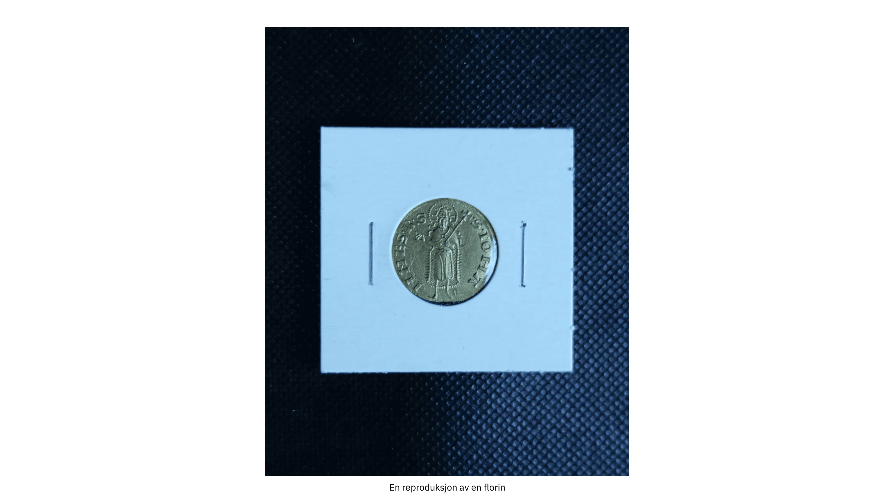

Denne tilbakevendingen til gullmynt ble drevet frem av en spesifikk kontekst: Den bysantinske solidusens sammenbrudd og den økonomiske tilbakegangen i den muslimske verden på grunn av mongolinvasjonene skapte et monetært vakuum i den internasjonale handelen.

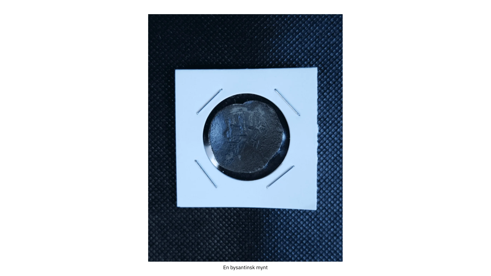

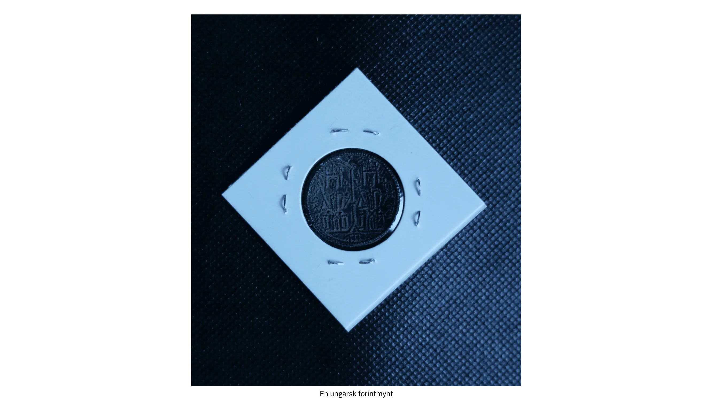

Det første bildet over viser en bysantinsk mynt som jeg synes er ganske interessant. Jeg vil trekke en parallell til en mynt fra samme periode fra Ungarn (andre bilde over). Den ungarske mynten er koppformet, som en skål i miniatyr. Ikonografien viser religiøse figurer avbildet som konger som holder kors side om side. Denne mynten er skålformet og stammer fra Ungarn.

Det var vanlig å kopiere mynter fra andre land. Ettersom bysantinske mynter var allment akseptert, ble de ofte kopiert av andre land. Som du kan se når du sammenligner dem side om side, er disse myntene svært like.

Nord-Italia, særlig Firenze, Venezia og Genova, utnyttet denne konteksten til å lansere nye harde valutaer - mynter med et stabilt innhold av edelt metall. Venezia fulgte Firenzes eksempel ved å prege dukaten i 1270, en valuta som var nesten identisk med florinen, og som ble mye brukt i middelhavshandelen.

Florinen ble den første internasjonale reservevalutaen, og ble tatt i bruk i over 150 europeiske byer før slutten av 1300-tallet. Med etableringen av et storstilt florentinsk banknettverk, ledet av Medici-familien, ble penge- og regnskapshåndteringen grundig modernisert, og behovet for fysisk transport av gull ble til og med redusert.

Det er et annet veldig interessant poeng. Det var en tid da mange myntforsendelser gikk tapt på sjøreiser. Dette teknologiske fremskrittet - registrene med dobbelt bokholderi - gjorde det mulig å skape skriftens penger. Det gjorde det mulig å redusere antall myntoppgjør og i stedet bruke et system med skriftlige oppføringer, noe som i stor grad reduserer risikoen for å miste penger under transport.

Den monetære utviklingen ble også ledsaget av en betydelig utvikling i bankmetoder. Inspirert blant annet av korstogenes kontakt med muslimsk bankpraksis, så middelalderens Europa fremveksten av rudimentære banksystemer i Firenze, Venezia, Barcelona og Genova så tidlig som på 1200-tallet. Tempelridderne, en religiøs og militær orden, hadde allerede utviklet et system som gjorde det mulig for korsfarere å reise uten å ta med seg formuen sin.

De skulle sette inn penger på et tempelridderkontor i sitt eget land og kunne deretter reise med et brev og hente myntene ved ankomst til korstogsmålet.

Dermed slapp vi å bære rundt på mynter av edelt metall.

Det var også i denne perioden at Europa ble klar over at det fantes papirpenger i Kina, takket være Marco Polos reise på 1200-tallet. Utviklingen av pengesedler kom imidlertid til å vente flere århundrer, ettersom Europa foretrakk å perfeksjonere sine metoder for metallmynt først. Leonardo da Vinci, i nært samarbeid med Luca Pacioli, en anerkjent revisor, bidro aktivt til å forbedre pengepressene, noe som bidro til en raskere og mer ensartet myntproduksjon.

Vi sikter til pendelslagteknikken som er nevnt tidligere i kurset. Denne metoden gjorde det mulig å produsere mer ensartede mynter sammenlignet med hammerpreging, og ikke minst tillot den inskripsjoner rundt kanten av mynten, slik jeg tidligere har vist. Mynten nedenfor er en europeisk daler fra 1793, som tydelig viser skrift på kanten.

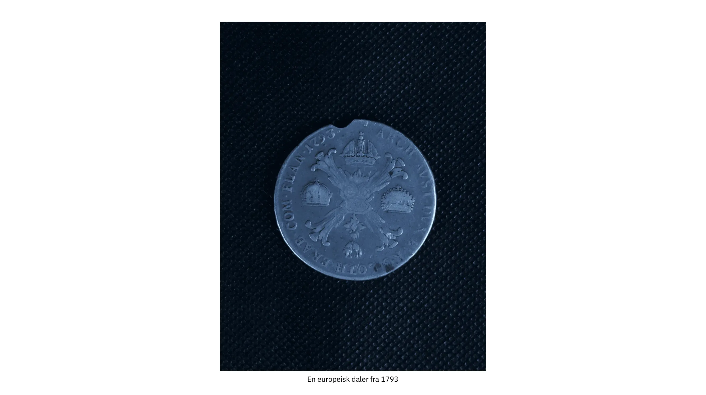

På 1400-tallet opplevde Europa imidlertid en alvorlig valutakrise, med en generell forverring av sølvinnholdet i de europeiske valutaene, som falt til under 5 % rundt 1450.

Fra 1500-tallet og utover flyttet det monetære tyngdepunktet seg til Spania, stimulert av unionen mellom kongedømmene Aragon og Castilla, slutten på Reconquistaen og de store maritime oppdagelsene, som Christofer Columbus' oppdagelser i 1492. Den massive tilstrømningen av sølv fra amerikanske gruver forrykket den økonomiske balansen i Europa og resten av verden, noe som førte til både inflasjon og nye geopolitiske spenninger.

Renessansen markerte også en stor kunstnerisk utvikling i myntvesenet, med mynter som thaleren (Joachimsthaler), som er opphavet til begrepet "dollar". Disse store sølvmyntene gjenspeiler de nye kunstneriske og mekaniske utmyntingsteknikkene som ble muliggjort av tekniske nyvinninger fra Nord-Europa.

Til slutt innledet den finansielle renessansen overgangen til økonomisk modernitet, med utviklingen av bankvesen, kreditt og finansmarkeder, og fremveksten av de første formene for moderne kapitalisme i de store handelsbyene Amsterdam, London og Stockholm, som la grunnlaget for det internasjonale finanssystemet slik vi kjenner det i dag. Og det er temaet for vår neste video.

# Statens beslag av penger

<partId>17cfb1b4-5bc1-53e0-b035-05c7cf76be92</partId>

## Utviklingen av verdens reservevalutaer

<chapterId>d65cc352-e7ca-5f03-9b23-dd1fae5c0395</chapterId>

:::video id=82710062-8fff-426c-93af-923c08d82233:::

### Den historiske betydningen av edelmetaller

Velkommen til denne delen om fremveksten av reservevalutaer og sentralbanker. Som første punkt i denne nye delen skal vi fokusere på utviklingen av globale reservevalutaer.

Edelmetaller, særlig gull og sølv, har lenge vært ansett som grunnlaget for rikdom og makt i imperier. Tørsten etter gull har alltid vært en dominerende drivkraft, og det var tilstrømningen av edle metaller som hadde den mest direkte og åpenbare effekten på den monetære utviklingen i Europa. I middelalderen og den tidlige renessansen skyldtes denne besettelsen av gull og sølv at det var vanskelig å holde på verdien i andre former for varer, samt den sterke etterspørselen fra fremmede makter, særlig i handelen med Orienten.

Gjennom århundrene har flere imperier avløst hverandre som globale økonomiske sentre. Det landet som dominerer verdenshandelen i en gitt periode, får vanligvis status som reservevaluta. Dette gjelder blant annet

- Spania og Portugal (1400- og 1500-tallet)

- De forente provinser (Nederland) på 1600-tallet

- Frankrike og Storbritannia på 1700- og 1800-tallet

- USA i det 20. århundre

### Den portugisiske høykonjunkturen og realvalutaen (1450-1530)

**Portugal** dominerte verdenshandelen i andre halvdel av 1400-tallet og begynnelsen av 1500-tallet, med **Portugisisk real**, en sølvmynt med relativt jevn vekt. Portugiserne fant nye sjøruter til Afrika, Asia og Den nye verden takket være sine fremskritt innen navigasjon. Militære forter og handelsstasjoner ble stadig flere, fra Afrika til Kina (Macao).

Som svar på Europas etterspørsel etter gull og sølv var "den konstante motivasjonen for de store oppdagelsene kommersiell profitt, spesielt jakten på gull og sølv" Men det portugisiske imperiet, som var blitt for stort og møtte konkurranse fra nederlenderne, engelskmennene og franskmennene, begynte å gå tilbake.

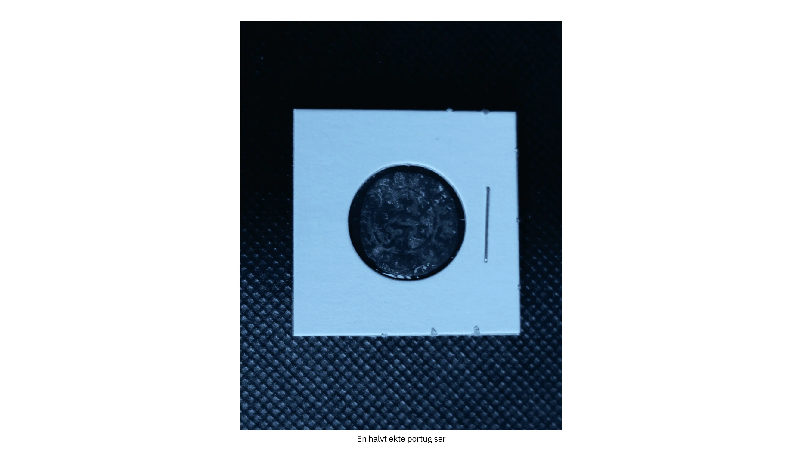

Her over kan du se en portugisisk halv-real fra tiden for disse maritime erobringene.

### Den spanske apogee og den spanske dollaren (1535-1700-tallet)

Med erobringen av den nye verden ble **Spania** den dominerende aktøren. Monarken, som kontrollerte gigantiske sølvgruver (Potosí i Bolivia, Zacatecas i Mexico), klarte å prege penger i rent sølv og unngikk dermed å svekke sin egen valuta, den **spanske realen**

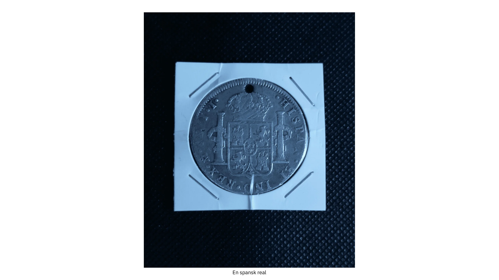

Den spanske realen, også kjent som "åttetallsmynten", fikk sitt kallenavn fordi den ofte ble delt i åttendedeler for å lage mindre mynter. Den var også kjent som **den spanske dollaren**. Mynten du ser ovenfor er fra 1814, og er dermed et litt nyere eksemplar. De aller første spanske dollarmyntene var imidlertid ikke like raffinerte; de var hammerslåtte og generelt mindre runde og skarpe.

Det som er spesielt interessant, er at den spanske dollaren fungerte som internasjonal reservevaluta på den tiden. De spanske myndighetene utstedte også sin egen lokale valuta, maravedi, og justerte regelmessig pengemengden gjennom tilbakekallinger. For eksempel kunne en kobber- eller bronsemynt som i utgangspunktet var verdt én maravedi, bli tilbakekalt og stemplet med "2", senere med "4" og så videre, og til slutt "8" På det høyoppløselige bildet kan du tydelig se "8" stemplet på mynten. Denne metoden utvidet pengemengden på en effektiv måte, noe som uunngåelig førte til inflasjon.

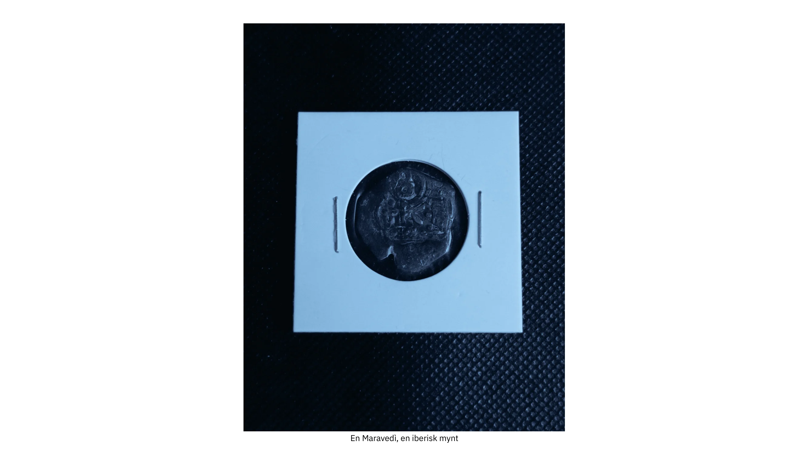

Hvis vi ser på reservevalutaenes historie, dukker det opp et interessant poeng: Imperiene blåste ikke opp valutaene sine så lenge de beholdt sin status som reservevaluta. **Det var først på slutten av deres herredømme at de endte opp med å devaluere den og miste dette privilegiet, som deretter ble gitt videre til et nytt imperium**.

I Spania dominerte den spanske dollaren verdenshandelen i nesten 200 år, særlig mellom Kina og Europa. Disse myntene kunne til og med finnes i kinesiske havner. Og det er her vi får et blinkskudd fra historien: Den amerikanske dollaren kommer direkte fra denne valutaen. Da USA ble dannet i 1792, vedtok landet en lov om å prege sin egen valuta, og de første dollarene ble laget etter modell av den spanske dollaren, både når det gjaldt navn og myntstørrelse.

For å gi deg en idé om verdien: En amerikansk dollar var opprinnelig en sølvmynt som veide nesten en unse, eller mellom 30 og 40 euro i dagens pengeverdi, i motsetning til papirvalutaen vi kjenner i dag. Den spanske dollaren sirkulerte så mye at den regnes som den første virkelige globale valutaen.

Denne tilstrømningen av edle metaller fra Amerika førte imidlertid til inflasjon i Europa. Under prisrevolusjonen (ca. 1540-1640) ble levekostnadene i England syvdoblet. I Spania hadde overfloden av sølv en pervers ressursforbannelse som hindret utviklingen av solide bankinstitusjoner.

Etter dette ble Spania utsatt for en rekke militære konflikter (Flandern, Nederland, Trettiårskrigen), og landets finanser kollapset gradvis. I stedet for å devaluere den verdenskjente sølvmynten, valgte skiftende herskere å misligholde eller nedskrive kobbermynten (vellón) som ble brukt av lokalbefolkningen. Det er dette jeg beskrev tidligere med maravediene.

### Den nederlandske fremveksten (1600-tallet)

Etter den iberiske storhetstiden vokste **Nederland** frem som en ny handelsmakt på 1600-tallet. Sjøhandel, VOC (Det nederlandske ostindiske kompani) og grunnleggelsen av **Amsterdam Stock Exchange** (inspirert av den i Antwerpen) gjorde denne handelsrepublikken til et knutepunkt.

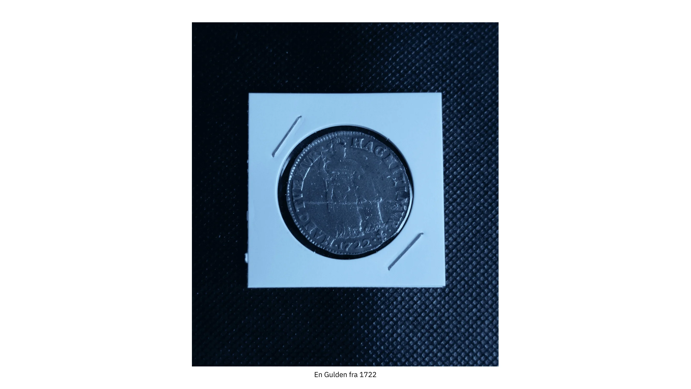

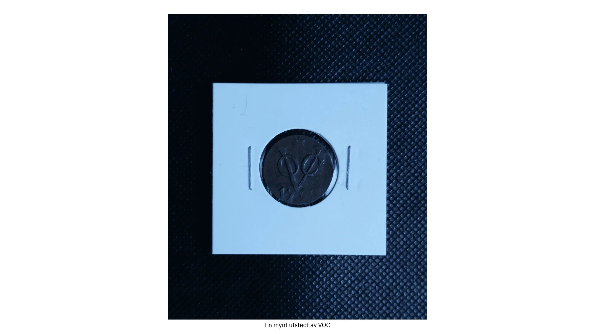

På det første bildet over ser du en Gulden fra 1722 (en vakker sølvmynt), mens det på det andre bildet er en mynt utgitt av VOC.

VOC var et ekstremt mektig selskap for sin tid: Det hadde sin egen hær og utstedte til og med sin egen valuta.

Nederlenderne oppfant den moderne kapitalismen, som begynte som et middel til å fordele risiko i risikofylte satsinger som ekspedisjoner til den nye verden eller jakten på nye handelsruter. Aksjeselskaper gjorde det mulig for flere investorer å samle pengene sine og dele risikoen. For å gjøre det lettere å utveksle disse verdipapirene var det nødvendig å opprette institusjoner som kunne forhandle om og utveksle dem. I 1602 ble det første aksjeselskapet og den første børsen opprettet.

Den nederlandske valutaen, **Gulden**, fikk troverdighet takket være sin renhet i sølv, og deretter ble den tatt i bruk av Bank of Amsterdam (1609), der innskudd ble en foretrukket form for penger i Europa. Dette er et svært viktig poeng å nevne. Ja, selvfølgelig fantes det mynter, men det som virkelig utgjorde penger på den tiden, var en form for skriftens penger. Faktisk gikk mye av verdenshandelen gjennom bøkene til Bank of Amsterdam. Dette var et virkelig bankmessig gjennombrudd: Internasjonal handel foregikk ikke lenger nødvendigvis med fysiske mynter, men direkte gjennom bankens regnskaper.

Denne velstandsperioden var preget av en stor tilstrømning av gull og sølv, særlig fra andre land som praktiserte inflasjon eller pengekontroll. En interessant karakter bør nevnes: **Thomas Gresham**. På denne tiden arbeidet han for det engelske kongehuset i Nederland, der han administrerte pengestrømmen mellom de to landene. Det var den samme Gresham som etterlot oss den berømte **"Greshams lov"**.

Likevel gikk også det nederlandske imperiet etter hvert tom for krefter. Krigene med England, utvanningen av gulden i konflikttider og konkurransen fra andre makter (Frankrike og England) signaliserte slutten på det nederlandske hegemoniet. Etter den fjerde anglo-nederlandske krigen (1780-84) ble guldens tilbakegang som reservevaluta irreversibel.

### Fransk makt, ambisjoner og nederlag (1600-1800-tallet)

Under Ludvig XIV ble **Frankrike** den største kontinentale makten i Europa. Den franske valutaen oppnådde imidlertid aldri status som en dominerende referanse: tallrike devalueringer, høy beskatning og kostbare kriger (Augsburgforbundet, den spanske arvefølgekrigen osv.) gikk hardt utover stabiliteten i det monetære systemet.

Det første store eksperimentet med papirpenger ble utført av John Law (1716-1720). Banque Générale utstedte sedler med sikkerhet i løfter om statsgjeld. Dette førte til en spekulativ boble og kollaps (Mississippi-boblen) i 1720. Denne katastrofen etterlot Frankrike med en varig mistillit til papirpenger. Det var denne katastrofale erfaringen som førte til at Richard Cantillon ble rik takket være dette systemet, som i dag er kjent som Cantillon-effekten, der pengetrykking beriker dem som har tilgang til trykkpressen.

Da denne mistilliten omsider bleknet, kom en annen fransk papirfiasko: revolusjonære **assignater**. Disse assignatene, som ble utstedt fra 1790 og utover på grunnlag av konfiskering av geistlig eiendom, opplevde en galopperende hyperinflasjon, som offisielt gjorde dem til den første hyperinflasjonen i historien som oversteg 50 % per måned. I 1795 ble de handlet til bare noen få prosent av sin opprinnelige verdi, selv om pålydende verdi var mangedoblet.

Mer restriktive lover forsøkte å innføre assignat, men uten å lykkes. Myndighetene forsøkte å tvinge det gjennom, og gikk så langt som å true dem som ikke aksepterte det med døden, og tvinge butikkeiere til å holde åpent. Men til slutt fungerte det selvfølgelig ikke.

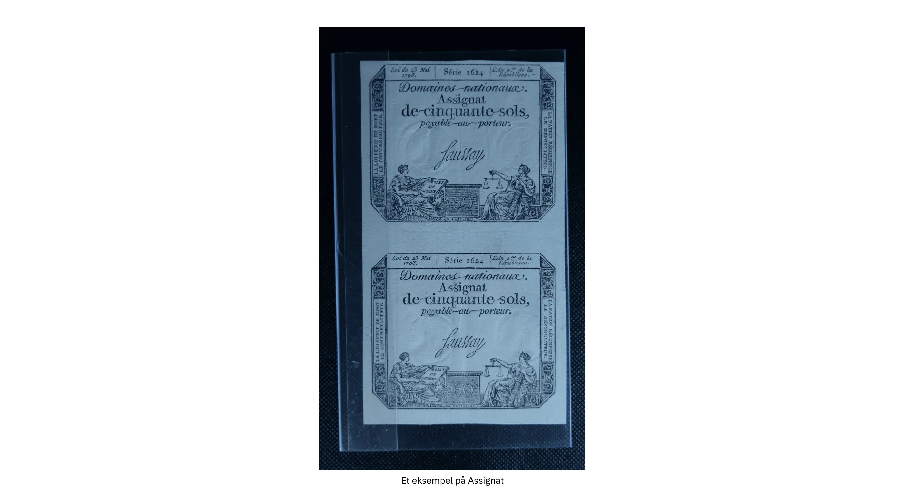

Etter hvert som disse papirpengene erstattet alle kvalitetsmynter av edelt metall, i tråd med den berømte Greshams lov, oppstod det myntmangel. For å prege nye mynter brukte de klokkemetall som ble beslaglagt fra presteskapet. Her nedenfor kan du se et vakkert stykke klokkemetall, laget av gjenvunnet kobber ved å smelte ned myntene som ble tatt fra geistligheten.

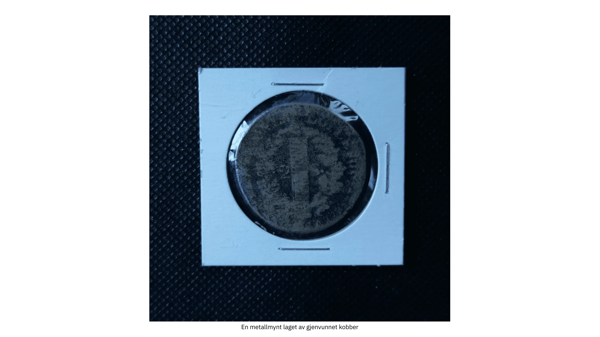

### Britisk dominans (1700-tallet - begynnelsen av 1900-tallet)

**Etter å ha gått forbi Nederland ble England** den dominerende makten på 1700-tallet. Det britiske pundet er den eldste valutaen som fortsatt er i bruk, og var opprinnelig knyttet til et pund sølv. Gradvis ble pundets status styrket, understøttet av en økonomisk og skattemessig revolusjon: parlamentarisk monarki, sterk skatteinnkreving og opprettelsen av Bank of England i 1694.

Etter en rekke kriger mot Frankrike gikk Storbritannia seirende ut av krigen i 1815 (Waterloo), og bekreftet dermed sitt overherredømme. Gjennom hele 1800-tallet fungerte det britiske pundet som verdens reservevaluta. På det meste produserte Storbritannia, med bare 2,5 % av verdens befolkning, 20 % av verdens inntekter og kontrollerte nesten en fjerdedel av jordens overflate.

Den **industrielle revolusjonen** og innføringen av en **gullstandard** (1717 eller 1718, under oppsyn av Isaac Newton ved Royal Mint) styrket pundets troverdighet. Bank of England innførte en gullstandard på 4,25 pund per unse gull, slik at seddelinnehaverne kunne veksle inn sedlene sine til gull.

Første verdenskrig (1914-1918) satte imidlertid en stopper for dette systemet. I løpet av få uker suspenderte alle de krigførende stormaktene gullkonvertibiliteten. Det britiske imperiet, og senere pundet, kom svekket ut av andre verdenskrig og måtte vike plassen for den amerikanske dollaren på 1900-tallet.

Og som en gjenstand kan du se noen vakre og interessante stykker nedenfor. Dette er pengevekter. Den første er en sovereign: den tidligste representasjonen av pundet. Jeg har bare pengevekter som representerer disse myntene fordi jeg ikke har råd til å kjøpe en ekte sovereign. For å veie dem brukte vi en vekt, og så plasserte vi pengevekten som tilsvarte sovereignens verdi på den andre siden.

Suverenen var en pengemynt - en gullmynt som opprinnelig var verdt ett pund.

Forløperen til den berømte sovereignmynten var guineaen, som fungerte etter samme prinsipp. Guineaen fikk navnet sitt etter edelmetallene den inneholdt, som kom fra regionen Guinea.

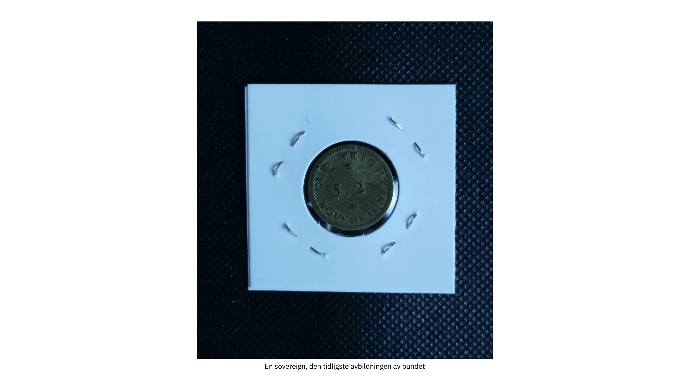

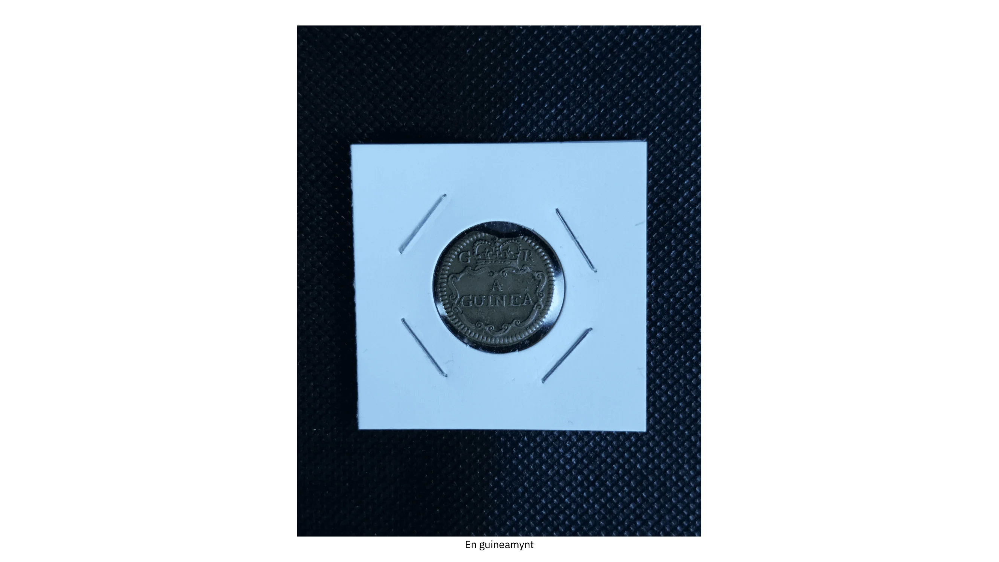

## Fremveksten av sentralbanker

<chapterId>15777771-1e28-55f7-a400-69868a47079b</chapterId>

:::video id=7661b7b5-e00f-48f3-b69a-6fb2eb5ebba4:::

Etter dette avsnittet om historien til de første reservevalutaene og deres utvikling, følger her et avsnitt om sentralbankenes fremvekst. Det følger omtrent samme spor som fremveksten av reservevalutaer, men fokuserer litt mer på datidens bankteknologi.

### Begynnelsen på banker og proto-banker

Allerede på 1200-tallet utviklet italienerne (Firenze, Genova, Venezia...) teknikker for dobbelt bokholderi. Senere ble **Antwerpen** (1500-tallet) Nord-Europas ledende finanssentrum, en rolle som senere ble overtatt av **Amsterdam**, takket være Amsterdam Stock Exchange (1609), der VOC-aksjer ble omsatt.

I Antwerpen ble det arrangert handelsmesser der handelsmenn ofte møttes for å gjøre opp gjeld, noe som førte til oppfinnelsen av nye finansielle instrumenter. Seddelen nedenfor, datert 1761 og av nyere dato, er et **vekselbrev**. Den har håndskrevne detaljer og inskripsjoner på baksiden, noe som gjør den til en praktfull gjenstand fra denne perioden.

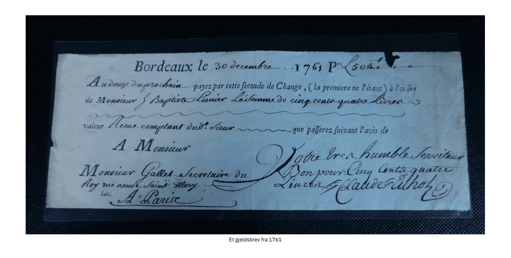

Denne oppblomstringen førte til opprettelsen av mer sofistikerte bankinstitusjoner. **Bombardiske bankierer** og senere nederlandske kjøpmenn perfeksjonerte kredittinstrumenter (veksler, gjeldsbrev osv.). Det moderne banksystemet er basert på denne ideen: Penger kan være kreditt, ikke bare metall.

Som du ser, bringer dette oss tilbake til vårt opprinnelige spørsmål om pengenes opprinnelse.

Utspringer penger av en vare som oppstår av behovet for å bytte, eller oppstår de av kreditt? Spor av dette kan fortsatt finnes i denne delen.

### Det svenske eksempelet: Stockholms Banco og Riksens Ständers Bank

La oss gå videre til Sverige, der den aller første sentralbanken ble opprettet.

**Sverige** var en pioner innen sentralbankvirksomhet: I 1657 opprettet Johan Palmstruch **Stockholm Banco**, som fikk tillatelse til å låne ut mer enn metallreservene sine, og dermed ble [fractional reserve banking](https://planb.academy/resources/glossary/fractional-reserves) grunnlagt. Men overdreven seddelutstedelse førte til panikk og stormløp mot banken i 1663. Vel, vel, vel...

I 1668 ble Riksens Ständers Bank, verdens første egentlige sentralbank, grunnlagt i Stockholm. Men også den ble rammet av kriser (1709, 1715...) knyttet til misbruk av sedler, ofte for å finansiere rikets kriger.

### John Laws mislykkede kupp

La oss dra til Frankrike, der vi nok en gang finner vår kjære John Law.

*skotten *John Law** overtalte regenten (hertugen av Orléans) til å opprette en privat bank, Banque Générale (1716), med tillatelse til å utstede papirer mot gull, sølv og statsgjeld. Den ble til Banque Royale (1718), og bidro til at Mississippi-kompaniets aksjer steg kraftig.

Da virkeligheten innhentet spekulasjonene, **ble panikken forsterket av beslutningen om å forby gullbeholdning og tvinge frem bruk av Law's Notes**. Vel, vel, vel...

Til slutt sprakk boblen i 1720, noe som førte til en kollaps som ødela papirpengenes troverdighet i Frankrike for lang tid fremover.

### Bank of Amsterdam, fremveksten av en banebrytende modell

Vi er nå forflyttet til Amsterdam i 1609, der **Banken i Amsterdam** (Wisselbank) tok kontroll over myntenes forvaring og konvertibilitet i Amsterdam. De forbød sirkulasjon av private sedler og påla deponering av metalliske mynter i bankens hvelv. Litt etter litt tok de kontroll over valutaen. De forbød vekslere å oppbevare mynter hos seg. Vekselererne arbeidet hele dagen og måtte deponere myntene sine i Bank of Amsterdams hvelv ved dagens slutt. Som jeg har nevnt, var det ikke nødvendigvis metallmynter som ble brukt i den internasjonale handelen. Det var skriftens penger i bankens bøker.

Takket være den nederlandske handelsmakten spilte banken rollen som den første de facto "sentralbanken" og stabiliserte verdenshandelen. Over tid ga den imidlertid usikrede lån til VOC, og til slutt gikk den tom for metall til å dekke regningene sine. I 1790 kom det frem at den hadde lånt ut store summer til VOC, og den gikk praktisk talt konkurs, noe som ødela guldens troverdighet. Vel, vel, vel...

### Bank of England, grunnleggelsen av det moderne bankvesenet

I 1600-tallets England ble gull og sølv oppbevart av gullsmeder, som utstedte kvitteringer. Denne delvis desentraliserte organiseringen viste sine begrensninger da kronen fikk et massivt behov for finansiering til krigen mot Frankrike.

I 1694 ble **Bank of England (BoE)** grunnlagt. Bank of England var dermed et resultat av et fornuftsekteskap mellom Londons næringsliv og regjeringen, som var desperat etter å skaffe midler til krigen.

Banken fikk monopol på utstedelse av sedler i England (forsterket i 1708, 1742 osv.). Fra da av sirkulerte papirpenger med gullreserver ved siden av mynter. Dette er et viktig poeng for å forstå de statlige institusjonenes gradvise overtakelse av pengevesenet. Først hindret banken i Amsterdam pengevekslerne i å oppbevare mynter og tvang dem til å levere dem tilbake til banken. I England ble det forbudt for private banker å utstede egne sedler som kunne innløses i gull.

De tillot private banker å utstede pengesedler, men disse kunne bare veksles inn i sedler fra Bank of England.

Bank of Englands sedler, pund sterling, kunne innløses i gull. Dette la et tredje lag til valutaen. Vi har altså gull i bunnen, deretter sedler fra Bank of England, og så sedler fra private banker på toppen. Før dette kunne private banker utstede sine egne veksler som kunne innløses i gull. Dette er nok et ledd i de statlige institusjonenes gradvise overtakelse av valutaen.

Banken finansierte staten med store lån og strukturerte den enorme statsgjelden som finansierte den økonomiske boomen.

Denne modellen ble konsolidert i løpet av 1700- og 1800-tallet, til et punkt der pundet ble verdens reservevaluta, under Bank of Englands segl og gullstandarden.

**Verdens reservevalutaer** har avløst hverandre gjennom århundrene, drevet av den økonomiske, kommersielle og militære makten til en stat eller et imperium: Portugal, Spania, Nederland, deretter Storbritannia, før USA kom til å dominere på 1900-tallet. I hvert tilfelle ser vi en lignende syklus: økonomisk ekspansjon, kommersiell suksess, internasjonal adopsjon av valutaen, gjeld, kostbare kriger, misbruk av pengeskaping eller kreditt, og til slutt tilbakegang.

**Fremveksten av sentralbanker** var en gradvis prosess. Disse institusjonene oppsto ofte i forbindelse med kostbare kriger, noe som gjorde det mulig for staten å finansiere seg selv gjennom gjeld. Da gullstandarden ble innført (England, 1600-1900-tallet), ga den et skinn av stabilitet, helt til de store verdenskrigene på 1900-tallet førte til at gullkonvertibiliteten gradvis ble opphevet. Makten til å utstede penger ble dermed flyttet fra det kongelige monopolet til mer komplekse enheter, først private (gullsmeder, bankierer), deretter halvoffentlige (sentralbanker), noe som gjenspeiler utviklingen av monetær suverenitet i retning av institusjonaliserte, globaliserte former.

Så dette er det jeg beskrev tidligere. Vi har ofte flyttet byrden av statsgjeld direkte til enten sentralbankene eller til juridiske institusjoners tillatelse til å skape penger, for eksempel parlamentet.

Og det viktigste faktum her er at **vi har gått fra en gjeld som kunne forsvinne ved at staten gikk konkurs, til en gjeld som i hovedsak hvilte på befolkningens skuldre**.

## Veien til fiat-systemet

<chapterId>27a98545-d350-56ee-a200-92468e6b9b33</chapterId>

:::video id=e27a753e-aeee-4307-a65c-9506aab380a1:::

Vi har nå kommet til slutten av dette kurset om pengenes historie, og som en avslutning vil jeg foreslå to temaer. Det første temaet er de ulike stadiene som førte til vårt nåværende fiatvalutasystem. Vi skal se nærmere på fakta fra kapittel 5 om opprettelsen av sentralbanker, og vi skal legge til begrepet amerikanske dollar, som til syvende og sist er den nåværende reservevalutaen. Vi skal se på hvordan den utviklet seg, hvordan dollaren ble til, hvordan den utviklet seg, hvordan den endret seg, hvilke stadier den gikk gjennom for å bli et fiatsystem, fordi dollarens opprinnelse er en sølvmynt.

Deretter, umiddelbart etterpå, skal jeg gi dere et kort innslag om finanshistorien, for å hjelpe dere å forstå hvordan vi kom frem til velferdsstaten. Vi skal altså se på to temaer: hvordan vi kom frem til fiatsystemet, og deretter, rett etterpå, hvordan finansens utvikling førte oss frem til begrepet velferdsstat.

### Det europeiske grunnlaget for moderne bankvirksomhet

La oss gå tilbake til 1200-tallet med florinen. For å forstå hvordan vi kom frem til fiat-modellen, må vi starte med 1200-tallet. Ved siden av florinen dukket det samtidig opp en teknologi med Mediciene, nemlig vekselbegrepet.

Så kom børsen i Antwerpen, med sitt konsept for diskontering og gjeldsbrev.

Så fikk vi, som vi har sett, VOC, det første aksjemarkedet i Amsterdam. Dette markerte kapitalismens fødsel, med selskapsaksjer og utveksling av aksjer. Amsterdam-banken innførte deretter bruk av innskudd ved dekret. Det betydde at mynter måtte settes inn på slutten av dagen. Det var pengevekslerne som ikke lenger kunne oppbevare vekslepenger i myntform.

Så kom opprettelsen av Bank of England som følge av behovet for å skape gjeld for å finansiere krigen på slutten av 1600-tallet. På den tiden ble private banker det tredje pengelaget. Hele denne delen, fra florinen til forestillingen om opprettelsen av sentralbanker, er for øvrig svært godt oppsummert i Nick Bhatias berømte bok "Layered Money", som jeg var så heldig å få oversette sammen med noen kolleger. Vi gjorde en god jobb med å oversette den slik at fransktalende overalt kunne dra nytte av denne lærdommen.

Vi er på slutten av 1600-tallet. Bank of England ble opprettet for å finansiere krigen.

De private bankene overtok det tredje laget av valutaen. Faktisk var ikke de private bankenes sedler lenger innløselige i gull: det var Bank of Englands sedler som var innløselige i gull. Dette viser at Bank of England hadde overtatt makten til å veksle penger.

Så kom panikken i 1776. Alle løp oppover i pengepyramiden. Det betyr at i 1776 ble det stormløp mot bankene, og alle som hadde papirer i tredje lag, dvs. private bankveksler, prøvde å få tak i Bank of England-veksler, og deretter prøvde de å få tak i gull, men det var åpenbart ikke nok gull i hvelvene. De erklærte en slags bankferie for å unngå å betale tilbake gullsedlene, og dette ga opphav til begrepet "lender of last resort".

### Utviklingen av den amerikanske dollaren

Vi gikk fra florinen til opprettelsen av Bank of England. I mellomtiden var det selvfølgelig første og andre verdenskrig, men tidligere, i 1796, skjedde det også en utvikling på den andre siden av Atlanteren. I 1776 var Amerika fortsatt en britisk koloni, og koloniene brukte denne papirvalutaen. Nedenfor er en toskillingsseddel fra Connecticut fra 1776.

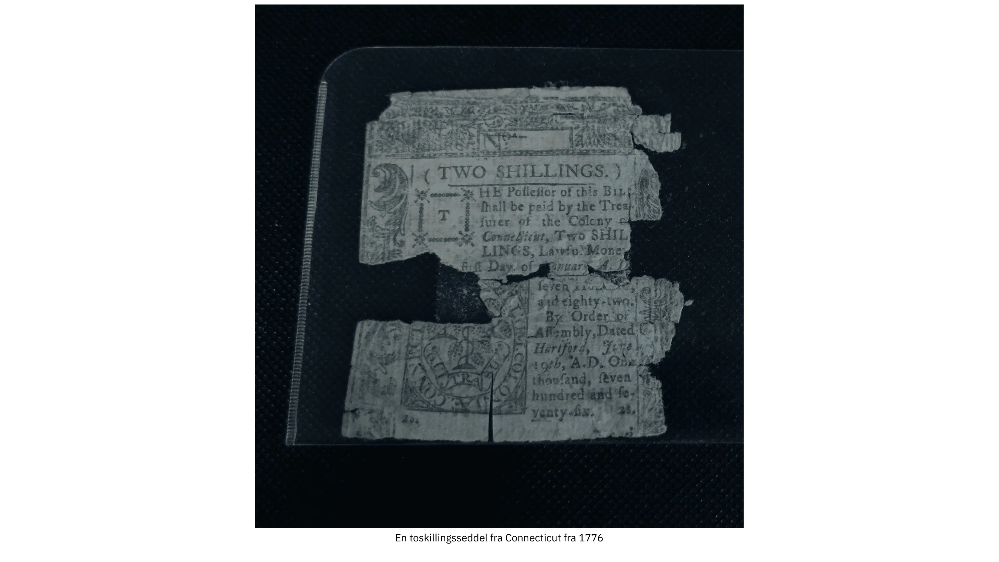

Før koloniene erklærte krig mot England og etter hvert utstedte sin egen valuta, brukte de denne papirvalutaen sammen med den spanske dollaren til kontanttransaksjoner. Faktisk ble begrepet "dollar" stående som betegnelse på den amerikanske dollaren.

Hvis jeg ikke tar feil, vedtok de i 1792 en lov som tillot dem å slå mynt. Som et eksempel er den nedenfor en amerikansk dollar fra moderne tid.

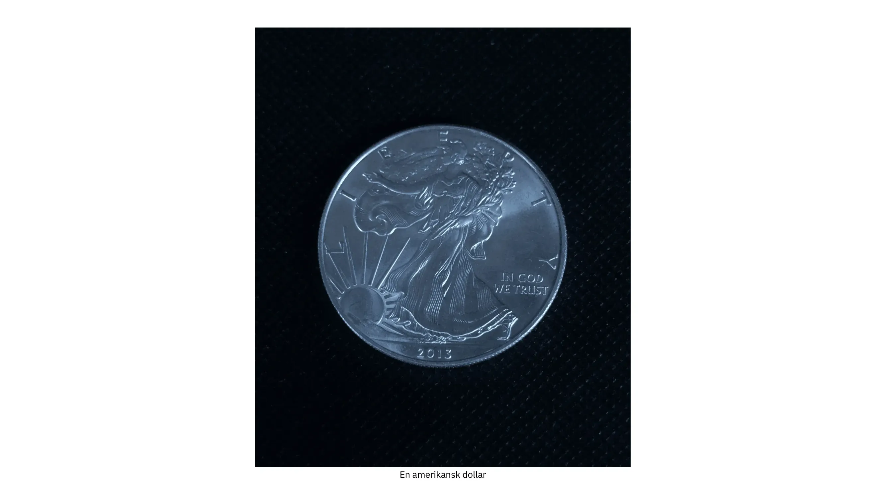

Den har selvsagt ikke en pålydende verdi på bare én dollar; den er verdt rundt 30 eller 40 dollar, ettersom den representerer en unse sølv. Verdien svinger i takt med sølvprisen, og vanligvis ligger den på minst 30 eller 40 amerikanske dollar. I dag har en papirdollar selvfølgelig bare pålydende verdi på én dollar, men på den tiden var den amerikanske dollaren forankret i denne sølvverdien.

La oss snakke om borgerkrigen i Amerika nå. Konføderasjonen trykket penger, som ble hyperinflatert. Dette fenomenet er ikke inkludert i den offisielle Hanke-Krus-listen, ettersom det ikke nådde en hyperinflasjonsrate på 50 %. Men den opplevde en månedlig inflasjon på 40 %, noe som indikerer at det ble trykket opp en betydelig mengde valuta under krigen.

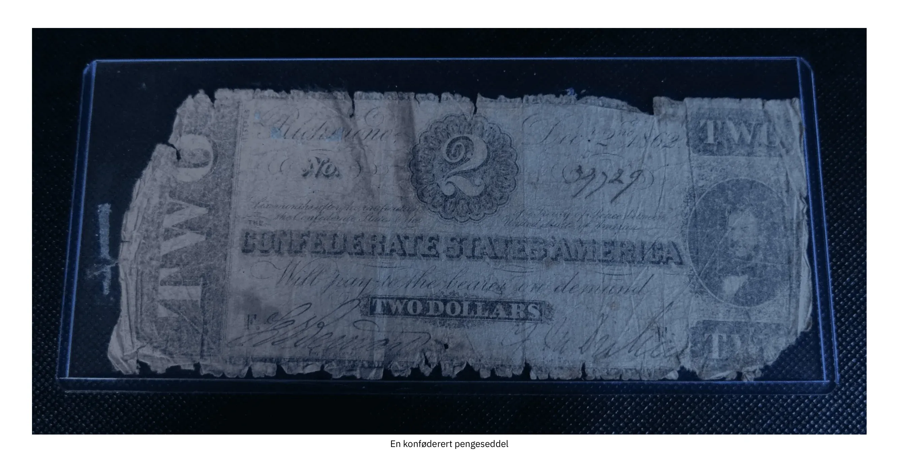

Motstanderne i nord hadde også dollar. Rett over kan du se konføderasjonsdollar, mens du under kan se nordstatsdollar. De ble kalt "the greenback" fordi baksiden var grønn.

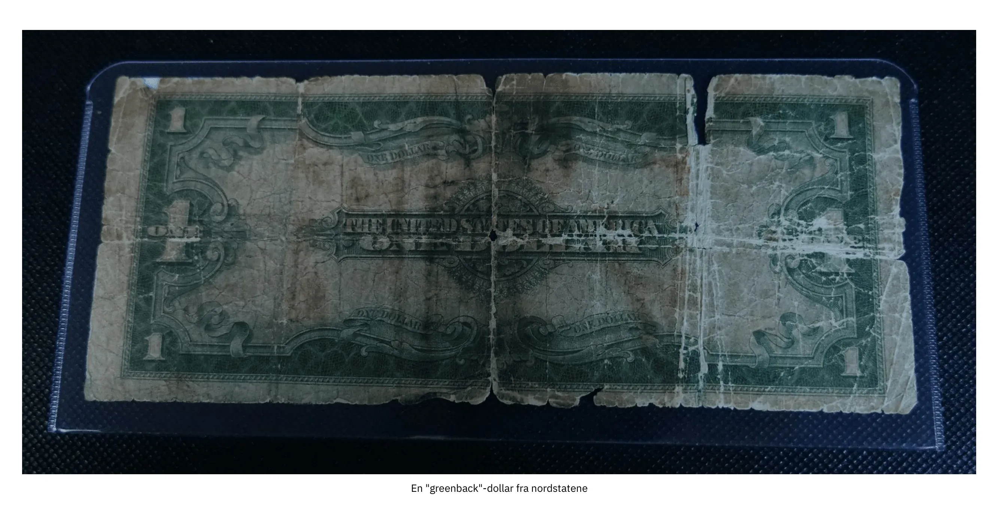

Og jeg inviterer deg til å sammenligne forskjellen i størrelse med moderne sedler. Den gang var sedlene større.

Som vi vet, vant nordstatene, så greenbacken ble valutaen i de gjenforente amerikanske statene. Så kom grunnleggelsen av FED i 1913 og første verdenskrig.

Etter første verdenskrig hadde den siste serien med trykte sedler alltid påskriften "kan innløses i gull på forlangende". I 1928 kunne man altså kjøpe nesten en unse gull for 20 dollar, ettersom gullprisen var 20,67 dollar. Seddelen på bildet nedenfor kunne kjøpe en unse gull i 1928.

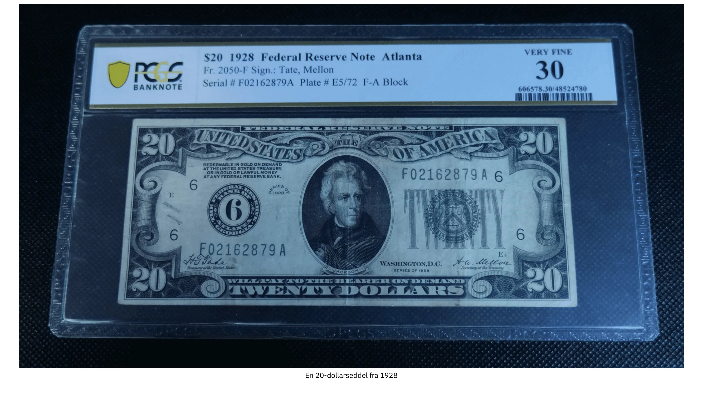

I dag er en unse gull verdt 3 000 dollar. Så her ser man selvfølgelig devalueringens kraft. Det var den siste loven som inneholdt ordene "innløsbar i gull". Vi vil se at rett etter Executive Order 6102, ville de beslaglegge alt gullet. Faktisk ville de beslaglegge både gullet og gullsertifikatene.

Her under kan du se et gullsertifikat fra 1928.

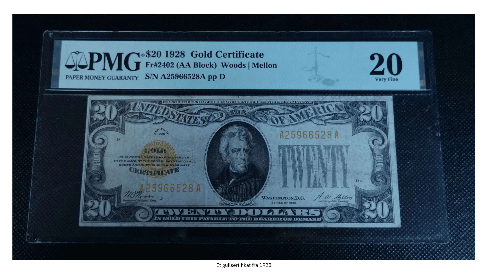

Ikke bare var den "innløselige i gull" som seddelen fra 1928, den var også innløselige i gullmynter: det er virkelig et "gullsertifikat". De har alle blitt beslaglagt etter Executive Order 6102. Frem til 1964 var det til og med ulovlig å eie dem.

Jeg er veldig glad for å ha en.

Fra 1964 ble det ulovlig å eie gull, frem til 1974, hvis jeg ikke tar feil. På 70-tallet tillot de folk å akkumulere gull etter Nixon-sjokket, som vi snart skal beskrive. I 1933, da de utstedte "Executive Order 6102", beslagla de gull, og det ble ulovlig å eie det. Du fikk en høy fengselsstraff hvis du ble tatt i å beholde gullet ditt. På den tiden ble hvert gram gull vekslet inn i en seddel som ligner på den nedenfor, etter 1934.

I 1928 hadde en dollar som sagt fortsatt teksten "innløsbar i gull" på seg.

Etter utstedelsen av Executive Order 6102 beslagla de alt gullet og vekslet inn 20,67 dollar for hver unse gull. Etterpå kom svindelen frem i lyset: I 1934 utstedte de nye sedler med påskriften "denne seddelen er lovlig betalingsmiddel for all gjeld".

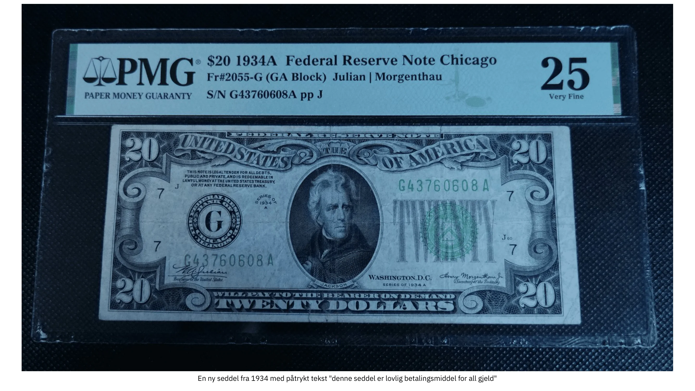

Her dukker begrepet "lovlig betalingsmiddel" opp, og erstatter uttrykket "innløsbar i gull" De to sedlene kan se identiske ut, med bare noen få ord som er endret, men svindelen ligger i det faktum at dollaren ble devaluert i denne perioden; den gikk fra at en unse gull ble verdsatt til 20,67 dollar til 35 dollar per unse i 1934. Det representerte en devaluering på omtrent 40 %!

Så kom den andre verdenskrigen. Etter krigen sentraliserte Bretton Woods-avtalen mye av verdens gull i USA. Amerikanerne utstedte sedler i bytte, men disse sedlene kunne ikke lenger veksles inn i gull av allmennheten. I stedet kunne de fortsatt veksles inn i gull på delstatsnivå.

Etter hvert begynte land som Frankrike og Tyskland å fatte mistanke om at det sannsynligvis var flere dollarsedler i omløp enn gull i de amerikanske hvelvene.

Så de ba om å få tilbake gullet sitt. De sa: "Ok, vi skal gjøre det, men det vil ta litt tid." I 1971 kuttet vår venn Richard Nixon koblingen mellom sedler og gull en gang for alle, og skyldte på spekulanter i prosessen.

Gull var undervurdert til 35 dollar per unse, en pris som ikke tilsvarte mengden penger som var blitt trykket, eller den virkelige markedsverdien. I løpet av få år steg prisen fra 34 dollar til 800 dollar. I likhet med historiske eksempler, som i Roma, der forbindelsen mellom denaren og solidusen ble brutt, fikk gullet flyte fritt. Dette førte til en prisoppdagelsesprosess, noe som resulterte i at gull ble verdsatt mye høyere i dollar etter dette.

### Det moderne fiat-valutasystemet og dets konsekvenser

Denne delen oppsummerer hvordan vi gikk fra et pengesystem basert på sølv eller gull. Litt etter litt fikk institusjonene mer og mer makt over pengene. Til slutt ble koblingen mellom edle metaller og penger fullstendig brutt gjennom en ensidig beslutning, etter en overutstedelse.

Dermed er det ikke lenger noen sammenheng mellom gull og sedler eller skriftens penger. Og det er ikke engang et fraksjonelt reservesystem - det er et utdatert konsept. I stedet er det private banker som utsteder og skaper penger gjennom bankkreditt. Penger skapes hovedsakelig på denne måten og er korrelert med styringsrenten som sentralbanken fastsetter.

Det finnes egentlig ingen grense. Det finnes ingen obligatoriske reservenivåer lenger, i hvert fall ikke i USA og Canada. Den eneste reserven er at bankene må sørge for å kunne respondere på interbankutvekslinger for ikke å gå tom for likviditet.

De må bare sørge for at de kan foreta disse overføringene, men det finnes ingen obligatorisk reserve på 3 %, 1 % eller 10 %. Vi har virkelig beveget oss bort fra konseptet med brøkdelsreserver. Nå er det sentralbanker, regjeringer gjennom budsjettunderskudd, sentralbanker gjennom kvantitative lettelser (QE) og private banker gjennom opprettelse av banklån som kan øke den totale pengemengden og, etter min mening, forårsake inflasjon.

For å forstå sammenhengen mellom penger og inflasjon anbefaler jeg et kurs jeg har på Plan ₿ Academy som er dedikert til dette emnet. Du vil lære forskjellen mellom prisstigninger, som er det vi ser i livet, og inflasjon. De er ikke det samme. Når vi snakker om inflasjon, snakker vi faktisk ofte om prisstigning, ikke inflasjon i seg selv. Inflasjon er et ganske presist begrep, som forklares med økningen i pengemengden.

https://planb.academy/courses/caa75343-ac90-4249-bcca-0e2e57c3a0f1

Som en avslutning på denne delen om fiat-verdenen vil jeg gjerne peke på en ressurs som kan hjelpe deg med å forstå fenomenene jeg nettopp har forklart, som for eksempel inflasjon.

Takk for oppmerksomheten.

## Historien om pengebobler

<chapterId>b6451c46-917d-11f0-97de-6bc5081765fa</chapterId>

:::video id=5967d9a6-aae4-4b84-a283-71b1b735bca4:::

### Oppfinnelsen av papirpenger og den første store boblen

Med opprettelsen av sentralbanker på 1700-tallet ble en virkelig revolusjon født: magiske penger i form av sedler. Det mest slående eksemplet i Frankrike er John Law. Denne skotten, som levde i eksil i Paris, foreslo for regenten, hertugen av Orléans, en løsning på konkursen i de kongelige finansene ved å opprette en statsbank og et kolonialt handelsselskap: den berømte **Banque Royale** og **Compagnie du Mississippi**.

Med dette systemet knyttet Law papirpenger til selskapets aksjer. Jo flere sedler som sirkulerte, desto høyere ble verdien på aksjene, og desto mer solid så banken ut til å være ... helt til spekulasjonen overgikk virkeligheten. Boblen sprakk brått i 1720, og ruinerte adelen, borgerskapet og store deler av Europa, som hadde kommet for å spekulere i rue Quincampoix. Resultatet: en varig mistillit til papirpenger i Frankrike, og Europas første leksjon i spekulative bobler.

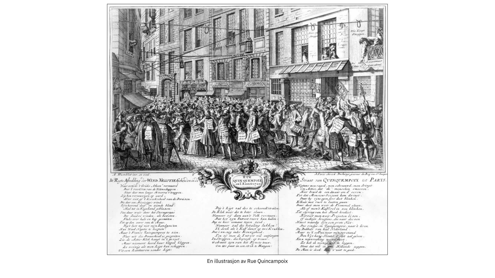

### Når land blir "sikkerhet"

Et århundre senere brøt den franske revolusjonen ny mark med **assignats**, en valuta støttet av beslaglagt kirkegods. På papiret var dette en attraktiv idé - å omdanne jord til pengesikkerhet - men den var ineffektiv: Jord er verken likvid eller delelig. Resultatet: hyperinflasjon, flere forbud mot bruk av jord, ukontrollert inflasjon og knapphet.

Napoleon, som var dypt berørt av dette kaoset, gjeninnførte gull og sølv som monetær basis i 1800 med opprettelsen av Banque de France, og garanterte dermed regelmessig utbetaling av lønn til sine hærer. En pragmatisk måte å gjenvinne tilliten på: å betale i hard valuta.

### De brølende tjueårene og den store depresjonen i 1929

La oss hoppe over to århundrer. Etter første verdenskrig finansierte regjeringene innsatsen gjennom inflasjon og suspendering av gull. På 1920-tallet førte den amerikanske sentralbanken en altfor lempelig pengepolitikk for å støtte det britiske pundet. Resultatet: lett kreditt, uhemmet spekulasjon på Wall Street, aksjekjøp på kreditt og fremveksten av en eiendoms- og bankboble.

Da maskinen gikk i spinn, var krakket i 1929 uunngåelig: massive bankkonkurser, rekordhøy arbeidsledighet og køer ved suppekjøkkenene. Dette ga opphav til den seiglivede misforståelsen om at **all deflasjon er dårlig**, mens vi må skille mellom deflasjon gjennom vekst (sunt) og deflasjon gjennom gjeld (ødeleggende).

### Asia på 90-tallet og dominoeffekten

På 1990-tallet var det "asiatiske mirakelet" en drøm for hele verden. Exchange-kursen var knyttet til dollaren, veksten var på 8-10 %, og vestlig kapital strømmet inn. Alt var bra ... helt til tidevannet trakk seg tilbake. Konkursene haglet, valutaene ble devaluert med 80 %, og investorene ble ruinert. IMF måtte gripe inn og innføre smertefulle reformer. Det samme scenariet som alltid: overflod av kapital, kredittfinansierte bobler, og så kollaps.

### 2008 og den permanente boblens æra

Internettboblen (2000) ble etterfulgt av subprime-boblen i eiendomsmarkedet. Verdipapirisering forvandlet banklån til "trippel-A"-finansprodukter som ble spredt over hele verden. Løftet var å eliminere risiko ved å utvanne den. I virkeligheten var all risiko korrelert. Da eiendomsmarkedet kollapset, kollapset også hele det globale banksystemet.

Resultatet: massive offentlige redningsaksjoner, kvantitative lettelser og nullrenter. Og med det et hodeløst rush: Hver krise vil ikke lenger rense ut overskridelsene, men vil bli dekket av stadig mer gjeld og pengetrykking. Det er dette som har ført til dagens situasjon: **"Alt-boblen"**, der alt - aksjer, eiendom, kunst, krypto, til og med Pokémon-kort - blåses kunstig opp.

### De magiske pengenes evige gjenkomst

Fra det ene århundret til det neste er det én konstant: Så snart et samfunn tror at det kan skape rikdom med penger i stedet for å produsere virkelige varer, oppstår det bobler. Fra John Law til 2008, fra rue Quincampoix til Wall Street, gjentar prosessen seg: eufori, kreditt, boom og bust.

Og til slutt, når ingen lenger stoler på papir, ser folk seg om etter noe annet - gull, land, trygge havner ... eller nye valutaer. I går innførte Napoleon metall, i dag ser noen Bitcoin som etterfølgeren.

Finanshistorien er en uendelig syklus: trykke, spekulere, kollapse. Inntil neste boble.

## Penger og vold

<chapterId>9486fe64-854f-5e17-86b3-8873baca39a8</chapterId>

:::video id=bd6d0807-2d8f-4637-a0f5-1e990e5c0d0f:::

I denne korte delen vil jeg ta for meg mange av de hendelsene vi allerede har sett gjennom kurset, og oppsummere noen anekdoter som jeg synes er interessante.

### Teknologi og vold

Her er noen anekdoter som vi sannsynligvis allerede har snakket om på kurset. De tjener som innledning til en veldig fascinerende diskusjon jeg hadde med Theo om et foredrag han holdt på B-Ondy, som jeg syntes var veldig interessant med tanke på hvordan teknologiske fremskritt påvirker voldsforholdet mellom befolkningen og staten.

### Penger og statlig tvang

Som innledning til denne delen vil jeg gi deg en kort og ikke-uttømmende liste, bare for å minne deg på de hendelsene vi sannsynligvis allerede har vært innom i løpet av kurset.

En kobling jeg allerede kan gjøre med penger og vold, er at når det gjelder verdiløse papirpenger som kan trykkes i det uendelige, kommer de ofte med alle slags regler og alle slags trusler. Vi kan allerede snakke om assignatene, der det bokstavelig talt sto skrevet på sedlene at falskmyntnere ble truet med døden. Det er lett å finne i datidens lovtekster dødstrusler mot dem som ikke aksepterte disse berømte papirpengene.

For å bli i Frankrike, så jeg i en av lovtekstene jeg fikk tak i fra revolusjonstiden, at "dagpengene" for transport og drift av giljotinen var beskrevet i de valutarelaterte delene. Dette syntes jeg var ganske sprøtt.

Vi har også snakket om myntvesenet i Kina, der staten overvåket myntpresseriet. Vi så i et avsnitt i begynnelsen av kurset at når mynter, hvorav noen var mindre vakre, ble kastet, fikk det juridiske konsekvenser.

Det finnes også en anekdote om en konge i England som endte med å kutte hendene av dem som preget penger, hvis de ikke oppførte seg som han forventet.

I Kina har jeg også lest om beslagleggelsen av kobber fra buddhistiske klostre. På et tidspunkt da kobberet økte i verdi og destabiliserte økonomien deres - som var basert på en form for fiat-penger som hadde lite å gjøre med metallets verdi - fant de et sted der det fantes rikdom, og beslagla kobberet fra klostrene.

Det samme gjaldt klostrene i England under den engelske reformasjonen. Da den berømte kongen kranglet med paven om skilsmissen, lå det en annen grunn bak det hele: Han utnyttet avskaffelsen av klostrene til å legge beslag på rikdommene som lå i disse kirkelige organisasjonene.

Under den franske revolusjonen beslagla de alle kirkens eiendeler. De så vakre mynter laget av nedsmeltede kirkeklokker.

Hvis vi går enda lenger tilbake, er en av de mest eksplisitte forestillingene om økonomisk vold og frihet, om liberticidale lover, **Diokletian med sin arvelige kaste, som var direkte knyttet til det faktum at bøndene ikke lenger ville akseptere den devaluerte valutaen**. De ville forlate sitt arbeid som bønder, og Diokletian reagerte ganske enkelt ved å fortelle dem at "dere kan ikke forlate deres jord, og det kan heller ikke deres barn". Det samme gjaldt soldatene.

Jeg synes det er en ganske eksplisitt form for vold. Jeg kunne avslutte med å snakke om Tempelridderne eller en fransk konge. Da Tempelridderordenen slo seg ned i Frankrike, kan jeg tenke meg at han så tempelriddernes rikdom og fikk problemer med statsfinansieringen. Han saksøkte Tempelridderordenen, og noen av dem klarte å stikke av med en del av skatten, noe som har gitt opphav til et veldig interessant show i USA eller Canada. Jeg vet ikke hvem som har produsert den, men den heter *The Mystery of Oak Island*. Den handler om folk som tror at det ligger en tempelridderskatt begravd på en øy i Canada, i Maritimes, og de har boret i årevis - kanskje til og med mer enn ti år - for å lage en slags brønn. De har funnet en brønn med mange gallerier, og de leter etter en skatt som Tempelridderne har gravd ned på denne øya, som er temaet for dette TV-programmet. Jeg hilser min far, som er en stor fan av denne serien.

Så der har dere det: en veldig rask liste over fakta vi har sett i løpet av dette kurset, og som jeg mener øker koblingen til vold. Jeg overlater neste del til Theo, som kommer til å fortelle oss en veldig interessant historie om teknologisk endring og maktbalansen mellom pøbelen og autoritetene.

Takk skal du ha!

## De økonomiske konsekvensene av organisert vold

<chapterId>66bd4674-2159-5489-ad4b-ec5e3fb691af</chapterId>

:::video id=c8b063c6-aeb4-4a94-9027-b11d369e71a4:::

### Organisert vold og statens utvikling

Historikeren Frederic C. Lane fremsetter en revolusjonerende tese: Statens anatomi gjennom historien er formet av teknologiene som brukes til å projisere vold. Med utgangspunkt i det weberianske prinsippet om at staten har monopol på legitim vold, observerer Lane at dette monopolet - som paradoksalt nok er mer effektivt enn konkurranse på dette feltet - utvikler seg i henhold til forholdet mellom kostnadene ved angrep og kostnadene ved forsvar.

Denne analysen, som forfatterne av "The Sovereign Individual" (1997) har tatt opp, forklarer de historiske mutasjonene i politisk organisering: fra middelalderens føydalsystem til renessansens bystater, deretter til de industrielle nasjonalstatene og til slutt til de moderne velferdsstatene. Hver overgang tilsvarer et stort teknologisk gjennombrudd i voldsutøvelsen, som inntreffer omtrent hvert 400-500 år.

### Middelalderens balanse

I middelalderen var jordbruksøkonomien over 90 prosent dominerende. Bonden, som bokstavelig talt var rotfestet til sin jord, kunne ikke flykte fra herren og hans riddere. Militær teknologi - håndsmidde rustninger, årelang trening med sverd - var ekstremt kostbar. Denne asymmetrien favoriserte angrep fremfor forsvar.

Den ubevegelige jordbruksprodusenten blir den lokale voldsmonopolistens fange. Hans evne til å kreve inn skatt når nye høyder - selv om middelalderens skatter paradoksalt nok er beskjedne sammenlignet med de 78 % av tvangsavgiftene som kreves inn i moderne tid. Herremannen kan skattlegge etter eget forgodtbefinnende, fordi bonden verken kan gjøre motstand eller dra sin vei.

### Kjøpmannens renessanse

Fremveksten av hanseatene i nord og middelhavshandelen i sør forandret situasjonen. Kjøpmennene, som var de viktigste verdiskaperne, hadde mobil kapital - skipene sine. De trengte bare lette sjømilitser, ettersom havene var vanskelige å overvåke. Fremfor alt kunne de enkelt migrere til en nabohavn hvis skattene ble for høye.

Denne mobiliteten skapte skattekonkurranse mellom bystatene. Venezia, Genova og Brugge måtte tilby et så liberalt rammeverk som mulig: pålitelige kontrakter, kvalitetsvaluta, forsikring og minimal beskatning. Fyrstene måtte forføre snarere enn å tvinge. Symmetrien snur: Det blir lettere å forsvare seg (gjennom flukt) enn å angripe.

### Den industrielle æra

Den industrielle revolusjonen førte med seg en form som minner om føydalismen. Fabrikker, jernbaner og samlebånd representerer massive, immobile investeringer. Henry Ford kunne ikke flytte fabrikkene sine på grunn av beskatning. Arbeiderne, som var konsentrert i industribyene, organiserte seg i fagforeninger for å forhandle kollektivt i stedet for å migrere individuelt.

"Velferdsstaten" vokste frem: industriplanlegging (Japan, Korea), militær beskyttelse av infrastruktur, sosiale minsteytelser til arbeidsstyrken. Andre verdenskrig illustrerte denne sårbarheten: Bombing av fiendens fabrikker ble den dominerende strategien. Konsentrasjonen av fysisk kapital gjorde det mulig å finansiere velferdsstaten ved hjelp av massiv skatteinnkreving.

### Mikroprosessorrevolusjonen

Tre teknologiske nyvinninger er nå i ferd med å forrykke denne gamle balansen. Mikroprosessoren er i ferd med å forandre krigføringen: En operatør i Nevada styrer en drone i Afghanistan med kirurgisk presisjon. Gulfkrigen (1991) demonstrerte dette gjennombruddet: Verdens fjerde største hær (Irak) ble utslettet i løpet av 45 dager, med færre enn 200 døde på koalisjonens side. Teknologisk overlegenhet gjorde frontalangrep umulig.

Internett og asymmetrisk kryptografi revolusjonerer verdiskapningen. En utvikler kan jobbe hvor som helst med en MacBook og Starlink, og eksportere produksjonen sin umiddelbart og kostnadsfritt. Digitale nomader unnslipper geografisk fangenskap og setter stater opp mot hverandre på en måte som vi ikke har sett siden renessansen.

Bitcoin representerer kulminasjonen av denne logikken: en valuta frigjort fra staten, beskyttet av et ukrenkelig kryptografisk skjold. Rikdom kan forsvares mot enhver fysisk makt. Individet gjenvinner evnen til å forsvare seg mot statsmonopolet.

### Den westfalske modellens sammenbrudd

Vestlige velferdsstater, utformet for den industrielle tidsalder, er i ferd med å bli foreldet. Verdiskapere - utviklere, kunstnere, finansfolk - migrerer til Singapore, Dubai eller El Salvador, og foretrekker færre offentlige tjenester i bytte mot minimal beskatning. Moderne giganter som Apple og Tether trenger verken kontorer eller fysisk infrastruktur.

Denne hjerneflukten skaper en spiral: færre nettobidragsytere, dårligere offentlige tjenester, økt beskatning av dem som blir igjen, og raskere avgang. Stater må redusere størrelsen radikalt eller gå konkurs. Fragmentering i små, konkurransedyktige jurisdiksjoner - en ny modell med digitale bystater - synes uunngåelig.

Historien har lært oss at slike overganger tar generasjoner. Men Bitcoins separasjon av valuta og stat kan fremskynde prosessen. Enkeltpersoner stemmer nå med føttene og sine kryptografiske lommebøker, og tegner om kartet over global makt langs linjer vi bare så vidt har begynt å ane konturene av.

## En veldig kort historie om finans

<chapterId>1d37fff1-a091-5034-8e71-4af590b8ffce</chapterId>

:::video id=fdfabbc6-e4d8-463a-8522-19176f8fb460:::

Etter denne redegjørelsen for pengenes historie, som tar oss helt frem til fiatsystemet, vil jeg raskt og kortfattet forklare utviklingen av finansvesenet som til slutt førte til velferdsstaten. Til å begynne med, i romertiden, hadde vi mynter.

Mynter var en finansiell teknologi som gjorde det mulig for imperiet å betale soldater, ekspandere og drive handel. Det fungerte veldig bra, bortsett fra at det til slutt ble for mange devalueringer. På et tidspunkt, da de sluttet å ekspandere og sluttet å få utbytte fra kriger og territorieutvidelser, kollapset systemet.

### Utviklingen av finansiell teknologi

Så kom middelalderen, da det skjedde svært lite utvikling frem til florinen, som brakte tilbake en stabil valuta, og bankutviklingen i Italia og Antwerpen, der begrepet "tidsverdien av penger" ble utviklet - med andre ord diskontering. De utviklet diskontering for å skape en form for papirpenger der det ble utstedt et "gjeldsbrev", det vil si et løfte om at man på et senere tidspunkt ville kunne få tilbake 100 dollar pluss en rente.

Dette systemet skapte en finansiell teknologi som gjør det mulig for innehaveren å selge obligasjonen før utløpet av løpetiden, slik at hvis du selger den etter 4 måneder av en 6-måneders løpetid, vil personen faktisk betale en premie for å kompensere for avkastningstapet for de resterende 2 månedene.

Det var en finansiell teknologi som ble utviklet i Antwerpen og Amsterdam på den tiden. Senere så vi utviklingen av sentralbanker og begrepet "lender of last resort". Det kan hevdes at under Bank of Amsterdam ble bruken av mynter i internasjonal handel forlatt til fordel for skriftpenger.

Senere, på 1700-tallet, kan vi snakke om forsikring når det gjelder finansiell teknologi. Det finnes en anekdote som er veldig godt fortalt i Neil Fergusons bok "The Ascent of Money". Det første forsikringsselskapet som ble født, het **Scottish Widowss**, og det var egentlig presteskapet som ønsket å utvikle en forsikring for prester som noen ganger døde tidligere, døde plutselig. På den tiden passet prestene på konene sine og avkommet sitt i Skottland i ett år. Så presteskapet syntes at denne ettårsperioden kanskje var litt for kort. Derfor oppfant de **aktuarberegninger** for bokstavelig talt å beregne hvor mange bidragsytere som var nødvendige for at systemet skulle dekke kostnadene, avhengig av hvor mange prester som døde for tidlig.

De utviklet aktuarberegninger for å si: "Ok, vel, hver prest gir oss dette beløpet. Hvis presten dør, vil forsikringen dekke kostnadene for å sikre at hans kone og barn overlever til de er selvforsørgende." Så det var det første forsikringsselskapet kalt "Scottish Widows" som populariserte dette systemet, og hvor det ble tatt i bruk.

### Fra privat forsikring til velferdsstat

Så forsikring er en del av den finansielle teknologiens historie. Og dette bringer meg til begrepet velferdsstat, som handler om at private forsikringer etter hvert støtte på et problem, et begrep om optimalisering, der vi sier til oss selv at hvis vi tilbyr helseforsikring til folk som er friske, vil de kanskje ha mindre interesse av å betale premien fordi de sier til seg selv: "Jeg er frisk, jeg blir ikke syk". På den annen side vil folk som vet at de er syke, helt sikkert ønske å tegne forsikring.

Dette systemet skaper en ubalanse mellom antallet syke mennesker som vil tegne helseforsikring, i motsetning til friske mennesker som kanskje vil tegne mindre. Det er altså en slags ubalanse: Hvis man regner på tallene, vil de ikke gå i balanse, fordi man sannsynligvis ikke vil kunne forsikre nok friske mennesker til å oppveie kostnadene. I økonomi er dette begrepet **moralsk hasard**.

En av ideene som har blitt fremmet, er å gjøre forsikring obligatorisk. Hvis alle er forpliktet til å bidra, balanseres det hele, og både friske og usunne mennesker vil bidra, slik at risikoen fordeles på den største delen av befolkningen.

I mange deler av verden har staten derfor sagt: "Det tar vi oss av". Jeg er ikke ekspert på dette, men jeg ser at det samme resonnementet sannsynligvis gjelder for alle mulige andre former for forsikring, som for eksempel arbeidsledighetsforsikring. Det er et ønske om å forenkle og optimalisere, ut fra tanken om at det blir enklere hvis det bare er én organisasjon som tar seg av det.

Etter min mening førte dette til en sentralisering av alle disse forsikringskonseptene, og til syvende og sist til velferdsstatens fødsel, der alle disse finansielle konseptene som opprinnelig var private foretak, private initiativ for å dekke et forsikringsmarkedsbehov for å fordele risiko blant befolkningen, ble overtatt av staten av grunner som sannsynligvis er ganske logiske i forhold til moralsk hasard og ønsket om å optimalisere.

### Alternative modeller og refleksjoner om statlige monopoler

I noen land, som Canada, ender vi til slutt opp med flere typer forsikringer - helseforsikring, arbeidsledighetsforsikring - som er statlige monopoler.

Jeg kan gi deg et eksempel jeg kjenner. I Sveits er systemet litt annerledes. Det finnes private gjensidige forsikringsselskaper og private sykehus, så du kan velge ditt gjensidige forsikringsselskap, du kan velge din pakke innenfor ditt gjensidige forsikringsselskap. Du får fortsatt relativt universelle tjenester, selv om en stor del av dette systemet forblir privat.

Så jeg tror det er mulig at det også er privatdrevet. Men alt jeg ønsket å beskrive for deg, er faktisk ikke en uttalelse for å uttrykke om det ene systemet er bedre enn det andre, det var snarere for å forklare deg at når jeg leste om finanshistorien, skjønte jeg hvorfor i Vesten, spesielt i Frankrike, spesielt i Canada, ønsket staten å ta kontroll over disse finansielle prinsippene.

Poenget mitt er at forsikringskonseptet først og fremst er en videreutvikling av finansverdenen, og som regjeringer noen ganger er så flinke til, vil de prøve å ta kontroll over den, akkurat som de har prøvd å ta kontroll over penger, av flere grunner. En av grunnene er for øvrig begrepet "lender of last resort".

Tanken er at det er mye bedre hvis det står en stor institusjon bak som fordeler risikoen bredere. Det var det opprinnelige initiativet bak ideen om "lender of last resort", der denne institusjonen faktisk kunne velge ut institusjoner som var sterke nok til å overleve, og forhindre at de kollapset ved å låne dem penger.

På den tiden var det en reell analyse da dette konseptet endelig dukket opp for første gang, men det som endte med å skje, er at vi redder alle, "too big to fail", det gjelder nesten alle bankene fordi det er sentralisering, og også alle de store selskapene. Til slutt ser vi at det fortsatt er et konsept som brukes "i det store og hele" av staten, i likhet med forsikringskonseptet som jeg nettopp har beskrevet for deg.

Til slutt bestemmer staten seg for at den skal ta seg av alt, og forvandler en finansiell teknologi som ble skapt i Skottland for å løse et spesifikt problem, til den enorme velferdsstaten vi kjenner i dag. Den bruker aktuariske finansielle prinsipper for å tilby tjenester til befolkningen som trenger det. Vi kan imidlertid være enige om at monopolene som oppstår som følge av dette systemet, skaper alle slags problemer, noe vi i dag opplever i land som Canada og Frankrike. Heldigvis finnes det andre modeller, som for eksempel den i Sveits.

Vi må rett og slett innse at dette velferdsstatskonseptet har sitt utspring i finansverdenen. Denne erkjennelsen tilsier at vi kan utforske andre veier enn de berømte statsmonopolene, og jeg vil til og med anvende dette resonnementet på konseptet om sentralbanker som långivere i siste instans - men det er et tema for en annen gang.

# Siste del

<partId>9bada469-7ef0-511a-9eaa-f8eb66d5906f</partId>

## Evaluer dette kurset

<chapterId>a9494e2b-8a4d-5811-8a7b-b4a91fb22778</chapterId>

<isCourseReview>true</isCourseReview>

## Konklusjon

<chapterId>1094e793-b4c6-5782-aa4a-71cde00ce7c0</chapterId>

<isCourseConclusion>true</isCourseConclusion>