# Een reis door de geschiedenis van de muntslag

Deze boeiende cursus neemt je mee op een verkenningstocht door de fascinerende evolutie van geld vanaf de vroegste beschavingen tot ons huidige monetaire systeem. We doorkruisen de eeuwen, van het neolithicum tot de moderne tijd, en ontdekken hoe geld gevormd is en gevormd werd door de grote menselijke beschavingen. Van Mesopotamisch proto-geld tot cryptocurrencies, Lydische munten, de renaissance florijn en de komst van centraal bankieren - deze cursus biedt een uitgebreid perspectief op een van de fundamentele pijlers van onze samenlevingen.

+++
# Inleiding

<partId>59878a67-8a1d-5d6b-af41-5b847c14363c</partId>

## Inleiding tot de geschiedenis van het geld

<chapterId>ca53597e-be9a-5261-a55f-11fac8504a68</chapterId>

:::video id=08ff35ca-8a40-4286-abaf-71283faf6e78:::

Welkom bij deze cursus over de geschiedenis van geld. Zoals de titel al aangeeft, gaan we samen de historische evolutie van munten verkennen. Van het neolithicum tot nu bekijken we de belangrijkste rijken en beschavingen uit het verleden.

Deze cursus beperkt zich echter niet tot een eenvoudige chronologie van data of historische gebeurtenissen. Ons echte doel is om een diepgaand begrip te krijgen van de fundamentele concepten die betrokken zijn bij het ontstaan van geld, of beter gezegd, valuta.

### Fundamentele concepten om te verkennen

We hebben het dus over ontstaan: het ontstaan van munteenheden zelf, van monetaire systemen, van banken, van papiergeld, van centrale banken, en uiteindelijk, het ontstaan van het huidige "fiat" monetaire systeem.

We beginnen onze reis naar proto-valuta met het ontstaan van schuldgeld en rekeneenheden in Mesopotamië, evenals andere systemen zoals bruidsschat en bloedgeld in primitieve samenlevingen. We zullen ook zien hoe echte monetaire systemen al bestonden in het oude Egypte, ver voor het Middenrijk.

Daarna gaan we verder met het verschijnen van de eerste munten in Lydië, een sleutelmoment dat volgens de economieboeken vaak wordt beschouwd als het echte begin van het geld. We zullen onderzoeken hoe deze munten zich konden verspreiden dankzij de Perzen, Alexander de Grote en vervolgens Rome, voordat ze zich uiteindelijk opdrongen, domineerden en ten onder gingen.

Van daaruit zullen we, gewapend met alles wat we geleerd hebben, de tijd nemen om samen na te denken over de definitie van geld, en verder gaan dan vooroordelen als "geld is altijd een schuld" of "geld is altijd een handelswaar". In werkelijkheid is geld zowel een goed als een sociale conventie. We zullen in het bijzonder het concept van de geldpremie bespreken en proberen de verschillende theorieën die het ontstaan van geld verklaren, te verenigen.

### Belangrijke perioden en monetaire innovaties

We gaan dan over naar een onrustige periode, gekenmerkt door een zekere instabiliteit op monetair gebied, waarin niettemin opvallende innovaties ontstonden zoals de Engelse penny, die werd gebruikt om Deense indringers om te kopen, en het pond van Karel de Grote, waarvan de herinnering nog steeds voortleeft op sommige moderne bankbiljetten.

We bekijken ook hoe tijdens de kruistochten de eerste systemen voor het overmaken van geld op afstand ontstonden. Dan is het tijd om te kijken naar de invloed van de Florin, de munteenheid die bij de Renaissance hoorde, en de komst van edelmetalen uit Amerika, die een diepgaand effect hadden op de Europese prijzen.

We kijken in detail naar de opkomst van papiergeld en centraal bankieren en trekken parallellen met de geschiedenis van financiële crises en hun vaak gewelddadige gevolgen.

Tot slot trekken we een parallel met ons huidige monetaire systeem, onderzoeken we de gevolgen ervan en volgen we de geschiedenis van de financiële wereld om beter te begrijpen hoe we tot de huidige welvaartsstaat zijn gekomen.

En als bonus kijken we ook naar de vele fascinerende etymologische verbanden met geld, die ons dagelijks leven in verschillende talen blijven beïnvloeden.

### Cursusstructuur

Deze cursus is verdeeld in drie grote delen.

Deel I gaat in op het ontstaan van geld, deel II op de renaissance van geld en de ondergang ervan, en deel III laat zien hoe staatsinstellingen of de staat geleidelijk de controle over geld overnamen, wat leidde tot het huidige fiatsysteem.

Bedankt en geniet ervan!

# De opkomst van beurzen

<partId>da5e4981-9ea5-5208-beab-3b75c9043632</partId>

## Van Australopithecus tot de moderne mens

<chapterId>34a773aa-f2d3-5c26-8be4-f2cd79ed6fbc</chapterId>

:::video id=4f333013-4b2a-42ab-8761-593fafc971ca:::

### Waarom beginnen in het neolithicum

Waarom helemaal teruggaan naar het neolithicum om over geld te praten? Het antwoord is simpel: we kunnen het ontstaan van geld niet volledig begrijpen zonder ook te kijken naar het ontstaan van beschavingen zelf. Om te begrijpen waarom de eerste monetaire systemen ontstonden, moeten we begrijpen wat nomadische jager-verzamelaars ertoe bracht om zich te vestigen.

Een stam zonder arbeidsverdeling, zonder specialisatie, waar elk individu verantwoordelijk is voor de productie van wat hij of zij nodig heeft, heeft eenvoudigweg geen geld nodig. Evenzo heeft een agrarische gemeenschap die alleen zelfvoorzienende landbouw bedrijft, waar iedereen voor zichzelf cultiveert, nog geen behoefte aan een universele ruiltussenpersoon.

### Sedentarisatie en de gevolgen ervan

Daarom denk ik dat het interessant is om onze verkenning te beginnen in het neolithicum. We zullen zien hoe sedentarisatie geleidelijk dorpen deed ontstaan, daarna steden en uiteindelijk grote beschavingen. Het was deze sedentarisatie en de productie van voedseloverschotten die arbeidsspecialisatie mogelijk maakte en zo de vruchtbare bodem creëerde die essentieel was voor het ontstaan en de evolutie van de eerste monetaire concepten.

Net zoals menselijke interacties aanleiding geven tot taal, kunnen we ervan uitgaan dat geld van nature verschijnt, of juist niet (zoals bij de Inca's en de Spartanen), in de loop van de vorming en organisatie van beschavingen. Naar mijn mening heeft het al dan niet verschijnen van geld alles te maken met de vorm van sociale en economische organisatie van elke samenleving.

### Chronologie van de menselijke evolutie

Maar laten we eerst eens kijken naar een nog bredere historische context.

Zoals bij elke eerste presentatie ga ik precies het tegenovergestelde doen van wat ik in de inleiding van de cursus zei en je een lijst geven van data en historische gebeurtenissen die op elkaar volgen. Het idee hier is om het ontstaan van geld in zijn historische context te plaatsen, in relatie tot andere menselijke ontwikkelingen zoals het koken van voedsel, het wiel, het domesticeren van bepaalde granen en dieren, het bouwen van de piramides en het stichten van de eerste steden.

Laten we eens kijken naar de evolutie van de mensheid vanaf de prehistorie.

Een overzicht van de menselijke evolutie van Australopithecus tot de moderne mens, waarbij technologische vooruitgang en volksverhuizingen worden gevolgd tot aan het neolithicum.

### Historische context van de mensheid

- 3 miljoen jaar geleden** - Verschijning van *Australopithecus*.
- 2 miljoen jaar geleden** - Homininen beginnen Afrika te verlaten.
- 1.6 miljoen jaar geleden** - Homininen bereiken Zuid-Europa en Azië.
- 1 miljoen jaar geleden** - Eerste bewijs van koken met vuur (verkoolde botten en plantenresten in Wonderwerk Cave, Zuid-Afrika).
- Rond 400.000 voor Christus** - Neanderthalers leven in Europa en Azië.
- Rond 300.000 voor Christus** - Verschijning van *Homo sapiens*.
- 80.000 jaar geleden** - *Homo sapiens* begint te migreren naar alle delen van de wereld.
- 73.000 jaar geleden** - Blombos Grotten in Zuid-Afrika (oudst bekende kunstvormen).
- 50.000 jaar geleden** - *Homo sapiens* bereikt Europa.
- 30.000 jaar geleden** - Grottekeningen uit de Chauvet grot in Frankrijk.
- 15.000 jaar geleden** - Lascaux grotschilderingen in Frankrijk en Australische rotskunst.
- Rond 9000 voor Christus** - Domesticatie van gerst in de Vruchtbare Halve Maan.
- Rond 9000 voor Christus** - Maïsteelt in Mexico.
- Rond 8000 voor Christus** - Domesticatie van geiten en schapen in de Vruchtbare Halve Maan.
- Rond 7250 voor Christus** - Ain Ghazal (Jordanië) onthult een dorp met een paar honderd inwoners.
- Rond 7000 voor Christus** - Çatalhöyük (Turkije) heeft tot 8.000 inwoners.
- Rond 6500 voor Christus** - In Griekenland begint het sedentaire leven.
- 6000 jaar geleden** - Begin van irrigatie via rivieren in Egypte en Mesopotamië.
- Rond 5000 voor Christus** - Verschijning van de "drie zussen" landbouwcombinatie (maïs, pompoen, bonen).
- Rond 4000 voor Christus** - Domesticatie van de kameel in Centraal-Azië. (De familie van de kameelachtigen ontstond in Noord-Amerika tijdens het Eoceen 45 miljoen jaar geleden. Deze kamelen zouden vervolgens naar Azië zijn gemigreerd via een dunne strook land die de twee continenten in die tijd met elkaar verbond in de Beringstraat. Een ander deel van de familie zou naar Zuid-Amerika zijn getrokken, waar de afstammelingen vandaag de dag nog steeds leven: lama's, alpaca's en vicuña's).
- Rond 3500-3000 voor Christus** - Het Botai volk begint paarden te domesticeren en te fokken.
- Rond het begin van het Bronzen Tijdperk** - De Sumeriërs hadden het wiel en de zeilboot al uitgevonden en rekenkunde, astronomie en de eerste vorm van schrijven ontwikkeld.
- Rond 2800 v.Chr.** - Uruk bereikte op zijn hoogtepunt een bevolking van 80.000 mensen.
- 2600-2200 voor Christus** - Eerste tekenen van stedelijke ontwikkeling in de Griekse wereld. Uitbreiding van de mediterrane teelten (tarwe, wijnstokken, olijven).
- 2560 voor Christus** - Bouw van de Grote Piramide van Gizeh.
- Rond 1500 voor Christus** - Minoïsche beschaving.
- Rond 1300 voor Christus** - Myceense beschaving.
- Rond 1250 tot 1150 voor Christus** - Ineenstorting van de beschavingen uit de Bronstijd.
- 1e eeuw na Christus** - Noord-Afrikaanse Berbers domesticeren de kameel.

Hier is dus dit historische overzicht om ons een perspectief te geven op de opkomst van bepaalde technologieën, de domesticatie van bepaalde dieren en culturen, om het in context te plaatsen met de opkomst van het schrift en geld, wat het onderwerp zal zijn van onze volgende paragraaf.

## Van jager-verzamelaar tot boer: De dageraad van de beschaving

<chapterId>ea950b6e-9eb7-553d-8f04-0eb042bb1f5a</chapterId>

:::video id=4b49a376-f6f4-42a0-86fa-264997a079f0:::

### De overgang naar landbouw en sedentarisatie

In dit hoofdstuk gaan we het hebben over de overgang van jagen en verzamelen naar zelfvoorzienende landbouw, ambachten en handel. Ik vond het belangrijk om deze overgang naar een sedentair leven en landbouw uit te leggen, om te begrijpen hoe de eerste steden werden gebouwd, wat uiteindelijk leidde tot het ontstaan en de opkomst van bepaalde monetaire systemen in de Oudheid.

Dit gedeelte is een uittreksel van een cursus op de website van The Great Courses genaamd Ancient Mesopotamia, Life in the Cradle of Civilization, gegeven door professor Amanda Podany van de California State Polytechnic University, Ponoma.

### De paradoxen van het invoeren van landbouw

Primitieve landbouw verscheen ongeveer 10.500 jaar geleden in het Nabije Oosten, rond het noordwesten van Syrië en het zuiden van Turkije. Vandaag de dag hebben moderne jager-verzamelaars geen haast om over te schakelen op landbouw, en hetzelfde gold waarschijnlijk voor de neolithische periode.

**De eerste dorpen werden duidelijk gebouwd vóór de domesticatie van planten en dieren.** Mensen vestigden zich niet omdat de landbouw hen daartoe in staat stelde; integendeel, ze vestigden zich eerst en pas veel later, ongeveer 3.000 jaar later, begonnen ze landbouw te bedrijven.

Jagen en verzamelen werkte gewoon heel goed, dus ze hoefden geen zaden te planten om hun voedsel te produceren. Tegenwoordig hebben jager-verzamelaars veel meer vrije tijd dan de eerste boeren, die zeer rudimentaire technologieën gebruikten.

Dus, wat we hier zeggen is dat moderne primitieve jager-verzamelaarsvolken meer vrije tijd hebben dan we begrijpen van de eerste boeren uit het Neolithicum, die tenslotte vrij rudimentaire technologieën hadden om te verbouwen. Deze mensen werkten harder om voedsel te produceren dan onze moderne primitieve stammen, die leven van jagen en verzamelen.

Botstudies tonen ook aan dat de eerste boeren kleiner en minder robuust waren dan de jager-verzamelaars die hen voorgingen. Het dieet van de boeren was beperkter dan dat van de jager-verzamelaars. Ze aten veel meer brood, maar veel minder vlees, en hadden ook een slechter gebit door de steenslag die werd gebruikt bij de productie van meel. Als ze meel maakten met stenen, maakte dat splinters.

Degenen die het "keto" dieet volgen zullen het ermee eens zijn: veel brood eten is waarschijnlijk niet zo goed als vlees eten.

### Theorieën over de invoering van landbouw

Wie zou er toen, gezien al deze nadelen, voor gekozen hebben om boer te worden? Nou, sommige populaire theorieën suggereren dat mensen gedwongen werden om landbouw te gaan bedrijven en dat het niet echt een keuze was. Zelfs met wilde granen was er een groot probleem. Grote hoeveelheden graan konden niet gemakkelijk worden vervoerd. Ze moesten ergens opgeslagen worden. Als het graan eenmaal opgeslagen was, was het verstandig om in de buurt te blijven. Je kweekte dus wilde granen, wat niet noodzakelijkerwijs landbouw was, en als je het in grote hoeveelheden kweekte, moest je het ergens opslaan, waardoor het moeilijk te vervoeren was. Dit droeg waarschijnlijk bij aan de eerste fasen van sedentarisatie. Het kan heel goed de eerste reden zijn geweest waarom mensen zich op een bepaalde plek vestigden. Als deze plek het hele jaar door voedsel bood, was het niet nodig om kuddes te volgen of voortdurend te reizen.

In de Natoufian cultuur leefden tot honderd mensen samen in dorpen die uit ronde huizen bestonden. Een populaire theorie die het begin van de landbouw verklaart, is dat deze verandering werd gestimuleerd door klimaatverandering. Ongeveer 11.000 jaar geleden werd het klimaat in het Nabije Oosten kouder en droger dan voorheen. Planten en dieren die voorheen overvloedig voorkwamen, werden zeldzamer. Gemeenschappen zouden toen zijn begonnen met het cultiveren van de planten waarvan ze afhankelijk waren, of met het houden van jonge dieren om ze groot te brengen en er hun voordeel mee te doen, zoals schapen, geiten en runderen, die zich goed zouden lenen voor een dergelijke fokkerij. Dit zou een zeer geleidelijk proces zijn geweest. Er was dus geen precies moment waarop ze allemaal boeren werden die dieren domesticeerden.

Een andere theorie is dat de dorpen zelf het probleem creëerden dat door domesticatie werd opgelost. Intensief jagen en verzamelen zou de natuurlijke omgeving hebben gedestabiliseerd. Volgens één hypothese hadden de Natoufiërs zo'n demografisch succes behaald dat ze te talrijk waren geworden voor hun directe omgeving. Zo waren de moerassen en gebieden waar natuurlijke gewassen werden verbouwd misschien niet productief genoeg voor de bevolking van het dorp. De directe omgeving was niet in staat om iedereen te voorzien. Ze zouden dan ter plekke zijn gaan verbouwen om hun voedselvoorraad te vergroten.

## Neolithische handel

<chapterId>8e495224-6d55-58f6-a9dc-ac2814281cfa</chapterId>

:::video id=d04245af-e416-48b1-8157-d569207a32c4:::

### De overgang Paleolithicum-Neolithicum

Het neolithicum markeert een fundamentele breuk in de menselijke geschiedenis, in schril contrast met de paleolithische samenlevingen die eraan voorafgingen. In het Paleolithicum waren de Europese bevolkingen extreem verspreid: slechts 7.000 mensen bewoonden 20.000 jaar geleden het hele continent, georganiseerd in kleine nomadische groepen van 20 tot 50 individuen die de grote migrerende kuddes over enorme afstanden volgden.

De opwarming van de aarde aan het einde van de ijstijd veranderde deze sociale organisatie radicaal. De opkomst van bossen verving de migrerende fauna door een meer sedentaire bosfauna, waardoor menselijke groepen semi-sedentair konden worden. Deze transformatie ging gepaard met een spectaculaire demografische groei: van een geschatte Europese bevolking van tussen de 10.000 en 50.000 aan het einde van het Paleolithicum, steeg de bevolking in het Midden- en Eindneolithicum tot tussen de 1 en 5 miljoen inwoners.

### De uitvinding van werk en eigendom

Deze geleidelijke sedentarisatie leidde tot diepgaande sociale transformaties. **Uit de neolithische landbouw ontstond de moderne notie van werk**: gehechtheid aan een specifiek territorium betekende zorg dragen voor je eigendom, de vruchten van je arbeid bewaren en toekomstige oogsten plannen. Deze nieuwe relatie met tijd - het huidige gebruik uitstellen voor toekomstig voordeel - zorgde voor een revolutie in de sociale organisatie.

Aardewerk is een perfecte illustratie van deze evolutie: aanvankelijk ontwikkeld om granen en zaden op te slaan, getuigt het van dit nieuwe vermogen om behoeften in de tijd te projecteren. Sommige prehistorici zijn zelfs van mening dat het neolithicum niet mogelijk zou zijn geweest zonder deze opslagsystemen.

**Privébezit kwam naar voren als de centrale instelling** van deze nieuwe samenlevingen. Terwijl individueel eigendom al bestond in het Paleolithicum (persoonlijke jachtsperen), kreeg het in het Neolithicum een ongekende territoriale dimensie. Deze toe-eigening van land genereerde de eerste archeologisch gedocumenteerde intermenselijke conflicten, waardoor de opkomst van een territoriale veiligheidsfunctie noodzakelijk werd.

### Specialisatie en arbeidsverdeling

Landbouw maakte het mogelijk om grotere bevolkingen te voeden, terwijl sommige individuen vrij waren van andere productieve activiteiten. Deze opkomende specialisatie - boeren, pottenbakkers, ambachtslieden, bewakers - legde de basis voor de arbeidsverdeling en sociale hiërarchieën.

Archeologische overblijfselen getuigen van deze groeiende gelaagdheid: begrafenissen evolueerden van collectieve naar gedifferentieerde individuele graven en woningen evolueerden van architecturale uniformiteit naar constructies die verschillende sociale statussen onthullen. Begrafenisvoorwerpen - ornamenten, gespecialiseerde werktuigen, aardewerk - duiden op de opkomst van een begrip van rijkdom en sociaal prestige.

### De opkomst van uitwisselingen op afstand

Archeologische analyse onthult verrassende uitwisselingsnetwerken voor die tijd. Materialen zoals obsidiaan, groen gesteente (doleriet, jadeiet), schelpen en bitumen werden honderden kilometers van hun vindplaatsen gevonden. Bijlen van gepolijst groen gesteente, essentieel voor ontbossing en de bouw van vroege dorpen, circuleerden door heel neolithisch Europa.

Deze uitwisselingen betreffen zowel grondstoffen als afgewerkte objecten, wat een waardering van ambachtelijke specialisatie onthult. De toegekende waarde integreert zowel de zeldzaamheid van het materiaal als de technische vaardigheid die nodig is om het te transformeren.

De organisatie van de uitwisselingen varieert naargelang de beschouwde schaal. **Binnen gemeenschappen** zijn antropologen voorstander van de hypothese van een economie van giften en tegengiften, met informele kredietsystemen gebaseerd op interpersoonlijk vertrouwen. In deze beperkte groepen maakt het "Dunbar-getal" (maximaal 150 personen om directe vertrouwensrelaties te onderhouden) uitgestelde uitwisselingen mogelijk zonder enig marktmechanisme.

Er zijn verschillende soorten ruilhandel:

- De **directe ruilhandel**: onmiddellijke ruil van goed voor goed
- De **uitgebreide ruilhandel**: goederen ruilen voor diensten of beloften
- De **uitgestelde ruilhandel**: interpersoonlijke schuld met latere terugbetaling

**Tussen verschillende gemeenschappen** bevorderde de afwezigheid van banden van persoonlijk vertrouwen het ontstaan van meer geformaliseerde uitwisselingen. Bepaalde goederen verwierven geleidelijk een speciale status doordat ze door buitenlandse groepen konden worden geëist, wat de voorbode was van de eerste vormen van proto-currency.

De Oostenrijkse economische school interpreteert deze evolutie als het spontane ontstaan van geprivilegieerde ruilgoederen. Schelpen, waarvan archeologisch is aangetoond dat ze al in het Mesolithicum werden gevonden, illustreren dit fenomeen: ze werden ver van hun geografische oorsprong gevonden (mediterrane schelpen in West-Frankrijk, Scandinavische schelpen op andere sites) en getuigen van een gemeenschappelijke erkenning van hun ruilwaarde.

Deze goederen onderscheiden zich door hun **mogelijkheid om door anderen te worden gevraagd**, een essentiële eigenschap die de monetaire functie voorafgaat. Hoewel ze niet de standaardisatie van historische munteenheden bereikten, waren ze de eerste stappen in de richting van gedepersonaliseerde ruilsystemen, een voorwaarde voor de ontwikkeling van complexe samenlevingen buiten het tribale kader.

Het neolithicum legde zo de basis voor de moderne economie: specialisatie van arbeid, privé-eigendom, accumulatie van rijkdom, sociale hiërarchisatie en het ontstaan van verfijnde ruilsystemen die de banden van verwantschap en directe nabuurschap overstegen.

## De vorming van de eerste steden en het ontstaan van het schrift

<chapterId>d6b799c2-8bf1-11f0-9c54-1b9f4f4c7011</chapterId>

:::video id=3ca18105-9856-4ceb-925c-c9e9215af21b:::

### Irrigatie en de geboorte van grote steden

In dit hoofdstuk bespreken we hoe de eerste grote steden uit dit deel van de geschiedenis ontstonden en we bespreken uiteraard de redenen achter het ontstaan van het schrift in Mesopotamië.

Ongeveer 6000 jaar geleden, in de vruchtbare valleien van Egypte en Mesopotamië, begonnen menselijke gemeenschappen rivieren te benutten door irrigatie te ontwikkelen. Deze beheersing van het water maakte overvloedige landbouw mogelijk en bevorderde het ontstaan van grote steden zoals de beroemde stad Uruk, gelegen in het huidige Zuid-Irak.

Rond 3500 v.Chr. werd Uruk de grootste stad ter wereld en bereikte zijn hoogtepunt rond 2800 v.Chr. met een bevolking tot 80.000 inwoners. In deze tijd waren er twee belangrijke innovaties die de Sumerische beschaving diepgaand beïnvloedden: de opkomst van een gestructureerde regering die in staat was om een echte staat te besturen en de revolutionaire uitvinding van het schrift.

### De uitvinding van het spijkerschrift

Het schrift ontstond in deze stad rond 3000 voor Christus, voornamelijk om economische redenen. Met het oog op de groeiende complexiteit van de samenleving en haar uitwisselingen hadden beheerders van tempels en paleizen een betrouwbaar hulpmiddel nodig om economische transacties, zoals leveringen van materialen, interne overdrachten en beschikbare voorraden, nauwkeurig vast te leggen.

Het ontwikkelde systeem werd "spijkerschrift" genoemd, van het Latijnse "cuneus" dat "wig" betekent, in verwijzing naar het gebruik van een wigvormige stylus om tekens op vochtige kleitabletten af te drukken.

Hieronder kun je mijn kopie van een tablet met spijkerschrift bewonderen. Om op deze tabletten te schrijven, gebruikten ze volgens mij een soort stylus gemaakt van riet, om de natte klei af te tekenen en de vormen, het spijkerschrift, te creëren.

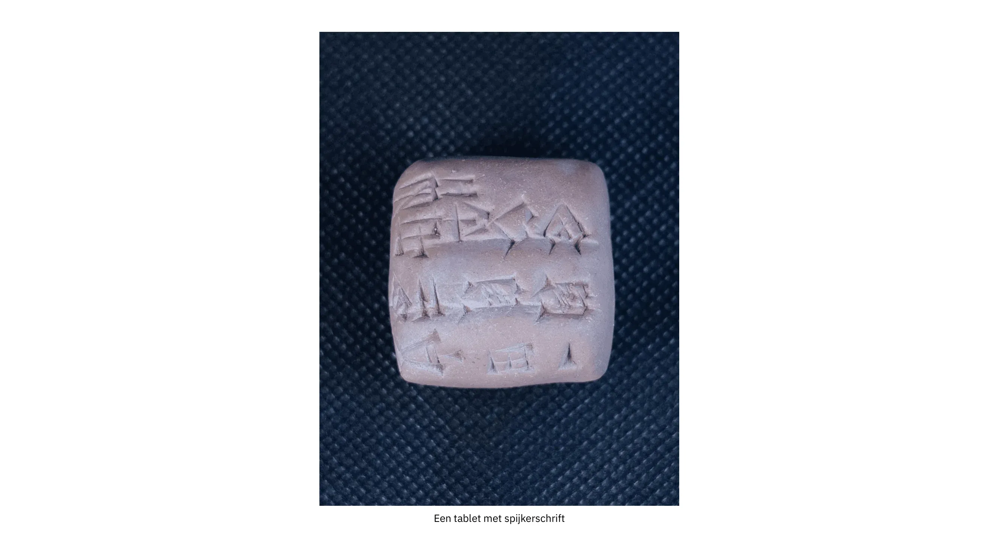

Ik heb ook een volgens mij echt Soemerisch tablet met een klein spijkerschrift in het midden. Op dit tablet staan handtekeningen die zijn gemaakt door een cilinder te rollen, die ik je daarna zal laten zien.

De tekens met kleine cijfers dienden als handtekeningen in een tijd waarin de meeste mensen niet konden schrijven, omdat alleen vaardige schriftgeleerden die vaardigheid hadden.

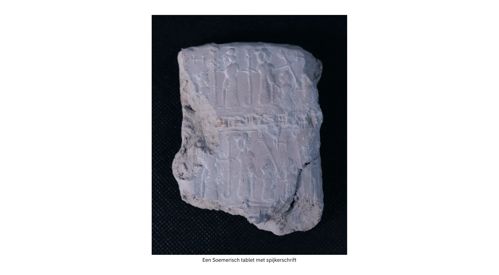

Hieronder zie je de cilinder die hierboven is genoemd: een steen met specifieke vormen erin gegraveerd. Mensen rolden deze handtekeningcilinder, die in het Engels cilinderzegel wordt genoemd, om brieven te ondertekenen. Het was een manier om de namen van de auteurs expliciet te maken, of om aan te geven dat ze in hun naam waren geschreven.

Schriftgeleerden uit die tijd gebruikten daarom hun wigvormige stylus om tekens op natte tabletten af te drukken.

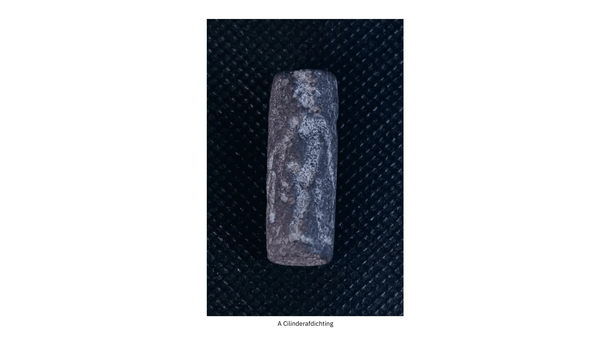

Spijkerschrift stond niet voor een taal, maar voor een schrijfsysteem om gesproken talen vast te leggen. In het Engels zouden we zeggen "writing is a written language", en dan zouden we zeggen dat "spijkerschrift een schrift is, geen taal". In het Frans zouden we dus zeggen dat spijkerschrift geen taal is, maar een manier om een taal te coderen.

### De evolutie en het gebruik van schrijven

Tijdens de eerste eeuwen van zijn bestaan bleef dit schrift beperkt en diende het voornamelijk als geheugensteun voor het noteren van hoeveelheden, lijsten van landbouwproducten en apparatuur. Pas geleidelijk aan werd het geschikt voor **fonetische weergave van namen** en volledige zinnen.

Aanvankelijk konden namen niet worden uitgedrukt in spijkerschrift omdat het voornamelijk objecten en elementen van de werkelijkheid weergaf, zoals een os of tarwe, afgebeeld als kleine afbeeldingen. Na verloop van tijd ontwikkelden deze afbeeldingen zich tot een meer ontwikkelde vorm van het schrift, waarmee namen en complexe concepten konden worden weergegeven.

Als de naam van de persoon bijvoorbeeld Laura was, hadden we een woord kunnen nemen, een acroniem dat klonk als "water" en een tweede als "ras", en daarmee de naam Laura kunnen vormen. Zo ontwikkelde zich de eerste vorm van geschreven taal.

Voor de goede orde, om acroniemen weer te geven, als je oorspronkelijk de kop van een os wilde tekenen, kon je de vorm van de kop van de os zien. Beetje bij beetje werden de tekeningen vereenvoudigd tot niets meer dan een soort lijn. Geleerden geloven dat dit gebeurde omdat mensen het natte kleitablet in één hand hielden, zodat het makkelijker was om de initialen te hertekenen door ze te draaien. Men denkt ook dat het kwam door de manier waarop de schriftgeleerden de tabletten vasthielden.

Je ziet nog steeds het verband met bijvoorbeeld tarwe of de ossenkop in spijkerschrift acroniemen, en ze leunen altijd naar één kant.

Gedurende de drie millennia dat het spijkerschrift werd gebruikt, diende het voornamelijk om economische en administratieve gegevens bij te houden. De inwoners van Mesopotamië ontwikkelden echter al snel een diepgeworteld verlangen om alles wat de tand des tijds verdiende in geschreven vorm te bewaren. Zo werden verhalen, legendes en liederen, tot dan toe mondeling overgeleverd door rondtrekkende muzikanten, op schrift vereeuwigd, vaak gekopieerd door schriftgeleerden in opleiding. Ze kopieerden teksten die al bestonden, voornamelijk legendes of teksten die een bepaalde culturele waarde hadden.

Een belangrijk voorbeeld is het **Gilgamesj Epos**, mogelijk een **historische koning van de Sumerische stadstaat Uruk** rond 2900-2350 voor Christus.

Deze vorm van schrijven, die zowel een economisch beheersinstrument als een culturele vector was, hield stand tot de 1e eeuw na Christus, voordat het voorgoed verdween en een kostbare getuigenis achterliet van de beschaving die het zag ontstaan.

## De rol van Sumerische tabletten

<chapterId>a396e6c5-56cc-5410-9e6b-0274401c5425</chapterId>

:::video id=a0729a35-01ec-4aa4-828f-d4ccc2eb168e:::

### Pre-monetaire kredietsystemen

In het oude Mesopotamië was de economische organisatie gebaseerd op zeer geavanceerde mechanismen die al lang voor de uitvinding van metalen munten bestonden. Vanaf het begin waren formele en informele kredietsystemen al een essentiële vorm van geld, waardoor de lokale bevolking veel complexe economische transacties kon uitvoeren.

Juist om tegemoet te komen aan administratieve en economische behoeften werd het spijkerschrift uitgevonden. De beroemde Mesopotamische kleitabletten werden voornamelijk gebruikt om verschillende soorten contracten vast te leggen: privéleningen, verkopen, huren, hypotheken en zelfs huwelijksovereenkomsten. Het schrijven van deze tabletten vereiste de expertise van gespecialiseerde schriftgeleerden, een taak die veel tijd en moeite kostte, **maar gerechtvaardigd was als er financiële belangen op het spel stonden.** Mensen schreven toen geen liefdesbrieven aan elkaar, ze gebruikten geen schriftgeleerde om over hun angsten te schrijven. Ze huurden een schrijver in om documenten te schrijven, of er nu een verband was of een economische reden.

Het is ook het vermelden waard dat sommige van deze tabletten circuleerden als obligaties aan toonder, die vrij van eigenaar wisselden.

Er was bijvoorbeeld een vorm van een kleibal met kleine steentjes erin.

Op de buitenkant van de kleibal was een getal geschreven en ondertekend dat een aantal eenheden voorstelde. Binnenin zaten deze stenen en iemand die wilde verifiëren, echt valideren dat dit instrument echt X aantal eenheden voorstelde.

Een ander voorbeeld, een tablet dat ten zuidwesten van het huidige Bagdad is gevonden, bepaalt dat een schuldenaar een schuldeiser 330 maten graan moet terugbetalen op de dag van de oogst. Nog fascinerender is dat een ander tablet duidelijk stelt dat een schuld van vier maten gerst direct moet worden terugbetaald aan de drager van het tablet, waarmee **de notie van betaling aan de drager wordt geïntroduceerd, een bijzonder innovatief concept voor die tijd**.

Vanaf 2000 voor Christus was er een wet die voorschreef dat alle commerciële transacties, zelfs de kleinste, schriftelijk moesten worden vastgelegd en ondertekend in aanwezigheid van getuigen. Stel je voor wat een enorme bureaucratie het in die tijd was om alle transacties vast te leggen in registers die, ik herinner je eraan, van klei werden gemaakt door schriftgeleerden. Deze juridische strengheid was bedoeld om toekomstige geschillen over eigendom en rechten van de uitgewisselde goederen te voorkomen. Er werden vaak getuigen opgeroepen om te getuigen dat het contract inderdaad was ondertekend.

Ook in de privésfeer hielden bepaalde families en individuen zich bezig met economische activiteiten die complex genoeg waren om rigoureus beheer te vereisen. Het huis van een Anunitum priester genaamd Ur-Utu werd ontdekt in de Noord-Babylonische stad Sippar-Amnanu en bevatte bijna 2000 tabletten. Deze documenten bevatten privé leencontracten, koop- en huuraktes, maar ook brieven, religieuze en academische teksten, wat getuigt van de diversiteit en het belang van privé archieven in die tijd.

Het is opmerkelijk dat de brieven die de schriftgeleerden schreven bijna uitsluitend over financiële belangen gingen: klachten over ontoereikende toelagen, hangende bruidsschatbetalingen of andere dringende materiële verzoeken. In die tijd bestonden persoonlijke geschriften zoals liefdesbrieven niet, en zelfs vermeldingen van ziekte waren zeldzaam.

Een schrijnend voorbeeld van zo'n brief illustreert deze economische realiteit: een correspondent drukt zijn nood uit nadat hij zonder geld of proviand kwam te zitten toen zijn partner vertrok, terwijl een ernstige hongersnood Assur trof. Hij beschrijft zijn dringende behoefte om graan te kopen en vraagt om het contante equivalent van zijn textiel snel naar hem op te sturen om zijn dagelijkse levensonderhoud te garanderen.

Deze brief, gericht aan haar partner, lijkt erop te wijzen dat hij elders handel is gaan drijven en haar berooid achterlaat. Ze herinnert hem eraan dat ze over geld moet kunnen beschikken om graan te kopen en haar tempelbelasting te betalen. Dit is misschien wel het dichtst dat we kunnen komen bij een argument dat in een brief uit die tijd is geschreven. Brieven waren bijna altijd gerelateerd aan economische transacties, en juist deze brief heeft betrekking op een precaire economische situatie.

De Mesopotamische documenten die ons zijn overgeleverd weerspiegelen dus vooral economische uitwisselingen, omdat ze uitsluitend werden opgesteld voor de overdracht van goederen met een erkende waarde: geld, graan, diverse goederen, onroerend goed, betaling van tempelbelasting. Deze archieven onthullen niet alleen de efficiëntie en administratieve precisie van deze oude beschaving, maar ook haar vermogen om complexe economische uitwisselingen over een zeer lange periode te beheren.

## Elitecontrole op Soemerische tabletten

<chapterId>c6d3df0e-b1e1-58dc-ab35-9f76bbc39393</chapterId>

:::video id=04a95fb8-a701-4a48-9ce8-0e9b6ba256fd:::

### Schrijven, een technologie die vooral economisch is

In tegenstelling tot wat vaak wordt gedacht, diende de uitvinding van het schrift in Mesopotamië zo'n 4000 jaar geleden in eerste instantie niet voor persoonlijke of literaire communicatie. **Het spijkerschrift was in de eerste plaats een economische technologie**, die alleen gerechtvaardigd was als er grote financiële belangen op het spel stonden. De Soemeriërs gebruikten het schrift niet om met elkaar te corresponderen of hun gevoelens te uiten, maar uitsluitend om hun commerciële en financiële transacties te documenteren.

Deze specialisatie kan worden verklaard door de aanzienlijke kosten van het schrijven van tabletten. Het graveren in klei vereiste gespecialiseerde technische expertise, veel tijd en specifieke materialen. Alleen transacties van voldoende waarde rechtvaardigden deze investering economisch, waardoor er een natuurlijke drempel ontstond voor toegang tot deze revolutionaire technologie.

De spijkerschrifttabletten onthullen een financieel systeem van opmerkelijke complexiteit voor die tijd. De Mesopotamiërs hadden een compleet arsenaal aan moderne financiële instrumenten ontwikkeld: **particuliere leningen met rente, koopakten, huurcontracten, hypotheken en zelfs huwelijkscontracten met financiële clausules**. Deze verfijning getuigt van een ontwikkelde markteconomie, ver verwijderd van het simplistische beeld van primitieve ruilhandel dat vaak met deze oude beschavingen wordt geassocieerd.

Sommige tabletten functioneerden als echte waardepapieren aan toonder, die vrij van hand tot hand circuleerden zonder dat de oorspronkelijke houder geïdentificeerd hoefde te worden. Deze innovatie maakte een opmerkelijk vlotte uitwisseling mogelijk en was de voorbode van moderne financiële systemen. Bovendien eiste specifieke wetgeving zelfs dat alle handelstransacties schriftelijk werden vastgelegd, waardoor het gebruik van het schrift in de economische sfeer werd geïnstitutionaliseerd.

### Het monopolie van kennis en economische controle

De centrale rol van het schrift in de economie verleende aanzienlijke macht aan degenen die deze technologie beheersten. **Schriftgeleerden, die meestal verbonden waren aan tempels en heersende instellingen, hadden de facto de controle over het financiële systeem**. Hun zeldzame en onschatbare expertise maakte van hen de bewakers van alle belangrijke transacties.

Dit kennismonopolie was geen toeval. De autoriteiten hadden er alle belang bij om deze exclusiviteit te behouden, omdat het democratiseren van het schrift hun controle over de economie zou hebben afgezwakt en het risico op vervalsing zou hebben vergroot. De systematische aanwezigheid van getuigen bij ondertekeningsceremonies onthult deze constante bezorgdheid over de authenticiteit van documenten.

De wettelijke verplichting om alle handelstransacties schriftelijk vast te leggen diende verschillende strategische doelen: fiscale controle, strenge boekhoudkundige controle en het handhaven van de afhankelijkheid van economische spelers van het administratieve apparaat. **De Mesopotamische staat eigende zich zo het vermogen toe om interpersoonlijke schulden** op een maatschappelijke schaal te beheren en veranderde het schrift in een instrument van economische macht.

### Het naast elkaar bestaan van twee monetaire systemen

Analyse van de tabletten onthult een meer genuanceerde economische realiteit dan hun alomtegenwoordigheid in de archieven zou doen vermoeden. Veel tabletten vermelden verwijzingen naar de zilveren **shekel** als waarde-eenheid, wat wijst op het parallelle bestaan van een monetair systeem gebaseerd op gestandaardiseerde fysieke goederen.

Deze dualiteit kan worden verklaard door de sociale gelaagdheid van die tijd. **Het systeem van spijkerschrifttabletten was voorbehouden aan een beperkte elite**: geestelijken, welvarende kooplieden en bestuurders die deze complexe documenten konden lezen, schrijven en interpreteren. Om een draagtablet effectief te kunnen gebruiken, moest men niet alleen weten hoe het ontcijferd moest worden, maar ook in staat zijn om de authenticiteit ervan te verifiëren en de juridische implicaties ervan te begrijpen.

**De massa van de bevolking, uitgesloten van dit elitaire systeem, ontwikkelde haar eigen ruilmechanismen**. Gewone mensen gebruikten meer toegankelijke systemen zoals gestandaardiseerde maten van graan, gewichten van geld en andere gemakkelijk kwantificeerbare goederen die iedereen kon evalueren zonder gespecialiseerde vaardigheden.

Deze volkseconomie, hoewel minder gedocumenteerd in officiële archieven, was waarschijnlijk dynamischer en flexibeler dan het tablettenstelsel. Het maakte snelle dagelijkse uitwisselingen mogelijk zonder tussenkomst van schriftgeleerden en voorzag in de directe behoeften van ambachtslieden, boeren en kleine handelaren.

De zilveren sjekel, die vaak in de tabletten wordt genoemd als referentie voor de waarde, diende waarschijnlijk als brug tussen deze twee parallelle economische systemen en maakte omrekening mogelijk tussen geschreven schulden en fysieke betalingen.

### Spontane opkomst versus institutionele controle

Dit naast elkaar bestaan illustreert een fundamenteel debat in de economische geschiedenis: **de tegenstelling tussen het spontane ontstaan van ruilmiddelen en de institutionele toe-eigening van geld**. Aan de ene kant ontstonden goederen zoals geld op natuurlijke wijze uit de ruilbehoeften van mensen. Aan de andere kant eigenden instellingen zich deze middelen toe en formaliseerden ze om de stroom ervan te controleren.

Sumerische tempels belichaamden deze spanning: ze gebruikten populaire monetaire innovaties (verwijzingen naar de shekel) en ontwikkelden tegelijkertijd hun eigen controle-instrumenten (spijkerschrift tabletten). Deze strategie stelde hen in staat om de voordelen van beide systemen te plukken: de populaire legitimiteit van traditionele valuta en de administratieve controle van geformaliseerde schulden.

De Mesopotamische ervaring schept blijvende precedenten voor de evolutie van financiële systemen. Het laat zien dat **financiële verfijning vaak enkele millennia voorafgaat aan technologische innovaties**, die er meestal mee worden geassocieerd. De concepten van rente, krediet, verhandelbare instrumenten en hypothecair onderpand wachtten niet op de uitvinding van metaalgeld om zich te ontwikkelen.

Deze baanbrekende periode onthult ook de machtskwesties die inherent zijn aan elke monetaire innovatie: wie controleert de technologie, wie bepaalt de regels, en hoe formele systemen en populaire praktijken worden geformuleerd. Deze fundamentele vragen zijn in de hele economische geschiedenis blijven bestaan en strekken zich uit tot hedendaagse debatten over digitale valuta en cryptocurrencies.

# Economie en geld in oude beschavingen

<partId>a16bcf4c-8c3a-11f0-9e79-2bd363a484bd</partId>

## De grote beschavingen uit de Bronstijd

<chapterId>fab9334c-7385-5d7c-ad40-7d152beb22a1</chapterId>

:::video id=737e12e8-1033-4210-b1dd-b8a680f68b17:::

In dit gedeelte getiteld "De grote beschavingen van de Bronstijd" beginnen we met een uittreksel uit het boek *A History of Money: From Ancient Times to Present Day* van Glyn Davies, dat volgens mij een uitstekende inleiding is op dit gedeelte over de grote beschavingen uit de oudheid.

> Toynbee identificeert eenentwintig verschillende "beschavingen", maar omdat vijftien daarvan direct of indirect voortkomen uit eerdere voorbeelden, brengt hij het aantal onafhankelijk ontwikkelde beschavingen terug tot zes: Sumerisch, Egyptisch, Minoïsch, Chinees, Maya en Andes. Van deze beschavingen slaagden alleen de Inca's van de Andes erin een hoge beschavingsgraad te bereiken zonder geld te gebruiken, hoewel ze paradoxaal genoeg een overvloed hadden aan de materialen die over het algemeen als het beste voor geld worden beschouwd - goud en zilver.

De Inca's hadden geen monetair systeem, maar wel een overvloed aan edele metalen. Nogal een paradox. Laten we verder gaan met het citaat:

> Hoe gelaagder een samenleving en hoe efficiënter het planningssysteem, des te minder is het gebruik van geld nodig voor de bevolking. Dit kan verklaren waarom de Spaanse veroveraars ontdekten dat de Mexicanen, wiens regering relatief liberaler was, regelmatig goudpoeder (bewaard in doorzichtige buisjes) en cacaobonen (bewaard voor grote betalingen in zakken van 24.000 eenheden) als betaalmiddel gebruikten, terwijl de Inca's, georganiseerd volgens een veel rigidere hiërarchie, helemaal geen geld hadden: een uitzondering bevestigd door een strikte regel. De oorsprong van het geld in China was volledig onafhankelijk van andere beschavingen; maar de relatieve nabijheid van de Sumerische, Egyptische en Minoïsche beschavingen doet twijfels rijzen over de mate van hun respectieve onwetendheid van monetaire praktijken, vooral gezien de uitgebreide handel die al in de vroegste tijden tot stand kwam.

In China werden munten ontwikkeld met een totaal andere benadering dan de westerse tradities. Het was vanaf het begin fiatgeld. Het waren gegoten munten.

En hier noemt Mr. Davies handel. Er waren inderdaad op bepaalde momenten uitwisselingen tussen de Chinezen en andere bevolkingsgroepen, maar het ruilmiddel voor buitenlandse handel was eerder zijde. Zoals we later zullen zien, werd goud ook gebruikt in de grensgebieden van China, waar de Chinese bevolking kleiner was. En zelfs niet voor internationale handel; daarvoor was het zijde.

Ik kan me dus voorstellen dat het formaat van de munten beïnvloed is door andere beschavingen uit dezelfde tijd die deze technologie ontwikkelden.

Maar het is duidelijk dat de essentie van geld in China heel anders was dan in het Westen. We komen hier uitgebreid op terug in het volgende hoofdstuk over China.

Over deze beroemde Sumerische steden heb ik hier een paar opmerkingen. We kunnen Uruk noemen, een zeer vroege en invloedrijke stad, beroemd om haar aanzienlijke omvang en geavanceerde cultuur, met name door de ontwikkeling van het schrift en stedenbouw.

En ik wilde ook het beroemde Gilgamesj-epos noemen. Gilgamesj was waarschijnlijk een historische koning van de Sumerische stad Uruk rond 2900 voor Christus. Hij was waarschijnlijk de koning van deze Sumerische stadstaat.

We kunnen ook spreken van Sargon van Akkad, die regeerde van 2334 tot 2279 voor Christus.

Hij was de eerste heerser van het Akkadische Rijk, een andere beschaving die ontstond in Mesopotamië. En ik noem Sargon omdat hij de eerste was die een postdienst opzette voor deze beroemde tabletten hier, die ik al aan jullie heb laten zien.

Stel je voor dat er zelfs enveloppen van klei waren. De tabletten konden in kleien enveloppen worden gewikkeld met de handtekening van de persoon aan de buitenkant om vertrouwelijkheid te garanderen. Dus mensen braken de envelop open om het tablet op te halen. Dit postsysteem hebben we te danken aan Sargon van Akkad.

Dan is er Babylon, de grote stad die de hoofdstad werd van het Babylonische Rijk. Een andere beschaving, bekend om zijn imposante Ziggurat en paleizen, en de beroemde Code van Hammurabi, vooral bekend om zijn zeer geavanceerde wetboek.

En twee steden om dit gedeelte af te sluiten. We hebben Ashur, de hoofdstad van het Assyrische Rijk, een belangrijk religieus centrum. En we hebben Nineve, wat later de hoofdstad van het Assyrische Rijk werd. Ze verplaatsten hun hoofdstad daarheen en het staat bekend om zijn machtige leger, uitgestrekte paleizen en bibliotheken. En het is ook een van de mogelijke locaties van de legendarische hangende tuinen van Babylon. We horen vaak over dit beroemde wereldwonder uit de oudheid.

Maar er is geen spoor van deze beroemde hangende tuinen in Babylon. In Nineve daarentegen is er archeologisch bewijs van tuinen op meerdere verdiepingen. Het is mogelijk dat Griekse historici zoals Herodotus Nineve verward hebben met Babylon. Als ze steden in Mesopotamië bezochten, verwezen ze er misschien naar als Babylon. Er zijn sporen gevonden van beroemde hangende tuinen in Nineve en geleerden vragen zich af of Nineve de beroemde plaats is waar deze tuinen lagen, die de Babylonische hangende tuinen worden genoemd.

## Economische organisatie in Mesopotamië

<chapterId>6afb6fc8-cbb7-56a5-8427-484b4b7d7477</chapterId>

:::video id=aa6a2cbd-5916-4ae3-ad4f-65f0bd5643fa:::

### Prekapitalistische economische structuren en slavernij

Welkom bij dit gedeelte over de economische organisatie in Mesopotamië. De pre-kapitalistische economie kende drie hoofdfasen: primitief, slaven en feodaal.

Feodaal is natuurlijk veel later, duidelijk in de Middeleeuwen, en we zijn al voorbij het primitieve stadium dat we eerder beschreven met het Paleolithicum. Als we het in Mesopotamië hebben over economische organisatie, dan hebben we het over slavernij.

In Mesopotamië werd het grootste deel van het werk echter uitgevoerd door een afhankelijke klasse die leek op slaven, die juridisch gezien geen eigendom waren van hun meesters maar door fysieke of ideologische dwang beroofd werden van de vruchten van hun arbeid.

### De rol van tempels en paleizen als economische centra

Grote grondbezitters domineerden de economie. Landeigenaren exploiteerden hun land direct door arbeiders in te huren, of ze verhuurden hun land in ruil voor pacht. Ze hielden zich ook bezig met financiële activiteiten en leenden geld uit tegen hoge rentetarieven, meestal rond de 20% tot 33,3% per jaar, praktijken die in schril contrast stonden met de strengere regels van de naburige Hebreeën.

De leningen die de boeren aangingen waren niet bedoeld voor productieve investeringen - met uitzondering van scheepvaartmaatschappijen - maar eerder om te overleven tot de volgende oogst. Deze situatie leidde vaak tot chronische schulden bij de boeren.

Sta me toe een parallel te trekken met een recentere periode in de oudheid (Rome), waar burgers leefden van de landbouwopbrengsten van boeren en onvrije arbeid, en van de oorlogsbuit. **Deze opbrengsten werden onder de burgers verdeeld, niet om generate meer winst te geven, maar om hun sociale status te verbeteren.** Handel en ambachten werden over het algemeen overgelaten aan groepen buiten de sociale elite. Dit alles staat in contrast met de middeleeuwse economieën die gericht waren op winst door handel en ambachten.

Dus wat we hier proberen te zeggen is dat ik een parallel trek met het feit dat mensen financiële leeninstrumenten niet noodzakelijk gebruikten om hun productiemiddelen te verbeteren, en later in Rome werden winsten niet noodzakelijk opnieuw geïnvesteerd, maar eerder gebruikt om het prestige te verhogen van de mensen die van deze winsten konden profiteren. We zijn nog ver verwijderd van de kapitalistische geest die later in de Middeleeuwen ontstond, toen banen konden worden gecreëerd om de productiemiddelen te verbeteren en overschotten werden genomen en gecreëerd in het streven naar winst. We kunnen dus zien dat de economische organisatie de derde fase van de hierboven genoemde economische evoluties nog niet had bereikt.

### De opkomst van kredietsystemen en rekeneenheden

**Karl Polanyi onderscheidt drie vormen van economische uitwisseling: wederkerigheid tussen symmetrische groepen,** dat zou zijn in primitieve stammen waar we niet echt geld nodig hebben omdat we elkaar informeel krediet geven en ruilen en herverdelen. **Herverdeling gecentraliseerd rond tempels en paleizen,** deze vorm van uitwisseling is compatibel met Mesopotamië, waar tempels het centrum vormden van de economische organisatie en ooit rijkdom konden teruggeven, verdelen in de vorm van rantsoenen. Pas later werd het begrip loon geïntroduceerd. Dus, tot nu toe hebben we de primitieve vorm (1), gecentraliseerde herverdeling (2) in tempels en paleizen, en dan kunnen we uiteindelijk plaats maken voor marktuitwisselingen (3). Hoewel de markt zoals we die vandaag de dag begrijpen nog niet volledig bestond, is de aanwezigheid van markthandel in Mesopotamië onbetwistbaar, wat blijkt uit het bestaan van specifieke termen in het Akkadisch en de aanwezigheid van archeologisch bewijs van prijzen, winsten, verliezen, fluctuaties en situaties van schaarste.

Mesopotamische huishoudens beheerden onafhankelijk alle stadia van de landbouwproductie, van zaaien tot de uiteindelijke verwerking tot brood en bier. Vrouwen produceerden ook het textiel dat hun afhankelijke familieleden nodig hadden. Voor goederen die niet lokaal werden geproduceerd, wendden huishoudens zich tot gespecialiseerde handelaren.

Familiebanden waren bijzonder belangrijk in de handel. Tijdens de Paleo-Assyrische periode (ca. 1910-1830 v.Chr.) vestigden kooplieden uit de stad Ashur een handelskolonie in Kanesh in Anatolië, waar ze tin en textiel importeerden in ruil voor goud en zilver. De handel was gebaseerd op familiebedrijven die nauw met elkaar verbonden waren door huwelijken en commerciële partnerschappen. Kanesh was slechts één schakel in een uitgebreid internationaal handelsnetwerk.

In deze uitwisselingen waren er metalen, en het waren edele metalen en niet noodzakelijkerwijs bijvoorbeeld koper, dat in die tijd echt nuttig was, en we denken dat deze metalen werden uitgewisseld voor begrippen als waardeopslag. We kunnen dus niet noodzakelijkerwijs spreken van ruilhandel, waarbij twee goederen worden geruild voor hun nut, maar eerder van een begrip van betaling met een zeker bewustzijn van het oppotten van edele metalen voor hun gebruik als een opslagplaats van waarde en niet om ze te gebruiken als handelswaar, bijvoorbeeld het gebruik van brons om harnassen te maken.

Tributen en belastingen werden voornamelijk in natura betaald (gerst of gewogen zilver). Tempels en paleizen waren de belangrijkste economische, administratieve, politieke en religieuze centra en vervulden ook de eerste bankfuncties door het veilig opslaan van goederen, eerst graan, toen andere landbouwproducten en uiteindelijk edele metalen. Op deze manier werden de eerste krediet- en leenoperaties ontwikkeld, lang voor het verschijnen van munten.

De Mesopotamische economie gebruikte voornamelijk gerst en zilver als waardestandaard. Zilver werd gewogen in gestandaardiseerde eenheden, zoals de sìqlum (shekel) van ongeveer 8,33 gram. Al in de oude Babylonische periode (onder Hammurabi) werd zilver gebruikt als betaalmiddel, met een vroege notie van nominale waarde ("nūbum") in tegenstelling tot reëel gewicht ("šuqulum"), **vooruitlopend op het moderne concept van fiatvaluta**.

Maar het was nog geen fiatgeld in de strikte zin van het woord. Er was geen sprake van een stempel met een autoriteitsfiguur, maar wel van een nominale rekeneenheid, in tegenstelling tot het begrip gewogen metaal. Er was een onderscheid in de taal voor deze twee concepten, en ik denk dat het belangrijk is om dat te vermelden.

De overgang naar een loonarbeidsmarkt was moeilijk. Het vereiste twee belangrijke conceptuele vernieuwingen: de scheiding tussen het werk van de persoon en het eindproduct, en de introductie van "arbeidstijd" als meetbare eenheid. Om dit begrip van loontrekkende en werknemer in loondienst te hebben, moesten we eerst deze twee vernieuwingen doorvoeren. **In het IIIᵉ millennium werd werk aanvankelijk beloond met vaste rantsoenen, voordat het geleidelijk evolueerde naar een loonsysteem aan het begin van het IIᵉ millennium.**

Vanaf de 26e eeuw v.Chr. ontstond er eindelijk een echt begrip van monetaire waarde, ook al was Mesopotamisch "geld" geen munt, maar eerder een gewogen maat van graan of metaal. **Voor belangrijke transacties of in contexten waarin waardebehoud nodig was, gaf men er dan ook vaak de voorkeur aan om graan om te zetten in zilver, dat gemakkelijker te bewaren was.** Een beetje zoals het voorbeeld van Kanesh, waar zilvermetaal werd ontvangen om te hamsteren.

Vanaf de 21e eeuw voor Christus, **met het vrijwel verdwijnen van asymmetrische uitwisselingen**, zien we dat het werkwoord sa in opdrachtcontracten verwijst naar de betaling van de prijs. Dit begrip, "sa" genoemd, komt voor in contracten en verwijst naar de betaling van een prijs, niet naar de meting van een bepaald goed. "Sa" verwijst gewoon naar een betaling of een prijs. Het is een antropoloog die dit opmerkt en zegt dat het echt een doorbraak is; we zien een soort dichotomie tussen voor en na de introductie van het werkwoord "sa" in contracten.

We kunnen niet voorbijgaan aan de empirische gegevens in de archieven van het Nabije Oosten die getuigen van het bestaan van **een aantal marktmechanismen**, waarin **noties van winst** en **verlies**, **prijsschommelingen** en situaties van **schaarste** zijn opgenomen. Maar de fundamentele moeilijkheid ligt in het bepalen van het relatieve belang van marktgebaseerde uitwisseling binnen de oude Mesopotamische economie als geheel.

Ik denk dat de experts op dit gebied sporen van deze marktconcepten hebben gezien, maar ze zijn niet echt in staat om ons te vertellen hoeveel van de economie van die tijd gebaseerd was op dit modernere marktconcept of andere mechanismen.

We weten dat het bestond, maar we weten niet of het de belangrijkste manier was om bijvoorbeeld prijzen te bepalen of handel te drijven.

Dit is het einde van dit hoofdstuk over de economische organisatie in Mesopotamië.

In de volgende paragrafen doen we hetzelfde voor Egypte en China.

## Economische en monetaire organisatie in het oude Egypte

<chapterId>bffcc16c-7fbf-5992-a0fa-6a7726d7d287</chapterId>

:::video id=40c1c4e5-b190-4bb6-b8a0-810c9ce7698b:::

### Historische achtergrond en Egyptische perioden

Deze sectie is gewijd aan de economische en monetaire organisatie van het oude Egypte. Om je een beetje achtergrond te geven, volgt hier een lijst en een korte beschrijving van de periodes in kwestie.

- Oude Rijk (ca. 2575 - ca. 2130 voor Christus)**. Een periode die gekenmerkt wordt door de bouw van de grote piramides, met name die van Gizeh. Dit was de gouden eeuw van de gecentraliseerde Egyptische monarchie.
- Middenrijk (ca. 1938 - ca. 1630 v.Chr.)**. Politieke en culturele renaissance na een periode van instabiliteit.
- Nieuwe Rijk (ca. 1539 - 1075 v.Chr.**.) Een periode van territoriale expansie, militaire macht en internationale handel. Het omvat de regeerperioden van beroemde farao's zoals Toetanchamon en Ramses II.
- 1323 VOOR CHRISTUS. - Dood van Toetanchamon**. De jonge farao stierf op een leeftijd van ongeveer 18-19 jaar. Zijn bijna intacte graftombe werd in 1922 ontdekt en is daarmee een van de beroemdste archeologische ontdekkingen.
- Ramses II - Regeerde 1279-1213 voor Christus**. Een van de machtigste farao's van het Nieuwe Rijk. Bekend om zijn militaire campagnes, zijn grote monumenten en omdat hij waarschijnlijk het eerste bekende vredesverdrag heeft gesloten.
- 1275 voor Christus - Zeevolkeren**. Invasies of migraties van groepen genaamd "Zeevolkeren" destabiliseren verschillende mediterrane beschavingen, waaronder Egypte.
- Slag bij Xoïs - 1178 voor Christus**. Conflict tussen het Egyptische leger en indringers, waarschijnlijk gelinkt aan de Zeevolkeren. Een van de vele veldslagen aan het einde van het Nieuwe Rijk.
- De Late Periode** is de periode van ongeveer 664 tot 332 voor Christus in de oude Egyptische geschiedenis.
- Cleopatra VII (69 - 30 voor Christus)**. Laatste koningin van Egypte, beroemd om haar intelligentie, charisma en allianties met Julius Caesar en Marcus Antonius, en waarschijnlijk ook om haar neus. Haar heerschappij markeerde het einde van het faraonische Egypte voor de annexatie door Rome.

In de 5e en 4e millennia v.Chr. was er in Egypte al sprake van intense handelsactiviteiten op grote schaal, waarbij Nubië, Palestina, Libië en de Rode Zee-regio's via zee-, rivier- en landhandel (met name via ezelkaravanen) met elkaar verbonden waren.

### Vroege ruilsystemen en paleo-valuta

Met de opkomst van de eerste Egyptische chiefdoms rond 3650-3400 v.Chr. werd Maadi, ten zuiden van het huidige Caïro, een belangrijk centrum voor kopertechnologie en lange-afstandshandel, met name met Mesopotamië via de Syrische kust.

Hoewel grootschalige handel voornamelijk gebaseerd was op ruilhandel, bestond er waarschijnlijk een primitieve vorm van geld ("paleomunt"), bestaande uit prestigeartikelen zoals halfedelstenen en fossiele schelpen. Goud speelde waarschijnlijk al een belangrijke rol in deze uitwisselingen. De eerste expliciete vermelding van een munt in Egyptische documenten in het midden van het 3e millennium v.Chr. weerspiegelt een lange ontwikkeling die gekoppeld is aan handelspraktijken.

In archaïsche samenlevingen (we hebben het hier niet per se over Egypte, maar over archaïsche samenlevingen in het algemeen) werd vaak betaald, niet om direct iets te kopen, maar om bruidsschatten, religieuze rituelen en andere sociale verplichtingen te betalen. Deze transacties vereisten een nauwkeurige prijsbepaling en waardering. Veel primitieve samenlevingen hadden geprivilegieerde, monetaire (d.w.z. telbare) objecten waarmee deze waarde werd geschat. Als je een bruidsschat betaalt, moet je natuurlijk een bepaalde hoeveelheid van een object noteren dat geruild moet worden om de bruidsschat te betalen. Deze waarde is in wezen die van mensen.

In archaïsche samenlevingen, voor de komst van geld of monetaire systemen, waren er wel betalingen, maar die waren vaak gekoppeld aan sociale verplichtingen en hun waarde was afgeleid van de waarde van individuen, zoals bij de betaling van bruidsschatten of bloedgeld.

Terugkerend naar Egypte, tijdens het oude keizerrijk, ging de "shât(y)", oorspronkelijk een concrete munteenheid (een kleine gouden of zilveren munt met een gewicht van ongeveer 7,6 gram), heel snel over van zijn echte functie als harde munt naar een **boekhoudkundige functie** die aanleiding gaf tot het begrip waarde. We kunnen er een soort rekeneenheid in herkennen om waarde uit te drukken, wat oorspronkelijk een soort munt was, maar we kunnen het niet echt een munt noemen omdat het niet gestempeld is, het is gewoon een maat van metaal. We komen dichter bij het begrip rekeneenheid.

Dit idee van shât(y) werd uiteindelijk verlaten, misschien vanwege het risico op fraude. We zullen later zien dat de Egyptenaren traag waren met het invoeren van gestempelde munten en ze zelfs bleven wegen, zelfs nadat ze waren overgenomen door hun buren.

In de Middeleeuwen werd zilver zelden gebruikt voor dagelijkse transacties, die voornamelijk werden uitgevoerd met graanmaten en broodhoeveelheden. Het was in deze periode dat er een vorm van giraal geld verscheen, waarbij betalingen schriftelijk konden worden vastgelegd, of door daadwerkelijke overdracht.

In het Nieuwe Rijk werd het monetaire systeem complexer en werden verschillende goederenvaluta's geïntegreerd die werden gewaardeerd in metalen (goud, zilver, koper), gestandaardiseerde stoffen, granen en olie. Stoffen werden "lakenmaten" genoemd. **De prijzen voor alledaagse goederen werden vaak uitgedrukt in graan of koper, terwijl kostbare voorwerpen werden gewaardeerd in goud of zilver. Zilver, dat in Egypte zeldzamer was dan goud, werd bijzonder gewaardeerd.** Zilver werd overgewaardeerd in vergelijking met goud, dat in Egypte overvloediger aanwezig was.

In de Late Periode (eerste millennium v.Chr.) was zilver het gemeenschappelijke ruilmetaal geworden in het hele Nabije Oosten. Het circuleerde in de vorm van baren, metalen munten of ringen, die werden gewogen en gemerkt in tempels om hun gewicht en zuiverheid te garanderen, hoewel ze niet werden geslagen in de beeltenis van een vorst. Dat kwam later en zal het onderwerp zijn van een volgend hoofdstuk over de Lydiërs.

Er moet ook worden opgemerkt dat de oude Egyptenaren een term hadden, "hedj", voor geld, en het werd algemeen gebruikt om elk betaalmiddel aan te duiden dat als tegenprestatie diende bij een transactie, of het nu ging om metaal, graan, stof of verschillende goederen (hout, dieren, diensten, enz.). Gedocumenteerde voorbeelden laten zien dat de Egyptenaren een transactie konden afhandelen door verschillende producten te combineren waarvan de totale waarde werd uitgedrukt in koperen eenheden ("deben").

**Tempels speelden een centrale rol in de Egyptische economie: ze verzamelden en hamsterden aanzienlijke schatten van edele metalen (goud en zilver) die bedoeld waren om de goden te eren, maar ook om als monetaire reserve te dienen die indien nodig opnieuw in het economische circuit kon worden gebracht**. We zullen voorbeelden zien van andere beschavingen die waardevolle reserves verzamelden in tempels, zoals standbeelden, om omgesmolten te worden in geval van oorlog, valutaschaarste of crisis. Dit is een terugkerend thema door de geschiedenis heen.

Het is ook de moeite waard om te vermelden dat het verbouwen van linnen een koninklijk monopolie was dat aan de tempels werd verleend, en de productie van kostbare stoffen bevestigde hun economisch belang.

De oude Egyptenaren maakten een duidelijk onderscheid tussen het ideologische aspect van edele metalen, gekoppeld aan goddelijkheid (goud vertegenwoordigde het vlees van de goden, zilver hun botten), en hun praktische functie als betaalmiddel dat als referentie diende voor alle andere vormen van betaling.

Hoewel het oude Egypte pas in de late periode een muntsoort ontwikkelde die vergelijkbaar was met moderne monetaire systemen, beschikte het dus wel over een verfijnd monetair systeem, gebaseerd op het gecombineerde gebruik van giraal geld, nauwkeurige rekeneenheden, goederengeld en edele metalen die naar gewicht werden gewaardeerd.

De munten zelf werden gewogen, waardoor twee verschillende concepten ontstonden: **"munten" en "geld"**. Ik heb twee termen in het Engels gebruikt. Ten eerste verwijst "coinage" naar munten, een concept dat later komt, en we hebben ook dit concept van geld. We kunnen al een bepaald begrip van "geld" definiëren door de rekeneenheden die ik zojuist heb uitgedrukt in termen van geld, maar dat waren nog geen munten, dus "coinage" komt iets later met de Lydiërs.

En dus zijn munten geen voorwaarde voor geld, **zoveel zelfs dat we het bestaan van geld al in het 3e millennium kunnen toegeven,** in elk geval en zonder enige twijfel tijdens het 2e millennium en in het bijzonder onder de heerschappij van Hammurabi.

Wat belangrijk is om te onthouden, en dit is wat de auteur vermeldt in het boek "The Origins of Money", is dat er geen twijfel over bestaat dat het concept van geld toen al bestond, in deze monetaire systemen, en het is een vergissing om het ontstaan van geld als concept te koppelen aan het verschijnen van munten.

Tot slot moeten Polanyi's concepten van wederkerigheid en herverdeling, die vaak worden toegepast op het oude Egypte, worden genuanceerd: hoewel ze bestaan, vormen ze geen exclusief kader. Het faraonische Egypte had een complexe economie ontwikkeld waarin geraffineerde commerciële uitwisselingen volledig waren geïntegreerd, los van religieuze en rituele praktijken.

Deze bijzonderheid is gekoppeld aan het idee dat edele metalen werden geassocieerd met een bepaalde goddelijkheid, maar toch in staat waren om zich te onderscheiden.

Ik breng dit naar voren omdat Polanyi het gebruik van deze edele metalen vooral een religieus of goddelijk begrip noemde. Wij stellen echter voor dat ze ook geïntegreerd waren in het economische systeem en dat de Egyptenaren al in staat waren om een dergelijk onderscheid te maken.

Tot slot wil ik graag citeren uit het boek "The Origins of Money", waarin het doel van deze uitvinding, het geslagen geld, wordt opgesomd. Er zijn verschillende punten, maar ik wil alleen punt 5 benadrukken:

*de mogelijkheid ontwikkelen om economisch te spelen door het gebruik van methoden zoals devaluaties en opeenvolgende revaluaties om de import en export tegen lagere kosten te verminderen of te verhogen*

Dus zelfs in die archaïsche tijden stelt de auteur dat munten al waren uitgevonden of onder staatscontrole waren ontstaan en al werden gemanipuleerd wat betreft de hoeveelheid edelmetaal en het gewicht om de economie te beheren. Sta me toe je een kleine primeur te geven met betrekking tot een volgende paragraaf. **Zelfs in de vroegste vormen van muntslag, die gemaakt waren van electrum, een legering van goud en zilver, weten we door het analyseren van het gehalte aan edelmetalen in deze munten dat de eerste uitgevers, bijvoorbeeld Croesus, minder goud hadden dan in natuurlijk electrum.**

Dit betekent dat ze al wisten hoe ze goud en zilver moesten scheiden en dat ze munten uitgaven die minder goud bevatten.

De auteur suggereert dat vanaf de begindagen van de muntslag, naast het certificeren van gewicht en het vergemakkelijken van de handel, de macht om geld te slaan al werd misbruikt om de uitgegeven hoeveelheid te vergroten, mogelijk als een vorm van economische planning.

## Teken munteenheid en economische en monetaire organisatie in het oude China

<chapterId>e08d3be9-423c-5cf3-a606-6ad54e2261af</chapterId>

:::video id=ae7e6367-1725-455e-bfe6-359be1f443e5:::

In dit gedeelte, getiteld "Tekengeld en de economische en monetaire organisatie van het oude China", zullen we zien dat het oude Chinese geld andere kenmerken heeft dan de westerse tradities. De Chinese munteenheid was al vanaf het begin een "tekenmunt". De informatie in dit gedeelte is gebaseerd op aantekeningen die ik heb gemaakt na het lezen van het boek "Aux origines de la monnaie".

### Het concept van tekenvaluta en de onderscheidende kenmerken ervan

Volgens de auteur is tekengeld het equivalent van de huidige fiatvaluta. Het is een munt die geen waarde heeft die gekoppeld is aan de metaalinhoud. Vanaf het begin was het een soort overeenkomst, een sociale consensus over de waarde van deze munten.

De Chinese muntslag uit de oudheid heeft kenmerken die verschillen van de westerse tradities. Ze waren voornamelijk van metaal, maar werden eerder gegoten dan geslagen en droegen geen beeltenis van een vorst. Verrassend genoeg had de Chinese staat geen monopolie op de uitgifte van munten. Dit ogenschijnlijke liberalisme kan worden verklaard door de afwezigheid van enige economische noodzaak om de uitgifte van geld te monopoliseren, dankzij de overvloedige belastinginkomsten die werden geheven op een grote belastingplichtige bevolking.

Chinees geld wordt ook gekenmerkt door zijn fiduciaire aspect. Vanaf het allereerste begin werden bronzen imitaties van kauri (zeeschelpen) gebruikt als betaalmiddel, zonder directe relatie met de intrinsieke waarde van het gebruikte metaal. Als we heel ver teruggaan in de geschiedenis, gebruikten de Chinezen zeeschelpen als betaalmiddel. Uiteindelijk, toen schelpen te schaars werden, maakten ze koperen replica's en deze kopieën hadden dezelfde waarde als de echte.

Chinese valuta was daarom niet gebaseerd op de waarde van het materiaal of de relatieve zeldzaamheid van het originele voorwerp (bijv. schelpdieren), maar op collectief vertrouwen in het gebruik ervan als ruilmiddel - met andere woorden, een monetair teken.

### Van kaurischelpen tot metalen imitaties

De kauri werd veel gebruikt als primitieve munteenheid. Oude inscripties laten zien dat kaurischelpen al in de Shang en Zhou dynastieën (de eerste dynastieën van de eerste en tweede millennia voor Christus) werden gebruikt, niet alleen om militaire daden te belonen, maar ook om **werk te belonen, waarde te meten en land te kopen**.

Wat belangrijk is om te onthouden, is dat het niet zomaar een instrument was dat door de samenleving werd gebruikt voor beperkte doeleinden. Het werd gebruikt voor militaire beloningen, betaling voor werk en waardemeting. We vinden hier sporen van in de geschriften van archeologen. Hoewel we niet weten of het werd gebruikt om dagelijks brood te kopen, hebben we wel bewijs dat het kan zijn gebruikt voor de hierboven genoemde transacties.

Na verloop van tijd leidde de schaarste aan echte kaurischelpen tot de productie van imitaties in brons, been, paarlemoer of steen, vooral voor gebruik in funeraire contexten om te voorkomen dat de echte waarden in graftombes geïmmobiliseerd zouden worden. Deze verandering van medium is ook verbonden met het idee van de controle van de prins over geld, een controle die des te gemakkelijker is als de prins het geld maakt.

Wat we hier moeten begrijpen is dat, door de beperking van natuurlijke schaarste van zeeschelpen te overstijgen, als de prins de valuta zelf kan creëren, dit hem meer controle geeft over het beheer van de economie.

In tegenstelling tot Mesopotamië, waar munten gekoppeld waren aan het gewicht van edelmetaal, is de Chinese terminologie voor munten direct afgeleid van de oorspronkelijke vormen van de voorwerpen die als betaalmiddel werden gebruikt: kauri's (bei), messen (dao), schoppen (bu) en ronde munten (quan of qian). We kunnen dus zien dat de oorsprong van woorden in verband met geld in China naar deze voorwerpen verwees. In het Westen hebben we daarentegen een aantal monetaire termen die voortkomen uit concepten die heel anders zijn dan deze, meer gerelateerd aan de fysieke kenmerken en het gewicht van monetaire objecten. Deze etymologische verschillen tonen duidelijk het schisma aan tussen de westerse en Chinese visie op geld.

In China was de monetaire waarde volledig fiduciair, gebaseerd op een sociale overeenkomst tussen de staat, producenten en kooplieden.

### Economische regulering en monetaire filosofie

De Chinese staat gebruikte geld als een instrument voor economische regulering: in tijden van monetaire overvloed daalde de waarde van het geld, waardoor mensen gemakkelijker goederen konden kopen. Omgekeerd steeg de waarde van geld in tijden van monetaire schaarste, waardoor de koopkracht van de staat voor zijn volgende operaties werd versterkt.

Hier kan een verband worden gelegd met inflatie en deflatie. Bij een vaste geldhoeveelheid stijgt de waarde van geld als de productiviteit van de economie toeneemt. Omgekeerd, als de productiviteit daalt, daalt de waarde van geld. In dit voorbeeld is echter het tegenovergestelde waar. Waarschijnlijk omdat de prins geen volledig monopolie had op de productie van geld, maar het geeft toch aan dat de waarde van geld gekoppeld was aan economische omstandigheden.

De filosoof Mo Di (5e-4e eeuw v.Chr.) had deze relatie tussen prijs en waarde al geanalyseerd: volgens hem weerspiegelen prijsschommelingen geen echt begrip van goedkoopheid of absolute duurte, maar eerder een fluctuerende relatie tussen goederen en geld, onafhankelijk van de stabiele nominale waarde van het valutateken.

Dus in plaats van te zeggen dat de gouden munt een soort basiswaarde als zodanig zou hebben, zoals gebruikswaarde of intrinsieke waarde, wijst hij er hier op dat de waarde van het monetaire teken eerder voortkwam uit de staat van de economie.

In China hoefden munten niet per se officieel gemerkt of gegarandeerd te zijn. De acceptatie ervan hing uitsluitend af van collectief vertrouwen, wat verklaart waarom bronzen of koperen munten zonder specifieke inscripties lange tijd vrij konden circuleren.

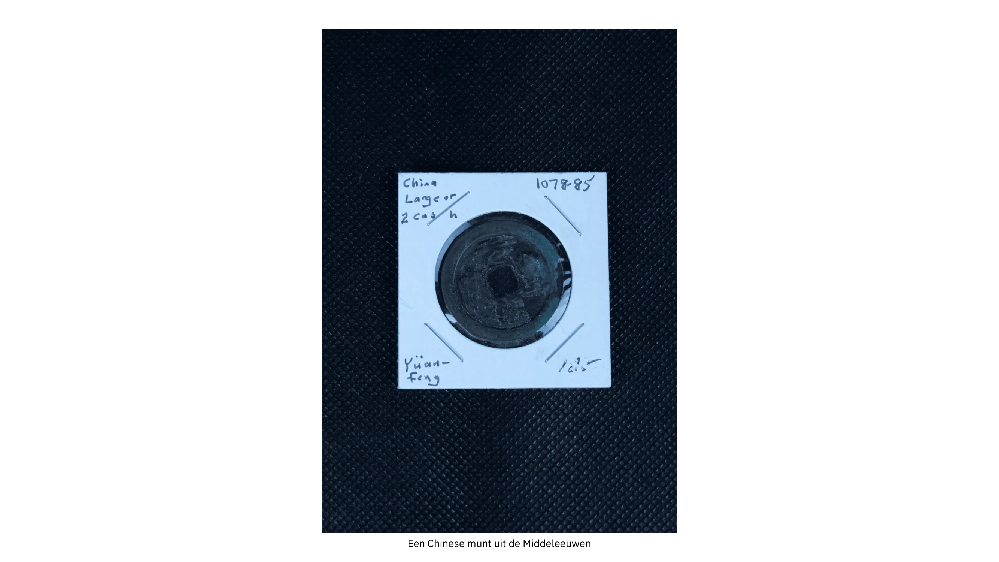

De munt hierboven is een Chinese munt uit de Middeleeuwen. Het is een gegoten munt met een vierkant gat in het midden. Door dit gat kon een touw worden geregen, waardoor de munten aan elkaar konden worden geregen tot armbanden of kettingen. Deze waren echter niet in de eerste plaats bedoeld om te dragen; ze werden vooral gebruikt voor boekhoudkundige doeleinden. Ze konden aan elkaar worden geregen tot rekeneenheden in de vorm van grote koorden, waarbij de stukken in elkaar pasten. Er waren niet per se specifieke tekens, soms waren het gewoon bronzen cirkels.

Het monetaire monopolie van de staat, te laat ingesteld door Wudi van de Han Dinastie in 113 voor Christus, werd vaak aangevochten, waardoor verschillende particuliere of lokale spelers hun eigen valuta konden uitgeven, op voorwaarde dat ze voldoende sociaal vertrouwen genoten.

**De lage intrinsieke waarde van de Chinese munten verhinderde het oppotten en garandeerde een vlotte circulatie**. Edele metalen werden zelden gebruikt als circulatiemunt om oppotten te voorkomen. Goud was te duur en werd meestal opzij gelegd in plaats van uitgegeven. In plaats daarvan vertegenwoordigde **alleen zijde een echte hoogwaardige valuta in de Chinese internationale handel**. De Chinezen handelden met zijde, niet met goud.

Tijdens economische of monetaire crises, vooral wanneer de koperprijs steeg, werden innovatieve oplossingen toegepast: zo werden al in de 2e eeuw na Christus de munten in omloop versneden tot kleinere eenheden, waardoor de circulatie vlot kon worden gehouden tegen lagere kosten. Andere tijdperken, zoals dat van Wang Mang (vroeg 1e eeuw n.Chr.), experimenteerden met munten met een hoge fiduciaire waarde, waarbij de nominale waarde veel hoger was dan de werkelijke metaalinhoud. Ze namen een munt en stempelden er waarden als 50, 100 of 200 op om grotere bedragen aan te geven, zoals 200 munten. Deze praktijk droeg waarschijnlijk bij aan een aanzienlijke inflatie.

Zoals hierboven vermeld was dit systeem gebaseerd op een sociale conventie tussen de staat, producenten en kooplieden, maar ook op autoritaire en strenge regels voor degenen die het spel niet meespeelden, met name met betrekking tot de keuze van de stukken (mooi of niet) of de lengte van de stoffen (niet in overeenstemming met de standaard).

Naar mijn bescheiden mening is het geen erg solide systeem. Het berustte vooral op strenge regels die ambtenaren en handelaren verplichtten om beschadigde munten te accepteren, onder bedreiging van sancties.

### Chinese monetaire innovaties en hun economische impact

China was ook een pionier in de uitgifte van vroege vormen van papiergeld, in eerste instantie aangenomen als reactie op een tekort aan metaal in de 9e eeuw na Christus. Ondanks hun aanvankelijke voordelen leidden deze papieren valuta's regelmatig tot inflatiespiralen als ze in overvloed werden uitgegeven, zoals te zien was in de Song- of Mingperiode, toen overmatige uitgifte leidde tot ernstige valutacrises, zoals Marco Polo in de 13e eeuw illustreerde, die zelfs opmerkte dat op de vervalsing van dergelijk papiergeld de doodstraf stond. Ik kan het niet helpen om hier op een vorm van geweld te wijzen.

De Chinese ervaring wordt dus gekenmerkt door een sterk fiduciaire opvatting van geld, een opmerkelijke flexibiliteit van het monetaire systeem en een vroeg gebruik van papieren valuta's, gebaseerd op vertrouwen tussen economische spelers in plaats van op de intrinsieke waarde van de gebruikte media.

## Maatschappelijke en economische organisatie in de oudheid

<chapterId>4023c3ce-7a47-5ac4-8f5f-c7ab699ab20f</chapterId>

:::video id=2761efe4-21cf-4f06-9bda-c03f9ff39012:::

### Het debat over stadsparasitisme

De relatie tussen steden in de oudheid en hun achterland roept een fundamentele vraag op: functioneerden deze stedelijke centra als parasieten die rijkdom onttrokken, of als motoren van voordelige economische specialisatie? De parasitismehypothese suggereert dat steden in de Bronstijd, met name in Mesopotamië, **systematisch meer waarde onttrokken aan hun landelijke gebieden dan ze teruggaven**, en voornamelijk leefden van huur en belastingen zonder gelijkwaardige waarde te creëren.

Deze visie werd weerspiegeld in de ineenstorting van het Romeinse Rijk: toen de territoriale expansie ophield, droogde de stroom van externe rijkdom op, waardoor een stedelijke economie zichtbaar werd die niet in staat was zichzelf te financieren. Steden zouden dus "boven hun stand" hebben geleefd, afhankelijk van extractie in plaats van productie.

### Specialisatie als motor voor waardecreatie

Een alternatieve economische lezing daagt deze parasitaire visie uit. **Oude steden functioneerden vooral als centra van specialisatie en arbeidsverdeling**. Hun rol ging verder dan eenvoudige extractie: ze concentreerden gespecialiseerde ambachten, organiseerden handelsnetwerken en dienden als knooppunten voor langeafstandsuitwisselingen.

Deze stedelijke specialisatie creëerde een productieve onderlinge afhankelijkheid met het achterland. **De steden konden niet overleven zonder de landbouwvoorraden op het platteland, maar het achterland profiteerde in ruil daarvan van ambachtelijke producten, technische innovaties en toegang tot mediterrane handelsnetwerken**. De arbeidsverdeling maakte wederzijdse productiviteitswinsten mogelijk, ook al leek de verdeling van de voordelen onevenwichtig.

De chronische voedselonzekerheid van die tijd verklaart gedeeltelijk deze schijnbare asymmetrie. Het risico van hongersnood en vernietiging van oogsten was een constante bedreiging voor de plattelandsbevolking, terwijl ambachtslieden in de steden, die verbonden waren met internationale handelsnetwerken, een grotere economische stabiliteit genoten.

### Historische evolutie, van oudheid tot middeleeuwen

Het contrast tussen de antieke en middeleeuwse organisatie werpt licht op deze kwestie. **De Oudheid bevorderde een grootschalige arbeidsverdeling, met steden die openstonden voor de hele Mediterrane wereld**. Handel en specialisatie bereikten geraffineerde niveaus, waardoor uitgebreide economische netwerken ontstonden.

De ineenstorting van het Romeinse Rijk leidde tot radicale fragmentatie: **Het feodale tijdperk verving deze gecentraliseerde organisatie door een gedecentraliseerd systeem van zelfvoorzienende landgoederen**. De oude Romeinse villa's rusticae werden de matrix van de middeleeuwse heerlijkheden, waardoor een mozaïek ontstond van vrijwel zelfvoorzienende economische eilanden die werden beheerd door de geestelijkheid of de adel.

Deze middeleeuwse decentralisatie verminderde weliswaar de commerciële efficiëntie, maar bood paradoxaal genoeg meer weerstand tegen externe schokken. Feodale landgoederen ontwikkelden evenwichtiger relaties tussen machtscentra en plattelandsbevolking, ook al beperkte deze organisatie de productiviteitswinst die was gekoppeld aan specialisatie.

### De opkomst van stedelijke markten

Archeologische vondsten onthullen het bestaan van **winkelhavens en handelskwartieren in Mesopotamische steden vanaf het tweede millennium**. Deze infrastructuur getuigt van het bestaan van georganiseerde markten, ook al blijft hun precieze werking omstreden.

Karl Polanyi, die aanvankelijk sceptisch was over het bestaan van echte marktmechanismen in de oudheid, nuanceerde zijn standpunt door te erkennen dat hij de vroege opkomst van markthandel wellicht onderschat had. Deze intellectuele evolutie weerspiegelt de complexiteit van het interpreteren van oude economische systemen, waar institutionele herverdeling, wederzijdse uitwisseling en beginnende markttransacties naast elkaar bestonden.

### Sparta tegen Athene

De vergelijking tussen Sparta en Athene illustreert perfect de relatie tussen het monetaire systeem en de sociale organisatie. **Sparta staat model voor een rigide hiërarchische samenleving die het gebruik van geld bewust afwees**, terwijl Athene een verfijnde monetaire economie ontwikkelde om haar democratische systeem te begeleiden.

De Spartaanse afwijzing van geld was niet spontaan, maar **institutioneel en ideologisch**. Spartaanse leiders vreesden dat geld militaire en burgerlijke waarden zou corrumperen en gaven de voorkeur aan een systeem dat gebaseerd was op direct interpersoonlijk vertrouwen tussen burgers.

Om het gebruik van geld te ontmoedigen, gebruikte Sparta **zware, onpraktische metalen staven**, waarmee het paradoxaal genoeg een intuïtief begrip toonde van de monetaire kwaliteiten (deelbaarheid, transporteerbaarheid, duurzaamheid) die het wilde neutraliseren.

### De grenzen van het antimonetaire model

De Spartaanse organisatie illustreert de beperkingen van **Dunbar's getal** toegepast op de maatschappelijke schaal. **Door geld als neutraal ruilmiddel te verwerpen, veroordeelde Sparta zichzelf tot het beperken van zijn burgermaatschappij tot een beperkt aantal burgers die in staat waren om directe vertrouwensrelaties te onderhouden**. De homoioi (Spartaanse burgers) vertegenwoordigden slechts 1% van de totale bevolking, omringd door duizenden hilotes (slaven).

Deze organisatie, aanvankelijk een bron van uitzonderlijke militaire cohesie, bleek structureel kwetsbaar te zijn. **De Slag bij Leuctres (371 v.Chr.) toonde de grenzen van dit systeem**: het verlies van levens verbrijzelde onherstelbaar het sociale weefsel van de Spartanen en leidde tot de ineenstorting van hun beschavingsmodel.

Concurrerende steden (Athene, Korinthe, Thebe), met ontwikkelde monetaire systemen, **hielden rijkere, veerkrachtigere economieën**, in staat om menselijke verliezen te compenseren door economische wederopbouw en immigratie.

### Persoonlijk versus institutioneel vertrouwen

De Spartaanse ervaring laat de **risico's zien die inherent zijn aan een samenleving die uitsluitend gebaseerd is op interpersoonlijk vertrouwen** in plaats van neutrale institutionele mechanismen. Hoewel dit model een intense sociale cohesie creëerde, maakte het de samenleving kwetsbaar voor demografische schokken.

Door anonieme en gedepersonaliseerde transacties mogelijk te maken, biedt geld superieure veerkracht aan het systeem. Het maakt sociale expansie mogelijk voorbij de grenzen van direct vertrouwen, wat buitenlandse uitwisselingen en economische groei vergemakkelijkt.

### De Inca-paradox, Rijkdom zonder geld

Het Incarijk presenteert een fascinerende paradox: **een beschaving met immense goudrijkdom maar zonder monetair systeem**. Net als Sparta was dit model gebaseerd op een starre hiërarchische organisatie en gecentraliseerde planning, maar het bleek kwetsbaar voor veroveraars met flexibele monetaire economieën.

Deze structurele kwetsbaarheid van antimonetaire systemen tegenover monetaire samenlevingen is een terugkerend historisch patroon, wat suggereert dat **institutionele afwijzing van geld, in plaats van de sociale cohesie te versterken, beschavingen** paradoxaal genoeg kan verzwakken in het licht van externe uitdagingen en historische veranderingen.

Een analyse van deze historische modellen laat zien dat geld, afgezien van zijn ruilfunctie, een marker en facilitator is van sociale complexiteit, waardoor beschavingen de grenzen van directe interpersoonlijke relaties konden overstijgen.

# De geboorte van geslagen geld

<partId>232e365a-8c3b-11f0-b276-b3ab70d1a5a1</partId>

## De opkomst van munten

<chapterId>40ed3414-3066-57bd-bc1b-617ad0a354e0</chapterId>

:::video id=1d6834c4-98a3-43fe-ba80-04be51b0486e:::

We zijn nu aangekomen bij de kern van de zaak: het verschijnen van munten. Ik leg hier de nadruk op het woord 'munt' omdat we in eerdere hoofdstukken hebben gezien dat geld of monetaire systemen zeer aanwezig waren in de beschavingen die voorafgingen aan de Lydische volkeren, de Grieken en de Perzen. Het is vrij duidelijk, denk ik, uit wat we zojuist hebben gezien. Daarom is dit gedeelte gewijd aan het ontstaan van munten en heeft het de titel: *Het ontstaan van munten*.

### Lydische en Ionische oorsprong van munten

Om te beginnen wil ik je hier een uittreksel geven uit het boek A History of Money van Glyn Davies.

*Uittreksel uit Een geschiedenis van geld: Van de oudheid tot het heden door Glyn Davies:*

> Vanuit Lydië en Ionië verspreidde de kennis en het gebruik van munten zich snel naar het oosten, naar het Perzische rijk, en naar het westen via de Ionische en Egeïsche eilanden naar het Griekse vasteland en vervolgens naar de westelijke koloniën, vooral Sicilië. Het verspreidde zich ook noordwaarts naar Macedonië, Thracië en de Zwarte Zee, maar het werd slechts gedeeltelijk, met tegenzin en te laat geaccepteerd in Egypte.

Ik vind het interessant om hier te vermelden dat ze in Egypte nog lang na de komst van de munttechnologie doorgingen met het wegen van munten. Ik denk dat dat belangrijk is om op te merken. Het citaat gaat verder:

> Ook het Italiaanse vasteland accepteerde de Griekse financiële innovaties aanvankelijk maar langzaam, in tegenstelling tot de snelheid waarmee Sicilië ze overnam.

*Afgezien van deze twee beperkte uitzonderingen (continentaal Italië en Neder-Egypte), verspreidde het gebruik van munten zich snel over de landen die grensden aan het centrale en oostelijke Middellandse Zeegebied, evenals over het uitgestrekte en groeiende Perzische Rijk, van Mesopotamië **tot India.** Het blijft onduidelijk of India tegen die tijd al onafhankelijk een embryonaal monetair systeem had ontwikkeld, onafhankelijk van Chinese of Lydische ontwikkelingen. Ongeacht of India onafhankelijk zijn eigen munteenheid had ontwikkeld, leidden de toenemende contacten tussen India en het Nabije Oosten ertoe dat de Indiase muntslag een directe aanpassing was van Lydische en Griekse uitvindingen, eerst door het Perzische Rijk en vervolgens door het Macedonische Rijk* (met de veroveringen van Alexander de Grote en zijn vader).

*Om deze redenen was de directe invloed van een inheemse Indiase uitvinding van geld gering, vergeleken met het overweldigende belang van de duidelijk onafhankelijke monetaire uitvindingen van China in het oosten, en nog meer van de Lydische en Griekse ontwikkelingen in het westen*

### Geografische verspreiding en regionale aanpassingen

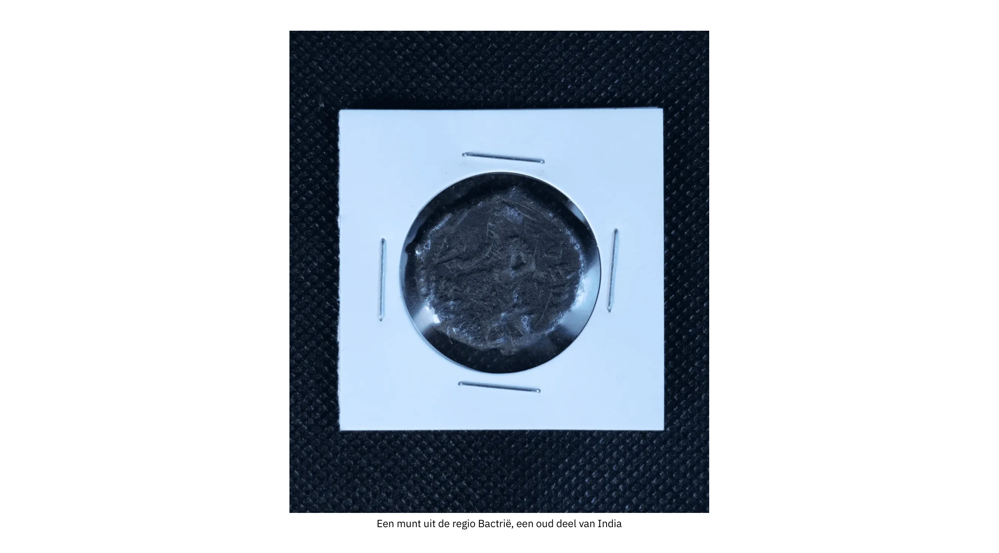

Om deze periode visueel te illustreren, zie je hierboven een munt uit een gebied in India, de regio Bactrië, dat dicht bij het westen van het Indiase schiereiland ligt, in de buurt van Afghanistan. In dit gebied waren er munten die waarschijnlijk geïnspireerd waren op Griekse munten met een van hun koninklijke persoonlijkheden.

## Lydiërs en Perzen

<chapterId>eb802ab8-8ffd-5b25-907f-8944f120ed14</chapterId>

:::video id=f151eb42-5ff3-4ca1-9af1-1ae2a5e051c0:::

### De eerste Lydische electrum munten

Omdat we het verschijnen van munten uit Lydië en de Perzen niet los van elkaar kunnen zien, gaan we verder met dat deel van de wereld ten oosten van Griekenland, dat tegenwoordig Turkije vormt. De eerste munten die in het Westen verschenen, dateren uit ongeveer het midden van de 7e eeuw voor Christus, in de regio's Lydië en Ionië, gelegen in het huidige Turkije. Het was rond 650 tot 600 voor Christus dat deze fundamentele innovatie het daglicht zag, met opmerkelijke archeologische vondsten zoals de eerste munten die werden gevonden in de tempel van Artemis in Efeze, gedateerd rond 600 voor Christus. Deze primitieve munten werden gemaakt van electrum, een natuurlijke legering van goud en zilver met amberkleurige reflecties, en zagen er vaak ruw uit met eenvoudige stempels of rudimentaire motieven.

Hieronder zie je een van de vroegste Lydische munten, met een leeuw en zijn prooi aan de voorkant. Je ziet misschien een stempel of gat aan de achterkant, dat volgens sommigen werd gebruikt om de zuiverheid van het metaal te testen en om er zeker van te zijn dat het niet slechts een oppervlaktelaag was. Hoewel dit een van de vroegste voorbeelden is, is het belangrijk om te weten dat dit een kopie is. Al mijn gouden en electrum stukken zijn replica's of moderne reproducties, ontworpen om te voorkomen dat ik al mijn spaargeld aan deze verzameling zou uitgeven.

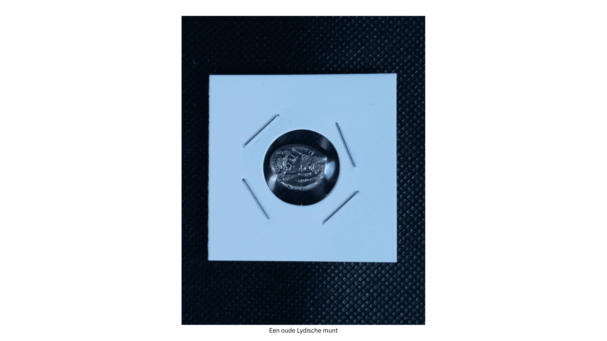

Maar ik heb ook een echt Perzisch stuk dat we zo gaan zien. Zo zagen deze vroege stukken eruit. Het is een soort klodder (of klomp, in het Engels) metaal dat in die tijd werd gestempeld.

In tegenstelling tot de wijdverspreide opvatting dat geld werd uitgevonden om de dagelijkse handel te vergemakkelijken en ruilhandel te vervangen, lijken de eerste Lydische, Achaemenidische en Griekse munten aanvankelijk niet te zijn gebruikt voor kleinschalige handel. De munteenheden waren veel te groot voor dagelijks gebruik. Bovendien was hun circulatie beperkt tot de regio's waar ze werden geproduceerd.

Hier vind ik het belangrijk om te vermelden dat, hoewel ik in verschillende werken van antropologische aard heb gelezen, de munten, zoals ik al heb laten zien - of het nu de electrummunten waren of deze Perzische munt waar ik zo op terugkom - te groot waren om er, laten we zeggen, elke dag brood mee te kopen. Ik heb schattingen gezien die ons zouden doen denken dat het het equivalent was van een dag werk voor een boer of een soldaat, dus het zou te groot zijn. Het is alsof je probeert een dagloon te betalen voor je maaltijd, je ontbijt of je lunch. Behalve dat ik in andere werken heb gezien dat er kleinere eenheden van deze klodders zijn gevonden, dus kleinere munten, waardoor we kunnen denken dat er misschien een mogelijk gebruik was voor alledaagse aankopen.

Dus hier is het antropologische "bewijs" dat het niet werd gebruikt voor alledaagse handel, omdat de denominatie of eenheid te groot was, naar mijn mening niet erg solide, omdat we voorbeelden hebben gevonden van munten die kleiner zijn en die aangepast hadden kunnen worden aan alledaagse aankopen.

### De rol van de staat bij geldschepping

De werkelijke oorsprong van munten lijkt verband te houden met de directe actie van staten. Er zijn twee belangrijke hypothesen over dit onderwerp: de eerste, idealistische, trekt een parallel tussen de Griekse term 'nomisma' (geld) en 'nomos' (wet), en suggereert dat geld gekoppeld was aan de codificatie van wetten, waardoor het gezag en de politieke organisatie van steden werden versterkt. De tweede, meer realistische hypothese, die tegenwoordig algemeen wordt aanvaard, is dat geld in de eerste plaats een middel was voor staten om economische en sociale controle uit te oefenen. Door het gewicht en de waarde van de edelmetalen die ze bevatten officieel te garanderen, konden staten de circulatie en de waarde van deze munten manipuleren en zo vertrouwen en liquiditeitspremies creëren die specifiek waren voor binnenlandse valuta.

Het is echt interessant om te weten dat we hier bewijzen voor hebben. Bij elektron munten bijvoorbeeld, moet je weten dat natuurlijk elektrum normaal gesproken ongeveer 70% goud en 30% zilver is. In de eerste munten die we hebben gevonden en geanalyseerd, met name de vroege Lydische munten, lijkt het goudgehalte meer rond de 50 tot 55% te liggen in plaats van rond de 70. Dit suggereert dat zelfs toen al muntuitgevers bezig waren met de uitgifte van electrum. Dit suggereert dat muntuitgevers toen al probeerden het aandeel van het kostbaardere metaal te verminderen, waarschijnlijk om meer munten te produceren en ze hetzelfde te laten lijken als een ongemerkte klodder natuurlijk elektrum. En hier moet gezegd worden dat het echt uit de tijd van deze beroemde Croesus kwam, als in *rijk als Croesus*, dat dit mogelijk was omdat we uit zijn tijd de technologie hadden om goud en zilver te scheiden.

De Lydische muntslag onderging een belangrijke evolutie tijdens de regering van de beroemde koning Croesus (561-546 v.Chr.), bekend om zijn legendarische rijkdom. In deze periode perfectioneerden de Lydiërs de metallurgie om goud en zilver van elektrum te scheiden en introduceerden zo de eerste bimetalen munten, d.w.z. aparte gouden en zilveren munten.

### Perzische expansie en Griekse overname

Toen ze Lydië in 546 voor Christus veroverden, namen de Achaemenidische Perzen deze innovatie onmiddellijk over. Rond 500 v.Chr., onder het bewind van Darius I, stelden de Perzen hun eigen muntsysteem in met gouden darics en zilveren siglois, vaak voorzien van de koninklijke beeltenis in krijgshaftige poses. Deze koninklijke Perzische munten werden vooral gebruikt in de gehelleniseerde regio's van het Perzische Rijk en verspreidden zich geleidelijk, hoewel het gebruik ongelijk bleef, met **sommige regio's, zoals Egypte, gaven nog steeds de voorkeur aan uitwisseling in gewogen metaal (bullion).**.

Hierboven kun je een echte Perzische sigloi (of siglos) bewonderen. Op het kleine ontwerp staat een koning afgebeeld, hoewel het gat lichtjes is weggesleten. De siglos is een zilveren munt, in tegenstelling tot de daric, die van goud was. De Perzen konden deze twee metalen onderscheiden en stapten af van electrum munten. Daarom voerden ze het bimetallisme in, waarbij ze zowel goud als zilver gebruikten terwijl ze hetzelfde concept van munten van edele metalen behielden, vaak met een gat aan de achterkant, vermoedelijk om het metaalgehalte te controleren.

De snelle invoering van munten door de Grieken lijkt te zijn gestimuleerd door hun nauwe contacten met de Lydiërs, vooral via de Griekse kolonies in Klein-Azië. De eerste Grieken die munten sloegen, waren waarschijnlijk de inwoners van Aegina in het midden van de zesde eeuw voor Christus. Zij introduceerden de drachme, waarvan het gewicht van streek tot streek verschilde en waarvan de naam letterlijk "handvol graan" of "handvol pijlen" betekent.

Het succes van de Griekse muntslag was zowel te danken aan het gemak ervan voor belangrijke transacties, zoals de betaling van huurlingen, als aan de economische en politieke expansie van de steden. Munt werd snel een centraal element van de Griekse en later de Romeinse economie, terwijl het een sterke symbolische dimensie behield, met name door de associatie met de wet (nomos).

Ten slotte getuigt de snelle uitbreiding van de muntslag van een diepgaande transformatie van de antieke samenlevingen, waar de codificatie van monetaire waarden hand in hand ging met de organisatie van de staat. Deze evolutie legde de economische en politieke basis voor de opkomst van de Griekse democratieën, vooral in Athene, waar geld een cruciale rol speelde in het functioneren van de democratische stad.

Een belangrijk punt om te onthouden uit dit gedeelte is dat we het specifiek hebben over **munten**, niet over geld in het algemeen. Het centrale aspect dat duidelijk naar voren komt, is dat van **vertrouwen in de uitgevende autoriteit**, direct gekoppeld aan de technische kenmerken van munten (gewicht, zuiverheid, nominale waarde). Het is precies dit vertrouwen dat de staat of de uitgevende autoriteit in staat stelt om vanaf het begin een zekere mate van controle uit te oefenen of zelfs de waarde en circulatie van deze munten te manipuleren.

## Institutionele interventie en de eerste munten

<chapterId>3e1efd08-99e3-5a32-9908-3185fef0e640</chapterId>

:::video id=84847cf6-9e46-4a8c-9f35-25a27496cc4b:::

### De dubbele aard van geld

De opkomst van geslagen geld doet een fundamentele vraag rijzen: is geld een spontane creatie van de markt of een door de overheid opgelegde instelling? Deze conceptuele spanning plaatst twee radicaal verschillende visies tegenover elkaar.

Aan de ene kant verdedigt de Oostenrijkse economische school het idee dat goederengeld - met name goud - op natuurlijke wijze door economische actoren werd geselecteerd vanwege zijn intrinsieke kwaliteiten: duurzaamheid, draagbaarheid, deelbaarheid en vervangbaarheid. Vanuit dit perspectief eigende de staat zich deze spontane valuta toe om het aanbod ervan te controleren. Het is een instituut dat op natuurlijke wijze voortkomt uit de behoeften van de markt voordat het in handen komt van de politiek.

De antropologische en institutionele visie daarentegen stelt dat geld pas echt ontstaat bij het munten door de staat. De autoriteit creëerde bewust de munt door haar zegel aan te brengen, waardoor het metaal in een echt monetair instrument veranderde. Dit perspectief suggereert dat de vroegste Lydische munten voornamelijk werden gebruikt om legers te betalen - één stater kwam ruwweg overeen met het dagloon van een soldaat.

### De paradoxale voordelen van standaardisatie door de staat

Ondanks deze theoretische spanning erkennen zelfs Oostenrijkse economen bepaalde voordelen van staatsinterventie in geld. Standaardisatie door muntslag lost een aantal praktische handelsproblemen op.

Zonder een certificeringsinstantie lopen economische spelers voortdurend risico's: valse munten, fraude met archieven en manipulatie van gewichten. Deze praktijken zorgen voor wrijving in de economie, omdat sommige munten worden geaccepteerd en andere worden geweigerd. In theorie garandeert de officiële stempel het gewicht en de kwaliteit, waardoor de handel vlotter verloopt.

Deze garantie heeft een waarneembare prijs op de markt: een geslagen gouden munt is meer waard dan zijn equivalent in ruw goud. Deze premie weerspiegelt de waarde van de certificering - handelaren hoeven niet langer zelf de echtheid van het metaal te verifiëren door middel van chemische of resonantietests. Staatsinterventie elimineert paradoxaal genoeg wrijving en vergemakkelijkt handel door geïnstitutionaliseerd vertrouwen te creëren.

### Valutamanipulatie vanaf het begin

Het verhaal van de eerste Lydische staters onthult een verontrustende ironie. Recente analyses tonen aan dat het goudgehalte van deze elektronmunten systematisch lager was dan dat van natuurlijk elektrum. De autoriteit die de kwaliteit certificeerde, manipuleerde tegelijkertijd de samenstelling.

Deze praktijk illustreert het dubbele nut van munten. Voor de markt maakt het uitwisselingen vloeiender en biedt het een garantie op standaardisatie. Voor de uitgevende autoriteit wordt het een instrument voor economische controle door verwatering. Door het goudgehalte te verlagen met behoud van de nominale waarde, verhoogt de staat effectief de geldhoeveelheid - door meer monetaire eenheden te creëren uit dezelfde hoeveelheid edelmetaal.

De staat zelf bleef echter beperkt door deze manipulatie. Zoals wordt geïllustreerd door het voorbeeld van de gouden solidus van Constantijn in de 4e eeuw, controleerde de Romeinse overheid nauwgezet de kwaliteit van munten, omdat ze eiste dat er in goede munten werd betaald. De overheid had een vitaal belang bij het handhaven van de kwaliteit van haar eigen muntslag om de waarde van haar belastinginkomsten te garanderen.

### Economische analyse van devaluatie

De studie van devaluatie van munten onthult consistente patronen door de geschiedenis heen. Voor metalen munten houden economen het percentage edelmetaal in de munten bij - een dalende curve die wijst op een progressieve devaluatie. Voor modern papiergeld geldt het tegenovergestelde: de circulerende geldhoeveelheid wordt geobserveerd en de toename ervan duidt op devaluatie.

Beide methoden meten hetzelfde fundamentele fenomeen: de verwatering van de monetaire waarde. Of het nu gaat om het verminderen van het edelmetaalgehalte of het drukken van nieuwe bankbiljetten, het mechanisme blijft hetzelfde. Hoe meer monetaire eenheden een autoriteit creëert uit dezelfde reële middelen, hoe meer elke eenheid aan waarde verliest.

Deze manipulatie, waarneembaar vanaf de vroegste Lydische munten, suggereert dat monetaire controle altijd een kwestie van macht is geweest. Gemunt geld vertegenwoordigt dus een opmerkelijke technische innovatie gekoppeld aan een instrument van economische controle - een dualiteit die door de hele monetaire geschiedenis loopt, tot op de dag van vandaag.

## Productie van onderdelen

<chapterId>b205f4f2-c293-5308-b812-a998de9ad45e</chapterId>

:::video id=47c612ec-d97e-4498-b50e-7e66518bd56d:::

### Van gestanste klodders tot geslagen munten

Na een hoofdstuk over het ontstaan van munten, wilde ik een heel kort hoofdstuk wijden aan de evolutie van het maken van munten. Zoals we hebben gezien, begon het allemaal met klodders elektrum, gevolgd door goud en zilver, waarbij beide zijden werden gemarkeerd met een pons, ofwel met het gezicht van de koning, ofwel met een gat in de achterkant om de zuiverheid te controleren.

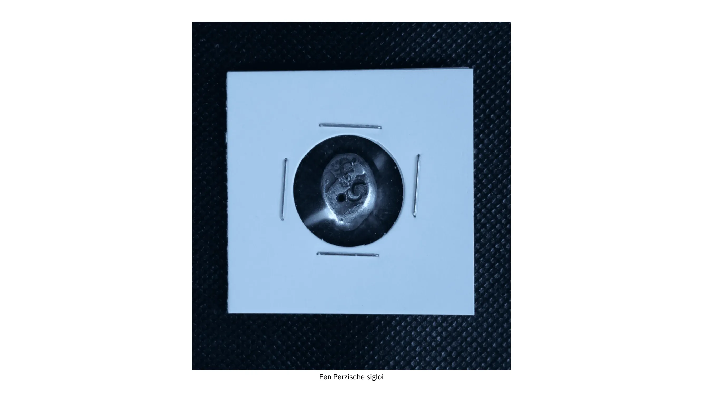

Later, zoals we in een volgend hoofdstuk zullen bespreken, verfijnden de Grieken deze technologie door ronde munten te maken die aan beide zijden werden gehamerd. Ze namen een glad, plat stuk edelmetaal, graveerden het gewenste ontwerp op de ene zijde en hamerden het dan met de hand om de afgewerkte munt te maken.

De technologie van het met de hand slaan van munten speelde waarschijnlijk een rol bij het beheersen van de inflatie in die tijd, ook al werden de munten vaak verdund om de productie te verhogen. Dit was vooral duidelijk tijdens de Romeinse periode en, in mindere mate, tijdens bepaalde oorlogen in de Griekse periode. Hoewel het slaan van munten per keer de capaciteit van de autoriteit voor massaproductie beperkte, droeg het effectief bij aan de inflatiebeheersing, ondanks de aanzienlijke devaluaties die plaatsvonden. Zo evolueerde de munt van een klodder metaal die werd geslagen naar een ronde, gehamerde munt.

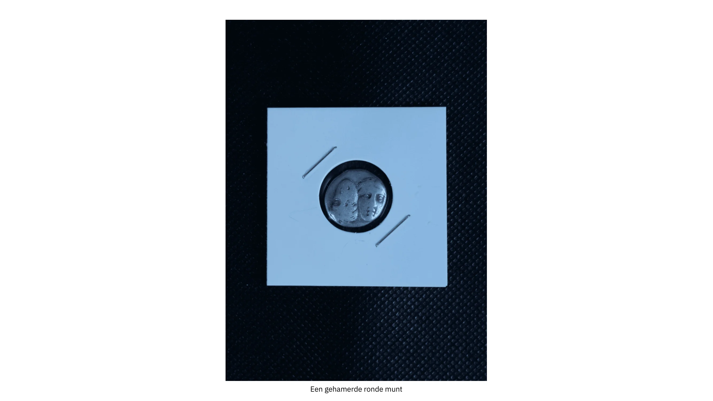

### Middeleeuwse evolutie

In de Middeleeuwen was er ook een trend om munten uit te spreiden, waardoor ze breder en dunner werden. Een van de redenen hiervoor was dat het gemakkelijker werd om het geluid te testen, dat vaak werd gebruikt als een indicator van echtheid. Door het zilver uit te spreiden, werd een duidelijke frequentie geproduceerd, zodat mensen de zuiverheid van de munt konden valideren door er simpelweg naar te luisteren. Uit deze praktijk is de term "deugdelijk geld" ontstaan. In de context van gezond geld werd het standaardgewicht bepaald door een balansweegschaal of "trebuchet" te gebruiken om te wegen. Zo ging de evolutie verder van kleine, ronde munten naar iets dunnere, bredere munten.

### Slinger slaan

De laatste technologie die aan het einde van de Middeleeuwen, aan het begin van de moderne tijd, zijn intrede deed, was het idee van slingerslaan. Het was een soort schroef die werd aangedraaid om de munten te slaan, waardoor munten ontstonden met deze nieuwe vorm van slaan. Het bijzondere aan deze ontwikkeling was de mogelijkheid om een patroon in het oppervlak van de munt te graveren om het probleem van clipping aan te pakken. Knippen hield in dat een deel van de munt werd verwijderd om kostbaar zilver terug te winnen, dat vervolgens kon worden gebruikt om andere munten te slaan of gewoon kon worden bewaard als grondstof.

Dus dit idee van slinger slaan hielp bij het clipping fenomeen. Het is interessant om te weten dat deze technologie eigenlijk uit Frankrijk kwam. In Engeland huurden ze bijvoorbeeld Franse ingenieurs in om te laten zien hoe ze deze machines moesten maken. Wat grappig is, denk ik, is dat er voorstanders van hamermunten waren die er tegen waren en die de toepassing van deze technologie vertraagden. Bij elke goede technologie zijn er altijd mensen die er tegen zijn, die de oude technologie willen behouden. Ik vond het behoorlijk gek om te beseffen dat zelfs een technologie die echt superieur lijkt - je kunt meer onderdelen maken, ze zijn moeilijker te kopiëren - er nog steeds mensen waren die gehecht waren aan de beroemde hamermethode. Er was een verschuiving tussen het produceren van onderdelen die werden gemaakt met dit beroemde slingerslaan en vervolgens terug te keren naar het hamerslaan. En uiteindelijk was het natuurlijk het slingerslaan dat uiteindelijk aansloeg en ons deze prachtige moderne stukken gaf waar je ofwel kleine lijnen, kleine ribbels rond kunt vinden om knippen te voorkomen, waarschijnlijk gerelateerd aan het woord knippen, ribbels, en je kunt vandaag de dag nog steeds ribbels of tekst of tekeningen zien die op de rand van het stuk zijn gegraveerd.

# Verschillende theorieën over het ontstaan van geld

<partId>72ac694f-9248-550d-90c1-91af3d234380</partId>

## Theorieën over het ontstaan van geld en de verschillende definities ervan

<chapterId>7d699d4d-8c70-55b5-bf36-609f3fd90bcf</chapterId>

:::video id=523c873f-501b-4954-b79f-7e74c0f685a5:::

Welkom bij dit onderdeel over de verschillende theorieën over het ontstaan van geld en de verschillende definities ervan. Hier is een kort fragment uit het boek *Aux origines de la monnaie* dat, denk ik, de twee belangrijkste theorieën samenvat die we in dit gedeelte zullen bekijken.

> Deze korte inleiding dient geen ander doel dan de context van het onderzoek te belichten. Op conceptueel niveau is het debat open tussen de aanhangers van de stelling van K. Polanyi en die van M. Weber. Voor eerstgenoemden spelen schenking en herverdeling een centrale rol en speelt marktruil slechts een marginale rol, voornamelijk in internationale uitwisselingen. Voor de anderen daarentegen staat de markt centraal in het huidige historische proces.

In Mesopotamië bijvoorbeeld suggereert de ene theorie dat de tempel, als autoriteit, de rekeneenheid of monetaire eenheid creëert, deze oplegt en dat kooplieden deze vervolgens aannemen voor de handel. De tegenovergestelde theorie stelt dat, nee, deze munteenheid op natuurlijke wijze uit de markt voortkomt om de handel te vergemakkelijken. Er zijn goed onderbouwde voorbeelden hiervan in Mesopotamië.

Sommige theorieën suggereren dat ruilhandel vooral werd gebruikt in internationale uitwisselingen, d.w.z. met mensen die we gewoon niet vertrouwden.

Dus dat is wat we in dit hoofdstuk gaan doen. We gaan een soort overzicht geven van de verschillende theorieën over het ontstaan van geld en de verschillende definities van wat geld is. We zullen de stellingen van zowel klassieke economen als antropologen presenteren en bekritiseren. Ik heb zelfs het geluk om Ulrich Fromy bij me te hebben, die het perspectief van een Oostenrijkse econoom op deze verschillende onderwerpen zal presenteren.

## Het ontstaan van geld voor klassieke economen

<chapterId>1d3776cd-0dfd-5297-af48-c6f41e257a7e</chapterId>

:::video id=873a16c1-17ac-448d-8941-df4feb7ab79d:::

Dit onderdeel is gewijd aan de verschillende theorieën over het ontstaan van geld. Het eerste onderwerp dat we behandelen is het ontstaan van geld volgens de klassieke economen.

### De klassieke theorie van Adam Smith

Volgens de klassieke economische theorieën, in het bijzonder die van Adam Smith, ontstond geld op natuurlijke wijze uit ruilhandel als reactie op de beperkingen ervan. Aanvankelijk werden uitwisselingen uitgevoerd door middel van directe ruilhandel, maar deze methode werd vaak bemoeilijkt door het probleem van het "dubbele samenvallen van behoeften": iedereen moest precies datgene bezitten wat de ander wilde. Geleidelijk aan werden bepaalde goederen (zoals zout, edele metalen en vee) door iedereen geaccepteerd als ruilmiddel, dankzij hun nut, duurzaamheid en deelbaarheid. Zo ontstond spontaan geld om economische uitwisselingen te vergemakkelijken en vloeiender te laten verlopen.

### Kritiek op de klassieke theorie

Hier volgt mijn kritiek op deze theorie. Met alles wat we in het vorige hoofdstuk hebben gezien, denk ik dat we al kunnen zeggen dat dit idee dat **munten** een evolutie zijn van ruilhandel verkeerd is, simpelweg omdat de geslagen munt zeker voortkomt uit autoriteit, omdat hij wordt geslagen door autoriteit. Daar zijn verschillende redenen voor, niet in de laatste plaats het verlangen van de autoriteiten om de economie te controleren, om controle over het geld te krijgen.

Aan de andere kant, als we het hebben over geld als concept, niet noodzakelijkerwijs over munten, dan is het minder duidelijk omdat we bij de eerste munten, de Lydische staters, zilveren klodders hebben gevonden die niet gemerkt waren. Het valt nog te bezien of ze in omloop waren. Als ze in omloop waren, betekent dit dat mensen dit goed oorspronkelijk misschien hebben geïdentificeerd als een potentiële valuta die op grote schaal kon worden gevraagd en gemakkelijk kon worden uitgewisseld. En misschien merkten de autoriteiten deze situatie pas later op en namen ze er controle over door er een stempel op te zetten om het te certificeren.

Dit heeft veel voordelen - je hoeft het niet te controleren, te wegen, enzovoort. Uiteraard zullen we het daar nog over hebben. Maar naar mijn mening zijn munten duidelijk een instrument dat vanaf het begin door staten is gebruikt. Maar wat betreft het ontstaan van geld als zodanig, weten we niet of het echt kwam van een autoriteit die het oplegde of dat het ontstond door handel of commerciële uitwisselingen. Over dit onderwerp zal ik later in dit hoofdstuk een interessante discussie hebben met mijn collega Ulrich.

We weten al dat de eerste edelmetalen munten niet werden gebruikt voor dagelijkse uitwisselingen omdat hun waarde veel te hoog was. We weten ook dat ze vooral werden gebruikt voor militaire betalingen. Dit is een goed argument voor de stelling dat geld niet per se uit de markt hoefde te komen. De rekeneenheden, de denominaties van de eerste munten, waren waarschijnlijk te groot voor bijvoorbeeld het kopen van brood of het doen van dagelijkse boodschappen. Het kon bijvoorbeeld het equivalent van een dagloon zijn. Niet per se dat mensen in die tijd loon kregen, maar dat is om je een idee te geven van de schaal. Deze munten hadden dus waarschijnlijk te veel koopkracht om te worden gebruikt in kleinschalige handel. Aan de andere kant is er niets dat zegt dat deze munten niet zouden zijn gebruikt voor grotere uitwisselingen, zoals koopmansuitwisselingen. We weten dat ze vooral werden gebruikt voor militaire betalingen. Dit is een van de populairste theorieën om het verschijnen van de eerste munten te verklaren. Onthoud dat we het hier over munten hebben, niet per se over geld in het algemeen. De eerste munten hadden dus hun eerste functie, en dat was het betalen van militaire betalingen, voor huurlingen.

Alexander de Grote maakte er bijvoorbeeld veel gebruik van, zoals we later zullen zien.

We hebben ook gezien dat kaurischelpen al in het oude China werden gebruikt voor economische uitwisseling (**beloning van arbeid, waardemeting en aankoop van land)**. Bovendien bestonden er in Mesopotamië en Egypte al functionele monetaire systemen die werden gebruikt voor handel, loonbetalingen en belastingbetalingen. Wat ik hiermee wil zeggen is dat het absoluut verkeerd is om te denken dat munten in de westerse opvatting voortkomen uit de behoefte om uitwisselingen vloeiender te maken.

Aangezien munten worden uitgegeven door een autoriteit, kunnen we misschien aannemen dat ze vanaf het begin zijn gekoppeld aan de uitgevende autoriteiten. Dat is logisch. Aan de andere kant weten we niet noodzakelijkerwijs hoe de vormen van geld of de vormen van monetaire systemen, de proto-munten, die eraan voorafgingen, zijn ontstaan. Aan de ene kant suggereren we dat het de tempels waren die deze monetaire eenheden identificeerden en dat mensen ze daarna gebruikten. Aan de andere kant zullen we je vertellen, nee, het waren de kooplieden die een ruilmiddel nodig hadden, een manier om handel te drijven met de buitenwereld, en zij waren het die bijvoorbeeld zilvermetaal identificeerden, dat gebruikt moest worden omdat er vraag naar was vanuit de buitenwereld. Het punt is dat we het niet echt weten. Daarom hebben we de twee tegengestelde theorieën. We hebben geen perfect bewijs om te verklaren of geld op natuurlijke wijze ontstaat uit de behoefte om handel te drijven, bijvoorbeeld door kooplieden, of dat het voortkomt uit autoriteit.

### Onderscheid tussen munten en primitief geld

Samenvattend denk ik dat we kunnen zeggen dat munten noodzakelijkerwijs voortkomen uit autoriteit, omdat ze door die autoriteit zijn gestempeld. Aan de andere kant denk ik niet dat we kunnen zeggen dat het verkeerd is om te suggereren dat geld (dat wat aan munten voorafging) niet kan zijn ontstaan om uitwisseling mogelijk te maken. Ik denk dat er in alle voorbeelden die we hierboven hebben gezien voorbeelden in deze zin te over zijn.

## De mythe van ruilhandel

<chapterId>0fcd4964-ac36-5163-a8cf-1aacebc0d2c0</chapterId>

:::video id=0ede29ab-8acd-4d79-9282-bd5991b97076:::

### David Graeber's recensie

We hebben zojuist het ontstaan van geld volgens klassieke economen besproken. Nu gaan we een concept behandelen dat bekend staat als de ruilhandelmythe.

Een punt van kritiek op deze klassieke theorie over het ontstaan van geld is het gebrek aan historisch bewijs om de ideeën te ondersteunen.

De kritiek die bekend staat als de "ruilhandelmythe", onder andere geformuleerd door antropoloog David Graeber, bestrijdt het klassieke idee dat geld op natuurlijke wijze is voortgekomen uit ruilhandel. Volgens deze kritiek is er geen historisch of antropologisch bewijs dat aantoont dat samenlevingen vóór de komst van geld systematisch ruilhandel gebruikten. In feite zouden oude samenlevingen hebben gewerkt op basis van krediet, schuld, sociale verplichtingen en ceremoniële uitwisselingen. De "ruilhandelmythe" is daarom een theoretische constructie om de klassieke economische visie te rechtvaardigen, zonder echte empirische basis.

Deze theorie ontkent echter niet dat ruilhandel bestond, bijvoorbeeld voor uitwisselingen tussen verschillende stammen. Het ontkent alleen dat ruilhandel een wijdverbreide activiteit was binnen deze zogenaamde primitieve groepen, en dat geld een logische evolutie van deze praktijken zou zijn. Het ontkent het feit dat ruilhandel wijdverbreid was binnen een stam en dat geld uiteindelijk ontstond om uitwisselingen vloeiender te laten verlopen en de moeilijkheden op te lossen die bestonden bij ruilhandel. In plaats daarvan beoefenden deze groepen volgens deze theorie een vorm van informeel krediet of gift voor gift.

### Primitieve samenlevingen vs. grote beschavingen

**Ik denk dat deze theorie zeker van toepassing is op primitieve (staatloze) groepen uit het verleden en zelfs vandaag de dag (bijvoorbeeld de stammen die bestudeerd zijn door ontdekkingsreizigers in de 18e en 19e eeuw). Het is duidelijk dat zij geen ruilhandel gebruikten, maar eerder de uitwisselingsvormen die ik eerder noemde, om redenen die we al hebben genoemd (zwakke arbeidsverdeling, zelfvoorzienende landbouw). Ik denk echter niet dat deze theorie van toepassing is op de grote beschavingen uit het verleden, zoals Mesopotamië en het oude Egypte.

Hier zijn twee fragmenten uit *Aux origines de la monnaie* over dit onderwerp:

> Het model dat M. Mauss schetste in zijn beroemde "The Gift" is door egyptologen met evenveel eensgezindheid en enthousiasme als gebrek aan onderscheidingsvermogen overgenomen. Dit heeft geleid tot een aantal verwarringen, waar we hier niet op in zullen gaan. Laten we eenvoudigweg opmerken dat dit model van toepassing is op zogenaamde primitieve samenlevingen, wat niet het geval is in faraonisch Egypte.

> Brood, d.w.z. verwerkte granen, waren dus rekeneenheden die, net als de shât (y) van het Oude Rijk, ook de opening van kredieten in gediversifieerde goederen mogelijk maakten. Dit eenvoudige voorbeeld laat zien dat de economie van faraonisch Egypte niet beperkt was tot een systeem van herverdeling. Het was zeer complex, met een veelheid aan uitwisselingen.

Dus, zoals we eerder zagen in het deel over Egypte en zelfs Mesopotamië en China, kunnen we zien dat zelfs deze oude, maar niet primitieve, beschavingen, vanwege de aanwezigheid van een staat, naar mijn mening, monetaire systemen gebruikten. Ik denk dat dit ruimschoots is aangetoond in het eerste deel van deze cursus. En dus is deze notie van geven en nemen, van uitgesteld krediet, niet van toepassing op deze grote beschavingen. De precieze redenen voor het ontstaan van geld blijven daarom een mysterie. We weten niet of het voortkwam uit de behoefte van kooplieden om handel te drijven met de buitenwereld, of dat het werd opgelegd door de tempel in deze oude perioden.

## Het ontstaan van geld door schuldgeld

<chapterId>4f508615-aa61-5d62-89d3-cecd02aeaa62</chapterId>

:::video id=a23f547f-3906-4f4a-8f72-5d78c649d0c4:::

### Geld als schuldbekentenis

In dit hoofdstuk behandelen we de theorie van schuldgeld.

De theorie van **schuldgeld**, met name ontwikkeld door de econoom Alfred Mitchell-Innes en later uitgebreid door David Graeber, stelt dat geld niet is ontstaan uit ruilhandel, maar eerder uit schuld- en kredietrelaties die al in de vroegste menselijke samenlevingen aanwezig waren. Volgens deze theorie verschijnt geld wanneer sociale verplichtingen (schulden tussen individuen of groepen) gekwantificeerd en overdraagbaar worden. Dit concept introduceert het begrip kwantificering van uitwisselingen en overdrachten. Geld zou dus vooral een **erkenning van schuld** zijn, ondersteund door wederzijds vertrouwen en vaak gegarandeerd door politieke of religieuze autoriteit, in plaats van een goed dat slechts dient als tussenpersoon in uitwisselingen.

Een nog geavanceerdere vorm van deze theorie is dat al het geld een schuld is. Dus iemand die geld bezit zou een vordering hebben op de maatschappij in het algemeen, een vordering op iedereen die dat geld accepteert. En aangezien geld, **in hun visie, op een verplichte manier moet worden geaccepteerd**, is het anders geen geld, want als je dit geld kunt weigeren, werkt hun systeem niet. In een bepaalde groep die een munteenheid heeft geïdentificeerd, is het alsof al degenen die deze munteenheid bezitten een schuld hebben aan alle andere leden van die samenleving die deze munteenheid accepteren, en degenen die de munteenheid accepteren hebben een vorm van schuld aan de persoon die deze munteenheid bezit. Dit is in wezen hun theorie.

### Kritiek op het verplichte systeem

**Mijn kritiek op deze theorie:**

Ik heb één klein puntje van kritiek op deze theorie. Ik accepteer dat geld een soort sociale consensus is. Het is een vertrouwen dat een groep stelt in een monetair "teken", wat dat ook moge zijn. Ik onderschrijf dus het concept van wederzijds vertrouwen, waar we later op terugkomen met het concept van de monetaire premie. Waar het ingewikkeld wordt, is wanneer de voorstanders van deze theorie het begrip verplichting toevoegen en aandringen op het begrip schuld. Voor hen is het zo dat wanneer iemand een monetair token bezit, hij een vordering heeft op de gemeenschap als geheel, en de gemeenschap zou de houder daarom een schuld verschuldigd zijn. Er zou ook een verplichting zijn om te vereffenen, waarbij groepsleden verplicht zouden zijn om de token te accepteren; anders zou het systeem volgens hen niet werken. Ik denk dat het hierboven beschreven systeem in het oude China deze theorie goed weergeeft.

Ik kan me gemakkelijk een systeem voorstellen waarbij geld een sociale consensus is waarbij de gekozen token algemeen geaccepteerd wordt als betaalmiddel, zonder formele verplichting. Ik zie zo'n systeem werken als mensen het uit vrije wil accepteren. Het kan werken. Aan de andere kant gaat het vaak gepaard met verplichtingen, wettige betaalmiddelen en geweld, wat we later in een hoofdstuk zullen zien. Maar theoretisch heb ik niet de indruk dat dit systeem helemaal kan werken. Ik denk dat Bitcoin een voorbeeld is. Bitcoin heeft waarde omdat het een monetaire premie heeft, omdat er vraag naar is voor monetair gebruik, d.w.z. reserves van waarde, misschien ook ruilmiddelen of bescherming tegen het fiatsysteem. Niemand is verplicht het te accepteren, en hoe meer het geaccepteerd wordt als betaalmiddel, hoe meer het gebruikt kan worden als ruilmiddel. We kunnen het al zonder problemen gebruiken als een opslagplaats van waarde. Daar bestaat geen twijfel over. Wat ik bedoel te zeggen is dat Bitcoin mij een voorbeeld lijkt, een soort valuta die een vorm van sociale consensus is waarbij we denken dat we ons geld terug kunnen krijgen als we later wat kopen, we kopen het om het later te kunnen inwisselen, om onze koopkracht te behouden.

Deze minder beperkende kijk op de theorie helpt te verklaren hoe twee verschillende samenlevingen handel kunnen drijven met een monetaire token zoals goud, zonder een claim of schuld te creëren tussen die samenlevingen. Acceptatie afdwingen in de samenleving, vind ik, werkt niet bij handel tussen twee stammen, omdat de andere stam niet onderworpen is aan autoriteit. Stam B is niet onderworpen aan het gezag van stam A. Maar toch accepteert het dezelfde monetaire token laten we zeggen, goud. Nu zullen mensen misschien tegen me zeggen "Ja, maar dat komt omdat bedrijf B ook heeft besloten dat goud hun valuta is", dus het werkt. Inderdaad, het werkt, maar er is geen schuldcreatie op dat moment. Het is een definitieve transactie. Dus, wanneer bedrijf A een goed inwisselt voor goud bij bedrijf B, wordt er geen schuld gecreëerd, de transactie is voltooid. En het is duidelijk dat de persoon in bedrijf B deze gouden munt of goudklomp niet heeft verworven om later betaald te worden door mensen in bedrijf A. Hij accepteert het om geruild te worden voor goud. Hij accepteert het om later uitgewisseld te worden, waarschijnlijk binnen zijn eigen stam. In dit voorbeeld is er dus geen sprake van schuldcreatie, er is geen latente claim, het is gewoon een directe ruil, een directe betaling. Voorstanders van schuldvaluta zullen ons vertellen dat dit ruilhandel is. En daar ben ik het niet mee eens, want ruilhandel is de uitwisseling van een direct goed. Directe ruilhandel is de ruil van een goed voor een ander goed, voor gebruik. Goederen worden geruild om gebruikt te worden, terwijl in ons geval goud duidelijk gebruikt wordt als ruilmiddel omdat het niet gebruikt gaat worden om iets anders te doen; het gaat later gebruikt worden als betaalmiddel. Naar mijn mening valt het dus niet in de categorie ruilhandel.

Het bezitten van een monetaire token is geen "claim" op de gemeenschap, maar eerder een hoop dat de token op een later tijdstip geaccepteerd zal worden tegen een vergelijkbare waarde.

## Het spontane ontstaan van geld

<chapterId>e3ef86b1-73b9-5140-a61e-2ab6a5b0b2d4</chapterId>

:::video id=e543995f-d5e2-49d7-9133-e397b46e0833:::

Voor de Oostenrijkse economische school, begonnen door Carl Menger, komt geld op natuurlijke wijze voort uit een ruilhandelseconomie die te maken heeft met het probleem van het dubbele samenvallen van behoeften. In deze visie convergeren individuen spontaan naar intermediaire goederen die uitwisseling mogelijk maken - geen direct geconsumeerde goederen, maar goederen die bekend staan om hun vermogen om op grote schaal te worden gevraagd.

Deze monetaire goederen moeten kwaliteiten bezitten die al sinds Aristoteles bekend zijn: ze moeten dienen als opslagplaats van waarde, ruilmiddel en rekeneenheid. Economische agenten identificeren, verzamelen en sparen ze geleidelijk, waardoor ze als geld ontstaan. Dit proces is volledig spontaan - geld is een natuurlijke reactie van de markt op het probleem van het coördineren van uitwisselingen, zonder de bewuste tussenkomst van een autoriteit.

### Het debat over de "ruilhandelmythe

Antropologen zoals David Graeber betwisten dit standpunt en beroepen zich op de "ruilhandelmythe". Hun argument: er is nog nooit een complexe beschaving gedocumenteerd die alleen gebaseerd was op directe ruilhandel. In plaats daarvan gebruikten de bestudeerde primitieve samenlevingen systemen van informeel krediet en wederkerigheid. Graeber beweert dat schuld voorafging aan ruilhandel en haalt duizenden Mesopotamische tabletten aan die kredietrelaties documenteren.

Deze kritiek is echter gebaseerd op een beperkende definitie van ruilhandel. Zoals Menger al in 1892 aangaf, gaat ruilhandel verder dan de eenvoudige directe ruil van goederen voor goederen. Het omvat ook uitgestelde overdrachten, diensten tegen loon en uitwisselingen in de tijd - wat Menger "eenzijdige overdrachten tussen individuen" noemde. Deze uitgebreide vorm van ruilhandel kan samengaan met kredietsystemen in beperkte vertrouwenskringen.

De afwezigheid van bewijs is geen bewijs van afwezigheid en Oostenrijkse economen erkennen dat geen enkele complexe samenleving zich duurzaam kan ontwikkelen op basis van directe ruilhandel alleen - vandaar de noodzakelijke opkomst van geld.

### De Mesopotamische zaak: kooplieden versus tempels

Het debat kristalliseert zich rond de oorsprong van de Mesopotamische zilveren sjekel. Er zijn twee tegengestelde interpretaties. De institutionele visie stelt dat de tempels - echte economische en spirituele centra - zilver oplegden als betaalmiddel om de economie te structureren. De spijkerschrift tafelen, geconcentreerd onder de geestelijken en de elites van de handelaren, getuigen van deze gecentraliseerde controle.

De Oostenrijkse interpretatie suggereert het tegenovergestelde: het waren de kooplieden die geld gebruikten voor de handel over lange afstanden. Geconfronteerd met de uitdaging om handel te drijven met vreemden buiten de grenzen van Mesopotamië - van Anatolië tot de Perzische Golf - hadden ze iets universeels nodig dat herkenbaar, duurzaam en transporteerbaar was. Zilver was een natuurlijke keuze vanwege zijn intrinsieke kwaliteiten. De tempels bevestigden simpelweg een praktijk die al gevestigd was door commercieel gebruik.

Deze scriptie is gebaseerd op gedocumenteerde uitwisselingen tussen Kanesh in Anatolië en Assur, waar kooplieden textiel ruilden voor zilvermetaal - niet vanwege het materiële nut, maar als een opslagplaats van waarde. Deze transacties gingen verder dan ruilhandel en onthulden het bestaan van een echte goederenvaluta.

### Het moderne voorbeeld van gevangenkampen

Econoom Richard Radford, een gevangene in Duitsland tijdens de Tweede Wereldoorlog, documenteerde een fascinerend geval van spontane monetaire opkomst. In de kampen werden sigaretten op natuurlijke wijze de uitwisselingseenheid - deelbaar, gestandaardiseerd, algemeen geaccepteerd. Zelfs niet-rokers namen ze over omdat ze hun universele ruilwaarde erkenden.

Deze microkosmos illustreert het Oostenrijkse principe: geconfronteerd met het probleem van het coördineren van uitwisselingen, komen individuen spontaan tot het meest "verkoopbare" goed. Geen enkele autoriteit legde het sigarettengeld op; het ontstond uit de dagelijkse praktijk van gevangenen die hun uitwisselingen probeerden te optimaliseren.

### De convergentie van individuele voorkeuren

In wezen vertegenwoordigt geld de convergentie van individuele voorkeuren naar een algemeen aanvaard goed. Mesopotamische kooplieden identificeerden, net als de gevangenen van Radford, het goed dat de onzekerheid van toekomstige uitwisselingen minimaliseerde. Deze keuze wacht niet op toestemming of oplegging van een centrale autoriteit - ze komt voort uit de praktische rationaliteit van economische actoren die geconfronteerd worden met de uitdagingen van uitwisseling.

Het debat tussen spontaan ontstaan en bewuste instelling blijft open, omdat de historische bewijzen fragmentarisch zijn. Maar de Oostenrijkse analyse biedt een samenhangende verklaring: geld werd geboren uit de praktische behoeften van de handel, waarbij de autoriteiten slechts praktijken institutionaliseerden die al waren ontstaan door marktgebruik.

## De antropologische visie op het ontstaan van geld

<chapterId>ec48c5d8-47ed-530f-beb7-c44fd0b62880</chapterId>

:::video id=8c1f8764-75af-4fb6-a98b-55de3b7da02e:::

### De niet-economische oorsprong van geld

In dit hoofdstuk verkennen we de antropologische visie op het ontstaan van geld, een rijk perspectief dat de klassieke economische theorieën grondig ter discussie stelt.

In tegenstelling tot de traditionele theorie dat geld op natuurlijke wijze is ontstaan uit ruilhandel om economische uitwisseling te vergemakkelijken, toont antropologisch onderzoek aan dat het ontstaan van geld grotendeels is geworteld in niet-economische oorzaken. Het komt voort uit sociale mechanismen zoals het betalen van schatting, compensatie voor moord (het beroemde Wergeld) en bruidsschat (bruidsgeld), maar ook uit ceremoniële, religieuze, politieke en symbolische praktijken, veel meer dan uit eenvoudige marktbehoeften.

In primitieve samenlevingen werd geld zelden gebruikt voor de dagelijkse uitwisseling van materiële goederen, in tegenstelling tot de klassieke definitie van geld als "ruilmiddel". Deze samenlevingen maakten juist massaal gebruik van krediet, met uitgestelde betalingen die ingebed waren in uitgebreide netwerken van sociale en persoonlijke relaties. Deze alomtegenwoordige kredietsystemen gingen logischerwijs en historisch gezien vooraf aan het verschijnen van geld.

Dat is wat hun visie samenvat. We bespreken dit met Ulrich in onze chat in de vorige video. Ik laat jullie genieten van Ulrichs commentaar over dit onderwerp, dat deze benadering een beetje uitdaagt. In de antropologische visie hebben we vaak het idee dat geld afkomstig is van een autoriteit of een sociaal concept dat voorafgaat aan de behoeften van de markt.

### Het voorbeeld van de Yap-stenen

Hieronder kun je een treffend voorbeeld bewonderen van de monumentale stenen op het eiland Yap. Sommige van deze stenen bleven, ondanks hun onbeweeglijkheid of zelfs fysieke verdwijning, volledig als geld functioneren dankzij een collectieve overeenkomst, wat de in essentie sociale en symbolische dimensie van geld onderstreept.

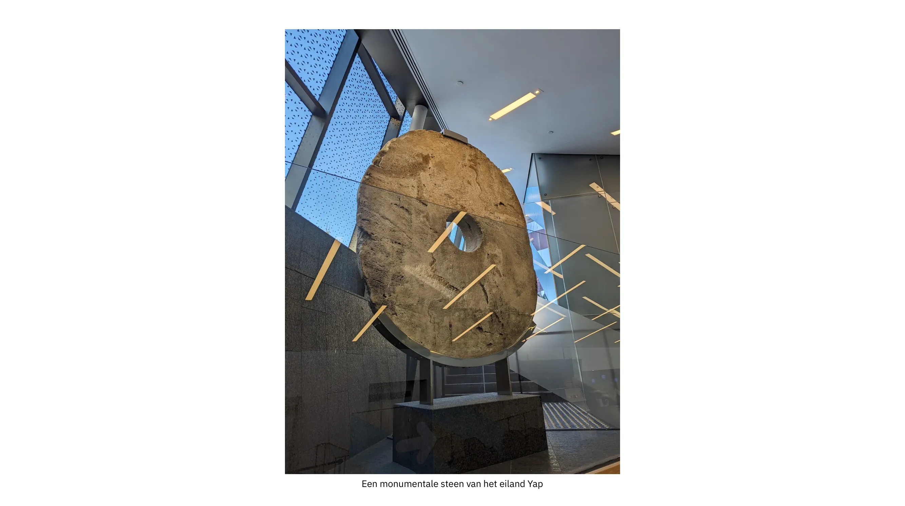

Dit is echt een interessante analyse van de Yap stenen. Saifedean Ammous noemt dit voorbeeld ook in zijn boek "The Bitcoin Standard". Volgens hem lijkt het systeem van de Yap-eilanden het meest op Bitcoin, een soort centraal register dat iedereen kan raadplegen, dat openbaar is, rekeningen bijhoudt en het eigendom van dingen beheert. Dit antropologische perspectief illustreert dat dit alles een overeenkomst of sociale consensus binnen de samenleving vertegenwoordigt, wat fundamenteel juist is. En ik vind de vermelding van de verloren stenen erg interessant. Ze gingen honderden kilometers de zee op in kleine vlotten en brachten de stenen terug. Soms viel de steen op de bodem van de zee, maar deze steen werd nog steeds gebruikt in het monetaire systeem. Iemand kon zeggen: "Ja, we hebben de steen op zo'n plek laten vallen; hij is van mij, dus we kunnen hem ruilen". Er was niet per se fysiek bezit nodig om het ruilen te vergemakkelijken, want de stenen waren zo groot dat ze vaak op één plek bleven. In plaats daarvan lag de nadruk op het wisselen van eigenaar met deze stenen op een transactionele manier, waardoor het eigendom kon verschuiven zonder dat de stenen daadwerkelijk bewogen. Het was een vorm van "bewijs van consensus", die een interessant antropologisch perspectief op geld belicht.

### Protocurrencies en sociale verplichtingen

Etnografen over de hele wereld hebben samenlevingen geobserveerd die "proto-valuta" of "primitieve valuta" gebruikten, zoals schelpen, doeken, vee, zout en stenen, die de functies vervulden die gewoonlijk aan geld worden toegeschreven, zoals een betaalmiddel en een opslagplaats van waarde, zonder echter regelmatig op te treden als tussenpersoon in de uitwisseling van alledaagse goederen.

We beschrijven hier dus monetaire systemen die niet noodzakelijkerwijs werden gebruikt voor dagelijkse uitwisselingen.

En ik wil je eraan herinneren dat dit allemaal valuta waren voor de komst van munten, en ik weet niet hoezeer het een verkeerde benaming is om valuta te zeggen. Ik zeg liever valuta. Ik kan vermelden dat we in de literatuur vaak spreken van proto-currencies om te verwijzen naar geld van voor de munten. Maar zoals we in het eerste hoofdstuk zagen, **geloof ik dat er al monetaire systemen bestonden lang voordat er munten verschenen**.

Deze primitieve munten werden voornamelijk gebruikt om fundamentele sociale verplichtingen van individuen te beheren, zoals huwelijken, compensatie voor conflicten (Wergeld) of geschenken tussen stamhoofden. In het Perzische Rijk werden de eerste munten bijvoorbeeld specifiek gemaakt als militair betaalmiddel en niet als ruilmiddel.

Primitief geld heeft dus één essentieel kenmerk: het is een betaalmiddel, maar zeer zelden een middel voor directe uitwisseling van materiële goederen. Wat we hier bedoelen is dat het een betaalmiddel was voor bepaalde sociale verplichtingen, voor stammen, voor uitwisselingen tussen stamhoofden, het beroemde weergeld, bloedgeld. Voor de komst van rechtssystemen, als iemand een moord pleegde, was er genoegdoening voor de familie die leed onder de moord op hun geliefde. Hiervoor moest een prijs worden betaald, het werd bloedgeld genoemd en het is een vorm van betaling. Er was ook de bruidsschat, ook een vorm van betaling. In dit vroege gebruik van geld als betaalmiddel was het meer gerelateerd aan menselijke en sociale verplichtingen dan aan betalingen voor alledaagse aankopen. Volgens deze theorie waren deze meer alledaagse uitwisselingen meer gerelateerd aan krediet, uitgesteld krediet, geschenk voor geschenk en de herverdeling van rantsoenen. Er was een andere vorm van sociale organisatie om deze uitwisselingen te beheren. Het is ook belangrijk om te onthouden dat in een samenleving waar iedereen zelfvoorzienend is, zijn eigen landbouw bedrijft, er geen specialisatie is en er heel weinig behoefte is aan een monetair systeem voor dagelijkse uitwisselingen. En daarom waren de eerste vormen van geld wat we zojuist beschreven, de bruidsschat, bloedgeld, simpelweg omdat dit de eerste uitwisselingen waren waarbij we een betaalmiddel nodig hadden, lang voordat we handel nodig hadden, om dagelijks brood te ruilen voor geld, want in primitieve samenlevingen werkte het niet zo. Iedereen voorzag in zijn eigen behoeften en er was nog geen specialisatie. Ik denk dat ik dit uitgebreid heb behandeld in alle voorgaande lezingen in deze cursus.

In deze samenlevingen, zonder geavanceerde arbeidsverdeling, bleven directe uitwisselingen beperkt en vonden ze voornamelijk plaats binnen persoonlijke relaties van vriendschap of alliantie. De afwezigheid van voldoende specialisatie maakte geld in de moderne zin van het woord niet noodzakelijk.

Antropologen als Quiggin en Einzig hameren op de preëminentie van krediet: **het primitieve economische leven zit gevangen in een gigantisch netwerk van kredieten en persoonlijke schulden, waar geld vooral tussenkomt wanneer betalingen onmiddellijk moeten plaatsvinden en compensaties niet gemakkelijk kunnen worden uitgesteld.**

Dus, mensen ruilen spullen, kunnen uitgesteld krediet geven, maar in sommige gevallen kun je betaling niet uitstellen, dus valuta of proto-currencies kunnen op dit punt nuttig zijn om een onmiddellijke finaliteit aan de uitwisseling te geven.

### De innovatie van anonimiteit

Deze analyse leidt tot een diepere reflectie: in plaats van geld tegenover ruilhandel te plaatsen, is het relevanter om het ontstaan ervan te begrijpen als een evolutie uit de complexe systemen van krediet en schuld. Geld introduceert een fundamentele innovatie: **anonimiteit**. En dat is waar ik deze antropologische theorie over het ontstaan van geld interessant vind. Als je een kleine groep mensen bent en je geeft elkaar uitgesteld krediet, dan ken je elkaar natuurlijk. Ik denk dat om dit systeem te laten werken, mensen elkaar natuurlijk moeten kennen. En een betaling met geld maakt anonimiteit mogelijk. Je kunt een betaling doen zonder dat mensen je naam kennen, zonder dat mensen weten wie je bent. Ze kunnen een ruil doen voor onmiddellijke en definitieve betaling. En dat is precies wat geld mogelijk maakt.

In tegenstelling tot krediet, dat altijd nominatief is, maakt geld anonieme, algemene en onmiddellijk bevrijdende transacties mogelijk. **Deze unieke bevrijdende kracht van geld is zijn beslissende superioriteit.**

Geld is dus geen bescheiden instrument om economische uitwisseling te vergemakkelijken, maar een belangrijke sociale innovatie, nauw verbonden met de evolutie van menselijke instellingen en praktijken, van persoonlijk krediet **tot een veralgemeend, anoniem betalingssysteem**. Deze antropologische evolutie laat zien dat geld, veel meer dan een eenvoudig ruilmiddel, een krachtige sociale instelling is die de menselijke samenlevingen diepgaand vormgeeft, tot op het punt dat het in onze moderne samenlevingen het eigenlijke doel van economische activiteit wordt.

Hier realiseren we ons dat uiteindelijk, in onze moderne samenlevingen, het eigenlijke doel van economische uitwisseling het bezit van geld is, terwijl dit vroeger helemaal niet het geval was. Het eigenlijke doel van economische uitwisseling was het bezitten van goederen of handelswaar voor consumptie. En vandaag de dag, door de introductie van de innovatie van geld, is het doel van economische uitwisseling het verzamelen van dit geld, omdat het ons in staat stelt het te ruilen voor het goede, zoals algemeen wordt aangenomen. We kunnen het ruilen voor het goed dat we nodig hebben wanneer we het nodig hebben.

## Register unificatie

<chapterId>7664442a-91c1-5ce4-a8bd-53b7371a3e3d</chapterId>

:::video id=473fc284-5375-4e1b-b0cd-6b51ba0cc3b8:::

### Theorie van het boekhoudregister

We gaan nu samen verschillende voorstellen onderzoeken voor de eenwording van deze twee monetaire theorieën, namelijk de theorie van het ontstaan van geld door schuldgeld en de monetaire theorie van het ontstaan van goederengeld. We gaan het hebben over het eenwordingsvoorstel van Lynn Alden in haar beroemde boek "For Broken Money", waarvan de vertaling door Consensus waarschijnlijk "Rupture monétaire" zal heten.

*Fragment uit Gebroken geld door Lyn Alden:*

> In wezen is geld een boekhoudkundig register. Grondstoffengeld is een register dat door de natuur wordt beheerd. Bankgeld is een grootboek dat wordt beheerd door natiestaten. Open-source geld is een grootboek bestuurd door zijn gebruikers.

Lyn verwijst hier naar Bitcoin.

### De voorraad-stroomverhouding en schaarste

> Sommige zeldzame chemische elementen, zoals rhodium, zijn zeldzamer dan goud, maar hebben lage voorraadratio's omdat ze even snel door de industrie worden verbruikt als ze worden gedolven. Een rhodium munt of staaf kan gekocht worden als een gespecialiseerd verzamelobject of als waardeopslag, maar is niet geschikt als sociaal geaccepteerde valuta en komt dus niet van nature als geld op.

Saifedean heeft het hier uitgebreid over in zijn boek "The Bitcoin Standard". Voor degenen die niet bekend zijn met de stock-to-flow ratio, het is simpelweg wanneer je de bestaande voorraad, de reserves die in de markt bestaan, vergelijkt met de nieuwe voorraad die binnenkomt, de instroom van nieuwe voorraad. Het is vaak nogal contra-intuïtief, omdat je zou kunnen denken dat iets dat je in grote hoeveelheden hebt niet schaars is, maar in feite is het dat niet. Het is meer een kwestie van de capaciteit die je hebt om het te leveren. Het is eerder de capaciteit die we hebben om nieuwe voorraad te hebben die ons, volgens dit model, de informatie geeft of dit object zeldzaam is of niet. Het is niet omdat we iets niet in voorraad hebben dat het zeldzaam is, het is gewoon misschien dat we het niet hebben. Dus, als we goud nemen, dan hebben we veel goudvoorraden omdat het gebruikt wordt als waardeopslagplaats, en de instroom van nieuwe voorraden is iets van 1% tot 3% per jaar van nieuwe goudvoorraden die binnenkomen via goud mining. Terwijl, wat ze hier zegt, als we het hebben over rhodium, het zeldzamer is dan goud, maar we hebben geen voorraden omdat het verbruikt wordt terwijl het gaat. Er is dus niet veel nieuw aanbod nodig om de bestaande voorraad te verdubbelen. Terwijl het met goud minstens 50 jaar zou duren om te vernieuwen, om de voorraad te verdubbelen. In tegenstelling tot de meeste goederen die geconsumeerd worden, waar het vrij gemakkelijk is en niet veel jaren productie vergt om de bestaande voorraad te verdubbelen, omdat het verbruikt wordt terwijl het gaat.

*"Goud heeft door de moderne geschiedenis heen een stock-to-flow ratio van tussen de 25x en 100x behouden, meestal rond de 50x of meer, kortstondig nooit onder de 16x, zelfs niet tijdens de Gold Rush van het midden van de 19e eeuw. "*

Dus 25 betekent 25 jaar om de voorraad te verdubbelen en 100 betekent 100 jaar om de voorraad te verdubbelen. Saifedean zegt in zijn boek dat zelfs als we de goudproductie zouden verdubbelen, van zeg 1,5% naar 3%, dit niet per se een groot effect zou hebben op de prijs.

*"Zilver heeft over het algemeen een stock-flow ratio van 10x of meer, wat nog steeds relatief hoog is.*

*De meeste andere grondstoffen hebben een stock-flow ratio van minder dan 1 of 2. Zelfs de zeldzaamste elementen, zoals platina en rodium, hebben een relatief lage stock-flow ratio vanwege hun snelle industriële consumptie."*

### De superioriteit van goud en zilver

*"Kortom, telkens wanneer een grondstofvaluta moest concurreren met goud en zilver, kwam de laatste uiteindelijk altijd als beste uit de bus. Andere grondstoffen kunnen gedurende beperkte perioden of in specifieke regio's valuta blijven, maar goud en zilver hebben altijd hun vermogen bewezen om wereldwijd concurrerende valuta te worden en de concurrentie te domineren. Dit komt omdat, wanneer beschavingen elkaar ontmoetten, houders van goud en zilver altijd de technologische capaciteit hadden om andere vormen van valuta te devalueren, terwijl houders van schelpen, parels, vee, zout, stof of inferieure metalen nooit goud of zilver konden devalueren."*

Dit wordt dus weer heel goed beschreven in De Bitcoin Standaard waar Saifedean het heeft over de stammen in Afrika die glazen kralen gebruikten. En toen de Venetiaanse kooplieden arriveerden met ladingen vol glaskralen, omdat ze die in die tijd industrieel konden produceren, omdat ze de technologische capaciteit hadden om dat te doen, destabiliseerde dat volledig het monetaire systeem van deze volkeren en konden ze letterlijk hun hulpbronnen plunderen. Dit is de stelling van Saifedean.

### Rekeneenheid en krediet

*"Historisch gezien werd krediet, zelfs als het direct als ruilmiddel werd gebruikt, meestal uitgedrukt in eenheden van monetaire goederen die van nature werden gekozen vanwege hun eigenschappen."*

Dat is een heel interessant punt, waar Ulrich en ik het over hebben gehad. Zelfs als de tempel in Mesopotamië een soort autoriteit was die dit idee van krediet kon beheren, dan nog was de rekeneenheid de shekel. Niets bevestigt dat de shekel op gezag van de tempel werd ingesteld. De shekel kan op natuurlijke wijze zijn ontstaan, door de behoefte van kooplieden om te importeren en exporteren met andere volkeren in de omgeving. We hebben hier bewijs voor in de vorm van een koopman in Kanesh (ik noemde dit al in deel 1) die precies dat deed, edele metalen importeren die niet werden gebruikt voor hun fysieke goederenwaarde, maar eerder als een opslagplaats van waarde. Het enige probleem is dat we niet weten of we kunnen aannemen dat deze keuze van zilver, van de zilveren sjekel, werd gemaakt door de handelaren, of dat het werd gemaakt door de tempel. Maar Ulrich heeft een heel goed argument dat ons doet denken dat het waarschijnlijk eerder aan de kant van de kooplieden was dat het werd gemaakt.

*"De vereniging van de twee theorieën kan dus beschreven worden als een "boekhoudtheorie van geld" ("ledger theory of money"), omdat het de fundamentele logica beschrijft die beide theorieën gemeen hebben. Zowel flexibel sociaal krediet als verzamelbare proto-valuta gaan terug tot het begin van de mensheid. In beide gevallen houden menselijke groepen van verschillende grootte onderling een boekhouding bij om te voorkomen dat behoeften dubbel moeten samenvallen, om wrijving bij uitwisselingen te verminderen en om te dienen als een vorm van liquide spaargelden. Het essentiële verschil ligt in de autoriteit die belast is met het bijhouden van het register."*

Aan de ene kant beheert de natuur de expansie van de geldvoorraad. Dus, als we goud nemen, omdat het vrij zeldzaam is, is het moeilijk te delven. Er is een soort limiet aan het aantal gouden munten dat kan worden gedolven. Schaarste wordt dus beheerd door de natuur. En het register wordt bijgehouden door het concept van bezit. Het register is gedecentraliseerd. Bezit wordt bewezen door het feit dat je een gouden munt of een stuk goud bezit. En in het geval van kredietgeld wordt schaarste beheerd door het vermogen van mensen om krediet te krijgen. Of in het geval van fiatvaluta wordt schaarste beheerd door autoriteit. Zij beslissen of ze meer geld bijdrukken of niet, om inflatoire rampen te voorkomen. In sommige gevallen kan het register dus ook beheerd worden door de eigenaar van de token, in het geval van papiergeld. Daarom staat het tussen aanhalingstekens in het register, gedematerialiseerd. Nou ja, gematerialiseerd, maar virtueel. Hij bezit deze beroemde token, en dat bewijst het bezit. En het kan net zo goed in een echt register staan, zoals bij schriftgeld, in een bank, waar het echt de menselijke bank is die beheert wie wat bezit in relatie tot het register.

## Eenmaking door de monetaire premie

<chapterId>093756e5-8908-55e5-bb76-376a3a3cc4d3</chapterId>

:::video id=eabc342a-ecbd-46ca-a347-e914917e7c4f:::

### Het concept van de monetaire premie

In dit gedeelte gewijd aan de verschillende voorstellen voor het verenigen van de verschillende theorieën over het ontstaan van geld, heb ik zojuist de theorie van Lyn Alden, de registertheorie, voorgesteld. Ik heb mijn eigen voorstel voor het verenigen van de twee monetaire theorieën. Het is de monetaire premie, het concept van monetaire premie. De waarde van geld kan dus worden verklaard door de monetaire premie die voortvloeit uit de vraag naar geld, of dat nu in de vorm van kleitabletten, edelmetalen munten, bankbiljetten of bitcoin is. De monetaire premie is simpelweg gebaseerd op het vertrouwen dat iemand deze valuta in de toekomst zal inwisselen voor een vergelijkbare prijs.

Wat ik hier probeer aan te tonen is simpelweg dat of het nu fiat is, d.w.z. bankbiljetten zonder gebruikswaarde, of het nu gouden munten zijn of welk metaal dan ook, een goudklomp of een staaf, **het vaak de monetaire premie is die het grootste deel van de waarde uitmaakt**. Als we een stuk goud nemen, wordt een bepaald deel van de waarde verklaard door de gebruikswaarde, het gebruik in de industrie of voor het maken van juwelen. Merk op dat de vraag naar juwelen vaak voortkomt uit de monetaire waarde. Mensen bewaren sieraden als een soort opslagplaats van waarde, dus ik neem dit een beetje mee in de monetaire premie omdat het vaak een vrij monetaire vraag is om een rol te spelen in geld.

Je zou dus kunnen zeggen dat ongeveer 10% van de vraag naar goud bestemd is voor de industrie. In de waarde van goud zou een klein deel, laten we zeggen 10%, verklaard worden door deze industriële vraag, deze vraag naar het gebruik van goud, waar goud wordt verbruikt. De rest is duidelijk de vraag naar het monetaire gebruik als een opslagplaats van waarde.

### Autoriteit bonus en fiat

En als je een stuk goud vergelijkt met een gouden munt, is er nog een laag. De gouden munt is gestempeld door een autoriteit en het goud in het stuk geniet ook een vraag naar gebruik, een vraag om verbruikt te worden in de industrie. Het geniet ook een monetaire premie als waardeopslag. Bovendien is er een overlay die ik de autoriteitspremie noem, waar er vaak een prijs, een grotere koopkracht voor de munt zal zijn dan voor het stuk goud, omdat de munt eenvoudiger te gebruiken is. Het maakt uitwisselingen soepeler, omdat het niet nodig is om het te wegen. De autoriteit garandeert normaal gesproken de zuiverheid. En als je het vergelijkt met een stuk goud, is een gestempelde gouden munt over het algemeen meer waard dan een gewoon stuk goud. En dat is ook normaal, want het kost middelen om het te stempelen.

Het is hetzelfde principe voor fiat, papiergeld. Papiergeld heeft niet echt een gebruikswaarde, behalve misschien om een huis te verwarmen, en dat gebeurde tijdens de Weimar Republiek. Er is dus geen echte vraag naar de gebruikswaarde ervan. Aan de andere kant is er volgens mij alleen een premie voor autoriteit.

Het is een vorm van monetaire premie, een overlay op de monetaire premie. Maar de monetaire premie komt voort uit het feit dat het een wettig betaalmiddel is en de autoriteiten je dwingen het te kopen om je belastingen te betalen. Dus fiatvaluta heeft noodzakelijkerwijs een vorm van monetaire vraag die voortkomt uit het feit dat het belast wordt en je het op zijn minst moet kopen om je belastingen te betalen. En daardoor blijft het een algemeen aanvaard betaalmiddel. Dus mensen willen het verwerven om aan hun behoeften te voldoen.

### Eenmaking door monetaire vraag

En waarom komt dit voorstel voor een monetaire premie in aanmerking als een vereniging van de twee theorieën van schuldgeld en goederengeld? Nou, ik denk niet dat de waarde van een gouden munt noodzakelijkerwijs voortkomt uit zijn "intrinsieke waarde". Nee, in feite is het net zo goed een begrip van vertrouwen als voor fiatgeld. Het is een kwestie van monetaire vraag. En het is niet echt omdat het een klein percentage industrieel gebruik heeft, een ander "nut". Als we zeggen dat 10% van de waarde bestaat uit industrieel gebruik, dan kunnen we dat waarderen op $300 per ounce. Als goud op de markt wordt verkocht voor $3.000 per ounce, dan is het verschil tussen $300 en $3.000 de beroemde monetaire premie. Het is deze monetaire vraag naar goud die het verklaart. Het is niet omdat fiat nul gebruikswaarde heeft dat het anders is. Voor mij is het precies hetzelfde. Dus aan beide kanten, de theorie van schuldgeld of goederengeld, denk ik niet dat de extra kwaliteit die goud zou hebben, namelijk dat het een minimale gebruikswaarde heeft, iets verandert.

Aan de andere kant is het zeker dat **op het niveau van ontstaan, volgens het regressietheorema van Mises, we kunnen voorstellen dat dit gebruik een vraag creëert bij de oorsprong en het proces initieert dat geld wordt.** Terwijl het op het niveau van schuldgeld meer een oplegging is door een autoriteit, dus de bron, de initiatie van ontstaan, en de concepten zijn totaal verschillend. **Maar ik denk dat we op het niveau van waarde, hoe we de waarde van geld verklaren, met de monetaire premie net zo gemakkelijk kunnen verklaren waarom fiatgeld de waarde heeft die we eraan toekennen en waarom goederengeld de waarde** heeft die we eraan toekennen. Voor mij is het hetzelfde proces, en het heet de geldpremie.

#### De monetaire premie

Dat is het. De waarde van geld kan worden verklaard door de monetaire premie die voortvloeit uit de vraag naar geld, of het nu in de vorm van kleitabletten, edelmetalen munten, bankbiljetten of bitcoin is.

De monetaire premie is simpelweg gebaseerd op het vertrouwen dat iemand dit geld later zal inwisselen voor een vergelijkbare prijs.

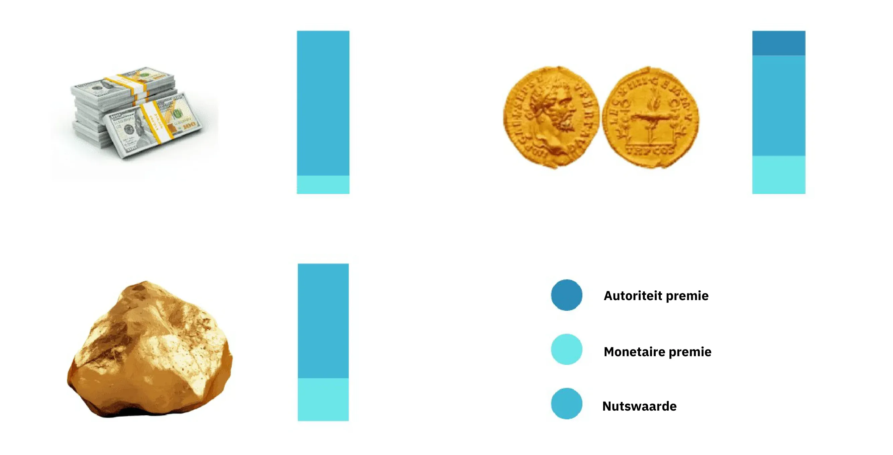

# Verschillende definities van geld

<partId>77b7918a-8c3b-11f0-b688-6b2ab22378c9</partId>

## Geld vs valuta vs monnaie vs argent vs devise

<chapterId>bf8a6d21-df88-5d23-a0a5-e9a5c1300554</chapterId>

:::video id=d9c9e7df-9db3-4a9f-801e-10d3fc7dfc22:::

### Semantiek van monetaire termen

In dit gedeelte over de verschillende monetaire theorieën en in het bijzonder over de definities van geld, wil ik een korte opmerking maken over het onderwerp semantiek. Ik wil wat dieper ingaan op de definities van een aantal woorden die met geld te maken hebben en ze vergelijken met hun Engelse equivalenten. Bijvoorbeeld geld, currency, vergeleken met monnaie, argent en devise. Het gaat dus als volgt.

Een beetje semantiek:

Als we "**geld**" (de la monnaie) zeggen, zullen de meeste mensen denken dat we het kleingeld bedoelen dat we ontvangen in ruil voor een transactie. En als we "**valuta**" (la monnaie) zeggen, zullen mensen waarschijnlijk denken dat we de valuta van een staat bedoelen. De munteenheid van Canada is de Canadese dollar. Dat klopt.

Maar hoe zit het met geld (de l'argent)? Een dief zal nooit zeggen "Geef me al je kleingeld!" (de dief zou wel eens teleurgesteld kunnen zijn als hij alleen maar munten van bijna geen waarde krijgt).

Nee, de dief zal roepen: "Geef me **al je geld**". En als de dief op straat voor je staat, bedoelt hij per se **de bankbiljetten** in je zak.

Aan de andere kant, als de dief je op een meer geraffineerde manier probeert te bedriegen en je vermogen probeert te stelen door al je bankrekeningen leeg te halen, zouden we zeggen dat **hij al je geld** afpakt. Hier verwijst het woord "geld" naar **het vermogen van het individu**.

Er zijn dus twee definities voor het woord geld: contant geld (bankbiljetten) en rijkdom.

### Valuta vs monnaie vs devise

Een valuta (devise) is noodzakelijkerwijs de valuta van een ander land, anders zeggen we gewoon geld (monnaie). Als je Frans bent, zou je zeggen: "La livre sterling est la devise du Royaume-Uni et l'euro et la monnaie de l'Europe" (Het Britse pond is de munteenheid van het Verenigd Koninkrijk en de euro is de munteenheid van Europa).

Vaak zullen mensen die zich niet in deze semantische problemen hebben verdiept, bij het vertalen van deze termen, geneigd zijn om te spreken van valuta (devise) als het geschreven valuta is, maar nee, valuta is geld (monnaie) als het de valuta van jouw land is, en het is devise als we het over andere valuta hebben. Het probleem dat ik hier vaak zie, is dat er in het Engels twee woorden zijn: er is "money", wat een concept is, en er is "currency", wat echt de eenheid van een land is die wordt gebruikt om uitwisselingen te doen. We kunnen dus gewoon praten over het concept geld; dat is makkelijk - het is het concept van het woord *geld*; het is geld in het algemeen. En *valuta* is heel eenvoudig gelijk te stellen aan de valuta van een land. In het Frans zeggen mensen helaas vaak "mais ce n'est pas une monnaie" als ze het over bitcoin hebben, omdat het niet de valuta van een land is, maar vaak denk ik dat ze in plaats daarvan naar de termen valuta verwijzen. Dit is aan de ene kant verkeerd, want sinds El Salvador is bitcoin de valuta van een staat. Feit blijft dat mensen vaak zullen zeggen: *maar nee, het is niet de valuta van een staat, het kan geen geld zijn*. Maar in feite, als we verwijzen naar het bredere concept van *geld*, past bitcoin perfect in deze definitie, naar mijn mening. Het is alleen zo dat we in het Frans geen twee woorden hebben om deze twee concepten van elkaar te scheiden. We zouden kunnen zeggen dat het woord argent verwijst naar valuta, maar helaas is dat niet de precieze definitie. *Argent* (geld) verwijst naar rijkdom of bankbiljetten. Je kunt niet echt een vergelijking maken met het woord *geld*. *Geld* is eigenlijk het concept van valuta (monnaie).

## Definitie van Saifedean Ammous

<chapterId>07c4ba50-168c-567a-8957-0b187ff75f97</chapterId>

:::video id=936d6d3b-6d45-468e-bc44-85fbce9b857a:::

#### Wat is geld?

Geld is gewoon iets dat je bezit of verwerft, niet om het zelf te gebruiken of te consumeren, maar om het later te ruilen voor andere goederen of diensten die je misschien nodig hebt. (Saifedeaans)

Geld krijgt een monetaire premie als er een monetaire vraag bestaat naar het goed, om een of meer van de rollen van geld te spelen.

Het monetaire goed moet schaars genoeg zijn om de monetaire premie te laten voortbestaan (om te voorkomen dat het aanbod zich aanpast aan de monetaire vraag).

### De monetaire premie

In dit deel over de verschillende definities van valuta wil ik het kort hebben over Saifedeans definitie in The Bitcoin Standard, die altijd mijn grote interesse heeft gehad. Het leek me heel eenvoudig toen ik het las. En we gaan ook het concept van monetaire premie toevoegen aan deze definitie. Zoals Saifedean in zijn boek zegt, is er noodzakelijkerwijs een concept van schaarste. De vraag is, wat is geld?

> Geld is gewoon iets dat je bezit of verwerft, niet om het zelf te gebruiken of te consumeren, maar om het later te ruilen voor andere goederen of diensten die je misschien nodig hebt.

Dat is dus de definitie die Saifedean noemt in De Bitcoin Standaard. Ik zou hieraan willen toevoegen dat een valuta (la monnaie) een monetaire premie krijgt als er een monetaire vraag is naar het goed, om een of meer van de rollen van de valuta te vervullen. Je zou dus kunnen zeggen dat een valuta die dient als een opslagplaats van waarde een monetaire vraag zal hebben die het een monetaire premie geeft, omdat mensen het willen verwerven, bijvoorbeeld als een opslagplaats van waarde of als een ruilmiddel.

### Schaarste en marktmechanismen

Ik denk dat we hier zeker aan moeten toevoegen dat het monetaire goed schaars genoeg moet zijn om de monetaire premie te laten bestaan. Dit is erg belangrijk. **Als een goed te voorschijn komt om als geld te worden gebruikt en we zien dat de prijs ervan omhoog gaat, zullen mensen, als het goed niet zeldzaam genoeg is, er normaal meer van willen produceren om te profiteren van de waardestijging als de prijs omhoog gaat**. Daarom hebben de meeste goederen op de markt een relatief vaste prijs. Als de prijs stijgt, neemt de productie toe. Als de prijs daalt, daalt de productie. Er is een soort marktaanpassing. **En als een goed zeldzaam genoeg is, zoals goud, zal het marktmechanisme deze toegenomen vraag naar monetair gebruik niet compenseren. Dus het is de variabele die verandert, het is de prijs. Zoals bij bitcoin**. Als de prijs van bitcoin stijgt, produceren we niet meer bitcoin. Dus wat zich aanpast is de prijs. En daarom zien we al jaren dat de prijs van bitcoin stijgt als de vraag naar bitcoin toeneemt. Omdat er niemand op aarde is die het algoritme kan veranderen en kan zeggen "er is meer vraag, de prijs gaat omhoog, we gaan meer produceren" **Het aanbod van nieuwe bitcoins is van tevoren geprogrammeerd en van tevoren bekend**. Dus dat is wat ik zei, dat het monetaire goed zeldzaam genoeg moet zijn om de monetaire premie te laten voortbestaan, en dus niet ingehaald kan worden door marktmechanismen, om te voorkomen dat het aanbod zich aanpast aan deze nieuwe monetaire vraag.

## Betaalmiddelen en bevrijdende waarde

<chapterId>5d424039-e342-56f7-9d8b-bba9551831a9</chapterId>

:::video id=af4c0765-8111-4cb7-891b-3ee54d6e7054:::

### Betaalmiddel vs. ruilmiddel

In dit gedeelte over de verschillende definities van geld stel ik voor om samen te kijken naar een citaat uit het boek "Aux origines de la monnaie" (De oorsprong van geld), een tekst van Alain Testart over geld als betaalmiddel en als bevrijdende waarde.

*In Aux origines de la monnaie definieert Alain Testart geld als een betaalmiddel:*

> De functie van betaalmiddel wordt hier onderscheiden van de functie van ruilmiddel, voor zover er betalingen zijn zonder tegenprestatie, betalingen die niets kopen. Knies (1873:192 e.v.) gaat uitvoerig in op dit thema van overdrachten van goederen die niet bestaan uit ruilhandelingen, zoals in het geval van weergeld (bloedgeld of vergoeding voor moord) of belastingen. Carl Menger viel deze vierde functie aan in zijn artikel "Geld" uit 1892, dat algemeen beschouwd wordt als een van de meest doorslaggevende over dit onderwerp. Zonder helemaal in diskrediet te zijn geraakt, lijkt het idee van de functie van betaalmiddel tegenwoordig vergeten te zijn in het economische denken, of op zijn minst verworpen ten gunste van die van ruilmiddel.
>

> Geld wordt gebruikt om te betalen: zo bezien is het een bevrijdingsinstrument, dat in al zijn algemeenheid de functie van betaalmiddel beschrijft. In dit opzicht spreken we van de "bevrijdende kracht" van geld. Volgens Le Petit Robert is bevrijdende kracht "datgene wat het effect heeft van bevrijding (van een verplichting, een schuld)". Volgens de Grand Larousse is een bevrijdende betaling elke "betaling die onder wettelijke voorwaarden wordt gedaan op zo'n manier dat de schuldeiser het tenietgaan van de schuld niet kan aanvechten". Geld heeft deze kracht bij uitstek; het is zelfs wat de status van wettig betaalmiddel definieert, aangezien niemand een betaling in geld kan weigeren, of het nu gaat om de verkoper of de schuldeiser. Geld is het enige goed dat niet geweigerd kan worden bij de betaling van wat verschuldigd is, ongeacht of de schuld nu bij een handelaar of de fiscus ligt. Van alle goederen heeft alleen geld dit voorrecht. "Het is dit voorrecht," schrijft Charles. Gide (1921 I: 443), dat is wat wij een wettig betaalmiddel noemen.
>

> Elke ruil die bestaat uit de overdracht van een goed voor een ander goed, of op voorwaarde dat er een ander goed voor wordt teruggegeven, houdt noodzakelijkerwijs een verplichting in voor de ontvanger om deze tegenprestatie te leveren. Betaling is de nakoming van deze verplichting. Alle ruil impliceert dus betaling, maar niet alle betaling impliceert ruil. Er zijn betalingen zonder tegenprestatie, d.w.z. betalingen die het niet mogelijk maken een ander goed te verkrijgen en die niet met dat doel worden gedaan. Belastingen blijven hier het voorbeeld bij uitstek; we moeten ook boetes van allerlei aard noemen die aan de overheid worden betaald, en herstelbetalingen aan anderen volgens het principe dat wie anderen schade berokkent, die moet herstellen.

### Betalingen zonder tegenpartij

Dit is een duidelijke illustratie van de stelling van de auteur. In feite maakt hij onderscheid tussen de twee. Voor hem is een ruil zowel een overdracht van goederen als een betaling. Betaling komt daarna. En betaling kan plaatsvinden zonder uitwisseling. Hij geeft voorbeelden van hoe het betalen van een parkeerkaartje of een boete gewoon een betaling is. Je krijgt niet echt een dienst in ruil. Sommigen zullen misschien beweren dat de staat je een dienst bewijst in ruil voor het geven van parkeerboetes. Hij is heel duidelijk over het feit dat belasting betalen echt een betaling zonder tegenpartij is, in de zin dat belasting betalen verplicht is, zelfs als je niet noodzakelijk een dienst krijgt. Hij zegt dat het echt gedefinieerd is dat belasting betalen gewoon een betaling is; er is geen verplichting om in ruil daarvoor diensten te ontvangen. Ik heb dit met veel van mijn collega's besproken en zij zijn het niet noodzakelijk eens met deze opvatting. Maar dat is de stelling van de auteur. Hij probeert het begrip betaling te plaatsen en het los te koppelen van uitwisselingen met deze voorbeelden, bijvoorbeeld van boetes, belastingbetaling. Ook, bijvoorbeeld, de bruidsschat, hij drukt uit dat de bruidsschat een betaling is; je krijgt niet noodzakelijk iets in ruil. Iemand die dit voorstel bekritiseert zou kunnen zeggen: "Ja, maar in ruil krijg je een vrouw." Dus dat is het niveau van het debat over dit onderwerp.

Er is ook het weergeld, of bloedgeld. Het is dus gewoon een betaling ter compensatie. Mijn vriend Ulrich zou zeggen:

> Ja, maar in ruil daarvoor krijg je dit bestand gesloten.

Dus, je hebt een misdaad begaan, een moord bijvoorbeeld. Op dat moment betaal je het weergeld en daarna word je bevrijd uit die situatie. Er is dus een bevrijdende kracht. Krijg je er iets voor terug?" Volgens de auteur niet. Volgens sommige collega's wel.

Ik denk dat we in deze discussie kunnen zien dat het weergeld een van de goede voorbeelden is om een betaling te definiëren. Het is duidelijk dat je er niets voor terugkrijgt.

## Schuldgeld vs. goederengeld

<chapterId>4093677a-c8e8-5828-b994-15c01656186e</chapterId>

:::video id=f49cf5cc-288e-4daa-a1ff-b9de73506f4e:::

### Het fundamentele debat

Laten we, nog steeds in de context van dit gedeelte over verschillende monetaire definities en theorieën, samen twee diametraal tegenovergestelde visies onderzoeken: "geld is altijd schuld" of "geld is altijd handelswaar". Aan de ene kant zijn er de voorstanders van de op schulden gebaseerde monetaire theorie, die beweren: "Nee, geld is altijd schuld! Aan de andere kant beweren onze beroemde gold bugs: "Maar nee, zie je, geld is altijd een grondstof, het is altijd goud; al het andere, rekeningen, schuldbekentenissen, is alleen maar krediet, geen geld".

Laten we samen een duidelijke samenvatting van deze theorieën bekijken.

### De "altijd een schuld" theorie

Hier volgt een samenvatting van de monetaire theorie die bekend staat als **"schuldgeld"**, volgens welke geld fundamenteel een vorm van schuld is:

Volgens deze theorie, die met name is ontwikkeld door Alfred Mitchell-Innes en verder is uitgewerkt door David Graeber, is geld intrinsiek een erkenning van schuld, die voortkomt uit de kredietrelaties die historisch gezien voorafgingen aan directe monetaire uitwisselingen. In plaats van voort te komen uit een behoefte gekoppeld aan ruilhandel, verschijnt geld als een manier om sociale verplichtingen of schulden tussen individuen of groepen te verantwoorden, over te dragen en te vereffenen.

Al het geld circuleert dus als een schuld van de ene persoon of instelling aan de andere, ondersteund door het vertrouwen en de sociale of staatsautoriteit die de geldigheid ervan garandeert. Dus als we geld bezitten - ik heb het al gezegd - als we geld bezitten, hebben we volgens hen een vordering op de maatschappij, en is de maatschappij ons een schuld verschuldigd. Geld is dus nooit neutraal of autonoom, maar altijd een onderliggende schuld: geld bezitten betekent in wezen een vordering hebben op de maatschappij of een economische gemeenschap.

Deze redenering is in tegenspraak met het klassieke idee van geld als een eenvoudig "intermediair goed" en benadrukt in plaats daarvan de centrale rol van sociale en politieke relaties in de creatie en het beheer van geld.

**Mijn recensie:**

Wat mij stoort aan deze theorie is dat ze beweert dat geld altijd een schuld is, terwijl we voorbeelden hebben van uitwisselingen tussen twee verschillende stammen die bijvoorbeeld goud ruilen, waarbij de transactie definitief is en er geen latente schuld overblijft. Voorstanders van deze theorie zullen ons vaak vertellen dat deze uitwisselingen geen monetaire uitwisselingen zijn, maar ruilhandel. Zoals eerder gezegd, ben ik het daar niet mee eens. Het is een monetaire ruil, omdat het goud niet wordt geconsumeerd; het wordt gebruikt als geld.

### De "altijd een grondstof" theorie

**Altijd een grondstof:**

Hier volgt een duidelijke samenvatting van de monetaire theorie die bekend staat als **"grondstoffengeld"**, waarbij geld altijd ontstaat als een grondstof, met name goud, dat ontstaat uit een behoefte om te kunnen handelen, een grondstof die over het algemeen in het buitenland wordt geaccepteerd en die wordt aangeschaft voor handelsdoeleinden.

Volgens deze theorie, ontwikkeld door de klassieke economen (Adam Smith, David Ricardo) en overgenomen door Marx, ontstaat geld op natuurlijke wijze als een goed onder andere, vaak een edelmetaal zoals goud of zilver, dat een intrinsieke waarde heeft die losstaat van zijn monetaire rol. In eerste instantie worden deze goederen spontaan gekozen door economische spelers om de handel te vergemakkelijken, dankzij hun intrinsieke kwaliteiten (schaarste, duurzaamheid, deelbaarheid en stabiliteit).

Goederengeld onderscheidt zich door zijn fysieke bestaan en een waarde die bepaald wordt door de hoeveelheid arbeid die sociaal vereist is om het te produceren (zoals bij Marx). De maatschappij gebruikt goud bijvoorbeeld niet alleen om ruilhandel te vereenvoudigen, maar ook als rekeneenheid, waardeopslag en universeel ruilmiddel.

In deze visie behoudt geld altijd een reële waarde, omdat het gekoppeld blijft aan een tastbaar goed. Zelfs wanneer de rol van geld abstract wordt (geslagen munten, bankbiljetten of bijbels geld), vloeit de geldigheid ervan nog steeds direct of indirect voort uit een verwijzing naar een onderliggende grondstof zoals goud. Deze theorie legt daarom de nadruk op de materiële en economische oorsprong van geld, in tegenstelling tot theorieën die het slechts beschouwen als een conventie of schuld. Volgens deze theorie zou elke representatie van geld door een substituut, zoals een in goud terugbetaalbaar biljet, krediet zijn.

**Mijn recensie:**

Merk op dat deze visie lijkt op die van de goederengeldtheorie, maar nog een stap verder gaat. Ze stellen voor dat geld **altijd** een goed moet zijn. En als we tegen hen zeggen: "*Ja, maar we kunnen het erover eens zijn dat een bankbiljet geld is voor deze groep; het kan gedekt worden door goud, het werkt, en het bankbiljet als zodanig is geld*".

Als antwoord geven ze ons het voorbeeld van de kleedkamerbon. Dan zeggen ze: "Ja, maar nee, als je een kleedkamerbon hebt voor je kledingstuk, mogen we de kassabon dan een kledingstuk noemen?

Natuurlijk niet, het is als een erkenning, een claim in wezen, waarmee je je kledingstuk terug kunt krijgen. Deze parallel gaat niet op, want een kleedkamerbon is geen algemeen geaccepteerd betaalmiddel. **Geld is geen claim op een specifiek object zoals een kledingstuk; het is een wijze, een ruilmiddel, een ruilmedium, of een algemeen aanvaard betaalmiddel**.

Je kunt dus geen parallel trekken tussen een kleedkamerbon en een bankbiljet in fiatvaluta, want met de kleedkamerbon kun je een bepaald goed in ruil krijgen, het is een token waarmee je je goed kunt terugkrijgen. Terwijl een bankbiljet, fiatvaluta, een universele coupon is die je toegang geeft tot elk goed.

En naar mijn mening kan natuurlijk zelfs fiatgeld als geld worden beschouwd als het door de bevolking als zodanig wordt beschouwd. En ik denk dat het een semantische fout is om vol te houden dat het geen geld kan zijn, omdat het een coupon is om echt geld te verkrijgen, althans op dat moment, wat het onderliggende goud was.

Ik heb er geen probleem mee om de gouden munt die in de kluis ligt en het biljet dat die gouden munt vertegenwoordigt als valuta te beschouwen. Voor mij is er geen semantisch probleem, het zijn gewoon twee soorten valuta. Als ik me niet vergis, legt Mises dit fenomeen heel goed uit door het te hebben over monetaire substituten.

Hun visie komt erop neer dat je een gouden munt in een bankkluis en het bankbiljet dat die munt vertegenwoordigt niet tegelijkertijd als geld kunt beschouwen. Persoonlijk zie ik hier geen probleem in; ik zie geen paradox in de situatie. Degenen die geloven dat geld altijd een goed is, zien de dingen anders dan ik.

**Hier is een bespreking van het concept van de kleedkamerbon uit het boek *Aux origines de la monnaie*:**

*Noot 14: "Uitstekende kritiek - uitstekend omdat het precies op de grond is waarop Knapp zich plaatst, de juridische grond - van Rist (1938: 372, noot 1) op de vergelijking tussen papiergeld en chequepenningen: als we in beide gevallen van een soort vordering kunnen spreken, is het fundamentele verschil dat het in het eerste geval, en in het eerste alleen, een vordering is zonder een specifiek object

Over het onderwerp **claim** merkt dezelfde auteur het volgende op:

> Bastiat is vrij om zich een bon voor de hele maatschappij voor te stellen die wordt gepresenteerd als "een immense bazaar", maar deze kleine toevoeging, deze schijnbaar onschuldige uitbreiding, is het hele verschil tussen krediet en geld. Geld is geen claim op een bepaalde winkel. Er bestaat niet zoiets als een anonieme claim. Maar de anonimiteit die geld kenmerkt, en daarmee de algemeenheid ervan, is wat het zo krachtig maakt. Geld is niet zoals krediet, en het is er ook op geen enkele manier toe te herleiden. **Geld is veel meer dan krediet.**

**Een paradox: schuldgeld versus goederengeld**

De paradox die het best de diepe tweedeling tussen de schuld-geld en grondstof-geld theorieën illustreert, betreft de vraag of goud vandaag de dag een valuta is.

Enerzijds definieert de schuld-geld theorie geld in de eerste plaats als een ruilmiddel of betaalmiddel dat algemeen aanvaard, of zelfs opgelegd, wordt door een overheidsinstantie. Vanuit dit perspectief is goud niet langer een valuta, omdat het niet algemeen wordt gebruikt of geaccepteerd als een gemeenschappelijk ruilmiddel.

Aan de andere kant ziet de goederengeldtheorie geld als een tastbaar goed, dat spontaan door de maatschappij wordt gekozen vanwege zijn intrinsieke eigenschappen (schaarste, duurzaamheid, deelbaarheid, enz.). Volgens deze benadering blijft goud de echte universele valuta en zijn alle andere vormen van geld in wezen niet meer dan krediet gebaseerd op vertrouwen.

Deze paradox laat duidelijk de kloof zien tussen deze twee monetaire opvattingen: voor de eerste is goud niet langer een valuta; voor de tweede daarentegen blijft het de enige echte valuta die bestaat.

## Moderne monetaire theorie

<chapterId>8efc29af-3193-5d97-ad9f-e608b32924ff</chapterId>

:::video id=f8127cb7-46a1-468c-bbb5-97bf0a8b8837:::

### Beginselen van de moderne monetaire theorie

Laten we het ter afsluiting van dit hoofdstuk over de verschillende monetaire theorieën hebben over het wonderkind van de monetaire theorieën, dat bewonderd wordt door veel moderne economen die voor centrale banken werken, en de moderne monetaire theorie wordt genoemd, vaak bekend als MMT.

**Moderne Monetaire Theorie (MMT)** is een economische benadering die stelt dat een staat met een eigen soevereine munt (zoals de VS, Canada of Japan) nooit zonder geld kan komen te zitten, omdat het altijd meer geld kan uitgeven om zijn uitgaven te financieren. Volgens deze theorie:

- Geld is een creatie van de staat, geen gelimiteerde bron**

- Belastingen en leningen worden niet direct gebruikt om overheidsuitgaven te financieren, maar om de inflatie te reguleren, economisch gedrag te beïnvloeden en de vraag naar de nationale munteenheid op peil te houden.*

- De echte grens voor overheidsuitgaven is inflatie, niet het begrotingstekort of de staatsschuld.

- Als het gecreëerde geld wordt doorgesluisd naar sectoren die het kunnen absorberen, zal er ook geen inflatie zijn.

- De overheid moet daarom haar uitgaven aanpassen aan de beschikbare reële middelen (mankracht, industriële capaciteit, natuurlijke hulpbronnen) om buitensporige inflatie te voorkomen.

### De rol van belastingen in MMT

Dus hier vind je het beroemde antwoord op iedereen die zegt: "Ja, maar als we geld kunnen drukken, waarom betalen we dan belasting?" MMT heeft het juiste antwoord op dit idee. Het is waar dat in het fiat systeem, in het moderne systeem, er technisch gezien niets is om de geldcreatie te beperken, behalve inflatie. Maar ze gaan suggereren dat, ten eerste, belasting noodzakelijk is om inflatie te beperken, omdat het geld uit de economie zal verwijderen. Dus als we geen belastingen hebben om dit te compenseren, zou al deze geldschepping uiteindelijk inflatie kunnen veroorzaken. Belastingen, zo stellen ze, zijn letterlijk een manier om geld uit het systeem te halen om inflatie te beperken.

Wat betreft geld dat geïnvesteerd wordt in sectoren die het kunnen absorberen, kunnen we het voorbeeld van de Verenigde Staten noemen, die triljoenen dollars geven aan de militaire industrie, wat geen inflatie veroorzaakt omdat de militaire industrie, het militair-industrieel complex, perfect in staat is om deze triljoenen dollars te absorberen.

Aan de andere kant, als je meer wegen wilt aanleggen en er is een limiet aan de middelen en aannemers die ze kunnen produceren, dan zal een verdubbeling van het budget voor wegen noodzakelijkerwijs een schaarste-effect creëren op de arbeidskrachten die deze wegen kunnen creëren. De prijs zal dus stijgen als gevolg van marktwerking, vraag en aanbod. Als onze alwetende leiders weten waar ze het geld in moeten stoppen, zou het technisch gezien geen inflatie moeten veroorzaken. En ik zou antwoorden dat het in de praktijk duidelijk is dat het wel inflatie veroorzaakt.

Kortom, volgens MMT kan de staat zijn vermogen om geld te creëren gebruiken om volledige werkgelegenheid te bereiken en sociale en ecologische investeringen te financieren, terwijl de inflatie onder controle wordt gehouden door een passend fiscaal beleid. Het is vaak ook het doel van Keynesiaanse economen, een andere school van economisch denken, om de werkloosheid te beheersen door de rente te beheren en om sociale en ecologische investeringen te financieren en tegelijkertijd de inflatie te beheersen door middel van een passend fiscaal beleid.

### Herziening MMT

Deze theorie is alleen van toepassing op een handvol landen (zie de tweet van Stephanie Kelton) die echte monetaire soevereiniteit genieten, d.w.z. dat ze schulden kunnen maken in hun eigen valuta. Deze theorie is moeilijk toe te passen op importafhankelijke economieën, die het internationale vertrouwen in hun munt moeten behouden.

En wat is echte monetaire soevereiniteit? Het betekent dat je schulden kunt maken in je eigen valuta. Je moet een handelsoverschot hebben om genoeg valutareserves te hebben, genoeg vreemde valuta, zodat je geen geld in vreemde valuta hoeft aan te trekken om goederen te kunnen importeren. Dit betreft een handvol landen.

Hieronder zie je een tweet van Stephanie Kelton, die een soort poster vrouw is voor deze beweging. Ze schreef een boek met de titel "The Deficit Myth". In de tweet schrijft ze dat verschillende landen zoals de Verenigde Staten, Japan, Canada, Australië en het Verenigd Koninkrijk niet zonder geld kunnen komen te zitten.

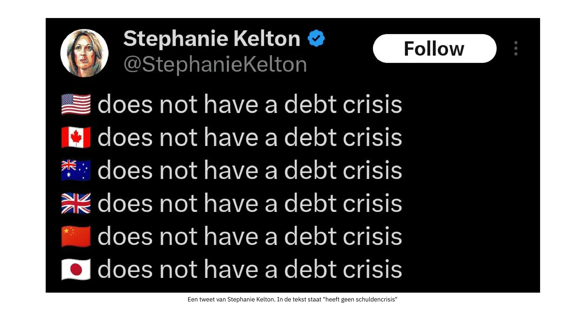

Vreemd genoeg staan er maar zes landen op? Hoe komt dat? Omdat ze echte monetaire soevereiniteit hebben. Maar er zijn ongeveer 200 landen op aarde en die hebben niet allemaal monetaire soevereiniteit. Dus mijn kritiek op deze theorie, behalve dat hij een beetje vreemd en niet functioneel is, is dat hij alleen werkt voor een paar landen die echte monetaire soevereiniteit hebben, landen die schatkistpapier in hun eigen valuta kunnen uitgeven. Tot op zekere hoogte gaat dit ten koste van de rest van de wereld. Door deze valuta te creëren, is het alsof ze hun inflatie naar elders exporteren, vergelijkbaar met wat de Verenigde Staten al tientallen jaren doen met hun exorbitante privileges. Dit lijkt op een vorm van monetair kolonialisme, waarbij landen die wereldwijd vertrouwen hebben in en vraag naar hun valuta, zoveel geld kunnen drukken als ze willen zonder dat er sprake is van significante inflatie, vaak omdat ze die inflatie exporteren.

Deze theorie is moeilijk toe te passen op importafhankelijke economieën die het internationale vertrouwen in hun munt moeten behouden.

Deze theorie vraagt ook om een zekere mate van gecentraliseerde planning van de economie, met name om meer controle te krijgen over de reële middelen (arbeiders, grondstoffen, industriële capaciteit) en om de inflatie te beheersen.

# De val en wedergeboorte van geld

<partId>87a34ca9-782b-5ade-b51a-400f88ed7b0c</partId>

## Griekse munten

<chapterId>7714195f-74ce-5f8c-be5f-59302d39fff4</chapterId>

:::video id=8e5c3091-0910-471b-8d4b-0dc6e9afa656:::

### Achtergrond en context

Voordat we beginnen, volgt hier de historische achtergrond:

**Historische achtergrond:**

**De Romeinen noemden de Grieken "Graeci" en Griekenland "Graecia".**

**De Grieken noemden zichzelf "Hellenen" en hun land "Hellas".**

**Homer** (geboren rond 8e eeuw v.Chr.)

Legendarische Griekse dichter, vermoedelijke auteur van *De Ilias* en *De Odyssee*.

Rond **750 voor Christus: Lycurgus**, de mythische wetgever van Sparta, zou de Spartaanse grondwet hebben opgesteld, gebaseerd op militaire discipline en eenvoud.

**Numa Pompilius** (753-673 v.Chr.)

Tweede koning van Rome, beroemd omdat hij Rome zijn eerste religieuze en juridische instellingen gaf.

**Dracon**, Atheense wetgever (7e eeuw v.Chr.), beroemd om zijn extreem strenge wetten, vandaar de term "draconisch".

**594 BC: Solon** wordt wetgever in Athene en hervormt de Atheense samenleving radicaal, met name door het afschaffen van de schuldslavernij.

**776 VOOR CHRISTUS: Oude Olympische Spelen**

De eerste regelmatige sportwedstrijden werden om de vier jaar in Olympia gehouden en brachten de Griekse steden samen.

**Pythagoras** (ca. 570-495 v.Chr.)

Griekse filosoof en wiskundige, beroemd om zijn stelling over de rechthoekige driehoek.

**Xenophanes van Colophon** (ca. 570-478 v.Chr.)

Pre-Socratisch filosoof bekend om zijn kritiek op het traditionele Griekse polytheïsme.

**490 BC: Slag bij Marathon**

De Atheners sloegen zegevierend een Perzische invasie af, wat een beslissend keerpunt betekende voor de Griekse beschaving.

**Herodotus** (ca. 484-425 v.Chr.), bijgenaamd de "vader van de geschiedenis", schreef een omvangrijk werk waarin hij de Perzische oorlogen beschreef, inclusief de Griekse overwinning op Xerxes in 480 v.Chr.

**Socrates** (470-399 v.Chr.)

Atheense filosoof beroemd om zijn dialectische methode en zijn onderwijs over ethiek en zelfkennis.

**Aristophanes** (ca. 446-386 v. Chr.)

Atheense toneelschrijver, beroemd om zijn satirische komedies zoals *De Kikkers*.

**Sophocles** (5e eeuw v.Chr.) bekritiseert in zijn toneelstuk *Antigone*, via de tiran Creon, geld als bron van morele en politieke corruptie.

**Plato** (ca. 428-348 v. Chr.)

Griekse filosoof, leerling van Socrates, stichter van de Academie, auteur van *De Republiek*.

**431-404 VOOR CHRISTUS: Peloponnesische Oorlog**

Groot conflict tussen Athene en Sparta, eindigend in een nederlaag voor Athene.

**431 VOOR CHRISTUS: Athene financiert de Peloponnesische Oorlog door zijn gouden en zilveren munten te verdunnen om de hoeveelheid in omloop te verhogen, wat inflatie veroorzaakt.

**Xenophon** (ca. 430-355 v.Chr.)

Atheense schrijver, filosoof en generaal, leerling van Socrates, auteur van de *Anabasis*.

**414 BC**: Athene begint de Peloponnesische Oorlog te verliezen na een rampzalige expeditie naar Sicilië.

**405 VOOR CHRISTUS: Aristophanes** beschrijft in zijn toneelstuk *De Kikkers* expliciet de devaluatie van de zilveren drachme en het verschijnen van inferieure bronzen munten in Athene, ter illustratie van het principe dat vandaag bekend staat als "Wet van Gresham".

**404 BC**: Athene capituleert na een lange belegering door Sparta.

**Aristoteles** (384-322 v.Chr.)

Belangrijke Griekse filosoof, leerling van Plato, oprichter van het Lyceum, bekend om zijn werk in de logica, biologie en politieke filosofie.

**327 VOOR CHRISTUS**: Alexander de Grote verovert Persepolis en de oostelijke provincies van het Perzische Rijk en breidt zo zijn rijk aanzienlijk uit.

**323 BC**: Alexander stierf in Babylon zonder duidelijke erfgenaam, wat leidde tot oorlogen tussen zijn generaals (diadochi) om het rijk te verdelen.

**Archimedes** (ca. 287-212 v. Chr.)

Griekse wiskundige, natuurkundige en uitvinder, beroemd om zijn ontdekkingen in geometrie en mechanica.

**196 voor Christus: De Steen van Rosetta** wordt gegraveerd tijdens het bewind van farao Ptolemaeus V, waardoor de Egyptische hiërogliefen later ontcijferd kunnen worden.

**192-188 VOOR CHRISTUS: Romano-Seleuciden Oorlog**

Rome versloeg het Seleucidenrijk onder leiding van Antiochos III en consolideerde zijn invloed in Griekenland en Klein-Azië.

**146 BC: Slag bij Korinthe**

De Romeinen verwoestten de Griekse stad Korinthe en markeerden zo het einde van de Griekse politieke onafhankelijkheid en de geleidelijke integratie van Griekenland in de Romeinse wereld.

Voor dit deel over de Oudheid, de val van Rome en de Middeleeuwen beginnen we met een deel over Griekse munten.

De geschiedenis van de muntslag in het oude Griekenland begon rond 600 voor Christus, toen Griekse steden snel de innovatie uit Lydië in Klein-Azië overnamen, aanvankelijk met elektrum en later met zilver. De eerste Griekse munten werden geslagen op het eiland Aegina, met een zee- of landschildpad, maar het was de Atheense drachme, versierd met Athena en een uil, die vanaf de 5e eeuw voor Christus het monetaire symbool bij uitstek werd en in die tijd de internationale handel domineerde.

En ik heb het geluk dat ik een exemplaar heb van een Griekse drachme uit die periode met die beroemde uil en een figuur op de achterkant. Het is een tetradrachme, die groter was dan een gewone drachme.

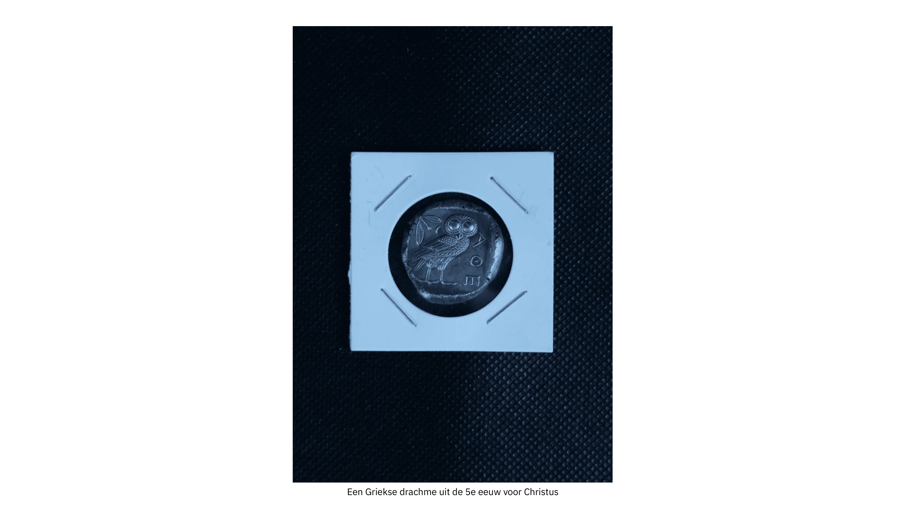

Elke Griekse stad ontwikkelde zijn eigen relatie met geld. In Athene was geld nauw verbonden met politieke en economische macht. Het beroemde Atheense decreet van het einde van de 5e eeuw VC legde het exclusieve gebruik van de Atheense munt op in de geallieerde gebieden en versterkte zo de economische hegemonie. Athene legde ook grote goudreserves aan voor noodgevallen die op de Akropolis bewaard werden, misschien als symbool van haar economische voorzichtigheid. Sparta daarentegen, een militaire stad met strenge waarden, koos ervoor om het gebruik van geld sterk te beperken en verbood zijn burgers om gouden of zilveren munten te bezitten. Sparta gebruikte liever zware ijzeren staven om buitenlandse handel te ontmoedigen en de sociale cohesie te behouden.

Oorlogen werden vaak gefinancierd door muntmanipulatie. Tijdens de Peloponnesische Oorlog (431-404 VC) nam Athene zijn toevlucht tot drastische devaluaties om zijn troepen te betalen. Omdat Athene geen toegang meer had tot haar zilvermijnen door de Spartaanse bezetting van Decelia in 413 VC, moest Athene in 407/406 VC gouden beelden omsmelten om in allerijl nieuwe munten te slaan. Daarna, in 406/405 VC, creëerde ze bronzen munten met zilver, wat een monetaire crisis veroorzaakte die geïllustreerd werd door **Aristophanes**, die al oproept wat vandaag bekend staat als de Wet van Gresham: slecht geld verdrijft goed geld. Deze noodmunt werd na de oorlog snel gedemonetiseerd om het vertrouwen in de Atheense muntslag te herstellen.

Het einde van de klassieke periode werd gemarkeerd door de opkomst van Macedonië onder Filips II en zijn zoon Alexander de Grote, waardoor het Griekse monetaire evenwicht grondig werd verstoord. Dankzij de enorme goud- en zilvermijnen van de berg Pangea produceerde Filips II een overvloed aan geld om zijn militaire en politieke campagnes te financieren, en hij stelde een eenvoudige en praktische goud-zilver standaard in (10:1). Zijn gouden staters, waarmee hij zijn overwinning op de Olympische Spelen vierde, circuleerden tot in West-Europa en bereikten zelfs Engeland. Alexander zette dit monetaire beleid voort door de **Attische** drachme op grote schaal te laten circuleren tijdens zijn veroveringen in het oosten tot in India. Deze massale circulatie van munten markeerde het begin van het Hellenistische tijdperk, waarin de afbeelding van vorsten geleidelijk die van godheden op munten verving. Dankzij deze innovatie konden generaties hellenistische vorsten zichzelf promoten en werden de traditionele goden op de achterkant van hun munten naar de achtergrond gedrongen.

Na Alexanders dood in 323 voor Christus verdeelden zijn generaals zijn immense rijk en stichtten dynastieën in Egypte (de Ptolemaeën), Syrië (de Seleuciden) en elders. Deze Hellenistische koninkrijken namen verschillende monetaire systemen aan: de Ptolemaeën legden een gesloten monetair systeem op om de geldcirculatie te controleren, waarbij ze liever graan gebruikten als interne valuta om edele metalen te sparen voor externe militaire uitgaven. Tegelijkertijd werd Rhodos een belangrijk handelscentrum voordat het economisch werd verzwakt door de Romeinen, die Delos in 167 voor Christus als vrije haven vestigden.

Het gebruik van geld stond centraal bij de beloning van huurlingen. Alexanders soldaten ontvingen dagelijks zilveren drachmen.

De cavalerie, de elite van Alexanders zeer gespecialiseerde leger, ontving gemiddeld twee drachmen per dag, een infanterist één drachme en een gewone huurling twee derde drachme, het dubbele van het loon van een eenvoudige arbeider.

Tijdens de Peloponnesische Oorlog werden ook aanzienlijke bedragen betaald aan soldaten: meer dan 1.200 talenten om de opstand in Samos neer te slaan en meer dan 2.000 talenten om Potidea te belegeren.

Tegen de tijd dat dit leger volledig in Klein-Azië was ingezet, bedroegen de totale kosten ongeveer twintig talenten per dag, of ongeveer een halve ton zilver, of 120.000 drachmen.

Griekse munten speelden ook een belangrijke culturele rol. Elke stad probeerde haar identiteit te bevestigen door haar eigen munten te slaan met lokale of mythologische symbolen. Heraclius beeldde bijvoorbeeld Heracles (Hercules) af die met een leeuw vocht, terwijl Cyrene de beroemde geneeskrachtige plant silphium toonde.

Ondanks hun verscheidenheid en regionale schommelingen hebben de klassieke Griekse en hellenistische munten een blijvend stempel gedrukt op de economische en culturele geschiedenis van de mediterrane wereld. Ze hadden een grote invloed op latere monetaire systemen tot aan Rome, dat geleidelijk Griekse economische concepten overnam en ontwikkelde om zijn eigen keizerlijke economie te structureren.

## De impact van valuta in Griekenland

<chapterId>3a5e6c7d-699c-5567-87cd-3374c49d55a9</chapterId>

:::video id=0c79a59c-e179-4893-a414-1b8de0930eb9:::

### Athene en het contrast met Sparta

De tegenstelling tussen Athene en Sparta tijdens de klassieke Griekse periode onthult twee radicaal verschillende modellen van politieke en economische organisatie. Terwijl Sparta metaalgeld afwees ten gunste van een zelfvoorzienend systeem gebaseerd op burgerlijk vertrouwen, omarmde Athene deze technologie volledig om zijn maritieme rijk op te bouwen en in stand te houden.

### De monetaire noodzaak van zeemacht

Het Atheense Rijk bleef, ondanks zijn grandioze naam, geografisch bescheiden - in essentie Athene en de steden aan de Egeïsche Zee. Zijn macht berustte op de Liga van Delos, een militaire alliantie gedomineerd door Athene als hegemoon. Deze keizerlijke structuur vereiste een uniform economisch instrument: de Atheense zilveren munt.

Het onderhouden van een vloot vormde de kern van deze monetaire noodzaak. Een enkele Atheense trireem kostte tussen de één en twee talenten zilver - een aanzienlijk bedrag. Met honderden schepen die onderhouden moesten worden, had Athene een efficiënt belastingsysteem nodig. Valuta werd het onmisbare instrument om schatting te innen van vazalsteden en om de zeemacht te financieren die de cohesie van het rijk garandeerde.

### Monetaire oplegging als overheersingsmiddel

Athene legde zijn zilveren munt op aan alle leden van de Liga van Delos. Deze monetaire standaardisatie diende verschillende strategische doelen. Ten eerste vergemakkelijkte het de inning van schenkingen door een gemeenschappelijke rekeneenheid te creëren. Ten tweede versterkte het de economische afhankelijkheid van de vazalsteden van Athene. Tenslotte projecteerde het symbolisch de Atheense macht over het hele maritieme rijk.

Dit monetaire beleid staat in schril contrast met het Spartaanse model. Sparta, een landmacht, kon voor zijn levensonderhoud vertrouwen op de arbeid van de Peloponnesische heloten (slaven). Het gesloten, stadsgerichte economische systeem vereiste geen geavanceerde monetaire instrumenten. Burgersoldaten leefden samen, deelden gemeenschappelijke maaltijden en hadden geen geld nodig voor dagelijkse uitwisselingen.

### Valuta als instrument voor maritieme handel

De zeevarende aard van het Atheense rijk betekende dat het open moest staan voor handel. In tegenstelling tot het in zichzelf gekeerde Sparta moest Athene handel drijven met de buitenwereld om te overleven en welvarend te zijn. Valuta werd het onmisbare instrument van de mediterrane handel.

Deze externe oriëntatie creëerde een opwaartse spiraal: handel genereerde inkomsten, deze inkomsten financierden de vloot, de vloot beschermde de handelsroutes en onderhield het rijk en het rijk legde de Atheense munt op die de handel vergemakkelijkte. Valuta was niet langer gewoon een ruilmiddel, maar werd een pijler van de keizerlijke strategie.

### De grenzen van monetaire macht

Ondanks deze economische verfijning toonde de Atheense monetaire macht zijn grenzen tijdens de Peloponnesische Oorlog. Tegenover de Spartaanse landmacht was de zeemacht en financiële superioriteit van Athene niet voldoende. Dure expedities, zoals de rampzalige campagne van Syracuse op Sicilië, putten de financiële middelen uit zonder een beslissende overwinning op te leveren.

De geschiedenis laat zien dat geld, hoewel het een krachtig middel is om macht te projecteren, geen garantie is voor militaire overheersing. Sparta, zonder metalen valuta maar met een opmerkelijke sociale cohesie, zegevierde uiteindelijk over het Atheense monetaire rijk.

### Twee modellen, twee bestemmingen

De tegenstelling tussen Athene en Sparta illustreert twee fundamentele benaderingen van sociale en economische organisatie. Athene vertegenwoordigt het open, commerciële, gemonetariseerde model - de voorloper van moderne maritieme rijken. Sparta belichaamt het gesloten, autarkische model, gebaseerd op burgerlijk vertrouwen in plaats van op monetaire instrumenten.

Deze twee systemen laten zien dat het gebruik van geld nauw samenhangt met het gekozen politieke en economische model. Voor een maritieme en commerciële macht als Athene werd geld onmisbaar. Voor een gesloten krijgermaatschappij als Sparta vormde het een bedreiging voor de sociale orde. Deze tweedeling uit de oudheid vormt nog steeds de basis voor debatten over de rol van geld in de organisatie van samenlevingen.

## De Romeinse Republiek

<chapterId>0bc80983-33e1-5881-85bb-7c22f3144a9a</chapterId>

:::video id=dc05ca97-d29c-4679-bfeb-912c47d86ce2:::

### Geschiedenis van de Romeinse Republiek

- 753 - 509 voor Christus: Koninkrijk Rome**
- 753 VOOR CHRISTUS: Stichting van Rome** (traditioneel toegeschreven aan Romulus).
- 509 - 27 VOOR CHRISTUS: Romeinse Republiek**, Rome wordt een republiek geregeerd door een gekozen Senaat en consuls.
- 280 - 275 VOOR CHRISTUS: Pyrrusoorlog**. Pyrrhus, koning van Epirus, vecht tegen de Romeinen in Zuid-Italië en behaalt kostbare overwinningen ("Pyrrusoverwinningen").
- 264 - 146 VOOR CHRISTUS: Punische oorlogen**. Groot conflict tussen Rome en Carthago om de overheersing van het westelijke Middellandse Zeegebied.
- Hannibal (247 - ca. 181 voor Christus)**. Legendarische Carthaagse generaal, beroemd omdat hij met zijn leger en olifanten de Alpen overstak om Rome aan te vallen tijdens de Tweede Punische Oorlog.
- 146 voor Christus: Slag bij Korinthe**. Rome vernietigt de Griekse stad Korinthe en legt zijn definitieve overheersing op het Griekse vasteland op.
- 91 - 87 voor Christus: Sociale oorlog**. Opstand van de Italiaanse bondgenoten van Rome die het Romeinse burgerschap opeisten, wat uiteindelijk leidde tot hun volledige integratie in de burgerij.
- 64 voor Christus: Einde van het Seleucidische verzet**. Rome schakelt de invloed van de Seleuciden in Syrië definitief uit en consolideert haar greep op het oostelijke Middellandse Zeegebied.
- 55 VOOR CHRISTUS: Julius Caesar verovert Centraal- en West-Europa**. Julius Caesar breidt de Romeinse overheersing uit over Gallië (het huidige Frankrijk) en trekt Germanië en Bretagne binnen.
- 43 VOOR CHRISTUS: Vorming van het Tweede Driemanschap**. Politieke alliantie tussen Octavianus (later Augustus), Marcus Antonius en Lepidus om Rome te stabiliseren na de moord op Caesar.
- 27 voor Christus: Begin van de Pax Romana**. Een periode van politieke stabiliteit en welvaart onder het bewind van Augustus, het begin van het Romeinse Rijk.

### Het late monetaire begin van Rome

In dit hoofdstuk over de Oudheid richten we onze aandacht nu op de Romeinse Republiek. De monetaire geschiedenis van Rome begon veel later dan die van de Grieken en Perzen. Rome werd gesticht in 753 voor Christus en wachtte bijna vier eeuwen voordat het echt ging munten. Gedurende deze lange periode gebruikten de Romeinen een primitief ruilsysteem met onregelmatige stukken brons, aes rude genaamd, waarbij elke transactie nauwkeurig gewogen moest worden. Pas aan het einde van de 4e eeuw voor Christus, onder Griekse en Etruskische invloed, begon Rome zijn eerste munten uit te geven, met name in brons gegoten zoals in China, de aes grave, kenmerkend voor Romeinse uitwisselingen tot **de Tweede Punische Oorlog**.

### Griekse invloed en de eerste zilveren munten

De beslissende ontmoeting met de Grieken in Zuid-Italië liet de Romeinen echt kennismaken met het slaan van zilveren munten. Rond 280 voor Christus begon Rome zijn eigen zilveren munten te slaan in navolging van de Griekse didrachmen. De eerste regelmatige uitgifte van zilveren munten in Rome dateert precies van 269 voor Christus, met daarop de legendarische tweeling Romulus en Remus gezoogd door de wolvin, een symbool dat iconisch is geworden.

Op veel Romeinse munten uit de republiek zijn zelfs stichtingsmythes afgebeeld. Je kunt de mijne hieronder zien: het is een prachtige, echte munt van koning Tatius. Het illustreert de mythe van de ontvoering van vrouwen door de Sabijnen. Tatius was de koning van deze regio en de oprichtingsmythe vertelt hoe de Romeinen vrouwen ontvoerden van de Sabijnen, een volk dat in de buurt woonde. Vervolgens werd koning Tatius mede-koning van Romulus, een van de stichters van Rome.

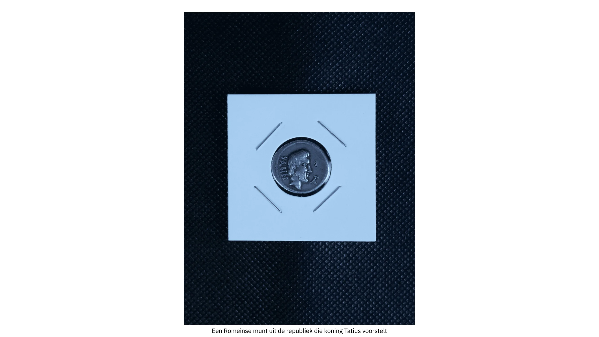

### De oorsprong van het woord "munt" en de tempel van Juno Moneta

De term "munt" vindt zijn oorsprong in de tempel van Juno Moneta in Rome. Volgens de legende waarschuwden de heilige ganzen van het Capitool de Romeinen tijdens een Gallische invasie in 390 voor Christus voor een dreigend gevaar. Als dank aan de godin Juno, beschermster van het Capitool, werd ter ere van haar een tempel opgericht die al snel de muntplaats voor Romeinse munten werd.

### De Punische oorlogen en valutacrises

Militaire conflicten hadden een aanzienlijke invloed op de Romeinse monetaire ontwikkeling. Tijdens de Tweede Punische Oorlog (218-201 v.Chr.) tegen Carthago kreeg Rome te maken met ernstige financiële problemen als gevolg van de invasie van Hannibal. Om deze dringende nood te lenigen, nam Rome voor het eerst zijn toevlucht tot een uitzonderlijke uitgifte van gouden munten en tot een aanzienlijke devaluatie van zijn zilveren munten, van een aanvankelijke zuiverheid van 97% tot ongeveer 89%. Het gewicht van de bronzen munten (aes) daalde ook drastisch, met een verlies van bijna 80% in zes jaar.

Hier kunnen we terugkomen op een concept dat we eerder hebben besproken over de Grieken die edele metalen in tempels smolten om economische crises te verlichten. En om het over **Carthago** te hebben, hieronder kun je een echte Carthaagse munt uit mijn verzameling bewonderen. Op deze Carthaagse munten staat aan de ene kant een palmboom en aan de andere kant een paard. Op deze munt is het paard niet erg herkenbaar, omdat het erg versleten is.

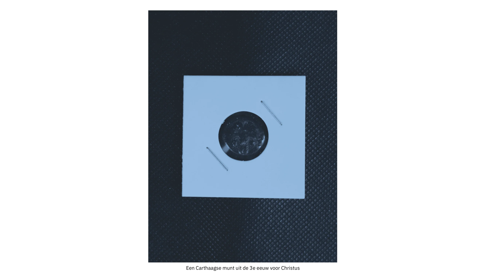

Als gevolg hiervan daalde het gewicht van de bronzen munten, bekend als aes, ook drastisch, met een verlies van bijna 80% in zes jaar. Het gewicht van deze bronzen munten, die geen edelmetaal waren en in de dagelijkse handel werden gebruikt, daalde dus enorm, wat een teken was van de geldontwaarding als gevolg van deze oorlogen.

### De zilveren denarius en monetaire stabiliteit

Tegen deze kritieke achtergrond introduceerde Rome rond 212 voor Christus de beroemde zilveren denarius. Deze hervorming zorgde voor een opmerkelijke monetaire stabiliteit, waarbij de denarius bijna 450 jaar lang de dominante munteenheid bleef. Rome heeft deze stabiliteit te danken aan rigoureus beheer, ondanks een grote koersherziening in 146 v.Chr. en een aanzienlijke productie om zijn immense legers te financieren, met name tijdens de Punische, Sociale (91-87 v.Chr.) en Macedonische oorlogen. Zo kostte het onderhouden van één enkel Romeins legioen ongeveer 1,5 miljoen denarii per jaar, wat de omvang van de monetaire behoeften illustreert.

Buiten de Romeinse grenzen leidden oorlogen tot grote devaluaties in regio's onder Romeinse invloed. Punisch Carthago zag de zuiverheid van zijn electrum dramatisch dalen, van 98% goud in de 4e eeuw tot slechts 30% tijdens de Tweede Punische Oorlog, terwijl de zuiverheid van zijn zilveren munten daalde tot 18%.

### De evolutie van monetaire motieven

Met de uitbreiding van Rome evolueerde ook het karakter van de munten: aanvankelijk anoniem en patriottisch, namen de munten geleidelijk gepersonaliseerde ontwerpen aan met de machtige families van de munters (zij die de munten sloegen). Deze overgang symboliseert duidelijk de politieke transformaties van de late Romeinse Republiek.

Hoewel Rome de mediterrane wereld economisch domineerde, behield het een zekere eenvoud in zijn betaalmiddelen: er werd geen andere vorm van geldoverdracht ontwikkeld dan de directe uitwisseling van munten, met uitzondering van belastingoverdrachten en privékredieten die voorbehouden waren aan de elite.

## Het Romeinse Rijk

<chapterId>2dc44e50-112a-5abf-97ae-8e0a9ecda989</chapterId>

:::video id=f8d6f3d6-9ee4-4504-888e-4f12b3f20489:::

**Historische achtergrond:**

**Het Principaat** was de vorm van keizerlijk bestuur in het Romeinse Rijk vanaf het begin van de regering van Augustus in 27 voor Christus tot het einde van de derde-eeuwse crisis in 284 na Christus.

**27 voor Christus: Begin van de Pax Romana**

Periode van politieke stabiliteit en welvaart onder het bewind van Augustus, het begin van het Romeinse Rijk.

**Augustus (30 voor Christus tot 14 na Christus)** hervormde het Romeinse monetaire systeem radicaal en stelde een duurzame en stabiele standaard in voor de keizerlijke muntslag.

**Augustus was ook een van de eerste erkende verzamelaars** van oude munten en fossielen.

**54 N. CHR. - 68 N. CHR: Nero**

Omstreden Romeinse keizer, bekend om zijn tirannie, vervolgingen en rampzalig bestuur na de verbranding van Rome.

**64 N.CHR: Grote brand van Rome**

Een grote brand verwoest een groot deel van de stad; Nero wordt ervan beschuldigd verantwoordelijk te zijn.

**69 AD: Jaar van de Vier Keizers**

Een chaotische periode met vier keizers die elkaar snel opvolgden (Galba, Otho, Vitellius, Vespasianus).

**79 AD: Uitbarsting van de Vesuvius**

Vulkaan die de steden Pompeii en Herculaneum verwoestte, waarbij hun overblijfselen uitzonderlijk bewaard bleven onder de as.

**165 AD - 180 AD: Antonijnse pest**

Verwoestende epidemie die het Romeinse Rijk onder Marcus Aurelius en Commodus verzwakte.

**200 AD: Territoriaal hoogtepunt en geleidelijk einde van de Pax Romana**

Rome bereikte zijn maximale uitbreiding, maar begon te lijden onder interne instabiliteit en economische moeilijkheden.

**212 AD: Edict van Caracalla over burgerschap**

Keizer Caracalla verleende het Romeinse staatsburgerschap aan bijna alle inwoners van het rijk om de belastinggrondslag te verbreden.

**220 AD: Begin van de grote barbaarse invasies**

Eerste belangrijke invallen van Germaanse volkeren over de Romeinse grenzen.

**235 AD - 285 AD: Politieke en militaire crisis van de 3e eeuw**

Een periode die werd gekenmerkt door politieke instabiliteit, met veel kortstondige keizers, burgeroorlogen, economische crises en voortdurende invasies.

**Aurelianus (270-275 na Chr.) herwaardeerde de Romeinse munt radicaal** en probeerde de nominale waarde te herstellen ondanks de hoge inflatie.

**301 AD: Diocletianus' Prijs Edict**

Keizer Diocletianus probeerde tevergeefs de ongebreidelde inflatie een halt toe te roepen door in het hele rijk strenge prijs- en looncontroles op te leggen.

**312 AD: Constantijn**

Eerste christelijke keizer, stichter van Constantinopel, stabiliseerde de munteenheid door de "solidus" in te voeren, een gouden munt van grote zuiverheid en stabiliteit.

**476 AD: Val van het West-Romeinse Rijk**

Rome wordt ingenomen door verschillende Germaanse volkeren (waaronder de Ostrogoten), een gebeurtenis die beschouwd wordt als het officiële einde van het West-Romeinse Rijk.

### De monetaire hervormingen van Augustus

In dit deel over de Oudheid zijn we al aangekomen bij het Romeinse Rijk. De monetaire geschiedenis van het Romeinse Rijk wordt gekenmerkt door het intensieve gebruik van metaal, met name goud, zilver en brons, maar ook door meerdere valutacrises, die nauw samenhingen met politieke en militaire onrust. Aan het einde van de Republiek, onder Julius Caesar, introduceerde Rome in 46 voor Christus de gouden aureus, een munt van ongeveer 8 gram die algemeen geaccepteerd werd in heel Europa en het Middellandse Zeegebied. Caesar standaardiseerde deze gouden munten en sloeg de eerste munten met het portret van een levende man, waarmee hij een oude republikeinse traditie omver wierp die de voorkeur gaf aan anonieme, collectieve symbolen. Deze ontwikkeling ging gepaard met een periode van grote politieke veranderingen, waarbij persoonlijke macht geleidelijk de plaats innam van republikeinse instellingen.

Na de moord op Caesar in 44 voor Christus nam Octavianus (Augustus) de controle over Rome over en stichtte het keizerrijk in 27 voor Christus. Onder zijn bewind werd het monetaire systeem volledig hervormd, waardoor de Romeinse economie blijvende stabiliteit kreeg. In de tijd van Augustus was één gouden aureus gelijk aan 25 zilveren denarii, die zelf weer 4 bronzen sestertiën waard waren. Deze monetaire stabiliteit duurde de hele eerste eeuw na Christus, een periode die vaak wordt beschreven als een economische gouden eeuw voor Rome.

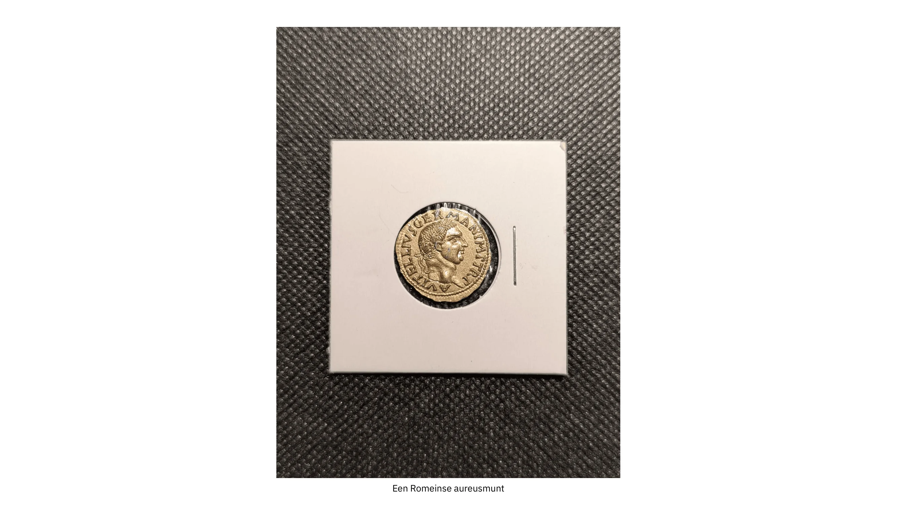

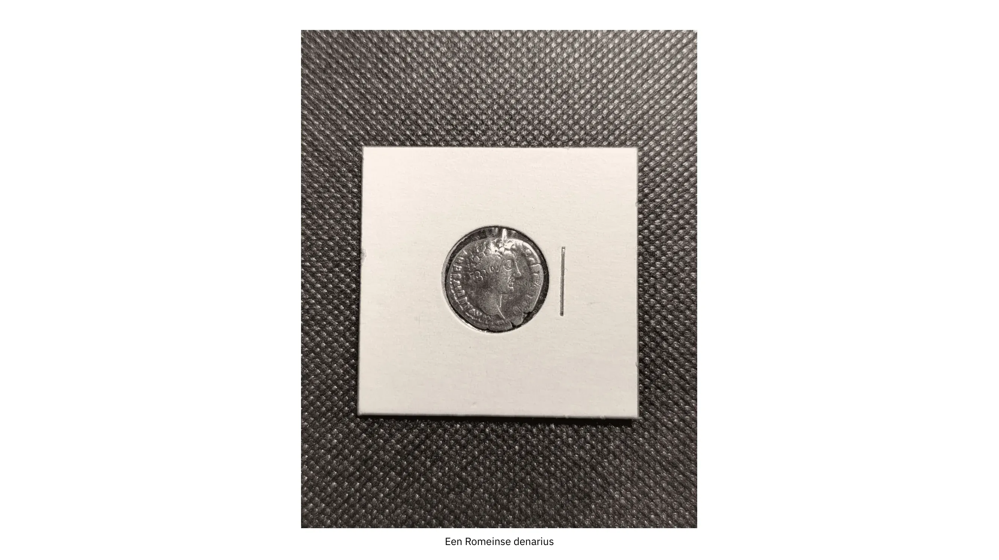

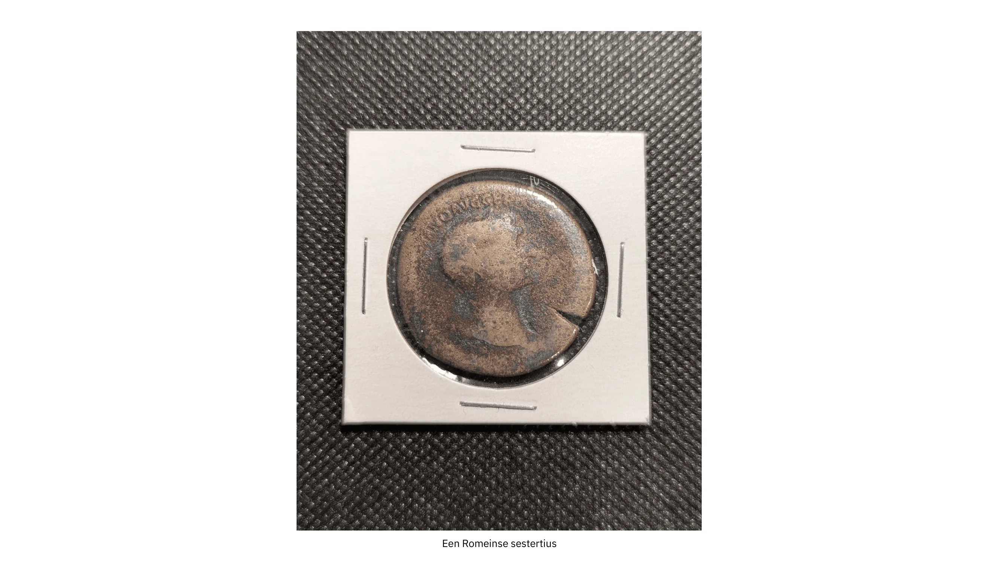

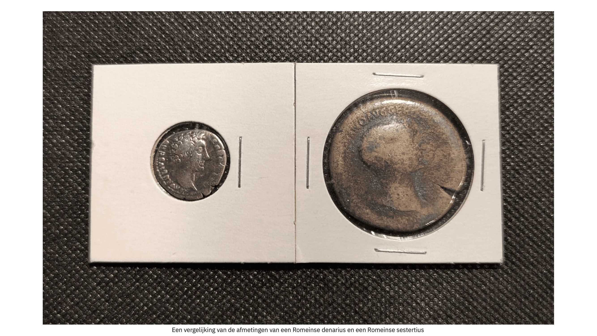

Vanaf Nero (54-68 na Chr.) begon Rome echter met een langzame devaluatie van zijn munten, waarbij het gewicht en de zuiverheid ervan geleidelijk afnamen om de groeiende keizerlijke uitgaven te financieren, vooral na de grote brand van Rome in 64 na Chr. Deze devaluaties hadden opmerkelijke gevolgen: zuivere munten werden uit omloop genomen door oppotten of export, in overeenstemming met de wet van **Gresham**, terwijl de gedevalueerde munten in aantal toenamen, waardoor de prijzen geleidelijk stegen.

De derde eeuw markeert een dramatisch keerpunt, met een spectaculaire versnelling van de devaluaties onder de keizers Septimius Severus, Caracalla en Gallienus. Het zilvergehalte van de belangrijkste zilveren munt, de denarius en vervolgens de antoninianus, daalde tot slechts 2%. Tegelijkertijd daalde het goudgewicht van de aureus met de helft. Deze monetaire crisis ging gepaard met een ongekende politieke instabiliteit, barbaarse invasies en steeds terugkerende burgeroorlogen.

Dit deel stelt me in staat om het laatste stuk in deze sectie te introduceren: de antoninianus. De oorspronkelijke naam van deze munt is onbekend, maar tegenwoordig noemen we hem een antoninianus. Hij heeft het onderscheid dat hij wordt gewaardeerd op twee denarii, ondanks het feit dat hij slechts 1,5 keer zo groot is als een denarius. Bovendien werden deze munten na verloop van tijd slechts billonmunten, wat betekent dat ze werden gemaakt van een legering van zilver en andere metalen in plaats van puur zilver. De munten waren vaak alleen bedekt met een laagje zilver en dienden als een opmerkelijk voorbeeld van monetair verval.

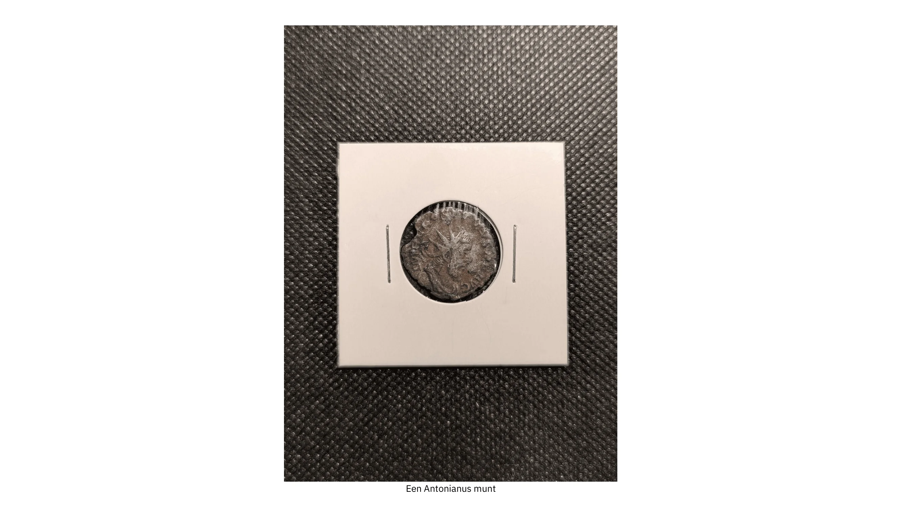

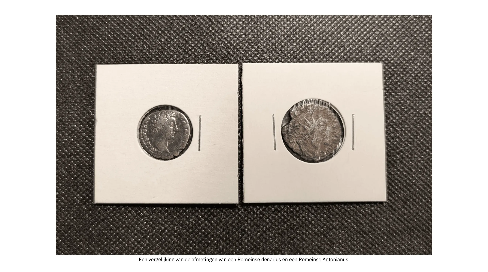

Keizer Aurelianus (270-275 na Christus) probeerde het systeem te stabiliseren door munten nominaal te revalueren, maar deze hervorming introduceerde in feite een inflatoir mechanisme door de waarde van bestaande munten kunstmatig op een hoger niveau vast te leggen.

Ik zal een uitweiding over het onderwerp introduceren. In de 3e eeuw nam de inflatie snel exponentieel toe. Voorheen werden munten weliswaar gedevalueerd, maar het handmatige proces om ze één voor één te slaan zorgde voor enige controle over de inflatie. Statistieken geven aan dat gedurende 300 jaar van devaluatie, de inflatie gemiddeld ongeveer 4% per jaar bedroeg. Net voor de hervorming van Aurelianus bedroeg de inflatie ongeveer 3% per jaar.

Aurelianus voerde een zuiverheidsmeting in op de munt met het XXI teken, die een samenstelling aangaf van 20 delen brons op 1 deel zilver, oftewel 5% zuiverheid. Hij bracht deze 5% zilveren munten op de markt en stempelde het XXI-teken erop. Hij riep echter ook alle andere, meer gedevalueerde munten terug en zette er hetzelfde XXI-teken op. Hierdoor werd de nominale waarde van alle munten geherwaardeerd. Het resultaat was een duizelingwekkende inflatie van 20% per jaar, veel hoger dan de eerdere 3% voordat deze techniek werd toegepast.

Het was echt Aurelianus die deze vorm van devaluatie uitvond, die veel sneller is dan de geleidelijke devaluatie van metaal, waardoor we nog steeds gedwongen waren om munten één voor één te drukken. Wat hij deed was alle bestaande munten nemen, ze terugroepen en ze stempelen met een stempel om hun nominale waarde te veranderen. Het is een echt keerpunt. Toen werd de inflatie exponentieel.

Om deze extreme devaluatie visueel te illustreren, heb ik wat fascinerende statistieken gevonden over de prijs van graan in Egypte van 40 voor Christus tot de 3e eeuw, een periode van meer dan 300 jaar. Hieronder zie je een Griekse tetradrachme uit mijn verzameling. In Egypte onder Romeinse bezetting in de 3e eeuw was het equivalent een Egyptische tetradrachme. De denominatie van drachmen was nog in gebruik en kwam overeen met een denarius.

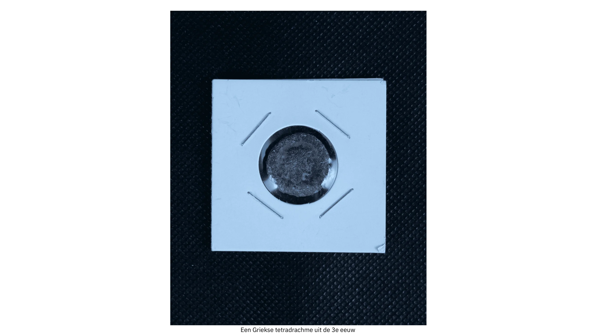

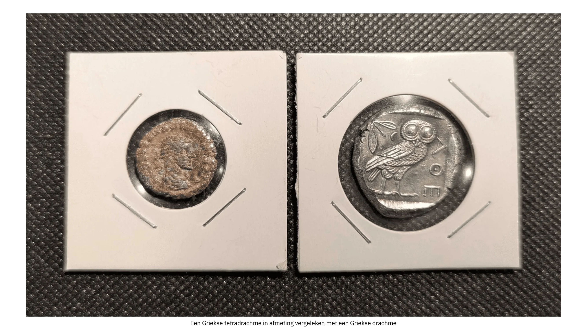

De Egyptische tetradrachme die ik heb was dus het equivalent van een denarius. Je kunt zien dat de munt gemaakt is van billon (of brons) en dus geen edelmetaal bevat. Je kunt hem vergelijken met de originele Griekse tetradrachme om de fysieke devaluatie in deze 300 jaar te zien. Het is een miljoenvoudige stijging van de graanprijs in Egypte.

Het is de fysieke uitdrukking van Aurelianus' hervorming. Opgemerkt moet worden dat de meerderheid, het gemiddelde over deze 300 jaar van inflatie, rond de 4% lag. Pas aan het einde, toen Aurelianus zijn hervorming doorvoerde, werd deze inflatie nogal exponentieel en kwamen we uit op deze maat van 1 miljoen. De prijzen waren een miljoen keer hoger aan het einde van de 3e eeuw dan in de 1e eeuw voor Christus.

Zijn opvolger **Diocletianus** (284-305 na Chr.) probeerde nog radicalere hervormingen door te voeren: hij gaf nieuwe munteenheden uit (met name de argenteus, zuiverder maar te beperkt in hoeveelheid), legde drastische prijscontroles op (Prijs Edict van 301 na Chr.) en **stelde een belastingsysteem in gebaseerd op betalingen in natura**. Ondanks deze inspanningen slaagden de hervormingen van Diocletianus er niet in de ongebreidelde inflatie te beteugelen.

Geconfronteerd met de weigering om goederen en diensten te leveren in ruil voor gedevalueerde valuta, stelde Diocletianus **een erfelijk kastensysteem** in om boeren en hun nakomelingen aan hun land te binden.

Wat we hier echt moeten begrijpen is dat de boeren weigerden om hun producten te leveren in ruil voor gedevalueerde valuta, en de reactie van onze dierbare Diocletianus was om **erfelijke kasten** te creëren door te zeggen "jij, jij kunt je land niet verlaten, je kinderen kunnen hun land niet verlaten, hetzelfde geldt voor de soldaten, jullie zijn soldaten, jullie gaan ermee akkoord om in mijn valuta betaald te worden". Als overgangsoplossing werden ze in natura betaald (in vlees, voedsel, graan) omdat hij weigerde hen geld te geven. Dus legde hij dit erfelijke kastensysteem op om mensen te dwingen aan hun vak vast te houden, zodat ze niet zomaar van baan konden veranderen als ze probeerden de gedevalueerde munteenheid niet te accepteren.

Om dit voorbeeld te illustreren heb ik hier een tekst, een uittreksel uit het boek "*Monetair regime en inflatie*":

> Omdat mensen niet bereid waren om te werken en goederen te leveren tegen een gedevalueerde munt, waarvan de nominale waarde hoger was dan de intrinsieke of marktwaarde, moesten ze gedwongen worden om te werken door belastingen in natura op te leggen. [Het werd illegaal voor boeren om hun geregistreerde huizen te verlaten. De boerenbevolking raakte zo erfelijk verbonden met het land.
>

> Dit erfelijke kastensysteem verspreidde zich geleidelijk: Diocletianus dwong de zonen van soldaten om in het leger te dienen, terwijl arbeiders in de geldateliers en in de weverijen en ververijen die Diocletianus had opgericht, staatsslaven werden, met erfelijke dienstplicht. Gouddelvers werden later ook een erfelijke kaste. Andere erfelijke klassen bestonden waarschijnlijk al in de tijd van Diocletianus, met name de gilden van bakkers en slagers [...] in Rome, evenals de diocesane gilden van scheepskapiteins die graan en andere openbare ladingen naar Rome vervoerden.

Het was Constantijn (306-337 AD) die er uiteindelijk in slaagde het monetaire systeem te stabiliseren door in 312 de solidus in te voeren, een puur gouden munt waarvan hij de kwaliteit en het gewicht strikt garandeerde. Er was een heel systeem om de zuiverheid en het gewicht van de solidus te controleren. **Deze stabiliteit trof echter alleen een rijke elite en de keizerlijke administratie**, terwijl de **meerderheid van de bevolking bleef lijden onder valuta van lage kwaliteit en aanhoudende inflatie**. De solidus bleef stabiel in het Oosterse Rijk (Byzantium), waar hij meer dan een millennium standhield, terwijl in het Westen de muntslag uiteenviel in kleine munten met een lage waarde. Dit ging gepaard met de uiteindelijke economische en politieke desintegratie van het Romeinse Rijk, dat in 476 AD definitief ten onder ging.

Tot slot wil ik graag dit citaat uit *A History of Money: From Ancient Times to the Present Day* van Glyn Davies, dat op meesterlijke wijze samenvat wat misschien wel leidde tot de ondergang van Rome:

*"Belastingen waren consequent ontoereikend en de problemen die gepaard gingen met deze steeds ontoereikender, laattijdig aangepaste en zeer zichtbare belastingen dreven Rome ertoe om meer te vertrouwen op een gemakkelijke, onmiddellijke en verborgen vorm van belasting: devaluatie van de munteenheid. Kortstondige ad hoc hervormingen slaagden er niet in om deze eeuwenoude trend van verval te keren. Financiële druk veroorzaakt door de slijtage van munten, schipbreuken, geldlekken door de aankoop van luxegoederen uit het Oosten, geschenken aan Germaanse barbaren, de groei van de stedelijke bevolking, de afname van de landbouwproductie, de geleidelijke uitputting van de rijkste mijnen, en vooral het "brood en spelen" beleid dat essentieel werd geacht om een minimum aan orde in het stedelijke leven te handhaven - al deze cumulatieve druk leidde Rome tot voortdurende monetaire devaluatie, afgewisseld met incidentele hervormingen die gedoemd waren te mislukken."*

*Naast gratis of goedkoop brood en wijn werden van tijd tot tijd keizerlijke vrijgevigheden ("congiaria") in de vorm van geldelijke toelagen uitgedeeld, vooral onder Trajanus (98-117 na Chr.) en nog meer onder Hadrianus (117-138 na Chr.) en zijn opvolgers. Wat de keizer en de burgers aanvankelijk als een uitzonderlijk voorrecht hadden beschouwd, was tegen het begin van de 2e eeuw een gebruikelijke verwachting geworden. Deze uitkeringen "vormden een zware last voor de schatkist en droegen op hun manier bij aan het faillissement van de staat".*

## Verbanden tussen monetaire verwatering en inflatie: van oorzaken naar gevolgen

<chapterId>38d5781c-e900-53f7-baa7-413655d71754</chapterId>

:::video id=3999256d-aafe-4502-9b72-dfa8491a2777:::

In dit hoofdstuk wordt gekeken naar het verband tussen monetaire verwatering en inflatie, van oorzaken tot gevolgen. Geldverdunning is een van de belangrijkste economische verschijnselen in de Romeinse monetaire geschiedenis, met directe gevolgen voor de inflatie. Vanaf de 1e eeuw n.Chr. was er een eerste langzame fase van verwatering van de zilveren munten (denarius) vanaf de regering van Nero (54-68 n.Chr.), die versneld werd door herhaalde militaire en financiële crises, met name onder Septimius Severus (193-211) en Gallienus (253-268).

We zien ook een meer geleidelijke devaluatie van de aureus. Dit verschil in devaluatiesnelheid benadrukt twee punten:

1. De rol van de rekeneenheid in het bimetallisme voor staatscontrole over geld. De rekeneenheid in dit voorbeeld is de denarius. Ik heb drie verschillende manieren geïdentificeerd om de waarde van de rekeneenheid te beheren: devaluatie (verdunning van het metaal), redenominatie (antoninianus) en het opleggen van een nominale waarde door het markeren van "XXI" (Aurelianus)

2. De wens van de staat om de devaluatie van de aureus zo lang mogelijk uit te stellen, de waardevoorraad die de elite in staat stelt haar koopkracht te behouden ten koste van de minderbedeelden. We zullen dit principe in de loop van de cursus vaak terugzien, vooral in verband met het concept dat bekend staat als het "Cantillon-effect" en de redenominaties van de Maravedi in Spanje.

Dit fenomeen is heel interessant en heeft zich door de geschiedenis heen herhaald. We zullen er in een volgende paragraaf op terugkomen met de Maravedi. Dit patroon zien we ook bij alle reservemunten; de reservewaarde-eenheid, zoals de aureus in Rome, blijft onaangeroerd. De rekeneenheid die door de bevolking wordt gebruikt voor handel en dagelijkse transacties wordt echter vaak gedevalueerd. Als gevolg hiervan treft de monetaire inflatie het gewone volk, terwijl degenen die zich gouden munten kunnen veroorloven grotendeels onaangetast blijven.

En trouwens, **het is hetzelfde fenomeen dat vandaag de dag wordt gecreëerd met de devaluatie van valuta, waardoor financiële activa in waarde kunnen stijgen**, en dus zijn het de mensen die de valuta gebruiken, de armste mensen, die armer worden, en dit verrijkt op zijn beurt, door geldschepping, de activa van degenen die in staat zijn, die de middelen hebben om zichzelf te beschermen tegen devaluatie, en dus verdiept het de sociale ongelijkheid. Dat is mijn kleine politieke tirade.

Wat ik zojuist heb beschreven wordt het Cantillon-effect genoemd. We zullen zien dat deze heer leefde in de tijd van John Law, een onderwerp dat we ook in een volgend hoofdstuk zullen behandelen.

Door de hervorming die tijdens het bewind van Aurelianus werd doorgevoerd, kon de inflatie de pan uit rijzen. De inflatie van de nominale waarde van het geld werd niet langer beperkt door het vermogen van de munten om met de hand munten te produceren. Munten die al geslagen waren, konden nu gewoon gemerkt worden en de nominale waarde van de geldvoorraad steeg sneller.

Ik wil twee citaten met je delen in verband met Aurelianus. Het eerste komt uit *Een geschiedenis van geld: From Ancient Times to the Present Day*:

*"Wat de Romeinse economie betreft, was Aurelianus' bijdrage eerder een ramp dan een triomf. Het was grotendeels te danken aan de aard van zijn "hervorming" dat de inflatie veel hoger kon oplopen dan voorheen mogelijk was geweest, zelfs onder de onverantwoordelijke Gallienus. Gedurende twee eeuwen na Aurelianus werd inflatie endemisch in het hele Romeinse Rijk

De tweede komt uit het boek *Ancient History from Coins* en gaat over het loskoppelen van het monetaire systeem van goud:

*"De hervorming van Aurelianus veranderde de relatie tussen goudgeld en de rest van het monetaire systeem. Voordien waren andere soorten valuta gekoppeld aan de **aureus** volgens officiële koersen (25 Egyptische denarii of 25 tetradrachmen voor één aureus, etc.). Na de hervorming begon goudgeld **vrij in waarde te schommelen**, net als elke andere grondstof, terwijl de rest van het monetaire systeem **in waarde daalde** door de **verzwakking van legeringen**, niet langer **gedekt door goud**. Omdat de rekeneenheid theoretisch gebaseerd bleef op zilver (de denarius, of in Egypte de drachme), stegen de prijzen naarmate de munt in waarde daalde. "*

Zoals je kunt zien, trof deze devaluatie van de munteenheid die als rekeneenheid diende onevenredig de minder bedeelden, terwijl de loskoppeling van de link met goudgeld de koopkracht beschermde van degenen die het zich konden veroorloven om te sparen in de opslagplaats van waarde die goud is.

Wat je hier moet begrijpen is dat als er een verband is tussen de denarius en de aureus, zelfs als je de denarius devalueert, als je nog steeds je denarius kunt inwisselen voor aureus tegen dit tarief (25 denarius voor 1 aureus), mensen zeker hun denarius zullen inwisselen voor jouw aureus omdat de denarius dan overgewaardeerd is en de aureus ondergewaardeerd. Maar in deze hervorming werd deze link verwijderd. Dus mensen konden niet langer denarii inwisselen voor zilvermetaal dat gedevalueerd was ten opzichte van goud. Toen konden degenen die toegang hadden tot gouden munten zichzelf echt beschermen, want daarna konden mensen niet langer overgewaardeerd gedevalueerd zilver inwisselen voor ondergewaardeerd puur goud. Dit is een heel belangrijk moment in de evolutie van valuta.

Een treffend voorbeeld van de effecten van deze hervorming door Aurelianus wordt perfect geïllustreerd door deze citaten uit het boek *Monetary Regimes and Inflation*:

*"Tussen de regeerperioden van de keizers Claudius (41-54 na Chr.) en Constantius (337-361 na Chr.) steeg de prijs van tarwe op de open markt in Egypte, uitgedrukt in drachmen, met een factor van meer dan een miljoen**. Spectaculaire prijsinflatie is een van de centrale economische feiten van de 3e en 4e eeuw na Christus" (Lendon 1990, p. 106). Maar deze ontwikkeling is **minder dramatisch dan het lijkt**, want het komt overeen met een **gemiddelde jaarlijkse inflatie van 4,4%**. En volgens Wassink (1991, p. 482) begon de inflatie pas **in 238 na Christus**"*

*"Vanaf deze datum versnelde de inflatie langzaam, omdat **goed geld eerst uit omloop werd gedreven**, zodat de totale geldhoeveelheid aanvankelijk nauwelijks toenam. Vervolgens bereikte het een gemiddeld jaarlijks percentage van **3,65% tussen 250 en 293**, oplopend tot **22,28% tussen 293 en 301** (Wassink 1991, p. 466), d.w.z. tot aan de **mislukte monetaire hervormingen van keizer Diocletianus**. Dit fenomeen is **bijzonder indrukwekkend voor inflatie in een op metalen gebaseerd monetair regime**. "*

Dit fenomeen van inflatie gekoppeld aan monetaire verdunning was aanvankelijk een reactie op de occasionele geldcrises van de Romeinse staat. Door het edelmetaalgehalte van munten te verlagen met behoud van hun nominale waarde, verhoogde de staat tijdelijk zijn middelen. Maar de prijzen reageerden niet onmiddellijk: het Romeinse systeem had inderdaad een zekere kleverigheid, wat betekende dat lonen en prijzen zich maar langzaam aanpasten aan opeenvolgende devaluaties. Toch stegen de prijzen na een bepaalde drempel sterk om de markt weer in evenwicht te brengen met de reële waarde van de munten.

Zoals hierboven vermeld, is dit fenomeen vooral duidelijk vanaf het midden van de 3de eeuw. In Egypte, een rijk gedocumenteerde regio, werden de prijzen met 10 vermenigvuldigd onder Aurelianus (274 AD) na een officiële herwaardering van de munteenheid, ondanks een aanvankelijke poging tot stabilisatie. Daarna, onder Diocletianus (301 na Christus), legde het prijs edict drastische controles op om de inflatie te beteugelen zonder de onderliggende oorzaak aan te pakken - overproductie en monetaire degradatie - wat een voorspelbare mislukking veroorzaakte. Aanhoudende inflatie duwt de economie uiteindelijk in de richting van een tweedeling: **de elite, beschermd door goudreserves (zoals Constantijns solidus**), geniet stabiliteit, terwijl de meerderheid van de bevolking blijft lijden onder chronische inflatie, **illustrerend wat vandaag de dag bekend staat als het Cantillon-effect.**

Er is een duidelijk verband tussen de Romeinse monetaire verwatering en de inflatie, waarvan de oorzaken voornamelijk verband houden met chronische begrotingstekorten, onophoudelijke militaire uitgaven en slecht economisch beheer door de staat.

## De val van het Romeinse Rijk

<chapterId>b6ec0914-227b-509c-8108-b09eec9bb904</chapterId>

:::video id=91d4fee5-59bb-4ab9-a90b-e1125c71decb:::

### Valutadevaluatie en de ineenstorting van Rome

De Oostenrijkse economische school, met name via Ludwig von Mises, stelde een monetaire interpretatie van de val van Rome voor. In deze visie verbrijzelde de progressieve devaluatie van de Romeinse munt het complexe systeem van arbeidsverdeling dat een rijk van 60 miljoen inwoners in stand hield. Geld, het centrale instrument voor economische coördinatie, leidde, toen het eenmaal corrupt was, tot de ineenstorting van de hele sociale en economische structuur.

Deze monetaire verslechtering vernietigde niet alleen de interne cohesie van het rijk. Het verbrak ook de handelsbetrekkingen met naburige volken. Beroofd van de voordelen van de handel met Rome, gingen de "barbaren" van vreedzame samenwerking over op roof. De invasies waren dus niet alleen militair van aard, maar ook het resultaat van een fundamentele economische ineenstorting.

### De drie fasen van keizerlijke devaluatie

De Romeinse monetaire geschiedenis kan worden onderverdeeld in drie verschillende perioden. De eerste, van de Julio-Claudiërs tot de Antonijnen (27 v.Chr. - eind 2e eeuw), kende een relatieve stabiliteit. Onder Trajanus bereikte het rijk zijn hoogtepunt: met een oppervlakte van 5 miljoen km² werd Rome de eerste miljonairsstad in de geschiedenis. De denarius heeft een zilverzuiverheid van 98% tot 80% - een gematigde devaluatie waardoor de economie nog steeds kon functioneren.

De tweede periode, de 3de eeuw, was er een van militaire anarchie. Zesentwintig keizers volgden elkaar in enkele decennia op. De munteenheid stortte in: de antoninianus, die zogenaamd twee denarii waard was, bevatte slechts 1,5 in metaalgewicht - de eerste poging om wettelijke en werkelijke waarde van elkaar te scheiden. Deze manipulatie zette de Wet van Gresham in werking: slecht geld verdreef goed geld. Burgers verzamelden de goede munten en gaven alleen de gedevalueerde munten uit.

Monetaire schatten die door archeologen zijn blootgelegd, onthullen deze economische bezorgdheid. Begraven amforen laten door gelaagdheid zien hoe de Romeinen eerst de beste munten deponeerden en geleidelijk de minderwaardige toevoegden. Deze oude "stapels" getuigen van menselijk handelen in het licht van onzekerheid - een poging om waarde te behouden in een wereld in verval.

### Constantijn en het duale systeem

Constantijn (310-337) probeerde het rijk te stabiliseren door radicale hervormingen. Hij creëerde de gouden solidus, een munteenheid die streng gecontroleerd werd door de overheid. Ambtenaren controleerden systematisch het gewicht en de zuiverheid. De uitgifte bleef beperkt, gekoppeld aan de oorlogsbuit. Deze munt werd het exclusieve machtsinstrument: belastingen werden betaald in solidus en legioenen ontvingen hun soldij in goud.

Tegelijkertijd gebruikten de mensen de bronzen nummus, die voortdurend werd gedevalueerd. In 445 was een solidus 7.000 nummi waard; in 498 16.800. Dit duale systeem institutionaliseerde het Cantillon-effect: zij die toegang hadden tot de solidus - de administratie, landeigenaren - werden beschermd tegen inflatie. Het plebs, beperkt tot de nummus, werd onverbiddelijk armer.

Deze monetaire scheiding creëerde twee parallelle economieën zonder officiële wisselkoers. De solidus bleef de rekeneenheid, maar circuleerde zeer weinig. De nummus werd gebruikt voor dagelijkse uitwisselingen, maar verloor voortdurend aan waarde. Deze monetaire architectuur was een voorbode van de ongelijkheden van het opkomende feodale systeem.

### De ineenstorting van de arbeidsverdeling

De devaluatie van de munteenheid vernietigde geleidelijk de economische specialisatie. Zonder een betrouwbare rekeneenheid stortte de mediterrane handel in. De gespecialiseerde ambachtslieden van Rome konden niet langer handel drijven met Egypte of Gallië. Provincies namen hun eigen valuta aan, waardoor de handelswrijvingen toenamen.

Geconfronteerd met deze desintegratie vluchtte de stedelijke bevolking naar het platteland - een stadsvlucht die eeuwen van verstedelijking ongedaan maakte. Ambachtslieden verruilden hun ambachten voor zelfvoorzienende landbouw. Grote landgoederen (latifundia) werden zelfvoorzienende eilanden, een voorbode van middeleeuwse heerlijkheden.

Uit wanhoop eiste Diocletianus zelfs belastingen in natura - de ultieme erkenning van een monetair falen. Zijn edict van het maximum (301) probeerde de prijzen te beheersen en versnelde de terugkeer naar ruilhandel. De economische complexiteit viel terug op pre-beschavingsvormen.

### Overleven door goud van Rome tot Byzantium

Paradoxaal genoeg overleefde de solidus het Westerse Rijk. Byzantium behield de solidus tot de 11e eeuw en zorgde zo voor nog eens duizend jaar economische stabiliteit. In het Westen blijft de herinnering eraan voortleven: het Franse woord "sou" is afgeleid van solidus, een taalkundige getuigenis van een verloren monetaire grootsheid.

Landeigenaren die hun rijkdom in goud hadden bewaard, werden feodale heren. Kerkelijke structuren, de enige overgebleven instellingen, zorgden voor de sociale banden die geld niet langer kon garanderen. Europa viel uiteen in autarkische domeinen, elk met zijn eigen subsistentie-economie.

Deze transformatie onthult de kwetsbaarheid van complexe beschavingen. De arbeidsverdeling die Rome in staat stelde om een miljoen inwoners te voeden, was volledig afhankelijk van monetair vertrouwen. Toen dit vertrouwen eenmaal was geschonden, stortte het bouwwerk in en keerde Europa voor bijna een millennium terug naar primitieve economische vormen.

## De Donkere Middeleeuwen en de Middeleeuwen

<chapterId>a5856873-6142-57be-8a73-1f9e3df83792</chapterId>

:::video id=86b8da9b-3831-443d-b170-58c2bea3ad54:::

De geschiedenis en opkomst van geld in de Middeleeuwen wordt gekenmerkt door perioden van regressie, innovatie en economisch herstel.

Toen het Romeinse leger Groot-Brittannië verliet, kwamen er bijvoorbeeld geen Romeinse munten meer het eiland binnen. Rond 435 na Christus verdween het gebruik van munten volledig in Groot-Brittannië, een fenomeen dat uniek was in de voormalige Romeinse provincies. Bijna twee eeuwen lang had de Britse economie geen munten tot de 7e eeuw, toen Merovingische en continentaal geïnspireerde munten geleidelijk weer verschenen.

Vanaf de 8e eeuw droeg de christelijke invloed bij aan de herinvoering van de muntslag in Noord-Europa. De sleutelfiguur in deze periode was Pepijn de Korte, koning van de Franken, die in 752 de denarius introduceerde, later overgenomen door zijn zoon Karel de Grote. Karel de Grote breidde het gebruik van de zilveren denarius wijd uit en creëerde zo een Europese monetaire standaard voor meerdere eeuwen.

In Engeland beleefde de muntslag een belangrijke opleving met de productie van de zilveren penny onder koning Offa van Mercia rond 765. Deze munt werd zo belangrijk dat hij 500 jaar lang vrijwel onveranderd bleef.

Als eerste artefact met betrekking tot deze periode laat ik je een reproductie zien van een Engelse penny uit die tijd.

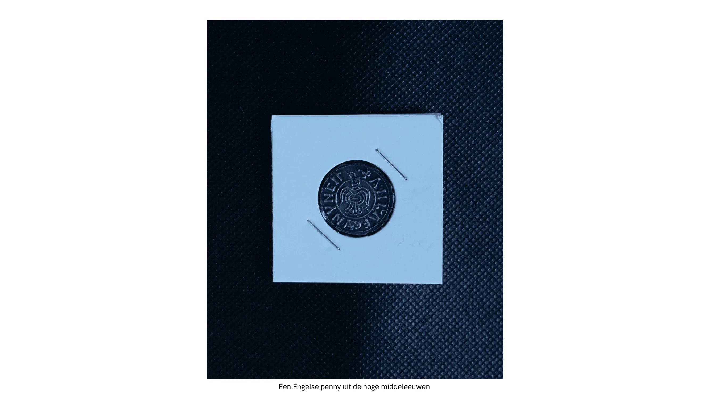

Tijdens de Hoge Middeleeuwen verviel Europa in feodalisme na de ineenstorting van het Romeinse monetaire systeem. De meerderheid van de bevolking gebruikte koperen of bronzen munten met een lage waarde, die vaak onderhevig waren aan muntverwatering, waardoor de handel over lange afstanden werd beperkt.

De terugkeer van munten als betaalmiddel vond geleidelijk plaats en bereikte zijn hoogtepunt in de 13e eeuw met de verschijning van de gouden florijn in Florence in 1252, gevolgd door de gouden dukaat in Venetië. Deze gouden munten werden op grote schaal gebruikt dankzij de uitbreiding van de handel en de groeiende behoefte aan betrouwbare, internationaal geaccepteerde betaalmiddelen.

In Engeland werd het monetaire systeem beschermd tegen verwatering door innovatief fiscaal beleid, zoals de landbelasting die werd ingevoerd door Willem de Veroveraar na 1066, waardoor de kwaliteit van de penny sterling behouden bleef. Wat hier belangrijk is om te begrijpen, is dat soevereinen in die tijd de munt konden devalueren om de staat te financieren, en **de introductie van deze belasting maakte het mogelijk om de munt stabiel te houden en de staat te financieren via belastingen.**

De verleiding om winst te maken door monetaire verwatering leidde echter tot crises, zoals tijdens het bewind van Hendrik I in de 12e eeuw, toen de kwaliteit van de muntslag dramatisch daalde. Strenge hervormingen, die soms gepaard gingen met gewelddadige maatregelen tegen munthandelaren, herstelden tijdelijk het vertrouwen in de munt.

In de Middeleeuwen ontstonden ook geavanceerde financiële praktijken, zoals het gebruik van rekenstokken in Engeland om het verbod op woeker te omzeilen en krediet te verstrekken. De kerk was niet erg happig op rentedragende leningen, dus werden er verschillende technieken gebruikt om het verbod op het gebruik van rente te omzeilen.

Deze innovaties waren een antwoord op het chronische tekort aan metaalgeld en stimuleerden het ontstaan van een embryonale financiële markt.

De kruistochten stimuleerden ondertussen de handel in het Middellandse Zeegebied en bevorderden de ontwikkeling van internationale uitwisselingen en nieuwe bankpraktijken, met name via de Orde van de Tempeliers. De Tempeliers werden belangrijke financiële tussenpersonen die kruisvaarders in staat stelden om ver van huis liquide middelen te verkrijgen, een voorbode van het moderne Europese banksysteem.

Om de link met de Tempeliers te leggen, zie je hieronder een Franse middeleeuwse munt, waarop je een prachtig kruis in het midden kunt herkennen. Het was heel gebruikelijk voor munten uit deze tijd om dit kruis te dragen.

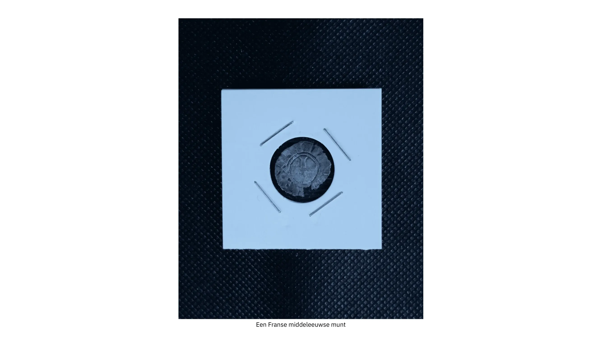

Ten slotte brachten grote crises zoals de Zwarte Dood (1346-1353) diepgaande economische transformaties teweeg. De scherpe daling van de bevolking leidde tot een sterke stijging van de lonen, die de pogingen van de overheid om de vroegere beloningsniveaus te handhaven trotseerde.

Tegelijkertijd dwong de Honderdjarige Oorlog (1337-1453) staten tot een agressiever fiscaal beleid om hun legers te financieren, wat bijdroeg aan de verzwakking van het feodale systeem.

De Middeleeuwen werden dus gekenmerkt door een constante spanning tussen de behoefte aan betrouwbaar geld voor de handel en de voortdurende verleiding voor heersers om geld te verwateren voor onmiddellijke winst. Dit conflict heeft de Europese monetaire ontwikkeling diepgaand gevormd en legde de basis voor moderne economische systemen.

Om dit gedeelte af te sluiten, wil ik graag een nogal interessante anekdote uit Engeland rond deze tijd toevoegen. Deze anekdote komt uit het boek "History of Money" van Glyn Davies.

Het vermeldt dat in Engeland de verschuiving naar het parlement de schuldenlast van de soeverein naar het parlement verplaatste, wat resulteerde in chronische staatsschulden. Daarvoor drukte de schuld op de schouders van de vorst.

Toen het parlement eenmaal in staat was om een deel van deze macht over het creëren van geld in handen te krijgen, werd het mogelijk om langetermijnschulden te creëren die door het volk werden gedragen, niet door de koning. Voorheen was het zo dat als de koning failliet ging of als er een wisseling van koning plaatsvond, de schuld met hem tenietging.

Op het moment dat het parlement schuld creëert, ontstaat het concept van soevereine schuld, omdat deze potentieel onbeperkt is in de tijd. Zolang de staat bestaat, zolang het parlement bestaat, bestaat deze schuld en ze moesten allerlei manieren vinden om deze te herfinancieren en in de tijd te spreiden. Het is een grote paradigmaverschuiving, waarbij het niet langer de koning of het koningshuis was die garant stond voor deze schulden of de last ervan droeg; het was nu het parlement en dus zijn burgers.

## De renaissance

<chapterId>1d1dfb05-70b4-5b7b-9708-373c2182950d</chapterId>

:::video id=4977b4f3-c7b2-41a5-ad7b-a96a8cca4092:::

We zijn nu aangekomen bij het deel van de cursus waarin we het hebben over de periode die bekend staat als de Renaissance. Het speelt zich af tegen een achtergrond van tragische crisis, met de razendsnelle verspreiding van de pest door vlooien op ratten aan boord van schepen. Deze tragedie informeert ons echter over de groei van handel en reizen in de hoge middeleeuwen. Eerder in deze periode verplaatsten niet zoveel mensen zich zo ver en zo snel.

### De Florin van Florence

De terugkeer van gouden munten in Europa tijdens de Renaissance markeert een fundamenteel keerpunt in de monetaire geschiedenis. **Het begon allemaal met de Florin van Florence in 1252, de eerste grote gouden munt die in Europa werd geslagen sinds de val van Rome**. Met zijn opmerkelijk constante gewicht en zuiverheid (ongeveer 3,5 gram puur goud) bleef de florijn vier eeuwen lang onveranderd en werd al snel een essentiële pan-Europese monetaire referentie.

Hieronder zie je een reproductie van een Florin: een gouden Florin gemaakt van tin en gestempeld door een Franse kunstenaar die uitstekende stukken maakt, met de hand gegraveerd en geslagen.

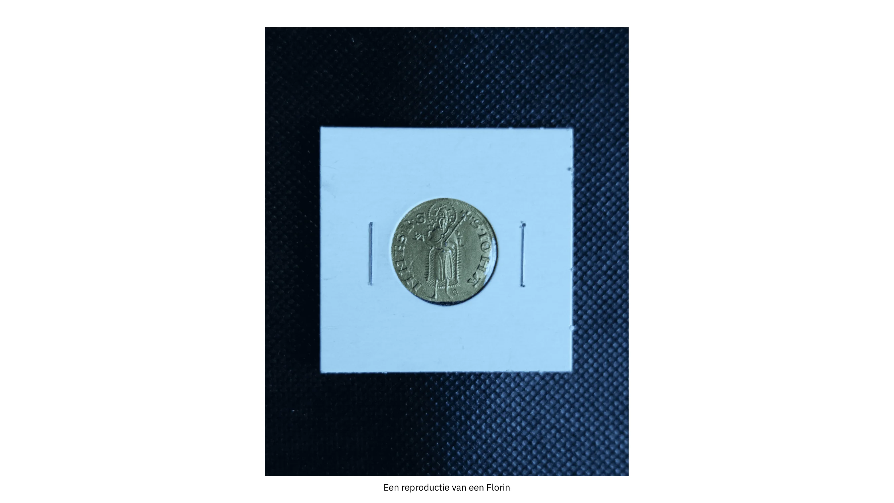

Deze terugkeer naar gouden munten werd gedreven door een specifieke context: de ineenstorting van de Byzantijnse solidus en de economische achteruitgang van de moslimwereld als gevolg van de Mongoolse invasies creëerden een monetair vacuüm in de internationale handel.

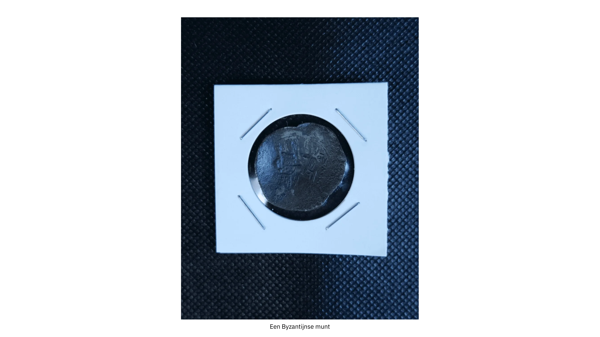

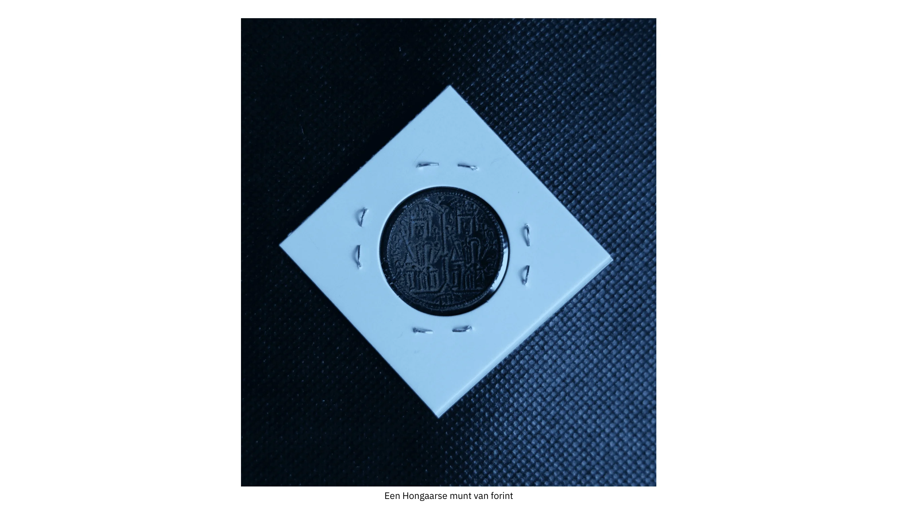

De eerste afbeelding hierboven toont een Byzantijnse munt die ik heel interessant vind. Ik ga een parallel trekken met een munt uit dezelfde periode uit Hongarije (tweede afbeelding hierboven). De Hongaarse munt is bekervormig, als een miniatuurkom. De iconografie toont religieuze figuren afgebeeld als koningen die kruizen naast elkaar houden. Dit stuk is komvormig en komt uit Hongarije.

Het was heel gebruikelijk om munten van andere landen te kopiëren. Omdat Byzantijnse munten algemeen geaccepteerd waren, kopieerden andere landen ze vaak. Zoals je kunt zien als je ze naast elkaar legt: deze stukken lijken erg op elkaar.

Noord-Italië, met name Florence, Venetië en Genua, profiteerden van deze context om nieuwe harde valuta te lanceren - munten met een stabiel edelmetaalgehalte. Venetië volgde het voorbeeld van Florence door in 1270 de dukaat te slaan, een munteenheid die bijna identiek was aan de florijn en veel gebruikt werd in de mediterrane handel.

De florijn werd de eerste internationale reservemunt, die voor het einde van de 14e eeuw in meer dan 150 Europese steden werd ingevoerd. Met de oprichting van een grootschalig Florentijns banknetwerk, onder leiding van de Medici, werd het monetaire en boekhoudkundige beheer grondig gemoderniseerd, waardoor het zelfs minder nodig werd om goud fysiek te vervoeren.

Dat is nog een heel interessant punt. Er was een tijd dat veel zendingen met munten verloren gingen op zeereizen. Deze technologische vooruitgang - de registers met dubbele boekhouding - maakte de creatie van giraal geld mogelijk. Dit maakte het mogelijk om het aantal afrekeningen met munten te verminderen en in plaats daarvan een systeem van geschreven posten te gebruiken, wat het risico op verlies van geld tijdens het transport enorm vermindert.

De monetaire ontwikkeling ging ook gepaard met een belangrijke evolutie in bankmethoden. Deels geïnspireerd door het contact van de kruistochten met islamitische bankpraktijken zag het middeleeuwse Europa al in de 13e eeuw rudimentaire banksystemen ontstaan in Florence, Venetië, Barcelona en Genua. De Tempeliers, een religieuze en militaire orde, hadden al een systeem ontwikkeld waarmee kruisvaarders konden reizen zonder hun rijkdom mee te nemen.

Ze deponeerden geld bij een Tempelierskantoor in hun land en konden dan reizen met een soort brief en de munten ophalen bij aankomst op hun kruistochtbestemming.

Dit betekende dat we geen edelmetalen munten bij ons hoefden te dragen.

Het was ook in deze periode dat Europa zich bewust werd van het bestaan van papiergeld in China, dankzij de reis van Marco Polo in de 13e eeuw. De ontwikkeling van bankbiljetten zou echter nog enkele eeuwen op zich laten wachten, omdat Europa er de voorkeur aan gaf om eerst zijn methoden voor het slaan van metalen munten te perfectioneren. Leonardo da Vinci, die nauw samenwerkte met Luca Pacioli, een gerenommeerd registeraccountant, droeg actief bij aan de verbetering van geldpersen en bevorderde een snellere en meer uniforme productie van munten.

We hebben het over de slingerslagtechniek die eerder in de cursus is genoemd. Deze methode maakte het mogelijk om meer uniforme munten te produceren in vergelijking met het slaan met een hamer en, wat belangrijk is, maakte het mogelijk om inscripties rond de rand van de munt aan te brengen, zoals ik eerder heb gedemonstreerd. De munt hieronder is een Europese thaler uit 1793, waarop duidelijk een opschrift op de rand te zien is.

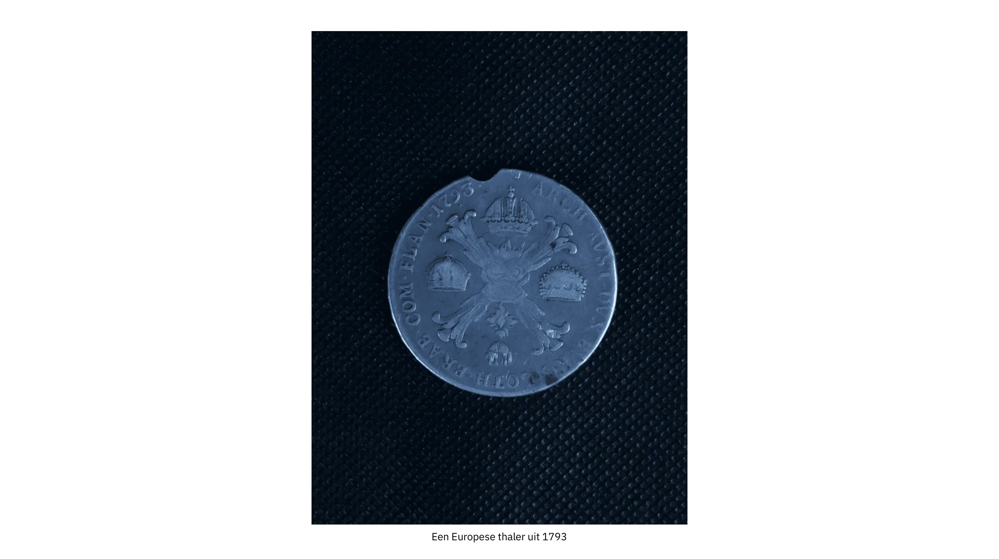

In de 15e eeuw beleefde Europa echter een ernstige valutacrisis, met een algemene verslechtering van het zilvergehalte van de Europese munten, dat rond 1450 daalde tot minder dan 5%.

Vanaf de 16e eeuw verschoof het monetaire zwaartepunt naar Spanje, gestimuleerd door de vereniging van de koninkrijken Aragon en Castilië, het einde van de Reconquista en de grote maritieme ontdekkingen zoals die van Christoffel Columbus in 1492. De massale toevloed van zilver uit de Amerikaanse mijnen verstoorde het Europese en mondiale economische evenwicht grondig en voedde zowel de inflatie als nieuwe geopolitieke spanningen.

De Renaissance markeerde ook een belangrijke artistieke evolutie in de muntslag, met munten zoals de thaler (Joachimsthaler), de oorsprong van de term "dollar". Deze grote zilveren munten weerspiegelen de nieuwe artistieke en mechanische munttechnieken die mogelijk werden gemaakt door technische innovatie uit Noord-Europa.

Ten slotte luidde de financiële renaissance de overgang naar economische moderniteit in, met de ontwikkeling van het bankwezen, krediet en financiële markten, en het ontstaan van de eerste vormen van modern kapitalisme in de grote handelssteden Amsterdam, Londen en Stockholm, waarmee de basis werd gelegd voor het internationale financiële systeem zoals we dat vandaag de dag kennen. En dat is het onderwerp van onze volgende video.

# De inbeslagname van geld door de staat

<partId>17cfb1b4-5bc1-53e0-b035-05c7cf76be92</partId>

## De evolutie van de reservevaluta's van de wereld

<chapterId>d65cc352-e7ca-5f03-9b23-dd1fae5c0395</chapterId>

:::video id=82710062-8fff-426c-93af-923c08d82233:::

### Het historische belang van edelmetalen

Welkom bij dit onderdeel over de opkomst van reservevaluta's en centrale banken. Als eerste punt van deze nieuwe rubriek gaan we ons richten op de evolutie van wereldwijde reservemunten.

Edele metalen, vooral goud en zilver, zijn lang beschouwd als de basis van rijkdom en macht in rijken. De dorst naar goud is altijd een dominante drijvende kracht geweest en het was de toevloed van edelmetalen die het meest directe en duidelijke effect had op de monetaire ontwikkelingen in Europa. In de middeleeuwen en de vroege Renaissance was deze obsessie met goud en zilver te wijten aan de moeilijkheid om waarde te behouden in andere vormen van koopwaar, maar ook aan de sterke vraag van buitenlandse mogendheden, vooral in de handel met het Oosten.

Door de eeuwen heen hebben verschillende rijken elkaar opgevolgd als wereldwijde economische centra. Het land dat in een bepaalde periode de wereldhandel domineert, krijgt meestal de status van reservevaluta. Dit zijn onder andere:

- Spanje en Portugal (15e en 16e eeuw)

- De Verenigde Provinciën (Nederland) in de 17e eeuw

- Frankrijk en Groot-Brittannië in de 18e en 19e eeuw

- De Verenigde Staten in de 20e eeuw

### De Portugese boom en de Real (1450-1530)

**Portugal** domineerde de wereldhandel in de tweede helft van de 15e en het begin van de 16e eeuw met de **Portugese Real**, een zilveren munt met een relatief uniform gewicht. De Portugezen vonden dankzij hun vooruitgang in de navigatie nieuwe zeeroutes naar Afrika, Azië en de Nieuwe Wereld. Het aantal militaire forten en handelsposten groeide van Afrika tot China (Macau).

Als antwoord op Europa's vraag naar goud en zilver was "de constante motivatie voor de grote ontdekkingen commercieel gewin, met name de jacht op goud en zilver" Maar het Portugese Rijk, dat overbelast was en concurrentie ondervond van de Nederlanders, Engelsen en Fransen, begon af te takelen.

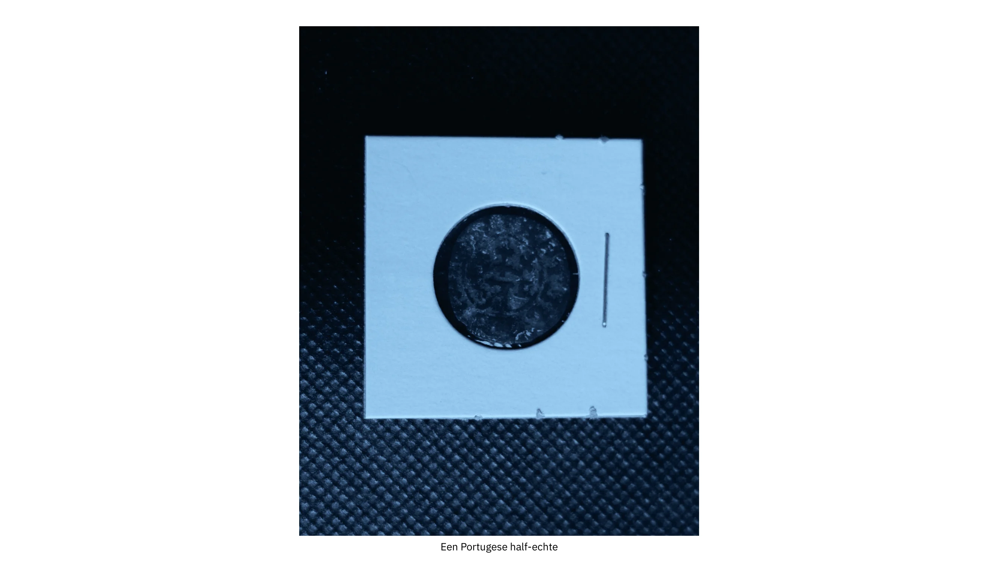

Hierboven zie je een Portugese half-Real uit de tijd van deze Maritieme veroveringen.

### Het Spaanse hoogtepunt en de Spaanse dollar (1535-17e eeuw)

Met de verovering van de Nieuwe Wereld werd **Spanje** de dominante speler. Zijn vorst, die gigantische zilvermijnen controleerde (Potosí in Bolivia, Zacatecas in Mexico), slaagde erin om geld in puur zilver te slaan en zo te voorkomen dat zijn eigen munteenheid in waarde daalde: de **Spaanse Real.**

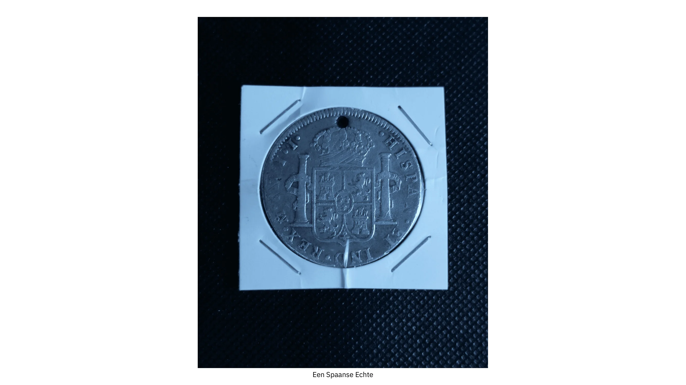

De Spaanse real, ook wel bekend als het "stuk van acht", kreeg zijn bijnaam omdat hij vaak in achtsten werd gesneden om kleinere munten te maken. Hij stond ook bekend als de **Spaanse dollar**. De munt die je hierboven ziet, dateert uit 1814 en is dus een iets recenter voorbeeld. De allereerste Spaanse dollarmunten waren echter niet zo verfijnd; ze werden met een hamerslag geslagen en waren over het algemeen minder rond en knapperig.

Wat vooral interessant is, is dat de Spaanse dollar in die tijd diende als internationale reservemunt. De Spaanse autoriteiten gaven ook hun eigen lokale munteenheid uit, de maravedi, en pasten de geldvoorraad regelmatig aan door middel van terugroepacties. Een koperen of bronzen munt die in eerste instantie één maravedi waard was, kon bijvoorbeeld worden teruggeroepen en gestempeld met "2", later met "4", enzovoort, tot mogelijk "8" Op de hoge-resolutiefoto kun je duidelijk de "8" op de munt zien staan. Deze methode breidde de geldvoorraad effectief uit... wat onvermijdelijk leidde tot inflatie.

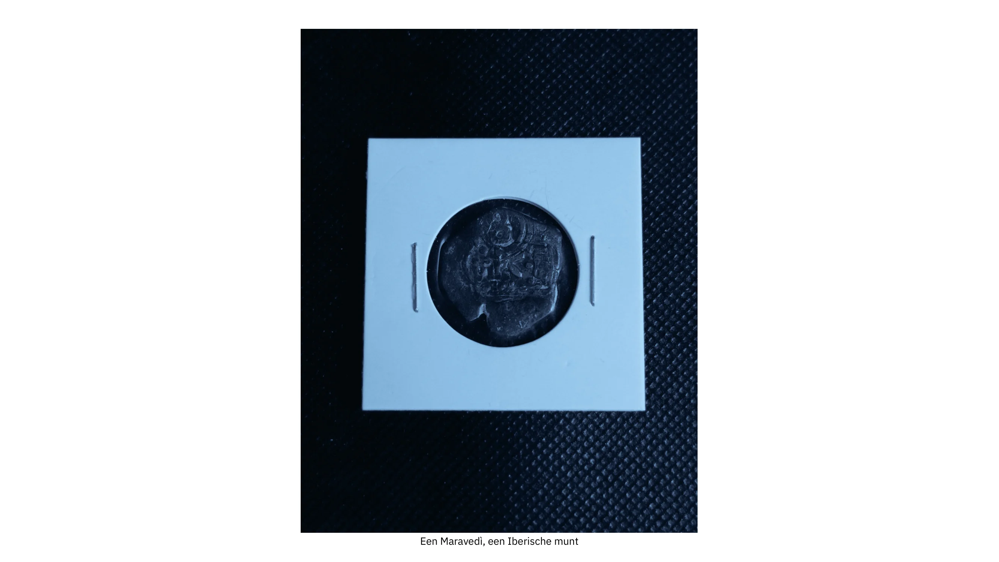

Als we kijken naar de geschiedenis van reservevaluta's, komt er een interessant punt naar voren: rijken pompten hun valuta's niet op zolang ze hun status van reservevaluta behielden. **Pas aan het einde van hun overheersing devalueerden ze en verloren ze dit privilege, dat vervolgens werd doorgegeven aan een nieuw rijk**.

In Spanje domineerde de Spaanse dollar bijna 200 jaar lang de wereldhandel, vooral tussen China en Europa. Deze munten waren zelfs te vinden in Chinese havens. En daar krijgen we een knipoog van de geschiedenis: de Amerikaanse dollar komt rechtstreeks van deze munt. Toen de Verenigde Staten in 1792 werden gevormd, namen ze een wet aan om hun eigen munteenheid te slaan en hun eerste dollars werden gemaakt naar het model van de Spaanse dollar, zowel qua naam als qua muntgrootte.

Om je een idee te geven van de waarde: een Amerikaanse dollar was oorspronkelijk een zilveren munt die bijna een ounce woog, oftewel tussen de €30 en €40 in het huidige geld, in tegenstelling tot de papieren valuta die we vandaag de dag kennen. De Spaanse dollar circuleerde zo wijdverspreid dat hij wordt beschouwd als de eerste echte wereldmunt.

Deze toevloed van edelmetalen uit Amerika veroorzaakte echter inflatie in Europa. Tijdens de Prijsrevolutie (ca. 1540-1640) verzevenvoudigden de kosten van levensonderhoud in Engeland. In Spanje had de overvloed aan zilver een averechts effect, waardoor de ontwikkeling van solide bankinstellingen werd belemmerd.

Vervolgens kreeg Spanje te maken met talloze militaire conflicten (Vlaanderen, Nederland, Dertigjarige Oorlog) en stortten de financiën geleidelijk in. In plaats van de wereldberoemde zilveren munt te devalueren, kozen de opeenvolgende heersers ervoor om de koperen munt (vellón), die door de lokale bevolking werd gebruikt, in te leveren of te devalueren. Dit is wat ik eerder beschreef met de Maravedis.

### De Nederlandse opkomst (17e eeuw)

Na het Iberische hoogtepunt kwam **Nederland** in de 17e eeuw op als nieuwe handelsmacht. De handel over zee, de VOC (Verenigde Oost-Indische Compagnie) en de oprichting van de **Amsterdamse Beurs Exchange** (geïnspireerd op die in Antwerpen) vestigden deze handelsrepubliek als een hub.

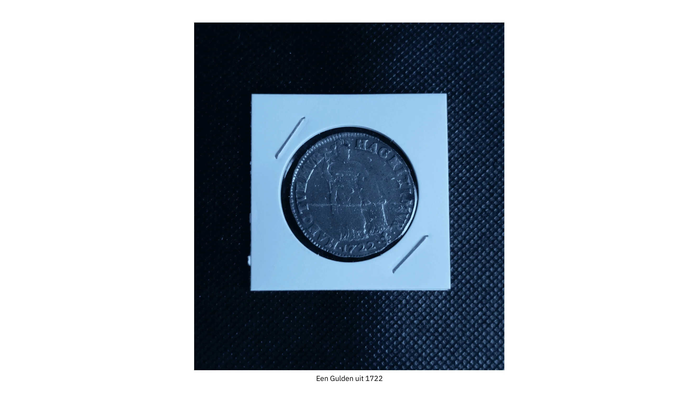

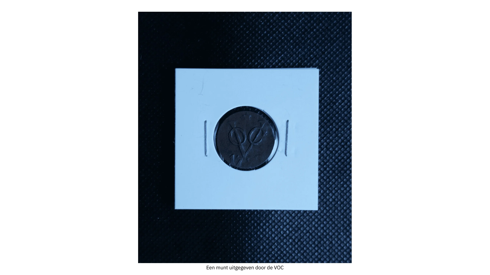

Op de eerste foto hierboven zie je een Gulden uit 1722 (een mooie zilveren munt), terwijl je op de tweede een munt ziet die is uitgegeven door de VOC.

De VOC was een extreem machtig bedrijf voor die tijd: het had zijn eigen leger en gaf zelfs zijn eigen munteenheid uit.

De Nederlanders vonden het moderne kapitalisme uit, dat begon als een manier om risico's te verdelen bij risicovolle ondernemingen zoals expedities naar de Nieuwe Wereld of de zoektocht naar nieuwe handelsroutes. Naamloze vennootschappen stelden verschillende investeerders in staat om hun geld te bundelen en het risico te delen. Om deze uitwisselingen te vergemakkelijken, was het nodig om instellingen op te richten die in staat waren om over deze effecten te onderhandelen en ze uit te wisselen. Zo ontstonden in 1602 de eerste naamloze vennootschap en effectenbeurs.

De Nederlandse munt, de **Gulden**, won aan geloofwaardigheid dankzij de zuiverheid van het zilver en de invoering ervan door de Bank van Amsterdam (1609), waar deposito's de favoriete vorm van geld in Europa werden. Dit is een heel belangrijk punt om te noemen. Ja, natuurlijk waren er munten, maar wat in die tijd echt geld was, was een vorm van bijbels geld. In feite verliep een groot deel van de wereldhandel via de boeken van de Bank van Amsterdam. Dit was een echte doorbraak in het bankwezen: internationale handel verliep niet langer noodzakelijkerwijs met fysieke munten, maar rechtstreeks via de boekhouding van de bank.

Deze periode van welvaart werd gekenmerkt door een grote toevloed van goud en zilver, vooral uit andere landen die inflatie of monetaire controle toepasten. Er is een interessant personage om te noemen: **Thomas Gresham**. In deze tijd werkte hij voor de Engelse koninklijke familie in Nederland, waar hij de geldstroom tussen de twee landen beheerde. Het was dezelfde Gresham die ons de beroemde **"Gresham Law"** naliet.

Toch raakte ook het Nederlandse Rijk op den duur op stoom. Oorlogen met Engeland, de verdunning van de gulden in tijden van conflict en concurrentie van andere mogendheden (Frankrijk en Engeland) betekenden het einde van de Nederlandse hegemonie. Na de Vierde Engels-Nederlandse Oorlog (1780-84) werd de neergang van de gulden als reservemunt onomkeerbaar.

### Franse macht, ambities en mislukkingen (17e-18e eeuw)

Onder Lodewijk XIV werd **Frankrijk** de grootste continentale macht van Europa. De Franse munt bereikte echter nooit de status van dominante referentie: talrijke devaluaties, zware belastingen en dure oorlogen (de Liga van Augsburg, de Spaanse Successieoorlog, enz.) wogen zwaar op de stabiliteit van het monetaire systeem.

Het eerste grote experiment met papiergeld werd uitgevoerd door John Law (1716-1720). De Banque Générale gaf biljetten uit die gedekt werden door beloftes van staatsschuld. Deze regeling leidde tot een speculatieve zeepbel en ineenstorting (de Mississippi Bubble) in 1720. Frankrijk hield aan deze ramp een blijvend wantrouwen ten opzichte van papiergeld over. Het was deze rampzalige ervaring die ertoe leidde dat Richard Cantillon rijk werd dankzij dit systeem van principes, dat nu bekend staat als het Cantillon-effect, waarbij het drukken van geld diegenen verrijkt die toegang hebben tot de drukpers.

Toen dit wantrouwen eindelijk wegebde, volgde een ander Frans papierfiasco: de revolutionaire ** assignats**. Deze assignats, die vanaf 1790 werden uitgegeven op basis van de confiscatie van geestelijk eigendom, kenden een galopperende hyperinflatie, waardoor ze officieel de eerste hyperinflatie in de geschiedenis waren die de 50% per maand overschreed. Hoewel hun nominale waarde was vermenigvuldigd, werden ze in 1795 verhandeld tegen slechts een paar procent van hun oorspronkelijke waarde.

Meer restrictieve wetten probeerden het assignat op te leggen, maar zonder succes. De overheid probeerde het af te dwingen en ging zelfs zo ver dat ze mensen die het niet accepteerden met de dood bedreigde en winkeliers dwong om open te blijven. Maar uiteindelijk werkte het natuurlijk niet.

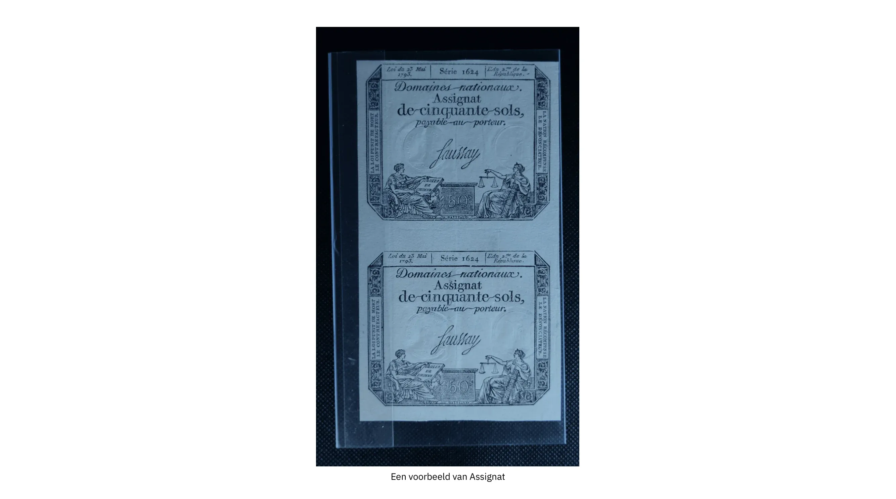

Toen dit papiergeld alle hoogwaardige munten van edelmetaal verving, in overeenstemming met de beroemde Wet van Gresham, ontstond er een tekort aan munten. Om nieuwe munten te slaan, gebruikten ze klokkenmetaal dat in beslag was genomen van de geestelijkheid. Hieronder zie je een prachtig stuk klokmetaal, gemaakt van teruggewonnen koper door het omsmelten van de munten die van de geestelijken waren afgepakt.

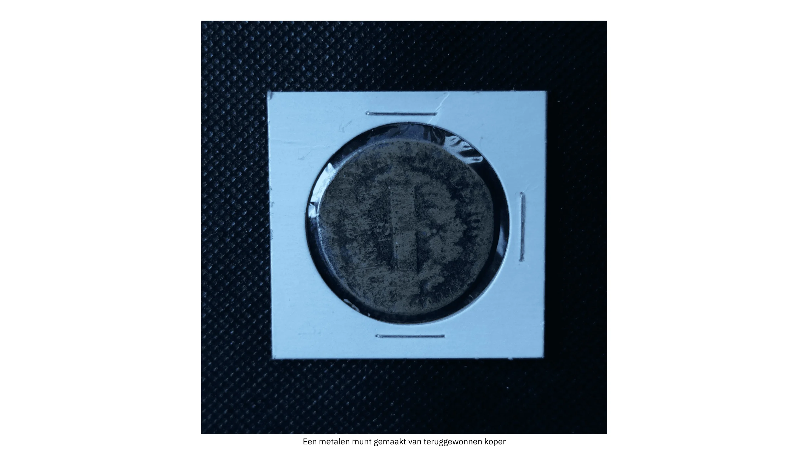

### Britse overheersing (18e - begin 20e eeuw)

**Engeland**, dat Nederland had ingehaald, werd de dominante macht in de 18e eeuw. Het Britse pond is de oudste nog gebruikte munteenheid, oorspronkelijk gekoppeld aan een pond zilver. Geleidelijk aan werd de status sterker, ondersteund door een financiële en fiscale revolutie: een parlementaire monarchie, een sterk vermogen om belastingen te heffen en de oprichting van de Bank of England in 1694.

Na een reeks oorlogen tegen Frankrijk kwam het Verenigd Koninkrijk als overwinnaar uit de strijd in 1815 (Waterloo), waarmee het zijn suprematie bevestigde. Gedurende de hele 19e eeuw fungeerde het Britse pond als de reservevaluta van de wereld. Op zijn hoogtepunt produceerde Groot-Brittannië, met slechts 2,5% van de wereldbevolking, 20% van het wereldinkomen en controleerde het bijna een kwart van het aardoppervlak.

De **Industriële Revolutie** en de invoering van een **Gouden Standaard** (1717 of 1718, onder toezicht van Isaac Newton bij de Koninklijke Munt) versterkten de geloofwaardigheid van het pond. De Bank of England nam een goudstandaard aan van 4,25 pond per ounce goud, waardoor houders van bankbiljetten hun bankbiljetten konden omzetten in goud.

De Eerste Wereldoorlog (1914-1918) maakte echter een einde aan dit systeem. Binnen enkele weken schortten alle grote oorlogvoerende mogendheden de goudconvertibiliteit op. Het Britse Rijk en later het pond kwamen verzwakt uit de Tweede Wereldoorlog en maakten in de 20e eeuw plaats voor de Amerikaanse dollar.

En als artefact kun je hieronder een aantal mooie en interessante stukken zien. Dit zijn muntgewichten. De eerste is de soeverein: de vroegste afbeeldingen van het pond. Ik heb alleen geldgewichten om deze munten voor te stellen omdat ik het me niet kan veroorloven om een echte soeverein te kopen. Om ze te wegen, gebruikten we een weegschaal en plaatsten we het geldgewicht dat overeenkomt met de waarde van de soeverein aan de andere kant.

De soeverein was een munt - een gouden munt die oorspronkelijk één pond waard was.

Voorafgaand aan de beroemde soeverein was er de guinea, die volgens hetzelfde principe werkte. De guinea werd vernoemd naar de edelmetalen die erin zaten en die afkomstig waren uit de regio Guinee.

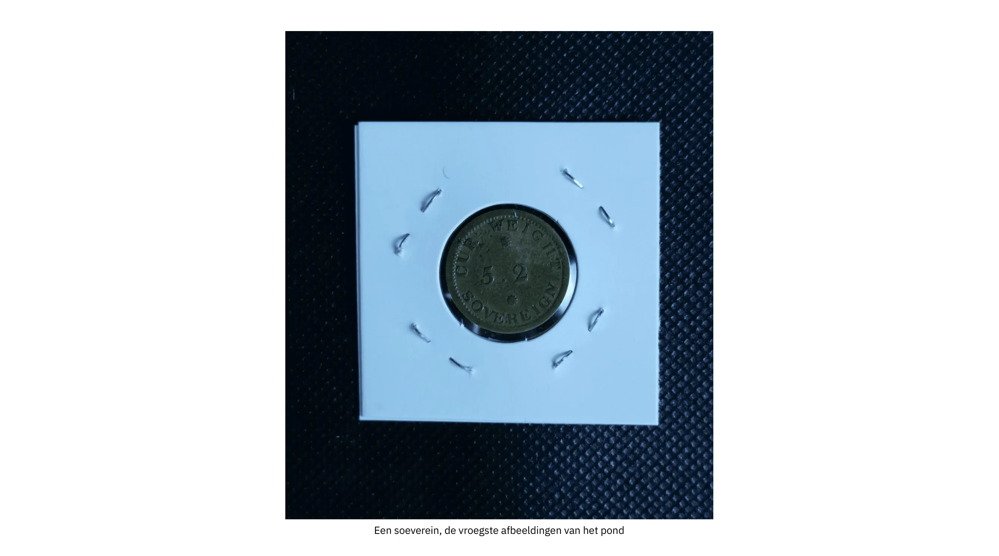

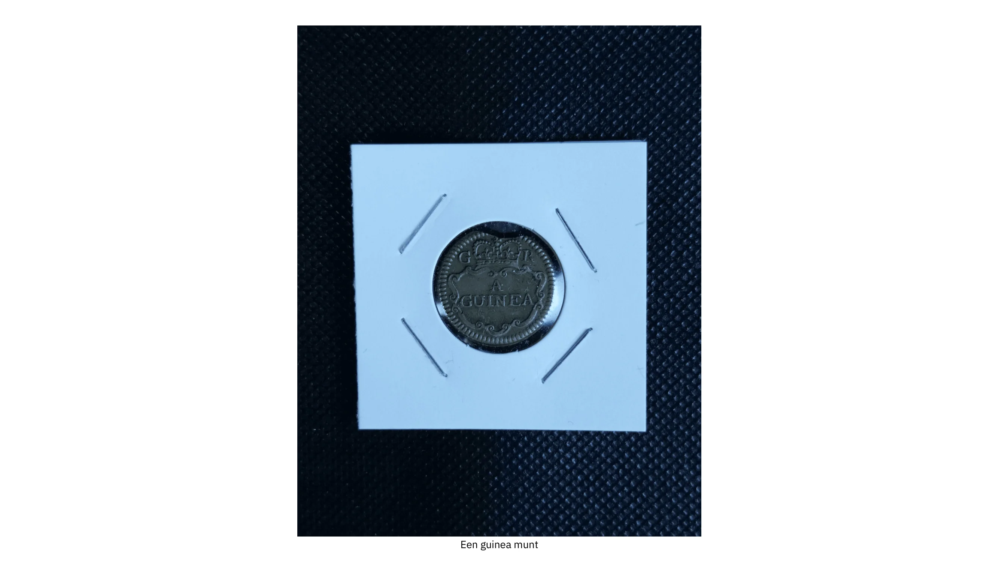

## De opkomst van centrale banken

<chapterId>15777771-1e28-55f7-a400-69868a47079b</chapterId>

:::video id=7661b7b5-e00f-48f3-b69a-6fb2eb5ebba4:::

Na dit deel over de geschiedenis van de eerste reservemunten en hun evolutie, volgt hier een deel over de opkomst van centrale banken. Het volgt grotendeels hetzelfde pad als de opkomst van reservemunten, maar richt zich iets meer op de banktechnologieën van die tijd.

### Het begin van banken en proto-banken

Al in de 13e eeuw ontwikkelden de Italianen (Florence, Genua, Venetië...) een dubbele boekhouding. Later werd **Antwerpen** (16e eeuw) het belangrijkste financiële centrum van Noord-Europa, een rol die later werd overgenomen door **Amsterdam**, dankzij de Amsterdamse effectenbeurs Exchange (1609), waar VOC-aandelen werden verhandeld.

In Antwerpen werden handelsbeurzen gehouden waar handelaren vaak bijeenkwamen om schulden te vereffenen, wat leidde tot de uitvinding van nieuwe financiële instrumenten. Het onderstaande biljet, gedateerd 1761 en recenter, is een **briefje**. Het heeft handgeschreven details en inscripties op de achterkant, waardoor het een prachtig artefact uit die periode is.

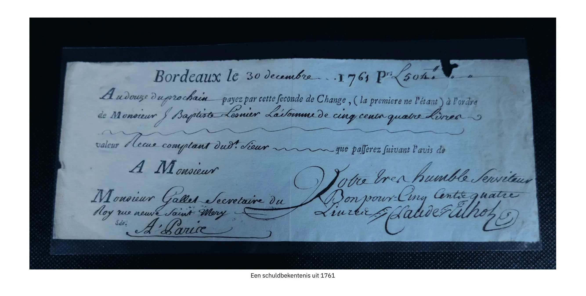

Dit bruisen leidde tot de oprichting van meer geavanceerde bankinstellingen. **Lombardische bankiers** en later Nederlandse kooplieden perfectioneerden kredietinstrumenten (wissels, promessen, enz.). Het moderne banksysteem is gebaseerd op dit idee: geld kan krediet zijn, niet alleen metaal.

Zoals je kunt zien, brengt dit ons terug bij onze oorspronkelijke vraag over de oorsprong van geld.

Komt geld voort uit een goed dat voortkomt uit de behoefte om te ruilen, of komt het voort uit krediet? Sporen hiervan zijn nog steeds te vinden in deze sectie.

### Het Zweedse voorbeeld: Stockholms Banco en Riksens Ständers Bank

Laten we verder gaan naar Zweden, waar de allereerste centrale bank werd opgericht.

**Zweden** was een pionier op het gebied van centraal bankieren: in 1657 richtte Johan Palmstruch de **Stockholm Banco** op, die meer mocht uitlenen dan haar metaalreserves en daarmee de geboorte van fractional reserve banking markeerde. Maar de buitensporige uitgifte van bankbiljetten leidde in 1663 tot paniek en een run op de bank. Nou ja...

In 1668 werd in Stockholm de Riksens Ständers Bank opgericht, de eerste echte centrale bank ter wereld. Ook deze bank had echter te lijden onder crises (1709, 1715...) die verband hielden met het misbruik van bankbiljetten, vaak om de oorlogen van het koninkrijk te financieren.

### De mislukte staatsgreep van John Law

Laten we naar Frankrijk gaan, waar we onze geliefde John Law weer tegenkomen.

**John Law**, een Schot, haalde de Regent (Hertog van Orléans) over om een privébank op te richten, de Banque Générale (1716), die papier mocht uitgeven tegen goud, zilver en staatsschulden. Het werd de Banque Royale (1718) en hielp de aandelen van de Mississippi Company omhoog.

Toen de realiteit de speculatie inhaalde, **verergerde de paniek door de beslissing om het aanhouden van goud te verbieden en het gebruik van wetsbiljetten te forceren**. Nou, nou...

Uiteindelijk barstte de zeepbel in 1720 en veroorzaakte een ineenstorting die de geloofwaardigheid van papiergeld in Frankrijk voor lange tijd ruïneerde.

### Bank of Amsterdam, de opkomst van een baanbrekend model

We worden nu getransporteerd naar Amsterdam in 1609, waar de **Bank van Amsterdam** (Wisselbank) de controle over het bewaren en inwisselen van munten in Amsterdam overnam. De bank verbood de circulatie van particuliere bankbiljetten en dwong het deponeren van metalen munten in haar kluizen af. Beetje bij beetje kreeg de bank de controle over het geld in handen. Beetje bij beetje kregen ze de controle over de munteenheid. Ze verboden geldwisselaars om munten bij zich te houden. De geldwisselaars werkten de hele dag en moesten hun munten aan het einde van de dag in de kluizen van de Bank van Amsterdam deponeren. Zoals ik al zei, waren het niet noodzakelijkerwijs metalen munten die in de internationale handel werden gebruikt. Het was schriftgeld in de boeken van de bank.

Dankzij de macht van de Nederlandse koopman speelde de bank de rol van de eerste de facto "centrale bank", die de wereldhandel stabiliseerde. Na verloop van tijd verstrekte ze echter ongedekte leningen aan de VOC en uiteindelijk had ze geen metaal meer om haar rekeningen te dekken. In 1790 bleek dat ze grote sommen had geleend aan de VOC en verklaarde ze zich virtueel failliet, wat de geloofwaardigheid van de gulden ruïneerde. Nou ja...

### De Bank of England, oprichtingsakte van het moderne bankieren

In het 17e-eeuwse Engeland werden goud en zilver opgeslagen door goudsmeden, die ontvangstbewijzen verstrekten. Deze deels gedecentraliseerde organisatie bleek haar grenzen te hebben toen de kroon massaal financiering nodig had voor de oorlog tegen Frankrijk.

In 1694 werd de **Bank of England (BoE)** opgericht. De Bank of England werd dus geboren uit een verstandshuwelijk tussen het Londense bedrijfsleven en de regering, die wanhopig op zoek was naar fondsen voor de oorlog.

De Bank kreeg het monopolie op de uitgifte van bankbiljetten in Engeland (versterkt in 1708, 1742, enz.). Vanaf dat moment circuleerde papiergeld met goudreserves naast munten. Dit is een belangrijk punt om de geleidelijke overname van geld door staatsinstellingen te begrijpen. Eerst verhinderde de Bank van Amsterdam geldwisselaars om munten te houden en dwong hen om ze terug te geven aan de Bank. In Engeland werd het particuliere banken verboden om hun eigen biljetten uit te geven die in goud konden worden ingewisseld.

Ze stonden particuliere banken wel toe om bankbiljetten uit te geven, maar deze konden alleen worden ingewisseld tegen Bank of England-biljetten.

Bank of England biljetten, pounds sterling, waren inwisselbaar in goud. Dit voegde een derde laag toe aan de munteenheid. Dus we hebben goud als basis, dan Bank of England-biljetten en daarbovenop particuliere bankbiljetten. Daarvoor konden particuliere banken hun eigen biljetten uitgeven die in goud konden worden ingewisseld. Dit is een volgende fase in de geleidelijke overname van valuta door staatsinstellingen.

De Bank financierde de staat met enorme leningen en structureerde de enorme staatsschuld die de economische boom financierde.

Dit model werd in de loop van de 18e en 19e eeuw geconsolideerd, tot het punt waarop het pond de reservevaluta van de wereld werd, onder het zegel van de Bank of England en de goudstandaard.

**De reservevaluta's van de wereld** hebben elkaar door de eeuwen heen opgevolgd, gedreven door de economische, commerciële en militaire macht van een staat of rijk: Portugal, Spanje, Nederland, daarna Groot-Brittannië, voordat de Verenigde Staten in de 20e eeuw kwamen domineren. In elk geval zien we een vergelijkbare cyclus: economische expansie, commercieel succes, internationale invoering van valuta, schuldenlast, dure oorlogen, misbruik van geldschepping of krediet, en uiteindelijk verval.

**Het ontstaan van centrale banken** was een geleidelijk proces. Deze instellingen ontstonden vaak in de context van kostbare oorlogen, waardoor de staat zichzelf kon financieren door middel van schulden. Toen de goudstandaard werd ingevoerd (Engeland, 17e-19e eeuw), zorgde dit voor een vleugje stabiliteit, totdat de grote wereldoorlogen van de 20e eeuw leidden tot de geleidelijke afschaffing van de goudconvertibiliteit. De macht om geld te slaan verschoof zo van het koninklijke monopolie naar complexere entiteiten, eerst privé (goudsmeden, bankiers), daarna semi-publiek (centrale banken), wat de evolutie van monetaire soevereiniteit naar geïnstitutionaliseerde, geglobaliseerde vormen weerspiegelt.

Dit is dus wat ik eerder beschreef. We hebben de last van staatsschulden vaak direct verschoven naar ofwel centrale banken of de toestemming om geld te creëren door wettelijke instellingen, zoals het Parlement.

En het belangrijkste feit hier is dat **we zijn gegaan van een schuld die kon verdwijnen door het faillissement van de soeverein naar een schuld die voornamelijk op de schouders van de bevolking rust**.

## De weg naar het fiatsysteem

<chapterId>27a98545-d350-56ee-a200-92468e6b9b33</chapterId>

:::video id=e27a753e-aeee-4307-a65c-9506aab380a1:::

We zijn nu aan het einde gekomen van deze cursus over de geschiedenis van geld, en om deze af te sluiten wil ik twee onderwerpen aansnijden. Het eerste onderwerp is de verschillende stadia die hebben geleid tot ons huidige fiatgeldsysteem. We komen terug op de feiten uit hoofdstuk 5 over de oprichting van centrale banken en we voegen het concept van de Amerikaanse dollar toe, die uiteindelijk de huidige reservemunt is. We bekijken hoe het zich heeft ontwikkeld, hoe de dollar is ontstaan, hoe het zich heeft ontwikkeld, hoe het is veranderd, welke stadia het heeft doorlopen om een fiatsysteem te worden, want de oorsprong van de dollar is een zilveren munt.

Onmiddellijk daarna geef ik een kort stukje over de geschiedenis van de financiën, om je te helpen begrijpen hoe we tot de verzorgingsstaat zijn gekomen. We gaan dus naar twee onderwerpen kijken: hoe we bij het fiatsysteem kwamen en onmiddellijk daarna, hoe de evolutie van de financiële wereld ons naar het concept van de verzorgingsstaat leidde.

### De Europese grondslagen van het moderne bankieren

Laten we teruggaan naar de 13e eeuw met de florijn. Om te begrijpen hoe we aan het fiatmodel zijn gekomen, moeten we beginnen bij de 13e eeuw. Naast de florijn kwam er tegelijkertijd met de Medici een technologie op, het concept van wissels.

Toen kwam de Antwerpse effectenbeurs, met zijn concept van verdiscontering en promessen.

Toen kwam, zoals we hebben gezien, de VOC, de eerste aandelenmarkt in Amsterdam. Dit markeerde de geboorte van het kapitalisme, met bedrijfsaandelen en het ruilen van aandelen. De Amsterdamse bank legde vervolgens per decreet het gebruik van deposito's op. Dit betekende dat munten aan het einde van de dag moesten worden gestort. Het waren de geldwisselaars die het wisselgeld niet langer in muntvorm konden bewaren.

Toen kwam de oprichting van de Bank of England uit de noodzaak om schuld te creëren om de oorlog aan het eind van de 17e eeuw te financieren. Op dat moment werden privébanken de derde geldlaag. Trouwens, dit hele hoofdstuk, van de florijn tot de oprichting van centrale banken, is uitstekend samengevat in Nick Bhatia's beroemde boek "Layered Money", dat ik samen met een paar collega's heb mogen vertalen. We hebben het geweldig vertaald, zodat Franstaligen overal hun voordeel kunnen doen met deze lessen.

We zijn dus aan het einde van de 17e eeuw. De Bank of England werd opgericht om de oorlog te financieren.

De privébanken namen de derde laag van de munteenheid over. In feite waren de particuliere bankbiljetten niet langer inwisselbaar in goud: het waren de biljetten van de Bank of England die inwisselbaar waren in goud. Dit toont aan dat de Bank of England de macht over het wisselen van geld overnam.

Toen kwam de paniek van 1776. Iedereen stormde de geldpiramide op. Wat dit betekent is dat er in 1776 een run op de banken was, en dus probeerden alle mensen die papier van de derde laag hadden, d.w.z. privé-bankbiljetten, Bank of England-biljetten te krijgen en vervolgens goud, maar er was duidelijk niet genoeg goud in de kluizen. Ze kondigden een soort bankvakantie af om de gouden rekeningen niet terug te hoeven betalen en zo ontstond het concept van de geldschieter in laatste instantie.

### De evolutie van de Amerikaanse dollar

We gingen over van de florijn naar de oprichting van de Bank of England. Natuurlijk waren er in de tussentijd de Eerste en Tweede Wereldoorlog, maar eerder, in 1796, waren er ook ontwikkelingen aan de andere kant van de Atlantische Oceaan. In 1776 was Amerika nog steeds een Britse kolonie en de koloniën gebruikten deze papieren valuta. Hieronder zie je een biljet van twee shilling uit Connecticut uit 1776.

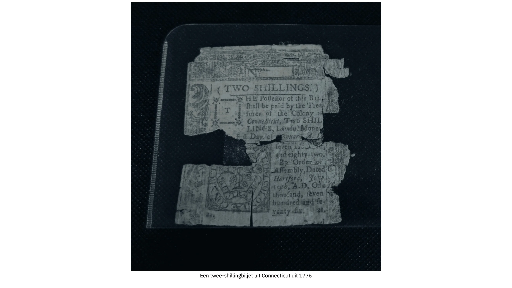

Voordat ze Engeland de oorlog verklaarden en uiteindelijk hun eigen valuta uitgaven, gebruikten de koloniën deze papieren valuta naast de Spaanse dollar voor contante transacties. De term "dollar" bleef zelfs bestaan om de Amerikaanse dollar aan te duiden.

Als ik me niet vergis, namen ze in 1792 een wet aan die hen toestond geld te munten. De dollar hieronder is een voorbeeld van een Amerikaanse dollar uit de moderne tijd.

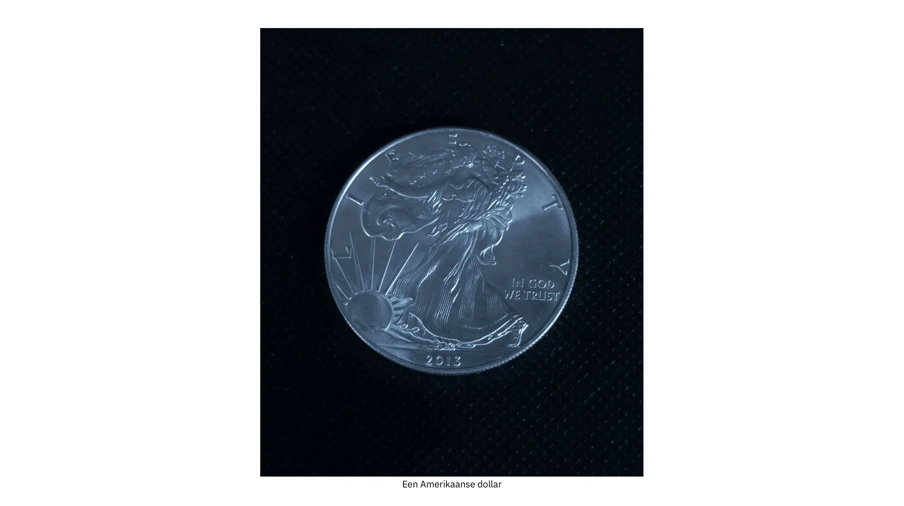

Het is duidelijk dat de nominale waarde niet slechts één dollar is; de waarde ligt rond de 30 of 40 dollar, omdat het een ounce zilver vertegenwoordigt. De waarde schommelt op basis van de prijs van zilver, waardoor hij meestal minstens 30 of 40 dollar waard is. Vandaag de dag heeft een papieren dollar natuurlijk alleen de nominale waarde van één dollar, maar in die tijd was de Amerikaanse dollar geworteld in deze zilverwaarde.

Laten we het nu hebben over de Burgeroorlog in Amerika. De Geconfedereerden drukten geld, dat hyperinflatoir werd. Dit fenomeen is niet opgenomen in de officiële Hanke-Krus lijst, omdat het geen hyperinflatie van 50% bereikte. Er was echter wel sprake van een maandelijkse inflatie van 40%, wat aangeeft dat er tijdens de oorlog een aanzienlijke hoeveelheid geld werd gedrukt.

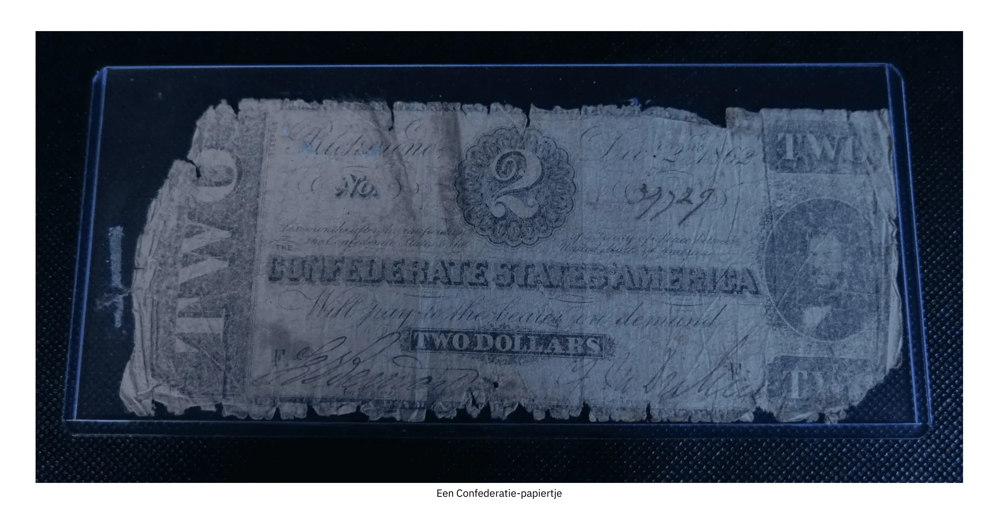

Hun tegenstanders in het noorden hadden ook dollars. Hierboven zie je de dollars van de Confederatie en hieronder die van het Noorden. Ze werden "de greenback" genoemd omdat de achterkant groen was.

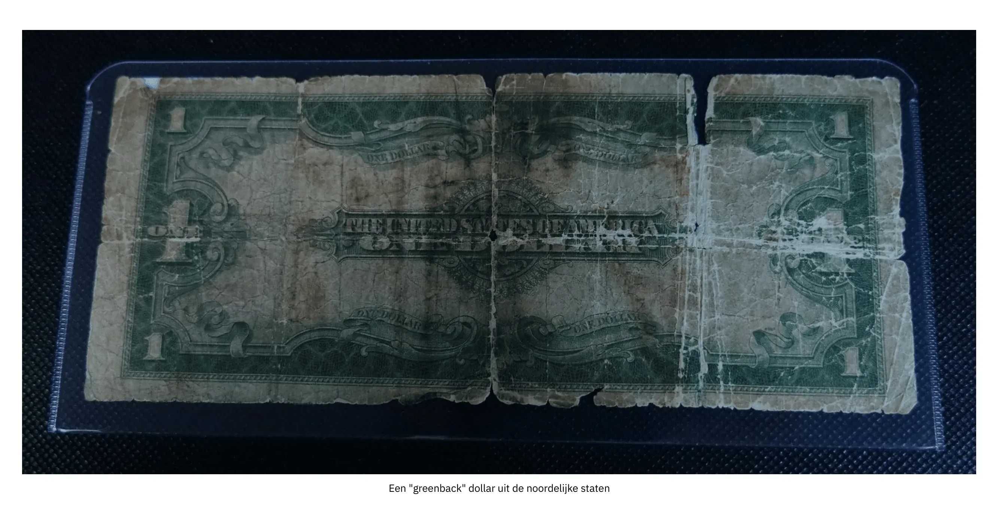

En ik nodig je uit om het verschil in grootte te vergelijken met moderne bankbiljetten. Toen waren de bankbiljetten groter.

Zoals we weten won het noorden, dus werd de greenback de munteenheid van de herenigde Amerikaanse staten. Toen kwam de oprichting van de FED in 1913 en de Eerste Wereldoorlog.

In de nasleep van de Eerste Wereldoorlog bevatte de laatste serie gedrukte bankbiljetten altijd de woorden "redeemable in gold on demand". In 1928 kon met $ 20 dus bijna een ounce goud worden gekocht, omdat de goudprijs $ 20,67 was. Het biljet in de afbeelding hieronder kon in 1928 een ounce goud kopen.

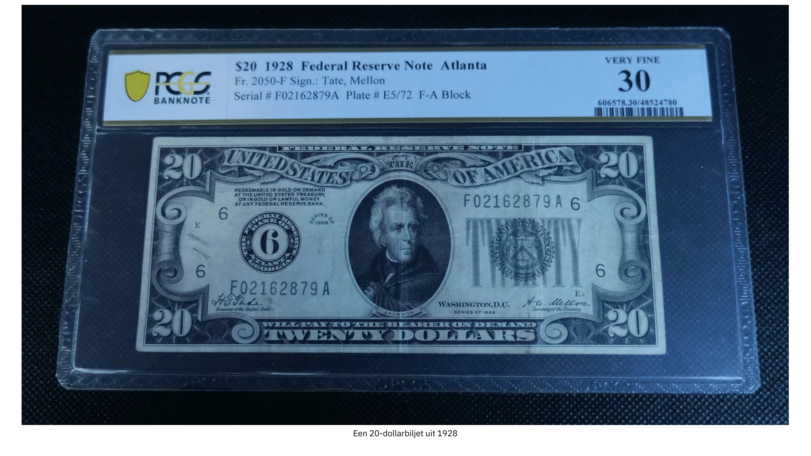

Vandaag de dag is een ounce goud $3.000 waard. Dus je ziet hier natuurlijk de kracht van devaluatie. Het was het laatste wetsvoorstel dat de woorden "inwisselbaar in goud" bevatte. We zullen zien dat direct na Uitvoeringsbevel 6102, ze al het goud in beslag zouden nemen. In feite zouden ze zowel het goud als de goudcertificaten in beslag nemen.

Hieronder zie je een gouden certificaat uit 1928.

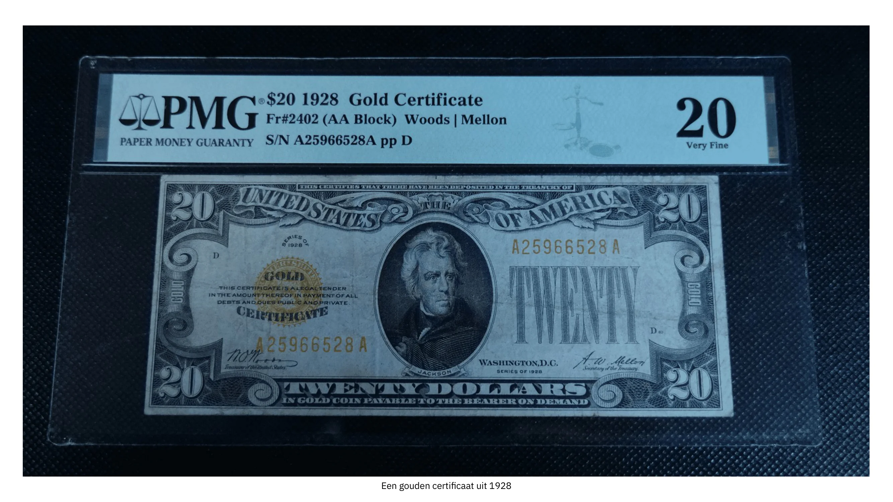

Het was niet alleen "inwisselbaar in goud" zoals het wetsvoorstel van 1928, het was ook inwisselbaar in gouden munten: het is echt een "gouden certificaat". Ze zijn allemaal in beslag genomen na Executive Order 6102. Tot 1964 was het zelfs illegaal om ze te bezitten.

Ik ben erg blij dat ik er een heb.

Vanaf 1964 werd het illegaal om goud te bezitten, tot 1974 als ik me niet vergis. In de jaren '70 stonden ze mensen toe om goud te vergaren na de Nixon schok, die we kort zullen beschrijven. In 1933, toen ze "Executive Order 6102" uitvaardigden, namen ze goud in beslag en werd het illegaal om het te bezitten. Je kreeg een flinke gevangenisstraf als je betrapt werd op het houden van je goud. In die tijd werd elke ounce goud ingewisseld voor een biljet zoals hieronder, na 1934.

Zoals we al zeiden, stond er in 1928 nog steeds de tekst "redeemable in gold" op een dollar.

Na de uitvaardiging van Uitvoeringsbevel 6102 namen ze al het goud in beslag en ruilden ze $20,67 voor elke ounce goud. Daarna kwam de zwendel aan het licht: ze gaven in 1934 nieuwe biljetten uit met de gedrukte tekst "dit biljet is wettig betaalmiddel voor alle schulden".

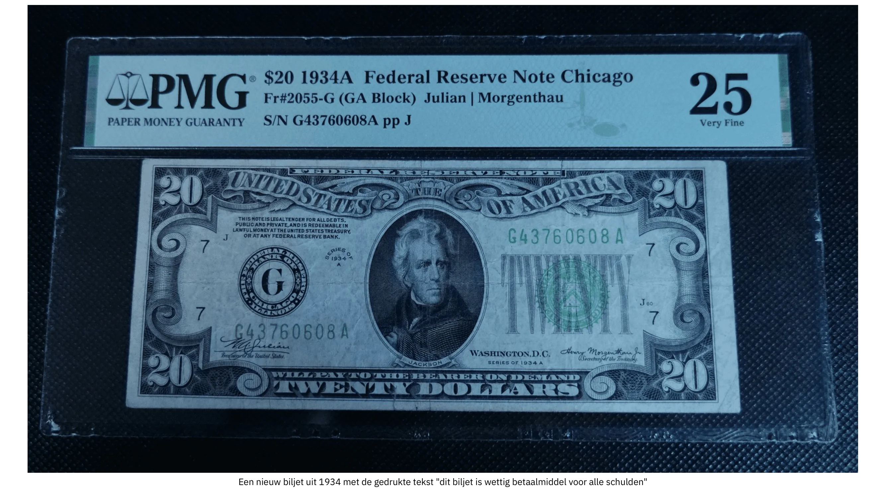

Het concept van wettig betaalmiddel duikt hier op, ter vervanging van de zinsnede "inwisselbaar in goud" De twee biljetten zien er misschien identiek uit, met slechts een paar veranderde woorden, maar de zwendel zit hem in het feit dat de dollar in deze periode werd gedevalueerd; de waarde van een ounce goud daalde van $20,67 naar $35 per ounce in 1934. Dit vertegenwoordigde een devaluatie van ongeveer 40%!

Toen kwam de Tweede Wereldoorlog. Na de oorlog centraliseerde het Akkoord van Bretton Woods een groot deel van het goud van de wereld in de Verenigde Staten. De Amerikanen gaven in ruil bankbiljetten uit, maar deze biljetten waren niet langer inwisselbaar voor goud door het grote publiek. In plaats daarvan bleven ze op staatsniveau inwisselbaar voor goud.

Uiteindelijk begonnen landen als Frankrijk en Duitsland te vermoeden dat er waarschijnlijk meer dollarbiljetten in omloop waren dan goud in Amerikaanse kluizen.

Dus vroegen ze om hun goud te repatriëren. Ze zeiden: "Oké, we zullen het doen, maar het zal even duren." In 1971 verbrak onze vriend Richard Nixon voor eens en altijd de band tussen bankbiljetten en goud en gaf daarbij de schuld aan speculanten.

Goud was ondergewaardeerd op $35 per ounce, een prijs die niet overeenkwam met de hoeveelheid geld die gedrukt was of de werkelijke marktwaarde. In slechts een paar jaar tijd steeg de prijs van $ 34 naar $ 800. Vergelijkbaar met historische voorbeelden, zoals in Rome, waar de verbinding tussen de denarius en de solidus werd verbroken, liet men goud zweven. Dit feit leidde tot een proces van prijsontdekking, waardoor goud daarna veel hoger gewaardeerd werd in dollartermen.

### Het moderne fiatvalutasysteem en zijn implicaties

Dit deel vat samen hoe we zijn afgestapt van een monetair systeem gebaseerd op zilver of goud. Beetje bij beetje kregen instellingen meer en meer macht over geld. Uiteindelijk werd door een eenzijdige beslissing de link tussen edelmetaal en geld volledig verbroken, als gevolg van een overmatige uitgifte.

Als gevolg daarvan is er geen verband meer tussen goud en bankbiljetten of bijbels geld. En het is niet eens een fractioneel reserve systeem - dat is een achterhaald concept. In plaats daarvan geven privébanken geld uit en creëren geld door middel van bankkrediet. Geld wordt voornamelijk op deze manier gecreëerd en is gecorreleerd aan het belangrijkste rentetarief dat door de centrale bank is vastgesteld.

Er is echt geen limiet. Er zijn geen verplichte reserves meer, tenminste niet in Amerika en Canada. De enige reserve is de noodzaak voor banken om te kunnen reageren op interbancaire uitwisselingen om niet zonder liquiditeit te komen zitten.

Ze moeten er alleen voor zorgen dat ze deze overdrachten kunnen doen, maar er is geen verplichte reserve van 3%, 1%, 10%. We zijn echt afgestapt van het concept van de fractionele reserve. Nu zijn het centrale banken, regeringen door fiscale tekorten, centrale banken door kwantitatieve versoepeling (QE) en particuliere banken door het creëren van bankleningen die de totale geldhoeveelheid kunnen verhogen en, naar mijn mening, inflatie kunnen veroorzaken.

Om het verband tussen geld en inflatie te begrijpen, raad ik je een cursus op Plan ₿ Academy aan die aan dit onderwerp is gewijd. Je leert het verschil tussen prijsstijgingen, wat we in het leven zien, en inflatie. Ze zijn niet hetzelfde. Als we het over inflatie hebben, hebben we het vaak over prijsstijgingen, niet over de inflatie zelf. Inflatie is een vrij nauwkeurig concept, dat wordt verklaard door de toename van de geldhoeveelheid.

https://planb.academy/courses/caa75343-ac90-4249-bcca-0e2e57c3a0f1

Om dit deel over de fiatwereld af te sluiten, wil ik je graag wijzen op een bron die je kan helpen om de fenomenen die ik net heb uitgelegd, zoals inflatie, beter te begrijpen.

Bedankt voor uw aandacht.

## De geschiedenis van geldbellen

<chapterId>b6451c46-917d-11f0-97de-6bc5081765fa</chapterId>

:::video id=5967d9a6-aae4-4b84-a283-71b1b735bca4:::

### De uitvinding van papiergeld en de eerste grote zeepbel

Met de oprichting van centrale banken in de 18e eeuw werd een echte revolutie geboren: magisch geld in de vorm van bankbiljetten. Het meest opvallende voorbeeld in Frankrijk is dat van John Law. Deze Schot, verbannen naar Parijs, stelde de regent, de Duc d'Orléans, een oplossing voor het faillissement van de koninklijke financiën voor door een staatsbank en een koloniale handelsmaatschappij op te richten: de beroemde **Banque Royale** en de **Compagnie du Mississippi**.

Met dit systeem koppelde Law papiergeld aan de aandelen van zijn bedrijf. Hoe meer bankbiljetten er in omloop kwamen, hoe hoger de waarde van de aandelen en hoe solider de bank leek... totdat de speculatie de realiteit oversteeg. De zeepbel barstte plotseling in 1720 en ruïneerde de adel, de bourgeoisie en een groot deel van Europa, dat was komen speculeren in de rue Quincampoix. Het resultaat: een blijvend wantrouwen tegen papiergeld in Frankrijk en Europa's eerste les in speculatieve zeepbellen.

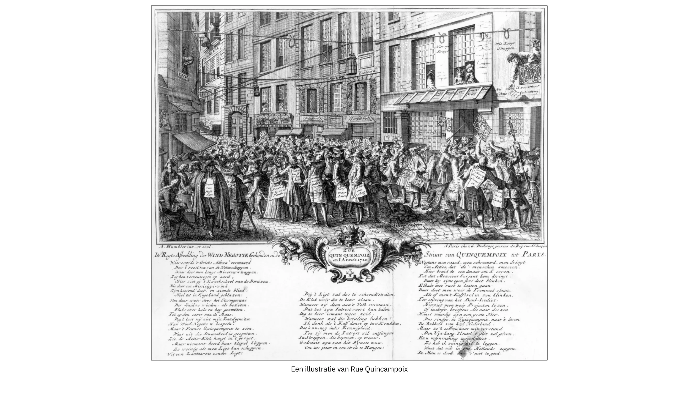

### Wanneer land "onderpand" wordt

Een eeuw later sloeg de Franse Revolutie een nieuwe weg in met **assignats**, een munt die gedekt werd door in beslag genomen kerkelijke eigendommen. Op papier een aantrekkelijk idee - land transformeren in monetair onderpand - maar ineffectief: land is noch liquide noch deelbaar. Het resultaat: hyperinflatie, meerdere verboden op het gebruik van land, ongecontroleerde inflatie en tekorten.

Napoleon, diep getroffen door deze chaos, herstelde goud en zilver als de monetaire basis in 1800 met de oprichting van de Banque de France en garandeerde zo de regelmatige betaling van zijn legers. Een pragmatische manier om het vertrouwen terug te winnen: betalen in harde valuta.

### De roaring twenties en de grote depressie van 1929

Laten we twee eeuwen overslaan. Na de Eerste Wereldoorlog financierden regeringen de inspanning door inflatie en de opschorting van goud. In de jaren 1920 voerde de Amerikaanse Fed een te accommoderend monetair beleid om het Britse pond te ondersteunen. Het resultaat: gemakkelijk krediet, ongebreidelde speculatie op Wall Street, het kopen van aandelen op krediet en het ontstaan van een vastgoed- en bankzeepbel.

Toen de machine op hol sloeg, was de crash van 1929 onvermijdelijk: massale bankfaillissementen, recordwerkloosheid en rijen bij gaarkeukens. Dit leidde tot de hardnekkige misvatting dat **alle deflatie slecht is**, terwijl we onderscheid moeten maken tussen deflatie door groei (gezond) en deflatie door schulden (verwoestend).

### Azië in de jaren 90 en het domino-effect

In de jaren 90 deed het "Aziatische wonder" de wereld dromen. De Exchange koersen waren gekoppeld aan de dollar, de groei bedroeg 8-10% en het Westerse kapitaal stroomde binnen. Alles ging goed... totdat het tij keerde. Faillissementen stapelden zich op, valuta's devalueerden met 80% en investeerders werden geruïneerd. Het IMF moest ingrijpen en pijnlijke hervormingen opleggen. Hetzelfde scenario als altijd: overvloedig kapitaal, door krediet gevoede zeepbellen en dan instorting.

### 2008 en het tijdperk van de permanente zeepbel

De internetzeepbel (2000) werd gevolgd door de subprime vastgoedzeepbel. Securitisatie transformeerde bankleningen in "triple-A" financiële producten, verspreid over de hele wereld. De belofte: risico elimineren door het te verdunnen. De realiteit: alle risico's waren in feite gecorreleerd. Toen vastgoed instortte, stortte het hele wereldwijde banksysteem in.

Het resultaat: massale reddingsoperaties door de overheid, kwantitatieve versoepeling en nulrentes. En daarmee een stormloop: elke crisis zal niet langer de excessen zuiveren, maar zal worden gedekt door steeds meer schulden en het drukken van geld. Dit is wat tot de huidige situatie heeft geleid: **de "alles zeepbel"**, waarbij alles - aandelen, vastgoed, kunst, crypto, zelfs Pokémon kaarten - kunstmatig wordt opgeblazen.

### De eeuwige terugkeer van magisch geld

Van de ene eeuw op de andere komt één constante naar voren: zodra een samenleving gelooft dat ze rijkdom kan creëren met geld in plaats van met de productie van echte goederen, ontstaan er zeepbellen. Van John Law tot 2008, van de rue Quincampoix tot Wall Street, het proces herhaalt zich: euforie, krediet, hausse en baisse.

En uiteindelijk, steevast, wanneer niemand papier meer vertrouwt, gaan mensen op zoek naar iets anders - goud, land, veilige havens... of nieuwe munteenheden. Gisteren legde Napoleon metaal op, vandaag zien sommigen Bitcoin als de opvolger.

De geschiedenis van de financiële wereld is een eindeloze cyclus: drukken, speculeren, instorten. Tot de volgende zeepbel.

## Geld en geweld

<chapterId>9486fe64-854f-5e17-86b3-8873baca39a8</chapterId>

:::video id=bd6d0807-2d8f-4637-a0f5-1e990e5c0d0f:::

In dit korte gedeelte zullen we veel van de gebeurtenissen die we in de cursus hebben gezien nog eens de revue laten passeren en een paar anekdotes samenvatten die ik interessant vind.

### Technologie en geweld

Hier zijn een paar anekdotes die we waarschijnlijk al hebben besproken in de cursus. Ze dienen als inleiding op een zeer boeiende discussie die ik met Theo had over een lezing die hij gaf op B-Ondy, die ik erg interessant vond in termen van hoe technologische vooruitgang de relatie van geweld tussen de bevolking en de staat beïnvloedt.

### Geld en staatsdwang

Om dit gedeelte in te leiden, geef ik je een korte en niet-uitputtende lijst, gewoon om je te herinneren aan de gebeurtenissen die we waarschijnlijk al hebben behandeld in de cursus.

Een link die ik al kan leggen met geld en geweld is dat als het gaat om waardeloos papiergeld dat tot in het oneindige gedrukt kan worden, het vaak gepaard gaat met allerlei regels en allerlei bedreigingen. We kunnen het al hebben over de assignaten, waar letterlijk op de bankbiljetten stond dat valsemunters met de dood werden bedreigd. Het is gemakkelijk om in de juridische teksten van die tijd doodsbedreigingen te vinden voor degenen die dit beroemde papiergeld niet accepteerden.

Om in Frankrijk te blijven: in een van de juridische teksten die ik kon bemachtigen uit de tijd van de revolutie, zag ik dat de "dagvergoeding" voor het vervoer en het bedienen van de guillotine werd beschreven in de paragrafen over valuta. Ik vond dit nogal absurd.

We hebben het ook gehad over muntslag in China, waarbij de staat toezicht hield op het slaan. We zagen in een onderdeel aan het begin van de cursus dat wanneer munten, waarvan sommige minder mooi waren, werden weggegooid, dit juridische gevolgen had.

Er is ook een anekdote over een koning in Engeland die uiteindelijk de handen afhakte van degenen die geld sloegen als ze zich niet gedroegen zoals hij verwachtte.

Ik heb ook gelezen over de inbeslagname van koper uit boeddhistische kloosters in China. In een tijd waarin koper steeds meer waard werd en hun economie destabiliseerde - die gebaseerd was op een vorm van fiatgeld dat weinig te maken had met de waarde van het metaal - zochten ze een plek waar rijkdom was en namen ze het koper uit kloosters in beslag.

Hetzelfde gold voor de kloosters in Engeland tijdens de Engelse Reformatie. Toen de beroemde koning ruzie kreeg met de paus over zijn echtscheiding, zat er nog een andere reden achter dit alles: hij profiteerde van de afschaffing van de kloosters om beslag te leggen op de rijkdom die deze kerkelijke organisaties bevatten.

Tijdens de Franse Revolutie namen ze alle bezittingen van de kerk in beslag. Ze zagen prachtige munten gemaakt van omgesmolten kerkklokken.

Als we nog verder teruggaan, is een van de meest expliciete noties van economisch geweld en vrijheid, van liberticide wetten, **Diocletianus met zijn erfelijke kaste die direct gekoppeld was aan het feit dat de boeren de gedevalueerde munteenheid niet langer wilden accepteren**. Ze wilden hun werk als boer opgeven en Diocletianus reageerde simpelweg door hen te zeggen: "jullie mogen je land niet verlaten, en jullie kinderen ook niet". Hetzelfde gold voor de soldaten.

Ik vind dat een vrij expliciete vorm van geweld. Ik zou kunnen afsluiten met een gesprek over de Tempeliers of een Franse koning. Toen de Tempeliers zich in Frankrijk vestigden, stel ik me voor dat hij het manna van de rijkdom van de Tempeliers zag en problemen had met de financiering van de staat. Hij klaagde de Orde van de Tempeliers aan en sommigen van hen konden weglopen met een deel van de schat, wat heeft geleid tot een zeer interessante show in de VS of Canada. Ik weet niet wie het geproduceerd heeft, maar het heet *The Mystery of Oak Island*. Het gaat over mensen die denken dat er een schat van de Tempeliers begraven ligt op een eiland in Canada, in de Maritimes, en ze zijn al jaren - misschien wel meer dan tien jaar - aan het boren om een soort put te maken. Ze hebben een put gevonden met veel galerijen en ze zijn op zoek naar een schat die begraven is door de Tempeliers op dit eiland, waar dit tv-programma over gaat. Ik groet mijn vader, die een grote fan is van dit programma.

Dus dat was het: een korte opsomming van feiten die we tijdens deze cursus hebben gezien en die volgens mij het verband met geweld aan het licht brengen. Ik laat jullie achter met het volgende deel van Theo, die ons een heel interessant verhaal gaat vertellen over technologische verandering en de machtsverhoudingen tussen het plebs en de autoriteiten.

Bedankt!

## De economische gevolgen van georganiseerd geweld

<chapterId>66bd4674-2159-5489-ad4b-ec5e3fb691af</chapterId>

:::video id=c8b063c6-aeb4-4a94-9027-b11d369e71a4:::

### Georganiseerd geweld en de evolutie van de staat

Historicus Frederic C. Lane stelt een revolutionaire stelling voor: de anatomie van de staat door de geschiedenis heen wordt gevormd door de technologieën die worden gebruikt om geweld te projecteren. Uitgaande van het Weberiaanse principe dat de staat het monopolie heeft op legitiem geweld, merkt Lane op dat dit monopolie - paradoxaal genoeg efficiënter dan concurrentie op dit gebied - zich ontwikkelt volgens de verhouding tussen de kosten van een aanval en de kosten van verdediging.

Deze analyse, overgenomen door de auteurs van "The Sovereign Individual" (1997), verklaart de historische mutaties in de politieke organisatie: van het middeleeuwse feodale systeem naar de stadstaten van de Renaissance, vervolgens naar de industriële natiestaten en tenslotte naar de moderne welvaartsstaten. Elke overgang komt overeen met een grote technologische doorbraak in de uitoefening van geweld, die zich ongeveer elke 400-500 jaar voordoet.

### Middeleeuws evenwicht

In de Middeleeuwen domineerde de landbouweconomie voor meer dan 90%. De boer, letterlijk geworteld in zijn land, kon niet vluchten voor de heer en zijn ridders. Militaire technologie - handgesmede harnassen, jarenlange zwaardtraining - was extreem duur. Deze asymmetrie gaf massaal de voorkeur aan aanval boven verdediging.

De immobiele landbouwproducent wordt de gevangene van de lokale geweldsmonopolist. Zijn vermogen om belastingen te innen bereikt nieuwe hoogten - hoewel, paradoxaal genoeg, de middeleeuwse belastingen bescheiden blijven in vergelijking met de 78% verplichte heffingen in de moderne tijd. De heer kan naar believen belasting heffen, omdat de boer zich niet kan verzetten en ook niet kan vertrekken.

### De koopman-renaissance

De opkomst van de Hanzehandel in het noorden en de mediterrane handel in het zuiden veranderden de situatie. Kooplieden, de belangrijkste scheppers van toegevoegde waarde, beschikten over mobiel kapitaal - hun schepen. Ze hadden slechts lichte maritieme milities nodig, omdat de zeeën moeilijk te controleren waren. Bovendien konden ze gemakkelijk naar een naburige haven migreren als de belastingen te hoog werden.

Deze mobiliteit creëerde belastingconcurrentie tussen stadstaten. Venetië, Genua en Brugge moesten een zo liberaal mogelijk kader bieden: betrouwbare contracten, kwaliteitsvol geld, verzekeringen, minimale belastingen. Prinsen moesten verleiden in plaats van dwingen. De symmetrie keert om: verdediging (door te vluchten) wordt gemakkelijker dan aanval.

### Het industriële tijdperk

De industriële revolutie bracht een configuratie met zich mee die verwant is aan het feodalisme. Fabrieken, spoorwegen en lopende banden vertegenwoordigen enorme, immobiele investeringen. Henry Ford kon zijn fabrieken niet verplaatsen als gevolg van belastingen. Arbeiders, geconcentreerd in industriële steden, sloten vakbonden om collectief te onderhandelen in plaats van individueel te migreren.

De "welvaartsstaat" kwam op: industriële planning (Japan, Korea), militaire bescherming van infrastructuren, minimale sociale uitkeringen voor de beroepsbevolking. De Tweede Wereldoorlog illustreerde deze kwetsbaarheid: het bombarderen van vijandelijke fabrieken werd de dominante strategie. De concentratie van fysiek kapitaal maakte massale belastingontduiking mogelijk om de welvaartsstaat te financieren.

### De microprocessorrevolutie

Drie technologische innovaties verstoren nu dit eeuwenoude evenwicht. De microprocessor transformeert de oorlogsvoering: een operator in Nevada bestuurt een drone in Afghanistan met chirurgische precisie. De Golfoorlog (1991) demonstreerde deze doorbraak: het op drie na grootste leger ter wereld (Irak) werd in 45 dagen weggevaagd, met minder dan 200 doden aan coalitiekant. Technologische superioriteit maakte een frontale aanval onmogelijk.

Het internet en asymmetrische cryptografie zorgen voor een revolutie in het creëren van waarde. Een ontwikkelaar kan overal vandaan werken met een MacBook en Starlink en zijn productie onmiddellijk en gratis exporteren. Digitale nomaden ontsnappen aan geografische gevangenschap en zetten staten tegen elkaar op op een manier die sinds de Renaissance niet meer is voorgekomen.

Bitcoin vertegenwoordigt het hoogtepunt van deze logica: een valuta bevrijd van de staat, beschermd door een onschendbaar cryptografisch schild. Rijkdom wordt verdedigbaar tegen elk fysiek geweld. Het individu krijgt het vermogen terug om zichzelf te verdedigen tegen het staatsmonopolie.

### De ineenstorting van het Westfaalse model

Westerse welvaartsstaten, ontworpen voor het industriële tijdperk, raken achterhaald. Scheppers van waarde - ontwikkelaars, kunstenaars, financiers - migreren naar Singapore, Dubai of El Salvador en geven de voorkeur aan minder openbare diensten in ruil voor minimale belastingen. Moderne giganten als Apple en Tether hebben geen kantoren of fysieke infrastructuur nodig.

Deze braindrain creëert een spiraal: minder nettobetalers, slechtere openbare diensten, hogere belastingen voor degenen die blijven en een versneld vertrek. Staten moeten radicaal inkrimpen of failliet gaan. Fragmentatie in kleine, concurrerende jurisdicties - een nieuw model van digitale stadstaten - lijkt onvermijdelijk.

De geschiedenis leert ons dat deze overgangen generaties duren. Maar Bitcoin's scheiding van valuta en staat zou het proces kunnen versnellen. Individuen stemmen nu met hun voeten en hun cryptografische portemonnee, waardoor de kaart van de wereldmacht wordt hertekend langs lijnen die we nu pas beginnen waar te nemen.

## Een zeer korte geschiedenis van financiën

<chapterId>1d37fff1-a091-5034-8e71-4af590b8ffce</chapterId>

:::video id=fdfabbc6-e4d8-463a-8522-19176f8fb460:::

Na deze uiteenzetting over de geschiedenis van het geld, die ons tot aan het fiatsysteem brengt, wil ik graag snel en beknopt de evolutie van de financiën uitleggen die uiteindelijk tot de welvaartsstaat heeft geleid. Aanvankelijk, in de Romeinse tijd, hadden we munten.

Munten waren een financiële technologie waarmee het rijk soldaten kon betalen, uitbreiden en handel drijven. Het werkte heel goed, behalve dat er uiteindelijk te veel devaluaties waren. Op een gegeven moment, toen ze stopten met uitbreiden en geen buit meer kregen van hun oorlogen en gebiedsuitbreiding, stortte hun systeem in.

### De evolutie van financiële technologieën

Toen kwamen de Middeleeuwen, toen er heel weinig evolutie was tot de Florin, die een stabiele munteenheid terugbracht, en de ontwikkelingen in het bankwezen in Italië en Antwerpen, waar het concept van de "tijdswaarde van geld" werd ontwikkeld - met andere woorden, verdisconteren. Ze ontwikkelden discontering om een vorm van papiergeld te creëren waarbij een "promesse" werd uitgegeven, d.w.z. een belofte dat men op een later tijdstip $100 plus een rentevergoeding zou kunnen terugkrijgen.

Dit systeem creëerde een financiële technologie die de houder in staat stelt om het biljet voor het einde van de looptijd te verkopen, dus als je het na 4 maanden van een looptijd van 6 maanden verkoopt, zal de persoon in feite een premie betalen om het rendementsverlies voor de resterende 2 maanden te compenseren.

Het was een financiële technologie die destijds in Antwerpen en Amsterdam werd ontwikkeld. Later zagen we de evolutie van centrale banken en het begrip 'lender of last resort'. Men kan stellen dat tijdens de Bank van Amsterdam het gebruik van munten in de internationale handel werd opgegeven ten gunste van giraal geld.

Later, in de 18e eeuw, in termen van financiële technologie, kunnen we het hebben over verzekeringen. Er is een anekdote die heel goed wordt verteld in het boek "The Ascent of Money" van Neil Ferguson. De eerste verzekeringsmaatschappij die werd opgericht heette **Scottish Widowss**, en in wezen waren het geestelijken die een verzekering wilden ontwikkelen voor priesters die soms eerder stierven, plotseling stierven. De geestelijken zorgden in die tijd een jaar lang voor hun vrouwen en nakomelingen in Schotland. En dus vonden de geestelijken deze periode van een jaar misschien een beetje te kort. Daarom bedachten ze actuariële berekeningen** om letterlijk het aantal contribuanten te berekenen dat nodig was om het systeem kostendekkend te maken, afhankelijk van het aantal priesters dat vroegtijdig stierf.

Ze ontwikkelden actuariële berekeningen om te zeggen: "Oké, goed, elke priester geeft ons dit bedrag. Als de priester dan sterft, zal de verzekering de kosten dekken om het overleven van zijn vrouw en kinderen te verzekeren tot ze zelfvoorzienend zijn." Het was dus de eerste verzekeringsmaatschappij genaamd "Scottish Widows" die dit systeem populair maakte en waar het werd toegepast.

### Van particuliere verzekering naar verzorgingsstaat

Verzekeringen maken dus deel uit van de geschiedenis van de financiële technologie. En dit brengt me bij het concept van de welvaartsstaat, namelijk dat particuliere verzekeringen uiteindelijk op een probleem stuitten, een idee van optimalisatie, waarbij we tegen onszelf zeggen, als we ziektekostenverzekeringen aanbieden aan mensen die gezond zijn, zullen ze misschien minder interesse hebben om de premie te betalen omdat ze tegen zichzelf zeggen, "Ik ben gezond, ik zal niet ziek worden". Aan de andere kant zullen mensen die weten dat ze ziek zijn zich zeker willen verzekeren.

Dit systeem creëert een onevenwicht tussen het aantal zieke mensen dat een ziektekostenverzekering afsluit, tegenover gezonde mensen die misschien minder afsluiten. Er is dus een soort onbalans: als je de cijfers berekent, zouden ze niet in evenwicht zijn omdat je waarschijnlijk niet genoeg gezonde mensen zou kunnen verzekeren om de kosten te compenseren. In de economie is dit het concept van **moral hazard**.

Een van de ideeën die naar voren is gebracht is om verzekeringen verplicht te stellen. Als iedereen verplicht is om bij te dragen, wordt het geheel weer in evenwicht gebracht en zullen zowel gezonde als ongezonde mensen bijdragen, waardoor de risico's over de grootste populatie worden verdeeld.

En dus heeft de staat in veel delen van de wereld gezegd: "Daar zorgen wij wel voor". Hoewel ik geen expert ben op dit gebied, zie ik dat dezelfde redenering waarschijnlijk wordt toegepast op allerlei andere soorten verzekeringen, zoals werkloosheidsverzekeringen. Er is een verlangen om te vereenvoudigen en te optimaliseren, gebaseerd op het idee dat het eenvoudiger zal zijn als er maar één organisatie is die het regelt.

Naar mijn mening leidde dit tot een centralisatie van al deze verzekeringsconcepten en uiteindelijk tot de geboorte van de verzorgingsstaat, waar al deze financiële concepten die oorspronkelijk particuliere ondernemingen waren, particuliere initiatieven om te voldoen aan een behoefte van de verzekeringsmarkt om risico's te verdelen onder de bevolking, werden overgenomen door de staat om redenen die waarschijnlijk heel logisch zijn in verband met moreel risico en de wens om te optimaliseren.

### Alternatieve modellen en beschouwingen over staatsmonopolies

Uiteindelijk eindigen we in sommige landen zoals Canada met verschillende soorten verzekeringen - ziektekostenverzekering, werkloosheidsverzekering - die staatsmonopolies zijn.

Ik kan je een voorbeeld geven dat ik ken. In Zwitserland is het systeem een beetje anders. Er zijn particuliere ziekenfondsen en privéziekenhuizen, dus je kunt je ziekenfonds kiezen, je kunt je pakket binnen je ziekenfonds kiezen. Je krijgt nog steeds relatief universele diensten, ook al blijft een groot deel van dit systeem privé.

Dus ik denk dat het mogelijk is dat het ook particulier wordt beheerd. Maar alles wat ik je wilde beschrijven, is eigenlijk geen verklaring om uit te drukken of het ene systeem beter is dan het andere, het was eerder om je uit te leggen dat bij het lezen over de geschiedenis van financiën, ik me realiseerde waarom in het Westen, met name in Frankrijk, met name in Canada, de staat controle wilde krijgen over deze financiële principes.

Het punt dat ik wilde maken is dat het concept van verzekering in de eerste plaats een evolutie is van financiën, en zoals regeringen soms zo goed zijn in het doen, zullen ze proberen er controle over te krijgen, net zoals ze hebben geprobeerd controle te krijgen over geld, om verschillende redenen. Eén reden is trouwens het concept van de geldschieter in laatste instantie.

Het idee is dat het veel beter is als er een grote instelling achter zit die het risico breder verdeelt. Dat was het initiële initiatief achter het begrip 'lender of last resort', waarbij deze instelling instellingen kon uitkiezen die sterk genoeg waren om te overleven en te voorkomen dat ze instortten door ze geld te lenen.

Destijds was er een echte analyse toen dit concept eindelijk voor het eerst verscheen, maar wat er uiteindelijk gebeurde is dat we iedereen redden, "too big to fail", het geldt voor bijna alle banken omdat er centralisatie is, en ook voor alle grote bedrijven. Uiteindelijk zien we dat het nog steeds een concept is dat "in het algemeen" wordt toegepast door de staat, vergelijkbaar met het concept van verzekeringen dat ik je net heb beschreven.

Uiteindelijk besluit de staat dat hij voor alles gaat zorgen, waardoor een financiële technologie die in Schotland werd gecreëerd om een specifiek probleem op te lossen, verandert in de enorme welvaartsstaat die we vandaag kennen. Het gebruikt actuariële financiële principes om diensten aan te bieden aan de bevolking in nood. We kunnen het er echter over eens zijn dat de monopolies die uit dit systeem voortkomen allerlei problemen veroorzaken, die we momenteel ervaren in landen als Canada en Frankrijk. Gelukkig bestaan er andere modellen, zoals dat van Zwitserland.

We moeten ons gewoon realiseren dat dit concept van de verzorgingsstaat voortkomt uit de financiële wereld. Dit besef suggereert dat we andere wegen kunnen verkennen dan de beroemde staatsmonopolies, en ik zou deze redenering zelfs willen toepassen op het concept van centrale banken als kredietverstrekkers in laatste instantie - maar dat is een onderwerp voor een andere keer.

# Laatste deel

<partId>9bada469-7ef0-511a-9eaa-f8eb66d5906f</partId>

## Deze cursus evalueren

<chapterId>a9494e2b-8a4d-5811-8a7b-b4a91fb22778</chapterId>

<isCourseReview>true</isCourseReview>

## Conclusie

<chapterId>1094e793-b4c6-5782-aa4a-71cde00ce7c0</chapterId>

<isCourseConclusion>true</isCourseConclusion>