# Podróż przez historię monet

Ten wciągający kurs zabierze Cię w fascynującą ewolucję pieniądza od najwcześniejszych cywilizacji do naszego obecnego systemu monetarnego. Przejdziemy przez wieki, od neolitu do czasów współczesnych, odkrywając, jak pieniądze kształtowały i były kształtowane przez wielkie ludzkie cywilizacje. Od mezopotamskiego proto-pieniądza po kryptowaluty, monety lidyjskie, renesansowy floren i pojawienie się bankowości centralnej - ten kurs oferuje kompleksowe spojrzenie na jeden z podstawowych filarów naszych społeczeństw.

+++
# Wprowadzenie

<partId>59878a67-8a1d-5d6b-af41-5b847c14363c</partId>

## Wprowadzenie do historii pieniądza

<chapterId>ca53597e-be9a-5261-a55f-11fac8504a68</chapterId>

:::video id=08ff35ca-8a40-4286-abaf-71283faf6e78:::

Witamy w kursie poświęconym historii pieniądza. Jak sugeruje tytuł, wspólnie zbadamy historyczną ewolucję monet. Od epoki neolitu do dnia dzisiejszego przyjrzymy się największym imperiom i cywilizacjom z przeszłości.

Kurs ten nie ogranicza się jednak do prostej chronologii dat lub wydarzeń historycznych. Naszym prawdziwym celem jest raczej zapewnienie dogłębnego zrozumienia podstawowych pojęć związanych z pojawieniem się pieniądza, a raczej walut.

### Podstawowe koncepcje do zbadania

Mówimy więc o pojawieniu się: pojawieniu się samych walut, systemów monetarnych, banków, pieniądza papierowego, banków centralnych i wreszcie pojawieniu się obecnego systemu monetarnego "fiat".

Rozpoczynamy naszą podróż do proto-walut od pojawienia się pieniądza dłużnego i jednostek rozliczeniowych w Mezopotamii, a także innych systemów, takich jak posag i pieniądz krwi w prymitywnych społeczeństwach. Zobaczymy również, jak prawdziwe systemy monetarne istniały już w starożytnym Egipcie, na długo przed powstaniem Państwa Środka.

Następnie przejdziemy do pojawienia się pierwszych monet w Lidii, kluczowego momentu często uważanego za prawdziwy początek pieniądza według podręczników ekonomii. Zbadamy, w jaki sposób monety te rozprzestrzeniły się dzięki Persom, Aleksandrowi Wielkiemu, a następnie Rzymowi, zanim ostatecznie narzuciły się, zdominowały i upadły.

Stamtąd, uzbrojeni we wszystko, czego się nauczyliśmy, poświęcimy czas, którego potrzebujemy, aby wspólnie zastanowić się nad samą definicją pieniądza, wykraczając poza z góry przyjęte idee, takie jak "pieniądze są zawsze długiem" lub "pieniądze są zawsze towarem". W rzeczywistości pieniądze są zarówno dobrem, jak i konwencją społeczną. W szczególności omówimy koncepcję premii pieniężnej i spróbujemy ujednolicić różne teorie wyjaśniające pojawienie się pieniądza.

### Kluczowe okresy i innowacje monetarne

Następnie przechodzimy do niespokojnego okresu, naznaczonego pewną niestabilnością pod względem monetarnym, w którym jednak pojawiły się tak uderzające innowacje, jak angielski grosz, używany do przekupywania duńskich najeźdźców, oraz funt Karola Wielkiego, którego wspomnienie wciąż przetrwało na niektórych współczesnych banknotach.

Przyjrzymy się również temu, jak wyprawy krzyżowe doprowadziły do powstania pierwszych systemów zdalnego transferu pieniędzy. Następnie nadszedł czas, aby przyjrzeć się wpływowi florena, waluty towarzyszącej renesansowi, oraz przybyciu metali szlachetnych z obu Ameryk, co miało ogromny wpływ na ceny w Europie.

Przyjrzymy się szczegółowo pojawieniu się pieniądza papierowego i bankowości centralnej, rysując paralele z historią kryzysów finansowych i ich często gwałtownych reperkusji.

Na koniec narysujemy paralelę z naszym współczesnym systemem monetarnym, badając jego konsekwencje i śledząc historię finansów, aby lepiej zrozumieć, w jaki sposób doszliśmy do dzisiejszego państwa opiekuńczego.

A jako bonus, przyjrzymy się również wielu fascynującym powiązaniom etymologicznym związanym z pieniędzmi, które nadal wpływają na nasze codzienne życie w różnych językach.

### Struktura kursu

Kurs podzielony jest na trzy główne części.

Część I dotyczy powstania pieniądza, część II renesansu pieniądza i jego upadku, a część III pokazuje, jak instytucje państwowe lub państwo stopniowo przejmowały kontrolę nad pieniądzem, prowadząc do obecnego systemu fiat.

Dziękujemy i życzymy miłego oglądania!

# Pojawienie się giełd

<partId>da5e4981-9ea5-5208-beab-3b75c9043632</partId>

## Od australopiteka do współczesnego człowieka

<chapterId>34a773aa-f2d3-5c26-8be4-f2cd79ed6fbc</chapterId>

:::video id=4f333013-4b2a-42ab-8761-593fafc971ca:::

### Dlaczego warto zacząć od neolitu?

Po co cofać się aż do neolitu, by mówić o pieniądzach? Odpowiedź jest prosta: nie możemy w pełni zrozumieć pojawienia się pieniądza bez przyjrzenia się również pojawieniu się samych cywilizacji. Aby zrozumieć, dlaczego powstały pierwsze systemy monetarne, musimy zrozumieć, co skłoniło koczownicze grupy łowiecko-zbierackie do osiedlenia się.

Plemię bez podziału pracy, bez specjalizacji, gdzie każda jednostka jest odpowiedzialna za produkcję tego, czego potrzebuje, po prostu nie potrzebuje pieniędzy. Podobnie, społeczność rolnicza praktykująca jedynie rolnictwo na własne potrzeby, gdzie każda osoba uprawia dla siebie, nie odczuwa jeszcze potrzeby uniwersalnego pośrednika wymiany.

### Sedentaryzacja i jej konsekwencje

Dlatego uważam, że interesujące jest rozpoczęcie naszej eksploracji od okresu neolitu. Zobaczymy, jak sedentaryzacja stopniowo doprowadziła do powstania wiosek, a następnie miast i wreszcie wielkich cywilizacji. To właśnie ta sedentaryzacja i produkcja nadwyżek żywności umożliwiły specjalizację pracy, tworząc podatny grunt niezbędny do pojawienia się i ewolucji pierwszych koncepcji monetarnych.

Podobnie jak interakcje międzyludzkie dają początek językowi, możemy uznać, że pieniądze pojawiają się naturalnie lub nie (jak w przypadku Inków i Spartan) w trakcie formowania się i organizacji cywilizacji. Moim zdaniem pojawienie się lub nie pojawienie się pieniądza ma wszystko wspólnego z formą organizacji społecznej i gospodarczej każdego społeczeństwa.

### Chronologia ewolucji człowieka

Ale najpierw spójrzmy na jeszcze szerszy kontekst historyczny.

Jak w przypadku każdej pierwszej prezentacji, zamierzam zrobić coś dokładnie odwrotnego do tego, co powiedziałem we wstępie do kursu i przedstawić listę dat i wydarzeń historycznych, które następują po sobie. Chodzi o to, aby umieścić pojawienie się pieniądza w kontekście historycznym, w odniesieniu do innych ludzkich osiągnięć, takich jak gotowanie żywności, koło, udomowienie niektórych zbóż i zwierząt, budowa piramid i założenie pierwszych miast.

Przyjrzyjmy się zatem ewolucji ludzkości od czasów prehistorycznych.

Przegląd ewolucji człowieka od australopiteka do człowieka współczesnego, śledzenie postępu technologicznego i ruchów populacji aż do okresu neolitu.

### Historyczny kontekst ludzkości

- 3 miliony lat temu** - Pojawienie się *Australopithecus*.
- 2 miliony lat temu** - Homininy zaczynają opuszczać Afrykę.
- 1.6 milionów lat temu** - Homininy docierają do południowej Europy i Azji.
- 1 milion lat temu** - Pierwsze dowody na domowe gotowanie na ogniu (zwęglone kości i szczątki roślin w jaskini Wonderwerk w RPA).
- Około 400 000 p.n.e.** - neandertalczycy żyją w Europie i Azji.
- Około 300 000 p.n.e.** - Pojawienie się *Homo sapiens*.
- 80 000 lat temu** - *Homo sapiens* zaczyna migrować do wszystkich części świata.
- 73 000 lat temu** - Jaskinie Blombos w RPA (najstarsze znane formy sztuki).
- 50 000 lat temu** - *Homo sapiens* dotarł do Europy.
- 30 000 lat temu** - Malowidła jaskiniowe z jaskini Chauvet we Francji.
- 15 000 lat temu** - malowidła naskalne w Lascaux we Francji i australijska sztuka naskalna.
- Około 9000 p.n.e.** - Udomowienie jęczmienia na Żyznym Półksiężycu.
- Około 9000 p.n.e.** - uprawa kukurydzy w Meksyku.
- Około 8000 p.n.e.** - Udomowienie kóz i owiec na Żyznym Półksiężycu.
- Około 7250 pne** - Ain Ghazal (Jordania) ujawnia wioskę liczącą kilkuset mieszkańców.
- Około 7000 p.n.e.** - Çatalhöyük (Turcja) liczy do 8000 mieszkańców.
- Około 6500 p.n.e.** - w Grecji rozpoczyna się osiadły tryb życia.
- 6000 lat temu** - Początek nawadniania rzek w Egipcie i Mezopotamii.
- Około 5000 lat p.n.e.** - Pojawienie się kombinacji upraw "trzech sióstr" (kukurydza, dynia, fasola).
- Około 4000 p.n.e.** - Udomowienie wielbłąda w Azji Środkowej. (Rodzina wielbłądowatych powstała w Ameryce Północnej podczas eocenu 45 milionów lat temu. Wielbłądy te migrowały następnie do Azji przez cienki pas lądu, który łączył wówczas dwa kontynenty w Cieśninie Beringa. Inna część rodziny udała się do Ameryki Południowej, gdzie do dziś żyją jej potomkowie (lamy, alpaki i wikunie).
- Około 3500-3000 p.n.e.** - lud Botai zaczyna udomawiać i hodować konie.
- Około początku epoki brązu** - Sumerowie wynaleźli już koło i żaglówkę, a także rozwinęli arytmetykę, astronomię i pierwszą formę pisma.
- Około 2800 r. p.n.e.** - Uruk, w szczytowym okresie, osiągnęło populację do 80 000 osób.
- 2600-2200 p.n.e.** - Pierwsze oznaki rozwoju miast w świecie greckim. Ekspansja upraw śródziemnomorskich (pszenica, winorośl, oliwki).
- 2560 p.n.e.** - Budowa Wielkiej Piramidy w Gizie.
- Około 1500 p.n.e.** - cywilizacja minojska.
- Około 1300 r. p.n.e.** - cywilizacja mykeńska.
- Około 1250-1150 p.n.e.** - Upadek cywilizacji epoki brązu.
- i wiek n.e.** - północnoafrykańscy Berberowie udomowili wielbłąda.

Tak więc, oto ten historyczny przegląd, aby dać nam perspektywę na pojawienie się pewnych technologii, udomowienie pewnych zwierząt i kultur, aby umieścić je w kontekście pojawienia się pisma i pieniędzy, które będą przedmiotem naszej następnej sekcji.

## Od łowcy-zbieracza do rolnika: Świt cywilizacji

<chapterId>ea950b6e-9eb7-553d-8f04-0eb042bb1f5a</chapterId>

:::video id=4b49a376-f6f4-42a0-86fa-264997a079f0:::

### Przejście do rolnictwa i sedentaryzacja

W tym rozdziale omówimy przejście od łowiectwa i zbieractwa do rolnictwa na własne potrzeby, rzemiosła i handlu. Uznałem, że ważne jest wyjaśnienie tego przejścia do osiadłego trybu życia i rolnictwa, aby zrozumieć, w jaki sposób budowano pierwsze miasta, co ostatecznie doprowadziło do powstania i pojawienia się pewnych systemów monetarnych w starożytności.

Ta sekcja jest fragmentem kursu dostępnego na stronie The Great Courses zatytułowanego Ancient Mesopotamia, Life in the Cradle of Civilization, prowadzonego przez profesor Amandę Podany z California State Polytechnic University w Ponoma.

### Paradoksy związane z przyjęciem rolnictwa

Prymitywne rolnictwo pojawiło się około 10 500 lat temu na Bliskim Wschodzie, w północno-zachodniej Syrii i południowej Turcji. Obecnie współczesne grupy łowiecko-zbierackie nie spieszą się z przyjęciem rolnictwa i prawdopodobnie tak samo było w okresie neolitu.

**Pierwsze wioski zostały wyraźnie zbudowane przed udomowieniem roślin i zwierząt ** Ludzie nie osiedlili się, ponieważ pozwoliło im na to rolnictwo; wręcz przeciwnie, najpierw osiedlili się, a dopiero znacznie później, około 3000 lat później, zaczęli uprawiać ziemię.

Polowanie i zbieractwo po prostu działały bardzo dobrze, więc nie musieli sadzić nasion, aby produkować żywność. Obecnie myśliwi-zbieracze mają znacznie więcej wolnego czasu niż pierwsi rolnicy, którzy korzystali z bardzo prymitywnych technologii.

Mówimy więc, że współczesne prymitywne ludy łowiecko-zbierackie mają więcej wolnego czasu, niż rozumiemy z pierwszych rolników z okresu neolitu, którzy mieli przecież dość prymitywne technologie uprawy. Ludzie ci pracowali ciężej, aby produkować żywność niż nasze współczesne prymitywne plemiona, które żyją z polowania i zbieractwa.

Badania kości pokazują również, że pierwsi rolnicy byli mniejsi i mniej wytrzymali niż łowcy-zbieracze, którzy ich poprzedzali. Dieta rolników była bardziej ograniczona niż dieta łowców-zbieraczy. Jedli znacznie więcej chleba, ale znacznie mniej mięsa, a także mieli gorsze zęby z powodu wiórów skalnych używanych do produkcji mąki. Kiedy robili mąkę z kamieni, tworzyły się drzazgi.

Ci, którzy stosują dietę "keto", zgodzą się: jedzenie dużej ilości chleba prawdopodobnie nie jest tak dobre, jak jedzenie mięsa.

### Teorie dotyczące wdrażania rolnictwa

Biorąc pod uwagę wszystkie te wady, kto zdecydowałby się zostać rolnikiem w tamtych czasach? Cóż, niektóre popularne teorie sugerują, że ludzie zostali zmuszeni do przyjęcia rolnictwa i że tak naprawdę nie był to wybór. Nawet w przypadku dzikich zbóż istniał poważny problem. Duże ilości ziarna nie mogły być łatwo transportowane. Musiały być gdzieś przechowywane. Gdy ziarno zostało już zmagazynowane, warto było pozostać w pobliżu. Tak więc uprawiano dzikie zboże, które niekoniecznie było rolnictwem, a gdy uprawiano je w dużych ilościach, trzeba było je gdzieś przechowywać, co utrudniało transport. Prawdopodobnie przyczyniło się to do pierwszych faz sedentaryzacji. Być może był to początkowy powód, dla którego ludzie osiedlali się w określonym miejscu. Jeśli miejsce to zapewniało żywność przez cały rok, nie było potrzeby podążania za stadami ani ciągłego podróżowania.

W kulturze Natoufian do stu osób mieszkało razem w wioskach składających się z okrągłych domów. Popularną teorią wyjaśniającą początki rolnictwa jest to, że zmiana ta była stymulowana przez zmiany klimatyczne. Około 11 000 lat temu klimat na Bliskim Wschodzie stał się chłodniejszy i bardziej suchy niż wcześniej. Rośliny i zwierzęta, które wcześniej były obfite, stały się rzadsze. Społeczności zaczęły wtedy uprawiać rośliny, od których były zależne, lub hodować młode zwierzęta, aby je hodować i czerpać z nich zyski, takie jak owce, kozy i bydło, które dobrze nadawałyby się do takiej hodowli. Byłby to bardzo stopniowy proces. Nie było więc dokładnego momentu, w którym wszyscy stali się rolnikami, którzy udomowili zwierzęta.

Inna teoria głosi, że wioski same stworzyły problem rozwiązany przez udomowienie. Intensywne polowania i zbieractwo zdestabilizowałyby środowisko naturalne. Według jednej z hipotez, Natoufianie osiągnęli taki sukces demograficzny, że stali się zbyt liczni dla swojego bezpośredniego otoczenia. W związku z tym bagna i obszary, na których uprawiano naturalne rośliny, mogły nie być wystarczająco produktywne dla populacji wioski. Bezpośrednie otoczenie nie było w stanie zaspokoić potrzeb wszystkich mieszkańców. Zaczęto więc uprawiać rośliny bezpośrednio na miejscu i zwiększać zapasy żywności.

## Handel neolityczny

<chapterId>8e495224-6d55-58f6-a9dc-ac2814281cfa</chapterId>

:::video id=d04245af-e416-48b1-8157-d569207a32c4:::

### Przejście z paleolitu do neolitu

Okres neolitu wyznacza fundamentalny przełom w historii ludzkości, wyraźnie kontrastując ze społeczeństwami paleolitu, które go poprzedzały. W paleolicie populacje europejskie były bardzo rozproszone: zaledwie 7000 osób zamieszkiwało cały kontynent 20 000 lat temu, zorganizowanych w małe koczownicze grupy liczące od 20 do 50 osób, które podążały za wielkimi stadami wędrownymi na ogromne odległości.

Globalne ocieplenie pod koniec epoki lodowcowej radykalnie zmieniło tę organizację społeczną. Pojawienie się lasów zastąpiło wędrowną faunę bardziej osiadłą fauną leśną, umożliwiając grupom ludzkim półosiadły tryb życia. Transformacji tej towarzyszył spektakularny boom demograficzny: z szacowanej populacji europejskiej wynoszącej od 10 000 do 50 000 pod koniec paleolitu, w środkowym i końcowym neolicie odnotowano wzrost do 1-5 milionów mieszkańców.

### Wynalezienie pracy i własności

Ta stopniowa sedentaryzacja doprowadziła do głębokich przemian społecznych. **Neolityczne rolnictwo dało początek nowoczesnemu pojęciu pracy**: przywiązanie do określonego terytorium oznaczało dbanie o swoją własność, przechowywanie owoców swojej pracy i planowanie przyszłych zbiorów. Ta nowa relacja z czasem - odroczenie obecnego użytkowania dla przyszłych korzyści - zrewolucjonizowała organizację społeczną.

Ceramika jest doskonałą ilustracją tej ewolucji: początkowo opracowana do przechowywania zbóż i nasion, jest świadectwem tej nowej zdolności do przewidywania potrzeb w czasie. Niektórzy prehistorycy uważają nawet, że neolit nie byłby możliwy bez tych systemów przechowywania.

**Własność prywatna stała się centralną instytucją** tych nowych społeczeństw. Podczas gdy własność indywidualna istniała już w paleolicie (osobiste włócznie myśliwskie), w neolicie nabrała ona bezprecedensowego wymiaru terytorialnego. To zawłaszczenie ziemi wygenerowało pierwsze archeologicznie udokumentowane konflikty międzyludzkie, wymuszając pojawienie się funkcji bezpieczeństwa terytorialnego.

### Specjalizacja i podział pracy

Rolnictwo umożliwiło wyżywienie większych populacji, jednocześnie uwalniając niektóre osoby od innych czynności produkcyjnych. Ta wyłaniająca się specjalizacja - rolnicy, garncarze, rzemieślnicy, strażnicy - położyła podwaliny pod podział pracy i hierarchie społeczne.

Pozostałości archeologiczne świadczą o tym rosnącym rozwarstwieniu: pochówki ewoluowały od zbiorowych do zróżnicowanych indywidualnych grobów, a budynki mieszkalne przeszły od jednolitości architektonicznej do konstrukcji ujawniających odrębne statusy społeczne. Przedmioty pogrzebowe - ozdoby, specjalistyczne narzędzia, ceramika - wskazują na pojawienie się pojęcia bogactwa i prestiżu społecznego.

### Pojawienie się wymiany na odległość

Analiza archeologiczna ujawnia zaskakujące jak na tamte czasy sieci wymiany. Materiały takie jak obsydian, zielona skała (doleryt, jadeit), muszle i bitum znajdowano setki kilometrów od miejsc ich wydobycia. Polerowane siekiery z zielonej skały, niezbędne do wylesiania i budowy wczesnych wiosek, krążyły po całej neolitycznej Europie.

Wymiana ta dotyczy zarówno surowców, jak i gotowych przedmiotów, ujawniając uznanie dla specjalizacji rzemieślniczej. Przypisywana wartość obejmuje zarówno rzadkość materiału, jak i umiejętności techniczne wymagane do jego przekształcenia.

Organizacja wymiany różni się w zależności od rozważanej skali. **W społecznościach** antropolodzy faworyzują hipotezę ekonomii daru i kontr-daru, z nieformalnymi systemami kredytowymi opartymi na zaufaniu międzyludzkim. W tych ograniczonych grupach "liczba Dunbara" (maksymalnie 150 osób, aby utrzymać bezpośrednie relacje zaufania) umożliwia odroczone wymiany bez żadnego mechanizmu rynkowego.

Istnieje kilka rodzajów barteru:

- **Bezpośredni barter**: natychmiastowa wymiana dobra za dobro
- Rozszerzony barter**: wymiana towarów na usługi lub obietnice
- **Odroczony barter**: dług interpersonalny z późniejszą spłatą

**Pomiędzy różnymi społecznościami**, brak więzi osobistego zaufania sprzyjał pojawieniu się bardziej sformalizowanej wymiany. Niektóre towary stopniowo zyskiwały specjalny status dzięki możliwości żądania ich przez obce grupy, co zapowiadało pierwsze formy proto-waluty.

Austriacka szkoła ekonomii interpretuje tę ewolucję jako spontaniczne pojawienie się uprzywilejowanych dóbr podlegających wymianie. Muszle, poświadczone archeologicznie już w mezolicie, ilustrują to zjawisko: znalezione z dala od ich geograficznego pochodzenia (muszle śródziemnomorskie w zachodniej Francji, muszle nordyckie w innych miejscach), świadczą o powszechnym uznaniu ich wartości wymiennej.

Dobra te wyróżniają się **zdolnością do bycia pożądanymi przez innych**, zasadniczą cechą, która prefiguruje funkcję monetarną. Chociaż nie osiągnęły one standaryzacji historycznych walut, były pierwszymi krokami w kierunku zdepersonalizowanych systemów wymiany, co było warunkiem wstępnym rozwoju złożonych społeczeństw wykraczających poza ramy plemienne.

W ten sposób neolit położył podwaliny pod nowoczesną gospodarkę: specjalizację pracy, własność prywatną, akumulację bogactwa, hierarchizację społeczną i pojawienie się wyrafinowanych systemów wymiany, które wykraczały poza więzi pokrewieństwa i bezpośredniego sąsiedztwa.

## Powstanie pierwszych miast i pojawienie się pisma

<chapterId>d6b799c2-8bf1-11f0-9c54-1b9f4f4c7011</chapterId>

:::video id=3ca18105-9856-4ceb-925c-c9e9215af21b:::

### Nawadnianie i narodziny wielkich miast

W tym rozdziale omówimy, jak powstały pierwsze wielkie miasta w tej części historii i oczywiście omówimy przyczyny pojawienia się pisma w Mezopotamii.

Około 6000 lat temu, w żyznych dolinach Egiptu i Mezopotamii, społeczności ludzkie zaczęły wykorzystywać rzeki do nawadniania. To opanowanie wody pozwoliło na obfite uprawy, sprzyjając powstawaniu wielkich miast, takich jak słynne miasto Uruk, położone w dzisiejszym południowym Iraku.

Około 3500 r. p.n.e. Uruk stało się największym miastem na świecie, osiągając swój szczyt około 2800 r. p.n.e., z populacją sięgającą 80 000 osób. W tym czasie dwie główne innowacje głęboko naznaczyły cywilizację sumeryjską: pojawienie się zorganizowanego rządu zdolnego do administrowania prawdziwym państwem oraz rewolucyjny wynalazek pisma.

### Wynalezienie pisma klinowego

Pismo narodziło się w tym mieście około 3000 r. p.n.e., motywowane przede wszystkim potrzebami ekonomicznymi. W obliczu rosnącej złożoności społeczeństwa i jego wymiany, administratorzy świątyń i pałaców potrzebowali niezawodnego narzędzia do dokładnego rejestrowania transakcji gospodarczych, takich jak dostawy materiałów, transfery wewnętrzne i dostępne zapasy.

Opracowany system został nazwany "pismem klinowym", od łacińskiego "cuneus" oznaczającego "klin", w odniesieniu do użycia rysika w kształcie klina do drukowania znaków na wilgotnych glinianych tabliczkach.

Poniżej można podziwiać moją kopię tabliczki z pismem klinowym. Sądzę, że do pisania na tych tabliczkach używano pewnego rodzaju rysika wykonanego z trzciny, aby odrysować mokrą glinę i stworzyć kształty pisma klinowego.

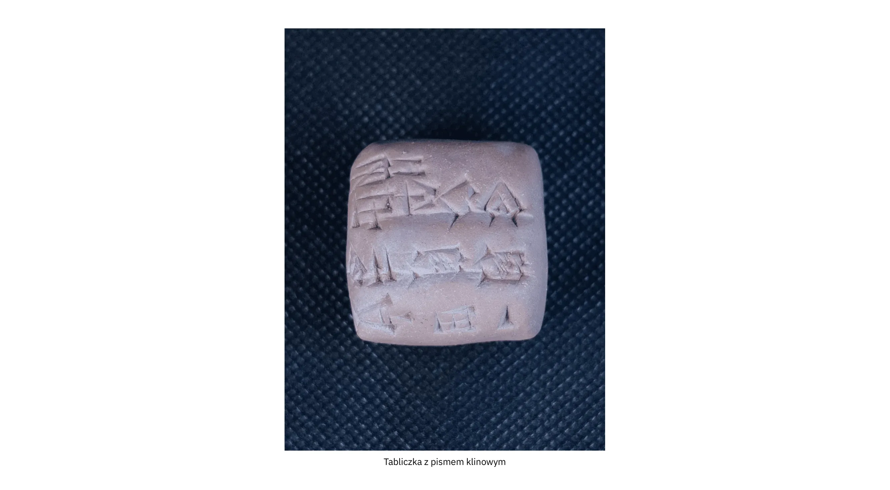

Mam też coś, co uważam za autentyczną sumeryjską tabliczkę z małym pismem klinowym w środku. Na tej tabliczce znajdują się podpisy wykonane przez walcowanie cylindra, które pokażę później.

Znaki z małymi cyframi służyły jako podpisy w czasach, gdy większość ludzi nie potrafiła pisać, ponieważ tylko wykwalifikowani skrybowie posiadali tę umiejętność.

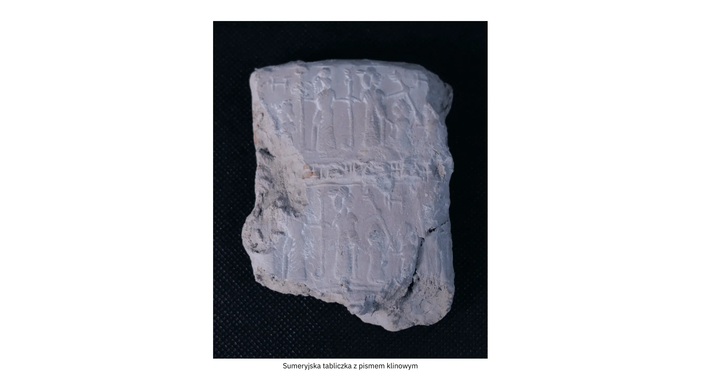

Poniżej znajduje się wspomniany powyżej cylinder: kamień z wygrawerowanymi określonymi kształtami. Ludzie używali tego cylindra do podpisywania listów, znanego jako pieczęć cylindryczna w języku angielskim. Był to sposób na ujawnienie nazwisk autorów lub wskazanie, że zostały one skomponowane w ich imieniu.

Ówcześni skrybowie używali zatem rysika w kształcie klina do drukowania znaków na mokrych tablicach.

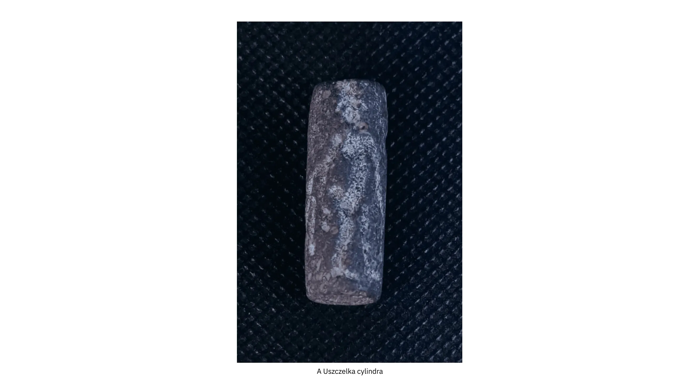

Znaki pisma klinowego nie reprezentowały języka, ale system zapisu języków mówionych. W języku angielskim powiedzielibyśmy "pismo to język pisany", a następnie powiedzielibyśmy, że "pismo klinowe to skrypt, a nie język". Tak więc po francusku powiedzielibyśmy, że pismo klinowe nie jest językiem, ale sposobem kodyfikacji języka.

### Ewolucja i zastosowania pisma

W pierwszych wiekach istnienia pismo to pozostawało ograniczone, służąc głównie jako system mnemoniczny do zapisywania ilości, list towarów rolnych i sprzętu. Dopiero stopniowo stało się zdolne do **fonetycznego renderowania imion** i pełnych zdań.

Początkowo nazwy nie mogły być wyrażane w piśmie klinowym, ponieważ przedstawiało ono głównie przedmioty i elementy rzeczywistości, takie jak wół lub pszenica, przedstawione jako małe obrazy. Z czasem obrazy te przekształciły się w bardziej rozwiniętą formę pisma, pozwalającą na reprezentację nazw i złożonych pojęć.

Jeśli na przykład dana osoba miała na imię Laura, mogliśmy wziąć słowo, akronim, który brzmiał jak "woda", a drugi jak "ras", i utworzyć z niego imię Laura. Tak powstała pierwsza forma języka pisanego.

Dla przypomnienia, pierwotnie, aby przedstawić akronimy, jeśli chciałeś narysować głowę wołu, mogłeś zobaczyć kształt głowy wołu. Stopniowo rysunki były upraszczane, aby reprezentować nic więcej niż rodzaj linii. Naukowcy uważają, że stało się tak, ponieważ ludzie trzymali mokrą glinianą tabliczkę w jednej ręce, więc łatwiej było przerysować inicjały, obracając je. Uważa się również, że było to spowodowane sposobem, w jaki skrybowie trzymali tabliczki.

W akronimach zapisanych pismem klinowym wciąż można dostrzec powiązania z, powiedzmy, pszenicą lub głową wołu, które zawsze przechylają się na jedną stronę.

Przez trzy tysiąclecia użytkowania pismo klinowe służyło przede wszystkim do prowadzenia rejestrów ekonomicznych i administracyjnych. Jednak mieszkańcy Mezopotamii wkrótce rozwinęli głęboko zakorzenione pragnienie zachowania w formie pisemnej wszystkiego, co zasługiwało na przetrwanie próby czasu. Tak więc historie, legendy i pieśni, dotychczas przekazywane ustnie przez wędrownych muzyków, zostały uwiecznione na piśmie, często kopiowanym przez szkolonych skrybów. Kopiowali oni teksty, które już istniały, głównie legendy lub teksty o określonej wartości kulturowej.

Ważnym przykładem jest **Epos Gilgamesza**, prawdopodobnie **historycznego króla sumeryjskiego miasta-państwa Uruk** około 2900-2350 r. p.n.e..

Ta forma pisma, która była zarówno narzędziem zarządzania gospodarczego, jak i wektorem kulturowym, przetrwała do I wieku naszej ery, zanim zniknęła na dobre, pozostawiając po sobie cenne świadectwo cywilizacji, która była świadkiem jej narodzin.

## Rola sumeryjskich tabliczek

<chapterId>a396e6c5-56cc-5410-9e6b-0274401c5425</chapterId>

:::video id=a0729a35-01ec-4aa4-828f-d4ccc2eb168e:::

### Przedmonetarne systemy kredytowe

W starożytnej Mezopotamii organizacja gospodarcza opierała się na wysoce wyrafinowanych mechanizmach, które istniały na długo przed wynalezieniem metalowych monet. Od samego początku formalne i nieformalne systemy kredytowe były już podstawową formą pieniądza, umożliwiając lokalnym społecznościom przeprowadzanie wielu złożonych transakcji gospodarczych.

To właśnie w celu zaspokojenia potrzeb administracyjnych i gospodarczych wynaleziono pismo klinowe. Słynne mezopotamskie gliniane tabliczki były używane głównie do rejestrowania różnych rodzajów umów: prywatnych pożyczek, sprzedaży, wynajmu, hipotek, a nawet umów małżeńskich. Pisanie tych tabliczek wymagało doświadczenia wyspecjalizowanych skrybów, co było zadaniem kosztownym pod względem czasu i wysiłku, **ale uzasadnionym, gdy w grę wchodziły interesy finansowe**. Ludzie nie pisali wtedy do siebie listów miłosnych, nie używali skryby do pisania o swoich zmartwieniach. Zatrudniali skrybów do pisania dokumentów, niezależnie od tego, czy istniał związek, czy powód ekonomiczny.

Warto również wspomnieć, że niektóre z tych tabletek krążyły jako obligacje na okaziciela, swobodnie zmieniając właściciela.

Na przykład, istniała forma glinianej kuli z małymi kamieniami w środku.

Na zewnętrznej stronie glinianej kuli zapisano i podpisano liczbę reprezentującą pewną liczbę jednostek. Wewnątrz znajdowały się te kamienie i ktoś, kto chciał zweryfikować, naprawdę potwierdzić, że ten instrument naprawdę reprezentował liczbę X jednostek.

Inny przykład, tabliczka znaleziona na południowy zachód od dzisiejszego Bagdadu, stanowi, że dłużnik zobowiązuje się spłacić wierzycielowi 330 miar zboża w dniu zbiorów. Co jeszcze bardziej fascynujące, inna tabliczka wyraźnie stwierdza, że dług w wysokości czterech miar jęczmienia musi zostać spłacony bezpośrednio posiadaczowi tabliczki, tym samym **wprowadzając pojęcie płatności posiadaczowi, co było szczególnie innowacyjną koncepcją w tamtych czasach**.

Począwszy od 2000 r. p.n.e. istniało prawo wymagające, aby wszystkie transakcje handlowe, nawet te najmniejsze, były formalizowane na piśmie i podpisywane w obecności świadków. Wyobraź sobie, jak ogromną biurokracją było w tamtych czasach zapisywanie wszystkich transakcji w rejestrach wykonanych, przypominam, z gliny przez skrybów. Ten rygor prawny miał na celu zapobieganie przyszłym sporom dotyczącym własności i praw do wymienianych towarów. Często powoływano świadków, którzy poświadczali, że umowa rzeczywiście została podpisana.

Również w sferze prywatnej niektóre rodziny i jednostki angażowały się w działalność gospodarczą na tyle złożoną, że wymagała rygorystycznego zarządzania. W północnobabilońskim mieście Sippar-Amnanu odkryto dom kapłana Anunitum o imieniu Ur-Utu, zawierający prawie 2000 tabliczek. Dokumenty te obejmowały prywatne umowy kredytowe, akty sprzedaży i dzierżawy, a także listy, teksty religijne i akademickie, świadczące o różnorodności i znaczeniu prywatnych archiwów w tamtych czasach.

Warto zauważyć, że listy pisane przez skrybów dotyczyły prawie wyłącznie spraw finansowych: skarg na niewystarczające zasiłki, oczekujących płatności posagowych lub innych pilnych próśb materialnych. W tamtych czasach osobiste pisma, takie jak listy miłosne, nie istniały, a nawet wzmianki o chorobach były rzadkością.

Przejmujący przykład takiego listu ilustruje tę ekonomiczną rzeczywistość: korespondent wyraża swój niepokój po tym, jak został bez pieniędzy i prowiantu, gdy jego partner wyjechał, a Assur dotknął poważny głód. Opisuje swoją pilną potrzebę zakupu zboża i prosi o szybkie przesłanie mu ekwiwalentu pieniężnego za jego tekstylia, aby zapewnić mu codzienne utrzymanie.

Ten list, zaadresowany do jej partnera, wydaje się wskazywać, że wyjechał on handlować gdzie indziej, pozostawiając ją bez grosza. Przypomina mu, że musi mieć dostęp do środków pieniężnych, aby kupić zboże i zapłacić podatki świątynne. Jest to być może najbliższy argument napisany w liście z tamtych czasów. Listy były prawie zawsze związane z transakcjami ekonomicznymi, a ten właśnie list odnosi się do niepewnej sytuacji ekonomicznej.

Tak więc mezopotamskie dokumenty, które do nas dotarły, odzwierciedlają głównie wymianę gospodarczą, ponieważ zostały sporządzone wyłącznie w celu transferu towarów o uznanej wartości: pieniędzy, zboża, różnych towarów, nieruchomości, płatności podatków świątynnych. Archiwa te ujawniają nie tylko wydajność i precyzję administracyjną tej starożytnej cywilizacji, ale także jej zdolność do zarządzania złożonymi wymianami gospodarczymi przez bardzo długi czas.

## Kontrola elit na sumeryjskich tabliczkach

<chapterId>c6d3df0e-b1e1-58dc-ab35-9f76bbc39393</chapterId>

:::video id=04a95fb8-a701-4a48-9ce8-0e9b6ba256fd:::

### Pisanie, technologia, która jest przede wszystkim ekonomiczna

Wbrew powszechnemu przekonaniu, wynalezienie pisma w Mezopotamii około 4000 lat temu nie służyło początkowo potrzebom komunikacji osobistej lub literackiej. **Pismo klinowe było przede wszystkim technologią ekonomiczną**, uzasadnioną tylko wtedy, gdy w grę wchodziły ważne interesy finansowe. Sumerowie nie używali pisma do korespondowania ze sobą lub wyrażania swoich uczuć, ale wyłącznie do dokumentowania swoich transakcji handlowych i finansowych.

Specjalizację tę można wytłumaczyć znacznym kosztem pisania na tabliczkach. Grawerowanie w glinie wymagało specjalistycznej wiedzy technicznej, znacznej ilości czasu i specyficznych materiałów. Tylko transakcje o wystarczającej wartości ekonomicznie uzasadniały tę inwestycję, tworząc naturalny próg dostępu do tej rewolucyjnej technologii.

Tabliczki klinowe ujawniają system finansowy o niezwykłej złożoności jak na swoje czasy. Mezopotamczycy opracowali kompletny arsenał nowoczesnych instrumentów finansowych: **prywatne pożyczki z odsetkami, akty sprzedaży, umowy najmu, hipoteki, a nawet umowy małżeńskie z klauzulami finansowymi**. To wyrafinowanie świadczy o rozwiniętej gospodarce rynkowej, dalekiej od uproszczonego obrazu prymitywnego handlu wymiennego, który często kojarzy się z tymi starożytnymi cywilizacjami.

Niektóre tabliczki funkcjonowały jako prawdziwe papiery wartościowe na okaziciela, krążąc swobodnie z rąk do rąk bez konieczności identyfikacji pierwotnego posiadacza. Ta innowacja umożliwiła niezwykłą płynność wymiany, zapowiadając nowoczesne systemy finansowe. Co więcej, specjalne przepisy wymagały nawet, aby wszystkie transakcje handlowe były sformalizowane na piśmie, instytucjonalizując w ten sposób użycie pisma w sferze gospodarczej.

### Monopol wiedzy i kontrola gospodarcza

Centralne znaczenie pisma dla gospodarki dawało znaczną władzę tym, którzy opanowali tę technologię. **Skrybowie, którzy byli zazwyczaj związani ze świątyniami i instytucjami rządzącymi, sprawowali faktyczną kontrolę nad systemem finansowym**. Ich rzadka i nieoceniona wiedza sprawiała, że byli strażnikami wszystkich ważnych transakcji.

Ten monopol na wiedzę nie był przypadkiem. Władze miały interes w utrzymaniu tej wyłączności, ponieważ demokratyzacja pisma osłabiłaby ich kontrolę nad gospodarką i zwiększyła ryzyko fałszerstwa. Systematyczna obecność świadków podczas ceremonii składania podpisów ujawnia tę ciągłą troskę o autentyczność dokumentów.

Prawny obowiązek rejestrowania wszystkich transakcji handlowych na piśmie służył kilku strategicznym celom: kontroli fiskalnej, rygorystycznemu monitorowaniu księgowości i utrzymaniu zależności podmiotów gospodarczych od aparatu administracyjnego. **W ten sposób państwo mezopotamskie przywłaszczyło sobie zdolność do zarządzania długiem międzyludzkim** na skalę społeczną, przekształcając w ten sposób pismo w instrument władzy ekonomicznej.

### Współistnienie dwóch systemów monetarnych

Analiza tabliczek ujawnia bardziej zniuansowaną rzeczywistość ekonomiczną, niż sugerowałaby ich wszechobecność w archiwach. Wiele tabliczek zawiera odniesienia do **shekla srebra** jako jednostki wartości, wskazując tym samym na równoległe istnienie systemu monetarnego opartego na znormalizowanych dobrach fizycznych.

Tę dwoistość można wyjaśnić stratyfikacją społeczną tamtych czasów. **System tabliczek klinowych był zarezerwowany dla ograniczonej elity**: duchowieństwa, zamożnych kupców i administratorów zdolnych do czytania, pisania i interpretowania tych złożonych dokumentów. Aby skutecznie korzystać z tabliczki na okaziciela, trzeba było nie tylko wiedzieć, jak ją odszyfrować, ale także być w stanie zweryfikować jej autentyczność i zrozumieć jej konsekwencje prawne.

**Masa populacji, wykluczona z tego elitarnego systemu, opracowała własne mechanizmy wymiany**. Zwykli ludzie używali bardziej dostępnych systemów, takich jak znormalizowane miary zboża, wagi pieniędzy i innych łatwo wymiernych dóbr, które każdy mógł ocenić bez specjalistycznych umiejętności.

Ta popularna gospodarka, choć mniej udokumentowana w oficjalnych archiwach, była prawdopodobnie bardziej dynamiczna i elastyczna niż system tabliczkowy. Umożliwiała szybką codzienną wymianę bez uciekania się do skrybów, zaspokajając natychmiastowe potrzeby rzemieślników, rolników i drobnych handlarzy.

Srebrny sykl, często wymieniany w tablicach jako odniesienie do wartości, prawdopodobnie służył jako pomost między tymi dwoma równoległymi systemami gospodarczymi, umożliwiając konwersję między pisemnymi długami a fizycznymi płatnościami.

### Spontaniczne pojawienie się a kontrola instytucjonalna

Ta koegzystencja ilustruje fundamentalną debatę w historii gospodarczej: **opozycję między spontanicznym pojawieniem się środków wymiany a instytucjonalnym zawłaszczeniem pieniądza**. Z jednej strony, towary takie jak pieniądze wyłoniły się naturalnie z ludzkich potrzeb wymiany. Z drugiej strony, instytucje zawłaszczyły i sformalizowały te praktyki, aby kontrolować ich przepływ.

Sumeryjskie świątynie uosabiały to napięcie: wykorzystywały popularne innowacje monetarne (odniesienia do sykla), jednocześnie opracowując własne instrumenty kontrolne (tabliczki klinowe). Strategia ta pozwoliła im czerpać korzyści z obu systemów: popularnej legitymizacji tradycyjnych walut i administracyjnej kontroli sformalizowanych długów.

Mezopotamskie doświadczenie ustanawia trwałe precedensy dla ewolucji systemów finansowych. Pokazuje, że **wyrafinowanie finansowe często poprzedza innowacje technologiczne o kilka tysiącleci**, które zwykle są z nim związane. Koncepcje odsetek, kredytu, instrumentów zbywalnych i zabezpieczeń hipotecznych nie czekały na wynalezienie pieniądza metalicznego.

Ten przełomowy okres ujawnia również kwestie władzy nieodłącznie związane z każdą innowacją monetarną: kto kontroluje technologię, kto definiuje zasady oraz w jaki sposób artykułowane są formalne systemy i popularne praktyki. Te fundamentalne pytania przetrwały przez całą historię gospodarczą, rozciągając się na współczesne debaty na temat walut cyfrowych i kryptowalut.

# Gospodarka i pieniądze w starożytnych cywilizacjach

<partId>a16bcf4c-8c3a-11f0-9e79-2bd363a484bd</partId>

## Wielkie cywilizacje epoki brązu

<chapterId>fab9334c-7385-5d7c-ad40-7d152beb22a1</chapterId>

:::video id=737e12e8-1033-4210-b1dd-b8a680f68b17:::

W tej sekcji zatytułowanej "Wielkie cywilizacje epoki brązu" zaczniemy od fragmentu książki *A History of Money: From Ancient Times to Present Day* autorstwa Glyna Daviesa, który moim zdaniem stanowi doskonałe wprowadzenie do tej sekcji poświęconej wielkim cywilizacjom starożytności.

> Toynbee identyfikuje około dwudziestu jeden różnych "cywilizacji", ale ponieważ piętnaście z nich wywodzi się bezpośrednio lub pośrednio z wcześniejszych przykładów, zmniejsza liczbę niezależnie rozwiniętych cywilizacji do sześciu: sumeryjskiej, egipskiej, minojskiej, chińskiej, majańskiej i andyjskiej. Spośród nich tylko Inkowie z Andów zdołali osiągnąć wysoki stopień cywilizacji bez użycia pieniędzy, chociaż paradoksalnie mieli mnóstwo materiałów powszechnie uważanych za najlepsze do wykorzystania jako pieniądze - złoto i srebro.

Inkowie nie mieli systemu monetarnego, ale mieli mnóstwo metali szlachetnych. Niezły paradoks. Kontynuujmy cytat:

> Im bardziej rozwarstwione jest społeczeństwo i im bardziej skrupulatnie wydajny jest jego system planowania, tym mniej konieczne jest używanie pieniędzy przez jego populację. Może to wyjaśniać, dlaczego hiszpańscy konkwistadorzy odkryli, że Meksykanie, których rząd był stosunkowo bardziej liberalny, regularnie używali sproszkowanego złota (przechowywanego w przezroczystych tubach) i ziaren kakaowych (przechowywanych do dużych płatności w workach po 24 000 sztuk) jako waluty, podczas gdy odwrotnie, Inkowie, zorganizowani według znacznie bardziej sztywnej hierarchii, nie mieli żadnej waluty: wyjątek potwierdzony surową regułą. Pochodzenie pieniądza w Chinach było całkowicie niezależne od innych cywilizacji; jednak względna bliskość cywilizacji sumeryjskiej, egipskiej i minojskiej budzi wątpliwości co do stopnia ich ignorancji w zakresie praktyk monetarnych, zwłaszcza w świetle rozległego handlu ustanowionego już w najwcześniejszych czasach.

W Chinach monety zostały opracowane z zupełnie innym podejściem do zachodnich tradycji. Od samego początku były to pieniądze fiducjarne. Były to monety odlewane.

I tutaj pan Davies wspomina o handlu. W pewnych okresach rzeczywiście istniała wymiana między Chińczykami a innymi populacjami, ale środkiem wymiany w handlu zagranicznym był raczej jedwab. Jak zobaczymy później, złoto było również używane w przygranicznych regionach Chin, gdzie chińska populacja była mniejsza. I to nawet nie w handlu międzynarodowym; do tego służył jedwab.

Wyobrażam sobie więc, że być może na format monet mogły mieć wpływ inne cywilizacje z tej samej epoki, które rozwinęły tę technologię.

Najwyraźniej jednak istota pieniądza w Chinach była zupełnie inna niż na Zachodzie. Wrócimy do tego tematu w dalszej części poświęconej Chinom.

Jeśli chodzi o te słynne sumeryjskie miasta, mam tutaj kilka uwag. Możemy wspomnieć o Uruk, które było bardzo wczesnym i wpływowym miastem, słynącym ze znacznych rozmiarów i zaawansowanej kultury, zwłaszcza dzięki rozwojowi pisma i urbanistyki.

Chciałem też wspomnieć o słynnym eposie o Gilgameszu. Gilgamesz był prawdopodobnie historycznym królem sumeryjskiego miasta Uruk około 2900 roku przed naszą erą. Był prawdopodobnie królem tego sumeryjskiego miasta-państwa.

Możemy również mówić o Sargonie z Akkadu, który panował w latach 2334-2279 p.n.e..

Był pierwszym władcą Imperium Akadyjskiego, które jest kolejną cywilizacją powstałą w Mezopotamii. Wspominam o Sargonie, ponieważ jako pierwszy ustanowił usługę pocztową dla tych słynnych tablic, które już wam przedstawiłem.

Wyobraźmy sobie, że naprawdę istniały nawet gliniane koperty. Tabletki mogły być zapakowane w gliniane koperty z podpisem osoby na zewnątrz, aby zapewnić poufność. Tak więc ludzie rozbijali kopertę, aby odzyskać tablet. Ten system pocztowy zawdzięczamy Sargonowi z Akkadu.

Następnie jest Babilon, wielkie miasto, które stało się stolicą Imperium Babilońskiego. Kolejna cywilizacja, znana z imponującego Zigguratu i pałaców oraz słynnego Kodeksu Hammurabiego, najbardziej znanego z wysoce zaawansowanego kodeksu prawnego.

I dwa miasta na zakończenie tej sekcji. Mamy Aszur, które było stolicą imperium asyryjskiego, ważnym ośrodkiem religijnym. I mamy Niniwę, która była później stolicą Imperium Asyryjskiego. Przenieśli tam swoją stolicę i jest ona znana z potężnej armii, ogromnych pałaców i bibliotek. Jest to również jedna z możliwych lokalizacji legendarnych Wiszących Ogrodów Babilonu. Często słyszymy o tym słynnym cudzie starożytnego świata.

Ale w Babilonie nie ma śladu po tych słynnych wiszących ogrodach. Z drugiej strony w Niniwie istnieją archeologiczne dowody na istnienie ogrodów na kilku kondygnacjach. Możliwe, że greccy historycy, tacy jak Herodot, mylili Niniwę z Babilonem. Kiedy odwiedzali miasta w Mezopotamii, być może nazywali je Babilonem. W Niniwie znaleziono ślady słynnych wiszących ogrodów, a naukowcy mogą zastanawiać się, czy Niniwa jest słynnym miejscem, w którym znajdowały się te ogrody, zwane Wiszącymi Ogrodami Babilonu.

## Organizacja gospodarcza w Mezopotamii

<chapterId>6afb6fc8-cbb7-56a5-8427-484b4b7d7477</chapterId>

:::video id=aa6a2cbd-5916-4ae3-ad4f-65f0bd5643fa:::

### Przedkapitalistyczne struktury gospodarcze i niewolnictwo

Witamy w tej sekcji poświęconej organizacji gospodarczej w Mezopotamii. Gospodarka przedkapitalistyczna przeszła przez trzy główne etapy: prymitywny, niewolniczy i feudalny.

Feudalizm jest oczywiście znacznie późniejszy, oczywiście w średniowieczu, a my już przekroczyliśmy prymitywny etap, który opisaliśmy wcześniej w paleolicie. W Mezopotamii, kiedy mówimy o organizacji ekonomicznej, mówimy o niewolnictwie.

Jednak w Mezopotamii większość pracy była wykonywana przez klasę zależną podobną do niewolników, którzy nie byli prawnie własnością swoich panów, ale zostali pozbawieni owoców swojej pracy poprzez przymus fizyczny lub ideologiczny.

### Rola świątyń i pałaców jako ośrodków gospodarczych

Duże posiadłości ziemskie zdominowały gospodarkę. Właściciele ziemscy wykorzystywali swoją ziemię bezpośrednio, zatrudniając pracowników, lub wynajmowali ją w zamian za czynsze. Angażowali się również w działalność finansową, pożyczając pieniądze na wysokie oprocentowanie, zwykle około 20% do 33,3% rocznie, praktyki, które ostro kontrastowały z surowszymi zasadami sąsiednich Hebrajczyków.

Pożyczki zaciągane przez rolników nie były przeznaczone na inwestycje produkcyjne - z wyjątkiem firm żeglugowych - ale raczej na zapewnienie przetrwania do następnych zbiorów. Sytuacja ta często prowadziła do chronicznego zadłużenia rolników.

Pozwolę sobie narysować paralelę z nowszym okresem w starożytności (Rzym), gdzie obywatele żyli z czynszów rolnych produkowanych przez chłopów i niewolną siłę roboczą, a także z łupów wojennych. **Dochody te były rozdzielane między obywateli, nie po to, by osiągnąć większe zyski, ale by podnieść ich status społeczny.** Handel i rzemiosło były generalnie pozostawione grupom spoza elity społecznej. Wszystko to kontrastuje ze średniowiecznymi gospodarkami zorientowanymi na zysk poprzez handel i rzemiosło.

Próbuję więc powiedzieć, że rysuję tu analogię z faktem, że ludzie używali narzędzi pożyczek finansowych niekoniecznie do ulepszania swoich środków produkcji, a później w Rzymie zyski niekoniecznie były reinwestowane, ale raczej wykorzystywane do zwiększania prestiżu ludzi, którzy mogli korzystać z tych zysków. Wciąż jesteśmy daleko od kapitalistycznego ducha, który pojawił się później w średniowieczu, kiedy można było tworzyć miejsca pracy w celu ulepszenia środków produkcji, a nadwyżki były pobierane i tworzone w pogoni za zyskiem. Widzimy więc, że organizacja gospodarcza nie osiągnęła jeszcze trzeciego etapu wymienionych powyżej ewolucji gospodarczych.

### Pojawienie się systemów kredytowych i jednostek rozliczeniowych

**Karl Polanyi rozróżnia trzy formy wymiany ekonomicznej: wzajemność między symetrycznymi grupami **, która miałaby miejsce w prymitywnych plemionach, gdzie tak naprawdę nie potrzebujemy pieniędzy, ponieważ udzielamy sobie nawzajem nieformalnych kredytów, wymiany i redystrybucji. **Redystrybucja scentralizowana wokół świątyń i pałaców, ** ta forma wymiany jest zgodna z Mezopotamią, gdzie świątynie znajdowały się w centrum organizacji gospodarczej i mogły kiedyś oddawać, dystrybuować bogactwo w formie racji żywnościowych. Dopiero później wprowadzono pojęcie wynagrodzenia. Tak więc do tej pory mamy prymitywną formę (1), scentralizowaną redystrybucję (2) w świątyniach i pałacach, a następnie możemy w końcu ustąpić miejsca wymianie rynkowej (3). Chociaż rynek w dzisiejszym rozumieniu nie istniał w pełni, obecność wymiany rynkowej w Mezopotamii jest niepodważalna, o czym świadczy istnienie określonych terminów w języku akadyjskim oraz obecność archeologicznych dowodów cen, zysków, strat, fluktuacji i sytuacji niedoboru.

Mezopotamskie gospodarstwa domowe niezależnie zarządzały wszystkimi etapami produkcji rolnej, od siewu po końcowe przetwarzanie na chleb i piwo. Kobiety produkowały również tekstylia potrzebne ich członkom rodziny. W przypadku towarów, które nie były produkowane lokalnie, gospodarstwa domowe zwracały się do wyspecjalizowanych kupców.

Więzy rodzinne były szczególnie ważne w handlu. W okresie paleoasyryjskim (ok. 1910-1830 p.n.e.) kupcy z miasta Aszur założyli kolonię handlową w Kanesz w Anatolii, importując cynę i tekstylia w zamian za złoto i srebro. Handel opierał się na firmach rodzinnych ściśle powiązanych małżeństwami i partnerstwami handlowymi. Kanesh było tylko jednym z ogniw rozległej międzynarodowej sieci handlowej.

W tych wymianach występowały metale, i były to metale szlachetne, a niekoniecznie, na przykład, miedź, która była bardzo przydatna w tamtym czasie, i uważamy, że metale te były wymieniane na pojęcia przechowywania wartości. Tak więc niekoniecznie możemy mówić o barterze, w którym dwa towary są wymieniane ze względu na ich użyteczność, ale raczej o pojęciu płatności z pewną świadomością gromadzenia metali szlachetnych w celu ich wykorzystania jako magazynu wartości, a nie używania ich jako towaru, na przykład użycie brązu do produkcji zbroi.

Hołdy i podatki płacono głównie w naturze (jęczmień lub ważone srebro). Świątynie i pałace były głównymi ośrodkami gospodarczymi, administracyjnymi, politycznymi i religijnymi, a także pełniły pierwsze funkcje bankowe poprzez bezpieczne deponowanie towarów, najpierw zboża, potem innych produktów rolnych, a wreszcie metali szlachetnych. W ten sposób powstały pierwsze operacje kredytowe i pożyczkowe, na długo przed pojawieniem się monet.

Mezopotamska gospodarka wykorzystywała głównie jęczmień i srebro jako standardy wartości. Srebro było ważone w znormalizowanych jednostkach, takich jak sìqlum (sykl) o wadze około 8,33 grama. Już w starożytnym okresie babilońskim (pod rządami Hammurabiego) srebro było używane jako powszechny środek płatniczy, z wczesnym pojęciem wartości nominalnej ("nūbum") w przeciwieństwie do rzeczywistej wagi ("šuqulum"), **przewidując współczesną koncepcję waluty fiducjarnej**.

Nie był to jednak jeszcze pieniądz fiducjarny w ścisłym tego słowa znaczeniu. Nie było pojęcia pieczęci z autorytetem, ale istniało pojęcie nominalnej jednostki rozliczeniowej, w przeciwieństwie do pojęcia ważonego metalu. Istniało rozróżnienie w języku dla tych dwóch pojęć i myślę, że ważne jest, aby o tym wspomnieć.

Przejście na rynek pracy najemnej było trudne. Wymagało dwóch głównych innowacji koncepcyjnych: oddzielenia pracy danej osoby od produktu końcowego oraz wprowadzenia "czasu pracy" jako mierzalnej jednostki. Aby mieć pojęcie płacy i pracownika najemnego, musieliśmy najpierw przejść przez te dwie innowacje. **W III tysiącleciu praca była początkowo wynagradzana stałymi racjami żywnościowymi, a następnie stopniowo ewoluowała w kierunku systemu płac na początku II tysiąclecia

Wreszcie, począwszy od 26 wieku p.n.e., zakorzeniło się prawdziwe pojęcie wartości pieniężnej, mimo że mezopotamskie "pieniądze" nie były monetą, ale raczej ważoną miarą ziarna lub metalu. **W związku z tym, w przypadku ważnych transakcji lub w kontekstach wymagających zachowania wartości, często preferowano zamianę zboża na srebro, które było łatwiejsze do przechowywania **.

Począwszy od XXI wieku p.n.e., **wraz z wirtualnym zanikiem asymetrycznych wymian**, zauważamy, że w umowach cesji czasownik sa odnosi się do zapłaty ceny. To pojęcie, zwane "sa", pojawia się w umowach i odnosi się do zapłaty ceny, a nie do pomiaru konkretnego towaru. "Sa" odnosi się po prostu do płatności lub ceny. Zauważa to jeden z antropologów i wspomina, że jest to prawdziwy przełom; widzimy swego rodzaju dychotomię między tym, co było przed i po wprowadzeniu czasownika "sa" w umowach.

Nie możemy ignorować danych empirycznych obecnych w archiwach Bliskiego Wschodu, potwierdzających istnienie **niektórych mechanizmów rynkowych**, obejmujących **pojęcia zysku** i **straty**, **wahania cen** i sytuacje **braku**. Zasadnicza trudność polega jednak na określeniu względnego znaczenia wymiany rynkowej w ramach starożytnej gospodarki mezopotamskiej jako całości.

Myślę, że eksperci w tej dziedzinie widzieli ślady tych koncepcji rynkowych, ale tak naprawdę nie są w stanie powiedzieć nam, w jakim stopniu ówczesna gospodarka opierała się na tej bardziej nowoczesnej koncepcji rynkowej lub innych mechanizmach.

Wiemy, że istniał, ale nie wiemy, czy był to główny sposób, powiedzmy, określania cen lub handlu.

Na tym kończy się ta sekcja dotycząca organizacji gospodarczej w Mezopotamii.

W następnych sekcjach zrobimy to samo dla Egiptu i Chin.

## Organizacja gospodarcza i monetarna w starożytnym Egipcie

<chapterId>bffcc16c-7fbf-5992-a0fa-6a7726d7d287</chapterId>

:::video id=40c1c4e5-b190-4bb6-b8a0-810c9ce7698b:::

### Tło historyczne i okresy egipskie

Ta sekcja poświęcona jest ekonomicznej i monetarnej organizacji starożytnego Egiptu. Aby dać ci trochę tła, oto lista i krótki opis okresów, o których mowa.

- Stare Państwo (ok. 2575 - ok. 2130 p.n.e.)**. Okres naznaczony budową wielkich piramid, zwłaszcza tych w Gizie. Był to złoty wiek scentralizowanej monarchii egipskiej.
- Średnie Państwo (ok. 1938 - ok. 1630 p.n.e.)**. Polityczny i kulturowy renesans po okresie niestabilności.
- Nowe Królestwo (ok. 1539-1075 p.n.e.)**. Okres ekspansji terytorialnej, potęgi militarnej i handlu międzynarodowego. Obejmuje panowanie słynnych faraonów, takich jak Tutenchamon i Ramzes II.
- 1323 P.N.E. - Śmierć Tutanchamona**. Młody faraon zmarł w wieku około 18-19 lat. Jego prawie nienaruszony grobowiec został odkryty w 1922 roku, co czyni go jednym z najsłynniejszych odkryć archeologicznych.
- Ramzes II - panował w latach 1279-1213 p.n.e.**. Jeden z najpotężniejszych faraonów Nowego Państwa. Znany ze swoich kampanii wojskowych, wspaniałych pomników i prawdopodobnie zawarcia pierwszego znanego traktatu pokojowego.
- 1275 p.n.e. - Ludy Morza**. Inwazje lub migracje grup zwanych "Ludami Morza" destabilizują kilka cywilizacji śródziemnomorskich, w tym Egipt.
- Bitwa pod Xoïs - 1178 r. p.n.e.**. Konflikt między armią egipską a najeźdźcami, prawdopodobnie związanymi z Ludami Morza. Jedna z wielu bitew pod koniec Nowego Państwa.
- Okres Późny** to okres historii starożytnego Egiptu od około 664 do 332 r. p.n.e..
- Kleopatra VII (69 - 30 p.n.e.)**. Ostatnia królowa Egiptu, słynąca z inteligencji, charyzmy i sojuszy z Juliuszem Cezarem i Markiem Antoniuszem, a prawdopodobnie także z nosa. Jej panowanie oznaczało koniec faraońskiego Egiptu przed jego aneksją przez Rzym.

W V i IV tysiącleciu p.n.e. Egipt doświadczał już intensywnej działalności handlowej na dużą skalę, łącząc Nubię, Palestynę, Libię i regiony Morza Czerwonego poprzez handel morski, rzeczny i lądowy (zwłaszcza karawany osłów).

### Wczesne systemy wymiany i paleowaluta

Wraz z pojawieniem się pierwszych egipskich wodzostw około 3650-3400 r. p.n.e., miejsce Maadi, na południe od dzisiejszego Kairu, stało się głównym ośrodkiem technologii miedzi i handlu na duże odległości, zwłaszcza z Mezopotamią przez wybrzeże Syrii.

Chociaż handel na dużą skalę opierał się głównie na wymianie barterowej, prawdopodobnie istniała prymitywna forma pieniądza ("paleo-waluta"), składająca się z prestiżowych przedmiotów, takich jak kamienie półszlachetne i skamieniałe muszle. Złoto prawdopodobnie odgrywało już ważną rolę w tych wymianach. Pierwsza wyraźna wzmianka o monecie w egipskich dokumentach w połowie III tysiąclecia p.n.e. odzwierciedla długi rozwój związany z praktykami handlowymi.

W społeczeństwie archaicznym (niekoniecznie mówimy tu o Egipcie, ale ogólnie o społeczeństwach archaicznych) płatności były częste, nie w celu bezpośredniego zakupu, ale w celu opłacenia posagów, rytuałów religijnych i innych zobowiązań społecznych. Transakcje te wymagały precyzyjnego ustalania cen i wyceny. Wiele prymitywnych społeczeństw miało uprzywilejowane, monetarne (tj. policzalne) przedmioty, w kategoriach których szacowano tę wartość. Jeśli płacisz posag, musisz oczywiście zanotować pewną ilość przedmiotu, który ma zostać wymieniony, aby zapłacić posag. Tą wartością są zasadniczo ludzie.

W społeczeństwach archaicznych, przed pojawieniem się pieniądza lub systemów monetarnych, istniały płatności, ale często były one powiązane ze zobowiązaniami społecznymi, a ich wartość wynikała z wartości jednostek, jak w przypadku posagów lub pieniędzy za krew.

Wracając do Egiptu, w czasach starożytnego imperium "shât(y)", pierwotnie konkretna jednostka monetarna (mała złota lub srebrna moneta o wadze około 7,6 grama), bardzo szybko przeszła od swojej rzeczywistej funkcji jako twardej waluty do **funkcji księgowej**, która dała początek pojęciu wartości. Możemy w niej rozpoznać rodzaj jednostki rozliczeniowej do wyrażania wartości, która pierwotnie była rodzajem monety, ale tak naprawdę nie możemy jej nazwać monetą, ponieważ nie jest wybita, to tylko miara metalu. Zbliżamy się do pojęcia jednostki rozliczeniowej.

Pojęcie shât(y) zostało ostatecznie porzucone, być może z powodu ryzyka oszustwa. Zobaczymy później, że Egipcjanie powoli przyjmowali stemplowane monety, a nawet nadal je ważyli, nawet po tym, jak zostały przyjęte przez ich sąsiadów.

W średniowieczu srebro było rzadko używane w codziennych transakcjach, które odbywały się głównie za pomocą miar zboża i ilości chleba. To właśnie w tym okresie pojawiła się forma pieniądza skrypturalnego, w którym płatności mogły być rejestrowane na piśmie lub poprzez faktyczny przelew.

W Nowym Królestwie system monetarny stał się bardziej złożony, integrując różne waluty towarowe wyceniane w metalach (złoto, srebro, miedź), standaryzowanych tkaninach, zbożach i oleju. Tkaniny były określane jako "miary tkanin". **Ceny towarów codziennego użytku były często wyrażane w zbożu lub miedzi, podczas gdy cenne przedmioty były wyceniane w złocie lub srebrze. Srebro, które było rzadsze w Egipcie niż złoto, stało się szczególnie cenione ** Srebro było przewartościowane w porównaniu do złota, które było bardziej obfite w Egipcie.

W Okresie Późnym (pierwsze tysiąclecie p.n.e.) srebro stało się powszechnym metalem wymiany na całym Bliskim Wschodzie. Krążyło w formie sztabek, metalowych monet lub pierścieni, które były ważone i oznaczane w świątyniach, gwarantując ich wagę i czystość, chociaż nie były bite na podobieństwo władcy. To przyszło później i będzie tematem kolejnej sekcji poświęconej Lidyjczykom.

Należy również zauważyć, że starożytni Egipcjanie mieli termin "hedj" na określenie pieniędzy i był on używany ogólnie do oznaczania wszelkich środków płatniczych służących jako wynagrodzenie w transakcji, czy to za metal, zboże, tkaniny czy różne towary (drewno, zwierzęta, usługi itp.). Udokumentowane przykłady pokazują, że Egipcjanie mogli rozliczyć transakcję, łącząc różne produkty, których łączna wartość była wyrażona w jednostkach miedzi ("deben").

**Świątynie odgrywały centralną rolę w egipskiej gospodarce: gromadziły i przechowywały znaczne skarby metali szlachetnych (złota i srebra), które miały służyć do oddawania czci bogom, ale także służyć jako rezerwa monetarna, która mogła zostać ponownie wprowadzona do obiegu gospodarczego w razie potrzeby**. Zobaczymy przykłady innych cywilizacji gromadzących cenne rezerwy w świątyniach, takie jak posągi, które miały zostać przetopione w przypadku wojny, niedoboru waluty lub kryzysu. Jest to powtarzający się motyw w całej historii.

Warto również wspomnieć, że uprawa lnu była królewskim monopolem przyznanym świątyniom, a produkcja cennych tkanin potwierdzała ich znaczenie gospodarcze.

Starożytni Egipcjanie dokonali wyraźnego rozróżnienia między ideologicznym aspektem metali szlachetnych, związanym z boskością (złoto reprezentujące ciało bogów, srebro ich kości), a ich praktyczną funkcją jako waluty służącej jako odniesienie dla wszystkich innych form płatności.

Tak więc, chociaż starożytny Egipt nie opracował bitej waluty porównywalnej do współczesnych systemów monetarnych aż do późnego okresu, posiadał wyrafinowany system monetarny, oparty na połączonym wykorzystaniu pieniądza skryptowego, precyzyjnych jednostek rozliczeniowych, pieniądza towarowego i metali szlachetnych wycenianych wagowo.

Same monety były ważone, co dało początek dwóm różnym pojęciom: **"moneta" i "pieniądz "**. Użyłem dwóch terminów w języku angielskim. Po pierwsze, "moneta" odnosi się do monet, pojęcia, które pojawia się później, a także mamy pojęcie pieniądza. Możemy już zdefiniować pewne pojęcie "pieniądza" za pomocą jednostek rozliczeniowych, które właśnie wyraziłem w kategoriach pieniądza, ale które nie były jeszcze monetami, więc "monetyzacja" pojawia się nieco później wraz z Lidyjczykami.

Tak więc monety nie są warunkiem koniecznym dla pieniądza, **tak bardzo, że możemy przyznać istnienie pieniądza już w trzecim tysiącleciu,** w każdym razie i bez wątpienia w drugim tysiącleciu, a zwłaszcza za panowania Hammurabiego.

Ważne jest, aby o tym pamiętać, o czym wspomina autor w książce "The Origins of Money", że nie ma wątpliwości, że koncepcja pieniądza istniała już w tamtym czasie w tych systemach monetarnych i błędem jest łączenie narodzin pieniądza jako koncepcji z pojawieniem się monet.

Wreszcie, koncepcje wzajemności i redystrybucji Polanyi'ego, często stosowane w starożytnym Egipcie, muszą być zniuansowane: chociaż istnieją, nie tworzą wyłącznych ram. Faraoński Egipt rozwinął złożoną gospodarkę, która w pełni zintegrowała wyrafinowaną wymianę handlową, odrębną od praktyk religijnych i rytualnych, demonstrując prawdziwą autonomię domeny ekonomicznej od ideologicznej.

Ta osobliwość wiąże się z poglądem, że metale szlachetne były kojarzone z pewną boskością, ale wciąż były zdolne do rozróżnienia.

Podnoszę to, ponieważ Polanyi odniósł się do użycia tych metali szlachetnych jako pojęcia przede wszystkim religijnego lub boskiego. Proponujemy jednak, aby były one również zintegrowane z systemem gospodarczym, a Egipcjanie byli już w stanie dokonać takich rozróżnień.

Na zakończenie chciałbym zacytować fragment książki "The Origins of Money", w którym wymieniono cel tego wynalazku, bicie pieniądza. Jest kilka punktów, ale chciałbym tylko podkreślić punkt 5:

*rozwijanie możliwości gry ekonomicznej poprzez stosowanie metod takich jak dewaluacja i kolejne rewaluacje w celu zmniejszenia lub zwiększenia importu i eksportu po niższych kosztach*

Tak więc nawet w tamtych archaicznych czasach autor sugeruje, że monety zostały już wynalezione lub pojawiły się pod kontrolą państwa i były już manipulowane pod względem ilości metali szlachetnych i wagi w celu zarządzania gospodarką. Pozwólcie, że podam wam małą wskazówkę dotyczącą kolejnej sekcji. **Nawet w najwcześniejszych formach monet, które były wykonane z elektrum, stopu złota i srebra, wiemy z analizy zawartości metali szlachetnych w tych monetach, że pierwsi emitenci, na przykład Krezus, mieli mniej złota niż w naturalnym elektrum **

Oznacza to, że wiedzieli już, jak oddzielić złoto od srebra i emitowali monety zawierające mniej złota.

Autor sugeruje, że od najwcześniejszych dni monety, poza zwykłym poświadczaniem wagi i ułatwianiem handlu, władza bicia pieniędzy była już nadużywana w celu zwiększenia ilości emitowanych pieniędzy, być może jako forma planowania gospodarczego.

## Waluta migowa oraz organizacja gospodarcza i monetarna w starożytnych Chinach

<chapterId>e08d3be9-423c-5cf3-a606-6ad54e2261af</chapterId>

:::video id=ae7e6367-1725-455e-bfe6-359be1f443e5:::

W tej sekcji, zatytułowanej "Pieniądz znakowy oraz organizacja gospodarcza i monetarna starożytnych Chin", zobaczymy, że starożytne chińskie pieniądze mają wyraźne cechy charakterystyczne w porównaniu z tradycjami zachodnimi. Chińska waluta już od samego początku była "walutą znakową". Informacje zawarte w tej sekcji opierają się na notatkach, które zrobiłem po przeczytaniu książki "Aux origines de la monnaie".

### Pojęcie waluty migowej i jej charakterystyczne cechy

Według autora, pieniądz znakowy jest odpowiednikiem dzisiejszej waluty fiducjarnej. Jest to waluta, która nie ma wartości związanej z zawartością metalu. Od samego początku był to rodzaj umowy, społecznego konsensusu co do wartości tych monet.

Starożytne chińskie monety mają cechy, które różnią się od zachodnich tradycji. Były one głównie metalowe, ale raczej odlewane niż bite, i nie nosiły wizerunku władcy. Co zaskakujące, chińskie państwo nie miało monopolu na emisję monet. Ten pozorny liberalizm można wytłumaczyć brakiem jakiejkolwiek ekonomicznej potrzeby monopolizowania emisji pieniądza, dzięki obfitym zasobom podatkowym nakładanym na dużą populację podlegającą opodatkowaniu.

Chińska waluta charakteryzuje się również aspektem fiducjarnym. Od samego początku jako waluty używano brązowych imitacji krowich (muszli morskich), bez bezpośredniego związku z wewnętrzną wartością użytego metalu. Jeśli cofniemy się bardzo daleko w historii, Chińczycy używali muszelek jako waluty. Ostatecznie, gdy muszle stały się zbyt rzadkie, wykonali repliki z miedzi, a te kopie miały taką samą wartość jak prawdziwe.

Chińska waluta nie opierała się zatem na wartości materiału lub względnej rzadkości oryginalnego przedmiotu (np. skorupiaków), ale na zbiorowym zaufaniu do jego wykorzystania jako środka wymiany - innymi słowy, znaku pieniężnego.

### Od muszli kauri po metalowe imitacje

Tchórz był powszechnie używany jako prymitywna jednostka monetarna. Starożytne inskrypcje pokazują, że już w czasach dynastii Shang i Zhou (pierwsze dynastie pierwszego i drugiego tysiąclecia p.n.e.), muszle kauri były używane nie tylko do nagradzania czynów wojskowych, ale także do **wynagradzania pracy, mierzenia wartości i kupowania ziemi**.

Ważne jest, aby pamiętać, że nie było to zwykłe narzędzie używane przez społeczeństwo do ograniczonych celów. Używano go do nagród wojskowych, zapłaty za pracę i pomiaru wartości. Znajdujemy tego ślady w pismach archeologów. Chociaż nie wiemy, czy był używany do codziennego kupowania chleba, mamy dowody na to, że mógł być używany do wyżej wymienionych rodzajów transakcji.

Z czasem niedobór prawdziwych muszli kauri doprowadził do produkcji imitacji z brązu, kości, masy perłowej lub kamienia, szczególnie do użytku w kontekstach pogrzebowych, aby uniknąć unieruchomienia prawdziwych wartości w grobowcach. Ta zmiana medium jest również powiązana z ideą kontroli księcia nad pieniędzmi, kontroli, która jest tym łatwiejsza, jeśli książę zarabia pieniądze.

Musimy tutaj zrozumieć, że wychodząc poza ograniczenie naturalnego niedoboru muszelek, jeśli książę może sam stworzyć walutę, daje mu to większą kontrolę nad zarządzaniem gospodarką.

W przeciwieństwie do Mezopotamii, gdzie monety były powiązane z wagą metali szlachetnych, chińska terminologia monetarna wywodzi się bezpośrednio z początkowych kształtów przedmiotów używanych jako waluta: krów (bei), noży (dao), pik (bu) i okrągłych monet (quan lub qian). Widzimy więc, że pochodzenie słów związanych z pieniędzmi w Chinach odnosiło się do tych przedmiotów. W przeciwieństwie do tego, na Zachodzie mamy wiele terminów monetarnych, które wywodzą się z pojęć zupełnie innych niż te, bardziej związanych z cechami fizycznymi i wagą obiektów pieniężnych. Te różnice etymologiczne wyraźnie pokazują rozłam między zachodnią i chińską wizją pieniądza.

W Chinach wartość pieniężna była całkowicie fiducjarna, oparta na konwencji społecznej między państwem, producentami i kupcami.

### Regulacje gospodarcze i filozofia monetarna

Chińskie państwo używało pieniądza jako instrumentu regulacji gospodarczej: w czasach obfitości pieniężnej wartość pieniądza spadała, ułatwiając ludziom kupowanie towarów. I odwrotnie, w czasach niedoboru pieniądza, wartość pieniądza wzrastała, wzmacniając siłę nabywczą państwa w jego kolejnych operacjach.

Można to powiązać z inflacją i deflacją. Przy stałej podaży pieniądza, jeśli produktywność gospodarki wzrasta, wartość pieniądza rośnie. I odwrotnie, jeśli produktywność spada, wartość pieniądza maleje. W tym przykładzie jest jednak odwrotnie. Prawdopodobnie dlatego, że książę nie miał całkowitego monopolu na produkcję pieniądza, ale nadal wskazuje to, że wartość pieniądza była powiązana z warunkami gospodarczymi.

Filozof Mo Di (V-IV w. p.n.e.) już wcześniej analizował ten związek między ceną a wartością: według niego wahania cen nie odzwierciedlają rzeczywistego pojęcia taniości lub absolutnej drożyzny, ale raczej zmienną relację między towarami a pieniędzmi, niezależnie od stabilnej wartości nominalnej znaku waluty.

Tak więc zamiast twierdzić, że złota moneta miałaby jakąś podstawową wartość jako taką, taką jak wartość użytkowa lub wartość wewnętrzna, wskazuje, że wartość znaku pieniężnego wynikała raczej ze stanu gospodarki.

W Chinach monety niekoniecznie musiały być oficjalnie oznaczone lub gwarantowane. Ich akceptacja zależała wyłącznie od zbiorowego zaufania, co wyjaśnia, dlaczego monety z brązu lub miedzi bez konkretnych napisów były w stanie swobodnie krążyć przez długi czas.

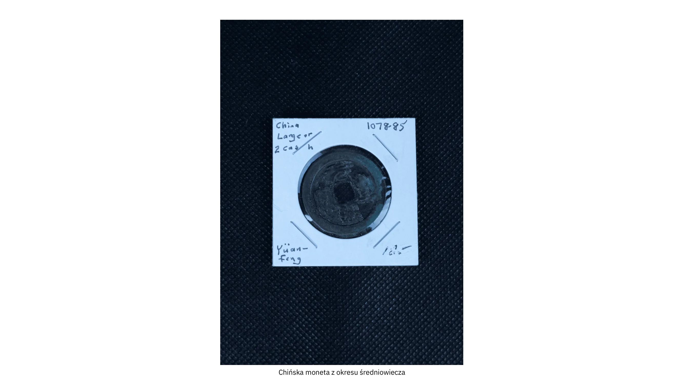

Ta powyżej to chińska moneta z okresu średniowiecza. Jest to odlewana moneta z kwadratowym otworem pośrodku. Otwór ten służył do przewlekania liny, dzięki czemu monety można było nawlekać na siebie, tworząc bransoletki lub naszyjniki. Monety te nie były jednak przeznaczone głównie do noszenia; były one używane głównie do celów księgowych. Można je było łączyć ze sobą, tworząc jednostki rozliczeniowe w postaci dużych sznurków, których elementy się zazębiały. Niekoniecznie były jakieś konkretne znaki, czasami były to po prostu brązowe kółka.

Monopol monetarny państwa, z opóźnieniem ustanowiony przez Wudi z dynastii Han w 113 r. p.n.e., był często kwestionowany, pozwalając różnym prywatnym lub lokalnym podmiotom na emisję własnych walut, pod warunkiem, że cieszyły się one wystarczającym zaufaniem społecznym.

**Niska wartość wewnętrzna chińskich walut zapobiegała ich gromadzeniu, gwarantując ich płynną cyrkulację**. Metale szlachetne były rzadko używane jako waluta obiegowa, aby zapobiec ich gromadzeniu. Złoto, jako zbyt drogie, było zazwyczaj odkładane na bok, a nie wydawane. Zamiast tego, **tylko jedwab stanowił prawdziwą walutę o wysokiej wartości w chińskim handlu międzynarodowym**. Chińczycy handlowali jedwabiem, a nie złotem.

Podczas kryzysów gospodarczych lub monetarnych, zwłaszcza gdy cena miedzi rosła, przyjmowano innowacyjne rozwiązania: tak więc już w II wieku naszej ery monety w obiegu zostały pocięte, aby stworzyć mniejsze jednostki, umożliwiając utrzymanie płynnego obiegu przy niższych kosztach. Inne epoki, takie jak Wang Mang (początek I wieku n.e.), eksperymentowały z wysoce fiducjarnymi walutami, w których wartość nominalna była znacznie wyższa niż rzeczywista zawartość metalu, co zapowiadało banknoty. Brali monety i stemplowali na nich wartości takie jak 50, 100 lub 200, aby wskazać większe kwoty, takie jak 200 monet. Praktyka ta prawdopodobnie przyczyniła się do znacznej inflacji.

Jak wspomniano powyżej, system ten opierał się na konwencji społecznej między państwem, producentami i kupcami, ale także na autorytarnych i surowych zasadach dla tych, którzy nie grali w tę grę, zwłaszcza w odniesieniu do wyboru elementów (pięknych lub nie) lub długości tkanin (niezgodnych ze standardem).

Moim skromnym zdaniem nie jest to zbyt solidny system. Opierał się głównie na surowych zasadach wymagających od urzędników i handlowców akceptowania uszkodzonych monet pod groźbą sankcji.

### Chińskie innowacje monetarne i ich wpływ na gospodarkę

Chiny były również pionierem w emisji wczesnych form pieniądza papierowego, początkowo przyjętego w odpowiedzi na niedobór metalu w IX wieku naszej ery. Pomimo swoich początkowych zalet, te papierowe waluty regularnie prowadziły do spirali inflacyjnych, gdy były emitowane w nadmiarze, czego świadkami były okresy Song i Ming, kiedy nadmierna emisja doprowadziła do poważnych kryzysów walutowych, zilustrowanych przez Marco Polo w XIII wieku, który zauważył nawet, że fałszowanie takich papierowych pieniędzy było karane śmiercią. Nie mogę powstrzymać się od wskazania tutaj formy przemocy.

Tak więc chińskie doświadczenia charakteryzują się głęboko fiducjarną koncepcją pieniądza, niezwykłą elastycznością systemu monetarnego i wczesnym wykorzystaniem walut papierowych, opartych raczej na zaufaniu między podmiotami gospodarczymi niż na wewnętrznej wartości używanych mediów.

## Organizacja społeczna i gospodarcza w starożytności

<chapterId>4023c3ce-7a47-5ac4-8f5f-c7ab699ab20f</chapterId>

:::video id=2761efe4-21cf-4f06-9bda-c03f9ff39012:::

### Debata na temat pasożytnictwa miejskiego

Relacja między starożytnymi miastami a ich zapleczem rodzi fundamentalne pytanie: czy te ośrodki miejskie funkcjonowały jako pasożyty wydobywające bogactwo, czy też jako motory korzystnej specjalizacji gospodarczej? Hipoteza pasożytnictwa sugeruje, że miasta epoki brązu, szczególnie w Mezopotamii, **systematycznie wydobywały więcej wartości ze swoich wiejskich terytoriów niż zwracały**, żyjąc głównie z czynszów i podatków bez tworzenia równoważnej wartości.

Wizja ta została odzwierciedlona w upadku Cesarstwa Rzymskiego: kiedy ekspansja terytorialna ustała, przepływ zewnętrznego bogactwa wysechł, potencjalnie ujawniając gospodarkę miejską niezdolną do samodzielnego finansowania. Miasta żyłyby więc "ponad stan", uzależnione raczej od wydobycia niż produkcji.

### Specjalizacja jako siła napędowa tworzenia wartości

Alternatywna interpretacja ekonomiczna podważa tę pasożytniczą wizję. **Starożytne miasta funkcjonowały przede wszystkim jako centra specjalizacji i podziału pracy**. Ich rola wykraczała poza zwykłe wydobycie: koncentrowały wyspecjalizowane rzemiosło, organizowały sieci handlowe i służyły jako węzły wymiany na duże odległości.

Ta miejska specjalizacja stworzyła produktywną współzależność z zapleczem. **Miasta nie mogły przetrwać bez wiejskich dostaw rolnych, ale zaplecze korzystało w zamian z produktów rzemieślniczych, innowacji technicznych i dostępu do śródziemnomorskich sieci handlowych**. Podział pracy pozwalał na wzajemny wzrost wydajności, nawet jeśli podział korzyści mógł wydawać się niezrównoważony.

Chroniczny brak bezpieczeństwa żywnościowego w tamtych czasach częściowo wyjaśnia tę pozorną asymetrię. Ryzyko głodu i zniszczenia plonów było stałym zagrożeniem dla ludności wiejskiej, podczas gdy miejscy rzemieślnicy, połączeni z międzynarodowymi sieciami handlowymi, cieszyli się większą stabilnością ekonomiczną.

### Ewolucja historyczna, od starożytności do średniowiecza

Kontrast między starożytną a średniowieczną organizacją rzuca światło na tę kwestię. **Starożytność sprzyjała podziałowi pracy na dużą skalę, z miastami otwartymi na cały świat śródziemnomorski**. Handel i specjalizacja osiągnęły wyrafinowany poziom, tworząc rozległe sieci gospodarcze.

Upadek Imperium Rzymskiego doprowadził do radykalnej fragmentacji: **Era feudalna zastąpiła tę scentralizowaną organizację zdecentralizowanym systemem samowystarczalnych posiadłości**. Starożytne rzymskie villas rusticae stały się matrycą średniowiecznych seigneuries, tworząc mozaikę praktycznie samowystarczalnych wysp ekonomicznych zarządzanych przez duchowieństwo lub szlachtę.

Ta średniowieczna decentralizacja, zmniejszając wydajność handlową, paradoksalnie oferowała większą odporność na wstrząsy zewnętrzne. Posiadłości feudalne rozwijały bardziej zrównoważone relacje między ośrodkami władzy a ludnością wiejską, nawet jeśli ta organizacja ograniczała wzrost produktywności związany ze specjalizacją.

### Pojawienie się rynków miejskich

Odkrycia archeologiczne ujawniają istnienie **portów handlowych i dzielnic handlowych w mezopotamskich miastach już w drugim tysiącleciu**. Infrastruktura ta świadczy o istnieniu zorganizowanych rynków, nawet jeśli ich dokładne funkcjonowanie pozostaje przedmiotem dyskusji.

Karl Polanyi, początkowo sceptycznie nastawiony do istnienia prawdziwych mechanizmów rynkowych w starożytności, zakwalifikował swoje stanowisko, przyznając, że mógł nie docenić wczesnego pojawienia się wymiany rynkowej. Ta intelektualna ewolucja odzwierciedla złożoność interpretacji starożytnych systemów gospodarczych, w których współistniały instytucjonalna redystrybucja, wzajemna wymiana i rodzące się transakcje rynkowe.

### Sparta kontra Ateny

Porównanie Sparty i Aten doskonale ilustruje związek między systemem monetarnym a organizacją społeczną. **Sparta reprezentuje model sztywno zhierarchizowanego społeczeństwa, które celowo odrzuciło użycie pieniądza**, podczas gdy Ateny rozwinęły wyrafinowaną gospodarkę pieniężną, aby towarzyszyć swojemu demokratycznemu systemowi.

Spartańskie odrzucenie pieniądza nie było spontaniczne, ale **instytucjonalne i ideologiczne**. Spartańscy przywódcy obawiali się, że pieniądze zepsują wartości wojskowe i obywatelskie, preferując system oparty na bezpośrednim zaufaniu międzyludzkim między obywatelami.

Aby zniechęcić do używania pieniędzy, Sparta zastosowała **ciężkie, niepraktyczne metalowe sztabki**, paradoksalnie wykazując intuicyjne zrozumienie cech monetarnych (podzielność, możliwość transportu, trwałość), które starali się zneutralizować.

### Ograniczenia modelu antymonetarnego

Spartańska organizacja ilustruje ograniczenia **liczby Dunbara** zastosowanej do skali społecznej. **Odrzucając pieniądz jako neutralny środek wymiany, Sparta skazała się na ograniczenie społeczeństwa obywatelskiego do ograniczonej liczby obywateli zdolnych do utrzymywania relacji bezpośredniego zaufania**. Homoioi (obywatele Sparty) stanowili zaledwie 1% całej populacji, otoczeni przez tysiące hilotów (niewolników).

Organizacja ta, początkowo źródło wyjątkowej spójności wojskowej, okazała się strukturalnie krucha. **Bitwa pod Leuktrami (371 p.n.e.) pokazała ograniczenia tego systemu**: utrata życia nieodwracalnie zniszczyła spartańską tkankę społeczną, prowadząc do upadku ich modelu cywilizacyjnego.

Konkurencyjne miasta (Ateny, Korynt, Teby), z rozwiniętymi systemami monetarnymi, **utrzymywały bogatsze, bardziej odporne gospodarki**, zdolne do zrekompensowania strat ludzkich poprzez odbudowę gospodarczą i imigrację.

### Zaufanie osobiste a instytucjonalne

Doświadczenie Spartan ujawnia **ryzyko nieodłącznie związane ze społeczeństwem opartym wyłącznie na zaufaniu międzyludzkim**, a nie na neutralnych mechanizmach instytucjonalnych. Tworząc intensywną spójność społeczną, model ten pozostawił społeczeństwo podatne na wstrząsy demograficzne.

Umożliwiając anonimowe i zdepersonalizowane transakcje, pieniądz oferuje doskonałą odporność systemową. Umożliwia ekspansję społeczną poza granice bezpośredniego zaufania, ułatwiając wymianę zagraniczną i wzrost gospodarczy.

### Paradoks Inków, bogactwo bez pieniędzy

Imperium Inków przedstawia fascynujący paradoks: **cywilizacja z ogromnym bogactwem złota, ale bez systemu monetarnego**. Podobnie jak Sparta, model ten opierał się na sztywnej hierarchicznej organizacji i scentralizowanym planowaniu, ale okazał się podatny na konkwistadorów z elastycznymi gospodarkami monetarnymi.

Ta strukturalna kruchość systemów antymonetarnych w obliczu społeczeństw monetarnych jest powtarzającym się wzorcem historycznym, sugerującym, że **instytucjonalne odrzucenie pieniądza, dalekie od wzmocnienia spójności społecznej, może paradoksalnie osłabić cywilizacje** w obliczu zewnętrznych wyzwań i zmian historycznych.

Analiza tych historycznych modeli pokazuje, że pieniądz, poza swoją funkcją wymiany, jest markerem i czynnikiem ułatwiającym złożoność społeczną, umożliwiając cywilizacjom przekroczenie ograniczeń narzuconych przez bezpośrednie relacje międzyludzkie.

# Narodziny bitego pieniądza

<partId>232e365a-8c3b-11f0-b276-b3ab70d1a5a1</partId>

## Pojawienie się monet

<chapterId>40ed3414-3066-57bd-bc1b-617ad0a354e0</chapterId>

:::video id=1d6834c4-98a3-43fe-ba80-04be51b0486e:::

Doszliśmy teraz do sedna sprawy: pojawienia się monet. Podkreślam tutaj słowo "moneta", ponieważ w poprzednich sekcjach widzieliśmy, że pieniądze lub systemy monetarne były bardzo obecne w cywilizacjach poprzedzających ludy lidyjskie, Greków i Persów. Myślę, że jest to całkiem jasne z tego, co właśnie zobaczyliśmy. Dlatego ta sekcja jest poświęcona pojawieniu się monet i nosi tytuł: *Pojawienie się monet*.

### Lidyjskie i jońskie pochodzenie monet

Aby rozpocząć tę sekcję, chciałbym przedstawić fragment książki Glyna Daviesa, A History of Money, tutaj.

*Fragment książki A History of Money: Od starożytności do współczesności autorstwa Glyna Daviesa:*

> Z miejsca narodzin w Lidii i Jonii wiedza i użycie monet szybko rozprzestrzeniły się na wschód do imperium perskiego i na zachód przez resztę wysp Jońskich i Egejskich do Grecji kontynentalnej, a następnie do jej zachodnich kolonii, zwłaszcza Sycylii. Rozprzestrzenił się również na północ do Macedonii, Tracji i Morza Czarnego, ale tylko częściowo, niechętnie i z opóźnieniem został zaakceptowany w Egipcie.

Uważam za interesujące wspomnieć tutaj, że w Egipcie nadal ważono monety długo po pojawieniu się technologii bicia monet. Myślę, że warto to odnotować. Cytat jest kontynuowany:

> Podobnie, Włochy kontynentalne również początkowo dość wolno akceptowały greckie innowacje finansowe, w przeciwieństwie do szybkości, z jaką zostały one przyjęte przez Sycylię.

*Poza tymi dwoma ograniczonymi wyjątkami (kontynentalne Włochy i Dolny Egipt), użycie monety szybko rozprzestrzeniło się w krajach graniczących z centralnym i wschodnim Morzem Śródziemnym, a także w rozległym i rosnącym imperium perskim, od Mezopotamii **do Indii **. Pozostaje niejasne, czy Indie już w tym czasie niezależnie rozwinęły embrionalny system monetarny, niezależnie od rozwoju chińskiego lub lidyjskiego. Niezależnie od tego, czy Indie niezależnie opracowały własną walutę, rosnące kontakty między Indiami a Bliskim Wschodem doprowadziły do tego, że indyjska moneta była bezpośrednią adaptacją lidyjskiego i greckiego wynalazku, najpierw przez Imperium Perskie, a następnie Imperium Macedońskie * (wraz z podbojami Aleksandra Wielkiego i jego ojca).

*Z tych powodów bezpośredni wpływ jakiegokolwiek indyjskiego wynalazku pieniądza był niewielki w porównaniu z przytłaczającym znaczeniem wyraźnie niezależnych wynalazków monetarnych Chin na wschodzie, a tym bardziej rozwoju lidyjskiego i greckiego na zachodzie*

### Rozmieszczenie geograficzne i adaptacje regionalne

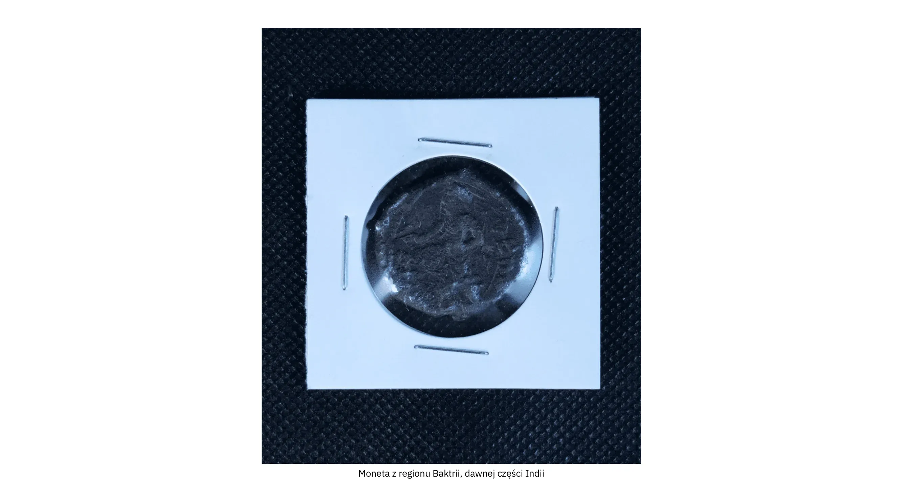

Aby zilustrować ten okres w formie wizualnej, powyżej znajduje się moneta z regionu w Indiach, regionu Bactria, który znajduje się blisko zachodniej części Półwyspu Indyjskiego, w pobliżu Afganistanu. Na tym obszarze istniały monety, które prawdopodobnie były inspirowane greckimi monetami przedstawiającymi jedną z ich królewskich osobistości.

## Lidyjczycy i Persowie

<chapterId>eb802ab8-8ffd-5b25-907f-8944f120ed14</chapterId>

:::video id=f151eb42-5ff3-4ca1-9af1-1ae2a5e051c0:::

### Pierwsze lidyjskie monety z elektrum

Ponieważ nie możemy oddzielić pojawienia się monet od Lidii i Persów, przejdźmy do tej części świata na wschód od Grecji, która dziś tworzy Turcję. Pierwsze monety, które pojawiły się na Zachodzie, pochodzą z około połowy VII wieku p.n.e., w regionach Lidii i Jonii, położonych na terenie dzisiejszej Turcji. Około 650-600 r. p.n.e. ta fundamentalna innowacja ujrzała światło dzienne, wraz z godnymi uwagi odkryciami archeologicznymi, takimi jak pierwsze monety znalezione w świątyni Artemidy w Efezie, datowane na około 600 r. p.n.e.. Te prymitywne monety były wykonane z elektrum, naturalnego stopu złota i srebra z bursztynowymi refleksami, i często miały prymitywny wygląd, po prostu oznaczone stemplami lub prymitywnymi motywami.

Poniżej znajduje się jedna z najwcześniejszych monet lidyjskich, przedstawiająca lwa ze zdobyczą z przodu. Można zauważyć stempel lub otwór z tyłu, który według niektórych był używany do testowania czystości metalu i upewnienia się, że nie jest to tylko warstwa powierzchniowa. Chociaż jest to jeden z najwcześniejszych przykładów, ważne jest, aby pamiętać, że ten egzemplarz jest kopią. Wszystkie moje złote i elektrumowe egzemplarze są replikami lub nowoczesnymi odtworzeniami, mającymi na celu powstrzymanie mnie przed wydaniem wszystkich oszczędności na tę kolekcję.

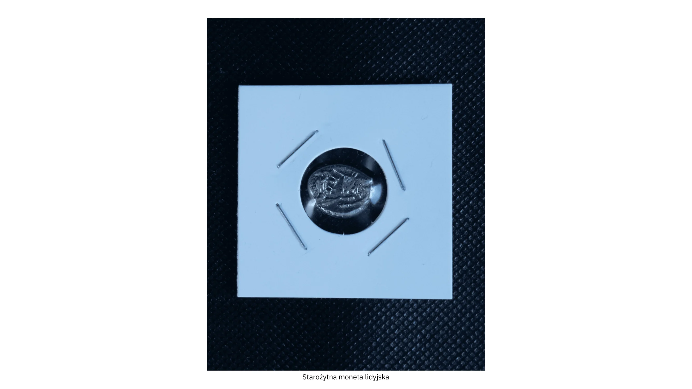

Ale mam też prawdziwy perski kawałek, który zaraz zobaczymy. Tak wyglądały te wczesne egzemplarze. Jest to rodzaj kleksa (lub bryły, w języku angielskim) metalu, który został wytłoczony w tamtym czasie.

Wbrew powszechnemu przekonaniu, że pieniądze zostały wynalezione w celu ułatwienia codziennego handlu i zastąpienia barteru, wydaje się, że pierwsze monety lidyjskie, achemenidzkie i greckie nie były początkowo używane do handlu na małą skalę. W rzeczywistości jednostki monetarne były zbyt duże do codziennego użytku. Co więcej, ich obieg był ograniczony do regionów w pobliżu miejsc, w których zostały wyprodukowane.

W tym miejscu należy wspomnieć, że chociaż czytałem w kilku pracach o charakterze antropologicznym, monety, jak już pokazałem - czy to elektrum, czy ta perska moneta, do której wrócę za chwilę - były zbyt duże, aby kupić chleb, powiedzmy, każdego dnia. Widziałem szacunki, które każą nam myśleć, że była to równowartość dnia pracy chłopa lub żołnierza, więc byłaby zbyt duża. To jak próba zapłacenia dziennej pensji za posiłek, śniadanie lub lunch. Z wyjątkiem tego, że widziałem w innych pracach, że znaleziono mniejsze jednostki tych plam, a więc mniejsze monety, co może sprawić, że pomyślimy, że być może istniało możliwe zastosowanie do codziennych zakupów.

Tak więc antropologiczny "dowód" na to, że nie były one używane do codziennego handlu, ponieważ nominał lub jednostka była zbyt duża, nie jest moim zdaniem zbyt solidny, ponieważ znaleźliśmy przykłady monet, które są mniejsze, które mogły być przystosowane do codziennych zakupów.

### Rola państwa w kreacji pieniądza

Prawdziwe pochodzenie monet wydaje się być związane z bezpośrednim działaniem państw. Istnieją dwie główne hipotezy na ten temat: pierwsza, idealistyczna, rysuje paralelę między greckim terminem "nomisma" (pieniądz) i "nomos" (prawo), sugerując, że pieniądz był powiązany z kodyfikacją praw, wzmacniając władzę i organizację polityczną miast. Druga, bardziej realistyczna hipoteza, powszechnie dziś akceptowana, głosi, że pieniądz był przede wszystkim środkiem sprawowania przez państwa kontroli gospodarczej i społecznej. Oficjalnie gwarantując wagę i wartość zawartych w nich metali szlachetnych, państwa były w stanie manipulować obiegiem i wartością tych monet, tworząc zaufanie i premie za płynność charakterystyczne dla walut krajowych.

To naprawdę interesujące, że mamy na to dowody. Na przykład, w monetach z elektrum, powinieneś wiedzieć, że naturalne elektrum ma zwykle około 70% złota i 30% srebra. W pierwszych monetach, które znaleźliśmy i przeanalizowaliśmy, w szczególności we wczesnych monetach lidyjskich, zawartość złota wydaje się wynosić około 50-55% zamiast 70. Sugeruje to, że nawet w tamtych czasach emitenci monet starali się zmniejszyć udział bardziej szlachetnego metalu, prawdopodobnie w celu wyprodukowania większej liczby monet i sprawienia, by wydawały się one warte tyle samo, co nieoznaczony kawałek naturalnego elektrum. I tutaj trzeba powiedzieć, że tak naprawdę było to możliwe od czasów tego słynnego Krezusa, jak w *bogatym jak Krezus*, ponieważ to od jego czasów dysponowaliśmy technologią oddzielania złota i srebra.

Monety lidyjskie przeszły poważną ewolucję za panowania słynnego króla Krezusa (561-546 p.n.e.), znanego z legendarnego bogactwa. W tym czasie Lidyjczycy udoskonalili metalurgię, aby oddzielić złoto i srebro od elektrum, wprowadzając w ten sposób pierwsze monety bimetaliczne, tj. oddzielne złote i srebrne monety.

### Perska ekspansja i grecka adopcja

Kiedy podbili Lidię w 546 r. p.n.e., Persowie Achemenidów natychmiast przyjęli tę innowację. Około 500 r. p.n.e., za panowania Dariusza I, Persowie ustanowili swój własny system monetarny ze złotymi darikami i srebrnymi siglois, często noszącymi królewską podobiznę w wojowniczych pozach. Ta królewska perska moneta była używana głównie w zhellenizowanych regionach Imperium Perskiego i stopniowo się rozprzestrzeniała, choć jej użycie pozostawało nierównomierne, a **niektóre regiony, takie jak Egipt, nadal preferowały wymianę w ważonym metalu (kruszcu).

Powyżej można podziwiać prawdziwy perski sigloi (lub siglos). Niewielki wzór przedstawia króla, choć otwór został nieco wytarty. Siglos to srebrna moneta, w przeciwieństwie do daric, która była wykonana ze złota. Persowie potrafili odróżnić te dwa metale i odeszli od monet z elektrum. Wdrożyli więc bimetalizm, używając zarówno złota, jak i srebra, zachowując tę samą koncepcję monet wykonanych z metali szlachetnych, często z otworem z tyłu, prawdopodobnie w celu sprawdzenia zawartości metalu.

Wydaje się, że szybkie przyjęcie monet przez Greków było stymulowane przez ich bliskie kontakty z Lidyjczykami, zwłaszcza poprzez greckie kolonie w Azji Mniejszej. Pierwszymi Grekami, którzy bili monety, byli prawdopodobnie mieszkańcy Eginy w połowie VI wieku p.n.e., którzy wprowadzili drachmę, której waga różniła się w zależności od regionu, a której nazwa dosłownie oznacza "garść zboża" lub "garść strzał".

Sukces greckiej monety wynikał zarówno z jej wygody w ważnych transakcjach, takich jak płacenie najemnikom, jak i z ekonomicznej i politycznej ekspansji miast. Waluta szybko stała się centralnym elementem greckiej, a później rzymskiej gospodarki, zachowując jednocześnie silny wymiar symboliczny, zwłaszcza poprzez powiązanie z prawem (nomos).

Wreszcie, szybka ekspansja monet świadczy o głębokiej transformacji starożytnych społeczeństw, w których kodyfikacja wartości pieniężnych szła w parze z organizacją państwa. Ta ewolucja położyła ekonomiczne i polityczne podwaliny pod powstanie greckich demokracji, zwłaszcza w Atenach, gdzie pieniądze odgrywały kluczową rolę w funkcjonowaniu demokratycznego miasta.

Kluczową kwestią, którą należy zapamiętać z tej sekcji, jest to, że mówimy konkretnie o **monetach**, a nie o pieniądzach w ogóle. Głównym aspektem, który wyłania się wyraźnie, jest **zaufanie do organu emitującego**, bezpośrednio związane z charakterystyką techniczną monet (waga, czystość, wartość nominalna). To właśnie to zaufanie umożliwia państwu lub organowi emisyjnemu sprawowanie pewnej kontroli, a nawet manipulowanie wartością i obiegiem tych monet od samego początku.

## Interwencja instytucjonalna i pierwsze monety

<chapterId>3e1efd08-99e3-5a32-9908-3185fef0e640</chapterId>

:::video id=84847cf6-9e46-4a8c-9f35-25a27496cc4b:::

### Podwójna natura pieniądza

Pojawienie się bitego pieniądza rodzi fundamentalne pytanie: czy pieniądz jest spontaniczną kreacją rynku, czy też instytucją narzuconą przez władzę? To konceptualne napięcie stawia naprzeciw siebie dwie radykalnie różne wizje.

Z jednej strony austriacka szkoła ekonomii broni idei, że pieniądz towarowy - w szczególności złoto - został naturalnie wybrany przez podmioty gospodarcze ze względu na jego wewnętrzne cechy: trwałość, przenośność, podzielność i zamienność. Z tej perspektywy państwo przywłaszczyło sobie tę spontaniczną walutę, aby kontrolować jej podaż. Jest to instytucja, która wyłania się naturalnie z potrzeb rynku, zanim zostanie przejęta przez władzę polityczną.

W przeciwieństwie do tego, pogląd antropologiczny i instytucjonalny utrzymuje, że pieniądz naprawdę powstaje wraz z monetą państwową. Władza świadomie tworzyła walutę, umieszczając swoją pieczęć, przekształcając w ten sposób metal w prawdziwy instrument monetarny. Ta perspektywa sugeruje, że najwcześniejsze monety lidyjskie były używane głównie do opłacania armii - jeden stater odpowiadał mniej więcej dziennemu żołdowi żołnierza.

### Paradoksalne zalety standaryzacji państwowej

Pomimo tego teoretycznego napięcia, nawet austriaccy ekonomiści dostrzegają pewne korzyści płynące z interwencji państwa w pieniądz. Standaryzacja poprzez bicie monet rozwiązuje szereg praktycznych problemów handlowych.

Bez organu certyfikującego podmioty gospodarcze są narażone na ciągłe ryzyko: podrabianie monet, oszustwa związane z wypełnianiem dokumentów i manipulowanie wagą. Praktyki te powodują tarcia w gospodarce, ponieważ niektóre monety są akceptowane, a inne odrzucane. Teoretycznie oficjalna pieczęć gwarantuje wagę i jakość, czyniąc handel bardziej płynnym.

Gwarancja ta ma obserwowalną cenę na rynku: wybita złota moneta jest warta więcej niż jej odpowiednik z surowego złota. Ta premia odzwierciedla wartość certyfikacji - kupcy nie muszą już samodzielnie weryfikować autentyczności metalu za pomocą testów chemicznych lub rezonansowych. Interwencja państwa, paradoksalnie, eliminuje tarcia i ułatwia handel poprzez tworzenie zinstytucjonalizowanego zaufania.

### Manipulacja walutą od samego początku

Historia pierwszych staterów lidyjskich ujawnia niepokojącą ironię. Ostatnie analizy pokazują, że zawartość złota w tych monetach z elektrum była systematycznie niższa niż w naturalnym elektrum. Organ certyfikujący jakość jednocześnie manipulował składem.

Praktyka ta ilustruje podwójną użyteczność monet. Dla rynku sprawia, że wymiana jest bardziej płynna i oferuje gwarancję standaryzacji. Dla organu emisyjnego staje się narzędziem kontroli gospodarczej poprzez rozcieńczanie. Zmniejszając zawartość złota przy jednoczesnym utrzymaniu wartości nominalnej, państwo skutecznie zwiększa podaż pieniądza - tworząc więcej jednostek monetarnych z tej samej ilości metalu szlachetnego.

Samo państwo pozostawało jednak ograniczone tą manipulacją. Jak pokazuje przykład złotego solidusa Konstantyna w IV wieku, rzymska administracja skrupulatnie sprawdzała jakość monet, ponieważ domagała się zapłaty w dobrej monecie. Władze miały żywotny interes w utrzymaniu jakości własnej monety, aby zagwarantować wartość swoich dochodów podatkowych.

### Analiza ekonomiczna dewaluacji

Badanie dewaluacji walut ujawnia spójne wzorce na przestrzeni dziejów. W przypadku metalowych monet ekonomiści śledzą procentową zawartość metalu szlachetnego w monetach - krzywa malejąca wskazuje na postępującą dewaluację. W przypadku nowoczesnych pieniędzy papierowych jest odwrotnie: obserwuje się podaż pieniądza obiegowego, a jej wzrost sygnalizuje dewaluację.

Obie metody mierzą to samo fundamentalne zjawisko: rozwodnienie wartości pieniężnej. Niezależnie od tego, czy chodzi o zmniejszenie zawartości metali szlachetnych, czy drukowanie nowych banknotów, mechanizm pozostaje ten sam. Im więcej jednostek monetarnych tworzy władza z tych samych realnych zasobów, tym bardziej każda jednostka traci na wartości.

Ta manipulacja, widoczna od najwcześniejszych monet lidyjskich, sugeruje, że kontrola monetarna zawsze była kwestią władzy. Bite pieniądze stanowią zatem niezwykłą innowację techniczną połączoną z narzędziem kontroli ekonomicznej - dwoistość, która przewija się przez całą historię monetarną, aż do dnia dzisiejszego.

## Produkcja części

<chapterId>b205f4f2-c293-5308-b812-a998de9ad45e</chapterId>

:::video id=47c612ec-d97e-4498-b50e-7e66518bd56d:::

### Od dziurkowanych klocków do bitych monet

Po sekcji o powstaniu monet, chciałem przedstawić bardzo krótką sekcję na temat ewolucji produkcji monet. Jak widzieliśmy, wszystko zaczęło się od plam elektrum, a następnie złota i srebra, gdzie obie strony były oznaczone stemplem, albo twarzą króla, albo otworem z tyłu, aby sprawdzić czystość.

Później, jak omówimy w kolejnej sekcji, Grecy udoskonalili tę technologię, tworząc okrągłe monety, które były młotkowane po obu stronach. Brali gładki, płaski kawałek metalu szlachetnego, grawerowali pożądany wzór po jednej stronie, a następnie ręcznie go młotkowali, aby stworzyć gotową monetę.

Technologia ręcznego bicia monet indywidualnie prawdopodobnie odegrała rolę w kontrolowaniu inflacji w tym czasie, mimo że monety były często rozcieńczane w celu zwiększenia produkcji. Było to szczególnie widoczne w okresie rzymskim i, w mniejszym stopniu, podczas niektórych wojen w okresie greckim. Podczas gdy bicie monet pojedynczo ograniczało zdolność władz do masowej produkcji, skutecznie przyczyniało się to do kontroli inflacji, pomimo znacznych dewaluacji, które miały miejsce. W ten sposób ewolucja przeszła od wykrawanej bryły metalu do okrągłej, młotkowanej monety.

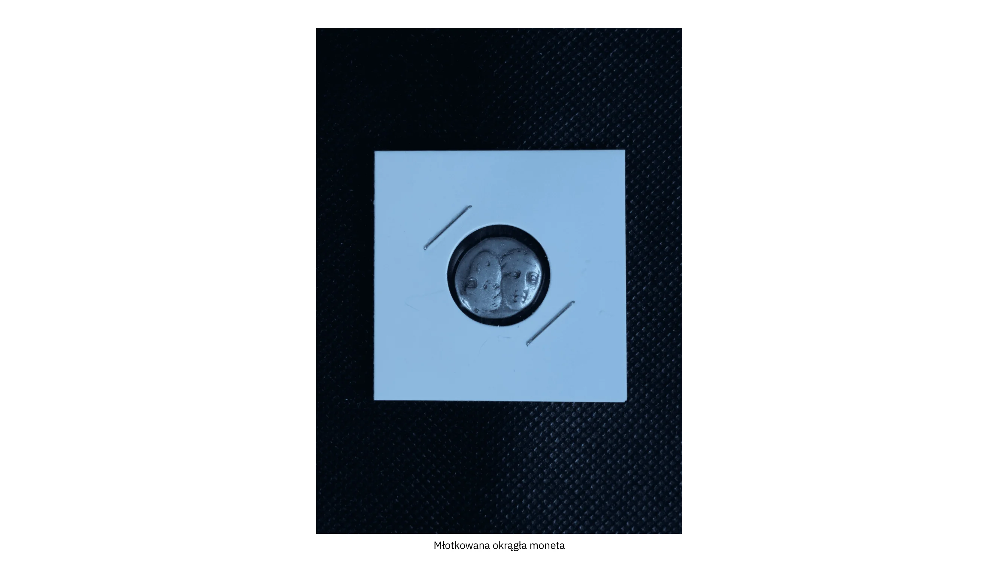

### Średniowieczna ewolucja

W średniowieczu pojawiła się również tendencja do rozkładania monet, czyniąc je szerszymi i cieńszymi. Jednym z powodów było to, że łatwiej było sprawdzić ich dźwięk, który był często używany jako wskaźnik autentyczności. Dzięki rozłożeniu srebra wytwarzana była wyraźna częstotliwość, dzięki czemu ludzie mogli zweryfikować czystość monety po prostu jej słuchając. Praktyka ta dała początek terminowi "zdrowy pieniądz". W kontekście zdrowego pieniądza, standardowa waga została określona przy użyciu wagi lub "trebusza" do ważenia. W ten sposób ewolucja przebiegała od małych, okrągłych monet do nieco cieńszych, szerszych monet.

### Uderzenie wahadłem

Ostatnią technologią, która pojawiła się pod koniec średniowiecza, na początku ery nowożytnej, było pojęcie bicia wahadłowego. Był to rodzaj śruby, którą dokręcano w celu wybicia monet, generując w ten sposób monety z tą nową formą bicia. Szczególną cechą tego rozwiązania była możliwość wygrawerowania wzoru na powierzchni monety, aby rozwiązać kwestię obcinania. Klipsowanie polegało na usunięciu części monety w celu odzyskania cennego srebra, które można było następnie wykorzystać do bicia innych monet lub po prostu zachować jako zasób.

Tak więc pojęcie uderzenia wahadła pomogło w zjawisku przycinania. Warto zauważyć, że technologia ta pochodziła z Francji. Na przykład w Anglii zatrudniono francuskich inżynierów, którzy pokazali im, jak tworzyć takie maszyny. Zabawne jest to, że byli zwolennicy bicia młotkiem, którzy byli temu przeciwni i opóźniali zastosowanie tej technologii. W przypadku każdej dobrej technologii zawsze są ludzie, którzy są jej przeciwni, którzy chcą zachować starą technologię. Pomyślałem, że to dość szalone, gdy zdałem sobie sprawę, że nawet technologia, która wydaje się naprawdę lepsza - można wyprodukować więcej części, trudniej je skopiować - wciąż istnieją ludzie, którzy są przywiązani do słynnej metody młotkowej. Nastąpiła zmiana między produkcją części wykonanych za pomocą słynnego uderzenia wahadłem, a następnie powrót do uderzenia młotkiem. I w końcu, oczywiście, to uderzanie wahadłem w końcu się przyjęło i dało nam te piękne nowoczesne elementy, w których można znaleźć albo małe linie, małe grzbiety wokół, aby uniknąć przycinania, prawdopodobnie związane ze słowem przycinanie, grzbiety, i nadal można zobaczyć albo grzbiety, albo tekst lub rysunki, które są wpisane na krawędzi elementu.

# Różne teorie na temat powstania pieniądza

<partId>72ac694f-9248-550d-90c1-91af3d234380</partId>

## Teorie dotyczące powstania pieniądza i jego różne definicje

<chapterId>7d699d4d-8c70-55b5-bf36-609f3fd90bcf</chapterId>

:::video id=523c873f-501b-4954-b79f-7e74c0f685a5:::

Witamy w tym segmencie poświęconym różnym teoriom na temat powstania pieniądza i jego różnym definicjom. Oto krótki fragment z książki *Aux origines de la monnaie*, który, jak sądzę, podsumowuje dwie główne teorie, którym przyjrzymy się w tej sekcji.

> Ta krótka preambuła służy jedynie podkreśleniu kontekstu badania. Na poziomie konceptualnym debata jest otwarta między zwolennikami tezy K. Polanyiego a zwolennikami tezy M. Webera. Dla tych pierwszych dar i redystrybucja odgrywają centralną rolę, a wymiana rynkowa odgrywa jedynie marginalną rolę, głównie w wymianie międzynarodowej. Dla drugich, przeciwnie, rynek jest w centrum obecnego procesu historycznego.

Na przykład w Mezopotamii jedna z teorii wyłaniania się pieniądza sugeruje, że świątynia, jako władza, tworzy jednostkę rozliczeniową lub monetarną, narzuca ją, a następnie kupcy przyjmują ją do handlu. Teoria przeciwna zakłada, że nie, ta jednostka monetarna wyłania się naturalnie z rynku, aby ułatwić handel. Istnieją na to dobrze udokumentowane przykłady w Mezopotamii.

Jeśli chodzi o handel wymienny, niektóre teorie sugerują, że był on używany głównie w wymianach międzynarodowych, tj. z ludźmi, którym po prostu nie ufaliśmy.

To właśnie zamierzamy zrobić w tej sekcji. Zamierzamy przeprowadzić swego rodzaju ankietę, aby przedstawić różne teorie na temat pojawienia się pieniądza i różne definicje tego, czym jest pieniądz. Przedstawimy i skrytykujemy tezy zarówno klasycznych ekonomistów, jak i antropologów. Będę miał nawet to szczęście, że będzie ze mną Ulrich Fromy, który przedstawi perspektywę austriackiego ekonomisty na te różne tematy.

## Pojawienie się pieniądza dla ekonomistów klasycznych

<chapterId>1d3776cd-0dfd-5297-af48-c6f41e257a7e</chapterId>

:::video id=873a16c1-17ac-448d-8941-df4feb7ab79d:::

Ten segment poświęcony jest różnym teoriom na temat pojawienia się pieniądza. Pierwszym tematem, który zostanie omówiony, jest pojawienie się pieniądza według ekonomistów klasycznych.

### Klasyczna teoria Adama Smitha

Zgodnie z klasycznymi teoriami ekonomicznymi, w szczególności tymi, których orędownikiem był Adam Smith, pieniądz wyłonił się naturalnie z wymiany barterowej w odpowiedzi na jej ograniczenia. Początkowo wymiana odbywała się poprzez bezpośredni barter, ale metoda ta była często komplikowana przez problem "podwójnej zbieżności potrzeb": każda osoba musiała posiadać dokładnie to, czego chciała druga. Stopniowo niektóre towary (takie jak sól, metale szlachetne i zwierzęta hodowlane) zaczęły być akceptowane przez wszystkich jako pośrednie środki wymiany, dzięki ich użyteczności, trwałości i podzielności. W ten sposób pieniądze spontanicznie pojawiły się, aby ułatwić i upłynnić wymianę gospodarczą.

### Krytyka teorii klasycznej

Oto moja krytyka tej teorii. Biorąc pod uwagę wszystko, co widzieliśmy w poprzedniej sekcji, myślę, że możemy już powiedzieć, że pogląd, iż **monety** są ewolucją barteru, jest błędny po prostu dlatego, że bita moneta zdecydowanie wyłania się z władzy, ponieważ jest bita przez władzę. Jest ku temu kilka powodów, nie tylko chęć władz do kontrolowania gospodarki, do przejęcia kontroli nad pieniądzem.

Z drugiej strony, jeśli mówimy o pieniądzach jako koncepcji, niekoniecznie monetach, to jest to mniej jednoznaczne, ponieważ w przypadku pierwszych monet, staterów lidyjskich, znaleźliśmy srebrne plamy, które nie były oznaczone. Pozostaje sprawdzić, czy były one w obiegu. Jeśli były w obiegu, oznacza to, że ludzie mogli pierwotnie zidentyfikować ten zasób jako potencjalną walutę, na którą można by było łatwo wymienić. I być może dopiero później władze zauważyły tę sytuację i przejęły nad nią kontrolę, umieszczając na niej pieczęć, aby ją poświadczyć.

Ma to wiele zalet - nie trzeba go sprawdzać, ważyć i tak dalej. Oczywiście porozmawiamy o tym. Ale moim zdaniem monety są wyraźnie narzędziem używanym przez państwa od samego początku. Jeśli jednak chodzi o pojawienie się pieniądza jako takiego, to nie wiemy, czy rzeczywiście pochodzi on od władzy, która go narzuciła, czy też pojawił się w wyniku handlu lub wymiany handlowej. W dalszej części tej sekcji przeprowadzę bardzo interesującą dyskusję na ten temat z moim kolegą Ulrichem.

Wiemy już, że pierwsze monety z metali szlachetnych nie były używane do ułatwiania codziennej wymiany, ponieważ ich wartość była zbyt wysoka. Wiemy również, że były one wykorzystywane głównie do płatności wojskowych. Jest to dobry argument na rzecz tezy, że pieniądz niekoniecznie wyłonił się z rynku. Jednostki rozliczeniowe, czyli nominały pierwszych monet, były prawdopodobnie zbyt duże, by np. kupić chleb czy zrobić codzienne zakupy. Mogła to być na przykład równowartość dziennego wynagrodzenia. Niekoniecznie w tamtych czasach ludziom płacono pensje, ale to daje wyobrażenie o skali. Tak więc monety te miały prawdopodobnie zbyt dużą siłę nabywczą, aby mogły być używane w handlu na małą skalę. Z drugiej strony nic nie wskazuje na to, że monety te nie byłyby używane do większych wymian, takich jak wymiany kupieckie. Wiemy, że były one używane głównie do płatności wojskowych. Jest to jedna z najpopularniejszych teorii wyjaśniających pojawienie się pierwszych monet. Pamiętajmy, że mówimy tutaj o monetach, a niekoniecznie o pieniądzach w ogóle. Tak więc pierwsze monety miały swoją pierwszą rolę, a było nią płacenie za płatności wojskowe, dla najemników.

Aleksander Wielki, na przykład, zrobił z niego wielki użytek, jak zobaczymy później.

Widzieliśmy również, że już w starożytnych Chinach muszle kauri były wykorzystywane do wymiany gospodarczej (**wynagradzania pracy, mierzenia wartości i zakupu ziemi)**. Co więcej, w Mezopotamii i Egipcie istniały już funkcjonalne systemy monetarne, które były wykorzystywane do handlu, wypłaty wynagrodzeń i płacenia podatków. Sugeruję tutaj, że zdecydowanie błędne jest myślenie, że monety w zachodniej koncepcji wyłoniły się z potrzeby uczynienia wymiany bardziej płynną.

Ponieważ monety są emitowane przez władze, być może możemy założyć, że od samego początku były one powiązane z emitującymi je władzami. To ma sens. Z drugiej strony, niekoniecznie wiemy, jak powstały formy pieniądza lub formy systemów monetarnych, proto-monety, które je poprzedzały. Z jednej strony sugerujemy, że to świątynie zidentyfikowały te jednostki monetarne, a następnie ludzie ich używali. Z drugiej strony powiemy ci, że nie, to kupcy potrzebowali środka wymiany, sposobu na handel ze światem zewnętrznym i to oni zidentyfikowali na przykład srebrny metal, który miał być używany, ponieważ był poszukiwany przez świat zewnętrzny. Chodzi o to, że tak naprawdę nie wiemy. Dlatego mamy dwie przeciwstawne teorie. Nie mamy doskonałego dowodu, aby wyjaśnić, czy pieniądze wyłaniają się naturalnie z potrzeby handlu, na przykład przez kupców, czy też są emanacją władzy.

### Rozróżnienie między monetami a prymitywnymi pieniędzmi

Podsumowując, myślę, że możemy powiedzieć, że monety koniecznie pochodzą od władzy, ponieważ zostały wybite przez tę władzę. Z drugiej strony, nie sądzę, abyśmy mogli powiedzieć, że błędem jest sugerowanie, że pieniądze (które poprzedzały monety) nie mogły powstać w celu ułatwienia wymiany. Myślę, że we wszystkich przykładach, które widzieliśmy powyżej, przykładów w tym sensie jest mnóstwo.

## Mit barteru

<chapterId>0fcd4964-ac36-5163-a8cf-1aacebc0d2c0</chapterId>

:::video id=0ede29ab-8acd-4d79-9282-bd5991b97076:::

### Recenzja Davida Graebera

Właśnie omówiliśmy powstanie pieniądza według klasycznych ekonomistów. Teraz zajmiemy się koncepcją znaną jako mit barterowy.

Jednym z zarzutów wobec tej klasycznej teorii powstania pieniądza jest brak historycznych dowodów na poparcie jej idei.

Krytyka znana jako "mit barteru", sformułowana między innymi przez antropologa Davida Graebera, podważa klasyczną koncepcję, że pieniądze wyłoniły się naturalnie z barteru. Zgodnie z tą krytyką, nie ma żadnych historycznych ani antropologicznych dowodów na to, że społeczeństwa systematycznie korzystały z barteru przed pojawieniem się pieniądza. W rzeczywistości starożytne społeczeństwa działały w oparciu o kredyt, dług, zobowiązania społeczne i ceremonialne wymiany. "Mit barteru" jest zatem teoretycznym konstruktem mającym na celu uzasadnienie klasycznej wizji ekonomicznej, bez rzeczywistych podstaw empirycznych.

Należy jednak zauważyć, że teoria ta nie zaprzecza, że barter istniał, na przykład w przypadku wymiany między różnymi plemionami. Zaprzecza ona po prostu temu, że handel wymienny był szeroko praktykowaną działalnością w tych tak zwanych prymitywnych grupach, a pieniądze byłyby logiczną ewolucją tych praktyk. Zaprzecza faktowi, że handel wymienny był szeroko stosowany w plemieniu, a pieniądze ostatecznie powstały w celu upłynnienia wymiany i rozwiązania trudności, które istniały w handlu wymiennym. Zamiast tego, zgodnie z tą teorią, grupy te praktykowały formę nieformalnego kredytu lub daru za dar.

### Prymitywne społeczeństwa kontra wielkie cywilizacje

**Oto kilka wyjaśnień dotyczących wielkich cywilizacji starożytnej starożytności. Myślę, że ta teoria zdecydowanie odnosi się do prymitywnych (bezpaństwowych) grup z przeszłości, a nawet dzisiaj (np. plemion badanych przez odkrywców w XVIII i XIX wieku). Oczywiście nie stosowały one barteru, ale raczej formy wymiany, o których wspomniałem wcześniej, z powodów, o których już wspomnieliśmy (słaby podział pracy, rolnictwo na własne potrzeby). Nie sądzę jednak, by ta teoria miała zastosowanie do wielkich cywilizacji z przeszłości, takich jak Mezopotamia czy starożytny Egipt.

Oto dwa fragmenty z *Aux origines de la monnaie* na ten temat:

> Model nakreślony przez M. Maussa w jego słynnym "Darze" został przyjęty przez egiptologów z taką samą jednomyślnością i entuzjazmem, jak brakiem rozeznania. Doprowadziło to do wielu nieporozumień, w które nie będziemy się tutaj zagłębiać. Zauważmy tylko, że model ten ma zastosowanie do tak zwanych prymitywnych społeczeństw, co nie ma miejsca w przypadku Egiptu faraońskiego.

> Chleby, tj. przetworzone zboża, były zatem jednostkami rozliczeniowymi, które, podobnie jak shât (y) w Starym Królestwie, umożliwiały również otwieranie kredytów na zróżnicowane towary. Ten prosty przykład pokazuje, że gospodarka faraońskiego Egiptu nie ograniczała się do systemu redystrybucji. Była bardzo złożona, obejmując wiele wymian.

Tak więc, jak widzieliśmy wcześniej w sekcji poświęconej Egiptowi, a nawet Mezopotamii i Chinom, widzimy, że nawet te starożytne, ale nie prymitywne cywilizacje, ze względu na obecność państwa, moim zdaniem, używały systemów monetarnych. Myślę, że zostało to w pełni zademonstrowane w pierwszej części tego kursu. Tak więc pojęcie dawania i brania, odroczonego kredytu, nie ma zastosowania do tych wielkich cywilizacji. Dokładne przyczyny pojawienia się pieniądza pozostają zatem tajemnicą. Nie wiemy, czy wynikało to z potrzeby kupców do handlu ze światem zewnętrznym, czy też zostało narzucone przez świątynię w tych starożytnych okresach.

## Pojawienie się pieniądza poprzez pieniądz dłużny

<chapterId>4f508615-aa61-5d62-89d3-cecd02aeaa62</chapterId>

:::video id=a23f547f-3906-4f4a-8f72-5d78c649d0c4:::

### Pieniądze jako IOU

W tej sekcji omówimy teorię pieniądza dłużnego.

Teoria **pieniądza dłużnego**, opracowana w szczególności przez ekonomistę Alfreda Mitchella-Innesa, a później rozwinięta przez Davida Graebera, twierdzi, że pieniądz nie pochodzi z barteru, ale raczej z długu i relacji kredytowych obecnych od najwcześniejszych społeczeństw ludzkich. Zgodnie z tą teorią, pieniądz pojawia się, gdy zobowiązania społeczne (długi między jednostkami lub grupami) stają się wymierne i zbywalne. Koncepcja ta wprowadza pojęcie kwantyfikacji wymiany i transferu. Pieniądz byłby więc przede wszystkim **uznaniem długu**, popartym wzajemnym zaufaniem i często gwarantowanym przez władzę polityczną lub religijną, a nie towarem służącym jedynie jako pośrednik w wymianie.

Jeszcze bardziej zaawansowaną formą tej teorii jest to, że wszystkie pieniądze są długiem. Tak więc ktoś, kto posiada pieniądze, miałby roszczenie wobec społeczeństwa w ogóle, roszczenie wobec wszystkich, którzy akceptują te pieniądze. A ponieważ pieniądze, **w ich wizji, muszą być akceptowane w sposób obowiązkowy**, w przeciwnym razie nie są pieniędzmi, ponieważ jeśli możesz odmówić przyjęcia tych pieniędzy, ich system nie działa. W danej grupie, która zidentyfikowała walutę, wszyscy, którzy ją posiadają, to tak, jakby mieli dług wobec wszystkich innych członków tego społeczeństwa, którzy akceptują tę walutę, a ci, którzy akceptują walutę, mają formę długu wobec osoby, która posiada tę jednostkę monetarną. Taka jest zasadniczo ich teoria.

### Krytyka systemu obowiązkowego

**Moja krytyka tej teorii:**

Pozwolę sobie na małą krytykę tej teorii. Zgadzam się, że pieniądze są rodzajem społecznego konsensusu. Jest to zaufanie, które grupa pokłada w "znaku" pieniężnym, czymkolwiek by on nie był. Podpisuję się więc pod koncepcją wzajemnego zaufania, którą zajmiemy się później wraz z koncepcją premii pieniężnej. Sprawa komplikuje się, gdy zwolennicy tej teorii dodają pojęcie zobowiązania i nalegają na pojęcie długu. Dla nich, gdy ktoś posiada token, ma roszczenie do społeczności jako całości, a zatem społeczność byłaby winna posiadaczowi dług. Istniałby również obowiązek rozliczenia, a członkowie grupy byliby zobowiązani do zaakceptowania token; w przeciwnym razie, ich zdaniem, system nie działałby. Myślę, że system opisany powyżej w starożytnych Chinach dobrze reprezentuje tę teorię.

Ze swojej strony mogę łatwo wyobrazić sobie system, w którym pieniądze są konsensusem społecznym, w którym wybrany token jest ogólnie akceptowany jako środek płatniczy, bez formalnego zobowiązania. Widzę, jak taki system działa, jeśli ludzie akceptują go z własnej woli. To może zadziałać. Z drugiej strony, często wiąże się to ze zobowiązaniami, prawnym środkiem płatniczym i przemocą, co zobaczymy w dalszej części. Ale teoretycznie nie mam wrażenia, że ten system może działać. Myślę, że Bitcoin jest tego przykładem. Bitcoin ma wartość, ponieważ ma premię pieniężną, ponieważ istnieje popyt na jego wykorzystanie do celów pieniężnych, tj. rezerwy wartości, być może także środki wymiany lub ochrony przed systemem fiat. Nikt nie jest zobowiązany do jego akceptacji, a im bardziej jest akceptowany jako środek płatniczy, tym bardziej może być wykorzystywany jako środek wymiany. Już teraz możemy bez problemu używać jej jako środka przechowywania wartości. Nie ma co do tego wątpliwości. Chcę powiedzieć, że Bitcoin wydaje mi się być przykładem, rodzajem waluty, która jest formą społecznego konsensusu, w którym myślimy, że będziemy w stanie odzyskać nasze pieniądze, jeśli kupimy je później, nabywamy je, aby móc je później wymienić, aby zachować naszą siłę nabywczą.

Ten mniej restrykcyjny pogląd na teorię pomaga wyjaśnić, w jaki sposób dwa różne społeczeństwa mogą handlować za pomocą token, takiego jak złoto, bez tworzenia roszczenia lub długu między tymi społeczeństwami. Uważam, że wymuszanie akceptacji w społeczeństwie nie działa w handlu między dwoma plemionami, ponieważ drugie plemię nie podlega władzy. Plemię B nie podlega władzy plemienia A. Ale mimo to akceptuje tę samą walutę token, powiedzmy, złoto. Teraz ludzie mogą mi powiedzieć: "Tak, ale to dlatego, że firma B również zdecydowała, że złoto jest ich walutą", więc to działa. Tak, rzeczywiście, to działa, ale w tym momencie nie ma tworzenia długu. To ostateczna transakcja. Tak więc, gdy firma A wymienia towar na złoto w firmie B, nie dochodzi do powstania długu, transakcja jest zakończona. Oczywiste jest, że osoba w firmie B nie nabyła tej złotej monety lub samorodka, aby później otrzymać zapłatę od osób w firmie A. Akceptuje ją, aby wymienić ją na złoto. Przyjmuje ją, aby później wymienić ją na złoto, prawdopodobnie w ramach własnego plemienia. Tak więc w tym przykładzie nie ma tworzenia długu, nie ma ukrytego roszczenia, jest to po prostu bezpośrednia wymiana, bezpośrednia płatność. Zwolennicy waluty dłużnej powiedzą nam, że jest to barter. Nie zgadzam się z tym, ponieważ barter to wymiana bezpośredniego dobra. Bezpośredni barter to wymiana jednego dobra na inne dobro, w celu jego wykorzystania. Towary są wymieniane w celu ich użycia, podczas gdy w naszym przypadku złoto jest wyraźnie używane jako waluta, ponieważ nie będzie używane do niczego innego; zostanie użyte później jako środek płatniczy. Tak więc, moim zdaniem, nie należy ono do kategorii barteru.

Posiadanie pieniężnego token nie jest "roszczeniem" wobec społeczności, ale raczej nadzieją, że token zostanie przyjęty w późniejszym terminie po porównywalnej wartości.

## Spontaniczne pojawienie się pieniądza

<chapterId>e3ef86b1-73b9-5140-a61e-2ab6a5b0b2d4</chapterId>

:::video id=e543995f-d5e2-49d7-9133-e397b46e0833:::

Dla austriackiej szkoły ekonomii, zapoczątkowanej przez Carla Mengera, pieniądz wyłania się naturalnie z gospodarki barterowej stojącej w obliczu problemu podwójnej zbieżności potrzeb. W tej wizji jednostki spontanicznie zbiegają się w kierunku dóbr pośrednich, które ułatwiają wymianę - nie są to dobra bezpośrednio konsumowane, ale towary rozpoznawane ze względu na ich zdolność do bycia szeroko poszukiwanymi.

Te dobra pieniężne muszą posiadać cechy zidentyfikowane od czasów Arystotelesa: muszą służyć jako magazyn wartości, środek wymiany i jednostka rozliczeniowa. Podmioty gospodarcze stopniowo je identyfikują, gromadzą i oszczędzają, inicjując w ten sposób ich pojawienie się jako pieniądza. Proces ten jest całkowicie spontaniczny - pieniądz stanowi naturalną odpowiedź rynku na problem koordynacji wymiany, bez świadomej interwencji władzy.

### Debata na temat "mitu barterowego"

Antropolodzy tacy jak David Graeber kwestionują ten pogląd, powołując się na "mit barteru". Ich argument: nigdy nie udokumentowano żadnej złożonej cywilizacji opartej wyłącznie na bezpośrednim handlu wymiennym. Badane prymitywne społeczeństwa wykorzystywały raczej systemy nieformalnych kredytów i wzajemności. Graeber twierdzi, że dług poprzedzał barter, powołując się na tysiące mezopotamskich tabliczek dokumentujących relacje kredytowe.

Krytyka ta opiera się jednak na zawężającej definicji barteru. Jak zauważył Menger w 1892 r., barter wykracza poza prostą bezpośrednią wymianę towarów za towary. Obejmuje on również odroczone transfery, usługi w zamian za wynagrodzenie i wymianę czasową - co Menger nazwał "jednostronnymi transferami między jednostkami". Ta rozszerzona forma barteru może współistnieć z systemami kredytowymi w ograniczonych kręgach zaufania.

Brak dowodu nie jest dowodem braku, a austriaccy ekonomiści uznają, że żadne złożone społeczeństwo nie może rozwijać się w sposób zrównoważony wyłącznie w oparciu o bezpośredni handel wymienny - stąd konieczne pojawienie się pieniądza.

### Przypadek mezopotamski: kupcy kontra świątynie

Debata krystalizuje się wokół pochodzenia mezopotamskiego srebrnego sykla. Istnieją dwie przeciwstawne interpretacje. Pogląd instytucjonalny utrzymuje, że świątynie - prawdziwe centra gospodarcze i duchowe - narzuciły srebro jako walutę w celu uporządkowania gospodarki. Tabliczki klinowe, skoncentrowane wśród duchowieństwa i elit kupieckich, świadczą o tej scentralizowanej kontroli.

Austriacka interpretacja sugeruje coś przeciwnego: to kupcy zaadoptowali pieniądze do handlu na duże odległości. Stojąc przed wyzwaniem handlu z obcymi poza granicami Mezopotamii - od Anatolii po Zatokę Perską - potrzebowali czegoś powszechnie rozpoznawalnego, trwałego i możliwego do transportu. Srebro było naturalnym wyborem ze względu na swoje nieodłączne właściwości. Świątynie po prostu potwierdziły praktykę już ustanowioną przez komercyjne zastosowania.

Teza ta opiera się na udokumentowanych wymianach między Kanesh w Anatolii i Assur, gdzie kupcy wymieniali tekstylia na srebrny metal - nie ze względu na jego materialną użyteczność, ale jako magazyn wartości. Transakcje te wykraczały poza zwykły barter, ujawniając istnienie prawdziwej waluty towarowej.

### Współczesny przykład obozów jenieckich

Ekonomista Richard Radford, więzień w Niemczech podczas II wojny światowej, udokumentował fascynujący przypadek spontanicznego powstania pieniądza. W obozach papierosy naturalnie stały się jednostką wymiany - podzielną, znormalizowaną, powszechnie akceptowaną. Przyjęły je nawet osoby niepalące, uznając ich uniwersalną wartość wymienną.

Ten mikrokosmos ilustruje austriacką zasadę: w obliczu problemu koordynacji wymiany, jednostki spontanicznie zbliżają się do najbardziej "sprzedawalnego" dobra. Żadna władza nie narzuciła pieniędzy na papierosy; wyłoniły się one z codziennej praktyki więźniów dążących do optymalizacji wymiany.

### Zbieżność indywidualnych preferencji

Zasadniczo pieniądze reprezentują zbieżność indywidualnych preferencji w kierunku akceptowanego wspólnego dobra. Mezopotamscy kupcy, podobnie jak więźniowie Radforda, zidentyfikowali dobro, które minimalizowało niepewność przyszłych wymian. Wybór ten nie czeka na autoryzację lub narzucenie przez władzę centralną - wyłania się z praktycznej racjonalności podmiotów gospodarczych stojących w obliczu wyzwań związanych z wymianą.

Debata między spontanicznym pojawieniem się a świadomą instytucją pozostaje otwarta, ponieważ dowody historyczne są fragmentaryczne. Austriacka analiza oferuje jednak spójne wyjaśnienie: pieniądze narodziły się z praktycznych potrzeb handlu, a władze jedynie instytucjonalizowały praktyki już ustanowione przez rynek.

## Antropologiczna wizja powstania pieniądza

<chapterId>ec48c5d8-47ed-530f-beb7-c44fd0b62880</chapterId>

:::video id=8c1f8764-75af-4fb6-a98b-55de3b7da02e:::

### Nieekonomiczne pochodzenie pieniądza

W tej sekcji zbadamy antropologiczny pogląd na pojawienie się pieniądza, bogatą perspektywę, która głęboko kwestionuje klasyczne teorie ekonomiczne.

W przeciwieństwie do tradycyjnej teorii, że pieniądz wyłonił się naturalnie z wymiany barterowej w celu ułatwienia wymiany gospodarczej, badania antropologiczne pokazują, że pojawienie się pieniądza jest w dużej mierze zakorzenione w przyczynach pozaekonomicznych. Wynikają one z mechanizmów społecznych, takich jak płatności daninowe, odszkodowania za morderstwa (słynny Wergeld) i posagi (pieniądze panny młodej), ale także z praktyk ceremonialnych, religijnych, politycznych i symbolicznych, znacznie bardziej niż z prostych potrzeb rynkowych.

W prymitywnych społeczeństwach pieniądze rzadko były wykorzystywane do codziennej wymiany dóbr materialnych, co jest sprzeczne z klasyczną definicją pieniądza jako "środka wymiany". W rzeczywistości społeczeństwa te masowo korzystały z kredytów, z odroczonymi płatnościami osadzonymi w rozległych sieciach relacji społecznych i osobistych. Te wszechobecne systemy kredytowe logicznie i historycznie poprzedzały pojawienie się pieniądza.

To właśnie podsumowuje ich wizję. Omówiliśmy to z Ulrichem na naszym czacie w poprzednim filmie. Pozwolę ci cieszyć się komentarzami Ulricha na ten temat, które nieco podważają to podejście. Tak więc w wizji antropologicznej często mamy do czynienia z pojęciem pieniędzy pochodzących od autorytetu lub koncepcji społecznej, która poprzedza potrzeby rynku.

### Przykład kamieni Yap

Poniżej można podziwiać uderzający przykład monumentalnych kamieni na wyspie Yap. Niektóre z tych kamieni, pomimo ich bezruchu, a nawet fizycznego zniknięcia, nadal funkcjonowały w pełni jako pieniądze dzięki zbiorowej umowie, podkreślając zasadniczo społeczny i symboliczny wymiar pieniądza.

To naprawdę interesująca analiza kamieni Yap. Saifedean Ammous również wspomina o tym przykładzie w swojej książce "The Bitcoin Standard". Według niego system wyspy Yap najbardziej przypomina Bitcoin, rodzaj centralnego rejestru, z którym każdy może się zapoznać, który jest publiczny, prowadzi konta i zarządza własnością rzeczy. Ta antropologiczna perspektywa pokazuje, że wszystko to reprezentuje porozumienie lub konsensus społeczny w społeczeństwie, co jest zasadniczo dokładne. Bardzo interesująca jest dla mnie wzmianka o zagubionych kamieniach. Wypływali setki kilometrów w morze na małych tratwach i przynosili kamienie z powrotem. Czasami kamień spadał na dno morza, ale nadal był używany w systemie monetarnym. Osoba mogła powiedzieć: "Tak, upuściliśmy kamień w takim miejscu; jest mój, więc możemy go wymienić". Niekoniecznie istniała potrzeba fizycznego posiadania, aby ułatwić wymianę, ponieważ kamienie były tak duże, że często pozostawały w jednym miejscu. Zamiast tego skupiono się na zmianie rąk z tymi kamieniami w sposób transakcyjny, umożliwiając zmianę własności bez faktycznego ruchu kamieni. Była to forma "dowodu konsensusu", podkreślająca interesujące antropologiczne spojrzenie na pieniądze.

### Protowaluty i zobowiązania społeczne

Etnografowie na całym świecie zaobserwowali społeczeństwa używające "proto-walut" lub "prymitywnych walut", takich jak muszle, tkaniny, żywy inwentarz, sól i kamienie, które spełniały funkcje zwykle przypisywane pieniądzom, takie jak środek płatniczy i przechowywanie wartości, nie działając jednak regularnie jako pośrednicy w wymianie dóbr codziennego użytku.

Tak więc opisujemy tutaj systemy monetarne, które niekoniecznie były używane do codziennej wymiany.

Chciałbym przypomnieć, że wszystkie one były walutami przed pojawieniem się monet i nie wiem, jak bardzo mylące jest mówienie o walucie. Wolę mówić waluta. Mogę wspomnieć, że w literaturze często mówimy o proto-walutach w odniesieniu do pieniędzy sprzed monet. Ale jak widzieliśmy w pierwszej sekcji, **wierzę, że istniały systemy monetarne na długo przed pojawieniem się monet**.

Te prymitywne waluty były używane głównie do zarządzania podstawowymi zobowiązaniami społecznymi związanymi z jednostkami, takimi jak małżeństwo, rekompensata za konflikt (Wergeld) lub prezenty między wodzami. Na przykład w Imperium Perskim pierwsze monety zostały stworzone specjalnie jako środek płatności wojskowych, a nie środek wymiany.

Pieniądz prymitywny ma zatem jedną zasadniczą cechę: jest środkiem płatniczym, ale bardzo rzadko środkiem bezpośredniej wymiany dóbr materialnych. Mamy tu na myśli to, że był to środek płatniczy za pewne zobowiązania społeczne, dla plemion, do wymiany między wodzami, słynny wergeld, pieniądze krwi. Przed pojawieniem się wymiaru sprawiedliwości, jeśli ktoś popełnił morderstwo, rodzinie, która ucierpiała z powodu zabójstwa ukochanej osoby, należało się zadośćuczynienie. Trzeba było za to zapłacić, nazywano to krwawymi pieniędzmi i jest to forma zapłaty. Istniał również posag, który również był formą zapłaty. W tych wczesnych zastosowaniach pieniądza jako formy płatności, był on bardziej związany z ludzkimi i społecznymi zobowiązaniami niż z płatnościami za codzienne zakupy. Zgodnie z tą teorią, te bardziej powszechne codzienne wymiany były bardziej związane z kredytem, odroczonym kredytem, prezentem za prezent i redystrybucją racji żywnościowych. Istniała inna forma organizacji społecznej do zarządzania tymi wymianami. Ważne jest również, aby pamiętać, że w społeczeństwie, w którym każdy jest samowystarczalny, uprawia własne rolnictwo, nie ma specjalizacji, a system monetarny jest bardzo mało potrzebny do codziennej wymiany. Dlatego właśnie pierwszymi formami pieniądza były to, co właśnie opisaliśmy, posag, pieniądze z krwi, po prostu dlatego, że były to pierwsze wymiany, w których potrzebowaliśmy środka płatniczego, na długo zanim potrzebowaliśmy handlu, codziennej wymiany chleba na pieniądze, ponieważ w prymitywnych społeczeństwach to tak nie działało. Każdy zaspokajał swoje potrzeby i nie było jeszcze specjalizacji. Myślę, że omówiłem to szczegółowo we wszystkich poprzednich wykładach tego kursu.

W tych społeczeństwach, bez zaawansowanego podziału pracy, bezpośrednia wymiana pozostawała ograniczona, odbywając się głównie w ramach osobistych relacji przyjaźni lub sojuszu. Brak wystarczającej specjalizacji nie wymagał pieniędzy w nowoczesnym sensie.

Antropolodzy tacy jak Quiggin i Einzig nalegają na pierwszeństwo kredytu: **prymitywne życie gospodarcze jest uwikłane w gigantyczną sieć kredytów i długów osobistych, gdzie pieniądze interweniują zwłaszcza wtedy, gdy płatności muszą być natychmiastowe, a rekompensaty nie mogą być łatwo odroczone**

Tak więc ludzie wymieniają się rzeczami, mogą udzielać odroczonych kredytów, ale w niektórych przypadkach nie można odroczyć płatności, więc waluta lub proto-waluty mogą być przydatne w tym momencie, aby zapewnić natychmiastową ostateczność wymiany.

### Innowacja anonimowości

Analiza ta prowadzi do głębszej refleksji: zamiast przeciwstawiać pieniądz barterowi, bardziej istotne jest zrozumienie jego pojawienia się jako ewolucji ze złożonych systemów kredytu i długu. Pieniądz wprowadza fundamentalną innowację: **anonimowość**. I właśnie w tym miejscu uważam tę antropologiczną teorię powstania pieniądza za interesującą. Jeśli jesteście małą grupą ludzi i udzielacie sobie odroczonych kredytów, to oczywiście znacie się nawzajem. Myślę, że aby ten system działał, ludzie muszą się oczywiście znać. A płatność dokonana za pomocą pieniędzy pozwala na anonimowość. Pozwala na dokonanie płatności bez znajomości imienia i nazwiska, bez wiedzy o tym, kim jesteś. Mogą dokonać wymiany w celu natychmiastowego i ostatecznego rozliczenia. I właśnie to umożliwiają pieniądze.

W przeciwieństwie do kredytu, który zawsze ma charakter nominalny, pieniądz umożliwia anonimowe, uogólnione i natychmiastowo wyzwalające transakcje. **Ta wyjątkowa wyzwoleńcza moc pieniądza jest jego decydującą przewagą

Pieniądz nie jest więc tylko skromnym narzędziem ułatwiającym wymianę ekonomiczną, ale stanowi ważną innowację społeczną, ściśle związaną z ewolucją ludzkich instytucji i praktyk, od kredytu osobistego **do uogólnionego, anonimowego systemu płatności**. Ta antropologiczna ewolucja pokazuje, że pieniądz, znacznie więcej niż zwykły środek wymiany, stanowi potężną instytucję społeczną, głęboko kształtującą ludzkie społeczeństwa, do tego stopnia, że w naszych nowoczesnych społeczeństwach stał się celem działalności gospodarczej.

W tym miejscu zdajemy sobie sprawę, że w naszych nowoczesnych społeczeństwach celem wymiany gospodarczej jest posiadanie pieniędzy, podczas gdy w dawnych czasach wcale tak nie było. Celem wymiany ekonomicznej było posiadanie dóbr lub towarów do konsumpcji. A dziś, dzięki wprowadzeniu innowacji w postaci pieniądza, celem wymiany gospodarczej jest gromadzenie tych pieniędzy, ponieważ umożliwiają nam one wymianę na dobra, co jest powszechnie akceptowane. Możemy je wymienić na dobro, którego potrzebujemy, kiedy go potrzebujemy.

## Ujednolicenie rejestru

<chapterId>7664442a-91c1-5ce4-a8bd-53b7371a3e3d</chapterId>

:::video id=473fc284-5375-4e1b-b0cd-6b51ba0cc3b8:::

### Teoria rejestru księgowego

Zamierzamy teraz wspólnie przeanalizować różne propozycje unifikacji tych dwóch teorii monetarnych, tj. teorii wyłaniania się pieniądza poprzez pieniądz dłużny oraz monetarnej teorii wyłaniania się pieniądza towarowego. Porozmawiamy o propozycji unifikacji Lynn Alden w jej słynnej książce "For Broken Money", której tytuł w tłumaczeniu przygotowanym przez Consensus będzie prawdopodobnie brzmiał "Rupture monétaire".

*Fragment książki Broken Money autorstwa Lyn Alden:*

> Zasadniczo pieniądz jest rejestrem księgowym. Pieniądz towarowy jest rejestrem zarządzanym przez naturę. Pieniądz bankowy jest księgą zarządzaną przez państwa narodowe. Pieniądz open-source jest księgą zarządzaną przez jego użytkowników.

Tutaj Lyn odnosi się do Bitcoin.

### Współczynnik przepływu zapasów i niedobór

> Niektóre rzadkie pierwiastki chemiczne, takie jak rod, są rzadsze niż złoto, ale mają niskie wskaźniki przepływu zapasów, ponieważ są zużywane przez przemysł tak szybko, jak są wydobywane. Rodowa moneta lub sztabka może być zakupiona jako wyspecjalizowany przedmiot kolekcjonerski lub magazyn wartości, ale nie nadaje się jako społecznie akceptowana waluta, a więc nie pojawia się naturalnie jako pieniądz.

Saifedean szczegółowo omawia tę kwestię w swojej książce "The Bitcoin Standard". Dla tych, którzy nie są zaznajomieni ze wskaźnikiem zapasów do przepływu, jest to po prostu porównanie istniejących zapasów, rezerw istniejących na rynku, z nowymi zapasami, napływem nowych zapasów. Często jest to raczej sprzeczne z intuicją, ponieważ można by pomyśleć, że coś, co masz w dużych ilościach, nie jest rzadkie, ale w rzeczywistości tak nie jest. Jest to raczej kwestia zdolności do dostarczania tego towaru. Zgodnie z tym modelem, to raczej zdolność do posiadania nowych zapasów daje nam informację o tym, czy dany przedmiot jest rzadki, czy nie. To nie dlatego, że nie mamy czegoś w magazynie, jest to rzadkie, tylko dlatego, że być może tego nie mamy. Tak więc, jeśli weźmiemy złoto, mamy dużo zapasów złota, ponieważ jest ono używane jako środek przechowywania wartości, a napływ nowych zapasów wynosi około 1% do 3% rocznie nowych zapasów złota pochodzących ze złota mining. Z drugiej strony, jeśli mówimy o rodzie, jest on rzadszy niż złoto, ale nie mamy żadnych zapasów, ponieważ jest zużywany na bieżąco. Nie potrzeba więc dużej nowej podaży, by podwoić istniejące zapasy. Podczas gdy w przypadku złota podwojenie zapasów zajęłoby co najmniej 50 lat. W przeciwieństwie do większości konsumowanych dóbr, w przypadku których podwojenie istniejących zapasów jest dość łatwe i nie wymaga wielu lat produkcji, ponieważ są one konsumowane na bieżąco.

*"Złoto utrzymywało wskaźnik zapasów do przepływów na poziomie od 25x do 100x w całej współczesnej historii, zwykle około 50x lub więcej, krótko nigdy nie spadając poniżej 16x, nawet podczas gorączki złota w połowie XIX wieku. "*

Tak więc 25 oznaczałoby 25 lat na podwojenie zapasów, a 100 oznaczałoby 100 lat na podwojenie zapasów. Saifedean twierdzi w swojej książce, że nawet gdybyśmy podwoili produkcję złota, powiedzmy z 1,5% do 3%, niekoniecznie miałoby to duży wpływ na jego cenę.

*"Srebro generalnie ma wskaźnik zapasów do przepływów na poziomie 10x lub wyższym, co nadal jest stosunkowo wysokie*

*Większość innych towarów ma współczynnik przepływu zapasów mniejszy niż 1 lub 2. Nawet najrzadsze pierwiastki, takie jak platyna i rod, mają stosunkowo niskie wskaźniki przepływu zapasów ze względu na ich szybką konsumpcję przemysłową "*

### Wyższość złota i srebra

*"Krótko mówiąc, za każdym razem, gdy waluta towarowa konkurowała ze złotem i srebrem, te ostatnie zawsze ostatecznie wychodziły na prowadzenie. Inne towary mogą pozostać walutami przez ograniczony czas lub w określonych regionach, ale złoto i srebro zawsze udowadniały, że są w stanie stać się walutami konkurencyjnymi w skali globalnej i zdominować konkurencję. Wynika to z faktu, że gdy cywilizacje się spotykały, posiadacze złota i srebra zawsze mieli technologiczną zdolność do dewaluacji innych form waluty, podczas gdy posiadacze muszli, pereł, żywego inwentarza, soli, tkanin lub metali niższej jakości nigdy nie mogli zdewaluować złota lub srebra."

Jest to ponownie bardzo dobrze opisane w The Bitcoin Standard, gdzie Saifedean mówi o plemionach w Afryce, które używały szklanych paciorków. A kiedy weneccy kupcy przybyli z ładunkami pełnymi szklanych paciorków, ponieważ byli w stanie produkować je przemysłowo w tamtym czasie, mieli do tego możliwości technologiczne, całkowicie zdestabilizowało to system monetarny tych ludów i byli w stanie dosłownie splądrować ich zasoby. Taka jest teza Saifedeana.

### Jednostka rozliczeniowa i kredyt

*"Historycznie rzecz biorąc, nawet gdy kredyt był wykorzystywany bezpośrednio jako instrument wymiany, był on zwykle denominowany w jednostkach dóbr pieniężnych naturalnie wybranych ze względu na ich właściwości "*

To bardzo interesująca kwestia, o której rozmawialiśmy z Ulrichem. Nawet jeśli świątynia w Mezopotamii była rodzajem autorytetu, który mógł zarządzać pojęciem kredytu, jednostką rozliczeniową był sykl. Nie ma nic, co potwierdzałoby, że szekel został ustanowiony autorytatywnie przez świątynię. Szekel mógł powstać naturalnie, w wyniku potrzeby kupców do importu i eksportu z innymi ludami w okolicy. Mamy na to dowody w postaci kupca z Kanesz (wspomniałem o tym w części 1), który robił dokładnie to, importując metale szlachetne, które nie były używane ze względu na ich fizyczną wartość towarową, ale raczej jako środek przechowywania wartości. Jedynym problemem jest to, że nie wiemy, czy możemy założyć, że ten wybór srebra, srebrnego sykla, został dokonany przez kupców, czy też został dokonany przez świątynię. Ulrich ma jednak bardzo dobry argument, który prowadzi nas do wniosku, że prawdopodobnie dokonano tego raczej po stronie kupców.

*"Tak więc ujednolicenie tych dwóch teorii można opisać jako "księgową teorię pieniądza" ("ledger theory of money"), ponieważ opisuje ona fundamentalną logikę wspólną dla obu teorii. Zarówno elastyczny kredyt społeczny, jak i kolekcjonerskie proto-waluty sięgają zarania ludzkości. W obu przypadkach grupy ludzkie różnej wielkości prowadzą między sobą księgę rachunkową, aby uniknąć konieczności zaspokajania podwójnej zbieżności potrzeb, zmniejszyć tarcia w wymianie i służyć jako forma płynnych oszczędności. Zasadnicza różnica polega na organie, któremu powierzono prowadzenie rejestru "*

Z jednej strony natura zarządza ekspansją podaży pieniądza. Tak więc, jeśli weźmiemy złoto, ponieważ jest ono dość rzadkie, trudno jest je wydobywać. Istnieje pewien limit liczby złotych monet, które można wydobyć. Tak więc niedoborem zarządza natura. A rejestr jest prowadzony przez koncepcję posiadania. Rejestr jest zdecentralizowany. Posiadanie jest potwierdzone faktem posiadania złotej monety lub kawałka złota. W przypadku pieniądza kredytowego niedoborem zarządza zdolność ludzi do uzyskania kredytu. W przypadku waluty fiducjarnej niedoborem zarządza władza. To oni decydują, czy drukować więcej, czy nie, by uniknąć inflacyjnej katastrofy. Tak więc w niektórych przypadkach rejestr może być również zarządzany przez właściciela token, w przypadku pieniądza papierowego. Dlatego jest on wpisany do rejestru, w cudzysłowie, zdematerializowany. No, zmaterializowany, ale wirtualny. On posiada ten słynny token i to właśnie świadczy o posiadaniu. I równie dobrze może być w prawdziwym rejestrze, jak w przypadku pieniędzy skryptowych, w banku, gdzie to naprawdę ludzki bank zarządza tym, kto jest właścicielem czego w stosunku do rejestru.

## Unifikacja poprzez premię pieniężną

<chapterId>093756e5-8908-55e5-bb76-376a3a3cc4d3</chapterId>

:::video id=eabc342a-ecbd-46ca-a347-e914917e7c4f:::

### Koncepcja premii pieniężnej

W tej sekcji poświęconej różnym propozycjom ujednolicenia różnych teorii na temat powstania pieniądza, zaproponowałem właśnie teorię Lyna Aldena, teorię rejestru. Mam własną propozycję ujednolicenia dwóch teorii monetarnych. Jest to premia pieniężna, koncepcja premii pieniężnej. Tak więc wartość pieniądza można wyjaśnić premią pieniężną wynikającą z jego popytu monetarnego, czy to w postaci glinianych tabliczek, monet z metali szlachetnych, banknotów czy bitcoinów. Premia pieniężna opiera się po prostu na pewności, że ktoś wymieni tę walutę w przyszłości za porównywalną cenę.

To, co staram się tutaj wykazać, to po prostu fakt, że niezależnie od tego, czy jest to fiat, tj. banknoty bez wartości użytkowej, czy są to złote monety, czy jakikolwiek inny metal, samorodek złota lub sztabka, **często premia pieniężna stanowi większość jego wartości**. Jeśli weźmiemy kawałek złota, pewna część jego wartości jest wyjaśniona jego wartością użytkową, jego wykorzystaniem w przemyśle lub do produkcji biżuterii. Należy zauważyć, że popyt na biżuterię często wynika z jej wartości pieniężnej. Ludzie przechowują biżuterię jako swego rodzaju magazyn wartości, więc uwzględniam to trochę w premii pieniężnej, ponieważ często jest to raczej popyt pieniężny, aby odgrywać rolę w pieniądzu.

Można więc powiedzieć, że około 10% popytu na złoto przypada na przemysł. W wartości złota mielibyśmy niewielką część, powiedzmy 10%, która byłaby wyjaśniona tym popytem przemysłowym, popytem na wykorzystanie złota, gdzie złoto jest konsumowane. Reszta to wyraźnie popyt na jego pieniężne zastosowanie jako środka przechowywania wartości.

### Premia za autorytet i fiat

A jeśli porównamy kawałek złota do złotej monety, pojawi się kolejna warstwa. Złota moneta jest stemplowana przez organ, a złoto zawarte w kawałku również cieszy się popytem na użytkowanie, popytem na konsumpcję w przemyśle. Cieszy się również premią pieniężną jako środek przechowywania wartości. Co więcej, istnieje nakładka, którą nazywam premią za autorytet, gdzie często będzie istniała cena, większa siła nabywcza dla monety niż kawałek złota, ponieważ moneta jest prostsza w użyciu. Sprawia, że wymiana jest bardziej płynna, ponieważ nie ma potrzeby jej ważenia. Władze zwykle gwarantują jej czystość. A jeśli porównamy ją z kawałkiem złota, wybita złota moneta jest zazwyczaj warta więcej niż zwykły kawałek złota. I to też jest normalne, ponieważ jej wybicie wymaga zasobów.

Ta sama zasada dotyczy pieniądza papierowego. Pieniądz papierowy nie ma tak naprawdę żadnej wartości użytkowej, może z wyjątkiem ogrzewania domu, co miało miejsce w czasach Republiki Weimarskiej. Nie ma więc realnego popytu na jego wartość użytkową. Z drugiej strony, moim zdaniem istnieje tylko premia za autorytet.

Jest to forma premii pieniężnej, nakładka na premię pieniężną. Ale jej premia pieniężna wynika z faktu, że jest prawnym środkiem płatniczym, a następnie władze zmuszają cię do jej zakupu, aby zapłacić podatki. Tak więc waluta fiducjarna ma pewną formę popytu monetarnego wynikającego z faktu, że jest opodatkowana i trzeba ją przynajmniej nabyć, aby zapłacić podatki. W rezultacie pozostaje ona powszechnie akceptowanym środkiem płatniczym. Ludzie chcą więc ją nabyć, by zaspokoić swoje potrzeby.

### Unifikacja poprzez popyt monetarny

A dlaczego ta propozycja premii pieniężnej kwalifikuje się jako ujednolicenie dwóch teorii pieniądza dłużnego i pieniądza towarowego? Cóż, nie uważam, że wartość złotej monety musi wynikać z jej "wewnętrznej wartości". Nie, w rzeczywistości jest to tak samo pojęcie zaufania, jak w przypadku pieniądza fiducjarnego. Jest to pojęcie popytu monetarnego. I nie jest tak naprawdę dlatego, że ma niewielki procent zastosowania przemysłowego, inną "użyteczność". Jeśli powiemy, że zastosowanie przemysłowe stanowi 10% jego wartości, możemy wycenić je na 300 USD za uncję. Jeśli złoto sprzedaje się na rynku po 3000 USD za uncję, różnica między 300 USD a 3000 USD to słynna premia pieniężna. To właśnie popyt monetarny na złoto wyjaśnia tę sytuację. To, że fiat ma zerową wartość użytkową, nie oznacza, że jest inaczej. Dla mnie to dokładnie to samo. Tak więc po obu stronach, teorii pieniądza dłużnego lub pieniądza towarowego, nie sądzę, by dodatkowa cecha złota w postaci minimalnej wartości użytkowej cokolwiek zmieniała.

Z drugiej strony jest pewne, że **na poziomie wyłaniania się, zgodnie z twierdzeniem regresji Misesa, możemy zaproponować, że to użycie tworzy popyt u źródła i inicjuje proces, który staje się pieniądzem**, podczas gdy na poziomie pieniądza dłużnego jest to bardziej narzucenie przez władzę, więc źródło, inicjacja wyłaniania się i koncepcje są zupełnie inne. **Ale myślę, że na poziomie wartości, jak wyjaśnić wartość pieniądza, z premią pieniężną, możemy równie łatwo wyjaśnić, dlaczego pieniądz fiducjarny ma taką wartość, jaką mu przypisujemy, i dlaczego pieniądz towarowy ma taką wartość**, jaką mu przypisujemy. Dla mnie jest to ten sam proces i nazywa się premią pieniężną.

#### Premia pieniężna

To wszystko. Wartość pieniądza można wyjaśnić premią pieniężną wynikającą z jego popytu pieniężnego, czy to w postaci glinianych tabliczek, monet z metali szlachetnych, banknotów czy bitcoinów.

Premia pieniężna opiera się po prostu na pewności, że ktoś wymieni te pieniądze później na porównywalną cenę.

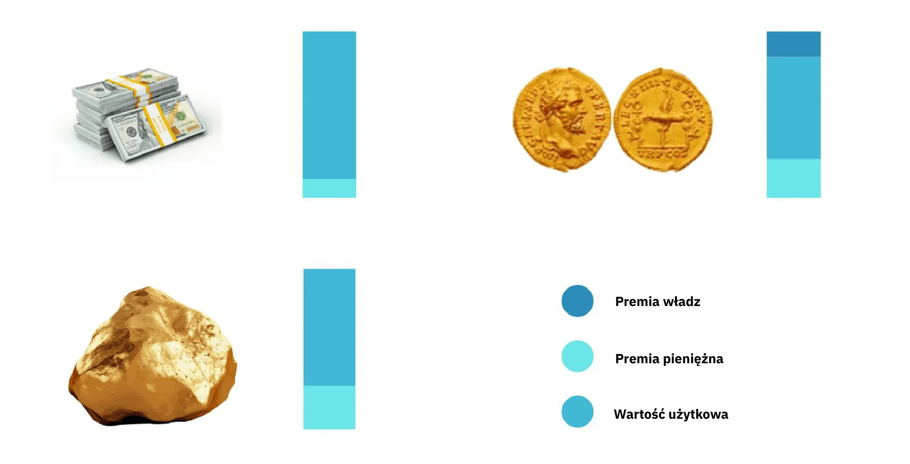

# Różne definicje pieniądza

<partId>77b7918a-8c3b-11f0-b688-6b2ab22378c9</partId>

## Pieniądze vs waluta vs monnaie vs argent vs devise

<chapterId>bf8a6d21-df88-5d23-a0a5-e9a5c1300554</chapterId>

:::video id=d9c9e7df-9db3-4a9f-801e-10d3fc7dfc22:::

### Semantyka terminów monetarnych

W tej sekcji poświęconej różnym teoriom monetarnym, a zwłaszcza definicjom pieniądza, chciałbym poczynić krótką uwagę na temat semantyki. Chciałbym zagłębić się nieco w definicje kilku słów związanych z pieniędzmi i porównać je z ich angielskimi odpowiednikami. Na przykład pieniądze, waluta, w porównaniu do monnaie, argent i devise. Wygląda to następująco.

Trochę semantyki:

Kiedy mówimy "**pieniądze**" (de la monnaie), większość ludzi pomyśli, że odnosimy się do drobnej reszty, którą otrzymujemy w zamian za transakcję. A jeśli powiemy "**waluta**" (la monnaie), ludzie prawdopodobnie pomyślą, że odnosimy się do waluty państwa. Walutą Kanady jest dolar kanadyjski. Zgadza się.

Ale co z pieniędzmi (de l'argent)? Złodziej nigdy nie powie "Daj mi całą resztę!" (złodziej może być rozczarowany otrzymaniem zwykłych monet o prawie zerowej wartości).

Nie, złodziej krzyknie: "Oddaj mi **wszystkie swoje pieniądze**". A jeśli złodziej stoi przed tobą na ulicy, koniecznie ma na myśli **banknoty** w twojej kieszeni.

Z drugiej strony, jeśli złodziej próbuje oszukać cię w bardziej wyrafinowany sposób, próbując ukraść twój majątek poprzez opróżnienie wszystkich kont bankowych, powiedzielibyśmy, że **zabierze wszystkie twoje pieniądze**. Tutaj słowo "pieniądze" odnosi się do **majątku danej osoby**.

Istnieją więc dwie definicje słowa pieniądz: gotówka (banknoty) i bogactwo.

### Currency vs monnaie vs devise

Waluta (devise) jest koniecznie walutą innego kraju, w przeciwnym razie mówimy po prostu pieniądze (monnaie). Jeśli jesteś Francuzem, powiedziałbyś: "La livre sterling est la devise du Royaume-Uni et l'euro et la monnaie de l'Europe" (Funt szterling jest walutą Wielkiej Brytanii, a euro jest walutą Europy).

Często ludzie, którzy nie zagłębili się w te problemy semantyczne, tłumacząc te terminy, będą skłonni mówić o walucie (devise), gdy jest to waluta pisana, ale nie, waluta to pieniądz (monnaie), gdy jest to waluta twojego kraju, a to devise, gdy mówimy o innych walutach. Problemem, z którym często się spotykam, jest to, że w języku angielskim istnieją dwa słowa: "pieniądz", który jest pojęciem, i "waluta", która jest tak naprawdę jednostką kraju używaną do wymiany. Możemy więc po prostu mówić o koncepcji pieniądza; to proste - to koncepcja słowa *pieniądze*; to pieniądze w ogóle. A *walutę* bardzo łatwo jest utożsamić z walutą danego kraju. Podczas gdy w języku francuskim, niestety, ludzie często mówią tak, "mais ce n'est pas une monnaie", mówiąc o bitcoinie, ponieważ nie jest to waluta kraju, ale często myślę, że zamiast tego odnoszą się do terminów waluta. Z jednej strony jest to błędne, ponieważ od czasu Salwadoru bitcoin jest walutą państwową. Faktem jest, że ludzie często mówią: *ale nie, to nie jest waluta państwa, to nie może być pieniądz*. Ale w rzeczywistości, jeśli odniesiemy się do szerszej koncepcji *pieniądza*, bitcoin idealnie pasuje do tej definicji, moim zdaniem. Po prostu w języku francuskim nie mamy dwóch słów oddzielających te dwa pojęcia. Moglibyśmy powiedzieć, że słowo argent odnosi się do waluty, ale niestety nie jest to jego dokładna definicja. *Argent* (pieniądze) odnosi się do bogactwa lub banknotów. Nie można tak naprawdę stworzyć ekwiwalentu ze słowem *pieniądze*. *Pieniądze* to tak naprawdę pojęcie waluty (monnaie).

## Definicja Saifedeana Ammousa

<chapterId>07c4ba50-168c-567a-8957-0b187ff75f97</chapterId>

:::video id=936d6d3b-6d45-468e-bc44-85fbce9b857a:::

#### Czym są pieniądze?

Pieniądze to po prostu coś, co posiadasz lub nabywasz nie po to, by ich używać lub konsumować dla nich samych, ale po to, by wymienić je później na inne dobra lub usługi, których możesz potrzebować. (Saifedean)

Pieniądz uzyskuje premię pieniężną, gdy istnieje popyt pieniężny na towar, aby odgrywać jedną lub więcej ról pieniądza.

Dobro pieniężne musi być wystarczająco rzadkie, aby premia pieniężna mogła się utrzymać (aby zapobiec dostosowaniu podaży do popytu pieniężnego).

### Premia pieniężna

W tej części poświęconej różnym definicjom waluty chciałem krótko omówić definicję Sajfedaina w The Bitcoin Standard, która zawsze była dla mnie bardzo interesująca. Kiedy ją przeczytałem, wydała mi się dość prosta. Do tej definicji dodamy również pojęcie premii pieniężnej. Jak wspomina Saifedean w swojej książce, koniecznie istnieje pojęcie niedoboru. Pytanie brzmi: czym są pieniądze?

> Pieniądze to po prostu coś, co posiadasz lub nabywasz, nie po to, by ich używać lub konsumować dla nich samych, ale po to, by wymienić je później na inne towary lub usługi, których możesz potrzebować.

Jest to więc definicja, o której wspomina Saifedean w The Bitcoin Standard. Dodałbym, że waluta (la monnaie) uzyskuje premię pieniężną, gdy istnieje popyt pieniężny na dobro, aby odegrać jedną lub więcej ról waluty. Można więc powiedzieć, że waluta, która służy jako środek przechowywania wartości, będzie miała popyt pieniężny, który da jej premię pieniężną, ponieważ ludzie chcą ją nabyć, na przykład jako środek przechowywania wartości lub środek wymiany.

### Niedobór i mechanizmy rynkowe

Myślę, że powinniśmy dodać do tego, że dobra pieniężne muszą być wystarczająco rzadkie, aby premia pieniężna mogła się utrzymać. To bardzo ważne. **Jeśli pojawia się dobro, które ma być używane jako pieniądz i widzimy, że jego cena rośnie, zwykle, jeśli dobro nie jest wystarczająco rzadkie, ludzie będą chcieli produkować go więcej, aby skorzystać z tego wzrostu wartości, gdy cena wzrośnie**. To dlatego większość towarów na rynku ma względnie stałą cenę. Gdy cena rośnie, produkcja ma tendencję do zwiększania się. Kiedy cena spada, produkcja spada. Jest to rodzaj dostosowania rynkowego. **A gdy towar jest wystarczająco rzadki, tak jak złoto, mechanizm rynkowy nie zrekompensuje zwiększonego popytu na użytek monetarny. Więc to zmienna się zmienia, to cena. Tak jak w przypadku bitcoina**. Kiedy cena bitcoina rośnie, nie produkujemy więcej bitcoinów. Więc to, co się dostosowuje, to cena. I właśnie dlatego od lat obserwujemy wzrost ceny bitcoina wraz ze wzrostem popytu na bitcoina. Ponieważ nie ma na Ziemi nikogo, kto mógłby zmienić algorytm i powiedzieć "jest większy popyt, cena rośnie, będziemy produkować więcej" **Podaż nowych bitcoinów jest z góry zaprogramowana i z góry znana**. O tym właśnie mówiłem, że dobro pieniężne musi być na tyle rzadkie, by premia pieniężna się utrzymała, a tym samym nie została wychwycona przez mechanizmy rynkowe, by podaż nie dostosowała się do nowego popytu pieniężnego.

## Środki płatnicze i wartość wyzwalająca

<chapterId>5d424039-e342-56f7-9d8b-bba9551831a9</chapterId>

:::video id=af4c0765-8111-4cb7-891b-3ee54d6e7054:::

### Środki płatnicze a środki wymiany

W tej części poświęconej różnym definicjom pieniądza proponuję, abyśmy wspólnie przyjrzeli się cytatowi z książki "Aux origines de la monnaie" (Początki pieniądza), tekstu Alaina Testarta na temat pieniądza jako środka płatniczego i wartości wyzwalającej.

*W książce Aux origines de la monnaie Alain Testart definiuje pieniądz jako środek płatniczy:*

> Funkcja środków płatniczych jest tutaj postrzegana jako odrębna od funkcji środków wymiany, o ile istnieją płatności bez wynagrodzenia, płatności, które nic nie kupują. Knies (1873: 192 i nast.) obszernie rozwija ten temat transferów towarów, które nie polegają na aktach wymiany, jak w przypadku wergeld (pieniądze krwi lub kompozycja za morderstwo) lub podatków. Carl Menger zaatakował tę czwartą funkcję w swoim artykule "Geld" z 1892 roku, powszechnie uważanym za jeden z najbardziej decydujących na ten temat. Nie będąc całkowicie zdyskredytowanym, idea funkcji środków płatniczych wydaje się być zapomniana w dzisiejszej myśli ekonomicznej, a przynajmniej odrzucona na rzecz funkcji środków wymiany.
>

> Pieniądze służą do płacenia: postrzegane w tym świetle są narzędziem wyzwolenia, które w całej swej ogólności opisuje funkcję środka płatniczego. W tym kontekście mówimy o "wyzwalającej mocy" pieniądza. Według Le Petit Robert, moc wyzwalająca to "ta, która skutkuje uwolnieniem (od zobowiązania, długu)". Według Grand Larousse, płatność wyzwalająca to każda "płatność dokonana na warunkach prawnych w taki sposób, że wierzyciel nie może zakwestionować wygaśnięcia długu". Pieniądz ma tę moc par excellence; jest to nawet to, co definiuje jego status prawnego środka płatniczego, ponieważ nikt nie może odmówić płatności dokonanej w pieniądzu, zarówno sprzedawca, jak i wierzyciel. Pieniądz jest jedynym dobrem, któremu nie można odmówić spłaty długu, niezależnie od tego, czy jest on należny kupcowi, czy urzędnikowi skarbowemu. Spośród wszystkich dóbr, tylko pieniądz posiada ten przywilej. "To właśnie ten przywilej", pisze Charles. Gide (1921 I: 443), który stanowi to, co nazywamy prawnym środkiem płatniczym.
>

> Każda wymiana polegająca na przekazaniu jednego towaru w zamian za inny lub pod warunkiem, że w zamian zostanie przekazany inny towar, nieuchronnie pociąga za sobą zobowiązanie odbiorcy do dostarczenia tego kontrahenta. Płatność jest wypełnieniem tego zobowiązania. Każda wymiana implikuje zatem płatność, ale nie każda płatność implikuje wymianę. Istnieją płatności bez kontrahenta, tj. płatności, które nie umożliwiają uzyskania innego dobra i nie są dokonywane w tym celu. Podatki pozostają tutaj wzorcowym przykładem; powinniśmy również wspomnieć o wszelkiego rodzaju grzywnach płaconych władzom publicznym oraz odszkodowaniach należnych innym osobom zgodnie z zasadą, że ten, kto wyrządza szkodę innym, musi ją naprawić.

### Płatności bez kontrahenta

Jest to wyraźna ilustracja tezy autora. W rzeczywistości rozróżnia on te dwa pojęcia. Dla niego wymiana jest zarówno transferem towarów, jak i płatnością. Płatność jest następna. Płatność może nastąpić bez wymiany. Podaje przykłady tego, jak płacenie mandatu za parkowanie lub grzywny jest tylko płatnością. Tak naprawdę nie otrzymujemy w zamian żadnej usługi. Niektórzy mogą twierdzić, że państwo wyświadcza ci usługę w zamian, usługę polegającą na wystawianiu mandatów za parkowanie. Jest całkiem jasne, że płacenie podatków jest tak naprawdę płatnością bez kontrahenta, w tym sensie, że płacenie podatków jest wymagane, nawet jeśli niekoniecznie otrzymujesz usługę. Twierdzi, że płacenie podatków jest tak naprawdę tylko płatnością; nie ma obowiązku otrzymywania usług w zamian. Rozmawiałem o tym z wieloma moimi kolegami i niekoniecznie zgadzają się z tym poglądem. Ale taka jest teza autora. Próbuje on umieścić pojęcie płatności i oddzielić je od wymiany za pomocą tych przykładów, na przykład grzywny, zapłaty podatku. Również, na przykład, posag, wyraża, że posag jest zapłatą; niekoniecznie otrzymujesz coś w zamian. Ktoś krytykujący tę propozycję może powiedzieć: "Tak, ale w zamian dostajesz żonę" Taki jest więc poziom debaty na ten temat.

Jest też wergeld, czyli pieniądze z krwi. Jest to więc tylko zapłata za rekompensatę. Mój przyjaciel Ulrich powiedziałby:

> Tak, ale w zamian otrzymasz zamknięcie tego pliku.

Popełniłeś przestępstwo, na przykład morderstwo. W tym czasie płacisz wergeld, a potem zostajesz uwolniony z tej sytuacji. Istnieje więc wyzwalająca moc. Czy dostajesz coś w zamian?" Według autora, nie. Według niektórych moich kolegów, tak.

Myślę, że w tej dyskusji możemy zobaczyć, że wergeld jest jednym z dobrych przykładów definiujących płatność. W rzeczywistości wyraźnie nie otrzymujesz nic w zamian.

## Pieniądz dłużny a pieniądz towarowy

<chapterId>4093677a-c8e8-5828-b994-15c01656186e</chapterId>

:::video id=f49cf5cc-288e-4daa-a1ff-b9de73506f4e:::

### Podstawowa debata

Nadal w kontekście tej sekcji dotyczącej różnych definicji i teorii monetarnych, przeanalizujmy razem dwie diametralnie przeciwstawne wizje: "pieniądz jest zawsze długiem" lub "pieniądz jest zawsze towarem". Z jednej strony mamy zwolenników teorii monetarnej opartej na długu, którzy twierdzą: "Nie, pieniądz jest zawsze długiem! Z drugiej strony, nasze słynne złote robaki argumentują: "Ależ nie, widzisz, pieniądz jest zawsze towarem, to zawsze złoto; wszystko inne, weksle, IOU, to tylko kredyt, a nie pieniądz".

Przeanalizujmy razem jasne podsumowanie tych teorii.

### Teoria "zawsze dług"

Oto podsumowanie teorii monetarnej znanej jako **"pieniądz dłużny "**, zgodnie z którą pieniądz jest zasadniczo formą długu:

Zgodnie z tą teorią, opracowaną w szczególności przez Alfreda Mitchella-Innesa i dalej rozwijaną przez Davida Graebera, pieniądz jest z natury uznaniem długu, wynikającym z relacji kredytowych, które historycznie poprzedzały bezpośrednią wymianę pieniężną. Zamiast wynikać z potrzeby związanej z barterem, pieniądz pojawia się jako sposób rozliczania, przenoszenia i regulowania zobowiązań społecznych lub długów między jednostkami lub grupami.

Tak więc wszystkie pieniądze krążą jako dług zaciągnięty przez jedną osobę lub instytucję wobec drugiej, poparty zaufaniem i władzą społeczną lub państwową gwarantującą jego ważność. Tak więc, według nich, kiedy posiadamy - jak już wspomniałem - kiedy posiadamy pieniądze, mamy roszczenie wobec społeczeństwa, a społeczeństwo jest nam winne dług. Pieniądze nigdy nie są zatem neutralne lub autonomiczne, ale zawsze są długiem: posiadanie pieniędzy zasadniczo oznacza posiadanie roszczenia wobec społeczeństwa lub wspólnoty gospodarczej.

Rozumowanie to zaprzecza klasycznej koncepcji pieniądza jako prostego "towaru pośredniego", a zamiast tego podkreśla centralną rolę stosunków społecznych i politycznych w tworzeniu i zarządzaniu pieniądzem.

**Moja recenzja:**

To, co niepokoi mnie w tej teorii, to fakt, że twierdzi ona, że pieniądz jest zawsze długiem, podczas gdy mamy przykłady wymiany między dwoma różnymi plemionami, które na przykład wymieniają złoto, gdzie transakcja jest ostatecznie zakończona i nie pozostaje żaden ukryty dług. Zwolennicy tej teorii często mówią nam, że te wymiany nie są wymianami pieniężnymi, ale barterem. Jak już wspomniałem, nie zgadzam się z tym. Jest to wymiana pieniężna, ponieważ złoto nie zostanie skonsumowane; zostanie użyte jako pieniądz.

### Teoria "zawsze towar"

**Zawsze towar:**

Oto jasne podsumowanie teorii monetarnej znanej jako **"pieniądz towarowy "**, w której pieniądz zawsze wyłania się jako towar, zwłaszcza złoto, które wyłania się z potrzeby możliwości handlu, towaru, który będzie ogólnie akceptowany za granicą i który jest nabywany w celach handlowych.

Zgodnie z tą teorią, opracowaną przez ekonomistów klasycznych (Adam Smith, David Ricardo) i podjętą przez Marksa, pieniądz pojawia się naturalnie jako towar wśród innych, często metal szlachetny, taki jak złoto lub srebro, który ma wewnętrzną wartość niezależną od jego roli monetarnej. Początkowo towary te są spontanicznie wybierane przez podmioty gospodarcze w celu ułatwienia handlu, dzięki ich nieodłącznym cechom (rzadkość, trwałość, podzielność i stabilność).

Pieniądz towarowy wyróżnia się fizycznym istnieniem i wartością określoną przez ilość pracy społecznie wymaganej do jego wytworzenia (jak u Marksa). Społeczeństwo używa na przykład złota nie tylko w celu uproszczenia wymiany barterowej, ale także jako jednostki rozliczeniowej, magazynu wartości i uniwersalnego środka wymiany.

W tej wizji pieniądz zawsze zachowuje realną wartość, ponieważ pozostaje powiązany z namacalnym towarem. Nawet gdy rola pieniądza staje się abstrakcyjna (bite monety, banknoty lub pieniądze biblijne), jego ważność nadal wywodzi się, bezpośrednio lub pośrednio, z odniesienia do podstawowego towaru, takiego jak złoto. Teoria ta kładzie zatem nacisk na materialne i ekonomiczne pochodzenie pieniądza, w przeciwieństwie do teorii, które uważają go za zwykłą konwencję lub dług. Zgodnie z tą teorią, każda reprezentacja pieniądza przez substytut, taki jak weksel wymienialny na złoto, byłaby kredytem.

**Moja recenzja:**

Należy zauważyć, że wizja ta przypomina teorię pieniądza towarowego, ale idzie o krok dalej. Proponują oni, by pieniądz **zawsze** był towarem. A kiedy powiemy im: "*Tak, ale możemy się zgodzić, że banknot jest pieniądzem dla tej grupy; może być poparty złotem, działa, a banknot jako taki jest pieniądzem*".

W odpowiedzi podadzą nam przykład kuponu do szatni. Powiedzą: "Tak, ale nie, kiedy masz kupon do szatni na ubranie, czy możemy nazwać kupon do kasy ubraniem?

Oczywiście, że nie, to jak potwierdzenie, roszczenie, które w istocie pozwoli ci odzyskać odzież. Ta analogia nie ma zastosowania, ponieważ kupon do szatni nie jest powszechnie akceptowaną metodą płatności. **Pieniądze nie są roszczeniem do konkretnego przedmiotu, takiego jak ubranie; to sposób, środek wymiany, środek wymiany lub ogólnie akceptowany środek płatniczy**.

Nie można więc narysować paraleli między kuponem do szatni a banknotem w walucie fiducjarnej, ponieważ kupon do szatni pozwala na uzyskanie konkretnego dobra w zamian, jest to token, który pozwala na odzyskanie dobra. Podczas gdy banknot, waluta fiducjarna, jest uniwersalnym kuponem, który umożliwia dostęp do dowolnego dobra.

Moim zdaniem oczywiście nawet pieniądz fiducjarny można uznać za pieniądz, jeśli jest za taki uważany przez ludność. I myślę, że błędem semantycznym jest upieranie się, że to nie może być pieniądz, ponieważ jest to kupon do uzyskania prawdziwego pieniądza, przynajmniej w tamtym czasie, którym było złoto.

Nie mam problemu z uznaniem złotej monety trzymanej w sejfie i banknotu reprezentującego tę złotą monetę za walutę. Dla mnie nie ma problemu z semantyką, to po prostu dwa rodzaje waluty. Jeśli się nie mylę, Mises bardzo dobrze wyjaśnia to zjawisko, mówiąc o substytutach pieniądza.

Ich wizja sprowadza się do tego, że nie można uznać złotej monety w skarbcu banku i reprezentującego ją banknotu za pieniądze w tym samym czasie. Osobiście nie widzę w tym żadnego problemu; nie widzę w tej sytuacji żadnego paradoksu. Ci, którzy wierzą, że pieniądz jest zawsze towarem, nie widzą tego tak jak ja.

**Oto przegląd koncepcji kuponu do szatni z książki *Aux origines de la monnaie*:**

*Uwaga 14: "Doskonała krytyka - doskonała, ponieważ opiera się właśnie na gruncie, na którym stawia się Knapp, czyli na gruncie prawnym - przeprowadzona przez Rista (1938: 372, przyp. 1) porównania między pieniądzem papierowym a żetonami do szatni: jeśli możemy mówić o pewnego rodzaju roszczeniu w obu przypadkach, podstawowa różnica polega na tym, że w pierwszym przypadku i tylko w pierwszym przypadku jest to roszczenie bez konkretnego przedmiotu

Ponadto, na temat **roszczenia**, ten sam autor zauważa, co następuje:

> Bastiat może sobie wyobrazić kupon dla całego społeczeństwa przedstawiony jako "ogromny bazar", ale ten mały dodatek, to pozornie niewinne rozszerzenie, jest całą różnicą między kredytem a pieniądzem. Pieniądze nie są roszczeniem do konkretnego sklepu. Nie ma czegoś takiego jak anonimowe roszczenie. Ale anonimowość, która charakteryzuje pieniądze, a zatem ich ogólność, jest tym, co czyni je tak potężnymi. Pieniądz nie jest podobny do kredytu, a tym bardziej nie można go do niego w żaden sposób zredukować. **Pieniądze to znacznie więcej niż kredyt

**Paradoks: pieniądz dłużny kontra pieniądz towarowy**

Paradoks, który najlepiej ilustruje głęboką dychotomię między teorią pieniądza dłużnego a teorią pieniądza towarowego, dotyczy pytania, czy złoto jest dziś walutą.

Z jednej strony, teoria pieniądza dłużnego definiuje pieniądz przede wszystkim jako pośrednik wymiany lub środek płatniczy, który jest powszechnie akceptowany, a nawet narzucany przez władze publiczne. Z tej perspektywy złoto nie jest już walutą, ponieważ nie jest powszechnie używane ani akceptowane jako powszechny środek wymiany.

Z drugiej strony, teoria pieniądza towarowego postrzega pieniądz jako namacalny towar, spontanicznie wybrany przez społeczeństwo ze względu na jego nieodłączne cechy (rzadkość, trwałość, podzielność itp.). Zgodnie z tym podejściem złoto pozostaje prawdziwą uniwersalną walutą, a wszystkie inne formy pieniądza są zasadniczo niczym więcej niż kredytem opartym na zaufaniu.

Ten paradoks wyraźnie pokazuje przepaść między tymi dwiema koncepcjami monetarnymi: dla pierwszej złoto nie jest już walutą; dla drugiej, wręcz przeciwnie, pozostaje jedyną prawdziwą istniejącą walutą.

## Nowoczesna teoria monetarna

<chapterId>8efc29af-3193-5d97-ad9f-e608b32924ff</chapterId>

:::video id=f8127cb7-46a1-468c-bbb5-97bf0a8b8837:::

### Zasady współczesnej teorii monetarnej

Na zakończenie tej sekcji poświęconej różnym teoriom monetarnym, porozmawiajmy o cudownym dziecku teorii monetarnych, podziwianym przez wielu współczesnych ekonomistów pracujących dla banków centralnych i nazwanym nowoczesną teorią monetarną, często znaną jako MMT.

**Nowoczesna Teoria Monetarna (MMT)** jest podejściem ekonomicznym, które utrzymuje, że państwu posiadającemu własną suwerenną walutę (jak USA, Kanada czy Japonia) nigdy nie zabraknie pieniędzy, ponieważ zawsze może wyemitować więcej pieniędzy, aby sfinansować swoje wydatki. Zgodnie z tą teorią:

- Pieniądze są tworem państwa, a nie ograniczonym zasobem**

- Podatki i pożyczki nie są wykorzystywane bezpośrednio do finansowania wydatków publicznych, ale raczej do regulowania inflacji, wpływania na zachowania gospodarcze i utrzymywania popytu na walutę krajową *

- Prawdziwym ograniczeniem wydatków rządowych jest inflacja, a nie deficyt budżetowy czy dług publiczny.

- Jeśli wykreowane pieniądze zostaną skierowane do sektorów, które mogą je wchłonąć, nie będzie również inflacji.

- Rząd musi zatem dostosować swoje wydatki do rzeczywistych dostępnych zasobów (siły roboczej, zdolności przemysłowych, zasobów naturalnych), aby uniknąć nadmiernej inflacji.

### Rola podatków w MMT

Tutaj znajdziesz słynną odpowiedź dla wszystkich tych, którzy mówią: "Tak, ale skoro możemy drukować pieniądze, to dlaczego płacimy podatki?" Cóż, MMT ma właściwą odpowiedź na ten pomysł. Prawdą jest, że w systemie fiducjarnym, w nowoczesnym systemie, technicznie rzecz biorąc, nie ma nic, co ograniczałoby kreację pieniądza, poza inflacją. Sugerują jednak, że po pierwsze, opodatkowanie jest konieczne do ograniczenia inflacji, ponieważ usunie pieniądze z gospodarki. Tak więc, jeśli nie będziemy mieli podatków, aby to zrekompensować, cała ta kreacja pieniądza może ostatecznie doprowadzić do inflacji. Argumentują, że podatki są dosłownie sposobem na usunięcie pieniędzy z systemu w celu ograniczenia inflacji.

Jeśli chodzi o pieniądze inwestowane w sektory, które mogą je wchłonąć, możemy przytoczyć przykład Stanów Zjednoczonych, które przekazują biliony dolarów przemysłowi wojskowemu, co nie powoduje inflacji, ponieważ przemysł wojskowy, kompleks wojskowo-przemysłowy, jest w stanie doskonale wchłonąć te biliony dolarów.

Z drugiej strony, jeśli chcesz zbudować więcej dróg, a istnieje limit zasobów i wykonawców, którzy mogą je wyprodukować, podwojenie budżetu na drogi z konieczności spowoduje efekt niedoboru siły roboczej, która może je stworzyć. Tak więc cena wzrośnie w wyniku działania sił rynkowych, podaży i popytu. Jeśli nasi wszechwiedzący przywódcy wiedzą, gdzie umieścić pieniądze, technicznie rzecz biorąc, nie powinno to powodować inflacji. Odpowiedziałbym, że w praktyce jest całkiem jasne, że powoduje inflację.

Podsumowując, według MMT państwo może wykorzystać swoją zdolność do tworzenia pieniądza w celu osiągnięcia pełnego zatrudnienia i finansowania inwestycji społecznych i ekologicznych, jednocześnie kontrolując inflację poprzez odpowiednią politykę fiskalną. Często celem ekonomistów keynesowskich, innej szkoły myśli ekonomicznej, jest zarządzanie bezrobociem poprzez zarządzanie stopami procentowymi oraz finansowanie inwestycji społecznych i ekologicznych przy jednoczesnym kontrolowaniu inflacji poprzez odpowiednią politykę fiskalną.

### Przegląd MMT

Teoria ta ma zastosowanie tylko do garstki krajów (patrz tweet Stephanie Kelton), które cieszą się prawdziwą suwerennością monetarną, tj. mogą zaciągać długi we własnej walucie. Teoria ta jest trudna do zastosowania w przypadku gospodarek zależnych od importu, które muszą utrzymywać międzynarodowe zaufanie do swojej waluty.

A czym jest prawdziwa suwerenność monetarna? Oznacza to możliwość zaciągania długu we własnej walucie. Musisz być w stanie wypracować nadwyżkę handlową, aby mieć wystarczające rezerwy walutowe, wystarczającą ilość waluty obcej, aby nie musieć gromadzić pieniędzy w walucie obcej, aby móc importować towary. Dotyczy to kilku krajów.

Poniżej znajduje się tweet Stephanie Kelton, która jest swego rodzaju plakatem tego ruchu. Napisała ona książkę zatytułowaną "The Deficit Myth". W tweecie pisze, że różnym krajom, takim jak Stany Zjednoczone, Japonia, Kanada, Australia, Wielka Brytania, nie może zabraknąć pieniędzy.

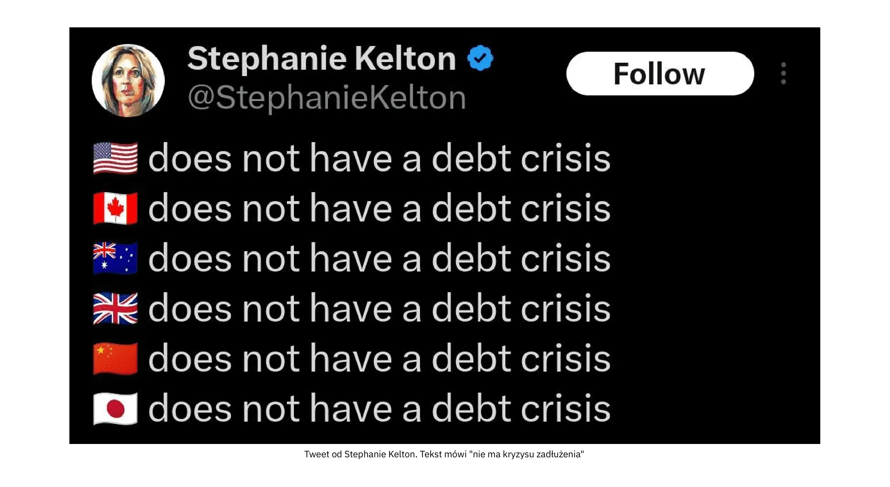

Co dziwne, wymienia tylko sześć krajów? Dlaczego? Ponieważ mają one prawdziwą suwerenność monetarną. Ale na Ziemi jest około 200 krajów i nie wszystkie z nich mają suwerenność monetarną. Tak więc moja krytyka tej teorii, poza tym, że jest nieco dziwna i niefunkcjonalna, polega na tym, że działa ona tylko w przypadku kilku krajów, które cieszą się prawdziwą suwerennością monetarną, tych, które mogą emitować bony skarbowe we własnej walucie. W pewnym stopniu działa to na szkodę reszty świata. Tworząc tę walutę, to tak, jakby eksportowali swoją inflację gdzie indziej, podobnie jak Stany Zjednoczone robiły to ze swoimi wygórowanymi przywilejami przez dziesięciolecia. Przypomina to formę kolonializmu monetarnego, gdzie kraje, które mają globalne zaufanie i popyt na swoją walutę, mogą drukować tyle pieniędzy, ile chcą, bez ponoszenia znacznej inflacji, często dlatego, że eksportują tę inflację.

Teoria ta jest trudna do zastosowania w przypadku gospodarek zależnych od importu, które muszą utrzymać międzynarodowe zaufanie do swojej waluty.

Teoria ta wymaga również pewnego poziomu scentralizowanego planowania gospodarki, zwłaszcza w celu zapewnienia większej kontroli nad realnymi zasobami (pracownikami, surowcami, zdolnościami przemysłowymi) i zarządzania inflacją.

# Upadek i odrodzenie pieniądza

<partId>87a34ca9-782b-5ade-b51a-400f88ed7b0c</partId>

## Greckie monety

<chapterId>7714195f-74ce-5f8c-be5f-59302d39fff4</chapterId>

:::video id=8e5c3091-0910-471b-8d4b-0dc6e9afa656:::

### Tło i kontekst

Zanim zaczniemy, oto tło historyczne:

**Tło historyczne:**

**Rzymianie nazywali Greków "Graeci", a Grecję "Graecia"

**Grecy nazywali siebie "Hellenami", a swój kraj "Hellas"

**Homer** (urodzony około VIII wieku p.n.e.)

Legendarny grecki poeta, przypuszczalnie autor *Iliady* i *Odysei*.

Około 750 r. p.n.e.: Likurg**, mityczny prawodawca Sparty, ustanowił spartańską konstytucję opartą na dyscyplinie wojskowej i prostocie.

**Numa Pompiliusz** (753-673 p.n.e.)

Drugi król Rzymu, znany z nadania Rzymowi pierwszych instytucji religijnych i prawnych.

**Dracon**, ateński prawodawca (VII w. p.n.e.), słynący z niezwykle surowych praw, stąd określenie "drakoński".

**594 p.n.e.: Solon** zostaje prawodawcą w Atenach i radykalnie reformuje ateńskie społeczeństwo, w szczególności poprzez zniesienie niewolnictwa za długi.

**776 P.N.E: Starożytne Igrzyska Olimpijskie**

Pierwsze regularne igrzyska sportowe odbywały się w Olimpii co cztery lata, gromadząc greckie miasta.

**Pythagoras** (ok. 570-495 p.n.e.)

Grecki filozof i matematyk, znany z twierdzenia o trójkącie prostokątnym.

**Ksenofanes z Kolofonu** (ok. 570-478 p.n.e.)

Filozof przedsokratejski znany z krytyki tradycyjnego greckiego politeizmu.

**490 p.n.e.: Bitwa pod Maratonem**

Ateńczycy zwycięsko odparli perską inwazję, wyznaczając decydujący punkt zwrotny dla greckiej cywilizacji.

**Herodot** (ok. 484-425 p.n.e.), nazywany "ojcem historii", napisał obszerne dzieło opisujące wojny perskie, w tym greckie zwycięstwo nad Kserksesem w 480 r. p.n.e..

**Sokrates** (470-399 p.n.e.)

Ateński filozof znany ze swojej metody dialektycznej oraz nauczania etyki i samowiedzy.

**Arystofanes** (ok. 446-386 p.n.e.)

Ateński dramaturg, znany ze swoich satyrycznych komedii, takich jak *Żaby*.

**Sophocles** (V wiek p.n.e.), w swojej sztuce *Antigone*, krytykuje pieniądze jako źródło moralnego i politycznego zepsucia, poprzez tyrana Creona.

**Plato** (ok. 428-348 p.n.e.)

Grecki filozof, uczeń Sokratesa, założyciel Akademii, autor *Republiki*.

**431-404 P.N.E: Wojna peloponeska**

Poważny konflikt między Atenami a Spartą, zakończony porażką Aten.

**431 P.N.E.**: Ateny finansują wojnę peloponeską, rozcieńczając swoje złote i srebrne monety, aby zwiększyć ich ilość w obiegu, powodując inflację.

**Xenophon** (ok. 430-355 p.n.e.)

Ateński pisarz, filozof i generał, uczeń Sokratesa, autor *Anabasis*.

**414 P.N.E.**: Ateny zaczynają przegrywać wojnę peloponeską po katastrofalnej wyprawie na Sycylię.

**405 P.N.E: Arystofanes**, w swojej sztuce *Żaby*, wyraźnie opisuje dewaluację srebrnej drachmy i pojawienie się gorszych monet z brązu w Atenach, ilustrując zasadę znaną dziś jako "Prawo Greshama".

**404 P.N.E.**: Ateny kapitulują po długim oblężeniu przez Spartę.

**Arystoteles** (384-322 p.n.e.)

Główny filozof grecki, uczeń Platona, założyciel Liceum, znany z prac z zakresu logiki, biologii i filozofii politycznej.

**327 P.N.E.**: Aleksander Wielki podbija Persepolis i wschodnie prowincje imperium perskiego, znacznie powiększając swoje imperium.

**323 P.N.E.**: Aleksander zmarł w Babilonie bez wyraźnego spadkobiercy, co wywołało wojny między jego generałami (diadochami) o podział imperium.

**Archimedes** (ok. 287-212 p.n.e.)

Grecki matematyk, fizyk i wynalazca, znany ze swoich odkryć w dziedzinie geometrii i mechaniki.

**196 p.n.e.: Kamień z Rosetty** został wyryty za panowania faraona Ptolemeusza V, umożliwiając późniejsze odszyfrowanie egipskich hieroglifów.

**192-188 P.N.E: Wojna Romano-Seleucydów**

Rzym pokonał imperium Seleucydów pod wodzą Antiochosa III, umacniając swoje wpływy w Grecji i Azji Mniejszej.

**146 p.n.e.: Bitwa pod Koryntem**

Rzymianie zniszczyli greckie miasto Korynt, oznaczając koniec greckiej niezależności politycznej i stopniową integrację Grecji ze światem rzymskim.

W tej sekcji dotyczącej starożytności, upadku Rzymu i średniowiecza zaczniemy od sekcji poświęconej greckim monetom.

Historia monet w starożytnej Grecji rozpoczęła się około 600 r. p.n.e., kiedy to greckie miasta szybko przyjęły innowacje z Lidii w Azji Mniejszej, początkowo używając elektrum, a później srebra. Pierwsze greckie monety zostały wybite na wyspie Egina, przedstawiając żółwia morskiego lub lądowego, ale to ateńska drachma, ozdobiona Ateną i sową, stała się symbolem monetarnym par excellence od V wieku p.n.e., w dużej mierze dominując w handlu międzynarodowym w tym czasie.

Mam to szczęście, że posiadam kopię greckiej drachmy z tamtego okresu ze słynną sową i postacią na odwrocie. To tetradrachma, która była większa niż zwykła drachma.

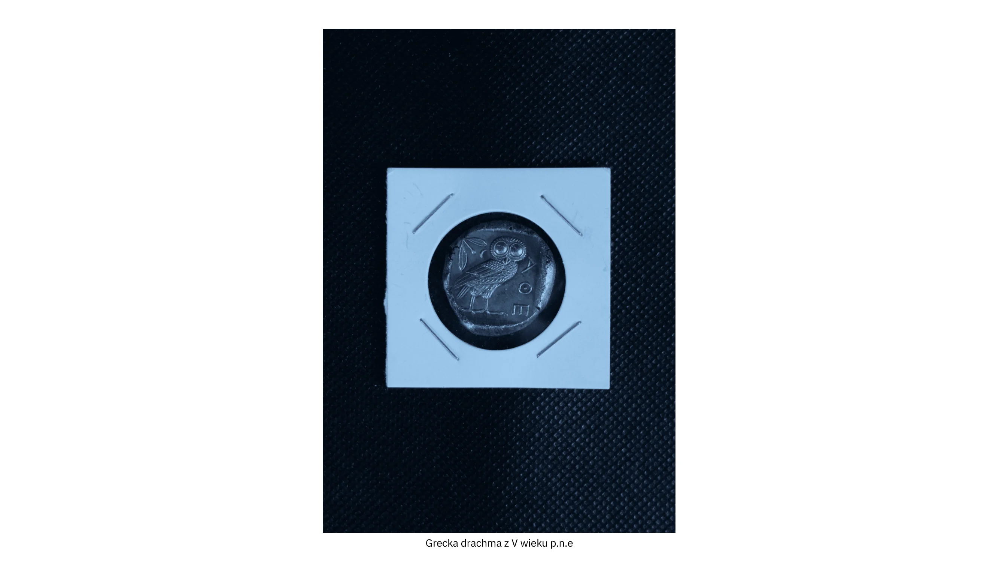

Każde greckie miasto miało swój własny stosunek do pieniądza. W Atenach waluta była głęboko powiązana z władzą polityczną i gospodarczą. Słynny ateński dekret z końca V wieku p.n.e. narzucał wyłączne używanie ateńskiej waluty na sprzymierzonych terytoriach, wzmacniając w ten sposób hegemonię gospodarczą Aten. Ateny zgromadziły również duże rezerwy złota na wypadek sytuacji kryzysowych, które były przechowywane na Akropolu, być może jako symbol ich ostrożności ekonomicznej. Dla kontrastu, Sparta, miasto wojskowe o rygorystycznych wartościach, zdecydowała się poważnie ograniczyć użycie pieniądza, zabraniając swoim obywatelom posiadania złotych lub srebrnych monet. Sparta wolała używać ciężkich żelaznych sztab, aby zniechęcić do handlu zagranicznego i utrzymać spójność społeczną.

Wojny były często finansowane poprzez manipulacje walutowe. Podczas wojny peloponeskiej (431-404 p.n.e.) Ateny uciekły się do drastycznej dewaluacji, aby zapłacić swoim żołnierzom. Pozbawione dostępu do swoich kopalni srebra przez spartańską okupację Decelii w 413 r. p.n.e., Ateny musiały w pośpiechu przetopić złote posągi, aby wybić nowe monety w 407/406 r. p.n.e.. Następnie, w 406/405 r. p.n.e., stworzyła monety z brązu pokryte srebrem, powodując kryzys monetarny zilustrowany przez **Arystofanesa**, który już przywołuje to, co dziś znane jest jako Prawo Greshama: zły pieniądz wypiera dobry pieniądz. Ta awaryjna waluta została szybko zdemonizowana po wojnie, aby przywrócić zaufanie do ateńskiej monety.

Koniec okresu klasycznego naznaczony był powstaniem Macedonii pod rządami Filipa II i jego syna Aleksandra Wielkiego, co głęboko zachwiało grecką równowagą monetarną. Dzięki ogromnym kopalniom złota i srebra na górze Pangea, Filip II wyprodukował mnóstwo pieniędzy na sfinansowanie swoich kampanii wojskowych i politycznych, ustanawiając prosty i praktyczny standard złota i srebra (10:1). Jego złote statuetki, świętujące zwycięstwo na igrzyskach olimpijskich, krążyły aż do Europy Zachodniej, docierając nawet do Anglii. Aleksander kontynuował tę politykę monetarną, szeroko rozpowszechniając **drachmę attycką** podczas swoich podbojów na Wschodzie, aż do Indii. Ten masowy obieg monet oznaczał początek ery hellenistycznej, kiedy to wizerunek władców stopniowo zastępował wizerunek bóstw na monetach. Ta innowacja umożliwiła pokoleniom hellenistycznych monarchów promowanie samych siebie, spychając tradycyjnych bogów do drugorzędnej roli na rewersie ich monet.

Po śmierci Aleksandra w 323 r. p.n.e. jego generałowie podzielili jego ogromne imperium, ustanawiając dynastie w Egipcie (Ptolemeusze), Syrii (Seleucydzi) i innych krajach. Te hellenistyczne królestwa przyjęły różne systemy monetarne: Ptolemeusze narzucili zamknięty system monetarny, aby kontrolować obieg pieniądza, woląc używać zboża jako wewnętrznej waluty, aby oszczędzać metale szlachetne na zewnętrzne wydatki wojskowe. W tym samym czasie Rodos stało się głównym ośrodkiem handlowym, zanim zostało osłabione ekonomicznie przez Rzymian, którzy ustanowili Delos jako wolny port w 167 r. p.n.e..

Pieniądze odgrywały kluczową rolę w wynagradzaniu najemników. Żołnierze Aleksandra codziennie otrzymywali srebrne drachmy.

Kawaleria, elita wysoce wyspecjalizowanej armii Aleksandra, otrzymywała średnio dwie drachmy dziennie, piechur jedną drachmę, a zwykły najemnik dwie trzecie drachmy, czyli dwukrotnie więcej niż zwykły robotnik.

Podczas wojny peloponeskiej wypłacono również znaczne sumy żołnierzom: ponad 1200 talentów na stłumienie buntu na Samos i ponad 2000 talentów na oblężenie Potidei.

Do czasu, gdy armia ta w pełni zaangażowała się w Azji Mniejszej, całkowity koszt wynosił około dwudziestu talentów dziennie, czyli około pół tony srebra lub 120 000 drachm.

Greckie monety odgrywały również ważną rolę kulturową, ponieważ każde miasto starało się potwierdzić swoją tożsamość, bijąc własne monety z lokalnymi lub mitologicznymi symbolami. Na przykład Herakliusz przedstawiał Heraklesa (Herkulesa) walczącego z lwem, podczas gdy Cyrena pokazywała słynną roślinę leczniczą silphium.

Wreszcie, pomimo swojej różnorodności i regionalnych wahań, klasyczne greckie i hellenistyczne monety pozostawiły trwały ślad w historii gospodarczej i kulturowej świata śródziemnomorskiego, głęboko wpływając na późniejsze systemy monetarne aż do Rzymu, który stopniowo przyjmował i rozwijał greckie koncepcje ekonomiczne, aby zbudować własną imperialną gospodarkę.

## Wpływ waluty w Grecji

<chapterId>3a5e6c7d-699c-5567-87cd-3374c49d55a9</chapterId>

:::video id=0c79a59c-e179-4893-a414-1b8de0930eb9:::

### Ateny i kontrast ze Spartą

Opozycja między Atenami a Spartą w okresie klasycznej Grecji ujawnia dwa radykalnie odmienne modele organizacji politycznej i gospodarczej. Podczas gdy Sparta odrzuciła metaliczny pieniądz na rzecz samowystarczalnego systemu opartego na zaufaniu obywatelskim, Ateny w pełni przyjęły tę technologię, aby zbudować i utrzymać swoje imperium morskie.

### Pieniężna konieczność potęgi morskiej

Imperium Ateńskie, pomimo swojej wspaniałej nazwy, pozostawało geograficznie skromne - zasadniczo Ateny i miasta Morza Egejskiego. Jego potęga opierała się na Lidze Delos, sojuszu wojskowym zdominowanym przez Ateny jako hegemona. Ta imperialna struktura wymagała zunifikowanego instrumentu ekonomicznego: ateńskiej srebrnej monety.

Utrzymanie floty było sednem tej pieniężnej konieczności. Pojedyncza ateńska trirema kosztowała od jednego do dwóch talentów srebra - była to znaczna suma. Przy kilkuset statkach do utrzymania, Ateny potrzebowały skutecznego systemu podatkowego. Waluta stała się niezbędnym narzędziem do zbierania danin od miast wasalnych i finansowania sił morskich, które gwarantowały spójność imperium.

### Narzucanie pieniądza jako narzędzie dominacji

Ateny narzuciły swoją srebrną walutę wszystkim członkom Ligi Delos. Ta standaryzacja monetarna służyła kilku strategicznym celom. Po pierwsze, ułatwiła pobieranie danin poprzez stworzenie wspólnej jednostki rozliczeniowej. Po drugie, wzmocniła zależność ekonomiczną miast wasalnych od Aten. Wreszcie, symbolicznie rzutowała ateńską władzę na całe imperium morskie.

Ta polityka monetarna ostro kontrastuje z modelem spartańskim. Sparta, potęga lądowa, mogła polegać na pracy peloponeskich helotów (niewolników). Jej zamknięty, skoncentrowany na mieście system gospodarczy nie wymagał wyrafinowanych instrumentów monetarnych. Obywatele-żołnierze mieszkali razem, dzielili wspólne posiłki i nie potrzebowali pieniędzy do codziennej wymiany.

### Waluta jako narzędzie handlu morskiego

Morski charakter ateńskiego imperium oznaczał, że musiało ono być otwarte na handel. W przeciwieństwie do zamkniętej w sobie Sparty, Ateny musiały handlować ze światem zewnętrznym, aby przetrwać i zapewnić sobie dobrobyt. Waluta stała się niezbędnym instrumentem handlu śródziemnomorskiego.

Ta zewnętrzna orientacja stworzyła cnotliwy krąg: handel generował przychody, te przychody finansowały flotę, flota chroniła szlaki handlowe i utrzymywała imperium, a imperium narzuciło ateńską walutę, która ułatwiała handel. Waluta nie była już tylko środkiem wymiany, ale stała się filarem imperialnej strategii.

### Granice władzy monetarnej

Pomimo tego ekonomicznego wyrafinowania, ateńska potęga monetarna pokazała swoje granice podczas wojny peloponeskiej. W obliczu spartańskich sił lądowych przewaga morska i finansowa Aten nie była wystarczająca. Kosztowne wyprawy, takie jak katastrofalna kampania syrakuzańska na Sycylii, wyczerpały zasoby finansowe, nie przynosząc decydującego zwycięstwa.

Historia pokazuje, że waluta, choć jest potężnym narzędziem projekcji siły, nie gwarantuje dominacji militarnej. Sparta, bez metalowej waluty, ale z niezwykłą spójnością społeczną, ostatecznie zwyciężyła nad ateńskim imperium monetarnym.

### Dwa modele, dwa przeznaczenia

Opozycja między Atenami a Spartą ilustruje dwa podstawowe podejścia do organizacji społecznej i gospodarczej. Ateny reprezentują otwarty, komercyjny, zmonetyzowany model - prekursora współczesnych imperiów morskich. Sparta ucieleśnia zamknięty, autarkiczny model, oparty raczej na zaufaniu obywatelskim niż na instrumentach pieniężnych.

Te dwa systemy pokazują, że przyjęcie waluty jest ściśle związane z wybranym modelem politycznym i gospodarczym. Dla potęgi morskiej i handlowej, takiej jak Ateny, pieniądz stał się niezbędny. Dla zamkniętego społeczeństwa wojowników, takiego jak Sparta, stanowił on zagrożenie dla porządku społecznego. Ta starożytna dychotomia nadal stanowi podstawę debat na temat roli pieniądza w organizacji społeczeństw.

## Republika Rzymska

<chapterId>0bc80983-33e1-5881-85bb-7c22f3144a9a</chapterId>

:::video id=dc05ca97-d29c-4679-bfeb-912c47d86ce2:::

### Historia Republiki Rzymskiej

- 753 - 509 p.n.e.: Królestwo Rzymskie**
- 753 P.N.E: Założenie Rzymu** (tradycyjnie przypisywane Romulusowi).
- 509 - 27 P.N.E: Republika Rzymska**, Rzym staje się republiką rządzoną przez wybierany senat i konsulów.
- 280 - 275 P.N.E: Wojna pyrrusowa**. Pyrrus, król Epiru, walczy z Rzymianami w południowej Italii, odnosząc kosztowne zwycięstwa ("pyrrusowe zwycięstwa").
- 264 - 146 P.N.E: Wojny punickie**. Poważny konflikt między Rzymem a Kartaginą o dominację w zachodniej części basenu Morza Śródziemnego.
- Hannibal (247 - ok. 181 p.n.e.)**. Legendarny kartagiński generał, znany z przekroczenia Alp ze swoją armią i słoniami, aby zaatakować Rzym podczas drugiej wojny punickiej.
- 146 p.n.e.: Bitwa pod Koryntem**. Rzym niszczy greckie miasto Korynt i narzuca ostateczną dominację nad Grecją kontynentalną.
- 91 - 87 p.n.e.: Wojna społeczna**. Bunt italskich sojuszników Rzymu domagających się rzymskiego obywatelstwa, który ostatecznie doprowadził do ich pełnej integracji z obywatelami.
- 64 p.n.e.: Koniec oporu Seleucydów**. Rzym definitywnie eliminuje wpływy Seleucydów w Syrii, umacniając swoją pozycję we wschodniej części basenu Morza Śródziemnego.
- 55 P.N.E: Juliusz Cezar podbija Europę Środkową i Zachodnią**. Juliusz Cezar rozszerza rzymską dominację nad Galią (dzisiejsza Francja) i wkracza do Germanii i Bretanii.
- 43 P.N.E: Powstanie Drugiego Triumwiratu**. Polityczny sojusz między Oktawianem (później Augustem), Markiem Antoniuszem i Lepidusem, mający na celu ustabilizowanie sytuacji w Rzymie po zabójstwie Cezara.
- 27 p.n.e.: Początek Pax Romana**. Okres politycznej stabilności i dobrobytu za panowania Augusta, wyznaczający początek Imperium Rzymskiego.

### Późne początki monetarne Rzymu

W tej sekcji poświęconej starożytności zwrócimy teraz uwagę na Republikę Rzymską. Historia monetarna Rzymu rozpoczęła się znacznie później niż Greków i Persów. Założony w 753 r. p.n.e. Rzym czekał prawie cztery wieki, zanim naprawdę przyjął monetę. W tym długim okresie Rzymianie używali prymitywnego systemu wymiany z nieregularnymi kawałkami brązu zwanymi aes rude, wymagającymi precyzyjnego ważenia przy każdej transakcji. Dopiero pod koniec IV wieku p.n.e., pod wpływem greckim i etruskim, Rzym zaczął emitować swoje pierwsze monety, zwłaszcza odlewane z brązu, jak w Chinach, aes grave, charakterystyczne dla rzymskiej wymiany aż do **drugiej wojny punickiej**.

### Wpływy greckie i pierwsze srebrne monety

Decydujące spotkanie z Grekami z południowych Włoch naprawdę wprowadziło Rzymian do bicia srebrnych monet. Około 280 r. p.n.e. Rzym zaczął produkować własne srebrne monety na wzór greckich didrachm. Pierwsza regularna emisja srebrnych monet w Rzymie pochodzi dokładnie z 269 r. p.n.e. i przedstawia legendarnych bliźniaków Romulusa i Remusa ssących wilczycę, symbol, który stał się ikoną.

W rzeczywistości wiele rzymskich monet z okresu republiki przedstawia mity założycielskie. Moją można zobaczyć poniżej: to wspaniała, prawdziwa moneta króla Tacjusza. Ilustruje ona mit o porwaniu kobiet przez Sabinów. Tacjusz był królem tego regionu, a mit założycielski opowiada o tym, jak Rzymianie uprowadzili kobiety od Sabinów, ludności, która mieszkała w pobliżu. Następnie król Tacjusz został współkrólem Romulusa, jednego z założycieli Rzymu.

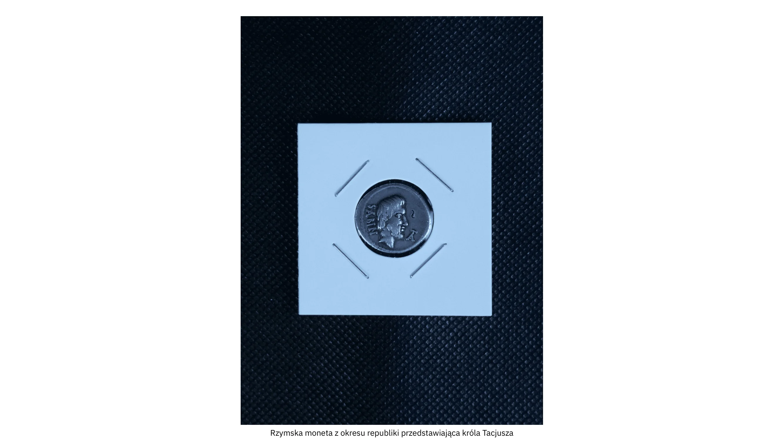

### Pochodzenie słowa "moneta" i świątynia Junony Monety

Termin "moneta" wywodzi się ze świątyni Junony Monety w Rzymie. Legenda głosi, że podczas inwazji galijskiej w 390 r. p.n.e. święte gęsi na Kapitolu ostrzegły Rzymian o zbliżającym się niebezpieczeństwie. Aby podziękować bogini Junonie, obrończyni Kapitolu, wzniesiono na jej cześć świątynię, która wkrótce stała się mennicą dla rzymskich monet.

### Wojny punickie i kryzysy walutowe

Konflikty zbrojne miały znaczący wpływ na rzymski rozwój monetarny. Podczas drugiej wojny punickiej (218-201 p.n.e.) przeciwko Kartaginie, Rzym stanął w obliczu poważnych trudności finansowych w obliczu inwazji Hannibala. Aby złagodzić te pilne potrzeby, Rzym po raz pierwszy uciekł się do wyjątkowej emisji złotych monet, a także do znacznej dewaluacji swoich srebrnych monet, z początkowej czystości 97% do około 89%. Waga monet z brązu (aes) również drastycznie spadła, tracąc prawie 80% w ciągu sześciu lat.

Tutaj możemy powrócić do koncepcji, którą wcześniej omawialiśmy w odniesieniu do Greków topiących metale szlachetne przechowywane w świątyniach, aby pomóc złagodzić kryzysy gospodarcze. A mówiąc o **Kartaginie**, poniżej możesz podziwiać prawdziwą kartagińską monetę z mojej kolekcji. Te kartagińskie monety przedstawiały palmę po jednej stronie i konia po drugiej. Na tej monecie koń nie jest zbyt rozpoznawalny, ponieważ jest bardzo zużyty.

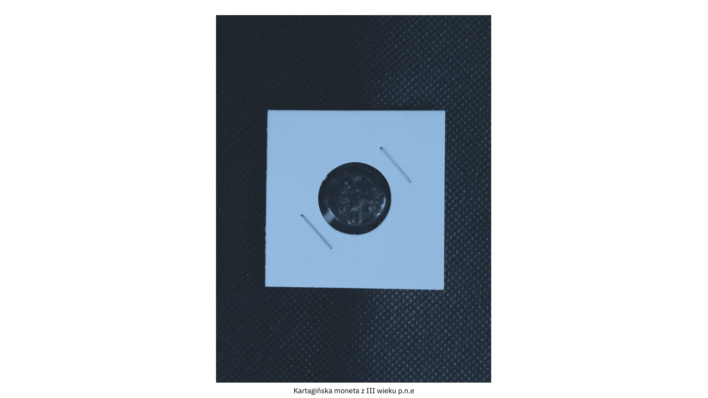

W rezultacie waga monet z brązu, znanych jako aes, również drastycznie spadła, tracąc prawie 80% w ciągu sześciu lat. Tak więc waga tych brązowych monet, które nie były metalem szlachetnym i były używane w codziennym handlu, znacznie spadła, co było oznaką dewaluacji monetarnej z powodu tych wojen.

### Srebrny denar i stabilność monetarna

To właśnie w tym krytycznym kontekście Rzym wprowadził słynnego srebrnego denara około 212 r. p.n.e.. Reforma ta zapewniła niezwykłą stabilność monetarną, a denar pozostał dominującą walutą przez prawie 450 lat. Rzym zawdzięcza tę stabilność rygorystycznemu zarządzaniu, pomimo poważnego przeszacowania w 146 r. p.n.e. i znacznej produkcji w celu sfinansowania ogromnych armii, zwłaszcza podczas wojen punickich, społecznych (91-87 p.n.e.) i macedońskich. Dla przykładu, utrzymanie jednego rzymskiego legionu kosztowało około 1,5 miliona denarów rocznie, co ilustruje skalę potrzeb pieniężnych.

Poza granicami Rzymu wojny doprowadziły do znacznej dewaluacji w regionach znajdujących się pod wpływami rzymskimi. W punickiej Kartaginie czystość elektrum drastycznie spadła, z 98% złota w IV wieku do zaledwie 30% podczas II wojny punickiej, podczas gdy czystość srebrnych monet spadła do 18%.

### Ewolucja motywów monetarnych

Wraz z ekspansją Rzymu ewoluował również charakter monet: początkowo anonimowe i patriotyczne, monety stopniowo przyjmowały spersonalizowane projekty przedstawiające potężne rodziny mincerzy (tych, którzy bili monety). Ta zmiana wyraźnie symbolizuje polityczne przemiany późnej Republiki Rzymskiej.

Wreszcie, podczas gdy Rzym zdominował ekonomicznie świat śródziemnomorski, zachował pewną prostotę w środkach płatniczych: nie opracowano żadnej realnej formy transferu pieniężnego innej niż bezpośrednia wymiana monet, z wyjątkiem transferów podatkowych i prywatnych kredytów zarezerwowanych dla elity.

## Imperium Romanum

<chapterId>2dc44e50-112a-5abf-97ae-8e0a9ecda989</chapterId>

:::video id=f8d6f3d6-9ee4-4504-888e-4f12b3f20489:::

**Tło historyczne:**

**Księstwo** było formą rządów cesarskich w Imperium Rzymskim od początku panowania Augusta w 27 r. p.n.e. do końca kryzysu trzeciego wieku w 284 r. n.e.

**27 p.n.e.: Początek Pax Romana**

Okres stabilności politycznej i dobrobytu za panowania Augusta, wyznaczający początek Imperium Rzymskiego.

**August (30 p.n.e. do 14 n.e.)** radykalnie zreformował rzymski system monetarny, ustanawiając trwały i stabilny standard monety cesarskiej.

**August był również jednym z pierwszych uznanych kolekcjonerów** starożytnych monet i skamieniałości.

**54 N.E. - 68 N.E: Neron**

Kontrowersyjny cesarz rzymski, znany z tyranii, prześladowań i katastrofalnego zarządzania po spaleniu Rzymu.

**64 N.E: Wielki pożar Rzymu**

Poważny pożar pustoszy znaczną część miasta; Nero zostaje oskarżony o odpowiedzialność.

**69 AD: Rok Czterech Cesarzy**

Chaotyczny okres z czterema cesarzami w krótkich odstępach czasu (Galba, Otho, Witeliusz, Wespazjan).

**79 N.E: Erupcja Wezuwiusza**

Wulkan, który zniszczył miasta Pompeje i Herkulanum, wyjątkowo zachowując ich szczątki pod popiołem.

**165 N.E. - 180 N.E: Dżuma Antoninów**

Niszczycielska epidemia, która osłabiła Imperium Rzymskie pod rządami Marka Aureliusza i Kommodusa.

**200 r. n.e.: apogeum terytorialne i stopniowy koniec Pax Romana**

Rzym osiągnął swój maksymalny rozwój, ale zaczął cierpieć z powodu wewnętrznej niestabilności i trudności gospodarczych.

**212 R. N.E: Edykt Karakalli w sprawie obywatelstwa**

Cesarz Karakalla przyznał obywatelstwo rzymskie prawie wszystkim mieszkańcom imperium, aby poszerzyć bazę podatkową.

**220 r. n.e.: Początek wielkich inwazji barbarzyńców**

Pierwsze znaczące najazdy ludów germańskich przez granice Rzymu.

**235 N.E. - 285 N.E: Kryzys polityczny i militarny III wieku**

Okres naznaczony niestabilnością polityczną, z wieloma krótkotrwałymi cesarzami, wojnami domowymi, kryzysami gospodarczymi i ciągłymi najazdami.

**Aurelian (270-275 r. n.e.) radykalnie przeszacował rzymską walutę**, próbując przywrócić jej nominalną wartość pomimo wysokiej inflacji.

**301 R. N.E: Edykt cenowy Dioklecjana**

Cesarz Dioklecjan na próżno próbował powstrzymać szalejącą inflację, narzucając ścisłą kontrolę cen i płac w całym imperium.

**312 R. N.E: Konstantyn**

Pierwszy chrześcijański cesarz, założyciel Konstantynopola, ustabilizował walutę, wprowadzając "solidus", złotą monetę o dużej czystości i stabilności.

**476 N.E: Upadek Cesarstwa Zachodniorzymskiego**

Rzym zostaje zajęty przez różne ludy germańskie (w tym Ostrogotów), co uznaje się za oficjalny koniec Cesarstwa Zachodniorzymskiego.

### Reformy monetarne Augusta

W tej części poświęconej starożytności dotarliśmy już do Imperium Rzymskiego. Historia monetarna Imperium Rzymskiego charakteryzuje się intensywnym wykorzystaniem metalicznej waluty, zwłaszcza złota, srebra i brązu, ale także wieloma kryzysami walutowymi, ściśle związanymi z niepokojami politycznymi i wojskowymi. Pod koniec Republiki, pod rządami Juliusza Cezara, Rzym wprowadził złotego aureusa w 46 r. p.n.e., monetę o wadze około 8 gramów, która była powszechnie akceptowana w całej Europie i basenie Morza Śródziemnego. Cezar ustandaryzował te złote monety i wybił pierwsze monety z portretem żywego człowieka, obalając w ten sposób starożytną tradycję republikańską, która preferowała anonimowe, zbiorowe symbole. Rozwój ten towarzyszył okresowi poważnej transformacji politycznej, w której władza osobista stopniowo zastępowała instytucje republikańskie.

Po zabójstwie Cezara w 44 r. p.n.e. Oktawian (August) przejął kontrolę nad Rzymem, ustanawiając Imperium w 27 r. p.n.e.. Jego panowanie przyniosło całkowitą reformę systemu monetarnego, przynosząc trwałą stabilność rzymskiej gospodarce. W czasach Augusta jeden złoty aureus odpowiadał 25 srebrnym denarom, a sam był wart 4 brązowe sestertie. Ta stabilność monetarna trwała przez cały pierwszy wiek naszej ery, okres często opisywany jako ekonomiczny złoty wiek Rzymu.

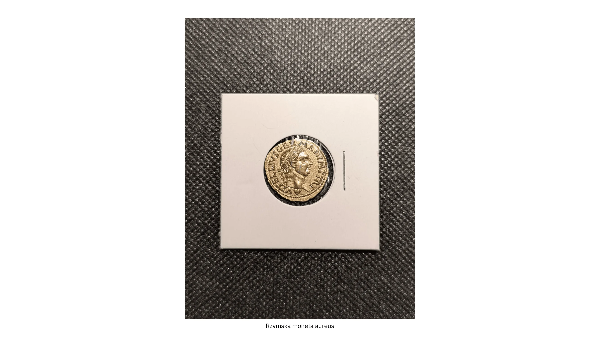

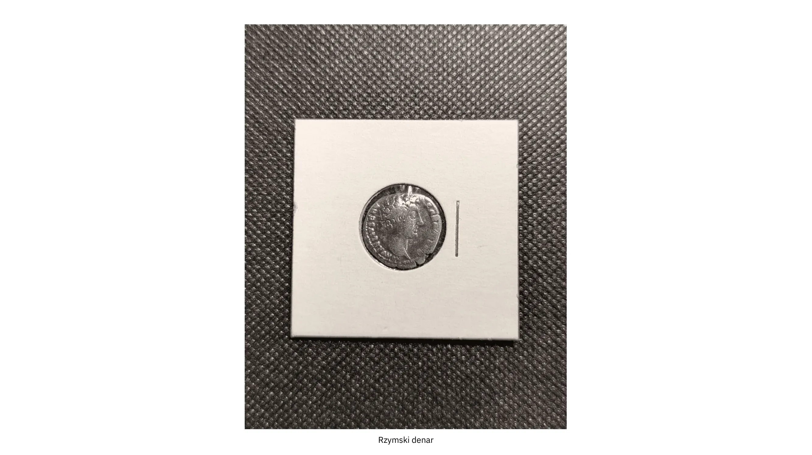

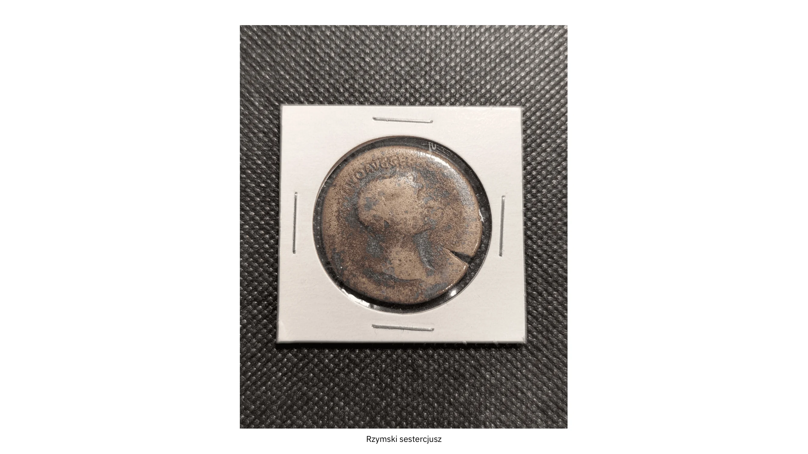

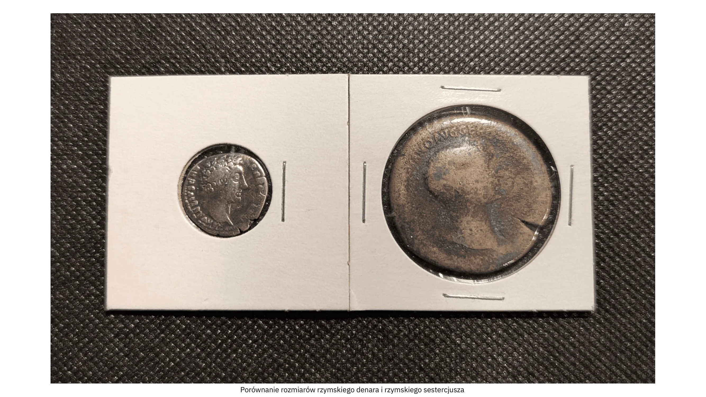

Jednakże, począwszy od Nerona (AD 54-68), Rzym rozpoczął powolną dewaluację swoich monet, stopniowo zmniejszając ich wagę i czystość, aby sfinansować rosnące wydatki cesarskie, szczególnie po wielkim pożarze Rzymu w AD 64. Te dewaluacje miały znaczące skutki: czystsze monety zostały wycofane z obiegu poprzez gromadzenie lub eksport, zgodnie z **prawem Greshama**, podczas gdy zdewaluowane monety mnożyły się, powodując stopniowy wzrost cen.

Trzeci wiek stanowi dramatyczny punkt zwrotny, ze spektakularnym przyspieszeniem dewaluacji pod rządami cesarzy Septymiusza Sewera, Karakalli i Galienusa. Zawartość srebra w głównej srebrnej monecie, denarze, a następnie antoninianusie, spadła do zaledwie 2%. W tym samym czasie waga złota aureusa spadła o połowę. Kryzysowi monetarnemu towarzyszyła bezprecedensowa niestabilność polityczna, najazdy barbarzyńców i powtarzające się wojny domowe.

Ta część pozwala mi przedstawić ostatni element w tej sekcji: antoninianus. Oryginalna nazwa tej monety nie jest znana, ale dziś nazywamy ją antoninianusem. Wyróżnia się tym, że jest wyceniana na dwa denary, mimo że jest tylko 1,5 razy większa od denara. Co więcej, z czasem monety te stały się jedynie bilonami, co oznacza, że były wykonane ze stopu srebra i innych metali, a nie z czystego srebra. Monety były często po prostu powlekane srebrem, stanowiąc godny uwagi przykład upadku pieniądza.

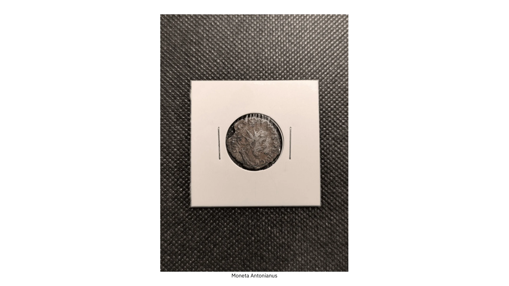

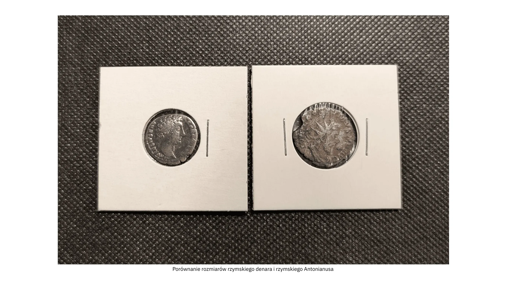

W obliczu tej sytuacji cesarz Aurelian (270-275 r. n.e.) próbował ustabilizować system poprzez nominalną rewaluację walut, ale reforma ta w rzeczywistości wprowadziła mechanizm inflacyjny poprzez sztuczne ustalenie wartości istniejących walut na wyższym poziomie.

Przedstawię dygresję na ten temat. W III wieku inflacja gwałtownie wzrosła. Wcześniej, mimo że monety były dewaluowane, ręczny proces bicia ich jedna po drugiej zapewniał pewną kontrolę nad inflacją. Statystyki wskazują, że w ciągu 300 lat dewaluacji inflacja wynosiła średnio około 4% rocznie. Tuż przed reformą Aureliana inflacja wynosiła około 3% rocznie.

Aurelian wprowadził pomiar czystości na monecie ze znakiem XXI, wskazując skład 20 części brązu na 1 część srebra lub 5% czystości. Wprowadził na rynek te 5% srebrne monety i wybił na nich znak XXI. Jednak wycofał również wszystkie inne, bardziej zdewaluowane monety i wybił na nich ten sam znak XXI. To skutecznie zmieniło wartość nominalną wszystkich monet. Rezultatem była oszałamiająca stopa inflacji wynosząca 20% rocznie, znacznie przekraczająca poprzednią stopę 3% przed wdrożeniem tej techniki.

To właśnie Aurelian wynalazł tę formę dewaluacji, która jest znacznie szybsza niż stopniowa dewaluacja metalu, która wciąż zmuszała nas do drukowania monet jedna po drugiej. To, co zrobił, to wziął wszystkie istniejące monety, wycofał je i wybił stemplem, aby zmienić ich wartość nominalną. To był prawdziwy punkt zwrotny. Wtedy inflacja stała się wykładnicza.

Aby wizualnie zilustrować tę ekstremalną dewaluację, znalazłem kilka fascynujących statystyk dotyczących cen zboża w Egipcie od 40 r. p.n.e. do III wieku, obejmujących ponad 300 lat. Poniżej znajduje się grecka tetradrachma z mojej kolekcji. W tym czasie, w Egipcie pod okupacją rzymską w III wieku, odpowiednikiem była egipska tetradrachma. Nominał drachmy był nadal w użyciu i odpowiadał denarowi.

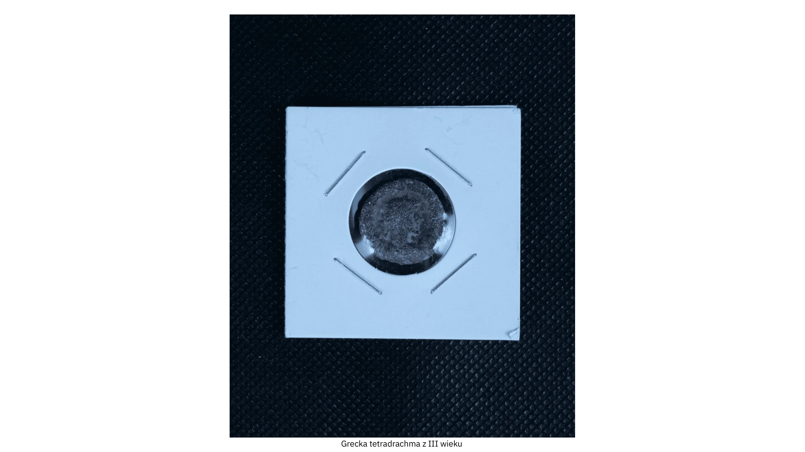

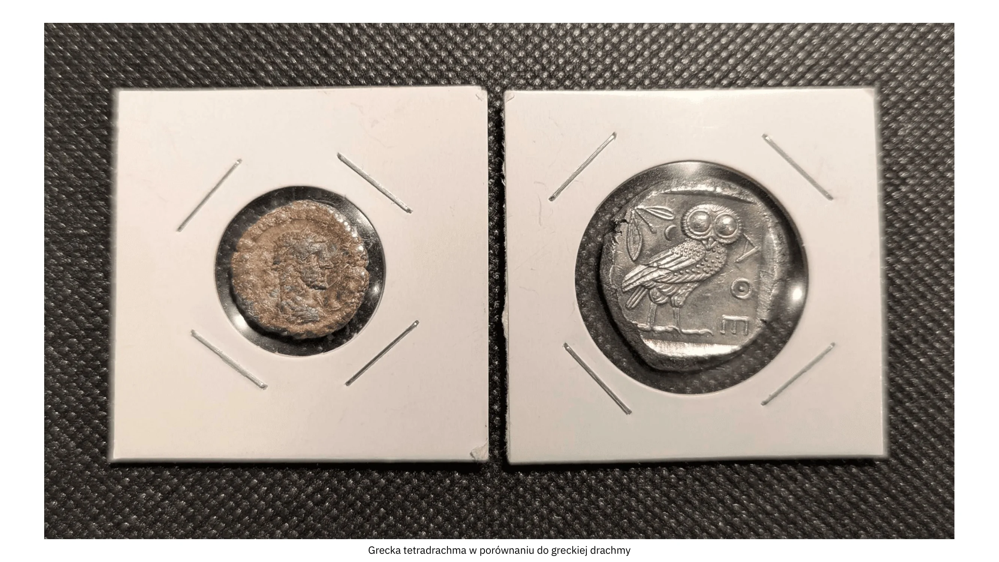

Tak więc egipski tetradrachm, który posiadam, był odpowiednikiem denara. Widać, że moneta jest wykonana z billonu (lub brązu), więc nie zawiera żadnego metalu szlachetnego. Można ją porównać z oryginalną grecką tetradrachmą, aby zobaczyć fizyczną dewaluację w ciągu tych 300 lat. To milionkrotny wzrost ceny zboża w Egipcie.

Jest to fizyczny wyraz reformy Aureliana. Należy zauważyć, że większość, średnia w ciągu tych 300 lat inflacji, wynosiła około 4%. Dopiero pod koniec, kiedy Aurelian przeprowadził swoją reformę, inflacja stała się raczej wykładnicza i doszliśmy do tej miary 1 miliona. Pod koniec III wieku ceny były milion razy wyższe niż w I wieku p.n.e..

Jego następca **Dioklecjan** (284-305 r. n.e.) próbował jeszcze bardziej radykalnych reform: wyemitował nowe waluty (zwłaszcza argenteus, czystszy, ale zbyt ograniczony ilościowo), nałożył drastyczne kontrole cen (edykt cenowy z 301 r. n.e.) i **ustanowił system podatkowy oparty na płatnościach w naturze**. Pomimo tych wysiłków, reformy Dioklecjana nie zdołały ograniczyć szalejącej inflacji.

W obliczu odmowy dostarczania towarów i usług w zamian za zdewaluowaną walutę, Dioklecjan ustanowił **dziedziczny system kastowy**, aby przywiązać chłopów i ich potomków do ziemi.

To, co naprawdę należy tutaj zrozumieć, to fakt, że chłopi odmówili dostarczania swoich produktów w zamian za zdewaluowaną walutę, a odpowiedzią naszego drogiego Dioklecjana było stworzenie **kast dziedzicznych** poprzez powiedzenie "ty, nie możesz opuścić swojej ziemi, twoje dzieci nie mogą opuścić swojej ziemi, to samo dotyczy żołnierzy, jesteście żołnierzami, zgadzacie się na zapłatę w mojej walucie". Jako rozwiązanie przejściowe, płacono im w naturze (w mięsie, żywności, zbożu), ponieważ odmówił dawania im pieniędzy. Narzucił więc ten dziedziczny system kastowy, aby zmusić ludzi do przywiązania się do swojego zawodu, aby nie mogli po prostu zmienić pracy, gdyby próbowali nie zaakceptować zdewaluowanej waluty.

Aby zilustrować ten przykład, mam tutaj tekst, fragment książki "*Monetary Regime and Inflation*":

> Ponieważ ludzie nie chcieli pracować i dostarczać towarów w zamian za zdewaluowaną walutę, której wartość nominalna była wyższa niż jej wartość wewnętrzna lub rynkowa, musieli zostać zmuszeni do pracy poprzez nałożenie podatków w naturze. [...] Opuszczanie przez chłopów zarejestrowanych domów stało się nielegalne. W ten sposób ludność rolnicza stała się dziedzicznie przywiązana do ziemi.
>

> Ten dziedziczny system kastowy stopniowo się rozprzestrzeniał: Dioklecjan zmusił synów żołnierzy do służby w armii, podczas gdy robotnicy w warsztatach pieniężnych, a także w fabrykach tkackich i farbiarskich, które stworzył Dioklecjan, stali się niewolnikami państwowymi, z dziedziczną służbą. Górnicy złota również stali się później dziedziczną kastą. Inne klasy dziedziczne prawdopodobnie istniały już w czasach Dioklecjana, zwłaszcza gildie piekarzy i rzeźników [...] w Rzymie, a także diecezjalne gildie kapitanów statków, którzy transportowali zboże i inne ładunki publiczne do Rzymu.

Dopiero Konstantynowi (306-337 r. n.e.) udało się ostatecznie ustabilizować system monetarny, wprowadzając w 312 r. solidus, monetę z czystego złota, której jakość i wagę ściśle gwarantował. Istniał cały system weryfikacji czystości i wagi solidusa. **Ta stabilność dotyczyła jednak tylko zamożnej elity i administracji cesarskiej**, podczas gdy **większość populacji nadal cierpiała z powodu niskiej jakości waluty i utrzymującej się inflacji**. Solidus pozostał stabilny w Cesarstwie Wschodnim (Bizancjum), gdzie przetrwał ponad tysiąclecie, podczas gdy na Zachodzie monety rozpadły się na małe monety o niskiej wartości, towarzysząc ostatecznemu rozpadowi gospodarczemu i politycznemu Cesarstwa Rzymskiego, które upadło ostatecznie w 476 r. n.e.

Na zakończenie chciałbym podzielić się z wami cytatem z książki *A History of Money: From Ancient Times to the Present Day* autorstwa Glyna Daviesa, który w mistrzowski sposób podsumowuje to, co być może doprowadziło do upadku Rzymu:

*"Podatki były konsekwentnie nieadekwatne, a trudności związane z tymi coraz bardziej nieadekwatnymi, późno dostosowanymi i bardzo widocznymi podatkami skłoniły Rzym do polegania w większym stopniu na łatwej, natychmiastowej i ukrytej formie opodatkowania: dewaluacji waluty. Krótkotrwałe, doraźne reformy nie zdołały odwrócić tego odwiecznego trendu upadku. Presja finansowa spowodowana zużyciem monet, katastrofami statków, wyciekami pieniędzy spowodowanymi zakupem luksusowych towarów ze Wschodu, darami oferowanymi germańskim barbarzyńcom, wzrostem populacji miejskiej, spadkiem produkcji rolnej, stopniowym wyczerpywaniem się najbogatszych kopalń, a przede wszystkim polityką "chleba i cyrków" uznaną za niezbędną do utrzymania minimum porządku w życiu miejskim - wszystkie te skumulowane naciski doprowadziły Rzym do ciągłej dewaluacji monetarnej, przeplatanej sporadycznymi reformami skazanymi na niepowodzenie "

*Oprócz darmowego lub taniego chleba i wina, od czasu do czasu rozdawano cesarskie liberalizmy ("congiaria") w formie przydziałów pieniężnych, zwłaszcza za Trajana (98-117 n.e.), a jeszcze bardziej za Hadriana (117-138 n.e.) i jego następców. To, co cesarz i obywatele początkowo uważali za wyjątkowy przywilej, na początku II wieku stało się zwyczajowym oczekiwaniem. Dystrybucje te "stanowiły duże obciążenie dla skarbu publicznego i na swój sposób przyczyniły się do bankructwa państwa "*

## Powiązania między rozwodnieniem polityki pieniężnej a inflacją: od przyczyn do konsekwencji

<chapterId>38d5781c-e900-53f7-baa7-413655d71754</chapterId>

:::video id=3999256d-aafe-4502-9b72-dfa8491a2777:::

W tej sekcji przyjrzymy się powiązaniom między rozwodnieniem monetarnym a inflacją, od przyczyn po konsekwencje. Rozrzedzenie pieniądza jest jednym z głównych zjawisk gospodarczych w historii rzymskiej waluty, mającym bezpośredni wpływ na inflację. Począwszy od I wieku n.e., od panowania Nerona (54-68 n.e.) nastąpiła początkowa powolna faza rozcieńczania srebrnej monety (denara), przyspieszona przez powtarzające się kryzysy wojskowe i finansowe, zwłaszcza za panowania Septymiusza Sewera (193-211) i Gallienusa (253-268).

Zauważamy również bardziej stopniową dewaluację aureusa. Ta różnica w tempie dewaluacji podkreśla dwie kwestie:

1. Rola jednostki rozliczeniowej w bimetalizmie dla państwowej kontroli pieniądza. Jednostką rozliczeniową w tym przykładzie jest denar. Zidentyfikowałem trzy różne sposoby zarządzania wartością jednostki rozliczeniowej: dewaluacja (rozcieńczenie metalu), redenominacja (antoninianus) i narzucenie wartości nominalnej poprzez oznaczenie "XXI" (Aurelian)

2. Pragnienie państwa, by jak najdłużej odwlekać dewaluację aureusa, rezerwy wartości, która umożliwia elitom utrzymanie siły nabywczej kosztem mniej zamożnych. Będziemy często powracać do tej zasady w trakcie kursu, zwłaszcza w związku z koncepcją znaną jako "efekt Cantillona" i redenominacją maravedi w Hiszpanii.

Zjawisko to jest dość interesujące i powtarzało się w całej historii. Powrócimy do niego wraz z Maravedi w kolejnej sekcji. Ten wzorzec jest również widoczny w przypadku wszystkich walut rezerwowych; rezerwowa jednostka wartości, taka jak aureus w Rzymie, pozostaje nietknięta. Jednak jednostka rozliczeniowa używana przez ogół populacji do handlu i codziennych transakcji jest często dewaluowana. W rezultacie inflacja monetarna dotyka zwykłych ludzi, podczas gdy ci, których stać na złote monety, pozostają w dużej mierze nienaruszeni.

A tak przy okazji, **jest to to samo zjawisko, które powstaje dzisiaj wraz z dewaluacją waluty, która pozwala na wzrost wartości aktywów finansowych**, a więc to ludzie, którzy używają waluty, najbiedniejsi ludzie, stają się biedniejsi, a to z kolei wzbogaca, poprzez kreację pieniądza, aktywa tych, którzy są w stanie, którzy mają środki, aby chronić się przed dewaluacją, a więc pogłębia nierówności społeczne. To moja mała polityczna tyrada.

To, co właśnie opisałem, nazywa się efektem Cantillona. Zobaczymy, że ten dżentelmen żył w czasach Johna Law, temat, który również omówimy w kolejnej sekcji.

Reforma zapoczątkowana za panowania Aureliana pozwoliła na gwałtowny wzrost inflacji. Inflacja wartości nominalnej pieniądza nie była już ograniczona zdolnością mennic do ręcznej produkcji monet. Monety, które zostały już wybite, można było teraz po prostu oznaczyć, a nominalna wartość podaży pieniądza wzrosła szybciej.

Chciałbym podzielić się z wami dwoma cytatami związanymi z Aurelianem. Pierwszy pochodzi z *A History of Money: From Ancient Times to the Present Day*:

*"Jeśli chodzi o rzymską gospodarkę, wkład Aureliana był bardziej katastrofą niż triumfem. W dużej mierze ze względu na charakter jego "reformy" stopa inflacji była w stanie wzrosnąć znacznie powyżej tego, co było wcześniej możliwe, nawet pod rządami nieodpowiedzialnego Gallienusa. Przez dwa stulecia po Aurelianie inflacja stała się endemiczna w całym Imperium Rzymskim "*

Drugi pochodzi z książki *Ancient History from Coins* i dotyczy oderwania systemu monetarnego od złota:

*"Reforma Aureliana zmieniła relację między złotym pieniądzem a resztą systemu monetarnego. Przed reformą inne rodzaje waluty były powiązane z **aureusem** według oficjalnych kursów (25 egipskich denarów lub 25 tetradrachm za jednego aureusa itp.) Po reformie złoty pieniądz zaczął **swobodnie zmieniać swoją wartość**, jak każdy inny towar, podczas gdy reszta systemu monetarnego **spadła na wartości** z powodu **osłabienia stopów**, nie będąc już **opartym na złocie**. Ponieważ jednostka rozliczeniowa teoretycznie nadal opierała się na srebrze (denar lub w Egipcie drachma), ceny rosły wraz z deprecjacją waluty. "*

Jak widać, ta dewaluacja waluty, która służyła jako jednostka rozliczeniowa, nieproporcjonalnie dotknęła mniej zamożnych, podczas gdy oderwanie powiązania ze złotym pieniądzem chroniło siłę nabywczą tych, którzy mogli sobie pozwolić na oszczędzanie w magazynie wartości, jakim jest złoto.

Musisz zrozumieć, że jeśli istnieje związek między denarem a aureusem, to nawet jeśli zdewaluujesz denara, jeśli nadal będziesz w stanie wymienić swojego denara na aureusa po tym kursie (25 denarów za 1 aureusa), ludzie z pewnością wymienią swojego denara na swojego aureusa, ponieważ denar będzie przewartościowany, a aureus niedowartościowany. Ale w tej reformie usunięto to powiązanie. Tak więc ludzie nie mogli już wymieniać denarów na srebro zdewaluowane w stosunku do złota. To wtedy ci, którzy mieli dostęp do złotych monet, mogli naprawdę się chronić, ponieważ potem ludzie nie mogli już wymieniać przewartościowanego, zdewaluowanego srebra na niedowartościowane czyste złoto. To bardzo ważny moment w ewolucji waluty.

Uderzający przykład skutków tej reformy przeprowadzonej przez Aureliana doskonale ilustrują poniższe cytaty z książki *Monetary Regimes and Inflation*:

*"Pomiędzy panowaniem cesarzy Klaudiusza (41-54 r. n.e.) i Konstancjusza (337-361 r. n.e.) cena pszenicy na otwartym rynku w Egipcie, wyrażona w drachmach, **wzrosła ponad milion razy**. Spektakularna inflacja cen jest jednym z głównych faktów ekonomicznych III i IV wieku naszej ery" (Lendon 1990, s. 106). Jednak rozwój ten jest **mniej dramatyczny niż się wydaje**, ponieważ odpowiada **średniej rocznej stopie inflacji wynoszącej 4,4%**. Według Wassinka (1991, s. 482) inflacja rozpoczęła się **tylko w 238 r. n.e.**"

*"Począwszy od tej daty, inflacja powoli przyspieszała, ponieważ **dobry pieniądz został najpierw wyparty z obiegu**, tak że całkowita podaż pieniądza początkowo prawie w ogóle nie wzrosła. Następnie osiągnęła średnią roczną stopę **3,65% między 250 a 293**, wzrastając do **22,28% między 293 a 301** (Wassink 1991, s. 466), tj. do **nieudanych reform monetarnych cesarza Dioklecjana**. Zjawisko to jest **szczególnie imponujące w przypadku inflacji w systemie monetarnym opartym na metalach**. "*

Zjawisko inflacji związane z rozcieńczeniem pieniądza początkowo stanowiło odpowiedź na sporadyczne kryzysy gotówkowe w państwie rzymskim. Zmniejszając zawartość metali szlachetnych w monetach przy jednoczesnym utrzymaniu ich wartości nominalnej, państwo tymczasowo zwiększało swoje zasoby. Ceny nie reagowały jednak natychmiastowo: rzymski system charakteryzował się pewną lepkością, co oznaczało, że płace i ceny powoli dostosowywały się do kolejnych dewaluacji. Niemniej jednak, po przekroczeniu pewnego progu, ceny gwałtownie rosły, aby przywrócić równowagę na rynku z rzeczywistą wartością walut.

Jak wspomniano powyżej, zjawisko to jest szczególnie widoczne od połowy III wieku. W Egipcie, bogato udokumentowanym regionie, ceny zostały pomnożone przez 10 pod rządami Aureliana (274 r. n.e.) po oficjalnej rewaluacji waluty, pomimo początkowej próby stabilizacji. Następnie, pod rządami Dioklecjana (301 r. n.e.), edykt cenowy nałożył drastyczne kontrole w celu ograniczenia inflacji, nie zwalczając pierwotnej przyczyny - nadprodukcji i degradacji monetarnej - powodując tym samym przewidywalną porażkę. Utrzymująca się inflacja ostatecznie popycha gospodarkę w kierunku systemu dwupoziomowego: ** elita, chroniona przez rezerwy złota (takie jak solidus Konstantyna**), cieszy się stabilnością, podczas gdy większość populacji nadal cierpi z powodu chronicznej inflacji, **ilustrując to, co dziś znane jest jako efekt Cantillona**

Istnieje wyraźny związek między rzymskim rozwodnieniem monetarnym a inflacją, której przyczyny są zasadniczo związane z chronicznymi deficytami fiskalnymi, nieustannymi wydatkami wojskowymi i złym zarządzaniem gospodarką państwa.

## Upadek Cesarstwa Rzymskiego

<chapterId>b6ec0914-227b-509c-8108-b09eec9bb904</chapterId>

:::video id=91d4fee5-59bb-4ab9-a90b-e1125c71decb:::

### Dewaluacja waluty i upadek Rzymu

Austriacka szkoła ekonomii, zwłaszcza Ludwig von Mises, zaproponowała monetarną interpretację upadku Rzymu. W tej wizji postępująca dewaluacja rzymskiej waluty zniszczyła złożony system podziału pracy, który utrzymywał imperium liczące 60 milionów mieszkańców. Waluta, centralny instrument koordynacji gospodarczej, raz zepsuta, doprowadziła do upadku całej struktury społecznej i gospodarczej.

To pogorszenie sytuacji monetarnej nie tylko zniszczyło wewnętrzną spójność imperium. Zerwało również więzi handlowe z sąsiednimi ludami. Pozbawieni korzyści płynących z handlu z Rzymem, "barbarzyńcy" przeszli od pokojowej współpracy do drapieżnictwa. Inwazje miały zatem nie tylko charakter militarny, ale były również wynikiem fundamentalnego załamania gospodarczego.

### Trzy fazy imperialnej dewaluacji

Rzymską historię monetarną można podzielić na trzy odrębne okresy. Pierwszy, od Julio-Klaudiuszy do Antoninów (27 p.n.e. - koniec II wieku), utrzymywał względną stabilność. Pod rządami Trajana imperium osiągnęło apogeum: obejmujący 5 milionów km² Rzym stał się pierwszym milionowym miastem w historii. Denar zachował czystość srebra od 98% do 80% - umiarkowana dewaluacja nadal pozwalała na funkcjonowanie gospodarki.

Drugi okres, III wiek, był okresem wojskowej anarchii. Dwudziestu sześciu cesarzy następowało po sobie w ciągu kilku dekad. Waluta upadła: antoninianus, rzekomo wart dwa denary, zawierał tylko 1,5 denara - była to pierwsza próba oddzielenia wartości prawnej od rzeczywistej. Ta manipulacja uruchomiła prawo Greshama: zły pieniądz wypiera dobry. Obywatele gromadzili dobre monety, wydając tylko te zdewaluowane.

Skarby monetarne odkryte przez archeologów ujawniają ten ekonomiczny niepokój. Pochowane amfory pokazują, w jaki sposób Rzymianie deponowali najpierw najlepsze monety, stopniowo dodając te zdewaluowane. Te starożytne "stosy" świadczą o ludzkim działaniu w obliczu niepewności - próbie zachowania wartości w rozpadającym się świecie.

### Konstantyn i podwójny system

Konstantyn (310-337) próbował ustabilizować imperium poprzez radykalne reformy. Stworzył złotego solidusa, walutę ściśle kontrolowaną przez administrację. Urzędnicy systematycznie sprawdzali wagę i czystość. Emisja pozostała ograniczona, powiązana z łupami wojennymi. Waluta ta stała się wyłącznym narzędziem władzy: podatki płacono w solidusie, a legiony otrzymywały żołd w złocie.

W tym samym czasie ludzie używali nummusa z brązu, który był stale dewaluowany. W 445 r. solidus był wart 7000 nummi; w 498 r. 16 800. Ten podwójny system zinstytucjonalizował efekt Cantillona: ci, którzy mieli dostęp do solidusa - administracja, właściciele ziemscy - byli chronieni przed inflacją. Plebs, ograniczony do nummusa, stawał się nieubłaganie biedniejszy.

Ta monetarna separacja stworzyła dwie równoległe gospodarki bez oficjalnego kursu wymiany. Solidus pozostał jednostką rozliczeniową, ale jego obieg był niewielki. Nummus był używany do codziennej wymiany, ale stale tracił na wartości. Ta architektura monetarna zapowiadała nierówności powstającego systemu feudalnego.

### Upadek podziału pracy

Dewaluacja waluty stopniowo niszczyła specjalizację gospodarczą. Bez wiarygodnej jednostki rozliczeniowej handel śródziemnomorski załamał się. Wyspecjalizowani rzymscy rzemieślnicy nie mogli już handlować z Egiptem czy Galią. Prowincje przyjęły własne waluty, zwiększając tarcia handlowe.

W obliczu tej dezintegracji ludność miejska uciekła na wieś - miejski exodus odwrócił wielowiekową urbanizację. Rzemieślnicy porzucili swoje zawody na rzecz rolnictwa na własne potrzeby. Duże posiadłości (latyfundia) stały się samowystarczalnymi wyspami, zapowiadając średniowieczne seigneuries.

W desperacji Dioklecjan zażądał nawet podatków w naturze - ostatecznego przyznania się do porażki monetarnej. Jego edykt maksymalny (301) próbował kontrolować ceny, przyspieszając powrót do barteru. Złożoność ekonomiczna powróciła do form przedcywilizacyjnych.

### Przetrwanie dzięki złotu od Rzymu do Bizancjum

Paradoksalnie, solidus przetrwał Cesarstwo Zachodnie. Bizancjum utrzymało go aż do XI wieku, zapewniając kolejne tysiąc lat stabilności gospodarczej. Na Zachodzie pamięć o nim przetrwała: francuskie słowo "sou" wywodzi się od solidus, językowego świadectwa utraconej wielkości monetarnej.

Właściciele ziemscy, którzy zachowali swoje bogactwo w złocie, stali się panami feudalnymi. Struktury kościelne, jedyne ocalałe instytucje, zapewniały więzi społeczne, których pieniądze nie mogły już zagwarantować. Europa podzieliła się na autarkiczne domeny, z których każda miała własną gospodarkę na własne potrzeby.

Ta transformacja ujawnia kruchość złożonych cywilizacji. Podział pracy, który umożliwił Rzymowi wyżywienie miliona mieszkańców, zależał całkowicie od zaufania monetarnego. Gdy zaufanie to zostało złamane, gmach zawalił się, przywracając Europę do prymitywnych form ekonomicznych na prawie tysiąclecie.

## Wieki ciemne i średniowiecze

<chapterId>a5856873-6142-57be-8a73-1f9e3df83792</chapterId>

:::video id=86b8da9b-3831-443d-b170-58c2bea3ad54:::

Historia i pojawienie się pieniądza w średniowieczu naznaczone są okresami regresji, innowacji i ożywienia gospodarczego.

Na przykład, kiedy armia rzymska opuściła Brytanię, na wyspę nie trafiły już żadne rzymskie monety. Około 435 r. n.e. monety całkowicie zniknęły w Brytanii, co było zjawiskiem wyjątkowym w byłych prowincjach rzymskich. Przez prawie dwa stulecia brytyjska gospodarka pozostawała bez monet, aż do VII wieku, kiedy to stopniowo pojawiały się monety inspirowane Merowingami i kontynentami.

Od VIII wieku wpływy chrześcijańskie przyczyniły się do ponownego wprowadzenia monet w Europie Północnej. Kluczową postacią w tym okresie był Pepin Krótki, król Franków, który w 752 r. wprowadził denara, przyjętego później przez jego syna Karola Wielkiego. Karol Wielki szeroko rozpowszechnił użycie srebrnego denara, tworząc europejski standard monetarny na kilka stuleci.

W Anglii monety cieszyły się znacznym ożywieniem wraz z produkcją srebrnego grosza pod rządami króla Offy z Mercji około 765 roku. Waluta ta stała się tak ważna, że pozostała praktycznie niezmieniona przez 500 lat.

Jako pierwszy artefakt związany z tym okresem, pozwolę sobie pokazać reprodukcję angielskiego grosza z tamtych czasów.

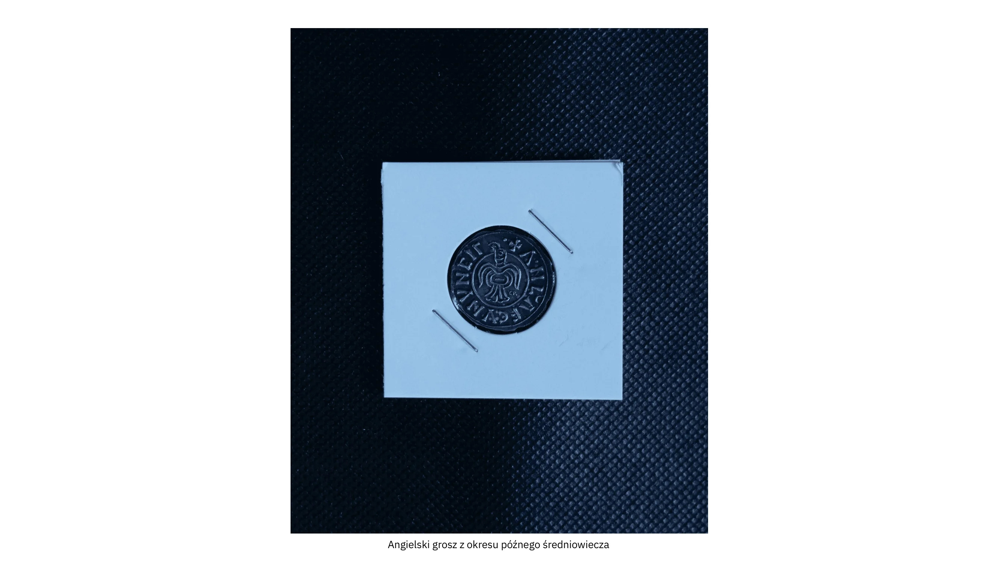

W okresie późnego średniowiecza Europa popadła w feudalizm po upadku rzymskiego systemu monetarnego. Większość populacji używała monet miedzianych lub brązowych o niskiej wartości, często podlegających rozcieńczeniu waluty, ograniczając w ten sposób handel na duże odległości.

Powrót monety jako środka płatniczego następował stopniowo, osiągając punkt kulminacyjny w XIII wieku wraz z pojawieniem się złotej floreny we Florencji w 1252 roku, a następnie złotego dukata w Wenecji. Te złote monety były szeroko stosowane dzięki ekspansji handlu i rosnącemu zapotrzebowaniu na niezawodne, akceptowane na całym świecie środki płatnicze.

W Anglii system monetarny był chroniony przed rozwodnieniem dzięki innowacyjnej polityce fiskalnej, takiej jak podatek gruntowy wprowadzony przez Wilhelma Zdobywcę po 1066 r., który zachował jakość pensa szterlinga. Ważne jest, aby zrozumieć, że ówcześni władcy mogli dewaluować walutę w celu finansowania państwa, a **wprowadzenie tego podatku umożliwiło utrzymanie stabilnej waluty i finansowanie państwa poprzez podatki**

Jednak pokusa zysku poprzez rozcieńczenie monetarne doprowadziła do kryzysów, jak za panowania Henryka I w XII wieku, kiedy jakość monet dramatycznie spadła. Poważne reformy, którym czasami towarzyszyły brutalne środki przeciwko monetarystom, tymczasowo przywróciły zaufanie do waluty.

Średniowiecze było również świadkiem pojawienia się wyrafinowanych praktyk finansowych, takich jak użycie kijów rachunkowych w Anglii w celu obejścia zakazu lichwy i rozszerzenia kredytu. Kościół nie był zbyt przychylny oprocentowanym pożyczkom, więc stosowano różne techniki w celu obejścia zakazu stosowania odsetek.

Innowacje te były odpowiedzią na chroniczny niedobór pieniądza metalicznego i sprzyjały powstaniu zalążka rynku finansowego.

W międzyczasie wyprawy krzyżowe pobudziły handel śródziemnomorski, sprzyjając rozwojowi wymiany międzynarodowej i nowych praktyk bankowych, zwłaszcza za pośrednictwem Zakonu Templariuszy. Templariusze stali się ważnymi pośrednikami finansowymi, umożliwiając krzyżowcom uzyskanie płynności finansowej z dala od domu, zapowiadając nowoczesny europejski system bankowy.

Aby nawiązać do Templariuszy, poniżej znajduje się francuska średniowieczna moneta, na której można rozpoznać piękny krzyż w centrum. Krzyż ten był dość powszechny na monetach z tej epoki.

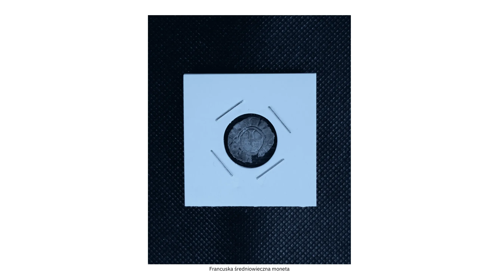

Wreszcie, poważne kryzysy, takie jak Czarna Śmierć (1346-1353), przyniosły głębokie przemiany gospodarcze. Gwałtowny spadek liczby ludności doprowadził do gwałtownego wzrostu płac, wbrew rządowym próbom utrzymania poprzedniego poziomu wynagrodzeń.

W tym samym czasie wojna stuletnia (1337-1453) zmusiła państwa do przyjęcia bardziej agresywnej polityki fiskalnej w celu finansowania swoich armii, przyczyniając się do osłabienia systemu feudalnego.

Średniowiecze charakteryzowało się zatem ciągłym napięciem między potrzebą niezawodnego pieniądza w handlu a ciągłą pokusą władców do rozcieńczania pieniądza w celu uzyskania natychmiastowego zysku. Konflikt ten głęboko ukształtował europejski rozwój monetarny, kładąc podwaliny pod nowoczesne systemy gospodarcze.

Na zakończenie tej sekcji chciałbym dodać dość interesującą anegdotę z Anglii z tego okresu. Anegdota ta pochodzi z książki "Historia pieniądza" autorstwa Glyna Daviesa.

Wspomina, że w Anglii przejście do parlamentu przeniosło ciężar zadłużenia z suwerena na parlament, co doprowadziło do chronicznego zadłużenia państwa. Wcześniej dług spoczywał na barkach suwerena.

Gdy Parlament był w stanie przejąć część tej mocy kreacji pieniądza, umożliwiło to tworzenie długoterminowych długów, które były ponoszone przez ludzi, a nie przez króla. Wcześniej, jeśli król zbankrutował lub nastąpiła zmiana króla, dług wygasał wraz z nim.

W momencie, gdy tworzenie długu jest przeprowadzane przez Parlament, pojawia się koncepcja długu państwowego, ponieważ jest on potencjalnie nieograniczony w czasie. Tak długo, jak istnieje państwo, tak długo jak istnieje parlament, dług ten istnieje, a oni musieli znaleźć różne sposoby jego refinansowania i rozłożenia w czasie. To poważna zmiana paradygmatu, w którym to już nie król czy rodzina królewska gwarantowała lub ponosiła ciężar tych długów; teraz był to parlament, a zatem jego obywatele.

## Renesans

<chapterId>1d1dfb05-70b4-5b7b-9708-373c2182950d</chapterId>

:::video id=4977b4f3-c7b2-41a5-ad7b-a96a8cca4092:::

Dotarliśmy teraz do części kursu, w której mówimy o okresie znanym jako renesans. Odbywa się on na tle tragicznego kryzysu, z błyskawicznym rozprzestrzenianiem się dżumy przez pchły na szczurach wsiadających na statki. Tragedia ta informuje nas jednak o rozwoju handlu i podróży w okresie wysokiego średniowiecza. Wcześniej w tym okresie niewielu ludzi przemieszczało się tak daleko i tak szybko.

### Florin z Florencji

Powrót złotej monety do Europy w okresie renesansu stanowi fundamentalny punkt zwrotny w historii monetarnej. **Wszystko zaczęło się od florena z Florencji w 1252 roku, pierwszej dużej złotej monety wybitej w Europie od upadku Rzymu**. Dzięki niezwykle stałej wadze i czystości (około 3,5 grama czystego złota), floren pozostał niezmieniony przez cztery stulecia i szybko stał się podstawowym ogólnoeuropejskim punktem odniesienia monetarnego.

Poniżej znajduje się reprodukcja florena: złoty floren wykonany z cyny i wybity przez francuskiego artystę, który tworzy doskonałe dzieła, grawerowane i wybijane ręcznie.

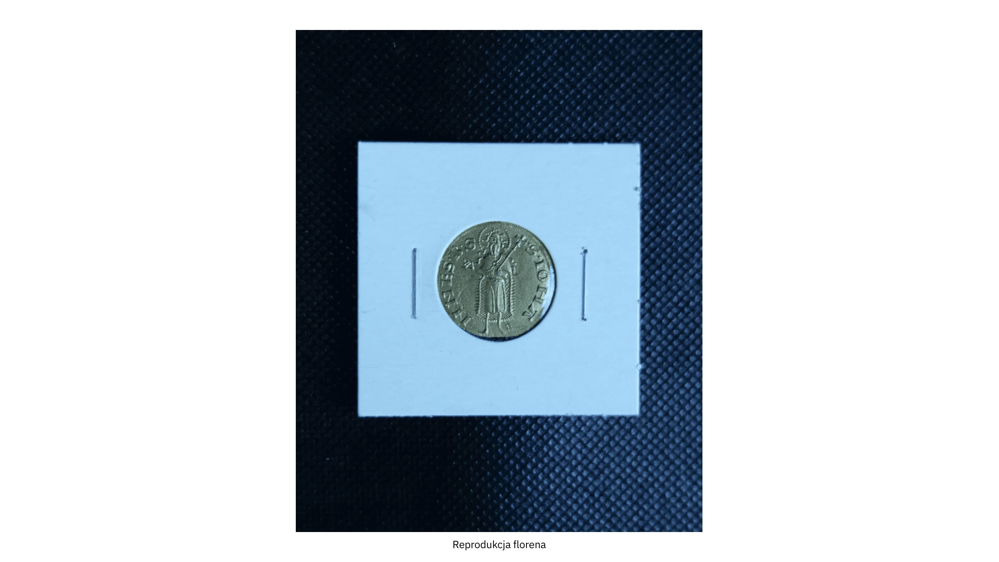

Ten powrót do złotej monety był spowodowany specyficznym kontekstem: upadek bizantyjskiego solidusa i upadek gospodarczy świata muzułmańskiego spowodowany najazdami Mongołów stworzyły próżnię monetarną w handlu międzynarodowym.

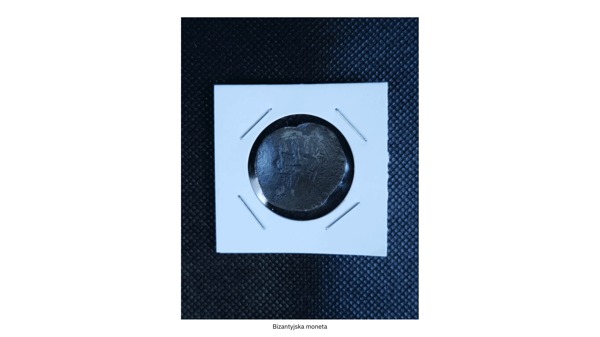

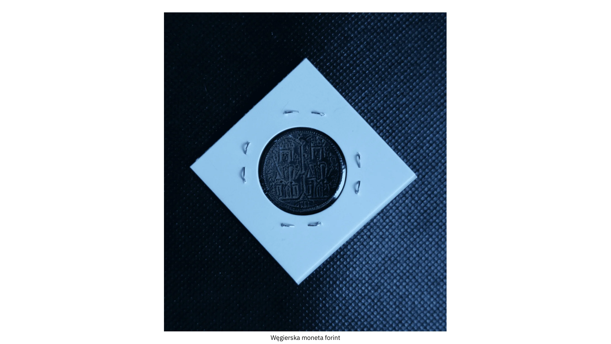

Pierwsze zdjęcie powyżej przedstawia bizantyjską monetę, którą uważam za dość interesującą. Zamierzam narysować paralelę z monetą z tego samego okresu z Węgier (drugi obrazek powyżej). Węgierska moneta ma kształt kielicha, przypominającego miniaturową miseczkę. Ikonografia przedstawia postacie religijne przedstawione jako królowie trzymający krzyże obok siebie. Ten egzemplarz ma kształt misy i pochodzi z Węgier.

Kopiowanie monet z innych krajów było dość powszechne. Ponieważ bizantyjskie monety były powszechnie akceptowane, inne kraje często je kopiowały. Jak widać po porównaniu ich obok siebie: te egzemplarze są bardzo podobne.

Północne Włochy, w szczególności Florencja, Wenecja i Genua, wykorzystały ten kontekst do wprowadzenia nowych twardych walut - monet o stabilnej zawartości metali szlachetnych. Wenecja poszła za przykładem Florencji, wybijając w 1270 r. dukata, walutę niemal identyczną z florenem i szeroko stosowaną w handlu śródziemnomorskim.

Floren stał się pierwszą międzynarodową walutą rezerwową, przyjętą w ponad 150 europejskich miastach przed końcem XIV wieku. Wraz z utworzeniem dużej florenckiej sieci bankowej, kierowanej przez Medyceuszy, zarządzanie monetarne i księgowe zostało gruntownie zmodernizowane, zmniejszając nawet potrzebę fizycznego transportu złota.

To kolejna naprawdę interesująca kwestia. Był czas, kiedy wiele przesyłek z monetami ginęło podczas podróży morskich. Postęp technologiczny - rejestry z podwójnym zapisem księgowym - umożliwił stworzenie pieniądza skryptowego. Umożliwiło to zmniejszenie liczby rozliczeń monetarnych i zamiast tego zastosowanie systemu pisemnych wpisów, co znacznie zmniejsza ryzyko utraty pieniędzy w transporcie.

Rozwojowi pieniądza towarzyszyła również znacząca ewolucja metod bankowych. Zainspirowana częściowo kontaktem krucjat z muzułmańskimi praktykami bankowymi, średniowieczna Europa widziała pojawienie się podstawowych systemów bankowych we Florencji, Wenecji, Barcelonie i Genui już w XIII wieku. Templariusze, zakon religijny i wojskowy, opracowali już system umożliwiający krzyżowcom podróżowanie bez zabierania ze sobą bogactwa.

Deponowali oni środki w biurze templariuszy w swoim kraju, a następnie mogli podróżować z listem i odebrać monety po przybyciu do miejsca docelowego krucjaty.

Oznaczało to, że nie musieliśmy nosić przy sobie monet z metali szlachetnych.

To właśnie w tym okresie Europa dowiedziała się o istnieniu papierowych pieniędzy w Chinach, dzięki podróży Marco Polo w XIII wieku. Rozwój banknotów miał jednak poczekać kilka stuleci, ponieważ Europa wolała najpierw udoskonalić swoje metody bicia metalowych monet. Leonardo da Vinci, w pobliżu Luca Pacioli, znanego biegłego księgowego, aktywnie przyczynił się do ulepszenia pras pieniężnych, promując szybszą i bardziej jednolitą produkcję monet.

Mamy tu na myśli wspomnianą wcześniej technikę bicia wahadłem. Metoda ta umożliwiła produkcję bardziej jednolitych monet w porównaniu do bicia młotkiem i, co ważne, pozwoliła na wykonanie napisów wokół krawędzi monety, co wcześniej zademonstrowałem. Poniższa moneta to talar europejski z 1793 roku, na którym wyraźnie widać napis na krawędzi.

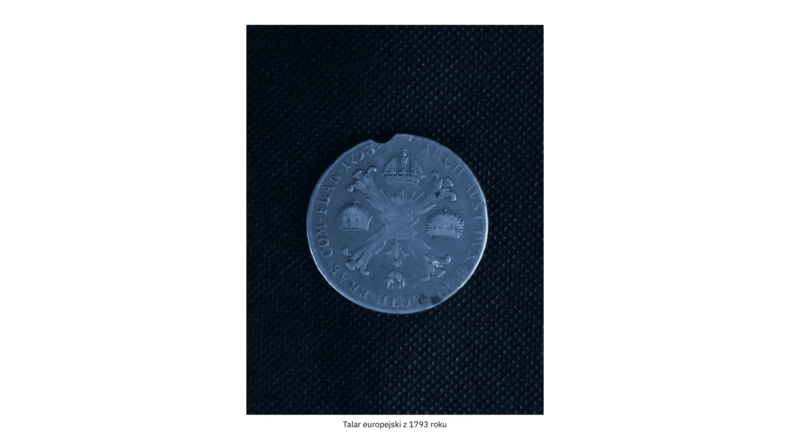

W XV wieku Europa doświadczyła jednak poważnego kryzysu walutowego, z ogólnym pogorszeniem zawartości srebra w europejskich walutach, która spadła do mniej niż 5% około 1450 roku.

Począwszy od XVI wieku, monetarny środek ciężkości przeniósł się do Hiszpanii, stymulowany przez unię królestw Aragonii i Kastylii, koniec rekonkwisty i wielkie odkrycia morskie, takie jak odkrycie Krzysztofa Kolumba w 1492 roku. Masowy napływ srebra z amerykańskich kopalni głęboko zachwiał europejską i globalną równowagą gospodarczą, napędzając zarówno inflację, jak i nowe napięcia geopolityczne.

Renesans oznaczał również znaczącą ewolucję artystyczną w dziedzinie monet, z takimi monetami jak talar (Joachimsthaler), od którego pochodzi termin "dolar". Te duże srebrne monety odzwierciedlają nowe artystyczne i mechaniczne techniki bicia, możliwe dzięki innowacjom technicznym z północnej Europy.

Wreszcie, renesans finansowy zapoczątkował przejście do nowoczesności gospodarczej, wraz z rozwojem bankowości, kredytów i rynków finansowych oraz pojawieniem się pierwszych form nowoczesnego kapitalizmu w wielkich miastach handlowych Amsterdamu, Londynu i Sztokholmu, kładąc podwaliny pod międzynarodowy system finansowy, jaki znamy dzisiaj. Jest to temat naszego następnego filmu.

# Zajęcie pieniędzy przez państwo

<partId>17cfb1b4-5bc1-53e0-b035-05c7cf76be92</partId>

## Ewolucja światowych walut rezerwowych

<chapterId>d65cc352-e7ca-5f03-9b23-dd1fae5c0395</chapterId>

:::video id=82710062-8fff-426c-93af-923c08d82233:::

### Historyczne znaczenie metali szlachetnych

Witamy w tej sekcji poświęconej powstawaniu walut rezerwowych i banków centralnych. W pierwszym punkcie tej nowej sekcji skupimy się na ewolucji globalnych walut rezerwowych.

Metale szlachetne, zwłaszcza złoto i srebro, od dawna uważane są za podstawę bogactwa i władzy w imperiach. Pragnienie złota zawsze było dominującą siłą napędową i to właśnie napływ metali szlachetnych miał najbardziej bezpośredni i oczywisty wpływ na rozwój monetarny w Europie. W czasach średniowiecza i wczesnego renesansu obsesja na punkcie złota i srebra wynikała z trudności z utrzymaniem wartości w innych formach towarów, a także z silnego popytu ze strony obcych mocarstw, zwłaszcza w handlu z Orientem.

Na przestrzeni wieków kilka imperiów zastąpiło się nawzajem jako globalne centra gospodarcze. Kraj, który dominuje w światowym handlu w danym okresie, zazwyczaj otrzymuje status waluty rezerwowej. Należą do nich:

- Hiszpania i Portugalia (XV i XVI wiek)

- Zjednoczone Prowincje (Holandia) w XVII wieku

- Francja i Wielka Brytania w XVIII i XIX wieku

- Stany Zjednoczone w XX wieku

### Portugalski boom i real (1450-1530)

**Portugalia** zdominowała światowy handel w drugiej połowie XV i na początku XVI wieku, z **realem portugalskim**, srebrną monetą o stosunkowo jednolitej wadze. Dzięki postępom w nawigacji Portugalczycy odkryli nowe szlaki morskie do Afryki, Azji i Nowego Świata. Forty wojskowe i punkty handlowe mnożyły się od Afryki po Chiny (Makau).

W odpowiedzi na zapotrzebowanie Europy na złoto i srebro, "stałą motywacją do wielkich odkryć był zysk komercyjny, a zwłaszcza pogoń za złotem i srebrem" Jednak imperium portugalskie, nadmiernie rozbudowane i stojące w obliczu konkurencji ze strony Holendrów, Anglików i Francuzów, zaczęło podupadać.

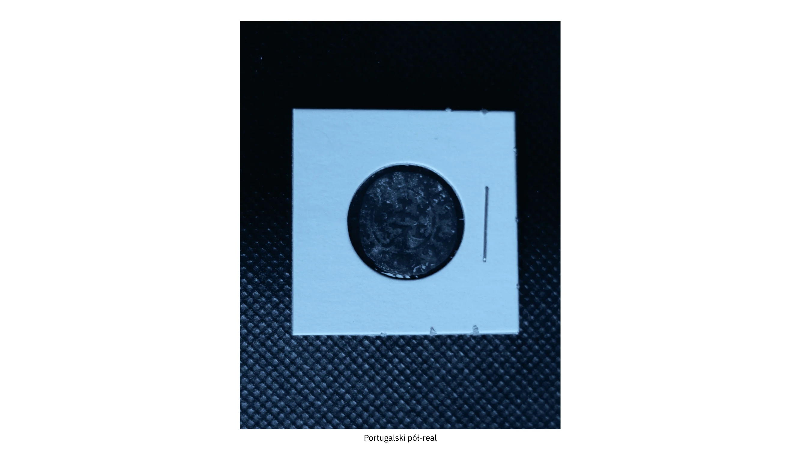

Powyżej można zobaczyć portugalską pół-relikwię z czasów tych morskich podbojów.

### Hiszpańskie apogeum i hiszpański dolar (1535-17th century)

Wraz z podbojem Nowego Świata, **Hiszpania** stała się dominującym graczem. Jej monarcha, kontrolujący gigantyczne kopalnie srebra (Potosí w Boliwii, Zacatecas w Meksyku), zdołał wybić pieniądze w czystym srebrze, unikając w ten sposób deprecjacji własnej waluty: **reala hiszpańskiego**

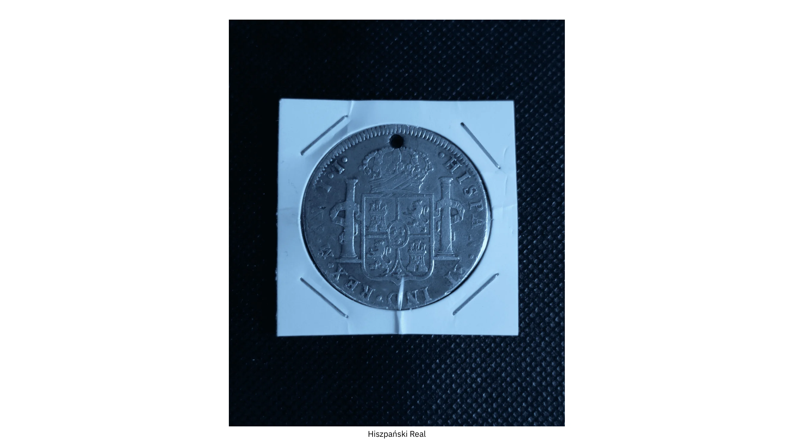

Hiszpański real, znany również jako "kawałek ósemki", zyskał swój przydomek, ponieważ często był cięty na ósemki, aby tworzyć mniejsze monety. Był również znany jako **hiszpański dolar**. Moneta, którą widzisz powyżej, pochodzi z 1814 roku, co czyni ją nieco nowszym przykładem. Pierwsze hiszpańskie monety dolarowe nie były jednak tak wyrafinowane; były wybijane młotkiem i ogólnie mniej okrągłe i wyraźne.

Szczególnie interesujące jest to, że dolar hiszpański służył wówczas jako międzynarodowa waluta rezerwowa. Władze hiszpańskie wyemitowały również własną lokalną walutę, maravedi, i regularnie dostosowywały podaż pieniądza poprzez wycofywanie monet. Na przykład, miedziana lub brązowa moneta początkowo o wartości jednego maravedi mogła zostać wycofana i ostemplowana "2", później "4" i tak dalej, potencjalnie osiągając "8" Na zdjęciu w wysokiej rozdzielczości wyraźnie widać "8" wybite na monecie. Metoda ta skutecznie zwiększała podaż pieniądza... co nieuchronnie prowadziło do inflacji.

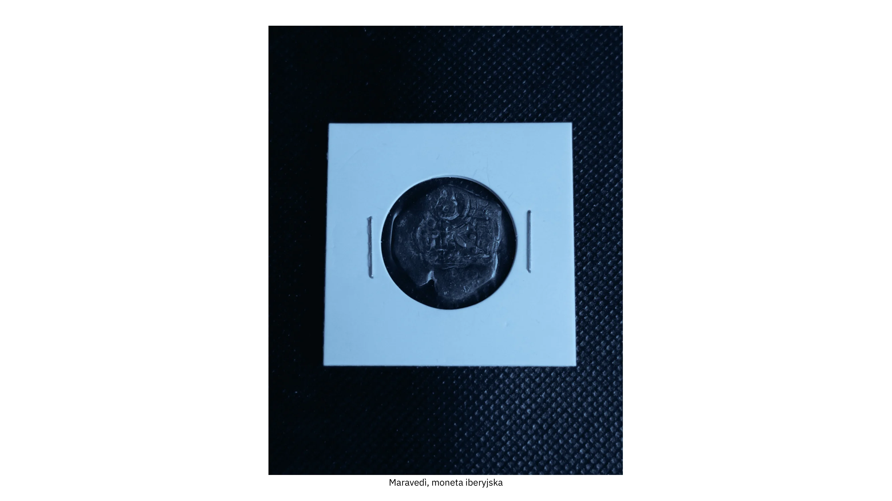

Jeśli spojrzymy na historię walut rezerwowych, wyłania się interesujący punkt: imperia nie inflowały swoich walut tak długo, jak długo zachowywały status waluty rezerwowej. **Dopiero pod koniec swojej dominacji dewaluowały je, tracąc ten przywilej, który był następnie przekazywany nowemu imperium**.

W Hiszpanii dolar hiszpański dominował w światowym handlu przez prawie 200 lat, zwłaszcza między Chinami a Europą. Monety te można było nawet znaleźć w chińskich portach. I tu właśnie dostajemy mrugnięcie okiem od historii: dolar amerykański pochodzi bezpośrednio od tej waluty. Kiedy Stany Zjednoczone powstały w 1792 roku, przyjęły ustawę o biciu własnej waluty, a ich pierwsze dolary zostały stworzone na wzór dolara hiszpańskiego, zarówno pod względem nazwy, jak i rozmiaru monety.

Aby dać ci wyobrażenie o jego wartości, amerykański dolar był pierwotnie srebrną monetą ważącą prawie uncję, czyli między 30 a 40 euro w dzisiejszych pieniądzach, w przeciwieństwie do papierowej waluty, którą znamy dzisiaj. Jeśli chodzi o dolara hiszpańskiego, krążył on tak szeroko, że jest uważany za pierwszą prawdziwą globalną walutę.

Napływ metali szlachetnych z obu Ameryk spowodował jednak inflację w Europie. Podczas rewolucji cenowej (ok. 1540-1640) koszty życia w Anglii wzrosły siedmiokrotnie. W Hiszpanii obfitość srebra miała przewrotny efekt klątwy zasobów, utrudniając rozwój solidnych instytucji bankowych.

Następnie Hiszpania stanęła w obliczu licznych konfliktów zbrojnych (Flandria, Holandia, wojna trzydziestoletnia), a jej finanse stopniowo się załamywały. Zamiast dewaluować znaną na całym świecie srebrną monetę, kolejni władcy decydowali się na niewypłacalność lub deprecjację miedzianej monety (vellón) używanej przez lokalną ludność. To właśnie opisałem wcześniej w przypadku Maravedis.

### Powstanie Holandii (XVII wiek)

Po iberyjskim apogeum, **Holandia** stała się nową potęgą handlową w XVII wieku. Handel morski, VOC (Holenderska Kompania Wschodnioindyjska) i założenie **Amsterdamskiej Giełdy Exchange** (zainspirowanej tą w Antwerpii) sprawiły, że ta republika handlowa stała się centrum.

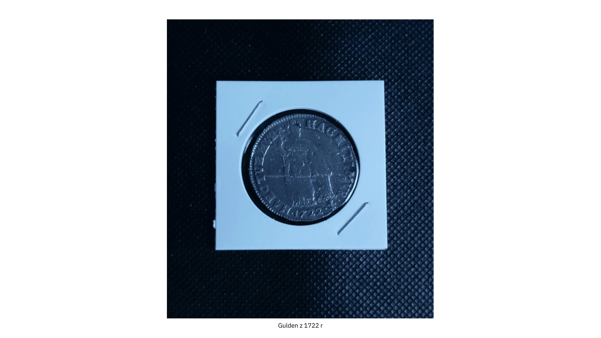

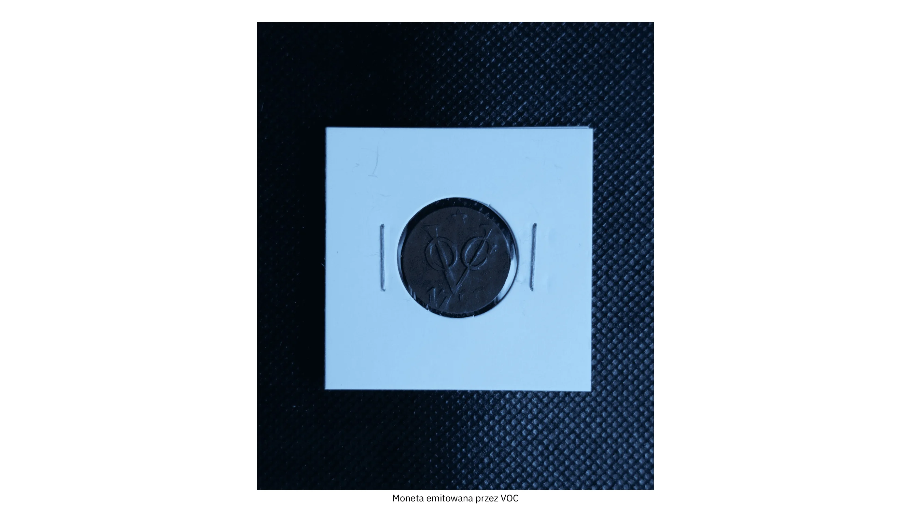

Na pierwszym zdjęciu powyżej widać Guldena z 1722 roku (piękną srebrną monetę), a na drugim monetę wyemitowaną przez VOC.

VOC była niezwykle potężną firmą jak na swoje czasy: posiadała własną armię, a nawet emitowała własną walutę.

Holendrzy wynaleźli nowoczesny kapitalizm, który rozpoczął się jako sposób na rozłożenie ryzyka w ryzykownych przedsięwzięciach, takich jak wyprawy do Nowego Świata lub poszukiwanie nowych szlaków handlowych. Spółki akcyjne umożliwiły kilku inwestorom łączenie pieniędzy i dzielenie się ryzykiem. Aby ułatwić tę wymianę, konieczne było stworzenie instytucji zdolnych do negocjowania i wymiany tych papierów wartościowych. W ten sposób w 1602 r. utworzono pierwszą spółkę akcyjną i giełdę papierów wartościowych.

Holenderska waluta, **Gulden**, zyskała wiarygodność dzięki czystości srebra, a następnie dzięki przyjęciu jej przez Bank Amsterdamski (1609), gdzie depozyty stały się preferowaną formą pieniądza w Europie. Jest to bardzo ważny punkt, o którym należy wspomnieć. Tak, oczywiście istniały monety, ale to, co naprawdę stanowiło pieniądz w tamtych czasach, było formą pieniądza biblijnego. W rzeczywistości większość światowego handlu przechodziła przez księgi Banku Amsterdamskiego. Był to prawdziwy przełom w bankowości: handel międzynarodowy nie był już koniecznie prowadzony za pomocą fizycznych monet, ale bezpośrednio poprzez zapisy księgowe banku.

Ten okres prosperity charakteryzował się dużym napływem złota i srebra, szczególnie z innych krajów praktykujących inflację lub kontrolę monetarną. Warto wspomnieć o ciekawej postaci: **Thomas Gresham**. W tym czasie pracował on dla angielskiej rodziny królewskiej w Holandii, zarządzając przepływem pieniędzy między tymi dwoma krajami. To właśnie ten sam Gresham pozostawił nam słynne **"Prawo Greshama "**.

Niemniej jednak, Imperium Holenderskie również w końcu się wyczerpało. Wojny z Anglią, osłabienie guldena w czasach konfliktu i konkurencja ze strony innych mocarstw (Francji i Anglii) sygnalizowały koniec holenderskiej hegemonii. Po czwartej wojnie angielsko-holenderskiej (1780-84) upadek guldena jako waluty rezerwowej stał się nieodwracalny.

### Francuska potęga, ambicje i porażki (XVII-XVIII w.)

Pod rządami Ludwika XIV Francja stała się największą potęgą kontynentalną w Europie. Jednak francuska waluta nigdy nie osiągnęła statusu dominującego punktu odniesienia: liczne dewaluacje, wysokie podatki i kosztowne wojny (Liga Augsburska, wojna o sukcesję hiszpańską itp.) mocno wpłynęły na stabilność systemu monetarnego.

Pierwszy poważny eksperyment z pieniądzem papierowym przeprowadził John Law (1716-1720). Banque Générale wyemitował weksle zabezpieczone obietnicami długu rządowego. Program ten doprowadził do bańki spekulacyjnej i załamania (Mississippi Bubble) w 1720 roku. Ta katastrofa pozostawiła we Francji trwałą nieufność do pieniądza papierowego. To właśnie to katastrofalne doświadczenie doprowadziło Richarda Cantillona do wzbogacenia się dzięki systemowi ustalania zasad, znanemu obecnie jako efekt Cantillona, w którym drukowanie pieniędzy wzbogaca tych, którzy mają dostęp do prasy drukarskiej.

Kiedy ta nieufność w końcu zniknęła, pojawiło się kolejne fiasko francuskich papierów wartościowych: rewolucyjne **assignaty**. Emitowane od 1790 r. w oparciu o konfiskatę majątku duchowieństwa, assignaty te doświadczyły galopującej hiperinflacji, czyniąc je oficjalnie pierwszą hiperinflacją w historii, która przekroczyła 50% miesięcznie. W 1795 r., mimo że ich wartość nominalna została zwielokrotniona, były one sprzedawane za zaledwie kilka procent ich początkowej wartości.

Bardziej restrykcyjne prawa starały się narzucić assignat, ale bez powodzenia. Rząd próbował go narzucić, posuwając się nawet do grożenia śmiercią tym, którzy go nie zaakceptowali, i zmuszając sklepikarzy do pozostania otwartymi. Ale oczywiście ostatecznie to nie zadziałało.

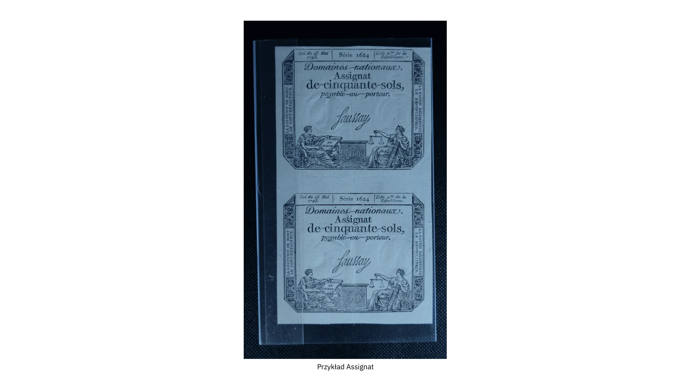

Gdy papierowe pieniądze zastąpiły wszystkie monety z metali szlachetnych, zgodnie ze słynnym prawem Greshama, nastąpił niedobór monet. Do bicia nowych monet wykorzystano metal dzwonowy przejęty od duchowieństwa. Poniżej można zobaczyć piękny kawałek metalu dzwonowego, wykonany z miedzi odzyskanej w wyniku przetopienia monet odebranych duchownym.

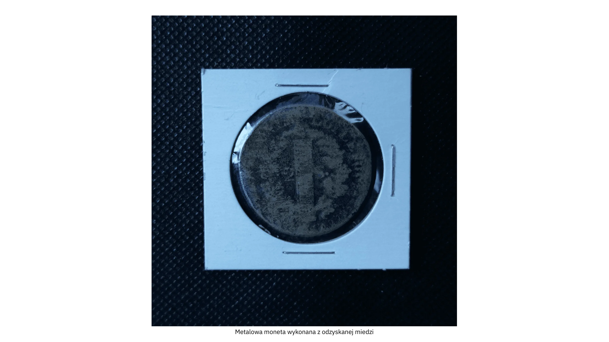

### Dominacja brytyjska (XVIII - początek XX wieku)

**Anglia**, po wyprzedzeniu Holandii, stała się dominującą potęgą w XVIII wieku. Funt szterling jest najstarszą wciąż używaną walutą, pierwotnie powiązaną z funtem srebra. Stopniowo jego status umacniał się, wspierany przez rewolucję finansową i fiskalną: monarchię parlamentarną, silną zdolność do podnoszenia podatków i utworzenie Banku Anglii w 1694 roku.

Po serii wojen z Francją, Wielka Brytania zwyciężyła w 1815 r. (Waterloo), potwierdzając swoją dominację. Przez cały XIX wiek funt szterling pełnił rolę światowej waluty rezerwowej. W szczytowym okresie, przy zaledwie 2,5% światowej populacji, Wielka Brytania wytwarzała 20% światowego dochodu i kontrolowała prawie jedną czwartą powierzchni Ziemi.

Rewolucja przemysłowa** i przyjęcie **standardu złota** (1717 lub 1718, pod nadzorem Isaaca Newtona w Mennicy Królewskiej) wzmocniły wiarygodność funta. Bank Anglii przyjął standard złota wynoszący 4,25 funta za uncję złota, umożliwiając posiadaczom banknotów zamianę ich na złoto.

Jednak I wojna światowa (1914-1918) położyła kres temu systemowi. W ciągu kilku tygodni wszystkie główne walczące mocarstwa zawiesiły wymienialność złota. Imperium Brytyjskie, a później funt, wyszły z II wojny światowej w osłabionym stanie, ustępując miejsca amerykańskiemu dolarowi w XX wieku.

A jako artefakt, poniżej można zobaczyć kilka pięknych i interesujących egzemplarzy. Są to odważniki monetarne. Pierwszy z nich to suweren: najwcześniejsza reprezentacja funta. Mam tylko odważniki pieniężne reprezentujące te monety, ponieważ nie mogę sobie pozwolić na zakup prawdziwego suwerena. Aby je zważyć, użyliśmy wagi, a następnie umieściliśmy odważnik pieniężny odpowiadający wartości suwerena po drugiej stronie.

Suweren był monetą pieniężną - złotą monetą o pierwotnej wartości jednego funta.

Poprzednikiem słynnego suwerena była gwinea, która działała na tej samej zasadzie. Nazwa gwinei pochodzi od zawartych w niej metali szlachetnych pochodzących z regionu Gwinei.

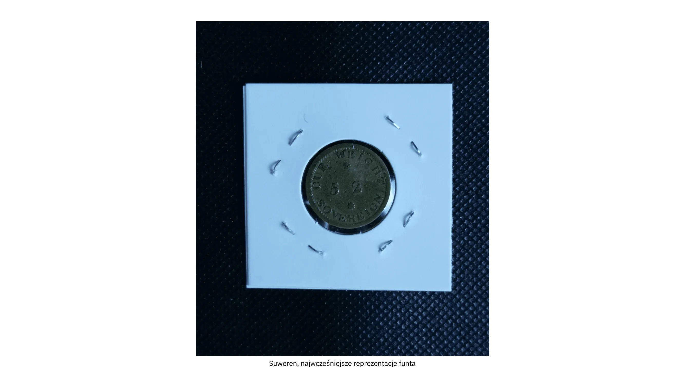

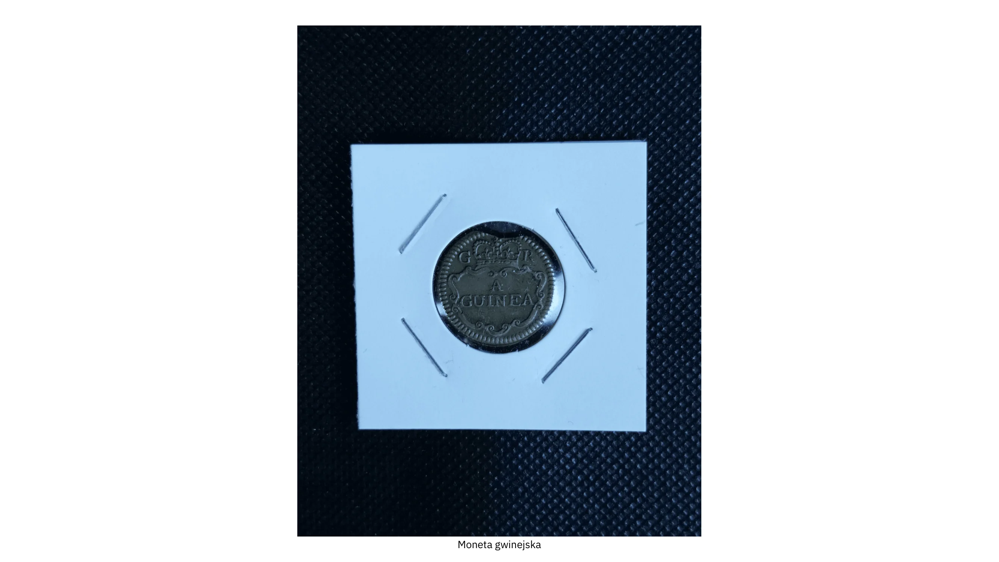

## Pojawienie się banków centralnych

<chapterId>15777771-1e28-55f7-a400-69868a47079b</chapterId>

:::video id=7661b7b5-e00f-48f3-b69a-6fb2eb5ebba4:::

Kontynuując sekcję poświęconą historii pierwszych walut rezerwowych i ich ewolucji, oto segment dotyczący pojawienia się banków centralnych. Podąża on tą samą ścieżką, co pojawienie się walut rezerwowych, ale skupia się nieco bardziej na ówczesnych technologiach bankowych.

### Początki banków i proto-banków

Już w XIII wieku Włosi (Florencja, Genua, Wenecja...) opracowali techniki podwójnego księgowania. Później, **Antwerpia** (XVI w.) stała się wiodącym centrum finansowym Europy Północnej, a rolę tę przejął później **Amsterdam**, dzięki Amsterdamskiej Giełdzie Papierów Wartościowych Exchange (1609 r.), na której handlowano akcjami VOC.

W Antwerpii odbywały się targi kupieckie, na których handlowcy często zbierali się w celu uregulowania długów, co doprowadziło do wynalezienia nowych instrumentów finansowych. Poniższy weksel, datowany na 1761 rok i nowszy, jest **wekslem wekslowym**. Zawiera odręczne szczegóły oraz napisy na odwrocie, co czyni go wspaniałym artefaktem z tamtego okresu.

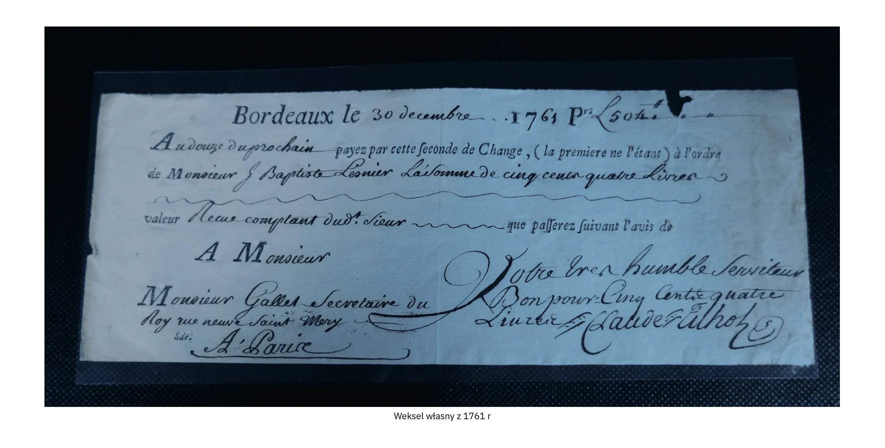

To musowanie doprowadziło do powstania bardziej wyrafinowanych instytucji bankowych. **Lombardzcy bankierzy**, a później holenderscy kupcy udoskonalili instrumenty kredytowe (weksle, weksle własne itp.). Nowoczesny system bankowy opiera się na tej idei: pieniądz może być kredytem, a nie tylko metalem.

Jak widać, prowadzi nas to z powrotem do naszego pierwotnego pytania o pochodzenie pieniędzy.

Czy pieniądz emanuje z towaru, który wyłania się z potrzeby wymiany, czy też wyłania się z kredytu? Ślady tego wciąż można znaleźć w tej sekcji.

### Szwedzki przykład: Stockholms Banco i Riksens Ständers Bank

Przejdźmy teraz do Szwecji, gdzie powstał pierwszy bank centralny.

**Szwecja** była pionierem bankowości centralnej: w 1657 r. Johan Palmstruch stworzył **Stockholm Banco**, upoważniony do pożyczania więcej niż wynosiły jego rezerwy metali, zaznaczając w ten sposób narodziny bankowości opartej na rezerwie cząstkowej. Jednak nadmierna emisja banknotów doprowadziła do paniki i runu na bank w 1663 roku. No cóż...

W 1668 roku w Sztokholmie założono Riksens Ständers Bank, pierwszy na świecie prawdziwy bank centralny. Jednak i on cierpiał z powodu kryzysów (1709, 1715...) związanych z nadużywaniem banknotów, często w celu finansowania wojen królestwa.

### Nieudany zamach stanu Johna Law

Udajmy się do Francji, gdzie po raz kolejny znajdziemy naszego ukochanego Johna Law.

**Szkot John Law przekonał regenta (księcia Orleanu) do utworzenia prywatnego banku, Banque Générale (1716), upoważnionego do emisji papierów wartościowych w zamian za złoto, srebro i długi rządowe. Przekształcił się on w Banque Royale (1718) i pomógł w szybkim wzroście akcji Kompanii Missisipi.

Kiedy rzeczywistość dogoniła spekulacje, **panikę zaostrzyła decyzja o zakazie posiadania złota i wymuszeniu korzystania z banknotów Law**. No cóż...

Ostatecznie bańka pękła w 1720 roku, powodując załamanie, które zrujnowało wiarygodność pieniądza papierowego we Francji na długi czas.

### Bank of Amsterdam, rozwój pionierskiego modelu

Przenosimy się teraz do Amsterdamu w 1609 roku, gdzie **Bank Amsterdamu** (Wisselbank) przejął kontrolę nad przechowywaniem i wymienialnością monet w Amsterdamie. Zakazał obiegu prywatnych banknotów i wymusił deponowanie metalowych monet w swoich skarbcach. Stopniowo przejmowali kontrolę nad walutą. Zakazali kantorom trzymania monet u siebie. Kantorzy pracowali przez cały dzień, a pod koniec dnia musieli zdeponować swoje monety w skarbcach Banku Amsterdamskiego. Jak już wspomniałem, w handlu międzynarodowym niekoniecznie używano metalowych monet. Były to pieniądze zapisane w księgach banku.

Dzięki holenderskiej potędze handlowej, bank odegrał rolę pierwszego de facto "banku centralnego", stabilizując światowy handel. Z czasem jednak udzielił niezabezpieczonych pożyczek VOC i ostatecznie zabrakło mu metalu na pokrycie swoich rachunków. W 1790 r. okazało się, że pożyczył on duże sumy VOC i praktycznie ogłosił bankructwo, rujnując wiarygodność guldena. No cóż...

### Bank Anglii, akt założycielski nowoczesnej bankowości

W XVII-wiecznej Anglii złoto i srebro były przechowywane przez złotników, którzy wystawiali pokwitowania. Ta częściowo zdecentralizowana organizacja dowiodła swoich ograniczeń, gdy Korona znalazła się w ogromnej potrzebie finansowania wojny z Francją.

W 1694 roku został założony **Bank of England (BoE)**. Bank Anglii narodził się w ten sposób z wygodnego małżeństwa między londyńską społecznością biznesową a rządem, który desperacko szukał funduszy na wojnę.

Bank uzyskał monopol na emisję banknotów w Anglii (wzmocniony w 1708, 1742 itd.). Od tego momentu pieniądz papierowy wsparty rezerwami złota krążył obok monet. Jest to ważny punkt dla zrozumienia stopniowego przejmowania pieniądza przez instytucje państwowe. Po pierwsze, Bank Amsterdamu uniemożliwił kantorom przechowywanie monet i zmusił ich do ich zwrotu do Banku. W Anglii prywatne banki nie mogły emitować własnych banknotów wymienialnych na złoto.

Zezwolono prywatnym bankom na emisję banknotów, ale mogły one być wymieniane tylko na banknoty Banku Anglii.

Weksle Banku Anglii, funty szterlingi, były wymienialne na złoto. To dodało trzecią warstwę do waluty. Mamy więc złoto u podstawy, następnie banknoty Banku Anglii, a na końcu banknoty banków prywatnych. Wcześniej banki prywatne mogły emitować własne weksle wymienialne na złoto. Jest to kolejny etap stopniowego przejmowania waluty przez instytucje państwowe.

Bank finansował państwo ogromnymi pożyczkami i zorganizował ogromny dług publiczny, który sfinansował boom gospodarczy.

Model ten został skonsolidowany w ciągu XVIII i XIX wieku, do punktu, w którym funt stał się światową walutą rezerwową, pod pieczęcią Banku Anglii i standardu złota.

**Światowe waluty rezerwowe** podążały jedna za drugą na przestrzeni wieków, napędzane ekonomiczną, handlową i militarną potęgą państwa lub imperium: Portugalii, Hiszpanii, Holandii, a następnie Wielkiej Brytanii, zanim Stany Zjednoczone zaczęły dominować w XX wieku. W każdym przypadku widzimy podobny cykl: ekspansja gospodarcza, sukces handlowy, międzynarodowe przyjęcie waluty, zadłużenie, kosztowne wojny, nadużywanie kreacji pieniądza lub kredytu, a w końcu upadek.

**Pojawienie się banków centralnych** było procesem stopniowym. Instytucje te często powstawały w kontekście kosztownych wojen, umożliwiając państwu finansowanie się poprzez zadłużenie. Kiedy przyjęto standard złota (Anglia, XVII-XIX w.), zapewnił on pozory stabilności, dopóki wielkie wojny światowe XX wieku nie doprowadziły do stopniowego porzucenia wymienialności złota. W ten sposób władza bicia pieniądza przesunęła się z monopolu królewskiego na bardziej złożone podmioty, najpierw prywatne (złotnicy, bankierzy), a następnie półpubliczne (banki centralne), odzwierciedlając ewolucję suwerenności monetarnej w kierunku zinstytucjonalizowanych, zglobalizowanych form.

To właśnie opisałem wcześniej. Często przenosiliśmy ciężar długu państwowego bezpośrednio na banki centralne lub pozwolenie na tworzenie pieniędzy przez instytucje prawne, takie jak parlament.

Najważniejszym faktem jest to, że **przeszliśmy od długu, który mógł zniknąć w wyniku bankructwa suwerena, do długu, który spoczywał głównie na barkach ludności**.

## Droga do systemu fiat

<chapterId>27a98545-d350-56ee-a200-92468e6b9b33</chapterId>

:::video id=e27a753e-aeee-4307-a65c-9506aab380a1:::

Dotarliśmy już do końca tego kursu na temat historii pieniądza i aby go zakończyć, chciałem zaproponować dwa tematy. Pierwszym tematem są różne etapy, które doprowadziły do powstania naszego obecnego systemu pieniądza fiducjarnego. Powrócimy do faktów z sekcji 5 na temat tworzenia banków centralnych i dodamy koncepcję dolara amerykańskiego, który ostatecznie jest obecną walutą rezerwową. Przyjrzymy się, jak ewoluował, jak powstał dolar, jak ewoluował, jak się zmieniał, jakie etapy przeszedł, aby stać się systemem fiducjarnym, ponieważ źródłem dolara jest srebrna moneta.

Następnie, zaraz po tym, przedstawię krótki segment dotyczący historii finansów, aby pomóc zrozumieć, w jaki sposób doszliśmy do państwa opiekuńczego. Przyjrzymy się więc dwóm tematom: jak doszliśmy do systemu fiducjarnego, a zaraz potem, jak ewolucja finansów doprowadziła nas do koncepcji państwa opiekuńczego.

### Europejskie fundamenty nowoczesnej bankowości

Wróćmy do florena z XIII wieku. Aby zrozumieć, w jaki sposób doszliśmy do modelu fiat, musimy zacząć od XIII wieku. Oprócz florena, w tym samym czasie wraz z Medyceuszami pojawiła się technologia - koncepcja weksli.

Następnie pojawiła się giełda w Antwerpii, z jej koncepcją dyskontowania i weksli.

Następnie, jak widzieliśmy, mieliśmy VOC, pierwszą giełdę w Amsterdamie. Oznaczało to narodziny kapitalizmu, z akcjami spółek i wymianą akcji. Następnie bank amsterdamski narzucił dekretem stosowanie depozytów. Oznaczało to, że monety musiały być deponowane na koniec dnia. To kantorzy nie mogli już przechowywać reszty w formie monet.

Następnie powstał Bank Anglii z potrzeby stworzenia długu w celu sfinansowania wojny pod koniec XVII wieku. W tym czasie prywatne banki stały się trzecią warstwą pieniądza. Nawiasem mówiąc, cała ta sekcja, od florena do pojęcia utworzenia banku centralnego, jest niezwykle dobrze podsumowana w słynnej książce Nicka Bhatii "Layered Money", którą miałem szczęście przetłumaczyć wraz z kilkoma kolegami. Wykonaliśmy świetną robotę, tłumacząc ją tak, aby osoby francuskojęzyczne na całym świecie mogły skorzystać z tych nauk.

Mamy więc koniec XVII wieku. Bank Anglii został utworzony w celu finansowania wojny.

Prywatne banki przejęły trzecią warstwę waluty. W rzeczywistości weksle banków prywatnych nie były już wymienialne na złoto: to weksle Banku Anglii były wymienialne na złoto. Świadczy to o przejęciu władzy nad wymianą przez instytucję, jaką jest Bank Anglii.

Potem przyszła panika 1776 roku. Wszyscy rzucili się w górę piramidy pieniądza. Oznacza to, że w 1776 r. nastąpił run na banki, a więc wszyscy ludzie, którzy posiadali papier trzeciej warstwy, tj. prywatne weksle bankowe, próbowali zdobyć weksle Banku Anglii, a następnie próbowali zdobyć złoto, ale oczywiście w skarbcach nie było wystarczającej ilości złota. Bank ogłosił swego rodzaju wakacje bankowe, aby uniknąć spłacania weksli w złocie, co dało początek koncepcji pożyczkodawcy ostatniej instancji.

### Ewolucja dolara amerykańskiego

Przeszliśmy od florena do utworzenia Banku Anglii. Oczywiście w międzyczasie miały miejsce pierwsza i druga wojna światowa, ale wcześniej, w 1796 r., wydarzenia miały miejsce również po drugiej stronie Atlantyku. W 1776 roku Ameryka wciąż była brytyjską kolonią, a kolonie używały papierowej waluty. Poniżej znajduje się banknot dwuszylingowy Connecticut z 1776 roku.

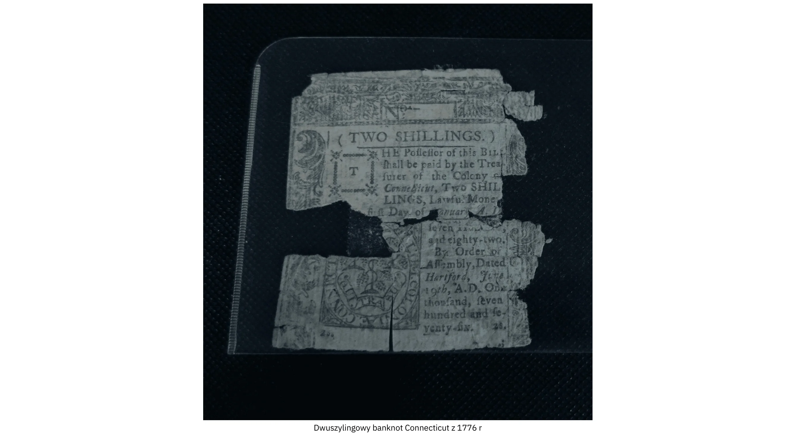

Przed wypowiedzeniem wojny Anglii i ostatecznie wyemitowaniem własnej waluty, kolonie używały tej papierowej waluty, obok hiszpańskiego dolara do transakcji gotówkowych. W rzeczywistości termin "dolar" pozostał na określenie dolara amerykańskiego.

Jeśli się nie mylę, w 1792 r. uchwalono ustawę zezwalającą na bicie monet. Dla przykładu, poniższa moneta to dolar amerykański z ery nowożytnej.

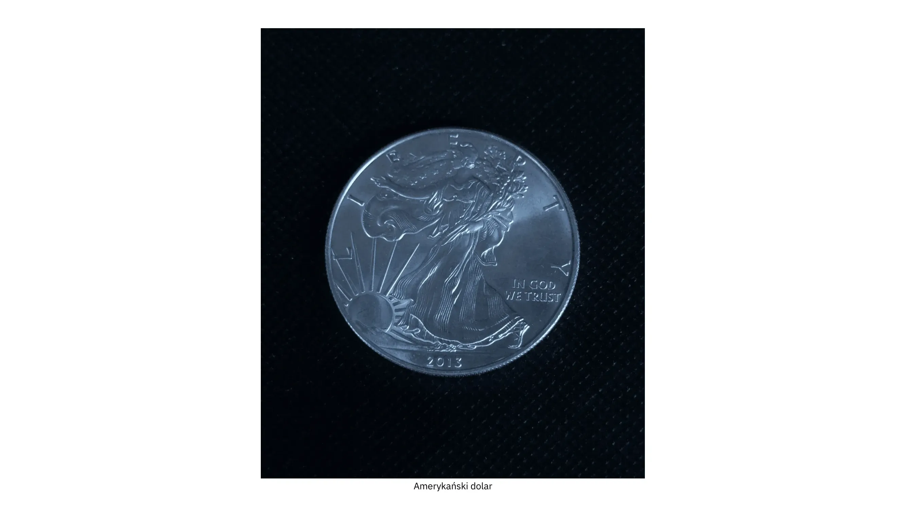

Cóż, oczywiście nie ma on wartości nominalnej jednego dolara; jest wart około 30 lub 40 dolarów, ponieważ reprezentuje uncję srebra. Jego wartość waha się w zależności od ceny srebra, zazwyczaj na poziomie 30 lub 40 dolarów amerykańskich. Dziś oczywiście papierowy dolar zachowuje tylko wartość nominalną jednego dolara, ale w tamtych czasach dolar amerykański był zakorzeniony w tej wartości srebra.

Porozmawiajmy teraz o wojnie secesyjnej w Ameryce. Konfederaci drukowali pieniądze, które były hiperinflowane. Zjawisko to nie jest uwzględnione na oficjalnej liście Hanke-Krusa, ponieważ nie osiągnęło stopy hiperinflacji wynoszącej 50%. Miesięczna stopa inflacji wynosiła jednak 40%, co wskazuje, że podczas wojny wydrukowano znaczną ilość waluty.

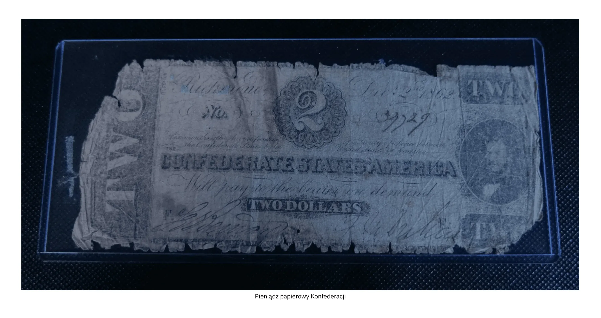

Ich przeciwnicy z północy również posiadali dolary. Powyżej widać dolary Konfederacji, a poniżej dolary Północy. Nazywano je "greenback", ponieważ ich rewers był zielony.

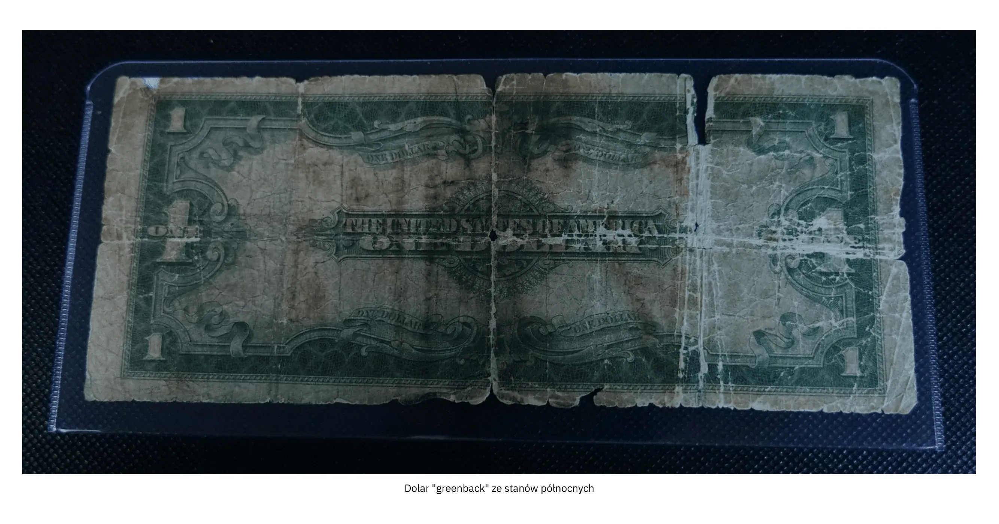

Zachęcam do porównania różnicy w rozmiarze ze współczesnymi banknotami. W tamtych czasach banknoty były większe.

Jak wiemy, Północ wygrała, więc greenback stał się walutą zjednoczonych stanów amerykańskich. Potem przyszło założenie FED w 1913 r. i pierwsza wojna światowa.

W następstwie pierwszej wojny światowej ostatnia seria drukowanych banknotów zawsze zawierała słowa "wymienialne na złoto na żądanie". Tak więc w 1928 r. za 20 USD można było kupić prawie uncję złota, ponieważ cena złota wynosiła 20,67 USD. Za banknot przedstawiony na poniższym obrazku można było kupić uncję złota w 1928 roku.

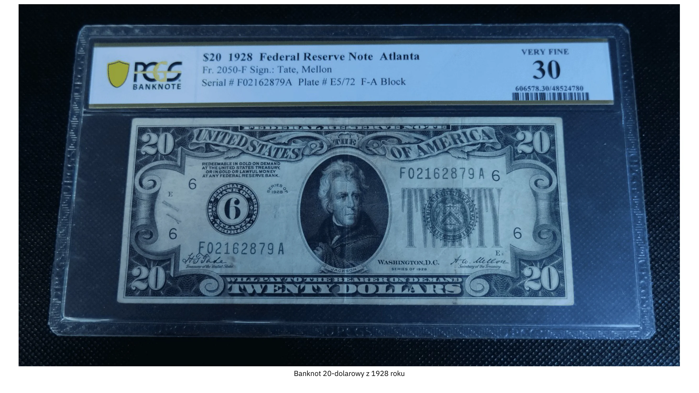

Dziś uncja złota jest warta 3000 USD. Oczywiście widać tu siłę dewaluacji. Była to ostatnia ustawa zawierająca słowa "wymienialne na złoto". Zobaczymy, że zaraz po wydaniu rozporządzenia wykonawczego 6102, przejęliby całe złoto. W rzeczywistości zarekwirowano zarówno złoto, jak i certyfikaty na złoto.

Poniżej znajduje się złoty certyfikat z 1928 roku.

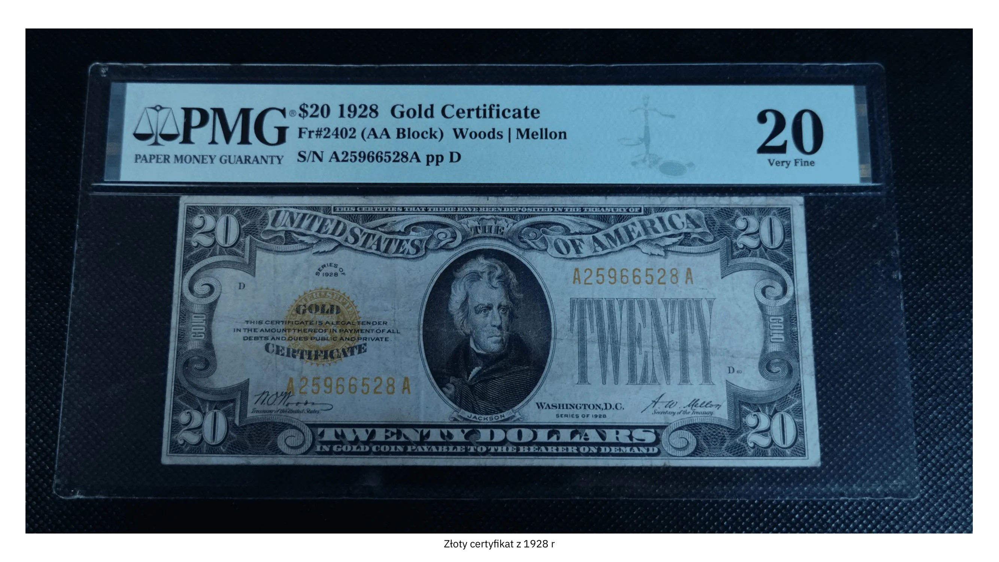

Był nie tylko "wymienialny na złoto", jak banknot z 1928 r., ale także wymienialny na złote monety: to naprawdę "złoty certyfikat". Wszystkie one zostały skonfiskowane po wydaniu rozporządzenia wykonawczego 6102. Do 1964 r. ich posiadanie było nawet nielegalne.

Jestem bardzo szczęśliwy, że go mam.

Począwszy od 1964 r. posiadanie złota stało się nielegalne, aż do 1974 r., jeśli się nie mylę. W latach 70. pozwolono ludziom gromadzić złoto po szoku Nixona, który wkrótce opiszemy. W 1933 r., kiedy wydano "Executive Order 6102", złoto zostało skonfiskowane, a jego posiadanie stało się nielegalne. Za przetrzymywanie złota groził wysoki wyrok więzienia. W tamtych czasach każda uncja złota była wymieniana na banknot podobny do tego poniżej, po 1934 roku.

Jak już wspomnieliśmy, w 1928 roku na dolarze wciąż widniał napis "wymienialny w złocie".

Po wydaniu rozporządzenia wykonawczego nr 6102 przejęto całe złoto i wymieniono 20,67 USD za każdą uncję złota. Następnie oszustwo wyszło na jaw: w 1934 r. wyemitowano nowe banknoty z wydrukowanym tekstem "ten banknot jest prawnym środkiem płatniczym dla wszystkich długów".

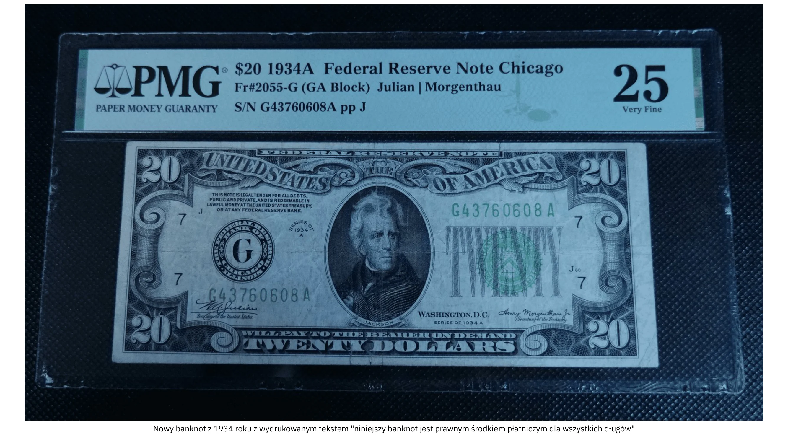

Pojęcie legalnego środka płatniczego pojawia się tutaj, zastępując frazę "wymienialny w złocie" Oba banknoty mogą wyglądać identycznie, zmieniając tylko kilka słów, ale oszustwo polega na tym, że dolar został zdewaluowany w tym okresie; spadł z uncji złota wycenianej na 20,67 USD do 35 USD za uncję w 1934 roku. Oznaczało to dewaluację o około 40%!

Potem nadeszła druga wojna światowa. Po wojnie porozumienie z Bretton Woods scentralizowało większość światowego złota w Stanach Zjednoczonych. W zamian Amerykanie wyemitowali banknoty, które jednak nie były już wymienialne na złoto przez ogół społeczeństwa. Zamiast tego pozostały one wymienialne na złoto na poziomie stanowym.

W końcu kraje takie jak Francja i Niemcy zaczęły podejrzewać, że w amerykańskich skarbcach jest prawdopodobnie więcej banknotów dolarowych w obiegu niż złota.

Poprosili więc o repatriację złota. Odpowiedzieli: "Dobrze, zrobimy to, ale to trochę potrwa" W 1971 r. nasz przyjaciel Richard Nixon raz na zawsze przeciął związek między banknotami a złotem, obwiniając przy tym spekulantów.

Złoto było niedowartościowane na poziomie 35 USD za uncję, co nie odpowiadało ilości wydrukowanych pieniędzy ani jego prawdziwej wartości rynkowej. W ciągu zaledwie kilku lat cena wzrosła z 34 do 800 dolarów. Podobnie jak w przykładach historycznych, takich jak Rzym, gdzie połączenie między denarem a solidusem zostało zerwane, złoto mogło unosić się w powietrzu. Fakt ten doprowadził do procesu odkrywania cen, w wyniku którego złoto było później wyceniane znacznie wyżej w dolarach.

### Nowoczesny system waluty fiducjarnej i jego implikacje

Ta część podsumowuje, w jaki sposób odeszliśmy od systemu monetarnego opartego na srebrze lub złocie. Stopniowo instytucje zyskiwały coraz większą władzę nad pieniądzem. Ostatecznie jednostronna decyzja całkowicie zerwała związek między metalami szlachetnymi a pieniędzmi, po nadmiernej emisji.

W rezultacie nie ma już żadnego związku między złotem a banknotami lub pieniędzmi biblijnymi. I nie jest to nawet system rezerwy cząstkowej - to przestarzała koncepcja. Zamiast tego prywatne banki emitują i tworzą pieniądze poprzez kredyt bankowy. Pieniądze są tworzone głównie w ten sposób i są skorelowane z kluczową stopą procentową ustaloną przez bank centralny.

Tak naprawdę nie ma limitu. Nie ma już obowiązkowych poziomów rezerw, przynajmniej w Ameryce i Kanadzie. Jedyną rezerwą jest konieczność zorganizowania przez banki możliwości reagowania na wymiany międzybankowe, aby nie zabrakło im płynności.

Muszą tylko upewnić się, że mogą dokonać tych transferów, ale nie ma obowiązkowej rezerwy 3%, 1%, 10%. Naprawdę odeszliśmy od koncepcji rezerwy cząstkowej. Teraz to banki centralne, rządy poprzez deficyty fiskalne, banki centralne poprzez luzowanie ilościowe (QE) i banki prywatne poprzez tworzenie pożyczek bankowych mogą zwiększać całkowitą podaż pieniądza i, moim zdaniem, powodować inflację.

Aby zrozumieć związek między pieniądzem a inflacją, polecam kurs, który mam na Plan ₿ Academy poświęcony temu tematowi. Dowiesz się, jaka jest różnica między wzrostem cen, czyli tym, co widzimy w życiu, a inflacją. To nie jest to samo. W rzeczywistości, kiedy mówimy o inflacji, często mówimy o wzroście cen, a nie o samej inflacji. Inflacja jest dość precyzyjną koncepcją, wyjaśnioną przez wzrost podaży pieniądza.

https://planb.academy/courses/caa75343-ac90-4249-bcca-0e2e57c3a0f1

Na zakończenie tej sekcji dotyczącej świata pieniądza fiducjarnego, chciałbym wskazać źródło, które pomoże ci lepiej zrozumieć zjawiska, które właśnie wyjaśniłem, takie jak inflacja.

Dziękujemy za uwagę.

## Historia baniek pieniężnych

<chapterId>b6451c46-917d-11f0-97de-6bc5081765fa</chapterId>

:::video id=5967d9a6-aae4-4b84-a283-71b1b735bca4:::

### Wynalezienie papierowego pieniądza i pierwsza wielka bańka internetowa

Wraz z powstaniem banków centralnych w XVIII wieku narodziła się prawdziwa rewolucja: magiczne pieniądze w postaci banknotów. Najbardziej uderzającym przykładem we Francji jest John Law. Ten Szkot, wygnany z Paryża, zaproponował regentowi, księciu Orleanu, rozwiązanie bankructwa królewskich finansów poprzez utworzenie banku państwowego i kolonialnej spółki handlowej: słynnego **Banque Royale** i **Compagnie du Mississippi**.

Dzięki temu systemowi Law powiązał papierowe pieniądze z akcjami swojej firmy. Im więcej banknotów krążyło w obiegu, tym wyższa była wartość akcji i tym solidniejszy wydawał się bank... dopóki spekulacja nie przerosła rzeczywistości. Bańka pękła nagle w 1720 roku, rujnując szlachtę, burżuazję i większość Europy, która przybyła, by spekulować na rue Quincampoix. Rezultat: trwała nieufność do pieniądza papierowego we Francji i pierwsza lekcja Europy na temat baniek spekulacyjnych.

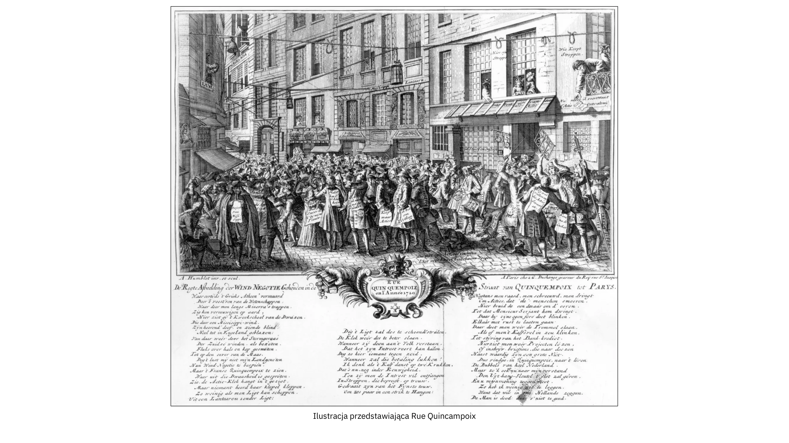

### Kiedy ziemia staje się "zabezpieczeniem"

Sto lat później Rewolucja Francuska wprowadziła **assignats**, walutę zabezpieczoną przejętym majątkiem kościelnym. Pomysł atrakcyjny na papierze - przekształcenie ziemi w zabezpieczenie pieniężne - ale nieskuteczny: ziemia nie jest ani płynna, ani podzielna. Rezultat: hiperinflacja, liczne zakazy użytkowania ziemi, niekontrolowana inflacja i niedobory.

Napoleon, głęboko dotknięty tym chaosem, przywrócił złoto i srebro jako podstawę monetarną w 1800 r., tworząc Banque de France, gwarantując w ten sposób regularny żołd dla swoich armii. Pragmatyczny sposób na odzyskanie zaufania: płacić w twardej walucie.

### Ryczące lata dwudzieste i Wielki Kryzys z 1929 r

Przeskoczmy dwa stulecia. Po I wojnie światowej rządy finansowały wysiłek poprzez inflację i zawieszenie złota. W latach dwudziestych XX wieku amerykański Fed prowadził nadmiernie akomodacyjną politykę pieniężną w celu wsparcia funta brytyjskiego. Rezultat: łatwy kredyt, nieokiełznane spekulacje na Wall Street, zakupy akcji na kredyt oraz pojawienie się bańki na rynku nieruchomości i bankowości.

Kiedy ta machina się zawiesiła, krach z 1929 r. był nieunikniony: masowe bankructwa banków, rekordowe bezrobocie i kolejki do jadłodajni. Doprowadziło to do uporczywego błędnego przekonania, że **wszelka deflacja jest zła**, podczas gdy musimy rozróżnić deflację poprzez wzrost (zdrową) i deflację poprzez zadłużenie (niszczycielską).

### Azja w latach 90. i efekt domina

W latach 90. "azjatycki cud" sprawił, że świat śnił. Kursy Exchange były powiązane z dolarem, wzrost wynosił 8-10%, a zachodni kapitał napływał. Wszystko było dobrze... dopóki fala nie odpłynęła. Nastąpiła kaskada bankructw, waluty zdewaluowały się o 80%, a inwestorzy zostali zrujnowani. MFW musiał interweniować, narzucając bolesne reformy. Ten sam scenariusz co zawsze: obfity kapitał, bańki napędzane kredytem, a następnie załamanie.

### rok 2008 i era trwałej bańki internetowej

Po bańce internetowej (2000 r.) nastąpiła bańka na rynku nieruchomości subprime. Sekurytyzacja przekształciła pożyczki bankowe w produkty finansowe "potrójnego A", rozpowszechnione na całym świecie. Obietnica: wyeliminowanie ryzyka poprzez jego rozcieńczenie. W rzeczywistości wszystkie ryzyka były ze sobą skorelowane. Kiedy nieruchomości upadły, upadł cały globalny system bankowy.

Rezultat: masowe publiczne akcje ratunkowe, luzowanie ilościowe i zerowe stopy procentowe. A wraz z tym gwałtowny pęd: każdy kryzys nie będzie już oczyszczał z ekscesów, ale będzie pokrywany coraz większym zadłużeniem i drukowaniem pieniędzy. To właśnie doprowadziło do obecnej sytuacji: **bańki wszystkiego**, gdzie wszystko - akcje, nieruchomości, sztuka, kryptowaluty, a nawet karty Pokémon - jest sztucznie nadmuchiwane.

### Wieczny powrót magicznych pieniędzy

Z wieku na wiek wyłania się jedna stała prawidłowość: gdy tylko społeczeństwo uwierzy, że może tworzyć bogactwo za pomocą pieniędzy, zamiast produkować realne dobra, pojawiają się bańki. Od Johna Law do 2008 roku, od rue Quincampoix do Wall Street, proces się powtarza: euforia, kredyt, boom i upadek.

I w końcu, niezmiennie, gdy nikt już nie ufa papierowi, ludzie szukają czegoś innego - złota, ziemi, bezpiecznych przystani... lub nowych walut. Wczoraj Napoleon narzucił metal, dziś niektórzy uważają Bitcoin za jego następcę.

Historia finansów to niekończący się cykl: drukuj, spekuluj, upadaj. Aż do następnej bańki.

## Pieniądze i przemoc

<chapterId>9486fe64-854f-5e17-86b3-8873baca39a8</chapterId>

:::video id=bd6d0807-2d8f-4637-a0f5-1e990e5c0d0f:::

W tej krótkiej sekcji powrócimy do wielu wydarzeń, które już widzieliśmy podczas kursu, podsumowując kilka anegdot, które uważam za interesujące.

### Technologia i przemoc

Oto kilka anegdot, o których prawdopodobnie rozmawialiśmy już na kursie. Służą one wprowadzeniu do bardzo fascynującej dyskusji, którą odbyłem z Theo na temat wykładu, który wygłosił w B-Ondy, który wydał mi się bardzo interesujący pod względem tego, jak postęp technologiczny wpływa na relacje przemocy między ludnością a państwem.

### Pieniądze i przymus państwowy

Aby wprowadzić tę sekcję, podam krótką i niewyczerpującą listę, aby przypomnieć ci o wydarzeniach, które prawdopodobnie już omówiliśmy w kursie.

Jedno powiązanie z pieniędzmi i przemocą jest takie, że jeśli chodzi o bezwartościowe papierowe pieniądze, które można drukować w nieskończoność, często wiążą się one z różnego rodzaju zasadami i groźbami. Możemy już mówić o assignatach, gdzie na banknotach dosłownie napisano, że fałszerzom grożono śmiercią. Łatwo jest znaleźć w ówczesnych tekstach prawnych groźby śmierci dla tych, którzy nie akceptowali tego słynnego papierowego pieniądza.

Aby pozostać we Francji, w jednym z tekstów prawnych, które udało mi się zdobyć z epoki rewolucji, zobaczyłem, że "dieta" za transport i obsługę gilotyny została opisana w sekcjach związanych z walutą. Wydało mi się to dość dziwne.

Rozmawialiśmy również o biciu monet w Chinach, gdzie państwo nadzorowało bicie monet. Widzieliśmy w sekcji na początku kursu, że kiedy monety, z których niektóre były mniej piękne, zostały wyrzucone, pojawiły się konsekwencje prawne.

Istnieje również anegdota o królu w Anglii, który skończył obcinając ręce tym, którzy bili pieniądze, jeśli nie zachowywali się zgodnie z jego oczekiwaniami.

Również w Chinach czytałem o konfiskacie miedzi z klasztorów buddyjskich. W czasie, gdy miedź zyskiwała na wartości i destabilizowała ich gospodarkę - która opierała się na formie pieniądza fiducjarnego, który miał niewiele wspólnego z wartością metalu - uciekli się do znalezienia miejsca, w którym było bogactwo i przejęli miedź z klasztorów.

To samo dotyczyło klasztorów w Anglii podczas angielskiej reformacji. Kiedy słynny król pokłócił się z papieżem o rozwód, był jeszcze jeden powód: wykorzystał zniesienie klasztorów do przejęcia bogactwa zawartego w tych kościelnych organizacjach.

Podczas rewolucji francuskiej skonfiskowano cały majątek Kościoła. Zobaczyli piękne monety stworzone ze stopionych dzwonów kościelnych.

Jeśli cofniemy się jeszcze dalej, jednym z najbardziej wyraźnych pojęć przemocy ekonomicznej i wolności, libertyńskich praw, jest **Dioklecjan ze swoją dziedziczną kastą, która była bezpośrednio związana z faktem, że chłopi nie chcieli już akceptować zdewaluowanej waluty**. Chcieli porzucić swoją pracę jako chłopi, a Dioklecjan zareagował po prostu mówiąc im: "nie możecie opuścić swojej ziemi, podobnie jak wasze dzieci". To samo dotyczyło żołnierzy.

Myślę, że to dość wyraźna forma przemocy. Mógłbym zakończyć, mówiąc o templariuszach lub francuskim królu. Kiedy templariusze osiedlili się we Francji, wyobrażam sobie, że zobaczył mannę bogactwa templariuszy i miał problemy z finansowaniem państwa. Pozwał zakon templariuszy, a niektórzy z nich byli w stanie odejść z częścią skarbu, co dało początek bardzo interesującemu programowi w USA lub Kanadzie. Nie wiem, kto go wyprodukował, ale nazywa się *The Mystery of Oak Island*. Opowiada o ludziach, którzy uważają, że na wyspie w Kanadzie, w Maritimes, zakopany jest skarb templariuszy, i wiercili przez lata - może nawet ponad dekadę - aby zrobić coś w rodzaju studni. Znaleźli studnię z wieloma galeriami i szukają skarbu zakopanego przez templariuszy na tej wyspie, która jest tematem tego programu telewizyjnego. Pozdrawiam mojego ojca, który jest wielkim fanem tego serialu.

Oto krótka lista faktów, które widzieliśmy podczas tego kursu, a które, jak sądzę, podnoszą związek z przemocą. Zostawię was z następną częścią od Theo, który opowie nam bardzo interesującą historię o zmianach technologicznych i równowadze sił między plebsem a władzą.

Dziękuję!

## Ekonomiczne konsekwencje zorganizowanej przemocy

<chapterId>66bd4674-2159-5489-ad4b-ec5e3fb691af</chapterId>

:::video id=c8b063c6-aeb4-4a94-9027-b11d369e71a4:::

### Zorganizowana przemoc i ewolucja państwa

Historyk Frederic C. Lane proponuje rewolucyjną tezę: anatomia państwa na przestrzeni dziejów jest kształtowana przez technologie wykorzystywane do projekcji przemocy. Wychodząc od Weberowskiej zasady, że państwo posiada monopol na uzasadnioną przemoc, Lane zauważa, że monopol ten - paradoksalnie bardziej wydajny niż konkurencja w tej dziedzinie - ewoluuje zgodnie z relacją między kosztem ataku a kosztem obrony.

Analiza ta, podjęta przez autorów "The Sovereign Individual" (1997), wyjaśnia historyczne mutacje organizacji politycznej: od średniowiecznego systemu feudalnego do miast-państw renesansu, następnie do przemysłowych państw narodowych i wreszcie do nowoczesnych państw opiekuńczych. Każde przejście odpowiada znacznemu przełomowi technologicznemu w stosowaniu przemocy, występującemu mniej więcej co 400-500 lat.

### Średniowieczna równowaga

W średniowieczu gospodarka agrarna dominowała w ponad 90%. Chłop, dosłownie zakorzeniony w swojej ziemi, nie mógł uciec przed panem i jego rycerzami. Technologia wojskowa - ręcznie kuta zbroja, lata treningu miecza - była niezwykle kosztowna. Ta asymetria znacznie faworyzowała atak nad obroną.

Nieruchomy producent rolny staje się niewolnikiem lokalnego monopolisty przemocy. Jego zdolność do pobierania podatków osiąga nowe wyżyny - choć paradoksalnie średniowieczne podatki pozostają skromne w porównaniu z 78% obowiązkowych opłat w czasach współczesnych. Władca może nakładać podatki do woli, ponieważ chłop nie może się oprzeć ani odejść.

### Renesans kupiecki

Pojawienie się handlu hanzeatyckiego na północy i śródziemnomorskiego na południu zmieniło sytuację. Kupcy, główni twórcy wartości dodanej, posiadali mobilny kapitał - swoje statki. Potrzebowali jedynie lekkich milicji morskich, ponieważ morza były trudne do upilnowania. Co więcej, mogli łatwo przenieść się do sąsiedniego portu, jeśli opodatkowanie stało się nadmierne.

Ta mobilność stworzyła konkurencję podatkową między miastami-państwami. Wenecja, Genua i Brugia musiały zaoferować jak najbardziej liberalne ramy: wiarygodne kontrakty, wysokiej jakości walutę, ubezpieczenia, minimalne podatki. Książęta musieli raczej uwodzić niż wymuszać. Symetria odwróciła się: obrona (poprzez ucieczkę) stała się łatwiejsza niż atak.

### Era przemysłowa

Rewolucja przemysłowa przyniosła ze sobą konfigurację zbliżoną do feudalizmu. Fabryki, linie kolejowe i linie montażowe to ogromne, nieruchome inwestycje. Henry Ford nie był w stanie przenieść swoich zakładów w obliczu opodatkowania. Pracownicy, skoncentrowani w miastach przemysłowych, zrzeszali się w związkach zawodowych, aby negocjować zbiorowo, zamiast migrować indywidualnie.

Pojawiło się "państwo opiekuńcze": planowanie przemysłowe (Japonia, Korea), wojskowa ochrona infrastruktury, minimalne świadczenia socjalne dla siły roboczej. Druga wojna światowa zilustrowała tę wrażliwość: bombardowanie fabryk wroga stało się dominującą strategią. Koncentracja kapitału fizycznego umożliwiła masowe ściąganie podatków w celu sfinansowania państwa opiekuńczego.

### Rewolucja mikroprocesorowa

Trzy innowacje technologiczne zaburzają tę odwieczną równowagę. Mikroprocesor przekształca działania wojenne: operator w Nevadzie pilotuje drona w Afganistanie z chirurgiczną precyzją. Wojna w Zatoce Perskiej (1991) zademonstrowała ten przełom: czwarta co do wielkości armia świata (Irak) została zniszczona w 45 dni, przy mniej niż 200 ofiarach śmiertelnych po stronie koalicji. Przewaga technologiczna uniemożliwiła frontalny atak.

Internet i asymetryczna kryptografia rewolucjonizują tworzenie wartości. Deweloper może pracować z dowolnego miejsca za pomocą MacBooka i Starlink, eksportując swoją produkcję natychmiast i bezpłatnie. Cyfrowi nomadzi uciekają od geograficznej niewoli, stawiając państwa przeciwko sobie w sposób niespotykany od czasów renesansu.

Bitcoin reprezentuje kulminację tej logiki: walutę uwolnioną od państwa, chronioną nienaruszalną tarczą kryptograficzną. Bogactwo staje się możliwe do obrony przed jakąkolwiek siłą fizyczną. Jednostka odzyskuje zdolność do obrony przed monopolem państwa.

### Upadek modelu westfalskiego

Zachodnie państwa opiekuńcze, zaprojektowane z myślą o epoce przemysłowej, stają się przestarzałe. Twórcy wartości - deweloperzy, artyści, finansiści - migrują do Singapuru, Dubaju czy Salwadoru, preferując mniejszą liczbę usług publicznych w zamian za minimalne opodatkowanie. Współcześni giganci, tacy jak Apple czy Tether, nie potrzebują ani biur, ani fizycznej infrastruktury.

Ten drenaż mózgów tworzy spiralę: mniej płatników netto, pogorszone usługi publiczne, zwiększone opodatkowanie tych, którzy zostają, i przyspieszone odejścia. Państwa muszą radykalnie zmniejszyć swoje rozmiary lub zbankrutować. Rozdrobnienie na małe, konkurencyjne jurysdykcje - nowy model cyfrowych miast-państw - wydaje się nieuniknione.

Historia uczy nas, że taka transformacja trwa pokolenia. Ale rozdzielenie waluty i państwa w Bitcoin może przyspieszyć ten proces. Jednostki głosują teraz swoimi stopami i portfelami kryptograficznymi, przerysowując mapę globalnej władzy wzdłuż linii, które dopiero zaczynamy dostrzegać.

## Bardzo krótka historia finansów

<chapterId>1d37fff1-a091-5034-8e71-4af590b8ffce</chapterId>

:::video id=fdfabbc6-e4d8-463a-8522-19176f8fb460:::

Podążając za tym opisem historii pieniądza, który prowadzi nas aż do systemu fiat, chciałbym szybko i zwięźle wyjaśnić ewolucję finansów, która ostatecznie doprowadziła do powstania państwa opiekuńczego. Początkowo, w czasach rzymskich, mieliśmy monety.

Monety były technologią finansową, która pozwoliła imperium płacić żołnierzom, rozwijać się i handlować. Działało to bardzo dobrze, z wyjątkiem tego, że w końcu doszło do zbyt wielu dewaluacji. W pewnym momencie, gdy przestali się rozwijać i przestali otrzymywać łupy z wojen i ekspansji terytorialnej, ich system upadł.

### Ewolucja technologii finansowych

Następnie nadeszło średniowiecze, w którym nastąpiła bardzo niewielka ewolucja, aż do florena, który przywrócił stabilną walutę, oraz rozwój bankowości we Włoszech i Antwerpii, gdzie opracowano koncepcję "wartości pieniądza w czasie" - innymi słowy, dyskontowania. Rozwinęli oni dyskontowanie, aby stworzyć formę pieniądza papierowego, w której wystawiono "weksel własny", tj. obietnicę, że w późniejszym terminie będzie można odzyskać 100 USD plus stopę procentową.

System ten stworzył technologię finansową, która pozwala posiadaczowi sprzedać banknot przed końcem okresu, więc jeśli sprzedasz go po 4 miesiącach z 6-miesięcznego okresu, osoba faktycznie zapłaci premię, aby zrekompensować utratę zysku za pozostałe 2 miesiące.

Była to wówczas technologia finansowa opracowana w Antwerpii i Amsterdamie. Później obserwowaliśmy ewolucję banków centralnych i pojęcia pożyczkodawcy ostatniej instancji. Można argumentować, że w czasach Banku Amsterdamskiego zrezygnowano z monet w handlu międzynarodowym na rzecz pieniądza skryptowego.

Później, w XVIII wieku, jeśli chodzi o technologię finansową, możemy mówić o ubezpieczeniach. W książce Neila Fergusona "The Ascent of Money" jest pewna anegdota, która jest bardzo dobrze opowiedziana. Pierwsza firma ubezpieczeniowa, która się narodziła, nazywała się **Scottish Widowss** i zasadniczo to duchowni chcieli opracować ubezpieczenie dla księży, którzy czasami umierali wcześniej, umierali nagle. W tamtym czasie duchowni opiekowali się swoimi żonami i potomstwem w Szkocji przez rok. Duchowni uznali więc, że ten roczny okres może być nieco za krótki. W rezultacie **wymyślili obliczenia aktuarialne**, aby dosłownie obliczyć liczbę płatników niezbędnych do pokrycia kosztów systemu, w zależności od liczby przedwcześnie zmarłych księży.

Opracowali obliczenia aktuarialne, aby powiedzieć: "Dobrze, każdy ksiądz daje nam tę kwotę. Następnie, jeśli ksiądz umrze, ubezpieczenie pokryje koszty, aby zapewnić przetrwanie jego żonie i dzieciom, dopóki nie będą samowystarczalne" Tak więc to pierwsza firma ubezpieczeniowa o nazwie "Scottish Widows" spopularyzowała ten system i gdzie został on wdrożony.

### Od prywatnego ubezpieczenia do państwa opiekuńczego

Ubezpieczenia są więc częścią historii technologii finansowych. I to prowadzi mnie do koncepcji państwa opiekuńczego, zgodnie z którą prywatne ubezpieczenia w końcu napotkały problem, pojęcie optymalizacji, w którym mówimy sobie, że jeśli zaoferujemy ubezpieczenie zdrowotne ludziom, którzy są zdrowi, mogą być mniej zainteresowani płaceniem składki, ponieważ mówią sobie: "Jestem zdrowy, nie zachoruję". Z drugiej strony osoby, które wiedzą, że są chore, z pewnością będą chciały wykupić ubezpieczenie.

System ten tworzy nierównowagę między liczbą osób chorych, które wykupią ubezpieczenie zdrowotne, a liczbą osób zdrowych, które mogą wykupić mniej ubezpieczeń. Istnieje więc pewien rodzaj nierównowagi: jeśli obliczysz liczby, nie będą się one równoważyć, ponieważ prawdopodobnie nie będziesz w stanie ubezpieczyć wystarczającej liczby zdrowych osób, aby zrównoważyć koszty. W ekonomii jest to pojęcie **moral hazard**.

Jednym z proponowanych pomysłów jest wprowadzenie obowiązkowego ubezpieczenia. Jeśli wszyscy będą zobowiązani do płacenia składek, przywróci to równowagę i zarówno zdrowi, jak i niezdrowi ludzie będą płacić składki, rozkładając ryzyko na największą populację.

Dlatego w wielu częściach świata państwo mówi: "Cóż, my się tym zajmiemy". Chociaż nie jestem ekspertem w tej kwestii, widzę, że to samo rozumowanie jest prawdopodobnie stosowane do wszelkiego rodzaju innych form ubezpieczeń, takich jak ubezpieczenie na wypadek bezrobocia. Istnieje pragnienie uproszczenia i optymalizacji, oparte na założeniu, że będzie to prostsze, jeśli zajmie się tym tylko jedna organizacja.

Moim zdaniem doprowadziło to do centralizacji wszystkich tych koncepcji ubezpieczeniowych, a ostatecznie do narodzin państwa opiekuńczego, w którym wszystkie te koncepcje finansowe, które pierwotnie były prywatnymi przedsiębiorstwami, prywatnymi inicjatywami mającymi na celu zaspokojenie potrzeb rynku ubezpieczeniowego w zakresie dystrybucji ryzyka wśród ludności, zostały przejęte przez państwo z powodów, które są prawdopodobnie dość logiczne w odniesieniu do pokusy nadużycia i chęci optymalizacji.

### Alternatywne modele i refleksje na temat monopoli państwowych

Ostatecznie w niektórych krajach, takich jak Kanada, mamy kilka rodzajów ubezpieczeń - ubezpieczenie zdrowotne, ubezpieczenie na wypadek bezrobocia - które są monopolami państwowymi.

Mogę podać przykład, który znam. W Szwajcarii system jest nieco inny. Istnieją prywatne towarzystwa ubezpieczeń wzajemnych i prywatne szpitale, więc można wybrać towarzystwo ubezpieczeń wzajemnych, można wybrać pakiet w ramach towarzystwa ubezpieczeń wzajemnych. Nadal otrzymujesz stosunkowo uniwersalne usługi, nawet jeśli duża część tego systemu pozostaje prywatna.

Myślę więc, że możliwe jest, że jest on również zarządzany prywatnie. Ale wszystko, co chciałem ci opisać, w rzeczywistości nie jest stwierdzeniem, czy jeden system jest lepszy od drugiego, ale raczej wyjaśnieniem, że czytając o historii finansów, zdałem sobie sprawę, dlaczego na Zachodzie, szczególnie we Francji, szczególnie w Kanadzie, państwo chciało przejąć kontrolę nad tymi zasadami finansowymi.

Chodzi mi o to, że koncepcja ubezpieczeń jest przede wszystkim ewolucją finansów, a ponieważ rządy są czasami tak dobre w robieniu tego, będą próbowały przejąć nad nią kontrolę, tak jak próbowały przejąć kontrolę nad pieniędzmi, z kilku powodów. Jednym z powodów jest koncepcja pożyczkodawcy ostatniej instancji.

Pomysł polega na tym, że znacznie lepiej jest, jeśli stoi za tym duża instytucja, która rozkłada ryzyko na większą skalę. Była to początkowa inicjatywa stojąca za koncepcją pożyczkodawcy ostatniej instancji, w której instytucja ta mogła faktycznie wybrać instytucje, które były wystarczająco silne, aby przetrwać i zapobiec ich upadkowi, pożyczając im pieniądze.

W tamtym czasie przeprowadzono prawdziwą analizę, kiedy ta koncepcja pojawiła się po raz pierwszy, ale ostatecznie okazało się, że ratujemy wszystkich, "zbyt dużych, by upaść", dotyczy to prawie wszystkich banków, ponieważ istnieje centralizacja, a także wszystkich dużych firm. Ostatecznie widzimy, że nadal jest to koncepcja stosowana "na szeroką skalę" przez państwo, podobna do koncepcji ubezpieczenia, którą właśnie opisałem.

Ostatecznie państwo decyduje, że zajmie się wszystkim, przekształcając technologię finansową stworzoną w Szkocji w celu rozwiązania konkretnego problemu w ogromne państwo opiekuńcze, które znamy dzisiaj. Wykorzystuje ono aktuarialne zasady finansowe do oferowania usług potrzebującej ludności. Możemy jednak zgodzić się, że monopole wynikające z tego systemu stwarzają różnego rodzaju problemy, których obecnie doświadczamy w krajach takich jak Kanada czy Francja. Na szczęście istnieją inne modele, takie jak ten w Szwajcarii.

Musimy po prostu zdać sobie sprawę, że koncepcja państwa opiekuńczego wywodzi się z finansów. Ta świadomość sugeruje, że możemy zbadać inne ścieżki niż słynne monopole państwowe, a nawet zastosowałbym to rozumowanie do koncepcji banków centralnych jako pożyczkodawców ostatniej instancji - ale to temat na inny raz.

# Sekcja końcowa

<partId>9bada469-7ef0-511a-9eaa-f8eb66d5906f</partId>

## Oceń ten kurs

<chapterId>a9494e2b-8a4d-5811-8a7b-b4a91fb22778</chapterId>

<isCourseReview>true</isCourseReview>

## Wnioski

<chapterId>1094e793-b4c6-5782-aa4a-71cde00ce7c0</chapterId>

<isCourseConclusion>true</isCourseConclusion>