# Uma viagem pela história da moeda

Este curso cativante levá-lo-á a explorar a fascinante evolução do dinheiro desde as primeiras civilizações até ao nosso atual sistema monetário. Atravessaremos as eras, do Neolítico aos tempos modernos, descobrindo como o dinheiro moldou e foi moldado pelas grandes civilizações humanas. Do proto-dinheiro da Mesopotâmia às criptomoedas, às moedas da Lídia, ao florim da Renascença e ao advento da banca central - este curso oferece uma perspetiva abrangente sobre um dos pilares fundamentais das nossas sociedades.

+++
# Introdução

<partId>59878a67-8a1d-5d6b-af41-5b847c14363c</partId>

## Introdução à história da moeda

<chapterId>ca53597e-be9a-5261-a55f-11fac8504a68</chapterId>

:::video id=08ff35ca-8a40-4286-abaf-71283faf6e78:::

Bem-vindo a este curso sobre a história do dinheiro. Como o título sugere, vamos explorar juntos a evolução histórica das moedas. Desde o Neolítico até aos dias de hoje, vamos analisar os principais impérios e civilizações do passado.

No entanto, este curso não se limita a uma simples cronologia de datas ou acontecimentos históricos. Pelo contrário, o nosso verdadeiro objetivo é proporcionar uma compreensão aprofundada dos conceitos fundamentais envolvidos no aparecimento do dinheiro, ou melhor, das moedas.

### Conceitos fundamentais a explorar

Estamos, portanto, a falar de surgimento: o surgimento das próprias moedas, dos sistemas monetários, dos bancos, do papel-moeda, dos bancos centrais e, finalmente, o surgimento do atual sistema monetário "fiduciário".

Começamos a nossa viagem pelas proto-moedas com o aparecimento do dinheiro da dívida e das unidades de conta na Mesopotâmia, bem como de outros sistemas como o dote e o dinheiro de sangue nas sociedades primitivas. Veremos também como os verdadeiros sistemas monetários já existiam no antigo Egito, muito antes do Império do Meio.

Passamos depois ao aparecimento das primeiras moedas na Lídia, um momento-chave frequentemente considerado como o verdadeiro início da moeda, segundo os manuais de economia. Examinaremos a forma como estas moedas puderam difundir-se graças aos persas, a Alexandre Magno, depois a Roma, antes de se imporem, dominarem e se desmoronarem.

A partir daí, munidos de tudo o que aprendemos, dedicaremos o tempo necessário para reflectirmos em conjunto sobre a própria definição de dinheiro, ultrapassando ideias preconcebidas como "o dinheiro é sempre uma dívida" ou "o dinheiro é sempre um bem". Na realidade, o dinheiro é simultaneamente um bem e uma convenção social. Em particular, discutiremos o conceito de prémio monetário e tentaremos unificar as várias teorias que explicam o aparecimento do dinheiro.

### Períodos-chave e inovações monetárias

Passamos então a um período conturbado, marcado por uma certa instabilidade monetária, mas que viu surgir inovações tão marcantes como o penny inglês, utilizado para subornar os invasores dinamarqueses, e a libra de Carlos Magno, cuja memória persiste ainda hoje em algumas notas modernas.

Veremos também como as Cruzadas assistiram ao aparecimento dos primeiros sistemas de transferência de dinheiro à distância. Em seguida, é altura de analisar o impacto do florim, a moeda que acompanhou o Renascimento, e a chegada de metais preciosos das Américas, que teve um efeito profundo nos preços europeus.

Analisaremos em pormenor o advento do papel-moeda e da banca central, estabelecendo paralelos com a história das crises financeiras e as suas repercussões frequentemente violentas.

Por fim, traçaremos um paralelo com o nosso sistema monetário atual, explorando as suas consequências e traçando a história das finanças para melhor compreender como chegámos ao estado de bem-estar atual.

E, como bónus, veremos também as muitas ligações etimológicas fascinantes relacionadas com o dinheiro, que continuam a afetar a nossa vida quotidiana em diferentes línguas.

### Estrutura do curso

Este curso divide-se em três partes principais.

A Parte I analisa o surgimento da moeda, a Parte II o renascimento da moeda e a sua queda e a Parte III mostra como as instituições estatais ou o Estado assumiram gradualmente o controlo da moeda, conduzindo ao atual sistema fiduciário.

Obrigado e divirtam-se!

# A emergência dos intercâmbios

<partId>da5e4981-9ea5-5208-beab-3b75c9043632</partId>

## Do Australopithecus ao Homem Moderno

<chapterId>34a773aa-f2d3-5c26-8be4-f2cd79ed6fbc</chapterId>

:::video id=4f333013-4b2a-42ab-8761-593fafc971ca:::

### Porquê começar no Neolítico

Porquê recuar até ao Neolítico para falar de dinheiro? A resposta é simples: não podemos compreender plenamente o aparecimento do dinheiro sem analisarmos também o aparecimento das próprias civilizações. Para compreender por que razão surgiram os primeiros sistemas monetários, temos de compreender o que levou os grupos nómadas de caçadores-recolectores a fixarem-se.

Uma tribo sem divisão de trabalho, sem especialização, onde cada indivíduo é responsável por produzir o que precisa, simplesmente não precisa de dinheiro. Do mesmo modo, uma comunidade agrícola que pratica apenas uma agricultura de subsistência, em que cada pessoa cultiva para si própria, ainda não sente a necessidade de um intermediário de troca universal.

### Sedentarização e suas consequências

É por isso que considero interessante começar a nossa exploração no período Neolítico. Veremos como a sedentarização deu gradualmente origem a aldeias, depois a cidades e, finalmente, a grandes civilizações. Foi esta sedentarização e a produção de excedentes alimentares que tornaram possível a especialização do trabalho, criando o terreno fértil essencial para o aparecimento e evolução dos primeiros conceitos monetários.

Tal como as interações humanas dão origem à linguagem, podemos considerar que o dinheiro surge naturalmente, ou não (como aconteceu com os Incas e os Espartanos), no decurso da formação e organização das civilizações. Na minha opinião, o aparecimento ou não do dinheiro tem tudo a ver com a forma de organização social e económica de cada sociedade.

### Cronologia da evolução humana

Mas primeiro, vejamos um contexto histórico ainda mais alargado.

Como em qualquer primeira apresentação, vou fazer exatamente o contrário do que disse na introdução ao curso e apresentar uma lista de datas e acontecimentos históricos que se sucedem. A ideia aqui é situar o aparecimento do dinheiro no seu contexto histórico, em relação a outros avanços humanos como a cozedura dos alimentos, a roda, a domesticação de certos cereais e animais, a construção das pirâmides e a fundação das primeiras cidades.

Vejamos então a evolução da humanidade desde a pré-história.

Uma visão geral da evolução humana desde o Australopithecus até ao homem moderno, seguindo os avanços tecnológicos e os movimentos populacionais até ao período Neolítico.

### Contexto histórico da humanidade

- há 3 milhões de anos** - Aparecimento do *Australopithecus*.
- há 2 milhões de anos** - Os hominídeos começam a sair de África.
- 1.há 6 milhões de anos** - Os hominídeos chegam ao sul da Europa e da Ásia.
- há 1 milhão de anos** - Primeira prova de cozinha doméstica com fogo (ossos carbonizados e restos de plantas na gruta de Wonderwerk, África do Sul).
- Cerca de 400 000 a.C.** - Os Neandertais vivem na Europa e na Ásia.
- Cerca de 300 000 a.C.** - Aparecimento do *Homo sapiens*.
- há 80.000 anos** - O *Homo sapiens* começa a migrar para todas as partes do mundo.
- há 73.000 anos** - Grutas de Blombos na África do Sul (formas de arte mais antigas conhecidas).
- há 50.000 anos** - O *Homo sapiens* chegou à Europa.
- há 30 000 anos** - Pinturas rupestres da gruta de Chauvet, em França.
- há 15 000 anos** - Pinturas rupestres de Lascaux em França e arte rupestre australiana.
- Cerca de 9000 a.C.** - Domesticação da cevada no Crescente Fértil.
- Cerca de 9000 a.C.** - Cultivo de milho no México.
- Cerca de 8000 a.C.** - Domesticação de cabras e ovelhas no Crescente Fértil.
- Cerca de 7250 a.C.** - Ain Ghazal (Jordânia) revela uma aldeia com algumas centenas de habitantes.
- Cerca de 7000 a.C.** - Çatalhöyük (Turquia) chegou a ter 8.000 habitantes.
- Cerca de 6500 a.C.** - Início da vida sedentária na Grécia.
- há 6000 anos** - Início da irrigação fluvial no Egito e na Mesopotâmia.
- Cerca de 5000 a.C.** - Aparecimento da combinação agrícola "três irmãs" (milho, abóbora, feijão).
- Cerca de 4000 a.C.** - Domesticação do camelo na Ásia Central. (A família dos camelídeos teve origem na América do Norte durante o Eoceno, há 45 milhões de anos. Estes camelos teriam então migrado para a Ásia através de uma fina faixa de terra que ligava os dois continentes nessa altura, no Estreito de Bering. Outra parte da família ter-se-á dirigido para a América do Sul, onde ainda hoje vivem os seus descendentes: lamas, alpacas e vicunhas).
- Cerca de 3500-3000 a.C.** - O povo Botai começa a domesticar e a criar cavalos.
- Por volta do início da Idade do Bronze** - Os sumérios já tinham inventado a roda e o barco à vela, e desenvolvido a aritmética, a astronomia e a primeira forma de escrita.
- Cerca de 2800 a.C.** - Uruk, no seu auge, atingiu uma população de até 80.000 habitantes.
- 2600-2200 a.C.** - Primeiros sinais de desenvolvimento urbano no mundo grego. Expansão das culturas mediterrânicas (trigo, vinha, azeitona).
- 2560 a.C.** - Construção da Grande Pirâmide de Gizé.
- Cerca de 1500 a.C.** - Civilização minóica.
- Cerca de 1300 a.C.** - Civilização micénica.
- Cerca de 1250 a 1150 a.C.** - Colapso das civilizações da Idade do Bronze.
- século I d.C.** - Os berberes do Norte de África domesticam o camelo.

Eis, portanto, este panorama histórico para nos dar uma perspetiva do aparecimento de certas tecnologias, da domesticação de certos animais e de culturas, para o contextualizar com o aparecimento da escrita e do dinheiro, que será o tema da nossa próxima secção.

## De caçador-coletor a agricultor: O alvorecer da civilização

<chapterId>ea950b6e-9eb7-553d-8f04-0eb042bb1f5a</chapterId>

:::video id=4b49a376-f6f4-42a0-86fa-264997a079f0:::

### A transição para a agricultura e a sedentarização

Neste capítulo, vamos falar sobre a transição da caça e da recolha para a agricultura de subsistência, o artesanato e o comércio. Pareceu-me importante explicar esta transição para a vida sedentária e a agricultura, para compreender como se construíram as primeiras cidades, que acabaram por levar à criação e ao aparecimento de certos sistemas monetários durante a Antiguidade.

Esta secção é um extrato de um curso disponível no sítio Web The Great Courses, intitulado Ancient Mesopotamia, Life in the Cradle of Civilization (Mesopotâmia antiga, a vida no berço da civilização), ministrado pela Professora Amanda Podany da Universidade Politécnica do Estado da Califórnia, em Ponoma.

### Os paradoxos da adoção da agricultura

A agricultura primitiva surgiu há cerca de 10.500 anos no Próximo Oriente, em torno do noroeste da Síria e do sul da Turquia. Atualmente, os grupos modernos de caçadores-recolectores não têm pressa em adotar a agricultura, e o mesmo se passou provavelmente durante o período Neolítico.

**As primeiras aldeias foram claramente construídas antes da domesticação de plantas e animais.** As pessoas não se estabeleceram porque a agricultura lhes permitiu; pelo contrário, estabeleceram-se primeiro e só muito mais tarde, cerca de 3.000 anos depois, começaram a cultivar.

A caça e a recolha funcionavam muito bem, pelo que não precisavam de plantar sementes para produzir os seus alimentos. Atualmente, os caçadores-recolectores têm muito mais tempo livre do que os primeiros agricultores, que utilizavam tecnologias muito rudimentares.

Assim, o que estamos a dizer é que os povos primitivos modernos de caçadores-recolectores têm mais tempo livre do que aquele que entendemos dos primeiros agricultores do período Neolítico, que tinham, afinal, tecnologias de cultivo bastante rudimentares. Estas pessoas trabalhavam mais para produzir alimentos do que as nossas tribos primitivas modernas, que vivem da caça e da recolha.

Os estudos ósseos mostram também que os primeiros agricultores eram mais pequenos e menos robustos do que os caçadores-recolectores que os precederam. A dieta dos agricultores era mais restrita do que a dos caçadores-recolectores. Comiam muito mais pão, mas muito menos carne, e também tinham dentes mais fracos devido às lascas de pedra utilizadas na produção de farinha. Quando faziam farinha com rochas, estas faziam lascas.

Aqueles que seguem a dieta "keto" concordarão: comer muito pão não é provavelmente tão bom como comer carne.

### Teorias sobre a adoção da agricultura

Tendo em conta todas estas desvantagens, quem teria escolhido tornar-se agricultor nessa altura? Bem, algumas teorias populares sugerem que os seres humanos foram forçados a adotar a agricultura e que não foi realmente uma escolha. Mesmo com os cereais selvagens, havia um grande problema. Grandes quantidades de cereais não podiam ser transportadas facilmente. Tinham de ser armazenadas algures. Uma vez armazenados os cereais, fazia sentido mantê-los por perto. Assim, cultivavam-se cereais selvagens, o que não era necessariamente agricultura, e quando se cultivavam grandes quantidades, era necessário armazená-los algures, o que dificultava o seu transporte. Este facto contribuiu provavelmente para as primeiras fases de sedentarização. Pode muito bem ter sido a razão inicial pela qual as pessoas se fixaram num determinado local. Se esse local proporcionava alimentos durante todo o ano, não havia necessidade de seguir rebanhos ou de viajar constantemente.

Na cultura Natoufiana, até cem pessoas viviam juntas em aldeias constituídas por casas redondas. Uma teoria popular que explica o início da agricultura é que esta mudança foi estimulada pelas alterações climáticas. Há cerca de 11 000 anos, o clima no Próximo Oriente tornou-se mais frio e seco do que anteriormente. As plantas e os animais que antes eram abundantes tornaram-se mais raros. As comunidades terão então começado a cultivar as plantas de que dependiam, ou a manter animais jovens para os criar e lucrar com eles, como ovelhas, cabras e gado, que se prestavam bem a essa criação. Este processo teria sido muito gradual. Portanto, não houve um momento exato em que todos se tornaram agricultores que domesticaram animais.

Outra teoria é que as próprias aldeias criaram o problema resolvido pela domesticação. A caça e a recolha intensivas teriam desestabilizado o ambiente natural. De acordo com uma hipótese, os Natoufianos tinham alcançado tal sucesso demográfico que se tinham tornado demasiado numerosos para o seu ambiente imediato. Assim, os pântanos e as zonas de cultivo natural podem não ter sido suficientemente produtivos para a população da aldeia. O ambiente imediato não era capaz de sustentar toda a gente. Teriam então começado a cultivar diretamente no local e a aumentar as suas reservas alimentares.

## Comércio neolítico

<chapterId>8e495224-6d55-58f6-a9dc-ac2814281cfa</chapterId>

:::video id=d04245af-e416-48b1-8157-d569207a32c4:::

### A transição Paleolítico-Neolítico

O período neolítico marca uma rutura fundamental na história da humanidade, em contraste com as sociedades paleolíticas que o precederam. No Paleolítico, as populações europeias eram extremamente dispersas: apenas 7.000 pessoas habitavam todo o continente há 20.000 anos, organizadas em pequenos grupos nómadas de 20 a 50 indivíduos que seguiam as grandes manadas migratórias ao longo de vastas distâncias.

O aquecimento global no final da Idade do Gelo transformou radicalmente esta organização social. O aparecimento das florestas substituiu a fauna migratória por uma fauna florestal mais sedentária, permitindo aos grupos humanos tornarem-se semi-sedentários. Esta transformação foi acompanhada por um espetacular boom demográfico: de uma população europeia estimada entre 10 000 e 50 000 habitantes no final do Paleolítico, o Neolítico Médio e Final viu um aumento para 1 a 5 milhões de habitantes.

### A invenção do trabalho e da propriedade

Esta sedentarização progressiva conduziu a profundas transformações sociais. **A agricultura neolítica deu origem à noção moderna de trabalho**: a ligação a um território específico significava cuidar da propriedade, armazenar os frutos do trabalho e planear as colheitas futuras. Esta nova relação com o tempo - adiar o uso presente para benefício futuro - revolucionou a organização social.

A cerâmica é uma ilustração perfeita desta evolução: inicialmente desenvolvida para armazenar cereais e sementes, testemunha esta nova capacidade de projetar as necessidades no tempo. Alguns pré-historiadores consideram mesmo que o Neolítico não teria sido possível sem estes sistemas de armazenamento.

**A propriedade privada surgiu como a instituição central** destas novas sociedades. Se a propriedade individual já existia no Paleolítico (lanças de caça pessoais), no Neolítico ela assume uma dimensão territorial sem precedentes. Esta apropriação da terra gerou os primeiros conflitos inter-humanos arqueologicamente documentados, obrigando ao aparecimento de uma função de segurança territorial.

### Especialização e divisão do trabalho

A agricultura permitiu alimentar populações maiores, libertando alguns indivíduos de outras actividades produtivas. Esta especialização emergente - agricultores, oleiros, artesãos, guardas - lançou as bases da divisão do trabalho e das hierarquias sociais.

Os vestígios arqueológicos testemunham esta estratificação crescente: os enterramentos evoluíram de sepulturas colectivas para sepulturas individuais diferenciadas, e as habitações passaram da uniformidade arquitetónica para construções reveladoras de estatutos sociais distintos. Os objectos funerários - ornamentos, utensílios especializados, cerâmicas - indicam a emergência de uma noção de riqueza e de prestígio social.

### A emergência dos intercâmbios à distância

A análise arqueológica revela redes de trocas surpreendentes para a época. Materiais como a obsidiana, a rocha verde (dolerite, jadeite), as conchas e o betume foram encontrados a centenas de quilómetros dos seus locais de extração. Os machados de pedra verde polida, essenciais para a desflorestação e a construção das primeiras aldeias, circulavam por toda a Europa neolítica.

Estas trocas dizem respeito tanto a matérias-primas como a objectos acabados, revelando uma valorização da especialização artesanal. O valor atribuído integra tanto a raridade do material como a competência técnica necessária para o transformar.

A organização das trocas varia consoante a escala considerada. **No seio das comunidades**, os antropólogos privilegiam a hipótese de uma economia de dádiva e contra-dádiva, com sistemas de crédito informais baseados na confiança interpessoal. Nestes grupos restritos, o "número de Dunbar" (150 pessoas no máximo para manter relações diretas de confiança) permite trocas diferidas sem qualquer mecanismo de mercado.

Existem vários tipos de troca direta:

- A **troca direta**: troca imediata de bem por bem
- A **troca alargada**: troca de bens por serviços ou promessas
- A **troca diferida**: dívida interpessoal com reembolso posterior

**Entre comunidades diferentes**, a ausência de laços de confiança pessoal favoreceu o aparecimento de trocas mais formalizadas. Certos bens adquiriram gradualmente um estatuto especial devido à sua capacidade de serem procurados por grupos estrangeiros, prefigurando as primeiras formas de proto-moeda.

A escola austríaca de economia interpreta esta evolução como a emergência espontânea de bens de troca privilegiados. As conchas, arqueologicamente comprovadas desde o Mesolítico, ilustram este fenómeno: encontradas longe da sua origem geográfica (conchas mediterrânicas no Oeste de França, conchas nórdicas noutros sítios), testemunham um reconhecimento comum do seu valor de troca.

Estes bens distinguem-se pela sua **capacidade de serem procurados por outros**, uma qualidade essencial que prefigura a função monetária. Embora não tenham atingido a estandardização das moedas históricas, foram os primeiros passos em direção a sistemas de troca despersonalizados, um pré-requisito para o desenvolvimento de sociedades complexas para além do quadro tribal.

O Neolítico lançou assim as bases da economia moderna: especialização do trabalho, propriedade privada, acumulação de riqueza, hierarquização social e o aparecimento de sofisticados sistemas de troca que transcendiam os laços de parentesco e de vizinhança direta.

## A formação das primeiras cidades e o aparecimento da escrita

<chapterId>d6b799c2-8bf1-11f0-9c54-1b9f4f4c7011</chapterId>

:::video id=3ca18105-9856-4ceb-925c-c9e9215af21b:::

### A irrigação e o nascimento das grandes cidades

Neste capítulo, falaremos sobre como surgiram as primeiras grandes cidades desta parte da história e, obviamente, sobre as razões que levaram ao aparecimento da escrita na Mesopotâmia.

Há cerca de 6.000 anos, nos vales férteis do Egito e da Mesopotâmia, as comunidades humanas começaram a aproveitar os rios, desenvolvendo a irrigação. Esse domínio da água permitiu o cultivo abundante, favorecendo o surgimento de grandes cidades, como a famosa cidade de Uruk, localizada no atual sul do Iraque.

Por volta de 3500 a.C., Uruk tornou-se a maior cidade do mundo, atingindo o seu auge por volta de 2800 a.C., com uma população de até 80.000 habitantes. Nessa época, duas grandes inovações marcaram profundamente a civilização suméria: o surgimento de um governo estruturado, capaz de administrar um verdadeiro Estado, e a invenção revolucionária da escrita.

### A invenção da escrita cuneiforme

A escrita nasceu nesta cidade por volta de 3000 a.C., motivada sobretudo por necessidades económicas. Perante a crescente complexidade da sociedade e das suas trocas, os administradores dos templos e dos palácios precisavam de um instrumento fiável para registar com precisão as transacções económicas, tais como as entregas de materiais, as transferências internas e as existências disponíveis.

O sistema desenvolvido foi denominado "cuneiforme", do latim "cuneus" que significa "cunha", em referência à utilização de um estilete em forma de cunha para imprimir sinais em tabuletas de argila húmida.

Aqui em baixo, podem admirar a minha cópia de uma tábua com escrita cuneiforme. Para escrever nestas tábuas, creio que utilizavam uma espécie de estilete feito de canas, para traçar a argila húmida e criar as formas, a escrita cuneiforme.

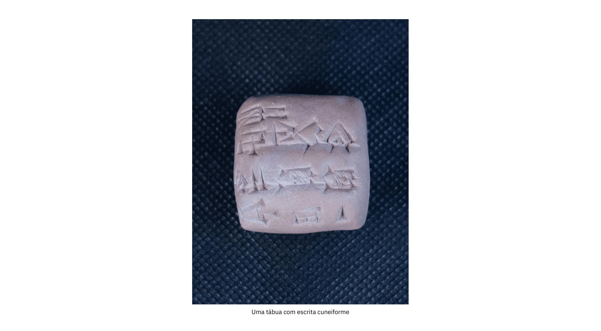

Tenho também o que julgo ser uma tábua suméria genuína com uma pequena escrita cuneiforme no centro. Nesta tábua, há assinaturas feitas através do enrolamento de um cilindro, que vos mostrarei mais tarde.

As marcas com pequenos algarismos serviam de assinatura numa época em que a maior parte das pessoas não sabia escrever, pois só os escribas especializados tinham essa capacidade.

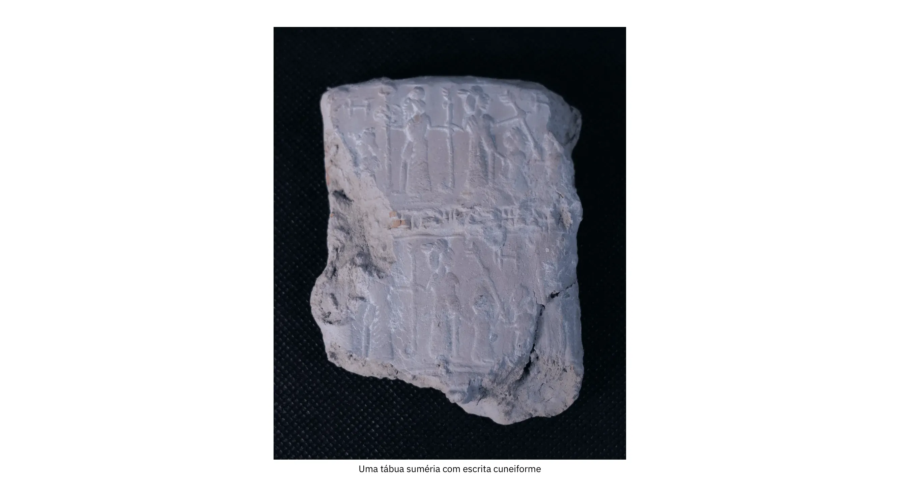

Abaixo, pode ver o cilindro mencionado acima: uma pedra gravada com formas específicas. As pessoas costumavam enrolar este cilindro de assinatura, conhecido como cylinder seal em inglês, para assinar cartas. Era uma forma de explicitar os nomes dos autores, ou de indicar que tinham sido compostas em seu nome.

Os escribas da época utilizavam, portanto, um estilete em forma de cunha para imprimir sinais em tábuas húmidas.

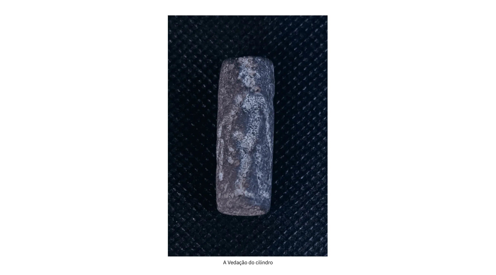

Os caracteres cuneiformes não representavam uma língua, mas um sistema de escrita para registar as línguas faladas. Em inglês, diríamos "writing is a written language", e depois diríamos que "cuneiforme é uma escrita, não uma língua". Assim, em francês, diríamos que o cuneiforme não é uma língua, mas uma forma de codificar uma língua.

### A evolução e as utilizações da escrita

Durante os seus primeiros séculos de existência, esta escrita permaneceu limitada, servindo essencialmente como um sistema mnemónico para registar quantidades, listas de bens agrícolas e equipamentos. Só gradualmente se tornou capaz de **reproduzir foneticamente nomes** e frases completas.

Inicialmente, os nomes não podiam ser expressos na escrita cuneiforme porque esta representava principalmente objectos e elementos da realidade, como um boi ou o trigo, representados como pequenas imagens. Com o tempo, estas imagens evoluíram para uma forma mais desenvolvida de escrita, permitindo a representação de nomes e conceitos complexos.

Se o nome da pessoa fosse Laura, por exemplo, poderíamos ter pegado numa palavra, um acrónimo que soasse como "água" e um segundo como "ras", e formar com ele o nome Laura. Foi assim que se desenvolveu a primeira forma de linguagem escrita.

Para que conste, originalmente, para representar as siglas, se se quisesse desenhar a cabeça de um boi, via-se a forma da cabeça do boi. Pouco a pouco, os desenhos foram simplificados para representarem apenas uma espécie de linha. Os estudiosos acreditam que isto aconteceu porque as pessoas seguravam a tábua de argila húmida com uma mão, pelo que era mais fácil redesenhar as iniciais rodando-as. Pensa-se também que se deve à forma como os escribas seguravam as tábuas.

Ainda se pode ver a ligação com, por exemplo, o trigo ou a cabeça de boi nas siglas cuneiformes, e estão sempre inclinadas para um lado.

Ao longo dos seus três milénios de utilização, a escrita cuneiforme serviu sobretudo para manter registos económicos e administrativos. No entanto, os habitantes da Mesopotâmia cedo desenvolveram um desejo profundo de preservar tudo o que merecia resistir ao teste do tempo numa forma escrita. Assim, histórias, lendas e canções, até então transmitidas oralmente por músicos itinerantes, foram imortalizadas por escrito, muitas vezes copiadas por escribas em formação. Estes copiavam textos que já existiam, sobretudo lendas ou textos que tinham um certo valor cultural.

Um exemplo importante é a **Epopéia de Gilgamesh**, possivelmente um **rei histórico da cidade-estado suméria de Uruk** por volta de 2900-2350 a.C.

Esta forma de escrita, que era simultaneamente um instrumento de gestão económica e um vetor cultural, durou até ao século I d.C., antes de desaparecer definitivamente, deixando um testemunho precioso da civilização que a viu nascer.

## O papel das tábuas sumérias

<chapterId>a396e6c5-56cc-5410-9e6b-0274401c5425</chapterId>

:::video id=a0729a35-01ec-4aa4-828f-d4ccc2eb168e:::

### Sistemas de crédito pré-monetários

Na antiga Mesopotâmia, a organização económica baseava-se em mecanismos altamente sofisticados que existiam muito antes da invenção das moedas metálicas. Desde o início, os sistemas de crédito formais e informais eram já uma forma essencial de dinheiro, permitindo às populações locais realizar muitas transacções económicas complexas.

Foi precisamente para responder às necessidades administrativas e económicas que a escrita cuneiforme foi inventada. As famosas tábuas de argila da Mesopotâmia serviam principalmente para registar vários tipos de contratos: empréstimos privados, vendas, alugueres, hipotecas e até acordos de casamento. A escrita destas tábuas exigia a perícia de escribas especializados, uma tarefa dispendiosa em termos de tempo e esforço, **mas que se justificava quando estavam em causa interesses financeiros.** Nessa altura, as pessoas não escreviam cartas de amor umas às outras, não usavam um escriba para escrever sobre as suas ansiedades. Contratavam um escriba para escrever documentos, quer houvesse uma ligação ou uma razão económica.

É também de referir que algumas destas pastilhas circulavam como títulos ao portador, mudando livremente de mãos.

Por exemplo, havia uma forma de bola de barro com pequenas pedras no interior.

No exterior da bola de barro, estava escrito e assinado um número que representava um número de unidades. No interior, havia estas pedras e alguém que queria verificar, validar de facto, que este instrumento representava realmente um número X de unidades.

Um outro exemplo, uma tábua encontrada a sudoeste da atual Bagdade, estipula que um devedor se compromete a pagar a um credor 330 medidas de cereais no dia da colheita. Mais fascinante ainda, uma outra tabuinha indica claramente que uma dívida de quatro medidas de cevada deve ser paga diretamente ao portador da tabuinha, introduzindo assim a noção de pagamento ao portador, um conceito particularmente inovador para a época**.

A partir de 2000 a.C., havia uma lei que obrigava a que todas as transacções comerciais, mesmo as mais pequenas, fossem formalizadas por escrito e assinadas na presença de testemunhas. Imagine-se a enorme burocracia que era, nessa época, registar todas as transacções em livros de registo feitos, recordo, de barro por escribas. Este rigor jurídico tinha como objetivo evitar futuras disputas sobre a propriedade e os direitos dos bens trocados. Muitas vezes, eram chamadas testemunhas para atestar que o contrato tinha sido efetivamente assinado.

Também na esfera privada, certas famílias e indivíduos desenvolviam actividades económicas suficientemente complexas para exigirem uma gestão rigorosa. Na cidade norte-babilónica de Sippar-Amnanu, foi descoberta a casa de um sacerdote anunitum chamado Ur-Utu, que continha cerca de 2000 tabuinhas. Estes documentos incluíam contratos de empréstimos privados, escrituras de venda e de arrendamento, bem como cartas, textos religiosos e académicos, o que testemunha a diversidade e a importância dos arquivos privados da época.

É de notar que as cartas escritas pelos escribas diziam respeito quase exclusivamente a interesses financeiros: queixas sobre subsídios insuficientes, pagamentos de dotes pendentes ou outros pedidos materiais urgentes. Nessa altura, não existiam escritos pessoais, como as cartas de amor, e mesmo as menções de doença eram raras.

Um exemplo pungente de uma carta deste tipo ilustra esta realidade económica: um correspondente exprime a sua angústia depois de ter ficado sem dinheiro e sem provisões quando o seu companheiro partiu, enquanto uma grave fome assolava Assur. Descreve a sua necessidade urgente de comprar cereais e pede que lhe seja enviado rapidamente o equivalente em dinheiro aos seus têxteis para garantir o seu sustento quotidiano.

Esta carta, dirigida ao seu companheiro, parece indicar que ele partiu para negociar noutro lugar, deixando-a sem dinheiro. Ela recorda-lhe que precisa de ter acesso a medidas de dinheiro para comprar cereais e pagar os impostos do templo. Este é talvez o mais próximo que podemos chegar de um argumento escrito numa carta da época. As cartas estavam quase sempre relacionadas com transacções económicas, e esta carta refere-se precisamente a uma situação económica precária.

Assim, os documentos mesopotâmicos que chegaram até nós reflectem sobretudo trocas económicas, uma vez que foram redigidos exclusivamente para transferências de bens de valor reconhecido: dinheiro, cereais, bens diversos, bens imobiliários, pagamento de impostos do templo. Estes arquivos revelam não só a eficácia e a precisão administrativa desta antiga civilização, mas também a sua capacidade de gerir trocas económicas complexas durante um período muito longo.

## Controlo de elite nas tabuletas sumérias

<chapterId>c6d3df0e-b1e1-58dc-ab35-9f76bbc39393</chapterId>

:::video id=04a95fb8-a701-4a48-9ce8-0e9b6ba256fd:::

### A escrita, uma tecnologia acima de tudo económica

Contrariamente à crença popular, a invenção da escrita na Mesopotâmia, há cerca de 4000 anos, não serviu inicialmente as necessidades de comunicação pessoal ou literária. **A escrita cuneiforme era, antes de mais, uma tecnologia económica**, justificada apenas quando estavam em jogo interesses financeiros importantes. Os sumérios não utilizavam a escrita para se corresponderem entre si ou exprimirem os seus sentimentos, mas exclusivamente para documentar as suas transacções comerciais e financeiras.

Esta especialização pode ser explicada pelo custo considerável da escrita em tabuinhas. A gravação em barro exigia conhecimentos técnicos especializados, muito tempo e materiais específicos. Só as transacções de valor suficiente justificavam economicamente este investimento, criando um limiar natural de acesso a esta tecnologia revolucionária.

As tábuas cuneiformes revelam um sistema financeiro de uma complexidade notável para a época. Os mesopotâmicos tinham desenvolvido um arsenal completo de instrumentos financeiros modernos: **empréstimos privados com juros, escrituras de venda, contratos de aluguer, hipotecas e até contratos de casamento com cláusulas financeiras**. Esta sofisticação testemunha uma economia de mercado desenvolvida, muito distante da imagem simplista da troca primitiva que é frequentemente associada a estas civilizações antigas.

Algumas pastilhas funcionavam como verdadeiros títulos ao portador, circulando livremente de mão em mão sem exigir a identificação do titular original. Esta inovação permitiu uma notável fluidez de trocas, prefigurando os sistemas financeiros modernos. Além disso, uma legislação específica exigia mesmo que todas as transacções comerciais fossem formalizadas por escrito, institucionalizando assim o uso da escrita na esfera económica.

### O monopólio do conhecimento e o controlo económico

A centralidade da escrita na economia conferia um poder considerável àqueles que dominavam esta tecnologia. **Os escribas, geralmente ligados aos templos e às instituições dirigentes, detinham o controlo de facto do sistema financeiro**. Os seus conhecimentos raros e inestimáveis faziam deles os guardiões de todas as transacções importantes.

Este monopólio do saber não foi um acaso. As autoridades tinham todo o interesse em manter esta exclusividade, pois a democratização da escrita teria diluído o seu controlo sobre a economia e aumentado o risco de falsificação. A presença sistemática de testemunhas nas cerimónias de assinatura revela esta preocupação constante com a autenticidade dos documentos.

A obrigação legal de registar por escrito todas as transacções comerciais servia vários objectivos estratégicos: controlo fiscal, controlo contabilístico rigoroso e manutenção da dependência dos agentes económicos em relação ao aparelho administrativo. **O Estado mesopotâmico apropriou-se assim da capacidade de gerir as dívidas interpessoais** à escala da sociedade, transformando assim a escrita num instrumento de poder económico.

### A coexistência de dois sistemas monetários

A análise das tábuas revela uma realidade económica mais matizada do que a sua presença omnipresente nos arquivos poderia sugerir. Muitas tabuinhas mencionam referências ao **shekel de prata** como unidade de valor, indicando assim a existência paralela de um sistema monetário baseado em bens físicos estandardizados.

Esta dualidade pode ser explicada pela estratificação social da época. **O sistema de tábuas cuneiformes estava reservado a uma elite restrita**: clero, comerciantes prósperos e administradores capazes de ler, escrever e interpretar estes documentos complexos. Para utilizar eficazmente uma tábua portadora, era necessário não só saber decifrá-la, mas também verificar a sua autenticidade e compreender as suas implicações jurídicas.

**A massa da população, excluída deste sistema elitista, desenvolveu os seus próprios mecanismos de troca**. As pessoas comuns utilizavam sistemas mais acessíveis, como medidas padronizadas de cereais, pesos de dinheiro e outros bens facilmente quantificáveis que qualquer pessoa podia avaliar sem conhecimentos especializados.

Esta economia popular, embora menos documentada nos arquivos oficiais, era provavelmente mais dinâmica e flexível do que o sistema de tabuletas. Permitia trocas quotidianas rápidas sem recurso a escribas, satisfazendo as necessidades imediatas de artesãos, agricultores e pequenos comerciantes.

O shekel de prata, frequentemente mencionado nas tábuas como referência de valor, serviu provavelmente de ponte entre estes dois sistemas económicos paralelos, permitindo a conversão entre dívidas escritas e pagamentos físicos.

### Emergência espontânea versus controlo institucional

Esta coexistência ilustra um debate fundamental da história económica: **a oposição entre a emergência espontânea dos meios de troca e a apropriação institucional do dinheiro**. Por um lado, as mercadorias como o dinheiro surgiram naturalmente das necessidades de troca das pessoas. Por outro lado, as instituições apropriaram-se e formalizaram estas práticas para controlar o seu fluxo.

Os templos sumérios eram o exemplo desta tensão: utilizavam inovações monetárias populares (referências ao shekel) e desenvolviam os seus próprios instrumentos de controlo (tábuas cuneiformes). Esta estratégia permitiu-lhes colher os benefícios de ambos os sistemas: a legitimidade popular das moedas tradicionais e o controlo administrativo das dívidas formalizadas.

A experiência da Mesopotâmia estabelece precedentes duradouros para a evolução dos sistemas financeiros. Demonstra que a **sofisticação financeira precede muitas vezes em vários milénios** as inovações tecnológicas, que lhe estão geralmente associadas. Os conceitos de juro, crédito, instrumentos negociáveis e garantias hipotecárias não esperaram pela invenção da moeda metálica para se desenvolverem.

Este período seminal revela também as questões de poder inerentes a qualquer inovação monetária: quem controla a tecnologia, quem define as regras e como se articulam os sistemas formais e as práticas populares. Estas questões fundamentais persistiram ao longo da história económica, estendendo-se aos debates contemporâneos sobre moedas digitais e criptomoedas.

# Economia e dinheiro nas civilizações antigas

<partId>a16bcf4c-8c3a-11f0-9e79-2bd363a484bd</partId>

## As grandes civilizações da Idade do Bronze

<chapterId>fab9334c-7385-5d7c-ad40-7d152beb22a1</chapterId>

:::video id=737e12e8-1033-4210-b1dd-b8a680f68b17:::

Nesta secção intitulada "As grandes civilizações da Idade do Bronze", começaremos com um extrato do livro *A History of Money: From Ancient Times to Present Day* de Glyn Davies, que considero ser uma excelente introdução a esta secção sobre as grandes civilizações da Antiguidade.

> Toynbee identifica cerca de vinte e uma "civilizações" diferentes, mas como quinze delas derivam direta ou indiretamente de exemplos anteriores, reduz o número de civilizações desenvolvidas de forma independente a seis: suméria, egípcia, minóica, chinesa, maia e andina. Destas, apenas os Incas dos Andes conseguiram atingir um elevado grau de civilização sem usar dinheiro, embora, paradoxalmente, tivessem uma abundância dos materiais geralmente considerados melhores para uso como dinheiro - ouro e prata.

Os Incas não tinham um sistema monetário, mas tinham uma abundância de metais preciosos. Um paradoxo e tanto. Continuemos com a citação:

> Quanto mais estratificada for uma sociedade e quanto mais meticulosamente eficiente for o seu sistema de planeamento, menos necessário será o uso do dinheiro para a sua população. Isto pode explicar porque é que os conquistadores espanhóis descobriram que os mexicanos, cujo governo era relativamente mais liberal, utilizavam regularmente ouro em pó (guardado em tubos transparentes) e grãos de cacau (guardados para grandes pagamentos em sacos de 24.000 unidades) como moeda, enquanto que, pelo contrário, os incas, organizados segundo uma hierarquia muito mais rígida, não tinham qualquer moeda: uma exceção confirmada por uma regra estrita. A origem da moeda na China foi totalmente independente de outras civilizações; no entanto, a relativa proximidade das civilizações suméria, egípcia e minóica levanta dúvidas quanto à extensão do seu desconhecimento das práticas monetárias, especialmente tendo em conta o vasto comércio estabelecido desde os tempos mais remotos.

Na China, as moedas foram desenvolvidas com uma abordagem completamente diferente das tradições ocidentais. Desde o início que se tratava de moeda fiduciária. As moedas eram fundidas.

E aqui, o Sr. Davies menciona o comércio. Houve, de facto, trocas entre os chineses e outras populações em determinadas épocas, mas o meio de troca para o comércio externo era bastante a seda. Como veremos mais adiante, o ouro era também utilizado nas regiões fronteiriças da China, onde a população chinesa era mais reduzida. E nem sequer para o comércio internacional; para isso, era a seda.

Por isso, imagino que talvez o formato das moedas possa ter sido influenciado por outras civilizações da mesma época que desenvolveram esta tecnologia.

Mas é evidente que a essência do dinheiro era completamente diferente na China e no Ocidente. Voltaremos a este assunto na secção seguinte sobre a China.

Relativamente a estas famosas cidades sumérias, tenho aqui algumas notas. Podemos mencionar Uruk, que foi uma cidade muito antiga e influente, famosa pela sua dimensão considerável e pela sua cultura avançada, nomeadamente com o desenvolvimento da escrita e do planeamento urbano.

E também queria mencionar a famosa epopeia de Gilgamesh. Gilgamesh foi provavelmente um rei histórico da cidade suméria de Uruk, por volta de 2900 AC. Era provavelmente o rei desta cidade-estado suméria.

Podemos também falar de Sargão de Akkad, que reinou de 2334 a 2279 a.C.

Foi o primeiro governante do Império Acádio, que é outra civilização que surgiu na Mesopotâmia. E menciono Sargão porque foi o primeiro a estabelecer um serviço postal para estas famosas tábuas, que já vos apresentei.

Imaginemos que existiam mesmo envelopes de barro. As tábuas podiam ser embrulhadas em envelopes de barro com a assinatura da pessoa no exterior para garantir a confidencialidade. Assim, as pessoas abriam o envelope para recuperar a tábua. Devemos este sistema postal a Sargão de Akkad.

Depois há a Babilónia, a grande cidade que se tornou a capital do Império Babilónico. Outra civilização, famosa pelo seu imponente Zigurate e palácios, e pelo famoso Código de Hamurabi, mais conhecido pelo seu código legal altamente avançado.

E duas cidades para concluir esta secção. Temos Ashur, que foi a capital do Império Assírio, um importante centro religioso. E temos Nínive, que mais tarde foi a capital do Império Assírio. Mudaram a sua capital para lá e é conhecida pelo seu poderoso exército, vastos palácios e bibliotecas. E é também uma das possíveis localizações dos lendários Jardins Suspensos da Babilónia. É frequente ouvirmos falar desta famosa maravilha do mundo antigo.

Mas não há vestígios destes famosos jardins suspensos na Babilónia. Em Nínive, por outro lado, há provas arqueológicas de jardins em vários andares. É possível que os historiadores gregos, como Heródoto, tenham confundido Nínive com a Babilónia. Quando visitaram cidades da Mesopotâmia, talvez se tenham referido a ela como Babilónia. Foram encontrados vestígios de famosos jardins suspensos em Nínive, e os estudiosos podem perguntar-se se Nínive é o famoso local onde se situavam esses jardins, referidos como os Jardins Suspensos da Babilónia.

## Organização económica na Mesopotâmia

<chapterId>6afb6fc8-cbb7-56a5-8427-484b4b7d7477</chapterId>

:::video id=aa6a2cbd-5916-4ae3-ad4f-65f0bd5643fa:::

### Estruturas económicas pré-capitalistas e escravatura

Bem-vindo a esta secção sobre a organização económica na Mesopotâmia. A economia pré-capitalista passou por três fases principais: primitiva, escravista e feudal.

O feudalismo, claro, é muito posterior, obviamente na Idade Média, e já ultrapassámos a fase primitiva que descrevemos anteriormente com o Paleolítico. Agora, na Mesopotâmia, quando falamos de organização económica, estamos a falar de escravatura.

No entanto, na Mesopotâmia, a maior parte do trabalho era realizada por uma classe dependente semelhante aos escravos, que não eram legalmente propriedade dos seus senhores, mas eram privados dos frutos do seu trabalho através de coação física ou ideológica.

### O papel dos templos e palácios como centros económicos

Os latifúndios dominavam a economia. Os proprietários exploravam as suas terras diretamente, contratando trabalhadores, ou arrendavam-nas em troca de rendas. Também se dedicavam a actividades financeiras, emprestando dinheiro a taxas de juro elevadas, geralmente entre 20% e 33,3% ao ano, práticas que contrastavam fortemente com as regras mais rigorosas dos vizinhos hebreus.

Os empréstimos contraídos pelos agricultores não se destinavam a investimentos produtivos - com exceção das companhias de navegação - mas sim a assegurar a sua sobrevivência até à colheita seguinte. Esta situação conduzia frequentemente a um endividamento crónico dos agricultores.

Permitam-me que estabeleça um paralelo com um período mais recente da Antiguidade (Roma), onde os cidadãos viviam das rendas agrícolas produzidas pelos camponeses e pelo trabalho não livre, bem como dos despojos de guerra. **Estas receitas eram distribuídas entre os cidadãos, não para obter mais lucros, mas para melhorar o seu estatuto social.** O comércio e o artesanato eram geralmente deixados a grupos fora da elite social. Tudo isto contrasta com as economias medievais orientadas para o lucro através do comércio e do artesanato.

Portanto, o que estamos a tentar dizer aqui é que estou a estabelecer um paralelo com o facto de as pessoas utilizarem ferramentas de empréstimo financeiro não necessariamente para melhorar os seus meios de produção e, mais tarde, em Roma, os lucros não eram necessariamente reinvestidos, mas antes utilizados para aumentar o prestígio das pessoas que podiam beneficiar desses lucros. Estamos ainda longe do espírito capitalista que surgiu mais tarde, na Idade Média, quando era possível criar postos de trabalho para melhorar os meios de produção e os excedentes eram aproveitados e criados na procura do lucro. Assim, podemos constatar que a organização económica ainda não tinha atingido a terceira fase das evoluções económicas acima enumeradas.

### O aparecimento de sistemas de crédito e de unidades de conta

**Karl Polanyi distingue três formas de troca económica: reciprocidade entre grupos simétricos,** isto é, em tribos primitivas onde não precisamos realmente de dinheiro porque nos damos crédito informal uns aos outros, troca e redistribuição. **Esta forma de troca é compatível com a Mesopotâmia, onde os templos estavam no centro da organização económica e podiam, a certa altura, devolver, distribuir a riqueza sob a forma de rações. Só mais tarde é que foi introduzida a noção de salário. Assim, até agora, temos a forma primitiva (1), a redistribuição centralizada (2) nos templos e palácios, e depois podemos finalmente dar lugar às trocas de mercado (3). Embora o mercado, tal como o entendemos hoje, não existisse plenamente, a presença de trocas mercantis na Mesopotâmia é indiscutível, atestada pela existência de termos específicos em acádio e pela presença de provas arqueológicas de preços, lucros, perdas, flutuações e situações de escassez.

As famílias mesopotâmicas geriam de forma independente todas as fases da produção agrícola, desde a sementeira até à transformação final em pão e cerveja. As mulheres também produziam os têxteis necessários aos seus dependentes. Para os bens que não eram produzidos localmente, as famílias recorriam a comerciantes especializados.

Os laços familiares eram particularmente importantes no comércio. Durante o período paleo-assírio (c. 1910-1830 a.C.), os mercadores da cidade de Ashur estabeleceram uma colónia comercial em Kanesh, na Anatólia, importando estanho e têxteis em troca de ouro e prata. O comércio baseava-se em empresas familiares estreitamente ligadas pelo casamento e por parcerias comerciais. Kanesh era apenas um elo de uma vasta rede de comércio internacional.

Nessas trocas, havia metais, e eram metais preciosos e não necessariamente, por exemplo, o cobre, que era muito útil na altura, e pensamos que esses metais eram trocados por noções de reserva de valor. Assim, não poderíamos falar necessariamente de troca direta, em que dois bens são trocados pela sua utilidade, mas sim de uma noção de pagamento com uma certa consciência de entesourar metais preciosos para os utilizar como reserva de valor e não para os utilizar como mercadoria, por exemplo, a utilização do bronze para fazer armaduras.

Os tributos e impostos eram pagos principalmente em géneros (cevada ou prata pesada). Os templos e os palácios eram os principais centros económicos, administrativos, políticos e religiosos, desempenhando também as primeiras funções bancárias através do depósito seguro de bens, primeiro cereais, depois outros produtos agrícolas e, por fim, metais preciosos. Desta forma, desenvolveram-se as primeiras operações de crédito e de empréstimo, muito antes do aparecimento das moedas.

A economia mesopotâmica utilizava principalmente a cevada e a prata como padrões de valor. A prata era pesada em unidades padronizadas, como o sìqlum (shekel), com cerca de 8,33 gramas. Já no período babilónico antigo (sob Hamurabi), a prata era utilizada como meio de pagamento comum, com uma noção precoce de valor nominal ("nūbum") em oposição ao peso real ("šuqulum"), **antecipando o conceito moderno de moeda fiduciária**.

Mas ainda não se tratava de moeda fiduciária no sentido estrito da palavra. Não havia a noção de um selo com uma figura de autoridade, mas havia a noção de uma unidade de conta nominal, por oposição à noção de metal pesado. Havia uma distinção na linguagem para estes dois conceitos, e penso que é importante mencioná-la.

A transição para um mercado de trabalho assalariado foi difícil. Exigiu duas grandes inovações conceptuais: a separação entre o trabalho da pessoa e o produto final e a introdução do "tempo de trabalho" como unidade mensurável. Para termos esta noção de assalariado, tivemos primeiro de passar por estas duas inovações. **No IIIᵉ milénio, o trabalho era inicialmente remunerado por rações fixas, antes de evoluir gradualmente para um sistema salarial no início do IIᵉ milénio

Finalmente, a partir do século XXVI a.C., enraizou-se uma verdadeira noção de valor monetário, embora o "dinheiro" mesopotâmico não fosse uma moeda, mas sim uma medida ponderada de cereais ou de metal. **Assim, para as transacções importantes ou em contextos que exigiam a conservação do valor, era muitas vezes preferível converter o grão em prata, que se conservava mais facilmente.** Um pouco como o exemplo de Kanesh, onde o metal prateado era recebido para ser acumulado.

A partir do século XXI a.C., **com o desaparecimento virtual das trocas assimétricas**, nota-se que nos contratos de cessão, o verbo sa, refere-se ao pagamento do preço. Esta noção, chamada "sa", aparece nos contratos e refere-se ao pagamento de um preço e não à medição de uma determinada mercadoria. "Sa" refere-se simplesmente a um pagamento ou a um preço. É um antropólogo que regista este facto e refere que se trata de um verdadeiro avanço; vemos uma espécie de dicotomia entre o antes e o depois desta introdução do verbo "sa" nos contratos.

Não podemos ignorar os dados empíricos presentes nos arquivos do Próximo Oriente que atestam a existência de **alguns mecanismos de mercado**, incorporando **noções de lucro** e **perda**, **flutuações de preços** e situações de **escassez**. Mas a dificuldade fundamental reside em determinar a importância relativa das trocas baseadas no mercado no conjunto da economia da antiga Mesopotâmia.

Penso que os especialistas neste domínio viram vestígios destes conceitos de mercado, mas não são realmente capazes de nos dizer em que medida a economia da época se baseava neste conceito de mercado mais moderno ou noutros mecanismos.

Sabemos que existia, mas não sabemos se era a principal forma, por exemplo, de determinar preços ou de negociar.

Conclui-se assim esta secção sobre a organização económica na Mesopotâmia.

Nas secções seguintes, faremos o mesmo para o Egito e a China.

## Organização económica e monetária no Egito antigo

<chapterId>bffcc16c-7fbf-5992-a0fa-6a7726d7d287</chapterId>

:::video id=40c1c4e5-b190-4bb6-b8a0-810c9ce7698b:::

### Antecedentes históricos e períodos egípcios

Esta secção é dedicada à organização económica e monetária do antigo Egito. Para o informar um pouco, eis uma lista e uma breve descrição dos períodos em questão.

- Reino Antigo (c. 2575 - c. 2130 a.C.)**. Período marcado pela construção das grandes pirâmides, nomeadamente as de Gizé. Foi a idade de ouro da monarquia egípcia centralizada.
- Reino Médio (c. 1938 - c. 1630 a.C.)**. Renascimento político e cultural após um período de instabilidade.
- Novo Reino (c. 1539 - 1075 a.C.)**. Período de expansão territorial, poderio militar e comércio internacional. Inclui os reinados de faraós famosos como Tutancâmon e Ramsés II.
- 1323 A.C. - Morte de Tutankhamon**. O jovem faraó morreu por volta dos 18-19 anos. O seu túmulo quase intacto foi descoberto em 1922, tornando-se numa das mais famosas descobertas arqueológicas.
- Ramsés II - Reinou entre 1279 e 1213 a.C.**. Um dos mais poderosos faraós do Novo Reino. Conhecido pelas suas campanhas militares, pelos seus grandes monumentos e por ter provavelmente concluído o primeiro tratado de paz conhecido.
- 1275 a.C. - Povos do Mar**. Invasões ou migrações de grupos denominados "Povos do Mar" desestabilizam várias civilizações mediterrânicas, incluindo o Egito.
- Batalha de Xoïs - 1178 a.C.**. Conflito entre o exército egípcio e invasores, provavelmente ligados aos Povos do Mar. Uma das muitas batalhas do final do Reino Novo.
- O Período Tardio** é o período da história do Egito antigo que vai de cerca de 664 a 332 a.C.
- Cleópatra VII (69 - 30 a.C.)**. Última rainha do Egito, famosa pela sua inteligência, carisma e alianças com Júlio César e Marco António, e provavelmente também pelo seu nariz. O seu reinado marcou o fim do Egito faraónico antes da sua anexação por Roma.

Nos milénios V e IV a.C., o Egito já vivia uma intensa atividade comercial em grande escala, ligando a Núbia, a Palestina, a Líbia e as regiões do Mar Vermelho através do comércio marítimo, fluvial e terrestre (nomeadamente através de caravanas de burros).

### Os primeiros sistemas de câmbio e a paleo-moeda

Com o aparecimento das primeiras chefias egípcias, por volta de 3650-3400 a.C., o local de Maadi, a sul do atual Cairo, tornou-se um importante centro de tecnologia do cobre e de comércio de longa distância, nomeadamente com a Mesopotâmia através da costa síria.

Embora o comércio em grande escala se baseasse principalmente na troca direta, é provável que existisse uma forma primitiva de dinheiro ("paleo-moeda"), constituída por objectos de prestígio, como pedras semipreciosas e conchas fósseis. É provável que o ouro já desempenhasse um papel importante nestas trocas. A primeira menção explícita de uma moeda em documentos egípcios, em meados do terceiro milénio a.C., reflecte uma longa evolução ligada às práticas comerciais.

Na sociedade arcaica (aqui não estamos a falar necessariamente do Egito, mas das sociedades arcaicas em geral), os pagamentos eram frequentes, não para comprar diretamente, mas para pagar dotes, rituais religiosos e outras obrigações sociais. Estas transacções exigiam preços e avaliações precisas. Muitas sociedades primitivas tinham objectos privilegiados, monetiformes (ou seja, contáveis), em função dos quais esse valor era estimado. Se se paga um dote, é claro que é preciso anotar uma quantidade de um objeto a trocar para pagar o dote. Este valor é essencialmente o das pessoas.

Nas sociedades arcaicas, antes do aparecimento do dinheiro ou dos sistemas monetários, existiam pagamentos, mas estavam frequentemente ligados a obrigações sociais e o seu valor derivava do valor dos indivíduos, como no pagamento de dotes ou de dinheiro de sangue.

Voltando ao Egito, durante o antigo império, o "shât(y)", originalmente uma unidade monetária concreta (uma pequena moeda de ouro ou prata com cerca de 7,6 gramas), passou muito rapidamente da sua função real de moeda forte para uma **função contabilística** que deu origem à noção de valor. Podemos reconhecer nela uma espécie de unidade de conta para exprimir o valor, que era originalmente uma espécie de moeda, mas não lhe podemos chamar moeda porque não está cunhada, é apenas uma medida de metal. Estamos a aproximar-nos da noção de unidade de conta.

Esta noção de shât(y) acabou por ser abandonada, talvez devido ao risco de fraude. Veremos mais adiante que os egípcios demoraram a adotar as moedas cunhadas e continuaram a pesá-las, mesmo depois de terem sido adoptadas pelos seus vizinhos.

Na Idade Média, a prata era raramente utilizada nas transacções quotidianas, que se realizavam principalmente com medidas de cereais e quantidades de pão. Foi durante este período que surgiu uma forma de moeda escritural, em que os pagamentos podiam ser registados por escrito ou por transferência efectiva.

No Novo Reino, o sistema monetário tornou-se mais complexo, integrando diferentes moedas de mercadorias avaliadas em metais (ouro, prata, cobre), tecidos normalizados, cereais e petróleo. Os tecidos eram designados por "medidas de pano". **Os preços dos bens de uso quotidiano eram frequentemente expressos em cereais ou cobre, enquanto os objectos preciosos eram avaliados em ouro ou prata. A prata, que era mais rara no Egito do que o ouro, tornou-se particularmente apreciada.** A prata era sobrevalorizada em relação ao ouro, que era mais abundante no Egito.

No Período Tardio (primeiro milénio a.C.), a prata tornou-se o metal de troca comum em todo o Próximo Oriente. Circulava sob a forma de lingotes, moedas metálicas ou anéis, que eram pesados e marcados nos templos, garantindo o seu peso e pureza, embora não fossem cunhados na efígie de um soberano. Isso veio mais tarde, e será objeto de uma secção posterior sobre os lídios.

Note-se também que os antigos egípcios tinham um termo, "hedj", para designar o dinheiro, que era utilizado genericamente para designar qualquer meio de pagamento que servisse de contrapartida a uma transação, quer se tratasse de metal, de cereais, de tecidos ou de bens diversos (madeira, animais, serviços, etc.). Exemplos documentados mostram que os egípcios podiam liquidar uma transação combinando vários produtos cujo valor total era expresso em unidades de cobre ("deben").

**Os templos desempenhavam um papel central na economia egípcia: recolhiam e acumulavam tesouros consideráveis de metais preciosos (ouro e prata) destinados a honrar os deuses, mas também a servir de reserva monetária que podia ser reintroduzida no circuito económico em caso de necessidade**. Veremos exemplos de outras civilizações que acumulavam reservas valiosas nos templos, como estátuas, para serem derretidas em caso de guerra, escassez de moeda ou crise. Este é um tema recorrente ao longo da história.

É também de referir que a cultura do linho era um monopólio real concedido aos templos e que o fabrico de tecidos preciosos confirmava a sua importância económica.

Os antigos egípcios faziam uma distinção clara entre o aspeto ideológico dos metais preciosos, ligados à divindade (o ouro representava a carne dos deuses, a prata os seus ossos), e a sua função prática de moeda, que servia de referência a todas as outras formas de pagamento.

Assim, embora o Egito antigo não tenha desenvolvido uma moeda cunhada comparável aos sistemas monetários modernos até ao período tardio, possuía um sistema monetário sofisticado, baseado na utilização combinada de moeda escritural, unidades de conta precisas, moeda de mercadorias e metais preciosos avaliados pelo peso.

As próprias moedas eram pesadas, o que deu origem a dois conceitos diferentes: **"cunhagem" e "dinheiro "**. Utilizei dois termos em inglês. Primeiro, "coinage" refere-se a moedas, um conceito que vem depois, e temos também este conceito de dinheiro. Podemos já definir uma certa noção de "dinheiro" pelas unidades de conta que acabo de exprimir em termos de dinheiro, mas que ainda não eram moedas, pelo que "coinage" surge um pouco mais tarde com os lídios.

Assim, a moeda não é uma condição prévia para o dinheiro, **de tal forma que podemos admitir a existência de dinheiro já no 3º milénio**, em todo o caso e sem qualquer dúvida durante o 2º milénio e, em particular, no reinado de Hamurabi.

O que é importante lembrar aqui, e é o que o autor menciona no livro "As Origens do Dinheiro", é que não há dúvida de que o conceito de dinheiro já existia na altura, nestes sistemas monetários, e é um erro ligar o nascimento do dinheiro como conceito ao aparecimento de moedas.

Finalmente, os conceitos de reciprocidade e redistribuição de Polanyi, frequentemente aplicados ao antigo Egito, devem ser matizados: embora existam, não constituem um quadro exclusivo. O Egito faraónico tinha desenvolvido uma economia complexa que integrava plenamente trocas comerciais sofisticadas, distintas das práticas religiosas e rituais, demonstrando uma verdadeira autonomia do domínio económico em relação ao ideológico.

Esta particularidade está relacionada com a noção de que os metais preciosos estavam associados a uma certa divindade, mas que, no entanto, eram susceptíveis de distinção.

Refiro-me a este facto porque Polanyi referiu-se à utilização destes metais preciosos como uma noção essencialmente religiosa ou divina. No entanto, nós propomos que eles também estavam integrados no sistema económico e que os egípcios já eram capazes de fazer essas distinções.

Para concluir, gostaria de citar o livro "As origens do dinheiro", que enumera o objetivo desta invenção, o dinheiro cunhado. Há vários pontos, mas gostaria apenas de sublinhar o ponto 5:

*desenvolver a possibilidade de jogo económico através da utilização de métodos como as desvalorizações e as revalorizações sucessivas para reduzir ou aumentar as importações e as exportações a custos mais baixos*

Assim, mesmo nesses tempos arcaicos, o autor propõe que as moedas já tinham sido inventadas ou surgido sob o controlo do Estado e já eram manipuladas em termos de quantidade de metais preciosos e de peso para gerir a economia. Permitam-me que vos dê uma pequena informação sobre uma secção subsequente. **Mesmo nas primeiras formas de cunhagem, que eram feitas de electrum, uma liga de ouro e prata, sabemos, através da análise do teor de metais preciosos nessas moedas, que os primeiros emissores, por exemplo, Croesus, tinham menos ouro do que no electrum natural

Isto significa que já sabiam como separar o ouro da prata e emitiam moedas com menos ouro.

O autor sugere que, desde os primórdios da cunhagem de moeda, para além da simples certificação do peso e da facilitação do comércio, já se abusava do poder de cunhar moeda para aumentar a quantidade emitida, possivelmente como forma de planeamento económico.

## Moeda de sinais e organização económica e monetária na China antiga

<chapterId>e08d3be9-423c-5cf3-a606-6ad54e2261af</chapterId>

:::video id=ae7e6367-1725-455e-bfe6-359be1f443e5:::

Nesta secção, intitulada "A moeda gestual e a organização económica e monetária da China antiga", veremos que a moeda chinesa antiga tem caraterísticas distintas das tradições ocidentais. A moeda chinesa já era, desde o início, uma "moeda gestual". A informação contida nesta secção baseia-se em notas que tomei após a leitura do livro "Aux origines de la monnaie".

### O conceito de moeda gestual e as suas caraterísticas distintivas

Segundo o autor, o dinheiro de sinal é o equivalente à moeda fiduciária atual. É uma moeda que não tem um valor ligado ao seu conteúdo metálico. Desde o início, foi uma espécie de acordo, um consenso social sobre o valor dessas moedas.

A antiga cunhagem de moeda chinesa tem caraterísticas diferentes das tradições ocidentais. Era principalmente metálica, mas fundida em vez de cunhada, e não ostentava a efígie de um soberano. Surpreendentemente, o Estado chinês não detinha o monopólio da emissão de moeda. Este aparente liberalismo pode ser explicado pela ausência de qualquer necessidade económica de monopolizar a emissão monetária, graças aos abundantes recursos fiscais cobrados a uma grande população tributável.

A moeda chinesa caracteriza-se também pelo seu carácter fiduciário. Desde o início, foram utilizadas como moeda imitações de bronze de búzios (conchas do mar), sem relação direta com o valor intrínseco do metal utilizado. Se recuarmos muito na história, os chineses utilizavam conchas como moeda. Eventualmente, quando as conchas se tornaram demasiado escassas, fizeram réplicas em cobre, e estas cópias tinham o mesmo valor que as verdadeiras.

A moeda chinesa não se baseava, portanto, no valor do material ou na raridade relativa do artigo original (por exemplo, marisco), mas na confiança colectiva na sua utilização como meio de troca - por outras palavras, um sinal monetário.

### De conchas de búzios a imitações metálicas

O búzio foi amplamente utilizado como unidade monetária primitiva. As inscrições antigas mostram que, já nas dinastias Shang e Zhou (as primeiras dinastias do primeiro e segundo milénios a.C.), as conchas de búzio eram utilizadas não só para recompensar feitos militares, mas também para **remunerar o trabalho, medir o valor e comprar terras**.

O que é importante recordar aqui é que não se tratava de um instrumento qualquer utilizado pela sociedade para fins restritos. Era utilizada para recompensas militares, pagamento de trabalho e medição de valor. Encontramos vestígios disso nos escritos dos arqueólogos. Embora não saibamos se era utilizada para comprar pão diariamente, temos provas de que poderia ter sido utilizada para os tipos de transacções acima mencionados.

Com o tempo, a escassez de búzios verdadeiros levou à produção de imitações em bronze, osso, madrepérola ou pedra, nomeadamente para utilização em contextos funerários, a fim de evitar a imobilização dos valores reais nos túmulos. Esta mudança de suporte está também ligada à ideia de controlo do príncipe sobre o dinheiro, controlo esse que é tanto mais fácil quanto mais o príncipe fabricar o dinheiro.

O que é preciso compreender aqui é que, ultrapassando a limitação da escassez natural de conchas, se o príncipe puder criar ele próprio a moeda, isso dá-lhe um maior controlo sobre a gestão da economia.

Ao contrário da Mesopotâmia, onde as moedas estavam ligadas ao peso do metal precioso, a terminologia da cunhagem chinesa deriva diretamente das formas iniciais dos objectos utilizados como moeda: búzios (bei), facas (dao), espadas (bu) e moedas redondas (quan ou qian). Assim, podemos ver que a origem das palavras relacionadas com o dinheiro na China se referia a estes objectos. Em contrapartida, no Ocidente, temos uma série de termos monetários que provêm de conceitos bastante diferentes destes, mais relacionados com as caraterísticas físicas e o peso dos objectos monetários. Estas diferenças etimológicas demonstram claramente o cisma entre as visões ocidental e chinesa do dinheiro.

Na China, o valor monetário era totalmente fiduciário, baseado numa convenção social entre o Estado, os produtores e os comerciantes.

### Regulação económica e filosofia monetária

O Estado chinês utilizava a moeda como instrumento de regulação económica: em tempos de abundância monetária, o valor da moeda diminuía, facilitando a compra de bens. Inversamente, em tempos de escassez monetária, o valor do dinheiro aumentava, reforçando o poder de compra do Estado para as suas operações subsequentes.

Pode estabelecer-se aqui uma ligação com a inflação e a deflação. Com uma massa monetária fixa, se a produtividade da economia aumentar, o valor da moeda aumenta. Inversamente, se a produtividade diminuir, o valor da moeda diminui. Neste exemplo, porém, dá-se o contrário. Provavelmente porque o príncipe não detinha o monopólio total da produção de moeda, mas isso não deixa de indicar que o valor da moeda estava ligado às condições económicas.

O filósofo Mo Di (séc. V-IV a.C.) já tinha analisado esta relação entre preço e valor: segundo ele, as variações de preço não reflectem uma noção real de barateza ou de carestia absoluta, mas sim uma relação flutuante entre a mercadoria e o dinheiro, independentemente do valor nominal estável do símbolo monetário.

Assim, em vez de dizer que a moeda de ouro teria um valor de base, como o valor de uso ou o valor intrínseco, o autor salienta que o valor do signo monetário resulta antes do estado da economia.

Na China, as moedas não tinham necessariamente de ser marcadas ou garantidas oficialmente. A sua aceitação dependia apenas da confiança colectiva, o que explica que as moedas de bronze ou de cobre sem inscrições específicas tenham podido circular livremente durante muito tempo.

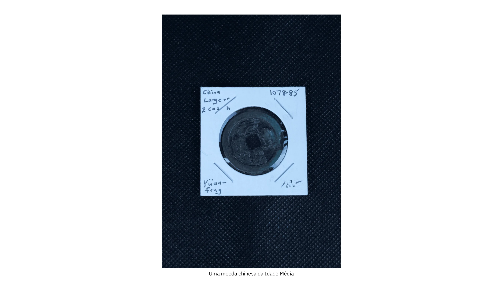

A moeda acima é uma moeda chinesa da Idade Média. Trata-se de uma moeda fundida com um orifício quadrado no centro. Este orifício era utilizado para enfiar uma corda, permitindo que as moedas fossem amarradas umas às outras para criar pulseiras ou colares. No entanto, estas moedas não se destinavam essencialmente a ser usadas, mas sim a fins contabilísticos. Podiam ser enfiadas umas nas outras para formar unidades de conta sob a forma de grandes cordas, com as peças entrelaçadas. Não havia necessariamente marcas específicas, por vezes eram simplesmente círculos de bronze.

O monopólio monetário do Estado, estabelecido tardiamente por Wudi, da dinastia Han, em 113 a.C., foi frequentemente posto em causa, permitindo que vários actores privados ou locais emitissem as suas próprias moedas, desde que gozassem de suficiente confiança social.

**O baixo valor intrínseco das moedas chinesas evitava o seu entesouramento, garantindo a sua circulação sem problemas**. Os metais preciosos raramente eram utilizados como moeda circulante para evitar o entesouramento. O ouro, sendo demasiado caro, era normalmente posto de lado em vez de ser gasto. Em vez disso, **apenas a seda representava uma verdadeira moeda de alto valor no comércio internacional chinês**. Os chineses negociavam com seda e não com ouro.

Durante as crises económicas ou monetárias, nomeadamente quando o preço do cobre aumentava, eram adoptadas soluções inovadoras: assim, já no século II d.C., as moedas em circulação eram cortadas para criar unidades mais pequenas, o que permitia manter uma circulação fluida com menos custos. Outras épocas, como a de Wang Mang (início do século I d.C.), experimentaram moedas muito fiduciárias, cujo valor facial era muito superior ao seu conteúdo metálico real, prefigurando assim as notas de banco. Pegavam numa moeda e estampavam nela valores como 50, 100 ou 200 para indicar quantidades maiores, como 200 moedas. Esta prática terá contribuído para uma inflação significativa.

Como já foi referido, este sistema baseava-se numa convenção social entre o Estado, os produtores e os comerciantes, mas também em regras autoritárias e severas para aqueles que não jogavam o jogo, nomeadamente no que diz respeito à escolha das peças (bonitas ou não) ou ao comprimento dos tecidos (não conformes à norma).

Na minha modesta opinião, não se trata de um sistema muito sólido. Baseava-se principalmente em regras estritas que obrigavam os funcionários e os comerciantes a aceitar moedas danificadas, sob ameaça de sanções.

### Inovações monetárias chinesas e o seu impacto económico

A China foi também pioneira na emissão das primeiras formas de papel-moeda, inicialmente adoptadas em resposta a uma escassez de metal no século IX d.C. Apesar das suas vantagens iniciais, estas moedas de papel conduziram regularmente a espirais inflacionistas quando emitidas em excesso, como se verificou nos períodos Song ou Ming, em que a emissão excessiva conduziu a graves crises monetárias, ilustradas por Marco Polo no século XIII, que observou mesmo que a falsificação deste papel-moeda era punível com a morte. Não posso deixar de assinalar aqui uma forma de violência.

Assim, a experiência chinesa caracteriza-se por uma conceção profundamente fiduciária da moeda, uma notável flexibilidade do sistema monetário e uma utilização precoce de papel-moeda, baseada na confiança entre os agentes económicos e não no valor intrínseco dos meios utilizados.

## Organização social e económica na Antiguidade

<chapterId>4023c3ce-7a47-5ac4-8f5f-c7ab699ab20f</chapterId>

:::video id=2761efe4-21cf-4f06-9bda-c03f9ff39012:::

### O debate sobre o parasitismo urbano

A relação entre as cidades antigas e as suas zonas interiores levanta uma questão fundamental: estes centros urbanos funcionavam como parasitas que extraíam riqueza ou como motores de uma especialização económica benéfica? A hipótese do parasitismo sugere que as cidades da Idade do Bronze, particularmente na Mesopotâmia, **sistematicamente extraíam mais valor dos seus territórios rurais do que devolviam**, vivendo essencialmente de rendas e impostos sem criar valor equivalente.

Esta visão teve eco no colapso do Império Romano: quando a expansão territorial cessou, o fluxo de riqueza externa secou, revelando potencialmente uma economia urbana incapaz de se financiar. As cidades teriam assim vivido "acima das suas possibilidades", dependentes da extração e não da produção.

### A especialização como fator de criação de valor

Uma leitura económica alternativa desafia esta visão parasitária. **As cidades antigas funcionavam acima de tudo como centros de especialização e divisão do trabalho**. O seu papel ia para além da simples extração: concentravam artesanato especializado, organizavam redes de comércio e serviam de centros de trocas a longa distância.

Esta especialização urbana criou uma interdependência produtiva com o interior. **As cidades não podiam sobreviver sem os abastecimentos agrícolas rurais, mas o interior beneficiava em contrapartida dos produtos artesanais, das inovações técnicas e do acesso às redes comerciais mediterrânicas**. A divisão do trabalho permitiu ganhos de produtividade mútuos, mesmo que a distribuição dos benefícios possa ter parecido desequilibrada.

A insegurança alimentar crónica da época explica em parte esta aparente assimetria. O risco de fome e de destruição das colheitas era uma ameaça constante para as populações rurais, enquanto os artesãos urbanos, ligados às redes de comércio internacional, gozavam de uma maior estabilidade económica.

### Evolução histórica, da Antiguidade à Idade Média

O contraste entre a organização antiga e a medieval esclarece esta questão. **A Antiguidade favoreceu uma divisão do trabalho em grande escala, com as cidades abertas a todo o mundo mediterrânico**. O comércio e a especialização atingiram níveis sofisticados, criando extensas redes económicas.

O colapso do Império Romano levou a uma fragmentação radical: **A era feudal substituiu esta organização centralizada por um sistema descentralizado de propriedades auto-suficientes**. As antigas villas rusticae romanas tornaram-se a matriz das seigneuries medievais, criando um mosaico de ilhas económicas praticamente auto-suficientes geridas pelo clero ou pela nobreza.

Esta descentralização medieval, ao mesmo tempo que reduzia a eficácia comercial, proporcionava paradoxalmente uma maior resistência aos choques externos. Os latifúndios feudais desenvolveram relações mais equilibradas entre os centros de poder e as populações rurais, mesmo se esta organização limitava os ganhos de produtividade ligados à especialização.

### A emergência dos mercados urbanos

As descobertas arqueológicas revelam a existência de **portos comerciais e zonas de comércio nas cidades da Mesopotâmia já no segundo milénio**. Estas infra-estruturas atestam a existência de mercados organizados, ainda que o seu funcionamento exato continue a ser debatido.

Karl Polanyi, inicialmente cético quanto à existência de mecanismos de mercado genuínos na Antiguidade, qualificou a sua posição reconhecendo que poderá ter subestimado a emergência precoce de trocas de mercado. Esta evolução intelectual reflecte a complexidade da interpretação dos sistemas económicos antigos, onde coexistiam a redistribuição institucional, a troca recíproca e as incipientes transacções de mercado.

### Esparta contra Atenas

A comparação entre Esparta e Atenas ilustra na perfeição a relação entre o sistema monetário e a organização social. **Esparta representa um modelo de sociedade rigidamente hierarquizada que rejeitava deliberadamente o uso do dinheiro**, enquanto Atenas desenvolveu uma sofisticada economia monetária para acompanhar o seu sistema democrático.

A rejeição espartana do dinheiro não foi espontânea, mas **institucional e ideológica**. Os líderes espartanos temiam que o dinheiro corrompesse os valores militares e cívicos, preferindo um sistema baseado na confiança interpessoal direta entre os cidadãos.

Para desencorajar o uso do dinheiro, Esparta utilizou **barras de metal pesadas e pouco práticas**, demonstrando paradoxalmente uma compreensão intuitiva das qualidades monetárias (divisibilidade, transportabilidade, durabilidade) que se esforçava por neutralizar.

### Os limites do modelo anti-monetário

A organização espartana ilustra os condicionalismos do **número de Dunbar** aplicados à escala da sociedade. **Ao rejeitar o dinheiro como meio de troca neutro, Esparta condenou-se a limitar a sua sociedade cívica a um número limitado de cidadãos capazes de manter relações de confiança direta**. Os homoioi (cidadãos espartanos) representavam apenas 1% da população total, rodeados por milhares de hilotes (escravos).

Esta organização, inicialmente uma fonte de coesão militar excecional, revelou-se estruturalmente frágil. **A Batalha de Leuctres (371 a.C.) demonstrou os limites deste sistema**: a perda de vidas destruiu irremediavelmente o tecido social espartano, levando ao colapso do seu modelo civilizacional.

As cidades concorrentes (Atenas, Corinto, Tebas), com sistemas monetários desenvolvidos, **mantiveram economias mais ricas e resistentes**, capazes de compensar as perdas humanas através da reconstrução económica e da imigração.

### Confiança pessoal versus confiança institucional

A experiência espartana revela os **riscos inerentes a uma sociedade baseada exclusivamente na confiança interpessoal** em vez de mecanismos institucionais neutros. Ao mesmo tempo que criava uma coesão social intensa, este modelo deixava a sociedade vulnerável a choques demográficos.

Ao permitir transacções anónimas e despersonalizadas, a moeda oferece uma resistência sistémica superior. Permite a expansão social para além dos limites da confiança direta, facilitando as trocas externas e o crescimento económico.

### O Paradoxo Inca, Riqueza sem dinheiro

O Império Inca apresenta um paradoxo fascinante: **uma civilização com imensa riqueza em ouro, mas sem sistema monetário**. Tal como Esparta, este modelo baseava-se numa organização hierárquica rígida e num planeamento centralizado, mas revelou-se vulnerável aos conquistadores com economias monetárias flexíveis.

Esta fragilidade estrutural dos sistemas antimonetários face às sociedades monetárias é um padrão histórico recorrente, sugerindo que a **rejeição institucional do dinheiro, longe de reforçar a coesão social, pode paradoxalmente enfraquecer as civilizações** face aos desafios externos e à mudança histórica.

A análise destes modelos históricos revela que o dinheiro, para além da sua função de troca, é um marcador e um facilitador da complexidade social, permitindo às civilizações transcender os limites impostos pelas relações interpessoais diretas.

# O nascimento da moeda cunhada

<partId>232e365a-8c3b-11f0-b276-b3ab70d1a5a1</partId>

## O aparecimento das moedas

<chapterId>40ed3414-3066-57bd-bc1b-617ad0a354e0</chapterId>

:::video id=1d6834c4-98a3-43fe-ba80-04be51b0486e:::

Chegámos agora ao cerne da questão: o aparecimento das moedas. Sublinho aqui a palavra "moeda" porque vimos nas secções anteriores que o dinheiro ou os sistemas monetários estavam muito presentes nas civilizações que precederam os povos lídios, os gregos e os persas. Penso que isso é bastante claro, pelo que acabámos de ver. Por isso, esta secção é dedicada ao aparecimento da moeda propriamente dita e intitula-se: *O aparecimento das moedas*.

### Origem das moedas da Lídia e da Jónia

Para começar esta secção, gostaria de vos oferecer um excerto do livro de Glyn Davies, A History of Money, aqui mesmo.

*Excerto de A History of Money: From Ancient Times to the Present Day, de Glyn Davies:*

> A partir do seu berço na Lídia e na Jónia, o conhecimento e a utilização das moedas espalharam-se rapidamente para leste, para o império persa, e para oeste, através do resto das ilhas Jónicas e do mar Egeu, para a Grécia continental e, depois, para as suas colónias ocidentais, especialmente a Sicília. Difundiu-se também para norte, para a Macedónia, a Trácia e o Mar Negro, mas só foi parcial, relutante e tardiamente aceite no Egito.

Acho interessante mencionar aqui que, no Egito, continuaram a pesar moedas muito depois do advento da tecnologia da moeda cunhada. Penso que é importante registar este facto. A citação continua:

> Do mesmo modo, a Itália continental também foi bastante lenta no início a aceitar as inovações financeiras gregas, em contraste com a rapidez com que foram adoptadas pela Sicília.

*Para além destas duas excepções limitadas (Itália continental e Baixo Egito), a utilização da moeda espalhou-se rapidamente pelos países que faziam fronteira com o Mediterrâneo central e oriental, bem como pelo vasto e crescente Império Persa, desde a Mesopotâmia **até à Índia**. Não se sabe ao certo se, nesta altura, a Índia já tinha desenvolvido um sistema monetário embrionário, independentemente dos desenvolvimentos chineses ou lídios. Independentemente de a Índia ter ou não desenvolvido independentemente a sua própria moeda, os contactos crescentes entre a Índia e o Próximo Oriente levaram a que a cunhagem indiana fosse uma adaptação direta das invenções lídias e gregas, primeiro através do Império Persa e depois do Império Macedónio* (com as conquistas de Alexandre Magno e do seu pai).

*Por estas razões, a influência direta de qualquer invenção indígena do dinheiro foi mínima, em comparação com a importância esmagadora das invenções monetárias claramente independentes da China, a leste, e ainda mais dos desenvolvimentos da Lídia e da Grécia, a oeste*

### Distribuição geográfica e adaptações regionais

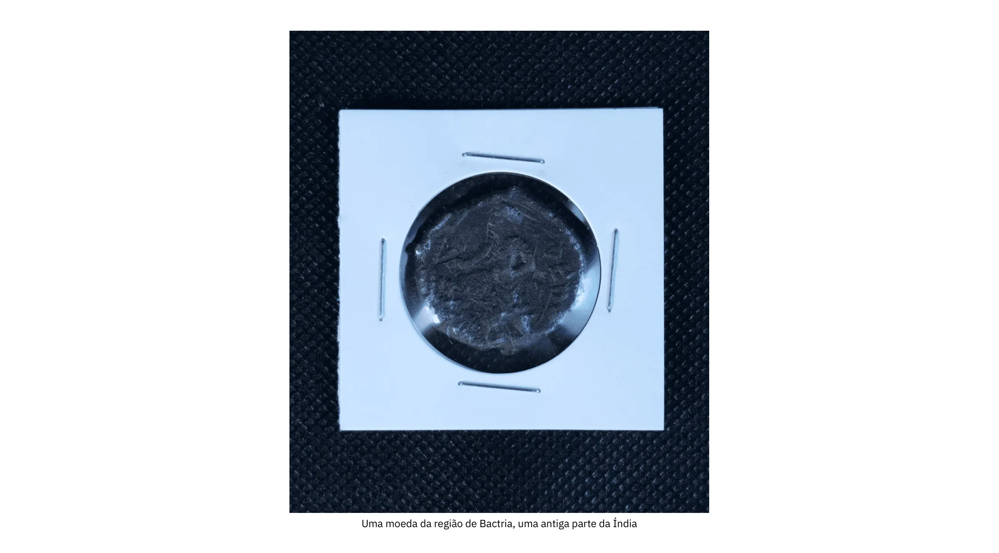

Para ilustrar visualmente este período, eis uma moeda de uma região da Índia, a região da Bactria, situada perto do oeste da península indiana, próximo do Afeganistão. Nesta zona, havia moedas que provavelmente se inspiraram nas moedas gregas que apresentavam uma das suas personalidades reais.

## Lídios e Persas

<chapterId>eb802ab8-8ffd-5b25-907f-8944f120ed14</chapterId>

:::video id=f151eb42-5ff3-4ca1-9af1-1ae2a5e051c0:::

### As primeiras moedas de eletrão da Lídia

Uma vez que não podemos separar o aparecimento de moedas da Lídia e dos Persas, passemos à parte do mundo situada a leste da Grécia, que hoje forma a Turquia. As primeiras moedas que apareceram no Ocidente datam aproximadamente de meados do século VII a.C., nas regiões da Lídia e da Jónia, situadas na atual Turquia. Foi por volta de 650 a 600 a.C. que esta inovação fundamental viu a luz do dia, com descobertas arqueológicas notáveis, como as primeiras moedas encontradas no templo de Ártemis em Éfeso, datadas de cerca de 600 a.C. Estas moedas primitivas eram feitas de electrum, uma liga natural de ouro e prata com reflexos âmbar, e apresentavam frequentemente um aspeto rudimentar, marcado simplesmente com punções ou motivos rudimentares.

Abaixo, pode ver uma das mais antigas moedas da Lídia, com um leão e a sua presa à frente. É possível notar um selo ou buraco na parte de trás, que alguns acreditam ter sido usado para testar a pureza do metal e garantir que não se tratava apenas de uma camada superficial. Embora este seja um dos exemplos mais antigos, é importante notar que esta peça é uma cópia. Todas as minhas peças de ouro e electrum são réplicas ou recriações modernas, concebidas para evitar que eu gaste todas as minhas poupanças nesta coleção.

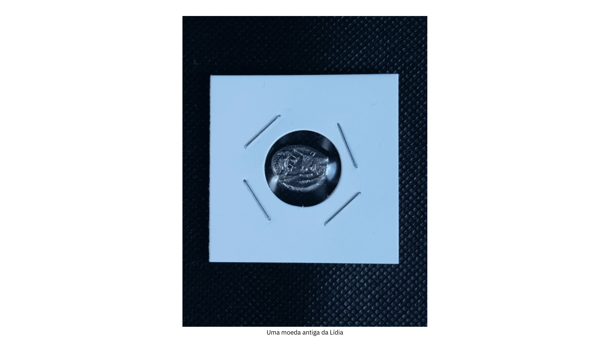

Mas também tenho uma verdadeira peça persa que estamos prestes a ver. Era assim que as primeiras peças se pareciam. É como uma espécie de bolha (ou caroço, em inglês) de metal que foi estampada na altura.

Contrariamente à crença generalizada de que a moeda foi inventada para facilitar o comércio quotidiano e substituir a troca, parece que as primeiras moedas lídias, aqueménidas e gregas não foram inicialmente utilizadas para o comércio em pequena escala. De facto, as unidades monetárias eram demasiado grandes para o uso quotidiano. Além disso, a sua circulação estava limitada às regiões próximas do local onde eram produzidas.

Aqui, acho importante referir que, embora tenha lido em várias obras de natureza antropológica, as moedas, como já mostrei - quer as de electrum, quer esta moeda persa a que voltarei daqui a pouco - eram demasiado grandes para comprar pão, digamos, todos os dias. Já vi estimativas que nos fariam pensar que era o equivalente a um dia de trabalho de um camponês ou de um soldado, por isso seria demasiado grande. É como tentar pagar um dia de salário por uma refeição, um pequeno-almoço ou um almoço. Só que já vi noutros trabalhos que foram encontradas unidades mais pequenas destas manchas, portanto moedas mais pequenas, o que nos pode fazer pensar que talvez houvesse uma utilização possível para as compras do dia a dia.

Assim, a "prova" antropológica de que não era utilizada para o comércio quotidiano, porque a denominação ou unidade era demasiado grande, não é muito sólida, na minha opinião, porque encontrámos exemplos de moedas mais pequenas, que poderiam ter sido adaptadas às compras quotidianas.

### O papel do Estado na criação de moeda

A verdadeira origem da moeda parece estar ligada à ação direta dos Estados. Existem duas hipóteses principais sobre este assunto: a primeira, idealista, estabelece um paralelo entre o termo grego "nomisma" (dinheiro) e "nomos" (lei), sugerindo que o dinheiro estaria ligado à codificação das leis, reforçando a autoridade e a organização política das cidades. A segunda hipótese, mais realista e hoje amplamente aceite, é a de que o dinheiro era, antes de mais, um meio de os Estados exercerem controlo económico e social. Ao garantirem oficialmente o peso e o valor dos metais preciosos que continham, os Estados podiam manipular a circulação e o valor dessas moedas, criando confiança e prémios de liquidez específicos para as moedas nacionais.

É muito interessante saber que temos provas deste facto. Por exemplo, no caso das moedas de electrum, é preciso saber que o electrum natural tem normalmente cerca de 70% de ouro e 30% de prata. Nas primeiras moedas que encontrámos e analisámos, especificamente as primeiras moedas lídias, o teor de ouro parece ser mais de 50 a 55% em vez de 70. Isto sugere que, já nessa altura, os emissores de moedas tentavam reduzir a percentagem do metal mais precioso, provavelmente para produzir mais moedas e fazer com que parecessem ter o mesmo valor que uma mancha não marcada de electrum natural. E aqui, há que dizer que foi realmente a partir do tempo deste famoso Croesus, como em *rico como Croesus*, que isto foi possível porque foi a partir do seu tempo que tivemos a tecnologia para separar o ouro da prata.

A cunhagem da Lídia sofreu uma grande evolução durante o reinado do famoso rei Creso (561-546 a.C.), conhecido pela sua lendária riqueza. Nesta época, os lídios aperfeiçoaram a metalurgia para separar o ouro e a prata do electrum, introduzindo assim as primeiras moedas bimetálicas, ou seja, moedas de ouro e prata separadas.

### Expansão persa e adoção grega

Quando conquistaram a Lídia, em 546 a.C., os persas aqueménidas adoptaram imediatamente esta inovação. Por volta de 500 a.C., sob o reinado de Dario I, os persas estabeleceram o seu próprio sistema monetário com dracmas de ouro e siglois de prata, muitas vezes com a efígie real em poses guerreiras. Esta moeda real persa foi utilizada principalmente nas regiões helenizadas do Império Persa e difundiu-se gradualmente, embora a sua utilização continuasse a ser desigual, com **algumas regiões, como o Egito, a preferirem ainda o câmbio em metal pesado (lingote)**.

Em cima, pode admirar-se um genuíno sigloi (ou siglos) persa. O pequeno desenho apresenta um rei, embora o buraco tenha sido ligeiramente desgastado. O siglos é uma moeda de prata, em contraste com o daric, que era feito de ouro. Os persas souberam distinguir estes dois metais e afastaram-se das moedas de electrum. Assim, implementaram o bimetalismo, utilizando tanto o ouro como a prata, mas mantendo o mesmo conceito de moedas feitas de metais preciosos, muitas vezes com um orifício na parte de trás, presumivelmente para controlo do teor de metal.

A rápida adoção da moeda pelos gregos parece ter sido estimulada pelos seus estreitos contactos com os lídios, nomeadamente através das colónias gregas na Ásia Menor. Os primeiros gregos a cunhar moedas foram provavelmente os habitantes de Egina, em meados do século VI a.C., que introduziram a dracma, cujo peso variava de região para região e cujo nome significa literalmente "punhado de grãos" ou "punhado de flechas".

O sucesso da cunhagem grega deveu-se tanto à sua conveniência para transacções importantes, como o pagamento de mercenários, como à expansão económica e política das cidades. A moeda tornou-se rapidamente um elemento central da economia grega e, mais tarde, da economia romana, mantendo uma forte dimensão simbólica, nomeadamente através da sua associação à lei (nomos).

Por último, a rápida expansão da cunhagem é testemunho de uma profunda transformação das sociedades antigas, em que a codificação dos valores monetários andou a par da organização do Estado. Esta evolução lançou as bases económicas e políticas para a ascensão das democracias gregas, particularmente em Atenas, onde o dinheiro desempenhou um papel crucial no funcionamento da cidade democrática.

Um ponto fundamental a reter desta secção é que estamos a falar especificamente de **moedas** e não de dinheiro em geral. O aspeto central que emerge claramente é o da **confiança na autoridade emissora**, diretamente ligada às caraterísticas técnicas das moedas (peso, pureza, valor facial). É precisamente esta confiança que permite ao Estado ou à autoridade emissora exercer um certo controlo ou mesmo manipular, desde o início, o valor e a circulação destas moedas.

## A intervenção institucional e as primeiras moedas

<chapterId>3e1efd08-99e3-5a32-9908-3185fef0e640</chapterId>

:::video id=84847cf6-9e46-4a8c-9f35-25a27496cc4b:::

### A dupla natureza do dinheiro

O aparecimento da moeda cunhada levanta uma questão fundamental: a moeda é uma criação espontânea do mercado ou uma instituição imposta pela autoridade? Esta tensão concetual coloca em confronto duas visões radicalmente diferentes.

Por um lado, a escola austríaca de economia defende a ideia de que a moeda mercadoria - em particular o ouro - foi naturalmente selecionada pelos agentes económicos pelas suas qualidades intrínsecas: durabilidade, portabilidade, divisibilidade e fungibilidade. Nesta perspetiva, o Estado apropriou-se depois desta moeda espontânea para controlar a sua oferta. Trata-se de uma instituição que emerge naturalmente das necessidades do mercado antes de ser capturada pelo poder político.

Em contrapartida, a perspetiva antropológica e institucional defende que o dinheiro nasce efetivamente com a cunhagem estatal. A autoridade criaria conscientemente a moeda ao apor o seu selo, transformando assim o metal num verdadeiro instrumento monetário. Esta perspetiva sugere que as primeiras moedas da Lídia eram principalmente utilizadas para pagar os exércitos - um stater correspondia aproximadamente ao salário diário de um soldado.

### As vantagens paradoxais da normalização estatal

Apesar desta tensão teórica, mesmo os economistas austríacos reconhecem certos benefícios da intervenção do Estado na moeda. A normalização através da cunhagem resolve uma série de problemas práticos do comércio.

Sem uma autoridade de certificação, os agentes económicos enfrentam riscos constantes: moedas falsas, fraudes de registo e manipulação do peso. Estas práticas criam fricções na economia, uma vez que algumas moedas são aceites e outras são rejeitadas. Em teoria, o carimbo oficial garante o peso e a qualidade, tornando o comércio mais fluido.

Esta garantia tem um preço observável no mercado: uma moeda de ouro cunhada vale mais do que o seu equivalente em ouro bruto. Este prémio reflecte o valor da certificação - os comerciantes já não precisam de verificar a autenticidade do metal através de testes químicos ou de ressonância. A intervenção do Estado, paradoxalmente, elimina o atrito e facilita o comércio ao criar uma confiança institucionalizada.

### Manipulação da moeda desde o início

A história das primeiras estátuas da Lídia revela uma ironia perturbadora. Análises recentes mostram que o teor de ouro destas moedas de electrum era sistematicamente inferior ao do electrum natural. A autoridade que certificava a qualidade estava simultaneamente a manipular a composição.

Esta prática ilustra a dupla utilidade da moeda. Para o mercado, torna as trocas mais fluidas e oferece uma garantia de normalização. Para a autoridade emissora, torna-se um instrumento de controlo económico através da diluição. Ao reduzir o teor de ouro, mantendo o valor nominal, o Estado aumenta efetivamente a oferta de moeda - criando mais unidades monetárias a partir da mesma quantidade de metal precioso.

No entanto, o próprio Estado continuou a ser condicionado por esta manipulação. Tal como ilustrado pelo exemplo do solidus de ouro de Constantino no século IV, a administração romana controlava escrupulosamente a qualidade das moedas, pois exigia ser paga em boa moeda. A autoridade tinha um interesse vital em manter a qualidade da sua própria moeda para garantir o valor das suas receitas fiscais.

### Análise económica da desvalorização

O estudo da desvalorização da moeda revela padrões consistentes ao longo da história. No caso das moedas metálicas, os economistas acompanham a percentagem de metal precioso contido nas moedas - uma curva descendente que indica uma desvalorização progressiva. Relativamente ao papel-moeda moderno, verifica-se o contrário: observa-se a massa monetária em circulação e o seu aumento indica uma desvalorização.

Ambos os métodos medem o mesmo fenómeno fundamental: a diluição do valor monetário. Quer seja através da redução do teor de metais preciosos ou da impressão de novas notas, o mecanismo é o mesmo. Quanto mais unidades monetárias uma autoridade cria a partir dos mesmos recursos reais, mais cada unidade perde o seu valor.

Esta manipulação, observável desde as primeiras moedas da Lídia, sugere que o controlo monetário foi sempre uma questão de poder. A moeda cunhada representa, assim, uma notável inovação técnica associada a um instrumento de controlo económico - uma dualidade que atravessa toda a história monetária, até aos nossos dias.

## Fabrico de peças

<chapterId>b205f4f2-c293-5308-b812-a998de9ad45e</chapterId>

:::video id=47c612ec-d97e-4498-b50e-7e66518bd56d:::

### De bolinhas perfuradas a moedas cunhadas

Depois de uma secção sobre o aparecimento das moedas, queria introduzir uma secção muito breve sobre a evolução do fabrico das moedas. Como vimos, tudo começou com bolas de electrum, prosseguindo com o ouro e a prata, em que ambas as faces eram marcadas com um punção, quer com o rosto do rei, quer com um buraco no verso para verificar a pureza.

Mais tarde, como veremos numa secção posterior, os gregos aperfeiçoaram esta tecnologia criando moedas redondas que eram marteladas em ambos os lados. Pegavam numa peça lisa e plana de metal precioso, gravavam o desenho pretendido numa das faces e depois martelavam-na à mão para criar a moeda acabada.

A tecnologia de cunhagem manual de moedas individualmente desempenhou provavelmente um papel no controlo da inflação durante esse período, embora as moedas fossem frequentemente diluídas para aumentar a produção. Este facto foi particularmente evidente durante o período romano e, em menor grau, durante certas guerras do período grego. Embora a cunhagem de uma moeda de cada vez limitasse a capacidade de produção em massa da autoridade, contribuía efetivamente para o controlo da inflação, apesar das desvalorizações significativas que se verificavam. Assim, a evolução passou de uma mancha de metal a ser perfurada para uma moeda redonda e martelada.

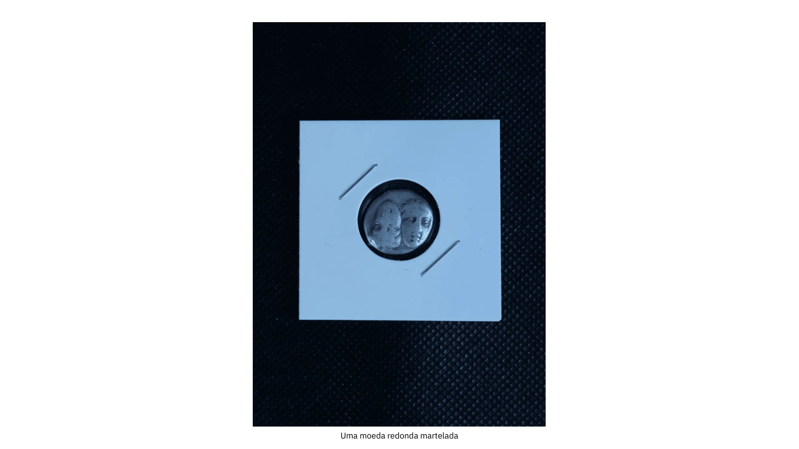

### Evolução medieval

Na Idade Média, verificou-se também uma tendência para espalhar as moedas, tornando-as mais largas e mais finas. Uma das razões para tal era o facto de se tornar mais fácil testar o seu som, que era frequentemente utilizado como indicador de autenticidade. Ao espalhar a prata, era produzida uma frequência distinta, pelo que as pessoas podiam validar a pureza da moeda simplesmente ouvindo-a. Esta prática deu origem à expressão "moeda sonante". No contexto da moeda fiduciária, o peso padrão era determinado através da utilização de uma balança ou "trebuchet" para a pesagem. Assim, a evolução continuou de moedas pequenas e redondas para moedas ligeiramente mais finas e largas.

### Golpe de pêndulo

A última tecnologia a chegar no final da Idade Média, no início da era moderna, foi a noção de cunhagem por pêndulo. Tratava-se de uma espécie de parafuso que se apertava para cunhar as moedas, gerando assim moedas com esta nova forma de cunhagem. O que foi especial neste desenvolvimento foi a capacidade de gravar um padrão na superfície da moeda para resolver o problema do recorte. O recorte implicava a remoção de uma parte da moeda para recuperar a prata preciosa, que podia então ser utilizada para cunhar outras moedas ou simplesmente conservada como recurso.

Assim, esta noção de golpe de pêndulo ajudou no fenómeno do recorte. E é interessante notar que esta tecnologia veio de França. Em Inglaterra, por exemplo, contrataram engenheiros franceses para lhes mostrarem como se faziam estas máquinas. O que é engraçado, penso eu, é que havia apoiantes da cunhagem a martelo que eram contra e que atrasaram a aplicação desta tecnologia. Em qualquer boa tecnologia, há sempre pessoas que são contra, que querem manter a tecnologia antiga. Achei muito louco perceber que, mesmo com uma tecnologia que parece realmente superior - é possível fazer mais peças, são mais difíceis de copiar - ainda havia pessoas apegadas ao famoso método do martelo. Houve uma mudança entre a produção de peças que eram feitas com o famoso golpe de pêndulo e o regresso ao golpe de martelo. E finalmente, como é óbvio, foi o golpe de pêndulo que acabou por se impor e nos deu estas belas peças modernas onde podemos encontrar pequenas linhas, pequenas cristas à volta para evitar o recorte, provavelmente relacionado com a palavra recorte, cristas, e ainda hoje podemos ver cristas ou textos ou desenhos que estão inscritos na borda da peça.

# Diferentes teorias sobre o aparecimento da moeda

<partId>72ac694f-9248-550d-90c1-91af3d234380</partId>

## Teorias sobre o aparecimento da moeda e as suas diferentes definições

<chapterId>7d699d4d-8c70-55b5-bf36-609f3fd90bcf</chapterId>

:::video id=523c873f-501b-4954-b79f-7e74c0f685a5:::

Bem-vindos a este segmento dedicado às diferentes teorias sobre o aparecimento da moeda e às suas várias definições. Segue-se um pequeno excerto do livro *Aux origines de la monnaie* que, na minha opinião, resume as duas principais teorias que iremos analisar nesta secção.

> Este breve preâmbulo não tem outro objetivo senão o de salientar o contexto do estudo. No plano concetual, o debate está aberto entre os partidários da tese de K. Polanyi e os de M. Weber. Para os primeiros, a dádiva e a redistribuição desempenham um papel central, com as trocas mercantis a desempenharem apenas um papel marginal, sobretudo nas trocas internacionais. Para os outros, pelo contrário, o mercado está no centro do processo histórico atual.

Por exemplo, na Mesopotâmia, uma teoria da emergência sugere que o templo, enquanto autoridade, cria a unidade de conta ou unidade monetária, impõe-na e depois os comerciantes adoptam-na para o comércio. A teoria oposta defende que, não, esta unidade monetária emerge naturalmente do mercado para facilitar o comércio. Há exemplos bem fundamentados deste facto na Mesopotâmia.

Quanto à troca, algumas teorias sugerem que era sobretudo utilizada em trocas internacionais, ou seja, com pessoas em quem simplesmente não confiávamos.

É isso que vamos fazer nesta secção. Vamos fazer uma espécie de inquérito para apresentar as diferentes teorias sobre o aparecimento do dinheiro e as diferentes definições do que é o dinheiro. Vamos apresentar e criticar as teses tanto dos economistas clássicos como dos antropólogos. Terei até a sorte de contar com a presença de Ulrich Fromy, que apresentará a perspetiva de um economista austríaco sobre estes diferentes temas.

## O surgimento da moeda para os economistas clássicos

<chapterId>1d3776cd-0dfd-5297-af48-c6f41e257a7e</chapterId>

:::video id=873a16c1-17ac-448d-8941-df4feb7ab79d:::

Este segmento é dedicado às diferentes teorias sobre o aparecimento da moeda. O primeiro tópico a ser abordado é o aparecimento da moeda segundo os economistas clássicos.

### A teoria clássica de Adam Smith

De acordo com as teorias económicas clássicas, em particular as defendidas por Adam Smith, a moeda surgiu naturalmente da troca direta, em resposta às suas limitações. Inicialmente, as trocas eram efectuadas por escambo direto, mas este método era frequentemente complicado pelo problema da "dupla coincidência de desejos": cada pessoa tinha de possuir exatamente o que a outra queria. Gradualmente, certas mercadorias (como o sal, os metais preciosos e o gado) passaram a ser aceites por todos como meios de troca intermédios, graças à sua utilidade, durabilidade e divisibilidade. Assim, o dinheiro surgiu espontaneamente para facilitar e fluidificar as trocas económicas.

### Crítica da teoria clássica

Eis a minha crítica a esta teoria. Com tudo o que vimos na secção anterior, penso que já podemos dizer que esta noção de que as **moedas** são uma evolução da troca direta está errada, simplesmente porque a moeda cunhada emerge definitivamente da autoridade, uma vez que é cunhada pela autoridade. Há várias razões para isso, entre as quais o desejo das autoridades de controlar a economia, de assumir o controlo do dinheiro.

Por outro lado, se estivermos a falar de dinheiro como conceito, e não necessariamente de moedas, então a questão é menos clara porque, com as primeiras moedas, as estátuas da Lídia, encontrámos manchas de prata que não estavam marcadas. Resta saber se estavam em circulação. Se circulavam, isso significa que as pessoas podem ter identificado originalmente este ativo como uma potencial moeda que poderia ser amplamente procurada e facilmente trocada. E talvez só mais tarde as autoridades se tenham apercebido desta situação e assumido o controlo da mesma, colocando-lhe um selo para a certificar.

Há muitas vantagens em fazer isto - não é necessário verificar, pesar, tudo isso. Obviamente, falaremos sobre isso. Mas, na minha opinião, a moeda é claramente um instrumento que foi utilizado pelos Estados desde o início. No entanto, no que diz respeito ao aparecimento do dinheiro enquanto tal, não sabemos se ele partiu efetivamente de uma autoridade que o impôs ou se surgiu através do comércio ou das trocas comerciais. Terei uma discussão muito interessante sobre este assunto com o meu colega Ulrich, mais adiante nesta secção.

Já sabemos que as primeiras moedas de metais preciosos não eram utilizadas para facilitar as trocas quotidianas porque o seu valor era demasiado elevado. Sabemos também que eram utilizadas principalmente para pagamentos militares. Este é um bom argumento para a tese de que o dinheiro não surgiu necessariamente do mercado. As unidades de conta, as denominações das primeiras moedas, eram provavelmente demasiado grandes para, por exemplo, comprar pão ou fazer compras diárias. Podia, por exemplo, ser o equivalente a um dia de salário. Não necessariamente que as pessoas recebessem salários nessa altura, mas isto é para vos dar uma ideia da escala. Portanto, estas moedas tinham provavelmente demasiado poder de compra para serem utilizadas no comércio de pequena escala. Por outro lado, nada nos diz que estas moedas não tenham sido utilizadas para efetuar trocas maiores, como as trocas mercantis. Sabemos que eram sobretudo utilizadas para pagamentos militares. Esta é uma das teorias mais populares para explicar o aparecimento das primeiras moedas. Lembre-se que estamos a falar de moedas e não necessariamente de dinheiro em geral. Assim, as primeiras moedas tiveram a sua primeira função, que era a de pagar pagamentos militares, de mercenários.

Alexandre, o Grande, por exemplo, utilizou-o muito bem, como veremos mais adiante.

Vimos também que, já na China antiga, as conchas de búzio eram utilizadas para trocas económicas (**remuneração do trabalho, medição do valor e compra de terras)**. Além disso, na Mesopotâmia e no Egito, já existiam sistemas monetários funcionais que eram utilizados para o comércio, o pagamento de salários e de impostos. O que estou a sugerir aqui é que é definitivamente errado pensar que as moedas na conceção ocidental surgem da necessidade de tornar as trocas mais fluidas.

Uma vez que as moedas são emitidas por uma autoridade, podemos talvez partir do princípio de que, desde o início, estão ligadas às autoridades emissoras. Isso faz sentido. Por outro lado, não sabemos necessariamente como surgiram as formas de dinheiro ou as formas de sistemas monetários, as proto-moedas, que as precederam. Por um lado, vamos sugerir que foram os templos que identificaram essas unidades monetárias e que, depois, as pessoas as utilizaram. E, por outro lado, dir-vos-emos que não, que foram os mercadores que precisavam de um meio de troca, de uma forma de negociar com o exterior, e foram eles que identificaram, por exemplo, a prata metálica, para ser utilizada porque era procurada pelo exterior. A questão é que não sabemos realmente. É por isso que temos duas teorias opostas. Não temos provas perfeitas para explicar se o dinheiro surge naturalmente da necessidade de transacionar, por exemplo pelos comerciantes, ou se emana da autoridade.

### Distinção entre moedas e dinheiro primitivo

Em conclusão, penso que podemos dizer que as moedas emanam necessariamente da autoridade, uma vez que foram cunhadas por essa autoridade. Por outro lado, não creio que se possa dizer que é errado sugerir que o dinheiro (o que precedeu a moeda) não poderia ter surgido para facilitar a troca. Penso que em todos os exemplos que vimos acima, abundam exemplos nesse sentido.

## O mito da troca direta

<chapterId>0fcd4964-ac36-5163-a8cf-1aacebc0d2c0</chapterId>

:::video id=0ede29ab-8acd-4d79-9282-bd5991b97076:::

### Crítica de David Graeber

Acabámos de abordar o aparecimento do dinheiro segundo os economistas clássicos. Agora vamos abordar um conceito conhecido como o mito da troca direta.

Uma das críticas a esta teoria clássica do aparecimento da moeda é a falta de provas históricas que sustentem as suas ideias.

A crítica conhecida como o "mito da troca direta", formulada pelo antropólogo David Graeber, entre outros, desafia a ideia clássica de que o dinheiro surgiu naturalmente da troca direta. De acordo com esta crítica, não existem provas históricas ou antropológicas que demonstrem que as sociedades utilizavam sistematicamente a troca direta antes do aparecimento do dinheiro. De facto, as sociedades antigas teriam funcionado com base no crédito, na dívida, nas obrigações sociais e nas trocas cerimoniais. O "mito da troca direta" é, portanto, uma construção teórica destinada a justificar a visão económica clássica, sem qualquer base empírica real.

Note-se, no entanto, que esta teoria não nega a existência do escambo, por exemplo, para trocas entre diferentes tribos. Nega simplesmente que a troca fosse uma atividade amplamente praticada no seio desses grupos ditos primitivos e que o dinheiro fosse uma evolução lógica dessas práticas. Nega o facto de que o escambo era amplamente utilizado no seio de uma tribo e que o dinheiro acabou por surgir para fluidificar as trocas e resolver as dificuldades que existiam com o escambo. Em vez disso, de acordo com esta teoria, estes grupos praticavam uma forma de crédito informal ou de dádiva por dádiva.

### Sociedades primitivas vs. grandes civilizações

**Penso que esta teoria se aplica sem dúvida a grupos primitivos (sem Estado) do passado e mesmo actuais (por exemplo, as tribos estudadas pelos exploradores nos séculos XVIII e XIX). É evidente que não utilizavam a troca, mas sim as formas de troca que referi anteriormente, pelas razões que já mencionámos (fraca divisão do trabalho, agricultura de subsistência). No entanto, não creio que esta teoria se aplique às grandes civilizações do passado, como a Mesopotâmia e o Egito antigo.

Seguem-se dois excertos de *Aux origines de la monnaie* sobre este assunto:

> O modelo delineado por M. Mauss no seu famoso "A Dádiva" foi adotado pelos egiptólogos com tanta unanimidade e entusiasmo como falta de discernimento. Este facto deu origem a uma série de confusões, que não abordaremos aqui. Notemos apenas que este modelo se aplica às sociedades ditas primitivas, o que não é o caso do Egito faraónico.

> Os pães, ou seja, os cereais transformados, eram, portanto, unidades de conta que, tal como o shât (y) do Antigo Reino, permitiam também a abertura de créditos em mercadorias diversificadas. Este simples exemplo mostra que a economia do Egito faraónico não se limitava a um sistema de redistribuição. Era muito complexa, envolvendo uma multiplicidade de trocas.

Assim, como vimos anteriormente na secção sobre o Egito e mesmo sobre a Mesopotâmia e a China, podemos constatar que mesmo estas civilizações antigas, mas não primitivas, devido à presença de um Estado, na minha opinião, utilizavam sistemas monetários. Penso que isto foi amplamente demonstrado na primeira secção deste curso. Assim, esta noção de dar e receber, de crédito diferido, não se aplica a estas grandes civilizações. As razões exactas para o aparecimento do dinheiro permanecem, portanto, um mistério. Não sabemos se ele surgiu da necessidade de os mercadores efectuarem trocas comerciais com o mundo exterior ou se foi imposto pelo templo nesses períodos antigos.

## O aparecimento da moeda através da moeda endividada

<chapterId>4f508615-aa61-5d62-89d3-cecd02aeaa62</chapterId>

:::video id=a23f547f-3906-4f4a-8f72-5d78c649d0c4:::

### A moeda como um IOU

Nesta secção, abordamos a teoria da moeda com dívida.

A teoria da **moeda da dívida**, desenvolvida nomeadamente pelo economista Alfred Mitchell-Innes e posteriormente alargada por David Graeber, afirma que o dinheiro não teve origem na troca direta, mas sim nas relações de dívida e de crédito presentes desde as primeiras sociedades humanas. De acordo com esta teoria, o dinheiro surge quando as obrigações sociais (dívidas entre indivíduos ou grupos) se tornam quantificadas e transferíveis. Este conceito introduz a noção de quantificação das trocas e das transferências. Assim, o dinheiro seria sobretudo um **reconhecimento da dívida**, apoiado na confiança mútua e muitas vezes garantido pela autoridade política ou religiosa, e não uma mercadoria que serve apenas de intermediário nas trocas.

Uma forma ainda mais avançada desta teoria é que todo o dinheiro é uma dívida. Assim, alguém que possui dinheiro teria uma dívida para com a sociedade em geral, uma dívida para com todos aqueles que aceitam esse dinheiro. E como o dinheiro, **na sua visão, tem de ser aceite de forma obrigatória**, caso contrário não é dinheiro, porque se se pode recusar esse dinheiro, o sistema não funciona. Num determinado grupo que identificou uma moeda, todos aqueles que a possuem, é como se tivessem uma dívida para com todos os outros membros dessa sociedade que aceitam essa moeda, e aqueles que aceitam a moeda têm uma forma de dívida para com a pessoa que possui essa unidade monetária. Esta é essencialmente a sua teoria.

### Críticas ao sistema obrigatório

**A minha crítica a esta teoria:**

Permitam-me que faça uma pequena crítica a esta teoria. Aceito que o dinheiro é uma espécie de consenso social. É a confiança que um grupo deposita num "sinal" monetário, seja ele qual for. Por isso, subscrevo o conceito de confiança mútua, que retomaremos mais tarde com o conceito de prémio monetário. A situação complica-se quando os defensores desta teoria acrescentam uma noção de obrigação e insistem na noção de dívida. Para eles, quando alguém possui um token monetário, tem um direito sobre a comunidade como um todo, e a comunidade teria, portanto, uma dívida para com o detentor. Haveria também uma obrigação de pagamento, com os membros do grupo obrigados a aceitar o token; caso contrário, na sua opinião, o sistema não funcionaria. Penso que o sistema descrito acima na China antiga representa bem esta teoria.

Pela minha parte, posso facilmente imaginar um sistema em que o dinheiro é um consenso social em que o token escolhido é geralmente aceite como meio de pagamento, sem qualquer obrigação formal. Consigo ver um sistema desses a funcionar se as pessoas o aceitarem de livre vontade. Pode funcionar. Por outro lado, muitas vezes vem acompanhado de obrigações, curso legal e violência, que veremos mais adiante numa secção. Mas, teoricamente, não tenho a impressão de que este sistema possa funcionar. Penso que o Bitcoin é um exemplo. O Bitcoin tem valor porque tem um prémio monetário, porque há procura para que seja utilizado como moeda, ou seja, como reserva de valor, talvez também como meio de troca ou de proteção contra o sistema fiduciário. Ninguém é obrigado a aceitá-lo e, quanto mais for aceite como meio de pagamento, mais poderá ser utilizado como meio de troca. Já podemos utilizá-la como reserva de valor sem qualquer problema. Não há qualquer dúvida quanto a isso. O que quero dizer é que o Bitcoin parece-me ser um exemplo, um tipo de moeda que é uma forma de consenso social em que pensamos que vamos conseguir recuperar o nosso dinheiro se comprarmos algum mais tarde, adquirimo-lo para o podermos trocar mais tarde, para preservar o nosso poder de compra.

Esta visão menos restritiva da teoria ajuda a explicar como é que duas sociedades distintas podem transacionar com um token monetário como o ouro, sem criar um crédito ou uma dívida entre essas sociedades. Forçar a aceitação na sociedade, penso eu, não funciona no comércio entre duas tribos, porque a outra tribo não está sujeita à autoridade. A tribo B não está sujeita à autoridade da tribo A. Mas, mesmo assim, aceita a mesma moeda - digamos, o ouro. Agora, as pessoas podem dizer-me: "Sim, mas isso é porque a empresa B também decidiu que o ouro é a sua moeda", por isso funciona. Sim, de facto, funciona, mas não há criação de dívida nessa altura. Trata-se de uma transação final. Assim, quando a empresa A troca um bem por ouro na empresa B, não há criação de dívida, a transação está concluída. E, claramente, a pessoa da empresa B não adquiriu esta moeda ou pepita de ouro para ser paga mais tarde pelas pessoas da empresa A. Aceita-a para ser trocada por ouro. Aceita-a para ser trocada mais tarde, provavelmente dentro da sua própria tribo. Assim, neste exemplo, não há criação de dívida, não há um crédito latente, trata-se simplesmente de uma troca direta, de um pagamento direto. Os defensores da moeda de dívida dir-nos-ão que isto é uma troca direta. E eu discordo, porque a permuta é a troca de um bem direto. A troca direta é a troca de um bem por outro bem, para uso. Os bens são trocados para serem utilizados, ao passo que, no nosso caso, o ouro é claramente utilizado como moeda porque não vai ser utilizado para mais nada; vai ser utilizado mais tarde como meio de pagamento. Por isso, na minha opinião, não se enquadra na categoria de troca direta.

Possuir um token monetário não é uma "reivindicação" sobre a comunidade, mas sim uma esperança de que o token seja aceite numa data posterior por um valor comparável.

## O aparecimento espontâneo da moeda

<chapterId>e3ef86b1-73b9-5140-a61e-2ab6a5b0b2d4</chapterId>

:::video id=e543995f-d5e2-49d7-9133-e397b46e0833:::

Para a escola austríaca de economia, iniciada por Carl Menger, a moeda emerge naturalmente de uma economia de troca direta confrontada com o problema da dupla coincidência de desejos. Nesta visão, os indivíduos convergem espontaneamente para bens intermédios que facilitam a troca - não bens diretamente consumidos, mas mercadorias reconhecidas pela sua capacidade de serem amplamente procuradas.

Estes bens monetários devem possuir qualidades identificadas desde Aristóteles: devem servir de reserva de valor, de meio de troca e de unidade de conta. Os agentes económicos identificam-nos, acumulam-nos e poupam-nos gradualmente, iniciando assim o seu aparecimento como moeda. Este processo é totalmente espontâneo - a moeda representa uma resposta natural do mercado ao problema da coordenação das trocas, sem a intervenção consciente de uma autoridade.

### O debate sobre o "mito da troca direta"

Antropólogos como David Graeber contestam este ponto de vista, invocando o "mito da troca direta". O seu argumento: nunca foi documentada nenhuma civilização complexa baseada apenas na troca direta. Pelo contrário, as sociedades primitivas estudadas utilizavam sistemas de crédito informal e de reciprocidade. Graeber afirma que a dívida precedeu a troca, citando milhares de tábuas da Mesopotâmia que documentam relações de crédito.

No entanto, esta crítica baseia-se numa definição restritiva de troca direta. Como Menger salientou em 1892, a troca direta vai além da simples troca direta de bens por bens. Inclui também transferências diferidas, serviços em troca de salários e trocas com temporalidade - aquilo a que Menger chamou "transferências unilaterais entre indivíduos". Esta forma alargada de troca pode coexistir com sistemas de crédito em círculos de confiança restritos.

A ausência de provas não é prova de ausência e os economistas austríacos reconhecem que nenhuma sociedade complexa pode desenvolver-se de forma sustentável apenas com base na troca direta - daí a necessidade do aparecimento do dinheiro.

### O caso da Mesopotâmia: mercadores versus templos

O debate está a cristalizar-se em torno da origem do shekel de prata da Mesopotâmia. Há duas interpretações opostas. A visão institucional defende que os templos - verdadeiros centros económicos e espirituais - impuseram a prata como moeda para estruturar a economia. As tábuas cuneiformes, concentradas entre o clero e as elites mercantis, testemunham este controlo centralizado.

A interpretação austríaca sugere o contrário: foram os mercadores que adoptaram o dinheiro para o comércio a longa distância. Confrontados com o desafio de negociar com estranhos para além das fronteiras da Mesopotâmia - da Anatólia ao Golfo Pérsico - precisavam de algo universalmente reconhecível, durável e transportável. A prata era uma escolha natural devido às suas qualidades intrínsecas. Os templos limitavam-se a confirmar uma prática já estabelecida pelo uso comercial.

Esta tese baseia-se em trocas documentadas entre Kanesh, na Anatólia, e Assur, onde os mercadores trocavam têxteis por prata metálica - não pela sua utilidade material, mas como reserva de valor. Estas transacções ultrapassavam a mera troca, revelando a existência de uma verdadeira moeda de mercadorias.

### O exemplo moderno dos campos de prisioneiros

O economista Richard Radford, prisioneiro na Alemanha durante a Segunda Guerra Mundial, documentou um caso fascinante de emergência monetária espontânea. Nos campos de concentração, os cigarros tornaram-se naturalmente a unidade de troca - divisível, padronizada, amplamente aceite. Até os não fumadores os adoptaram, reconhecendo o seu valor de troca universal.

Este microcosmo ilustra o princípio austríaco: confrontados com o problema da coordenação das trocas, os indivíduos convergem espontaneamente para o bem mais "vendável". Nenhuma autoridade impôs a moeda de cigarro; ela surgiu da prática quotidiana dos prisioneiros que procuravam otimizar as suas trocas.

### A convergência das preferências individuais

Essencialmente, o dinheiro representa a convergência das preferências individuais para um bem comum aceite. Os comerciantes mesopotâmicos, tal como os prisioneiros de Radford, identificaram o bem que minimizava a incerteza das trocas futuras. Esta seleção não depende da autorização ou imposição de uma autoridade central - emerge da racionalidade prática dos agentes económicos confrontados com os desafios da troca.

O debate entre emergência espontânea e instituição consciente permanece em aberto, uma vez que as provas históricas são fragmentárias. Mas a análise austríaca oferece uma explicação coerente: o dinheiro nasceu das necessidades práticas do comércio e as autoridades limitaram-se a institucionalizar práticas já estabelecidas pelo uso do mercado.

## A visão antropológica do surgimento do dinheiro

<chapterId>ec48c5d8-47ed-530f-beb7-c44fd0b62880</chapterId>

:::video id=8c1f8764-75af-4fb6-a98b-55de3b7da02e:::

### As origens não económicas da moeda

Nesta secção, exploramos a visão antropológica do surgimento da moeda, uma perspetiva rica que desafia profundamente as teorias económicas clássicas.

Contrariamente à teoria tradicional segundo a qual o dinheiro teria surgido naturalmente da troca direta para facilitar as trocas económicas, a investigação antropológica mostra que o aparecimento do dinheiro tem, em grande parte, causas não económicas. Tem origem em mecanismos sociais como o pagamento de tributos, a indemnização por homicídio (o famoso Wergeld) e os dotes (dinheiro das noivas), mas também em práticas cerimoniais, religiosas, políticas e simbólicas, muito mais do que em simples necessidades de mercado.

Nas sociedades primitivas, o dinheiro raramente era utilizado para a troca quotidiana de bens materiais, contrariamente à definição clássica de dinheiro como "meio de troca". De facto, estas sociedades recorriam maciçamente ao crédito, com pagamentos diferidos inseridos em vastas redes de relações sociais e pessoais. Estes sistemas de crédito omnipresentes precederam lógica e historicamente o aparecimento do dinheiro.

É isso que resume a sua visão. Falámos sobre isto com Ulrich na nossa conversa no vídeo anterior. Vou deixar-vos apreciar os comentários de Ulrich sobre o assunto, que desafiam um pouco esta abordagem. E assim, na visão antropológica, temos muitas vezes esta noção de que o dinheiro vem de uma autoridade ou de um conceito social que precede as necessidades do mercado.

### O exemplo das pedras de Yap

Aqui em baixo, pode admirar um exemplo notável das pedras monumentais da ilha de Yap. Algumas destas pedras, apesar da sua imobilidade ou mesmo desaparecimento físico, continuaram a funcionar plenamente como dinheiro graças a um acordo coletivo, sublinhando a dimensão essencialmente social e simbólica do dinheiro.

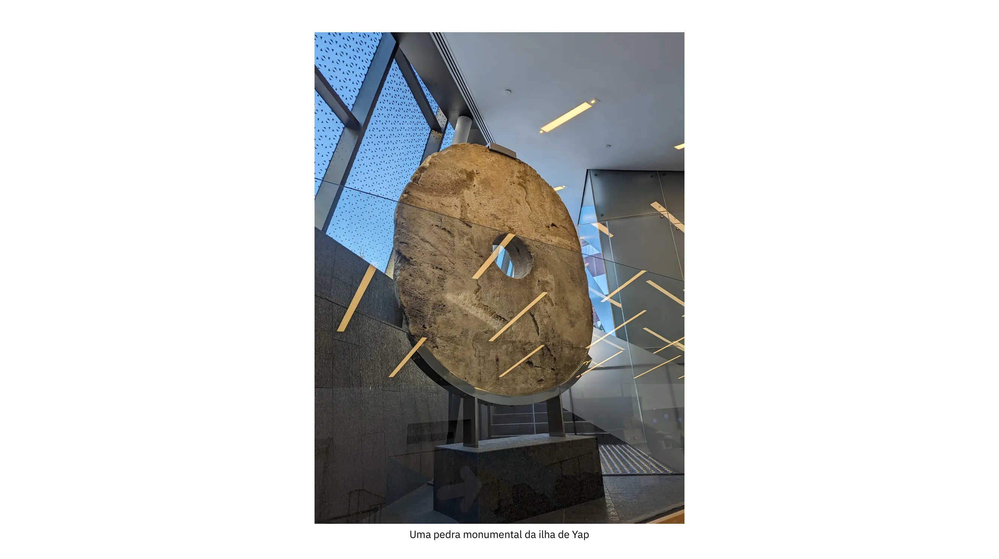

Esta é uma análise muito interessante das pedras Yap. Saifedean Ammous também menciona este exemplo no seu livro "The Bitcoin Standard". Segundo ele, o sistema da ilha de Yap é o que mais se assemelha ao Bitcoin, uma espécie de registo central que todos podem consultar, que é público, que mantém as contas e gere a propriedade das coisas. Esta perspetiva antropológica ilustra que tudo isto representa um acordo ou um consenso social no seio da sociedade, o que é fundamentalmente correto. E acho muito interessante esta referência às pedras perdidas. Iam centenas de quilómetros para o mar em pequenas jangadas e traziam as pedras de volta. Por vezes, a pedra caía no fundo do mar, mas essa pedra continuava a ser utilizada no sistema monetário. Uma pessoa podia dizer: "Sim, deixámos cair a pedra em tal sítio; é minha, por isso podemos trocá-la". Não havia necessariamente uma necessidade de posse física para facilitar a troca, uma vez que as pedras eram tão grandes que muitas vezes ficavam num só lugar. Em vez disso, o objetivo era trocar de mãos com estas pedras de uma forma transacional, permitindo que a propriedade mudasse sem que as pedras se movessem realmente. Tratava-se de uma forma de "prova de consenso", que realçava uma interessante perspetiva antropológica do dinheiro.

### As proto-moedas e as obrigações sociais

Etnógrafos de todo o mundo observaram sociedades que utilizavam "proto-moedas" ou "moedas primitivas", como conchas, tecidos, gado, sal e pedras, que cumpriam as funções habitualmente atribuídas ao dinheiro, como meio de pagamento e reserva de valor, sem no entanto servirem regularmente de intermediários na troca de bens do quotidiano.

Assim, estamos a descrever sistemas monetários que não eram necessariamente utilizados para trocas quotidianas.

E gostaria de vos lembrar que todas estas eram moedas antes do aparecimento das moedas, e não sei até que ponto é um termo errado dizer moeda. Prefiro dizer moeda. Posso referir que, na literatura, é frequente falarmos de proto-moedas para nos referirmos ao dinheiro antes das moedas. Mas, como vimos na primeira secção, **acredito que já existiam sistemas monetários muito antes do aparecimento das moedas**.

Estas moedas primitivas eram principalmente utilizadas para gerir obrigações sociais fundamentais ligadas aos indivíduos, como o casamento, a indemnização por conflitos (Wergeld) ou os presentes entre chefes. No Império Persa, por exemplo, as primeiras moedas foram criadas especificamente como meio de pagamento militar e não como meio de troca.

O dinheiro primitivo tem, portanto, uma caraterística essencial: é um meio de pagamento, mas muito raramente um meio de troca direta de bens materiais. O que queremos dizer com isto é que era um meio de pagamento de certas obrigações sociais, das tribos, das trocas entre chefes, o famoso wergeld, o dinheiro de sangue. Antes do aparecimento dos sistemas de justiça, se alguém cometesse um assassínio, havia uma reparação para a família que sofria com o assassínio do seu ente querido. Havia um preço a pagar por isso, chamava-se dinheiro de sangue e é uma forma de pagamento. Havia também o dote, que é igualmente uma forma de pagamento. Nestas primeiras utilizações do dinheiro como forma de pagamento, este estava mais relacionado com obrigações humanas e sociais do que com pagamentos de compras quotidianas. Segundo esta teoria, estas trocas quotidianas mais comuns estavam mais relacionadas com o crédito, o crédito diferido, a dádiva por dádiva e a redistribuição de rações. Havia uma outra forma de organização social para gerir estas trocas. Também é importante lembrar que, numa sociedade em que todos são auto-suficientes, fazem a sua própria agricultura, não há especialização e há muito pouca necessidade de um sistema monetário para as trocas quotidianas. E é por isso que as primeiras formas de dinheiro foram as que acabámos de descrever, o dote, o dinheiro de sangue, simplesmente porque foram as primeiras trocas em que precisámos de um meio de pagamento, muito antes de precisarmos de fazer comércio, de trocar pão por dinheiro no dia a dia, porque nas sociedades primitivas não funcionava assim. Cada um provia às suas próprias necessidades e ainda não havia especialização. Penso que já falei muito sobre este assunto em todas as aulas anteriores deste curso.

Nestas sociedades, sem uma divisão avançada do trabalho, as trocas diretas permaneceram limitadas, ocorrendo principalmente no âmbito de relações pessoais de amizade ou aliança. A ausência de especialização suficiente não exigia dinheiro no sentido moderno.

Antropólogos como Quiggin e Einzig insistem na preeminência do crédito: **A vida económica primitiva está enredada numa gigantesca rede de créditos e dívidas pessoais, onde o dinheiro intervém sobretudo quando os pagamentos têm de ser imediatos e as compensações não podem ser facilmente adiadas

Assim, as pessoas trocam coisas, podem fazer créditos diferidos, mas, nalguns casos, não se pode diferir o pagamento, pelo que a moeda ou as proto-moedas podem ser úteis nesta altura para dar um carácter final imediato à troca.

### A inovação do anonimato

Esta análise conduz a uma reflexão mais profunda: em vez de opor o dinheiro à troca direta, é mais pertinente compreender o seu aparecimento como uma evolução dos complexos sistemas de crédito e de débito. O dinheiro introduz uma inovação fundamental: **anonimato**. E é aí que eu acho interessante esta teoria antropológica do aparecimento do dinheiro. Se são um pequeno grupo de pessoas e dão crédito diferido umas às outras, é óbvio que se conhecem. Penso que, para que este sistema funcione, as pessoas têm de se conhecer, obviamente. E um pagamento feito com dinheiro permite o anonimato. Permite-nos fazer um pagamento sem que as pessoas saibam o nosso nome, sem que as pessoas saibam quem somos. Podem fazer uma troca para uma liquidação imediata e definitiva. E é exatamente isso que o dinheiro permite.

Ao contrário do crédito, que é sempre nominativo, o dinheiro permite transacções anónimas, generalizadas e imediatamente libertadoras. **Este poder libertador único do dinheiro é a sua superioridade decisiva

Assim, longe de ser um modesto instrumento para facilitar as trocas económicas, o dinheiro é uma inovação social importante, intimamente ligada à evolução das instituições e práticas humanas, desde o crédito pessoal **até um sistema de pagamento generalizado e anónimo**. Esta evolução antropológica mostra que o dinheiro, muito mais do que um simples meio de troca, representa uma poderosa instituição social, moldando profundamente as sociedades humanas, ao ponto de se tornar, nas nossas sociedades modernas, o próprio objetivo da atividade económica.

Aqui, apercebemo-nos de que, afinal, nas nossas sociedades modernas, o próprio objetivo da troca económica é possuir dinheiro, ao passo que, antigamente, não era esse o caso. O objetivo das trocas económicas era possuir bens ou mercadorias para consumo. E hoje, com a introdução da inovação do dinheiro, o objetivo da troca económica é acumular esse dinheiro, uma vez que ele nos permite trocá-lo pelo bem, como é geralmente aceite. Podemos trocá-lo pelo bem de que necessitamos, quando necessitamos.

## Unificação de registos

<chapterId>7664442a-91c1-5ce4-a8bd-53b7371a3e3d</chapterId>

:::video id=473fc284-5375-4e1b-b0cd-6b51ba0cc3b8:::

### Teoria do registo contabilístico

Vamos agora explorar em conjunto várias propostas de unificação destas duas teorias monetárias, isto é, a teoria da emergência da moeda através da moeda endividada e a teoria monetária da emergência da moeda mercadoria. Vamos falar da proposta de unificação de Lynn Alden no seu famoso livro "For Broken Money", cujo título da tradução produzida pela Consensus se chamará provavelmente "Rutura Monetária".

*Excerto de Broken Money de Lyn Alden:*

> Fundamentalmente, a moeda é um registo contabilístico. O dinheiro das mercadorias é um registo regido pela natureza. O dinheiro dos bancos é um registo governado pelos estados-nação. A moeda de código aberto é um livro-razão governado pelos seus utilizadores.

Neste caso, Lyn refere-se ao Bitcoin.

### O rácio stock-fluxo e a escassez

> Alguns elementos químicos raros, como o ródio, são mais raros do que o ouro, mas têm baixos rácios de stock-fluxo porque são consumidos pela indústria tão rapidamente quanto são extraídos. Uma moeda ou lingote de ródio pode ser comprado como colecionável especializado ou reserva de valor, mas não é adequado como moeda socialmente aceite, pelo que não surge naturalmente como dinheiro.

Saifedean fala longamente sobre este assunto no seu livro "The Bitcoin Standard". Para quem não está familiarizado com o rácio stock-fluxo, trata-se simplesmente de comparar o stock existente, as reservas que existem no mercado, com o novo stock que entra, o influxo de novo stock. É muitas vezes contra-intuitivo, porque se pode pensar que algo que se tem em grandes quantidades não é escasso, mas de facto não é. É mais uma questão de quantidade de stock. É mais uma questão de capacidade de fornecimento. Pelo contrário, é a capacidade que temos de ter novos stocks que, de acordo com este modelo, nos dá a informação sobre se este objeto é raro ou não. Não é porque não temos algo em stock que é raro, é apenas porque talvez não o tenhamos. Assim, se considerarmos o ouro, temos muitas existências de ouro porque é utilizado como reserva de valor, e o influxo de novas existências é algo como 1% a 3% por ano de novas existências de ouro que entram através do ouro mining. Por outro lado, se estivermos a falar de ródio, é mais raro do que o ouro, mas não temos qualquer reserva porque é consumido à medida que avança. Por isso, não é necessária muita oferta nova para duplicar o stock existente. Enquanto que com o ouro, seriam necessários pelo menos 50 anos para renovar, para duplicar o stock. Ao contrário da maioria dos bens que são consumidos, em que é bastante fácil e não são necessários muitos anos de produção para duplicar o stock existente, uma vez que é consumido à medida que avança.

*"O ouro tem mantido um rácio stock-fluxo entre 25x e 100x ao longo da história moderna, normalmente à volta de 50x ou mais, nunca caindo brevemente abaixo de 16x, mesmo durante a corrida ao ouro de meados do século XIX. "*

Assim, 25 significaria 25 anos para duplicar o stock, e 100 significaria 100 anos para duplicar o stock. Saifedean afirma no seu livro que mesmo que duplicássemos a produção de ouro, de 1,5% para 3%, isso não teria necessariamente um grande efeito no seu preço.

*"A prata tem geralmente um rácio stock-fluxo de 10 vezes ou mais, o que ainda é relativamente elevado

*A maior parte dos outros produtos de base tem um rácio de stock-fluxo inferior a 1 ou 2. Mesmo os elementos mais raros, como a platina e o ródio, têm rácios de stock-fluxo relativamente baixos devido ao seu rápido consumo industrial. "*

### A superioridade do ouro e da prata

*"Em suma, sempre que uma moeda de mercadorias se encontrou em competição com o ouro e a prata, esta última acabou sempre por sair vencedora. Outras mercadorias podem permanecer como moedas por períodos limitados ou em regiões específicas, mas o ouro e a prata sempre provaram a sua capacidade de se tornarem moedas globalmente competitivas e de dominarem a concorrência. Isto porque, quando as civilizações se encontraram, os detentores de ouro e prata tiveram sempre a capacidade tecnológica de desvalorizar outras formas de moeda, enquanto os detentores de conchas, pérolas, gado, sal, tecidos ou metais inferiores nunca conseguiram desvalorizar o ouro ou a prata. "*

Isto está extremamente bem descrito em The Bitcoin Standard, onde Saifedean fala sobre as tribos em África que usavam contas de vidro. E quando os mercadores venezianos chegaram com cargas cheias de contas de vidro, porque eram capazes de as produzir industrialmente na altura, tinham a capacidade tecnológica para o fazer, isso desestabilizou completamente o sistema monetário desses povos e eles puderam literalmente pilhar os seus recursos. Esta é a tese de Saifedean.

### Unidade de conta e crédito

*"Historicamente, mesmo quando o crédito era utilizado diretamente como instrumento de troca, era geralmente denominado em unidades de bens monetários naturalmente escolhidos pelas suas propriedades. "*

Essa é uma questão muito interessante, que Ulrich e eu temos estado a discutir. Mesmo que o templo da Mesopotâmia fosse uma espécie de autoridade que pudesse gerir esta noção de crédito, a unidade de conta era o shekel. Não há nada que confirme que o shekel tenha sido estabelecido de forma autoritária pelo templo. O shekel pode ter surgido naturalmente, através da necessidade dos mercadores de importar e exportar com outros povos da região. Temos provas disso, sob a forma de um comerciante de Kanesh (mencionei-o na Parte 1) que fazia exatamente isso, importando metais preciosos que não eram utilizados pelo seu valor físico de mercadoria, mas sim como reserva de valor. O único problema é que não sabemos se podemos assumir que esta escolha da prata, do shekel de prata, foi feita pelos mercadores, ou se foi feita pelo templo. Mas Ulrich tem um argumento muito bom que nos leva a pensar que, provavelmente, foi mais do lado dos mercadores que ela foi feita.

*"Assim, a unificação das duas teorias pode ser descrita como uma "teoria contabilística da moeda" ("teoria contabilística da moeda"), uma vez que descreve a lógica fundamental comum a ambas as teorias. Tanto o crédito social flexível como as proto-moedas coleccionáveis remontam aos primórdios da humanidade. Em ambos os casos, grupos humanos de várias dimensões mantêm entre si um registo contabilístico para evitar ter de satisfazer a dupla coincidência de desejos, reduzir o atrito nas trocas e servir como forma de poupança líquida. A diferença essencial reside na autoridade encarregada de manter o registo. "*

Por um lado, a natureza gere a expansão da massa monetária. Assim, se considerarmos o ouro, uma vez que é bastante raro, é difícil de extrair. Há uma espécie de limite para o número de moedas de ouro que podem ser extraídas. Assim, a escassez é gerida pela natureza. E o registo é gerido pelo conceito de posse. O registo é descentralizado. A posse é comprovada pelo facto de se possuir uma moeda de ouro ou uma peça de ouro. E no caso do dinheiro de crédito, a escassez é gerida pela capacidade das pessoas de obterem crédito. Ou, no caso da moeda fiduciária, a escassez é gerida pela autoridade. São elas que decidem se devem imprimir mais ou não, para evitar desastres inflacionistas. Assim, em alguns casos, o registo também pode ser gerido pelo proprietário do token, no caso do papel-moeda. É por isso que está inscrito no registo, entre aspas, desmaterializado. Bem, materializado, mas virtual. Ele possui esse famoso token, e é isso que prova a posse. E pode muito bem estar num registo real, como no caso do dinheiro escritural, num banco, onde é realmente o banco humano que gere quem possui o quê em relação ao registo.

## Unificação através do prémio monetário

<chapterId>093756e5-8908-55e5-bb76-376a3a3cc4d3</chapterId>

:::video id=eabc342a-ecbd-46ca-a347-e914917e7c4f:::

### O conceito de prémio monetário

Nesta secção dedicada às várias propostas de unificação das diferentes teorias sobre o surgimento da moeda, acabo de propor a teoria de Lyn Alden, a teoria do registo. Eu tenho a minha própria proposta para a unificação das duas teorias monetárias. É o prémio monetário, o conceito de prémio monetário. Assim, o valor do dinheiro pode ser explicado pelo prémio monetário decorrente da sua procura monetária, quer seja sob a forma de tabuletas de argila, moedas de metais preciosos, notas de banco ou bitcoin. O prémio monetário baseia-se simplesmente na confiança de que alguém trocará esta moeda no futuro por um preço comparável.

O que tento demonstrar aqui é muito simplesmente que, quer se trate de notas fiduciárias, sem valor de uso, quer se trate de moedas de ouro ou de qualquer metal, de uma pepita de ouro ou de um lingote, **é frequentemente o prémio monetário que constitui a maior parte do seu valor**. Se considerarmos uma peça de ouro, uma certa parte do seu valor explica-se pelo seu valor de uso, a sua utilização na indústria ou para fazer jóias. Note-se que a procura de jóias resulta frequentemente do seu valor monetário. As pessoas guardam jóias como uma espécie de reserva de valor, pelo que incluo um pouco este valor no prémio monetário, porque muitas vezes é uma procura bastante monetária para desempenhar um papel na moeda.

Portanto, poder-se-ia dizer que cerca de 10% da procura de ouro é para a indústria. No valor do ouro, teríamos uma pequena parte, digamos 10%, que seria explicada por esta procura industrial, esta procura para a utilização do ouro, onde o ouro é consumido. O resto é claramente a procura para o seu uso monetário como reserva de valor.

### Bónus de autoridade e fiat

E se compararmos uma peça de ouro com uma moeda de ouro, há uma outra camada. A moeda de ouro é carimbada por uma autoridade, e o ouro contido na peça também tem uma procura de utilização, uma procura para ser consumido na indústria. Também beneficia de um prémio monetário como reserva de valor. Além disso, há uma sobreposição que designo por prémio de autoridade, em que muitas vezes há um preço, um poder de compra maior para a moeda do que para a peça de ouro, uma vez que a moeda é mais simples de utilizar. Torna as trocas mais fluidas, pois não há necessidade de a pesar. A autoridade garante normalmente o seu grau de pureza. E se a compararmos com uma peça de ouro, uma moeda de ouro carimbada vale geralmente mais do que uma simples peça de ouro. E isso também é normal, porque são necessários recursos para a carimbar.

É o mesmo princípio para a moeda fiduciária, o papel-moeda. O papel-moeda não tem qualquer valor de uso, exceto talvez para aquecer uma casa, e isso aconteceu durante a República de Weimar. Portanto, não há uma procura real do seu valor de uso. Por outro lado, na minha opinião, só existe um prémio pela autoridade.

É uma forma de prémio monetário, uma sobreposição ao prémio monetário. Mas o seu prémio monetário advém do facto de ter curso legal e de as autoridades o obrigarem a comprá-lo para pagar os seus impostos. Assim, necessariamente, a moeda fiduciária tem uma forma de procura monetária que decorre do facto de ser tributada e de termos de a adquirir, pelo menos, para pagar os impostos. E, como resultado, continua a ser um meio de pagamento geralmente aceite. Por isso, as pessoas querem adquiri-la para satisfazer as suas necessidades.

### Unificação através da procura monetária

E porque é que esta proposta de prémio monetário se qualifica como uma unificação das duas teorias da moeda de dívida e da moeda mercadoria? Bem, eu não acho que o valor de uma moeda de ouro venha necessariamente do seu "valor intrínseco". Não, de facto, é tanto uma noção de confiança como a da moeda fiduciária. É uma noção de procura monetária. E não é pelo facto de ter uma pequena percentagem de utilização industrial, outra "utilidade". Se dissermos que a utilização industrial representa 10% do seu valor, podemos avaliá-lo em 300 dólares por onça. Se o ouro for vendido no mercado a 3000 dólares a onça, a diferença entre 300 e 3000 dólares é o famoso prémio monetário. É esta procura monetária de ouro que explica o facto. O facto de a moeda fiduciária não ter qualquer valor de uso não significa que seja diferente. Para mim, é exatamente a mesma coisa. Portanto, em ambos os lados, na teoria da moeda da dívida ou da moeda mercadoria, não me parece que a qualidade extra que o ouro teria de ter um valor de uso mínimo mude alguma coisa.

Por outro lado, é certo que **ao nível da emergência, de acordo com o teorema da regressão de Mises, podemos propor que este uso cria uma procura na origem e inicia o processo que se torna dinheiro**, enquanto que, ao nível do dinheiro da dívida, é mais uma imposição de uma autoridade, pelo que a fonte, o início da emergência e os conceitos são completamente diferentes. **Mas penso que, ao nível do valor, como explicar o valor do dinheiro, com o prémio monetário, podemos explicar com a mesma facilidade porque é que a moeda fiduciária tem o valor que lhe atribuímos e porque é que a moeda mercadoria tem o valor** que lhe atribuímos. Para mim, é o mesmo processo, e chama-se prémio monetário.

#### O prémio monetário

É isso mesmo. O valor do dinheiro pode ser explicado pelo prémio monetário resultante da sua procura monetária, quer seja sob a forma de tabletes de argila, moedas de metais preciosos, notas de banco ou bitcoin.

O prémio monetário baseia-se simplesmente na confiança de que alguém trocará esse dinheiro mais tarde por um preço comparável.

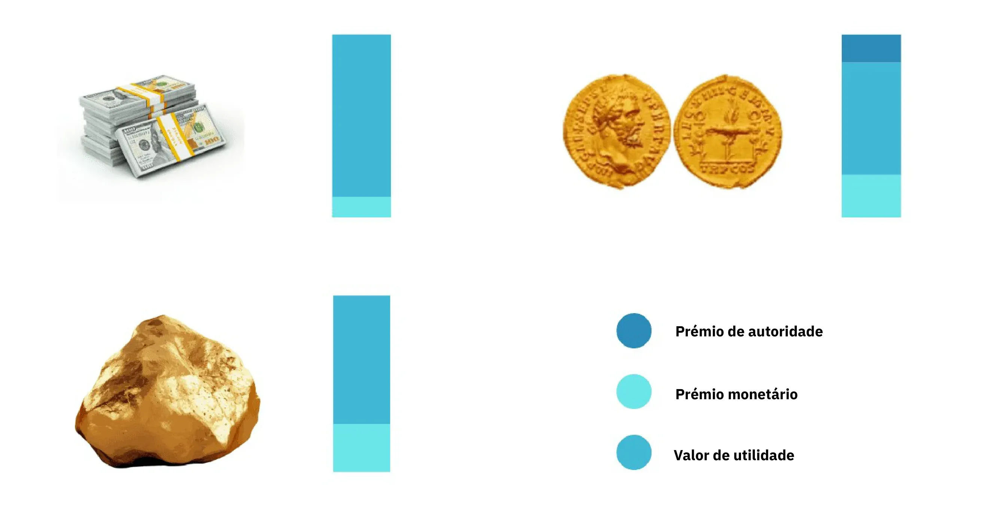

# Diferentes definições de dinheiro

<partId>77b7918a-8c3b-11f0-b688-6b2ab22378c9</partId>

## Dinheiro vs moeda vs monnaie vs argent vs devise

<chapterId>bf8a6d21-df88-5d23-a0a5-e9a5c1300554</chapterId>

:::video id=d9c9e7df-9db3-4a9f-801e-10d3fc7dfc22:::

### Semântica dos termos monetários

Nesta secção sobre as várias teorias monetárias e especialmente sobre as definições de dinheiro, gostaria de fazer um breve aparte sobre o tema da semântica. Gostaria de aprofundar um pouco mais as definições de várias palavras relacionadas com o dinheiro e compará-las com os seus equivalentes em inglês. Por exemplo, money, currency, comparado com monnaie, argent e devise. Então, é assim.

Um pouco de semântica:

Quando dizemos "**money**" (de la monnaie), a maioria das pessoas pensa que nos estamos a referir ao pequeno troco que recebemos em troca de uma transação. E se dissermos "**currency**" (la monnaie), as pessoas pensarão provavelmente que nos estamos a referir à moeda de um Estado. A moeda do Canadá é o dólar canadiano. É isso mesmo.

Mas e o dinheiro (de l'argent)? Um ladrão nunca dirá "Dá-me todos os teus trocos!" (o ladrão pode ficar desiludido por receber apenas moedas de valor quase nulo).

Não, o ladrão vai gritar: "Dá-me **todo o teu dinheiro**". E se o ladrão estiver à sua frente na rua, está necessariamente a referir-se às **notas** que tem no seu bolso.

Por outro lado, se o ladrão tentar defraudá-lo de uma forma mais sofisticada, tentando roubar os seus bens esvaziando todas as suas contas bancárias, diríamos que **ele vai levar todo o seu dinheiro**. Aqui a palavra "money" refere-se ao **património do indivíduo**.

Assim, há duas definições para a palavra dinheiro: numerário (notas) e património.

### Moeda vs monnaie vs devise

Uma moeda (devise) é necessariamente a moeda de outro país, caso contrário dizemos apenas dinheiro (monnaie). Se fores francês, dirás: "La livre sterling est la devise du Royaume-Uni et l'euro et la monnaie de l'Europe" (A libra esterlina é a moeda do Reino Unido e o euro é a moeda da Europa).

Muitas vezes, as pessoas que não se debruçaram sobre estes problemas semânticos, ao traduzirem estes termos, tendem a falar de currency (devise) quando se trata de moeda escrita, mas não, currency é money (monnaie) quando se trata da moeda do seu país, e é devise quando se trata de outras moedas. Por isso, o problema que vejo muitas vezes é que, em inglês, há duas palavras: "money", que é um conceito, e "currency", que é realmente a unidade de um país que é utilizada para efetuar trocas. Por isso, podemos falar apenas do conceito de dinheiro; é fácil - é o conceito da palavra *money*; é o dinheiro em geral. E *currency* é muito simples de equiparar à moeda de um país. Em francês, infelizmente, as pessoas dizem muitas vezes que sim, "mais ce n'est pas une monnaie" quando falam de bitcoin porque não é a moeda de um país, mas muitas vezes, penso que se estão a referir aos termos moeda. Por um lado, isto está errado, porque desde El Salvador que a bitcoin é a moeda de um Estado. O facto é que as pessoas dizem muitas vezes: *mas não, não é a moeda de um Estado, não pode ser dinheiro*. Mas, de facto, se nos referirmos ao conceito mais amplo de *dinheiro*, a bitcoin enquadra-se perfeitamente nesta definição, na minha opinião. É que, em francês, não temos duas palavras para separar estes dois conceitos. Poderíamos dizer que a palavra argent se refere à moeda, mas, infelizmente, não é essa a sua definição exacta. *Argent* (dinheiro) refere-se à riqueza ou às notas de banco. Não se pode fazer uma equivalência com a palavra *money*. *Money* é, de facto, o conceito de moeda (monnaie).

## Definição de Saifedean Ammous

<chapterId>07c4ba50-168c-567a-8957-0b187ff75f97</chapterId>

:::video id=936d6d3b-6d45-468e-bc44-85fbce9b857a:::

#### O que é o dinheiro?

O dinheiro é simplesmente algo que se possui ou se adquire, não para ser utilizado ou consumido por si só, mas para ser trocado mais tarde por outros bens ou serviços de que se possa necessitar. (Saifedeu)

A moeda adquire um prémio monetário quando existe uma procura monetária para o bem, para desempenhar um ou mais dos papéis da moeda.

O bem monetário deve ser suficientemente escasso para que o prémio monetário persista (para evitar que a oferta se ajuste à procura monetária).

### O prémio monetário

Nesta secção sobre as diferentes definições de moeda, gostaria de falar brevemente sobre a definição de Saifedean em The Bitcoin Standard, que sempre me interessou muito. Quando a li, pareceu-me bastante simples. E vamos também acrescentar a esta definição o conceito de prémio monetário. Como Saifedean refere no seu livro, existe necessariamente um conceito de escassez. A questão é: o que é o dinheiro?

> O dinheiro é simplesmente algo que se possui ou adquire, não para ser utilizado ou consumido por si só, mas para ser trocado mais tarde por outros bens ou serviços de que possa necessitar.

É esta a definição que Saifedean menciona em The Bitcoin Standard. Eu acrescentaria que uma moeda (la monnaie) adquire um prémio monetário quando existe uma procura monetária do bem, para desempenhar uma ou mais funções da moeda. Assim, pode dizer-se que uma moeda que serve de reserva de valor terá uma procura monetária que lhe confere um prémio monetário, uma vez que as pessoas querem adquiri-la, por exemplo, como reserva de valor ou como meio de troca.

### Escassez e mecanismos de mercado

A isto, penso que devemos acrescentar, sem dúvida, que o bem monetário tem de ser suficientemente escasso para que o prémio monetário possa subsistir. Isto é muito importante. **Se um bem surge para ser usado como dinheiro e vemos que o seu preço está a subir, normalmente, se o bem não for suficientemente raro, as pessoas vão querer produzi-lo mais para tirar partido deste ganho de valor quando o preço sobe**. É por isso que a maioria dos bens no mercado tem um preço relativamente fixo. Quando o preço sobe, a produção tende a aumentar. Quando o preço desce, a produção diminui. Há uma espécie de ajustamento do mercado. **E quando um bem é suficientemente raro, como o ouro, o mecanismo de mercado não compensa o aumento da procura para uso monetário. Portanto, é a variável que muda, é o preço. Como no caso do bitcoin**. Quando o preço da bitcoin sobe, não produzimos mais bitcoin. Portanto, o que se ajusta é o preço. E é por isso que, durante anos, vimos o preço do bitcoin subir à medida que a procura de bitcoin aumenta. Como não há ninguém na Terra que possa mudar o algoritmo e dizer "há mais procura, o preço está a subir, vamos produzir mais" **A oferta de novos bitcoins é programada com antecedência, e conhecida com antecedência**. Portanto, era isso que eu estava a dizer, que o bem monetário deve ser suficientemente raro para que o prémio monetário persista e, portanto, não seja apanhado pelos mecanismos de mercado, para impedir que a oferta se ajuste a esta nova procura monetária.

## Meios de pagamento e valor liberatório

<chapterId>5d424039-e342-56f7-9d8b-bba9551831a9</chapterId>

:::video id=af4c0765-8111-4cb7-891b-3ee54d6e7054:::

### Meios de pagamento vs. meios de troca

Nesta secção dedicada às diferentes definições de dinheiro, sugiro que analisemos em conjunto uma citação do livro "Aux origines de la monnaie" (As origens do dinheiro), um texto de Alain Testart sobre o dinheiro como meio de pagamento e como valor libertador.

*Em Aux origines de la monnaie, Alain Testart define o dinheiro como um meio de pagamento:*

> A função de meio de pagamento é aqui concebida como distinta da função de meio de troca, na medida em que existem pagamentos sem contrapartida, pagamentos que não compram nada. Knies (1873:192 ss.) desenvolve longamente este tema das transferências de bens que não consistem em actos de troca, como no caso do wergeld (dinheiro de sangue ou composição por homicídio) ou dos impostos. Carl Menger atacou esta quarta função no seu artigo de 1892 "Geld", geralmente considerado um dos mais decisivos sobre o assunto. Sem ter sido totalmente desacreditada, a ideia da função de meio de pagamento parece ter sido esquecida no pensamento económico atual, ou pelo menos rejeitada em favor da função de meio de troca.
>

> O dinheiro serve para pagar: visto desta forma, é um instrumento de libertação, que descreve em toda a sua generalidade a função de um meio de pagamento. A este respeito, fala-se do "poder libertador" do dinheiro. Segundo Le Petit Robert, o poder liberatório é "aquilo que tem por efeito libertar (de uma obrigação, de uma dívida)". Segundo o Grand Larousse, um pagamento liberatório é qualquer "pagamento efectuado em condições legais, de modo a que o credor não possa contestar a extinção da dívida". O dinheiro tem este poder por excelência; é mesmo o que define o seu curso legal, uma vez que ninguém pode recusar um pagamento feito em dinheiro, quer seja vendedor ou credor. O dinheiro é o único bem que não pode ser recusado em pagamento do que é devido, quer se trate de uma dívida a um comerciante ou ao fisco. Entre todos os bens, só o dinheiro tem este privilégio. "É este privilégio", escreve Charles. Gide (1921 I: 443), que constitui aquilo a que chamamos curso legal.
>

> Qualquer troca que consista na transferência de um bem por outro, ou na condição de ser dado outro bem em troca, implica necessariamente uma obrigação do beneficiário de fornecer essa contraparte. O pagamento é o cumprimento desta obrigação. Assim, toda a troca implica um pagamento, mas nem todo o pagamento implica uma troca. Existem pagamentos sem contrapartida, ou seja, pagamentos que não permitem a obtenção de um outro bem e que não são efectuados com esse objetivo. Os impostos continuam a ser o exemplo de referência, mas há que mencionar também as multas de todo o tipo pagas às autoridades públicas e as reparações devidas a terceiros, segundo o princípio de que quem causa um dano a outrem deve repará-lo.

### Pagamentos sem contraparte

Esta é uma ilustração clara da tese do autor. De facto, o autor faz uma distinção entre as duas. Para ele, uma troca é simultaneamente uma transferência de bens e um pagamento. O pagamento vem a seguir. E o pagamento pode ocorrer sem troca. Dá exemplos de como pagar um bilhete de estacionamento ou uma multa é apenas um pagamento. Não se recebe um serviço em troca. Alguns podem argumentar que o Estado está a prestar um serviço em troca, um serviço de multas de estacionamento. Ele é bastante claro quanto ao facto de o pagamento de impostos ser realmente um pagamento sem contrapartidas, no sentido em que o pagamento de impostos é obrigatório, mesmo que não se obtenha necessariamente um serviço. Diz que está realmente definido que pagar impostos é apenas um pagamento; não há obrigação de obter serviços em troca. Discuti este assunto com muitos dos meus colegas e eles não concordam necessariamente com esta noção. Mas é essa a tese do autor. Ele tenta situar a noção de pagamento e separá-la das trocas com estes exemplos, por exemplo, da coima, do pagamento de impostos. Também, por exemplo, o dote, ele expressa que o dote é um pagamento; não se recebe necessariamente algo em troca. Alguém que critique esta proposta pode dizer: "Sim, mas recebes uma esposa em troca" É este o nível do debate sobre este assunto.

Há também o wergeld, ou dinheiro de sangue. Portanto, é apenas um pagamento para compensar. O meu amigo Ulrich diria:

> Sim, mas em troca este ficheiro é encerrado.

Então, cometeste um crime, um homicídio, por exemplo. Na altura, paga-se o wergeld e, depois disso, bem, é-se libertado dessa situação. Portanto, há um poder libertador. Recebe-se alguma coisa em troca? Segundo o autor, não. Segundo alguns dos meus colegas, sim.

Penso que, nesta discussão, podemos ver que o wergeld é um dos bons exemplos para definir um pagamento. De facto, é evidente que não se recebe nada em troca.

## Moeda de dívida vs. moeda de mercadorias

<chapterId>4093677a-c8e8-5828-b994-15c01656186e</chapterId>

:::video id=f49cf5cc-288e-4daa-a1ff-b9de73506f4e:::

### O debate de fundo

Ainda no contexto desta secção sobre as diferentes definições e teorias monetárias, vamos explorar em conjunto duas visões diametralmente opostas: "o dinheiro é sempre dívida" ou "o dinheiro é sempre um bem". Por um lado, há os defensores da teoria monetária baseada na dívida, que afirmam: "Não, o dinheiro é sempre dívida! Por outro lado, os nossos famosos "gold bugs" argumentam: "Mas não, o dinheiro é sempre uma mercadoria, é sempre ouro; tudo o resto, notas, IOUs, é apenas crédito, não é dinheiro".

Vamos explorar juntos um resumo claro destas teorias.

### A teoria "sempre uma dívida"

Eis um resumo da teoria monetária conhecida como **"debt money "**, segundo a qual o dinheiro é fundamentalmente uma forma de dívida:

De acordo com esta teoria, desenvolvida em particular por Alfred Mitchell-Innes e aprofundada por David Graeber, o dinheiro é intrinsecamente um reconhecimento de dívida, decorrente das relações de crédito que historicamente pré-existiam às trocas monetárias diretas. Em vez de surgir de uma necessidade ligada à troca, o dinheiro aparece como uma forma de contabilizar, transferir e liquidar obrigações sociais ou dívidas entre indivíduos ou grupos.

Assim, todo o dinheiro circula como uma dívida de uma pessoa ou de uma instituição para com outra, apoiada na confiança e na autoridade social ou estatal que garantem a sua validade. Assim, segundo eles, quando possuímos - como já referi - quando possuímos dinheiro, temos um crédito sobre a sociedade, e esta tem uma dívida para connosco. O dinheiro nunca é, portanto, neutro ou autónomo, mas sempre uma dívida subjacente: possuir dinheiro significa essencialmente possuir um crédito sobre a sociedade ou uma comunidade económica.

Este raciocínio contradiz a ideia clássica do dinheiro como uma simples "mercadoria intermédia" e, em vez disso, enfatiza o papel central das relações sociais e políticas na criação e gestão do dinheiro.

**A minha opinião:**

O que me incomoda nesta teoria é o facto de ela afirmar que o dinheiro é sempre uma dívida, quando temos exemplos de trocas entre duas tribos diferentes que, por exemplo, trocam ouro, em que a transação é definitivamente definitiva e não fica qualquer dívida latente. Os defensores desta teoria dizem-nos muitas vezes que estas trocas não são trocas monetárias, mas sim trocas diretas. Como já referi, discordo. Trata-se de uma troca monetária, uma vez que o ouro não vai ser consumido, vai ser utilizado como moeda.

### A teoria do "sempre um bem"

**Sempre uma mercadoria:**

Eis um resumo claro da teoria monetária conhecida como **"dinheiro-mercadoria "**, em que o dinheiro surge sempre como uma mercadoria, nomeadamente o ouro, que surge da necessidade de poder negociar, uma mercadoria que será geralmente aceite no estrangeiro e que é adquirida para fins comerciais.

Segundo esta teoria, desenvolvida pelos economistas clássicos (Adam Smith, David Ricardo) e retomada por Marx, o dinheiro surge naturalmente como uma mercadoria entre outras, muitas vezes um metal precioso como o ouro ou a prata, que tem um valor intrínseco independente da sua função monetária. Inicialmente, estas mercadorias são escolhidas espontaneamente pelos agentes económicos para facilitar as trocas, graças às suas qualidades intrínsecas (escassez, durabilidade, divisibilidade e estabilidade).

A moeda mercadoria distingue-se pela sua existência física e por um valor determinado pela quantidade de trabalho socialmente necessário para a produzir (como em Marx). A sociedade utiliza o ouro, por exemplo, não só para simplificar as trocas, mas também como unidade de conta, reserva de valor e meio de troca universal.

Nesta visão, o dinheiro mantém sempre um valor real, uma vez que permanece ligado a um bem tangível. Mesmo quando o papel do dinheiro se torna abstrato (moedas cunhadas, notas de banco ou dinheiro escritural), a sua validade continua a derivar, direta ou indiretamente, de uma referência a um bem subjacente, como o ouro. Esta teoria insiste, portanto, na origem material e económica do dinheiro, ao contrário das teorias que o consideram uma mera convenção ou dívida. De acordo com esta teoria, qualquer representação do dinheiro por um substituto, como uma nota reembolsável em ouro, seria um crédito.

**A minha opinião:**

Note-se que esta visão se assemelha à da teoria da moeda mercadoria, mas vai um passo mais longe. Propõem que o dinheiro deve ser **sempre** uma mercadoria. E quando lhes dizemos: "*Sim, mas podemos concordar que uma nota de banco é dinheiro para este grupo; pode ser lastreada em ouro, funciona, e a nota como tal é dinheiro*".

Em resposta, dão-nos o exemplo do cupão de balneário. E dizem: "Sim, mas não, quando temos um cupão de balneário para a nossa peça de vestuário, podemos chamar ao cupão da caixa registadora uma peça de vestuário?

Claro que não, é como um reconhecimento, uma reclamação, no fundo, que lhe permitirá recuperar a sua peça de vestuário. Este paralelo não é válido, porque um cupão de balneário não é um método de pagamento geralmente aceite. **O dinheiro não é um crédito sobre um objeto específico como uma peça de vestuário; é um modo, um meio de troca, um meio de troca ou um meio de pagamento geralmente aceite**.

Assim, não se pode estabelecer um paralelo entre um cupão de balneário e uma nota de moeda fiduciária, uma vez que o cupão de balneário permite obter um determinado bem em troca, é um token que lhe permite recuperar o seu bem. Enquanto que uma nota de banco, moeda fiduciária, é um cupão universal que permite aceder a qualquer bem.

E, na minha opinião, é claro que mesmo a moeda fiduciária pode ser considerada dinheiro se for considerada como tal pela população. E penso que é um erro semântico insistir que não pode ser dinheiro, uma vez que é um cupão para obter dinheiro real, pelo menos na altura, que era o ouro subjacente.

Não tenho qualquer problema em considerar como moeda a moeda de ouro que está guardada no cofre e a nota que representa essa moeda de ouro. Para mim, não há problema de semântica, são apenas dois tipos de moeda. Se não me engano, Mises explica muito bem este fenómeno ao falar de substitutos monetários.

A sua visão resume-se ao facto de não se poder considerar que uma moeda de ouro num cofre de um banco e a nota que a representa são dinheiro ao mesmo tempo. Pessoalmente, não vejo qualquer problema com isto; não vejo qualquer paradoxo na situação. Aqueles que acreditam que o dinheiro é sempre uma mercadoria não vêem as coisas como eu vejo.

**Aqui está uma análise do conceito de cupão de balneário do livro *Aux origines de la monnaie*:**

*Nota 14: "Excelente crítica - excelente porque se situa precisamente no terreno em que Knapp se coloca, o terreno jurídico - de Rist (1938: 372, nota 1) à comparação entre o papel-moeda e as fichas de caixa: se podemos falar de um tipo de crédito em ambos os casos, a diferença fundamental é que no primeiro caso, e apenas no primeiro, se trata de um crédito sem um objeto específico

Ainda sobre a questão da **reclamação**, o mesmo autor constata o seguinte:

> Bastiat tem toda a liberdade para imaginar um vale para toda a sociedade apresentado como "um imenso bazar", mas este pequeno acréscimo, esta extensão aparentemente inócua, é toda a diferença entre crédito e dinheiro. O dinheiro não é um crédito sobre uma determinada loja. Não existe um crédito anónimo. Mas o anonimato que caracteriza o dinheiro, e portanto a sua generalidade, é o que o torna tão poderoso. O dinheiro não é como o crédito, e muito menos é de alguma forma redutível a ele. **O dinheiro é muito mais do que o crédito

**Um paradoxo: moeda de dívida vs. moeda de mercadorias

O paradoxo que melhor ilustra a profunda dicotomia entre as teorias da moeda endividada e da moeda mercadoria diz respeito à questão de saber se o ouro é atualmente uma moeda.

Por um lado, a teoria da moeda endividada define a moeda, antes de mais, como um intermediário de troca ou um meio de pagamento geralmente aceite, ou mesmo imposto, por uma autoridade pública. Nesta perspetiva, o ouro deixou de ser uma moeda, uma vez que não é amplamente utilizado ou aceite como meio de troca comum.

Por outro lado, a teoria da moeda mercadoria vê o dinheiro como um bem tangível, escolhido espontaneamente pela sociedade pelas suas caraterísticas intrínsecas (escassez, durabilidade, divisibilidade, etc.). Segundo esta abordagem, o ouro continua a ser a verdadeira moeda universal e todas as outras formas de dinheiro actuais não passam, no fundo, de créditos baseados na confiança.

Este paradoxo mostra claramente o fosso entre estas duas concepções monetárias: para a primeira, o ouro deixou de ser uma moeda; para a segunda, pelo contrário, continua a ser a única verdadeira moeda existente.

## Teoria Monetária Moderna

<chapterId>8efc29af-3193-5d97-ad9f-e608b32924ff</chapterId>

:::video id=f8127cb7-46a1-468c-bbb5-97bf0a8b8837:::

### Princípios da teoria monetária moderna

Para concluir esta secção sobre as várias teorias monetárias, falemos da criança prodígio das teorias monetárias, admirada por muitos economistas modernos que trabalham para bancos centrais, e designada por teoria monetária moderna, frequentemente conhecida por MMT.

**A Teoria Monetária Moderna (MMT)** é uma abordagem económica que defende que um Estado com a sua própria moeda soberana (como os EUA, o Canadá ou o Japão) nunca pode ficar sem dinheiro, uma vez que pode sempre emitir mais dinheiro para financiar as suas despesas. De acordo com esta teoria:

- O dinheiro é uma criação do Estado e não um recurso limitado**

- Os impostos e os empréstimos não são utilizados diretamente para financiar a despesa pública, mas sim para regular a inflação, influenciar o comportamento económico e manter a procura da moeda nacional*

- O verdadeiro limite à despesa pública é a inflação, não o défice orçamental ou a dívida pública.

- Se o dinheiro criado for canalizado para sectores que o possam absorver, também não haverá inflação.

- O governo deve, por conseguinte, ajustar as suas despesas em função dos recursos reais disponíveis (mão de obra, capacidade industrial, recursos naturais) para evitar uma inflação excessiva.

### O papel dos impostos na MMT

Aqui encontrará a famosa resposta a todos aqueles que dizem: "Sim, mas se podemos imprimir dinheiro, porque é que estamos a pagar impostos?" Bem, o MMT tem a resposta correta para esta ideia. É verdade que no sistema fiat, no sistema moderno, tecnicamente, não há nada que limite a criação de dinheiro, para além da inflação. Mas eles vão sugerir que, em primeiro lugar, a tributação é necessária para limitar a inflação, uma vez que vai retirar dinheiro da economia. Assim, se não houver impostos para compensar, toda esta criação de dinheiro pode acabar por criar inflação. Os impostos, argumentam, são literalmente uma forma de retirar dinheiro do sistema para limitar a inflação.

Quanto à questão do dinheiro investido em sectores que o podem absorver, podemos citar o exemplo dos Estados Unidos, que dão triliões de dólares à indústria militar, o que não provoca inflação porque a indústria militar, o complexo militar-industrial, é perfeitamente capaz de absorver esses triliões de dólares.

Por outro lado, se quisermos construir mais estradas e houver um limite para os recursos e os empreiteiros que as podem produzir, duplicar o orçamento para estradas criará necessariamente um efeito de escassez na mão de obra que as pode construir. Assim, o preço aumentará em resultado das forças do mercado, da oferta e da procura. Se os nossos dirigentes omniscientes sabem onde colocar o dinheiro, tecnicamente, isso não deveria causar inflação. E eu responderia que, na prática, é bastante claro que causa inflação.

Em conclusão, segundo a MMT, o Estado pode utilizar a sua capacidade de criar moeda para atingir o pleno emprego e financiar investimentos sociais e ecológicos, controlando simultaneamente a inflação através de uma política fiscal adequada. Os economistas keynesianos, outra escola de pensamento económico, também têm frequentemente como objetivo gerir o desemprego através da gestão das taxas de juro e financiar os investimentos sociais e ecológicos, controlando a inflação através de uma política orçamental adequada.

### Revisão da MMT

Esta teoria só se aplica a um punhado de países (ver o tweet de Stephanie Kelton) que gozam de verdadeira soberania monetária, ou seja, podem contrair dívida na sua própria moeda. Esta teoria é difícil de aplicar às economias dependentes das importações, que têm de manter a confiança internacional na sua moeda.

E o que é a verdadeira soberania monetária? Significa ser capaz de contrair dívida na sua própria moeda. É preciso ter um excedente comercial para ter reservas de moeda suficientes, moeda estrangeira suficiente, para não ter de obter dinheiro em moeda estrangeira para poder importar bens. Isto diz respeito a um punhado de países.

Aqui em baixo, pode ver um tweet de Stephanie Kelton, que é uma espécie de mulher-propaganda deste movimento. Escreveu um livro chamado "The Deficit Myth" (O Mito do Défice). No tweet, escreve que diferentes países como os Estados Unidos, o Japão, o Canadá, a Austrália, o Reino Unido, não podem ficar sem dinheiro.

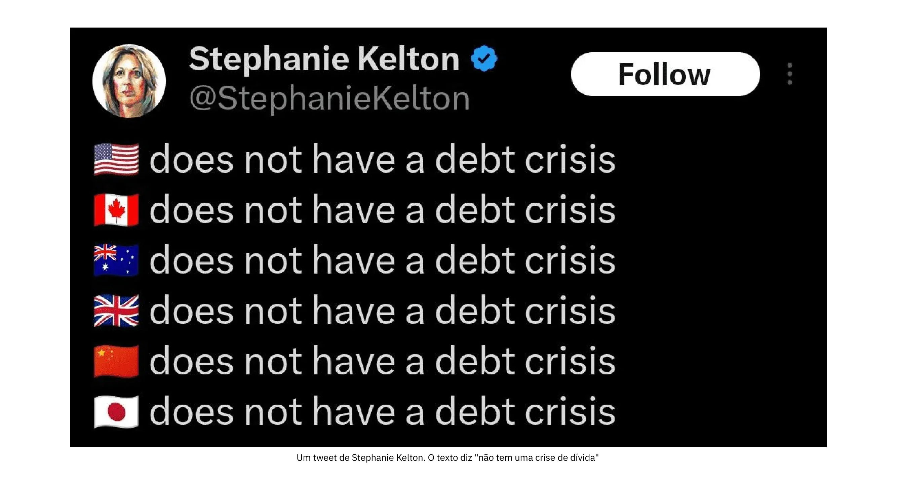

Estranhamente, só enumera seis países? Porquê? Porque têm uma verdadeira soberania monetária. Mas há cerca de 200 países na Terra e nem todos têm soberania monetária. Assim, a minha crítica a esta teoria, para além de ser um pouco estranha e não funcional, é que só funciona para alguns países que gozam de verdadeira soberania monetária, aqueles que podem emitir bilhetes do tesouro na sua própria moeda. Em certa medida, é em detrimento do resto do mundo. Ao criar esta moeda, é como se estivessem a exportar a sua inflação para outro lado, à semelhança do que os Estados Unidos têm feito com o seu privilégio exorbitante durante décadas. Isto assemelha-se a uma forma de colonialismo monetário, em que os países que têm confiança e procura global para a sua moeda podem imprimir a quantidade de dinheiro que quiserem sem incorrer numa inflação significativa, muitas vezes porque exportam essa inflação.

Esta teoria é difícil de aplicar às economias dependentes das importações que precisam de manter a confiança internacional na sua moeda.

Esta teoria exige também um certo nível de planificação centralizada da economia, nomeadamente para assegurar um maior controlo dos recursos reais (trabalhadores, matérias-primas, capacidade industrial) e para gerir a inflação.

# A queda e o renascimento do dinheiro

<partId>87a34ca9-782b-5ade-b51a-400f88ed7b0c</partId>

## Moedas gregas

<chapterId>7714195f-74ce-5f8c-be5f-59302d39fff4</chapterId>

:::video id=8e5c3091-0910-471b-8d4b-0dc6e9afa656:::

### Antecedentes e contexto

Antes de começarmos, eis o contexto histórico:

**Antecedentes históricos

**Os romanos chamavam aos gregos "Graeci" e à Grécia "Graecia"

**Os gregos chamavam-se a si próprios "helenos" e ao seu país "Hellas"

**Homero** (nascido por volta do século VIII a.C.)

Lendário poeta grego, presumível autor de *A Ilíada* e *A Odisseia*.

Por volta de **750 a.C.: diz-se que Licurgo**, o mítico legislador de Esparta, estabeleceu a constituição espartana baseada na disciplina militar e na simplicidade.

**Numa Pompilius** (753-673 a.C.)

Segundo rei de Roma, famoso por ter dado a Roma as suas primeiras instituições religiosas e jurídicas.

**Drácon**, legislador ateniense (século VII a.C.), famoso pelas suas leis extremamente severas, daí o termo "draconiano".

**594 a.C.: Sólon** torna-se legislador em Atenas e reforma radicalmente a sociedade ateniense, nomeadamente através da abolição da escravatura por dívidas.

**776 A.C: Jogos Olímpicos da Antiguidade**

Os primeiros jogos desportivos regulares realizavam-se em Olímpia de quatro em quatro anos, reunindo as cidades gregas.

**Pitágoras** (ca. 570-495 a.C.)

Filósofo e matemático grego, famoso pelo seu teorema sobre o triângulo retângulo.

**Xenófanes de Colofão** (c. 570-478 a.C.)

Filósofo pré-socrático conhecido pela sua crítica ao politeísmo grego tradicional.

**490 a.C.: Batalha de Maratona*

Os atenienses repeliram vitoriosamente uma invasão persa, marcando um ponto de viragem decisivo para a civilização grega.

**Heródoto** (c. 484-425 a.C.), apelidado de "pai da história", escreveu uma vasta obra que descreve as guerras persas, incluindo a vitória grega sobre Xerxes em 480 a.C.

**Sócrates** (470-399 a.C.)

Filósofo ateniense famoso pelo seu método dialético e pelos seus ensinamentos sobre ética e autoconhecimento.

**Aristófanes** (c. 446-386 a.C.)

Dramaturgo ateniense, famoso pelas suas comédias satíricas como *As Rãs*.

**Sófocles** (séc. V a.C.), na sua peça *Antigone*, critica o dinheiro como fonte de corrupção moral e política, através do tirano Creonte.

**Platão** (c. 428-348 a.C.)

Filósofo grego, aluno de Sócrates, fundador da Academia, autor de "A República".

**431-404 A.C: Guerra do Peloponeso**

Grande conflito entre Atenas e Esparta, que termina com a derrota de Atenas.

**431 A.C: Atenas financia a Guerra do Peloponeso diluindo as suas moedas de ouro e prata para aumentar a quantidade em circulação, causando inflação.

**Xenofonte** (c. 430-355 a.C.)

Escritor, filósofo e general ateniense, discípulo de Sócrates, autor das *Anabasis*.

**414 A.C.**: Atenas começa a perder a Guerra do Peloponeso após uma desastrosa expedição à Sicília.

**405 A.C: Aristófanes**, na sua peça *As Rãs*, descreve explicitamente a desvalorização da dracma de prata e o aparecimento de moedas de bronze inferiores em Atenas, ilustrando o princípio conhecido atualmente como "Lei de Gresham".

**404 A.C.**: Atenas capitula após um longo cerco de Esparta.

**Aristóteles** (384-322 a.C.)

Grande filósofo grego, aluno de Platão, fundador do Liceu, conhecido pelo seu trabalho em lógica, biologia e filosofia política.

**327 A.C: Alexandre, o Grande, conquista Persépolis e as províncias orientais do Império Persa, expandindo consideravelmente o seu império.

**323 A.C: Alexandre morre na Babilónia sem um herdeiro claro, dando origem a guerras entre os seus generais (diadochi) para dividir o império.

**Arquimedes** (c. 287-212 a.C.)

Matemático, físico e inventor grego, famoso pelas suas descobertas no domínio da geometria e da mecânica.

**196 a.C.: A Pedra de Roseta** é gravada durante o reinado do Faraó Ptolomeu V, permitindo a posterior decifração dos hieróglifos egípcios.

**192-188 A.C.: Guerra Romano-Seleucida**

Roma derrotou o império selêucida liderado por Antiochos III, consolidando a sua influência na Grécia e na Ásia Menor.

**146 a.C.: Batalha de Corinto

Os romanos destruíram a cidade grega de Corinto, marcando o fim da independência política grega e a integração gradual da Grécia no mundo romano.

Para esta secção sobre a Antiguidade, a queda de Roma e a Idade Média, começaremos com uma secção sobre moedas gregas.

A história da cunhagem de moeda na Grécia antiga começou por volta de 600 a.C., quando as cidades gregas adoptaram rapidamente a inovação da Lídia, na Ásia Menor, utilizando inicialmente o electrum e, mais tarde, a prata. As primeiras moedas gregas foram cunhadas na ilha de Aegina, com uma tartaruga marinha ou terrestre, mas foi a dracma ateniense, decorada com Atena e uma coruja, que se tornou o símbolo monetário por excelência a partir do século V a.C., dominando largamente o comércio internacional da época.

E eu tenho a sorte de ter uma cópia de uma dracma grega desse período com a famosa coruja e uma figura no verso. É uma tetradrachma, que era maior do que uma simples dracma.

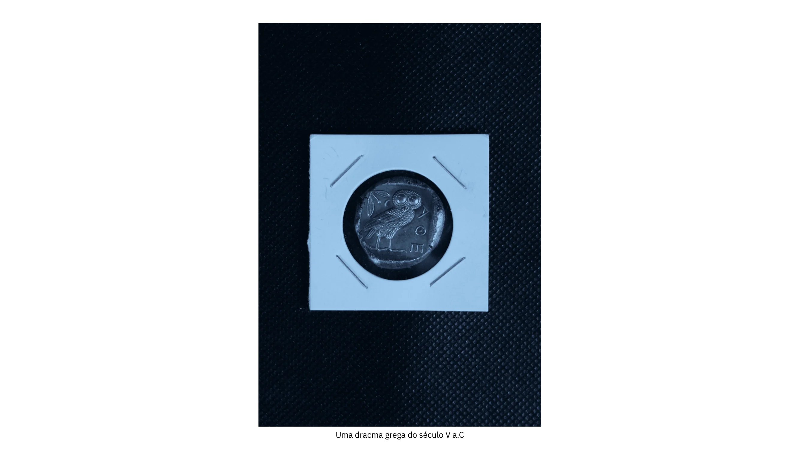

Cada cidade grega desenvolveu a sua própria relação com o dinheiro. Em Atenas, a moeda estava profundamente ligada ao poder político e económico. O famoso decreto ateniense do final do século V a.C. impôs a utilização exclusiva da moeda ateniense nos territórios aliados, reforçando assim a sua hegemonia económica. Atenas acumulava também grandes reservas de ouro para emergências, que eram guardadas na Acrópole, talvez como símbolo da sua prudência económica. Em contrapartida, Esparta, cidade militar de valores rigorosos, optou por restringir severamente o uso do dinheiro, proibindo os seus cidadãos de possuírem moedas de ouro ou prata. Esparta preferiu utilizar pesadas barras de ferro para desencorajar o comércio externo e manter a coesão social.

As guerras eram frequentemente financiadas através da manipulação da moeda. Durante a Guerra do Peloponeso (431-404 a.C.), Atenas recorreu a desvalorizações drásticas para pagar às suas tropas. Privada do acesso às suas minas de prata pela ocupação espartana de Decelia em 413 a.C., Atenas teve de derreter estátuas de ouro para cunhar novas moedas à pressa em 407/406 a.C.. Depois, em 406/405 a.C., criou moedas de bronze revestidas de prata, provocando uma crise monetária ilustrada por **Aristofanes**, que já evoca o que hoje se conhece como a Lei de Gresham: o dinheiro mau expulsa o dinheiro bom. Esta moeda de emergência foi rapidamente desmonetizada após a guerra para restaurar a confiança na cunhagem ateniense.

O fim do período clássico foi marcado pela ascensão da Macedónia, sob o comando de Filipe II e do seu filho Alexandre Magno, que perturbou profundamente o equilíbrio monetário grego. Graças às vastas minas de ouro e prata do monte Pangeia, Filipe II produziu dinheiro em abundância para financiar as suas campanhas militares e políticas, estabelecendo um padrão ouro-prata simples e prático (10:1). As suas moedas de ouro, que celebravam a sua vitória nos Jogos Olímpicos, circulavam por toda a Europa Ocidental, chegando mesmo a Inglaterra. Alexandre prosseguiu esta política monetária, fazendo circular amplamente a dracma ática durante as suas conquistas no Oriente, até à Índia. Esta circulação maciça de moedas marcou o início da era helenística, quando a imagem dos soberanos substituiu gradualmente a das divindades nas moedas. Esta inovação permitiu que gerações de monarcas helénicos se promovessem a si próprios, relegando os deuses tradicionais para um papel secundário no reverso das suas moedas.

Após a morte de Alexandre, em 323 a.C., os seus generais dividiram o seu imenso império, estabelecendo dinastias no Egito (os Ptolomeus), na Síria (os Selêucidas) e noutros locais. Estes reinos helenísticos adoptaram uma variedade de sistemas monetários: os Ptolomeus impuseram um sistema monetário fechado para controlar a circulação da moeda, preferindo utilizar os cereais como moeda interna e guardar os metais preciosos para as despesas militares externas. Ao mesmo tempo, Rodes tornou-se um importante centro comercial antes de ser economicamente enfraquecida pelos romanos, que estabeleceram Delos como porto franco em 167 a.C.

A utilização de dinheiro era fundamental para a remuneração dos mercenários. Os soldados de Alexandre recebiam diariamente dracmas de prata.

A cavalaria, a elite do exército altamente especializado de Alexandre, recebia em média duas dracmas por dia, um soldado de infantaria uma dracma e um mercenário comum dois terços de uma dracma, o dobro do salário de um simples trabalhador.

Durante a Guerra do Peloponeso, foram também pagas somas consideráveis aos soldados: mais de 1 200 talentos para reprimir a revolta de Samos e mais de 2 000 talentos para sitiar Potideias.

Na altura em que este exército estava totalmente empenhado na Ásia Menor, o custo total era de cerca de vinte talentos por dia, ou cerca de meia tonelada de prata, ou 120 000 dracmas.

A cunhagem de moedas gregas também desempenhou um importante papel cultural, uma vez que cada cidade procurou afirmar a sua identidade cunhando as suas próprias moedas com símbolos locais ou mitológicos. Por exemplo, Heráclio representava Héracles (Hércules) a lutar contra um leão, enquanto Cirene mostrava a famosa planta medicinal silphium.

Finalmente, apesar da sua variedade e das flutuações regionais, a cunhagem grega clássica e helenística deixou uma marca duradoura na história económica e cultural do mundo mediterrânico, influenciando profundamente os sistemas monetários posteriores até Roma, que gradualmente adoptou e desenvolveu os conceitos económicos gregos para estruturar a sua própria economia imperial.

## O impacto da moeda na Grécia

<chapterId>3a5e6c7d-699c-5567-87cd-3374c49d55a9</chapterId>

:::video id=0c79a59c-e179-4893-a414-1b8de0930eb9:::

### Atenas e o contraste com Esparta

A oposição entre Atenas e Esparta durante o período clássico grego revela dois modelos de organização política e económica radicalmente diferentes. Enquanto Esparta rejeitava a moeda metálica em favor de um sistema autossuficiente baseado na confiança cívica, Atenas adoptou plenamente esta tecnologia para construir e manter o seu império marítimo.

### A necessidade monetária do poder naval

O Império Ateniense, apesar do seu nome grandioso, manteve-se geograficamente modesto - essencialmente Atenas e as cidades do Mar Egeu. O seu poder assentava na Liga de Delos, uma aliança militar dominada por Atenas como hegemónica. Esta estrutura imperial exigia um instrumento económico unificado: a moeda de prata ateniense.

A manutenção de uma frota estava no centro desta necessidade económica. Uma única trirreme ateniense custava entre um e dois talentos de prata - uma soma considerável. Com várias centenas de navios para manter, Atenas precisava de um sistema fiscal eficiente. A moeda tornou-se o instrumento indispensável para cobrar o tributo das cidades vassalas e financiar a força de projeção naval que garantia a coesão do império.

### A imposição monetária como instrumento de dominação

Atenas impôs a sua moeda de prata a todos os membros da Liga de Delos. Esta uniformização monetária servia vários objectivos estratégicos. Em primeiro lugar, facilitava a cobrança de tributos através da criação de uma unidade de conta comum. Em segundo lugar, reforçava a dependência económica das cidades vassalas em relação a Atenas. Por último, projectava simbolicamente o poder ateniense em todo o império marítimo.

Esta política monetária contrasta fortemente com o modelo espartano. Esparta, uma potência terrestre, podia contar com o trabalho dos helotes (escravos) do Peloponeso para a sua subsistência. O seu sistema económico fechado, centrado na cidade, não exigia instrumentos monetários sofisticados. Os cidadãos-soldados viviam juntos, partilhavam refeições comuns e não precisavam de dinheiro para as trocas diárias.

### A moeda como veículo do comércio marítimo

A natureza marítima do império ateniense obrigava-o a estar aberto ao comércio. Ao contrário de Esparta, que se fechava sobre si própria, Atenas tinha de negociar com o mundo exterior para a sua sobrevivência e prosperidade. A moeda tornou-se o instrumento indispensável do comércio mediterrânico.

Esta orientação externa criou um círculo virtuoso: o comércio gerava receitas, estas receitas financiavam a frota, a frota protegia as rotas comerciais e mantinha o império, e o império impunha a moeda ateniense, que facilitava o comércio. A moeda deixou de ser um simples meio de troca para se tornar um pilar da estratégia imperial.

### Os limites do poder monetário

Apesar desta sofisticação económica, o poder monetário ateniense mostrou os seus limites durante a Guerra do Peloponeso. Face às forças terrestres espartanas, a superioridade naval e financeira de Atenas não foi suficiente. Expedições dispendiosas, como a desastrosa campanha de Siracusa, na Sicília, esgotaram os recursos financeiros sem que a vitória fosse decisiva.

A história mostra que a moeda, embora seja um poderoso instrumento de projeção de poder, não é garantia de domínio militar. Esparta, sem moeda metálica mas com uma coesão social notável, acabou por prevalecer sobre o império monetário ateniense.

### Dois modelos, dois destinos

A oposição entre Atenas e Esparta ilustra duas abordagens fundamentais da organização social e económica. Atenas representa o modelo aberto, comercial e monetarizado - o precursor dos impérios marítimos modernos. Esparta encarna o modelo fechado e autárquico, baseado na confiança cívica e não em instrumentos monetários.

Estes dois sistemas mostram que a adoção da moeda está intimamente ligada ao modelo político e económico escolhido. Para uma potência marítima e comercial como Atenas, o dinheiro tornou-se indispensável. Para uma sociedade guerreira e fechada como Esparta, representa uma ameaça à ordem social. Esta dicotomia antiga continua a alimentar os debates sobre o papel da moeda na organização das sociedades.

## A República Romana

<chapterId>0bc80983-33e1-5881-85bb-7c22f3144a9a</chapterId>

:::video id=dc05ca97-d29c-4679-bfeb-912c47d86ce2:::

### História da República Romana

- 753 - 509 a.C.: Reino de Roma**
- 753 A.C: Fundação de Roma** (tradicionalmente atribuída a Rómulo).
- 509 - 27 A.C.: República Romana**, Roma torna-se uma república governada por um Senado e cônsules eleitos.
- 280 - 275 A.C.: Guerra de Pirro**. Pirro, rei de Épiro, combate os romanos no sul de Itália, obtendo vitórias dispendiosas ("vitórias de Pirro").
- 264 - 146 A.C.: Guerras Púnicas**. Grande conflito que opõe Roma a Cartago pelo domínio do Mediterrâneo ocidental.
- Aníbal (247 - c. 181 a.C.)**. Lendário general cartaginês, famoso por ter atravessado os Alpes com o seu exército e os seus elefantes para atacar Roma durante a Segunda Guerra Púnica.
- 146 a.C.: Batalha de Corinto**. Roma destrói a cidade grega de Corinto e impõe o seu domínio definitivo sobre a Grécia continental.
- 91 - 87 a.C.: Guerra Social**. Revolta dos aliados italianos de Roma exigindo a cidadania romana, o que acabou por conduzir à sua plena integração na cidadania.
- 64 a.C.: Fim da resistência selêucida**. Roma elimina definitivamente a influência selêucida na Síria, consolidando o seu domínio no Mediterrâneo Oriental.
- 55 A.C: Júlio César conquista a Europa Central e Ocidental**. Júlio César estende o domínio romano à Gália (atual França) e entra na Germânia e na Bretanha.
- 43 A.C.: Formação do Segundo Triunvirato**. Aliança política entre Octávio (mais tarde Augusto), Marco António e Lépido, para estabilizar Roma após o assassinato de César.
- 27 a.C.: Início da Pax Romana**. Período de estabilidade política e prosperidade sob o reinado de Augusto, marcando o início do Império Romano.

### O início monetário tardio de Roma

Nesta secção sobre a Antiguidade, centramos agora a nossa atenção na República Romana. A história monetária de Roma começou muito mais tarde do que a dos gregos e persas. Fundada em 753 a.C., Roma esperou quase quatro séculos para adotar verdadeiramente a moeda. Durante este longo período, os romanos utilizaram um sistema primitivo de troca com peças irregulares de bronze chamadas aes rude, que exigiam uma pesagem precisa para cada transação. Foi apenas no final do século IV a.C., sob influência grega e etrusca, que Roma começou a emitir as suas primeiras moedas, nomeadamente em bronze fundido como na China, o aes grave, caraterístico das trocas romanas até **à Segunda Guerra Púnica**.

### A influência grega e as primeiras moedas de prata

O encontro decisivo com os gregos do sul de Itália introduziu verdadeiramente os romanos na cunhagem de moedas de prata. Por volta de 280 a.C., Roma começou a produzir as suas próprias moedas de prata, imitando os didracmas gregos. A primeira emissão regular de moedas de prata em Roma data precisamente de 269 a.C., apresentando os lendários gémeos Rómulo e Remo amamentados pela loba, um símbolo que se tornou emblemático.

De facto, muitas moedas romanas do período da República representam mitos de fundação. Podes ver a minha aqui em baixo: é uma moeda soberba e verdadeira do rei Tácio. Ilustra o mito do rapto das mulheres pelos sabinos. Tácio era o rei desta região e o mito fundador conta como os romanos raptaram as mulheres dos sabinos, uma população que vivia nas proximidades. Posteriormente, o rei Tácio tornou-se co-rei de Rómulo, um dos fundadores de Roma.

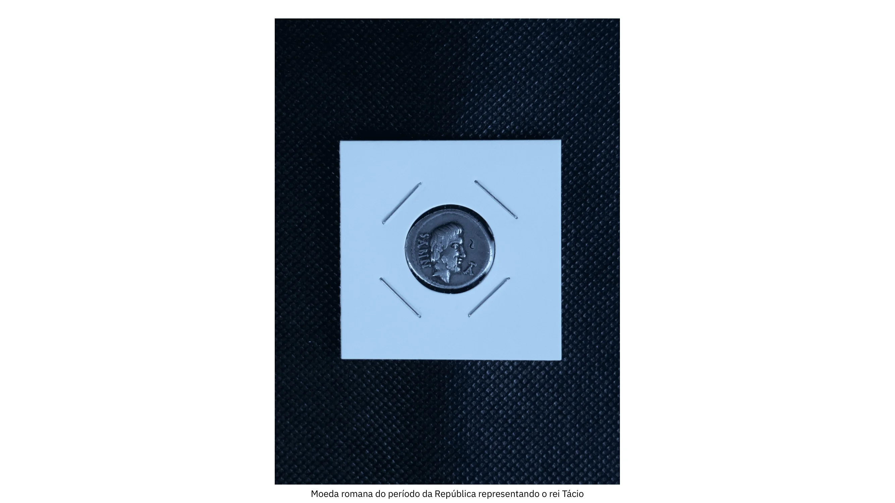

### A origem da palavra "moeda" e o templo de Juno Moneta

O termo "moeda" tem a sua origem no templo de Juno Moneta, em Roma. Reza a lenda que, durante uma invasão gaulesa em 390 a.C., os gansos sagrados do Capitólio alertaram os romanos para um perigo iminente. Para agradecer à deusa Juno, protetora do Capitólio, foi erigido um templo em sua honra, que rapidamente se tornou a casa da moeda romana.

### As guerras púnicas e as crises monetárias

Os conflitos militares tiveram uma influência considerável no desenvolvimento monetário romano. Durante a Segunda Guerra Púnica (218-201 a.C.) contra Cartago, Roma enfrentou graves dificuldades financeiras face à invasão de Aníbal. Para aliviar estas necessidades urgentes, Roma recorreu pela primeira vez a uma emissão excecional de moedas de ouro, bem como a uma desvalorização significativa da sua cunhagem de prata, que passou de uma pureza inicial de 97% para cerca de 89%. O peso das moedas de bronze (aes) também diminuiu drasticamente, perdendo quase 80% em seis anos.

Aqui, podemos revisitar um conceito que já discutimos anteriormente sobre os gregos derreterem metais preciosos armazenados em templos para ajudar a aliviar crises económicas. E para falar de **Cartago**, aqui em baixo podem admirar uma moeda cartaginesa verdadeira da minha coleção. Estas moedas cartaginesas apresentavam uma palmeira de um lado e um cavalo do outro. Nesta moeda, o cavalo não é muito reconhecível, pois está muito gasto.

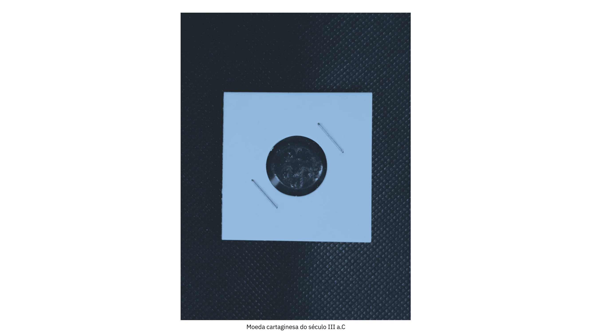

Consequentemente, o peso das moedas de bronze, conhecidas como aes, também desceu drasticamente, perdendo quase 80% em seis anos. Assim, o peso destas moedas de bronze, que não eram um metal precioso e que eram utilizadas no comércio quotidiano, diminuiu muito, o que constituiu um sinal de desvalorização monetária devido a estas guerras.

### O denário de prata e a estabilidade monetária

Foi neste contexto crítico que Roma introduziu o famoso denário de prata por volta de 212 a.C.. Esta reforma assegurou uma estabilidade monetária notável, tendo o denário permanecido a moeda dominante durante quase 450 anos. Roma deve esta estabilidade a uma gestão rigorosa, apesar de uma grande revalorização em 146 a.C. e de uma produção considerável para financiar os seus imensos exércitos, nomeadamente durante as guerras púnicas, sociais (91-87 a.C.) e macedónicas. A título de exemplo, a manutenção de uma única legião romana custava cerca de 1,5 milhões de denários por ano, o que ilustra a dimensão das necessidades monetárias.

Para além das fronteiras romanas, as guerras conduziram a grandes desvalorizações nas regiões sob influência romana. A pureza do electrum púnico de Cartago baixou drasticamente, passando de 98% de ouro no século IV para apenas 30% durante a Segunda Guerra Púnica, enquanto as suas moedas de prata baixaram para 18% de pureza.

### A evolução das motivações monetárias

Com a expansão de Roma, o carácter das moedas também evoluiu: inicialmente anónimas e patrióticas, as moedas foram gradualmente adoptando desenhos personalizados com as famílias poderosas dos cunhadores (aqueles que cunham as moedas). Esta transição simboliza claramente as transformações políticas da República Romana tardia.

Por último, embora Roma dominasse economicamente o mundo mediterrânico, manteve uma certa simplicidade nos seus meios de pagamento: não foi desenvolvida nenhuma forma real de transferência monetária para além da troca direta de moedas, com exceção das transferências fiscais e dos créditos privados reservados à elite.

## O Império Romano

<chapterId>2dc44e50-112a-5abf-97ae-8e0a9ecda989</chapterId>

:::video id=f8d6f3d6-9ee4-4504-888e-4f12b3f20489:::

**Antecedentes históricos

**O Principado** foi a forma de governo imperial do Império Romano desde o início do reinado de Augusto, em 27 a.C., até ao final da crise do século III, em 284 d.C.

**27 a.C.: Início da Pax Romana

Período de estabilidade política e prosperidade sob o reinado de Augusto, marcando o início do Império Romano.

**Augusto (30 a.C. a 14 d.C.)** reformou radicalmente o sistema monetário romano, estabelecendo um padrão duradouro e estável para a cunhagem imperial.

**Augusto foi também um dos primeiros coleccionadores reconhecidos** de moedas e fósseis antigos.

**54 AD - 68 AD: Nero**

Controverso imperador romano, conhecido pela sua tirania, perseguições e gestão desastrosa após o incêndio de Roma.

**64 D.C: Grande Incêndio de Roma**

Um grande incêndio devasta grande parte da cidade e Nero é acusado de ser o responsável.

**69 d.C.: Ano dos Quatro Imperadores

Um período caótico com quatro imperadores em rápida sucessão (Galba, Otho, Vitellius, Vespasiano).

**79 D.C: Erupção do Vesúvio**

Vulcão que destruiu as cidades de Pompeia e Herculano, preservando excecionalmente os seus restos mortais sob as cinzas.

**165 AD - 180 AD: Peste Antonina**

Epidemia devastadora que enfraqueceu o Império Romano durante o reinado de Marco Aurélio e Commodus.

**200 d.C.: Apogeu territorial e fim gradual da Pax Romana

Roma atingiu a sua extensão máxima, mas começou a sofrer de instabilidade interna e de dificuldades económicas.

**212 D.C: Édito de Caracalla sobre a cidadania**

O imperador Caracalla concedeu a cidadania romana a quase todos os habitantes do império, com o objetivo de alargar a base tributária.

**220 d.C.: Início das grandes invasões bárbaras

Primeiras incursões significativas de povos germânicos através das fronteiras romanas.

**235 D.C. - 285 D.C: Crise política e militar do século III**

Um período marcado pela instabilidade política, com muitos imperadores de curta duração, guerras civis, crises económicas e invasões contínuas.

**Aureliano (270-275 d.C.) revalorizou radicalmente a moeda romana**, tentando restaurar o seu valor nominal apesar da elevada inflação.

**301 D.C: Edito de Diocleciano sobre os preços**

O imperador Diocleciano tentou, em vão, travar a inflação galopante, impondo um controlo rigoroso dos preços e dos salários em todo o império.

**312 D.C: Constantino

Primeiro imperador cristão, fundador de Constantinopla, estabilizou a moeda com a introdução do "solidus", uma moeda de ouro de grande pureza e estabilidade.

**476 D.C: Queda do Império Romano do Ocidente**

Roma é tomada por vários povos germânicos (incluindo os Ostrogodos), um acontecimento considerado como o fim oficial do Império Romano do Ocidente.

### Reformas monetárias de Augusto

Nesta secção sobre a Antiguidade, já chegámos ao Império Romano. A história monetária do Império Romano caracteriza-se pela utilização intensiva da moeda metálica, nomeadamente o ouro, a prata e o bronze, mas também por múltiplas crises monetárias, intimamente ligadas a agitações políticas e militares. No final da República, sob o comando de Júlio César, Roma introduziu o aureus de ouro em 46 a.C., uma moeda que pesava cerca de 8 gramas e que foi amplamente aceite em toda a Europa e na bacia do Mediterrâneo. César padronizou estas moedas de ouro e cunhou as primeiras moedas com o retrato de um homem vivo, derrubando assim uma antiga tradição republicana que privilegiava símbolos anónimos e colectivos. Este desenvolvimento acompanhou um período de grandes transformações políticas, com o poder pessoal a substituir gradualmente as instituições republicanas.

Após o assassinato de César em 44 a.C., Octávio (Augusto) assumiu o controlo de Roma, fundando o Império em 27 a.C. O seu reinado assistiu a uma reforma completa do sistema monetário, que trouxe uma estabilidade duradoura à economia romana. Na época de Augusto, um aureo de ouro equivalia a 25 denários de prata, que por sua vez valiam 4 sestércios de bronze. Esta estabilidade monetária manteve-se durante todo o século I d.C., um período frequentemente descrito como a idade de ouro económica de Roma.

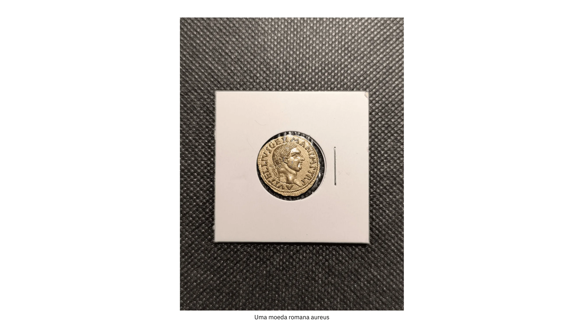

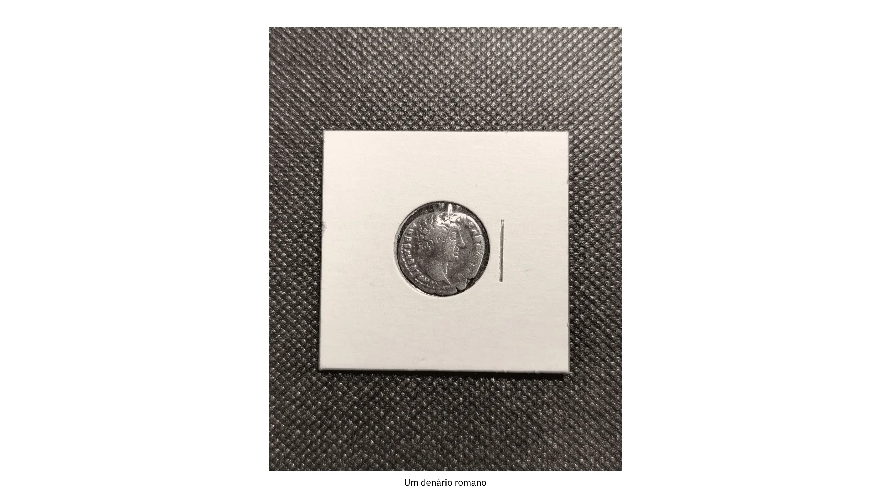

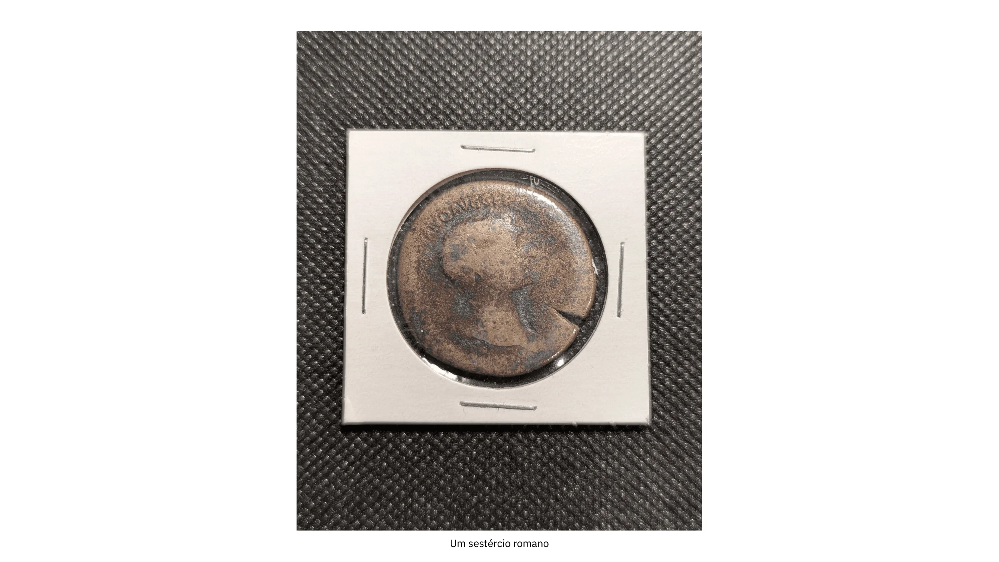

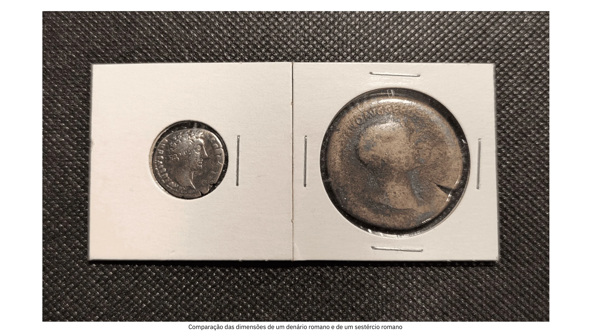

No entanto, a partir de Nero (54-68 d.C.), Roma iniciou uma lenta desvalorização das suas moedas, reduzindo progressivamente o seu peso e pureza para financiar as crescentes despesas imperiais, nomeadamente após o grande incêndio de Roma em 64 d.C. Estas desvalorizações tiveram efeitos notáveis: as moedas mais puras foram retiradas de circulação através do entesouramento ou da exportação, de acordo com a **lei de Gresham**, enquanto as moedas desvalorizadas proliferaram, provocando um aumento gradual dos preços.

O século III marca um ponto de viragem dramático, com uma aceleração espetacular das desvalorizações sob os imperadores Septímio Severo, Caracala e Galeno. A principal moeda de prata, o denário e depois o antoniniano, viu o seu teor de prata baixar para apenas 2%. Simultaneamente, o peso em ouro do aureo desceu para metade. Esta crise monetária foi acompanhada de uma instabilidade política sem precedentes, de invasões bárbaras e de guerras civis recorrentes.

Esta parte permite-me apresentar a última peça desta secção: o antoniniano. O nome original desta moeda é desconhecido, mas atualmente designamo-la por antoniniano. Tem a particularidade de ser avaliada em dois denários, apesar de ser apenas 1,5 vezes maior do que um denário. Além disso, ao longo do tempo, estas moedas passaram a ser apenas moedas de bilião, o que significa que eram feitas de uma liga de prata e outros metais e não de prata pura. Muitas vezes, as moedas eram apenas revestidas de prata, constituindo um exemplo notável de decadência monetária.

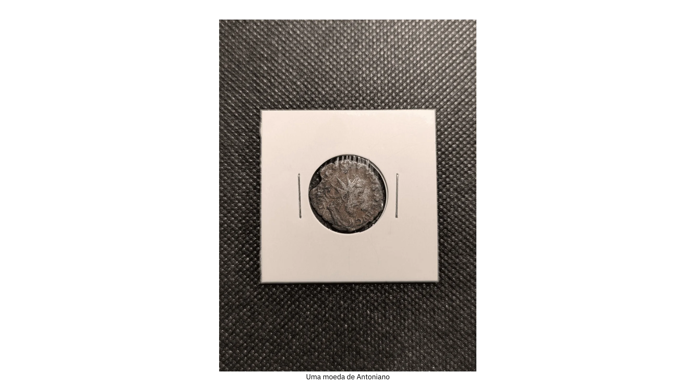

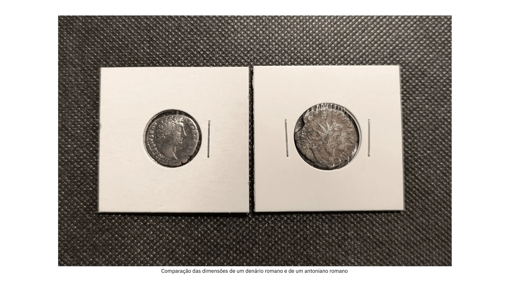

Perante esta situação, o imperador Aureliano (270-275 d.C.) tentou estabilizar o sistema revalorizando nominalmente as moedas, mas esta reforma introduziu de facto um mecanismo inflacionista ao fixar artificialmente o valor das moedas existentes a um nível mais elevado.

Vou fazer uma digressão sobre o assunto. Durante o século III, a inflação registou um rápido aumento exponencial. Anteriormente, embora as moedas fossem desvalorizadas, o processo artesanal de as cunhar uma a uma permitia um certo controlo da inflação. As estatísticas indicam que, ao longo de 300 anos de desvalorização, a inflação foi, em média, de cerca de 4% ao ano. Pouco antes da reforma de Aureliano, a inflação era de cerca de 3% ao ano.

Aureliano introduziu uma medida de pureza na moeda com o símbolo XXI, indicando uma composição de 20 partes de bronze para 1 parte de prata, ou seja, 5% de pureza. Comercializou estas moedas de 5% de prata e carimbou nelas o sinal XXI. No entanto, também recolheu todas as outras moedas, mais desvalorizadas, e carimbou nelas o mesmo XXI. Esta medida revalorizou efetivamente o valor facial de todas as moedas. O resultado foi uma taxa de inflação espantosa de 20% ao ano, muito superior à taxa anterior de 3%, registada antes da aplicação desta técnica.

Foi de facto Aureliano que inventou esta forma de desvalorização, muito mais rápida do que a desvalorização progressiva do metal, que ainda nos obrigava a imprimir moedas uma a uma. O que ele fez foi pegar em todas as moedas existentes, recolhê-las e carimbá-las com um punção para alterar o seu valor facial. É um verdadeiro ponto de viragem. Foi nessa altura que a inflação se tornou exponencial.

Para ilustrar visualmente esta desvalorização extrema, encontrei algumas estatísticas fascinantes sobre o preço dos cereais no Egito desde 40 a.C. até ao século III, ou seja, durante mais de 300 anos. Abaixo, pode ver-se uma tetradracma grega da minha coleção. Nessa altura, no Egito sob ocupação romana no século III, o equivalente era uma tetradracma egípcia. A denominação de dracmas ainda estava em uso e correspondia a um denário.

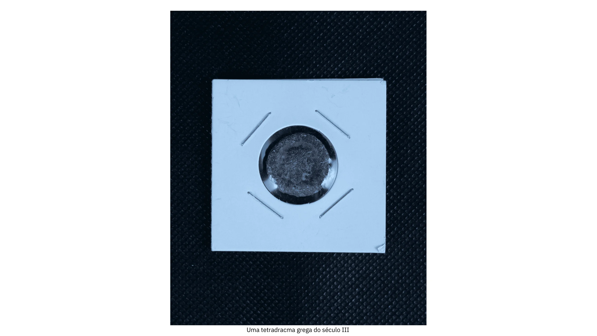

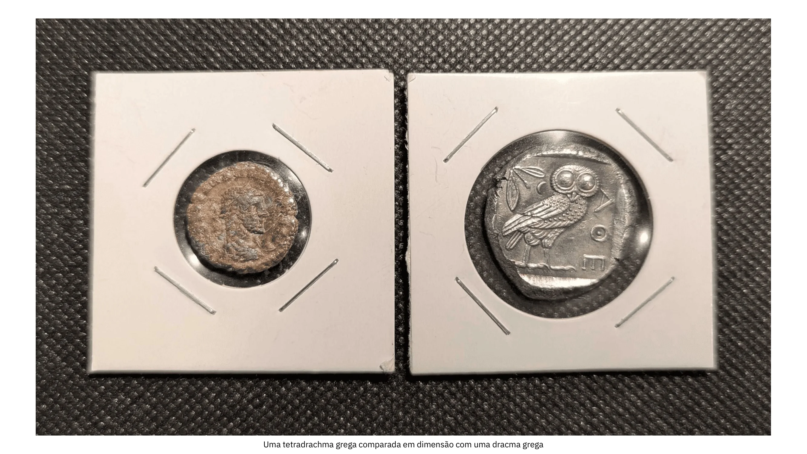

Assim, o tetradracma egípcio que tenho era o equivalente a um denário. Pode ver-se que a moeda é feita de bilião (ou bronze), pelo que não contém qualquer metal precioso. Pode compará-la com o tetradracma grego original para ver a desvalorização física ao longo destes 300 anos. É um aumento de um milhão de vezes no preço dos cereais no Egito.

É a expressão física da reforma de Aureliano. Note-se que a maioria, a média ao longo destes 300 anos de inflação, foi de cerca de 4%. Foi só no final, quando Aureliano fez a sua reforma, que esta inflação se tornou bastante exponencial e chegámos a esta medida de 1 milhão. Os preços eram um milhão de vezes mais elevados no final do século III do que no século I a.C.

O seu sucessor **Diocleciano** (284-305 d.C.) tentou reformas ainda mais radicais: emitiu novas moedas (nomeadamente o argenteus, mais puro mas em quantidade demasiado limitada), impôs um controlo drástico dos preços (Édito dos Preços de 301 d.C.) e **estabeleceu um sistema fiscal baseado em pagamentos em espécie**. Apesar destes esforços, as reformas de Diocleciano não conseguiram travar a inflação galopante.

Perante a recusa de fornecimento de bens e serviços em troca de moeda desvalorizada, Diocleciano instituiu **um sistema de castas hereditárias** para prender os camponeses e os seus descendentes às suas terras.

O que é preciso entender aqui é que o que aconteceu foi que os camponeses se recusaram a entregar os seus produtos em troca de moeda desvalorizada, e a resposta do nosso querido Diocleciano foi criar **castas hereditárias** dizendo "tu, não podes deixar a tua terra, os teus filhos não podem deixar a terra deles, o mesmo para os soldados, vocês são soldados, aceitam ser pagos na minha moeda". Como solução transitória, eram pagos em géneros (carne, alimentos, cereais), porque ele se recusava a dar-lhes dinheiro. Assim, impôs este sistema de castas hereditárias para obrigar as pessoas a ficarem ligadas ao seu ofício, de modo a não poderem simplesmente mudar de emprego se tentassem não aceitar a moeda desvalorizada.

Para ilustrar este exemplo, tenho aqui um texto, um extrato do livro "*Regime Monetário e Inflação*":

> Como as pessoas não estavam dispostas a trabalhar e a entregar bens contra uma moeda desvalorizada, cujo valor facial era superior ao seu valor intrínseco ou de mercado, tiveram de ser forçadas a trabalhar através da imposição de impostos em géneros. [...] Os camponeses foram proibidos de abandonar as suas casas registadas. A população agrícola tornou-se assim hereditariamente ligada à terra.
>

> Este sistema de castas hereditárias foi-se alargando gradualmente: Diocleciano obrigou os filhos dos soldados a servirem no exército, enquanto os trabalhadores das oficinas de dinheiro, bem como das fábricas de tecelagem e tinturaria que Diocleciano tinha criado, se tornaram escravos do Estado, com serviço hereditário. Mais tarde, os mineiros de ouro também se tornaram uma casta hereditária. Outras classes hereditárias já existiam provavelmente no tempo de Diocleciano, nomeadamente as corporações de padeiros e talhantes [...] em Roma, bem como as corporações diocesanas de capitães de navios que transportavam cereais e outras cargas públicas para Roma.

Foi Constantino (306-337 d.C.) que conseguiu finalmente estabilizar o sistema monetário, introduzindo o solidus em 312, uma moeda de ouro puro cuja qualidade e peso eram rigorosamente garantidos por ele. O sistema de controlo da pureza e do peso do solidus era inteiramente assegurado. **Esta estabilidade, no entanto, apenas afectou uma elite abastada e a administração imperial**, enquanto a **maioria da população continuou a sofrer com uma moeda de baixa qualidade e uma inflação persistente**. O solidus manteve-se estável no Império Oriental (Bizâncio), onde durou mais de um milénio, enquanto no Ocidente a cunhagem se fragmentou em pequenas moedas de baixo valor, acompanhando a desintegração económica e política final do Império Romano, que caiu definitivamente em 476 d.C.

Para concluir, gostaria de partilhar convosco esta citação de *A History of Money: From Ancient Times to the Present Day* de Glyn Davies, que resume magistralmente o que talvez tenha levado à queda de Roma:

*"Os impostos eram sistematicamente inadequados e as dificuldades associadas a esses impostos cada vez mais inadequados, tardiamente ajustados e altamente visíveis levaram Roma a confiar mais numa forma fácil, imediata e oculta de tributação: a desvalorização da moeda. As reformas ad hoc, de curta duração, não conseguiram inverter esta antiga tendência de declínio. As pressões financeiras causadas pelo desgaste das moedas, os naufrágios, as fugas de dinheiro devido à compra de bens de luxo do Oriente, os presentes oferecidos aos bárbaros germânicos, o crescimento das populações urbanas, o declínio da produção agrícola, o esgotamento gradual das minas mais ricas e, sobretudo, as políticas de "pão e circo" consideradas essenciais para manter um mínimo de ordem na vida urbana - todas estas pressões cumulativas levaram Roma a uma constante desvalorização monetária, intercalada com reformas ocasionais condenadas ao fracasso. "*

*Para além do pão e do vinho gratuitos ou baratos, as liberalidades imperiais ("congiaria"), sob a forma de dotações monetárias, eram distribuídas de tempos a tempos, particularmente sob Trajano (98-117 d.C.) e ainda mais sob Adriano (117-138 d.C.) e os seus sucessores. O que o imperador e os cidadãos consideravam inicialmente como um privilégio excecional tornou-se, no início do século II, uma expetativa habitual. Estas distribuições "constituíam um pesado encargo para o tesouro público e contribuíam, à sua maneira, para a falência do Estado".*

## Ligações entre a diluição monetária e a inflação: das causas às consequências

<chapterId>38d5781c-e900-53f7-baa7-413655d71754</chapterId>

:::video id=3999256d-aafe-4502-9b72-dfa8491a2777:::

Esta secção analisa as relações entre a diluição monetária e a inflação, das causas às consequências. A diluição monetária é um dos principais fenómenos económicos da história monetária romana, com efeitos diretos na inflação. A partir do século I d.C., assistiu-se a uma fase inicial lenta de diluição da moeda de prata (denário), a partir do reinado de Nero (54-68 d.C.), acelerada por repetidas crises militares e financeiras, nomeadamente sob Septimius Severus (193-211) e Gallienus (253-268).

Constatamos também uma desvalorização mais gradual do aureus. Esta diferença no ritmo de desvalorização evidencia dois pontos:

1. O papel da unidade de conta no bimetalismo para o controlo estatal da moeda. Neste exemplo, a unidade de conta é o denário. Identifiquei três formas diferentes de gerir o valor da unidade de conta: a desvalorização (diluição do metal), a redenominação (antoniniano) e a imposição de um valor facial através da marcação "XXI" (Aureliano)

2. O desejo do Estado de adiar o mais possível a desvalorização do áureo, a reserva de valor que permite à elite manter o seu poder de compra à custa dos mais desfavorecidos. Revisitaremos frequentemente este princípio ao longo do curso, especialmente em relação ao conceito conhecido como "efeito Cantillon" e às redenominações do Maravedi em Espanha.

Este fenómeno é bastante interessante e tem-se repetido ao longo da história. Voltaremos a ele com os Maravedi numa secção posterior. Este padrão também é evidente em todas as moedas de reserva; a unidade de reserva de valor, como o aureus em Roma, permanece intocada. No entanto, a unidade de conta utilizada pela população em geral nas transacções comerciais e quotidianas é frequentemente desvalorizada. Consequentemente, a inflação monetária afecta as pessoas comuns, enquanto os que têm dinheiro para comprar moedas de ouro não são afectados.

E já agora, **é o mesmo fenómeno que se cria hoje com a desvalorização da moeda, que permite a valorização dos activos financeiros**, e portanto são as pessoas que utilizam a moeda, os mais pobres, que ficam mais pobres, e isso por sua vez enriquece, através da criação de moeda, os activos daqueles que podem, que têm os meios para se protegerem da desvalorização, e portanto aprofunda as desigualdades sociais. Este é o meu pequeno desabafo político.

O que acabo de descrever chama-se efeito Cantillon. Veremos que este cavalheiro viveu no tempo de John Law, um assunto que também abordaremos numa secção posterior.

A reforma iniciada durante o reinado de Aureliano permitiu o aumento da inflação. A inflação do valor nominal do dinheiro deixou de ser limitada pela capacidade das casas da moeda de produzirem moedas à mão. As moedas que já tinham sido cunhadas podiam agora ser simplesmente marcadas e o valor nominal da massa monetária aumentou mais rapidamente.

Tenho duas citações para partilhar convosco em relação a Aureliano. A primeira vem de *A History of Money: From Ancient Times to the Present Day*:

*"No que respeita à economia romana, a contribuição de Aureliano foi mais um desastre do que um triunfo. Foi em grande parte devido à natureza da sua "reforma" que a taxa de inflação foi capaz de aumentar muito para além do que tinha sido possível anteriormente, mesmo sob o irresponsável Gallienus. Durante dois séculos após Aureliano, a inflação tornou-se endémica em todo o Império Romano "*

A segunda é retirada do livro *Ancient History from Coins* e diz respeito ao afastamento do sistema monetário do ouro:

*"A reforma de Aureliano alterou a relação entre a moeda de ouro e o resto do sistema monetário. Antes dela, os outros tipos de moeda estavam ligados ao **aureus** de acordo com as taxas oficiais (25 denários egípcios ou 25 tetradracmas para um aureus, etc.). Após a reforma, a moeda de ouro começou a **flutuar livremente em valor**, como qualquer outra mercadoria, enquanto o resto do sistema monetário **desvalorizou-se** devido ao **enfraquecimento das ligas**, deixando de ser **apoiado pelo ouro**. Como a unidade de conta continuava teoricamente baseada na prata (o denário ou, no Egito, a dracma), os preços subiam à medida que a moeda se desvalorizava. "*

Como se pode ver, esta desvalorização da moeda que servia de unidade de conta afectava desproporcionadamente os menos favorecidos, enquanto o afastamento da ligação com a moeda de ouro protegia o poder de compra daqueles que podiam dar-se ao luxo de poupar na reserva de valor que é o ouro.

O que é preciso compreender aqui é que, se houver uma ligação entre o denário e o aureo, mesmo que se desvalorize o denário, se continuar a ser possível trocar o denário pelo aureo a esta taxa (25 denários por 1 aureo), as pessoas trocarão de certeza o denário pelo aureo, uma vez que o denário estará sobrevalorizado e o aureo desvalorizado. Mas, com esta reforma, esta ligação foi eliminada. Assim, as pessoas deixaram de poder trocar denários por prata metálica desvalorizada em relação ao ouro. Foi então que aqueles que tinham acesso a moedas de ouro puderam realmente proteger-se, porque depois as pessoas deixaram de poder trocar prata sobrevalorizada e desvalorizada por ouro puro subvalorizado. Este é um momento muito importante na evolução da moeda.

Um exemplo notável dos efeitos desta reforma de Aureliano é perfeitamente ilustrado por estas citações do livro *Monetary Regimes and Inflation*:

*"Entre os reinados dos imperadores Cláudio (41-54 d.C.) e Constâncio (337-361 d.C.), o preço do trigo no mercado livre do Egito, expresso em dracmas, **aumentou mais de um milhão**. A espetacular inflação dos preços é um dos factos económicos centrais dos séculos III e IV d.C." (Lendon 1990, p. 106). Mas esta evolução é **menos dramática do que parece**, pois corresponde a uma **taxa de inflação média anual de 4,4%**. E, segundo Wassink (1991, p. 482), a inflação começou de facto **apenas em 238 d.C.**"*

*"A partir desta data, a inflação acelerou lentamente, à medida que o **bom dinheiro foi sendo retirado de circulação**, de modo que a oferta total de moeda praticamente não aumentou no início. Posteriormente, atingiu uma taxa média anual de **3,65% entre 250 e 293**, subindo para **22,28% entre 293 e 301** (Wassink 1991, p. 466), ou seja, até às **abortadas reformas monetárias do imperador Diocleciano**. Este fenómeno é **particularmente impressionante para a inflação num regime monetário baseado em metais**. "*

Este fenómeno de inflação ligado à diluição monetária respondeu inicialmente às crises ocasionais de liquidez do Estado romano. Ao reduzir o teor de metais preciosos das moedas, mantendo o seu valor facial, o Estado aumentava temporariamente os seus recursos. Mas os preços não reagiram imediatamente: de facto, o sistema romano tinha uma certa rigidez, o que significava que os salários e os preços demoravam a adaptar-se às sucessivas desvalorizações. No entanto, a partir de um certo limiar, os preços subiam bruscamente para equilibrar o mercado com o valor real das moedas.

Como já foi referido, este fenómeno é particularmente evidente a partir de meados do século III. No Egito, uma região ricamente documentada, os preços foram multiplicados por 10 sob Aureliano (274 d.C.) após uma revalorização oficial da moeda, apesar de uma primeira tentativa de estabilização. Depois, sob Diocleciano (301 d.C.), o édito dos preços impôs controlos drásticos para travar a inflação sem atacar a causa principal - a sobreprodução e a degradação monetária - causando assim um fracasso previsível. A inflação persistente acaba por empurrar a economia para um sistema de dois níveis: **A elite, protegida por reservas de ouro (como o solidus de Constantino**), goza de estabilidade, enquanto a maioria da população continua a sofrer de inflação crónica, **ilustrando o que é hoje conhecido como o efeito Cantillon**

Existe uma ligação clara entre a diluição monetária romana e a inflação, cujas causas estão essencialmente ligadas aos défices orçamentais crónicos, às despesas militares incessantes e à má gestão económica do Estado.

## A queda do Império Romano

<chapterId>b6ec0914-227b-509c-8108-b09eec9bb904</chapterId>

:::video id=91d4fee5-59bb-4ab9-a90b-e1125c71decb:::

### A desvalorização da moeda e o colapso de Roma

A escola austríaca de economia, nomeadamente através de Ludwig von Mises, propôs uma interpretação monetária da queda de Roma. Nesta visão, a desvalorização progressiva da moeda romana destruiu o complexo sistema de divisão do trabalho que sustentava um império de 60 milhões de habitantes. A moeda, o instrumento central de coordenação económica, uma vez corrompida, levou ao colapso de toda a estrutura social e económica.

Esta deterioração monetária não só destruiu a coesão interna do império. Também cortou os laços comerciais com os povos vizinhos. Privados dos benefícios do comércio com Roma, os "bárbaros" passaram da cooperação pacífica à predação. As invasões não foram, portanto, apenas de natureza militar, mas também o resultado de um colapso económico fundamental.

### As três fases da desvalorização imperial

A história monetária romana pode ser dividida em três períodos distintos. O primeiro, dos Júlio-Claudianos aos Antoninos (27 a.C. - finais do século II), manteve uma relativa estabilidade. Sob Trajano, o império atingiu o seu apogeu: com uma área de 5 milhões de km², Roma tornou-se a primeira cidade milionária da história. O denário mantém uma pureza de prata de 98% a 80% - uma desvalorização moderada que ainda permite o funcionamento da economia.

O segundo período, o século III, foi um período de anarquia militar. Vinte e seis imperadores sucederam-se no espaço de algumas décadas. A moeda entrou em colapso: o antoniniano, que supostamente valia dois denários, continha apenas 1,5 em peso metálico - a primeira tentativa de divorciar o valor legal do valor real. Esta manipulação desencadeia a Lei de Gresham: o dinheiro mau faz desaparecer o dinheiro bom. Os cidadãos acumulavam as moedas boas, gastando apenas as desvalorizadas.

Os tesouros monetários descobertos pelos arqueólogos revelam esta ansiedade económica. As ânforas enterradas mostram, por estratificação, como os romanos depositavam primeiro as melhores moedas, acrescentando gradualmente as desvalorizadas. Estas antigas "pilhas" testemunham a ação humana perante a incerteza - uma tentativa de preservar o valor num mundo em decadência.

### Constantino e o sistema dual

Constantino (310-337) tentou estabilizar o império através de reformas radicais. Criou o solidus de ouro, uma moeda estritamente controlada pela administração. Os funcionários controlavam sistematicamente o peso e a pureza. A emissão era limitada, ligada aos despojos de guerra. Esta moeda tornou-se o instrumento exclusivo do poder: os impostos eram pagos em solidus e as legiões recebiam o seu salário em ouro.

Ao mesmo tempo, o povo utilizava o nummus de bronze, que era constantemente desvalorizado. Em 445, um solidus valia 7.000 nummi; em 498, 16.800. Este duplo sistema institucionalizou o efeito Cantillon: aqueles que tinham acesso ao solidus - a administração, os proprietários de terras - estavam protegidos da inflação. A plebe, confinada ao nummus, empobrecia inexoravelmente.

Esta separação monetária criou duas economias paralelas, sem taxa de câmbio oficial. O solidus continuou a ser a unidade de conta, mas circulou muito pouco. O nummus é utilizado para as trocas quotidianas, mas perde constantemente valor. Esta arquitetura monetária prefigurava as desigualdades do sistema feudal emergente.

### O colapso da divisão do trabalho

A desvalorização da moeda destruiu gradualmente a especialização económica. Sem uma unidade de conta fiável, o comércio mediterrânico entrou em colapso. Os artesãos especializados de Roma já não podiam negociar com o Egito ou a Gália. As províncias adoptaram as suas próprias moedas, multiplicando as fricções comerciais.

Perante esta desintegração, a população urbana fugiu para o campo - um êxodo urbano que inverteu séculos de urbanização. Os artesãos abandonaram os seus ofícios para se dedicarem à agricultura de subsistência. As grandes propriedades (latifúndios) transformaram-se em ilhas auto-suficientes, prefigurando os seigneuries medievais.

Em desespero, Diocleciano chegou mesmo a exigir impostos em géneros - a derradeira admissão do fracasso monetário. O seu édito do máximo (301) tentou controlar os preços, acelerando o regresso à troca direta. A complexidade económica regrediu a formas pré-civilizacionais.

### A sobrevivência através do ouro de Roma a Bizâncio

Paradoxalmente, o solidus sobreviveu ao Império Ocidental. Bizâncio manteve-o até ao século XI, assegurando mais mil anos de estabilidade económica. No Ocidente, a sua memória persiste: a palavra francesa "sou" deriva de solidus, um testemunho linguístico de uma grandeza monetária perdida.

Os proprietários de terras que tinham conservado a sua riqueza em ouro tornaram-se senhores feudais. As estruturas eclesiásticas, as únicas instituições que sobreviveram, proporcionaram os laços sociais que o dinheiro já não podia garantir. A Europa fragmentou-se em domínios autárquicos, cada um com a sua própria economia de subsistência.

Esta transformação revela a fragilidade das civilizações complexas. A divisão do trabalho que permitiu a Roma alimentar um milhão de habitantes dependia inteiramente da confiança monetária. Quando essa confiança foi quebrada, o edifício ruiu, fazendo a Europa regressar a formas económicas primitivas durante quase um milénio.

## A Idade Média e a Idade das Trevas

<chapterId>a5856873-6142-57be-8a73-1f9e3df83792</chapterId>

:::video id=86b8da9b-3831-443d-b170-58c2bea3ad54:::

A história e o aparecimento do dinheiro na Idade Média são marcados por períodos de regressão, inovação e recuperação económica.

Por exemplo, quando o exército romano abandonou a Grã-Bretanha, deixou de haver moedas romanas na ilha. Por volta de 435 d.C., a utilização de moedas desapareceu completamente na Grã-Bretanha, um fenómeno único nas antigas províncias romanas. Durante quase dois séculos, a economia britânica ficou sem moeda até ao século VII, altura em que as moedas de inspiração merovíngia e continental reapareceram gradualmente.

A partir do século VIII, a influência cristã contribuiu para a reintrodução da moeda no Norte da Europa. A figura-chave deste período foi Pepino, o Breve, rei dos Francos, que introduziu o denário em 752, mais tarde adotado pelo seu filho Carlos Magno. Carlos Magno alargou amplamente a utilização do denário de prata, criando um padrão monetário europeu durante vários séculos.

Em Inglaterra, a cunhagem de moeda teve um renascimento significativo com a produção do penny de prata pelo rei Offa da Mércia, por volta de 765. Esta moeda tornou-se tão importante que se manteve praticamente inalterada durante 500 anos.

Como primeiro artefacto relacionado com este período, permitam-me que vos mostre uma reprodução de um penny inglês dessa época.

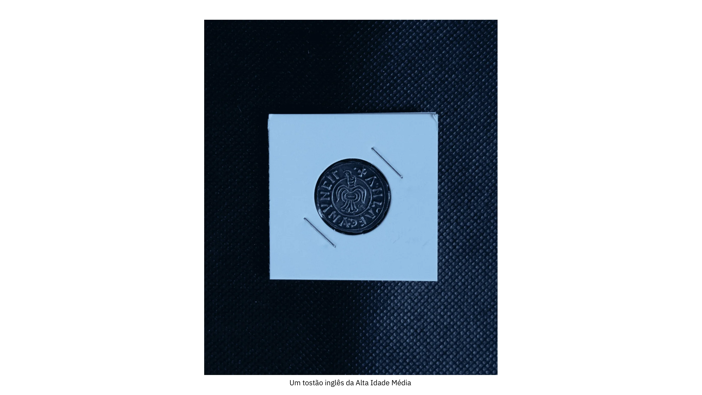

Durante a Alta Idade Média, a Europa caiu no feudalismo após o colapso do sistema monetário romano. A maioria da população utilizava moedas de cobre ou bronze de baixo valor, frequentemente sujeitas a diluição monetária, o que limitava o comércio a longas distâncias.

O regresso da moeda como meio de pagamento ocorreu gradualmente, culminando no século XIII com o aparecimento do florim de ouro em Florença, em 1252, seguido do ducado de ouro em Veneza. Estas moedas de ouro foram amplamente utilizadas graças à expansão do comércio e à necessidade crescente de meios de pagamento fiáveis e internacionalmente aceites.

Em Inglaterra, o sistema monetário foi protegido da diluição por políticas fiscais inovadoras, como o imposto fundiário introduzido por Guilherme, o Conquistador, após 1066, que preservou a qualidade do penny sterling. O que é importante compreender aqui é que os soberanos da altura podiam desvalorizar a moeda para financiar o Estado e a introdução deste imposto permitiu manter a moeda estável e financiar o Estado através da tributação

No entanto, a tentação de lucrar através da diluição monetária levou a crises, como no reinado de Henrique I, no século XII, quando a qualidade da cunhagem caiu drasticamente. Reformas severas, por vezes acompanhadas de medidas violentas contra os cunhadores, restauraram temporariamente a confiança na moeda.

A Idade Média assistiu também ao aparecimento de práticas financeiras sofisticadas, como a utilização de tally sticks em Inglaterra para contornar a proibição da usura e conceder crédito. A Igreja não era muito favorável aos empréstimos com juros, pelo que foram utilizadas várias técnicas para contornar a proibição da utilização de juros.

Estas inovações foram uma resposta à escassez crónica de moeda metálica e encorajaram o aparecimento de um mercado financeiro embrionário.

As Cruzadas, entretanto, estimularam o comércio mediterrânico, fomentando o desenvolvimento de trocas internacionais e de novas práticas bancárias, nomeadamente através da Ordem dos Templários. Os Templários tornaram-se importantes intermediários financeiros, permitindo que os cruzados obtivessem liquidez longe de casa, prefigurando o moderno sistema bancário europeu.

Para fazer a ligação com os Templários, aqui em baixo pode observar uma moeda medieval francesa, onde se pode reconhecer uma bela cruz no centro. Era muito comum as moedas desta época ostentarem esta cruz.

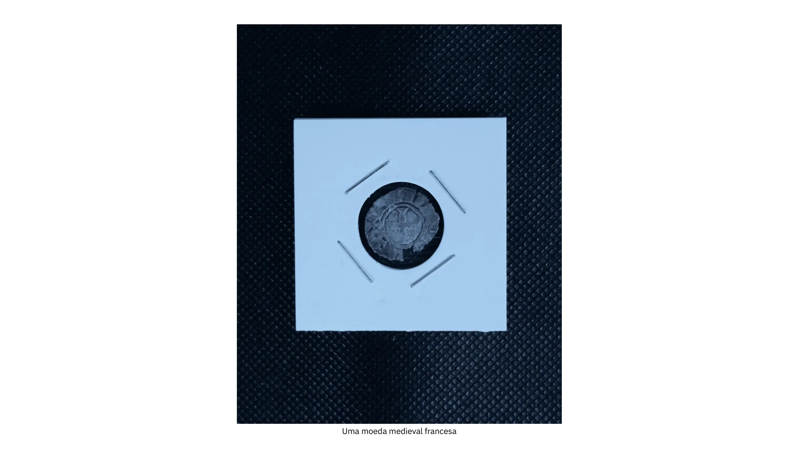

Finalmente, grandes crises como a Peste Negra (1346-1353) provocaram profundas transformações económicas. A forte diminuição da população levou a um aumento acentuado dos salários, desafiando as tentativas do governo de manter os níveis de remuneração anteriores.

Ao mesmo tempo, a Guerra dos Cem Anos (1337-1453) obrigou os Estados a adotar políticas fiscais mais agressivas para financiar os seus exércitos, contribuindo para o enfraquecimento do sistema feudal.

A Idade Média foi assim marcada por uma tensão constante entre a necessidade de dinheiro fiável para o comércio e a tentação constante dos governantes de diluírem o dinheiro para obterem lucros imediatos. Este conflito moldou profundamente o desenvolvimento monetário europeu, lançando as bases dos sistemas económicos modernos.

Para concluir esta secção, gostaria de acrescentar uma anedota bastante interessante de Inglaterra, por esta altura. Esta anedota foi retirada do livro "History of Money" de Glyn Davies.

Refere que, em Inglaterra, a passagem para o Parlamento transferiu o ónus da dívida do soberano para o Parlamento, o que resultou num endividamento crónico do Estado. Antes disso, a dívida pesava sobre os ombros do soberano.

Quando o Parlamento conseguiu apoderar-se de parte deste poder de criação de moeda, permitiu a criação de dívidas a longo prazo que eram suportadas pelo povo e não pelo rei. Anteriormente, se o rei fosse à falência ou se houvesse uma mudança de rei, a dívida extinguia-se com ele.

A partir do momento em que a criação da dívida é efectuada pelo Parlamento, surge o conceito de dívida soberana, que é potencialmente ilimitada no tempo. Enquanto o Estado existir, enquanto o Parlamento existir, essa dívida existe, e foi preciso encontrar todo o tipo de formas de a refinanciar e de a distribuir ao longo do tempo. É uma grande mudança de paradigma, em que já não era o rei ou a realeza que garantiam ou suportavam o ónus destas dívidas; era agora o Parlamento e, portanto, os seus cidadãos.

## O renascimento

<chapterId>1d1dfb05-70b4-5b7b-9708-373c2182950d</chapterId>

:::video id=4977b4f3-c7b2-41a5-ad7b-a96a8cca4092:::

Chegámos agora à parte do curso em que falamos do período conhecido como Renascimento. Este período tem como pano de fundo uma crise trágica, com a propagação meteórica da peste através de pulgas em ratos embarcados em navios. Esta tragédia, no entanto, informa-nos sobre o crescimento do comércio e das viagens no período da Alta Idade Média. No início deste período, não havia tantas pessoas a deslocarem-se tão longe e tão rapidamente.

### O Florim de Florença

O regresso da moeda de ouro à Europa durante o Renascimento marca um ponto de viragem fundamental na história monetária. **Tudo começou com o florim de Florença em 1252, a primeira grande moeda de ouro cunhada na Europa desde a queda de Roma**. Com o seu peso e pureza notavelmente constantes (cerca de 3,5 gramas de ouro puro), o florim manteve-se inalterado durante quatro séculos e rapidamente se tornou uma referência monetária pan-europeia essencial.

Aqui em baixo pode ver uma reprodução de um Florin: um Florin de ouro feito de estanho e carimbado por um artista francês que faz excelentes peças, gravadas e batidas manualmente.

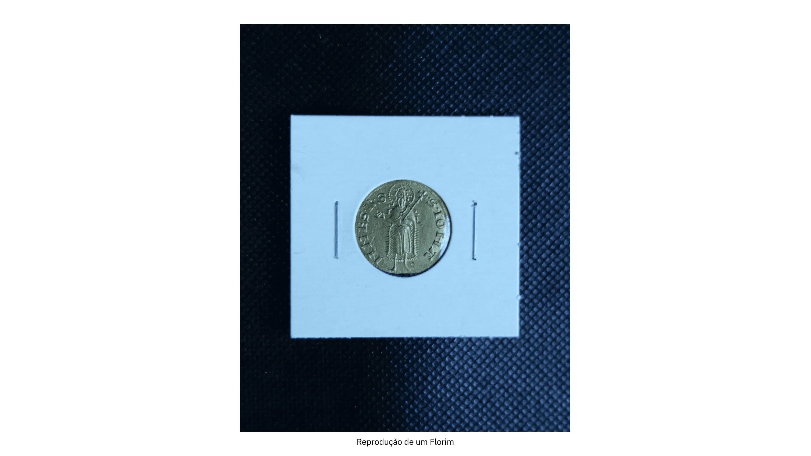

Este regresso à moeda de ouro foi motivado por um contexto específico: o colapso do solidus bizantino e o declínio económico do mundo muçulmano devido às invasões mongóis criaram um vazio monetário no comércio internacional.

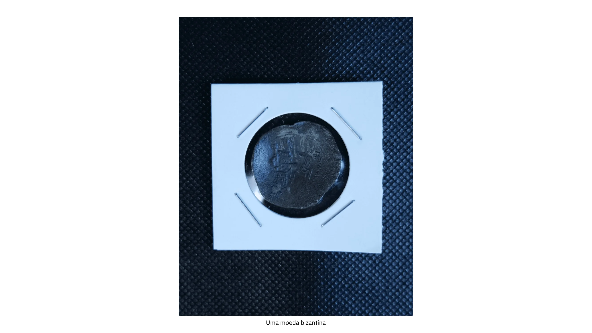

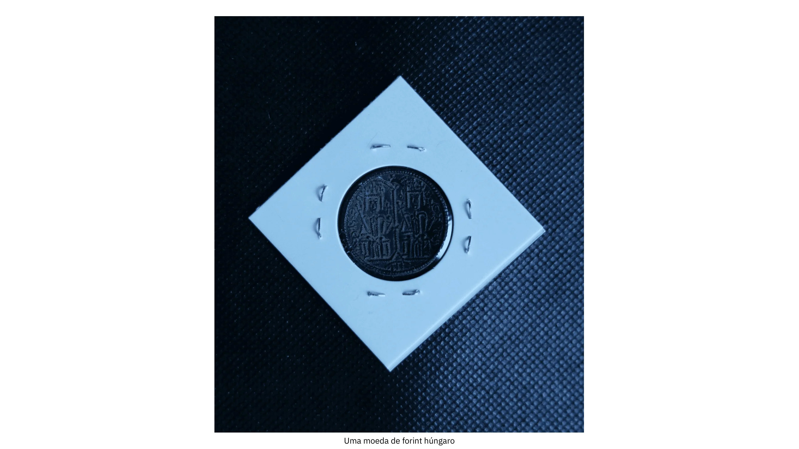

A primeira imagem acima mostra uma moeda bizantina que considero bastante interessante. Vou estabelecer um paralelo com uma moeda do mesmo período da Hungria (segunda imagem acima). A moeda húngara tem a forma de uma taça, como uma tigela em miniatura. A iconografia apresenta figuras religiosas representadas como reis segurando cruzes lado a lado. Esta peça tem a forma de taça e é originária da Hungria.

Era muito comum copiar moedas de outros países. Como as moedas bizantinas eram geralmente aceites, os outros países copiavam-nas frequentemente. Como se pode ver ao compará-las lado a lado: estas peças são muito semelhantes.

O Norte de Itália, nomeadamente Florença, Veneza e Génova, aproveitaram este contexto para lançar novas moedas fortes - moedas com um teor estável de metais preciosos. Veneza seguiu o exemplo de Florença, cunhando o ducado em 1270, uma moeda quase idêntica ao florim e amplamente utilizada no comércio mediterrânico.

O florim tornou-se a primeira moeda de reserva internacional, adoptada em mais de 150 cidades europeias antes do final do século XIV. Com a criação de uma rede bancária florentina em grande escala, liderada pelos Médicis, a gestão monetária e contabilística foi profundamente modernizada, reduzindo mesmo a necessidade de transportar ouro fisicamente.

Esse é outro ponto muito interessante. Houve uma altura em que muitos carregamentos de moedas se perdiam nas viagens marítimas. Este avanço tecnológico - os registos com contabilidade de dupla entrada - permitiu a criação da moeda escritural. Isto permitiu reduzir o número de assentamentos de moedas e, em vez disso, utilizar um sistema de registos escritos, o que reduz muito o risco de perda de dinheiro em trânsito.

O desenvolvimento monetário foi também acompanhado por uma evolução significativa dos métodos bancários. Inspirada, em parte, pelo contacto das Cruzadas com as práticas bancárias muçulmanas, a Europa medieval assistiu ao aparecimento de sistemas bancários rudimentares em Florença, Veneza, Barcelona e Génova, já no século XIII. Os Cavaleiros Templários, uma ordem religiosa e militar, já tinham desenvolvido um sistema que permitia aos cruzados viajar sem levar consigo as suas riquezas.

Depositavam os fundos num escritório templário no seu país e podiam depois viajar com uma carta e recolher as moedas à chegada ao destino da cruzada.

Isto significava que não tínhamos de andar com moedas de metal precioso.

Foi também durante este período que a Europa teve conhecimento da existência de papel-moeda na China, graças à viagem de Marco Polo no século XIII. No entanto, o desenvolvimento das notas de banco aguardaria vários séculos, uma vez que a Europa preferiu aperfeiçoar primeiro os seus métodos de cunhagem de moeda metálica. Leonardo da Vinci, próximo de Luca Pacioli, um reputado revisor oficial de contas, contribuiu ativamente para o aperfeiçoamento das prensas de dinheiro, promovendo uma produção de moedas mais rápida e uniforme.

Estamos a referir-nos à técnica de cunhagem com pêndulo mencionada anteriormente no curso. Este método permitia a produção de moedas mais uniformes em comparação com a cunhagem a martelo e, o que é mais importante, permitia inscrições à volta do bordo da moeda, como demonstrei anteriormente. A moeda abaixo é um táler europeu de 1793, que mostra claramente a escrita na orla.

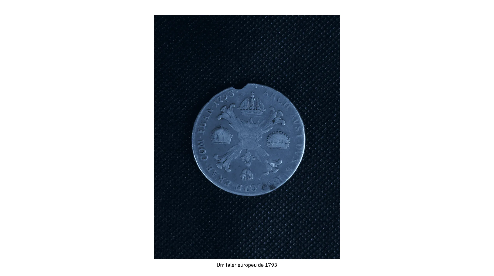

No entanto, no século XV, a Europa atravessou uma grave crise monetária, com uma deterioração geral do teor de prata das moedas europeias, que desceu para menos de 5% por volta de 1450.

A partir do século XVI, o centro de gravidade monetário deslocou-se para Espanha, estimulado pela união dos reinos de Aragão e Castela, pelo fim da Reconquista e pelas grandes descobertas marítimas, como a de Cristóvão Colombo em 1492. O afluxo maciço de prata das minas americanas perturbou profundamente os equilíbrios económicos europeus e mundiais, alimentando a inflação e novas tensões geopolíticas.

O Renascimento marcou também uma importante evolução artística no domínio da cunhagem de moeda, com moedas como o táler (Joachimsthaler), que está na origem do termo "dólar". Estas grandes moedas de prata reflectem as novas técnicas artísticas e mecânicas de cunhagem, possibilitadas pelas inovações técnicas do Norte da Europa.

Por fim, o Renascimento financeiro marcou a transição para a modernidade económica, com o desenvolvimento da banca, do crédito e dos mercados financeiros, e o aparecimento das primeiras formas de capitalismo moderno nas grandes cidades comerciais de Amesterdão, Londres e Estocolmo, lançando as bases do sistema financeiro internacional tal como o conhecemos hoje. E esse é o tema do nosso próximo vídeo.

# A apreensão de dinheiro pelo Estado

<partId>17cfb1b4-5bc1-53e0-b035-05c7cf76be92</partId>

## A evolução das moedas de reserva mundiais

<chapterId>d65cc352-e7ca-5f03-9b23-dd1fae5c0395</chapterId>

:::video id=82710062-8fff-426c-93af-923c08d82233:::

### A importância histórica dos metais preciosos

Bem-vindo a esta secção sobre o surgimento das moedas de reserva e dos bancos centrais. Como primeiro ponto desta nova secção, vamos centrar-nos na evolução das moedas de reserva mundiais.

Os metais preciosos, especialmente o ouro e a prata, foram durante muito tempo considerados a base da riqueza e do poder dos impérios. A sede de ouro sempre foi uma força motriz dominante e foi o influxo de metais preciosos que teve o efeito mais direto e óbvio na evolução monetária da Europa. Nos tempos medievais e no início do Renascimento, esta obsessão pelo ouro e pela prata deveu-se à dificuldade de reter o valor noutras formas de mercadoria, bem como à forte procura por parte de potências estrangeiras, particularmente no comércio com o Oriente.

Ao longo dos séculos, vários impérios sucederam-se como centros económicos mundiais. O país que domina o comércio mundial durante um determinado período recebe geralmente o estatuto de moeda de reserva. Estes incluem:

- Espanha e Portugal (séculos XV e XVI)

- As Províncias Unidas (Países Baixos) no século XVII

- A França e a Grã-Bretanha nos séculos XVIII e XIX

- Os Estados Unidos no século XX

### O boom português e o Real (1450-1530)

**Portugal dominou o comércio mundial na segunda metade do século XV e no início do século XVI, com o Real português, uma moeda de prata de peso relativamente uniforme. Os portugueses, graças aos seus avanços na navegação, descobriram novas rotas marítimas para África, Ásia e o Novo Mundo. As fortalezas militares e os entrepostos comerciais multiplicam-se de África à China (Macau).

Em resposta à procura de ouro e prata por parte da Europa, "a motivação constante para as grandes descobertas era o lucro comercial, particularmente a procura de ouro e prata" No entanto, o Império Português, com o seu orçamento excessivo e a concorrência dos holandeses, ingleses e franceses, começou a entrar em declínio.

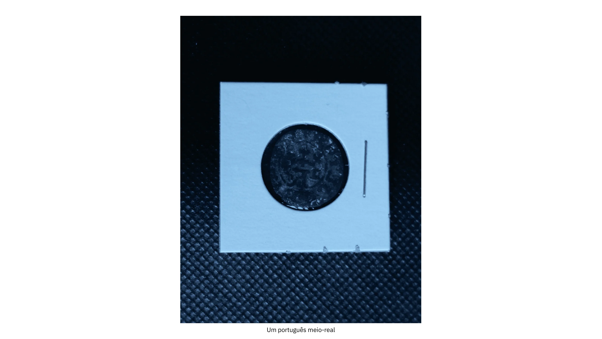

Aqui em cima pode ver-se um meio-real português da época destas conquistas marítimas.

### O apogeu espanhol e o dólar espanhol (1535-17)

Com a conquista do Novo Mundo, **Espanha** tornou-se o ator dominante. O seu monarca, controlando gigantescas minas de prata (Potosí na Bolívia, Zacatecas no México), conseguiu cunhar dinheiro em prata pura, evitando assim a desvalorização da sua própria moeda: o **Real espanhol**

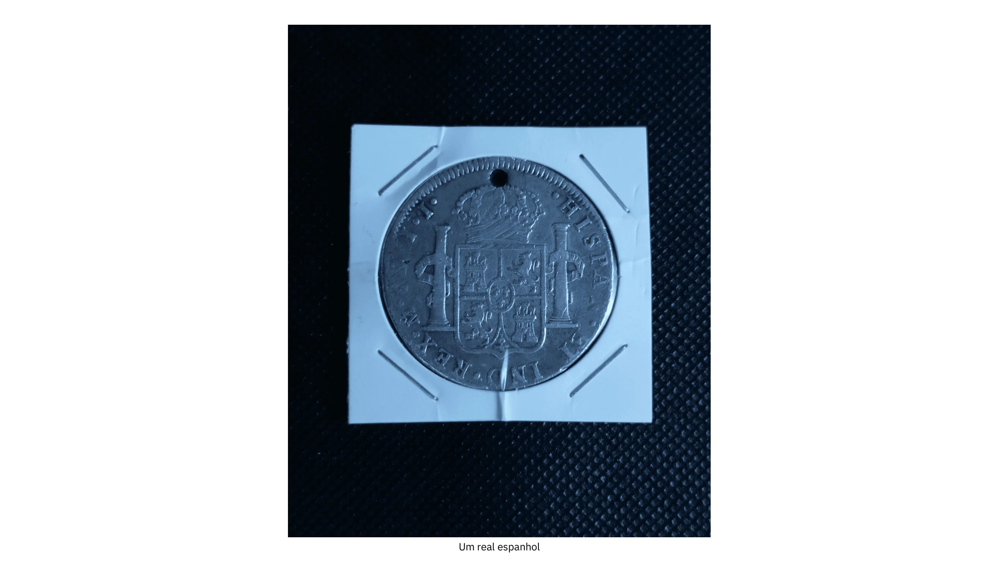

O real espanhol, também conhecido como "peça de oito", recebeu esta alcunha porque era frequentemente cortado em oitavos para criar moedas mais pequenas. Também era conhecido como o **dólar espanhol**. A moeda que vê acima data de 1814, o que a torna um exemplo ligeiramente mais recente. No entanto, as primeiras moedas de dólar espanhol não eram tão refinadas; eram cunhadas a martelo e geralmente menos redondas e nítidas.

O que é particularmente interessante é o facto de o dólar espanhol ser a moeda de reserva internacional na altura. As autoridades espanholas também emitiam a sua própria moeda local, o maravedi, e ajustavam regularmente a oferta de moeda através de recolhas. Por exemplo, uma moeda de cobre ou bronze que inicialmente valia um maravedi podia ser retirada e carimbada com "2", depois com "4" e assim por diante, podendo chegar a "8" Na fotografia de alta resolução, pode ver-se claramente o "8" estampado na moeda. Este método expandiu efetivamente a oferta de dinheiro... o que inevitavelmente levou à inflação.

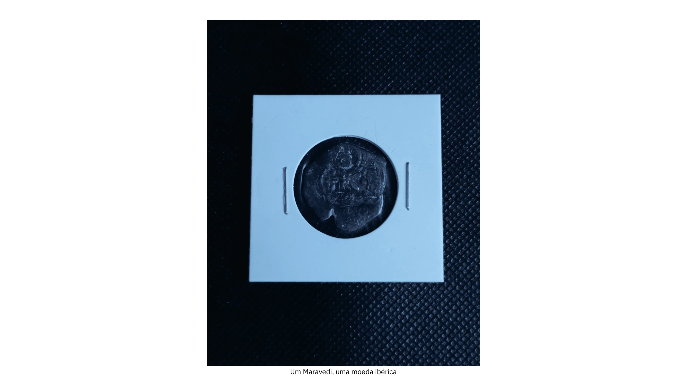

Se olharmos para a história das moedas de reserva, surge um ponto interessante: os impérios não inflacionaram as suas moedas enquanto mantiveram o seu estatuto de moeda de reserva. **Só no final do seu domínio é que acabavam por desvalorizá-la, perdendo esse privilégio, que passava para um novo império**.

Em Espanha, o dólar espanhol dominou o comércio mundial durante quase 200 anos, nomeadamente entre a China e a Europa. Estas moedas podiam mesmo ser encontradas nos portos chineses. E é aqui que recebemos uma piscadela de olho à história: o dólar americano provém diretamente desta moeda. Quando os Estados Unidos foram formados em 1792, aprovaram uma lei para cunhar a sua própria moeda e os seus primeiros dólares foram criados segundo o modelo do dólar espanhol, tanto no nome como no tamanho da moeda.

Para se ter uma ideia do seu valor, um dólar americano era originalmente uma moeda de prata que pesava quase uma onça, ou seja, entre 30 e 40 euros em dinheiro atual, ao contrário do papel-moeda que conhecemos hoje. Quanto ao dólar espanhol, a sua circulação foi tão alargada que é considerado a primeira verdadeira moeda mundial.

No entanto, este afluxo de metais preciosos das Américas causou inflação na Europa. Durante a Revolução dos Preços (c. 1540-1640), o custo de vida em Inglaterra aumentou sete vezes. Em Espanha, a abundância de prata teve um efeito perverso de maldição dos recursos, impedindo o desenvolvimento de instituições bancárias sólidas.

Posteriormente, a Espanha viu-se confrontada com numerosos conflitos militares (Flandres, Países Baixos, Guerra dos Trinta Anos) e as suas finanças entraram gradualmente em colapso. Em vez de desvalorizarem a moeda de prata, mundialmente conhecida, os sucessivos governantes optaram por não pagar ou desvalorizar a moeda de cobre (vellón) utilizada pela população local. Foi o que descrevi anteriormente com os Maravedis.

### A ascensão holandesa (século XVII)

Após o apogeu ibérico, os **Países Baixos** emergiram como uma nova potência comercial no século XVII. O comércio marítimo, a VOC (Companhia Holandesa das Índias Orientais) e a fundação da **Amsterdam Stock Exchange** (inspirada na de Antuérpia) fizeram desta república mercantil um centro.

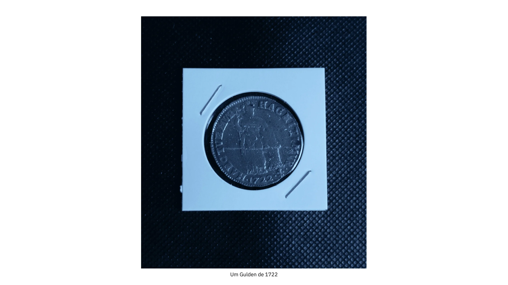

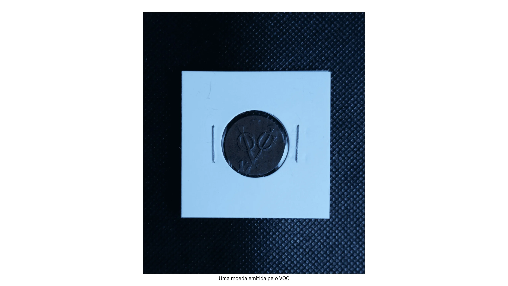

Na primeira fotografia acima, pode ver-se um Gulden de 1722 (uma bela moeda de prata), enquanto na segunda se vê uma moeda emitida pelo VOC.

A VOC era uma empresa extremamente poderosa para a sua época: tinha o seu próprio exército e até emitia a sua própria moeda.

Os holandeses inventaram o capitalismo moderno, que começou como um meio de distribuir o risco em empreendimentos arriscados, como as expedições ao Novo Mundo ou a procura de novas rotas comerciais. As sociedades anónimas permitiram que vários investidores juntassem o seu dinheiro e partilhassem o risco. Para facilitar estas trocas, foi então necessário criar instituições capazes de negociar e trocar estes títulos. Assim, em 1602, foram criadas a primeira sociedade anónima e a primeira bolsa de valores.

A moeda holandesa, o **Gulden**, ganhou credibilidade graças à sua pureza em prata e, depois, à sua adoção pelo Banco de Amesterdão (1609), onde os depósitos se tornaram uma forma de dinheiro preferida na Europa. Este é um ponto muito importante a referir. Sim, é claro que havia moedas, mas o que realmente constituía dinheiro naquela época era uma forma de dinheiro bíblico. De facto, grande parte do comércio mundial passava pelos livros do Banco de Amesterdão. Tratava-se de um verdadeiro avanço bancário: o comércio internacional já não era necessariamente realizado com moedas físicas, mas diretamente através dos registos contabilísticos do banco.

Este período de prosperidade foi marcado por um grande afluxo de ouro e prata, sobretudo de outros países que praticavam a inflação ou o controlo monetário. Há uma personagem interessante a mencionar: **Thomas Gresham. Nesta altura, trabalhava para a realeza inglesa nos Países Baixos, gerindo o fluxo de dinheiro entre os dois países. Foi este mesmo Gresham que nos deixou a famosa **"Lei de Gresham "**.

No entanto, o Império Holandês também acabou por perder o fôlego. As guerras com a Inglaterra, a diluição do gulden em tempos de conflito e a concorrência de outras potências (França e Inglaterra) assinalaram o fim da hegemonia holandesa. Após a Quarta Guerra Anglo-Holandesa (1780-84), o declínio do gulden como moeda de reserva tornou-se irreversível.

### O poder, as ambições e os fracassos franceses (séculos XVII-XVIII)

Com Luís XIV, a França tornou-se a maior potência continental da Europa. No entanto, a moeda francesa nunca alcançou o estatuto de referência dominante: numerosas desvalorizações, impostos pesados e guerras dispendiosas (Liga de Augsburgo, Guerra da Sucessão Espanhola, etc.) pesaram na estabilidade do sistema monetário.

A primeira grande experiência com papel-moeda foi levada a cabo por John Law (1716-1720). O Banque Générale emitiu notas garantidas por promessas de dívida pública. Este esquema conduziu a uma bolha especulativa e a um colapso (a Bolha do Mississipi) em 1720. Este desastre deixou a França com uma desconfiança duradoura em relação ao papel-moeda. Foi esta experiência desastrosa que levou Richard Cantillon a enriquecer graças a este sistema de princípios declarados, atualmente conhecido como o efeito Cantillon, em que a impressão de dinheiro enriquece aqueles que têm acesso à imprensa.

Quando esta desconfiança finalmente se desvaneceu, surgiu outro fiasco do papel francês: os **assignats** revolucionários. Emitidos a partir de 1790 com base na confiscação dos bens do clero, estes assignats sofreram uma hiperinflação galopante, tornando-se oficialmente a primeira hiperinflação da história a exceder 50% ao mês. Em 1795, apesar de o seu valor facial ter sido multiplicado, estavam a ser negociados a apenas alguns por cento do seu valor inicial.

Leis mais restritivas tentaram impor o assignat, mas sem sucesso. O governo tentou impô-lo, chegando a ameaçar de morte quem não o aceitasse e obrigando os comerciantes a permanecerem abertos. Mas é claro que, no final, não funcionou.

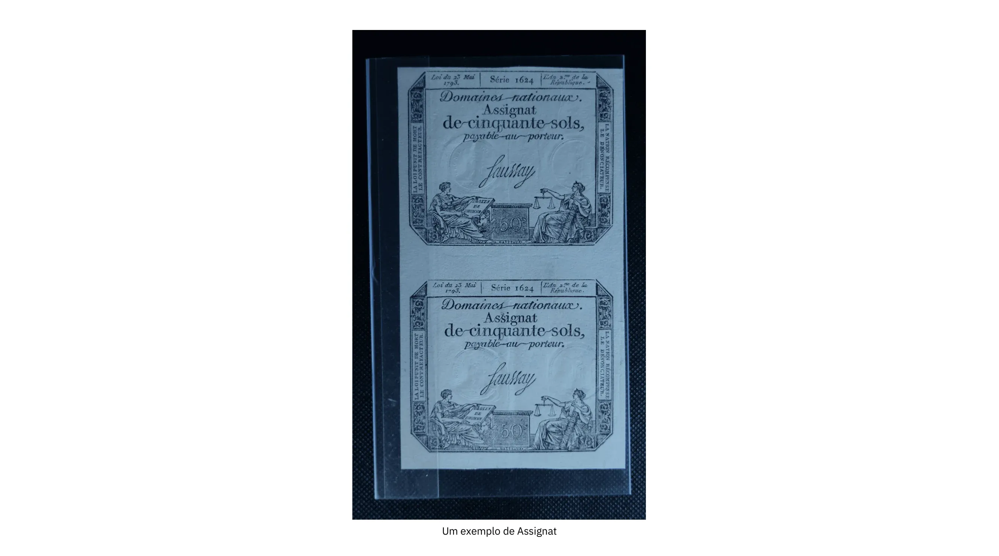

À medida que este papel-moeda substituía todas as moedas de metal precioso de qualidade, em conformidade com a famosa Lei de Gresham, verificou-se uma escassez de moeda. Para cunhar novas moedas, utilizou-se o metal dos sinos confiscado ao clero. Aqui em baixo, pode ver-se uma bela peça de sino metálico, fabricada a partir do cobre recuperado pela fusão das moedas roubadas ao clero.

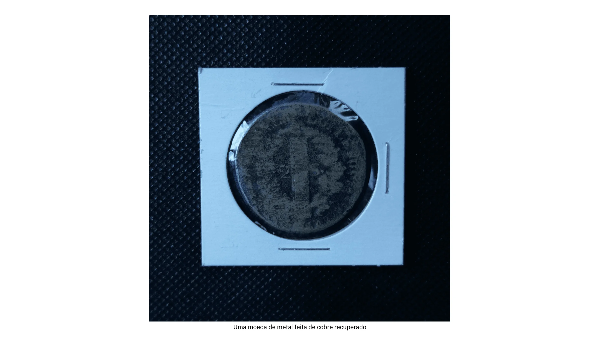

### Domínio britânico (séculos XVIII - início do século XX)

**A Inglaterra**, depois de ter ultrapassado os Países Baixos, tornou-se a potência dominante no século XVIII. A libra esterlina é a moeda mais antiga ainda em uso, originalmente ligada a uma libra de prata. Gradualmente, o seu estatuto foi-se reforçando, apoiado por uma revolução financeira e fiscal: monarquia parlamentar, forte capacidade de cobrança de impostos e criação do Banco de Inglaterra em 1694\.

Após uma série de guerras contra a França, o Reino Unido saiu vitorioso em 1815 (Waterloo), confirmando a sua supremacia. Durante todo o século XIX, a libra esterlina actuou como moeda de reserva mundial. No seu auge, com apenas 2,5% da população mundial, a Grã-Bretanha produzia 20% do rendimento mundial e controlava quase um quarto da superfície terrestre.

A **Revolução Industrial** e a adoção de um **padrão-ouro** (1717 ou 1718, sob a supervisão de Isaac Newton na Casa da Moeda Real) reforçaram a credibilidade da libra. O Banco de Inglaterra adoptou um padrão-ouro de 4,25 libras por onça de ouro, permitindo que os detentores de notas convertessem as suas notas em ouro.

No entanto, a Primeira Guerra Mundial (1914-1918) pôs fim a este sistema. Em poucas semanas, todas as grandes potências beligerantes suspenderam a convertibilidade do ouro. O Império Britânico, e mais tarde a libra esterlina, saíram da Segunda Guerra Mundial enfraquecidos, dando lugar ao dólar americano no século XX.

E como artefacto, pode ver algumas peças bonitas e interessantes abaixo. Trata-se de pesos monetários. O primeiro é o soberano: as primeiras representações da libra esterlina. Só tenho pesos monetários para representar estas moedas porque não tenho dinheiro para comprar um soberano verdadeiro. Para as pesar, utilizámos uma balança e colocámos do outro lado o peso monetário equivalente ao valor do soberano.

O soberano era uma moeda monetária - uma moeda de ouro que valia originalmente uma libra.

Antes do famoso soberano, existia o guinéu, que funcionava segundo o mesmo princípio. O nome da guiné deve-se aos metais preciosos que continha, provenientes da região da Guiné.

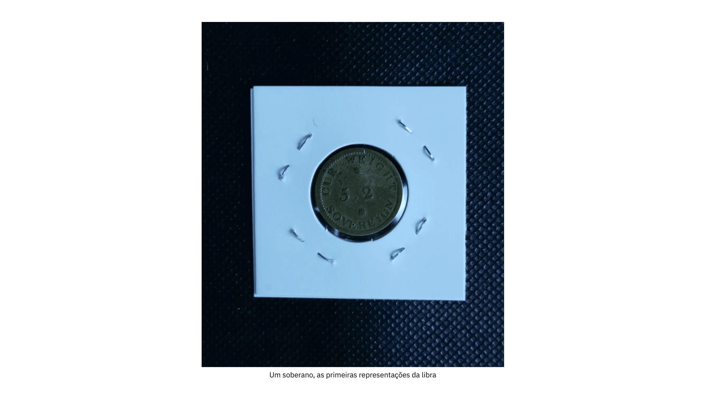

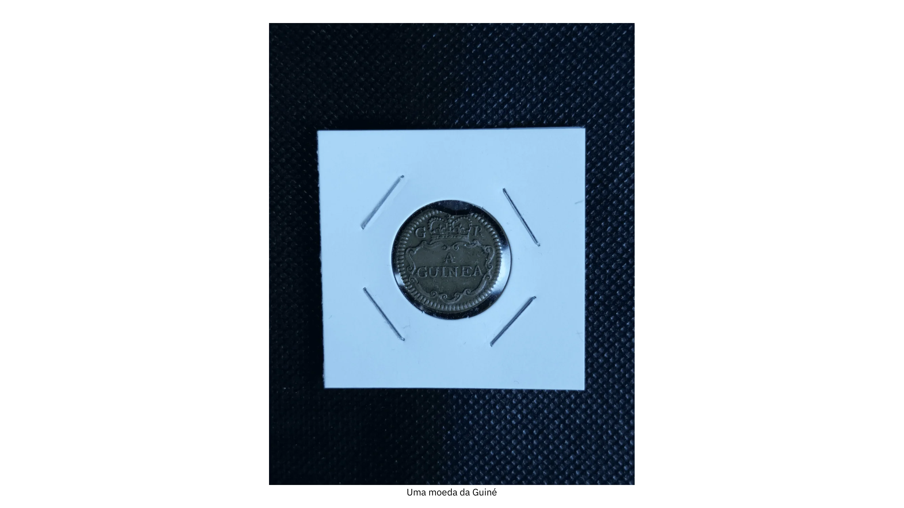

## O surgimento dos bancos centrais

<chapterId>15777771-1e28-55f7-a400-69868a47079b</chapterId>

:::video id=7661b7b5-e00f-48f3-b69a-6fb2eb5ebba4:::

No seguimento desta secção sobre a história das primeiras moedas de reserva e a sua evolução, apresentamos um segmento sobre o surgimento dos bancos centrais. Segue o mesmo caminho que o do aparecimento das moedas de reserva, mas centra-se um pouco mais nas tecnologias bancárias da época.

### O início dos bancos e dos protobancos

Já no século XIII, os italianos (Florença, Génova, Veneza...) desenvolveram técnicas de contabilidade por partidas dobradas. Mais tarde, **Antuérpia** (séc. XVI) tornou-se o principal centro financeiro do Norte da Europa, papel que foi mais tarde assumido por **Amsterdão**, graças à Bolsa de Valores de Amesterdão-16 (1609), onde eram negociadas as acções da VOC.

Antuérpia acolhia feiras comerciais onde os comerciantes se reuniam frequentemente para saldar dívidas, o que levou à invenção de novos instrumentos financeiros. A nota abaixo, datada de 1761 e mais recente, é uma **nota promissória**. Apresenta pormenores manuscritos, bem como inscrições no verso, o que a torna um magnífico artefacto da época.

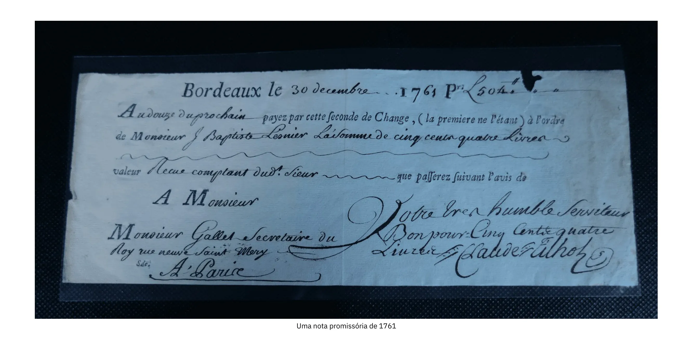

Esta efervescência levou à criação de instituições bancárias mais sofisticadas. **Os banqueiros lombardos** e, mais tarde, os comerciantes holandeses aperfeiçoaram os instrumentos de crédito (letras de câmbio, livranças, etc.). O sistema bancário moderno baseia-se nesta ideia: o dinheiro pode ser crédito e não apenas metal.

Como pode ver, isto leva-nos de volta à nossa pergunta original sobre as origens do dinheiro.

O dinheiro emana de uma mercadoria que emerge da necessidade de troca, ou emerge do crédito? Ainda se podem encontrar vestígios desta questão nesta secção.

### O exemplo sueco: Stockholms Banco e Riksens Ständers Bank

Passemos à Suécia, onde foi criado o primeiro banco central.

**A Suécia** foi pioneira na banca central: em 1657, Johan Palmstruch criou o **Stockholm Banco**, autorizado a emprestar mais do que as suas reservas metálicas, marcando assim o nascimento da banca de reserva fraccionada. Mas a emissão excessiva de notas levou ao pânico e a uma corrida ao banco em 1663. Bem, bem...

Em 1668, foi fundado em Estocolmo o Riksens Ständers Bank, o primeiro verdadeiro banco central do mundo. No entanto, também este sofreu crises (1709, 1715...) ligadas ao abuso de notas, muitas vezes para financiar as guerras do reino.

### O golpe falhado de John Law

Vamos para França, onde voltamos a encontrar o nosso querido John Law.

**John Law**, um escocês, persuadiu o Regente (Duque de Orleães) a criar um banco privado, o Banque Générale (1716), autorizado a emitir papel contra ouro, prata e dívidas do governo. Este banco transformou-se no Banque Royale (1718) e contribuiu para o aumento das acções da Companhia do Mississipi.

Quando a realidade se sobrepôs à especulação, **o pânico foi exacerbado pela decisão de proibir a detenção de ouro e forçar a utilização de notas de lei**. Ora, ora...

Finalmente, a bolha rebentou em 1720, provocando um colapso que arruinou a credibilidade do papel-moeda em França durante muito tempo.

### Banco de Amesterdão, o nascimento de um modelo pioneiro

Somos agora transportados para Amesterdão em 1609, onde o **Banco de Amesterdão** (Wisselbank) assumiu o controlo da custódia e convertibilidade das moedas em Amesterdão. Proibiu a circulação de notas de banco privadas e impôs o depósito de moedas metálicas nos seus cofres. Pouco a pouco, foram assumindo o controlo da moeda. Proibiram os cambistas de guardarem moedas com eles. Os cambistas trabalhavam todo o dia e, no final do dia, tinham de depositar as moedas nos cofres do Banco de Amesterdão. Como já referi, não eram necessariamente moedas de metal que eram utilizadas no comércio internacional. Tratava-se de dinheiro escritural registado nos livros do banco.

Graças ao poder mercantil holandês, o banco desempenhou o papel de primeiro "banco central" de facto, estabilizando o comércio mundial. No entanto, com o passar do tempo, concedeu empréstimos sem garantia ao VOC e acabou por ficar sem metal para pagar as suas facturas. Em 1790, verificou-se que tinha emprestado somas avultadas ao VOC, que praticamente declarou falência, arruinando a credibilidade do gulden. Ora, ora...

### O Banco de Inglaterra, ato fundador da banca moderna

Na Inglaterra do século XVII, o ouro e a prata eram armazenados pelos ourives, que emitiam recibos. Esta organização parcialmente descentralizada provou os seus limites quando a Coroa se viu na necessidade de financiamento maciço para a guerra contra a França.

Em 1694, foi fundado o **Banco de Inglaterra (BoE)**. O Banco de Inglaterra nasceu assim de um casamento de conveniência entre a comunidade empresarial londrina e o governo, que estava desesperado por encontrar fundos para a guerra.

O Banco obteve o monopólio da emissão de notas em Inglaterra (reforçado em 1708, 1742, etc.). A partir de então, o papel-moeda apoiado em reservas de ouro circula a par das moedas. Este é um ponto importante para compreender a progressiva apropriação do dinheiro pelas instituições do Estado. Em primeiro lugar, o Banco de Amesterdão impediu os cambistas de guardarem moedas e obrigou-os a devolvê-las ao Banco. Em Inglaterra, os bancos privados foram proibidos de emitir as suas próprias notas reembolsáveis em ouro.

Permitiram, de facto, que os bancos privados emitissem notas, mas estas só podiam ser trocadas por notas do Banco de Inglaterra.

As notas do Banco de Inglaterra, em libras esterlinas, eram reembolsáveis em ouro. Isto acrescentou um terceiro nível à moeda. Assim, temos o ouro na base, depois as notas do Banco de Inglaterra e, por último, as notas dos bancos privados. Antes disso, os bancos privados podiam emitir as suas próprias notas reembolsáveis em ouro. Esta é mais uma etapa na aquisição gradual da moeda pelas instituições estatais.

O Banco financiou o Estado com grandes empréstimos e estruturou a enorme dívida pública que financiou o boom económico.

Este modelo foi consolidado ao longo dos séculos XVIII e XIX, ao ponto de a libra se tornar a moeda de reserva mundial, sob a chancela do Banco de Inglaterra e do padrão-ouro.

**As moedas de reserva mundiais** seguiram-se umas às outras ao longo dos séculos, impulsionadas pelo poder económico, comercial e militar de um Estado ou império: Portugal, Espanha, Países Baixos, depois a Grã-Bretanha, antes de os Estados Unidos passarem a dominar no século XX. Em todos os casos, assistimos a um ciclo semelhante: expansão económica, sucesso comercial, adoção internacional da moeda, endividamento, guerras dispendiosas, utilização abusiva da criação de moeda ou de crédito e, finalmente, declínio.

**O aparecimento dos bancos centrais** foi um processo gradual. Estas instituições surgiram frequentemente no contexto de guerras dispendiosas, permitindo ao Estado financiar-se através da dívida. Quando o padrão-ouro foi adotado (Inglaterra, séculos XVII-XIX), proporcionou um verniz de estabilidade, até que as grandes guerras mundiais do século XX levaram ao abandono gradual da convertibilidade do ouro. O poder de cunhar moeda passou assim do monopólio real para entidades mais complexas, primeiro privadas (ourives, banqueiros), depois semi-públicas (bancos centrais), reflectindo a evolução da soberania monetária para formas institucionalizadas e globalizadas.

Portanto, era isto que eu estava a descrever anteriormente. Muitas vezes, transferimos o ónus da dívida soberana diretamente para os bancos centrais ou para a autorização de criação de moeda por instituições legais, como o Parlamento.

E o facto mais importante é que **passámos de uma dívida que podia desaparecer através da falência do soberano para uma dívida que recaía principalmente sobre os ombros da população**.

## O caminho para o sistema fiduciário

<chapterId>27a98545-d350-56ee-a200-92468e6b9b33</chapterId>

:::video id=e27a753e-aeee-4307-a65c-9506aab380a1:::

Chegámos ao fim deste curso sobre a história do dinheiro e, para o concluir, gostaria de propor dois temas. O primeiro é sobre as várias etapas que conduziram ao nosso atual sistema de moeda fiduciária. Revisitaremos os factos da secção 5 sobre a criação dos bancos centrais e acrescentaremos o conceito de dólar americano, que é, em última análise, a atual moeda de reserva. Veremos como evoluiu, como surgiu o dólar, como evoluiu, como mudou, por que fases passou até se tornar um sistema fiduciário, porque a origem do dólar é uma moeda de prata.

Depois, imediatamente a seguir, vou dar-vos um pequeno segmento sobre a história das finanças, para vos ajudar a compreender como chegámos ao Estado-Providência. Assim, vamos abordar dois temas: como chegámos ao sistema fiduciário e, logo a seguir, como a evolução das finanças nos conduziu ao conceito de Estado-providência.

### Os fundamentos europeus da banca moderna

Voltemos ao século XIII com o florim. Para compreendermos como chegámos ao modelo fiduciário, temos de começar pelo século XIII. A par do florim, uma tecnologia surgiu ao mesmo tempo que os Médicis, o conceito de letra de câmbio.

Seguiu-se a Bolsa de Antuérpia, com o seu conceito de desconto e de letras promissórias.

Depois, como já vimos, tivemos a VOC, a primeira bolsa de valores de Amesterdão. É o nascimento do capitalismo, com as acções das empresas e a troca de acções. O banco de Amesterdão impôs então, por decreto, a utilização de depósitos. Isto significa que as moedas tinham de ser depositadas ao fim do dia. Os cambistas deixaram de poder guardar o troco em moeda.

Seguiu-se a criação do Banco de Inglaterra, devido à necessidade de criar dívida para financiar a guerra no final do século XVII. Nessa altura, os bancos privados tornaram-se a terceira camada de dinheiro. A propósito, toda esta secção, desde o florim até à noção de criação de um banco central, está muito bem resumida no famoso livro de Nick Bhatia "Layered Money", que tive a sorte de traduzir com alguns colegas. Fizemos um excelente trabalho de tradução para que todos os francófonos pudessem beneficiar destes ensinamentos.

Estamos então no final do século XVII. O Banco de Inglaterra foi criado para financiar a guerra.

Os bancos privados assumiram o controlo da terceira camada da moeda. De facto, as letras dos bancos privados já não eram resgatáveis em ouro: eram as letras do Banco de Inglaterra que eram resgatáveis em ouro. Este facto demonstra a tomada do poder de troca pela instituição que é o Banco de Inglaterra.

Depois veio o pânico de 1776. Toda a gente correu para a pirâmide monetária. O que isto significa é que, em 1776, houve uma corrida aos bancos e, por isso, todas as pessoas que tinham papel de terceira camada, ou seja, notas de bancos privados, tentaram obter notas do Banco de Inglaterra e, depois, tentaram obter ouro, mas obviamente não havia ouro suficiente nos cofres. Declararam uma espécie de férias bancárias para evitar o pagamento das letras de ouro, o que deu origem ao conceito de prestamista de última instância.

### A evolução do dólar americano

Passámos do florim para a criação do Banco de Inglaterra. Claro que, entretanto, houve a Primeira e a Segunda Guerras Mundiais, mas antes, em 1796, também se registaram desenvolvimentos do outro lado do Atlântico. Em 1776, a América ainda era uma colónia britânica e as colónias utilizavam este papel-moeda. Abaixo encontra-se uma nota de dois xelins do Connecticut de 1776.

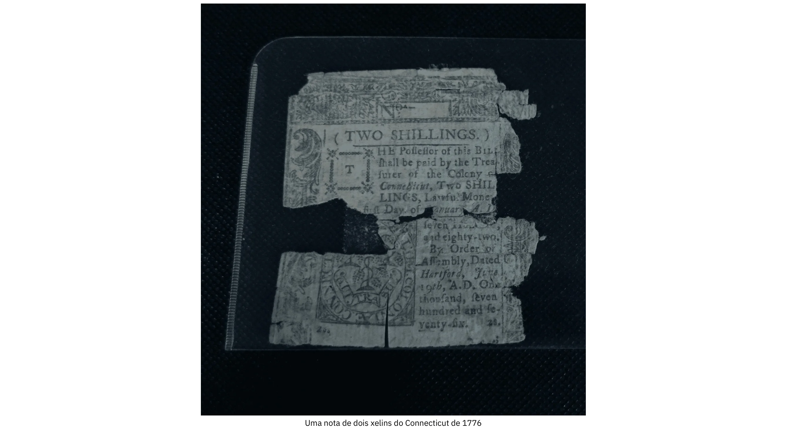

Antes de declararem guerra à Inglaterra e de emitirem a sua própria moeda, as colónias utilizaram este papel-moeda, juntamente com o dólar espanhol, para as transacções em numerário. De facto, o termo "dólar" continuou a designar o dólar americano.

Se não estou em erro, em 1792 aprovaram uma lei que lhes permitia cunhar moeda. A título de exemplo, o que se segue é um dólar americano da era moderna.

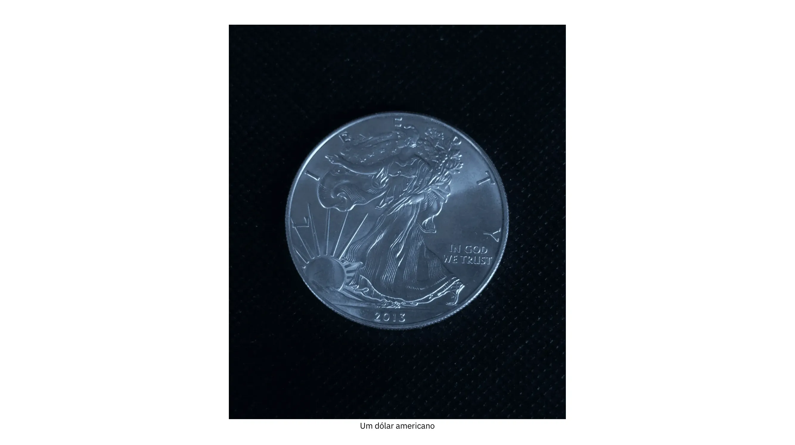

Bem, obviamente, não tem um valor facial de apenas um dólar; vale cerca de 30 ou 40 dólares, uma vez que representa uma onça de prata. O seu valor flutua com base no preço da prata, situando-se normalmente pelo menos nos 30 ou 40 dólares americanos. Hoje em dia, é claro, um dólar de papel mantém apenas o seu valor facial de um dólar, mas nessa altura, o dólar americano estava enraizado neste valor de prata.

Falemos agora da Guerra Civil na América. Os Confederados estavam a imprimir dinheiro, que foi hiper-inflacionado. Este fenómeno não está incluído na lista oficial de Hanke-Krus, uma vez que não atingiu uma taxa de hiperinflação de 50%. No entanto, registou uma taxa de inflação mensal de 40%, o que indica que foi impressa uma quantidade substancial de moeda durante a guerra.

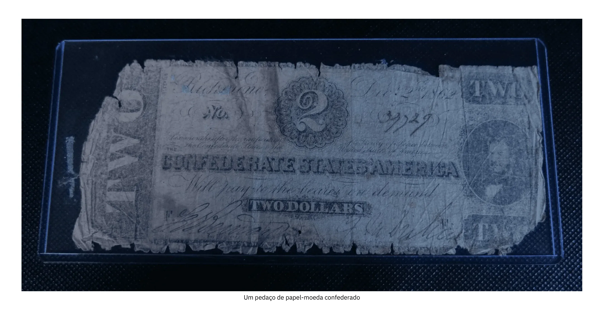

Os seus adversários do Norte também tinham dólares. Em cima, podem ver-se os dólares confederados e, em baixo, os dólares do Norte. Eram chamados de "greenback" porque o verso era verde.

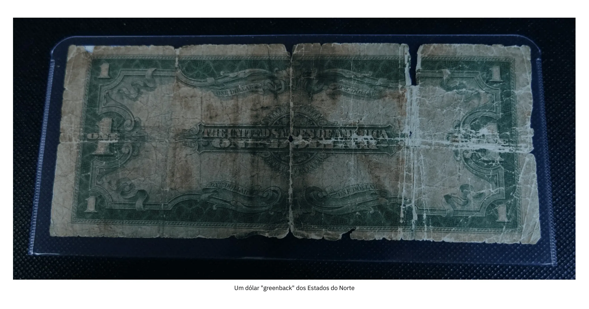

E convido-vos a comparar a diferença de tamanho com as notas modernas. Nessa altura, as notas eram maiores.

Como sabemos, o Norte ganhou, pelo que o dólar se tornou a moeda dos Estados americanos reunificados. Depois veio a fundação do FED em 1913 e a Primeira Guerra Mundial.

No rescaldo da Primeira Guerra Mundial, a última série de notas impressas incluía sempre as palavras "resgatável em ouro a pedido". Assim, em 1928, 20 dólares compravam quase uma onça de ouro, uma vez que o preço do ouro era de 20,67 dólares. A nota da imagem abaixo podia comprar uma onça de ouro em 1928.

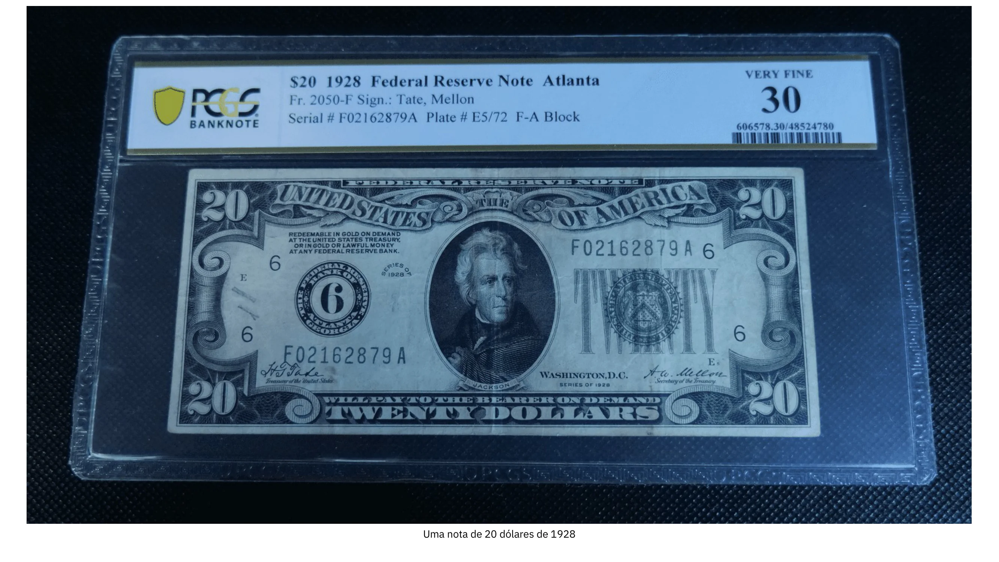

Atualmente, uma onça de ouro vale 3.000 dólares americanos. Assim, podemos ver o poder da desvalorização aqui, é claro. Foi o último projeto de lei que continha as palavras "resgatável em ouro". Veremos que logo após a Ordem Executiva 6102, eles confiscariam todo o ouro. De facto, eles apreenderiam tanto o ouro como os certificados de ouro.

Abaixo pode ver-se um certificado de ouro de 1928.

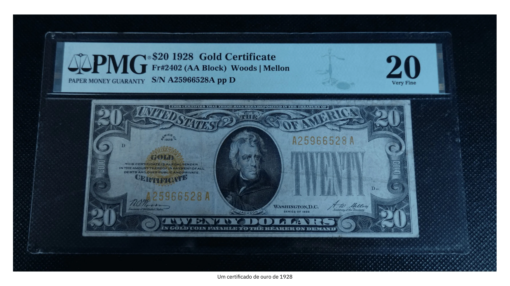

Não só era "resgatável em ouro" como a nota de 1928, como também era resgatável em moedas de ouro: é de facto um "certificado de ouro". Foram todos apreendidos após a Ordem Executiva 6102. Até 1964, era mesmo ilegal possuí-las.

Estou muito contente por ter um.

A partir de 1964, tornou-se ilegal possuir ouro, até 1974, se não estou em erro. Nos anos 70, permitiram que as pessoas acumulassem ouro após o choque de Nixon, que descreveremos em breve. Em 1933, quando emitiram a "Ordem Executiva 6102", apreenderam o ouro e tornou-se ilegal possuí-lo. Se o possuísse, seria condenado a uma grande pena de prisão. Se fosse apanhado a guardar o seu ouro, era condenado a uma grande pena de prisão. Nessa altura, cada onça de ouro era trocada por uma nota semelhante à que se segue, depois de 1934.

Como já dissemos, em 1928, um dólar ainda tinha a inscrição "redimível em ouro".

Após a emissão da Ordem Executiva 6102, apreenderam todo o ouro e trocaram 20,67 dólares por cada onça de ouro. Posteriormente, a fraude veio a lume: em 1934, emitiram novas notas com o texto impresso "esta nota tem curso legal para todas as dívidas".

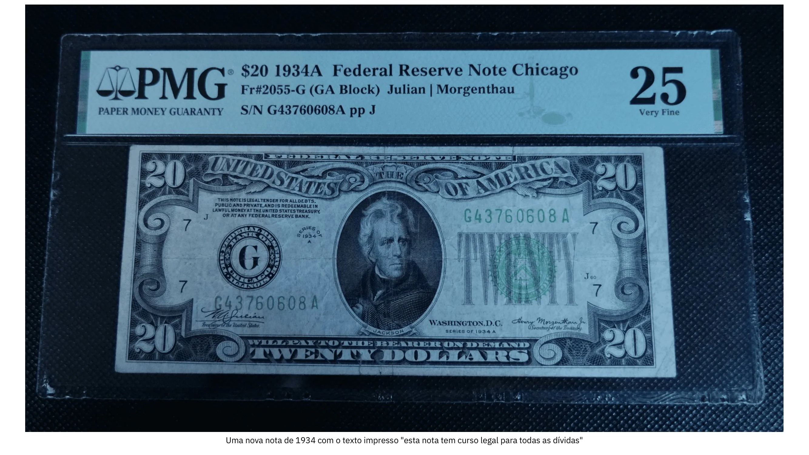

O conceito de curso legal surge aqui, substituindo a frase "resgatável em ouro" As duas notas podem parecer idênticas, com apenas algumas palavras a mudar, mas a fraude reside no facto de o dólar ter sido desvalorizado durante este período; passou de uma onça de ouro avaliada em 20,67 dólares para 35 dólares por onça em 1934. Isto representou uma desvalorização de aproximadamente 40%!

Depois veio a Segunda Guerra Mundial. Após a guerra, o Acordo de Bretton Woods centralizou grande parte do ouro do mundo nos Estados Unidos. Os americanos emitiram notas de banco em troca, embora estas notas já não pudessem ser trocadas por ouro pelo público em geral. Em vez disso, continuaram a poder ser trocadas por ouro a nível estatal.

Eventualmente, países como a França e a Alemanha começaram a suspeitar que havia provavelmente mais notas de dólar em circulação do que ouro nos cofres dos EUA.

Então pediram para repatriar o seu ouro. Bem, eles disseram: "Está bem, fá-lo-emos, mas levará algum tempo." Em 1971, o nosso amigo Richard Nixon cortou a ligação entre as notas e o ouro de uma vez por todas, culpando os especuladores no processo.

O ouro estava subvalorizado a 35 dólares por onça, um preço que não correspondia ao volume de dinheiro que tinha sido impresso nem ao seu verdadeiro valor de mercado. Em apenas alguns anos, o preço subiu de 34 para 800 dólares. À semelhança de exemplos históricos, como em Roma, onde a ligação entre o denário e o solidus foi cortada, o ouro foi deixado a flutuar. Este facto levou a um processo de descoberta de preços, resultando numa valorização do ouro muito superior em termos de dólares.

### O sistema moderno de moeda fiduciária e as suas implicações

Esta parte resume a forma como passámos de um sistema monetário baseado na prata ou no ouro. Pouco a pouco, as instituições foram ganhando cada vez mais poder sobre o dinheiro. Por fim, uma decisão unilateral cortou completamente a ligação entre os metais preciosos e o dinheiro, na sequência de uma emissão excessiva.

Consequentemente, já não existe qualquer ligação entre o ouro e as notas de banco ou o dinheiro bíblico. E nem sequer se trata de um sistema de reservas fraccionárias - esse é um conceito ultrapassado. Em vez disso, os bancos privados emitem e criam dinheiro através do crédito bancário. A moeda é criada principalmente desta forma e está correlacionada com a taxa de juro de referência fixada pelo banco central.

De facto, não há limites. Já não existem níveis de reserva obrigatórios, pelo menos na América e no Canadá. A única reserva é a necessidade de os bancos se organizarem para poderem responder às trocas interbancárias, de modo a não ficarem sem liquidez.

Só precisam de garantir que podem fazer essas transferências, mas não há 3%, 1%, 10% de reserva obrigatória. Afastámo-nos verdadeiramente do conceito de reserva fraccionada. Agora, são os bancos centrais, os governos através dos défices fiscais, os bancos centrais através da flexibilização quantitativa (QE) e os bancos privados através da criação de empréstimos bancários que podem aumentar a oferta total de moeda e, na minha opinião, causar inflação.

Para compreender a relação entre dinheiro e inflação, recomendo um curso que tenho no Plan ₿ Academy dedicado a este assunto. Aprenderá a diferença entre o aumento dos preços, que é o que vemos na vida, e a inflação. Não são a mesma coisa. De facto, quando nos referimos à inflação, estamos muitas vezes a falar de aumentos de preços, não da inflação em si. A inflação é um conceito bastante preciso, explicado pelo aumento da oferta de moeda.

https://planb.academy/courses/caa75343-ac90-4249-bcca-0e2e57c3a0f1

Para concluir esta secção sobre o mundo fiduciário, gostaria de indicar um recurso para o ajudar a compreender melhor os fenómenos que acabei de explicar, como a inflação.

Obrigado pela vossa atenção.

## A história das bolhas de dinheiro

<chapterId>b6451c46-917d-11f0-97de-6bc5081765fa</chapterId>

:::video id=5967d9a6-aae4-4b84-a283-71b1b735bca4:::

### A invenção do papel-moeda e a primeira grande bolha

Com a criação dos bancos centrais no século XVIII, nasceu uma verdadeira revolução: a moeda mágica sob a forma de notas de banco. O exemplo mais marcante em França é o de John Law. Este escocês, exilado em Paris, propôs ao regente, o duque de Orleães, uma solução para a falência das finanças reais através da criação de um banco estatal e de uma companhia de comércio colonial: o famoso **Banque Royale** e a **Compagnie du Mississippi**.

Com este sistema, Law associou o papel-moeda às acções da sua empresa. Quanto mais notas circulavam, maior era o valor das acções e mais sólido parecia ser o banco... até que a especulação ultrapassou a realidade. A bolha rebentou subitamente em 1720, arruinando a nobreza, a burguesia e grande parte da Europa, que tinha vindo especular na rue Quincampoix. O resultado: uma desconfiança duradoura em relação ao papel-moeda em França e a primeira lição da Europa sobre bolhas especulativas.

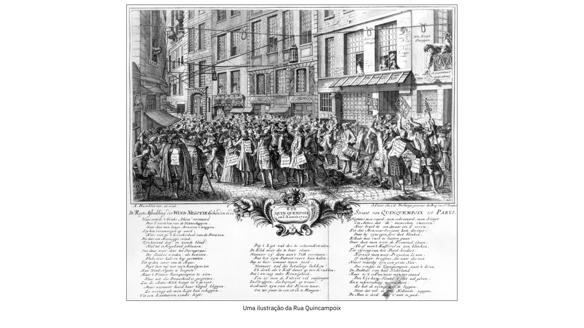

### Quando o terreno se torna "garantia"

Um século mais tarde, a Revolução Francesa inovou com os **assignats**, uma moeda garantida pelos bens confiscados da Igreja. Uma ideia atraente no papel - transformar a terra em garantia monetária - mas ineficaz: a terra não é líquida nem divisível. O resultado: hiperinflação, múltiplas proibições de uso da terra, inflação descontrolada e escassez.

Napoleão, profundamente afetado por este caos, restabeleceu o ouro e a prata como base monetária em 1800, com a criação do Banco de França, garantindo assim o pagamento regular dos seus exércitos. Uma forma pragmática de recuperar a confiança: pagar em moeda forte.

### Os loucos anos 20 e a Grande Depressão de 1929

Saltemos dois séculos. Após a Primeira Guerra Mundial, os governos financiaram o esforço através da inflação e da suspensão do ouro. Na década de 1920, a Reserva Federal americana adoptou uma política monetária demasiado acomodatícia para apoiar a libra esterlina. Resultado: crédito fácil, especulação desenfreada em Wall Street, compra de acções a crédito e o aparecimento de uma bolha imobiliária e bancária.

Quando a máquina se descontrolou, o crash de 1929 foi inevitável: falências bancárias maciças, desemprego recorde e filas de espera nas cozinhas de sopa. Isto deu origem à ideia errada e persistente de que **toda a deflação é má**, quando é preciso distinguir entre deflação por crescimento (saudável) e deflação por dívida (devastadora).

### A Ásia dos anos 90 e o efeito dominó

Na década de 1990, o "milagre asiático" levou o mundo a sonhar. As taxas de juro do Exchange estavam indexadas ao dólar, o crescimento era de 8-10% e os capitais ocidentais afluíam. Tudo corria bem... até que a maré baixou. As falências multiplicaram-se, as moedas desvalorizaram-se em 80% e os investidores ficaram arruinados. O FMI teve de intervir, impondo reformas dolorosas. O mesmo cenário de sempre: capitais abundantes, bolhas alimentadas pelo crédito, depois o colapso.

### 2008 e a era da bolha permanente

A bolha da Internet (2000) foi seguida pela bolha do sector imobiliário de alto risco (subprime). A titularização transformou os empréstimos bancários em produtos financeiros "triplo A", espalhados por todo o mundo. A promessa: eliminar o risco diluindo-o. A realidade: todos os riscos estavam, de facto, correlacionados. Quando o sector imobiliário entrou em colapso, o mesmo aconteceu com todo o sistema bancário mundial.

Resultado: resgates públicos maciços, flexibilização quantitativa e taxas de juro zero. E, com isso, uma corrida desenfreada: cada crise deixa de expurgar os excessos e passa a ser coberta por cada vez mais dívida e impressão de dinheiro. Foi isto que conduziu à situação atual: **a "bolha de tudo "**, em que tudo - acções, imobiliário, arte, criptomoedas, até cartas Pokémon - se inflaciona artificialmente.

### O eterno regresso do dinheiro mágico

De um século para o outro, surge uma constante: assim que uma sociedade acredita que pode criar riqueza com dinheiro em vez de produzir bens reais, surgem as bolhas. De John Law a 2008, da rue Quincampoix a Wall Street, o processo repete-se: euforia, crédito, boom e falência.

E no final, invariavelmente, quando já ninguém confia no papel, as pessoas procuram outra coisa - ouro, terra, portos seguros... ou novas moedas. Ontem Napoleão impôs o metal, hoje há quem veja a Bitcoin como a sucessora.

A história das finanças é um ciclo interminável: imprimir, especular, colapsar. Até à próxima bolha.

## Dinheiro e violência

<chapterId>9486fe64-854f-5e17-86b3-8873baca39a8</chapterId>

:::video id=bd6d0807-2d8f-4637-a0f5-1e990e5c0d0f:::

Esta pequena secção irá revisitar muitos dos acontecimentos a que já assistimos ao longo do curso, resumindo algumas anedotas que considero interessantes.

### Tecnologia e violência

Aqui estão algumas anedotas que provavelmente já falámos no curso. Servem para introduzir uma discussão muito fascinante que tive com Theo sobre uma palestra que ele deu em B-Ondy, que achei muito interessante em termos de como os avanços tecnológicos afectam a relação de violência entre a população e o Estado.

### Dinheiro e coerção estatal

Para introduzir esta secção, vou dar-lhe uma lista breve e não exaustiva, apenas para o lembrar dos eventos que provavelmente já abordámos no curso.

Uma relação que já posso estabelecer com o dinheiro e a violência é o facto de, quando se trata de papel-moeda sem valor, que pode ser impresso ad infinitum, ser frequentemente acompanhado de todo o tipo de regras e ameaças. Podemos já falar dos assignats, onde estava literalmente escrito nas notas que os falsificadores eram ameaçados de morte. É fácil encontrar nos textos jurídicos da época ameaças de morte para quem não aceitasse este famoso papel-moeda.

Para ficar em França, num dos textos jurídicos que consegui obter da época da Revolução, vi que as "ajudas de custo" para o transporte e o funcionamento da guilhotina estavam descritas nas secções relativas à moeda. Achei isto um pouco disparatado.

Também falámos da cunhagem de moedas na China, com o Estado a supervisionar a cunhagem. Vimos numa secção no início do curso que, quando as moedas, algumas das quais menos bonitas, eram deitadas fora, havia consequências legais.

Há também uma anedota sobre um rei em Inglaterra que acabou por cortar as mãos dos cunhadores de moeda se não se comportassem como ele esperava.

Além disso, na China, li sobre a apreensão de cobre dos mosteiros budistas. Numa altura em que o cobre estava a valorizar-se e a desestabilizar a sua economia - que se baseava numa forma de moeda fiduciária que pouco tinha a ver com o valor do metal - recorreram a um local onde havia riqueza e confiscaram o cobre dos mosteiros.

O mesmo se passou com os mosteiros em Inglaterra, durante a Reforma Inglesa. Quando o famoso rei entrou em conflito com o Papa por causa do seu divórcio, havia outra razão por detrás de tudo isto: aproveitou a abolição dos mosteiros para se apoderar da riqueza contida nestas organizações eclesiásticas.

Durante a Revolução Francesa, confiscaram todos os bens da Igreja. Viram-se belas moedas criadas a partir de sinos de igreja derretidos.

Se recuarmos ainda mais, uma das noções mais explícitas de violência económica e de liberdade, de leis liberticidas, é **Diocleciano com a sua casta hereditária diretamente ligada ao facto de os camponeses já não quererem aceitar a moeda desvalorizada**. Queriam deixar o seu trabalho de camponeses e Diocleciano reagiu simplesmente dizendo-lhes: "não podem deixar a vossa terra, nem os vossos filhos". O mesmo aconteceu com os soldados.

Penso que se trata de uma forma de violência bastante explícita. Poderia concluir falando dos Templários ou de um rei francês. Quando os Templários se instalaram em França, imagino que o rei viu o maná da riqueza templária e teve problemas de financiamento do Estado. Processou a Ordem dos Templários, e alguns deles conseguiram ficar com parte do tesouro, o que deu origem a um espetáculo muito interessante nos Estados Unidos ou no Canadá. Não sei quem o produziu, mas chama-se *O Mistério de Oak Island*. É sobre pessoas que pensam que há um tesouro templário enterrado numa ilha no Canadá, nas Maritimes, e que andam a perfurar há anos - talvez até mais de uma década - para fazer uma espécie de poço. Encontraram um poço com muitas galerias e estão à procura de um tesouro enterrado pelos Cavaleiros Templários nesta ilha, que é o tema deste programa de televisão. Saúdo o meu pai, que é um grande fã deste programa.

Eis, portanto, uma lista muito rápida de factos que vimos ao longo deste curso e que, na minha opinião, estabelecem uma ligação com a violência. Deixo-vos com a próxima parte do Theo, que nos vai contar uma história muito interessante sobre as mudanças tecnológicas e o equilíbrio de poder entre a plebe e as autoridades.

Obrigado!

## As consequências económicas da violência organizada

<chapterId>66bd4674-2159-5489-ad4b-ec5e3fb691af</chapterId>

:::video id=c8b063c6-aeb4-4a94-9027-b11d369e71a4:::

### A violência organizada e a evolução do Estado

O historiador Frederic C. Lane propõe uma tese revolucionária: a anatomia do Estado ao longo da história é moldada pelas tecnologias utilizadas para projetar a violência. Partindo do princípio weberiano de que o Estado detém o monopólio da violência legítima, Lane observa que este monopólio - paradoxalmente mais eficiente do que a concorrência neste domínio - evolui de acordo com a relação entre o custo do ataque e o custo da defesa.

Esta análise, retomada pelos autores de "O Indivíduo Soberano" (1997), explica as mutações históricas da organização política: do sistema feudal medieval às cidades-estado do Renascimento, depois às nações-estado industriais e, por fim, aos modernos Estados-providência. Cada transição corresponde a um grande avanço tecnológico no exercício da violência, que ocorre aproximadamente a cada 400-500 anos.

### Equilíbrio medieval

Na Idade Média, a economia agrária era dominante em mais de 90%. O camponês, literalmente enraizado na sua terra, não podia fugir ao senhor e aos seus cavaleiros. A tecnologia militar - armaduras forjadas à mão, anos de treino de espada - era extremamente cara. Esta assimetria favorecia enormemente o ataque em detrimento da defesa.

O produtor agrícola imóvel torna-se cativo do monopolista local da violência. A sua capacidade de extração de impostos atinge novos patamares - embora, paradoxalmente, os impostos medievais continuem a ser modestos em comparação com os 78% de impostos obrigatórios dos tempos modernos. O senhor pode tributar à vontade, porque o camponês não pode resistir nem sair.

### A Renascença Mercantil

O aparecimento do comércio hanseático no Norte e do comércio mediterrânico no Sul transformou a situação. Os comerciantes, principais criadores de valor acrescentado, dispunham de um capital móvel: os seus navios. Necessitavam apenas de milícias marítimas ligeiras, pois os mares eram difíceis de policiar. Acima de tudo, podiam migrar facilmente para um porto vizinho se a tributação se tornasse excessiva.

Esta mobilidade criou uma concorrência fiscal entre as cidades-Estado. Veneza, Génova e Bruges tinham de oferecer o quadro mais liberal possível: contratos fiáveis, moeda de qualidade, seguros, impostos mínimos. Os príncipes tinham de seduzir em vez de coagir. A simetria inverte-se: a defesa (através da fuga) torna-se mais fácil do que o ataque.

### A era industrial

A Revolução Industrial trouxe consigo uma configuração semelhante à do feudalismo. As fábricas, os caminhos-de-ferro e as linhas de montagem representam investimentos maciços e imóveis. Henry Ford não podia deslocalizar as suas fábricas face aos impostos. Os trabalhadores, concentrados nas cidades industriais, sindicalizaram-se para negociar coletivamente em vez de migrarem individualmente.

Surge o "Estado-providência": planificação industrial (Japão, Coreia), proteção militar das infra-estruturas, prestações sociais mínimas para os trabalhadores. A Segunda Guerra Mundial ilustrou esta vulnerabilidade: o bombardeamento das fábricas inimigas tornou-se a estratégia dominante. A concentração do capital físico permitiu a extração maciça de impostos para financiar o Estado-providência.

### A revolução dos microprocessadores

Três inovações tecnológicas estão agora a perturbar estes equilíbrios antigos. O microprocessador está a transformar a guerra: um operador no Nevada pilota um drone no Afeganistão com precisão cirúrgica. A Guerra do Golfo (1991) demonstrou este avanço: o quarto maior exército do mundo (Iraque) foi aniquilado em 45 dias, com menos de 200 mortos do lado da coligação. A superioridade tecnológica tornou impossível o ataque frontal.

A Internet e a criptografia assimétrica estão a revolucionar a criação de valor. Um programador pode trabalhar a partir de qualquer lugar com um MacBook e um Starlink, exportando a sua produção instantânea e gratuitamente. Os nómadas digitais escapam ao cativeiro geográfico, colocando os Estados uns contra os outros de uma forma nunca vista desde o Renascimento.

O Bitcoin representa o culminar desta lógica: uma moeda liberta do Estado, protegida por um escudo criptográfico inviolável. A riqueza torna-se defensável contra qualquer força física. O indivíduo recupera a capacidade de se defender do monopólio do Estado.

### O colapso do modelo de Vestefália

Os Estados-providência ocidentais, concebidos para a era industrial, estão a tornar-se obsoletos. Os criadores de valor - programadores, artistas, financeiros - estão a migrar para Singapura, Dubai ou El Salvador, preferindo menos serviços públicos em troca de impostos mínimos. Gigantes modernos como a Apple e a Tether não precisam de escritórios nem de infra-estruturas físicas.

Esta fuga de cérebros cria uma espiral: menos contribuintes líquidos, serviços públicos degradados, aumento dos impostos sobre os que ficam e partidas aceleradas. Os Estados têm de reduzir radicalmente o seu tamanho ou vão à falência. A fragmentação em jurisdições pequenas e competitivas - um novo modelo de cidades-estado digitais - parece inevitável.

A história ensina-nos que estas transições demoram gerações. Mas a separação da moeda e do Estado no Bitcoin pode acelerar o processo. Os indivíduos votam agora com os seus pés e as suas carteiras criptográficas, redesenhando o mapa do poder global ao longo de linhas que só agora começamos a perceber.

## Uma história muito curta das finanças

<chapterId>1d37fff1-a091-5034-8e71-4af590b8ffce</chapterId>

:::video id=fdfabbc6-e4d8-463a-8522-19176f8fb460:::

Após este relato da história do dinheiro, que nos leva até ao sistema fiduciário, gostaria de explicar, de forma rápida e sucinta, a evolução das finanças que acabou por conduzir ao Estado-providência. Inicialmente, na época romana, havia moedas.

As moedas eram uma tecnologia financeira que permitia ao império pagar aos soldados, expandir-se e efetuar trocas comerciais. Funcionava muito bem, exceto que acabaram por ocorrer demasiadas desvalorizações. A certa altura, quando deixaram de se expandir e de receber os despojos das guerras e da expansão territorial, o sistema entrou em colapso.

### A evolução das tecnologias financeiras

Depois veio a Idade Média, em que houve muito pouca evolução até ao Florim, que trouxe de volta uma moeda estável, e os desenvolvimentos bancários em Itália e Antuérpia, onde foi desenvolvido o conceito de "valor temporal do dinheiro" - por outras palavras, o desconto. Desenvolveram o desconto para criar uma forma de papel-moeda em que era emitida uma "nota promissória", ou seja, uma promessa de que, numa data posterior, seria possível recuperar 100 dólares acrescidos de uma taxa de juro.

Este sistema criou uma tecnologia financeira que permite ao detentor vender a nota antes do fim do prazo, pelo que, se a vender após 4 meses de um prazo de 6 meses, a pessoa pagará um prémio para compensar a perda de rendimento nos 2 meses restantes.

Tratava-se de uma tecnologia financeira desenvolvida na altura em Antuérpia e Amesterdão. Mais tarde, assistiu-se à evolução dos bancos centrais e à noção de prestamista de última instância. Pode argumentar-se que, durante o Banco de Amesterdão, a utilização de moedas no comércio internacional foi abandonada em favor da moeda escritural.

Mais tarde, no século XVIII, em termos de tecnologia financeira, podemos falar de seguros. Há uma anedota que está muito bem contada no livro de Neil Ferguson "The Ascent of Money". A primeira companhia de seguros a nascer chamava-se **Scottish Widowss** e, essencialmente, era o clero que queria desenvolver um seguro para os padres que, por vezes, morriam mais cedo, morriam de repente. Na altura, o clero cuidava das suas mulheres e filhos na Escócia durante um ano. Assim, o clero achou que esse período de um ano talvez fosse demasiado curto. Por isso, **inventaram cálculos actuariais** para calcular literalmente o número de contribuintes necessários para que o sistema cobrisse os seus custos, em função do número de padres que morriam prematuramente.

Desenvolveram cálculos actuariais para dizer: "Ok, bem, cada padre dá-nos este montante. Então, se o padre morrer, bem, o seguro cobrirá os custos para garantir a sobrevivência da sua mulher e dos seus filhos até que sejam auto-suficientes" Foi, portanto, a primeira companhia de seguros chamada "Scottish Widows" que popularizou este sistema e onde ele foi implantado.

### Do seguro privado ao Estado-providência

Assim, os seguros fazem parte da história da tecnologia financeira. E isto leva-me ao conceito de Estado-providência, que é o facto de os seguros privados acabarem por se deparar com um problema, uma noção de otimização, em que dizemos a nós próprios: se oferecermos seguros de saúde a pessoas saudáveis, elas podem ter menos interesse em pagar o prémio porque dizem a si próprias: "Sou saudável, não vou ficar doente". Por outro lado, as pessoas que sabem que estão doentes vão certamente querer subscrever o seguro.

Este sistema cria um desequilíbrio entre o número de pessoas doentes que subscrevem um seguro de doença e o número de pessoas saudáveis que podem subscrever menos seguros. Existe, portanto, uma espécie de desequilíbrio: se calcularmos os números, eles não se equilibram, porque provavelmente não conseguiríamos segurar um número suficiente de pessoas saudáveis para compensar os custos. Em economia, este é o conceito de **risco moral**.

Uma das ideias avançadas é a de tornar o seguro obrigatório. Se todos forem obrigados a contribuir, o sistema será reequilibrado e tanto as pessoas saudáveis como as não saudáveis contribuirão, distribuindo os riscos pela população mais numerosa.

E assim, em muitas partes do mundo, o Estado disse: "Bem, nós tratamos disso". Embora não seja especialista nesta matéria, vejo que este mesmo raciocínio se aplica provavelmente a todo o tipo de outras formas de seguro, como o seguro de desemprego. Há um desejo de simplificar e otimizar, com base na ideia de que será mais simples se houver apenas uma organização para tratar do assunto.

Na minha opinião, isto levou a uma centralização de todos estes conceitos de seguros e, em última análise, ao nascimento do Estado-providência, em que todos estes conceitos financeiros que eram originalmente empresas privadas, iniciativas privadas para satisfazer uma necessidade do mercado de seguros de distribuir o risco entre a população, foram aproveitados pelo Estado por razões que são provavelmente bastante lógicas em relação ao risco moral e ao desejo de otimização.

### Modelos alternativos e reflexões sobre os monopólios estatais

Em última análise, nalguns países como o Canadá, acabamos por ter vários tipos de seguros - seguro de saúde, seguro de desemprego - que são monopólios estatais.

Posso dar-vos um exemplo que conheço. Na Suíça, o sistema é um pouco diferente. Existem mútuas de seguros privadas e hospitais privados, pelo que pode escolher a sua mútua de seguros, pode escolher o seu pacote dentro da sua mútua de seguros. Continuamos a ter serviços relativamente universais, mesmo que uma grande parte deste sistema continue a ser privado.

Por isso, penso que é possível que também seja operado por privados. Mas tudo o que eu queria descrever-lhe, na verdade, não é uma declaração para expressar se um sistema é melhor do que o outro, era antes para lhe explicar que, ao ler sobre a história das finanças, percebi porque é que no Ocidente, particularmente em França, particularmente no Canadá, o Estado quis assumir o controlo destes princípios financeiros.

O que eu queria dizer é que o conceito de seguro é, em primeiro lugar e acima de tudo, uma evolução das finanças e, como os governos são por vezes tão bons a fazer, tentarão assumir o seu controlo, tal como tentaram assumir o controlo do dinheiro, por várias razões. Uma das razões, aliás, é o conceito de prestamista de última instância.

A ideia é que é muito melhor se houver uma grande instituição por detrás que distribua o risco de forma mais alargada. Foi esta a iniciativa inicial subjacente à noção de prestamista de última instância, em que esta instituição podia efetivamente escolher as instituições suficientemente fortes para sobreviver e evitar o seu colapso, emprestando-lhes dinheiro.

Na altura, houve uma verdadeira análise quando este conceito finalmente apareceu pela primeira vez, mas o que acabou por acontecer é que salvámos toda a gente, "too big to fail", aplica-se a quase todos os bancos porque há centralização, e também a todas as grandes empresas. No final, vemos que continua a ser um conceito que é aplicado "à larga" pelo Estado, semelhante ao conceito de seguro que acabei de vos descrever.

Em última análise, o Estado decide que vai tomar conta de tudo, transformando uma tecnologia financeira criada na Escócia para resolver um problema específico no vasto Estado-providência que conhecemos atualmente. Utiliza princípios financeiros actuariais para oferecer serviços à sua população carenciada. No entanto, é consensual que os monopólios decorrentes deste sistema criam todo o tipo de problemas, que se verificam atualmente em países como o Canadá e a França. Felizmente, existem modelos diferentes, como o da Suíça.

Temos simplesmente de perceber que este conceito de Estado-providência emana das finanças. Esta constatação sugere que podemos explorar outras vias para além dos famosos monopólios estatais, e eu até aplicaria este raciocínio ao conceito de bancos centrais como prestamistas de última instância - mas isso é assunto para outra altura.

# Secção final

<partId>9bada469-7ef0-511a-9eaa-f8eb66d5906f</partId>

## Avaliar este curso

<chapterId>a9494e2b-8a4d-5811-8a7b-b4a91fb22778</chapterId>

<isCourseReview>true</isCourseReview>

## Conclusão

<chapterId>1094e793-b4c6-5782-aa4a-71cde00ce7c0</chapterId>

<isCourseConclusion>true</isCourseConclusion>