# Gusubira inyuma mu mateka y'amahera

Ik'icirwa kiryohera amatwi kizodutuma dutohoza ukuntu amahera yateye imbere mu buryo  butangaje kuva mubisekuru vyakera cane gushika mu buryo bw’amahera dufise ubu. Tuzojabuka ibihe, kuva mu gihe c’amabuye y’agaciro gushika mu bihe vya none, tubone ingene amahera yahinduwe kandi yahinduwe nimico yibihugu vyari bikomeye kwisi. Kuva kuburyo bwamafaranga bwa proto-monnaie mésopotamienne gushika ku mafaranga yubuhinga bwanone cryptomonnaies, biciye kub'ibiceri lydiennes, florin de la Renaissance, n’ukuza kw’amabanki makuru - ik'icirwa gitanga iciyumviro gitomoye kuri imwe mu nkingi z’ishimikiro mukibano cacu.

+++
# Intangamarara

<partId>59878a67-8a1d-5d6b-af41-5b847c14363c</partId>

## Intangamarara y'amateka y'amahera

<chapterId>ca53597e-be9a-5261-a55f-11fac8504a68</chapterId>

:::video id=08ff35ca-8a40-4286-abaf-71283faf6e78:::

Murakaza muri iri ik'icirwa c'amateka y'amahera. Nk’uko umutwe w’ikiganiro ubivuga, turaza gutohoza ingene amafaranga yagiye aratera imbere mu mateka. Kuva mu gihe ca kera gose gushika mugihe ca none, turaza kuraba inganji n’ibihugu bikomakomeye isi yigeze ibona.

Ariko rero, ik'icirwa ntikigarukira gusa ku rutonde rusanzwe rw’amatariki canke ibintu vyabaye muri kahise. Ahubwo, intumbero yacu nyayo ni ugutanga ugutahura kwimbitse kw’ivyiyumviro nyamukuru bijanye nukuvuka kw’amahera, muri make kubwoko bw'amahera.

### Ivyiyumviro vy'ishimikiro vyo kwigako

Tugiye kuvuga kuvyamavuka: ukuvuka kw'amafaranga ubwayo, ubuhinga bw'amahera, bw'amabanki, bw'amahera y'impapuro, bw'amabanki makuru, ubwa nyuma,tuvuge ukuvuka kw'ubuhinga bw'amahera afatiye kukwizera agaciro "fiat" vyomugihe ca none.

Turatangura urugendo rwacu hamwe na proto-monnaies tuvuga kandi k’amahera yubuhinga bwogusaba ama deni "monnaie-dette" n’ubuhinga bwokuraba agaciro  Mésopotamie , hamwe n’izindi nzira nk’inkwano n’ibiciro vyamaraso vyo mu mibano ya kera cane. Turabona kandi ingene uburyo nyabwo bwo gukoresha amahera bwari busanzweho muri Misiri ya kera, imbere cane ya Moyen Empire.

Turaheza tuje ku kukuvuka kw’ibiceri vya mbere "Lydie", igihe nyamukuru akenshi kibonwa ko ari intango nyakuri y’amahera nk’uko ibitabu vy’ubutunzi bivyerekana. Turaza gusuzuma ingene ivyo biceri vyashoboye gukwiragira kubera aba Perses, Alexandre le Grand, hanyuma i Roma, ubwanyuma na nyuma ubwo buhinga burashinga imizi , buraganza haragera naho busenyuka.

Tuvuye ng'aho, dufise ivyo twize vyose, tuzofata umwanya ukwiye wo kwiyumvira hamwe insobanuro y'amahera, tukarenga ivyiyumviro vy'abantu nk'ibi ngo "amahera yama ari ideni(la monnaie est toujours une dette)" canke "amahera yama ari igicuruzwa". Mu vy’ukuri, amahera ni ikintu ciza kandi nuburyo bwimibereho mumibano. Cane cane tuzovuga ku ciyumviro c’amahera y’imbere y’igihe no kugerageza guhuza inyigisho zitandukanye zisigura ukuntu amahera yavutse.

### Ibihe vy'ingenzi n'ubuhinga bushasha bw'amahera

Turaheza tugahindukira tuja mu biringo vyama kuba yabayeho, vyaranzwe n’ukudashikama neza kw’amahera, naho vyari ukwo, vyatumye habaho ibintu bishasha bitangaje nka penny anglais, ryakoreshwa mu guha ibiturire abatera ibihugu bo muri Danimarke, be nuburyo bwamahera bwitwa la livre de Charlemagne, ivyo bikaba bikiriho n’ubu ku noti zimwezimwe zo muri iki gihe.

Turaza kandi kuraba ingene intambara za croisades zabonye ukuvuka kwa mbere kw’uburyo  bwo kohereza amahera kure. Hanyuma ni igihe co kuraba ingaruka z’i Florin, amafaranga yaherekejwe n’Ivugurura, n’ukuza kw’amabuye y’agaciro avuye muri Amerika, vyagize ingaruka zikomeye ku bici- ro vy’i Buraya.

Turaza kuraba mu buryo burambuye ukuntu amahera y’impapuro n’amabanki makuru vyaje, kuruhande turaba n’amateka y’amagume k’ubutunzi be n’ingaruka zazo zikunda kuba zihambaye.

Ubwa nyuma, tuzogereranya n’uburyo bwacu bw’amahera bwo muri iki gihe, dusuzume ingaruka zabwo, dukurikirane amateka y’amahera kugira ngo dutahure neza ingene twashitse ku bijanye n’imibereho myiza y’ubu.

Kandi, nk’inyongera, turaza kuraba kandi amahuzo menshi aryoshe cane y’inkomoko ajanye n’amahera, abandanya agira ico akoze ku buzima bwacu bwa misi yose mu ndimi zitandukanye.

### Inyubako yicirwa

Iryo shure rigizwe n’ibice bitatu bihambaye.

Igice ca mbere kiraba ukuntu amahera yagiye aravuka, igice ca kabiri kiraba ukuntu amahera yavutse yagiye arivyakiranya, igice ca gatatu kigaragaza ingene inzego za Leta canke Leta zagenda zifata ububasha ku mahera, bishikana ku nzira ya fiat iriho ubu.

Murakoze kandi kumwihwezo!

# Uguseruka kw'uguhanahana

<partId>da5e4981-9ea5-5208-beab-3b75c9043632</partId>

## Kuva ku muntu w'i Ostraliya gushika ku muntu wo muri iki gihe

<chapterId>34a773aa-f2d3-5c26-8be4-f2cd79ed6fbc</chapterId>

:::video id=4f333013-4b2a-42ab-8761-593fafc971ca:::

### Kubera iki gutangurira mu gihe ca Néolithique 

Ni kuki wosubira gushika mu gihe ca Néolithique  kugira ngo tuvuge ivy’amahera? Inyishu iroroshe: ntidushobora gutahura neza ukuntu amahera yabayeho tutaravye kandi ukuntu imibereho ubwayo imeze. Kugira ngo dutahure igituma uburyo bwa mbere bwo gukoresha amahera bwabayeho, turakeneye gutahura icatumye imigwi yabantu bakera babeshwaho nuruhigi bashoboye kuguma bakaba ahantu hamwe.

Umuryango udafise urugabanganywe rw’ibikorwa, atashimikiro, aho umuntu wese afise inshingano yo kwikorerw ivyo akeneye,bisigurako ata mahera akenera. Na vyo nyene, umuryango w’abarimyi ukora uburimyi bwo kwibeshaho gusa, aho umuntu wese arima kugiti ciwe, nturashobora kwumva ko ukeneye umuhuza w’uguhanahana amakuru kw’isi yose.

### akuba ahantu hamwe na hamwe n'ingaruka zavyo

Ni co gituma mbona ko bishimishije gutangura ubushakashatsi bwacu mu gihe c’amabuye y’agaciro. Turabona ingene kubana hamwe kwabantu buhoro buhoro kwatumye habaho imihana, hanyuma ibisagara, amaherezo hakaba ibihugu bikoma komeye. Ukwo kuba hamwe n’uguhingura ibifungurwa vy’amasaranganya ni vyo vyatumye ubuhinga bwo gukora bushoboka, bikaba vyatumye haba ubutaka bwiza bwari buhambaye mu guseruka no gutera imbere kw’ivyiyumviro vya mbere vy’amahera.

Nk’uko nyene imigenderanire y’abantu ituma habaho ururimi, turashobora kubona ko amahera aboneka mu buryo busanzwe, canke ataboneka (nk’uko vyagendeye Abanya-Inca n’Abaspartan), mu gihe c’ugushinga no gutunganya amateka. N’uko mbona, ukuboneka canke ukutaboneka kw’amahera birafitaniye isano n’uburyo bwo gutunganya imibano n’ubutunzi bw’igihugu cose.

### Urutonde rw'ibihe vy'iterambere ry'abantu

Ariko rero, reka tubanze turabe ivy’akahise mbere vyagutse kuruta.

Cokimwe n’ikiganiro cose ca mbere, ngiye gukora ibihushanye n’ivyo navuze mu ntangamarara y’inyigisho maze mbahe urutonde rw’amatariki n’ibintu vyabaye mu mateka bikurikirana. Iciyumviro kiri aha ni ugushira ukuza kw’amahera mu gihe c’amateka yayo, mu bijanye n’ibindi bintu abantu bateye imbere nk’uguteka ibifungurwa, uruziga, ugutunga ibinyampeke bimwebimwe n’ibikoko, kwubaka amapiramide n’ugushinga ibisagara vya mbere.

Rero, reka turabe ingene abantu bateye imbere kuva mu bihe vy’imbere y’amateka gushika ubu.

Incamake y’iterambere ry’umuntu kuva mu gihe ca Australopithecus gushika mu gihe c’umuntu wa none, hakurikijwe iterambere ry’ubuhinga n’uguhinduka kw’abantu gushika mu gihe c’amabuye mashasha.

### Amateka y'abantu

- Haciye imyaka miliyoni 3** - Kuboneka kw'*Australopithecus*.
- Haciye imyaka miliyoni 2** - Abanyagihugu batangura kuva muri Afirika.
- Haciye imyaka miliyoni 1,6** - Abanyagihugu bashika mu Buraya bwo mu bumanuko no muri Aziya.
- Haciye imyaka miliyoni 1** - Ibimenyetso vya mbere vy’uguteka mu rugo n’umuriro (amagufa n’ibisigarira vy’ibimera vyashaje mu mwobo wa Wonderwerk, muri Afirika y’Epfo).
- Nk’imyaka 400.000 imbere ya Kristu** - Abanya Neanderthal baba mu Buraya no muri Aziya.
- Nk’imyaka 300.000 imbere ya Kristu** - Kugaragara kwa Homo sapiens*.
- Haciye imyaka 80.000** - *Homo sapiens* itangura kwimukira mu mihingo yose y'isi.
- Haciye imyaka 73.000** - Amasenga ya Blombos muri Afirika y’Epfo (ubuhinga bwa kera cane buzwi).
- Haciye imyaka 50.000** - *Homo sapiens* yashitse i Buraya.
- Haciye imyaka 30.000** - Ibishushanyo vyo mu mwonga bivuye mwi senga rya Chauvet mu Bufaransa.
- Haciye imyaka 15.000** - Ibishushanyo vyo mu mwobo wa Lascaux mu Bufaransa no mu bitandara vyo muri Australiya.
- Nk’umwaka wa 9000 imbere ya Kristu** - Ugutunga sayiri mu gice c’ukwezi c’uburumbuke.
- Nk’umwaka wa 9000 imbere ya Kristu** - Uguhinga ibigori muri Mexique.
- Nk’umwaka wa 8000 imbere ya Kristu** - Ugutunga impene n’intama mu gice c’ukwezi c’uburumbuke.
- Nko mu mwaka w’7250 imbere ya Kristu** - Ain Ghazal (Yorodani) ihishura umuhana w’abantu amajana makeyi.
- Nk’umwaka w’7000 imbere ya Kristu** - Çatalhöyük (Turikiya) ifise abantu bashika 8.000.
- Nko mu mwaka w’6500 imbere ya Kristu** - Ubuzima bwo kubana hamwe butanguye mu Bugiriki.
- Haciye imyaka 6000** - Intango y’ukuvomeza uruzi muri Misiri na Mezopotamiya.
- Nk'umwaka wa 5000 imbere ya Kristu** - Kugaragara kw'ihuriro ry'uburimyi "bashiki batatu" (ibigori, ibitoke, ibitoke).
- Nk’umwaka wa 4000 imbere ya Kristu** - Ugutunga ingamiya muri Aziya yo hagati. (Umuryango w’ingamiya wavukiye muri Amerika y’Uburaruko mu gihe c’i Eocene, ubu hakaba haciye imyaka imiliyoni 45. Izo ngamiya zari guca zija muri Aziya ziciye mu nzira y’ubutaka bukeyi bwahuza iyo migabane ibiri ico gihe mu Kiyaga ca Bering. Ikindi gice c’uwo muryango cari kuja muri Amerika y’Epfo, aho abakomoka kuri zo bakiri n’ubu, al: l viñaspacas, l).
- Nko mu myaka ya 3500-3000 imbere ya Kristu** - Abanya botai batangura gutunga  amafarasi.
- Nk’intango y’Ikinjana c’Umuringa** - Aba Sumériens bari bamaze guhingura uruziga n’ubwato bugendera ku mazi, maze bavumbura ibiharuro, astronomie, n’uburyo bwa mbere bwo kwandika.
- Nko mu mwaka w’2800 imbere ya Kristu** - Uruk, igihe cari ku rwego rwo hejuru, cari gifise abantu bashika 80.000.
- 2600-2200 BC** - Ibimenyetso vya mbere vy’iterambere ry’ibisagara mw’isi y’Abagiriki. Ukwagura ibiterwa vyo mu kiyaga Mediterane (ingano, imizabibu, imyelayo).
- 2560 BC** - Ubwubatsi bwa Piramide nini ya Giza.
- Nk’umwaka wa 1500 imbere ya Kristu** - Ubuhinga bwa Minoan.
- Nk’umwaka wa 1300 imbere ya Kristu** - Ubuhinga bwa Micene.
- Nko mu mwaka w’1250 gushika mu mwaka w’1150 imbere ya Kristu** - Gusenyuka kw’imico yo mugihe ca âge du Bronze.
- Ikinyejana ca mbere inyuma ya Kristu** - Berbères bo muri Afirika y’Uburaruko batangura gutunga ingamiya.

Rero, ng’iyi iyi nsiguro y’amateka kugira ngo iduhe iciyumviro ku bijanye n’uguseruka kw’ubuhinga bumwe bumwe, ugutunganya ibikoko bimwebimwe, n’imico kama, kugira ngo tubishire mu rwego rw’uguseruka kw’inyandiko n’amahera, ivyo bikaba ari vyo bizoba ikiganiro c’igice cacu gikurikira.

## Kuva mugihe cabahigi gushika ku Murimyi: Umuseke w'Ubutekerezi

<chapterId>ea950b6e-9eb7-553d-8f04-0eb042bb1f5a</chapterId>

:::video id=4b49a376-f6f4-42a0-86fa-264997a079f0:::

### Guhindukira uva kubahigi bakera uja kubantu bari hamwe.

Muri iki gice, turaza kuvuga ku bijanye n’uguhinduka kuva kubuhigi, tukaja mu kurima kugira abantu babebeho, ubuhinga n’ubudandaji. Narumvise ko ari ngirakamaro gusigura iyo mpinduka y’ubuzima bwo kuguma hamwe n’uburimyi, kugira ngo ntahure ingene ibisagara vya mbere vyubatswe, ivyo bikaba vyatumye amaherezo habaho irema n’uguseruka kw’uburyo bumwe bumwe bw’amahera mu bihe vya kera.

Iki gice ni igice c’inyigisho iri ku rubuga rwa The Great Courses yitwa mucongereza Ancient Mesopotamia,Life in the Cradle of Civilization, yatanzwe na Porofeseri Amanda Podany wo muri Kaminuza ya Leta ya California, i Ponoma.

### Ibintu bitemerwa igihe uburimyi bwatangura

Ubuhinzi bwa kera bwabonetse ubu hakaba haciye nk’imyaka 10.500 mu Buseruko bwisi, hafi y’uburaruko bushira uburengero bwa Siriya no mu bumanuko bwa Turukiya. Muri iki gihe, imigwi y’abahigi n’abakoranirizi bo mugihe gishasha ntiyihutira gufata uburimyi, kandi birashoboka ko ari ko vyari vyifashe mu kiringo ca Néolithique.

**Imihana ya mbere yubatswe neza imbere y’uko ibiterwa n’ibikoko bihindurwa ivy’inzu.** Abantu ntibatuye kuko uburimyi bwabarekura; ahubwo ni bo babanza gutura kandi haciye igihe kirekire cane, haciye nk’imyaka 3.000, ni ho batangura kurima.

Guhigira no kwegeranya gusa vyagenda neza cane, rero ntibakeneye gutera imbuto kugira ngo bashobore kuronka ivyo barya. Muri iki gihe, abahigi n’abakoranirizi barafise umwanya mwinshi cane wo kwiruhutsa kuruta abarimyi ba mbere, bakoresha ubuhinga bwa kera cane.

Rero, ico turiko turavuga hano ni uko abantu bo mu gihe ca kera b’abahigi n’abakoranirizi bafise umwanya mwinshi wo kwiruhukira kuruta uko dutahura ku barimyi ba mbere bo mu gihe c’amabuye y’agaciro, bari bafise, nyuma ya vyose, ubuhinga bwo kurima busanzwe. Abo bantu barakora cane kugira ngo bashobore kuronka ivyo barya kuruta imiryango yacu ya kera yo muri iki gihe, ibaho mu guhigira no mu kwegeranya.

Ivyigwa vyerekeye amagufa vyerekana kandi ko abarimyi ba mbere bari batoyi kandi batagira inkomezi nyinshi kuruta abahigi-abakoranirizi babanjirije. Ivyo abarimyi barya vyari bifise uburenganzira buke kuruta ivy’abahigi n’abakoranirizi. Barya umukate mwinshi cane, ariko inyama nke cane, kandi bari bafise n’amenyo make kubera ibice vy’urutare vyakoreshwa mu guhingura ifarini. Iyo bakora ifu n’ibitandara, yaca igira ibice.

Abakurikiza ivy'ukurya vya "keto" bazovyemera: kurya umukate cane birashoboka ko atari vyiza kuruta kurya inyama.

### Ivyiyumviro vyu kwemera uburimyi

Hakurikijwe ivyo bibazo vyose, ni nde yari guhitamwo kuba umurimyi ico gihe? Ego cane, ivyiyumviro bimwebimwe bizwi cane bivuga ko abantu bahatirijwe kwemera uburimyi kandi ko mu vy’ukuri atari uguhitamwo yabo. Mbere no ku bijanye n’intete zo mw’ishamba, hari ingorane ikomeye. Intete nyinshi cane ntizashobora gutwarwa mu buryo bworoshe. Vyari ngombwa ko bibikwa ahantu kanaka. Intete zimaze kubikwa, vyari bibereye ko umuntu aguma hafi. Rero, warimye intete zo mw’ishamba, ivyo bikaba bitari ngombwa ko ari uburimyi, iyo uzirimye cane, ubwirizwa kuzibika ahantu, bikaba bigoye kuzitwara. Ivyo birashoboka ko ari vyo vyatumye haba ibice vya mbere vy’ukwicara gusa. Birashoboka neza ko ari yo mpamvu ya mbere yatumye abantu bibera ahantu kanaka. Iyo aho hantu hari ivyo kurya umwaka wose, ntivyari bikenewe ko umuntu akurikira imikuku canke ngo akore ingendo ubudasiba.

Mu muco w’Aba natoufienne, abantu bashika ijana babana mu bisagara vy’amazu azunguruka. Iciyumviro gikundwa cane gisigura intango y’uburimyi ni uko iryo hinduka ryatumwe n’ihinduka ry’ikirere. Haciye nk’imyaka 11.000, ikirere co mu Buseruko bwisi carakanye cane kandi kikaba cumye kuruta uko cari imbere. Ibimera n’ibikoko vyari vyinshi mbere vyaciye biba bike cane. Abanyagihugu bari guca batangura kurima ibiterwa bari bishingiyeko, canke bakagira ibikoko bitobito kugira ngo bavyorore kandi babironkemwo inyungu, nk’intama, impene n’inka, ivyo bikaba vyari kwigurisha neza muri ukwo kworora. Ivyo vyari kuba ari ibintu bigenda buhoro buhoro cane. Rero, nta mwanya nyawo bose babaye abarimyi barora ibikoko.

Ikindi ciyumviro ni uko imihana ubwayo ari yo yatumye ingorane itorwa umuti n’ukorora ibikoko. Guhiga no kwegeranya ibifungurwa cane vyari gutuma bihungabanya ibidukikije. Dukurikije iciyumviro kimwe, Aba Natoufiens bari bararwiriranye cane ku buryo  batashobora kubaho neza mukarere bari babayemwo. Gutyo, ibishanga be n’ibibanza vyarimwamwo ibiterwa vy’ibimera bishobora kuba bitagira umwimbu uhagije ku bantu bo muri ico gisagara. Ivyo bidukikije vyari hafi ntivyari bishobora guha umuntu wese ivyo akeneye. Baca batangura kurima aho hantu nyene, bongera ivyo barya.

## Ubucuruzi bwo mu gihe ca néolithique

<chapterId>8e495224-6d55-58f6-a9dc-ac2814281cfa</chapterId>

:::video id=d04245af-e416-48b1-8157-d569207a32c4:::

### Ihinduka ry'igihe ca Paléolithique n'igihe ca Néolithique

Igihe ca néolithique ni ikimenyetso c’ugusenyuka kw’ishimikiro mu mateka y’abantu, kikaba gitandukanye cane n’imibano yo mugihe ca paléolithiques yabanjirije. Mu gihe ca paléolithique, abantu bo mu Buraya bari bari batandukanije cane: abantu 7.000 gusa ni bo baba ku mugabane wose ubu hakaba haciye imyaka 20.000, bari batunganijwe mu migwi mitoyi y’abimukira y’abantu 20 gushika ku 50 bakurikira imikuku minini y’abimukira ku ntambwe ndende cane.

Ubushuhe bwo kw’isi yose mu mpera z’Ikinjana c’Ibarafu bwahinduye cane iyo ntunganyo y’imibano. Kuza kw’amashamba kwasubiriye ibikoko vyimuka n’ibikoko vy’amashamba vyicaye cane, ivyo bikaba vyatumye imigwi y’abantu iba ibikoko bicaye bimwe bimwe. Iryo hinduka ryaherekejwe n’iterambere ritangaje ry’abantu: kuva ku bantu bo mu Buraya bagereranywa ko bari hagati y’ibihumbi 10 n’ibihumbi 50 mu mpera z’Ikinjana ca Paleolitique, mu gihe c’Ikinjana ca Neolitique co Hagati n’ica nyuma, abantu bari hagati y’imiliyoni 1 na 5.

### Ivumburwa ry'akazi n'itunga

Ukwo kuguma hamwe kwabantu buhorobuhoro vyatumye haba amahinduka akomeye cane mu kibano. **Uburimyi bw’igihe ca néolithique bwatumye habaho iciyumviro c’ubu c’akazi**: kwifatanya n’ubutaka kanaka vyasobanura kwitwararika umutungo w’umuntu, kubika ivyamwa vy’ibikorwa vyiwe no gutegura umwimbu wo muri kazoza. Ubu bucuti bushasha n’igihe - gusubiramwo ikoreshwa ry’ubu kugira ngo umuntu aronke inyungu muri kazoza - bwahinduye cane imitunganirize y’imibano.

Ububumvyi ni ikigereranyo ciza cane c’iryo terambere: mu ntango bwavutse kugira ngo bibike ibinyampeke n’imbuto, burashingira intahe ubwo bushobozi bushasha bwo gutegura ivyo umuntu akeneye uko igihe kigenda kirarenga. Abahinga mu vy’amateka bamwebamwe mbere biyumvira yuko igihe c’amabuye y’agaciro kitari gushoboka iyo hataba izo nzira zo kubika ibintu.

**Itunga ry’abantu ku giti cabo ryaje nk’inzego nyamukuru** z’ayo mashirahamwe mashasha. Naho umutungo w’umuntu ku giti ciwe wari usanzweho mu gihe paléolithique (amacumu yo guhigira umuntu ku giti ciwe), mu gihe ca néolithique wararonse urugero rw’ubutaka rutari bwigere rubaho. Ukwo kwigarurira ubutaka kwatumye haba intambara za mbere hagati y’abantu zanditswe n’abashakashatsi, bikaba vyatumye habaho igikorwa co gucungera umutekano w’intara.

### Ubuhinga bwihariye bw'ukugabangana akazi

Uburimyi bwatuma bishoboka kugaburira abantu benshi, mu gihe abantu bamwebamwe bashobora gukora ibindi bikorwa bitanga umwimbu. Ubwo buhinga bwariko burakura - abarimyi, ababumvyi, abahinguzi b’ibintu, abacungera umutekano - bwashizeho umushinge w’ukugabanganwa ibikorwa n’ubukuru bw’imibano.

Ibisigarira vy’ivyacukuwe birashingira intahe iyo nzira y’ugukura: uguhamba kwava ku mva z’abantu bose zija ku mva zitandukanye z’abantu ku giti cabo, kandi inzu zavuye ku guhuza ubwubatsi zija ku nyubakwa zigaragaza imibereho itandukanye mu kibano. Ibintu vyo mu maziko - ibisharizo, ibikoresho vyihariye, ibikoresho vy’ububiko - vyerekana ko havutse iciyumviro c’ubutunzi n’icubahiro mu kibano.

### Ukuvuka kwuguhana ibintu vya kure na kure

Isesengura ry’ivya kera ryerekana uburyo butangaje bwo guhanahana amakuru muri ico gihe. Ibikoresho nk’amabuye y’agaciro, urutare rw’icatsi kibisi (dolerite, jadeite), ibikoko vyo mu mazi be n’amabuye y’agaciro yitwa bitume vyabonetse ku bilometero amajana n’amajana uvuye aho vyari bikuwe. Ivyuma vy’amabuye vy’icatsi kibisi , vyari bihambaye mu gutema amashamba no mu kwubaka imihana ya kera, vyagendagenda mu Buraya bwose bwo mu gihe ca néolithique.

Ivyo biganiro vyerekeye ibikoresho vya mbere n’ibintu bimaze gukorwa, bikaba vyerekana ikintu gishimishije mubuhinga bw'ugukora ubugenegene. Agaciro gahabwa gashiramwo ukuntu ivyo bintu bidakunze kuboneka be n’ubuhinga busabwa kugira ngo bihingurwe.

Itunganywa ry'Uburyo bwo guhanahana amakuru buratandukanye bivanye n’urugero rufatiweko. **Mu kibano**, abahinga mu vy’imico kama barashigikira iciyumviro c’ubutunzi bwo kugurizanya , hamwe n'uburyo bwo gutanga inguzanyo butamenyerewe bushingiye ku kwizigirana hagati y’abantu. Muri iyo migwi ibujijwe, "umubare wa Dunbar" (abantu 150 kugira ngo bagumane ubucuti butaziguye bw'ukwizigirana) urashoboza guhinduranya amafaranga ata buryo bw'isoko.

Hari ubwoko bwinshi bw’uguhinduranya:

- **Uguhinduranya ataco bimaze**: guhinduranya ivyiza n'ivyiza ubwo nyene
- **Uguhinduranya kwagutse**: guhindura ibintu ku bikorwa canke amasezerano
- **Uguhinduranya kwasubitswe**: umwenda hagati y'abantu n'ukwishura

**Hagati y’imiryango itandukanye**, ukutagira imigenderanire y’ukwizigirana kwatumye habaho uguhanahana amakuru mu buryo busanzwe. Ibintu bimwebimwe vyagenda biraronka ikibanza kidasanzwe biciye ku bushobozi bwavyo bwo gusabwa n’imigwi y’amahanga, ivyo bikaba vyari bigereranya uburyo bwa mbere bw’amahera y’intango.

[Ishure ry’ubutunzi ryo muri Otirishiya](https://planb.academy/resources/glossary/austrian-school) risobanura iyo mpinduka nk’uguseruka kw’ibintu vy’agaciro vy’uguhinduranya. Ivyuma vy’ibikoko, vyaremejwe n’abacukuzi kuva mu gihe c’amabuye y’agaciro, biragaragaza ico kintu: biboneka kure y’aho vyakomotse (ibikoko vyo mu kiyaga Mediterane mu burengero bw’Ubufaransa, ibikoko vyo mu bihugu vyo mu Burengero mu bindi bibanza), birashingira intahe ko abantu bose bemera agaciro kavyo ko guhinduranya.

Ivyo bicuruzwa bitandukanywa n’**ubushobozi bwavyo bwo gusabwa n’abandi**, akaranga k’ingenzi kagereranya igikorwa c’amahera. Naho batashitse ku guhuza amafaranga y’amateka, ni intambwe za mbere zo gutuma habaho uburyo bwo guhindura amafaranga butagira umuntu, ikintu gikenewe kugira ngo habeho imibano igoye irenze inzego z’imiryango.

Igihe c’amabuye y’agaciro gishasha rero ni co cashizeho imishinge y’ubutunzi bwa none: ukwihariza kw’abakozi, ivy’abantu ku giti cabo, ukwirundanira ubutunzi, ugushinga ubukuru mu kibano, n’uguseruka kw’uburyo buteye imbere bwo guhanahana amakuru burengeye imigenderanire y’ubuvukanyi n’ababanyi bataziguye.

## Ugushingwa kw'ibisagara vya mbere n'ivuka ry'inyandiko .

<chapterId>d6b799c2-8bf1-11f0-9c54-1b9f4f4c7011</chapterId>

:::video id=3ca18105-9856-4ceb-925c-c9e9215af21b:::

### Kuvomera n'ivuka ry'ibisagara bininibinini .

Muri iki gice, tuzovuga ingene ibisagara bikomeye vya mbere vyo muri iki gice c’amateka vyabayeho, kandi biragaragara ko tuzovuga ku mpamvu zatumye inyandiko ziza muri Mezopotamiya.

Haciye nk’imyaka 6.000, mu biyaya vyiza vyo muri Misiri no muri Mezopotamiya, imiryango y’abantu yaratanguye gukoresha inzuzi mu gutegura uburyo bwo bwokuvomera. Ukwo kumenya gukoresha neza amazi kwatumye haba uburimyi bwinshi, ivyo bikaba vyatumye havuka ibisagara bininibinini nk’igisagara kizwi cane citwa Uruk, kiri mu bumanuko bwa Iraki y’ubu.

Nko mu mwaka wa 3500 imbere ya Kristu, Uruk ni co cabaye igisagara kinini kuruta ibindi vyose kw'isi, gishika ku rwego rwo hejuru nko mu mwaka wa 2800 imbere ya Kristu, gifise abantu bashika 80.000. Muri ico gihe, hari ibintu bibiri bihambaye bishasha vyagaragaje cane imibereho yaba sumériens: ukuza kw’intwaro itunganijwe ishobora gutwara Leta nyakuri, hamwe nivuka ryiterambere ryokwandika.

### ivuka ryinyandiko rya cunéiforme

Ukwandika kwavukiye muri iki gisagara nko mu mwaka w’3000 imbere ya Kristu, bitewe hanini nivyipfuzo y'ivyubutunzi.Kubera ko ikibano cariko kirarushiriza kugorana be n’uguhinduranya, abarongozi b’urusengero n’ikirimba bari bakeneye igikoresho c'izewe co kwandika neza ibikorwa vy’ubutunzi, nk’ugushikana ibikoresho, ugurungika imbere mu gihugu be n’ibintu vyariho.

Ubwo buryo bwateguwe bwitwa "cunéiforme", buva mu kilatini "cuneus" bisobanura "urusenga", mu kwerekeza ku gukoresha urupapuro rufise ishusho y'urusenga kugira ngo umuntu acapwe ibimenyetso ku bipande vy'ibumba ribomvye.

Aha musi, urashobora kubona ikigura gisubiwemwo canditseko inyandiko ya cunéiforme, Kugira ngo bandike kuri ivyo bisate, nizera ko bakoresheje ubwoko bw’igikoresho co kwandikako gikozwe mu marenga, kugira ngo bandike mw'iryo bumba ribomvye izo nyandiko, kugira bandike kwico kigura.

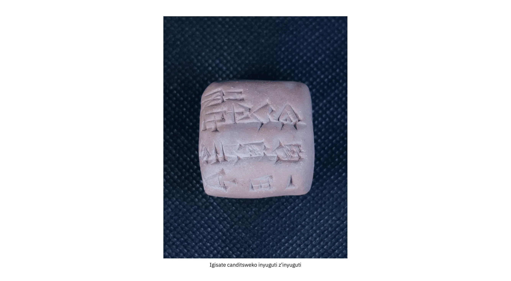

Ndafise kandi ico nibaza ko ari igisate(ikigura) c’ukuri c’ikisumeri caba sumériens cari gifise akajambo gatoyi k’inyandiko za cuneiforme hagati. Kuri iki gipande(ikigura), hariho amasinyatire yakozwe mukuzinga umuzingo, nzokwereka inyuma.

Ivyo bimenyetso bishushanyeko abantu nivyo vyari umukono(sinyatire) w'ico gihe iyo uriko usinya ikete canke amasezerano kubera abantu benshi batashobora kwandika, kuko abanditsi b’abahinga nibo bonyene bategera ubwo buhinga.

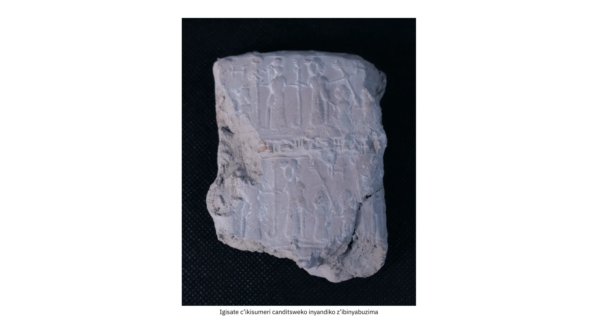

aha, ndafise iyo cylindre ari mubisanzwe ibuye bandikako ibishushanyo hanyuma bakazinga umuzingo wiyo cylindre n'umukono(signature), izwi mu congereza nka cylinder seal, kugira ngo bashireko umukono ku makete. Yari uburyo bwo gusobanura neza amazina y’abanditsi, canke kwerekana ko zanditswe mw’izina ryabo.

Abanditsi bo muri ico gihe rero barakoresha ng’aho urupapuro rufise ishusho y’urusenga kugira ngo bacape ibimenyetso kugipande(ikigura) kibovye.

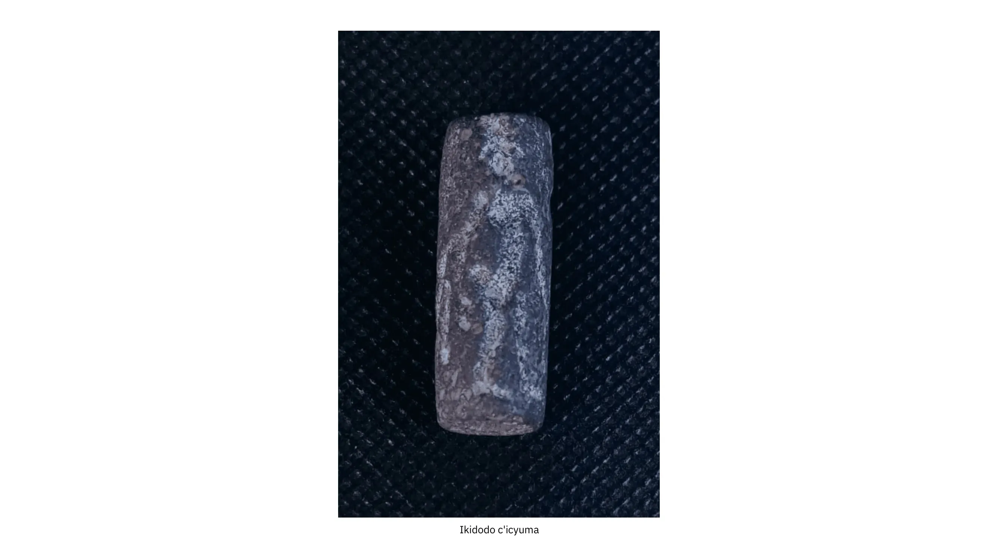

Inyandiko za cunéiforme ntiyari ururimi, ahubwo zari zigereranya uburyo bwo kwandika indimi zivugwa. Mu congereza, twovuga ngo "kwandika ni ururimi rwanditswe", hanyuma tukavuga ngo "cuneiforme ni inyandiko, si ururimi". Rero, mu gifaransa, twovuga ko cuneiforme atari ururimi, ahubwo ni uburyo bwo gukora kode y’ururimi.

### Ugutera imbere n'ingene inyandiko ikoreshwa .

Mu binjana vya mbere vy’ukubaho kwayo, iyo nyandiko yagumye ifise imbibe itarenga, ahanini ikaba yari ikoreshwa nk’uburyo bwo kwibuka igitigiri c’ibintu, urutonde rw’ibintu vy’uburimyi be n’ibikoresho. Buhoro buhoro ni ho gusa ryashobora **guhindura amazina mu buryo bw’amajwi** n’amajambo yuzuye.

Mu ntango, amazina ntiyashobora guserurwa mu nyandiko z’inyandiko za cunéiforme i kubera ko ahanini zagereranya ibintu n’ibintu vy’ukuri, nk’inka canke ingano, vyerekanywe nk’ibishushanyo bitobito. Uko igihe cagenda kirarenga, ayo mashusho yarahindutse uburyo bwo kwandika buteye imbere cane, bituma umuntu ashobora guserura amazina n’ivyiyumviro bikomeye.

Kumazina , iyo uwo muntu yitwa Laura, nk'akarorero, twari gushobora gufata ijambo, ijambo ry'inyongera ryumvikana nk'aho ari "l'eau (amazi)" n'irindi rimeze nk'aho ari "ras", tukagira izina Laura. Uko ni ko uburyo bwambere bwo kwandika ururimi bwavutse.

Kuriyo nkuru ntoya, inyandiko hakoreshejwe ibishushanyo niyo yabanje,tuvuge iyo ushaka gushushanya umutwe w’inka, woshobora kubona ukuntu umutwe w’inka umeze. Buhorobuhoro, ivyo bishushanyo vyarorohejwe batangura gukoresha imirongo iyo bariko baragereranya. Intiti zivuga yuko ivyo vyabaye kubera ko abantu bafata igipande c’ibumba gitose mu kuboko kumwe, ku buryo vyari vyoroshe gusubira gucapura inyandiko z’intango mu kuzihindukiza. Bivugwa kandi ko biterwa n’ingene abanditsi bafata ivyo bisate(ibigura vyo mwibumba).

Urashobora kubona isano riri hagati y’ingano canke umutwe w’inka mu majambo ya cunéiformes, kandi yama yihetse ku ruhande rumwe.

Mu myaka ibihumbi bitatu yose, inyandiko za cunéiforme zakoreshejwe, ahanini zakoreshwa mu kubungabunga amakuru y’ubutunzi n’ay’ubutegetsi. Ariko rero, ababa i Mezopotamiya ntibatevye gutsimbataza icipfuzo gikomeye co kuzigama ikintu cose cari gikwiye guhangana n’ikigeragezo c’igihe mu buryo bwanditswe. Gutyo, inkuru, inkuru z’imigani n’indirimbo, gushika ubu zari zishikirizwa mu majambo n’abaririmvyi b’ingenzi, zarahindurwa zidapfa mu kwandika, akenshi zigakopororwa n’abanditsi bariko baramenyerezwa. Bakopa ivyanditswe vyari vyaramaze kubaho, ahanini inkuru z’imigani canke ivyanditswe vyari bifise agaciro kanaka k’umuco.

Akarorero gahambaye ni **Igitabu ca Gilgamesh**, bishoboka ko ari **umwami w’akahise w’igisagara-gihugu c’Abasumeri citwa Uruk** nko mu myaka ya 2900-2350 imbere ya Kristu.

Ubwo buryo bwo kwandika, bwari igikoresho co gucunga ubutunzi, n’uburyo bwo gutwara umuco, bwaramaze gushika mu kinjana ca mbere inyuma ya Kristu, imbere y’uko buzimangana burundu, bugasiga igishingantahe c’agaciro c’iterambere ryabonye ivuka ryabwo.

## Uruhara rw'ibipande(ibigura) vy'Aba sumériens

<chapterId>a396e6c5-56cc-5410-9e6b-0274401c5425</chapterId>

:::video id=a0729a35-01ec-4aa4-828f-d4ccc2eb168e:::

### Uburyo bwo gutanga inguzanyo imbere y'ivuka ryamahera

Muri Mezopotamiya ya kera, ugutunganya ubutunzi kwari gushingiye ku buryo buteye imbere cane bwariho kera cane imbere y’uko havuka ibingorongoro vy’ivyuma. Kuva mu ntango, uburyo bwo gutanga inguzanyo busanzwe n’ubudasanzwe bwari busanzwe ari uburyo bw’ingenzi bwo gutanga amahera, ivyo bikaba vyatuma abantu bo mu karere bashobora gukora ibikorwa vyinshi vy’ubutunzi bitoroshe.

Kugira ngo nyene abantu bashobore gushitsa ivyo bakeneye mu vy’ubutegetsi no mu vy’ubutunzi ni ho havumbuwe inyandiko ya cunéiforme. Ivyo bipande(ibigura) vy’ibumba vyari bizwi cane vyo muri Mezopotamiya vyakoreshwa canecane mu kwandika ubwoko butandukanye bw’amasezerano: inguzanyo z’abantu ku giti cabo, igurisha, ugukoesha, ingwati, eka mbere n’amasezerano y’ubugeni. Kwandika ivyo bipande vyasaba ubuhinga bw’abanditsi b’abahinga, igikorwa cari gitwara umwanya n’inguvu, **ariko kikaba cari gifise insiguro nakamaro iyo inyungu z’amahera zari ziri mu kaga.** Ico gihe abantu ntibandikirana amakete y’urukundo, ntibakoresha umwanditsi kugira ngo bandike ivyerekeye amaganya yabo. Baca bafata umwanditsi kugira ngo yandike ivyegeranyo(documents), zifitaniye isano canke imvo y’ubutunzi.

 Turashobora kandi kuvuga ko bimwe muri ivyo bipande(ibigura) vyazunguruka nk’ibipande vyicabona kubabiwa, barashobora kubihanahana nkuburyo bwumutungo(amahera).

Nk’akarorero, hariho ubwoko bw’umupira w’ibumba wari ufise utubuye dutoduto indani.

Inyuma y’uwo mupira w’ibumba, hariho ibiharuro vyanditsweko kandi ugashirwako umukono, ukaba ugereranya umubare w’ibice. Imbere, hariho ivyo bitandara n’umuntu yashaka gusuzuma, kugira ngo yemeze vy’ukuri ko ico gikoresho vy’ukuri kigaragaza ibiharuro X vy’ibice.

Akandi karorero, ni ikibumbano cabonetse mu bumanuko bushira uburengero bw’igisagara ca Bagdad co muri iki gihe, kivuga yuko uwufise umwenda yiyemeza kwishura uwumufitiye umwenda ingero 330 z’intete ku musi w’iyimbura. N’ikindi giteye umunezero kuruta, ikindi gipande kivuga neza yuko umwenda w’ingero zine za sayiri utegerezwa kwishurwa ata guca ku ruhande ku wuwutwara, gutyo **bigatuma habaho iciyumviro co kwishura uwuwutwaye, iciyumviro gishasha cane cane muri ico gihe**.

Kuva mu mwaka w’2000 imbere ya Kristu, hariho itegeko ryasaba ko ubudandaji bwose, mbere n’ubutoyi cane, bushirwa mu nyandiko kandi bugashirwako umukono imbere y’abashingantahe. Iyumvire ukuntu vyari uburongozi bukomeye cane muri iyo misi kwandika ibikorwa vyose vyakozwe mu bitabu vy’ibikorwa, ndabibutse, vy’ibumba n’abanditsi. Ukwo gukomera kw’amategeko kwari gufise intumbero yo gukingira amahane yo muri kazoza ku bijanye n’uburenganzira n’uburenganzira bw’ibintu vyahinduwe. Akenshi barahamagarwa Ivyabona kugira ngo bashinge intahe yuko vy’ukuri ayo masezerano yari yasinywe.

Mu bijanye n’abikorera ku giti cabo na ho nyene, imiryango imwimwe n’abantu bamwebamwe bakora ibikorwa vy’ubutunzi biragoye cane ku buryo bisaba uburongozi bukomeye. Inzu y’umuherezi w’Umunya-Anuni yitwa Uri-Utu yavumbuwe mu gisagara co mu buraruko bwa Babiloni citwa Sipar-Amnanu, irimwo ibipande hafi 2.000. Izo nyandiko zarimwo amasezerano y’inguzanyo y’abantu ku giti cabo, ivyemezo vy’ugurisha n’ugukodesha, hamwe n’amakete, ivyanditswe vy’idini n’ivy’inyigisho, bishingira intahe ubudasa n’akamaro k’ububiko bw’abantu ku giti cabo ico gihe.

Biragaragara ko amakete yanditswe n’abanditsi yari yerekeye inyungu z’amahera gusa: kwidodomba ku bijanye n’amahera adahagije, amahera y’inkwano yari ategerejwe canke ibindi bintu vyihutirwa. Muri iyo misi, ivyanditswe vy’umuntu ku giti ciwe nk’amakete y’urukundo ntivyariho, mbere n’ibivugwa ku ndwara vyari bike cane.

Akarorero gakomeye k’iryo kete kararerekana ukuri kw’ivyo vy’ubutunzi: umunyamakuru umwe aserura umubabaro afise amaze gusigara ata mahera canke ivyo kurya igihe uwo bari kumwe yagenda, mu gihe inzara ikaze yateye Asuri. Adondora ko akeneye cane kugura intete, kandi asaba ko amahera angana n’impuzu ziwe yomurungikira ningoga kugira ngo ashobore kuronka ivyo akeneye ku musi ku musi.

Iryo kete ryandikiwe uwo bari kumwe, risa n’irigaragaza ko yari yagiye gucuruza ahandi, akamusiga ata n’ideni. Amwibutsa yuko ategerezwa kuronka ingero z’amahera kugira ngo agure intete yongere yishure imisoro yiwe y’urusengero. Ivyo kumbure ni vyo dushobora kwegeranya cane imvo n’imvano yanditswe mw’ikete ry’ico gihe. Amakete hafi yose yahora ajanye n’ivy’ubutunzi, kandi iryo kete nyene ryerekeye ivy’ubutunzi vyari biteye akaga.

Gutyo, inyandiko zo muri Mezopotamiya zaje gushika aho turi ahanini zirerekana uguhanahana amakuru mu vy’ubutunzi, kuko zari zateguwe gusa ku bijanye no kwimurira ibintu bifise agaciro kemewe: amahera, intete, ibintu bitandukanye, amazu n’ibindi, ukwishura imisoro y’urusengero. Ivyo bitabo ntivyerekana gusa ubushobozi n’ubutungane bw’ubutegetsi bwa kera, ariko kandi n’ubushobozi bwavyo bwo gucunga ubutunzi butoroshe mu kiringo kirekire cane.

## Ubugenzuzi bw'abanyacubahiro ku bisate(ikigura) vy'Aba sumériens

<chapterId>c6d3df0e-b1e1-58dc-ab35-9f76bbc39393</chapterId>

:::video id=04a95fb8-a701-4a48-9ce8-0e9b6ba256fd:::

### Kwandika, ikoranabuhanga yubutunzi imbere ya vyose

Mu buryo butandukanye n’ivyo abantu benshi bemera, igihe haciye nk’imyaka 4.000 muri Mezopotamiya havumbuwe ubuhinga bwo kwandika, mu ntango ntivyari bikenewe mu guhanahana amakuru n’abantu canke mu bijanye n’ibitabu. **Inyandiko ya cunéiforme yari mbere na mbere ubuhinga bwo mu vy’ubutunzi**, ikaba yari ibereye gusa igihe inyungu zihambaye z’amahera zari ziri mu kaga. Abasumeri ntibakoresha inyandiko kugira ngo bandikire canke ngo baserure amaranga mutima, ahubwo bakoresha gusa inyandiko kumvo z’ubudandaji n’ivy’amahera.

Ubwo buzobere busigurwa n’igiciro cabwo kinini co kwandika ku bipande(ibigura). Gucapura mw’ibumba vyasaba ubuhinga bwihariye, umwanya munini be n’ibikoresho vyihariye. ibikorwa vy'amafaranga y’agaciro ahagije ni yo  yatumye iyo nzira y’ishoramari ivuka muvyo gutunganya ubutunzi, bikaba vyatumye hirema uruzitiro rwo kutaronka iyo tekinoloji yiterambere vyoroshe.

Ivyo bisate(ibigura) vy’inyandiko za cunéiformes vyerekana urutonde rw’ivy’ubutunzi rwari rugoye cane ku bijanye n’igihe caco. Abanyamezopotamiya bari barateguye igikoresho cikwije c’ivy’ubutunzi vyo mugihe ca none: **inguzanyo z’abantu ku giti cabo ziriko n'inyungu, ivyemezo vy’igurisha, amasezerano yo gukodesha, ingwati, eka mbere n’amasezerano y’ubugeni afise ingingo z’ivy’ubutunzi**. Ukwo gutera imbere gushingira intahe ubutunzi bw’isoko buteye imbere, buri kure cane y’ishusho yoroshe y’uguhinduranya ibintu mu gihe ca kera akenshi ifatanye n’ivyo bihugu vya kera.

Hari ibipande bimwebimwe vyakora nk’ibipande vy’ukuri vy’ababifise, bikaba vyagendagenda ata co bimaze kuva ku kuboko kuja ku kundi ataco bisaba ko umuntu amenya uwubifise. Ico kintu gishasha caratumye habaho uguhinduranya amahera mu buryo butangaje, ivyo bikaba vyagereranya uburyo bwo gukoresha amahera bwo muri iki gihe. Vyongeye, amategeko yihariye mbere yasaba ko ubudandaji bwose bushirwa mu nyandiko, gutyo bikaba vyatuma gukoresha inyandiko mu vy’ubutunzi biba inzego.

### Ubumenyi n'ubugenzuzi bw'ubutunzi

Kuba kwandika bitari bizwi nabose  mu vy’ubutunzi, vyatumye abamenye neza ubwo buhinga bagira ububasha buhambaye. **Abanditsi, muri rusangi bari bafatanye n’insengero n’inzego zitwara, ni bo bari bafise ububasha bwo kugenzura ivy’ubutunzi**. Ubuhinga bwabo budasanzwe kandi bw’agaciro kanini bwatumye baba abacungera amafaranga yose ahamwa hamwa ahambaye.

Ukwo kwigarurira ubumenyi gusa ntikwabaye impanuka. Abategetsi bari bafise inyungu yose yo kuguma bafise iyo nzira y’ukwiharira, kuko kwandika mu buryo bwa demokarasi vyari gutuma ububasha bwabo ku bukungu bugabanuka, bigatuma habaho ingorane zo kwihenda. Kuba abashingantahe babaho mu buryo butunganye mu misi mikuru yo gushirako umukono, birerekana ukwo kwama kwitwararika ukuri kw’inyandiko.

Ibwirizwa riciye muma tegeko ryo kwandika ibikorwa vyose vy’ubudandaji mu nyandiko ryari bifise intumbero zitari nke: kugenzura ivy’ubutunzi, kugenzura bikomeye ivy’itunganywa ry’amafaranga, no kuguma abafise uruhara mu vy’ubutunzi bava ku bikoresho vy’ubutegetsi. **Leta ya Mezopotamiya rero yarafashe ubushobozi bwo gucunga ideni hagati y’abantu** ku rugero rw’imibano, gutyo ihindura inyandiko igikoresho c’ububasha bw’ubutunzi.

### Ukubana hamwe kw'imirongo ibiri y'amahera

Isesengura ry’ivyo bisate ryerekana ukuri kw’ubutunzi gutandukanye kuruta uko kuba biri hose mu bubiko bw’ibitabu vyovyerekana. Ibisate(ibigura) vyinshi bivuga ivyerekeye **shekeli y’ifeza** nk’ikigereranyo c’agaciro, gutyo bikaba vyerekana ko hariho uburyo busa n’ubwo bw’amahera bushingiye ku bintu vy’umubiri bihuye.

Ubwo bubiri bushobora gusigurwa n’ingene abantu bari mu migwi y’abantu bo muri ico gihe. **Uburyo bw’ibipande vy’inyandiko za cunéiformes bwari bugenewe abantu b’abanyacubahiro**: abakuru b’idini, abacuruzi batunze, n’abarongozi bashobora gusoma, kwandika no gusobanura izo nyandiko zigoye. Kugira ngo umuntu akoreshe neza igipande c’ibara ry’agahama, ntiyategerezwa gusa kumenya ingene cogisobanura, ariko kandi yategerezwa kuba ashoboye kugenzura ko ari ic’ukuri no gutahura ingaruka zaco zijanye n’amategeko.

**Igitigiri c’abantu, kivuye muri iyo nzira y’abanyabwenge, catunganije uburyo bwaco bwo guhanahana**. Abantu basanzwe bakoresha uburyo bwo gupima intete busanzwe, uburemere bw’amahera, n’ibindi bintu vyoroshe gupima umuntu wese yoshobora kubisuzuma ata buhinga bwihariye afise.

Ubwo butunzi bwari buzwi cane, naho butagira inyandiko nyinshi mu bubiko bw’ibitabu vy’ubutegetsi, birashoboka ko bwari bufise ubushobozi kandi bushobora guhinduka kuruta uburyo bwo gukoresha amatablette. Yaratuma haba uguhanahana amakuru vyihuse ku musi ku musi ata gukoresha abanditsi, bikaba vyatuma abahinguzi b’ibintu, abarimyi n’abacuruzi batobato bashobora gutanga ibikorwa vyabo vyihuse.

Shekel d'argent, iyo akenshi ivugwa mu bisate nk’ikigereranyo c’agaciro, birashoboka ko yari ikiraro hagati y’izo nzira zibiri z’ubutunzi zihuye, bikaba vyatuma umuntu ashobora guhindura imyenda yanditswe n’ivyo kwishura bigaragara.

### Ubuhinga bwikora hamwe nubuhinga bukwirikiranwa ni nzego.

Ukwo kubana kwerekana impaka z’ishimikiro mu mateka y’ubutunzi: **ukurwanya hagati y’ukuvuka kw’uburyo bwo guhindura amahera vyikora n’ukwigarurira amahera kw’inzego**. Ku ruhande rumwe, ibintu nk’amahera vyavuye mu buryo busanzwe bivuye ku vyo abantu bakeneye mu guhanahana. Ku rundi ruhande, inzego zarafashe iyo migenzo kandi irayigira mu buryo butegekanijwe kugira ngo zigenzure ingene zigenda.

Insengero sumériens zari zigaragaje iyo ntambara: zakoresheje ubuhinga bushasha bw’amahera bwari buzwi cane (yibanda kuri shekel) mu gihe zariko zitegura ibikoresho vyazo bwite vyo kugenzura (ibipande vy’inyandiko za cunéiformes). Iryo tegeko ryatumye bashobora kwimbura inyungu z’izo nzira zompi: ukwemererwa kw’amahera y’imigenzo n’ubugenzuzi bw’ubutegetsi bw’amadeni yemewe.

Ivyabaye muri Mezopotamiya biratanga ingero ziramvye z’ugutera imbere kw’imirongo y’ivy’ubutunzi. Birerekana ko **ugutera imbere kw’ivy’ubutunzi kenshi kubanziriza ubuhinga bushasha imyaka ibihumbi vyinshi**, ivyo bikaba akenshi bifitaniye isano n’ivyo. Ivyiyumviro vy’inyungu, inguzanyo, ibikoresho bishobora gusubirwamwo n’ingwati y’inzu ntivyarindiriye ko havumburwa amahera y’ivyuma kugira ngo bitere imbere.

Ico gihe c’imbuto kirerekana kandi ibibazo vy’ububasha biri mu buhinga bwose bw’amahera: ni nde agenzura ubuhinga, ni nde asobanura amategeko, n’ingene uburyo busanzwe n’imigenzo izwi cane bishirwa ahabona. Ivyo bibazo vy’ishimikiro vyagumyeho mu mateka yose y’ubutunzi, bishika no ku mpari zo muri iki gihe ku mafaranga y’ubuhinga bwa none n’amahera y’ubuhinga bwa none(cryptomonnaies).

# Ubutunzi n'amahera mu mice ya kera

<partId>a16bcf4c-8c3a-11f0-9e79-2bd363a484bd</partId>

## Ubuhinga bukomeye bwo mu gihe ca bronze

<chapterId>fab9334c-7385-5d7c-ad40-7d152beb22a1</chapterId>

:::video id=737e12e8-1033-4210-b1dd-b8a680f68b17:::

Muri iki gice citwa "Ivyiyumviro bikomeye vy'Ikinjana ca bronze", tuzotangura n'igice co mu gitabu *A History of Money: From Ancient Day gushika Ubu* canditswe na Glyn Davies, ivyo mbona ko ari intangamarara nziza cane y'iki gice kivuga ku vyiyumviro bikomeye vy'igihe ca kera.

> Toynbee yerekana "imico kama" itandukanye nka mirongo ibiri n'umwe, ariko kubera ko cumi n'itanu muri izo zavuye mu buryo buziguye canke butaziguye ku ngero za kera, agabanya igitigiri c'imico kama yateye imbere yigenga, akayigira itandatu: Aba sumériens, Abanyamisiri, aba minoens, Abashinwa, Aba maya n'andine. Muri abo, Abanya Incas bo mu misozi ya Andes ni bo bonyene bashoboye gushika ku rugero rwo hejuru rw’ubutekerezi batakoresheje amahera, naho nyene mu buryo butangaje bari bafise ibikoresho vyinshi muri rusangi bibonwa ko ari vyo vyiza kuruta ibindi vyose vyo gukoresha nk’amahera - inzahabu n’ifeza.

Abanya-Inca ntibari bafise uburyo bwo gukoresha amahera, mugabo bari bafise ivyuma vy’agaciro vyinshi cane. Ivyo bikaba bitangaje cane. Reka tubandanye n’ivyo twavuze:

> Uko igihugu kirushiriza kugira integuro irimwo ubwenge, niko uburyo bwaco bwo gutegura bukora neza cane, ni ko n’ugukoresha amahera bigenda bigabanuka ku baturage baco. Ivyo bishobora gusigura igituma abaturage b’Aba espagnol bavumbuye ko Abanya mexique, intwaro yabo yari ifise umwidegemvyo mwinshi, bakoresha ubudasiba ifu y’inzahabu (ibikwa mu bikoresho bibonerana) n’ibitoke vya kakawo (ibikwa kugira ngo umuntu yishure amahera menshi mu mifuko y’ibice 24.000) nk’amahera, mu gihe ibitandukanye nivyo,aba incas, bakoresha urukurikirane rwinzego rukomye ,ntamafaranga bakoresha : ikintu kidasanzwe cemezwa n’itegeko rikomeye. Inkomoko y’amahera mu Bushinwa yari yigenga rwose ku bindi bihugu; ariko rero, ukuntu ubuhinga bw’Aba sumériens, Abanyamisiri n’Aba minoens bwasize amakenga ku bijanye n’ingene umwe wese muri bo atamenya ingene uburyo bwamahera bukora, canecane turavye ubudandaji bwinshi bwashinzwe kuva mu bihe vya kera cane.

Mu Bushinwa, ibiceri vyakozwe mu buryo butandukanye rwose n’imigenzo y’Abanyaburaya. Yari amahera ya [fiat](https://planb.academy/resources/glossary/fiat) kuva mu ntango. Vyari "monnaie coulée.".

Kandi aha, Bwana Davies avuga ubudandaji. Hariho vy’ukuri uguhanahana hagati y’Abashinwa n’abandi bantu mu bihe bimwebimwe, ariko uburyo bwo guhanahana ubudandaji n’amahanga bwari ubudodo. Nk’uko tuzobibona mu nyuma, inzahabu yarakoreshwa no mu turere two ku mipaka y’Ubushinwa, aho Abashinwa bari bake. Kandi mbere n’ubudandaji mpuzamakungu; kubera ivyo, vyari ubudodo.

Rero, niyumvira ko kumbure ku bijanye n’uburyo ibiceri vyari vyifashe, bishobora kuba vyakozweko n’ibindi bihugu vyo muri ico gihe nyene vyateje imbere ubu buhinga.

Ariko biragaragara ko ikintu nyamukuru c’amahera cari gitandukanye rwose n’ico mu Burengero. Ivyo tuzobigarukako mu buryo burambuye mu gice gikurikira kivuga ku Bushinwa.

Ku bijanye n’ivyo bisagara bizwi cane vy’Abasumeri, mfise amajambo makeyi aha. Turashobora kuvuga Uruk, cari igisagara ca kera cane kandi gifise akosho kanini, cari kizwi cane kubera ubunini bwaco buhambaye be n’umuco waco uteye imbere, cane cane kubera ugutera imbere kw’inyandiko n’ugutegura ibisagara.

Kandi nashaka no kuvuga igitabu kizwi cane ca Gilgamesh. Gilgamesh ashobora kuba yari umwami w’akahise w’igisagara ca Uruk c’Abasumeri nko mu 2900 imbere ya Kristu. Birashoboka ko yari umwami w’ico gisagara-gihugu c’Abasumeri.

Turashobora kandi kuvuga ivya Sargoni w’i Akadi, yatwaye kuva mu 2334 gushika mu 2279 imbere ya Kristu.

Ni we yabaye umutware wa mbere w’Ubwami bwa Akadiya, ari bwo bundi buhinga bwavutse muri Mezopotamiya. Kandi ndavuga Sargoni kuko ni we yabanjirije gushinga igisata c’iposita c’ivyo bipande bizwi cane hano, ivyo namaze kubibamenyesha.

Tekereza ko vy’ukuri hari hariho nama anverope akozwe mw’ibumba. Ivyo bisate vyari gushobora kuzingirwa muma enverope yo mw'ibumba, inyuma hakaba hariho umukono w’uwo muntu kugira ngo birange nyene umukono. Abantu rero baramenagura ibahasha kugira ngo baronke ico gipande. Uwo murongo w’iposita tuwukesha Sargon d'Akkad.

Hanyuma hariho Babiloni, igisagara gikomeye cabaye umurwa mukuru w’Ubwami bwa Babiloni. Iyindi ntara, izwi cane kubera Ziggurat n’ibihome vyayo biteye igomwe, be n’ubuhinga bwa Hammourabi rizwi cane, rizwi cane kubera amategeko y'izengo yazo ateye imbere cane.

Kandi ibisagara bibiri vyo gusozera iki gice. Turafise Assur, yari umurwa mukuru w’Ubwami bwa Assur nyene, ikibanza gihambaye c’idini. Kandi turafise Ninewe, uwahavuye aba umurwa mukuru w’Ubwami bwa Assur . Baciye bimurira umurwa mukuru wabo ng’aho kandi uzwi kubera ingabo zawo zikomeye, ibihome bininibinini n’amasomero. Kandi ni kimwe mu bibanza bishoboka vy’Itongo ry’Imigani ry’i Babiloni. Turakunda kwumva ivy’ico gitangaza kizwi cane c’isi ya kera.

Ariko nta n’akarongo k’ayo matongo azwi cane amanitswe i Babiloni kariho. Ku rundi ruhande, i Ninive hari ivyemezo vy’abacukuzi b’ivya kera vyerekana ko hari amatongo yari ku magorofa menshi. Birashoboka ko abahinga mu vya kahise b’Abagiriki nka Herodote bashobora kuba baritiranya Nineve na Babiloni. Igihe bagendeye ibisagara vyo muri Mezopotamiya, kumbure bavyita Babiloni. I Nineve harabonetse ibimenyetso vy’amatongo azwi cane yamanitse, kandi incabwenge zirashobora kwibaza nimba Ninive ari co kibanza cigitangaza hari amatongo(jardin) yavurwa " jardins suspendus de Babylone ".

## Itunganywa ry'Ubutunzi muri Mezopotamiya

<chapterId>6afb6fc8-cbb7-56a5-8427-484b4b7d7477</chapterId>

:::video id=aa6a2cbd-5916-4ae3-ad4f-65f0bd5643fa:::

### Imiterere y'ubutunzi mugihe c'ubuja n'imbere y'ubu capitalistes

Murakaze muri iki gice kivuga ku bijanye n’imitunganirize y’ubutunzi muri Mezopotamiya. Ubutunzi bw’imbere y’ubu capitalistes bwaciye mu ntambwe zitatu nyamukuru: ubw’intango(primitive), ubw’ubuja(esclavage) na "féodale".

Birumvikana ko "féodale" yabaye inyuma cane, bigaragara ko mu kinjana ca mbere, kandi twamaze guca mu ntambwe y’intango twadondora mbere n’igihe c’amabuye y’agaciro. None, muri Mezopotamiya, iyo tuvuga ivy’ugutunganya ubutunzi, tuba tuvuga ivy’ubuja(esclavage).

Ariko rero, muri Mezopotamiya, igice kinini c’igikorwa cari gikorwa n’umugwi uzera inze usa n’abaja(esclavage), abo na bo bakaba batari ivy’aba shebuja mu buryo butegekanijwe n’amategeko, ariko bakabuzwa ivyamwa vy’igikorwa vyabo biciye ku guhatirwa vyu mubiri canke ku gutezwamwo ivyiyumviro.

### Uruhara rw'insengero n'ingoro nk'ibibanza vy'ubutunzi

Abafise amatongo menshi ni bo bari bahambaye mu vy’ubutunzi. Abafise amatongo barakoresha amatongo yabo ata guca ku ruhande mu gukoresha abakozi, canke bagakodesha amatongo yabo kugira . Bakora kandi ibikorwa vy’ivy’ubutunzi, baguriza amahera ku nyungu nyinshi, muri rusangi zikaba ziri hagati ya 20% na 33,3% ku mwaka, ivyo bikaba vyari bitandukanye cane n’amategeko akomeye cane y’Abaheburayo ba babanyi.

Inguzanyo abarimyi bafata ntizari zigenewe gushiramwo amafaranga - uretse amashirahamwe y’ubwato - ahubwo zari zigenewe gutuma bashobora kugumaho gushika mu mwimbu ukurikira. Ivyo vyatuma kenshi abarimyi baguma bafise umwenda udahera.

Reka ngereranye n’igihe ca kera cane (i Roma), aho abanyagihugu babeshwaho n’amahera y’ugukodesha y’uburimyi yaronswa n’abarimyi be n’abakozi batagira umwidegemvyo, be n’iminyago y’intambara. **Izo nyungu zagabanywa mu benegihugu, atari kugira ngo babandanye baronke inyungu nyinshi, ahubwo kugira ngo bongere ikibanza cabo mu kibano.** Ubudandaji n’ubuhinga muri rusangi vyasigazwa n’imigwi iri hanze y’abanyacubahiro mu kibano. Ivyo vyose bitandukanye n’ubutunzi bwo mu kinjana ca mbere bwari bushingiye ku nyungu biciye mu bucuruzi no mu bikorwa vy’ubuhinga.

Rero ico turiko turagerageza kuvuga hano ni uko ndiko ndahuza n’uko abantu bakoresha ibikoresho vyo kuguriza amahera atari ngombwa ngo batere imbere mu buryo bwo gukora, mu nyuma i Roma, inyungu mugushira imitahe muyindi migambi, ahubwo zakoreshwa mu kwongerera icubahiro abantu bashobora kwungukira kuri izo nyungu. Turacari kure cane y’impwemu y’ubu ya capitalismw yadutse mu nyuma mu kinjana ca mbere, aho akazi kashobora kuremwa kugira ngo haboneke uburyo bwo gukora, kandi amasaranganya agafatwa agaremwa mu gukurikirana inyungu. Turashobora rero kubona ko imitunganirize y’ubutunzi yari itarashika ku ntambwe ya gatatu y’iterambere ry’ubutunzi ryavuzwe haruguru.

### Kuvuka kw'uburyo bwo gutanga inguzanyo n'ibice vya konti

**Karl Polanyi atandukanya uburyo butatu bwo guhana ubutunzi: uguhana hagati y’imigwi ishaka ibintu bimwe mumwanya umwe,** ivyo vyoba mu miryango ya kera aho hatakenerwa amahera vy’ukuri kuko hahanwa inguzanyo zidaciye mumategeko ,hamwe no guhanahana no gusubira gusangiza. **Ugusubira gusangiza bishingiye ku nsengero n’ingoro,** ubwo buryo bwo guhinduranya burahuye na Mezopotamiya, aho insengero zari hagati y’imitunganirize y’ubutunzi kandi zari zishobora igihe kimwe gutanga, gusangiza ubutunzi mu buryo bw’ibifungurwa. Mu nyuma ni ho iciyumviro c’imishahara catangura. Rero, gushika ubu, turafise uburyo bwa kera (1), ugusubira gusangira hagati (2) mu nsengero no mu bibanza vy’ubwami, hanyuma tugashobora guheza tugatanga inzira ku guhanahana amasoko (3). Naho isoko nk’uko tubitahura uno musi ritariho mu buryo bushitse, ukubaho kw’isoko ry’ubudandaji muri Mezopotamiya ntibishobora guharirwa, bikaba vyemezwa n’ukubaho kw’amajambo yihariye mu rurimi rwiki akkadien be n’ukubaho kw’ibimenyamenya vy’ubucukuzi vyerekana ibiciro, inyungu, ibihombo, uguhinduka n’ibintu vy’ubukene.

Imiryango yo muri Mezopotamiya yari yigenga mu bijanye n’inzira zose z’uburimyi, kuva ku kubiba gushika ku guhingura umukate n’inzoga. Abagore na bo nyene barahingura impuzu zari zikenewe n’abo bazishaka. Ku bicuruzwa bitava mu karere, imiryango yaja ku bacuruzi b’abahinga babizobereyemwo.

Amasano yo mu muryango yari ahambaye canecane mu vy’ubudandaji. Mu gihe c’aba  paléo-assyrienn (c. 1910-1830 BC), abacuruzi bo mu gisagara ca Assur barashinze igihugu c’ubudandaji i Kanesh muri Anatolie, bazana amabati n’impuzu kugira ngo baronke inzahabu n’ifeza. Ubudandaji bwari bushingiye ku bucuruzi bw’umuryango bufitaniye isano cane n’ubugeni n’ubufatanye bw’ubudandaji. Kanesh yari uruja n’uruza rumwe gusa mu nzira nini y’ubudandaji mpuzamakungu.

Muri ivyo biganiro, hariho ivyuma, kandi vyari ivyuma vy’agaciro kandi atari ngombwa, nk’akarorero, umuringa(cuivre), wari ufise akamaro vy’ukuri ico gihe, kandi twiyumvira ko ivyo vyuma vyahindurwa n’ivyiyumviro vy’ububiko bw’agaciro. Rero ntitwoshobora kuvuga vy’ukuri ivy’uguhinduranya, aho ibintu bibiri bihindurwa kubera akamaro kavyo, ahubwo ni iciyumviro co kwishura umuntu afise ubumenyi bumwe bumwe bwo kwirundanya ivyuma vy’agaciro kugira ngo bikoreshwe nk’ububiko bw’agaciro ntibikoreshwe nk’ibicuruzwa, nk’akarorero, gukoresha umujumbu(bronze) kugira ngo umuntu akore ibirwanisho.

Imisoro n’imisoro ahanini vyari vyishyurwa mu buryo bw’amahera (orge ou argent pesé). Insengero n’ibihome ni vyo vyari ibibanza nyamukuru vy’ubutunzi, ubutegetsi, politike n’idini, kandi vyakora kandi ibikorwa vya mbere vy’amabanki biciye mu kubika ibintu ata nkomanzi, mbere intete, hanyuma ibindi bikoresho vy’uburimyi n’ivyuma vy’agaciro. Muri ubwo buryo, ni ho ibikorwa vya mbere vy’inguzanyo vyateguwe, kera cane imbere y’uko ibiceri biboneka.

Ubutunzi bwa Mezopotamiya bwakoresha canecane "orge" n’ifeza nk’ingingo mfatirwako z’agaciro. Ifeza yapimwa mu bipimo ngenderwako, nk’akarorero sìqlum (shekeli) y’amagarama nka 8,33. Kuva mu gihe ca kera c'Abanyababiloni (mu gihe ca Hammurabi), ifeza yakoreshwa nk'uburyo bwo kwishura, n'iciyumviro ca kera c'agaciro k'izina ("nūbum") bitandukanye n'uburemere nyakuri ("šuqulum"), **bitegereje iciyumviro ca none c'amahera "fiat"**.

Ariko ntiyari bwabe amahera "fiat" mu busobanuro nyabwo bw’iryo jambo. Nta ciyumviro c’ikidodo gifise igiharuro c’ubukuru cariho, mugabo hariho iciyumviro c’igiharuro c’izina, bitandukanye n’iciyumviro c’icuma gipimwe. Hariho itandukaniro mu rurimi rw’ivyo vyiyumviro bibiri, kandi mbona ko vyari ngombwa kubivuga.

Guhindukira ngo baje mw’isoko ry’akazi ry’umushahara vyari bigoye cane. Vyasaba ibintu bibiri bikomeye vy'ivyiyumviro: gutandukanya igikorwa c'umuntu n'igicuruzwa ca nyuma, no gushiramwo "igihe co gukora" nk'igipimo gishobora gupimwa. Kugira ngo tugire ico ciyumviro c’umushahara n’umukozi ahembwa, twabwirizwa kubanza guca murizo mpinduka zibiri. **Mu kimpumbi ca III, akazi kabanza guhembwa n’ibifungurwa bihoraho, imbere y’uko buhoro buhoro gatera imbere gushika ku nzira y’imishahara mu ntango z’ikimpumbi ca II.**

Ubwa nyuma, kuva mu kinjana ca 26 imbere ya Kristu, iciyumviro nyaco c'agaciro k'amahera carashinze imizi, naho nyene "amahera" yo muri Mezopotamiya atari igiceri, ahubwo yari ingero y'uburemere bw'intete canke y'icuma. **Gutyo, ku bikorwa bihambaye canke mu bihe bisaba ko agaciro kagumaho, kenshi vyari vyiza guhindura intete zikaba ifeza, ivyo bikaba vyari vyoroshe kuzigama.** Gatoyi nk’akarorero k’i Kanesh, aho ivyuma vy’ifeza vyaronswa kugira ngo bibikwe nkagaciro .

Kuva mu kinjana ca 21 imbere ya Kristu, **n’uguzimangana kw’ibintu bidahuye**, turabona ko mu masezerano y’ugutanga ibikorwa, inshinga "sa", yerekana kwishura igiciro. Ico ciyumviro citwa "sa", kiboneka mu masezerano kandi kivuga ukwishura igiciro, atari ingero y'ikintu kanaka. "Sa" yerekeza gusa ku kwishura canke ku giciro. Ni umuhinga mu vy’imico kama abibona akavuga ko vy’ukuri ari ugutera imbere; turabona ubwoko bw'ugutandukana hagati y'imbere n'inyuma y'iyi ntangamarara y'inshinga "sa" mu masezerano.

Ntidushobora kwirengagiza amakuru y’ivyashikiye abantu, biri mu bubiko bw’ibitabu vyo muri "Proche-Orient" yemeza ko hariho **uburyo bumwe bumwe bwo gukora isoko**, ashiramwo **ivyiyumviro vy’inyungu** n’**uguhomba**, **uguhinduka kw’ibiciro** n’ibintu vy’**ubukene**. Ariko ingorane nyamukuru iri mu kumenya akamaro k’uguhinduranya ibintu bishingiye ku masoko mu bukungu bwa kera bwa Mezopotamiya muri rusangi.

Ngira ngo abahinga muri ivyo barabonye ibimenyetso vy’ivyo vyiyumviro vy’isoko, ariko mu vy’ukuri ntibashobora kutubwira ingene ubutunzi bw’ico gihe bwari bushingiye kuri ivyo vyiyumviro vy’isoko vy’ubuhinga bwa none canke ubundi buryo.

Turazi ko yariho, ariko ntituzi nimba ari yo nzira nyamukuru, tuvuge, yo kumenya ibiciro canke ubudandaji.

Ivyo ni vyo bisozera iki gice kivuga ibijanye n’imitunganirize y’ubutunzi muri Mezopotamiya.

Mu bice bikurikira, tuzokora nk’ukwo nyene ku Misiri n’Ubushinwa.

## Imitunganirize y'Ubutunzi n'amahera muri Misiri ya kera

<chapterId>bffcc16c-7fbf-5992-a0fa-6a7726d7d287</chapterId>

:::video id=40c1c4e5-b190-4bb6-b8a0-810c9ce7698b:::

### Amateka n'ibihe vy'Abanyamisiri

Iki gice kivuga ku bijanye n’imitunganirize y’ubutunzi n’amahera yo muri Misiri ya kera. Kugira ngo mumenye gusa amakuru makeyi, ng’uru urutonde n’insobanuro ngufi y’ibihe bivugwa.

- Ancien Empire (nk’umwaka wa 2575 - nk’umwaka wa 2130 imbere ya Kristu)**. Igihe carangwa n'ubwubatsi bw'amapiramide manini manini, cane cane ayo muri "Gizeh". Ico cari igihe c’inzahabu c’ubwami bwa Misiri bwari bushingiye hagati yabwo.
-  Moyen Empire (nk’umwaka w’1938 - nk’umwaka w’1630 imbere ya Kristu)**. Isubira kuvuka rya politike n’imico kama inyuma y’ibihe bitari bihaze neza.
- Nouvel Empire (nko mu 1539 - 1075 imbere ya Kristu)**. Igihe c’ukwaguka kw’imbibe, ububasha bwa gisirikare be n’ubudandaji mpuzamakungu. Harimwo n’ingoma za ba farawoni bazwi cane nka Tutankhamon na Ramses wa kabiri.
- 1323 BC. - Urupfu rwa Toutankhamon**. Uwo musore Farawoni yapfuye afise imyaka nka 18-19. Imva yiwe isa niyikimeze neza, yaravumbuwe mu 1922, ivyo bikaba vyatumye iba imwe mubintu abacukuzi bavumbuye bizwi cane.
- Ramses wa kabiri - Yaganje mu mwaka w’1279-1213 imbere ya Kristu**. Umwe mu bafarawoni b’abanyabubasha kuruta abandi bose bo muri  Nouvel Empire . Yamenyekanye kubera ibikorwa vyiwe vy’intambara, ibimenyetso vyiwe bikomeye, be n’uko kumbure ari we yagiranye amasezerano ya mbere y’amahoro azwi.
- 1275 av. J.-C. – Peuples de la mer**. Ibitero canke ukwimuka kw'imigwi yitwa "Peuples de la mer" vyateje ingorane amateka menshi yo mubice vyo hakurya yi kiyaga Mediterane, harimwo na Misiri.
- Bataille de Xoïs – 1178 av. J.-C.**. Intambara hagati y’ingabo za Misiri n’abatera, kumbure zifitaniye isano na "Peuples de la mer".Imwe mu ntambara nyinshi zo mu mpera ya "Nouvel Empire".
- La Basse Époque** ni igihe c’amateka ya kera ya Misiri kuva nko mu mwaka 664 à 332 inyuma ya yezu christu.
- Cléopâtre VII (69 - 30 av. J.-C.)**. Umwamikazi wa nyuma wa Misiri, azwi cane kubera ubwenge bwiwe, ubuhanga bwiwe n’amasezerano yagiranye na Julius Caesar na Marc Antony, kandi kumbure n’izuru ryiwe. Mugihe cubwo bwamu Misiri ya Farawoni niho yahera , imbere y’uko Uburoma buyifata.

Mu kinjana ca 5 n’ica 4 imbere ya Kristu, Misiri yari imaze gushikirwa n’ibikorwa vy’ubudandaji bikomeye ku rugero runini, ihuza uturere twa Nubie, Palestina, Libiya n’ikiyaga Gitukura biciye mu bucuruzi bwo mu kiyaga, ku ruzi no ku butaka (cane cane biciye ku nzira z’indogoba).

### Uburyo bwo guhindura amafaranga bwa kera n'amafaranga ya kera(paléomonnaie)

Igihe ubukuru bwa mbere bwa Misiri bwatangura nko mu 3650-3400 imbere ya Kristu, ahantu ha Maadi, mu bumanuko bwa Caire y’ubu, haciye haba ikibanza gikomeye c’ubuhinga bwa cuivre n’ubudandaji bw’inzira ndende, cane cane na Mezopotamiya biciye ku nkengera y’ikiyaga ca Siriya.

Naho ubudandaji buhambaye bwari bushingiye ahanini ku guhinduranya ibintu kubindi, birashoboka ko hariho uburyo bwa kera bw’amahera (“paléomonnaie”), bugizwe n’ibintu vy’icubahiro nk’amabuye afise igice cagaciro(semi-precieuse) hamwe nibisigarizwa vyakera vyoba bihari. Kumbure inzahabu yari imaze kugira uruhara runini muri ivyo biganiro. Igihe ca mbere havugwa mu buryo butomoye igiceri mu nyandiko z’Abanyamisiri hagati mu kinyagihumbi ca 3 imbere ya Kristu, vyerekana ko hariho iterambere rirerire rifitaniye isano n’imigenzo y’ubudandaji.

Mu kibano ca kera (aha ntituri ngombwa ko tuvuga Misiri, ariko mu kibano ca kera muri rusangi), amariha yari menshi cane, atari atarikugura vyako kanya nyene, ahubwo ni ugutanga inkwano, imigenzo y’idini, n’ibindi bikorwa vy’imibano. Ivyo bikorwa vyasaba igiciro nyako kagenywe neza. Imiryango myinshi ya kera yari ifise ibintu vy’agaciro, vy’amahera (ni ukuvuga bishobora guharurwa), ivyo bikaba ari vyo vyari bigereranywako ako gaciro. Nimba uriko uriha inkwano, birashoboka ko utegerezwa kwandika igitigiri c’ikintu co guhindura kugira ngo urihe inkwano. Ico kigereranyo mu vy’ukuri ni ic’abantu bishingira.

Mu mibano ya kera, imbere y’uko amahera canke uburyo bwo gutanga amahera buza, hariho ukwishura, ariko kenshi kwari gufitaniye isano n’ingir z’imibano, kandi agaciro kavyo kava ku gaciro k’abantu ku giti cabo, nk’uko biri mu kwishura inkwano canke ibiciro vy’amaraso.

Tugarutse mu Misiri, mu gihe c'ingoma ya kera, "shât(y)", mu ntango cari igice c'amahera nyaco (agaceri gatoyi k'inzahabu canke k'ifeza gapima nk'amagarama 7,6), caravuye mu gikorwa caco nyaco c'amahera akomeye kija mu **gikorwa co guharurwa** catumye habaho iciyumviro c'agaciro. Turashobora kumenya muri ryo ubwoko bw’igice c’ibara kugira ngo tugaragaze agaciro, mu ntango cari ubwoko bw’igiceri, ariko mu vy’ukuri ntidushobora kuvyita igiceri kuko kitagira ikidodo, ni ingero y’icuma gusa. Turagenda twegera iciyumviro c’igice c’ibara.

Ico ciyumviro c’uko shât(y) carabwe, kumbure kubera ko hariho ingorane zubusuma. Tuzobona mu nyuma ko Abanyamisiri batevye gukoresha ibiceri bicuze biriko n’ibidodo mbere bakabandanya bakoresha ubuhinga bwo kubima, mbere n’inyuma y’aho  bimaze gufatwa n’ababanyi babo.

Muri Moyen Empire, ifeza ntiyakoreshwa cane mu bikorwa vya misi yose, ivyo bikaba vyakoreshwa canecane hakoreshejwe ingero z’intete be n’ingero z’imikate. Muri ico kiringo ni ho habonetse ubwoko bw’amahera yanditseko agaciro, aho amahera yo kwishura yashobora kwandikwa mu nyandiko, canke mu gutanga amahera nyayo.

Muri Nouvel Empire, uburyo bw’amahera bwararushirije kuduga, bushiramwo amafaranga atandukanye y’ibicuruzwa afise agaciro k’ivyuma (inzahabu, ifeza, umuringa), ibitambaro vyingero, intete n’amavuta. Impuzu zari zitwa "ingero z'impuzu". **Ibiciro vy’ibintu vya misi yose vyari vyerekanwa kenshi mu ntete canke muri cuivre, mu gihe ibintu vy’agaciro vyahabwa agaciro mu nzahabu canke mu feza. Ifeza, iyo yari gake cane mu Misiri kuruta inzahabu, ni yo yaciye igira agaciro cane.** Ifeza yari ifise agaciro karenze urugero ugereranije n’inzahabu, iyo na yo ikaba yari nyinshi cane muri Misiri.

À la Basse Époque  (ikimpumbi ca mbere imbere ya Kristu), ifeza yari yaracitse icuma gisanzwe co guhanahana mu Buseruko bwose. Yahanahanwa mu buryo bw’ibiceri vy’icuma canke impeta, ivyo bikaba vyapimwa kandi bikashirwako ikimenyetso mu nsengero, ivyo bikaba vyemeza ko bifise uburemere n’ubuziranenge bwavyo, naho nyene bitacuzwe mu gishushanyo c’umwami. Ivyo vyaje mu nyuma, kandi bizoba ikiganiro c’igice kizokurikira kivuga ku Banya Lydiens.

Birakenewe kandi kumenya ko Abanyamisiri ba kera bari bafise ijambo, "hedj",risigura amahera, kandi ryakoreshwa muri rusangi kugira ngo ryerekeze ku buryo bwose bwo kwishura bukoreshwa nk'igiciro mu gucuruza, haba ku vyuma, intete, impuzu canke ibintu bitandukanye (ibiti, ibikoko, ibikorwa, n'ibindi). Ingero zanditswe zerekana ko Abanyamisiri bashobora gutorera umuti ibikorwa vy’ubudandaji mu gufatanya ibintu bitandukanye agaciro kavyo kose kakaba kagaragazwa mu bipimo vya cuivre (“deben”).

**Insengero zari zifise uruhara runini mu bukungu bwa Misiri: zari zikoranya kandi zikabika ubutunzi bwinshi bw’ivyuma vy’agaciro (inzahabu n’ifeza) zari zigamije gutera iteka imana ariko kandi zigakora nk’ububiko bw’amahera bwoshobora gusubira kwinjizwa mu nzira y’ubutunzi uko bikenewe**. Tuzobona uburorero  bw’ibindi bihugu vy’abanyabwenge vyegeranya ibintu vy’agaciro mu nsengero, akarorero nk’ibishushanyo, bashobore kubishongesha iyo habaye intambara , ubukene bw’amahera canke ingorane. Iyi ni insiguro iguma isubiramwo muri kahise kose.

Ni vyiza kandi kuvuga ko uguhinga impuzu za "lin" bwari ububasha bw’umwami wenyene bwahawe insengero, kandi uguhingura impuzu z’agaciro vyaremeza akamaro kazo mu vy’ubutunzi.

Abanyamisiri ba kera baratandukanye cane hagati y’ingengabitekerezo y’ivyuma vy’agaciro, bifitaniye isano n’ubumana (inzahabu igereranya inyama z’imana, ifeza amagufa yazo), n’igikorwa cavyo c’ingirakamaro nk’amahera akoreshwa nk’ishingiro ry’ubundi buryo bwose bwo kwishura.

Gutyo, naho Misiri ya kera itari bwakore amafaranga ahinguwe twogereranya n'uburyo bwo gukoresha amahera yanone gushikaho icerwa , yari ifise uburyo buteye imbere bwo gukoresha amahera, bushingiye ku gukoresha hamwe amahera yo mu vyanditswe, ibiharuro vy'ukuri, amahera y'ibicuruzwa n'ivyuma vy'agaciro bipimwa n'uburemere.

Ivyo biceri ubwavyo vyapimwa, bituma habaho ivyiyumviro bibiri bitandukanye: **"coinage" n'"money"**. Nakoresheje amajambo abiri yomu congereza. Ica mbere, "coinage" yerekeza ku biceri, iciyumviro kiza mu nyuma, kandi turafise n'ico ciyumviro c'amahera icotwise "money". Turashobora gusobanura iciyumviro kanaka c' "money" mumice y'iharura duhejeje kwerekana muburyo bwi feza  , ariko vyari bitaraba ibiceri, rero "coinage" biza haciye igihe gito n'Abanya lydiens.

Kandi rero, ibiceri si ikintu gikenewe kugira umuntu agire amahera, **ku buryo dushobora kwemera ko amahera yariho kuva mu kinjana ca 3,** uko vyogenda kwose kandi ata nkeka mu kiringo c’ikimpumbi ca 2 na cane cane ku ngoma ya Hammourabi.

Ikintu gihambaye co kwibuka hano, kandi ivyo nivyo umwanditsi avuga mu gitabu "Aux origines de la monnaie", ni uko ata nkeka ko iciyumviro c'amahera cari caramaze kubaho ico gihe, muri izo nzira z'amahera, kandi ni ikosa guhuza ivuka ry'amahera nk'iciyumviro n'ukuboneka kw'ibiceri.

Ubwa nyuma, ivyiyumviro vya Polanyi vyerekeye ugusubizanya n’ugusubira gusangiza, akenshi vyakoreshwa muri Misiri ya kera, birakeneye guhindurwa: naho biriho, ntibigira urutonde rwihariye. Misiri ya Farawoni yari yarateguye ubutunzi butoroshe bwari bushizemwo bimwe bishitse ubudandaji buteye imbere, butandukanye n’imigenzo y’idini n’imigenzo, vyerekana ko ubutunzi bwigenga vy’ukuri ku bijanye n’ingengabitekerezo.

Ubwo budasa burafitaniye isano n’iciyumviro c’uko ivyuma vy’agaciro vyari bifitaniye isano n’ubumana bumwebumwe, yamara vyari bikiri bishobora gutandukanywa.

Ivyo ndabizana kubera ko Polanyi yavuze ko gukoresha ivyo vyuma vy’agaciro ari iciyumviro nyamukuru c’idini canke c’Imana. Ariko rero, turiko turasaba ko na bo nyene barinjijwe mu bijanye n’ubutunzi, kandi ko Abanyamisiri bari bamaze gushobora gukora mwene izo ntandukaniro.

Mu gusozera, ndashaka gusubiramwo amajambo yo mu gitabu "Inkomoko y'Amahera", kivuga intumbero y'ivyo bihimba, amahera yacuzwe. Hariho ingingo nyinshi, ariko ndashaka gushimika ku ngingo ya 5:

*guteza imbere ubushobozi bwo gukina mu vy'ubutunzi biciye mu gukoresha uburyo nk'ugugabanya agaciro k'ibintu no gusubiramwo agaciro k'ibintu bikurikirana kugira ngo bigabanye canke vyongere ibicuruzwa biva hanze n'ivyoherezwa hanze kugiciro gito*

Rero, no muri ivyo bihe vya kera, umwanditsi asaba ko ibiceri vyari vyaramaze guhingurwa canke gusohoka bigenzurwa na Leta kandi ko vyari vyaramaze gukoreshwa mu bijanye n’ingero y’ivyuma vy’agaciro n’uburemere bwavyo kugira ngo bishobore gutwara ubutunzi. Reka mbahe akarongo gatoyi ku bijanye n’igice gikurikira. **N’uburyo bwa kera cane bwo gukora ibiceri, vyari bikozwe mu giceri c’ "électrum," cari gikozwe mwivarwa ry'inzahabu ni feza, turazi mu gusuzuma ivyuma vy’agaciro biri muri ivyo biceri, ko ababisohoye ubwa mbere, nk’akarorero Crésus, bari bafise inzahabu nkeyi kuruta ico giceri ca "électrum" kamere.**

Ivyo bisigura ko bari bamaze kumenya gutandukanya inzahabu n’ifeza, bagasohora ibiceri birimwo inzahabu nke.

Umwanditsi avuga ko kuva mu misi ya mbere y’uguhingura amahera, uretse gusa kwemeza uburemere no kworohereza ubudandaji, ububasha bwo gukora amahera bwari bumaze gukoreshwa nabi kugira ngo umuntu yongere umubare w’amahera asohorwa, bishoboka ko ari uburyo bwo gutegura ubutunzi.

## Amafaranga ikimenyetso  n'imitunganirize y'ubutunzi  n'amahera mu bushinwa bwa kera

<chapterId>e08d3be9-423c-5cf3-a606-6ad54e2261af</chapterId>

:::video id=ae7e6367-1725-455e-bfe6-359be1f443e5:::

Muri iki gice, citwa "Amahera ikimenyetso n'imitunganirize y'ubutunzi n'amahera y'Ubushinwa bwa kera", tuzobona ko amahera y'Ubushinwa bwa kera afise ibiranga bitandukanye n'imigenzo yomuburengero. Amafaranga y'Abashinwa yari asanzwe ari "amafaranga y'ikimenyetso" kuva mu ntango. Amakuru ari muri iki gice ashingiye ku vyo nafashe maze gusoma igitabu « Aux origines de la monnaie ».

### Iciyumviro c'amafaranga y'ikimenyetso n'ibiranga bitandukanye

Nk’uko uwo mwanditsi abivuga, amahera y’ibimenyetso angana n’amahera y’ubu. Ni amafaranga adafise agaciro gafitaniye isano nakamere yicuma. Kuva mu ntango, vyari nk’amasezerano, ni ukuvuga ukwumvikana kw’abantu ku bijanye n’agaciro k’ivyo biceri.

Ibiceri vya kera vy’Abashinwa birafise ibiranga bitandukanye n’imigenzo y’Abanyaburaya. Ahanini vyari ivyuma, ariko vyarashongeshwa ariko ntivyahingurwa, kandi ntivyari bifise ishusho y’umukuru w’igihugu. Igitangaje ni uko Leta y’Ubushinwa  ntiyakorera kumafaranga amwe hose. Ukwo kwidegemvya kwogukora amahera  gushobora gusigurwa n’uko ata nkenegwa iyo ari yo yose y’ubutunzi yo gukoresha mu gutanga amahera, bivuye ku misoro myinshi itegekanijwe ku bantu benshi bashobora gusoreshwa.

Amafaranga y’Ubushinwa na yo arangwa n’umuce wayo w’ukwizigira. Kuva mu ntango nyene,  vy’ibikoko vyitwa  cauris (ibikoko vyo mu kiyaga) vyakoreshwa nk’amahera, ata sano ryari rifise n’agaciro k’imbere k’icuma cakoreshwa. Nitwasubira kure cane mu mateka, Abashinwa bakoresha ibikoko vyo mu kiyaga nk’amahera. Amaherezo, igihe ibikoko vyari bike cane, baciye bakora ibisa navyo muri cuivre , kandi ivyo vyiganano vyari bifise agaciro nk’ak’ivyo bikoko.

Amafaranga y’Ubushinwa rero ntiyashingiye ku gaciro k’ikintu canke ku kuntu ikintu c’intango cari gito cane (nk’akarorero, ibikoko vyo mu mazi), ahubwo yari ashingiye ku kwizigira rusangi mu gukoreshwa kwayo nk’uburyo bwo guhanahana - mu yandi majambo, ikimenyetso c’amahera.

### ibikoko "cauris" ibigereranyo vyicuma

Igikoko citwa "cauris" cari gikoreshwa cane nkuburyo bw'amafaranga ya kera. Ivyanditswe vya kera vyerekana ko, kuva mu ngoma za Shang na Zhou (ingoma za mbere z’ikimpumbi ca mbere n’ica kabiri imbere ya Kristu), ibikoko vya "cauris" ntivyakoreshwa gusa mu guhemba ibikorwa vya gisirikare, ariko kandi no mu **guhemba akazi, gupima agaciro no kugura ubutaka**.

Ikintu gihambaye co kwibuka aha ni uko atari igikoresho cose gusa gikoreshwa n’abantu mu bikorwa bibujijwe. Yakoreshwa mu guhabwa impembo z’igisirikare, mu kwishura akazi no mu gupima agaciro. Ivyo turabibona mu vyanditswe n’abacukuzi bivyakera. Naho tutazi nimba yakoreshwa mu kugura umukate mubuzima bwa misi yose, turafise ibimenyetso vyerekana ko vyashobora gukoreshwa mu bwoko bw’ibikorwa twavuze haruguru.

Uko igihe cagenda kirarenga, ukubura kw’ibikoko nyakuri vya "cauris" vyatumye hakorwa ukwiganwa kwavyo mumu jumbu (bronze), mu magufa,"nacre", no mu mabuye cane cane kugira ngo bikoreshwe mu bikorwa vy’amaziko kugira ngo ntihagire agaciro nyakuri mu mva hadakora. Iryo hinduka ry’ubuvuzi rirafitaniye isano n’iciyumviro c’uko umuganwa ari we agenzura amahera, ivyo bikaba vyoroshe cane iyo umuganwa ari we akora ayo mahera.

Ico dukwiye gutahura aha ni uko, aho kugarukira kutaboneka cane kwivyo bikoko vyo mu kiyaga, iyo umuganwa ashobora kwikorera amafaranga, bimuha ububasha bwinshi ku bijanye n’uburongozi bw’ubutunzi.

Mu buryo butandukanye n’i Mezopotamiya, aho ibiceri agaciro kavyo kari gafatiye k’uburemere bw’icuma c’agaciro, amajambo y’ibiceri vy’Abashinwa akomoka ata guca ku ruhande kumiterere yibikoresho bakoresha nk’amahera: ama  cauris (bei), imbugita (dao),  bêches (bu), n’ibiceri vyiburungushuye (quan canke qian). Gutyo, turashobora kubona ko inkomoko y’amajambo yerekeye amahera mu Bushinwa yerekeza kuri ivyo bintu. Mu buryo butandukanye n’ubwo, mu Burengero, turafise amajambo y’amahera menshi ava mu vyiyumviro bitandukanye cane n’ivyo, afitaniye isano cane n’ibiranga kamere n’uburemere bw’ibintu vy’amahera. Ivyo bitandukanye mu bijanye n’inkomoko vyerekana neza ukuntu amajambo atandukanye ari hagati y’ivyo Abanyaburengero n’Abashinwa babona ku bijanye n’amahera.

Mu Bushinwa, agaciro k’amahera kari gafatiye kukuyizigira gusa, gashingiye ku masezerano y’imibano hagati ya Leta, abahingura n’abadandaza.

### Itunganywa ry'ubutunzi na philosophie y'amahera

Leta y’Ubushinwa yakoresha amahera nk’igikoresho co gutunganya ubutunzi: mu bihe vy’ubutunzi bwinshi bwamafaranga, agaciro k’amahera karagabanuka, bigatuma abantu boroherwa no kugura ibintu. Ku rundi ruhande, mu bihe vy’ubukene bw’amafaranga, agaciro k’amahera karaduga, ivyo bikaba bikomeza ubushobozi bwa Leta bwo kugura ibikorwa vyayo vyakurikiye.

Ihuriro rishobora gukorwa hano mw'iduga n'imanuka ryagaciro kamahera. Iyo amafaranga adahinduka, iyo umusaruro w’ubutunzi wiyongera, agaciro k’amahera karaduga. kurundi ruhande, iyo umusaruro ugabanutse, agaciro k’amahera karagabanuka. Ariko rero, muri aka karorero, ni ibihushanye n’ivyo. Kumbure kubera ko uwo muganwa atagira atakora amahera akora kimwe mugihugu, yamara rero biracagaragaza ko agaciro k’amahera kari gafitaniye isano nuko ivy'ubutunzi vyifashe.

Umunyabwenge Mo Di (mu kinjana ca 5-4 BC) yari amaze gusuzuma ubu bucuti buri hagati y'ikiguzi n'agaciro: nk'uko abivuga, uguhinduka kw'ibiciro ntikwerekana iciyumviro nyaco cisoko. canke ubuzimvye bushitse, ahubwo ni ubucuti buhinduka hagati y'ibicuruzwa n'amafaranga, bitandukanye n'agaciro nyezina k'ikimenyetso c'amafaranga.

Rero aha, aho kuvuga ko igiceri c’inzahabu coba gifise ubwoko bumwe bw’agaciro k’ishimikiro nk’uko kiri, nk’agaciro k’ikoreshwa canke agaciro k’imbere, yerekana ko agaciro k’ikimenyetso c’amahera kava ahubwo  ku kuntu ubutunzi bwari bumeze.

Mu Bushinwa, ibiceri ntivyari bikenewe ko bishirwako ikimenyetso ku mugaragaro canke ngo bibe vyemewe. Kwemerwa kwayo kwavana gusa n’ukwizigirana kw’abantu bose, ivyo bikaba ari vyo bisigura igituma ibiceri vy’umujumbu(bronze) canke vy’umuringa(cuivre) bitagira amajambo yihariye vyashobora guhanwahanwa mu mwidegemvyo igihe kirekire.

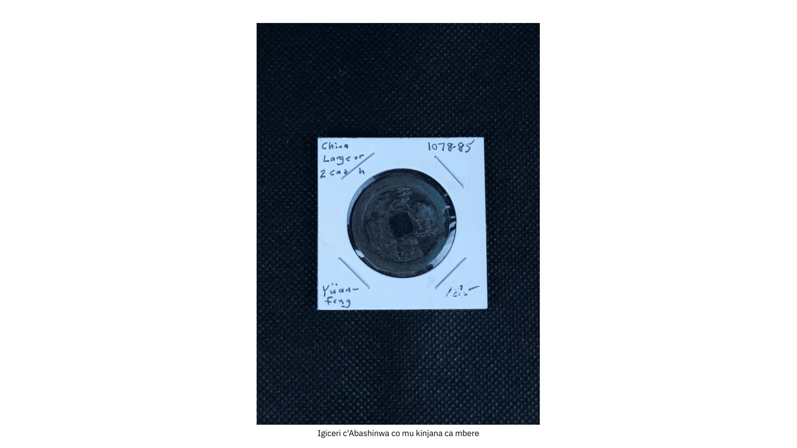

Ico kiri hejuru ni igiceri c’Abashinwa co mu kinjana ca mbere. Ni igice c’ifeza gicuzwe gifise igitoboro hagati. Ico gitoboro cakoreshwa mu gucishamwo umugozi, ivyo bikaba vyatuma ivyo biceri bishobora gufatanywa kugira ngo haboneke utubangiri canke ibisharizo vyomwizosi. Ariko rero, ivyo ntivyari ivyo kwambara ahanini; ahanini vyakoreshwa mu bijanye n’ivy’ibarabara. Vyashobora gufatanywa kugira ngo bibe ibice vy’ibara mu buryo bw’imirongo minini, ivyo bipande bikaba bifatanye. Nta bimenyetso vyihariye vyariho, rimwe na rimwe vyari inziga z’umujumbu(bronze).

Ubutegetsi bwa Leta bwo gukoresha amafaranga amwe, bwashinzweho buteba na Wudi des Han mu 113 imbere ya Kristu, bwarakunda gushikirizwa, bukaba bwatuma abayobozi batandukanye b’abikorera ku giti cabo canke bo mu karere bashobora gukora amafaranga yabo bwite, ayo mafaranga yapfa gusa kuba agirirwa icizere mukibana gikwiye.

**Agaciro gato k’amafaranga y’Ubushinwa karatuma amafaranga adashobora kubikwa, bikaba vyatuma agenda neza**.Ivyuma vy’agaciro vyakoreshwa gake nk’amafaranga akoreshwa mubuzima bwamisi yose kugira ngo birinde irundanwa. Inzahabu, kubera ko zari zizimvye cane, mu bisanzwe yashirwa ku ruhande aho gukoreshwa. Ahubwo, **ubudodo(soie) bwonyene ni bwo bwagereranya amahera nyayo y’agaciro kanini mu bucuruzi mpuzamakungu bw’Abashinwa**. Abashinwa bacuruza bakoresheje ubudodo(soie), ntibakoresha inzahabu.

Mu bihe vy’amagume y’ubutunzi canke y’amahera, cane cane igihe igiciro c’umuringa(cuivre) cariko kiraduga, harashizweho uburyo bushasha bwo gutorera umuti ibibazo: gutyo, kuva mu kinjana ca 2 inyuma ya Kristu, ibiceri vyari bikoreshwa vyagaburwa mumice kugira ngo haboneke ibice bitobito, bikaba vyatuma ugukoreshwa kumeze neza gukomeza ku giciro gito. Ibindi bihe, nk’ivya Wang Mang (mu ntango z’ikinjana ca mbere inyuma ya Kristu), hageragejwe gukoreshwa amafaranga y’agaciro kanini, aho agaciro k’amahera kari hejuru cane y’ivyuma vy’ukuri vyari birimwo, gutyo twobigereranya namafaranga yubu yo muma banki. Bafata igiceri bakagishirako ikidodo c’agaciro nk’aka 50, 100 canke 200 kugira ngo berekane amahera menshi, nk’ibiceri 200. Birashoboka ko uwo mugenzo watumye haba ukuduga cane kw’ibiciro.

Nk’uko twabibonye haruguru, iyo nzira yari ishingiye ku masezerano y’imibano hagati ya Leta, abahinguzi, n’abadandaza, ariko kandi n’amategeko y’ubutegetsi ahambaye cane kubadakwirikiza amategeko, cane cane ku bijanye n’uguhitamwo ibipande (vyaba ari vyiza canke bitari vyiza) canke uburebure bw’impuzu (zidahuye n’ingingo ngenderwako).

Mu ciyumviro canje giciye bugufi, si ubuhinga bukomeye cane. Yari yishingikirije canecane ku mategeko akomeye asaba abategetsi n’abadandaza kwemera ibiceri vyononekaye, niterabwoba ryokubahana.

### Ivyiza bishasha vy'amahera y'abashinwa n'ingaruka zavyo ku bukungu

Ubushinwa na bwo bwari ubwa mbere mu gukoresha amafaranga y’impapuro ya kera, mu ntango yakoreshejwe mu kwishura ikena y’ivyuma mu kinjana ca 9 inyuma ya Kristu. Naho mu ntango zari zifise akamaro, ayo mafaranga y’impapuro yaratuma habaho ukuduga  kw’ibiciro iyo yasohotse birenze urugero, nk’uko vyagaragaye mu bihe vya Song canke Ming, igihe gusohoka birenze urugero vyatuma haba ingorane zikomeye z’amahera, nk’uko vyagaragajwe na Marco Polo mu kinjana ca 13, uwavuze mbere ko amafaranga y’impapuro ari yo atari yo. Ntaco nshobora gukora atari ukugaragaza uburyo bumwe bw’ubukazi hano.

Gutyo, ubumenyi bw’Abashinwa burangwa no kubona amahera mu buryo bwimbitse, uguhinduranya bitangaje uburyo bw’amahera, no gukoresha amafaranga y’impapuro hakiri kare, bishingiye ku kwizigirana hagati y’abafise uruhara mu vy’ubutunzi atari kugaciro kikintu nyezina.

## Itunganywa ry'imibano n'ubutunzi mu bihe vya kera

<chapterId>4023c3ce-7a47-5ac4-8f5f-c7ab699ab20f</chapterId>

:::video id=2761efe4-21cf-4f06-9bda-c03f9ff39012:::

### Impaka z'ubumara bwo mu bisagara

Isano riri hagati y’ibisagara vya kera n’ibice vyavyo vy’inyuma biravyura ikibazo nyamukuru: ivyo bisagara vyoba vyakora vyizera inze k'ubutunzi, canke nk’ibikoresho vy’ubuhinga bw’ubutunzi bufise akamaro? Iciyumviro c’ubuhinga bw’ibikoko kivuga ko ibisagara vyo mu gihe c’umuringa, cane cane muri Mezopotamiya, **vyakura mu buryo butegekanijwe agaciro kanini mu turere twavyo two mu misozi kuruta uko vyagarukana**, bikaba bibaho ahanini ku giciro c’ubukode n’imisoro vyagaciro kangana.

Iryo yerekwa ryasubiwemwo mu gusenyuka kw’Ubwami bw’Uburoma: igihe ukwaguka kw’intara kwahagarara, uruja n’uruza rw’ubutunzi rwo hanze rwarakama, bishobora guhishura ubutunzi bwo mu bisagara butashobora kwitunga. Ibisagara rero vyari kubaho "birenze ubushobozi bwavyo", bishingiye ku gukura aho guhingura.

### Ukwihariza nink'imoteri yo kurema agaciro

Igisomwa c’ubutunzi gishobora guhinduka kirarwanya iyo mbonerahamwe y’ibikoko. **Ibisagara vya kera vyakora cane cane nk’ibibanza vy’ubuhinga n’ugusangira ibikorwa**. Uruhara rwabo rwari rurenze ugukura ibintu mu buryo bworoshe: bariko baribanda ku bikorwa vy’ubuhinga vyihariye, baratunganya imigenderanire y’ubudandaji, kandi barakora nk’aho abantu bashobora guhanahana ibintu kure.

Ukwo kwimenyereza mu bisagara kwatumye habaho ubufatanye bufise akamaro n’ivy’inyuma y’igihugu. **Ibisagara ntivyari gushobora kubaho ata bikoresho vy’uburimyi vyo mu ntara, ariko intara y’inyuma y’igihugu yaronka inyungu mu gusubiza ibintu vy’ubugenegene, ubuhinga bushasha, no gushika ku nzira z’ubudandaji zo mu kiyaga Mediterane**. Ugusangira ibikorwa vyatuma bose bashobora kuronka inyungu mu bijanye n’umwimbu, naho nyene ugusangira inyungu kwoba kwari gusa n’ukudahuye.

Ugutakaza ibifungurwa kwamaho muri ico gihe ni kwo gusigura igice c’ivyo bintu bisa n’ibidahuye. Ico kibazo c’inzara n’ugusambura ibiterwa cari ikintu gihora gitera ubwoba abantu bo mu misozi, mu gihe abahinguzi b’ibintu bo mu bisagara, bafitaniye isano n’ubudandaji mpuzamakungu, bari bafise ubutunzi buhagaze neza cane.

### Ugutera imbere kw’amateka, kuva kera gushika mu kinjana ca mbere

Ubutandukane buri hagati y’imiteguro ya kera n’iyo mu kinjana ca mbere buratanga umuco kuri ico kibazo. **Igihe ca kera cari gikunda ugusangira ibikorwa ku rugero runini, ibisagara bikaba vyugururiye isi yose yo mu kiyaga Mediterane**. Ubudandaji n’ubuhinga bwa none vyashitse ku rugero rwo hejuru, bituma habaho imigenderanire myinshi y’ubutunzi.

Ugusenyuka kw’Ubwami bw’Uburoma kwatumye haba uguca ibice gukomeye: **Igihe c’abanyagihugu carasubirije iyo nteguro y’ubutegetsi hagati, n’uburyo bwo gusenyuka kw’ibihugu vyitunga**. Amazu ya kera y’Abaroma yitwa villas rusticae ni yo yacitse ikibanza c’abami bo mu kinjana ca mbere, bituma haba amazinga y’ubutunzi hafi yitunga, ayobowe n’abakuru b’idini canke abakuru b’idini.

Ukwo kwegereza ubutegetsi abantu mu kinjana ca mbere, naho kwagabanya ubushobozi bw’ubudandaji, mu buryo buteye ubwoba kwatumye habaho ukwihangana gukomeye ku bibazo vyo hanze. Amatongo y’abanyagihugu yarateye imbere mu migenderanire iri ku rugero hagati y’ibibanza vy’ubutegetsi n’abanyagihugu bo mu misozi, naho iyo shirahamwe ryoba ryagabanya inyungu z’umwimbu zijanye n’ubuhinga.

### Uguseruka kw'amasoko yo mu bisagara

Ivyo abacukuzi bavumbuye vyerekana ko hariho **ivyambu vy’ubudandaji n’ibibanza vy’ubudandaji mu bisagara vya Mezopotamiya kuva mu kinjana ca kabiri**. Ivyo bikorwa remezo biremeza ko hariho amasoko atunganijwe, naho nyene ukuntu akora nyavyo biguma biharirwa.

Karl Polanyi, mu ntango yari ashidikanya ku kuba hariho uburyo nyakuri bwo gukora isoko mu bihe vya kera, yarashize ahabona ikibanza ciwe mu kwemera yuko yoba yarasuzuguye ukuntu isoko ry’ubudandaji ryatangura guseruka. Ukwo gutera imbere kw’ubwenge kwerekana ukuntu vyari bigoye gusobanura uburyo bwa kera bw’ubutunzi, aho ugusubira gusangira inzego, uguhanahana, n’ugucuruza kw’isoko vyari bikiri bito vyari bifatanye.

### Siparita na Atene

Igereranyo riri hagati ya Siparita n’i Atene ryerekana neza isano riri hagati y’urutonde rw’amahera n’imitunganirize y’imibano. **Sparta igereranya akarorero k’igihugu gifise ubukuru bukomeye bwanka n’ibigirankana gukoresha amahera**, mu gihe Atene yateye imbere ubutunzi bw’amahera buteye imbere kugira ngo buherekezwe n’uburyo bwayo bwa demokarasi.

Ukwanka amahera kw’Abaspartan ntikwari kwibonekeza, ahubwo kwari **inzego n’ingengabitekerezo**. Abarongozi b’i Spartan batinya ko amahera yoshobora kwonona agaciro k’igisirikare n’ak’abanyagihugu, bagahitamwo uburyo bushingiye ku kwizigirana ata guca ku ruhande hagati y’abanyagihugu.

Kugira ngo Sparta ntibakoreshe amahera, yakoresheje **ivyuma biremerera kandi bidakora**, ivyo bikaba vyerekana mu buryo buteye ubwoba ko batahura neza kamere z’amahera (ugucapura, gutwara, gukomera) bariko baragerageza gukuraho.

### Imipaka y'Icitegererezo c'Ukurwanya Amahera

Ishirahamwe ry’Abaspartan ryerekana inzitizi z’umubare wa **Dunbar** zikoreshwa ku rugero rw’imibano. **Mu kwanka amahera nk’uburyo bwo guhinduranya ataco buvuze, Sparta yariciriye urubanza rwo guhagarika umuryango wayo w’abanyagihugu ku mubare mutoyi w’abanyagihugu bashobora kugumana imigenderanire y’ukwizigirana ata guca ku ruhande**. Aba homoioi (abanyagihugu bo muri Siparita) bari 1 kw’ijana gusa vy’abantu bose, bakikujwe n’ibihumbi vy’abahilote (abaja).

Iryo shirahamwe, mu ntango ryari isoko y’ubumwe budasanzwe bw’igisirikare, ryagaragaye ko ridakomeye mu mibumbe. **Intambara ya Leuctres (371 BC) yerekanye aho iyo nzira igarukira**: ukubura ubuzima kwasenyuye ataco bimaze imibano y’Abanyasipani, bituma urugero rwabo rw’ubutekerezi rusenyuka.

Ibisagara bihiganwa (Atene, Korinto, Tebesi), bifise uburyo bw’amahera buteye imbere, **bigumye bifise ubutunzi butunze, bukomeye cane**, bishobora gusubiza inyuma ivyo abantu bahomvye biciye mu gusubira kwubaka ubutunzi no kwimukira mu bindi bihugu.

### Umuntu ku giti ciwe n'ukwizigira kw'inzego

Ivyo aba Spartan baciyemwo birerekana **ingorane ziri mu kibano gishingiye gusa ku kwizigirana hagati y’abantu** aho gushingira ku buryo bw’inzego butagira aho bugarukira. Naho nyene iyo nzira yatuma haba ubumwe bukomeye mu kibano, yatumye abantu bashobora gushikirwa n’ingorane z’imibare y’abantu.

Mu gushoboza amafaranga atamenyekana kandi ata muntu, amahera atanga ubushobozi bwo kwihangana burengeye ubw’abandi. Bituma haba ukwaguka kw’imibano birenze imipaka y’ukwizigirana gutaziguye, bigatuma haba uguhinduranya amafaranga y’amahanga n’iterambere ry’ubutunzi.

### Ivyiyumviro vy’Abanyainca, Ubutunzi butagira Amahera

Ubwami bw’Abainca buratanga ikintu giteye ubwoba giteye ubwoba: **ubutekerezi bufise ubutunzi bwinshi cane bw’inzahabu ariko ata n’uburyo bw’amahera**. Cokimwe na Sparta, iyo nzira yari ishingiye ku ntumbero ikomeye y’ubukuru n’imigambi ihurikiye hamwe, ariko yerekanye ko ishobora gushikirwa n’abanyagihugu bafise ubutunzi bw’amahera bushobora guhinduka.

Ukwo gusenyuka kw’imiterere y’imibumbe irwanya amafaranga mu gihe c’imibano y’amahera ni ikintu gisubira inyuma mu mateka, kikaba kigaragaza ko **ukwanga amahera mu nzego, kure y’ugukomeza ubumwe bw’abantu, bishobora gutuma amateka agoyagoya mu buryo buteye ubwoba** mu gihe c’ingorane zo hanze n’ihinduka ry’amateka.

Isesengura ry’ivyo bigereranyo vy’amateka ryerekana ko amahera, uretse igikorwa cayo co guhinduranya, ari ikimenyetso kandi yorosha ugusobanuka kw’imibano, bikaba bishoboza amateka kurenga imipaka iterwa n’imigenderanire itaziguye hagati y’abantu.

# Ivuka ry'amahera yacuzwe .

<partId>232e365a-8c3b-11f0-b276-b3ab70d1a5a1</partId>

## Uguseruka kw'ibiceri

<chapterId>40ed3414-3066-57bd-bc1b-617ad0a354e0</chapterId>

:::video id=1d6834c4-98a3-43fe-ba80-04be51b0486e:::

Ubu twashitse ku ntumbero nyamukuru y’ikibazo: ukuntu ibiceri bisa. Nshimikiye kw’ijambo ‘igiceri’ aha kuko twabonye mu bice vya kera ko amahera canke uburyo bwo gukoresha amahera bwariho cane mu mateka yabanjirije abantu b’i Lidiya, Abagiriki n’Abaperesi. Biragaragara neza, nibwira, ku vyo twamaze kubona. Iki gice rero kigenewe ukuza kw’ibiceri vy’amahera vy’ukuri kandi gifise umutwe uvuga ngo: *Uguseruka kw’ibiceri*.

### Inkomoko y'ibiceri vyo muri Lidiya no muri Iyoniya

Kugira ngo ntangire iki gice, ndashaka kubaha igice c’igitabu ca Glyn Davies, Amateka y’Amahera, hano nyene.

*Igice kimwe co mu gitabu Amateka y'Amahera: Kuva Kera Gushika Ubu canditswe na Glyn Davies:*

> Kuva aho yavukiye i Lidiya n’i Iyoniya, ubumenyi n’ugukoresha ibiceri vyarakwiragiye ningoga mu buseruko mu bwami bw’Ubuperesi no mu burengero biciye mu bindi birwa vya Yoniya n’ivya Égée gushika mu Bugiriki buhambaye, hanyuma bishika mu bihugu vyari vyarigaruriye mu burengero, canecane muri Sicile. Yarakwiragiye kandi mu buraruko gushika muri Makedoniya, muri Trasiya no mu Kiyaga Cirabura, ariko mu Misiri yemerewe gusa igice, ata co yipfuza kandi itevye.

Nsanga bishimishije kuvuga aha ko muri Misiri, babandanije gupima ibiceri haciye igihe kirekire ubuhinga bwo gukora ibiceri buje. Ngira ngo ivyo ni ngirakamaro kubimenya. Ivyo bivugwa birabandanya:

> Mu buryo nk’ubwo, Ubutaliyano bwo mu gihugu nyamukuru na bwo nyene mu ntango bwari buteye buhoro cane mu kwemera ibintu bishasha vy’ubutunzi vy’Abagiriki, bitandukanye n’ingene Sicile yavyemeye vyihuta.

*Uretse ivyo bihugu bibiri bifise aho bigarukira (Ubutaliyano bwo mu Butaliyano na Misiri yo Hasi), ikoreshwa ry’ibiceri ryarakwiragiye cane mu bihugu bikikije ikiyaga Mediterane hagati n’ubusereko, be no mu Bwami buhambaye kandi bwariko burakura bw’Ubuperesi, kuva muri Mezopotamiya **gushika mu Buhindi. muri ico gihe, ataco bimaze mu bijanye n’iterambere ry’Abashinwa canke ry’Abaludiya. Utitaye ku kuba Ubuhinde bwari bwateguye amahera yabwo bwite, ukuntu Ubuhinde n’Uburasirazuba bwa hafi bwariko burakorana cane vyatumye amafaranga y’Abahindi ahindurwa ata guca ku ruhande n’ubuhinga bwa Lidiya n’Ubugiriki, ubwa mbere biciye mu Bwami bw’Ubuperesi hanyuma mu Bwami bwa Makedoniya* (n’ivyo Alegizandere Mukuru na se wiwe banesheje).

*Kubera izo mpamvu, ingaruka zitaziguye z’ubuhinga bwose bw’abanyagihugu b’Abahindi bwo guhingura amahera zari nto cane, ugereranije n’akamaro gakomeye cane k’ubuhinga bwo guhingura amahera bwigenga bugaragara bw’Ubushinwa mu buseruko, mbere n’iterambere ry’Aba lydiens n’Abagiriki mu burengero*

### Ugukwiragizwa kw'ibibanza n'uguhindura akarere

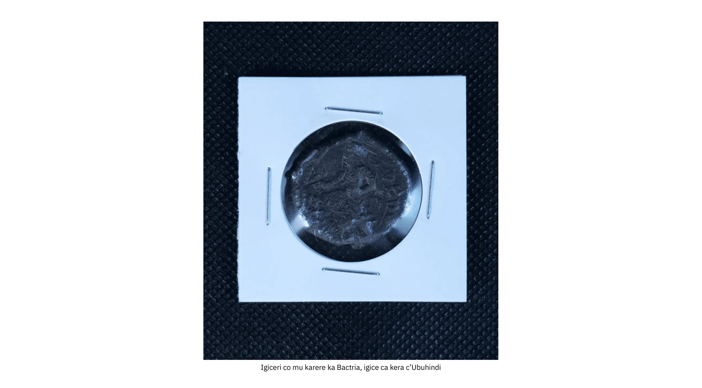

Kugira ngo tugaragaze ico kiringo mu buryo buboneka, aha hejuru hari igiceri co mu karere kamwe ko mu Buhindi, akarere ka Bactria, kakaba kari hafi y’uburengero bw’izinga ry’Ubuhindi, hafi y’igihugu ca Afghanistan. Muri ako karere, hariho ibiceri bishobora kuba vyari vyahumekewe n’ibiceri vy’Abagiriki vyerekana kimwe mu bintu vyabo vy’ubwami.

## Aba lydien naba perses .

<chapterId>eb802ab8-8ffd-5b25-907f-8944f120ed14</chapterId>

:::video id=f151eb42-5ff3-4ca1-9af1-1ae2a5e051c0:::

### Ibiceri vya mbere vya electrum vyomuri lydien 

nkuko tutashobora gutandukanya ivuka ry'ibiceri vyamahera vyaba Lydien n’Aba perses, reka tugende kuri ico gice c’isi kiri mu buseruko bw’Ubugiriki, uno musi kikaba arico gihugu Turukiya. Ibiceri vya mbere vyabonetse mu Burengero vyabonetse nko hagati mu kinjana ca 7 imbere ya Kristu, mu turere twa Lydien na Ioniya, turi muri Turukiya y’ubu. Ni nko mu myaka ya 650 gushika kuri 600 imbere ya Kristu aho ico kintu gishasha c’ishimikiro cabonetse, hakaba hariho ibintu bihambaye vy’ubucukuzi nk’ibiceri vya mbere vyabonetse mu rusengero rwa d'Artémis à Éphèse, vyabonetse nko mu myaka ya 600 imbere ya Kristu. Ivyo biceri vya kera vyari bikozwe mu gikoresho citwa electrum, kikaba ari umuvango kama w’inzahabu n’ifeza bifise amabara y’agahama, kandi akenshi vyari bimeze nk’ibitoke, bikaba vyari bifise gusa ibimenyetso vy’ibipfunsi canke ibimenyetso vy’intango.

Hasi, urashobora kubona kimwe mu biceri vya kera cane vyo muri Lidiya, kikaba kirimwo intare ifise umuhigo wayo imbere. Ushobora kubona ikidodo canke umwobo inyuma, bamwebamwe bemera ko vyakoreshejwe kugira ngo bapime akaranga k’ico cuma kari kanyako no kugira ngo bamenye neza ko atari ikintu bashizeko hejuru gusa. Naho iyi ari imwe mu ngero za mbere, birahambaye kumenya ko iki gice ari ariciganano(kopi). Ibice vyanje vyose vy’inzahabu n’ivy’electrum ni ivyiganano(kopi) canke bisubiwemwo hakoreshejwe uburyo bwanone kugira ngo twirinde gukoresha uburyo bwishi mugukoresha ivyo biceri vya nyavyo.

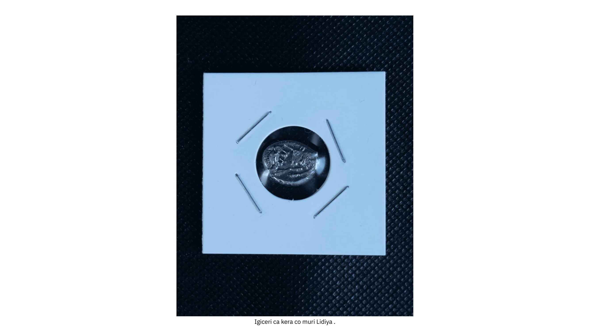

Ariko kandi mfise igiceri c’Uba perse nyaco tuza kubona mukanya. Uko ni ko ivyo bipande vya mbere vyari bisa. Ni nk’ubwoko blobs, de lumps mu congereza c’icuma cari giteye ikidodo ico gihe.

Mu buryo butandukanye n’ukwemera kwakwiragiye kw’uko amahera yahinguwe kugira ngo yorohereze ubudandaji bwa misi yose no gusubirira uguhinduranya ibintu(le troc), bisa n’uko mu ntango ibiceri vya mbere vy’Abaludiya, Abakemeni n’Abagiriki bitakoreshwa mu bucuruzi buto buto. Nkako, izo nkuru z’amahera zari nyinshi cane ku buryo zitashobora gukoreshwa ku musi ku musi. Ikindi kandi, ukuntu vyagenda vyari bigarukiye mu turere turi hafi y’aho vyakorerwa.

Aha, mbona ko ari ngirakamaro kuvuga ko, naho nasomye mu bitabu vyinshi vy’ubuhinga bw’abantu, ibiceri, nk’uko namaze kubigaragaza - vyaba vya electrum canke  igiceri c’aba perses nzakugarukako mukanya gato - vyari binini cane ku buryo umuntu atashobora kugura umukate, tuvuge, buri musi. Nabonye ingereranyo zotuma twiyumvira ko bingana n’igikorwa c’umusi umwe ku murimyi canke ku musirikare, rero vyoba ari binini cane. Ni nk'ukugerageza kuriha umushahara w'umusi ku mfungurwa zawe, icayi cawe co mu gitondo canke ica sasita. Keretse ko nabonye mu bindi bikorwa ko hariho utugingo ngengabuzima dutoduto tw’ivyo bice, rero ibiceri bitobito, ivyo bishobora gutuma twiyumvira ko kumbure hariho uburyo bwo kubigura ku musi ku musi.

Rero aha, "ikimenyamenya" c'ubuhinga bw'abantu c'uko kitakoreshwa mu bucuruzi bwa misi yose, kubera ko idini canke igice cari kinini cane, ntigikomeye cane mu ciyumviro canje kuko twabonye ingero z'ibiceri bitobito, vyari gushobora gukoreshwa mu gugura kwa misi yose.

### Uruhara rwa Leta mu kurema amafaranga .

Inkomoko nyakuri y’ibiceri isa naho ifatanye nibikorwa vy’ibihugu. Hariho ivyiyumviro bibiri nyamukuru kuri iyo nkuru: ica mbere, c’ivyiyumviro, gihuza ijambo ry’ikigiriki ‘nomisma’ (amahera) n’‘nomos’ (amategeko), bikaba vyerekana ko amahera yari ahuye n’ugushinga amategeko, bikomeza ubukuru n’imitunganirize ya politike y’ibisagara. Iciyumviro ca kabiri, gifise ukuri kuruta, cemerwa cane muri iki gihe, ni uko amahera yari uburyo bwa mbere na mbere Leta zikoresha mu kugenzura ubutunzi n’imibano. Mu kwemeza ku mugaragaro uburemere n’agaciro k’ivyuma vy’agaciro vyari muri vyo, ibihugu vyarashoboye gukoresha nabi ukuntu ivyo biceri bigenda n’agaciro, bituma habaho icizigiro n’amahera y’ugutanga amahera yihariye ku mafaranga yo mu gihugu.

Birashimishije cane kumenya ko dufise ibimenyamenya vy’ivyo. Nk’akarorero, mu biceri vya electrum, ukwiye kumenya ko electrum kama mu bisanzwe ari hafi y’ibice 70% vy’inzahabu na 30% vy’ifeza. Mu biceri vya mbere twabonye kandi twabisuzumye, cane cane ibiceri vya kera vy'i Lidy, inzahabu isa n’iyirimwo cane hafi 50 gushika kuri 55% aho kuba 70%. Ivyo vyerekana ko no muri ico gihe, abatanga ibiceri bariko bagerageza kugabanya umugabane w’icuma c’agaciro kuruta, kumbure kugira ngo bashobore gutanga ibiceri vyinshi bashizeko ikidodo kandi bibe bifise agaciro kamwe na electrum kama . Kandi aha, bitegerezwa kuvugwa ko vy’ukuri kuva mu gihe c’uwo Croesus rurangiranwa, nk’uko biri muri *rich as Croesus*, ivyo vyashobotse kuko kuva mu gihe ciwe niho twaronka ubuhinga bwo gutandukanya inzahabu n’ifeza.

Ibiceri vyamahera vy’i Lidiya vyarahindutse cane ku ngoma y’umwami rurangiranwa yitwa Croesus (561-546 imbere ya Kristu), yari azwi cane kubera ubutunzi bwiwe bwandikishije amateka. Muri ico gihe, Abanyaludiya baratunganije ubuhinga bwo gutandukanya inzahabu n’ifeza zo muri electrum, gutyo barazana ibiceri vya mbere vy’ivyuma bibiri, ni ukuvuga ibiceri vy’inzahabu n’ifeza bitandukanye.

### Ukwaguka kw'Abaperesi n'ukwemera kw'Abagiriki

Igihe bigarurira  Lydie mu mwaka w’546 imbere ya Kristu, Abaperesi b’Aba achéménides baciye bafata ubwo buhinga bushasha. Nko mu mwaka wa 500 imbere ya Kristu, ku ngoma ya Darius wa mbere, Abaperesi barashizeho uburyo bwabo bwo gukoresha amahera bakoresheje darics y’inzahabu n’ama siglois y’ifeza, akenshi bakaba bashirako igishushanyo c’umwami mwiforo yingwanyi. Ivyo biceri vy’umwami vy’Ubuperesi vyakoreshwa canecane mu turere tw’Ubwami bw’Ubuperesi twari twagizwe n’Abagiriki, maze buhorobuhoro birakwiragira, naho nyene ikoreshwa ryavyo ryagumye ridahuye, **uturere tumwetumwe, nka Misiri, twari tugikunda guhindura ivyuma bipima (bullion).**.

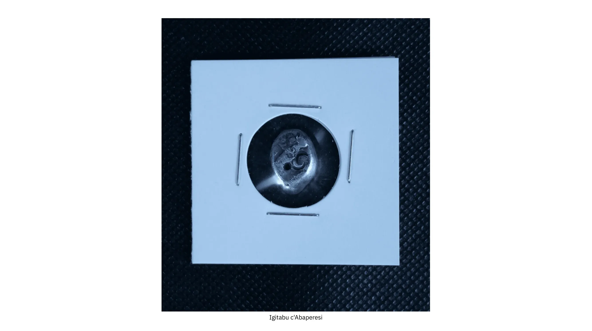

ndafise ngaha sigloi nyayo canke siglos perse. Ico gishushanyo gitoyi kirimwo umwami, gifise igice gishaje cafuditse. Siglos ni igiceri c’ifeza, gitandukanye n’igiceri c’ifeza citwa daric, kikaba cari gikozwe mu nzahabu. Abaperesi barashobora gutandukanya ivyo vyuma bibiri, maze barava ku biceri vya electrum. Rero, barashize mu ngiro ubuhinga bwo gukoresha ivyuma bibiri, bakoresheje inzahabu n’ifeza mu gihe bagumye bafise iciyumviro kimwe c’ibiceri bikozwe mu vyuma vy’agaciro, akenshi bikaba bifise umwobo inyuma, bishoboka ko ari vyo vyo gusuzuma ivyuma birimwo.

Bisa n’uko Abagiriki baciye bafata ibiceri vyihuse kubera ko bari bafitaniye ubucuti bwa hafi n’Abanya lydien, canecane biciye ku bihugu vy’Abagiriki vyari vyarigaruriye muri Aziya Ntoya. Abagiriki ba mbere bacuze ibiceri bashobora kuba bari abatuye i Egina hagati mu kinjana ca gatandatu imbere ya Kristu, ni bo bashizeho idarakima, uburemere bwayo bukaba butandukanye ku ntara ku yindi, kandi izina ryayo risobanura "urushinge rw'intete" canke "urushinge rw'imyampi".

Ukuroranirwa kw’ibiceri vy’Abagiriki kwari guterwa n’uko vyari vyiza mu gukora ibikorwa bihambaye, nk’ugutanga amahera y’abacangero, be n’uko vyari vyoroshe mu kwagura ubutunzi n’ivya politike vy’ibisagara. Amafaranga yaciye yihuta kuba ikintu nyamukuru mu vy’ubutunzi bw’Abagiriki, mu nyuma no mu vy’ubutunzi bw’Abaroma, mu gihe yagumye afise urugero rukomeye rw’ikigereranyo, canecane biciye ku gufatanya kwayo n’itegeko (nomos).

Ubwa nyuma, ukwaguka kw’ibiceri vyihuse birashingira intahe ihinduka rikomeye ry’imibano ya kera, aho gushiramwo amategeko y’agaciro k’amahera vyagendana n’imitunganirize ya Leta. Iryo hinduka ryashizeho umushinge w’ubutunzi n’ivya politike wo gutera imbere kw’ibihugu vya demokarasi vy’Ubugiriki, cane cane i Atene, aho amahera yari afise uruhara runini mu gukora kw’igisagara ca demokarasi.

Iciyumviro nyamukuru co kwibuka muri iki gice ni uko turiko turavuga cane cane **ibiceri**, atari amahera muri rusangi. Umuce nyamukuru ugaragara neza ni uwo **ukwizigira ubuyobozi butanga**, ufitaniye isano n’ibiranga ubuhinga bw’ibiceri (uburemere, ubusuku, agaciro k’imbere). Ukwo kwizigira nyene ni kwo gutuma Leta canke ubuyobozi butanga ivyo bice bishobora kugira urugero nyezina rwo kugenzura canke mbere no gukoresha nabi agaciro k’ivyo biceri be n’ingene bigenda kuva mu ntango.

## Ukugira uruhara Rwinzego hamwe ni biceri vyamahera vyambere

<chapterId>3e1efd08-99e3-5a32-9908-3185fef0e640</chapterId>

:::video id=84847cf6-9e46-4a8c-9f35-25a27496cc4b:::

### Kamere zibiri zamahera

Kuza kw’amahera y’ubuhinga bwa none biravyura ikibazo nyamukuru: amahera yoba ari ikintu kiremwa n’isoko canke ni ikigo gitegetswe n’ubutegetsi? Ukwo guhuzagurika kw’ivyiyumviro gutuma habaho iyerekwa ribiri ritandukanye cane.

Ku ruhande rumwe, ishure ry’ubutunzi ryo muri Autriche riburanira iciyumviro c’uko amahera y’ibicuruzwa - cane cane inzahabu - yatowe mu buryo busanzwe n’abahinga b’ubutunzi kubera kamere kazo k’imbere: ugukomera, ukoroha guhatwara, kugaburikwa n’uguhindurwa. Uvuye muri ivyo, Leta yaciye yifatanya n’ayo mafaranga abanguka kugira ngo igenzure ukuntu atangwa. Ni ikigo kiva mu bisanzwe mu bikenewe n’isoko imbere y’uko gifatwa n’ububasha bwa politike.

Mu buryo butandukanye n’ubwo, iciyumviro c’abahinga mu vy’imico kama n’inzego z’ubutegetsi kivuga yuko amahera abaho vy’ukuri biciye ku biceri vya Leta. Ubutegetsi bworemye ayo mafaranga buzi neza mu gushiramwo ikidodo cayo, gutyo bugahindura ico cuma kikaba igikoresho nyakuri co gukoresha amahera. Ivyo vyerekana ko ibiceri vya kera vy’aba  lydiennes vyakoreshwa canecane mu kuriha ingabo - statère (ubwoko bwamahera ya kera) imwe ihuye n’umushahara w’umusi w’umusirikare.

### Inyungu zidasanzwe z'ugushinga urugero rwa Leta

Naho hariho iyo ntambara y’ivyiyumviro, mbere n’abahinga mu vy’ubutunzi bo muri Autriche baratahura ivyiza bimwebimwe biva ku kwivanga mu vy’amahera Leta. Gushiramwo ibintu bimwe bimwe biciye mu gukora amabuye y’agaciro biratorera umuti ingorane zitari nke z’ubudandaji zikora.

Iyo ata bubasha bwo kwemeza, abakinnyi b’ubutunzi bahora bashikirwa n’ingorane: ibiceri vy’ibinyoma, ubuhendanyi bwo gutanga amakuru n’ugukoresha nabi uburemere. Ivyo bikorwa biratuma haba uguhuzagurika mu bukungu, kuko ibiceri bimwebimwe vyemerwa mu gihe ibindi bikankwa. Mu vy’ukuri, ikidodo cemewe kiratanga icemezo c’uburemere n’uburyo, bigatuma ubudandaji bugenda neza.

Ico kimenyamenya gifise igiciro kigaragara kw’isoko: igiceri c’inzahabu gicuzwe gifise agaciro kuruta igiceri c’inzahabu y’agaciro. Iryo shirahamwe ryerekana agaciro k’icemezo - abacuruzi ntibagikeneye kwisuzuma bonyene ko ico cuma ari ic’ukuri biciye mu bipimo chimiques canke vya résonance. Intambara ya Leta, mu buryo buteye ubwoba, irakuraho ugushihana kandi igatuma ubudandaji bworoha mu gutuma habaho ukwizigirana gushingiye ku nzego.

### Amayeri yogukoresha amafaranga kuva mu ntango

Inkuru y’abanyagihugu ba mbere baba lydiens irerekana agahemo gateye amakenga. Ivyigwa biherutse gukorwa vyerekana ko inzahabu iri muri électrum yari nkeyi cane kurusha iyo muri électrum kamere. Ubuyobozi bwemeza ubu dahangarwa bwiyo électrum bwakoresha amayeri.

Ico gikorwa kirerekana ubumaro bubiri bwo gucura ivyo biceri. Ku bijanye n’isoko, bituma ubucuruzi bugenda neza kandi bitanga icemezo co kujanisha ibintu namategeko. Ku buyobozi butanga ivyobikorwa, buca buba igikoresho co kugenzura ubutunzi biciye mukuyungurura ivyo vyuma. Mu kugabanya inzahabu irimwo mu gihe Leta igumizaho agaciro kamwe, Leta yongera neza amahera - igatuma habaho amafaranga menshi avuye mu rugero rumwe rw’ivyuma vy’agaciro.

Ariko rero, Leta ubwayo yagumye ihagaritswe umutima n’ukwo gukoresha nabi abantu. Nk’uko vyerekanywe n’akarorero k’inzahabu solidus ya Constantin yo mu kinjana ca 4, ubutegetsi bw’abaromani bwarasuzuma neza ukuntu ibiceri vyari vyiza, kuko vyasaba ko bihembwa mu biceri vyiza. Ubutegetsi bwari bufise inyungu ihambaye mu kubungabunga uburyo bw’ibiceri vyabwo bwite kugira ngo bubone agaciro k’amahera bwaronka mu misoro.

### Isesangura ry'ubutunzi rijanye nugutakaza agaciro

Ukwiga ibijanye n’ugutakaza kw’agaciro k’amafaranga birerekana uburyo buhoraho muri kahise. Ku biceri vy’ivyuma, abahinga mu vy’ubutunzi barakurikirana ijana kw’ijana ry’ivyuma vy’agaciro biri muri ivyo biceri - igicapo kimanuka kigaragaza ko agaciro kagenda karagabanuka. Ku mahera y’impapuro yo muri iki gihe, ni ibihushanye n’ivyo: amahera agendagenda araboneka, kandi iyo yiyongera, bigaragaza ko agaciro kayo gakoroka.

Ubwo buryo bwompi bupima ikintu kimwe c’ishimikiro: ugusenyuka kw’agaciro k’amahera. Yaba mu kugabanya ivyuma vy’agaciro birimwo canke mu gukora amanoti mashasha, uburyo bwo kubikora buraguma ari ubwo nyene. Uko ubutegetsi burema ibice vy’amahera vyinshi bivuye mu bintu vy’ukuri bimwe, ni ko n’igice kimwekimwe cose gitakaza agaciro kaco.

Ukwo gukoresha nabi, kugaragara mu biceri vya kera cane vy’i Lidiya, vyerekana yuko ukugenzura amahera kwamye ari ikibazo c’ububasha. Amahera akozwe rero agereranya ubuhinga bushasha budasanzwe bufatanijwe n’igikoresho co kugenzura ubutunzi - ububirigi bugenda mu mateka yose y’amahera, gushika n’ubu.

## Ugukora ibiceri

<chapterId>b205f4f2-c293-5308-b812-a998de9ad45e</chapterId>

:::video id=47c612ec-d97e-4498-b50e-7e66518bd56d:::

### Kuva kuvyuma biteyeko ibimenyetso gushika ku biceri bicuze

Nkuko duhejeje  igice kivuga ku guseruka kw’ibiceri, nashaka gutanga igice kigufi cane kivuga ku gutera imbere kw’uguhingura ibiceri. Nk’uko twabibonye, ​​vyose vyatanguye n’ibipande vya électrum, haca kwirikira inzahabu n’ifeza, aho impande zompi zari zishirwako ikimenyetso hamwe nicuma, haba ishusho y’umwami, canke umwobo mu mugongo kugira ngo umuntu asuzume ko ari nyaco.

Mu nyuma, nk’uko tugira tubibone mu mugice gikurikira, Abagiriki baratyoroye ubwo buhinga mu guhingura ibiceri vyiburungushuye vyacurwa n’inyundo ku mpande zose. Baca bafata igice c’icuma c’agaciro gityoye, bagacapa ku ruhande rumwe igishushanyo bipfuza, hanyuma bagacurisha n’umaboko kugira ngo bareme ico giceri.

Ubuhinga bwo gucura ibiceri n’amaboko umuntu ku giti ciwe birashoboka kuba vyagize uruhara mu kuduga kw’ibiciro muri ico kiringo, naho nyene akenshi ivyo biceri babiyungurura keshi kugira ngo baronke ibiceri vyishi. Ivyo vyagaragaye canecane mu kiringo c’Abaroma, no ku rugero rutoyi, mu gihe c’intambara zimwezimwe zo mu kiringo c’Abagiriki. Naho gucura ibiceri bimwe bimwe vyagabanya ubushobozi bw’ubutegetsi bwo gukora ibiceri vyinshi, vyarafashije cane mu kugenzura ukuduga kwibiciro kw’ibiciro, naho nyene hariho ugutakara gukomeye kw’agaciro. Gutyo, twarashoboye kuva ku gipande c’icuma gishizweko ikimenyetso  gushika ku gice c’ifeza ciburungushuye gicurishijwe ni nyundo.

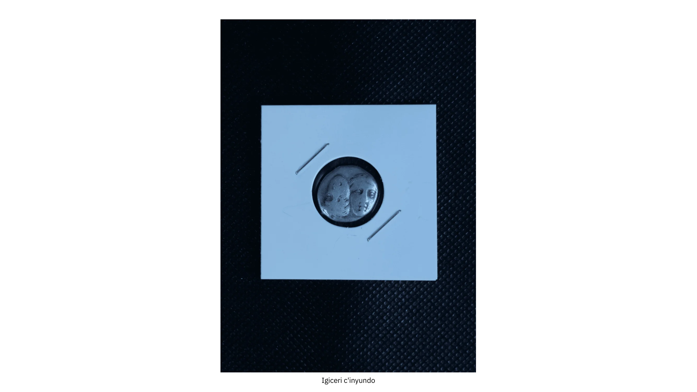

### iterambere ryo mu kinjana ca mbere

Hari hariho isomo muri Moyen-Âge yo gupima igiceri , bakora ibiceri vyagutse kandi vyonze kandi imvo imwe yatumye ivyo babigira ni uko vyatuma vyoroha gupima hakoreshejwe ijwi ryavyo, ivyo bikaba vyari bikoreshwa kenshi nk’ikimenyetso c’uko igiceri ari cukuri. Mu guterera ifeza hasi, vyatuma ijwi ryumvikana, ku buryo abantu bashobora kwemeza ko ico gice c’ifeza cari cukuri mu kucumviriza gusa. Uwo mugenzo niwo wavyaye ijambo "argent sonnant". Mu bijanye n'amahera meza, uburemere busanzwe bwamenyekana hakoreshejwe umunzane canke "trebuchet" yo gupima. Gutyo, ubwihindurize bwarabandanije kuva ku biceri bitobito vy’ikibumbano gushika ku biceri vy’agaciro gatoyi kandi vyagutse.

### La frappe au balancier

Ubuhinga bwa nyuma bwashitse mu mpera z’Ikinjana ca mbere, mu ntango z’ikinyejana ca none, bwari iciyumviro ca frappe au balancier. Yari ubwoko bw’ivyuma vy’ugukubita bikomeye kugira ngo bikubite ibiceri, gutyo bikaba bivamwo ibiceri bifise ubwo buryo bushasha gucura. Ico cari ciharije kuri iyo nzira ni ubushobozi bwo gutera igicapo ku ruhande rw’igiceri kugira ngo umuntu ashobore gutorera umuti ikibazo co gucapura. Gucapura vyari birimwo gukuraho igice c’ico giceri kugira ngo umuntu asubire kuronka ifeza y’agaciro, iyo feza ikaba yari gushobora gukoreshwa mu gukora ibindi biceri canke gusa bikaguma ari ikintu co gukoresha.

Rero ico ciyumviro ca frappe au balancier carafashije mu bijanye n’ugucapura. Kandi biraryoshe kubona ko iyo tekinoloji mu vy’ukuri yavuye mu Bufaransa. Nk’akarorero, mu Bwongereza, barahaye akazi abahinga b’Abafaransa kugira ngo baze kubereka ingene bakora izo mashini. Igiteye umunezero, ni uko hari abashigikiye uguhingura inyundo bari babirwanya kandi bacereje gukoresha ubu buhinga. Mu buhinga bwiza ubwo ari bwo bwose, hama hariho abantu baburwanya, bashaka kuguma bafise ubuhinga bwa kera. Naciye nibwira ko ari ubusazi cane gutahura ko mbere n’ubuhinga busa n’ubusumba ubundi vy’ukuri - ushobora gukora ibice vyinshi, biragoye kwigana - hariho abantu bakiriho bafatanye n’uburyo buzwi cane bw’inyondo. Hariho uguhinduka hagati yo guhingura ibihimba vyakozwe n’ico gitero kizwi cane c’ipendule hanyuma bagasubira ku gutera inyundo. Kandi mu nyuma, birashoboka, ni pendulum striking yaje gufata maze ikaduha ibi bice vyiza vy’ubu aho ushobora gusanga canke uturongo dutoduto, uturongo dutoduto dukikuje kugira ngo wirinde gukata, kumbure bifitaniye isano n’ijambo gukata, uturongo, kandi urashobora kubona n’ubu canke uturongo canke inyandiko canke ibishushanyo vyanditswe ku bice biri kumpande zigiceri.

# Ivyiyumviro bitandukanye ku bijanye n'uguseruka kw'amahera

<partId>72ac694f-9248-550d-90c1-91af3d234380</partId>

## Ivyiyumviro ku bijanye n'uguseruka kw'amahera n'insobanuro zayo zitandukanye .

<chapterId>7d699d4d-8c70-55b5-bf36-609f3fd90bcf</chapterId>

:::video id=523c873f-501b-4954-b79f-7e74c0f685a5:::

Murakaze muri iki gice kijanye n’inyigisho zitandukanye ku bijanye n’uguseruka kw’amahera n’insobanuro zayo zitandukanye. Ehe rero igice gitoyi co mu gitabu *Aux origines de la monnaie*, nibwira ko cerekana ivyiyumviro bibiri nyamukuru tuzoba turiko turaraba muri iki gice.

> Iyi ntangamarara ngufi nta yindi ntumbero ifise atari ugushira ahabona ivyerekeye ubushakashatsi. Ku rugero rw’ivyiyumviro, impaka zirafunguye hagati y’abashigikiye inyigisho ya K. Polanyi n’abashigikiye ivyiyumviro vya M. Weber. Ku ba mbere, ingabirano n’ugusubira gusangira birafise uruhara runini, aho uguhindura isoko bifise uruhara rutoyi gusa, cane cane mu guhindura mpuzamakungu. Ku bandi, ahubwo, isoko ni ryo riri mu mutima w’ingendo y’amateka iriho ubu.

Nk’akarorero, muri Mezopotamiya, inyigisho imwe y’uguseruka kw’urusengero ivuga yuko urusengero, nk’ubukuru, ari rwo rurema igice c’ibarabara canke igice c’amahera, rikagitegeka, hanyuma abacuruzi bakagifata kugira ngo bakore ubudandaji. Iciyumviro gihushanye n’ico kivuga ko, oya, iyo nkuru y’amahera isohoka mu buryo busanzwe mw’isoko kugira ngo yorohereze ubudandaji. Hariho ingero z’ivyo zishingiye neza muri Mezopotamiya.

Naho ku bijanye n’uguhinduranya, hari inyigisho zivuga ko vyakoreshwa cane cane mu guhanahana amakuru mpuzamakungu, ni ukuvuga n’abantu tutari twizigira.

Ivyo rero nivyo tuzokora muri iki gice. Tugiye gukora ubushakashatsi bumwe bumwe kugira ngo tugaragaze inyigisho zitandukanye ku bijanye n’uguseruka kw’amahera n’insobanuro zitandukanye z’ico amahera ari co. Tuzoba turiko turashikiriza no kunegura ivyiyumviro vy’abahinga mu vy’ubutunzi n’abahinga mu vy’imico kama. Nzogira mbere amahirwe yo kuba turi kumwe na Ulrich, azobabwira ivyiyumviro vy’umuhinga mu vy’ubutunzi wo muri Otirishiya kuri ivyo bintu bitandukanye.

## Uguseruka kw'amahera ku bahinga b'ubutunzi ba kera

<chapterId>1d3776cd-0dfd-5297-af48-c6f41e257a7e</chapterId>

:::video id=873a16c1-17ac-448d-8941-df4feb7ab79d:::

Iki gice kijanye n’inyigisho zitandukanye zijanye n’uguseruka kw’amahera. Ingingo ya mbere izokwihwezwa ni ukuza kw’amahera nk’uko abahinga mu vy’ubutunzi ba kera babivuga.

### Ivyiyumviro vya kera vya Adamu Smith

Dushingiye ku vyiyumviro vya kera vy’ubutunzi, cane cane ivyo vyashigikiwe na Adamu Smith, amahera yava mu guhinduranya amahera mu kwishura ku mipaka yayo. Mu ntango, uguhanahana kwakorwa biciye mu guhinduranya ataco akora, ariko ubwo buryo bwari bugoranye kenshi kubera ingorane y'"uguhinduranya ibintu iyo mwese mufise uco uwundi ashaka»: umuntu wese yategerezwa kuba afise neza na neza ivyo uwundi yipfuza. Buhoro buhoro, ibicuruzwa bimwebimwe (nk’umunyu, ivyuma vy’agaciro n’ibitungwa) vyaje kwemerwa na bose nk’uburyo bwo hagati bwo guhinduranya, kubera akamaro kavyo, ukuramba kwavyo n’ukuntu bishobora kugabanywa. Gutyo, amahera yarabonetse ubwayo yorohereza no gutuma ubutunzi bugenda neza.

### kunegura inyigisho za kera

Ehe rero ivyo nsubiramwo iyo nyigisho. Kubera ivyo twabonye vyose mu gice ca mbere, mbona ko dushobora kuvuga ko iki ciyumviro c’uko **ibiceri** ari ugutera imbere kw’uguhinduranya(le troc) ari ikinyoma kubera gusa ko igiceri gicuzwe kiva ata kabuza mu butegetsi, kuko gicuzwe n’ubukuru. Hariho imvo zitari nke zituma ivyo bishika, n’icipfuzo c’abategetsi co kugenzura ubutunzi, co gufata amahera.

Ku rundi ruhande, nimba turiko turavuga amahera nk’iciyumviro, atari ngombwa ko ari ibiceri, rero ntaco bimaze kuko, n’ibiceri vya mbere,  statères zaba lydiens, twabonye ibiceri vy’ifeza bitagira ikimenyetso. Hasigaye kumenya nimba zari ziriko zirazunguruka. Iyo ziriko zirazunguraka, ivyo bisigura ko abantu bashobora kuba baramenye mu ntango ko ico kintu ari amahera yoshobora gusabwa cane kandi akahindurwa bitagoranye. Kandi kumbure niho abategetsi babonye ivyo bintu, bakabifata mu kubishirako ikidodo kugira ngo bavyemeze.

Hariho ivyiza vyinshi mu gukora ivyo - ntaco bimaze kubisuzuma, kubipima, ivyo vyose. Biragaragara ko ivyo tuzobivugako. Ariko mu vyiyumviro vyanje, ibiceri biragaragara ko ari igikoresho cakoreshejwe n’ibihugu kuva mu ntango. Ariko ku bijanye n’uguseruka kw’amahera nk’uko ari, ntituzi nimba vy’ukuri yavuye ku butegetsi bwayashinze canke nimba yaserutse biciye mu bucuruzi canke mu guhanahana amakuru. Nzogira ikiganiro gishimishije cane kuri iyo nkuru n’uwo dukorana Ulrich mu nyuma muri iki gice.

Turamaze kumenya yuko ibiceri vya mbere vy’agaciro vy’icuma bitakoreshwa nkamahera mubuzima bwabo bwamisi yose kubera ko agaciro kavyo kari kari hejuru cane. Turazi kandi ko ahanini zakoreshwa mu kwishura abasirikare. Ivyo ni imvo nziza y’ivyo vyiyumviro vy’uko amahera atari ngombwa ko yaje ava kumpavu zubu ndandaji. Ivyiyumviro vy’amahera, ni ukuvuga amafaranga y’ibiceri vya mbere, birashoboka ko vyari binini cane ku buryo, nk’akarorero, umuntu yoshobora kugura umukate canke gukora ivyo gusuma ku musi ku musi. Nk’akarorero, vyoshobora kuba bingana n’umushahara w’umusi umwe. Si ngombwa ko abantu bahembwa umushahara muri iyo misi, ariko ivyo ni ukugira ngo ubone iciyumviro c’urugero. Ivyo biceri rero birashoboka ko vyari bifise ubushobozi bwo kugura vyinshi cane ku buryo vyari gukoreshwa mu bucuruzi butobuto. Ku rundi ruhande, ntaco twovuga ko ivyo bice vy’amahera bitazoba vyakoreshejwe mu guhindura ibintu binini cane, nk’ivyo abacuruzi bahindura. Turazi ko ahanini zakoreshwa mu kwishura abasirikare. Ivyo ni bimwe mu vyiyumviro bikundwa cane vyo gusigura ukuntu ibiceri vya mbere vyabonetse. Ibuka ko aha turiko turavuga ibiceri, si ngombwa ko tuvuga amahera muri rusangi. Rero, ibiceri vya mbere vyari bifise uruhara rwavyo rwa mbere, kandi urwo rwari urwo kwishura amahera y’igisirikare, y’abacangero.

Nk’akarorero, Alexandre Legrand yarabikoresheje cane, nk’uko tuzobibona mu nyuma.

Twarabonye kandi ko kuva mu Bushinwa bwa kera, ibikoko cauris vyakoreshwa mu guhindura ubutunzi (**guhemba abakozi, gupima agaciro no kugura ubutaka)**. Ikindi, muri Mezopotamiya no muri Misiri, uburyo bw’amahera bukora bwari busanzwe buriho kandi bwakoreshwa mu bucuruzi, mu kwishura umushahara no mu kwishura imisoro. Ico ndiko ndasaba hano ni uko ata gukeka ari gushinyagura kwiyumvira ko ibiceri mu mimitekerereze y’Abanyaburaya kwiyumviro camahera caje kiva mugushaka korohereza ubucuruzi.

Kubera ko ibiceri bisohorwa n’ubutegetsi, kumbure twokwiyumvira yuko, kuva mu ntango, vyari bifitaniye isano n’ubutegetsi bwabisohoye. Ivyo birafise insiguro. Ku rundi ruhande, ntitumenya neza ingene ubwoko bw’amahera canke ubwoko bw’imirongo y’amahera, ni ukuvuga ibiceri vy’intango, vyabanjirije. Ku ruhande rumwe, tugiye gutanga iciyumviro c’uko insengero ari zo zamenyesheje izo nzira z’amahera, hanyuma, abantu bakazikoresha. Kandi, ku rundi ruhande, tuzobabwira, oya, ni abacuruzi bari bakeneye uburyo bwo guhinduranya, uburyo bwo gucuruza n’isi yo hanze, kandi ni bo bamenye, nk’akarorero, icuma c’ifeza, co gukoreshwa kuko cari gikenewe n’isi yo hanze. Iciyumviro ni uko mu vy’ukuri tutazi. Ni co gituma dufise izo nyigisho zibiri zihushanye. Nta kimenyetso gitunganye dufise co gusigura nimba amahera ava mu buryo busanzwe mu gukenera gucuruza, nk’akarorero n’abadandaza, canke nimba ava mu bukuru.

### Gutandukanya ibiceri n'amahera ya kera

Mu gusozera, mbona ko twovuga ko ibiceri biva ku bubasha ata kabuza, kuko vyashizweko ikidodo n’ubwo bubasha. Ku rundi ruhande, ntabwo mbona ko twovuga ko ari bibi gutanga iciyumviro c’uko amahera (ayo yabanjirije ibiceri) atashobora guseruka kugira ngo yorohereze uguhinduranya. Ngira ngo mu ngero zose twabonye haruguru, ingero muri iyo nsiguro ziragwiriye.

## Inkuru z'imigani zo guhinduranya(le troc)

<chapterId>0fcd4964-ac36-5163-a8cf-1aacebc0d2c0</chapterId>

:::video id=0ede29ab-8acd-4d79-9282-bd5991b97076:::

### Isubiramwo rya David Graeber

Twarahejeje gupfuka ivy’uguseruka kw’amahera nk’uko abahinga mu vy’ubutunzi ba kera babivuga. None tugiye gutorera umuti iciyumviro kizwi kw’izina ry’imigani y’uguhinduranya(troc).

Ikintu kimwe co kunegura iyo nyigisho ya kera y’uko amahera yaserutse ni ukubura ibimenyetso vy’akahise bishigikira ivyiyumviro vyayo.

Ivyo bimenyetso vy'ugunegura bizwi kw'izina rya "barter myth", vyateguwe n'umuhinga mu vy'imico kama David Graeber, n'abandi, birarwanya iciyumviro ca kera c'uko amahera yavuye mu guhinduranya. Dushingiye kuri iyo nkuru y’ugunegura, nta kimenyetso c’amateka canke c’ubuhinga bw’abantu kigaragaza ko imiryango yakoresha mu buryo butunganye ubuhinga bwo guhindura ibintu imbere y’uko amahera aza. Nkako, amashirahamwe ya kera yari gukora ashingiye ku ngurane, ku madeni, ku nshingano z’imibano no ku guhinduranya imigirwa. "Imigani y'uguhinduranya" rero ni inyubakwa y'ivyiyumviro yagenewe gushingira intahe iyerekwa ry'ubutunzi rya kera, ata shingiro nyaryo ry'ivyashikiye abantu.

Ariko rero, birakenewe kumenya ko iyo nyigisho idahakana ko hariho uguhinduranya, nk’akarorero, ku bijanye n’uguhinduranya hagati y’imiryango itandukanye. Rihakana gusa ko uguhinduranya ibintu vyari igikorwa gikorwa cane muri iyo migwi yitwa ko ari iya kera, kandi ko amahera yoba ari ugutera imbere kw’ivyo bikorwa mu buryo bubereye. Irahakana ko uguhinduranya ibintu vyakoreshwa cane mu muryango, kandi ko amahera amaherezo yava kugira ngo ahindure ibintu bibe vyiza no gutorera umuti ingorane zariho mu bijanye n’uguhinduranya ibintu. Ahubwo, hakurikijwe iyo nyigisho, iyo migwi yakoresha uburyo bwo gutanga inguzanyo canke ingabire ku yindi.

### Imibano ya kera n'ubutekerezi bukomeye

**Ehe ibisobanuro bimwebimwe ku bijanye n’ubuhinga bukomeye bwa kera.** Ngira ngo iyo nyigisho ikora ata gukeka ku migwi y’abantu ba kera (batagira igihugu) bo mu bihe vya kera no muri iki gihe (nk’akarorero, imiryango yigishijwe n’abagenzuzi bo mu kinjana ca 18 n’ica 19). Biragaragara ko batakoresheje ubuhinga bwo guhinduranya, ahubwo bakoresheje uburyo bwo guhinduranya ivyo navuga, kubera imvo twamaze kuvuga (ugusangira ibikorwa bigoyagoya, uburimyi bwo kwibeshaho). Ariko rero, ntabwo mbona ko iyo nyigisho ikora ku mateka akomeye ya kera, nka Mezopotamiya na Misiri ya kera.

Aha hari ibice bibiri bivuye mu gitabu *Aux origines de la monnaie* ku bijanye n'iyi nkuru:

> Ico citegererezo cavuzwe na M. Mauss mu gitabu ciwe kizwi cane citwa "Ingabirano" carafashwe n'abahinga mu vy'ubuhinga bwa Misiri n'ubumwe n'igishika nk'uko nyene ata gutahura. Ivyo vyatumye habaho ibizazane vyinshi, ivyo ntituzovyinjiramwo ngaha. Reka tubone gusa ko iyo nzira yerekeye imibano yitwa ko ari iya kera, ivyo bikaba bitari vyo mu Misiri ya Farawoni.

> Imikate, ni ukuvuga intete zitunganijwe, rero zari ibice vy’ibara, nk’uko shât (y) y’Ubwami bwa kera, na vyo nyene vyashoboza gufungura inguzanyo mu bicuruzwa bitandukanye. Aka karorero koroshe karerekana yuko ubutunzi bwa Misiri ya Farawoni butashingiye ku rutonde rwo gusubira gusangira gusa. Vyari bigoye cane, vyari birimwo uguhanahana amakuru vyinshi.

Rero, nk’uko twabibonye mbere mu gice kivuga kuri Misiri mbere na Mezopotamiya n’Ubushinwa, turashobora kubona ko mbere n’izo ntara za kera, ariko zitari izo mu ntango, kubera ukubaho kwa Leta, mu vyiyumviro vyanje, zakoresha uburyo bw’amahera. Ngira ngo ivyo vyarerekanwe neza mu gice ca mbere c’iri shure. Kandi rero, ico ciyumviro co gutanga no kwakira, co gusubiza inyuma inguzanyo, ntikijanye n’izo mateka akomeye. Imvo nyazo zatumye amahera aza rero ziguma ari ikinyegezwa. Ntituzi nimba vyavuye mu gukenera abacuruzi gucuruza n’isi yo hanze, canke nimba vyategetswe n’urusengero muri ivyo bihe vya kera.

## Uguseruka kw'amahera biciye mu mafaranga y'ideni.

<chapterId>4f508615-aa61-5d62-89d3-cecd02aeaa62</chapterId>

:::video id=a23f547f-3906-4f4a-8f72-5d78c649d0c4:::

### Amahera nk'icemezo c'ideni

Muri iki gice, turavuga ku ciyumviro c’amahera y’imyenda.

Iciyumviro c’uko **amahera y’amadeni**, categuwe cane cane n’umuhinga mu vy’ubutunzi Alfred Mitchell-Innes, hanyuma kigashirwa mu ngiro na David Graeber, kivuga ko amahera atavuye mu guhinduranya(le troc), ahubwo ko yakomotse ku migenderanire y’amadeni n’inguzanyo yariho kuva mu mibano ya kera y’abantu. Dushingiye kuri iyo nyigisho, amahera aboneka iyo inshingano zo mu kibano (imyenda hagati y’abantu canke imigwi) zishobora guharurwa canke kurungikwa. Ico ciyumviro kizana iciyumviro c’ugupima igitigiri c’ibintu bihindurwa n’ivyo kwimurirwa. Gutyo, amahera yoba ari hejuru ya vyose **iyemezwa ry'ideni**, ashigikiwe n’ukwizigirana kandi akenshi ashigikiwe n’ubukuru bwa politike canke bw’idini, aho kuba igicuruzwa gikora gusa nk’umuhuza mu guhinduranya.

Uburyo bumwe mbere buteye imbere kuruta bw’ico ciyumviro ni uko amahera yose ari umwenda. Rero umuntu afise amahera yoba afise ikirego ku kibano muri rusangi, ikirego ku bemera ayo mahera bose. Kandi ko amahera, **mu vyo babona, ategerezwa kwemerwa mu buryo bw’agahato**, ahandi ho si amahera, kuko iyo ushobora kwanka ayo mahera, systeme yabo ntikora. Mu mugwi watanzwe wamenye amafaranga, abo bose bayafise, ni nk’aho bafise umwenda ku bandi bose bo muri iyo sosiyete bemera ayo mafaranga, kandi abemera ayo mafaranga bafise uburyo bw’umwenda ku muntu afise iyo nkuru y’amahera. Ivyo ni vyo mu vy’ukuri vyiyumviro vyabo.

### kunegura uburyo bw'agahato

**Ivyo negura kuri iyi nyigisho:**

Reka nkore ikintu kimwe gitoyi co kunegura iyo nyigisho. Ndemera ko amahera ari uburyo bw’uguhurizako kwabantu. Ni icizigiro umugwi ushira mu "kimenyetso" c'amahera, uko coba arico cose. Rero ndashigikiye iciyumviro co kwizigirana, ico tuzosubira kugifata mu nyuma n’iciyumviro c’amahera y’imbere. Aho bigorana ni igihe abashigikiye iyo nyigisho bongerako iciyumviro c’inshingano bagashimika ku ciyumviro c’amadeni. Kuri bo, iyo umuntu afise ikimenetso c’amahera, mu kibano cose baba bamufitiye ideni, kandi rero ikibano coba gifise ideni ku muntu afise. Hazoba kandi itegeko ryo gutorera umuti, abagize umugwi bakabwirizwa kwemera ikimenyetso camahera; ahandi ho, mu kubona kwabo, iyo nzira ntiyokora. Ngira ngo uburyo bwavuzwe haruguru mu Bushinwa bwa kera buraserukira neza iyo nyigisho.

Ku ruhande rwanje, ndashobora kwiyumvira bitagoranye uburyo aho amahera ari ukwiyumvira kw’abantu aho jeton yatowe yemerwa muri rusangi nk’uburyo bwo kwishura, ata n’itegeko nyezina. Nshobora kubona urutonde nk’urwo rukora iyo abantu bavyemeye ku bushake bwabo. Bishobora gukora. Ku rundi ruhande, akenshi bizanana n’inshingano, amafaranga yemewe n’amategeko, n’ubukazi, ivyo tuzobibona mu nyuma mu kigabane. Ariko mu vy’impwemu, nta ciyumviro mfise c’uko iyo nzira ishobora gukora neza. Ngira ngo Bitcoin ni akarorero. Bitcoin irafise agaciro kuko ifise amahera y'imbere, kuko hariho ugusaba ko ikoreshwa mu mafaranga, ni ukuvuga, ibisigazwa vy'agaciro, kumbure n'uburyo bwo guhindura canke gukingira uburyo bwa fiat. Nta n’umwe ategerezwa kuvyemera, kandi uko vyemerwa nk’uburyo bwo kwishura, ni ko bishobora gukoreshwa nk’uburyo bwo guhindura. Turashobora gusa kuyikoresha nk’ububiko bw’agaciro ata ngorane. Nta nkeka kuri ivyo. Ico nshaka kuvuga ni uko Bitcoin isa n’akarorero kuri jewe, ubwoko bw’amahera ari uburyo bwo kwumvikana mu kibano aho twiyumvira ko tuzoshobora kugarura amahera yacu nitwagura amwe mu nyuma, tukayaronka kugira ngo dushobore kuyahindura mu nyuma, kugira ngo tuzigame ubushobozi bwacu bwo kugura.

Ukwo kubona ivyigwa bitagira aho bigarukira birafasha gusigura ingene imiryango ibiri itandukanye ishobora gucuruza  jeton y'amahera nk’inzahabu, ataco irema canke ideni hagati y’iyo miryango. Guhatira kwemerwa mu kibano, ndabona ko bidakora mu bucuruzi hagati y’imiryango ibiri, kuko uwundi muryango ntuyoborwa n’ubukuru. Umuryango B ntugenzurwa n’umuryango A. Ariko naho biri ukwo, yemera iyo  jeton y’amahera nyene reka tuvuge, inzahabu. None, abantu boshobora kumbwira ngo "Ego, ariko ivyo ni kubera ko sosiyete B nayo yafashe ingingo y'uko inzahabu ariyo mafaranga yabo", rero birakora. Ego cane, birakora, ariko nta kurema ideni kuri iyo nkuru. Ni ugucuruza kwa nyuma. Rero, iyo sosiyete A ihinduye ikintu n’inzahabu muri sosiyete B, nta kuremwa kw’ideni kubaho, iyo nzira y’ugucuruza iraheza. Kandi biragaragara ko uwo muntu ari mw’ishirahamwe B ataronse ico gice c’inzahabu canke ico gice c’inzahabu kugira ngo mu nyuma kizohembwa n’abantu bo muri ishirahamwe A. Aremera ko bamuhindura inzahabu. Aremera ko azoyihindura mu nyuma, kumbure mu muryango wiwe bwite. Rero, muri aka karorero, nta kurema ideni, nta n’ikirego gihishijwe, ni uguhinduranya gusa, ukwishura ataco bimaze. Abashigikiye amafaranga y’amadeni bazotubwira ko ivyo ari uguhinduranya(le troc). Kandi jewe ntavyemera, kuko uguhindura ni uguhindura ikintu direct. Guhinduranya ibintu direct ni uguhindura ikintu kimwe n’ikindi, kugira ngo gikoreshwe. Ibintu birahindurwa kugira ngo bikoreshwe, mu gihe muri twebwe, inzahabu ikoreshwa neza nk’amahera kuko nta kindi izokoreshwa mu gukora; nivyo bizokoreshwa mu nyuma nk’uburyo bwo kwishura. Rero, mu vyiyumviro vyanje, ntibishika mu rwego rw’uguhinduranya.

Kugira  jeton y'amahera si "ugusaba" ku kibano, ahubwo ni icizigiro c'uko  jeton izokwemerwa mu nyuma ku gaciro kagereranywa.

## Ukwibonekeza kw'amahera

<chapterId>e3ef86b1-73b9-5140-a61e-2ab6a5b0b2d4</chapterId>

:::video id=e543995f-d5e2-49d7-9133-e397b46e0833:::

Ku mashure y’ubutunzi yo muri Autriche yatangujwe na Carl Menger, amahera ava mu buryo busanzwe mu bukungu bw’uguhinduranya ibintu buhanganye n’ingorane yuguhinduranye ibintu aruko mwese mwipfuza ico uwundi afise. Muri iyo mbonerakure, abantu bihuza ubwabo ku bicuruzwa vyo hagati bishobora kworohereza uguhinduranya - atari ibicuruzwa bikoreshwa ataco bimaze, ariko ibicuruzwa vyemewe kubera ubushobozi bwavyo bwo gusaba cane.

Ivyo bintu vy’amahera bitegerezwa kuba bifise kamere zamenyekanye kuva kuri Aristote: bitegerezwa gukora nk’ububiko bw’agaciro, uburyo bwo guhinduranya n’igice c’ibarabara. Abakozi b’ubutunzi barabimenya buhoro buhoro, bakabirundanira kandi bakabizigama, gutyo bagatangura guseruka nk’amahera. Ivyo vyose biva ku vyo umuntu akora - amahera aserukira inyishu y’isoko ry’akameremere ku ngorane yo guhuza ubucuruzi, ata n’ubutegetsi bugira ico bukoze.

### Impaka z'"mythe du troc"

Abahinga mu vy'imico kama nka David Graeber barahakana ivyo vyiyumviro, bavuga ko ari "inkuru z'imigani y'uguhinduranya(mythe du troc)". Iciyumviro cabo: nta n’iterambere rikomeye rishingiye gusa ku guhinduranya ibintu ataco rihinduye ryigeze ryandikwa. Ahubwo, imiryango ya kera yigishijwe yakoresha uburyo bwo gutanga inguzanyo zidasanzwe no gusubizanya. Graeber yemeza yuko ideni wabanjirije uguhinduranya, akavuga ibipande ibihumbi n’ibihumbi vyo muri Mezopotamiya vyerekana imigenderanire y’inguzanyo.

Ariko rero, ivyo binegura bishingiye ku nsobanuro y’uguhinduranya ibintu. Nk’uko Menger yabivuze mu 1892, uguhinduranya ibintu birenze uguhinduranya direct ikintu ku kindi. Birimwo kandi n'uguhindura amafaranga, ibikorwa vy'imishahara, n'uguhinduranya amafaranga y'igihe gito - ivyo Menger yise "uguhindura amafaranga hagati y'abantu". Ubwo buryo bwagutse bwo guhinduranya burashobora kubana n’uburyo bwo gutanga inguzanyo mu migwi y’ukwizigira.

Kubura ikimenyetso si ukuvuga ko atabimenyetso, kandi abahinga mu vy’ubutunzi bo muri Autriche baremera ko ata kibano gikomeye gishobora gutera imbere mu buryo buramba gishingiye ku guhinduranya direct- ni co gituma hariho iseruka ryamahera.

### Ivyabaye muri Mezopotamiya: abacuruzi n’insengero

Ivyo biganiro biriko biratera imbere ku bijanye n’inkomoko rya shekel y’ifeza yo muri Mezopotamiya. Hariho insobanuro zibiri zitandukanye. Iciyumviro c’inzego kivuga ko insengero - ibibanza vy’ukuri vy’ubutunzi n’ivy’impwemu - vyashizeho ifeza nk’amahera yo gutunganya ubutunzi. Ivyo bigura vyinyandiko cunéiformes, vyari vyibanze cane ku bakuru b’idini no ku bacuruzi b’abanyacubahiro, birashingira intahe ukwo kugenzura kwari gushizwe ahantu hamwe.

Insobanuro y’Abanya Autriche ivuga ibihushanye n’ivyo: abacuruzi ni bo bafata amahera yo gucuruza mubudandaji bwakure. Kubera ko bari bahanganye n’ingorane yo gucuruza n’abanyamahanga bari hirya y’imipaka ya Mezopotamiya - kuva muri Anatolie muri golfe Persique - bari bakeneye ikintu cemewe kw’isi yose, kizomara igihe kirekire kandi gishobora gutwarwa. Ifeza yari ihitamwo ry’akameremere kubera kamere zayo z’imbere. Insengero zaremeje gusa umugenzo wari waramaze gushingwa n’ugukoreshwa mu vy’ubudandaji.

Iyi nyigisho ishingiye ku nyandiko z’uguhanahana amakuru hagati ya Kanesh muri Anatolie na Assur, aho abacuruzi bahinduranya impuzu n’ivyuma vy’ifeza - atari kubera akamaro kavyo k’ibintu, ahubwo nk’ububiko bw’agaciro. Ivyo bicuruzwa vyarenze uguhinduranya gusa, bihishura ukubaho kw’amahera y’ibicuruzwa vy’ukuri.

### Akarorero k'ubu k'amakambi y'imbohe .

Umuhinga mu vy’ubutunzi yitwa Richard Radford, uwari imbohe mu Budagi mu gihe c’Intambara ya Kabiri y’Isi Yose, yaranditse ikintu giteye umunezero c’uko amahera yaje kwibonekeza. Mu makambi, itabi ryacitse mu bisanzwe ikintu co guhinduranya - kigabanwa, gihuye n’ivyo umuntu ashaka, cemerwa na benshi. Mbere n’abatari abanywa itabi barazifata, bamenya ko zifise agaciro ko guhanahana amakuru kw’isi yose.

Iyi microcosme yerekana ingingo ngenderwako y'Ubudagi: iyo umuntu ahanganye n'ingorane yo guhuza ubucuruzi, abantu baca bahuriza hamwe ku ciza "gishobora kugurishwa" kuruta ibindi vyose. Nta butegetsi bwategetse amahera y’itabi; ryavuye mu ngeso ya misi yose y’infungwa zirondera gutuma ibintu bigenda neza.

### Uguhuza kw'ivyo umuntu akunda

Mu vy’ukuri, amahera agereranya uguhuza ivyo umuntu akunda kugira ngo aronke inyungu rusangi yemewe. Abacuruzi bo muri Mezopotamiya, cokimwe n’infungwa za Radford, barabonye ivyiza vyagabanya ukudakeka kw’uguhinduranya ibintu muri kazoza. Ukwo guhitamwo ntikurindira kwemererwa canke gutegekwa n’ubutegetsi bukuru - kuva ku ntumbero y’ibikorwa y’abakozi b’ubutunzi bahanganye n’ingorane z’uguhinduranya.

Impaka hagati y’uguseruka kw’ibintu n’inzego z’ubumenyi ziguma zifunguye, kuko ibimenyamenya vy’akahise ari ibice bikeyi. Ariko isesengura ry’Abanya Autriche ritanga insobanuro ihuye: amahera yavutse bivuye ku bikenewe vy’ubudandaji, abategetsi bagashira gusa mu nzego imigenzo yari yaramaze gushingwa n’ikoreshwa ry’isoko.

## Iyerekwa ry'abahinga mu vy'imico kama ry'uguseruka kw'amahera

<chapterId>ec48c5d8-47ed-530f-beb7-c44fd0b62880</chapterId>

:::video id=8c1f8764-75af-4fb6-a98b-55de3b7da02e:::

### Inkomoko y'amahera idashingiye ku bukungu

Muri iki gice, turatohoza ukuntu abahinga mu vy’ubuhinga bw’abantu babona ivy’uguseruka kw’amahera, uburyo buhambaye butera ingorane cane inyigisho za kera z’ubutunzi.

Mu buryo butandukanye n’ivyiyumviro vya kera vy’uko amahera yavutse mu buryo busanzwe mu guhinduranya ubutunzi kugira ngo bishobore gutuma habaho uguhinduranya ubutunzi, ubushakashatsi bwakozwe n’abahinga mu vy’imico kama bwerekana ko ukuza kw’amahera ahanini gushingiye ku bintu bitari ivy’ubutunzi. Biva ku buryo bwo mu kibano nk’ugutanga amakori, indishi y’ubwicanyi (Wergeld izwi cane) n’inkwano (amahera y’umugeni), ariko kandi biva ku migirwa, idini, politike n’imigenzo y’ikigereranyo, birenze kure n’iyo ivy’isoko vyoroshe.

Mu mibano ya kera, amafranga ntiyakoreshwa cane mu guhinduranya ibintu, bitandukanye n'insobanuro ya kera y'amahera nk'"uburyo bwo guhinduranya". Nkako, ayo mashirahamwe yarakoresha cane inguzanyo, n’ugusubiramwo amahera bishizwe mu nzira nini z’imigenderanire y’abantu n’iy’abantu ku giti cabo. Ivyo bikoresho vy’inguzanyo vyari hose, mu buryo bubereye kandi bushingiye ku mateka, vyabanjirije amahera kuboneka.

Ivyo ni vyo bicapura iyerekwa ryabo. Ivyo turabiganirako na Ulrich mu kiganiro cacu co mwi reresi iheruka. Nzoreka mwinovore ivyo Ulrich yavuze ku bijanye n’ico kibazo, bikaba bitera urujijo gatoyi iyo nzira. Kandi rero, mu vyo yerekwa mu vy’ubuhinga bw’abantu, kenshi turagira ico ciyumviro c’uko amahera ava ku butegetsi canke iciyumviro c’imibano kibanziriza ivyo isoko rikeneye.

### Akarorero k'amabuye y'i Yap .

Aha musi, urashobora gushima akarorero gatangaje k’amabuye y’agaciro yo mw’izinga rya Yap. Amwe muri ayo mabuye, naho ataco akora canke mbere akabura ku mubiri, yarabandanije gukora neza nk’amafaranga biciye ku masezerano rusangi, ivyo bikaba bishimika ku rugero nyamukuru rw’amafaranga rwerekeye imibano n’ikigereranyo camafaranga.

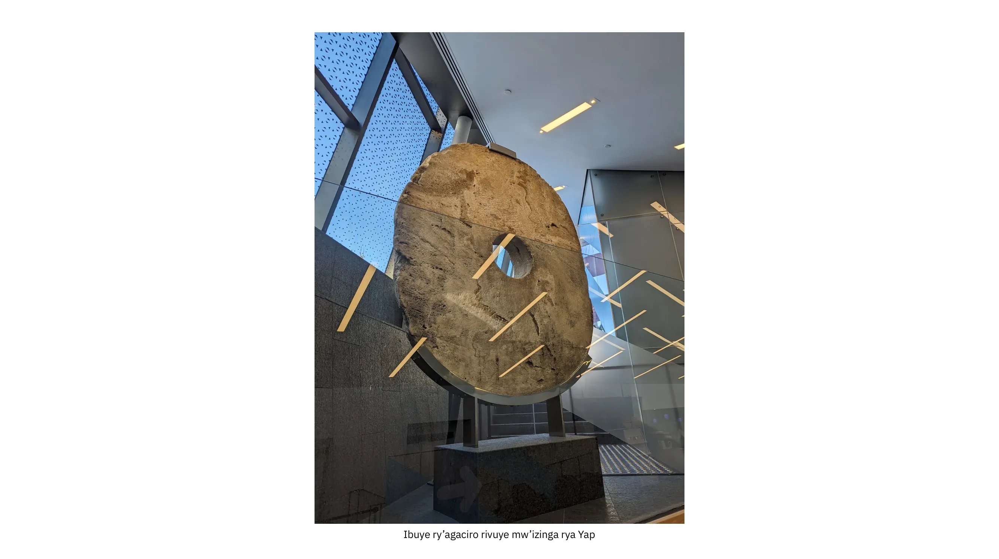

Ni vy’ukuri n'isesangura riryoshe cane muvy’amabuye y’i Yap. Saifedean Ammous na we nyene aravuga ako karorero mu gitabu ciwe "l’Étalon Bitcoin". Nk’uko yabivuze, uburyo bwo ku kirwa ca Yap busa cane na Bitcoin, ubwoko bw’inyandiko nyamukuru umuntu wese ashobora kuraba, ni ukuvuga iya bose, icungera amakonti no gucunga uburenganzira bw’ibintu. Ukwo kubona ibintu mu vy’ubuhinga bw’abantu kwerekana ko ivyo vyose bigereranya amasezerano canke ukwiyumvira kw’abantu mu kibano, ni ivyukuri koko. Kandi mbona uku kudomako urutoke k'amabuye yazimiye bihimbaye cane. Baja kurondera ayo mabuye kubirometero amajana mukiyaga na mato, bakazana ayo mabuye. Rimwe na rimwe amabuye yaragwa mu mazi yo mu kiyaga, ariko ayo mabuye yari kuguma akoreshwa mu bijanye n’amahera. Umuntu yari gushobora kuvuga ati: "Ego, twatereye ibuye ahantu ; ni iryanje, urumva twoshonora guhinduranya". Ntiyari ngombwa ko umuntu agira ivyo afise kugira ngo ashobore guhinduranya, kuko ayo mabuye yari manini cane ku buryo kenshi yaguma ahantu hamwe. Ahubwo, ikintu nyamukuru cari uguhinduranya n’ayo mabuye mu buryo bw’ugucuruza, bikaba vyatuma ubutunzi bushobora guhinduka ata mabuye yimuka vy’ukuri. Yari uburyo bw'"ikimenyamenya c'uguhurizako", bugaragaza uburyo bushimishije bwo kubona amahera mu vy'ubuhinga bw'abantu.

### Amafaranga y'intango n'inshingano z'imibano

Abahinga mu vy'imico kama kw'isi yose barabonye imiryango ikoresha "amafaranga y'intango" canke "amafaranga ya kera", nk'ibikoko, impuzu, amatungo, umunyu, n'amabuye, ivyo bikaba vyarangura ibikorwa bikunze gushirwa ku mahera, nk'uburyo bwo kwishura n'ububiko bw'agaciro atari uko nkumuhuza woguhinduranya ubutunzi mukibano.

Rero, aha turiko turadondora uburyo bw’amahera butakoreshwa vy’ukuri mu guhinduranya mukibano.

Kandi ndashaka kubibutsa ko ayo yose yari amafaranga imbere y’uko haza ibiceri, kandi sinzi ko ari mvugo ndenza rugero kuvuga ko ari "amahera". Nkunda kuvuga amahera. Nshobora kuvuga ko mu bitabu, kenshi tuvuga amafaranga y’intango kugira ngo tuvuge ayo amahera imbere ko haza ibiceri. Ariko nk’uko twabibonye mu gice ca mbere, **Nizera ko hariho uburyo bw’amahera kera cane imbere y’uko ibiceri biboneka**.

Aya mafaranga y’intango yakoreshwa canecane mu gucungera inshingano z’ishimikiro zo mu kibano zifitaniye isano n’abantu ku giti cabo, nk’ubugeni, indishi y’amatati (Wergeld), canke ingabire hagati y’abakuru. Nk’akarorero, mu Bwami bwaba perse, ibiceri vya mbere vyaremwe mu buryo budasanzwe kugira ngo bibe uburyo bwo kwishura ingabo aho kuba uburyo bwo guhinduranya.

Amahera y’intango rero yerekana akaranga ngirakamaro : ni uburyo bwo kuriha, ariko gake cane ni uburyo bwo guhinduranya ibintu vy’umubiri "direct" ata guca ku ruhande. Ico dushaka kuvuga aha ni uko bwari uburyo bwo kwishura inshingano zimwe zimwe zo mu kibano, imiryango, uguhanahana hagati y’abakuru, wergeld izwi cane, igiciro c'amaraso. Imbere y’uko ubutungane buza, iyo umuntu yishe umuntu, hariho indishi ku muryango wababajwe n’ukwicirwa uwabo. Hariho igiciro co kwishura ivyo, vyitwa amahera y’amaraso kandi ni uburyo bwo kwishura. Hariho kandi n’inkwano, na yo nyene ni uburyo bwo kwishura. Muri ivyo bikoresho vya mbere vy’amahera nk’uburyo bwo kwishura, vyari bifitaniye isano cane n’inshingano z’abantu n’iz’imibano kuruta kwishura ivyo bagura ku musi ku musi. Dushingiye kuri iyo nyigisho, ivyo bintu vyari bimenyerewe cane ku musi ku musi vyari bifitaniye isano cane n’inguzanyo, inguzanyo yasubitswe, ingabirano ku yindi, no gusubira gusangira ibifungurwa. Hariho ubundi buryo bwo gutunganya imibano kugira ngo ivyo biganiro bishobore gucungirwa. Ni vyiza kandi kwibuka ko, mu kibano aho umuntu wese yitunga, akora uburimyi bwiwe, ata n’umwe yizeye, kandi ko ata n’umwe akeneye uburyo bw’amahera bwo guhindura ibintu ku musi ku musi. Kandi ni co gituma uburyo bwa mbere bw’amahera bwari ubwo twahejeje kudondora, inkwano, amahera y’amaraso, kubera gusa ko ayo yari amahinduka ya mbere aho twari dukeneye uburyo bwo kwishura, kera cane imbere y’uko dukeneye gucuruza, guhindura umukate n’amahera ku musi ku musi, kuko mu mibano ya kera, ntivyagenda gutyo. Umuntu wese yarironsa ivyo akeneye, kandi nta n’ubuhinga bwihariye bwariho. Ngira ngo ivyo narabivuze cane mu nyigisho zose zabanje muri iri shure.

Muri ivyo bihugu, ata gucapura kw’ibikorwa kwari guteye imbere, uguhanahana ataco bimaze vyaguma ari bike, bikaba vyabaye ahanini mu migenderanire y’abantu ku giti cabo y’ubugenzi canke y’ubumwe. Kuba ata buhinga buhagije bwari buhari ntivyasaba amahera mu buryo bwa none.

Abahinga mu vy’imico kama nka Quiggin na Einzig bashimika ku vy’uko inguzanyo ari yo ibanza: **ubuzima bw’ubutunzi bwa kera bwafashwe n’uruzitiro runini rw’inguzanyo n’imyenda y’umuntu ku giti ciwe, aho amahera yinjira cane cane iyo amahera ategerezwa kwishurwa ubwo nyene kandi indishi zidashobora gusubirwamwo bitagoranye.**

Rero, abantu barahindura ibintu, bashobora gutanga inguzanyo isubitswe, ariko mu bihe bimwe bimwe, ntushobora gusubiza inyuma kwishura, rero amafaranga canke amafaranga y’intango arashobora kuba ngirakamaro muri iki gihe kugira ngo ugire iherezo ry’uguhinduranya.

### Ubuhinga bushasha bwo kutamenyekana

Iryo sesangura rituma umuntu agira ivyiyumviro vyimbitse: aho kurwanya amahera ngo ahindurwe, birabereye cane gutahura ukuntu yaserutse nk’uguhinduka kuva ku mice igoranye y’inguzanyo n’amadeni. Amahera azana ubuhinga bushasha bw’ishimikiro: **ukutamenyekana**. Kandi niho mbona iyo nyigisho y’ubuhinga bw’abantu y’uguseruka kw’amahera iryoshe cane. Nimba muri umugwi mutoyi w’abantu kandi mukahana ungurane, biragaragara ko mumenyana. Ngira ngo kugira ngo iyo nzira ikore, abantu bategerezwa kumenyana, biragaragara. Kandi ukwishurwa n’amahera bituma umuntu atamenyekana. Bigufasha kwishura ata bantu mbere bazi izina ryawe, ata bantu mbere bazi uwo uriwe. Bashobora gukora uguhinduranya kugira ngo bashobore gutorera umuti ibibazo vy’ubu nyene kandi vy’iherezo. Kandi ivyo ni vyo nyene amahera ashoboza.

Mu buryo butandukanye n’inguzanyo, iyo na yo yama ari iyo gutanga izina, amahera arashoboza gukora ibikorwa bitamenyekana, bihurikiye hamwe kandi bihita bibohora. **Ubwo bubasha bwihariye bwo kwidegemvya bw'amahera ni bwo busumba ubundi bwose.**

Gutyo, aho kuba igikoresho gisanzwe co kworohereza uguhanahana ubutunzi, amahera ni ikintu gishasha mu kibano, gifitaniye isano cane n’ugutera imbere kw’inzego n’imigenzo y’abantu, kuva ku ngurane z’umuntu ku giti cabo **gushika ku buryo bwo kwishura rusangi, butazwi**. Iryo terambere ry’ubuhinga bw’abantu ryerekana ko amahera, atari kure cane y’uburyo bworoshe bwo guhinduranya, aserukira ikigo gikomeye c’imibano, gihingura cane imibano y’abantu, ku buryo mu mibano yacu ya none, aba ari yo ntumbero nyene y’ibikorwa vy’ubutunzi.

Aha, turatahura ko mu mpera, mu mibano yacu ya none, intumbero nyene y’uguhinduranya ubutunzi ari ukugira amahera, mu gihe kera, ivyo ntivyari bimeze na gato. Intumbero nyene y’uguhanahana ubutunzi yari iyo kugira ibintu canke ibintu vyo gukoresha. Kandi uno musi, mu gushiramwo ubuhinga bushasha bw’amafaranga, intumbero y’uguhinduranya ubutunzi ni ukwirundanira ayo mahera, kuko adushoboza kuyahinduranya umutungo, nk’uko vyemerwa muri rusangi. Turashobora kubihindura umutungo dukeneye igihe tubikeneye.

## Kwandika ubumwe

<chapterId>7664442a-91c1-5ce4-a8bd-53b7371a3e3d</chapterId>

:::video id=473fc284-5375-4e1b-b0cd-6b51ba0cc3b8:::

### Ivyiyumviro vy'inyandiko y'ivy'itunganywa ry'amafaranga

Ubu tugiye kuronderera hamwe ivyiyumviro bitandukanye vyo guhuza izo nyigisho zibiri z’amahera, ni ukuvuga, inyigisho y’ivuka ry’amahera biciye mu madeni-amahera n’inyigisho y’amahera y’ivuka ry’amahera y’ibicuruzwa. Tugiye kuvuga ku ciyumviro ca Lynn Alden co guhuza abantu mu gitabu ciwe kizwi cane citwa "For Broken Money", umutwe w'ubusiguzi bwaco bwakozwe na Consensus kumbure uzokwitwa "Rupture monétaire".

*Igice c'igitabu Broken Money canditswe na Lyn Alden:*

> Mu vy’ukuri, amahera ni igitabu c’ivy’ubuhinga bwoguharura amahera. Amahera y’ibicuruzwa ni igitabu cagizwe nivyo ikibano gikeneye.Amahera ya banki ni igitabu cagizwe n'ibihugu vyunze ubumwe. Amahera open-source ni igitabu cagizwe n’abakoresha bayo.

Aha, Lyn yerekeza kuri Bitcoin.

### Le ratio stock-flux n'ukutaboneka vyoroshe

> Ama éléments chimiques amwamwe ataroshe kuboneka, nk’akarorero rhodium, ntaboneka cane kuruta inzahabu, mugabo bifise ratios stock-flux irihasi kubera itera ikoreshwa namahinguriro bapfa bazicukira. Igiceri canke ikirundo cade rhodium gishobora kugurwa nk’ikintu kidasanzwe co gukoraniriza hamwe canke ububiko bw’agaciro, ariko ntikibereye nk’amahera yemerwa n’abantu, kandi rero ntigisohoka mu buryo busanzwe nk’amahera.

Saifedean arabivuga cane mu gitabu ciwe "L'Étalon bitcoin". Ku batazi le ratio stock-à-flux, ni gusa iyo ugereranye ububiko buriho, ububiko buri kw’isoko, ugereranye n’ububiko bushasha buriko buraza, ukwinjira kw’ububiko bushasha. Kenshi na kenshi birahushanye n’ivyo umuntu abona, kuko woshobora kwiyumvira ko ikintu ufise mu bwinshi kidakenye, ariko mu vy’ukuri si ko biri. Ni ikibazo c’ubushobozi ufise bwo kuyitanga. Ahubwo ni ubushobozi dufise bwo kugira ububiko bushasha, hakurikijwe iki kigereranyo, buduha amakuru y’uko ico kintu ari gake canke atari co. Si kubera ko ataco dufise mu bubiko bisigura ko ari nkeya, ni kumbure gusa ko ataco dufise. Rero, nitwafata inzahabu, turafise inzahabu nyinshi kuko zikoreshwa nk’ububiko bw’agaciro, kandi ukwinjira kw’inzahabu nshasha ni nk’ibice 1% gushika kuri 3% ku mwaka vy’inzahabu nshasha yinjira biciye mugucukura inzahabu. Ariko, ivyo ariko aravuga hano, nimba turiko turavuga ivy’i rhodium, ninkeya cane kuruta inzahabu, ariko nta stock ishoboka kubera ikoreshwa cane. Ntibisaba rero ibintu vyinshi bishasha kugira ngo umuntu akure kabiri ivyo yari afise. Ariko ku bijanye n’inzahabu, vyofata n’imiburiburi imyaka 50 kugira ngo isubire kubaho, kugira ngo ivy’ubutunzi vyirwize incuro zibiri. Udakunze ibicuruzwa vyinshi bikoreshwa, aho vyoroshe cane, kandi ntibifata imyaka myinshi kugira ngo umuntu akure kabiri ivyo afise, kuko bikoreshwa uko bigenda.

*"Inzahabu yagumye ifise stock-à-flux iri hagati ya 25x na 100x muri kahise k'ubu, akenshi hafi 50x canke irenga, mu gihe gitoyi ntiyigeze igwa munsi ya 16x, mbere no mu gihe c'Ikigobe c'Inzahabu co hagati mu kinjana ca 19. "*

Rero, 25 vyoba bisobanura imyaka 25 kugira ngo ububiko bwigwize na kabiri, 100 na vyo bikaba bisobanura imyaka 100 kugira ngo ububiko bwigwize na kabiri. Saifedean avuga mu gitabu ciwe ko naho twokubita kabiri inzahabu, kuva ku 1,5% gushika ku 3%, ntivyogira ingaruka nyinshi ku giciro cayo.

*"Ifeza muri rusangi ifise igipimo c'ububiko c'ibice 10 canke birenga, ivyo bikaba bikiri vyinshi cane.*

*Ibindi bicuruzwa vyinshi bifise igipimo c'ububiko kiri munsi ya 1 canke 2. Mbere n'ibintu bidasanzwe, nka platine na rhodium, birafise igipimo c'ububiko buke cane kubera ko bikoreshwa vyihuta mu nganda."*

### Ubusumbasumbane bw'inzahabu n'ifeza .

*"Muri make, igihe cose amahera y'ibicuruzwa yisanze ariko arahiganwa n'inzahabu n'ifeza, ayo mafaranga yama ahereza ari mwihangana. Ibindi bicuruzwa vyoshobora kuguma ari amahera mu bihe bifise imbibe canke mu turere twihariye, ariko inzahabu n'ifeza vyama vyerekana ubushobozi bwavyo bwo kuba amafaranga ahanganye kw'isi yose iyo bihuye n'amafaranga y'igihugu. inzahabu n'ifeza vyama bifise ubushobozi bwo guca agaciro k'ubundi buryo bw'amahera, mu gihe abafise ibikoko, amasaro, amatungo, umunyu, impuzu canke ivyuma vy'agaciro gatoyi batashobora kwigera bagabanya agaciro k'inzahabu canke ifeza."*

Ivyo rero birasubirwamwo neza cane muri The Bitcoin Standard aho Saifedean avuga ku miryango yo muri Afirika yakoresha amabuye y’ibirahuri. Kandi igihe abacuruzi b’i Venise bashika bafise imizigo yuzuye amabuye y’ibirahuri kuko bari bashoboye kuyahingura mu nganda ico gihe, bari bafise ubushobozi bwo kubikora, vyatumye uburyo bw’amahera bw’ivyo bihugu buhungabana rwose kandi barashobora gusahura ubutunzi bwabo vy’ukuri. Ivyo ni vyo Saifedean yavuga.

### Igice ca konti n'inguzanyo

*"Mu mateka, mbere n'igihe inguzanyo yakoreshwa ataco ihinduye nk'igikoresho co guhindura, akenshi yakoreshwa mu bice vy'ibicuruzwa vy'amahera vyatoranijwe mu buryo busanzwe kubera imitungo yabo."*

Ico ni iciyumviro gishimishije cane, kandi ni co jewe na Ulrich twama tuganirako. Naho urusengero rwo muri Mezopotamiya rwari ubwoko bw’ubukuru bwashobora gucungera ico ciyumviro c’inguzanyo, ingero yoguharura yari shekeli. Ntaco cemeza ko shekeli yashinzwe muburyo bwitegeko n’urusengero. Shekeli yari gushobora guseruka mu buryo busanzwe, biciye ku nkenegwa y’abadandaza yo kwinjiza no gusohora n’abandi bantu bo mu karere. Turafise ibimenyamenya vy’ivyo, mu buryo bw’umucuruzi wo muri Kanesh (ivyo nabivuze mu Gice ca 1) yakoze ivyo nyene, akazana ivyuma vy’agaciro bitakoreshwa kubera agaciro k’ibicuruzwa vyavyo vy’umubiri, ahubwo nk’ububiko bw’agaciro. Ikibazo conyene ni uko tutazi nimba twokwiyumvira ko iyo nzira yo guhitamwo ifeza, y’ifeza shekeli, yakozwe n’abadandaza, canke ko yakozwe n’urusengero. Ariko Ulrich afise imvo nziza cane ituma twiyumvira ko kumbure ahubwo ari ku ruhande rw’abadandaza ari ho yakozwe.

*"Rero, ubumwe bw'izo nyigisho zibiri burashobora kudondorwa nk'"inyigisho y'ubuhinga bw'amahera" ("inyigisho y'amahera") kuko idondora ivyiyumviro vy'ishimikiro bihurikiyeko izo nyigisho zompi. hagati yabo kugira ngo ntibaze bahaze ivyipfuzo bibiri bihuye, bagabanye ugushihana mu guhinduranya, kandi bikore nk’uburyo bwo kuzigama amahera Itandukaniro ry’ingenzi riri mu bubasha bwajejwe kubika igitabu c’amazina."*

Ku ruhande rumwe, kamere ni yo igenzura uburemere bw’amahera. Rero, nitwafata inzahabu, nk’uko yaba ari nkeya cane, biragoye kuyicukura. Hariho ubwoko bw'umupaka w'ibiceri vy'inzahabu bishobora gucukurwa. Rero ubukene burongorwa n’ibidukikije. Kandi igitabu c’ivyandika gifatwa n’iciyumviro c’ugutunga. Igitabo c’ivyandikano kirashizwe ahantu hamwe. Ugutunga bigaragazwa n’uko ufise igiceri c’inzahabu canke igice c’inzahabu. Kandi ku bijanye n’amahera y’inguzanyo, ubukene bugenzurwa n’ubushobozi bw’abantu bwo kuronka inguzanyo. Canke ku bijanye n’amahera ya afatiye ku kwizera, ubukene burongorwa n’ubukuru. Ni bo bafata ingingo yo gucapura vyinshi canke kutabicapura, kugira ngo ntihagire ivyago vy'ukuduga kw’ibiciro. Rero, mu bihe bimwebimwe, igitabu c’amazina gishobora kandi kurongorwa na nyen’igitabu ca jeton, ku bijanye n’amahera y’impapuro. Ni co gituma ryinjizwa mu gitabu, mu bimenyetso vy’ugusubiramwo, rikagira dematerialisation. Ego cane, ivy’umubiri, ariko vy’ukuri. Arafise iyi token izwi cane, kandi nivyo vyerekana ko afise. Kandi bishobora kuba vyoroshe cane mu gitabu nyaco, nk’uko biri ku mahera yo mu vyanditswe, muri banki, aho mu vy’ukuri ari banki y’abantu igenzura uwufise iki mu bijanye n’igitabu.

## Ubumwe biciye mu giciro c'amahera

<chapterId>093756e5-8908-55e5-bb76-376a3a3cc4d3</chapterId>

:::video id=eabc342a-ecbd-46ca-a347-e914917e7c4f:::

### Iciyumviro c'amahera y'imbere

Muri iki gice kijanye n’ivyifuzo bitandukanye vyo guhuza ivyiyumviro bitandukanye ku bijanye n’ukuvuka kw’amahera, nca nshinga ivyiyumviro vya Lyn Alden, ivyiyumviro vy’inyandiko. Mfise iciyumviro canje co guhuza izo nyigisho zibiri z’amahera. Ni amahera y’imbere, iciyumviro c’amahera y’imbere. Rero, agaciro k’amahera gashobora gusigurwa n’amahera y’imbere akomoka ku vyo asabwa, haba mu buryo bw’ibipande vy’ibumba, ibiceri vy’icuma c’agaciro, amafaranga y’amahera, canke bitcoin. Ico kiguzi c’amahera gishingiye gusa ku cizigiro c’uko hari uwuzohindura ayo mafaranga muri kazoza ku giciro kigereranywa.

Ico ngerageza kwerekana hano ni uko gusa yaba ari amahera afatiye kukwizera, ni ukuvuga amafaranga y’amabanki ataco amaze, yaba ibiceri vy’inzahabu canke icuma ico ari co cose, igice c’inzahabu canke ikirundo c’inzahabu, **kenshi ni amafaranga y’imbere akora igice kinini c’agaciro kayo**. Iyo dufashe igice c’inzahabu, igice kinaka c’agaciro kayo kirasigurwa n’agaciro kayo ko gukoresha, uko ikoreshwa mu nganda canke mu gukora amabuye y’agaciro. Zirikana ko ugusaba amabuye y’agaciro kenshi biva ku gaciro kayo k’amahera. Abantu bagumya amabuye y’agaciro nk’ubwoko bw’ububiko bw’agaciro, rero ivyo ndabishiramwo gatoyi mu giciro c’amahera kuko kenshi ni ugusaba amahera kugira ngo umuntu agire uruhara mu mahera.

Rero wovuga ko hafi 10% vy’inzahabu isaba ari ivy’inganda. Mu gaciro k’inzahabu, twogira igice gitoyi, reka tuvuge 10%, ivyo vyoba bisigurwa n’ico gisaba c’inganda, ico gisaba co gukoresha inzahabu, aho inzahabu ikoreshwa. Ibindi ni ugusaba gutomoye ko ikoreshwa mu vy’amahera nk’ububiko bw’agaciro.

### Ubukuru bw'agashimwe na fiat(amahera afatiye kukwizera)

Kandi iyo ugereranye igice c’inzahabu n’igiceri c’inzahabu, hariho ikindi gice. Ico gice c’inzahabu gishirwako ikidodo n’ubutegetsi, kandi inzahabu iri muri ico gice na yo nyene irasabwa gukoreshwa, ni ukuvuga ko ikoreshwa mu nganda. Iraronka kandi amafaranga y’imbere nk’ububiko bw’agaciro. Ikindi, hariho igipfukisho nitwa authority premium, aho kenshi hazoba igiciro, ubushobozi bwo kugura igiceri kuruta igice c’inzahabu, kuko igiceri coroshe gukoresha. Bituma uguhanahana bigenda neza, kuko ata nkenerwa yo kubipima. Ubukuru mu bisanzwe buratanga icemezo c’ubusuku bwabwo. Kandi iyo ugereranije n’igice c’inzahabu, igiceri c’inzahabu giteye ikidodo muri rusangi kirafise agaciro kuruta igice c’inzahabu gisanzwe. Kandi ivyo navyo ni ibisanzwe, kuko bisaba ubutunzi kugira ngo umuntu abishireko ikidodo.

Ni ingingo imwe nyene ku mahera afatiye kukwizera, y’impapuro. Amahera y’impapuro ntaco amaze vy’ukuri, kiretse kumbure gushusha inzu, kandi ivyo vyabaye mu gihe ca Repubulika ya Weimar. Rero nta n'ivyo vy'ukuri bisabwa ku gaciro k'ikoreshwa ryayo. Kurundi ruhande, hariho gusa igiciro c’ubukuru, mu vyiyumviro vyanje.

Ni uburyo bw’amafaranga y’imbere, igipfukisho ku amafaranga  y’imbere. Ariko amafaranga yayo y’imbere ava ku kuba ari amafaranga yemewe n’amategeko, hanyuma abategetsi bakaguhatira kuyigura kugira ngo wishyure imisoro yabo. Rero, vy’ukuri, amafaranga y’amahera afise uburyo bwo gusaba amahera buva ku kuba akoreshwa imisoro kandi utegerezwa nibura kuyaronka kugira ngo wishyure imisoro yawe. Kandi ivyo bituma riguma ari uburyo bwo kwishura bwemewe muri rusangi. Abantu rero barashaka kuyironka kugira ngo bashobore gushitsa ivyo bakeneye.

### Ubumwe biciye mu gusaba amahera

Kandi ni kuki iki ciyumviro c’amahera y’imbere gishobora kuba ari uguhuza inyigisho zibiri z’amahera y’imadeni n’amahera y’ibicuruzwa? Erega, sinzi ko agaciro k'igiceri c'inzahabu kava ku "gaciro kaco k'imbere". Oya, mu vy’ukuri, ni iciyumviro co kwizigira nk’uko biri ku amafaranga y’amahera. Ni iciyumviro c’ugusaba amahera. Kandi si kubera ko ifise igice gitoyi c'ikoreshwa ry'inganda, ikindi "gikoreshwa". Nitwavuga ko ikoreshwa ry’inganda ari 10% vy’agaciro karyo, ivyo twobiha agaciro ku madolari 300 ku ounce. Iyo inzahabu igurishwa kw’isoko ku madolari 3.000 ku nkoko, itandukaniro riri hagati y’amadolari 300 n’amadolari 3.000 ni ryo ry’amahera rizwi cane. Ni uku gusaba amahera kw’inzahabu nivyo bisigura. Kubera ko amahera afatiye kukwizera ifise agaciro k’ikoreshwa rya zero ntibisigura ko itandukanye. Kuri jewe, ni co kimwe nyene. Rero ku mpande zompi, inyigisho y’amahera y’amadeni canke amahera y’ibicuruzwa, sinibaza ko ubwoko bw’uburyo bwongerekanye inzahabu yogira bwo kugira agaciro gatoyi k’ikoreshwa buhindura ikintu na kimwe.

Ku rundi ruhande, birazwi neza ko **ku rugero rw’uguseruka, hakurikijwe ivyiyumviro vya Mises vy’ugusubira inyuma, dushobora gusaba ko iyo nkoresha irema ugusaba ku ntango kandi igatanguza inzira ihinduka amahera.** Mu gihe, ku rugero rw’amahera y’imyenda, ari ugutegekwa n’ubutegetsi, iciyumviro gitandukanye cane. **Ariko mbona ko ku rugero rw’agaciro, ingene twosigura agaciro k’amahera, n’amahera y’imbere, dushobora gusigura mu buryo bworoshe nk’uko nyene igituma amahera afatiye kukwizera afise agaciro tuyashirako n’igituma amahera y’ibicuruzwa afise agaciro** tuyashirako. Kuri jewe, ni iyo nzira nyene, kandi yitwa amahera y’imbere.

#### Igiciro c'amahera

Nivyo. Agaciro k’amahera gashobora gusigurwa n’amahera y’imbere akomoka ku vyo asabwa, haba mu buryo bw’ibigura vy’ibumba, ibiceri vy’icuma c’agaciro, amanoti y’amahera canke bitcoin.

Ico kiguzi c’amahera gishingiye gusa ku cizigiro c’uko hari uwuzohindura ayo mahera mu nyuma ku giciro kigereranywa.

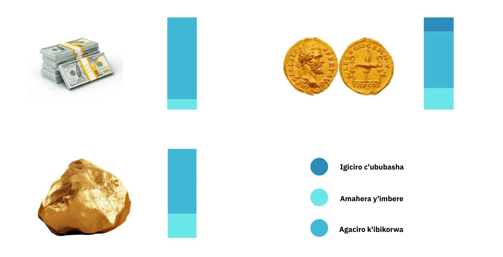

# Insobanuro zitandukanye z'amahera

<partId>77b7918a-8c3b-11f0-b688-6b2ab22378c9</partId>

## Amahera(Money) n'ifaranga(currency) n'amahera(monnaie) n'ifeza(argent) n'anahera y'ikindi gihugu(devise)

<chapterId>bf8a6d21-df88-5d23-a0a5-e9a5c1300554</chapterId>

:::video id=d9c9e7df-9db3-4a9f-801e-10d3fc7dfc22:::

### Insobanuro y'amajambo y'amahera

Muri iki gice kivuga ku vyiyumviro bitandukanye vyerekeye amahera na cane cane ku nsobanuro z’amahera, noshima gutanga insiguro ngufi ku ruhande ku bijanye n’insobanuro y’amajambo. Nashaka kwimba gatoyi mu nsobanuro z’amajambo menshi yerekeye amahera, nkayagereranya n’ayo mu congereza. Nk’akarorero, amahera, amafaranga, ugereranyije na monnaie, argent na devise. Rero, bigenda gutya.

Insobanuro ntoyi:

Iyo tuvuze "**amahera**" (de la monnaie), abantu benshi bazokwibaza ko turiko tuvuga inoti turonka iyo habaye irungika. Kandi iyo tuvuze "**amafaranga**" (la monnaie), abantu bazokwibaza ko turiko tuvuga amafaranga y'igihugu. Ifaranga rya Canada ni idolari rya Canada. Nivyo nyene.

Ariko none amahera (de l’argent) yoba ameze gute? Umusuma ntazokwigera avuga ngo "Mpa amahera(monnaie) yawe yose!" (uwo musuma yoshobora neza gutengurwa iyo agukuyeko ibiceri hafi atagaciro bigira).

Oya, umusuma azosemerera ati: "Mpa **amahera(argent) yawe yose**". Kandi iyo uwo musuma ahagaze imbere yawe mu nzira, aba ariko yerekeza ku **inoti zo muri banki** ziri mu mufuko wawe.

Kurundi ruhande, iyo uwo musuma agerageza kuguhenda mu buryo buhanitse cane, agerageza kwiba itunga ryawe, mugukomboroza konti zawe zose zo muri banki, twovuga ngo **azotwara amahera yawe yose**. Aha ijambo "amahera" ryerekeza ku **ubutunzi bw'umuntu ku giti ciwe**.

Rero hariho insobanuro zibiri z’ijambo amahera: amahera (amafaranga y’amabanki) n’ubutunzi.

### Amafaranga(Currency) n'amahera(monnaie) n'ugutegura(devise)

Ifaranga (devise) ni ngombwa ko ari amafaranga y’ikindi gihugu, ahandi ho tuvuga gusa amahera (monnaie). Iyo uri umufaransa, wovuga uti: «La livre sterling ni amahera(devise) yigihugu c'ubwongereza hama ama euro ni amafaranga(monnaie) y'ibiraya».

Kenshi, abantu bataracukura izo ngorane z’insobanuro zayo majambo, mu guhindura ayo majambo, kenshi bazokunda kuvuga amafaranga (devise) iyo handitse currency, ariko oya, amafaranga(currency) ,ni amahera(monnaie) iyo ari amahera y’igihugu cawe, kandi ni devise iyo uriko uvuga amafaranga yikindi gihugu. Kandi rero, ingorane hano nkunda kubona ni uko mu congereza, hari amajambo abiri: hariho "money", ari co ciyumviro c'amahera, kandi hariho "currency", ari co mu vy'ukuri umuce w'amahera w'igihugu ukoreshwa mwihanahanwo. Rero turashobora kuvuga gusa ku ciyumviro c’amahera; biroroshe - ni iciyumviro c'ijambo *money(amahera)*; ni currency(amahera) muri rusangi , ni nkokuvuga mubisanzwe amahera y'igihugu. Ariko mu gifaransa, ikibabaje, abantu bazovuga kenshi ngo ego, "mais ce n'est pas une monnaie(si amahera)" iyo bavuga ivya bitcoin kuko atari amafaranga y'igihugu, ariko kenshi, mbona ko bariko bafatira kumvugo apana kumahera(currency). Ivyo ni bibi ku ruhande rumwe, kuko kuva muri El Salvador, bitcoin ni yo yari amafaranga y’igihugu. Ikintu kiguma ari uko abantu bazovuga kenshi bati: *ariko oya, si amafaranga y’igihugu, ntashobora kuba amahera*. Ariko mu vy’ukuri, nitwavuga ku ciyumviro cagutse ca *amahera*, bitcoin irahuye neza cane n’iyo nsobanuro, mu vyiyumviro vyanje. Ni uko gusa mu gifaransa, ata majambo abiri dufise yo gutandukanya ivyo vyiyumviro bibiri. Twovuga ko ijambo argent ryerekeza ku mafaranga, ariko ikibabaje, iyo si yo nsobanuro yayo nyayo. *Argent* (amahera) yerekeza ku butunzi canke ku bipapuro vy'amafaranga. Ntushobora vy’ukuri gukora ikintu kingana n’ijambo *amahera*. *Amahera* ni vy'ukuri iciyumviro c'amahera (monnaie).

## Insobanuro ya Saifedean Ammous

<chapterId>07c4ba50-168c-567a-8957-0b187ff75f97</chapterId>

:::video id=936d6d3b-6d45-468e-bc44-85fbce9b857a:::

#### Amahera ni iki?

Amahera ni ikintu gusa ufise canke uronka kugira ngo ntukoreshe canke ngo ukoreshe kubera wewe nyene, ahubwo ngo uzogihindure mu nyuma n’ibindi bintu canke ibikorwa woba ukeneye. (Ikinyafede)

Amahera aronka inyungu y’amahera iyo hariho ugusaba amahera ku ciza, kugira ngo akore uruhara rumwe canke nyinshi z’amahera.

Ivyiza vy’amahera bitegerezwa kuba bike cane kugira ngo igiciro c’amahera kibeho (kugira ngo ugutanga ntiguhure n’ivyo amahera asaba).

### Igiciro c'amahera

Muri iki gice kivuga ku nsobanuro zitandukanye z’amahera, nashaka kuvuga muri make insobanuro ya Saifedean atwereka mu gitabo "Étalon Bitcoin", kikaba cama kinshimisha cane. Carankozeko igihe nagisoma, cambereye ikintu coroshe. Kandi tuzokwongerako n’iciyumviro c’amahera y’imbere muri iyo nsobanuro. Nk’uko Saifedean abivuga mu gitabu ciwe, hariho ata kabuza iciyumviro c’ubukene. Ikibazo ni iki, amahera ni iki?

> Amahera ni ikintu ufise canke uronka, atari co gukoresha canke ngo ukoreshe kubera co, ahubwo akagikoresha muguhinduranya mu nyuma n'ibindi bintu canke ibikorwa woba ukeneye.

Rero iyo ni yo nsobanuro Saifedean avuga mu gitabu "Étalon Bitcoin.". Nari kwongerako ko amafaranga (la monnaie) aronka amahera y’imbere iyo hariho ugusaba amahera ku ciza, kugira ngo akore uruhara rumwe canke nyinshi z’amafaranga. Wovuga rero ko ifaranga rikora nk’ububiko bw’agaciro rizogira igisabwa c’amahera kizoriha amahera y’imbere, kuko abantu bashaka kurironka, nk’akarorero nk’ububiko bw’agaciro canke nk’uburyo bwo guhindura amahera.

### Ukutaboneka cane(rareté) n'uburyo bwo gutanga isoko

Kuri ivyo, mbona ko dukwiye kwongerako ata gukeka nuko amahera ategerezwa kuba make cane kugira ngo amahera agumane agaciro. Ivyo birahambaye cane. **Iyo havutse ikintu kugira ngo gikoreshwe nk’amahera tukabona igiciro caco kiriko kiraduga, mu bisanzwe, iyo ico kintu kitari gike, abantu bazoshaka kugihingura vyinshi kugira ngo bungukire kuri iyo nyungu y’agaciro iyo igiciro kiduze**. Ni co gituma ibintu vyinshi biri kw’isoko bifise igiciro kidahinduka. Iyo igiciro kiduze, umusaruro urakunda kwiyongera. Iyo igiciro kigabanutse, umusaruro uragabanuka. Hariho ubwoko bw’uguhindura isoko. **Kandi iyo ikintu ari gito cane, nk’inzahabu, uburyo bw’isoko ntibuzosubiza inyuma ivyo bisabwa vyiyongereye vyo gukoresha amahera. Rero ni igihinduka(variable) gihinduka, ni igiciro. Nk’uko biri ku bitcoin**. Iyo igiciro ca bitcoin kiduze, ntidukora bitcoin nyinshi. Ico rero gihindura ni igiciro. Kandi ni co gituma, mu myaka, twabonye igiciro ca bitcoin kiduga uko abashaka bitcoin bagenda baraduga. Kubera ko ata n'umwe kw'isi ashobora guhindura ubuhinga akavuga ngo "hariho ivyifuzo vyinshi, igiciro kiriko kiraduga, tuzokora vyinshi." **Ugutanga ama bitcoins mashasha birategurwa imbere y’igihe, kandi biramenyekana imbere y’igihe**. Ivyo rero nivyo nariko ndavuga, ko amahera ategerezwa kuba make  cane kugira ngo igiciro c’amahera gikomeze, kandi rero ntikifatwe n’uburyo bw’isoko, kugira ngo ugutanga ntibihure n’ivyo bisabwa bishasha vy’amahera.

## Uburyo bwo kwishura n'agaciro k'ukwibohora(valeur libératoire)

<chapterId>5d424039-e342-56f7-9d8b-bba9551831a9</chapterId>

:::video id=af4c0765-8111-4cb7-891b-3ee54d6e7054:::

### Uburyo bwo kwishura n'uburyo bwo guhanahana

Muri iki gice kijanye n'insobanuro zitandukanye z'amahera, ndasaba ko tworaba hamwe amajambo yasubiwemwo mu gitabu "Aux origines de la monnaie" (Inkomoko y'amahera), igisomwa ca Alain Testart ku bijanye n'amahera nk'uburyo bwo kwishura n'agaciro k'ukwibohora.

*Mu gitabu Aux origines de la monnaie, Alain Testart asigura ko amahera ari uburyo bwo kwishura:*

> Ibikorwa vy’uburyo bwo kwishura bifatwa aha nk’ibitandukanye n’ibikorwa vy’uburyo bwo guhanahana amahera, ku rugero hariho ukwishura ataco witeze, ukwishura ataco kugura. Knies (1873:192 ff.) arategura cane iyo nsiguro y’ugutanga ibintu bitagizwe n’ibikorwa vyo guhanahana, nk’uko biri ku vyerekeye wergeld (amahera y’amaraso canke igihimba c’ubwicanyi) canke imisoro. Carl Menger yateye iyo nzira ya kane mu kiganiro ciwe co mu 1892 citwa "Geld", muri rusangi kibonwa ko ari kimwe mu bifata ingingo cane kuri iyo nkuru. Hatariho gusenyuka rwose, iciyumviro c’igikorwa c’uburyo bwo kwishura gisa n’icabaye cibagiwe mu vyiyumviro vy’ubutunzi muri iki gihe, canke n’imiburiburi kikanka kugira ngo haboneke ic’uburyo bwo guhindura.
>

> Amahera akoreshwa mu kwishura: uravye muri ubwo buryo, ni igikoresho co kwibohora, kidondora muri rusangi igikorwa c’uburyo bwo kwishura. Muri ivyo, tuvuga "ububasha bwo kwibohora" bw'amahera. Nk'uko Le Petit Robert abivuga, ububasha bwo kwibohora ni "ubwo bufise ingaruka zo kwibohora (ku nshingano, ideni)". Nk'uko bivugwa na Grand Larousse, ukwishurwa kw'ukwibohora ni "ukwishurwa kwose gukorwa hakurikijwe amategeko mu buryo uwufise ideni adashobora guhakana ideni". Amafaranga arafise ubwo bubasha par excellence; mbere ni co gisobanura ikibanza caco c’amahera, kubera ko ata n’umwe ashobora kwanka kwishura amahera, yaba uwugurisha canke uwugurisha. Amahera ni co ciza conyene kidashobora kwanka mu kwishura ivyo umuntu afise ideni, ata kuraba ko uwo mwenda ari uwufitiye umucuruzi canke umukozi w’ikori. Mu bintu vyose, amahera ni yo yonyene afise ako gateka. Charles yanditse ati: “Ni ako gateka. Gide (1921 I: 443), ari ryo rigize ico twita amafaranga yemewe n’amategeko.
>

> Uguhanahana kwose gushingiye muguhinduranya ikintu ku kindi, canke hagategerezwa gusubizwa ikintu iyo habaye itanga, bisobanura ata kabuza ko uwugihawe afise inshingano yo gusubiriza mu nkoko mugenziwe. Ukuriha ni ugushitsa iyo nshingano. Guhindura vyose rero bisobanura kwishura, ariko si ukwishura kwose bisobanura guhindura. Hariho ivyishurwa ata subizwa rihabaye, ni ukuvuga ivyishurwa bidatuma umuntu aronka ikindi munyuma, kandi bitakorerwa iyo ntumbero. Imisoro iguma ari yo karorero k’ingenzi aha; dukwiye kandi kuvuga amande y’ubwoko bwose yishurwa inzego za Leta, n’indishi zifitiye abandi ku ngingo ngenderwako y’uko uwugiriye nabi abandi ategerezwa kubisanura.

### Ukwishura ata atagusubirizwa mu nkoko(contrepartie)

Ico ni ikigereranyo gitomoye c’ivyo umwanditsi avuga. Nkako, aratandukanya ivyo bintu bibiri. Kuri we, uguhindura ni ugutanga ibintu no kwishura. Ukwishura ni kwo gukurikira. Kandi ukwishura birashobora kubaho ata guhanahana bibaye. Atanga ingero z’ingene kwishura PV canke ihadabu ari ukwishura gusa. Nta n’igikorwa vy’ukuri uronka ngo usubirizwe mu nkoko. Bamwe boshobora kuvuga ngo Leta iriko iragukorera igikorwa co kugusubiza, igikorwa co kuguha PV aratomoye neza ko kwishura imisoro ari ukuriha ata gusubirizwa munkoko, mu buryo bw’uko kwishura imisoro bisabwa, naho woba udashobora kuronka igikorwa. Avuga ko vy’ukuri vyasobanuwe ko kwishura imisoro ari ukwishura gusa; nta n'itegeko ryo kuronka ikintu nawe. Ivyo narabiganiriyeko na benshi mu bagenzi banje, kandi ntibemeranya n’ico ciyumviro. Ariko ivyo ni ivyiyumviro vy’umwanditsi. Agerageza gushiramwo iciyumviro co kwishura no kugitandukanya n’uguhinduranya n’izo ngero, nk’akarorero, z’amande, ukwishura umusoro. Kandi nk’akarorero, inkwano, aserura ko inkwano ari ukwishura; ntaco uronka vy’ukuri mu nyuma. Umuntu anegura iki ciyumviro yoshobora kuvuga ati: "Ego, ariko uronka umugore mu guhanahana." Rero niho urugero rw’impaka kuri iyo nkuru rushika.

Hariho kandi wergeld, canke amahera y’amaraso. Rero ni ukwishura gusa kugira ngo umuntu yishure. Umugenzi wanje Ulrich yovuga ati:

> Ego, ariko ubona nawe ifurwa rya disiye.

Rero, warakoze icaha, ubwicanyi nk’akarorero. Ico gihe, uriha wergeld, hanyuma inyuma y’ivyo, well urarekurwa muri iyo nzira. Rero hariho ububasha bwo kwidegemvya. Hari ico uronka mu gusubiza?" Nk'uko umwanditsi abivuga, oya. Nk'uko bamwe mu bagenzi banje babivuga, egome.

Ngira ngo muri iki kiganiro, turashobora kubona ko wergeld ari imwe mu ngero nziza zo gusobanura ukwishyura. Nkako, biragaragara ko ata co uronka munyuma.

## Amahera y'amadeni n'amahera y'ibicuruzwa

<chapterId>4093677a-c8e8-5828-b994-15c01656186e</chapterId>

:::video id=f49cf5cc-288e-4daa-a1ff-b9de73506f4e:::

### Impaka y'ishimikiro

Naho biri muri iki gice ku nsobanuro n'ivyiyumviro bitandukanye vy'amahera, reka dusuzume hamwe ivyerekanwa bibiri bitandukanye cane: "amahera yama ari ideni" canke "amahera yama ari igicuruzwa". Ku ruhande rumwe, hariho abashigikiye inyigisho y’amahera ishingiye ku madeni, bavuga bati: "Oya, amahera yama ari deni! Ku rundi ruhande, aba gold bugs  bazwi cane baravuga bati: "Ariko oya, urabona, amahera yama ari igicuruzwa, yama ari inzahabu; ibindi vyose, amanoti, ni inguzanyo gusa, si amahera".

Reka dusuzume incamake itomoye y’izo nyigisho turi kumwe.

### Ivyiyumviro vy'uko "yama ari ideni"

Aha niho hari incamake y'inyigisho y'amahera izwi nka **"amahera y'ideni"**, ivuga ko amahera ari uburyo bw'ideni:

Dushingiye kuri iyo nyigisho, yateguwe cane cane na Alfred Mitchell-Innes, igakomeza gutegurwa na David Graeber, amahera ni ukwemera ideni, biva ku migenderanire y’inguzanyo yariho mu mateka imbere y’uguhanahana amahera direct. Aho kuva gukenera bifatiye kugu hinduranya(troc), amahera aboneka nk’uburyo bwo guharura, kwimurira no gutanga inshingano canke amadeni yo mu kibano hagati y’abantu canke imigwi.

Gutyo, amahera yose agendagenda nk’amadeni umuntu canke ikigo kimwe gifitiye ikindi, ashigikiwe n’ukwizera be n’ubutegetsi bw’imibano canke bwa Leta buvyemeza ko ari uburenganzira. Rero, nk’uko babivuga, iyo dufise - nk’uko namaze kubivuga - iyo dufise amahera, tuba dufise ico dusaba ku kibano, kandi ikibano kiradufitiye ideni. Amahera rero ntabwo yigera agira aho abogamiye canke ngo yigenga, ahubwo yama ari deni ry’ishimikiro: kugira amahera mu vy’ukuri bisigura kugira ico asabwa ku kibano canke ku kibano c’ubutunzi.

Ivyo vyiyumviro bivuguruza iciyumviro ca kera c'uko amahera ari "igicuruzwa c'ihuza" gisanzwe, ahubwo bishimika ku ruhara nyamukuru rw'imigenderanire y'imibano n'ivya politike mu gukorwa no mugucunga amahera.

**Isuzuma ryanje:**

Ikintera ubwoba kuri iyo nyigisho ni uko yemeza ko amahera yama ari deni, igihe dufise ingero z’uguhinduranya hagati y’imiryango ibiri itandukanye, nk’akarorero, ihinduranya inzahabu, aho uguhinduranya ari uguhera ata gukeka kandi ata mwenda uhishijwe usigaye. Abashigikiye iyo nyigisho bazotubwira kenshi ko ivyo biganiro atari uguhinduranya amahera, ahubwo ari uguhinduranya. Nk’uko vyamaze kuvugwa, ntavyemera. Ni uguhindura amahera, kuko inzahabu itazohera; rigiye gukoreshwa nk’amahera.

### Ivyiyumviro vy'uko "igihe cose ari igicuruzwa"

**Igihe cose ni igicuruzwa:**

Aha niho hari incamake itomoye y'inyigisho y'amahera izwi nka **"amahera-igicuruzwa"**, aho amahera yama asohoka nk'ikintu, cane cane inzahabu, kiva mu nkenerwa yo kuba umuntu ashobora gucuruza, igicuruzwa kizokwemerwa muri rusangi mu mahanga kandi kironswa kugira ngo kigurishwe.

Dushingiye kuri iyo nyigisho, yateguwe n'abahinga mu vy'ubutunzi ba kera (Adam Smith, David Ricardo) kandi ifatwa na Marx, amafaranga asohoka mu buryo busanzwe nk'igicuruzwa mu bindi, kenshi akaba ari icuma c'agaciro nk'inzahabu canke ifeza, gifise agaciro k'imbere kidashingiye ku ruhara rwaco mu vy'amahera. Mu ntango, ivyo bicuruzwa bica bitorwa n’abafise uruhara mu vy’ubutunzi kugira ngo bishobore kworohereza ubudandaji, bivuye ku kamere zavyo z’imbere (ukubura, ukuramba, ukugabanywa, n’ugushikama).

Amahera y’ibicuruzwa atandukanywa n’ukubaho kwayo kw’umubiri n’agaciro kayo kagenwa n’ingero y’ibikorwa bisabwa mu kibano kugira ngo ashobore kuyahingura (nk’uko biri muri Marx). Nk’akarorero, abantu ntibakoresha inzahabu kugira ngo borohereze gusa uguhinduranya, ariko kandi ntibakoresha nk’ikintu co guharura, ububiko bw’agaciro be n’uburyo bwo guhinduranya amahera kw’isi yose.

Muri iyo mbonerakure, amahera yama afise agaciro nyakuri, kuko aguma afitaniye isano n’ikintu gifatika. Naho uruhara rw’amahera rwoba rwacitse ikintu kitaboneka (ibiceri vy’amahera, amanota canke amahera yo mu vyanditswe), uburemere bwayo buracariho, mu buryo butaziguye canke butaziguye, ku bijanye n’ikintu gihambaye nk’inzahabu. Ico ciyumviro rero gishimika ku nkomoko y’amahera mu vy’umubiri no mu vy’ubutunzi, bitandukanye n’ivyiyumviro bibona ko ari amasezerano canke umwenda gusa. Dukurikije iyo nyigisho, amahera yose aserukirwa n’ikindi kintu ayisubirira, nk’agapapuro k’amahera gashobora gucungurwa mu nzahabu, vyoba ari inguzanyo.

**Isuzuma ryanje:**

Zirikana ko iyo mbonerakure isa n’iy’inyigisho y’amahera y’ibicuruzwa, ariko ikaba itera intambwe imwe imbere. Basaba ko amahera **yama** ari igicuruzwa. Kandi iyo tubabwiye ngo: "*Ego, ariko turashobora kwemeranya ko inoti ari amahera y'iri tsinda; ishobora gushigikirwa n'inzahabu, irakora, kandi inoti nk'uko iri ni amahera*".

Mu kwishura, bazoduha akarorero k’igipapuro co guhinduramwo ivy’imbere. Bazovuga bati: «Ego, ariko oya, iyo ufise igipapuro co mu cumba co guhinduramwo impuzu yawe, twoshobora kwita igipapuro co mu cumba co guhinduramwo amahera impuzu?

Birumvikana ko atarivyo, ni nk’ukwemera, ikirego, mu vy’ukuri, bizokuronsa uburenganzira bwo kugarura impuzu yawe. Ivyo bisa n’ivyo ntibifata, kuko igipapuro co mu cumba co guhinduramwo ivy’imbere si uburyo bwo kwishura bwemewe muri rusangi. **Amahera si ikirego ku kintu kinaka nk’impuzu; ni uburyo, uburyo bwo guhindura, uburyo bwo guhindura, canke uburyo bwo kwishura bwemewe muri rusangi**.

Rero ntushobora gushushanya igipapuro co mu cumba co guhinduramwo n’igipapuro c’amahera ya fiat, kuko igipapuro co mu cumba co guhinduramwo kigufasha kuronka ikintu kinaka mu guhindura, ni token igufasha kuronka ivyiza vyawe. Mu gihe inoti, amafaranga y’amahera, ari coupon y’abantu bose ishobora kugufasha kuronka ikintu cose.

Kandi mu vyiyumviro vyanje, birashoboka ko mbere n’amahera yakwizera(fiat) ashobora gufatwa nk’amahera iyo afatwa nk’uko ari n’abanyagihugu. Kandi mbona ko ari ikosa ry’insobanuro gushimika ko adashobora kuba amahera, kuko ari coupon yo kuronka amahera nyayo, n’imiburiburi ico gihe, ari yo yari inzahabu y’inyuma.

Nta ngorane mfise iyo niyumvira kugereranya igiceri c’inzahabu kiri mububiko n’inoti igereranya ico giceri c’inzahabu nk’amahera. Kuri jewe nta ngorane y’insobanuro, ni ubwoko bubiri gusa bw’amahera. Nimba ntabeshe, Mises arasigura neza cane ico kintu mu kuvuga ivyerekeye ibisubirira amahera.

Iyerekwa ryabo rishingiye ku kuba udashobora kubona igiceri c’inzahabu kiri mu nzu y’ububiko bwa banki n’inoti ririserukira nk'amahera. Ku bwanje, nta ngorane mbona muri ivyo; Nta n’ikintu kidasanzwe mbona muri ivyo bintu. Abemera ko amahera yama ari igicuruzwa ntibabona ibintu nk’uko jewe ndabibona.

**Ehe isubiramwo ry'iciyumviro c'itike  caje kiva mu gitabu *Aux origines de la monnaie*:**

*Iciyumviro ca 14: "Iciyumviro ciza cane - ciza cane kuko kiri ku mvo nyene Knapp yishizeko, ishingiro ry'amategeko - rya Rist (1938: 372, iciyumviro ca 1) ry'ukugereranya hagati y'amahera y'impapuro n'ibimenyetso vy'ivyumba vy'igenzura: nimba dushobora kuvuga ubwoko bw'ikirego c'ishimikiro ni itandukaniro rya mbere muri ivyo vyose, ikirego ata kintu kidasanzwe

Kandi, ku bijanye n’ikirego**, uwo mwanditsi nyene aravuga ibi bikurikira:

> Bastiat arafise umwidegemvyo wo kwiyumvira igitabu c'amahera y'ikibano cose kigaragazwa nk'"isoko rinini cane", ariko ako gace gatoyi k'inyongera, ako gace gatoyi k'inyongera gasa n'akatagira akamaro, ni co gitandukaniro cose kiri hagati y'inguzanyo n'amahera. Amahera si ikirego ku iduka kanaka. Nta kintu nk’ico co kwivugira atazi izina. Ariko ukutamenyekana biranga amahera, rero n’uko ari rusangi, ni vyo bituma agira ububasha bwinshi cane. Amahera ntameze nk’inguzanyo, n’ubu nyene ni make mu buryo ubwo ari bwo bwose yoshobora kugabanywa kuri yo. **Amahera araruta cane inguzanyo.**

**Ikibazo: amahera y’amadeni n’amahera y’ibicuruzwa**

Ico kintu giteye ubwoba kigaragaza neza ukuntu hariho itandukaniro rikomeye hagati y’ivyiyumviro vy’amahera y’imyenda n’ivy’amahera y’ibicuruzwa, ni ikibazo c’uko inzahabu yoba ari amahera muri iki gihe.

Ku ruhande rumwe, inyigisho y’amafaranga y’amadeni isobanura amahera imbere ya vyose nk’umuhuza w’uguhindura canke uburyo bwo kwishura bwemewe muri rusangi, canke mbere butegetswe n’ubutegetsi bwa Leta. Umuntu abona ibintu muri ubwo buryo, inzahabu ntikigifise amahera, kubera ko idakoreshwa cane canke ngo yemerwe nk’uburyo rusangi bwo guhindura amahera.

Ku rundi ruhande, inyigisho y’amahera y’ibicuruzwa ibona ko amahera ari ikintu gifatika, gitorwa n’abantu ku giti cabo kubera ibiranga imbere muri co (ukubura, ukuramba, ukugabanywa, n’ibindi). Dushingiye kuri iyo nzira, inzahabu iguma ari yo mafaranga nyayo y’isi yose, kandi ubundi bwoko bwose bw’amahera bwo muri iki gihe, mu vy’ukuri, nta kindi burenze inguzanyo ishingiye ku kwizigira.

Ivyo bihushanye vyerekana neza itandukaniro riri hagati y’ivyo vyiyumviro bibiri vy’amahera: ku vya mbere, inzahabu ntikigifise amahera; kuko iyo ya nyuma, ahubwo, iguma ari yo mafaranga y’ukuri yonyene ariho.

## Ivyiyumviro vy'amahera vya none

<chapterId>8efc29af-3193-5d97-ad9f-e608b32924ff</chapterId>

:::video id=f8127cb7-46a1-468c-bbb5-97bf0a8b8837:::

### Ingingo ngenderwako z'inyigisho z'amahera zo muri iki gihe

Kugira ngo dusozere iki gice ku vyiyumviro bitandukanye vy’amahera, reka tuvuge ku vyerekeye umwana w’igitangaza c’ivyiyumviro vy’amahera, bishimwa n’abahinga benshi mu vy’ubutunzi bo muri iki gihe bakorera amabanki akomeye, kandi bavyita inyigisho y’amahera ya none, akenshi izwi kw’izina rya MMT.

**Iciyumviro c’amahera ca none (MMT)** ni uburyo bw’ubutunzi buvuga ko Leta ifise amahera yayo yigenga (nka USA, Canada canke Ubuyapani) idashobora kwigera ibura amahera, kuko ishobora gukora amahera menshi kugira ngo itere inkunga ibikorwa bisaba ayo mahera. Dushingiye kuri iyo nyigisho:

- Amahera ni ikiremwa ca Leta, si ubutunzi bufise aho bugarukira**

- Imisoro n’inguzanyo ntibikoreshwa ata guca ku ruhande kugira ngo Leta ikoreshe amahera, ahubwo bikoreshwa mu gutunganya ukuduga kwibiciro, kugira ico bikoze ku nyifato y’ubutunzi no kubungabunga ugusaba amahera y’igihugu.*

- Igitigiri nyaco c’amahera Leta ikoresha ni ukuduga kw'ibiciro, si ikinyuranyo c’ingengo y’imari canke umwenda wa Leta.

- Amahera aremewe niyajanwa mu mice ishobora kuyanywa, na yo nyene nta n’ugutera imbere kw’ibiciro kuzoba.

- Leta rero itegerezwa guhindura ingene ikoresha amahera bivanye n’ubutunzi nyabwo buriho (abakozi, ubushobozi bw’inganda, ubutunzi bw’ibidukikije) kugira ngo ntihagire ukuduga kwibiciro birenze urugero.

### Uruhara rw'imisoro muri MMT

Rero aha uzosanga inyishu izwi cane ku bantu bose bavuga ngo "Ego, ariko nimba dushobora gukora amahera, kuki turiko turiha imisoro?" Erega MMT irafise inyishu ibereye kuri ico ciyumviro. Ni ukuri ko mu nzira ya amahera afatiye kucizere(fiat), mu nzira ya none, mu buryo bw’ubuhinga, ntaco bigabanya ugukora amahera, uretse ukuduga kw'ibiciro. Ariko bazotanga iciyumviro c’uko, ica mbere, imisoro ari ngombwa kugira ngo uguta agaciro k'amahera kagabanuke, kuko izokura amahera mu bukungu. Rero, iyo tutagira imisoro yo kwishura, ivyo vyose birema amahera vyoshobora gutuma amaherezo haba ukuduga kw'ibiciro. Bavuga ko imisoro ari uburyo nyabwo bwo gukura amahera muri iyo nzira kugira ngo hagabanuke ukuduga kw'ibiciro.

Ku bijanye n’amahera ashirwa mu mice ishobora kuyakoresha, turashobora kuvuga akarorero ka Leta Zunze Ubumwe za Amerika, zitanga amamiliyaridi y’amadolari ku nganda z’igisirikare, ivyo ntibitera ugutakaza agaciro k'amahera kuko inganda z’igisirikare, igice c’inganda z’igisirikare, zishobora neza gufata ayo mamiliyaridi y’amadolari zikayakoresha.

Ku rundi ruhande, nimba ushaka kwubaka amabarabara menshi, kandi hariho umupaka w’ubutunzi n’abakozi bashobora kuyakora, gukubita kabiri ingengo y’imari y’amabarabara bizoteza imbere ubukene bw’abakozi bashobora gukora ayo mabarabara. Rero igiciro kizoduga kubera inguvu z’isoko, ugutanga n’ugusaba. Nimba abarongozi bacu bazi vyose bazi aho boshira amahera, mu buryo bw’ubuhinga, ntibikwiye gutuma haba ukuduga kw'ibiciro. Kandi nokwishura ko, mu bikorwa, biragaragara neza ko bitera iduga ry'ibiciro.

Mu gusozera, nk’uko MMT ibivuga, Leta irashobora gukoresha ubushobozi bwayo mu gukora amahera kugira ngo ishike ku kazi kuzuye no gufasha mu vy’ishoramari ry’imibano n'ibidukikije, mu gihe igenzura ukuduga kw’ibiciro biciye mu ngingo ngenderwako y’ubutunzi ibereye. Akenshi kandi ni intumbero y’abahinga mu vy’ubutunzi ba Keynes, irindi shure ry’ivyiyumviro vy’ubutunzi, gucungera ubushomeri mu gucungera inyungu no gufasha mu gutanga amahera y’ishoramari ry’imibano n’ibidukikije mu gihe bagenzura ukuduga kw’ibiciro biciye mu ngingo ngenderwako y’ubutunzi ibereye.

### Isubiramwo rya MMT

Iyi nyigisho ikora gusa ku bihugu bikeyi (raba tweet ya Stephanie Kelton) bifise ubudahangarwa nyakuri bw’amahera, ni ukuvuga ko bishobora guteranya amadeni mu mahera yayo bwite. Ico ciyumviro kiragoye gukoreshwa ku bukungu bushingiye ku bicuruzwa biva hanze, bitegerezwa kuguma vyizigiye mpuzamakungu amafaranga yabo.

Kandi ubudahangarwa nyakuri bw’amahera ni ubuhe? Bisigura kuba ushoboye guteranya ideni mu mahera yawe bwite. Ubwirizwa kuba ushobora guhingura ibicuruzwa birengako(surplus) kugira uronke ububiko bwamahera, amahera yagaciro y'amanyamahanga ahagije, kugira ngo ntubwirizwe kurondera amahera y'amahanga kugira ngo ushobore kwinjiza ibicuruzwa. Ivyo vyerekeye ibihugu bikeyi.

Aha musi, urashobora kubona tweet ya Stephanie Kelton, akaba ari ubwoko bw’umugore azwi cane muri uwomuhari. Yanditse igitabu citwa "The Deficit Myth". Muri iyo nkuru yanditse kuri Twitter, yanditse ko ibihugu bitandukanye nka Amerika, Ubuyapani, Canada, Australiya, Ubwongereza, bidashobora kubura amahera.

Igitangaje, rivuga ibihugu bitandatu gusa? Kubera iki ? Kubera ko bafise ubudahangarwa nyabwo bw’amahera. Ariko hari ibihugu nka 200 kw’isi, kandi si vyose bifise ubudahangarwa bw’amahera. Rero, ico negura iyo nyigisho, uretse ko ari ikintu gitangaje ukuntu kandi kidakora, n'uko ikora kubihugu bikeyi gusa bifise ubudahangarwa nyabwo bw’amahera, ivyo bituma bishobora gutanga amafaranga y’itunga ry’igihugu mu mafaranga yavyo bwite. Ivyo bikorwa bigatuma ibihugu bimwe bibitomboreramwo ibindi bibihomberamwo. Ninkuko mu gukora ayo mahera, ni nk’aho bariko bararungika itakara ryagaciro k'amahera kubindi bihugu, bisa n’ivyo Leta Zunze Ubumwe za Amerika zimaze imyaka mirongo zikora n'amarame. Ivyo bisa n’uburyo bw’ubukoloni bw’amahera, aho ibihugu bifise icizigiro kw’isi yose kandi bisaba amahera yavyo bishobora gukora amahera menshi nk’uko bishaka ataco bitera, kenshi na kenshi kubera ko birungika iyo takaza ryagaciro hanze.

Ico ciyumviro kiragoye gukoreshwa ku bihugu bishingiye ku bicuruzwa biva hanze bikeneye kuguma bifise icizigiro mpuzamakungu mu mafaranga yavyo.

Iyi nyigisho kandi isaba urugero runaka rw’igenamigambi ry’ubutunzi ry’abantu bose, cane cane kugira ngo habeho ukugenzura cane ubutunzi nyabwo (abakozi, ibikoresho vya mbere, ubushobozi bw’inganda) no kugenzura ugutera imbere kw’ibiciro.

# Ukugwa n'ukuvuka ubwa kabiri kw'amahera .

<partId>87a34ca9-782b-5ade-b51a-400f88ed7b0c</partId>

## Ibiceri vy'ikigiriki

<chapterId>7714195f-74ce-5f8c-be5f-59302d39fff4</chapterId>

:::video id=8e5c3091-0910-471b-8d4b-0dc6e9afa656:::

### Inyuma n'aho bivugwa

Imbere y’uko dutangura, ng’ibi amateka:

**Ivyabaye mu mateka:**

**Abaroma bita Abagiriki "Graeci", Ubugiriki nabwo babwita "Graecia".**

**Abagiriki biyita "Hellènes" igihugu cabo bakacita "Hellas".**

**Homère** (yavutse nko mu kinjana ca 8 imbere ya Kristu)

Umunyamivugo w’Umugiriki w’inkuru z’imigani, bivugwa ko ari we yanditse *Iliade* na *Odyssée*.

Nko mu mwaka w’**750 imbere ya Kristu: Lycurgus**, umushingamateka w’imigani w’i Sparta, bavuga ko ari we yashinze itegeko nshinga ry’i Sparta rishingiye ku ndero y’igisirikare no ku buryo bworoshe.

**Numa Pompiliyo** (753-673 imbere ya Kristu)

Umwami wa kabiri w’i Roma, azwi cane mu guha Roma inzego za mbere z’idini n’iz’amategeko.

**Dracon**, umushingamateka w'i Athene (mu kinjana ca 7 BC), azwi cane kubera amategeko yiwe akomeye cane, ni co gituma yitwa "draconian".

**594 BC: Solon** aba umushingamateka i Athene, ahindura cane imibano y’i Athene, cane cane mu gukuraho ubuja nk'ideni.

**776 BC: Imikino ya kera ya Olympique**

Imikino ya mbere y’imikino idasanzwe yabera i Olympia inyuma y’imyaka ine, ikaba yatuma ibisagara vy’Ubugiriki bihurira hamwe.

**Pitagore** (nko mu 570-495 imbere ya Kristu)

Umunyabwenge w’Umugiriki akaba n’umuhinga mu biharuro, azwi cane kubera iciyumviro ciwe ku bijanye n’inkomoko y’inkomoko itatu.

**Xénophane de Colophon** (nko mu 570-478 imbere ya Kristu)

Umunyabwenge w’imbere ya Socrate azwi cane mu kunegura ivy’ugusenga Imana nyinshi kw’Abagiriki.

**490 BC: Intambara ya Marathon**

Abanyatene barirukanye igitero c’Abaperesi, ivyo bikaba vyabaye ihinduka rikomeye cane ku buhinga bw’Abagiriki.

**Hérodote** (c. 484-425 BC), yitwa "se w'amateka", yanditse igitabu kinini kidondora intambara z'Abaperesi, harimwo n'intsinzi y'Abagiriki kuri Xerxès mu 480 BC.

**Socrate** (470-399 imbere ya Kristu)

Umunyabwenge w’Umunya athéne azwi cane kubera uburyo bwiwe bwo gukoresha amajambo n’inyigisho ziwe zijanye n’inyifato runtu be n’ukwimenya.

**Aristofane** (nko mu 446-386 imbere ya Kristu)

Umwanditsi w’ibikino w’umunya athéne, azwi cane mu bikino vyiwe vyoguhigima *nk'igikere*.

**Sophocle** (ikinjana ca 5 imbere ya Kristu), mu gikino ciwe *Antigone*, aranegura amahera nk’isoko y’ugusenyuka mu vy’inyifato runtu no mu vya politike, biciye ku munyagitugu Créon.

**Platon** (nko mu 428-348 imbere ya Kristu)

Umunyabwenge w’Umugiriki, umunyeshure wa Socrate, yashinze Ishure ryisumbuye, umwanditsi w’igitabu *La Republique*.

**431-404 BC: Intambara ya Péloponnèse**

Intambara ikomeye hagati ya Athene na Siparita, irangira Athene itsindwa.

**431 BC**: Atene yarafashije amahera y’intambara ya Peloponnese mu kugabanya ibiceri vyayo vy’inzahabu n’ivy’ifeza kugira ngo yongere igitigiri c’ibiceri vyari bikoreshwa, ivyo bikaba vyatumye habaho ugutera imbere kw’ibiciro.

**Xénophon** (nko mu 430-355 imbere ya Kristu)

Umwanditsi w’Umunya Athene, umunyabwenge akaba n’umujenerari, umwigishwa wa Socrate, umwanditsi w’igitabu *Anabase*.

**414 BC**: Atene itangura gutsindwa mu ntambara ya Péloponnèse inyuma y’urugendo rw’ivyago rwo kuja i Sicile.

**405 BC: Aristophane**, mu gikino ciwe *ibikere(the flog)*, adondora neza ukuntu idarakima y'ifeza yagabanutse n'ukuntu ibiceri vy'umuringa vy'agaciro gatoyi vyabonetse i Athene, yerekana ingingo ngenderwako izwi uno musi kw'izina rya "Itegeko rya Gresham".

**404 BC**: Athene iraheba inyuma y’igihe kirekire igotewe na Sparta.

**Aristote** (384-322 imbere ya Kristu)

Umunyabwenge akomeye w’Umugiriki, umunyeshure wa Platon, yashinze iryo shure ryitwa Lycée, azwi cane kubera ibikorwa vyiwe vy’ubuhinga bwo gutahura ibintu, biologie, philosophie politique.

**327 BC**: Alexendre le grand yigaruriye Persépolis n’intara zo mu buseruko bw’Ubwami bw’Ubuperesi, yagura cane ubwami bwiwe.

**323 BC**: Alexendre le grand yapfuye i Babiloni ata n’umwe azomuzungura agaragara, ivyo bikaba vyatumye haba intambara hagati y’abajenerari biwe (diadochi) kugira ngo bace ubwami.

**Archimède** (nko mu 287-212 imbere ya Kristu)

Umugiriki wumuhinga muvyibiharuro, umuhinga mu vya physique n'umuhinga mu vy'ubuhinga, azwi cane kubera ivyo yavumbuye murigéométrie no muri mécanique.

**196 BC: Ibuye rya Rosette** ryanditswe ku ngoma ya pharaon Ptolémée V, ivyo bikaba vyatumye mu nyuma hashobora gusobanurwamwo inyandiko z’ikirundi zo mu Misiri.

**192-188 BC: Intambara y'Abaroma n'séleucide**

Uburoma bwatsinze ubwami bwaba Séleucide bwarongorwa na Antiochos wa gatatu, bukomeza ububasha bwabwo mu Bugiriki no muri Aziya Ntoya.

**146 BC: Intambara y'i Korinto**

Abaroma barasambuye igisagara c’Ubugiriki c’i Korinto, ivyo bikaba ari iherezo ry’ukwikukira kw’Ubugiriki mu vya politike be n’uko Ubugiriki bugenda bwinjira mw’isi y’Abaroma buhorobuhoro.

Kuri iki gice kivuga ku vya kera, ukugwa kw’i Roma n’Ikinjana ca mbere, tuzotangura n’igice kivuga ku biceri vy’ikigiriki.

Amateka y’ugukora amahera y’ibiceri mu Bugiriki bwa kera yatanguye nko mu mwaka w’600 imbere ya Kristu, igihe ibisagara vy’Ubugiriki vyihuta kwemera ubuhinga bushasha bwavuye muri Lydie muri Aziya Ntoya, mu ntango bakoresha electrum hanyuma bakoresha ifeza. Ibiceri vyambere vy'ikigiriki vyacuzwe kw'izinga(l’île) rya Égine, birimwo ikinyamasyo co mu kiyaga canke co ku butaka, ariko ni drachme y'i Athene, yasharije Athena n'igihuna, yabaye ikimenyetso c'amahera c'icubahiro kuva mu kinjana ca gatanu imbere ya Kristu, ahanini yari iganzwa n'ubudandaji mpuzamakungu ico gihe.

Kandi ndafise amahirwe yo kuronka kopi ya drachme y’ikigiriki yo muri ico gihe hariko ico gihunyira kizwi cane n’igishushanyo ku mugongo. Ni tétradrachme, yari nini kuruta drachme yoroshe.

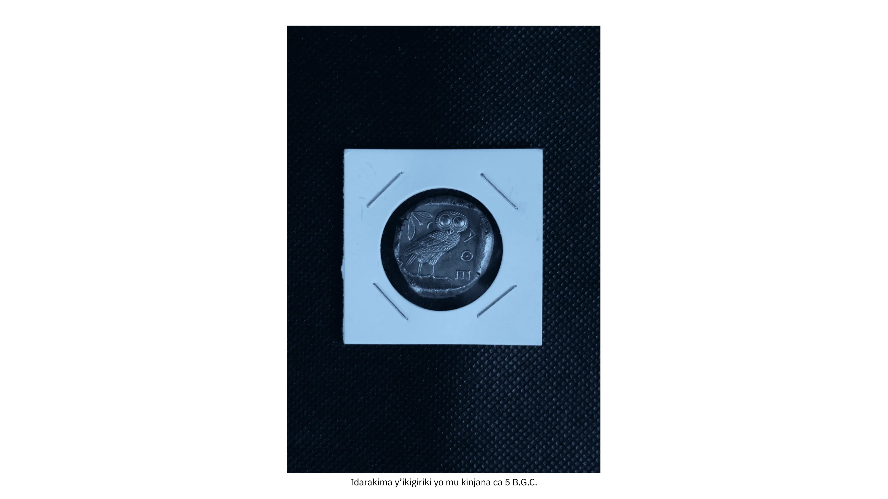

Igisagara cose c’Ubugiriki catanguye gukoresha amahera yaco bwite. I Athene, amafaranga yari afitaniye isano rikomeye n'ububasha bwa politike n'ubw'ubutunzi. Itegeko rizwi cane ry’i Athene ryo mu mpera z’ikinjana ca gatanu imbere ya Kristu ryategetse ko amafaranga y’i Athene yonyene akoreshwa mu turere twari twafatanije nayo, gutyo bikomeza ubukuru bwayo mu vy’ubutunzi. Athene kandi yarirundanije inzahabu nyinshi zo gukoresha mu bihe vy’ivyihutirwa, izo zahabu zikaba zari zibitswe ku gisagara ca Acropole, kumbure nk’ikimenyetso cokwigengesera mu vy’ubutunzi. Mu buryo butandukanye n’ubwo, igisagara ca Sparta, kikaba cari igisagara c’igisirikare cari gifise ingingo ngenderwako zikomeye, carahisemwo kubuza cane ikoreshwa ry’amahera, kikabuza abanyagihugu baco kugira ibiceri vy’inzahabu canke vy’ifeza. Sparta yahisemwo gukoresha ivyuma biremereye kugira ngo ice intege ubudandaji n’amahanga no kugira ngo abantu bagumane ubumwe.

Intambara akenshi zaterwa inkunga n’uburyo bakoresha amahera. Mu gihe c’intambara ya Peloponnese (431-404 imbere ya Kristu), Athene yarakoresheje uburyo bwo kora amahera meshi kugira ngo irihe ingabo zayo. Kubera ko Athene yari yabuze uburenganzira bwo gushika mu binogo vy’ifeza vyayo kubera Aba sparta bigaruriye Decelia mu 413 imbere ya Kristu, yategerezwa gusenya ibishushanyo vy’inzahabu kugira ngo ikoreshe ibiceri bishasha vyihuta mu 407/406 imbere ya Kristu. Hanyuma, mu mwaka w’406/405 imbere ya Kristu, yararemye ibiceri vya bronze bisizeko ifeza hejuru, bituma haba ingorane y’amahera yari yavuzwe na **Aristophanes**, asanzwe avurwa mubihe none nk'Itegeko rya Gresham: amahera mabi yirukana amahera meza. Iryo shirahamwe ry’ivyihutirwa ryaciye rikurwaho ningoga inyuma y’intambara kugira ngo abantu basubire kwizigira amafaranga y’i Athene.

Iherezo ry’igihe ca kera ryaranzwe n’ugutera imbere kwa Macédoine iyobowe na Filipo wa II n’umuhungu wiwe Alexandre le grand, ivyo bikaba vyatumye uburinganire bw’amahera y’Ubugiriki buhungabana cane. Bivuye ku binogo bininibinini vy’inzahabu n’ifeza vyo ku musozi Pangée, Filipo wa II yararonse amahera menshi cane yo gufasha mu bikorwa vyiwe vy’igisirikare n’ivya politike, ashiraho ingingo mfatirwako yoroshe kandi ngirakamaro y’inzahabu n’ifeza (10:1). Ivyo bikoresho vyiwe vy’inzahabu, vyari bihimbaza intsinzi yiwe mu mikino ya Olympique, vyaragendagenda gushika mu Buraya bwo mu Burengero, mbere bishika no mu Bwongereza. Alexandre yarakurikiye iyo politike y’amahera, atangaza cane drachme **Attique** mu gihe yariko aranesha mu Buseruko gushika no mu Buhindi. Ukwo gukwiragizwa kw’ibiceri vyinshi kwabaye intango y’igihe c’Abagiriki, igihe ishusho y’abami yagenda irasubirira buhorobuhoro ishusho y’imana zari ku biceri. Ico kintu gishasha caratumye amayaruka y’abami b’Abagiriki yishira hejuru, imana z’imigenzo zigaca zigira uruhara rwa kabiri ku ruhande rw’inyuma rw’ibiceri vyazo.

Alexandre amaze gupfa mu 323 imbere ya Kristu, abajenerali biwe baragabanyije ubwami bwiwe bwa buhambaye cane, bashinga ingoma mu Misiri (aba Ptolémée), muri Siriya (aba Seleucides) n’ahandi. Ubwo bwami bw’Abagiriki bwakoresheje uburyo butandukanye bwo gukoresha amahera: Abaptolemée bashizeho uburyo bwo gukoresha uburyo bw'amahera bwugarije kugira ngo bagenzure ingene amahera agenda, bahitamwo gukoresha intete nk’amahera y'indani kugira ngo bazigame ivyuma vy’agaciro kugira ngo bazobikorehe mu gisirikare hanze. Muri ico gihe nyene, Rhodes yarabaye ikibanza gikomeye c’ubudandaji imbere yuko buta ingumvu kubera abaromani, bashinga Delos nk’ikibanza coroheza abadandaza mu 167 imbere ya Kristu.

Gukoresha amahera ni vyo vyari bihambaye mu guhemba abacangero. Abasoda ba Alexendre bararonka drachme y’ifeza ku musi ku musi.

Abagendera ku mafarasi, ari bo bari mu ngabo za Alexendre zari zifise ubuhinga bwinshi cane, baronka mu mpande zose ama drachme abiri ku musi, umusirikare w’amaguru araronka drachme imwe, umucuruzi asanzwe na we akaronka ibice bibiri vya gatatu vya drachme, ni ukuvuga umushahara ukubye kabiri umushahara w’umukozi asanzwe.

Mu gihe c’Intambara ya Péloponnèse, abasoda barahembwa kandi amahera menshi cane: talents zirenga 1.200 zo guhagarika ubugarariji bwa Samos be na talents zirenga 2.000 zo gukingira Potidée.

Igihe iyo ngabo yariko irarwanya Aziya Ntoya, igiciro cose cari nka talents mirongo ibiri ku musi, canke nk’igice c’itoni y’ifeza, canke drachmes 120.000.

Ibiceri vy’Abagiriki na vyo nyene vyarafise uruhara runini mu mico kama, kuko igisagara cose carondera kwemeza akaranga kaco mu gukora ibiceri vyaco bwite bifise ibimenyetso vyo mu karere canke vy’imigani. Nk’akarorero, Héraclée yerekana Héraclès(Hercule) arwana n’intare, mu gihe Cyrène yerekanye igiterwa kizwi cumuti citwa silphium.

Ubwa nyuma, naho yari amahera atandukanye akagira n'agaciro kagenda gatandukanye, amahera y’ikigiriki n’ay’Aba hellénistiques ya kera yasize ikimenyetso kiramvye mu mateka y’ubutunzi n’imico kama y’isi yo mu kiyaga Mediterane bigatuma abantu baguma ba, agira ico akoze cane ku mice y’amahera yaje gushika i Roma, iyo na yo ikaba yaje kwemera no guteza imbere ivyiyumviro vy’ubutunzi bw’Abagiriki kugira ngo itunganye ubutunzi bwayo bwite.

## Ingaruka z'amahera mu Bugiriki

<chapterId>3a5e6c7d-699c-5567-87cd-3374c49d55a9</chapterId>

:::video id=0c79a59c-e179-4893-a414-1b8de0930eb9:::

### Athene n’itandukaniro riri hagati ya Sparta .

Uguhangana kwa Athene na Sparta mu kiringo c’Abagiriki ba kera kurahishura uburyo bubiri butandukanye cane bwo gutunganya ivy’ubutegetsi n’ivy’ubutunzi. Naho Sparta yanse amahera y’ivyuma kugira ngo haboneke uburyo bwo kwitunga bushingiye ku kwizigirana kw’abanyagihugu, Athene yarakiriye bimwe bishitse ubwo buhinga bwo kwubaka no kubungabunga ubwami bwayo bwo mu kiyaga.

### Ivy'amahera bikenewe mu bubasha bw'ingabo zo mu mazi

Ubwami bwa Athene, naho bwari bufise izina ryiza cane, bwagumye ari ubw’agaciro gatoyi mu bijanye n’ubutaka - ahanini Athene n’ibisagara vyo mu kiyaga Égée. Ububasha bwayo bwari bushingiye ku Muryango wa Delos, uwo na wo ukaba ari umuhari w’igisirikare wari uganzwa na Athene nk’umukuru w’igihugu. Ico gice c’ubwami cari gisaba igikoresho c’ubutunzi kimwe: igiceri c’ifeza c’i Athene.

Kubungabunga ubwato ni co cari ikintu nyamukuru cari gikenewe mu bijanye n’amahera. trière(ubwato) imwe yagurwa hagati y'i telent imwe hamwe na 2 y'ifeza- amahera menshi cane. Kubera ko Athene yari ifise ubwato amajana n’amajana bwo gucungera, yari ikeneye uburyo  bwo gutanga imisoro bumeze neza. Amafaranga yaracitse igikoresho gihambaye co gutoragura amakori mu bisagara vyari vyifashe mu butegetsi bwabo no gufasha ingabo z’amazi zijejwe gutera ivyatsi zari zituma ubwami bugira ubumwe.

### Guhatiriza ikoreshwa ry'amahera nk'igikoresho co kuganza

Athene yategetse ikoreshwa ry'amahera yayo y’ifeza abagize Ishirahamwe ry’i Delos bose. Ukwo gushinga urugero rw’amahera bwari uburyo bwo gupanga ubuhinga bwogushika kuntumbera yabo. Ica mbere, vyatumye vyoroha kwegeranya amakori mu gushinga igice c’ikonti rusangi. Ica kabiri, vyatumye ibisagara bibanyi bikomeza kwishingikiriza Athene mu vy’ubutunzi. Ubwa nyuma, ryaragaragaje mu buryo bw’ikigereranyo ububasha bwa Athene mu bwami bwose bwo ku kiyaga.

Iyo politike y’amahera itandukanye cane n’uburyo bwaba Spartan. Sparte, igihugu cari gikomeye kurwano zo kubutaka, cari gishobora kwizigira ibikorwa vy’aba hilotes (abaja) bo muri Péloponnèse kugira ngo kibeho. Ubutunzi bwayo bwari bufunze kandi bushingiye ku bisagara ntibwari busaba ibikoresho vy’amahera bikomeye cane. Abanyagihugu-abasirikare babana, bagasangira ivyokurya, kandi ntibakeneye amahera yo guhanahana amakuru ku musi ku musi.

### Amafaranga nk'ikinyabiziga co gucuruza mu kiyaga

Uburere bwo mumazi bwabanya athene bwarahimiriza imigenderanire y'ubucuruzi bwo mumazi. Athene ntiyakora nk’igisagara ca Sparta co ntamigenderanire y'ubudandandaji nibindi bihugu cagira, athene yoyo yategerezwa gucuruza n’isi yo hanze kugira ngo ibeho kandi iitere imbere. Amafaranga yaracitse igikoresho gihambaye cane mu bucuruzi bwo mu kiyaga Mediterane.

Iyo mikoreranire yo hanze yatumye haba uruziga rw’ingeso nziza: ubudandaji bwatuma hinjira amahera, ayo mahera niyo yatera inkunga amato, ayo mato yarinda inzira z’ubudandaji kandi bukabungabunga ubwami, kandi ubwami bwategeka imisoro namahera yi athene, ivyo bikaba vyatuma ubudandaji bworoha. Amafaranga ntiyari akiri uburyo bwo guhinduranya gusa, ahubwo yacitse inkingi y’ingene ubwami bukora.

### Imipaka y'ububasha bw'amahera

Naho ubutunzi bwari buteye imbere cane, ububasha bw’amahera bwo muri Athene bwarerekanye ko bufise aho bugarukira mu gihe c’Intambara ya Péloponnèse. Kubera ko Athene yari ihanganye n’ingabo zo ku butaka zaba sparta, ubukuru bwa athene muvyamato n'ubukungu ntivyari bigikwiye. Ingendo(expéditions) zizimvye, nk’iy’iza Syracuse muri Sicile , zagabanije ubukungu atanyungu babikuyemwo.

Amateka yerekana ko amahera, naho ari igikoresho gikomeye co kwerekana ububasha, ata co ari kimenyetso c’uko igisirikare kiba gikomeye. Sparta, ata mafaranga y’icuma yari afise ariko yari afise ubumwe budasanzwe mu kibano, amaherezo yaratsinze ubwami bushingiye kumahera bw’i Athene.

### Ivyitegererezo bibiri, amaherezo abiri

Uguhangana kwa Athene na Sparta kwerekana uburyo bubiri bw’ishimikiro bwo gutunganya imibano n’ubutunzi. Athene iserukira uburyo bufunguye, bw’ubudandaji, bw’amahera - intango y’ingoma z’ikiyaga zo muri iki gihe. Sparta ifise uburyo bufunganye, bushingiye ku kwizigirana kw’abanyagihugu aho gushingira ku bikoresho vy’amahera.

Izo nzira zibiri zerekana ko kwemera amahera bifitaniye isano cane n’akarorero ka politike n’ubutunzi katoranijwe. Ku gihugu gifise ububasha bwo mu kiyaga no mu vy’ubudandaji nka Athene, amahera yaracitse ikintu gihambaye cane. Ku kibano c’intambara gipfutse nka Sparta, kigereranya ugutera ubwoba urutonde rw’imibano. Ukwo gucapura kwa kera kuracariko kuramenyesha impaka ku ruhara rw’amahera mu gutunganya imibano.

## Repubulika y'Uburoma

<chapterId>0bc80983-33e1-5881-85bb-7c22f3144a9a</chapterId>

:::video id=dc05ca97-d29c-4679-bfeb-912c47d86ce2:::

### Amateka ya Repubulika y'Uburoma

- 753 - 509 BC: Ubwami bw'i Roma**
- 753 imbere ya Yesu: Ishingwa ry’i Roma** (mu migenzo ryitwa Romulus).
- 509 - 27 BC: Repubulika y’Uburoma**, Roma iba Repubulika itwarwa na Sénat hamwe na consuls élus.
- 280 - 275 imbere ya Kristu: Intambara ya  Pyrrhus**. Pyrrhus, Umwami wa Épire, arwana n’Abaroma mu Butaliyano bwo mu bumanuko, atsinda intsinzi zizimvye (“intsinzi za Pyrrhus”).
- 264 - 146 imbere ya Yesu: Intambara za puniques**. Intambara ikomeye yatumye Uburoma burwanya Carthage kugira ngo bugabe uburengero bw’ikiyaga Méditerranée.
- Hanibali (247 - nko mu 181 imbere ya Kristu)**. Umujenerali w’i Carthage w’inkuru z’imigani, yari azwi cane mu kujabuka imisozi ya Alpes ari kumwe n’ingabo ziwe be n’inzovu kugira ngo atere i Roma mu gihe c’Intambara ya kabiri yabapunique.
- 146 imbere ya Kristu: Intambara y’i Korinto**. Uburoma burasambura igisagara c’Ubugiriki c’i Korinto maze butegeka ubutegetsi bwabwo bwa nyuma ku Bugiriki buhambaye.
- 91 - 87 BC: Intambara y’Igihugu**. Ubugarariji bwakozwe n’Abataliyano bari bafatanije n’Uburoma basaba ubwenegihugu bw’Uburoma, ivyo bikaba vyatumye amaherezo binjira mu bwenegihugu bimwe bishitse.
- 64 BC: Iherezo ry’ukurwanya kw’Aba séleucide**. Roma yarakuyeho burundu intwaro yaba séleucide muri Siriya, ikomeza ububasha bwayo ku Kiyaga Méditerranée co mu Buseruko.
- 55 BC: julien cesar yigaruriye Uburayi bwo hagati n’ubw’Uburengero**. julien cesar yaraguye ubutegetsi bw’Abaroma kuri Gaule (ubu Bufaransa) maze yinjira mu Budagi no muri Bretagne.
- 43 BC: Hashingwa Ubwami bwa kabiri bw’Ubwami bw’Ubutatu**. Amasezerano ya politike hagati ya Octave (uwaje kwitwa Augusto), Marc
- Antoine na Lépide, kugira ngo Roma igume ihagaze neza inyuma y’aho julien cesar yishwe.
- 27 BC: Intango y’Intambara y’Abaroma**. Igihe c’ugutekana kwa politike n’uguterimbere ku ngoma ya Augusto, kikaba ari co catumye Ubwami bw’Uburoma bwatangura.

### Intango y'amahera(yaje ateba) y'i Roma

Muri iki gice kivuga ivy’ivya kera, ubu turahindukirira Repubulika y’Uburoma. Amateka y’amahera y’i Roma yatanguye inyuma cane y’ay’Abagiriki n’Abaperesi. Roma yashinzwe mu 753 imbere ya Kristu, yarindiriye hafi ibinjana bine imbere y’uko vy’ukuri yemera gukoresha ibiceri. Muri ico kiringo kirekire, Abaroma barakoresha uburyo bwa kera bwo guhindura amahera bakoresheje ibipande vya bronze bidasanzwe vyitwa aes rude, ivyo bikaba vyasaba ko umuntu apima neza na neza ico gipande inyuma y'igurisha. Mu mpera z’ikinjana ca 4 imbere ya Kristu, mu gihe c’ukoshwa n’Abagiriki n’Aba étrusque, ni ho  Roma yatangura gutanga ibiceri vyayo vya mbere, cane cane muri bronze(umujumbu) icuze nko mubushinwa, aes iriko ikimenyetso, ikaba yari iranga ubucuruzi bw’Abaroma gushika mu **Intambara ya kabiri ya Punique**.

### Ukosha kw’Abagiriki be n’ibiceri vya mbere vy’ifeza .

Iryo hura ry’Abagiriki bo mu bumanuko bw’Ubutaliyano ryatumye vy’ukuri Abaroma bamenya ibiceri vy’ifeza vyacuzwe. Nko mu mwaka w’280 imbere ya Kristu, Uburoma bwatanguye gukora ibiceri vy’ifeza vyabwo bwite bwigana ibiceri vy’ifeza vy’Abagiriki. Ishirwa hanze  ry’ibiceri vy’ifeza i Roma ryasohotse mu mwaka w’269 imbere ya Kristu, hacapuweko amahasa y’inkuru z’imigani Romulus na Remus bonswa n’ibwebwe y’ingore, ikimenyetso cacitse ikigereranyo(icon).

Nkako, ibiceri vyinshi vy’Abaroma vyo mu gihe ca Repubulika vyari bishushanijweko imigani y’abashinze igihugu. Ushobora kubona ivyanje hano musi: ni igiceri ciza cane, c’ukuri kivuye ku Mwami Tatius. Ikigiceri k'irerekana inkuru y’imigani y’ifatwa ry’abagore muba Sabine. Tatius yari umwami w’ako karere, kandi inkuru y’imigani yashinze iyo karere ivuga ingene Abaroma bafashe abagore muba Sabine, abantu baba hafi y’aho. Mu nyuma, Umwami Tatius yarabaye umwami bafatanije na Romulus, umwe mu bashinze Uburoma.

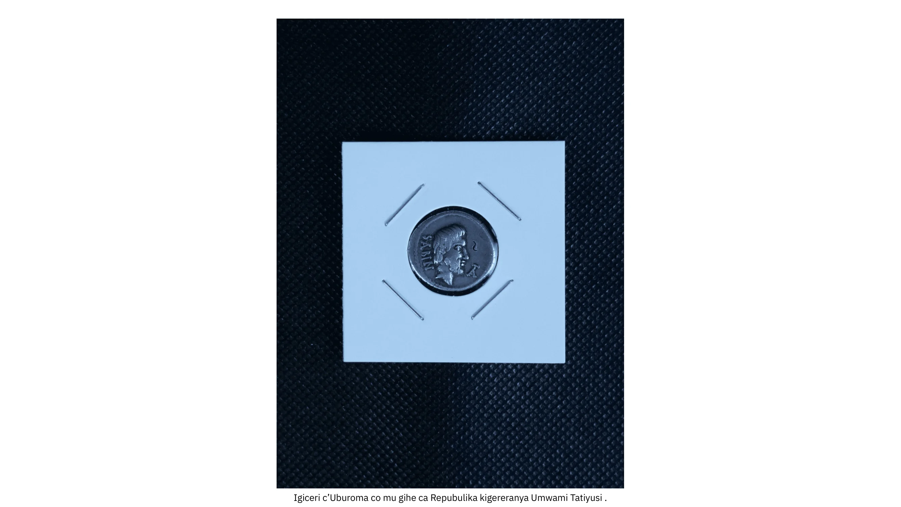

### Inkomoko y'ijambo "igiceri" n'urusengero rwa Juno Moneta

Ijambo "monnaie(amahera)" rikomoka mu rusengero rwa Juno Moneta i Roma. Inkuru zivuga yuko, mu gihe c’igitero caba gauloise mu 390 imbere ya Kristu, oies(ibikoko) nyeranda zo mu gisagara ca Capitol zamenyesheje Abaroma ko hari akaga kari hafi. Kugira ngo bashimire imanakazi Juno, yari ikingira Capitol, bararubatse urusengero rwo kumutera iteka, maze ntivyatevye kuba ahantu hakorerwa ibiceri vy’Abaroma.

### Intambara z'Aba puniques n'ingorane z'amahera

Intambara z’igisirikare zaragize ico zikoze cane ku bijanye n’iterambere ry’amahera y’Abaroma. Mu gihe c’intambara ya kabiri y’Aba punique (218-201 imbere ya Kristu) yarwanye Carthage, Roma yarashikiwe n’ingorane zikomeye z’amahera kubera igitero ca Hannibal. Kugira ngo ivyo bikenewe vyihutirwa bigabanuke, Roma yaciye ikoresha uburyo budasanzwe bwo gutanga ibiceri vy’inzahabu, hamwe n’ugugabanya cane agaciro k’ibiceri vyayo vy’ifeza, kuva kubuziranenge bwa mbere bwari 97% gushika nko ku 89%. Uburemere bw’ibiceri vya bronze(umujumbu(aes)) na bwo nyene bwaragabanutse cane, butakaza hafi 80% mu myaka itandatu.

Aha, turashobora gusubira ku ciyumviro twamaze kuvuga ku bijanye n’uko Abagiriki bashongesha ivyuma vy’agaciro vyabitswe mu nsengero kugira ngo bafashe mu kugabanya ingorane z’ubutunzi. Kandi kugira ngo tuvuge ivya **Carthage**, aha musi urashobora gushima igiceri nyaco c’i Carthage kivuye mu vyo nakoranije. Ivyo biceri vy’i carthage vyari bishushanijeko ikigazi  ku ruhande rumwe, ku rundi ruhande hakaba hari hashushanijeko ifarasi. Kuri iki giceri, ifarasi ntiboneka neza, igishushanyo cayo carashaje.

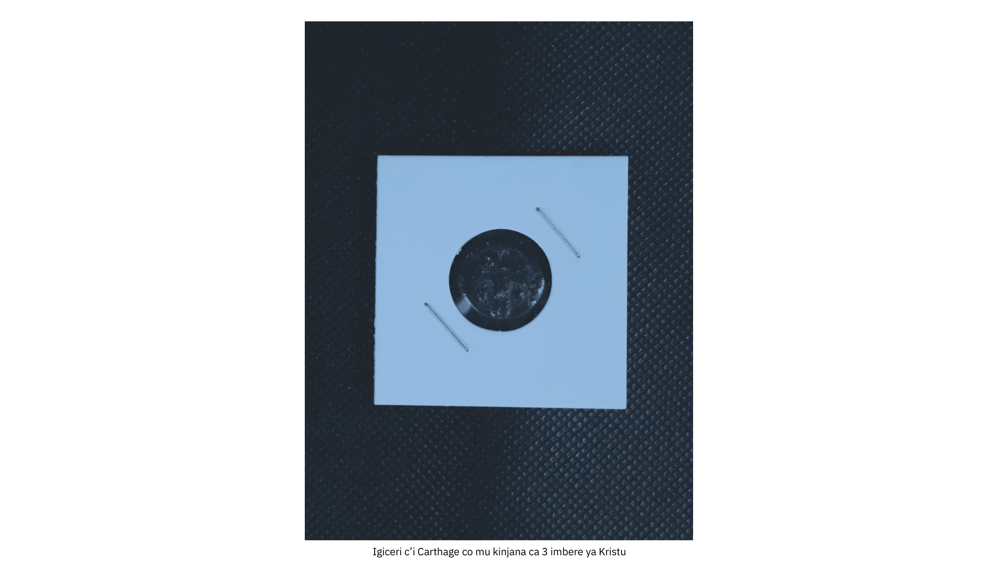

Ivyo vyatumye uburemere bw’ibiceri vya bronze(umujumbu) vyitwa aes na vyo nyene bigabanuka cane, bitakaza hafi 80% mu myaka itandatu. Rero, uburemere bw’ivyo bice vya bronze, bitari icuma c’agaciro kandi vyakoreshwa mu bucuruzi bwa misi yose, vyaragabanutse cane, ivyo bikaba vyari ikimenyetso c’ugutakara kw'agaciro k’amahera kubera izo ntambara.

### Idenari(denier) y'ifeza n'ugushikama kw'amahera .

Ni muri iyo nzira itoroshe aho Roma yashiraho idenariyo y’ifeza izwi cane nko mu mwaka w’212 imbere ya Kristu. Iryo vugurura ryatumye amahera aguma ahagaze neza cane, kuko idenariyo iguma ari yo ikoreshwa cane mu myaka hafi 450. Ukwo gushikama kwa Roma gukekwa n’uburongozi bukomeye, naho nyene mu 146 imbere ya Kristu hasubirwamwo ibiciro vyinshi, kandi hakaba hariho n’ibintu vyinshi vyo gufasha ingabo zayo nyinshi cane, cane cane mu gihe c’intambara za Punic, Social (91-87 BC), n’iza Masedoniya. Nk’akarorero, kubungabunga ingabo imwe y’Abaroma vyatwara amadenariyo nk’imiliyoni 1 n’igice ku mwaka, ivyo bikaba vyerekana urugero rw’amahera yari akenewe.

Hanyuma y’imipaka y’Uburoma, intambara zatumye agaciro k’ibintu gacika intege cane mu turere twari twari dufise ububasha bw’Uburoma. Igisagara ca Carthage c’i Punique carabonye ubuziranenge bw’ivyuma vyaco vy’umuyagankuba bugabanuka cane, kuva ku 98% vy’inzahabu mu kinjana ca 4 gushika ku 30% gusa mu gihe c’intambara ya kabiri y’i Punique, mu gihe ibiceri vyaco vy’ifeza vyagabanutse bishika ku 18% vy’ubuziranenge.

### Ugutera imbere kw'imvo z'amahera

Igihe Roma yariko iragwira, akaranga k’ibiceri na ko nyene karahindutse: mu ntango ibiceri vyari bitamenyekana kandi vy’ugukunda igihugu, buhorobuhoro ibiceri vyaciye bifata imigero y’abantu ku giti cabo yerekana imiryango y’abacuzi b’ibiceri (abakubita ibiceri). Iryo hinduka ryerekana neza ihinduka ry’ivya politike ryabaye muri Repubulika y’Uburoma yaheze.

Ubwa nyuma, naho Roma yari iganje isi y’ikiyaga Mediterane mu vy’ubutunzi, yagumye ifise uburyo bworoshe bwo kwishura: nta buryo nyabwo bwo gutanga amafaranga bwateguwe uretse guhindura ibiceri ataco bimaze, uretse gutanga amakori n’inguzanyo z’abantu ku giti cabo zari zigenewe abantu b’abanyacubahiro.

## Ubwami bw'Uburoma

<chapterId>2dc44e50-112a-5abf-97ae-8e0a9ecda989</chapterId>

:::video id=f8d6f3d6-9ee4-4504-888e-4f12b3f20489:::

**Ivyabaye mu mateka:**

**Igihugu** cari uburyo bw’intwaro y’ubwwami bwabami bw’Uburoma kuva mu ntango z’ingoma ya Augusto mu mwaka w’27 imbere ya Kristu gushika mu mpera y’ingorane zo mu kinjana ca gatatu mu mwaka w’284 inyuma ya Kristu.

**27 BC: Intango y'Intambara y'Abaroma**

Igihe c’ugutekana kwa politike n’uguterimbere ku ngoma ya Augusto, kikaba ari co cari intango y’Ubwami bw’Uburoma.

**Augusto (30 BC gushika 14 AD)** yarahinduye cane uburyo bw’amahera y’Abaroma, ashiraho urugero ruramba kandi rudahinduka rw’amahera y’umwami.

**Augusto na we nyene yari umwe mu ba mbere bemerewe gukoranya** ibiceri vya kera n’ibisigazwa vy’ibintu vya kera.

**54 - 68: Néron**

Umwami w’abami w’Uburoma w’impaka, azwi cane kubera ububisha bwiwe, uruhamo rwiwe n’uburongozi bwiwe buteye akaga inyuma y’aho Roma ituriwe.

**64 inyuma ya Kristu: Umuriro munini w'i Roma**

Umuriro munini warasambuye igice kinini c’ico gisagara; Nero aregwa ko ari we yabiteye.

**69 inyuma ya Kristu: Umwaka w'Abami Bane**

Igihe c’akaduruvayo, aho abami b’abami bane bakurikiranye ningoga (Galba, Otho, Viteli, Vespasien).

**79 inyuma ya Kristu: Vesuvius iraturika**

Ikirunga casambuye ibisagara vya Pompéi na Herculanum, kikaba kizigama ibisigarira vyavyo mu buryo budasanzwe munsi y’ivu.

**165 - 180: Ikiza ca Antonine**

Akaranda ruhonya ngandad catumye Ubwami bw’Uburoma bugoyagoya ku butegetsi bwa  Marc Aurèle na Commode.

**200 inyuma ya Kristu: Iherezo ry’intara n’iherezo ry’ubutegetsi bwa Pax Romana**

Roma yarashitse ku rugero rwo hejuru, yatanguye guhungabana indani mugihugu n’ingorane z’ubutunzi.

**212 inyuma ya Kristu: Itegeko ry’i Caracalla ryerekeye ubwenegihugu**

Umwami w’abami Caracalla yarahaye ubwenegihugu bw’Uburoma hafi abantu bose baba muri ubwo bwami, kugira ngo bashobore kwagura imisoro.

**220 inyuma ya Kristu: Intango y’ibitero bikomeye vy’abanyamahanga**

Ibitero vya mbere bihambaye vy’abantu b’Abadagi bajabuka imipaka y’Uburoma.

**235 - 285: Ingorane za politike n'iza gisirikare zo mu kinjana ca 3**

Igihe carangwa n’ukudatekana kwa politike, hari abami benshi bamara igihe gito, intambara z’abanyagihugu, ingorane z’ubutunzi n’ibitero biguma bitera.

**Aurelian (270-275 AD) yarahinduye cane agaciro k’amafaranga y’Abaroma**, agerageza gusubiza agaciro kayo naho nyene amahera ariko abandanya amahera ata agaciro.

**301 inyuma ya Kristu: Itegeko ry’Igiciro rya Dioclétien**

Umwami w’abami Dioclétien yaragerageje ubusa guhagarika ukuduga kw’ibiciro mu gushinga amategeko akomeye y’ugucungera ibiciro n’imishahara mu bwami bwose.

**312 inyuma ya Kristu: Constantin**

Umwami w'abami wa mbere w'umukristo, yashinze Constantinople, yaratumye amahera ahagarara neza mu gushiramwo "solidus", igiceri c'inzahabu c'ubuziranenge bwinshi n'ugushikama.

**476 inyuma ya Kristu: Igugwa ry'Ubwami bw'Uburoma bwo mu Burengero**

Roma yatwawe n’ibisata bitandukanye vy’Abadagi (harimwo n’Abaostrogote), ikintu kibonwa ko ari ikimenyetso c’iherezo ry’Ubwami bw’Uburoma bwo mu Burengero.

### Ivugurura ry'amahera rya Augusto

Muri iki gice kivuga ivy’ivya kera, twamaze gushika ku bwami bw’Uburoma. Amateka y’amafaranga y’Ubwami bw’Uburoma arangwa n’ugukoresha cane amahera y’ivyuma, cane cane inzahabu, ifeza n’umuringa, ariko kandi n’ingorane nyinshi z’amahera, zifitaniye isano cane n’imigumuko ya politike n’iya gisirikare. Mu mpera za Repubulika, ku ngoma ya julien cesar, Roma yarashizeho igiceri c’inzahabu aureus mu mwaka w’46 imbere ya Kristu, igiceri c’inzahabu gipima nk’amagarama 8 cari cemewe cane mu Buraya bwose no mu bice vy’ikiyaga ca Mediterane. cesar yarashize hamwe ivyo biceri vy’inzahabu maze akora ibiceri vya mbere vy’inzahabu vyari bifise ishusho y’umuntu muzima, gutyo ahindura umugenzo wa kera w’abanyarepubulika wari ushigikiye ibimenyetso bitamenyekana kandi vy’abantu bose. Iryo terambere ryaherekejwe n’igihe c’ihinduka rikomeye ry’ivya politike, aho ububasha bw’umuntu ku giti ciwe bugenda burasubirira buhorobuhoro inzego za repubulika.

Inyuma y’aho cesar yiciwe mu mwaka w’44 imbere ya Kristu, Octave (Auguste) yaciye afata ubutegetsi bw’i Roma, ashinga Ubwami mu mwaka wa 27 imbere ya Kristu. Ingoma yiwe yarahinduye bimwe bishitse uburyo bwo gukoresha amahera, bituma ubutunzi bw’Uburoma buguma buhagaze neza. Mu gihe ca Augusto, aureus imwe y’inzahabu yari ingana n’amadenari(deniers) 25 y’ifeza, ubwayo akaba yari afise agaciro k’ama sesterces 4 ya bronze(umujumbu). Ukwo gushikama kw’amahera kwabandanije mu kinjana ca mbere cose inyuma ya Kristu, igihe akenshi kivugwa ko ari ikiringo ca zahabu c’ubutunzi ku Buroma.

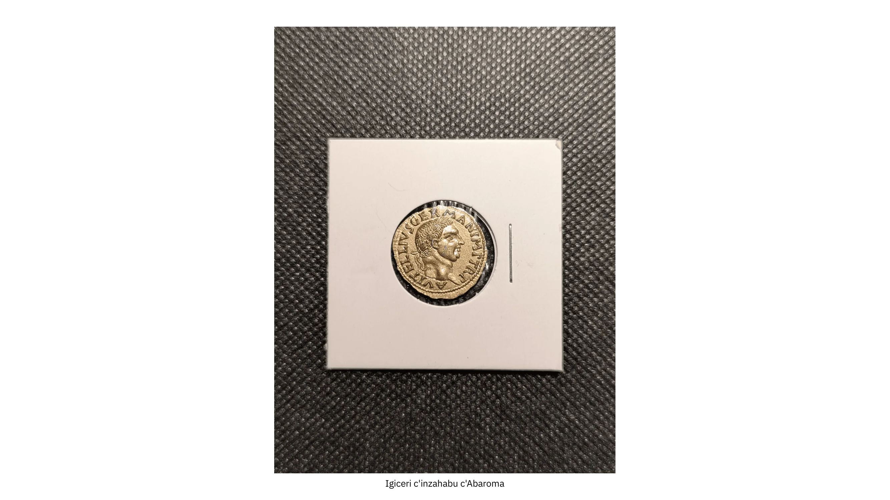

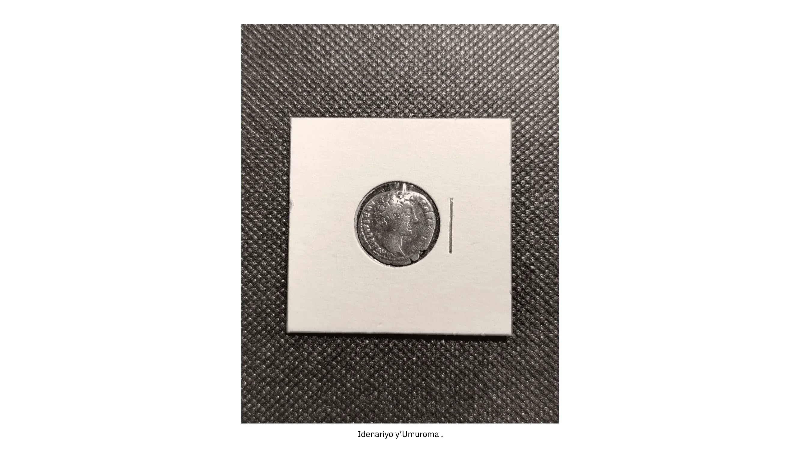

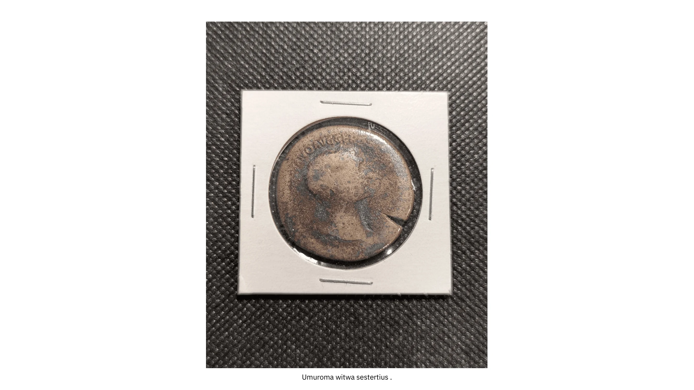

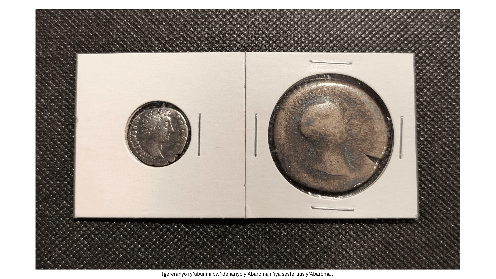

Ariko rero, kuva kuri Neron gushika ubu (54-68 inyuma ya Kristu), Roma yaciye itangura kugabanya uburyo mu biceri vyayo, igenda iragabanya buhorobuhoro uburemere bwayo n'ubuziranenge bwayo kugira ngo ishobore kuronka amahera afasha ibwami, canecane inyuma y’umuriro munini w’i Roma mu 64 inyuma ya Kristu. **Itegeko rya Gresham**, mu gihe ibiceri vyagabanutse agaciro vyari vyinshi, bituma ibiciro bigenda biraduga buhoro buhoro.

Ikinjana ca gatatu ni co cahinduye ibintu bikomeye cane, aho ibiceri vyatangura gutakaza agaciro cane k’umwami w’abami Septimius Severus, Caracalla na Gallien. Igiceri nyamukuru c’ifeza, ari co denari, hanyuma kikaba antoninien, aho ifeza igize ico giceri yagabanutse kugera kuri 2% gusa. Muri ico gihe nyene, uburemere bwa aureus yo munzahabu yagabanutse igice. Ico kibazo c’amahera cari kumwe n’ugutekana kwa politike kutari bwigere kubaho, ibitero vy’abanyamahanga n’intambara z’abanyagihugu zisubira inyuma.

Iki gice kiramfasha gutanga igice ca nyuma muri iki gice: antoninien. Ntituzi ingene ico giceri bacita ico gihe , ariko twebwe tucita antoninien. Iki guceri kirafise umwihariko wo kuba ufise agaciro k’amadenari abiri ingorane, naho ni nini incuro 1,5 gusa y’idenari. Vyongeye, ni ibiceri bicuzwe muruvangi rwamabuye atandukanye, bisobanura ko vyari bikozwe mu ifeza n’ibindi vyuma bivanze. Akenshi ivyo biceri vyari bishizweko gusa ifeza hejuru yavyo, ivyo bikaba vyari akarorero gakomeye k’ukononekara kw’amahera.

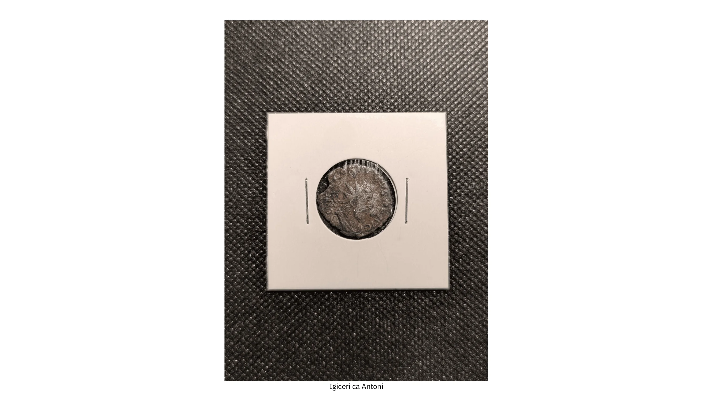

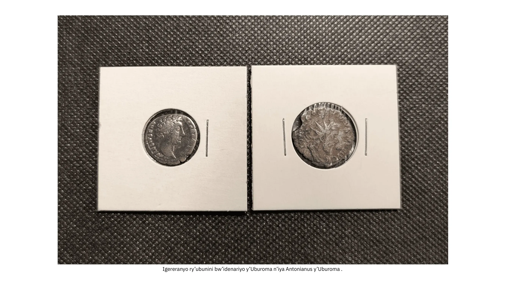

Mu gihe c’ivyo bintu, Umwami w’abami Aurelien (270-275 inyuma ya Kristu) yaragerageje guhagarika iyo nzira mu guhindura agaciro k’amafaranga vy'izina, ariko iyo mpinduka mu vy’ukuri yarashizeho uburyo bwo koroka agaciro mu gushinga agaciro k’amafaranga yariho ku rugero rwo hejuru mu buryo .

Reka manze mpagarare gato kugira ngire ico mvuze kwico kintu. Mu kinjana ca 3, ugutera imbere kw’ibiciro kwagumye kuduga cane. Mbere, naho ibiceri vyari vyagabanutse agaciro, uburyo bwo kubicukura kimwekimwe mu bikoresho vy’amaboko bwatuma umuntu ashobora kugenzura ukuntu ibiceri vy’amahera vyiyongera. Imibare yerekana ko mu myaka irenga 300 y’ugucika kw’agaciro, ugutakaza agaciro kwari ku rugero rwa 4% ku mwaka. Imbere gato y’ivugurura rya Aurelian, ugutera imbere kw’ibiciro kwari hafi 3% ku mwaka.

Aurelian yashizeho ingero y’ubuziranenge ku giceri c’ikimenyetso ca XXI, kigaragaza ko gifise ibice 20 vya bronze(umujumbu) gushika ku gice 1 c’ifeza, canke 5% vy’ubuziranenge. Yaragurishije ivyo biceri vy’ifeza vy’ibice 5%, abishirako ikidodo c’ikimenyetso ca XXI. Ariko kandi, yaributse n’ibindi biceri vyose, vyari vyacitse agaciro kuruta, aca abishirako ikidodo XXI nyene. Ivyo vyatumye agaciro k’ibiceri vyose gasubirwamwo neza. Ico vyavuyemwo ni ukuduga kw’ibiciro  kubice 20 kw’ijana ku mwaka, bikaba vyari birenze kure n’iyo igipimo ca kera c’ibice 3 kw’ijana imbere y’uko ubwo buhinga bushirwa mu ngiro.

Mu vy’ukuri, Aurelien ni we yahinguye ubwo buryo bwo gucapura agaciro k’ibintu, bukaba bwihuta cane kuruta gucapura agaciro k’ivyuma kimwe ku kindi, ivyo bikaba vyari bikiri bituma ducapura ibiceri bimwe bimwe. Ico yakoze ni ugufata ibiceri vyose vyariho, akavyibuka akabitera ikidodo n’igipfunsi kugira ngo bihindure agaciro kavyo. Ni ihinduka ry’ukuri. Aho niho inflation yaciye ihinduka ikintu gikomeye cane.

Kugira ngo nshire ahabona mu buryo bw’amaso iyo nzira y’ugucika intege cane, narabonye imibare iryoshe cane yerekeye igiciro c’intete muri Misiri kuva mu 40 imbere ya Kristu gushika mu kinjana ca 3, ikaba ifata imyaka irenga 300. Hasi, urashobora kubona tetradrachma y’ikigiriki yo mu vyo nakoranije. Iciyo gihe, mu Misiri mu gihe c’ubutegetsi bw’Abaroma mu kinjana ca 3, amahera angana na yo yari tetradrakema y’Abanyamisiri. Igitigiri c’idarakima cari kigikoreshwa, kandi cari gihuye n’idenariyo.

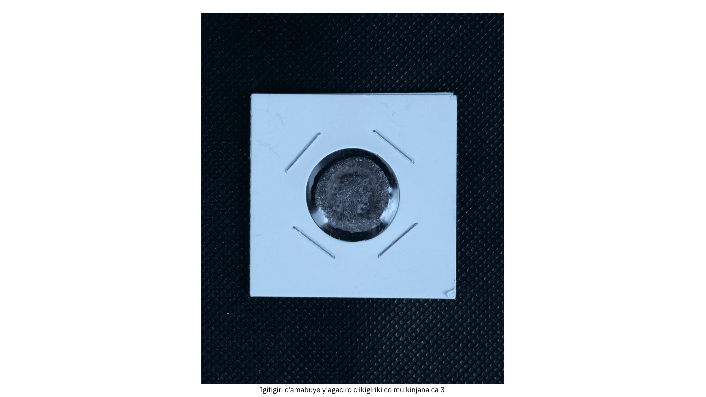

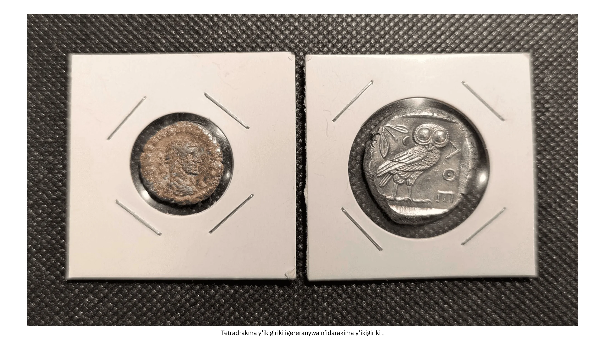

Rero tétradrachme y’Abanyamisiri mfise ngaho yari ingana n’idenariyo. Urashobora kubona ko ico giceri gikozwe muri billon(ivyuma bivanze) canke
muri bronze(umujumbu), rero nta cuma c’agaciro kirimwo. Ushobora kuyigereranya n’ifaranga ry’intango ry’ikigiriki ryitwa tétradrachme kugira ngo ubone ukuntu agaciro kayo kagabanutse mu myaka 300. Ni ukwongerekana kw’igiciro c’intete muri Misiri incuro miliyoni.

Ni insiguro y’umubiri y’ivugurura rya Aurelian. Birakenewe kumenya ko benshi, igitigiri c’abantu muri iyi myaka 300 y’ukuduga kw’ibiciro, wari hafi 4%. Ni mu mpera gusa, igihe Aurelian yagira ivugurura ryiwe, iyo inflation(itakara ry'agaciro k'amahera) yaciye ihinduka nk’iyiteye imbere cane maze tugera kuri iyo ngero y’imiriyoni 1. Ibiciro vyari vyinshi incuro ingana numuriyoni mu mpera z’ikinjana ca 3 kuruta mu kinjana ca mbere imbere ya Kristu.

Uwamukurikiye **Dioclétien** (284-305 AD) yaragerageje mbere n’uguhindura ibintu bikomeye kuruta: yasohoye amafaranga mashasha (cane cane argenteus, afise ubuziranenge ariko ari make cane), ashiraho uburyo bukomeye bwo kugenzura ibiciro (Itegeko ry’Igiciro ryo mu 301 AD) kandi **ashiraho uburyo bwo kwishura imisoro ku** ubwoko. Naho hari utwo twigoro, ivyo Dioclétien yahinduye ntivyashoboye guhagarika ugutera imbere kw’ibiciro kwari gukomeye cane.

Kubera ko Dioclétien yanse gutanga ibintu n’ibikorwa kugira ngo abone amahera yataye agaciro, yashizeho uburyo bwa **caste héréditaire** kugira ngo abohere abarimyi n’abakomoka kuri bo ku butaka bwabo.

Ico vy'ukuri gikwiye gutahurwa hano ni uko icabaye ni uko abarimyi banse gutanga umwimbu wabo mu guhindura amahera yacitse agaciro, kandi inyishu ya Dioclétien wacu mukundwa yari iyo kurema **imiryango y'iragi** mu kuvuga ngo "wewe, ntushobora kuva mu butaka bwawe, abana bawe ntibashobora kuva mu butaka bwabo cokimwe nokuba soda ,'uri umu soda, utgerezwa kwemera kwishurwa mu mafaranga yanje". Nk’inyishu yo guhanahana ubikorwa, barihembwa mu buryo bw’amahera (mu nyama, mu vyo kurya, mu ntete) kuko banse guhebwa mu mahera. Yaciye rero ashiraho iyo nzira y’imiryango y’iragi kugira ngo ahate abantu kwifatanya n’ubudandaji bwabo, kugira ngo ntibashobore guhindura akazi gusa iyo bagerageje kutemera ayo mafaranga yacitse agaciro.

Kugira ngo nshire ahabona ako karorero, ng'aha mfise icanditswe, igice co mu gitabu "*Ubutegetsi bw'amahera n'ugutera imbere kw'ibiciro*":

> Kubera ko abantu batashaka gukora no gutanga ibicuruzwa ku mafaranga yatakaje agaciro, agaciro kayo kari hejuru y’agaciro kayo nk'igikoresho nyezina canke k’isoko, bategerezwa guhatirwa gukora mu gushiraho imisoro y’ibintu. [...] Vyacitse ibitemewe n’amategeko ko abarimyi bava mu mazu yabo yanditswe. Abanyagihugu barimyi rero baracitse abafatanya n’ubutaka ku buryo bw’iragi.
>

> Uwo murongo w’imiryango w’iragi warakwiragiye buhorobuhoro: Dioclétien yahatira abahungu b’abasoda kuja mu gisirikare, mu gihe abakozi bo mu bikorwa vy’amahera, be no mu bikorwa vyo gucapura  n’ay’ugutera irangi , Dioclétien yari yararemye, baba abaja ba Leta, bafise igikorwa c’iragi. Abacukuzi b’inzahabu na bo nyene mu nyuma baracitse ubwoko bw’iragi. Ayandi mashengero y’iragi ashobora kuba yari asanzwe ariho mu gihe ca Dioclétien, canecane amashirahamwe y’abakora imikate n’abakora inyama [...] i Roma, be n’amashirahamwe y’abakuru b’ubwato yo muri Diyoseze yatwara intete n’ibindi bintu vya bose i Roma.

Constantin (306-337 inyuma ya Kristu) ni we  yashoboye kugumiza(gushikama) hamwe uburyo bw’amahera mu kuzana igiceri c’inzahabu citwa solidus mu 312, igiceri c’inzahabu itagira agasembwa, akaba ari we yemeza ko ari ciza kandi ko gifise uburemere. Hariho uburyo bwose bwo kugenzura ubuziranenge n’uburemere bw’a solidus. **Ukwo gushikama, ariko, kwashikiye gusa abatunzi b’abanyacubahiro n’ubutegetsi bw’umwami**, mu gihe **abantu benshi babandanya gushikirwa n’ingorane z’amahera y’agaciro  be n’ukuduga kw’ibiciro vyamaho**. Ico gikoresho ca solidus cagumye gihagaze neza mu bwami bwo mu buseruko (Byzantium), aho camaze imyaka irenga igihumbi, mu gihe mu burengero, ibiceri vyacitsemwo ibice bitobito, vy'agaciro gato, biherekejwe n'ugusenyuka kwa nyuma kw'ubutunzi n'ivya politike vy'ubwami bw'Uburoma, bwaguye burundu mu 476 inyuma ya Kristu.

Mu gusozera, ndashaka kubabwira aya majambo yo mu gitabu *A History of Money: Kuva mu bihe vya kera gushika n’ubu* canditswe na Glyn Davies, avuga mu ncamake mu buryo bw’ubuhinga ivyo kumbure vyatumye Roma itemba:

*"Imisoro yahora idakwiriye, kandi ingorane zijanye n'iyo misoro zigenda zirushiriza kuba zidakwiriye, zihindurwa zikerewe, kandi ziboneka cane zatumye Roma yizigira cane uburyo bworoshe, buca bushika kandi bwihishije bwo gutanga amakori: ugutakaza agaciro k'amahera. ibigeragezo bitewe n'ugusambuka kw'ibiceri, ugusenyuka kw'ubwato, ukuvuza kw'amahera bitewe n'ugugura ibintu vy'agaciro biva mu Buseruko, ingabirano zihabwa abanyamahanga b'Abadagi, ukwiyongera kw'abantu bo mu bisagara, ukugabanuka kw'umwimbu w'uburimyi, uguhera buhoro buhoro kw'amabuye y'agaciro, kugira ngo ubuzima bwo mu bisagara bube bufise urutonde rwinshi - ivyo bigeragezo vyose vyatumye Roma iguma igabanya agaciro k'amahera, ikaba igira n'ihinduka rimwe na rimwe ryari rishobora kunanirwa."*

*Uretse umukate n’umuvinyu vy’ubuntu canke vy’igiciro gito, amahera y’umwami ("congiaria") mu buryo bw’ugutanga amahera yaragabanywa rimwe na rimwe, cane cane ku ngoma ya Trajan (98-117 inyuma ya Kristu) mbere n’igihe ca Hadrien (117-138 inyuma ya Kristu) n’abamukurikiye. Ivyo umwami w’abami n’abanyagihugu bari babona mu ntango ko ari agateka kadasanzwe, mu ntango z’ikinjana ca 2, vyari vyacitse ikintu abantu bose bari biteze. Ivyo bihembo "vyari umuzigo uremereye ku isandugu rya Leta kandi vyarafashije mu buryo bwavyo bwite mu gusenyuka kwa Leta".*

## Amasano hagati y'ugusenyuka kw'amahera n'ukuduga kw'ibiciro: kuva ku mpamvu gushika ku ngaruka

<chapterId>38d5781c-e900-53f7-baa7-413655d71754</chapterId>

:::video id=3999256d-aafe-4502-9b72-dfa8491a2777:::

Iki gice kiraba isano riri hagati y’ugusenyuka kw’amahera n’ukuduga kw’ibiciro, kuva ku mpamvu gushika ku ngaruka. Ugusenyuka kw’amahera ni kimwe mu bintu bikomeye vy’ubutunzi mu mateka y’amahera y’Uburoma, bikaba bifise ingaruka direct ku bijanye n’ukuduga kw’ibiciro. Kuva mu kinjana ca mbere inyuma ya Kristu, hariho igice ca mbere c’ugusenyuka buhoro buhoro kw’ibiceri vy’ifeza (denari) kuva ku ngoma ya Nero (54-68 inyuma ya Kristu) gushika ubu, kikaba cariyongeye cane n’ingorane z’igisirikare n’iz’amahera zasubirwamwo, cane cane ku ngoma ya Septimius Severus (193-211) na Ga25).

Turabona kandi ko aureus igenda irata agaciro. Ubwo butandukaniro mu rugero rw’ugutakara kw’agaciro burashira ahabona ingingo zibiri:

1. Uruhara rw'ingero y'ikonti bwa bimetallism kugira ngo Leta igenzure amahera. Ingero yokuri konte muri aka karorero ni idenariyo. Nabonye uburyo butatu butandukanye bwo gucunga agaciro k'igice c'ikonti: gukuraho agaciro (ugukuraho agaciro k'icuma), guhindura agaciro (antoninianus) no gushinga agaciro k'imbere mu gushirako ikimenyetso "XXI" (Aurelian) .

2. Icipfuzo ca Leta co gusubiramwo igihe kirekire gishoboka gutakaza agaciro k’ibintu vy’agaciro (aureus), ni ukuvuga ububiko bw’agaciro bushoboza abahinga kuguma bafise ubushobozi bwo kugura, kubera abafise amahirwe make. Tuzosubira gusubiramwo kenshi iyo ngingo mu gihe cose c'inyigisho, cane cane mu bijanye n'iciyumviro kizwi kw'izina rya "Cantillon effect" n'uguhindura amadini y'aba Maravedi muri Esupanye.

Ico kintu kiraryoshe cane kandi carasubiyemwo muri kahise. Tuzosubira kuyigendera hamwe n’aba Maravedi mu kigabane gikurikira. Ico kigereranyo kiraboneka no ku mafaranga yose y’ububiko; igiharuro c’agaciro c’ububiko, nk’ico mu Roma (aureus) kiguma kitakozweko. Ariko rero, igitigiri c’amakonte abantu bose bakoresha mu bucuruzi no mu bikorwa vya misi yose, akenshi kiragabanywa agaciro. Ivyo bituma ugutera imbere kw’amahera gushikirwa n’ingorane ku bantu basanzwe, mu gihe abashobora kugura ibiceri vy’inzahabu ahanini batagira ico bakozeko.

Kandi n’ubundi, **ni co kintu nyene kiriko kiraremwa uno musi ugutakara kw’agaciro k’amahera, ivyo bikaba bituma itunga ry’amahera riduga mu gaciro**, kandi rero ni abantu bakoresha amahera, bakenye kuruta abandi bose, ni bo barushiriza gukena, kandi ivyo navyo nikaba bitungisha abandi, biciye mu gukora amahera, imitahe yabantu babishoboye, bafise ubushobozi bwo kwirinda itakara ry'agaciro k'amahera batuma haba ubusumbane mu kibano bukomera. iryo niryo jambo ryanje kuvyerekeye politique.

Ivyo n’ubu nyene ndabidondora vyitwa effet Cantillon. Tuzobona ko uwo mushingantahe yabayeho mu gihe ca Yohani Ivyagezwe, ikiganiro tuzovuga kandi mu gice gikurikira.

Iryo vugurura ryatanguye ku ngoma ya Aurelien ryatumye ibiciro vy’ibintu biduga cane. Ugutera imbere kw’agaciro k’amahera ntikwari kugifise aho bugarukira kubera ubushobozi bw’amahinguriro yo gukora ibiceri n’amaboko. Ibiceri vyari vyaramaze gucukurwa ubu vyari gushobora gushirwako ikimenyetso gusa, kandi agaciro k’izina k’ayo mahera kararushiriza kwiyongera.

Ndafise amajambo abiri nshaka kubabwira ku bijanye na Aurelian. Irya mbere rikomoka muri *Amateka y'amahera: Kuva kera gushika n'ubu*:

*"ku bijanye n'ubutunzi bw'Abaroma, intererano ya Aurelien yari akaga kuruta intsinzi. Ahanini vyatewe n'akaranga k'"ivugurura" ryiwe ko igitigiri c'ukuduga kw'ibiciro cashoboye kwiyongera kure cane y'ivyo vyari bishoboka mbere, mbere no mu gihe c'ubutegetsi bwa Gallienus atagira inshingano. "*

Ica kabiri kiva mu gitabu *Ancient History from Coins* kandi kijanye n’ugutandukana kw’uburyo bw’amafaranga n’inzahabu:

*"Ivugurura rya Aurelian ryahinduye isano hagati y'amafaranga y'inzahabu n'ibindi bice vy'amahera. Imbere yaryo, ubundi bwoko bw'amahera bwari bufitaniye isano n'**aureus** hakurikijwe ibiciro vyemewe (amadenari 25 y'Abanyamisiri canke 25 tetradrachmes ku gaciro ka aureus imwe y'ubuntu, n'ibindi). ikindi kintu cose, mu gihe urutonde rw'amahera rwasigaye **rwakorotse mu gaciro** kubera **ugucika intege kw'ibikoresho vy'ivyuma**, ntivyari bigishigikiwe n'inzahabu** Uko ingero ya konti yaguma gishingiye ku vyiyumviro bifatiye kwi feza (idenari, canke mu Misiri idarakima), ibiciro vyaraduze uko amafaranga " yagenda aragabanuka.

Nk’uko mushobora kubibona, ukwo gukoroka kw’agaciro k’amahera yakoreshwa nk'ingero ya konte kwagize ingaruka zidahuye n’ivyo abafise ubutunzi buke, mu gihe ugutandukana kw’ihuriro n’amahera y’inzahabu kwarinda ubushobozi bwo kugura bw’abashobora kuzigama mu bubiko bw’agaciro ari bwo nzahabu.

Ico ubwirizwa gutahura hano ni uko iyo hariho isano hagati y’idenariyo n’aureus, naho woba ugabanyije agaciro k’idenariyo, iyo ukishobora guhindura idenariyo yawe kuri aureus kuri iki kigero (idenariyo 25 ku aureus 1), abantu bazohindura ata gukeka idenariyo yabo n’aureus yawe kuko idenariyo izoba irenze agaciro. Ariko muri iyo mpinduka, barakuyeho iyo nzira. Abantu rero ntibashobora guhindura idenariyo n’icuma c’ifeza cari caragabanutse agaciro n’inzahabu. Aho niho abafise uburenganzira bwo kuronka ibiceri vy’inzahabu bashobora vy’ukuri kwikingira, kuko inyuma y’aho abantu ntibashobora guhindura ifeza yacitse agaciro karenze urugero, bakayihindura inzahabu itagira agaciro. Ico ni igihe gihambaye cane mu gutera imbere kw’amahera.

Akarorero gakomeye k’ingaruka z’iryo vugurura ryakozwe na Aurelian karagaragazwa neza n’ibi bivugwa mu gitabu *Intwaro z’amahera n’ugutera imbere kw’ibiciro*:

*"Hagati y'ingoma y'abami b'abami Claude (41-54 AD) na Constance (337-361 AD), igiciro c'ingano kw'isoko ry'abantu bose muri Misiri, kigaragazwa mu ma drachmes, **cariyongereye n'incuro irenga miliyoni**. Ugutera imbere kw'ibiciro gutangaje ni kimwe mu bintu vy'ubutunzi vy'ikinjana ca mbere n'4 1990, urupapuro rwa 106). Ariko iyo nzira **ntiyiteye ubwoba cane nk’uko bisa**, kuko ihuye n’**igipimo c’ugutera imbere kw’ibiciro ku mwaka c’ibice 4,4%**. Kandi nk’uko Wassink (1991, urupapuro rwa 482) abivuga, mu vy’ukuri ukuduga kw’ibiciro kwatanguye **mu mwaka w’238 inyuma ya Kristu gusa**"*

*"Kuva kuri iyo tariki, inflation yarateye imbere buhoro buhoro, kuko **amahera meza yabanje kwirukanwa mu nzira**, ku buryo amafaranga yose hamwe ataco yiyongera na gato mu ntango. Hanyuma, yashitse ku rugero rwa **3,65% ku mwaka rwa **3,65% hagati ya 250 na 293%** na **32% na **.100.000. (Wassink 1991, p. 466), ni ukuvuga gushika ku **ivugurura ry'amahera ry'Umwami w'abami Diocletien ryacitsemwo inda** Ico kintu kiratangaje cane cane ku bijanye n'ukuduga kw'ibiciro mu butegetsi bw'amahera bushingiye ku cuma**.

Ico kintu ukuduga kw’ibiciro gifitaniye isano n’ugusenyuka(kuyungurura) kw’amahera, mu ntango cari gifise inyishu ku ngorane z’amahera zari ziza rimwe na rimwe za Leta y’Uburoma. Mu kugabanya ivyuma vy’agaciro biri mu biceri mu gihe biguma bifise agaciro kavyo, Leta yararonse ubutunzi bwayo mu gihe gito. Ariko ibiciro ntivyaciye bihinduka ubwonyene: vy’ukuri, urutonde rw’Abaroma rwari rufise uburyo bumwe bumwe bwo kwifatanya, ivyo bikaba vyasobanura ko umushahara n’ibiciro vyari bitevye guhura n’ugutakaza agaciro kwakurikiranye. Naho ari ukwo, inyuma y’aho umuntu ashitse ku rugero runaka, ibiciro vyoduga cane kugira ngo isoko risubire ku rugero rumwe n’agaciro nyakuri k’ayo mafaranga.

Nk’uko twabibonye haruguru, ico kintu kiragaragara canecane kuva hagati mu kinjana ca 3 gushika ubu. Mu Misiri, akarere gafise inyandiko nyinshi, ibiciro vyaragwijwe n’ibice 10 mu gihe ca Aurelian (274 inyuma ya Kristu) inyuma y’aho amafaranga asubiye gusubirwamwo ku mugaragaro, naho nyene mu ntango hariho ukugerageza guhagarara neza. Maze, ku ngoma ya Dioclétien (301 inyuma ya Kristu), itegeko ry’ibiciro ryashizeho ubugenzuzi bukomeye kugira ngo hagabanuke ugutera imbere kw’ibiciro ata gutorera umuti imvo nyamukuru - uguhingura birenze urugero n’ugusenyuka(kuyungurura) kw’amafaranga - gutyo bikaba vyatumye habaho ukunanirwa gushobora gutegekanirwa. Ugutera imbere kw’ibiciro gukomeza gutuma ubutunzi buja ku rwego rw’inzira zibiri: **abanyacubahiro, barindwa n’ibisigazwa vy’inzahabu (nk’ivyo Constantin yakoze**), bararonka ugushikama, mu gihe benshi mu baturage babandanya gushikirwa n’ugutera imbere kw’ibiciro kudahera, **bigaragaza ico uno musi bita Cantillon effect**.

Hariho isano ritomoye hagati y’ugusenyuka(kuyungururwa) kw’amahera y’Abaroma n’ukuduga kw’ibiciro, ivyo bikaba bifitaniye isano ahanini n’ugutakaza amahera kudahera, amahera akoreshwa mu gisirikare adahagarara be n’ukuntu Leta idacungera neza ubutunzi.

## Itemba ry'Ubwami bw'Uburoma .

<chapterId>b6ec0914-227b-509c-8108-b09eec9bb904</chapterId>

:::video id=91d4fee5-59bb-4ab9-a90b-e1125c71decb:::

### Ugutakaza agaciro k'amahera n'ugusenyuka kw'Uburoma

Ishure ry’ubutunzi ryo muri Autriche, cane cane biciye kuri Ludwig von Mises, ryaratanze insobanuro muvya amahera n'ugutemba kw’Uburoma. Muri iryo yerekwa, ukuntu amahera y’Uburoma yariko aragabanuka buhorobuhoro, vyarasenyuye urutonde rutoroshe rwo kugabanya ibikorwa rwari rufasha ubwami bw’abantu imiliyoni 60. Amafaranga, igikoresho nyamukuru co guhuza ubutunzi, amaze gusenyuka, yaratumye imibano n’ubutunzi vyose bisenyuka.

Ukwo gusenyuka kw’amafaranga ntikwasenyuye gusa ubumwe bwo mu bwami bwo mu mutima. Yaciye kandi igabanya ubucuti bw’ubudandaji n’ibihugu bihegereye. Kubera ko abo "banyamahanga" babuze inyungu z'ubudandaji n'Uburoma, barahindukiye bava mu gukorana n'abandi mu mahoro baja mu gufata ibikoko. Ivyo bitero rero ntivyari ivy’igisirikare gusa, ariko kandi vyari bivuye ku gusenyuka kw’ubutunzi kw’ishimikiro.

### Intabwe zitatu vy'atumye agaciro gatakara k'ubwami

Amateka y’amahera y’Abaroma ashobora guca mu bihe bitatu bitandukanye. Irya mbere, kuva mu gihe ca Julio-Claude gushika mu gihe ca Antonine (27 imbere ya Kristu - impera y’ikinjana ca 2), ryagumye rihagaze neza. Mu gihe ca Trajan, ubwo bwami bwashitse ku rwego rwo hejuru: bwari bufise uburebure bw’ibilometero miliyoni 5, Roma ni co cabaye igisagara ca mbere gifise amamiliyoni muri kahise. Idenari iguma ifise ubusuku bw’ifeza buva kuri 98% gushika kuri 80% - ugutakara kw’agaciro k’ifeza mu buryo burihejuru bica bituma ubutunzi bukora.

Igihe ca kabiri, ni ukuvuga mu kinjana ca 3, cari igihe c’ubuja mu gisirikare. Abami b’abami 26 barakurikiranye mu kiringo mirongo. Amafaranga yaratakaje agaciro: antoninianus, bivugwa ko yari ifise agaciro k’amadenari abiri, yari arimwo gusa 1,5 mu buremere bw’icuma - ni co kigeragezo ca mbere co gutandukanya agaciro k’amategeko n’agaciro nyakuri. Ukwo gukoresha nabi ni kwo gutuma haba Itegeko rya Gresham: amahera mabi yirukana amahera meza. Abanyagihugu bararundanya ivyo biceri vyiza, bagakoresha gusa ivyo vyari vyacitse agaciro.

Itunga ry’amafaranga ryatowe n’abacukuzi rirahishura iyo mpungenge y’ubutunzi. Amabuye y’agaciro yahambwe yerekana, biciye ku gucapura, ingene Abaroma babanza gushiramwo ibiceri vyiza kuruta ibindi vyose, buhorobuhoro bakarongerako ivyo vyari vyacitse agaciro. Ivyo "birundo" vya kera birashingira intahe ibikorwa vy'umuntu mu gihe c'ukudakeka - ukugerageza kuzigama agaciro mw'isi iriko irabora.

### Constantin n'urutonde rw'ibintu bibiri .

Constantin (310-337) yaragerageje gutuma ubwami buguma buhagaze neza biciye ku guhindura ibintu bikomeye. Yakoze amafaranga y’inzahabu yitwa gold solidus, amafaranga agenzurwa cane n’ubutegetsi. Abategetsi barasuzuma mu buryo butunganye uburemere n’ubuziranenge bwavyo. Ivyo gusohora vyagumye ari bike, bifitaniye isano n’iminyago y’intambara. Ayo mafaranga ni yo yacitse igikoresho c’ubutegetsi conyene: imisoro yarihembwa mu mafaranga y’agaciro, amalegiyo na yo akaronka amahera yayo mu nzahabu.

Muri ico gihe nyene, abantu barakoresha nummus de bronze, iyo nummus ikaba yaguma igabanywa agaciro. Mu mwaka wa 445, solidus yari ifise agaciro k’ama nummi 7.000; mu 498, 16.800. Uwo murongo w’ibintu bibiri warashizeho ingaruka za Cantillon: abafise uburenganzira bwo kuronka solidus - uburongozi, ba nyen’ubutaka - barindwa iduga ry'ibiciro. Abanyagihugu, bari mu gisagara ca nummus, baracitse abakene ata co baciyeko.

Ukwo gutandukanya amahera kwatumye haba ubutunzi bubiri buhuye ata n’igiciro c’amahera kizwi. Igiharuro ca solidus cagumye ari co giharuro, ariko caragendagenda bike cane. Nummus ikoreshwa mu guhindura ibintu ku musi ku musi, ariko iguma itakaza agaciro. Uwo nyubakwa y’amahera yari igitutu c’ubusumbane bw’ubutegetsi bw’abanyagihugu bwariko burakura.

### Gusambuka kw'igabanganwa ry'ibikorwa .

Gutakaza agaciro k’amahera buhoro buhoro vyarasenyuye ubuhinga bwihariye mu vy’ubutunzi. Kubera ko ata nkuru yo kwizigirwa yari ihari, ubudandaji bwo mu kiyaga Mediterane bwarasenyutse. Abahinguzi b’ibintu vy’ubuhinga b’i Roma ntibari bagishobora gucuruza na Misiri canke Gaule. Intara zaciye zifata amafaranga zazo, ivyo bikaba vyatumye haba amakimbirane mu vy’ubudandaji.

Kubera iyo nzira y’ugusenyuka, abanyabisagara barahunga baja mu misozi - ukwimuka mu bisagara kwahinduye ibinjana vy’ugutera imbere mu bisagara. Abahinguzi b’ibintu vy’ubuhinga barahevye ubuhinga bwabo kugira ngo barime kugira ngo babeho. Amatongo maninimanini (latifundia) yaracitse amazinga yitunga, ivyo bikaba vyari bigereranya ubukuru bw’igihugu bwo mu kinjana ca mbere.

Mu kwihebura, Dioclétien mbere yasavye imisoro mu buryo bw’amahera - ukwemera kw’iherezo ko amahera ataco amaze. Itegeko ryiwe ry’igiciro kinini (301) ryagerageje kugenzura ibiciro, ryihuta gusubira mu guhinduranya. Ugusobanuka kw’ubutunzi kwasubiye ku buryo bwariho imbere y’ubutekerezi.

### Kurokoka biciye ku nzahabu kuva i Roma gushika i Bizansi .

Igitangaje ni uko iyo solidus yarokotse Ubwami bwo mu Burengero. Bizansi yarayigumye gushika mu kinjana ca 11, ivyo bikaba vyatumye habaho iyindi myaka igihumbi y’ugutekana kw’ubutunzi. Mu Burengero, ukwibuka kwayo kuracariho: ijambo ry'igifaransa "sou" rikomoka kuri solidus, igishingantahe c'ururimi c'ubukuru bw'amahera bwazimiye.

Abanyabutaka bari bazigamye ubutunzi bwabo mu nzahabu, baracitse abami b’abanyagihugu. Inzego z’ishengero, ari zo zonyene zari zisigaye, zari zitanga ubucuti bwo mu kibano amahera atagishobora gutanga. Uburayi bwacitsemwo ibice mu bice vy’ubutegetsi bw’abanyagihugu, kimwe cose kikaba gifise ubutunzi bwaco bwo kwibeshaho.

Iryo hinduka ryerekana ukuntu amateka ateye igomwe ashobora gusenyuka. Ugucapura ibikorwa kwatumye Roma ishobora kugaburira abantu imiliyoni, kwari gushingiye gusa ku kwizigira amahera. Ico cizigiro kimaze gusenyuka, iyo nyubakwa yarasenyutse, isubiza Uburayi mu buryo bwa kera bw’ubutunzi mu kiringo c’imyaka hafi igihumbi.

## Igihe c'umwiza n'Ikinjana ca mbere

<chapterId>a5856873-6142-57be-8a73-1f9e3df83792</chapterId>

:::video id=86b8da9b-3831-443d-b170-58c2bea3ad54:::

Amateka n’uguseruka kw’amahera mu kinjana ca mbere birangwa n’ibihe vy’ugusubira inyuma, uguhingura ibintu bishasha be n’ugusubirana kw’ubutunzi.

Nk’akarorero, igihe ingabo z’Abaroma zava mu Bwongereza, nta biceri vy’Abaroma vyinjira muri iryo zinga. Nko mu mwaka w’435 inyuma ya Kristu, gukoresha ibiceri vyarazimiye burundu mu Bwongereza, ivyo bikaba ari ikintu kidasanzwe mu ntara zahoze ari iy’Uburoma. Mu binjana hafi bibiri, ubutunzi bw’Ubwongereza bwaciye butagira ibiceri gushika mu kinjana ca 7, igihe ibiceri vy’i Merovingies n’ivy’ibihugu vy’ibihugu vy’i burasirazuba vyasubira kuboneka buhorobuhoro.

Kuva mu kinjana ca 8 gushika ubu, akosho k’abakirisu karatumye mu Buraya bwo mu Buraruko hasubira gukoresha amahera y’ibiceri. Umuntu nyamukuru muri ico kiringo yari Pepin Mugufi, Umwami w’Abafranki, uno akaba ari we yashizeho idenariyo mu 752, mu nyuma ikaba yaje gufatwa n’umuhungu wiwe Charlemagne. Charlemagne yaraguye cane ikoreshwa ry’idenariyo y’ifeza, bituma habaho urugero rw’amahera rw’i Buraya mu binjana vyinshi.

Mu Bwongereza, amahera y’ifeza yarasubiye kuvyuka cane igihe hakorwa ideni ry’ifeza ku ngoma y’Umwami Offa wa Mercia nko mu 765. Ayo mahera yarabaye ahambaye cane ku buryo yagumye hafi ataco ahinduye mu myaka 500.

Nk’ikintu ca mbere gifitaniye isano n’ico gihe, reka ndabereke igishushanyo ya penny anglais ry’ico gihe.

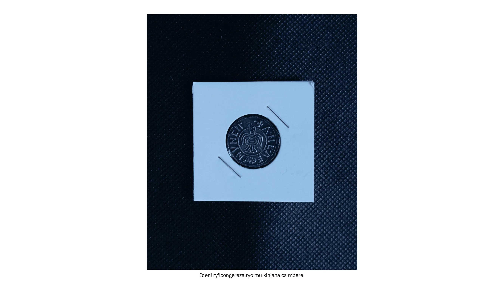

Mu kinjana ca mbere, Uburayi bwaguye mu butegetsi bw’abanyagihugu inyuma y’aho ubutegetsi bw’amahera bw’Abaroma busambukiye. Abenshi mu banyagihugu bakoresha ibiceri vy’umuringa(cuivre) canke muri bronze(umujumbu) vy’agaciro gatoyi, akenshi bikaba vyatuma amahera ahinduka, gutyo bikaba vyatuma ubudandaji hagati  y'imice yakure na kure itoroha gukora.

Uko kugaruka kw’amahera y’ibiceri nk’uburyo bwo kwishura vyabaye buhorobuhoro, bishika aho bishika mu kinjana ca 13 aho i Florence mu 1252 haboneka igiceri c’inzahabu citwa florin, hanyuma hakurikirwa igiciro c’inzahabu citwa ducat i Venise. Ivyo bice vy’inzahabu vyakoreshwa cane bivuye ku kwaguka kw’ubudandaji be n’ugukenera gukomeye kw’uburyo bwo kwishura bwizigirwa kandi bwemewe kw’isi yose.

Mu Bwongereza, uburyo bw’amahera bwarinzwe kugira ngo ntibusambuke ku ngingo ngenderwako nshasha z’ivy’ubutunzi, nkuko ikori ry’ubutaka ryashizweho na Guillaume le Conquérant inyuma y’umwaka wa 1066, ryari ryarazigamye uburyo bwa penny sterling. Ikintu gihambaye co gutahura aha ni uko abategetsi b'igihugu ico gihe bashobora gutesha agaciro amahera kugira ngo bashobore gufasha Leta, kandi **ugushiraho uwo amakori vyatumye bishoboje amahera kuguma ahagaze neza no gufasha Leta biciye mu misoro.**

Ariko rero, ikigeragezo co kuronka inyungu biciye ku guhindura amahera caratumye haba ingorane, nk’uko vyari vyifashe ku ngoma ya Henri wa mbere mu kinjana ca 12, igihe uburyo bwo gukoresha amahera y’ibiceri bwagabanuka cane. Impinduka zikomeye, rimwe na rimwe zijana n’ingero z’ubukazi zifatwa ku bacuzi b’amahera, zatumye abantu basubira kwizigira ayo mahera mu gihe gito.

Mu kinjana ca mbere na ho nyene haradutse uburyo buteye imbere bwo gukoresha amahera, nk’ugukoresha bâtons de comptage(tally sticks) mu bwongereza kugira ngo umuntu akureho uburenganzira bwo gutanga inyungu no gutanga inguzanyo. Ekleziya ntiyari ikunda cane inguzanyo zitanga inyungu, ni co gituma hakoreshwa ubuhinga butandukanye kugira ngo umuntu ashobore gukingira uburenganzira bwo gukoresha inyungu.

Iryo terambere ryari inyishu y’ubukene budahera bw’amahera y’ivyuma, kandi vyaremesheje ukuza kw’isoko ry’amahera rishasha.

Hagati aho, intambara z’abakristu zatumye haba ubudandaji bwo mu kiyaga Mediterane, bituma habaho iterambere ry’ubudandaji mpuzamakungu be n’imigenzo mishasha y’amabanki, canecane biciye ku gisata c’abasirikare Templiers. Abo basirikare bacitse abahuza b’ivy’amahera bahambaye, ivyo bikaba vyatuma abo basirikare bashobora kuronka amahera avuye kure y’aho baba, ivyo bikaba bwari uburyo bwo gukoresha amabanki yo mu Buraya bwo muri iki gihe canone.

Kugira ngo ukore ihuriro rya Templiers, aha musi urashobora kwihweza igiceri ca bafaransa co mu kinjana ca mbere, aho ushobora kubona umusaraba mwiza uri hagati. Vyari bihuriyeko na beshi cane ko ibiceri vyo muri ico gihe vyaba bifise uwo musaraba.

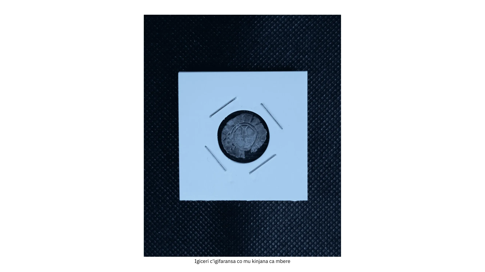

Ubwa nyuma na nyuma, ingorane zikomeye nk’Indwara nka la Peste noire(1346-1353) zatumye haba amahinduka akomeye cane mu vy’ubutunzi. Ukugabanuka cane kw’abantu kwatumye umushahara wiyongera cane, ivyo bikaba vyatumye Leta igerageza gukomeza gutanga imishahara nk’uko yahora.

Muri ico gihe nyene, Intambara y’Imyaka Ijana(la guerre de Cent Ans) (1337-1453) yatumye ibihugu bifata ingingo zikomeye cane z’ivy’ubutunzi kugira ngo bishobore gufasha ingabo zavyo, ivyo bikaba vyatumye ubutegetsi bw’abanyagihugu bugoyagoya.

Ikinjana ca mbere rero cararanzwe n’uruhagarara ruhoraho hagati y’ugukenera amahera yizewe kugira ngo umuntu akore ubudandaji be n’ikigeragezo gihoraho c’abategetsi co kuyungurura(diluer) amahera  ngo bashobore guca baronka inyungu. Iyo ntambara yarahinduye cane iterambere ry’amahera y’i Buraya, ishiraho umushinge w’ubutunzi bwo muri iki gihe.

Mu ncamake kuri iki gice, noshima kwongerako inkuru iryoshe cane yo mu Bwongereza muri iki gihe. Iyi nkuru y'akataraboneka yakuwe mu gitabu kiri hano, "History of Money" ca Glyn Davies.

Ivuga ko mu Bwongereza, ukwimurirwa mu Nzego Nshingamateka vyatumye umuzigo w’amadeni uva ku Mwami ija ku Nzego Nshingamateka, ivyo bikaba vyatumye Leta iguma ifise ideni. Imbere y’aho, ideni yaremekwa k'umwami.

Inama Nshingamateka imaze gushobora gufata bimwe muri ubwo bubasha bwo kurema amahera, vyatumye habaho ivuka ry'amadeni y’igihe kirekire aremekwa kubanyagihugu, atari k'umwami. Mbere yivyo, iyo umwami apfuye canke iyo habaye uguhinduka kw’umwami, amadeni yajana nawe.

Igihe ivuka ry'amadeni rikorwa n’Inama Nshingamateka, iciyumviro c’amadeni y’ubwami kiraseruka, kuko gishobora kuba kitagira aho kigarukira mu gihe. Igihe cose Leta izoba iriho, igihe cose Inama Nshingamateka izoba iriho, ayo madeni agumaho, kandi bategerezwa kurondera uburyo bwose bwo gusubiramwo amahera no kubikwirikiza uko igihe kigenda kirarenga. Ni ihinduka rikomeye ry’akarorero, aho ata mwami canke umuryango w’abami wari ugitanga canke wikorera iyo mizigo y'amadeni; ayo madeni yikorezwa Inama Nshingamateka bisigura abanyagihugu bonyene ubwabo.

## Ivuka rya kabiri

<chapterId>1d1dfb05-70b4-5b7b-9708-373c2182950d</chapterId>

:::video id=4977b4f3-c7b2-41a5-ad7b-a96a8cca4092:::

Ubu twashitse mu gice c’inyigisho aho tuvuga ibijanye n’igihe citwa Renaissance. Bibera mu gihe c’amagume ateye agahinda, aho ico kiza gikwiragizwa n’ibiguruka biri ku mbeba zija mu bwato. Ariko rero, ico kintu kibi kiratumenyesha ukuntu ubudandaji n’ingendo vyateye imbere mu kiringo ca mbere c’ivya kera. Mu ntango z’ico kiringo, si abantu benshi cane bagenda kure cane kandi vyihuta cane.

### Florin w'i Florence

Igihe amahera y’inzahabu yasubira mu Buraya mu kiringo c’Ivuka ry'akabiri, ni ikintu gihambaye cane mu mateka y’amahera. **Vyose vyatanguye n’igiceri ca Florin c’i Florence mu mwaka w’1252, igiceri c’inzahabu ca mbere gikomeye cacuzwe mu Buraya kuva Uburoma bugwa**. Kubera ko iyo florin yari ifise uburemere budahinduka kandi ikaba ifise ubuziranenge butangaje (nk’amagarama 3,5 y’inzahabu ifise ubuziranenge ), yagumye  idahinduka mu binjana bine, maze yihuta kuba ikintu gihambaye co gukoresha mu gukoresha amahera mu Buraya bwose.

Aha musi urashobora kubona igishushanyo ca Florin: Florin y’inzahabu ikozwe muri "etain" c’umukara kandi ikaba iterwako ikidodo n’umuhinga mu vy’ubuhinga bw’ugushushanya w’Umufaransa akora ibice vyiza cane, akabicapura kandi abicura n’amaboko.

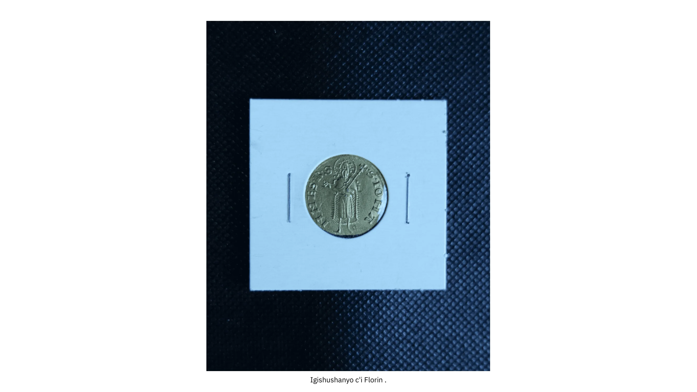

Ukwo gusubira mu biceri vy’inzahabu kwatumwe n’ikintu kidasanzwe: ugusambuka kwa solidus byzantin n’ugusenyuka kw’ubutunzi bw’isi y’Abayisilamu kubera ibitero vy’Abamongoli vyatumye haba ubusa bw’amahera mu bucuruzi mpuzamakungu.

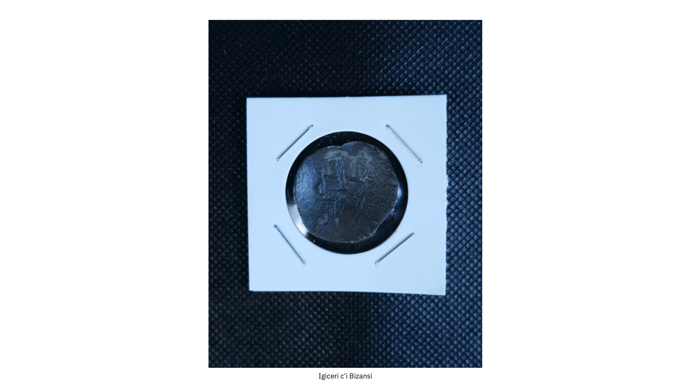

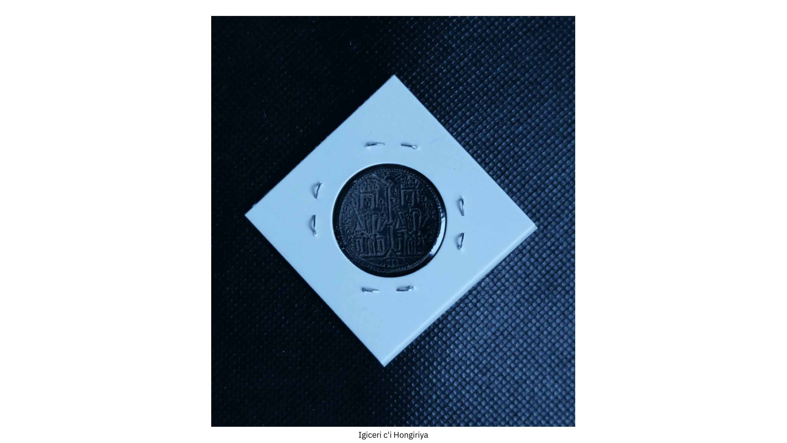

Mfise ngaha igiceri ca byzantine mbona ko bihimbaye. Ngiye gukora ikigereranyo n’igiceri co muri ico gihe nyene kivuye muriHongrie   (ishusho ya kabiri iri hejuru). Igiceri co muri Hongrie gifise ishusho y’igikombe, kimeze nk’agasorori gatoyi. Ivyo bishushanyo vyerekana ibishushanyo vy’idini vyerekanywe nk’abami bafise imisaraba iruhande y’iyindi. Ico gice gifise ishusho y’igikombe kandi kiva muri Hongiriya.

Vyari bimenyerewe cane gukopa ibiceri vyo mu bindi bihugu. Nk’uko ibiceri vy’i Bizansi vyemerwa muri rusangi, ibindi bihugu kenshi vyari kubikopa. Nk’uko ushobora kubibona iyo ubigereranyije iruhande n’uruhande: ivyo bipande birasa cane.

Ubutaliyano bwo mu Buraruko, cane cane Florence, Venise, na Genova, vyakoresheje iyo nzira kugira ngo bitangure amafaranga mashasha akomeye - ibiceri bifise ivyuma vy’agaciro bihoraho. Venise yarakurikiye akarorero ka Florence mu gukora amahera yitwa ducat mu 1270, ayo mahera yari hafi gusa n’aya florin kandi yakoreshwa cane mu bucuruzi bwo mu kiyaga Mediterane.

Ifaranga ryitwa florin ni ryo ryacitse ifaranga rya mbere ry’ububiko mpuzamakungu, ryakoreshejwe mu bisagara birenga 150 vyo mu Buraya imbere y’uko ikinyejana ca 14 gihera. Haciye hashirwaho urubuga runini rw’amabanki yo muri Florence, rwarongowe n’aba Médicis, uburongozi bw’amahera n’ubuhinga bwo gucungera amafaranga bwarahinduwe neza cane, mbere n’ugutwara inzahabu mu buryo bw’umubiri kwagabanutse.

Ico ni ikindi ciyumviro gishimishije vy’ukuri. Hari igihe ibiceri vyinshi vyarungikwa vyatakazwa mu ngendo zo mu kiyaga. Iryo terambere ry’ubuhinga - amarejista afise ububiko bw’ibitabu bubiri - ryatumye habaho gukora amahera y’acapuwe. Ivyo vyatumye bishoboka kugabanya igitigiri c’amahera y’ibiceri, ahubwo bagakoresha uburyo bwo kwandika, ivyo bikaba bigabanya cane ingorane zo gutakaza amahera mu gihe c’urugendo.

Iterambere ry’amahera ryaraherekejwe kandi n’ugutera imbere gukomeye mu buryo bwo gukoresha amabanki. Mu kinjana ca 13, Uburayi bwo mu kinjana ca mbere bwa n’uko Intambara z’Abakristu zahuye n’imigenzo y’amabanki y’Abayisilamu. Aba Knights Templar, bakaba ari umugwi w’idini n’uw’igisirikare, bari bamaze gutegura uburyo bwo gutuma abasirikare b’abanyamusaraba bashobora gukora ingendo batajana n’ubutunzi bwabo.

Bazoshira amahera mu biro vy’Aba templier mu gihugu cabo, hanyuma bagashobora gufata urugendo bafise urupapuro rw’ikete maze bagatora ivyo biceri iyo bashitse aho bariko baraja mu ntambara y’abakristu.

Ivyo vyasobanura ko tutabwirizwa gutwara ibiceri vy’agaciro vy’ivyuma.

Muri ico gihe niho kandi Uburayi bwamenye ko hariho amahera y'ubwoko bw'amanoti mu Bushinwa, bivuye ku rugendo rwa Marco Polo mu kinjana ca 13. Ariko rero, uguteza imbere amafaranga y’amanoti vyorindiriye ibinjana vyinshi, kubera ko Uburaya bwahisemwo kubanza gutunganya uburyo bwabwo bwo gukora amafaranga y’ivyuma. Leonardo da Vinci, uwari hafi cane ya Luca Pacioli, akaba yari umuhinga mu vy’amakonte azwi cane, yarafashije cane mu gutuma amashini akora amahera atera imbere, ivyo bikaba vyatuma hakorwa ibiceri vyihuta kandi bihuye.

Turavuga ubuhinga bwo gutera pendule twavuze imbere y’aho mu nyigisho. Ubwo buryo bwatumye hakorwa ibiceri bihuye cane ugereranije nogucura hakoreshejwe inyundo kandi, ikiruta vyose, vyatuma habaho inyandiko zikikuje urubibi rw’ico giceri, nk’uko nabigaragaje mbere. Ico kiri musi ni thaler y’i Buraya yo mu 1793, yerekana neza ivyanditswe ku ruhande.

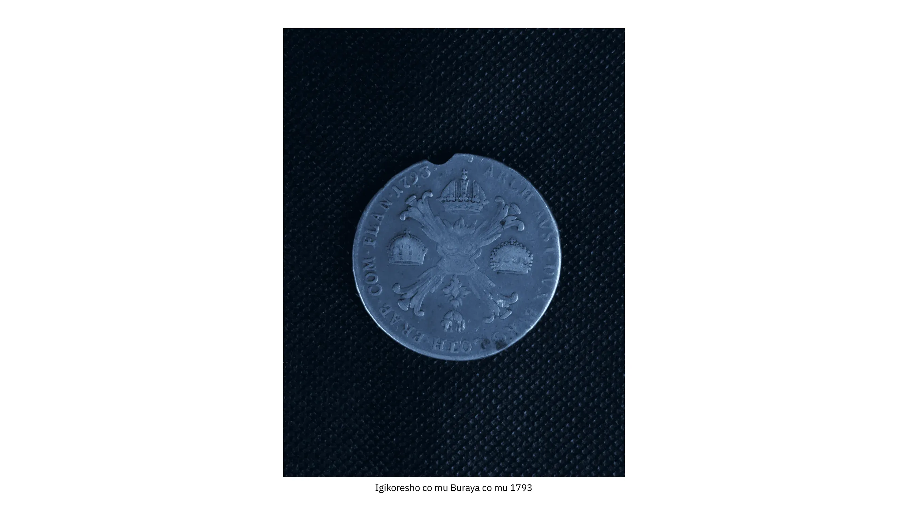

Ariko rero, mu kinjana ca 15, Uburayi bwarashikiwe n'ingorane zikomeye z'amafaranga, n'ugusenyuka kw'ifeza mu mafaranga y'Uburaya, bigabanuka bishika munsi ya 5% nko mu 1450.

Kuva mu kinjana ca 16, ikibanza c’ubukungu carahindukiye kija muri Espagne, kikaba cavyurwa n’ubumwe bw’ubwami bwa Aragon na Castile, iherezo ry’Igihugu ca Reconquista, n’ibintu bikomeye vyavumbuwe mu kiyaga nk’ivyo Christophe Columbus yavumbuye mu 1492. uburinganire, bikaba bituma haba ukuduga kw’ibiciro be n’imitongano mishasha y’ivy’ubutunzi(géopolitiques).

Ivuka ry'akabiri(la Renaissance) ryagaragaje kandi iterambere rikomeye ry'ubuhinga bwo gukora ibiceri, n'ibiceri nka thaler (Joachimsthaler), iriinkomoko y'ijambo "idolari". Ivyo biceri bininibinini vy’ifeza vyerekana ubuhinga bushasha bwo gukora ibiceri vy’ubugenegene n’ubuhinga bwa none bwashobotse kubera ubuhinga bushasha buva mu Buraya bwo mu buraruko.

Ubwanyuma, Ivuka ry'akabiri ry'ivy'ubutunzi ryatumye habaho uguhinduka kw'ubutunzi bushasha, n'iterambere ry'amabanki, inguzanyo, n'amasoko y'ivy'ubutunzi, n'uguseruka kw'ubwoko bwambere bw'ubu capitalisme bwa none mu bisagara binini vy'ubucuruzi vya Amsterdam, Londres, na Stockholm, bishinga umushinge w'uburyo bw'ubutunzi mpuzamakungu nk'uko tubizi uno musi. Kandi ivyo nivyo tuzovuga muri videwo yacu ikurikira.

# Ifatwa ry'amahera na leta .

<partId>17cfb1b4-5bc1-53e0-b035-05c7cf76be92</partId>

## Ugutera imbere kw'amafaranga y'isi yose

<chapterId>d65cc352-e7ca-5f03-9b23-dd1fae5c0395</chapterId>

:::video id=82710062-8fff-426c-93af-923c08d82233:::

### Akamaro k'ivyuma vy'agaciro mu mateka

Murakaze muri iki gice kivuga ku kuvuka kw’amafaranga y’ububiko n’amabanki makuru. Nk’ingingo ya mbere y’iki gice gishasha, tugiye kwibanda ku gutera imbere kw’amafaranga y’ububiko kw’isi yose.

Ivyuma vy’agaciro, canecane inzahabu n’ifeza, vyamaze igihe kirekire bibonwa ko ari vyo bishingiyeko ubutunzi n’ububasha mu bwami. Inyota y’inzahabu yama ari yo ituma abantu bagira ico bakoze, kandi ni ukuza kw’ivyuma vy’agaciro vyagize ingaruka zihuriranye kandi zigaragara cane ku bijanye n’iterambere ry’amahera mu Buraya. Mu bihe vya kera no mu ntango z’Ivugurura, ukwo gukunda cane inzahabu n’ifeza kwari guterwa n’uko vyari bigoye kuguma bifise agaciro mu bindi bicuruzwa, be n’uko ibihugu vy’amahanga vyari bisaba cane, cane cane mu bijanye n’ubudandaji n’ibihugu vyo mu Buseruko.

Mu binjana n’ibindi, inganji zitari nke zarakurikiranye mukugenda ziba ibibanza bihambaye vy’ubutunzi kw’isi yose. Igihugu kiganza ubudandaji bw'isi yose mu kiringo kanaka gihabwa muri rusangi ishusho rihagarariye amafaranga y'ububiko. Ivyo birimwo:

- Espagne na Portigal (mu kinjana ca 15 n’ica 16)

- Intara z’Ubumwe (Pays-Bas) mu kinjana ca 17

- Ubufaransa n’Ubwongereza mu kinjana ca 18 n’ica 19

- Leta Zunze Ubumwe za Amerika mu kinjana ca 20 .

### Iterambere ry’Abanyaportigale n’Ivy’Ukuri (1450-1530)

**Portugal** ni yo yari iganji mu bucuruzi bw’isi yose mu gice ca kabiri c’ikinjana ca 15 no mu ntango z’ikinjana ca 16, hakoreshejwe **Real y’i Portugal**, n'igiceri c’ifeza c’uburemere bumwe. Abanyaportigale, kubera amaterambere bari bafise mu bijanye n’ugutwara ubwato, bararonse inzira nshasha zokwiyunguruza mu kiyaga zija muri Afirika, muri Aziya no mw’Isi Nshasha. Inguvu z’ingabo n’ibibanza vy’ubudandaji vyaragwiriye kuva muri Afirika gushika mu Bushinwa (Macau).

Mu kwishura ku vyo Uburaya bwasaba ku bijanye n'inzahabu n'ifeza, "ikintu cama gituma bavumbura ibintu bikomeye ni inyungu y'ubudandaji, cane cane gukurikirana inzahabu n'ifeza." Ariko rero, Ubwami bwa Portigal, bwari bwagutse cane kandi bwari buhanganye n’Abaholandi, Abongereza n’Abafaransa, bwaratanguye gusenyuka.

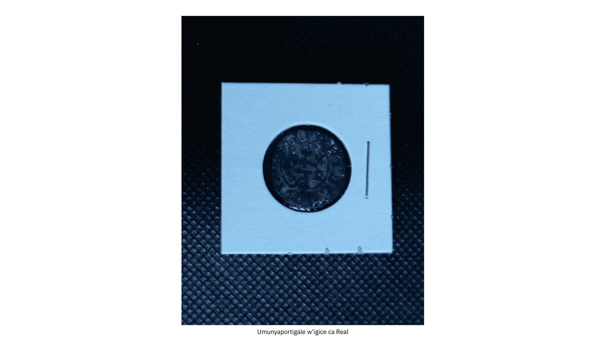

Aha hejuru urashobora kubona umunyaportigale w’igice c’Umunyagihugu wo mu gihe c’izo ntambara z’Inyanja.

### Igihe ca Espagne n’Idolari ry’inya espagne (mu kinjana ca 1535-17)

Igihe cokurondera isi nshasha, **Espagne** ni yo yabaye iyambere mwicogikorwa. Umwami waco, yari afise ububasha ku birombe bininibini vy’ifeza (Potosí muri Boliviya, Zacatecas muri Megizike), yarashoboye gukora amahera mw’ifeza atakanenge k'ibindi vyuma, gutyo aririnda isambuka ry'agaciro k’amahera yiwe bwite: **Real Espagnol.**

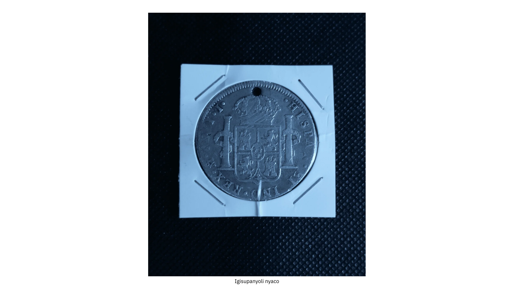

Le réal espagnol, kizwi kandi kw'izina ry' "piece of eight", ry'itwa iryo zina ry'akataraboneka kubera ko kenshi cacagurwa mu bice vy'umunani kugira ngo haboneke ibiceri bitobito. Yari izwi kandi kw’izina ry' **idolari ry'abanye espagnol**. Ico gice c’ifeza ubona haruguru ni co mu 1814, ivyo bikaba bituma ari akarorero gashasha gatoyi. Ariko rero, ibiceri vya mbere nyene vy’amadolari y’Espagne ntivyari vyiza nk’ivyo : vyari ibiceri vyacurishijwe n'inyundo kandi muri rusangi ntivyari vyiburungushuye neza kandi ntivyaboneka neza.

Ikintu gishimishije cane ni uko idolari ry’abanye espagnol ryari rikoreshwa nk’ifaranga ry’ububiko mpuzamakungu ico gihe. Abategetsi bo muri Espagne bari bafise amahera yo mukarere yabo bwite, ari yo bita maravedi, kugira ngo bashoboro kuringaniza uburinganire bw'amahera. Nk'akarorero, igiceri c'umuringa(cuivre) canke c'umujumbu(bronze) mu ntango cari gifise agaciro ka maravedi imwe coshobora kwibukwa kigashirwako ikidodo ca "2," hanyuma kigashirwako ikidodo ca "4," n'ibindi, bikaba bishobora gushika kuri "8." Muri iyo foto y'agaciro kanini, urashobora kubona neza "8" iteye ikidodo ku gice c'ifeza. Ubwo buryo bwatumye amafaranga agenda aragwira neza... ivyo bikaba vyatumye haba iduga ry'ibiciro.

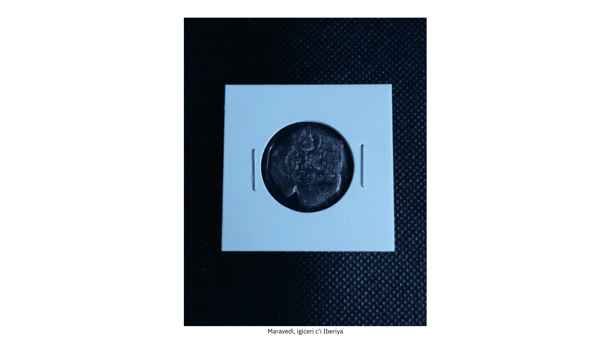

Turavye amateka y’amafaranga y’ububiko, hari ikintu gishimishije kigaragara: inganji amafaranga yabo ntiya shobora gutakaza agaciro kayo mugihe yari afise ikibanza c’amafaranga y’ububiko. **Iherezo ry’ubutegetsi bwabo niho gusa bahejeje kubugabanya agaciro, batakaza ako gateka, kaciye gashikirizwa ubwami bushasha**.

Muri Espagne, idolari ry’Espagne ryari rihambaye mu bucuruzi bwo kw’isi yose mu myaka hafi 200, canecane hagati y’Ubushinwa n’Uburayi. Ivyo biceri twanabisanga mubivuko vy’Ubushinwa. Kandi aho niho tuvunirwa: idolari ry’Amerika rikomoka ataco rihinduye kuri iyo mafaranga. Igihe Leta Zunze Ubumwe za Amerika zashingwa muri 1792, zashizeho itegeko ryo gukora amahera yazo bwite, kandi amadolari yayo ya mbere yaremewe ku citegererezo c’idolari ry’Igi espagnol, haba mu izina no mu bunini bw’ibiceri.

Kugira ngo mumenye agaciro kayo, idolari ry’Amerika mu ntango ryari igiceri c’ifeza gipima hafi ounce, canke hagati y’amayero 30 na 40 mu mahera y’ubu, bitandukanye n’amahera y’impapuro mubihe vya none. Naho idolari ry’Igi espanol ryo, ryarakwiragijwe cane ku buryo rifatwa nk’ifaranga rya mbere ry’ukuri ryo kw’isi yose.

Ariko rero, ukwo kwinjira kw’ivyuma vy’agaciro biva muri Amerika kwatumye haba iduga ry'ibiciro i buraya. Mu gihe c’Impinduka y’Ibiciro (c. 1540-1640), ibiciro vy’ubuzima mu Bwongereza vyaraduze incuro indwi. Muri Espagne, ubwinshi bw’ifeza bwaragize ingaruka mbi ku muvumo w’ubutunzi, bukaba bwarabujije iterambere ry’ibigo vy’amabanki bikomeye.

Mu nyuma, Espagne yarashikiwe n’intambara nyinshi z’igisirikare (Flandre, Ubuholandi, Intambara y’Imyaka Mirongo Itatu), maze ubutunzi bwayo butangura gusenyuka buhoro buhoro. Aho gutesha agaciro igiceri c’ifeza cari kizwi kw’isi yose, abategetsi bakurikiranye bahisemwo guca agaciro k’igiceri c’umuringa (vellón) cakoreshwa n’abanyagihugu mukarere kabo. Ivyo ni vyo nadondoye mbere n’aba Maravedi.

### Uguhaguruka kw’Abaholandi (ikinjana ca 17)

Inyuma y’igihe c’ubutegetsi bwa ibérique, **les Pays-Bas** bwaje nk’igihugu gishasha c’ubudandaji mu kinjana ca 17. Ubucuruzi bwo mu kiyaga, VOC (Ishirahamwe ry’Abaholandi ry’Ubuhindi bwo mu Buseruko), n’ugushinga **Amsterdam Stock Exchange** (vyahumekewe n’iryo ry’i Anvers) ni vyo vyatumye iyo repubulika y’ubudandaji igira ikibanza nyamukuru.

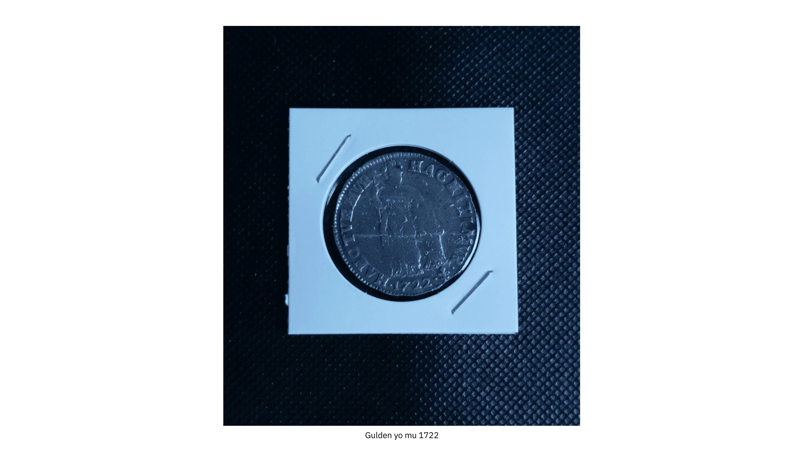

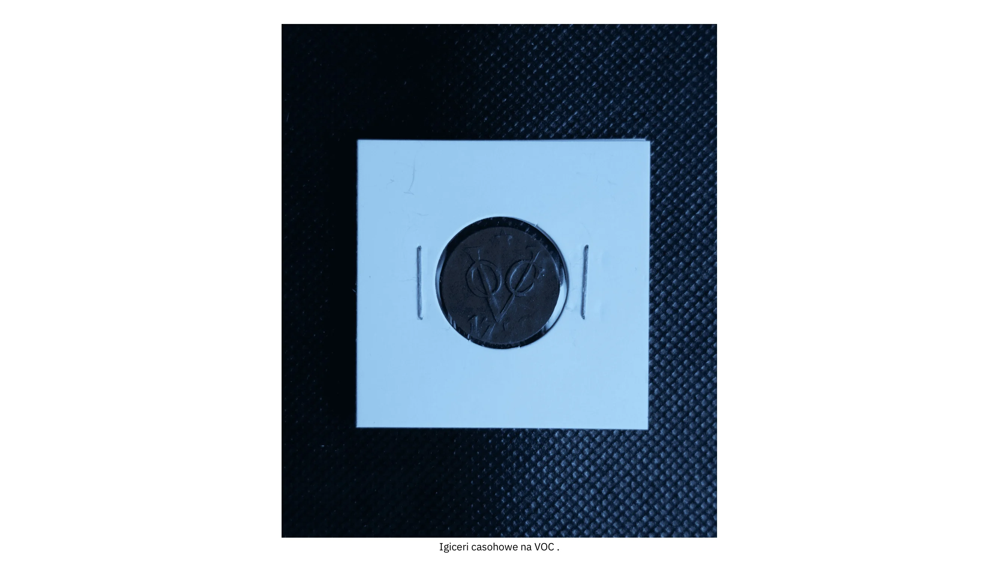

ifoto ya mbere iri hejuru, urashobora kubona Gulden yo mu 1722 (igiceri c’ifeza ciza cane), mu gihe mu ya kabiri, hariho igiceri casohowe na VOC.

VOC yari ishirahamwe rikomeye cane ku gihe cayo: ryari rifise igisirikare caryo, mbere ryarikorera n’amahera yaryo.

Abaholande ni bo bavumbuye capitalisme yomugihe ca none, bwatanguye nk’uburyo bwo gutez akaga mu bikorwa biteye akaga nk’ugutembera mukurondera Isi Nshasha canke kurondera inzira nshasha z’ubudandaji. Amashirahamwe y’abanyamuryango yaratumye abashoramari benshi bashobora gukoranya amahera yabo maze bagasangira ingorane. Kugira ngo ivyo biganiro bishobore gukorwa neza, vyari ngombwa rero ko habaho inzego zishobora guhanahana amakuru no guhanahana ivyo bimenyetso. Gutyo, mu 1602, harashinzwe ishirahamwe rya mbere ry’abanyamuryango n’isoko ry’ubudandaji.

Amafaranga y’Ubuholandi, **Gulden**, yararonse icizigiro kubera ukutagira inenge bwayo mw'ifeza, hanyuma yemerwa na Banki ya Amsterdam (1609), aho amafaranga yo kubika yacitse uburyo bw’amahera bukundwa cane mu Buraya. Iyi ni ingingo ihambaye cane yo kuvuga. Ego cane, hariho ibiceri, mugabo ico mu vy’ukuri cari amahera muri iyo misi cari ubwoko bw’amahera yo mu Vyanditswe. Nkako, ubudandaji bwinshi bwo kw’isi bwaca muri livre de compte y’i Amsterdam. Ivyo vyari ugutera imbere nyakuri mu vy’amabanki: ubudandaji mpuzamakungu ntibwari bugikoreshwa n’ibiceri vy’umubiri, ahubwo bwakoreshwa ata guca ku ruhande biciye mu nyandiko z’ivy’ubuhinga bwa banki.

Ico gihe c’uguterimbere cararanzwe n’ukwinjira kwinshi kw’inzahabu n’ifeza, cane cane biva mu bindi bihugu bikoresha iduga ry’ibiciro canke ukugenzura amahera. Hariho umuntu aryoshe cane wo kuvuga: **Thomas Gresham**. Muri ico gihe, yakorera abami b’Abongereza mu Buholandi, akarongora uruja n’uruza rw’amahera hagati y’ivyo bihugu bibiri. Uwo Gresham nyene ni we yadusigiye **"loi de Gresham"** rizwi cane.

Naho ari ukwo, Ubwami bw’Ubuholandi na bwo nyene bwaciye bubura ubushobozi. Intambara n’Ubwongereza, ugusenyuka kw’itunga ry’Ubwongereza mu bihe vy’intambara, n’uguhiganwa n’ibindi bihugu (Ubufaransa n’Ubwongereza) vyarangiye ubutegetsi bw’Abaholandi babukoroye. Inyuma y’intambara ya kane y’Abongereza n’Abaholandi (1780-84), ukugabanuka kw’ifaranga ry’i Gulden nk’ifaranga ry’ububiko ryaciye rihinduka ikintu kidashobora gusubirwamwo.

### Ububasha bw’Abafaransa, ivyipfuzo n’ukunanirwa (ikinjana ca 17-18)

Mu gihe ca Louis XIV, **Ubufaransa** bwacitse igihugu gikomeye kuruta ibindi vyose mu Buraya. Ariko rero, amafaranga y’Ubufaransa ntiyigeze ashika ku rwego rwo kuba amahera yambere ahambaye: ugucika kw’agaciro kenshi, imisoro myinshi, n’intambara zitwara amahera menshi (Ishirahamwe ry’i Augsbourg, Intambara y’Ugukurikirana kw’Abanya espagne, n’ibindi) vyararemereye cane ugushikama kw’urutonde rw’amahera.

Igerageza rya mbere rikomeye ry’amahera y’impapuro ryakozwe na John Law (1716-1720). Banque Générale yasohoye amafaranga ashigikiwe n’amasezerano y’amadeni ya Leta. Uwo mugambi waratumye haba igihuhusi c’ugutekereza ku bintu vyinshi maze kirasenyuka (la ‘Mississippi Bubble’) mu 1720. Ico cago caratumye Ubufaransa buguma butizigira amahera y’impapuro. Ivyo bintu biteye akaga ni vyo vyatumye Richard Cantillon aba umutunzi kubera iyo nzira yo gutanga ingingo ngenderwako, ubu izwi kw’izina rya Cantillon effect, aho gucapura amahera bitunga abafise uburenganzira bwo gucapura.

Igihe ukwo kutizigira kwari guhera, ikindi gitero c’impapuro z’igifaransa: **assignats** z’abanyagihugu. Ivyo binyamakuru vyasohowe kuva mu 1790 gushika ubu bishingiye ku gufata ivy’abakuru b’idini, ivyo binyamakuru vyarashikiwe n’ugutera imbere kw’ibiciro, ivyo bikaba vyatumye biba ukuduga kw’ibiciro vya mbere mu mateka birenze 50% ku kwezi. Mu 1795, naho agaciro kavyo kari kagwijwe, vyariko biragurishwa ku bice bikeyi gusa kw’ijana vy’agaciro kavyo ka mbere.

Amategeko arushirizaho kubuzanya abantu yararondeye gutegeka uwo muntu, ariko ntivyakunda. Leta yaragerageje kubitegeka, gushika no ku gutera ubwoba abatavyemera ko bazobica, no guhatira abacuruzi kuguma bafunguye. Ariko rero, mu mpera, ntivyashobotse.

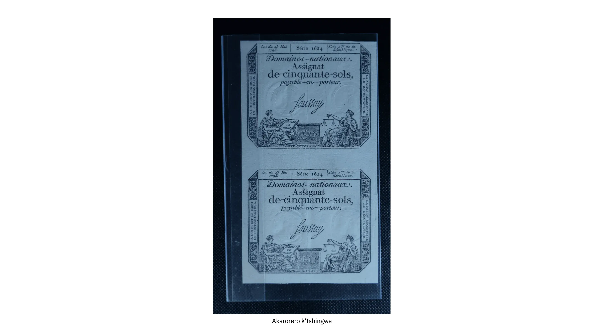

Nkuko ayo mahera y’impapu yatumye hazimangana amahera yose yo mumabuye yagaciro, bihuye n’Itegeko rizwi cane rya Gresham, ni ko habaye ubukene bw’ibiceri. Kugira ngo bacure ibiceri bishasha, baciye bakoresha ivyuma bivuye munkengeri bafashe abakuru b’idini. Aha musi urashobora kubona igipande ciza cane c’icuma c’inkengeri, gikozwe mu muringa wagarutse mu gufukura ibiceri vyakuwe mu bakuru b’idini.

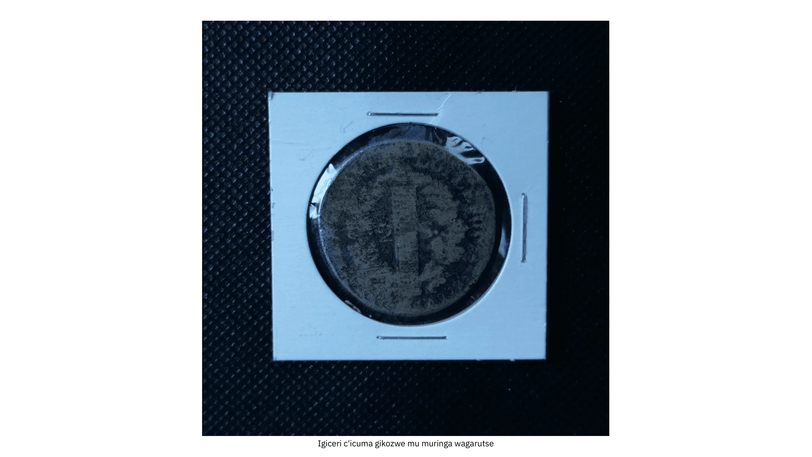

### Ubutegetsi bw’Abongereza (18 - intango y’ikinjana ca 20)

**Ubwongereza**, bumaze gutsinda Ubuholandi, bwacitse ububasha buhambaye mu kinjana ca 18. Ipound sterling ni yo mafaranga ya kera cane agikoreshwa, mu ntango yari afitaniye isano n'ipound y'ifeza. Buhoro buhoro, ikibanza caco carakomeye, gishigikiwe n’ihinduka ry’ivy’ubutunzi n’ivy’ubutunzi: ubutegetsi bw’umwami bw’abashingamateka, ubushobozi bukomeye bwo guteranya imisoro, n’ugushinga Banki y’Ubwongereza mu 1694\.

Inyuma y’intambara zitari nke zarwanye n’Ubufaransa, Ubwongereza bwarasohotse butsinda mu 1815 (Waterloo), ivyo bikaba vyemeza ko ari bwo buhambaye kuruta ibindi vyose. Mu kinjana ca 19 cose, ipound sterling ni yo yakoze nk'ifaranga ry'isi yose. Igihe Ubwongereza bwari ku rwego rwo hejuru, bufise 2,5% gusa vy’abantu bo kw’isi, bwari bufise 20% vy’amahera yinjira kw’isi yose kandi bwari bugenzura hafi ica kane c’uburebure bw’isi.

**Impinduka mu vy’inganda** no kwemera **Ikigereranyo c’Inzahabu** (1717 canke 1718, kirongowe na Isaac Newton ku kigo c’ubuhinga bw’amahera c’Ubwami) vyatumye ipawundi igira icizigiro. Banki y’Ubwongereza yarashizeho urugero rw’inzahabu rw’amapawundi 4,25 ku ounce imwe y’inzahabu, ivyo bikaba vyatuma abafise amanoti bashobora guhindura amanoti yabo ngo abe inzahabu.

Ariko rero, Intambara ya mbere y’isi yose (1914-1918) yarahevye uru runkwekwe. Mu ndwi nkeyi, ibihugu vyose bikomeye vyari mu ntambara vyarahagaritse guhindura inzahabu. Ubwami bw’Ubwongereza, mu nyuma n’ipound, vyavuye mu Ntambara ya kabiri y’isi yose mu gihe c’intege nke, bica biheba idolari ry’Amerika mu kinjana ca 20.

Kandi nk’igikoresho c’ubuhinga, urashobora kubona ibice vyiza kandi bishimishije aha hepfo. Ivyo ni ibipimo vy’amahera. Irya mbere ni umukuru w’igihugu: ibimenyetso vya mbere vy’ipound. Nfise gusa uburemere bw’amahera bwo guserukira ivyo biceri kuko ntashobora kugura umukuru w’igihugu nyawe. Kugira ngo tubipime, twakoresha umunzane hanyuma tugashira ku rundi ruhande uburemere bw’amahera bungana n’agaciro k’umwami.

Umwami yari igiceri c’amahera - igiceri c’inzahabu mu ntango cari gifise agaciro k’ipound imwe.

Imbere y’uwo mwami rurangiranwa hari igiti citwa guinée, kikaba cari gikoresha iyo ngingo ngenderwako nyene. Gineya yitiriwe izina ry’ivyuma vy’agaciro vyari muri yo, bikaba vyava mu karere ka Guinée.

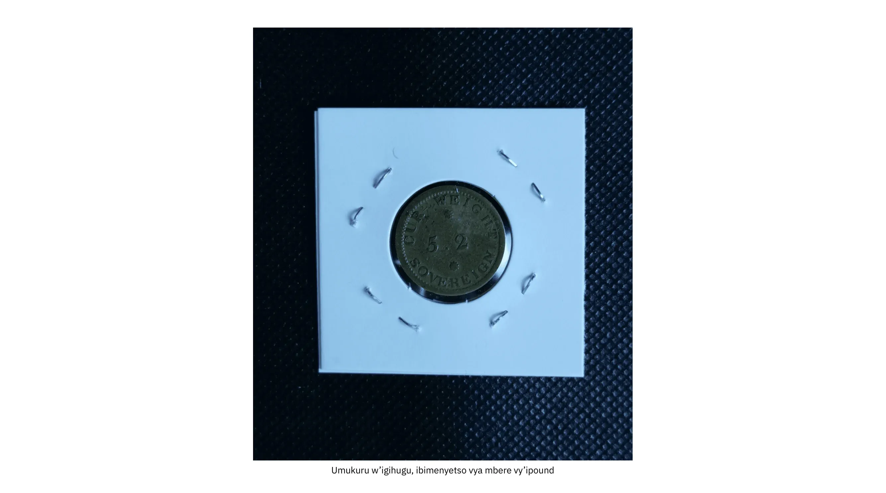

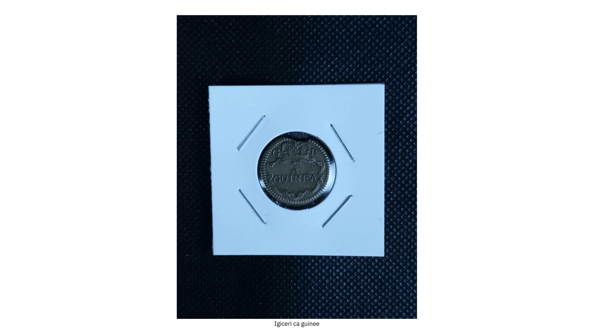

## Uguseruka kw'amabanki akomeye .

<chapterId>15777771-1e28-55f7-a400-69868a47079b</chapterId>

:::video id=7661b7b5-e00f-48f3-b69a-6fb2eb5ebba4:::

Dukurikije iki gice kivuga ku mateka y’amafaranga y’ububiko bwa mbere n’ingene yateye imbere, ng’iki igice kivuga ku guseruka kw’amabanki akomeye. Ikurikira inzira imwe cane n’iyo amafaranga y’ububiko yaje, ariko yibanda cane ku buhinga bwa banki bwo muri ico gihe.

### Ivuka ry'amabanki 

Kera mu kinjana ca 13, Abataliyano (Florenze, Genova, Venise...) barateguye ubuhinga bwo guharura amafaranga bukoreshwa incuro zibiri. Mu nyuma, **Anvers** (mu kinjana ca 16) ni co cabaye ikibanza gihambaye mu vy’ubutunzi mu Buraya bwo mu Buraruko, uruhara rwaje gufatwa na **Amsterdam**, bivuye ku kigo ca Amsterdam Stock Exchange (1609), aho imigabane ya VOC yagurishwa.

I Anvers haraba amasoko y’abadandaza aho abadandaza bakunda gukoranira kugira ngo bahe amadeni, ivyo bikaba vyatumye habaho uguhingura ibikoresho bishasha vyo gukoresha amahera. Iryo tegeko riri musi, ry’itariki 1761 n’iry’ubu, ni **ikete ry’isezerano**. Irimwo ibintu vyinshi vyanditswe n’ukuboko, hamwe n’ivyanditswe ku mugongo, ivyo bikaba bituma iba ikintu ciza cane co muri ico gihe.

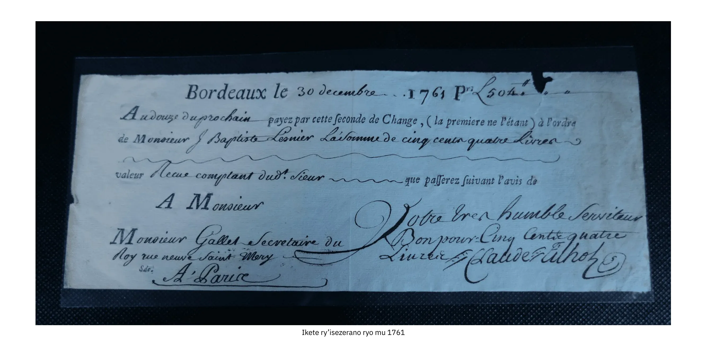

Ukwo gutera imbere kwatumye habaho amavuka y'amabanki ahanitse. **Abanyabanki b’Aba lombards** n’abacuruzi b’Abaholandi hanyuma baratunganije neza ibikoresho vy’inguzanyo (amafaranga y’inguzanyo, amafaranga y’amasezerano, n’ibindi). Uburyo bwa banki bwo muri iki gihe bushingiye kuri iki ciyumviro: amahera ashobora kuba inguzanyo, atari ivyuma gusa.

Nk’uko mubibona, ivyo bidusubiza ku kibazo cacu c’intango ku bijanye n’inkomoko y’amahera.

Amahera yoba ava mu kintu kiva mu gukenera guhinduranya, canke ava mu ngurane? Ivyiyumviro vy’ivyo biracariho muri iki gice.

### Akarorero k’i Suède: Ibanki y’i Stockholms Banco y’i Riksens Ständers Bank

Reka tuje muri Suède, aho banki nkuru ya mbere nyene yashinzwe.

**Suède** niyo yabaye iyambere mu bijanye n’amabanki makuru(banque centrale): mu 1657, Johan Palmstruch yarashinze **Stockholm Banco**, yemereye kuguriza amahera menshi kuruta ububiko bw'ivyuma, gutyo ni ho havuka ububiko bw'ubutunzi bukora. Ariko gusohora amafaranga y'amabanki birenze urugero vyatumye haba ubwoba abantu batangura kubikura amahera yabo muma banki mu myaka ya 1663.

Mu mwaka w’1668, banki yitwa Riksens Ständers, ari yo banki ya mbere y’ukuri kw’isi, yashinzwe i Stockholm. Ariko na yo nyene yarashikiwe n’ingorane (1709, 1715...) zijanye n’ugukoresha nabi amafaranga y’amabanki(gukora amahera meshi), akenshi mu gutera inkunga intambara z’ubwami.

### Igikorwa c'igitangaza ca John Law

Reka tujane mu Bufaransa, aho twongeye gusanga umukunzi wacu John Law.

**John Law**, umunya Ecosse, yaranyugwishije umu Regent (Duke wa Orléans) gushinga banki yigenga, Banque Générale (1716), yemerera gutanga amanoti bahindura munzahabu(bagura), amahera n’amadeni ya leta. Yaciye iba Banque Royale (1718), kandi yafashije imigabane ya Sosiyete ya Mississippi gutera imbere cane.

Igihe ukuri kwafata n’amayeri y'iyo systeme , **ubwoba bwateye bwiyongera kubera n'itegeko ryaso ryo kudatunga inzahabu bagahatirizwa gukoresha amahera ya law**. Sawa, sawa...

Amaherezo, vyagiye kononekara cane mu 1720, ituma haba ugusambuka k'ubutunzi , amahera y'amanoti aratakaza icizera hamwe n'agaciro mubufaransa igihe kinini.

### Banki ya Amsterdam, ni ugutera imbere kw’akarorero k’ubutsimvyi

Ubu tuje muri Amsterdam mu 1609, aho **Banki ya Amsterdam** (Wisselbank) yafashe ububasha bwo kubika ibiceri no kubihindura i Amsterdam ;habuzwa izunguruka ry'amahera ava mu ma caisse yigenga, yongera itegeka kubika ibiceri vy'ivyuma muri ayo ma caisse . Buhoro buhoro, baraciye bafata ububasha bwo kugenzura ayo mahera. Babujije abavunja amahera kuguma bafise ibiceri. Abavunjayi barakora umusi wose kandi bategerezwa gushiramwo amahera yabo mu bibanza vy’ububiko bwa Banki ya Amsterdam ku musi wanyuma. Nk’uko nabivuze, ntivyari ngombwa ko ari ibiceri vy’ivyuma vyakoreshwa mu bucuruzi mpuzamakungu. Yari amahera y'amanoti yari muma livre de compte ya banke.

Kubera ububasha bw'ubudandaji bw'Abaholandi, iyo banki yaragize uruhara rwa mbere de facto "banki nkuru", ituma ubudandaji kw'isi yose buhungabana. Ariko rero, uko igihe cagenda kirarenga, ryarahaye VOC inguzanyo zitagira ingwati, amaherezo ivyuma vyo gufasha mu gutanga amafaranga ryaryo birabura. Mu mwaka w’1790, vyamenyekanye ko yari yagurishije amahera menshi VOC, kandi hafi y’aho itangaza ko yacitse intege, ivyo bikaba vyatumye iyo gulden igira icizigiro.

### Banki y'Ubwongereza, itegeko ryashinze amabanki y'ubu

Mu Bwongereza bwo mu kinjana ca 17, inzahabu n’ifeza vyabikwa n’abacuzi b'amabuye y'agaciro, uguze bakaba batanga agapapuro kemeza ko waguze . Uwo mugwi wari wari wigenga agice kimwe, waragaragaje ko ufise aho ugarukira igihe Ubwami bwasanga bukeneye cane amahera yo gutera inkunga intamba barwana n’Ubufaransa.

Mu mwaka w’1694, ni ho hashinzwe **Banki y’Ubwongereza (BoE)**. Banki y’Ubwongereza rero yavutse kubera ihuzwa ry'ugusangira hagati y’ubucuruzi bwo muri Londres na Leta, iyo na yo ikaba yari yihebuye irondera amahera yo gutera inkunga intambara.

Iyo Banki yararonse uburenganzira bwo gutanga amahera y'amanoti mu Bwongereza (yakomejwe mu 1708, 1742, n’ibindi). Kuva ico gihe, amahera y’impapuro ashigikiwe n’ibisigazwa vy’inzahabu yaragendagenda iruhande y’ibiceri. Ico ni ingingo ihambaye yo gutahura ukuntu inzego za Leta zifata amahera buhoro buhoro. Ica mbere, Banki y’i Amsterdam yarabujije abahindura amahera kubika ibiceri, maze ibahatira kubisubiza muri Banki. Mu Bwongereza, amabanki yigenga yarabujijwe gutanga amafaranga yabo bwite yo gucungura mu nzahabu.

Baremeye vy’ukuri amabanki yigenga gutanga amafaranga y’amahera, ariko ayo mafaranga yashobora guhindurwa gusa n’amahera y'amanoti ya Banki y’Ubwongereza.

Amafaranga yo muri Banki y’Ubwongereza, livres sterling , yarashobora kugura inzahabu. Ivyo vyatumye habaho igice ca gatatu ku mafaranga. Turafise rero inzahabu ku rwego rwo hasi, hanyuma amafaranga y’ibanki y’Ubwongereza, hanyuma amafaranga y’amabanki yigenga hejuru. Imbere y’ivyo, amabanki yigenga yari gushobora gutanga amafaranga yabo bwite yo gucungura mu nzahabu. Iyi ni iyindi ntambwe mu gufata amafaranga buhoro buhoro n’inzego za Leta.

Banki yarafashije Leta inguzanyo nyinshi cane, kandi itunganya ideni rinini ya Leta yari yarafashije ugutera imbere kubutunzi.

Ico kigereranyo carakomejwe mu kinjana ca 18 n’ica 19, gushika aho livre sterling yacitse ifaranga ry’ububiko kw’isi yose, ryari rifise ikidodo ca Banki y’Ubwongereza be n’ikigereranyo c’inzahabu.

**Amafaranga y’isi yose y’ububiko** yarakurikiranye mu binjana n’ibindi, arongowe n’ububasha bw’ubutunzi, ubudandaji n’ububasha bw’igisirikare bw’igihugu canke ubwami: Portugal, Espagne, Ubuholandi, hanyuma Ubwongereza, imbere y’uko Leta Zunze Ubumwe za Amerika ziza ziganza mu kinjana ca 20. Muri ivyo vyose, turabona uruziga rusa n’urwo: ukwaguka kw’ubutunzi, uguterimbere mu vy’ubudandaji, kwemera amafaranga kw’isi yose, amadeni, intambara zitwara amahera menshi, gukoresha nabi amahera mu kurema canke gutanga inguzanyo, hanyuma ubwanyuma akagabanuka.

**Ivuka ry’amabanki makuru** yagiye aravuka buhoro buhoro. Izo nzego akenshi zavyutse mu gihe c’intambara zitwara amahera menshi, ivyo bikaba vyatuma Leta yitera inkunga biciye mumadeni. Igihe urugero rw’inzahabu rwashirwaho (Ubwongereza, mu kinjana ca 17-19), rwaratanga ukuguma hamwe kubutunzi, gushika aho intambara zikomeye z’isi yose zo mu kinjana ca 20 zatumye buhorobuhoro abantu baheba guhindura amahera munzahabu. Ububasha bwo gukora amahera rero bwavuye ku butegetsi bw’umwami buja ku bigo bikomeye cane, ubwa mbere bikaba ari ivy’abikorera ku giti cavyo (abacuzi b’inzahabu, abakozi bo mu mabanki), hanyuma bikaba ari ivy’igice ca Leta (amabanki akomeye), ivyo bikaba vyerekana ukuntu ubusegaba bw’amahera bwagiye buratera imbere buja mu buryo bushingiye ku nzego, bujanye n’isi yose.

Rero, ivyo nivyo nariko ndadondora mbere. Kenshi twaciye twimurira umuzigo w’amadeni y’igihugu ku mabanki makuru canke ku ruhusha rwo  amahera n’inzego zitegekanijwe n’amategeko, nk’Inama Nshingamateka.

Kandi ikintu gihambaye cane aha ni uko **twavuye ku madeni yashobora kuzimangana biciye mu gusambuka kw'abami tuja ku madeni yari ahanini ku bitugu vy’abanyagihugu**.

## Inzira ija kuri sisitemu ya fiat

<chapterId>27a98545-d350-56ee-a200-92468e6b9b33</chapterId>

:::video id=e27a753e-aeee-4307-a65c-9506aab380a1:::

Ubu twashitse ku mpera y’iki cirwa c’amateka y’amahera, kandi kugira ngo turangize, nashaka gutanga ingingo zibiri. Ingingo ya mbere ni intambwe zitandukanye zatumye tugira ubuhinga bwacu bwo gukoresha amahera ya none. Tuzosubira gusuzuma ibintu bivuye mu gice ca 5 ku bijanye n’ugushinga amabanki akomeye, twongereko iciyumviro c’idolari ry’Amerika, ari nayo ubu ari amahera y'ububiko. Turaza kuraba ingene vyateye imbere, ingene idolari ryaje, ingene ryateye imbere, ingene ryahindutse, ni intambwe izihe ryaciyemwo kugira ngo ribe fiat system(amahera afatiye kukwizigira), kuko inkomoko y’idolari ni igiceri c’ifeza.

Hanyuma, ubwo nyene, ngiye kubaha igice gitoyi ku mateka y’ivy’ubutunzi, kugira ngo mutahure ingene twashitse muri Leta y’imibereho myiza. Rero turaza kuraba ibintu bibiri: ingene twashitse ku nzira ya fiat, hanyuma ubwo nyene inyuma y’aho, ingene ugutera imbere kw’ivy’ubutunzi kwatujanye ku ciyumviro ca Leta y’imibereho myiza.

### Ishingiro ry'i Buraya ry'amabanki y'ubu

Reka dusubire mu kinjana ca 13 n’ivyo bita florin. Kugira ngo dutahure ingene twashitse ku citegererezo ca fiat, turakeneye gutangura mu kinjana ca 13. Inyuma y'amahera florin, hariho ubuhinga bwa kera bwavutse mu gihe kimwe n’ubuhinga bwa Medici, ni ukuvuga iciyumviro c’amakete y’amahera.

Hanyuma haza isoko ry’ivy’ubutunzi ry’i Anvers, rifise iciyumviro co gugabanya ibiciro n’amafaranga y’amasezerano.

Hanyuma nk’uko twabibonye, ​​twari dufise VOC, isoko rya mbere ry’ivy’ubutunzi ry’i Amsterdam. Ivyo ni vyo vyatumye havuka ubu capitalisme, hakaba hariho imigabane y’amashirahamwe n’uguhana imigabane. Banki y’i Amsterdam yaciye itegeka ko umuntu akoresha amahera yabitswe biciye ku itegeko. Ivyo vyasobanura ko ibiceri vyategerezwa gushirwamwo ku musi wanyuma. abavunjayi ni bo batagishobora kuguma bafise amahera muburyo bw’ibiceri.

Hanyuma hashirwaho Banki y’Ubwongereza kubera ko vyari bikenewe gushinga amadeni yo gufasha intambara mu mpera z’ikinjana ca 17. Iciyo gihe, amabanki yigenga ni yo yacitse igice ca gatatu c’amahera. N'ubundi, iki gice cose, kuva ku florin gushika ku ciyumviro co kurema banki nkuru, gisiguwe neza cane mu gitabu kizwi cane ca Nick Bhatia citwa "Layered Money", ico nagize amahirwe yo guhindura ndi kumwe n'abo dukorana bakeyi. Twarakoze igikorwa gikomeye co kuyihindura kugira ngo abavuga igifaransa aho bari hose bashobore kwungukira kuri izo nyigisho.

Rero turi mu mpera z’ikinjana ca 17. Banki y’Ubwongereza yarashinzwe kugira ngo ifashe mu gutanga amahera y’intambara.

Amabanki yigenga ni yo yatwaye igice ca gatatu c’amahera. Nkako, amafaranga y’amabanki yigenga ntiyari agishobora gucungurwa n’inzahabu: amafaranga y’ibanki y’Ubwongereza ni yo yari gucungurwa n’inzahabu. Ivyo vyerekana ko ububasha bwo guhindura amafaranga bwafashwe n’ikigo ari co Banki y’Ubwongereza.

Hanyuma haza kuba akavuyo mu 1776. Bose batanguye baduga piramide y’amahera. Ivyo bisigura ko mu 1776, hariho urugendo ku mabanki, kandi rero abantu bose bafise impapuro z’urugero rwa gatatu, ni ukuvuga amafaranga y’amabanki yigenga, bagerageza kuronka amafaranga y’amabanki y’Ubwongereza, hanyuma bagerageza kuronka inzahabu, ariko biragaragara ko ata nzahabu ihagije yariho mu bibanza vy’ububiko. Bamenyesheje ubwoko bw’ikiruhuko co mu mabanki kugira ngo ntibasubire kwishura amafaranga y’inzahabu, ivyo bikaba vyatumye haba iciyumviro c’uko uwugurisha ari we azoba ari uwa nyuma.

### Iterambere ry'idolari ry'Amerika

Twaravuye ku giciro c’i florin tuja ku gushinga Banki y’Ubwongereza. Ego ni ko, muri ico gihe hariho Intambara ya mbere n’iya kabiri y’isi yose, mugabo imbere y’aho, mu 1796, hari ibintu vyariko biraba no ku rundi ruhande rw’ikiyaga Atalantika. Mu 1776, Amerika yari ikiri igikoloni c’Abongereza. aha hasi hari inoti rya Connecticut , niyanyayo , n'amashilingi abiri ya Connecticut yo mu 1776.

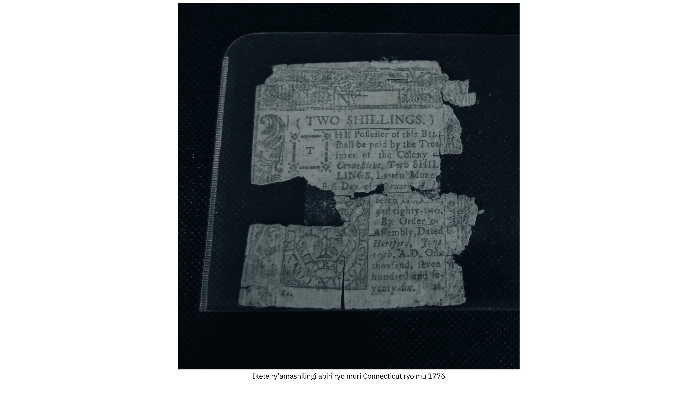

Ni mugihe batangaza intambara ku Bwongereza, batanguye gukora amahera yabo bwiti. Hagati aho, hari amahera y'amanoti, mugabo bakoresha idolari ry’Espagne mu gucuruza amahera. Nkako, ijambo "idolari" ryagumyeho baryita "dollar americain".

Nimba ntabeshe, mu 1792 barashizeho itegeko ryabemerera gukora amahera y’ibiceri. Nk’akarorero, iri musi ni idolari ry’Amerika ry’iki gihe.

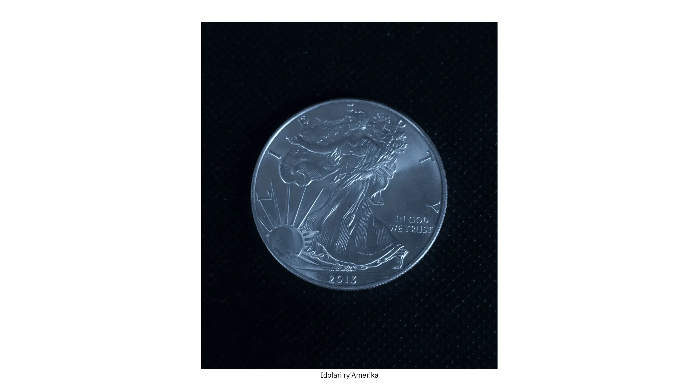

Ego cane, biragaragara ko ata gaciro katangana n'idollar rimwe; ahubwo rifise agaciro k’amadolari nka 30 canke 40, kuko rigereranya once y’ifeza. Agaciro kayo karahinduka bivanye n’igiciro c’ifeza, mu bisanzwe umuntu akayishira ku madolari 30 canke 40 y’Amerika. Birumvikana ko muri iki gihe idolari ry’impapuro riguma rifise agaciro k’idolari rimwe gusa, ariko ico gihe, idolari ry’Amerika ryari rishingiye kuri ako gaciro k’ifeza.

Reka tuvuge kuri "guerre civil" muri Amerika, muri ico gihe barakoze amahera meshi. Ayo mahera yaratakaje agaciro. Ico kintu ntikija ku rutonde rwemewe rwa Hanke-Krus, kuko kitashitse ku rugero k'ukuduga kw’ibiciro rurihejuru rushika kubice 50%. Ariko rero, ryarashikiwe n’ukuduga kw’ibiciro ku kwezi kw’ibice 40 kw’ijana, ivyo bikaba vyerekana ko amafaranga menshi cane yakozwe mu gihe c’intambara.

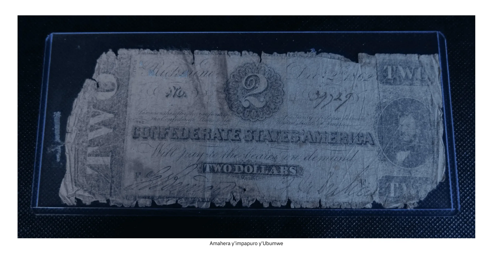

Ababarwanya bo mu buraruko na bo nyene bari bafise amadolari. Hejuru gusa, woshobora kubona amadolari y’Ibihugu vy’Ubumwe bw’Uburayi, mu gihe musi woshobora kubona amadolari y’Uburaruko. Baca bitwa "i greenback" kuko inyuma yayo yari ibara ry'icatsi kibisi.

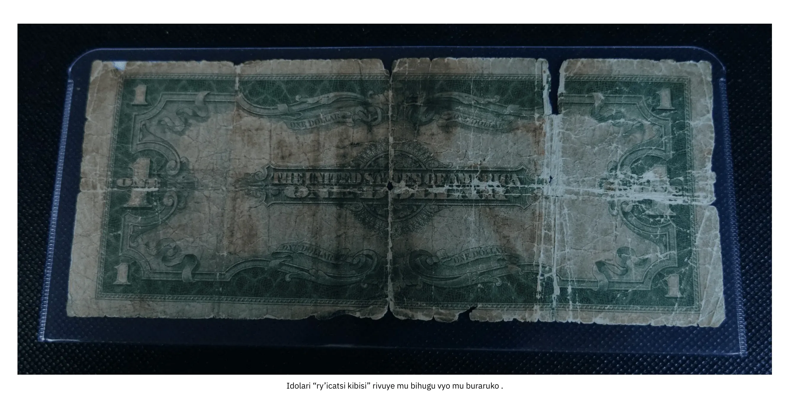

Kandi ndabatumiye ngo mugereranye itandukaniro riri hagati y’ubunini n’amahera y’iki gihe ca none. Amahera y'ico gihe yari manini kuruta ayubu.

Nk’uko tubizi, uburaruko ni bwo bwatsinze, ni co gituma idolari ry’icatsi kibisi ryacitse amahera y’ibihugu vya Amerika vyasubiye gufatanya. Hanyuma hashingwa FED mu 1913, n’Intambara ya mbere y’isi yose.

Inyuma y'intambara ya mbere y'isi yose, urutonde rwa nyuma rw'amahera y'amanoti akozwe yama arimwo amajambo avuga "redeemable in gold on demand". Rero, mu 1928, amadolari 20 yaraguze hafi ounce imwe y’inzahabu, kuko igiciro c’inzahabu cari amadolari 20,67. Iryo kete riri ku ishusho iri musi ryari gushobora kugura ounce y’inzahabu mu 1928.

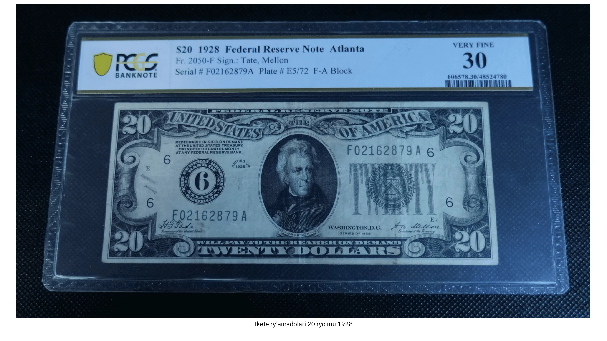

Muri iki gihe, ounce imwe y’inzahabu ifise agaciro k’amadolari 3.000 y’Amerika. Rero urashobora kubona ububasha bwo gukuraho agaciro hano, birashoboka. Niyo yari inoti ya nyuma yarimwo amajambo ngo "redeemable in gold". Tuzobona ko inyuma y’itegeko ry’ubutegetsi 6102, bofata inzahabu yose. Nkako, bofata izo nzahabu be n’ivyo vyemezo vy’inzahabu.

Aha musi urashobora kubona icete c'inzahabu co mu 1928.

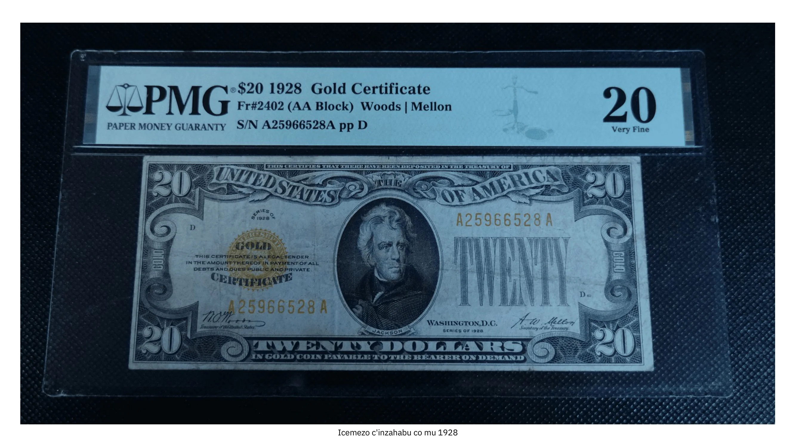

Si uko gusa "rishobora gucungurwa mu nzahabu" nk'inyandiko yo mu 1928, ryari rishobora no gucungurwa mu biceri vy'inzahabu: mu vy'ukuri ni "icete c'inzahabu". Vyose vyafashwe inyuma y’Itegeko Nshinga 6102. Gushika mu 1964, mbere vyari bitemewe no kubigira.

Ndanezerewe cane no kugira imwe.

Kuva mu 1964, vyaciye bitemewe kugira inzahabu, gushika mu 1974, nimba ntabeshe. Mu myaka ya 70, baremeye abantu kwirundanira inzahabu inyuma y’igitero ca Nixon, ivyo tuzobidondora vuba. Mu mwaka w'1933, igihe basohora "Itegeko ry'ubutegetsi 6102", bafata inzahabu, bica bitemewe kuyitunga. Waronka igihano kinini c’igifungo iyo ufashwe uriko urazigama inzahabu yawe. Muri iyo misi, ounce yose y’inzahabu yahindurwa n’amahera asa n’ayo ari musi, inyuma y’umwaka wa 1934.

Nk'uko twabivuze, mu 1928, idolari ryari rikiriko ijambo ngo "redeemable in gold".

Inyuma y’aho itegeko ry’ubutegetsi 6102 risohokeye, bafata inzahabu zose, bahindura amadolari 20,67 ku ounce yose y’inzahabu. Hanyuma, ngubu ububeshi. Basohoye amahera mashasha mu 1934 yanditsweko ngo "this note is legal tender for all debt".

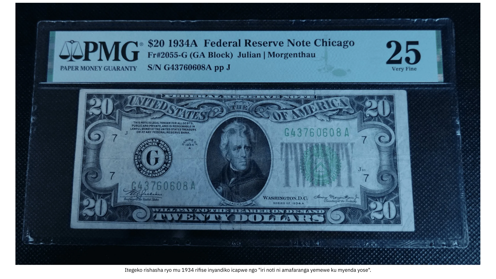

Rero turafise ubumenyi bw'icirwa cemewe n'amategeko cagaragaye hano, gisubirira ijambo "redeemable in gold". Izo noti zibiri zirasa, n'amajambo bandikako ahinduka(n'agaciro kagahinduka), ariko amayeri niyo yatumye ama dollar ata agaciro ico gihe; ryagabanutse kuva ku ounce imwe y’inzahabu gushika kugaciro k’amadolari 20,67 gushika ku madolari 35 ku ounce mu 1934. Iryo takaza ry'agaciro k'idollar kababa 40%!. Ico gihe i dollar yaratakaje agaciro bimwe bidasanzwe.

Hanyuma haza Intambara ya kabiri y’isi yose. Inyuma y’intambara, amasezerano ya Bretton Woods yaratumye inzahabu nyinshi zo kw’isi zija muri Leta Zunze Ubumwe za Amerika. Abanyamerika batanduye gushira amahera y'amanoti mubantu mukibanza c'inzahabu. Amahera y'amanoti ntiyabaye agihindurwa mu nzahabu ku rwego rw'abanyagihugu ahubwo ku rwego rwa leta.

Amaherezo, ibihugu nk’Ubufaransa n’Ubudage vyatanguye kwikeka ko kumbure hariho amafaranga menshi y’amadolari azunguruka mubantu kuruta inzahabu ziri mububiko bw'america.

Baciye rero basaba ko inzahabo zabo zosubizwa mubihugu vyabo. Baravuga bati: "Sawa, tuzobikora, ariko bizofata umwanya." Mu 1971, umugenzi wacu Richard Nixon yaracitse rimwe rizima ubucuti buri hagati y’amafaranga y’amahera n’inzahabu, ashira urubanza ku bacuruzi b’amahera bariko barabikora.

Inzahabu yari ifise agaciro gatoyi, ikaba yari amadolari 35 kuri once, ariko vyaraboneka ko amahera yagaragara atari ahuriranye n'amahera akorwa. Mu myaka mikeyi gusa, igiciro caco caraduze kiva ku madolari 34 kija ku madolari 800. Cokimwe n’ingero zo mu kahise, nk’i Roma, aho isano hagati y’idenariyo(denier) na solidus ryacitse, inzahabu yararekuriwe kwidegemvya. Ivyo vyatumye habaho urugendo rwo kuvumbura igiciro, bituma inzahabu igira agaciro kanini cane kuruta amadolari uko imisi yagenda iraza.

### Uburyo bw'amafaranga y'ubu afatiye kukwizera hamwe n'ingaruka zayo

Iki gice kiravuga muncamake ingene twavuye mu nzira y’amahera ishingiye kwi feza canke ku nzahabu. Buhorobuhoro, inzego zarakoresheje ububasha bwinshi cane kuvyerekeye amahera. Ubwanyuma, ingingo yafashwe yaracitse burundu ubucuti buri hagati y’ivyuma vy’agaciro n’amahera, inyuma y’aho amahera asohowe birenze urugero.

Ivyo vyatumye muri ikigihe ca none ata bucuti bukiri hagati y’inzahabu n’ibiceri canke amahera yo mu Vyanditswe. Kandi mbere si uburyo bwo gucungera amafaranga y’imice - ico ni iciyumviro ca kera. Ahubwo amabanki yigenga atanga amahera kandi atayakora biciye mu ngurane za banki. Amahera ahanini akorwa muri ubwo buryo kandi afitaniye ubucuti n’inyungu nyamukuru ishirwaho na banki nkuru.

Mu vy’ukuri nta mbibe zihari. Nta n’ingero z’ububiko zitegekanijwe zikiriho, n’imiburiburi muri Amerika na Canada. Urugero rw'ububiko n'uko amabanki agera geza uburyo bwose agashobora kwishura ku bijanye n’imikoreranire n'ayandi mabanki kugira ngo i banke ntibure amahera ikoresha.

Ama banki yoyo yitaho gusa ko amarungika yagenze neza, ariko nta 3%, 1%, 10% vy’ububiko butegerezwa. Twaravuye vy’ukuri ku ciyumviro c’ububiko bw’imice. Ubu, ni amabanki akomeye, inzego ziciye mumukori, amabanki akomeye biciye "quantitative easing" (QE), n’amabanki yigenga biciye mu kurema inguzanyo za banki zishobora kwongera amafaranga yose, kandi, mu vyiyumviro vyanje, ivyo bigatuma habaho iduga ry'ibiciro.

Kugira ngo utahure isano riri hagati y’amahera n’ukuduga kw’ibiciro, ndabagira inama yo gukwirikirana inyigisho mfise kuri Plan ₿ Academy yerekeye iyo nkuru. Uzomenya itandukaniro riri hagati y’ukwiyongera kw’ibiciro, ni vyo tubona mu buzima, n’ukuduga kw’ibiciro. Si ikintu kimwe. Nkako, iyo tuvuze ivy’ugutera imbere kw’ibiciro, akenshi tuba turiko turavuga ivy’ugutera imbere kw’ibiciro, si ugutera imbere kw’ibiciro ubwavyo. Inflation ni iciyumviro kibereye, gisigurwa n’ukwiyongera kw’amahera.

https://planb.academy/courses/caa75343-ac90-4249-bcca-0e2e57c3a0f1

Kugira ngo nsozere iki gice ku isi ya fiat(bifatiye kukwizera), ndashaka kwerekana uburyo bwo kubafasha gutahura neza ibintu nsanzwe ndasigura, nk’ugutera imbere kw’ibiciro.

Murakoze cane ku mwitwarariko wanyu.

## Amateka y'ibibumbano vy'amahera

<chapterId>b6451c46-917d-11f0-97de-6bc5081765fa</chapterId>

:::video id=5967d9a6-aae4-4b84-a283-71b1b735bca4:::

### ivumburwa ry'amahera y'amanoti na "grande bulle" yambere

Igihe amabanki akomeye yashingwa mu kinjana ca 18, haravutse ihinduka nyakuri: amahera yagatangaza muburyo bw’amahera y'amanoti. Akarorero gakomeye kuruta ayandi yose mu Bufaransa ni aka John Law. Uwo Munya Ecosse, yari yajanwe mu bunyagano i Paris, yasavye uwo mukuru w’igihugu, ari we Duc d’Orléans, gutorera umuti isambuka ry'ubutunzi y’ubwami mu gushinga banki ya Leta n’ishirahamwe ry’ubudandaji ry’abakoloni: **Banque Royale** izwi cane na **Compagnie du Mississippi**.

Law akoresheje iyo nzira, yarahuje amahera y’amanoti n’imigabane y’ishirahamwe ryiwe. Uko amahera y’amabanki yagenda aragenda, ni ko agaciro k’imigabane karushiriza kuba kanini, kandi ni ko banki isa n’iyikomeye... gushika aho ibiharuro vyarengeye ibiharuro nyakuri. Ico kibumbano caraturitse bukwi na bukwi mu 1720, kirasenyura abakuru b’igihugu, abanyabubasha be n’igice kinini c’Uburayi, cari caraje gutekereza ku rue Quincampoix. Ico vyavuyemwo: ukwizigira amahera y’impapuro kwaramba mu Bufaransa, n’icigwa ca mbere c’Uburayi ku bijanye n’ibibumbano vy’ugutekereza ku bintu.

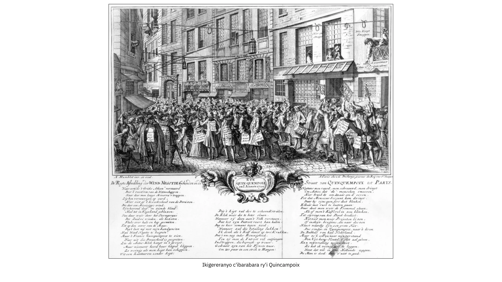

### Igihe "foncier" ibaye "ingwati".

Haciye imyaka ijana, Impinduka y’Abafaransa yarateye imbere n’amafaranga **assignats**, amafaranga ashigikiwe n’itunga rya Ekleziya ryafashwe. Iciyumviro giteye igomwe ku mpapuro - guhindura "foncier" ngo ibe ingwati y’amahera - ariko ntaco bumaze: ubutaka si amazi canke ngo bugabanuke. Ico vyavuyemwo: ukuduga kw’ibiciro, ukubuza gukoresha ubutaka kenshi, ugutera imbere kw’ibiciro kutagenzurwa, n’ubukene.

Napoléon, yashikiwe cane n’ako kavuyo , yociye ashinga inzahabu n’ifeza nk’ishimikiro ry’amahera mu 1800 ashinga Banki y’Ubufaransa, gutyo bikaba vyatumye ingabo ziwe zihembwa ubudasiba. Uburyo bubereye bwo gusubira kwizigira: kwishura mu mafaranga akomeye.

### Imyaka mirongo ibiri n’Ikigoyi Kinini co mu 1929

Reka dusimbuke ibinjana bibiri. Inyuma y’Intambara ya Mbere y’Isi Yose, intwaro zarafashije mu gutanga amahera y’ico gikorwa biciye mu kuduga kw’ibiciro no ku guhagarika inzahabu. Mu myaka ya 1920, ishirahamwe ry’amahera ry’Amerika ryakurikiye politike y’amahera y’ugushiramwo abantu birenze urugero kugira ngo rishigikire livre sterling y’Ubwongereza. Ico vyavuyemwo: inguzanyo yoroshe, ugushinga intahe ata co bimaze ku Wall Street, igura ry'imigabane ku ngurane, be n’uguseruka kw’ubutunzi n’amabanki.

Igihe iyo mashini yagenda nabi, impanuka yo mu 1929 ntiyari gushobora gukurwaho: amabanki menshi yarasambutse, ubushomeri bwari bwinshi cane, n’imirongo y'abantu bashaka ico bafungura. Ivyo vyatumye habaho iciyumviro kitari co gikomeza c’uko *ugutituka kw’ibiciro kwose ari kubi**, mu gihe dukeneye gutandukanya ugusenyuka kw’ibiciro biciye mu gukura (ugutera imbere) n’ugusenyuka kw’ibiciro biciye mu madeni (ugusenyuka).

### Aziya mu myaka ya 90 n'ingaruka za domino

Mu myaka ya 1990, "igitangaza ca Aziya(miracle asiatique)" caratumye isi ibitangarira. Ibiciro vya Exchange vyari bishingiye ku dolari, iterambere ryari kuri 8-10%, kandi umutungo w’Uburengero wariko urasuka. Vyose vyari vyiza... gushika aho vyose bihenurwa n'umuyaga. Ivy’isambuka ry’amahera vyarateye biba bibi cane, amahera aragabanywa gushika 80 kw’ijana, abashoramari nabo barahomba. FMI yabwirijwe kuvyinjiramwo, itegeka ihinduka rikomeye cane. Ivyo nyene nk’uko vyama: umutungo mwinshi, ibibumbano bigaburirwa n’inguzanyo, hanyuma bigasambuka.

### 2008 n'igihe c'igihu c'ibihe bidahera

Igihe ca Internet (2000) cakurikiwe n’igihe c’ubudandaji bw’amazu n’ibindi. Ivy'ugushiramwo amahera vyahinduye inguzanyo za banki zihinduka ibintu vy'ubutunzi "triple-A", bikwiragiye kw'isi yose. Umuhango: gukuraho ingorane mu kuzigabanya. Ukuri: ingorane zose mu vy’ukuri zari zifitaniye isano. Igihe amazu n’ibindi bibanza vyasambutse, ni ko n’amabanki yose yo kw’isi yose yasenyutse.

Ico vyavuyemwo: gufasha abantu benshi, ukworohereza abantu mu buryo bw’ingero n’inyungu zitagira aho zigarukira. Kandi n’ivyo, n’ukwihuta kw’umutwe: ingorane yose ntizosubira gukuraho ibirenze urugero, ahubwo izopfukwa n’amadeni n’amahera biguma birushirizaho. Ivyo ni vyo vyatumye haba uko ibintu vyifashe ubu: **"everything bubble"**, aho ibintu vyose - amafaranga, amazu, ubuhinga, crypto, mbere n'amakarata ya Pokémon - bivyimba mu buryo bw'ubuhinga.

### Igaruka ry'ibihe bidahera ry'amahera y'igitangaza

Kuva mu kinjana kimwe gushika mu kindi, iki: igihe ikibano kigize ukwizera ko gishobora kurema ubutunzi n’amahera aho gutanga ibintu vy’ukuri, haca haseruka ibibumbano. Kuva kuri John Law gushika mu 2008, kuva ku rue Quincampoix gushika kuri Wall Street, iyo nzira irasubiramwo: umunezero, inguzanyo, iterambere, n’ugusenyuka.

Kandi mu mpera, ata guhinduka, iyo ata n’umwe agizigira impapuro, abantu barondera ikindi kintu - inzahabu, ubutaka, ubuhungiro... canke amafaranga mashasha. Ejo Napoleon yashizeho ivyuma, uno musi bamwe babona ko Bitcoin ariwe azomukurikira.

Amateka y’ivy’ubutunzi ni uruziga rudahera: gucapura, gutekereza ku bintu, gusenyuka. Gushika mu gihe c’igihuhusi gikurikira.

## Amahera n'ubukazi .

<chapterId>9486fe64-854f-5e17-86b3-8873baca39a8</chapterId>

:::video id=bd6d0807-2d8f-4637-a0f5-1e990e5c0d0f:::

Iki gice kigufi kizosubira gusubira ku bintu vyinshi twamaze kubona mu nyigisho yose, kigaca irya n’ino inkuru nkeyi mbona zishimishije.

### Ikoranabuhanga n'ubukazi

Aha hariho inkuru nkeyi kumbure twamaze kuvuga mu nyigisho. Bifasha gutanguza ikiyago gishimishije cane nagiranye na Theo ku bijanye n’insiguro yatanze muri B-Ondy, iyo nasanze iryoshe cane ku bijanye n’ingene iterambere ry’ubuhinga rigira ico rihinduye ku bijanye n’ubucuti buri hagati y’abanyagihugu na Leta.

### Amahera n'uguhatirwa na Leta

Kugira ngo ntangire iki gice, ngiye kubaha urutonde rutoyi kandi rutuzuye neza, kugira ngo mbabutse gusa ibintu kumbure twamaze kuvuga mu nyigisho.

Ihuriro rimwe nshobora gukorana n’amahera n’ubukazi ni uko iyo bishitse ku mahera y’amanoti ataco amaze ashobora gukorwa bimwe bitagira iherezo, kenshi azana n’ubwoko bwose bw’amategeko n’ubwoko bwose bw’iterabwoba. Turashobora kuvuga ivy’aba assignats, aho vyari vyanditswe neza na neza ku noti ko abahimbanya batera ubwoba ko bazokwicwa. Biroroshe gusanga mu nyandiko z’amategeko z’ico gihe amaterabwoba y’urupfu ku batemeye ayo mahera y’impapuro azwi cane.

Kugira ngo ngume mu Bufaransa, muri kimwe mu vyanditswe vy'amategeko nashoboye kuronka kuva mu gihe c'Impinduka, nabonye ko "per diem" yo gutwara no gukoresha iyo guillotine yadondowe mu bice bijanye n'amahera. Ivyo nasanze ari zany.

Twaravuze kandi ku bijanye n’ugukora amahera y’ibiceri mu Bushinwa, Leta ikaba ari yo igenzura ivyo gukora amahera. Twarabonye mu kigabane co mu ntango y’amashure yuko iyo ibiceri, bimwebimwe muri vyo bikaba bitari vyiza cane, vyatawe, vyagira ingaruka zijanye n’amategeko.

Hariho kandi inkuru y'umwami wo mu Bwongereza yarangije aca amaboko y'abacukura amahera iyo batagira inyifato nk'uko yari yiteze.

Vyongeye, mu Bushinwa, narasomye ivy’ugufata umuringa(cuivre) mu bigo vy’abihaye Imana vy’Ababuda. Mu gihe umuringa(cuivre) wariko uraronka agaciro kandi ugatuma ubutunzi bwabo buhungabana - bwari bushingiye ku buryo bw’amahera y’amahera ataco akora ku gaciro k’icuma - baciye bafata ingingo yo kurondera ahantu hari ubutunzi, maze bafata uwo muringa mu bigo vy’abihaye Imana.

Ivyo ni vyo vyabaye no ku bigo vy’abihebeye Imana vyo mu Bwongereza mu gihe c’Ivugurura ry’Abongereza. Igihe uwo mwami rurangiranwa yatongana na Papa kubera ukwahukana kwiwe, hari n’iyindi mvo yari inyuma y’ivyo vyose: yakoresheje akaryo ko gukuraho ibigo vy’abihebeye Imana kugira ngo afate ubutunzi buri muri ayo madini.

Mu gihe c’Impinduka y’Abafaransa, bafata ivy’Ekleziya vyose. Babonye ibiceri vyiza cane vyakozwe mu nkengeri z’amashengero bari bashongesheje.

Nitwasubira inyuma gato, kimwe mu vyiyumviro bitomoye cane vy’ubukazi n’umwidegemvyo mu vy’ubutunzi, vy’amategeko yica umwidegemvyo, ni **Dioclétien n’ubwoko bwiwe bw’iragi bwari bufitaniye isano n’uko abarimyi batagishaka kwemera amafaranga yari yacitse agaciro**. Bashaka kuva mu gikorwa cabo c'uburimyi, Dioclétien aca ababwira gusa ati: «Ntimushobora kuva mu gihugu canyu, n'abana banyu ntibashobora». Ivyo nyene ni vyo vyabaye no ku basirikare.

Ngira ngo ubwo ni uburyo bwiza cane bw’ubukazi. Nashobora gusozera mvuga ivyerekeye Aba templier canke umwami w’Ubufaransa. Igihe aba Knights Templar batura mu Bufaransa, niyumvira ko yabonye manu y’ubutunzi bw’aba Templar kandi yari afise ingorane z’amahera ya Leta. Yaburanishije Ishengero ry’Aba templier, bamwe muri bo barashoboye kugenda bafise igice c’iryo tunga, ivyo bikaba vyatumye haba ikiganiro gishimishije cane muri U.S. canke muri Canada. Sinzi uwayisohoye, ariko yitwa *Ibanga rya Oak island*. Ni ivy’abantu biyumvira ko hari ubutunzi bw’Abatempuliye bwahambwe kw’izinga ryo muri Canada, mu bihugu vy’Ikiyaga, kandi bamaze imyaka - kumbure mbere n’imyaka irenga cumi - bacukura kugira ngo bakore iriba ry’ubwoko bumwe. Baronse iriba rifise amabarabara menshi, kandi bariko barondera ubutunzi bwahambwe n’aba Knights Templar kuri iri zinga, ari ryo ry’iki kiganiro ca televiziyo. Ndaramutsa dawe, akaba ari umufana akomeye w’iki kiganiro.

Rero aho urafise: urutonde rwihuta cane rw’ibintu twabonye muri iki cirwa, nibwira ko bivyura isano n’ubukazi. Nzobasiga igice gikurikira kivuye kuri Theo, azotubwira inkuru iryoshe cane yerekeye ihinduka ry’ubuhinga n’uburinganire bw’ububasha hagati y’abanyagihugu n’abategetsi.

Murakoze!

## Inkurikizi z'ubutunzi z'ubukazi butunganijwe

<chapterId>66bd4674-2159-5489-ad4b-ec5e3fb691af</chapterId>

:::video id=c8b063c6-aeb4-4a94-9027-b11d369e71a4:::

### Ubugizi bwa nabi butunganijwe n'iterambere rya Leta

Umuhinga mu vya kahise Frederic C. Lane atanga iciyumviro gihindura ibintu: ubuhinga bwa Leta mu mateka yose bushingiye ku buhinga bukoreshwa mu gutegura ubukazi. Uhereye ku ngingo ya Weber y’uko Leta ari yo ifise uburenganzira bwo gukora ubukazi bubereye, Lane abona ko ubwo bubasha - buteye ingorane kuruta uguhiganwa muri ivyo - butera imbere bivanye n’ubucuti buri hagati y’igiciro co gutera n’igiciro co kwikingira.

Iryo sesangura, ryafashwe n'abanditsi b'igitabu "The Sovereign Individual" (1997), risigura ihinduka ry'amateka ry'imitunganirize ya politike: kuva ku butegetsi bw'abanyagihugu bo mu kinjana ca mbere gushika ku bisagara-bihugu vy'Ivugurura, hanyuma gushika ku bihugu-bihugu vy'inganda, hanyuma gushika ku bihugu vy'imibereho myiza yo muri ibi bihe vya none. Ihinduka ryose rihuye n’iterambere rikomeye ry’ubuhinga mu gukoresha ubukazi, rikaba rishika hafi inyuma y’imyaka 400-500.

### Uburinganire bwo mu kinjana ca mbere

Mu kinjana ca mbere, ubutunzi bw’uburimyi bwari burengeye 90%. Uwo murimyi, mu vy’ukuri yari yarashinze imizi mu gihugu ciwe, ntiyashobora guhunga umukama n’abasirikare biwe. Ivyuma vy’igisirikare - ibirwanisho vy’amaboko, imyaka myinshi y’imyimenyerezo y’inkota - vyari bizimvye cane. Ukwo kudahuza kwari gushigikira cane igitero kuruta kwikingira.

Umurimyi atagendagenda aca aba imbohe y’umunyagikenye w’aho hantu w’ubukazi. Ubushobozi bwiwe bwo gukura imisoro burashika ku rundi rwego - naho, biteye ubwoba, imisoro yo mu kinjana ca mbere iguma ari mikeyi ugereranije n’ibice 78% vy’imisoro y’ingorane mu bihe c'ubu. Umukama arashobora gutanga umusoro uko ashatse, kuko umurimyi ntashobora kurwanya canke ngo agende.

### Ivugurura ry'abacuruzi

Igihe ubudandaji bw’Aba hanséatique bwadutse mu Buraruko be n’ubudandaji bw’Ikiyaga méditerrané mu Bumanuko, vyahinduye ibintu. Abacuruzi, abaremyi nyamukuru b’agaciro kongerewe, bari bafise umutungo ugendagenda - ubwato bwabo. Bakeneye gusa ingabo z’ikiyaga zidakomeye cane, kuko ibiyaga vyari bigoye gucungera abapolisi. Ikiruta vyose, boshobora kwimukira ku cambu kiri hafi bitagoranye iyo imisoro irenze urugero.

Ukwo kwimuka kwatumye haba uguhiganwa kw'amakori hagati y’ibisagara n’ibihugu. Venise, Genova na Bruges vyategerezwa gutanga uburyo bwo kwidegemvya kuruta ubundi bwose: amasezerano yizigirwa, amafaranga meza, ubwishingizi, amakori make. Abaganwa bategerezwa guhendahenda aho guhatira. Ivyo bihuye birahinduka: kwikingira (biciye mu guhunga) biraca vyoroha kuruta gutera.

### Igihe c'inganda

Impinduka y’inganda yazanye imiterere isa n’iy’ubu féodalisme. Amahinguriro, amabarabara y’igariyamoshi n’imirongo y’iteraniro bigereranya ishoramari ryinshi cane, ritagira aho rigarukira. Henry Ford ntiyashoboye kwimurira ibiterwa vyiwe mu kindi gihugu kubera amakori basabwa kuriha. Abakozi, bibanda ku bisagara vy’inganda, barahurikiye hamwe kugira ngo bavugane hamwe aho kwimuka umwumwe wese ku giti ciwe.

"Leta y'imibereho myiza" yaradutse: igenamigambi ry'inganda (Ubuyapani, Koreya), ugukingira ibikorwa remezo mu gisirikare, inyungu ntoyi cane ku bakozi. Intambara ya kabiri y’isi yose yerekanye iyo nzira y’uguhungabana: gutera ibisasu amahinguriro y’abansi ni vyo vyacitse ubuhinga buhambaye. Ukwibanda ku mutungo ugaragara vyatumye habaho ugukura amakori meshi kugira ngo Leta y’imibereho myiza ishobore gufashwa.

### Impinduka y'ibikoresho bitobito

Ibintu bitatu bishasha vy’ubuhinga ubu biriko birahungabanya izo nzira z’uburinganire za kera. Ico gikoresho kiriko kirahindura intambara: umukozi wo muri Nevada atwara indege idakoreshwa n’abantu muri Afghanistan afise ubuhinga bwo kubaga. Intambara yo mu Kiyaga ca Gulf (1991) yerekanye iyo nzira: ingabo za kane kw’isi (Iraki) zarimbuwe mu misi 45, abantu batarenga 200 bapfuye ku ruhande rw’ibihugu vy’ubumwe. Ubuhinga bwa none bwatumye ibitero imbona nkubone bidashoboka.

Internet n’ubuhinga bwo gukingira amakuru butagira aho bugarukira biriko birahindura cane ukuntu umuntu arema agaciro. Umuhinguzi ashobora gukora aho ari ho hose akoresheje MacBook na Starlink, akarungika hanze ivyo akora ubwo nyene kandi ataco yishuye. Abanyagihugu b’abanyamahanga barahunga ubuja bw’aho hantu, bagatera ibihugu mu buryo butabonetse kuva mu gihe c’Ivugurura.

Bitcoin igereranya iherezo ry’iyo nzira y’ubwenge: amafaranga abohowe na Leta, akinzwe n’ingabo y’ubuhinga bw’ibanga idashobora guhungabanywa. Ubutunzi buca bushobora kwikingira inguvu iyo ari yo yose y’umubiri. Umuntu asubira kuronka ubushobozi bwo kwikingira ubutegetsi bwa Leta.

### Gusenyuka kw'akarorero k'i Westphalie .

Ibihugu vy’uburengero vy’imibereho myiza, vyagenewe ikiringo c’inganda, biriko biracika ibishaje. Abarema agaciro - abaterambere, abahinga mu vy’ubuhinga bw’amasanamu, abatanga amahera - bariko bimukira muri Singapore, Dubai canke El Salvador, bahitamwo ibikorwa vya Leta bikeyi kugira ngo bashobore gutanga imisoro mikeyi. Ibigo bikomeye vyo muri iki gihe nka Apple na Tether ntibikeneye ibiro canke ibikorwa remezo vy’umubiri.

Ukwo guhunga kw’ubwonko gutuma haba uruzitiro: abatanga amahera y’urusenga bagaba bake, ibikorwa vya Leta birasenyuka, imisoro yongerekana ku baguma, n’ugusohoka vyihuta. Leta zitegerezwa kugabanya cane canke zigasambuka. Guca ibice mu bihugu bitobito, bifise amahiganwa - uburyo bushasha bw’ibisagara-bihugu vy’ubuhinga bwa none - bisa n’ibidashobora gukurwaho.

Amateka atwigisha ko izo mpinduka zifata amayaruka. Ariko ugutandukanya amahera n’igihugu kwa Bitcoin kwoshobora kwihutisha iyo nzira. Abantu ubu batora n’ibirenge vyabo n’ibipapuro vyabo vy’ubuhinga bwa none, bagasubira gucapura ikarita y’ububasha bwo kw’isi yose ku mirongo turiko turatangura gutahura.

## Amateka make cane y'ivy'amahera

<chapterId>1d37fff1-a091-5034-8e71-4af590b8ffce</chapterId>

:::video id=fdfabbc6-e4d8-463a-8522-19176f8fb460:::

Dukurikije iyi nkuru y’amateka y’amafaranga, idushikana gushika ku bijanye n’ubuhinga bwa fiat(amahera afatiye kukwizigira), noshima gusigura ningoga kandi mu buryo butomoye ukuntu amahera yateye imbere vyatumye amaherezo haba Leta y’imibereho myiza. Mu ntango, mu bihe vy’Abaroma, twari dufise ibiceri.

Ibiceri vyari ubuhinga bwo mu vy’amahera bwatuma ubwami bushobora guhemba abasoda, kwagura no gucuruza. Yarakoze neza cane, kiretse ko amaherezo habaye ugucika kw’agaciro kwinshi cane. Hari igihe bahagarika kwagura no guhagarika kuronka isahu mu ntambara zabo no mu kwagura intara, urutonde rwabo rwarasenyutse.

### Ugutera imbere kw'ubuhinga bw'ivy'amahera

Hanyuma haza ikinyejana ca mbere, aho hariho iterambere rito cane gushika kuri Florin(amahera), ryagarukanye amafaranga ashikamye, n’iterambere ry’amabanki mu Butaliyano no muri Anvers, aho iciyumviro c’“agaciro k’amahera mu gihe” cateye imbere - mu yandi majambo, ugugabanya amahera. Baciye batera imbere mu gugabanya amafaranga kugira ngo bareme uburyo bw'amahera y'impapuro aho "ikete ry'isezerano" ryasohorwa, ni ukuvuga umuhango w'uko mu nyuma umuntu yoshobora gusubirana amadolari 100 yongeweko inyungu.

Uwo murongo wararemye ubuhinga bw’ivy’amahera butuma uwufise iyo note ashobora kugurisha iyo noti imbere y’uko igihe c’ikiringo kirangira, rero iyo uyigurishije inyuma y’amezi 4 mu kiringo c’amezi 6, uwo muntu azotanga mu vy’ukuri amahera y’imbere kugira ngo yishure umusaruro yatakaje mu mezi 2 asigaye.

Ni ubuhinga bwo gukoresha amahera bwateguwe i Anvers n’i Amsterdam ico gihe. Mu nyuma, twabonye ukuntu amabanki akomeye yateye imbere be n’iciyumviro c’uko uwugurisha ari we azoba uwuherutse gukoreshwa. Birashoboka ko mu gihe ca Banki ya Amsterdam , gukoresha ibiceri mu bucuruzi mpuzamakungu vyahebwe kugira ngo hakoreshwe amahera yo mu Vyanditswe.

Mu nyuma, mu kinjana ca 18, ku bijanye n’ubuhinga bwo mu vy’amahera, turashobora kuvuga ivyerekeye ubwishingizi. Hariho rero inkuru ivugwa neza cane mu gitabu ca Neil Ferguson "The Ascent of Mone". Ishirahamwe rya mbere ry’ubwishingizi ryavutse ryitwa **Scottish Widowss**, kandi mu vy’ukuri, abakuru b’idini ni bo bashaka gutegura ubwishingizi bw’abapadiri rimwe na rimwe bapfa imbere, bagapfa giturumbuka. Abakuru b’idini, ico gihe, bariko bararera abagore babo n’uruvyaro rwabo muri Écosse mu kiringo c’umwaka wose. Kandi rero abakuru b’idini basanze ico kiringo c’umwaka umwe kumbure ari kigufi cane gatoyi. Ivyo vyatumye **bahingura imibare y’ubuhinga bwa actuarial** kugira ngo baharure vy’ukuri umubare w’abatanga amahera bakenewe kugira ngo iyo nzira ishobore kwishura ivyo yakoresheje, bivanye n’umubare w’abaherezi bapfuye imbere y’igihe.

Baciye bakora imibare y'ubuhinga bwa actuarial kugira ngo bavuge ngo "Sawa, umuherezi wese araduha ayo mahera. Hanyuma, umuherezi niyapfa, rero, ubwishingizi buzokwishura amahera kugira ngo umugore wiwe n'abana biwe bashobore kubaho gushika bitunganye." Rero ni ryo shirahamwe rya mbere ry'ubwishingizi ryitwa "Scottish Widows" ryamenyekanye cane iyo nzira, n'aho yashizweho.

### Kuva ku bwishingizi bw'abikorera ku giti cabo gushika ku bw'imibereho myiza ya Leta .

Rero ubwishingizi ni kimwe mu bigize kahise k’ubuhinga bwo mu vy’amahera. Ivyo bica bimpa iciyumviro ca Leta y’imibereho myiza, ni ukuvuga ko ubwishingizi bwigenga bwaje guhura n’ingorane, iciyumviro co gutuma ibintu bigenda neza, aho twibwira, nitwatanga ubwishingizi bw’amagara ku bantu bafise amagara meza, bashobora kugira inyungu nke mu kwishura amafaranga y’ubwishingizi kuko bibwira bati: “Ndafise amagara meza, sinzogwara”. Ku rundi ruhande, abantu bazi ko barwaye bazoshaka ata gukeka gukora abonema.

Uwo murongo utuma haba ukudahukana hagati y’umubare w’abarwayi bazofata ubwishingizi bw’amagara, bitandukanye n’abantu bafise amagara meza bashobora gufata bike. Rero hariho ubwoko bw’ukudahukana: iyo ubaze imibare, ntizoba iringaniye kuko kumbure ntuzoshobora gukingira abantu bafise amagara meza bihagije kugira ngo ushobore gusubiza inyuma ivyo ukoresha. Mu vy’ubutunzi, ico ni co ciyumviro c’**akaga k’inyifato runtu**.

Kimwe mu vyiyumviro vyashizwe imbere ni ugutuma ubwishingizi buba ngombwa. Iyo umuntu wese ategerezwa gutanga, bisubiza uburinganire muri vyose kandi abantu bafise amagara meza n’abatafise amagara meza bazotanga, bagasangira ingorane ku bantu benshi cane.

Kandi rero, mu bice vyinshi vy'isi, Leta yaravuze ngo: "Ego, ivyo tuzovyitaho". Naho ntari umuhinga mu vy’ico kibazo, ndashobora kubona ko iyo nzira nyene y’uguzirikana ishobora kuba ikoreshwa no ku bwoko bwose bw’ubundi bwoko bw’ubwishingizi, nk’ubwishingizi bw’ubushomeri. Hariho icipfuzo co kworohereza no gutuma ibintu bigenda neza, bishingiye ku ciyumviro c’uko bizoroha iyo habaye ishirahamwe rimwe gusa rizovyitaho.

Mu vyiyumviro vyanje, ivyo vyatumye ivyo vyiyumviro vyose vy’ubwishingizi bihurizwa hamwe, maze amaherezo havuka Leta y’imibereho myiza, aho ivyo vyiyumviro vyose vy’ivy’ubutunzi vyari mu ntango amashirahamwe yigenga, imigambi y’abikorera ku giti cabo yo gushitsa isoko ry’ubwishingizi rikeneye gusangira ingorane mu banyagihugu, vyafashwe na Leta kubera imvo zishobora kuba zidasanzwe.

### Ibindi bigereranyo n'ivyiyumviro ku vyerekeye ubutegetsi bwa Leta

Ubwa nyuma, mu bihugu bimwe bimwe nka Canada, duheza tukagira ubwoko bwinshi bw’ubwishingizi - ubwishingizi bw’amagara, ubwishingizi bw’ubushomeri - ari bwo butegetsi bwa Leta.

Nshobora kubaha akarorero nzi. Mu Busuwisi, uburyo bwo kubikora buratandukanye gatoyi. Hariho amashirahamwe y’ubwishingizi bwigenga hamwe n’ibitaro vyigenga, rero urashobora guhitamwo ishirahamwe ryawe ry’ubwishingizi bw’abantu bose, ushobora guhitamwo umuzigo wawe mu mashirahamwe yawe y’ubwishingizi bw’abantu bose. Uca uronka ibikorwa vy’abantu bose, naho igice kinini c’uru rutonde coguma ari ic’ibanga.

Rero mbona ko bishoboka ko nayo ikoreshwa n’abantu ku giti cabo. Ariko ivyo nashaka kubadondora vyose, mu vy’ukuri, si amajambo yo guserura nimba uburyo bumwe ari bwiza kuruta ubundi, ahubwo ni ukugira ngo ndabasigurire ko mu gusoma amateka y’ivy’ubutunzi, natahuye igituma mu Burengero, cane cane mu Bufaransa, cane cane muri Canada, Leta yashaka gufata ububasha kuri izo ngingo ngenderwako z’ivy’ubutunzi.

Iciyumviro nashaka gutanga ni uko iciyumviro c’ubwishingizi ari imbere ya vyose ugutera imbere kw’ivy’ubutunzi, kandi nk’uko rimwe na rimwe intwaro zishobora kubikora neza cane, zizogerageza kubifata, nk’uko zagerageje gufata amafaranga, kubera imvo zitari nke. Imvo imwe, n’aho yoba, ni iciyumviro c’uko uwugurisha ari we azoba ari we azoba uwuherutse gutorera umuti.

Iciyumviro ni uko ari vyiza cane iyo hariho ikigo kinini kiri inyuma yaco gitanga ingorane cane. Uwo ni wo wari umugambi wa mbere wari inyuma y’iciyumviro c’umuguzi w’inyuma, aho ico kigo coshobora mu vy’ukuri guhitamwo inzego zikomeye zihagije kugira ngo zibeho no kuzibuza gusambuka mu kuziguriza amahera.

Iciyo gihe, hariho isesengura nyaryo igihe ico ciyumviro caheza kivuka ku ncuro ya mbere, ariko icahejeje kuba ni uko dukiza umuntu wese, "too big to fail", bireba hafi amabanki yose kuko hariho centralisation, kandi n'amashirahamwe manini manini yose. Mu mpera, turabona ko ari iciyumviro gikoreshwa "muri rusangi" na Leta, gisa n'iciyumviro c'ubwishingizi n'ubu nyene ndabadondora.

Amaherezo, Leta ifata ingingo y’uko izokwitwararika vyose, igahindura ubuhinga bw’ivy’ubutunzi bwaremwe muri Ecosse kugira ngo butorere umuti ingorane yihariye, bube Leta nini y’imibereho myiza tuzi muri ibi bihe vya none. Ikoresha ingingo ngenderwako z’ivy’ubutunzi kugira ngo itange ibikorwa ku banyagihugu bayo bakeneye. Ariko rero, turashobora kwemera ko ubutegetsi bw’abantu buva muri iyo nzira butera ingorane z’ubwoko bwose, ivyo ubu turiko turabibona mu bihugu nka Canada n’Ubufaransa. Igishimishije ni uko hariho uburyo butandukanye, nk’ubwo mu Busuwisi.

Tubwirizwa gusa gutahura ko ico ciyumviro ca Leta y’imibereho myiza kiva mu vy’amafaranga. Ukwo gutahura gutuma dushobora gutohoza izindi nzira zitari izo Leta zizwi cane, kandi noshobora no gukoresha iyo nzira ku ciyumviro c’uko amabanki akomeye ari yo atanga inguzanyo - ariko ivyo n'ikindi kiganiro.

# Igice ca nyuma

<partId>9bada469-7ef0-511a-9eaa-f8eb66d5906f</partId>

## Gusuzuma iri shure

<chapterId>a9494e2b-8a4d-5811-8a7b-b4a91fb22778</chapterId>

<isCourseReview>true</isCourseReview>

## Iciyumviro

<chapterId>1094e793-b4c6-5782-aa4a-71cde00ce7c0</chapterId>

<isCourseConclusion>true</isCourseConclusion>
