# Путешествие по истории чеканки монет

В этом увлекательном курсе вы узнаете о захватывающей эволюции денег от самых ранних цивилизаций до нашей современной денежной системы. Мы пересечем века, от неолита до современности, и узнаем, как деньги формировали и формировались великими человеческими цивилизациями. От месопотамских протоденег до криптовалют, лидийских монет, флорина эпохи Возрождения и появления центрального банка - этот курс предлагает всесторонний взгляд на одну из фундаментальных основ нашего общества.

+++
# Введение

<partId>59878a67-8a1d-5d6b-af41-5b847c14363c</partId>

## Введение в историю денег

<chapterId>ca53597e-be9a-5261-a55f-11fac8504a68</chapterId>

:::video id=08ff35ca-8a40-4286-abaf-71283faf6e78:::

Добро пожаловать в этот курс по истории денег. Как следует из названия, мы будем вместе изучать историческую эволюцию монет. Начиная с эпохи неолита и до наших дней, мы рассмотрим основные империи и цивилизации прошлого.

Однако этот курс не ограничивается простой хронологией дат или исторических событий. Напротив, наша настоящая цель - обеспечить глубокое понимание фундаментальных концепций, связанных с появлением денег, а точнее, валют.

### Фундаментальные концепции для изучения

Итак, мы говорим о возникновении: возникновении самих валют, денежных систем, банков, бумажных денег, центральных банков и, наконец, возникновении нынешней "фиатной" денежной системы.

Мы начнем наше путешествие по протовалютам с появления долговых денег и расчетных единиц в Месопотамии, а также других систем, таких как приданое и кровные деньги в первобытных обществах. Мы также увидим, что настоящие денежные системы уже существовали в Древнем Египте задолго до Среднего царства.

Затем мы перейдем к появлению первых монет в Лидии - ключевому моменту, который в учебниках по экономике часто рассматривается как истинное начало денег. Мы рассмотрим, как эти монеты смогли распространиться благодаря персам, Александру Македонскому, затем Риму, прежде чем окончательно навязать себя, доминировать и рухнуть.

После этого, вооружившись всем, что мы узнали, мы потратим время на то, чтобы вместе поразмышлять над самим определением денег, выйдя за рамки предвзятых представлений, таких как "деньги - это всегда долг" или "деньги - это всегда товар". В действительности деньги - это и товар, и социальная условность. В частности, мы обсудим концепцию денежной премии и попытаемся объединить различные теории, объясняющие возникновение денег.

### Ключевые периоды и монетарные инновации

Затем мы переходим к смутному периоду, отмеченному определенной нестабильностью в денежном отношении, который, тем не менее, ознаменовался появлением таких поразительных новшеств, как английский пенни, использовавшийся для подкупа датских захватчиков, и фунт Карла Великого, память о котором до сих пор сохраняется на некоторых современных купюрах.

Мы также рассмотрим, как во время крестовых походов появились первые системы дистанционного перевода денег. Затем настало время взглянуть на влияние флорина, валюты, сопровождавшей эпоху Возрождения, и на прибытие драгоценных металлов из Америки, которые оказали огромное влияние на европейские цены.

Мы подробно рассмотрим появление бумажных денег и центрального банковского дела, проведем параллели с историей финансовых кризисов и их зачастую жестокими последствиями.

Наконец, мы проведем параллель с нашей современной денежной системой, изучим ее последствия и проследим историю финансов, чтобы лучше понять, как мы пришли к сегодняшнему государству благосостояния.

И, в качестве бонуса, мы также рассмотрим множество увлекательных этимологических связей, связанных с деньгами, которые продолжают влиять на нашу повседневную жизнь в разных языках.

### Структура курса

Этот курс состоит из трех основных частей.

В первой части рассказывается о возникновении денег, во второй - о возрождении денег и их падении, а в третьей - о том, как государственные институты или государство постепенно взяли контроль над деньгами, что привело к нынешней фиатной системе.

Спасибо и приятного аппетита!

# Появление бирж

<partId>da5e4981-9ea5-5208-beab-3b75c9043632</partId>

## От австралопитека до современного человека

<chapterId>34a773aa-f2d3-5c26-8be4-f2cd79ed6fbc</chapterId>

:::video id=4f333013-4b2a-42ab-8761-593fafc971ca:::

### Почему стоит начать с неолита

Зачем говорить о деньгах, возвращаясь к неолиту? Ответ прост: мы не можем полностью понять возникновение денег, не рассмотрев также возникновение самих цивилизаций. Чтобы понять, почему возникли первые денежные системы, нам нужно понять, что заставило кочевые группы охотников-собирателей оседать на землю.

Племя, в котором нет разделения труда, нет специализации, где каждый человек сам производит то, что ему нужно, просто не испытывает потребности в деньгах. Точно так же сельскохозяйственная община, ведущая только натуральное хозяйство, где каждый человек занимается выращиванием для себя, еще не испытывает потребности в универсальном посреднике обмена.

### Оседлость и ее последствия

Вот почему я считаю интересным начать наше исследование с эпохи неолита. Мы увидим, как оседлость постепенно привела к появлению деревень, затем городов и, наконец, великих цивилизаций. Именно эта оседлость и производство излишков пищи сделали возможной специализацию труда, создав благодатную почву, необходимую для появления и эволюции первых денежных концепций.

Подобно тому, как человеческое взаимодействие порождает язык, мы можем считать, что деньги появляются или не появляются естественным образом (как у инков и спартанцев) в процессе формирования и организации цивилизаций. На мой взгляд, появление или непоявление денег связано с формой социально-экономической организации каждого общества.

### Хронология эволюции человека

Но сначала давайте рассмотрим еще более широкий исторический контекст.

Как и в любой другой первой презентации, я собираюсь сделать прямо противоположное тому, что говорил во введении к курсу, и дать вам список дат и исторических событий, которые следуют друг за другом. Идея состоит в том, чтобы поместить появление денег в исторический контекст, в связь с другими достижениями человечества, такими как приготовление пищи, колесо, одомашнивание некоторых злаков и животных, строительство пирамид и основание первых городов.

Итак, давайте рассмотрим эволюцию человечества с доисторических времен и далее.

Обзор эволюции человека от австралопитека до современного человека, прослеживая технологические достижения и перемещения населения вплоть до эпохи неолита.

### Исторический контекст человечества

- 3 миллиона лет назад** - Появление *австралопитека*.
- 2 миллиона лет назад** - Гоминины начинают покидать Африку.
- 1.6 миллионов лет назад** - Гоминины достигают Южной Европы и Азии.
- 1 миллион лет назад** - Первые свидетельства приготовления пищи с помощью огня (обугленные кости и остатки растений в пещере Вандерверк, Южная Африка).
- Около 400 000 лет до н. э.** - неандертальцы живут в Европе и Азии.
- Около 300 000 лет до н. э.** - Появление *Homo sapiens*.
- 80 000 лет назад** - *Homo sapiens* начинает мигрировать во все части света.
- 73 000 лет назад** - пещеры Бломбос в Южной Африке (древнейшие из известных форм искусства).
- 50 000 лет назад** - *Homo sapiens* достиг Европы.
- 30 000 лет назад** - Наскальные рисунки из пещеры Шове во Франции.
- 15 000 лет назад** - наскальные рисунки Ласко во Франции и наскальная живопись Австралии.
- Около 9000 г. до н. э.** - одомашнивание ячменя в Плодородном полумесяце.
- Около 9000 г. до н. э.** - культивирование кукурузы в Мексике.
- Около 8000 г. до н. э.** - одомашнивание коз и овец в Плодородном полумесяце.
- Около 7250 г. до н. э.** - в Айн-Газале (Иордания) обнаружена деревня с несколькими сотнями жителей.
- Около 7000 г. до н. э.** - Чаталхёйюк (Турция) насчитывает до 8 000 жителей.
- Около 6500 г. до н. э.** - В Греции начинается оседлый образ жизни.
- 6000 лет назад** - Начало речного орошения в Египте и Месопотамии.
- Около 5000 г. до н. э.** - Появление сельскохозяйственной комбинации "три сестры" (кукуруза, кабачки, бобы).
- Около 4000 г. до н. э.** - Одомашнивание верблюда в Центральной Азии. (Семейство верблюдообразных зародилось в Северной Америке в эоцене 45 миллионов лет назад. Затем эти верблюды мигрировали в Азию через тонкую полоску суши, соединявшую в то время два континента Беринговым проливом. Другая часть семейства направилась в Южную Америку, где и по сей день живут ее потомки: ламы, альпаки и викуньи).
- Около 3500-3000 лет до н. э.** - Ботайцы начинают одомашнивать и разводить лошадей.
- Около начала бронзового века** - Шумеры уже изобрели колесо и парусник, а также разработали арифметику, астрономию и первую форму письменности.
- Около 2800 г. до н. э.** - Урук в период своего расцвета достиг численности населения до 80 000 человек.
- 2600-2200 гг. до н. э.** - Первые признаки развития городов в греческом мире. Расширение посевов средиземноморских культур (пшеницы, винограда, оливок).
- 2560 г. до н. э.** - Строительство Великой пирамиды Гизы.
- Около 1500 г. до н. э.** - Минойская цивилизация.
- Около 1300 г. до н. э.** - Микенская цивилизация.
- Около 1250-1150 гг. до н. э.** - Распад цивилизаций бронзового века.
- i век нашей эры** - североафриканские берберы одомашнивают верблюда.

Итак, вот этот исторический обзор, позволяющий взглянуть на возникновение определенных технологий, одомашнивание определенных животных и культур в контексте с появлением письменности и денег, о которых пойдет речь в нашем следующем разделе.

## От охотника-собирателя к фермеру: Рассвет цивилизации

<chapterId>ea950b6e-9eb7-553d-8f04-0eb042bb1f5a</chapterId>

:::video id=4b49a376-f6f4-42a0-86fa-264997a079f0:::

### Переход к сельскому хозяйству и оседлости

В этой главе мы поговорим о переходе от охоты и собирательства к натуральному хозяйству, ремеслам и торговле. Мне показалось важным объяснить этот переход к оседлой жизни и сельскому хозяйству, чтобы понять, как строились первые города, что в итоге привело к созданию и появлению определенных денежных систем в эпоху Античности.

Этот раздел представляет собой отрывок из курса, доступного на сайте The Great Courses, под названием Ancient Mesopotamia, Life in the Cradle of Civilization, который читает профессор Аманда Подани из Калифорнийского государственного политехнического университета в Пономе.

### Парадоксы внедрения сельского хозяйства

Примитивное сельское хозяйство появилось около 10 500 лет назад на Ближнем Востоке, в районе северо-западной Сирии и южной Турции. Сегодня современные группы охотников-собирателей не спешат осваивать сельское хозяйство, и то же самое, вероятно, происходило в эпоху неолита.

**Первые деревни были построены явно до одомашнивания растений и животных.** Люди стали селиться не потому, что им это позволило сельское хозяйство; напротив, сначала они селились, и только гораздо позже, примерно через 3 000 лет, начали заниматься земледелием.

Охота и собирательство просто очень хорошо работали, поэтому им не нужно было сажать семена для производства пищи. Сегодня у охотников-собирателей гораздо больше свободного времени, чем у первых фермеров, которые использовали самые примитивные технологии.

Итак, мы хотим сказать, что у современных примитивных охотников-собирателей больше свободного времени, чем мы понимаем по первым земледельцам эпохи неолита, у которых, в конце концов, были довольно примитивные технологии возделывания земли. Эти люди трудились над производством пищи больше, чем наши современные первобытные племена, живущие охотой и собирательством.

Исследования костей также показывают, что первые земледельцы были меньше и менее выносливы, чем предшествовавшие им охотники-собиратели. Рацион земледельцев был более ограниченным, чем у охотников-собирателей. Они ели гораздо больше хлеба, но гораздо меньше мяса, а также имели более плохие зубы из-за каменной крошки, использовавшейся при производстве муки. Когда они делали муку из камней, получались осколки.

Те, кто придерживается диеты "кето", согласятся: есть много хлеба, пожалуй, не так полезно, как есть мясо.

### Теории внедрения сельского хозяйства

Учитывая все эти недостатки, кто бы в те времена решил стать фермером? Некоторые популярные теории говорят о том, что люди были вынуждены освоить сельское хозяйство и что на самом деле у них не было выбора. Даже с дикими злаками существовала серьезная проблема. Большие объемы зерна нельзя было легко транспортировать. Его нужно было где-то хранить. Если зерно хранилось, то имело смысл держать его поблизости. Таким образом, вы выращивали дикое зерно, которое не обязательно было сельскохозяйственным, и когда вы выращивали его в больших количествах, вам приходилось его где-то хранить, что затрудняло его транспортировку. Это, вероятно, способствовало первым этапам оседлости. Вполне возможно, что именно это стало первоначальной причиной, по которой люди стали селиться в том или ином месте. Если это место давало пищу круглый год, не было необходимости следовать за стадами или постоянно путешествовать.

В натуфийской культуре до ста человек жили вместе в деревнях, состоящих из круглых домов. Популярная теория, объясняющая зарождение сельского хозяйства, гласит, что это изменение было вызвано изменением климата. Около 11 000 лет назад климат на Ближнем Востоке стал холоднее и суше, чем раньше. Растения и животные, которые раньше водились в изобилии, стали встречаться реже. Тогда общины начали выращивать растения, от которых они зависели, или держать молодых животных, чтобы разводить их и получать прибыль, например овец, коз и крупный рогатый скот, которые хорошо поддаются такому разведению. Это был бы очень постепенный процесс. Таким образом, не было какого-то определенного момента, когда все они стали фермерами, одомашнивающими животных.

Согласно другой теории, деревни сами создали проблему, решенную одомашниванием. Интенсивная охота и собирательство дестабилизировали бы природную среду. Согласно одной из гипотез, натуфийцы достигли такого демографического успеха, что стали слишком многочисленны для своего ближайшего окружения. Таким образом, болота и места, где выращивались естественные культуры, могли быть недостаточно продуктивными для населения деревни. Ближайшее окружение не могло обеспечить всех желающих. Тогда они начали возделывать землю прямо на месте и увеличили свои запасы продовольствия.

## Неолитическая торговля

<chapterId>8e495224-6d55-58f6-a9dc-ac2814281cfa</chapterId>

:::video id=d04245af-e416-48b1-8157-d569207a32c4:::

### Переход от палеолита к неолиту

Период неолита знаменует собой фундаментальный перелом в истории человечества, резко контрастируя с предшествующими ему палеолитическими обществами. В палеолите население Европы было крайне разрозненным: 20 000 лет назад на всем континенте проживало всего 7 000 человек, объединенных в небольшие кочевые группы по 20-50 человек, которые следовали за большими кочующими стадами на огромные расстояния.

Глобальное потепление в конце ледникового периода радикально изменило эту социальную организацию. Появление лесов заменило мигрирующую фауну более оседлой лесной фауной, что позволило человеческим группам перейти к полуоседлому образу жизни. Эта трансформация сопровождалась впечатляющим демографическим бумом: если в конце палеолита численность населения Европы составляла, по оценкам, от 10 000 до 50 000 человек, то в среднем и финальном неолите она выросла до 1-5 миллионов человек.

### Изобретение труда и собственности

Эта постепенная оседлость привела к глубоким социальным преобразованиям. **Неолитическое земледелие породило современное понятие труда**: привязанность к определенной территории означала заботу о своем имуществе, хранение плодов своего труда и планирование будущих урожаев. Это новое отношение ко времени - откладывание использования настоящего ради будущих выгод - произвело революцию в социальной организации.

Керамика - прекрасная иллюстрация этой эволюции: первоначально созданная для хранения зерна и семян, она свидетельствует о новой способности прогнозировать потребности во времени. Некоторые доисторики даже считают, что неолит был бы невозможен без этих систем хранения.

**Частная собственность стала центральным институтом** этих новых обществ. Если индивидуальная собственность существовала уже в палеолите (личные охотничьи копья), то в неолите она приобрела беспрецедентное территориальное измерение. Присвоение земли породило первые археологически зафиксированные межчеловеческие конфликты, что потребовало появления функции территориальной безопасности.

### Специализация и разделение труда

Сельское хозяйство позволило прокормить большие массы населения, освободив при этом некоторых людей от других видов производственной деятельности. Появившаяся специализация - земледельцы, гончары, ремесленники, стражники - заложила основы разделения труда и социальной иерархии.

Археологические останки свидетельствуют о растущей стратификации: захоронения эволюционировали от коллективных к дифференцированным индивидуальным могилам, а жилье перешло от архитектурного единообразия к постройкам, отражающим различные социальные статусы. Погребальные предметы - украшения, специализированные инструменты, керамика - свидетельствуют о появлении представлений о богатстве и социальном престиже.

### Появление дистанционных бирж

Археологический анализ выявил удивительные для того времени сети обмена. Такие материалы, как обсидиан, зеленый камень (долерит, жадеит), раковины и битум, находили за сотни километров от мест их добычи. Полированные топоры из зеленого камня, необходимые для вырубки лесов и строительства ранних деревень, циркулировали по всей неолитической Европе.

Эти обмены касаются как сырья, так и готовых предметов, что свидетельствует о высокой степени специализации ремесленников. Приписываемая ценность включает в себя как редкость материала, так и техническое мастерство, необходимое для его преобразования.

Организация обменов варьируется в зависимости от рассматриваемого масштаба. **Внутри общин** антропологи предпочитают гипотезу об экономике даров и встречных подарков, с неформальными системами кредитования, основанными на межличностном доверии. В таких ограниченных группах "число Данбара" (не более 150 человек для поддержания прямых доверительных отношений) позволяет осуществлять отложенные обмены без какого-либо рыночного механизма.

Существует несколько видов бартера:

- Прямой бартер**: немедленный обмен товара на товар
- Расширенный бартер**: обмен товаров на услуги или обещания
- Бартер с отсрочкой платежа**: межличностный долг с последующим погашением

**Отсутствие уз личного доверия между различными сообществами** способствовало возникновению более формализованных обменов. Некоторые товары постепенно приобретали особый статус благодаря способности быть востребованными иностранными группами, предваряя первые формы протовалюты.

Австрийская экономическая школа интерпретирует эту эволюцию как спонтанное появление привилегированных товаров для обмена. Раковины, археологически засвидетельствованные еще в мезолите, иллюстрируют этот феномен: найденные далеко от своего географического происхождения (средиземноморские раковины на западе Франции, скандинавские раковины на других участках), они свидетельствуют об общем признании их меновой ценности.

Эти товары отличаются **возможностью быть востребованными другими** - важнейшее качество, предваряющее денежную функцию. Хотя они не достигли стандартизации исторических валют, они стали первыми шагами к обезличенным системам обмена, необходимым условием для развития сложных обществ за пределами племенных рамок.

Таким образом, неолит заложил основы современной экономики: специализацию труда, частную собственность, накопление богатства, социальную иерархию и возникновение сложных систем обмена, вышедших за рамки родственных связей и непосредственного соседства.

## Образование первых городов и возникновение письменности

<chapterId>d6b799c2-8bf1-11f0-9c54-1b9f4f4c7011</chapterId>

:::video id=3ca18105-9856-4ceb-925c-c9e9215af21b:::

### Ирригация и рождение великих городов

В этой главе мы поговорим о том, как появились первые великие города этой части истории, и, очевидно, обсудим причины возникновения письменности в Месопотамии.

Около 6 000 лет назад в плодородных долинах Египта и Месопотамии человеческие сообщества начали осваивать реки, развивая ирригацию. Такое владение водой позволило выращивать обильные урожаи, что способствовало возникновению великих городов, таких как знаменитый город Урук, расположенный на территории современного Южного Ирака.

Около 3500 года до н. э. Урук стал крупнейшим городом мира, достигнув своего пика около 2800 года до н. э., с населением до 80 000 человек. В это время шумерскую цивилизацию поразили два важнейших новшества: появление структурированного правительства, способного управлять настоящим государством, и революционное изобретение письменности.

### Изобретение клинописи

Письменность зародилась в этом городе около 3000 года до н. э., что было продиктовано прежде всего экономическими потребностями. Столкнувшись с растущей сложностью общества и его обменов, храмовые и дворцовые администраторы нуждались в надежном инструменте для точного учета экономических операций, таких как поставки материалов, внутренние перемещения и имеющиеся запасы.

Разработанная система получила название "клинопись", от латинского "cuneus", означающего "клин", в связи с использованием клинообразного стилуса для нанесения знаков на влажные глиняные таблички.

Здесь, ниже, вы можете полюбоваться моей копией таблички с клинописью. Я полагаю, что для того, чтобы писать на этих табличках, они использовали своего рода стилус, сделанный из тростника, чтобы обводить влажную глину и создавать фигуры, клинопись.

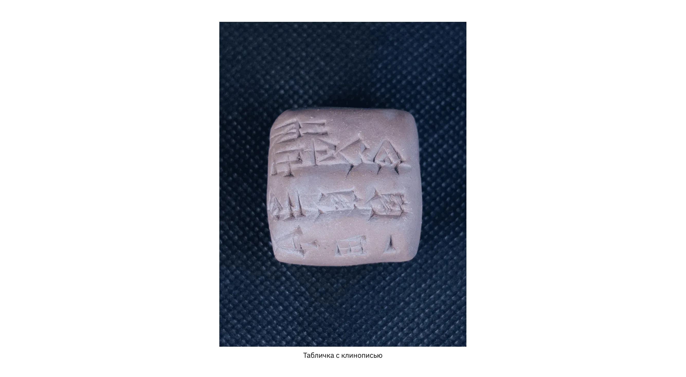

У меня также есть, как я полагаю, подлинная шумерская табличка с мелкой клинописью в центре. На этой табличке есть подписи, сделанные путем прокатывания цилиндра, которые я покажу вам позже.

Пометки с маленькими цифрами служили подписями в те времена, когда большинство людей не умели писать, поскольку такая способность была только у опытных писцов.

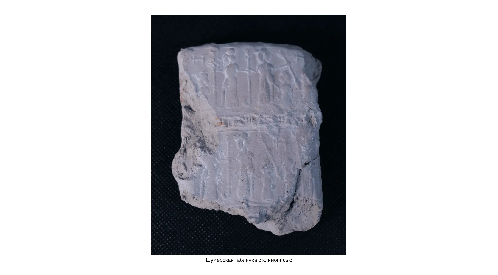

Ниже вы можете увидеть упомянутый выше цилиндр: камень, на котором выгравированы определенные формы. Этим цилиндром, называемым по-английски цилиндрической печатью, люди подписывали письма. Это был способ явно обозначить имена авторов или указать, что письма были составлены от их имени.

Поэтому писцы того времени использовали клиновидный стилус для нанесения знаков на влажные скрижали.

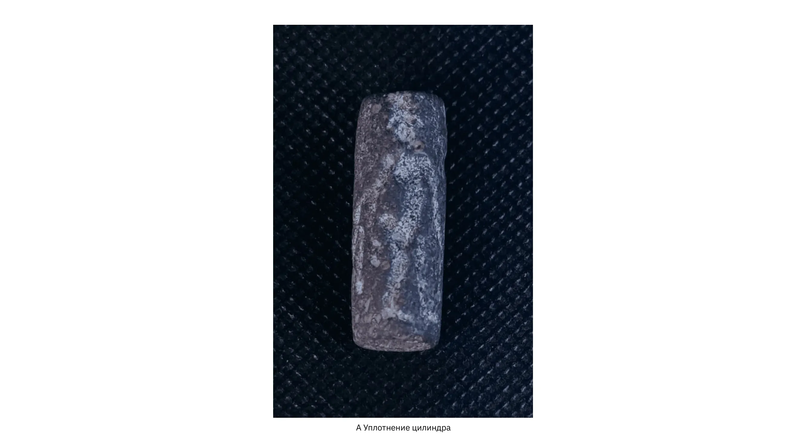

Клинописные знаки представляли собой не язык, а систему письма для записи разговорных языков. В английском языке мы бы сказали "writing is a written language", а затем - "cuneiform is a script, not a language". Так и во французском языке мы бы сказали, что клинопись - это не язык, а способ кодификации языка.

### Эволюция и использование письменности

В первые века своего существования эта письменность оставалась ограниченной, служа в основном мнемонической системой для записи количества, перечня сельскохозяйственных товаров и оборудования. Лишь постепенно она стала способна **фонетически передавать имена** и полные предложения.

Изначально имена не могли быть выражены клинописью, поскольку она в основном представляла предметы и элементы реальности, такие как бык или пшеница, изображенные в виде небольших картинок. Со временем эти изображения превратились в более развитую форму письма, позволяющую представлять имена и сложные понятия.

Если бы человека звали, например, Лаура, мы могли бы взять одно слово, аббревиатуру, которая звучала бы как "вода", и второе - как "рас", и образовать из них имя Лаура. Так возникла первая форма письменности.

К сведению, первоначально для представления аббревиатур, если вы хотели нарисовать голову быка, вы могли увидеть форму головы быка. Постепенно рисунки упрощались и представляли собой не более чем некую линию. Ученые считают, что это произошло потому, что люди держали мокрую глиняную табличку в одной руке, поэтому было легче перерисовывать инициалы, поворачивая их. Также считается, что это связано с тем, как писцы держали таблички.

В клинописных аббревиатурах все еще можно увидеть связь, скажем, с пшеницей или головой быка, и они всегда наклонены в одну сторону.

На протяжении трех тысячелетий своего существования клинопись служила в первую очередь для ведения экономических и административных записей. Однако вскоре у жителей Месопотамии появилось глубокое желание сохранить в письменном виде все, что заслуживало испытания временем. Так, истории, легенды и песни, до сих пор передававшиеся устно странствующими музыкантами, были увековечены в письменном виде, часто переписываемые писцами, прошедшими обучение. Они переписывали уже существовавшие тексты, в основном легенды или тексты, имевшие определенную культурную ценность.

Важным примером является **Эпос о Гильгамеше**, возможно, **историческом царе шумерского города-государства Урук** около 2900-2350 гг. до н.э.

Эта форма письма, которая была одновременно инструментом управления экономикой и вектором развития культуры, просуществовала до I века нашей эры, а затем исчезла навсегда, оставив после себя драгоценное свидетельство о цивилизации, в которой она зародилась.

## Роль шумерских табличек

<chapterId>a396e6c5-56cc-5410-9e6b-0274401c5425</chapterId>

:::video id=a0729a35-01ec-4aa4-828f-d4ccc2eb168e:::

### Домонетарные кредитные системы

В древней Месопотамии экономическая организация была основана на весьма сложных механизмах, существовавших задолго до изобретения металлических монет. С самого начала формальные и неформальные кредитные системы уже были неотъемлемой формой денег, позволяя местному населению осуществлять множество сложных экономических операций.

Именно для удовлетворения административных и экономических потребностей была изобретена клинопись. Знаменитые месопотамские глиняные таблички использовались в основном для записи различных видов договоров: частных займов, продаж, аренды, ипотеки и даже брачных соглашений. Для написания этих табличек требовался опыт специализированных писцов, что требовало больших затрат времени и сил, **но было оправдано, когда на кону стояли финансовые интересы.** В те времена люди не писали друг другу любовных писем, не обращались к писцу, чтобы написать о своих тревогах. Они нанимали писца для составления документов, независимо от того, была ли это связь или экономическая причина.

Стоит также отметить, что некоторые из этих планшетов обращались как облигации на предъявителя, свободно переходя из рук в руки.

Например, в форме глиняного шара с маленькими камешками внутри.

На внешней стороне глиняного шара было написано и подписано число, обозначающее количество единиц. Внутри находились камни и кто-то, кто хотел проверить, подтвердить, что этот инструмент действительно представляет собой X единиц.

Другой пример, табличка, найденная к юго-западу от современного Багдада, гласит, что должник обязуется выплатить кредитору 330 мер зерна в день сбора урожая. Еще более удивительно, что в другой табличке четко указано, что долг в четыре меры ячменя должен быть возвращен непосредственно предъявителю таблички, таким образом **введено понятие оплаты предъявителю, что было особенно инновационным понятием для того времени**.

Начиная с 2000 года до н. э. существовал закон, по которому все коммерческие сделки, даже самые мелкие, должны были оформляться письменно и подписываться в присутствии свидетелей. Представьте себе, какой огромной бюрократией в те времена было фиксировать все сделки в реестрах, сделанных, напомню, из глины писцами. Такая юридическая строгость была призвана предотвратить будущие споры о праве собственности и правах на обмениваемые товары. Часто вызывались свидетели, которые должны были подтвердить, что договор действительно был подписан.

В частной сфере некоторые семьи и отдельные люди занимались достаточно сложной экономической деятельностью, чтобы требовать тщательного управления. В северовавилонском городе Сиппар-Амнану был обнаружен дом жреца-анунита по имени Ур-Уту, в котором хранилось около 2 000 табличек. Среди этих документов были договоры о частных займах, договоры купли-продажи и аренды, а также письма, религиозные и научные тексты, что свидетельствует о разнообразии и важности частных архивов того времени.

Примечательно, что письма, написанные писцами, касались почти исключительно финансовых интересов: жалоб на недостаточные пособия, задержки с выплатой приданого или других срочных материальных просьб. В те времена личные письма, такие как любовные, не существовали, и даже упоминания о болезнях были редкостью.

Пример такого письма наглядно иллюстрирует эту экономическую реальность: корреспондент выражает свою беду, оставшись без денег и провизии после отъезда партнера, когда в Ассуре разразился сильный голод. Он описывает свою срочную потребность в покупке зерна и просит быстро выслать ему денежный эквивалент его текстиля, чтобы обеспечить его ежедневное пропитание.

Это письмо, адресованное ее партнеру, похоже, свидетельствует о том, что он уехал торговать в другое место, оставив ее без гроша в кармане. Она напоминает ему, что ей необходимо иметь доступ к денежным мерам, чтобы покупать зерно и платить храмовые налоги. Это, пожалуй, самый близкий к аргументу аргумент, написанный в письме того времени. Письма почти всегда были связаны с экономическими сделками, и именно это письмо относится к нестабильной экономической ситуации.

Таким образом, дошедшие до нас месопотамские документы отражают в основном экономические обмены, поскольку составлялись исключительно для передачи товаров с признанной ценностью: денег, зерна, различных товаров, недвижимости, уплаты храмовых налогов. Эти архивы свидетельствуют не только об эффективности и административной точности этой древней цивилизации, но и о ее способности управлять сложными экономическими обменами на протяжении очень долгого периода.

## Управление элитой на шумерских табличках

<chapterId>c6d3df0e-b1e1-58dc-ab35-9f76bbc39393</chapterId>

:::video id=04a95fb8-a701-4a48-9ce8-0e9b6ba256fd:::

### Письменность - технология, которая прежде всего экономична

Вопреки распространенному мнению, изобретение письменности в Месопотамии около 4 000 лет назад изначально не преследовало цели личного или литературного общения. **Клинопись была прежде всего экономической технологией**, оправданной только в тех случаях, когда на карту были поставлены важные финансовые интересы. Шумеры использовали письменность не для переписки друг с другом или выражения своих чувств, а исключительно для документирования своих коммерческих и финансовых операций.

Такая специализация может быть объяснена значительной стоимостью табличек. Гравировка на глине требовала специальных технических знаний, значительного времени и особых материалов. Только сделки достаточной стоимости экономически оправдывали эти инвестиции, создавая естественный порог доступа к этой революционной технологии.

Клинописные таблички свидетельствуют о существовании финансовой системы удивительной для своего времени сложности. Месопотамцы разработали полный арсенал современных финансовых инструментов: **частные займы под проценты, купчие, договоры аренды, закладные и даже брачные контракты с финансовыми оговорками**. Такая изощренность свидетельствует о развитой рыночной экономике, далекой от упрощенного образа примитивного бартера, который часто ассоциируется с этими древними цивилизациями.

Некоторые планшеты функционировали как настоящие ценные бумаги на предъявителя, свободно переходя из рук в руки и не требуя идентификации первоначального владельца. Это нововведение обеспечило удивительную гибкость обмена, предвосхитив современные финансовые системы. Более того, специальное законодательство даже требовало, чтобы все коммерческие сделки оформлялись в письменном виде, тем самым институционализируя использование письменности в экономической сфере.

### Монополия на знание и экономический контроль

Центральное место письменности в экономике наделяло значительной властью тех, кто овладел этой технологией. **Писцы, как правило, прикрепленные к храмам и правящим институтам, фактически контролировали финансовую систему**. Их редкий и бесценный опыт делал их хранителями всех важных сделок.

Эта монополия на знание не была случайностью. Власти были заинтересованы в сохранении этой исключительности, поскольку демократизация письменности ослабила бы их контроль над экономикой и увеличила бы риск подделки. Систематическое присутствие свидетелей на церемониях подписания свидетельствует о постоянной озабоченности подлинностью документов.

Законодательное обязательство фиксировать все коммерческие сделки в письменном виде преследовало несколько стратегических целей: фискальный контроль, строгий учет и поддержание зависимости экономических игроков от административного аппарата. **Таким образом, месопотамское государство присвоило себе способность управлять межличностными долгами** в масштабах всего общества, превратив письменность в инструмент экономической власти.

### Сосуществование двух валютных систем

Анализ табличек показывает более тонкую экономическую реальность, чем можно было бы предположить по их повсеместному присутствию в архивах. Во многих табличках упоминается **шекель серебра** в качестве единицы стоимости, что указывает на параллельное существование денежной системы, основанной на стандартизированных физических товарах.

Эта двойственность может быть объяснена социальным расслоением того времени. **Система клинописных табличек предназначалась для ограниченной элиты**: духовенства, преуспевающих купцов и администраторов, способных читать, писать и интерпретировать эти сложные документы. Чтобы эффективно использовать табличку на предъявителя, нужно было не только знать, как ее расшифровать, но и уметь проверить ее подлинность и понять ее юридические последствия.

**Масса населения, исключенная из этой элитарной системы, разработала свои собственные механизмы обмена**. Простые люди использовали более доступные системы, такие как стандартизированные меры зерна, вес денег и другие легко поддающиеся количественной оценке товары, которые мог оценить любой человек без специальных навыков.

Эта народная экономика, хотя и менее задокументированная в официальных архивах, была, вероятно, более динамичной и гибкой, чем система табличек. Она позволяла осуществлять быстрый ежедневный обмен без привлечения писцов, удовлетворяя насущные потребности ремесленников, крестьян и мелких торговцев.

Серебряный сикль, часто упоминаемый в скрижалях в качестве эталона стоимости, вероятно, служил мостом между этими двумя параллельными экономическими системами, обеспечивая конвертацию между письменными долгами и физическими платежами.

### Спонтанное возникновение против институционального контроля

Это сосуществование иллюстрирует фундаментальную дискуссию в экономической истории: **противостояние между спонтанным возникновением средств обмена и институциональным присвоением денег**. С одной стороны, такие товары, как деньги, возникли естественным образом из потребностей людей в обмене. С другой стороны, институты присвоили и формализовали эти практики, чтобы контролировать их движение.

Шумерские храмы олицетворяли это напряжение: они использовали популярные монетные инновации (ссылки на шекель), одновременно разрабатывая собственные инструменты контроля (клинописные таблички). Эта стратегия позволила им воспользоваться преимуществами обеих систем: народной легитимностью традиционных валют и административным контролем над формализованными долгами.

Месопотамский опыт создает долгосрочные прецеденты для эволюции финансовых систем. Он демонстрирует, что **финансовая изощренность часто на несколько тысячелетий предшествует технологическим инновациям**, с которыми ее обычно связывают. Концепции процента, кредита, оборотных инструментов и залогового обеспечения не дожидались изобретения металлических денег.

Этот эпохальный период также раскрывает проблемы власти, присущие любым монетарным инновациям: кто контролирует технологию, кто определяет правила, как формулируются формальные системы и популярные практики. Эти фундаментальные вопросы сохраняются на протяжении всей экономической истории, доходя до современных дебатов о цифровых валютах и криптовалютах.

# Экономика и деньги в древних цивилизациях

<partId>a16bcf4c-8c3a-11f0-9e79-2bd363a484bd</partId>

## Великие цивилизации бронзового века

<chapterId>fab9334c-7385-5d7c-ad40-7d152beb22a1</chapterId>

:::video id=737e12e8-1033-4210-b1dd-b8a680f68b17:::

В этом разделе, озаглавленном "Великие цивилизации бронзового века", мы начнем с выдержки из книги *История денег: С древнейших времен до наших дней" Глина Дэвиса, которая, на мой взгляд, является прекрасным введением в этот раздел, посвященный великим цивилизациям древности.

> Тойнби выделяет около двадцати одной "цивилизации", но поскольку пятнадцать из них прямо или косвенно восходят к более ранним образцам, он сокращает число независимо развившихся цивилизаций до шести: шумерской, египетской, минойской, китайской, майя и андской. Из них только инкам в Андах удалось достичь высокой степени цивилизации без использования денег, хотя, как ни парадоксально, у них было изобилие материалов, которые обычно считаются лучшими для использования в качестве денег, - золота и серебра.

У инков не было денежной системы, но у них было изобилие драгоценных металлов. Весьма парадоксально. Продолжим цитату:

> Чем более стратифицировано общество и чем тщательнее работает его система планирования, тем менее необходимо использование денег для его населения. Это может объяснить, почему испанские конкистадоры обнаружили, что мексиканцы, чье правительство было относительно более либеральным, регулярно использовали золотой порошок (хранившийся в прозрачных трубках) и какао-бобы (хранившиеся для крупных платежей в мешках по 24 000 штук) в качестве валюты, а инки, наоборот, организованные по гораздо более жесткой иерархии, вообще не имели валюты: исключение, подтвержденное строгим правилом. Возникновение денег в Китае не зависело от других цивилизаций, однако относительная близость шумерской, египетской и минойской цивилизаций заставляет усомниться в степени их неосведомленности о денежной практике, особенно с учетом обширной торговли, налаженной еще в древнейшие времена.

В Китае монеты были разработаны с совершенно иным подходом, чем в западных традициях. С самого начала это были фиатные деньги. Это были литые монеты.

И здесь мистер Дэвис упоминает о торговле. В определенные периоды между китайцами и другими народами действительно происходил обмен, но средством обмена во внешней торговле был скорее шелк. Как мы увидим позже, золото также использовалось в пограничных районах Китая, где китайское население было меньше. И даже не для международной торговли - для этого использовался шелк.

Поэтому я предполагаю, что, возможно, на формат монет повлияли другие цивилизации той же эпохи, которые развивали эту технологию.

Но очевидно, что сущность денег в Китае была совершенно иной, чем на Западе. Мы еще вернемся к этому вопросу в следующем разделе, посвященном Китаю.

Что касается этих знаменитых шумерских городов, то у меня есть несколько замечаний. Мы можем упомянуть Урук, который был очень ранним и влиятельным городом, известным своими значительными размерами и развитой культурой, в частности, развитием письменности и градостроительства.

А еще я хотел упомянуть знаменитый эпос о Гильгамеше. Гильгамеш, вероятно, был историческим царем шумерского города Урук около 2900 года до нашей эры. Вероятно, он был царем этого шумерского города-государства.

Мы также можем рассказать о Саргоне Аккадском, который правил с 2334 по 2279 год до нашей эры.

Он был первым правителем Аккадской империи - еще одной цивилизации, возникшей в Месопотамии. Я упоминаю Саргона потому, что он первым создал почтовую службу для этих знаменитых табличек, с которыми я уже знакомил вас.

Представьте себе, что на самом деле существовали даже глиняные конверты. Скрижали могли быть завернуты в глиняные конверты с подписью человека на внешней стороне, чтобы обеспечить конфиденциальность. Люди вскрывали конверт, чтобы достать скрижаль. Этой почтовой системой мы обязаны Саргону Аккадскому.

А еще есть Вавилон, великий город, ставший столицей Вавилонской империи. Еще одна цивилизация, прославившаяся своим внушительным Зиккуратом и дворцами, а также знаменитым Кодексом Хаммурапи, наиболее известным своим высокоразвитым юридическим кодексом.

И два города в завершение этого раздела. У нас есть Ашшур, который был столицей Ассирийской империи и важным религиозным центром. И Ниневия, которая позже стала столицей Ассирийской империи. Они перенесли туда свою столицу, и она известна своей мощной армией, огромными дворцами и библиотеками. А еще это одно из возможных мест расположения легендарных Висячих садов Вавилона. Мы часто слышим об этом знаменитом чуде древнего мира.

Но в Вавилоне нет никаких следов этих знаменитых висячих садов. В Ниневии, напротив, есть археологические свидетельства существования садов на нескольких этажах. Возможно, греческие историки, такие как Геродот, путали Ниневию с Вавилоном. Когда они посещали города Месопотамии, то, возможно, называли их Вавилоном. В Ниневии были найдены следы знаменитых висячих садов, и ученые могут задаться вопросом, не является ли Ниневия тем самым знаменитым местом, где располагались эти сады, называемые Вавилонскими висячими садами.

## Экономическая организация в Месопотамии

<chapterId>6afb6fc8-cbb7-56a5-8427-484b4b7d7477</chapterId>

:::video id=aa6a2cbd-5916-4ae3-ad4f-65f0bd5643fa:::

### Докапиталистические экономические структуры и рабство

Добро пожаловать в этот раздел, посвященный экономической организации в Месопотамии. Докапиталистическая экономика прошла три основные стадии: первобытную, рабовладельческую и феодальную.

Феодал, конечно, появился гораздо позже, очевидно, в Средние века, а мы уже прошли примитивную стадию, которую описывали ранее, с палеолитом. Теперь, в Месопотамии, когда мы говорим об экономической организации, мы говорим о рабстве.

Однако в Месопотамии основную часть работы выполнял зависимый класс, похожий на рабов, которые юридически не являлись собственностью своих хозяев, но были лишены плодов своего труда с помощью физического или идеологического принуждения.

### Роль храмов и дворцов как экономических центров

В экономике преобладало крупное землевладение. Землевладельцы эксплуатировали свои земли напрямую, нанимая работников, или сдавали их в аренду за ренту. Они также занимались финансовой деятельностью, ссужая деньги под высокие проценты, как правило, от 20 до 33,3 % годовых, что резко контрастировало с более строгими правилами соседних евреев.

Кредиты, которые брали фермеры, предназначались не для продуктивных инвестиций - за исключением судоходных компаний, - а для обеспечения выживания до следующего урожая. Такая ситуация часто приводила к хронической задолженности фермеров.

Позвольте мне провести параллель с более поздним периодом античности (Рим), где граждане жили за счет сельскохозяйственной ренты, производимой крестьянами и несвободным трудом, а также за счет военных трофеев. **Эти доходы распределялись между гражданами, но не для того, чтобы получить больше прибыли, а для того, чтобы повысить свой социальный статус.** Торговля и ремесла, как правило, оставались за группами, не входящими в социальную элиту. Все это контрастирует со средневековыми экономиками, ориентированными на получение прибыли за счет торговли и ремесел.

Таким образом, я провожу параллель с тем, что люди использовали инструменты финансового кредитования не обязательно для улучшения средств производства, а позже, в Риме, прибыль не обязательно реинвестировалась, а скорее использовалась для повышения престижа людей, которые могли воспользоваться этой прибылью. Мы все еще далеки от капиталистического духа, возникшего позднее в Средние века, когда рабочие места могли создаваться для улучшения средств производства, а излишки изымались и создавались в погоне за прибылью. Таким образом, мы видим, что экономическая организация еще не достигла третьей стадии экономической эволюции, перечисленной выше.

### Возникновение кредитных систем и расчетных единиц

**Карл Поланьи выделяет три формы экономического обмена: взаимность между симметричными группами,** что имеет место в примитивных племенах, где нам не нужны деньги, потому что мы даем друг другу неформальные кредиты, обмен и перераспределение. **Перераспределение, централизованное вокруг храмов и дворцов,** эта форма обмена совместима с Месопотамией, где храмы находились в центре экономической организации и могли в свое время отдавать, распределять богатство в виде пайков. Лишь позднее было введено понятие заработной платы. Итак, до сих пор мы имеем первобытную форму (1), централизованное перераспределение (2) в храмах и дворцах, а затем, наконец, можем уступить место рыночному обмену (3). Хотя рынок в том виде, в котором мы понимаем его сегодня, не существовал в полной мере, наличие рыночных обменов в Месопотамии неоспоримо, что подтверждается существованием специальных терминов на аккадском языке и наличием археологических свидетельств цен, прибылей, убытков, колебаний и ситуаций дефицита.

Месопотамские домохозяйства самостоятельно управляли всеми этапами сельскохозяйственного производства, от посева до конечной переработки в хлеб и пиво. Женщины также производили текстиль, необходимый их иждивенцам. За товарами, которые не производились на месте, домохозяйства обращались к специализированным торговцам.

Семейные связи были особенно важны в торговле. В палеоассирийский период (ок. 1910-1830 гг. до н. э.) купцы из города Ашшур основали торговую колонию в Канеше в Анатолии, импортируя олово и текстиль в обмен на золото и серебро. Торговля основывалась на семейном бизнесе, тесно связанном браками и коммерческими партнерствами. Канеш был лишь одним из звеньев обширной международной торговой сети.

В этих обменах участвовали металлы, причем именно драгоценные, а не обязательно, например, медь, которая в то время была очень полезна, и мы думаем, что эти металлы обменивались на понятия хранилища стоимости. Таким образом, мы не можем говорить о бартере, где два товара обмениваются на их полезность, но скорее о платежах с определенным осознанием того, что драгоценные металлы хранились для использования в качестве хранилища стоимости, а не для использования их в качестве товара, например, использование бронзы для изготовления доспехов.

Дани и налоги выплачивались в основном натурой (ячменем или весовым серебром). Храмы и дворцы были главными экономическими, административными, политическими и религиозными центрами, а также выполняли первые банковские функции путем надежного хранения товаров, сначала зерна, затем других сельскохозяйственных продуктов и, наконец, драгоценных металлов. Таким образом, задолго до появления монет были разработаны первые кредитные и ссудные операции.

В месопотамской экономике в качестве эталонов стоимости использовались в основном ячмень и серебро. Серебро взвешивалось в стандартных единицах, таких как сиклум (шекель) весом около 8,33 грамма. Уже в древневавилонский период (при Хаммурапи) серебро использовалось в качестве обычного платежного средства, с ранним понятием номинальной стоимости ("nūbum") в противовес реальному весу ("šuqulum"), **предвосхищая современную концепцию фиатной валюты**.

Но это еще не были фиатные деньги в строгом смысле этого слова. Не было понятия печати с изображением авторитетного лица, но было понятие номинальной расчетной единицы, в отличие от понятия взвешенного металла. В языке существовало различие между этими двумя понятиями, и я считаю важным упомянуть о нем.

Переход к рынку наемного труда был непростым. Он потребовал двух основных концептуальных нововведений: отделения работы человека от конечного продукта и введения "рабочего времени" как измеримой единицы. Чтобы получить понятие наемного работника и заработной платы, нам пришлось пройти через эти две инновации. **В III тысячелетии труд первоначально вознаграждался фиксированными пайками, а в начале II тысячелетия постепенно перешел к системе оплаты труда*

Наконец, начиная с 26 века до н. э., укоренилось реальное понятие денежной стоимости, хотя месопотамские "деньги" были не монетой, а скорее взвешенной мерой зерна или металла. **Таким образом, для важных сделок или в ситуациях, требующих сохранения стоимости, часто предпочитали конвертировать зерно в серебро, которое легче сохранялось.** Немного похоже на пример Канеша, где серебряный металл получали для накопления.

Начиная с XXI века до н. э., **после фактического исчезновения асимметричных обменов**, мы замечаем, что в договорах поручения глагол sa обозначает выплату цены. Это понятие, называемое "са", появляется в договорах и относится к выплате цены, а не к измерению конкретного товара. "Са" просто обозначает платеж или цену. Антрополог отмечает это и говорит, что это действительно прорыв; мы видим своего рода дихотомию между "до" и "после" этого введения глагола "са" в контракты.

Нельзя игнорировать имеющиеся в ближневосточных архивах эмпирические данные, свидетельствующие о существовании **некоторых рыночных механизмов**, включающих **понятия прибыли** и **убытков**, **колебания цен** и ситуации **нехватки**. Но основная сложность заключается в определении относительной важности рыночного обмена в рамках древней месопотамской экономики в целом.

Я думаю, что эксперты в этой области видели следы этих рыночных концепций, но они не могут сказать нам, насколько экономика того времени была основана на этой более современной рыночной концепции или других механизмах.

Мы знаем, что он существовал, но не знаем, был ли он основным способом, скажем, определения цен или торговли.

На этом мы завершаем данный раздел, посвященный экономической организации в Месопотамии.

В следующих разделах мы сделаем то же самое для Египта и Китая.

## Экономическая и денежная организация в Древнем Египте

<chapterId>bffcc16c-7fbf-5992-a0fa-6a7726d7d287</chapterId>

:::video id=40c1c4e5-b190-4bb6-b8a0-810c9ce7698b:::

### Исторический фон и египетские периоды

Этот раздел посвящен экономической и денежной организации Древнего Египта. Чтобы дать вам небольшую предысторию, вот список и краткое описание рассматриваемых периодов.

- Старое царство (ок. 2575 - ок. 2130 гг. до н.э.)**. Период, отмеченный строительством великих пирамид, в частности пирамиды в Гизе. Это был золотой век централизованной египетской монархии.
- Среднее царство (ок. 1938 - ок. 1630 гг. до н. э.)**. Политическое и культурное возрождение после периода нестабильности.
- Новое царство (ок. 1539 - 1075 гг. до н.э.)**. Период территориальной экспансии, военного могущества и международной торговли. К нему относится правление таких знаменитых фараонов, как Тутанхамон и Рамзес II.
- 1323 ГОД ДО Н.Э. - Смерть Тутанхамона**. Молодой фараон умер в возрасте около 18-19 лет. Его почти нетронутая гробница была обнаружена в 1922 году, что сделало ее одним из самых известных археологических открытий.
- Рамзес II - годы правления 1279-1213 гг. до н. э.**. Один из самых могущественных фараонов Нового царства. Известен своими военными походами, великими памятниками и тем, что, вероятно, заключил первый известный мирный договор.
- 1275 г. до н. э. - Народы моря**. Вторжения или миграции групп, называемых "народами моря", дестабилизируют несколько средиземноморских цивилизаций, включая Египет.
- Битва при Ксоисе - 1178 год до н. э.**. Конфликт между египетской армией и захватчиками, вероятно, связанными с народами моря. Одна из многих битв в конце Нового царства.
- Поздний период** - это период истории Древнего Египта примерно с 664 по 332 год до н.э.
- Клеопатра VII (69 - 30 гг. до н.э.)**. Последняя царица Египта, прославившаяся своим умом, харизмой и союзами с Юлием Цезарем и Марком Антонием, а также, вероятно, своим носом. Ее правление ознаменовало конец фараоновского Египта перед его аннексией Римом.

В V и IV тысячелетиях до н. э. Египет уже вел интенсивную коммерческую деятельность в широких масштабах, связывая Нубию, Палестину, Ливию и регионы Красного моря посредством морской, речной и сухопутной торговли (в частности, с помощью караванов ослов).

### Ранние системы обмена и палеовалюта

С появлением первых египетских вождеств около 3650-3400 гг. до н. э. Маади, расположенный к югу от современного Каира, стал крупным центром медной технологии и торговли на дальние расстояния, в частности, с Месопотамией через сирийское побережье.

Хотя крупномасштабная торговля в основном основывалась на бартере, вероятно, существовала и примитивная форма денег ("палеовалюта"), состоявшая из предметов престижа, таких как полудрагоценные камни и ископаемые раковины. Вероятно, золото уже играло важную роль в этих обменах. Первое явное упоминание монеты в египетских документах в середине III тысячелетия до н. э. отражает длительное развитие, связанное с коммерческой практикой.

В архаическом обществе (здесь мы говорим не только о Египте, но и об архаических обществах в целом) платежи были частым явлением, но не для того, чтобы непосредственно покупать, а чтобы оплачивать приданое, религиозные ритуалы и другие социальные обязательства. Такие сделки требовали точного ценообразования и оценки. Во многих примитивных обществах существовали привилегированные, монетизированные (то есть поддающиеся подсчету) объекты, в терминах которых оценивалась эта стоимость. Если вы платите приданое, то, конечно, должны записать некоторое количество предмета, который нужно обменять, чтобы заплатить приданое. По сути, это стоимость людей.

В архаичных обществах до появления денег и денежных систем существовали платежи, но они часто были связаны с социальными обязательствами, а их ценность вытекала из ценности отдельных людей, как, например, при выплате приданого или кровных денег.

Возвращаясь к Египту, отметим, что во времена Древней империи "шат(й)", изначально представлявший собой конкретную денежную единицу (небольшую золотую или серебряную монету весом около 7,6 грамма), очень быстро перешел от своей реальной функции твердой валюты к **бухгалтерской функции**, которая и породила понятие стоимости. Мы можем признать в ней своего рода счетную единицу для выражения стоимости, которая изначально была разновидностью монеты, но мы не можем назвать ее монетой, потому что она не отчеканена, это просто мера металла. Мы приближаемся к понятию счетной единицы.

В конце концов от этого понятия отказались, возможно, из-за риска мошенничества. Позже мы увидим, что египтяне не спешили принимать штемпельные монеты и даже продолжали их взвешивать, даже после того как их переняли соседи.

В Средние века серебро редко использовалось для повседневных операций, в основном это были меры зерна и количества хлеба. Именно в этот период появилась форма скриптовых денег, где платежи могли быть зафиксированы письменно или путем фактической передачи.

В Новом царстве денежная система стала более сложной, объединив различные товарные валюты, которые оценивались в металлах (золото, серебро, медь), стандартизированных тканях, зерне и масле. Ткани назывались "мерами ткани". **Цены на товары повседневного спроса часто выражались в зерне или меди, в то время как драгоценные предметы оценивались в золоте или серебре. Серебро, которое в Египте встречалось реже, чем золото, ценилось особенно высоко.** Серебро было переоценено по сравнению с золотом, которого в Египте было больше.

К позднему периоду (первое тысячелетие до н. э.) серебро стало распространенным обменным металлом на всем Ближнем Востоке. Оно обращалось в виде слитков, металлических монет или колец, которые взвешивались и маркировались в храмах, гарантируя их вес и чистоту, хотя они и не чеканились в виде изображения государя. Это произошло позже и станет темой следующего раздела, посвященного лидийцам.

Следует также отметить, что у древних египтян был термин "хедж", обозначавший деньги, и он использовался в общем виде для обозначения любого платежного средства, служившего для оплаты сделки, будь то металл, зерно, ткань или различные товары (дерево, животные, услуги и т. д.). Задокументированные примеры показывают, что египтяне могли заключать сделки, комбинируя различные товары, общая стоимость которых выражалась в медных единицах ("дебен").

**Храмы играли центральную роль в египетской экономике: в них собирались и хранились значительные сокровища драгоценных металлов (золота и серебра), предназначенные для почитания богов, а также в качестве денежного резерва, который при необходимости можно было снова включить в экономический оборот**. Мы увидим примеры того, как другие цивилизации накапливали в храмах ценные запасы, например статуи, чтобы переплавить их в случае войны, нехватки валюты или кризиса. Это повторяющаяся тема на протяжении всей истории.

Стоит также отметить, что выращивание льна было королевской монополией, предоставленной храмам, а производство драгоценных тканей подтверждало их экономическую значимость.

Древние египтяне проводили четкое различие между идеологическим аспектом драгоценных металлов, связанным с божественностью (золото представляло плоть богов, серебро - их кости), и их практической функцией в качестве валюты, служащей эталоном для всех других форм оплаты.

Таким образом, хотя Древний Египет до позднего периода не создавал чеканной валюты, сравнимой с современными денежными системами, он обладал сложной денежной системой, основанной на комбинированном использовании писцовых денег, точных счетных единиц, товарных денег и драгоценных металлов, оцениваемых по весу.

Сами монеты взвешивались, что привело к появлению двух разных понятий: **"чеканка" и "деньги "**. Я использовал два термина в английском языке. Во-первых, "чеканка" относится к монетам - понятию, которое появляется позже, и у нас также есть понятие денег. Мы уже можем определить определенное понятие "деньги" через счетные единицы, которые я только что выразил в терминах денег, но которые еще не были монетами, поэтому "чеканка" появляется немного позже, у лидийцев.

Таким образом, монеты не являются обязательным условием существования денег, ** настолько, что мы можем признать существование денег уже в 3-м тысячелетии**, во всяком случае, и без всяких сомнений во 2-м тысячелетии и особенно при правлении Хаммурапи.

Важно помнить, и об этом упоминает автор книги "Происхождение денег", что нет никаких сомнений в том, что концепция денег уже существовала в то время, в этих денежных системах, и ошибочно связывать рождение денег как концепции с появлением монет.

Наконец, понятия взаимности и перераспределения, часто применяемые Поланьи к Древнему Египту, нуждаются в нюансах: хотя они существуют, они не образуют исключительную структуру. Фараоновский Египет создал сложную экономику, которая полностью интегрировала сложные коммерческие обмены, отличные от религиозных и ритуальных практик, демонстрируя реальную автономию экономической сферы от идеологической.

Эта особенность связана с представлением о том, что драгоценные металлы ассоциировались с определенным божеством, но при этом были способны различаться.

Я говорю об этом потому, что Поланьи называл использование этих драгоценных металлов в первую очередь религиозным или божественным понятием. Однако мы предполагаем, что они также были интегрированы в экономическую систему и что египтяне уже умели делать такие различия.

В заключение я хотел бы привести цитату из книги "Происхождение денег", в которой перечисляется цель этого изобретения, чеканки денег. Там есть несколько пунктов, но я хотел бы подчеркнуть только пункт 5:

*развивать возможность экономической игры за счет использования таких методов, как девальвация и последовательная ревальвация, для сокращения или увеличения импорта и экспорта по более низким ценам*

Таким образом, даже в те архаичные времена, по мнению автора, монеты уже были изобретены или появились под контролем государства, и ими уже манипулировали с точки зрения количества драгоценных металлов и веса, чтобы управлять экономикой. Позвольте мне дать вам небольшую сенсацию относительно последующего раздела. **Даже в самых ранних формах чеканки монет, которые изготавливались из электрума, сплава золота и серебра, мы знаем, анализируя содержание драгоценных металлов в этих монетах, что первые эмитенты, например Крез, содержали меньше золота, чем в натуральном электруме*

Это значит, что они уже знали, как отделять золото от серебра, и выпускали монеты с меньшим содержанием золота.

Автор предполагает, что с самых первых дней чеканки монет, помимо простого подтверждения веса и облегчения торговли, правом чеканить деньги уже злоупотребляли для увеличения количества выпускаемой продукции, возможно, в качестве формы экономического планирования.

## Знак валюты, экономическая и денежная организация в древнем Китае

<chapterId>e08d3be9-423c-5cf3-a606-6ad54e2261af</chapterId>

:::video id=ae7e6367-1725-455e-bfe6-359be1f443e5:::

В этом разделе, озаглавленном "Знаковые деньги, экономическая и денежная организация Древнего Китая", мы увидим, что древнекитайские деньги имеют отличительные черты от западных традиций. Китайская валюта уже с самого начала была "знаковой валютой". Информация в этом разделе основана на заметках, которые я сделал после прочтения книги "Aux origines de la monnaie".

### Понятие знаковой валюты и ее отличительные особенности

По мнению автора, знаковые деньги - это эквивалент сегодняшней фиатной валюты. Это валюта, стоимость которой не связана с содержанием металла. С самого начала это было своего рода соглашение, социальный консенсус по поводу стоимости этих монет.

Древнекитайская чеканка монет отличается от западных традиций. В основном они были металлическими, но отливались, а не чеканились, и на них не изображалось изображение государя. Удивительно, но китайское государство не обладало монополией на денежную эмиссию. Этот кажущийся либерализм можно объяснить отсутствием экономической необходимости монополизировать денежную эмиссию благодаря обильным налоговым ресурсам, взимаемым с многочисленного налогооблагаемого населения.

Для китайской валюты также характерен фидуциарный аспект. С самого начала в качестве валюты использовались бронзовые имитации каури (морских раковин), не имевшие прямого отношения к внутренней стоимости используемого металла. Если заглянуть далеко в историю, то китайцы использовали ракушки в качестве валюты. В конце концов, когда ракушки стали слишком дефицитными, они изготовили их копии из меди, и эти копии имели ту же ценность, что и настоящие.

Поэтому китайская валюта основывалась не на стоимости материала или относительной редкости исходного предмета (например, моллюска), а на коллективной уверенности в его использовании в качестве средства обмена - иными словами, денежного знака.

### От раковин каури до металлических имитаций

Коври широко использовались в качестве примитивной денежной единицы. Древние надписи показывают, что уже в династиях Шан и Чжоу (первые династии первого и второго тысячелетий до н. э.) раковины коровьего дерева использовались не только для вознаграждения за военные подвиги, но и для **оплаты труда, измерения стоимости и покупки земли**.

Важно помнить, что это был не просто инструмент, используемый обществом в ограниченных целях. Он использовался для военных наград, оплаты за работу и измерения стоимости. Следы этого мы находим в трудах археологов. Хотя мы не знаем, использовался ли он для ежедневной покупки хлеба, у нас есть доказательства того, что он мог использоваться для вышеупомянутых видов сделок.

Со временем нехватка настоящих раковин каури привела к производству их имитаций из бронзы, кости, перламутра или камня, особенно для использования в погребальных контекстах, чтобы избежать обездвиживания настоящих ценностей в гробницах. Эта смена носителя информации также связана с идеей контроля князя над деньгами, который тем легче, чем больше князь делает денег.

Нам нужно понять, что, выходя за рамки ограничений, связанных с естественным дефицитом ракушек, если принц может сам создавать валюту, это дает ему больший контроль над управлением экономикой.

В отличие от Месопотамии, где монеты были связаны с весом драгоценного металла, китайская терминология монетного дела происходит непосредственно от первоначальных форм предметов, использовавшихся в качестве валюты: коров (бэй), ножей (дао), пик (бу) и круглых монет (цюань или цянь). Таким образом, мы видим, что происхождение слов, связанных с деньгами, в Китае относилось именно к этим предметам. На Западе, напротив, существует ряд денежных терминов, которые происходят от понятий, совершенно отличных от этих, связанных скорее с физическими характеристиками и весом денежных объектов. Эти этимологические различия наглядно демонстрируют раскол между западным и китайским видением денег.

В Китае денежная стоимость была полностью фидуциарной, основанной на социальных соглашениях между государством, производителями и купцами.

### Экономическое регулирование и монетарная философия

Китайское государство использовало деньги как инструмент экономического регулирования: во времена денежного изобилия стоимость денег снижалась, что облегчало людям покупку товаров. И наоборот, во времена нехватки денег их стоимость возрастала, усиливая покупательную способность государства для последующих операций.

Здесь можно провести связь с инфляцией и дефляцией. При фиксированной денежной массе, если производительность труда в экономике растет, стоимость денег увеличивается. И наоборот, если производительность падает, стоимость денег снижается. В данном примере, однако, все наоборот. Возможно, потому, что у принца не было полной монополии на производство денег, но это все же свидетельствует о том, что стоимость денег была связана с экономическими условиями.

Философ Мо Ди (V-IV вв. до н. э.) уже анализировал эту связь между ценой и стоимостью: по его мнению, колебания цен отражают не реальное понятие дешевизны или абсолютной дороговизны, а колебания отношений между товарами и деньгами, независимо от стабильной номинальной стоимости денежного знака.

Поэтому здесь, вместо того чтобы сказать, что золотая монета будет иметь какую-то базовую ценность как таковую, например, потребительскую или внутреннюю, он указывает на то, что ценность денежного знака скорее зависит от состояния экономики.

В Китае монеты не обязательно должны были иметь официальную маркировку или гарантию. Их принятие зависело исключительно от коллективного доверия, что объясняет, почему бронзовые или медные монеты без специальных надписей могли свободно циркулировать в течение долгого времени.

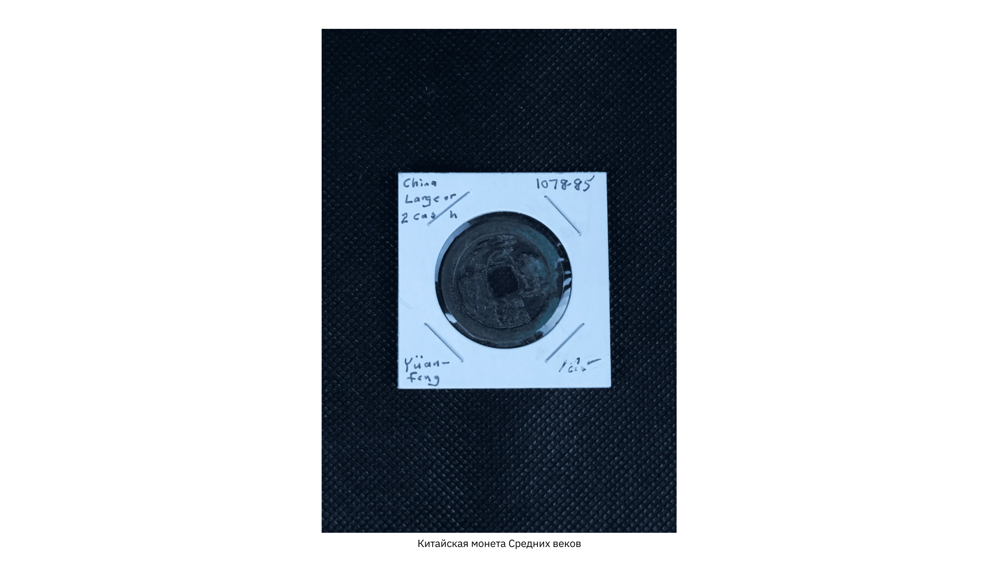

Представленная выше китайская монета относится к средним векам. Это литая монета с квадратным отверстием в центре. Через это отверстие продевалась веревка, позволявшая нанизывать монеты на браслеты или ожерелья. Однако они предназначались не столько для ношения, сколько для учета. Их можно было нанизывать друг на друга, формируя счетные единицы в виде больших нитей, скрепленных между собой. На них не обязательно были какие-то особые знаки, иногда это были просто бронзовые круги.

Денежная монополия государства, запоздало установленная Уди из династии Хань в 113 году до н. э., часто оспаривалась, что позволяло различным частным или местным игрокам выпускать свои собственные валюты, если они пользовались достаточным общественным доверием.

**Низкая внутренняя стоимость китайской валюты препятствовала накоплению денег, гарантируя их беспрепятственное обращение**. Драгоценные металлы редко использовались в качестве оборотной валюты, чтобы предотвратить накопление денег. Золото, будучи слишком дорогим, обычно откладывалось, а не тратилось. Вместо этого **только шелк представлял собой настоящую валюту высокого достоинства в китайской международной торговле**. Китайцы торговали шелком, а не золотом.

Во время экономических или денежных кризисов, особенно при росте цен на медь, использовались инновационные решения: так, уже во II веке н. э. монеты, находившиеся в обращении, обрезались для создания более мелких единиц, что позволяло поддерживать циркуляцию при меньших затратах. Другие эпохи, например эпоха Ван Манга (начало I века н. э.), экспериментировали с высокодоходными валютами, в которых номинальная стоимость намного превышала фактическое содержание металла, тем самым предвосхищая банкноты. Они брали монету и штамповали на ней такие значения, как 50, 100 или 200, чтобы обозначить более крупные суммы, например 200 монет. Такая практика, вероятно, способствовала значительной инфляции.

Как уже говорилось выше, эта система была основана на социальной конвенции между государством, производителями и купцами, но также на авторитарных и суровых правилах для тех, кто не играл в эту игру, в частности, в отношении выбора деталей (красивых или нет) или длины тканей (не соответствующих стандарту).

По моему скромному мнению, это не очень надежная система. В основном она опиралась на строгие правила, обязывающие чиновников и торговцев принимать поврежденные монеты под угрозой санкций.

### Китайские монетарные инновации и их влияние на экономику

Китай также был пионером в выпуске ранних форм бумажных денег, первоначально принятых в ответ на нехватку металла в IX веке нашей эры. Несмотря на свои первоначальные преимущества, эти бумажные деньги регулярно приводили к инфляционным спиралям, когда их выпускали в избытке, как это наблюдалось в периоды Сун и Мин, когда чрезмерная эмиссия приводила к серьезным валютным кризисам, проиллюстрированным Марко Поло в XIII веке, который даже отметил, что фальсификация таких бумажных денег каралась смертью. Я не могу не отметить здесь одну из форм насилия.

Таким образом, китайский опыт характеризуется глубоко фидуциарной концепцией денег, удивительной гибкостью денежной системы и ранним использованием бумажных валют, основанных на доверии между экономическими игроками, а не на внутренней ценности используемых носителей.

## Общественная и экономическая организация в античности

<chapterId>4023c3ce-7a47-5ac4-8f5f-c7ab699ab20f</chapterId>

:::video id=2761efe4-21cf-4f06-9bda-c03f9ff39012:::

### Дебаты о городском паразитизме

Отношения между древними городами и их внутренними территориями поднимают фундаментальный вопрос: функционировали ли эти городские центры как паразиты, извлекающие богатство, или как двигатели выгодной экономической специализации? Гипотеза паразитизма предполагает, что города бронзового века, особенно в Месопотамии, **систематически извлекали из своих сельских территорий больше ценности, чем возвращали**, живя в основном на ренту и налоги, не создавая эквивалентной ценности.

Это видение нашло свое отражение в распаде Римской империи: когда территориальная экспансия прекратилась, поток внешних богатств иссяк, что потенциально привело к появлению городской экономики, неспособной финансировать себя. Города, таким образом, жили бы "не по средствам", завися от добычи, а не от производства.

### Специализация как фактор создания стоимости

Альтернативное экономическое прочтение бросает вызов этому паразитическому видению. **Древние города функционировали прежде всего как центры специализации и разделения труда**. Их роль выходила за рамки простой добычи: они концентрировали специализированные ремесла, организовывали торговые сети и служили центрами для обмена на большие расстояния.

Такая специализация городов создавала продуктивную взаимозависимость с внутренними районами. **Города не могли выжить без сельских сельскохозяйственных поставок, а внутренние районы получали взамен ремесленную продукцию, технические инновации и доступ к средиземноморским торговым сетям**. Разделение труда позволяло взаимно повышать производительность, даже если распределение выгод могло казаться несбалансированным.

Хроническое отсутствие продовольственной безопасности того времени отчасти объясняет эту кажущуюся асимметрию. Риск голода и гибели урожая был постоянной угрозой для сельского населения, в то время как городские ремесленники, связанные с международными торговыми сетями, наслаждались большей экономической стабильностью.

### Историческая эволюция, от античности до средневековья

Контраст между античной и средневековой организацией проливает свет на этот вопрос. **Древность способствовала масштабному разделению труда, города были открыты для всего средиземноморского мира**. Торговля и специализация достигли сложного уровня, создав обширные экономические сети.

Распад Римской империи привел к радикальной раздробленности: **Эпоха феодализма заменила централизованную организацию децентрализованной системой самодостаточных поместий**. Древнеримские villas rusticae стали матрицей средневековых seigneuries, создав мозаику практически самодостаточных экономических островов, управляемых духовенством или дворянством.

Эта средневековая децентрализация, хотя и снизила эффективность коммерческой деятельности, парадоксальным образом обеспечила большую устойчивость к внешним потрясениям. Феодальные поместья развивали более сбалансированные отношения между центрами власти и сельским населением, даже если такая организация ограничивала рост производительности, связанный со специализацией.

### Возникновение городских рынков

Археологические находки свидетельствуют о существовании **торговых портов и торговых кварталов в месопотамских городах уже во втором тысячелетии**. Эти инфраструктуры свидетельствуют о существовании организованных рынков, хотя их точное функционирование остается спорным.

Карл Поланьи, изначально скептически относившийся к существованию подлинных рыночных механизмов в древности, уточнил свою позицию, признав, что, возможно, недооценивал раннее возникновение рыночных обменов. Эта интеллектуальная эволюция отражает сложность интерпретации древних экономических систем, в которых сосуществовали институциональное перераспределение, взаимный обмен и зарождающиеся рыночные операции.

### Спарта против Афин

Сравнение Спарты и Афин прекрасно иллюстрирует взаимосвязь между денежной системой и социальной организацией. **Спарта представляет собой модель жестко иерархического общества, которое сознательно отвергало использование денег**, в то время как Афины развили сложную денежную экономику, сопровождавшую их демократическую систему.

Отказ спартанцев от денег был не спонтанным, а **институциональным и идеологическим**. Спартанские лидеры опасались, что деньги развратят военные и гражданские ценности, предпочитая систему, основанную на прямом межличностном доверии между гражданами.

Чтобы препятствовать использованию денег, Спарта использовала **тяжелые, непрактичные металлические слитки**, парадоксальным образом демонстрируя интуитивное понимание тех качеств денег (делимость, транспортабельность, долговечность), которые они стремились нейтрализовать.

### Пределы антимонетарной модели

Спартанская организация иллюстрирует ограничения **числа Данбара** в масштабах общества. **Отвергнув деньги как нейтральное средство обмена, Спарта обрекла себя на то, чтобы ограничить свое гражданское общество ограниченным числом граждан, способных поддерживать отношения прямого доверия**. Гомойи (спартанские граждане) составляли всего 1 % от всего населения, окруженного тысячами хилотов (рабов).

Эта организация, изначально служившая источником исключительной военной сплоченности, оказалась структурно хрупкой. **Битва при Лектре (371 г. до н. э.) продемонстрировала пределы этой системы**: гибель людей непоправимо расшатала спартанскую социальную ткань, что привело к краху их цивилизационной модели.

Конкурирующие города (Афины, Коринф, Фивы) с развитыми денежными системами **сохранили более богатые и устойчивые экономики**, способные компенсировать человеческие потери за счет экономической реконструкции и иммиграции.

### Личное и институциональное доверие

Опыт спартанцев показывает **риски, присущие обществу, основанному исключительно на межличностном доверии**, а не на нейтральных институциональных механизмах. Создавая сильную социальную сплоченность, эта модель в то же время делала общество уязвимым перед демографическими потрясениями.

Обеспечивая анонимность и деперсонифицированность транзакций, деньги обладают повышенной устойчивостью системы. Они позволяют вывести социальную экспансию за пределы прямого доверия, способствуя внешнему обмену и экономическому росту.

### Парадокс инков, богатство без денег

Империя инков представляет собой удивительный парадокс: **цивилизация с огромным золотым богатством, но без денежной системы**. Как и Спарта, эта модель была основана на жесткой иерархической организации и централизованном планировании, но оказалась уязвимой перед конкистадорами с гибкой денежной экономикой.

Эта структурная хрупкость антимонетарных систем перед лицом монетарных обществ - повторяющаяся историческая закономерность, свидетельствующая о том, что **институциональный отказ от денег, не укрепляя социальную сплоченность, может парадоксальным образом ослаблять цивилизации** перед лицом внешних вызовов и исторических перемен.

Анализ этих исторических моделей показывает, что деньги, помимо своей функции обмена, являются маркером и фактором социальной сложности, позволяя цивилизациям преодолевать ограничения, налагаемые прямыми межличностными отношениями.

# Рождение чеканных денег

<partId>232e365a-8c3b-11f0-b276-b3ab70d1a5a1</partId>

## Появление монет

<chapterId>40ed3414-3066-57bd-bc1b-617ad0a354e0</chapterId>

:::video id=1d6834c4-98a3-43fe-ba80-04be51b0486e:::

Теперь мы подошли к самому главному: появлению монет. Я подчеркиваю слово "монеты", потому что в предыдущих разделах мы видели, что деньги или денежные системы очень широко присутствовали в цивилизациях, предшествовавших лидийским народам, грекам и персам. Думаю, это достаточно ясно из того, что мы только что увидели. Поэтому этот раздел посвящен собственно появлению монет и называется: *Появление монет*.

### Лидийское и ионийское происхождение монет

Чтобы начать этот раздел, я хотел бы предложить вам выдержку из книги Глина Дэвиса "История денег", которая находится здесь.

*Отрывок из книги "История денег: С древнейших времен до наших дней" Глина Дэвиса:*

> От места своего рождения в Лидии и Ионии знание и использование монет быстро распространилось на восток в Персидскую империю и на запад через остальные Ионические и Эгейские острова в материковую Грецию, а затем в ее западные колонии, особенно в Сицилию. Оно также распространилось на север, в Македонию, Фракию и Причерноморье, но в Египте было принято лишь частично, неохотно и с запозданием.

Интересно упомянуть, что в Египте продолжали взвешивать монеты еще долгое время после появления технологии чеканки монет. Думаю, это важно отметить. Цитата продолжается:

> Точно так же материковая Италия поначалу довольно медленно принимала греческие финансовые инновации, в отличие от скорости, с которой они были приняты Сицилией.

*Кроме этих двух ограниченных исключений (континентальная Италия и Нижний Египет), использование монет быстро распространилось по странам, граничащим с центральным и восточным Средиземноморьем, а также по обширной и растущей Персидской империи, от Месопотамии **до Индии.** Остается неясным, создала ли Индия к этому времени зародышевую денежную систему независимо от китайских или лидийских разработок. Независимо от того, разработала ли Индия собственную валюту, растущие контакты между Индией и Ближним Востоком привели к тому, что индийская чеканка монет стала прямой адаптацией лидийских и греческих изобретений, сначала через Персидскую империю, а затем через Македонскую империю* (с завоеваниями Александра Македонского и его отца).

*По этим причинам прямое влияние любого индийского изобретения денег было незначительным по сравнению с подавляющим значением явно независимых денежных изобретений Китая на востоке и тем более лидийских и греческих разработок на западе*

### Географическое распространение и региональные адаптации

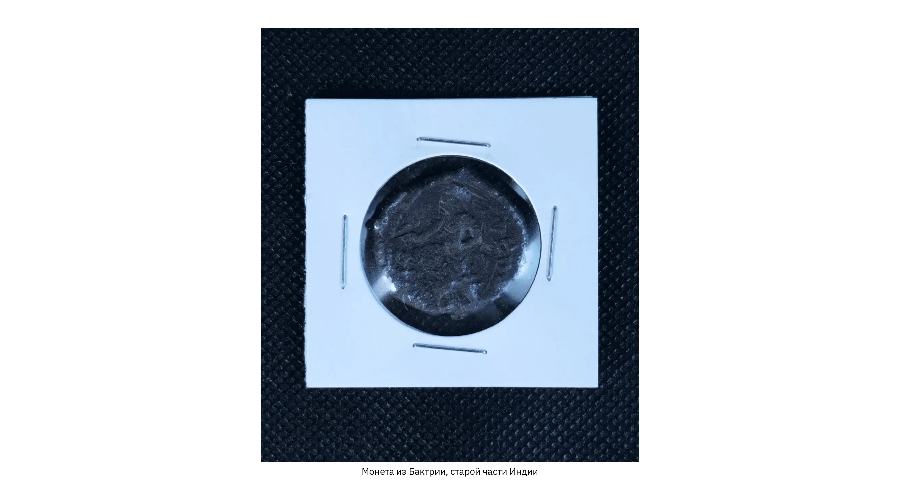

Чтобы наглядно проиллюстрировать этот период, выше представлена монета из региона Индии, Бактрии, расположенного к западу от Индийского полуострова, недалеко от Афганистана. В этом регионе были найдены монеты, которые, вероятно, были вдохновлены греческими монетами с изображением одного из их царственных особ.

## Лидийцы и персы

<chapterId>eb802ab8-8ffd-5b25-907f-8944f120ed14</chapterId>

:::video id=f151eb42-5ff3-4ca1-9af1-1ae2a5e051c0:::

### Первые лидийские монеты из электрума

Поскольку мы не можем отделить появление монет от Лидии и персов, давайте перейдем к той части мира к востоку от Греции, которая сегодня образует Турцию. Первые монеты на Западе появились примерно в середине VII века до н. э. в регионах Лидии и Ионии, расположенных на территории современной Турции. Это фундаментальное новшество увидело свет примерно в 650-600 гг. до н. э., а такие значительные археологические находки, как первые монеты, найденные в храме Артемиды в Эфесе, датируются примерно 600 г. до н. э. Эти примитивные монеты были изготовлены из электрума, природного сплава золота и серебра с янтарными отблесками, и часто имели грубый вид, просто обозначенные пуансонами или рудиментарными мотивами.

Ниже вы видите одну из самых ранних лидийских монет, на которой изображен лев с добычей впереди. Вы можете заметить штамп или отверстие на задней стороне, которое, по мнению некоторых, использовалось для проверки чистоты металла и убеждения, что это не просто поверхностный слой. Хотя это один из самых ранних примеров, важно отметить, что данный экземпляр является копией. Все мои изделия из золота и электрума - это копии или современные воссоздания, созданные для того, чтобы я не потратил все свои сбережения на эту коллекцию.

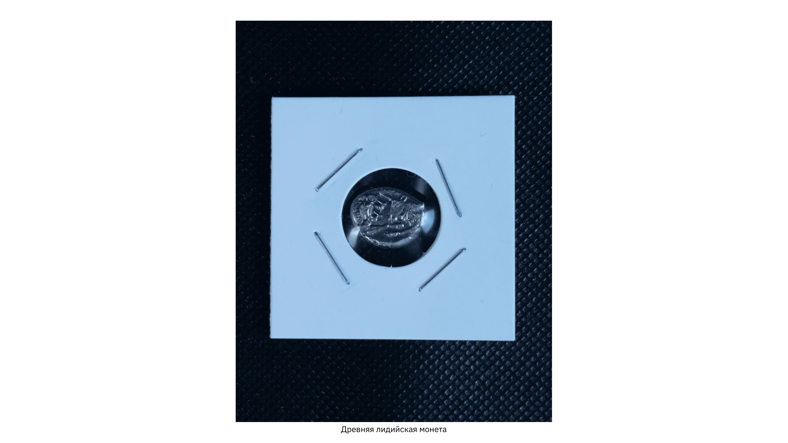

Но у меня есть и настоящий персидский экземпляр, который мы сейчас увидим. Вот как выглядели эти ранние изделия. Это как бы сгусток (или комок, по-английски) металла, который штамповали в то время.

Вопреки распространенному мнению, что деньги были изобретены для облегчения повседневной торговли и замены бартера, похоже, что первые лидийские, ахеменидские и греческие монеты изначально не использовались для мелкой торговли. Действительно, денежные единицы были слишком крупными для повседневного использования. Более того, их обращение было ограничено регионами, близкими к местам их производства.

Здесь я считаю важным упомянуть, что, хотя я читал в нескольких работах антропологического характера, монеты, как я уже показал, - будь то электрумы или эта персидская монета, к которой я вернусь через некоторое время, - были слишком большими, чтобы покупать хлеб, скажем, каждый день. Я видел оценки, которые заставляют нас думать, что это эквивалент дня работы для крестьянина или солдата, так что это было бы слишком много. Это все равно что пытаться заплатить дневную зарплату за свой обед, завтрак или ланч. Кроме того, в других работах я видел, что были найдены более мелкие единицы этих клякс, то есть более мелкие монеты, что может заставить нас задуматься о том, что, возможно, они могли использоваться для повседневных покупок.

Так что антропологическое "доказательство" того, что монеты не использовались для повседневной торговли, потому что номинал или единица измерения были слишком большими, на мой взгляд, не очень убедительно, потому что мы нашли примеры монет меньшего размера, которые могли быть приспособлены для повседневных покупок.

### Роль государства в создании денег

Реальное происхождение монет, по-видимому, связано с прямыми действиями государств. Существует две основные гипотезы на этот счет: первая, идеалистическая, проводит параллель между греческими терминами "номисма" (деньги) и "номос" (закон), предполагая, что деньги были связаны с кодификацией законов, укрепляя власть и политическую организацию городов. Вторая, более реалистичная гипотеза, широко принятая сегодня, заключается в том, что деньги были прежде всего средством экономического и социального контроля со стороны государств. Официально гарантируя вес и стоимость содержащихся в них драгоценных металлов, государства могли манипулировать обращением и стоимостью этих монет, создавая доверие и премии за ликвидность, характерные для национальных валют.

Очень интересно узнать, что у нас есть доказательства этого. Например, в монетах из электрума, вы должны знать, что природный электрум обычно состоит из 70% золота и 30% серебра. В первых монетах, которые мы нашли и проанализировали, а именно в ранних лидийских монетах, содержание золота, похоже, составляет не 70, а 50-55 %. Это говорит о том, что даже в те времена производители монет старались уменьшить долю более драгоценного металла, вероятно, чтобы выпустить больше монет и сделать их стоимость такой же, как у немаркированного куска природного электрума. И здесь нужно сказать, что это стало возможным именно со времен знаменитого Креза, как *богатого Креза*, потому что именно с его времен у нас появилась технология разделения золота и серебра.

Лидийская монетная чеканка претерпела значительную эволюцию во время правления знаменитого царя Креза (561-546 гг. до н. э.), прославившегося своим легендарным богатством. В это время лидийцы усовершенствовали металлургию, чтобы отделять золото и серебро от электрума, и таким образом появились первые биметаллические монеты, то есть отдельные золотые и серебряные монеты.

### Персидская экспансия и принятие греческого языка

Завоевав Лидию в 546 году до н. э., персы Ахемениды сразу же переняли это новшество. Около 500 года до н. э., при правлении Дария I, персы создали свою собственную монетную систему с золотыми дариками и серебряными сиглуа, на которых часто изображалось царское изображение в воинственной позе. Эта царская персидская чеканка использовалась в основном в эллинизированных регионах Персидской империи и постепенно распространилась, хотя ее использование оставалось неравномерным: **некоторые регионы, такие как Египет, по-прежнему предпочитали обмен в утяжеленном металле (слитках)**.

Выше вы можете полюбоваться настоящим персидским сиглоем (или сиглосом). На небольшом рисунке изображен царь, хотя отверстие немного стерлось. Сиглос - серебряная монета, в отличие от дарика, который изготавливался из золота. Персы могли различать эти два металла, и они отошли от монет из электрума. Поэтому они внедрили биметаллизм, используя как золото, так и серебро, сохраняя при этом ту же концепцию монет из драгоценных металлов, часто с отверстием на обратной стороне, предположительно для проверки содержания металла.

Быстрому внедрению монет греками, по-видимому, способствовали их тесные контакты с лидийцами, особенно через греческие колонии в Малой Азии. Первыми греками, начавшими чеканить монеты, были, вероятно, жители Эгины в середине VI века до н. э., которые ввели драхму, вес которой варьировался в зависимости от региона, а название буквально означает "горсть зерна" или "горсть стрел".

Успех греческой монетной чеканки был обусловлен как удобством ее использования для важных сделок, таких как оплата наемников, так и экономической и политической экспансией городов. Валюта быстро стала центральным элементом греческой, а затем и римской экономики, сохранив при этом сильное символическое измерение, в частности благодаря ассоциации с законом (номосом).

Наконец, быстрое распространение чеканки монет свидетельствует о глубокой трансформации древних обществ, в которых кодификация денежных ценностей шла рука об руку с государственной организацией. Эта эволюция заложила экономические и политические основы для подъема греческой демократии, особенно в Афинах, где деньги играли решающую роль в функционировании демократического города.

Главное, что следует запомнить из этого раздела, - это то, что мы говорим именно о **монетах**, а не о деньгах в целом. Главный аспект, который четко вырисовывается, - это **доверие к органу эмиссии**, напрямую связанное с техническими характеристиками монет (вес, чистота, номинальная стоимость). Именно это доверие позволяет государству или эмиссионному органу с самого начала осуществлять определенный контроль или даже манипулировать стоимостью и обращением этих монет.

## Институциональное вмешательство и первые монеты

<chapterId>3e1efd08-99e3-5a32-9908-3185fef0e640</chapterId>

:::video id=84847cf6-9e46-4a8c-9f35-25a27496cc4b:::

### Двойственная природа денег

Появление чеканных денег поднимает фундаментальный вопрос: являются ли деньги спонтанным творением рынка или институтом, навязанным властью? Это концептуальное напряжение сталкивает два радикально разных видения.

С одной стороны, австрийская экономическая школа отстаивает идею о том, что товарные деньги - в частности, золото - были естественным образом выбраны экономическими субъектами за присущие им качества: долговечность, портативность, делимость и взаимозаменяемость. С этой точки зрения государство затем присвоило эту спонтанную валюту, чтобы контролировать ее предложение. Это институт, который возникает естественным образом из потребностей рынка, прежде чем его захватывает политическая власть.

Антропологическая и институциональная точка зрения, напротив, считает, что деньги действительно появляются в результате чеканки государственных монет. Власть сознательно создавала валюту, прикрепляя свою печать, тем самым превращая металл в подлинный денежный инструмент. Согласно этой точке зрения, самые ранние лидийские монеты использовались в основном для оплаты армии - один статер примерно соответствовал дневному жалованью солдата.

### Парадоксальные преимущества государственной стандартизации

Несмотря на это теоретическое напряжение, даже австрийские экономисты признают определенные преимущества государственного вмешательства в денежную сферу. Стандартизация путем чеканки решает ряд практических торговых проблем.

Без сертификационного центра участники экономики сталкиваются с постоянными рисками: фальшивые монеты, мошенничество при подаче документов и манипуляции с весом. Эти действия создают трения в экономике, поскольку одни монеты принимаются, а другие отвергаются. Теоретически официальная печать гарантирует вес и качество, делая торговлю более динамичной.

Эта гарантия имеет заметную цену на рынке: отчеканенная золотая монета стоит больше, чем ее эквивалент из необработанного золота. Эта премия отражает ценность сертификации - торговцам больше не нужно самим проверять подлинность металла с помощью химических или резонансных тестов. Государственное вмешательство, как это ни парадоксально, устраняет трения и облегчает торговлю, создавая институционализированное доверие.

### Валютные манипуляции с самого начала

История первых лидийских статеров обнаруживает тревожную иронию. Последние анализы показывают, что содержание золота в этих монетах из электрума было систематически ниже, чем в природном электруме. Орган, удостоверяющий качество, одновременно манипулировал составом.

Эта практика иллюстрирует двойную пользу чеканки монет. Для рынка она делает обмен более подвижным и дает гарантию стандартизации. Для эмиссионного органа она становится инструментом экономического контроля за счет разбавления. Уменьшая содержание золота при сохранении номинальной стоимости, государство эффективно увеличивает денежную массу, создавая больше денежных единиц из того же количества драгоценного металла.

Однако само государство оставалось скованным этими манипуляциями. Как видно на примере золотого солида Константина в IV веке, римская администрация тщательно проверяла качество монет, поскольку требовала, чтобы ей платили хорошей чеканкой. Власти были жизненно заинтересованы в поддержании качества собственной чеканки, чтобы гарантировать ценность своих налоговых поступлений.

### Экономический анализ девальвации

Изучение девальвации валют выявляет закономерности на протяжении всей истории. Для металлических монет экономисты отслеживают процентное содержание драгоценного металла в монетах - нисходящая кривая указывает на прогрессирующую девальвацию. Для современных бумажных денег все наоборот: отслеживается денежная масса, находящаяся в обращении, и ее увеличение сигнализирует о девальвации.

Оба метода измеряют одно и то же фундаментальное явление: размывание денежной стоимости. Будь то уменьшение содержания драгоценных металлов или печатание новых банкнот, механизм остается одним и тем же. Чем больше денежных единиц власти создают из одних и тех же реальных ресурсов, тем больше каждая единица теряет свою ценность.

Эта манипуляция, наблюдаемая с самых ранних лидийских монет, говорит о том, что денежный контроль всегда был вопросом власти. Таким образом, чеканные деньги представляют собой замечательную техническую инновацию в сочетании с инструментом экономического контроля - двойственность, которая прослеживается на протяжении всей истории монетного дела, вплоть до наших дней.

## Производство деталей

<chapterId>b205f4f2-c293-5308-b812-a998de9ad45e</chapterId>

:::video id=47c612ec-d97e-4498-b50e-7e66518bd56d:::

### От штампованных шариков до отчеканенных монет

После раздела о возникновении монет я хотел представить очень короткий раздел об эволюции их изготовления. Как мы уже видели, все начиналось с болванок электрума, затем золота и серебра, где обе стороны помечались пуансоном, либо с лицом короля, либо с отверстием на обороте для проверки чистоты.

Позже, как мы рассмотрим в следующем разделе, греки усовершенствовали эту технологию, создав круглые монеты, которые отбивались молотком с обеих сторон. Они брали гладкий, плоский кусок драгоценного металла, гравировали на одной стороне желаемый рисунок, а затем вручную пробивали его молотком, чтобы создать готовую монету.

Технология ручной чеканки монет по отдельности, вероятно, сыграла свою роль в сдерживании инфляции в тот период, хотя монеты часто разбавлялись для увеличения производства. Это было особенно заметно в римский период и, в меньшей степени, во время некоторых войн в греческий период. Хотя чеканка монет по одной ограничивала возможности властей по массовому производству, она эффективно способствовала контролю инфляции, несмотря на значительные девальвации, которые происходили. Таким образом, эволюция прошла путь от сгустка металла, который чеканили, до круглой, откованной монеты.

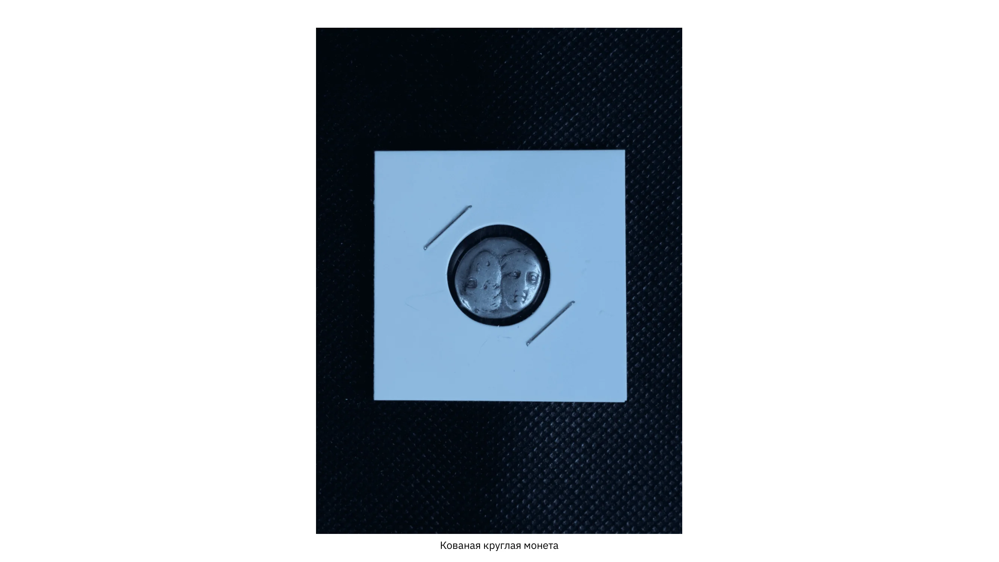

### Средневековая эволюция

В Средние века также появилась тенденция раскладывать монеты, делая их шире и тоньше. Одной из причин этого было то, что стало легче проверять их звук, который часто использовался в качестве индикатора подлинности. При раскладывании серебра создавалась определенная частота, и люди могли проверить чистоту монеты, просто прислушавшись к ней. Эта практика привела к появлению термина "надежные деньги". В контексте надежных денег стандартный вес определялся с помощью весов или "требюше" для взвешивания. Таким образом, эволюция продолжалась от маленьких, круглых монет к более тонким и широким.

### Маятниковый удар

Последней технологией, появившейся в конце Средневековья и в начале современной эпохи, стало понятие маятникового удара. Это был своего рода винт, который затягивали для удара по монетам, таким образом, создавая монеты с новой формой удара. Особенностью этой разработки стала возможность гравировки рисунка на поверхности монеты для решения проблемы обрезания. При клиппировании часть монеты удалялась для извлечения драгоценного серебра, которое затем могло быть использовано для чеканки других монет или просто сохранено в качестве ресурса.

Таким образом, понятие удара маятника помогло в создании феномена клиппирования. Интересно отметить, что на самом деле эта технология пришла из Франции. В Англии, например, наняли французских инженеров, чтобы они показали им, как делать эти машины. Забавно, что были сторонники молотковой чеканки, которые выступали против нее и откладывали применение этой технологии. В любой хорошей технологии всегда есть люди, которые против нее, которые хотят сохранить старую технологию. Мне показалось довольно забавным осознавать, что даже в технологии, которая кажется действительно более совершенной - можно делать больше деталей, их труднее скопировать, - все равно есть люди, которые привязаны к знаменитому молоточному методу. Произошло смещение между производством деталей, изготовленных с помощью знаменитого маятникового удара, и возвращением к молоточному удару. И в конце концов, конечно, именно удар маятника окончательно закрепился и дал нам эти прекрасные современные изделия, на которых можно найти маленькие линии, маленькие гребни, чтобы избежать обрыва, вероятно, связанные со словом "обрыв", гребни, и вы все еще можете увидеть сегодня либо гребни, либо текст или рисунки, нанесенные на край изделия.

# Различные теории возникновения денег

<partId>72ac694f-9248-550d-90c1-91af3d234380</partId>

## Теории возникновения денег и их различные определения

<chapterId>7d699d4d-8c70-55b5-bf36-609f3fd90bcf</chapterId>

:::video id=523c873f-501b-4954-b79f-7e74c0f685a5:::

Добро пожаловать в этот раздел, посвященный различным теориям возникновения денег и их различным определениям. Вот небольшой отрывок из книги *Aux origines de la monnaie*, который, как мне кажется, подводит итог двум основным теориям, которые мы рассмотрим в этом разделе.

> Эта краткая преамбула служит лишь для того, чтобы обозначить контекст исследования. На концептуальном уровне спор ведется между сторонниками тезиса К. Поланьи и М. Вебера. Для первых центральную роль играют дар и перераспределение, а рыночный обмен играет лишь незначительную роль, в основном в международных обменах. Для вторых, напротив, рынок лежит в основе текущего исторического процесса.

Например, в Месопотамии одна из теорий возникновения предполагает, что храм, как орган власти, создает расчетную или денежную единицу, вводит ее, а затем купцы принимают ее для торговли. Противоположная теория утверждает, что нет, эта денежная единица возникает естественным образом на рынке, чтобы облегчить торговлю. В Месопотамии есть хорошо подтвержденные примеры этого.

Что касается бартера, то, согласно некоторым теориям, он использовался в основном при международных обменах, то есть с людьми, которым мы просто не доверяли.

Именно этим мы и займемся в данном разделе. Мы проведем своего рода исследование, в котором представим различные теории возникновения денег и различные определения того, что такое деньги. Мы будем представлять и критиковать тезисы как классических экономистов, так и антропологов. Мне даже посчастливилось пригласить Ульриха Фроми, который представит точку зрения австрийского экономиста на эти различные темы.

## Появление денег для классических экономистов

<chapterId>1d3776cd-0dfd-5297-af48-c6f41e257a7e</chapterId>

:::video id=873a16c1-17ac-448d-8941-df4feb7ab79d:::

Этот сегмент посвящен различным теориям возникновения денег. Первая тема, которую мы затронем, - возникновение денег согласно классическим экономистам.

### Классическая теория Адама Смита

Согласно классическим экономическим теориям, в частности, теории Адама Смита, деньги возникли естественным образом из бартера в ответ на его ограничения. Первоначально обмен осуществлялся путем прямого бартера, но этот метод часто осложнялся проблемой "двойного совпадения желаний": каждый человек должен был обладать именно тем, что хотел другой. Постепенно некоторые товары (например, соль, драгоценные металлы и скот) стали восприниматься всеми как промежуточное средство обмена благодаря своей полезности, долговечности и делимости. Так спонтанно возникли деньги, облегчающие и ускоряющие экономический обмен.

### Критика классической теории

Вот моя критика этой теории. Учитывая все, что мы видели в предыдущем разделе, я думаю, мы уже можем сказать, что представление о том, что **монеты** являются эволюцией бартера, неверно просто потому, что чеканка монеты определенно происходит от власти, поскольку она чеканится властью. На это есть несколько причин, и не в последнюю очередь это желание властей контролировать экономику, взять под контроль деньги.

С другой стороны, если мы говорим о деньгах как о концепции, а не обязательно о монетах, то здесь все не так однозначно, потому что в первых монетах, лидийских статерах, мы обнаружили серебряные кляксы, которые не были помечены. Осталось выяснить, были ли они в обращении. Если они были в обращении, это означает, что люди могли изначально рассматривать этот актив как потенциальную валюту, которая может быть широко востребована и легко обмениваться. И, возможно, только потом власти обратили внимание на эту ситуацию и взяли ее под контроль, поставив на ней штамп, удостоверяющий ее подлинность.

В этом есть масса преимуществ - не нужно проверять, взвешивать и все такое. Очевидно, мы поговорим об этом. Но, на мой взгляд, монеты, безусловно, являются инструментом, который использовался государствами с самого начала. Однако, если говорить о появлении денег как таковых, мы не знаем, действительно ли они появились благодаря власти, которая их ввела, или же они возникли благодаря торговле или коммерческим обменам. Позже в этом разделе у меня будет очень интересная дискуссия на эту тему с моим коллегой Ульрихом.

Мы уже знаем, что первые монеты из драгоценных металлов не использовались для ежедневного обмена, поскольку их стоимость была слишком высока. Мы также знаем, что они использовались в основном для военных платежей. Это хороший аргумент в пользу тезиса о том, что деньги не обязательно возникли на рынке. Счетные единицы, номиналы первых монет, вероятно, были слишком велики, чтобы, скажем, покупать хлеб или совершать ежедневные покупки. Это мог быть, например, эквивалент дневной зарплаты. Не обязательно, что в те времена людям платили зарплату, но это для того, чтобы вы представляли себе масштаб. Так что эти монеты, вероятно, обладали слишком большой покупательной способностью, чтобы использовать их в мелкой торговле. С другой стороны, нельзя сказать, что эти монеты не использовались бы для более крупных обменов, например, купеческих. Известно, что в основном они использовались для военных платежей. Это одна из самых популярных теорий, объясняющих появление первых монет. Помните, что мы говорим о монетах, а не о деньгах в целом. Итак, у первых монет была своя первая роль, и заключалась она в оплате военных платежей, наемников.

Александр Македонский, например, отлично использовал его, как мы увидим позже.

Мы также видели, что уже в Древнем Китае раковины каури использовались для экономического обмена (**оплата труда, измерение стоимости и покупка земли)**. Более того, в Месопотамии и Египте уже существовали функциональные денежные системы, которые использовались для торговли, выплаты заработной платы и налогов. Я хочу сказать, что ошибочно думать, будто монеты в западном понимании возникли из-за необходимости сделать обмен более подвижным.

Поскольку монеты выпускаются властями, можно предположить, что с самого начала они были связаны с властями, выпустившими их. В этом есть смысл. С другой стороны, мы не всегда знаем, как возникли предшествующие им формы денег или денежные системы, протомонеты. С одной стороны, мы можем предположить, что именно храмы выделили эти денежные единицы, а затем люди стали их использовать. А с другой стороны, мы скажем вам, что нет, это были купцы, которым нужно было средство обмена, способ торговли с внешним миром, и именно они определили, например, металл серебро, чтобы использовать его, потому что он пользовался спросом у внешнего мира. Дело в том, что на самом деле мы не знаем. Именно поэтому у нас есть две противоположные теории. У нас нет идеальных доказательств, чтобы объяснить, возникают ли деньги естественным образом из необходимости торговать, например, у купцов, или же они исходят от власти.

### Различают монеты и примитивные деньги

В заключение, я думаю, мы можем сказать, что монеты обязательно исходят от власти, поскольку они были отчеканены этой властью. С другой стороны, я не думаю, что мы можем сказать, что неправильно предполагать, что деньги (то, что предшествовало монетам) не могли возникнуть для облегчения обмена. Я думаю, что во всех примерах, которые мы рассмотрели выше, можно найти примеры в этом смысле.

## Миф о бартере

<chapterId>0fcd4964-ac36-5163-a8cf-1aacebc0d2c0</chapterId>

:::video id=0ede29ab-8acd-4d79-9282-bd5991b97076:::

### Рецензия Дэвида Грэбера

Мы только что рассказали о возникновении денег по версии классических экономистов. Теперь мы рассмотрим концепцию, известную как миф о бартере.

Одна из критических замечаний в адрес этой классической теории возникновения денег - отсутствие исторических свидетельств, подтверждающих ее идеи.

Критика, известная как "миф о бартере", сформулированная, в частности, антропологом Дэвидом Грэбером, оспаривает классическую идею о том, что деньги возникли естественным образом из бартера. Согласно этой критике, нет никаких исторических или антропологических доказательств того, что общества систематически использовали бартер до появления денег. На самом деле древние общества работали на основе кредитов, долгов, социальных обязательств и церемониальных обменов. Таким образом, "миф о бартере" - это теоретическая конструкция, призванная оправдать классическую экономическую концепцию, не имеющая под собой реальной эмпирической основы.

Однако следует отметить, что эта теория не отрицает существования бартера, например, для обмена между различными племенами. Она просто отрицает, что бартер был широко распространенным видом деятельности в этих так называемых примитивных группах, и что деньги были бы логическим развитием этой практики. Она отрицает тот факт, что бартер был широко распространен в племени и что деньги в конечном итоге появились, чтобы упростить обмен и разрешить трудности, которые существовали при бартере. Вместо этого, согласно этой теории, эти группы практиковали форму неформального кредита или дарения за дарение.

### Примитивные общества против великих цивилизаций

**Я думаю, что эта теория определенно применима к примитивным (безгосударственным) группам прошлого и даже сегодня (например, к племенам, изученным исследователями в XVIII и XIX веках). Очевидно, что они не использовали бартер, а скорее те формы обмена, о которых я говорил ранее, по причинам, о которых мы уже упоминали (слабое разделение труда, натуральное хозяйство). Однако я не думаю, что эта теория применима к великим цивилизациям прошлого, таким как Месопотамия и Древний Египет.

Вот два отрывка из книги *Aux origines de la monnaie* на эту тему:

> Модель, изложенная М. Моссом в его знаменитом "Даре", была принята египтологами с таким же единодушием и энтузиазмом, как и с недостатком проницательности. Это привело к ряду недоразумений, в которые мы не будем здесь углубляться. Отметим лишь, что эта модель применима к так называемым примитивным обществам, к которым фараоновский Египет не относится.

> Хлебы, то есть обработанные зерновые, были, таким образом, единицами счета, которые, подобно шату (y) Старого царства, также позволяли открывать кредиты на разнообразные товары. Этот простой пример показывает, что экономика фараоновского Египта не сводилась к системе перераспределения. Она была очень сложной и включала в себя множество обменов.

Итак, как мы видели ранее в разделе о Египте и даже Месопотамии и Китае, мы видим, что даже эти древние, но не примитивные, цивилизации, благодаря наличию государства, на мой взгляд, использовали денежные системы. Думаю, это было наглядно продемонстрировано в первом разделе данного курса. И поэтому к этим великим цивилизациям не применимо такое понятие, как давальчество, отложенный кредит. Поэтому точные причины появления денег остаются загадкой. Мы не знаем, возникли ли они в результате потребности купцов в торговле с внешним миром или были навязаны храмом в эти древние периоды.

## Появление денег через долговые деньги

<chapterId>4f508615-aa61-5d62-89d3-cecd02aeaa62</chapterId>

:::video id=a23f547f-3906-4f4a-8f72-5d78c649d0c4:::

### Деньги как IOU

В этом разделе мы рассмотрим теорию долговых денег.

Теория **долговых денег**, разработанная, в частности, экономистом Альфредом Митчелл-Иннесом и позднее расширенная Дэвидом Грэбером, утверждает, что деньги возникли не из бартера, а из долговых и кредитных отношений, существовавших с самых ранних человеческих обществ. Согласно этой теории, деньги появляются, когда социальные обязательства (долги между индивидами или группами) становятся количественно определенными и передаваемыми. Эта концепция вводит понятие количественной оценки обмена и передачи. Таким образом, деньги - это прежде всего **признание долга**, подкрепленное взаимным доверием и часто гарантированное политической или религиозной властью, а не просто товар, служащий посредником в обмене.

Еще более продвинутая форма этой теории заключается в том, что все деньги - это долг. Таким образом, тот, кто владеет деньгами, имеет право требования к обществу в целом, право требования ко всем, кто принимает эти деньги. А поскольку деньги, **в их представлении, должны приниматься в обязательном порядке**, иначе это не деньги, потому что если вы можете отказаться от этих денег, их система не работает. В данной группе, определившей валюту, все, кто ею владеет, как бы имеют долг перед всеми остальными членами этого общества, которые принимают эту валюту, а те, кто принимает валюту, имеют форму долга перед человеком, владеющим этой денежной единицей. Такова, по сути, их теория.

### Критика обязательной системы

**Моя критика этой теории:**

Позвольте мне высказать одну небольшую критику в адрес этой теории. Я согласен с тем, что деньги - это своего рода социальный консенсус. Это доверие, которое группа оказывает денежному "знаку", каким бы он ни был. Поэтому я поддерживаю концепцию взаимного доверия, которую мы рассмотрим позже в связи с концепцией денежной премии. Все усложняется, когда сторонники этой теории добавляют понятие обязательства и настаивают на понятии долга. По их мнению, когда кто-то обладает денежной token, он предъявляет требование ко всему сообществу, и, следовательно, сообщество должно его владельцу. Кроме того, существует обязательство рассчитаться, и члены группы обязаны принять token; в противном случае, по их мнению, система не будет работать. Я думаю, что описанная выше система в древнем Китае хорошо отражает эту теорию.

Со своей стороны, я легко могу представить себе систему, в которой деньги - это общественный консенсус, где выбранные token общеприняты как средство платежа, без каких-либо формальных обязательств. Я вижу, что такая система работает, если люди принимают ее по собственной воле. Это может сработать. С другой стороны, она часто сопровождается обязательствами, законным платежным средством и насилием, что мы увидим позже в этом разделе. Но теоретически у меня нет впечатления, что эта система может работать. Примером может служить Bitcoin. Bitcoin имеет ценность, потому что у него есть денежная премия, потому что есть спрос на его денежное использование, то есть резервы стоимости, возможно, также средства обмена или защиты от фиатной системы. Никто не обязан принимать их, и чем больше они принимаются в качестве платежного средства, тем больше их можно использовать в качестве средства обмена. Мы уже можем без проблем использовать его в качестве хранилища стоимости. В этом нет никаких сомнений. Я хочу сказать, что Bitcoin представляется мне примером валюты, которая является формой социального консенсуса, когда мы думаем, что сможем получить свои деньги обратно, если купим их позже, мы приобретаем их, чтобы иметь возможность обменять их позже, чтобы сохранить свою покупательную способность.

Этот менее ограничительный взгляд на теорию помогает объяснить, как два разных общества могут торговать с помощью такого денежного token, как золото, не создавая претензий или долгов между этими обществами. Насильственное принятие в обществе, как я обнаружил, не работает в торговле между двумя племенами, потому что другое племя не подчиняется власти. Племя Б не подчиняется власти племени А. Но, тем не менее, оно принимает те же денежные знаки token, скажем, золото. Мне могут сказать: "Да, но это потому, что компания Б тоже решила, что золото - их валюта", так что это работает. Да, действительно, это работает, но в этот момент не происходит создания долга. Это окончательная транзакция. Таким образом, когда компания А обменивает товар на золото в компании Б, не происходит создания долга, транзакция завершена. И очевидно, что человек в компании Б приобрел эту золотую монету или самородок не для того, чтобы потом заплатить людям из компании А. Он принимает ее, чтобы обменять на золото. Он принимает ее для того, чтобы потом обменять, возможно, внутри своего племени. Таким образом, в этом примере нет создания долга, нет скрытого требования, это просто прямой обмен, прямой платеж. Сторонники долговой валюты скажут нам, что это бартер. И я с этим не согласен, потому что бартер - это обмен прямым товаром. Прямой бартер - это обмен одного товара на другой товар, для использования. Товары обмениваются для использования, в то время как в нашем случае золото явно используется как валюта, потому что оно не будет использоваться ни для чего другого; оно будет использоваться позже как средство платежа. Поэтому, на мой взгляд, оно не попадает в категорию бартера.

Владение денежным token - это не "претензия" к сообществу, а скорее надежда на то, что впоследствии token будет принят по сопоставимой стоимости.

## Спонтанное возникновение денег

<chapterId>e3ef86b1-73b9-5140-a61e-2ab6a5b0b2d4</chapterId>

:::video id=e543995f-d5e2-49d7-9133-e397b46e0833:::

Для австрийской экономической школы, основанной Карлом Менгером, деньги естественным образом возникают из бартерной экономики, сталкивающейся с проблемой двойного совпадения желаний. Согласно этой концепции, индивиды спонтанно сходятся на промежуточных товарах, которые облегчают обмен - не непосредственно потребляемых товарах, а товарах, признанных за их способность быть широко востребованными.

Эти денежные товары должны обладать качествами, определенными еще Аристотелем: они должны служить хранилищем стоимости, средством обмена и единицей счета. Экономические агенты постепенно выявляют, накапливают и сберегают их, тем самым инициируя их появление в качестве денег. Этот процесс происходит совершенно спонтанно - деньги представляют собой естественный рыночный ответ на проблему координации обмена, без сознательного вмешательства власти.

### Дискуссия о "мифе о бартере"

Антропологи, такие как Дэвид Грэбер, оспаривают эту точку зрения, ссылаясь на "миф о бартере". Их аргумент: ни одна сложная цивилизация, основанная исключительно на прямом бартере, никогда не была задокументирована. Напротив, в изученных примитивных обществах использовались системы неформального кредита и взаимности. Грэбер утверждает, что долг предшествовал бартеру, ссылаясь на тысячи месопотамских табличек, документирующих кредитные отношения.

Однако эта критика основана на ограничительном определении бартера. Как отмечал Менгер еще в 1892 году, бартер выходит за рамки простого прямого обмена товаров на товары. Он также включает в себя отложенные переводы, услуги за вознаграждение и обмены с временным характером - то, что Менгер называл "односторонними переводами между индивидами". Эта расширенная форма бартера может сосуществовать с кредитными системами в ограниченных кругах доверия.

Отсутствие доказательств не является доказательством отсутствия доказательств, и австрийские экономисты признают, что ни одно сложное общество не может устойчиво развиваться только на основе прямого бартера - отсюда и необходимость появления денег.

### Месопотамский случай: купцы против храмов

Споры ведутся вокруг происхождения месопотамского серебряного шекеля. Существуют две противоположные интерпретации. Институциональная точка зрения гласит, что храмы - истинные экономические и духовные центры - ввели серебро в качестве валюты для структурирования экономики. Клинописные таблички, сосредоточенные в среде духовенства и купеческой элиты, свидетельствуют об этом централизованном контроле.

Австрийская интерпретация предполагает обратное: именно купцы приняли деньги для торговли на дальние расстояния. Столкнувшись с необходимостью торговать с незнакомцами за пределами Месопотамии - от Анатолии до Персидского залива, - они нуждались в чем-то универсально узнаваемом, долговечном и транспортабельном. Серебро стало естественным выбором благодаря своим неотъемлемым качествам. Храмы просто подтвердили уже сложившуюся практику коммерческого использования.

Данная диссертация основана на документально подтвержденных обменах между Канешем в Анатолии и Ассуром, где купцы обменивали текстиль на серебро - не за его материальную полезность, а в качестве хранилища стоимости. Эти сделки выходят за рамки простого бартера и свидетельствуют о существовании подлинной товарной валюты.

### Современный пример тюремных лагерей

Экономист Ричард Рэдфорд, заключенный в Германии во время Второй мировой войны, задокументировал удивительный случай спонтанного появления денег. В лагерях сигареты естественным образом стали единицей обмена - делимой, стандартизированной, общепринятой. Даже некурящие люди приняли их, признав их универсальную меновую ценность.

Этот микрокосм иллюстрирует австрийский принцип: столкнувшись с проблемой координации обмена, люди спонтанно сходятся на наиболее "продаваемом" товаре. Никакие власти не навязывали сигаретные деньги; они возникли из повседневной практики заключенных, стремящихся оптимизировать обмен.

### Сближение индивидуальных предпочтений

По сути, деньги представляют собой конвергенцию индивидуальных предпочтений в сторону общепринятого блага. Месопотамские купцы, подобно заключенным Рэдфорда, определяли благо, которое минимизировало неопределенность будущих обменов. Этот выбор не требует разрешения или навязывания со стороны центрального органа власти - он вытекает из практической рациональности экономических субъектов, сталкивающихся с проблемами обмена.

Спор между спонтанным возникновением и сознательным учреждением остается открытым, поскольку исторические свидетельства фрагментарны. Но австрийский анализ предлагает последовательное объяснение: деньги родились из практических потребностей торговли, а власти лишь институционализировали практику, уже сложившуюся в результате использования рынка.

## Антропологическое видение возникновения денег

<chapterId>ec48c5d8-47ed-530f-beb7-c44fd0b62880</chapterId>

:::video id=8c1f8764-75af-4fb6-a98b-55de3b7da02e:::

### Неэкономическое происхождение денег

В этом разделе мы рассмотрим антропологический взгляд на возникновение денег - богатую перспективу, которая бросает глубокий вызов классическим экономическим теориям.

Вопреки традиционной теории о том, что деньги возникли естественным образом из бартера для облегчения экономического обмена, антропологические исследования показывают, что появление денег в значительной степени обусловлено неэкономическими причинами. Они возникли из таких социальных механизмов, как выплата дани, компенсация за убийство (знаменитый вергельд) и приданое (деньги за невесту), а также из церемониальных, религиозных, политических и символических практик, гораздо больше, чем из простых рыночных потребностей.

В первобытных обществах деньги редко использовались для повседневного обмена материальными благами, что противоречит классическому определению денег как "средства обмена". На самом деле в этих обществах широко использовались кредиты, отложенные платежи, встроенные в обширные сети социальных и личных отношений. Эти повсеместно распространенные кредитные системы логически и исторически предшествовали появлению денег.

Именно так можно охарактеризовать их видение. Мы обсуждаем это с Ульрихом в нашей беседе в предыдущем видео. Я позволю вам насладиться комментариями Ульриха на эту тему, которые немного опровергают этот подход. Итак, в антропологическом видении мы часто имеем дело с понятием денег, исходящим от авторитета или социальной концепции, которая предшествует потребностям рынка.

### Пример камней Яп

Здесь, ниже, вы можете полюбоваться ярким примером монументальных камней на острове Яп. Некоторые из этих камней, несмотря на свою неподвижность или даже физическое исчезновение, продолжали полноценно функционировать в качестве денег благодаря коллективному соглашению, что подчеркивает социальное и символическое измерение денег.

Это действительно интересный анализ камней Яп. Сайфедеан Аммус также упоминает этот пример в своей книге "Стандарт Bitcoin". По его словам, система острова Яп больше всего похожа на Bitcoin - это своего рода центральная запись, с которой может ознакомиться каждый, которая является публичной, ведет учет и управляет правом собственности на вещи. Эта антропологическая перспектива показывает, что все это представляет собой соглашение или социальный консенсус внутри общества, что в принципе верно. И я нахожу упоминание о потерянных камнях очень интересным. Они отправлялись за сотни километров в море на небольших плотах и привозили камни обратно. Иногда камень падал на дно моря, но он все равно использовался в денежной системе. Человек мог сказать: "Да, мы уронили этот камень в таком-то месте; он мой, поэтому мы можем его обменять". Для облегчения обмена не обязательно было физическое обладание камнем, поскольку он был настолько велик, что часто оставался на одном месте. Вместо этого основное внимание уделялось переходу камней из рук в руки, что позволяло менять владельца без фактического перемещения камней. Это была форма "доказательства консенсуса", подчеркивающая интересный антропологический взгляд на деньги.

### Протовалюты и социальные обязательства

Этнографы по всему миру наблюдали, как в обществах использовались "протовалюты" или "примитивные валюты", такие как ракушки, ткани, скот, соль и камни, которые выполняли функции, обычно приписываемые деньгам, такие как средство платежа и хранилище стоимости, не выступая при этом в качестве посредников при обмене повседневными товарами.

Итак, здесь мы описываем денежные системы, которые не обязательно использовались для повседневного обмена.

И я хочу напомнить вам, что все это были валюты до появления монет, и я не знаю, насколько неправильно говорить "валюта". Я предпочитаю говорить "валюта". Я могу упомянуть, что в литературе часто говорят о протовалютах, имея в виду деньги до появления монет. Но, как мы видели в первом разделе, **я считаю, что денежные системы существовали задолго до появления монет**.

Эти примитивные валюты использовались в основном для выполнения фундаментальных социальных обязательств, связанных с отдельными людьми, таких как брак, компенсация за конфликт (Wergeld) или подарки между вождями. В Персидской империи, например, первые монеты были специально созданы как средство военной оплаты, а не как средство обмена.

Таким образом, первобытные деньги имеют одну существенную характеристику: они являются средством платежа, но очень редко средством прямого обмена материальными благами. Мы имеем в виду, что они служили средством платежа по определенным социальным обязательствам, для племен, для обмена между вождями, знаменитый вергельд, деньги за кровь. До появления системы правосудия, если кто-то совершал убийство, семья, пострадавшая от убийства близкого человека, получала компенсацию. За это нужно было платить, это называлось кровными деньгами и являлось формой оплаты. Кроме того, существовало приданое, которое также являлось формой оплаты. В этих ранних случаях использования денег в качестве формы оплаты они были больше связаны с человеческими и социальными обязательствами, чем с оплатой повседневных покупок. Согласно этой теории, более распространенные повседневные обмены были больше связаны с кредитом, отложенным кредитом, подарком за подарок и перераспределением рационов. Для управления этими обменами существовала другая форма социальной организации. Важно также помнить, что в обществе, где каждый человек самодостаточен, сам занимается своим хозяйством, нет специализации, и необходимость в денежной системе для повседневных обменов очень мала. Вот почему первыми формами денег были те, которые мы только что описали, - приданое, кровные деньги, - просто потому, что это были первые обмены, где нам требовалось средство платежа, задолго до того, как нам понадобилось торговать, ежедневно обменивать хлеб на деньги, потому что в первобытных обществах все было не так. Каждый сам обеспечивал свои потребности, и никакой специализации еще не было. Думаю, я подробно рассказывал об этом во всех предыдущих лекциях этого курса.

В этих обществах, где не было развитого разделения труда, прямой обмен оставался ограниченным и происходил в основном в рамках личных дружеских или союзнических отношений. Отсутствие достаточной специализации не вызывало необходимости в деньгах в современном понимании.

Такие антропологи, как Квиггин и Эйнциг, настаивают на главенствующей роли кредита: **Примитивная экономическая жизнь втянута в гигантскую сеть кредитов и личных долгов, в которую деньги вмешиваются особенно тогда, когда платежи должны быть немедленными, а компенсации не могут быть легко отложены*

Итак, люди обмениваются вещами, могут делать отложенные кредиты, но в некоторых случаях отложить платеж невозможно, поэтому валюта или протовалюты могут быть полезны на этом этапе для немедленного завершения обмена.

### Инновации анонимности

Этот анализ наводит на более глубокие размышления: вместо того чтобы противопоставлять деньги бартеру, уместнее понимать их появление как эволюцию от сложных систем кредита и долга. Деньги вносят фундаментальную инновацию: **анонимность**. И именно здесь я нахожу интересной антропологическую теорию возникновения денег. Если вы - небольшая группа людей и даете друг другу отложенные кредиты, вы, очевидно, знаете друг друга. Я думаю, что для того, чтобы эта система работала, люди должны знать друг друга, очевидно. А оплата деньгами обеспечивает анонимность. Он позволяет совершить платеж так, чтобы люди даже не знали вашего имени, не знали, кто вы такой. Они могут совершить обмен для немедленного и окончательного расчета. И это именно то, что позволяют деньги.

В отличие от кредита, который всегда номинален, деньги позволяют совершать анонимные, обобщенные и сразу же освобождающие сделки. **Эта уникальная освободительная сила денег является их решающим преимуществом*

Таким образом, деньги - далеко не скромный инструмент для облегчения экономического обмена, а крупная социальная инновация, тесно связанная с эволюцией человеческих институтов и практик, от личного кредита **до всеобщей анонимной системы платежей**. Эта антропологическая эволюция показывает, что деньги - не просто средство обмена, а мощный социальный институт, глубоко формирующий человеческие общества, вплоть до того, что в наших современных обществах они стали самой целью экономической деятельности.

Здесь мы понимаем, что в конечном итоге в современных обществах целью экономического обмена является обладание деньгами, тогда как в те времена это было совсем не так. Целью экономического обмена было обладание товарами или предметами потребления. А сегодня, благодаря появлению денег, целью экономического обмена стало накопление этих денег, поскольку они позволяют нам обменивать их на блага, как это принято считать. Мы можем обменять их на нужное нам благо, когда оно нам необходимо.

## Унификация реестра

<chapterId>7664442a-91c1-5ce4-a8bd-53b7371a3e3d</chapterId>

:::video id=473fc284-5375-4e1b-b0cd-6b51ba0cc3b8:::

### Теория бухгалтерских регистров

Сейчас мы вместе рассмотрим различные предложения по объединению этих двух монетарных теорий, то есть теории возникновения денег через долговые деньги и монетарной теории возникновения товарных денег. Мы поговорим об унификационном предложении Линн Олден в ее знаменитой книге "За сломанные деньги", название перевода которой, выпущенного Consensus, вероятно, будет называться "Rupture monétaire".

*Отрывок из книги "Сломанные деньги" Лин Олден:*

> По сути, деньги - это бухгалтерский регистр. Товарные деньги - это регистр, управляемый природой. Банковские деньги - это бухгалтерская книга, управляемая национальными государствами. Деньги с открытым исходным кодом - это бухгалтерская книга, управляемая ее пользователями.

Здесь Лин ссылается на Bitcoin.

### Коэффициент запаса и дефицит

> Некоторые редкие химические элементы, такие как родий, встречаются реже, чем золото, но имеют низкий коэффициент запаса, поскольку потребляются промышленностью так же быстро, как и добываются. Монету или слиток родия можно приобрести в качестве специализированного предмета коллекционирования или хранилища ценностей, но они не подходят для использования в качестве социально признанной валюты, поэтому не возникают естественным образом в качестве денег.

Сейфедин подробно рассказывает об этом в своей книге "Стандарт Bitcoin". Для тех, кто не знаком с соотношением запасов к потоку, это просто сравнение существующих запасов, запасов, которые существуют на рынке, с новыми запасами, которые поступают, приток новых запасов. Это часто бывает неинтуитивно, потому что вы можете подумать, что что-то, что у вас есть в больших количествах, не является дефицитным, но на самом деле это не так. Это скорее вопрос возможностей, которыми вы располагаете для его поставки. Скорее, именно способность иметь новые запасы, согласно этой модели, дает нам информацию о том, является ли этот объект редким или нет. Редкость заключается не в том, что у нас нет чего-то на складе, а в том, что у нас этого нет. Так, если взять золото, то у нас много золотых запасов, потому что оно используется в качестве хранилища стоимости, и приток новых запасов составляет примерно 1-3 % в год от новых золотых запасов, поступающих через mining. Если же говорить о родии, то он встречается реже, чем золото, но у нас нет никаких запасов, потому что он потребляется по мере использования. Поэтому не нужно много новых поставок, чтобы удвоить существующий запас. В то время как в случае с золотом, чтобы удвоить запасы, потребуется не менее 50 лет. В отличие от большинства потребляемых товаров, где удвоить существующий запас довольно легко и не требуется много лет производства, поскольку он потребляется по мере потребления.

*на протяжении всей современной истории соотношение запасов золота к его потоку составляло от 25x до 100x, обычно около 50x или более, но никогда не опускалось ниже 16x, даже во время "золотой лихорадки" середины XIX века. "*

Так, 25 означает 25 лет для удвоения запаса, а 100 - 100 лет для удвоения запаса. В своей книге Сейфедеан говорит, что даже если мы удвоим производство золота, скажем, с 1,5 до 3 %, это не обязательно сильно повлияет на его цену.

*коэффициент соотношения запасов и потока серебра обычно составляет 10х и более, что все еще является относительно высоким показателем "*

*У большинства других товаров коэффициент запаса не превышает 1 или 2. Даже самые редкие элементы, такие как платина и родий, имеют относительно низкие коэффициенты запаса из-за их быстрого промышленного потребления "*

### Превосходство золота и серебра

*"Короче говоря, когда бы товарная валюта ни оказывалась в конкуренции с золотом и серебром, последнее всегда выходило на первое место. Другие товары могут оставаться валютами в течение ограниченного периода времени или в отдельных регионах, но золото и серебро всегда доказывали свою способность стать глобально конкурентоспособными валютами и доминировать в конкурентной борьбе. Это объясняется тем, что при встрече цивилизаций владельцы золота и серебра всегда обладали технологической способностью обесценивать другие формы валюты, в то время как владельцы раковин, жемчуга, скота, соли, тканей или более дешевых металлов никогда не могли обесценить золото или серебро. "*

Это очень хорошо описано в книге "Стандарт Bitcoin", где Сейфедеан рассказывает о племенах Африки, которые использовали стеклянные бусы. И когда венецианские купцы прибыли с грузами, полными стеклянных бус, потому что в то время они могли производить их промышленно, у них был технологический потенциал для этого, это полностью дестабилизировало денежную систему этих народов, и они смогли буквально разграбить их ресурсы. Таков тезис Сайфедана.

### Единица счета и кредита

*"Исторически сложилось так, что даже когда кредит использовался непосредственно в качестве инструмента обмена, он обычно деноминировался в денежных единицах, естественно, выбранных по своим свойствам "*

Это очень интересный момент, который мы с Ульрихом обсуждали. Даже если храм в Месопотамии был неким органом власти, который мог управлять этим понятием кредита, расчетной единицей был шекель. Нет ничего, что подтверждало бы, что шекель был авторитетно установлен храмом. Сикль мог возникнуть естественным путем, в результате потребности купцов в импорте и экспорте с другими народами, проживающими поблизости. У нас есть свидетельство этого в виде купца из Канеша (я упоминал об этом в первой части), который именно так и поступал, импортируя драгоценные металлы, которые использовались не для получения физической стоимости товара, а скорее в качестве хранилища стоимости. Единственная проблема заключается в том, что мы не знаем, можем ли мы предположить, что выбор серебра, серебряного сикля, был сделан купцами, или же он был сделан храмом. Но у Ульриха есть очень хороший аргумент, который заставляет нас думать, что, скорее всего, выбор был сделан в пользу купцов.

*"Таким образом, объединение двух теорий можно назвать "бухгалтерской теорией денег" ("бухгалтерской теорией денег"), поскольку она описывает фундаментальную логику, общую для обеих теорий. И гибкие социальные кредиты, и коллекционные протовалюты появились еще на заре человечества. В обоих случаях человеческие группы разного размера ведут между собой бухгалтерскую книгу, чтобы избежать необходимости удовлетворять двойное совпадение желаний, уменьшить трение при обмене и служить формой ликвидных сбережений. Существенное различие заключается в органе, которому поручено ведение реестра "*

С одной стороны, природа управляет расширением денежной массы. Так, если взять золото, то, поскольку оно довольно редкое, его трудно добывать. Существует своего рода предел количества золотых монет, которые можно добыть. Так что дефицитом управляет природа. А реестр управляется концепцией владения. Реестр децентрализован. Владение подтверждается тем, что вы владеете золотой монетой или куском золота. А в случае с кредитными деньгами дефицит регулируется способностью людей получать кредиты. Или в случае с фиатной валютой дефицитом управляют власти. Именно они решают, стоит ли печатать больше или нет, чтобы избежать инфляционных катастроф. Так что в некоторых случаях реестр может управляться и владельцем token, если речь идет о бумажных деньгах. Поэтому в реестр он вносится в кавычках, дематериализованный. Ну, материализованные, но виртуальные. Он владеет этим знаменитым token, и именно это доказывает владение. А в реальном реестре, как и в случае со скриптовыми деньгами, они могут находиться в банке, где именно человек-банк распоряжается тем, кто чем владеет по отношению к реестру.

## Унификация через денежную премию

<chapterId>093756e5-8908-55e5-bb76-376a3a3cc4d3</chapterId>

:::video id=eabc342a-ecbd-46ca-a347-e914917e7c4f:::

### Концепция денежной премии

В этом разделе, посвященном различным предложениям по объединению различных теорий возникновения денег, я только что предложил теорию Лина Олдена, теорию реестра. У меня есть собственное предложение по объединению двух монетарных теорий. Это денежная премия, концепция денежной премии. Итак, стоимость денег можно объяснить денежной премией, возникающей в результате их денежного спроса, будь то в виде глиняных табличек, монет из драгоценных металлов, банкнот или биткойнов. Денежная премия просто основана на уверенности в том, что кто-то обменяет эту валюту в будущем по сопоставимой цене.

Я пытаюсь показать, что, будь то фиат, то есть банкноты, не имеющие потребительской стоимости, будь то золотые монеты или любой другой металл, кусок золотого самородка или слиток, **зачастую именно денежная премия составляет большую часть стоимости**. Если мы возьмем кусок золота, то определенная часть его стоимости объясняется его потребительской ценностью, использованием в промышленности или для изготовления ювелирных изделий. Обратите внимание, что спрос на ювелирные изделия часто обусловлен их денежной стоимостью. Люди хранят ювелирные изделия как своего рода хранилище стоимости, поэтому я немного включаю это в денежную премию, так как зачастую спрос на них довольно высок, чтобы играть роль денег.

Таким образом, можно сказать, что около 10% спроса на золото приходится на промышленность. В стоимости золота мы будем иметь небольшую часть, скажем, 10 %, которая будет объясняться этим промышленным спросом, спросом на использование золота, где золото потребляется. Остальное - это, очевидно, спрос на его монетарное использование в качестве хранилища стоимости.

### Авторитетный бонус и фиат

А если сравнить кусок золота с золотой монетой, то появится еще один слой. Золотая монета отчеканена органом власти, и золото, содержащееся в ней, также имеет спрос на использование, спрос на потребление в промышленности. Оно также имеет денежную премию как средство хранения стоимости. Более того, существует дополнительная премия, которую я называю премией авторитета, когда цена на монету зачастую выше, чем на кусок золота, поскольку монета проще в использовании. Она делает обмен более подвижным, поскольку ее не нужно взвешивать. Власти обычно гарантируют ее чистоту. И если сравнивать ее с куском золота, то золотая монета с печатью обычно стоит больше, чем простой кусок золота. И это тоже нормально, потому что для ее чеканки требуются ресурсы.

Тот же принцип действует и в отношении фиатных, бумажных денег. Бумажные деньги на самом деле не имеют никакой потребительской стоимости, за исключением, возможно, отопления дома, что и произошло во времена Веймарской республики. Поэтому на их потребительскую стоимость нет реального спроса. С другой стороны, на мой взгляд, существует лишь премия за авторитет.

Это форма денежной премии, наложение на денежную премию. Но ее денежная премия возникает из-за того, что она является законным платежным средством, а затем власти заставляют вас покупать ее, чтобы платить налоги. Таким образом, фиатная валюта обязательно имеет форму денежного спроса, возникающего из-за того, что она облагается налогом, и вы должны, по крайней мере, приобрести ее, чтобы заплатить налоги. И в результате она остается общепринятым средством платежа. Поэтому люди хотят приобрести ее для удовлетворения своих потребностей.

### Унификация через денежный спрос

И почему это предложение о денежной премии квалифицируется как объединение двух теорий - долговых денег и товарных денег? Ну, я не считаю, что ценность золотой монеты обязательно обусловлена ее "внутренней ценностью". Нет, на самом деле, это такое же понятие доверия, как и для фиатных денег. Это понятие денежного спроса. И это не совсем так, потому что у него есть небольшой процент промышленного использования, еще одна "полезность". Если мы скажем, что промышленное использование составляет 10 % его стоимости, мы можем оценить его в 300 долларов за унцию. Если золото продается на рынке по $3 000 за унцию, то разница между $300 и $3 000 - это и есть знаменитая денежная премия. Именно этим объясняется денежный спрос на золото. То, что фиатные деньги имеют нулевую потребительскую ценность, не означает, что они чем-то отличаются. Для меня это абсолютно одно и то же. Так что с обеих сторон - теории долговых денег или товарных денег - я не думаю, что дополнительное качество золота, заключающееся в том, что оно имеет минимальную потребительскую стоимость, что-то меняет.

С другой стороны, несомненно, что **на уровне возникновения, согласно теореме регрессии Мизеса, мы можем предположить, что это использование создает спрос у истоков и инициирует процесс, который становится деньгами**, тогда как на уровне долговых денег это скорее навязывание со стороны власти, поэтому источник, инициация возникновения и концепции совершенно разные. **Но я думаю, что на уровне ценности, как объяснить ценность денег, с помощью денежной премии, мы можем с одинаковым успехом объяснить, почему фиатные деньги имеют ту ценность, которую мы им приписываем, и почему товарные деньги имеют ту ценность**, которую мы им приписываем. Для меня это один и тот же процесс, и он называется денежной премией.

#### Денежная премия

Вот и все. Стоимость денег можно объяснить денежной премией, возникающей в результате их денежного спроса, будь то в виде глиняных табличек, монет из драгоценных металлов, банкнот или биткойна.

Денежная премия просто основана на уверенности в том, что кто-то обменяет эти деньги позже на сопоставимую цену.

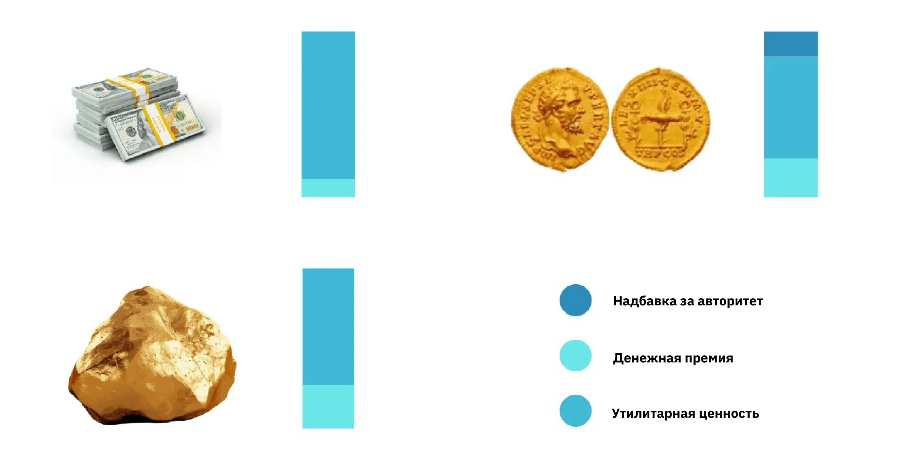

# Различные определения денег

<partId>77b7918a-8c3b-11f0-b688-6b2ab22378c9</partId>

## Деньги vs валюта vs monnaie vs argent vs devise

<chapterId>bf8a6d21-df88-5d23-a0a5-e9a5c1300554</chapterId>

:::video id=d9c9e7df-9db3-4a9f-801e-10d3fc7dfc22:::

### Семантика денежных терминов

В этом разделе, посвященном различным денежным теориям и особенно определениям денег, я хотел бы сделать небольшое отступление на тему семантики. Мне хотелось бы немного углубиться в определения некоторых слов, связанных с деньгами, и сравнить их с их английскими эквивалентами. Например, деньги, валюта, по сравнению с monnaie, argent и devise. Итак, получается следующее.

Немного семантики:

Когда мы говорим "**деньги**" (de la monnaie), большинство людей думают, что речь идет о мелочи, которую мы получаем в обмен на сделку. А если мы скажем "**валюта**" (la monnaie), люди, скорее всего, подумают, что речь идет о валюте государства. Валютой Канады является канадский доллар. Именно так.

Но как быть с деньгами (de l'argent)? Вор никогда не скажет: "Отдай мне всю мелочь!" (вор вполне может быть разочарован, получив всего лишь монеты, не имеющие почти никакой ценности).

Нет, вор будет кричать: "Отдай мне **все свои деньги**". И если вор стоит перед вами на улице, он обязательно имеет в виду **купюры** в вашем кармане.

С другой стороны, если вор пытается обмануть вас более изощренным способом, пытаясь украсть ваши активы, опустошив все ваши банковские счета, мы скажем, что **он заберет все ваши деньги**. Здесь слово "деньги" относится к **богатству человека**.

Таким образом, у слова "деньги" есть два определения: наличные (банкноты) и богатство.

### Валюта против монеты против девиза

Валюта (devise) - это обязательно валюта другой страны, иначе мы просто говорим "деньги" (monnaie). Если вы француз, вы скажете: "La livre sterling est la devise du Royaume-Uni et l'euro et la monnaie de l'Europe" (Фунт стерлингов - валюта Соединенного Королевства, а евро - валюта Европы).

Часто люди, которые не вникали в эти семантические проблемы, переводя эти термины, склонны говорить о валюте (devise), когда речь идет о валюте, но нет, валюта - это деньги (monnaie), когда речь идет о валюте вашей страны, и это devise, когда мы говорим о других валютах. Проблема, с которой я часто сталкиваюсь, заключается в том, что в английском языке есть два слова: есть "money", которое является концепцией, и есть "currency", которое на самом деле является единицей страны, используемой для совершения обмена. Так что мы можем просто говорить о понятии денег; это просто - это понятие слова *money*; это деньги в целом. А *currency* очень просто приравнять к валюте страны. Тогда как во французском языке, к сожалению, люди часто говорят "mais ce n'est pas une monnaie", когда говорят о биткойне, потому что это не валюта страны, но часто, я думаю, они имеют в виду термин валюта. С одной стороны, это неправильно, потому что со времен Сальвадора биткоин является валютой государства. Но факт остается фактом: люди часто говорят: *но нет, это не валюта государства, это не может быть деньгами*. Но на самом деле, если обратиться к более широкому понятию *деньги*, то биткоин, на мой взгляд, идеально вписывается в это определение. Просто во французском языке у нас нет двух слов, чтобы разделить эти два понятия. Можно сказать, что слово argent обозначает валюту, но, к сожалению, это не совсем точное его определение. *Argent* (деньги) означает богатство или банкноты. Вы не можете сделать эквивалент со словом *деньги*. *Деньги* - это понятие валюты (monnaie).

## Определение Сейфеда Аммуса

<chapterId>07c4ba50-168c-567a-8957-0b187ff75f97</chapterId>

:::video id=936d6d3b-6d45-468e-bc44-85fbce9b857a:::

#### Что такое деньги?

Деньги - это просто то, чем вы владеете или что приобретаете не для того, чтобы использовать или потреблять ради них самих, а для того, чтобы потом обменять на другие товары или услуги, которые могут вам понадобиться. (Сейфед)

Деньги приобретают денежную премию, когда на товар существует денежный спрос, чтобы играть одну или несколько ролей денег.

Денежный товар должен быть достаточно дефицитным, чтобы денежная премия сохранялась (чтобы предложение не приспосабливалось к денежному спросу).

### Денежная премия

В этом разделе, посвященном различным определениям валюты, я хотел бы кратко рассказать об определении Сейфедея в книге "Стандарт Bitcoin", которое всегда представляло для меня большой интерес. Когда я читал его, оно показалось мне довольно простым. И мы также собираемся добавить к этому определению понятие денежной премии. Как упоминает Сейфедин в своей книге, обязательно существует понятие дефицита. Вопрос в том, что такое деньги?

> Деньги - это просто то, чем вы владеете или что приобретаете, но не для того, чтобы использовать или потреблять их ради них самих, а для того, чтобы потом обменять на другие товары или услуги, которые могут вам понадобиться.

Вот определение, которое упоминает Сейфедеан в "Стандарте Bitcoin". Я бы добавил, что валюта (la monnaie) приобретает денежную премию, когда на товар существует денежный спрос, чтобы играть одну или несколько ролей валюты. Таким образом, можно сказать, что валюта, которая служит хранилищем стоимости, будет иметь денежный спрос, который дает ей денежную премию, поскольку люди хотят приобрести ее, например, в качестве хранилища стоимости или средства обмена.

### Дефицит и рыночные механизмы

К этому, я думаю, следует добавить, что денежное благо должно быть достаточно дефицитным, чтобы денежная премия могла существовать. Это очень важно. **Если появляется товар, который можно использовать в качестве денег, и мы видим, что его цена растет, то обычно, если товар недостаточно редок, люди захотят производить его больше, чтобы воспользоваться преимуществом роста стоимости при повышении цены**. Именно поэтому большинство товаров на рынке имеют относительно фиксированную цену. Когда цена растет, производство, как правило, увеличивается. Когда цена падает, производство сокращается. Происходит своеобразная корректировка рынка. **А когда товар достаточно редок, как, например, золото, рыночный механизм не сможет компенсировать этот повышенный спрос на денежное обращение. Так что меняется не переменная, а цена. Как в случае с биткоином**. Когда цена биткойна растет, мы не производим больше биткойна. Так что корректируется только цена. Вот почему на протяжении многих лет мы наблюдали, как цена биткойна растет по мере увеличения спроса на него. Поскольку на Земле нет никого, кто мог бы изменить алгоритм и сказать: "Спрос увеличился, цена растет, мы будем производить больше" **Предложение новых биткойнов запрограммировано заранее и известно заранее**. Вот о чем я говорил: денежный товар должен быть достаточно редким, чтобы денежная премия сохранялась и, следовательно, не была подхвачена рыночными механизмами, чтобы не позволить предложению приспособиться к новому денежному спросу.

## Платежные средства и освободительная ценность

<chapterId>5d424039-e342-56f7-9d8b-bba9551831a9</chapterId>

:::video id=af4c0765-8111-4cb7-891b-3ee54d6e7054:::

### Средство платежа в сравнении со средством обмена

В этом разделе, посвященном различным определениям денег, я предлагаю рассмотреть цитату из книги "Aux origines de la monnaie" ("Истоки денег"), текста Алена Тестара на тему денег как средства платежа и освободительной ценности.

*В книге "Aux origines de la monnaie" Ален Тестарт определяет деньги как средство платежа:*

> Функция платежного средства понимается здесь как отличная от функции средства обмена, поскольку существуют платежи без рассмотрения, платежи, которые ничего не покупают. Книс (Knies, 1873:192 и далее) подробно развивает эту тему передачи товаров, которая не состоит в актах обмена, как в случае с wergeld (кровавые деньги или композиция за убийство) или налогами. Карл Менгер атаковал эту четвертую функцию в своей статье 1892 года "Geld", которая обычно считается одной из самых решающих по этому вопросу. Не будучи полностью дискредитированной, идея функции платежного средства, похоже, забыта в современной экономической мысли или, по крайней мере, отвергнута в пользу функции средства обмена.
>

> Деньги используются для оплаты: в этом свете они являются инструментом освобождения, что во всей своей полноте описывает функцию платежного средства. В этом смысле мы говорим об "освободительной силе" денег. Согласно Le Petit Robert, освободительная сила - это "то, что имеет эффект освобождения (от обязательства, долга)". Согласно "Большому Ларуссу", освободительный платеж - это любой "платеж, произведенный на законных условиях таким образом, что кредитор не может оспорить исчезновение долга". Деньги обладают этой силой par excellence; это даже определяет их статус законного платежного средства, поскольку никто не может отказаться от платежа, произведенного деньгами, будь то продавец или кредитор. Деньги - единственный товар, от которого нельзя отказаться при выплате долга, независимо от того, кому он причитается - торговцу или налоговику. Среди всех товаров только деньги обладают этой привилегией. "Именно эта привилегия, - пишет Шарль Жид (1921 I: 443), - составляет то, что мы называем законным платежным средством.
>

> Любой обмен, состоящий в передаче одного товара за другой или при условии предоставления взамен другого товара, обязательно подразумевает обязательство получателя предоставить его контрагенту. Платеж - это исполнение этого обязательства. Таким образом, любой обмен подразумевает платеж, но не любой платеж подразумевает обмен. Существуют платежи без контрагента, то есть платежи, которые не позволяют получить другое благо и осуществляются не с этой целью. Налоги остаются здесь основным примером; следует также упомянуть всевозможные штрафы, уплачиваемые государственным органам, и возмещения, причитающиеся другим по принципу: кто причинил ущерб другим, тот должен его возместить.

### Платежи без контрагента

Это наглядная иллюстрация к тезису автора. На самом деле он проводит различие между этими двумя понятиями. Для него обмен - это и передача товара, и платеж. Оплата идет следом. Причем оплата может происходить и без обмена. Он приводит примеры того, что оплата парковочного талона или штрафа - это просто оплата. В обмен вы не получаете никакой услуги. Кто-то может возразить, что государство в обмен оказывает вам услугу, выдавая штрафы за парковку. Он совершенно четко говорит о том, что уплата налогов - это действительно платеж без контрагента, в том смысле, что платить налоги необходимо, даже если вы не обязательно получаете услугу. Он говорит, что это действительно определено, что уплата налогов - это просто платеж; нет никакого обязательства получать услуги в обмен. Я обсуждал это со многими своими коллегами, и они не всегда согласны с таким пониманием. Но тезис автора именно таков. Он пытается поместить понятие платежа и отделить его от обмена на этих примерах, например, штрафа, уплаты налога. Также, например, приданое, он говорит о том, что приданое - это платеж; вы не обязательно получаете что-то в обмен. Кто-то, критикуя это предложение, может сказать: "Да, но в обмен ты получаешь жену" Таков уровень дискуссий на эту тему.

Существует также вергельд, или кровные деньги. Так что это просто плата за компенсацию. Мой друг Ульрих сказал бы:

> Да, но в обмен на это вы получите закрытый файл.

Итак, вы совершили преступление, например, убийство. В то время вы платите вергельд, а после этого вы освобождаетесь от этой ситуации. Так что в этом есть освобождающая сила. А получаете ли вы что-нибудь взамен?" По мнению автора, нет. По мнению некоторых моих коллег, да.

Я думаю, что в этой дискуссии мы видим, что вергельд - это один из хороших примеров для определения платежа. На самом деле, очевидно, что вы ничего не получаете взамен.

## Долговые деньги против товарных денег

<chapterId>4093677a-c8e8-5828-b994-15c01656186e</chapterId>

:::video id=f49cf5cc-288e-4daa-a1ff-b9de73506f4e:::

### Основополагающая дискуссия

И все же в контексте этого раздела, посвященного различным монетарным определениям и теориям, давайте вместе рассмотрим два диаметрально противоположных видения: "деньги - это всегда долг" или "деньги - это всегда товар". С одной стороны, есть сторонники долговой денежной теории, которые утверждают: "Нет, деньги - это всегда долг! С другой стороны, наши знаменитые "золотые жучки" заявляют: "Но нет, видите ли, деньги - это всегда товар, это всегда золото; все остальное, векселя, долговые расписки, это только кредит, а не деньги".

Давайте вместе рассмотрим четкое изложение этих теорий.

### Теория "всегда в долгу"

Здесь приводится краткое изложение монетарной теории, известной как **"долговые деньги "**, согласно которой деньги по своей сути являются формой долга:

Согласно этой теории, разработанной, в частности, Альфредом Митчеллом-Иннесом и развитой Дэвидом Грэбером, деньги по своей сути являются признанием долга, проистекающим из кредитных отношений, которые исторически предшествовали прямым денежным обменам. Вместо того чтобы возникать из потребности, связанной с бартером, деньги появляются как способ учета, передачи и урегулирования социальных обязательств или долгов между индивидами или группами.

Таким образом, все деньги обращаются как долг одного человека или учреждения другому, подкрепленный доверием и общественным или государственным авторитетом, гарантирующим его действительность. Таким образом, по их мнению, когда мы обладаем - как я уже говорил, обладаем деньгами, мы предъявляем претензии к обществу, и общество должно нам долг. Таким образом, деньги никогда не бывают нейтральными или автономными, но всегда являются лежащим в их основе долгом: владение деньгами, по сути, означает владение претензиями к обществу или экономическому сообществу.

Эти рассуждения противоречат классическому представлению о деньгах как о простом "промежуточном товаре", и вместо этого подчеркивают центральную роль социальных и политических отношений в создании и управлении деньгами.

**Мой отзыв:**

Что меня беспокоит в этой теории, так это то, что она утверждает, что деньги всегда являются долгом, в то время как у нас есть примеры обмена между двумя разными племенами, которые, например, обменивают золото, где сделка окончательно завершена и никакого скрытого долга не остается. Сторонники этой теории часто говорят нам, что эти обмены - не денежные, а бартерные. Как уже говорилось, я с этим не согласен. Это денежный обмен, поскольку золото не будет потребляться, оно будет использоваться в качестве денег.

### Теория "всегда товар"

**Всегда товар:**

Вот четкое изложение денежной теории, известной как **"товарные деньги "**, где деньги всегда возникают как товар, в частности золото, которое возникает из необходимости иметь возможность торговать, товар, который обычно принимают за границей и который приобретается для торговых целей.

Согласно этой теории, разработанной классическими экономистами (Адам Смит, Давид Рикардо) и подхваченной Марксом, деньги возникают естественным образом как товар среди других товаров, часто драгоценных металлов, таких как золото или серебро, которые имеют внутреннюю ценность, не зависящую от их денежной роли. Изначально эти товары спонтанно выбираются экономическими игроками для облегчения торговли благодаря присущим им качествам (дефицитность, долговечность, делимость и стабильность).

Товарные деньги отличаются физическим существованием и стоимостью, определяемой количеством труда, общественно необходимого для их производства (как у Маркса). Общество использует золото, например, не только для упрощения бартера, но и в качестве счетной единицы, хранилища стоимости и универсального средства обмена.

В этом видении деньги всегда сохраняют реальную ценность, поскольку они по-прежнему связаны с осязаемым товаром. Даже когда роль денег становится абстрактной (чеканные монеты, банкноты или деньги из писаний), их ценность все равно прямо или косвенно обусловлена ссылкой на такой базовый товар, как золото. Поэтому данная теория настаивает на материальном и экономическом происхождении денег, в отличие от теорий, рассматривающих их как простое соглашение или долг. Согласно этой теории, любое представление денег с помощью заменителя, такого как вексель, погашаемый золотом, будет являться кредитом.

**Мой отзыв:**

Обратите внимание, что это видение напоминает теорию товарных денег, но идет на шаг дальше. Они предлагают, чтобы деньги **всегда** были товаром. И когда мы говорим им: "Да, но мы можем согласиться, что банкнота - это деньги для этой группы; она может быть обеспечена золотом, она работает, и банкнота как таковая - это деньги*".

В ответ они приведут пример с купоном в раздевалку. Они скажут: "Да, но нет, когда у вас есть купон в раздевалку на одежду, можем ли мы назвать купон на кассе одеждой?

Конечно, нет, это как расписка, по сути, претензия, которая позволит вам получить свою одежду обратно. Эта параллель не проходит, потому что талон в раздевалку не является общепринятым способом оплаты. **Деньги - это не претензия на конкретный предмет, такой как одежда; это способ, средство обмена, средство обмена или общепринятое средство платежа**.

Поэтому нельзя проводить параллель между купоном для раздевалки и банкнотой фиатной валюты, поскольку купон для раздевалки позволяет вам получить в обмен конкретное благо, это token, который позволяет вам получить свое благо. В то время как банкнота, фиатная валюта, - это универсальный купон, который позволяет вам получить доступ к любому благу.

И, на мой взгляд, конечно, даже фиатные деньги могут считаться деньгами, если их считает таковыми население. И я считаю семантической ошибкой настаивать на том, что они не могут быть деньгами, поскольку это купон для получения настоящих денег, по крайней мере, в то время, которые были основой золота.

У меня нет проблем с тем, чтобы считать золотую монету, которая хранится в сейфе, и купюру, которая представляет собой эту золотую монету, валютой. Для меня нет проблемы семантики, это просто два вида валюты. Если я не ошибаюсь, Мизес очень хорошо объясняет этот феномен, говоря о денежных заменителях.

Их видение сводится к тому, что нельзя одновременно считать деньгами золотую монету в банковском хранилище и банкноту, на которой она изображена. Лично я не вижу в этом никакой проблемы, я не вижу никакого парадокса в этой ситуации. Те, кто считает, что деньги - это всегда товар, смотрят на вещи не так, как я.

**Вот обзор концепции купона для раздевалки из книги "Истоки монет":**

*Примечание 14: "Прекрасная критика - прекрасная потому, что она находится на том самом основании, на котором стоит Кнапп, - юридическом основании - со стороны Риста (1938: 372, прим. 1) сравнения бумажных денег и жетонов: если мы можем говорить о некоем требовании в обоих случаях, то фундаментальное различие заключается в том, что в первом случае, и только в первом, это требование без конкретного объекта

Кроме того, по поводу **claim** тот же автор отмечает следующее:

> Бастиат вполне волен представить ваучер для всего общества в виде "огромного базара", но в этом маленьком добавлении, в этом безобидном на первый взгляд расширении и заключается вся разница между кредитом и деньгами. Деньги не претендуют на конкретный магазин. Не существует такого понятия, как анонимное требование. Но именно анонимность, характерная для денег, а значит, и их всеобщность, делает их такими мощными. Деньги не похожи на кредит и тем более не сводятся к нему. **Деньги - это гораздо больше, чем кредит

**Парадокс: долговые деньги против товарных денег

Парадокс, который лучше всего иллюстрирует глубокую дихотомию между теориями долговых денег и товарных денег, касается вопроса о том, является ли золото валютой сегодня.

С одной стороны, теория долговых денег определяет деньги прежде всего как посредника в обмене или средство платежа, которое обычно принимается или даже навязывается государственным органом. С этой точки зрения золото больше не является валютой, поскольку оно не используется и не принимается в качестве общепринятого средства обмена.

С другой стороны, теория товарных денег рассматривает деньги как материальный товар, спонтанно выбранный обществом за присущие ему характеристики (дефицитность, долговечность, делимость и т. д.). Согласно этому подходу, истинной универсальной валютой остается золото, а все остальные формы денег сегодня, по сути, являются не более чем кредитами, основанными на доверии.

Этот парадокс наглядно демонстрирует разрыв между двумя монетарными концепциями: для первых золото больше не является валютой, для вторых, напротив, оно остается единственной настоящей валютой.

## Современная монетарная теория

<chapterId>8efc29af-3193-5d97-ad9f-e608b32924ff</chapterId>

:::video id=f8127cb7-46a1-468c-bbb5-97bf0a8b8837:::

### Принципы современной монетарной теории

В заключение этого раздела о различных монетарных теориях давайте поговорим о вундеркинде монетарных теорий, которым восхищаются многие современные экономисты, работающие в центральных банках, и который получил название современной монетарной теории, часто известной как MMT.

**Современная монетарная теория (ММТ)** - это экономический подход, согласно которому у государства с собственной суверенной валютой (например, США, Канады или Японии) никогда не кончатся деньги, поскольку оно всегда может выпустить больше денег для финансирования своих расходов. Согласно этой теории:

- Деньги - это создание государства, а не ограниченный ресурс**

- Налоги и займы используются не для прямого финансирования государственных расходов, а для регулирования инфляции, влияния на экономическое поведение и поддержания спроса на национальную валюту.*

- Реальным пределом государственных расходов является инфляция, а не дефицит бюджета или государственный долг.

- Если созданные деньги направляются в те отрасли, которые могут их освоить, инфляции тоже не будет.

- Поэтому правительство должно корректировать свои расходы в соответствии с имеющимися реальными ресурсами (рабочая сила, промышленный потенциал, природные ресурсы), чтобы избежать чрезмерной инфляции.

### Роль налогов в ММТ

Здесь вы найдете знаменитый ответ всем тем, кто говорит: "Да, но если мы можем печатать деньги, почему мы платим налоги?" Что ж, в MMT есть правильный ответ на эту идею. Это правда, что в фиатной системе, в современной системе, технически нет ничего, что могло бы ограничить создание денег, кроме инфляции. Но они собираются предложить, что, во-первых, для ограничения инфляции необходимо налогообложение, так как оно удаляет деньги из экономики. Таким образом, если у нас не будет налогов для компенсации, все это создание денег может в конечном итоге привести к инфляции. Налоги, утверждают они, в буквальном смысле являются способом изъятия денег из системы для ограничения инфляции.

Если говорить о деньгах, вложенных в отрасли, которые могут их поглотить, то можно привести пример Соединенных Штатов, которые выделяют триллионы долларов на военную промышленность, что не вызывает инфляции, потому что военная промышленность, военно-промышленный комплекс, вполне способен поглотить эти триллионы долларов.

С другой стороны, если вы хотите построить больше дорог, а ресурсы и подрядчики, которые могут их построить, ограничены, то удвоение бюджета на дороги неизбежно приведет к дефициту рабочей силы, которая может эти дороги построить. Поэтому цена будет расти в результате действия рыночных сил, спроса и предложения. Если наши всезнающие руководители знают, куда девать деньги, то технически это не должно вызывать инфляцию. А я бы ответил, что на практике совершенно очевидно, что это вызывает инфляцию.

В итоге, согласно MMT, государство может использовать свои возможности по созданию денег для достижения полной занятости и финансирования социальных и экологических инвестиций, контролируя инфляцию с помощью соответствующей фискальной политики. Целью кейнсианских экономистов, другой школы экономической мысли, также часто является управление безработицей путем регулирования процентных ставок и финансирование социальных и экологических инвестиций при сдерживании инфляции с помощью соответствующей фискальной политики.

### Обзор ММТ

Эта теория применима только к горстке стран (см. твиттер Стефани Келтон), которые обладают настоящим монетарным суверенитетом, то есть могут выпускать долговые обязательства в собственной валюте. Эту теорию трудно применить к странам с зависимой от импорта экономикой, которые должны поддерживать международное доверие к своей валюте.

А что такое настоящий денежный суверенитет? Это значит, что вы можете выпускать долговые обязательства в своей собственной валюте. Вы должны иметь положительное сальдо торгового баланса, чтобы иметь достаточно валютных резервов, достаточно иностранной валюты, чтобы вам не нужно было привлекать деньги в иностранной валюте для импорта товаров. Это касается нескольких стран.

Ниже вы можете увидеть твит Стефани Келтон, которая является своего рода плакатной женщиной для этого движения. Она написала книгу под названием "Миф о дефиците". В твите она пишет, что у разных стран, таких как США, Япония, Канада, Австралия, Великобритания, не могут закончиться деньги.

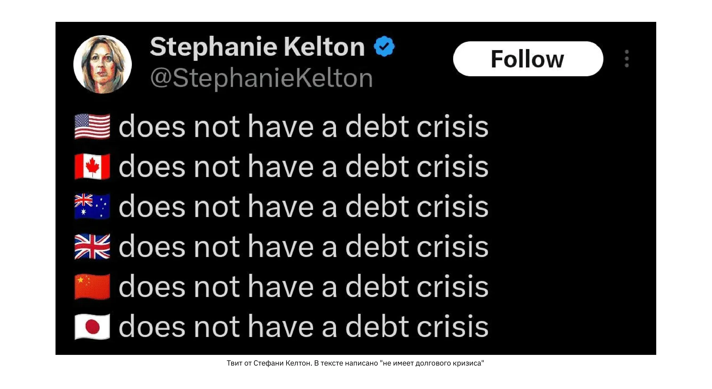

Странно, но в списке всего шесть стран? Почему? Потому что они обладают реальным денежным суверенитетом. Но на Земле около 200 стран, и не все из них обладают денежным суверенитетом. Поэтому я критикую эту теорию, помимо того, что она немного странная и нефункциональная, в том, что она работает только для нескольких стран, обладающих настоящим денежным суверенитетом, тех, которые могут выпускать казначейские векселя в своей собственной валюте. В какой-то степени это идет во вред остальному миру. Создавая эту валюту, они как будто экспортируют свою инфляцию в другие страны, подобно тому, как это делали Соединенные Штаты со своими непомерными привилегиями на протяжении десятилетий. Это напоминает форму монетарного колониализма, когда страны, имеющие глобальное доверие и спрос на свою валюту, могут печатать сколько угодно денег без существенной инфляции, часто потому, что они экспортируют эту инфляцию.

Эту теорию трудно применить к странам с зависимой от импорта экономикой, которым необходимо поддерживать международное доверие к своей валюте.

Эта теория также требует определенного уровня централизованного планирования экономики, в частности, для обеспечения большего контроля над реальными ресурсами (рабочими, сырьем, промышленными мощностями) и для управления инфляцией.

# Падение и возрождение денег

<partId>87a34ca9-782b-5ade-b51a-400f88ed7b0c</partId>

## Греческие монеты

<chapterId>7714195f-74ce-5f8c-be5f-59302d39fff4</chapterId>

:::video id=8e5c3091-0910-471b-8d4b-0dc6e9afa656:::

### Предпосылки и контекст

Прежде чем мы начнем, вот историческая справка:

**Историческая справка:**

**Римляне называли греков "Graeci", а Грецию - "Graecia"

**Греки называли себя "эллинами", а свою страну - "Элладой"

**Гомер** (родился около 8 века до н.э.)

Легендарный греческий поэт, предполагаемый автор *Илиады* и *Одиссеи*.

Около **750 г. до н. э.: Ликург**, мифический законодатель Спарты, как говорят, установил спартанскую конституцию, основанную на военной дисциплине и простоте.

**Нума Помпилий** (753-673 гг. до н.э.)

Второй царь Рима, знаменитый тем, что дал Риму первые религиозные и правовые институты.

**Дракон**, афинский законодатель (VII век до н. э.), прославившийся своими чрезвычайно суровыми законами, отсюда и термин "драконовский".

**594 г. до н. э.: Солон** становится законодателем в Афинах и радикально реформирует афинское общество, в частности, отменяет долговое рабство.

**776 ГОД ДО НАШЕЙ ЭРЫ: Древние Олимпийские игры**

Первые регулярные спортивные игры проводились в Олимпии каждые четыре года, объединяя греческие города.

**Пифагор** (ок. 570-495 гг. до н.э.)

Греческий философ и математик, известный своей теоремой о прямоугольном треугольнике.

**Ксенофан Колофонский** (ок. 570-478 гг. до н.э.)

Досократовский философ, известный своей критикой традиционного греческого политеизма.

**490 г. до н.э.: Марафонская битва*

Афиняне победоносно отразили персидское вторжение, что стало решающим поворотом в развитии греческой цивилизации.

**Геродот** (ок. 484-425 гг. до н. э.), прозванный "отцом истории", написал обширный труд, описывающий Персидские войны, включая победу греков над Ксерксом в 480 г. до н. э.

**Сократ** (470-399 гг. до н.э.)

Афинский философ, известный своим диалектическим методом и учением об этике и самопознании.

**Аристофан** (ок. 446-386 гг. до н.э.)

Афинский драматург, известный своими сатирическими комедиями, такими как "Лягушки".

**Софокл** (V век до н. э.) в своей пьесе "Антигона" критикует деньги как источник морального и политического развращения в лице тирана Креона.

**Платон** (ок. 428-348 гг. до н.э.)

Греческий философ, ученик Сократа, основатель Академии, автор *Республики*.

**431-404 ГГ. ДО Н.Э: Пелопоннесская война**

Крупный конфликт между Афинами и Спартой, закончившийся поражением Афин.

**431 ГОД ДО Н.Э.**: Афины финансируют Пелопоннесскую войну, разбавляя свои золотые и серебряные монеты, чтобы увеличить их количество в обращении, что приводит к инфляции.

**Ксенофонт** (ок. 430-355 гг. до н.э.)

Афинский писатель, философ и полководец, ученик Сократа, автор *Анабасиса*.

**414 ГОД ДО Н.Э.**: Афины начинают проигрывать Пелопоннесскую войну после неудачной экспедиции на Сицилию.

**405 ГОД ДО Н.Э: Аристофан** в своей пьесе *Лягушки* прямо описывает обесценивание серебряной драхмы и появление в Афинах некачественных бронзовых монет, иллюстрируя принцип, известный сегодня как "закон Грешема".

**404 ГОД ДО Н.Э.**: Афины капитулируют после длительной осады Спарты.

**Аристотель** (384-322 гг. до н.э.)

Крупнейший греческий философ, ученик Платона, основатель Ликея, известный своими работами по логике, биологии и политической философии.

**327 ГОД ДО Н.Э.**: Александр Македонский завоевывает Персеполис и восточные провинции Персидской империи, значительно расширяя свою империю.

**323 ГОД ДО Н.Э.**: Александр умер в Вавилоне без явного наследника, что вызвало войны между его генералами (диадохами) за раздел империи.

**Архимед** (ок. 287-212 гг. до н.э.)

Греческий математик, физик и изобретатель, известный своими открытиями в геометрии и механике.

**196 г. до н. э.: Розеттский камень** выгравирован во время правления фараона Птолемея V, что позволило впоследствии расшифровать египетские иероглифы.

**192-188 ГГ. ДО Н.Э: Романо-Селевкидская война**

Рим разгромил империю Селевкидов во главе с Антиохом III, укрепив свое влияние в Греции и Малой Азии.

**146 г. до н.э.: Битва при Коринфе*

Римляне разрушили греческий город Коринф, что ознаменовало конец политической независимости Греции и ее постепенную интеграцию в римский мир.

В этом разделе, посвященном античности, падению Рима и Средним векам, мы начнем с раздела о греческих монетах.

История чеканки монет в Древней Греции началась около 600 года до н. э., когда греческие города быстро переняли новшество из Лидии в Малой Азии, используя сначала электрум, а затем серебро. Первые греческие монеты были отчеканены на острове Эгина с изображением морской или сухопутной черепахи, но именно афинская драхма, украшенная Афиной и совой, стала денежным знаком высшего достоинства с V века до н. э. и в значительной степени доминировала в международной торговле того времени.

И мне повезло, что у меня есть копия греческой драхмы того периода со знаменитой совой и фигуркой на обороте. Это тетрадрахма, которая была больше простой драхмы.

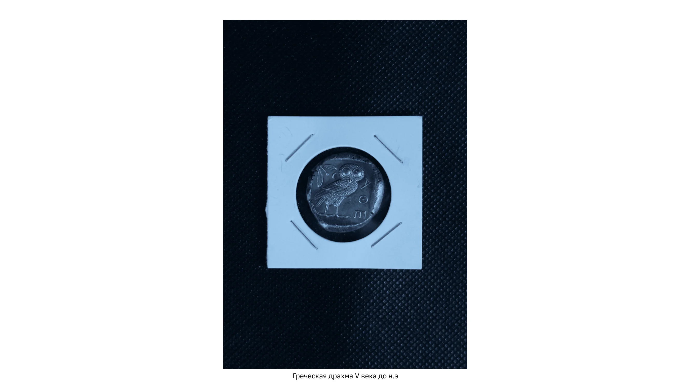

В каждом греческом городе складывались свои отношения с деньгами. В Афинах валюта была тесно связана с политической и экономической властью. Знаменитый афинский декрет конца V века до н. э. ввел исключительное использование афинской валюты на союзных территориях, тем самым укрепив свою экономическую гегемонию. Афины также накопили большие запасы золота на случай чрезвычайных ситуаций, которые хранились на Акрополе, возможно, как символ их экономического благоразумия. В отличие от них, Спарта, военный город с жесткими ценностями, решила строго ограничить использование денег, запретив своим гражданам иметь золотые или серебряные монеты. Спарта предпочитала использовать тяжелые железные слитки, чтобы препятствовать внешней торговле и поддерживать социальную сплоченность.

Войны часто финансировались за счет валютных манипуляций. Во время Пелопоннесской войны (431-404 гг. до н. э.) Афины прибегли к резкой девальвации, чтобы заплатить своим войскам. Лишившись доступа к своим серебряным рудникам в результате захвата спартанцами Декелии в 413 году до н. э., Афины были вынуждены переплавлять золотые статуи, чтобы в спешке отчеканить новые монеты в 407/406 годах до н. э. Затем, в 406/405 году до н. э., она создала бронзовые монеты, покрытые серебром, вызвав денежный кризис, проиллюстрированный **Аристофаном**, который уже вызывает то, что сегодня известно как закон Грешема: плохие деньги вытесняют хорошие. Эта чрезвычайная валюта была быстро демонизирована после войны, чтобы восстановить доверие к афинской чеканке.

Конец классического периода ознаменовался возвышением Македонии при Филиппе II и его сыне Александре Македонском, глубоко нарушившим греческий денежный баланс. Благодаря обширным золотым и серебряным рудникам горы Пангеи Филипп II производил огромное количество денег для финансирования своих военных и политических кампаний, установив простой и практичный золото-серебряный стандарт (10:1). Его золотые статеры, посвященные его победе на Олимпийских играх, циркулировали по всей Западной Европе и даже достигли Англии. Александр продолжил эту денежную политику, широко распространив **аттическую** драхму во время своих завоеваний на Востоке вплоть до Индии. Это массовое обращение монет ознаменовало начало эллинистической эпохи, когда изображения государей постепенно заменили изображения божеств на монетах. Это нововведение позволило нескольким поколениям эллинистических монархов продвигать себя, отводя традиционным богам второстепенную роль на реверсе своих монет.

После смерти Александра в 323 году до н. э. его генералы разделили его огромную империю, основав династии в Египте (Птолемеи), Сирии (Селевкиды) и других странах. Эти эллинистические царства приняли различные денежные системы: Птолемеи ввели закрытую денежную систему, чтобы контролировать денежное обращение, предпочитая использовать зерно в качестве внутренней валюты, чтобы сохранить драгоценные металлы для внешних военных расходов. В то же время Родос стал крупным торговым центром, но был экономически ослаблен римлянами, которые в 167 году до н. э. основали Делос как свободный порт.

Использование денег занимало центральное место в оплате труда наемников. Солдаты Александра ежедневно получали серебряные драхмы.

Кавалерия, элита высокоспециализированной армии Александра, получала в среднем две драхмы в день, пехотинец - одну драхму, а рядовой наемник - две трети драхмы, что вдвое превышало зарплату простого рабочего.

Во время Пелопоннесской войны солдатам также выплачивались значительные суммы: более 1 200 талантов для подавления восстания на Самосе и более 2 000 талантов для осады Потидеи.

К тому времени, когда эта армия была полностью задействована в Малой Азии, общие расходы составляли около двадцати талантов в день, или около полутонны серебра, или 120 000 драхм.

Греческая чеканка монет также играла важную культурную роль, поскольку каждый город стремился утвердить свою самобытность, чеканя собственные монеты с местными или мифологическими символами. Например, Гераклий изображал Геракла (Геркулеса), сражающегося со львом, а Кирена - знаменитое лекарственное растение сильфиум.

Наконец, несмотря на разнообразие и региональные колебания, классическая греческая и эллинистическая чеканка оставила неизгладимый след в экономической и культурной истории средиземноморского мира, оказав глубокое влияние на последующие денежные системы вплоть до Рима, который постепенно перенял и развил греческие экономические концепции для построения своей собственной имперской экономики.

## Влияние валюты в Греции

<chapterId>3a5e6c7d-699c-5567-87cd-3374c49d55a9</chapterId>

:::video id=0c79a59c-e179-4893-a414-1b8de0930eb9:::

### Афины и контраст со Спартой

Противостояние Афин и Спарты в эпоху классической Греции демонстрирует две радикально разные модели политической и экономической организации. В то время как Спарта отказалась от металлических денег в пользу самодостаточной системы, основанной на гражданском доверии, Афины полностью взяли на вооружение эту технологию для создания и поддержания своей морской империи.

### Денежная необходимость военно-морской мощи

Афинская империя, несмотря на свое грандиозное название, географически оставалась скромной - в основном Афины и города Эгейского моря. Ее власть опиралась на Делосскую лигу - военный союз, в котором доминировали Афины как гегемон. Такая имперская структура требовала единого экономического инструмента - афинской серебряной монеты.

Содержание флота лежало в основе этой денежной необходимости. Одна афинская трирема стоила от одного до двух талантов серебра - немалая сумма. При наличии нескольких сотен кораблей, которые необходимо было содержать, Афинам требовалась эффективная налоговая система. Валюта стала незаменимым инструментом для сбора дани с вассальных городов и финансирования военно-морских сил, которые обеспечивали целостность империи.

### Денежное навязывание как инструмент господства

Афины навязали свою серебряную валюту всем членам Делосской лиги. Эта денежная стандартизация служила нескольким стратегическим целям. Во-первых, она облегчала сбор дани, создавая общую расчетную единицу. Во-вторых, она усиливала экономическую зависимость вассальных городов от Афин. Наконец, она символически проецировала афинскую власть на всю морскую империю.

Такая монетарная политика резко контрастирует со спартанской моделью. Спарта, сухопутная держава, могла полагаться на труд пелопоннесских гелотов (рабов) для своего пропитания. Ее закрытая, ориентированная на город экономическая система не требовала сложных денежных инструментов. Граждане-солдаты жили вместе, разделяли общие трапезы и не нуждались в деньгах для повседневного обмена.

### Валюта как средство морской торговли

Мореходный характер Афинской империи означал, что она должна быть открыта для торговли. В отличие от замкнутой на себе Спарты, Афины должны были торговать с внешним миром для своего выживания и процветания. Валюта стала неотъемлемым инструментом средиземноморской торговли.

Эта внешняя ориентация создавала добродетельный круг: торговля приносила доходы, эти доходы финансировали флот, флот защищал торговые пути и поддерживал империю, а империя вводила афинскую валюту, которая облегчала торговлю. Валюта перестала быть просто средством обмена, а стала основой имперской стратегии.

### Пределы монетарной власти

Несмотря на эту экономическую изощренность, денежная мощь Афин показала свои пределы во время Пелопоннесской войны. Перед лицом спартанских сухопутных войск военно-морское и финансовое превосходство Афин оказалось недостаточным. Дорогостоящие экспедиции, такие как катастрофическая Сиракузская кампания на Сицилии, истощили финансовые ресурсы, не принеся решающей победы.

История показывает, что валюта, хотя и является мощным инструментом для проецирования силы, не гарантирует военного господства. Спарта, не имевшая металлической валюты, но обладавшая замечательной социальной сплоченностью, в конце концов одержала победу над афинской денежной империей.

### Две модели, две судьбы

Противостояние Афин и Спарты иллюстрирует два фундаментальных подхода к социальной и экономической организации. Афины представляют открытую, коммерческую, монетаризованную модель - предтечу современных морских империй. Спарта воплощает закрытую, автаркическую модель, основанную на гражданском доверии, а не на денежных инструментах.

Эти две системы показывают, что принятие валюты тесно связано с выбранной политической и экономической моделью. Для морской и торговой державы, такой как Афины, деньги стали незаменимы. Для закрытого общества воинов, такого как Спарта, они представляли угрозу социальному порядку. Эта древняя дихотомия до сих пор лежит в основе дебатов о роли денег в организации общества.

## Римская республика

<chapterId>0bc80983-33e1-5881-85bb-7c22f3144a9a</chapterId>

:::video id=dc05ca97-d29c-4679-bfeb-912c47d86ce2:::

### История Римской республики

- 753 - 509 гг. до н. э.: Римское царство**
- 753 Г. ДО Н.Э: Основание Рима** (традиционно приписывается Ромулу).
- 509 - 27 ГГ. ДО Н.Э: Римская республика**, Рим становится республикой, управляемой выборным сенатом и консулами.
- 280 - 275 ГГ. ДО Н.Э: Пиррова война**. Пирр, царь Эпира, сражается с римлянами в Южной Италии, одерживая дорогостоящие победы ("пирровы победы").
- 264 - 146 ГГ. ДО Н.Э: Пунические войны**. Крупный конфликт между Римом и Карфагеном за господство в западном Средиземноморье.
- Ганнибал (247 - ок. 181 гг. до н.э.)**. Легендарный карфагенский полководец, прославившийся тем, что перешел через Альпы со своей армией и слонами, чтобы напасть на Рим во время Второй Пунической войны.
- 146 г. до н. э.: Битва при Коринфе**. Рим разрушает греческий город Коринф и устанавливает свое окончательное господство над материковой Грецией.
- 91 - 87 гг. до н. э.: Социальная война**. Восстание италийских союзников Рима с требованием римского гражданства, которое в итоге привело к их полной интеграции в гражданство.
- 64 г. до н. э.: Конец сопротивления Селевкидов**. Рим окончательно ликвидирует влияние Селевкидов в Сирии, укрепляя свои позиции в Восточном Средиземноморье.
- 55 ГОД ДО Н.Э: Юлий Цезарь завоевывает Центральную и Западную Европу**. Юлий Цезарь распространяет римское господство на Галлию (современная Франция) и вступает в Германию и Бретань.
- 43 ГОД ДО Н.Э: Образование Второго триумвирата**. Политический союз между Октавианом (впоследствии Августом), Марком Антонием и Лепидом, призванный стабилизировать обстановку в Риме после убийства Цезаря.
- 27 год до н. э.: начало Pax Romana**. Период политической стабильности и процветания при правлении Августа, ознаменовавший начало Римской империи.

### Поздние денежные зарождения Рима

В этом разделе, посвященном античности, мы переходим к Римской республике. Денежная история Рима началась гораздо позже, чем у греков и персов. Основанный в 753 году до н. э., Рим ждал почти четыре столетия, прежде чем действительно ввел чеканку монет. В течение этого долгого периода римляне использовали примитивную систему обмена с помощью неровных кусков бронзы, называемых aes rude, которые требовали точного взвешивания для каждой сделки. Только в конце IV века до н. э. под влиянием греков и этрусков Рим начал выпускать свои первые монеты, в частности, отлитые из бронзы, как в Китае, - aes grave, характерные для римского обмена вплоть до **Второй Пунической войны**.

### Греческое влияние и первые серебряные монеты

Решающая встреча с греками на юге Италии познакомила римлян с чеканкой серебряных монет. Около 280 года до н. э. Рим начал выпускать собственные серебряные монеты в подражание греческим дидрахмам. Первый регулярный выпуск серебряных монет в Риме датируется 269 годом до н. э., на них изображены легендарные близнецы Ромул и Рем, которых сосет волчица - символ, ставший культовым.

На самом деле, на многих римских монетах периода Республики изображены мифы об основаниях. Мою вы можете увидеть ниже: это превосходная, настоящая монета царя Татия. Она иллюстрирует миф о похищении женщин у сабинян. Татий был царем этого региона, и основополагающий миф рассказывает о том, как римляне похитили женщин у сабинян, живших неподалеку. Впоследствии царь Татий стал соправителем Ромула, одного из основателей Рима.

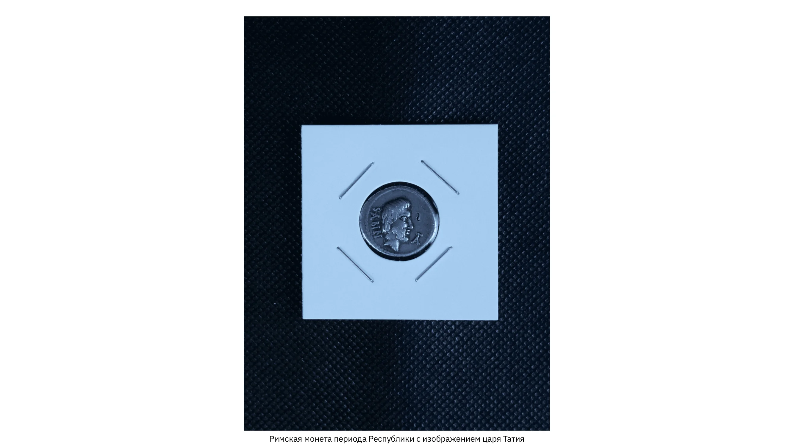

### Происхождение слова "монета" и храм Юноны Монеты

Термин "монета" берет свое начало в храме Юноны Монеты в Риме. Легенда гласит, что во время галльского нашествия в 390 году до н. э. священные гуси Капитолия предупредили римлян о надвигающейся опасности. В благодарность богине Юноне, покровительнице Капитолия, в ее честь был воздвигнут храм, который вскоре стал монетным двором для римских монет.

### Пунические войны и валютные кризисы

Военные конфликты оказали значительное влияние на развитие римской денежной системы. Во время Второй Пунической войны (218-201 гг. до н. э.) против Карфагена Рим столкнулся с серьезными финансовыми трудностями в связи с вторжением Ганнибала. Чтобы облегчить эти неотложные нужды, Рим впервые прибег к исключительному выпуску золотых монет, а также к значительному обесцениванию серебряных монет, с первоначальной чистоты в 97 % до примерно 89 %. Вес бронзовых монет (aes) также резко снизился, потеряв за шесть лет почти 80 %.

Здесь мы можем вернуться к уже обсуждавшейся нами ранее концепции о том, что греки переплавляли драгоценные металлы, хранившиеся в храмах, чтобы помочь смягчить экономический кризис. А чтобы поговорить о **Карфагене**, ниже вы можете полюбоваться настоящей карфагенской монетой из моей коллекции. На этих карфагенских монетах с одной стороны изображалась пальма, а с другой - лошадь. На этой монете лошадь не очень узнаваема, она сильно потерта.

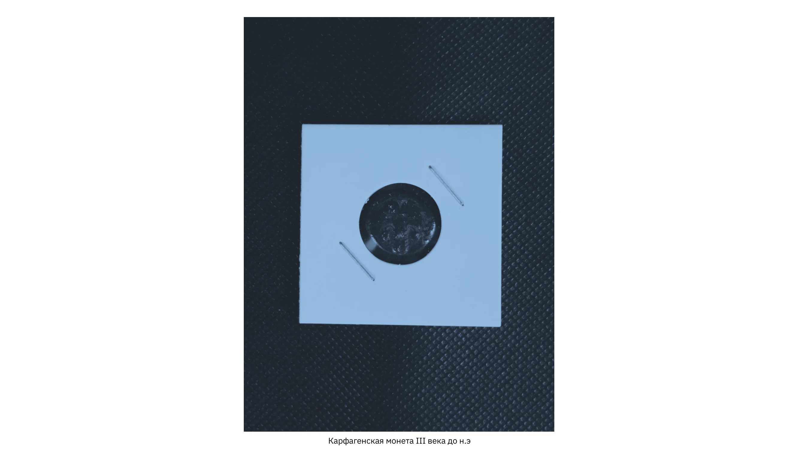

В результате вес бронзовых монет, известных как aes, также резко упал, потеряв почти 80 % за шесть лет. Таким образом, вес этих бронзовых монет, которые не являлись драгоценным металлом и использовались в повседневной торговле, сильно упал, что стало признаком обесценивания денег из-за этих войн.

### Серебряный денарий и денежная стабильность

Именно на этом критическом фоне Рим ввел знаменитый серебряный денарий в 212 году до нашей эры. Эта реформа обеспечила замечательную стабильность денежного обращения, и денарий оставался доминирующей валютой в течение почти 450 лет. Этой стабильностью Рим обязан тщательному управлению, несмотря на крупную ревальвацию в 146 году до н. э., и значительному производству для финансирования своих огромных армий, в частности, во время Пунической, Социанской (91-87 гг. до н. э.) и Македонской войн. К примеру, содержание одного римского легиона обходилось примерно в 1,5 миллиона денариев в год, что наглядно демонстрирует масштаб денежных потребностей.

За пределами римских границ войны приводили к серьезному обесцениванию монет в регионах, находившихся под римским влиянием. В пуническом Карфагене чистота электрума резко упала: с 98 % золота в IV веке до 30 % во время Второй Пунической войны, а чистота серебряных монет снизилась до 18 %.

### Эволюция монетарных мотивов

С расширением Рима менялся и характер монет: первоначально анонимные и патриотические, они постепенно приобретали индивидуальный дизайн с изображением влиятельных семей чеканщиков (тех, кто чеканил монеты). Этот переход четко символизирует политические преобразования поздней Римской республики.

Наконец, хотя Рим экономически доминировал в средиземноморском мире, он сохранял определенную простоту в платежных средствах: не было развито никаких реальных форм денежных переводов, кроме прямого обмена монетами, за исключением налоговых переводов и частных кредитов, предназначенных для элиты.

## Римская империя

<chapterId>2dc44e50-112a-5abf-97ae-8e0a9ecda989</chapterId>

:::video id=f8d6f3d6-9ee4-4504-888e-4f12b3f20489:::

**Историческая справка:**

**Принципат** - это форма правления Римской империи с начала правления Августа в 27 году до н.э. до конца кризиса третьего века в 284 году н.э.

**27 г. до н. э.: начало Pax Romana**

Период политической стабильности и процветания при правлении Августа, ознаменовавший начало Римской империи.

**Август (30 г. до н. э. - 14 г. н. э.)** радикально реформировал римскую денежную систему, установив прочный и стабильный стандарт для имперской чеканки.

**Август также был одним из первых признанных коллекционеров** древних монет и окаменелостей.

**54 Г. - 68 Г: Нерон**

Противоречивый римский император, известный своей тиранией, гонениями и катастрофическим управлением после сожжения Рима.

**64 ГОД НАШЕЙ ЭРЫ: Великий пожар в Риме

Сильный пожар уничтожает большую часть города, и Нерона обвиняют в том, что он виновен в этом.

**69 год н.э.: Год четырех императоров**

Хаотичный период с четырьмя императорами, быстро сменявшими друг друга (Гальба, Оттон, Вителлий, Веспасиан).

**79 ГОД Н.Э: Извержение Везувия**

Вулкан, уничтоживший города Помпеи и Геркуланум, в исключительных случаях сохранивший их останки под пеплом.

**165 Г. - 180 Г: Антониновская чума**

Опустошительная эпидемия, ослабившая Римскую империю при Марке Аврелии и Коммоде.

**200 год н.э.: территориальный апогей и постепенное завершение Pax Romana**

Рим достиг своего максимального расширения, но начал страдать от внутренней нестабильности и экономических трудностей.

**212 ГОД НАШЕЙ ЭРЫ: Эдикт Каракаллы о гражданстве**

Император Каракалла предоставил римское гражданство почти всем жителям империи, чтобы расширить налоговую базу.

**220 год н.э.: начало великого нашествия варваров*

Первые значительные вторжения германских народов через римские границы.

**235 Г. - 285 Г: Политический и военный кризис III века**

Период, отмеченный политической нестабильностью, с множеством недолговечных императоров, гражданскими войнами, экономическими кризисами и постоянными вторжениями.

**Аврелиан (270-275 гг. н. э.) радикально ревальвировал римскую валюту**, пытаясь восстановить ее номинальную стоимость, несмотря на высокую инфляцию.

**301 ГОД НАШЕЙ ЭРЫ: Эдикт Диоклетиана о ценах**

Император Диоклетиан тщетно пытался остановить разгул инфляции, вводя строгий контроль над ценами и зарплатами по всей империи.

**312 ГОД НАШЕЙ ЭРЫ: Константин**

Первый христианский император, основатель Константинополя, стабилизировал валюту, введя "солидус", золотую монету большой чистоты и стабильности.

**476 ГОД НАШЕЙ ЭРЫ: Падение Западной Римской империи**

Рим захватывают различные германские народы (в том числе остготы), и это событие считается официальным концом Западной Римской империи.

### Денежные реформы Августа

В этом разделе, посвященном античности, мы уже добрались до Римской империи. Денежная история Римской империи характеризуется интенсивным использованием металлической валюты, в частности золота, серебра и бронзы, а также многочисленными валютными кризисами, тесно связанными с политическими и военными беспорядками. В конце Республики, при Юлии Цезаре, в 46 году до н. э. в Риме был введен золотой ауреус - монета весом около 8 граммов, которая была широко принята во всей Европе и Средиземноморском бассейне. Цезарь стандартизировал эти золотые монеты и отчеканил первые монеты с портретом живого человека, тем самым отменив древнюю республиканскую традицию, которая отдавала предпочтение анонимным, коллективным символам. Это событие сопровождало период серьезных политических преобразований, когда личная власть постепенно вытесняла республиканские институты.

После убийства Цезаря в 44 году до н. э. Октавиан (Август) взял Рим под свой контроль, основав в 27 году до н. э. империю. В его правление была проведена полная реформа денежной системы, обеспечившая длительную стабильность римской экономики. Во времена Августа один золотой ауреус был эквивалентен 25 серебряным денариям, а сам он стоил 4 бронзовых сестерция. Эта денежная стабильность сохранялась на протяжении всего первого века нашей эры - периода, который часто называют золотым веком экономики Рима.

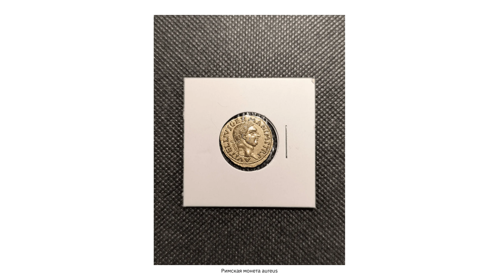

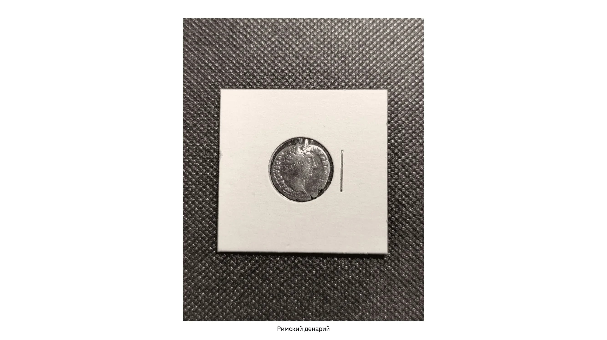

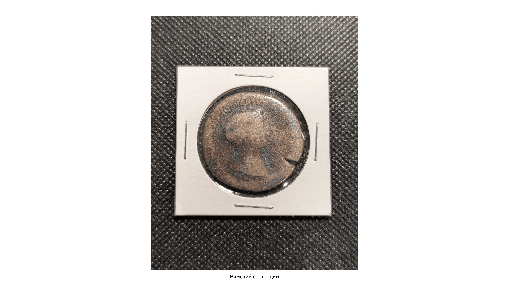

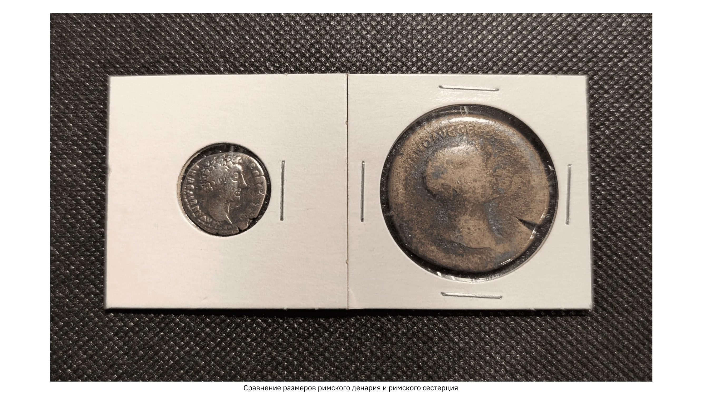

Однако начиная с Нерона (54-68 гг. н. э.) Рим начал медленную девальвацию своих монет, постепенно снижая их вес и чистоту для финансирования растущих имперских расходов, особенно после великого пожара Рима в 64 г. н. э. Эти девальвации имели заметные последствия: более чистые монеты изымались из обращения через клады или экспорт, в соответствии с **законом Грешема**, в то время как обесцененные монеты разрастались, вызывая постепенный рост цен.

В третьем веке наступает переломный момент: при императорах Септимии Севере, Каракалле и Галлиене девальвация резко ускорилась. Содержание серебра в основной серебряной монете - денарии, а затем антониниане - снизилось всего до 2%. В то же время вес золота в ауреусе снизился вдвое. Этот денежный кризис сопровождался беспрецедентной политической нестабильностью, нашествиями варваров и постоянными гражданскими войнами.

Эта часть позволяет мне представить последний экземпляр в этом разделе: антонинианус. Первоначальное название этой монеты неизвестно, но сегодня мы называем ее антонинианом. Она отличается тем, что оценивается в два денария, хотя по размеру всего в 1,5 раза больше денария. Более того, со временем эти монеты стали называться просто биллонами, то есть они изготавливались не из чистого серебра, а из сплава серебра и других металлов. Часто монеты просто покрывались серебром, служа ярким примером упадка монетного дела.

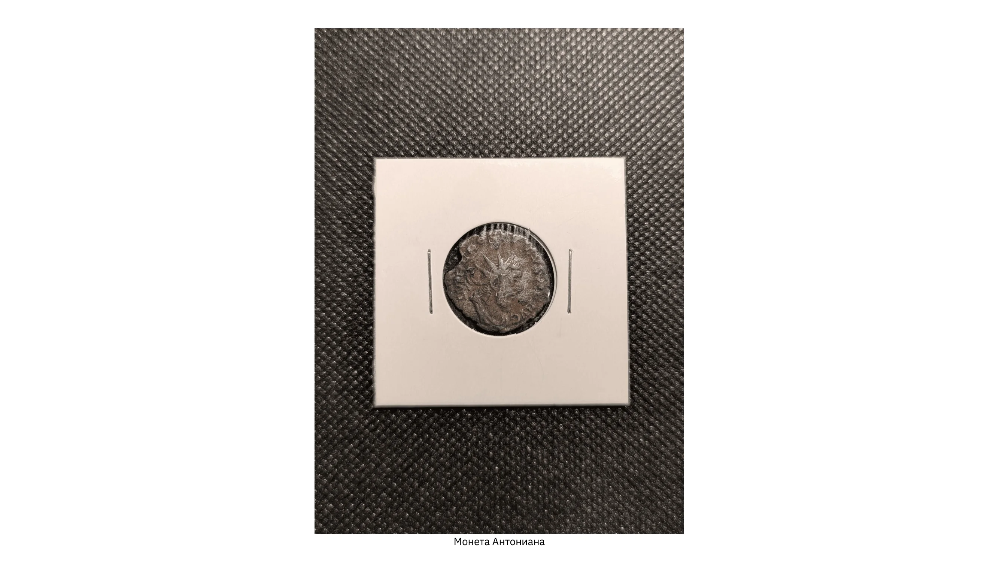

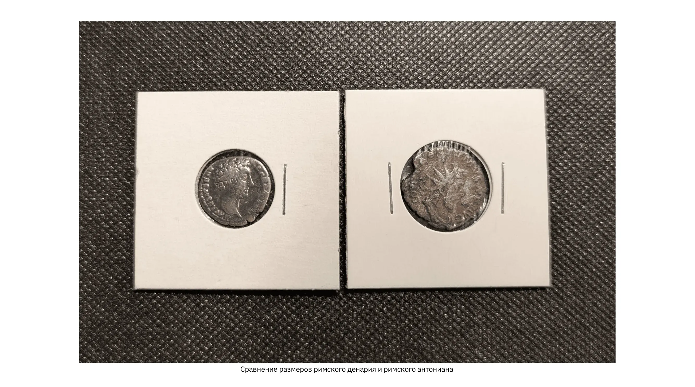

Столкнувшись с такой ситуацией, император Аврелиан (270-275 гг. н. э.) попытался стабилизировать систему путем номинальной ревальвации валют, но на самом деле эта реформа запустила инфляционный механизм, искусственно зафиксировав стоимость существующих валют на более высоком уровне.

Я сделаю небольшое отступление на эту тему. В III веке инфляция стала быстро расти по экспоненте. Ранее, несмотря на то что монеты обесценивались, ручной процесс их чеканки одна за другой обеспечивал определенный контроль над инфляцией. По статистике, за 300 лет девальвации инфляция составляла в среднем около 4 % в год. Непосредственно перед реформой Аврелиана инфляция составляла около 3 % в год.

Аврелиан ввел измерение чистоты на монете со знаком XXI, обозначающее состав 20 частей бронзы к 1 части серебра, или 5 % чистоты. Он выпустил на рынок эти монеты из 5 % серебра и отчеканил на них знак XXI. Однако он также отозвал все другие, более обесцененные монеты и отчеканил на них тот же XXI. Это фактически переоценило номинальную стоимость всех монет. В результате инфляция выросла до 20 % в год, намного превысив прежний уровень в 3 %, который был до применения этой техники.

Именно Аврелиан изобрел эту форму девальвации, которая гораздо быстрее, чем постепенное обесценивание металла, заставлявшее нас печатать монеты одну за другой. Он сделал следующее: взял все существующие монеты, отозвал их и отчеканил пуансоном, чтобы изменить их номинал. Это настоящий поворотный момент. Именно тогда инфляция стала экспоненциальной.

Чтобы наглядно проиллюстрировать это экстремальное обесценивание, я нашел несколько увлекательных статистических данных о ценах на зерно в Египте с 40 года до н. э. по III век, то есть за более чем 300 лет. Ниже вы можете увидеть греческую тетрадрахму из моей коллекции. В то время в Египте, находившемся под римской оккупацией в III веке, эквивалентом была египетская тетрадрахма. Номинал драхмы все еще использовался, и она соответствовала денарию.

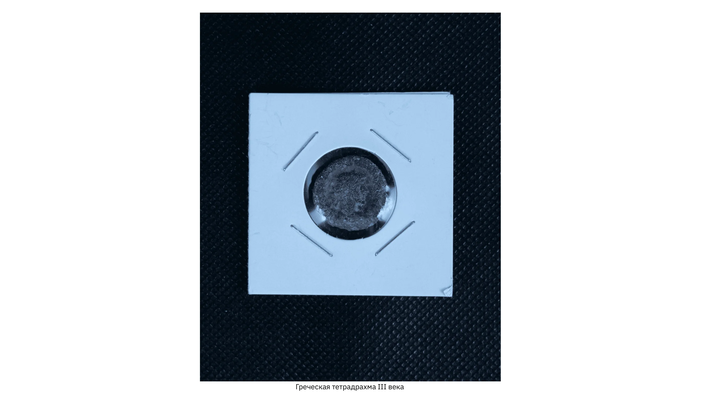

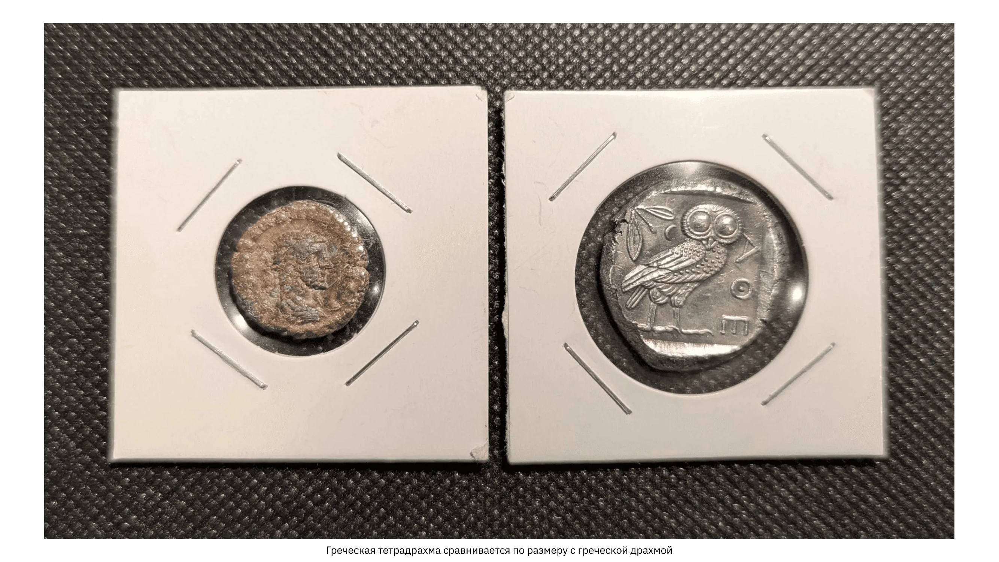

Таким образом, египетская тетрадрахма, которая у меня есть, была эквивалентом денария. Вы можете видеть, что монета сделана из биллона (или бронзы), поэтому не содержит драгоценного металла. Вы можете сравнить ее с оригинальной греческой тетрадрахмой, чтобы увидеть физическое обесценивание за эти 300 лет. Это миллионное увеличение цены на зерно в Египте.

Это физическое выражение реформ Аврелиана. Следует отметить, что в основном, в среднем за эти 300 лет инфляция составляла около 4 %. Только в конце, когда Аврелиан провел свою реформу, инфляция стала довольно экспоненциальной, и мы пришли к этой цифре в 1 миллион. В конце III века цены были в миллион раз выше, чем в I веке до нашей эры.

Его преемник **Диоклетиан** (284-305 гг. н. э.) предпринял еще более радикальные реформы: он выпустил новые валюты (в частности, аргентеус, более чистый, но слишком ограниченный в количестве), ввел жесткий контроль над ценами (Ценовой эдикт 301 г. н. э.) и **установил налоговую систему, основанную на натуральных платежах**. Несмотря на все эти усилия, реформы Диоклетиана не смогли обуздать разгул инфляции.

Столкнувшись с отказом поставлять товары и услуги в обмен на обесценившуюся валюту, Диоклетиан ввел **наследственную кастовую систему**, чтобы привязать крестьян и их потомков к своей земле.

На самом деле нужно понять, что произошло: крестьяне отказались поставлять свою продукцию в обмен на обесценившуюся валюту, и в ответ наш дорогой Диоклетиан создал **наследственные касты**, сказав: "Вы, вы не можете покинуть свою землю, ваши дети не могут покинуть свою землю, то же самое для солдат, вы - солдаты, вы согласны получать зарплату в моей валюте". В качестве переходного решения им платили натурой (мясом, едой, зерном), потому что он отказывался давать им деньги. Таким образом, он ввел эту наследственную кастовую систему, чтобы заставить людей быть привязанными к своему ремеслу, чтобы они не могли просто сменить работу, если попытаются не принять обесценившуюся валюту.

Для иллюстрации этого примера у меня есть текст, выдержка из книги "*Монетарный режим и инфляция*":

> Поскольку люди не желали работать и поставлять товары за обесценившуюся валюту, номинальная стоимость которой была выше ее внутренней или рыночной стоимости, их пришлось принуждать к труду путем введения натуральных налогов. [...] Крестьянам стало запрещено покидать свои зарегистрированные дома. Таким образом, крестьянское население стало наследственно привязано к земле.
>

> Эта наследственная кастовая система постепенно распространялась: Диоклетиан заставлял солдатских сыновей служить в армии, а работники денежных мастерских, а также ткацких и красильных фабрик, созданных Диоклетианом, становились государственными рабами с наследственной службой. Позднее золотодобытчики также стали наследственной кастой. Во времена Диоклетиана, вероятно, уже существовали и другие наследственные сословия, в частности гильдии пекарей и мясников [...] в Риме, а также епархиальные гильдии капитанов кораблей, перевозивших в Рим зерно и другие государственные грузы.

Именно Константину (306-337 гг. н. э.) удалось окончательно стабилизировать денежную систему, введя в 312 году солид - монету из чистого золота, качество и вес которой он строго гарантировал. Существовала целая система проверки чистоты и веса солидуса. **Однако эта стабильность коснулась лишь богатой элиты и императорской администрации**, в то время как **большинство населения продолжало страдать от низкокачественной валюты и постоянной инфляции**. Солид оставался стабильным в Восточной империи (Византии), где он продержался более тысячелетия, в то время как на Западе чеканка монет раздробилась на мелкие монеты низкого достоинства, что сопровождало окончательный экономический и политический распад Римской империи, которая окончательно пала в 476 году нашей эры.

В заключение я хотел бы поделиться с вами цитатой из книги *История денег: С древнейших времен до наших дней" Глина Дэвиса, в которой мастерски изложено то, что, возможно, привело к падению Рима:

*"Налоги были постоянно недостаточными, и трудности, связанные с этими все более неадекватными, запоздало корректируемыми и очень заметными налогами, заставляли Рим все больше полагаться на легкую, немедленную и скрытую форму налогообложения: девальвацию валюты. Непродолжительные специальные реформы не смогли переломить эту вековую тенденцию упадка. Финансовое давление, вызванное износом монет, кораблекрушениями, утечкой денег из-за покупки предметов роскоши на Востоке, подарками германским варварам, ростом городского населения, упадком сельскохозяйственного производства, постепенным истощением богатейших рудников и, прежде всего, политикой "хлеба и зрелищ", которая считалась необходимой для поддержания минимального порядка в городской жизни, - все эти совокупные нагрузки привели Рим к постоянной девальвации денег, перемежающейся с эпизодическими реформами, обреченными на провал "*

*Помимо бесплатного или дешевого хлеба и вина, время от времени раздавались императорские либеральные льготы ("конгиарии") в виде денежных ассигнований, особенно при Траяне (98-117 гг. н. э.) и в еще большей степени при Адриане (117-138 гг. н. э.) и его преемниках. То, что император и граждане поначалу считали исключительной привилегией, к началу II века стало обычным ожиданием. Эти раздачи "ложились тяжелым бременем на государственную казну и сами по себе способствовали банкротству государства "*

## Связь между размыванием денежной массы и инфляцией: от причин к последствиям

<chapterId>38d5781c-e900-53f7-baa7-413655d71754</chapterId>

:::video id=3999256d-aafe-4502-9b72-dfa8491a2777:::

В этом разделе рассматривается связь между размыванием денежной массы и инфляцией, от причин до последствий. Разбавление монет - одно из главных экономических явлений в истории римского денежного обращения, оказывающее непосредственное влияние на инфляцию. Начиная с I века н. э., в период правления Нерона (54-68 гг. н. э.) и далее наблюдалась медленная фаза размывания серебряной монеты (денария), ускоряемая повторяющимися военными и финансовыми кризисами, в частности, при Септимии Севере (193-211 гг.) и Галлиене (253-268 гг.).

Мы также отмечаем более постепенную девальвацию ауреуса. Эта разница в скорости девальвации подчеркивает два момента:

1. Роль счетной единицы в биметаллизме для государственного контроля над деньгами. В данном примере счетной единицей является динарий. Я выделил три различных способа управления стоимостью счетной единицы: девальвация (разбавление металла), реденоминация (антонинианус) и навязывание номинала путем маркировки "XXI" (Аврелиан)

2. Стремление государства как можно дольше откладывать девальвацию ауреуса - резерва стоимости, позволяющего элите сохранять свою покупательную способность за счет менее обеспеченных слоев населения. Мы будем часто возвращаться к этому принципу на протяжении всего курса, особенно в связи с концепцией, известной как "эффект Кантильона", и реденоминацией мараведи в Испании.

Этот феномен весьма интересен и повторяется на протяжении всей истории. Мы вернемся к нему на примере Мараведи в одном из следующих разделов. Подобная картина прослеживается и со всеми резервными валютами: резервная единица стоимости, такая как ауреус в Риме, остается нетронутой. Однако расчетная единица, используемая населением для торговли и повседневных операций, часто обесценивается. В результате денежная инфляция затрагивает простых людей, в то время как те, кто может позволить себе золотые монеты, остаются практически незатронутыми.

И кстати, **это то же самое явление, которое происходит сегодня с девальвацией валюты, что позволяет финансовым активам расти в цене**, и поэтому люди, которые используют валюту, самые бедные люди, становятся беднее, а это, в свою очередь, обогащает за счет создания денег активы тех, кто способен, кто имеет средства, чтобы защитить себя от девальвации, и таким образом углубляет социальное неравенство. Это моя маленькая политическая тирада.

То, что я только что описал, называется эффектом Кантильона. Мы увидим, что этот джентльмен жил во времена Джона Лоу, о чем мы также расскажем в одном из следующих разделов.

Реформы, начатые во время правления Аврелиана, привели к резкому росту инфляции. Инфляция номинальной стоимости денег больше не ограничивалась способностью монетных дворов производить монеты вручную. Монеты, которые уже были отчеканены, теперь можно было просто маркировать, и номинальная стоимость денежной массы росла быстрее.

У меня есть две цитаты, которыми я хочу поделиться с вами в связи с Аврелианом. Первая взята из книги *История денег: С древнейших времен до наших дней*:

*"Что касается римской экономики, то вклад Аврелиана был скорее катастрофой, чем триумфом. Во многом благодаря характеру его "реформы" темпы инфляции удалось увеличить намного больше, чем это было возможно ранее, даже при безответственном Галлиене. В течение двух столетий после Аврелиана инфляция стала эндемической для всей Римской империи "*

Вторая взята из книги *Древняя история из монет* и касается отрыва денежной системы от золота:

*"Реформа Аврелиана изменила отношения между золотыми деньгами и остальными элементами денежной системы. До нее другие виды валюты были привязаны к **ауреусу** в соответствии с официальными курсами (25 египетских денариев или 25 тетрадрахм за один ауреус и т. д.). После реформы золотые деньги начали **свободно колебаться в цене**, как и любой другой товар, в то время как остальные элементы денежной системы **уменьшились в цене** из-за **ослабления сплавов**, перестав быть **обеспеченными золотом**. Поскольку расчетная единица теоретически оставалась основана на серебре (денарий, или в Египте драхма), цены росли по мере обесценивания валюты. "*

Как видите, девальвация валюты, служившей расчетной единицей, непропорционально сильно ударила по менее обеспеченным слоям населения, в то время как отказ от связи с золотыми деньгами защитил покупательную способность тех, кто мог позволить себе сбережения в хранилище стоимости, которым является золото.

Вы должны понять, что если существует связь между денарием и ауреусом, то даже если вы обесцените денарий, если вы все еще сможете обменять свой денарий на ауреус по этому курсу (25 денариев за 1 ауреус), люди обязательно обменяют свой денарий на ваш ауреус, поскольку денарий будет переоценен, а ауреус недооценен. Но в этой реформе они убрали эту связь. Таким образом, люди больше не могли обменивать денарии на серебро, обесценившееся по отношению к золоту. Именно тогда те, кто имел доступ к золотым монетам, смогли по-настоящему защитить себя, потому что после этого люди уже не могли обменять обесцененное серебро на недооцененное чистое золото. Это очень важный момент в эволюции валюты.

Яркий пример последствий этой реформы Аврелиана прекрасно иллюстрируют эти цитаты из книги *Монетарные режимы и инфляция*:

*"Между правлениями императоров Клавдия (41-54 гг. н. э.) и Констанция (337-361 гг. н. э.) цена пшеницы на открытом рынке в Египте, выраженная в драхмах, **увеличилась более чем в миллион раз**. Впечатляющая инфляция цен - один из центральных экономических фактов III и IV веков нашей эры" (Lendon 1990, p. 106). Однако такое развитие событий **не столь драматично, как кажется**, поскольку соответствует **среднегодовому уровню инфляции в 4,4 %**. А согласно Вассинку (1991, с. 482), инфляция фактически началась **только в 238 году нашей эры**"*

*"Начиная с этой даты инфляция медленно ускорялась, поскольку **хорошие деньги сначала вытеснялись из обращения**, так что общая денежная масса поначалу почти не увеличивалась. Впоследствии она достигла среднегодовых темпов **3,65% в период с 250 по 293 год**, поднявшись до **22,28% в период с 293 по 301 год** (Wassink 1991, p. 466), то есть вплоть до **запрещенных денежных реформ императора Диоклетиана**. Это явление **особенно впечатляет для инфляции в монетном режиме, основанном на металлах**. "*

Этот феномен инфляции, связанный с размыванием денежной массы, первоначально был реакцией на периодические денежные кризисы римского государства. Уменьшая содержание драгоценных металлов в монетах при сохранении их номинальной стоимости, государство временно увеличивало свои ресурсы. Однако цены отреагировали на это не сразу: римская система обладала определенной "липкостью", что означало, что зарплаты и цены медленно адаптировались к последовательным девальвациям. Тем не менее, после определенного порога цены резко возрастали, чтобы вернуть рынок в равновесие с реальной стоимостью валют.

Как уже говорилось выше, этот феномен особенно ярко проявляется с середины III века и далее. В Египте, регионе с богатой документацией, цены были умножены на 10 при Аврелиане (274 г. н. э.) после официальной переоценки валюты, несмотря на первоначальную попытку стабилизации. Затем, при Диоклетиане (301 г. н.э.), эдикт о ценах ввел жесткие меры контроля для сдерживания инфляции, не устранив ее первопричину - перепроизводство и деградацию денежной массы, - что привело к предсказуемому провалу. Постоянная инфляция в конечном итоге подталкивает экономику к двухуровневой системе: **элита, защищенная золотым запасом (например, солидусом Константина**), наслаждается стабильностью, в то время как большинство населения продолжает страдать от хронической инфляции, **иллюстрируя то, что сегодня известно как "эффект Кантильона "**

Существует четкая связь между размыванием римской денежной массы и инфляцией, причины которой в основном связаны с хроническим бюджетным дефицитом, непрекращающимися военными расходами и плохим государственным управлением экономикой.

## Падение Римской империи

<chapterId>b6ec0914-227b-509c-8108-b09eec9bb904</chapterId>

:::video id=91d4fee5-59bb-4ab9-a90b-e1125c71decb:::

### Девальвация валюты и крах Рима

Австрийская экономическая школа, в частности Людвиг фон Мизес, предложила монетарную интерпретацию падения Рима. Согласно этой концепции, постепенная девальвация римской валюты разрушила сложную систему разделения труда, которая поддерживала империю с населением в 60 миллионов человек. Валюта, центральный инструмент экономической координации, будучи испорченной, привела к краху всей социальной и экономической структуры.

Это ухудшение денежного положения не только разрушило внутреннее единство империи. Оно также привело к разрыву торговых связей с соседними народами. Лишившись выгод от торговли с Римом, "варвары" перешли от мирного сотрудничества к хищничеству. Таким образом, вторжения носили не только военный характер, но и были результатом фундаментального экономического кризиса.

### Три фазы имперской девальвации

Римскую денежную историю можно разделить на три отдельных периода. Первый, от Юлиев-Клавдиев до Антонинов (27 г. до н. э. - конец II в.), отличался относительной стабильностью. При Траяне империя достигла своего апогея: занимая площадь в 5 млн км², Рим стал первым городом-миллионером в истории. Чистота серебра в денарии составляет от 98% до 80% - умеренная девальвация, позволяющая экономике функционировать.

Второй период, III век, был периодом военной анархии. Двадцать шесть императоров сменяли друг друга в течение нескольких десятилетий. Валюта рухнула: антониниан, который якобы стоил два денария, содержал всего 1,5 в металлическом весе - первая попытка развести юридическую и реальную стоимость. Эти манипуляции привели в действие закон Грешема: плохие деньги вытесняют хорошие. Граждане запасались хорошими монетами, тратя только обесцененные.

Монетные сокровища, обнаруженные археологами, свидетельствуют об этом экономическом беспокойстве. Захороненные амфоры показывают, как римляне складывали сначала лучшие монеты, постепенно добавляя обесценивающиеся. Эти древние "стопки" свидетельствуют о действиях человека перед лицом неопределенности - попытке сохранить ценность в разрушающемся мире.

### Константин и двойная система

Константин (310-337) попытался стабилизировать империю с помощью радикальных реформ. Он ввел золотой солид - валюту, строго контролируемую администрацией. Чиновники систематически проверяли вес и чистоту. Эмиссия оставалась ограниченной и была связана с военными трофеями. Эта валюта стала исключительным инструментом власти: налоги платились в солидах, а легионы получали жалованье в золоте.

В то же время народ использовал бронзовый нуммус, который постоянно обесценивался. В 445 году солид стоил 7 000 нуммов, в 498 году - 16 800. Эта двойная система институционализировала эффект Кантильона: те, кто имел доступ к солиду - администрация, землевладельцы - были защищены от инфляции. Плебс, ограниченный нуммом, неумолимо беднел.

Такое разделение монет создало две параллельные экономики без официального обменного курса. Солидус остался расчетной единицей, но обращался очень мало. Нуммус использовался для ежедневного обмена, но постоянно терял в цене. Такая денежная архитектура предвещала неравенство зарождающейся феодальной системы.

### Крах разделения труда

Девальвация валюты постепенно уничтожила экономическую специализацию. Без надежной расчетной единицы средиземноморская торговля пришла в упадок. Специализированные ремесленники Рима больше не могли торговать с Египтом или Галлией. Провинции ввели свои собственные валюты, умножив торговые трения.

Столкнувшись с таким распадом, городское население бежало в сельскую местность - это был исход из городов, обративший вспять многовековой процесс урбанизации. Ремесленники оставили свои ремесла и занялись натуральным хозяйством. Крупные поместья (латифундии) стали самодостаточными островами, предвещая средневековые сеньории.

В отчаянии Диоклетиан даже потребовал налоги натурой - окончательное признание монетарного провала. Его эдикт о максимуме (301 год) пытался контролировать цены, ускоряя возврат к бартеру. Экономическая сложность вернулась к доцивилизационным формам.

### Выживание с помощью золота от Рима до Византии

Парадоксально, но солидус пережил Западную империю. Византия сохраняла его до XI века, обеспечив себе еще тысячу лет экономической стабильности. На Западе память о нем сохраняется: французское слово "sou" происходит от solidus, что является лингвистическим свидетельством утраченного денежного величия.

Землевладельцы, сохранившие свои богатства в золоте, стали феодалами. Церковные структуры, единственные уцелевшие институты, обеспечивали социальные связи, которые деньги уже не могли гарантировать. Европа распалась на автаркические области, каждая со своей собственной натуральной экономикой.

Эта трансформация показывает хрупкость сложных цивилизаций. Разделение труда, позволившее Риму прокормить миллионное население, полностью зависело от денежного доверия. Как только это доверие было нарушено, здание рухнуло, вернув Европу к примитивным экономическим формам почти на тысячелетие.

## Темные века и Средневековье

<chapterId>a5856873-6142-57be-8a73-1f9e3df83792</chapterId>

:::video id=86b8da9b-3831-443d-b170-58c2bea3ad54:::

История и возникновение денег в Средние века отмечены периодами регресса, инноваций и экономического подъема.

Например, когда римская армия покинула Британию, на остров больше не поступало римских монет. Около 435 года нашей эры использование монет полностью исчезло в Британии, что стало уникальным явлением для бывших римских провинций. Почти два столетия британская экономика обходилась без монет вплоть до VII века, когда постепенно вновь появились монеты времен Меровингов и континентальные монеты.

Начиная с VIII века христианское влияние способствовало восстановлению монетной чеканки в Северной Европе. Ключевой фигурой в этот период был Пипин Короткий, король франков, который в 752 году ввел в обращение денарий, позже принятый его сыном Карлом Великим. Карл Великий широко распространил использование серебряного денария, создав европейский денежный стандарт на несколько столетий.

В Англии чеканка монет пережила значительное возрождение с появлением серебряного пенни при короле Мерсии Оффе около 765 года. Эта валюта стала настолько важной, что оставалась практически неизменной в течение 500 лет.

В качестве первого артефакта, относящегося к этому периоду, позвольте мне показать вам репродукцию английского пенни того времени.

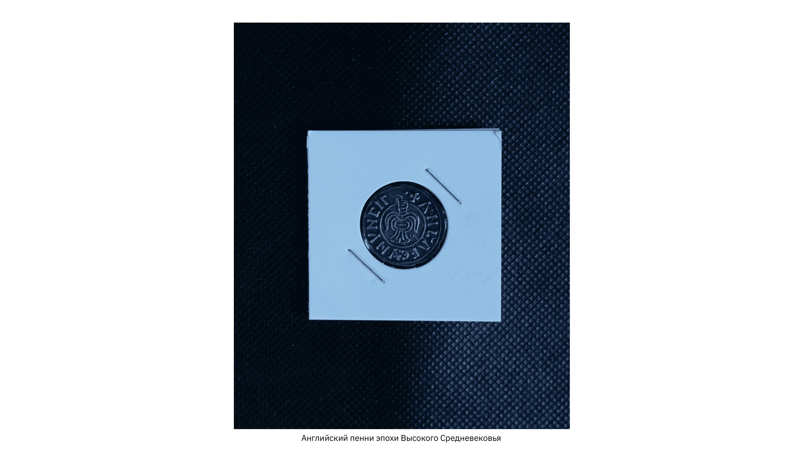

В период Высокого Средневековья Европа погрузилась в феодализм после краха римской денежной системы. Большинство населения использовало медные или бронзовые монеты низкого достоинства, которые часто подвергались размыванию, что ограничивало торговлю на больших расстояниях.

Возвращение монет в качестве платежного средства происходило постепенно, кульминацией стало появление в XIII веке золотого флорина во Флоренции в 1252 году, а затем золотого дуката в Венеции. Эти золотые монеты получили широкое распространение благодаря расширению торговли и растущей потребности в надежных, принятых во всем мире платежных средствах.

В Англии денежная система была защищена от размывания инновационной фискальной политикой, например, земельным налогом, введенным Вильгельмом Завоевателем после 1066 года, который сохранил качество пенни стерлингов. Важно понимать, что в то время государи могли обесценивать валюту для финансирования государства, а **введение этого налога позволило сохранить стабильность валюты и финансировать государство за счет налогов**

Однако соблазн нажиться за счет размывания денежной массы приводил к кризисам, как, например, в XII веке при Генрихе I, когда качество чеканки монет резко упало. Жесткие реформы, иногда сопровождавшиеся жестокими мерами против монетчиков, временно восстанавливали доверие к валюте.

В Средние века также появились сложные финансовые практики, такие как использование счетных палочек в Англии для обхода запрета на ростовщичество и предоставления кредитов. Церковь не очень жаловала ссуды под проценты, поэтому использовались различные методы, чтобы обойти запрет на использование процентов.

Эти инновации стали ответом на хроническую нехватку металлических денег и способствовали появлению зарождающегося финансового рынка.

Крестовые походы стимулировали средиземноморскую торговлю, способствуя развитию международных обменов и новых банковских практик, в частности через орден рыцарей-тамплиеров. Рыцари-тамплиеры стали важными финансовыми посредниками, позволяя крестоносцам получать ликвидные средства вдали от дома, предвосхищая современную европейскую банковскую систему.

Чтобы сделать связь с тамплиерами, ниже вы можете увидеть французскую средневековую монету, на которой можно различить красивый крест в центре. На монетах той эпохи этот крест был довольно распространен.

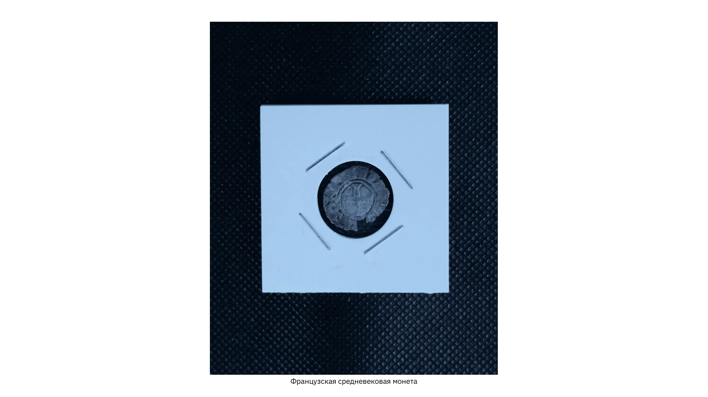

Наконец, такие крупные кризисы, как Черная смерть (1346-1353), привели к глубоким экономическим преобразованиям. Резкое сокращение численности населения привело к резкому росту заработной платы, вопреки попыткам правительства сохранить прежний уровень оплаты труда.

В то же время Столетняя война (1337-1453) заставила государства проводить более агрессивную фискальную политику для финансирования своих армий, что способствовало ослаблению феодальной системы.

Таким образом, Средние века были отмечены постоянным напряжением между потребностью в надежных деньгах для торговли и постоянным искушением правителей разбавить деньги ради сиюминутной выгоды. Этот конфликт оказал глубокое влияние на развитие европейской денежной системы, заложив основы современных экономических систем.

В заключение этого раздела я хотел бы добавить довольно интересный анекдот, произошедший в Англии примерно в это время. Этот анекдот взят из книги "История денег", написанной Глином Дэвисом.

В ней упоминается, что в Англии переход власти к парламенту переложил бремя долга с суверена на парламент, что привело к хронической государственной задолженности. До этого долг лежал на плечах суверена.

Как только парламент смог захватить часть полномочий по созданию денег, он позволил создавать долгосрочные долги, которые несли люди, а не король. Раньше, если король разорялся или менял короля, долг исчезал вместе с ним.

В тот момент, когда создание долга осуществляется парламентом, возникает концепция суверенного долга, поскольку он потенциально неограничен во времени. Пока существует государство, пока существует парламент, существует и этот долг, и они должны были найти всевозможные способы его рефинансирования и распределения во времени. Это серьезная смена парадигмы, когда уже не король или королевская семья гарантировали или несли бремя этих долгов, а парламент и, соответственно, его граждане.

## Возрождение

<chapterId>1d1dfb05-70b4-5b7b-9708-373c2182950d</chapterId>

:::video id=4977b4f3-c7b2-41a5-ad7b-a96a8cca4092:::

Мы подошли к той части курса, в которой рассказываем о периоде, известном как Ренессанс. Он проходит на фоне трагического кризиса, вызванного стремительным распространением чумы, которую занесли на корабли блохи на крысах. Эта трагедия, однако, сообщает нам о росте торговли и путешествий в период Высокого Средневековья. Ранее в этот период не так много людей перемещались так далеко и так быстро.

### Флорин из Флоренции

Возвращение золотой чеканки в Европу в эпоху Возрождения знаменует собой фундаментальный поворотный момент в истории денежного обращения. **Все началось с флорентийского флорина 1252 года, первой крупной золотой монеты, отчеканенной в Европе со времен падения Рима**. Благодаря своему удивительно постоянному весу и чистоте (около 3,5 грамма чистого золота) флорин оставался неизменным на протяжении четырех столетий и быстро стал важнейшим общеевропейским денежным знаком.

Ниже вы можете увидеть репродукцию флорина: золотой флорин, изготовленный из олова и отчеканенный французским художником, который делает превосходные изделия, выгравированные и выбитые вручную.

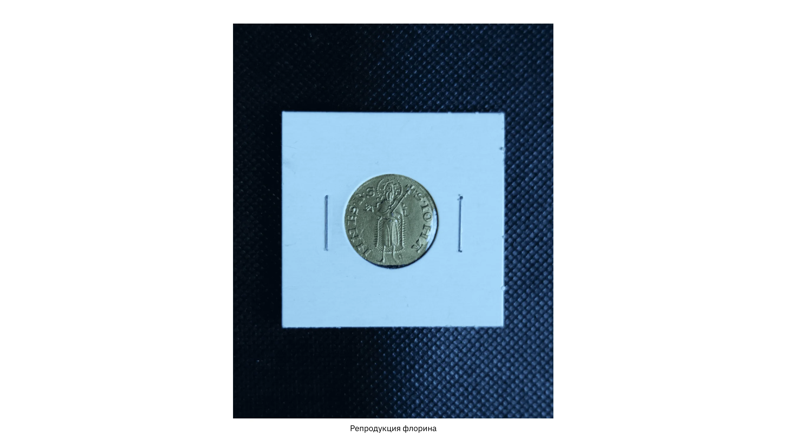

Возвращение к чеканке золотых монет было обусловлено конкретным контекстом: крах византийского солида и экономический упадок мусульманского мира из-за монгольских нашествий создали денежный вакуум в международной торговле.

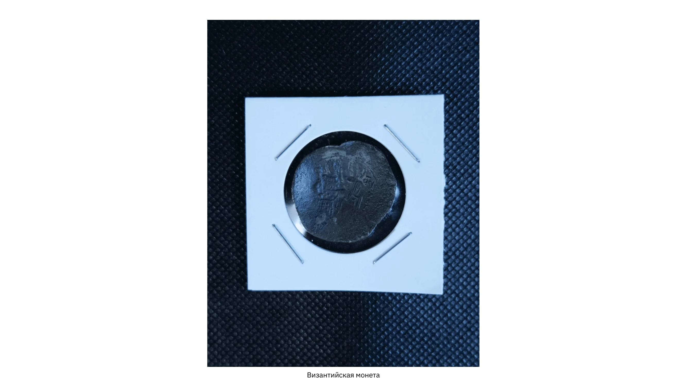

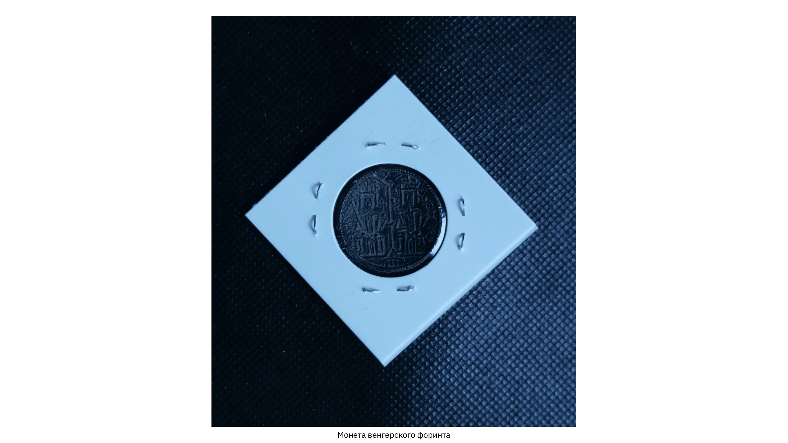

На первом изображении показана византийская монета, которую я нахожу весьма интересной. Я проведу параллель с монетой того же периода из Венгрии (второе изображение вверху). Венгерская монета имеет форму кубка, похожего на миниатюрную чашу. На иконографии изображены религиозные фигуры - короли, держащие кресты рядом друг с другом. Эта монета имеет форму чаши и происходит из Венгрии.

Копировать монеты других стран было вполне обычным делом. Поскольку византийские монеты были общепризнанными, другие страны часто копировали их. Как вы можете убедиться, сравнив их бок о бок: эти экземпляры очень похожи.

Северная Италия, в частности Флоренция, Венеция и Генуя, воспользовалась этой ситуацией, чтобы выпустить новые твердые валюты - монеты со стабильным содержанием драгоценных металлов. Венеция последовала примеру Флоренции, отчеканив в 1270 году дукат - валюту, которая была почти идентична флорину и широко использовалась в средиземноморской торговле.

Флорин стал первой международной резервной валютой, принятой в более чем 150 европейских городах до конца XIV века. С созданием крупной флорентийской банковской сети, возглавляемой Медичи, управление денежными и бухгалтерскими операциями было основательно модернизировано, что даже уменьшило необходимость в физической транспортировке золота.

Это еще один очень интересный момент. Было время, когда многие партии монет терялись во время морских путешествий. Технологический прогресс - регистры с двойной записью - позволил создать скриптовые деньги. Это позволило сократить количество монетных расчетов и вместо них использовать систему письменных записей, что значительно снижает риск потери денег в пути.

Развитие денежного обращения также сопровождалось значительной эволюцией банковских методов. Отчасти под влиянием крестовых походов, связанных с мусульманской банковской практикой, в средневековой Европе уже в XIII веке появились рудиментарные банковские системы во Флоренции, Венеции, Барселоне и Генуе. Рыцари-тамплиеры, религиозный и военный орден, уже разработали систему, позволявшую крестоносцам путешествовать, не забирая с собой богатства.

Они вносили средства в офис тамплиеров в своей стране, а затем могли отправиться в путешествие с письмом и забрать монеты по прибытии в место назначения крестового похода.

Это означало, что нам не нужно носить с собой монеты из драгоценных металлов.

Именно в этот период Европа узнала о существовании бумажных денег в Китае благодаря путешествию Марко Поло в XIII веке. Однако разработка банкнот затянулась на несколько столетий, поскольку Европа предпочла сначала усовершенствовать методы чеканки металлических монет. Леонардо да Винчи, близкий к Луке Пачоли, известному бухгалтеру, активно участвовал в совершенствовании денежных прессов, способствуя более быстрому и равномерному изготовлению монет.

Мы имеем в виду маятниковую технику нанесения ударов, о которой говорилось ранее в курсе. Этот метод позволял получать более однородные монеты по сравнению с ударами молота и, что немаловажно, позволял делать надписи по краю монеты, как я уже показывал ранее. Ниже представлен европейский талер 1793 года, на котором отчетливо видна надпись по краю.

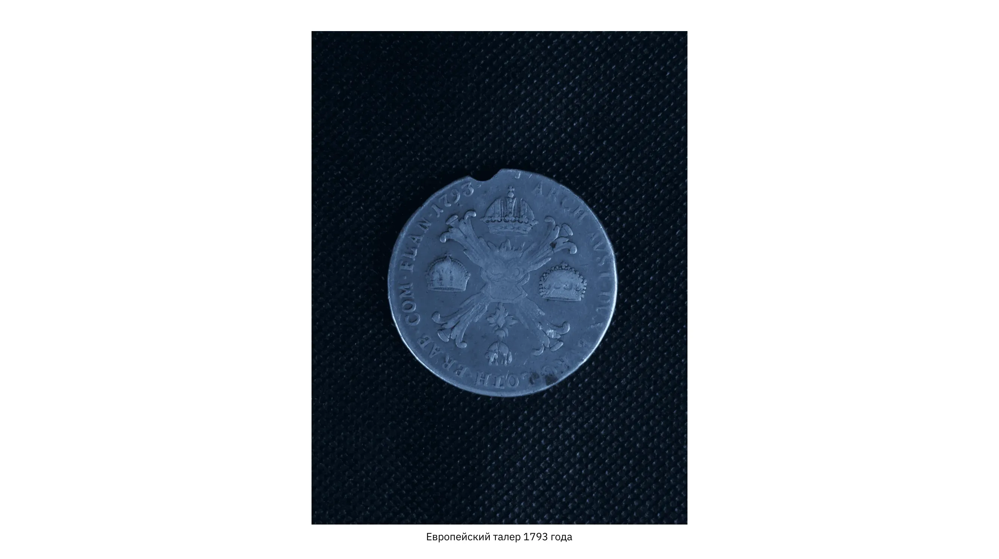

Однако в XV веке Европа пережила серьезный валютный кризис, сопровождавшийся общим ухудшением содержания серебра в европейских валютах, которое около 1450 года упало до менее чем 5 %.

С XVI века центр тяжести денежного обращения переместился в Испанию, чему способствовали объединение королевств Арагон и Кастилия, окончание Реконкисты и великие морские открытия, такие как открытие Христофора Колумба в 1492 году. Массовый приток серебра с американских рудников серьезно нарушил европейский и мировой экономический баланс, вызвав инфляцию и новую геополитическую напряженность.

Эпоха Возрождения также ознаменовала собой значительную художественную эволюцию в монетном деле, когда появились такие монеты, как талер (Joachimsthaler), от которого произошел термин "доллар". Эти крупные серебряные монеты отражают новые художественные и механические методы чеканки, ставшие возможными благодаря техническим инновациям из Северной Европы.

Наконец, финансовый Ренессанс положил начало переходу к экономическому модерну: развитие банковского дела, кредита и финансовых рынков, появление первых форм современного капитализма в великих торговых городах - Амстердаме, Лондоне и Стокгольме - заложили основы международной финансовой системы, какой мы знаем ее сегодня. Об этом мы расскажем в следующем видео.

# Изъятие денег государством

<partId>17cfb1b4-5bc1-53e0-b035-05c7cf76be92</partId>

## Эволюция мировых резервных валют

<chapterId>d65cc352-e7ca-5f03-9b23-dd1fae5c0395</chapterId>

:::video id=82710062-8fff-426c-93af-923c08d82233:::

### Историческое значение драгоценных металлов

Добро пожаловать в этот раздел, посвященный возникновению резервных валют и центральных банков. В качестве первого пункта этого нового раздела мы сосредоточимся на эволюции мировых резервных валют.

Драгоценные металлы, особенно золото и серебро, издавна считались основой богатства и власти в империях. Жажда золота всегда была доминирующей движущей силой, и именно приток драгоценных металлов оказал самое прямое и очевидное влияние на развитие денежного обращения в Европе. В эпоху Средневековья и раннего Возрождения одержимость золотом и серебром была вызвана сложностью сохранения стоимости других видов товаров, а также высоким спросом со стороны иностранных держав, особенно в торговле с Востоком.

На протяжении веков несколько империй сменяли друг друга в качестве мировых экономических центров. Страна, которая доминирует в мировой торговле в определенный период, обычно получает статус резервной валюты. К ним относятся:

- Испания и Португалия (XV и XVI века)

- Соединенные провинции (Нидерланды) в XVII веке

- Франция и Великобритания в XVIII и XIX веках

- Соединенные Штаты в XX веке

### Португальский бум и реал (1450-1530)

**Португалия** доминировала в мировой торговле во второй половине XV - начале XVI веков благодаря **португальскому реалу**, серебряной монете относительно одинакового веса. Португальцы, благодаря своим достижениям в навигации, нашли новые морские пути в Африку, Азию и Новый Свет. Военные крепости и торговые посты множились от Африки до Китая (Макао).

В ответ на спрос Европы на золото и серебро "постоянным стимулом для великих открытий была коммерческая выгода, в частности погоня за золотом и серебром" Однако Португальская империя, чрезмерно разросшаяся и столкнувшаяся с конкуренцией со стороны голландцев, англичан и французов, начала приходить в упадок.

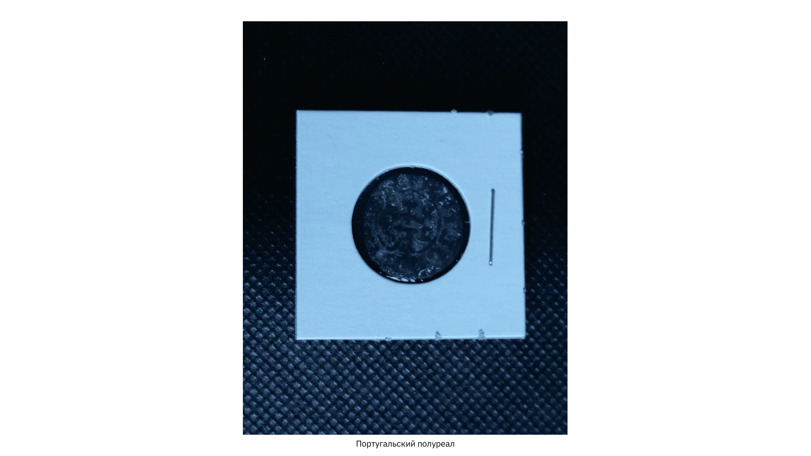

Здесь, вверху, вы можете увидеть португальский полуреал времен этих морских завоеваний.

### Испанский апогей и испанский доллар (1535-17 век)

После завоевания Нового Света **Испания** стала доминирующим игроком. Ее монарх, контролировавший гигантские серебряные рудники (Потоси в Боливии, Сакатекас в Мексике), сумел отчеканить деньги из чистого серебра, избежав тем самым обесценивания собственной валюты - **испанского риала**

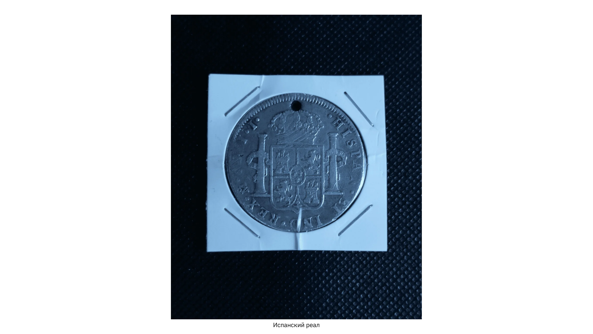

Испанский реал, также известный как "кусок восьмерки", получил свое прозвище потому, что его часто разрезали на восьмерки для создания более мелких монет. Он также был известен как **испанский доллар**. Монета, которую вы видите выше, датируется 1814 годом, что делает ее немного более поздним примером. Однако самые первые монеты испанского доллара не были столь изысканными; они были отбиты молотком и в целом были менее круглыми и четкими.

Особенно интересно то, что испанский доллар в то время служил международной резервной валютой. Испанские власти также выпускали собственную местную валюту, мараведи, и регулярно корректировали денежную массу путем отзыва. Например, медная или бронзовая монета достоинством в один мараведи могла быть отозвана и помечена цифрой "2", затем "4", и так далее, вплоть до цифры "8" На фотографии высокого разрешения хорошо видно, как на монете отчеканена цифра "8". Этот метод эффективно расширял денежную массу... что неизбежно приводило к инфляции.

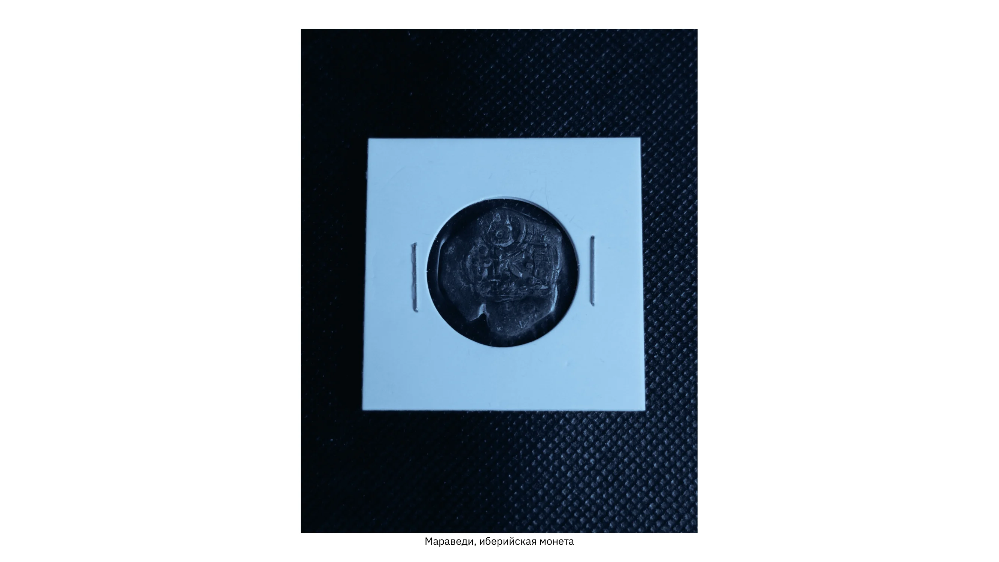

Если мы посмотрим на историю резервных валют, то обнаружим интересный момент: империи не раздували свои валюты до тех пор, пока сохраняли статус резервной валюты. **И только в конце своего господства они обесценивали ее, теряя эту привилегию, которая затем переходила к новой империи**.

В Испании испанский доллар почти 200 лет доминировал в мировой торговле, особенно между Китаем и Европой. Эти монеты можно было найти даже в китайских портах. И вот тут нам подмигивает история: американский доллар произошел непосредственно от этой валюты. Когда в 1792 году были образованы Соединенные Штаты, они приняли закон о чеканке собственной валюты, и первые доллары были созданы по образцу испанского доллара, как по названию, так и по размеру монеты.

Чтобы дать вам представление о его стоимости, скажу, что американский доллар изначально был серебряной монетой весом почти в унцию, что в пересчете на сегодняшние деньги составляет 30-40 евро, в отличие от бумажной валюты, которую мы знаем сегодня. Что касается испанского доллара, то он имел настолько широкое хождение, что считается первой настоящей мировой валютой.

Однако этот приток драгоценных металлов из Америки вызвал инфляцию в Европе. Во время Революции цен (ок. 1540-1640 гг.) стоимость жизни в Англии выросла в семь раз. В Испании изобилие серебра имело обратный эффект проклятия ресурсов, препятствуя развитию надежных банковских институтов.

Впоследствии Испания столкнулась с многочисленными военными конфликтами (Фландрия, Нидерланды, Тридцатилетняя война), а ее финансы постепенно пришли в упадок. Вместо того чтобы девальвировать всемирно известную серебряную монету, сменявшие друг друга правители предпочитали объявлять дефолт или обесценивать медную монету (vellón), которую использовало местное население. Это то, что я описал ранее в случае с мараведи.

### Возвышение Нидерландов (XVII век)

После пиренейского апогея **Нидерланды** стали новой торговой державой в XVII веке. Морская торговля, Голландская Ост-Индская компания (VOC) и основание **Амстердамской биржи Exchange** (по образцу Антверпенской) сделали эту торговую республику центром.

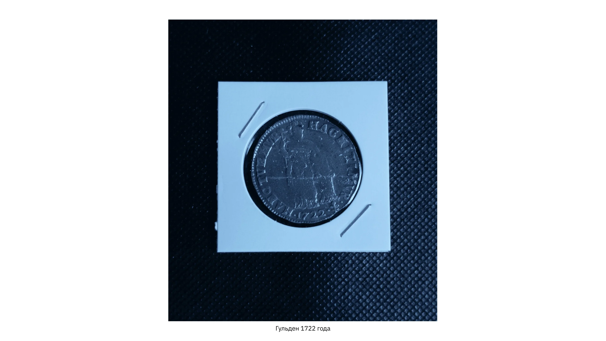

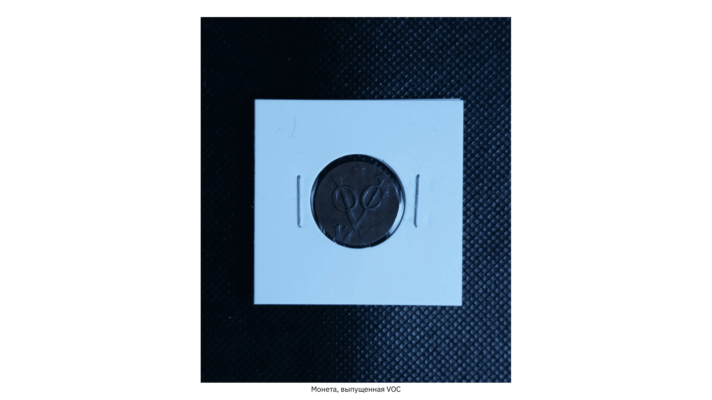

На первой фотографии вы видите гульден 1722 года (красивая серебряная монета), а на второй - монету, выпущенную VOC.

Для своего времени VOC была чрезвычайно могущественной компанией: у нее была своя армия и даже выпускалась собственная валюта.

Голландцы изобрели современный капитализм, который зародился как средство распределения рисков в рискованных предприятиях, таких как экспедиции в Новый Свет или поиск новых торговых путей. Акционерные общества позволили нескольким инвесторам объединить свои средства и разделить риск. Чтобы облегчить эти обмены, необходимо было создать учреждения, способные вести переговоры и обменивать эти ценные бумаги. Так, в 1602 году были созданы первая акционерная компания и фондовая биржа.

Голландская валюта, **гульден**, завоевала доверие благодаря чистоте серебра, а затем и принятию ее Амстердамским банком (1609 г.), где депозиты стали предпочтительной формой денег в Европе. Это очень важный момент, о котором стоит упомянуть. Да, конечно, существовали монеты, но то, что действительно было деньгами в те дни, было формой денег Писания. Фактически, большая часть мировой торговли проходила через книги Амстердамского банка. Это был настоящий прорыв в банковском деле: международная торговля теперь велась не обязательно с помощью физических монет, а непосредственно через бухгалтерские записи банка.

Этот период процветания был отмечен большим притоком золота и серебра, особенно из других стран, практикующих инфляцию или монетарный контроль. Стоит упомянуть одного интересного персонажа: **Томас Грешем**. В это время он работал на английскую королевскую семью в Нидерландах, управляя денежными потоками между двумя странами. Именно этот Грешем оставил нам знаменитый **"Закон Грешема "**.

Тем не менее, Голландская империя тоже в конце концов исчерпала себя. Войны с Англией, ослабление гульдена во время конфликтов и конкуренция со стороны других держав (Франции и Англии) стали сигналом к концу голландской гегемонии. После Четвертой англо-голландской войны (1780-84 гг.) упадок гульдена как резервной валюты стал необратимым.

### Французское могущество, амбиции и неудачи (XVII-XVIII века)

При Людовике XIV **Франция** стала величайшей континентальной державой Европы. Однако французская валюта так и не достигла статуса доминирующего эталона: многочисленные девальвации, тяжелое налогообложение и дорогостоящие войны (Аугсбургская лига, Война за испанское наследство и т. д.) сильно подорвали стабильность денежной системы.

Первый крупный эксперимент с бумажными деньгами был проведен Джоном Лоу (1716-1720). Банк Женераль выпускал банкноты, обеспеченные обещаниями государственного долга. Эта схема привела к спекулятивному пузырю и краху (Миссисипский пузырь) в 1720 году. Эта катастрофа оставила во Франции стойкое недоверие к бумажным деньгам. Именно этот катастрофический опыт привел Ричарда Кантильона к богатству благодаря этой системе, известной сегодня как эффект Кантильона, когда печатание денег обогащает тех, кто имеет доступ к печатному станку.

Когда это недоверие окончательно угасло, произошло еще одно фиаско французской бумаги: революционные **ассигнаты**. Выпущенные с 1790 года на основе конфискации имущества духовенства, эти ассигнаты пережили галопирующую гиперинфляцию, которая официально стала первой в истории гиперинфляцией, превысившей 50 % в месяц. В 1795 году, хотя их номинальная стоимость была многократно увеличена, они продавались всего за несколько процентов от своей первоначальной стоимости.

Более строгие законы пытались ввести ассигнации, но безуспешно. Правительство пыталось навязать его, вплоть до того, что угрожало смертью тем, кто его не принимал, и заставляло владельцев магазинов оставаться открытыми. Но, конечно, в конечном итоге это не сработало.

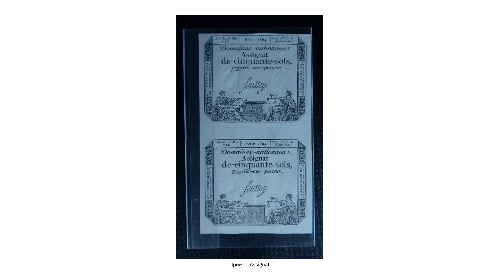

Поскольку эти бумажные деньги заменили все качественные монеты из драгоценных металлов, в соответствии со знаменитым законом Грешема, возник дефицит монет. Для чеканки новых монет использовали колокольный металл, изъятый у духовенства. Ниже вы можете увидеть красивое изделие из колокола, изготовленное из восстановленной меди, полученной в результате переплавки монет, изъятых у духовенства.

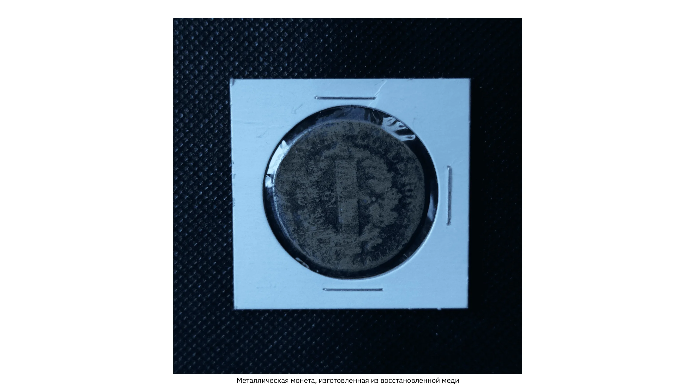

### Британское господство (XVIII - начало XX века)

**Англия**, обогнав Нидерланды, стала доминирующей державой в XVIII веке. Фунт стерлингов - старейшая валюта, которая используется до сих пор. Изначально он был привязан к фунту серебра. Постепенно его статус укреплялся, чему способствовала финансовая и фискальная революция: парламентская монархия, сильные возможности по сбору налогов и создание Банка Англии в 1694 году\.

После ряда войн с Францией Соединенное Королевство одержало победу в 1815 году (Ватерлоо), подтвердив свое превосходство. На протяжении всего XIX века фунт стерлингов выступал в качестве мировой резервной валюты. На пике своего могущества Великобритания, на долю которой приходилось всего 2,5 % населения планеты, производила 20 % мирового дохода и контролировала почти четверть земной поверхности.

Промышленная революция** и принятие **золотого стандарта** (1717 или 1718 год, под руководством Исаака Ньютона на Королевском монетном дворе) укрепили доверие к фунту стерлингов. Банк Англии принял золотой стандарт в размере 4,25 фунта за унцию золота, что позволило держателям банкнот конвертировать их в золото.

Однако Первая мировая война (1914-1918) положила конец этой системе. В течение нескольких недель все основные воюющие державы приостановили конвертируемость золота. Британская империя, а затем и фунт стерлингов вышли из Второй мировой войны в ослабленном состоянии, уступив место американскому доллару в XX веке.

А в качестве артефакта вы можете увидеть несколько красивых и интересных экземпляров ниже. Это монетные гири. Первая - суверен: самое раннее изображение фунта стерлингов. У меня есть только денежные гири для представления этих монет, потому что я не могу позволить себе купить настоящий суверен. Чтобы взвесить их, мы использовали весы, а затем положили на другую сторону денежный вес, эквивалентный стоимости суверена.

Суверен был денежной монетой - золотой монетой достоинством в один фунт стерлингов.

Предшественником знаменитого суверена была гинея, которая действовала по тому же принципу. Гвинея получила свое название благодаря содержащимся в ней драгоценным металлам, добываемым в регионе Гвинеи.

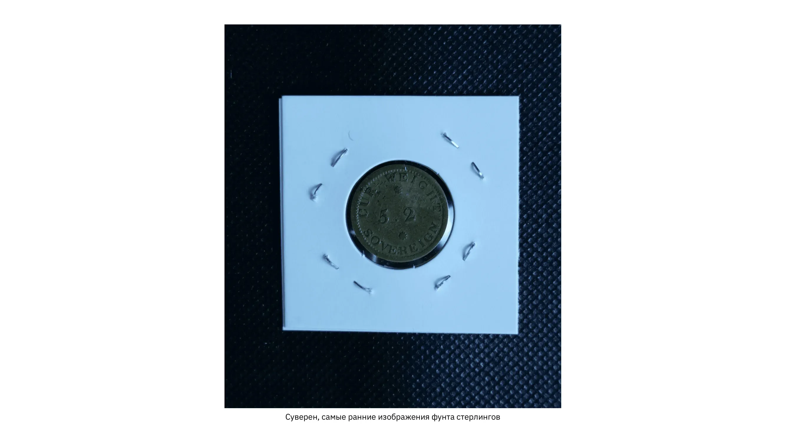

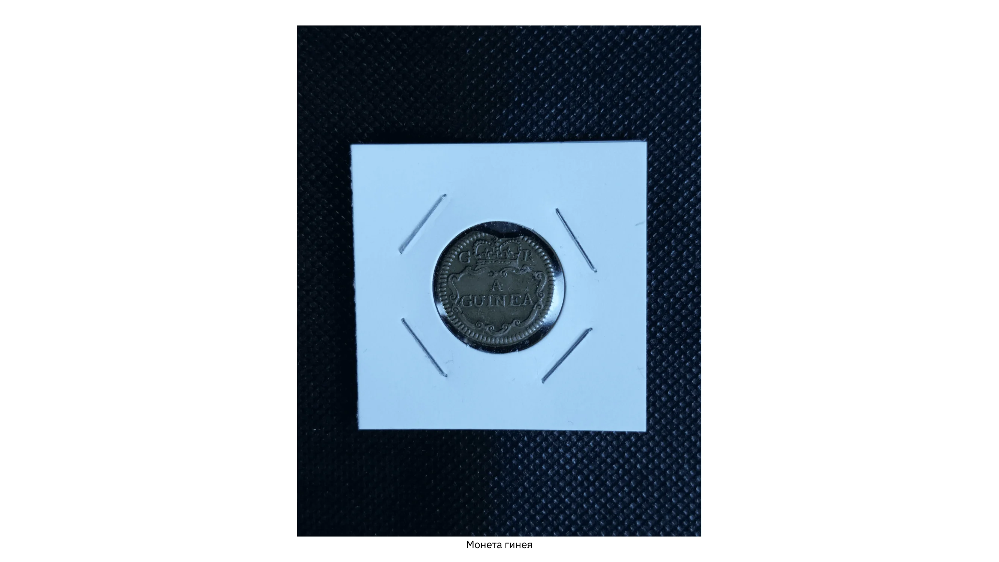

## Появление центральных банков

<chapterId>15777771-1e28-55f7-a400-69868a47079b</chapterId>

:::video id=7661b7b5-e00f-48f3-b69a-6fb2eb5ebba4:::

В продолжение этого раздела, посвященного истории первых резервных валют и их эволюции, предлагаем вашему вниманию сегмент, посвященный возникновению центральных банков. Он следует практически по тому же пути, что и возникновение резервных валют, но немного больше внимания уделяется банковским технологиям того времени.

### Зарождение банков и протобанков

Уже в XIII веке итальянцы (Флоренция, Генуя, Венеция...) разработали методы двойной бухгалтерии. Позднее **Антверпен** (XVI в.) стал ведущим финансовым центром Северной Европы, роль которого впоследствии перешла к **Амстердаму** благодаря Амстердамской фондовой бирже (1609 г.), где торговались акции VOC.

В Антверпене проходили купеческие ярмарки, где торговцы часто собирались, чтобы рассчитаться по долгам, что привело к изобретению новых финансовых инструментов. Представленный ниже вексель, датированный 1761 годом и более поздней датой, является **простым векселем**. Он содержит рукописные детали и надписи на обороте, что делает его великолепным артефактом того периода.

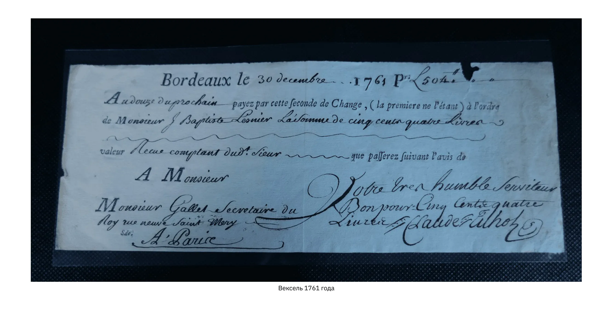

Это оживление привело к созданию более сложных банковских учреждений. **Лангобардские банкиры**, а затем и голландские купцы усовершенствовали кредитные инструменты (векселя, простые векселя и т. д.). Современная банковская система основана на этой идее: деньги могут быть кредитом, а не просто металлом.

Как видите, это возвращает нас к первоначальному вопросу о происхождении денег.

Возникают ли деньги из товара, который появляется в результате необходимости обмена, или же они возникают из кредита? Следы этого все еще можно найти в данном разделе.

### Шведский пример: Stockholms Banco и Riksens Ständers Bank

Давайте перенесемся в Швецию, где был создан самый первый центральный банк.

**Швеция** была пионером в области центрального банковского дела: в 1657 году Йохан Пальмструх создал **Стокгольмский банк**, имевший право выдавать кредиты в объеме, превышающем его металлические резервы, что ознаменовало зарождение банковского дела с дробным резервированием. Но чрезмерная эмиссия банкнот привела к панике и разгрому банка в 1663 году. Так, так...

В 1668 году в Стокгольме был основан Риксенс Стендерс Банк, первый в мире настоящий центральный банк. Однако и он пострадал от кризисов (1709, 1715...), связанных со злоупотреблением банкнотами, которые часто использовались для финансирования войн королевства.

### Неудавшийся переворот Джона Лоу

Давайте отправимся во Францию, где мы снова встретим нашего любимого Джона Лоу.

**Джон Лоу**, шотландец, убедил регента (герцога Орлеанского) создать частный банк - Женеральский банк (1716 г.), уполномоченный выпускать бумаги под золото, серебро и государственные долги. Он стал Королевским банком (1718 г.) и способствовал стремительному росту акций Миссисипской компании.

Когда реальность догнала спекуляции, **паника была усилена решением запретить хранение золота и заставить использовать банкноты Лоу**. Так, так...

В конце концов, в 1720 году пузырь лопнул, вызвав крах, который надолго подорвал доверие к бумажным деньгам во Франции.

### Банк Амстердама: становление новаторской модели

Мы переносимся в Амстердам 1609 года, где **Банк Амстердама** (Виссельбанк) захватил контроль над хранением и конвертируемостью монет в Амстердаме. Он запретил обращение частных банкнот и обязал сдавать металлические монеты в свои хранилища. Постепенно они захватили контроль над валютой. Они запретили казначеям хранить у себя монеты. Банкиры работали весь день и в конце дня должны были сдавать свои монеты в хранилища Амстердамского банка. Как я уже упоминал, в международной торговле использовались не обязательно металлические монеты. Это были деньги из Священного Писания, хранившиеся на счетах банка.

Благодаря могуществу голландского купечества банк играл роль первого фактического "центрального банка", стабилизируя мировую торговлю. Однако со временем он выдавал необеспеченные кредиты VOC, и в конце концов у него закончился металл для обеспечения своих векселей. В 1790 году выяснилось, что он одолжил большие суммы VOC и фактически объявил о банкротстве, подорвав доверие к гульдену. Так, так...

### Банк Англии - основополагающий акт современного банковского дела

В Англии XVII века золото и серебро хранилось у ювелиров, которые выдавали расписки. Эта частично децентрализованная организация показала свои возможности, когда короне потребовалось огромное финансирование для войны с Францией.

В 1694 году был основан **Банк Англии (BoE)**. Таким образом, Банк Англии появился на свет благодаря браку по расчету между лондонскими деловыми кругами и правительством, которое отчаянно пыталось найти средства на войну.

Банк получил монополию на выпуск банкнот в Англии (усиленную в 1708, 1742 и т.д.). С этого момента бумажные деньги, обеспеченные золотым запасом, обращались наряду с монетами. Это важный момент для понимания постепенного захвата денег государственными институтами. Сначала Амстердамский банк запретил менялам хранить монеты и заставил их возвращать их в банк. В Англии частным банкам было запрещено выпускать собственные банкноты, погашаемые золотом.

Они разрешили частным банкам выпускать банкноты, но обменять их можно было только на банкноты Банка Англии.

Банкноты Банка Англии, фунты стерлингов, погашались золотом. Это добавило третий слой к валюте. Итак, в основе лежит золото, затем банкноты Банка Англии, а сверху - банкноты частных банков. До этого частные банки могли выпускать свои собственные векселя, погашаемые золотом. Это еще один этап постепенного поглощения валюты государственными учреждениями.

Банк финансировал государство за счет огромных кредитов и структурировал огромный государственный долг, который финансировал экономический бум.

Эта модель была закреплена в течение XVIII и XIX веков, когда фунт стерлингов стал мировой резервной валютой под эгидой Банка Англии и золотого стандарта.

**Мировые резервные валюты** сменяли друг друга на протяжении веков, определяемые экономической, торговой и военной мощью государства или империи: Португалия, Испания, Нидерланды, затем Великобритания, а в XX веке доминирующее положение заняли Соединенные Штаты. В каждом случае мы видим схожий цикл: экономическая экспансия, коммерческий успех, международное принятие валюты, задолженность, дорогостоящие войны, злоупотребление созданием денег или кредитов и, наконец, упадок.

**Появление центральных банков** было постепенным процессом. Эти институты часто возникали в контексте дорогостоящих войн, позволяя государству финансировать себя за счет долга. Когда был принят золотой стандарт (Англия, XVII-XIX века), он обеспечивал стабильность, пока великие мировые войны XX века не привели к постепенному отказу от конвертируемости золота. Таким образом, право чеканить деньги перешло от королевской монополии к более сложным организациям, сначала частным (ювелиры, банкиры), затем полугосударственным (центральные банки), что отражает эволюцию денежного суверенитета в сторону институционализированных, глобализованных форм.

Итак, это то, что я описывал ранее. Мы часто перекладывали бремя суверенного долга непосредственно на центральные банки или на разрешение создавать деньги юридическими институтами, такими как парламент.

И самый важный факт здесь заключается в том, что **мы прошли путь от долга, который мог исчезнуть в результате банкротства суверена, до долга, который в основном лежал на плечах населения**.

## Путь к фиатной системе

<chapterId>27a98545-d350-56ee-a200-92468e6b9b33</chapterId>

:::video id=e27a753e-aeee-4307-a65c-9506aab380a1:::

Мы подошли к концу этого курса по истории денег, и, чтобы завершить его, я хотел предложить две темы. Первая тема - это различные этапы, которые привели к нашей нынешней фиатной валютной системе. Мы вернемся к фактам из раздела 5 о создании центральных банков и добавим понятие доллара США, который в конечном итоге является нынешней резервной валютой. Мы рассмотрим, как она развивалась, как появился доллар, как он развивался, как менялся, какие этапы он прошел, чтобы стать фиатной системой, ведь истоком доллара является серебряная монета.

Затем, сразу после этого, я расскажу вам об истории финансов, чтобы помочь вам понять, как мы пришли к государству всеобщего благосостояния. Итак, мы рассмотрим две темы: как мы пришли к фиатной системе, а затем, сразу после этого, как эволюция финансов привела нас к концепции государства всеобщего благосостояния.

### Европейские основы современного банковского дела

Давайте вернемся в XIII век с флорином. Чтобы понять, как мы пришли к фиатной модели, нам нужно начать с XIII века. Наряду с флорином одновременно с Медичи появилась технология, связанная с концепцией векселей.

Затем появилась антверпенская биржа с ее концепцией дисконтирования и векселей.

Затем, как мы уже видели, в Амстердаме появился VOC, первый фондовый рынок. Это ознаменовало зарождение капитализма: появились акции компаний и обмен акциями. Затем Амстердамский банк своим указом ввел использование депозитов. Это означало, что монеты должны были сдаваться на хранение в конце дня. Денежные менялы больше не могли хранить мелочь в виде монет.

В конце XVII века в связи с необходимостью создания долговых обязательств для финансирования войны был создан Банк Англии. В это время частные банки стали третьим слоем денег. Кстати, весь этот раздел, от флорина до понятия создания центрального банка, очень хорошо изложен в знаменитой книге Ника Бхатиа "Многослойные деньги", которую мне посчастливилось переводить вместе с несколькими коллегами. Мы проделали огромную работу по ее переводу, чтобы франкоговорящие люди во всем мире могли воспользоваться этими учениями.

Итак, мы находимся в конце XVII века. Банк Англии был создан для финансирования войны.

Частные банки взяли на себя третий слой валюты. Фактически, векселя частных банков больше не погашались золотом: золотом погашались векселя Банка Англии. Это свидетельствует о захвате власти над обменом валюты учреждением, которым является Банк Англии.

Затем наступила паника 1776 года. Все бросились вверх по денежной пирамиде. Это означает, что в 1776 году в банках начался ажиотаж, и все люди, у которых были бумаги третьего уровня, то есть векселя частных банков, пытались получить векселя Банка Англии, а затем пытались получить золото, но, очевидно, золота в хранилищах было недостаточно. Они объявили своего рода банковские каникулы, чтобы не платить по золотым векселям, и это привело к появлению концепции кредитора последней инстанции.

### Эволюция доллара США

Мы перешли от флорина к созданию Банка Англии. Конечно, между ними были Первая и Вторая мировые войны, но ранее, в 1796 году, события происходили и по другую сторону Атлантики. В 1776 году Америка все еще была британской колонией, и колонии использовали бумажную валюту. Ниже представлена двухшиллинговая купюра Коннектикута 1776 года.

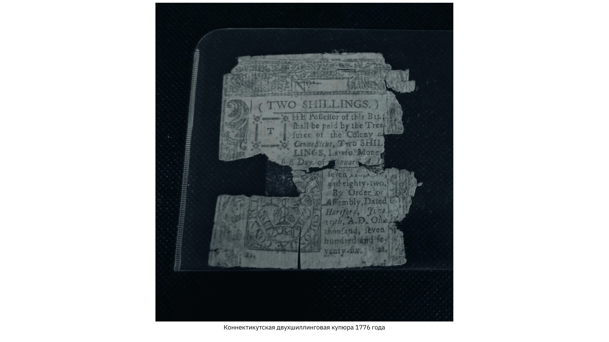

Прежде чем объявить войну Англии и в конечном итоге выпустить собственную валюту, колонии использовали эту бумажную валюту наряду с испанским долларом для денежных операций. Фактически, термин "доллар" остался для обозначения американского доллара.

Если я не ошибаюсь, в 1792 году они приняли закон, который позволил им чеканить деньги. В качестве примера ниже приведен американский доллар современной эпохи.

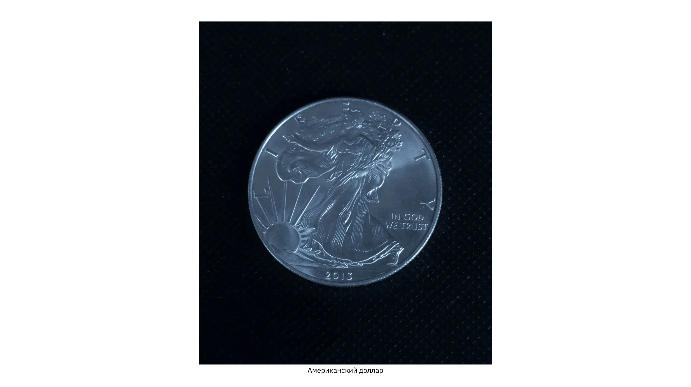

Очевидно, что номинал монеты составляет не один доллар, а около 30 или 40 долларов, поскольку она представляет собой унцию серебра. Его стоимость колеблется в зависимости от цены на серебро, обычно она составляет не менее 30 или 40 долларов США. Сегодня, конечно, бумажный доллар сохраняет только номинальную стоимость в один доллар, но в то время доллар США был основан на этой серебряной ценности.

Давайте поговорим о Гражданской войне в Америке. Конфедераты печатали деньги, которые были гиперинфляционно раздуты. Это явление не включено в официальный список Ханке-Круса, так как не достигло уровня гиперинфляции в 50 %. Однако ежемесячный уровень инфляции составлял 40 %, что говорит о том, что во время войны было напечатано значительное количество валюты.

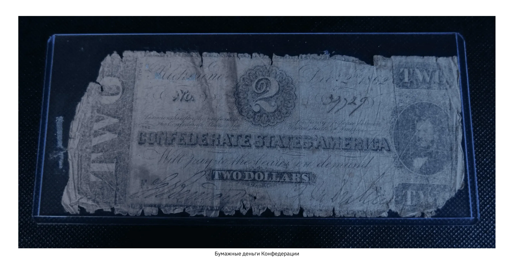

У их противников на севере тоже были доллары. Чуть выше вы видите доллары Конфедерации, а ниже - доллары Севера. Их называли "гринбек", потому что задняя сторона была зеленой.

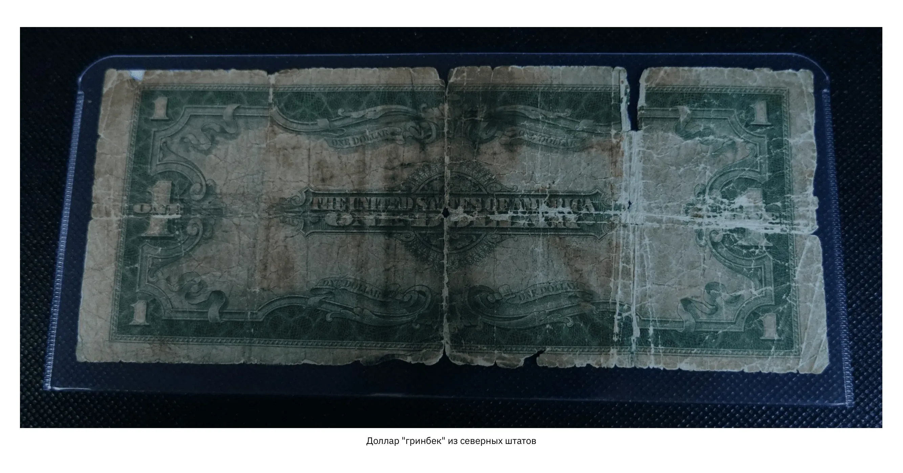

И я предлагаю вам сравнить разницу в размерах с современными банкнотами. В те времена банкноты были крупнее.

Как мы знаем, северяне победили, и гринбек стал валютой объединенных американских штатов. Затем последовали основание ФРС в 1913 году и Первая мировая война.

После Первой мировой войны последние серии печатных банкнот всегда включали слова "выкупается в золоте по требованию". Так, в 1928 году за 20 долларов можно было купить почти унцию золота, поскольку цена золота составляла 20,67 доллара. На купюру, изображенную на рисунке ниже, можно было купить унцию золота в 1928 году.

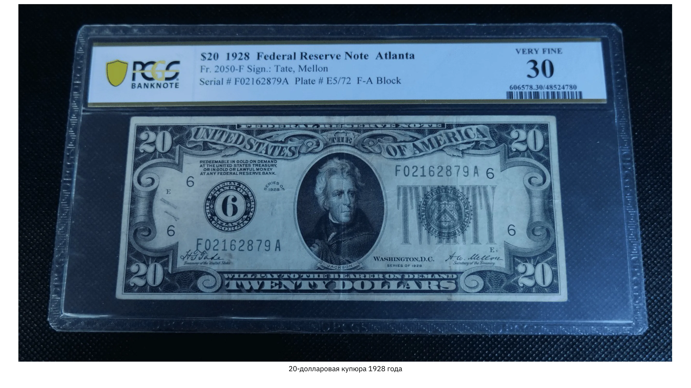

Сегодня унция золота стоит 3 000 долларов США. Здесь, конечно, видна сила девальвации. Это был последний законопроект, содержащий слова "погашаемый золотом". Мы увидим, что сразу после Исполнительного приказа 6102 они конфискуют все золото. Фактически, они конфискуют и золото, и золотые сертификаты.

Ниже вы можете увидеть золотой сертификат 1928 года.

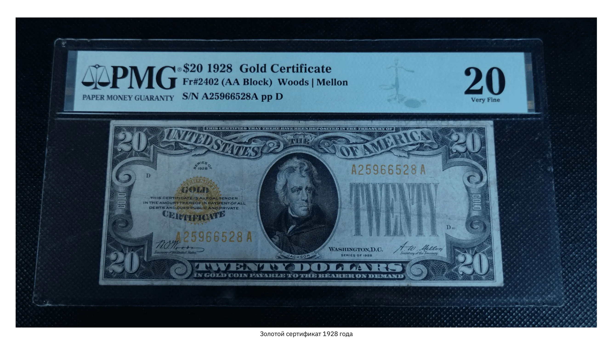

Она не только "погашалась золотом", как банкнота 1928 года, но и погашалась золотыми монетами: это действительно "золотой сертификат". Все они были конфискованы после исполнительного указа 6102. До 1964 года владеть ими было даже незаконно.

Я очень рад, что у меня есть такой.

Начиная с 1964 года владение золотом стало незаконным, если не ошибаюсь, до 1974 года. В 70-е годы они разрешили людям накапливать золото после Никсоновского шока, о котором мы расскажем вкратце. В 1933 году, когда они издали "Исполнительный приказ 6102", они конфисковали золото, и владение им стало незаконным. Если вас ловили на хранении золота, то вы получали большой тюремный срок. В те дни каждая унция золота обменивалась на купюру, подобную той, что изображена ниже, после 1934 года.

Как мы уже говорили, в 1928 году на долларе все еще была надпись "погашается золотом".

После издания исполнительного приказа 6102 они конфисковали все золото и обменяли 20,67 доллара на каждую унцию золота. После этого афера раскрылась: в 1934 году они выпустили новые банкноты с напечатанным текстом "эта банкнота является законным платежным средством по всем долгам".

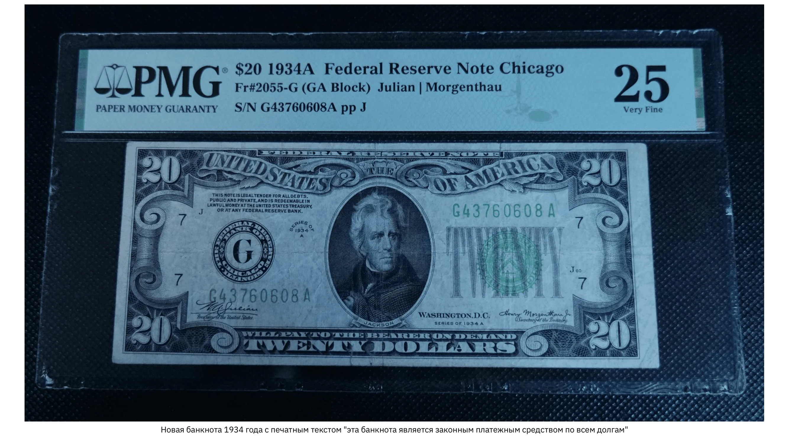

Здесь появляется понятие "законное платежное средство", заменяющее фразу "погашаемое золотом" Эти две купюры могут выглядеть идентично, в них изменилось всего несколько слов, но суть аферы заключается в том, что доллар в этот период обесценился: с унции золота стоимостью 20,67 доллара до 35 долларов за унцию в 1934 году. Это означало девальвацию примерно на 40 %!

Затем началась Вторая мировая война. После войны в соответствии с Бреттон-Вудским соглашением большая часть мирового золота была централизована в Соединенных Штатах. Взамен американцы выпустили банкноты, хотя эти банкноты больше не могли быть обменены на золото широкой публикой. Вместо этого они по-прежнему обменивались на золото на государственном уровне.

В конце концов, такие страны, как Франция и Германия, начали подозревать, что в обращении находится, вероятно, больше долларовых банкнот, чем золота в хранилищах США.

Они попросили репатриировать их золото. Ну, им ответили: "Хорошо, мы это сделаем, но это займет немного времени" В 1971 году наш друг Ричард Никсон раз и навсегда разорвал связь между банкнотами и золотом, обвинив при этом спекулянтов.

Золото было недооценено - 35 долларов за унцию, цена, которая не соответствовала ни объему напечатанных денег, ни его истинной рыночной стоимости. Всего за несколько лет цена подскочила с 34 до 800 долларов. По аналогии с историческими примерами, например, в Риме, где была разорвана связь между денарием и солидом, золото было пущено в свободное плавание. Этот факт привел к процессу открытия цены, в результате чего впоследствии золото стало цениться гораздо выше в долларовом выражении.

### Современная фиатная валютная система и ее последствия

Эта часть подводит итог тому, как мы перешли от денежной системы, основанной на серебре или золоте. Постепенно институты получали все больше и больше власти над деньгами. В конце концов, одностороннее решение полностью разорвало связь между драгоценными металлами и деньгами, что привело к чрезмерной эмиссии.

В результате больше не существует никакой связи между золотом и банкнотами или деньгами из Писания. И это даже не система дробного резервирования - это устаревшая концепция. Вместо этого частные банки выпускают и создают деньги посредством банковского кредита. Деньги создаются в основном таким образом и соотносятся с ключевой процентной ставкой, устанавливаемой центральным банком.

На самом деле предела нет. Больше нет обязательных резервов, по крайней мере, в Америке и Канаде. Единственный резерв - это необходимость для банков быть в состоянии реагировать на межбанковские обмены, чтобы не исчерпать ликвидность.

Они просто должны быть уверены, что смогут осуществить эти переводы, но нет никаких обязательных резервов в 3%, 1% или 10%. Мы действительно отошли от концепции дробного резервирования. Теперь центральные банки, правительства через фискальный дефицит, центральные банки через количественное смягчение (QE) и частные банки через создание банковских кредитов могут увеличить общую денежную массу и, по моему мнению, вызвать инфляцию.

Чтобы понять связь между деньгами и инфляцией, я рекомендую курс, который есть на Plan ₿ Academy, посвященный этой теме. Вы узнаете разницу между ростом цен, который мы наблюдаем в жизни, и инфляцией. Это не одно и то же. На самом деле, когда мы говорим об инфляции, мы часто имеем в виду рост цен, а не саму инфляцию. Инфляция - это довольно точное понятие, которое объясняется увеличением денежной массы.

https://planb.academy/courses/caa75343-ac90-4249-bcca-0e2e57c3a0f1

В завершение этого раздела о фиатном мире я хотел бы обратить ваше внимание на ресурс, который поможет вам лучше понять такие явления, как инфляция.

Спасибо за внимание.

## История денежных пузырей

<chapterId>b6451c46-917d-11f0-97de-6bc5081765fa</chapterId>

:::video id=5967d9a6-aae4-4b84-a283-71b1b735bca4:::

### Изобретение бумажных денег и первый большой пузырь

С созданием центральных банков в XVIII веке родилась настоящая революция: волшебные деньги в виде банкнот. Самый яркий пример во Франции - дело Джона Лоу. Этот шотландец, находившийся в ссылке в Париже, предложил регенту, герцогу д'Орлеану, решить проблему банкротства королевских финансов путем создания государственного банка и колониальной торговой компании: знаменитых **Banque Royale** и **Compagnie du Mississippi**.

С помощью этой системы Лоу привязал бумажные деньги к акциям своей компании. Чем больше обращалось банкнот, тем выше была стоимость акций, и тем прочнее казался банк... пока спекуляции не превзошли реальность. Пузырь внезапно лопнул в 1720 году, разорив дворянство, буржуазию и большую часть Европы, которая пришла спекулировать на улицу Квинкампуа. В результате во Франции надолго закрепилось недоверие к бумажным деньгам, а Европа получила первый урок спекулятивных пузырей.

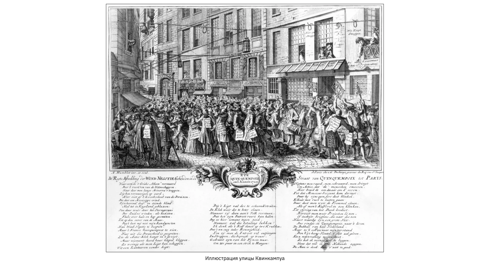

### Когда земля становится "залогом"

Столетие спустя Французская революция открыла новые горизонты, создав **ассигнаты** - валюту, обеспеченную конфискованной церковной собственностью. Привлекательная идея на бумаге - превратить землю в денежное обеспечение - но неэффективная: земля не является ни ликвидной, ни делимой. Результат: гиперинфляция, многочисленные запреты на использование земли, неконтролируемая инфляция и дефицит.

Наполеон, глубоко переживавший этот хаос, в 1800 году восстановил золото и серебро в качестве денежной основы, создав Банк Франции, тем самым гарантировав регулярное жалованье своим армиям. Прагматичный способ вернуть доверие: платить в твердой валюте.

### Ревущие двадцатые и Великая депрессия 1929 года

Давайте пропустим два столетия. После Первой мировой войны правительства финансировали свои усилия за счет инфляции и изъятия золота. В 1920-х годах американская ФРС проводила слишком мягкую монетарную политику, чтобы поддержать британский фунт. Результат: легкие кредиты, безудержные спекуляции на Уолл-стрит, покупка акций в кредит, возникновение пузыря на рынке недвижимости и банковских услуг.

Когда эта машина дала сбой, крах 1929 года был неизбежен: массовые крахи банков, рекордная безработица и очереди в суповые кухни. Это породило устойчивое заблуждение, что **любая дефляция - это плохо**, в то время как мы должны различать дефляцию за счет роста (здоровую) и дефляцию за счет долга (разрушительную).

### Азия в 90-е годы и эффект домино

В 1990-е годы мир грезил об "азиатском чуде". Ставки Exchange были привязаны к доллару, рост составлял 8-10 %, и западный капитал хлынул в страну. Все было хорошо... пока прилив не отступил. Посыпались банкротства, валюты обесценились на 80 %, инвесторы были разорены. МВФ пришлось вмешаться, навязав болезненные реформы. Все как всегда: изобилие капитала, кредитные пузыри, а затем крах.

### 2008 год и эпоха перманентного пузыря

За интернет-пузырем (2000 год) последовал пузырь субстандартной недвижимости. Секьюритизация превратила банковские кредиты в финансовые продукты "трипл-А", распространяемые по всему миру. Обещание: устранить риск, разбавив его. На деле же все риски оказались коррелированными. Когда рухнула недвижимость, рухнула и вся мировая банковская система.

Результат: массовые государственные спасения, количественное смягчение и нулевые процентные ставки. И вместе с этим - стремительный рывок: каждый кризис больше не будет очищать от излишеств, а будет покрываться все большим долгом и печатанием денег. Именно это и привело к нынешней ситуации: **"пузырю всего "**, когда все - акции, недвижимость, искусство, криптовалюты, даже карты покемонов - раздувается искусственно.

### Вечное возвращение волшебных денег

Из столетия в столетие проявляется одна постоянная черта: как только общество верит, что может создавать богатство с помощью денег, а не производить реальные товары, появляются "пузыри". От Джона Лоу до 2008 года, от улицы Квинкампуа до Уолл-стрит - процесс повторяется: эйфория, кредит, бум и крах.

И в конце концов, неизменно, когда никто больше не доверяет бумаге, люди ищут что-то другое - золото, землю, безопасные убежища... или новые валюты. Вчера Наполеон навязал металл, сегодня некоторые видят в Bitcoin его преемника.

История финансов - это бесконечный цикл: печатать, спекулировать, рушиться. До следующего пузыря.

## Деньги и насилие

<chapterId>9486fe64-854f-5e17-86b3-8873baca39a8</chapterId>

:::video id=bd6d0807-2d8f-4637-a0f5-1e990e5c0d0f:::

В этом небольшом разделе мы вернемся к событиям, которые мы уже видели на протяжении курса, и подытожим несколько анекдотов, которые я считаю интересными.

### Технология и насилие

Вот несколько анекдотов, о которых мы, вероятно, уже говорили на курсе. Они служат для того, чтобы ввести меня в очень увлекательную дискуссию с Тео о лекции, которую он прочитал в B-Ondy и которая показалась мне очень интересной с точки зрения того, как технологический прогресс влияет на отношения насилия между населением и государством.

### Деньги и государственное принуждение

Чтобы представить этот раздел, я дам вам краткий и неполный список, просто чтобы напомнить о событиях, которые мы, вероятно, уже рассмотрели в курсе.

Я уже могу проследить связь между деньгами и насилием: когда речь идет о ничего не стоящих бумажных деньгах, которые можно печатать бесконечно, они часто сопровождаются всевозможными правилами и угрозами. Мы уже можем говорить о цессионариях, где на банкнотах было буквально написано, что фальшивомонетчикам грозит смерть. В юридических текстах того времени легко найти угрозы смерти для тех, кто не принимал эти знаменитые бумажные деньги.

Чтобы остаться во Франции, в одном из юридических текстов революционной эпохи, которые мне удалось раздобыть, я увидел, что "суточные" за перевозку и эксплуатацию гильотины были описаны в разделах, связанных с валютой. Это показалось мне довольно забавным.

Мы также говорили о чеканке монет в Китае, где государство контролировало чеканку. В одном из разделов в начале курса мы видели, что когда монеты, некоторые из которых были менее красивыми, выбрасывались, это имело юридические последствия.

Существует также анекдот об одном английском короле, который в итоге отрубал руки тем, кто чеканил деньги, если они вели себя не так, как он ожидал.

Кроме того, в Китае я читал об изъятии меди из буддийских монастырей. В то время, когда медь росла в цене и дестабилизировала их экономику - которая была основана на фиатных деньгах, мало связанных со стоимостью металла, - они прибегли к поиску места, где было богатство, и захватили медь в монастырях.

То же самое произошло и с монастырями в Англии во время английской Реформации. Когда знаменитый король поссорился с Папой Римским из-за развода, за всем этим стояла другая причина: он воспользовался упразднением монастырей, чтобы захватить богатства, содержавшиеся в этих церковных организациях.

Во время Французской революции они конфисковали все церковное имущество. Они увидели прекрасные монеты, созданные из переплавленных церковных колоколов.

Если вернуться еще дальше, то одним из самых явных представлений об экономическом насилии и свободе, о либертицидных законах является **Диоклетиан с его наследственной кастой, которая была напрямую связана с тем, что крестьяне больше не хотели принимать обесценившуюся валюту**. Они хотели оставить свою крестьянскую работу, а Диоклетиан в ответ просто сказал им: "Вы не можете покинуть свою землю, и ваши дети тоже". То же самое касалось и солдат.

По-моему, это довольно явная форма насилия. В заключение я мог бы рассказать о рыцарях-тамплиерах или французском короле. Когда рыцари-тамплиеры обосновались во Франции, я представляю, как он увидел манну из богатства тамплиеров, и у него возникли проблемы с финансированием государства. Он подал в суд на орден тамплиеров, и некоторые из них смогли забрать часть сокровищ, что породило очень интересное шоу в США или Канаде. Я не знаю, кто его снял, но называется он *Тайна острова Оук*. В нем рассказывается о людях, которые считают, что на одном из островов Канады, в Приморском крае, зарыт клад тамплиеров, и они уже много лет - может быть, даже больше десяти лет - бурят скважину, чтобы сделать что-то вроде колодца. Они нашли скважину с множеством галерей и ищут сокровища, зарытые рыцарями-тамплиерами на этом острове, о котором идет речь в этом телешоу. Я приветствую своего отца, который является большим поклонником этого шоу.

Вот и все: очень краткий список фактов, с которыми мы познакомились на этом курсе и которые, как мне кажется, усиливают связь с насилием. Я оставлю вас со следующей частью от Тео, который расскажет нам очень интересную историю о технологических изменениях и балансе сил между плебсом и властью.

Спасибо!

## Экономические последствия организованного насилия

<chapterId>66bd4674-2159-5489-ad4b-ec5e3fb691af</chapterId>

:::video id=c8b063c6-aeb4-4a94-9027-b11d369e71a4:::

### Организованное насилие и эволюция государства

Историк Фредерик К. Лейн выдвигает революционный тезис: анатомия государства на протяжении истории формировалась под влиянием технологий, используемых для проецирования насилия. Отталкиваясь от веберианского принципа, согласно которому государство обладает монополией на легитимное насилие, Лейн отмечает, что эта монополия - парадоксальным образом более эффективная, чем конкуренция в этой области, - развивается в зависимости от соотношения между стоимостью нападения и стоимостью защиты.

Этот анализ, взятый на вооружение авторами книги "Суверенный индивид" (1997), объясняет исторические мутации в политической организации: от средневековой феодальной системы к городам-государствам эпохи Возрождения, затем к индустриальным национальным государствам и, наконец, к современным государствам всеобщего благосостояния. Каждый переход соответствует крупному технологическому прорыву в осуществлении насилия, происходящему примерно каждые 400-500 лет.

### Средневековое равновесие

В Средние века аграрная экономика преобладала более чем на 90 %. Крестьянин, буквально привязанный корнями к своей земле, не мог убежать от лорда и его рыцарей. Военные технологии - доспехи ручной ковки, годы обучения владению мечом - были чрезвычайно дороги. Эта асимметрия в значительной степени благоприятствовала нападению, а не обороне.

Неподвижный сельскохозяйственный производитель становится пленником местного монополиста насилия. Его возможности по сбору налогов достигают новых высот - хотя, как ни парадоксально, средневековые налоги остаются скромными по сравнению с 78 % обязательных сборов в современности. Сеньор может взимать налоги по своему усмотрению, потому что крестьянин не может ни сопротивляться, ни уйти.

### Купеческий ренессанс

Появление ганзейской торговли на севере и средиземноморской на юге изменило ситуацию. Купцы, главные создатели добавленной стоимости, обладали мобильным капиталом - своими кораблями. Им требовалось лишь легкое морское ополчение, поскольку охранять моря было сложно. Кроме того, они могли легко мигрировать в соседний порт, если налогообложение становилось чрезмерным.

Такая мобильность порождала налоговую конкуренцию между городами-государствами. Венеция, Генуя и Брюгге должны были предложить максимально либеральные условия: надежные контракты, качественную валюту, страхование, минимальное налогообложение. Князья должны были соблазнять, а не принуждать. Симметрия меняется на противоположную: обороняться (через бегство) становится легче, чем нападать.

### Индустриальная эпоха

Промышленная революция принесла с собой конфигурацию, схожую с феодализмом. Фабрики, железные дороги и сборочные линии представляют собой массивные, неподвижные инвестиции. Генри Форд не мог перенести свои заводы в условиях налогообложения. Рабочие, сосредоточенные в промышленных городах, объединялись в профсоюзы, чтобы вести коллективные переговоры, а не мигрировать по отдельности.

Возникло "государство всеобщего благосостояния": промышленное планирование (Япония, Корея), военная защита инфраструктуры, минимальные социальные пособия для рабочей силы. Вторая мировая война проиллюстрировала эту уязвимость: бомбардировки вражеских заводов стали доминирующей стратегией. Концентрация физического капитала позволила обеспечить массовое изъятие налогов для финансирования государства всеобщего благосостояния.

### Микропроцессорная революция

Три технологические новинки нарушают эти вековые балансы. Микропроцессор преобразует военные действия: оператор в Неваде с хирургической точностью управляет беспилотником в Афганистане. Война в Персидском заливе (1991) продемонстрировала этот прорыв: четвертая по величине армия мира (Ирак) была уничтожена за 45 дней, при этом со стороны коалиции погибло менее 200 человек. Технологическое превосходство сделало лобовую атаку невозможной.

Интернет и асимметричная криптография совершают революцию в создании стоимости. Разработчик может работать из любого места с помощью MacBook и Starlink, экспортируя свою продукцию мгновенно и бесплатно. Цифровые кочевники спасаются от географического плена, натравливая государства друг на друга так, как не случалось со времен Ренессанса.

Bitcoin представляет собой кульминацию этой логики: валюта, освобожденная от государства, защищенная нерушимым криптографическим щитом. Богатство становится защищенным от любой физической силы. Человек вновь обретает способность защищаться от монополии государства.

### Крах Вестфальской модели

Западные государства всеобщего благосостояния, созданные для индустриальной эпохи, устаревают. Создатели ценностей - разработчики, художники, финансисты - мигрируют в Сингапур, Дубай или Сальвадор, предпочитая меньшее количество государственных услуг в обмен на минимальное налогообложение. Современным гигантам вроде Apple и Tether не нужны ни офисы, ни физическая инфраструктура.

Эта утечка мозгов создает спираль: уменьшение чистого вклада, ухудшение качества государственных услуг, повышение налогов на тех, кто остается, и ускоренный отъезд. Государства должны радикально сократить штат или обанкротиться. Дробление на небольшие, конкурентоспособные юрисдикции - новая модель цифровых городов-государств - кажется неизбежным.

История учит нас, что такие переходы занимают несколько поколений. Но разделение валюты и государства в Bitcoin может ускорить этот процесс. Отдельные люди теперь голосуют ногами и своими криптографическими кошельками, перекраивая карту глобальной власти по линиям, которые мы только начинаем воспринимать.

## Очень короткая история финансов

<chapterId>1d37fff1-a091-5034-8e71-4af590b8ffce</chapterId>

:::video id=fdfabbc6-e4d8-463a-8522-19176f8fb460:::

После этого рассказа об истории денег, который ведет нас вплоть до фиатной системы, я хотел бы быстро и кратко объяснить эволюцию финансов, которая в конечном итоге привела к созданию государства всеобщего благосостояния. Изначально, во времена Римской империи, у нас были монеты.

Монеты были финансовой технологией, которая позволяла империи платить солдатам, расширяться и торговать. Она работала очень хорошо, но в конце концов произошло слишком много девальваций. В какой-то момент, когда империя перестала расширяться и получать прибыль от войн и расширения территорий, ее система рухнула.

### Эволюция финансовых технологий

Затем наступило Средневековье, когда эволюция была очень незначительной, пока не появился флорин, вернувший стабильную валюту, и банковские разработки в Италии и Антверпене, где была разработана концепция "временной стоимости денег" - другими словами, дисконтирования. Дисконтирование было разработано для создания формы бумажных денег, в которой выпускался "вексель", то есть обещание, что в более поздний срок можно будет вернуть 100 долларов плюс процентную ставку.

Эта система создала финансовую технологию, которая позволяет владельцу продать облигацию до окончания срока, так что если вы продадите ее через 4 месяца из 6-месячного срока, человек фактически заплатит премию, чтобы компенсировать потерю доходности за оставшиеся 2 месяца.

Это была финансовая технология, разработанная в Антверпене и Амстердаме в то время. Позже мы увидели эволюцию центральных банков и понятия кредитора последней инстанции. Можно утверждать, что во времена Амстердамского банка от использования монет в международной торговле отказались в пользу скриптовых денег.

Позже, в XVIII веке, с точки зрения финансовых технологий, мы можем говорить о страховании. Есть анекдот, который очень хорошо рассказан в книге Нила Фергюсона "Возникновение денег". Первая страховая компания, которая появилась на свет, называлась **Scottish Widowss**, и, по сути, это была компания духовенства, которая хотела разработать страховку для священников, которые иногда умирали раньше времени, умирали внезапно. В то время священнослужители в течение года присматривали за своими женами и отпрысками в Шотландии. И вот духовенству показалось, что этот годичный период слишком короток. В результате **они изобрели актуарные расчеты**, чтобы буквально вычислить количество вкладчиков, необходимых для покрытия расходов системы, в зависимости от количества священников, умерших преждевременно.

Они разработали актуарные расчеты, чтобы сказать: "Хорошо, каждый священник дает нам такую-то сумму. Тогда, если священник умрет, страховка покроет расходы на выживание его жены и детей, пока они не станут самостоятельными" Так что именно первая страховая компания под названием "Шотландские вдовы" популяризировала эту систему, и именно там она была развернута.

### От частного страхования к государству всеобщего благосостояния

Таким образом, страхование - это часть истории финансовых технологий. И это подводит меня к концепции государства всеобщего благосостояния, которая заключается в том, что частное страхование в конечном итоге столкнулось с проблемой, с понятием оптимизации, когда мы говорим себе: если мы предложим медицинскую страховку людям, которые здоровы, они могут быть менее заинтересованы в выплате страхового взноса, потому что они говорят себе: "Я здоров, я не заболею". С другой стороны, люди, которые знают, что они больны, обязательно захотят подписаться.

Эта система создает дисбаланс между количеством больных людей, которые будут оформлять медицинскую страховку, и здоровых людей, которые могут застраховаться меньше. Таким образом, возникает своего рода дисбаланс: если вы подсчитаете цифры, они не уравновесятся, потому что вы, вероятно, не сможете застраховать достаточное количество здоровых людей, чтобы компенсировать расходы. В экономике это понятие **моральной опасности**.

Одна из выдвинутых идей - сделать страхование обязательным. Если каждый будет обязан делать взносы, это изменит баланс, и взносы будут делать как здоровые, так и нездоровые люди, распределяя риски на большую часть населения.

И поэтому во многих странах мира государство говорит: "Ну, мы об этом позаботимся". Хотя я не эксперт в этом вопросе, я вижу, что эти же рассуждения, вероятно, применяются и к другим видам страхования, таким как страхование от безработицы. Есть желание упростить и оптимизировать, исходя из идеи, что все будет проще, если об этом позаботится одна организация.

На мой взгляд, это привело к централизации всех этих страховых концепций и, в конечном счете, к рождению государства всеобщего благосостояния, где все эти финансовые концепции, которые изначально были частными предприятиями, частными инициативами по удовлетворению потребности страхового рынка в распределении рисков среди населения, были захвачены государством по причинам, которые, вероятно, вполне логичны в отношении морального риска и желания оптимизировать.

### Альтернативные модели и размышления о государственных монополиях

В конце концов, в некоторых странах, например в Канаде, мы имеем несколько видов страхования - медицинское страхование, страхование по безработице - которые являются государственными монополиями.

Я могу привести пример, который мне известен. В Швейцарии система немного отличается. Там есть частные компании взаимного страхования и частные больницы, так что вы можете выбрать свою компанию взаимного страхования, вы можете выбрать свой пакет услуг в рамках своей компании взаимного страхования. Вы все равно получаете относительно универсальные услуги, даже если значительная часть этой системы остается частной.

Поэтому я думаю, что вполне возможно, что она также управляется частным образом. Но все, что я хотел вам описать, на самом деле не является заявлением о том, что одна система лучше другой, а скорее для того, чтобы объяснить вам, что, читая об истории финансов, я понял, почему на Западе, особенно во Франции, особенно в Канаде, государство хотело взять под контроль эти финансовые принципы.

Я хотел сказать, что концепция страхования - это прежде всего эволюция финансов, и, как это иногда хорошо получается у правительств, они будут пытаться взять ее под контроль, так же как они пытались взять под контроль деньги, по нескольким причинам. Одной из причин, кстати, является концепция кредитора последней инстанции.

Идея заключается в том, что гораздо лучше, если за этим стоит крупный институт, который распределяет риск более широко. Именно в этом заключалась первоначальная инициатива, лежащая в основе понятия "кредитор последней инстанции", когда этот институт мог выбирать достаточно сильные организации и предотвращать их крах, ссужая им деньги.

В то время был настоящий анализ, когда эта концепция впервые появилась, но в итоге получилось так, что мы спасаем всех, "слишком большой, чтобы обанкротиться", это относится почти ко всем банкам, потому что существует централизация, а также ко всем крупным компаниям. В итоге мы видим, что это все еще концепция, которая применяется государством "на широкую ногу", подобно концепции страхования, которую я только что вам описал.

В конце концов государство решает, что оно само обо всем позаботится, превращая финансовую технологию, созданную в Шотландии для решения конкретной проблемы, в огромное государство всеобщего благосостояния, которое мы знаем сегодня. Оно использует актуарные финансовые принципы для предоставления услуг нуждающемуся населению. Однако мы можем согласиться с тем, что монополии, возникающие в результате такой системы, создают всевозможные проблемы, которые мы сейчас испытываем в таких странах, как Канада и Франция. К счастью, существуют и другие модели, например, швейцарская.

Мы просто должны осознать, что эта концепция государства всеобщего благосостояния исходит из финансов. Это осознание предполагает, что мы можем исследовать другие пути, кроме известных государственных монополий, и я бы даже применил эти рассуждения к концепции центральных банков как кредиторов последней инстанции - но это тема для другого раза.

# Заключительный раздел

<partId>9bada469-7ef0-511a-9eaa-f8eb66d5906f</partId>

## Оцените этот курс

<chapterId>a9494e2b-8a4d-5811-8a7b-b4a91fb22778</chapterId>

<isCourseReview>true</isCourseReview>

## Заключение

<chapterId>1094e793-b4c6-5782-aa4a-71cde00ce7c0</chapterId>

<isCourseConclusion>true</isCourseConclusion>