# Putovanje kroz istoriju kovanog novca

Ovaj fascinantan kurs će vas povesti na istraživanje fascinantne evolucije novca od najranijih civilizacija do našeg trenutnog monetarnog sistema. Proći ćemo kroz vekove, od neolita do modernog doba, otkrivajući kako je novac oblikovao i bio oblikovan od strane velikih ljudskih civilizacija. Od mezopotamskog proto-novca do kriptovaluta, lidijskih novčića, renesansnog florina i pojave centralnog bankarstva - ovaj kurs nudi sveobuhvatnu perspektivu jednog od fundamentalnih stubova naših društava.

+++
# Uvod

<partId>59878a67-8a1d-5d6b-af41-5b847c14363c</partId>

## Uvod u istoriju novca

<chapterId>ca53597e-be9a-5261-a55f-11fac8504a68</chapterId>

:::video id=08ff35ca-8a40-4286-abaf-71283faf6e78:::

Dobrodošli na ovaj kurs o istoriji novca. Kao što naslov sugeriše, zajedno ćemo istražiti istorijsku evoluciju novčića. Od neolitskog doba do današnjeg dana, pogledaćemo velike imperije i civilizacije prošlosti.

Međutim, ovaj kurs nije ograničen na jednostavnu hronologiju datuma ili istorijskih događaja. Naprotiv, naš pravi cilj je da pružimo dubinsko razumevanje osnovnih pojmova uključenih u nastanak novca, odnosno valuta.

### Osnovni koncepti za istraživanje

Dakle, govorimo o emergenciji: emergenciji samih valuta, monetarnih sistema, banaka, papirnog novca, centralnih banaka, i na kraju, emergenciji trenutnog "fiat" monetarnog sistema.

Počinjemo naše putovanje u proto-valute sa pojavom novca duga i obračunskih jedinica u Mesopotamiji, kao i drugih sistema kao što su miraz i krvni novac u primitivnim društvima. Takođe ćemo videti kako su pravi monetarni sistemi već postojali u drevnom Egiptu, mnogo pre Srednjeg kraljevstva.

Zatim prelazimo na pojavu prvih novčića u Lidiji, ključni trenutak koji se često smatra pravim početkom novca prema ekonomskim udžbenicima. Ispitaćemo kako su ovi novčići uspeli da se prošire zahvaljujući Persijancima, Aleksandru Velikom, zatim Rimu, pre nego što su se konačno nametnuli, dominirali i propali.

Od tamo, naoružani svime što smo naučili, uzećemo vreme koje nam je potrebno da zajedno razmislimo o samoj definiciji novca, prevazilazeći unapred stvorene ideje kao što su "novac je uvek dug" ili "novac je uvek roba". U stvarnosti, novac je i dobro i društveni dogovor. Posebno ćemo diskutovati o konceptu premije novca i pokušati da ujedinimo različite teorije koje objašnjavaju nastanak novca.

### Ključni periodi i monetarne inovacije

Zatim se okrećemo problematičnom periodu, obeleženom izvesnom nestabilnošću u monetarnim terminima, koji je ipak video pojavu tako upečatljivih inovacija kao što je engleski peni, korišćen za podmićivanje danskih osvajača, i Karlo Veliki funta, čije se sećanje i danas zadržava na nekim modernim novčanicama.

Takođe ćemo pogledati kako su Krstaški ratovi doveli do pojave prvih sistema za daljinski prenos novca. Zatim je vreme da pogledamo uticaj Florina, valute koja je pratila Renesansu, i dolazak plemenitih metala iz Amerika, što je imalo dubok uticaj na evropske cene.

Detaljno ćemo razmotriti pojavu papirnog novca i centralnog bankarstva, povlačeći paralele sa istorijom finansijskih kriza i njihovim često nasilnim posledicama.

Konačno, povući ćemo paralelu sa našim savremenim monetarnim sistemom, istražujući njegove posledice, i prateći istoriju finansija kako bismo bolje razumeli kako smo stigli do današnje države blagostanja.

I, kao bonus, pogledaćemo i mnoge fascinantne etimološke veze vezane za novac, koje i dalje utiču na naše svakodnevne živote u različitim jezicima.

### Struktura kursa

Ovaj kurs je podeljen na tri glavna dela.

Deo I razmatra pojavu novca, Deo II renesansu novca i njegov pad, a Deo III pokazuje kako su državne institucije ili država postepeno preuzele kontrolu nad novcem, što je dovelo do trenutnog fiat sistema.

Hvala i uživaj!

# Pojava berzi

<partId>da5e4981-9ea5-5208-beab-3b75c9043632</partId>

## Od Australopithecusa do modernog čoveka

<chapterId>34a773aa-f2d3-5c26-8be4-f2cd79ed6fbc</chapterId>

:::video id=4f333013-4b2a-42ab-8761-593fafc971ca:::

### Zašto početi u neolitu

Zašto se vraćati sve do neolita da bismo razgovarali o novcu? Odgovor je jednostavan: ne možemo u potpunosti razumeti pojavu novca bez da takođe pogledamo pojavu samih civilizacija. Da bismo razumeli zašto su prvi monetarni sistemi nastali, moramo razumeti šta je navelo nomadske lovačko-sakupljačke grupe da se nasele.

Plemen koji nema podelu rada, nema specijalizaciju, gde je svaki pojedinac odgovoran za proizvodnju onoga što mu je potrebno, jednostavno nema potrebu za novcem. Isto tako, poljoprivredna zajednica koja se bavi samo egzistencijalnom poljoprivredom, gde svaka osoba obrađuje zemlju za sebe, još uvek ne oseća potrebu za univerzalnim posrednikom razmene.

### Sedentarizacija i njene posledice

Zato mislim da je zanimljivo započeti naše istraživanje u neolitskom periodu. Videćemo kako je sedentarizacija postepeno dovela do nastanka sela, zatim gradova, i na kraju velikih civilizacija. Upravo je ta sedentarizacija i proizvodnja viškova hrane omogućila specijalizaciju rada, stvarajući plodno tlo neophodno za pojavu i evoluciju prvih monetarnih koncepata.

Baš kao što ljudske interakcije dovode do nastanka jezika, možemo smatrati da se novac pojavljuje prirodno, ili ne (kao kod Inka i Spartanaca), tokom formiranja i organizacije civilizacija. Po mom mišljenju, pojava ili nepojava novca ima sve veze sa oblikom društvene i ekonomske organizacije svake zajednice.

### Hronologija ljudske evolucije

Ali prvo, hajde da pogledamo još širi istorijski kontekst.

Kao i svaka prva prezentacija, uradiću tačno suprotno od onoga što sam rekao u uvodu kursa i daću vam listu datuma i istorijskih događaja koji slede jedan za drugim. Ideja je da se pojava novca postavi u istorijski kontekst, u odnosu na druge ljudske napretke kao što su kuvanje hrane, točak, domestikacija određenih žitarica i životinja, izgradnja piramida i osnivanje prvih gradova.

Dakle, hajde da pogledamo evoluciju čovečanstva od praistorijskih vremena nadalje.

Pregled ljudske evolucije od Australopitekusa do modernog čoveka, prateći tehnološke napretke i kretanja populacije do neolitskog perioda.

### Istorijski kontekst čovečanstva

- pre 3 miliona godina** - Pojava *Australopithecusa*.
- pre 2 miliona godina** - Hominini počinju da napuštaju Afriku.
- 1.6 miliona godina unazad** - Hominini stižu u južnu Evropu i Aziju.
- Pre 1 milion godina** - Prvi dokazi o domaćem kuvanju na vatri (ugljenisane kosti i ostaci biljaka u pećini Wonderwerk, Južna Afrika).
- Oko 400.000. p.n.e.** - Neandertalci žive u Evropi i Aziji.
- Oko 300.000. p.n.e.** - Pojava *Homo sapiens*.
- Pre 80.000 godina** - *Homo sapiens* počinje migraciju u sve delove sveta.
- 73,000 godina pre** - Pećine Blombos u Južnoj Africi (najstariji poznati oblici umetnosti).
- pre 50.000 godina** - *Homo sapiens* je stigao u Evropu.
- 30.000 godina pre** - Pećinske slike iz pećine Šove u Francuskoj.
- Pre 15.000 godina** - Pećinske slike u Lascauxu u Francuskoj i australijska umetnost na stenama.
- Oko 9000. p.n.e.** - Pripitomljavanje ječma u Plodnom polumesecu.
- Oko 9000. p.n.e.** - Uzgoj kukuruza u Meksiku.
- Oko 8000. p.n.e.** - Pripitomljavanje koza i ovaca u Plodnom polumesecu.
- Oko 7250. p.n.e.** - Ain Ghazal (Jordan) otkriva selo sa nekoliko stotina stanovnika.
- Oko 7000. p.n.e.** - Çatalhöyük (Turska) ima do 8.000 stanovnika.
- Oko 6500. p.n.e.** - Počinje sjedilački način života u Grčkoj.
- Pre 6000 godina** - Početak rečne irigacije u Egiptu i Mesopotamiji.
- Oko 5000. p.n.e.** - Pojava poljoprivredne kombinacije "tri sestre" (kukuruz, tikva, pasulj).
- Oko 4000. godine pre nove ere** - Pripitomljavanje kamile u Centralnoj Aziji. (Porodica kamelida potiče iz Severne Amerike tokom eocena pre 45 miliona godina. Ove kamile bi zatim migrirale u Aziju preko uskog pojasa zemlje koji je u to vreme povezivao dva kontinenta na Beringovom moreuzu. Drugi deo porodice bi se uputio ka Južnoj Americi, gde njihovi potomci i danas žive: lame, alpake i vikunje).
- Oko 3500-3000. p.n.e.** - Botajski narod počinje da pripitomljava i uzgaja konje.
- Oko početka bronzanog doba** - Sumerci su već izumeli točak i jedrilicu, i razvili aritmetiku, astronomiju i prvi oblik pisanja.
- Oko 2800. p.n.e.** - Uruk je, na svom vrhuncu, dostigao populaciju do 80.000.
- 2600-2200 p.n.e.** - Prvi znaci urbanog razvoja u grčkom svetu. Ekspanzija mediteranskih useva (pšenica, vinova loza, masline).
- 2560. p. n. e.** - Izgradnja Velike piramide u Gizi.
- Oko 1500. p.n.e.** - Minojska civilizacija.
- Oko 1300. p.n.e.** - Mikenska civilizacija.
- Oko 1250. do 1150. p.n.e.** - Kolaps civilizacija bronzanog doba.
- 1. vek n.e.** - Severnoafrički Berberi pripitomljavaju kamilu.

Dakle, ovde je ovaj istorijski pregled da nam pruži perspektivu o pojavi određenih tehnologija, domestikaciji određenih životinja i kultura, kako bismo to stavili u kontekst sa pojavom pisanja i novca, što će biti tema našeg sledećeg odeljka.

## Od lovca-sakupljača do zemljoradnika: Zora civilizacije

<chapterId>ea950b6e-9eb7-553d-8f04-0eb042bb1f5a</chapterId>

:::video id=4b49a376-f6f4-42a0-86fa-264997a079f0:::

### Prelazak na poljoprivredu i sedentarizaciju

U ovom poglavlju ćemo govoriti o prelasku sa lova i sakupljanja na poljoprivredu za sopstvene potrebe, zanate i trgovinu. Smatrao sam da je važno objasniti ovaj prelazak na sedentarni način života i poljoprivredu, kako bismo razumeli kako su izgrađeni prvi gradovi, što je na kraju dovelo do stvaranja i pojave određenih monetarnih sistema tokom Antike.

Ovaj odeljak je izvod iz kursa dostupnog na vebsajtu The Great Courses pod nazivom Drevna Mesopotamija, Život u kolevci civilizacije, koji drži profesorka Amanda Podany sa Kalifornijskog državnog politehničkog univerziteta, Ponoma.

### Paradoksi usvajanja poljoprivrede

Primitivna poljoprivreda pojavila se pre oko 10.500 godina na Bliskom istoku, oko severozapadne Sirije i južne Turske. Danas, moderni lovačko-sakupljački grupe ne žure da usvoje poljoprivredu, a verovatno je isto bilo i tokom neolitskog perioda.

**Prva sela su očigledno izgrađena pre domestikacije biljaka i životinja.** Ljudi se nisu naselili zato što im je poljoprivreda to omogućila; naprotiv, prvo su se naselili, a tek mnogo kasnije, oko 3.000 godina kasnije, počeli su da se bave poljoprivredom.

Lov i sakupljanje su jednostavno funkcionisali veoma dobro, tako da nisu morali da sade seme da bi proizveli svoju hranu. Danas lovci-sakupljači imaju mnogo više slobodnog vremena nego prvi zemljoradnici, koji su koristili veoma rudimentarne tehnologije.

Dakle, ono što ovde govorimo je da moderni primitivni lovci-sakupljači imaju više slobodnog vremena nego što razumemo od prvih farmera iz neolitskog perioda, koji su, uostalom, imali prilično rudimentarne tehnologije za kultivaciju. Ti ljudi su radili teže da proizvedu hranu nego naši moderni primitivni plemena, koji žive od lova i sakupljanja.

Studije kostiju takođe pokazuju da su prvi zemljoradnici bili manji i manje robusni od lovaca-sakupljača koji su im prethodili. Ishrana zemljoradnika bila je ograničenija nego ishrana lovaca-sakupljača. Jeli su mnogo više hleba, ali mnogo manje mesa, a takođe su imali lošije zube zbog kamenih iverja korišćenih u proizvodnji brašna. Kada su pravili brašno sa kamenjem, stvarali su se iverci.

Oni koji prate "keto" dijetu će se složiti: jesti puno hleba verovatno nije tako dobro kao jesti meso.

### Teorije o usvajanju poljoprivrede

S obzirom na sve ove nedostatke, ko bi tada izabrao da postane farmer? Pa, neke popularne teorije sugerišu da su ljudi bili primorani da usvoje poljoprivredu i da to zapravo nije bio izbor. Čak i sa divljim žitaricama, postojao je veliki problem. Velike količine žitarica nije bilo lako transportovati. Morale su biti negde uskladištene. Kada su žitarice bile uskladištene, imalo je smisla ostati u blizini. Dakle, uzgajali ste divlje žitarice, što nije nužno bila poljoprivreda, a kada ste ih uzgajali u velikim količinama, morali ste ih negde uskladištiti, što je otežavalo transport. Ovo je verovatno doprinelo prvim fazama sedentarizacije. Možda je to bio početni razlog zašto su se ljudi naselili na određenom mestu. Ako je to mesto obezbeđivalo hranu tokom cele godine, nije bilo potrebe pratiti stada ili stalno putovati.

U Natufijskoj kulturi, do stotinu ljudi živelo je zajedno u selima sastavljenim od okruglih kuća. Popularna teorija koja objašnjava početke poljoprivrede je da je ova promena bila podstaknuta klimatskim promenama. Pre oko 11.000 godina, klima na Bliskom istoku postala je hladnija i suvlja nego ranije. Biljke i životinje koje su ranije bile obilne postale su ređe. Zajednice bi tada počele da uzgajaju biljke od kojih su zavisile, ili da drže mlade životinje kako bi ih odgajale i imale koristi od njih, kao što su ovce, koze i goveda, koje bi se dobro prilagodile takvom uzgoju. Ovo bi bio veoma postepen proces. Dakle, nije postojao tačan trenutak kada su svi postali farmeri koji su pripitomili životinje.

Druga teorija je da su sama sela stvorila problem koji je rešen domestikacijom. Intenzivno lovljenje i sakupljanje bi destabilizovalo prirodno okruženje. Prema jednoj hipotezi, Natufijci su postigli takav demografski uspeh da su postali previše brojni za svoje neposredno okruženje. Tako močvare i područja gde su prirodni usevi rasli možda nisu bila dovoljno produktivna za populaciju sela. Neposredno okruženje nije moglo da obezbedi hranu za sve. Tada bi počeli da kultivišu direktno na licu mesta i povećavaju svoje zalihe hrane.

## Neolitska trgovina

<chapterId>8e495224-6d55-58f6-a9dc-ac2814281cfa</chapterId>

:::video id=d04245af-e416-48b1-8157-d569207a32c4:::

### Paleolitsko-neolitska tranzicija

Neolitski period označava fundamentalni prekid u ljudskoj istoriji, u oštrom kontrastu sa paleolitskim društvima koja su mu prethodila. U paleolitu, evropske populacije su bile izuzetno raspršene: pre 20.000 godina, samo 7.000 ljudi naseljavalo je čitav kontinent, organizovanih u male nomadske grupe od 20 do 50 pojedinaca koji su pratili velike migratorne stada na velikim udaljenostima.

Globalno zagrevanje na kraju ledenog doba radikalno je transformisalo ovu društvenu organizaciju. Pojava šuma zamenila je migratornu faunu sa više sedentarnom šumskom faunom, omogućavajući ljudskim grupama da postanu polu-sedentarnim. Ovu transformaciju pratila je spektakularna demografska eksplozija: od procenjene evropske populacije između 10.000 i 50.000 na kraju paleolita, srednji i finalni neolitik beleže porast na između 1 i 5 miliona stanovnika.

### Izum rada i vlasništva

Ova postepena sedentarizacija dovela je do dubokih društvenih transformacija. **Neolitska poljoprivreda je dovela do savremenog pojma rada**: vezanost za određenu teritoriju značila je brigu o sopstvenoj imovini, skladištenje plodova svog rada i planiranje budućih žetvi. Ovaj novi odnos s vremenom - odlaganje trenutne upotrebe za buduću korist - revolucionisao je društvenu organizaciju.

Grnčarija je savršena ilustracija ove evolucije: prvobitno razvijena za skladištenje žitarica i semena, svedoči o ovoj novoj sposobnosti projektovanja potreba kroz vreme. Neki praistoričari čak smatraju da neolitski period ne bi bio moguć bez ovih sistema skladištenja.

**Privatna svojina se pojavila kao centralna institucija** ovih novih društava. Dok je individualna svojina već postojala u paleolitu (lična lovačka koplja), u neolitu je dobila neviđenu teritorijalnu dimenziju. Ovo prisvajanje zemlje generisalo je prve arheološki dokumentovane međuljudske sukobe, što je zahtevalo pojavu funkcije teritorijalne sigurnosti.

### Specijalizacija i podela rada

Poljoprivreda je omogućila ishranu većih populacija, dok je oslobodila neke pojedince od drugih produktivnih aktivnosti. Ova nova specijalizacija - poljoprivrednici, grnčari, zanatlije, čuvari - postavila je temelje za podelu rada i društvene hijerarhije.

Arheološki ostaci svedoče o ovoj rastućoj stratifikaciji: sahrane su evoluirale od kolektivnih do diferenciranih individualnih grobova, a stanovanje se pomerilo od arhitektonske uniformnosti ka građevinama koje otkrivaju različite društvene statuse. Pogrebni predmeti - ukrasi, specijalizovani alati, keramika - ukazuju na pojavu pojma bogatstva i društvenog prestiža.

### Pojava udaljenih razmena

Arheološka analiza otkriva iznenađujuće mreže razmene za to vreme. Materijali kao što su opsidijan, zeleni kamen (dolerit, jadeit), školjke i bitumen pronađeni su stotinama kilometara od mesta njihovog vađenja. Polirane sekire od zelenog kamena, ključne za krčenje šuma i izgradnju ranih sela, kružile su širom neolitske Evrope.

Ove razmene se odnose kako na sirovine, tako i na gotove predmete, otkrivajući uvažavanje zanatske specijalizacije. Pridodata vrednost integriše retkost materijala i tehničku veštinu potrebnu za njegovu transformaciju.

Organizacija razmena varira u zavisnosti od razmatrane skale. **Unutar zajednica**, antropolozi favorizuju hipotezu ekonomije poklona i uzvratnog poklona, sa neformalnim kreditnim sistemima zasnovanim na međusobnom poverenju. U ovim ograničenim grupama, "Dunbarov broj" (maksimalno 150 ljudi za održavanje direktnih odnosa poverenja) omogućava odložene razmene bez ikakvog tržišnog mehanizma.

Postoji nekoliko vrsta trampe:

- **Direktna razmena**: trenutna razmena dobara za dobra
- **Proširena razmena**: razmena dobara za usluge ili obećanja
- **Odloženi barter**: međuljudski dug sa naknadnom otplatom

**Između različitih zajednica**, odsustvo veza ličnog poverenja pogodovalo je pojavi formalizovanijih razmena. Određena dobra su postepeno stekla poseban status zahvaljujući svojoj sposobnosti da budu tražena od strane stranih grupa, prefigurirajući prve oblike proto-valute.

[Austrijska škola ekonomije](https://planb.academy/resources/glossary/austrian-school) tumači ovu evoluciju kao spontano pojavljivanje privilegovanih dobara za razmenu. Školjke, arheološki potvrđene još u mezolitu, ilustruju ovaj fenomen: pronađene daleko od svog geografskog porekla (mediteranske školjke u zapadnoj Francuskoj, nordijske školjke na drugim lokacijama), svedoče o zajedničkom priznavanju njihove razmenljive vrednosti.

Ova roba se odlikuje svojom **sposobnošću da bude tražena od strane drugih**, što je suštinska osobina koja predviđa monetarnu funkciju. Iako nisu postigli standardizaciju istorijskih valuta, bili su prvi koraci ka depersonalizovanim sistemima razmene, što je preduslov za razvoj složenih društava izvan plemenskog okvira.

Neolit je tako postavio temelje moderne ekonomije: specijalizaciju rada, privatno vlasništvo, akumulaciju bogatstva, socijalnu hijerarhizaciju i pojavu sofisticiranih sistema razmene koji su prevazilazili okvire srodstva i neposrednog susedstva.

## Formiranje prvih gradova i pojava pisanja

<chapterId>d6b799c2-8bf1-11f0-9c54-1b9f4f4c7011</chapterId>

:::video id=3ca18105-9856-4ceb-925c-c9e9215af21b:::

### Navodnjavanje i rađanje velikih gradova

U ovom poglavlju ćemo razgovarati o tome kako su nastali prvi veliki gradovi ovog dela istorije, i naravno, razgovaraćemo o razlozima iza pojave pisanja u Mesopotamiji.

Pre oko 6.000 godina, u plodnim dolinama Egipta i Mesopotamije, ljudske zajednice su počele da koriste reke razvijanjem irigacije. Ovo ovladavanje vodom omogućilo je obilnu kultivaciju, što je pogodovalo nastanku velikih gradova kao što je čuveni grad Uruk, smešten u današnjem južnom Iraku.

Oko 3500. godine pre nove ere, Uruk je postao najveći grad na svetu, dostigavši svoj vrhunac oko 2800. godine pre nove ere, sa populacijom do 80.000 ljudi. U to vreme, dve velike inovacije su duboko obeležile sumersku civilizaciju: pojava strukturisane vlade sposobne da upravlja pravom državom i revolucionarni izum pisanja.

### Izum klineastog pisma

Pisanje je rođeno u ovom gradu oko 3000. godine pre nove ere, motivisano prvenstveno ekonomskim potrebama. Suočeni sa rastućom složenošću društva i njegovih razmena, administratori hramova i palata su trebali pouzdan alat za tačno beleženje ekonomskih transakcija, kao što su isporuke materijala, unutrašnji transferi i dostupne zalihe.

Sistem koji je razvijen nazvan je "klinasto pismo", od latinske reči "cuneus" što znači "klin", u vezi sa upotrebom klinastog pisaljke za ispisivanje znakova na vlažnim glinenim pločama.

Ovde dole, možete se diviti mojoj kopiji tablete sa klinastim pismom. Verujem da su za pisanje na ovim tablicama koristili neku vrstu pisaljke napravljene od trske, kako bi u vlažnoj glini iscrtavali oblike, klinasto pismo.

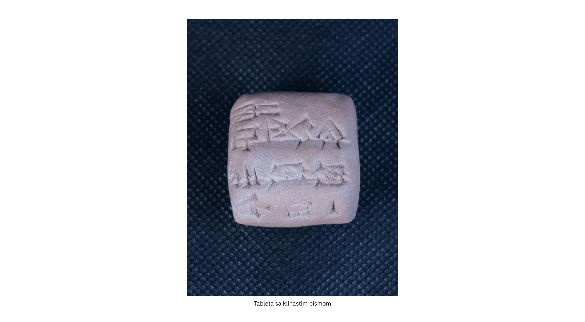

Takođe imam ono što verujem da je autentična sumerska ploča sa malim klinastim pismom u centru. Na ovoj ploči postoje potpisi napravljeni kotrljanjem cilindra, koje ću vam pokazati kasnije.

Oznake sa malim figurama služile su kao potpisi u vreme kada većina ljudi nije znala da piše, jer su samo vešti pisari imali tu sposobnost.

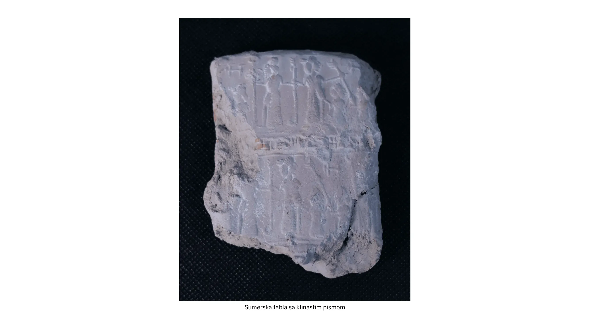

Ispod možete videti gore pomenuti cilindar: kamen urezan sa specifičnim oblicima. Ljudi su koristili ovaj cilindar za potpisivanje, poznat kao cilindrični pečat na engleskom, da potpisuju pisma. Bio je to način da se eksplicitno navedu imena autora, ili da se naznači da su sastavljena u njihovo ime.

Pisari tog vremena su stoga koristili svoj klinasti pisalj da utiskuju znakove na mokre pločice.

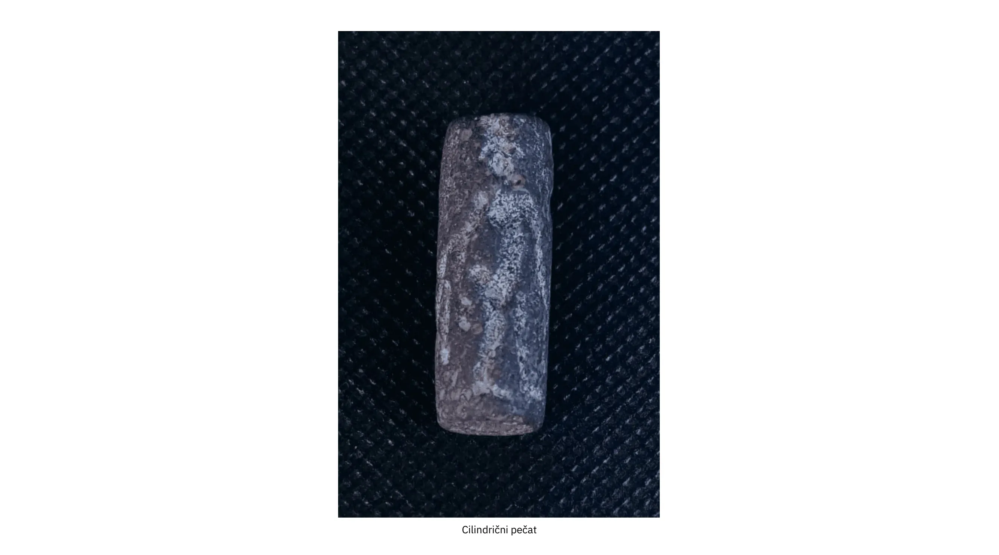

Klinasto pismo nije predstavljalo jezik, već sistem pisanja za beleženje govorenih jezika. Na engleskom bismo rekli "pisanje je pisani jezik", a zatim bismo rekli da je "klinasto pismo pismo, a ne jezik". Dakle, na francuskom bismo rekli da klinasto pismo nije jezik, već način kodifikacije jezika.

### Evolucija i upotreba pisanja

Tokom prvih vekova svog postojanja, ovo pismo je ostalo ograničeno, služeći suštinski kao mnemonijski sistem za beleženje količina, spiskova poljoprivrednih dobara i opreme. Tek postepeno je postalo sposobno za **fonetsko prikazivanje imena** i celih rečenica.

U početku, imena nisu mogla biti izražena klinastim pismom jer je ono prvenstveno predstavljalo predmete i elemente stvarnosti, kao što su vo ili pšenica, prikazane kao male slike. Vremenom su se te slike razvile u razvijeniji oblik pisma, omogućavajući predstavljanje imena i složenih pojmova.

Ako je ime osobe bilo Laura, na primer, mogli smo uzeti reč, akronim koji zvuči kao "voda" i drugi kao "ras", i formirati ime Laura sa tim. Tako se razvila prva forma pisanog jezika.

Za zapisnik, da bi originalno predstavili akronime, ako ste želeli nacrtati glavu vola, mogli ste videti oblik volove glave. Malo po malo, crteži su pojednostavljeni da ne predstavljaju ništa više od neke vrste linije. Naučnici veruju da se to desilo zato što su ljudi držali mokru glinenu ploču u jednoj ruci, pa je bilo lakše ponovo crtati inicijale okretanjem. Takođe se smatra da je to zbog načina na koji su pisari držali ploče.

Još uvek možete videti vezu sa, recimo, pšenicom ili volovskom glavom u klinastim akronimima, i oni su uvek nagnuti na jednu stranu.

Tokom tri milenijuma svoje upotrebe, klinasto pismo je prvenstveno služilo za vođenje ekonomskih i administrativnih zapisa. Međutim, stanovnici Mesopotamije ubrzo su razvili duboku želju da sačuvaju sve što zaslužuje da izdrži test vremena u pisanom obliku. Tako su priče, legende i pesme, koje su do tada prenosili usmeno putujući muzičari, bile ovaploćene u pisanju, često prepisivane od strane pisara na obuci. Oni su prepisivali tekstove koji su već postojali, uglavnom legende ili tekstove koji su imali određenu kulturnu vrednost.

Važan primer je **Ep o Gilgamešu**, verovatno **istorijski kralj sumerskog grada-države Uruk** oko 2900-2350. godine pre nove ere.

Ovaj oblik pisanja, koji je bio i alat za ekonomsko upravljanje i kulturni vektor, trajao je do 1. veka nove ere, pre nego što je zauvek nestao, ostavljajući za sobom dragoceno svedočanstvo o civilizaciji koja ga je iznedrila.

## Uloga sumerskih tablica

<chapterId>a396e6c5-56cc-5410-9e6b-0274401c5425</chapterId>

:::video id=a0729a35-01ec-4aa4-828f-d4ccc2eb168e:::

### Pre-monetarni kreditni sistemi

U drevnoj Mesopotamiji, ekonomska organizacija bila je zasnovana na veoma sofisticiranim mehanizmima koji su postojali mnogo pre izuma metalnog novca. Od samog početka, formalni i neformalni kreditni sistemi već su bili suštinski oblik novca, omogućavajući lokalnom stanovništvu da obavlja mnoge složene ekonomske transakcije.

Upravo zbog administrativnih i ekonomskih potreba je klinasto pismo izumljeno. Poznate mesopotamijske glinene ploče uglavnom su korišćene za beleženje različitih vrsta ugovora: privatnih zajmova, prodaja, iznajmljivanja, hipoteka, pa čak i bračnih sporazuma. Pisanje ovih ploča zahtevalo je stručnost specijalizovanih pisara, zadatak koji je bio skup u smislu vremena i truda, **ali opravdan kada su finansijski interesi bili u pitanju.** Ljudi tada nisu pisali ljubavna pisma jedni drugima, nisu koristili pisara da pišu o svojim brigama. Angažovali su pisara da piše dokumente, bilo da postoji veza ili ekonomski razlog.

Takođe je vredno pomenuti da su neki od ovih tableta kružili kao donosioci obveznica, slobodno menjajući vlasnike.

Na primer, postojala je forma glinene kugle sa malim kamenčićima unutra.

Na spoljašnjoj strani glinene kugle, bio je napisan i potpisan broj, koji je predstavljao broj jedinica. Unutra su se nalazile ove stene i neko ko je želeo da proveri, da zaista potvrdi da ovaj instrument zaista predstavlja X broj jedinica.

Još jedan primer, ploča pronađena jugozapadno od današnjeg Bagdada, propisuje da dužnik preuzima obavezu da vrati poveriocu 330 mera žita na dan žetve. Još fascinantnije, druga ploča jasno navodi da dug od četiri mere ječma mora biti vraćen direktno donosiocu ploče, čime se **uvodi pojam plaćanja donosiocu, što je posebno inovativan koncept za to vreme**.

Od 2000. godine pre nove ere nadalje, postojao je zakon koji je zahtevao da sve komercijalne transakcije, čak i one najmanje, budu formalizovane u pisanom obliku i potpisane u prisustvu svedoka. Zamislite kolika je to bila birokratija u to vreme da se sve transakcije beleže u registre napravljene, podsećam vas, od gline od strane pisara. Ova pravna strogost imala je za cilj sprečavanje budućih sporova oko vlasništva i prava na razmenjenu robu. Svedoci su često bili pozivani da svedoče da je ugovor zaista bio potpisan.

I u privatnoj sferi, određene porodice i pojedinci bavili su se ekonomskim aktivnostima dovoljno složenim da zahtevaju rigorozno upravljanje. Kuća sveštenika Anunituma po imenu Ur-Utu otkrivena je u severno-vavilonskom gradu Sippar-Amnanu, i sadržala je skoro 2.000 tablica. Ovi dokumenti uključivali su privatne ugovore o zajmu, kupoprodajne ugovore i zakupnine, kao i pisma, verske i akademske tekstove, što svedoči o raznolikosti i važnosti privatnih arhiva tog vremena.

Važno je napomenuti da su pisma koja su pisali pisari bila gotovo isključivo vezana za finansijske interese: žalbe na nedovoljne džeparce, neisplaćene mirazne uplate ili druge hitne materijalne zahteve. U to vreme, lična pisma poput ljubavnih pisama nisu postojala, a čak su i spominjanja bolesti bila retka.

Dirljiv primer takvog pisma ilustruje ovu ekonomsku stvarnost: dopisnik izražava svoju uznemirenost nakon što je ostao bez novca ili zaliha kada ga je partner napustio, dok je teška glad pogodila Asur. On opisuje svoju hitnu potrebu da kupi žito i traži da mu se novčani ekvivalent njegovih tekstila brzo pošalje kako bi osigurao svoju dnevnu egzistenciju.

Ovo pismo, upućeno njenom partneru, izgleda da ukazuje na to da je on otišao da trguje negde drugde, ostavljajući je bez novca. Ona ga podseća da mora imati pristup novcu kako bi kupila žito i platila poreze hramu. Ovo je možda najbliže što možemo doći do argumenta napisanog u pismu tog vremena. Pisma su gotovo uvek bila povezana sa ekonomskim transakcijama, a ovo pismo se odnosi na nesigurnu ekonomsku situaciju.

Dakle, mesopotamski dokumenti koji su stigli do nas uglavnom odražavaju ekonomske razmene, pošto su sastavljeni isključivo za prenose dobara sa priznatom vrednošću: novac, žito, razna dobra, nekretnine, plaćanje hramovnih poreza. Ovi arhivi otkrivaju ne samo efikasnost i administrativnu preciznost ove drevne civilizacije, već i njenu sposobnost da upravlja složenim ekonomskim razmenama tokom veoma dugog perioda.

## Elitna kontrola na sumerskim tablicama

<chapterId>c6d3df0e-b1e1-58dc-ab35-9f76bbc39393</chapterId>

:::video id=04a95fb8-a701-4a48-9ce8-0e9b6ba256fd:::

### Pisanje, tehnologija koja je pre svega ekonomična

Suprotno uvreženom mišljenju, pronalazak pisanja u Mesopotamiji pre oko 4.000 godina nije prvobitno služio potrebama lične ili književne komunikacije. **Klinasto pismo je pre svega bilo ekonomska tehnologija**, opravdana samo kada su važni finansijski interesi bili u pitanju. Sumerci nisu koristili pisanje da bi međusobno komunicirali ili izražavali svoja osećanja, već isključivo da bi dokumentovali svoje komercijalne i finansijske transakcije.

Ova specijalizacija može se objasniti značajnim troškovima pisanja na tablicama. Graviranje u glini zahtevalo je specijalizovanu tehničku stručnost, znatno vreme i specifične materijale. Samo transakcije dovoljne vrednosti ekonomski su opravdavale ovu investiciju, stvarajući prirodni prag za pristup ovoj revolucionarnoj tehnologiji.

Klinaste ploče otkrivaju finansijski sistem izuzetne složenosti za svoje vreme. Mesopotamci su razvili kompletan arsenal modernih finansijskih instrumenata: **privatne zajmove sa kamatom, ugovore o prodaji, ugovore o zakupu, hipoteke, pa čak i bračne ugovore sa finansijskim klauzulama**. Ova sofisticiranost svedoči o razvijenoj tržišnoj ekonomiji, daleko od pojednostavljene slike primitivne razmene koja se često povezuje sa ovim drevnim civilizacijama.

Neki tableti su funkcionisali kao prava prenosiva hartija od vrednosti, slobodno kružeći iz ruke u ruku bez potrebe za identifikacijom originalnog vlasnika. Ova inovacija omogućila je izuzetnu fluidnost razmene, prefigurirajući moderne finansijske sisteme. Štaviše, specifično zakonodavstvo je čak zahtevalo da sve komercijalne transakcije budu formalizovane u pisanom obliku, čime je institucionalizovana upotreba pisanja u ekonomskoj sferi.

### Monopol znanja i ekonomska kontrola

Centralnost pisanja za ekonomiju davala je značajnu moć onima koji su ovladali ovom tehnologijom. **Pisari, koji su uglavnom bili povezani sa hramovima i vladajućim institucijama, imali su de facto kontrolu nad finansijskim sistemom**. Njihova retka i neprocenjiva stručnost činila ih je čuvarima svih važnih transakcija.

Ovaj monopol znanja nije bio slučajan. Vlasti su imale svaki interes da održe ovu ekskluzivnost, jer bi demokratizacija pisanja razvodnila njihovu kontrolu nad ekonomijom i povećala rizik od falsifikovanja. Sistematsko prisustvo svedoka na ceremonijama potpisivanja otkriva ovu stalnu preokupaciju autentičnošću dokumenata.

Pravna obaveza beleženja svih komercijalnih transakcija u pisanom obliku služila je nekoliko strateških ciljeva: fiskalna kontrola, rigorozno računovodstveno praćenje i održavanje zavisnosti ekonomskih aktera od administrativnog aparata. **Mesopotamska država je tako prisvojila sposobnost upravljanja međuljudskim dugom** na društvenom nivou, čime je pisanje pretvoreno u instrument ekonomske moći.

### Koegzistencija dva monetarna sistema

Analiza tablica otkriva nijansiraniju ekonomsku stvarnost nego što bi njihova sveprisutnost u arhivama sugerisala. Mnoge tablice pominju reference na **šekel srebra** kao jedinicu vrednosti, što ukazuje na paralelno postojanje monetarnog sistema zasnovanog na standardizovanoj fizičkoj robi.

Ova dualnost se može objasniti društvenom stratifikacijom tog vremena. **Sistem klinastih tablica bio je rezervisan za ograničenu elitu**: sveštenstvo, prosperitetne trgovce i administratore sposobne da čitaju, pišu i tumače ove složene dokumente. Da bi se nosilac tablice efikasno koristio, ne samo da je morao znati kako da je dešifruje, već je takođe morao biti u stanju da proveri njenu autentičnost i razume njene pravne implikacije.

**Masa populacije, isključena iz ovog elitističkog sistema, razvila je sopstvene mehanizme razmene**. Obični ljudi koristili su pristupačnije sisteme kao što su standardizovane mere žita, težine novca i druge lako kvantifikovane robe koje je svako mogao proceniti bez specijalizovanih veština.

Ova popularna ekonomija, iako manje dokumentovana u zvaničnim arhivama, verovatno je bila dinamičnija i fleksibilnija od sistema tablica. Omogućavala je brze dnevne razmene bez potrebe za pisarima, zadovoljavajući trenutne potrebe zanatlija, poljoprivrednika i malih trgovaca.

Srebrni šekel, često pomenut u tablicama kao referenca vrednosti, verovatno je služio kao most između ova dva paralelna ekonomska sistema, omogućavajući konverziju između pisanih dugova i fizičkih plaćanja.

### Spontano nastajanje naspram institucionalne kontrole

Ovo suživot ilustruje fundamentalnu debatu u ekonomskoj istoriji: **opoziciju između spontanog nastanka sredstava razmene i institucionalnog prisvajanja novca**. S jedne strane, robe kao novac su prirodno nastale iz potreba ljudi za razmenom. S druge strane, institucije su prisvojile i formalizovale ove prakse kako bi kontrolisale njihov tok.

Sumerski hramovi su oličavali ovu napetost: koristili su popularne monetarne inovacije (reference na šekel) dok su razvijali sopstvene instrumente kontrole (klinopisne ploče). Ova strategija im je omogućila da ubiraju koristi oba sistema: popularni legitimitet tradicionalnih valuta i administrativnu kontrolu formalizovanih dugova.

Mezopotamsko iskustvo postavlja trajne presedane za evoluciju finansijskih sistema. Ono pokazuje da **finansijska sofisticiranost često prethodi tehnološkim inovacijama za nekoliko milenijuma**, koje se obično povezuju s njom. Koncepti kamate, kredita, prenosivih instrumenata i hipoteka kao kolaterala nisu čekali na izum metalnog novca da bi se razvili.

Ovaj seminalni period takođe otkriva pitanja moći inherentna u bilo kojoj monetarnoj inovaciji: ko kontroliše tehnologiju, ko definiše pravila i kako se formalni sistemi i popularne prakse artikulišu. Ova fundamentalna pitanja su opstala kroz ekonomsku istoriju, proširujući se na savremene debate o digitalnim valutama i [kriptovalutama](https://planb.academy/resources/glossary/cryptocurrency).

# Ekonomija i novac u drevnim civilizacijama

<partId>a16bcf4c-8c3a-11f0-9e79-2bd363a484bd</partId>

## Velike civilizacije bronzanog doba

<chapterId>fab9334c-7385-5d7c-ad40-7d152beb22a1</chapterId>

:::video id=737e12e8-1033-4210-b1dd-b8a680f68b17:::

U ovom odeljku pod nazivom "Velike civilizacije bronzanog doba", počećemo sa odlomkom iz knjige *Istorija novca: Od drevnih vremena do današnjeg dana* autora Glina Dejvisa, koja mislim da je odličan uvod u ovaj deo o velikim civilizacijama antike.

> Toynbee identifikuje oko dvadeset i jednu različitu "civilizaciju", ali pošto je petnaest od njih direktno ili indirektno proizašlo iz ranijih primera, on smanjuje broj nezavisno razvijenih civilizacija na šest: Sumersku, Egipatsku, Minojsku, Kinesku, Maje i Andsku. Od ovih, samo su Inke iz Anda uspele da postignu visok stepen civilizacije bez korišćenja novca, iako su paradoksalno imali u izobilju materijale koji se obično smatraju najboljim za upotrebu kao novac - zlato i srebro.

Inke nisu imale monetarni sistem, ali su imale obilje plemenitih metala. Prava paradoksalnost. Nastavimo sa citatom:

> Što je društvo više stratifikovano, i što je njegov sistem planiranja metodičnije efikasan, to je manje potrebna upotreba novca za njegovu populaciju. Ovo može objasniti zašto su španski konkvistadori otkrili da su Meksikanci, čija je vlada bila relativno liberalnija, redovno koristili zlatni prah (čuvan u providnim cevima) i kakao zrna (čuvana za velike isplate u vrećama od 24.000 jedinica) kao valutu, dok su, s druge strane, Inke, organizovane prema mnogo rigidnijoj hijerarhiji, bile bez valute: izuzetak potvrđen strogim pravilom. Poreklo novca u Kini bilo je potpuno nezavisno od drugih civilizacija; međutim, relativna blizina sumerske, egipatske i minojske civilizacije izaziva sumnje u pogledu stepena njihovog međusobnog neznanja o monetarnim praksama, posebno s obzirom na opsežnu trgovinu uspostavljenu još od najranijih vremena.

U Kini, novčići su razvijeni sa potpuno drugačijim pristupom u odnosu na zapadne tradicije. To je bio [fiat](https://planb.academy/resources/glossary/fiat) novac od samog početka. Bili su liveni novčići.

I ovde, gospodin Dejvis pominje trgovinu. Zaista je bilo razmena između Kineza i drugih populacija u određenim periodima, ali sredstvo razmene za spoljnu trgovinu je bila pre svile. Kao što ćemo kasnije videti, zlato je takođe korišćeno u pograničnim oblastima Kine, gde je kineska populacija bila manja. I to čak ne za međunarodnu trgovinu; za to je bila svila.

Dakle, zamišljam da su možda na format novčića uticale druge civilizacije iz istog doba koje su razvile ovu tehnologiju.

Ali očigledno, suština novca je bila potpuno drugačija u Kini nego na Zapadu. Vratit ćemo se na ovo detaljno u narednom odeljku o Kini.

Što se tiče ovih poznatih sumerskih gradova, imam nekoliko beleški ovde. Možemo pomenuti Uruk, koji je bio veoma rani i uticajan grad, poznat po svojoj značajnoj veličini i naprednoj kulturi, naročito po razvoju pisma i urbanog planiranja.

I takođe sam želeo da pomenem čuveni ep o Gilgamešu. Gilgameš je verovatno bio istorijski kralj sumerskog grada Uruka oko 2900. godine pre nove ere. Verovatno je bio kralj ove sumerske gradske države.

Možemo takođe govoriti o Sargonu iz Akada, koji je vladao od 2334. do 2279. godine pre nove ere.

Bio je prvi vladar Akadskog carstva, što je još jedna civilizacija koja se pojavila u Mesopotamiji. I pominjem Sargona jer je bio prvi koji je uspostavio poštansku službu za ove poznate ploče ovde, koje sam vam već predstavio.

Zamislite da su zaista postojale čak i glinene koverte. Tablete su mogle biti umotane u glinene koverte sa potpisom osobe spolja kako bi se osigurala poverljivost. Tako bi ljudi razbijali kovertu da bi došli do tablete. Ovaj poštanski sistem dugujemo Sargonu od Akada.

Zatim, tu je Vavilon, veliki grad koji je postao prestonica Vavilonskog carstva. Još jedna civilizacija, poznata po svom impozantnom Ziguratu i palatama, i čuvenom Hamurabijevom zakonu, najpoznatijem po svom visoko razvijenom pravnom kodeksu.

I dva grada da zaključimo ovaj deo. Imamo Ašur, koji je bio prestonica Asirskog carstva, važan religijski centar. I imamo Ninivu, koja je kasnije bila prestonica Asirskog carstva. Premestili su svoju prestonicu tamo i poznata je po svojoj moćnoj vojsci, ogromnim palatama i bibliotekama. Takođe je jedno od mogućih mesta legendarnih Visećih vrtova Vavilona. Često čujemo o ovom čuvenom čudu starog sveta.

Ali nema traga ovim čuvenim visećim vrtovima u Vavilonu. U Ninivi, s druge strane, postoji arheološki dokaz o vrtovima na nekoliko spratova. Moguće je da su grčki istoričari poput Herodota pomešali Ninivu sa Vavilonom. Kada su posećivali gradove u Mesopotamiji, možda su ih nazivali Vavilonom. Tragovi čuvenih visećih vrtova pronađeni su u Ninivi, i naučnici se mogu pitati da li je Niniva to čuveno mesto gde su se ovi vrtovi nalazili, poznati kao Vavilonski viseći vrtovi.

## Ekonomska organizacija u Mesopotamiji

<chapterId>6afb6fc8-cbb7-56a5-8427-484b4b7d7477</chapterId>

:::video id=aa6a2cbd-5916-4ae3-ad4f-65f0bd5643fa:::

### Pre-kapitalističke ekonomske strukture i ropstvo

Dobrodošli u ovaj deo o ekonomskoj organizaciji u Mesopotamiji. Prekapitalistička ekonomija prošla je kroz tri glavne faze: primitivnu, robovsku i feudalnu.

Feudal, naravno, dolazi mnogo kasnije, očigledno u srednjem veku, i već smo prošli primitivnu fazu koju smo ranije opisali sa paleolitom. Sada, u Mesopotamiji, kada govorimo o ekonomskoj organizaciji, govorimo o ropstvu.

Međutim, u Mesopotamiji, glavninu posla obavljala je zavisna klasa slična robovima, koja pravno nije bila vlasništvo svojih gospodara, ali je bila lišena plodova svog rada putem fizičke ili ideološke prinude.

### Uloga hramova i palata kao ekonomskih centara

Veliki posedi dominirali su ekonomijom. Zemljoposednici su direktno iskorišćavali svoju zemlju zapošljavanjem radnika, ili su izdavali svoju zemlju u zamenu za rentu. Takođe su se bavili finansijskim aktivnostima, pozajmljujući novac po visokim kamatnim stopama, uglavnom oko 20% do 33,3% godišnje, praksama koje su oštro kontrastirale sa strožijim pravilima susednih Hebreja.

Zajmovi koje su uzimali poljoprivrednici nisu bili namenjeni za produktivne investicije - sa izuzetkom brodarskih kompanija - već da obezbede njihov opstanak do sledeće žetve. Ova situacija često je dovodila do hronične zaduženosti poljoprivrednika.

Dozvolite mi da povučem paralelu sa novijim periodom tokom antike (Rim), gde su građani živeli od poljoprivrednih prihoda koje su proizvodili seljaci i neslobodna radna snaga, kao i od ratnog plena. **Ovi prihodi su bili raspodeljeni među građanima, ne radi generate većih profita, već radi unapređenja njihovog društvenog statusa.** Trgovina i zanati su uglavnom bili prepušteni grupama van društvene elite. Sve ovo je u suprotnosti sa srednjovekovnim ekonomijama usmerenim ka profitu kroz trgovinu i zanate.

Dakle, ono što pokušavamo da kažemo ovde je da pravim paralelu sa činjenicom da ljudi nisu nužno koristili finansijske alate za pozajmljivanje kako bi unapredili svoja sredstva za proizvodnju, a kasnije u Rimu, profiti nisu nužno bili reinvestirani, već su korišćeni za povećanje prestiža ljudi koji su mogli imati koristi od tih profita. Još uvek smo daleko od kapitalističkog duha koji se pojavio kasnije u srednjem veku, kada su poslovi mogli biti stvoreni za unapređenje sredstava za proizvodnju, a viškovi su uzimani i stvarani u potrazi za profitom. Tako možemo videti da ekonomska organizacija još uvek nije dostigla treću fazu ekonomskih evolucija navedenih iznad.

### Pojava kreditnih sistema i jedinica obračuna

**Karl Polanyi razlikuje tri oblika ekonomske razmene: reciprocitet između simetričnih grupa,** što bi bilo u primitivnim plemenima gde nam novac nije zaista potreban jer jedni drugima dajemo neformalni kredit i razmenjujemo i redistribuiramo. **Redistribucija centralizovana oko hramova i palata,** ovaj oblik razmene je kompatibilan sa Mesopotamijom, gde su hramovi bili u centru ekonomske organizacije i mogli su u jednom trenutku da vrate, distribuiraju bogatstvo u obliku obroka. Tek kasnije je uveden pojam plata. Dakle, do sada imamo primitivni oblik (1), centralizovanu redistribuciju (2) u hramovima i palatama, a onda konačno možemo ustupiti mesto tržišnim razmenama (3). Iako tržište kakvo danas razumemo nije u potpunosti postojalo, prisustvo tržišnih razmena u Mesopotamiji je neosporno, što potvrđuje postojanje specifičnih termina na akadskom i prisustvo arheoloških dokaza o cenama, profitima, gubicima, fluktuacijama i situacijama oskudice.

Mezopotamska domaćinstva su samostalno upravljala svim fazama poljoprivredne proizvodnje, od setve do finalne prerade u hleb i pivo. Žene su takođe proizvodile tekstil potreban njihovim zavisnicima. Za robu koja se nije proizvodila lokalno, domaćinstva su se obraćala specijalizovanim trgovcima.

Porodične veze su bile posebno važne u trgovini. Tokom paleo-asirskog perioda (oko 1910-1830. p.n.e.), trgovci iz grada Ašura osnovali su trgovačku koloniju u Kanešu u Anadoliji, uvozeći kalaj i tekstil u zamenu za zlato i srebro. Trgovina se zasnivala na porodičnim preduzećima usko povezanim brakom i poslovnim partnerstvima. Kaneš je bio samo jedna karika u ogromnoj međunarodnoj trgovačkoj mreži.

U ovim razmenama, postojali su metali, i to plemeniti metali, a ne nužno, na primer, bakar, koji je tada bio zaista koristan, i mislimo da su ovi metali razmenjivani za pojmove skladištenja vrednosti. Dakle, ne bismo nužno mogli govoriti o trampi, gde se dve robe razmenjuju zbog svoje korisnosti, već pre o pojmu plaćanja sa određenom svešću o gomilanju plemenitih metala zbog njihove upotrebe kao skladišta vrednosti, a ne da se koriste kao roba, na primer, upotreba bronze za izradu oklopa.

Porezi i danak su se uglavnom plaćali u naturi (ječmom ili izmerenim srebrom). Hramovi i palate su bili glavni ekonomski, administrativni, politički i verski centri, a takođe su obavljali prve bankarske funkcije kroz sigurno deponovanje robe, prvo žitarica, zatim drugih poljoprivrednih proizvoda i na kraju plemenitih metala. Na ovaj način su razvijene prve kreditne i pozajmljivačke operacije, mnogo pre pojave novca.

Mezopotamska ekonomija je uglavnom koristila ječam i srebro kao standarde vrednosti. Srebro se merilo u standardizovanim jedinicama, kao što je sìqlum (šekel) od oko 8,33 grama. Još u doba drevnog Vavilona (pod vladavinom Hamurabija), srebro se koristilo kao uobičajeno sredstvo plaćanja, sa ranim pojmom nominalne vrednosti ("nūbum") nasuprot stvarnoj težini ("šuqulum"), **predviđajući savremeni koncept fiat valute**.

Ali to još uvek nije bio fiat novac u strogom smislu te reči. Nije postojala ideja pečata sa autoritetom, ali je postojala ideja nominalne obračunske jedinice, za razliku od ideje vaganog metala. Postojala je razlika u jeziku za ova dva pojma, i mislim da je važno to pomenuti.

Tranzicija ka tržištu rada sa nadnicama bila je teška. Zahtevala je dve glavne konceptualne inovacije: odvajanje rada osobe od konačnog proizvoda i uvođenje "radnog vremena" kao merljive jedinice. Da bismo imali ovaj pojam nadnice i zaposlenog na plati, prvo smo morali proći kroz ove dve inovacije. **U IIIᵉ milenijumu, rad je u početku bio nagrađivan fiksnim obrocima, pre nego što je postepeno evoluirao ka sistemu nadnica početkom IIᵉ milenijuma.**

Konačno, od 26. veka pre nove ere nadalje, prava ideja monetarne vrednosti je zaživela, iako mesopotamski "novac" nije bio novčić, već pre merenje težine žita ili metala. **Tako je, za važne transakcije ili u kontekstima koji su zahtevali očuvanje vrednosti, često bilo poželjno pretvoriti žito u srebro, koje je bilo lakše sačuvati.** Malo poput primera Kaneša, gde je srebrni metal priman za čuvanje.

Od 21. veka pre nove ere nadalje, **sa virtuelnim nestankom asimetričnih razmena**, primećujemo da se u ugovorima o dodeli, glagol sa, odnosi na plaćanje cene. Ovaj pojam, nazvan "sa", pojavljuje se u ugovorima i odnosi se na plaćanje cene, a ne na merenje određene robe. "Sa" jednostavno označava plaćanje ili cenu. To primećuje antropolog i napominje da je to zaista proboj; vidimo neku vrstu dihotomije između pre i posle ovog uvođenja glagola "sa" u ugovore.

Ne možemo ignorisati empirijske podatke prisutne u arhivama Bliskog istoka koji potvrđuju postojanje **nekih tržišnih mehanizama**, uključujući **pojmove profita** i **gubitka**, **fluktuacije cena** i situacije **oskudice**. Ali osnovna poteškoća leži u određivanju relativnog značaja razmene zasnovane na tržištu unutar celokupne ekonomije drevne Mesopotamije.

Mislim da su stručnjaci u ovoj oblasti primetili tragove ovih tržišnih koncepata, ali nisu baš u mogućnosti da nam kažu koliki deo ekonomije tog vremena je bio zasnovan na ovom modernijem tržišnom konceptu ili drugim mehanizmima.

Znamo da je postojalo, ali ne znamo da li je to bio glavni način, recimo, određivanja cena ili trgovine.

Ovo zaključuje ovaj deo o ekonomskoj organizaciji u Mesopotamiji.

U narednim odeljcima, učinićemo isto za Egipat i Kinu.

## Ekonomska i monetarna organizacija u drevnom Egiptu

<chapterId>bffcc16c-7fbf-5992-a0fa-6a7726d7d287</chapterId>

:::video id=40c1c4e5-b190-4bb6-b8a0-810c9ce7698b:::

### Istorijska pozadina i egipatski periodi

Ovaj deo je posvećen ekonomskoj i monetarnoj organizaciji starog Egipta. Da bismo vam dali samo malo pozadine, evo liste i kratkog opisa perioda o kojima je reč.

- Staro kraljevstvo (oko 2575 - oko 2130. p.n.e.)**. Period obeležen izgradnjom velikih piramida, naročito onih u Gizi. Ovo je bilo zlatno doba centralizovane egipatske monarhije.
- Srednje kraljevstvo (oko 1938 - oko 1630. p.n.e.)**. Politička i kulturna renesansa nakon perioda nestabilnosti.
- Novo Kraljevstvo (oko 1539 - 1075 p.n.e.)**. Period teritorijalne ekspanzije, vojne moći i međunarodne trgovine. Obuhvata vladavine poznatih faraona kao što su Tutankamon i Ramzes II.
- 1323. p. n. e. - Smrt Tutankamona**. Mladi faraon je umro u dobi od oko 18-19 godina. Njegova gotovo netaknuta grobnica otkrivena je 1922. godine, što je čini jednom od najpoznatijih arheoloških otkrića.
- Ramses II - Vladao 1279-1213 p.n.e**. Jedan od najmoćnijih faraona Novog Kraljevstva. Poznat po svojim vojnim pohodima, velikim spomenicima i verovatno po sklapanju prvog poznatog mirovnog sporazuma.
- 1275. p. n. e. - Narodi s mora**. Invazije ili migracije grupa nazvanih "Narodi s mora" destabilizuju nekoliko mediteranskih civilizacija, uključujući Egipat.
- Bitka kod Xoïsa - 1178. p.n.e**. Sukob između egipatske vojske i osvajača, verovatno povezanih sa Narodima s mora. Jedna od mnogih bitaka na kraju Novog kraljevstva.
- Kasni Period** je period istorije starog Egipta od oko 664. do 332. godine pre nove ere.
- Kleopatra VII (69 - 30 p.n.e.)**. Poslednja kraljica Egipta, poznata po svojoj inteligenciji, harizmi i savezima sa Julijem Cezarom i Markom Antonijem, a verovatno i po svom nosu. Njena vladavina označila je kraj faraonskog Egipta pre nego što je pripojen Rimu.

Do 5. i 4. milenijuma pre nove ere, Egipat je već doživljavao intenzivnu komercijalnu aktivnost velikih razmera, povezujući Nubiju, Palestinu, Libiju i oblasti Crvenog mora putem pomorske, rečne i kopnene trgovine (posebno karavanima magaraca).

### Rani sistemi razmene i paleo-valuta

Sa pojavom prvih egipatskih poglavarstava oko 3650-3400. godine pre nove ere, lokalitet Maadi, južno od današnjeg Kaira, postao je glavni centar za tehnologiju bakra i trgovinu na velike udaljenosti, posebno sa Mesopotamijom preko sirijske obale.

Iako se trgovina velikih razmera uglavnom zasnivala na trampi, verovatno je postojao primitivni oblik novca ("paleo-valuta"), sastavljen od prestižnih predmeta kao što su poludrago kamenje i fosilne školjke. Zlato je verovatno već igralo važnu ulogu u ovim razmenama. Prvo eksplicitno pominjanje novčića u egipatskim dokumentima sredinom 3. milenijuma pre nove ere odražava dug razvoj povezan sa trgovinskim praksama.

U arhaičnom društvu (ovde ne govorimo nužno o Egiptu, već o arhaičnim društvima uopšte), plaćanja su bila česta, ne za direktnu kupovinu, već za plaćanje miraza, religijskih rituala i drugih društvenih obaveza. Ove transakcije su zahtevale precizno određivanje cena i vrednovanje. Mnoge primitivne zajednice su imale privilegovane, monetiformne (tj. prebrojive) predmete, u smislu kojih je ova vrednost procenjivana. Ako plaćate miraz, naravno, morate zabeležiti neku količinu predmeta koji će biti razmenjeni za plaćanje miraza. Ova vrednost je suštinski vrednost ljudi.

U arhaičnim društvima, pre pojave novca ili monetarnih sistema, postojala su plaćanja, ali su često bila povezana sa društvenim obavezama, a njihova vrednost je proisticala iz vrednosti pojedinaca, kao što su plaćanje miraza ili krvnog novca.

Vraćajući se u Egipat, tokom drevnog carstva, "shât(y)", prvobitno konkretna monetarna jedinica (mali zlatni ili srebrni novčić težine oko 7,6 grama), vrlo brzo je prešla iz svoje stvarne funkcije kao tvrdog novca u **računovodstvenu funkciju** koja je dovela do pojma vrednosti. Možemo je prepoznati kao neku vrstu obračunske jedinice za izražavanje vrednosti, koja je prvobitno bila neka vrsta novčića, ali je ne možemo zaista nazvati novčićem jer nije utisnuta, već je samo mera metala. Približavamo se pojmu obračunske jedinice.

Ova ideja o shât(y) je na kraju napuštena, možda zbog rizika od prevare. Videćemo kasnije da su Egipćani sporo prihvatali kovanice sa pečatom i čak su ih nastavili vagati, čak i nakon što su ih njihovi susedi usvojili.

U srednjem veku, srebro se retko koristilo za svakodnevne transakcije, koje su se uglavnom obavljale pomoću mera za žito i količina hleba. Tokom ovog perioda pojavila se forma skripturalnog novca, gde su se plaćanja mogla beležiti u pisanom obliku ili stvarnim prenosom.

U Novom Kraljevstvu, monetarni sistem je postao složeniji, integrišući različite robne valute vrednovane u metalima (zlato, srebro, bakar), standardizovanim tkaninama, žitaricama i ulju. Tkanine su se nazivale "merama platna". **Cene svakodnevnih dobara često su izražavane u žitu ili bakru, dok su dragoceni predmeti vrednovani u zlatu ili srebru. Srebro, koje je bilo ređe u Egiptu nego zlato, postalo je posebno cenjeno.** Srebro je bilo precenjeno u poređenju sa zlatom, koje je bilo obilnije u Egiptu.

Do kasnog perioda (prvi milenijum p.n.e.), srebro je postalo uobičajeni metal za razmenu širom Bliskog istoka. Cirkulisalo je u obliku poluga, metalnih novčića ili prstenova, koji su se vagali i obeležavali u hramovima, garantujući njihovu težinu i čistoću, iako nisu bili kovani sa likom suverena. To je došlo kasnije i biće tema narednog odeljka o Lidijcima.

Treba takođe napomenuti da su stari Egipćani imali termin "hedj" za novac, i koristili su ga generički da označe bilo koje sredstvo plaćanja koje služi kao naknada u transakciji, bilo da se radi o metalu, žitu, tkanini ili raznoj robi (drvo, životinje, usluge, itd.). Dokumentovani primeri pokazuju da su Egipćani mogli da završe transakciju kombinovanjem raznih proizvoda čija je ukupna vrednost bila izražena u jedinicama bakra ("deben").

**Hramovi su igrali centralnu ulogu u egipatskoj ekonomiji: prikupljali su i čuvali značajna blaga od plemenitih metala (zlata i srebra) namenjena za čast bogovima, ali i kao monetarna rezerva koja bi mogla biti ponovo uvedena u ekonomski tok po potrebi**. Videćemo primere drugih civilizacija koje akumuliraju vredne rezerve u hramovima, kao što su statue, koje bi se mogle pretopiti u slučaju rata, nestašice valute ili krize. Ovo je ponavljajuća tema kroz istoriju.

Takođe je vredno pomenuti da je uzgoj lana bio kraljevski monopol dodeljen hramovima, a proizvodnja dragocenih tkanina potvrdila je njihov ekonomski značaj.

Drevni Egipćani su pravili jasnu razliku između ideološkog aspekta plemenitih metala, povezanog sa božanstvom (zlato koje predstavlja meso bogova, srebro njihove kosti), i njihove praktične funkcije kao valute koja služi kao referenca za sve druge oblike plaćanja.

Dakle, iako drevni Egipat nije razvio kovani novac uporediv sa modernim monetarnim sistemima sve do kasnog perioda, posedovao je sofisticiran monetarni sistem, zasnovan na kombinovanoj upotrebi skripturalnog novca, preciznih obračunskih jedinica, robnog novca i plemenitih metala vrednovanih po težini.

Same kovanice su bile merene, što je dovelo do dva različita pojma: **"kovanice" i "novac"**. Koristio sam dva termina na engleskom. Prvo, "kovanice" se odnosi na novčiće, koncept koji dolazi kasnije, a imamo i ovaj koncept novca. Već možemo definisati određenu predstavu o "novcu" kroz obračunske jedinice koje sam upravo izrazio u terminima novca, ali koje još nisu bile novčići, tako da "kovanice" dolaze malo kasnije sa Lidijcima.

I tako, novčići nisu preduslov za novac, **toliko da možemo priznati postojanje novca već u 3. milenijumu,** u svakom slučaju i bez ikakve sumnje tokom 2. milenijuma, a posebno za vreme vladavine Hamurabija.

Ono što je važno zapamtiti ovde, a to je ono što autor pominje u knjizi "The Origins of Money", jeste da nema sumnje da je koncept novca već postojao u to vreme, u tim monetarnim sistemima, i greška je povezivati rađanje novca kao koncepta sa pojavom kovanica.

Konačno, Polanyijevi koncepti reciprociteta i redistribucije, često primenjivani na drevni Egipat, moraju biti nijansirani: iako postoje, ne čine ekskluzivni okvir. Faraonski Egipat je razvio složenu ekonomiju koja je u potpunosti integrisala sofisticirane komercijalne razmene, različite od religijskih i ritualnih praksi, pokazujući stvarnu autonomiju ekonomskog domena od ideološkog.

Ova posebnost je povezana s pojmom da su plemeniti metali bili povezani s određenim božanstvom, ali su ipak bili sposobni za razlikovanje.

Pominjem ovo jer se Polanyi pozivao na upotrebu ovih plemenitih metala kao prvenstveno religiozni ili božanski pojam. Međutim, mi predlažemo da su oni takođe bili integrisani u ekonomski sistem, i da su Egipćani već bili sposobni da prave takve razlike.

Za kraj, voleo bih da citiram iz knjige "The Origins of Money", koja navodi svrhu ovog izuma, kovanog novca. Ima nekoliko tačaka, ali bih želeo da naglasim tačku 5:

*razviti mogućnost ekonomske igre kroz korišćenje metoda kao što su devalvacije i sukcesivne revalvacije kako bi se smanjio ili povećao uvoz i izvoz po nižim troškovima*

Dakle, čak i u tim arhaičnim vremenima, autor predlaže da su novčići već bili izumljeni ili su se pojavili pod državnom kontrolom i da su već bili manipulirani u smislu količine plemenitih metala i težine kako bi se upravljalo ekonomijom. Dozvolite mi da vam dam mali uvid u naredni deo. **Čak i u najranijim oblicima kovanog novca, koji su bili napravljeni od elektruma, legure zlata i srebra, znamo iz analize sadržaja plemenitih metala u tim novčićima da su prvi izdavaoci, na primer, Krez, imali manje zlata nego u prirodnom elektrumu.**

To znači da su već znali kako da odvoje zlato i srebro, i izdavali su novčiće koji su sadržali manje zlata.

Autor sugeriše da se od najranijih dana kovanog novca, osim što je jednostavno potvrđivao težinu i olakšavao trgovinu, moć kovanja novca već zloupotrebljavala kako bi se povećala količina izdatog novca, moguće kao oblik ekonomskog planiranja.

## Potpisivanje valute i ekonomske i monetarne organizacije u drevnoj Kini

<chapterId>e08d3be9-423c-5cf3-a606-6ad54e2261af</chapterId>

:::video id=ae7e6367-1725-455e-bfe6-359be1f443e5:::

U ovom odeljku, pod nazivom "Znak novca i ekonomska i monetarna organizacija drevne Kine", videćemo da drevni kineski novac ima različite karakteristike u odnosu na zapadne tradicije. Kineska valuta je od samog početka bila "znak valuta". Informacije u ovom odeljku zasnovane su na beleškama koje sam napravio nakon čitanja knjige "Aux origines de la monnaie".

### Koncept valute znakova i njene karakteristične osobine

Prema autoru, znak novac je ekvivalent današnje fiat valute. To je valuta koja nema vrednost povezanu sa sadržajem metala. Od samog početka, to je bila vrsta dogovora, društveni konsenzus o vrednosti ovih kovanica.

Drevni kineski novac ima karakteristike koje se razlikuju od zapadnih tradicija. Bio je uglavnom metalni, ali liven umesto kovan, i nije nosio lik suverena. Iznenađujuće, kineska država nije imala monopol na izdavanje novca. Ovaj prividni liberalizam može se objasniti odsustvom ekonomske potrebe za monopolizacijom izdavanja novca, zahvaljujući obilnim poreskim resursima prikupljenim od velike oporezive populacije.

Kineska valuta je takođe karakteristična po svom fiducijarnom aspektu. Od samog početka, bronzane imitacije kaurija (morskih školjki) korišćene su kao valuta, bez direktne veze sa intrinzičnom vrednošću korišćenog metala. Ako se vratimo daleko u istoriju, Kinezi su koristili morske školjke kao valutu. Na kraju, kada su školjke postale previše retke, pravili su replike od bakra, i te kopije su imale istu vrednost kao i pravi primerci.

Kineska valuta stoga nije bila zasnovana na vrednosti materijala ili relativnoj retkosti originalnog predmeta (npr. školjke), već na kolektivnom poverenju u njeno korišćenje kao sredstva razmene - drugim rečima, na monetarnom znaku.

### Od kauri školjki do metalnih imitacija

Kauri je bio široko korišćen kao primitivna monetarna jedinica. Drevni natpisi pokazuju da su, još u vreme dinastija Shang i Zhou (prve dinastije prvog i drugog milenijuma pre nove ere), kauri školjke korišćene ne samo za nagrađivanje vojnih dela, već i za **plaćanje rada, merenje vrednosti i kupovinu zemlje**.

Ono što je važno zapamtiti ovde je da to nije bio samo bilo kakav alat koji društvo koristi za ograničene svrhe. Bio je korišćen za vojne nagrade, plaćanje za rad i merenje vrednosti. Tragove toga nalazimo u spisima arheologa. Iako ne znamo da li je korišćen za kupovinu hleba na dnevnoj bazi, imamo dokaze da je mogao biti korišćen za vrste transakcija pomenute gore.

Tokom vremena, oskudica pravih kaurija školjki dovela je do proizvodnje imitacija u bronzi, kosti, sedefu ili kamenu, posebno za upotrebu u pogrebnim kontekstima kako bi se izbeglo vezivanje pravih vrednosti u grobnicama. Ova promena materijala takođe je povezana sa idejom prinčeve kontrole nad novcem, kontrolom koja je tim lakša ako princ pravi novac.

Ono što ovde treba da razumemo je da, prevazilazeći ograničenje prirodne oskudice školjki, ako princ može sam da stvori valutu, to mu daje veću kontrolu nad upravljanjem ekonomijom.

Za razliku od Mesopotamije, gde su novčići bili povezani sa težinom plemenitog metala, terminologija kineskog kovanog novca direktno potiče od početnih oblika objekata korišćenih kao valuta: školjke (bei), noževi (dao), ašovi (bu) i okrugli novčići (quan ili qian). Tako možemo videti da poreklo reči vezanih za novac u Kini upućuje na ove objekte. Nasuprot tome, na Zapadu imamo brojne monetarne termine koji potiču iz koncepata prilično različitih od ovih, više povezanih sa fizičkim karakteristikama i težinom monetarnih objekata. Ove etimološke razlike jasno pokazuju raskol između zapadnjačke i kineske vizije novca.

U Kini, monetarna vrednost je bila potpuno fiducijarna, zasnovana na društvenom dogovoru između države, proizvođača i trgovaca.

### Ekonomska regulacija i monetarna filozofija

Kineska država koristila je novac kao instrument ekonomske regulacije: u vremenima monetarnog obilja, vrednost novca se smanjivala, što je ljudima olakšavalo kupovinu robe. Suprotno tome, u vremenima monetarne oskudice, vrednost novca se povećavala, jačajući kupovnu moć države za njene naredne operacije.

Veza se može napraviti ovde sa [inflacijom](https://planb.academy/resources/glossary/inflation) i deflacijom. Sa fiksnom količinom novca, ako produktivnost ekonomije raste, vrednost novca raste. Suprotno tome, ako produktivnost opada, vrednost novca se smanjuje. U ovom primeru, međutim, suprotno je tačno. Verovatno zato što princ nije imao potpun monopol na proizvodnju novca, ali to ipak ukazuje da je vrednost novca bila povezana sa ekonomskim uslovima.

Filozof Mo Di (5-4. vek pre nove ere) već je analizirao ovaj odnos između cene i vrednosti: prema njemu, varijacije cena ne odražavaju stvarni pojam jeftinoće ili apsolutne skupoće, već pre promenljiv odnos između dobara i novca, nezavisno od stabilne nominalne vrednosti valutnog znaka.

Dakle, ovde, umesto da kaže da bi zlatni novčić imao neku vrstu osnovne vrednosti kao takve, kao što je upotrebna vrednost ili intrinzična vrednost, on ističe da vrednost monetarnog znaka dolazi pre iz stanja ekonomije.

U Kini, novčići nisu nužno morali biti službeno označeni ili garantovani. Njihovo prihvatanje zavisilo je isključivo od kolektivnog poverenja, što objašnjava zašto su bronzani ili bakarni novčići bez specifičnih natpisa mogli slobodno da cirkulišu dugo vremena.

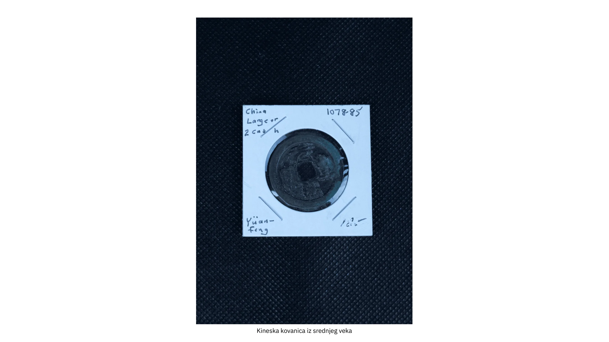

Onaj iznad je kineski novčić iz srednjeg veka. To je liveni novčić sa kvadratnom rupom u centru. Ova rupa je korišćena da se kroz nju provuče konopac, omogućavajući da se novčići nanižu zajedno kako bi se napravile narukvice ili ogrlice. Međutim, oni nisu bili prvenstveno za nošenje; uglavnom su korišćeni za računovodstvene svrhe. Mogli su se nizati zajedno da formiraju obračunske jedinice u obliku velikih nizova, sa međusobno povezanim komadima. Nije nužno bilo specifičnih oznaka, ponekad su to jednostavno bili bronzani krugovi.

Monetarna monopoija države, koju je kasno uspostavio Vudi iz dinastije Han 113. godine pre nove ere, često je bila osporavana, omogućavajući raznim privatnim ili lokalnim akterima da izdaju sopstvene valute, pod uslovom da uživaju dovoljno društvenog poverenja.

**Niska intrinzična vrednost kineskih valuta sprečavala je gomilanje, garantujući njihovu glatku cirkulaciju**. Plemeniti metali su retko korišćeni kao cirkulišuća valuta kako bi se sprečilo gomilanje. Zlato, kao previše skupo, obično je bilo odvojeno, a ne trošeno. Umesto toga, **samo je svila predstavljala pravu visokovrednu valutu u kineskoj međunarodnoj trgovini**. Kinezi su trgovali koristeći svilu, a ne zlato.

Tokom ekonomskih ili monetarnih kriza, posebno kada je cena bakra rasla, usvajana su inovativna rešenja: tako su već u 2. veku nove ere, novčići u opticaju bili sečeni kako bi se stvorile manje jedinice, omogućavajući održavanje fluidne cirkulacije uz niže troškove. Druga razdoblja, kao što je ono Vang Manga (početak 1. veka nove ere), eksperimentisala su sa visoko fiducijarnim valutama, gde su nominalne vrednosti bile daleko veće od stvarnog sadržaja metala, čime su prefigurisane novčanice. Uzeli su novčić i utisnuli vrednosti poput 50, 100 ili 200 kako bi označili veće iznose, kao što je 200 novčića. Ova praksa je verovatno doprinela značajnoj inflaciji.

Kao što je gore pomenuto, ovaj sistem je bio zasnovan na društvenom dogovoru između države, proizvođača i trgovaca, ali i na autoritarnim i strogim pravilima za one koji nisu igrali po pravilima, naročito u vezi sa izborom komada (bilo lepih ili ne) ili dužinom tkanina (koje nisu u skladu sa standardom).

Po mom skromnom mišljenju, to nije baš čvrst sistem. Oslanjao se uglavnom na stroga pravila koja su zahtevala od zvaničnika i trgovaca da prihvate oštećene kovanice, pod pretnjom sankcija.

### Kineske monetarne inovacije i njihov ekonomski uticaj

Kina je takođe bila pionir u izdavanju ranih oblika papirnog novca, koji su prvobitno usvojeni kao odgovor na nedostatak metala u 9. veku nove ere. Uprkos svojim početnim prednostima, ove papirne valute su redovno dovodile do inflatornih spirala kada su izdavane u prekomernim količinama, kao što je to bio slučaj u periodima Song ili Ming, kada je prekomerno izdavanje dovelo do ozbiljnih kriza valute, što je ilustrovao Marko Polo u 13. veku, koji je čak zabeležio da je falsifikovanje takvog papirnog novca bilo kažnjivo smrću. Ne mogu a da ne ukažem na oblik nasilja ovde.

Dakle, kinesko iskustvo karakteriše duboko fiducijarno shvatanje novca, izuzetna fleksibilnost monetarnog sistema i rana upotreba papirnog novca, zasnovana na poverenju između ekonomskih aktera, a ne na intrinzičnoj vrednosti korišćenih sredstava.

## Društvena i ekonomska organizacija u antici

<chapterId>4023c3ce-7a47-5ac4-8f5f-c7ab699ab20f</chapterId>

:::video id=2761efe4-21cf-4f06-9bda-c03f9ff39012:::

### Debata o urbanom parazitizmu

Odnos između drevnih gradova i njihovih zaleđa postavlja fundamentalno pitanje: da li su ovi urbani centri funkcionisali kao paraziti koji izvlače bogatstvo, ili kao motori korisne ekonomske specijalizacije? Hipoteza o parazitizmu sugeriše da su gradovi iz bronzanog doba, posebno u Mesopotamiji, **sistematski izvlačili više vrednosti iz svojih ruralnih teritorija nego što su vraćali**, živeći suštinski od renti i poreza bez stvaranja ekvivalentne vrednosti.

Ova vizija se odrazila u kolapsu Rimskog carstva: kada je teritorijalna ekspanzija prestala, tok spoljnog bogatstva se osušio, potencijalno otkrivajući urbanu ekonomiju nesposobnu da se sama finansira. Gradovi bi tako živeli "iznad svojih mogućnosti", zavisni od eksploatacije, a ne od proizvodnje.

### Specijalizacija kao pokretač stvaranja vrednosti

Alternativno ekonomsko čitanje osporava ovu parazitsku viziju. **Drevni gradovi su pre svega funkcionisali kao centri specijalizacije i podele rada**. Njihova uloga je prevazilazila jednostavnu ekstrakciju: koncentrisali su specijalizovane zanate, organizovali trgovačke mreže i služili kao čvorišta za razmenu na velike udaljenosti.

Ova urbana specijalizacija stvorila je produktivnu međuzavisnost sa zaleđem. **Gradovi nisu mogli opstati bez ruralnih poljoprivrednih zaliha, ali je zaleđe zauzvrat imalo koristi od zanatskih proizvoda, tehničkih inovacija i pristupa mediteranskim trgovačkim mrežama**. Podela rada omogućila je uzajamne dobitke u produktivnosti, čak i ako je raspodela koristi mogla delovati neuravnoteženo.

Hronična nesigurnost u snabdevanju hranom tog vremena delimično objašnjava ovu prividnu asimetriju. Rizik od gladi i uništenja useva bio je stalna pretnja seoskom stanovništvu, dok su gradski zanatlije, povezani sa međunarodnim trgovinskim mrežama, uživali veću ekonomsku stabilnost.

### Istorijska evolucija, od antike do srednjeg veka

Kontrast između antičke i srednjovekovne organizacije osvetljava ovo pitanje. **Antika je favorizovala podelu rada u velikim razmerama, sa gradovima otvorenim ka celom mediteranskom svetu**. Trgovina i specijalizacija dostigli su sofisticirane nivoe, stvarajući opsežne ekonomske mreže.

Kolaps Rimskog carstva doveo je do radikalne fragmentacije: **Feudalna era zamenila je ovu centralizovanu organizaciju decentralizovanim sistemom samodovoljnih imanja**. Antičke rimske vile rustikae postale su matrica srednjovekovnih seigneurija, stvarajući mozaik gotovo samodovoljnih ekonomskih ostrva kojima su upravljali sveštenstvo ili plemstvo.

Ova srednjovekovna decentralizacija, iako je smanjila komercijalnu efikasnost, paradoksalno je ponudila veću otpornost na spoljne šokove. Feudalni posedi su razvili uravnoteženije odnose između centara moći i ruralnog stanovništva, čak i ako je ova organizacija ograničila produktivnost povezanu sa specijalizacijom.

### Pojava urbanih tržišta

Arheološka otkrića otkrivaju postojanje **trgovačkih luka i trgovačkih četvrti u mezopotamskim gradovima još u drugom milenijumu**. Ove infrastrukture svedoče o postojanju organizovanih tržišta, čak i ako njihovo tačno funkcionisanje ostaje predmet rasprave.

Karl Polanyi, u početku skeptičan prema postojanju pravih tržišnih mehanizama u antici, kvalifikovao je svoj stav priznavši da je možda potcenio ranu pojavu tržišnih razmena. Ova intelektualna evolucija odražava složenost tumačenja drevnih ekonomskih sistema, gde su institucionalna redistribucija, recipročna razmena i začetničke tržišne transakcije koegzistirale.

### Sparta protiv Atine

Poređenje između Sparte i Atine savršeno ilustruje odnos između monetarnog sistema i društvene organizacije. **Sparta predstavlja model rigidno hijerarhijskog društva koje je namerno odbacilo upotrebu novca**, dok je Atina razvila sofisticiranu monetarnu ekonomiju kako bi pratila svoj demokratski sistem.

Spartansko odbacivanje novca nije bilo spontano, već **institucionalno i ideološko**. Spartanski lideri su se plašili da bi novac mogao korumpirati vojne i građanske vrednosti, preferirajući sistem zasnovan na direktnom međusobnom poverenju među građanima.

Da bi obeshrabrila korišćenje novca, Sparta je koristila **teške, nepraktične metalne šipke**, paradoksalno pokazujući intuitivno razumevanje monetarnih osobina (deljivost, prenosivost, trajnost) koje su nastojali da neutrališu.

### Granice anti-monetarnog modela

Spartanska organizacija ilustruje ograničenja **Danbarovog broja** primenjena na društvenu skalu. **Odbacivanjem novca kao neutralnog sredstva razmene, Sparta je samu sebe osudila na ograničavanje svoje građanske zajednice na ograničen broj građana sposobnih za održavanje odnosa direktnog poverenja**. Homoioi (spartanski građani) predstavljali su samo 1% ukupne populacije, okruženi hiljadama hilota (robova).

Ova organizacija, koja je u početku bila izvor izuzetne vojne kohezije, pokazala se strukturno krhkom. **Bitka kod Leuktre (371. p.n.e.) pokazala je granice ovog sistema**: gubitak života nepovratno je razorio spartansko društveno tkivo, što je dovelo do kolapsa njihovog civilizacijskog modela.

Konkurentski gradovi (Atina, Korint, Teba), sa razvijenim monetarnim sistemima, **održavali su bogatije, otpornije ekonomije**, sposobne da nadoknade ljudske gubitke kroz ekonomsku rekonstrukciju i imigraciju.

### Lično naspram institucionalnog poverenja

Spartansko iskustvo otkriva **rizike svojstvene društvu zasnovanom isključivo na međusobnom poverenju** umesto na neutralnim institucionalnim mehanizmima. Iako je stvarao intenzivnu društvenu koheziju, ovaj model je ostavljao društvo ranjivim na demografske šokove.

Omogućavanjem anonimnih i depersonalizovanih transakcija, novac nudi superiornu sistemsku otpornost. Omogućava društvenu ekspanziju izvan granica direktnog poverenja, olakšavajući strane razmene i ekonomski rast.

### Inka paradoks, Bogatstvo bez novca

Inka Carstvo predstavlja fascinantan paradoks: **civilizacija sa ogromnim bogatstvom zlata, ali bez monetarnog sistema**. Poput Sparte, ovaj model je bio zasnovan na rigidnoj hijerarhijskoj organizaciji i centralizovanom planiranju, ali se pokazao ranjivim pred konkvistadorima sa fleksibilnim monetarnim ekonomijama.

Ova strukturna krhkost antimonetarnih sistema pred monetarnim društvima je ponavljajući istorijski obrazac, što sugeriše da **institucionalno odbacivanje novca, daleko od jačanja društvene kohezije, može paradoksalno oslabiti civilizacije** pred spoljnim izazovima i istorijskim promenama.

Analiza ovih istorijskih modela otkriva da je novac, osim svoje funkcije razmene, marker i posrednik društvene složenosti, omogućavajući civilizacijama da prevaziđu granice nametnute direktnim međuljudskim odnosima.

# Rođenje kovanog novca

<partId>232e365a-8c3b-11f0-b276-b3ab70d1a5a1</partId>

## Pojava novčića

<chapterId>40ed3414-3066-57bd-bc1b-617ad0a354e0</chapterId>

:::video id=1d6834c4-98a3-43fe-ba80-04be51b0486e:::

Sada smo došli do suštine stvari: pojava novčića. Naglašavam reč 'novčić' ovde jer smo videli u prethodnim delovima da su novac ili monetarni sistemi bili prisutni u civilizacijama koje su prethodile Lidijcima, Grcima i Persijancima. Mislim da je to prilično jasno iz onoga što smo upravo videli. Stoga je ovaj deo posvećen pojavi pravih novčića i nosi naslov: *Pojava novčića*.

### Lidijsko i jonsko poreklo novca

Da započnem ovaj deo, želeo bih da vam ponudim odlomak iz knjige Glyn Daviesa, Istorija novca, upravo ovde.

*Izvod iz Istorije novca: Od drevnih vremena do današnjeg dana autora Glina Dejvisa:*

> Od svog mesta nastanka u Lidiji i Joniji, znanje i upotreba novca brzo su se proširili na istok u Persijsko carstvo i na zapad kroz ostatak jonskih i egejskih ostrva do kopnene Grčke, a zatim do njenih zapadnih kolonija, posebno Sicilije. Takođe se proširilo na sever ka Makedoniji, Trakiji i Crnom moru, ali je u Egiptu prihvaćeno samo delimično, nevoljno i sa zakašnjenjem.

Smatram da je zanimljivo napomenuti da su u Egiptu nastavili da mere novčiće dugo nakon pojave tehnologije kovanja novca. Mislim da je važno to napomenuti. Citati se nastavljaju:

> Slično tome, kopnena Italija je takođe isprva bila prilično spora u prihvatanju grčkih finansijskih inovacija, za razliku od brzine kojom su ih prihvatili na Siciliji.

*Osim ova dva ograničena izuzetka (kontinentalna Italija i Donji Egipat), upotreba kovanog novca brzo se proširila po zemljama koje okružuju centralni i istočni Mediteran, kao i širom ogromnog i rastućeg Persijskog carstva, od Mesopotamije **do Indije.** Ostaje nejasno da li je Indija već nezavisno razvila embrionalni monetarni sistem do tog vremena, nezavisno od kineskih ili lidijskih razvoja. Bez obzira na to da li je Indija nezavisno razvila svoju valutu, sve veći kontakti između Indije i Bliskog istoka doveli su do toga da je indijski kovani novac bio direktna adaptacija lidijskog i grčkog izuma, prvo kroz Persijsko carstvo, a zatim Makedonsko carstvo* (sa osvajanjima Aleksandra Velikog i njegovog oca).

*Iz ovih razloga, direktan uticaj bilo kog autohtonog indijskog izuma novca bio je manji u poređenju sa ogromnim značajem jasno nezavisnih monetarnih izuma Kine na istoku, a još više lidijskih i grčkih dostignuća na zapadu*

### Geografska distribucija i regionalne adaptacije

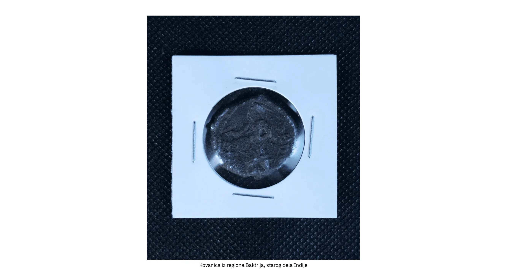

Da ilustrujemo ovaj period u vizuelnom obliku, ovde iznad je novčić iz regiona u Indiji, regiona Baktrija, koji je blizu zapada Indijskog poluostrva, blizu Avganistana. U ovom području postojali su novčići koji su verovatno bili inspirisani grčkim novčićima sa likom jedne od njihovih kraljevskih ličnosti.

## Lidijci i Persijanci

<chapterId>eb802ab8-8ffd-5b25-907f-8944f120ed14</chapterId>

:::video id=f151eb42-5ff3-4ca1-9af1-1ae2a5e051c0:::

### Prvi lidijski elektrumski novčići

Pošto ne možemo odvojiti izgled novčića iz Lidije i Persije, pređimo na taj deo sveta istočno od Grčke, koji danas čini Turska. Prvi novčići koji su se pojavili na Zapadu datiraju otprilike iz sredine 7. veka pre nove ere, u regionima Lidije i Jonije, smeštenim u današnjoj Turskoj. Bilo je to oko 650. do 600. godine pre nove ere kada je ova fundamentalna inovacija ugledala svetlost dana, sa značajnim arheološkim otkrićima kao što su prvi novčići pronađeni u hramu Artemide u Efesu, datirani oko 600. godine pre nove ere. Ovi primitivni novčići bili su napravljeni od elektruma, prirodne legure zlata i srebra sa jantarnim odsjajem, i često su bili grube izrade, jednostavno obeleženi udarcima ili rudimentarnim motivima.

Ispod možete videti jedan od najranijih lidijskih novčića, sa lavom i njegovim plenom ispred. Možda ćete primetiti pečat ili rupu na poleđini, za koje neki veruju da su korišćeni za testiranje čistoće metala i osiguranje da nije samo površinski sloj. Iako je ovo jedan od najranijih primera, važno je napomenuti da je ovaj komad kopija. Svi moji zlatni i elektrumski komadi su replike ili moderne rekreacije, dizajnirane da me spreče da potrošim sve svoje uštede na ovu kolekciju.

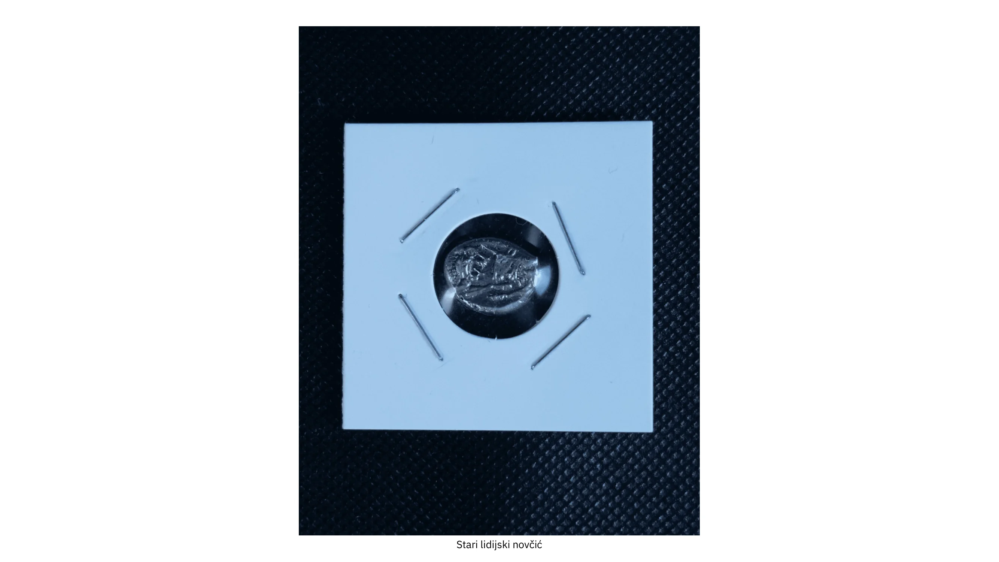

Ali imam i pravi persijski komad koji ćemo uskoro videti. Ovako su izgledali ti rani komadi. To je kao neka vrsta grumena (ili kvržice, na engleskom) metala koji je tada bio utisnut.

Suprotno raširenom verovanju da je novac izmišljen kako bi olakšao svakodnevnu trgovinu i zamenio barter, čini se da prvi lidijski, ahemenidski i grčki novčići nisu u početku korišćeni za trgovinu malih razmera. Naime, monetarne jedinice su bile previše velike za svakodnevnu upotrebu. Štaviše, njihova cirkulacija je bila ograničena na regione blizu mesta gde su proizvedeni.

Ovde smatram da je važno napomenuti da, iako sam čitao u nekoliko dela antropološke prirode, novčići, kao što sam već pokazao - bilo da su od elektruma ili ovaj persijski novčić na koji ću se vratiti vrlo brzo - bili su preveliki da bi se kupio hleb, recimo, svaki dan. Video sam procene koje bi nas navele da mislimo da je to bilo ekvivalentno dnevnom radu za seljaka ili vojnika, tako da bi bilo preveliko. To je kao da pokušavate da platite dnevnu zaradu za svoj obrok, doručak ili ručak. Osim što sam video u drugim delima da su pronađene manje jedinice ovih oblika, dakle manji novčići, što nas može navesti da pomislimo da je možda postojala moguća upotreba za svakodnevne kupovine.

Dakle, ovde, antropološki "dokaz" da nije korišćen za svakodnevnu trgovinu, jer je denominacija ili jedinica bila prevelika, po mom mišljenju nije baš čvrst jer smo pronašli primere novčića koji su manji, koji su mogli biti prilagođeni za svakodnevne kupovine.

### Uloga države u stvaranju novca

Pravo poreklo novca čini se da je povezano sa direktnom akcijom država. Postoje dve glavne hipoteze o ovoj temi: prva, idealistička, povlači paralelu između grčkog termina 'nomisma' (novac) i 'nomos' (zakon), sugerišući da je novac bio povezan sa kodifikacijom zakona, jačajući autoritet i političku organizaciju gradova. Druga, realističnija hipoteza, danas široko prihvaćena, jeste da je novac pre svega bio sredstvo za države da vrše ekonomsku i socijalnu kontrolu. Službenim garantovanjem težine i vrednosti plemenitih metala koje su sadržavali, države su bile u mogućnosti da manipulišu cirkulacijom i vrednošću ovih novčića, stvarajući poverenje i likvidnost specifične za domaće valute.

Zaista je zanimljivo znati da imamo dokaze o tome. Na primer, kod elektrumskih novčića, treba da znate da je prirodni elektrum obično oko 70% zlata i 30% srebra. U prvim novčićima koje smo pronašli i analizirali, konkretno ranim lidijskim novčićima, sadržaj zlata izgleda da je više oko 50 do 55% umesto 70. Ovo sugeriše da su čak i tada izdavači novčića pokušavali da smanje udeo plemenitijeg metala, verovatno da bi proizveli više novčića i učinili da izgledaju kao da vrede isto kao neobeležena gruda prirodnog elektruma. I ovde treba reći da je to zaista bilo iz vremena ovog čuvenog Krezusa, kao u *bogat kao Krez*, da je to bilo moguće jer je iz njegovog vremena postojala tehnologija za razdvajanje zlata i srebra.

Lidijska kovanica doživela je veliku evoluciju tokom vladavine čuvenog kralja Krezusa (561-546. p.n.e.), poznatog po svom legendarnom bogatstvu. U to vreme, Lidijci su usavršili metalurgiju kako bi odvojili zlato i srebro od elektruma, čime su uveli prve bimetalne kovanice, tj. odvojene zlatne i srebrne kovanice.

### Persijsko širenje i grčko usvajanje

Kada su osvojili Lidiju 546. godine pre nove ere, Ahemenidski Persijanci su odmah usvojili ovu inovaciju. Oko 500. godine pre nove ere, pod vladavinom Darija I, Persijanci su uspostavili svoj monetarni sistem sa zlatnim daricima i srebrnim sigloima, često noseći kraljevski lik u ratničkim pozama. Ova kraljevska persijska kovanica je uglavnom korišćena u helenizovanim regionima Persijskog carstva i postepeno se širila, iako je njena upotreba ostala neujednačena, sa **nekim regionima, kao što je Egipat, koji su i dalje preferirali razmenu u izmerenim metalima (poluge).**.

Iznad, možete se diviti pravom persijskom sigloju (ili siglosu). Mali dizajn prikazuje kralja, iako je rupa malo izlizana. Siglos je srebrni novčić, za razliku od darika, koji je bio napravljen od zlata. Persijanci su mogli razlikovati ova dva metala i udaljili su se od elektrumskih novčića. Tako su implementirali bimetalizam, koristeći i zlato i srebro, dok su zadržali isti koncept novčića napravljenih od plemenitih metala, često sa rupom na poleđini, verovatno za proveru sadržaja metala.

Brzo usvajanje kovanica od strane Grka čini se da je bilo podstaknuto njihovim bliskim kontaktima sa Lidijcima, posebno preko grčkih kolonija u Maloj Aziji. Prvi Grci koji su kovali novac verovatno su bili stanovnici Egine sredinom šestog veka pre nove ere, koji su uveli drahmu, čija se težina razlikovala od regiona do regiona, a čije ime doslovno znači "šaka žita" ili "šaka strela".

Uspeh grčkog kovanog novca bio je jednako zbog njegove pogodnosti za važne transakcije, kao što je plaćanje plaćenika, koliko i zbog ekonomskog i političkog širenja gradova. Valuta je brzo postala centralni element grčke, a kasnije i rimske ekonomije, zadržavajući snažnu simboličku dimenziju, naročito kroz svoju povezanost sa zakonom (nomos).

Konačno, brzo širenje kovanog novca svedoči o dubokoj transformaciji drevnih društava, gde je kodifikacija monetarnih vrednosti išla ruku pod ruku sa državnom organizacijom. Ova evolucija postavila je ekonomske i političke temelje za uspon grčkih demokratija, posebno u Atini, gde je novac igrao ključnu ulogu u funkcionisanju demokratskog grada.

Ključna tačka koju treba zapamtiti iz ovog dela je da govorimo specifično o **kovanicama**, a ne o novcu uopšte. Centralni aspekt koji se jasno pojavljuje je **poverenje u izdavaoca**, direktno povezano sa tehničkim karakteristikama kovanica (težina, čistoća, nominalna vrednost). Upravo to poverenje omogućava državi ili izdavaocu da od početka vrši određeni stepen kontrole ili čak manipuliše vrednošću i cirkulacijom ovih kovanica.

## Institucionalna intervencija i prvi novčići

<chapterId>3e1efd08-99e3-5a32-9908-3185fef0e640</chapterId>

:::video id=84847cf6-9e46-4a8c-9f35-25a27496cc4b:::

### Dvojna priroda novca

Pojava kovanog novca postavlja fundamentalno pitanje: da li je novac spontana kreacija tržišta ili institucija nametnuta od strane autoriteta? Ova konceptualna napetost suprotstavlja dve radikalno različite vizije.

S jedne strane, austrijska škola ekonomije brani ideju da je robni novac - posebno zlato - prirodno izabran od strane ekonomskih aktera zbog svojih intrinzičnih kvaliteta: trajnosti, prenosivosti, deljivosti i zamenljivosti. Iz ove perspektive, država je zatim prisvojila ovu spontanu valutu kako bi kontrolisala njenu ponudu. To je institucija koja prirodno proizlazi iz potreba tržišta pre nego što je zarobljena od strane političke moći.

Nasuprot tome, antropološko i institucionalno gledište drži da novac zaista nastaje sa državnim kovanicama. Vlast bi svesno stvorila valutu stavljanjem svog pečata, čime bi metal pretvorila u pravi monetarni instrument. Ova perspektiva sugeriše da su najranije lidijske kovanice uglavnom korišćene za plaćanje vojski - jedan stater je otprilike odgovarao dnevnoj plati vojnika.

### Paradoksalne prednosti državne standardizacije

Uprkos ovoj teorijskoj napetosti, čak i austrijski ekonomisti prepoznaju određene prednosti državne intervencije u novcu. Standardizacija putem kovanja rešava niz praktičnih problema u trgovini.

Bez sertifikacionog autoriteta, ekonomski akteri se suočavaju sa stalnim rizicima: falsifikovani novčići, prevara pri prijavljivanju i manipulacija težinom. Ove prakse stvaraju trenje u ekonomiji, jer se neki novčići prihvataju dok se drugi odbijaju. U teoriji, zvanični pečat garantuje težinu i kvalitet, čineći trgovinu fluidnijom.

Ova garancija ima uočljivu cenu na tržištu: iskovani zlatnik vredi više od svog ekvivalenta u sirovom zlatu. Ova premija odražava vrednost sertifikacije - trgovci više ne moraju sami da proveravaju autentičnost metala putem hemijskih ili rezonantnih testova. Državna intervencija, paradoksalno, eliminiše trenje i olakšava trgovinu stvaranjem institucionalizovanog poverenja.

### Manipulacija valutom od samog početka

Priča o prvim lidijskim staterima otkriva uznemirujuću ironiju. Nedavne analize pokazuju da je sadržaj zlata u ovim elektrumskim novčićima bio sistematski niži od onog u prirodnom elektrumu. Autoritet koji je potvrđivao kvalitet istovremeno je manipulisao sastavom.

Ova praksa ilustruje dvostruku korisnost kovanog novca. Za tržište, čini razmene fluidnijim i nudi garanciju standardizacije. Za izdavačku vlast, postaje alat ekonomske kontrole kroz razređivanje. Smanjenjem sadržaja zlata uz održavanje nominalne vrednosti, država efektivno povećava novčanu masu - stvarajući više monetarnih jedinica iz iste količine plemenitog metala.

Sama država, međutim, ostala je ograničena ovom manipulacijom. Kao što je ilustrovano primerom Konstantinovog zlatnog solidusa u 4. veku, rimska administracija je pažljivo proveravala kvalitet novčića, jer je zahtevala da bude plaćena u dobrom novcu. Vlast je imala vitalni interes u održavanju kvaliteta sopstvenog novca kako bi garantovala vrednost svojih poreskih prihoda.

### Ekonomska analiza devalvacije

Proučavanje devalvacije valute otkriva dosledne obrasce kroz istoriju. Za metalne kovanice, ekonomisti prate procenat plemenitih metala sadržanih u kovanicama - opadajuća kriva koja ukazuje na progresivnu devalvaciju. Za savremeni papirni novac, suprotno je tačno: posmatra se količina novca u opticaju, a njen porast signalizira devalvaciju.

Obe metode mere isti fundamentalni fenomen: razređivanje monetarne vrednosti. Bilo smanjenjem sadržaja plemenitih metala ili štampanjem novih novčanica, mehanizam ostaje isti. Što više monetarnih jedinica neka vlast stvori iz istih stvarnih resursa, to svaka jedinica više gubi na vrednosti.

Ova manipulacija, koja se može primetiti još na najranijim lidijskim novčićima, sugeriše da je kontrola nad novcem oduvek bila pitanje moći. Kovani novac tako predstavlja izuzetnu tehničku inovaciju udruženu sa instrumentom ekonomske kontrole - dualnost koja se proteže kroz celu monetarnu istoriju, sve do današnjeg dana.

## Proizvodnja delova

<chapterId>b205f4f2-c293-5308-b812-a998de9ad45e</chapterId>

:::video id=47c612ec-d97e-4498-b50e-7e66518bd56d:::

### Od probušenih mrlja do kovanih novčića

Nakon odeljka o pojavi novčića, želeo sam da uvedem veoma kratak odeljak o evoluciji proizvodnje novčića. Kao što smo videli, sve je počelo sa grudvama elektruma, nastavljajući sa zlatom i srebrom, gde su obe strane bile obeležene udarcem, bilo sa kraljevim likom, ili rupom na poleđini za proveru čistoće.

Kasnije, kako ćemo istražiti u narednom delu, Grci su usavršili ovu tehnologiju stvaranjem okruglih novčića koji su bili kucani s obe strane. Uzeli bi glatki, ravni komad plemenitog metala, ugravirali željeni dizajn na jednoj strani, a zatim ga ručno kucali kako bi stvorili gotov novčić.

Tehnologija ručne izrade kovanica pojedinačno verovatno je igrala ulogu u kontroli inflacije tokom tog vremena, iako su kovanice često bile razblažene kako bi se povećala proizvodnja. Ovo je bilo posebno evidentno tokom rimskog perioda i, u manjoj meri, tokom određenih ratova u grčkom periodu. Dok je kovanje kovanica jednu po jednu ograničavalo sposobnost vlasti za masovnu proizvodnju, ono je efikasno doprinosilo kontroli inflacije, uprkos značajnim devalvacijama koje su se dešavale. Tako je evolucija napredovala od komada metala koji se udarao do okrugle, kucane kovanice.

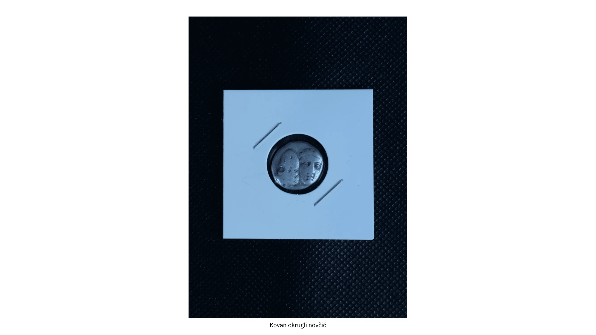

### Srednjovekovna evolucija

U srednjem veku, takođe je postojao trend širenja novčića, čineći ih širim i tanjim. Jedan od razloga za to bio je što je postalo lakše testirati njihov zvuk, koji se često koristio kao pokazatelj autentičnosti. Širenjem srebra, proizvodila se specifična frekvencija, tako da su ljudi mogli proveriti čistoću novčića jednostavno slušajući ga. Ova praksa je dovela do pojma "zvučni novac". U kontekstu zvučnog novca, standardna težina se određivala korišćenjem balansne vage ili "trebušeta" za merenje. Tako se evolucija nastavila od malih, okruglih novčića do nešto tanjih, širih novčića.

### Udar klatna

Poslednja tehnologija koja je stigla na kraju srednjeg veka, na početku moderne ere, bila je ideja o udarcu klatnom. To je bila vrsta zavrtnja koji je bio zategnut da udara novčiće, čime su se generisali novčići sa ovim novim oblikom udarca. Ono što je bilo posebno u vezi sa ovim razvojem bila je sposobnost graviranja šare na površini novčića kako bi se rešio problem sečenja. Sečenje je podrazumevalo uklanjanje dela novčića kako bi se povratilo dragoceno srebro, koje je zatim moglo biti korišćeno za kovanje drugih novčića ili jednostavno zadržano kao resurs.

Dakle, ova ideja o udaru klatna pomogla je sa fenomenom sečenja. I zanimljivo je napomenuti da je ova tehnologija zapravo došla iz Francuske. U Engleskoj su, na primer, angažovali francuske inženjere da dođu i pokažu im kako da naprave ove mašine. Ono što je smešno, mislim, jeste da su postojali zagovornici kovanja čekićem koji su bili protiv toga i koji su odlagali primenu ove tehnologije. U svakoj dobroj tehnologiji uvek postoje ljudi koji su protiv nje, koji žele da zadrže staru tehnologiju. Mislio sam da je prilično ludo shvatiti da čak i tehnologija koja deluje zaista superiorno - možete napraviti više delova, teže ih je kopirati - i dalje su postojali ljudi koji su bili vezani za čuvenu metodu čekića. Došlo je do prelaza između proizvodnje delova koji su napravljeni ovim čuvenim udarom klatna i zatim povratka na udar čekićem. I na kraju, naravno, udar klatna je konačno prevladao i dao nam ove prelepe moderne komade gde možete pronaći ili male linije, male grebene oko da se izbegne sečenje, verovatno povezano sa rečju sečenje, grebeni, i još uvek možete videti danas ili grebene ili tekst ili crteže koji su urezani na ivici komada.

# Različite teorije o nastanku novca

<partId>72ac694f-9248-550d-90c1-91af3d234380</partId>

## Teorije o nastanku novca i njegove različite definicije

<chapterId>7d699d4d-8c70-55b5-bf36-609f3fd90bcf</chapterId>

:::video id=523c873f-501b-4954-b79f-7e74c0f685a5:::

Dobrodošli u ovaj segment posvećen različitim teorijama o nastanku novca i njegovim raznim definicijama. Evo kratkog izvoda iz knjige *Aux origines de la monnaie* koji, mislim, sažima dve glavne teorije koje ćemo razmatrati u ovom delu.

> Ovaj kratki uvod služi samo da istakne kontekst ankete. Na konceptualnom nivou, debata je otvorena između pristalica teze K. Polanyija i onih M. Webera. Za prve, dar i redistribucija igraju centralnu ulogu, dok tržišna razmena igra samo marginalnu ulogu, uglavnom u međunarodnim razmenama. Za druge, naprotiv, tržište je u središtu trenutnog istorijskog procesa.

Na primer, u Mesopotamiji, jedna teorija o nastanku sugeriše da hram, kao autoritet, stvara jedinicu obračuna ili monetarnu jedinicu, nameće je, a zatim je trgovci usvajaju za trgovinu. Suprotna teorija tvrdi da, ne, ova monetarna jedinica prirodno nastaje iz tržišta kako bi olakšala trgovinu. Postoje dobro dokumentovani primeri ovoga u Mesopotamiji.

Što se tiče trampanja, neke teorije sugerišu da se ono uglavnom koristilo u međunarodnim razmenama, tj. sa ljudima kojima jednostavno nismo verovali.

Dakle, to je ono što ćemo raditi u ovom delu. Sprovešćemo neku vrstu istraživanja kako bismo predstavili različite teorije o nastanku novca i različite definicije šta je novac. Predstavićemo i kritikovati teze kako klasičnih ekonomista, tako i antropologa. Imaću čak sreću da sa mnom bude Ulrich, koji će predstaviti perspektivu austrijskog ekonomiste o ovim raznim temama.

## Pojava novca za klasične ekonomiste

<chapterId>1d3776cd-0dfd-5297-af48-c6f41e257a7e</chapterId>

:::video id=873a16c1-17ac-448d-8941-df4feb7ab79d:::

Ovaj segment je posvećen različitim teorijama o nastanku novca. Prva tema koja će biti obrađena je nastanak novca prema klasičnim ekonomistima.

### Klasična teorija Adama Smitha

Prema klasičnim ekonomskim teorijama, posebno onima koje je zagovarao Adam Smit, novac je prirodno nastao iz barter razmene kao odgovor na njene ograničenosti. U početku su se razmene obavljale direktnim barteringom, ali je ovaj metod često bio komplikovan problemom "dvostrukog podudaranja želja": svaka osoba je morala da poseduje tačno ono što druga želi. Postepeno su određene robe (kao što su so, plemeniti metali i stoka) postale prihvaćene od strane svih kao posredna sredstva razmene, zahvaljujući njihovoj korisnosti, trajnosti i deljivosti. Tako se novac spontano pojavio kako bi olakšao i ubrzao ekonomske razmene.

### Kritika klasične teorije

Evo je moja kritika ove teorije. Sa svime što smo videli u prethodnom delu, mislim da već možemo reći da je ova ideja da su **novčići** evolucija trampe pogrešna jednostavno zato što kovani novac definitivno proizlazi iz autoriteta, budući da ga kuje autoritet. Postoji nekoliko razloga za to, a ne najmanje želja vlasti da kontrolišu ekonomiju, da preuzmu kontrolu nad novcem.

S druge strane, ako govorimo o novcu kao konceptu, a ne nužno o kovanicama, onda je to manje jasno jer smo sa prvim kovanicama, lidijskim staterima, pronašli srebrne grumene koji nisu bili označeni. Ostaje da se vidi da li su bili u opticaju. Ako su bili u opticaju, to znači da su ljudi možda prvobitno identifikovali ovu imovinu kao potencijalnu valutu koja bi mogla biti široko tražena i lako razmenjiva. I možda su tek nakon toga vlasti primetile ovu situaciju i preuzele kontrolu nad njom stavljanjem pečata kako bi je sertifikovale.

Postoji mnogo prednosti u tome - nema potrebe da se proverava, meri, sve to. Očigledno, o tome ćemo razgovarati. Ali po mom mišljenju, novčići su očigledno alat koji su države koristile od samog početka. Međutim, u smislu pojave novca kao takvog, ne znamo da li je zaista potekao od autoriteta koji ga je nametnuo ili je nastao kroz trgovinu ili komercijalne razmene. Imaću veoma zanimljivu diskusiju na ovu temu sa svojim kolegom Ulrihom kasnije u ovom delu.

Već znamo da prvi novčići od plemenitih metala nisu korišćeni za olakšavanje svakodnevnih razmena jer je njihova vrednost bila previše visoka. Takođe znamo da su uglavnom korišćeni za vojne isplate. Ovo je dobar argument za tezu da novac nije nužno nastao iz tržišta. Obračunske jedinice, denominacije prvih novčića, verovatno su bile prevelike za, recimo, kupovinu hleba ili obavljanje svakodnevne kupovine. Moglo bi, na primer, biti ekvivalent dnevne zarade. Ne nužno da su ljudi tada bili plaćeni u dnevnicama, ali to je da vam dam ideju o razmeri. Dakle, ovi novčići su verovatno imali previše kupovne moći da bi se koristili u trgovini malog obima. S druge strane, nema ničega što bi reklo da ovi novčići ne bi bili korišćeni za veće razmene, kao što su trgovačke razmene. Znamo da su uglavnom korišćeni za vojne isplate. Ovo je jedna od najpopularnijih teorija za objašnjenje pojave prvih novčića. Zapamtite, ovde govorimo o novčićima, ne nužno o novcu uopšte. Dakle, prvi novčići su imali svoju prvu ulogu, a to je bilo da plate vojne isplate, za plaćenike.

Aleksandar Veliki, na primer, mnogo ga je koristio, kao što ćemo videti kasnije.

Takođe smo videli da su još u drevnoj Kini kaurijeve školjke korišćene za ekonomsku razmenu (**nagrađivanje rada, merenje vrednosti i kupovinu zemlje)**. Štaviše, u Mesopotamiji i Egiptu već su postojali funkcionalni monetarni sistemi koji su se koristili za trgovinu, isplate plata i plaćanje poreza. Ono što ovde sugerišem je da je definitivno pogrešno misliti da su novčići u zapadnoj koncepciji nastali iz potrebe da se razmene učine fluidnijim.

Pošto kovanice izdaje neka vlast, možemo možda pretpostaviti da su od samog početka bile povezane sa izdavaocima. To ima smisla. S druge strane, ne znamo nužno kako su se pojavili oblici novca ili oblici monetarnih sistema, proto-kovanice, koji su im prethodili. S jedne strane, predložićemo da su hramovi ti koji su identifikovali ove monetarne jedinice i, nakon toga, ljudi su ih koristili. A, s druge strane, reći ćemo vam, ne, bili su to trgovci kojima je bio potreban način razmene, način trgovanja sa spoljnim svetom, i oni su identifikovali, na primer, srebrni metal, da bi se koristio jer je bio tražen od strane spoljnog sveta. Poenta je da zapravo ne znamo. Zato imamo dve suprotstavljene teorije. Nemamo savršen dokaz da objasnimo da li novac prirodno proizilazi iz potrebe za trgovinom, na primer od strane trgovaca, ili potiče od vlasti.

### Razlikovanje između kovanica i primitivnog novca

Zaključno, mislim da možemo reći da novčići nužno potiču od autoriteta, budući da su od strane tog autoriteta i utisnuti. S druge strane, ne mislim da možemo reći da je pogrešno sugerisati da novac (onaj koji je prethodio novčićima) nije mogao nastati radi olakšavanja razmene. Mislim da u svim primerima koje smo gore videli, primeri u tom smislu obiluju.

## Mit o trampi

<chapterId>0fcd4964-ac36-5163-a8cf-1aacebc0d2c0</chapterId>

:::video id=0ede29ab-8acd-4d79-9282-bd5991b97076:::

### David Graeberova recenzija

Upravo smo obradili pojavu novca prema klasičnim ekonomistima. Sada ćemo se pozabaviti konceptom poznatim kao mit o trampi.

Jedna kritika ove klasične teorije o nastanku novca je nedostatak istorijskih dokaza koji bi podržali njene ideje.

Kritika poznata kao "mit o trampi", koju je formulisao antropolog David Graeber, između ostalih, osporava klasičnu ideju da je novac prirodno proizašao iz trampe. Prema ovoj kritici, ne postoji istorijski ili antropološki dokaz koji pokazuje da su društva sistematski koristila trampu pre pojave novca. Zapravo, drevna društva bi funkcionisala na osnovu kredita, duga, društvenih obaveza i ceremonijalnih razmena. "Mit o trampi" je stoga teorijski konstrukt dizajniran da opravda klasičnu ekonomsku viziju, bez stvarne empirijske osnove.

Treba napomenuti, međutim, da ova teorija ne negira da je trampanje postojalo, na primer, za razmene između različitih plemena. Ona jednostavno negira da je trampanje bilo široko praktikovana aktivnost unutar ovih takozvanih primitivnih grupa, i da bi novac bio logična evolucija ovih praksi. Ona negira činjenicu da je trampanje bilo široko korišćeno unutar jednog plemena, i da je novac na kraju nastao kako bi olakšao razmene i rešio poteškoće koje su postojale sa trampanjem. Umesto toga, prema ovoj teoriji, ove grupe su praktikovali oblik neformalnog kredita ili poklon za poklon.

### Primitivna društva vs. velike civilizacije

**Evo nekoliko pojašnjenja u vezi sa velikim civilizacijama drevne antike.** Mislim da se ova teorija definitivno odnosi na primitivne (bezdržavne) grupe iz prošlosti, pa čak i danas (npr. plemena koja su proučavali istraživači u 18. i 19. veku). Jasno je da nisu koristili barter, već oblike razmene koje sam ranije spomenuo, iz razloga koje smo već naveli (slaba podela rada, egzistencijalna poljoprivreda). Međutim, ne mislim da se ova teorija odnosi na velike civilizacije prošlosti, kao što su Mesopotamija i drevni Egipat.

Evo dva odlomka iz *Aux origines de la monnaie* na ovu temu:

> Model koji je izneo M. Mos u svom čuvenom delu "Dar" usvojen je od strane egiptologa sa toliko jednoglasnosti i entuzijazma koliko i sa nedostatkom rasuđivanja. To je dovelo do brojnih zabuna, u koje ovde nećemo ulaziti. Samo ćemo napomenuti da se ovaj model primenjuje na takozvana primitivna društva, što nije slučaj sa faraonskim Egiptom.

> Hlebovi, tj. prerađene žitarice, bili su stoga jedinice obračuna koje su, poput šâta (y) iz Starog kraljevstva, takođe omogućavale otvaranje kredita u raznovrsnoj robi. Ovaj jednostavan primer pokazuje da ekonomija faraonskog Egipta nije bila ograničena na sistem preraspodele. Bila je veoma složena, uključujući mnoštvo razmena.

Dakle, kao što smo ranije videli u odeljku o Egiptu, pa čak i Mesopotamiji i Kini, možemo videti da čak i ove drevne, ali ne i primitivne civilizacije, zbog prisustva države, po mom mišljenju, koristile su monetarne sisteme. Mislim da je to obilno demonstrirano u prvom delu ovog kursa. I tako, ova ideja davanja i uzimanja, odloženog kredita, ne odnosi se na ove velike civilizacije. Tačni razlozi za nastanak novca stoga ostaju misterija. Ne znamo da li je proizašao iz potrebe trgovaca da trguju sa spoljnim svetom, ili je bio nametnut od strane hrama u ovim drevnim periodima.

## Pojava novca kroz novac duga

<chapterId>4f508615-aa61-5d62-89d3-cecd02aeaa62</chapterId>

:::video id=a23f547f-3906-4f4a-8f72-5d78c649d0c4:::

### Novac kao IOU

U ovom odeljku pokrivamo teoriju novca iz duga.

Teorija **dužničkog novca**, koju je značajno razvio ekonomista Alfred Mičel-Ines, a kasnije proširio Dejvid Greber, tvrdi da novac nije nastao iz razmene, već iz odnosa duga i kredita prisutnih od najranijih ljudskih društava. Prema ovoj teoriji, novac se pojavljuje kada društvene obaveze (dugovi između pojedinaca ili grupa) postanu kvantifikovane i prenosive. Ovaj koncept uvodi pojam kvantifikacije razmena i prenosa. Tako bi novac pre svega bio **priznanje duga**, podržano međusobnim poverenjem i često garantovano političkim ili verskim autoritetom, a ne roba koja služi samo kao posrednik u razmenama.

Još napredniji oblik ove teorije je da je sav novac dug. Dakle, neko ko poseduje novac imao bi potraživanje prema društvu uopšte, potraživanje prema svima koji prihvataju taj novac. I pošto novac, **po njihovoj viziji, mora biti prihvaćen na obavezan način**, inače to nije novac, jer ako možete odbiti taj novac, njihov sistem ne funkcioniše. U određenoj grupi koja je identifikovala valutu, svi koji je poseduju, kao da imaju dug prema svim ostalim članovima tog društva koji prihvataju tu valutu, a oni koji prihvataju valutu imaju oblik duga prema osobi koja poseduje tu monetarnu jedinicu. Ovo je suštinski njihova teorija.

### Kritika obaveznog sistema

**Moja kritika ove teorije:**

Dozvolite mi da iznesem jednu malu kritiku ove teorije. Prihvatam da je novac neka vrsta društvenog konsenzusa. To je poverenje koje grupa polaže u monetarni "znak", šta god to bilo. Dakle, slažem se sa konceptom međusobnog poverenja, koji ćemo ponovo razmotriti kasnije sa konceptom monetarne premije. Gde postaje komplikovano je kada zagovornici ove teorije dodaju pojam obaveze i insistiraju na pojmu duga. Za njih, kada neko poseduje monetarni token, oni imaju potraživanje prema zajednici u celini, i zajednica bi stoga dugovala vlasniku dug. Takođe bi postojala obaveza za izmirenje, pri čemu bi članovi grupe bili obavezni da prihvate token; inače, po njihovom mišljenju, sistem ne bi funkcionisao. Mislim da sistem opisan gore u drevnoj Kini dobro predstavlja ovu teoriju.

Što se mene tiče, lako mogu zamisliti sistem u kojem je novac društveni konsenzus gde je izabrani token opšte prihvaćen kao sredstvo plaćanja, bez formalne obaveze. Mogu videti da takav sistem funkcioniše ako ga ljudi prihvate svojom slobodnom voljom. Može funkcionisati. S druge strane, često dolazi sa obavezama, zakonskim sredstvima plaćanja i nasiljem, što ćemo videti kasnije u odeljku. Ali teoretski, nemam utisak da ovaj sistem može baš funkcionisati. Mislim da je Bitcoin primer. Bitcoin ima vrednost jer ima monetarnu premiju, jer postoji potražnja da se koristi u monetarne svrhe, tj. rezerve vrednosti, možda i kao sredstvo razmene ili zaštita protiv fiat sistema. Niko nije obavezan da ga prihvati, i što se više prihvata kao sredstvo plaćanja, to se više može koristiti kao sredstvo razmene. Već ga možemo koristiti kao skladište vrednosti bez ikakvih problema. O tome nema sumnje. Ono što želim reći je da mi se čini da je Bitcoin primer, neka vrsta valute koja je oblik društvenog konsenzusa gde mislimo da ćemo moći vratiti svoj novac ako ga kasnije kupimo, stičemo ga da bismo ga kasnije mogli razmeniti, da sačuvamo našu kupovnu moć.

Ovaj manje restriktivan pogled na teoriju pomaže da se objasni kako dva različita društva mogu trgovati sa monetarnim token kao što je zlato, bez stvaranja potraživanja ili duga između tih društava. Da bi se prihvatanje nametnulo u društvu, smatram da ne funkcioniše u trgovini između dva plemena, jer drugo pleme nije podložno autoritetu. Pleme B nije podložno autoritetu plemena A. Ali ipak, prihvata isti monetarni token, recimo, zlato. Sada, ljudi bi mogli reći "Da, ali to je zato što je kompanija B takođe odlučila da je zlato njihova valuta", pa funkcioniše. Da, zaista, funkcioniše, ali u tom trenutku nema stvaranja duga. To je konačna transakcija. Dakle, kada kompanija A razmeni robu za zlato u kompaniji B, ne dolazi do stvaranja duga, transakcija je završena. I jasno je da osoba u kompaniji B nije stekla ovaj zlatni novčić ili grumen da bi kasnije bila plaćena od strane ljudi u kompaniji A. On ga prihvata da bi ga kasnije zamenio, verovatno unutar svog plemena. Dakle, u ovom primeru, nema stvaranja duga, nema latentnog potraživanja, to je jednostavno direktna razmena, direktno plaćanje. Zagovornici valute duga će nam reći da je ovo trampa. I ne slažem se, jer je trampanje razmena direktne robe. Direktna trampa je razmena jedne robe za drugu robu, za upotrebu. Robe se razmenjuju da bi se koristile, dok se u našem slučaju zlato jasno koristi kao valuta jer neće biti korišćeno za bilo šta drugo; biće korišćeno kasnije kao sredstvo plaćanja. Dakle, po mom mišljenju, to ne spada u kategoriju trampe.

Posedovanje monetarnog token nije "potraživanje" prema zajednici, već nada da će token biti prihvaćen kasnije po uporedivoj vrednosti.

## Spontano nastajanje novca

<chapterId>e3ef86b1-73b9-5140-a61e-2ab6a5b0b2d4</chapterId>

:::video id=e543995f-d5e2-49d7-9133-e397b46e0833:::

Za austrijsku školu ekonomije, koju je pokrenuo Karl Menger, novac prirodno proizlazi iz barter ekonomije suočene s problemom dvostrukog podudaranja želja. U ovoj viziji, pojedinci spontano konvergiraju ka posredničkim dobrima koja olakšavaju razmenu - ne direktno konzumirana dobra, već robe prepoznate po svojoj sposobnosti da budu široko tražene.

Ova monetarna dobra moraju posedovati osobine identifikovane još od Aristotela: moraju služiti kao čuvar vrednosti, sredstvo razmene i jedinica obračuna. Ekonomski agenti ih postepeno identifikuju, akumuliraju i štede, čime započinju njihovo pojavljivanje kao novca. Ovaj proces je potpuno spontan - novac predstavlja prirodni tržišni odgovor na problem koordinacije razmena, bez svesne intervencije autoriteta.

### Debata o "mitu o trampi"

Antropolozi kao što je David Graeber osporavaju ovo gledište, pozivajući se na "mit o trampi". Njihov argument: nikada nije dokumentovana složena civilizacija zasnovana isključivo na direktnoj trampi. Umesto toga, proučavana primitivna društva koristila su sisteme neformalne kreditne razmene i reciprociteta. Graeber tvrdi da je dug prethodio trampi, navodeći hiljade mezopotamskih tablica koje dokumentuju kreditne odnose.

Međutim, ova kritika se zasniva na restriktivnoj definiciji barter-a. Kao što je Menger istakao još 1892. godine, barter prevazilazi jednostavnu direktnu razmenu dobara za dobra. Takođe obuhvata odložene transfere, usluge za plate i razmene sa temporalnošću - ono što je Menger nazvao "jednostrani transferi između pojedinaca". Ovaj prošireni oblik barter-a može koegzistirati sa kreditnim sistemima u ograničenim krugovima poverenja.

Odsustvo dokaza nije dokaz odsustva, a austrijski ekonomisti prepoznaju da nijedno složeno društvo ne može održivo da se razvija isključivo na osnovu direktne razmene - otuda neophodna pojava novca.

### Mezopotamski slučaj: trgovci protiv hramova

Debata se kristališe oko porekla mesopotamskog srebrnog šekela. Postoje dva suprotstavljena tumačenja. Institucionalno gledište smatra da su hramovi - pravi ekonomski i duhovni centri - nametnuli srebro kao valutu za strukturiranje ekonomije. Klinaste ploče, koncentrisane među sveštenstvom i trgovačkom elitom, svedoče o ovoj centralizovanoj kontroli.

Austrijska interpretacija sugeriše suprotno: trgovci su ti koji su usvojili novac za trgovinu na daljinu. Suočeni sa izazovom trgovanja sa strancima izvan granica Mesopotamije - od Anadolije do Persijskog zaliva - trebali su nešto univerzalno prepoznatljivo, trajno i prenosivo. Srebro je bilo prirodan izbor zbog svojih intrinzičnih kvaliteta. Hramovi su samo potvrdili praksu koja je već bila uspostavljena komercijalnom upotrebom.

Ova teza zasniva se na dokumentovanim razmenama između Kaneša u Anadoliji i Asura, gde su trgovci razmenjivali tekstil za srebrni metal - ne zbog njegove materijalne korisnosti, već kao čuvara vrednosti. Ove transakcije su prevazilazile puku razmenu dobara, otkrivajući postojanje prave robne valute.

### Moderni primeri zatvorskih logora

Ekonomista Richard Radford, zatvorenik u Nemačkoj tokom Drugog svetskog rata, dokumentovao je fascinantan slučaj spontanog nastanka monetarnog sistema. U logorima su cigarete prirodno postale jedinica razmene - deljive, standardizovane, široko prihvaćene. Čak su ih i nepušači prihvatili, prepoznajući njihovu univerzalnu razmenu vrednosti.

Ovaj mikrokosmos ilustruje austrijski princip: suočeni sa problemom koordinacije razmena, pojedinci spontano konvergiraju ka najviše "prodavanoj" robi. Niko nije nametnuo cigaretni novac; on je proizašao iz svakodnevne prakse zatvorenika koji su nastojali da optimizuju svoje razmene.

### Konvergencija individualnih preferencija

U suštini, novac predstavlja konvergenciju individualnih preferencija ka prihvaćenom zajedničkom dobru. Mesopotamski trgovci, poput Radfordovih zatvorenika, identifikovali su dobro koje je minimiziralo neizvesnost budućih razmena. Ovaj izbor ne čeka odobrenje ili nametanje centralnog autoriteta - on proizlazi iz praktične racionalnosti ekonomskih aktera suočenih sa izazovima razmene.

Debata između spontanog nastanka i svesne institucije ostaje otvorena, jer su istorijski dokazi fragmentarni. Ali austrijska analiza nudi koherentno objašnjenje: novac je nastao iz praktičnih potreba trgovine, dok su vlasti samo institucionalizovale prakse koje su već uspostavljene tržišnom upotrebom.

## Antropološka vizija nastanka novca

<chapterId>ec48c5d8-47ed-530f-beb7-c44fd0b62880</chapterId>

:::video id=8c1f8764-75af-4fb6-a98b-55de3b7da02e:::

### Neekonomsko poreklo novca

U ovom odeljku istražujemo antropološki pogled na pojavu novca, bogatu perspektivu koja duboko izaziva klasične ekonomske teorije.

Suprotno tradicionalnoj teoriji da je novac prirodno nastao iz razmene kako bi olakšao ekonomsku razmenu, antropološka istraživanja pokazuju da je pojava novca uglavnom ukorenjena u neekonomskim uzrocima. Ona proizilazi iz društvenih mehanizama kao što su plaćanje danka, kompenzacija za ubistvo (čuveni Wergeld) i miraz (novac za mladu), ali i iz ceremonijalnih, religijskih, političkih i simboličkih praksi, mnogo više nego iz jednostavnih tržišnih potreba.

U primitivnim društvima, novac se retko koristio za svakodnevnu razmenu materijalnih dobara, suprotno klasičnoj definiciji novca kao "sredstva razmene". Zapravo, ova društva su masovno koristila kredit, sa odloženim plaćanjima ugrađenim u ogromne mreže društvenih i ličnih odnosa. Ovi sveprisutni kreditni sistemi su logično i istorijski prethodili pojavi novca.

To je ono što sažima njihovu viziju. O tome razgovaramo sa Ulrichom u našem četu u prethodnom videu. Prepustiću vam da uživate u Ulrichovim komentarima na ovu temu, koji malo izazivaju ovaj pristup. I tako, u antropološkoj viziji, često imamo ovu predstavu o novcu koji dolazi od autoriteta ili društvenog koncepta koji prethodi potrebama tržišta.

### Primer kamena sa Yapa

Ovde dole, možete se diviti upečatljivom primeru monumentalnih kamenova na ostrvu Yap. Neki od ovih kamenova, uprkos svojoj nepokretnosti ili čak fizičkom nestanku, nastavili su da funkcionišu u potpunosti kao novac zahvaljujući kolektivnom dogovoru, naglašavajući suštinski društvenu i simboličku dimenziju novca.

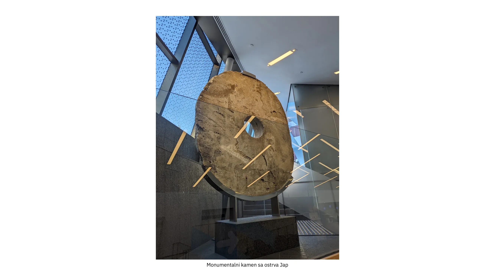

Ovo je zaista zanimljiva analiza Yap kamenja. Saifedean Ammous takođe pominje ovaj primer u svojoj knjizi "The Bitcoin Standard". Prema njemu, sistem na ostrvu Yap najviše podseća na Bitcoin, neku vrstu centralnog zapisa koji svi mogu da konsultuju, koji je javan, održava račune i upravlja vlasništvom nad stvarima. Ova antropološka perspektiva ilustruje da sve ovo predstavlja dogovor ili društveni konsenzus unutar društva, što je suštinski tačno. I smatram da je ovo pominjanje izgubljenih kamenja veoma zanimljivo. Išli bi stotinama kilometara na more u malim splavovima i donosili kamenje nazad. Ponekad bi kamen pao na dno mora, ali bi se taj kamen i dalje koristio u monetarnom sistemu. Osoba bi mogla reći "Da, ispustili smo kamen na takvom mestu; to je moje, tako da možemo da ga zamenimo". Nije nužno bilo potrebno fizičko posedovanje da bi se olakšala razmena, jer su kamenje bila toliko velika da su često ostajala na jednom mestu. Umesto toga, fokus je bio na promeni vlasništva nad ovim kamenjem na transakcijski način, omogućavajući promenu vlasništva bez stvarnog pomeranja kamenja. To je bio oblik "dokaza konsenzusa", ističući zanimljivu antropološku perspektivu o novcu.

### Protokriptovalute i društvene obaveze

Etnografi širom sveta su posmatrali društva koja koriste "proto-valute" ili "primitivne valute", kao što su školjke, tkanine, stoka, so i kamenje, koje su ispunjavale funkcije obično pripisane novcu, kao što su sredstvo plaćanja i čuvar vrednosti, ali bez redovnog delovanja kao posrednici u razmeni svakodnevnih dobara.

Dakle, ovde opisujemo monetarne sisteme koji nisu nužno korišćeni za svakodnevne razmene.

I voleo bih da vas podsetim da su sve ovo bile valute pre pojave novčića, i ne znam koliko je pogrešno reći valuta. Više volim da kažem valuta. Mogu da pomenem da se u literaturi često govori o proto-valutama kada se misli na novac pre novčića. Ali kao što smo videli u prvom delu, **verujem da su postojali monetarni sistemi mnogo pre pojave novčića**.

Ove primitivne valute su se uglavnom koristile za upravljanje osnovnim društvenim obavezama povezanim sa pojedincima, kao što su brak, kompenzacija za sukobe (Wergeld) ili pokloni između poglavica. U Persijskom carstvu, na primer, prvi novčići su specifično stvoreni kao sredstvo vojne isplate, a ne kao sredstvo razmene.

Primitivni novac stoga ima jednu suštinsku karakteristiku: on je sredstvo plaćanja, ali vrlo retko sredstvo direktne razmene materijalnih dobara. Ono što ovde mislimo jeste da je bio sredstvo plaćanja za određene društvene obaveze, za plemena, za razmene između poglavica, čuveni wergeld, krvni novac. Pre pojave pravosudnih sistema, ako bi neko počinio ubistvo, postojala je reparacija za porodicu koja je patila zbog ubistva njihovog voljenog. Postojala je cena koju je trebalo platiti za to, zvala se krvni novac i to je oblik plaćanja. Postojala je i miraz, koji je takođe oblik plaćanja. U ovim ranim upotrebama novca kao oblika plaćanja, on je bio više povezan sa ljudskim i društvenim obavezama nego sa plaćanjima za svakodnevne kupovine. Prema ovoj teoriji, ove češće svakodnevne razmene bile su više povezane sa kreditom, odloženim kreditom, poklonom za poklon i preraspodelom obroka. Postojao je drugi oblik društvene organizacije za upravljanje ovim razmenama. Takođe je važno zapamtiti da, u društvu gde je svako samodovoljno, bavi se sopstvenom poljoprivredom, nema specijalizacije, i postoji vrlo mala potreba za monetarnim sistemom za svakodnevne razmene. I zato su prvi oblici novca bili ono što smo upravo opisali, miraz, krvni novac, jednostavno zato što su to bile prve razmene gde nam je bilo potrebno sredstvo plaćanja, mnogo pre nego što nam je bilo potrebno trgovati, razmenjivati hleb za novac na dnevnoj bazi, jer u primitivnim društvima, to nije funkcionisalo tako. Svako je obezbeđivao sopstvene potrebe, i još uvek nije postojala specijalizacija. Mislim da sam ovo opširno pokrio u svim prethodnim predavanjima u ovom kursu.

U ovim društvima, bez napredne podele rada, direktne razmene su ostale ograničene, odvijajući se uglavnom unutar ličnih odnosa prijateljstva ili savezništva. Odsustvo dovoljne specijalizacije nije zahtevalo novac u modernom smislu.

Antropolozi kao što su Quiggin i Einzig insistiraju na premoći kredita: **primitivni ekonomski život je uhvaćen u gigantsku mrežu kredita i ličnih dugova, gde novac interveniše posebno kada plaćanja moraju biti trenutna i kompenzacije se ne mogu lako odložiti.**

Dakle, ljudi razmenjuju stvari, mogu napraviti odloženi kredit, ali u nekim slučajevima ne možete odložiti plaćanje, pa valuta ili proto-valute mogu biti korisne u ovom trenutku za postizanje trenutne konačnosti razmene.

### Inovacija anonimnosti

Ova analiza vodi ka dubljoj refleksiji: umesto suprotstavljanja novca i trampe, relevantnije je razumeti njegovo pojavljivanje kao evoluciju iz složenih sistema kredita i duga. Novac uvodi fundamentalnu inovaciju: **anonimnost**. I tu nalazim ovu antropološku teoriju o pojavi novca zanimljivom. Ako ste mala grupa ljudi i međusobno dajete odloženi kredit, očigledno se poznajete. Mislim da, da bi ovaj sistem funkcionisao, ljudi moraju da se poznaju, očigledno. A plaćanje novcem omogućava anonimnost. Omogućava vam da izvršite plaćanje bez da ljudi čak znaju vaše ime, bez da ljudi čak znaju ko ste. Oni mogu izvršiti razmenu za trenutnu i konačnu isplatu. I upravo to novac omogućava.

Za razliku od kredita, koji je uvek nominativan, novac omogućava anonimne, generalizovane i odmah oslobađajuće transakcije. **Ova jedinstvena oslobađajuća moć novca je njegova odlučujuća superiornost.**

Dakle, daleko od toga da bude skroman alat za olakšavanje ekonomske razmene, novac je velika društvena inovacija, usko povezana sa evolucijom ljudskih institucija i praksi, od ličnog kredita **do generalizovanog, anonimnog sistema plaćanja**. Ova antropološka evolucija pokazuje da novac, mnogo više od prostog sredstva razmene, predstavlja moćnu društvenu instituciju, koja duboko oblikuje ljudska društva, do te mere da postaje, u našim modernim društvima, sama svrha ekonomske aktivnosti.

Ovde shvatamo da je na kraju, u našim modernim društvima, sama svrha ekonomske razmene posedovanje novca, dok to ranije uopšte nije bio slučaj. Sama svrha ekonomske razmene bila je posedovanje robe ili proizvoda za potrošnju. A danas, uvođenjem inovacije novca, svrha ekonomske razmene je akumulacija tog novca, jer nam omogućava da ga zamenimo za robu, kako je opšteprihvaćeno. Možemo ga zameniti za robu koja nam je potrebna kada nam je potrebna.

## Ujedinjenje registara

<chapterId>7664442a-91c1-5ce4-a8bd-53b7371a3e3d</chapterId>

:::video id=473fc284-5375-4e1b-b0cd-6b51ba0cc3b8:::

### Teorija računovodstvenog registra

Sada ćemo zajedno istražiti različite predloge za ujedinjenje ove dve monetarne teorije, tj. teorije o nastanku novca kroz dug-novac i monetarne teorije o nastanku robnog novca. Pričaćemo o predlogu za ujedinjenje Lynn Alden u njenoj poznatoj knjizi "For Broken Money", čiji će prevod koji je proizveo Consensus verovatno nositi naziv "Rupture monétaire".

*Odlomak iz Broken Money, autor Lyn Alden:*

> U osnovi, novac je računovodstveni registar. Robni novac je registar kojim upravlja priroda. Bankarski novac je knjiga koju vode nacionalne države. Novac otvorenog koda je knjiga kojom upravljaju njegovi korisnici.

Ovde, Lyn se odnosi na Bitcoin.

### Odnos zaliha-tok i oskudica

> Neki retki hemijski elementi, kao što je rodijum, ređi su od zlata, ali imaju nizak odnos zaliha-protok jer ih industrija troši jednako brzo koliko se i vade. Rodijumski novčić ili ingot može se kupiti kao specijalizovani kolekcionarski predmet ili sredstvo čuvanja vrednosti, ali nije pogodan kao društveno prihvaćena valuta, te se stoga prirodno ne pojavljuje kao novac.

Saifedean o tome opširno govori u svojoj knjizi "The Bitcoin Standard". Za one koji nisu upoznati sa odnosom zaliha i protoka, to je jednostavno kada uporedite postojeće zalihe, rezerve koje postoje na tržištu, u poređenju sa novim zalihama koje dolaze, priliv novih zaliha. Često je prilično kontraintuitivno, jer biste mogli pomisliti da nešto što imate u velikim količinama nije retko, ali zapravo nije. Više je pitanje kapaciteta koji imate za snabdevanje. Pre je kapacitet koji imamo za nove zalihe taj koji, prema ovom modelu, daje informacije o tome da li je neki objekat redak ili ne. Nije zato što nešto nemamo na zalihama da je to retko, možda jednostavno to nemamo. Dakle, ako uzmemo zlato, imamo mnogo zlatnih zaliha jer se koristi kao čuvar vrednosti, a priliv novih zaliha je nešto poput 1% do 3% godišnje novih zlatnih zaliha koje dolaze kroz zlato mining. Dok, ono što ona ovde kaže, ako govorimo o rodijumu, on je ređi od zlata, ali nemamo nikakve zalihe jer se troši kako ide. Dakle, nije potrebno mnogo novih zaliha da bi se udvostručile postojeće zalihe. Dok bi sa zlatom bilo potrebno najmanje 50 godina da se obnovi, da se udvostruče zalihe. Za razliku od većine dobara koja se troše, gde je prilično lako i ne zahteva mnogo godina proizvodnje da bi se udvostručile postojeće zalihe, jer se troše kako idu.

*"Zlato je održavalo odnos zaliha i protoka između 25x i 100x kroz modernu istoriju, obično oko 50x ili više, nikada kratko ne padajući ispod 16x, čak ni tokom Zlatne groznice sredinom 19. veka."*

Dakle, 25 bi značilo 25 godina da se udvostruči zaliha, a 100 bi značilo 100 godina da se udvostruči zaliha. Saifedean kaže u svojoj knjizi da čak i ako bismo udvostručili proizvodnju zlata, recimo sa 1,5% na 3%, to ne bi nužno imalo veliki uticaj na njegovu cenu.

*"Srebro generalno ima odnos zaliha-protok od 10x ili više, što je i dalje relativno visoko.*

*Većina drugih roba ima odnos zaliha-protok manji od 1 ili 2. Čak i najređi elementi, kao što su platina i rodijum, imaju relativno niske odnose zaliha-protok zbog njihove brze industrijske potrošnje."*

### Nadmoć zlata i srebra

*"Ukratko, kad god se valuta zasnovana na robi našla u konkurenciji sa zlatom i srebrom, potonji su uvek na kraju izlazili kao pobednici. Druge robe mogle su ostati valute u ograničenim periodima ili u specifičnim regionima, ali zlato i srebro su uvek dokazivali svoju sposobnost da postanu globalno konkurentne valute i da dominiraju konkurencijom. To je zato što su, kada su se civilizacije susretale, vlasnici zlata i srebra uvek imali tehnološku sposobnost da obezvrede druge oblike valuta, dok vlasnici školjki, bisera, stoke, soli, tkanine ili inferiornih metala nikada nisu mogli obezvrediti zlato ili srebro."*

Dakle, ovo je ponovo izuzetno dobro opisano u The Bitcoin Standard gde Saifedean govori o plemenima u Africi koja su koristila staklene perle. I kada su venecijanski trgovci stigli sa tovarima punim staklenih perli, jer su ih tada mogli industrijski proizvoditi, imali su tehnološku sposobnost za to, to je potpuno destabilizovalo monetarni sistem ovih naroda i mogli su doslovno da opljačkaju njihove resurse. Ovo je Saifedeanova teza.

### Jedinica obračuna i kredit

*"Istorijski gledano, čak i kada je kredit korišćen direktno kao instrument razmene, obično je bio denominovan u jedinicama monetarnih roba prirodno odabranih zbog svojih svojstava."*

To je veoma zanimljiva tačka, i ona o kojoj smo Ulrih i ja razgovarali. Čak i ako je hram u Mesopotamiji bio neka vrsta autoriteta koji je mogao upravljati ovom idejom kredita, jedinica obračuna je bio šekel. Nema ničega što potvrđuje da je šekel uspostavljen autoritativno od strane hrama. Šekel je mogao nastati prirodno, kroz potrebu trgovaca da uvoze i izvoze sa drugim narodima u blizini. Imamo dokaze za to, u obliku trgovca u Kanešu (pomenuo sam ovo u Prvom delu) koji je upravo to radio, uvozeći plemenite metale koji nisu korišćeni zbog svoje fizičke komoditetne vrednosti, već kao sredstvo čuvanja vrednosti. Jedini problem je što ne znamo da li možemo pretpostaviti da su trgovci napravili ovaj izbor srebra, srebrnog šekela, ili je to učinio hram. Ali Ulrih ima veoma dobar argument koji nas navodi da mislimo da je verovatno to ipak bila odluka trgovaca.

*"Dakle, ujedinjenje dve teorije može se opisati kao "računovodstvena teorija novca" ("teorija knjige novca") jer opisuje fundamentalnu logiku zajedničku za obe teorije. I fleksibilni socijalni kredit i kolekcionarske proto-valute datiraju još od zore čovečanstva. U oba slučaja, ljudske grupe različitih veličina vode računovodstvenu knjigu među sobom kako bi izbegle potrebu za zadovoljenjem dvostrukog podudaranja želja, smanjile trenje u razmenama i služile kao oblik likvidne štednje. Suštinska razlika leži u autoritetu kojem je povereno vođenje registra."*

S jedne strane, priroda upravlja širenjem novčane mase. Dakle, ako uzmemo zlato, pošto je prilično retko, teško ga je iskopavati. Postoji neka vrsta ograničenja u broju zlatnih novčića koji se mogu iskopati. Tako da priroda upravlja oskudicom. A registar se drži konceptom posedovanja. Registar je decentralizovan. Posedovanje se dokazuje činjenicom da posedujete zlatni novčić ili komad zlata. A u slučaju kreditnog novca, oskudica se upravlja sposobnošću ljudi da dobiju kredit. Ili u slučaju fiat valute, oskudica se upravlja autoritetom. Oni su ti koji odlučuju da li će štampati više ili ne, kako bi izbegli inflatorne katastrofe. Dakle, u nekim slučajevima, registar može takođe biti upravljan od strane vlasnika token, u slučaju papirnog novca. Zato je unet u registar, pod znacima navoda, dematerijalizovan. Pa, materijalizovan, ali virtualan. On poseduje ovaj čuveni token, i to je ono što dokazuje posedovanje. I može jednako lako biti u pravom registru, kao kod skripturnog novca, u banci, gde zaista ljudska banka upravlja time ko šta poseduje u odnosu na registar.

## Unifikacija kroz monetarnu premiju

<chapterId>093756e5-8908-55e5-bb76-376a3a3cc4d3</chapterId>

:::video id=eabc342a-ecbd-46ca-a347-e914917e7c4f:::

### Koncept monetarne premije

U ovom odeljku posvećenom različitim predlozima za ujedinjenje različitih teorija o nastanku novca, upravo sam predložio teoriju Lyn Alden, teoriju registra. Imam svoj predlog za ujedinjenje dve monetarne teorije. To je monetarna premija, koncept monetarne premije. Dakle, vrednost novca može se objasniti monetarnom premijom koja proizlazi iz njegove monetarne potražnje, bilo u obliku glinenih pločica, kovanica od plemenitih metala, novčanica ili bitkoina. Monetarna premija je jednostavno zasnovana na poverenju da će neko u budućnosti zameniti ovu valutu za uporedivu cenu.

Ono što pokušavam da pokažem ovde je sasvim jednostavno da, bilo da je reč o fiat novcu, tj. novčanicama bez upotrebne vrednosti, bilo da su to zlatnici ili bilo koji metal, komad zlatnog grumena ili ingot, **često je monetarna premija ta koja čini većinu njegove vrednosti**. Ako uzmemo komad zlata, određeni deo njegove vrednosti objašnjava se njegovom upotrebnom vrednošću, njegovom upotrebom u industriji ili za izradu nakita. Imajte na umu da potražnja za nakitom često dolazi iz njegove monetarne vrednosti. Ljudi čuvaju nakit kao vrstu skladišta vrednosti, pa ovo malo uključujem u monetarnu premiju jer je često prilično monetarna potražnja da igra ulogu u novcu.

Dakle, mogli biste reći da oko 10% potražnje za zlatom dolazi iz industrije. U vrednosti zlata, imali bismo mali deo, recimo 10%, koji bi bio objašnjen ovom industrijskom potražnjom, ovom potražnjom za upotrebom zlata, gde se zlato troši. Ostatak je očigledno potražnja za njegovu monetarnu upotrebu kao čuvara vrednosti.

### Autoritetni bonus i fiat

A ako uporedite komad zlata sa zlatnikom, postoji još jedan sloj. Zlatnik je utisnut od strane autoriteta, a zlato sadržano u komadu takođe uživa potražnju za upotrebom, potražnju za potrošnjom u industriji. Takođe uživa monetarnu premiju kao čuvar vrednosti. Štaviše, postoji sloj koji nazivam premija autoriteta, gde će često postojati cena, veća kupovna moć za novčić nego za komad zlata, jer je novčić jednostavniji za upotrebu. Omogućava lakšu razmenu, jer nema potrebe za merenjem. Autoritet obično garantuje njegovu čistoću. A ako ga uporedite sa komadom zlata, utisnuti zlatnik je generalno vredniji od običnog komada zlata. I to je takođe normalno, jer su potrebni resursi da se utisne.

To je isti princip za fiat, papirni novac. Papirni novac zapravo nema nikakvu upotrebnu vrednost, osim možda za grejanje kuće, što se desilo tokom Vajmarske Republike. Dakle, nema stvarne potražnje za njegovu upotrebnu vrednost. S druge strane, postoji samo premija za autoritet, po mom mišljenju.

To je oblik monetarne premije, prekrivanje na monetarnoj premiji. Ali njena monetarna premija dolazi iz činjenice da je zakonsko sredstvo plaćanja, a zatim vas vlasti prisiljavaju da je kupite kako biste platili poreze. Dakle, nužno je da fiat valuta ima oblik monetarne potražnje koja proizlazi iz činjenice da je oporezovana i da je morate barem nabaviti kako biste platili poreze. I kao rezultat toga, ostaje opšte prihvaćeno sredstvo plaćanja. Tako ljudi žele da je nabave kako bi zadovoljili svoje potrebe.

### Ujedinjenje kroz monetarnu potražnju

I zašto se ovaj predlog za monetarnu premiju kvalifikuje kao ujedinjenje dve teorije novca iz duga i novca iz robe? Pa, ne osećam da vrednost zlatnog novčića nužno dolazi iz njegove "intrinzične vrednosti". Ne, zapravo, to je koliko pojam poverenja, koliko je i za fiat novac. To je pojam monetarne potražnje. I nije stvarno zato što ima mali procenat industrijske upotrebe, još jedna "korisnost". Ako kažemo da industrijska upotreba čini 10% njegove vrednosti, mogli bismo to vrednovati na $300 po unci. Ako se zlato prodaje na tržištu za $3,000 po unci, razlika između $300 i $3,000 je čuvena monetarna premija. To je ta monetarna potražnja za zlatom koja to objašnjava. Samo zato što fiat nema nikakvu upotrebnu vrednost ne znači da je išta drugačije. Za mene, to je potpuno ista stvar. Tako da sa obe strane, teorija novca iz duga ili novca iz robe, ne mislim da vrsta dodatnog kvaliteta koji bi zlato imalo zbog minimalne upotrebne vrednosti menja bilo šta.

S druge strane, sigurno je da **na nivou pojave, prema Misesovom regresionom teoremu, možemo predložiti da ova upotreba stvara potražnju na početku i pokreće proces koji postaje novac.** Dok je na nivou novca duga, to više predstavlja nametanje od strane autoriteta, tako da su izvor, inicijacija pojave i koncepti potpuno različiti. **Ali mislim da na nivou vrednosti, kako objasniti vrednost novca, sa monetarnom premijom, možemo jednako lako objasniti zašto fiat novac ima vrednost koju mu pripisujemo i zašto robni novac ima vrednost** koju mu pripisujemo. Za mene, to je isti proces, i zove se novčana premija.

#### Monetarna premija

To je to. Vrednost novca može se objasniti monetarnom premijom koja proizlazi iz njegove monetarne potražnje, bilo u obliku glinenih pločica, kovanica od plemenitih metala, novčanica ili bitkoina.

Monetarna premija jednostavno se zasniva na poverenju da će neko kasnije zameniti ovaj novac za uporedivu cenu.

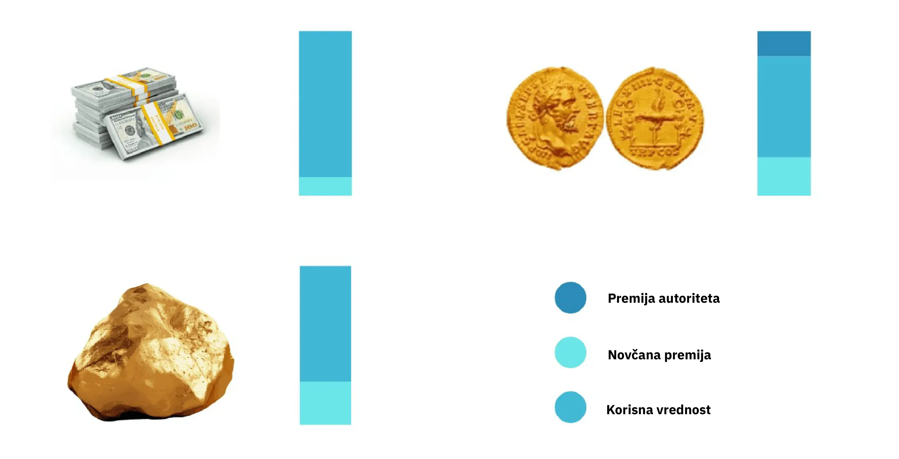

# Različite definicije novca

<partId>77b7918a-8c3b-11f0-b688-6b2ab22378c9</partId>

## Novac vs valuta vs monnaie vs argent vs valuta

<chapterId>bf8a6d21-df88-5d23-a0a5-e9a5c1300554</chapterId>

:::video id=d9c9e7df-9db3-4a9f-801e-10d3fc7dfc22:::

### Semantika monetarnih pojmova

U ovom odeljku o različitim monetarnim teorijama, a posebno o definicijama novca, želeo bih da napravim kratku digresiju na temu semantike. Želeo bih da malo dublje istražim definicije nekoliko reči koje se odnose na novac i uporedim ih sa njihovim engleskim ekvivalentima. Na primer, novac, valuta, u poređenju sa monnaie, argent i devise. Dakle, ide ovako.

Mala semantika:

Kada kažemo "**money**" (de la monnaie), većina ljudi će pomisliti da mislimo na sitniš koji dobijamo kao kusur nakon transakcije. A ako kažemo "**currency**" (la monnaie), ljudi će verovatno pomisliti da mislimo na valutu neke države. Valuta Kanade je kanadski dolar. Tako je.

Ali šta je sa novcem (de l'argent)? Lopov nikada neće reći "Daj mi sav svoj sitniš!" (lopov bi mogao biti razočaran kada bi dobio samo kovanice gotovo bez vrednosti).

Ne, lopov će viknuti: "Daj mi **sav svoj novac**". I ako lopov stoji ispred tebe na ulici, on nužno misli na **novčanice** u tvom džepu.

S druge strane, ako lopov pokuša da vas prevari na sofisticiraniji način, pokušavajući da ukrade vašu imovinu ispražnjavajući sve vaše bankovne račune, rekli bismo da **će uzeti sav vaš novac**. Ovde reč "novac" se odnosi na **bogatstvo pojedinca**.

Dakle, postoje dve definicije za reč novac: gotovina (novčanice) i bogatstvo.

### Valuta vs monnaie vs valuta

Valuta (devise) je nužno valuta druge zemlje, inače jednostavno kažemo novac (monnaie). Ako ste Francuz, rekli biste: "La livre sterling est la devise du Royaume-Uni et l'euro et la monnaie de l'Europe" (Funta sterlinga je valuta Ujedinjenog Kraljevstva, a euro je valuta Evrope).

Često, ljudi koji se nisu upustili u ove semantičke probleme, prilikom prevođenja ovih termina, često će biti skloni da govore o valuti (devise) kada je napisana valuta, ali ne, valuta je novac (monnaie) kada je to valuta vaše zemlje, a to je devise kada govorimo o drugim valutama. I tako, problem koji ovde često vidim je da na engleskom postoje dve reči: postoji "money", što je koncept, i postoji "currency", što je zaista jedinica zemlje koja se koristi za razmenu. Tako da možemo jednostavno govoriti o konceptu novca; to je lako - to je koncept reči *money*; to je novac uopšte. A *currency* je vrlo jednostavno izjednačiti sa valutom zemlje. Dok na francuskom, nažalost, ljudi će često reći da, "mais ce n'est pas une monnaie" kada govore o bitkoinu jer to nije valuta zemlje, ali često, mislim da se umesto toga odnose na termine valuta. Ovo je pogrešno s jedne strane, jer od El Salvadora, bitkoin je valuta države. Ostaje činjenica da će ljudi često reći: *ali ne, to nije valuta države, ne može biti novac*. Ali zapravo, ako se pozovemo na širi koncept *money*, bitkoin se savršeno uklapa u ovu definiciju, po mom mišljenju. Samo što na francuskom nemamo dve reči da odvojimo ova dva koncepta. Mogli bismo reći da reč argent odnosi se na valutu, ali nažalost, to nije njena precizna definicija. *Argent* (novac) odnosi se na bogatstvo ili novčanice. Ne možete zaista napraviti ekvivalenciju sa rečju *money*. *Money* je zaista koncept valute (monnaie).

## definicija Saifedeana Ammousa

<chapterId>07c4ba50-168c-567a-8957-0b187ff75f97</chapterId>

:::video id=936d6d3b-6d45-468e-bc44-85fbce9b857a:::

#### Šta je novac?

Novac je jednostavno nešto što posedujete ili pribavljate ne da biste ga koristili ili trošili zbog njega samog, već da biste ga kasnije zamenili za drugu robu ili usluge koje vam mogu biti potrebne. (Saifedean)

Novac stiče monetarnu premiju kada postoji monetarna potražnja za dobrom, da bi igrao jednu ili više uloga novca.

Monetarna dobra moraju biti dovoljno oskudna da bi monetarna premija opstala (kako bi se sprečilo prilagođavanje ponude monetarnoj potražnji).

### Monetarna premija

U ovom odeljku o različitim definicijama valute, želeo sam da ukratko razgovaram o Saifedeanovoj definiciji u The Bitcoin Standard, koja me je oduvek veoma zanimala. Delovala mi je prilično jednostavno kada sam je pročitao. Takođe ćemo dodati koncept monetarne premije ovoj definiciji. Kao što Saifedean pominje u svojoj knjizi, nužno postoji koncept oskudice. Pitanje je, šta je novac?

> Novac je jednostavno nešto što posedujete ili steknete, ne da bi se koristilo ili trošilo samo po sebi, već da bi se kasnije zamenilo za drugu robu ili usluge koje vam mogu biti potrebne.

Dakle, to je definicija koju Saifedean pominje u The Bitcoin Standard. Dodao bih da valuta (la monnaie) stiče monetarnu premiju kada postoji monetarna potražnja za dobrom, kako bi igrala jednu ili više uloga valute. Tako da možete reći da valuta koja služi kao čuvar vrednosti će imati monetarnu potražnju koja joj daje monetarnu premiju, budući da ljudi žele da je steknu, na primer kao čuvar vrednosti ili kao sredstvo razmene.

### Oskudica i tržišni mehanizmi

Mislim da svakako treba dodati da monetarno dobro mora biti dovoljno oskudno da bi monetarna premija opstala. Ovo je veoma važno. **Ako se neko dobro pojavi kao novac i vidimo da mu cena raste, obično, ako dobro nije dovoljno retko, ljudi će želeti da proizvedu više kako bi iskoristili ovaj porast vrednosti kada cena raste**. Zato većina dobara na tržištu ima relativno fiksnu cenu. Kada cena raste, proizvodnja teži da se poveća. Kada cena pada, proizvodnja opada. Postoji neka vrsta tržišnog prilagođavanja. **A kada je dobro dovoljno retko, kao zlato, tržišni mehanizam neće nadoknaditi ovu povećanu potražnju za monetarnom upotrebom. Tako da je promenljiva koja se menja cena. Kao kod bitkoina**. Kada cena bitkoina raste, ne proizvodimo više bitkoina. Dakle, ono što se prilagođava je cena. I zato godinama vidimo kako cena bitkoina raste kako potražnja za bitkoinom raste. Pošto nema nikoga na Zemlji ko može promeniti algoritam i reći "postoji veća potražnja, cena raste, proizvešćemo više." **Ponuda novih bitkoina je unapred programirana i poznata unapred**. Dakle, to je ono što sam govorio, da monetarno dobro mora biti dovoljno retko da bi monetarna premija opstala, i stoga ne bude uhvaćeno tržišnim mehanizmima, kako bi se sprečilo da se ponuda prilagodi ovoj novoj monetarnoj potražnji.

## Sredstva plaćanja i oslobađajuća vrednost

<chapterId>5d424039-e342-56f7-9d8b-bba9551831a9</chapterId>

:::video id=af4c0765-8111-4cb7-891b-3ee54d6e7054:::

### Sredstva plaćanja vs. sredstva razmene

U ovom odeljku posvećenom različitim definicijama novca, predlažem da zajedno pogledamo citat iz knjige "Aux origines de la monnaie" (Poreklo novca), teksta Alaina Testarta o temi novca kao sredstva plaćanja i oslobađajuće vrednosti.

*Iz dela Aux origines de la monnaie, Alain Testart definiše novac kao sredstvo plaćanja:*

> Funkcija sredstava plaćanja ovde se shvata kao različita od funkcije sredstava razmene, utoliko što postoje plaćanja bez naknade, plaćanja koja ništa ne kupuju. Knies (1873:192 i dalje) razvija opširno ovu temu transfera dobara koja ne predstavljaju akte razmene, kao u slučaju wergelda (krvni novac ili kompozicija za ubistvo) ili poreza. Carl Menger je napao ovu četvrtu funkciju u svom članku "Geld" iz 1892. godine, koji se generalno smatra jednim od najodlučnijih na tu temu. Bez obzira što nije potpuno diskreditovana, ideja o funkciji sredstava plaćanja čini se da je danas zaboravljena u ekonomskoj misli, ili je barem odbačena u korist funkcije sredstava razmene.
>

> Novac se koristi za plaćanje: posmatrano iz ovog ugla, on je instrument oslobađanja, koji u svojoj opštosti opisuje funkciju sredstva plaćanja. U tom smislu, govorimo o "oslobađajućoj moći" novca. Prema Le Petit Robertu, oslobađajuća moć je "ona koja ima efekat oslobađanja (od obaveze, duga)". Prema Grand Larousseu, oslobađajuća uplata je svaka "uplata izvršena pod zakonskim uslovima na način da poverilac ne može osporiti gašenje duga". Novac ima ovu moć par excellence; to je čak ono što definiše njegov status zakonskog sredstva plaćanja, jer niko ne može odbiti uplatu izvršenu u novcu, bilo da je prodavac ili poverilac. Novac je jedino dobro koje se ne može odbiti kao plaćanje onoga što se duguje, bez obzira da li je dug prema trgovcu ili poreskoj upravi. Među svim dobrima, samo novac ima ovu privilegiju. "To je ta privilegija," piše Charles Gide (1921 I: 443), koja čini ono što nazivamo zakonskim sredstvom plaćanja.
>

> Svaka razmena koja se sastoji od prenosa jednog dobra za drugo, ili pod uslovom da se drugo dobro da zauzvrat, nužno podrazumeva obavezu primaoca da obezbedi ovu protivuslugu. Plaćanje je ispunjenje ove obaveze. Svaka razmena stoga podrazumeva plaćanje, ali ne podrazumeva svako plaćanje razmenu. Postoje plaćanja bez protivusluge, tj. plaćanja koja ne omogućavaju dobijanje drugog dobra i nisu izvršena u tu svrhu. Porezi ostaju primer za to; takođe treba pomenuti kazne svih vrsta plaćene javnim vlastima i reparacije koje se duguju drugima po principu da onaj ko nanosi štetu drugima mora to da popravi.

### Plaćanja bez druge strane

Ovo je jasna ilustracija autorove teze. Zapravo, on pravi razliku između ta dva pojma. Za njega, razmena je i prenos dobara i plaćanje. Plaćanje dolazi kasnije. I plaćanje može da se desi bez razmene. On daje primere kako plaćanje parking kazne ili kazne predstavlja samo plaćanje. Ne dobijate zaista uslugu zauzvrat. Neki mogu tvrditi da vam država pruža uslugu zauzvrat, uslugu davanja parking kazni. On je prilično jasan u činjenici da je plaćanje poreza zaista plaćanje bez protivusluge, u smislu da je plaćanje poreza obavezno, čak i ako ne dobijate nužno uslugu. Kaže da je zaista definisano da je plaćanje poreza samo plaćanje; nema obaveze da se dobiju usluge zauzvrat. O tome sam razgovarao sa mnogim svojim kolegama, i oni se ne slažu nužno sa ovom idejom. Ali to je autorova teza. On pokušava da postavi pojam plaćanja i da ga odvoji od razmene sa ovim primerima, na primer, kazne, plaćanja poreza. Takođe, na primer, miraz, on izražava da je miraz plaćanje; ne dobijate nužno nešto zauzvrat. Neko ko kritikuje ovaj predlog može reći "Da, ali dobijate ženu zauzvrat." Tako da je to nivo debate o ovoj temi.

Tu je takođe i wergeld, ili krvni novac. Dakle, to je samo isplata za kompenzaciju. Moj prijatelj Ulrich bi rekao:

> Da, ali dobijaš ovaj fajl zatvoren zauzvrat.

Dakle, počinili ste zločin, na primer ubistvo. U to vreme, platite wergeld, i nakon toga, pa, oslobađate se te situacije. Dakle, postoji oslobađajuća moć. Da li dobijate nešto zauzvrat?" Prema autoru, ne. Prema nekim mojim kolegama, da.

Mislim da u ovoj diskusiji možemo videti da je wergeld jedan od dobrih primera za definisanje plaćanja. U stvari, jasno je da ne dobijaš ništa zauzvrat.

## Dug novac vs. robni novac

<chapterId>4093677a-c8e8-5828-b994-15c01656186e</chapterId>

:::video id=f49cf5cc-288e-4daa-a1ff-b9de73506f4e:::

### Fundamentalna debata

Još u kontekstu ovog odeljka o različitim monetarnim definicijama i teorijama, hajde da zajedno istražimo dve dijametralno suprotne vizije: "novac je uvek dug" ili "novac je uvek roba". S jedne strane, tu su zagovornici teorije novca zasnovane na dugu, koji tvrde: "Ne, novac je uvek dug!" S druge strane, naši poznati zlatni bube tvrde: "Ali ne, vidite, novac je uvek roba, to je uvek zlato; sve ostalo, računi, IOU, to je samo kredit, ne novac".

Hajde da zajedno istražimo jasan rezime ovih teorija.

### Teorija "uvek dug"

Evo sažetka monetarne teorije poznate kao **"novac dug"**, prema kojoj je novac u suštini oblik duga:

Prema ovoj teoriji, koju je posebno razvio Alfred Mitchell-Innes, a dalje razvio David Graeber, novac je suštinski priznanje duga, proizašlo iz kreditnih odnosa koji su istorijski postojali pre direktnih monetarnih razmena. Umesto da proizlazi iz potrebe povezane sa trampom, novac se pojavljuje kao način računanja, prenosa i izmirenja društvenih obaveza ili dugova između pojedinaca ili grupa.

Dakle, sav novac cirkuliše kao dug koji jedna osoba ili institucija duguje drugoj, podržan poverenjem i društvenim ili državnim autoritetom koji garantuje njegovu validnost. Dakle, prema njima, kada posedujemo - kao što sam već pomenuo - kada posedujemo novac, imamo potraživanje prema društvu, i društvo nam duguje dug. Novac stoga nikada nije neutralan ili autonoman, već uvek predstavlja osnovni dug: posedovanje novca u suštini znači posedovanje potraživanja prema društvu ili ekonomskoj zajednici.

Ovo razmišljanje protivreči klasičnoj ideji novca kao jednostavne "posredničke robe", i umesto toga naglašava centralnu ulogu društvenih i političkih odnosa u stvaranju i upravljanju novcem.

**Moj pregled:**

Ono što me muči kod ove teorije je to što tvrdi da je novac uvek dug, dok imamo primere razmene između dva različita plemena koja, na primer, razmenjuju zlato, gde je transakcija definitivno konačna i ne ostaje nikakav latentni dug. Zagovornici ove teorije će nam često reći da te razmene nisu monetarne razmene, već barter. Kao što je već pomenuto, ne slažem se. To je monetarna razmena, jer zlato neće biti potrošeno; biće korišćeno kao novac.

### Teorija "uvek roba"

**Uvek roba:**

Evo jasnog pregleda monetarne teorije poznate kao **"robni novac"**, gde novac uvek nastaje kao roba, posebno zlato, koje proizlazi iz potrebe za mogućnošću trgovine, roba koja će generalno biti prihvaćena u inostranstvu i koja se stiče u svrhe trgovine.

Prema ovoj teoriji, koju su razvili klasični ekonomisti (Adam Smit, Dejvid Rikardo) i koju je preuzeo Marks, novac prirodno nastaje kao roba među ostalima, često plemeniti metal kao što su zlato ili srebro, koji ima intrinzičnu vrednost nezavisno od svoje monetarne uloge. U početku, ove robe su spontano birane od strane ekonomskih aktera kako bi olakšale trgovinu, zahvaljujući svojim intrinzičnim kvalitetima (oskudica, trajnost, deljivost i stabilnost).

Roba novac se razlikuje po svom fizičkom postojanju i vrednosti koja je određena količinom društveno potrebnog rada za njegovu proizvodnju (kao kod Marksa). Društvo koristi zlato, na primer, ne samo da bi pojednostavilo razmenu, već i kao obračunsku jedinicu, čuvara vrednosti i univerzalno sredstvo razmene.

U ovoj viziji, novac uvek zadržava stvarnu vrednost, jer ostaje povezan sa opipljivom robom. Čak i kada uloga novca postane apstraktna (kovani novac, novčanice ili skripturalni novac), njegova validnost i dalje proizlazi, direktno ili indirektno, iz reference na osnovnu robu kao što je zlato. Ova teorija stoga insistira na materijalnom i ekonomskom poreklu novca, za razliku od teorija koje ga smatraju pukom konvencijom ili dugom. Prema ovoj teoriji, svaka reprezentacija novca putem zamene, kao što je račun koji se može zameniti za zlato, bila bi kredit.

**Moja recenzija:**

Imajte na umu da ova vizija podseća na teoriju robe kao novca, ali ide korak dalje. Oni predlažu da novac **uvek** treba da bude roba. I kada im kažemo: "*Da, ali možemo se složiti da je novčanica novac za ovu grupu; može biti podržana zlatom, funkcioniše, i novčanica kao takva je novac*".

Kao odgovor, daće nam primer kupona za svlačionicu. Reći će: "Da, ali ne, kada imate kupon za svlačionicu za vašu odeću, možemo li kupon sa kase nazvati odećom?

Naravno da ne, to je kao priznanje, zahtev, u suštini, koji će vam omogućiti da vratite svoju odeću. Ova paralela ne stoji, jer kupon iz svlačionice nije opšteprihvaćeno sredstvo plaćanja. **Novac nije zahtev za određenim predmetom kao što je odeća; to je način, sredstvo razmene, medij razmene, ili opšteprihvaćeno sredstvo plaćanja**.

Dakle, ne možete povući paralelu između kupona za svlačionicu i novčanice fiat valute, jer kupon za svlačionicu omogućava vam da dobijete određenu robu u zamenu, to je token koji vam omogućava da preuzmete svoju robu. Dok je novčanica, fiat valuta, univerzalni kupon koji vam omogućava pristup bilo kojoj robi.

I po mom mišljenju, naravno, čak i fiat novac može biti smatran novcem ako ga populacija tako smatra. I mislim da je semantička greška insistirati da to ne može biti novac, jer je to kupon za dobijanje pravog novca, barem u to vreme, što je bilo osnovno zlato.

Nemam problem da smatram zlatnik koji se čuva u sefu i novčanicu koja predstavlja taj zlatnik valutom. Za mene, nema problema sa semantikom, to su samo dve vrste valute. Ako se ne varam, Mises vrlo dobro objašnjava ovaj fenomen govoreći o monetarnim supstitutima.

Njihova vizija se svodi na činjenicu da ne možete istovremeno smatrati zlatnik u trezoru banke i novčanicu koja ga predstavlja novcem. Lično, ne vidim nikakav problem u tome; ne vidim nikakav paradoks u situaciji. Oni koji veruju da je novac uvek roba ne vide stvari na isti način kao ja.

**Evo pregleda koncepta kupona za svlačionicu iz knjige *Aux origines de la monnaie*:**

*Napomena 14: "Izvrsna kritika - izvrsna jer je na samom terenu na kojem se Knapp postavlja, pravnom terenu - od strane Rista (1938: 372, napomena 1) o poređenju između papirnog novca i žetona za garderobu: ako možemo govoriti o vrsti potraživanja u oba slučaja, osnovna razlika je da je u prvom slučaju, i samo u prvom, potraživanje bez specifičnog objekta

Takođe, na temu **claim**, isti autor beleži sledeće:

> Bastiat je sasvim slobodan da zamisli vaučer za celo društvo predstavljen kao "ogroman bazar", ali ovaj mali dodatak, ovo naizgled bezazleno proširenje, čini celu razliku između kredita i novca. Novac nije potraživanje na određenu prodavnicu. Ne postoji nešto kao anonimno potraživanje. Ali anonimnost koja karakteriše novac, i stoga njegova opštost, je ono što ga čini tako moćnim. Novac nije kao kredit, još manje je na bilo koji način svediv na njega. **Novac je mnogo više od kredita.**

**Paradoks: dug novac vs. robni novac**

Paradoks koji najbolje ilustruje duboku dihotomiju između teorija o novcu-dugu i teorija o novcu-robama tiče se pitanja da li je zlato danas valuta.

S jedne strane, teorija novca-duga definiše novac pre svega kao posrednika u razmeni ili sredstvo plaćanja koje je opšteprihvaćeno, ili čak nametnuto, od strane javne vlasti. Iz ove perspektive, zlato više nije valuta, jer se ne koristi ili ne prihvata široko kao uobičajeno sredstvo razmene.

S druge strane, teorija robnog novca posmatra novac kao opipljivu robu, koju društvo spontano bira zbog njenih intrinzičnih karakteristika (oskudica, trajnost, deljivost, itd.). Prema ovom pristupu, zlato ostaje prava univerzalna valuta, a svi drugi oblici novca danas su, u suštini, ništa više do kredit zasnovan na poverenju.

Ovaj paradoks jasno pokazuje jaz između ove dve monetarne koncepcije: za prvu, zlato više nije valuta; za drugu, naprotiv, ono ostaje jedina prava valuta koja postoji.

## Moderna monetarna teorija

<chapterId>8efc29af-3193-5d97-ad9f-e608b32924ff</chapterId>

:::video id=f8127cb7-46a1-468c-bbb5-97bf0a8b8837:::

### Principi savremene monetarne teorije

Da zaključimo ovaj deo o različitim monetarnim teorijama, hajde da razgovaramo o čudu od deteta među monetarnim teorijama, koju mnogi savremeni ekonomisti koji rade za centralne banke obožavaju, a koja se zove moderna monetarna teorija, često poznata kao MMT.

**Moderna monetarna teorija (MMT)** je ekonomski pristup koji tvrdi da država sa sopstvenom suverenom valutom (kao što su SAD, Kanada ili Japan) nikada ne može ostati bez novca, jer uvek može izdati više novca da finansira svoje troškove. Prema ovoj teoriji:

- Novac je tvorevina države, a ne ograničen resurs**

- Porezi i zaduživanje se ne koriste direktno za finansiranje javne potrošnje, već da bi se regulisala inflacija, uticalo na ekonomsko ponašanje i održala potražnja za nacionalnom valutom.*

- Prava granica za državnu potrošnju je inflacija, a ne budžetski deficit ili javni dug.

- Ako se stvoreni novac usmeri u sektore koji ga mogu apsorbovati, neće biti ni inflacije.

- Vlada mora stoga prilagoditi svoju potrošnju prema stvarnim raspoloživim resursima (radna snaga, industrijski kapaciteti, prirodni resursi) kako bi izbegla prekomernu inflaciju.

### Uloga poreza u MMT

Dakle, ovde ćete pronaći čuveni odgovor na sve one koji kažu: "Da, ali ako možemo štampati novac, zašto plaćamo poreze?" Pa, MMT ima pravi odgovor na ovu ideju. Istina je da u fiat sistemu, u modernom sistemu, tehnički, nema ničega što ograničava kreiranje novca, osim inflacije. Ali oni će predložiti da je, prvo, oporezivanje neophodno za ograničavanje inflacije, jer će ukloniti novac iz ekonomije. Dakle, ako nemamo poreze da kompenzujemo, svo ovo kreiranje novca bi na kraju moglo stvoriti inflaciju. Porezi, tvrde oni, su bukvalno način uklanjanja novca iz sistema kako bi se ograničila inflacija.

Na temu novca uloženog u sektore koji ga mogu apsorbovati, možemo pomenuti primer Sjedinjenih Američkih Država, koje daju trilione dolara vojnoj industriji, što ne izaziva inflaciju jer je vojna industrija, vojno-industrijski kompleks, savršeno sposobna da apsorbuje te trilione dolara.

S druge strane, ako želite izgraditi više puteva, a postoji ograničenje resursa i izvođača koji ih mogu proizvesti, udvostručenje budžeta za puteve će nužno stvoriti efekat oskudice na radnu snagu koja može izgraditi te puteve. Tako će cena porasti kao rezultat tržišnih sila, ponude i potražnje. Ako naši sveznajući lideri znaju gde da ulože novac, tehnički, to ne bi trebalo da izazove inflaciju. I odgovorio bih da, u praksi, sasvim je jasno da to izaziva inflaciju.

U zaključku, prema MMT-u, država može koristiti svoju sposobnost kreiranja novca kako bi postigla punu zaposlenost i finansirala socijalna i ekološka ulaganja, dok kontroliše inflaciju kroz odgovarajuću fiskalnu politiku. Često je cilj i kejnzijanskih ekonomista, druge škole ekonomske misli, da upravljaju nezaposlenošću upravljanjem kamatnim stopama i da finansiraju socijalna i ekološka ulaganja dok kontrolišu inflaciju kroz odgovarajuću fiskalnu politiku.

### MMT pregled

Ova teorija se odnosi samo na nekoliko zemalja (pogledajte tvit Stephanie Kelton) koje uživaju pravu monetarnu suverenost, tj. mogu podizati dug u sopstvenoj valuti. Ovu teoriju je teško primeniti na ekonomije koje zavise od uvoza, a koje moraju održavati međunarodno poverenje u svoju valutu.

A šta je prava monetarna suverenost? To znači biti u mogućnosti da podižete dug u sopstvenoj valuti. Morate biti u stanju da ostvarite trgovinski suficit kako biste imali dovoljno deviznih rezervi, dovoljno strane valute, tako da ne morate prikupljati novac u stranoj valuti da biste mogli uvoziti robu. Ovo se tiče nekolicine zemalja.

Ispod možete videti tvit od Stephanie Kelton, koja je neka vrsta poster žene za ovaj pokret. Napisala je knjigu pod nazivom "Mit o deficitu". U tvitu piše da različite zemlje poput Sjedinjenih Država, Japana, Kanade, Australije, Ujedinjenog Kraljevstva, ne mogu ostati bez novca.

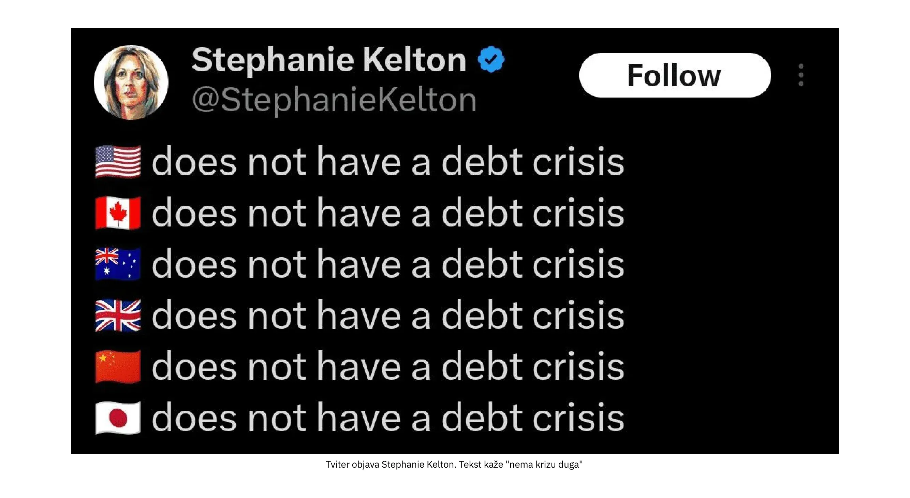

Čudno, navodi samo šest zemalja? Zašto je to tako? Zato što imaju stvarni monetarni suverenitet. Ali na Zemlji postoji oko 200 zemalja, i ne uživaju sve monetarni suverenitet. Dakle, moja kritika ove teorije, osim što je pomalo čudna i nefunkcionalna, jeste da funkcioniše samo za nekoliko zemalja koje uživaju pravi monetarni suverenitet, one koje mogu izdavati trezorske zapise u svojoj valuti. Do određene mere, to ide na štetu ostatka sveta. Stvaranjem ove valute, kao da izvoze svoju inflaciju negde drugde, slično onome što Sjedinjene Američke Države rade sa svojim enormnim privilegijama decenijama. Ovo podseća na oblik monetarnog kolonijalizma, gde zemlje koje imaju globalno poverenje i potražnju za svojom valutom mogu štampati koliko god žele novca bez značajne inflacije, često zato što tu inflaciju izvoze.

Ova teorija je teška za primenu na ekonomije koje zavise od uvoza i koje moraju održavati međunarodno poverenje u svoju valutu.

Ova teorija takođe zahteva određeni nivo centralizovanog planiranja ekonomije, posebno kako bi se osigurala veća kontrola nad stvarnim resursima (radnici, sirovine, industrijski kapacitet) i kako bi se upravljalo inflacijom.

# Pad i preporod novca

<partId>87a34ca9-782b-5ade-b51a-400f88ed7b0c</partId>

## Grčke kovanice

<chapterId>7714195f-74ce-5f8c-be5f-59302d39fff4</chapterId>

:::video id=8e5c3091-0910-471b-8d4b-0dc6e9afa656:::

### Pozadina i kontekst

Pre nego što počnemo, evo istorijskog pregleda:

**Istorijska pozadina:**

**Rimljani su Grke zvali "Graeci", a Grčku "Graecia".**

**Grci su sebe nazivali "Helenima" a svoju zemlju "Heladom".**

**Homer** (rođen oko 8. veka p.n.e.)

Legendarni grčki pesnik, pretpostavljeni autor *Ilijade* i *Odiseje*.

Oko **750. p.n.e: Likurg**, mitski zakonodavac Sparte, navodno je uspostavio spartanski ustav zasnovan na vojnoj disciplini i jednostavnosti.

**Numa Pompilije** (753-673 p.n.e.)

Drugi kralj Rima, poznat po tome što je Rimu dao prve verske i pravne institucije.

**Drakon**, atinski zakonodavac (7. vek pre nove ere), poznat po svojim izuzetno strogim zakonima, otuda izraz "drakonski".

**594. p.n.e: Solon** postaje zakonodavac u Atini i radikalno reformiše atinsko društvo, posebno ukidanjem dužničkog ropstva.

**776. p. n. e.: Antičke olimpijske igre**

Prve redovne sportske igre održavale su se u Olimpiji svake četiri godine, okupljajući grčke gradove.

**Pitagora** (ca. 570-495. p.n.e.)

Grčki filozof i matematičar, poznat po svom teoremu o pravouglom trouglu.

**Xenofan iz Kolofona** (oko 570-478. p.n.e.)

Predsokratski filozof poznat po svojoj kritici tradicionalnog grčkog politeizma.

**490. p. n. e.: Bitka kod Maratona**

Atenjani su pobedonosno odbili persijsku invaziju, označivši odlučujuću prekretnicu za grčku civilizaciju.

**Herodot** (oko 484-425. p.n.e.), nazvan "ocem istorije", napisao je obimno delo koje opisuje Persijske ratove, uključujući grčku pobedu nad Kserksom 480. p.n.e.

**Sokrat** (470-399 p.n.e.)

Atinski filozof poznat po svojoj dijalektičkoj metodi i učenju o etici i samospoznaji.

**Aristofan** (c. 446-386. p. n. e.)

Atinski dramaturg, poznat po svojim satiričnim komedijama kao što su *Žabe*.

**Sofokle** (5. vek p.n.e.), u svojoj drami *Antigona*, kritikuje novac kao izvor moralne i političke korupcije, kroz tiranina Kreonta.

**Platon** (oko 428-348. p.n.e.)

Grčki filozof, učenik Sokrata, osnivač Akademije, autor *Države*.

**431-404. p. n. e.: Peloponeski rat**

Veliki sukob između Atine i Sparte, koji je završio porazom za Atinu.

**431. p. n. e.**: Atina finansira Peloponeski rat razređivanjem svojih zlatnih i srebrnih novčića kako bi povećala količinu u opticaju, što izaziva inflaciju.

**Xenofon** (oko 430-355. p.n.e.)

Atinski pisac, filozof i general, učenik Sokrata, autor *Anabaze*.

**414. p.n.e.**: Atina počinje da gubi Peloponeski rat nakon katastrofalne ekspedicije na Siciliju.

**405. p. n. e.: Aristofan**, u svojoj drami *Žabe*, eksplicitno opisuje devalvaciju srebrne drahme i pojavu inferiornih bronzanih novčića u Atini, ilustrujući princip danas poznat kao "Grešamov zakon".

**404. p. n. e.**: Atina kapitulira nakon duge opsade od strane Sparte.

**Aristotel** (384-322. p. n. e.)

Veliki grčki filozof, učenik Platona, osnivač Liceja, poznat po svom radu u logici, biologiji i političkoj filozofiji.

**327. p. n. e.**: Aleksandar Veliki osvaja Persepolis i istočne provincije Persijskog carstva, znatno proširujući svoje carstvo.

**323. p.n.e.**: Aleksandar je umro u Vavilonu bez jasnog naslednika, što je izazvalo ratove između njegovih generala (diadoha) za podelu carstva.

**Arhimed** (oko 287-212. p.n.e.)

Grčki matematičar, fizičar i pronalazač, poznat po svojim otkrićima u geometriji i mehanici.

**196. p.n.e: Kamen iz Rozete** je ugraviran tokom vladavine faraona Ptolemeja V, omogućavajući kasnije dešifrovanje egipatskih hijeroglifa.

**192-188. p. n. e.: Rimsko-seleukidski rat**

Rim je porazio Seleukidsko carstvo predvođeno Antiohom III, učvršćujući svoj uticaj u Grčkoj i Maloj Aziji.

**146. p. n. e.: Bitka kod Korinta**

Rimljani su uništili grčki grad Korint, označavajući kraj grčke političke nezavisnosti i postepenu integraciju Grčke u rimski svet.

Za ovaj deo o Antici, padu Rima i Srednjem veku, počećemo sa delom o grčkim novčićima.

Istorija kovanog novca u staroj Grčkoj počela je oko 600. godine pre nove ere, kada su grčki gradovi brzo usvojili inovaciju iz Lidije u Maloj Aziji, isprva koristeći elektrum, a kasnije srebro. Prvi grčki novčići kovani su na ostrvu Egina, sa prikazom morske ili kopnene kornjače, ali je atinska drahma, ukrašena Atenom i sovom, postala monetarni simbol par excellence od 5. veka pre nove ere, u velikoj meri dominirajući međunarodnom trgovinom tog vremena.

I imam tu sreću da imam kopiju grčke drahme iz tog perioda sa čuvenom sovom i figurom na poleđini. To je tetradrahma, koja je bila veća od obične drahme.

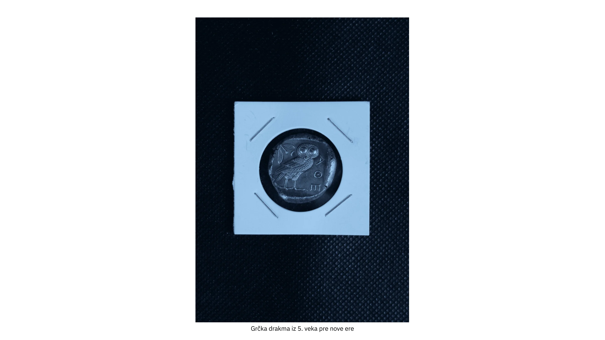

Svaki grčki grad razvio je svoj odnos prema novcu. U Atini, valuta je bila duboko povezana s političkom i ekonomskom moći. Poznata atinska dekret iz kasnog 5. veka pre nove ere nametnula je isključivu upotrebu atinske valute u saveznim teritorijama, čime je ojačana njena ekonomska hegemonija. Atina je takođe akumulirala velike rezerve zlata za vanredne situacije, koje su čuvane na Akropolju, možda kao simbol njene ekonomske razboritosti. Nasuprot tome, Sparta, vojni grad sa strogim vrednostima, odlučila je da strogo ograniči upotrebu novca, zabranjujući svojim građanima da poseduju zlatne ili srebrne kovanice. Sparta je preferirala korišćenje teških gvozdenih šipki kako bi obeshrabrila spoljnu trgovinu i održala društvenu koheziju.

Ratovi su često finansirani manipulacijom valute. Tokom Peloponeskog rata (431-404. p.n.e.), Atina je pribegla drastičnim devalvacijama kako bi isplatila svoje trupe. Lišena pristupa svojim rudnicima srebra zbog spartanske okupacije Dekeleje 413. p.n.e., Atina je morala da istopi zlatne statue kako bi brzo kovala nove novčiće 407/406. p.n.e. Zatim, 406/405. p.n.e., stvorila je bronzane novčiće presvučene srebrom, što je izazvalo monetarnu krizu koju je ilustrovao **Aristofan**, koji već pominje ono što je danas poznato kao Greshamov zakon: loš novac potiskuje dobar novac. Ova hitna valuta je brzo demonetizovana nakon rata kako bi se povratilo poverenje u atinski novac.

Kraj klasičnog perioda obeležen je usponom Makedonije pod Filipom II i njegovim sinom Aleksandrom Velikim, što je duboko poremetilo grčku monetarnu ravnotežu. Zahvaljujući ogromnim rudnicima zlata i srebra na planini Pangea, Filip II je proizveo obilje novca za finansiranje svojih vojnih i političkih kampanja, uspostavljajući jednostavan i praktičan zlatno-srebrni standard (10:1). Njegovi zlatni stateri, koji su slavili njegovu pobedu na Olimpijskim igrama, kružili su čak do Zapadne Evrope, pa čak i do Engleske. Aleksandar je nastavio ovu monetarnu politiku, široko distribuirajući **atičku** drahmu tokom svojih osvajanja na Istoku sve do Indije. Ova masovna cirkulacija novčića označila je početak helenističke ere, kada je slika suverena postepeno zamenila sliku božanstava na novčićima. Ova inovacija omogućila je generacijama helenističkih monarha da promovišu sebe, potiskujući tradicionalne bogove na sekundarnu ulogu na poleđini svojih novčića.

Nakon Aleksandrove smrti 323. godine pre nove ere, njegovi generali su podelili njegovo ogromno carstvo, uspostavljajući dinastije u Egiptu (Ptolemeji), Siriji (Seleukidi) i drugde. Ova helenistička kraljevstva usvojila su različite monetarne sisteme: Ptolemeji su nametnuli zatvoren monetarni sistem kako bi kontrolisali cirkulaciju novca, preferirajući korišćenje žita kao unutrašnje valute da bi sačuvali plemenite metale za spoljne vojne troškove. Istovremeno, Rodos je postao glavni trgovački centar pre nego što su ga ekonomski oslabili Rimljani, koji su 167. godine pre nove ere uspostavili Delos kao slobodnu luku.

Korišćenje novca bilo je ključno za nadoknadu plaćenika. Aleksandrovi vojnici su svakodnevno dobijali srebrne drahme.

Konjica, elita Aleksandrove visoko specijalizovane vojske, dobijala je u proseku dve drahme dnevno, pešadinac jednu drahmu, a običan plaćenik dve trećine drahme, dvostruko više od plate običnog radnika.

Tokom Peloponeskog rata, znatne sume su takođe isplaćene vojnicima: preko 1.200 talenata za gušenje pobune na Samosu i preko 2.000 talenata za opsadu Potideje.

Do trenutka kada je ova vojska bila potpuno angažovana u Maloj Aziji, ukupni trošak je bio oko dvadeset talenata dnevno, ili oko pola tone srebra, ili 120.000 drahmi.

Grčki novac je takođe igrao važnu kulturnu ulogu, jer je svaki grad nastojao da afirmiše svoj identitet kovanjem sopstvenog novca sa lokalnim ili mitološkim simbolima. Na primer, Heraklija je prikazivala Herakla (Herkulesa) kako se bori sa lavom, dok je Kirena prikazivala čuvenu lekovitu biljku silfijum.

Konačno, uprkos njihovoj raznolikosti i regionalnim fluktuacijama, klasični grčki i helenistički novac ostavili su trajan trag na ekonomsku i kulturnu istoriju mediteranskog sveta, duboko utičući na kasnije monetarne sisteme sve do Rima, koji je postepeno usvojio i razvio grčke ekonomske koncepte kako bi strukturirao sopstvenu imperijalnu ekonomiju.

## Uticaj valute u Grčkoj

<chapterId>3a5e6c7d-699c-5567-87cd-3374c49d55a9</chapterId>

:::video id=0c79a59c-e179-4893-a414-1b8de0930eb9:::

### Atina i kontrast sa Spartom

Suprotstavljenost između Atine i Sparte tokom klasičnog grčkog perioda otkriva dva radikalno različita modela političke i ekonomske organizacije. Dok je Sparta odbacivala metalni novac u korist samodovoljnog sistema zasnovanog na građanskom poverenju, Atina je u potpunosti prihvatila ovu tehnologiju kako bi izgradila i održavala svoje pomorsko carstvo.

### Monetarna nužnost pomorske moći

Atenstko carstvo, uprkos svom grandioznom imenu, ostalo je geografski skromno - u suštini Atina i gradovi Egejskog mora. Njegova moć počivala je na Delskom savezu, vojnom savezu kojim je dominirala Atina kao hegemon. Ova imperijalna struktura zahtevala je jedinstveni ekonomski instrument: atinski srebrni novac.

Održavanje flote bilo je u središtu ove monetarne potrebe. Jedna atinska trirema koštala je između jednog i dva talenta srebra - znatna suma. Sa nekoliko stotina brodova za održavanje, Atini je bio potreban efikasan poreski sistem. Valuta je postala neophodan alat za prikupljanje danka od vazalnih gradova i finansiranje pomorske sile koja je garantovala koheziju carstva.

### Monetarna nametanja kao alat dominacije

Atina je nametnula svoju srebrnu valutu svim članicama Delskog saveza. Ova monetarna standardizacija služila je nekoliko strateških ciljeva. Prvo, olakšala je prikupljanje tributa stvaranjem zajedničke obračunske jedinice. Drugo, ojačala je ekonomsku zavisnost vazalnih gradova od Atine. Na kraju, simbolično je projicirala atinsku moć širom celog pomorskog carstva.

Ova monetarna politika oštro se razlikuje od spartanskog modela. Sparta, kopnena sila, mogla se osloniti na rad peloponeskih helota (robova) za svoj opstanak. Njen zatvoreni, gradski ekonomski sistem nije zahtevao sofisticirane monetarne instrumente. Građani-vojnici živeli su zajedno, delili zajedničke obroke i nisu trebali novac za svakodnevne razmene.

### Valuta kao sredstvo za pomorsku trgovinu

Pomorska priroda Atinskog carstva značila je da mora biti otvoreno za trgovinu. Za razliku od introvertne Sparte, Atina je morala trgovati sa spoljnim svetom radi svog opstanka i prosperiteta. Valuta je postala neophodan instrument mediteranske trgovine.

Ova eksterna orijentacija stvorila je vrlinski krug: trgovina je generisala prihode, ti prihodi su finansirali flotu, flota je štitila trgovačke rute i održavala carstvo, a carstvo je nametnulo atinsku valutu, što je olakšalo trgovinu. Valuta više nije bila samo sredstvo razmene, već je postala stub imperijalne strategije.

### Granice monetarne moći

Uprkos ovoj ekonomskoj sofisticiranosti, atinska monetarna moć pokazala je svoje granice tokom Peloponeskog rata. Suočena sa spartanskim kopnenim snagama, atinska pomorska i finansijska nadmoć nisu bile dovoljne. Skupi pohodi, kao što je bila katastrofalna sirakuška kampanja na Siciliji, iscrpeli su finansijske resurse bez donošenja odlučujuće pobede.

Istorija pokazuje da valuta, iako moćan alat za projektovanje moći, nije garancija vojne dominacije. Sparta, bez metalne valute ali sa izuzetnom društvenom kohezijom, na kraju je pobedila Atinsko monetarno carstvo.

### Dva modela, dve sudbine

Suprotstavljenost između Atine i Sparte ilustruje dva fundamentalna pristupa društvenoj i ekonomskoj organizaciji. Atina predstavlja otvoreni, komercijalni, monetarizovani model - preteču modernih pomorskih carstava. Sparta oličava zatvoreni, autarkični model, zasnovan na građanskom poverenju, a ne na monetarnim instrumentima.

Ova dva sistema pokazuju da je usvajanje valute usko povezano sa političkim i ekonomskim modelom koji je izabran. Za pomorsku i trgovačku silu kao što je Atina, novac je postao neophodan. Za zatvoreno ratničko društvo poput Sparte, on predstavlja pretnju društvenom poretku. Ova drevna dihotomija i dalje informiše debate o ulozi novca u organizaciji društava.

## Rimska Republika

<chapterId>0bc80983-33e1-5881-85bb-7c22f3144a9a</chapterId>

:::video id=dc05ca97-d29c-4679-bfeb-912c47d86ce2:::

### Istorija Rimske Republike

- 753 - 509 BC: Kraljevina Rim**
- 753. p. n. e.: Osnivanje Rima** (tradicionalno pripisano Romulu).
- 509 - 27. p.n.e: Rimska republika**, Rim postaje republika kojom upravljaju izabrani Senat i konzuli.
- 280 - 275. p. n. e.: Pirinski rat**. Pir, kralj Epira, bori se protiv Rimljana u južnoj Italiji, ostvarujući skupe pobede („Pirove pobede“).
- 264 - 146. p. n. e: Punski ratovi**. Veliki sukob između Rima i Kartagine za dominaciju nad zapadnim Mediteranom.
- Hannibal (247 - oko 181. p.n.e.)**. Legendarni kartažanski general, poznat po prelasku Alpa sa svojom vojskom i slonovima kako bi napao Rim tokom Drugog punskog rata.
- 146. p.n.e: Bitka kod Korinta**. Rim uništava grčki grad Korint i nameće svoju konačnu dominaciju nad kopnenom Grčkom.
- 91 - 87. p.n.e: Savezniški rat**. Pobuna italijanskih saveznika Rima koji su zahtevali rimsko državljanstvo, što je na kraju dovelo do njihove potpune integracije u građanstvo.
- 64. p.n.e: Kraj seleukidskog otpora**. Rim definitivno eliminiše seleukidski uticaj u Siriji, konsolidujući svoju vlast nad istočnim Mediteranom.
- 55. p. n. e.: Julije Cezar osvaja centralnu i zapadnu Evropu**. Julije Cezar širi rimsku dominaciju nad Galijom (današnja Francuska) i ulazi u Germaniju i Britaniju.
- 43. p. n. e.: Formiranje Drugog trijumvirata**. Politički savez između Oktavijana (kasnije Avgusta), Marka Antonija i Lepida, kako bi se stabilizovao Rim nakon Cezarovog ubistva.
- 27. p. n. e.: Početak Pax Romana**. Period političke stabilnosti i prosperiteta pod vladavinom Avgusta, označava početak Rimskog carstva.

### Kasni monetarni počeci Rima

U ovom odeljku o Antici, sada se okrećemo pažnji na Rimsku Republiku. Monetarna istorija Rima počela je mnogo kasnije nego kod Grka i Persijanaca. Osnovan 753. godine pre nove ere, Rim je čekao skoro četiri veka pre nego što je zaista usvojio kovanje novca. Tokom ovog dugog perioda, Rimljani su koristili primitivni sistem razmene sa nepravilnim komadima bronze zvanim aes rude, što je zahtevalo precizno merenje za svaku transakciju. Tek krajem 4. veka pre nove ere, pod uticajem Grka i Etruraca, Rim je počeo da izdaje svoje prve novčiće, posebno u bronzi livenoj kao u Kini, aes grave, karakterističan za rimske razmene sve do **Drugog punskog rata**.

### Grčki uticaj i prvi srebrni novčići

Odlučujući susret sa Grcima južne Italije zaista je upoznao Rimljane sa kovanicama od srebra. Oko 280. godine pre nove ere, Rim je počeo da proizvodi sopstvene srebrne kovanice po uzoru na grčke didrahme. Prvo redovno izdanje srebrnih kovanica u Rimu datira tačno iz 269. godine pre nove ere, sa legendarnim blizancima Romulom i Remom koje doji vučica, simbolom koji je postao ikoničan.

Zapravo, mnogi rimski novčići iz perioda Republike prikazuju osnivačke mitove. Možete videti moj ovde ispod: to je izvanredan, pravi novčić od kralja Tatija. Ilustruje mit o otmici žena od Sabinjana. Tacije je bio kralj ovog regiona, a osnivački mit govori o tome kako su Rimljani oteli žene od Sabinjana, populacije koja je živela u blizini. Nakon toga, kralj Tacije je postao su-kralj sa Romulom, jednim od osnivača Rima.

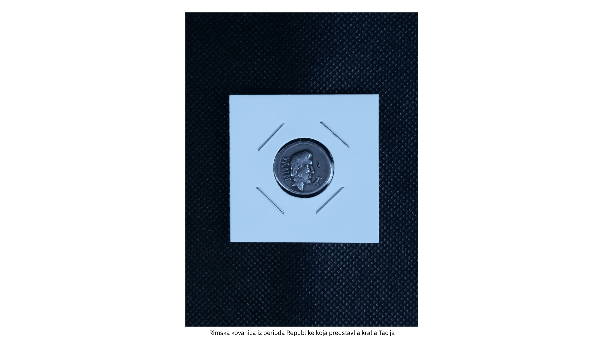

### Poreklo reči "coin" i hram Juno Moneta

Termin "coin" potiče iz hrama Juno Moneta u Rimu. Legenda kaže da su, tokom galske invazije 390. godine pre nove ere, svete guske Kapitola upozorile Rimljane na neposrednu opasnost. Da bi zahvalili boginji Juno, zaštitnici Kapitola, podignut je hram u njenu čast koji je ubrzo postao kovnica rimskih novčića.

### Punski ratovi i valutne krize

Vojni sukobi su imali značajan uticaj na razvoj rimskog monetarnog sistema. Tokom Drugog punskog rata (218-201. p.n.e.) protiv Kartagine, Rim se suočio sa ozbiljnim finansijskim poteškoćama usled Hanibalove invazije. Da bi ublažio ove hitne potrebe, Rim je po prvi put pribegao izuzetnom izdavanju zlatnika, kao i značajnoj devalvaciji svog srebrnog novca, sa početne čistoće od 97% na oko 89%. Težina bronzanih novčića (aes) takođe je drastično opala, izgubivši skoro 80% u šest godina.

Ovde možemo ponovo razmotriti koncept o kojem smo ranije diskutovali u vezi sa Grcima koji su topili plemenite metale čuvane u hramovima kako bi pomogli u ublažavanju ekonomskih kriza. A da bismo razgovarali o **Kartagini**, ovde dole možete da se divite pravom kartaginskom novčiću iz moje kolekcije. Ovi kartaginski novčići su imali palmu na jednoj strani, a konja na drugoj strani. Na ovom novčiću, konj nije baš prepoznatljiv, jer je veoma istrošen.

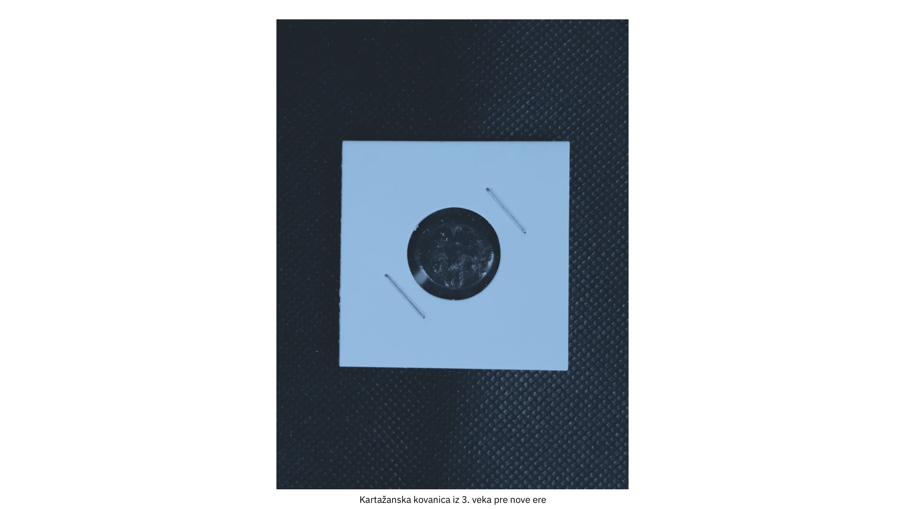

Kao rezultat toga, težina bronzanih novčića, poznatih kao aes, takođe je drastično pala, izgubivši skoro 80% u šest godina. Dakle, težina ovih bronzanih novčića, koji nisu bili plemeniti metal i koristili su se u svakodnevnoj trgovini, znatno je opala, što je bio znak monetarne devalvacije zbog ovih ratova.

### Srebrni denarij i monetarna stabilnost

Bilo je protiv ove kritične pozadine da je Rim uveo čuveni srebrni denar oko 212. godine pre nove ere. Ova reforma je obezbedila izuzetnu monetarnu stabilnost, pri čemu je denar ostao dominantna valuta skoro 450 godina. Rim duguje ovu stabilnost rigoroznom upravljanju, uprkos velikom repriciranju 146. godine pre nove ere i značajnoj proizvodnji za finansiranje svojih ogromnih vojski, posebno tokom Punski, Socijalni (91-87. godine pre nove ere) i Makedonski ratova. Na primer, održavanje jedne rimske legije koštalo je oko 1,5 miliona denara godišnje, ilustrujući razmere monetarnih potreba.

Iza rimskih granica, ratovi su doveli do velikih devalvacija u regionima pod rimskim uticajem. Punska Kartagina je videla dramatičan pad čistoće svog elektruma, sa 98% zlata u 4. veku na samo 30% tokom Drugog punskog rata, dok su njeni srebrni novčići pali na 18% čistoće.

### Evolucija monetarnih motiva

Sa širenjem Rima, karakter novčića se takođe razvijao: u početku anonimni i patriotski, novčići su postepeno usvajali personalizovane dizajne sa moćnim porodicama kovničara (onih koji su kovali novčiće). Ova tranzicija jasno simbolizuje političke transformacije kasne Rimske Republike.

Konačno, dok je Rim ekonomski dominirao mediteranskim svetom, zadržao je određenu jednostavnost u svojim sredstvima plaćanja: nije razvijen pravi oblik monetarnog transfera osim direktne razmene novčića, sa izuzetkom poreskih transfera i privatnih kredita rezervisanih za elitu.

## Rimsko carstvo

<chapterId>2dc44e50-112a-5abf-97ae-8e0a9ecda989</chapterId>

:::video id=f8d6f3d6-9ee4-4504-888e-4f12b3f20489:::

**Istorijska pozadina:**

**Principat** je bio oblik carske vlasti u Rimskom carstvu od početka vladavine Avgusta 27. godine pre nove ere do kraja krize trećeg veka 284. godine nove ere.

**27. p. n. e.: Početak Pax Romane**

Period političke stabilnosti i prosperiteta pod vladavinom Avgusta, označavajući početak Rimskog carstva.

**Augustus (30. p.n.e. do 14. n.e.)** radikalno je reformisao rimski monetarni sistem, uspostavljajući trajan i stabilan standard za carski novac.

**Avgust je takođe bio jedan od prvih priznatih kolekcionara** antičkih novčića i fosila.

**54 AD - 68 AD: Neron**

Kontroverzni rimski car, poznat po svojoj tiraniji, progonima i katastrofalnom upravljanju nakon požara u Rimu.

**64 AD: Veliki požar u Rimu**

Veliki požar pustoši veći deo grada; Neron je optužen da je odgovoran.

**69 AD: Godina četiri cara**

Haotičan period sa četiri cara u brzom sukcesiji (Galba, Oton, Vitelije, Vespazijan).

**79 AD: Erupcija Vezuva**

Vulkan koji je uništio gradove Pompeji i Herkulanum, izuzetno očuvavši njihove ostatke ispod pepela.

**165 AD - 180 AD: Antoninska kuga**

Razorna epidemija koja je oslabila Rimsko carstvo pod Markom Aurelijem i Komodom.

**200. godine nove ere: Teritorijalni vrhunac i postepeni kraj Pax Romana**

Rim je dostigao svoju maksimalnu ekstenziju, ali je počeo da pati od unutrašnje nestabilnosti i ekonomskih poteškoća.

**212 AD: Edikt Karakale o državljanstvu**

Caracalla je dodelio rimsko građanstvo gotovo svim stanovnicima carstva, kako bi proširio poresku osnovicu.

**220. n.e.: Početak velikih varvarskih invazija**

Prve značajne upade germanskih naroda preko rimskih granica.

**235 AD - 285 AD: Politička i vojna kriza 3. veka**

Period obeležen političkom nestabilnošću, sa mnogim kratkotrajnim carevima, građanskim ratovima, ekonomskim krizama i kontinuiranim invazijama.

**Aurelian (270-275 AD) radikalno je revalorizovao rimski novac**, pokušavajući da povrati njegovu nominalnu vrednost uprkos visokoj inflaciji.

**301 AD: Dioklecijanov Edikt o Cenama**

Car Dioklecijan je uzalud pokušavao zaustaviti galopirajuću inflaciju uvođenjem strogih kontrola cena i plata širom carstva.

**312 AD: Konstantin**

Prvi hrišćanski car, osnivač Konstantinopolja, stabilizovao je valutu uvođenjem "solida", zlatnika velike čistoće i stabilnosti.

**476. n.e.: Pad Zapadnog Rimskog Carstva**

Rim su zauzeli razni germanski narodi (uključujući Ostrogote), događaj koji se smatra zvaničnim krajem Zapadnog Rimskog Carstva.

### Augustusove monetarne reforme

U ovom delu o Antici, već smo stigli do Rimskog carstva. Monetarna istorija Rimskog carstva karakteriše se intenzivnom upotrebom metalnog novca, posebno zlata, srebra i bronze, ali i brojnim monetarnim krizama, usko povezanim sa političkim i vojnim nemirima. Na kraju Republike, pod Julijem Cezarom, Rim je uveo zlatni aureus 46. godine pre nove ere, novčić težak oko 8 grama koji je bio široko prihvaćen širom Evrope i mediteranskog basena. Cezar je standardizovao ove zlatnike i kovao prve novčiće sa portretom živog čoveka, čime je preokrenuo drevnu republikansku tradiciju koja je favorizovala anonimne, kolektivne simbole. Ovaj razvoj događaja pratio je period velikih političkih transformacija, sa ličnom moći koja je postepeno zamenjivala republikanske institucije.

Nakon Cezarovog ubistva 44. godine pre nove ere, Oktavijan (Avgust) je preuzeo kontrolu nad Rimom, uspostavljajući Carstvo 27. godine pre nove ere. Njegova vladavina je donela potpunu reformu monetarnog sistema, donoseći trajnu stabilnost rimskoj ekonomiji. U vreme Avgusta, jedan zlatni aureus je bio ekvivalentan 25 srebrnih denara, koji je sam po sebi vredeo 4 bronzana sestercija. Ova monetarna stabilnost se nastavila tokom prvog veka nove ere, perioda koji se često opisuje kao ekonomsko zlatno doba za Rim.

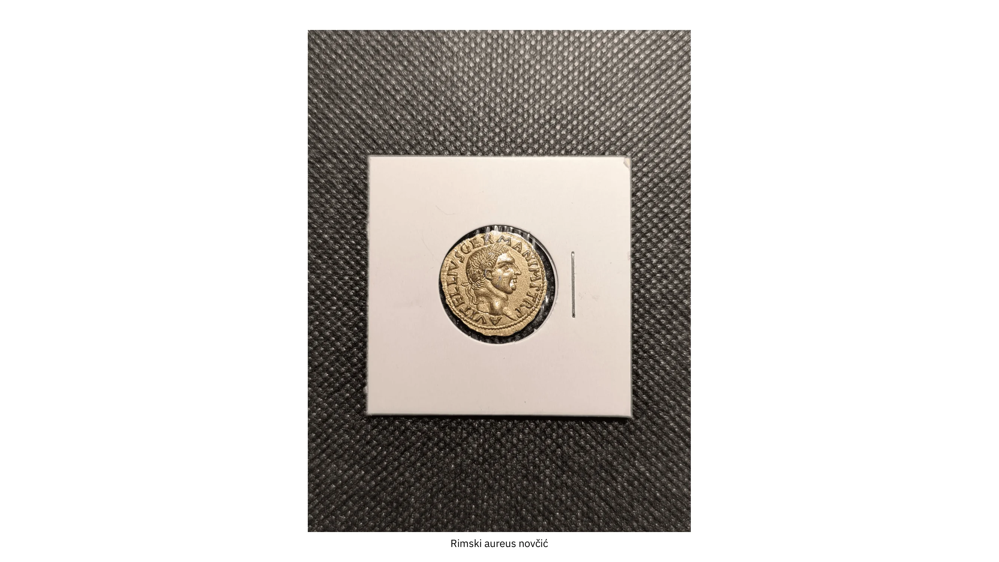

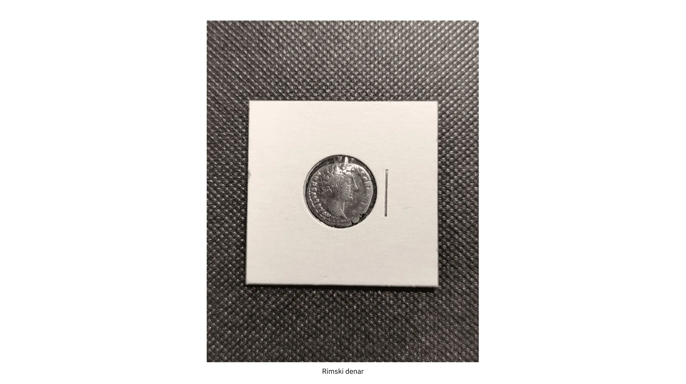

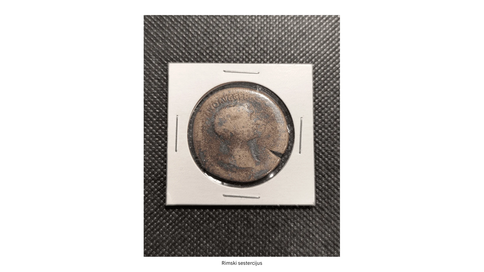

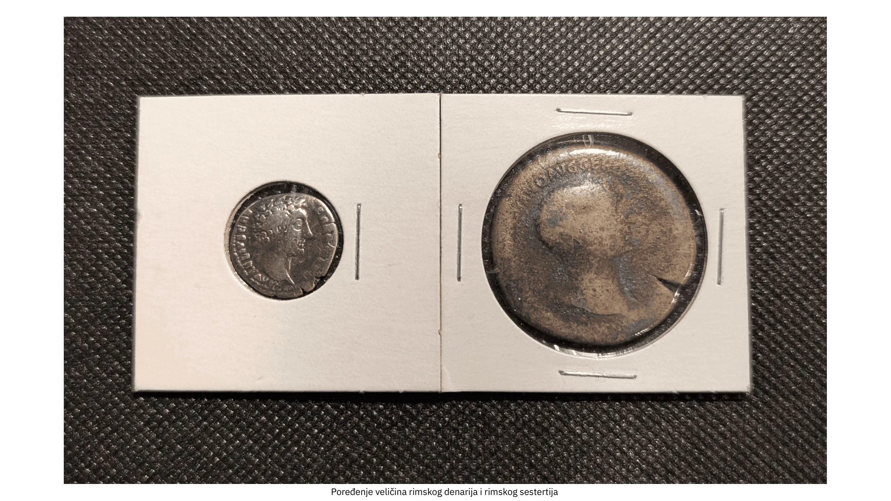

Međutim, počevši od Nerona (54-68. n.e.), Rim je započeo sporo obezvređivanje svojih kovanica, postepeno smanjujući njihovu težinu i čistoću kako bi finansirao rastuće carske troškove, posebno nakon velikog požara u Rimu 64. n.e. Ove devalvacije su imale značajne efekte: čistije kovanice su povučene iz opticaja putem gomilanja ili izvoza, u skladu sa **Greshamovim zakonom**, dok su devalvirane kovanice proliferirale, uzrokujući postepeni rast cena.

Treći vek označava dramatičnu prekretnicu, sa spektakularnim ubrzanjem devalvacija pod carevima Septimijem Severom, Karakalom i Galijenom. Glavna srebrna kovanica, denarijus, a zatim antoninijanus, doživela je pad sadržaja srebra na samo 2%. Istovremeno, zlatna težina aureusa pala je za polovinu. Ovu monetarnu krizu pratila je neviđena politička nestabilnost, varvarske invazije i učestali građanski ratovi.

Ovaj deo mi omogućava da predstavim poslednji komad u ovom odeljku: antoninijan. Originalno ime ovog novčića je nepoznato, ali ga danas nazivamo antoninijan. Ima posebnost da vredi dva denarija, uprkos tome što je samo 1,5 puta veći od denarija. Štaviše, tokom vremena, ovi novčići su postali samo bilonski novčići, što znači da su napravljeni od legure srebra i drugih metala, a ne od čistog srebra. Novčići su često bili samo presvučeni srebrom, što služi kao značajan primer monetarnog propadanja.

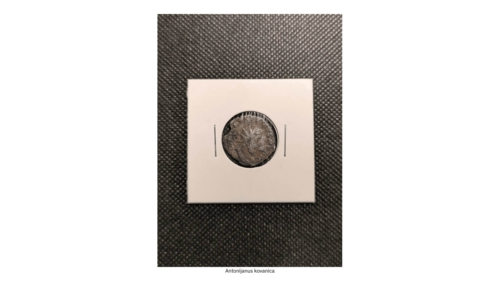

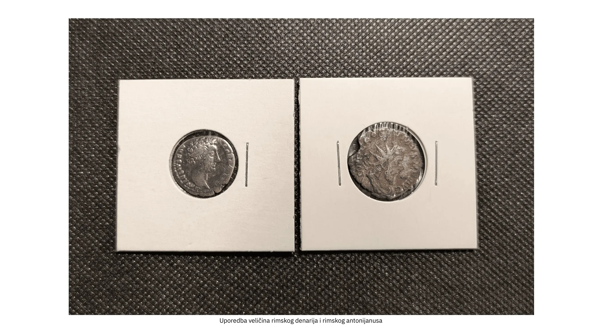

Suočen sa ovom situacijom, car Aurelijan (270-275. n.e.) pokušao je da stabilizuje sistem nominalnim revalorizovanjem valuta, ali je ova reforma zapravo uvela inflacioni mehanizam veštačkim fiksiranjem vrednosti postojećih valuta na višem nivou.

Uvešću digresiju na ovu temu. Tokom 3. veka, inflacija je doživela brzi eksponencijalni rast. Pre toga, iako su novčići bili devalvirani, ručni proces kovanja jednog po jednog omogućavao je određenu kontrolu nad inflacijom. Statistike pokazuju da je tokom preko 300 godina devalvacije, inflacija u proseku iznosila oko 4% godišnje. Neposredno pre Aurelijanove reforme, inflacija je bila približno 3% godišnje.

Aurelian je uveo merenje čistoće na novčiću sa oznakom XXI, što je označavalo sastav od 20 delova bronze na 1 deo srebra, ili 5% čistoće. On je plasirao ove novčiće sa 5% srebra i utisnuo oznaku XXI na njih. Međutim, takođe je povukao sve druge, više devalvirane novčiće i utisnuo istu oznaku XXI na njih. Ovo je efektivno revalorizovalo nominalnu vrednost svih novčića. Ishod je bio zapanjujuća inflacija od 20% godišnje, što je daleko premašilo prethodnu stopu od 3% pre nego što je ova tehnika primenjena.

Zaista je Aurelijan bio taj koji je izmislio ovaj oblik devalvacije, koji je mnogo brži od postepene devalvacije metala, koja nas je i dalje primoravala da kovanice štampamo jednu po jednu. Ono što je on uradio bilo je da uzme sve postojeće kovanice, povuče ih i udari pečat kako bi promenio njihovu nominalnu vrednost. To je prava prekretnica. Tada je inflacija postala eksponencijalna.

Da bih vizuelno ilustrovao ovu ekstremnu devalvaciju, pronašao sam fascinantne statistike o ceni žita u Egiptu od 40. godine pre nove ere do 3. veka, u periodu dužem od 300 godina. Ispod možete videti grčku tetradrahmu iz moje kolekcije. U to vreme, u Egiptu pod rimskom okupacijom u 3. veku, ekvivalent je bila egipatska tetradrahma. Denominacija drahmi je i dalje bila u upotrebi i odgovarala je denariju.

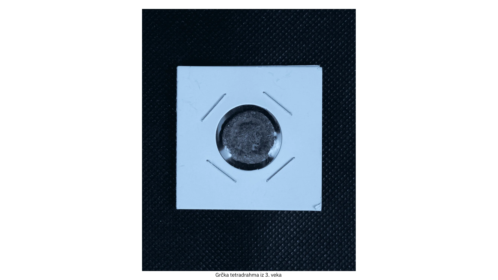

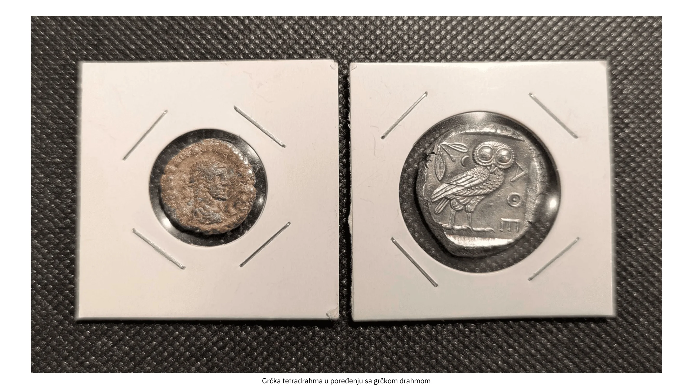

Dakle, egipatski tetradrahm koji imam bio je ekvivalent denariju. Možete videti da je novčić napravljen od bilona (ili bronze), tako da ne sadrži plemenite metale. Možete ga uporediti sa originalnim grčkim tetradrahmom da biste videli fizičku devalvaciju tokom ovih 300 godina. To je milionostruko povećanje cene žita u Egiptu.

To je fizički izraz Aurelijanove reforme. Treba napomenuti da je većina, prosečno tokom ovih 300 godina inflacije, bila oko 4%. Tek na kraju, kada je Aurelijan sproveo svoju reformu, ta inflacija je postala prilično eksponencijalna i stigli smo do ove mere od 1 milion. Cene su bile milion puta veće krajem 3. veka nego u 1. veku pre nove ere.

Njegov naslednik **Dioklecijan** (284-305 AD) pokušao je još radikalnije reforme: izdao je nove valute (posebno argenteus, čistiji ali previše ograničen u količini), uveo drastične kontrole cena (Edikt o cenama iz 301 AD) i **uspostavio poreski sistem zasnovan na plaćanju u naturi**. Uprkos tim naporima, Dioklecijanove reforme nisu uspele da obuzdaju galopirajuću inflaciju.

Suočen sa odbijanjem da se roba i usluge isporučuju u zamenu za devalviranu valutu, Dioklecijan je uveo **nasledni kastinski sistem** kako bi vezao seljake i njihove potomke za njihovu zemlju.

Ono što zaista treba razumeti ovde je da su seljaci odbili da isporuče svoje proizvode u zamenu za obezvređenu valutu, a naš dragi Dioklecijan je odgovorio stvaranjem **naslednih kasti** rekavši "ti, ne možeš napustiti svoju zemlju, tvoja deca ne mogu napustiti svoju zemlju, isto važi i za vojnike, vi ste vojnici, pristajete da budete plaćeni u mojoj valuti". Kao prelazno rešenje, bili su plaćeni u naturi (u mesu, hrani, žitu) jer je odbijao da im da novac. Tako je nametnuo ovaj sistem naslednih kasti kako bi prisilio ljude da budu vezani za svoj zanat, tako da nisu mogli jednostavno promeniti posao ako bi pokušali da ne prihvate obezvređenu valutu.

Da ilustrujem ovaj primer, ovde imam tekst, izvod iz knjige "*Monetary Regime and Inflation*":

> Kako ljudi nisu bili voljni da rade i isporučuju robu u zamenu za devalviranu valutu, čija je nominalna vrednost bila viša od njene intrinzične ili tržišne vrednosti, morali su biti primorani da rade nametanjem poreza u naturi. [...] Postalo je nezakonito da seljaci napuste svoje registrovane domove. Zemljoradnička populacija je tako postala nasledno vezana za zemlju.
>

> Ovaj nasledni kastinski sistem postepeno se širio: Dioklecijan je primoravao sinove vojnika da služe u vojsci, dok su radnici u radionicama za novac, kao i u fabrikama za tkanje i bojenje koje je Dioklecijan stvorio, postajali državni robovi, sa naslednom službom. Kopači zlata su takođe kasnije postali nasledna kasta. Druge nasledne klase verovatno su već postojale u Dioklecijanovo vreme, posebno cehovi pekara i mesara [...] u Rimu, kao i dijecezanski cehovi kapetana brodova koji su prevozili žito i druge javne terete u Rim.

Bio je to Konstantin (306-337 AD) koji je konačno uspeo da stabilizuje monetarni sistem uvođenjem solidusa 312. godine, čistog zlatnog novčića čiji je kvalitet i težinu strogo garantovao. Postojao je čitav sistem za proveru čistoće i težine solidusa. **Ova stabilnost, međutim, uticala je samo na bogatu elitu i carsku administraciju**, dok je **većina stanovništva nastavila da pati od niskokvalitetnog novca i uporne inflacije**. Solidus je ostao stabilan u Istočnom carstvu (Vizantiji), gde je trajao više od milenijuma, dok je na Zapadu kovanje novca fragmentisano u male, niskovredne novčiće, prateći konačnu ekonomsku i političku dezintegraciju Rimskog carstva, koje je definitivno palo 476. godine.

Za kraj, želeo bih da podelim sa vama ovaj citat iz *Istorija novca: Od drevnih vremena do današnjeg dana* autora Glyn Davies, koji vešto sažima ono što je možda dovelo do pada Rima:

*"Porezi su stalno bili neadekvatni, a poteškoće povezane sa ovim sve neadekvatnijim, kasno prilagođenim i veoma vidljivim porezima naterale su Rim da se više oslanja na lak, neposredan i skriven oblik oporezivanja: devalvaciju valute. Kratkotrajne, ad hoc reforme nisu uspele da preokrenu ovaj vekovni trend opadanja. Finansijski pritisci uzrokovani habanjem novčića, brodolomima, curenjem novca zbog kupovine luksuzne robe sa Istoka, poklonima ponuđenim germanskim varvarima, rastom urbanog stanovništva, padom poljoprivredne proizvodnje, postepenim iscrpljivanjem najbogatijih rudnika, i iznad svega politikama "hleba i igara" koje su smatrane neophodnim za održavanje minimuma reda u urbanom životu - svi ovi kumulativni pritisci doveli su Rim do stalne monetarne devalvacije, isprekidane povremenim reformama osuđenim na neuspeh."*

*Pored besplatnog ili jeftinog hleba i vina, carske liberalnosti ("congiaria") u obliku novčanih davanja povremeno su se delile, naročito pod Trajanom (98-117 AD), a još više pod Hadrijanom (117-138 AD) i njegovim naslednicima. Ono što su car i građani u početku smatrali izuzetnom privilegijom, do početka 2. veka postalo je uobičajeno očekivanje. Ove distribucije "predstavljale su težak teret za javnu blagajnu i na svoj način doprinele bankrotu države".*

## Veze između monetarnog razblaživanja i inflacije: od uzroka do posledica

<chapterId>38d5781c-e900-53f7-baa7-413655d71754</chapterId>

:::video id=3999256d-aafe-4502-9b72-dfa8491a2777:::

Ovaj odeljak razmatra veze između monetarnog razblaženja i inflacije, od uzroka do posledica. Monetarno razblaženje je jedan od glavnih ekonomskih fenomena u rimskoj monetarnoj istoriji, sa direktnim efektima na inflaciju. Od 1. veka nove ere, postojala je početna spora faza razblaženja srebrnog novca (denar) od vladavine Nerona (54-68 nove ere) nadalje, ubrzana ponovljenim vojnim i finansijskim krizama, naročito pod Septimijem Severom (193-211) i Galijenom (253-268).

Takođe primećujemo postepeniju devalvaciju aureusa. Ova razlika u stopi devalvacije ističe dve tačke:

1. Uloga obračunske jedinice u bimetalizmu za državnu kontrolu novca. Obračunska jedinica u ovom primeru je denar. Identifikovao sam tri različita načina upravljanja vrednošću obračunske jedinice: devalvacija (razblaživanje metala), redenominacija (antoninijan) i nametanje nominalne vrednosti označavanjem "XXI" (Aurelijan)

2. Državna želja da što duže odloži devalvaciju aureusa, rezerve vrednosti koja omogućava eliti da zadrži svoju kupovnu moć na račun manje srećnih. Često ćemo se vraćati ovom principu tokom kursa, posebno u vezi sa konceptom poznatim kao "Cantillonov efekat" i redenominacijama Maravedija u Španiji.

Ovaj fenomen je prilično zanimljiv i ponavljao se kroz istoriju. Ponovo ćemo ga razmotriti sa Maravedijem u narednom odeljku. Ovaj obrazac je očigledan i kod svih rezervnih valuta; rezervna jedinica vrednosti, kao što je aureus u Rimu, ostaje netaknuta. Međutim, obračunska jedinica koju opšta populacija koristi za trgovinu i svakodnevne transakcije često se devalvira. Kao rezultat toga, monetarna inflacija pogađa obične ljude, dok oni koji mogu priuštiti zlatnike ostaju uglavnom nepogođeni.

Usput, **to je isti fenomen koji se danas stvara sa devalvacijom valute, što omogućava finansijskoj imovini da raste u vrednosti**, i tako su ljudi koji koriste valutu, najsiromašniji ljudi, ti koji postaju siromašniji, a to zauzvrat obogaćuje, kroz kreiranje novca, imovinu onih koji su sposobni, koji imaju sredstva da se zaštite od devalvacije, i tako se produbljuju socijalne nejednakosti. To je moja mala politička tirada.

Ono što sam upravo opisao naziva se Kantijonov efekat. Videćemo da je ovaj gospodin živeo u vreme Džona Lawa, tema koju ćemo takođe obraditi u narednom odeljku.

Reforma pokrenuta tokom Aurelijanove vladavine omogućila je inflaciji da poraste. Inflacija nominalne vrednosti novca više nije bila ograničena sposobnošću kovnica da ručno proizvode novčiće. Novčići koji su već bili kovani sada su mogli biti jednostavno označeni, a nominalna vrednost novčane mase povećavala se brže.

Imam dva citata da podelim sa vama u vezi sa Aurelijanom. Prvi dolazi iz *Istorija novca: Od davnina do današnjeg dana*:

*"što se tiče rimske ekonomije, Aurelijanov doprinos bio je više katastrofa nego trijumf. Uglavnom zbog prirode njegove "reforme" stopa inflacije mogla je da poraste daleko iznad onoga što je ranije bilo moguće, čak i pod neodgovornim Galijenom. Dva veka nakon Aurelijana, inflacija je postala endemska širom Rimskog carstva "*

Drugi dolazi iz knjige *Ancient History from Coins* i tiče se odvajanja monetarnog sistema od zlata:

*"Aurelijanova reforma promenila je odnos između zlatnog novca i ostatka monetarnog sistema. Pre nje, druge vrste valuta bile su povezane sa **aureusom** prema zvaničnim kursevima (25 egipatskih denara ili 25 tetradrahmi za jedan aureus, itd.). Nakon reforme, zlatni novac počeo je **slobodno fluktuirati u vrednosti**, kao i svaka druga roba, dok je ostatak monetarnog sistema **kolabirao u vrednosti** zbog **slabljenja legura**, više nije bio **podržan zlatom**. Kako je obračunska jedinica ostala teoretski zasnovana na srebru (denar, ili u Egiptu drahma), cene su rasle kako je valuta devalvirala. "*

Kao što možete videti, ova devalvacija valute koja je služila kao obračunska jedinica nesrazmerno je pogodila manje imućne, dok je odvajanje veze sa zlatnim novcem zaštitilo kupovnu moć onih koji su mogli priuštiti da štede u čuvaru vrednosti koji je zlato.

Ono što morate razumeti ovde je da ako postoji veza između denarija i aureusa, čak i ako devalvirate denarij, ako i dalje možete da zamenite svoj denarij za aureus po ovoj stopi (25 denarija za 1 aureus), ljudi će definitivno zameniti svoj denarij za vaš aureus jer će denarij biti precenjen, a aureus potcenjen. Ali u ovoj reformi, oni su uklonili ovu vezu. Tako da ljudi više nisu mogli da menjaju denarije za srebrni metal devalviran u odnosu na zlato. Tada su oni koji su imali pristup zlatnicima zaista mogli da se zaštite, jer nakon toga ljudi više nisu mogli da menjaju precenjeni devalvirani srebro za potcenjeno čisto zlato. Ovo je veoma važan trenutak u evoluciji valute.

Upečatljiv primer efekata ove reforme od strane Aurelijana savršeno je ilustrovan ovim citatima iz knjige *Monetary Regimes and Inflation*:

*"Između vladavina careva Klaudija (41-54 AD) i Konstancija (337-361 AD), cena pšenice na otvorenom tržištu u Egiptu, izražena u drahmama, **povećala se za faktor veći od milion**. Spektakularna inflacija cena je jedna od centralnih ekonomskih činjenica 3. i 4. veka AD" (Lendon 1990, str. 106). Ali ovaj razvoj je **manje dramatičan nego što se čini**, jer odgovara **prosečnoj godišnjoj stopi inflacije od 4,4%**. I prema Wassinku (1991, str. 482), inflacija je zapravo počela **tek 238 AD**"*

*"Od ovog datuma nadalje, inflacija je polako ubrzavala, jer je **dobar novac prvo bio izbačen iz opticaja**, tako da se ukupna količina novca u početku jedva povećavala. Nakon toga, dostigla je prosečnu godišnju stopu od **3,65% između 250. i 293. godine**, da bi porasla na **22,28% između 293. i 301. godine** (Wassink 1991, str. 466), tj. do **neuspelih monetarnih reformi cara Dioklecijana**. Ovaj fenomen je **posebno impresivan za inflaciju u monetarnom režimu zasnovanom na metalu**. "*

Ovaj fenomen inflacije povezan sa monetarnom dilucijom u početku je odgovarao povremenim krizama gotovine rimskog države. Smanjenjem sadržaja plemenitih metala u kovanicama dok su zadržavali njihovu nominalnu vrednost, država je privremeno povećavala svoje resurse. Ali cene nisu odmah reagovale: zapravo, rimski sistem je imao određenu ukočenost, što je značilo da su plate i cene sporo prilagođavale uzastopnim devalvacijama. Ipak, nakon određenog praga, cene bi naglo porasle kako bi vratile tržište u ravnotežu sa stvarnom vrednošću valuta.

Kao što je gore pomenuto, ovaj fenomen je posebno evidentan od sredine 3. veka nadalje. U Egiptu, bogato dokumentovanom regionu, cene su se udesetostručile pod Aurelijanom (274. godine) nakon zvanične revalvacije valute, uprkos početnom pokušaju stabilizacije. Zatim, pod Dioklecijanom (301. godine), edikt o cenama nametnuo je drastične kontrole kako bi obuzdao inflaciju bez rešavanja osnovnog uzroka - prekomerne proizvodnje i degradacije novca - što je dovelo do predvidivog neuspeha. Upornost inflacije na kraju gura ekonomiju ka dvonivnom sistemu: **elita, zaštićena zlatnim rezervama (poput Konstantinovog solidusa**), uživa stabilnost, dok većina populacije nastavlja da trpi hroničnu inflaciju, **ilustrujući ono što je danas poznato kao Kantiljonov efekat.**

Postoji jasna veza između rimskog monetarnog razblaživanja i inflacije, čiji su uzroci suštinski povezani sa hroničnim fiskalnim deficitima, neprekidnom vojnom potrošnjom i lošim državnim ekonomskim upravljanjem.

## Pad Rima Rimskog Carstva

<chapterId>b6ec0914-227b-509c-8108-b09eec9bb904</chapterId>

:::video id=91d4fee5-59bb-4ab9-a90b-e1125c71decb:::

### Devalvacija valute i kolaps Rima

Austrijska škola ekonomije, posebno kroz Ludviga fon Mizesa, predložila je monetarno tumačenje pada Rima. U ovoj viziji, progresivna devalvacija rimske valute uništila je složeni sistem podele rada koji je održavao carstvo od 60 miliona stanovnika. Valuta, centralni instrument ekonomske koordinacije, kada je jednom bila korumpirana, dovela je do kolapsa celokupne društvene i ekonomske strukture.

Ovo monetarno pogoršanje nije samo uništilo unutrašnju koheziju carstva. Takođe je prekinulo trgovačke veze sa susednim narodima. Lišeni koristi trgovine sa Rimom, "varvari" su se okrenuli od mirne saradnje ka pljački. Invazije stoga nisu bile samo vojne prirode, već i rezultat fundamentalnog ekonomskog sloma.

### Tri faze imperijalne devalvacije

Rimska monetarna istorija može se podeliti na tri različita perioda. Prvi, od Julijevsko-Klaudijevske do Antoninske dinastije (27. p.n.e. - kraj 2. veka), održavao je relativnu stabilnost. Pod Trajanom, carstvo je dostiglo svoj vrhunac: pokrivajući 5 miliona km², Rim je postao prvi milionerski grad u istoriji. Denar zadržava čistoću srebra od 98% do 80% - umerena devalvacija koja i dalje omogućava funkcionisanje ekonomije.

Drugi period, 3. vek, bio je period vojne anarhije. Dvadeset šest careva smenjivalo se u razmaku od nekoliko decenija. Valuta je propala: antoninijan, koji je navodno vredeo dva denarija, sadržao je samo 1,5 u metalnoj težini - prvi pokušaj razdvajanja zakonske i stvarne vrednosti. Ova manipulacija pokreće Greshamov zakon: loš novac potiskuje dobar novac. Građani su čuvali dobre novčiće, trošeći samo one obezvređene.

Monetarni trezori koje su otkrili arheolozi otkrivaju ovu ekonomsku anksioznost. Zakopane amfore pokazuju, putem stratifikacije, kako su Rimljani prvo deponovali najbolje kovanice, postepeno dodajući one devalvirane. Ove drevne "gomile" svedoče o ljudskoj akciji suočenoj sa neizvesnošću - pokušaj očuvanja vrednosti u svetu koji propada.

### Konstantin i dualni sistem

Konstantin (310-337) pokušao je da stabilizuje carstvo kroz radikalne reforme. Stvorio je zlatni solidus, valutu strogo kontrolisanu od strane administracije. Zvaničnici su sistematski proveravali težinu i čistoću. Izdavanje je ostalo ograničeno, povezano sa ratnim plenom. Ova valuta postala je isključivi instrument moći: porezi su se plaćali u solidusu, a legije su dobijale platu u zlatu.

U isto vreme, ljudi su koristili bronzani nummus, koji je konstantno gubio na vrednosti. Godine 445, solidus je vredeo 7,000 nummi; 498. godine, 16,800. Ovaj dualni sistem je institucionalizovao Kantilonov efekat: oni koji su imali pristup solidusu - administracija, zemljoposednici - bili su zaštićeni od inflacije. Plebs, ograničen na nummus, postajao je neumitno siromašniji.

Ova monetarna separacija stvorila je dve paralelne ekonomije bez zvaničnog kursa razmene. Solidus je ostao obračunska jedinica, ali je vrlo malo kružio. Nummus se koristi za svakodnevne razmene, ali konstantno gubi vrednost. Ova monetarna arhitektura nagoveštavala je nejednakosti nastajućeg feudalnog sistema.

### Kolaps podele rada

Devalvacija valute postepeno je uništila ekonomsku specijalizaciju. Bez pouzdane obračunske jedinice, mediteranska trgovina se urušila. Rimski specijalizovani zanatlije više nisu mogli trgovati sa Egiptom ili Galijom. Provincije su usvojile sopstvene valute, umnožavajući trgovinske frikcije.

Suočeni sa ovom dezintegracijom, gradsko stanovništvo je pobeglo na selo - urbani egzodus koji je preokrenuo vekove urbanizacije. Zanatlije su napustile svoje zanate za poljoprivredu za sopstvene potrebe. Velika imanja (latifundije) postala su samodovoljna ostrva, nagoveštavajući srednjovekovne vlastelinske posede.

U očaju, Dioklecijan je čak zahtevao poreze u naturi - krajnje priznanje monetarnog neuspeha. Njegov edikt o maksimumu (301) pokušao je da kontroliše cene, ubrzavajući povratak na trampu. Ekonomska složenost se vratila na oblike pre civilizacije.

### Opstanak kroz zlato od Rima do Vizantije

Paradoksalno, solidus je preživeo Zapadno carstvo. Vizantija ga je održavala do 11. veka, obezbeđujući još hiljadu godina ekonomske stabilnosti. Na Zapadu, njegovo sećanje opstaje: francuska reč "sou" potiče od solidus, što je lingvističko svedočanstvo izgubljenog monetarnog sjaja.

Zemljoposednici koji su sačuvali svoje bogatstvo u zlatu postali su feudalni gospodari. Crkvene strukture, jedine preživele institucije, obezbeđivale su društvene veze koje novac više nije mogao garantovati. Evropa se raspala na autarkične domene, svaki sa svojom ekonomijom samodovoljnosti.

Ova transformacija otkriva krhkost složenih civilizacija. Podela rada koja je omogućila Rimu da hrani milion stanovnika u potpunosti je zavisila od monetarnog poverenja. Kada je to poverenje bilo narušeno, građevina se srušila, vraćajući Evropu primitivnim ekonomskim oblicima za skoro milenijum.

## Mračno doba i srednji vek

<chapterId>a5856873-6142-57be-8a73-1f9e3df83792</chapterId>

:::video id=86b8da9b-3831-443d-b170-58c2bea3ad54:::

Istorija i pojava novca u srednjem veku obeležena je periodima regresije, inovacija i ekonomskog oporavka.

Na primer, kada je rimska vojska napustila Britaniju, više nije bilo rimskih novčića koji su ulazili na ostrvo. Oko 435. godine nove ere, upotreba novčića potpuno je nestala u Britaniji, što je fenomen jedinstven u bivšim rimskim provincijama. Skoro dva veka britanska ekonomija je funkcionisala bez kovanog novca sve do 7. veka, kada su se merovinški i kontinentalno inspirisani novčići postepeno ponovo pojavili.

Od 8. veka pa nadalje, hrišćanski uticaj doprineo je ponovnom uvođenju kovanog novca u Severnoj Evropi. Ključna figura u ovom periodu bio je Pipin Mali, kralj Franaka, koji je uveo denar 752. godine, a kasnije ga je usvojio njegov sin Karlo Veliki. Karlo Veliki je široko proširio upotrebu srebrnog denara, stvarajući evropski monetarni standard za nekoliko vekova.

U Engleskoj, kovanje novca doživelo je značajan preporod sa proizvodnjom srebrnog penija pod kraljem Ofom od Mersije oko 765. godine. Ova valuta postala je toliko važna da je ostala gotovo nepromenjena 500 godina.

Kao prvi artefakt vezan za ovaj period, dozvolite mi da vam pokažem reprodukciju engleskog penija iz tog vremena.

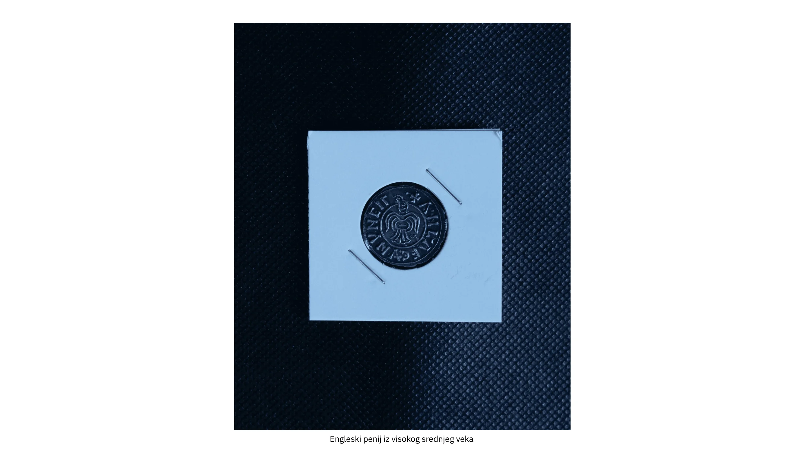

Tokom visokog srednjeg veka, Evropa je zapala u feudalizam nakon kolapsa rimskog monetarnog sistema. Većina populacije koristila je novčiće od bakra ili bronze niske vrednosti, koji su često bili podložni razblaživanju valute, što je ograničavalo trgovinu na velike udaljenosti.

Povratak kovanog novca kao sredstva plaćanja dogodio se postepeno, kulminirajući u 13. veku pojavom zlatnog florina u Firenci 1252. godine, praćenog zlatnim dukatom u Veneciji. Ovi zlatnici su bili široko korišćeni zahvaljujući ekspanziji trgovine i rastućoj potrebi za pouzdanim, međunarodno prihvaćenim sredstvima plaćanja.

U Engleskoj je monetarni sistem bio zaštićen od razvodnjavanja inovativnim fiskalnim politikama, kao što je porez na zemlju koji je uveo Vilijam Osvajač nakon 1066. godine, što je očuvalo kvalitet penija sterlinga. Ono što je važno razumeti ovde je da su suvereni tog vremena mogli devalvirati valutu kako bi finansirali državu, i **uvođenje ovog poreza omogućilo je da se valuta održi stabilnom i da se država finansira putem oporezivanja.**

Međutim, iskušenje da se profitira kroz monetarno razblaživanje dovelo je do kriza, kao u vreme vladavine Henrija I u 12. veku, kada je kvalitet kovanog novca drastično opao. Ozbiljne reforme, ponekad praćene nasilnim merama protiv falsifikatora, privremeno su obnovile poverenje u valutu.

Srednji vek je takođe video pojavu sofisticiranih finansijskih praksi, kao što je korišćenje štapova za brojanje u Engleskoj kako bi se zaobišla zabrana na lihvarenje i proširilo kreditiranje. Crkva nije bila naročito naklonjena zajmovima sa kamatom, pa su korišćene razne tehnike da se zaobiđe zabrana korišćenja kamate.

Ove inovacije bile su odgovor na hronični nedostatak metalnog novca i podstakle su pojavu embrionalnog finansijskog tržišta.

Krstaški ratovi su, u međuvremenu, stimulisali mediteransku trgovinu, podstičući razvoj međunarodnih razmena i novih bankarskih praksi, naročito kroz Red vitezova templara. Vitezovi templari su postali važni finansijski posrednici, omogućavajući krstašima da dobiju likvidnost daleko od kuće, nagoveštavajući savremeni evropski bankarski sistem.

Da bi se uspostavila veza sa Templarima, ovde dole možete posmatrati francuski srednjovekovni novčić, gde možete prepoznati prelepi krst u centru. Bilo je prilično uobičajeno da novčići iz ovog doba nose ovaj krst.

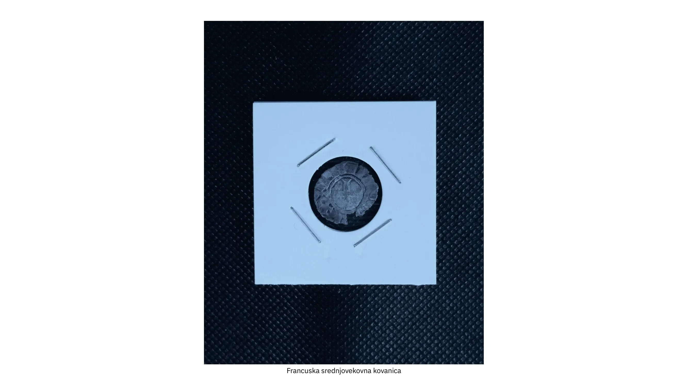

Konačno, velike krize kao što je Crna smrt (1346-1353) dovele su do dubokih ekonomskih transformacija. Oštar pad populacije doveo je do naglog porasta plata, prkoseći pokušajima vlade da održi prethodne nivoe naknada.

U isto vreme, Stogodišnji rat (1337-1453) primorao je države da usvoje agresivnije fiskalne politike kako bi finansirale svoje vojske, što je doprinelo slabljenju feudalnog sistema.

Srednji vek je tako bio obeležen stalnom tenzijom između potrebe za pouzdanim novcem za trgovinu i stalnog iskušenja vladara da razvodne novac radi trenutne dobiti. Ovaj sukob je duboko oblikovao evropski monetarni razvoj, postavljajući temelje za moderne ekonomske sisteme.

Da zaključim ovaj deo, želeo bih da dodam prilično zanimljivu anegdotu iz Engleske iz tog perioda. Ova anegdota je preuzeta iz knjige "Istorija novca" autora Glyn Davies.

Pominje se da je u Engleskoj prelazak na Parlament prebacio teret duga sa suverena na Parlament, što je rezultiralo hroničnom zaduženošću države. Pre toga, dug je opterećivao suverena.

Jednom kada je Parlament uspeo da preuzme deo ove moći stvaranja novca, to je omogućilo stvaranje dugoročnih dugova koje je snosio narod, a ne kralj. Pre toga, ako bi kralj bankrotirao ili ako bi došlo do promene kralja, dug bi bio ugašen zajedno s njim.

Trenutak kada stvaranje duga sprovodi Parlament, pojavljuje se koncept suverenog duga, jer je potencijalno neograničen tokom vremena. Dokle god država postoji, dokle god Parlament postoji, ovaj dug postoji, i morali su pronaći sve vrste načina za njegovo refinansiranje i raspoređivanje tokom vremena. To je velika promena paradigme, gde više nije kralj ili plemstvo garantovalo ili snosilo teret ovih dugova; sada je to bio Parlament, a samim tim i njegovi građani.

## Renesansa

<chapterId>1d1dfb05-70b4-5b7b-9708-373c2182950d</chapterId>

:::video id=4977b4f3-c7b2-41a5-ad7b-a96a8cca4092:::

Sada smo stigli do dela kursa gde govorimo o periodu poznatom kao Renesansa. Odvija se u pozadini tragične krize, sa meteorskim širenjem kuge putem buva na pacovima koji su se ukrcavali na brodove. Ova tragedija, međutim, informiše nas o rastu trgovine i putovanja u visokom srednjem veku. Ranije u ovom periodu, nije se toliko ljudi kretalo tako daleko i tako brzo.

### Florin Firence

Povratak zlatnog kovanog novca u Evropu tokom Renesanse označava fundamentalnu prekretnicu u monetarnoj istoriji. **Sve je počelo sa Florinom iz Firence 1252. godine, prvim značajnim zlatnim novčićem kovanom u Evropi od pada Rima**. Sa svojom izuzetno konstantnom težinom i čistoćom (oko 3,5 grama čistog zlata), florin je ostao nepromenjen četiri veka i brzo postao suštinska panevropska monetarna referenca.

Ispod možete videti reprodukciju Florina: zlatni Florin napravljen od kalaja i utisnut od strane francuskog umetnika koji pravi odlične komade, ručno gravirane i kovan.

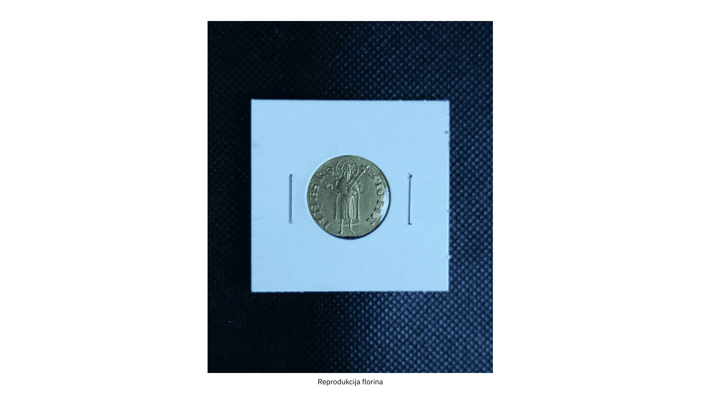

Ovaj povratak zlatnom novcu bio je vođen specifičnim kontekstom: kolaps Vizantijskog solidusa i ekonomski pad muslimanskog sveta zbog mongolskih invazija stvorili su monetarni vakuum u međunarodnoj trgovini.

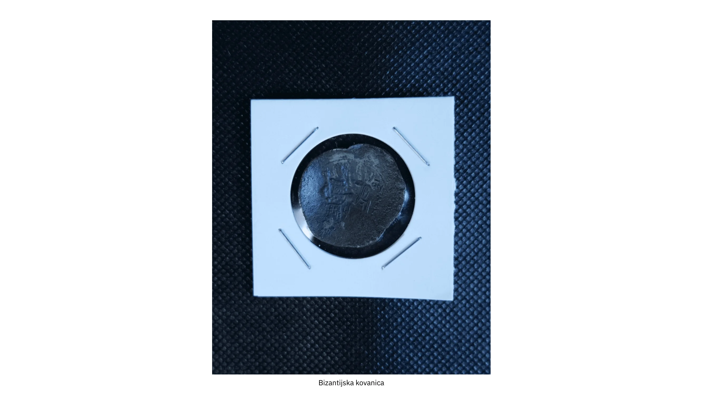

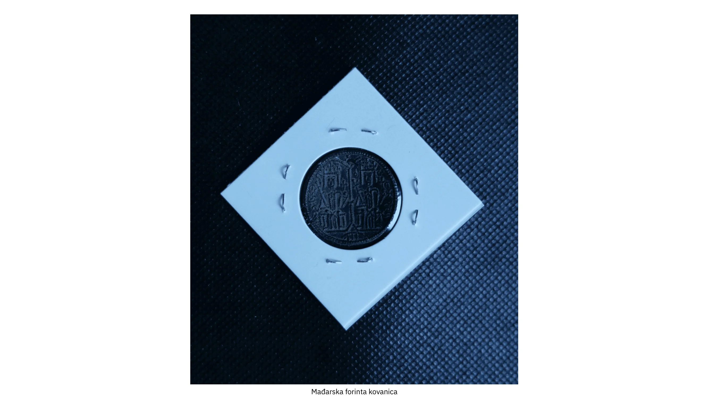

Prva slika iznad prikazuje vizantijski novčić koji smatram prilično zanimljivim. Napraviću paralelu sa novčićem iz istog perioda iz Mađarske (druga slika iznad). Mađarski novčić je u obliku šoljice, poput minijaturne činije. Ikonografija prikazuje religijske figure prikazane kao kraljevi koji drže krstove jedan pored drugog. Ovaj komad je u obliku činije i potiče iz Mađarske.

Bilo je prilično uobičajeno kopirati novčiće iz drugih zemalja. Kako su vizantijski novčići bili opšteprihvaćeni, druge zemlje bi ih često kopirale. Kao što možete videti kada ih uporedite jedan pored drugog: ovi komadi su veoma slični.

Severna Italija, posebno Firenca, Venecija i Đenova, iskoristile su ovaj kontekst da pokrenu nove stabilne valute - kovanice sa stabilnim sadržajem plemenitih metala. Venecija je sledila primer Firence kovajući dukat 1270. godine, valutu koja je bila gotovo identična florinu i široko korišćena u mediteranskoj trgovini.

Florin je postao prva međunarodna rezervna valuta, usvojena u preko 150 evropskih gradova pre kraja 14. veka. Sa stvaranjem velike firentinske bankarske mreže, predvođene porodicom Mediči, monetarno i računovodstveno upravljanje je temeljno modernizovano, čak smanjujući potrebu za fizičkim transportom zlata.

To je još jedna veoma zanimljiva tačka. Bilo je vremena kada su mnoge pošiljke novčića bile izgubljene tokom morskih putovanja. Ovaj tehnološki napredak - registri sa dvostrukim knjigovodstvom - omogućio je stvaranje skripturnog novca. Ovo je omogućilo smanjenje broja poravnanja novčićima i umesto toga korišćenje sistema pisanih unosa, što u velikoj meri smanjuje rizik od gubitka novca tokom transporta.

Monetarni razvoj je takođe bio praćen značajnom evolucijom u bankarskim metodama. Inspirisani delimično kontaktom sa muslimanskim bankarskim praksama tokom Krstaških ratova, srednjovekovna Evropa je doživela pojavu rudimentarnih bankarskih sistema u Firenci, Veneciji, Barseloni i Đenovi već u 13. veku. Vitezovi templari, verski i vojni red, već su razvili sistem koji je omogućavao krstašima da putuju bez nošenja svog bogatstva sa sobom.

Oni bi položili sredstva u templarskoj kancelariji u svojoj zemlji i zatim bi mogli putovati sa oblikom pisma i prikupiti novčiće po dolasku na svoje odredište krstaškog pohoda.

To je značilo da nismo morali nositi sa sobom kovanice od plemenitih metala.

Takođe, tokom ovog perioda, Evropa je postala svesna postojanja papirnog novca u Kini, zahvaljujući putovanju Marka Pola u 13. veku. Međutim, razvoj novčanica bi sačekao nekoliko vekova, jer je Evropa prvo želela da usavrši metode kovanja metalnog novca. Leonardo da Vinči, blizak Luki Paćioliju, poznatom ovlašćenom računovođi, aktivno je doprineo poboljšanju presa za novac, promovišući bržu i ujednačeniju proizvodnju kovanica.

Pozivamo se na tehniku udarca klatnom koja je ranije pomenuta u kursu. Ova metoda je omogućila proizvodnju ujednačenijih novčića u poređenju sa udarcem čekićem i, što je važno, omogućila je natpise oko ivice novčića, kao što sam ranije pokazao. Onaj ispod je evropski talir iz 1793. godine, koji jasno pokazuje natpis na ivici.

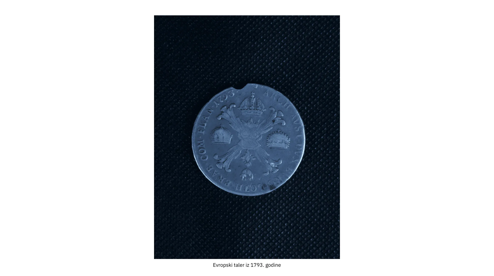

Međutim, u 15. veku Evropa je doživela ozbiljnu krizu valute, sa opštim pogoršanjem sadržaja srebra u evropskim valutama, koje je palo na manje od 5% oko 1450. godine.

Od 16. veka nadalje, monetarni centar gravitacije pomerio se ka Španiji, podstaknut unijom kraljevina Aragona i Kastilje, krajem Rekonkiste i velikim pomorskim otkrićima kao što je bilo Kristofera Kolumba 1492. godine. Ogroman priliv srebra iz američkih rudnika duboko je poremetio evropske i globalne ekonomske ravnoteže, podstičući inflaciju i nove geopolitičke tenzije.

Renesansa je takođe označila veliku umetničku evoluciju u kovanju novca, sa kovanicama kao što je talir (Joachimsthaler), poreklo termina "dolar". Ove velike srebrne kovanice odražavaju nove umetničke i mehaničke tehnike kovanja omogućene tehničkim inovacijama iz severne Evrope.

Konačno, finansijska renesansa je donela prelaz ka ekonomskoj modernosti, sa razvojem bankarstva, kredita i finansijskih tržišta, i pojavom prvih oblika modernog kapitalizma u velikim trgovačkim gradovima Amsterdamu, Londonu i Stokholmu, postavljajući temelje za međunarodni finansijski sistem kakav danas poznajemo. I to je tema našeg sledećeg videa.

# Oduzimanje novca od strane države

<partId>17cfb1b4-5bc1-53e0-b035-05c7cf76be92</partId>

## Evolucija svetskih rezervnih valuta

<chapterId>d65cc352-e7ca-5f03-9b23-dd1fae5c0395</chapterId>

:::video id=82710062-8fff-426c-93af-923c08d82233:::

### Istorijski značaj plemenitih metala

Dobrodošli u ovaj deo o pojavi rezervnih valuta i centralnih banaka. Kao prvu tačku ovog novog odeljka, fokusiraćemo se na evoluciju globalnih rezervnih valuta.

Plemeniti metali, posebno zlato i srebro, dugo su smatrani osnovom bogatstva i moći u carstvima. Žeđ za zlatom oduvek je bila dominantna pokretačka snaga, a priliv plemenitih metala imao je najdirektniji i najočigledniji uticaj na monetarni razvoj u Evropi. U srednjovekovnim i ranim renesansnim vremenima, ova opsesija zlatom i srebrom bila je posledica teškoće zadržavanja vrednosti u drugim oblicima robe, kao i snažne potražnje od strane stranih sila, posebno u trgovini sa Orijentom.

Tokom vekova, nekoliko carstava su se smenjivala kao globalni ekonomski centri. Zemlja koja dominira svetskom trgovinom tokom određenog perioda obično dobija status rezervne valute. To uključuje:

- Španija i Portugal (15. i 16. vek)

- Ujedinjene Provincije (Nizozemska) u 17. veku

- Francuska i Velika Britanija u 18. i 19. veku

- Sjedinjene Američke Države u 20. veku

### Portugalski procvat i Real (1450-1530)

**Portugal** je dominirao svetskom trgovinom u drugoj polovini 15. i početkom 16. veka, sa **portugalskim realom**, srebrnim novčićem relativno ujednačene težine. Portugalci su, zahvaljujući svojim napredcima u navigaciji, pronašli nove morske puteve do Afrike, Azije i Novog sveta. Vojne tvrđave i trgovačke stanice su se množile od Afrike do Kine (Makao).

Kao odgovor na evropsku potražnju za zlatom i srebrom, "stalna motivacija za velika otkrića bila je komercijalna dobit, posebno potraga za zlatom i srebrom." Međutim, Portugalsko carstvo, prekomerno prošireno i suočeno sa konkurencijom od strane Holanđana, Engleza i Francuza, počelo je da opada.

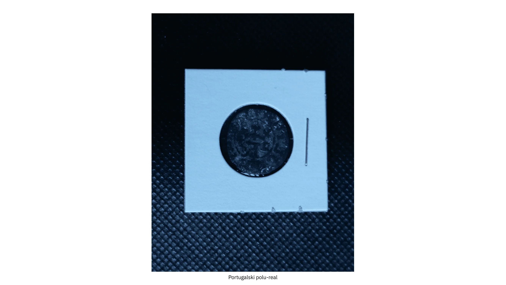

Ovde iznad možete videti portugalski pola-reala iz vremena ovih pomorskih osvajanja.

### Španski apogej i španski dolar (1535-17. vek)

Sa osvajanjem Novog sveta, **Španija** je postala dominantni igrač. Njen monarh, kontrolišući gigantske rudnike srebra (Potosí u Boliviji, Zacatecas u Meksiku), uspeo je da kuje novac u čistom srebru, čime je izbegao devalvaciju sopstvene valute: **španskog reala.**

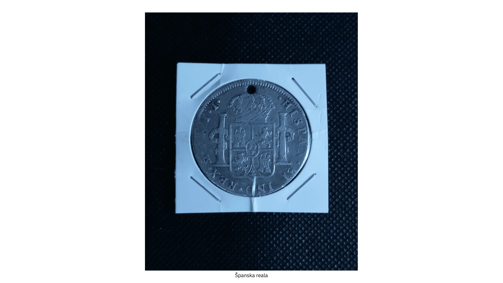

Španski real, takođe poznat kao "komad od osam", dobio je svoj nadimak jer je često bio sečen na osmine kako bi se stvorili manji novčići. Takođe je bio poznat kao **španski dolar**. Novčić koji vidite iznad potiče iz 1814. godine, što ga čini nešto novijim primerkom. Međutim, prvi španski dolari nisu bili tako rafinirani; bili su kovani čekićem i generalno manje okrugli i oštri.

Ono što je posebno zanimljivo jeste da je španski dolar služio kao međunarodna rezervna valuta u to vreme. Španske vlasti su takođe izdavale svoju lokalnu valutu, maravedi, i redovno prilagođavale količinu novca kroz povlačenja. Na primer, bakarni ili bronzani novčić koji je u početku vredeo jedan maravedi mogao je biti povučen i označen sa "2," zatim kasnije sa "4," i tako dalje, potencijalno dostižući "8." Na fotografiji visoke rezolucije jasno možete videti "8" utisnut na novčiću. Ova metoda je efikasno proširila količinu novca... što je neizbežno dovelo do inflacije.

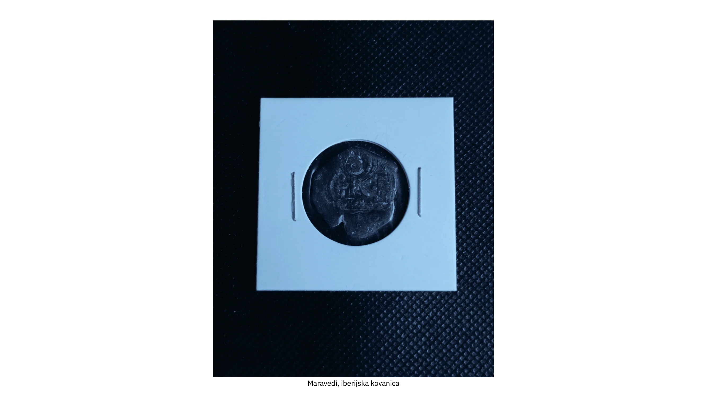

Ako pogledamo istoriju rezervnih valuta, pojavljuje se zanimljiva tačka: imperije nisu inflacionirale svoje valute sve dok su zadržavale status rezervne valute. **Tek na kraju svoje dominacije su završavale devalvacijom, gubeći ovu privilegiju, koja je zatim prelazila na novu imperiju**.

U Španiji, španski dolar je dominirao svetskom trgovinom skoro 200 godina, posebno između Kine i Evrope. Ovi novčići su se čak mogli naći u kineskim lukama. I tu dobijamo mig iz istorije: američki dolar direktno potiče od ove valute. Kada su Sjedinjene Američke Države formirane 1792. godine, donet je zakon za kovanje sopstvene valute, a prvi dolari su kreirani po uzoru na španski dolar, kako po imenu, tako i po veličini novčića.

Da bismo vam dali ideju o njegovoj vrednosti, američki dolar je prvobitno bio srebrni novčić težak skoro jednu uncu, ili između €30 i €40 u današnjem novcu, za razliku od papirnog novca koji danas poznajemo. Što se tiče španskog dolara, on je cirkulisao tako široko da se smatra prvom pravom globalnom valutom.

Međutim, ovaj priliv plemenitih metala iz Amerike izazvao je inflaciju u Evropi. Tokom Revolucije cena (oko 1540-1640), troškovi života u Engleskoj su se povećali sedam puta. U Španiji, obilje srebra imalo je perverzan efekat resurskog prokletstva, ometajući razvoj čvrstih bankarskih institucija.

Nakon toga, Španija se suočila sa brojnim vojnim sukobima (Flandrija, Nizozemska, Tridesetogodišnji rat), a njene finansije su postepeno propadale. Umesto da devalviraju svetski poznati srebrni novčić, uzastopni vladari su odlučili da ne isplate ili depreciraju bakarni novčić (vellón) koji je koristilo lokalno stanovništvo. Ovo je ono što sam ranije opisao sa Maravedisima.

### Uspon Holandije (17. vek)

Nakon iberijskog vrhunca, **Holandija** se pojavila kao nova trgovačka sila u 17. veku. Pomorska trgovina, VOC (Holandska istočnoindijska kompanija) i osnivanje **Amsterdamske berze Exchange** (inspirisane onom u Antverpenu) uspostavili su ovu trgovačku republiku kao centar.

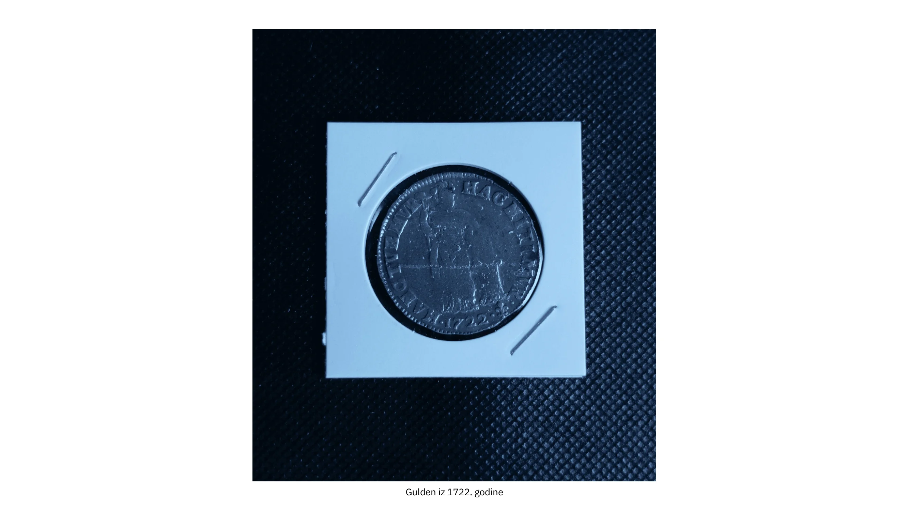

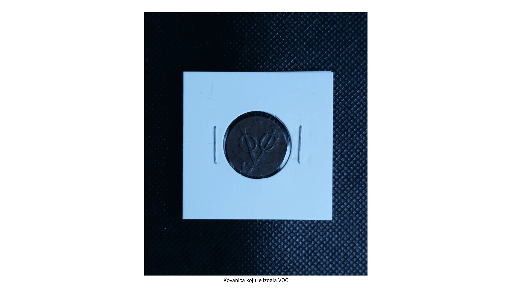

Na prvoj fotografiji iznad, možete videti Gulden iz 1722. godine (prelep srebrni novčić), dok je na drugoj novčić izdat od strane VOC-a.

VOC je bila izuzetno moćna kompanija za svoje vreme: imala je svoju vojsku i čak je izdavala sopstvenu valutu.

Holanđani su izmislili moderni kapitalizam, koji je započeo kao sredstvo za raspodelu rizika u rizičnim poduhvatima kao što su ekspedicije u Novi svet ili potraga za novim trgovačkim putevima. Akcionarska društva omogućila su nekoliko investitora da udruže svoj novac i podele rizik. Da bi se olakšale ove razmene, bilo je potrebno stvoriti institucije sposobne za pregovaranje i razmenu ovih hartija od vrednosti. Tako su 1602. godine stvoreni prvo akcionarsko društvo i berza.

Holandska valuta, **Gulden**, stekla je kredibilitet zahvaljujući svojoj čistoći u srebru, a zatim i usvajanju od strane Banke Amsterdama (1609), gde su depoziti postali preferirani oblik novca u Evropi. Ovo je veoma važna tačka za pomenuti. Da, naravno da su postojali novčići, ali ono što je zaista činilo novac u to vreme bio je oblik skripturalnog novca. Zapravo, veliki deo svetske trgovine prolazio je kroz knjige Banke Amsterdama. Ovo je bio pravi bankarski proboj: međunarodna trgovina više se nije nužno obavljala fizičkim novčićima, već direktno kroz knjigovodstvene zapise banke.

Ovaj period prosperiteta obeležen je velikim prilivom zlata i srebra, posebno iz drugih zemalja koje su praktikovale inflaciju ili monetarnu kontrolu. Postoji jedan zanimljiv lik za pomenuti: **Thomas Gresham**. U to vreme, radio je za englesko plemstvo u Nizozemskoj, upravljajući protokom novca između dve zemlje. Upravo taj isti Gresham nam je ostavio čuveni **"Greshamov zakon"**.

Ipak, Holandsko carstvo je takođe na kraju ostalo bez snage. Ratovi sa Engleskom, devalvacija guldena u vremenima sukoba i konkurencija drugih sila (Francuska i Engleska) označili su kraj holandske hegemonije. Nakon Četvrtog anglo-holandskog rata (1780-84), pad guldena kao rezervne valute postao je nepovratan.

### Francuska moć, ambicije i neuspesi (17.-18. vek)

Pod Lujem XIV, **Francuska** je postala najveća kontinentalna sila u Evropi. Međutim, francuska valuta nikada nije postigla status dominantne reference: brojne devalvacije, visoki porezi i skupi ratovi (Liga iz Augsburga, Rat za špansko nasleđe, itd.) teško su opteretili stabilnost monetarnog sistema.

Prvi veliki eksperiment sa papirnim novcem sproveo je John Law (1716-1720). Banque Générale je izdala novčanice podržane obećanjima državnog duga. Ova šema je dovela do špekulativnog balona i kolapsa (Misisipi balon) 1720. godine. Ova katastrofa je ostavila Francusku sa trajnim nepoverenjem prema papirnom novcu. Upravo ovo katastrofalno iskustvo je dovelo do toga da Richard Cantillon postane bogat zahvaljujući ovom sistemu iznošenja principa, sada poznatom kao Cantillonov efekat, gde štampanje novca obogaćuje one koji imaju pristup štamparskoj presi.

Kada je ovo nepoverenje konačno izbledelo, usledila je još jedna francuska papirna fiijaska: revolucionarni **asignati**. Izdavani od 1790. godine na osnovu konfiskacije crkvene imovine, ovi asignati su doživeli galopirajuću hiperinflaciju, čineći ih zvanično prvom hiperinflacijom u istoriji koja je premašila 50% mesečno. Godine 1795, iako je njihova nominalna vrednost bila umnožena, trgovali su se za samo nekoliko procenata svoje početne vrednosti.

Strožiji zakoni su pokušali nametnuti asignat, ali bez uspeha. Vlada je pokušala da ga nametne, idući čak dotle da preti smrću onima koji ga ne prihvate, i prisiljavajući trgovce da ostanu otvoreni. Ali naravno, na kraju, to nije uspelo.

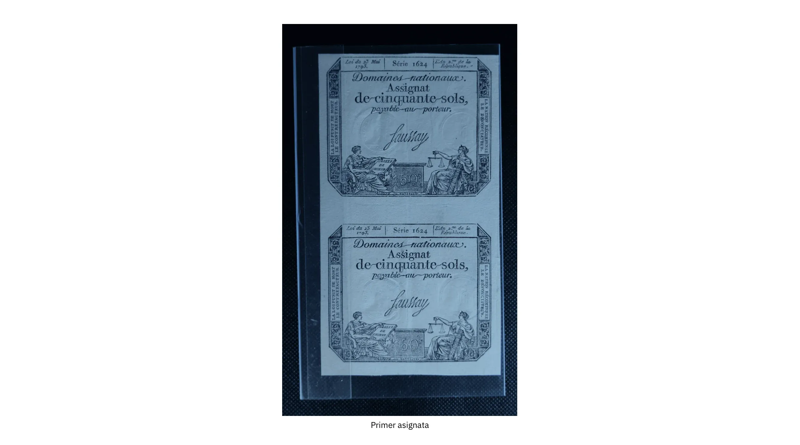

Kako je ovaj papirni novac zamenio sav kvalitetan kovani novac od plemenitih metala, u skladu sa čuvenim Greshamovim zakonom, usledila je nestašica kovanica. Da bi kovali nove kovanice, koristili su metal zvona zaplenjen od sveštenstva. Ovde dole možete videti prelep komad metala zvona, izrađen od recikliranog bakra topljenjem kovanica oduzetih od sveštenstva.

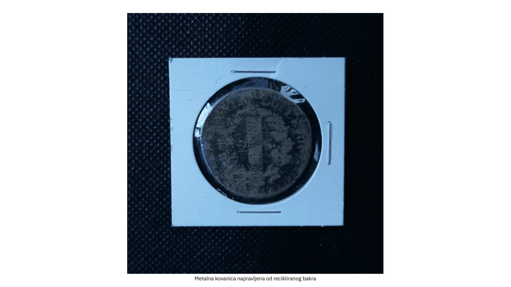

### Britanska dominacija (18. - početak 20. veka)

**Engleska**, nakon što je pretekla Nizozemsku, postala je dominantna sila u 18. veku. Funta sterlinga je najstarija valuta koja se još uvek koristi, prvobitno povezana sa funtom srebra. Postepeno, njen status je postajao sve jači, podržan finansijskom i fiskalnom revolucijom: parlamentarnom monarhijom, snažnom sposobnošću prikupljanja poreza i osnivanjem Banke Engleske 1694. godine.

Nakon niza ratova protiv Francuske, Ujedinjeno Kraljevstvo je izašlo kao pobednik 1815. godine (Waterloo), potvrđujući svoju nadmoć. Tokom 19. veka, funta sterlinga je služila kao svetska rezervna valuta. Na svom vrhuncu, sa samo 2,5% svetske populacije, Britanija je proizvodila 20% globalnog prihoda i kontrolisala skoro četvrtinu zemljine površine.

**Industrijska revolucija** i usvajanje **zlatnog standarda** (1717. ili 1718, pod nadzorom Isaka Njutna u Kraljevskoj kovnici) ojačali su kredibilitet funte. Banka Engleske je usvojila zlatni standard od 4,25 funte po unci zlata, omogućavajući vlasnicima novčanica da svoje novčanice zamene za zlato.

Međutim, Prvi svetski rat (1914-1918) je okončao ovaj sistem. U roku od nekoliko nedelja, sve glavne zaraćene sile su obustavile konvertibilnost zlata. Britanska imperija, a kasnije i funta, izašle su iz Drugog svetskog rata u oslabljenom stanju, ustupajući mesto američkom dolaru u 20. veku.

I kao artefakt, možete videti neke prelepe i zanimljive komade ispod. Ovo su monetarni tegovi. Prvi je suveren: najraniji prikazi funte. Imam samo novčane tegove da predstavim ove kovanice jer ne mogu priuštiti da kupim pravi suveren. Da bismo ih izmerili, koristili smo vage i zatim postavili monetarni teg ekvivalentan vrednosti suverena na drugu stranu.

Suveren je bio monetarni novčić - zlatni novčić koji je prvobitno vredeo jednu funtu.

Prethodila je čuvenom suverenu gvineja, koja je funkcionisala na istom principu. Gvineja je dobila ime po plemenitim metalima koje je sadržala, a koji su poticali iz regiona Gvineje.

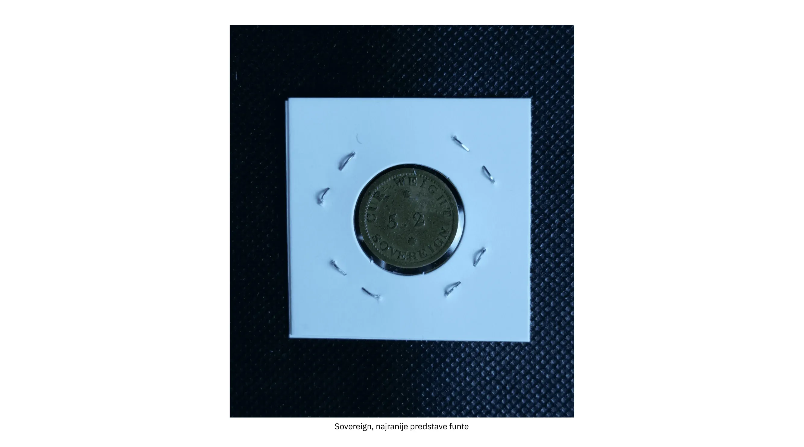

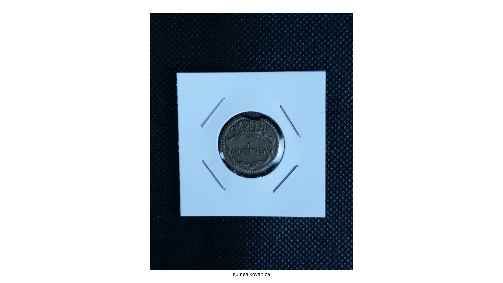

## Pojava centralnih banaka

<chapterId>15777771-1e28-55f7-a400-69868a47079b</chapterId>

:::video id=7661b7b5-e00f-48f3-b69a-6fb2eb5ebba4:::

Nastavljajući se na ovaj deo o istoriji prvih rezervnih valuta i njihovoj evoluciji, evo segmenta o pojavi centralnih banaka. Prati sličan put kao pojava rezervnih valuta, ali se malo više fokusira na bankarske tehnologije tog vremena.

### Počeci banaka i proto-banaka

Još u 13. veku, Italijani (Firenca, Đenova, Venecija...) su razvili tehnike dvojnog knjigovodstva. Kasnije je **Antverpen** (16. vek) postao vodeći finansijski centar severne Evrope, ulogu koju je kasnije preuzeo **Amsterdam**, zahvaljujući Amsterdamskoj berzi Exchange (1609), gde su se trgovale akcije VOC-a.

Antwerp je bio domaćin trgovačkih sajmova gde su se trgovci često okupljali da bi izmirili dugove, što je dovelo do izuma novih finansijskih instrumenata. Račun ispod, datiran 1761. godine i novijeg datuma, je **menica**. Sadrži ručno ispisane detalje, zajedno sa natpisima na poleđini, što ga čini veličanstvenim artefaktom iz tog perioda.

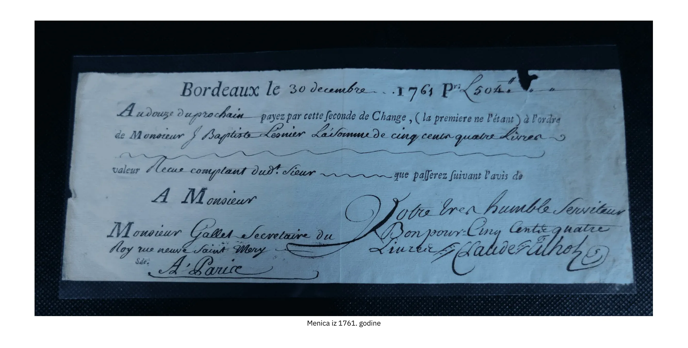

Ova efervescencija dovela je do stvaranja sofisticiranijih bankarskih institucija. **Lombardni bankari** i kasnije holandski trgovci usavršili su kreditne instrumente (menice, zadužnice, itd.). Savremeni bankarski sistem zasnovan je na ovoj ideji: novac može biti kredit, ne samo metal.

Kao što možete videti, ovo nas vraća na naše prvobitno pitanje o poreklu novca.

Da li novac proizilazi iz robe koja nastaje iz potrebe za razmenom, ili proizilazi iz kredita? Tragovi ovoga se još uvek mogu pronaći u ovom delu.

### Švedski primer: Stockholms Banco i Riksens Ständers Bank

Hajde da pređemo na Švedsku, gde je stvorena prva centralna banka.

**Švedska** je bila pionir u centralnom bankarstvu: 1657. godine, Johan Palmstruch je osnovao **Stockholm Banco**, ovlašćen da pozajmljuje više od svojih metalnih rezervi, čime je označen početak bankarstva sa [delimičnim rezervama](https://planb.academy/resources/glossary/fractional-reserves). Ali prekomerno izdavanje novčanica dovelo je do panike i navale na banku 1663. godine. Pa, pa...

Godine 1668. osnovana je Riksens Ständers Bank, prva prava centralna banka na svetu, u Stokholmu. Međutim, i ona je pretrpela krize (1709, 1715...) povezane sa zloupotrebom novčanica, često radi finansiranja ratova kraljevstva.

### Neuspešni puč Džona Lawa

Hajdemo u Francusku, gde ponovo nalazimo našeg voljenog Džona Lawa.

**John Law**, Škot, ubedio je Regenta (vojvodu od Orleana) da osnuje privatnu banku, Banque Générale (1716), ovlašćenu da izdaje papir protiv zlata, srebra i državnih dugova. Postala je Banque Royale (1718) i pomogla je akcijama Mississippi Company da naglo porastu.

Kada je stvarnost sustigla spekulacije, **panika je bila pogoršana odlukom da se zabrani držanje zlata i primora na korišćenje Lawovih novčanica**. Pa, pa...

Konačno, balon je pukao 1720. godine, izazivajući kolaps koji je uništio kredibilitet papirnog novca u Francuskoj na duže vreme.

### Banka Amsterdama, uspon pionirskog modela

Sada smo prebačeni u Amsterdam 1609. godine, gde je **Banka Amsterdama** (Wisselbank) preuzela kontrolu nad čuvanjem i konvertibilnošću novca u Amsterdamu. Zabranila je cirkulaciju privatnih novčanica i nametnula deponovanje metalnih kovanica u svojim trezorima. Malo po malo, preuzeli su kontrolu nad valutom. Zabranili su menjačima novca da drže kovanice kod sebe. Menjači novca su radili ceo dan i morali su da deponuju svoje kovanice u trezore Banke Amsterdama na kraju dana. Kao što sam već pomenuo, nije nužno metalni novac bio korišćen u međunarodnoj trgovini. To je bio skripturalni novac na knjigama banke.

Zahvaljujući holandskoj trgovačkoj moći, banka je igrala ulogu prve de facto "centralne banke", stabilizujući svetsku trgovinu. Vremenom je, međutim, odobravala neosigurane zajmove VOC-u i na kraju ostala bez metala za podršku svojim računima. Godine 1790. ispostavilo se da je pozajmila velike sume VOC-u i praktično proglasila bankrot, uništavajući kredibilitet guldena. Pa, pa...

### Banka Engleske, osnivački akt modernog bankarstva

U Engleskoj 17. veka, zlato i srebro su čuvali zlatare, koji su izdavali priznanice. Ova delimično decentralizovana organizacija pokazala je svoje granice kada se Kruna našla u ogromnoj potrebi za finansiranjem rata protiv Francuske.

Godine 1694, osnovana je **Banka Engleske (BoE)**. Banka Engleske je tako rođena iz braka iz koristi između londonske poslovne zajednice i vlade, koja je očajnički tražila sredstva za rat.

Banka je dobila monopol na izdavanje novčanica u Engleskoj (ojačan 1708, 1742, itd.). Od tada su papirni novac podržan zlatnim rezervama i kovanice cirkulisali zajedno. Ovo je važna tačka za razumevanje postepenog preuzimanja novca od strane državnih institucija. Prvo, Banka Amsterdama je sprečila menjače da zadržavaju kovanice i primorala ih da ih vrate Banci. U Engleskoj, privatnim bankama je bilo zabranjeno da izdaju sopstvene novčanice koje se mogu zameniti za zlato.

Dozvolili su privatnim bankama da izdaju novčanice, ali su se one mogle menjati samo za račune Banke Engleske.

Računi Banke Engleske, funte sterlinga, mogli su se zameniti za zlato. Ovo je dodalo treći sloj valuti. Dakle, imamo zlato kao osnovu, zatim račune Banke Engleske, i na kraju račune privatnih banaka na vrhu. Pre toga, privatne banke su mogle izdavati sopstvene račune koji su se mogli zameniti za zlato. Ovo je još jedna faza u postepenom preuzimanju valute od strane državnih institucija.

Banka je finansirala državu velikim kreditima i strukturirala ogroman javni dug koji je finansirao ekonomski bum.

Ovaj model je konsolidovan tokom 18. i 19. veka, do tačke kada je funta postala svetska rezervna valuta, pod pečatom Banke Engleske i zlatnog standarda.

**Svetske rezervne valute** su se smenjivale kroz vekove, vođene ekonomskom, trgovinskom i vojnom moći države ili carstva: Portugal, Španija, Holandija, zatim Velika Britanija, pre nego što su Sjedinjene Američke Države zavladale u 20. veku. U svakom slučaju, vidimo sličan ciklus: ekonomska ekspanzija, trgovinski uspeh, međunarodno prihvatanje valute, zaduženost, skupi ratovi, zloupotreba stvaranja novca ili kredita, i na kraju pad.

**Pojava centralnih banaka** bila je postepen proces. Ove institucije često su nastajale u kontekstu skupih ratova, omogućavajući državi da se finansira putem duga. Kada je usvojen zlatni standard (Engleska, 17.-19. vek), pružio je privid stabilnosti, sve dok veliki svetski ratovi 20. veka nisu doveli do postepenog napuštanja konvertibilnosti zlata. Moć kovanja novca tako se pomerila sa kraljevskog monopola ka složenijim entitetima, prvo privatnim (zlatarima, bankarima), zatim polujavnim (centralnim bankama), odražavajući evoluciju monetarnog suvereniteta ka institucionalizovanim, globalizovanim oblicima.

Dakle, ovo je ono što sam ranije opisivao. Često smo prebacivali teret suverenog duga direktno na centralne banke ili na dozvolu za kreiranje novca od strane pravnih institucija, kao što je Parlament.

A najvažnija činjenica ovde je da **smo prešli sa duga koji bi mogao nestati kroz bankrot suverena na dug koji je uglavnom pao na leđa stanovništva**.

## Put do fiat sistema

<chapterId>27a98545-d350-56ee-a200-92468e6b9b33</chapterId>

:::video id=e27a753e-aeee-4307-a65c-9506aab380a1:::

Sada smo stigli do kraja ovog kursa o istoriji novca, i da bismo ga zaključili, želeo bih da predložim dve teme. Prva tema su različite faze koje su dovele do našeg trenutnog sistema fiat valute. Ponovo ćemo pregledati činjenice iz odeljka 5 o stvaranju centralnih banaka, i dodaćemo koncept američkog dolara, koji je u konačnici trenutna rezervna valuta. Pogledaćemo kako se razvijao, kako je dolar nastao, kako se razvijao, kako se menjao, kroz koje faze je prošao da bi postao fiat sistem, jer je poreklo dolara srebrni novčić.

Zatim, odmah nakon toga, daću vam kratak segment o istoriji finansija, kako bih vam pomogao da razumete kako smo stigli do države blagostanja. Dakle, pogledaćemo dva predmeta: kako smo stigli do fiat sistema, a zatim odmah nakon toga, kako nas je evolucija finansija dovela do koncepta države blagostanja.

### Evropski temelji modernog bankarstva

Hajde da se vratimo u 13. vek sa florinom. Da bismo razumeli kako smo stigli do fiat modela, moramo početi sa 13. vekom. Uz florin, u isto vreme se pojavila tehnologija sa Medičijima, koncept menica.

Zatim je došla antverpenska berza, sa svojim konceptom diskontovanja i menica.

Zatim, kao što smo videli, imali smo VOC, prvu berzu u Amsterdamu. Ovo je označilo rađanje kapitalizma, sa deonicama kompanija i razmenom deonica. Amsterdamska banka je tada dekretom nametnula korišćenje depozita. To je značilo da su kovanice morale biti deponovane na kraju dana. Menjači novca više nisu mogli da drže kusur u obliku kovanica.

Zatim je došlo do stvaranja Banke Engleske iz potrebe za stvaranjem duga kako bi se finansirao rat krajem 17. veka. U to vreme, privatne banke su postale treći sloj novca. Usput, ceo ovaj deo, od florina do pojma stvaranja centralne banke, izuzetno je dobro sažet u čuvenoj knjizi Nika Batije "Layered Money", koju sam imao sreću da prevedem sa nekoliko kolega. Odlično smo obavili posao prevođenja kako bi frankofoni širom sveta mogli da imaju koristi od ovih učenja.

Dakle, nalazimo se na kraju 17. veka. Banka Engleske je osnovana kako bi finansirala rat.

Privatne banke su preuzele treći sloj valute. U stvari, računi privatnih banaka više nisu bili otkupljivi u zlatu: računi Banke Engleske su bili otkupljivi u zlatu. Ovo pokazuje preuzimanje moći razmene od strane institucije koja je Banka Engleske.

Zatim je došla panika iz 1776. Svi su pohrlili ka vrhu novčane piramide. To znači da je 1776. godine došlo do navale na banke, i svi ljudi koji su imali papire trećeg sloja, tj. privatne bankovne račune, pokušali su da dobiju račune Banke Engleske, a zatim da dobiju zlato, ali očigledno nije bilo dovoljno zlata u trezorima. Proglasili su neku vrstu bankarskog praznika kako bi izbegli vraćanje zlatnih računa, i to je dovelo do pojave koncepta zajmodavca poslednje instance.

### Evolucija američkog dolara

Prešli smo sa florina na osnivanje Banke Engleske. Naravno, između su bili Prvi i Drugi svetski rat, ali ranije, 1796. godine, dešavanja su se odvijala i na drugoj strani Atlantika. Godine 1776, Amerika je još uvek bila britanska kolonija, a kolonije su koristile ovu papirnu valutu. Ispod je prikazana dvodelna novčanica iz Konektikata iz 1776. godine.

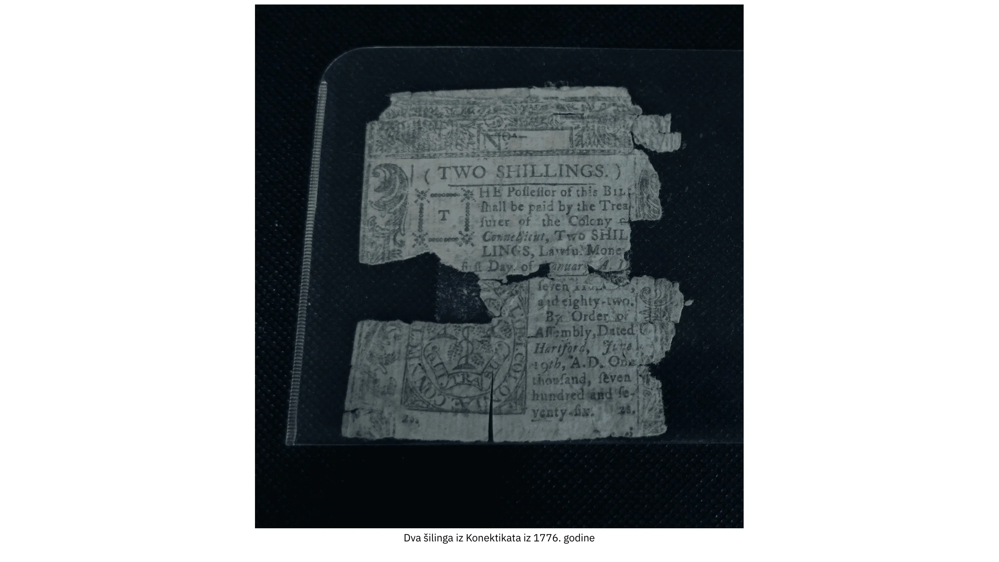

Pre nego što su objavile rat Engleskoj i na kraju izdale sopstvenu valutu, kolonije su koristile ovu papirnu valutu, zajedno sa španskim dolarom za gotovinske transakcije. U stvari, termin "dolar" je ostao da označava američki dolar.

Ako se ne varam, 1792. godine doneli su zakon koji im je omogućio da kuju novac. Kao primer, onaj ispod je američki dolar modernog doba.

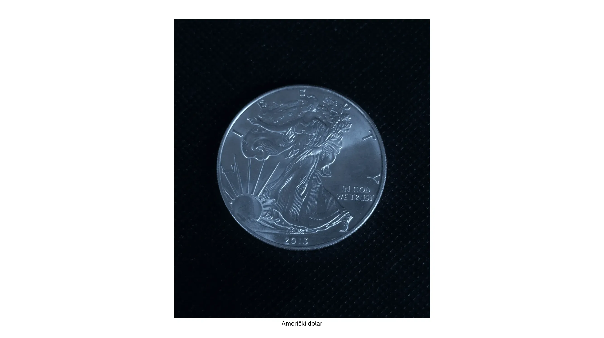

Pa, očigledno, nema nominalnu vrednost od samo jednog dolara; vredi oko 30 ili 40 dolara, jer predstavlja uncu srebra. Njegova vrednost varira u zavisnosti od cene srebra, obično ga postavljajući na najmanje 30 ili 40 američkih dolara. Danas, naravno, papirni dolar zadržava samo svoju nominalnu vrednost od jednog dolara, ali u to vreme, američki dolar je bio zasnovan na ovoj vrednosti srebra.

Hajde da sada razgovaramo o Građanskom ratu u Americi. Konfederati su štampali novac, koji je bio hiper-inflacioniran. Ovaj fenomen nije uključen u zvaničnu Hanke-Krus listu, jer nije dostigao stopu hiperinflacije od 50%. Međutim, doživeo je mesečnu stopu inflacije od 40%, što ukazuje na to da je tokom rata štampana značajna količina valute.

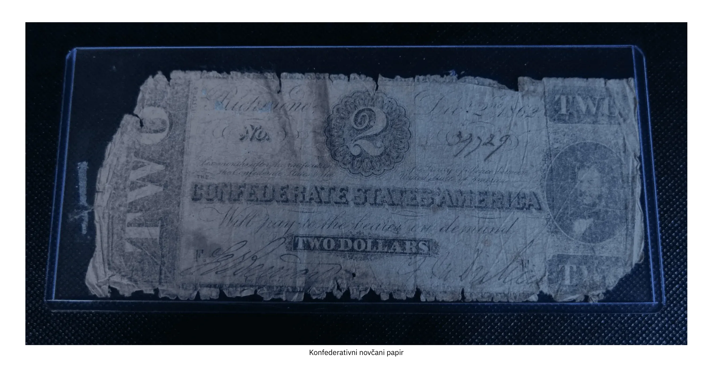

Njihovi protivnici sa severa takođe su imali dolare. Iznad, mogli ste videti konfederacijske dolare, dok ispod možete posmatrati severnjačke dolare. Zvali su ih "greenback" jer je poleđina bila zelena.

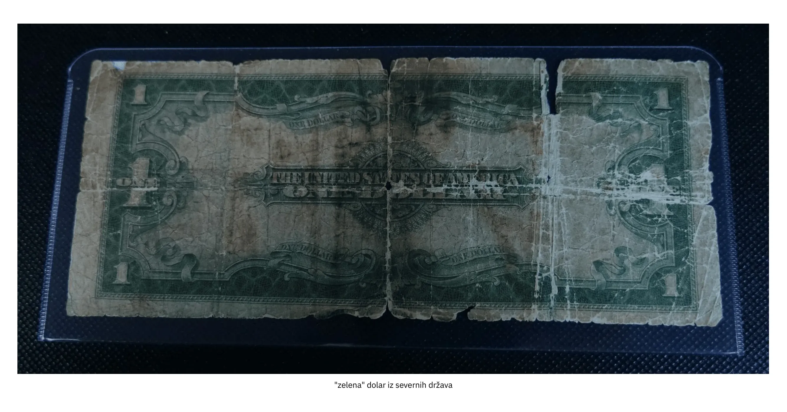

I pozivam vas da uporedite razliku u veličini sa modernim novčanicama. Tada su novčanice bile veće.

Kao što znamo, sever je pobedio, tako da je dolar postao valuta ponovo ujedinjenih američkih država. Zatim je došlo do osnivanja FED-a 1913. godine i Prvog svetskog rata.

Nakon Prvog svetskog rata, poslednja serija štampanih novčanica uvek je uključivala reči "otkupljivo u zlatu na zahtev". Tako je 1928. godine 20 dolara kupovalo skoro uncu zlata, jer je cena zlata bila 20,67 dolara. Novčanica na slici ispod mogla je kupiti uncu zlata 1928. godine.

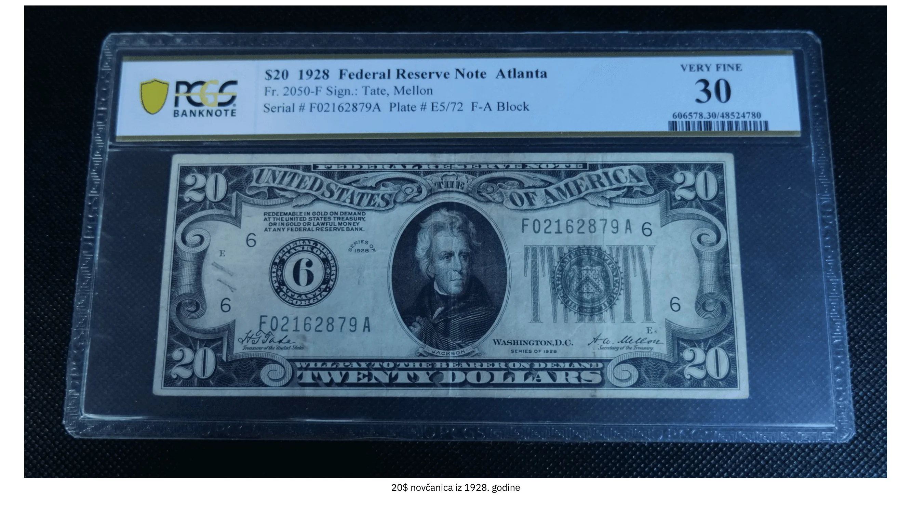

Danas, unca zlata vredi US $3,000. Dakle, možete videti moć devalvacije ovde, naravno. To je bila poslednja novčanica koja je sadržala reči "otkupljivo u zlatu". Videćemo da su odmah nakon Izvršne naredbe 6102 zaplenili svo zlato. Zapravo, zaplenili su i zlato i zlatne sertifikate.

Ovde ispod možete videti zlatni sertifikat iz 1928.

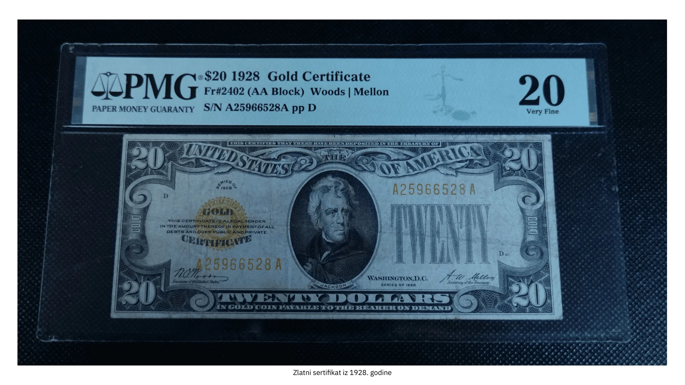

Ne samo da je bio "otkupljiv u zlatu" kao novčanica iz 1928. godine, već je bio otkupljiv i u zlatnicima: zaista je "zlatni sertifikat". Svi su zaplenjeni nakon Izvršne naredbe 6102. Sve do 1964. godine, bilo je čak ilegalno posedovati ih.

Veoma sam srećan što ga imam.

Počevši od 1964. godine, postalo je nezakonito posedovati zlato, sve do 1974. godine, ako se ne varam. U 70-im godinama, dozvolili su ljudima da akumuliraju zlato nakon Niksonovog šoka, koji ćemo uskoro opisati. Godine 1933, kada su izdali "Izvršnu naredbu 6102", zaplenili su zlato i postalo je nezakonito posedovati ga. Dobijali ste veliku zatvorsku kaznu ako ste bili uhvaćeni da čuvate svoje zlato. Tokom tih dana, svaka unca zlata bila je zamenjena za novčanicu sličnu onoj ispod, nakon 1934. godine.

Kao što smo rekli, 1928. godine, dolar je još uvek imao tekst "otkupljiv u zlatu" na sebi.

Nakon izdavanja Izvršne naredbe 6102, zaplenili su svo zlato i zamenili $20.67 za svaku uncu zlata. Nakon toga, prevara je izašla na videlo: izdali su nove novčanice 1934. godine sa odštampanim tekstom "ova novčanica je zakonsko sredstvo plaćanja za sve dugove".

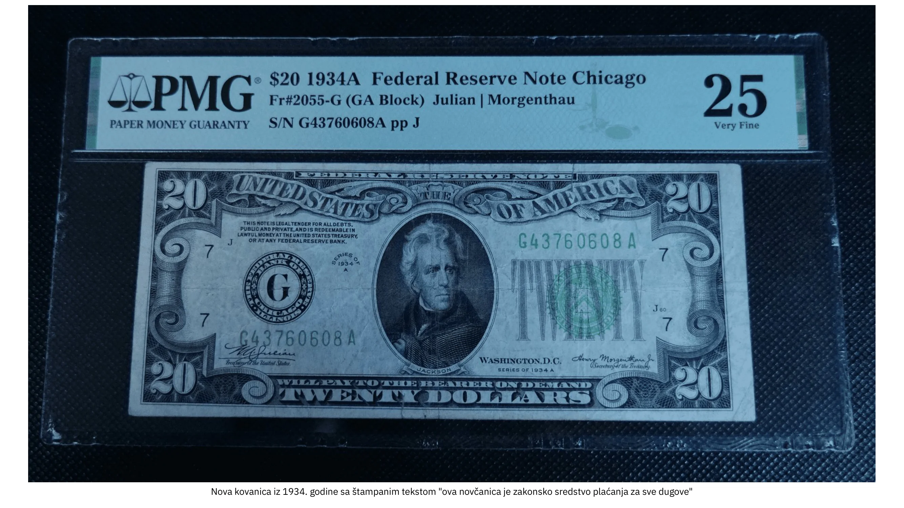

Koncept zakonskog sredstva plaćanja pojavljuje se ovde, zamenjujući frazu "otkupljivo u zlatu." Dve novčanice mogu izgledati identično, sa samo nekoliko reči koje se menjaju, ali prevara leži u činjenici da je dolar bio devalviran tokom ovog perioda; smanjena je vrednost unce zlata sa $20.67 na $35 po unci 1934. godine. To je predstavljalo devalvaciju od približno 40%!

Zatim je došao Drugi svetski rat. Nakon rata, Bretton Woods sporazum je centralizovao veći deo svetskog zlata u Sjedinjenim Državama. Amerikanci su izdavali novčanice u zamenu, iako te novčanice više nisu bile otkupljive za zlato od strane šire javnosti. Umesto toga, ostale su zamenljive za zlato na državnom nivou.

Na kraju su zemlje poput Francuske i Nemačke počele da sumnjaju da je verovatno bilo više dolarskih novčanica u opticaju nego zlata u američkim trezorima.

Dakle, tražili su da repatriraju svoje zlato. Pa, rekli su, "U redu, uradićemo to, ali će potrajati malo vremena." Godine 1971, naš prijatelj Ričard Nikson je prekinuo vezu između novčanica i zlata jednom zauvek, okrivljujući špekulante u tom procesu.

Zlato je bilo potcenjeno na $35 po unci, cena koja nije odgovarala količini novca koja je bila odštampana ili njegovoj pravoj tržišnoj vrednosti. Tokom samo nekoliko godina, cena je skočila sa $34 na $800. Slično istorijskim primerima, kao što je u Rimu, gde je veza između denarija i solidusa bila prekinuta, zlatu je bilo dozvoljeno da pluta. Ova činjenica je dovela do procesa otkrivanja cena, što je rezultiralo time da je zlato kasnije bilo mnogo više vrednovano u dolarima.

### Sistem modernog fiat novca i njegove implikacije

Ovaj deo rezimira kako smo prešli sa monetarnog sistema zasnovanog na srebru ili zlatu. Malo po malo, institucije su sticale sve više moći nad novcem. Na kraju, jednostrana odluka je potpuno prekinula vezu između plemenitih metala i novca, nakon prekomernog izdavanja.

Kao rezultat toga, više ne postoji nikakva veza između zlata i novčanica ili skripturnog novca. I to nije čak ni sistem frakcionalnih rezervi - to je zastareo koncept. Umesto toga, privatne banke izdaju i stvaraju novac putem bankarskog kredita. Novac se uglavnom stvara na ovaj način i povezan je sa ključnom kamatnom stopom koju postavlja centralna banka.

Zaista nema ograničenja. Ne postoje obavezni nivoi rezervi više, barem u Americi i Kanadi. Jedina rezerva je potreba da banke budu u stanju da odgovore na međubankarske razmene kako ne bi ostale bez likvidnosti.

Oni samo treba da se pobrinu da mogu da izvrše ove transfere, ali nema obavezne rezerve od 3%, 1%, 10%. Zaista smo se udaljili od koncepta frakcionalnih rezervi. Sada su to centralne banke, vlade kroz fiskalne deficite, centralne banke kroz kvantitativno popuštanje (QE), i privatne banke kroz kreiranje bankarskih kredita koji mogu povećati ukupnu ponudu novca i, po mom mišljenju, izazvati inflaciju.

Da biste razumeli vezu između novca i inflacije, preporučujem kurs koji imam na Plan ₿ Academy posvećen ovoj temi. Naučićete razliku između povećanja cena, što je ono što vidimo u životu, i inflacije. Oni nisu ista stvar. Zapravo, kada govorimo o inflaciji, često mislimo na povećanje cena, a ne na samu inflaciju. Inflacija je prilično precizan koncept, objašnjen povećanjem količine novca u opticaju.

https://planb.academy/courses/caa75343-ac90-4249-bcca-0e2e57c3a0f1

Da zaključim ovaj deo o fiat svetu, želeo bih da istaknem resurs koji će vam pomoći da bolje razumete fenomene koje sam upravo objasnio, kao što je inflacija.

Hvala na pažnji.

## Istorija novčanih balona

<chapterId>b6451c46-917d-11f0-97de-6bc5081765fa</chapterId>

:::video id=5967d9a6-aae4-4b84-a283-71b1b735bca4:::

### Izum papirnog novca i prvi veliki balon

Sa stvaranjem centralnih banaka u 18. veku, rođena je prava revolucija: magični novac u obliku novčanica. Najupadljiviji primer u Francuskoj je onaj Džona Lawa. Ovaj Škot, prognan u Pariz, predložio je regentu, vojvodi od Orleana, rešenje za bankrot kraljevskih finansija stvaranjem državne banke i kolonijalne trgovačke kompanije: čuvene **Banque Royale** i **Compagnie du Mississippi**.

Sa ovim sistemom, Lo je povezao papirni novac sa akcijama svoje kompanije. Što je više novčanica bilo u opticaju, to je vrednost akcija bila veća, a banka je izgledala stabilnije... sve dok špekulacija nije nadmašila stvarnost. Balon je iznenada pukao 1720. godine, uništivši plemstvo, buržoaziju i veliki deo Evrope, koji su počeli da špekulišu na ulici Kinkampoa. Rezultat: trajno nepoverenje prema papirnom novcu u Francuskoj i prva evropska lekcija o špekulativnim balonima.

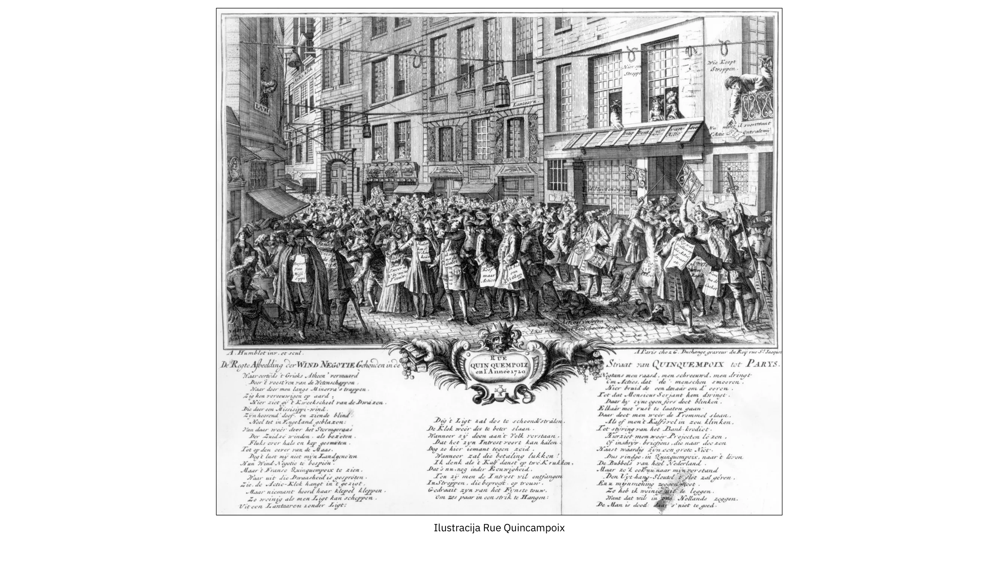

### Kada zemlja postane "kolateral"

Vek kasnije, Francuska revolucija je otvorila nove puteve sa **assignats**, valutom podržanom zaplenjenom crkvenom imovinom. Privlačna ideja na papiru - pretvaranje zemlje u monetarni kolateral - ali neefikasna: zemlja nije ni likvidna ni deljiva. Rezultat: hiperinflacija, višestruke zabrane korišćenja zemljišta, nekontrolisana inflacija i nestašice.

Napoleon, duboko pogođen ovim haosom, ponovo je uspostavio zlato i srebro kao monetarnu osnovu 1800. godine osnivanjem Banque de France, čime je garantovao redovnu isplatu svojih vojski. Pragmatičan način da povrati poverenje: plaćanje u čvrstoj valuti.

### Burne dvadesete i Velika depresija 1929

Preskočimo dva veka. Nakon Prvog svetskog rata, vlade su finansirale napore kroz inflaciju i suspenziju zlata. U 1920-im, američki Fed je vodio previše popustljivu monetarnu politiku kako bi podržao britansku funtu. Rezultat: laka dostupnost kredita, neobuzdana spekulacija na Vol Stritu, kupovina akcija na kredit i pojava nekretninskog i bankarskog balona.

Kada je mašina poludela, krah iz 1929. bio je neizbežan: masovni bankarski kolapsi, rekordna nezaposlenost i redovi ispred narodnih kuhinja. Ovo je dovelo do uporne zablude da je **sva deflacija loša**, dok zapravo treba da pravimo razliku između deflacije kroz rast (zdrava) i deflacije kroz dug (pogubna).

### Azija u 90-im i domino efekat

Devedesetih godina, "azijsko čudo" je sanjalo svet. Stope Exchange bile su vezane za dolar, rast je bio 8-10%, a zapadni kapital je ulazio u velikim količinama. Sve je bilo dobro... dok se plima nije povukla. Bankroti su se nizali, valute su devalvirale za 80%, a investitori su bili uništeni. MMF je morao da interveniše, namećući bolne reforme. Isti scenario kao uvek: obilan kapital, mehurići napumpani kreditima, zatim kolaps.

### 2008 i era permanentnog balona

Internet balon (2000) je pratila subprime nekretninska kriza. Sekjuritizacija je transformisala bankarske kredite u "triple-A" finansijske proizvode, rasprostranjene širom sveta. Obećanje: eliminisati rizik njegovim razblaživanjem. Realnost: svi rizici su zapravo bili povezani. Kada su nekretnine propale, propao je i ceo globalni bankarski sistem.

Rezultat: masovne javne pomoći, kvantitativno popuštanje i nulte kamatne stope. I s tim, nagli juriš: svaka kriza više neće čistiti viškove, već će biti pokrivena sve većim dugom i štampanjem novca. Ovo je dovelo do trenutne situacije: **"balon svega"**, gde se sve - akcije, nekretnine, umetnost, kripto, čak i Pokémon karte - veštački naduvava.

### Večni povratak čarobnog novca

Od jednog veka do drugog, pojavljuje se jedna konstanta: čim društvo poveruje da može stvoriti bogatstvo novcem umesto proizvodnjom stvarnih dobara, pojavljuju se baloni. Od Džona Lawa do 2008, od ulice Kinkampoa do Vol Strita, proces se ponavlja: euforija, kredit, bum i krah.

I na kraju, neizbežno, kada niko više ne veruje papiru, ljudi traže nešto drugo - zlato, zemlju, sigurna utočišta... ili nove valute. Juče je Napoleon nametnuo metal, danas neki vide Bitcoin kao naslednika.

Istorija finansija je beskonačan ciklus: štampaj, spekuliši, kolapsiraj. Do sledećeg balona.

## Novac i nasilje

<chapterId>9486fe64-854f-5e17-86b3-8873baca39a8</chapterId>

:::video id=bd6d0807-2d8f-4637-a0f5-1e990e5c0d0f:::

Ovaj kratki odeljak će ponovo razmotriti mnoge događaje koje smo već videli tokom kursa, rezimirajući nekoliko anegdota koje smatram zanimljivim.

### Tehnologija i nasilje

Evo nekoliko anegdota o kojima smo verovatno već razgovarali tokom kursa. One služe kao uvod u veoma fascinantnu diskusiju koju sam imao sa Teom o predavanju koje je održao na B-Ondy, a koje sam smatrao veoma zanimljivim u smislu kako tehnološki napredak utiče na odnos nasilja između populacije i države.

### Novac i državna prinuda

Da bih uveo ovaj deo, daću vam kratak i neiscrpan spisak, samo da vas podsetim na događaje koje smo verovatno već obradili na kursu.

Jedna veza koju već mogu napraviti između novca i nasilja je da kada je reč o bezvrednom papirnom novcu koji se može štampati ad infinitum, često dolazi sa svim vrstama pravila i svim vrstama pretnji. Već možemo govoriti o asignatima, gde je bukvalno bilo napisano na novčanicama da su falsifikatori pretili smrću. Lako je pronaći u pravnim tekstovima tog vremena pretnje smrću za one koji nisu prihvatali ovaj čuveni papirni novac.

Da bih ostao u Francuskoj, u jednom od pravnih tekstova koje sam uspeo da nabavim iz revolucionarne ere, video sam da je "per diem" za transport i rad giljotine opisan u odeljcima vezanim za valutu. Smatrao sam ovo prilično luckastim.

Takođe smo razgovarali o kovanju novca u Kini, gde je država nadgledala kovanje. Videli smo u delu na početku kursa da kada su novčići, od kojih su neki bili manje lepi, bili odbačeni, postojale su pravne posledice.

Postoji i anegdota o kralju u Engleskoj koji je na kraju odsekao ruke onima koji su kovali novac ako se nisu ponašali kako je on očekivao.

Takođe, u Kini, čitao sam o zapleni bakra iz budističkih manastira. U vreme kada je bakar dobijao na vrednosti i destabilizovao njihovu ekonomiju - koja je bila zasnovana na obliku fiat novca koji je imao malo veze sa vrednošću metala - pribegli su pronalaženju mesta gde je bilo bogatstva i zaplenili bakar iz manastira.

Isto se isto odnosi na manastire u Engleskoj tokom Engleske reformacije. Kada se čuveni kralj posvađao sa Papom zbog svog razvoda, postojao je još jedan razlog iza svega toga: iskoristio je ukidanje manastira da zapleni bogatstvo sadržano u ovim crkvenim organizacijama.

Tokom Francuske revolucije, zaplenili su svu imovinu Crkve. Videli su prelepe novčiće napravljene od pretopljenih crkvenih zvona.

Ako se vratimo još dalje, jedna od najeksplicitnijih predstava ekonomske nasilnosti i slobode, zakona koji ubijaju slobodu, jeste **Dioklecijan sa svojom naslednom kastom koja je bila direktno povezana sa činjenicom da seljaci više nisu želeli da prihvate obezvređenu valutu**. Oni su želeli da napuste svoj rad kao seljaci, a Dioklecijan je reagovao jednostavno rekavši im, "ne možete napustiti svoju zemlju, a ni vaša deca". Isto je važilo i za vojnike.

Mislim da je to prilično eksplicitan oblik nasilja. Mogao bih zaključiti pričom o Vitezovima templarima ili francuskom kralju. Kada su se Vitezovi templari nastanili u Francuskoj, zamišljam da je video manu templarskog bogatstva i imao problema sa državnim finansiranjem. Tužio je Templarski red, a neki od njih su uspeli da odu sa delom blaga, što je dovelo do veoma zanimljive emisije u SAD-u ili Kanadi. Ne znam ko ju je producirao, ali zove se *The Mystery of Oak Island*. Radi se o ljudima koji misle da je templarsko blago zakopano na ostrvu u Kanadi, u Maritimesu, i buše godinama - možda čak i više od decenije - da naprave neku vrstu bunara. Pronašli su bunar sa mnogo galerija i traže blago koje su Vitezovi templari zakopali na ovom ostrvu, što je tema ove TV emisije. Pozdravljam svog oca, koji je veliki obožavalac ove emisije.

Dakle, tu ga imate: vrlo brz popis činjenica koje smo videli tokom ovog kursa i koje, mislim, povezuju sa nasiljem. Prepuštam vas sledećem delu od Tea, koji će nam ispričati veoma zanimljivu priču o tehnološkim promenama i ravnoteži moći između plebsa i vlasti.

Hvala!

## Ekonomske posledice organizovanog nasilja

<chapterId>66bd4674-2159-5489-ad4b-ec5e3fb691af</chapterId>

:::video id=c8b063c6-aeb4-4a94-9027-b11d369e71a4:::

### Organizovano nasilje i evolucija države

Istoričar Frederic C. Lane predlaže revolucionarnu tezu: anatomija države kroz istoriju oblikovana je tehnologijama korišćenim za projektovanje nasilja. Polazeći od Weberovog principa da država drži monopol na legitimno nasilje, Lane primećuje da ovaj monopol - paradoksalno efikasniji od konkurencije u ovoj oblasti - evoluira u skladu sa odnosom između troškova napada i troškova odbrane.

Ova analiza, koju su preuzeli autori "The Sovereign Individual" (1997), objašnjava istorijske mutacije u političkoj organizaciji: od srednjovekovnog feudalnog sistema do gradova-država renesanse, zatim do industrijskih nacionalnih država i konačno do modernih država blagostanja. Svaka tranzicija odgovara velikom tehnološkom proboju u primeni nasilja, koji se dešava otprilike svakih 400-500 godina.

### Srednjovekovna ravnoteža

U srednjem veku, agrarna ekonomija je bila dominantna sa preko 90%. Seljak, bukvalno vezan za svoju zemlju, nije mogao pobeći od gospodara i njegovih vitezova. Vojna tehnologija - ručno kovani oklopi, godine obuke mačevanja - bila je izuzetno skupa. Ova asimetrija je masovno favorizovala napad u odnosu na odbranu.

Nepokretni poljoprivredni proizvođač postaje zarobljenik lokalnog monopoliste nasilja. Njegova sposobnost za izvlačenje poreza dostiže nove visine - iako, paradoksalno, srednjovekovni porezi ostaju skromni u poređenju sa 78% obaveznih nameta u modernim vremenima. Gospodar može oporezivati po volji, jer seljak ne može ni da se odupre ni da ode.

### Trgovačka renesansa

Pojava hanzeatske trgovine na severu i mediteranske trgovine na jugu transformisala je situaciju. Trgovci, glavni stvaraoci dodate vrednosti, posedovali su mobilni kapital - svoje brodove. Trebale su im samo lake pomorske milicije, jer je mora bilo teško kontrolisati. Iznad svega, mogli su lako migrirati u susednu luku ako bi oporezivanje postalo prekomerno.

Ova mobilnost stvorila je poresku konkurenciju između gradova-država. Venecija, Đenova i Briž morale su ponuditi najliberalniji mogući okvir: pouzdane ugovore, kvalitetnu valutu, osiguranje, minimalno oporezivanje. Prinčevi su morali zavoditi umesto prisiljavati. Simetrija se preokreće: odbrana (kroz bekstvo) postaje lakša od napada.

### Industrijska era

Industrijska revolucija donela je sa sobom konfiguraciju sličnu feudalizmu. Fabrike, železnice i proizvodne linije predstavljaju masivne, nepokretne investicije. Henri Ford nije mogao da preseli svoje pogone suočen sa oporezivanjem. Radnici, koncentrisani u industrijskim gradovima, sindikalizovali su se kako bi pregovarali kolektivno, umesto da migriraju pojedinačno.

"Welfare state" se pojavio: industrijsko planiranje (Japan, Koreja), vojna zaštita infrastruktura, minimalne socijalne beneficije za radnu snagu. Drugi svetski rat je ilustrovao ovu ranjivost: bombardovanje neprijateljskih fabrika postalo je dominantna strategija. Koncentracija fizičkog kapitala omogućila je masovno prikupljanje poreza za finansiranje welfare state-a.

### Revolucija mikroprocesora

Tri tehnološke inovacije sada narušavaju ove vekovne ravnoteže. Mikroprocesor transformiše ratovanje: operater u Nevadi upravlja dronom u Avganistanu sa hirurškom preciznošću. Zalivski rat (1991) je demonstrirao ovaj proboj: četvrta najveća vojska na svetu (Irak) je uništena za 45 dana, sa manje od 200 smrtnih slučajeva na strani koalicije. Tehnološka superiornost je učinila frontalni napad nemogućim.

Internet i asimetrična kriptografija revolucioniraju stvaranje vrednosti. Programer može raditi od bilo gde sa MacBook-om i Starlink-om, izvozeći svoju proizvodnju trenutno i besplatno. Digitalni nomadi beže od geografske zarobljenosti, suprotstavljajući države jedne drugima na način koji nije viđen još od Renesanse.

Bitcoin predstavlja kulminaciju ove logike: valuta oslobođena od države, zaštićena nepovredivim kriptografskim štitom. Bogatstvo postaje odbranjivo protiv bilo koje fizičke sile. Pojedinac ponovo stiče sposobnost da se brani protiv državnog monopola.

### Kolaps vestfalskog modela

Zapadni sistemi socijalne zaštite, dizajnirani za industrijsko doba, postaju zastareli. Kreatori vrednosti - programeri, umetnici, finansijeri - migriraju u Singapur, Dubai ili El Salvador, preferirajući manje javnih usluga u zamenu za minimalno oporezivanje. Savremeni giganti poput Apple-a i Tether-a ne trebaju ni kancelarije ni fizičku infrastrukturu.

Ovaj odliv mozgova stvara spiralu: manje neto doprinosilaca, degradirane javne usluge, povećano oporezivanje onih koji ostaju i ubrzana iseljavanja. Države moraju radikalno smanjiti veličinu ili bankrotirati. Fragmentacija na male, konkurentne jurisdikcije - novi model digitalnih grad-država - čini se neizbežnim.

Istorija nas uči da ove tranzicije traju generacijama. Ali razdvajanje valute i države od strane Bitcoin moglo bi ubrzati proces. Pojedinci sada glasaju svojim nogama i svojim kriptografskim novčanicima, precrtavajući mapu globalne moći duž linija koje tek počinjemo da opažamo.

## Veoma kratka istorija finansija

<chapterId>1d37fff1-a091-5034-8e71-4af590b8ffce</chapterId>

:::video id=fdfabbc6-e4d8-463a-8522-19176f8fb460:::

Prateći ovaj prikaz istorije novca, koji nas vodi pravo do fiat sistema, želeo bih brzo i sažeto objasniti evoluciju finansija koja je na kraju dovela do države blagostanja. U početku, u rimsko doba, imali smo kovanice.

Novčići su bili finansijska tehnologija koja je omogućila carstvu da plaća vojnike, širi se i trguje. Funkcionisalo je veoma dobro, osim što je na kraju bilo previše devalvacija. U nekom trenutku, kada su prestali da se šire i prestali da dobijaju plen iz svojih ratova i teritorijalnog širenja, njihov sistem se urušio.

### Evolucija finansijskih tehnologija

Zatim su došla Srednja vekovna doba, kada je bilo vrlo malo evolucije sve do Florina, koji je vratio stabilnu valutu, i bankarskih razvoja u Italiji i Antverpenu, gde je razvijen koncept "vremenske vrednosti novca" - drugim rečima, diskontovanje. Razvili su diskontovanje kako bi stvorili oblik papirnog novca u kojem je izdata "menica", tj. obećanje da će se u kasnijem periodu moći povratiti $100 plus kamatna stopa.

Ovaj sistem je kreirao finansijsku tehnologiju koja omogućava vlasniku da proda belešku pre isteka roka, tako da ako je prodate nakon 4 meseca od 6-mesečnog roka, osoba će zapravo platiti premiju da nadoknadi gubitak prinosa za preostala 2 meseca.

To je bila finansijska tehnologija razvijena u Antverpenu i Amsterdamu u to vreme. Kasnije smo videli evoluciju centralnih banaka i pojam zajmodavca u krajnjoj nuždi. Može se tvrditi da je tokom postojanja Banke Amsterdama upotreba kovanica u međunarodnoj trgovini napuštena u korist skripturalnog novca.

Kasnije, u 18. veku, u smislu finansijske tehnologije, možemo govoriti o osiguranju. Postoji anegdota koja je veoma dobro ispričana u knjizi Nila Fergusona "Uspon novca". Prva osiguravajuća kompanija koja je nastala zvala se **Scottish Widowss**, i u suštini, to je bilo sveštenstvo koje je želelo da razvije osiguranje za sveštenike koji su ponekad umirali ranije, iznenada umirali. Sveštenstvo je u to vreme brinulo o njihovim ženama i potomstvu u Škotskoj godinu dana. I tako je sveštenstvo smatralo da je ovaj jednogodišnji period možda malo prekratak. Kao rezultat, **izmislili su aktuarske proračune** kako bi doslovno izračunali broj učesnika neophodnih da sistem pokrije svoje troškove, u zavisnosti od broja sveštenika koji su prerano umrli.

Razvili su aktuarske proračune da kažu "U redu, pa, svaki sveštenik nam daje ovaj iznos. Onda, ako sveštenik umre, pa, osiguranje će pokriti troškove kako bi se osigurala egzistencija njegove supruge i dece dok ne postanu samostalni." Tako je prva osiguravajuća kompanija nazvana "Scottish Widows" koja je popularizovala ovaj sistem i gde je bio primenjen.

### Od privatnog osiguranja do države blagostanja

Dakle, osiguranje je deo istorije finansijske tehnologije. I ovo me dovodi do koncepta države blagostanja, što je situacija u kojoj privatno osiguranje na kraju nailazi na problem, pojam optimizacije, gde kažemo sebi, ako nudimo zdravstveno osiguranje ljudima koji su zdravi, oni mogu imati manje interesa da plaćaju premiju jer kažu sebi: "Zdrav sam, neću se razboleti". S druge strane, ljudi koji znaju da su bolesni sigurno će želeti da se pretplate.

Ovaj sistem stvara neravnotežu između broja bolesnih ljudi koji će uzeti zdravstveno osiguranje, za razliku od zdravih ljudi koji će možda uzeti manje. Dakle, postoji neka vrsta neravnoteže: ako izračunate brojke, one se ne bi izbalansirale jer verovatno ne biste mogli osigurati dovoljno zdravih ljudi da nadoknadite troškove. U ekonomiji, ovo je koncept **moralnog hazarda**.

Jedna od ideja koja je predložena jeste da se osiguranje učini obaveznim. Ako su svi obavezni da doprinesu, to ponovo uspostavlja ravnotežu i i zdravi i nezdravi ljudi će doprineti, raspodeljujući rizike na najveću populaciju.

I tako je, u mnogim delovima sveta, država rekla: "Pa, mi ćemo se pobrinuti za to". Iako nisam stručnjak za ovo pitanje, mogu da vidim da se isto razmišljanje verovatno primenjuje na sve vrste drugih oblika osiguranja, kao što je osiguranje za slučaj nezaposlenosti. Postoji želja da se pojednostavi i optimizuje, zasnovana na ideji da će biti jednostavnije ako postoji samo jedna organizacija koja će se time baviti.

Po mom mišljenju, ovo je dovelo do centralizacije svih ovih osiguravajućih koncepata, i na kraju do rađanja države blagostanja, gde su svi ovi finansijski koncepti koji su prvobitno bili privatna preduzeća, privatne inicijative za zadovoljavanje potrebe tržišta osiguranja da se rizik raspodeli među populacijom, bili preuzeti od strane države iz razloga koji su verovatno prilično logični u vezi sa moralnim hazardom i željom za optimizacijom.

### Alternativni modeli i refleksije o državnim monopolima

Na kraju, u nekim zemljama poput Kanade, završavamo sa nekoliko vrsta osiguranja - zdravstveno osiguranje, osiguranje za slučaj nezaposlenosti - koja su državni monopoli.

Mogu ti dati primer koji znam. U Švajcarskoj je sistem malo drugačiji. Postoje privatne uzajamne osiguravajuće kompanije i privatne bolnice, tako da možeš izabrati svoju uzajamnu osiguravajuću kompaniju, možeš izabrati svoj paket unutar svoje uzajamne osiguravajuće kompanije. I dalje dobijaš relativno univerzalne usluge, čak i ako veliki deo ovog sistema ostaje privatan.

Dakle, mislim da je moguće da je to takođe privatno upravljano. Ali sve što sam želeo da vam opišem, zapravo, nije izjava da izrazim da li je jedan sistem bolji od drugog, već je bilo da vam objasnim da sam čitajući o istoriji finansija shvatio zašto je na Zapadu, posebno u Francuskoj, posebno u Kanadi, država želela da preuzme kontrolu nad tim finansijskim principima.

Poenta koju sam želeo da istaknem je da je koncept osiguranja pre svega evolucija finansija, i kao što vlade ponekad tako dobro rade, pokušaće da preuzmu kontrolu nad njim, baš kao što su pokušale da preuzmu kontrolu nad novcem, iz nekoliko razloga. Jedan razlog, uzgred, je koncept zajmodavca poslednjeg utočišta.

Ideja je da je mnogo bolje ako postoji velika institucija iza toga koja šire distribuira rizik. To je bila početna inicijativa iza koncepta zajmodavca poslednje instance, gde bi ova institucija zapravo mogla da izabere institucije koje su dovoljno jake da prežive i spreči njihov kolaps pozajmljivanjem novca.

U to vreme, postojala je prava analiza kada se ovaj koncept konačno pojavio po prvi put, ali ono što se na kraju desilo je da smo spasili sve, "preveliki da bi propali", to se odnosi na skoro sve banke jer postoji centralizacija, a takođe i na sve velike kompanije. Na kraju, vidimo da je to i dalje koncept koji se primenjuje "u velikoj meri" od strane države, slično konceptu osiguranja koji sam vam upravo opisao.

Na kraju, država odlučuje da će se pobrinuti za sve, pretvarajući finansijsku tehnologiju stvorenu u Škotskoj da reši specifičan problem u ogroman socijalni sistem koji danas poznajemo. Koristi aktuarske finansijske principe da ponudi usluge svojoj populaciji u potrebi. Međutim, možemo se složiti da monopoli koji proizilaze iz ovog sistema stvaraju razne probleme, koje trenutno doživljavamo u zemljama poput Kanade i Francuske. Srećom, postoje različiti modeli, kao što je onaj u Švajcarskoj.

Jednostavno moramo shvatiti da ovaj koncept države blagostanja potiče iz finansija. Ovo shvatanje sugeriše da možemo istražiti puteve osim poznatih državnih monopola, i čak bih primenio ovo razmišljanje na koncept centralnih banaka kao zajmodavaca u krajnjoj nuždi - ali to je tema za neki drugi put.

# Završni deo

<partId>9bada469-7ef0-511a-9eaa-f8eb66d5906f</partId>

## Proceni ovaj kurs

<chapterId>a9494e2b-8a4d-5811-8a7b-b4a91fb22778</chapterId>

<isCourseReview>true</isCourseReview>

## Zaključak

<chapterId>1094e793-b4c6-5782-aa4a-71cde00ce7c0</chapterId>

<isCourseConclusion>true</isCourseConclusion>