# En resa genom mynthistorien

Denna fängslande kurs tar dig med på en utforskning av pengarnas fascinerande utveckling från de tidigaste civilisationerna till vårt nuvarande monetära system. Vi kommer att korsa tiderna, från neolitisk till modern tid, och upptäcka hur pengar har format och formats av de stora mänskliga civilisationerna. Från mesopotamiska protopengar till kryptovalutor, lydiska mynt, renässansens florin och centralbanksväsendets framväxt - den här kursen ger ett omfattande perspektiv på en av de grundläggande pelarna i våra samhällen.

+++
# Inledning

<partId>59878a67-8a1d-5d6b-af41-5b847c14363c</partId>

## Introduktion till pengarnas historia

<chapterId>ca53597e-be9a-5261-a55f-11fac8504a68</chapterId>

:::video id=08ff35ca-8a40-4286-abaf-71283faf6e78:::

Välkommen till denna kurs om pengarnas historia. Som titeln antyder ska vi tillsammans utforska myntens historiska utveckling. Från den neolitiska eran till idag kommer vi att titta på de stora imperierna och civilisationerna i det förflutna.

Den här kursen är dock inte begränsad till en enkel kronologi av datum eller historiska händelser. Vårt verkliga mål är snarare att ge en djupgående förståelse för de grundläggande begrepp som är inblandade i uppkomsten av pengar, eller snarare valutor.

### Grundläggande begrepp att utforska

Vi talar alltså om uppkomst: uppkomsten av valutor i sig, av monetära system, av banker, av papperspengar, av centralbanker och slutligen uppkomsten av det nuvarande "fiat"-penningsystemet.

Vi inleder vår resa till proto-valutor med uppkomsten av skuldpengar och räkneenheter i Mesopotamien, liksom andra system som hemgift och blodspengar i primitiva samhällen. Vi kommer också att se hur riktiga monetära system redan fanns i det forntida Egypten, långt före Mittens rike.

Vi går sedan vidare till de första mynten i Lydien, ett viktigt ögonblick som ofta betraktas som pengarnas verkliga början enligt läroböcker i ekonomi. Vi undersöker hur dessa mynt kunde spridas tack vare perserna, Alexander den store och sedan Rom, innan de slutligen trängde sig på, dominerade och kollapsade.

Därefter kommer vi, med allt vi lärt oss, att ta den tid vi behöver för att tillsammans reflektera över själva definitionen av pengar och gå bortom förutfattade meningar som "pengar är alltid en skuld" eller "pengar är alltid en vara". I själva verket är pengar både en vara och en social konvention. Vi kommer framför allt att diskutera begreppet penningpremie och försöka förena de olika teorier som förklarar pengars uppkomst.

### Viktiga perioder och monetära innovationer

Vi övergår sedan till en orolig period, som präglades av en viss instabilitet i monetära termer, men som ändå såg uppkomsten av sådana slående innovationer som den engelska pennyn, som användes för att muta danska inkräktare, och Karl den stores pund, vars minne fortfarande lever kvar på vissa moderna sedlar.

Vi tittar också på hur korstågen ledde till uppkomsten av de första systemen för fjärröverföring av pengar. Sedan är det dags att titta på effekterna av florinen, den valuta som följde med renässansen, och ankomsten av ädelmetaller från Amerika, som hade en djupgående effekt på de europeiska priserna.

Vi tittar närmare på hur papperspengar och centralbanksverksamhet uppstod och drar paralleller till finanskrisernas historia och deras ofta våldsamma efterverkningar.

Slutligen drar vi en parallell till vårt nuvarande monetära system, utforskar dess konsekvenser och följer finanshistorien för att bättre förstå hur vi kom fram till dagens välfärdsstat.

Och som en bonus tittar vi också på de många fascinerande etymologiska kopplingarna till pengar, som fortsätter att påverka vårt dagliga liv på olika språk.

### Kursens struktur

Kursen är uppdelad i tre större delar.

Del I handlar om pengarnas uppkomst, del II om pengarnas renässans och fall, och del III visar hur statliga institutioner eller staten gradvis tog kontroll över pengarna, vilket ledde fram till det nuvarande fiatsystemet.

Tack så mycket och njut!

# Framväxten av börser

<partId>da5e4981-9ea5-5208-beab-3b75c9043632</partId>

## Från Australopithecus till den moderna människan

<chapterId>34a773aa-f2d3-5c26-8be4-f2cd79ed6fbc</chapterId>

:::video id=4f333013-4b2a-42ab-8761-593fafc971ca:::

### Varför börja med neolitikum

Varför gå hela vägen tillbaka till neolitikum för att prata om pengar? Svaret är enkelt: vi kan inte fullt ut förstå pengars uppkomst utan att också titta på civilisationernas uppkomst. För att förstå varför de första monetära systemen uppstod måste vi förstå vad som fick nomadiserande jägar- och samlargrupper att slå sig ner.

En stam utan arbetsfördelning och specialisering, där varje individ är ansvarig för att producera vad han eller hon behöver, har helt enkelt inget behov av pengar. På samma sätt känner ett jordbrukssamhälle som endast bedriver självhushållning, där varje person odlar för sig själv, ännu inte behovet av en universell utbytesförmedlare.

### Sedentarisering och dess konsekvenser

Det är därför jag tycker att det är intressant att börja vår utforskning under den neolitiska perioden. Vi kommer att se hur bosättningen gradvis gav upphov till byar, sedan städer och slutligen stora civilisationer. Det var denna sedentarisering och produktionen av livsmedelsöverskott som möjliggjorde arbetsspecialisering och skapade den grogrund som var nödvändig för uppkomsten och utvecklingen av de första monetära begreppen.

Precis som mänskliga interaktioner ger upphov till språk, kan vi anse att pengar uppträder naturligt, eller inte (som med inkaindianerna och spartanerna), under civilisationernas bildande och organisation. Enligt min mening har pengars uppkomst eller icke uppkomst allt att göra med formen av social och ekonomisk organisation i varje samhälle.

### Kronologi över människans evolution

Men låt oss först titta på ett ännu bredare historiskt sammanhang.

Som alla första presentationer kommer jag att göra precis tvärtom mot vad jag sa i kursens inledning och ge er en lista med datum och historiska händelser som följer på varandra. Tanken är att placera pengarnas uppkomst i sitt historiska sammanhang, i relation till andra mänskliga framsteg som matlagning, hjulet, domesticeringen av vissa sädesslag och djur, byggandet av pyramiderna och grundandet av de första städerna.

Så låt oss ta en titt på mänsklighetens utveckling från förhistorisk tid och framåt.

En översikt av människans utveckling från Australopithecus till den moderna människan, med tekniska framsteg och befolkningsrörelser fram till den neolitiska perioden.

### Mänsklighetens historiska sammanhang

- för 3 miljoner år sedan** - *Australopithecus* uppträder.
- 2 miljoner år sedan** - Homininerna börjar lämna Afrika.
- 1.6 miljoner år sedan** - Homininerna når södra Europa och Asien.
- 1 miljon år sedan** - Första beviset på matlagning med eld (förkolnade ben och växtrester i Wonderwerk-grottan i Sydafrika).
- Cirka 400.000 f.Kr** - Neandertalare lever i Europa och Asien.
- Cirka 300.000 f.Kr** - *Homo sapiens* uppträder.
- 80.000 år sedan** - *Homo sapiens* börjar migrera till alla delar av världen.
- 73.000 år sedan** - Blombosgrottorna i Sydafrika (äldsta kända konstformer).
- 50.000 år sedan** - *Homo sapiens* når Europa.
- 30.000 år sedan** - Grottmålningar från Chauvet-grottan i Frankrike.
- 15.000 år sedan** - Lascaux grottmålningar i Frankrike och australiensisk klippkonst.
- Ca 9000 f.Kr** - Domesticering av korn i den Fertila halvmånen.
- Cirka 9000 f.Kr** - Majsodling i Mexiko.
- Cirka 8000 f.Kr** - Domesticering av getter och får i den bördiga halvmånen.
- Omkring 7250 f.Kr** - Ain Ghazal (Jordanien) avslöjar en by med några hundra invånare.
- Cirka 7000 f.Kr** - Çatalhöyük (Turkiet) har upp till 8.000 invånare.
- Cirka 6500 f.Kr** - Stillasittande liv börjar i Grekland.
- 6000 år sedan** - Början på flodbevattning i Egypten och Mesopotamien.
- Cirka 5000 f.Kr** - Uppkomsten av jordbrukskombinationen "de tre systrarna" (majs, squash, bönor).
- Cirka 4000 f.Kr** - Kamelen domesticeras i Centralasien. (Kameldjursfamiljen har sitt ursprung i Nordamerika under eocen för 45 miljoner år sedan. Dessa kameler skulle sedan ha vandrat till Asien via en tunn landremsa som förenade de två kontinenterna vid den tiden i Berings sund. En annan del av familjen skulle ha begett sig till Sydamerika, där dess ättlingar fortfarande lever idag: lamor, alpackor och vicuñas).
- Omkring 3500-3000 f.Kr** - Botai-folket börjar tämja och föda upp hästar.
- I början av bronsåldern** - Sumererna hade redan uppfunnit hjulet och segelbåten och utvecklat aritmetik, astronomi och den första formen av skrift.
- Omkring 2800 f.Kr** - Uruk hade som mest en befolkning på upp till 80.000 personer.
- 2600-2200 f.Kr** - De första tecknen på stadsutveckling i den grekiska världen. Expansion av medelhavsgrödor (vete, vinstockar, oliver).
- 2560 f.Kr** - Byggandet av den stora pyramiden i Giza.
- Cirka 1500 f.Kr** - Minoisk civilisation.
- Omkring 1300 f.Kr** - Den mykenska civilisationen.
- Cirka 1250 till 1150 f.Kr** - Bronsålderns civilisationer kollapsar.
- 1:a århundradet e.Kr.** - Nordafrikanska berber domesticerar kamelen.

Här har vi alltså en historisk översikt som ger oss ett perspektiv på uppkomsten av vissa tekniker, domesticeringen av vissa djur och kulturer, för att sätta det i samband med uppkomsten av skrift och pengar, vilket vi ska ta upp i nästa avsnitt.

## Från jägare-samlare till jordbrukare: Civilisationens gryning

<chapterId>ea950b6e-9eb7-553d-8f04-0eb042bb1f5a</chapterId>

:::video id=4b49a376-f6f4-42a0-86fa-264997a079f0:::

### Övergången till jordbruk och sedentarisering

I det här kapitlet ska vi prata om övergången från jakt och samlande till jordbruk för självhushållning, hantverk och handel. Jag tyckte att det var viktigt att förklara denna övergång till ett stillasittande liv och jordbruk för att förstå hur de första städerna byggdes, vilket så småningom ledde till att vissa monetära system skapades och uppstod under antiken.

Det här avsnittet är ett utdrag ur en kurs som finns på webbplatsen The Great Courses och heter Ancient Mesopotamia, Life in the Cradle of Civilization, och ges av professor Amanda Podany vid California State Polytechnic University, Ponoma.

### Paradoxerna med att införa jordbruk

Det primitiva jordbruket uppstod för cirka 10.500 år sedan i Mellanöstern, runt nordvästra Syrien och södra Turkiet. Idag har moderna jägar- och samlargrupper ingen brådska att övergå till jordbruk, och detsamma gällde förmodligen under den neolitiska perioden.

**De första byarna byggdes uppenbarligen innan växter och djur domesticerades.** Människor bosatte sig inte för att jordbruket gjorde det möjligt för dem; tvärtom bosatte de sig först och först långt senare, cirka 3.000 år senare, började de odla.

Jakt och samlande fungerade helt enkelt mycket bra, så de behövde inte plantera frön för att producera sin mat. I dag har jägare och samlare mycket mer fritid än de första jordbrukarna, som använde mycket rudimentär teknik.

Så vad vi säger här är att moderna primitiva jägar- och samlarfolk har mer fritid än vad vi förstår av de första jordbrukarna under den neolitiska perioden, som trots allt hade ganska rudimentära tekniker för odling. Dessa människor arbetade hårdare för att producera mat än våra moderna primitiva stammar, som lever av jakt och samlande.

Benstudier visar också att de första jordbrukarna var mindre och mindre robusta än de jägare och samlare som föregick dem. Böndernas kost var mer begränsad än jägarnas och samlarnas. De åt mycket mer bröd, men mycket mindre kött, och hade också sämre tänder på grund av de stenflisor som användes vid mjöltillverkningen. När de gjorde mjöl med stenar blev det splitter.

De som följer "keto"-dieten kommer att hålla med: att äta mycket bröd är förmodligen inte lika bra som att äta kött.

### Teorier om införandet av jordbruk

Med tanke på alla dessa nackdelar, vem skulle ha valt att bli jordbrukare på den tiden? Vissa populära teorier går ut på att människan tvingades att börja med jordbruk och att det egentligen inte var något val. Även med vilda sädesslag fanns det ett stort problem. Stora mängder spannmål kunde inte transporteras på ett enkelt sätt. De var tvungna att lagras någonstans. När spannmålen väl var lagrad var det vettigt att hålla sig i närheten. Man odlade alltså vilda sädesslag, vilket inte nödvändigtvis var jordbruk, och när man odlade dem i stora mängder var man tvungen att lagra dem någonstans, vilket gjorde dem svåra att transportera. Detta bidrog sannolikt till de första faserna av sedentarisering. Det kan mycket väl ha varit det första skälet till att människor bosatte sig på en viss plats. Om det fanns mat på platsen året runt behövde man inte följa hjordar eller ständigt resa.

I den natoufiska kulturen bodde upp till hundra personer tillsammans i byar som bestod av runda hus. En populär teori för att förklara jordbrukets uppkomst är att denna förändring stimulerades av klimatförändringar. För cirka 11.000 år sedan blev klimatet i Främre Orienten kallare och torrare än tidigare. Växter och djur som det tidigare hade funnits gott om blev mer sällsynta. Samhällena började då odla de växter som de var beroende av, eller hålla ungdjur för att föda upp dem och tjäna pengar på dem, t.ex. får, getter och nötkreatur, som lämpade sig väl för sådan uppfödning. Detta skulle ha varit en mycket gradvis process. Det fanns alltså inte ett exakt ögonblick då alla blev jordbrukare som domesticerade djur.

En annan teori är att byarna själva skapade det problem som domesticeringen löste. Intensiv jakt och samlande skulle ha destabiliserat den naturliga miljön. Enligt en hypotes hade natufianerna nått sådana demografiska framgångar att de blivit för många för sin närmiljö. Träsken och de områden där naturliga grödor odlades kan därför inte ha varit tillräckligt produktiva för byns befolkning. Den omedelbara miljön kunde inte försörja alla. De skulle då ha börjat odla direkt på plats och ökat sin livsmedelsförsörjning.

## Neolitisk handel

<chapterId>8e495224-6d55-58f6-a9dc-ac2814281cfa</chapterId>

:::video id=d04245af-e416-48b1-8157-d569207a32c4:::

### Övergången mellan paleolitikum och neolitikum

Den neolitiska perioden markerar ett fundamentalt brott i mänsklighetens historia, i stark kontrast till de paleolitiska samhällen som föregick den. Under den paleolitiska perioden var de europeiska befolkningarna extremt utspridda: för 20 000 år sedan bodde bara 7 000 människor på hela kontinenten, organiserade i små nomadiska grupper om 20-50 individer som följde de stora vandringshjordarna över stora avstånd.

Den globala uppvärmningen i slutet av istiden förändrade denna sociala organisation radikalt. Skogarnas framväxt ersatte den vandrande faunan med en mer stillasittande skogsfauna, vilket gjorde det möjligt för människogrupper att bli semisedentära. Denna omvandling åtföljdes av en spektakulär demografisk boom: från en uppskattad europeisk befolkning på mellan 10.000 och 50.000 i slutet av paleolitikum, ökade befolkningen under mellan- och slutneolitikum till mellan 1 och 5 miljoner invånare.

### Uppfinningen av arbete och egendom

Denna gradvisa sedentarisering ledde till djupgående sociala omvandlingar. **Det neolitiska jordbruket gav upphov till den moderna uppfattningen om arbete**: att vara knuten till ett visst territorium innebar att man tog hand om sin egendom, lagrade frukterna av sitt arbete och planerade framtida skördar. Detta nya förhållande till tid - att skjuta upp nuvarande användning för framtida nytta - revolutionerade den sociala organisationen.

Keramik är en perfekt illustration av denna utveckling: ursprungligen utvecklad för att förvara spannmål och frön, vittnar den om denna nya förmåga att projicera behov över tid. Vissa förhistoriker anser till och med att den neolitiska perioden inte hade varit möjlig utan dessa förvaringssystem.

**Privat egendom framstod som den centrala institutionen** i dessa nya samhällen. Individuell egendom fanns redan under paleolitisk tid (personliga jaktspjut), men under neolitisk tid fick den en territoriell dimension som aldrig tidigare skådats. Denna marktillägnelse gav upphov till de första arkeologiskt dokumenterade konflikterna mellan människor, vilket gjorde det nödvändigt att skapa en territoriell säkerhetsfunktion.

### Specialisering och arbetsfördelning

Jordbruket gjorde det möjligt att föda större befolkningar, samtidigt som det frigjorde vissa individer från andra produktiva aktiviteter. Denna framväxande specialisering - jordbrukare, krukmakare, hantverkare, vakter - lade grunden för arbetsfördelning och sociala hierarkier.

Arkeologiska lämningar vittnar om denna växande stratifiering: begravningar utvecklades från kollektiva till differentierade individuella gravar, och bostäder gick från arkitektonisk enhetlighet till konstruktioner som avslöjade olika sociala statusar. Begravningsföremål - prydnadsföremål, specialverktyg, keramik - indikerar uppkomsten av en uppfattning om rikedom och social prestige.

### Framväxten av distansutbyten

Arkeologiska analyser avslöjar överraskande utbytesnätverk för den här tiden. Material som obsidian, grön sten (dolerit, jadeit), snäckor och bitumen hittades hundratals kilometer från sina utvinningsplatser. Polerade yxor av grön sten, som var nödvändiga för skogsavverkning och byggandet av tidiga byar, cirkulerade i hela det neolitiska Europa.

Dessa utbyten gäller både råvaror och färdiga föremål, vilket visar på en uppskattning av hantverksmässig specialisering. Det värde som tillskrivs integrerar både materialets sällsynthet och den tekniska skicklighet som krävs för att omvandla det.

Hur utbytena organiseras varierar beroende på vilken skala man betraktar. **Inom samhällen** förespråkar antropologer hypotesen om en ekonomi med gåvor och motgåvor, med informella kreditsystem baserade på mellanmänskligt förtroende. I dessa begränsade grupper möjliggör "Dunbar-numret" (max 150 personer för att upprätthålla direkta förtroendeförhållanden) uppskjutna utbyten utan någon marknadsmekanism.

Det finns flera olika typer av byteshandel:

- Den **direkta byteshandeln**: omedelbart utbyte av vara mot vara
- Den **utökade byteshandeln**: utbyte av varor mot tjänster eller löften
- Den **uppskjutna byteshandeln**: mellanmänsklig skuld med efterföljande återbetalning

**Mellan olika samhällen** gynnade avsaknaden av personliga förtroendeband uppkomsten av mer formaliserade utbyten. Vissa varor fick gradvis en särskild status genom att de kunde efterfrågas av främmande grupper, vilket förebådade de första formerna av proto-valuta.

Den [österrikiska ekonomiska skolan](https://planb.academy/resources/glossary/austrian-school) tolkar denna utveckling som den spontana uppkomsten av privilegierade bytesvaror. Snäckor, arkeologiskt belagda så tidigt som under mesolitikum, illustrerar detta fenomen: de hittas långt från sitt geografiska ursprung (medelhavsskal i västra Frankrike, nordiska skal på andra platser) och vittnar om ett gemensamt erkännande av deras bytesvärde.

Dessa varor utmärker sig genom att de **kan efterfrågas av andra**, en viktig egenskap som föregår den monetära funktionen. Även om de inte uppnådde samma standardisering som historiska valutor, var de de första stegen mot avpersonifierade utbytessystem, en förutsättning för utvecklingen av komplexa samhällen bortom stammens ramverk.

Neolitikum lade därmed grunden för den moderna ekonomin: specialisering av arbetskraft, privat egendom, ackumulering av rikedom, social hierarkisering och uppkomsten av sofistikerade utbytessystem som överskred släktskapsband och direkt grannskap.

## Bildandet av de första städerna och uppkomsten av skriftspråket

<chapterId>d6b799c2-8bf1-11f0-9c54-1b9f4f4c7011</chapterId>

:::video id=3ca18105-9856-4ceb-925c-c9e9215af21b:::

### Konstbevattning och storstädernas födelse

I det här kapitlet diskuterar vi hur de första stora städerna i den här delen av historien kom till, och vi diskuterar naturligtvis orsakerna bakom uppkomsten av skrift i Mesopotamien.

För cirka 6.000 år sedan, i de bördiga dalgångarna i Egypten och Mesopotamien, började människorna utnyttja floderna genom att utveckla konstbevattning. Denna behärskning av vatten möjliggjorde rikliga odlingar och gynnade uppkomsten av stora städer som den berömda staden Uruk, som ligger i dagens södra Irak.

Omkring 3500 f.Kr. blev Uruk världens största stad och nådde sin höjdpunkt omkring 2800 f.Kr. med en befolkning på upp till 80.000 personer. Vid denna tid präglades den sumeriska civilisationen i grunden av två stora innovationer: uppkomsten av en strukturerad regering som kunde administrera en riktig stat och den revolutionerande uppfinningen att skriva.

### Uppfinningen av kilskrift

Skrivandet föddes i denna stad omkring 3000 f.Kr. och motiverades främst av ekonomiska behov. Med tanke på den växande komplexiteten i samhället och dess utbyten behövde tempel- och palatsadministratörer ett tillförlitligt verktyg för att noggrant registrera ekonomiska transaktioner, till exempel leveranser av material, interna överföringar och tillgängliga lager.

Det system som utvecklades kallades "kilskrift", från latinets "cuneus" som betyder "kil", med hänvisning till att man använde en kilformad stylus för att skriva ut tecken på fuktiga lertavlor.

Här nedan kan du beundra min kopia av en tavla med kilskrift. För att skriva på de här tavlorna tror jag att man använde en slags stylus gjord av vass för att spåra den våta leran och skapa formerna, kilskriften.

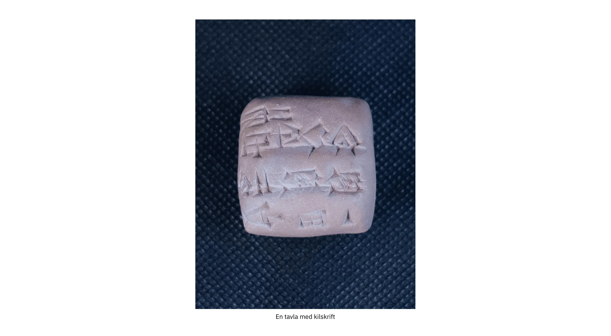

Jag har också vad jag tror är en äkta sumerisk tavla med en liten kilskrift i mitten. På den här tavlan finns signaturer som gjorts genom att rulla en cylinder, som jag ska visa dig efteråt.

Märkena med små siffror fungerade som signaturer under en tid då de flesta människor inte kunde skriva, eftersom endast skickliga skrivare hade den förmågan.

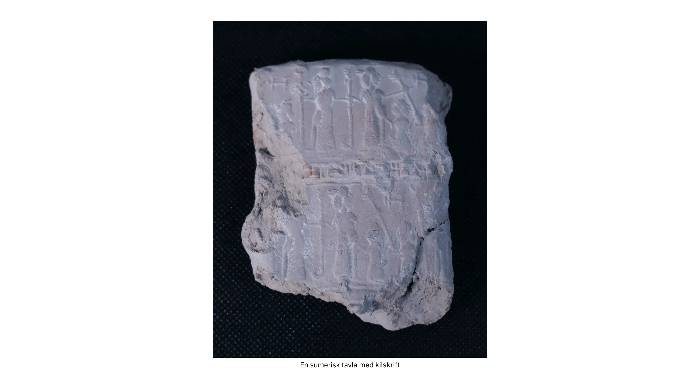

Nedan ser du cylindern som nämndes ovan: en sten graverad med specifika former. Människor brukade rulla denna signaturcylinder, som på engelska kallas cylinder seal, för att signera brev. Det var ett sätt att förtydliga författarnas namn eller att ange att de var skrivna i deras namn.

Dåtidens skrivare använde därför den kilformade pennan för att skriva ut tecken på våta tabletter.

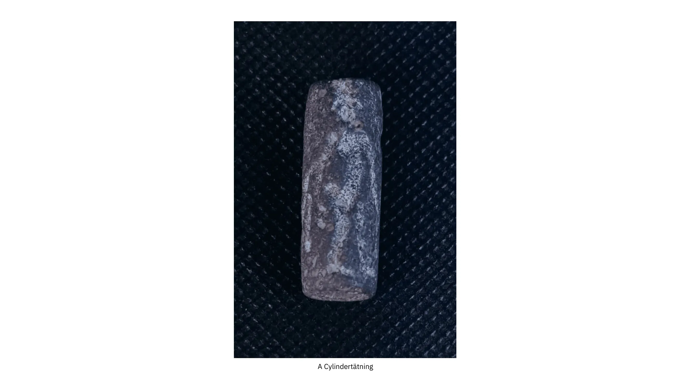

Kilskriftstecken representerade inte ett språk, utan ett skrivsystem för att registrera talade språk. På engelska skulle vi säga "writing is a written language", och sedan skulle vi säga att "cuneiform is a script, not a language". På franska skulle vi säga att kilskrift inte är ett språk, utan ett sätt att kodifiera ett språk.

### Skrivandets utveckling och användningsområden

Under de första århundradena var skriften begränsad och fungerade huvudsakligen som ett minnesmärke för att registrera mängder, listor över jordbruksvaror och utrustning. Först efterhand blev det möjligt att **fonetiskt återge namn** och fullständiga meningar.

Till en början kunde namn inte uttryckas i kilskriften eftersom den i första hand representerade föremål och element i verkligheten, som en oxe eller ett vete, avbildade som små bilder. Med tiden utvecklades dessa bilder till en mer utvecklad form av skrift, som gjorde det möjligt att återge namn och komplexa begrepp.

Om personen till exempel hette Laura kunde vi ha tagit ett ord, en akronym som lät som "vatten" och ett annat som "ras", och bildat namnet Laura av det. Det var så den första formen av skriftspråk utvecklades.

För protokollet, för att representera akronymer ursprungligen, om du ville rita huvudet på en oxe, kunde du se formen på oxens huvud. Så småningom förenklades teckningarna till att inte representera något mer än en sorts linje. De lärde tror att detta berodde på att man höll den våta lertavlan i ena handen och att det därför var lättare att rita om initialerna genom att vrida på dem. Det tros också bero på hur de skriftlärda höll i tavlorna.

Man kan fortfarande se kopplingen till exempelvis vete eller oxhuvudet i kilskriftsakronymerna, och de lutar alltid åt ena sidan.

Under de tre årtusenden som kilskriften använts har den främst tjänat till att föra ekonomiska och administrativa register. Invånarna i Mesopotamien utvecklade dock snart en djupt rotad önskan att bevara allt som förtjänade att stå emot tidens tand i skriftlig form. Berättelser, legender och sånger, som dittills hade överförts muntligt av kringresande musiker, förevigades i skrift, ofta kopierade av skrivkunniga personer under utbildning. De kopierade texter som redan fanns, främst legender eller texter som hade ett visst kulturellt värde.

Ett viktigt exempel är **Gilgamesh-eposet**, som möjligen är en **historisk kung i den sumeriska stadsstaten Uruk** omkring 2900-2350 f.Kr.

Denna form av skrift, som var både ett ekonomiskt styrmedel och en kulturell vektor, varade fram till 1000-talet e.Kr. innan den försvann för gott och lämnade efter sig ett värdefullt vittnesbörd om den civilisation som såg den födas.

## De sumeriska tavlornas roll

<chapterId>a396e6c5-56cc-5410-9e6b-0274401c5425</chapterId>

:::video id=a0729a35-01ec-4aa4-828f-d4ccc2eb168e:::

### Förmonetära kreditsystem

I det forntida Mesopotamien byggde den ekonomiska organisationen på mycket sofistikerade mekanismer som existerade långt innan metallmynten uppfanns. Redan från början var formella och informella kreditsystem en viktig form av pengar som gjorde det möjligt för lokalbefolkningen att genomföra många komplexa ekonomiska transaktioner.

Det var just för att tillgodose administrativa och ekonomiska behov som kilskriften uppfanns. De berömda mesopotamiska lertavlorna användes främst för att registrera olika typer av kontrakt: privata lån, försäljning, uthyrning, inteckningar och till och med äktenskapsavtal. För att skriva dessa tavlor krävdes specialiserade skrivare, en uppgift som var kostsam i tid och ansträngning, **men motiverad när ekonomiska intressen stod på spel.** Människor skrev inte kärleksbrev till varandra på den tiden, de använde inte en skrivare för att skriva om sina bekymmer. De anlitade en skrivare för att skriva dokument, oavsett om det fanns en koppling eller ett ekonomiskt skäl.

Det är också värt att nämna att vissa av dessa tabletter cirkulerade som innehavarobligationer och bytte ägare fritt.

Det fanns t.ex. en form av lerboll med små stenar inuti.

På lerkulans utsida fanns ett nummer skrivet och signerat, som representerade ett antal enheter. Inuti fanns det stenar och någon som ville verifiera att det här instrumentet verkligen representerade X antal enheter.

I ett annat exempel, en tavla som hittades sydväst om nuvarande Bagdad, anges att en gäldenär åtar sig att återbetala en fordringsägare 330 kornmått på skördedagen. Ännu mer fascinerande är att en annan tavla tydligt anger att en skuld på fyra mått korn måste återbetalas direkt till tavlans bärare, vilket **introducerar begreppet betalning till bäraren, ett synnerligen innovativt begrepp för den tiden**.

Från 2000 f.Kr. och framåt fanns det en lag som krävde att alla kommersiella transaktioner, även de minsta, skulle formaliseras skriftligt och undertecknas i närvaro av vittnen. Föreställ er vilken enorm byråkrati det var på den tiden att registrera alla transaktioner i register gjorda av lera av skrivkunniga, påminner jag er. Denna juridiska stringens var avsedd att förhindra framtida tvister om äganderätt och rättigheter till de utbytta varorna. Vittnen kallades ofta in för att intyga att kontraktet verkligen hade undertecknats.

Även i den privata sfären bedrev vissa familjer och individer en ekonomisk verksamhet som var tillräckligt komplex för att kräva en rigorös förvaltning. I den nordbabyloniska staden Sippar-Amnanu upptäcktes ett hus som tillhörde en Anunitum-präst vid namn Ur-Utu och som innehöll nästan 2.000 tabletter. Bland dokumenten fanns privata lånekontrakt, köpe- och hyresavtal, brev samt religiösa och akademiska texter, vilket vittnar om de privata arkivens mångfald och betydelse vid denna tid.

Det är anmärkningsvärt att de brev som skrevs av skriftlärda nästan uteslutande handlade om ekonomiska intressen: klagomål på otillräckliga bidrag, väntan på hemgift eller andra brådskande materiella förfrågningar. På den tiden fanns det inga personliga brev som kärleksbrev, och det var ovanligt att man nämnde sjukdomar.

Ett gripande exempel på ett sådant brev illustrerar denna ekonomiska verklighet: en brevskrivare uttrycker sin sorg över att ha blivit utan pengar eller förnödenheter när hans partner lämnade landet samtidigt som en svår hungersnöd drabbade Assur. Han beskriver sitt akuta behov av att köpa säd och ber att få en snabb utbetalning av kontanter motsvarande hans textilier, så att han kan säkra sin dagliga försörjning.

Detta brev, som är adresserat till hennes partner, verkar tyda på att han har gett sig iväg för att handla på annat håll och lämnat henne utfattig. Hon påminner honom om att hon måste ha tillgång till penningmått för att kunna köpa säd och betala tempelskatt. Det här är kanske det närmaste vi kan komma ett argument i ett brev från den här tiden. Brev var nästan alltid relaterade till ekonomiska transaktioner, och just det här brevet handlar om en prekär ekonomisk situation.

De mesopotamiska dokument som har kommit till oss återspeglar således huvudsakligen ekonomiska utbyten, eftersom de upprättades uteslutande för överföringar av varor med ett erkänt värde: pengar, spannmål, olika varor, fastigheter, betalning av tempelskatter. Dessa arkiv avslöjar inte bara effektiviteten och den administrativa precisionen i denna forntida civilisation, utan också dess förmåga att hantera komplexa ekonomiska utbyten under en mycket lång period.

## Elitkontroll på sumeriska tavlor

<chapterId>c6d3df0e-b1e1-58dc-ab35-9f76bbc39393</chapterId>

:::video id=04a95fb8-a701-4a48-9ce8-0e9b6ba256fd:::

### Skrivande, en teknik som framför allt är ekonomisk

I motsats till vad många tror var det inte för personlig eller litterär kommunikation som skriften uppfanns i Mesopotamien för cirka 4 000 år sedan. **Kilskriften var först och främst en ekonomisk teknik**, som bara var motiverad när viktiga ekonomiska intressen stod på spel. Sumererna använde inte skriften för att korrespondera med varandra eller uttrycka sina känslor, utan uteslutande för att dokumentera sina kommersiella och finansiella transaktioner.

Denna specialisering kan förklaras av den avsevärda kostnaden för att skriva på tavlor. Att gravera i lera krävde specialiserad teknisk expertis, avsevärd tid och specifika material. Endast transaktioner av tillräckligt stort värde motiverade denna investering ekonomiskt, vilket skapade en naturlig tröskel för tillgång till denna revolutionerande teknik.

Kilskriftstavlorna avslöjar ett finansiellt system med en för sin tid anmärkningsvärd komplexitet. Mesopotamierna hade utvecklat en komplett arsenal av moderna finansiella instrument: **privata lån med ränta, köpebrev, hyreskontrakt, inteckningar och till och med äktenskapskontrakt med finansiella klausuler**. Denna sofistikerade utveckling vittnar om en utvecklad marknadsekonomi, långt ifrån den förenklade bild av primitiv byteshandel som ofta förknippas med dessa forntida civilisationer.

Vissa tabletter fungerade som äkta innehavarpapper och cirkulerade fritt från hand till hand utan att den ursprungliga innehavaren behövde identifieras. Denna innovation möjliggjorde en anmärkningsvärd flyt i utbytet och förebådade moderna finansiella system. Dessutom krävde särskild lagstiftning till och med att alla kommersiella transaktioner skulle formaliseras i skrift, vilket institutionaliserade användningen av skrift i den ekonomiska sfären.

### Kunskapsmonopolet och den ekonomiska kontrollen

Skrivandets centrala betydelse för ekonomin gav stor makt åt dem som behärskade denna teknik. **Skribenter, som i allmänhet var knutna till tempel och styrande institutioner, hade de facto kontroll över det finansiella systemet**. Deras sällsynta och ovärderliga expertis gjorde dem till väktare av alla viktiga transaktioner.

Detta kunskapsmonopol var ingen tillfällighet. Myndigheterna hade allt intresse av att behålla denna exklusivitet, eftersom en demokratisering av skrivandet skulle ha försvagat deras kontroll över ekonomin och ökat risken för förfalskning. Den systematiska närvaron av vittnen vid signaturceremonier avslöjar denna ständiga upptagenhet med dokumentens äkthet.

Den lagstadgade skyldigheten att registrera alla affärstransaktioner skriftligen tjänade flera strategiska syften: skattekontroll, rigorös övervakning av bokföringen och upprätthållande av de ekonomiska aktörernas beroende av den administrativa apparaten. **Den mesopotamiska staten tillägnade sig därmed förmågan att hantera mellanmänskliga skulder** på en samhällelig skala och omvandlade därmed skrivandet till ett instrument för ekonomisk makt.

### Samexistensen av två monetära system

Analysen av tavlorna avslöjar en mer nyanserad ekonomisk verklighet än vad deras allestädes närvarande närvaro i arkiven antyder. Många tavlor innehåller hänvisningar till **shekeln i silver** som värdeenhet, vilket tyder på att det parallellt existerade ett monetärt system baserat på standardiserade fysiska varor.

Denna dubbelhet kan förklaras av den tidens sociala stratifiering. ** Systemet med kilskriftstavlor var förbehållet en begränsad elit**: präster, välbärgade köpmän och administratörer som kunde läsa, skriva och tolka dessa komplexa dokument. För att kunna använda en bärande skrift på ett effektivt sätt krävdes inte bara att man kunde tyda den, utan också att man kunde verifiera dess äkthet och förstå dess juridiska innebörd.

**Massan av befolkningen, som var utestängd från detta elitistiska system, utvecklade sina egna utbytesmekanismer**. Vanliga människor använde mer lättillgängliga system som standardiserade mått på spannmål, vikter på pengar och andra lätt kvantifierbara varor som vem som helst kunde utvärdera utan specialkunskaper.

Denna folkliga ekonomi, som är mindre dokumenterad i officiella arkiv, var förmodligen mer dynamisk och flexibel än tablåsystemet. Den möjliggjorde snabba dagliga utbyten utan hjälp av skrivare och tillgodosåg de omedelbara behoven hos hantverkare, bönder och småhandlare.

Silvershekeln, som ofta nämns i tavlorna som en värdereferens, fungerade förmodligen som en bro mellan dessa två parallella ekonomiska system och möjliggjorde omvandling mellan skriftliga skulder och fysiska betalningar.

### Spontan uppkomst kontra institutionell kontroll

Denna samexistens illustrerar en grundläggande debatt i den ekonomiska historien: ** Motsättningen mellan den spontana uppkomsten av bytesmedel och det institutionella tillägnandet av pengar**. Å ena sidan uppstod varor som pengar naturligt ur människors behov av att byta pengar. Å andra sidan har institutioner tillägnat sig och formaliserat dessa praktiker för att kontrollera deras flöde.

De sumeriska templen var ett exempel på denna spänning: de använde sig av populära monetära innovationer (referenser till shekeln) samtidigt som de utvecklade sina egna kontrollinstrument (kilskriftstavlor). Denna strategi gjorde det möjligt för dem att dra nytta av fördelarna med båda systemen: den folkliga legitimiteten hos traditionella valutor och den administrativa kontrollen av formaliserade skulder.

Erfarenheterna från Mesopotamien skapar bestående prejudikat för utvecklingen av finansiella system. Den visar att **finansiell sofistikering ofta föregår tekniska innovationer med flera årtusenden**, vilket vanligtvis är förknippat med den. Begreppen ränta, kredit, överlåtbara instrument och inteckningssäkerheter utvecklades inte först i samband med uppfinningen av metalliska pengar.

Denna banbrytande period avslöjar också de maktfrågor som är inneboende i alla monetära innovationer: vem som kontrollerar tekniken, vem som definierar reglerna och hur formella system och populära metoder artikuleras. Dessa grundläggande frågor har funnits kvar genom hela den ekonomiska historien och sträcker sig till dagens debatter om digitala valutor och [kryptovalutor](https://planb.academy/resources/glossary/cryptocurrency).

# Ekonomi och pengar i forntida civilisationer

<partId>a16bcf4c-8c3a-11f0-9e79-2bd363a484bd</partId>

## Bronsålderns stora civilisationer

<chapterId>fab9334c-7385-5d7c-ad40-7d152beb22a1</chapterId>

:::video id=737e12e8-1033-4210-b1dd-b8a680f68b17:::

I detta avsnitt med rubriken "Bronsålderns stora civilisationer" börjar vi med ett utdrag ur boken *A History of Money: From Ancient Times to Present Day* av Glyn Davies, som jag tycker är en utmärkt introduktion till detta avsnitt om antikens stora civilisationer.

> Toynbee identifierar cirka tjugoen olika "civilisationer", men eftersom femton av dessa direkt eller indirekt härstammar från tidigare exempel, reducerar han antalet självständigt utvecklade civilisationer till sex: sumeriska, egyptiska, minoiska, kinesiska, mayanska och andinska. Av dessa var det bara inkafolket i Anderna som lyckades uppnå en hög grad av civilisation utan att använda pengar, trots att de paradoxalt nog hade ett överflöd av de material som allmänt anses vara bäst att använda som pengar - guld och silver.

Inkaindianerna hade inget monetärt system, men de hade ett överflöd av ädelmetaller. En ganska stor paradox. Låt oss fortsätta med citatet:

> Ju mer stratifierat ett samhälle är och ju mer noggrant och effektivt dess planeringssystem är, desto mindre nödvändigt är det för befolkningen att använda pengar. Detta kan förklara varför de spanska conquistadorerna upptäckte att mexikanerna, vars regering var relativt mer liberal, regelbundet använde guldpulver (förvarat i genomskinliga rör) och kakaobönor (förvarade för stora betalningar i påsar om 24.000 enheter) som valuta, medan inkaindianerna, som var organiserade enligt en mycket mer rigid hierarki, inte hade någon valuta alls: ett undantag som bekräftas av en strikt regel. Pengarnas ursprung i Kina var helt oberoende av andra civilisationer, men den relativa närheten till de sumeriska, egyptiska och minoiska civilisationerna väcker tvivel om i vilken utsträckning de var okunniga om monetära metoder, särskilt med tanke på den omfattande handel som etablerades så långt tillbaka som i de tidigaste tiderna.

I Kina utvecklades mynten på ett helt annat sätt än i västvärlden. Det var [fiat](https://planb.academy/resources/glossary/fiat)-pengar redan från början. De var gjutna mynt.

Och här nämner Davies handel. Det förekom verkligen utbyten mellan kineserna och andra folkgrupper vid vissa tidpunkter, men bytesmedlet för utrikeshandeln var snarare siden. Som vi kommer att se senare användes guld även i Kinas gränsområden, där den kinesiska befolkningen var mindre. Och inte ens för internationell handel; för det var det siden som gällde.

Så jag kan tänka mig att de kanske har påverkats av andra civilisationer från samma tid som utvecklade denna teknik när det gäller myntens format.

Men det är uppenbart att pengar hade en helt annan innebörd i Kina än i västvärlden. Vi kommer att återkomma till detta i detalj i det följande avsnittet om Kina.

När det gäller dessa berömda sumeriska städer har jag några anteckningar här. Vi kan nämna Uruk, som var en mycket tidig och inflytelserik stad, känd för sin betydande storlek och avancerade kultur, särskilt med utvecklingen av skrift och stadsplanering.

Jag vill också nämna det berömda Gilgamesh-eposet. Gilgamesh var förmodligen en historisk kung i den sumeriska staden Uruk omkring 2900 f.Kr. Han var troligen kung i denna sumeriska stadsstat.

Vi kan också tala om Sargon av Akkad, som regerade från 2334 till 2279 f.Kr.

Han var den förste härskaren över det akkadiska riket, som är en annan civilisation som uppstod i Mesopotamien. Och jag nämner Sargon eftersom han var den förste som inrättade en posttjänst för dessa berömda tabletter här, som jag redan har presenterat för dig.

Föreställ dig att det verkligen fanns lerkuvert. Tavlorna kunde förpackas i lerkuvert med personens signatur på utsidan för att säkerställa konfidentialitet. Så folk skulle bryta upp kuvertet för att hämta tavlan. Detta postsystem har vi Sargon av Akkad att tacka för.

Sedan har vi Babylon, den stora staden som blev huvudstad i det babyloniska riket. En annan civilisation, känd för sin imponerande ziggurat och sina palats, och den berömda Hammurabikoden, mest känd för sin mycket avancerade lagbok.

Och två städer som avslutning på detta avsnitt. Vi har Ashur, som var huvudstad i det assyriska riket och ett viktigt religiöst centrum. Och vi har Nineve, som senare var huvudstad i det assyriska riket. De flyttade sin huvudstad dit och den är känd för sin mäktiga armé, sina stora palats och bibliotek. Och det är också en av de möjliga platserna för de legendariska hängande trädgårdarna i Babylon. Vi hör ofta talas om detta berömda underverk i den antika världen.

Men det finns inga spår av dessa berömda hängande trädgårdar i Babylon. I Nineve finns det däremot arkeologiska bevis på trädgårdar i flera våningar. Det är möjligt att grekiska historiker som Herodotos förväxlade Nineveh med Babylon. När de besökte städer i Mesopotamien kanske de refererade till dem som Babylon. I Nineveh har man hittat spår av berömda hängande trädgårdar och forskare undrar kanske om Nineveh är den berömda plats där dessa trädgårdar låg, de så kallade Babyloniska hängande trädgårdarna.

## Ekonomisk organisation i Mesopotamien

<chapterId>6afb6fc8-cbb7-56a5-8427-484b4b7d7477</chapterId>

:::video id=aa6a2cbd-5916-4ae3-ad4f-65f0bd5643fa:::

### Förkapitalistiska ekonomiska strukturer och slaveri

Välkommen till detta avsnitt om den ekonomiska organisationen i Mesopotamien. Den förkapitalistiska ekonomin genomgick tre huvudstadier: primitiv, slav- och feodalekonomi.

Feodal är naturligtvis mycket senare, uppenbarligen under medeltiden, och vi har redan passerat det primitiva stadiet som vi beskrev tidigare med paleolitiken. När vi nu talar om ekonomisk organisation i Mesopotamien talar vi om slaveri.

I Mesopotamien utfördes dock huvuddelen av arbetet av en beroende klass som liknade slavar, som inte juridiskt sett var sina herrars egendom utan berövades frukterna av sitt arbete genom fysiskt eller ideologiskt tvång.

### Templens och palatsens roll som ekonomiska centra

Stora jordinnehav dominerade ekonomin. Markägarna utnyttjade sin mark direkt genom att anställa arbetare, eller så hyrde de ut sin mark i utbyte mot arrende. De ägnade sig också åt finansiell verksamhet och lånade ut pengar till höga räntor, i allmänhet mellan 20% och 33,3% per år, vilket stod i skarp kontrast till de strängare reglerna hos grannfolket hebréerna.

De lån som bönderna tog var inte avsedda för produktiva investeringar - med undantag för rederier - utan snarare för att säkra deras överlevnad fram till nästa skörd. Denna situation ledde ofta till kronisk skuldsättning hos jordbrukarna.

Låt mig dra en parallell till en mer sentida period under antiken (Rom), där medborgarna levde av jordbruksarrenden som producerades av bönder och ofri arbetskraft, samt krigsbyten. **Dessa intäkter fördelades bland medborgarna, inte för att generate skulle ge mer vinst, utan för att höja deras sociala status.** Handel och hantverk lämnades i allmänhet till grupper utanför den sociala eliten. Allt detta står i kontrast till de medeltida ekonomierna som var inriktade på vinst genom handel och hantverk.

Så vad vi försöker säga här är att jag drar en parallell till det faktum att människor använde finansiella låneverktyg inte nödvändigtvis för att förbättra sina produktionsmedel, och senare i Rom återinvesterades inte nödvändigtvis vinsterna, utan de användes snarare för att öka prestigen hos de människor som kunde dra nytta av dessa vinster. Vi är fortfarande långt ifrån den kapitalistiska anda som växte fram senare under medeltiden, då arbetstillfällen kunde skapas för att förbättra produktionsmedlen och överskott togs och skapades i vinstsyfte. Vi kan alltså konstatera att den ekonomiska organisationen ännu inte hade nått det tredje steget i den ekonomiska utveckling som beskrivs ovan.

### Uppkomsten av kreditsystem och beräkningsenheter

**Karl Polanyi skiljer mellan tre former av ekonomiskt utbyte: reciprocitet mellan symmetriska grupper,** det vill säga i primitiva stammar där vi egentligen inte behöver pengar eftersom vi ger varandra informell kredit och utbyte och omfördelning. **Omfördelning centraliserad kring tempel och palats,** denna form av utbyte är förenlig med Mesopotamien, där tempel stod i centrum för den ekonomiska organisationen och en gång i tiden kunde ge tillbaka, fördela rikedom i form av ransoner. Det var först senare som begreppet lön introducerades. Fram till nu har vi alltså den primitiva formen (1), centraliserad omfördelning (2) i tempel och palats, och sedan kan vi äntligen ge plats för marknadsutbyten (3). Även om marknaden som vi förstår den idag inte existerade fullt ut, är förekomsten av marknadsutbyten i Mesopotamien obestridlig, vilket bekräftas av förekomsten av specifika termer på akkadiska och av förekomsten av arkeologiska bevis på priser, vinster, förluster, fluktuationer och situationer av knapphet.

De mesopotamiska hushållen skötte självständigt alla led i jordbruksproduktionen, från sådd till den slutliga bearbetningen till bröd och öl. Kvinnorna tillverkade också de textilier som behövdes av deras anhöriga. För varor som inte producerades lokalt vände sig hushållen till specialiserade köpmän.

Familjeband var särskilt viktiga inom handeln. Under den paleoassyriska perioden (ca 1910-1830 f.Kr.) etablerade köpmän från staden Ashur en handelskoloni i Kanesh i Anatolien, där de importerade tenn och textilier i utbyte mot guld och silver. Handeln var baserad på familjeföretag som var nära sammanlänkade genom äktenskap och handelspartnerskap. Kanesh var bara en länk i ett stort internationellt handelsnätverk.

I dessa utbyten förekom metaller, och det var ädelmetaller och inte nödvändigtvis till exempel koppar, som var mycket användbart vid den tiden, och vi tror att dessa metaller utbyttes mot föreställningar om värdebevarare. Så vi kan inte nödvändigtvis tala om byteshandel, där två varor byts mot varandra för sin användbarhet, utan snarare om betalning med en viss medvetenhet om att ädelmetaller hamstrades för att användas som värdebevarare och inte för att användas som handelsvara, till exempel när brons användes för att tillverka rustningar.

Hyllningar och skatter betalades huvudsakligen in natura (korn eller vägt silver). Tempel och palats var de viktigaste ekonomiska, administrativa, politiska och religiösa centrumen och utförde också de första bankfunktionerna genom säker deponering av varor, först spannmål, sedan andra jordbruksprodukter och slutligen ädelmetaller. På så sätt utvecklades de första kredit- och lånetransaktionerna, långt innan mynten dök upp.

I den mesopotamiska ekonomin användes främst korn och silver som värdemätare. Silver vägdes i standardiserade enheter, t.ex. sìqlum (shekel) på ca 8,33 gram. Redan under den gamla babyloniska perioden (under Hammurabi) användes silver som ett vanligt betalningsmedel, med en tidig uppfattning om nominellt värde ("nūbum") i motsats till verklig vikt ("šuqulum"), ** vilket föregrep det moderna begreppet fiatvaluta**.

Men det var ännu inte fiat-pengar i ordets strikta bemärkelse. Det fanns ingen föreställning om en stämpel med en auktoritetsfigur, men det fanns en föreställning om en nominell beräkningsenhet, i motsats till föreställningen om vägd metall. Det fanns en skillnad i språket för dessa två begrepp, och jag tycker att det är viktigt att nämna det.

Övergången till en lönearbetsmarknad var svår. Den krävde två stora begreppsmässiga innovationer: att skilja personens arbete från slutprodukten och att införa "arbetstid" som en mätbar enhet. För att få detta begrepp om löntagare och tjänstemän var vi först tvungna att gå igenom dessa två innovationer. **Under det III:e årtusendet ersattes arbetet till en början med fasta ransoner, innan det gradvis utvecklades mot ett lönesystem i början av det II:a årtusendet.**

Slutligen, från och med 26:e århundradet f.Kr. och framåt, slog en verklig uppfattning om penningvärde rot, även om de mesopotamiska "pengarna" inte var ett mynt utan snarare ett viktat mått av säd eller metall. **För viktiga transaktioner eller i sammanhang som krävde att värdet bevarades föredrogs därför ofta att omvandla spannmål till silver, som var lättare att bevara.** Lite som i exemplet Kanesh, där silvermetall togs emot för hamstring.

Från och med 2000-talet f.Kr. och framåt, **när de asymmetriska utbytena i stort sett försvunnit**, noterar vi att verbet sa i uppdragsavtal avser betalning av priset. Detta begrepp, som kallas "sa", förekommer i avtal och avser betalningen av ett pris, inte mätningen av en viss vara. "Sa" syftar helt enkelt på en betalning eller ett pris. Det är en antropolog som noterar detta och nämner att det verkligen är ett genombrott; vi ser en slags dikotomi mellan före och efter detta införande av verbet "sa" i kontrakt.

Vi kan inte bortse från de empiriska data som finns i arkiven i Främre Orienten och som visar att det fanns **vissa marknadsmekanismer**, med **begrepp som vinst** och **förlust**, **prisfluktuationer** och situationer med **brist**. Men den grundläggande svårigheten ligger i att fastställa den relativa betydelsen av marknadsbaserat utbyte inom den forntida mesopotamiska ekonomin som helhet.

Jag tror att experterna på det här området har sett spår av de här marknadskoncepten, men de kan inte riktigt säga hur stor del av den tidens ekonomi som baserades på det här modernare marknadskonceptet eller andra mekanismer.

Vi vet att det fanns, men vi vet inte om det var det huvudsakliga sättet att fastställa priser eller bedriva handel.

Detta avslutar detta avsnitt om ekonomisk organisation i Mesopotamien.

I de kommande avsnitten gör vi samma sak för Egypten och Kina.

## Ekonomisk och monetär organisation i forntida Egypten

<chapterId>bffcc16c-7fbf-5992-a0fa-6a7726d7d287</chapterId>

:::video id=40c1c4e5-b190-4bb6-b8a0-810c9ce7698b:::

### Historisk bakgrund och egyptiska perioder

Detta avsnitt är tillägnat den ekonomiska och monetära organisationen i det forntida Egypten. För att ge dig bara lite bakgrund, här är en lista och kort beskrivning av de aktuella perioderna.

- Gamla riket (ca 2575 - ca 2130 f.Kr.)**. En period som präglades av byggandet av de stora pyramiderna, särskilt de i Giza. Detta var den centraliserade egyptiska monarkins guldålder.
- Mittens rike (ca 1938 - ca 1630 f.Kr.)**. Politisk och kulturell renässans efter en period av instabilitet.
- Nya riket (ca 1539 - 1075 f.Kr.)**. En period av territoriell expansion, militär makt och internationell handel. Här regerar kända faraoner som Tutankhamon och Ramses II.
- 1323 F.KR. - Tutankhamuns död**. Den unge faraon dog i en ålder av ca 18-19 år. Hans nästan intakta grav upptäcktes 1922, vilket gjorde den till en av de mest berömda av alla arkeologiska upptäckter.
- Ramses II - regerade 1279-1213 f.Kr**. En av de mäktigaste faraonerna i det nya riket. Känd för sina militära kampanjer, sina stora monument och för att ha ingått det första kända fredsavtalet.
- 1275 f.Kr. - Havsfolken**. Invasioner eller migrationer av grupper som kallas "havsfolken" destabiliserar flera civilisationer i Medelhavsområdet, däribland Egypten.
- Slaget vid Xoïs - 1178 f.Kr**. Konflikt mellan den egyptiska armén och inkräktare, troligen med koppling till havsfolken. Ett av många slag i slutet av det nya riket.
- Senperioden** är den period i fornegyptisk historia som sträcker sig från cirka 664 till 332 f.Kr.
- Kleopatra VII (69 - 30 f.Kr.)**. Egyptens sista drottning, känd för sin intelligens, karisma och sina allianser med Julius Caesar och Marcus Antonius, och förmodligen också för sin näsa. Hennes regeringstid markerade slutet på faraonernas Egypten innan det annekterades av Rom.

Redan under det 5:e och 4:e årtusendet f.Kr. hade Egypten en intensiv och storskalig handelsverksamhet och knöt samman Nubien, Palestina, Libyen och Röda havsområdet genom sjö-, flod- och landhandel (framför allt med åsnekaravaner).

### Tidiga valutasystem och paleo-valuta

När de första egyptiska hövdingadömena uppstod omkring 3650-3400 f.Kr. blev Maadi, söder om nuvarande Kairo, ett viktigt centrum för kopparteknik och långväga handel, framför allt med Mesopotamien via den syriska kusten.

Även om den storskaliga handeln huvudsakligen baserades på byteshandel, fanns det troligen en primitiv form av pengar ("paleo-valuta"), som bestod av prestigeföremål som halvädelstenar och fossila snäckor. Guld spelade förmodligen redan en viktig roll i dessa utbyten. Det första explicita omnämnandet av ett mynt i egyptiska dokument i mitten av det 3:e årtusendet f.Kr. återspeglar en lång utveckling kopplad till kommersiella metoder.

I det arkaiska samhället (här talar vi inte nödvändigtvis om Egypten, utan om arkaiska samhällen i allmänhet) var betalningar vanliga, inte för att köpa direkt, utan för att betala hemgift, religiösa ritualer och andra sociala skyldigheter. Dessa transaktioner krävde exakt prissättning och värdering. Många primitiva samhällen hade privilegierade, monetära (dvs. räknebara) föremål, i vilka detta värde uppskattades. Om man ska betala en hemgift måste man naturligtvis notera en viss mängd av ett föremål som ska bytas ut för att betala hemgiften. Detta värde är i huvudsak värdet av människor.

I arkaiska samhällen, innan pengar eller monetära system uppstod, förekom betalningar, men de var ofta kopplade till sociala skyldigheter och deras värde härleddes från individernas värde, som vid betalning av hemgift eller blodspengar.

Om vi återvänder till Egypten under det antika imperiet så övergick "shât(y)", som ursprungligen var en konkret monetär enhet (ett litet guld- eller silvermynt som vägde cirka 7,6 gram), mycket snabbt från sin verkliga funktion som hårdvaluta till en **räkenskapsfunktion** som gav upphov till begreppet värde. Vi kan i det se en slags räkneenhet för att uttrycka värde, som ursprungligen var ett slags mynt, men vi kan inte riktigt kalla det ett mynt eftersom det inte är stämplat, det är bara ett mått av metall. Vi närmar oss begreppet en räkneenhet.

Denna uppfattning om shât(y) övergavs så småningom, kanske på grund av risken för bedrägeri. Vi kommer senare att se att egyptierna var långsamma med att införa stämplade mynt och till och med fortsatte att väga dem, även efter att de hade införts av sina grannar.

Under medeltiden användes silver sällan för vardagliga transaktioner, som huvudsakligen utfördes med spannmålsmått och brödkvantiteter. Det var under denna period som en form av skriftpengar dök upp, där betalningar kunde registreras skriftligen eller genom faktisk överföring.

Under det nya riket blev det monetära systemet mer komplext och integrerade olika råvaruvalutor värderade i metaller (guld, silver, koppar), standardiserade tyger, spannmål och olja. Tygerna kallades för "tygmått". ** Priserna på vardagsvaror uttrycktes ofta i spannmål eller koppar, medan dyrbara föremål värderades i guld eller silver. Silver, som var mer sällsynt i Egypten än guld, blev särskilt eftertraktat.** Silver var övervärderat jämfört med guld, som det fanns mer av i Egypten.

Under senperioden (första årtusendet f.Kr.) hade silver blivit den vanligaste bytesmetallen i hela Främre Orienten. Det cirkulerade i form av tackor, metallmynt eller ringar, som vägdes och märktes i tempel, vilket garanterade deras vikt och renhet, även om de inte präglades i en suveräns avbild. Det kom senare och kommer att behandlas i ett senare avsnitt om lydierna.

Det bör också noteras att de gamla egyptierna hade en term, "hedj", för pengar och att den användes generellt för att beteckna alla betalningsmedel som fungerade som ersättning i en transaktion, oavsett om det gällde metall, spannmål, tyg eller olika varor (trä, djur, tjänster etc.). Dokumenterade exempel visar att egyptierna kunde lösa en transaktion genom att kombinera olika produkter vars totala värde uttrycktes i kopparenheter ("deben").

**Templen spelade en central roll i den egyptiska ekonomin: där samlades och förvarades stora skatter av ädelmetaller (guld och silver) för att hedra gudarna men också för att fungera som en monetär reserv som kunde återinföras i det ekonomiska kretsloppet vid behov**. Vi kommer att se exempel på andra civilisationer som samlar värdefulla reserver i templen, till exempel statyer, för att smältas ned i händelse av krig, valutabrist eller kris. Detta är ett återkommande tema genom historien.

Det är också värt att nämna att odlingen av linne var ett kungligt monopol som tilldelades templen, och tillverkningen av dyrbara tyger bekräftade deras ekonomiska betydelse.

De gamla egyptierna gjorde en tydlig åtskillnad mellan ädelmetallernas ideologiska aspekt, kopplad till gudomlighet (guld representerade gudarnas kött, silver deras ben), och deras praktiska funktion som valuta som fungerade som referens för alla andra former av betalning.

Även om det forntida Egypten inte utvecklade en präglad valuta som kan jämföras med moderna monetära system förrän i slutet av perioden, hade landet ett sofistikerat monetärt system som byggde på en kombinerad användning av skriftpengar, exakta räkneenheter, varupengar och ädelmetaller värderade efter vikt.

Själva mynten vägdes, vilket gav upphov till två olika begrepp: **"mynt" och "pengar"**. Jag använde två termer på engelska. För det första syftar "coinage" på mynt, ett begrepp som kommer senare, och vi har också detta begrepp pengar. Vi kan redan definiera ett visst begrepp "pengar" genom de beräkningsenheter som jag just har uttryckt i termer av pengar, men som ännu inte var mynt, så "coinage" kommer lite senare med lydierna.

Mynt är alltså inte en förutsättning för pengar, ** så mycket att vi kan erkänna att det fanns pengar redan under det 3:e årtusendet,** i varje fall och utan tvekan under det 2:a årtusendet och särskilt under Hammurabis regeringstid.

Det som är viktigt att komma ihåg här, och det är detta som författaren nämner i boken "The Origins of Money", är att det inte råder något tvivel om att begreppet pengar redan existerade vid den tiden, i dessa monetära system, och det är ett misstag att koppla pengarnas födelse som begrepp till myntens utseende.

Slutligen måste Polanyis begrepp ömsesidighet och omfördelning, som ofta tillämpas på det forntida Egypten, nyanseras: även om de existerar utgör de inte ett exklusivt ramverk. Det faraoniska Egypten hade utvecklat en komplex ekonomi som fullt ut integrerade sofistikerade kommersiella utbyten, skilda från religiösa och rituella praktiker, vilket visar att den ekonomiska domänen verkligen var oberoende av den ideologiska.

Denna särprägel är kopplad till uppfattningen att ädelmetaller var förknippade med en viss gudomlighet, men ändå kunde särskiljas.

Jag tar upp detta eftersom Polanyi hänvisade till användningen av dessa ädelmetaller som en i första hand religiös eller gudomlig föreställning. Vi föreslår dock att de också var integrerade i det ekonomiska systemet och att egyptierna redan kunde göra sådana distinktioner.

Avslutningsvis vill jag citera ur boken "The Origins of Money", som listar syftet med denna uppfinning, präglade pengar. Det finns flera punkter, men jag skulle bara vilja betona punkt 5:

*utveckla möjligheten till ekonomiskt spel genom att använda metoder som devalveringar och successiva revalveringar för att minska eller öka import och export till lägre kostnad*

Så även i dessa arkaiska tider föreslår författaren att mynt redan hade uppfunnits eller uppstått under statlig kontroll och redan manipulerades när det gäller deras kvantitet av ädelmetaller och vikt för att styra ekonomin. Tillåt mig att ge dig ett litet scoop angående ett efterföljande avsnitt. **Även i de tidigaste formerna av mynt, som var gjorda av elektrum, en legering av guld och silver, vet vi genom att analysera innehållet av ädelmetaller i dessa mynt att de första utgivarna, till exempel Croesus, hade mindre guld än i naturlig elektrum.**

Det betyder att de redan visste hur man separerade guld och silver och gav ut mynt som innehöll mindre guld.

Författaren menar att redan från myntens tidigaste dagar missbrukades makten att prägla pengar för att öka den utgivna kvantiteten, möjligen som en form av ekonomisk planering, utöver att bara certifiera vikt och underlätta handel.

## Teckenvaluta och ekonomisk och monetär organisation i det gamla Kina

<chapterId>e08d3be9-423c-5cf3-a606-6ad54e2261af</chapterId>

:::video id=ae7e6367-1725-455e-bfe6-359be1f443e5:::

I det här avsnittet, som har rubriken "Teckenpengar och den ekonomiska och monetära organisationen i det forntida Kina", ska vi se att forntida kinesiska pengar har tydliga kännetecken från västerländska traditioner. Den kinesiska valutan var redan från början en "teckenvaluta". Informationen i detta avsnitt är baserad på anteckningar som jag gjorde efter att ha läst boken "Aux origines de la monnaie".

### Begreppet teckenvaluta och dess särdrag

Enligt författaren är teckenpengar motsvarigheten till dagens fiatvaluta. Det är en valuta som inte har ett värde som är kopplat till dess metallinnehåll. Från början var det ett slags överenskommelse, ett socialt samförstånd om värdet på dessa mynt.

De gamla kinesiska mynten har egenskaper som skiljer sig från västerländska traditioner. De var huvudsakligen av metall, men snarare gjutna än präglade, och hade inte någon avbild av en regent. Förvånansvärt nog hade den kinesiska staten inte monopol på monetär utgivning. Denna skenbara liberalism kan förklaras av att det inte fanns något ekonomiskt behov av att monopolisera penningutgivningen, tack vare de rikliga skatteintäkter som togs ut från en stor skattepliktig befolkning.

Kinesisk valuta kännetecknas också av sin fiduciära aspekt. Redan från början användes bronsimitationer av snäckor som valuta, utan någon direkt koppling till den använda metallens inneboende värde. Om vi går mycket långt tillbaka i historien använde kineserna snäckskal som valuta. Så småningom, när snäckorna blev för få, gjorde de kopior i koppar, och dessa kopior hade samma värde som den äkta varan.

Den kinesiska valutan baserades därför inte på materialets värde eller originalföremålets relativa sällsynthet (t.ex. skaldjur), utan på ett kollektivt förtroende för dess användning som bytesmedel - med andra ord ett monetärt tecken.

### Från cowrie-skal till metallimitationer

Cowrie-skalet användes ofta som en primitiv monetär enhet. Gamla inskriptioner visar att redan under Shang- och Zhou-dynastierna (de första dynastierna under första och andra årtusendet f.Kr.) användes kauriskal inte bara för att belöna militära gärningar utan också för att **belöna arbete, mäta värde och köpa mark**.

Det som är viktigt att komma ihåg här är att det inte bara var vilket verktyg som helst som användes av samhället för begränsade ändamål. Det användes för militära belöningar, betalning för arbete och mätning av värde. Vi hittar spår av detta i arkeologernas skrifter. Även om vi inte vet om den användes för att köpa bröd varje dag, har vi bevis för att den kan ha använts för de typer av transaktioner som nämns ovan.

Med tiden ledde bristen på äkta kaurisnäckor till att man började tillverka imitationer i brons, ben, pärlemor eller sten, särskilt för användning i begravningssammanhang för att undvika att de äkta värdena fastnade i gravarna. Detta byte av medium är också kopplat till idén om prinsens kontroll över pengar, en kontroll som är desto lättare om prinsen tillverkar pengarna.

Vad vi måste förstå här är att om prinsen kan skapa valutan själv, genom att gå bortom begränsningen av naturlig knapphet på snäckskal, ger det honom större kontroll över förvaltningen av ekonomin.

Till skillnad från Mesopotamien, där mynten var kopplade till vikten av ädelmetall, härrör den kinesiska myntterminologin direkt från de ursprungliga formerna på de föremål som användes som valuta: koskrin (bei), knivar (dao), spadar (bu) och runda mynt (quan eller qian). Vi kan alltså se att ursprunget till ord som rör pengar i Kina syftade på dessa föremål. I väst har vi däremot ett antal monetära termer som kommer från helt andra begrepp än dessa, mer relaterade till de monetära objektens fysiska egenskaper och vikt. Dessa etymologiska skillnader visar tydligt på den schism som finns mellan den västerländska och den kinesiska synen på pengar.

I Kina var penningvärdet helt och hållet ett förtroendeuppdrag, baserat på en social överenskommelse mellan staten, producenter och handlare.

### Ekonomisk reglering och monetär filosofi

Den kinesiska staten använde pengar som ett instrument för ekonomisk reglering: i tider av penningöverflöd minskade pengarnas värde, vilket gjorde det lättare för människor att köpa varor. Omvänt ökade pengarnas värde i tider av penningbrist, vilket stärkte statens köpkraft för dess efterföljande operationer.

Här kan man göra en koppling till [inflation](https://planb.academy/resources/glossary/inflation) och deflation. Med en fast penningmängd stiger penningvärdet om produktiviteten i ekonomin ökar. Omvänt gäller att om produktiviteten sjunker så sjunker värdet på pengarna. I det här exemplet är det dock tvärtom. Förmodligen berodde det på att fursten inte hade fullständigt monopol på penningtillverkningen, men det visar ändå att penningvärdet var kopplat till ekonomiska förhållanden.

Filosofen Mo Di (5:e-4:e århundradet f.Kr.) hade redan analyserat detta förhållande mellan pris och värde: enligt honom återspeglar prisvariationer inte en verklig uppfattning om billighet eller absolut dyrbarhet, utan snarare ett fluktuerande förhållande mellan varor och pengar, oberoende av det stabila nominella värdet på valutatecknet.

Så här, istället för att säga att guldmyntet skulle ha något slags grundläggande värde i sig, såsom bruksvärde eller inneboende värde, påpekar han att värdet på det monetära tecknet snarare kom från ekonomins tillstånd.

I Kina behövde mynten inte nödvändigtvis vara officiellt märkta eller garanterade. Att de accepterades berodde enbart på kollektiv tillit, vilket förklarar varför brons- eller kopparmynt utan specifika inskriptioner kunde cirkulera fritt under lång tid.

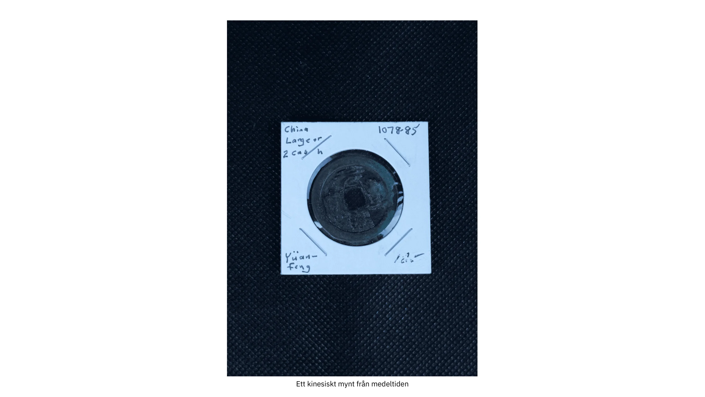

Den ovan är ett kinesiskt mynt från medeltiden. Det är ett gjutet mynt med ett fyrkantigt hål i mitten. Detta hål användes för att trä ett rep genom, vilket gjorde att mynten kunde träs ihop till armband eller halsband. Dessa mynt var dock inte i första hand avsedda att bäras, utan de användes främst för bokföringsändamål. De kunde träs ihop till bokföringsenheter i form av stora strängar, där bitarna var sammankopplade med varandra. Det var inte nödvändigtvis några specifika märken, ibland var det helt enkelt bronscirklar.

Statens monetära monopol, som sent omsider etablerades av Wudi från Han-dinastien 113 f.Kr., ifrågasattes ofta, vilket gjorde det möjligt för olika privata eller lokala aktörer att ge ut sina egna valutor, förutsatt att de åtnjöt tillräckligt socialt förtroende.

**De kinesiska valutornas låga inneboende värde förhindrade hamstring och garanterade en smidig cirkulation**. Ädelmetaller användes sällan som cirkulerande valuta för att förhindra hamstring. Guld, som var för dyrt, lades vanligtvis åt sidan i stället för att spenderas. Istället var det **endast siden som utgjorde en verklig valuta med högt värde i den kinesiska internationella handeln**. Kineserna handlade med siden, inte med guld.

Under ekonomiska eller monetära kriser, särskilt när kopparpriset steg, användes innovativa lösningar: redan på 200-talet e.Kr. klipptes mynt i omlopp för att skapa mindre enheter, vilket gjorde det möjligt att upprätthålla en flytande cirkulation till lägre kostnad. Under andra epoker, t.ex. under Wang Mang (början av 1:a århundradet e.Kr.), experimenterade man med valutor med hög fiduciäritet, där det nominella värdet var mycket högre än det faktiska metallinnehållet, vilket var en föregångare till sedlar. De tog ett mynt och stämplade värden som 50, 100 eller 200 på det för att ange större belopp, t.ex. 200 mynt. Denna praxis bidrog sannolikt till en betydande inflation.

Som nämnts ovan byggde detta system på en social konvention mellan staten, producenterna och köpmännen, men också på auktoritära och stränga regler för dem som inte spelade med i spelet, särskilt när det gällde valet av delar (oavsett om de var vackra eller inte) eller tygernas längd (som inte överensstämde med standarden).

Enligt min ödmjuka åsikt är det inte ett särskilt solitt system. Det byggde främst på strikta regler som krävde att tjänstemän och handlare skulle acceptera skadade mynt, under hot om sanktioner.

### Kinesiska monetära innovationer och deras ekonomiska effekter

Kina var också en pionjär när det gällde utgivningen av tidiga former av papperspengar, som ursprungligen infördes som svar på en brist på metall på 800-talet e.Kr. Trots sina initiala fördelar ledde dessa pappersvalutor regelbundet till inflationsspiraler när de gavs ut i överflöd, vilket bevittnades under Song- eller Mingperioderna, då överdriven utgivning ledde till allvarliga valutakriser, illustrerade av Marco Polo på 1200-talet, som till och med noterade att förfalskning av sådana papperspengar kunde bestraffas med döden. Jag kan inte låta bli att peka på en form av våld här.

Den kinesiska erfarenheten kännetecknas således av en djupt förtroendefull syn på pengar, en anmärkningsvärd flexibilitet i det monetära systemet och en tidig användning av pappersvalutor, som bygger på förtroende mellan ekonomiska aktörer snarare än på det inneboende värdet av de medier som används.

## Samhällelig och ekonomisk organisation under antiken

<chapterId>4023c3ce-7a47-5ac4-8f5f-c7ab699ab20f</chapterId>

:::video id=2761efe4-21cf-4f06-9bda-c03f9ff39012:::

### Debatten om urban parasitism

Förhållandet mellan forntida städer och deras omland väcker en grundläggande fråga: fungerade dessa urbana centra som parasiter som drog in rikedomar eller som motorer för en fördelaktig ekonomisk specialisering? Parasitismhypotesen innebär att bronsålderns städer, särskilt i Mesopotamien, **systematiskt utvann mer värde från sina landsbygdsterritorier än de gav tillbaka** och i huvudsak levde på hyror och skatter utan att skapa motsvarande värde.

Denna vision återspeglades i romarrikets kollaps: när den territoriella expansionen upphörde, upphörde flödet av externa rikedomar, vilket kunde leda till att en urban ekonomi inte kunde finansiera sig själv. Städerna skulle därmed ha levt "över sina tillgångar" och varit beroende av utvinning snarare än produktion.

### Specialisering som drivkraft för värdeskapande

En alternativ ekonomisk läsning utmanar denna parasitära vision. **De antika städerna fungerade framför allt som centrum för specialisering och arbetsdelning**. Deras roll gick längre än till att bara utvinna varor: de koncentrerade specialiserade hantverk, organiserade handelsnätverk och fungerade som nav för långväga utbyten.

Denna specialisering av städerna skapade ett produktivt ömsesidigt beroende med inlandet. **Städerna kunde inte överleva utan jordbruksleveranser från landsbygden, men inlandet gynnades i gengäld av hantverksprodukter, tekniska innovationer och tillgång till handelsnätverk i Medelhavsområdet**. Arbetsfördelningen möjliggjorde ömsesidiga produktivitetsvinster, även om fördelningen av fördelarna kan ha verkat obalanserad.

Tidens kroniska osäkerhet kring livsmedelsförsörjningen förklarar delvis denna uppenbara asymmetri. Risken för hungersnöd och förstörda skördar var ett ständigt hot mot befolkningen på landsbygden, medan hantverkare i städerna, som var anslutna till internationella handelsnätverk, åtnjöt större ekonomisk stabilitet.

### Historisk utveckling, från antiken till medeltiden

Kontrasten mellan antikens och medeltidens organisation kastar ljus över denna fråga. **Antiken gynnade en storskalig arbetsfördelning, med städer som var öppna för hela Medelhavsvärlden**. Handel och specialisering nådde sofistikerade nivåer och skapade omfattande ekonomiska nätverk.

Romarrikets kollaps ledde till en radikal fragmentering: **Den feodala eran ersatte denna centraliserade organisation med ett decentraliserat system av självförsörjande gods**. De antika romerska villas rusticae blev matrisen för medeltidens seigneurier, vilket skapade en mosaik av praktiskt taget självförsörjande ekonomiska öar som förvaltades av prästerskapet eller adeln.

Den medeltida decentraliseringen minskade visserligen den kommersiella effektiviteten, men gav paradoxalt nog större motståndskraft mot externa chocker. Feodala gods utvecklade mer balanserade relationer mellan maktcentra och landsbygdsbefolkning, även om denna organisation begränsade de produktivitetsvinster som var kopplade till specialisering.

### Framväxten av urbana marknader

Arkeologiska fynd visar att det fanns **shoppinghamnar och handelskvarter i mesopotamiska städer redan under det andra årtusendet**. Dessa infrastrukturer vittnar om att det fanns organiserade marknader, även om deras exakta funktion fortfarande är omdiskuterad.

Karl Polanyi, som inledningsvis var skeptisk till förekomsten av genuina marknadsmekanismer under antiken, nyanserade sin ståndpunkt genom att erkänna att han kan ha underskattat den tidiga uppkomsten av marknadsutbyten. Denna intellektuella utveckling speglar komplexiteten i att tolka antika ekonomiska system, där institutionell omfördelning, ömsesidigt utbyte och begynnande marknadstransaktioner samexisterade.

### Sparta mot Aten

Jämförelsen mellan Sparta och Aten illustrerar på ett utmärkt sätt förhållandet mellan det monetära systemet och samhällsorganisationen. **Sparta är en modell för ett strikt hierarkiskt samhälle som medvetet förkastade användningen av pengar**, medan Aten utvecklade en sofistikerad monetär ekonomi som komplement till sitt demokratiska system.

Spartanernas avståndstagande från pengar var inte spontant, utan **institutionellt och ideologiskt**. De spartanska ledarna fruktade att pengar skulle korrumpera militära och medborgerliga värderingar och föredrog ett system som byggde på direkt förtroende mellan medborgarna.

För att motverka användningen av pengar använde Sparta **tunga, opraktiska metallstänger**, vilket paradoxalt nog visade på en intuitiv förståelse för de monetära egenskaper (delbarhet, transportabilitet, hållbarhet) som de strävade efter att neutralisera.

### Gränserna för den antimonetära modellen

Den spartanska organisationen illustrerar begränsningarna i **Dunbars tal** tillämpat på samhällsskalan. **Genom att förkasta pengar som ett neutralt bytesmedel dömde Sparta sig självt att begränsa sitt medborgarsamhälle till ett begränsat antal medborgare som kunde upprätthålla relationer av direkt förtroende**. De homoioi (spartanska medborgarna) utgjorde bara 1% av den totala befolkningen, omgiven av tusentals hilotes (slavar).

Denna organisation, som ursprungligen var en källa till exceptionell militär sammanhållning, visade sig vara strukturellt bräcklig. **Slaget vid Leuctres (371 f.Kr.) visade på systemets begränsningar**: förlusten av människoliv krossade oåterkalleligen spartanernas sociala struktur och ledde till att deras civilisationsmodell kollapsade.

Konkurrerande städer (Aten, Korinth, Thebe), med utvecklade monetära system, **hade rikare och mer motståndskraftiga ekonomier**, som kunde kompensera för mänskliga förluster genom ekonomisk återuppbyggnad och invandring.

### Personligt kontra institutionellt förtroende

Erfarenheterna från Spartan visar på de **risker som finns i ett samhälle som uteslutande bygger på mellanmänsklig tillit** snarare än neutrala institutionella mekanismer. Samtidigt som denna modell skapade en stark social sammanhållning, gjorde den samhället sårbart för demografiska chocker.

Genom att möjliggöra anonyma och avpersonifierade transaktioner erbjuder pengar en överlägsen systemisk motståndskraft. Det möjliggör social expansion bortom gränserna för direkt förtroende, vilket underlättar utländska utbyten och ekonomisk tillväxt.

### Inka-paradoxen, rikedom utan pengar

Inkariket utgör en fascinerande paradox: **en civilisation med enorma guldrikedomar men utan monetärt system**. Precis som Sparta byggde denna modell på en rigid hierarkisk organisation och centraliserad planering, men visade sig vara sårbar för conquistadorer med flexibla monetära ekonomier.

Denna strukturella bräcklighet hos anti-monetära system i förhållande till monetära samhällen är ett återkommande historiskt mönster, vilket tyder på att **institutionellt förkastande av pengar, långt ifrån att stärka den sociala sammanhållningen, paradoxalt nog kan försvaga civilisationer** inför externa utmaningar och historisk förändring.

Analysen av dessa historiska modeller visar att pengar, utöver sin bytesfunktion, är en markör och möjliggörare av social komplexitet, vilket gör det möjligt för civilisationer att överskrida de gränser som direkta mellanmänskliga relationer sätter.

# Uppkomsten av präglade pengar

<partId>232e365a-8c3b-11f0-b276-b3ab70d1a5a1</partId>

## Uppkomsten av mynt

<chapterId>40ed3414-3066-57bd-bc1b-617ad0a354e0</chapterId>

:::video id=1d6834c4-98a3-43fe-ba80-04be51b0486e:::

Vi har nu kommit till den springande punkten: myntens utseende. Jag betonar ordet "mynt" här eftersom vi i tidigare avsnitt har sett att pengar eller monetära system var mycket närvarande i de civilisationer som föregick de lydiska folken, grekerna och perserna. Det är ganska tydligt, tycker jag, från vad vi just har sett. Därför är detta avsnitt tillägnat uppkomsten av mynt i egentlig mening och har rubriken: *Myntens uppkomst*.

### Myntens lydiska och joniska ursprung

För att inleda detta avsnitt vill jag erbjuda er ett utdrag ur Glyn Davies bok A History of Money, som ni kan läsa här.

*Utdrag ur A History of Money: From Ancient Times to the Present Day av Glyn Davies:*

> Från sin födelseplats i Lydien och Jonien spred sig kunskapen om och användningen av mynt snabbt österut till det persiska imperiet och västerut genom resten av de joniska och egeiska öarna till det grekiska fastlandet och sedan till dess västra kolonier, särskilt Sicilien. Den spred sig också norrut till Makedonien, Thrakien och Svarta havet, men den accepterades bara delvis, motvilligt och sent i Egypten.

Jag tycker att det är intressant att nämna här att man i Egypten fortsatte att väga mynt långt efter det att tekniken med präglade mynt hade införts. Jag tycker att det är viktigt att notera. Citatet fortsätter:

> På samma sätt var det italienska fastlandet också till en början ganska långsamt med att acceptera de grekiska finansiella innovationerna, i motsats till den hastighet med vilken de antogs av Sicilien.

*Bortsett från dessa två begränsade undantag (det kontinentala Italien och Nedre Egypten) spred sig myntanvändningen snabbt i de länder som gränsade till centrala och östra Medelhavet, liksom över det stora och växande Persiska riket, från Mesopotamien **till Indien.** Det är fortfarande oklart om Indien redan vid denna tid hade utvecklat ett embryo till ett monetärt system, oberoende av den kinesiska eller lydiska utvecklingen. Oavsett om Indien självständigt hade utvecklat en egen valuta, ledde de ökande kontakterna mellan Indien och Främre Orienten till att indiska mynt blev en direkt anpassning av lydiska och grekiska uppfinningar, först genom perserriket och sedan det makedonska riket* (med Alexander den stores och hans fars erövringar).

*Av dessa skäl var det direkta inflytandet av en inhemsk indisk uppfinning av pengar litet, jämfört med den överväldigande betydelsen av de tydligt oberoende monetära uppfinningarna i Kina i öster, och ännu mer av den lydiska och grekiska utvecklingen i väster*

### Geografisk utbredning och regionala anpassningar

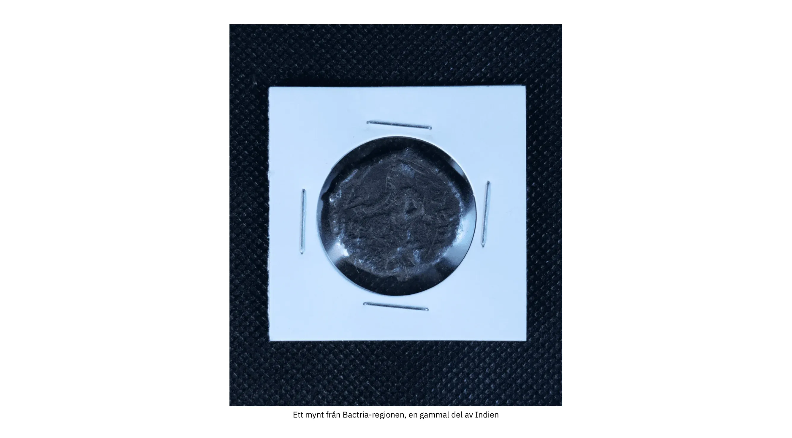

För att illustrera denna period i visuell form visas här ovan ett mynt från en region i Indien, Bactria-regionen, som ligger nära den västra delen av den indiska halvön, nära Afghanistan. I detta område fanns det mynt som troligen var inspirerade av grekiska mynt med en av deras kungliga personligheter.

## Lydianer och perser

<chapterId>eb802ab8-8ffd-5b25-907f-8944f120ed14</chapterId>

:::video id=f151eb42-5ff3-4ca1-9af1-1ae2a5e051c0:::

### De första lydiska elektrummynten

Eftersom vi inte kan skilja på mynt från Lydien och perserna går vi vidare till den del av världen som ligger öster om Grekland och som i dag utgör Turkiet. De första mynten som dyker upp i väst går tillbaka till ungefär mitten av 700-talet f.Kr. i regionerna Lydien och Jonien, som ligger i nuvarande Turkiet. Det var omkring 650-600 f.Kr. som denna grundläggande innovation såg dagens ljus, med anmärkningsvärda arkeologiska upptäckter som de första mynten som hittades i Artemistemplet i Efesos, daterade till omkring 600 f.Kr. Dessa primitiva mynt tillverkades av elektrum, en naturlig legering av guld och silver med bärnstensfärgade reflexer, och var ofta grova till utseendet, helt enkelt märkta med stämplar eller rudimentära motiv.

Nedan kan du se ett av de tidigaste lydiska mynten, med ett lejon med sitt byte framför. Du kanske lägger märke till en stämpel eller ett hål på baksidan, som vissa tror användes för att testa metallens renhet och säkerställa att det inte bara var ett ytskikt. Även om det här är ett av de tidigaste exemplaren är det viktigt att notera att det här är en kopia. Alla mina guld- och elektrumföremål är repliker eller moderna återskapningar, utformade för att hindra mig från att spendera alla mina besparingar på den här samlingen.

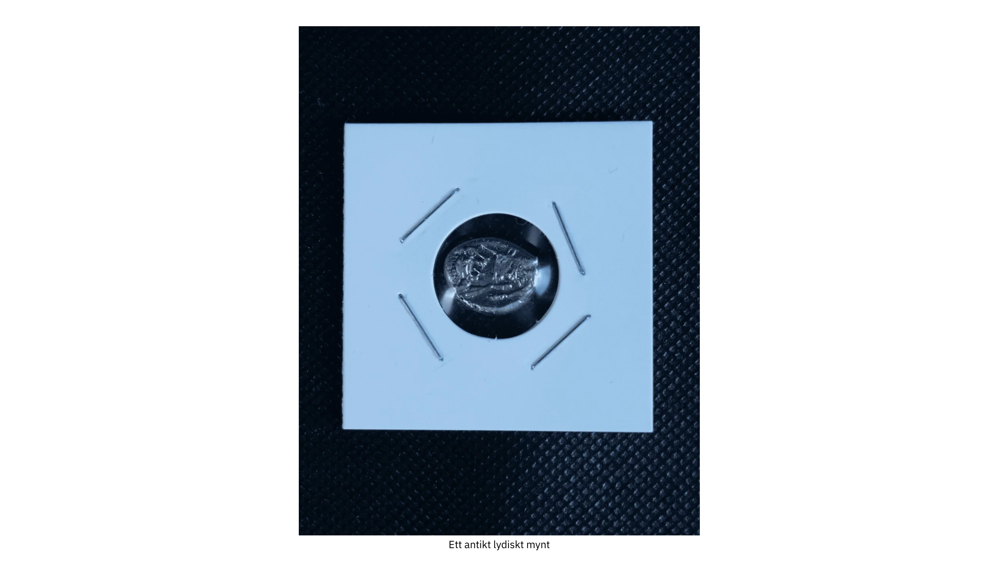

Men jag har också ett riktigt persiskt verk som vi snart ska få se. Så här såg de här tidiga föremålen ut. Det är som en slags klump (eller klump, på engelska) av metall som stämplades vid den tiden.

I motsats till den utbredda uppfattningen att pengar uppfanns för att underlätta den dagliga handeln och ersätta byteshandel, verkar det som om de första lydiska, achaemenidiska och grekiska mynten inte ursprungligen användes för småskalig handel. De monetära enheterna var i själva verket alldeles för stora för att användas i vardagen. Dessutom var deras cirkulation begränsad till regioner i närheten av där de tillverkades.

Här tycker jag att det är viktigt att nämna att även om jag har läst i flera verk av antropologisk karaktär var mynten, som jag redan har visat - oavsett om det var elektrummynten eller detta persiska mynt som jag kommer att återkomma till om en liten stund - för stora för att köpa bröd, säg, varje dag. Jag har sett uppskattningar som skulle få oss att tro att det var motsvarande en dags arbete för en bonde eller en soldat, så det skulle vara för stort. Det är som att försöka betala en dagslön för din måltid, din frukost eller din lunch. Men jag har sett i andra arbeten att man har hittat mindre enheter av dessa klumpar, alltså mindre mynt, vilket kan få oss att tänka att det kanske fanns en möjlig användning för vardagliga inköp.

Så här är det antropologiska "beviset" för att det inte användes för daglig handel, eftersom valören eller enheten var för stor, inte särskilt solid enligt min mening eftersom vi har hittat exempel på mynt som är mindre, som kunde ha anpassats till vardagliga inköp.

### Statens roll i penningskapandet

Myntens verkliga ursprung verkar vara kopplat till staternas direkta agerande. Det finns två huvudhypoteser i detta ämne: den första, idealistiska, drar en parallell mellan den grekiska termen "nomisma" (pengar) och "nomos" (lag), vilket tyder på att pengar var kopplade till kodifieringen av lagar, vilket förstärkte städernas auktoritet och politiska organisation. Den andra, mer realistiska hypotesen, som är allmänt accepterad idag, är att pengar först och främst var ett sätt för stater att utöva ekonomisk och social kontroll. Genom att officiellt garantera vikten och värdet på de ädla metaller som mynten innehöll kunde staterna manipulera cirkulationen och värdet på dessa mynt, vilket skapade förtroende och likviditetspremier som var specifika för inhemska valutor.

Det är verkligen intressant att veta att vi har bevis för detta. Till exempel när det gäller elektrummynt bör du veta att naturligt elektrum normalt består av cirka 70 % guld och 30 % silver. I de första mynten vi hittade och analyserade, särskilt de tidiga lydiska mynten, verkar guldinnehållet vara mer runt 50 till 55% istället för 70. Detta tyder på att myntutgivarna redan på den tiden försökte minska andelen av den mer ädla metallen, förmodligen för att producera fler mynt och få dem att verka vara värda samma sak som en omärkt klump av naturlig elektrum. Och här måste det sägas att det verkligen var från den berömde Krösus tid, som i *rik som Krösus*, som detta var möjligt eftersom det var från hans tid som vi hade tekniken för att separera guld och silver.

Den lydiska myntningen genomgick en stor utveckling under den berömde kungen Krösus (561-546 f.Kr.), som var känd för sin legendariska rikedom. Vid den här tiden fulländade lydierna metallurgin för att separera guld och silver från elektrum och introducerade därmed de första bimetalliska mynten, dvs. separata guld- och silvermynt.

### Persisk expansion och grekisk adoption

När de akemenidiska perserna erövrade Lydien år 546 f.Kr. tog de omedelbart till sig denna innovation. Omkring 500 f.Kr. under Darius I:s styre etablerade perserna sitt eget monetära system med gulddariker och silversigloer, ofta med den kungliga avbildningen i krigiska poser. Denna kungliga persiska myntning användes främst i de helleniserade regionerna i det persiska riket och spreds gradvis, även om användningen förblev ojämn, där **vissa regioner, som Egypten, fortfarande föredrog utbyte i vägd metall (bullion).**.

Ovan kan du beundra en äkta persisk sigloi (eller siglos). Den lilla designen föreställer en kung, även om hålet har slitits bort något. Siglos är ett silvermynt, i motsats till daric som var av guld. Perserna kunde skilja på dessa två metaller och de övergav elektrummynten. Därför införde de bimetallism, där man använde både guld och silver men behöll samma koncept med mynt av ädelmetall, ofta med ett hål på baksidan, förmodligen för att kontrollera metallinnehållet.

Grekernas snabba införande av mynt verkar ha stimulerats av deras nära kontakter med lydierna, särskilt genom de grekiska kolonierna i Mindre Asien. De första grekerna som präglade mynt var förmodligen invånarna i Aegina i mitten av 600-talet f.Kr. som införde drakman, vars vikt varierade från region till region och vars namn bokstavligen betyder "handfull korn" eller "handfull pilar".

Det grekiska myntväsendets framgång berodde lika mycket på dess lämplighet för viktiga transaktioner, såsom betalning av legosoldater, som på städernas ekonomiska och politiska expansion. Valuta blev snabbt en central del av den grekiska och senare romerska ekonomin, samtidigt som den behöll en stark symbolisk dimension, särskilt genom sin koppling till lagen (nomos).

Slutligen vittnar den snabba expansionen av myntningen om en djupgående omvandling av de antika samhällena, där kodifieringen av penningvärden gick hand i hand med statsorganisationen. Denna utveckling lade den ekonomiska och politiska grunden för uppkomsten av grekiska demokratier, särskilt i Aten, där pengar spelade en avgörande roll för den demokratiska stadens funktion.

En viktig sak att komma ihåg i detta avsnitt är att vi talar specifikt om **mynt**, inte om pengar i allmänhet. Den centrala aspekt som tydligt framträder är **förtroendet för den utgivande myndigheten**, som är direkt kopplat till myntens tekniska egenskaper (vikt, renhet, nominellt värde). Det är just denna tillit som gör det möjligt för staten eller den utgivande myndigheten att utöva en viss kontroll eller till och med manipulera värdet och cirkulationen av dessa mynt redan från början.

## Institutionell intervention och de första mynten

<chapterId>3e1efd08-99e3-5a32-9908-3185fef0e640</chapterId>

:::video id=84847cf6-9e46-4a8c-9f35-25a27496cc4b:::

### Pengarnas dubbla natur

Uppkomsten av präglade pengar väcker en grundläggande fråga: är pengar en spontan skapelse av marknaden eller en institution som påtvingats av en myndighet? Denna begreppsmässiga spänning ställer två radikalt olika visioner mot varandra.

Å ena sidan försvarar den österrikiska ekonomiska skolan idén att råvarupengar - särskilt guld - naturligt valdes av ekonomiska aktörer för sina inneboende egenskaper: hållbarhet, bärbarhet, delbarhet och fungibilitet. Ur detta perspektiv har staten sedan tillägnat sig denna spontana valuta för att kontrollera tillgången. Det är en institution som uppstår naturligt ur marknadens behov innan den fångas upp av den politiska makten.

Enligt det antropologiska och institutionella synsättet uppstår pengar i själva verket genom statlig myntning. Myndigheten skulle medvetet skapa valutan genom att anbringa sitt sigill och på så sätt omvandla metallen till ett äkta monetärt instrument. Detta perspektiv tyder på att de tidigaste lydiska mynten främst användes för att betala arméer - en statare motsvarade ungefär en soldats dagslön.

### De paradoxala fördelarna med statlig standardisering

Trots denna teoretiska spänning erkänner även österrikiska ekonomer vissa fördelar med statligt ingripande i penningväsendet. Standardisering genom prägling löser ett antal praktiska handelsproblem.

Utan en certifieringsmyndighet står de ekonomiska aktörerna inför ständiga risker: förfalskade mynt, bedrägerier i samband med registrering och viktmanipulation. Dessa metoder skapar friktion i ekonomin, eftersom vissa mynt accepteras medan andra avvisas. I teorin garanterar den officiella stämpeln vikt och kvalitet, vilket gör handeln smidigare.

Denna garanti har ett observerbart pris på marknaden: ett präglat guldmynt är värt mer än dess motsvarighet i råguld. Denna premie återspeglar värdet av certifieringen - handlarna behöver inte längre själva verifiera metallens äkthet genom kemiska tester eller resonanstester. Statliga ingripanden eliminerar paradoxalt nog friktion och underlättar handel genom att skapa institutionaliserat förtroende.

### Valutamanipulation redan från början

Historien om de första lydiska statrarna avslöjar en oroande ironi. Nyligen genomförda analyser visar att guldhalten i dessa elektrummynt systematiskt var lägre än i naturlig elektrum. Den myndighet som intygade kvaliteten manipulerade samtidigt sammansättningen.

Denna praxis illustrerar myntens dubbla användbarhet. För marknaden gör det utbyten mer flytande och erbjuder en garanti för standardisering. För den utfärdande myndigheten blir det ett verktyg för ekonomisk kontroll genom utspädning. Genom att minska guldinnehållet samtidigt som det nominella värdet bibehålls ökar staten i praktiken penningmängden - genom att skapa fler monetära enheter av samma mängd ädelmetall.

Staten själv förblev dock begränsad av denna manipulation. Som framgår av exemplet med Konstantins guldsolidus på 400-talet kontrollerade den romerska administrationen noggrant myntens kvalitet, eftersom den krävde att få betalt med bra mynt. Myndigheten hade ett vitalt intresse av att upprätthålla kvaliteten på sina egna mynt för att garantera värdet på sina skatteintäkter.

### Ekonomisk analys av devalvering

Studier av valutadevalvering visar på konsekventa mönster genom historien. När det gäller metallmynt följer ekonomerna andelen ädelmetall i mynten - en fallande kurva som indikerar en progressiv devalvering. För moderna papperspengar är det tvärtom: den cirkulerande penningmängden observeras, och dess ökning signalerar devalvering.

Båda metoderna mäter samma grundläggande fenomen: utspädningen av det monetära värdet. Oavsett om man minskar innehållet av ädelmetall eller trycker nya sedlar är mekanismen densamma. Ju fler monetära enheter en myndighet skapar från samma reala resurser, desto mer förlorar varje enhet sitt värde.

Denna manipulation, som kan observeras från de tidigaste lydiska mynten, tyder på att monetär kontroll alltid har varit en fråga om makt. Präglade pengar representerar således en anmärkningsvärd teknisk innovation i kombination med ett instrument för ekonomisk kontroll - en dualitet som går igen i hela den monetära historien, ända fram till i dag.

## Tillverkning av reservdelar

<chapterId>b205f4f2-c293-5308-b812-a998de9ad45e</chapterId>

:::video id=47c612ec-d97e-4498-b50e-7e66518bd56d:::

### Från stansade klumpar till präglade mynt

Efter ett avsnitt om myntens uppkomst ville jag introducera ett mycket kort avsnitt om mynttillverkningens utveckling. Som vi har sett började allt med klumpar av elektrum och fortsatte med guld och silver, där båda sidorna markerades med en stans, antingen med kungens ansikte eller ett hål på baksidan för att kontrollera renheten.

Senare, som vi kommer att utforska i ett senare avsnitt, förfinade grekerna denna teknik genom att skapa runda mynt som hamrades på båda sidor. De tog en slät, platt bit ädelmetall, graverade den önskade designen på ena sidan och hamrade den sedan för hand för att skapa det färdiga myntet.

Tekniken att handmynta mynt individuellt spelade sannolikt en roll för att kontrollera inflationen under den tiden, även om mynten ofta späddes ut för att öka produktionen. Detta var särskilt tydligt under den romerska perioden och, i mindre utsträckning, under vissa krig under den grekiska perioden. Även om myntning av ett mynt i taget begränsade myndighetens kapacitet för massproduktion bidrog det effektivt till inflationskontrollen, trots de betydande devalveringar som förekom. Utvecklingen gick alltså från en metallklump som stansades till ett runt, hamrat mynt.

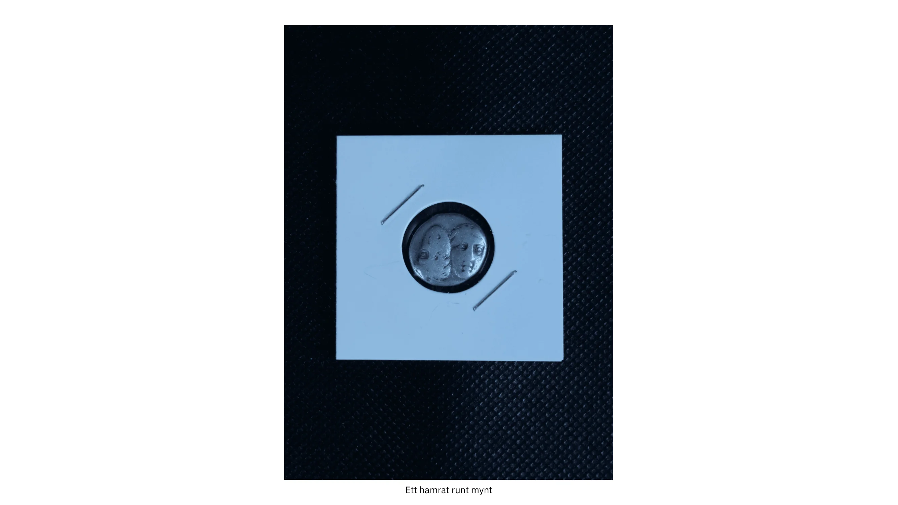

### Medeltida evolution

Under medeltiden började man också sprida ut mynten och göra dem bredare och tunnare. En anledning till detta var att det blev lättare att testa deras ljud, vilket ofta användes som en indikator på äkthet. Genom att sprida ut silvret skapades en distinkt frekvens, så att människor kunde validera myntets renhet genom att helt enkelt lyssna på det. Denna praxis gav upphov till uttrycket "sunda pengar". I samband med sunda pengar fastställdes standardvikten genom att använda en balansvåg eller "trebuchet" för vägning. På så sätt fortsatte utvecklingen från små, runda mynt till något tunnare och bredare mynt.

### Pendelns slagkraft

Den sista tekniken som kom i slutet av medeltiden, i början av den moderna eran, var pendelslagverket. Det var en slags skruv som drogs åt för att slå mynten, och på så sätt genererades mynt med denna nya form av slagning. Det som var speciellt med denna utveckling var möjligheten att gravera ett mönster på myntets yta för att lösa problemet med klippning. Clipping innebar att en del av myntet togs bort för att återvinna ädelt silver, som sedan kunde användas för att prägla andra mynt eller helt enkelt behållas som en resurs.

Så denna uppfattning om pendelslag hjälpte till med klippningsfenomenet. Och det är intressant att notera att denna teknik faktiskt kom från Frankrike. I England, till exempel, anlitade de franska ingenjörer för att komma och visa dem hur man gör dessa maskiner. Det som är lustigt, tycker jag, är att det fanns anhängare av hammarmyntning som var emot det och som försenade tillämpningen av denna teknik. I all bra teknik finns det alltid människor som är emot den, som vill behålla den gamla tekniken. Jag tyckte att det var ganska galet att inse att även med en teknik som verkar helt överlägsen - man kan tillverka fler delar, de är svårare att kopiera - så fanns det fortfarande människor som var fästa vid den berömda hammarmetoden. Det skedde ett skifte mellan att producera delar som tillverkades med den berömda pendelslagverket och att sedan återgå till hammarslagverket. Och slutligen var det naturligtvis pendelslagningen som till slut fick fäste och gav oss dessa vackra moderna delar där man kan hitta antingen små linjer, små åsar runtom för att undvika klippning, förmodligen relaterat till ordet klippning, åsar, och man kan fortfarande idag se antingen åsar eller text eller teckningar som är inristade på kanten av delen.

# Olika teorier om pengars uppkomst

<partId>72ac694f-9248-550d-90c1-91af3d234380</partId>

## Teorier om pengars uppkomst och dess olika definitioner

<chapterId>7d699d4d-8c70-55b5-bf36-609f3fd90bcf</chapterId>

:::video id=523c873f-501b-4954-b79f-7e74c0f685a5:::

Välkommen till detta avsnitt om de olika teorierna om pengars uppkomst och olika definitioner av pengar. Här följer ett kort utdrag ur boken *Aux origines de la monnaie* som jag tycker sammanfattar de två huvudteorierna som vi ska titta på i det här avsnittet.

> Denna korta ingress har inget annat syfte än att belysa undersökningens sammanhang. På det konceptuella planet är debatten öppen mellan anhängarna av K. Polanyis tes och anhängarna av M. Webers tes. För de förra spelar gåvor och omfördelning en central roll, medan marknadsutbytet endast spelar en marginell roll, främst i det internationella utbytet. För de andra är det tvärtom marknaden som är kärnan i den nuvarande historiska processen.

I Mesopotamien finns det till exempel en teori om uppkomsten som går ut på att templet, i egenskap av myndighet, skapar en räkneenhet eller monetär enhet, inför den och sedan använder köpmännen den för handel. Den motsatta teorin hävdar att denna monetära enhet uppstår naturligt från marknaden för att underlätta handeln. Det finns väl underbyggda exempel på detta i Mesopotamien.

När det gäller byteshandel finns det teorier om att den främst användes i internationella utbyten, dvs. med människor som vi helt enkelt inte litade på.

Så det är vad vi ska göra i det här avsnittet. Vi kommer att göra en slags undersökning för att presentera de olika teorierna om pengars uppkomst och de olika definitionerna av vad pengar är. Vi kommer att presentera och kritisera både klassiska ekonomers och antropologers teser. Jag har till och med turen att ha Ulrich Fromy med mig, som kommer att presentera en österrikisk ekonoms perspektiv på dessa olika ämnen.

## Penningbegreppets uppkomst för klassiska ekonomer

<chapterId>1d3776cd-0dfd-5297-af48-c6f41e257a7e</chapterId>

:::video id=873a16c1-17ac-448d-8941-df4feb7ab79d:::

Detta avsnitt handlar om de olika teorierna om pengars uppkomst. Det första ämnet som tas upp är pengars uppkomst enligt klassiska ekonomer.

### Adam Smiths klassiska teori

Enligt klassiska ekonomiska teorier, i synnerhet Adam Smiths, uppstod pengar naturligt ur byteshandel som ett svar på dess begränsningar. Till en början skedde utbytena genom direkt byteshandel, men denna metod komplicerades ofta av problemet med "dubbel samstämmighet i behoven": var och en var tvungen att ha exakt det som den andra ville ha. Så småningom kom vissa varor (t.ex. salt, ädelmetaller och boskap) att accepteras av alla som mellanliggande bytesmedel, tack vare sin användbarhet, hållbarhet och delbarhet. På så sätt uppstod pengar spontant för att underlätta och göra ekonomiska utbyten smidigare.

### Kritik av klassisk teori

Här är min kritik av denna teori. Med allt vi har sett i det föregående avsnittet tror jag att vi redan kan säga att denna uppfattning att **mynt** är en utveckling av byteshandel är fel helt enkelt för att det präglade myntet definitivt kommer från myndighet, eftersom det präglas av myndighet. Det finns flera skäl till detta, inte minst myndigheternas önskan att kontrollera ekonomin, att ta kontroll över pengar.

Å andra sidan, om vi talar om pengar som ett koncept, inte nödvändigtvis mynt, så är det mindre entydigt eftersom vi med de första mynten, de lydiska statrarna, har hittat silverklumpar som inte var märkta. Det återstår att se om de var i cirkulation. Om de var i omlopp betyder det att människor ursprungligen kan ha identifierat denna tillgång som en potentiell valuta som kunde efterfrågas allmänt och lätt växlas in. Och kanske var det först i efterhand som myndigheterna uppmärksammade situationen och tog kontroll över den genom att sätta en stämpel på den för att certifiera den.

Det finns många fördelar med att göra så här - man behöver inte kontrollera, väga och allt det där. Det kommer vi naturligtvis att prata om. Men enligt min mening är mynt helt klart ett verktyg som har använts av stater från första början. När det gäller uppkomsten av pengar som sådana vet vi dock inte om de verkligen kom från en myndighet som införde dem eller om de uppstod genom handel eller kommersiella utbyten. Jag kommer att ha en mycket intressant diskussion om detta ämne med min kollega Ulrich senare i detta avsnitt.

Vi vet redan att de första ädelmetallmynten inte användes för att underlätta det dagliga utbytet eftersom deras värde var alldeles för högt. Vi vet också att de främst användes för militära betalningar. Detta är ett bra argument för tesen att pengar inte nödvändigtvis uppstod på marknaden. Räkneenheterna, valörerna på de första mynten, var förmodligen för stora för att till exempel köpa bröd eller göra dagliga inköp. Det kunde till exempel vara motsvarande en dagslön. Inte nödvändigtvis för att folk fick lön på den tiden, men det är för att ge en uppfattning om skalan. Så de här mynten hade förmodligen för stor köpkraft för att användas i småskalig handel. Å andra sidan finns det inget som säger att dessa mynt inte skulle ha använts för att göra större utbyten, till exempel handelsutbyten. Vi vet att de främst användes för militära betalningar. Detta är en av de mest populära teorierna för att förklara uppkomsten av de första mynten. Kom ihåg att vi talar om mynt här, inte nödvändigtvis om pengar i allmänhet. De första mynten hade alltså sin första roll, och det var att betala för militära betalningar, för legosoldater.

Alexander den store använde sig till exempel mycket av det, som vi ska se senare.

Vi har också sett att redan i det gamla Kina användes kaurisnäckor för ekonomiskt utbyte (**lön för arbete, mätning av värde och köp av mark)**. I Mesopotamien och Egypten fanns det dessutom redan fungerande monetära system som användes för handel, löneutbetalningar och skattebetalningar. Vad jag menar här är att det definitivt är fel att tro att mynt i den västerländska uppfattningen uppstår ur behovet av att göra utbyten mer flytande.

Eftersom mynt ges ut av en myndighet kan vi kanske anta att de redan från början har varit kopplade till de utgivande myndigheterna. Det låter rimligt. Å andra sidan vet vi inte nödvändigtvis hur de former av pengar eller de former av monetära system, protomynten, som föregick dem uppstod. Å ena sidan kommer vi att föreslå att det var templen som identifierade dessa monetära enheter och att människor sedan använde dem. Å andra sidan kommer vi att säga att det var köpmännen som behövde ett bytesmedel, ett sätt att handla med omvärlden, och det var de som identifierade till exempel silvermetall, som skulle användas eftersom det efterfrågades av omvärlden. Poängen är att vi inte riktigt vet. Det är därför vi har de två motsatta teorierna. Vi har inte perfekta bevis för att förklara om pengar uppstår naturligt ur behovet av att handla, till exempel av köpmän, eller om de kommer från en auktoritet.

### Skillnad mellan mynt och primitiva pengar

Sammanfattningsvis tror jag att vi kan säga att mynt med nödvändighet härrör från en myndighet, eftersom de stämplades av denna myndighet. Å andra sidan tycker jag inte att vi kan säga att det är fel att påstå att pengar (det som föregick mynten) inte kan ha uppstått för att underlätta utbyte. Jag tycker att det i alla de exempel vi har sett ovan finns gott om exempel i den riktningen.

## Myten om byteshandel

<chapterId>0fcd4964-ac36-5163-a8cf-1aacebc0d2c0</chapterId>

:::video id=0ede29ab-8acd-4d79-9282-bd5991b97076:::

### David Graebers recension

Vi har precis gått igenom pengars uppkomst enligt de klassiska ekonomerna. Nu ska vi ta oss an ett koncept som kallas bytesmyten.

En kritik mot denna klassiska teori om pengars uppkomst är att det saknas historiska bevis för att stödja dess idéer.

Den kritik som kallas "bytesmyten", och som formulerats av bland andra antropologen David Graeber, utmanar den klassiska idén att pengar uppstod naturligt ur byteshandel. Enligt denna kritik finns det inga historiska eller antropologiska bevis som visar att samhällen systematiskt använde sig av byteshandel innan pengar uppstod. I själva verket skulle forntida samhällen ha fungerat på grundval av kredit, skuld, sociala skyldigheter och ceremoniella utbyten. "Bytesmyten" är därför en teoretisk konstruktion som syftar till att rättfärdiga den klassiska ekonomiska visionen, utan någon egentlig empirisk grund.

Det bör dock noteras att denna teori inte förnekar att byteshandel existerade, till exempel för utbyten mellan olika stammar. Den förnekar helt enkelt att byteshandel var en allmänt förekommande aktivitet inom dessa så kallade primitiva grupper, och att pengar skulle vara en logisk utveckling av dessa metoder. Den förnekar det faktum att byteshandel var vanligt förekommande inom en stam, och att pengar så småningom uppstod för att göra utbytena smidigare och lösa de svårigheter som fanns med byteshandel. Enligt denna teori praktiserade dessa grupper istället en form av informell kredit eller gåva för gåva.

### Primitiva samhällen kontra stora civilisationer

**Jag tror att denna teori definitivt är tillämplig på primitiva (statslösa) grupper i det förflutna och även idag (t.ex. de stammar som studerades av upptäcktsresande på 1700- och 1800-talen). Det är uppenbart att de inte använde sig av byteshandel, utan snarare de former av utbyte som jag nämnde tidigare, av skäl som vi redan har nämnt (svag arbetsfördelning, självhushållande jordbruk). Jag tror dock inte att denna teori är tillämplig på de stora civilisationerna i det förflutna, såsom Mesopotamien och forntida Egypten.

Här är två utdrag från *Aux origines de la monnaie* om detta ämne:

> Den modell som M. Mauss skisserade i sin berömda "The Gift" har antagits av egyptologer med lika stor enighet och entusiasm som brist på omdöme. Detta har lett till ett antal förvirringar, som vi inte ska gå in på här. Låt oss bara konstatera att denna modell gäller för så kallade primitiva samhällen, vilket inte är fallet med det faraoniska Egypten.

> Bröd, dvs. bearbetad spannmål, var därför beräkningsenheter som, i likhet med shât (y) i Gamla riket, också möjliggjorde öppnandet av krediter i diversifierade varor. Detta enkla exempel visar att ekonomin i faraonernas Egypten inte var begränsad till ett system för omfördelning. Den var mycket komplex och omfattade en mängd olika utbyten.

Så som vi såg tidigare i avsnittet om Egypten och till och med Mesopotamien och Kina, kan vi se att även dessa forntida, men inte primitiva, civilisationer, på grund av närvaron av en stat, enligt min mening, använde monetära system. Jag tycker att detta demonstrerades utförligt i den första delen av denna kurs. Och därför gäller inte denna uppfattning om givande och tagande, om uppskjuten kredit, för dessa stora civilisationer. De exakta orsakerna till pengarnas uppkomst förblir därför ett mysterium. Vi vet inte om de uppstod ur köpmännens behov av att handla med omvärlden, eller om de påtvingades av templet under dessa forntida perioder.

## Uppkomsten av pengar genom skuldpengar

<chapterId>4f508615-aa61-5d62-89d3-cecd02aeaa62</chapterId>

:::video id=a23f547f-3906-4f4a-8f72-5d78c649d0c4:::

### Pengar som skuldebrev

I det här avsnittet går vi igenom teorin om skuldpengar.

Teorin om **skuldpengar**, som framför allt utvecklats av ekonomen Alfred Mitchell-Innes och senare utvidgats av David Graeber, hävdar att pengar inte har sitt ursprung i byteshandel, utan snarare i skuld- och kreditförhållanden som fanns redan i de tidigaste mänskliga samhällena. Enligt denna teori uppstår pengar när sociala förpliktelser (skulder mellan individer eller grupper) blir kvantifierade och överförbara. Detta koncept introducerar begreppet kvantifiering av utbyten och överföringar. Pengar skulle alltså framför allt vara ett **erkännande av skuld**, uppbackat av ömsesidigt förtroende och ofta garanterat av politisk eller religiös auktoritet, snarare än en vara som bara fungerar som en mellanhand i utbyten.

En ännu mer avancerad form av denna teori är att alla pengar är en skuld. Så någon som har pengar skulle ha en fordran på samhället i allmänhet, en fordran på alla dem som accepterar dessa pengar. Och eftersom pengar, **i deras vision, måste accepteras på ett obligatoriskt sätt**, annars är det inte pengar, för om du kan vägra dessa pengar fungerar inte deras system. I en given grupp som har identifierat en valuta, alla de som har den, är det som om de har en skuld till alla de andra medlemmarna i det samhället som accepterar den valutan, och de som accepterar valutan har en form av skuld till den person som har den monetära enheten. Detta är i huvudsak deras teori.

### Kritik mot det obligatoriska systemet

**Min kritik av denna teori: **

Låt mig framföra en liten kritik mot denna teori. Jag accepterar att pengar är en form av socialt samförstånd. Det är ett förtroende som en grupp placerar i ett monetärt "tecken", vad det än kan vara. Så jag ansluter mig till begreppet ömsesidigt förtroende, som vi kommer att ta upp igen senare med begreppet den monetära premien. Det som blir komplicerat är när förespråkarna för denna teori lägger till ett begrepp om skyldighet och insisterar på begreppet skuld. För dem innebär innehav av en monetär token en fordran på samhället som helhet, och samhället skulle därför vara skyldigt innehavaren en skuld. Det skulle också finnas en skyldighet att reglera, med gruppmedlemmar som är skyldiga att acceptera token; annars skulle systemet enligt deras uppfattning inte fungera. Jag tycker att det system som beskrivs ovan i det gamla Kina väl representerar denna teori.

För min del kan jag lätt föreställa mig ett system där pengar är ett socialt samförstånd där den valda token är allmänt accepterad som betalningsmedel, utan någon formell skyldighet. Jag kan se att ett sådant system fungerar om människor accepterar det av egen fri vilja. Det kan fungera. Å andra sidan kommer det ofta med skyldigheter, lagliga betalningsmedel och våld, vilket vi kommer att se senare i ett avsnitt. Men teoretiskt sett har jag inte intrycket att det här systemet riktigt kan fungera. Jag tycker att Bitcoin är ett exempel. Bitcoin har värde eftersom den har en monetär premie, eftersom det finns en efterfrågan på att den ska användas monetärt, dvs. som värdereserv, kanske också som bytesmedel eller skydd mot fiatsystemet. Ingen är skyldig att acceptera den, och ju mer den accepteras som betalningsmedel, desto mer kan den användas som bytesmedel. Vi kan redan använda den som värdebevarare utan problem. Det råder det ingen tvekan om. Vad jag vill säga är att Bitcoin för mig verkar vara ett exempel, en typ av valuta som är en form av socialt samförstånd där vi tror att vi kommer att kunna få tillbaka våra pengar om vi köper lite senare, vi förvärvar det för att kunna byta ut det senare, för att bevara vår köpkraft.

Denna mindre restriktiva syn på teorin hjälper till att förklara hur två olika samhällen kan handla med en monetär token som guld, utan att skapa en fordran eller skuld mellan dessa samhällen. Att tvinga acceptans i samhället, tycker jag, fungerar inte i handel mellan två stammar, eftersom den andra stammen inte är underkastad auktoritet. Stam B är inte underställd stam A:s auktoritet. Men ändå accepterar den samma monetära token låt oss säga, guld. Nu kanske folk säger till mig "Ja, men det beror på att företag B också har beslutat att guld är deras valuta", så det fungerar. Ja, det fungerar, men det finns ingen skuldbildning vid den tidpunkten. Det är en slutlig transaktion. Så när företag A byter en vara mot guld hos företag B skapas ingen skuld, utan transaktionen är slutförd. Och det är uppenbart att personen i företag B inte har förvärvat detta guldmynt eller denna guldklump för att senare få betalt av personer i företag A. Han accepterar att det byts mot guld. Han accepterar att det byts ut senare, förmodligen inom hans egen stam. Så i det här exemplet skapas ingen skuld, det finns ingen latent fordran, det är helt enkelt ett direkt utbyte, en direkt betalning. Förespråkare för skuldvaluta kommer att säga att detta är byteshandel. Och jag håller inte med, eftersom byteshandel är utbytet av en direkt vara. Direkt byteshandel är utbytet av en vara mot en annan vara, för användning. Varor byts ut för att användas, men i vårt fall används guld uppenbarligen som valuta eftersom det inte kommer att användas till något annat, utan senare som betalningsmedel. Så enligt min mening faller det inte in i kategorin byteshandel.

Att äga en monetär token är inte en "fordran" på samhället, utan snarare en förhoppning om att token kommer att accepteras vid ett senare tillfälle till ett jämförbart värde.

## Den spontana uppkomsten av pengar

<chapterId>e3ef86b1-73b9-5140-a61e-2ab6a5b0b2d4</chapterId>

:::video id=e543995f-d5e2-49d7-9133-e397b46e0833:::

Enligt den österrikiska ekonomiska skolan, som initierades av Carl Menger, uppstår pengar naturligt ur en bytesekonomi som står inför problemet med den dubbla samstämmigheten av behov. I denna vision konvergerar individer spontant mot mellanliggande varor som underlättar utbytet - inte direkt konsumerade varor, utan varor som är erkända för sin förmåga att efterfrågas allmänt.

Dessa monetära varor måste ha egenskaper som identifierats sedan Aristoteles: de måste fungera som en värdebevarare, ett bytesmedel och en räkneenhet. Ekonomiska aktörer identifierar, ackumulerar och sparar dem gradvis, och på så sätt initieras deras uppkomst som pengar. Denna process är helt spontan - pengar representerar ett naturligt marknadssvar på problemet med att samordna utbyten, utan medveten inblandning av en myndighet.

### Debatten om "bytesmyten"

Antropologer som David Graeber bestrider denna uppfattning och åberopar "bytesmyten". Deras argument: ingen komplex civilisation som enbart bygger på direkt byteshandel har någonsin dokumenterats. I stället använde de primitiva samhällen som studerats system med informella krediter och ömsesidighet. Graeber hävdar att skuld föregick byteshandel och hänvisar till tusentals mesopotamiska tavlor som dokumenterar kreditrelationer.

Denna kritik bygger dock på en restriktiv definition av byteshandel. Som Menger påpekade redan 1892 går byteshandel utöver det enkla direkta utbytet av varor mot varor. Det omfattar även uppskjutna överföringar, tjänster mot lön och utbyten med tidsaspekter - det som Menger kallade "ensidiga överföringar mellan individer". Denna utvidgade form av byteshandel kan samexistera med kreditsystem i begränsade förtroendekretsar.

Avsaknaden av bevis är inte ett bevis på avsaknad, och österrikiska ekonomer inser att inget komplext samhälle kan utvecklas hållbart enbart på basis av direkt byteshandel - därav den nödvändiga uppkomsten av pengar.

### Det mesopotamiska fallet: köpmän kontra tempel

Debatten utkristalliserar sig kring ursprunget till den mesopotamiska silvershekeln. Det finns två motsatta tolkningar. Enligt den institutionella uppfattningen var det templen - de verkliga ekonomiska och andliga centren - som införde silver som valuta för att strukturera ekonomin. Kilskriftstavlorna, som är koncentrerade till prästerskapet och köpmannaeliten, vittnar om denna centraliserade kontroll.

Den österrikiska tolkningen tyder på motsatsen: det var köpmännen som använde pengar för långdistanshandel. Inför utmaningen att handla med främlingar bortom Mesopotamiens gränser - från Anatolien till Persiska viken - behövde de något universellt igenkännbart, hållbart och transportabelt. Silver var ett naturligt val på grund av dess inneboende kvaliteter. Templen bekräftade helt enkelt en praxis som redan etablerats genom kommersiell användning.

Denna avhandling bygger på dokumenterade utbyten mellan Kanesh i Anatolien och Assur, där köpmännen bytte textilier mot silvermetall - inte för dess materiella nytta, utan som en värdebevarare. Dessa transaktioner gick utöver ren byteshandel och avslöjade förekomsten av en äkta varuvaluta.

### Det moderna exemplet med fångläger

Ekonomen Richard Radford, som var fånge i Tyskland under andra världskriget, dokumenterade ett fascinerande fall av spontan monetär uppkomst. I lägren blev cigaretter naturligt utbytesenheten - delbar, standardiserad, allmänt accepterad. Även icke-rökare började använda dem, eftersom de insåg att de hade ett universellt bytesvärde.

Detta mikrokosmos illustrerar den österrikiska principen: när individer ställs inför problemet att samordna utbyten konvergerar de spontant mot den mest "säljbara" varan. Ingen myndighet införde cigarettpengar, utan de uppstod ur fångarnas dagliga strävan att optimera sina utbyten.

### Konvergens mellan individuella preferenser

I grund och botten representerar pengar en konvergens av individuella preferenser mot en accepterad gemensam nyttighet. Mesopotamiska köpmän, liksom Radfords fångar, identifierade den vara som minimerade osäkerheten i framtida utbyten. Detta val väntar inte på att en central myndighet ska godkänna eller införa det - det uppstår ur den praktiska rationaliteten hos ekonomiska aktörer som står inför utmaningarna med utbyte.

Debatten mellan spontan uppkomst och medveten institution är fortfarande öppen, eftersom de historiska bevisen är fragmentariska. Men den österrikiska analysen erbjuder en sammanhängande förklaring: pengar föddes ur handelns praktiska behov, och myndigheterna institutionaliserade bara praxis som redan hade etablerats genom marknadsanvändning.

## Den antropologiska synen på pengars uppkomst

<chapterId>ec48c5d8-47ed-530f-beb7-c44fd0b62880</chapterId>

:::video id=8c1f8764-75af-4fb6-a98b-55de3b7da02e:::

### Pengarnas icke-ekonomiska ursprung

I det här avsnittet utforskar vi den antropologiska synen på pengars uppkomst, ett perspektiv som utmanar de klassiska ekonomiska teorierna på ett genomgripande sätt.

I motsats till den traditionella teorin att pengar uppstod naturligt ur byteshandel för att underlätta ekonomiskt utbyte visar antropologisk forskning att pengars uppkomst till stor del har icke-ekonomiska orsaker. De härstammar från sociala mekanismer som tributbetalningar, kompensation för mord (det berömda Wergeld) och hemgift (brudpengar), men också från ceremoniella, religiösa, politiska och symboliska sedvänjor, långt mer än från enkla marknadsbehov.

I primitiva samhällen användes pengar sällan för det dagliga utbytet av materiella varor, vilket strider mot den klassiska definitionen av pengar som ett "bytesmedel". I själva verket använde sig dessa samhällen i stor utsträckning av krediter, med uppskjutna betalningar inbäddade i omfattande nätverk av sociala och personliga relationer. Dessa allestädes närvarande kreditsystem föregick logiskt och historiskt sett uppkomsten av pengar.

Det är vad som sammanfattar deras vision. Vi diskuterar detta med Ulrich i vår chatt i den föregående videon. Jag låter dig njuta av Ulrichs kommentarer i ämnet, som utmanar detta tillvägagångssätt lite. I den antropologiska visionen har vi ofta uppfattningen att pengar kommer från en auktoritet eller ett socialt koncept som föregår marknadens behov.

### Exemplet med Yap-stenarna

Här nedan kan du beundra ett slående exempel på de monumentala stenarna på ön Yap. Vissa av dessa stenar fortsatte, trots att de var orörliga eller till och med fysiskt försvunna, att fungera fullt ut som pengar tack vare ett kollektivavtal, vilket understryker pengarnas i huvudsak sociala och symboliska dimension.

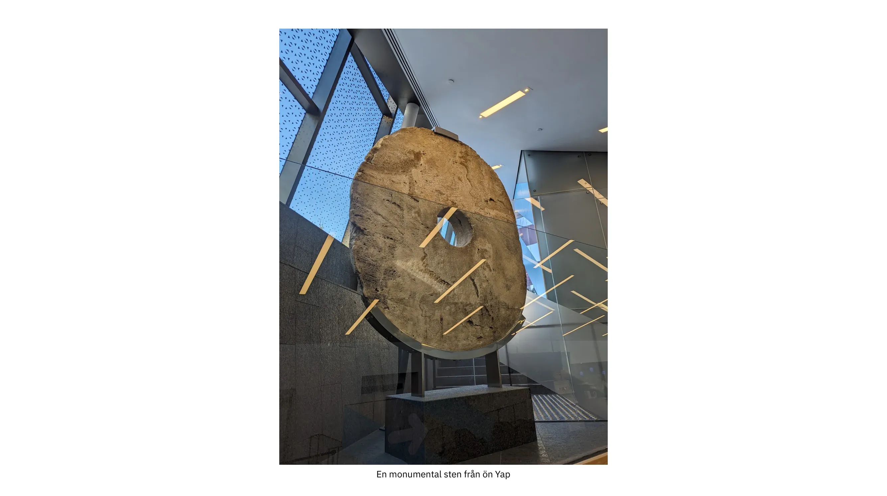

Detta är en riktigt intressant analys av Yap-stenarna. Saifedean Ammous nämner också detta exempel i sin bok "The Bitcoin Standard". Enligt honom liknar Yap Island-systemet mest Bitcoin, ett slags centralt register som alla kan konsultera, det vill säga offentligt, upprätthålla konton och hantera ägande av saker. Detta antropologiska perspektiv illustrerar att allt detta representerar en överenskommelse eller ett socialt samförstånd inom samhället, vilket i grunden är korrekt. Och jag tycker att det här med de försvunna stenarna är mycket intressant. De åkte hundratals kilometer ut till havs i små flottar och tog med sig stenarna tillbaka. Ibland föll stenen till havets botten, men stenen användes ändå i det monetära systemet. En person kunde säga "Ja, vi tappade stenen på en sådan plats, den är min, så vi kan byta den". Det fanns inte nödvändigtvis något behov av fysisk besittning för att underlätta utbytet, eftersom stenarna var så stora att de ofta stannade på samma plats. Istället låg fokus på att byta ägare till stenarna på ett transaktionellt sätt, så att ägandet kunde skifta utan att stenarna faktiskt rörde på sig. Det var en form av "bevis på konsensus", som belyser ett intressant antropologiskt perspektiv på pengar.

### Protokollvalutor och sociala skyldigheter

Etnografer över hela världen har observerat samhällen som använder "proto-valutor" eller "primitiva valutor", såsom snäckor, tyg, boskap, salt och stenar, som uppfyllde de funktioner som vanligtvis tillskrivs pengar, såsom ett betalningsmedel och en värdebevarare, utan att dock regelbundet fungera som mellanhänder i utbytet av vardagsvaror.

Här beskriver vi alltså monetära system som inte nödvändigtvis användes för dagliga utbyten.

Och jag skulle vilja påminna er om att alla dessa var valutor innan mynten kom, och jag vet inte hur mycket av en felaktig benämning det är att säga valuta. Jag föredrar att säga valuta. Jag kan nämna att vi i litteraturen ofta talar om proto-valutor för att hänvisa till pengar före mynt. Men som vi såg i det första avsnittet tror **jag att det fanns monetära system långt innan mynten uppstod**.

Dessa primitiva valutor användes främst för att hantera grundläggande sociala skyldigheter kopplade till individer, såsom äktenskap, konfliktersättning (Wergeld) eller gåvor mellan hövdingar. I det persiska riket, till exempel, skapades de första mynten specifikt som ett medel för militär betalning snarare än ett bytesmedel.

Primitiva pengar har därför en väsentlig egenskap: de är ett betalningsmedel, men mycket sällan ett medel för direkt utbyte av materiella varor. Vad vi menar här är att det var ett betalningsmedel för vissa sociala förpliktelser, för stammar, för utbyten mellan hövdingar, den berömda wergeld, blodspengar. Innan det fanns rättssystem, om någon begick ett mord, fick den familj som led av att deras älskade mördades upprättelse. Det fanns ett pris att betala för detta, det kallades blodspengar och är en form av betalning. Det fanns också en hemgift, som också är en form av betalning. I dessa tidiga användningar av pengar som betalningsmedel var det mer relaterat till mänskliga och sociala skyldigheter än till betalningar för vardagliga inköp. Enligt denna teori var dessa mer vanliga dagliga utbyten mer relaterade till kredit, uppskjuten kredit, gåva för gåva och omfördelning av ransoner. Det fanns en annan form av social organisation för att hantera dessa utbyten. Det är också viktigt att komma ihåg att i ett samhälle där alla är självförsörjande och sköter sitt eget jordbruk, där det inte finns någon specialisering, är behovet av ett monetärt system för de dagliga utbytena mycket litet. Och det är därför de första formerna av pengar var det vi just har beskrivit, hemgift, blodspengar, helt enkelt för att det var de första utbytena där vi behövde ett betalningsmedel, långt innan vi behövde handla, byta bröd mot pengar på daglig basis, för i primitiva samhällen fungerade det inte så. Alla tillgodosåg sina egna behov, och det fanns ingen specialisering ännu. Jag tror att jag har gått igenom detta utförligt i alla tidigare föreläsningar i den här kursen.

I dessa samhällen, utan någon avancerad arbetsfördelning, förblev direkta utbyten begränsade och ägde huvudsakligen rum inom personliga vänskaps- eller alliansrelationer. Avsaknaden av tillräcklig specialisering gjorde att pengar inte behövdes i modern mening.

Antropologer som Quiggin och Einzig insisterar på kreditens överlägsenhet: **"Det primitiva ekonomiska livet är fångat i ett gigantiskt nätverk av krediter och personliga skulder, där pengar spelar en viktig roll, särskilt när betalningar måste ske omedelbart och kompensationer inte lätt kan skjutas upp

Folk byter alltså saker, kan göra uppskjutna krediter, men i vissa fall kan man inte skjuta upp betalningen, så valuta eller proto-valutor kan vara användbara vid denna tidpunkt för att få en omedelbar slutpunkt för utbytet.

### Innovationen anonymitet

Denna analys leder till en djupare reflektion: i stället för att ställa pengar mot byteshandel är det mer relevant att förstå pengars uppkomst som en utveckling från de komplexa systemen med kredit och skuld. Pengar introducerar en grundläggande innovation: **anonymitet**. Och det är där jag tycker att den här antropologiska teorin om pengars uppkomst är intressant. Om ni är en liten grupp människor som ger varandra uppskjuten kredit känner ni uppenbarligen varandra. Jag tror att för att det här systemet ska fungera måste folk känna varandra, uppenbarligen. Och en betalning som görs med pengar möjliggör anonymitet. Det gör att du kan göra en betalning utan att folk ens känner till ditt namn, utan att folk ens vet vem du är. De kan göra ett utbyte för omedelbar och slutlig reglering. Och det är just det som pengar möjliggör.

Till skillnad från kredit, som alltid är nominativ, möjliggör pengar anonyma, generella och omedelbart frigörande transaktioner. **Denna pengarnas unika frigörande kraft är deras avgörande överlägsenhet

Pengar är alltså långt ifrån ett blygsamt verktyg för att underlätta ekonomiskt utbyte, utan en stor social innovation, nära kopplad till utvecklingen av mänskliga institutioner och sedvänjor, från personlig kredit **till ett allmänt, anonymt betalningssystem**. Denna antropologiska utveckling visar att pengar, långt mer än ett enkelt bytesmedel, utgör en mäktig social institution som på djupet formar mänskliga samhällen och som i våra moderna samhällen har blivit själva syftet med ekonomisk aktivitet.

Här inser vi att i slutändan, i våra moderna samhällen, är själva syftet med ekonomiskt utbyte att äga pengar, medan detta inte alls var fallet förr i tiden. Själva syftet med ekonomiskt utbyte var att inneha varor eller råvaror för konsumtion. Och i dag, genom att införa innovationen pengar, är syftet med det ekonomiska utbytet att ackumulera dessa pengar, eftersom de gör det möjligt för oss att byta dem mot varan, vilket är allmänt accepterat. Vi kan byta ut dem mot den vara vi behöver när vi behöver den.

## Unifiering av register

<chapterId>7664442a-91c1-5ce4-a8bd-53b7371a3e3d</chapterId>

:::video id=473fc284-5375-4e1b-b0cd-6b51ba0cc3b8:::

### Redovisningsregisterteori

Vi ska nu tillsammans utforska olika förslag för att förena dessa två monetära teorier, dvs. teorin om pengars uppkomst genom skuldpengar och den monetära teorin om uppkomsten av varupengar. Vi kommer att tala om Lynn Aldens förslag till förenande i hennes berömda bok "For Broken Money", vars titel i Consensus översättning förmodligen kommer att heta "Rupture monétaire".

*Utdrag ur Broken Money av Lyn Alden:*

> I grund och botten är pengar ett bokföringsregister. Råvarupengar är ett register som styrs av naturen. Bankpengar är en liggare som styrs av nationalstater. Pengar med öppen källkod är en liggare som styrs av dess användare.

Här hänvisar Lyn till Bitcoin.

### Stock-flow-kvoten och knapphet

> Vissa sällsynta kemiska grundämnen, t.ex. rodium, är mer sällsynta än guld, men har låga lagerflödeskvoter eftersom de förbrukas av industrin lika snabbt som de utvinns. Ett rodiummynt eller -tacka kan köpas som ett specialiserat samlarobjekt eller värdebevarare, men är inte lämpligt som en socialt accepterad valuta och uppstår därför inte naturligt som pengar.

Saifedean talar utförligt om detta i sin bok "The Bitcoin Standard". För dem som inte känner till förhållandet mellan lager och flöde är det helt enkelt när du jämför det befintliga lagret, de reserver som finns på marknaden, jämfört med det nya lagret som kommer in, inflödet av nytt lager. Det är ofta ganska kontraintuitivt, eftersom man kan tro att något som man har i stora mängder inte är knappt, men det är det faktiskt inte. Det är mer en fråga om den kapacitet du har att leverera det. Det är snarare den kapacitet vi har att ha nya lager som enligt den här modellen ger oss information om huruvida det här objektet är sällsynt eller inte. Det är inte för att vi inte har något i lager som det är sällsynt, det är bara det att vi kanske inte har det. Så om vi tar guld har vi många guldlager eftersom det används som en värdebevarare, och inflödet av nya lager är ungefär 1% till 3% per år av nya guldlager som kommer in genom guld mining. Medan det hon säger här, om vi pratar om rodium, är det sällsyntare än guld, men vi har inget lager eftersom det konsumeras när det går. Så det krävs inte mycket nytt utbud för att fördubbla det befintliga beståndet. Medan det med guld skulle ta minst 50 år att förnya, att fördubbla lagret. Till skillnad från de flesta varor som konsumeras, där det är ganska enkelt och inte tar många års produktion att fördubbla det befintliga lagret, eftersom det konsumeras när det går.

*"Guld har upprätthållit ett förhållande mellan lager och flöde på mellan 25x och 100x genom modern historia, vanligtvis runt 50x eller mer, och har kortvarigt aldrig fallit under 16x, inte ens under guldrushen i mitten av 1800-talet. "*

Så 25 år skulle betyda 25 år för att fördubbla aktien och 100 år skulle betyda 100 år för att fördubbla aktien. Saifedean säger i sin bok att även om vi fördubblade guldproduktionen, från säg 1,5% till 3%, skulle det inte nödvändigtvis ha någon stor effekt på guldpriset.

*"Silver har i allmänhet ett förhållande mellan lager och flöde på 10 gånger eller mer, vilket fortfarande är relativt högt.*

*De flesta andra råvaror har en stock/flödeskvot på mindre än 1 eller 2. Även de mest sällsynta grundämnena, som platina och rodium, har relativt låga stock-flow-kvoter på grund av deras snabba industriella konsumtion."*

### Överlägsenheten hos guld och silver

*"Kort sagt, närhelst en råvaruvaluta har befunnit sig i konkurrens med guld och silver, har den senare alltid kommit ut på topp i slutändan. Andra råvaror kan förbli valutor under begränsade perioder eller i specifika regioner, men guld och silver har alltid bevisat sin förmåga att bli globalt konkurrenskraftiga valutor och att dominera konkurrensen. Detta beror på att när civilisationer möttes hade innehavare av guld och silver alltid den tekniska kapaciteten att devalvera andra former av valuta, medan innehavare av snäckor, pärlor, boskap, salt, tyg eller sämre metaller aldrig kunde devalvera guld eller silver."*

Så detta är återigen extremt väl beskrivet i The Bitcoin Standard där Saifedean talar om de stammar i Afrika som använde glaspärlor. Och när de venetianska köpmännen kom med laster fulla av glaspärlor eftersom de kunde producera dem industriellt vid den tiden, de hade den tekniska kapaciteten att göra det, destabiliserade det fullständigt det monetära systemet för dessa folk och de kunde bokstavligen plundra deras resurser. Detta är Saifedeans tes.

### Konto- och kreditenhet

*"Historiskt sett, även när kredit användes direkt som ett instrument för utbyte, var det vanligtvis denominerat i enheter av monetära varor som naturligt valts för sina egenskaper."*

Det är en mycket intressant punkt, och en som Ulrich och jag har diskuterat. Även om templet i Mesopotamien var en slags auktoritet som kunde hantera denna uppfattning om kredit, var beräkningsenheten shekeln. Det finns inget som bekräftar att shekeln fastställdes auktoritativt av templet. Shekeln kan ha uppstått naturligt, genom köpmännens behov av att importera och exportera med andra folk i närheten. Vi har bevis för detta i form av en köpman i Kanesh (jag nämnde detta i del 1) som gjorde just detta och importerade ädelmetaller som inte användes för sitt fysiska varuvärde utan snarare som en värdebevarare. Det enda problemet är att vi inte vet om vi kan anta att detta val av silver, av silvershekel, gjordes av köpmännen eller om det gjordes av templet. Men Ulrich har ett mycket bra argument som får oss att tro att det troligen snarare var köpmännen som gjorde det.

*"Således kan föreningen av de två teorierna beskrivas som en "redovisningsteori för pengar" ("ledger theory of money") eftersom den beskriver den grundläggande logik som är gemensam för båda teorierna. Både flexibla sociala krediter och samlingsbara protovalutor går tillbaka till mänsklighetens gryning. I båda fallen för människogrupper av olika storlek en bokföringsbok sinsemellan för att undvika att behöva tillfredsställa det dubbla sammanträffandet av behov, minska friktionen i utbyten och fungera som en form av likvida besparingar. Den väsentliga skillnaden ligger i den myndighet som anförtrotts att föra registret."*

Å ena sidan hanterar naturen expansionen av penningmängden. Om vi tar guld, som är ganska sällsynt, så är det svårt att bryta. Det finns en slags gräns för hur många guldmynt som kan utvinnas. Så knapphet hanteras av naturen. Och registret hålls av konceptet med innehav. Registret är decentraliserat. Innehav bevisas av det faktum att du äger ett guldmynt eller en bit guld. Och när det gäller kreditpengar hanteras knappheten av människors förmåga att få kredit. Eller i fallet med fiatvaluta hanteras knapphet av auktoritet. Det är de som bestämmer om de ska trycka mer eller inte, för att undvika inflationskatastrofer. Så i vissa fall kan registret också hanteras av ägaren till token, när det gäller papperspengar. Det är därför det skrivs in i registret, inom citationstecken, dematerialiserat. Eller, materialiserade, men virtuella. Han äger denna berömda token, och det är det som bevisar innehav. Och det kan lika gärna vara i ett riktigt register, som med skriftens pengar, i en bank, där det egentligen är den mänskliga banken som hanterar vem som äger vad i förhållande till registret.

## Förenhetligande genom den monetära premien

<chapterId>093756e5-8908-55e5-bb76-376a3a3cc4d3</chapterId>

:::video id=eabc342a-ecbd-46ca-a347-e914917e7c4f:::

### Begreppet monetär premie

I det här avsnittet som handlar om olika förslag för att förena de olika teorierna om pengars uppkomst har jag just föreslagit Lyn Aldens teori, registerteorin. Jag har ett eget förslag för att förena de två penningteorierna. Det är den monetära premien, begreppet monetär premie. Så pengars värde kan förklaras av den monetära premie som uppstår genom dess monetära efterfrågan, oavsett om det är i form av lertavlor, ädelmetallmynt, sedlar eller bitcoin. Den monetära premien baseras helt enkelt på förtroendet för att någon kommer att växla in denna valuta i framtiden till ett jämförbart pris.

Det jag försöker visa här är helt enkelt att oavsett om det är fiat, det vill säga sedlar utan bruksvärde, oavsett om det är guldmynt eller någon metall, en guldklimp eller ett guldtacka, **är det ofta den monetära premien som utgör den största delen av dess värde**. Om vi tar en bit guld förklaras en viss del av dess värde av dess bruksvärde, dess användning inom industrin eller för att tillverka smycken. Observera att efterfrågan på smycken ofta kommer från dess monetära värde. Människor behåller smycken som en slags värdebevarare, så jag inkluderar detta lite i den monetära premien eftersom det ofta är en ganska monetär efterfrågan för att spela en roll i pengar.

Så man kan säga att cirka 10% av efterfrågan på guld är för industrin. I guldvärdet skulle vi ha en liten del, låt oss säga 10%, som skulle förklaras av denna industriella efterfrågan, denna efterfrågan på användning av guld, där guld förbrukas. Resten är helt klart efterfrågan på dess monetära användning som värdebevarare.

### Myndighetsbonus och fiat

Och om man jämför en bit guld med ett guldmynt tillkommer ytterligare ett lager. Guldmyntet är präglat av en myndighet och det guld som finns i myntet har också en efterfrågan på användning, en efterfrågan på att förbrukas i industrin. Det åtnjuter också en monetär premie som värdebevarare. Dessutom finns det en överlagring som jag kallar myndighetspremien, där det ofta kommer att finnas ett pris, en större köpkraft för myntet än för guldbiten, eftersom myntet är enklare att använda. Det gör utbyten mer flytande, eftersom det inte behöver vägas. Myndigheten garanterar normalt dess renhet. Och om man jämför det med en guldbit är ett stämplat guldmynt i allmänhet värt mer än en enkel guldbit. Och det är också normalt, eftersom det krävs resurser för att stämpla det.

Det är samma princip för fiat, papperspengar. Papperspengar har egentligen inget användningsvärde, förutom kanske för att värma upp ett hus, och det hände under Weimarrepubliken. Så det finns ingen verklig efterfrågan på dess bruksvärde. Å andra sidan finns det bara en premie för auktoritet, enligt min mening.

Det är en form av monetär premie, en överlagring på den monetära premien. Men dess monetära premie kommer från det faktum att den är lagligt betalningsmedel, och sedan tvingar myndigheterna dig att köpa den för att betala dina skatter. Så fiatvaluta har nödvändigtvis en form av monetär efterfrågan som härrör från det faktum att den beskattas och att du åtminstone måste förvärva den för att betala dina skatter. Och som ett resultat av detta förblir den ett allmänt accepterat betalningsmedel. Så människor vill förvärva den för att tillgodose sina behov.

### Förenhetligande genom monetär efterfrågan

Och varför kvalificerar sig detta förslag till en monetär premie som en förening av de två teorierna om skuldpengar och råvarupengar? Jag tror inte att värdet på ett guldmynt nödvändigtvis kommer från dess "inneboende värde". Nej, i själva verket är det lika mycket ett begrepp om förtroende som det är för fiat-pengar. Det är ett begrepp om monetär efterfrågan. Och det är inte riktigt för att det har en liten andel industriell användning, ett annat "verktyg". Om vi säger att den industriella användningen är 10% av dess värde, kan vi värdera det till 300 dollar per ounce. Om guld säljs på marknaden för 3 000 dollar per uns är skillnaden mellan 300 dollar och 3 000 dollar den berömda monetära premien. Det är denna monetära efterfrågan på guld som förklarar det. Bara för att fiat har noll användningsvärde betyder det inte att det är annorlunda. För mig är det exakt samma sak. Så på båda sidor, teorin om skuldpengar eller råvarupengar, tror jag inte att den typ av extra kvalitet som guld skulle ha genom att ha ett minimalt användningsvärde förändrar någonting.

Å andra sidan är det säkert att **på uppkomstnivån, enligt Mises regressionsteorem, kan vi föreslå att denna användning skapar en efterfrågan vid ursprunget och initierar den process som blir pengar.** Medan det på skuldpengarnas nivå är mer ett påbud från en myndighet, så källan, initieringen av uppkomsten och begreppen är helt olika. **Men jag tror att när det gäller värde, hur man förklarar pengars värde, med den monetära premien, kan vi lika gärna förklara varför fiatpengar har det värde vi tillskriver dem och varför råvarupengar har det värde** vi tillskriver dem. För mig är det samma process, och den kallas för penningpremien.

#### Den monetära premien

Så är det med det. Värdet på pengar kan förklaras av den monetära premie som uppstår genom dess monetära efterfrågan, oavsett om det är i form av lertavlor, ädelmetallmynt, sedlar eller bitcoin.

Den monetära premien baseras helt enkelt på förtroendet för att någon senare kommer att växla in dessa pengar mot ett jämförbart pris.

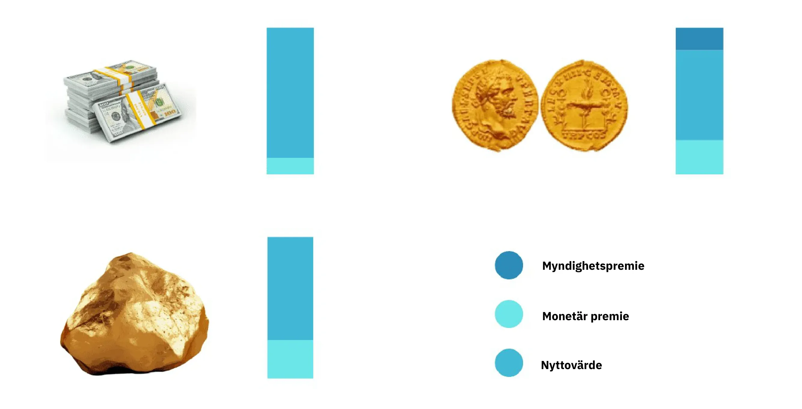

# Olika definitioner av pengar

<partId>77b7918a-8c3b-11f0-b688-6b2ab22378c9</partId>

## Pengar vs valuta vs monnaie vs argent vs devise

<chapterId>bf8a6d21-df88-5d23-a0a5-e9a5c1300554</chapterId>

:::video id=d9c9e7df-9db3-4a9f-801e-10d3fc7dfc22:::

### Semantiken i monetära termer

I detta avsnitt om de olika penningteorierna och särskilt om definitionerna av pengar vill jag göra en kort parentes om semantik. Jag skulle vilja gräva lite djupare i definitionerna av flera ord som har med pengar att göra och jämföra dem med deras engelska motsvarigheter. Till exempel pengar, valuta, jämfört med monnaie, argent och devise. Så här kan det gå till.

Lite semantik:

När vi säger "**pengar**" (de la monnaie) tror de flesta att vi syftar på den lilla växel vi får i utbyte mot en transaktion. Och om vi säger "**valuta**" (la monnaie) tror folk förmodligen att vi syftar på en stats valuta. Kanadas valuta är den kanadensiska dollarn. Ja, just det.

Men hur är det med pengar (de l'argent)? En tjuv kommer aldrig att säga "Ge mig all din växel!" (tjuven kan mycket väl bli besviken över att bara få mynt som nästan inte har något värde).

Nej, tjuven kommer att skrika: "Ge mig **alla dina pengar**". Och om tjuven står framför dig på gatan syftar han med nödvändighet på **sedlarna** i din ficka.

Om tjuven däremot försöker lura dig på ett mer sofistikerat sätt och försöker stjäla dina tillgångar genom att tömma alla dina bankkonton, säger vi att **han tar alla dina pengar**. Här syftar ordet "pengar" på **den enskildes förmögenhet**.

Det finns alltså två definitioner av ordet pengar: kontanter (sedlar) och förmögenhet.

### Valuta vs monnaie vs devise

En valuta (devise) är nödvändigtvis ett annat lands valuta, annars säger vi bara pengar (monnaie). Om du är fransman skulle du säga: "La livre sterling est la devise du Royaume-Uni et l'euro et la monnaie de l'Europe" (Det brittiska pundet är Storbritanniens valuta och euron är Europas valuta).

Ofta kommer människor som inte har fördjupat sig i dessa semantiska problem, när de översätter dessa termer, ofta att vara benägna att tala om valuta (devise) när det är skriven valuta, men nej, valuta är pengar (monnaie) när det är ditt lands valuta, och det är devise när vi pratar om andra valutor. Problemet här som jag ofta ser är att på engelska finns det två ord: det finns "money", som är ett begrepp, och det finns "currency", som egentligen är den enhet i ett land som används för att göra utbyten. Så vi kan bara prata om begreppet pengar; det är enkelt - det är begreppet i ordet *money*; det är pengar i allmänhet. Och *valuta* är mycket enkelt att likställa med ett lands valuta. På franska säger folk tyvärr ofta ja, "mais ce n'est pas une monnaie" när de pratar om bitcoin eftersom det inte är ett lands valuta, men ofta tror jag att de hänvisar till termerna valuta istället. Detta är fel å ena sidan, för sedan El Salvador har bitcoin varit valutan i en stat. Faktum kvarstår att folk ofta kommer att säga: *men nej, det är ju inte en stats valuta, det kan ju inte vara pengar*. Men i själva verket, om vi hänvisar till det bredare begreppet *pengar*, passar bitcoin perfekt in i denna definition, enligt min mening. Det är bara det att på franska har vi inte två ord för att separera dessa två begrepp. Vi kan säga att ordet argent hänvisar till valuta, men tyvärr är det inte dess exakta definition. *Argent* (pengar) syftar på förmögenhet eller sedlar. Man kan inte riktigt sätta likhetstecken med ordet *pengar*. *Pengar* är egentligen begreppet valuta (monnaie).

## Saifedean Ammous definition

<chapterId>07c4ba50-168c-567a-8957-0b187ff75f97</chapterId>

:::video id=936d6d3b-6d45-468e-bc44-85fbce9b857a:::

#### Vad är pengar?

Pengar är helt enkelt något du äger eller förvärvar, inte för att användas eller konsumeras för sin egen skull, utan för att senare bytas mot andra varor eller tjänster som du kan behöva. (Saifedean)

Pengar får en monetär premie när det finns en monetär efterfrågan på varan, för att spela en eller flera av pengarnas roller.

Den monetära varan måste vara tillräckligt sällsynt för att den monetära premien ska kvarstå (för att förhindra att utbudet anpassas till den monetära efterfrågan).

### Den monetära premien

I detta avsnitt om olika definitioner av valuta tänkte jag kort tala om Saifedeans definition i The Bitcoin Standard, som alltid har varit av stort intresse för mig. Den slog mig som ganska enkel när jag läste den. Vi kommer också att lägga till begreppet monetär premie till denna definition. Som Saifedean nämner i sin bok finns det nödvändigtvis ett begrepp om knapphet. Frågan är vad pengar är

> Pengar är helt enkelt något du äger eller förvärvar, inte för att användas eller konsumeras för sin egen skull, utan för att senare bytas mot andra varor eller tjänster som du kan behöva.

Det är alltså den definition som Saifedean nämner i The Bitcoin Standard. Jag skulle vilja tillägga att en valuta (la monnaie) förvärvar en monetär premie när det finns en monetär efterfrågan på varan, för att spela en eller flera av valutans roller. Man skulle alltså kunna säga att en valuta som fungerar som värdebevarare kommer att ha en monetär efterfrågan som ger den en monetär premie, eftersom människor vill förvärva den, till exempel som värdebevarare eller som bytesmedel.

### Knapphet och marknadsmekanismer

Till detta tycker jag att vi definitivt bör lägga till att den monetära varan måste vara tillräckligt knapp för att den monetära premien ska kunna existera. Detta är mycket viktigt. **Om en vara dyker upp för att användas som pengar och vi ser att dess pris stiger, kommer människor normalt, om varan inte är tillräckligt sällsynt, att vilja producera mer av den för att dra nytta av denna värdeökning när priset stiger**. Det är därför de flesta varor på marknaden har ett relativt fast pris. När priset stiger tenderar produktionen att öka. När priset sjunker, sjunker produktionen. Det sker en slags marknadsanpassning. **Och när en vara är tillräckligt sällsynt, som guld, kommer marknadsmekanismen inte att kompensera för denna ökade efterfrågan på monetär användning. Så det är variabeln som förändras, det är priset. Som med bitcoin**. När priset på bitcoin går upp producerar vi inte mer bitcoin. Så det som justeras är priset. Och det är därför vi i åratal har sett priset på bitcoin stiga i takt med att efterfrågan på bitcoin ökar. Eftersom det inte finns någon på jorden som kan ändra algoritmen och säga "det finns mer efterfrågan, priset går upp, vi kommer att producera mer." **Försörjningen av nya bitcoins är programmerad i förväg och känd i förväg**. Så det var det jag sa, att den monetära varan måste vara tillräckligt sällsynt för att den monetära premien ska kvarstå och därför inte fångas upp av marknadsmekanismerna för att förhindra att utbudet anpassas till denna nya monetära efterfrågan.

## Betalningsmedel och frigörande värde

<chapterId>5d424039-e342-56f7-9d8b-bba9551831a9</chapterId>

:::video id=af4c0765-8111-4cb7-891b-3ee54d6e7054:::

### Betalningsmedel vs. bytesmedel

I detta avsnitt om de olika definitionerna av pengar föreslår jag att vi tillsammans tittar på ett citat ur boken "Aux origines de la monnaie" (Pengarnas ursprung), en text av Alain Testart om pengar som betalningsmedel och ett frigörande värde.

*I Aux origines de la monnaie definierar Alain Testart pengar som ett betalningsmedel:*

> Funktionen som betalningsmedel uppfattas här som skild från funktionen som bytesmedel, i den mån det finns betalningar utan motprestation, betalningar som inte köper något. Knies (1873:192 ff.) utvecklar utförligt detta tema om överföringar av varor som inte består av bytesakter, som i fallet med wergeld (blodspengar eller ackord för mord) eller skatter. Carl Menger angrep denna fjärde funktion i sin artikel "Geld" från 1892, som allmänt anses vara en av de mest avgörande i ämnet. Utan att ha blivit helt misskrediterad verkar idén om betalningsmedlets funktion ha glömts bort i dagens ekonomiska tänkande, eller åtminstone förkastats till förmån för bytesmedlets.
>

> Pengar används för att betala: sett i detta ljus är de ett befrielseinstrument, som i all sin allmängiltighet beskriver funktionen som betalningsmedel. I detta avseende talar vi om pengarnas "frigörande kraft". Enligt Le Petit Robert är befriande kraft "det som har effekten att befria (från en skyldighet, en skuld)". Enligt Grand Larousse är en befriande betalning en "betalning som görs under lagliga förhållanden på ett sådant sätt att fordringsägaren inte kan bestrida att skulden upphör". Det är till och med det som definierar pengars status som lagligt betalningsmedel, eftersom ingen kan vägra en betalning som görs i pengar, vare sig säljare eller borgenär. Pengar är den enda vara som inte kan vägras betalning av en skuld, oavsett om skulden är till en handlare eller till skattemyndigheten. Bland alla varor är det bara pengar som har detta privilegium. "Det är detta privilegium", skriver Charles. Gide (1921 I: 443), som utgör det som vi kallar lagligt betalningsmedel.
>

> Varje utbyte som består i att en vara överlåts mot en annan, eller på villkor att en annan vara ges i utbyte, innebär med nödvändighet en skyldighet för mottagaren att tillhandahålla denna motpart. Betalning är fullgörandet av denna förpliktelse. Allt utbyte innebär därför betalning, men inte all betalning innebär utbyte. Det finns betalningar utan motpart, dvs. betalningar som inte gör det möjligt att erhålla en annan vara och som inte görs i detta syfte. Här är skatter fortfarande det främsta exemplet, men vi bör också nämna böter av olika slag som betalas till offentliga myndigheter och skadestånd till andra enligt principen att den som orsakar skada för andra måste reparera den.

### Betalningar utan motpart

Detta är en tydlig illustration av författarens avhandling. I själva verket skiljer han mellan de två. För honom är ett utbyte både en överföring av varor och en betalning. Därefter kommer betalningen. Och betalning kan ske utan utbyte. Han ger exempel på hur betalning av en parkeringsbiljett eller böter bara är en betalning. Du får egentligen inte någon tjänst i utbyte. Vissa kanske hävdar att staten gör dig en tjänst i utbyte, en tjänst som består i att ge dig parkeringsböter. Han är ganska tydlig med att skattebetalning egentligen är en betalning utan motpart, i den meningen att det krävs att man betalar skatt, även om man inte nödvändigtvis får en tjänst. Han säger att det verkligen är definierat att betala skatt bara är en betalning; det finns ingen skyldighet att erhålla tjänster i utbyte. Jag har diskuterat detta med många av mina kollegor, och de håller inte nödvändigtvis med om denna uppfattning. Men det är författarens tes. Han försöker placera begreppet betalning och skilja det från utbyten med dessa exempel, till exempel böter, skattebetalning. Även till exempel hemgiften uttrycker han att hemgiften är en betalning; du får inte nödvändigtvis något i utbyte. Någon som kritiserar det här förslaget kan säga "Ja, men du får en fru i utbyte" Så det är nivån på debatten i det här ämnet.

Det finns också wergeld, eller blodspengar. Så det är bara en betalning för att kompensera. Min vän Ulrich skulle säga:

> Ja, men du får den här filen stängd i utbyte.

Du har alltså begått ett brott, ett mord till exempel. Då betalar du wergeld, och efter det, ja då blir du fri från den situationen. Så det finns en befriande kraft. Får man något i gengäld?" Enligt författaren, nej. Enligt några av mina kollegor, ja.

Jag tycker att vi i den här diskussionen kan se att wergeld är ett av de bra exemplen på hur man definierar en betalning. Det är faktiskt tydligt att du inte får något i gengäld.

## Skuldpengar kontra råvarupengar

<chapterId>4093677a-c8e8-5828-b994-15c01656186e</chapterId>

:::video id=f49cf5cc-288e-4daa-a1ff-b9de73506f4e:::

### Den grundläggande debatten

Inom ramen för detta avsnitt om olika monetära definitioner och teorier kan vi tillsammans utforska två diametralt motsatta synsätt: "Pengar är alltid skulder" eller "Pengar är alltid en vara". Å ena sidan finns det förespråkare för skuldbaserad monetär teori som hävdar: "Nej, pengar är alltid skuld! På den andra sidan argumenterar våra berömda guldbaggar: "Men nej, du förstår, pengar är alltid en vara, det är alltid guld; allt annat, räkningar, skuldebrev, det är bara kredit, inte pengar".

Låt oss tillsammans utforska en tydlig sammanfattning av dessa teorier.

### Teorin om "alltid en skuld"

Här följer en sammanfattning av den penningteori som kallas **"skuldpengar"**, enligt vilken pengar i grunden är en form av skuld:

Enligt denna teori, som framför allt har utvecklats av Alfred Mitchell-Innes och vidareutvecklats av David Graeber, är pengar i sig ett erkännande av skuld, som härrör från de kreditrelationer som historiskt sett föregick direkta monetära utbyten. Snarare än att uppstå ur ett behov kopplat till byteshandel framstår pengar som ett sätt att redovisa, överföra och reglera sociala skyldigheter eller skulder mellan individer eller grupper.

Alla pengar cirkulerar således som en skuld som en person eller institution har till en annan, uppbackad av förtroende och social eller statlig auktoritet som garanterar dess giltighet. Så enligt dem har vi, som jag redan har nämnt, när vi äger pengar ett anspråk på samhället, och samhället har en skuld till oss. Pengar är därför aldrig neutrala eller autonoma, utan alltid en underliggande skuld: att inneha pengar innebär i princip att äga en fordran på samhället eller en ekonomisk gemenskap.

Detta resonemang motsäger den klassiska idén om pengar som en enkel "mellanvara" och betonar istället den centrala roll som sociala och politiska relationer har i skapandet och hanteringen av pengar.

**Mitt omdöme:**

Det som stör mig med den här teorin är att den hävdar att pengar alltid är en skuld, när vi har exempel på utbyten mellan två olika stammar som till exempel byter guld, där transaktionen är definitivt slutgiltig och ingen latent skuld kvarstår. Förespråkare för denna teori kommer ofta att säga att dessa utbyten inte är monetära utbyten, utan byteshandel. Som redan nämnts håller jag inte med. Det är ett monetärt utbyte, eftersom guldet inte kommer att förbrukas utan användas som pengar.

### Teorin om att "alltid vara en handelsvara"

**Alltid en handelsvara:**

Här är en tydlig sammanfattning av den penningteori som kallas **"commodity money"**, där pengar alltid uppstår som en vara, särskilt guld, som uppstår ur ett behov av att kunna handla, en vara som i allmänhet kommer att accepteras utomlands och som förvärvas för handelsändamål.

Enligt denna teori, som utvecklades av klassiska ekonomer (Adam Smith, David Ricardo) och togs upp av Marx, uppstår pengar naturligt som en vara bland andra, ofta en ädelmetall som guld eller silver, som har ett inneboende värde oberoende av sin monetära roll. Till en början väljs dessa varor spontant av de ekonomiska aktörerna för att underlätta handeln, tack vare deras inneboende egenskaper (knapphet, hållbarhet, delbarhet och stabilitet).

Varupengar utmärks av sin fysiska existens och ett värde som bestäms av den mängd arbete som krävs för att producera dem (som hos Marx). Samhället använder till exempel guld, inte bara för att förenkla byteshandel, utan också som en räkneenhet, en värdebevarare och ett universellt bytesmedel.

Enligt denna vision har pengar alltid ett reellt värde, eftersom de är kopplade till en konkret vara. Även när pengarnas roll blir abstrakt (präglade mynt, sedlar eller skriftpengar) härrör deras giltighet fortfarande, direkt eller indirekt, från en hänvisning till en underliggande vara som t.ex. guld. Denna teori insisterar därför på pengars materiella och ekonomiska ursprung, i motsats till teorier som betraktar dem som en ren konvention eller skuld. Enligt denna teori skulle varje representation av pengar genom ett substitut, till exempel en växel inlösbar i guld, vara kredit.

**Mitt omdöme:**

Notera att denna vision liknar den som finns i commodity money theory, men går ett steg längre. De föreslår att pengar **alltid** ska vara en handelsvara. Och när vi säger till dem: "*Ja, men vi kan komma överens om att en sedel är pengar för den här gruppen; den kan backas upp av guld, den fungerar, och sedeln som sådan är pengar*".

Som svar kommer de att ge oss exemplet med omklädningsrumskupongen. De kommer att säga: "Ja, men nej, när du har en omklädningsrumskupong för ditt plagg, kan vi då kalla kassakupongen för ett plagg?

Naturligtvis inte, det är som en bekräftelse, ett krav, i huvudsak, som gör att du kan få tillbaka ditt plagg. Den här parallellen håller inte, eftersom en kupong i omklädningsrummet inte är en allmänt accepterad betalningsmetod. **Pengar är inte en fordran på ett specifikt föremål som ett plagg, utan ett sätt, ett bytesmedel, ett betalningsmedel eller ett allmänt accepterat betalningsmedel**.

Så man kan inte dra en parallell mellan en omklädningsrumskupong och en fiatvalutasedel, eftersom omklädningsrumskupongen ger dig möjlighet att få en viss vara i utbyte, det är en token som ger dig möjlighet att hämta din vara. Medan en sedel, fiatvaluta, är en universell kupong som ger dig tillgång till alla varor.

Och enligt min mening kan naturligtvis även fiat-pengar betraktas som pengar om de betraktas som sådana av befolkningen. Och jag tycker att det är ett semantiskt fel att hävda att det inte kan vara pengar, eftersom det är en kupong för att få riktiga pengar, åtminstone på den tiden, vilket var det underliggande guldet.

Jag har inga problem med att betrakta det guldmynt som förvaras i kassaskåpet och den sedel som representerar det guldmyntet som valuta. För mig är det inget problem med semantik, det är bara två sorters valuta. Om jag inte misstar mig förklarar Mises detta fenomen mycket bra genom att tala om monetära substitut.

Deras vision kokar ner till att man inte kan betrakta ett guldmynt i ett bankvalv och den sedel som representerar det som pengar på samma gång. Personligen ser jag inget problem med detta; jag ser ingen paradox i situationen. De som tror att pengar alltid är en handelsvara ser inte saker och ting på samma sätt som jag gör.

**Här är en genomgång av kupongkonceptet för omklädningsrum från boken *Aux origines de la monnaie*:**

*Not 14: "Utmärkt kritik - utmärkt eftersom den är på just den grund som Knapp ställer sig på, den juridiska grunden - av Rist (1938: 372, not 1) av jämförelsen mellan papperspengar och checkrumsmärken: om vi kan tala om ett slags fordran i båda fallen, är den grundläggande skillnaden att det i det första fallet, och endast i det första, är en fordran utan ett specifikt objekt

När det gäller **claim** noterar samma författare också följande:

> Det står Bastiat helt fritt att föreställa sig en kupong för hela samhället som presenteras som "en enorm basar", men detta lilla tillägg, denna till synes oskyldiga utvidgning, är hela skillnaden mellan kredit och pengar. Pengar är inte en fordran på en viss butik. Det finns inget sådant som en anonym fordran. Men den anonymitet som kännetecknar pengar, och därmed deras allmängiltighet, är det som gör dem så kraftfulla. Pengar är inte som krediter och kan inte heller på något sätt reduceras till dem. **Pengar är mycket mer än krediter

**En paradox: skuldpengar vs. råvarupengar**

Den paradox som bäst illustrerar den djupa motsättningen mellan teorierna om skuldpengar och råvarupengar gäller frågan om guld är en valuta idag.

Å ena sidan definierar skuldpengeteorin pengar först och främst som en bytesförmedlare eller ett betalningsmedel som är allmänt accepterat, eller till och med påtvingat, av en offentlig myndighet. Ur detta perspektiv är guld inte längre en valuta, eftersom det inte används eller accepteras allmänt som ett vanligt bytesmedel.

Enligt råvarupengteorin är pengar däremot en materiell vara som samhället spontant väljer på grund av dess inneboende egenskaper (knapphet, hållbarhet, delbarhet etc.). Enligt detta synsätt förblir guld den sanna universella valutan, och alla andra former av pengar idag är i grunden inte mer än kredit baserad på förtroende.

Denna paradox visar tydligt klyftan mellan dessa två monetära uppfattningar: för den förra är guld inte längre en valuta, för den senare är det tvärtom den enda sanna valuta som existerar.

## Modern monetär teori

<chapterId>8efc29af-3193-5d97-ad9f-e608b32924ff</chapterId>

:::video id=f8127cb7-46a1-468c-bbb5-97bf0a8b8837:::

### Principer för modern penningteori

Som avslutning på detta avsnitt om de olika monetära teorierna ska vi tala om monetära teoriers underbarn, som beundras av många moderna ekonomer som arbetar för centralbanker, och som kallas modern monetär teori, ofta kallad MMT.

**Modern Monetary Theory (MMT)** är ett ekonomiskt synsätt som hävdar att en stat med en egen suverän valuta (som USA, Kanada eller Japan) aldrig kan få slut på pengar, eftersom den alltid kan ge ut mer pengar för att finansiera sina utgifter. Enligt denna teori:

- Pengar är en skapelse av staten, inte en begränsad resurs**

- Skatter och upplåning används inte direkt för att finansiera offentliga utgifter, utan snarare för att reglera inflationen, påverka det ekonomiska beteendet och upprätthålla efterfrågan på den nationella valutan.*

- Den verkliga gränsen för de offentliga utgifterna är inflationen, inte budgetunderskottet eller statsskulden.

- Om de pengar som skapas kanaliseras till sektorer som kan absorbera dem kommer det inte heller att bli någon inflation.

- Staten måste därför anpassa sina utgifter efter de reella resurser som finns tillgängliga (arbetskraft, industriell kapacitet, naturresurser) för att undvika alltför hög inflation.

### Skatternas roll i MMT

Så här hittar du det berömda svaret till alla dem som säger: "Ja, men om vi kan trycka pengar, varför betalar vi då skatt?" MMT har rätt svar på denna fråga. Det är sant att det i fiatsystemet, i det moderna systemet, tekniskt sett inte finns något som begränsar skapandet av pengar, bortsett från inflation. Men de kommer att föreslå att, för det första, beskattning är nödvändig för att begränsa inflationen, eftersom det kommer att ta bort pengar från ekonomin. Så om vi inte har skatter för att kompensera skulle allt detta penningskapande så småningom kunna skapa inflation. Skatter, menar de, är bokstavligen ett sätt att ta bort pengar från systemet för att begränsa inflationen.

När det gäller pengar som investeras i sektorer som kan absorbera dem kan vi nämna exemplet med Förenta staterna, som ger biljoner dollar till militärindustrin, vilket inte orsakar någon inflation eftersom militärindustrin, det militärindustriella komplexet, är fullt kapabel att absorbera dessa biljoner dollar.

Om man å andra sidan vill bygga fler vägar, och det finns en gräns för vilka resurser och entreprenörer som kan producera dem, kommer en fördubbling av vägbudgeten med nödvändighet att skapa en knapphetseffekt på den arbetskraft som kan bygga dessa vägar. Priset kommer alltså att stiga till följd av marknadskrafterna, utbud och efterfrågan. Om våra allvetande ledare vet var de ska lägga pengarna, borde det tekniskt sett inte orsaka inflation. Och jag skulle vilja svara att det i praktiken är ganska tydligt att det orsakar inflation.

Sammanfattningsvis kan staten enligt MMT använda sin förmåga att skapa pengar för att uppnå full sysselsättning och finansiera sociala och ekologiska investeringar, samtidigt som inflationen kontrolleras genom en lämplig finanspolitik. Keynesianska ekonomer, som är en annan ekonomisk skola, har ofta som mål att hantera arbetslösheten genom att styra räntorna och finansiera sociala och ekologiska investeringar samtidigt som inflationen kontrolleras genom en lämplig finanspolitik.

### MMT granskning

Denna teori gäller bara för en handfull länder (se Stephanie Keltons tweet) som åtnjuter verklig monetär suveränitet, dvs. de kan ta upp lån i sin egen valuta. Denna teori är svår att tillämpa på importberoende ekonomier, som måste upprätthålla det internationella förtroendet för sin valuta.

Och vad är verklig monetär suveränitet? Det innebär att man kan ta upp lån i sin egen valuta. Man måste kunna ha ett handelsöverskott för att ha tillräckligt med valutareserver, tillräckligt med utländsk valuta, så att man inte behöver ta upp pengar i utländsk valuta för att kunna importera varor. Detta gäller en handfull länder.

Här nedan kan du se en tweet från Stephanie Kelton, som är en slags affischkvinna för denna rörelse. Hon skrev en bok som heter "The Deficit Myth". I tweeten skriver hon att olika länder som USA, Japan, Kanada, Australien och Storbritannien inte kan få slut på pengar.

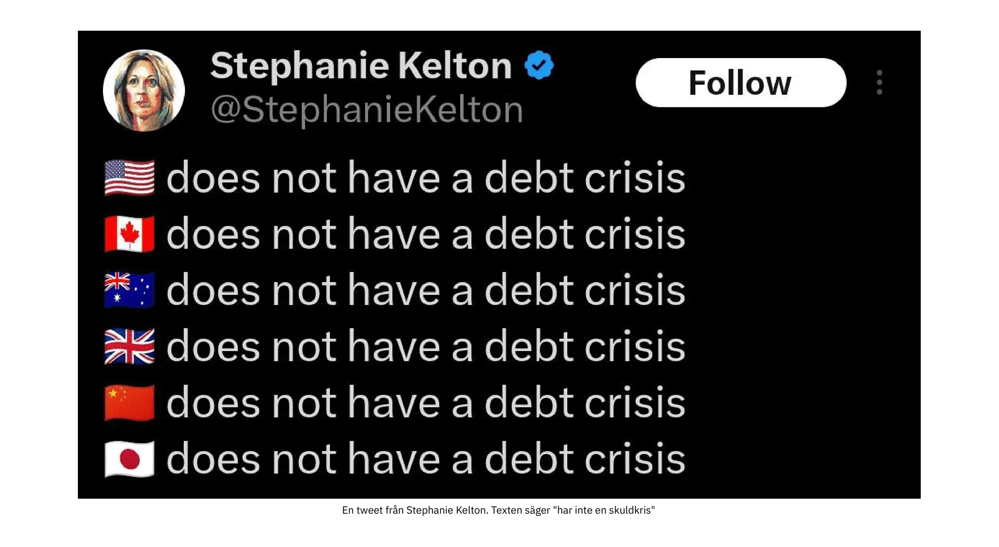

Märkligt nog listas bara sex länder? Varför är det så? För att de har verklig monetär suveränitet. Men det finns cirka 200 länder på jorden, och inte alla har monetär suveränitet. Så min kritik mot den här teorin, förutom att den är lite konstig och icke-funktionell, är att den bara fungerar för ett fåtal länder som har verklig monetär suveränitet, de som kan ge ut statsskuldväxlar i sin egen valuta. I viss mån är det till nackdel för resten av världen. Genom att skapa denna valuta är det som om de exporterade sin inflation någon annanstans, i likhet med vad USA har gjort med sitt orimliga privilegium i årtionden. Detta liknar en form av monetär kolonialism, där länder som har globalt förtroende och efterfrågan på sin valuta kan trycka så mycket pengar de vill utan att drabbas av betydande inflation, ofta för att de exporterar denna inflation.

Denna teori är svår att tillämpa på importberoende ekonomier som behöver upprätthålla det internationella förtroendet för sin valuta.

Denna teori kräver också en viss grad av centraliserad planering av ekonomin, framför allt för att säkerställa större kontroll över reala resurser (arbetskraft, råvaror, industriell kapacitet) och för att hantera inflationen.

# Pengarnas fall och pånyttfödelse

<partId>87a34ca9-782b-5ade-b51a-400f88ed7b0c</partId>

## Grekiska mynt

<chapterId>7714195f-74ce-5f8c-be5f-59302d39fff4</chapterId>

:::video id=8e5c3091-0910-471b-8d4b-0dc6e9afa656:::

### Bakgrund och sammanhang

Innan vi börjar, här är den historiska bakgrunden:

**Historisk bakgrund:**

**Romarna kallade grekerna för "Graeci" och Grekland för "Graecia"

**Grekerna kallade sig själva för "Hellener" och sitt land för "Hellas"

**Homer** (född omkring 8:e århundradet f.Kr.)

Legendarisk grekisk poet, förmodad författare till *Iliaden* och *Odysséen*.

Omkring **750 f.Kr: Lycurgus**, Spartas mytomspunne lagstiftare, sägs ha upprättat den spartanska konstitutionen baserad på militär disciplin och enkelhet.

**Numa Pompilius** (753-673 f.Kr.)

Roms andre kung, känd för att ha gett Rom dess första religiösa och juridiska institutioner.

**Dracon**, atensk lagstiftare (700-talet f.Kr.), känd för sina extremt stränga lagar, därav termen "draconian".

**594 f.Kr: Solon** blir lagstiftare i Aten och reformerar det atenska samhället radikalt, bland annat genom att avskaffa skuldslaveriet.

**776 F.KR: Antikens olympiska spel**

De första regelbundna idrottsspelen hölls i Olympia vart fjärde år och samlade de grekiska städerna.

**Pythagoras** (ca 570-495 f.Kr.)

Grekisk filosof och matematiker, känd för sitt teorem om den rätvinkliga triangeln.

**Xenofanes av Kolofon** (ca 570-478 f.Kr.)

För-sokratisk filosof känd för sin kritik av den traditionella grekiska polyteismen.

**490 f.Kr.: Slaget vid Marathon**

Atenarna slog segerrikt tillbaka en persisk invasion och markerade därmed en avgörande vändpunkt för den grekiska civilisationen.

**Herodotos** (ca 484-425 f.Kr.), med smeknamnet "historiens fader", skrev ett omfattande verk som beskriver perserkriget, inklusive den grekiska segern över Xerxes 480 f.Kr.

**Sokrates** (470-399 f.Kr.)

Atensk filosof, känd för sin dialektiska metod och sin undervisning om etik och självkännedom.

**Aristofanes** (ca 446-386 f.Kr.)

Atensk dramatiker, känd för sina satiriska komedier som *Grodorna*.

**Sofokles** (500-talet f.Kr.) kritiserar i sin pjäs *Antigone* pengar som en källa till moralisk och politisk korruption, genom tyrannen Kreon.

**Platon** (ca 428-348 f.Kr.)

Grekisk filosof, elev till Sokrates, grundare av akademin, författare till *Republiken*.

**431-404 F.KR: Peloponnesiska kriget**

Stor konflikt mellan Aten och Sparta, som slutar med nederlag för Aten.

**431 F.KR.**: Aten finansierar det peloponnesiska kriget genom att späda ut sina guld- och silvermynt för att öka mängden i omlopp, vilket orsakar inflation.

**Xenofon** (ca 430-355 f.Kr.)

Atensk författare, filosof och general, lärjunge till Sokrates, författare till *Anabasis*.

**414 F.KR.**: Aten börjar förlora det peloponnesiska kriget efter en katastrofal expedition till Sicilien.

**405 F.KR: Aristofanes** beskriver i sin pjäs "Grodorna" uttryckligen devalveringen av silverdrachman och uppkomsten av sämre bronsmynt i Aten, vilket illustrerar den princip som idag är känd som "Greshams lag".

**404 F.KR**: Aten kapitulerar efter en lång belägring av Sparta.

**Aristoteles** (384-322 f.Kr.)

Stor grekisk filosof, elev till Platon, grundare av Lyceum, känd för sina arbeten inom logik, biologi och politisk filosofi.

**327 F.KR.**: Alexander den store erövrar Persepolis och de östra provinserna i Persiska riket och utvidgar sitt imperium avsevärt.

**323 F.KR.**: Alexander dör i Babylon utan en tydlig arvinge, vilket utlöser krig mellan hans generaler (diadochi) för att dela upp imperiet.

**Archimedes** (ca 287-212 f.Kr.)

Grekisk matematiker, fysiker och uppfinnare, känd för sina upptäckter inom geometri och mekanik.

**196 f.Kr.: Rosettastenen** graveras under farao Ptolemaios V:s regeringstid, vilket möjliggör senare dechiffrering av egyptiska hieroglyfer.

**192-188 F.KR: Det romersk-seleukidiska kriget**

Rom besegrar det seleukidiska riket under Antiochos III och befäster sitt inflytande i Grekland och Mindre Asien.

**146 f.Kr.: Slaget vid Korinth**

Romarna förstörde den grekiska staden Korinth, vilket markerade slutet på Greklands politiska oberoende och den gradvisa integrationen av Grekland i den romerska världen.

För detta avsnitt om antiken, Roms fall och medeltiden börjar vi med ett avsnitt om grekiska mynt.

Mynthistorien i det antika Grekland började omkring 600 f.Kr. då de grekiska städerna snabbt anammade innovationen från Lydien i Mindre Asien och först använde elektrum och senare silver. De första grekiska mynten präglades på ön Aegina och föreställde en havs- eller landsköldpadda, men det var den atenska drachman, dekorerad med Athena och en uggla, som blev den monetära symbolen par excellence från 500-talet f.Kr. och som till stor del dominerade den internationella handeln vid den tiden.

Och jag har turen att ha en kopia av en grekisk drachma från den perioden med den berömda ugglan och en figur på baksidan. Det är en tetradrachma, som var större än en enkel drachma.

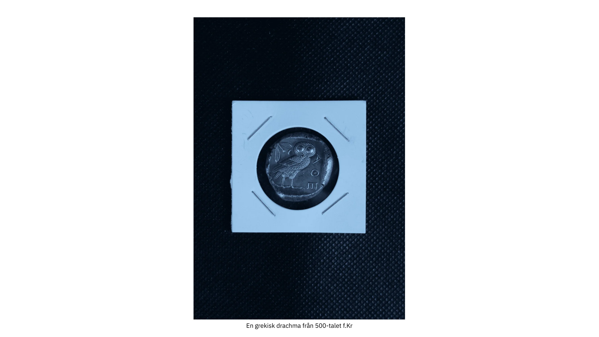

Varje grekisk stad utvecklade sin egen relation till pengar. I Aten var valutan djupt kopplad till politisk och ekonomisk makt. Det berömda atenska dekretet från slutet av 500-talet f.Kr. föreskrev exklusiv användning av den atenska valutan i de allierade territorierna, vilket förstärkte den ekonomiska hegemonin. Aten samlade också stora reserver av guld för nödsituationer, som förvarades på Akropolis, kanske som en symbol för dess ekonomiska försiktighet. Sparta, som var en militärstad med stränga värderingar, valde däremot att kraftigt begränsa användningen av pengar och förbjöd sina medborgare att inneha guld- eller silvermynt. Sparta föredrog att använda tunga järnstänger för att avskräcka från utrikeshandel och upprätthålla den sociala sammanhållningen.

Krig finansierades ofta genom valutamanipulation. Under det peloponnesiska kriget (431-404 f.Kr.) använde sig Aten av drastiska devalveringar för att betala sina trupper. Aten berövades tillgången till sina silvergruvor genom spartanernas ockupation av Decelia 413 f.Kr. och tvingades smälta ner guldstatyer för att snabbt kunna prägla nya mynt 407/406 f.Kr. Därefter, 406/405 f.Kr., skapade man bronsmynt pläterade med silver, vilket orsakade en monetär kris som illustreras av **Aristophanes**, som redan då påminner om det som idag är känt som Greshams lag: dåliga pengar driver ut goda pengar. Denna nödvaluta demonetiserades snabbt efter kriget för att återställa förtroendet för den atenska myntningen.

Slutet av den klassiska perioden präglades av Makedoniens uppgång under Filip II och hans son Alexander den store, vilket på ett genomgripande sätt störde den grekiska monetära balansen. Tack vare de enorma guld- och silvergruvorna i berget Pangea producerade Filip II ett överflöd av pengar för att finansiera sina militära och politiska kampanjer och införde en enkel och praktisk guld-silverstandard (10:1). Hans guldstaters, som firade hans seger vid de olympiska spelen, cirkulerade så långt som till Västeuropa och nådde till och med England. Alexander fortsatte med denna penningpolitik och lät den **Attiska** drachman cirkulera i stor omfattning under sina erövringar i öst ända till Indien. Denna massiva cirkulation av mynt markerade början på den hellenistiska eran, då bilden av suveräner gradvis ersatte bilden av gudomligheter på mynt. Denna innovation gjorde det möjligt för generationer av hellenistiska monarker att marknadsföra sig själva och förpassa de traditionella gudarna till en sekundär roll på baksidan av sina mynt.

Efter Alexanders död 323 f.Kr. delade hans generaler upp hans enorma imperium och etablerade dynastier i Egypten (ptoleméerna), Syrien (seleukiderna) och på andra håll. Dessa hellenistiska kungadömen införde olika monetära system: Ptolemaierna införde ett slutet monetärt system för att kontrollera penningcirkulationen och föredrog att använda spannmål som intern valuta för att spara ädelmetaller för externa militära utgifter. Samtidigt blev Rhodos ett viktigt handelscentrum innan det försvagades ekonomiskt av romarna, som 167 f.Kr. etablerade Delos som frihamn.

Användningen av pengar var central för ersättningen till legosoldaterna. Alexanders soldater fick silverdrakmer varje dag.

Kavalleriet, eliten i Alexanders högt specialiserade armé, fick i genomsnitt två drachmer om dagen, en infanterist en drachma och en vanlig legosoldat två tredjedelar av en drachma, dubbelt så mycket som en vanlig arbetare.

Under det peloponnesiska kriget betalades också betydande summor till soldater: över 1.200 talenter för att slå ner upproret på Samos och över 2.000 talenter för att belägra Potidea.

När denna armé var fullt engagerad i Mindre Asien var den totala kostnaden cirka tjugo talenter per dag, eller cirka ett halvt ton silver, eller 120.000 drachmer.

Den grekiska myntningen spelade också en viktig kulturell roll, eftersom varje stad försökte hävda sin identitet genom att prägla sina egna mynt med lokala eller mytologiska symboler. Heraklius avbildade till exempel Herakles (Herkules) i kamp mot ett lejon, medan Kyrene visade den berömda medicinalväxten silphium.

Trots sin variation och regionala fluktuationer lämnade de klassiska grekiska och hellenistiska mynten ett bestående avtryck i Medelhavsvärldens ekonomiska och kulturella historia och påverkade i hög grad senare monetära system ända fram till Rom, som gradvis antog och utvecklade grekiska ekonomiska koncept för att strukturera sin egen imperialistiska ekonomi.

## Valutans inverkan i Grekland

<chapterId>3a5e6c7d-699c-5567-87cd-3374c49d55a9</chapterId>

:::video id=0c79a59c-e179-4893-a414-1b8de0930eb9:::

### Aten och kontrasten till Sparta

Motsättningen mellan Aten och Sparta under den klassiska grekiska perioden avslöjar två radikalt olika modeller för politisk och ekonomisk organisation. Medan Sparta förkastade metallpengar till förmån för ett självförsörjande system baserat på medborgarnas förtroende, anammade Aten denna teknik fullt ut för att bygga upp och upprätthålla sitt maritima imperium.

### Den monetära nödvändigheten av sjömakt

Trots sitt storslagna namn var det atenska riket geografiskt sett blygsamt - det bestod i huvudsak av Aten och städerna vid Egeiska havet. Dess makt vilade på Delosförbundet, en militär allians som dominerades av Aten som hegemon. Denna imperialistiska struktur krävde ett enhetligt ekonomiskt instrument: det atenska silvermyntet.

Att underhålla en flotta var kärnan i denna monetära nödvändighet. En enda atensk trireme kostade mellan en och två talenter silver - en ansenlig summa. Med flera hundra skepp att underhålla behövde Aten ett effektivt skattesystem. Valuta blev det oumbärliga verktyget för att samla in tribut från vasallstäder och finansiera den marina projektionsstyrka som garanterade imperiets sammanhållning.

### Penningtvång som ett verktyg för dominans

Aten införde sin silvervaluta för alla medlemmar i Delosförbundet. Denna monetära standardisering tjänade flera strategiska mål. För det första underlättade den uppbörden av tributer genom att skapa en gemensam räkneenhet. För det andra förstärkte den vasallstädernas ekonomiska beroende av Aten. Slutligen projicerade den symboliskt den atenska makten över hela det maritima imperiet.

Denna penningpolitik står i skarp kontrast till den spartanska modellen. Sparta, som var en landmakt, kunde förlita sig på de peloponnesiska heloternas (slavarnas) arbete för sin försörjning. Dess slutna, stadscentrerade ekonomiska system krävde inte sofistikerade monetära instrument. Medborgarsoldaterna levde tillsammans, delade gemensamma måltider och behövde inte pengar för det dagliga utbytet.

### Valuta som medel för sjöhandel

Det atenska imperiets sjöfartsnatur innebar att det måste vara öppet för handel. Till skillnad från det inåtvända Sparta var Aten tvunget att handla med omvärlden för sin överlevnad och sitt välstånd. Valuta blev det oumbärliga instrumentet för Medelhavshandeln.

Denna externa orientering skapade en god cirkel: handeln genererade intäkter, dessa intäkter finansierade flottan, flottan skyddade handelsvägarna och upprätthöll imperiet, och imperiet införde den atenska valutan, vilket underlättade handeln. Valutan var inte längre bara ett bytesmedel utan blev en grundpelare i den imperialistiska strategin.

### Den monetära maktens gränser

Trots denna ekonomiska sofistikering visade den atenska penningmakten sina begränsningar under det peloponnesiska kriget. Mot de spartanska landstyrkorna räckte inte Atens marina och ekonomiska överlägsenhet. Dyra expeditioner, som det katastrofala Syrakusafälttåget på Sicilien, förbrukade de ekonomiska resurserna utan att leda till någon avgörande seger.

Historien visar att valuta, även om det är ett kraftfullt verktyg för att projicera makt, inte är någon garanti för militär dominans. Sparta, som inte hade någon metallisk valuta men en anmärkningsvärd social sammanhållning, segrade i slutändan över det atenska monetära imperiet.

### Två modeller, två öden

Motsättningen mellan Aten och Sparta illustrerar två grundläggande synsätt på social och ekonomisk organisation. Aten representerar den öppna, kommersiella, monetariserade modellen - föregångaren till de moderna maritima imperierna. Sparta förkroppsligar den slutna, autarkiska modellen, baserad på medborgerligt förtroende snarare än monetära instrument.

Dessa två system visar att införandet av en valuta är nära kopplat till den politiska och ekonomiska modell som valts. För en sjöfarts- och handelsmakt som Aten blev pengar oumbärliga. För ett slutet krigarsamhälle som Sparta utgjorde de ett hot mot den sociala ordningen. Denna antika dikotomi präglar fortfarande debatterna om pengarnas roll i samhällsorganisationen.

## Den romerska republiken

<chapterId>0bc80983-33e1-5881-85bb-7c22f3144a9a</chapterId>

:::video id=dc05ca97-d29c-4679-bfeb-912c47d86ce2:::

### Den romerska republikens historia

- 753 - 509 f.Kr: Kungadömet Rom**
- 753 F.KR: Roms grundande** (traditionellt tillskrivet Romulus).
- 509 - 27 F.KR: Romerska republiken**, Rom blir en republik som styrs av en vald senat och konsuler.
- 280 - 275 F.KR: Pyrrhuskriget**. Pyrrhus, kung av Epirus, kämpar mot romarna i södra Italien och vinner kostsamma segrar ("Pyrrhussegrar").
- 264 - 146 F.KR: Puniska kriget**. Stor konflikt mellan Rom och Kartago om herraväldet i västra Medelhavsområdet.
- Hannibal (247 - ca 181 f.Kr.)**. Legendarisk karthagisk general, känd för att ha korsat Alperna med sin armé och sina elefanter för att anfalla Rom under det andra puniska kriget.
- 146 f.Kr: Slaget vid Korinth**. Rom förstör den grekiska staden Korinth och inför sitt slutgiltiga herravälde på det grekiska fastlandet.
- 91 - 87 f.Kr: Socialt krig**. Uppror av Roms italienska allierade som krävde romerskt medborgarskap, vilket så småningom ledde till att de integrerades fullt ut i medborgarskapet.
- 64 f.Kr.: Slut på det seleukidiska motståndet**. Rom eliminerar definitivt det seleukidiska inflytandet i Syrien och befäster sitt grepp om östra Medelhavet.
- 55 F.KR: Julius Caesar erövrar Central- och Västeuropa**. Julius Caesar utvidgar det romerska herraväldet till Gallien (nuvarande Frankrike) och går in i Germanien och Bretagne.
- 43 F.KR: Bildandet av det andra triumviratet**. Politisk allians mellan Octavianus (senare Augustus), Marcus Antonius och Lepidus för att stabilisera Rom efter mordet på Caesar.
- 27 f.Kr: Början på Pax Romana**. En period av politisk stabilitet och välstånd under Augustus styre, vilket markerar början på det romerska riket.

### Roms sena monetära början

I detta avsnitt om antiken vänder vi nu blickarna mot den romerska republiken. Roms monetära historia började mycket senare än grekernas och persernas. Rom grundades år 753 f.Kr. och det dröjde nästan fyra århundraden innan man verkligen började använda mynt. Under denna långa period använde romarna ett primitivt system för utbyte med oregelbundna bronsbitar som kallades aes rude, vilket krävde exakt vägning för varje transaktion. Det var först i slutet av 400-talet f.Kr. som Rom, under grekiskt och etruskiskt inflytande, började ge ut sina första mynt, framför allt i brons som gjutits som i Kina, aes grave, som var karakteristiskt för det romerska utbytet fram till **det andra puniska kriget**.

### Grekiskt inflytande och de första silvermynten

I och med det avgörande mötet med grekerna i södra Italien började romarna verkligen prägla silvermynt. Omkring 280 f.Kr. började Rom tillverka egna silvermynt efter grekisk förebild, didrachmer. Den första regelbundna utgivningen av silvermynt i Rom daterar sig exakt till 269 f.Kr. och föreställer de legendariska tvillingarna Romulus och Remus som ammas av varghonan, en symbol som har blivit ikonisk.

Faktum är att många romerska mynt från republikens tid avbildar grundningsmyter. Du kan se mitt här nedan: det är ett fantastiskt, äkta mynt från kung Tatius. Det illustrerar myten om bortförandet av kvinnor från sabinerna. Tatius var kung i den här regionen, och grundläggningsmyten berättar om hur romarna rövade bort kvinnor från sabinerna, en befolkning som bodde i närheten. Därefter blev kung Tatius samkung med Romulus, en av Roms grundare.

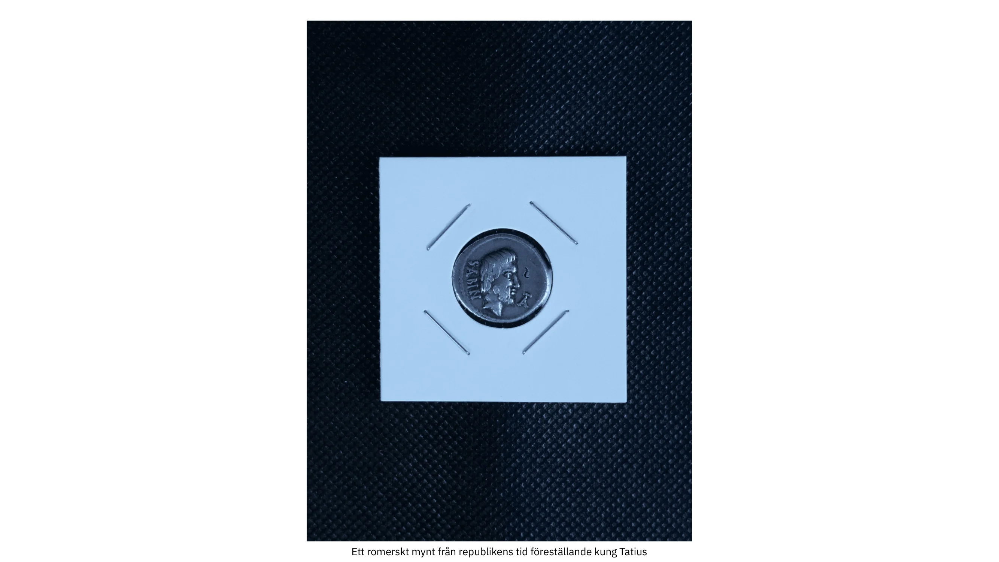

### Ursprunget till ordet "mynt" och Juno Moneta-templet

Begreppet "mynt" har sitt ursprung i Juno Moneta-templet i Rom. Enligt legenden varnade de heliga gässen på Kapitolium romarna för en överhängande fara under en gallisk invasion år 390 f.Kr. För att tacka gudinnan Juno, som beskyddade Kapitolium, uppfördes ett tempel till hennes ära som snart blev myntverkstad för romerska mynt.

### Puniska kriget och valutakriser

Militära konflikter hade ett betydande inflytande på den romerska monetära utvecklingen. Under det andra puniska kriget (218-201 f.Kr.) mot Kartago ställdes Rom inför allvarliga ekonomiska svårigheter på grund av Hannibals invasion. För att lindra de akuta behoven tog Rom för första gången till en exceptionell utgivning av guldmynt, liksom till en betydande devalvering av silvermynten, från en ursprunglig renhet på 97 % till omkring 89 %. Även vikten på bronsmynten (aes) sjönk drastiskt, med nästan 80 procent på sex år.

Här kan vi återkomma till ett koncept som vi tidigare har diskuterat, nämligen att grekerna smälte ädelmetaller som förvarades i tempel för att hjälpa till att lindra ekonomiska kriser. Och för att prata om **Kartago**, här nedan kan du beundra ett riktigt kartagiskt mynt från min samling. Dessa karthagiska mynt föreställde en palm på ena sidan och en häst på den andra. På det här myntet är hästen inte särskilt igenkännlig, och den är mycket sliten.

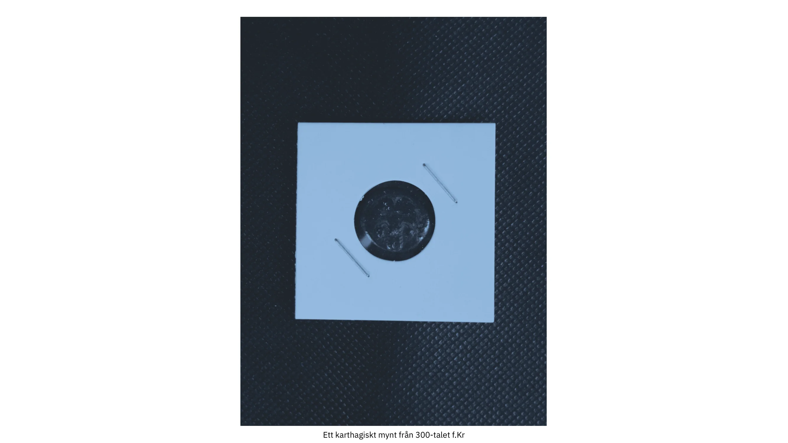

Som ett resultat av detta sjönk vikten på bronsmynt, som kallas aes, också drastiskt och förlorade nästan 80 procent på sex år. Vikten på dessa bronsmynt, som inte var någon ädelmetall och som användes i den dagliga handeln, sjönk alltså kraftigt, vilket var ett tecken på en monetär devalvering till följd av dessa krig.

### Silverdenaren och monetär stabilitet

Det var mot denna kritiska bakgrund som Rom införde den berömda silverdenaren omkring 212 f.Kr. Denna reform säkerställde en anmärkningsvärd monetär stabilitet, där denaren förblev den dominerande valutan i nästan 450 år. Denna stabilitet har Rom att tacka en rigorös förvaltning för, trots en större omprissättning 146 f.Kr. och en betydande produktion för att finansiera sina enorma arméer, särskilt under de puniska, sociala (91-87 f.Kr.) och makedonska krigen. Som exempel kan nämnas att underhållet av en enda romersk legion kostade omkring 1,5 miljoner denarer per år, vilket illustrerar omfattningen av de monetära behoven.

Utanför de romerska gränserna ledde krig till stora devalveringar i regioner under romerskt inflytande. I det puniska Karthago sjönk renheten i elektrum dramatiskt, från 98% guld på 400-talet till bara 30% under det andra puniska kriget, medan silvermynten sjönk till 18% renhet.

### Utvecklingen av monetära motiv

I och med Roms expansion förändrades också myntens karaktär: från att ha varit anonyma och patriotiska fick mynten gradvis personliga motiv med myntmästarnas (de som präglade mynten) mäktiga familjer. Denna övergång symboliserar tydligt de politiska omvandlingarna i den sena romerska republiken.

Även om Rom dominerade Medelhavsvärlden ekonomiskt, behöll man en viss enkelhet i sina betalningsmedel: ingen annan form av penningöverföring än direkt utbyte av mynt utvecklades, med undantag för skatteöverföringar och privata krediter som var reserverade för eliten.

## Det romerska riket

<chapterId>2dc44e50-112a-5abf-97ae-8e0a9ecda989</chapterId>

:::video id=f8d6f3d6-9ee4-4504-888e-4f12b3f20489:::

**Historisk bakgrund:**

**Principatet** var den kejserliga regeringsformen i romarriket från början av Augustus regeringstid år 27 f.Kr. till slutet av krisen på 300-talet år 284 e.Kr.

**27 f.Kr: Början på Pax Romana**

Period av politisk stabilitet och välstånd under Augustus regeringstid, vilket markerade början på det romerska riket.

**Augustus (30 f.Kr. - 14 e.Kr.)** reformerade det romerska monetära systemet radikalt och införde en varaktig och stabil standard för den kejserliga myntningen.

**Augustinus var också en av de första erkända samlarna** av antika mynt och fossiler.

**54 AD - 68 AD: Nero**

Kontroversiell romersk kejsare, känd för sitt tyranni, sina förföljelser och sin katastrofala ledning efter Roms bränning.

**64 AD: Den stora branden i Rom**

En stor brand härjar i stora delar av staden; Nero anklagas för att vara ansvarig.

**69 AD: De fyra kejsarnas år**

En kaotisk period med fyra kejsare i snabb följd (Galba, Otho, Vitellius, Vespasianus).

**79 E.KR: Vesuvius utbrott**

Vulkan som förstörde städerna Pompeji och Herculaneum och som undantagsvis bevarade deras kvarlevor under askan.

**165 AD - 180 AD: Antoninska pesten**

Förödande epidemi som försvagade det romerska riket under Marcus Aurelius och Commodus.

**200 e.Kr.: Territoriell höjdpunkt och gradvis slut på Pax Romana**

Rom nådde sin maximala utbredning, men började drabbas av intern instabilitet och ekonomiska svårigheter.

**212 E.KR: Caracallas dekret om medborgarskap**

Kejsar Caracalla gav romerskt medborgarskap till nästan alla invånare i imperiet för att bredda skattebasen.

**220 AD: Början på de stora barbarinvasionerna**

De första betydande intrången av germanska folk över romerska gränser.

**235 AD - 285 AD: Den politiska och militära krisen under 300-talet**

En period som präglades av politisk instabilitet, med många kortlivade kejsare, inbördeskrig, ekonomiska kriser och ständiga invasioner.

**Aurelianus (270-275 e.Kr.) omvärderade den romerska valutan** radikalt och försökte återställa dess nominella värde trots hög inflation.

**301 E.KR: Diocletianus prisförordning**

Kejsar Diocletianus försökte förgäves stoppa den skenande inflationen genom att införa strikta pris- och lönekontroller i hela imperiet.

**312 E.KR: Konstantin**

Den förste kristne kejsaren, grundare av Konstantinopel, stabiliserade valutan genom att införa "solidus", ett guldmynt med stor renhet och stabilitet.

**476 E.KR: Det västromerska rikets fall**

Rom intas av olika germanska folk (bl.a. ostrogoterna), en händelse som anses markera det officiella slutet på det västromerska riket.

### Augustus monetära reformer

I detta avsnitt om antiken har vi redan kommit fram till romarriket. Romarrikets monetära historia kännetecknas av en intensiv användning av metallisk valuta, särskilt guld, silver och brons, men också av flera valutakriser, nära kopplade till politiska och militära oroligheter. I slutet av republiken, under Julius Caesar, introducerade Rom 46 f.Kr. guldmyntet aureus, ett mynt som vägde cirka 8 gram och som var allmänt accepterat i hela Europa och Medelhavsområdet. Caesar standardiserade dessa guldmynt och präglade de första mynten med ett porträtt av en levande människa, vilket innebar att han bröt med en gammal republikansk tradition som gynnade anonyma, kollektiva symboler. Denna utveckling åtföljde en period av stor politisk omvandling, där personlig makt gradvis ersatte republikanska institutioner.

Efter mordet på Caesar år 44 f.Kr. tog Octavianus (Augustus) över Rom och grundade kejsardömet år 27 f.Kr. Under hans regeringstid genomfördes en fullständig reform av det monetära systemet, vilket gav en varaktig stabilitet åt den romerska ekonomin. På Augustus tid motsvarade en aureus i guld 25 denarer i silver, som i sin tur var värda 4 sestertier i brons. Denna monetära stabilitet fortsatte under hela det första århundradet e.Kr., en period som ofta beskrivs som en ekonomisk guldålder för Rom.

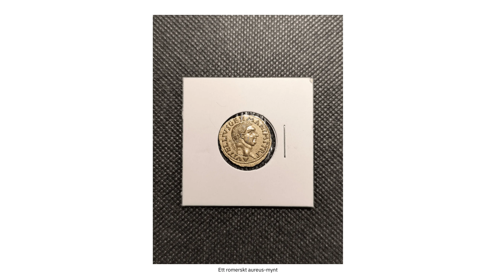

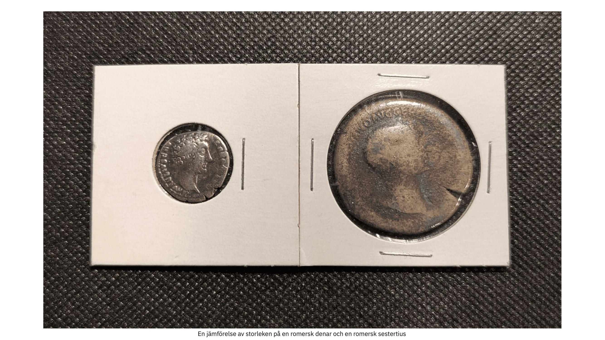

Men från och med Nero (54-68 e.Kr.) började Rom en långsam devalvering av sina mynt och minskade successivt deras vikt och renhet för att finansiera de växande kejserliga utgifterna, särskilt efter den stora branden i Rom år 64 e.Kr. Dessa devalveringar fick märkbara effekter: renare mynt togs ur cirkulation genom hamstring eller export, i enlighet med **Greshams lag**, medan devalverade mynt spreds, vilket orsakade en gradvis prisökning.

Det tredje århundradet markerar en dramatisk vändpunkt, med en spektakulär acceleration av devalveringarna under kejsarna Septimius Severus, Caracalla och Gallienus. Det viktigaste silvermyntet, denarius och sedan antoninianus, fick se sitt silverinnehåll sjunka till bara 2%. Samtidigt halverades guldvikten på aureus. Denna monetära kris åtföljdes av en politisk instabilitet utan motstycke, barbarinvasioner och återkommande inbördeskrig.

Denna del gör det möjligt för mig att presentera det sista myntet i detta avsnitt: antoninianus. Det här myntets ursprungliga namn är okänt, men vi kallar det antoninianus i dag. Det har det utmärkande draget att det värderas till två denarer, trots att det bara är 1,5 gånger större än en denar. Med tiden blev dessa mynt dessutom bara billonmynt, vilket innebär att de tillverkades av en legering av silver och andra metaller snarare än av rent silver. Mynten var ofta bara överdragna med silver, vilket är ett anmärkningsvärt exempel på monetärt förfall.

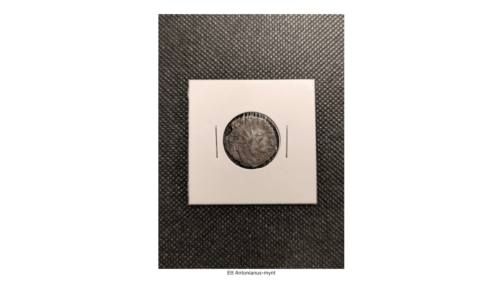

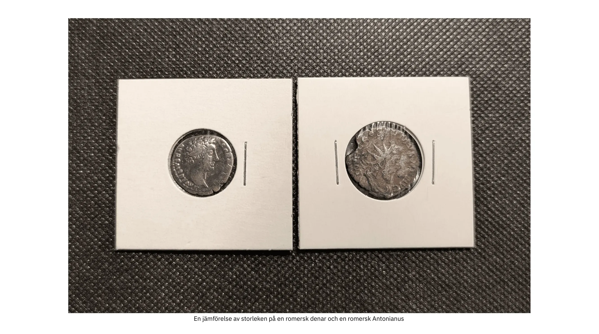

Inför denna situation försökte kejsar Aurelianus (270-275 e.Kr.) stabilisera systemet genom att nominellt revalvera valutorna, men denna reform introducerade i själva verket en inflationsmekanism genom att artificiellt fixera värdet på befintliga valutor på en högre nivå.

Jag kommer att presentera en utvikning om ämnet. Under 300-talet upplevde inflationen en snabb exponentiell ökning. Tidigare hade mynten visserligen devalverats, men den handgjorda processen att prägla dem ett efter ett hade ändå gett en viss kontroll över inflationen. Statistiken visar att inflationen under 300 år av devalvering i genomsnitt låg på cirka 4 procent per år. Strax före Aurelianus reform var inflationen cirka 3% per år.

Aurelianus införde ett renhetsmått på myntet med XXI-tecknet, som angav en sammansättning av 20 delar brons till 1 del silver, eller 5 % renhet. Han marknadsförde dessa 5-procentiga silvermynt och stämplade XXI-tecknet på dem. Men han återkallade också alla de andra, mer devalverade mynten och stämplade samma XXI på dem. Detta innebar att alla mynts nominella värde omvärderades. Resultatet blev en häpnadsväckande inflationstakt på 20 procent per år, vilket vida översteg den tidigare inflationstakten på 3 procent innan denna teknik infördes.

Det var egentligen Aurelianus som uppfann denna form av devalvering, som är mycket snabbare än den gradvisa devalveringen av metall, som fortfarande tvingade oss att trycka mynt ett och ett. Vad han gjorde var att ta alla befintliga mynt, återkalla dem och stämpla dem med en stans för att ändra deras nominella värde. Det är en verklig vändpunkt. Det var då inflationen blev exponentiell.

För att visuellt illustrera denna extrema devalvering har jag hittat lite fascinerande statistik över priset på spannmål i Egypten från 40 f.Kr. till 300-talet, vilket spänner över 300 år. Nedan kan du se en grekisk tetradrachma från min samling. På den tiden, i Egypten under romersk ockupation på 300-talet, var motsvarigheten en egyptisk tetradrachma. Valören drachmer användes fortfarande och motsvarade en denar.

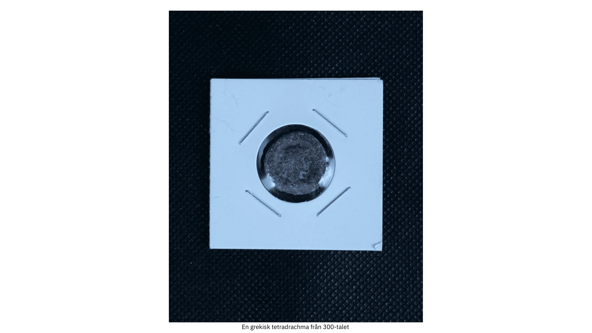

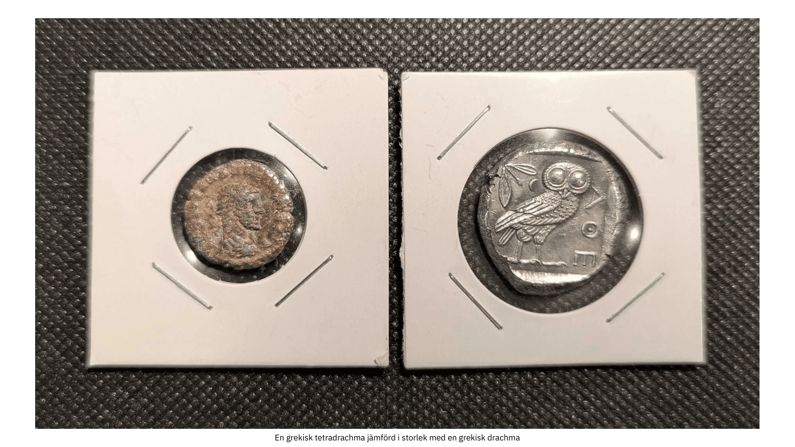

Den egyptiska tetradrachmen som jag har motsvarade alltså en denar. Du kan se att myntet är gjort av billon (eller brons), så det innehåller inte någon ädelmetall. Du kan jämföra det med den ursprungliga grekiska tetradrachmen för att se den fysiska devalveringen under dessa 300 år. Det är en miljonfaldig ökning av priset på spannmål i Egypten.

Det är det fysiska uttrycket för Aurelians reform. Det bör noteras att majoriteten, genomsnittet under dessa 300 år av inflation, var omkring 4 procent. Det var först i slutet, när Aurelianus genomförde sin reform, som denna inflation blev ganska exponentiell och vi kom fram till detta mått på 1 miljon. Priserna var en miljon gånger högre i slutet av 300-talet än under första århundradet f.Kr.

Hans efterträdare **Diocletianus** (284-305 e.Kr.) försökte sig på ännu mer radikala reformer: han utfärdade nya valutor (särskilt argenteus, renare men alltför begränsad i kvantitet), införde drastiska priskontroller (prisediktet 301 e.Kr.) och **införde ett skattesystem baserat på betalningar in natura**. Trots dessa ansträngningar lyckades Diocletianus reformer inte stävja den skenande inflationen.

Diocletianus vägrade att leverera varor och tjänster i utbyte mot en devalverad valuta och införde därför **ett ärftligt kastsystem** för att binda bönderna och deras ättlingar till sin mark.

Det som verkligen måste förstås här är att det som hände var att bönderna vägrade att leverera sina produkter i utbyte mot devalverad valuta, och vår käre Diocletianus svar var att skapa **ärftliga kaster** genom att säga "du, du kan inte lämna din mark, dina barn kan inte lämna sin mark, samma sak för soldaterna, ni är soldater, ni går med på att få betalt i min valuta". Som en övergångslösning fick de betalt in natura (i kött, mat, spannmål) eftersom han vägrade att ge dem pengar. Så han införde detta ärftliga kastsystem för att tvinga människor att vara knutna till sin bransch, så att de inte bara kunde byta jobb om de försökte att inte acceptera den devalverade valutan.

För att illustrera detta exempel har jag här en text, ett utdrag ur boken "*Monetary Regime and Inflation*":

> Eftersom människor var ovilliga att arbeta och leverera varor mot en devalverad valuta, vars nominella värde var högre än dess egentliga värde eller marknadsvärde, var man tvungen att tvinga dem att arbeta genom att införa naturaskatter. [...] Det blev olagligt för bönderna att lämna sina registrerade hem. Jordbruksbefolkningen blev på så sätt ärftligt knuten till marken.
>

> Detta ärftliga kastsystem spred sig gradvis: Diocletianus tvingade soldaters söner att tjänstgöra i armén, medan arbetarna i penningverkstäderna, liksom i de väverier och färgerier som Diocletianus hade skapat, blev statsslavar med ärftlig tjänstgöring. Guldgrävare blev också senare en ärftlig kast. Andra ärftliga klasser fanns troligen redan på Diocletianus tid, bland annat bagar- och slaktarskråna [...] i Rom, liksom stiftsskråna av skeppskaptener som transporterade spannmål och andra offentliga varor till Rom.

Det var Konstantin (306-337 e.Kr.) som slutligen lyckades stabilisera det monetära systemet genom att år 312 införa solidus, ett mynt av rent guld vars kvalitet och vikt han strikt garanterade. Det fanns ett helt system för att verifiera solidusens renhet och vikt. **Den här stabiliteten påverkade dock bara en rik elit och den kejserliga administrationen**, medan **majoriteten av befolkningen fortsatte att lida av lågkvalitativ valuta och ihållande inflation**. Solidusen förblev stabil i Östrom (Bysans), där den varade i mer än ett årtusende, medan myntningen i väst splittrades upp i små mynt med lågt värde och följde med i den slutliga ekonomiska och politiska upplösningen av romarriket, som slutgiltigt föll 476 e.Kr.

Avslutningsvis vill jag dela med mig av detta citat från *A History of Money: From Ancient Times to the Present Day* av Glyn Davies, som på ett mästerligt sätt sammanfattar vad som kanske ledde till Roms undergång:

*"Skatterna var genomgående otillräckliga och de svårigheter som var förknippade med dessa alltmer otillräckliga, sent justerade och mycket synliga skatter fick Rom att förlita sig mer på en enkel, omedelbar och dold form av beskattning: devalvering av valutan. Kortlivade ad hoc-reformer lyckades inte vända denna urgamla nedgångstrend. Ekonomiska påfrestningar orsakade av myntens slitage, skeppsbrott, penningläckage på grund av inköp av lyxvaror från öst, gåvor till germanska barbarer, städernas befolkningstillväxt, jordbruksproduktionens nedgång, den gradvisa uttömningen av de rikaste gruvorna och framför allt den "bröd och skådespel"-politik som ansågs nödvändig för att upprätthålla ett minimum av ordning i stadslivet - alla dessa kumulativa påfrestningar ledde Rom till ständiga penningdevalveringar, varvade med enstaka reformer dömda att misslyckas."*

*Förutom gratis eller billigt bröd och vin delades då och då kejserliga liberaliteter ("congiaria") i form av penningtilldelningar ut, särskilt under Trajanus (98-117 e.Kr.) och i ännu högre grad under Hadrianus (117-138 e.Kr.) och hans efterträdare. Det som kejsaren och medborgarna till en början hade betraktat som ett exceptionellt privilegium hade i början av 200-talet blivit en vanlig förväntan. Dessa utdelningar "utgjorde en tung börda för statskassan och bidrog på sitt sätt till att staten gick i konkurs".*

## Kopplingar mellan penningmängdsutspädning och inflation: från orsaker till konsekvenser

<chapterId>38d5781c-e900-53f7-baa7-413655d71754</chapterId>

:::video id=3999256d-aafe-4502-9b72-dfa8491a2777:::

I detta avsnitt granskas sambanden mellan monetär utspädning och inflation, från orsaker till konsekvenser. Monetär utspädning är ett av de viktigaste ekonomiska fenomenen i den romerska monetära historien, med direkta effekter på inflationen. Från och med 1:a århundradet e.Kr. skedde en första långsam fas av utspädning av silvermynt (denarius) från och med Neros regeringstid (54-68 e.Kr.) och framåt, som påskyndades av upprepade militära och finansiella kriser, särskilt under Septimius Severus (193-211) och Gallienus (253-268).

Vi noterar också en mer gradvis devalvering av aureus. Denna skillnad i devalveringshastighet belyser två punkter:

1. Räkneenhetens roll i bimetallism för statlig kontroll av pengar. I det här exemplet är räkneenheten denaren. Jag har identifierat tre olika sätt att hantera värdet på räkneenheten: devalvering (utspädning av metallen), redenominering (antoninianus) och införande av ett nominellt värde genom att markera "XXI" (Aurelianus)

2. Statens önskan att så länge som möjligt skjuta upp devalveringen av aureus, den värdereserv som gör det möjligt för eliten att behålla sin köpkraft på bekostnad av de mindre lyckligt lottade. Vi kommer ofta att återkomma till denna princip under kursens gång, särskilt i samband med den s.k. Cantilloneffekten och redenomineringarna av Maravedi i Spanien.

Detta fenomen är ganska intressant och har återkommit genom historien. Vi kommer att återkomma till det med Maravedi i ett senare avsnitt. Detta mönster är tydligt även för alla reservvalutor; reservvärdeenheten, t.ex. aureusen i Rom, förblir orörd. Den räkneenhet som används av allmänheten för handel och vardagliga transaktioner devalveras dock ofta. Detta leder till att den monetära inflationen drabbar vanligt folk, medan de som har råd med guldmynt i stort sett förblir opåverkade.

Och förresten, **det är samma fenomen som skapas i dag med valutadevalvering, som gör att finansiella tillgångar kan stiga i värde**, och så är det de människor som använder valutan, de fattigaste människorna, som blir fattigare, och detta berikar i sin tur, genom penningskapande, tillgångarna för dem som kan, som har medel att skydda sig mot devalvering, och så fördjupar det sociala ojämlikheter. Det var min lilla politiska rant.

Det jag just har beskrivit kallas Cantillon-effekten. Vi ska se att den här mannen levde på John Laws tid, ett ämne som vi också kommer att ta upp i ett senare avsnitt.

Den reform som inleddes under Aurelianus styre ledde till att inflationen sköt i höjden. Inflationen i pengarnas nominella värde begränsades inte längre av myntverkens förmåga att tillverka mynt för hand. Mynt som redan hade präglats kunde nu enkelt märkas, och penningmängdens nominella värde ökade snabbare.

Jag har två citat att dela med dig i samband med Aurelian. Det första kommer från *A History of Money: From Ancient Times to the Present Day*:

*"När det gäller den romerska ekonomin var Aurelianus bidrag snarare en katastrof än en triumf. Det var till stor del på grund av hans "reform" som inflationstakten kunde öka långt mer än vad som tidigare hade varit möjligt, även under den oansvarige Gallienus. Under två århundraden efter Aurelianus blev inflationen endemisk i hela det romerska riket."*

Den andra kommer från boken *Ancient History from Coins* och handlar om det monetära systemets frigörelse från guld:

*"Aurelianus reform förändrade förhållandet mellan guldpengar och resten av det monetära systemet. Dessförinnan var andra typer av valuta kopplade till **aureus** enligt officiella kurser (25 egyptiska denarer eller 25 tetradrachmer för en aureus, etc.). Efter reformen började guldpengarna **fluktuera fritt i värde**, som vilken annan vara som helst, medan resten av det monetära systemet **kollapsade i värde** på grund av **försvagningen av legeringar**, eftersom de inte längre **uppbackades av guld**. Eftersom räkneenheten fortfarande teoretiskt sett var baserad på silver (denaren, eller i Egypten drachman) steg priserna i takt med att valutan deprecierade. "*

Som ni kan se drabbade denna devalvering av den valuta som fungerade som räkneenhet de mindre bemedlade oproportionerligt hårt, medan den lösgjorda kopplingen till guldpengar skyddade köpkraften för dem som hade råd att spara i den värdebevarare som guld utgör.

Vad du måste förstå här är att om det finns en koppling mellan denarius och aureus, även om du devalverar denarius, om du fortfarande kan byta din denarius mot aureus till denna kurs (25 denarius för 1 aureus), kommer människor definitivt att byta sin denarius mot din aureus eftersom denarius kommer att vara övervärderad och aureus undervärderad. Men i den här reformen tog de bort den här länken. Så folk kunde inte längre växla denarer mot silvermetall som devalverats mot guld. Det var då de som hade tillgång till guldmynt verkligen kunde skydda sig, för efteråt kunde man inte längre växla övervärderat devalverat silver mot undervärderat rent guld. Detta är ett mycket viktigt ögonblick i valutans utveckling.

Ett slående exempel på effekterna av denna reform av Aurelianus illustreras perfekt av dessa citat från boken *Monetary Regimes and Inflation*:

*"Mellan kejsarna Claudius (41-54 e.Kr.) och Constantius (337-361 e.Kr.) **ökade priset på vete på den öppna marknaden i Egypten, uttryckt i drachmer, med en faktor på över en miljon**. Spektakulär prisinflation är ett av de centrala ekonomiska fakta som framkommer under 300- och 400-talen e.Kr." (Lendon 1990, s. 106). Men denna utveckling är **mindre dramatisk än den verkar**, eftersom den motsvarar en **genomsnittlig årlig inflationstakt på 4,4%**. Och enligt Wassink (1991, s. 482) började inflationen faktiskt **först 238 e.Kr.**"*

*"Från och med detta datum accelererade inflationen långsamt, eftersom **goda pengar först drevs ut ur omlopp**, så att den totala penningmängden till en början knappt ökade alls. Därefter nådde den en genomsnittlig årlig takt på **3,65% mellan 250 och 293**, och steg till **22,28% mellan 293 och 301** (Wassink 1991, s. 466), dvs. fram till kejsar Diocletianus **avbrutna monetära reformer**. Detta fenomen är **särskilt imponerande för inflationen i en metallbaserad monetär regim**. "*

Detta inflationsfenomen, som är kopplat till penningutspädning, var ursprungligen en reaktion på den romerska statens tillfälliga likviditetskriser. Genom att minska innehållet av ädelmetall i mynten och samtidigt behålla deras nominella värde ökade staten tillfälligt sina resurser. Priserna reagerade dock inte omedelbart: det romerska systemet hade en viss trögrörlighet, vilket innebar att löner och priser var långsamma att anpassa sig till successiva devalveringar. Efter en viss tröskel skulle dock priserna stiga kraftigt för att återföra marknaden i balans med valutornas verkliga värde.

Som nämnts ovan är detta fenomen särskilt tydligt från mitten av 300-talet och framåt. I Egypten, en region som är rikt dokumenterad, multiplicerades priserna med 10 under Aurelianus (274 e.Kr.) efter en officiell revalvering av valutan, trots ett första försök till stabilisering. Under Diocletianus (301 e.Kr.) infördes sedan ett prisedikt som innebar drastiska kontroller för att dämpa inflationen utan att angripa grundorsaken - överproduktion och penningförstöring - vilket ledde till ett förutsägbart misslyckande. En ihållande inflation driver i slutändan ekonomin mot ett system med två nivåer: **eliten, skyddad av guldreserver (som Konstantins solidus**), åtnjuter stabilitet, medan majoriteten av befolkningen fortsätter att drabbas av kronisk inflation, **illustrerar det som idag är känt som Cantillon-effekten.**

Det finns ett tydligt samband mellan den romerska penningutspädningen och inflationen, vars orsaker i huvudsak är kopplade till kroniska budgetunderskott, ständiga militärutgifter och dålig statlig ekonomisk förvaltning.

## Det romerska rikets fall

<chapterId>b6ec0914-227b-509c-8108-b09eec9bb904</chapterId>

:::video id=91d4fee5-59bb-4ab9-a90b-e1125c71decb:::

### Valutadevalvering och Roms kollaps

Den österrikiska skolan inom nationalekonomin, framför allt genom Ludwig von Mises, föreslog en monetär tolkning av Roms fall. Enligt denna vision krossade den progressiva devalveringen av den romerska valutan det komplexa systemet med arbetsdelning som upprätthöll ett imperium med 60 miljoner invånare. När valutan, som var det centrala instrumentet för ekonomisk samordning, väl hade korrumperats ledde det till att hela den sociala och ekonomiska strukturen kollapsade.

Denna monetära försämring förstörde inte bara imperiets interna sammanhållning. Den avbröt också handelsförbindelserna med grannfolken. Berövade fördelarna med handeln med Rom övergick "barbarerna" från fredligt samarbete till rovdrift. Invasionerna var därför inte bara av militär karaktär utan också resultatet av ett grundläggande ekonomiskt sammanbrott.

### Den imperialistiska devalveringens tre faser

Den romerska penninghistorien kan delas in i tre olika perioder. Den första, från julio-claudierna till antoninierna (27 f.Kr. - slutet av 200-talet), präglades av relativ stabilitet. Under Trajanus nådde imperiet sin höjdpunkt: Rom, som täckte 5 miljoner km², blev historiens första miljonärstad. Denaren har en silverrenhet på 98-80% - en måttlig devalvering som fortfarande gör det möjligt för ekonomin att fungera.

Den andra perioden, 300-talet, präglades av militär anarki. Tjugosex kejsare avlöste varandra inom loppet av några decennier. Valutan kollapsade: en antoninianus, som skulle vara värd två denarer, innehöll bara 1,5 i metallvikt - det första försöket att skilja på lagligt och verkligt värde. Denna manipulation utlöser Greshams lag: dåliga pengar driver ut bra pengar. Medborgarna hamstrade de goda mynten och spenderade bara de devalverade.

Monetära skatter som upptäckts av arkeologer avslöjar denna ekonomiska ångest. Begravda amforor visar, genom stratifiering, hur romarna först deponerade de bästa mynten och gradvis lade till de devalverade. Dessa antika "staplar" vittnar om mänsklig handling inför osäkerhet - ett försök att bevara värdet i en sönderfallande värld.

### Konstantin och det duala systemet

Konstantin (310-337) försökte stabilisera imperiet genom radikala reformer. Han skapade guldsolidus, en valuta som var strikt kontrollerad av administrationen. Tjänstemännen kontrollerade systematiskt vikt och renhet. Utgivningen förblev begränsad och kopplades till krigsbyten. Denna valuta blev det enda maktmedlet: skatter betalades i solidus och legionerna fick sin lön i guld.

Samtidigt använde folket bronsnummen, som ständigt devalverades. År 445 var en solidus värd 7.000 nummi; år 498 16.800. Detta dubbla system institutionaliserade Cantillon-effekten: de som hade tillgång till solidus - administrationen, markägare - var skyddade från inflation. Plebejerna, som var hänvisade till nummus, blev obönhörligt fattigare.

Denna monetära separation skapade två parallella ekonomier utan någon officiell växelkurs. Solidusen förblev räkneenhet, men cirkulerade mycket lite. Nummus används för dagliga utbyten, men förlorar ständigt i värde. Denna monetära arkitektur förebådade ojämlikheterna i det framväxande feodala systemet.

### Arbetsdelningens kollaps

Devalveringen av valutorna förstörde gradvis den ekonomiska specialiseringen. Utan en tillförlitlig räkneenhet kollapsade handeln i Medelhavsområdet. Roms specialiserade hantverkare kunde inte längre handla med Egypten eller Gallien. Provinserna införde sina egna valutor, vilket ökade friktionerna i handeln.

Inför detta sönderfall flydde stadsbefolkningen ut på landsbygden - en stadsflykt som vände århundraden av urbanisering. Hantverkare övergav sina yrken för självhushållande jordbruk. Stora gods (latifundia) blev självförsörjande öar, vilket förebådade medeltida seigneurier.

I desperation krävde Diocletianus till och med naturaskatter - det ultimata erkännandet av ett monetärt misslyckande. Hans edikt om maximum (301) försökte kontrollera priserna, vilket påskyndade återgången till byteshandel. Den ekonomiska komplexiteten återgick till förcivilisatoriska former.

### Överlevnad genom guld från Rom till Bysans

Paradoxalt nog överlevde solidus det västliga imperiet. Bysans behöll den fram till 1000-talet, vilket garanterade ytterligare tusen år av ekonomisk stabilitet. I väst lever minnet av den kvar: det franska ordet "sou" härstammar från solidus, ett språkligt vittnesbörd om en förlorad monetär storhet.

Jordägare som hade bevarat sin förmögenhet i guld blev feodalherrar. De kyrkliga strukturerna, som var de enda överlevande institutionerna, stod för de sociala band som pengar inte längre kunde garantera. Europa splittrades i autarkiska domäner, var och en med sin egen försörjningsekonomi.

Denna omvandling visar hur bräckliga komplexa civilisationer är. Den arbetsfördelning som gjorde det möjligt för Rom att föda en miljon invånare var helt beroende av monetär tillit. När detta förtroende bröts kollapsade byggnaden och Europa återgick till primitiva ekonomiska former i nästan ett årtusende.

## Den mörka medeltiden och medeltiden

<chapterId>a5856873-6142-57be-8a73-1f9e3df83792</chapterId>

:::video id=86b8da9b-3831-443d-b170-58c2bea3ad54:::

Pengarnas historia och framväxt under medeltiden präglas av perioder av tillbakagång, innovation och ekonomisk återhämtning.

När den romerska armén lämnade Britannien kom det till exempel inte längre några romerska mynt till ön. Omkring 435 e.Kr. försvann myntanvändningen helt i Britannien, ett fenomen som var unikt i de tidigare romerska provinserna. I nästan två århundraden var den brittiska ekonomin utan mynt fram till 700-talet, då merovingiska och kontinentalt inspirerade mynt gradvis dök upp igen.

Från 800-talet och framåt bidrog det kristna inflytandet till att mynt återinfördes i norra Europa. Nyckelpersonen under denna period var Pepin den korte, frankernas kung, som 752 införde denaren, som senare antogs av hans son Karl den store. Karl den store utvidgade användningen av silverdenaren och skapade en europeisk monetär standard under flera århundraden.

I England fick myntningen ett betydande uppsving i och med tillverkningen av silverpenningen under kung Offa av Mercia omkring år 765. Denna valuta blev så viktig att den förblev praktiskt taget oförändrad i 500 år.

Som en första artefakt med anknytning till den här perioden ska jag visa er en reproduktion av en engelsk penny från den tiden.

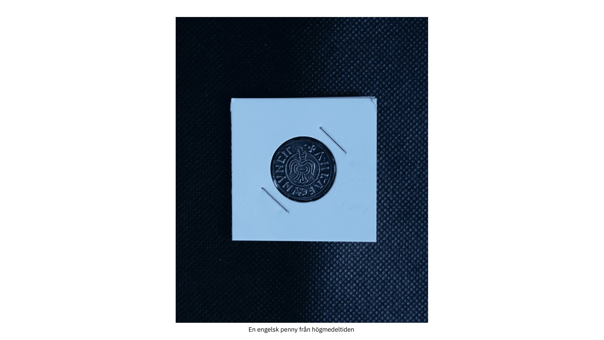

Under högmedeltiden föll Europa in i feodalismen efter att det romerska monetära systemet kollapsat. Majoriteten av befolkningen använde koppar- eller bronsmynt med lågt värde, som ofta var föremål för valutautspädning, vilket begränsade handeln över långa avstånd.

Återgången till mynt som betalningsmedel skedde gradvis och kulminerade på 1200-talet med guldflorinen i Florens 1252, följd av gulddukaten i Venedig. Dessa guldmynt fick stor spridning tack vare den expanderande handeln och det växande behovet av tillförlitliga, internationellt accepterade betalningsmedel.

I England skyddades det monetära systemet från utspädning genom innovativ finanspolitik, till exempel den landskatt som Vilhelm Erövraren införde efter 1066 och som bevarade kvaliteten på den brittiska pennyn. Det som är viktigt att förstå här är att dåtidens regenter kunde devalvera valutan för att finansiera staten, och **införandet av denna skatt gjorde det möjligt att hålla valutan stabil och finansiera staten genom beskattning.**

Frestelsen att tjäna pengar genom att späda ut valutan ledde dock till kriser, som under Henrik I:s regeringstid på 1100-talet, då kvaliteten på mynten sjönk dramatiskt. Kraftiga reformer, ibland åtföljda av våldsamma åtgärder mot myntare, återställde tillfälligt förtroendet för valutan.

Under medeltiden uppstod också sofistikerade finansiella metoder, som till exempel användningen av tallysticks i England för att kringgå förbudet mot ocker och bevilja krediter. Kyrkan var inte särskilt förtjust i räntebärande lån, så olika tekniker användes för att kringgå förbudet mot att använda ränta.

Dessa innovationer var ett svar på den kroniska bristen på metalliska pengar och uppmuntrade framväxten av en embryonal finansmarknad.

Korstågen stimulerade samtidigt handeln i Medelhavsområdet och bidrog till utvecklingen av internationella utbyten och nya bankmetoder, framför allt genom Tempelherreorden. Tempelherreorden blev viktiga finansiella mellanhänder som gjorde det möjligt för korsfarare att skaffa likviditet långt hemifrån, vilket förebådade det moderna europeiska banksystemet.

För att göra kopplingen till tempelriddarna kan du här nedan se ett franskt medeltida mynt, där du kan känna igen ett vackert kors i mitten. Det var ganska vanligt att mynt från den här tiden hade detta kors.

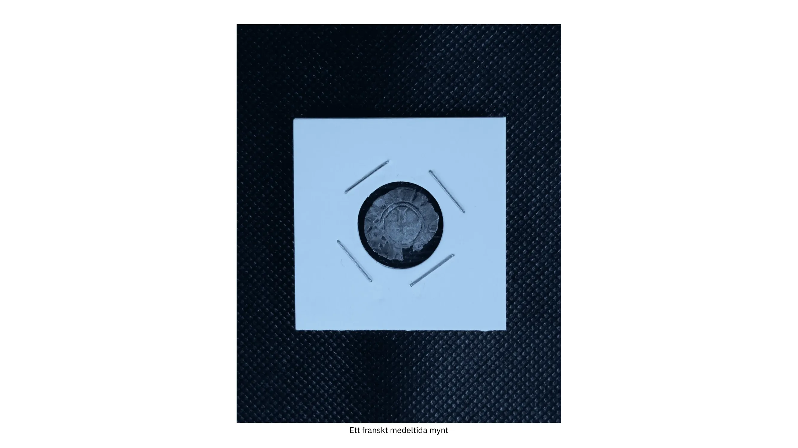

Slutligen ledde stora kriser som digerdöden (1346-1353) till djupgående ekonomiska omvandlingar. Den kraftiga befolkningsminskningen ledde till kraftigt stigande löner, vilket trotsade regeringens försök att upprätthålla tidigare ersättningsnivåer.

Samtidigt tvingade hundraårskriget (1337-1453) staterna att anta en mer aggressiv finanspolitik för att finansiera sina arméer, vilket bidrog till att försvaga det feodala systemet.

Medeltiden präglades således av en ständig spänning mellan behovet av tillförlitliga pengar för handel och den ständiga frestelsen för härskare att späda ut pengar för omedelbar vinst. Denna konflikt präglade i hög grad den europeiska monetära utvecklingen och lade grunden för moderna ekonomiska system.

Som avslutning på detta avsnitt vill jag lägga till en ganska intressant anekdot från England vid den här tiden. Denna anekdot är hämtad från boken här, "History of Money" av Glyn Davies.

Där nämns att i England förflyttades skuldbördan från regenten till parlamentet, vilket ledde till en kronisk statsskuld. Innan dess låg skulden på suveränens axlar.

När parlamentet lyckades ta över en del av makten att skapa pengar blev det möjligt att skapa långfristiga skulder som bars av folket, inte av kungen. Tidigare var det så att om kungen gick i konkurs eller om det skedde ett kungaskifte, så försvann skulden med honom.

I samma ögonblick som parlamentet skapar en skuld uppstår begreppet statsskuld, eftersom den potentiellt är obegränsad över tiden. Så länge staten existerar, så länge parlamentet existerar, existerar den här skulden, och de var tvungna att hitta alla möjliga sätt att refinansiera den och sprida den över tiden. Det är ett stort paradigmskifte, där det inte längre var kungen eller kungahuset som garanterade eller bar bördan av dessa skulder; det var nu parlamentet och därmed dess medborgare.

## Renässansen

<chapterId>1d1dfb05-70b4-5b7b-9708-373c2182950d</chapterId>

:::video id=4977b4f3-c7b2-41a5-ad7b-a96a8cca4092:::

Vi har nu kommit fram till den del av kursen där vi talar om den period som kallas renässansen. Den äger rum mot en bakgrund av en tragisk kris, med den kometartade spridningen av pesten genom loppor på råttor ombord på fartyg. Denna tragedi ger oss dock information om tillväxten av handel och resor under högmedeltiden. Tidigare under denna period var det inte så många människor som rörde sig så långt och så snabbt.

### Florin av Florens

Återkomsten av guldmynt i Europa under renässansen markerar en grundläggande vändpunkt i den monetära historien. **Allt började med Florin från Florens 1252, det första större guldmynt som präglades i Europa sedan Roms fall**. Med sin anmärkningsvärt konstanta vikt och renhet (cirka 3,5 gram rent guld) förblev florinen oförändrad i fyra århundraden och blev snabbt en viktig paneuropeisk monetär referens.

Här nedan kan du se en reproduktion av en Florin: en guld-Florin tillverkad av tenn och stämplad av en fransk konstnär som gör utmärkta verk, graverade och stämplade för hand.

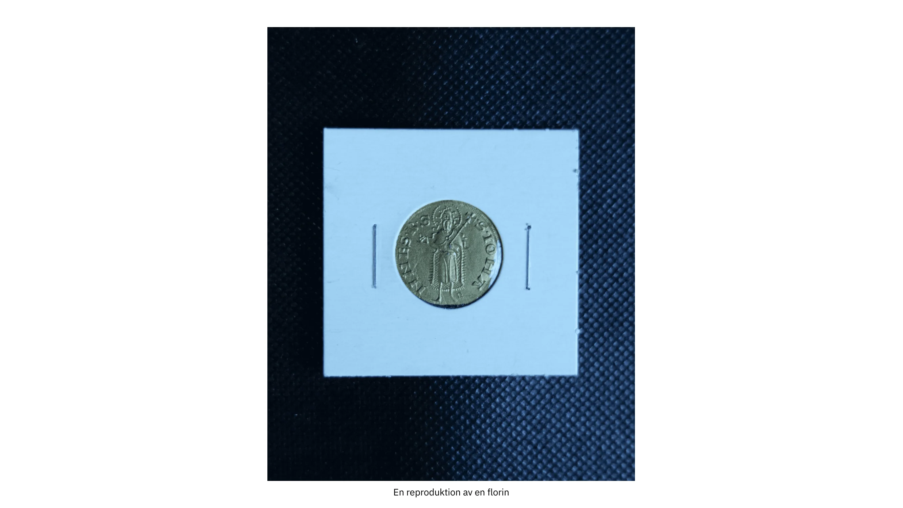

Denna återgång till guldmyntning drevs av ett specifikt sammanhang: den bysantinska solidusens kollaps och den ekonomiska nedgången i den muslimska världen till följd av mongolinvasionerna skapade ett monetärt vakuum i den internationella handeln.

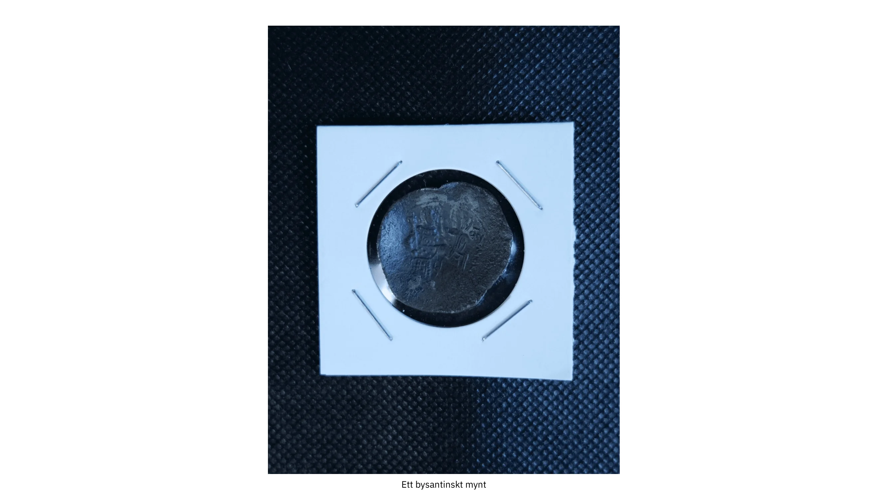

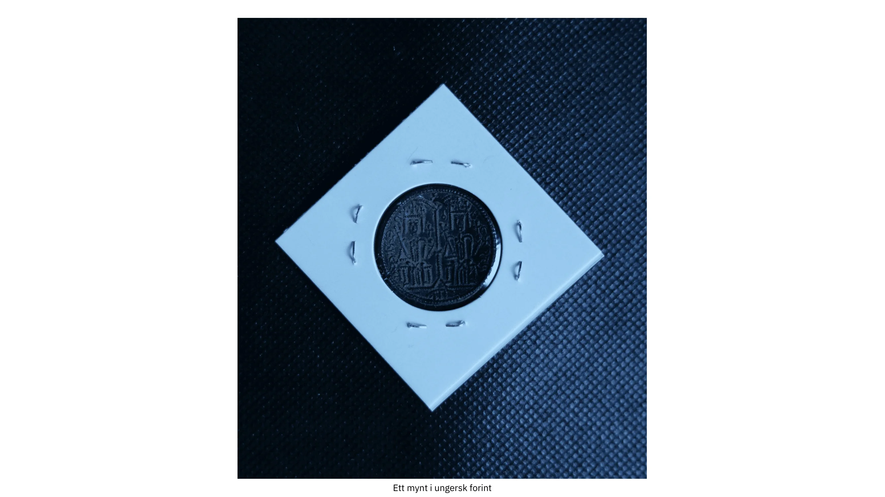

Den första bilden ovan visar ett bysantinskt mynt som jag tycker är ganska intressant. Jag tänker dra en parallell till ett mynt från samma tidsperiod från Ungern (andra bilden ovan). Det ungerska myntet är koppformat, som en skål i miniatyr. Ikonografin består av religiösa figurer som avbildas som kungar som håller kors sida vid sida. Det här myntet är skålformat och kommer från Ungern.

Det var mycket vanligt att kopiera mynt från andra länder. Eftersom de bysantinska mynten var allmänt accepterade kopierades de ofta av andra länder. Som du kan se när du jämför dem sida vid sida är de här mynten mycket lika varandra.

Norra Italien, särskilt Florens, Venedig och Genua, utnyttjade detta sammanhang för att lansera nya hårdvalutor - mynt med ett stabilt innehåll av ädelmetall. Venedig följde Florens exempel genom att prägla dukaten 1270, en valuta som var nästan identisk med florinen och som användes flitigt i handeln på Medelhavet.

Florinen blev den första internationella reservvalutan och infördes i över 150 europeiska städer före slutet av 1300-talet. Med skapandet av ett storskaligt florentinskt banknätverk, lett av Medici-familjen, moderniserades penning- och bokföringshanteringen grundligt, vilket till och med minskade behovet av att fysiskt transportera guld.

Det är en annan riktigt intressant punkt. Det fanns en tid då många myntförsändelser gick förlorade på sjöresor. Detta tekniska framsteg - registren med dubbel bokföring - gjorde det möjligt att skapa skriftpengar. Detta gjorde det möjligt att minska antalet myntsättningar och i stället använda ett system med skriftliga poster, vilket kraftigt minskar risken för att förlora pengar under transporten.

Den monetära utvecklingen åtföljdes också av en betydande utveckling av bankmetoderna. Delvis inspirerade av korstågens kontakt med muslimska bankväsen såg det medeltida Europa framväxten av rudimentära banksystem i Florens, Venedig, Barcelona och Genua redan på 1200-talet. Tempelriddarna, en religiös och militär orden, hade redan utvecklat ett system som gjorde det möjligt för korsfarare att resa utan att ta med sig sina rikedomar.

De skulle sätta in pengar på ett tempelriddarkontor i sitt land och kunde sedan resa med en form av brev och hämta mynten vid ankomsten till korstågets destination.

Det innebar att vi inte behövde bära med oss ädelmetallmynt.

Det var också under den här perioden som Europa fick kännedom om att det fanns papperspengar i Kina, tack vare Marco Polos resa på 1200-talet. Utvecklingen av sedlar skulle dock dröja flera århundraden, eftersom Europa föredrog att först fullända sina metoder för metallmyntning. Leonardo da Vinci, i nära samarbete med Luca Pacioli, en känd auktoriserad revisor, bidrog aktivt till att förbättra sedelpressarna och främja en snabbare och mer enhetlig myntproduktion.

Vi syftar på den pendelslagteknik som nämndes tidigare i kursen. Denna metod gjorde det möjligt att producera mer enhetliga mynt jämfört med hammarslagning och, vilket är viktigt, möjliggjorde inskriptioner runt kanten av myntet, vilket jag tidigare har visat. Nedanstående är en europeisk daler från 1793, som tydligt visar skrift på kanten.

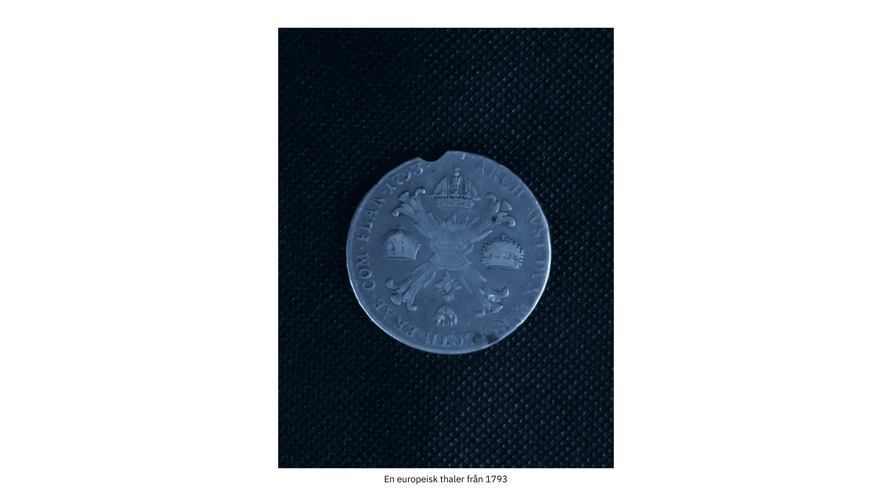

Under 1400-talet drabbades Europa emellertid av en allvarlig valutakris, med en allmän försämring av silverhalten i de europeiska valutorna, som sjönk till mindre än 5% omkring 1450.

Från 1500-talet och framåt flyttades den monetära tyngdpunkten till Spanien, stimulerad av unionen mellan kungadömena Aragonien och Kastilien, slutet på Reconquista och de stora maritima upptäckterna som Christopher Columbus gjorde 1492. Det massiva inflödet av silver från amerikanska gruvor rubbade i grunden den europeiska och globala ekonomiska balansen och underblåste både inflation och nya geopolitiska spänningar.

Renässansen innebar också en stor konstnärlig utveckling av myntningen, med mynt som t.ex. thaler (Joachimsthaler), ursprunget till termen "dollar". Dessa stora silvermynt återspeglar de nya konstnärliga och mekaniska präglingsteknikerna som möjliggjordes av tekniska innovationer från norra Europa.

Slutligen inledde den finansiella renässansen övergången till ekonomisk modernitet, med utvecklingen av bank-, kredit- och finansmarknaderna och framväxten av de första formerna av modern kapitalism i de stora handelsstäderna Amsterdam, London och Stockholm, vilket lade grunden för det internationella finansiella systemet som vi känner det idag. Och det är ämnet för vår nästa video.

# Statens beslagtagande av pengar

<partId>17cfb1b4-5bc1-53e0-b035-05c7cf76be92</partId>

## Utvecklingen av världens reservvalutor

<chapterId>d65cc352-e7ca-5f03-9b23-dd1fae5c0395</chapterId>

:::video id=82710062-8fff-426c-93af-923c08d82233:::

### Ädelmetallernas historiska betydelse

Välkommen till detta avsnitt om framväxten av reservvalutor och centralbanker. Som första punkt i detta nya avsnitt kommer vi att fokusera på utvecklingen av globala reservvalutor.

Ädelmetaller, i synnerhet guld och silver, har länge ansetts utgöra grunden för rikedom och makt i imperier. Törsten efter guld har alltid varit en dominerande drivkraft, och det var inflödet av ädelmetaller som hade den mest direkta och uppenbara effekten på den monetära utvecklingen i Europa. Under medeltiden och den tidiga renässansen berodde denna besatthet av guld och silver på svårigheten att behålla värdet i andra former av handelsvaror samt på den starka efterfrågan från främmande makter, särskilt i handeln med Orienten.

Under århundradenas lopp har flera imperier avlöst varandra som globala ekonomiska centra. Det land som dominerar världshandeln under en viss period brukar tilldelas status som reservvaluta. Dessa inkluderar:

- Spanien och Portugal (1400- och 1500-talen)

- De förenade provinserna (Nederländerna) på 1600-talet

- Frankrike och Storbritannien på 1700- och 1800-talen

- USA under 1900-talet

### Den portugisiska högkonjunkturen och realvalutan (1450-1530)

**Portugal** dominerade världshandeln under andra hälften av 1400-talet och början av 1500-talet med **Portuguese Real**, ett silvermynt med relativt enhetlig vikt. Portugiserna hittade tack vare sina framsteg inom navigation nya sjövägar till Afrika, Asien och Nya världen. Militära fort och handelsstationer mångdubblades från Afrika till Kina (Macau).

Som svar på Europas efterfrågan på guld och silver var "den ständiga drivkraften bakom de stora upptäckterna kommersiell vinst, särskilt jakten på guld och silver" Det portugisiska imperiet, som var överexploaterat och utsattes för konkurrens från holländare, engelsmän och fransmän, började dock att minska.

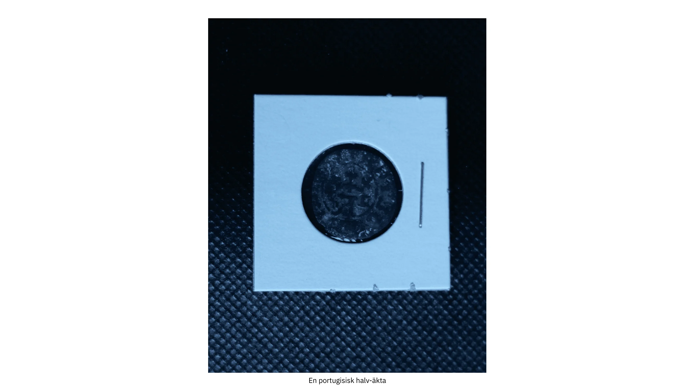

Här ovan kan du se en portugisisk halv-real från tiden för dessa maritima erövringar.

### Den spanska apogéeperioden och den spanska dollarn (1535-1700-talet)

I och med erövringen av den nya världen blev **Spanien** den dominerande aktören. Dess monark, som kontrollerade gigantiska silvergruvor (Potosí i Bolivia, Zacatecas i Mexiko), lyckades prägla pengar i rent silver och undvek därmed att depreciera sin egen valuta: **Spanish Real.**

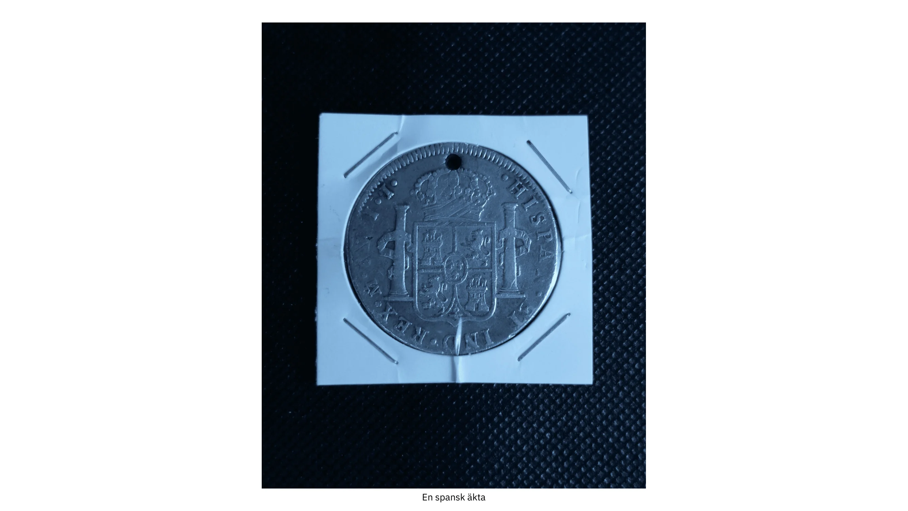

Den spanska realen, även känd som "åttondelsmyntet", fick sitt smeknamn eftersom den ofta delades i åttondelar för att skapa mindre mynt. Det var också känt som den **spanska dollarn**. Myntet som du ser ovan är från 1814, vilket gör det till ett något nyare exempel. De allra första spanska dollarmynten var dock inte lika raffinerade; de var hammarslagna och i allmänhet mindre runda och skarpa.

Det som är särskilt intressant är att den spanska dollarn fungerade som internationell reservvaluta vid den tiden. De spanska myndigheterna gav också ut sin egen lokala valuta, maravedi, och justerade regelbundet penningmängden genom återkallelser. Till exempel kunde ett koppar- eller bronsmynt som ursprungligen var värt en maravedi återkallas och stämplas med "2", senare med "4" och så vidare, för att eventuellt nå "8" På det högupplösta fotot kan man tydligt se "8" stämplat på myntet. Den här metoden ledde till en effektiv ökning av penningmängden, vilket oundvikligen ledde till inflation.

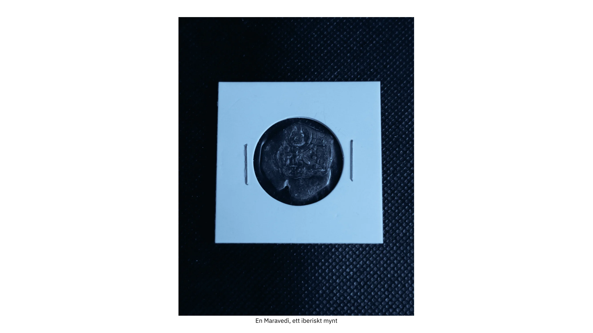

Om vi tittar på reservvalutornas historia framträder en intressant punkt: imperier inflaterade inte sina valutor så länge de behöll sin status som reservvaluta. **Det var först i slutet av deras dominans som de till slut devalverade den och förlorade detta privilegium, som sedan fördes vidare till ett nytt imperium**.

I Spanien dominerade den spanska dollarn världshandeln under nästan 200 år, särskilt mellan Kina och Europa. Dessa mynt kunde till och med hittas i kinesiska hamnar. Och det är här vi får en blinkning från historien: den amerikanska dollarn kommer direkt från denna valuta. När USA bildades 1792 antog landet en lag om att prägla sin egen valuta, och de första dollarna skapades med den spanska dollarn som förebild, både vad gäller namn och myntstorlek.

För att ge dig en uppfattning om dess värde var en amerikansk dollar ursprungligen ett silvermynt som vägde nästan ett ounce, eller mellan 30 och 40 euro i dagens penningvärde, till skillnad från den pappersvaluta vi känner till idag. Den spanska dollarn cirkulerade i så stor utsträckning att den anses vara den första riktiga globala valutan.

Inflödet av ädelmetaller från Nord- och Sydamerika ledde dock till inflation i Europa. Under prisrevolutionen (ca 1540-1640) sjufaldigades levnadskostnaderna i England. I Spanien hade överflödet av silver en pervers resursförbannelseeffekt som hindrade utvecklingen av solida bankinstitutioner.

Därefter drabbades Spanien av flera militära konflikter (Flandern, Nederländerna, trettioåriga kriget) och landets finanser kollapsade gradvis. I stället för att devalvera det världsberömda silvermyntet valde de olika makthavarna att inte betala eller skriva ned det kopparmynt (vellón) som användes av lokalbefolkningen. Det här är vad jag beskrev tidigare med Maravedis.

### Nederländernas uppgång (1600-talet)

Efter den iberiska storhetstiden växte **Nederländerna** fram som en ny handelsmakt på 1600-talet. Sjöhandeln, VOC (Nederländska Ostindiska Kompaniet) och grundandet av **Amsterdam Stock Exchange** (inspirerad av den i Antwerpen) etablerade denna handelsrepublik som ett nav.

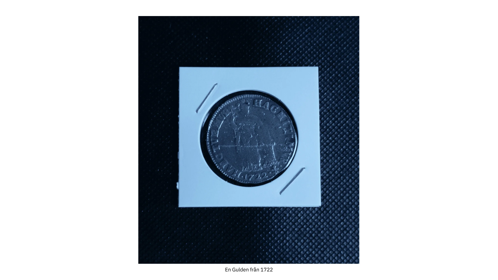

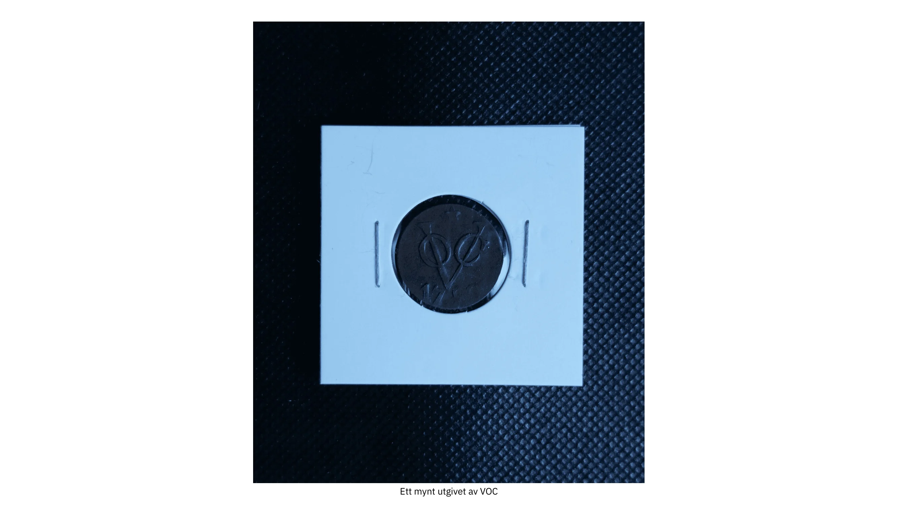

På det första fotot ovan kan du se en Gulden från 1722 (ett vackert silvermynt), medan det på det andra finns ett mynt utgivet av VOC.

VOC var ett mycket mäktigt företag för sin tid: det hade en egen armé och utfärdade till och med en egen valuta.

Holländarna uppfann den moderna kapitalismen, som började som ett sätt att fördela riskerna i riskfyllda satsningar som expeditioner till Nya världen eller sökandet efter nya handelsvägar. Med hjälp av aktiebolag kunde flera investerare samla sina pengar och dela på risken. För att underlätta dessa utbyten var det sedan nödvändigt att skapa institutioner som kunde förhandla om och utbyta dessa värdepapper. År 1602 skapades därför det första aktiebolaget och den första börsen.

Den holländska valutan, **Gulden**, blev trovärdig tack vare sin renhet i silver och sedan genom att den antogs av Amsterdams Bank (1609), där insättningar blev en föredragen form av pengar i Europa. Detta är en mycket viktig punkt att nämna. Ja, visst fanns det mynt, men det som verkligen utgjorde pengar på den tiden var en form av skriftpengar. Faktum är att en stor del av världshandeln passerade genom Amsterdambankens böcker. Detta var ett verkligt bankgenombrott: internationell handel skedde inte längre nödvändigtvis med fysiska mynt, utan direkt genom bankens bokföring.

Denna period av välstånd präglades av ett stort inflöde av guld och silver, särskilt från andra länder som praktiserade inflation eller monetär kontroll. Det finns en intressant karaktär att nämna: **Thomas Gresham**. Vid den här tiden arbetade han för det engelska kungahuset i Nederländerna och skötte penningflödet mellan de två länderna. Det var samme Gresham som lämnade efter sig den berömda **"Gresham Law"**.

Till slut tog dock ångan slut även i det holländska imperiet. Krig med England, guldens utspädning i konflikttider och konkurrens från andra makter (Frankrike och England) signalerade slutet på den holländska hegemonin. Efter det fjärde anglo-holländska kriget (1780-84) blev guldens nedgång som reservvaluta oåterkallelig.

### Frankrikes makt, ambitioner och misslyckanden (1600-1800-talen)

Under Ludvig XIV blev **Frankrike** den största kontinentala makten i Europa. Den franska valutan blev dock aldrig en dominerande referens: många devalveringar, höga skatter och kostsamma krig (Augsburgförbundet, spanska tronföljdskriget etc.) tyngde det monetära systemets stabilitet.

Det första större experimentet med papperspengar genomfördes av John Law (1716-1720). Banque Générale gav ut växlar som backades upp av löften om statsskuld. Detta system ledde till en spekulationsbubbla och kollaps (Mississippibubblan) 1720. Denna katastrof lämnade Frankrike med en bestående misstro mot papperspengar. Det var denna katastrofala erfarenhet som ledde till att Richard Cantillon blev förmögen tack vare detta system av principer, nu känt som Cantillon-effekten, där pengatryckning berikar dem som har tillgång till tryckpressen.

När denna misstro till slut försvann kom ett annat fiasko med franska papper: de revolutionära **assignaterna**. Dessa assignater, som utfärdades från 1790 och framåt baserat på konfiskationen av prästerskapets egendom, upplevde en galopperande hyperinflation, vilket officiellt gjorde dem till den första hyperinflationen i historien som översteg 50% per månad. Trots att deras nominella värde hade mångdubblats handlades de 1795 till bara några få procent av sitt ursprungliga värde.

Mer restriktiva lagar försökte införa assignat, men utan framgång. Regeringen försökte införa det, och gick så långt som att hota dem som inte accepterade det med döden, och tvingade butiksägare att hålla öppet. Men i slutändan fungerade det naturligtvis inte.

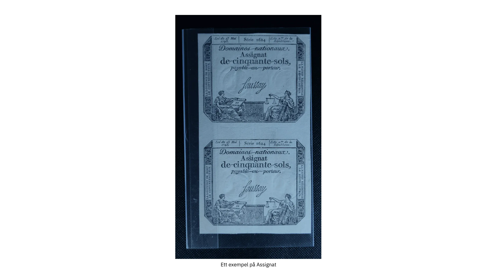

När dessa papperspengar ersatte alla ädelmetallmynt av hög kvalitet, i linje med den berömda Greshams lag, uppstod en myntbrist. För att prägla nya mynt använde man sig av klockmetall som beslagtagits från prästerskapet. Här nedan kan du se en vacker bit av klockmetall, tillverkad av återvunnen koppar genom att smälta ner de mynt som tagits från prästerskapet.

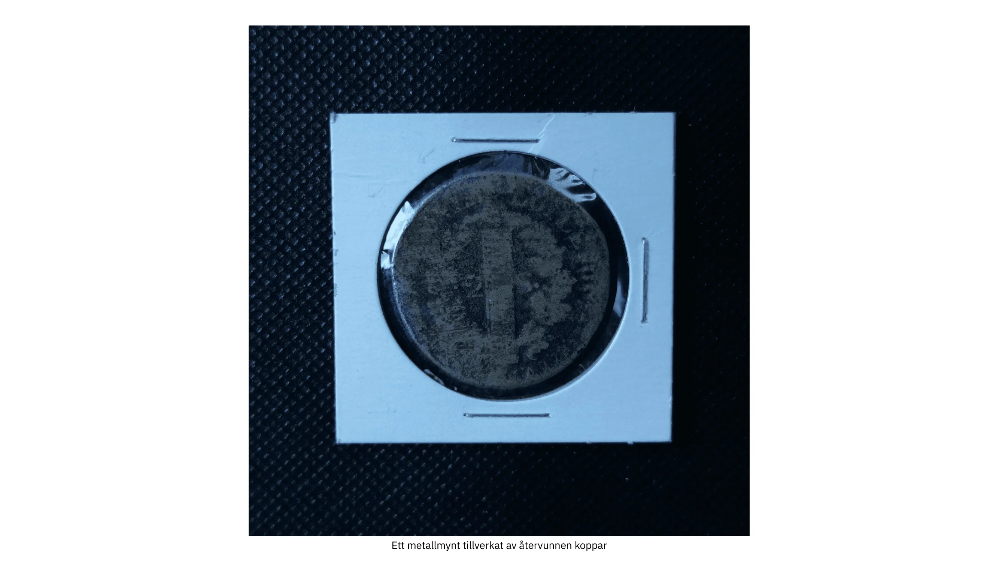

### Brittisk dominans (18:e - början av 20:e århundradet)

**England**, som hade gått om Nederländerna, blev den dominerande makten under 1700-talet. Det brittiska pundet är den äldsta valutan som fortfarande används och var ursprungligen kopplat till ett pund silver. Gradvis stärktes dess ställning, underbyggd av en finansiell och skattemässig revolution: parlamentarisk monarki, stark skatteuppbördskapacitet och inrättandet av Bank of England 1694.

Efter en rad krig mot Frankrike gick Storbritannien segrande ur striden 1815 (Waterloo) och bekräftade därmed sin överhöghet. Under hela 1800-talet fungerade det brittiska pundet som världens reservvaluta. När Storbritannien var som störst, med bara 2,5% av världens befolkning, producerade landet 20% av världens inkomster och kontrollerade nästan en fjärdedel av jordens yta.

Den **industriella revolutionen** och införandet av en **guldstandard** (1717 eller 1718, under överinseende av Isaac Newton vid Royal Mint) stärkte pundets trovärdighet. Bank of England antog en guldmyntfot på 4,25 pund per ounce guld, vilket gjorde det möjligt för innehavare av sedlar att konvertera sina sedlar till guld.

Första världskriget (1914-1918) satte dock stopp för detta system. Inom loppet av några veckor upphävde alla de stora krigförande makterna guldkonvertibiliteten. Det brittiska imperiet, och senare pundet, gick försvagat ur andra världskriget och fick ge vika för den amerikanska dollarn under 1900-talet.

Och som en artefakt kan du se några vackra och intressanta bitar nedan. Det här är monetära vikter. Den första är en sovereign: den tidigaste representationen av pundet. Jag har bara penningvikter för att representera dessa mynt eftersom jag inte har råd att köpa en riktig sovereign. För att väga dem använde vi vågar och placerade sedan den monetära vikt som motsvarade sovereignens värde på andra sidan.

Sovereign var ett penningmynt - ett guldmynt som ursprungligen var värt ett pund.

Före den berömda sovereignmynten fanns guinea-mynten, som fungerade enligt samma princip. Guinean fick sitt namn efter de ädelmetaller som den innehöll och som kom från regionen Guinea.

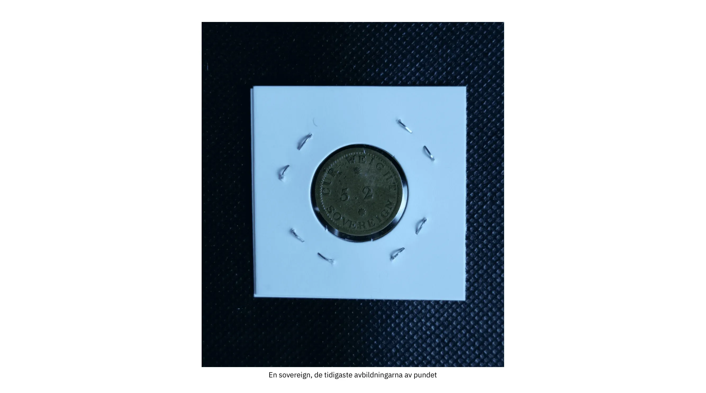

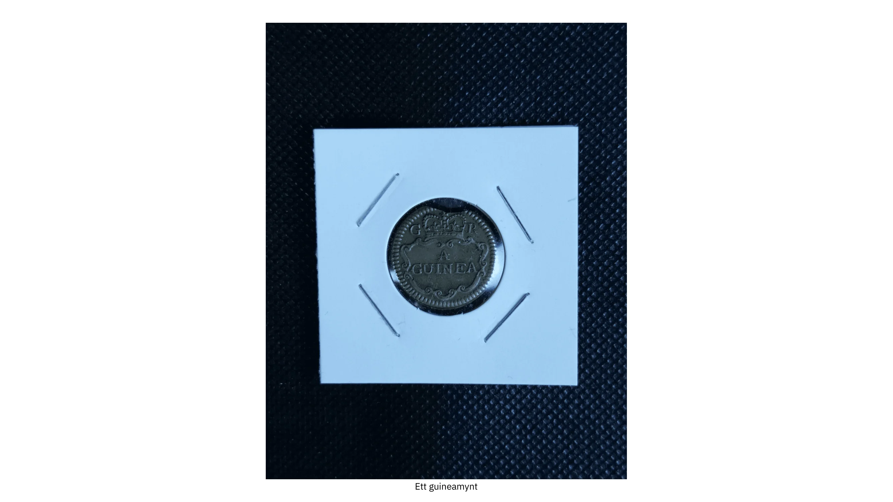

## Centralbankernas framväxt

<chapterId>15777771-1e28-55f7-a400-69868a47079b</chapterId>

:::video id=7661b7b5-e00f-48f3-b69a-6fb2eb5ebba4:::

Efter detta avsnitt om de första reservvalutornas historia och deras utveckling kommer här ett avsnitt om centralbankernas framväxt. Det följer i stort sett samma väg som uppkomsten av reservvalutor, men fokuserar lite mer på den tidens bankteknik.

### Bankernas och protobankernas uppkomst

Redan på 1200-talet utvecklade italienarna (Florens, Genua, Venedig...) dubbel bokföringsteknik. Senare blev **Antwerpen** (1500-talet) norra Europas ledande finanscentrum, en roll som senare övertogs av **Amsterdam**, tack vare Amsterdam Stock Exchange (1609), där VOC-aktier handlades.

I Antwerpen hölls handelsmässor där handlare ofta samlades för att reglera skulder, vilket ledde till att nya finansiella instrument uppfanns. Sedeln nedan, daterad 1761 och senare, är en **promissory note**. Den har handskrivna detaljer, tillsammans med inskriptioner på baksidan, vilket gör den till en magnifik artefakt från den perioden.

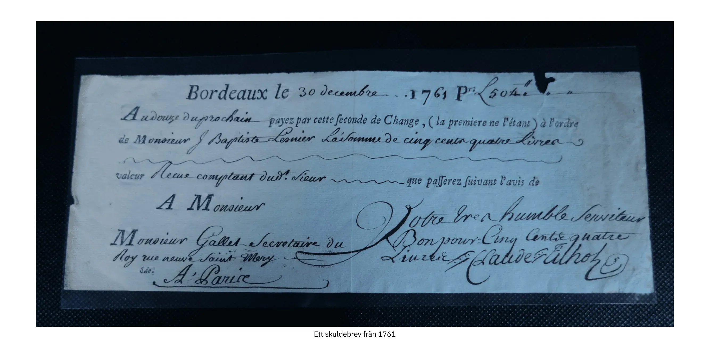

Detta överflöd ledde till att mer sofistikerade bankinstitut skapades. **De lombardiska bankirerna** och senare de holländska köpmännen förfinade kreditinstrumenten (växlar, skuldebrev etc.). Det moderna banksystemet bygger på denna idé: pengar kan vara kredit, inte bara metall.

Som ni ser leder detta oss tillbaka till vår ursprungliga fråga om pengarnas ursprung.

Kommer pengar från en vara som uppstår ur behovet av att byta, eller uppstår de ur kredit? Spår av detta kan fortfarande hittas i detta avsnitt.

### Det svenska exemplet: Stockholms Banco och Riksens Ständers Bank

Låt oss gå vidare till Sverige, där den allra första centralbanken skapades.

**Sverige** var en pionjär inom centralbanksväsendet: 1657 skapade Johan Palmstruch **Stockholmsbanken**, som hade rätt att låna ut mer än sina metallreserver, vilket var startskottet för [fractional reserve banking](https://planb.academy/resources/glossary/fractional-reserves). Men den överdrivna sedelutgivningen ledde till panik och en uttagsanstormning mot banken 1663. Ja, ja, ja...

År 1668 grundades i Stockholm Riksens Ständers Bank, världens första egentliga centralbank. Men även den drabbades av kriser (1709, 1715...) kopplade till missbruk av sedlar, ofta för att finansiera rikets krig.

### John Laws misslyckade kupp

Vi beger oss till Frankrike, där vi återigen hittar vår älskade John Law.

*skotten *John Law** övertalade regenten (hertigen av Orleans) att skapa en privat bank, Banque Générale (1716), med rätt att ge ut papper mot guld, silver och statsskulder. Den blev Banque Royale (1718) och hjälpte Mississippibolagets aktier att skjuta i höjden.

När verkligheten kom ikapp spekulationerna **förvärrades paniken av beslutet att förbjuda innehav av guld och tvinga fram användandet av Law's notes**. Nåväl, nåväl...

Till slut sprack bubblan 1720 och orsakade en kollaps som förstörde trovärdigheten för papperspengar i Frankrike för lång tid framöver.

### Bank of Amsterdam, uppkomsten av en banbrytande modell

Vi förflyttas nu till Amsterdam 1609, där **Bank of Amsterdam** (Wisselbank) tog kontroll över myntförvaring och konvertibilitet i Amsterdam. Banken förbjöd cirkulation av privata sedlar och tvingade fram deponering av metallmynt i sina valv. Så småningom tog de kontroll över valutan. De förbjöd penningväxlare att ha mynt hos sig. Penningväxlarna arbetade hela dagen och var tvungna att deponera sina mynt i Bank of Amsterdams valv vid dagens slut. Som jag har nämnt var det inte nödvändigtvis metallmynt som användes i den internationella handeln. Det var skriftens pengar i bankens böcker.

Tack vare de nederländska köpmännens makt spelade banken rollen som den första faktiska "centralbanken" och stabiliserade världshandeln. Med tiden beviljade banken dock lån utan säkerhet till VOC och fick till slut slut slut på metall för att backa upp sina växlar. År 1790 framkom det att man hade lånat ut stora summor till VOC, som i praktiken gick i konkurs, vilket förstörde guldens trovärdighet. Ja, ja, ja...

### Bank of England, det moderna bankväsendets grundande

I 1600-talets England förvarades guld och silver av guldsmeder, som utfärdade kvitton. Denna delvis decentraliserade organisation visade sig ha sina begränsningar när kronan fick ett stort behov av finansiering för kriget mot Frankrike.

År 1694 grundades **Bank of England (BoE)**. Bank of England föddes alltså ur ett bekvämlighetsäktenskap mellan Londons näringsliv och regeringen, som var desperat att hitta pengar till kriget.

Banken fick monopol på sedelutgivningen i England (förstärkt 1708, 1742 osv.). Från och med då cirkulerade papperspengar uppbackade av guldreserver vid sidan av mynten. Detta är en viktig punkt för att förstå det gradvisa övertagandet av pengar av statliga institutioner. Först hindrade Bank of Amsterdam penningväxlare från att förvara mynt och tvingade dem att lämna tillbaka dem till banken. I England förbjöds privata banker att ge ut egna sedlar som kunde lösas in i guld.

De tillät visserligen privata banker att ge ut sedlar, men dessa kunde bara växlas in mot Bank of Englands sedlar.

Bank of Englands växlar, pund sterling, var inlösbara i guld. Detta lade till ett tredje lager till valutan. Så vi har guld i botten, sedan Bank of England-växlar och sedan privata bankväxlar ovanpå. Innan dess kunde privata banker ge ut sina egna växlar som var inlösbara i guld. Detta är ytterligare ett steg i de statliga institutionernas gradvisa övertagande av valutan.

Banken finansierade staten med stora lån och strukturerade den enorma statsskuld som finansierade den ekonomiska uppgången.

Denna modell befästes under 1700- och 1800-talen till den grad att pundet blev världens reservvaluta, under Bank of Englands och guldmyntfotens segel.

**Världens reservvalutor** har avlöst varandra under århundradena, drivna av en stats eller ett imperiums ekonomiska, kommersiella och militära makt: Portugal, Spanien, Nederländerna, sedan Storbritannien, innan USA kom att dominera under 1900-talet. I samtliga fall ser vi en liknande cykel: ekonomisk expansion, kommersiell framgång, internationellt införande av valuta, skuldsättning, kostsamma krig, missbruk av penningskapande eller kreditgivning och slutligen nedgång.

**Centralbankernas** framväxt var en gradvis process. Dessa institutioner uppstod ofta i samband med kostsamma krig, vilket gjorde det möjligt för staten att finansiera sig genom skuldsättning. När guldmyntfoten infördes (England, 1600-1900-talen) gav den en fasad av stabilitet, tills de stora världskrigen på 1900-talet ledde till att guldkonvertibiliteten gradvis övergavs. Makten att prägla pengar flyttades därmed från det kungliga monopolet till mer komplexa enheter, först privata (guldsmeder, bankirer), sedan halvoffentliga (centralbanker), vilket speglar den monetära suveränitetens utveckling mot institutionaliserade och globaliserade former.

Detta är alltså vad jag beskrev tidigare. Vi har ofta flyttat bördan av statsskulder direkt till antingen centralbanker eller tillståndet att skapa pengar av rättsliga institutioner, såsom parlamentet.

Och det viktigaste faktumet här är att **vi har gått från en skuld som kunde försvinna genom suveränens konkurs till en skuld som huvudsakligen vilade på befolkningens axlar**.

## Vägen till fiatsystemet

<chapterId>27a98545-d350-56ee-a200-92468e6b9b33</chapterId>

:::video id=e27a753e-aeee-4307-a65c-9506aab380a1:::

Vi har nu kommit till slutet av den här kursen om pengarnas historia, och för att avsluta den vill jag föreslå två ämnen. Det första ämnet är de olika stadier som ledde fram till vårt nuvarande fiatvalutasystem. Vi kommer att gå igenom fakta från avsnitt 5 om skapandet av centralbanker, och vi kommer att lägga till begreppet US-dollar, som i slutändan är den nuvarande reservvalutan. Vi ska titta på hur det utvecklades, hur dollarn kom till, hur den utvecklades, hur den förändrades, vilka steg den gick igenom för att bli ett fiatsystem, eftersom dollarns ursprung är ett silvermynt.

Sedan, omedelbart efteråt, ska jag ge er ett kort avsnitt om finanshistoria för att hjälpa er att förstå hur vi kom fram till välfärdsstaten. Så vi ska titta på två ämnen: hur vi kom fram till fiatsystemet, och sedan omedelbart efteråt, hur finansutvecklingen ledde oss fram till begreppet välfärdsstat.

### De europeiska grunderna för det moderna bankväsendet

Låt oss gå tillbaka till 1200-talet med florinen. För att förstå hur vi kom fram till fiatmodellen måste vi börja med 1200-talet. Vid sidan av florinen uppstod samtidigt en ny teknik med Medicis, nämligen begreppet växlar.

Sedan kom börsen i Antwerpen, med sitt koncept för diskontering och skuldebrev.

Sedan hade vi, som vi har sett, VOC, den första aktiemarknaden i Amsterdam. Detta markerade kapitalismens födelse, med företagsaktier och utbyte av aktier. Amsterdams bank införde sedan genom ett dekret användningen av insättningar. Detta innebar att mynt måste deponeras i slutet av dagen. Det var penningväxlarna som inte längre kunde förvara växelpengar i myntform.

Sedan skapades Bank of England på grund av behovet av att skapa skulder för att finansiera kriget i slutet av 1600-talet. Vid den tidpunkten blev privata banker det tredje lagret av pengar. Förresten sammanfattas hela detta avsnitt, från florinen till tanken på att skapa en centralbank, mycket väl i Nick Bhatias berömda bok "Layered Money", som jag hade turen att översätta tillsammans med några kollegor. Vi gjorde ett bra jobb med att översätta den så att fransktalande överallt kunde dra nytta av dessa lärdomar.

Så vi är i slutet av 1600-talet. Bank of England skapades för att finansiera kriget.

De privata bankerna tog över det tredje lagret av valutan. Faktum är att privata bankväxlar inte längre var inlösbara i guld: det var Bank of Englands växlar som var inlösbara i guld. Detta visar att den institution som är Bank of England har lagt beslag på makten att byta valuta.

Sedan kom paniken 1776. Alla rusade upp i penningpyramiden. Vad detta innebär är att det år 1776 sker en uttagsanstormning mot bankerna, och alla människor som har papper i tredje lagret, dvs. privata bankväxlar, försöker få Bank of England-växlar och sedan försöker de få guld, men uppenbarligen fanns det inte tillräckligt med guld i valven. De utlyste en slags bankhelg för att undvika att betala tillbaka guldväxlarna, och detta gav upphov till begreppet "lender of last resort".

### Utvecklingen av den amerikanska dollarn

Vi övergick från florinen till inrättandet av Bank of England. Naturligtvis pågick första och andra världskriget under tiden, men tidigare, 1796, skedde också en utveckling på andra sidan Atlanten. År 1776 var Amerika fortfarande en brittisk koloni, och kolonierna använde denna pappersvaluta. Nedan visas en Connecticut-sedel på två shilling från 1776.

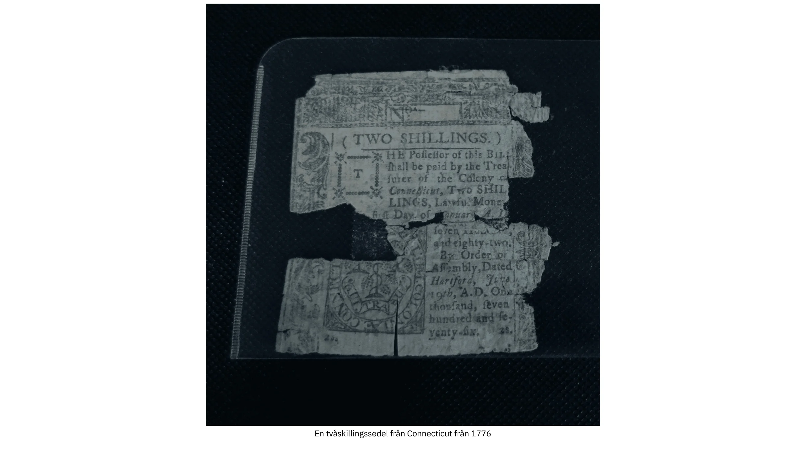

Innan kolonierna förklarade krig mot England och så småningom utfärdade sin egen valuta, använde de denna pappersvaluta tillsammans med den spanska dollarn för kontanttransaktioner. Faktum är att termen "dollar" kvarstod för att ange den amerikanska dollarn.

Om jag inte misstar mig antog de 1792 en lag som gjorde det möjligt för dem att mynta pengar. Som ett exempel är den nedan en amerikansk dollar från modern tid.

Det är uppenbart att den inte har ett nominellt värde på bara en dollar; den är värd omkring 30 eller 40 dollar, eftersom den representerar ett uns silver. Dess värde fluktuerar baserat på silverpriset, vilket vanligtvis placerar det på minst 30 eller 40 US-dollar. Idag har en pappersdollar naturligtvis bara sitt nominella värde på en dollar, men på den tiden var den amerikanska dollarn rotad i detta silvervärde.

Låt oss nu tala om inbördeskriget i Amerika. Konfederationen tryckte pengar, som blev hyperinflaterade. Detta fenomen finns inte med på den officiella Hanke-Krus-listan, eftersom det inte nådde en hyperinflationstakt på 50 procent. Den hade dock en månatlig inflationstakt på 40 procent, vilket tyder på att en betydande mängd valuta trycktes under kriget.

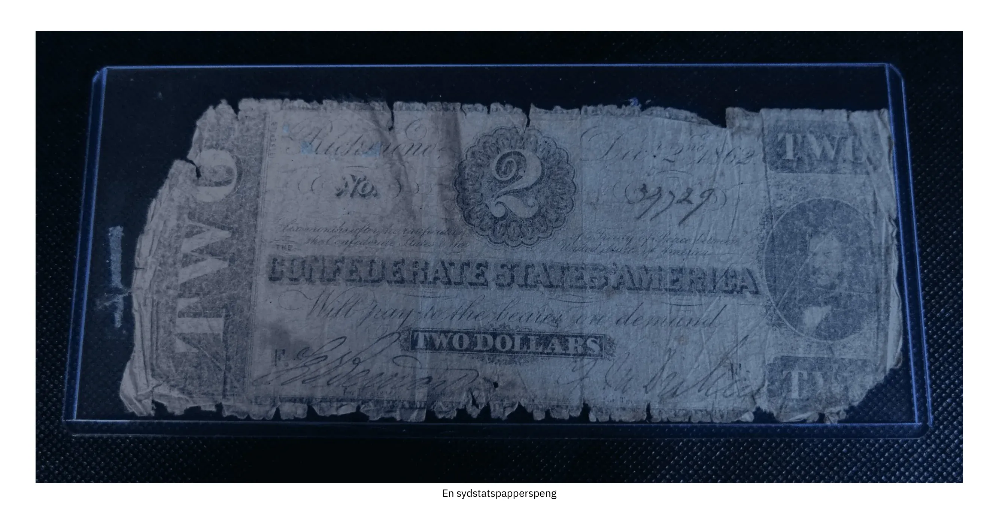

Deras motståndare i norr hade också dollar. Strax ovanför kan du se konfederationens dollar, medan du nedan kan se nordstaternas dollar. De kallades "the greenback" eftersom baksidan var grön.

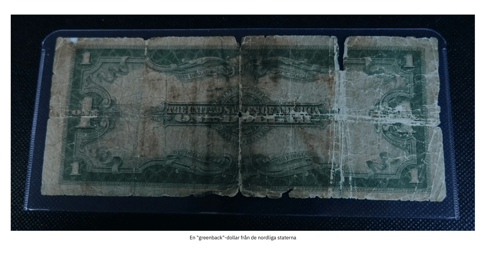

Och jag uppmanar dig att jämföra skillnaden i storlek med moderna sedlar. På den tiden var sedlarna större.

Som vi vet vann nordstaterna, så greenbacken blev valuta i de återförenade amerikanska staterna. Sedan kom grundandet av FED 1913 och första världskriget.

Efter första världskriget innehöll den sista serien av tryckta sedlar alltid orden "inlösbar i guld på begäran". År 1928 kunde man alltså för 20 dollar köpa nästan ett uns guld, eftersom guldpriset var 20,67 dollar. Sedeln på bilden nedan kunde köpa ett uns guld 1928.

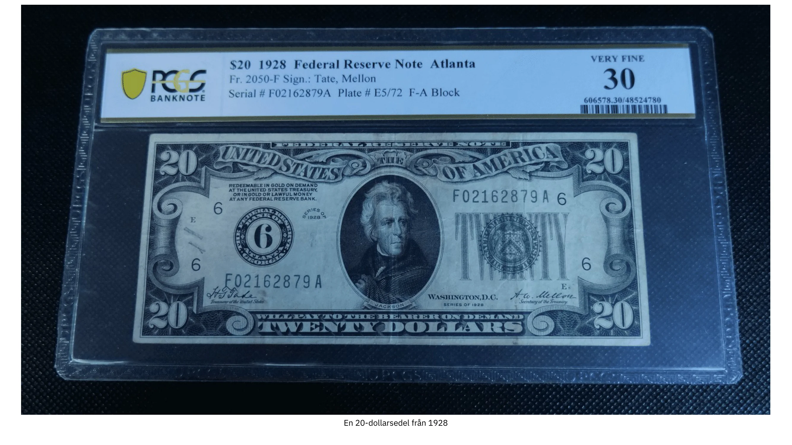

I dag är ett uns guld värt 3 000 US-dollar. Så man kan se devalveringens kraft här, naturligtvis. Det var det sista lagförslaget som innehöll orden "inlösbar i guld". Vi kommer att se att direkt efter den verkställande ordern 6102, skulle de beslagta allt guld. Faktum är att de skulle beslagta både guldet och guldcertifikaten.

Här nedan kan du se ett guldcertifikat från 1928.

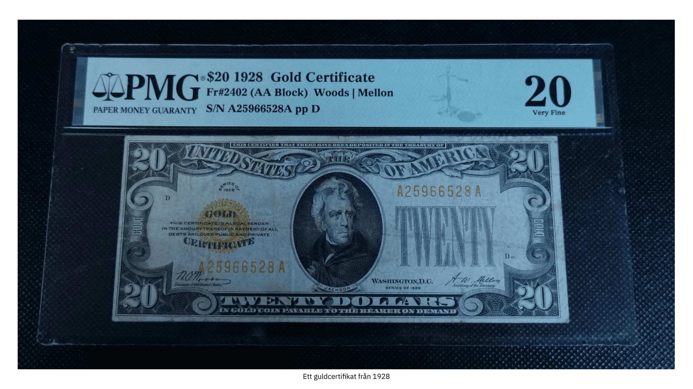

Den var inte bara "inlösbar i guld" som 1928 års sedlar, den var också inlösbar i guldmynt: det är verkligen ett "guldcertifikat". De har alla beslagtagits efter Executive Order 6102. Fram till 1964 var det till och med olagligt att äga dem.

Jag är mycket glad över att ha en.

Från och med 1964 blev det olagligt att äga guld, fram till 1974, om jag inte missminner mig. På 70-talet tillät de folk att ackumulera guld efter Nixon-chocken, som vi strax ska beskriva. År 1933, när de utfärdade "Executive Order 6102", beslagtog de guld och det blev olagligt att inneha det. Du fick ett långt fängelsestraff om du ertappades med att behålla ditt guld. Under dessa dagar växlades varje uns guld in mot en sedel liknande den nedan, efter 1934.

Som vi sa, 1928 hade en dollar fortfarande texten "inlösbar i guld" på den.

Efter utfärdandet av Executive Order 6102 beslagtog de allt guld och växlade 20,67 USD för varje uns guld. Efteråt kom bedrägeriet fram i ljuset: de gav ut nya sedlar 1934 med den tryckta texten "denna sedel är lagligt betalningsmedel för alla skulder".

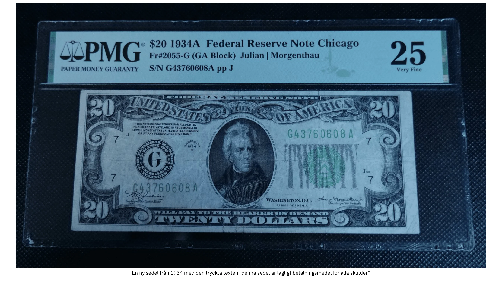

Begreppet lagligt betalningsmedel dyker upp här och ersätter frasen "inlösbar i guld" De två sedlarna kan se identiska ut, med bara några få ord som ändras, men bluffen ligger i det faktum att dollarn devalverades under denna period; den minskade från att ett uns guld värderades till 20,67 dollar till 35 dollar per uns 1934. Det motsvarade en devalvering på cirka 40%!

Sedan kom andra världskriget. Efter kriget centraliserades en stor del av världens guld till USA genom Bretton Woods-avtalet. Amerikanerna gav ut sedlar i utbyte, men dessa sedlar kunde inte längre lösas in mot guld av allmänheten. Istället förblev de utbytbara mot guld på delstatsnivå.

Så småningom började länder som Frankrike och Tyskland misstänka att det förmodligen fanns fler dollarsedlar i omlopp än guld i de amerikanska valven.

Så de bad om att få ta hem sitt guld. De sa: "Okej, vi gör det, men det kommer att ta lite tid." 1971 klippte vår vän Richard Nixon en gång för alla av kopplingen mellan sedlar och guld och skyllde på spekulanterna i processen.

Guldet var undervärderat till 35 dollar per uns, ett pris som inte motsvarade den mängd pengar som hade tryckts eller dess verkliga marknadsvärde. På bara några år steg priset från 34 dollar till 800 dollar. I likhet med historiska exempel, som i Rom, där kopplingen mellan denarius och solidus bröts, tilläts guldet flyta. Detta faktum ledde till en prisupptäcktsprocess, vilket resulterade i att guldet därefter värderades mycket högre i dollartermer.

### Det moderna fiatvalutasystemet och dess konsekvenser

Denna del sammanfattar hur vi gick från ett monetärt system baserat på silver eller guld. Steg för steg fick institutionerna mer och mer makt över pengarna. Till slut bröts kopplingen mellan ädelmetaller och pengar helt och hållet genom ett ensidigt beslut, efter en överutgivning.

Som ett resultat av detta finns det inte längre någon koppling mellan guld och sedlar eller skriftens pengar. Och det är inte ens ett fraktionerat reservsystem - det är ett föråldrat koncept. Istället är det privata banker som ger ut och skapar pengar genom bankkrediter. Pengar skapas huvudsakligen på detta sätt och är korrelerade till den styrränta som centralbanken fastställer.

Det finns verkligen ingen gräns. Det finns inga obligatoriska reservnivåer längre, åtminstone inte i USA och Kanada. Den enda reserven är bankernas behov av att ordna så att de kan svara på interbankutbyten för att inte få slut på likviditet.

De behöver bara se till att de kan göra dessa överföringar, men det finns ingen obligatorisk reserv på 3, 1 eller 10 procent. Vi har verkligen rört oss bort från konceptet med fraktionerade reserver. Nu är det centralbanker, regeringar genom budgetunderskott, centralbanker genom kvantitativa lättnader (QE) och privata banker genom att skapa banklån som kan öka den totala penningmängden och, enligt min mening, orsaka inflation.

För att förstå kopplingen mellan pengar och inflation rekommenderar jag en kurs som jag har på Plan ₿ Academy som handlar om detta ämne. Du kommer att lära dig skillnaden mellan prisökningar, vilket är vad vi ser i livet, och inflation. De är inte samma sak. Faktum är att när vi hänvisar till inflation talar vi ofta om prisökningar, inte själva inflationen. Inflation är ett ganska precist begrepp som förklaras av att penningmängden ökar.

https://planb.academy/courses/caa75343-ac90-4249-bcca-0e2e57c3a0f1

Som avslutning på det här avsnittet om fiatvärlden vill jag tipsa om en resurs som kan hjälpa dig att bättre förstå de fenomen som jag just har förklarat, till exempel inflation.

Tack för din uppmärksamhet.

## Historien om penningbubblor

<chapterId>b6451c46-917d-11f0-97de-6bc5081765fa</chapterId>

:::video id=5967d9a6-aae4-4b84-a283-71b1b735bca4:::

### Uppfinningen av papperspengar och den första stora bubblan

När centralbankerna skapades på 1700-talet föddes en verklig revolution: magiska pengar i form av sedlar. Det mest slående exemplet i Frankrike är John Law. Denne skotte, som levde i exil i Paris, föreslog regenten, Duc d'Orléans, en lösning på de kungliga finansernas konkurs genom att skapa en statsbank och ett kolonialt handelsbolag: den berömda **Banque Royale** och **Compagnie du Mississippi**.

Med detta system kopplade Law papperspengar till sitt företags aktier. Ju fler sedlar som cirkulerade, desto högre blev värdet på aktierna och desto mer solid verkade banken vara... tills spekulationerna överträffade verkligheten. Bubblan sprack plötsligt 1720 och ruinerade adeln, borgarklassen och stora delar av Europa, som hade kommit för att spekulera på rue Quincampoix. Resultatet blev en bestående misstro mot papperspengar i Frankrike och Europas första lektion i spekulationsbubblor.

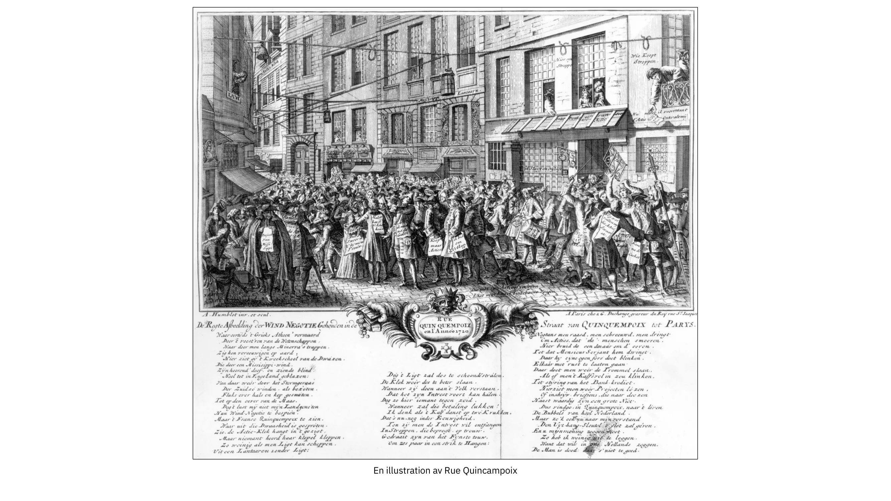

### När mark blir en "säkerhet"

Ett sekel senare bröt den franska revolutionen ny mark med **assignats**, en valuta som backades upp av kyrkans beslagtagna egendom. En attraktiv idé på papperet - att omvandla mark till monetär säkerhet - men ineffektiv: mark är varken likvid eller delbar. Resultatet: hyperinflation, flera förbud mot markanvändning, okontrollerad inflation och brist.

Napoleon, som var djupt påverkad av detta kaos, återinförde guld och silver som monetär bas år 1800 genom att skapa Banque de France, och garanterade därmed regelbundna löner till sina arméer. Ett pragmatiskt sätt att återvinna förtroendet: betala i hårdvaluta.

### Det glada tjugotalet och den stora depressionen 1929

Låt oss hoppa över två århundraden. Efter första världskriget finansierade regeringarna insatserna genom inflation och upphävande av guld. På 1920-talet förde den amerikanska centralbanken en alltför ackommoderande penningpolitik för att stödja det brittiska pundet. Resultatet: lätt kreditgivning, ohämmad spekulation på Wall Street, aktieköp på kredit och uppkomsten av en fastighets- och bankbubbla.

När maskinen gick överstyr var kraschen 1929 oundviklig: massiva bankkonkurser, rekordhög arbetslöshet och köer till soppköken. Detta gav upphov till den seglivade missuppfattningen att **all deflation är dålig**, medan vi måste skilja mellan deflation genom tillväxt (hälsosamt) och deflation genom skuldsättning (förödande).

### Asien på 90-talet och dominoeffekten

Under 1990-talet drömde världen om det "asiatiska undret". Exchange-kurserna var knutna till dollarn, tillväxten låg på 8-10% och västerländskt kapital strömmade in. Allt var frid och fröjd... tills tidvattnet vände. Konkurserna haglade, valutorna devalverades med 80% och investerarna ruinerades. IMF tvingades ingripa och införa smärtsamma reformer. Samma scenario som alltid: överflöd av kapital, kreditdrivna bubblor och sedan kollaps.

### 2008 och den permanenta bubblans tidsålder

Internetbubblan (2000) följdes av subprime-fastighetsbubblan. Värdepapperiseringen förvandlade banklån till finansiella produkter med "AAA"-betyg, som spreds över hela världen. Löftet: eliminera risk genom att späda ut den. I verkligheten var alla risker i själva verket korrelerade. När fastighetsmarknaden kollapsade, kollapsade också hela det globala banksystemet.

Resultatet: massiva offentliga räddningsaktioner, kvantitativa lättnader och nollräntor. Och med det, en huvudlös rusning: varje kris kommer inte längre att rensa bort överdrifterna, utan kommer att täckas av allt mer skuld och penningtryckning. Det var detta som ledde till den nuvarande situationen: **"Alltingbubblan"**, där allting - aktier, fastigheter, konst, krypto, till och med Pokémonkort - blåses upp på konstgjord väg.

### Den eviga återkomsten av magiska pengar

Från ett århundrade till ett annat framträder en konstant: så snart ett samhälle tror att det kan skapa rikedom med pengar i stället för att producera riktiga varor uppstår bubblor. Från John Law till 2008, från rue Quincampoix till Wall Street, upprepar sig processen: eufori, kredit, boom och bust.

Och i slutändan, när ingen längre litar på papper, letar folk efter något annat - guld, mark, säkra hamnar ... eller nya valutor. Igår införde Napoleon metall, idag ser vissa Bitcoin som efterträdaren.

Finanshistorien är en oändlig cykel: tryck, spekulera, kollapsa. Fram till nästa bubbla.

## Pengar och våld

<chapterId>9486fe64-854f-5e17-86b3-8873baca39a8</chapterId>

:::video id=bd6d0807-2d8f-4637-a0f5-1e990e5c0d0f:::

I detta korta avsnitt kommer vi att återkomma till många av de händelser som vi redan har sett under kursens gång och sammanfatta några anekdoter som jag tycker är intressanta.

### Teknik och våld

Här är några anekdoter som vi förmodligen redan har talat om under kursen. De tjänar till att introducera en mycket fascinerande diskussion som jag hade med Theo om en föreläsning han höll på B-Ondy, som jag tyckte var mycket intressant när det gäller hur tekniska framsteg påverkar våldsrelationen mellan befolkningen och staten.

### Pengar och statligt tvång

Som inledning till detta avsnitt kommer jag att ge dig en kort och icke uttömmande lista, bara för att påminna dig om de händelser som vi förmodligen redan har gått igenom under kursen.

En koppling som jag redan kan göra till pengar och våld är att när det gäller värdelösa papperspengar som kan tryckas i all oändlighet så kommer de ofta med alla möjliga regler och alla möjliga hot. Vi kan redan tala om assignaterna, där det bokstavligen stod skrivet på sedlarna att förfalskare hotades till livet. Det är lätt att hitta dödshot i den tidens lagtexter för dem som inte accepterade dessa berömda papperspengar.

För att stanna kvar i Frankrike såg jag i en av de lagtexter jag lyckades få tag på från revolutionstiden att "per diem" för transport och användning av giljotinen beskrevs i de valutarelaterade avsnitten. Jag tyckte att detta var ganska knasigt.

Vi har också talat om myntningen i Kina, där staten övervakar myntningen. Vi såg i ett avsnitt i början av kursen att när mynt, varav vissa var mindre vackra, slängdes fick det rättsliga konsekvenser.

Det finns också en anekdot om en kung i England som slutade med att hugga av händerna på dem som myntade pengar om de inte uppförde sig som han förväntade sig.

I Kina har jag också läst om beslagtagandet av koppar från buddhistiska kloster. I en tid när koppar ökade i värde och destabiliserade deras ekonomi - som baserades på en form av fiatpengar som hade lite att göra med metallens värde - tog de till en plats där det fanns rikedom och beslagtog kopparn från klostren.

Detsamma gällde klostren i England under den engelska reformationen. När den berömde kungen grälade med påven om sin skilsmässa fanns det en annan anledning bakom det hela: han utnyttjade avskaffandet av klostren för att lägga beslag på den rikedom som fanns i dessa kyrkliga organisationer.

Under den franska revolutionen beslagtog de alla kyrkans tillgångar. De såg vackra mynt som skapats av nedsmälta kyrkklockor.

Om vi går ännu längre tillbaka är en av de mest explicita föreställningarna om ekonomiskt våld och frihet, om liberticidala lagar, **Diocletianus med sin ärftliga kast som var direkt kopplad till det faktum att bönderna inte längre ville acceptera den devalverade valutan**. De ville lämna sitt arbete som bönder, och Diocletianus reagerade helt enkelt genom att säga till dem: "Du kan inte lämna din mark, och inte dina barn heller". Samma sak gällde för soldaterna.

Jag tycker att det är en ganska explicit form av våld. Jag skulle kunna avsluta med att tala om Tempelherreorden eller en fransk kung. När tempelriddarna bosatte sig i Frankrike föreställer jag mig att han såg tempelriddarnas rikedomar och hade problem med statsfinansieringen. Han stämde Tempelherreorden, och några av dem kunde gå iväg med en del av skatten, vilket har gett upphov till en mycket intressant show i USA eller Kanada. Jag vet inte vem som producerat den, men den heter *The Mystery of Oak Island*. Den handlar om människor som tror att det finns en tempelriddarskatt begravd på en ö i Kanada, i Maritimes, och de har borrat i åratal - kanske till och med mer än ett decennium - för att göra någon form av brunn. De har hittat en brunn med massor av gallerier, och de letar efter en skatt som begravdes av tempelriddarna på denna ö, som är ämnet för detta TV-program. Jag hälsar på min far, som är ett stort fan av den här serien.

Så där har ni det: en mycket snabb lista över fakta som vi har sett under den här kursen och som jag tycker ökar kopplingen till våld. Jag lämnar er med nästa del från Theo, som kommer att berätta en mycket intressant historia om teknisk förändring och maktbalansen mellan plebejerna och myndigheterna.

Tack så mycket!

## De ekonomiska konsekvenserna av organiserat våld

<chapterId>66bd4674-2159-5489-ad4b-ec5e3fb691af</chapterId>

:::video id=c8b063c6-aeb4-4a94-9027-b11d369e71a4:::

### Organiserat våld och statens utveckling

Historikern Frederic C. Lane lägger fram en revolutionerande tes: statens anatomi genom historien formas av de tekniker som används för att projicera våld. Med utgångspunkt i den weberianska principen att staten har monopol på legitimt våld konstaterar Lane att detta monopol - som paradoxalt nog är effektivare än konkurrens på detta område - utvecklas i enlighet med förhållandet mellan kostnaden för attack och kostnaden för försvar.

Denna analys, som tas upp av författarna till "The Sovereign Individual" (1997), förklarar de historiska mutationerna i den politiska organisationen: från det medeltida feodala systemet till renässansens stadsstater, vidare till de industriella nationalstaterna och slutligen till de moderna välfärdsstaterna. Varje övergång motsvarar ett stort tekniskt genombrott i våldsutövningen och inträffar ungefär vart 400-500:e år.

### Medeltida balans

Under medeltiden var jordbruksekonomin dominerande till över 90%. Bonden, som bokstavligen var rotad i sin mark, kunde inte fly från herren och hans riddare. Militär teknik - handsmidda rustningar, åratal av svärdsträning - var extremt dyr. Denna asymmetri gynnade massivt attack framför försvar.

Den orörliga jordbruksproducenten blir den lokala våldsmonopolistens fånge. Hans förmåga att ta ut skatt når nya höjder - även om de medeltida skatterna paradoxalt nog är blygsamma jämfört med de 78% av de obligatoriska avgifterna som tas ut i modern tid. Herren kan beskatta efter behag, eftersom bonden varken kan göra motstånd eller ge sig av.

### Köpmännens renässans

Hanseaternas framväxt i norr och Medelhavshandelns framväxt i söder förändrade situationen. Köpmännen, som var de främsta skaparna av mervärde, hade ett rörligt kapital - sina fartyg. De behövde bara lätta sjömiliser, eftersom haven var svåra att övervaka. Framför allt kunde de lätt flytta till en grannhamn om beskattningen blev för hög.

Denna rörlighet skapade skattekonkurrens mellan stadsstaterna. Venedig, Genua och Brygge var tvungna att erbjuda så liberala villkor som möjligt: tillförlitliga avtal, kvalitetsvaluta, försäkringar och minimal beskattning. Furstarna var tvungna att förföra snarare än att tvinga. Symmetrin vänds: försvar (genom flykt) blir lättare än attack.

### Den industriella eran

Den industriella revolutionen förde med sig en konfiguration som påminner om feodalism. Fabriker, järnvägar och löpande band representerar massiva, orörliga investeringar. Henry Ford kunde inte flytta sina fabriker på grund av beskattning. Arbetarna, som var koncentrerade till industristäderna, organiserade sig i fackföreningar för att förhandla kollektivt i stället för att flytta individuellt.

"Välfärdsstaten" växte fram: industriell planering (Japan, Korea), militärt skydd av infrastrukturer, minimala sociala förmåner för arbetskraften. Andra världskriget illustrerade denna sårbarhet: bombning av fiendens fabriker blev den dominerande strategin. Koncentrationen av fysiskt kapital möjliggjorde ett massivt skatteuttag för att finansiera välfärdsstaten.

### Mikroprocessorns revolution

Tre tekniska innovationer håller nu på att rubba dessa urgamla balanser. Mikroprocessorn förändrar krigföringen: en operatör i Nevada styr en drönare i Afghanistan med kirurgisk precision. Gulfkriget (1991) demonstrerade detta genombrott: världens fjärde största armé (Irak) utplånades på 45 dagar, med färre än 200 dödsoffer på koalitionssidan. Den tekniska överlägsenheten gjorde frontalangrepp omöjliga.

Internet och asymmetrisk kryptografi håller på att revolutionera värdeskapandet. En utvecklare kan arbeta var som helst med en MacBook och Starlink och exportera sin produktion direkt och kostnadsfritt. Digitala nomader undkommer geografisk fångenskap och ställer stater mot varandra på ett sätt som inte skådats sedan renässansen.

Bitcoin representerar kulmen på denna logik: en valuta befriad från staten, skyddad av en okränkbar kryptografisk sköld. Rikedom blir försvarbar mot all fysisk kraft. Individen återfår förmågan att försvara sig mot statligt monopol.

### Den westfaliska modellens kollaps

De västerländska välfärdsstaterna, som utformades för den industriella tidsåldern, håller på att bli föråldrade. Värdeskapare - utvecklare, konstnärer, finansiärer - migrerar till Singapore, Dubai eller El Salvador och föredrar färre offentliga tjänster i utbyte mot minimal beskattning. Moderna giganter som Apple och Tether behöver varken kontor eller fysisk infrastruktur.

Denna kompetensflykt skapar en spiral: färre nettobetalare, försämrade offentliga tjänster, ökad beskattning av dem som stannar kvar och snabbare avgångar. Stater måste radikalt minska sin storlek eller gå i konkurs. Fragmentering i små, konkurrenskraftiga jurisdiktioner - en ny modell av digitala stadsstater - verkar oundviklig.

Historien lär oss att dessa övergångar tar generationer. Men Bitcoin:s separation av valuta och stat kan påskynda processen. Individer röstar nu med sina fötter och sina kryptografiska plånböcker och ritar om kartan över den globala makten längs linjer som vi bara har börjat uppfatta.

## En mycket kortfattad finansiell historia

<chapterId>1d37fff1-a091-5034-8e71-4af590b8ffce</chapterId>

:::video id=fdfabbc6-e4d8-463a-8522-19176f8fb460:::

Efter denna redogörelse för pengarnas historia, som tar oss ända fram till fiatsystemet, skulle jag snabbt och kortfattat vilja förklara den finansiella utveckling som så småningom ledde fram till välfärdsstaten. Till en början, under romartiden, hade vi mynt.

Mynt var en finansiell teknik som gjorde det möjligt för imperiet att betala soldater, expandera och bedriva handel. Det fungerade mycket bra, förutom att det så småningom blev för många devalveringar. Vid någon tidpunkt när de slutade expandera och slutade få byten från sina krig och territoriumsexpansion, kollapsade deras system.

### Utvecklingen av finansiell teknik

Sedan kom medeltiden, då det skedde mycket lite utveckling fram till florinen, som återinförde en stabil valuta, och bankutvecklingen i Italien och Antwerpen, där begreppet "pengars tidsvärde" utvecklades - med andra ord diskontering. De utvecklade diskontering för att skapa en form av papperspengar där en "promissory note" utfärdades, dvs. ett löfte om att man vid ett senare tillfälle skulle kunna få tillbaka 100 dollar plus en ränta.

Detta system skapade en finansiell teknik som gör det möjligt för innehavaren att sälja skuldebrevet före löptidens slut, så om du säljer det efter 4 månader av en löptid på 6 månader betalar personen faktiskt en premie för att kompensera för avkastningsförlusten under de återstående 2 månaderna.

Det var en finansiell teknik som utvecklades i Antwerpen och Amsterdam på den tiden. Senare såg vi utvecklingen av centralbanker och begreppet lender of last resort. Det kan hävdas att under Bank of Amsterdam övergavs användningen av mynt i den internationella handeln till förmån för skriftens pengar.

Senare, på 1700-talet, när det gäller finansiell teknik, kan vi tala om försäkringar. Det finns en anekdot som är mycket välberättad i Neil Fergusons bok "The Ascent of Money". Det första försäkringsbolaget som föddes hette **Scottish Widowss**, och i grund och botten var det prästerskapet som ville utveckla försäkringar för präster som ibland dog tidigare, dog plötsligt. Prästerna tog då hand om sina fruar och avkommor i Skottland under ett år. Prästerna tyckte därför att den här ettårsperioden kanske var lite för kort. Därför uppfann de **aktuariella beräkningar** för att bokstavligen beräkna antalet bidragsgivare som krävdes för att systemet skulle täcka sina kostnader, beroende på antalet präster som dog i förtid.

De utvecklade försäkringstekniska beräkningar för att säga "Okej, varje präst ger oss det här beloppet. Om prästen sedan dör, ja, då kommer försäkringen att täcka kostnaderna för att säkerställa överlevnaden för hans fru och barn tills de är självförsörjande." Så det var det första försäkringsbolaget som kallades "Scottish Widows" som populariserade det här systemet och där det användes.

### Från privata försäkringar till välfärdsstaten

Så försäkringar är en del av den finansiella teknikens historia. Och det för mig in på begreppet välfärdsstat, som handlar om att privata försäkringar till slut stötte på ett problem, ett optimeringsbegrepp, där vi säger till oss själva att om vi erbjuder sjukförsäkring till människor som är friska, så kanske de har mindre intresse av att betala premien eftersom de säger till sig själva: "Jag är frisk, jag kommer inte att bli sjuk". Å andra sidan kommer människor som vet att de är sjuka säkert att vilja teckna en försäkring.

Det här systemet skapar en obalans mellan antalet sjuka människor som kommer att teckna sjukförsäkring, i motsats till friska människor som kanske kommer att teckna mindre. Det finns alltså en slags obalans: om man räknar på siffrorna skulle de inte balansera eftersom man förmodligen inte skulle kunna försäkra tillräckligt många friska människor för att kompensera för kostnaderna. Inom nationalekonomin är detta begreppet **moralisk risk**.

En av de idéer som har förts fram är att göra försäkringar obligatoriska. Om alla är tvungna att bidra så balanseras det hela om och både friska och sjuka människor kommer att bidra, vilket fördelar riskerna till den största befolkningen.

Och därför har staten i många delar av världen sagt: "Det där tar vi hand om". Jag är ingen expert på den här frågan, men jag kan se att samma resonemang förmodligen tillämpas på alla möjliga andra former av försäkringar, till exempel arbetslöshetsförsäkring. Det finns en vilja att förenkla och optimera, baserat på tanken att det blir enklare om det bara finns en organisation som tar hand om det.

Enligt min mening ledde detta till en centralisering av alla dessa försäkringskoncept, och i slutändan till välfärdsstatens födelse, där alla dessa finansiella koncept som ursprungligen var privata företag, privata initiativ för att möta ett försäkringsmarknadsbehov av att fördela risker bland befolkningen, togs över av staten av skäl som förmodligen är ganska logiska i förhållande till moralisk risk och önskan att optimera.

### Alternativa modeller och reflektioner kring statliga monopol

I vissa länder, som Kanada, har vi till slut flera typer av försäkringar - sjukförsäkring, arbetslöshetsförsäkring - som är statliga monopol.

Jag kan ge dig ett exempel som jag känner till. I Schweiz är systemet lite annorlunda. Det finns privata ömsesidiga försäkringsbolag och privata sjukhus, så du kan välja ditt ömsesidiga försäkringsbolag, du kan välja ditt paket inom ditt ömsesidiga försäkringsbolag. Man får fortfarande relativt universella tjänster, även om en stor del av systemet förblir privat.

Så jag tror att det är möjligt att det också är privatägt. Men allt jag ville beskriva för er är faktiskt inte ett uttalande för att uttrycka om det ena systemet är bättre än det andra, det var snarare för att förklara för er att när jag läste om finanshistorien insåg jag varför staten i väst, särskilt i Frankrike, särskilt i Kanada, ville ta kontroll över dessa finansiella principer.

Det jag vill säga är att försäkringsbegreppet först och främst är en utveckling av finanserna, och som regeringar ibland är så bra på att göra kommer de att försöka ta kontroll över dem, precis som de har försökt ta kontroll över pengarna, av flera skäl. Ett skäl är för övrigt begreppet "lender of last resort" (långivare i sista hand).

Tanken är att det är mycket bättre om det finns en stor institution bakom som fördelar risken bredare. Det var det ursprungliga initiativet bakom begreppet "lender of last resort", där denna institution faktiskt kunde välja ut institutioner som var tillräckligt starka för att överleva och förhindra att de kollapsade genom att låna ut pengar till dem.

På den tiden var det en verklig analys när detta koncept äntligen dök upp för första gången, men det som till slut hände var att vi räddade alla, "too big to fail", det gäller nästan alla banker eftersom det finns en centralisering, och även alla stora företag. I slutändan ser vi att det fortfarande är ett koncept som tillämpas "i stort" av staten, i likhet med försäkringskonceptet som jag just har beskrivit för er.

I slutändan beslutar staten att den ska ta hand om allt och förvandlar en finansiell teknik som skapades i Skottland för att lösa ett specifikt problem till den omfattande välfärdsstat som vi känner till idag. Den använder försäkringstekniska finansiella principer för att erbjuda tjänster till sin behövande befolkning. Vi kan dock vara överens om att de monopol som uppstår i detta system skapar alla möjliga problem, vilket vi för närvarande upplever i länder som Kanada och Frankrike. Lyckligtvis finns det andra modeller, till exempel den i Schweiz.

Vi måste helt enkelt inse att konceptet med välfärdsstaten härstammar från finansvärlden. Denna insikt antyder att vi kan utforska andra vägar än de berömda statliga monopolen, och jag skulle till och med vilja tillämpa detta resonemang på konceptet med centralbanker som långivare i sista hand - men det är ett ämne för en annan gång.

# Sista avsnittet

<partId>9bada469-7ef0-511a-9eaa-f8eb66d5906f</partId>

## Utvärdera denna kurs

<chapterId>a9494e2b-8a4d-5811-8a7b-b4a91fb22778</chapterId>

<isCourseReview>true</isCourseReview>

## Slutsats

<chapterId>1094e793-b4c6-5782-aa4a-71cde00ce7c0</chapterId>

<isCourseConclusion>true</isCourseConclusion>