# Safari kupitia historia ya sarafu

Kozi hii ya kuvutia itakupeleka kwenye uchunguzi wa mageuzi ya kuvutia ya pesa kutoka kwa ustaarabu wa awali hadi mfumo wetu wa sasa wa fedha. Tutavuka enzi, kutoka Neolithic hadi nyakati za kisasa, tukigundua jinsi pesa imeundwa na kutengenezwa na ustaarabu mkuu wa wanadamu. Kutoka kwa proto-pesa ya Mesopotamia hadi sarafu ya siri, sarafu za Lydia, florin ya Renaissance, na ujio wa benki kuu - kozi hii inatoa mtazamo wa kina juu ya mojawapo ya nguzo za msingi za jamii zetu.

+++
# Utangulizi

<partId>59878a67-8a1d-5d6b-af41-5b847c14363c</partId>

## Utangulizi wa Historia ya Pesa

<chapterId>ca53597e-be9a-5261-a55f-11fac8504a68</chapterId>

:::video id=08ff35ca-8a40-4286-abaf-71283faf6e78:::

Karibu kwenye kozi hii ya historia ya pesa. Kama kichwa kinapendekeza, tutachunguza mabadiliko ya kihistoria ya sarafu pamoja. Kuanzia enzi ya Neolithic hadi leo, tutaangalia milki kuu na ustaarabu wa zamani.

Walakini, kozi hii sio tu kwa mpangilio rahisi wa tarehe au matukio ya kihistoria. Badala yake, lengo letu halisi ni kutoa ufahamu wa kina wa dhana za kimsingi zinazohusika katika uibukaji wa pesa, au tuseme, sarafu.

### Dhana za kimsingi za kuchunguza

Kwa hivyo tunazungumza juu ya kuibuka: kuibuka kwa sarafu zenyewe, mifumo ya fedha, benki, pesa za karatasi, benki kuu, na mwishowe, kuibuka kwa mfumo wa sasa wa "fiat" wa fedha.

Tunaanza safari yetu ya kutumia sarafu za proto kwa kuibuka kwa pesa za deni na vitengo vya akaunti huko Mesopotamia, na pia mifumo mingine kama vile mahari na pesa za damu katika jamii za zamani. Pia tutaona jinsi mifumo halisi ya fedha ilivyokuwa tayari katika Misri ya kale, kabla ya Ufalme wa Kati.

Kisha tunaendelea na kuonekana kwa sarafu za kwanza huko Lydia, wakati muhimu ambao mara nyingi huzingatiwa kama mwanzo wa kweli wa pesa kulingana na vitabu vya kiada vya uchumi. Tutachunguza jinsi sarafu hizi ziliweza kueneza shukrani kwa Waajemi, Alexander Mkuu, kisha Roma, kabla ya hatimaye kujilazimisha, kutawala na kuanguka.

Kuanzia hapo, tukiwa na kila kitu ambacho tumejifunza, tutachukua wakati tunaohitaji kutafakari pamoja juu ya ufafanuzi hasa wa pesa, tukienda zaidi ya mawazo ya awali kama vile "fedha daima ni deni" au "fedha daima ni bidhaa". Kwa kweli, pesa ni mkutano mzuri na wa kijamii. Hasa, tutajadili dhana ya malipo ya fedha na kujaribu kuunganisha nadharia mbalimbali zinazoelezea kuibuka kwa fedha.

### Vipindi muhimu na uvumbuzi wa kifedha

Kisha tunageukia kipindi cha shida, kilichoonyeshwa na kukosekana kwa utulivu katika hali ya kifedha, ambayo hata hivyo iliona kuibuka kwa uvumbuzi wa kushangaza kama vile senti ya Kiingereza, iliyotumiwa kuwahonga wavamizi wa Denmark, na pauni ya Charlemagne, kumbukumbu ambayo bado inaendelea hadi leo kwenye noti za kisasa.

Tutaangalia pia jinsi Vita vya Msalaba viliona kuibuka kwa mifumo ya kwanza ya uhamishaji pesa ya mbali. Kisha ni wakati wa kuangalia athari za Florin, sarafu iliyoambatana na Renaissance, na kuwasili kwa madini ya thamani kutoka Amerika, ambayo ilikuwa na athari kubwa kwa bei za Ulaya.

Tutaangalia kwa undani ujio wa pesa za karatasi na benki kuu, tukichora sambamba na historia ya migogoro ya kifedha na athari zao za vurugu mara nyingi.

Hatimaye, tutatoa ulinganifu na mfumo wetu wa kisasa wa fedha, tukichunguza matokeo yake, na kufuatilia historia ya fedha ili kuelewa vyema jinsi tulivyofika katika hali ya ustawi wa leo.

Na, kama bonasi, tutaangalia pia viungo vingi vya kuvutia vya etimolojia vinavyohusiana na pesa, ambavyo vinaendelea kuathiri maisha yetu ya kila siku katika lugha tofauti.

### Muundo wa kozi

Kozi hii imegawanywa katika sehemu kuu tatu.

Sehemu ya I inaangalia kuibuka kwa pesa, Sehemu ya II katika ufufuaji upya wa pesa na anguko lake, na Sehemu ya Tatu inaonyesha jinsi taasisi za serikali au serikali zilichukua udhibiti wa pesa, na kusababisha mfumo wa sasa wa fiat.

Asante na kufurahia!

# Kuibuka kwa kubadilishana

<partId>da5e4981-9ea5-5208-beab-3b75c9043632</partId>

## Kutoka Australopithecus hadi Mtu wa Kisasa

<chapterId>34a773aa-f2d3-5c26-8be4-f2cd79ed6fbc</chapterId>

:::video id=4f333013-4b2a-42ab-8761-593fafc971ca:::

### Kwa nini kuanza katika Neolithic

Kwa nini urudi kwa Neolithic kuzungumza juu ya pesa? Jibu ni rahisi: hatuwezi kuelewa kikamilifu kuibuka kwa pesa bila kuangalia pia kuibuka kwa ustaarabu wenyewe. Ili kuelewa ni kwa nini mifumo ya kwanza ya kifedha ilikuja, tunahitaji kuelewa ni nini kilisababisha vikundi vya wawindaji wa kuhamahama kutulia.

Kabila lisilo na mgawanyiko wa kazi, bila utaalamu, ambapo kila mtu ana jukumu la kuzalisha kile anachohitaji, hawana haja ya pesa. Kadhalika, jumuiya ya kilimo inayofanya kilimo cha kujikimu tu, ambapo kila mtu anajilima mwenyewe, bado haioni haja ya kuwa na mpatanishi wa kubadilishana watu wote.

### Sedentization na matokeo yake

Ndio maana nadhani inafurahisha kuanza uchunguzi wetu katika kipindi cha Neolithic. Tutaona jinsi hali ya kukaa polepole ilizua vijiji, kisha miji, na hatimaye ustaarabu mkubwa. Ilikuwa ni hali hii ya kukaa chini na uzalishaji wa ziada ya chakula ambayo ilifanya utaalamu wa kazi uwezekane, na kujenga ardhi yenye rutuba muhimu kwa kuibuka na mageuzi ya dhana za kwanza za fedha.

Kama vile mwingiliano wa kibinadamu huzua lugha, tunaweza kuzingatia kwamba pesa huonekana kiasili, au la (kama vile Wainka na Wasparta), wakati wa malezi na mpangilio wa ustaarabu. Kwa maoni yangu, kuonekana au kutoonekana kwa pesa kunahusiana na aina ya shirika la kijamii na kiuchumi la kila jamii.

### Kronolojia ya mageuzi ya binadamu

Lakini kwanza, hebu tuangalie muktadha mpana zaidi wa kihistoria.

Kama wasilisho lolote la kwanza, nitafanya kinyume kabisa cha kile nilichosema katika utangulizi wa kozi na kukupa orodha ya tarehe na matukio ya kihistoria yanayofuata kutoka kwa kila mmoja. Wazo hapa ni kuweka uibukaji wa pesa katika muktadha wake wa kihistoria, kuhusiana na maendeleo mengine ya wanadamu kama vile kupika chakula, gurudumu, ufugaji wa nafaka na wanyama fulani, ujenzi wa piramidi na kuanzishwa kwa miji ya kwanza.

Kwa hivyo, hebu tuangalie mageuzi ya wanadamu kutoka nyakati za kabla ya historia na kuendelea.

Muhtasari wa mageuzi ya binadamu kutoka Australopithecus hadi mwanadamu wa kisasa, kufuatia maendeleo ya kiteknolojia na harakati za idadi ya watu hadi kipindi cha Neolithic.

### Muktadha wa kihistoria wa wanadamu

- Miaka milioni 3 iliyopita** - Mwonekano wa *Australopithecus*.
- Miaka milioni 2 iliyopita** - Hominins huanza kuondoka Afrika.
- Miaka milioni 1.6 iliyopita** - Hominins hufika kusini mwa Ulaya na Asia.
- Miaka milioni 1 iliyopita** - Ushahidi wa kwanza wa kupikia nyumbani kwa moto (mifupa iliyochomwa na mmea imesalia katika Pango la Wonderwerk, Afrika Kusini).
- Karibu 400,000 BC** - Neanderthals wanaishi Ulaya na Asia.
- Karibu 300,000 KK** - Mwonekano wa *Homo sapiens*.
- Miaka 80,000 iliyopita** - *Homo sapiens* inaanza kuhamia sehemu zote za dunia.
- Miaka 73,000 iliyopita** - Mapango ya Blombos nchini Afrika Kusini (aina za sanaa kongwe zaidi zinazojulikana).
- Miaka 50,000 iliyopita** - *Homo sapiens* ilifika Ulaya.
- Miaka 30,000 iliyopita** - Picha za pango kutoka kwenye pango la Chauvet huko Ufaransa.
- Miaka 15,000 iliyopita** - michoro ya mapango ya Lascaux nchini Ufaransa na sanaa ya miamba ya Australia.
- Karibu 9000 BC** - Umiliki wa shayiri katika Hilali yenye Rutuba.
- Karibu 9000 BC** - Kilimo cha mahindi huko Mexico.
- Karibu 8000 BC** - Ufugaji wa mbuzi na kondoo katika Hilali yenye Rutuba.
- Karibu 7250 BC** - Ain Ghazal (Jordan) inaonyesha kijiji cha wakazi mia chache.
- Takriban 7000 KK** - Çatalhöyük (Uturuki) ina hadi wakazi 8,000.
- Karibu 6500 BC** - Maisha ya kukaa huanza Ugiriki.
- Miaka 6000 iliyopita** - Mwanzo wa umwagiliaji wa mto huko Misri na Mesopotamia.
- Karibu 5000 BC ** - Kuonekana kwa "dada watatu" mchanganyiko wa kilimo (mahindi, boga, maharagwe).
- Karibu 4000 BC** - Ufugaji wa ngamia katika Asia ya Kati. (Familia ya ngamia ilianzia Amerika Kaskazini wakati wa Eocene miaka milioni 45 iliyopita. Ngamia hawa wakati huo wangehamia Asia kupitia ukanda mwembamba wa ardhi uliounganisha mabara mawili wakati huo katika Mlango-Bahari wa Bering. Sehemu nyingine ya familia hiyo ingeelekea Amerika Kusini, ambako wazao wake bado wanaishi leo: llamas, alpacas, na vicuñas).
- Karibu 3500-3000 BC** - Watu wa Botai wanaanza kufuga na kuzaliana farasi.
- Karibu na mwanzo wa Enzi ya Shaba** - Wasumeri walikuwa tayari wamevumbua gurudumu na mashua, na kuendeleza hesabu, unajimu, na aina ya kwanza ya uandishi.
- Karibu 2800 BC** - Uruk, katika kilele chake, ilifikia idadi ya hadi 80,000.
- 2600-2200 BC ** - Ishara za kwanza za maendeleo ya mijini katika ulimwengu wa Kigiriki. Upanuzi wa mazao ya Mediterranean (ngano, mizabibu, mizeituni).
- 2560 KK** - Ujenzi wa Piramidi Kuu ya Giza.
- Karibu 1500 BC** - ustaarabu wa Minoan.
- Karibu 1300 BC** - ustaarabu wa Mycenaean.
- Takriban 1250 hadi 1150 KK** - Kuporomoka kwa ustaarabu wa Enzi ya Shaba.
- Karne ya 1 BK** - Waberber wa Afrika Kaskazini wanafuga ngamia.

Kwa hivyo, hapa kuna muhtasari huu wa kihistoria ili kutupa mtazamo juu ya kuibuka kwa teknolojia fulani, ufugaji wa wanyama fulani, na tamaduni, ili kuiweka katika muktadha wa kuibuka kwa maandishi na pesa, ambayo itakuwa mada ya sehemu yetu inayofuata.

## Kutoka kwa Mwindaji-Mkusanyaji hadi Mkulima: Alfajiri ya Ustaarabu

<chapterId>ea950b6e-9eb7-553d-8f04-0eb042bb1f5a</chapterId>

:::video id=4b49a376-f6f4-42a0-86fa-264997a079f0:::

### Mpito kwa kilimo na kukaa chini

Katika sura hii, tutazungumza kuhusu mpito kutoka kwa uwindaji na kukusanya hadi kilimo cha kujikimu, ufundi na biashara. Nilihisi ni muhimu kuelezea mpito huu kwa maisha ya kimya na kilimo, kuelewa jinsi miji ya kwanza ilijengwa, ambayo hatimaye ilisababisha kuundwa na kuibuka kwa mifumo fulani ya fedha wakati wa Kale.

Sehemu hii ni dondoo kutoka kwa kozi inayopatikana kwenye tovuti ya The Great Courses inayoitwa Ancient Mesopotamia, Life in the Cradle of Civilization, iliyotolewa na Profesa Amanda Podany wa Chuo Kikuu cha California State Polytechnic, Ponoma.

### Vitendawili vya kupitisha kilimo

Kilimo cha kwanza kilionekana karibu miaka 10,500 iliyopita katika Mashariki ya Karibu, karibu na kaskazini-magharibi mwa Syria na kusini mwa Uturuki. Leo, vikundi vya kisasa vya wawindaji hawana haraka ya kupitisha kilimo, na labda hiyo ilikuwa kweli wakati wa Neolithic.

**Vijiji vya kwanza vilijengwa wazi kabla ya ufugaji wa mimea na wanyama.** Watu hawakutulia kwa sababu kilimo kiliwaruhusu; kinyume chake, walikaa kwanza na baadaye tu, miaka 3,000 hivi baadaye, walianza kulima.

Uwindaji na kukusanya ulifanya kazi vizuri sana, kwa hivyo hawakuhitaji kupanda mbegu ili kuzalisha chakula chao. Leo, wawindaji-wakusanyaji wana wakati mwingi zaidi wa bure kuliko wakulima wa kwanza, ambao walitumia teknolojia za ujinga sana.

Kwa hivyo, tunachosema hapa ni kwamba watu wa kisasa wa wawindaji-wakusanyaji wana wakati zaidi wa bure kuliko tunavyoelewa kutoka kwa wakulima wa kwanza wa kipindi cha Neolithic, ambao walikuwa na, baada ya yote, teknolojia za kilimo cha awali. Watu hawa walifanya kazi kwa bidii zaidi kuzalisha chakula kuliko makabila yetu ya kisasa, ambayo huishi kwa kuwinda na kukusanya.

Uchunguzi wa mifupa pia unaonyesha kwamba wakulima wa kwanza walikuwa wadogo na wasio na nguvu zaidi kuliko wawindaji wa wawindaji waliowatangulia. Mlo wa wakulima ulikuwa na vikwazo zaidi kuliko wale wa wawindaji-wakusanyaji. Walikula mkate mwingi zaidi, lakini nyama kidogo, na pia walikuwa na meno duni kwa sababu ya miamba iliyotumika katika utengenezaji wa unga. Walipotengeneza unga kwa mawe, ulitengeneza vipande.

Wale wanaofuata lishe ya "keto" watakubali: kula mkate mwingi labda sio sawa na kula nyama.

### Nadharia juu ya kupitishwa kwa kilimo

Kutokana na hasara hizi zote, ni nani angechagua kuwa mkulima wakati huo? Naam, baadhi ya nadharia maarufu zinaonyesha kwamba wanadamu walilazimishwa kufuata kilimo na kwamba haikuwa chaguo. Hata na nafaka pori, kulikuwa na tatizo kubwa. Kiasi kikubwa cha nafaka haikuweza kusafirishwa kwa urahisi. Ilibidi zihifadhiwe mahali fulani. Mara tu nafaka ilipohifadhiwa, ilikuwa na maana kukaa karibu. Kwa hiyo, ulikuza nafaka za mwitu, ambazo hazikuwa za kilimo, na ulipokua kwa wingi, ulipaswa kuzihifadhi mahali fulani, na kufanya iwe vigumu kusafirisha. Labda hii ilichangia awamu za kwanza za kukaa chini. Huenda ikawa ndiyo sababu ya kwanza kwa nini watu kukaa mahali fulani. Ikiwa mahali hapa palitoa chakula mwaka mzima, hakukuwa na haja ya kufuata mifugo au kusafiri kila wakati.

Katika tamaduni ya Natoufian, hadi watu mia moja waliishi pamoja katika vijiji vilivyoundwa na nyumba za duara. Nadharia maarufu inayoelezea mwanzo wa kilimo ni kwamba mabadiliko haya yalichochewa na mabadiliko ya hali ya hewa. Karibu miaka 11,000 iliyopita, hali ya hewa katika Mashariki ya Karibu ilizidi kuwa baridi na ukame zaidi kuliko hapo awali. Mimea na wanyama ambao hapo awali walikuwa wengi walipungua. Kisha jamii zingeanza kulima mimea ambayo waliitegemea, au kuweka wanyama wachanga wa kufuga na kufaidika nayo, kama vile kondoo, mbuzi, na ng'ombe, ambayo ingejikopesha vizuri kwa ufugaji huo. Huu ungekuwa mchakato wa taratibu sana. Kwa hivyo, hakukuwa na wakati sahihi ambapo wote wakawa wakulima ambao walifuga wanyama wa ndani.

Nadharia nyingine ni kwamba vijiji vyenyewe viliunda tatizo lililotatuliwa na ufugaji wa nyumbani. Uwindaji wa kina na kukusanya kungeharibu mazingira ya asili. Kulingana na nadharia moja, Wanatoufiani walikuwa wamepata mafanikio ya idadi ya watu hivi kwamba walikuwa wengi sana kwa mazingira yao ya karibu. Kwa hivyo, mabwawa na maeneo ambayo mazao ya asili yalipandwa yanaweza kuwa hayakuwa na tija ya kutosha kwa wakazi wa kijiji hicho. Mazingira ya papo hapo hayakuweza kutoa mahitaji ya kila mtu. Wangeanza kulima moja kwa moja kwenye tovuti na kuongeza usambazaji wao wa chakula.

## Biashara ya Neolithic

<chapterId>8e495224-6d55-58f6-a9dc-ac2814281cfa</chapterId>

:::video id=d04245af-e416-48b1-8157-d569207a32c4:::

### Mpito wa Paleolithic-Neolithic

Kipindi cha Neolithic kinaashiria mapumziko ya kimsingi katika historia ya mwanadamu, tofauti kabisa na jamii za Paleolithic zilizoitangulia. Katika Paleolithic, idadi ya watu wa Ulaya ilitawanywa sana: watu 7,000 tu waliishi bara zima miaka 20,000 iliyopita, walipangwa katika vikundi vidogo vya kuhamahama vya watu 20 hadi 50 ambao walifuata mifugo kubwa inayohama kwa umbali mkubwa.

Ongezeko la joto duniani mwishoni mwa Enzi ya Barafu kulibadilisha kwa kiasi kikubwa shirika hili la kijamii. Kuibuka kwa misitu kulichukua nafasi ya wanyama wanaohama na kuwa na wanyama wanaokaa tu, na hivyo kuwezesha vikundi vya wanadamu kuwa vya kukaa nusu. Mabadiliko haya yaliambatana na ongezeko kubwa la idadi ya watu: kutoka kwa makadirio ya idadi ya watu wa Ulaya kati ya 10,000 na 50,000 mwishoni mwa Paleolithic, Neolithic ya Kati na ya Mwisho iliongezeka hadi kati ya wakazi milioni 1 na 5.

### Uvumbuzi wa Kazi na Mali

Kukaa huku kwa taratibu kulisababisha mabadiliko makubwa ya kijamii. **Kilimo cha Neolithic kilizua dhana ya kisasa ya kazi **: kushikamana na eneo maalum kulimaanisha kutunza mali ya mtu, kuhifadhi matunda ya kazi yake na kupanga mavuno ya baadaye. Uhusiano huu mpya na wakati - kuahirisha matumizi ya sasa kwa manufaa ya baadaye - ulileta mapinduzi ya shirika la kijamii.

Ufinyanzi ni kielelezo kamili cha mageuzi haya: awali ilitengenezwa kuhifadhi nafaka na mbegu, inatoa ushuhuda wa uwezo huu mpya wa mradi mahitaji kwa muda. Wanahistoria wengine hata wanafikiria kuwa Neolithic isingewezekana bila mifumo hii ya uhifadhi.

** Mali ya kibinafsi iliibuka kama taasisi kuu ** ya jamii hizi mpya. Wakati mali ya mtu binafsi tayari ilikuwepo katika Paleolithic (mikuki ya uwindaji wa kibinafsi), katika Neolithic ilichukua mwelekeo wa eneo ambao haujawahi kutokea. Ugawaji huu wa ardhi ulizalisha mizozo ya kwanza kati ya binadamu iliyoandikwa kiakiolojia, na hivyo kulazimisha kuibuka kwa kazi ya usalama wa eneo.

### Umaalumu na Idara ya Kazi

Kilimo kiliwezesha kulisha watu wengi zaidi, huku kikiweka huru baadhi ya watu kutoka kwa shughuli nyingine za uzalishaji. Utaalam huu unaoibuka - wakulima, wafinyanzi, mafundi, walinzi - uliweka misingi ya mgawanyiko wa kazi na viwango vya kijamii.

Mabaki ya kiakiolojia yanashuhudia utabaka huu unaokua: mazishi yalitokana na kaburi la pamoja hadi kaburi tofauti, na makazi yalihama kutoka usawa wa usanifu hadi ujenzi unaoonyesha hali tofauti za kijamii. Vitu vya mazishi - mapambo, zana maalum, ufinyanzi - zinaonyesha kuibuka kwa wazo la utajiri na ufahari wa kijamii.

### Kuibuka kwa kubadilishana umbali

Uchunguzi wa akiolojia unaonyesha mitandao ya kubadilishana ya kushangaza kwa wakati huo. Nyenzo kama vile obsidian, mwamba wa kijani (dolerite, jadeite), makombora, na lami zilipatikana mamia ya kilomita kutoka maeneo yao ya uchimbaji. Shoka za miamba ya kijani iliyosafishwa, muhimu kwa ukataji miti na ujenzi wa vijiji vya mapema, zilisambazwa kote Ulaya ya Neolithic.

Mabadilishano haya yanahusu malighafi na vitu vilivyomalizika, ikionyesha kuthamini utaalam wa ufundi. Thamani inayohusishwa inaunganisha adimu ya nyenzo na ustadi wa kiufundi unaohitajika ili kuibadilisha.

Shirika la kubadilishana hutofautiana kulingana na kiwango kinachozingatiwa. **Ndani ya jumuiya**, wanaanthropolojia wanapendelea nadharia tete ya uchumi wa zawadi na zawadi kinyume, na mifumo ya mikopo isiyo rasmi inayozingatia uaminifu baina ya watu. Katika vikundi hivi vilivyowekewa vikwazo, "nambari ya Dunbar" (watu 150 wa juu zaidi ili kudumisha uhusiano wa moja kwa moja wa kuaminiana) huwezesha ubadilishanaji ulioahirishwa bila utaratibu wowote wa soko.

Kuna aina kadhaa za kubadilishana:

- **mabadilishano ya moja kwa moja**: ubadilishanaji wa wema kwa wema mara moja
- **Kubadilishana kwa muda mrefu**: kubadilishana bidhaa kwa huduma au ahadi
- **mabadilishano yaliyoahirishwa**: deni baina ya watu na ulipaji unaofuata

**Kati ya jumuiya tofauti**, kukosekana kwa vifungo vya uaminifu wa kibinafsi kulipendelea kuibuka kwa ubadilishanaji rasmi zaidi. Bidhaa fulani polepole zilipata hadhi maalum kupitia uwezo wao wa kudaiwa na vikundi vya kigeni, zikionyesha aina za kwanza za sarafu ya proto.

Shule ya uchumi ya Austria inafasiri mageuzi haya kama kuibuka kwa hiari kwa bidhaa za ubadilishanaji wa bahati. Makombora, yaliyothibitishwa kiakiolojia mapema kama Mesolithic, yanaonyesha jambo hili: hupatikana mbali na asili yao ya kijiografia (maganda ya Mediterania magharibi mwa Ufaransa, maganda ya Nordic kwenye tovuti zingine), yanashuhudia utambuzi wa kawaida wa thamani yao ya ubadilishaji.

Bidhaa hizi zinatofautishwa na **uwezo wao wa kudaiwa na wengine**, ubora muhimu ambao unaonyesha utendakazi wa fedha. Ingawa hazikuweza kusawazisha sarafu za kihistoria, zilikuwa hatua za kwanza kuelekea mifumo isiyobinafsishwa ya ubadilishanaji, hitaji la maendeleo ya jamii ngumu zaidi ya mfumo wa kikabila.

Kwa hivyo Neolithic iliweka misingi ya uchumi wa kisasa: utaalamu wa kazi, mali ya kibinafsi, mkusanyiko wa mali, uongozi wa kijamii, na kuibuka kwa mifumo ya kisasa ya kubadilishana ambayo ilivuka vifungo vya ujamaa na ujirani wa moja kwa moja.

## Uundaji wa miji ya kwanza na kuibuka kwa maandishi

<chapterId>d6b799c2-8bf1-11f0-9c54-1b9f4f4c7011</chapterId>

:::video id=3ca18105-9856-4ceb-925c-c9e9215af21b:::

### Umwagiliaji na kuzaliwa kwa miji mikubwa

Katika sura hii, tutajadili jinsi miji mikuu ya kwanza ya sehemu hii ya historia ilikuja, na bila shaka tutajadili sababu za kuibuka kwa maandishi huko Mesopotamia.

Karibu miaka 6,000 iliyopita, katika mabonde yenye rutuba ya Misri na Mesopotamia, jumuiya za wanadamu zilianza kutumia mito kwa kuendeleza umwagiliaji. Ustadi huu wa maji uliruhusu kulima kwa wingi, na kupendelea kuibuka kwa miji mikubwa kama vile mji maarufu wa Uruk, ulioko kusini mwa Iraki ya leo.

Karibu 3500 BC, Uruk ikawa jiji kubwa zaidi ulimwenguni, na kufikia kilele chake karibu 2800 KK, na idadi ya watu hadi 80,000. Kwa wakati huu, uvumbuzi kuu mbili ziliashiria sana ustaarabu wa Sumeri: kuibuka kwa serikali iliyoandaliwa yenye uwezo wa kusimamia hali ya kweli, na uvumbuzi wa kimapinduzi wa uandishi.

### Uvumbuzi wa uandishi wa kikabari

Uandishi ulizaliwa katika mji huu karibu 3000 BC, ulichochewa hasa na mahitaji ya kiuchumi. Wakikabiliwa na kuongezeka kwa utata wa jamii na mabadilishano yake, wasimamizi wa hekalu na ikulu walihitaji zana ya kutegemewa ili kurekodi kwa usahihi miamala ya kiuchumi, kama vile uwasilishaji wa nyenzo, uhamishaji wa ndani na hisa zinazopatikana.

Mfumo uliotengenezwa uliitwa "cuneiform", kutoka kwa Kilatini "cuneus" ikimaanisha "kabari", kwa kurejelea matumizi ya kalamu yenye umbo la kabari kuchapisha ishara kwenye vidonge vya udongo unyevu.

Hapa chini, unaweza kupendeza nakala yangu ya kompyuta kibao iliyo na maandishi ya kikabari. Ili kuandika kwenye vidonge hivi, naamini walitumia aina ya kalamu iliyofanywa kutoka kwa mwanzi, ili kufuatilia udongo wa mvua na kuunda maumbo, maandishi ya cuneiform.

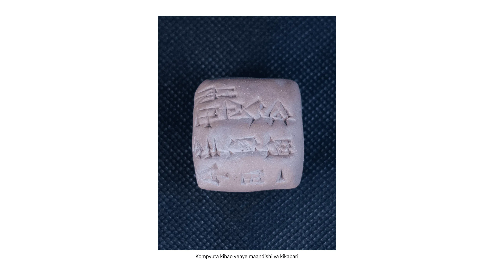

Pia nina kile ninachoamini kuwa kompyuta kibao ya Kisumeri iliyo na hati ndogo ya kikabari katikati. Kwenye kompyuta hii kibao, kuna saini zilizotengenezwa kwa kuviringisha silinda, ambazo nitakuonyesha baadaye.

Alama zenye tarakimu ndogo zilitumika kama sahihi wakati ambapo watu wengi hawakuweza kuandika, kwani ni waandishi wenye ujuzi pekee waliokuwa na uwezo huo.

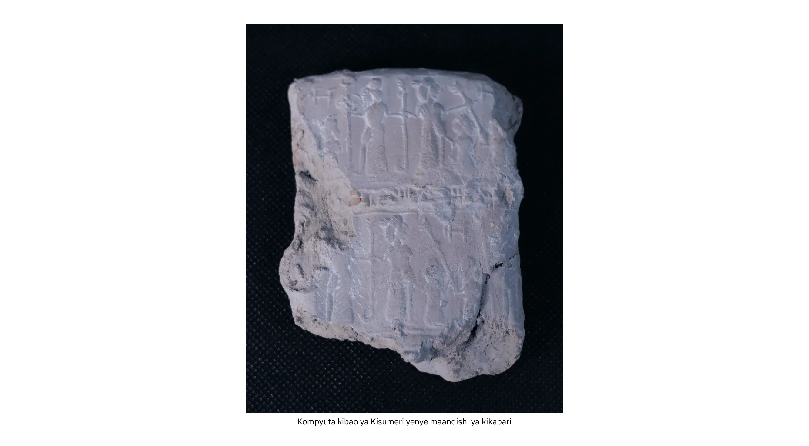

Chini, unaweza kuona silinda iliyotajwa hapo juu: jiwe lililochongwa na maumbo maalum. Watu walikuwa wakiviringisha silinda hii sahihi, inayojulikana kama muhuri wa silinda kwa Kiingereza, ili kutia sahihi barua. Ilikuwa ni njia ya kuweka wazi majina ya waandishi, au kuonyesha kwamba yalitungwa kwa jina lao.

Kwa hivyo, waandishi wa wakati huo walitumia kalamu yenye umbo la kabari ili kuchapisha alama kwenye vidonge vyenye unyevunyevu.

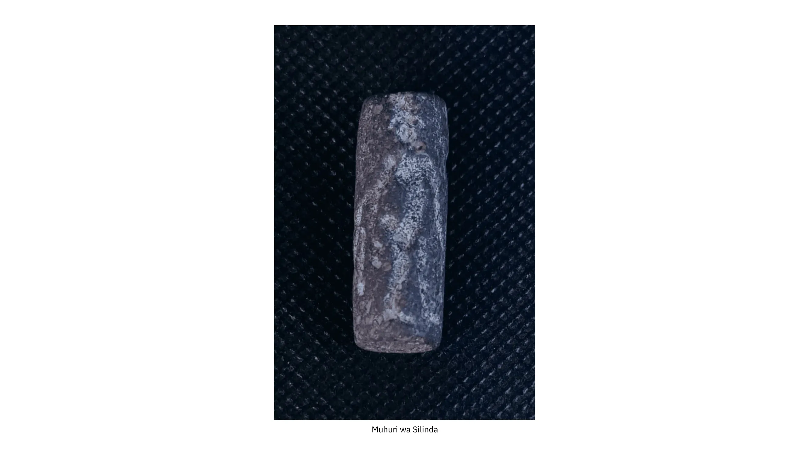

Herufi za kikabari hazikuwakilisha lugha, bali mfumo wa kuandika wa kurekodi lugha zinazozungumzwa. Kwa Kiingereza, tungesema "writing is a written language", halafu tungesema kwamba "cuneiform is a script, not a language". Kwa hivyo, kwa Kifaransa, tungesema kwamba kikabari si lugha, bali ni njia ya kupanga lugha.

### Maendeleo na matumizi ya uandishi

Katika karne zake za kwanza za kuwepo, maandishi haya yalibakia kuwa na mipaka, yakitumika hasa kama mfumo wa kumbukumbu wa kurekodi kiasi, orodha za bidhaa za kilimo, na vifaa. Hatua kwa hatua iliweza kuwa na uwezo wa **kutoa majina kwa fonetiki** na kukamilisha sentensi.

Hapo awali, majina hayakuweza kuonyeshwa katika hati ya kikabari kwa sababu iliwakilisha vitu na vipengele vya ukweli, kama vile ng'ombe au ngano, iliyoonyeshwa kama picha ndogo. Baada ya muda, picha hizi zilibadilika na kuwa aina ya hati iliyoendelezwa zaidi, ikiruhusu uwakilishi wa majina na dhana changamano.

Ikiwa jina la mtu huyo lilikuwa Laura, kwa mfano, tungeweza kuchukua neno, kifupi ambacho kilisikika kama "maji" na la pili kama "ras", na kuunda jina Laura nalo. Hivyo ndivyo aina ya kwanza ya lugha ya maandishi ilivyositawi.

Kwa rekodi, ili kuwakilisha vifupisho awali, ikiwa ungependa kuchora kichwa cha ng'ombe, unaweza kuona sura ya kichwa cha ng'ombe. Kidogo kidogo, michoro ilirahisishwa isiwakilishi chochote zaidi ya aina ya mstari. Wasomi wanaamini kwamba hii ilitokea kwa sababu watu walishikilia bamba la udongo lenye unyevu kwa mkono mmoja, kwa hiyo ilikuwa rahisi kuchora tena herufi za kwanza kwa kuzigeuza. Inafikiriwa pia kuwa ni kwa jinsi waandishi walivyoshikilia mabamba.

Bado unaweza kuona uhusiano na, tuseme, ngano au kichwa cha ng'ombe katika vifupisho vya cuneiform, na daima huegemea upande mmoja.

Katika kipindi chote cha milenia yake tatu ya matumizi, maandishi ya kikabari yalitumika hasa kudumisha rekodi za kiuchumi na kiutawala. Hata hivyo, wakaaji wa Mesopotamia upesi wakasitawisha tamaa ya kina ya kuhifadhi kila kitu ambacho kilistahili kustahimili mtihani wa wakati katika hali ya maandishi. Kwa hivyo, hadithi, ngano na nyimbo, ambazo hadi sasa zilipitishwa kwa mdomo na wanamuziki wanaosafiri, hazikufa kwa maandishi, mara nyingi zilinakiliwa na waandishi katika mafunzo. Walinakili maandishi ambayo tayari yalikuwepo, haswa ngano au maandishi ambayo yana thamani fulani ya kitamaduni.

Mfano muhimu ni **Gilgamesh Epic**, yamkini mfalme **wa kihistoria wa jiji la Sumeri la Uruk** karibu 2900-2350 BC.

Aina hii ya uandishi, ambayo ilikuwa chombo cha usimamizi wa uchumi na vekta ya kitamaduni, ilidumu hadi karne ya 1 BK, kabla ya kutoweka kabisa, ikiacha nyuma ushuhuda wa thamani kwa ustaarabu ulioona kuzaliwa kwake.

## Jukumu la vidonge vya Sumeri

<chapterId>a396e6c5-56cc-5410-9e6b-0274401c5425</chapterId>

:::video id=a0729a35-01ec-4aa4-828f-d4ccc2eb168e:::

### Mifumo ya mikopo ya kabla ya fedha

Katika Mesopotamia ya kale, shirika la kiuchumi lilitokana na mifumo ya kisasa ambayo ilikuwepo muda mrefu kabla ya uvumbuzi wa sarafu za chuma. Tangu awali, mifumo ya mikopo rasmi na isiyo rasmi ilikuwa tayari ni aina muhimu ya fedha, kuwezesha wakazi wa eneo husika kufanya miamala mingi changamano ya kiuchumi.

Ili kukidhi mahitaji ya kiutawala na kiuchumi haswa ndipo maandishi ya kikabari yalibuniwa. Vibao vya udongo maarufu vya Mesopotamia vilitumiwa hasa kurekodi aina mbalimbali za mikataba: mikopo ya kibinafsi, mauzo, kukodisha, rehani, na hata mikataba ya ndoa. Kuandika mabamba haya kulihitaji ustadi wa waandishi waliobobea, kazi iliyogharimu muda na jitihada, **lakini ilihalalishwa wakati masilahi ya kifedha yalipokuwa hatarini.** Wakati huo watu hawakuandikiana barua za mapenzi, hawakumtumia mwandishi kuandika mahangaiko yao. Waliajiri mwandishi kuandika hati, iwe kuna uhusiano au sababu ya kiuchumi.

Inafaa pia kutaja kuwa baadhi ya vidonge hivi vilisambazwa kama vifungo vya kubeba, kubadilisha mikono kwa uhuru.

Kwa mfano, kulikuwa na aina ya mpira wa udongo na mawe madogo ndani.

Kwenye nje ya mpira wa udongo, nambari iliandikwa na kusainiwa, inayowakilisha idadi ya vitengo. Ndani, kulikuwa na miamba hii na mtu ambaye alitaka kuthibitisha, ili kuthibitisha kweli kwamba chombo hiki kiliwakilisha idadi ya X ya vitengo.

Mfano mwingine, kibao kilichopatikana kusini-magharibi mwa Baghdad ya sasa, kinasema kwamba mdaiwa anajitolea kumlipa mkopeshaji vipimo 330 vya nafaka siku ya mavuno. Hata zaidi ya kuvutia, kibao kingine kinasema wazi kwamba deni la vipimo vinne vya shayiri lazima lilipwe moja kwa moja kwa mchukuaji wa kibao, hivyo **kuanzisha wazo la malipo kwa mbebaji, dhana ya ubunifu hasa kwa wakati**.

Kuanzia mwaka 2000 KK na kuendelea, kulikuwa na sheria inayotaka shughuli zote za kibiashara, hata zile ndogo kabisa, kurasimishwa kwa maandishi na kusainiwa mbele ya mashahidi. Fikiria jinsi urasimu mkubwa ulivyokuwa siku hizo kurekodi shughuli zote katika rejista zilizofanywa, nakukumbusha, za udongo na waandishi. Ukali huu wa kisheria ulikusudiwa kuzuia migogoro ya siku zijazo juu ya umiliki na haki za bidhaa zilizobadilishwa. Mashahidi waliitwa mara nyingi ili kutoa ushahidi kwamba mkataba huo ulikuwa umetiwa sahihi.

Katika nyanja ya kibinafsi pia, baadhi ya familia na watu binafsi wanaojishughulisha na shughuli za kiuchumi ni ngumu kiasi cha kuhitaji usimamizi mkali. Nyumba ya kuhani wa Anunitum aitwaye Ur-Utu iligunduliwa katika mji wa kaskazini-Babiloni wa Sippar-Amnanu, ikiwa na karibu mabamba 2,000. Hati hizi zilijumuisha mikataba ya mikopo ya kibinafsi, hati za mauzo na ukodishaji, pamoja na barua, maandishi ya kidini na ya kitaaluma, kushuhudia utofauti na umuhimu wa kumbukumbu za kibinafsi wakati huo.

Inafahamika kwamba barua zilizoandikwa na waandishi zilihusu tu maslahi ya kifedha: malalamiko kuhusu posho za kutosha, malipo ya mahari yanayosubiri au maombi mengine ya dharura. Katika siku hizo, maandishi ya kibinafsi kama barua za upendo hayakuwepo, na hata kutajwa kwa ugonjwa kulikuwa nadra.

Mfano wa kuhuzunisha wa barua kama hiyo unaonyesha ukweli huu wa kiuchumi: mwandishi wa habari anaonyesha dhiki yake baada ya kuachwa bila pesa au mahitaji wakati mwenzi wake aliondoka, wakati njaa kali ilipiga Assur. Anaeleza hitaji lake la dharura la kununua nafaka, na anaomba kwamba pesa sawa na nguo zake zipelekwe kwake haraka ili kuhakikisha riziki yake ya kila siku.

Barua hii, iliyotumwa kwa mwenzi wake, inaonekana kuashiria kwamba alikuwa ameenda kufanya biashara mahali pengine, na kumwacha bila senti. Anamkumbusha kwamba lazima apate kipimo cha pesa ili kununua nafaka na kulipa kodi ya hekalu lake. Labda hii ndiyo njia ya karibu zaidi tunaweza kuja kwa hoja iliyoandikwa katika barua ya wakati huo. Barua zilikuwa karibu kila mara kuhusiana na shughuli za kiuchumi, na barua hii inahusiana na hali mbaya ya kiuchumi.

Kwa hivyo, hati za Mesopotamia ambazo zimetujia hasa zinaonyesha ubadilishanaji wa kiuchumi, kwani ziliundwa kwa uhamishaji wa bidhaa zenye thamani inayotambulika: pesa, nafaka, bidhaa anuwai, mali isiyohamishika, malipo ya ushuru wa hekalu. Kumbukumbu hizi hazifichui tu ufanisi na usahihi wa kiutawala wa ustaarabu huu wa kale, lakini pia uwezo wake wa kusimamia mabadilishano magumu ya kiuchumi kwa muda mrefu sana.

## Udhibiti wa wasomi kwenye vidonge vya Sumeri

<chapterId>c6d3df0e-b1e1-58dc-ab35-9f76bbc39393</chapterId>

:::video id=04a95fb8-a701-4a48-9ce8-0e9b6ba256fd:::

### Kuandika, teknolojia ambayo ni juu ya yote ya kiuchumi

Kinyume na maoni ya wengi, uvumbuzi wa uandishi huko Mesopotamia miaka 4,000 hivi iliyopita haukutosheleza mahitaji ya mawasiliano ya kibinafsi au ya kifasihi. **Uandishi wa kikabari kwanza ulikuwa teknolojia ya kiuchumi**, ulihalalishwa tu wakati maslahi muhimu ya kifedha yalikuwa hatarini. Wasumeri hawakutumia maandishi kuandikiana au kueleza hisia zao, bali kuandika shughuli zao za kibiashara na kifedha pekee.

Utaalam huu unaweza kuelezewa na gharama kubwa ya uandishi wa kompyuta kibao. Uchongaji katika udongo ulihitaji utaalamu maalumu wa kiufundi, muda mwingi na vifaa maalum. Shughuli za thamani ya kutosha pekee ndizo zilizohalalisha uwekezaji huu kiuchumi, na hivyo kutengeneza kizingiti cha asili cha ufikiaji wa teknolojia hii ya kimapinduzi.

Mabamba hayo ya kikabari yanaonyesha mfumo wa kifedha ambao ulikuwa mgumu sana kwa wakati huo. Watu wa Mesopotamia walikuwa wameunda safu kamili ya zana za kisasa za kifedha: **mikopo ya kibinafsi yenye riba, hati za mauzo, mikataba ya ukodishaji, rehani, na hata mikataba ya ndoa yenye masharti ya kifedha**. Ustaarabu huu unashuhudia uchumi wa soko uliostawi, ulio mbali kabisa na taswira sahili ya ubadilishanaji wa mali ambayo mara nyingi huhusishwa na ustaarabu huu wa kale.

Baadhi ya kompyuta za mkononi zilifanya kazi kama dhamana za wamiliki halisi, zikizunguka kwa uhuru kutoka mkono hadi mkono bila kuhitaji utambulisho wa mmiliki halisi. Ubunifu huu uliwezesha ubadilishanaji wa ajabu, ukionyesha mifumo ya kisasa ya kifedha. Zaidi ya hayo, sheria mahususi ilihitaji hata miamala yote ya kibiashara kurasimishwa kwa maandishi, hivyo basi kuainisha matumizi ya uandishi katika nyanja ya kiuchumi.

### Ukiritimba wa Maarifa na Udhibiti wa Kiuchumi

Umuhimu wa uandishi kwa uchumi ulitoa nguvu kubwa kwa wale waliobobea katika teknolojia hii. **Waandishi, ambao kwa ujumla walikuwa wameshikamana na mahekalu na taasisi tawala, walishikilia udhibiti wa hali ya juu wa mfumo wa kifedha**. Utaalam wao adimu na wa thamani uliwafanya kuwa walinzi wa shughuli zote muhimu.

Ukiritimba huu wa maarifa haukuwa bahati mbaya. Mamlaka zilikuwa na kila nia ya kudumisha upekee huu, kwani uandishi wa kidemokrasia ungepunguza udhibiti wao juu ya uchumi na kuongeza hatari ya kughushi. Uwepo wa utaratibu wa mashahidi kwenye sherehe za kutia saini unaonyesha wasiwasi huu wa mara kwa mara na uhalisi wa hati.

Wajibu wa kisheria wa kurekodi shughuli zote za kibiashara kwa maandishi ulitimiza malengo kadhaa ya kimkakati: udhibiti wa fedha, ufuatiliaji mkali wa uhasibu, na kudumisha utegemezi wa wachezaji wa kiuchumi kwenye vifaa vya utawala. **Hivyo serikali ya Mesopotamia iliidhinisha uwezo wa kusimamia deni baina ya watu** kwa kiwango cha kijamii, na hivyo kubadilisha uandishi kuwa chombo cha nguvu za kiuchumi.

### Kuwepo kwa Mifumo Miwili ya Fedha

Uchambuzi wa matembezi hayo unaonyesha hali halisi ya kiuchumi iliyochanganuliwa zaidi kuliko uwepo wao wa kila mahali kwenye kumbukumbu ungependekeza. Kompyuta kibao nyingi hutaja marejeleo ya **shekeli ya fedha** kama sehemu ya thamani, hivyo basi kuonyesha kuwepo kwa mfumo wa fedha unaotegemea bidhaa sanifu.

Uwili huu unaweza kuelezewa na utabaka wa kijamii wa wakati huo. **Mfumo wa kompyuta kibao za kikabari uliwekwa kwa ajili ya watu wasomi waliowekewa vikwazo**: makasisi, wafanyabiashara waliofanikiwa, na wasimamizi wenye uwezo wa kusoma, kuandika na kufasiri hati hizi tata. Ili kutumia kompyuta kibao kwa ufanisi, mtu hakuhitaji tu kujua jinsi ya kuifafanua, lakini pia ilibidi aweze kuthibitisha uhalisi wake na kuelewa athari zake za kisheria.

**Idadi ya watu wengi, iliyotengwa na mfumo huu wa wasomi, ilianzisha mifumo yake ya kubadilishana**. Watu wa kawaida walitumia mifumo inayoweza kufikiwa zaidi kama vile vipimo sanifu vya nafaka, uzani wa pesa, na bidhaa zingine zinazoweza kukadiriwa kwa urahisi ambazo mtu yeyote angeweza kutathmini bila ujuzi maalum.

Uchumi huu maarufu, ingawa haujarekodiwa sana katika kumbukumbu rasmi, labda ulikuwa na nguvu zaidi na rahisi kuliko mfumo wa kompyuta kibao. Iliwezesha ubadilishanaji wa haraka wa kila siku bila msaada kwa waandishi, kukidhi mahitaji ya haraka ya mafundi, wakulima na wafanyabiashara wadogo.

Shekeli ya fedha, ambayo mara nyingi hutajwa katika mabamba hayo kama marejeleo ya thamani, huenda ilitumika kama daraja kati ya mifumo hii miwili ya kiuchumi inayofanana, na hivyo kuwezesha ubadilishaji wa madeni yaliyoandikwa na malipo halisi.

### Kuibuka kwa Papo Hapo Dhidi ya Udhibiti wa Kitaasisi

Kuishi huku kunaonyesha mjadala wa kimsingi katika historia ya uchumi: **upinzani kati ya kutokea kwa njia ya kubadilishana mara moja na ugawaji wa pesa wa kitaasisi**. Kwa upande mmoja, bidhaa kama vile pesa ziliibuka kwa kawaida kutoka kwa mahitaji ya kubadilishana ya watu. Kwa upande mwingine, taasisi ziliidhinisha na kurasimisha desturi hizi ili kudhibiti mtiririko wao.

Mahekalu ya Wasumeri yalidhihirisha mvutano huu: walitumia ubunifu maarufu wa fedha (marejeleo ya shekeli) huku wakitengeneza vyombo vyao vya kudhibiti (vidonge vya kikabari). Mkakati huu uliwawezesha kupata manufaa ya mifumo yote miwili: uhalali maarufu wa sarafu za jadi na udhibiti wa usimamizi wa madeni yaliyorasimishwa.

Uzoefu wa Mesopotamia huanzisha mifano ya kudumu ya mabadiliko ya mifumo ya kifedha. Inaonyesha kuwa **ubora wa kifedha mara nyingi hutangulia uvumbuzi wa kiteknolojia kwa milenia kadhaa**, ambayo kwa kawaida huhusishwa nayo. Dhana za riba, mikopo, vyombo vinavyoweza kujadiliwa na dhamana ya rehani hazikungoja uvumbuzi wa pesa za metali kuendeleza.

Kipindi hiki cha semina pia hufichua maswala ya nguvu yaliyo katika uvumbuzi wowote wa kifedha: ni nani anayedhibiti teknolojia, nani anafafanua sheria, na jinsi mifumo rasmi na mazoea maarufu yanafafanuliwa. Maswali haya ya msingi yamedumu katika historia yote ya uchumi, hadi kufikia mijadala ya kisasa kuhusu sarafu za kidijitali na sarafu za siri.

# Uchumi na pesa katika ustaarabu wa zamani

<partId>a16bcf4c-8c3a-11f0-9e79-2bd363a484bd</partId>

## Ustaarabu mkubwa wa Enzi ya Bronze

<chapterId>fab9334c-7385-5d7c-ad40-7d152beb22a1</chapterId>

:::video id=737e12e8-1033-4210-b1dd-b8a680f68b17:::

Katika sehemu hii yenye kichwa "The great civilizations of the Bronze Age", tutaanza na dondoo kutoka katika kitabu *A History of Money: From Ancient Times to Present Day* cha Glyn Davies, ambacho nadhani ni utangulizi bora wa sehemu hii kuhusu ustaarabu mkuu wa mambo ya kale.

> Toynbee anabainisha baadhi ya "ustaarabu" ishirini na moja tofauti, lakini kwa kuwa kumi na tano kati ya hizi zimechukuliwa moja kwa moja au kwa njia isiyo ya moja kwa moja kutoka kwa mifano ya awali, anapunguza idadi ya maendeleo ya kujitegemea hadi sita: Sumeri, Misri, Minoan, Kichina, Mayan na Andinska. Kati ya hizi, ni Wainka wa Andes pekee walioweza kufikia kiwango cha juu cha ustaarabu bila kutumia pesa, ingawa kwa kushangaza walikuwa na nyenzo nyingi ambazo kwa ujumla zilizingatiwa kuwa bora zaidi kutumika kama pesa - dhahabu na fedha.

Wainka hawakuwa na mfumo wa fedha, lakini walikuwa na wingi wa madini ya thamani. Kitendawili kabisa. Wacha tuendelee na nukuu:

> Kadiri jamii iliyo na matabaka inavyoongezeka, na jinsi mfumo wake wa kupanga ulivyo na ufanisi zaidi, ndivyo matumizi ya pesa yanavyokuwa muhimu kwa wakazi wake. Hii inaweza kuelezea kwa nini washindi wa Uhispania waligundua kuwa Wamexico, ambao serikali yao ilikuwa huru zaidi, walitumia mara kwa mara poda ya dhahabu (iliyowekwa kwenye mirija ya uwazi) na maharagwe ya kakao (yaliyohifadhiwa kwa malipo makubwa kwenye mifuko ya vitengo 24,000) kama sarafu, wakati kinyume chake, Incas, iliyoandaliwa kulingana na sheria ngumu zaidi, isipokuwa na uongozi mkali, haukuwa na udhibiti wowote. Asili ya pesa nchini Uchina haikutegemea kabisa ustaarabu mwingine; hata hivyo, ukaribu wa karibu wa ustaarabu wa Sumeri, Misri na Minoan unazua mashaka kwa kiasi cha kutojua kwao mazoea ya kifedha, hasa kwa kuzingatia biashara kubwa iliyoanzishwa tangu zamani.

Huko Uchina, sarafu zilitengenezwa kwa njia tofauti kabisa na mila ya Magharibi. Ilikuwa pesa ya fiat tangu mwanzo. Zilikuwa sarafu za kutupwa.

Na hapa, Bw. Davies anataja biashara. Kwa kweli kulikuwa na kubadilishana kati ya Wachina na watu wengine kwa nyakati fulani, lakini njia ya kubadilishana kwa biashara ya nje ilikuwa badala ya hariri. Kama tutakavyoona baadaye, dhahabu ilitumika pia katika maeneo ya mpakani mwa Uchina, ambapo idadi ya Wachina ilikuwa ndogo. Na hata kwa biashara ya kimataifa; kwa hiyo, ilikuwa hariri.

Kwa hiyo, nadhani kwamba labda kwa muundo wa sarafu, wanaweza kuwa wameathiriwa na ustaarabu mwingine wa enzi ile ile ambayo iliendeleza teknolojia hii.

Lakini kwa uwazi, kiini cha pesa kilikuwa tofauti kabisa nchini China kuliko Magharibi. Tutarudi kwa hili kwa kirefu katika sehemu inayofuata ya Uchina.

Kuhusu miji hii maarufu ya Sumeri, nina maelezo machache hapa. Tunaweza kutaja Uruk, ambayo ilikuwa jiji la mapema sana na lenye ushawishi, maarufu kwa ukubwa wake mkubwa na utamaduni wa hali ya juu, haswa na maendeleo ya uandishi na upangaji miji.

Na pia nilitaka kutaja epic maarufu ya Gilgamesh. Gilgamesh pengine alikuwa mfalme wa kihistoria wa mji wa Sumeri wa Uruk karibu 2900 BC. Labda alikuwa mfalme wa jimbo hili la jiji la Sumeri.

Tunaweza pia kusema juu ya Sargon wa Akkad, ambaye alitawala kutoka 2334 hadi 2279 KK.

Alikuwa mtawala wa kwanza wa Milki ya Akkadian, ambayo ni ustaarabu mwingine ulioibuka Mesopotamia. Nami namtaja Sargon kwa sababu alikuwa wa kwanza kuanzisha huduma ya posta kwa ajili ya vibao hivi maarufu hapa, ambavyo tayari nimeshakuletea.

Hebu fikiria kwamba kweli kulikuwa na bahasha za udongo. Vidonge hivyo vinaweza kuvikwa kwenye bahasha za udongo na saini ya mtu huyo kwa nje ili kuhakikisha usiri. Kwa hivyo watu wangefungua bahasha ili kupata kompyuta kibao. Tuna deni kwa mfumo huu wa posta kwa Sargon wa Akkad.

Kisha kuna Babeli, mji mkuu ambao ulikuja kuwa mji mkuu wa Milki ya Babeli. Ustaarabu mwingine, maarufu kwa Ziggurat na majumba yake ya kifahari, na Kanuni maarufu ya Hammurabi, inayojulikana zaidi kwa kanuni zake za juu za kisheria.

Na miji miwili kuhitimisha sehemu hii. Tuna Ashur, ambayo ilikuwa mji mkuu wa Milki ya Ashuru, kituo muhimu cha kidini. Na tuna Ninawi, ambayo baadaye ilikuwa mji mkuu wa Milki ya Ashuru. Walihamisha mji mkuu wao huko na inajulikana kwa jeshi lake lenye nguvu, majumba makubwa na maktaba. Na pia ni moja wapo ya maeneo yanayowezekana ya Bustani za Hanging za Babeli. Mara nyingi tunasikia juu ya ajabu hii maarufu ya ulimwengu wa kale.

Lakini hakuna athari ya bustani hizi maarufu zinazoning'inia huko Babeli. Katika Ninawi, kwa upande mwingine, kuna ushahidi wa kiakiolojia wa bustani kwenye ghorofa kadhaa. Inawezekana kwamba wanahistoria wa Kigiriki kama vile Herodotus walichanganya Ninawi na Babeli. Walipotembelea majiji ya Mesopotamia, labda waliiita Babiloni. Mabaki ya bustani zinazoning’inia zimepatikana huko Ninawi, na huenda wasomi wakajiuliza ikiwa Ninawi ni mahali maarufu palipokuwa na bustani hizo, panapoitwa Bustani ya Kuning’inia ya Babiloni.

## Shirika la kiuchumi huko Mesopotamia

<chapterId>6afb6fc8-cbb7-56a5-8427-484b4b7d7477</chapterId>

:::video id=aa6a2cbd-5916-4ae3-ad4f-65f0bd5643fa:::

### Miundo ya kiuchumi ya kabla ya ubepari na utumwa

Karibu katika sehemu hii ya shirika la kiuchumi huko Mesopotamia. Uchumi wa kabla ya ubepari ulipitia hatua kuu tatu: za zamani, za utumwa na za ukabaila.

Feudal, kwa kweli, ni baadaye sana, ni wazi katika Zama za Kati, na tayari tumepita hatua ya zamani ambayo tulielezea hapo awali na Paleolithic. Sasa, huko Mesopotamia, tunapozungumza juu ya shirika la kiuchumi, tunazungumza juu ya utumwa.

Walakini, huko Mesopotamia, kazi nyingi zilifanywa na tabaka tegemezi sawa na watumwa, ambao hawakuwa mali ya mabwana wao kisheria lakini walinyimwa matunda ya kazi yao kwa kulazimishwa kimwili au kiitikadi.

### Jukumu la mahekalu na majumba kama vituo vya kiuchumi

Umiliki mkubwa wa ardhi ulitawala uchumi. Wamiliki wa ardhi walitumia ardhi yao moja kwa moja kwa kuajiri wafanyakazi, au walikodisha ardhi yao ili kubadilishana na kodi. Pia walijishughulisha na shughuli za kifedha, wakikopesha pesa kwa viwango vya juu vya riba, kwa ujumla karibu 20% hadi 33.3% kwa mwaka, mazoea ambayo yalitofautiana sana na sheria kali za Waebrania jirani.

Mikopo iliyochukuliwa na wakulima haikukusudiwa kwa uwekezaji wenye tija – isipokuwa makampuni ya meli – lakini badala yake kuhakikisha wanaishi hadi mavuno yajayo. Hali hii mara nyingi ilisababisha madeni ya muda mrefu ya wakulima.

Niruhusu nichore sambamba na kipindi cha hivi majuzi zaidi wakati wa zamani (Roma), ambapo raia waliishi kutokana na kodi za kilimo zinazozalishwa na wakulima na wafanyakazi wasio na malipo, pamoja na nyara za vita. **Mapato haya yaligawanywa miongoni mwa wananchi, si kwa faida zaidi ya generate, bali ili kuboresha hadhi yao ya kijamii.** Biashara na ufundi kwa ujumla ziliachwa kwa makundi nje ya wasomi wa kijamii. Haya yote yanatofautiana na uchumi wa zama za kati unaoelekezwa kuelekea faida kupitia biashara na ufundi.

Kwa hivyo tunachojaribu kusema hapa ni kwamba ninachora sambamba na ukweli kwamba watu walitumia zana za ukopeshaji wa kifedha sio lazima kuboresha njia zao za uzalishaji, na baadaye huko Roma, faida haikuwekwa tena, lakini ilitumika kuongeza heshima ya watu ambao wangeweza kufaidika na faida hizi. Bado tuko mbali sana na roho ya ubepari iliyojitokeza baadaye katika Enzi za Kati, wakati nafasi za kazi zingeweza kuundwa ili kuboresha njia za uzalishaji, na ziada ikachukuliwa na kuundwa katika kutafuta faida. Kwa hivyo tunaweza kuona kwamba shirika la kiuchumi lilikuwa bado halijafikia hatua ya tatu ya mageuzi ya kiuchumi yaliyoorodheshwa hapo juu.

### Kuibuka kwa mifumo ya mikopo na vitengo vya akaunti

**Karl Polanyi anatofautisha aina tatu za ubadilishanaji wa kiuchumi: usawa kati ya vikundi vyenye ulinganifu,** ambavyo vinaweza kuwa katika makabila ya zamani ambapo hatuhitaji pesa kwa sababu tunapeana mikopo isiyo rasmi na kubadilishana na kusambaza upya. **Ugawaji upya katikati ya mahekalu na majumba,** aina hii ya kubadilishana inaendana na Mesopotamia, ambapo mahekalu yalikuwa kitovu cha shirika la kiuchumi na wakati mmoja yangeweza kurejesha, kugawanya mali kwa njia ya mgao. Baadaye tu ndipo dhana ya mishahara ilipoanzishwa. Kwa hivyo, hadi sasa, tunayo fomu ya awali (1), ugawaji upya wa kati (2) katika mahekalu na majumba, na kisha tunaweza kutoa nafasi kwa ubadilishanaji wa soko (3). Ingawa soko kama tunavyoelewa leo halikuwepo kikamilifu, uwepo wa soko huko Mesopotamia hauna shaka, unathibitishwa na uwepo wa maneno maalum katika Akkadian na uwepo wa ushahidi wa kiakiolojia wa bei, faida, hasara, kushuka kwa thamani na hali ya uhaba.

Kaya za Mesopotamia zilisimamia kwa uhuru hatua zote za uzalishaji wa kilimo, kutoka kwa kupanda hadi usindikaji wa mwisho kuwa mkate na bia. Wanawake pia walizalisha nguo zinazohitajika na wategemezi wao. Kwa bidhaa zisizozalishwa nchini, kaya ziligeukia wafanyabiashara maalumu.

Mahusiano ya familia yalikuwa muhimu sana katika biashara. Wakati wa kipindi cha Paleo-Assyrian (c. 1910-1830 BC), wafanyabiashara kutoka mji wa Ashur walianzisha koloni la biashara huko Kanesh huko Anatolia, wakiagiza bati na nguo kwa kubadilishana na dhahabu na fedha. Biashara ilitokana na biashara za familia zilizounganishwa kwa karibu na ndoa na ushirikiano wa kibiashara. Kanesh alikuwa kiungo mmoja tu katika mtandao mkubwa wa biashara wa kimataifa.

Katika kubadilishana hizi, kulikuwa na metali, na walikuwa madini ya thamani na si lazima, kwa mfano, shaba, ambayo ilikuwa muhimu sana wakati huo, na tunafikiri kwamba metali hizi zilibadilishwa kwa mawazo ya kuhifadhi ya thamani. Kwa hivyo hatukuweza kusema juu ya kubadilishana vitu, ambapo bidhaa mbili hubadilishwa kwa manufaa yao, lakini badala ya dhana ya malipo yenye ufahamu fulani wa kuhifadhi madini ya thamani kwa matumizi yao kama ghala la thamani na sio kuzitumia kama bidhaa, kwa mfano, matumizi ya shaba kutengeneza silaha.

Ushuru na kodi zililipwa hasa kwa aina (shayiri au fedha iliyopimwa). Mahekalu na majumba vilikuwa vituo kuu vya kiuchumi, kiutawala, kisiasa na kidini, na pia vilifanya kazi za kwanza za benki kupitia amana salama ya bidhaa, nafaka ya kwanza, kisha bidhaa zingine za kilimo na mwishowe madini ya thamani. Kwa njia hii, shughuli za kwanza za mkopo na mkopo zilitengenezwa, muda mrefu kabla ya kuonekana kwa sarafu.

Uchumi wa Mesopotamia ulitumia shayiri na fedha kama viwango vya thamani. Fedha ilipimwa katika vizio sanifu, kama vile siqlum (shekeli) ya karibu gramu 8.33. Hapo awali enzi za Wababiloni wa kale (chini ya Hammurabi), fedha ilitumiwa kama njia ya kawaida ya malipo, ikiwa na dhana ya awali ya thamani ya kawaida ("nūbum") kinyume na uzani halisi ("šuqulum"), **ikitazamia dhana ya kisasa ya sarafu ya fiat**.

Lakini ilikuwa bado si fiat money kwa maana kali ya neno. Hakukuwa na dhana ya stempu yenye takwimu ya mamlaka, lakini kulikuwa na dhana ya kitengo cha nominella cha akaunti, kinyume na dhana ya chuma kilichopimwa. Kulikuwa na tofauti katika lugha kwa dhana hizi mbili, na nadhani ni muhimu kutaja.

Mpito kwa soko la ajira la mshahara ulikuwa mgumu. Ilihitaji uvumbuzi mkuu wa dhana mbili: mgawanyo wa kazi ya mtu kutoka kwa bidhaa ya mwisho, na kuanzishwa kwa "wakati wa kufanya kazi" kama kitengo kinachoweza kupimika. Ili kuwa na wazo hili la mshahara na mfanyakazi anayelipwa, ilitubidi kwanza kupitia uvumbuzi huu wawili. **Katika milenia ya IIIᵉ, kazi ililipwa hapo awali kwa mgao maalum, kabla ya kubadilika hatua kwa hatua kuelekea mfumo wa mishahara mwanzoni mwa milenia ya IIᵉ.**

Hatimaye, kuanzia karne ya 26 KK na kuendelea, dhana halisi ya thamani ya fedha ilichukua mizizi, ingawa "fedha" ya Mesopotamia haikuwa sarafu, bali kipimo cha uzito cha nafaka au chuma. **Kwa hiyo, kwa shughuli muhimu au katika miktadha iliyohitaji uhifadhi wa thamani, mara nyingi ilipendekezwa kubadilisha nafaka kuwa fedha, ambayo ilihifadhiwa kwa urahisi zaidi.** Kama kidogo mfano wa Kanesh, ambapo chuma cha fedha kilipokewa kwa kuhodhi.

Kuanzia karne ya 21 KK na kuendelea, **pamoja na kutoweka kwa mtandao kwa ubadilishanaji usiolinganishwa**, tunaona kuwa katika mikataba ya kazi, kitenzi sa, kinarejelea malipo ya bei. Dhana hii, inayoitwa "sa", inaonekana katika mikataba na inarejelea malipo ya bei, sio kipimo cha bidhaa fulani. "Sa" inarejelea tu malipo au bei. Ni mwanaanthropolojia ambaye anabainisha hili na kutaja kwamba ni mafanikio makubwa; tunaona aina ya tofauti kati ya kabla na baada ya utangulizi huu wa kitenzi "sa" katika mikataba.

Hatuwezi kupuuza data ya kimajaribio iliyopo katika kumbukumbu za Mashariki ya Karibu inayothibitisha kuwepo kwa **baadhi ya mbinu za soko**, zinazojumuisha **mawazo ya faida** na **hasara**, **mabadiliko ya bei** na hali za **uhaba**. Lakini ugumu wa kimsingi upo katika kuamua umuhimu wa jamaa wa ubadilishanaji wa msingi wa soko ndani ya uchumi wa kale wa Mesopotamia kwa ujumla.

Nadhani wataalam katika uwanja huu wameona athari za dhana hizi za soko, lakini hawawezi kutuambia ni kiasi gani cha uchumi wa wakati huo ulitegemea dhana hii ya kisasa zaidi ya soko au mifumo mingine.

Tunajua ilikuwepo, lakini hatujui ikiwa ilikuwa njia kuu, tuseme, ya kuamua bei au biashara.

Hii inahitimisha sehemu hii ya shirika la kiuchumi huko Mesopotamia.

Katika sehemu zinazofuata, tutafanya vivyo hivyo kwa Misri na Uchina.

## Shirika la kiuchumi na kifedha katika Misri ya kale

<chapterId>bffcc16c-7fbf-5992-a0fa-6a7726d7d287</chapterId>

:::video id=40c1c4e5-b190-4bb6-b8a0-810c9ce7698b:::

### Asili ya kihistoria na nyakati za Misri

Sehemu hii imejitolea kwa shirika la kiuchumi na kifedha la Misri ya kale. Ili kukupa usuli kidogo, hii hapa orodha na maelezo mafupi ya vipindi vinavyohusika.

- Ufalme wa Kale (c. 2575 - c. 2130 BC)**. Kipindi kilichowekwa alama ya ujenzi wa piramidi kubwa, haswa zile za Giza. Huu ulikuwa wakati wa dhahabu wa ufalme wa kati wa Misri.
- Ufalme wa Kati (c. 1938 - c. 1630 BC)**. Ufufuo wa kisiasa na kitamaduni baada ya muda wa kukosekana kwa utulivu.
- Ufalme Mpya (c. 1539 - 1075 BC)**. Kipindi cha upanuzi wa eneo, nguvu za kijeshi, na biashara ya kimataifa. Inajumuisha enzi za mafarao maarufu kama vile Tutankhamen na Ramses II.
- 1323 KK. - Kifo cha Tutankhamun**. Firauni huyo mchanga alikufa akiwa na umri wa miaka 18-19. Kaburi lake lililo karibu kabisa liligunduliwa mnamo 1922, na kuifanya kuwa moja ya uvumbuzi maarufu zaidi wa kiakiolojia.
- Ramses II - Alitawala 1279-1213 KK**. Moja ya mafarao wenye nguvu zaidi wa Ufalme Mpya. Anajulikana kwa kampeni zake za kijeshi, makaburi yake makubwa, na pengine alihitimisha mkataba wa amani wa kwanza unaojulikana.
- 1275 KK - Watu wa Bahari **. Uvamizi au uhamiaji wa vikundi vinavyoitwa "Sea Peoples" huvuruga ustaarabu kadhaa wa Mediterania, ikiwa ni pamoja na Misri.
- Vita vya Xoïs - 1178 KK**. Mgogoro kati ya jeshi la Misri na wavamizi, pengine wanaohusishwa na Watu wa Bahari. Moja ya vita vingi mwishoni mwa Ufalme Mpya.
- Kipindi cha Marehemu** ni kipindi cha historia ya Misri ya kale kutoka karibu 664 hadi 332 KK.
- Cleopatra VII (69 - 30 KK)**. Malkia wa mwisho wa Misri, maarufu kwa akili, hisani na ushirikiano na Julius Caesar na Marc Antony, na pengine pia kwa pua yake. Utawala wake uliashiria mwisho wa Misri ya Mafarao kabla ya kutwaliwa na Roma.

Kufikia milenia ya 5 na 4 KK, Misri ilikuwa tayari inakabiliwa na shughuli kali za kibiashara kwa kiwango kikubwa, ikiunganisha maeneo ya Nubia, Palestina, Libya na Bahari Nyekundu kupitia biashara ya baharini, mito na nchi kavu (haswa na misafara ya punda).

### Mifumo ya kubadilishana mapema na paleo-fedha

Kwa kuibuka kwa milki za kwanza za Wamisri karibu 3650-3400 KK, tovuti ya Maadi, kusini mwa Cairo ya sasa, ikawa kituo kikuu cha teknolojia ya shaba na biashara ya umbali mrefu, haswa na Mesopotamia kupitia pwani ya Syria.

Ingawa biashara ya kiwango kikubwa iliegemezwa zaidi kwenye kubadilishana vitu, aina ya pesa ya zamani ("paleo-currency"), iliyoundwa na vitu vya hadhi kama vile mawe ya thamani na makasha ya visukuku, pengine ilikuwepo. Dhahabu labda tayari ilichukua jukumu muhimu katika mabadilishano haya. Kutajwa kwa kwanza kwa wazi kwa sarafu katika hati za Misri katikati ya milenia ya 3 KK kunaonyesha maendeleo ya muda mrefu yanayohusishwa na desturi za kibiashara.

Katika jamii ya kizamani (hapa si lazima tuzungumzie Misri, lakini jamii za kizamani kwa ujumla), malipo yalikuwa ya mara kwa mara, sio kununua moja kwa moja, lakini kulipa mahari, mila ya kidini, na majukumu mengine ya kijamii. Shughuli hizi zilihitaji bei na uthamini sahihi. Jamii nyingi za zamani zilikuwa na vitu vya upendeleo, vya ufadhili (yaani vinavyoweza kuhesabika), kulingana na ambavyo thamani hii ilikadiriwa. Ikiwa unalipa mahari, bila shaka, unapaswa kuandika kiasi fulani cha kitu cha kubadilishana ili kulipa mahari. Thamani hii kimsingi ni ya watu.

Katika jamii za kizamani, kabla ya ujio wa fedha au mifumo ya fedha, kulikuwa na malipo, lakini mara nyingi yalihusishwa na wajibu wa kijamii, na thamani yao inayotokana na thamani ya watu binafsi, kama katika malipo ya mahari au fedha za damu.

Kurudi Misri, wakati wa ufalme wa kale, "shât(y)", awali kitengo cha fedha cha saruji (sarafu ndogo ya dhahabu au ya fedha yenye uzito wa karibu gramu 7.6), ilipita haraka sana kutoka kwa kazi yake halisi kama sarafu ngumu hadi ** kazi ya uhasibu ** ambayo iliibua dhana ya thamani. Tunaweza kutambua ndani yake aina ya kitengo cha akaunti ili kueleza thamani, ambayo awali ilikuwa aina ya sarafu, lakini hatuwezi kuiita sarafu kwa sababu haijapigwa chapa, ni kipimo cha chuma tu. Tunakaribia wazo la kitengo cha akaunti.

Dhana hii ya shât(y) hatimaye iliachwa, labda kwa sababu ya hatari ya ulaghai. Tutaona baadaye kwamba Wamisri walichelewa kuchukua sarafu zilizopigwa chapa na hata waliendelea kuzipima, hata baada ya kupitishwa na majirani zao.

Katika Zama za Kati, fedha haikutumiwa sana kwa shughuli za kila siku, ambazo zilifanywa hasa na hatua za nafaka na wingi wa mkate. Ilikuwa katika kipindi hiki ambapo aina ya fedha za kimaandiko ilionekana, ambapo malipo yangeweza kurekodiwa kwa maandishi, au kwa uhamisho halisi.

Katika Ufalme Mpya, mfumo wa fedha ulikuwa mgumu zaidi, kuunganisha sarafu tofauti za bidhaa zenye thamani ya metali (dhahabu, fedha, shaba), vitambaa vya kawaida, nafaka na mafuta. Vitambaa vilijulikana kama "hatua za nguo". **Bei za bidhaa za kila siku mara nyingi zilionyeshwa kwa nafaka au shaba, wakati vitu vya thamani vilithaminiwa kwa dhahabu au fedha. Fedha, ambayo ilikuwa adimu kuliko dhahabu nchini Misri, ilithaminiwa sana.** Fedha ilithaminiwa kupita kiasi ikilinganishwa na dhahabu, ambayo ilikuwa nyingi zaidi nchini Misri.

Kufikia Kipindi cha Mwisho (milenia ya kwanza KK), fedha ilikuwa imekuwa chuma cha kawaida cha kubadilishana katika Mashariki ya Karibu. Ilizunguka kwa namna ya ingots, sarafu za chuma au pete, ambazo zilipimwa na kuweka alama kwenye mahekalu, ili kuhakikisha uzito na usafi wao, ingawa hazikuwekwa kwenye sanamu ya mfalme. Hilo lilikuja baadaye, na litakuwa somo la sehemu inayofuata ya Walydia.

Ikumbukwe pia kwamba Wamisri wa kale walikuwa na neno, "hedj", kwa ajili ya fedha, na lilitumika kwa ujumla kuteua njia yoyote ya malipo kutumika kama maanani katika shughuli, iwe kwa chuma, nafaka, nguo au bidhaa mbalimbali (mbao, wanyama, huduma, nk). Mifano iliyoandikwa inaonyesha kwamba Wamisri wangeweza kusuluhisha shughuli kwa kuchanganya bidhaa mbalimbali ambazo jumla ya thamani yake ilionyeshwa katika vipande vya shaba ("deben").

**Mahekalu yalichukua nafasi kuu katika uchumi wa Misri: yalikusanya na kutunza hazina nyingi za madini ya thamani (dhahabu na fedha) yaliyokusudiwa kuheshimu miungu lakini pia kutumika kama hifadhi ya fedha ambayo inaweza kurejeshwa katika mzunguko wa kiuchumi kama inavyohitajika**. Tutaona mifano ya ustaarabu mwingine unaokusanya akiba ya thamani katika mahekalu, kama vile sanamu, ili kuyeyushwa katika tukio la vita, uhaba wa sarafu au mgogoro. Haya ni mandhari yanayotokea mara kwa mara katika historia.

Pia ni muhimu kutaja kwamba kilimo cha kitani kilikuwa ukiritimba wa kifalme uliotolewa kwa mahekalu, na utengenezaji wa vitambaa vya thamani ulithibitisha umuhimu wao wa kiuchumi.

Wamisri wa kale walifanya tofauti ya wazi kati ya kipengele cha kiitikadi cha madini ya thamani, kilichounganishwa na uungu (dhahabu inayowakilisha nyama ya miungu, fedha mifupa yao), na kazi yao ya vitendo kama sarafu inayotumika kama rejeleo la aina zingine zote za malipo.

Kwa hivyo, ingawa Misri ya kale haikuunda sarafu iliyotengenezwa kulinganishwa na mifumo ya kisasa ya fedha hadi kipindi cha mwisho, ilikuwa na mfumo wa fedha wa hali ya juu, uliotegemea matumizi ya pamoja ya pesa za kimaandiko, vitengo sahihi vya hesabu, pesa za bidhaa na madini ya thamani yanayothaminiwa kwa uzani.

Sarafu zenyewe zilipimwa, na kusababisha dhana mbili tofauti: **"sarafu" na "fedha"**. Nilitumia maneno mawili kwa Kiingereza. Kwanza, "sarafu" inahusu sarafu, dhana inayokuja baadaye, na pia tuna dhana hii ya fedha. Tunaweza tayari kufafanua dhana fulani ya "fedha" na vitengo vya akaunti ambavyo nimeelezea tu kwa suala la fedha, lakini ambazo hazikuwa sarafu, hivyo "sarafu" inakuja baadaye kidogo na Walydia.

Na kwa hivyo, sarafu sio sharti la pesa, **kiasi kwamba tunaweza kukubali uwepo wa pesa mapema kama milenia ya 3,** kwa hali yoyote na bila shaka yoyote wakati wa milenia ya 2 na haswa chini ya utawala wa Hammurabi.

Cha muhimu kukumbuka hapa, na hiki ndicho anachokitaja mwandishi katika kitabu cha “The Origins of Money”, ni kwamba hakuna shaka kwamba dhana ya fedha ilikuwepo wakati huo, katika mifumo hii ya fedha, na ni kosa kuhusisha kuzaliwa kwa fedha kuwa dhana na mwonekano wa sarafu.

Hatimaye, dhana za Polanyi za usawa na ugawaji, mara nyingi hutumika kwa Misri ya kale, zinahitaji kubadilishwa: wakati zipo, haziunda mfumo wa kipekee. Misri ya kifarao ilikuwa imeanzisha uchumi changamano ambao uliunganisha kikamilifu mabadilishano ya kisasa ya kibiashara, tofauti na mazoea ya kidini na ya kitamaduni, kuonyesha uhuru halisi wa uwanja wa kiuchumi kutoka kwa itikadi.

Upekee huu unahusishwa na dhana kwamba madini ya thamani yalihusishwa na uungu fulani, lakini bado yalikuwa na uwezo wa kutofautisha.

Ninaleta hili kwa sababu Polanyi alirejelea matumizi ya madini haya ya thamani kama dhana ya kidini au ya kimungu. Hata hivyo, tunapendekeza kwamba waliunganishwa pia katika mfumo wa uchumi, na kwamba Wamisri walikuwa tayari wameweza kufanya tofauti hizo.

Kwa kumalizia, ningependa kunukuu kutoka kwa kitabu "The Origins of Money", ambacho kinaorodhesha madhumuni ya uvumbuzi huu, pesa zilizotengenezwa. Kuna mambo kadhaa, lakini ningependa tu kusisitiza hoja ya 5:

*kuza uwezekano wa kucheza kiuchumi kwa kutumia mbinu kama vile upunguzaji wa thamani na tathmini zinazofuatana ili kupunguza au kuongeza uagizaji na mauzo ya nje kwa gharama nafuu*

Kwa hiyo, hata katika nyakati hizo za kale, mwandishi anapendekeza kwamba sarafu tayari zimevumbuliwa au zimejitokeza chini ya udhibiti wa serikali na tayari zilikuwa zinatumiwa kwa kuzingatia wingi wao wa madini ya thamani na uzito wa kusimamia uchumi. Niruhusu nikupe maelezo kidogo kuhusu sehemu inayofuata. **Hata katika aina za awali za sarafu, ambazo zilitengenezwa kwa electron, aloi ya dhahabu na fedha, tunajua kutokana na kuchanganua maudhui ya madini ya thamani katika sarafu hizi kwamba watoaji wa kwanza, kwa mfano, Croesus, walikuwa na dhahabu kidogo kuliko katika elektroni asili.**

Hii ina maana tayari walijua jinsi ya kutenganisha dhahabu na fedha, na kutoa sarafu zilizo na dhahabu kidogo.

Mwandishi anapendekeza kwamba tangu siku za kwanza za sarafu, zaidi ya kudhibitisha tu uzito na kuwezesha biashara, uwezo wa kutengeneza pesa ulikuwa tayari unatumiwa vibaya ili kuongeza kiasi kilichotolewa, ikiwezekana kama aina ya upangaji wa uchumi.

## Saini ya sarafu na shirika la kiuchumi na kifedha katika Uchina wa zamani

<chapterId>e08d3be9-423c-5cf3-a606-6ad54e2261af</chapterId>

:::video id=ae7e6367-1725-455e-bfe6-359be1f443e5:::

Katika sehemu hii, yenye kichwa "Pesa za saini na shirika la kiuchumi na kifedha la Uchina wa zamani", tutaona kuwa pesa za Wachina wa zamani zina sifa tofauti na tamaduni za Magharibi. Sarafu ya Kichina ilikuwa tayari "sarafu ya ishara" tangu mwanzo. Maelezo katika sehemu hii yanatokana na maelezo niliyochukua baada ya kusoma kitabu "Aux origines de la monnaie".

### Wazo la sarafu ya ishara na sifa zake bainifu

Kulingana na mwandishi, pesa za ishara ni sawa na sarafu ya leo ya fiat. Ni sarafu ambayo haina thamani inayohusishwa na maudhui yake ya chuma. Tangu awali, ilikuwa aina ya makubaliano, makubaliano ya kijamii juu ya thamani ya sarafu hizi.

Sarafu ya kale ya Kichina ina sifa ambazo ni tofauti na mila ya Magharibi. Ilikuwa hasa ya metali, lakini iliyotupwa badala ya kuchorwa, na haikuwa na sanamu ya mfalme. Kwa kushangaza, serikali ya China haikuwa na ukiritimba wa utoaji wa fedha. Uliberali huu unaoonekana unaweza kuelezewa na kukosekana kwa hitaji lolote la kiuchumi la kuhodhi utoaji wa fedha, kutokana na rasilimali nyingi za kodi zinazotozwa kwa watu wengi wanaotozwa kodi.

Fedha ya Kichina pia ina sifa ya kipengele chake cha uaminifu. Tangu mwanzo, uigaji wa shaba wa ng'ombe (maganda ya bahari) ulitumiwa kama sarafu, bila uhusiano wa moja kwa moja na thamani ya ndani ya chuma kilichotumiwa. Tukirudi nyuma sana katika historia, Wachina walitumia ganda la bahari kama sarafu. Hatimaye, makombora yalipopungua sana, yalitengeneza nakala kwa shaba, na nakala hizo zilikuwa na thamani sawa na kitu halisi.

Kwa hivyo fedha za Kichina hazikutegemea thamani ya nyenzo au nadra ya kiasi cha bidhaa asili (k.m. samakigamba), lakini imani ya pamoja katika matumizi yake kama njia ya kubadilishana - kwa maneno mengine, ishara ya pesa.

### Kutoka kwa maganda ya cowrie hadi kuiga kwa metali

Cowrie ilitumiwa sana kama kitengo cha pesa cha zamani. Maandishi ya kale yanaonyesha kwamba, mapema katika nasaba za Shang na Zhou (nasaba za kwanza za milenia ya kwanza na ya pili KK), makombora ya cowrie yalitumiwa sio tu kulipa matendo ya kijeshi, lakini pia ** kulipa kazi, kupima thamani na kununua ardhi **.

Kilicho muhimu kukumbuka hapa ni kwamba haikuwa tu chombo chochote kilichotumiwa na jamii kwa madhumuni yenye vikwazo. Ilitumika kwa malipo ya kijeshi, malipo ya kazi, na kipimo cha thamani. Tunapata athari za hii katika maandishi ya wanaakiolojia. Ingawa hatujui ikiwa ilitumika kununua mkate kila siku, tuna ushahidi kwamba inaweza kutumika kwa aina za shughuli zilizotajwa hapo juu.

Baada ya muda, uhaba wa makombora halisi ya ng'ombe ulisababisha kuiga kwa shaba, mfupa, mama-wa-lulu au jiwe, haswa kwa matumizi katika miktadha ya mazishi ili kuzuia kusimamisha maadili halisi makaburini. Mabadiliko haya ya kati pia yanahusishwa na wazo la udhibiti wa mkuu juu ya pesa, udhibiti ambao ni rahisi zaidi ikiwa mkuu atapata pesa.

Tunachopaswa kuelewa hapa ni kwamba, kwa kuvuka mipaka ya uhaba wa asili wa ganda la bahari, ikiwa mkuu anaweza kuunda sarafu mwenyewe, inampa udhibiti mkubwa wa usimamizi wa uchumi.

Tofauti na Mesopotamia, ambako sarafu ziliunganishwa na uzito wa madini ya thamani, istilahi za sarafu za Kichina zinatokana moja kwa moja na maumbo ya awali ya vitu vilivyotumiwa kama fedha: cowries (bei), visu (dao), jembe (bu), na sarafu za duara (quan au qian). Hivyo, tunaweza kuona kwamba asili ya maneno kuhusiana na fedha katika China inajulikana vitu hivi. Kinyume chake, katika nchi za Magharibi, tuna idadi ya maneno ya fedha ambayo yanatokana na dhana tofauti kabisa na hizi, zinazohusiana zaidi na sifa za kimwili na uzito wa vitu vya fedha. Tofauti hizi za etimolojia zinaonyesha wazi mgawanyiko kati ya maono ya Magharibi na Kichina ya pesa.

Huko Uchina, thamani ya pesa ilikuwa ya kuaminika kabisa, kwa msingi wa makubaliano ya kijamii kati ya Serikali, wazalishaji na wafanyabiashara.

### Udhibiti wa uchumi na falsafa ya fedha

Jimbo la Uchina lilitumia pesa kama chombo cha udhibiti wa uchumi: wakati wa wingi wa fedha, thamani ya pesa ilipungua, na kurahisisha watu kununua bidhaa. Kinyume chake, wakati wa uhaba wa fedha, thamani ya fedha iliongezeka, na kuimarisha uwezo wa ununuzi wa serikali kwa shughuli zake zilizofuata.

Kiungo kinaweza kufanywa hapa na mfumuko wa bei na mfumuko wa bei. Kwa usambazaji wa pesa uliowekwa, tija ya uchumi ikiongezeka, thamani ya pesa hupanda. Kinyume chake, ikiwa tija itashuka, thamani ya pesa hupungua. Katika mfano huu, hata hivyo, kinyume ni kweli. Labda kwa sababu mkuu hakuwa na ukiritimba kamili juu ya uzalishaji wa pesa, lakini bado inaonyesha kuwa thamani ya pesa ilihusishwa na hali ya kiuchumi.

Mwanafalsafa Mo Di (karne ya 5-4 KK) alikuwa tayari amechambua uhusiano huu kati ya bei na thamani: kulingana na yeye, tofauti za bei hazionyeshi dhana halisi ya bei nafuu au upenzi kabisa, lakini badala ya uhusiano unaobadilika kati ya bidhaa na pesa, bila kujitegemea thamani ya kawaida ya jina la ishara ya sarafu.

Kwa hivyo hapa, badala ya kusema kwamba sarafu ya dhahabu ingekuwa na aina fulani ya thamani ya msingi kama vile, kama vile thamani ya matumizi au thamani ya ndani, anasema kwamba thamani ya ishara ya fedha ilitoka badala ya hali ya uchumi.

Huko Uchina, sarafu hazihitaji kuwekewa alama rasmi au kuhakikishiwa. Kukubalika kwake kunategemea tu uaminifu wa pamoja, ambayo inaelezea kwa nini sarafu za shaba au shaba bila maandishi maalum ziliweza kuzunguka kwa uhuru kwa muda mrefu.

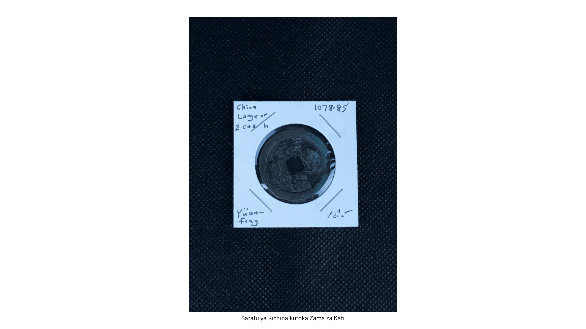

Hapo juu ni sarafu ya Wachina kutoka Zama za Kati. Ni sarafu ya kutupwa iliyo na shimo la mraba katikati. Shimo hili lilitumiwa kuunganisha kamba, na kuruhusu sarafu kuunganishwa ili kuunda vikuku au shanga. Hata hivyo, hizi hazikuwa hasa za kuvaa; zilitumika hasa kwa madhumuni ya uhasibu. Wanaweza kuunganishwa ili kuunda vitengo vya akaunti kwa namna ya masharti makubwa, na vipande vilivyounganishwa. Hakukuwa na alama maalum, wakati mwingine zilikuwa duru za shaba.

Uhodhi wa kifedha wa jimbo hilo, ulioanzishwa kwa muda na Wudi wa Enzi ya Han mnamo 113 KK, mara nyingi ulipingwa, kuruhusu wachezaji mbalimbali wa kibinafsi au wa ndani kutoa sarafu zao wenyewe, mradi wangefurahia uaminifu wa kutosha wa kijamii.

**Thamani ya chini ya asili ya sarafu za Uchina ilizuia uhifadhi, hivyo basi kuhakikisha mzunguko wake wa laini**.Madini ya thamani hayakutumika mara chache kama sarafu inayozunguka ili kuzuia uhifadhi. Dhahabu, kuwa ghali sana, kwa kawaida iliwekwa kando badala ya kutumiwa. Badala yake, **hariri pekee iliwakilisha sarafu halisi ya thamani ya juu katika biashara ya kimataifa ya Uchina**. Wachina walifanya biashara kwa kutumia hariri, sio dhahabu.

Wakati wa migogoro ya kiuchumi au ya kifedha, hasa wakati bei ya shaba ilikuwa inapanda, ufumbuzi wa kibunifu ulipitishwa: hivyo, mapema katika karne ya 2 BK, sarafu katika mzunguko zilikatwa ili kuunda vitengo vidogo, kuwezesha mzunguko wa maji kudumishwa kwa gharama ya chini. Enzi nyingine, kama ile ya Wang Mang (mapema karne ya 1 BK), ilifanya majaribio ya sarafu za uhakika, ambapo thamani za uso zilikuwa za juu sana kuliko maudhui yake halisi ya chuma, hivyo basi kutayarisha noti. Walichukua sarafu na kugonga thamani kama 50, 100, au 200 ili kuonyesha kiasi kikubwa zaidi, kama vile sarafu 200. Kitendo hiki huenda kilichangia mfumuko mkubwa wa bei.

Kama ilivyoelezwa hapo juu, mfumo huu ulitokana na maelewano ya kijamii kati ya Serikali, wazalishaji na wafanyabiashara, lakini pia juu ya sheria za kimabavu na kali kwa wale ambao hawakucheza mchezo, hasa kuhusiana na uchaguzi wa vipande (iwe ni nzuri au la) au urefu wa vitambaa (sio kulingana na kiwango).

Kwa maoni yangu mnyenyekevu, sio mfumo thabiti. Ilitegemea zaidi sheria kali zinazohitaji maafisa na wafanyabiashara kukubali sarafu zilizoharibiwa, chini ya tishio la vikwazo.

### Uvumbuzi wa fedha wa China na athari zao za kiuchumi

Uchina pia ilikuwa waanzilishi katika utoaji wa aina za mapema za pesa za karatasi, zilizopitishwa hapo awali ili kukabiliana na uhaba wa chuma katika karne ya 9 BK. Licha ya faida zao za awali, sarafu hizi za karatasi mara kwa mara zilisababisha kuongezeka kwa mfumuko wa bei wakati zilitolewa kupita kiasi, kama ilivyoshuhudiwa katika kipindi cha Wimbo au Ming, wakati utoaji mwingi ulisababisha migogoro mikubwa ya sarafu, iliyoonyeshwa na Marco Polo katika karne ya 13, ambaye hata alibainisha kuwa uwongo wa pesa hizo za karatasi ulikuwa na adhabu ya kifo. Siwezi kujizuia kuashiria aina ya vurugu hapa.

Kwa hivyo, uzoefu wa Wachina una sifa ya dhana ya uaminifu ya kina ya fedha, kubadilika kwa ajabu kwa mfumo wa fedha, na matumizi ya mapema ya sarafu ya karatasi, kwa kuzingatia uaminifu kati ya wachezaji wa kiuchumi badala ya thamani ya ndani ya vyombo vya habari vinavyotumiwa.

## Shirika la kijamii na kiuchumi katika nyakati za zamani

<chapterId>4023c3ce-7a47-5ac4-8f5f-c7ab699ab20f</chapterId>

:::video id=2761efe4-21cf-4f06-9bda-c03f9ff39012:::

### Mjadala wa Vidudu vya Mjini

Uhusiano kati ya miji ya kale na viunga vyake huibua swali la msingi: je, vituo hivi vya mijini vilifanya kazi kama vimelea vya kuchimba mali, au kama injini za utaalamu wa manufaa wa kiuchumi? Nadharia ya vimelea inapendekeza kuwa miji ya Bronze Age, hasa katika Mesopotamia, **ilipata thamani zaidi kutoka kwa maeneo yao ya mashambani kwa utaratibu kuliko walivyorudi**, wakiishi kwa kutegemea kodi na kodi bila kuunda thamani inayolingana.

Maono haya yalirejelewa katika kuanguka kwa Milki ya Kirumi: wakati upanuzi wa eneo ulipokoma, mtiririko wa utajiri wa nje ulikauka, uwezekano wa kufichua uchumi wa mijini usioweza kujifadhili wenyewe. Miji kwa hivyo ingeishi "zaidi ya uwezo wao", ikitegemea uchimbaji badala ya uzalishaji.

### Utaalam kama Kiendeshaji cha Uundaji wa Thamani

Usomaji mbadala wa kiuchumi unapinga maono haya ya vimelea. **Miji ya kale ilifanya kazi zaidi ya yote kama vituo vya utaalamu na mgawanyiko wa kazi**. Jukumu lao lilienda zaidi ya uchimbaji rahisi: walizingatia ufundi maalum, walipanga mitandao ya biashara, na kutumika kama vitovu vya kubadilishana masafa marefu.

Umaalumu huu wa mijini uliunda kutegemeana kwa tija na bara. **Miji haikuweza kuishi bila vifaa vya kilimo vya vijijini, lakini maeneo ya pembezoni yalinufaika kutokana na bidhaa za ufundi, ubunifu wa kiufundi, na ufikiaji wa mitandao ya biashara ya Mediterania**. Mgawanyiko wa wafanyikazi uliruhusu faida ya tija ya pande zote, hata kama usambazaji wa faida ulionekana kutokuwa na usawa.

Ukosefu wa usalama wa chakula wa wakati huo kwa sehemu unaelezea asymmetry hii dhahiri. Hatari ya njaa na uharibifu wa mazao ilikuwa tishio la mara kwa mara kwa wakazi wa vijijini, wakati mafundi wa mijini, waliounganishwa na mitandao ya biashara ya kimataifa, walifurahia utulivu mkubwa wa kiuchumi.

### Mageuzi ya Kihistoria, Kutoka Kale hadi Zama za Kati

Tofauti kati ya shirika la kale na medieval inatoa mwanga juu ya suala hili. **Zamani zilipendelea mgawanyiko mkubwa wa wafanyikazi, na miji iliyo wazi kwa ulimwengu wote wa Mediterania**. Biashara na utaalam zilifikia viwango vya hali ya juu, na kuunda mitandao mingi ya kiuchumi.

Kuporomoka kwa Milki ya Roma kulisababisha mgawanyiko mkubwa: **Enzi ya ukabaila ilichukua nafasi ya shirika hili kuu na mfumo wa ugatuaji wa mashamba ya kujitegemea**. Majumba ya kifahari ya kale ya Kirumi yaligeuka kuwa msingi wa mishtuko ya enzi za kati, na kuunda picha ya visiwa vya kiuchumi vilivyo na uwezo wa kujitegemea vinavyosimamiwa na makasisi au waheshimiwa.

Ugatuaji huu wa enzi za kati, huku ukipunguza ufanisi wa kibiashara, kwa kushangaza ulitoa uthabiti mkubwa kwa mishtuko ya nje. Makampuni ya kiserikali yalikuza mahusiano sawia zaidi kati ya vituo vya mamlaka na watu wa vijijini, hata kama shirika hili lilipunguza faida za tija zinazohusishwa na utaalamu.

### Kuibuka kwa Masoko ya Mijini

Ugunduzi wa kiakiolojia unaonyesha kuwepo kwa **bandari za ununuzi na sehemu za biashara katika miji ya Mesopotamia mapema katika milenia ya pili**. Miundombinu hii inathibitisha kuwepo kwa masoko yaliyopangwa, hata kama utendakazi wao kamili unabaki kuwa mjadala.

Karl Polanyi, awali alikuwa na mashaka kuhusu kuwepo kwa mifumo halisi ya soko katika siku za kale, alihitimu nafasi yake kwa kukiri kwamba huenda alikadiria kuibuka mapema kwa ubadilishanaji wa soko. Mageuzi haya ya kiakili yanaonyesha utata wa kutafsiri mifumo ya zamani ya kiuchumi, ambapo ugawaji upya wa kitaasisi, ubadilishanaji wa kubadilishana, na shughuli za soko changa zilikuwepo.

### Sparta dhidi ya Athene

Ulinganisho kati ya Sparta na Athene unaonyesha kikamilifu uhusiano kati ya mfumo wa fedha na shirika la kijamii. **Sparta inawakilisha kielelezo cha jamii yenye msimamo mkali wa ngazi ya juu ambayo ilikataa kimakusudi matumizi ya pesa**, huku Athene ikiendeleza uchumi wa hali ya juu wa kifedha ili kuandamana na mfumo wake wa kidemokrasia.

Kukataliwa kwa pesa kwa Sparta hakukuwa kwa hiari, lakini **kitaasisi na kiitikadi**. Viongozi wa Sparta walihofia kuwa pesa zingeharibu maadili ya kijeshi na ya kiraia, wakipendelea mfumo unaozingatia uaminifu wa moja kwa moja kati ya raia.

Ili kukatisha tamaa matumizi ya pesa, Sparta ilitumia **vipimo vya chuma vizito na visivyowezekana, ikionyesha kwa kushangaza uelewa wa angavu wa sifa za kifedha (mgawanyiko, usafirishaji, uimara) walizokuwa wakijitahidi kuzibadilisha.

### Mipaka ya Mfano wa Kupambana na Fedha

Shirika la Spartan linaonyesha vikwazo vya **nambari ya Dunbar** inayotumika kwa kiwango cha jamii. **Kwa kukataa pesa kama njia ya kubadilishana isiyoegemea upande wowote, Sparta ilijihukumu kwa kuweka kikomo jumuiya yake ya kiraia kwa idadi ndogo ya raia wanaoweza kudumisha mahusiano ya kuaminiana moja kwa moja**. Homoioi (raia wa Spartan) waliwakilisha 1% tu ya jumla ya watu, wakizungukwa na maelfu ya haotes (watumwa).

Shirika hili, ambalo mwanzoni lilikuwa chanzo cha mshikamano wa kipekee wa kijeshi, lilionekana kuwa dhaifu kimuundo. **Mapigano ya Leuctres (371 KK) yalionyesha mipaka ya mfumo huu**: upotevu wa maisha ulisambaratisha mfumo wa kijamii wa Wasparta, na kusababisha kuporomoka kwa mtindo wao wa ustaarabu.

Miji inayoshindana (Athene, Korintho, Thebes), yenye mifumo ya fedha iliyoendelea, **iliyodumishwa tajiri zaidi, uchumi unaostahimili zaidi**, inayoweza kufidia hasara za wanadamu kupitia ujenzi upya wa kiuchumi na uhamiaji.

### Uaminifu wa kibinafsi dhidi ya Taasisi

Uzoefu wa Sparta hufichua **hatari zilizopo katika jamii kwa msingi wa kuaminiana baina ya watu** badala ya mifumo ya kitaasisi isiyoegemea upande wowote. Wakati wa kuunda mshikamano mkubwa wa kijamii, mtindo huu uliiacha jamii katika hatari ya mshtuko wa idadi ya watu.

Kwa kuwezesha miamala isiyojulikana na isiyobinafsishwa, pesa hutoa uthabiti wa hali ya juu wa kimfumo. Inaruhusu upanuzi wa kijamii zaidi ya mipaka ya uaminifu wa moja kwa moja, kuwezesha ubadilishanaji wa fedha za kigeni na ukuaji wa uchumi.

### Kitendawili cha Inca, Utajiri bila Pesa

Milki ya Inca inawasilisha kitendawili cha kuvutia: **ustaarabu wenye utajiri mwingi wa dhahabu lakini hauna mfumo wa fedha**. Kama Sparta, mtindo huu ulitokana na shirika gumu la uongozi na upangaji wa serikali kuu, lakini ulidhihirika kuwa hatari kwa washindi wenye uchumi rahisi wa kifedha.

Udhaifu huu wa kimuundo wa mifumo ya kupambana na fedha mbele ya jamii za kifedha ni muundo wa kihistoria unaojirudia, unaopendekeza kwamba **kukataa pesa kwa taasisi, mbali na kuimarisha mshikamano wa kijamii, kunaweza kudhoofisha ustaarabu** katika kukabiliana na changamoto za nje na mabadiliko ya kihistoria.

Uchambuzi wa mifano hii ya kihistoria unaonyesha kwamba pesa, zaidi ya kazi yake ya kubadilishana, ni alama na kuwezesha ugumu wa kijamii, unaowezesha ustaarabu kuvuka mipaka iliyowekwa na mahusiano ya moja kwa moja kati ya watu.

# Kuzaliwa kwa pesa zilizotengenezwa

<partId>232e365a-8c3b-11f0-b276-b3ab70d1a5a1</partId>

## Kuibuka kwa sarafu

<chapterId>40ed3414-3066-57bd-bc1b-617ad0a354e0</chapterId>

:::video id=1d6834c4-98a3-43fe-ba80-04be51b0486e:::

Sasa tumekuja kwenye kiini cha suala hilo: kuonekana kwa sarafu. Ninasisitiza neno 'sarafu' hapa kwa sababu tumeona katika sehemu zilizopita kwamba fedha au mifumo ya fedha ilikuwepo sana katika ustaarabu uliowatangulia watu wa Lidia, Wagiriki na Waajemi. Ni wazi, nadhani, kutoka kwa kile tumeona hivi punde. Kwa hiyo, sehemu hii imejitolea kwa kuibuka kwa sarafu sahihi na ina haki: *Kuibuka kwa sarafu*.

### Asili ya Lydian na Ionian ya sarafu

Ili kuanza sehemu hii, ningependa kukupa dondoo kutoka kwa kitabu cha Glyn Davies, Historia ya Pesa, hapa hapa.

*Dondoo kutoka kwa Historia ya Pesa: Kuanzia Nyakati za Kale hadi Siku ya Sasa na Glyn Davies:*

> Kutoka mahali ilipozaliwa huko Lydia na Ionia ujuzi na utumiaji wa sarafu ulienea kwa kasi mashariki hadi ufalme wa Uajemi na magharibi kupitia visiwa vingine vya Ionian na Aegean hadi Ugiriki bara, na kisha kwa makoloni yake ya magharibi, haswa Sicily. Pia ilienea kuelekea kaskazini hadi Makedonia, Thrace na Bahari Nyeusi, lakini ilikubaliwa kwa sehemu tu, kwa kusita na kwa kuchelewa nchini Misri.

Ninaona inavutia kutaja hapa kwamba huko Misri, waliendelea kupima sarafu muda mrefu baada ya ujio wa teknolojia ya sarafu ya minted. Nadhani hiyo ni muhimu kuzingatia. Nukuu inaendelea:

> Vile vile, Italia bara pia mwanzoni ilikuwa polepole katika kukubali uvumbuzi wa kifedha wa Uigiriki, tofauti na kasi ambayo ilipitishwa na Sicily.

*Mbali na hali hizi mbili zenye mipaka (bara la Italia na Misri ya Chini), matumizi ya sarafu yalienea kwa kasi kuzunguka nchi zinazopakana na Mediterania ya kati na mashariki, na pia katika Milki kubwa na inayokua ya Uajemi, kutoka Mesopotamia ** hadi India.** Bado haijulikani ikiwa India tayari ilikuwa imeunda mfumo wa kifedha wa embryonic kwa wakati huu, bila kutegemea maendeleo ya Uchina au Lydia. Bila kujali kama India ilikuwa imeunda sarafu yake kwa kujitegemea, kuongezeka kwa mawasiliano kati ya India na Mashariki ya Karibu kulisababisha sarafu ya India kuwa upatanisho wa moja kwa moja wa uvumbuzi wa Lydia na Ugiriki, kwanza kupitia Milki ya Uajemi na kisha Milki ya Makedonia* (pamoja na ushindi wa Alexander Mkuu na baba yake).

*Kwa sababu hizi, ushawishi wa moja kwa moja wa uvumbuzi wowote wa kiasili wa pesa wa Wahindi ulikuwa mdogo, ikilinganishwa na umuhimu mkubwa wa uvumbuzi wa kifedha unaojitegemea wazi wa Uchina upande wa mashariki, na hata zaidi ya maendeleo ya Lydia na Ugiriki huko magharibi*

### Usambazaji wa kijiografia na marekebisho ya kikanda

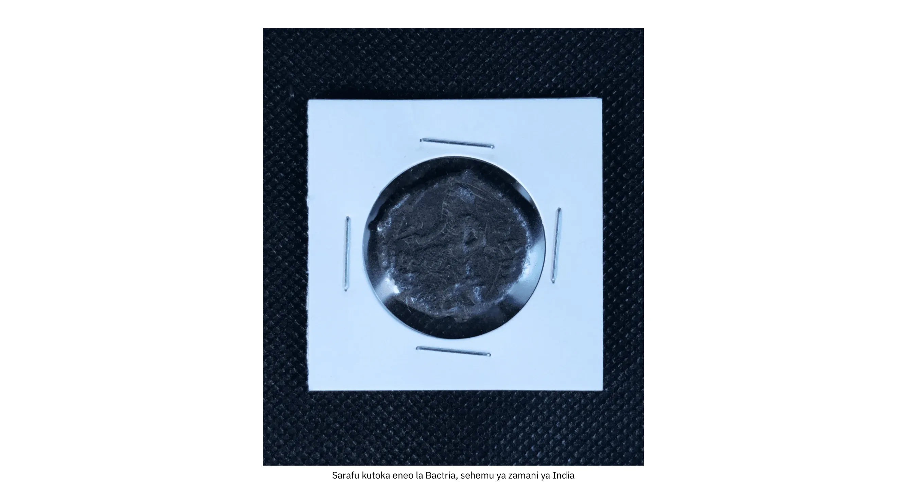

Ili kufafanua kipindi hiki katika umbo la kuona, hapa juu ni sarafu kutoka eneo la India, eneo la Bactria, ambalo liko karibu na magharibi mwa peninsula ya India, karibu na Afghanistan. Katika eneo hili, kulikuwa na sarafu ambazo labda zilichochewa na sarafu za Kigiriki zilizo na mmoja wa watu wao wa kifalme.

## Walydia na Waajemi

<chapterId>eb802ab8-8ffd-5b25-907f-8944f120ed14</chapterId>

:::video id=f151eb42-5ff3-4ca1-9af1-1ae2a5e051c0:::

### Sarafu za kwanza za elektroni za Lydia

Kwa kuwa hatuwezi kutenganisha mwonekano wa sarafu kutoka kwa Lidia na Waajemi, hebu tuendelee kwenye sehemu hiyo ya dunia ya mashariki ya Ugiriki, ambayo leo inaunda Uturuki. Sarafu za kwanza kuonekana Magharibi zilianzia takriban katikati ya karne ya 7 KK, katika mikoa ya Lydia na Ionia, iliyoko Uturuki ya leo. Ilikuwa karibu 650 hadi 600 KK ambapo uvumbuzi huu wa kimsingi ulipata mwanga wa siku, pamoja na uvumbuzi muhimu wa kiakiolojia kama vile sarafu za kwanza zilizopatikana katika hekalu la Artemi huko Efeso, za karibu 600 KK. Sarafu hizi za zamani zilitengenezwa kwa elektroni, aloi ya asili ya dhahabu na fedha yenye uakisi wa kahawia, na mara nyingi zilikuwa na sura chafu, zikiwa na alama za ngumi au vielelezo vya kawaida.

Hapo chini, unaweza kuona mojawapo ya sarafu za kwanza za Lydia, ikiwa na simba na mawindo yake mbele. Unaweza kuona muhuri au shimo nyuma, ambayo wengine wanaamini ilitumiwa kujaribu usafi wa chuma na kuhakikisha kuwa haikuwa safu ya uso tu. Ingawa hii ni moja ya mifano ya mwanzo, ni muhimu kutambua kwamba kipande hiki ni nakala. Vipande vyangu vyote vya dhahabu na elektroni ni nakala au maonyesho ya kisasa, yaliyoundwa kunizuia kutumia akiba yangu yote kwenye mkusanyiko huu.

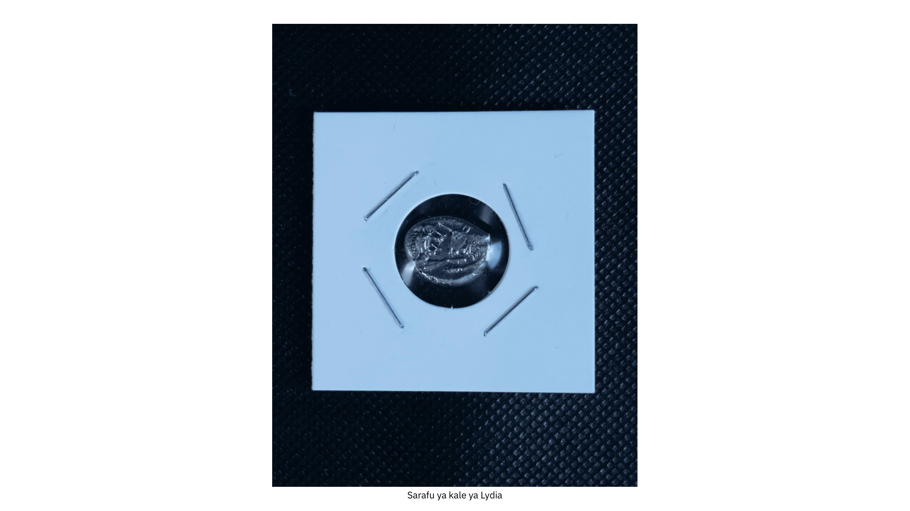

Lakini pia nina kipande halisi cha Kiajemi ambacho tunakaribia kuona. Hivi ndivyo vipande hivi vya mapema vilionekana. Ni kama aina ya donge (au donge, kwa Kiingereza) ya chuma ambayo iligongwa muhuri wakati huo.

Kinyume na imani iliyoenea kwamba pesa zilivumbuliwa ili kuwezesha biashara ya kila siku na kuchukua nafasi ya kubadilishana, inaonekana kwamba sarafu za kwanza za Lydia, Achaemenid na Kigiriki hazikutumiwa hapo awali kwa biashara ndogo ndogo. Hakika, vitengo vya fedha vilikuwa vikubwa sana kwa matumizi ya kila siku. Zaidi ya hayo, mzunguko wao ulikuwa mdogo kwa mikoa ya karibu na ambapo zilizalishwa.

Hapa, naona ni muhimu kutaja kwamba, ingawa nimesoma katika kazi kadhaa za asili ya anthropolojia, sarafu, kama nilivyoonyesha tayari - iwe zile za elektroni au sarafu hii ya Kiajemi ambayo nitarudi kwa muda mfupi sana - zilikuwa kubwa sana kununua mkate, tuseme, kila siku. Nimeona makadirio ambayo yangetufanya tufikiri kuwa ni sawa na kazi ya siku moja kwa mkulima au askari, kwa hiyo itakuwa kubwa sana. Ni kama kujaribu kulipa mshahara wa siku kwa mlo wako, kifungua kinywa chako, au chakula chako cha mchana. Isipokuwa kwamba nimeona katika kazi zingine kwamba vitengo vidogo vya blobs hizi vimepatikana, sarafu ndogo sana, ambayo inaweza kutufanya tufikirie kuwa labda kulikuwa na uwezekano wa matumizi kwa ununuzi wa kila siku.

Kwa hiyo hapa, "ushahidi" wa anthropolojia kwamba haukutumiwa kwa biashara ya kila siku, kwa sababu dhehebu au kitengo kilikuwa kikubwa sana, sio imara sana kwa maoni yangu kwa sababu tumepata mifano ya sarafu ambazo ni ndogo, ambazo zingeweza kubadilishwa kwa ununuzi wa kila siku.

### Jukumu la serikali katika kuunda pesa

Asili halisi ya sarafu inaonekana kuhusishwa na hatua ya moja kwa moja ya majimbo. Kuna dhana mbili kuu juu ya somo hili: ya kwanza, ya kimawazo, huchota ulinganifu kati ya neno la Kiyunani 'nomisma' (fedha) na 'nomos' (sheria), ikipendekeza kwamba pesa zilihusishwa na utungaji wa sheria, ikiimarisha mamlaka na mpangilio wa kisiasa wa miji. Nadharia ya pili, yenye uhalisia zaidi, inayokubaliwa na wengi leo, ni kwamba pesa kwanza kabisa ilikuwa njia ya serikali kudhibiti uchumi na kijamii. Kwa kuhakikisha rasmi uzito na thamani ya madini ya thamani yaliyomo, majimbo yaliweza kuendesha mzunguko na thamani ya sarafu hizi, na kujenga uaminifu na malipo ya ukwasi maalum kwa sarafu za ndani.

Inafurahisha sana kujua kwamba tuna ushahidi wa hili. Kwa mfano, katika sarafu za elektroni, unapaswa kujua kwamba elektroni asilia kawaida ni karibu 70% ya dhahabu na 30% ya fedha. Katika sarafu za kwanza tulizopata na kuchambuliwa, hasa sarafu za mwanzo za Lydia, maudhui ya dhahabu yanaonekana kuwa karibu zaidi ya 50 hadi 55% badala ya 70. Hii inaonyesha kwamba hata wakati huo, watoa sarafu walikuwa wakijaribu kupunguza sehemu ya chuma cha thamani zaidi, labda kuzalisha sarafu zaidi na kuzifanya zionekane kuwa za thamani sawa na blob isiyojulikana ya mteule wa asili. Na hapa, inapaswa kusemwa kwamba ilikuwa kweli kutoka wakati wa Croesus maarufu, kama katika *tajiri kama Croesus*, kwamba hii iliwezekana kwa sababu ilikuwa kutoka wakati wake kwamba tulikuwa na teknolojia ya kutenganisha dhahabu na fedha.

Sarafu ya Lydia ilipata mageuzi makubwa wakati wa utawala wa mfalme maarufu Croesus (561-546 KK), aliyejulikana kwa utajiri wake wa hadithi. Kwa wakati huu, Walydia walikamilisha madini ili kutenganisha dhahabu na fedha kutoka kwa elektroni, na hivyo kuanzisha sarafu za kwanza za bimetallic, yaani, sarafu za dhahabu na fedha tofauti.

### Upanuzi wa Kiajemi na kupitishwa kwa Kigiriki

Walipomteka Lydia mnamo 546 KK, Waajemi wa Achaemenid walipitisha uvumbuzi huu mara moja. Takriban 500 KK, chini ya utawala wa Dario I, Waajemi walianzisha mfumo wao wa fedha wenye dariki za dhahabu na siglois ya fedha, mara nyingi wakiwa na sanamu ya kifalme katika mielekeo ya kivita. Sarafu hii ya kifalme ya Uajemi ilitumiwa zaidi katika maeneo ya Ugiriki ya Milki ya Uajemi na ilienea polepole, ingawa matumizi yake yaliendelea kutofautiana, na **baadhi ya maeneo, kama vile Misri, bado yalipendelea kubadilishana kwa metali iliyopimwa (bullion).**.

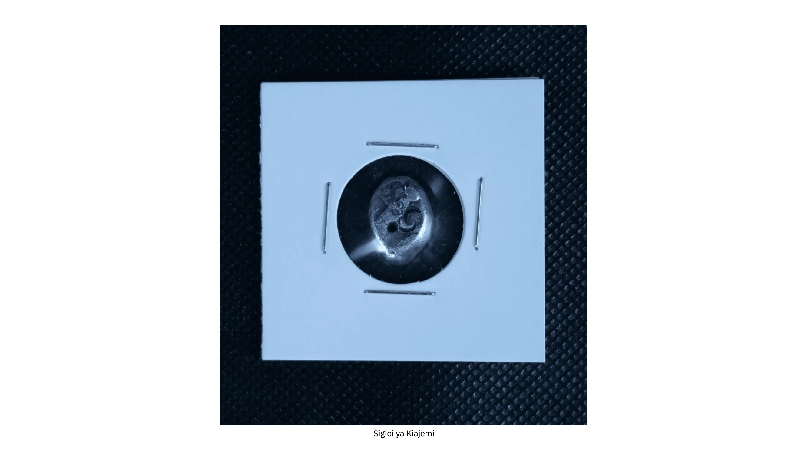

Hapo juu, unaweza kupendeza sigloi halisi ya Kiajemi (au siglos). Muundo mdogo una mfalme, ingawa shimo limechakaa kidogo. Siglos ni sarafu ya fedha, tofauti na daric, ambayo ilifanywa kwa dhahabu. Waajemi waliweza kutofautisha metali hizi mbili, na walisonga mbali na sarafu za elektroni. Kwa hiyo, walitekeleza bimetallism, kwa kutumia dhahabu na fedha wakati wa kudumisha dhana sawa ya sarafu zilizofanywa kutoka kwa madini ya thamani, mara nyingi na shimo nyuma, labda kwa kuangalia maudhui ya chuma.

Kupitishwa kwa haraka kwa sarafu na Wagiriki inaonekana kuwa kumechochewa na mawasiliano yao ya karibu na Walydia, haswa kupitia makoloni ya Wagiriki huko Asia Ndogo. Wagiriki wa kwanza kutengeneza sarafu za mint labda walikuwa wenyeji wa Aegina katikati ya karne ya sita KK, ambao walianzisha drakma, ambayo uzito wake ulitofautiana kutoka mkoa hadi mkoa, na ambao jina lake kihalisi linamaanisha "kiganja cha nafaka" au "michache ya mishale".

Mafanikio ya sarafu ya Ugiriki yalitokana na urahisishaji wake kwa shughuli muhimu, kama vile malipo ya mamluki, na upanuzi wa kiuchumi na kisiasa wa miji hiyo. Sarafu kwa haraka ikawa sehemu kuu ya Wagiriki na, baadaye, uchumi wa Kirumi, huku ikihifadhi mwelekeo dhabiti wa ishara, haswa kupitia uhusiano wake na sheria (nomos).

Hatimaye, upanuzi wa haraka wa sarafu unashuhudia mabadiliko makubwa ya jamii za kale, ambapo uratibu wa maadili ya fedha ulikwenda pamoja na shirika la serikali. Mageuzi haya yaliweka misingi ya kiuchumi na kisiasa ya kuinuka kwa demokrasia ya Ugiriki, haswa huko Athene, ambapo pesa zilichukua jukumu muhimu katika utendakazi wa jiji la kidemokrasia.

Jambo kuu la kukumbuka kutoka kwa sehemu hii ni kwamba tunazungumza haswa kuhusu **sarafu**, sio pesa kwa ujumla. Kipengele kikuu kinachojitokeza wazi ni kile cha **imani katika mamlaka ya kutoa **, inayohusishwa moja kwa moja na sifa za kiufundi za sarafu (uzito, usafi, thamani ya uso). Ni uaminifu huu haswa ambao huwezesha serikali au mamlaka inayotoa kutekeleza kiwango cha udhibiti au hata kudhibiti thamani na mzunguko wa sarafu hizi tangu mwanzo.

## Uingiliaji wa taasisi na sarafu za kwanza

<chapterId>3e1efd08-99e3-5a32-9908-3185fef0e640</chapterId>

:::video id=84847cf6-9e46-4a8c-9f35-25a27496cc4b:::

### Tabia mbili za pesa

Kuibuka kwa pesa zilizotengenezwa kunazua swali la msingi: je, pesa ni uundaji wa soko wa moja kwa moja au taasisi iliyowekwa na mamlaka? Mvutano huu wa kimawazo unaleta maono mawili tofauti kabisa dhidi ya kila mmoja.

Kwa upande mmoja, shule ya uchumi ya Austria inatetea wazo kwamba pesa za bidhaa - haswa dhahabu - zilichaguliwa kwa asili na wahusika wa kiuchumi kwa sifa zake za ndani: uimara, kubebeka, kugawanyika na kuvu. Kwa mtazamo huu, serikali ilitenga sarafu hii ya hiari ili kudhibiti usambazaji wake. Ni taasisi ambayo hujitokeza kiasili kutokana na mahitaji ya soko kabla ya kutekwa na nguvu za kisiasa.

Kinyume chake, mtazamo wa kianthropolojia na kitaasisi unashikilia kuwa pesa kweli huja na sarafu ya serikali. Mamlaka inaweza kuunda sarafu kwa uangalifu kwa kubandika muhuri wake, na hivyo kubadilisha chuma kuwa chombo halisi cha pesa. Mtazamo huu unapendekeza kwamba sarafu za kwanza za Lydia zilitumiwa zaidi kulipa majeshi - serikali moja inayolingana takriban na mshahara wa kila siku wa askari.

### Faida za kitendawili za usanifishaji wa serikali

Licha ya mvutano huu wa kinadharia, hata wanauchumi wa Austria wanatambua faida fulani za kuingilia kati kwa serikali katika fedha. Kusawazisha kwa kuchimba hutatua matatizo kadhaa ya biashara ya vitendo.

Bila mamlaka ya uidhinishaji, wachezaji wa kiuchumi wanakabiliwa na hatari za mara kwa mara: sarafu ghushi, ulaghai wa kufungua jalada na udhibiti wa uzito. Mazoea haya huleta msuguano katika uchumi, kwani sarafu zingine hukubaliwa huku zingine zikikataliwa. Kwa nadharia, muhuri rasmi huhakikisha uzito na ubora, na kufanya biashara kuwa ya maji zaidi.

Dhamana hii ina bei inayoonekana sokoni: sarafu ya dhahabu iliyotengenezwa ina thamani zaidi ya dhahabu mbichi inayolingana nayo. Malipo haya yanaonyesha thamani ya uidhinishaji - wafanyabiashara hawahitaji tena kuthibitisha uhalisi wa chuma kupitia majaribio ya kemikali au resonance. Uingiliaji kati wa serikali, kwa kushangaza, huondoa msuguano na kuwezesha biashara kwa kuunda uaminifu wa kitaasisi.

### Udanganyifu wa sarafu tangu mwanzo

Hadithi ya wanaserikali wa kwanza wa Lidia inafunua kejeli ya kutatanisha. Uchambuzi wa hivi karibuni unaonyesha kwamba maudhui ya dhahabu ya sarafu hizi za elektroni yalikuwa chini ya utaratibu kuliko ile ya elektroni ya asili. Mamlaka inayoidhinisha ubora ilikuwa ikibadilisha utunzi kwa wakati mmoja.

Zoezi hili linaonyesha manufaa mawili ya sarafu. Kwa soko, hufanya kubadilishana kuwa kioevu zaidi na inatoa dhamana ya viwango. Kwa mamlaka inayotoa, inakuwa chombo cha udhibiti wa kiuchumi kwa njia ya dilution. Kwa kupunguza kiwango cha dhahabu wakati wa kudumisha thamani ya kawaida, serikali huongeza ugavi wa pesa kwa ufanisi - kuunda vitengo zaidi vya fedha kutoka kwa kiasi sawa cha chuma cha thamani.

Jimbo lenyewe, hata hivyo, lilibakia kubanwa na ghiliba hii. Kama inavyoonyeshwa na mfano wa solidus ya dhahabu ya Konstantino katika karne ya 4, utawala wa Kirumi ulikagua kwa uangalifu ubora wa sarafu, kwani ulidai kulipwa kwa sarafu nzuri. Mamlaka ilikuwa na nia muhimu ya kudumisha ubora wa sarafu yake ili kuhakikisha thamani ya mapato yake ya kodi.

### Uchambuzi wa kiuchumi wa kushuka kwa thamani

Utafiti wa kushuka kwa thamani ya sarafu unaonyesha mifumo thabiti katika historia. Kwa sarafu za metali, wachumi hufuatilia asilimia ya madini ya thamani iliyomo kwenye sarafu - mteremko wa kushuka unaoonyesha kushuka kwa thamani kwa kasi. Kwa pesa za kisasa za karatasi, kinyume chake ni kweli: usambazaji wa pesa unaozunguka huzingatiwa, na ongezeko lake huashiria kushuka kwa thamani.

Mbinu zote mbili hupima jambo sawa la msingi: dilution ya thamani ya fedha. Iwe kwa kupunguza maudhui ya metali ya thamani au kuchapisha noti mpya, utaratibu unabaki vile vile. Kadiri mamlaka inavyounda vitengo vya fedha kutoka kwa rasilimali zilezile, ndivyo kila kitengo kinapoteza thamani yake.

Udanganyifu huu, unaoonekana kutoka kwa sarafu za kwanza za Lydia, unapendekeza kwamba udhibiti wa fedha daima umekuwa suala la nguvu. Pesa zilizoundwa kwa hivyo zinawakilisha uvumbuzi wa kiufundi wa ajabu pamoja na chombo cha udhibiti wa uchumi - uwili unaoendelea katika historia ya fedha, hadi leo.

## Utengenezaji wa sehemu

<chapterId>b205f4f2-c293-5308-b812-a998de9ad45e</chapterId>

:::video id=47c612ec-d97e-4498-b50e-7e66518bd56d:::

### Kutoka kwa blobs zilizopigwa hadi sarafu zilizochongwa

Baada ya sehemu kuhusu kuibuka kwa sarafu, nilitaka kuanzisha sehemu fupi sana juu ya mageuzi ya utengenezaji wa sarafu. Kama tulivyoona, yote yalianza na matone ya elektroni, yakiendelea na dhahabu na fedha, ambapo pande zote mbili ziliwekwa alama ya ngumi, ama kwa uso wa mfalme, au shimo nyuma ili kuangalia usafi.

Baadaye, kama tutakavyochunguza katika sehemu inayofuata, Wagiriki waliboresha teknolojia hii kwa kuunda sarafu za duara ambazo zilipigwa kwa nyundo pande zote mbili. Wangechukua kipande laini na tambarare cha chuma cha thamani, na kuchora mchoro unaotaka upande mmoja, na kisha kukipiga kwa nyundo kwa mkono ili kuunda sarafu iliyomalizika.

Teknolojia ya kutengeneza sarafu za kusaga kwa mkono mmoja mmoja huenda ilichangia katika kudhibiti mfumuko wa bei wakati huo, ingawa mara nyingi sarafu hizo zilipunguzwa ili kuongeza uzalishaji. Hili lilidhihirika haswa wakati wa enzi ya Warumi na, kwa kiwango kidogo, wakati wa vita fulani katika enzi ya Wagiriki. Ingawa uchimbaji wa sarafu moja baada ya mwingine ulipunguza uwezo wa mamlaka wa kuzalisha kwa wingi, ulichangia vilivyo katika udhibiti wa mfumuko wa bei, licha ya kushuka kwa thamani kubwa kulikotokea. Kwa hivyo, mageuzi yaliendelea kutoka kwa kipande cha chuma kilichopigwa hadi sarafu ya pande zote, iliyopigwa.

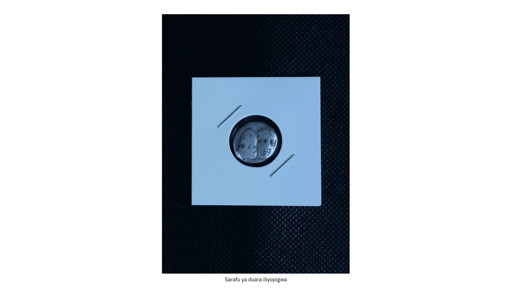

### Mageuzi ya zama za kati

Katika Zama za Kati, pia kulikuwa na mwelekeo wa kueneza sarafu nje, na kuwafanya kuwa pana na nyembamba. Sababu moja ya hii ni kwamba ikawa rahisi kujaribu sauti yao, ambayo mara nyingi ilitumiwa kama kiashiria cha uhalisi. Kwa kueneza fedha nje, mzunguko tofauti ulitolewa, ili watu waweze kuthibitisha usafi wa sarafu kwa kuisikiliza tu. Kitendo hiki kilizaa neno "pesa ya sauti". Katika muktadha wa pesa za sauti, uzani wa kawaida uliamuliwa kwa kutumia mizani ya mizani au "trebuchet" kwa uzani. Kwa hivyo, mageuzi yaliendelea kutoka kwa sarafu ndogo, pande zote hadi sarafu nyembamba zaidi, pana.

### Pendulum inayovutia

Teknolojia ya mwisho kufika mwishoni mwa Zama za Kati, mwanzoni mwa zama za kisasa, ilikuwa dhana ya pendulum ya kushangaza. Ilikuwa ni aina ya skrubu ambayo iliimarishwa ili kupiga sarafu, hivyo kuzalisha sarafu na aina hii mpya ya kushangaza. Kilichokuwa speaicl juu ya maendeleo haya ni uwezo wa kuchora muundo kwenye uso wa sarafu kushughulikia suala la kukatwa. Ukataji ulihusisha kuondoa sehemu ya sarafu ili kurejesha fedha ya thamani, ambayo ingeweza kutumiwa kutengeneza sarafu nyingine au kubakizwa tu kama rasilimali.

Kwa hivyo wazo hili la kugonga kwa pendulum lilisaidia kwa uzushi wa kukata. Na inafurahisha kutambua kwamba teknolojia hii kweli ilitoka Ufaransa. Huko Uingereza, kwa mfano, waliajiri wahandisi Wafaransa kuja kuwaonyesha jinsi ya kutengeneza mashine hizi. Ni nini cha kuchekesha, nadhani, ni kwamba kulikuwa na wafuasi wa utengenezaji wa nyundo ambao walikuwa dhidi yake na ambao walichelewesha utumiaji wa teknolojia hii. Katika teknolojia yoyote nzuri, daima kuna watu ambao ni kinyume chake, ambao wanataka kuweka teknolojia ya zamani. Nilidhani ilikuwa ni wazimu sana kutambua kwamba hata teknolojia ambayo inaonekana kuwa bora zaidi - unaweza kutengeneza sehemu nyingi zaidi, ni vigumu kunakili - bado kulikuwa na watu ambao walikuwa wameunganishwa na mbinu maarufu ya nyundo. Kulikuwa na mabadiliko kati ya kutengeneza sehemu ambazo zilitengenezwa na pendulum hii maarufu ikigonga na kisha kurudi kwenye nyundo inayopiga. Na hatimaye, bila shaka, ilikuwa pendulum ya kushangaza ambayo hatimaye ilichukua na kutupa vipande hivi vyema vya kisasa ambapo unaweza kupata mistari midogo, matuta madogo karibu ili kuepuka kukata, pengine kuhusiana na neno kukata, matuta, na bado unaweza kuona leo ama matuta au maandishi au michoro ambayo imeandikwa kwenye ukingo wa kipande.

# Nadharia tofauti juu ya kuibuka kwa pesa

<partId>72ac694f-9248-550d-90c1-91af3d234380</partId>

## Nadharia juu ya kuibuka kwa pesa na fasili zake mbalimbali

<chapterId>7d699d4d-8c70-55b5-bf36-609f3fd90bcf</chapterId>

:::video id=523c873f-501b-4954-b79f-7e74c0f685a5:::

Karibu kwenye sehemu hii inayohusu nadharia mbalimbali za uibukaji wa pesa na fasili zake mbalimbali. Hapa kuna dondoo fupi kutoka kwa kitabu *Aux origines de la monnaie* ambacho, nadhani, kinatoa muhtasari wa nadharia mbili kuu ambazo tutaangalia katika sehemu hii.

> Dibaji hii fupi haitumikii kusudi lingine ila kuangazia muktadha wa utafiti. Katika kiwango cha dhana, mjadala uko wazi kati ya wafuasi wa thesis ya K. Polanyi na wale wa M. Weber. Kwa zamani, zawadi na ugawaji upya huchukua jukumu kuu, na ubadilishaji wa soko unachukua jukumu la chini tu, haswa katika ubadilishanaji wa kimataifa. Kwa wengine, kinyume chake, soko ni katikati ya mchakato wa sasa wa kihistoria.

Kwa mfano, huko Mesopotamia, nadharia moja ya kuibuka inapendekeza kwamba hekalu, kama mamlaka, huunda kitengo cha hesabu au kitengo cha fedha, huiweka, na kisha wafanyabiashara huikubali kwa biashara. Nadharia iliyo kinyume inasisitiza kwamba, hapana, kitengo hiki cha fedha hujitokeza kwa kawaida kutoka soko ili kuwezesha biashara. Kuna mifano ya kutosha ya hii huko Mesopotamia.

Kuhusu kubadilishana vitu, baadhi ya nadharia zinaonyesha kuwa ilitumika hasa katika mabadilishano ya kimataifa, yaani, na watu ambao hatukuwaamini.

Hivyo kwamba ni nini tunakwenda kufanya katika sehemu hii. Tutafanya aina ya uchunguzi ili kuwasilisha nadharia tofauti juu ya kuibuka kwa pesa na ufafanuzi tofauti wa pesa ni nini. Tutakuwa tukiwasilisha na kukosoa nadharia za wanauchumi wa kitambo na wanaanthropolojia. Hata nitapata bahati ya kuwa na Ulrich Fromy pamoja nami, ambaye atawasilisha mtazamo wa mwanauchumi wa Austria kuhusu masuala haya mbalimbali.

## Kuibuka kwa pesa kwa wachumi wa classical

<chapterId>1d3776cd-0dfd-5297-af48-c6f41e257a7e</chapterId>

:::video id=873a16c1-17ac-448d-8941-df4feb7ab79d:::

Sehemu hii imejitolea kwa nadharia tofauti juu ya kuibuka kwa pesa. Mada ya kwanza kushughulikiwa ni kuibuka kwa pesa kulingana na wachumi wa zamani.

### Nadharia ya kawaida ya Adam Smith

Kulingana na nadharia za kiuchumi za kitamaduni, haswa zile zilizoungwa mkono na Adam Smith, pesa ziliibuka kwa kawaida kutoka kwa kubadilishana vitu kwa kujibu mapungufu yake. Hapo awali, kubadilishana kulifanyika kwa kubadilishana moja kwa moja, lakini njia hii mara nyingi ilikuwa ngumu na shida ya "bahati mbaya mara mbili ya matakwa": kila mtu alilazimika kumiliki kile ambacho mwingine alitaka. Hatua kwa hatua, bidhaa fulani (kama vile chumvi, madini ya thamani na mifugo) zilikuja kukubaliwa na wote kama njia za kati za kubadilishana, shukrani kwa matumizi yao, uimara na mgawanyiko. Kwa hivyo, pesa zilionekana kuwezesha na kuboresha ubadilishanaji wa kiuchumi.

### Uhakiki wa nadharia ya kitamaduni

Huu hapa ni uhakiki wangu wa nadharia hii. Pamoja na kila kitu ambacho tumeona katika sehemu iliyotangulia, nadhani tunaweza tayari kusema kwamba dhana hii kwamba **sarafu** ni mageuzi ya kubadilishana vitu si sahihi kwa sababu tu sarafu iliyotengenezwa inatoka kwa mamlaka, kwa kuwa imeundwa na mamlaka. Kuna sababu kadhaa za hii, sio angalau hamu ya mamlaka ya kudhibiti uchumi, kuchukua udhibiti wa pesa.

Kwa upande mwingine, ikiwa tunazungumza juu ya pesa kama dhana, sio lazima sarafu, basi haieleweki wazi kwa sababu, pamoja na sarafu za kwanza, serikali za Lydia, tumepata matone ya fedha ambayo hayakuwa na alama. Inabakia kuonekana ikiwa walikuwa kwenye mzunguko. Ikiwa zilikuwa zikizunguka, hii inamaanisha kuwa huenda watu walitambua mali hii kama sarafu inayoweza kuhitajika sana na kubadilishwa kwa urahisi. Na labda ilikuwa baada ya hapo ndipo mamlaka ilipoona hali hii na kuidhibiti kwa kuweka muhuri juu yake ili kuithibitisha.

Kuna faida nyingi za kufanya hivi - hakuna haja ya kuiangalia, kuipima, yote hayo. Ni wazi, tutazungumza juu ya hilo. Lakini kwa maoni yangu, sarafu ni wazi chombo ambacho kimetumiwa na mataifa tangu mwanzo. Hata hivyo, kuhusu kuibuka kwa pesa kama hizo, hatujui ikiwa kweli zilitoka kwa mamlaka iliyozilazimisha au kama ziliibuka kupitia biashara au mabadilishano ya kibiashara. Nitakuwa na mjadala wa kuvutia sana juu ya mada hii na mwenzangu Ulrich baadaye katika sehemu hii.

Tayari tunajua kwamba sarafu za kwanza za thamani hazikutumiwa kuwezesha kubadilishana kila siku kwa sababu thamani yao ilikuwa ya juu sana. Pia tunajua kwamba zilitumiwa hasa kwa malipo ya kijeshi. Hii ni hoja nzuri kwa nadharia kwamba pesa sio lazima zitoke kwenye soko. Vitengo vya akaunti, madhehebu ya sarafu za kwanza, labda vilikuwa vikubwa sana, tuseme, kununua mkate au kufanya ununuzi wa kila siku. Inaweza, kwa mfano, kuwa sawa na mshahara wa siku. Sio lazima kwamba watu walilipwa mishahara siku hizo, lakini hiyo ni kukupa wazo la kiwango. Kwa hivyo sarafu hizi labda zilikuwa na uwezo mkubwa wa kununua kutumiwa katika biashara ndogo ndogo. Kwa upande mwingine, hakuna chochote cha kusema kwamba sarafu hizi hazingetumiwa kufanya ubadilishanaji mkubwa, kama vile ubadilishanaji wa wafanyabiashara. Tunajua kwamba zilitumika hasa kwa malipo ya kijeshi. Hii ni mojawapo ya nadharia maarufu zaidi za kuelezea kuonekana kwa sarafu za kwanza. Kumbuka, tunazungumzia kuhusu sarafu hapa, si lazima kuhusu fedha kwa ujumla. Kwa hiyo, sarafu za kwanza zilikuwa na jukumu lao la kwanza, na hiyo ilikuwa kulipa malipo ya kijeshi, kwa mamluki.

Alexander the Great, kwa mfano, aliitumia sana, kama tutakavyoona baadaye.

Tumeona pia kwamba tangu zamani za Uchina, makasha ya ng'ombe yalitumiwa kwa kubadilishana kiuchumi (**kazi inayolipa, kupima thamani na kununua ardhi)**. Zaidi ya hayo, huko Mesopotamia na Misri, mifumo ya fedha inayofanya kazi tayari ilikuwepo na ilitumika kwa biashara, malipo ya mishahara na malipo ya kodi. Ninachopendekeza hapa ni kwamba hakika ni makosa kufikiria kuwa sarafu katika dhana ya Magharibi huibuka kutoka kwa hitaji la kubadilishana maji zaidi.

Kwa kuwa sarafu hutolewa na mamlaka, labda tunaweza kudhani kwamba, tangu mwanzo, zimeunganishwa na mamlaka zinazotoa. Hiyo inaleta maana. Kwa upande mwingine, si lazima tujue jinsi aina za pesa au aina za mifumo ya fedha, sarafu za proto, zilizotangulia zilivyojitokeza. Kwa upande mmoja, tutapendekeza kwamba ilikuwa mahekalu ambayo yalitambua vitengo hivi vya fedha na, baadaye, watu walizitumia. Na, kwa upande mwingine, tutakuambia, hapana, walikuwa wafanyabiashara ambao walihitaji njia ya kubadilishana, njia ya biashara na ulimwengu wa nje, na ndio waliotambua, kwa mfano, chuma cha fedha, kutumika kwa sababu ilikuwa katika mahitaji kutoka kwa ulimwengu wa nje. Jambo ni kwamba, hatujui kabisa. Ndio maana tunazo nadharia mbili zinazopingana. Hatuna uthibitisho kamili wa kueleza ikiwa pesa hutokana na hitaji la kufanya biashara, kwa mfano na wafanyabiashara, au kama zinatokana na mamlaka.

### Kutofautisha kati ya sarafu na pesa za zamani

Kwa kumalizia, nadhani tunaweza kusema kwamba sarafu lazima zitoke kutoka kwa mamlaka, kwa kuwa zilipigwa chapa na mamlaka iliyotajwa. Kwa upande mwingine, sidhani kama tunaweza kusema kwamba ni makosa kupendekeza kwamba pesa (zile ambazo zilitangulia sarafu) hazingeweza kujitokeza ili kuwezesha kubadilishana. Nadhani katika mifano yote tuliyoona hapo juu, mifano katika maana hii ni mingi.

## Hadithi ya kubadilishana vitu

<chapterId>0fcd4964-ac36-5163-a8cf-1aacebc0d2c0</chapterId>

:::video id=0ede29ab-8acd-4d79-9282-bd5991b97076:::

### Mapitio ya David Graeber

Tumeshughulikia uibukaji wa pesa kulingana na wachumi wa zamani. Sasa tutashughulikia dhana inayojulikana kama hadithi ya kubadilishana vitu.

Ukosoaji mmoja wa nadharia hii ya asili ya kuibuka kwa pesa ni ukosefu wa ushahidi wa kihistoria wa kuunga mkono maoni yake.

Ukosoaji unaojulikana kama "hadithi ya kubadilishana fedha", uliotayarishwa na mwanaanthropolojia David Graeber, miongoni mwa wengine, unapinga wazo la kawaida kwamba pesa ziliibuka kwa kawaida kutoka kwa kubadilishana. Kulingana na ukosoaji huu, hakuna ushahidi wa kihistoria au wa kianthropolojia kuonyesha kwamba jamii zilitumia kubadilishana kwa utaratibu kabla ya ujio wa pesa. Kwa hakika, jamii za kale zingefanya kazi kwa misingi ya mikopo, madeni, wajibu wa kijamii na ubadilishanaji wa sherehe. Kwa hivyo "hadithi ya kubadilishana vitu" ni muundo wa kinadharia ulioundwa ili kuhalalisha maono ya kiuchumi ya kitamaduni, bila msingi halisi wa kijarabati.

Ikumbukwe, hata hivyo, kwamba nadharia hii haikatai kuwa kubadilishana kulikuwapo, kwa mfano, kwa kubadilishana kati ya makabila tofauti. Inakanusha tu kwamba kubadilishana ilikuwa shughuli inayotekelezwa sana ndani ya vikundi hivi vinavyojulikana kama primitive, na kwamba pesa zingekuwa mageuzi ya kimantiki ya mazoea haya. Inakanusha ukweli kwamba ubadilishanaji mali ulitumika sana ndani ya kabila, na kwamba pesa hatimaye zilitoka ili kuboresha ubadilishanaji na kutatua matatizo yaliyokuwepo na kubadilishana. Badala yake, kulingana na nadharia hii, vikundi hivi vilifanya aina ya mkopo usio rasmi au zawadi kwa zawadi.

### Jamii za awali dhidi ya ustaarabu mkubwa

**Haya hapa ni baadhi ya ufafanuzi kuhusu ustaarabu mkubwa wa mambo ya kale.** Nadhani nadharia hii inatumika kwa hakika kwa makundi ya awali (yasiyo na utaifa) ya zamani na hata leo (k.m., makabila yaliyochunguzwa na wagunduzi katika karne ya 18 na 19). Kwa wazi, hawakutumia kubadilishana, lakini badala yake aina za kubadilishana nilizotaja hapo awali, kwa sababu ambazo tumetaja tayari (mgawanyiko dhaifu wa kazi, kilimo cha kujikimu). Hata hivyo, sidhani kama nadharia hii inatumika kwa ustaarabu mkuu wa zamani, kama vile Mesopotamia na Misri ya kale.

Hapa kuna nukuu mbili kutoka kwa *Aux origines de la monnaie* kuhusu somo hili:

> Muundo ulioainishwa na M. Mauss katika kitabu chake maarufu cha "The Gift" umekubaliwa na Wataalamu wa Misri kwa umoja na shauku kubwa kama ukosefu wa utambuzi. Hii imesababisha machafuko kadhaa, ambayo hatutaingia hapa. Hebu tutambue kwamba mtindo huu unatumika kwa jamii zinazoitwa primitive, ambayo sivyo ilivyo kwa Misri ya Mafarao.

> Mikate, yaani, nafaka zilizochakatwa, kwa hivyo zilikuwa sehemu za akaunti ambazo, kama shât (y) ya Ufalme wa Kale, pia ziliwezesha ufunguzi wa mikopo katika bidhaa mbalimbali. Mfano huu rahisi unaonyesha kuwa uchumi wa Misri ya Mafarao haukuwekwa kwenye mfumo wa ugawaji upya. Ilikuwa ngumu sana, ikihusisha wingi wa kubadilishana.

Kwa hivyo, kama tulivyoona hapo awali katika sehemu ya Misiri na hata Mesopotamia na Uchina, tunaweza kuona kwamba hata ustaarabu huu wa zamani, lakini sio wa zamani, kwa sababu ya uwepo wa serikali, kwa maoni yangu, ulitumia mifumo ya kifedha. Nadhani hii ilionyeshwa kwa kiasi kikubwa katika sehemu ya kwanza ya kozi hii. Na kwa hivyo, wazo hili la kutoa na kuchukua, la mkopo ulioahirishwa, haitumiki kwa ustaarabu huu mkubwa. Sababu sahihi za kuibuka kwa pesa kwa hiyo bado ni siri. Hatujui ikiwa ilitokana na hitaji la wafanyabiashara kufanya biashara na ulimwengu wa nje, au ikiwa ililazimishwa na hekalu katika nyakati hizi za zamani.

## Kuibuka kwa pesa kupitia pesa za deni

<chapterId>4f508615-aa61-5d62-89d3-cecd02aeaa62</chapterId>

:::video id=a23f547f-3906-4f4a-8f72-5d78c649d0c4:::

### Pesa kama IOU

Katika sehemu hii, tunashughulikia nadharia ya pesa za deni.

Nadharia ya **fedha za deni**, iliyoendelezwa haswa na mwanauchumi Alfred Mitchell-Innes na baadaye kupanuliwa na David Graeber, inadai kwamba pesa hazikutokana na kubadilishana vitu, bali kutoka kwa uhusiano wa deni na mkopo uliopo kutoka kwa jamii za mwanzo za wanadamu. Kulingana na nadharia hii, pesa huonekana wakati majukumu ya kijamii (madeni kati ya watu binafsi au vikundi) yanahesabiwa na kuhamishwa. Dhana hii inaleta dhana ya quantification ya kubadilishana na uhamisho. Kwa hivyo, pesa zitakuwa juu ya yote **utambuzi wa deni**, zikiungwa mkono na kuaminiana na mara nyingi kudhaminiwa na mamlaka ya kisiasa au ya kidini, badala ya bidhaa inayotumika kama mpatanishi katika mabadilishano.

Njia ya juu zaidi ya nadharia hii ni kwamba pesa zote ni deni. Kwa hivyo mtu ambaye ana pesa atakuwa na madai kwa jamii kwa ujumla, madai kwa wale wote wanaokubali pesa hizo. Na kwa kuwa pesa, ** katika maono yao, lazima ukubaliwe kwa njia ya lazima **, vinginevyo sio pesa, kwa sababu ikiwa unaweza kukataa pesa hii, mfumo wao haufanyi kazi. Katika kundi fulani ambalo limebainisha sarafu, wale wote walio nayo, ni kana kwamba wana deni kwa wanachama wengine wote wa jumuiya hiyo wanaokubali sarafu hiyo, na wale wanaokubali sarafu wana aina ya deni kwa mtu ambaye ana kitengo cha fedha. Hii kimsingi ni nadharia yao.

### Ukosoaji wa mfumo wa lazima

**Uhakiki wangu wa nadharia hii:**

Hebu nifanye ukosoaji mmoja mdogo wa nadharia hii. Ninakubali kwamba pesa ni aina ya makubaliano ya kijamii. Ni uaminifu ambao kikundi huweka katika "ishara" ya fedha, chochote inaweza kuwa. Kwa hivyo ninajiandikisha kwa dhana ya kuaminiana, ambayo tutachukua tena baadaye na dhana ya malipo ya pesa. Inapopata utata ni pale watetezi wa nadharia hii wanapoongeza dhana ya wajibu na kusisitiza juu ya dhana ya deni. Kwao, mtu anapokuwa na token ya fedha, anashikilia dai kwa jumuiya kwa ujumla, na kwa hivyo jumuiya itadaiwa deni la mmiliki. Pia kungekuwa na wajibu wa kusuluhisha, na washiriki wa kikundi wanalazimika kukubali token; vinginevyo, kwa maoni yao, mfumo hautafanya kazi. Nadhani mfumo ulioelezewa hapo juu katika Uchina wa zamani unawakilisha nadharia hii vizuri.

Kwa upande wangu, ninaweza kufikiria kwa urahisi mfumo ambapo pesa ni makubaliano ya kijamii ambapo token iliyochaguliwa kwa ujumla inakubaliwa kama njia ya malipo, bila wajibu rasmi. Ninaweza kuona mfumo kama huo ukifanya kazi ikiwa watu wataukubali kwa hiari yao wenyewe. Inaweza kufanya kazi. Kwa upande mwingine, mara nyingi huja na wajibu, zabuni za kisheria, na vurugu, ambayo tutaona baadaye katika sehemu. Lakini kinadharia, sina maoni kwamba mfumo huu unaweza kufanya kazi kabisa. Nadhani Bitcoin ni mfano. Bitcoin ina thamani kwa sababu ina malipo ya fedha, kwa sababu kuna mahitaji ya kutumika kwa fedha, yaani, hifadhi ya thamani, labda pia njia za kubadilishana au ulinzi dhidi ya mfumo wa fiat. Hakuna mtu anayelazimika kuikubali, na kadiri inavyokubaliwa kama njia ya malipo, ndivyo inavyoweza kutumika kama njia ya kubadilishana. Tayari tunaweza kuitumia kama hifadhi ya thamani bila tatizo lolote. Hakuna shaka juu ya hilo. Ninachotaka kusema ni kwamba Bitcoin inaonekana kwangu kuwa mfano, aina ya sarafu ambayo ni aina ya makubaliano ya kijamii ambapo tunadhani tutaweza kurejesha pesa zetu ikiwa tutanunua baadaye, tutaipata ili kuweza kuibadilisha baadaye, kuhifadhi uwezo wetu wa ununuzi.

Mtazamo huu mdogo wa nadharia husaidia kueleza jinsi jamii mbili tofauti zinaweza kufanya biashara na token ya fedha kama vile dhahabu, bila kuunda dai au deni kati ya jamii zilizotajwa. Kulazimisha kukubalika katika jamii, naona, haifanyi kazi katika biashara kati ya makabila mawili, kwa sababu kabila lingine haliko chini ya mamlaka. Kabila B haliko chini ya mamlaka ya kabila A. Lakini bado, inakubali fedha sawa za token tuseme, dhahabu. Sasa, watu wanaweza kuniambia "Ndiyo, lakini hiyo ni kwa sababu kampuni B pia imeamua kuwa dhahabu ni sarafu yao", kwa hivyo inafanya kazi. Ndio kweli, inafanya kazi, lakini hakuna uundaji wa deni wakati huo. Ni shughuli ya mwisho. Kwa hivyo, wakati kampuni A inabadilishana nzuri kwa dhahabu kwenye kampuni B, hakuna uundaji wa deni, shughuli hiyo imekamilika. Na ni wazi, mtu katika kampuni B hajapata sarafu hii ya dhahabu au nugget ili kulipwa baadaye na watu katika kampuni A. Anakubali ibadilishwe kwa dhahabu. Anakubali ibadilishwe baadaye, pengine ndani ya kabila lake. Kwa hiyo, katika mfano huu, hakuna uumbaji wa deni, hakuna madai ya siri, ni kubadilishana moja kwa moja tu, malipo ya moja kwa moja. Watetezi wa sarafu ya deni watatuambia kuwa hii ni kubadilishana. Na sikubaliani, kwa sababu kubadilishana ni kubadilishana faida ya moja kwa moja. Ubadilishanaji wa moja kwa moja ni ubadilishanaji wa nzuri moja kwa nzuri nyingine, kwa matumizi. Bidhaa hubadilishwa ili zitumike, ambapo kwa upande wetu, dhahabu inatumika wazi kama sarafu kwa sababu haitatumika kufanya kitu kingine chochote; itatumika baadaye kama njia ya malipo. Kwa hivyo, kwa maoni yangu, haingii katika kitengo cha kubadilishana vitu.

Kumiliki token ya fedha si "dai" kwa jumuiya, bali ni matumaini kwamba token itakubaliwa baadaye kwa thamani inayolingana.

## Kuibuka kwa pesa kwa hiari

<chapterId>e3ef86b1-73b9-5140-a61e-2ab6a5b0b2d4</chapterId>

:::video id=e543995f-d5e2-49d7-9133-e397b46e0833:::

Kwa shule ya uchumi ya Austria, iliyoanzishwa na Carl Menger, pesa hutoka kwa kawaida kutoka kwa uchumi wa kubadilishana unaokabiliwa na shida ya sadfa mbili za matakwa. Katika maono haya, watu binafsi hukutana kwa hiari kwenye bidhaa za kati zinazowezesha ubadilishanaji - sio bidhaa zinazotumiwa moja kwa moja, lakini bidhaa zinazotambuliwa kwa uwezo wao kuhitajika sana.

Bidhaa hizi za fedha lazima ziwe na sifa zilizotambuliwa tangu Aristotle: lazima zitumike kama hifadhi ya thamani, njia ya kubadilishana na kitengo cha akaunti. Mawakala wa uchumi hatua kwa hatua hutambua, kukusanya na kuokoa, na hivyo kuanzisha kuibuka kwao kama pesa. Utaratibu huu ni wa hiari kabisa - pesa inawakilisha mwitikio wa soko asilia kwa shida ya kuratibu ubadilishanaji, bila uingiliaji kati wa mamlaka.

### Mjadala wa "hadithi za kubadilishana fedha".

Wanaanthropolojia kama vile David Graeber wanapinga maoni haya, wakitumia "hadithi ya kubadilishana fedha". Hoja yao: hakuna ustaarabu mgumu unaotegemea tu kubadilishana moja kwa moja ambao umewahi kurekodiwa. Badala yake, jamii za awali zilitafiti zilitumia mifumo ya mikopo isiyo rasmi na ulipaji. Graeber anadai kwamba deni lilitangulia kubadilishana, akitoa mfano wa maelfu ya kompyuta kibao za Mesopotamia zinazoandika uhusiano wa mkopo.

Walakini, ukosoaji huu unatokana na ufafanuzi wa kizuizi wa kubadilishana. Kama Menger alivyoonyesha nyuma mnamo 1892, kubadilishana kunapita zaidi ya ubadilishanaji rahisi wa moja kwa moja wa bidhaa kwa bidhaa. Pia inajumuisha uhamisho ulioahirishwa, huduma za mishahara, na kubadilishana kwa muda - kile Menger alichoita "uhamisho wa upande mmoja kati ya watu binafsi". Njia hii iliyopanuliwa ya kubadilishana inaweza kuwepo pamoja na mifumo ya mikopo katika miduara yenye vikwazo vya uaminifu.

Kutokuwepo kwa uthibitisho sio uthibitisho wa kutokuwepo, na wanauchumi wa Austria wanatambua kuwa hakuna jamii ngumu inayoweza kujiendeleza kwa msingi wa kubadilishana moja kwa moja pekee - kwa hivyo kuibuka kwa lazima kwa pesa.

### Kesi ya Mesopotamia: wafanyabiashara dhidi ya mahekalu

Mjadala unapamba moto kuzunguka asili ya shekeli ya fedha ya Mesopotamia. Kuna tafsiri mbili zinazopingana. Mtazamo wa kitaasisi unashikilia kuwa mahekalu - vituo vya kweli vya kiuchumi na kiroho - viliweka fedha kama sarafu ya kuunda uchumi. Mabamba hayo ya kikabari, yaliyokolezwa kati ya makasisi na wafanyabiashara wakubwa, yanashuhudia udhibiti huo wa serikali kuu.

Ufafanuzi wa Austria unapendekeza kinyume chake: walikuwa wafanyabiashara ambao walipitisha pesa kwa biashara ya umbali mrefu. Wakikabiliwa na changamoto ya kufanya biashara na wageni nje ya mipaka ya Mesopotamia - kutoka Anatolia hadi Ghuba ya Uajemi - walihitaji kitu kinachotambulika ulimwenguni pote, kudumu na kusafirishwa. Fedha ilikuwa chaguo la asili kwa sababu ya sifa zake za ndani. Mahekalu yalithibitisha tu mazoezi ambayo tayari yameanzishwa na matumizi ya kibiashara.

Tasnifu hii inatokana na ubadilishanaji wa kumbukumbu kati ya Kanesh huko Anatolia na Assur, ambapo wafanyabiashara walibadilisha nguo kwa chuma cha fedha - sio kwa matumizi yake ya nyenzo, lakini kama ghala la thamani. Shughuli hizi zilienda zaidi ya kubadilishana tu, kufichua kuwepo kwa sarafu ya bidhaa halisi.

### Mfano wa kisasa wa kambi za magereza

Mwanauchumi Richard Radford, mfungwa nchini Ujerumani wakati wa Vita vya Pili vya Dunia, aliandika kisa cha kuvutia cha kutokea kwa pesa kwa hiari. Katika kambi, sigara kawaida ikawa sehemu ya kubadilishana - inayogawanyika, sanifu, inayokubalika sana. Hata wasiovuta sigara waliwapitisha, wakitambua thamani yao ya kubadilishana kwa wote.

Microcosm hii inaonyesha kanuni ya Austria: wanakabiliwa na tatizo la kuratibu ubadilishanaji, watu binafsi hukutana moja kwa moja kwenye bidhaa "zinazouzwa". Hakuna mamlaka iliyoweka pesa za sigara; iliibuka kutokana na mazoea ya kila siku ya wafungwa wanaotaka kuboresha mabadilishano yao.

### Muunganisho wa upendeleo wa mtu binafsi

Kimsingi, pesa inawakilisha muunganiko wa mapendeleo ya mtu binafsi kuelekea manufaa ya pamoja yanayokubalika. Wafanyabiashara wa Mesopotamia, kama wafungwa wa Radford, walibainisha wema ambao ulipunguza kutokuwa na uhakika wa mabadilishano ya siku zijazo. Uteuzi huu haungojei kuidhinishwa au kuwekwa kwa mamlaka kuu - unajitokeza kutoka kwa busara ya vitendo ya watendaji wa kiuchumi wanaokabiliwa na changamoto za kubadilishana.

Mjadala kati ya kutokea kwa hiari na taasisi fahamu bado uko wazi, kwani ushahidi wa kihistoria ni wa vipande vipande. Lakini uchanganuzi wa Austria unatoa maelezo madhubuti: pesa zilitokana na mahitaji halisi ya biashara, huku mamlaka zikiweka tu taratibu za kitaasisi ambazo tayari zimeanzishwa na matumizi ya soko.

## Maono ya anthropolojia ya kuibuka kwa pesa

<chapterId>ec48c5d8-47ed-530f-beb7-c44fd0b62880</chapterId>

:::video id=8c1f8764-75af-4fb6-a98b-55de3b7da02e:::

### Asili zisizo za kiuchumi za pesa

Katika sehemu hii, tunachunguza mtazamo wa kianthropolojia wa kuibuka kwa pesa, mtazamo mzuri ambao unapinga kwa kina nadharia za kiuchumi za kitamaduni.

Kinyume na nadharia ya kimapokeo kwamba pesa ziliibuka kienyeji kutokana na kubadilishana fedha ili kuwezesha ubadilishanaji wa kiuchumi, utafiti wa kianthropolojia unaonyesha kuwa uibukaji wa pesa kwa kiasi kikubwa unatokana na sababu zisizo za kiuchumi. Inatokana na taratibu za kijamii kama vile malipo ya kodi, fidia ya mauaji (Wergeld maarufu) na mahari (pesa za bibi-arusi), lakini pia kutoka kwa taratibu za sherehe, kidini, kisiasa na ishara, zaidi ya kutoka kwa mahitaji rahisi ya soko.

Katika jamii za zamani, pesa hazikutumika kwa ubadilishanaji wa kila siku wa bidhaa, kinyume na ufafanuzi wa kitamaduni wa pesa kama "mabadiliko ya kati". Kwa hakika, jumuiya hizi zilitumia sana mikopo, huku malipo yaliyoahirishwa yakipachikwa katika mitandao mikubwa ya mahusiano ya kijamii na ya kibinafsi. Mifumo hii ya mikopo iliyoenea kila mahali kimantiki na kihistoria ilitangulia kuonekana kwa pesa.

Hiyo ndiyo muhtasari wa maono yao. Tunajadili hili na Ulrich kwenye gumzo letu kwenye video iliyotangulia. Nitakuruhusu ufurahie maoni ya Ulrich kuhusu mada hii, ambayo yanapinga mbinu hii kidogo. Na kwa hivyo, katika maono ya kianthropolojia, mara nyingi tuna wazo hili la pesa kutoka kwa mamlaka au dhana ya kijamii inayotangulia mahitaji ya soko.

### Mfano wa mawe ya Yap

Hapa chini, unaweza kupendeza mfano wa kuvutia wa mawe makubwa kwenye kisiwa cha Yap. Baadhi ya mawe haya, licha ya kutosonga au hata kutoweka kimwili, yaliendelea kufanya kazi kikamilifu kama shukrani ya pesa kwa makubaliano ya pamoja, ikisisitiza mwelekeo wa kijamii na mfano wa pesa.

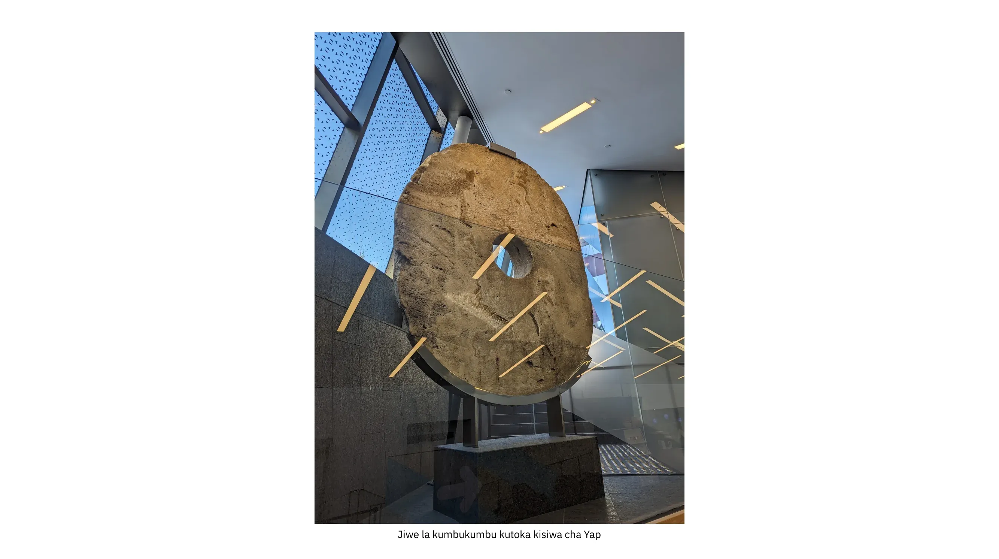

Huu ni uchambuzi wa kuvutia sana wa mawe ya Yap. Saifedean Ammous pia anataja mfano huu katika kitabu chake "The Bitcoin Standard". Kulingana na yeye, mfumo wa Kisiwa cha Yap unafanana zaidi na Bitcoin, aina ya rekodi kuu ambayo kila mtu anaweza kushauriana, ambayo ni ya umma, kudumisha akaunti na kusimamia umiliki wa vitu. Mtazamo huu wa kianthropolojia unaonyesha kwamba yote haya yanawakilisha makubaliano au makubaliano ya kijamii ndani ya jamii, ambayo kimsingi ni sahihi. Na ninaona kutaja hii ya mawe yaliyopotea ya kuvutia sana. Wangeenda mamia ya kilomita baharini kwa mashua ndogo na kurudisha mawe. Wakati mwingine jiwe lilianguka chini ya bahari, lakini jiwe hili bado lingetumika katika mfumo wa fedha. Mtu anaweza kusema "Ndio, tulidondosha jiwe mahali kama hii; ni yangu, ili tuweze kuibadilisha". Hakukuwa na haja ya kumiliki mali ili kurahisisha ubadilishanaji, kwani mawe yalikuwa makubwa sana hivi kwamba mara nyingi yalikaa mahali pamoja. Badala yake, lengo lilikuwa kubadilisha mikono na mawe haya kwa njia ya shughuli, kuruhusu umiliki kuhama bila mawe kusonga. Ilikuwa ni aina ya "ushahidi wa makubaliano", ikionyesha mtazamo wa kuvutia wa kianthropolojia juu ya pesa.

### Protocurrencies na majukumu ya kijamii

Wataalamu wa ethnografia ulimwenguni kote wamechunguza jamii zinazotumia "sarafu za kawaida" au "sarafu za zamani", kama vile makombora, nguo, mifugo, chumvi na mawe, ambazo zilitimiza majukumu ambayo kwa kawaida huhusishwa na pesa, kama vile njia ya malipo na hifadhi ya thamani, bila hata hivyo kufanya kazi mara kwa mara kama wakala wa kubadilishana bidhaa za kila siku.

Kwa hivyo, hapa tunaelezea mifumo ya fedha ambayo haikuwa lazima kutumika kwa ubadilishanaji wa kila siku.

Na ningependa kukukumbusha kwamba hizi zote zilikuwa sarafu kabla ya ujio wa sarafu, na sijui ni kosa kiasi gani kusema sarafu. Napendelea kusema sarafu. Ninaweza kutaja kuwa katika fasihi, mara nyingi tunazungumza juu ya sarafu za proto kurejelea pesa kabla ya sarafu. Lakini kama tulivyoona katika sehemu ya kwanza, **Ninaamini kwamba kulikuwa na mifumo ya fedha muda mrefu kabla ya kuonekana kwa sarafu **.

Sarafu hizi za zamani zilitumiwa hasa kudhibiti majukumu ya kimsingi ya kijamii yanayohusishwa na watu binafsi, kama vile ndoa, fidia ya migogoro (Wergeld), au zawadi kati ya machifu. Katika Milki ya Uajemi, kwa mfano, sarafu za kwanza ziliundwa mahsusi kama njia ya malipo ya kijeshi badala ya njia ya kubadilishana.

Pesa ya kwanza kwa hiyo ina sifa moja muhimu: ni njia ya malipo, lakini mara chache sana ni njia ya kubadilishana moja kwa moja ya bidhaa za nyenzo. Tunachomaanisha hapa ni kwamba ilikuwa njia ya malipo ya majukumu fulani ya kijamii, kwa makabila, kwa kubadilishana kati ya machifu, wergeld maarufu, pesa za damu. Kabla ya ujio wa mifumo ya haki, ikiwa mtu alifanya mauaji, kulikuwa na fidia kwa familia iliyoteseka kutokana na mauaji ya mpendwa wao. Kulikuwa na bei ya kulipa kwa hili, iliitwa pesa ya damu na ni njia ya malipo. Pia kulikuwa na mahari, ambayo pia ni njia ya malipo. Katika matumizi haya ya mapema ya pesa kama njia ya malipo, ilihusiana zaidi na majukumu ya kibinadamu na kijamii kuliko malipo ya ununuzi wa kila siku. Kulingana na nadharia hii, mabadilishano haya ya kawaida zaidi ya siku hadi siku yalihusiana zaidi na mkopo, mkopo ulioahirishwa, zawadi kwa zawadi, na ugawaji upya wa mgao. Kulikuwa na aina nyingine ya shirika la kijamii la kusimamia mabadilishano haya. Ni muhimu pia kukumbuka kuwa, katika jamii ambayo kila mtu anajitegemea, anafanya kilimo chake mwenyewe, hakuna utaalamu, na kuna haja ndogo sana ya mfumo wa fedha kwa ajili ya kubadilishana siku hadi siku. Na ndio maana aina za kwanza za pesa ndizo tulizozielezea hivi punde, mahari, pesa za damu, kwa sababu tu hizi zilikuwa ubadilishaji wa kwanza ambapo tulihitaji njia ya malipo, zamani kabla ya kuhitaji kufanya biashara, kubadilishana mkate kwa pesa kila siku, kwa sababu katika jamii za zamani, haikufanya kazi hivyo. Kila mtu alitoa mahitaji yake mwenyewe, na hakukuwa na utaalam bado. Nadhani nimeshughulikia hili kwa urefu katika mihadhara yote iliyotangulia katika kozi hii.

Katika jamii hizi, bila mgawanyiko wa juu wa kazi, ubadilishanaji wa moja kwa moja ulibakia kuwa mdogo, ukifanyika hasa ndani ya mahusiano ya kibinafsi ya urafiki au muungano. Kutokuwepo kwa utaalamu wa kutosha haukuhitaji pesa kwa maana ya kisasa.

Wanaanthropolojia kama vile Quiggin na Einzig wanasisitiza juu ya umuhimu wa mikopo: **maisha ya kiuchumi ya awali yamenaswa katika mtandao mkubwa wa mikopo na madeni ya kibinafsi, ambapo pesa huingilia kati hasa wakati malipo lazima yafanyike mara moja na fidia haziwezi kuahirishwa kwa urahisi.**

Kwa hivyo, watu hubadilishana vitu, wanaweza kutoa mkopo ulioahirishwa, lakini katika hali nyingine, huwezi kuahirisha malipo, kwa hivyo sarafu au proto-sarafu zinaweza kuwa muhimu katika hatua hii kuwa na hatima ya haraka ya kubadilishana.

### Ubunifu wa kutokujulikana

Uchanganuzi huu unasababisha kutafakari kwa kina: badala ya kupinga pesa kubadilishana, ni muhimu zaidi kuelewa kuibuka kwake kama mageuzi kutoka kwa mifumo changamano ya mikopo na madeni. Pesa huleta uvumbuzi wa kimsingi: **kutokujulikana**. Na hapo ndipo ninapopata nadharia hii ya kianthropolojia ya kuibuka kwa pesa ya kuvutia. Ikiwa nyinyi ni kikundi kidogo cha watu na mnapeana mikopo iliyoahirishwa, ni wazi mnajuana. Nadhani ili mfumo huu ufanye kazi, watu wanapaswa kujuana, ni wazi. Na malipo yaliyofanywa kwa pesa huruhusu kutokujulikana. Inakuruhusu kufanya malipo bila watu hata kujua jina lako, bila watu hata kukujua wewe ni nani. Wanaweza kubadilishana kwa ajili ya makazi ya haraka na ya mwisho. Na hivyo ndivyo pesa inavyowezesha.

Tofauti na mkopo, ambao daima ni wa kuteuliwa, pesa huwezesha miamala isiyojulikana, ya jumla na ya ukombozi mara moja. **Nguvu hii ya kipekee ya ukombozi wa pesa ni ubora wake wa kimaamuzi.**

Kwa hivyo, mbali na kuwa chombo cha kawaida cha kuwezesha ubadilishanaji wa kiuchumi, pesa ni uvumbuzi mkubwa wa kijamii, unaohusishwa kwa karibu na mageuzi ya taasisi za kibinadamu na mazoea, kutoka kwa mkopo wa kibinafsi ** hadi mfumo wa malipo wa jumla, usiojulikana **. Mageuzi haya ya kianthropolojia yanaonyesha kwamba pesa, zaidi ya njia rahisi ya kubadilishana, inawakilisha taasisi ya kijamii yenye nguvu, inayounda jamii za wanadamu, hadi kufikia kuwa, katika jamii zetu za kisasa, kusudi hasa la shughuli za kiuchumi.

Hapa, tunatambua kwamba mwishowe, katika jamii zetu za kisasa, lengo hasa la kubadilishana uchumi ni kumiliki pesa, ambapo hapo zamani, haikuwa hivyo hata kidogo. Kusudi lenyewe la kubadilishana kiuchumi lilikuwa kumiliki bidhaa au bidhaa za matumizi. Na leo, kwa kuanzisha uvumbuzi wa pesa, madhumuni ya kubadilishana kiuchumi ni kukusanya pesa hii, kwani inatuwezesha kuibadilisha kwa nzuri, kama inavyokubaliwa kwa ujumla. Tunaweza kuibadilisha kwa mema tunayohitaji tunapohitaji.

## Usajili wa umoja

<chapterId>7664442a-91c1-5ce4-a8bd-53b7371a3e3d</chapterId>

:::video id=473fc284-5375-4e1b-b0cd-6b51ba0cc3b8:::

### Nadharia ya rejista ya hesabu

Sasa tutachunguza pamoja mapendekezo mbalimbali ya kuunganishwa kwa nadharia hizi mbili za fedha, yaani, nadharia ya kuibuka kwa pesa kupitia deni-fedha na nadharia ya fedha ya kuibuka kwa pesa za bidhaa. Tutazungumza kuhusu pendekezo la muungano la Lynn Alden katika kitabu chake maarufu "For Broken Money", jina ambalo tafsiri yake iliyotolewa na Consensus labda itaitwa "Rupture monétaire".

*Dondoo kutoka kwa Pesa Iliyovunjika na Lyn Alden:*

> Kimsingi, pesa ni rejista ya uhasibu. Pesa za bidhaa ni rejista inayotawaliwa na asili. Pesa za benki ni leja inayotawaliwa na mataifa. Pesa huria ni leja inayotawaliwa na watumiaji wake.

Hapa, Lyn anarejelea Bitcoin.

### Uwiano wa mtiririko wa hisa na uhaba

> Baadhi ya vipengele vya kemikali adimu, kama vile rhodium, ni adimu kuliko dhahabu, lakini vina uwiano wa chini wa mtiririko wa hisa kwa sababu hutumiwa na tasnia haraka kama inavyochimbwa. Sarafu ya rodi au ingoti inaweza kununuliwa kama ghala maalum la kukusanywa au ghala la thamani, lakini haifai kama sarafu inayokubalika na jamii, na hivyo haitokei kiasili kama pesa.

Saifedean anazungumza juu ya hili kwa kirefu katika kitabu chake "The Bitcoin Standard". Kwa wale wasiofahamu uwiano wa hisa kati yake, ni pale tu unapolinganisha hisa zilizopo, hifadhi zilizopo sokoni, ikilinganishwa na hisa mpya zinazoingia, utitiri wa hisa mpya. Mara nyingi ni kinyume cha angavu, kwa sababu unaweza kufikiri kwamba kitu ulicho nacho kwa wingi si haba, lakini kwa kweli si haba. Ni zaidi swali la uwezo unao kusambaza. Badala yake, ni uwezo tulionao wa kuwa na hisa mpya ambao, kulingana na modeli hii, hutupatia habari ikiwa kitu hiki ni cha nadra au la. Sio kwa sababu hatuna kitu kwenye hisa ambacho ni nadra, ni labda tu kwamba hatuna. Kwa hivyo, ikiwa tutachukua dhahabu, tuna hifadhi nyingi za dhahabu kwa sababu inatumika kama hifadhi ya thamani, na uingiaji wa hisa mpya ni kitu kama 1% hadi 3% kwa mwaka ya hifadhi mpya za dhahabu zinazoingia kupitia dhahabu mining. Ambapo, anachosema hapa, ikiwa tunazungumza juu ya rhodium, ni adimu kuliko dhahabu, lakini hatuna hisa yoyote kwa sababu inatumiwa kadri inavyoendelea. Kwa hivyo haihitaji usambazaji mpya mwingi ili kuongeza hisa iliyopo maradufu. Ingawa kwa dhahabu, ingechukua angalau miaka 50 kufanya upya, kuongeza hisa maradufu. Tofauti na bidhaa nyingi zinazotumiwa, ambapo ni rahisi sana, na haichukui miaka mingi ya uzalishaji kuongeza maradufu ya hisa iliyopo, kwani hutumiwa kadri inavyoendelea.

*"Dhahabu imedumisha uwiano wa hisa hadi wa kati wa 25x na 100x katika historia yote ya kisasa, kwa kawaida karibu 50x au zaidi, kwa ufupi kamwe haishuki chini ya 16x, hata wakati wa Kukimbilia Dhahabu katikati ya karne ya 19. "*

Kwa hivyo, 25 ingemaanisha miaka 25 kuongeza hisa mara mbili, na 100 ingemaanisha miaka 100 kuongeza hisa mara mbili. Saifedean anasema katika kitabu chake kwamba hata kama tutaongeza uzalishaji wa dhahabu mara mbili, kutoka tuseme 1.5% hadi 3%, si lazima kuwa na athari kubwa kwa bei yake.

*"Fedha kwa ujumla ina uwiano wa hisa wa 10x au zaidi, ambao bado ni wa juu kiasi.*

*Bidhaa nyingine nyingi zina uwiano wa hisa chini ya 1 au 2. Hata vipengele adimu zaidi, kama vile platinamu na rodi, vina uwiano wa chini wa mtiririko wa hisa kutokana na matumizi ya haraka ya viwandani."*

### Ubora wa dhahabu na fedha

*"Kwa kifupi, wakati wowote sarafu ya bidhaa inapojikuta katika ushindani na dhahabu na fedha, mwishowe imekuwa ikishindana na dhahabu na fedha. Bidhaa zingine zinaweza kubaki sarafu kwa muda mdogo au katika maeneo maalum, lakini dhahabu na fedha zimethibitisha uwezo wao wa kuwa sarafu za ushindani wa kimataifa na kutawala ushindani. Hii ni kwa sababu wakati ustaarabu ulikutana, wamiliki wa sarafu ya dhahabu na fedha wakati wote walikuwa na uwezo wa kubadilisha fedha na fedha. ilhali wenye ganda, lulu, mifugo, chumvi, nguo au madini duni hawangeweza kamwe kupunguza thamani ya dhahabu au fedha.”*

Kwa hivyo hii inaelezewa vizuri sana katika The Bitcoin Standard ambapo Saifedean inazungumza juu ya makabila ya Afrika ambayo yalitumia shanga za kioo. Na wafanyabiashara wa Venice walipofika na shehena zilizojaa shanga za vioo kwa sababu waliweza kuzizalisha viwandani wakati huo, walikuwa na uwezo wa kiteknolojia wa kufanya hivyo, ilidhoofisha kabisa mfumo wa fedha wa watu hawa na waliweza kupora rasilimali zao. Hii ni tasnifu ya Saifedean.

### Kitengo cha akaunti na mkopo

*"Kihistoria, hata wakati mikopo ilitumiwa moja kwa moja kama chombo cha kubadilishana, kwa kawaida ilijumuishwa katika vitengo vya bidhaa za fedha zilizochaguliwa kiasili kwa mali zao."*

Hilo ni jambo la kufurahisha sana, na ambalo mimi na Ulrich tumekuwa tukijadili. Hata kama hekalu la Mesopotamia lilikuwa aina ya mamlaka ambayo yangeweza kusimamia wazo hili la mkopo, kitengo cha hesabu kilikuwa shekeli. Hakuna kitu cha kuthibitisha kwamba shekeli ilianzishwa kwa mamlaka na hekalu. Shekeli ingeweza kutokea kwa njia ya kawaida, kupitia hitaji la wafanyabiashara kuagiza na kuuza nje na watu wengine walio karibu. Tunao ushahidi wa hili, katika umbo la mfanyabiashara huko Kanesh (nilitaja hili katika Sehemu ya 1) ambaye alifanya hivyo hasa, akiingiza madini ya thamani ambayo hayakutumiwa kwa thamani ya bidhaa zao halisi, bali kama hifadhi ya thamani. Tatizo pekee ni kwamba hatujui kama tunaweza kudhani kwamba chaguo hili la fedha, la shekeli ya fedha, lilifanywa na wafanyabiashara, au kama lilifanywa na hekalu. Lakini Ulrich ana hoja nzuri sana ambayo inatuongoza kufikiria kwamba labda ilikuwa upande wa wafanyabiashara ambayo ilitengenezwa.

*"Hivyo, muunganisho wa nadharia hizi mbili unaweza kuelezewa kama "nadharia ya uhasibu wa pesa" ("nadharia ya leja ya pesa") kwa kuwa inaelezea mantiki ya kimsingi inayofanana kwa nadharia zote mbili. Mikopo ya kijamii inayobadilika na proto-sarafu zinazoweza kukusanywa zilianza tangu mwanzo wa ubinadamu. Katika hali zote mbili, vikundi vya wanadamu vya ukubwa mbalimbali vinataka kuweka leja ya uhasibu ili kuepusha uhasibu maradufu ili kuepusha uhasibu wao wenyewe. katika kubadilishana, na kutumika kama aina ya akiba ya kioevu. Tofauti muhimu iko katika mamlaka iliyopewa dhamana ya kutunza rejista."

Kwa upande mmoja, asili inasimamia upanuzi wa usambazaji wa pesa. Kwa hivyo, ikiwa tutachukua dhahabu, kwani ni nadra sana, ni ngumu kuchimba. Kuna aina ya kikomo kwa idadi ya sarafu za dhahabu zinazoweza kuchimbwa. Kwa hivyo uhaba unasimamiwa na asili. Na rejista inashikiliwa na dhana ya milki. Daftari imegawanywa. Kumiliki kunathibitishwa na ukweli kwamba unamiliki sarafu ya dhahabu au kipande cha dhahabu. Na kwa upande wa pesa za mkopo, uhaba unasimamiwa na uwezo wa watu kupata mkopo. Au katika kesi ya fedha za fiat, uhaba unasimamiwa na mamlaka. Ni wao wanaoamua kuchapa zaidi au la, ili kuepuka majanga ya mfumuko wa bei. Kwa hiyo, katika baadhi ya matukio, rejista inaweza pia kusimamiwa na mmiliki wa token, katika kesi ya fedha za karatasi. Ndiyo sababu imeingia kwenye rejista, katika alama za nukuu, iliyoharibiwa. Kweli, imeonekana, lakini ya kweli. Anamiliki token hii maarufu, na hiyo ndiyo inathibitisha kumiliki. Na inaweza kuwa katika rejista halisi, kama ilivyo kwa pesa za kimaandiko, katika benki, ambapo ni benki ya binadamu ambayo inasimamia nani anamiliki nini kuhusiana na rejista.

## Kuunganisha kupitia malipo ya pesa

<chapterId>093756e5-8908-55e5-bb76-376a3a3cc4d3</chapterId>

:::video id=eabc342a-ecbd-46ca-a347-e914917e7c4f:::

### Dhana ya malipo ya fedha

Katika sehemu hii iliyojitolea kwa mapendekezo mbalimbali ya kuunganisha nadharia tofauti juu ya kuibuka kwa pesa, nimependekeza nadharia ya Lyn Alden, nadharia ya rejista. Nina pendekezo langu la kuunganishwa kwa nadharia mbili za kifedha. Ni malipo ya pesa, dhana ya malipo ya pesa. Kwa hiyo, thamani ya fedha inaweza kuelezewa na malipo ya fedha yanayotokana na mahitaji yake ya fedha, iwe kwa namna ya vidonge vya udongo, sarafu za chuma za thamani, noti, au bitcoin. Malipo ya kifedha yanategemea tu imani kwamba mtu atabadilisha sarafu hii katika siku zijazo kwa bei inayolingana.

Ninachojaribu kudhihirisha hapa ni kwa urahisi kabisa kwamba iwe ni fiat, yaani, noti zisizo na thamani ya matumizi, iwe ni sarafu za dhahabu au chuma chochote, kipande cha dhahabu au ingot, **mara nyingi huwa ni malipo ya pesa ambayo hutengeneza sehemu kubwa ya thamani yake**. Ikiwa tunachukua kipande cha dhahabu, sehemu fulani ya thamani yake inaelezewa na thamani ya matumizi, matumizi yake katika viwanda, au kufanya kujitia. Kumbuka kwamba mahitaji ya kujitia mara nyingi hutoka kwa thamani yake ya fedha. Watu huweka vito kama aina ya duka la thamani, kwa hivyo ninajumuisha hii kidogo kwenye malipo ya pesa kwa sababu mara nyingi ni hitaji la pesa kuchukua jukumu katika pesa.

Kwa hivyo unaweza kusema kwamba karibu 10% ya mahitaji ya dhahabu ni ya viwanda. Katika thamani ya dhahabu, tungekuwa na sehemu ndogo, tuseme 10%, ambayo ingeelezewa na mahitaji haya ya viwanda, mahitaji haya ya matumizi ya dhahabu, ambapo dhahabu hutumiwa. Mengine ni wazi mahitaji ya matumizi yake ya fedha kama ghala la thamani.

### Bonasi ya mamlaka na fiat

Na ukilinganisha kipande cha dhahabu na sarafu ya dhahabu, kuna safu nyingine. Sarafu ya dhahabu ina muhuri na mamlaka, na dhahabu iliyo katika kipande hicho pia inafurahia mahitaji ya matumizi, mahitaji ya kutumika katika sekta. Pia inafurahia malipo ya pesa kama duka la thamani. Zaidi ya hayo, kuna nyongeza ambayo ninaita malipo ya mamlaka, ambapo mara nyingi kutakuwa na bei, uwezo mkubwa wa ununuzi wa sarafu kuliko kipande cha dhahabu, kwa kuwa sarafu ni rahisi zaidi kutumia. Inafanya kubadilishana kuwa kioevu zaidi, kwani hakuna haja ya kuipima. Mamlaka kwa kawaida huhakikisha usafi wake. Na ukilinganisha na kipande cha dhahabu, sarafu ya dhahabu iliyopigwa kwa ujumla ina thamani zaidi kuliko kipande cha dhahabu. Na hiyo ni kawaida, pia, kwa sababu inachukua rasilimali kuipiga muhuri.

Ni kanuni sawa kwa fiat, pesa za karatasi. Pesa za karatasi hazina thamani yoyote ya matumizi, isipokuwa labda kupasha moto nyumba, na hiyo ilifanyika wakati wa Jamhuri ya Weimar. Kwa hivyo hakuna mahitaji halisi ya thamani yake ya utumiaji. Kwa upande mwingine, kuna malipo tu ya mamlaka, kwa maoni yangu.

Ni aina ya malipo ya pesa, upandishaji juu ya malipo ya pesa. Lakini malipo yake ya fedha yanatokana na ukweli kwamba ni zabuni halali, na kisha mamlaka inakulazimisha kuinunua ili kulipa kodi yako. Kwa hivyo, lazima, sarafu ya fiat ina aina ya mahitaji ya fedha kutokana na ukweli kwamba inatozwa kodi na unapaswa kupata angalau ili kulipa kodi yako. Na matokeo yake, inabakia kuwa njia inayokubalika kwa ujumla ya malipo. Kwa hivyo watu wanataka kuipata ili kukidhi mahitaji yao.

### Kuunganishwa kupitia mahitaji ya fedha

Na kwa nini pendekezo hili la malipo ya pesa linastahili kuwa muunganisho wa nadharia mbili za pesa za deni na pesa za bidhaa? Naam, sihisi kwamba thamani ya sarafu ya dhahabu lazima inatokana na "thamani yake ya ndani". Hapana, kwa kweli, ni wazo la kujiamini kama ilivyo kwa pesa za fiat. Ni dhana ya mahitaji ya fedha. Na si kweli kwa sababu ina asilimia ndogo ya matumizi ya viwanda, mwingine "matumizi". Tukisema kwamba matumizi ya viwandani ni 10% ya thamani yake, tunaweza kuthamini hiyo kwa $300 kwa wakia. Ikiwa dhahabu inauzwa sokoni kwa $3,000 kwa wakia, tofauti kati ya $300 na $3,000 ni malipo maarufu ya pesa. Ni mahitaji haya ya kifedha ya dhahabu ambayo yanaelezea. Kwa sababu fiat ina thamani ya matumizi ya sifuri haimaanishi kuwa ni tofauti. Kwangu mimi ni sawa kabisa. Kwa hivyo kwa pande zote mbili, nadharia ya pesa za deni au pesa za bidhaa, sidhani kama aina ya ubora wa ziada ambayo dhahabu ingekuwa nayo ya kuwa na thamani ndogo ya matumizi hubadilisha chochote.

Kwa upande mwingine, ni hakika kwamba **katika kiwango cha kuibuka, kwa mujibu wa nadharia ya urejeshi wa Mises, tunaweza kupendekeza kwamba matumizi haya yanaleta mahitaji katika asili na kuanzisha mchakato ambao unakuwa pesa.** Ingawa, katika kiwango cha pesa za deni, ni kulazimishwa zaidi na mamlaka, kwa hivyo chanzo, uanzishaji wa kuibuka, na dhana ni tofauti kabisa. **Lakini nadhani katika kiwango cha thamani, jinsi ya kuelezea thamani ya pesa, pamoja na malipo ya fedha, tunaweza kueleza kwa urahisi kwa nini fiat money ina thamani tunayoihusisha nayo na kwa nini pesa ya bidhaa ina thamani** tunaihusisha nayo. Kwangu mimi, ni mchakato sawa, na inaitwa malipo ya pesa.

#### Malipo ya pesa

Ni hayo tu. Thamani ya pesa inaweza kuelezewa na malipo ya pesa yanayotokana na mahitaji yake ya kifedha, iwe katika mfumo wa vidonge vya udongo, sarafu za chuma za thamani, noti, au bitcoin.

Malipo ya pesa yanategemea tu imani kwamba mtu atabadilisha pesa hizi baadaye kwa bei inayolingana.

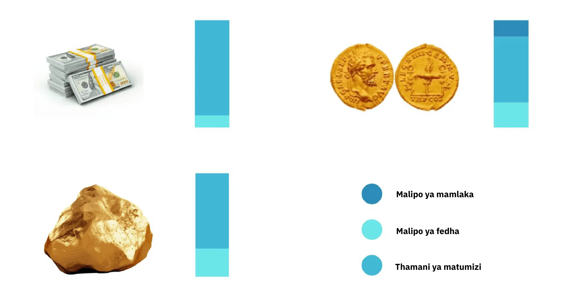

# Ufafanuzi tofauti wa pesa

<partId>77b7918a-8c3b-11f0-b688-6b2ab22378c9</partId>

## Pesa dhidi ya sarafu vs monnaie dhidi ya argent dhidi ya kubuni

<chapterId>bf8a6d21-df88-5d23-a0a5-e9a5c1300554</chapterId>

:::video id=d9c9e7df-9db3-4a9f-801e-10d3fc7dfc22:::

### Semantiki ya maneno ya fedha

Katika sehemu hii ya nadharia mbalimbali za fedha na hasa kuhusu fasili za pesa, ningependa kuweka kando kwa ufupi kuhusu somo la semantiki. Ningependa kuchimba kwa undani zaidi ufafanuzi wa maneno kadhaa yanayohusiana na pesa, na kuyalinganisha na sawa na Kiingereza. Kwa mfano, pesa, sarafu, ikilinganishwa na monnaie, argent na kubuni. Kwa hivyo, inakwenda hivi.

Semantiki kidogo:

Tunaposema "**pesa**" (de la monnaie), watu wengi watafikiri kwamba tunarejelea mabadiliko madogo tunayopokea kwa malipo ya muamala. Na tukisema "**fedha**" (la monnaie), pengine watu watafikiri kuwa tunarejelea sarafu ya nchi. Fedha ya Kanada ni dola ya Kanada. Hiyo ni kweli.

Lakini vipi kuhusu pesa (de l'argent)? Mwizi hatasema kamwe "Nipe chenji yako yote!" (mwizi anaweza kukatishwa tamaa kupokea sarafu zisizo na thamani yoyote).

Hapana, mwizi atapiga kelele: "Nipe ** pesa zako zote **". Na ikiwa mwizi amesimama mbele yako barabarani, lazima anarejelea **noti** kwenye mfuko wako.

Kwa upande mwingine, mwizi akijaribu kukuhadaa kwa njia ya kisasa zaidi, akijaribu kuiba mali yako kwa kuondoa akaunti zako zote za benki, tungesema kwamba **atachukua pesa zako zote**. Hapa neno "fedha" linamaanisha **utajiri wa mtu binafsi**.

Kwa hivyo kuna fasili mbili za neno pesa: pesa taslimu (noti) na utajiri.

### Sarafu dhidi ya monnaie dhidi ya kubuni

Sarafu (devise) lazima iwe ni sarafu ya nchi nyingine, vinginevyo tunasema tu pesa (monaki). Ikiwa wewe ni Mfaransa, ungesema: "La livre sterling est la devise du Royaume-Uni et l'euro et la monnaie de l'Europe" ( Pound Sterling ni sarafu ya Uingereza na euro ni sarafu ya Ulaya).

Mara nyingi, watu ambao hawajajishughulisha na matatizo haya ya semantic, katika kutafsiri maneno haya, mara nyingi huwa na mwelekeo wa kuzungumza juu ya sarafu (kubuni) wakati imeandikwa sarafu, lakini hapana, sarafu ni pesa (monai) wakati ni sarafu ya nchi yako, na inabuni tunapozungumzia sarafu nyingine. Na kwa hivyo, shida hapa ambayo ninaona mara nyingi ni kwamba kwa Kiingereza, kuna maneno mawili: kuna "fedha", ambayo ni dhana, na kuna "fedha", ambayo kwa kweli ni kitengo cha nchi ambayo hutumiwa kufanya mabadilishano. Kwa hiyo tunaweza tu kuzungumza juu ya dhana ya fedha; ni rahisi - ni dhana ya neno *fedha*; ni pesa kwa ujumla. Na *sarafu* ni rahisi sana kulinganisha na sarafu ya nchi. Ingawa kwa Kifaransa, kwa bahati mbaya, watu mara nyingi watasema ndiyo, "mais ce n'est pas une monnaie" wanapozungumza kuhusu bitcoin kwa sababu sio sarafu ya nchi, lakini mara nyingi, nadhani wanarejelea maneno sarafu badala yake. Hii ni mbaya kwa upande mmoja, kwa sababu tangu El Salvador, bitcoin imekuwa sarafu ya serikali. Ukweli unabaki kuwa mara nyingi watu watasema: *lakini hapana, sio sarafu ya serikali, haiwezi kuwa pesa*. Lakini kwa kweli, ikiwa tunataja dhana pana ya * pesa *, bitcoin inafaa katika ufafanuzi huu kikamilifu, kwa maoni yangu. Ni kwamba kwa Kifaransa, hatuna maneno mawili ya kutenganisha dhana hizi mbili. Tunaweza kusema kwamba neno argent linamaanisha sarafu, lakini kwa bahati mbaya, hiyo si ufafanuzi wake sahihi. *Argent* (fedha) inarejelea mali au noti. Kwa kweli huwezi kufanya ulinganifu na neno *pesa*. *Pesa* kwa kweli ni dhana ya sarafu (monai).

## Ufafanuzi wa Saifedean Ammous

<chapterId>07c4ba50-168c-567a-8957-0b187ff75f97</chapterId>

:::video id=936d6d3b-6d45-468e-bc44-85fbce9b857a:::

#### Pesa ni nini?

Pesa ni kitu unachomiliki au kupata si cha kutumiwa au kuliwa kwa ajili yake binafsi, bali kubadilishwa baadaye kwa bidhaa au huduma nyingine unazoweza kuhitaji. (Saifedean)

Pesa hupata malipo ya pesa wakati mahitaji ya pesa yanapo kwa manufaa, kutekeleza jukumu moja au zaidi ya pesa.

Faida ya pesa lazima iwe adimu ya kutosha ili malipo ya pesa yaendelee (kuzuia usambazaji kubadilika hadi mahitaji ya pesa).

### Malipo ya pesa

Katika sehemu hii ya ufafanuzi tofauti wa sarafu, nilitaka kuzungumza kwa ufupi kuhusu ufafanuzi wa Saifedean katika The Bitcoin Standard, ambao umekuwa wa kunivutia sana. Ilinigusa kuwa rahisi sana nilipoisoma. Na pia tutaongeza dhana ya malipo ya fedha kwa ufafanuzi huu. Kama Saifedean anavyotaja katika kitabu chake, lazima kuna dhana ya uhaba. Swali ni je, pesa ni nini?

> Pesa ni kitu unachomiliki au kupata, si cha kutumiwa au kuliwa kwa ajili yake binafsi, bali kubadilishwa baadaye kwa bidhaa au huduma nyingine ambazo huenda ukahitaji.

Kwa hivyo huo ndio ufafanuzi ambao Saifedean anataja katika Kiwango cha Bitcoin. Ningeongeza kuwa sarafu (la monnaie) hupata malipo ya pesa kunapokuwa na mahitaji ya kifedha kwa bidhaa hiyo, ili kutekeleza jukumu moja au zaidi ya sarafu hiyo. Kwa hivyo unaweza kusema kwamba sarafu ambayo hutumika kama ghala la thamani itakuwa na mahitaji ya kifedha ambayo huipa malipo ya pesa, kwa kuwa watu wanataka kuipata, kwa mfano kama duka la thamani au kama njia ya kubadilishana.

### Uhaba na taratibu za soko

Kwa hili, nadhani tunapaswa kuongeza kwamba faida ya kifedha lazima iwe adimu ya kutosha ili malipo ya pesa yaweze kujikimu. Hii ni muhimu sana. **Ikiibuka zuri la kutumika kama pesa na tunaona bei yake inapanda, kwa kawaida, ikiwa nzuri haitoshi, watu watataka kuzalisha zaidi ili kufaidika na faida hii ya thamani wakati bei inapanda **. Hii ndiyo sababu bidhaa nyingi kwenye soko zina bei isiyobadilika. Wakati bei inapopanda, uzalishaji huelekea kuongezeka. Bei inaposhuka, uzalishaji hupungua. Kuna aina ya marekebisho ya soko. **Na wakati bidhaa ni adimu vya kutosha, kama vile dhahabu, utaratibu wa soko hautafidia mahitaji haya ya kuongezeka kwa matumizi ya fedha. Kwa hivyo ni tofauti inayobadilika, ni bei. Kama ilivyo kwa bitcoin**. Bei ya bitcoin inapopanda, hatuzalishi bitcoin zaidi. Kwa hivyo kinachorekebisha ni bei. Na ndio maana, kwa miaka mingi, tumeona bei ya bitcoin ikipanda mahitaji ya bitcoin yanapoongezeka. Kwa kuwa hakuna mtu Duniani anayeweza kubadilisha kanuni na kusema "kuna mahitaji zaidi, bei inapanda, tutazalisha zaidi." **Ugavi wa bitcoins mpya hupangwa mapema, na kujulikana mapema **. Kwa hivyo ndivyo nilivyokuwa nikisema, kwamba faida ya kifedha lazima iwe nadra vya kutosha ili malipo ya pesa yaendelee, na kwa hivyo yasichukuliwe na mifumo ya soko, ili kuzuia usambazaji kuzoea mahitaji haya mapya ya pesa.

## Njia za malipo na dhamana ya ukombozi

<chapterId>5d424039-e342-56f7-9d8b-bba9551831a9</chapterId>

:::video id=af4c0765-8111-4cb7-891b-3ee54d6e7054:::

### Njia za malipo dhidi ya njia za kubadilishana

Katika sehemu hii inayohusu fasili mbalimbali za pesa, ninapendekeza tuangalie kwa pamoja nukuu kutoka kwa kitabu "Aux origines de la monnaie" (The Origins of Money), maandishi ya Alain Testart kuhusu suala la pesa kama njia ya malipo na thamani ya ukombozi.

*Kutoka kwa Aux origines de la monnaie, Alain Testart anafafanua pesa kama njia ya malipo:*

> Kazi ya njia za malipo inachukuliwa hapa kuwa tofauti na kazi ya njia ya kubadilishana, kwa kuwa kuna malipo bila kuzingatia, malipo ambayo hayanunui chochote. Knies (1873:192 ff.) anaendeleza kwa kirefu mada hii ya uhamishaji wa bidhaa ambazo hazijumuishi vitendo vya kubadilishana, kama ilivyo kwa wergeld (pesa ya damu au muundo wa mauaji) au ushuru. Carl Menger alishambulia kazi hii ya nne katika makala yake ya 1892 "Geld", kwa ujumla inachukuliwa kuwa mojawapo ya maamuzi zaidi juu ya somo. Bila ya kudharauliwa kabisa, wazo la kazi ya njia za malipo inaonekana kuwa limesahauliwa katika fikra za kiuchumi leo, au angalau kukataliwa kwa kupendelea ile ya njia ya kubadilishana.
>

> Pesa hutumiwa kulipa: inaonekana katika mwanga huu, ni chombo cha ukombozi, ambacho kinaelezea kwa ujumla wake kazi ya njia ya malipo. Katika suala hili, tunazungumza juu ya "nguvu ya ukombozi" ya pesa. Kulingana na Le Petit Robert, nguvu ya ukombozi ni "ile ambayo ina athari ya kuachilia (kutoka kwa wajibu, deni)". Kulingana na Grand Larousse, malipo ya ukombozi ni "malipo yoyote yanayofanywa chini ya masharti ya kisheria kwa njia ambayo mkopeshaji hawezi kupinga kutoweka kwa deni". Pesa ina uwezo huu par ubora; ni hata kile kinachofafanua hali yake ya zabuni ya kisheria, kwa kuwa hakuna mtu anayeweza kukataa malipo yaliyofanywa kwa pesa, iwe muuzaji au mkopeshaji. Pesa ni nzuri pekee ambayo haiwezi kukataliwa katika malipo ya kile kinachodaiwa, bila kujali kama deni linadaiwa na mfanyabiashara au mtu wa ushuru. Kati ya bidhaa zote, pesa pekee ndiyo inayoshikilia fursa hii. "Ni pendeleo hili," anaandika Charles. Gide (1921 I: 443), ambayo inajumuisha kile tunachokiita zabuni halali.
>

> Ubadilishanaji wowote unaojumuisha uhamishaji wa bidhaa moja kwa nyingine, au kwa sharti kwamba bidhaa nyingine itolewe kama malipo, inamaanisha lazima kwa upande wa mpokeaji kumpa mwenzake huyu. Malipo ni utimilifu wa wajibu huu. Kwa hivyo ubadilishaji wote unamaanisha malipo, lakini sio malipo yote yanamaanisha kubadilishana. Kuna malipo bila mshirika, yaani, malipo ambayo hayawezesha mema mengine kupatikana, na hayafanyiki kwa kusudi hili. Ushuru unasalia kuwa mfano wa kuigwa hapa; pia tunapaswa kutaja faini za kila aina zinazolipwa kwa mamlaka za umma, na fidia zinazodaiwa kwa wengine kwa kanuni kwamba anayesababisha uharibifu kwa wengine lazima atengeneze.

### Malipo bila mshirika

Hiki ni kielelezo wazi cha tasnifu ya mwandishi. Kwa kweli, anatofautisha kati ya hizo mbili. Kwake, kubadilishana ni uhamisho wa bidhaa na malipo. Malipo yanakuja ijayo. Na malipo yanaweza kutokea bila kubadilishana. Anatoa mifano ya jinsi kulipa tikiti ya maegesho au faini ni malipo tu. Hupati huduma kwa kubadilishana. Wengine wanaweza kusema kuwa Serikali inakufanyia huduma kwa kubadilishana, huduma ya kukupa tikiti za kuegesha. Yeye ni wazi kabisa juu ya ukweli kwamba kulipa kodi ni kweli malipo bila mwenzake, kwa maana kwamba kulipa kodi ni required, hata kama si lazima kupata huduma. Anasema kweli inafafanuliwa kuwa kulipa kodi ni malipo tu; hakuna wajibu wa kupata huduma kwa kubadilishana. Nimejadili hili na wenzangu wengi, na hawakubaliani na wazo hili. Lakini hiyo ni nadharia ya mwandishi. Anajaribu kuweka wazo la malipo na kuiondoa kutoka kwa kubadilishana na mifano hii, kwa mfano, ya faini, malipo ya ushuru. Pia, kwa mfano, mahari, anaeleza kuwa mahari ni malipo; si lazima upate kitu kwa kubadilishana. Mtu anayekosoa pendekezo hili anaweza kusema "Ndiyo, lakini unapata mke kwa kubadilishana." Kwa hivyo ndio kiwango cha mjadala juu ya mada hii.

Pia kuna wergeld, au pesa za damu. Kwa hivyo ni malipo tu ya kufidia. Rafiki yangu Ulrich angesema:

> Ndiyo, lakini unapata faili hii kufungwa kwa kubadilishana.

Kwa hivyo, umefanya uhalifu, mauaji kwa mfano. Wakati huo, unalipa wergeld, na baada ya hayo, vizuri unatolewa kutoka kwa hali hiyo. Kwa hivyo kuna nguvu ya ukombozi. Je, unapata chochote kama malipo?" Kulingana na mwandishi, hapana. Kulingana na baadhi ya wenzangu, ndiyo.

Nadhani katika mjadala huu, tunaweza kuona kwamba wergeld ni mojawapo ya mifano nzuri ya kufafanua malipo. Kwa kweli, ni wazi, haupokei chochote kama malipo.

## Pesa ya deni dhidi ya pesa za bidhaa

<chapterId>4093677a-c8e8-5828-b994-15c01656186e</chapterId>

:::video id=f49cf5cc-288e-4daa-a1ff-b9de73506f4e:::

### Mjadala wa kimsingi

Bado katika muktadha wa sehemu hii ya ufafanuzi na nadharia tofauti za fedha, hebu tuchunguze kwa pamoja maono mawili yanayopingana kiduara: "fedha daima ni deni" au "fedha daima ni bidhaa". Kwa upande mmoja, kuna wafuasi wa nadharia ya fedha ya msingi wa madeni, ambao wanasisitiza: "Hapana, pesa daima ni deni! Kwa upande mwingine, mende wetu maarufu wa dhahabu wanasema: "Lakini hapana, unaona, pesa daima ni bidhaa, daima ni dhahabu; kila kitu kingine, bili, IOUs, ni mkopo tu, sio pesa".

Hebu tuchunguze muhtasari wa wazi wa nadharia hizi pamoja.

### Nadharia ya "deni kila wakati".

Huu hapa ni muhtasari wa nadharia ya fedha inayojulikana kama **"fedha za deni"**, kulingana na ambayo pesa kimsingi ni aina ya deni:

Kulingana na nadharia hii, iliyoendelezwa hasa na Alfred Mitchell-Innes na kuendelezwa zaidi na David Graeber, pesa kimsingi ni utambuzi wa deni, unaotokana na mahusiano ya mikopo ambayo hapo awali yalikuwepo ubadilishanaji wa fedha wa moja kwa moja. Badala ya kutokea kutokana na hitaji linalohusishwa na kubadilishana fedha, pesa huonekana kama njia ya uhasibu, kuhamisha, na kutatua majukumu ya kijamii au madeni kati ya watu binafsi au vikundi.

Kwa hivyo, pesa zote huzunguka kama deni linalodaiwa na mtu au taasisi kwa mwingine, likisaidiwa na amana na mamlaka ya kijamii au serikali inayohakikisha uhalali wake. Kwa hivyo, kulingana na wao, tunapomiliki - kama nilivyokwisha sema - tunapomiliki pesa, tunadai kwa jamii, na jamii inatudai deni. Kwa hivyo pesa haiegemei upande wowote au inajitegemea, lakini daima ni deni la msingi: kushikilia pesa kunamaanisha kumiliki madai kwa jamii au jumuiya ya kiuchumi.

Hoja hii inapingana na wazo kuu la pesa kama "bidhaa ya kati" rahisi, na badala yake inasisitiza jukumu kuu la mahusiano ya kijamii na kisiasa katika uundaji na usimamizi wa pesa.

**Maoni yangu:**

Kinachonitatiza kuhusu nadharia hii ni kwamba inadai kwamba pesa siku zote ni deni, tunapokuwa na mifano ya kubadilishana kati ya makabila mawili tofauti ambao, kwa mfano, hubadilishana dhahabu, ambapo shughuli hiyo ni ya mwisho na hakuna deni la siri linalobaki. Wafuasi wa nadharia hii mara nyingi watatuambia kuwa mabadilishano haya si kubadilishana fedha, bali kubadilishana. Kama ilivyotajwa tayari, sikubaliani. Ni ubadilishanaji wa fedha, kwani dhahabu haitatumika; itatumika kama pesa.

### Nadharia ya "daima bidhaa".

**Bidhaa kila wakati:**

Huu hapa ni muhtasari wa wazi wa nadharia ya fedha inayojulikana kama **"pesa za bidhaa"**, ambapo pesa kila wakati huibuka kama bidhaa, haswa dhahabu, ambayo hutokana na hitaji la kuweza kufanya biashara, bidhaa ambayo kwa ujumla itakubaliwa nje ya nchi na ambayo hupatikana kwa madhumuni ya biashara.

Kulingana na nadharia hii, iliyoendelezwa na wanauchumi wa kitambo (Adam Smith, David Ricardo) na kuchukuliwa na Marx, pesa hujitokeza kiasili kama bidhaa miongoni mwa nyinginezo, mara nyingi chuma cha thamani kama vile dhahabu au fedha, ambacho kina thamani ya asili isiyotegemea jukumu lake la kifedha. Hapo awali, bidhaa hizi huchaguliwa kwa hiari na wachezaji wa kiuchumi ili kuwezesha biashara, shukrani kwa sifa zao za asili (uhaba, uimara, mgawanyiko, na uthabiti).

Pesa za bidhaa hutofautishwa na uwepo wake wa kimwili na thamani inayoamuliwa na kiasi cha kazi inayohitajika kijamii ili kuzizalisha (kama katika Marx). Jamii hutumia dhahabu, kwa mfano, si kurahisisha ubadilishanaji tu bali pia kama sehemu ya akaunti, hifadhi ya thamani, na njia ya kimataifa ya kubadilishana.

Katika maono haya, pesa daima huhifadhi thamani halisi, kwani inabaki kuhusishwa na bidhaa inayoonekana. Hata jukumu la pesa linapokuwa dhahania (sarafu zilizotengenezwa, noti, au pesa za kimaandiko), uhalali wake bado unatokana, moja kwa moja au kwa njia isiyo ya moja kwa moja, kutoka kwa marejeleo ya bidhaa ya msingi kama vile dhahabu. Kwa hivyo nadharia hii inasisitiza juu ya nyenzo na asili ya kiuchumi ya pesa, kinyume na nadharia zinazoiona kama makubaliano au deni tu. Kulingana na nadharia hii, uwakilishi wowote wa pesa na mbadala, kama vile bili inayoweza kukombolewa kwa dhahabu, itakuwa mkopo.

**Maoni yangu:**

Kumbuka kuwa maono haya yanafanana na nadharia ya pesa za bidhaa, lakini inakwenda hatua moja zaidi. Wanapendekeza kwamba pesa **daima** ziwe bidhaa. Na tunapowaambia: "*Ndiyo, lakini tunaweza kukubaliana kwamba noti ni pesa kwa kundi hili; inaweza kuungwa mkono na dhahabu, inafanya kazi, na noti kama hiyo ni pesa*".

Kwa kujibu, watatupa mfano wa kuponi ya chumba cha kubadilishia nguo. Watasema: "Ndiyo, lakini hapana, unapokuwa na kuponi ya chumba cha kubadilishia nguo kwa ajili ya vazi lako, je tunaweza kuiita daftari la pesa kuwa vazi?

Bila shaka sivyo, ni kama kukiri, madai, kimsingi, ambayo yatakuruhusu kurudisha vazi lako. Sambamba hii haitumiki, kwa sababu kuponi ya chumba cha kubadilishia nguo si njia inayokubalika kwa ujumla ya malipo. **Pesa si madai ya kitu maalum kama vazi; ni hali, njia ya kubadilishana, njia ya kubadilishana, au njia ya malipo inayokubalika kwa ujumla**.

Kwa hivyo huwezi kuchora ulinganifu kati ya kuponi ya chumba cha locker na muswada wa sarafu ya fiat, kwa kuwa kuponi ya chumba cha locker inakuwezesha kupata nzuri fulani kwa kubadilishana, ni token ambayo inakuwezesha kurejesha mali yako. Ingawa noti, sarafu ya fiat, ni kuponi ya ulimwengu wote inayokuruhusu kufikia manufaa yoyote.

Na kwa maoni yangu, kwa kweli, hata pesa za fiat zinaweza kuzingatiwa kama pesa ikiwa zinazingatiwa hivyo na idadi ya watu. Na nadhani ni kosa la kimantiki kusisitiza kuwa haiwezi kuwa pesa, kwani ni kuponi ya kupata pesa halisi, angalau wakati huo, ambayo ilikuwa dhahabu ya msingi.

Sina shida kuzingatia sarafu ya dhahabu iliyohifadhiwa na mswada unaowakilisha sarafu ya dhahabu kama sarafu. Kwangu mimi, hakuna shida ya semantiki, ni aina mbili tu za sarafu. Ikiwa sijakosea, Mises anaelezea jambo hili vizuri sana kwa kuzungumza juu ya mbadala za pesa.

Maono yao yanatokana na ukweli kwamba huwezi kuzingatia sarafu ya dhahabu kwenye ghala la benki na noti inayoiwakilisha kuwa pesa kwa wakati mmoja. Binafsi sioni tatizo lolote katika hili; Sioni kitendawili chochote katika hali hiyo. Wale wanaoamini kuwa pesa siku zote ni bidhaa hawaoni mambo ninavyoona mimi.

**Haya hapa ni mapitio ya dhana ya kuponi ya chumba cha kubadilishia nguo kutoka kwa kitabu *Aux origines de la monnaie*:**

* Kumbuka 14: "Ukosoaji bora - bora kwa sababu ni kwa msingi ambao Knapp anajiweka mwenyewe, msingi wa kisheria - na Rist (1938: 372, note 1) ya ulinganisho kati ya pesa za karatasi na tokeni za chumba cha ukaguzi: ikiwa tunaweza kuzungumza juu ya aina ya madai katika kesi zote mbili, tofauti ya msingi ni kwamba katika kesi ya kwanza bila kesi ya kwanza tu, ni madai maalum, na ni kitu maalum.

Pia, kuhusu suala la **dai**, mwandishi huyohuyo anabainisha yafuatayo:

> Bastiat yuko huru kabisa kufikiria vocha kwa jamii nzima iliyotolewa kama "bazaa kubwa", lakini nyongeza hii ndogo, ugani huu unaoonekana kutokuwa na hatia, ndio tofauti nzima kati ya mkopo na pesa. Pesa sio madai kwenye duka fulani. Hakuna kitu kama dai lisilojulikana. Lakini kutokujulikana kunakoonyesha pesa, na kwa hivyo ujumla wake, ndio huifanya kuwa na nguvu sana. Pesa sio kama mkopo, bado ni ndogo kwa njia yoyote inaweza kupunguzwa kwake. **Pesa ni zaidi ya mkopo.**

**Kitendawili: pesa za deni dhidi ya pesa za bidhaa**

Kitendawili kinachoonyesha vizuri zaidi tofauti kubwa kati ya nadharia za pesa za deni na bidhaa-pesa inahusu swali la iwapo dhahabu ni sarafu leo.

Kwa upande mmoja, nadharia ya pesa za deni hufafanua pesa kwanza kabisa kama wakala wa ubadilishaji au njia za malipo ambazo zinakubaliwa kwa ujumla, au hata kulazimishwa, na mamlaka ya umma. Kwa mtazamo huu, dhahabu si sarafu tena, kwa kuwa haitumiwi sana au kukubaliwa kama njia ya kawaida ya kubadilishana.

Kwa upande mwingine, nadharia ya pesa za bidhaa inaona pesa kama bidhaa inayoonekana, iliyochaguliwa na jamii kwa hiari kwa sifa zake za ndani (uhaba, uimara, mgawanyiko, n.k.). Kulingana na mbinu hii, dhahabu inabakia kuwa sarafu ya kweli ya ulimwengu wote, na aina zingine zote za pesa leo, kimsingi, sio zaidi ya mkopo unaotegemea uaminifu.

Kitendawili hiki kinaonyesha wazi pengo kati ya dhana hizi mbili za kifedha: kwa zamani, dhahabu si sarafu tena; kwa mwisho, kinyume chake, inabakia kuwa sarafu pekee ya kweli iliyopo.

## Nadharia ya Kisasa ya Fedha

<chapterId>8efc29af-3193-5d97-ad9f-e608b32924ff</chapterId>

:::video id=f8127cb7-46a1-468c-bbb5-97bf0a8b8837:::

### Kanuni za nadharia ya kisasa ya fedha

Ili kuhitimisha sehemu hii ya nadharia mbalimbali za fedha, hebu tuzungumze kuhusu utoto wa nadharia za fedha, zinazopendwa na wanauchumi wengi wa kisasa wanaofanya kazi katika benki kuu, na kutaja nadharia ya kisasa ya fedha, ambayo mara nyingi hujulikana kama MMT.

**Nadharia ya Kisasa ya Fedha (MMT)** ni mkabala wa kiuchumi unaoshikilia kuwa serikali iliyo na sarafu yake huru (kama vile Marekani, Kanada au Japani) haiwezi kamwe kukosa pesa, kwa kuwa inaweza kutoa pesa zaidi ili kufadhili matumizi yake. Kulingana na nadharia hii:

- Pesa ni uumbaji wa Serikali, sio rasilimali ndogo**

- Ushuru na ukopaji hazitumiwi moja kwa moja kufadhili matumizi ya umma, lakini badala yake kudhibiti mfumuko wa bei, kuathiri tabia ya kiuchumi, na kudumisha mahitaji ya sarafu ya taifa.*

- Kikomo halisi cha matumizi ya serikali ni mfumuko wa bei, sio nakisi ya bajeti au deni la umma.

- Ikiwa pesa zilizoundwa zitaelekezwa katika sekta ambazo zinaweza kuzichukua, hakutakuwa na mfumuko wa bei pia.

- Kwa hiyo serikali haina budi kurekebisha matumizi yake kulingana na rasilimali halisi iliyopo (wafanyakazi, uwezo wa viwanda, maliasili) ili kuepuka mfumuko wa bei uliokithiri.

### Jukumu la kodi katika MMT

Kwa hivyo hapa utapata jibu maarufu kwa wale wote wanaosema, "Ndio, lakini ikiwa tunaweza kuchapisha pesa, kwa nini tunalipa ushuru?" Naam, MMT ina jibu sahihi kwa wazo hili. Ni kweli kwamba katika mfumo wa fiat, katika mfumo wa kisasa, kitaalam, hakuna kitu cha kuzuia uumbaji wa fedha, mbali na mfumuko wa bei. Lakini watapendekeza kwamba, kwanza, ushuru ni muhimu kupunguza mfumuko wa bei, kwani utaondoa pesa kutoka kwa uchumi. Kwa hivyo, ikiwa hatuna kodi za kufidia, uundaji huu wote wa pesa hatimaye unaweza kusababisha mfumuko wa bei. Ushuru, wanasema, ni njia halisi ya kuondoa pesa kutoka kwa mfumo ili kupunguza mfumuko wa bei.

Katika suala la fedha zilizowekezwa katika sekta zinazoweza kuzinyonya, tunaweza kutaja mfano wa Marekani, ambayo inatoa matrilioni ya dola kwa sekta ya kijeshi, ambayo haisababishi mfumuko wa bei kwa sababu sekta ya kijeshi, tata ya kijeshi na viwanda, ina uwezo kamili wa kunyonya matrilioni haya ya dola.

Kwa upande mwingine, ikiwa unataka kujenga barabara nyingi zaidi, na kuna kikomo kwa rasilimali na wakandarasi ambao wanaweza kuzizalisha, kuongeza mara mbili ya bajeti ya barabara kutaleta athari ya uhaba kwa wafanyikazi ambao wanaweza kuunda barabara hizi. Kwa hivyo bei itapanda kama matokeo ya nguvu ya soko, usambazaji na mahitaji. Ikiwa viongozi wetu wanaojua yote wanajua mahali pa kuweka pesa, kitaalamu, haipaswi kusababisha mfumuko wa bei. Na ningejibu kwamba, kwa vitendo, ni wazi kabisa kwamba husababisha mfumuko wa bei.

Kwa kumalizia, kulingana na MMT, serikali inaweza kutumia uwezo wake kuunda pesa kufikia ajira kamili na kufadhili uwekezaji wa kijamii na ikolojia, huku ikidhibiti mfumuko wa bei kupitia sera mwafaka ya fedha. Mara nyingi pia ni lengo la wachumi wa Keynesi, shule nyingine ya mawazo ya kiuchumi, kudhibiti ukosefu wa ajira kwa kudhibiti viwango vya riba na kufadhili uwekezaji wa kijamii na kiikolojia huku wakidhibiti mfumuko wa bei kupitia sera ifaayo ya fedha.

### Tathmini ya MMT

Nadharia hii inatumika tu kwa nchi chache (angalia tweet ya Stephanie Kelton) ambazo zinafurahia uhuru wa kweli wa kifedha, yaani, zinaweza kuongeza deni kwa sarafu zao wenyewe. Nadharia hii ni ngumu kutumika kwa uchumi unaotegemea uagizaji bidhaa, ambao lazima udumishe imani ya kimataifa katika sarafu zao.

Na uhuru wa kweli wa kifedha ni nini? Inamaanisha kuwa na uwezo wa kuongeza deni kwa sarafu yako mwenyewe. Inabidi uweze kuendesha biashara ya ziada ili kuwa na akiba ya fedha za kutosha, fedha za kigeni za kutosha, ili usilazimike kutafuta pesa kwa fedha za kigeni ili kuweza kuagiza bidhaa kutoka nje. Hili linahusu nchi chache.

Hapa chini, unaweza kuona tweet kutoka kwa Stephanie Kelton, ambaye ni aina ya mwanamke wa bango kwa harakati hii. Aliandika kitabu kiitwacho "The Deficit Myth". Katika tweet hiyo, anaandika kuwa nchi tofauti kama Marekani, Japan, Canada, Australia, Uingereza, haziwezi kukosa pesa.

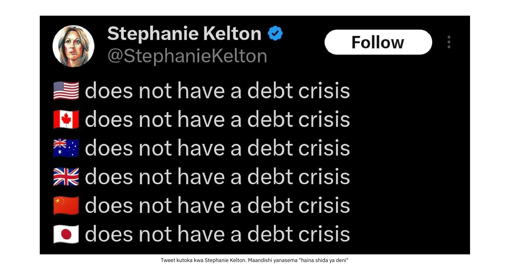

Ajabu, inaorodhesha nchi sita tu? Kwa nini ni hivyo? Kwa sababu wana uhuru halisi wa kifedha. Lakini kuna karibu nchi 200 Duniani, na sio zote zina uhuru wa kifedha. Kwa hivyo, ukosoaji wangu wa nadharia hii, mbali na kuwa ya kushangaza kidogo na isiyofanya kazi, ni kwamba inafanya kazi tu kwa nchi chache ambazo zinafurahia uhuru wa kweli wa kifedha, zile ambazo zinaweza kutoa bili za hazina kwa sarafu yao wenyewe. Kwa kiasi fulani, huenda kwa madhara ya wengine wa dunia. Kwa kuunda sarafu hii, ni kana kwamba walikuwa wakisafirisha mfumuko wao wa bei mahali pengine, sawa na kile ambacho Marekani imekuwa ikifanya kwa fursa yake ya kipekee kwa miongo kadhaa. Hii inafanana na aina ya ukoloni wa kifedha, ambapo nchi ambazo zina imani ya kimataifa na mahitaji ya sarafu zao zinaweza kuchapisha pesa nyingi wanavyotaka bila kuingiza mfumuko mkubwa wa bei, mara nyingi kwa sababu zinasafirisha nje mfumuko huo wa bei.

Nadharia hii ni ngumu kutumika kwa uchumi unaotegemea uagizaji bidhaa ambao unahitaji kudumisha imani ya kimataifa katika sarafu yao.

Nadharia hii pia inahitaji kiwango fulani cha mipango ya kati ya uchumi, haswa kuhakikisha udhibiti mkubwa juu ya rasilimali halisi (wafanyakazi, malighafi, uwezo wa kiviwanda) na kudhibiti mfumuko wa bei.

# Kuanguka na kuzaliwa upya kwa pesa

<partId>87a34ca9-782b-5ade-b51a-400f88ed7b0c</partId>

## Sarafu za Kigiriki

<chapterId>7714195f-74ce-5f8c-be5f-59302d39fff4</chapterId>

:::video id=8e5c3091-0910-471b-8d4b-0dc6e9afa656:::

### Usuli na muktadha

Kabla ya kuanza, hapa kuna msingi wa kihistoria:

**Usuli wa kihistoria:**

**Warumi waliwaita Wagiriki “Graeci” na Ugiriki “Graecia”.**

**Wagiriki walijiita "Hellenes" na nchi yao "Hellas".**

**Homer** (aliyezaliwa karibu karne ya 8 KK)

Mshairi mashuhuri wa Kigiriki, anayedhaniwa kuwa mwandishi wa *The Iliad* na *The Odyssey*.

Karibu na **750 KK: Lycurgus**, mbunge wa kizushi wa Sparta, anasemekana kuanzisha katiba ya Spartan kwa kuzingatia nidhamu ya kijeshi na usahili.

**Numa Pompilius** (753-673 KK)

Mfalme wa pili wa Roma, maarufu kwa kuipa Roma taasisi zake za kwanza za kidini na kisheria.

**Drakoni**, mbunge wa Athene (karne ya 7 KK), maarufu kwa sheria zake kali sana, kwa hivyo neno "kibabe".

**594 KK: Solon** anakuwa mbunge katika Athene na kurekebisha kwa kiasi kikubwa jamii ya Waathene, hasa kwa kukomesha utumwa wa madeni.

**776 KK: Michezo ya Olimpiki ya Kale**

Michezo ya kwanza ya kawaida ya michezo ilifanyika Olympia kila baada ya miaka minne, ikileta pamoja miji ya Ugiriki.

**Pythagoras** (takriban 570-495 KK)

Mwanafalsafa wa Uigiriki na mwanahisabati, maarufu kwa nadharia yake juu ya pembetatu ya kulia.

**Xenophanes of Colophon** (c. 570-478 BC)

Mwanafalsafa wa kabla ya Socrates anayejulikana kwa ukosoaji wake wa ushirikina wa jadi wa Kigiriki.

**490 KK: Vita vya Marathon**

Waathene walizuia kwa ushindi uvamizi wa Waajemi, na hivyo kuashiria badiliko kubwa la ustaarabu wa Ugiriki.

**Herodotus** (c. 484-425 BC), aliyepewa jina la utani la "baba wa historia", aliandika kazi kubwa inayoelezea Vita vya Waajemi, ikijumuisha ushindi wa Wagiriki dhidi ya Xerxes mnamo 480 KK.

**Socrates** (470-399 KK)

Mwanafalsafa wa Athene maarufu kwa njia yake ya lahaja na mafundisho yake juu ya maadili na kujijua.

**Aristophanes** (c. 446-386 KK)

Mwandishi wa tamthilia wa Athene, maarufu kwa vichekesho vyake vya kejeli kama vile *Vyura*.

**Sophocles** (karne ya 5 KK), katika tamthilia yake ya *Antigone*, anakosoa pesa kuwa chanzo cha ufisadi wa kimaadili na kisiasa, kupitia kwa dhalimu Creon.

**Plato** (c. 428-348 KK)

Mwanafalsafa wa Kigiriki, mwanafunzi wa Socrates, mwanzilishi wa Chuo, mwandishi wa *Jamhuri*.

**431-404 KK: Vita vya Peloponnesi**

Mzozo mkubwa kati ya Athene na Sparta, na kuishia kwa kushindwa kwa Athene.

**431 KK**: Athene inafadhili Vita vya Peloponnesian kwa kupunguza sarafu zake za dhahabu na fedha ili kuongeza wingi katika mzunguko, na kusababisha mfumuko wa bei.

**Xenofoni** (c. 430-355 KK)

Mwandishi wa Athene, mwanafalsafa na jumla, mfuasi wa Socrates, mwandishi wa *Anabasis*.

**414 KK**: Athene inaanza kupoteza Vita vya Peloponnesian baada ya msafara mbaya kuelekea Sicily.

**405 KK: Aristophanes**, katika tamthilia yake ya *Vyura*, anaeleza kwa uwazi kushuka kwa thamani ya drakma ya fedha na kuonekana kwa sarafu duni za shaba huko Athene, ikionyesha kanuni inayojulikana leo kama "Sheria ya Gresham".

**404 KK**: Athene yasalimu amri baada ya kuzingirwa kwa muda mrefu na Sparta.

**Aristotle** (384-322 KK)

Mwanafalsafa mkuu wa Kigiriki, mwanafunzi wa Plato, mwanzilishi wa Lyceum, anayejulikana kwa kazi yake katika mantiki, biolojia na falsafa ya kisiasa.

**327 KK**: Aleksanda Mkuu alishinda Persepolis na majimbo ya mashariki ya Milki ya Uajemi, akipanua himaya yake kwa kiasi kikubwa.

**323 KK**: Aleksanda alikufa huko Babeli bila mrithi wa wazi, na hivyo kuzua vita kati ya majemadari wake (diadochi) ili kugawanya ufalme.

**Archimedes** (c. 287-212 KK)

Mwanahisabati wa Uigiriki, mwanafizikia na mvumbuzi, maarufu kwa uvumbuzi wake katika jiometri na mechanics.

**196 KK: Jiwe la Rosetta** limechorwa wakati wa enzi ya Farao Ptolemy V, na kuwezesha kufafanua baadaye maandishi ya maandishi ya Misri.

**192-188 KK: Vita vya Romano-Seleusid**

Roma ilishinda milki ya Seleucid iliyoongozwa na Antiochos III, ikiunganisha ushawishi wake katika Ugiriki na Asia Ndogo.

**146 KK: Vita vya Korintho**

Warumi waliharibu jiji la Kigiriki la Korintho, na hivyo kuashiria mwisho wa uhuru wa kisiasa wa Ugiriki na ushirikiano wa taratibu wa Ugiriki katika ulimwengu wa Kirumi.

Kwa sehemu hii ya Mambo ya Kale, anguko la Roma na Enzi za Kati, tutaanza na sehemu ya sarafu za Kigiriki.

Historia ya sarafu katika Ugiriki ya kale ilianza karibu 600 BC, wakati miji ya Kigiriki ilipitisha haraka uvumbuzi kutoka Lydia huko Asia Ndogo, awali kwa kutumia elektroni na baadaye fedha. Sarafu za kwanza za Uigiriki zilitengenezwa kwenye kisiwa cha Aegina, zikiwa na kobe wa baharini au nchi kavu, lakini ilikuwa drakma ya Athene, iliyopambwa kwa Athena na bundi, ambayo ikawa ishara ya pesa kwa ubora kutoka karne ya 5 KK, ikitawala biashara ya kimataifa wakati huo.

Na nina bahati ya kuwa na nakala ya drakma ya Kigiriki ya kipindi hicho na bundi huyo maarufu na sura nyuma. Ni tetradrakma, ambayo ilikuwa kubwa kuliko drakma sahili.

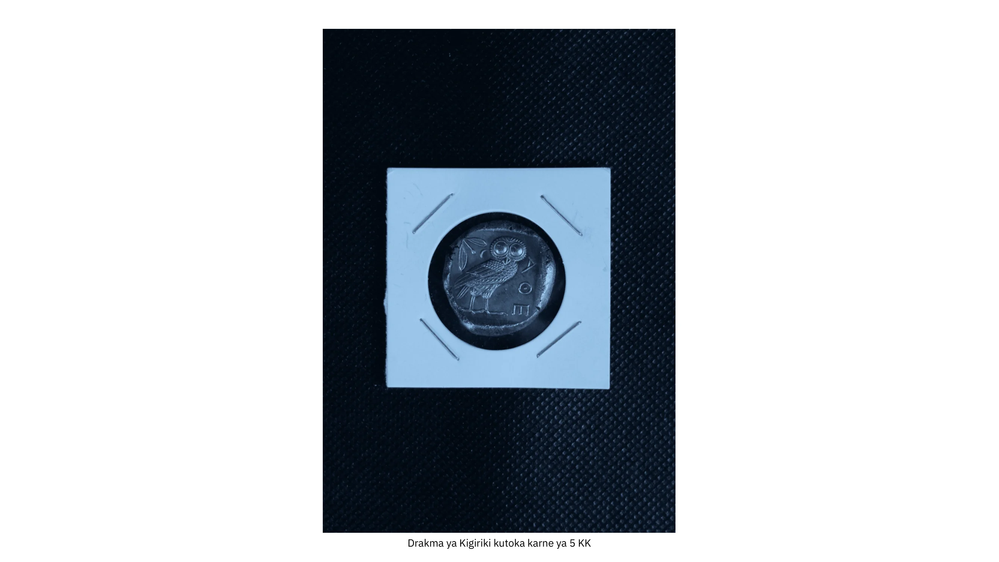

Kila jiji la Ugiriki lilikuza uhusiano wake na pesa. Huko Athene, sarafu ilihusishwa sana na nguvu za kisiasa na kiuchumi. Amri maarufu ya Athene ya mwishoni mwa karne ya 5 KK iliweka matumizi ya kipekee ya sarafu ya Athene katika maeneo ya washirika wake, na hivyo kuimarisha utawala wake wa kiuchumi. Athene pia ilikusanya akiba kubwa ya dhahabu kwa ajili ya dharura, ambayo iliwekwa kwenye Acropolis, labda kama ishara ya busara yake ya kiuchumi. Kinyume chake, Sparta, jiji la kijeshi lililo na maadili makali, lilichagua kuweka vizuizi vikali matumizi ya pesa, likiwakataza raia wake kumiliki sarafu za dhahabu au fedha. Sparta ilipendelea kutumia vyuma vizito kukatisha tamaa biashara ya nje na kudumisha mshikamano wa kijamii.

Vita mara nyingi vilifadhiliwa na udanganyifu wa sarafu. Wakati wa Vita vya Peloponnesian (431-404 KK), Athene iliamua kushuka kwa thamani kubwa ili kulipa askari wake. Ilinyimwa ufikiaji wa migodi yake ya fedha na uvamizi wa Spartan wa Decelia mnamo 413 KK, Athene ililazimika kuyeyusha sanamu za dhahabu ili kutengeneza sarafu mpya kwa haraka mnamo 407/406 KK. Kisha, mnamo 406/405 KK, aliunda sarafu za shaba zilizopambwa kwa fedha, na kusababisha shida ya kifedha iliyoonyeshwa na **Aristophanes**, ambaye tayari anaibua kile kinachojulikana leo kama Sheria ya Gresham: pesa mbaya inayofukuza pesa nzuri. Sarafu hii ya dharura ilitolewa haraka baada ya vita ili kurejesha imani katika sarafu ya Athene.

Mwisho wa kipindi cha kitamaduni uliwekwa alama na kuongezeka kwa Makedonia chini ya Philip II na mwanawe Alexander the Great, na kukasirisha sana usawa wa fedha wa Uigiriki. Shukrani kwa migodi mikubwa ya dhahabu na fedha ya Mlima Pangea, Filipo wa Pili alizalisha pesa nyingi ili kufadhili kampeni zake za kijeshi na kisiasa, akiweka kiwango rahisi na cha vitendo cha dhahabu-fedha (10:1). Majina yake ya dhahabu, yakisherehekea ushindi wake kwenye Michezo ya Olimpiki, yalienea hadi Ulaya Magharibi, hata kufika Uingereza. Alexander alifuata sera hii ya fedha, akieneza sana **Attic** drakma wakati wa ushindi wake katika Mashariki hadi India. Mzunguko huu mkubwa wa sarafu ulionyesha mwanzo wa enzi ya Ugiriki, wakati sura ya wafalme ilipochukua mahali pa miungu kwenye sarafu. Ubunifu huo uliwezesha vizazi vya wafalme wa Kigiriki kujitangaza wenyewe, na kuwaweka miungu ya kitamaduni kuwa sehemu ya pili nyuma ya sarafu zao.

Baada ya kifo cha Aleksanda mwaka 323 KK, majenerali wake waligawanya milki yake kubwa sana, wakaanzisha nasaba huko Misri (Ptolemies), Syria (Seleucids) na kwingineko. Falme hizi za Kigiriki zilipitisha mifumo mbalimbali ya fedha: Ptolemies waliweka mfumo funge wa fedha ili kudhibiti mzunguko wa fedha, wakipendelea kutumia nafaka kama sarafu ya ndani ili kuokoa madini ya thamani kwa matumizi ya nje ya kijeshi. Wakati huo huo, Rhodes ikawa kituo kikuu cha biashara kabla ya kudhoofishwa kiuchumi na Warumi, ambao walianzisha Delos kama bandari huru mnamo 167 KK.

Matumizi ya pesa yalikuwa msingi wa malipo ya mamluki. Askari wa Alexander walipokea drakma za fedha kila siku.

Wapanda-farasi, wasomi wa jeshi lililobobea sana la Alexander, walipokea wastani wa drakma mbili kwa siku, askari wa miguu drakma moja, na mamluki wa kawaida theluthi mbili ya drakma, mara mbili ya mshahara wa mfanyakazi wa kawaida.

Wakati wa Vita vya Peloponnesian, pesa nyingi pia zililipwa kwa askari: zaidi ya talanta 1,200 ili kukomesha uasi wa Samos na zaidi ya talanta 2,000 kuzingira Potidea.

Kufikia wakati jeshi hili liliposhiriki kikamilifu katika Asia Ndogo, jumla ya gharama ilikuwa karibu talanta ishirini kwa siku, au karibu nusu tani ya fedha, au drakma 120,000.

Sarafu ya Kigiriki pia ilicheza jukumu muhimu la kitamaduni, kwani kila jiji lilijaribu kujitambulisha kwa kutengeneza sarafu zake zenye alama za kienyeji au za hadithi. Kwa mfano, Heraclius alionyesha Heracles (Hercules) akipigana na simba, wakati Cyrene alionyesha silphium ya mimea maarufu ya dawa.

Hatimaye, licha ya tofauti zao na mabadiliko ya kimaeneo, sarafu za Kigiriki za Kigiriki na za Kigiriki ziliacha alama ya kudumu kwenye historia ya kiuchumi na kiutamaduni ya ulimwengu wa Mediterania, na kuathiri sana mifumo ya fedha ya baadaye hadi Roma, ambayo hatua kwa hatua ilipitisha na kuendeleza dhana za kiuchumi za Kigiriki ili kuunda uchumi wake wa kifalme.

## Athari za sarafu nchini Ugiriki

<chapterId>3a5e6c7d-699c-5567-87cd-3374c49d55a9</chapterId>

:::video id=0c79a59c-e179-4893-a414-1b8de0930eb9:::

### Athene na tofauti na Sparta

Upinzani kati ya Athene na Sparta wakati wa kipindi cha Kigiriki cha kale unaonyesha mifano miwili tofauti ya shirika la kisiasa na kiuchumi. Ingawa Sparta ilikataa pesa za chuma ili kupendelea mfumo wa kujitegemea kwa msingi wa uaminifu wa raia, Athene ilikubali kikamilifu teknolojia hii ili kujenga na kudumisha himaya yake ya baharini.

### Umuhimu wa kifedha wa nguvu ya majini

Milki ya Athene, licha ya jina lake kuu, ilibaki kuwa ya kawaida kijiografia - kimsingi Athene na miji ya Bahari ya Aegean. Nguvu yake iliegemea kwenye Ligi ya Delos, muungano wa kijeshi uliotawaliwa na Athene kama hegemon. Muundo huu wa kifalme ulihitaji chombo cha umoja cha kiuchumi: sarafu ya fedha ya Athene.

Kudumisha meli ilikuwa kiini cha hitaji hili la kifedha. Trireme moja ya Athene iligharimu kati ya talanta moja na mbili za fedha - kiasi kikubwa. Ikiwa na mamia ya meli za kutunza, Athene ilihitaji mfumo mzuri wa ushuru. Sarafu ikawa chombo cha lazima cha kukusanya ushuru kutoka kwa miji midogo na kufadhili jeshi la majini la makadirio ambalo lilihakikisha mshikamano wa ufalme.

### Kuweka fedha kama chombo cha utawala

Athene iliweka sarafu yake ya fedha kwa wanachama wote wa Ligi ya Delos. Usanifu huu wa fedha ulitimiza malengo kadhaa ya kimkakati. Kwanza, iliwezesha ukusanyaji wa kodi kwa kuunda kitengo cha pamoja cha akaunti. Pili, iliimarisha utegemezi wa kiuchumi wa miji iliyo chini ya Athene. Hatimaye, ilionyesha kwa ishara nguvu ya Athene katika himaya yote ya baharini.

Sera hii ya fedha inatofautiana sana na mtindo wa Spartan. Sparta, mamlaka ya ardhi, inaweza kutegemea kazi ya watumwa wa Peloponnesian kwa ajili ya kujikimu. Mfumo wake wa kiuchumi uliofungwa, ulio katikati ya jiji haukuhitaji vyombo vya kisasa vya kifedha. Wanajeshi-raia waliishi pamoja, walishiriki milo ya kawaida, na hawakuhitaji pesa za kubadilishana kila siku.

### Sarafu kama gari la biashara ya baharini

Hali ya ubaharia ya milki ya Athene ilimaanisha kuwa ilipaswa kuwa wazi kwa biashara. Tofauti na Sparta yenye sura ya ndani, Athene ililazimika kufanya biashara na ulimwengu wa nje ili iendelee kuishi na kusitawi. Sarafu ikawa chombo cha lazima cha biashara ya Mediterania.

Mwelekeo huu wa nje uliunda mzunguko mzuri: mapato yaliyotokana na biashara, mapato haya yalifadhili meli, meli zililinda njia za biashara na kudumisha ufalme, na ufalme uliweka sarafu ya Athene, ambayo iliwezesha biashara. Sarafu haikuwa tena njia ya kubadilishana tu, bali ikawa nguzo ya mkakati wa kifalme.

### Mipaka ya nguvu ya fedha

Licha ya ustaarabu huu wa kiuchumi, nguvu ya kifedha ya Athene ilionyesha mipaka yake wakati wa Vita vya Peloponnesian. Mbele ya vikosi vya ardhini vya Spartan, ubora wa majini na kifedha wa Athene haukutosha. Safari za gharama kubwa, kama vile kampeni mbaya ya Syracuse huko Sicily, zilimaliza rasilimali za kifedha bila kuleta ushindi madhubuti.

Historia inaonyesha kwamba sarafu, ingawa ni chombo chenye nguvu cha kuonyesha uwezo, sio hakikisho la kutawaliwa kijeshi. Sparta, bila sarafu ya chuma lakini mshikamano wa ajabu wa kijamii, hatimaye ilishinda ufalme wa fedha wa Athene.

### Mifano mbili, hatima mbili

Upinzani kati ya Athene na Sparta unaonyesha njia mbili za kimsingi za shirika la kijamii na kiuchumi. Athene inawakilisha mfano wa wazi, wa kibiashara, wa uchumaji - mtangulizi wa himaya za kisasa za baharini. Sparta inajumuisha modeli iliyofungwa, isiyo na maana, inayotokana na uaminifu wa raia badala ya vyombo vya fedha.

Mifumo hii miwili inaonyesha kwamba kupitishwa kwa sarafu kunahusishwa kwa karibu na mtindo wa kisiasa na kiuchumi uliochaguliwa. Kwa mamlaka ya baharini na ya kibiashara kama vile Athene, pesa zikawa za lazima. Kwa jamii iliyofungwa ya mashujaa kama Sparta, inawakilisha tishio kwa utaratibu wa kijamii. Dichotomy hii ya zamani bado inafahamisha mijadala juu ya jukumu la pesa katika shirika la jamii.

## Jamhuri ya Kirumi

<chapterId>0bc80983-33e1-5881-85bb-7c22f3144a9a</chapterId>

:::video id=dc05ca97-d29c-4679-bfeb-912c47d86ce2:::

### Historia ya Jamhuri ya Kirumi

- 753 - 509 KK: Ufalme wa Roma**
- 753 KK: Msingi wa Roma** (kimapokeo ulihusishwa na Romulus).
- 509 - 27 KK: Jamhuri ya Kirumi**, Roma inakuwa jamhuri inayotawaliwa na Seneti na mabalozi waliochaguliwa.
- 280 - 275 KK: Vita vya Pyrrhic**. Pyrrhus, Mfalme wa Epirus, anapigana na Warumi kusini mwa Italia, akishinda ushindi wa gharama kubwa ("Ushindi wa Pyrrhic").
- 264 - 146 KK: Vita vya Punic**. Mgogoro mkubwa unaoikabili Roma dhidi ya Carthage kwa kutawala Bahari ya Magharibi.
- Hannibal (247 - c. 181 KK)**. Jenerali mashuhuri wa Carthaginian, maarufu kwa kuvuka Alps na jeshi lake na tembo kushambulia Roma wakati wa Vita vya Pili vya Punic.
- 146 KK: Vita vya Korintho**. Roma inaharibu jiji la Kigiriki la Korintho na kuweka utawala wake wa mwisho katika bara la Ugiriki.
- 91 - 87 KK: Vita vya Kijamii**. Uasi wa washirika wa Kiitaliano wa Roma wakidai uraia wa Kirumi, ambao hatimaye ulisababisha ushirikiano wao kamili katika uraia.
- 64 KK: Mwisho wa upinzani wa Seleucid**. Roma kwa hakika inaondoa ushawishi wa Seleucid katika Siria, ikiimarisha umiliki wake kwenye Mediterania ya Mashariki.
- 55 KK: Julius Caesar anashinda Ulaya ya Kati na Magharibi **. Julius Caesar anapanua utawala wa Kirumi juu ya Gaul (Ufaransa ya sasa) na kuingia Germania na Brittany.
- 43 KK: Kuundwa kwa Utatu wa Pili**. Muungano wa kisiasa kati ya Octavian (baadaye Augustus), Mark Antony na Lepidus, ili kuleta utulivu wa Roma baada ya mauaji ya Kaisari.
- 27 KK: Mwanzo wa Pax Romana**. Kipindi cha utulivu wa kisiasa na ustawi chini ya utawala wa Augustus, kuashiria mwanzo wa Dola ya Kirumi.

### Mwanzo wa mwisho wa pesa wa Roma

Katika sehemu hii ya Mambo ya Kale, sasa tunaelekeza mawazo yetu kwa Jamhuri ya Kirumi. Historia ya fedha ya Roma ilianza baadaye sana kuliko ile ya Wagiriki na Waajemi. Ilianzishwa mwaka 753 KK, Roma ilisubiri karibu karne nne kabla ya kupitisha sarafu. Katika kipindi hiki kirefu, Waroma walitumia mfumo wa zamani wa kubadilishana vipande vya shaba visivyo vya kawaida vilivyoitwa aes rude, vilivyohitaji uzani sahihi kwa kila shughuli. Ilikuwa tu mwishoni mwa karne ya 4 KK, chini ya ushawishi wa Wagiriki na Etrusca, kwamba Roma ilianza kutoa sarafu zake za kwanza, haswa katika chuma cha shaba kama huko Uchina, kaburi la aes, tabia ya kubadilishana kwa Warumi hadi ** Vita vya Pili vya Punic**.

### Ushawishi wa Kigiriki na sarafu za kwanza za fedha

Mkutano wa kuamua na Wagiriki wa kusini mwa Italia uliwaletea Warumi kwa sarafu za fedha zilizotengenezwa. Karibu 280 BC, Roma ilianza kutoa sarafu zake za fedha kwa kuiga didrachms za Kigiriki. Toleo la kwanza la kawaida la sarafu za fedha huko Roma lilianza mnamo 269 KK, likiwa na mapacha wa hadithi Romulus na Remus walionyonywa na mbwa mwitu, ishara ambayo imekuwa ya kitabia.

Kwa kweli, sarafu nyingi za Kirumi kutoka kipindi cha Jamhuri zinaonyesha hadithi za msingi. Unaweza kuona yangu hapa chini: ni sarafu nzuri sana, halisi kutoka kwa Mfalme Tatius. Inaonyesha hadithi ya utekaji nyara wa wanawake kutoka kwa Sabines. Tatius alikuwa mfalme wa eneo hili, na hadithi ya mwanzilishi inasimulia jinsi Warumi walivyoteka nyara wanawake kutoka kwa Sabines, idadi ya watu walioishi karibu. Baadaye, Mfalme Tatius akawa mfalme mwenza na Romulus, mmoja wa waanzilishi wa Roma.

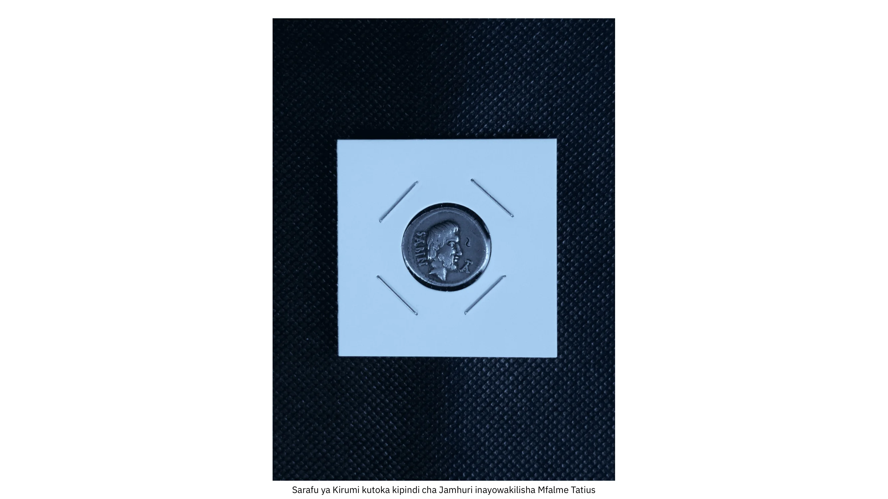

### Asili ya neno "sarafu" na hekalu la Juno Moneta

Neno "sarafu" lina asili yake katika hekalu la Juno Moneta huko Roma. Hadithi inasema kwamba, wakati wa uvamizi wa Gallic mnamo 390 KK, bukini watakatifu wa Capitol waliwatahadharisha Warumi juu ya hatari iliyokaribia. Ili kumshukuru mungu wa kike Juno, mlinzi wa Capitol, hekalu lilijengwa kwa heshima yake na hivi karibuni likawa mint ya sarafu za Kirumi.

### Vita vya Punic na migogoro ya sarafu

Migogoro ya kijeshi ilikuwa na ushawishi mkubwa juu ya maendeleo ya kifedha ya Warumi. Wakati wa Vita vya Pili vya Punic (218-201 KK) dhidi ya Carthage, Roma ilikabiliwa na matatizo makubwa ya kifedha mbele ya uvamizi wa Hannibal. Ili kupunguza mahitaji haya ya dharura, Roma iliamua kwa mara ya kwanza suala la kipekee la sarafu za dhahabu, na pia kushuka kwa thamani ya sarafu yake ya fedha, kutoka kwa usafi wa awali wa 97% hadi karibu 89%. Uzito wa sarafu za shaba (aes) pia ulipungua kwa kiasi kikubwa, kupoteza karibu 80% katika miaka sita.

Hapa, tunaweza kurejea dhana ambayo tumejadili awali kuhusu Wagiriki kuyeyusha madini ya thamani yaliyohifadhiwa kwenye mahekalu ili kusaidia kupunguza migogoro ya kiuchumi. Na kuzungumza kuhusu **Carthage**, hapa chini unaweza kupendeza sarafu halisi ya Carthaginian kutoka kwenye mkusanyiko wangu. Sarafu hizi za Carthaginian zilikuwa na mtende upande mmoja, na farasi upande mwingine. Kwenye sarafu hii, farasi haitambuliki sana, a imevaliwa sana.

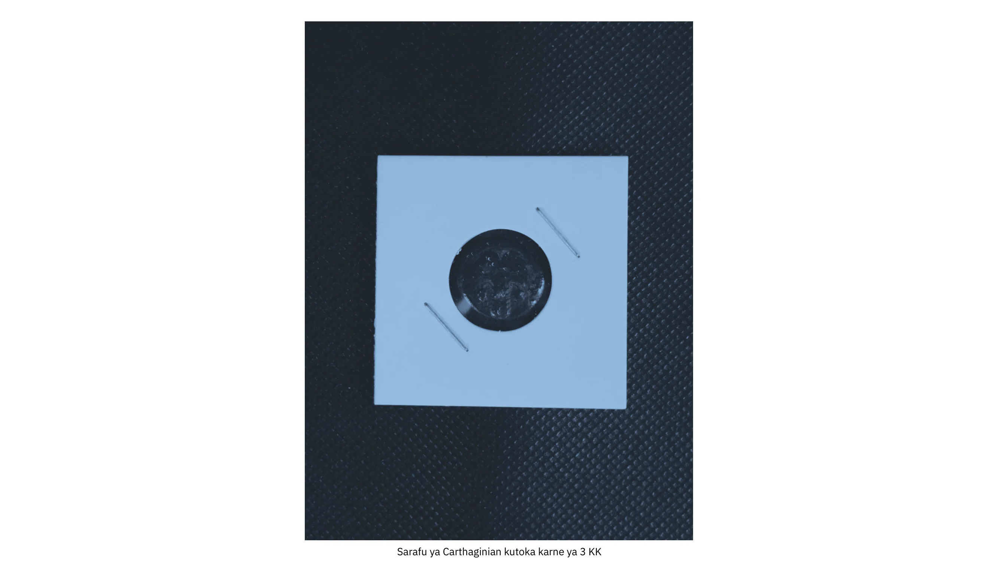

Kama matokeo, uzito wa sarafu za shaba, zinazojulikana kama aes, pia zilishuka sana, na kupoteza karibu 80% katika miaka sita. Kwa hiyo, uzito wa sarafu hizi za shaba, ambazo hazikuwa chuma cha thamani na zilitumiwa katika biashara ya kila siku, zilishuka sana, ambayo ilikuwa ishara ya kushuka kwa thamani ya fedha kutokana na vita hivi.

### Dinari ya fedha na utulivu wa fedha

Ilikuwa dhidi ya hali hii muhimu ambapo Roma ilianzisha dinari maarufu ya fedha karibu 212 BC. Marekebisho haya yalihakikisha utulivu wa ajabu wa fedha, na dinari ikisalia kuwa sarafu kuu kwa karibu miaka 450. Roma inadaiwa uthabiti huu kwa usimamizi mkali, licha ya kupunguzwa bei kubwa mnamo 146 KK na uzalishaji mkubwa wa kufadhili majeshi yake makubwa, haswa wakati wa Vita vya Punic, Kijamii (91-87 KK), na vita vya Makedonia. Kwa mfano, kudumisha jeshi moja la Kirumi kuligharimu karibu dinari milioni 1.5 kwa mwaka, kuonyesha kiwango cha mahitaji ya kifedha.

Nje ya mipaka ya Warumi, vita vilisababisha kushuka kwa thamani kubwa katika maeneo yaliyo chini ya ushawishi wa Warumi. Punic Carthage iliona usafi wa elektroni yake kushuka kwa kasi, kutoka 98% ya dhahabu katika karne ya 4 hadi 30% tu wakati wa Vita vya Pili vya Punic, wakati sarafu zake za fedha zilishuka hadi 18%.

### Maendeleo ya nia ya fedha

Pamoja na upanuzi wa Roma, tabia ya sarafu pia ilibadilika: awali bila majina na ya kizalendo, sarafu hatua kwa hatua ilipitisha miundo ya kibinafsi iliyo na familia zenye nguvu za wachimbaji (wale ambao walipiga sarafu). Mabadiliko haya yanaashiria wazi mabadiliko ya kisiasa ya marehemu Jamhuri ya Kirumi.

Hatimaye, wakati Roma ilitawala ulimwengu wa Mediterania kiuchumi, ilibakiza usahili fulani katika njia zake za malipo: hakuna namna halisi ya uhamishaji wa fedha zaidi ya ubadilishanaji wa moja kwa moja wa sarafu uliotengenezwa, isipokuwa uhamishaji wa kodi na mikopo ya kibinafsi iliyohifadhiwa kwa ajili ya wasomi.

## Ufalme wa Kirumi

<chapterId>2dc44e50-112a-5abf-97ae-8e0a9ecda989</chapterId>

:::video id=f8d6f3d6-9ee4-4504-888e-4f12b3f20489:::

**Usuli wa kihistoria:**

**The Principate** ilikuwa ni aina ya serikali ya kifalme katika Milki ya Rumi tangu mwanzo wa utawala wa Augustus mwaka 27 KK hadi mwisho wa mgogoro wa karne ya tatu mwaka 284 AD.

**27 KK: Mwanzo wa Pax Romana**

Kipindi cha utulivu wa kisiasa na ustawi chini ya utawala wa Augustus, kuashiria mwanzo wa Dola ya Kirumi.

**Augusto (mwaka 30 KK hadi 14 BK)** alirekebisha kwa kiasi kikubwa mfumo wa fedha wa Kirumi, akiweka kiwango cha kudumu na thabiti cha sarafu ya kifalme.

**Augusto pia alikuwa mmoja wa wakusanyaji wa kwanza kutambuliwa** wa sarafu na visukuku vya kale.

**54 BK - 68 BK: Nero**

Mtawala wa Kirumi mwenye utata, anayejulikana kwa udhalimu wake, mateso na usimamizi mbaya baada ya kuchomwa kwa Roma.

**64 BK: Moto Mkubwa wa Roma**

Moto mkubwa unateketeza sehemu kubwa ya jiji; Nero anatuhumiwa kuwajibika.

**69 BK: Mwaka wa Wafalme Wanne**

Kipindi cha machafuko na wafalme wanne waliofuatana haraka (Galba, Otho, Vitellius, Vespasian).

**79 BK: Mlipuko wa Vesuvius**

Volcano ambayo iliharibu miji ya Pompeii na Herculaneum, ikihifadhi mabaki yao chini ya majivu.

**165 AD - 180 AD: Antonine plague**

Janga baya lililodhoofisha Milki ya Roma chini ya Marcus Aurelius na Commodus.

**200 BK: Msimamo wa eneo na mwisho wa taratibu wa Pax Romana**

Roma ilifikia upeo wake wa juu, lakini ilianza kuteseka kutokana na kuyumba kwa ndani na matatizo ya kiuchumi.

**212 BK: Amri ya Caracalla kuhusu uraia**

Mtawala Caracalla alitoa uraia wa Kirumi kwa karibu wakaaji wote wa milki hiyo, ili kupanua wigo wa kodi.

**220 AD: Mwanzo wa uvamizi mkubwa wa washenzi**

Uvamizi wa kwanza muhimu wa watu wa Ujerumani kuvuka mipaka ya Warumi.

**235 AD - 285 AD: Mgogoro wa kisiasa na kijeshi wa karne ya 3**

Kipindi kilicho na machafuko ya kisiasa, na watawala wengi wa muda mfupi, vita vya wenyewe kwa wenyewe, migogoro ya kiuchumi na uvamizi unaoendelea.

**Aurelian (mwaka 270-275 BK) alithamini sana sarafu ya Kirumi**, akijaribu kurejesha thamani yake ya kawaida licha ya mfumuko mkubwa wa bei.

**301 BK: Amri ya Bei ya Diocletian**

Maliki Diocletian alijaribu bila mafanikio kukomesha mfumuko wa bei uliokithiri kwa kuweka udhibiti mkali wa bei na mishahara katika milki yote.

**312 BK: Constantine**

Mtawala wa kwanza wa Kikristo, mwanzilishi wa Constantinople, aliimarisha sarafu kwa kuanzisha "solidus", sarafu ya dhahabu ya usafi mkubwa na utulivu.

**476 BK: Kuanguka kwa Milki ya Roma ya Magharibi**

Roma inachukuliwa na watu mbalimbali wa Kijerumani (ikiwa ni pamoja na Waostrogothi), tukio linalozingatiwa kuashiria mwisho rasmi wa Milki ya Magharibi ya Kirumi.

### mageuzi ya fedha ya Augustus

Katika sehemu hii ya Mambo ya Kale, tayari tumefika kwenye Milki ya Kirumi. Historia ya fedha ya Milki ya Kirumi ina sifa ya matumizi makubwa ya fedha za metali, hasa dhahabu, fedha, na shaba, lakini pia na migogoro mbalimbali ya fedha, inayohusishwa kwa karibu na machafuko ya kisiasa na kijeshi. Mwishoni mwa Jamhuri, chini ya Julius Caesar, Roma ilianzisha aureus ya dhahabu mwaka wa 46 KK, sarafu yenye uzito wa gramu 8 ambayo ilikubaliwa sana katika Ulaya na bonde la Mediterania. Kaisari alisanifisha sarafu hizi za dhahabu na kutengeneza sarafu za kwanza zenye picha ya mtu aliye hai, na hivyo kupindua mila ya zamani ya jamhuri iliyopendelea alama zisizojulikana, za pamoja. Maendeleo haya yaliambatana na kipindi cha mageuzi makubwa ya kisiasa, huku nguvu za kibinafsi zikichukua nafasi ya taasisi za jamhuri.

Baada ya kuuawa kwa Kaisari mwaka wa 44 KK, Octavian (Augustus) alichukua udhibiti wa Roma, na kuanzisha Dola mwaka wa 27 KK. Utawala wake uliona mageuzi kamili ya mfumo wa fedha, na kuleta utulivu wa kudumu kwa uchumi wa Kirumi. Wakati wa Augustus, aureus moja ya dhahabu ilikuwa sawa na dinari 25 za fedha, zenye thamani ya sestertii 4 za shaba. Utulivu huu wa kifedha uliendelea katika karne ya kwanza BK, kipindi ambacho mara nyingi hufafanuliwa kama enzi ya uchumi wa Roma.

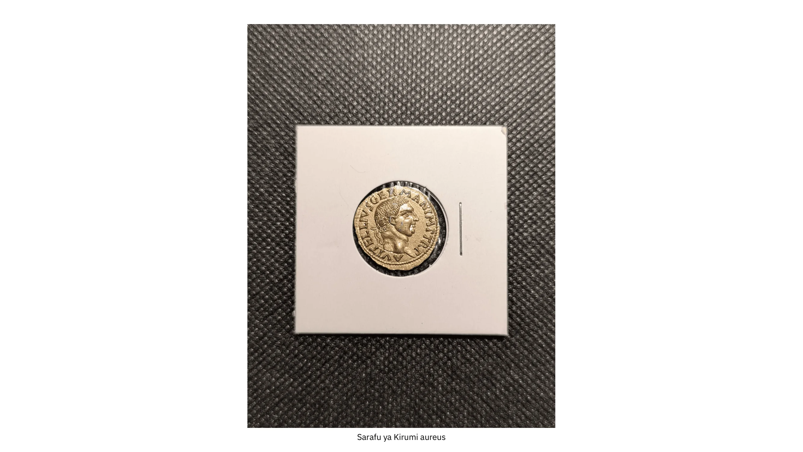

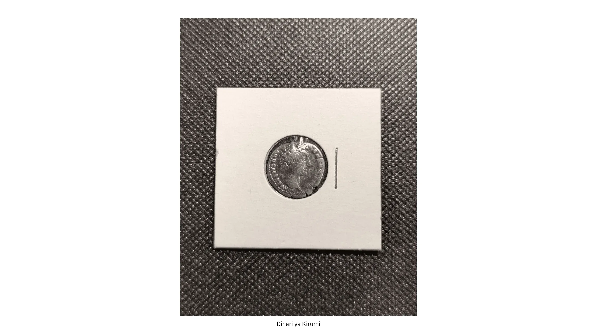

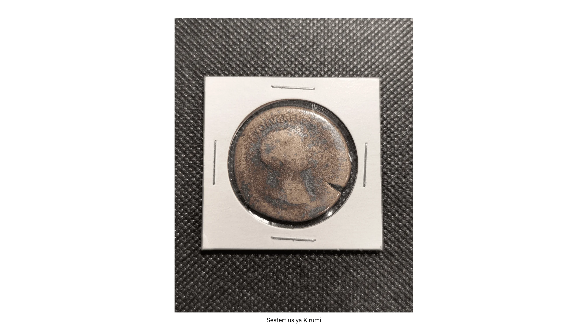

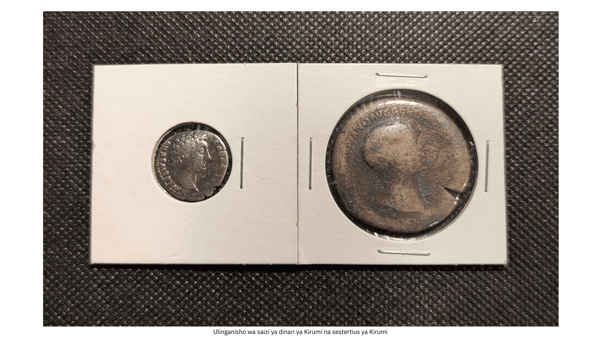

Hata hivyo, kuanzia Nero na kuendelea (mwaka 54-68 BK), Roma ilianza kushuka kwa thamani ya sarafu zake polepole, ikipunguza uzito na usafi wake hatua kwa hatua ili kufadhili matumizi ya kuongezeka ya kifalme, hasa baada ya moto mkubwa wa Roma mnamo AD 64. Ukadiriaji huu ulikuwa na athari kubwa: sarafu safi zaidi ziliondolewa kutoka kwa mzunguko kwa kuhifadhi au kuuza nje, kwa mujibu wa sheria **Gres's deva na kusababisha kupanda kwa bei taratibu.

Karne ya tatu inaashiria mabadiliko makubwa, kwa kuongeza kasi ya ajabu katika kushuka kwa thamani chini ya watawala Septimius Severus, Caracalla, na Gallienus. Sarafu kuu ya fedha, dinari na kisha antoninianus, iliona maudhui yake ya fedha yakishuka hadi 2% tu. Wakati huo huo, uzito wa dhahabu wa aureus ulipungua kwa nusu. Mgogoro huu wa kifedha uliambatana na ukosefu wa utulivu wa kisiasa ambao haujawahi kutokea, uvamizi wa washenzi na vita vya wenyewe kwa wenyewe vya mara kwa mara.

Sehemu hii inaniruhusu kutambulisha kipande cha mwisho katika sehemu hii: antoninianus. Jina la asili la sarafu hii haijulikani, lakini tunarejelea kama antoninianus leo. Ina tofauti ya kuthaminiwa kwa dinari mbili, licha ya kuwa kubwa mara 1.5 tu kuliko dinari. Zaidi ya hayo, baada ya muda, sarafu hizi zikawa sarafu za mabilioni tu, kumaanisha zilitengenezwa kutoka kwa aloi ya fedha na metali nyingine badala ya fedha safi. Sarafu hizo mara nyingi zilifunikwa tu na fedha, zikiwa mfano mashuhuri wa kuoza kwa pesa.

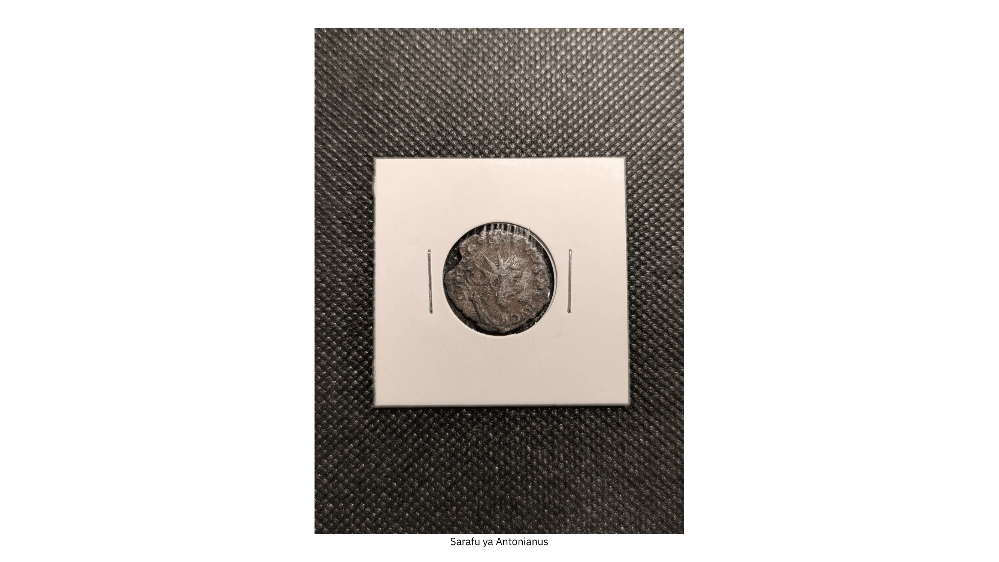

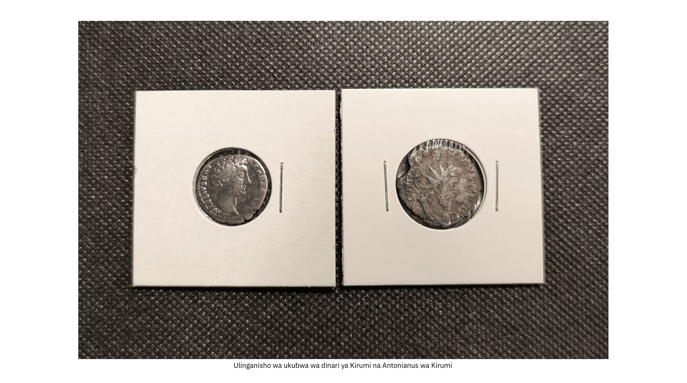

Akikabiliwa na hali hii, Mtawala Aurelian (mwaka wa 270-275 BK) alijaribu kuleta utulivu mfumo huo kwa kutathmini upya sarafu, lakini mageuzi haya yalianzisha utaratibu wa mfumuko wa bei kwa kuweka thamani ya sarafu zilizopo katika kiwango cha juu kwa njia isiyo halali.

Nitaanzisha upungufu juu ya mada. Katika karne ya 3, mfumuko wa bei ulipata ongezeko la kasi kubwa. Hapo awali, ingawa sarafu zilipunguzwa thamani, mchakato uliotengenezwa kwa mikono wa kuzitengeneza moja baada ya nyingine ulitoa udhibiti fulani juu ya mfumuko wa bei. Takwimu zinaonyesha kuwa zaidi ya miaka 300 ya kushuka kwa thamani, mfumuko wa bei ulikuwa wastani wa 4% kwa mwaka. Kabla tu ya mageuzi ya Aurelian, mfumuko wa bei ulikuwa takriban 3% kila mwaka.

Aurelian alianzisha kipimo cha usafi kwenye sarafu ya ishara ya XXI, akionyesha muundo wa sehemu 20 za shaba hadi sehemu 1 ya fedha, au usafi wa 5%. Aliuza sarafu hizi za fedha 5% na kugonga ishara ya XXI juu yao. Walakini, pia alikumbuka sarafu zingine zote, zilizopunguzwa thamani zaidi na kuzigonga XXI hiyo hiyo. Hii ilithamini kwa ufanisi thamani ya uso wa sarafu zote. Matokeo yake yalikuwa kasi ya mfumuko wa bei wa 20% kwa mwaka, ukizidi kiwango cha awali cha 3% kabla ya mbinu hii kutekelezwa.

Ilikuwa kweli Aurelian ambaye aligundua aina hii ya kushuka kwa thamani, ambayo ni ya haraka zaidi kuliko kushuka kwa thamani ya taratibu ya chuma, ambayo bado ilitulazimisha kuchapisha sarafu moja baada ya nyingine. Alichokifanya ni kuchukua sarafu zote zilizokuwepo, akazikumbuka na kuzipiga chapa ili kubadilisha thamani ya sura yake. Ni hatua ya kugeuka kweli. Hapo ndipo mfumuko wa bei ulipokua mkubwa.

Ili kuonyesha kwa uwazi kushuka kwa thamani huku kupindukia, nimepata takwimu za kuvutia za bei ya nafaka nchini Misri kutoka 40 BC hadi karne ya 3, iliyochukua zaidi ya miaka 300. Hapo chini, unaweza kuona tetradrakma ya Kigiriki kutoka kwa mkusanyiko wangu. Wakati huo, huko Misri chini ya utawala wa Warumi katika karne ya 3, sawa na tetradrakma ya Misri. Dinari ya drakma ilikuwa ingali inatumiwa, nayo ililingana na dinari moja.

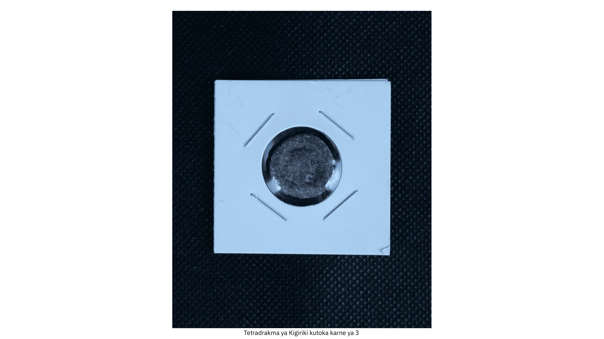

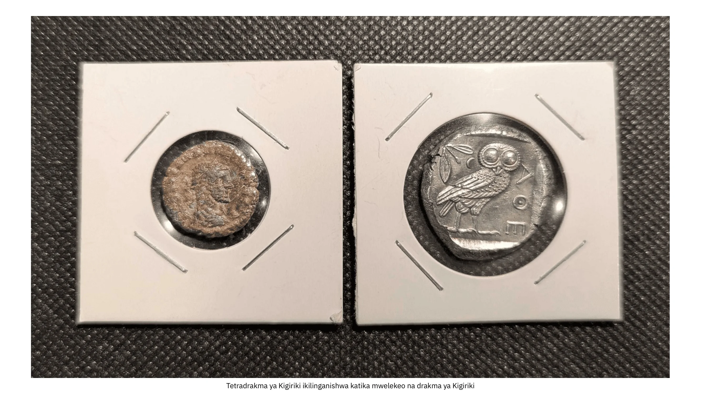

Kwa hiyo tetradrakmu ya Misri niliyo nayo ilikuwa sawa na dinari moja. Unaweza kuona kwamba sarafu imetengenezwa kwa mabilioni (au shaba), kwa hiyo haina chuma chochote cha thamani. Unaweza kuilinganisha na tetradrakm ya asili ya Kigiriki ili kuona kushuka kwa thamani kwa miaka hii 300. Ni ongezeko la mara milioni la bei ya nafaka nchini Misri.

Ni usemi wa kimwili wa mageuzi ya Aurelian. Ikumbukwe kwamba wengi, wastani wa miaka hii 300 ya mfumuko wa bei, ulikuwa karibu 4%. Ilikuwa tu mwishoni, wakati Aurelian alipofanya mageuzi yake, kwamba mfumuko wa bei uliongezeka sana na tukafikia kipimo hiki cha milioni 1. Bei zilikuwa juu mara milioni mwishoni mwa karne ya 3 kuliko karne ya 1 KK.

Mrithi wake **Diocletian** (284-305 AD) alijaribu hata mageuzi makubwa zaidi: alitoa sarafu mpya (hasa argenteus, safi zaidi lakini iliyopunguzwa sana kwa kiasi), aliweka udhibiti mkali wa bei (Bei Edict ya 301 AD) na **kuanzisha mfumo wa kodi kulingana na malipo ya aina**. Licha ya jitihada hizo, mageuzi ya Diocletian yalishindwa kuzuia mfumuko wa bei uliokithiri.

Alipokabiliwa na kukataa kutoa bidhaa na huduma kwa kubadilishana na sarafu iliyoshuka thamani, Diocletian alianzisha **mfumo wa kurithi wa tabaka** ili kuwafunga wakulima na vizazi vyao kwenye ardhi yao.

Kinachotakiwa kueleweka hapa ni kwamba kilichotokea ni kwamba wakulima walikataa kupeleka mazao yao kwa kubadilishana na fedha iliyoshuka thamani, na majibu ya mpendwa wetu Diocletian ni kuunda **mataifa ya urithi** kwa kusema "wewe, huwezi kuondoka kwenye ardhi yako, watoto wako hawawezi kuondoka kwenye ardhi yao, sawa na askari, wewe ni askari, unakubali kulipwa kwa fedha yangu". Kama suluhisho la mpito, walilipwa kwa aina (nyama, chakula, nafaka) kwa sababu alikataa kuwapa pesa. Kwa hivyo aliweka mfumo huu wa tabaka za urithi kulazimisha watu kushikamana na biashara zao, kwa hivyo hawakuweza kubadilisha tu kazi ikiwa wangejaribu kutokubali sarafu iliyopunguzwa.

Ili kuonyesha mfano huu, hapa nina maandishi, dondoo kutoka kwa kitabu "*Utawala wa Fedha na Mfumuko wa Bei*":

> Kwa vile watu hawakuwa tayari kufanya kazi na kuwasilisha bidhaa dhidi ya sarafu iliyopunguzwa thamani, ambayo thamani yake ilikuwa ya juu kuliko thamani yake ya asili au soko, ilibidi walazimishwe kufanya kazi kwa kutoza kodi kwa njia fulani. [...] Ikawa ni kinyume cha sheria kwa wakulima kuondoka katika nyumba zao zilizosajiliwa. Kwa hivyo, idadi ya wakulima ilishikamana na ardhi kwa urithi.
>

> Mfumo huu wa urithi wa tabaka ulienea polepole: Diocletian alilazimisha wana wa askari kutumikia jeshi, wakati wafanyikazi katika karakana za pesa, na vile vile katika viwanda vya kusuka na kupaka rangi Diocletian, wakawa watumwa wa serikali, na utumishi wa kurithi. Wachimbaji dhahabu pia baadaye wakawa tabaka la urithi. Madarasa mengine ya urithi pengine tayari yalikuwepo katika wakati wa Diocletian, hasa mashirika ya waokaji mikate na wachinjaji [...] huko Roma, pamoja na vyama vya dayosisi vya manahodha wa meli ambao walisafirisha nafaka na mizigo mingine ya umma hadi Roma.

Ilikuwa ni Constantine (mwaka 306-337 BK) ambaye hatimaye alifaulu kuleta utulivu wa mfumo wa fedha kwa kuanzisha solidus mwaka 312, sarafu ya dhahabu safi ambayo ubora na uzito wake alihakikisha kabisa. Kulikuwa na mfumo mzima wa kuthibitisha usafi na uzito wa solidus. **Utulivu huu, hata hivyo, uliathiri tu wasomi matajiri na utawala wa kifalme**, huku **wengi wa watu wakiendelea kuteseka kutokana na sarafu ya ubora wa chini na mfumuko wa bei unaoendelea**. Solidus ilibaki thabiti katika Milki ya Mashariki (Byzantium), ambapo ilidumu kwa zaidi ya milenia moja, wakati huko Magharibi, sarafu ziligawanywa katika sarafu ndogo, za thamani ya chini, zikiambatana na mgawanyiko wa mwisho wa kiuchumi na kisiasa wa Milki ya Kirumi, ambayo ilianguka kwa uhakika mnamo 476 AD.

Kwa kumalizia, ningependa kushiriki nawe nukuu hii kutoka kwa *Historia ya Pesa: Kutoka Nyakati za Kale hadi Siku ya Sasa* iliyoandikwa na Glyn Davies, ambayo inajumlisha kwa ustadi kile ambacho pengine kilisababisha anguko la Roma:

*"Ushuru ulikuwa hautoshi mara kwa mara, na matatizo yanayohusiana na kodi hizi zinazozidi kutotosheleza, kurekebishwa kwa muda, na zinazoonekana sana zilisukuma Roma kutegemea zaidi aina rahisi, ya haraka na iliyofichika ya ushuru: kushuka kwa thamani ya sarafu. Marekebisho ya muda mfupi, ya dharula yalishindwa kubadili mwelekeo huu wa kizamani wa kudorora, shinikizo la fedha lililosababishwa na kushuka kwa thamani ya fedha. kwa sababu ya ununuzi wa bidhaa za anasa kutoka Mashariki, zawadi zinazotolewa kwa washenzi wa Ujerumani, ongezeko la wakazi wa mijini, kupungua kwa uzalishaji wa kilimo, uchovu wa taratibu wa migodi tajiri zaidi, na juu ya yote sera za "mkate na sarakasi" zilionekana kuwa muhimu kudumisha kiwango cha chini cha utaratibu katika maisha ya mijini - shinikizo hizi zote zilizoongezeka zilisababisha Roma kurudisha pesa mara kwa mara. kushindwa."*

*Mbali na mkate na divai ya bure au ya bei nafuu, uhuru wa kifalme ("congiaria") kwa namna ya mgao wa fedha uligawanywa mara kwa mara, hasa chini ya Trajan (98-117 AD) na hata zaidi chini ya Hadrian (117-138 AD) na warithi wake. Kile maliki na raia hapo awali walikuwa wamekiona kuwa pendeleo la kipekee, kufikia mwanzoni mwa karne ya 2, kilikuwa tarajio la kimila. Ugawaji huu "ulijumuisha mzigo mzito kwa hazina ya umma na ulichangia kwa njia yao wenyewe kufilisika kwa serikali".*

## Viungo kati ya upunguzaji wa fedha na mfumuko wa bei: kutoka kwa sababu hadi matokeo

<chapterId>38d5781c-e900-53f7-baa7-413655d71754</chapterId>

:::video id=3999256d-aafe-4502-9b72-dfa8491a2777:::

Sehemu hii inaangalia uhusiano kati ya dilution ya fedha na mfumuko wa bei, kutoka kwa sababu hadi matokeo. Upungufu wa fedha ni mojawapo ya matukio makuu ya kiuchumi katika historia ya fedha ya Kirumi, yenye athari za moja kwa moja kwenye mfumuko wa bei. Kuanzia karne ya 1 BK, kulikuwa na hatua ya awali ya polepole ya kupunguzwa kwa sarafu ya fedha (dinari) kutoka kwa utawala wa Nero (54-68 BK) na kuendelea, iliyoharakishwa na migogoro ya mara kwa mara ya kijeshi na ya kifedha, hasa chini ya Septimius Severus (193-211) na Gallienus (253-268).

Pia tunaona kushuka kwa thamani polepole zaidi kwa aureus. Tofauti hii katika kiwango cha kushuka kwa thamani inaangazia mambo mawili:

1. Jukumu la kitengo cha akaunti katika bimetallism kwa udhibiti wa hali ya fedha. Sehemu ya hesabu katika mfano huu ni dinari. Nimetambua njia tatu tofauti za kudhibiti thamani ya kitengo cha akaunti: kushuka kwa thamani (dilution ya chuma), redenomination (antoninianus) na uwekaji wa thamani ya uso kwa kuashiria "XXI" (Aurelian)

2. Tamaa ya Serikali ya kuahirisha kwa muda mrefu iwezekanavyo kushuka kwa thamani ya aureus, hifadhi ya thamani ambayo inawawezesha wasomi kudumisha uwezo wao wa ununuzi kwa gharama ya wasio na bahati. Mara kwa mara tutapitia upya kanuni hii katika kipindi chote, hasa kuhusiana na dhana inayojulikana kama "Athari ya Cantillon" na madhehebu mapya ya Maravedi nchini Uhispania.

Jambo hili linavutia sana na limejirudia katika historia. Tutaitembelea tena na Maravedi katika sehemu inayofuata. Mtindo huu unaonekana na sarafu zote za akiba pia; sehemu ya hifadhi ya thamani, kama vile aureus katika Roma, bado haijaguswa. Hata hivyo, kitengo cha akaunti kinachotumiwa na idadi ya watu kwa ujumla kwa biashara na miamala ya kila siku mara nyingi hupunguzwa thamani. Kwa hiyo, mfumuko wa bei wa fedha huathiri watu wa kawaida, wakati wale ambao wanaweza kumudu sarafu za dhahabu hubakia kwa kiasi kikubwa bila kuathiriwa.

Na kwa njia, **ni jambo lile lile ambalo linaundwa leo na kushuka kwa thamani ya sarafu, ambayo inaruhusu mali ya kifedha kupanda kwa thamani **, na hivyo ni watu wanaotumia sarafu, watu maskini zaidi, wanapata maskini zaidi, na hii inaboresha, kupitia uundaji wa pesa, mali ya wale wanaoweza, ambao wana njia za kujilinda dhidi ya upungufu wa kijamii. Hayo ni maneno yangu madogo ya kisiasa.

Kile ambacho nimeelezea hivi punde kinaitwa athari ya Cantillon. Tutaona kwamba bwana huyu aliishi wakati wa Sheria ya Yohana, somo ambalo tutashughulikia pia katika sehemu inayofuata.

Marekebisho yaliyoanzishwa wakati wa utawala wa Aurelian yaliruhusu mfumuko wa bei kuongezeka. Mfumuko wa bei katika thamani ya uso wa pesa haukuzuiliwa tena na uwezo wa minti kuzalisha sarafu kwa mkono. Sarafu ambazo tayari zimetengenezwa sasa zinaweza kuwekewa alama tu, na thamani ya kawaida ya usambazaji wa pesa iliongezeka kwa kasi zaidi.

Nina nukuu mbili za kushiriki nawe kuhusiana na Aurelian. Ya kwanza inatoka kwa *Historia ya Pesa: Kuanzia Nyakati za Kale hadi Siku ya Sasa*:

*"kwa kadiri uchumi wa Kirumi unavyohusika, mchango wa Aurelian ulikuwa wa maafa zaidi kuliko ushindi. Ilikuwa kwa kiasi kikubwa kutokana na asili ya "mageuzi" yake kwamba kasi ya mfumuko wa bei iliweza kuongezeka zaidi ya kile kilichowezekana hapo awali, hata chini ya Gallienus asiyewajibika. Kwa karne mbili baada ya Aurelian, mfumuko wa bei ulienea katika Milki yote ya Roma "*

Ya pili inatoka katika kitabu *Historia ya Kale kutoka kwa Coins* na inahusu kutengwa kwa mfumo wa fedha kutoka kwa dhahabu:

*"Marekebisho ya Aurelian yalibadilisha uhusiano kati ya fedha za dhahabu na mfumo mwingine wa fedha. Kabla yake, aina nyingine za sarafu ziliunganishwa na **aureus** kulingana na viwango rasmi (dinari 25 za Misri au tetradrakmu 25 kwa aureus moja, n.k.). Baada ya mageuzi hayo, fedha za dhahabu zilianza **kubadilika-badilika kwa uhuru kwa thamani ya mfumo mwingine wowote wa pesa, kama vile mfumo mwingine wowote wa fedha, kama pesa nyinginezo. **imeporomoka kwa thamani** kwa sababu ya **kudhoofika kwa aloi**, haikuungwa mkono tena na dhahabu** Kwa vile kitengo cha hesabu kilibaki kinadharia kulingana na fedha (dinari, au nchini Misri drakma), bei zilipanda thamani ya sarafu ilipopungua "*

Kama unavyoona, kushuka huku kwa sarafu iliyotumika kama kitengo cha akaunti kuliwaathiri vibaya watu wasio na uwezo, wakati kizuizi cha kiungo na pesa za dhahabu kililinda uwezo wa kununua wa wale ambao wangeweza kumudu kuokoa katika ghala la thamani ambayo ni dhahabu.

Unachopaswa kuelewa hapa ni kwamba ikiwa kuna uhusiano kati ya dinari na aureus, hata kama unapunguza thamani ya dinari, ikiwa bado unaweza kubadilisha dinari yako kwa aureus kwa kiwango hiki (dinari 25 kwa aureus 1), bila shaka watu watabadilisha dinari yao kwa aureus yako kwa vile dinari itapunguzwa thamani na thamani ya chini itapunguzwa. Lakini katika mageuzi haya, waliondoa kiungo hiki. Kwa hiyo watu hawakuweza tena kubadilishana dinari kwa chuma cha fedha kilichopunguzwa thamani dhidi ya dhahabu. Hapo ndipo wale waliokuwa na uwezo wa kupata sarafu za dhahabu wangeweza kujilinda, kwa sababu baadaye watu hawakuweza tena kubadilisha fedha iliyopunguzwa thamani iliyozidi thamani kwa dhahabu safi isiyo na thamani. Huu ni wakati muhimu sana katika mabadiliko ya sarafu.

Mfano wa kutokeza wa athari za mageuzi haya na Aurelian unaonyeshwa kikamilifu na nukuu hizi kutoka kwa kitabu *Monetary Regimes and Inflation*:

*"Kati ya enzi za wafalme Claudius (41-54 BK) na Constantius (337-361 BK), bei ya ngano kwenye soko la wazi nchini Misri, iliyoonyeshwa kwa drakma, **iliongezeka kwa sababu ya zaidi ya milioni**. Mfumuko wa bei wa kuvutia ni mojawapo ya ukweli kuu wa kiuchumi wa karne ya 4 ya karne ya 19 na 3. uk. Lakini maendeleo haya ni **ya kushangaza kuliko inavyoonekana**, kwani yanalingana na **wastani wa mfumuko wa bei wa kila mwaka wa 4.4%**. Na kwa mujibu wa Wassink (1991, p. 482), mfumuko wa bei ulianza **tu mwaka 238 AD**"*

*"Kuanzia tarehe hii na kuendelea, mfumuko wa bei uliongezeka polepole, kwani **fedha nzuri ziliondolewa kwenye mzunguko kwa mara ya kwanza**, hivyo kwamba jumla ya usambazaji wa fedha haukuongezeka hata kidogo. Baadaye, ilifikia wastani wa kiwango cha mwaka cha **3.65% kati ya 250 na 293**, na kupanda hadi **22.28% kati ya 3013 na 9.293. 466), yaani, hadi **marekebisho ya fedha yaliyofutwa ya Mtawala Diocletian** Hali hii inavutia hasa kwa mfumuko wa bei katika mfumo wa fedha unaotegemea chuma**.

Hali hii ya mfumuko wa bei iliyohusishwa na upunguzaji wa fedha awali ilijibu matatizo ya mara kwa mara ya fedha za serikali ya Roma. Kwa kupunguza maudhui ya chuma ya thamani ya sarafu wakati wa kudumisha thamani yao ya uso, serikali iliongeza rasilimali zake kwa muda. Lakini bei hazikuguswa mara moja: kwa hakika, mfumo wa Kirumi ulikuwa na unata fulani, ambayo ilimaanisha kuwa mishahara na bei zilikuwa polepole kuendana na kushuka kwa thamani mfululizo. Hata hivyo, baada ya kizingiti fulani, bei zingepanda sana ili kurejesha soko katika uwiano na thamani halisi ya sarafu.

Kama ilivyoelezwa hapo juu, jambo hili ni dhahiri hasa kutoka katikati ya karne ya 3 na kuendelea. Nchini Misri, eneo lenye kumbukumbu nyingi, bei ziliongezeka kwa 10 chini ya Aurelian (274 AD) baada ya uhakiki rasmi wa sarafu, licha ya jaribio la awali la kuleta utulivu. Kisha, chini ya Diocletian (mwaka 301 BK), amri ya bei iliweka udhibiti mkali ili kuzuia mfumuko wa bei bila kushughulikia chanzo kikuu - uzalishaji kupita kiasi na uharibifu wa kifedha - hivyo kusababisha kushindwa kutabirika. Mfumuko wa bei unaoendelea hatimaye unasukuma uchumi kuelekea mfumo wa ngazi mbili: **wasomi, wanaolindwa na akiba ya dhahabu (kama vile solidus ya Constantine**), wanafurahia utulivu, huku idadi kubwa ya watu ikiendelea kukumbwa na mfumuko wa bei unaoendelea, **ikionyesha kile kinachojulikana leo kama athari ya Cantillon.**

Kuna uhusiano wa wazi kati ya kupungua kwa fedha za Kirumi na mfumuko wa bei, sababu ambazo kimsingi zinahusishwa na nakisi ya muda mrefu ya kifedha, matumizi ya kijeshi yasiyoisha, na usimamizi mbaya wa uchumi wa serikali.

## Kuanguka kwa Dola ya Kirumi

<chapterId>b6ec0914-227b-509c-8108-b09eec9bb904</chapterId>

:::video id=91d4fee5-59bb-4ab9-a90b-e1125c71decb:::

### Kushuka kwa thamani ya sarafu na kuanguka kwa Roma

Shule ya uchumi ya Austria, haswa kupitia Ludwig von Mises, ilipendekeza tafsiri ya kifedha ya kuanguka kwa Roma. Katika ono hili, kuporomoka kwa thamani ya sarafu ya Roma kulivuruga mfumo tata wa mgawanyiko wa wafanyikazi ambao ulidumisha milki ya wakaaji milioni 60. Sarafu, chombo kikuu cha uratibu wa kiuchumi, kilipoharibika, kilisababisha kuporomoka kwa muundo mzima wa kijamii na kiuchumi.

Uharibifu huu wa kifedha haukuharibu tu mshikamano wa ndani wa ufalme. Pia ilikata uhusiano wa kibiashara na mataifa jirani. Wakiwa wamenyimwa faida za biashara na Roma, "washenzi" waligeuka kutoka ushirikiano wa amani hadi unyang'anyi. Kwa hivyo uvamizi huo haukuwa wa kijeshi tu kwa asili, lakini pia matokeo ya mzozo wa kimsingi wa kiuchumi.

### Awamu tatu za kushuka kwa thamani ya kifalme

Historia ya fedha ya Kirumi inaweza kugawanywa katika vipindi vitatu tofauti. Ya kwanza, kutoka kwa Julio-Claudians hadi Antonines (27 BC - mwisho wa karne ya 2), ilidumisha utulivu wa jamaa. Chini ya Trajan, ufalme huo ulifikia ukomo wake: ikichukua kilomita za mraba milioni 5, Roma ikawa jiji la kwanza la milionea katika historia. Dinari inabakia na usafi wa fedha wa 98% hadi 80% - kushuka kwa thamani kwa wastani bado kuruhusu uchumi kufanya kazi.

Kipindi cha pili, karne ya 3, kilikuwa cha machafuko ya kijeshi. Wafalme ishirini na sita walifuatana katika muda wa miongo michache. Sarafu iliporomoka: antoninianus, inayodaiwa kuwa na thamani ya dinari mbili, ilikuwa na uzito wa metali 1.5 pekee - jaribio la kwanza la talaka ya thamani halali na halisi. Udanganyifu huu unachochea Sheria ya Gresham: pesa mbaya hufukuza pesa nzuri. Wananchi walijilimbikizia sarafu nzuri, wakitumia zile zilizoshuka thamani tu.

Hazina za kifedha zilizofichuliwa na wanaakiolojia hufunua wasiwasi huu wa kiuchumi. Amphorae iliyozikwa inaonyesha, kwa kuweka tabaka, jinsi Warumi walivyoweka sarafu bora kwanza, na kuongeza hatua kwa hatua zilizopunguzwa thamani. "Mlundikano" huu wa zamani hushuhudia hatua ya mwanadamu katika uso wa kutokuwa na uhakika - jaribio la kuhifadhi thamani katika ulimwengu unaoharibika.

### Constantine na mfumo wa pande mbili

Constantine (310-337) alijaribu kuleta uthabiti ufalme huo kupitia mageuzi makubwa. Aliunda solidus ya dhahabu, sarafu inayodhibitiwa kabisa na utawala. Viongozi walikagua uzito na usafi kwa utaratibu. Utoaji ulibaki mdogo, unaohusishwa na nyara za vita. Sarafu hii ikawa chombo cha kipekee cha nguvu: ushuru ulilipwa kwa solidus, na vikosi vilipokea malipo yao kwa dhahabu.

Wakati huo huo, watu walitumia nummus ya shaba, ambayo mara kwa mara ilipungua. Katika 445, solidus ilikuwa na thamani ya 7,000 nummi; katika 498, 16,800. Mfumo huu wa pande mbili ulianzisha athari ya Cantillon: wale walio na upatikanaji wa solidus - utawala, wamiliki wa ardhi - walindwa kutokana na mfumuko wa bei. Plebs, zimefungwa kwenye nummus, zilizidi kuwa maskini zaidi.

Mgawanyo huu wa kifedha uliunda uchumi mbili sawia bila kiwango rasmi cha ubadilishaji. Solid ilibaki kuwa kitengo cha akaunti, lakini ilizunguka kidogo sana. Numus hutumiwa kwa kubadilishana kila siku, lakini daima hupoteza thamani. Usanifu huu wa fedha ulionyesha usawa wa mfumo wa feudal unaojitokeza.

### Kuanguka kwa mgawanyiko wa kazi

Kushuka kwa thamani ya sarafu polepole kumeharibu utaalamu wa kiuchumi. Bila kitengo cha kuaminika cha akaunti, biashara ya Mediterania ilianguka. Mafundi mashuhuri wa Roma hawakuweza tena kufanya biashara na Misri au Gaul. Mikoa ilipitisha sarafu zao wenyewe, na kuzidisha msuguano wa kibiashara.

Wakikabiliwa na mgawanyiko huu, wakazi wa mijini walikimbilia mashambani - msafara wa mijini unaorudisha nyuma karne za ukuaji wa miji. Mafundi waliacha biashara zao kwa ajili ya kilimo cha kujikimu. Maeneo makubwa (latifundia) yakawa visiwa vinavyojitosheleza, vikionyesha matukio ya enzi za kati.

Kwa kukata tamaa, Diocletian hata alidai ushuru kwa aina - uandikishaji wa mwisho wa kutofaulu kwa pesa. Amri yake ya kiwango cha juu (301) ilijaribu kudhibiti bei, na kuongeza kasi ya kurudi kwa kubadilishana. Utata wa kiuchumi ulirudishwa hadi kwenye mifumo ya kabla ya ustaarabu.

### Kuishi kupitia dhahabu kutoka Roma hadi Byzantium

Kwa kushangaza, solidus ilinusurika katika Milki ya Magharibi. Byzantium iliidumisha hadi karne ya 11, ikihakikisha miaka elfu zaidi ya utulivu wa kiuchumi. Katika nchi za Magharibi, kumbukumbu yake inaendelea: neno la Kifaransa "sou" linatokana na solidus, ushuhuda wa lugha kwa ukuu wa fedha uliopotea.

Wamiliki wa ardhi ambao walikuwa wamehifadhi utajiri wao katika dhahabu wakawa mabwana wa kifalme. Miundo ya kikanisa, taasisi pekee zilizosalia, zilitoa vifungo vya kijamii ambavyo pesa hazingeweza kudhamini tena. Uropa iligawanyika katika nyanja za autarkic, kila moja ikiwa na uchumi wake wa kujikimu.

Mabadiliko haya yanaonyesha udhaifu wa ustaarabu changamano. Mgawanyiko wa kazi ambao uliwezesha Roma kulisha wakazi milioni moja ulitegemea kabisa uaminifu wa kifedha. Mara tu imani hii ilipovunjwa, jumba hilo liliporomoka, na kurudisha Ulaya katika hali za kiuchumi za zamani kwa karibu milenia moja.

## Zama za Giza na Zama za Kati

<chapterId>a5856873-6142-57be-8a73-1f9e3df83792</chapterId>

:::video id=86b8da9b-3831-443d-b170-58c2bea3ad54:::

Historia na kuibuka kwa pesa katika Zama za Kati kunaonyeshwa na vipindi vya kurudi nyuma, uvumbuzi, na ufufuaji wa uchumi.

Kwa mfano, jeshi la Waroma lilipoondoka Uingereza, hakuna sarafu nyingine za Waroma zilizoingia kisiwani humo. Karibu 435 AD, matumizi ya sarafu yalitoweka kabisa nchini Uingereza, jambo la kipekee katika majimbo ya zamani ya Kirumi. Kwa karibu karne mbili, uchumi wa Uingereza ulikwenda bila sarafu hadi karne ya 7, wakati sarafu za Merovingian na za bara zilianza tena.

Kuanzia karne ya 8 na kuendelea, ushawishi wa Kikristo ulichangia kuanzishwa tena kwa sarafu huko Ulaya Kaskazini. Mtu muhimu katika kipindi hiki alikuwa Pepin the Short, Mfalme wa Franks, ambaye alianzisha dinari mwaka 752, iliyopitishwa baadaye na mtoto wake Charlemagne. Charlemagne ilipanua sana matumizi ya dinari ya fedha, na kuunda kiwango cha fedha cha Ulaya kwa karne kadhaa.

Huko Uingereza, sarafu ya sarafu ilifurahia uamsho muhimu na utengenezaji wa senti ya fedha chini ya Mfalme Offa wa Mercia karibu 765. Sarafu hii ikawa muhimu sana hivi kwamba ilibaki bila kubadilika kwa miaka 500.

Kama vizalia vya kwanza vinavyohusiana na kipindi hiki, wacha nikuonyeshe nakala ya senti ya Kiingereza ya wakati huo.

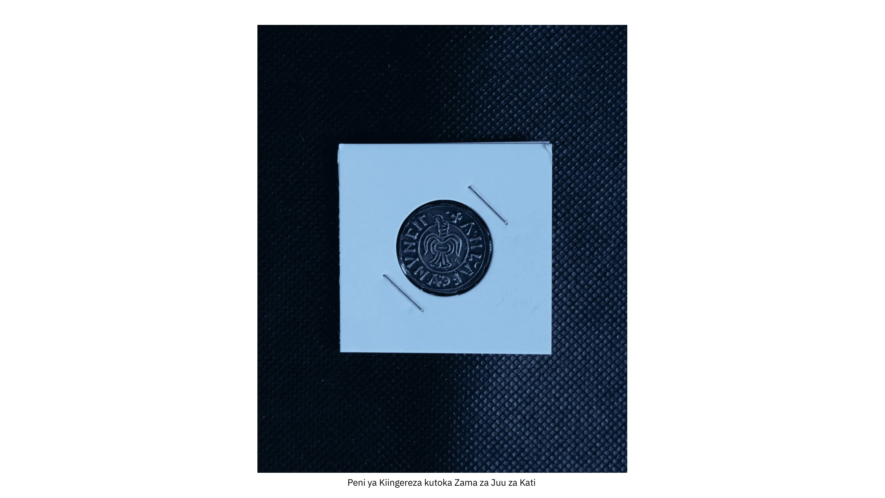

Wakati wa Zama za Juu za Kati, Ulaya ilianguka katika ukabaila kufuatia kuanguka kwa mfumo wa fedha wa Kirumi. Idadi kubwa ya watu walitumia sarafu za shaba au shaba za thamani ya chini, mara nyingi chini ya upunguzaji wa sarafu, hivyo kuzuia biashara katika umbali mrefu.

Kurudishwa kwa sarafu kama njia ya malipo kulitokea hatua kwa hatua, na kufikia kilele katika karne ya 13 na kuonekana kwa florin ya dhahabu huko Florence mnamo 1252, ikifuatiwa na ducat ya dhahabu huko Venice. Sarafu hizi za dhahabu zilitumiwa sana kutokana na upanuzi wa biashara na hitaji linaloongezeka la njia za malipo zinazotegemewa na zinazokubalika kimataifa.

Huko Uingereza, mfumo wa kifedha ulilindwa dhidi ya kupunguzwa kwa sera za kibunifu za kifedha, kama vile ushuru wa ardhi ulioletwa na William Mshindi baada ya 1066, ambayo ilihifadhi ubora wa senti nzuri. Jambo la muhimu kuelewa hapa ni kwamba watawala wakati huo wangeweza kupunguza thamani ya sarafu ili kufadhili serikali, na **kuanzishwa kwa kodi hii kulifanya iwezekane kuweka sarafu thabiti na kufadhili serikali kupitia ushuru.**

Walakini, jaribu la kupata faida kupitia upunguzaji wa pesa lilisababisha machafuko, kama katika utawala wa Henry I katika karne ya 12, wakati ubora wa sarafu ulipungua sana. Marekebisho makali, wakati mwingine yanaambatana na hatua za vurugu dhidi ya watoa sarafu, yalirudisha imani kwa sarafu kwa muda.

Enzi za Kati pia zilishuhudia kuibuka kwa mbinu za kisasa za kifedha, kama vile matumizi ya vijiti nchini Uingereza ili kukwepa kupiga marufuku riba na kuongeza mkopo. Kanisa halikutaka sana mikopo yenye riba, hivyo mbinu mbalimbali zilitumika kukwepa katazo la matumizi ya riba.

Ubunifu huu ulikuwa jibu kwa uhaba sugu wa pesa za metali, na ulihimiza kuibuka kwa soko la kifedha la embryonic.

Wakati huo huo, Vita vya Msalaba vilichochea biashara ya Mediterania, na hivyo kukuza maendeleo ya mabadilishano ya kimataifa na mazoea mapya ya benki, haswa kupitia Agizo la Knights Templar. Knights Templar ikawa wasuluhishi muhimu wa kifedha, kuwezesha wapiganaji wa msalaba kupata ukwasi mbali na nyumbani, ikionyesha mfumo wa kisasa wa benki wa Uropa.

Ili kufanya kiungo na Templars, hapa chini unaweza kuona sarafu ya Kifaransa ya medieval, ambapo unaweza kutambua msalaba mzuri katikati. Ilikuwa ni kawaida kabisa kwa sarafu za enzi hii kubeba msalaba huu.

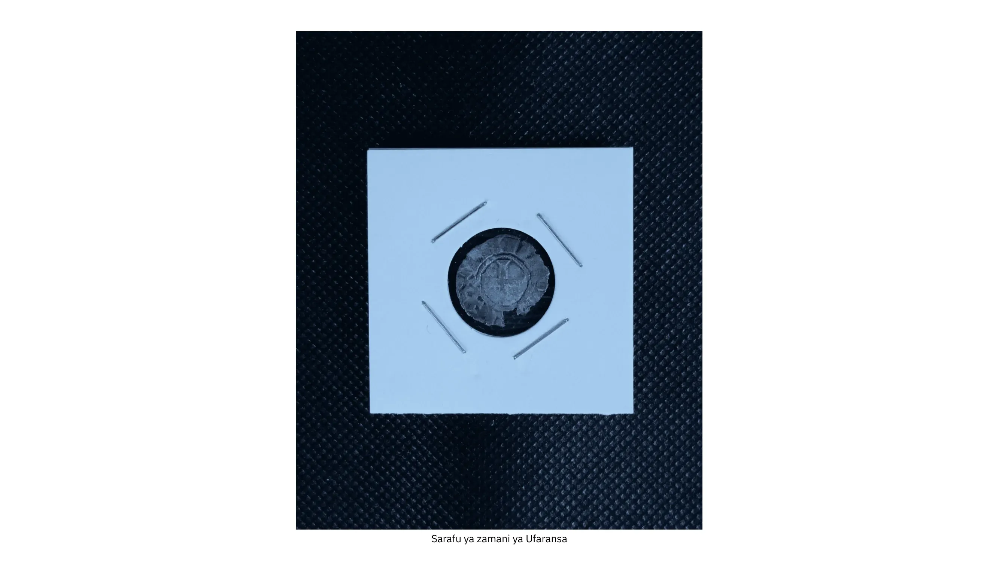

Hatimaye, majanga makubwa kama vile Kifo Cheusi (1346-1353) yalileta mabadiliko makubwa ya kiuchumi. Kushuka kwa kasi kwa idadi ya watu kulisababisha kupanda kwa kasi kwa mishahara, na kukaidi majaribio ya serikali kudumisha viwango vya awali vya malipo.

Wakati huo huo, Vita vya Miaka Mia (1337-1453) vililazimisha mataifa kuchukua sera kali zaidi za kifedha ili kufadhili majeshi yao, na hivyo kuchangia kudhoofisha mfumo wa feudal.

Kwa hiyo Enzi za Kati zilitiwa alama na mvutano wa mara kwa mara kati ya uhitaji wa pesa zinazotegemeka kwa ajili ya biashara na kishawishi cha mara kwa mara kwa watawala kupunguza pesa kwa faida ya mara moja. Mzozo huu ulichagiza sana maendeleo ya kifedha ya Uropa, ukiweka misingi ya mifumo ya kisasa ya kiuchumi.

Ili kuhitimisha sehemu hii, ningependa kuongeza hadithi ya kuvutia kutoka Uingereza wakati huu. Hadithi hii imechukuliwa kutoka kwa kitabu hapa, "Historia ya Pesa" na Glyn Davies.

Inataja kwamba nchini Uingereza, mabadiliko ya Bunge yalihamisha mzigo wa deni kutoka kwa mkuu hadi Bunge, na kusababisha madeni ya muda mrefu ya serikali. Kabla ya hapo, deni lilikuwa na uzito kwenye mabega ya mfalme.

Mara Bunge lilipoweza kukamata baadhi ya nguvu hii ya kutengeneza fedha, liliwezesha kuundwa kwa madeni ya muda mrefu ambayo yalibebwa na wananchi, si mfalme. Hapo awali, ikiwa mfalme alifilisika au ikiwa kulikuwa na mabadiliko ya mfalme, deni hilo lilizimwa naye.

Wakati uundwaji wa deni unafanywa na Bunge, dhana ya deni kuu inaibuka, kwani inaweza kuwa na ukomo kwa wakati. Maadamu Jimbo lipo, muda wote Bunge lipo, deni hili lipo, na walilazimika kutafuta kila aina ya njia za kulifadhili na kulieneza kwa wakati. Ni mabadiliko makubwa ya dhana, ambapo haikuwa tena mfalme au mrahaba ambaye alihakikisha au kubeba mzigo wa madeni haya; sasa lilikuwa Bunge na kwa hiyo wananchi wake.

## Ufufuo

<chapterId>1d1dfb05-70b4-5b7b-9708-373c2182950d</chapterId>

:::video id=4977b4f3-c7b2-41a5-ad7b-a96a8cca4092:::

Sasa tumefikia sehemu ya kozi ambapo tunazungumza kuhusu kipindi kinachojulikana kama Renaissance. Inafanyika dhidi ya hali mbaya ya mgogoro, na kuenea kwa hali ya hewa ya tauni na viroboto kwenye meli za panya. Janga hili, hata hivyo, linatufahamisha kuhusu ukuaji wa biashara na usafiri katika kipindi cha juu cha medieval. Mapema katika kipindi hiki, sio watu wengi waliohamia hadi sasa na haraka sana.

### Florin ya Florence

Kurudi kwa sarafu ya dhahabu huko Uropa wakati wa Renaissance kunaashiria mabadiliko ya kimsingi katika historia ya kifedha. **Yote yalianza na Florin ya Florence mnamo 1252, sarafu kuu ya kwanza ya dhahabu iliyotengenezwa Ulaya tangu kuanguka kwa Roma**. Kwa uzito wake wa mara kwa mara na usafi (karibu gramu 3.5 za dhahabu safi), florin ilibaki bila kubadilika kwa karne nne na kwa haraka ikawa kumbukumbu muhimu ya fedha ya Ulaya.

Hapa chini unaweza kuona nakala ya Florin: Florin ya dhahabu iliyotengenezwa kwa pewter na kupigwa mhuri na msanii wa Kifaransa ambaye hufanya vipande vyema, vilivyochongwa na kupigwa kwa mikono.

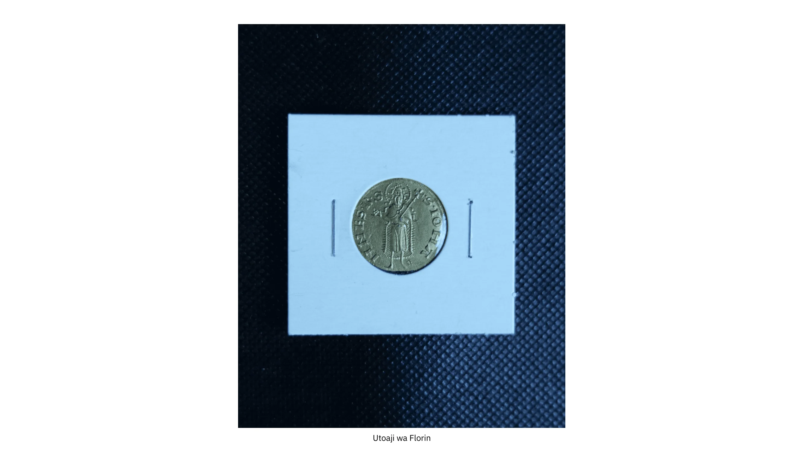

Kurudi huku kwa sarafu za dhahabu kulitokana na muktadha maalum: kuanguka kwa solidus ya Byzantine na kuzorota kwa uchumi wa ulimwengu wa Kiislamu kutokana na uvamizi wa Mongol kuliunda ombwe la kifedha katika biashara ya kimataifa.

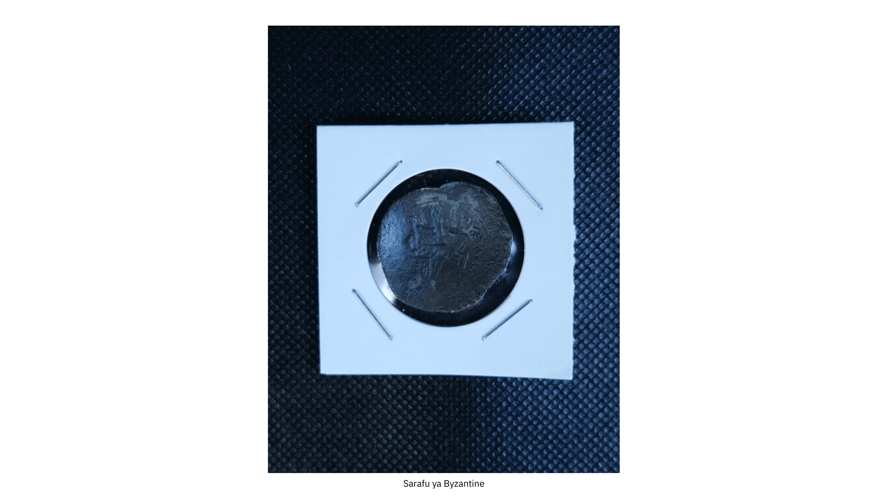

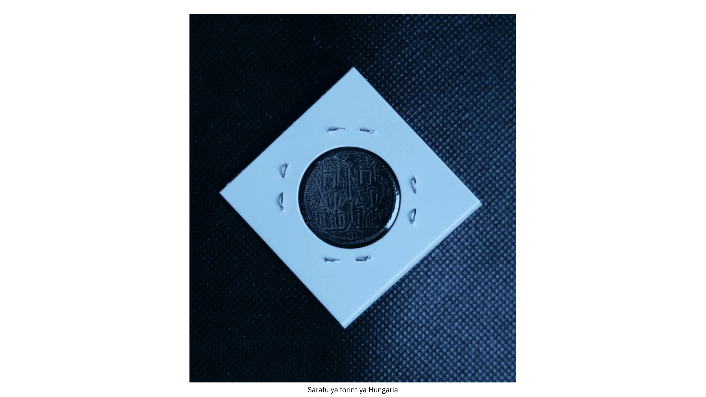

Picha ya kwanza hapo juu inaonyesha sarafu ya Byzantine ambayo naipata ya kuvutia sana. Nitachora ulinganifu na sarafu ya kipindi kama hicho kutoka Hungaria (picha ya pili hapo juu). Sarafu ya Hungaria ina umbo la kikombe, kama bakuli ndogo. Picha ya picha ina watu wa kidini wanaoonyeshwa kama wafalme wakiwa wameshika misalaba kando. Kipande hiki kina umbo la bakuli na kinatoka Hungaria.

Ilikuwa ni desturi kabisa kunakili sarafu kutoka nchi nyingine. Kama sarafu za Byzantine zilikubaliwa kwa ujumla, nchi zingine mara nyingi zilizinakili. Kama unavyoona unapozilinganisha kando: vipande hivi vinafanana sana.

Kaskazini mwa Italia, haswa Florence, Venice, na Genoa, walichukua fursa ya muktadha huu kuzindua sarafu mpya ngumu - sarafu zilizo na maudhui thabiti ya madini ya thamani. Venice ilifuata mfano wa Florence kwa kutengeneza ducat mnamo 1270, sarafu ambayo ilikuwa karibu kufanana na florin na iliyotumiwa sana katika biashara ya Mediterania.

Florin ikawa sarafu ya kwanza ya hifadhi ya kimataifa, iliyopitishwa katika miji zaidi ya 150 ya Uropa kabla ya mwisho wa karne ya 14. Pamoja na kuundwa kwa mtandao mkubwa wa benki ya Florentine, unaoongozwa na Medici, usimamizi wa fedha na uhasibu ulikuwa wa kisasa kabisa, hata kupunguza hitaji la kusafirisha dhahabu kimwili.

Hiyo ni hatua nyingine ya kuvutia sana. Kulikuwa na wakati ambapo shehena nyingi za sarafu zilipotea kwenye safari za baharini. Maendeleo haya ya kiteknolojia - rejista zilizo na uwekaji hesabu mara mbili - ziliwezesha uundaji wa pesa za kimaandiko. Hii ilifanya iwezekanavyo kupunguza idadi ya makazi ya sarafu na badala yake kutumia mfumo wa maingizo yaliyoandikwa, ambayo hupunguza sana hatari ya kupoteza pesa katika usafiri.

Maendeleo ya fedha pia yaliambatana na mageuzi makubwa katika mbinu za benki. Ikichochewa kwa kiasi na mawasiliano ya Vita vya Msalaba na mazoea ya benki ya Waislamu, Ulaya ya enzi za kati iliona kuibuka kwa mifumo ya kibenki ya kizamani huko Florence, Venice, Barcelona, ​​na Genoa mapema katika karne ya 13. Knights Templar, kikundi cha kidini na kijeshi, tayari kilikuwa kimeunda mfumo unaowawezesha wapiganaji wa msalaba kusafiri bila kuchukua mali zao.

Wangeweka fedha kwenye ofisi ya Templar katika nchi yao na kisha wangeweza kusafiri na aina ya barua na kukusanya sarafu hizo walipofika kwenye eneo lao la vita.

Hii ilimaanisha kwamba hatukuhitaji kubeba sarafu za thamani za chuma.

Ilikuwa pia katika kipindi hiki ambapo Ulaya ilifahamu kuwepo kwa pesa za karatasi nchini China, kutokana na safari ya Marco Polo katika karne ya 13. Walakini, ukuzaji wa noti ungengojea karne kadhaa, kwani Uropa ilipendelea kukamilisha njia zake za sarafu za chuma kwanza. Leonardo da Vinci, karibu na Luca Pacioli, mhasibu mashuhuri aliyekodishwa, alichangia kikamilifu uboreshaji wa mashinikizo ya pesa, na kukuza uzalishaji wa sarafu wa haraka na sare zaidi.

Tunarejelea mbinu ya kupiga pendulum iliyotajwa hapo awali katika kozi. Njia hii iliwezesha utengenezaji wa sarafu zaidi sare ikilinganishwa na kugonga kwa nyundo na, muhimu zaidi, iliruhusu maandishi kuzunguka ukingo wa sarafu, kama nilivyoonyesha hapo awali. Yule hapa chini ni thaler wa Ulaya kutoka 1793, ambayo inaonyesha wazi kuandika kwenye pindo.

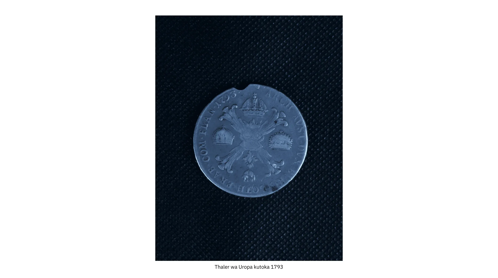

Katika karne ya 15, hata hivyo, Ulaya ilipata mgogoro mkubwa wa sarafu, na kuzorota kwa ujumla kwa maudhui ya fedha ya sarafu za Ulaya, ambayo ilishuka hadi chini ya 5% karibu 1450.

Kuanzia karne ya 16 na kuendelea, kituo cha fedha cha uvutano kilihamia Uhispania, kilichochochewa na muungano wa falme za Aragon na Castile, mwisho wa Reconquista, na uvumbuzi mkubwa wa baharini kama vile wa Christopher Columbus mnamo 1492. Utitiri mkubwa wa fedha kutoka migodi ya Amerika ulivuruga sana, msawazo wa uchumi wa Ulaya na wa kimataifa.

Renaissance pia iliashiria mabadiliko makubwa ya kisanii katika sarafu, na sarafu kama vile thaler (Joachimsthaler), asili ya neno "dola". Sarafu hizi kubwa za fedha zinaonyesha mbinu mpya za kisanii na kiufundi za uchimbaji zilizowezekana na uvumbuzi wa kiufundi kutoka kaskazini mwa Ulaya.

Hatimaye, Renaissance ya kifedha ilileta mageuzi ya kisasa ya kiuchumi, pamoja na maendeleo ya benki, mikopo, na masoko ya kifedha, na kuibuka kwa aina za kwanza za ubepari wa kisasa katika miji mikubwa ya kibiashara ya Amsterdam, London, na Stockholm, kuweka misingi ya mfumo wa fedha wa kimataifa kama tunavyoujua leo. Na hiyo ndiyo mada ya video yetu inayofuata.

# Kunyakua pesa na serikali

<partId>17cfb1b4-5bc1-53e0-b035-05c7cf76be92</partId>

## Maendeleo ya sarafu za akiba za ulimwengu

<chapterId>d65cc352-e7ca-5f03-9b23-dd1fae5c0395</chapterId>

:::video id=82710062-8fff-426c-93af-923c08d82233:::

### Umuhimu wa kihistoria wa madini ya thamani

Karibu katika sehemu hii ya kuibuka kwa sarafu za akiba na benki kuu. Kama sehemu ya kwanza ya sehemu hii mpya, tutaangazia mabadiliko ya sarafu za hifadhi za kimataifa.

Metali za thamani, hasa dhahabu na fedha, zimezingatiwa kwa muda mrefu kuwa msingi wa utajiri na mamlaka katika himaya. Kiu ya dhahabu daima imekuwa nguvu kuu ya kuendesha gari, na ilikuwa ni utitiri wa madini ya thamani ambayo yalikuwa na athari ya moja kwa moja na ya wazi katika maendeleo ya fedha huko Uropa. Katika zama za kati na zama za mwanzo za Renaissance, hali hii ya kutamani dhahabu na fedha ilitokana na ugumu wa kuhifadhi thamani katika aina nyinginezo za bidhaa, na pia mahitaji makubwa kutoka kwa mataifa ya kigeni, hasa katika biashara na nchi za Mashariki.

Kwa karne nyingi, milki kadhaa zimefuatana kama vituo vya uchumi wa kimataifa. Nchi ambayo inatawala biashara ya ulimwengu katika kipindi fulani kwa kawaida hutuzwa hadhi ya hifadhi ya fedha. Hizi ni pamoja na:

- Uhispania na Ureno (karne ya 15 na 16)

- Mikoa ya Muungano (Uholanzi) katika karne ya 17

- Ufaransa na Uingereza katika karne ya 18 na 19

- Marekani katika karne ya 20

### Kuongezeka kwa Ureno na Halisi (1450-1530)

**Ureno** ilitawala biashara ya dunia katika nusu ya pili ya karne ya 15 na mwanzoni mwa karne ya 16, na **Halisi ya Ureno**, sarafu ya fedha ya uzani wa sare. Wareno, kutokana na maendeleo yao katika urambazaji, walipata njia mpya za baharini kuelekea Afrika, Asia, na Ulimwengu Mpya. Ngome za kijeshi na vituo vya biashara viliongezeka kutoka Afrika hadi Uchina (Macau).

Katika kukabiliana na mahitaji ya Ulaya ya dhahabu na fedha, "motisha ya mara kwa mara ya uvumbuzi mkubwa ilikuwa faida ya kibiashara, hasa kutafuta dhahabu na fedha." Hata hivyo, Milki ya Ureno, iliyopanuliwa kupita kiasi na inakabiliwa na ushindani kutoka kwa Waholanzi, Kiingereza, na Kifaransa, ilianza kupungua.

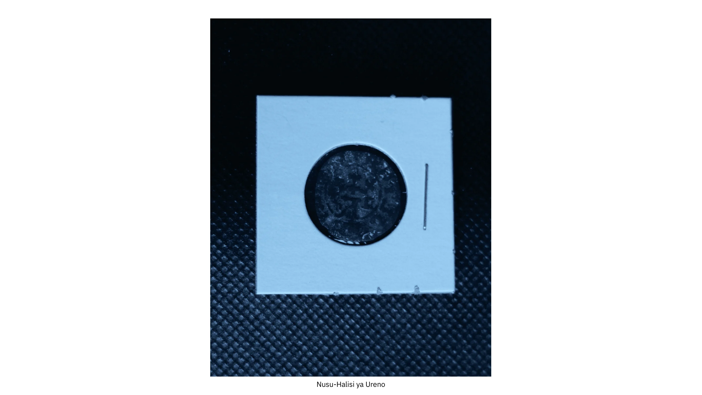

Hapa juu unaweza kuona nusu-Halisi ya Ureno kutoka wakati wa ushindi huu wa Maritime.

### Apogee ya Uhispania na Dola ya Uhispania (karne ya 1535-17)

Kwa ushindi wa Ulimwengu Mpya, **Hispania** ikawa mchezaji mkuu. Mfalme wake, aliyekuwa akidhibiti migodi mikubwa ya fedha (Potosí huko Bolivia, Zacatecas huko Mexico), alifaulu kutengeneza pesa kwa fedha safi, na hivyo kuepuka kushuka thamani ya sarafu yake mwenyewe: **Halisi ya Uhispania.**

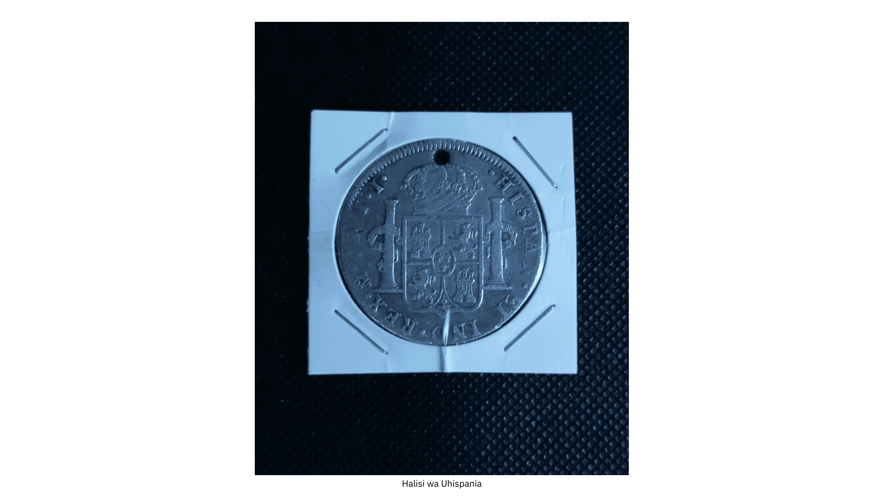

Kihispania halisi, pia inajulikana kama "kipande cha nane", ilipata jina lake la utani kwa sababu mara nyingi ilikatwa katika sehemu ya nane ili kuunda sarafu ndogo. Ilijulikana pia kama **dola ya Uhispania**. Sarafu unayoona hapo juu ni ya 1814, na kuifanya kuwa mfano wa hivi karibuni zaidi. Hata hivyo, sarafu za kwanza kabisa za Kihispania hazikuwa zilizosafishwa; walikuwa wamepigwa nyundo na kwa ujumla chini ya pande zote na crisp.

Kinachovutia zaidi ni kwamba dola ya Uhispania ilitumika kama sarafu ya akiba ya kimataifa wakati huo. Mamlaka ya Uhispania pia ilitoa pesa zao za ndani, maravedi, na kurekebisha mara kwa mara ugavi wa pesa kupitia kurejesha. Kwa mfano, sarafu ya shaba au shaba ambayo mwanzoni ilikuwa na thamani ya maravedi moja inaweza kukumbukwa na kugongwa muhuri wa "2," kisha baadaye na "4," na kadhalika, ikiwezekana kufikia "8." Katika picha ya azimio la juu, unaweza kuona wazi "8" iliyopigwa kwenye sarafu. Njia hii ilipanua ugavi wa fedha kwa ufanisi... ambayo bila shaka ilisababisha mfumuko wa bei.

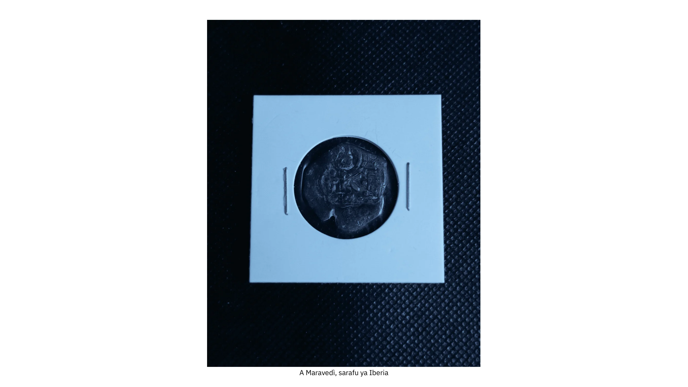

Tukiangalia historia ya sarafu za akiba, jambo la kuvutia litaibuka: himaya hazikuongeza kiwango cha sarafu zao mradi tu zilihifadhi hadhi ya sarafu ya akiba. **Ilikuwa ni mwisho wa utawala wao ndipo walipoishia kuushusha thamani, na kupoteza upendeleo huu, ambao ulipitishwa kwa ufalme mpya**.

Huko Uhispania, dola ya Uhispania ilitawala biashara ya ulimwengu kwa karibu miaka 200, haswa kati ya Uchina na Uropa. Sarafu hizi zinaweza kupatikana hata katika bandari za Kichina. Na hapo ndipo tunapopata macho kutokana na historia: dola ya Marekani hutoka moja kwa moja kutoka kwa sarafu hii. Wakati Marekani ilipoanzishwa mwaka wa 1792, ilipitisha sheria ya kutengeneza sarafu yake mwenyewe, na dola zake za kwanza ziliundwa kwa mfano wa dola ya Kihispania, kwa jina na ukubwa wa sarafu.

Ili kukupa wazo la thamani yake, awali dola ya Marekani ilikuwa sarafu ya fedha yenye uzito wa karibu wakia moja, au kati ya €30 na €40 katika pesa za leo, tofauti na sarafu ya karatasi tunayoijua leo. Kuhusu dola ya Uhispania, ilisambaa sana hivi kwamba inachukuliwa kuwa sarafu ya kwanza ya kweli ya kimataifa.

Hata hivyo, utitiri huu wa madini ya thamani kutoka Amerika ulisababisha mfumuko wa bei katika Ulaya. Wakati wa Mapinduzi ya Bei (c. 1540-1640), gharama ya maisha katika Uingereza iliongezeka mara saba. Huko Uhispania, wingi wa fedha ulikuwa na athari mbaya ya laana ya rasilimali, na kuzuia maendeleo ya taasisi dhabiti za benki.

Baadaye, Uhispania ilikabiliwa na mizozo mingi ya kijeshi (Flanders, Uholanzi, Vita vya Miaka Thelathini), na fedha zake zikaporomoka polepole. Badala ya kushusha thamani ya sarafu ya fedha maarufu duniani, watawala waliofuata walichagua kukataa au kupunguza thamani ya sarafu ya shaba (vellón) inayotumiwa na wakazi wa eneo hilo. Hivi ndivyo nilivyoeleza hapo awali na Maravedi.

### Kuibuka kwa Uholanzi (karne ya 17)

Baada ya apogee ya Iberia, **Uholanzi** iliibuka kama nguvu mpya ya kibiashara katika karne ya 17. Biashara ya baharini, VOC (Kampuni ya Uholanzi ya India Mashariki), na kuanzishwa kwa **Amsterdam Stock Exchange** (iliyotokana na ile ya Antwerp) ilianzisha jamhuri hii ya mfanyabiashara kama kitovu.

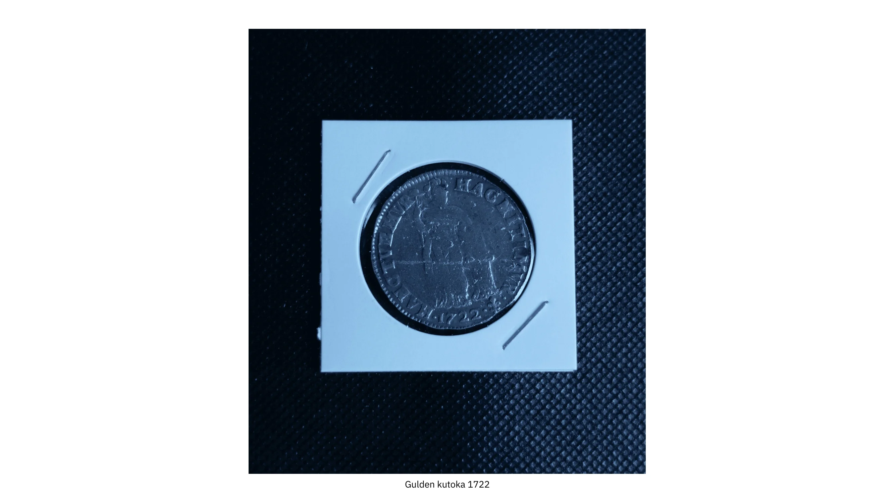

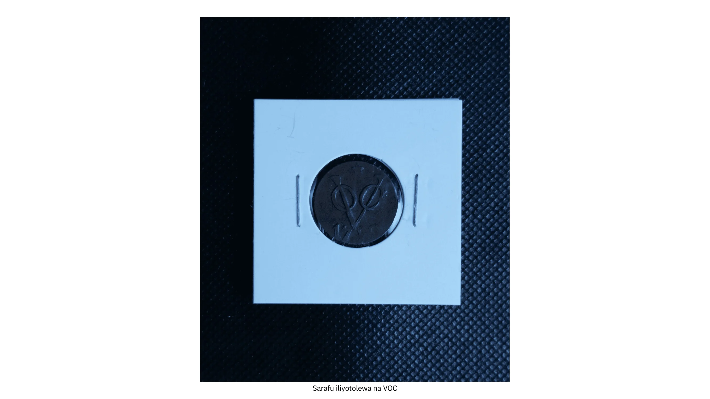

Katika picha ya kwanza hapo juu, unaweza kuona Gulden kutoka 1722 (sarafu nzuri ya fedha), wakati katika pili, kuna sarafu iliyotolewa na VOC.

VOC ilikuwa kampuni yenye nguvu sana kwa wakati wake: ilikuwa na jeshi lake na hata ilitoa sarafu yake.

Waholanzi walivumbua ubepari wa kisasa, ambao ulianza kama njia ya kusambaza hatari katika ubia hatari kama vile safari za Ulimwengu Mpya au kutafuta njia mpya za biashara. Makampuni ya hisa ya pamoja yaliwezesha wawekezaji kadhaa kukusanya pesa zao na kushiriki hatari. Ili kuwezesha mabadilishano haya, ilikuwa ni lazima kuunda taasisi zenye uwezo wa kujadili na kubadilishana dhamana hizi. Kwa hiyo, mwaka wa 1602, kampuni ya kwanza ya pamoja-hisa na soko la hisa iliundwa.

Sarafu ya Uholanzi, **Gulden**, ilipata uaminifu kutokana na usafi wake katika fedha, na kisha kupitishwa na Benki ya Amsterdam (1609), ambapo amana zikawa aina inayopendekezwa ya pesa huko Uropa. Hili ni jambo muhimu sana kutaja. Ndio, bila shaka kulikuwa na sarafu, lakini kile kilichojumuisha pesa siku hizo ilikuwa ni aina ya pesa ya kimaandiko. Kwa kweli, biashara nyingi za ulimwengu zilipitia vitabu vya Benki ya Amsterdam. Haya yalikuwa mafanikio ya kweli ya benki: biashara ya kimataifa haikufanywa tena na sarafu halisi, lakini moja kwa moja kupitia rekodi za uhasibu za benki.

Kipindi hiki cha ustawi kilibainishwa na utitiri mkubwa wa dhahabu na fedha, hasa kutoka nchi nyingine zinazotumia mfumuko wa bei au udhibiti wa fedha. Kuna mhusika wa kupendeza wa kutaja: **Thomas Gresham**. Kwa wakati huu, alifanya kazi kwa mrahaba wa Kiingereza huko Uholanzi, akisimamia mtiririko wa pesa kati ya nchi hizo mbili. Ilikuwa Gresham huyu huyu aliyetuachia maarufu **"Sheria ya Gresham"**.

Hata hivyo, Milki ya Uholanzi pia hatimaye iliishiwa na mvuke. Vita na Uingereza, dilution ya gulden wakati wa migogoro, na ushindani kutoka kwa mamlaka nyingine (Ufaransa na Uingereza) ilionyesha mwisho wa utawala wa Uholanzi. Baada ya Vita vya Nne vya Anglo-Dutch (1780-84), kupungua kwa gulden kama sarafu ya akiba hakuweza kutenduliwa.

### Nguvu ya Ufaransa, matarajio na kushindwa (karne ya 17-18)

Chini ya Louis XIV, **Ufaransa** ikawa taifa kubwa zaidi la bara barani Ulaya. Walakini, sarafu ya Ufaransa haikupata hadhi ya marejeleo kuu: kushuka kwa thamani nyingi, ushuru mkubwa, na vita vya gharama kubwa (Ligi ya Augsburg, Vita vya Mfululizo wa Uhispania, n.k.) vililemea sana uthabiti wa mfumo wa fedha.

Jaribio kuu la kwanza la pesa za karatasi lilifanywa na John Law (1716-1720). Banque Générale ilitoa bili zilizoungwa mkono na ahadi za deni la serikali. Mpango huu ulisababisha kiputo cha kubahatisha na kuporomoka (Kimbunga cha Mississippi) mnamo 1720. Maafa haya yaliacha Ufaransa na kutokuwa na imani ya kudumu ya pesa za karatasi. Tukio hilo la msiba ndilo lilimfanya Richard Cantillon kuwa tajiri kutokana na mfumo huu wa kutaja kanuni, ambazo sasa zinajulikana kama athari ya Cantillon, ambapo uchapishaji wa pesa huwaboresha wale wanaoweza kupata matbaa.

Wakati kutoaminiana huku hatimaye kufifia, fiasco nyingine ya karatasi ya Kifaransa: mwanamapinduzi **agizo**. Iliyotolewa kuanzia mwaka wa 1790 na kuendelea kulingana na unyakuzi wa mali ya makasisi, kazi hizi zilipata mfumuko mkubwa wa bei, na kuzifanya kuwa mfumuko wa bei wa kwanza katika historia kuzidi 50% kwa mwezi. Mnamo 1795, ingawa thamani yao ya uso ilikuwa imeongezeka, walikuwa wanafanya biashara kwa asilimia chache tu ya thamani yao ya awali.

Sheria zenye vikwazo zaidi zilitaka kulazimisha mgawo huo, lakini bila mafanikio. Serikali ilijaribu kulazimisha, hadi kuwatishia wale ambao hawakukubali kifo, na kuwalazimisha wenye maduka kubaki wazi. Lakini bila shaka, mwishowe, haikufanya kazi.

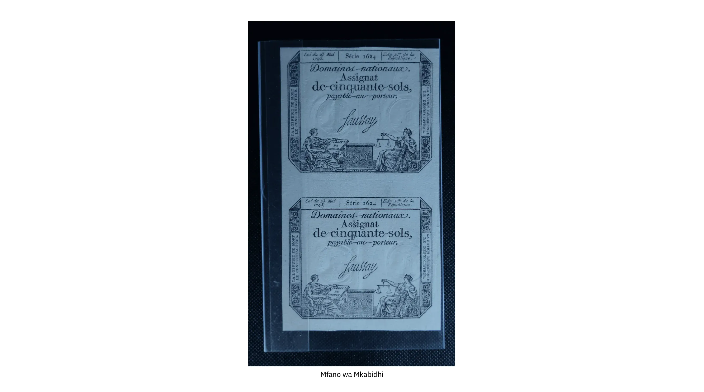

Pesa hizi za karatasi zilipochukua nafasi ya sarafu zote za ubora wa madini ya thamani, zikiambatana na Sheria maarufu ya Gresham, uhaba wa sarafu ulifuata. Ili kutengeneza sarafu mpya, walitumia chuma cha kengele kilichonyakuliwa kutoka kwa makasisi. Hapa chini unaweza kuona kipande kizuri cha chuma cha kengele, kilichotengenezwa kwa shaba iliyopatikana kwa kuyeyusha sarafu zilizochukuliwa kutoka kwa makasisi.

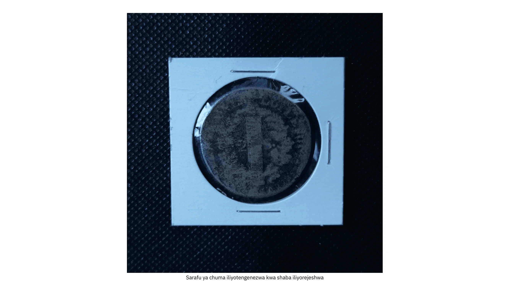

### Utawala wa Uingereza (karne ya 18 - 20)

**England**, baada ya kuipiku Uholanzi, ikawa mamlaka kuu katika karne ya 18. Pound Sterling ndiyo sarafu ya zamani zaidi ambayo bado inatumika, ambayo awali ilihusishwa na pauni ya fedha. Hatua kwa hatua, hadhi yake ilikua na nguvu, ikichangiwa na mapinduzi ya kifedha na kifedha: ufalme wa bunge, uwezo mkubwa wa kuongeza ushuru, na kuundwa kwa Benki ya Uingereza mnamo 1694\.

Baada ya mfululizo wa vita dhidi ya Ufaransa, Uingereza iliibuka mshindi mwaka 1815 (Waterloo), ikithibitisha ukuu wake. Katika karne yote ya 19, pound sterling ilifanya kazi kama sarafu ya akiba ya ulimwengu. Katika kilele chake, ikiwa na asilimia 2.5 tu ya idadi ya watu duniani, Uingereza ilizalisha 20% ya mapato ya kimataifa na kudhibiti karibu robo ya uso wa dunia.

**Mapinduzi ya Viwanda** na kupitishwa kwa **Gold Standard** (1717 au 1718, chini ya usimamizi wa Isaac Newton katika Royal Mint) kuliimarisha uaminifu wa pauni. Benki ya Uingereza ilipitisha kiwango cha dhahabu cha pauni 4.25 kwa wakia moja ya dhahabu, na kuwaruhusu wamiliki wa kumbukumbu kubadilisha noti zao kuwa dhahabu.

Hata hivyo, Vita vya Kwanza vya Ulimwengu (1914-1918) vilikomesha mfumo huu. Katika muda wa majuma machache, mataifa yote makubwa yanayopigana yalisimamisha ubadilikaji wa dhahabu. Milki ya Uingereza, na baadaye pauni, iliibuka kutoka kwa Vita vya Kidunia vya pili katika hali dhaifu, ikitoa nafasi kwa dola ya Amerika katika karne ya 20.

Na kama kazi ya sanaa, unaweza kuona vipande vya kupendeza na vya kuvutia hapa chini. Hizi ni uzito wa fedha. Wa kwanza ni mkuu: uwakilishi wa kwanza wa pauni. Nina uzani wa pesa tu kuwakilisha sarafu hizi kwa sababu siwezi kumudu kununua mfalme halisi. Ili kuzipima, tulitumia mizani kisha tukaweka uzani wa pesa unaolingana na thamani ya mfalme upande ule mwingine.

Mfalme alikuwa sarafu ya pesa - sarafu ya dhahabu ambayo hapo awali ilikuwa na thamani ya pauni moja.

Iliyotangulia mfalme maarufu ilikuwa Guinea, ambayo ilifanya kazi kwa kanuni hiyo hiyo. Guinea ilipewa jina la madini ya thamani iliyomo, kutoka eneo la Guinea.

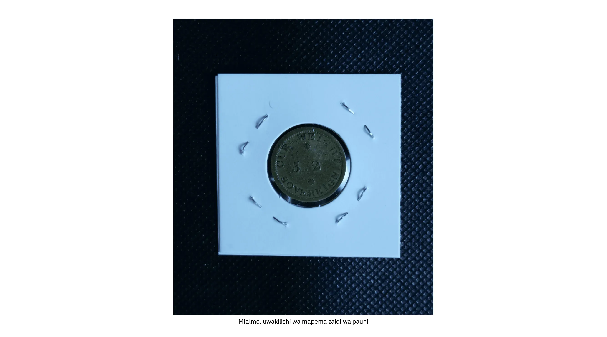

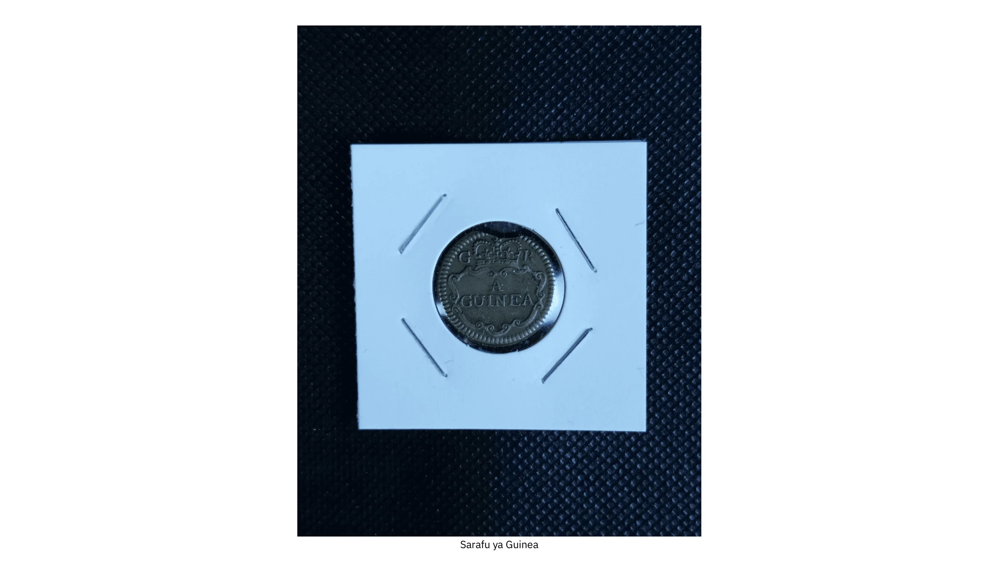

## Kuibuka kwa benki kuu

<chapterId>15777771-1e28-55f7-a400-69868a47079b</chapterId>

:::video id=7661b7b5-e00f-48f3-b69a-6fb2eb5ebba4:::

Kufuatia kutoka kwa sehemu hii ya historia ya sarafu za kwanza za akiba na mabadiliko yao, hapa kuna sehemu ya kuibuka kwa benki kuu. Inafuata njia sawa na kuibuka kwa sarafu za akiba, lakini inalenga zaidi kidogo juu ya teknolojia za benki za wakati huo.

### Mwanzo wa benki na proto-benki

Mapema karne ya 13, Waitaliano (Florence, Genoa, Venice ...) walitengeneza mbinu za uhasibu za kuingia mara mbili. Baadaye, **Antwerp** (16 c.) ikawa kituo kikuu cha kifedha cha Ulaya Kaskazini, jukumu ambalo baadaye lilichukuliwa na **Amsterdam**, shukrani kwa Amsterdam Stock Exchange (1609), ambapo hisa za VOC ziliuzwa.

Antwerp iliandaa maonyesho ya wafanyabiashara ambapo wafanyabiashara walikusanyika mara kwa mara ili kulipa madeni, na hivyo kusababisha uvumbuzi wa zana mpya za kifedha. Mswada ulio hapa chini, wa 1761 na wa hivi majuzi zaidi, ni **noti ya ahadi**. Inaangazia maelezo yaliyoandikwa kwa mkono, pamoja na maandishi kwenye sehemu ya nyuma, na kuifanya kisanii cha kupendeza cha kipindi hicho.

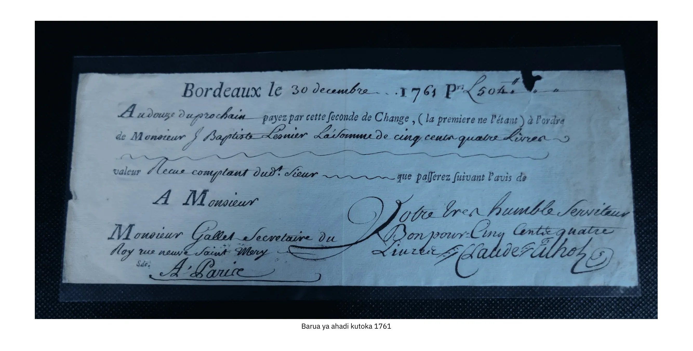

Ufanisi huu ulisababisha kuundwa kwa taasisi za benki za kisasa zaidi. **Wafanyabiashara wa benki ya Lombard** na baadaye wafanyabiashara wa Uholanzi waliboresha vyombo vya mikopo (bili za kubadilishana fedha, bili za ahadi, n.k.). Mfumo wa kisasa wa benki unategemea wazo hili: pesa inaweza kuwa mkopo, sio chuma tu.

Kama unavyoona, hii inaturudisha kwenye swali letu la asili kuhusu asili ya pesa.

Je, pesa hutoka kwa bidhaa inayotokana na hitaji la kubadilishana, au inatoka kwa mkopo? Athari za hii bado zinaweza kupatikana katika sehemu hii.

### Mfano wa Uswidi: Stockholms Banco na Riksens Standers Bank

Wacha tuendelee hadi Uswidi, ambapo benki kuu ya kwanza kabisa iliundwa.

**Uswidi** ilikuwa mwanzilishi katika benki kuu: mnamo 1657, Johan Palmstruch aliunda **Stockholm Banco**, iliyoidhinishwa kukopesha zaidi ya akiba yake ya chuma, na hivyo kuashiria kuzaliwa kwa benki ya akiba ya sehemu. Lakini utoaji wa noti nyingi ulisababisha hofu na kukimbia benki mnamo 1663. Naam, vizuri...

Mnamo 1668, Benki ya Riksens Ständers, benki kuu ya kwanza ya kweli ulimwenguni, ilianzishwa huko Stockholm. Hata hivyo, pia ilikumbwa na migogoro (1709, 1715...) iliyohusishwa na matumizi mabaya ya noti, mara nyingi ili kufadhili vita vya ufalme.

### Mapinduzi ya John Law yaliyoshindwa

Wacha tuelekee Ufaransa, ambapo tunampata tena mpendwa wetu John Law.

**John Law**, Mskoti, alimshawishi Regent (Duke of Orleans) kuunda benki ya kibinafsi, Banque Générale (1716), iliyoidhinishwa kutoa karatasi dhidi ya dhahabu, fedha na madeni ya serikali. Ikawa Banque Royale (1718), na kusaidia hisa za Kampuni ya Mississippi kupanda.

Uhalisia ulipokuja na uvumi, **hofu hiyo ilizidishwa na uamuzi wa kupiga marufuku kushikiliwa kwa dhahabu na kulazimisha matumizi ya noti za Sheria**. Naam, vizuri ...

Hatimaye, Bubble ilipasuka mwaka wa 1720, na kusababisha kuanguka ambayo iliharibu uaminifu wa pesa za karatasi nchini Ufaransa kwa muda mrefu ujao.

### Benki ya Amsterdam, kuongezeka kwa mfano wa upainia

Sasa tunasafirishwa hadi Amsterdam mnamo 1609, ambapo **Benki ya Amsterdam** (Wisselbank) ilitwaa udhibiti wa uhifadhi na ubadilishaji wa sarafu huko Amsterdam. Ilikataza mzunguko wa noti za kibinafsi na kutekeleza uwekaji wa sarafu za metali kwenye vyumba vyake. Hatua kwa hatua, walichukua udhibiti wa sarafu. Waliwakataza wabadilishaji fedha kushika sarafu nao. Wabadilishaji pesa walifanya kazi siku nzima na ilibidi waweke sarafu zao kwenye ghala za Benki ya Amsterdam mwishoni mwa siku. Kama nilivyotaja, haikuwa lazima sarafu za chuma ambazo zilitumika katika biashara ya kimataifa. Zilikuwa pesa za kimaandiko kwenye vitabu vya benki.

Shukrani kwa nguvu ya mfanyabiashara wa Uholanzi, benki ilichukua nafasi ya kwanza ya "benki kuu", kuleta utulivu wa biashara ya dunia. Baada ya muda, hata hivyo, ilitoa mikopo isiyolindwa kwa VOC na hatimaye ikaishiwa na chuma ili kurudisha bili zake. Mnamo 1790, iliibuka kuwa ilikuwa imekopesha VOC kiasi kikubwa, na karibu ilitangaza kufilisika, na kuharibu uaminifu wa gulden. Naam, vizuri ...

### Benki ya Uingereza, kitendo cha mwanzilishi wa benki ya kisasa

Katika Uingereza ya karne ya 17, dhahabu na fedha zilihifadhiwa na wafua dhahabu, ambao walitoa risiti. Shirika hili lililogatuliwa kwa sehemu lilithibitisha mipaka yake wakati Taji ilipojipata katika haja kubwa ya kufadhili vita dhidi ya Ufaransa.

Mnamo 1694, **Benki ya Uingereza (BoE)** ilianzishwa. Kwa hivyo Benki ya Uingereza ilizaliwa na ndoa ya urahisi kati ya jumuiya ya wafanyabiashara wa London na serikali, ambayo ilikuwa na hamu ya kupata fedha kwa ajili ya vita.

Benki ilipata ukiritimba wa utoaji wa noti nchini Uingereza (iliyoimarishwa mnamo 1708, 1742, n.k.). Kuanzia wakati huo na kuendelea, pesa za karatasi zilizoungwa mkono na akiba ya dhahabu zilisambazwa pamoja na sarafu. Hili ni jambo muhimu la kuelewa unyakuzi wa taratibu wa fedha na taasisi za serikali. Kwanza, Benki ya Amsterdam iliwazuia wabadilisha-fedha kutunza sarafu na kuwalazimisha kuzirudisha kwa Benki. Huko Uingereza, benki za kibinafsi zilipigwa marufuku kutoa bili zao zinazoweza kukombolewa kwa dhahabu.

Waliruhusu benki za kibinafsi kutoa noti, lakini hizi zinaweza tu kubadilishwa kwa bili za Benki Kuu ya Uingereza.

Bili za Benki Kuu ya Uingereza, pounds sterling, ziliweza kukombolewa kwa dhahabu. Hii iliongeza safu ya tatu kwenye sarafu. Kwa hivyo tuna dhahabu kwenye msingi, kisha bili za Benki Kuu ya Uingereza, na kisha bili za benki za kibinafsi juu. Kabla ya hapo, benki za kibinafsi zinaweza kutoa bili zao zinazoweza kukombolewa kwa dhahabu. Hii ni hatua nyingine katika unyakuzi wa taratibu wa fedha na taasisi za serikali.

Benki ilifadhili Serikali kwa mikopo mikubwa na kuunda deni kubwa la umma ambalo lilifadhili ukuaji wa uchumi.

Mtindo huu uliimarishwa katika kipindi cha karne ya 18 na 19, hadi pale pauni ikawa sarafu ya akiba ya dunia, chini ya muhuri wa Benki ya Uingereza na kiwango cha dhahabu.

**Fedha za akiba za dunia** zimefuatana kwa karne nyingi, zikisukumwa na nguvu za kiuchumi, kibiashara, na kijeshi za dola au milki: Ureno, Hispania, Uholanzi, kisha Uingereza Kuu, kabla ya Marekani kuja kutawala katika karne ya 20. Katika kila kisa, tunaona mzunguko unaofanana: kupanuka kwa uchumi, mafanikio ya kibiashara, kupitishwa kwa sarafu kimataifa, madeni, vita vya gharama kubwa, matumizi mabaya ya kuunda pesa au mkopo, na hatimaye kupungua.

**Kuibuka kwa benki kuu** ilikuwa ni mchakato wa taratibu. Taasisi hizi mara nyingi ziliibuka katika mazingira ya vita vya gharama kubwa, na kuwezesha serikali kujifadhili kupitia deni. Kiwango cha dhahabu kilipokubaliwa (Uingereza, karne ya 17-19), kilitoa hali ya uthabiti, hadi vita kuu vya ulimwengu vya karne ya 20 vilisababisha kuachwa polepole kwa dhahabu kubadilika. Nguvu ya kutengeneza pesa ilibadilika kutoka kwa ukiritimba wa kifalme kwenda kwa vyombo ngumu zaidi, kwanza vya kibinafsi (wafua dhahabu, mabenki), kisha nusu ya umma (benki kuu), ikionyesha mageuzi ya uhuru wa kifedha kuelekea fomu za kitaasisi, za utandawazi.

Kwa hivyo, hii ndio niliyokuwa nikielezea hapo awali. Mara nyingi tumehamisha mzigo wa deni kuu moja kwa moja kwa benki kuu au ruhusa ya kuunda pesa na taasisi za kisheria, kama vile Bunge.

Na jambo la muhimu zaidi hapa ni kwamba **tumetoka kwenye deni ambalo linaweza kutoweka kupitia kufilisika kwa mtawala hadi deni ambalo liliegemea mabega ya watu **.

## Barabara ya mfumo wa fiat

<chapterId>27a98545-d350-56ee-a200-92468e6b9b33</chapterId>

:::video id=e27a753e-aeee-4307-a65c-9506aab380a1:::

Sasa tumefikia mwisho wa kozi hii ya historia ya pesa, na ili kuimaliza, nilitaka kupendekeza mada mbili. Mada ya kwanza ni hatua mbalimbali zilizosababisha mfumo wetu wa sasa wa sarafu ya fiat. Tutakuwa tukipitia upya ukweli kutoka sehemu ya 5 kuhusu kuundwa kwa benki kuu, na tutaongeza dhana ya dola ya Marekani, ambayo hatimaye ndiyo sarafu ya hifadhi ya sasa. Tutaangalia jinsi ilivyokuwa, jinsi dola ilivyotokea, jinsi ilivyobadilika, jinsi ilivyobadilika, ni hatua gani ilipitia hadi kuwa mfumo wa fiat, kwa sababu asili ya dola ni sarafu ya fedha.

Kisha, mara moja baadaye, nitakupa sehemu fupi ya historia ya fedha, ili kukusaidia kuelewa jinsi tulivyofika katika hali ya ustawi. Kwa hiyo tutaangalia masomo mawili: jinsi tulivyofika kwenye mfumo wa fiat, na kisha mara moja baadaye, jinsi mageuzi ya fedha yalituongoza kwenye dhana ya hali ya ustawi.

### Misingi ya Ulaya ya benki ya kisasa

Wacha turudi kwenye karne ya 13 na florin. Ili kuelewa jinsi tulivyofika kwenye mfano wa fiat, tunahitaji kuanza na karne ya 13. Kando ya florin, teknolojia iliibuka wakati huo huo na Medici, dhana ya bili za kubadilishana.

Kisha likaja soko la hisa la Antwerp, likiwa na dhana yake ya punguzo na bili za ahadi.

Kisha, kama tumeona, tulikuwa na VOC, soko la kwanza la hisa huko Amsterdam. Hii iliashiria kuzaliwa kwa ubepari, na hisa za kampuni na kubadilishana hisa. Benki ya Amsterdam iliweka matumizi ya amana kwa amri. Hii ilimaanisha kwamba sarafu zilipaswa kuwekwa mwisho wa siku. Ni wabadilisha fedha ambao hawakuweza tena kuweka chenji katika mfumo wa sarafu.

Kisha ikaja kuundwa kwa Benki ya Uingereza kutokana na hitaji la kuunda deni la kufadhili vita mwishoni mwa karne ya 17. Wakati huo, benki za kibinafsi zikawa safu ya tatu ya pesa. Kwa njia, sehemu hii yote, kutoka kwa florin hadi dhana ya uundaji wa benki kuu, imefupishwa vizuri sana katika kitabu maarufu cha Nick Bhatia "Layered Money", ambacho nilikuwa na bahati ya kutafsiri na wenzake wachache. Tulifanya kazi kubwa ya kuitafsiri ili wasemaji wa Kifaransa kila mahali wanufaike na mafundisho hayo.

Kwa hivyo tuko mwishoni mwa karne ya 17. Benki ya Uingereza iliundwa kufadhili vita.

Benki za kibinafsi zilichukua safu ya tatu ya sarafu. Kwa hakika, bili za benki za kibinafsi hazikuweza kukombolewa tena kwa dhahabu: ni bili za Benki Kuu ya Uingereza ambazo ziliweza kukombolewa kwa dhahabu. Hii inaonyesha kukamatwa kwa uwezo wa kubadilishana na taasisi ambayo ni Benki ya Uingereza.

Kisha hofu ya 1776 ikaja. Kila mtu alikimbilia juu ya piramidi ya pesa. Nini maana ya hii ni kwamba mwaka wa 1776, kuna kukimbia kwenye mabenki, na hivyo watu wote ambao wana karatasi ya safu ya tatu, yaani, bili za benki za kibinafsi, wanajaribu kupata bili za Benki ya Uingereza, na kisha kujaribu kupata dhahabu, lakini ni wazi hapakuwa na dhahabu ya kutosha katika vaults. Walitangaza aina ya likizo ya benki ili kuepuka kulipa bili za dhahabu, na hii ilizua dhana ya mkopeshaji wa chaguo la mwisho.

### Mabadiliko ya bei ya hisa ya Dola ya Marekani

Tulihama kutoka florin hadi kuanzishwa kwa Benki ya Uingereza. Kwa kweli, kulikuwa na Vita vya Kidunia vya Kwanza na vya Pili katika muda huo, lakini mapema, mnamo 1796, maendeleo pia yalikuwa yakitokea upande wa pili wa Atlantiki. Mnamo 1776, Amerika ilikuwa bado koloni ya Uingereza, na makoloni yalitumia sarafu hii ya karatasi. Ifuatayo ni bili ya Connecticut ya shilingi mbili kutoka 1776.

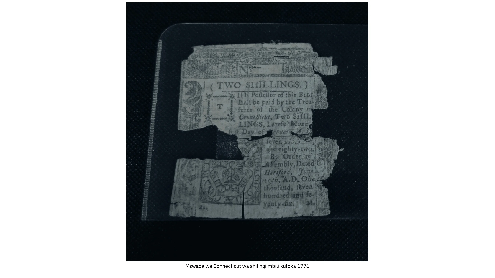

Kabla ya kutangaza vita dhidi ya Uingereza na hatimaye kutoa sarafu yao wenyewe, makoloni yalitumia sarafu hii ya karatasi, pamoja na dola ya Uhispania kwa shughuli za pesa. Kwa kweli, neno "dola" lilibaki kuashiria dola ya Amerika.

Ikiwa sijakosea, mnamo 1792 walipitisha sheria iliyowaruhusu kupata pesa. Kwa mfano, hapa chini ni dola ya Kimarekani ya zama za kisasa.

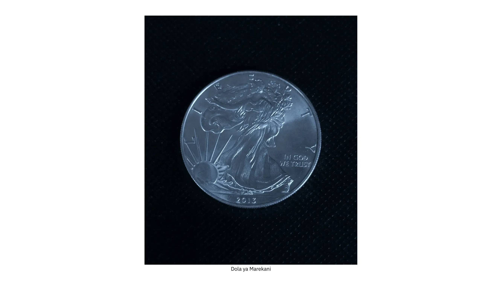

Naam, ni wazi, haina thamani ya uso ya dola moja tu; ina thamani ya takriban dola 30 au 40, kwani inawakilisha wakia moja ya fedha. Thamani yake hubadilika kulingana na bei ya fedha, kwa kawaida huiweka angalau dola 30 au 40 za Marekani. Leo, bila shaka, dola ya karatasi inabakia tu thamani yake ya uso ya dola moja, lakini wakati huo, dola ya Marekani ilikuwa na mizizi katika thamani hii ya fedha.

Wacha tuzungumze juu ya Vita vya wenyewe kwa wenyewe huko Amerika sasa. Washirika walikuwa wakichapisha pesa, ambazo zilikuwa zimechangiwa sana. Jambo hili halijajumuishwa katika orodha rasmi ya Hanke-Krus, kwani haikufikia kiwango cha mfumuko wa bei cha 50%. Hata hivyo, ilipata mfumuko wa bei wa kila mwezi wa 40%, ikionyesha kwamba kiasi kikubwa cha fedha kilichapishwa wakati wa vita.

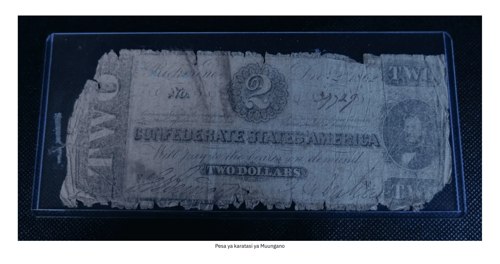

Wapinzani wao wa kaskazini pia walikuwa na dola. Hapo juu tu, unaweza kuona dola za Muungano, huku chini unaweza kuona dola za Kaskazini. Waliitwa "greenback" kwa sababu nyuma ilikuwa kijani.

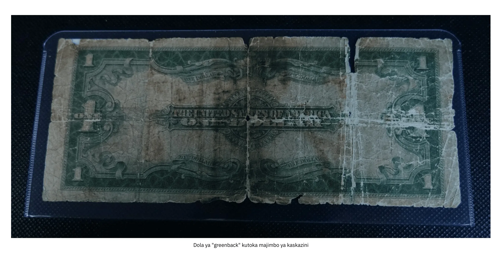

Na ninakualika kulinganisha tofauti katika saizi na noti za kisasa. Wakati huo, noti zilikuwa kubwa zaidi.

Kama tunavyojua, kaskazini ilishinda, kwa hivyo greenback ikawa sarafu ya majimbo ya Amerika yaliyounganishwa. Kisha ikaja kuanzishwa kwa FED mwaka wa 1913, na Vita vya Kwanza vya Dunia.

Baada ya Vita vya Kwanza vya Kidunia, safu ya mwisho ya noti zilizochapishwa kila wakati ilijumuisha maneno "yanayoweza kukombolewa kwa dhahabu inapohitajika". Kwa hiyo, mwaka wa 1928, dola 20 zilinunua karibu wakia moja ya dhahabu, kwani bei ya dhahabu ilikuwa dola 20.67. Muswada katika picha hapa chini unaweza kununua aunsi ya dhahabu mnamo 1928.

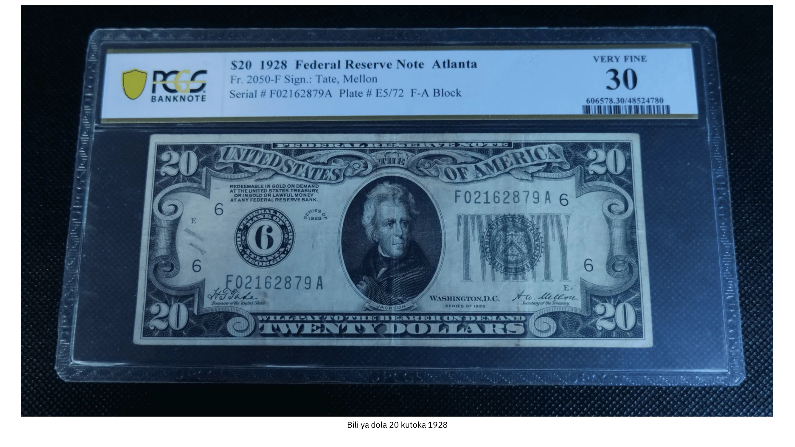

Leo, wakia moja ya dhahabu ina thamani ya US $ 3,000. Kwa hivyo unaweza kuona nguvu ya kushuka kwa thamani hapa, bila shaka. Ulikuwa muswada wa mwisho uliokuwa na maneno "redeemable in gold". Tutaona kwamba mara tu baada ya Agizo la Mtendaji 6102, wangenyakua dhahabu yote. Kwa kweli, wangekamata hati zote mbili za dhahabu na dhahabu.

Hapa chini unaweza kuona cheti cha dhahabu kutoka 1928.

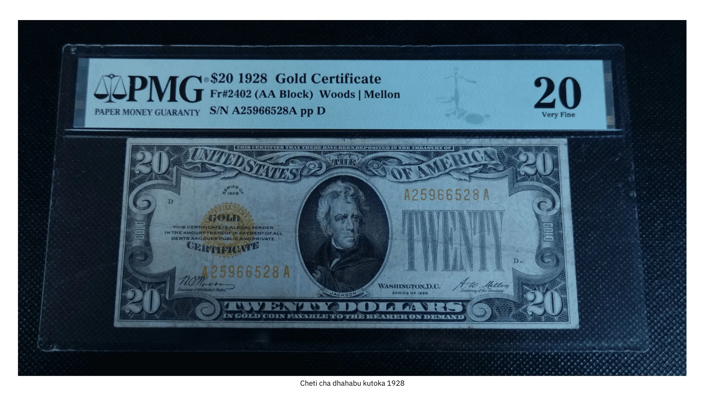

Sio tu kwamba "iliweza kukombolewa kwa dhahabu" kama muswada wa 1928, pia iliweza kukombolewa kwa sarafu za dhahabu: kwa kweli ni "cheti cha dhahabu". Zote zimekamatwa baada ya Executive Order 6102. Hadi 1964, ilikuwa haramu kuzimiliki.

Nimefurahiya sana kuwa na moja.

Kuanzia 1964, ikawa haramu kumiliki dhahabu, hadi 1974, ikiwa sijakosea. Katika miaka ya 70, waliwaruhusu watu kukusanya dhahabu baada ya mshtuko wa Nixon, ambao tutauelezea hivi punde. Mnamo 1933, walipotoa "Executive Order 6102", walikamata dhahabu na ikawa haramu kumiliki. Ulipata kifungo kikubwa gerezani ikiwa utakamatwa ukihifadhi dhahabu yako. Wakati wa siku hizo, kila wakia ya dhahabu ilibadilishwa kwa mswada sawa na ulio hapa chini, baada ya 1934.

Kama tulivyosema, mnamo 1928, dola bado ilikuwa na maandishi "yanayoweza kukombolewa kwa dhahabu".

Baada ya kutolewa kwa Agizo la Mtendaji 6102, walikamata dhahabu yote na kubadilishana $ 20.67 kwa kila wanzi ya dhahabu. Baadaye, kashfa hiyo ilikuja kujulikana: walitoa bili mpya mwaka wa 1934 na maandishi yaliyochapishwa "noti hii ni zabuni ya kisheria kwa madeni yote".

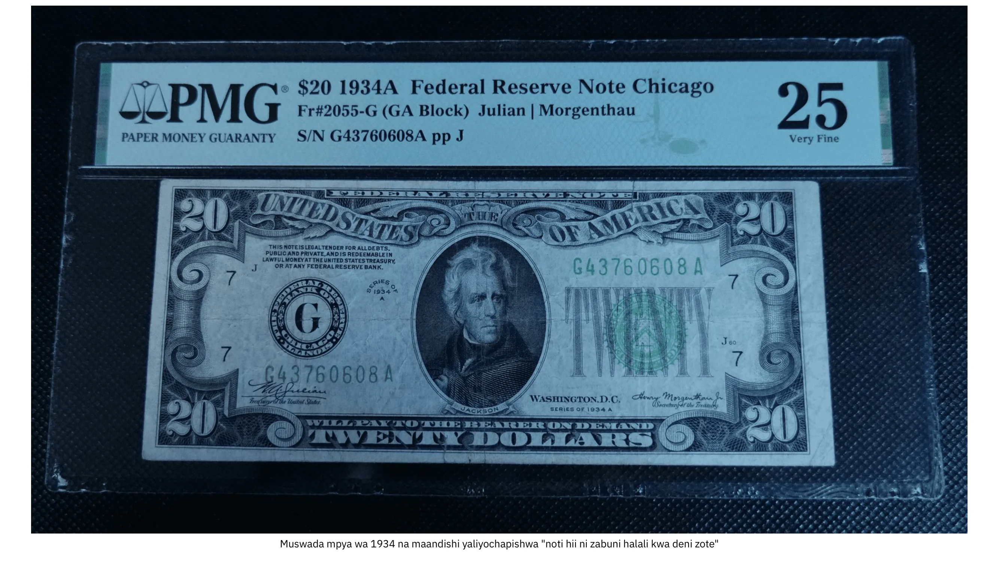

Wazo la zabuni halali linajitokeza hapa, na kuchukua nafasi ya kifungu "kinachoweza kukombolewa kwa dhahabu." Miswada hiyo miwili inaweza kuonekana kufanana, huku maneno machache tu yakibadilika, lakini kashfa hiyo iko katika ukweli kwamba dola ilishushwa thamani katika kipindi hiki; ilipungua kutoka wakia moja ya dhahabu kuwa yenye thamani ya $20.67 hadi $35 kwa wakia mwaka 1934. Iliwakilisha kushuka kwa thamani kwa takriban 40%!

Kisha ikaja Vita vya Pili vya Dunia. Kufuatia vita hivyo, Mkataba wa Bretton Woods uliweka sehemu kuu ya dhahabu duniani nchini Marekani. Wamarekani walitoa noti kwa kubadilishana, ingawa bili hizi hazikuweza kukombolewa tena kwa dhahabu na umma kwa ujumla. Badala yake, walibaki kubadilishana kwa dhahabu katika ngazi ya serikali.

Hatimaye, nchi kama Ufaransa na Ujerumani zilianza kutilia shaka kwamba pengine kulikuwa na noti nyingi zaidi za dola katika mzunguko kuliko dhahabu katika ghala za Marekani.

Kwa hiyo wakaomba kurudisha dhahabu yao. Vema, walisema, "Sawa, tutafanya, lakini itachukua muda kidogo." Mnamo 1971, rafiki yetu Richard Nixon alikata kiungo kati ya noti na dhahabu mara moja na kwa wote, akiwalaumu walanguzi katika mchakato huo.

Dhahabu haikuthaminiwa kwa $35 kwa wakia, bei ambayo haikulingana na kiasi cha pesa ambacho kilikuwa kimechapishwa au thamani yake halisi ya soko. Kwa miaka michache tu, bei ilipanda kutoka $34 hadi $800. Sawa na mifano ya kihistoria, kama vile huko Roma, ambapo uhusiano kati ya dinari na solidus ulikatwa, dhahabu iliruhusiwa kuelea. Ukweli huu ulisababisha mchakato wa ugunduzi wa bei, na kusababisha dhahabu kuwa na thamani ya juu zaidi kwa masharti ya dola baadaye.

### Mfumo wa kisasa wa sarafu ya fiat na athari zake

Sehemu hii ni muhtasari wa jinsi tulivyohama kutoka kwa mfumo wa fedha kulingana na fedha au dhahabu. Hatua kwa hatua, taasisi zilipata nguvu zaidi na zaidi juu ya pesa. Hatimaye, uamuzi wa upande mmoja ulikata kabisa uhusiano kati ya madini ya thamani na pesa, kufuatia utoaji wa kupita kiasi.

Matokeo yake, hakuna tena uhusiano wowote kati ya dhahabu na noti au pesa za kimaandiko. Na hata sio mfumo wa hifadhi ya sehemu - hiyo ni dhana iliyopitwa na wakati. Badala yake, benki za kibinafsi hutoa na kuunda pesa kupitia mkopo wa benki. Pesa huundwa hasa kwa njia hii na inahusiana na kiwango cha riba muhimu kilichowekwa na benki kuu.

Kwa kweli hakuna kikomo. Hakuna viwango vya lazima vya akiba tena, angalau Amerika na Kanada. Hifadhi pekee ni hitaji la mabenki kujipanga ili kuweza kujibu mabadilishano ya benki ili kutokosa ukwasi.

Wanahitaji tu kuhakikisha kuwa wanaweza kufanya uhamisho huu, lakini hakuna hifadhi ya lazima ya 3%, 1%, 10%. Kwa kweli tumehama kutoka kwa dhana ya hifadhi ya sehemu. Sasa, ni benki kuu, serikali kupitia nakisi ya fedha, benki kuu kupitia kurahisisha kiasi (QE), na benki za kibinafsi kupitia uundaji wa mikopo ya benki ambayo inaweza kuongeza usambazaji wa jumla wa pesa na, kwa maoni yangu, kusababisha mfumuko wa bei.

Ili kuelewa uhusiano kati ya pesa na mfumuko wa bei, ninapendekeza kozi niliyo nayo kwenye Plan ₿ Academy inayohusu somo hili. Utajifunza tofauti kati ya ongezeko la bei, ambalo tunaona maishani, na mfumuko wa bei. Wao si kitu kimoja. Kwa kweli, tunaporejelea mfumuko wa bei, mara nyingi tunazungumza juu ya ongezeko la bei, sio mfumuko wa bei wenyewe. Mfumuko wa bei ni dhana sahihi kabisa, inayoelezewa na ongezeko la usambazaji wa pesa.

https://planb.academy/courses/caa75343-ac90-4249-bcca-0e2e57c3a0f1

Ili kuhitimisha sehemu hii kuhusu ulimwengu wa fiat, ningependa kukuonyesha nyenzo ya kukusaidia kuelewa vyema matukio ambayo nimeeleza hivi punde, kama vile mfumuko wa bei.

Asante kwa umakini wako.

## Historia ya mapovu ya pesa

<chapterId>b6451c46-917d-11f0-97de-6bc5081765fa</chapterId>

:::video id=5967d9a6-aae4-4b84-a283-71b1b735bca4:::

### Uvumbuzi wa pesa za karatasi na Bubble kubwa ya kwanza

Kwa kuundwa kwa benki kuu katika karne ya 18, mapinduzi ya kweli yalizaliwa: fedha za uchawi kwa namna ya noti. Mfano unaovutia zaidi nchini Ufaransa ni ule wa John Law. Mskoti huyu, aliyehamishwa huko Paris, alipendekeza kwa mtawala, Duc d'Orléans, suluhisho la kufilisika kwa fedha za kifalme kwa kuunda benki ya serikali na kampuni ya biashara ya kikoloni: **Banque Royale** maarufu na **Compagnie du Mississippi**.

Kwa mfumo huu, Sheria iliunganisha pesa za karatasi na hisa za kampuni yake. Kadiri noti zilivyozidi kusambaa, ndivyo thamani ya hisa ilivyopanda, na ndivyo benki inavyoonekana kuwa thabiti... hadi uvumi ulipopita ukweli. Kiputo hicho kilipasuka ghafla mnamo 1720, na kuharibu wakuu, ubepari, na sehemu kubwa ya Uropa, ambao walikuja kutafakari juu ya rue Quincampoix. Matokeo: kutokuwa na imani na pesa za karatasi nchini Ufaransa, na somo la kwanza la Ulaya katika viputo vya kubahatisha.

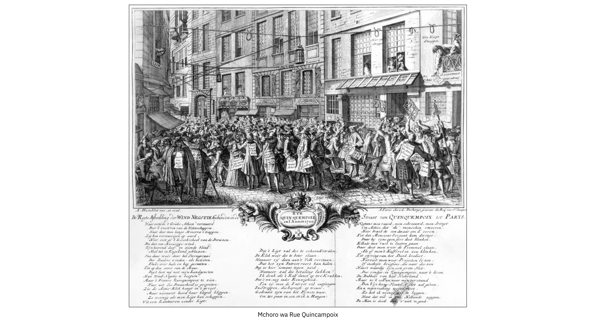

### Wakati ardhi inakuwa "dhamana"

Karne moja baadaye, Mapinduzi ya Ufaransa yalivunja msingi mpya na **kazi**, sarafu inayoungwa mkono na mali ya Kanisa iliyonyakuliwa. Wazo la kuvutia kwenye karatasi - kubadilisha ardhi kuwa dhamana ya fedha - lakini haifai: ardhi sio kioevu wala haigawanyiki. Matokeo yake: mfumuko mkubwa wa bei, vikwazo vingi vya matumizi ya ardhi, mfumuko wa bei usiodhibitiwa, na uhaba.

Napoleon, aliyeathiriwa sana na machafuko haya, alianzisha tena dhahabu na fedha kama msingi wa kifedha mnamo 1800 na kuundwa kwa Banque de France, na hivyo kuhakikisha malipo ya kawaida ya majeshi yake. Njia ya kisayansi ya kurejesha ujasiri: lipa kwa sarafu ngumu.

### Miaka ya ishirini na Unyogovu Mkuu wa 1929

Wacha turuke karne mbili. Baada ya Vita vya Kwanza vya Kidunia, serikali zilifadhili juhudi kupitia mfumuko wa bei na kusimamishwa kwa dhahabu. Katika miaka ya 1920, Fed ya Marekani ilifuata sera ya fedha ya kuhudumia kupita kiasi ili kusaidia pauni ya Uingereza. Matokeo: mkopo rahisi, uvumi usiozuiliwa kwenye Wall Street, ununuzi wa hisa kwa mkopo, na kuibuka kwa kiputo cha mali isiyohamishika na benki.

Wakati mashine ilienda vibaya, ajali ya 1929 haikuepukika: kushindwa kwa benki kubwa, ukosefu wa ajira, na foleni kwenye jikoni za supu. Hii ilizua dhana potofu inayoendelea kwamba **upungufu wote wa bei ni mbaya**, ilhali tunahitaji kutofautisha kati ya kushuka kwa bei kupitia ukuaji (afya) na kupunguza bei kupitia deni (kuharibu).

### Asia katika miaka ya 90 na athari ya domino

Mnamo miaka ya 1990, "muujiza wa Asia" ulikuwa na ndoto ya ulimwengu. Viwango vya Exchange viliwekwa kwenye dola, ukuaji ulikuwa 8-10%, na mtaji wa Magharibi ulikuwa ukimiminika. Yote yalikuwa sawa ... hadi wimbi lilipungua. Kufilisika kulipungua, sarafu zilishuka thamani kwa 80%, na wawekezaji waliharibiwa. IMF ilibidi kuingilia kati, na kuweka mageuzi maumivu. Hali kama kawaida: mtaji mwingi, viputo vya kulishwa kwa mkopo, kisha kuanguka.

### 2008 na enzi ya Bubble ya kudumu

Kiputo cha mtandao (2000) kilifuatiwa na kiputo cha mali isiyohamishika. Uwekaji dhamana ulibadilisha mikopo ya benki kuwa bidhaa za kifedha za "triple-A", zilizoenea ulimwenguni kote. Ahadi: ondoa hatari kwa kuipunguza. Ukweli: hatari zote ziliunganishwa. Wakati mali isiyohamishika ilipoporomoka, ndivyo pia mfumo mzima wa benki wa kimataifa.

Matokeo: uokoaji mkubwa wa umma, upunguzaji wa kiasi na viwango vya riba sifuri. Na kwa hayo, kukimbilia kwa kasi: kila shida haitaondoa tena ziada, lakini itafunikwa na deni zaidi na uchapishaji wa pesa. Hii ndiyo iliyosababisha hali ya sasa: ** "Bubble ya kila kitu"**, ambapo kila kitu - hifadhi, mali isiyohamishika, sanaa, crypto, hata kadi za Pokémon - hupanda kwa bandia.

### Kurudi kwa milele kwa pesa za uchawi

Kuanzia karne moja hadi nyingine, moja ya mara kwa mara huibuka: mara tu jamii inapoamini inaweza kuunda utajiri na pesa badala ya kutoa bidhaa halisi, mapovu huonekana. Kuanzia John Law hadi 2008, kutoka rue Quincampoix hadi Wall Street, mchakato unajirudia: euphoria, mikopo, boom, na bust.

Na mwishowe, mara kwa mara, wakati hakuna mtu anayeamini karatasi tena, watu hutafuta kitu kingine - dhahabu, ardhi, mahali pa usalama ... au sarafu mpya. Jana Napoleon aliweka chuma, leo wengine wanaona Bitcoin kama mrithi.

Historia ya fedha ni mzunguko usio na mwisho: kuchapisha, kubashiri, kuanguka. Mpaka Bubble ijayo.

## Pesa na vurugu

<chapterId>9486fe64-854f-5e17-86b3-8873baca39a8</chapterId>

:::video id=bd6d0807-2d8f-4637-a0f5-1e990e5c0d0f:::

Sehemu hii fupi itarejea matukio mengi ambayo tayari tumeona katika kipindi chote, kwa muhtasari wa matukio machache ambayo ninaona yanapendeza.

### Teknolojia na vurugu

Hapa kuna hadithi chache ambazo labda tayari tumezungumza juu ya kozi hii. Zinatumika kutambulisha mjadala wa kuvutia sana niliokuwa nao na Theo kuhusu mhadhara aliotoa huko B-Ondy, ambao niliuona kuwa wa kuvutia sana kuhusu jinsi maendeleo ya kiteknolojia yanavyoathiri uhusiano wa vurugu kati ya idadi ya watu na Serikali.

### Fedha na kulazimishwa na serikali

Ili kutambulisha sehemu hii, nitakupa orodha fupi na isiyo kamili, ili tu kukukumbusha matukio ambayo labda tayari tumeshughulikia katika kozi.

Kiungo kimoja ambacho ninaweza kufanya tayari na pesa na vurugu ni kwamba linapokuja suala la pesa za karatasi zisizo na maana ambazo zinaweza kuchapishwa ad infinitum, mara nyingi huja na kila aina ya sheria na kila aina ya vitisho. Tunaweza tayari kuzungumza juu ya mgawo, ambapo iliandikwa kwenye noti kwamba watu bandia walitishiwa kuuawa. Ni rahisi kupata katika maandishi ya kisheria ya wakati huo vitisho vya kifo kwa wale ambao hawakukubali pesa hizi maarufu za karatasi.

Ili kubaki Ufaransa, katika moja ya maandishi ya kisheria niliyoweza kupata kutoka enzi ya Mapinduzi, niliona kwamba "per diem" ya kusafirisha na kuendesha guillotine ilielezewa katika sehemu zinazohusiana na sarafu. Nimeona hii badala zany.

Tumezungumza pia kuhusu sarafu nchini China, huku serikali ikisimamia uchimbaji. Tuliona katika sehemu mwanzoni mwa kozi kwamba wakati sarafu, ambazo baadhi yake hazikuwa nzuri sana, zilipotupwa, kulikuwa na matokeo ya kisheria.

Pia kuna hadithi kuhusu mfalme mmoja nchini Uingereza ambaye aliishia kuwakata mikono wale waliotengeneza pesa ikiwa hawakufanya kama alivyotarajia.

Pia, huko Uchina, nimesoma juu ya kukamatwa kwa shaba kutoka kwa monasteri za Wabuddha. Wakati ambapo shaba ilikuwa ikipata thamani na kuyumbisha uchumi wao - ambao uliegemezwa kwenye aina ya pesa ya fiat ambayo haikuhusiana kidogo na thamani ya chuma - waliamua kutafuta mahali ambapo kulikuwa na utajiri na kukamata shaba kutoka kwa nyumba za watawa.

Hali hiyohiyo ilitumika kwa monasteri katika Uingereza wakati wa Matengenezo ya Kiingereza. Wakati mfalme maarufu alipogombana na Papa juu ya talaka yake, kulikuwa na sababu nyingine nyuma ya yote: alichukua fursa ya kufutwa kwa monasteri kunyakua mali zilizomo katika mashirika haya ya kikanisa.

Wakati wa Mapinduzi ya Ufaransa, waliteka mali zote za Kanisa. Waliona sarafu nzuri zilizotengenezwa kutoka kwa kengele za kanisa zilizoyeyuka.

Tukirudi nyuma hata zaidi, mojawapo ya dhana zilizo wazi zaidi za unyanyasaji wa kiuchumi na uhuru, wa sheria za ukombozi, ni **Diocletian na tabaka lake la urithi ambalo lilihusishwa moja kwa moja na ukweli kwamba wakulima hawakutaka tena kukubali sarafu iliyopunguzwa thamani**. Walitaka kuacha kazi yao kama wakulima, na Diocletian alijibu kwa kuwaambia tu, "hamwezi kuondoka katika ardhi yenu, na watoto wenu hawawezi". Jambo hilo hilo lilitumika kwa askari.

Nadhani hiyo ni aina dhahiri ya vurugu. Ningeweza kumalizia kwa kuzungumza kuhusu Knights Templar au mfalme wa Ufaransa. Wakati Knights Templar ilipokaa Ufaransa, nadhani aliona mana ya utajiri wa Templar na alikuwa na shida za ufadhili wa serikali. Alishtaki Agizo la Templar, na baadhi yao waliweza kuondoka na sehemu ya hazina, ambayo imetoa onyesho la kupendeza sana huko U.S. au Kanada. Sijui ni nani aliyeitayarisha, lakini inaitwa *The Mystery of Oak Island*. Inahusu watu wanaofikiri kuwa kuna hazina ya Templar iliyozikwa kwenye kisiwa huko Kanada, katika Maritimes, na wamekuwa wakichimba visima kwa miaka - labda hata zaidi ya muongo mmoja - kutengeneza aina fulani ya vizuri. Wamepata kisima chenye maghala mengi, na wanatafuta hazina iliyozikwa na Knights Templar kwenye kisiwa hiki, ambacho ndicho mada ya kipindi hiki cha TV. Nampongeza baba yangu ambaye ni shabiki mkubwa wa kipindi hiki.

Kwa hivyo unayo: orodha ya haraka sana ya ukweli ambayo tumeona wakati wa kozi hii ambayo, nadhani, inaongeza uhusiano na vurugu. Nitakuacha na sehemu inayofuata kutoka kwa Theo, ambaye atatuambia hadithi ya kuvutia sana kuhusu mabadiliko ya teknolojia na usawa wa nguvu kati ya plebs na mamlaka.

Asante!

## Matokeo ya kiuchumi ya vurugu zilizopangwa

<chapterId>66bd4674-2159-5489-ad4b-ec5e3fb691af</chapterId>

:::video id=c8b063c6-aeb4-4a94-9027-b11d369e71a4:::

### Vurugu zilizopangwa na mageuzi ya serikali

Mwanahistoria Frederic C. Lane anapendekeza tasnifu ya kimapinduzi: anatomia ya serikali katika historia yote inaundwa na teknolojia zinazotumiwa kutayarisha vurugu. Kuanzia kanuni ya Weberian kwamba serikali inashikilia ukiritimba wa vurugu halali, Lane anaona kuwa ukiritimba huu - wenye ufanisi zaidi kuliko ushindani katika uwanja huu - unabadilika kulingana na uhusiano kati ya gharama ya mashambulizi na gharama ya ulinzi.

Uchambuzi huu, uliochukuliwa na waandishi wa "The Sovereign Individual" (1997), unaelezea mabadiliko ya kihistoria katika shirika la kisiasa: kutoka kwa mfumo wa kifalme wa medieval hadi majimbo ya jiji la Renaissance, kisha hadi mataifa ya viwanda na mwishowe hadi majimbo ya kisasa ya ustawi. Kila mpito inalingana na mafanikio makubwa ya kiteknolojia katika mazoezi ya vurugu, yanayotokea takriban kila miaka 400-500.

### Usawa wa medieval

Katika Zama za Kati, uchumi wa kilimo ulikuwa zaidi ya 90%. Mkulima huyo, ambaye alikuwa amejikita katika ardhi yake, hakuweza kumkimbia bwana na mashujaa wake. Teknolojia ya kijeshi - silaha za kughushi kwa mkono, miaka ya mafunzo ya upanga - ilikuwa ghali sana. Asymmetry hii ilipendelea sana shambulio dhidi ya ulinzi.

Mzalishaji wa kilimo asiyehamishika anakuwa mateka wa mbabe wa ndani wa ghasia. Uwezo wake wa utozaji ushuru unafikia viwango vipya - ingawa, kwa kushangaza, ushuru wa zama za kati unasalia kuwa wa kawaida ikilinganishwa na 78% ya ushuru wa lazima katika nyakati za kisasa. Bwana anaweza kutoza ushuru apendavyo, kwa sababu mkulima hawezi kupinga wala kuondoka.

### Renaissance ya Wafanyabiashara

Kuibuka kwa biashara ya Hanseatic katika biashara ya Kaskazini na Mediterania Kusini kulibadilisha hali hiyo. Wafanyabiashara, waundaji wakuu wa thamani iliyoongezwa, walikuwa na mtaji wa rununu - meli zao. Walihitaji tu wanamgambo wepesi wa baharini, kwani bahari ilikuwa ngumu kwa polisi. Zaidi ya yote, wanaweza kuhamia kwa urahisi bandari ya jirani ikiwa ushuru utakuwa mwingi.

Uhamaji huu uliunda ushindani wa ushuru kati ya majimbo ya jiji. Venice, Genoa na Bruges zilipaswa kutoa mfumo huria zaidi iwezekanavyo: mikataba ya kuaminika, sarafu ya ubora, bima, ushuru mdogo. Wakuu walilazimika kutongoza badala ya kulazimisha. Ulinganifu unarudi nyuma: ulinzi (kupitia kukimbia) inakuwa rahisi kuliko mashambulizi.

### Enzi ya viwanda

Mapinduzi ya Viwanda yalileta usanidi sawa na ukabaila. Viwanda, reli na njia za kusanyiko zinawakilisha uwekezaji mkubwa, usiohamishika. Henry Ford hakuweza kuhamisha mimea yake mbele ya ushuru. Wafanyikazi, waliojilimbikizia katika miji ya viwandani, waliungana ili kujadili kwa pamoja badala ya kuhama mtu mmoja mmoja.

"Hali ya ustawi" iliibuka: mipango ya viwanda (Japani, Korea), ulinzi wa kijeshi wa miundombinu, faida za kijamii za chini kwa wafanyikazi. Vita vya Pili vya Ulimwengu vilionyesha hatari hii: mabomu viwanda vya adui vikawa mkakati mkuu. Mkusanyiko wa mtaji halisi uliwezesha utozaji mkubwa wa kodi ili kufadhili hali ya ustawi.

### Mapinduzi ya microprocessor

Ubunifu tatu za kiteknolojia sasa zinavuruga mizani hii ya zamani. Microprocessor inabadilisha vita: opereta huko Nevada huendesha ndege isiyo na rubani nchini Afghanistan kwa usahihi wa upasuaji. Vita vya Ghuba (1991) vilionyesha mafanikio haya: jeshi la nne kwa ukubwa duniani (Iraq) liliangamizwa katika muda wa siku 45, na chini ya vifo 200 katika upande wa muungano. Ukuu wa kiteknolojia ulifanya mashambulizi ya mbele yasiwezekane.

Mtandao na kriptografia isiyolinganishwa inaleta mapinduzi katika uundaji wa thamani. Msanidi programu anaweza kufanya kazi popote akiwa na MacBook na Starlink, akisafirisha uzalishaji wao papo hapo na bila malipo. Mabedui wa kidijitali hutoroka utumwa wa kijiografia, wakigonganisha majimbo kwa njia ambayo haijaonekana tangu Renaissance.

Bitcoin inawakilisha kilele cha mantiki hii: sarafu iliyoachiliwa kutoka kwa Serikali, iliyolindwa na ngao ya kriptografia isiyoweza kukiuka. Utajiri huweza kulindwa dhidi ya nguvu yoyote ya kimwili. Mtu anapata tena uwezo wa kujilinda dhidi ya ukiritimba wa serikali.

### Kuanguka kwa mtindo wa Westphalian

Mataifa ya ustawi wa Magharibi, yaliyoundwa kwa ajili ya enzi ya viwanda, yanakuwa ya kizamani. Waundaji thamani - wasanidi programu, wasanii, wafadhili - wanahamia Singapore, Dubai au El Salvador, wakipendelea huduma chache za umma badala ya kutozwa ushuru kidogo. Majitu ya kisasa kama Apple na Tether hayahitaji ofisi wala miundombinu ya kimwili.

Ukosefu huu wa ubongo husababisha mzunguko: wachangiaji wachache, huduma za umma zilizoshushwa, ongezeko la ushuru kwa wale wanaokaa, na kuondoka kwa kasi. Mataifa lazima yapunguze kwa kiasi kikubwa au kufilisika. Kugawanyika katika maeneo madogo, yenye ushindani - mtindo mpya wa majimbo ya kidijitali ya miji - inaonekana kuwa jambo lisiloepukika.

Historia inatufundisha kwamba mabadiliko haya huchukua vizazi. Lakini mgawanyo wa Bitcoin wa sarafu na serikali unaweza kuharakisha mchakato huo. Watu binafsi sasa wanapiga kura kwa miguu yao na pochi zao za kriptografia, ikichora upya ramani ya nguvu ya kimataifa kulingana na ambayo ndio tunaanza kufahamu.

## Historia fupi sana ya fedha

<chapterId>1d37fff1-a091-5034-8e71-4af590b8ffce</chapterId>

:::video id=fdfabbc6-e4d8-463a-8522-19176f8fb460:::

Kufuatia akaunti hii ya historia ya pesa, ambayo inatupeleka hadi kwenye mfumo wa fiat, ningependa kuelezea kwa haraka na kwa ufupi mabadiliko ya kifedha ambayo hatimaye yalisababisha hali ya ustawi. Hapo awali, katika nyakati za Waroma, tulikuwa na sarafu.

Sarafu zilikuwa teknolojia ya kifedha ambayo iliruhusu ufalme kulipa askari, kupanua, na biashara. Ilifanya kazi vizuri sana, isipokuwa kwamba hatimaye kulikuwa na kushuka kwa thamani nyingi sana. Wakati fulani walipoacha kupanuka na kuacha kupata nyara kutoka kwa vita vyao na upanuzi wa eneo, mfumo wao ulianguka.

### Maendeleo ya teknolojia ya kifedha

Kisha ikaja Zama za Kati, wakati kulikuwa na mageuzi kidogo sana mpaka Florin, ambayo ilileta nyuma sarafu imara, na maendeleo ya benki nchini Italia na Antwerp, ambapo dhana ya "thamani ya muda wa fedha" ilitengenezwa - kwa maneno mengine, kupunguza. Walianzisha punguzo ili kuunda aina ya pesa za karatasi ambayo "noti ya ahadi" ilitolewa, yaani, ahadi kwamba siku za baadaye mtu ataweza kurejesha $ 100 pamoja na kiwango cha riba.

Mfumo huu uliunda teknolojia ya kifedha ambayo inaruhusu mmiliki kuuza noti kabla ya mwisho wa muhula, kwa hivyo ikiwa utaiuza baada ya miezi 4 kati ya muda wa miezi 6, mtu huyo atalipa malipo ya kwanza ili kufidia upotezaji wa mavuno kwa miezi 2 iliyobaki.

Ilikuwa teknolojia ya kifedha iliyotengenezwa huko Antwerp na Amsterdam wakati huo. Baadaye, tuliona mageuzi ya benki kuu na dhana ya wakopeshaji ya mapumziko ya mwisho. Inaweza kusema kuwa wakati wa Benki ya Amsterdam, matumizi ya sarafu katika biashara ya kimataifa yaliachwa kwa ajili ya fedha za maandiko.

Baadaye, katika karne ya 18, kwa upande wa teknolojia ya kifedha, tunaweza kuzungumza juu ya bima. Kwa hivyo kuna hadithi ambayo imesimuliwa vizuri sana kwenye kitabu cha Neil Ferguson "The Ascent of Money". Kampuni ya kwanza ya bima kuzaliwa iliitwa **Scottish Widows**, na kimsingi, ni makasisi waliotaka kuendeleza bima kwa mapadre ambao wakati fulani walikufa mapema, walikufa ghafla. Makasisi, wakati huo, walikuwa wakiwatunza wake na watoto wao huko Scotland kwa mwaka mmoja. Na kwa hivyo makasisi walipata kipindi hiki cha mwaka mmoja labda kifupi sana. Kwa sababu hiyo, **walibuni hesabu za takwimu** ili kukokotoa kihalisi idadi ya wachangiaji wanaohitajika ili mfumo kulipia gharama zake, kulingana na idadi ya makuhani waliokufa kabla ya wakati.

Walitengeneza hesabu za takwimu za kusema "Sawa, sawa, kila padre anatupa kiasi hiki. Kisha, kama kuhani akifa, basi, bima italipa gharama ili kuhakikisha maisha ya mke na watoto wake mpaka waweze kujitegemea." Kwa hivyo ilikuwa kampuni ya kwanza ya bima inayoitwa "Wajane wa Uskoti" iliyoeneza mfumo huu, na mahali ulipowekwa.

### Kutoka kwa bima ya kibinafsi hadi hali ya ustawi

Hivyo bima ni sehemu ya historia ya teknolojia ya fedha. Na hii inanileta kwenye dhana ya hali ya ustawi, ambayo ni kwamba bima ya kibinafsi hatimaye ilikuja dhidi ya tatizo, dhana ya optimization, ambapo tunajiambia wenyewe, ikiwa tunatoa bima ya afya kwa watu wenye afya nzuri, wanaweza kuwa na riba ndogo katika kulipa malipo kwa sababu wanajiambia, "Mimi ni afya, sitaugua". Kwa upande mwingine, watu wanaojua kuwa ni wagonjwa hakika watataka kujiandikisha.

Mfumo huu unaleta usawa kati ya idadi ya wagonjwa ambao watachukua bima ya afya, kinyume na watu wenye afya ambao wanaweza kuchukua kidogo. Kwa hivyo kuna aina ya usawa: ukihesabu takwimu, hazingesawazisha kwa sababu labda haungeweza kuwahakikishia watu wenye afya ya kutosha ili kulipia gharama. Katika uchumi, hii ndiyo dhana ya **hatari ya maadili**.

Moja ya mawazo ambayo yamewekwa mbele ni kufanya bima kuwa ya lazima. Ikiwa kila mtu atalazimika kuchangia, inasawazisha jambo zima na watu wenye afya na wasio na afya watachangia, kusambaza hatari kwa idadi kubwa zaidi ya watu.

Na kwa hivyo, katika sehemu nyingi za ulimwengu, serikali imesema, "Vema, tutashughulikia hilo". Ingawa mimi si mtaalamu wa suala hili, ninaweza kuona kwamba hoja kama hii huenda inatumika kwa aina zote za bima, kama vile bima ya ukosefu wa ajira. Kuna hamu ya kurahisisha na kuboresha, kulingana na wazo kwamba itakuwa rahisi ikiwa kuna shirika moja tu la kuitunza.

Kwa maoni yangu, hii ilisababisha kuunganishwa kwa dhana hizi zote za bima, na mwishowe kuzaliwa kwa hali ya ustawi, ambapo dhana hizi zote za kifedha ambazo hapo awali zilikuwa biashara za kibinafsi, mipango ya kibinafsi ya kukidhi soko la bima inahitaji kusambaza hatari kati ya idadi ya watu, ilikamatwa na serikali kwa sababu ambazo labda ni za kimantiki kuhusiana na hatari ya maadili na hamu ya kuboresha.

### Mifano mbadala na tafakari kuhusu ukiritimba wa serikali

Hatimaye, katika baadhi ya nchi kama Kanada, tunaishia na aina kadhaa za bima - bima ya afya, bima ya ukosefu wa ajira - ambazo ni ukiritimba wa serikali.

Naweza kukupa mfano ninaoujua. Katika Uswisi, mfumo ni tofauti kidogo. Kuna makampuni ya bima ya kibinafsi na hospitali za kibinafsi, kwa hivyo unaweza kuchagua kampuni yako ya bima ya pamoja, unaweza kuchagua kifurushi chako ndani ya kampuni yako ya bima ya pande zote. Bado unapata huduma nyingi kwa wote, hata kama sehemu kubwa ya mfumo huu itasalia kuwa ya faragha.

Kwa hivyo nadhani inawezekana kwamba pia inaendeshwa kwa faragha. Lakini kila kitu nilichotaka kukuelezea, kwa kweli, sio taarifa ya kuelezea ikiwa mfumo mmoja ni bora kuliko mwingine, ilikuwa badala ya kukuelezea kwamba katika kusoma juu ya historia ya fedha, niligundua kwa nini huko Magharibi, haswa Ufaransa, haswa Kanada, Jimbo lilitaka kuchukua udhibiti wa kanuni hizi za kifedha.

Hoja niliyotaka kusema ni kwamba dhana ya bima kwanza kabisa ni mageuzi ya fedha, na kwa vile serikali wakati mwingine ni wazuri sana wa kufanya, watajaribu kuchukua udhibiti wake, kama vile wamejaribu kuchukua udhibiti wa pesa, kwa sababu kadhaa. Sababu moja, kwa bahati, ni dhana ya mkopeshaji wa suluhisho la mwisho.

Wazo ni kwamba ni bora zaidi ikiwa kuna taasisi kubwa nyuma yake ambayo inasambaza hatari kwa upana zaidi. Huo ndio ulikuwa mpango wa awali nyuma ya dhana ya mkopeshaji wa hatua ya mwisho, ambapo taasisi hii inaweza kuchagua taasisi ambazo zilikuwa na nguvu ya kutosha kuishi na kuzizuia zisiporomoke kwa kuwakopesha pesa.

Wakati huo, kulikuwa na uchambuzi wa kweli wakati dhana hii hatimaye ilionekana kwa mara ya kwanza, lakini kile kilichomalizika ni kwamba tunaokoa kila mtu, "kubwa sana kushindwa", inatumika kwa karibu benki zote kwa sababu kuna centralization, na pia kwa makampuni yote makubwa. Mwishowe, tunaona kwamba bado ni dhana ambayo inatumiwa "kwa ujumla" na Serikali, sawa na dhana ya bima ambayo nimekuelezea hivi punde.

Hatimaye, serikali itaamua kwamba itashughulikia kila kitu, ikigeuza teknolojia ya kifedha iliyoundwa nchini Scotland kutatua tatizo mahususi katika hali kubwa ya ustawi tunayojua leo. Inatumia kanuni za kifedha za kitaalamu kutoa huduma kwa wakazi wake wanaohitaji. Hata hivyo, tunaweza kukubaliana kwamba ukiritimba unaotokana na mfumo huu husababisha matatizo ya kila aina, ambayo kwa sasa tunakabiliana nayo katika nchi kama Kanada na Ufaransa. Kwa bahati nzuri, kuna mifano tofauti, kama ile ya Uswizi.

Tunapaswa kutambua kwamba dhana hii ya hali ya ustawi inatokana na fedha. Utambuzi huu unapendekeza kwamba tunaweza kuchunguza njia zingine zaidi ya ukiritimba maarufu wa serikali, na ningetumia hoja hii kwa dhana ya benki kuu kama wakopeshaji wa suluhisho la mwisho - lakini hilo ni somo la wakati mwingine.

# Sehemu ya mwisho

<partId>9bada469-7ef0-511a-9eaa-f8eb66d5906f</partId>

## Tathmini kozi hii

<chapterId>a9494e2b-8a4d-5811-8a7b-b4a91fb22778</chapterId>

<isCourseReview>true</isCourseReview>

## Hitimisho

<chapterId>1094e793-b4c6-5782-aa4a-71cde00ce7c0</chapterId>

<isCourseConclusion>true</isCourseConclusion>