# Madeni para tarihinde bir yolculuk

Bu büyüleyici kurs sizi ilk uygarlıklardan günümüzdeki para sistemimize kadar paranın büyüleyici evrimini keşfetmeye götürecek. Neolitik dönemden modern zamanlara kadar çağları aşacak, paranın büyük insan uygarlıklarını nasıl şekillendirdiğini ve onlar tarafından nasıl şekillendirildiğini keşfedeceğiz. Mezopotamya proto-parasından kripto paralara, Lidya sikkelerine, Rönesans florinine ve merkez bankacılığının ortaya çıkışına kadar bu kurs, toplumlarımızın temel direklerinden birine kapsamlı bir bakış açısı sunuyor.

+++
# Giriş

<partId>59878a67-8a1d-5d6b-af41-5b847c14363c</partId>

## Para Tarihine Giriş

<chapterId>ca53597e-be9a-5261-a55f-11fac8504a68</chapterId>

:::video id=08ff35ca-8a40-4286-abaf-71283faf6e78:::

Paranın tarihiyle ilgili bu derse hoş geldiniz. Başlıktan da anlaşılacağı gibi, sikkelerin tarihsel gelişimini birlikte keşfedeceğiz. Neolitik çağdan günümüze, geçmişin büyük imparatorluklarına ve uygarlıklarına bakacağız.

Ancak bu kurs, basit bir tarih kronolojisi ya da tarihsel olaylarla sınırlı değildir. Asıl amacımız, paranın ya da daha doğrusu para birimlerinin ortaya çıkışında yer alan temel kavramların derinlemesine anlaşılmasını sağlamaktır.

### Keşfedilecek temel kavramlar

Yani ortaya çıkıştan bahsediyoruz: para birimlerinin, para sistemlerinin, bankaların, kağıt paranın, merkez bankalarının ve son olarak mevcut "fiat" para sisteminin ortaya çıkışı.

İlk para birimlerine yolculuğumuza Mezopotamya'da borç para ve hesap birimlerinin yanı sıra ilkel toplumlarda çeyiz ve kan parası gibi diğer sistemlerin ortaya çıkışıyla başlıyoruz. Ayrıca, Orta Krallık'tan çok önce eski Mısır'da gerçek para sistemlerinin nasıl var olduğunu göreceğiz.

Daha sonra, ekonomi ders kitaplarına göre paranın gerçek başlangıcı olarak kabul edilen önemli bir an olan Lidya'da ilk sikkelerin ortaya çıkışına geçiyoruz. Bu sikkelerin Persler, Büyük İskender ve ardından Roma sayesinde nasıl yayıldığını, sonunda kendilerini nasıl kabul ettirdiklerini, egemen olduklarını ve çöktüklerini inceleyeceğiz.

Buradan itibaren, öğrendiğimiz her şeyle donanmış olarak, "para her zaman bir borçtur" veya "para her zaman bir metadır" gibi önyargılı fikirlerin ötesine geçerek, paranın tanımı üzerinde birlikte düşünmek için ihtiyacımız olan zamanı ayıracağız. Gerçekte para hem bir mal hem de sosyal bir gelenektir. Özellikle para primi kavramını tartışacak ve paranın ortaya çıkışını açıklayan çeşitli teorileri birleştirmeye çalışacağız.

### Önemli dönemler ve parasal yenilikler

Daha sonra, parasal açıdan belirli bir istikrarsızlığın damgasını vurduğu, yine de Danimarkalı işgalcilere rüşvet vermek için kullanılan İngiliz penisi ve bugün hala bazı modern banknotlarda anısı devam eden Charlemagne poundu gibi çarpıcı yeniliklerin ortaya çıktığı sıkıntılı bir döneme geçiyoruz.

Ayrıca Haçlı Seferleri sırasında ilk uzaktan para transferi sistemlerinin nasıl ortaya çıktığına da bakacağız. Ardından Rönesans'a eşlik eden para birimi Florin'in etkisine ve Avrupa fiyatları üzerinde derin bir etkisi olan Amerika'dan değerli metallerin gelişine bakma zamanı.

Kağıt paranın ve merkez bankacılığının ortaya çıkışını ayrıntılı olarak inceleyecek, finansal krizlerin tarihi ve bunların genellikle şiddetli yansımaları ile paralellikler kuracağız.

Son olarak, günümüz para sistemiyle bir paralellik kuracak, sonuçlarını inceleyecek ve günümüz refah devletine nasıl ulaştığımızı daha iyi anlamak için finans tarihinin izini süreceğiz.

Ve bonus olarak, farklı dillerde günlük hayatımızı etkilemeye devam eden parayla ilgili birçok büyüleyici etimolojik bağlantıya da bakacağız.

### Kurs yapısı

Bu kurs üç ana bölüme ayrılmıştır.

Bölüm I paranın ortaya çıkışını, Bölüm II paranın rönesansını ve çöküşünü, Bölüm III ise devlet kurumlarının ya da devletin paranın kontrolünü kademeli olarak nasıl ele geçirdiğini ve günümüzdeki fiat sistemine nasıl gelindiğini incelemektedir.

Teşekkürler ve iyi eğlenceler!

# Borsaların ortaya çıkışı

<partId>da5e4981-9ea5-5208-beab-3b75c9043632</partId>

## Australopithecus'tan Modern İnsana

<chapterId>34a773aa-f2d3-5c26-8be4-f2cd79ed6fbc</chapterId>

:::video id=4f333013-4b2a-42ab-8761-593fafc971ca:::

### Neden Neolitik Çağ'dan başlayalım?

Para hakkında konuşmak için neden Neolitik döneme kadar geri gidelim? Cevap basit: medeniyetlerin ortaya çıkışına da bakmadan paranın ortaya çıkışını tam olarak anlayamayız. İlk parasal sistemlerin neden ortaya çıktığını anlamak için, göçebe avcı-toplayıcı grupları yerleşik hayata geçiren şeyin ne olduğunu anlamamız gerekir.

İş bölümü ve uzmanlaşmanın olmadığı, her bireyin kendi ihtiyacı olanı üretmekten sorumlu olduğu bir kabilenin paraya ihtiyacı yoktur. Aynı şekilde, sadece geçimlik tarım yapan, her bireyin kendisi için ekip biçtiği bir tarım topluluğu da henüz evrensel bir değişim aracısına ihtiyaç duymaz.

### Sedanterleşme ve sonuçları

Bu yüzden keşfe Neolitik dönemden başlamanın ilginç olduğunu düşünüyorum. Yerleşik hayata geçmenin yavaş yavaş nasıl köylere, ardından şehirlere ve nihayetinde büyük medeniyetlere yol açtığını göreceğiz. İşgücü uzmanlaşmasını mümkün kılan, ilk parasal kavramların ortaya çıkması ve evrilmesi için gerekli olan verimli zemini yaratan da bu yerleşik hayata geçme ve gıda fazlası üretimiydi.

Tıpkı insan etkileşimlerinin dili doğurması gibi, paranın da medeniyetlerin oluşumu ve örgütlenmesi sırasında doğal olarak ortaya çıktığını ya da çıkmadığını (İnkalar ve Spartalılarda olduğu gibi) düşünebiliriz. Bana göre, paranın ortaya çıkması ya da çıkmaması, her toplumun sosyal ve ekonomik örgütlenme biçimiyle ilgilidir.

### İnsan evrimi kronolojisi

Ama önce daha geniş bir tarihsel bağlama bakalım.

Her ilk sunumda olduğu gibi, kursun giriş bölümünde söylediklerimin tam tersini yapacağım ve size birbirini takip eden tarihlerin ve tarihi olayların bir listesini vereceğim. Buradaki fikir, paranın ortaya çıkışını tarihsel bağlamına, yemek pişirme, tekerlek, bazı tahılların ve hayvanların evcilleştirilmesi, piramitlerin inşası ve ilk şehirlerin kurulması gibi diğer insani ilerlemelerle ilişkili olarak yerleştirmektir.

Öyleyse, tarih öncesi çağlardan itibaren insanlığın evrimine bir göz atalım.

Australopithecus'tan modern insana kadar insan evrimine genel bir bakış, Neolitik döneme kadar teknolojik ilerlemeleri ve nüfus hareketlerini takip eder.

### İnsanlığın tarihsel bağlamı

- 3 milyon yıl önce** - *Australopithecus'un* ortaya çıkışı.
- 2 milyon yıl önce** - Homininler Afrika'yı terk etmeye başladı.
- 1.6 milyon yıl önce** - Homininler Güney Avrupa ve Asya'ya ulaştı.
- 1 milyon yıl önce** - Ateşle yemek pişirmeye dair ilk kanıt (Wonderwerk Mağarası, Güney Afrika'da kömürleşmiş kemikler ve bitki kalıntıları).
- MÖ 400.000 civarında** - Neandertaller Avrupa ve Asya'da yaşamaktadır.
- MÖ 300.000 civarı** - *Homo sapiens'in* ortaya çıkışı.
- 80.000 yıl önce** - *Homo sapiens* dünyanın her yerine göç etmeye başlar.
- 73.000 yıl önce** - Güney Afrika'daki Blombos Mağaraları (bilinen en eski sanat formları).
- 50.000 yıl önce** - *Homo sapiens* Avrupa'ya ulaştı.
- 30.000 yıl önce** - Fransa'daki Chauvet mağarasından mağara resimleri.
- 15.000 yıl önce** - Fransa'daki Lascaux mağara resimleri ve Avustralya kaya sanatı.
- MÖ 9000 civarı** - Bereketli Hilal'de arpanın evcilleştirilmesi.
- MÖ 9000 civarı** - Meksika'da mısır ekimi.
- MÖ 8000 civarı** - Bereketli Hilal'de keçi ve koyunların evcilleştirilmesi.
- MÖ 7250 civarı** - Ain Ghazal (Ürdün) birkaç yüz nüfuslu bir köyü ortaya çıkarır.
- MÖ 7000 civarında** - Çatalhöyük (Türkiye) 8.000 kadar nüfusa sahiptir.
- MÖ 6500 civarı** - Yunanistan'da yerleşik hayat başlar.
- 6000 yıl önce** - Mısır ve Mezopotamya'da nehir sulamasının başlaması.
- MÖ 5000 civarında** - "Üç kız kardeş" tarım kombinasyonunun (mısır, kabak, fasulye) ortaya çıkışı.
- MÖ 4000 civarı** - Orta Asya'da devenin evcilleştirilmesi. (Camelid ailesi 45 milyon yıl önce Eosen döneminde Kuzey Amerika'da ortaya çıkmıştır. Bu develer daha sonra, o dönemde Bering Boğazı'nda iki kıtayı birbirine bağlayan ince bir kara şeridi üzerinden Asya'ya göç etmiş olmalıdır. Ailenin diğer bir kısmı ise bugün hala torunlarının yaşadığı Güney Amerika'ya yönelmiştir: lamalar, alpakalar ve vikunalar).
- MÖ 3500-3000 civarı** - Botai halkı atları evcilleştirmeye ve yetiştirmeye başlar.
- Tunç Çağı'nın başlarında** - Sümerler tekerleği ve yelkenliyi çoktan icat etmiş, aritmetik, astronomi ve yazının ilk şeklini geliştirmişlerdi.
- MÖ 2800 civarı** - Uruk, zirvede olduğu dönemde 80.000'e varan bir nüfusa ulaşmıştı.
- mÖ 2600-2200** - Yunan dünyasında kentsel gelişimin ilk işaretleri. Akdeniz ekinlerinin (buğday, üzüm, zeytin) yaygınlaşması.
- mÖ 2560** - Büyük Giza Piramidi'nin inşası.
- MÖ 1500 civarı** - Minos uygarlığı.
- MÖ 1300 civarı** - Miken uygarlığı.
- Yaklaşık MÖ 1250 ila 1150** - Bronz Çağı uygarlıklarının çöküşü.
- mS 1. yüzyıl** - Kuzey Afrika Berberileri deveyi evcilleştirir.

İşte bize belirli teknolojilerin ortaya çıkışı, belirli hayvanların evcilleştirilmesi ve kültürler hakkında bir bakış açısı kazandırmak ve bunu bir sonraki bölümümüzün konusu olan yazı ve paranın ortaya çıkışı ile bir bağlama oturtmak için bu tarihsel genel bakış.

## Avcı-Toplayıcıdan Çiftçiye: Uygarlığın Şafağı

<chapterId>ea950b6e-9eb7-553d-8f04-0eb042bb1f5a</chapterId>

:::video id=4b49a376-f6f4-42a0-86fa-264997a079f0:::

### Tarıma geçiş ve yerleşik düzene geçme

Bu bölümde, avcılık ve toplayıcılıktan geçimlik tarıma, zanaatlara ve ticarete geçişten bahsedeceğiz. Yerleşik hayata ve tarıma geçişi açıklamanın, ilk şehirlerin nasıl inşa edildiğini ve nihayetinde Antik Çağ'da belirli para sistemlerinin yaratılmasına ve ortaya çıkmasına yol açtığını anlamak için önemli olduğunu düşündüm.

Bu bölüm, The Great Courses web sitesinde yer alan ve California State Polytechnic University, Ponoma'dan Profesör Amanda Podany tarafından verilen Ancient Mesopotamia, Life in the Cradle of Civilization adlı dersten bir alıntıdır.

### Tarımı benimsemenin paradoksları

İlkel tarım yaklaşık 10.500 yıl önce Yakın Doğu'da, kuzeybatı Suriye ve güney Türkiye civarında ortaya çıkmıştır. Bugün, modern avcı-toplayıcı gruplar tarımı benimsemek için acele etmiyorlar ve aynı durum muhtemelen Neolitik dönemde de geçerliydi.

**İlk köyler açıkça bitkilerin ve hayvanların evcilleştirilmesinden önce inşa edilmiştir.** İnsanlar tarım onlara izin verdiği için yerleşmemişlerdir; aksine, önce yerleşmişler ve ancak çok daha sonra, yaklaşık 3.000 yıl sonra tarıma başlamışlardır.

Avcılık ve toplayıcılık basitçe çok işe yarıyordu, bu yüzden yiyeceklerini üretmek için tohum ekmelerine gerek yoktu. Günümüzde avcı toplayıcılar, çok ilkel teknolojiler kullanan ilk çiftçilerden çok daha fazla boş zamana sahipler.

Yani burada söylemek istediğimiz, modern ilkel avcı-toplayıcı halkların, Neolitik dönemin ilk çiftçilerinden anladığımızdan daha fazla boş zamana sahip olduklarıdır; ne de olsa, tarım için oldukça ilkel teknolojilere sahiptiler. Bu insanlar yiyecek üretmek için avcılık ve toplayıcılıkla geçinen modern ilkel kabilelerimizden daha çok çalıştılar.

Kemik çalışmaları ayrıca ilk çiftçilerin kendilerinden önceki avcı toplayıcılardan daha küçük ve daha az sağlam olduklarını göstermektedir. Çiftçilerin diyetleri avcı toplayıcılarınkinden daha kısıtlıydı. Çok daha fazla ekmek ama çok daha az et yiyorlardı ve ayrıca un üretiminde kullanılan kaya parçaları nedeniyle daha zayıf dişlere sahiptiler. Taşlarla un yaptıklarında kıymıklar oluşuyordu.

"Keto" diyetini uygulayanlar aynı fikirde olacaktır: Çok fazla ekmek yemek muhtemelen et yemek kadar iyi değildir.

### Tarımın benimsenmesine ilişkin teoriler

Tüm bu dezavantajlar göz önüne alındığında, o zamanlar kim çiftçi olmayı seçerdi? Bazı popüler teoriler, insanların tarımı benimsemeye zorlandığını ve bunun gerçekten bir seçim olmadığını öne sürüyor. Yabani tahıllarda bile büyük bir sorun vardı. Büyük miktarlarda tahıl kolayca taşınamıyordu. Bir yerde depolanmaları gerekiyordu. Tahıl bir kez depolandığında, yakınında kalmak mantıklı olurdu. Yani, yabani tahıl yetiştiriyordunuz, ki bu tarım anlamına gelmiyordu ve büyük miktarlarda yetiştirdiğinizde bir yerde depolamanız gerekiyordu, bu da nakliyeyi zorlaştırıyordu. Bu durum muhtemelen yerleşik hayata geçmenin ilk aşamalarına katkıda bulundu. İnsanların belirli bir yere yerleşmesinin ilk nedeni de bu olabilir. Eğer bu yer tüm yıl boyunca yiyecek sağlıyorsa, sürüleri takip etmeye ya da sürekli seyahat etmeye gerek yoktu.

Natoufian kültüründe, yuvarlak evlerden oluşan köylerde yüz kadar insan bir arada yaşıyordu. Tarımın başlangıcını açıklayan popüler bir teori, bu değişimin iklim değişikliği tarafından teşvik edildiği yönündedir. Yaklaşık 11.000 yıl önce, Yakın Doğu'daki iklim eskisinden daha soğuk ve kurak hale gelmiştir. Daha önce bol miktarda bulunan bitki ve hayvanlar seyrekleşti. Bunun üzerine topluluklar bağımlı oldukları bitkileri yetiştirmeye ya da yetiştirmek ve bunlardan kâr elde etmek için koyun, keçi ve sığır gibi bu tür yetiştiriciliğe elverişli genç hayvanları beslemeye başlamışlardır. Bu çok kademeli bir süreç olurdu. Yani, hepsinin hayvanları evcilleştiren çiftçiler haline geldiği kesin bir an yoktu.

Bir başka teori de evcilleştirme ile çözülen sorunu köylerin kendilerinin yarattığıdır. Yoğun avcılık ve toplayıcılık doğal çevrenin dengesini bozabilirdi. Bir hipoteze göre, Natufianlar öyle bir demografik başarı elde etmişlerdi ki, yakın çevreleri için çok kalabalık hale gelmişlerdi. Dolayısıyla, bataklıklar ve doğal ürünlerin yetiştirildiği alanlar köyün nüfusu için yeterince verimli olmamış olabilir. Yakın çevre herkese yetecek durumda değildi. Bu durumda doğrudan arazide tarım yapmaya ve besin kaynaklarını artırmaya başlamış olabilirler.

## Neolitik ticaret

<chapterId>8e495224-6d55-58f6-a9dc-ac2814281cfa</chapterId>

:::video id=d04245af-e416-48b1-8157-d569207a32c4:::

### Paleolitik-Neolitik geçiş

Neolitik dönem, kendisinden önce gelen Paleolitik toplumlarla tam bir tezat oluşturacak şekilde, insanlık tarihinde temel bir kırılmaya işaret etmektedir. Paleolitik dönemde Avrupa nüfusu son derece dağınıktı: 20.000 yıl önce tüm kıtada sadece 7.000 kişi yaşıyordu ve 20 ila 50 kişiden oluşan küçük göçebe gruplar halinde örgütlenmişlerdi ve büyük göçmen sürülerini uzak mesafelerde takip ediyorlardı.

Buzul Çağı'nın sonundaki küresel ısınma bu sosyal organizasyonu kökten değiştirmiştir. Ormanların ortaya çıkması, göçebe faunanın yerini daha yerleşik orman faunasının almasını ve insan gruplarının yarı yerleşik hale gelmesini sağlamıştır. Bu dönüşüme muhteşem bir demografik patlama eşlik etmiştir: Paleolitik dönemin sonunda 10.000 ila 50.000 arasında olduğu tahmin edilen Avrupa nüfusu, Orta ve Son Neolitik dönemde 1 ila 5 milyona yükselmiştir.

### İş ve Mülkiyetin İcadı

Bu kademeli yerleşikleşme derin toplumsal dönüşümlere yol açmıştır. **Neolitik tarım modern çalışma kavramını doğurdu**: belirli bir bölgeye bağlılık, kişinin mülküne bakması, emeğinin meyvelerini depolaması ve gelecekteki hasatları planlaması anlamına geliyordu. Zamanla kurulan bu yeni ilişki - gelecekteki fayda için şimdiki kullanımın ertelenmesi - toplumsal örgütlenmede devrim yarattı.

Çömlekçilik bu evrimin mükemmel bir örneğidir: başlangıçta tahılları ve tohumları depolamak için geliştirilen çömlekçilik, ihtiyaçları zamana yayma konusundaki bu yeni beceriye tanıklık etmektedir. Hatta bazı prehistoryacılar Neolitik Çağ'ın bu depolama sistemleri olmadan mümkün olamayacağını düşünmektedir.

**Özel mülkiyet bu yeni toplumların merkezi kurumu** olarak ortaya çıktı. Bireysel mülkiyet Paleolitik Çağ'da zaten mevcutken (kişisel av mızrakları), Neolitik Çağ'da benzeri görülmemiş bir bölgesel boyut kazandı. Bu toprak temellükü, arkeolojik olarak belgelenmiş ilk insanlar arası çatışmaları doğurmuş ve bir toprak güvenliği işlevinin ortaya çıkmasını gerektirmiştir.

### Uzmanlaşma ve İş Bölümü

Tarım, bazı bireyleri diğer üretken faaliyetlerden kurtarırken daha büyük nüfusları beslemeyi mümkün kıldı. Ortaya çıkan bu uzmanlaşma - çiftçiler, çömlekçiler, zanaatkârlar, muhafızlar - iş bölümü ve sosyal hiyerarşilerin temellerini attı.

Arkeolojik kalıntılar bu artan tabakalaşmaya tanıklık etmektedir: gömüler toplu mezarlardan farklılaşmış bireysel mezarlara evrilmiş ve konutlar mimari tekdüzelikten farklı sosyal statüleri ortaya koyan yapılara dönüşmüştür. Cenaze eşyaları - süs eşyaları, özel aletler, çanak çömlek - zenginlik ve sosyal prestij kavramlarının ortaya çıkışına işaret etmektedir.

### Mesafeli borsaların ortaya çıkışı

Arkeolojik analizler, o dönem için şaşırtıcı değişim ağlarını ortaya koymaktadır. Obsidyen, yeşil kaya (dolerit, jadeit), deniz kabukları ve bitüm gibi malzemeler çıkarıldıkları yerlerden yüzlerce kilometre uzakta bulunmuştur. Ormansızlaştırma ve erken köylerin inşası için gerekli olan cilalı yeşil kaya baltaları Neolitik Avrupa'da dolaşıma girmiştir.

Bu alışverişler hem hammaddeler hem de bitmiş nesnelerle ilgili olup, zanaatkâr uzmanlaşmasının takdir edildiğini ortaya koymaktadır. Atfedilen değer hem malzemenin nadirliğini hem de onu dönüştürmek için gereken teknik beceriyi bütünleştiriyor.

Mübadelelerin organizasyonu, ele alınan ölçeğe göre değişir. **Topluluklar içinde** antropologlar, kişiler arası güvene dayalı gayri resmi kredi sistemleriyle birlikte bir hediye ve karşı hediye ekonomisi hipotezini desteklemektedir. Bu kısıtlı gruplarda, "Dunbar sayısı" (doğrudan güven ilişkilerini sürdürmek için en fazla 150 kişi) herhangi bir piyasa mekanizması olmaksızın ertelenmiş mübadeleleri mümkün kılmaktadır.

Çeşitli takas türleri vardır:

- Doğrudan takas**: malın malla anında değişimi
- Genişletilmiş takas**: malların hizmetler veya vaatler karşılığında takas edilmesi
- Ertelenmiş takas**: sonradan geri ödemeli kişiler arası borç

**Farklı topluluklar** arasında, kişisel güven bağlarının yokluğu daha resmileşmiş değiş tokuşların ortaya çıkmasını destekledi. Belirli mallar, yabancı gruplar tarafından talep edilebilmeleri sayesinde yavaş yavaş özel bir statü kazandı ve bu da ilk para birimlerinin habercisi oldu.

Avusturya iktisat okulu bu evrimi, ayrıcalıklı değişim mallarının kendiliğinden ortaya çıkması olarak yorumlamaktadır. Mezolitik Çağ kadar erken bir dönemde arkeolojik olarak kanıtlanmış olan deniz kabukları bu olguyu örneklemektedir: coğrafi kökenlerinden uzakta bulunan deniz kabukları (Batı Fransa'da Akdeniz kabukları, başka yerlerde İskandinav kabukları), değişim değerlerinin ortak bir kabulüne tanıklık etmektedir.

Bu mallar **başkaları tarafından talep edilebilme** özellikleriyle ayırt edilirler ki bu da parasal işlevi önceleyen temel bir niteliktir. Tarihsel para birimlerinin standardizasyonunu sağlayamamış olsalar da, kabile çerçevesinin ötesinde karmaşık toplumların gelişimi için bir ön koşul olan kişiliksizleştirilmiş değişim sistemlerine doğru atılan ilk adımlardı.

Neolitik dönem böylece modern ekonominin temellerini atmıştır: emeğin uzmanlaşması, özel mülkiyet, servet birikimi, sosyal hiyerarşileşme ve akrabalık ve doğrudan komşuluk bağlarını aşan sofistike değişim sistemlerinin ortaya çıkışı.

## İlk şehirlerin oluşumu ve yazının ortaya çıkışı

<chapterId>d6b799c2-8bf1-11f0-9c54-1b9f4f4c7011</chapterId>

:::video id=3ca18105-9856-4ceb-925c-c9e9215af21b:::

### Sulama ve büyük şehirlerin doğuşu

Bu bölümde, tarihin bu bölümündeki ilk büyük şehirlerin nasıl ortaya çıktığını ve Mezopotamya'da yazının ortaya çıkışının ardındaki nedenleri tartışacağız.

Yaklaşık 6.000 yıl önce, Mısır ve Mezopotamya'nın verimli vadilerinde, insan toplulukları sulamayı geliştirerek nehirlerden yararlanmaya başladı. Su üzerindeki bu ustalık, bol miktarda tarım yapılmasına olanak tanıyarak, bugün güney Irak'ta bulunan ünlü Uruk şehri gibi büyük şehirlerin ortaya çıkmasını sağladı.

MÖ 3500 civarında Uruk dünyanın en büyük şehri haline geldi ve MÖ 2800 civarında 80.000'e varan nüfusuyla zirveye ulaştı. Bu dönemde, iki büyük yenilik Sümer uygarlığını derinden etkiledi: gerçek bir devleti yönetebilen yapılandırılmış bir hükümetin ortaya çıkışı ve yazının devrim niteliğindeki icadı.

### Çivi yazısının icadı

Yazı bu şehirde M.Ö. 3000 yıllarında, öncelikle ekonomik ihtiyaçlardan doğmuştur. Toplumun ve mübadelelerin artan karmaşıklığıyla karşı karşıya kalan tapınak ve saray yöneticileri, malzeme teslimatları, iç transferler ve mevcut stoklar gibi ekonomik işlemleri doğru bir şekilde kaydetmek için güvenilir bir araca ihtiyaç duyuyordu.

Geliştirilen sisteme "kama" anlamına gelen Latince "cuneus" kelimesinden gelen ve nemli kil tabletlere işaretleri basmak için kama şeklinde bir kalem kullanılmasına atıfta bulunan "çivi yazısı" adı verildi.

Aşağıda, çivi yazılı bir tabletin benim kopyamı görebilirsiniz. Bu tabletlere yazı yazmak için, ıslak kili izleyip şekilleri, yani çivi yazısını oluşturmak için sazlardan yapılmış bir tür kalem kullandıklarına inanıyorum.

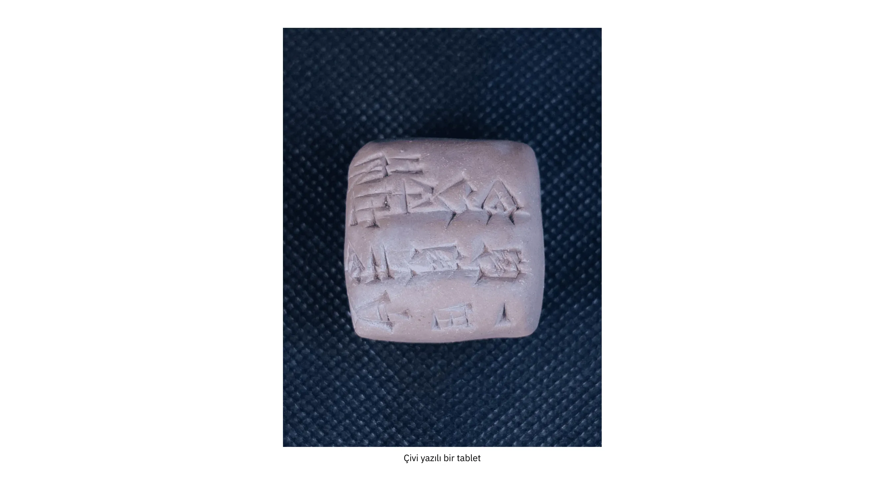

Ayrıca, ortasında küçük bir çivi yazısı olan gerçek bir Sümer tableti olduğuna inandığım bir tabletim var. Bu tabletin üzerinde, daha sonra size göstereceğim, bir silindirin yuvarlanmasıyla oluşturulmuş imzalar var.

Küçük figürlü işaretler, çoğu insanın yazı yazamadığı, sadece yetenekli kâtiplerin bu yeteneğe sahip olduğu bir dönemde imza görevi görüyordu.

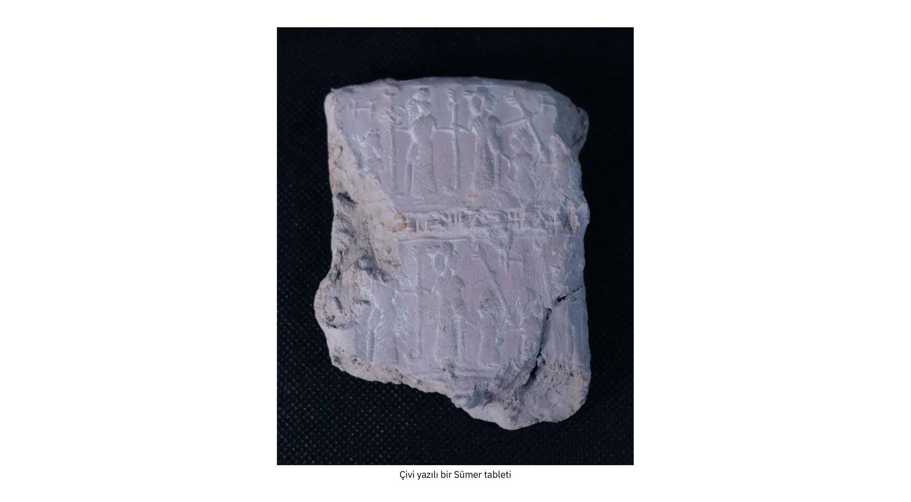

Aşağıda, yukarıda bahsedilen silindiri görebilirsiniz: belirli şekillerle oyulmuş bir taş. İnsanlar mektupları imzalamak için İngilizce'de silindir mühür olarak bilinen bu imza silindirini yuvarlarlardı. Bu, yazarların isimlerini açıkça belirtmenin ya da kendi adlarına yazıldığını göstermenin bir yoluydu.

Zamanın kâtipleri bu nedenle ıslak tabletlere işaretleri basmak için kama şeklindeki kalemi kullandılar.

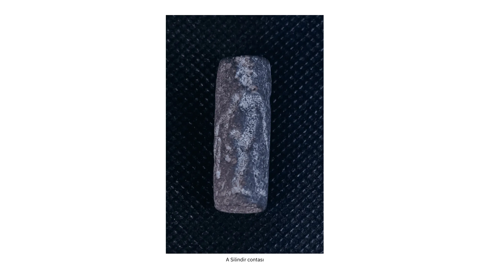

Çivi yazısı karakterleri bir dili değil, konuşulan dilleri kaydetmek için kullanılan bir yazı sistemini temsil ediyordu. İngilizce'de "yazı yazılı bir dildir" deriz ve sonra "çivi yazısı bir yazıdır, dil değildir" deriz. Fransızca'da ise çivi yazısının bir dil değil, bir dili kodlamanın bir yolu olduğunu söyleriz.

### Yazının evrimi ve kullanım alanları

Varlığının ilk yüzyılları boyunca bu yazı sınırlı kalmış, esasen miktarları, tarımsal ürün listelerini ve ekipmanları kaydetmek için bir anımsatıcı sistem olarak hizmet etmiştir. Ancak yavaş yavaş **fonetik olarak isimleri** ve tam cümleleri oluşturabilir hale geldi.

Başlangıçta isimler çivi yazısıyla ifade edilemiyordu çünkü çivi yazısı öncelikle nesneleri ve öküz ya da buğday gibi gerçekliğin unsurlarını temsil ediyordu ve küçük resimler olarak tasvir ediliyordu. Zamanla bu imgeler, isimlerin ve karmaşık kavramların temsil edilmesine olanak tanıyan daha gelişmiş bir yazı biçimine dönüştü.

Örneğin kişinin adı Laura olsaydı, kulağa "su" gibi gelen bir kelime, bir kısaltma ve "ras" gibi ikinci bir kelime alabilir ve bunlarla Laura adını oluşturabilirdik. Yazı dilinin ilk şekli bu şekilde gelişti.

Bu arada, kısaltmaları temsil etmek için başlangıçta bir öküzün başını çizmek isterseniz, öküzün başının şeklini görebilirdiniz. Yavaş yavaş, çizimler bir tür çizgiden başka bir şeyi temsil etmeyecek şekilde basitleştirildi. Araştırmacılar bunun, insanların ıslak kil tableti bir ellerinde tuttukları ve böylece baş harfleri çevirerek yeniden çizmenin daha kolay olduğu için gerçekleştiğine inanıyor. Ayrıca kâtiplerin tabletleri tutuş biçiminden de kaynaklandığı düşünülmektedir.

Çivi yazısı kısaltmalarında buğday ya da öküz başıyla olan bağlantıyı hala görebilirsiniz ve her zaman bir tarafa doğru eğilirler.

Üç bin yıllık kullanımı boyunca çivi yazısı öncelikle ekonomik ve idari kayıtların tutulmasına hizmet etmiştir. Ancak Mezopotamya sakinleri çok geçmeden, zamana karşı direnmeyi hak eden her şeyi yazılı bir biçimde muhafaza etmek için derin bir arzu geliştirdiler. Böylece, o zamana kadar gezgin müzisyenler tarafından sözlü olarak aktarılan hikayeler, efsaneler ve şarkılar, genellikle eğitim alan kâtipler tarafından kopyalanarak yazılı olarak ölümsüzleştirildi. Kâtipler zaten var olan metinleri, özellikle de efsaneleri ya da belli bir kültürel değeri olan metinleri kopyaladılar.

Önemli bir örnek, muhtemelen MÖ 2900-2350 yıllarında Sümer şehir devleti Uruk'un **tarihi bir kralı** olan **Gılgamış Destanı'dır**.

Hem ekonomik bir yönetim aracı hem de kültürel bir vektör olan bu yazı biçimi, doğuşuna tanıklık eden uygarlığa değerli bir tanıklık bırakarak sonsuza dek ortadan kaybolmadan önce MS 1. yüzyıla kadar sürdü.

## Sümer tabletlerinin rolü

<chapterId>a396e6c5-56cc-5410-9e6b-0274401c5425</chapterId>

:::video id=a0729a35-01ec-4aa4-828f-d4ccc2eb168e:::

### Para öncesi kredi sistemleri

Eski Mezopotamya'da ekonomik organizasyon, metal sikkelerin icadından çok önce var olan son derece sofistike mekanizmalara dayanıyordu. En başından beri, resmi ve gayri resmi kredi sistemleri, yerel halkların birçok karmaşık ekonomik işlemi gerçekleştirmesini sağlayan temel bir para biçimiydi.

Çivi yazısı tam olarak idari ve ekonomik ihtiyaçları karşılamak için icat edilmiştir. Meşhur Mezopotamya kil tabletleri esas olarak çeşitli sözleşme türlerini kaydetmek için kullanılıyordu: özel krediler, satışlar, kiralamalar, ipotekler ve hatta evlilik anlaşmaları. Bu tabletleri yazmak uzman kâtiplerin uzmanlığını gerektiriyordu; zaman ve emek açısından maliyetli, **ancak finansal çıkarlar söz konusu olduğunda haklı bir görevdi.** O zamanlar insanlar birbirlerine aşk mektupları yazmıyor, endişelerini yazmak için bir kâtip kullanmıyorlardı. İster bir bağlantı ister ekonomik bir neden olsun, belgeleri yazması için bir kâtip tutarlardı.

Bu tabletlerin bazılarının hamiline yazılı tahviller olarak dolaştığını ve serbestçe el değiştirdiğini de belirtmek gerekir.

Örneğin, içinde küçük taşlar olan bir çeşit kil top vardı.

Kil topun dışına, birim sayısını temsil eden bir sayı yazılmış ve imzalanmıştı. İçinde bu taşlar ve bu aletin gerçekten de X sayıda birimi temsil ettiğini doğrulamak isteyen biri vardı.

Bir başka örnek, günümüz Bağdat'ının güneybatısında bulunan bir tablet, borçlunun alacaklıya hasat günü 330 ölçek tahıl ödemeyi taahhüt etmesini şart koşmaktadır. Daha da etkileyici olan bir başka tablette, dört ölçek arpa borcunun doğrudan tableti taşıyana ödenmesi gerektiği açıkça belirtilmekte, böylece **o dönem için özellikle yenilikçi bir kavram olan hamiline ödeme kavramı ortaya atılmaktadır**.

M.Ö. 2000'lerden itibaren, en küçük ticari işlemlerin bile yazılı olarak resmileştirilmesini ve şahitler huzurunda imzalanmasını gerektiren bir yasa vardı. O günlerde tüm işlemlerin kâtipler tarafından kilden yapılmış defterlere kaydedilmesinin ne kadar büyük bir bürokrasi olduğunu hayal edin. Bu yasal titizliğin amacı, değiş tokuş edilen malların mülkiyeti ve hakları konusunda gelecekte çıkabilecek anlaşmazlıkları önlemekti. Sözleşmenin gerçekten imzalandığına dair tanıklık etmeleri için sık sık şahitler çağrılırdı.

Özel alanda da bazı aileler ve bireyler titiz bir yönetim gerektirecek kadar karmaşık ekonomik faaliyetlerde bulunmuşlardır. Kuzey Babil'deki Sippar-Amnanu kasabasında Ur-Utu adlı bir Anunitum rahibinin evinde yaklaşık 2.000 tablet bulunmuştur. Bu belgeler arasında özel kredi sözleşmeleri, satış ve kira senetlerinin yanı sıra mektuplar, dini ve akademik metinler de yer almakta olup, o dönemde özel arşivlerin çeşitliliğine ve önemine tanıklık etmektedir.

Kâtipler tarafından yazılan mektupların neredeyse sadece maddi çıkarlarla ilgili olması dikkat çekicidir: yetersiz ödenekler, bekleyen çeyiz ödemeleri veya diğer acil maddi taleplerle ilgili şikâyetler. O günlerde aşk mektupları gibi kişisel yazılar yoktu ve hastalıktan bahsedilmesi bile nadirdi.

Böyle bir mektubun dokunaklı bir örneği bu ekonomik gerçekliği gözler önüne seriyor: Bir muhabir, Assur'da şiddetli bir kıtlık yaşanırken, ortağının kendisini terk etmesiyle parasız ve erzaksız kalmanın üzüntüsünü dile getiriyor. Acilen tahıl satın alması gerektiğini belirtiyor ve günlük iaşesini sağlamak için tekstil ürünlerinin nakit karşılığının bir an önce kendisine gönderilmesini istiyor.

Eşine hitaben yazılmış olan bu mektup, onun başka bir yerde ticaret yapmaya gittiğini ve kendisini beş parasız bıraktığını göstermektedir. Tahıl satın almak ve tapınak vergilerini ödemek için bir miktar paraya erişimi olması gerektiğini hatırlatır. Bu belki de dönemin bir mektubunda yazılmış bir tartışmaya en yakın olanıdır. Mektuplar neredeyse her zaman ekonomik işlemlerle ilgilidir ve bu mektup da istikrarsız bir ekonomik durumla ilgilidir.

Bu nedenle, bize ulaşan Mezopotamya belgeleri esas olarak ekonomik alışverişleri yansıtmaktadır, çünkü bunlar yalnızca değeri bilinen malların transferi için hazırlanmıştır: para, tahıl, çeşitli mallar, gayrimenkuller, tapınak vergilerinin ödenmesi. Bu arşivler yalnızca bu eski uygarlığın verimliliğini ve idari hassasiyetini değil, aynı zamanda çok uzun bir dönem boyunca karmaşık ekonomik alışverişleri yönetme becerisini de ortaya koymaktadır.

## Sümer tabletlerinde elit kontrolü

<chapterId>c6d3df0e-b1e1-58dc-ab35-9f76bbc39393</chapterId>

:::video id=04a95fb8-a701-4a48-9ce8-0e9b6ba256fd:::

### Yazmak, her şeyden önce ekonomik bir teknoloji

Yaygın inanışın aksine, yaklaşık 4.000 yıl önce Mezopotamya'da yazının icadı başlangıçta kişisel ya da edebi iletişim ihtiyaçlarına hizmet etmemiştir. **Çivi yazısı her şeyden önce ekonomik bir teknolojiydi** ve yalnızca önemli finansal çıkarlar söz konusu olduğunda kullanılabiliyordu. Sümerler yazıyı birbirleriyle yazışmak ya da duygularını ifade etmek için değil, yalnızca ticari ve mali işlemlerini belgelemek için kullanmışlardır.

Bu uzmanlaşma tablet yazımının hatırı sayılır maliyetiyle açıklanabilir. Kile kazımak özel bir teknik uzmanlık, hatırı sayılır bir zaman ve özel malzemeler gerektiriyordu. Yalnızca yeterli değerdeki işlemler bu yatırımı ekonomik olarak haklı çıkarıyor ve bu devrim niteliğindeki teknolojiye erişim için doğal bir eşik oluşturuyordu.

Çivi yazılı tabletler, dönemine göre dikkate değer karmaşıklıkta bir finansal sistemi ortaya koymaktadır. Mezopotamyalılar modern finansal araçların eksiksiz bir cephaneliğini geliştirmişlerdi: **Faizli özel krediler, satış senetleri, kira sözleşmeleri, ipotekler ve hatta mali hükümler içeren evlilik sözleşmeleri**. Bu karmaşıklık, genellikle bu eski uygarlıklarla ilişkilendirilen basit ilkel takas imajından çok uzakta, gelişmiş bir piyasa ekonomisine tanıklık etmektedir.

Bazı tabletler gerçek hamiline yazılı menkul kıymetler olarak işlev görüyor, asıl sahibinin kimliğinin belirlenmesini gerektirmeden elden ele serbestçe dolaşıyordu. Bu yenilik, modern finansal sistemlerin habercisi olan kayda değer bir değişim akışkanlığı sağlamıştır. Dahası, özel yasalar tüm ticari işlemlerin yazılı olarak resmileştirilmesini zorunlu kılmış, böylece ekonomik alanda yazının kullanımı kurumsallaşmıştır.

### Bilgi Tekeli ve Ekonomik Kontrol

Yazının ekonomideki merkezi önemi, bu teknolojide ustalaşanlara önemli bir güç kazandırmıştır. **Genellikle tapınaklara ve yönetici kurumlara bağlı olan kâtipler, mali sistemin fiili kontrolünü ellerinde tutuyorlardı**. Sahip oldukları nadir ve paha biçilmez uzmanlık onları tüm önemli işlemlerin koruyucusu haline getirmiştir.

Bu bilgi tekeli tesadüf değildi. Yazıyı demokratikleştirmek ekonomi üzerindeki kontrollerini zayıflatacağı ve sahtecilik riskini artıracağı için yetkililerin bu ayrıcalığı sürdürmekte her türlü çıkarı vardı. İmza törenlerinde tanıkların sistematik olarak hazır bulunması, belgelerin gerçekliği konusundaki bu sürekli kaygıyı ortaya koymaktadır.

Tüm ticari işlemlerin yazılı olarak kaydedilmesine ilişkin yasal zorunluluk birkaç stratejik amaca hizmet ediyordu: mali kontrol, muhasebenin titizlikle izlenmesi ve ekonomik aktörlerin idari aygıta bağımlılığının sürdürülmesi. **Mezopotamya devleti böylece kişiler arası borcu** toplumsal ölçekte yönetme becerisine el koymuş, böylece yazıyı ekonomik gücün bir aracına dönüştürmüştür.

### İki Para Sisteminin Birlikte Varoluşu

Tabletlerin analizi, arşivlerde her yerde bulunmalarının gösterdiğinden daha incelikli bir ekonomik gerçekliği ortaya koymaktadır. Birçok tablette bir değer birimi olarak **gümüş şekel'e** atıfta bulunulmakta, böylece standartlaştırılmış fiziksel mallara dayalı bir para sisteminin paralel varlığına işaret edilmektedir.

Bu ikilik dönemin sosyal tabakalaşmasıyla açıklanabilir. **Çivi yazılı tablet sistemi sınırlı bir seçkinler grubuna** ayrılmıştı: din adamları, zengin tüccarlar ve bu karmaşık belgeleri okuma, yazma ve yorumlama becerisine sahip yöneticiler. Taşıyıcı bir tableti etkili bir şekilde kullanabilmek için, yalnızca nasıl deşifre edileceğini bilmek değil, aynı zamanda orijinalliğini doğrulayabilmek ve yasal sonuçlarını anlayabilmek de gerekiyordu.

**Bu elitist sistemden dışlanan nüfus kitlesi kendi değişim mekanizmalarını geliştirdi**. Sıradan insanlar, standartlaştırılmış tahıl ölçüleri, para ağırlıkları ve uzmanlık becerileri olmadan herkesin değerlendirebileceği diğer kolay ölçülebilir mallar gibi daha erişilebilir sistemler kullandılar.

Bu popüler ekonomi, resmi arşivlerde daha az belgelenmiş olsa da, muhtemelen tablet sisteminden daha dinamik ve esnekti. Zanaatkârların, çiftçilerin ve küçük tüccarların acil ihtiyaçlarını karşılayarak, kâtiplere başvurmaksızın hızlı günlük alışverişlere olanak sağlıyordu.

Tabletlerde bir değer referansı olarak sık sık bahsedilen gümüş şekel, muhtemelen bu iki paralel ekonomik sistem arasında bir köprü görevi görmüş ve yazılı borçlar ile fiziksel ödemeler arasında dönüşüm sağlamıştır.

### Kurumsal Kontrole Karşı Kendiliğinden Ortaya Çıkış

Bu bir arada varoluş, ekonomi tarihindeki temel bir tartışmayı göstermektedir: **Değişim araçlarının kendiliğinden ortaya çıkışı ile paranın kurumsal olarak temellük edilmesi arasındaki karşıtlık**. Bir yandan, para gibi metalar insanların mübadele ihtiyaçlarından doğal olarak ortaya çıkmıştır. Diğer yanda ise kurumlar, akışlarını kontrol etmek için bu uygulamalara el koymuş ve resmileştirmiştir.

Sümer tapınakları bu gerilimi özetliyordu: bir yandan kendi kontrol araçlarını (çivi yazılı tabletler) geliştirirken bir yandan da popüler parasal yenilikleri (şekel referansları) kullandılar. Bu strateji her iki sistemin de faydalarından yararlanmalarını sağlamıştır: geleneksel para birimlerinin popüler meşruiyeti ve resmileştirilmiş borçların idari kontrolü.

Mezopotamya deneyimi, finansal sistemlerin evrimi için kalıcı emsaller oluşturmaktadır. Bu deneyim, **finansal gelişmişliğin genellikle kendisiyle ilişkilendirilen teknolojik yeniliklerden birkaç bin yıl önce** ortaya çıktığını göstermektedir. Faiz, kredi, kıymetli evrak ve ipotek teminatı kavramları gelişmek için metalik paranın icadını beklememiştir.

Bu ufuk açıcı dönem aynı zamanda herhangi bir parasal yeniliğin doğasında var olan güç sorunlarını da ortaya koymaktadır: teknolojiyi kimin kontrol ettiği, kuralları kimin tanımladığı ve resmi sistemler ile popüler uygulamaların nasıl ifade edildiği. Bu temel sorular ekonomi tarihi boyunca devam etmiş ve dijital para birimleri ve kripto para birimleri hakkındaki çağdaş tartışmalara kadar uzanmıştır.

# Eski uygarlıklarda ekonomi ve para

<partId>a16bcf4c-8c3a-11f0-9e79-2bd363a484bd</partId>

## Tunç Çağı'nın büyük uygarlıkları

<chapterId>fab9334c-7385-5d7c-ad40-7d152beb22a1</chapterId>

:::video id=737e12e8-1033-4210-b1dd-b8a680f68b17:::

"Tunç Çağı'nın büyük uygarlıkları" başlıklı bu bölümde, *Paranın Tarihi* adlı kitaptan bir alıntı ile başlayacağız: Glyn Davies'in yazdığı *A History of Money: From Ancient Times to Present Day* adlı kitaptan bir alıntı ile başlayacağız ki bence bu kitap antik çağın büyük uygarlıklarına ilişkin bu bölüme mükemmel bir giriş niteliğindedir.

> Toynbee yirmi bir farklı "uygarlık" tanımlar, ancak bunlardan on beşi doğrudan ya da dolaylı olarak daha önceki örneklerden türediği için, bağımsız olarak gelişmiş uygarlıkların sayısını altıya indirir: Sümer, Mısır, Minoan, Çin, Maya ve And. Bunlardan sadece And Dağları'ndaki İnkalar para kullanmadan yüksek bir uygarlık seviyesine ulaşmayı başarmıştır, ancak paradoksal bir şekilde para olarak kullanılabilecek en iyi malzemeler olan altın ve gümüşe bolca sahiptiler.

İnkaların para sistemi yoktu ama bol miktarda değerli metalleri vardı. Tam bir paradoks. Alıntıya devam edelim:

> Bir toplum ne kadar tabakalıysa ve planlama sistemi ne kadar titizlikle işliyorsa, para kullanımı o toplum için o kadar az gereklidir. Bu durum, İspanyol fatihlerin, yönetimleri nispeten daha liberal olan Meksikalıların para birimi olarak düzenli olarak altın tozu (şeffaf tüplerde saklanır) ve kakao çekirdeği (24.000 birimlik torbalarda büyük ödemeler için saklanır) kullandıklarını, buna karşılık çok daha katı bir hiyerarşiye göre örgütlenmiş olan İnkaların hiç para birimi kullanmadıklarını keşfetmelerini açıklayabilir: katı bir kuralın doğruladığı bir istisna. Çin'de paranın kökeni diğer uygarlıklardan tamamen bağımsızdır; ancak Sümer, Mısır ve Minos uygarlıklarının göreceli yakınlığı, özellikle de en eski zamanlardan beri kurulan kapsamlı ticaret göz önüne alındığında, parasal uygulamalardan ne kadar habersiz oldukları konusunda şüphe uyandırmaktadır.

Çin'de madeni paralar Batı geleneklerinden tamamen farklı bir yaklaşımla geliştirilmiştir. Başından beri itibari paraydı. Dökme sikkelerdi.

Ve burada Bay Davies ticaretten bahsediyor. Gerçekten de Çinliler ve diğer halklar arasında belirli zamanlarda alışverişler olmuştur, ancak dış ticarette değişim aracı daha ziyade ipektir. Daha sonra göreceğimiz gibi, Çin nüfusunun daha az olduğu Çin'in sınır bölgelerinde de altın kullanılıyordu. Uluslararası ticaret için bile değil; bunun için ipek kullanılıyordu.

Dolayısıyla, sikkelerin biçimi konusunda, aynı dönemde bu teknolojiyi geliştiren diğer uygarlıklardan etkilenmiş olabileceklerini düşünüyorum.

Ancak paranın özünün Çin'de Batı'dakinden tamamen farklı olduğu açıktır. Çin ile ilgili bir sonraki bölümde bu konuya uzun uzadıya değineceğiz.

Bu ünlü Sümer şehirleriyle ilgili olarak burada birkaç notum var. Çok erken ve etkili bir şehir olan, hatırı sayılır büyüklüğü ve gelişmiş kültürüyle, özellikle de yazının ve şehir planlamasının gelişimiyle ünlü Uruk'tan bahsedebiliriz.

Ayrıca ünlü Gılgamış destanından da bahsetmek istiyorum. Gılgamış muhtemelen MÖ 2900 yıllarında Sümer kenti Uruk'un tarihi bir kralıydı. Muhtemelen bu Sümer şehir devletinin kralıydı.

MÖ 2334'ten 2279'a kadar hüküm süren Akadlı Sargon'dan da bahsedebiliriz.

Mezopotamya'da ortaya çıkan bir başka uygarlık olan Akad İmparatorluğu'nun ilk hükümdarıydı. Sargon'dan bahsediyorum çünkü size daha önce tanıttığım bu ünlü tabletler için bir posta servisi kuran ilk kişiydi.

Gerçekten de kilden zarflar olduğunu düşünün. Tabletler, gizliliği sağlamak için dışında kişinin imzası bulunan kil zarflara sarılabilirdi. Böylece insanlar tableti almak için zarfı açarlardı. Bu posta sistemini Akadlı Sargon'a borçluyuz.

Bir de Babil İmparatorluğu'nun başkenti olan büyük şehir Babil var. Heybetli Ziggurat'ı, sarayları ve son derece gelişmiş hukuk kurallarıyla bilinen ünlü Hammurabi Kanunları ile tanınan bir başka uygarlık.

Ve bu bölümü iki şehirle bitiriyoruz. Asur İmparatorluğu'nun başkenti ve önemli bir dini merkez olan Aşur. Ve daha sonra Asur İmparatorluğu'nun başkenti olan Ninova var. Başkentlerini oraya taşıdılar ve güçlü ordusu, büyük sarayları ve kütüphaneleri ile tanındı. Ve aynı zamanda efsanevi Babil'in Asma Bahçeleri'nin olası yerlerinden biridir. Antik dünyanın bu ünlü harikasını sık sık duyarız.

Ancak Babil'de bu ünlü asma bahçelerden hiçbir iz yoktur. Ninova'da ise birkaç katlı bahçelere dair arkeolojik kanıtlar vardır. Herodot gibi Yunan tarihçilerin Ninova ile Babil'i karıştırmış olmaları mümkündür. Mezopotamya'daki şehirleri ziyaret ettiklerinde belki de burayı Babil olarak anmışlardır. Ninova'da ünlü asma bahçelerin izleri bulunmuştur ve akademisyenler Ninova'nın Babil Asma Bahçeleri olarak anılan bu bahçelerin bulunduğu ünlü yer olup olmadığını merak edebilirler.

## Mezopotamya'da ekonomik örgütlenme

<chapterId>6afb6fc8-cbb7-56a5-8427-484b4b7d7477</chapterId>

:::video id=aa6a2cbd-5916-4ae3-ad4f-65f0bd5643fa:::

### Kapitalizm öncesi ekonomik yapılar ve kölelik

Mezopotamya'daki ekonomik örgütlenme hakkındaki bu bölüme hoş geldiniz. Kapitalizm öncesi ekonomi üç ana aşamadan geçmiştir: ilkel, köleci ve feodal.

Feodalite elbette çok daha sonradır, tabii ki Orta Çağ'da ve daha önce Paleolitik ile tanımladığımız ilkel aşamayı çoktan geçtik. Mezopotamya'da ekonomik örgütlenmeden bahsettiğimizde kölelikten bahsediyoruz.

Ancak Mezopotamya'da işin büyük kısmı, yasal olarak efendilerinin mülkü olmayan ancak fiziksel veya ideolojik baskı yoluyla emeklerinin meyvelerinden mahrum bırakılan kölelere benzer bağımlı bir sınıf tarafından gerçekleştiriliyordu.

### Tapınak ve sarayların ekonomik merkezler olarak rolü

Büyük toprak mülkleri ekonomiye hakimdi. Toprak sahipleri topraklarını doğrudan işçi çalıştırarak ya da kira karşılığında kiraya vererek işletiyorlardı. Aynı zamanda finansal faaliyetlerde de bulunuyorlar, genellikle yıllık %20 ila %33,3 gibi yüksek faiz oranlarıyla borç para veriyorlardı; bu uygulamalar komşu İbranilerin daha katı kurallarıyla keskin bir tezat oluşturuyordu.

Çiftçiler tarafından alınan krediler - nakliye şirketleri hariç - üretken yatırımlar için değil, daha ziyade bir sonraki hasada kadar hayatta kalmalarını sağlamak içindi. Bu durum sıklıkla çiftçilerin kronik borçlanmasına yol açmıştır.

İzninizle, vatandaşların köylülerin ve özgür olmayan emeğin ürettiği tarımsal rantlarla ve savaş ganimetleriyle geçindiği daha yakın bir antik dönemle (Roma) bir paralellik kurmama izin verin. **Bu gelirler yurttaşlar arasında daha fazla kâr elde etmek için değil, sosyal statülerini yükseltmek için dağıtılıyordu.** Ticaret ve zanaatlar genellikle sosyal elitin dışındaki gruplara bırakılıyordu. Tüm bunlar, ticaret ve zanaat yoluyla kâr elde etmeye yönelik Ortaçağ ekonomileriyle tezat oluşturmaktadır.

Yani burada söylemeye çalıştığımız şey, insanların finansal borç verme araçlarını üretim araçlarını geliştirmek için kullanmadıkları ve daha sonra Roma'da kârların mutlaka yeniden yatırıma dönüştürülmediği, bunun yerine bu kârlardan yararlanabilecek kişilerin prestijini artırmak için kullanıldığı gerçeğiyle bir paralellik kuruyorum. Üretim araçlarını geliştirmek için işlerin yaratılabildiği ve kâr peşinde koşarken fazlalıkların alınıp yaratıldığı Orta Çağ'ın ilerleyen dönemlerinde ortaya çıkan kapitalist ruhtan hala çok uzaktayız. Dolayısıyla, ekonomik örgütlenmenin yukarıda sıralanan ekonomik evrimlerin üçüncü aşamasına henüz ulaşmadığını görebiliriz.

### Kredi sistemlerinin ve hesap birimlerinin ortaya çıkışı

**Karl Polanyi ekonomik mübadelenin üç biçimini ayırt eder: simetrik gruplar arasında karşılıklılık,** bu, birbirimize gayri resmi kredi verdiğimiz için paraya gerçekten ihtiyaç duymadığımız ilkel kabilelerde olur ve takas ve yeniden dağıtım. **Tapınaklar ve saraylar etrafında merkezileşen yeniden dağıtım,** bu mübadele biçimi, tapınakların ekonomik örgütlenmenin merkezinde yer aldığı ve bir zamanlar zenginliği tayın şeklinde geri verebildiği, dağıtabildiği Mezopotamya ile uyumludur. Ücret kavramı ancak daha sonra ortaya çıkmıştır. Dolayısıyla, şimdiye kadar, ilkel biçime (1), tapınaklarda ve saraylarda merkezi yeniden dağıtıma (2) sahibiz ve daha sonra nihayet piyasa mübadelelerine (3) yol verebiliriz. Bugün anladığımız şekliyle piyasa tam olarak var olmasa da, Mezopotamya'da piyasa mübadelelerinin varlığı tartışılmazdır; Akadca'da belirli terimlerin varlığı ve fiyatlar, karlar, kayıplar, dalgalanmalar ve kıtlık durumlarına dair arkeolojik kanıtların varlığı bunu kanıtlamaktadır.

Mezopotamyalı haneler, ekimden ekmek ve biraya dönüştürülmesine kadar tarımsal üretimin tüm aşamalarını bağımsız olarak yönetiyordu. Kadınlar, bakmakla yükümlü oldukları kişilerin ihtiyaç duyduğu tekstil ürünlerini de üretiyordu. Yerel olarak üretilmeyen mallar için haneler uzman tüccarlara başvuruyordu.

Aile bağları ticarette özellikle önemliydi. Paleo-Asur döneminde (MÖ 1910-1830) Aşur kentinden gelen tüccarlar Anadolu'da Kaneş'te bir ticaret kolonisi kurarak altın ve gümüş karşılığında kalay ve tekstil ürünleri ithal etmişlerdir. Ticaret, evlilik ve ticari ortaklıklarla birbirine sıkı sıkıya bağlı aile şirketlerine dayanıyordu. Kaneş, geniş bir uluslararası ticaret ağının sadece bir halkasıydı.

Bu değiş tokuşlarda metaller vardı ve bunlar değerli metallerdi, örneğin o zamanlar gerçekten kullanışlı olan bakır gibi metaller değildi ve bu metallerin değer saklama kavramları için değiş tokuş edildiğini düşünüyoruz. Dolayısıyla, iki malın kullanışlılıkları için değiş tokuş edildiği bir takastan söz edemeyiz, daha ziyade değerli metalleri bir meta olarak kullanmak için değil, bir değer deposu olarak kullanmak için biriktirme bilincine sahip bir ödeme kavramından söz edebiliriz, örneğin zırh yapmak için bronz kullanımı gibi.

Haraçlar ve vergiler çoğunlukla ayni olarak ödenirdi (arpa veya tartılmış gümüş). Tapınaklar ve saraylar ana ekonomik, idari, siyasi ve dini merkezlerdi ve aynı zamanda malların, önce tahılın, sonra diğer tarım ürünlerinin ve son olarak da değerli metallerin güvenli bir şekilde depolanması yoluyla ilk bankacılık işlevlerini yerine getirdiler. Bu şekilde, sikkelerin ortaya çıkmasından çok önce ilk kredi ve borç işlemleri geliştirilmiştir.

Mezopotamya ekonomisi değer standardı olarak çoğunlukla arpa ve gümüşü kullanmıştır. Gümüş, yaklaşık 8,33 gramlık sìqlum (şekel) gibi standartlaştırılmış birimlerle tartılırdı. Antik Babil döneminin başlarında (Hammurabi döneminde), gümüş yaygın bir ödeme aracı olarak kullanılmış, gerçek ağırlığın ("šuqulum") aksine erken bir nominal değer ("nūbum") kavramı ile **modern itibari para kavramını** öngörmüştür.

Ancak henüz kelimenin tam anlamıyla itibari para değildi. Otorite figürü olan bir pul kavramı yoktu, ancak tartılmış metal kavramının aksine nominal bir hesap birimi kavramı vardı. Bu iki kavram için dilde bir ayrım vardı ve bundan bahsetmenin önemli olduğunu düşünüyorum.

Ücretli işgücü piyasasına geçiş zor bir süreçti. İki büyük kavramsal yenilik gerektiriyordu: kişinin yaptığı işin nihai üründen ayrılması ve ölçülebilir bir birim olarak "çalışma süresinin" ortaya konması. Ücretli ve maaşlı çalışan kavramına sahip olmak için öncelikle bu iki yenilikten geçmemiz gerekiyordu. **III. binyılda çalışma başlangıçta sabit istihkaklarla ücretlendirilirken, II. binyılın başında kademeli olarak ücret sistemine doğru evrilmiştir.**

Son olarak, M.Ö. 26. yüzyıldan itibaren, Mezopotamya "parası" bir sikke değil, daha ziyade tahıl veya metalin ağırlıklı bir ölçüsü olsa da, gerçek bir parasal değer kavramı kök salmıştır. **Bu nedenle, önemli işlemlerde veya değerin korunmasını gerektiren bağlamlarda, tahılın daha kolay muhafaza edilebilen gümüşe dönüştürülmesi tercih edilirdi.** Biraz da gümüş metalin istiflenmek üzere alındığı Kaneş örneğinde olduğu gibi.

M.Ö. 21. yüzyıldan itibaren, **asimetrik mübadelelerin** fiilen ortadan kalkmasıyla birlikte, temlik sözleşmelerinde sa fiilinin fiyatın ödenmesine atıfta bulunduğunu görüyoruz. "Sa" olarak adlandırılan bu kavram, sözleşmelerde yer alır ve belirli bir malın ölçümünü değil, bir bedelin ödenmesini ifade eder. "Sa" basitçe bir ödemeyi veya bir fiyatı ifade eder. Bir antropolog buna dikkat çekiyor ve bunun gerçekten bir dönüm noktası olduğunu belirtiyor; sözleşmelerde "sa" fiilinin kullanılmasının öncesi ve sonrası arasında bir tür ikilik görüyoruz.

Yakın Doğu arşivlerinde bulunan ve **kâr** ve **zarar** kavramlarını, **fiyat dalgalanmalarını** ve **kıtlık** durumlarını içeren **bazı piyasa mekanizmalarının** varlığını kanıtlayan ampirik verileri görmezden gelemeyiz. Ancak temel zorluk, bir bütün olarak eski Mezopotamya ekonomisi içinde piyasa temelli mübadelenin göreli önemini belirlemekte yatmaktadır.

Sanırım bu alandaki uzmanlar bu piyasa kavramlarının izlerini gördüler, ancak bize dönemin ekonomisinin ne kadarının bu daha modern piyasa kavramına veya diğer mekanizmalara dayandığını söyleyemiyorlar.

Bunun var olduğunu biliyoruz, ancak örneğin fiyatları belirlemenin veya ticaret yapmanın ana yolu olup olmadığını bilmiyoruz.

Mezopotamya'daki ekonomik örgütlenmeye ilişkin bu bölüm burada sona ermektedir.

Sonraki bölümlerde aynı şeyi Mısır ve Çin için yapacağız.

## Eski Mısır'da ekonomik ve parasal örgütlenme

<chapterId>bffcc16c-7fbf-5992-a0fa-6a7726d7d287</chapterId>

:::video id=40c1c4e5-b190-4bb6-b8a0-810c9ce7698b:::

### Tarihsel arka plan ve Mısır dönemleri

Bu bölüm eski Mısır'ın ekonomik ve parasal organizasyonuna ayrılmıştır. Size biraz arka plan vermek için, işte söz konusu dönemlerin bir listesi ve kısa açıklaması.

- Eski Krallık (yaklaşık MÖ 2575 - yaklaşık MÖ 2130)**. Başta Giza olmak üzere büyük piramitlerin inşa edildiği dönem. Bu dönem, merkezileşmiş Mısır monarşisinin altın çağıydı.
- Orta Krallık (yaklaşık 1938 - yaklaşık MÖ 1630)**. Bir istikrarsızlık döneminin ardından siyasi ve kültürel rönesans.
- Yeni Krallık (yaklaşık MÖ 1539 - 1075)**. Bölgesel genişleme, askeri güç ve uluslararası ticaret dönemi. Tutankamon ve Ramses II gibi ünlü firavunların hükümdarlıklarını içerir.
- mÖ 1323. - Tutankamon'un ölümü**. Genç firavun yaklaşık 18-19 yaşlarında öldü. Neredeyse hiç bozulmamış mezarı 1922 yılında keşfedildi ve tüm arkeolojik keşiflerin en ünlülerinden biri haline geldi.
- Ramses II - MÖ 1279-1213 yılları arasında hüküm sürmüştür**. Yeni Krallık döneminin en güçlü firavunlarından biri. Askeri seferleri, büyük anıtları ve muhtemelen bilinen ilk barış anlaşmasını imzalamış olmasıyla tanınır.
- mÖ 1275 - Deniz Halkları**. "Deniz Halkları" olarak adlandırılan grupların istilaları veya göçleri, Mısır da dahil olmak üzere birçok Akdeniz medeniyetinin istikrarını bozar.
- Xoïs Savaşı - MÖ 1178**. Mısır ordusu ile muhtemelen Deniz Halkları ile bağlantılı istilacılar arasındaki çatışma. Yeni Krallık döneminin sonundaki birçok savaştan biri.
- Geç Dönem**, Antik Mısır tarihinin yaklaşık MÖ 664 ila 332 yılları arasındaki dönemidir.
- Kleopatra VII (MÖ 69 - 30)**. Zekası, karizması, Julius Caesar ve Marc Antony ile kurduğu ittifaklarla ve muhtemelen burnuyla ünlü Mısır'ın son kraliçesi. Onun hükümdarlığı, Roma tarafından ilhak edilmeden önce Firavun Mısır'ının sonunu işaret ediyordu.

MÖ 5. ve 4. binyıllara gelindiğinde Mısır, Nubya, Filistin, Libya ve Kızıldeniz bölgelerini deniz, nehir ve kara ticareti (özellikle eşek kervanlarıyla) yoluyla birbirine bağlayan büyük ölçekte yoğun bir ticari faaliyet yaşamaktaydı.

### Erken dönem değişim sistemleri ve paleo-para birimi

MÖ 3650-3400 yıllarında ilk Mısır şefliklerinin ortaya çıkmasıyla birlikte, bugünkü Kahire'nin güneyindeki Maadi bölgesi bakır teknolojisi ve özellikle Suriye kıyıları üzerinden Mezopotamya ile uzun mesafeli ticaret için önemli bir merkez haline geldi.

Büyük ölçekli ticaret esas olarak takasa dayalı olsa da, yarı değerli taşlar ve fosil kabukları gibi prestij öğelerinden oluşan ilkel bir para biçimi ("paleo-para") muhtemelen mevcuttu. Altın muhtemelen bu değiş tokuşlarda önemli bir rol oynuyordu. MÖ 3. binyılın ortalarında Mısır belgelerinde sikkeden ilk kez açıkça bahsedilmesi, ticari uygulamalarla bağlantılı uzun bir gelişimi yansıtmaktadır.

Arkaik toplumda (burada ille de Mısır'dan değil, genel olarak arkaik toplumlardan bahsediyoruz), doğrudan satın almak için değil ama çeyizleri, dini ritüelleri ve diğer sosyal yükümlülükleri ödemek için sık sık ödeme yapılırdı. Bu işlemler hassas fiyatlandırma ve değerleme gerektiriyordu. Pek çok ilkel toplumda bu değerin biçildiği ayrıcalıklı, para biçimli (yani sayılabilir) nesneler vardı. Bir çeyiz ödüyorsanız, elbette çeyizi ödemek için değiş tokuş edilecek bir nesnenin bir miktarını not etmeniz gerekir. Bu değer esasen insanların değeridir.

Arkaik toplumlarda, paranın ya da parasal sistemlerin ortaya çıkmasından önce, ödemeler vardı, ancak bunlar genellikle sosyal yükümlülüklerle bağlantılıydı ve değerleri, çeyiz ya da kan parası ödemelerinde olduğu gibi, bireylerin değerinden kaynaklanıyordu.

Mısır'a dönersek, antik imparatorluk döneminde, başlangıçta somut bir para birimi (yaklaşık 7,6 gram ağırlığında küçük bir altın veya gümüş sikke) olan "şât(y)", çok hızlı bir şekilde gerçek para birimi işlevinden, değer kavramını ortaya çıkaran bir **muhasebe işlevine** geçti. Onda değeri ifade etmek için bir tür hesap birimi tanıyabiliriz, ki bu aslında bir tür madeni paraydı, ancak ona gerçekten madeni para diyemeyiz çünkü damgalanmamıştır, sadece bir metal ölçüsüdür. Bir hesap birimi kavramına yaklaşıyoruz.

Bu şât(y) kavramı, belki de sahtekârlık riski nedeniyle sonunda terk edildi. Daha sonra Mısırlıların damgalı sikkeleri benimsemekte yavaş davrandıklarını ve hatta komşuları tarafından benimsendikten sonra bile bunları tartmaya devam ettiklerini göreceğiz.

Orta Çağ'da gümüş, çoğunlukla tahıl ölçüleri ve ekmek miktarları ile yapılan günlük işlemlerde nadiren kullanılıyordu. Bu dönemde, ödemelerin yazılı olarak ya da fiili transfer yoluyla kaydedilebildiği bir tür kutsal para ortaya çıktı.

Yeni Krallık'ta para sistemi daha karmaşık bir hal aldı ve metaller (altın, gümüş, bakır), standartlaştırılmış kumaşlar, tahıllar ve petrol ile değerlenen farklı emtia para birimlerini birleştirdi. Kumaşlar "kumaş ölçüleri" olarak anılıyordu. **Günlük malların fiyatları genellikle tahıl ya da bakırla ifade edilirken, değerli nesneler altın ya da gümüşle değerlendiriliyordu. Mısır'da altından daha nadir bulunan gümüş özellikle değerliydi.** Gümüş, Mısır'da daha bol bulunan altına kıyasla aşırı değerliydi.

Geç Dönem'e gelindiğinde (MÖ birinci binyıl), gümüş Yakın Doğu'da yaygın bir değişim metali haline gelmişti. Külçeler, metal sikkeler ya da halkalar şeklinde dolaşıma girmiş, bunlar tapınaklarda tartılmış ve işaretlenmiş, ağırlıkları ve saflıkları garanti altına alınmış, ancak bir hükümdarın suretinde basılmamışlardır. Bu daha sonra gerçekleşmiştir ve Lidyalılar hakkında daha sonraki bir bölümün konusu olacaktır.

Eski Mısırlıların para için "hedj" terimini kullandıklarını ve bu terimin genel olarak metal, tahıl, kumaş ya da çeşitli mallar (odun, hayvan, hizmet, vs.) için bir işlemde bedel olarak kullanılan herhangi bir ödeme aracını belirtmek için kullanıldığını da belirtmek gerekir. Belgelenmiş örnekler, Mısırlıların toplam değeri bakır birimleriyle ("deben") ifade edilen çeşitli ürünleri bir araya getirerek bir işlemi gerçekleştirebildiklerini göstermektedir.

**Tapınaklar Mısır ekonomisinde merkezi bir rol oynamıştır: Tanrıları onurlandırmak ve aynı zamanda gerektiğinde ekonomik döngüye yeniden dahil edilebilecek bir para rezervi olarak hizmet etmek amacıyla değerli metallerden (altın ve gümüş) oluşan önemli hazineler toplayıp biriktirmişlerdir**. Savaş, para sıkıntısı veya kriz durumunda eritilmek üzere tapınaklarda heykeller gibi değerli rezervler biriktiren diğer uygarlıkların örneklerini göreceğiz. Bu, tarih boyunca tekrarlanan bir temadır.

Keten yetiştiriciliğinin tapınaklara verilen bir kraliyet tekeli olduğunu ve değerli kumaşların üretiminin ekonomik önemlerini doğruladığını da belirtmek gerekir.

Eski Mısırlılar, değerli metallerin tanrısallıkla bağlantılı ideolojik yönü (altın tanrıların etini, gümüş kemiklerini temsil eder) ile diğer tüm ödeme biçimleri için referans teşkil eden para birimi olarak pratik işlevleri arasında net bir ayrım yapmışlardır.

Dolayısıyla, eski Mısır geç döneme kadar modern para sistemleriyle karşılaştırılabilir bir para birimi geliştirmemiş olsa da, kutsal para, kesin hesap birimleri, emtia parası ve ağırlığa göre değer biçilen değerli madenlerin bir arada kullanımına dayanan sofistike bir para sistemine sahipti.

Sikkelerin kendileri tartılarak iki farklı kavram ortaya çıkmıştır: **"sikke" ve "para "**. İngilizcede iki terim kullandım. Birincisi, "sikke" daha sonra gelen bir kavram olan sikkelere atıfta bulunur ve ayrıca bu para kavramına da sahibiz. Az önce para olarak ifade ettiğim, ancak henüz sikke olmayan hesap birimleriyle zaten belirli bir "para" kavramını tanımlayabiliriz, bu nedenle "sikke" Lidyalılarla birlikte biraz daha sonra gelir.

Dolayısıyla, sikkeler para için bir önkoşul değildir, **o kadar ki, paranın varlığını 3. binyıl kadar erken bir tarihte kabul edebiliriz,** her halükarda ve hiç şüphesiz 2. binyıl boyunca ve özellikle Hammurabi hükümdarlığı altında.

Burada hatırlanması gereken ve yazarın "Paranın Kökenleri" kitabında bahsettiği şey, para kavramının o dönemde bu para sistemlerinde zaten var olduğuna dair hiçbir şüphe olmadığı ve paranın bir kavram olarak doğuşunu madeni paraların ortaya çıkışına bağlamanın bir hata olduğudur.

Son olarak, Polanyi'nin sıklıkla eski Mısır'a uygulanan karşılıklılık ve yeniden dağıtım kavramlarının nüanslı bir şekilde ele alınması gerekir: bunlar var olmakla birlikte, münhasır bir çerçeve oluşturmazlar. Firavun dönemi Mısır'ı, dini ve ritüel uygulamalardan farklı olarak sofistike ticari alışverişleri tamamen entegre eden ve ekonomik alanın ideolojik olandan gerçek anlamda özerk olduğunu gösteren karmaşık bir ekonomi geliştirmişti.

Bu özellik, değerli metallerin belirli bir tanrısallıkla ilişkilendirildiği, ancak yine de ayırt edilebildiği düşüncesiyle bağlantılıdır.

Bunu gündeme getirmemin nedeni Polanyi'nin bu değerli metallerin kullanımına öncelikle dini ya da ilahi bir kavram olarak atıfta bulunmasıdır. Ancak biz bunların aynı zamanda ekonomik sisteme entegre olduklarını ve Mısırlıların bu tür ayrımları zaten yapabildiklerini öne sürüyoruz.

Sonuç olarak, bu icadın, basılan paranın amacını listeleyen "Paranın Kökenleri" kitabından bir alıntı yapmak istiyorum. Birkaç nokta var ama ben sadece 5. noktayı vurgulamak istiyorum:

*ithalat ve ihracatı daha düşük maliyetle azaltmak veya artırmak için devalüasyon ve birbirini izleyen yeniden değerleme gibi yöntemlerin kullanılması yoluyla ekonomik oyun olasılığını geliştirmek*

Dolayısıyla yazar, o arkaik zamanlarda bile sikkelerin çoktan icat edildiğini ya da devlet kontrolü altında ortaya çıktığını ve ekonomiyi yönetmek için değerli metal miktarları ve ağırlıkları açısından manipüle edildiğini öne sürüyor. İzninizle bir sonraki bölümle ilgili küçük bir bilgi vereyim. **Altın ve gümüş alaşımı olan elektrumdan yapılan en eski sikke formlarında bile, bu sikkelerdeki değerli metallerin içeriğini analiz ederek, ilk darp edenlerin, örneğin Kroisos'un, doğal elektrumdan daha az altın kullandığını biliyoruz.**

Bu, altın ve gümüşü nasıl ayıracaklarını zaten bildikleri ve daha az altın içeren sikkeler bastıkları anlamına gelir.

Yazar, sikke basımının ilk günlerinden itibaren, sadece ağırlığı belgelemenin ve ticareti kolaylaştırmanın ötesinde, para basma yetkisinin, muhtemelen bir ekonomik planlama biçimi olarak, basılan miktarı artırmak için zaten kötüye kullanıldığını öne sürmektedir.

## Antik Çin'de işaret parası ve ekonomik ve parasal organizasyon

<chapterId>e08d3be9-423c-5cf3-a606-6ad54e2261af</chapterId>

:::video id=ae7e6367-1725-455e-bfe6-359be1f443e5:::

"İşaret parası ve antik Çin'in ekonomik ve parasal organizasyonu" başlıklı bu bölümde, antik Çin parasının Batı geleneklerinden farklı özelliklere sahip olduğunu göreceğiz. Çin parası zaten en başından beri bir "işaret parası" idi. Bu bölümdeki bilgiler "Aux origines de la monnaie" kitabını okuduktan sonra aldığım notlara dayanmaktadır.

### İşaret parası kavramı ve ayırt edici özellikleri

Yazara göre, işaret parası günümüzün itibari para birimine eşdeğerdir. Metal içeriğiyle bağlantılı bir değere sahip olmayan bir para birimi. Başından beri, bu paraların değeri konusunda bir tür anlaşma, toplumsal bir mutabakat söz konusuydu.

Eski Çin sikkeleri Batı geleneklerinden farklı özelliklere sahiptir. Esas olarak metalikti, ancak darp edilmek yerine dökülmüştü ve bir hükümdarın tasvirini taşımıyordu. Şaşırtıcı bir şekilde, Çin devleti para basma konusunda bir tekele sahip değildi. Bu görünürdeki liberalizm, vergilendirilebilir büyük bir nüfustan alınan bol vergi kaynakları sayesinde para ihracını tekelleştirmek için herhangi bir ekonomik ihtiyacın olmamasıyla açıklanabilir.

Çin para birimi aynı zamanda güvene dayalı yönüyle de karakterize edilir. En başından beri, kullanılan metalin gerçek değeriyle doğrudan bir ilişkisi olmaksızın, deniz kabuklarının bronz taklitleri para birimi olarak kullanılmıştır. Tarihte çok gerilere gidersek, Çinliler deniz kabuklarını para birimi olarak kullanmışlardır. Sonunda, deniz kabukları çok azaldığında, bakırdan kopyalarını yaptılar ve bu kopyalar gerçeğiyle aynı değere sahipti.

Dolayısıyla Çin para birimi, malzemenin değerine ya da orijinal öğenin (örneğin kabuklu deniz hayvanları) görece nadirliğine değil, değişim aracı olarak kullanımına duyulan kolektif güvene, başka bir deyişle parasal bir işarete dayanıyordu.

### Börülce kabuklarından metalik taklitlere

Börülce, ilkel bir para birimi olarak yaygın bir şekilde kullanılmıştır. Eski yazıtlar, Shang ve Zhou hanedanlıkları (MÖ birinci ve ikinci bin yılların ilk hanedanlıkları) kadar erken bir dönemde, börülce kabuklarının yalnızca askeri eylemleri ödüllendirmek için değil, aynı zamanda **çalışmayı ödüllendirmek, değeri ölçmek ve toprak satın almak** için de kullanıldığını göstermektedir.

Burada hatırlanması gereken önemli bir nokta, bunun toplum tarafından kısıtlı amaçlar için kullanılan herhangi bir araç olmadığıdır. Askeri ödüller, iş karşılığı ödeme ve değer ölçümü için kullanılıyordu. Arkeologların yazılarında bunun izlerini buluyoruz. Günlük olarak ekmek satın almak için kullanılıp kullanılmadığını bilmesek de, yukarıda bahsedilen işlem türleri için kullanılmış olabileceğine dair kanıtlarımız var.

Zamanla gerçek börülce kabuklarının kıtlığı, özellikle mezarlarda gerçek değerlerin hareketsiz kalmasını önlemek amacıyla mezar bağlamlarında kullanılmak üzere bronz, kemik, sedef ya da taştan taklitlerinin üretilmesine yol açmıştır. Bu araç değişikliği aynı zamanda prensin para üzerindeki kontrolü fikriyle de bağlantılıdır; eğer parayı prens yapıyorsa bu kontrol çok daha kolaydır.

Burada anlamamız gereken şey, deniz kabuklarının doğal kıtlığı sınırlamasının ötesine geçerek, eğer prens para birimini kendisi yaratabilirse, bu ona ekonominin yönetimi üzerinde daha fazla kontrol sağlar.

Sikkelerin değerli metalin ağırlığıyla bağlantılı olduğu Mezopotamya'nın aksine, Çin sikke terminolojisi doğrudan para birimi olarak kullanılan nesnelerin ilk şekillerinden türemiştir: sığırkuyruğu (bei), bıçak (dao), maça (bu) ve yuvarlak sikkeler (quan veya qian). Böylece Çin'de parayla ilgili kelimelerin kökeninin bu nesnelere dayandığını görebiliriz. Buna karşılık, Batı'da, bunlardan oldukça farklı kavramlardan gelen, daha çok parasal nesnelerin fiziksel özellikleri ve ağırlığıyla ilgili bir dizi parasal terimimiz var. Bu etimolojik farklılıklar, Batı ve Çin para vizyonları arasındaki ayrımı açıkça göstermektedir.

Çin'de parasal değer, Devlet, üreticiler ve tüccarlar arasındaki sosyal bir sözleşmeye dayalı olarak tamamen güvene dayalıydı.

### Ekonomik düzenleme ve parasal felsefe

Çin devleti parayı bir ekonomik düzenleme aracı olarak kullanmıştır: parasal bolluk zamanlarında paranın değeri düşerek insanların mal satın almasını kolaylaştırmıştır. Tersine, parasal kıtlık zamanlarında paranın değeri artarak devletin sonraki operasyonları için satın alma gücünü güçlendiriyordu.

Burada enflasyon ve deflasyon ile bir bağlantı kurulabilir. Sabit bir para arzı ile ekonominin verimliliği artarsa, paranın değeri yükselir. Tersine, üretkenlik düşerse, paranın değeri azalır. Ancak bu örnekte bunun tam tersi geçerlidir. Muhtemelen prensin para üretimi üzerinde tam bir tekeli olmadığı için, yine de paranın değerinin ekonomik koşullara bağlı olduğunu göstermektedir.

Filozof Mo Di (MÖ 5.-4. yüzyıl) fiyat ve değer arasındaki bu ilişkiyi çoktan analiz etmişti: ona göre fiyat değişimleri gerçek bir ucuzluk veya mutlak pahalılık kavramını değil, para işaretinin sabit nominal değerinden bağımsız olarak mallar ve para arasındaki dalgalı bir ilişkiyi yansıtır.

Dolayısıyla burada, altın paranın kullanım değeri veya içsel değer gibi bir tür temel değere sahip olacağını söylemek yerine, parasal işaretin değerinin daha ziyade ekonominin durumundan kaynaklandığına işaret etmektedir.

Çin'de sikkelerin resmi olarak işaretlenmiş ya da garanti edilmiş olması gerekmiyordu. Kabulü yalnızca kolektif güvene bağlıydı, bu da belirli bir yazıt içermeyen bronz veya bakır sikkelerin neden uzun süre serbestçe dolaşabildiğini açıklıyor.

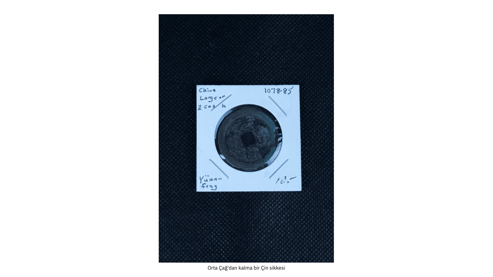

Yukarıdaki Orta Çağ'dan kalma bir Çin sikkesidir. Ortasında kare bir delik bulunan döküm bir sikkedir. Bu delikten ip geçirilerek sikkeler birbirine geçirilip bilezik ya da kolye yapılabiliyordu. Ancak, bunlar öncelikle giymek için değil; esas olarak muhasebe amacıyla kullanılıyordu. Parçalar birbirine kenetlenerek büyük ipler şeklinde hesap birimleri oluşturmak için bir araya getirilebilirlerdi. Üzerlerinde belirli işaretler olması gerekmezdi, bazen sadece bronz dairelerden oluşurlardı.

Han Hanedanı'ndan Wudi tarafından M.Ö. 113 yılında gecikmeli olarak kurulan devletin para tekeline sık sık meydan okunmuş, yeterli toplumsal güvene sahip olmaları koşuluyla çeşitli özel veya yerel oyuncuların kendi para birimlerini çıkarmalarına izin verilmiştir.

**Çin para birimlerinin düşük içsel değeri istifçiliği önleyerek sorunsuz dolaşımlarını garanti altına almıştır** Değerli metaller istifçiliği önlemek için nadiren dolaşımdaki para birimi olarak kullanılmıştır. Çok pahalı olan altın, genellikle harcanmak yerine bir kenara ayrılırdı. Bunun yerine, **Çin'in uluslararası ticaretinde yalnızca ipek gerçek bir yüksek değerli para birimini temsil ediyordu**. Çinliler ticareti altınla değil ipekle yapıyorlardı.

Ekonomik ya da parasal krizler sırasında, özellikle de bakırın fiyatı yükseldiğinde, yenilikçi çözümler benimsenmiştir: böylece, MS 2. yüzyıl gibi erken bir tarihte, dolaşımdaki sikkeler kesilerek daha küçük birimler oluşturulmuş ve böylece dolaşımın daha düşük maliyetle sürdürülmesi sağlanmıştır. Wang Mang (MS 1. yüzyılın başları) dönemi gibi diğer dönemlerde, nominal değerlerin gerçek metal içeriklerinden çok daha yüksek olduğu, dolayısıyla banknotların öncüsü olan yüksek güvene dayalı para birimleri denenmiştir. Bir sikkeyi alıp üzerine 200 sikke gibi daha büyük miktarları belirtmek için 50, 100 veya 200 gibi değerler damgaladılar. Bu uygulama muhtemelen önemli ölçüde enflasyona katkıda bulunmuştur.

Yukarıda da belirtildiği gibi, bu sistem Devlet, üreticiler ve tüccarlar arasındaki sosyal bir anlaşmaya dayanıyordu, ancak aynı zamanda oyunu oynamayanlar için, özellikle parça seçimi (güzel olsun ya da olmasın) veya kumaşların uzunluğu (standarda uygun değil) ile ilgili otoriter ve sert kurallara da dayanıyordu.

Benim naçizane görüşüme göre, bu çok sağlam bir sistem değil. Esas olarak, yetkililerin ve tüccarların yaptırım tehdidi altında hasarlı madeni paraları kabul etmelerini gerektiren katı kurallara dayanıyordu.

### Çin'in parasal yenilikleri ve ekonomik etkileri

Çin aynı zamanda MS 9. yüzyılda yaşanan metal sıkıntısına yanıt olarak benimsenen ilk kağıt para biçimlerinin çıkarılmasında da öncü olmuştur. Başlangıçtaki avantajlarına rağmen bu kağıt paralar, Song ve Ming dönemlerinde görüldüğü üzere, aşırı miktarda basıldıklarında düzenli olarak enflasyonist sarmallara yol açmıştır. 13. yüzyılda Marco Polo, bu tür kağıt paraların tahrif edilmesinin ölümle cezalandırıldığını bile belirtmiştir. Burada bir şiddet biçimine işaret etmeden edemeyeceğim.

Dolayısıyla Çin deneyimi, son derece güvene dayalı bir para anlayışı, parasal sistemin kayda değer esnekliği ve kullanılan medyanın içsel değerinden ziyade ekonomik oyuncular arasındaki güvene dayalı kağıt para birimlerinin erken kullanımı ile karakterize edilir.

## Antik çağda toplumsal ve ekonomik örgütlenme

<chapterId>4023c3ce-7a47-5ac4-8f5f-c7ab699ab20f</chapterId>

:::video id=2761efe4-21cf-4f06-9bda-c03f9ff39012:::

### Kentsel Parazitlik Tartışması

Antik kentler ve hinterlandları arasındaki ilişki temel bir soruyu gündeme getirmektedir: bu kent merkezleri servet çıkaran parazitler olarak mı yoksa faydalı ekonomik uzmanlaşmanın motorları olarak mı işlev görmüştür? Parazitlik hipotezi, özellikle Mezopotamya'daki Tunç Çağı şehirlerinin **sistematik olarak kırsal bölgelerinden geri verdiklerinden daha fazla değer çıkardıklarını**, eşdeğer değer yaratmadan esasen kiralar ve vergilerle yaşadıklarını öne sürmektedir.

Bu görüş Roma İmparatorluğu'nun çöküşünde de yankı bulmuştur: toprak genişlemesi durduğunda, dış zenginlik akışı da durmuş ve potansiyel olarak kendini finanse edemeyen bir kent ekonomisi ortaya çıkmıştır. Böylece kentler, üretimden ziyade çıkarıma bağımlı olarak "imkanlarının ötesinde" yaşayacaktı.

### Değer Yaratma Sürücüsü Olarak Uzmanlaşma

Alternatif bir ekonomik okuma bu asalak vizyona meydan okumaktadır. **Antik kentler her şeyden önce uzmanlaşma ve işbölümü merkezleri olarak işlev görüyordu**. Rolleri basit çıkarımların ötesine geçiyordu: uzmanlaşmış zanaatları yoğunlaştırıyor, ticaret ağlarını organize ediyor ve uzun mesafeli alışverişler için merkez görevi görüyorlardı.

Bu kentsel uzmanlaşma, hinterland ile üretken bir karşılıklı bağımlılık yarattı. **Kasabalar kırsal tarımsal tedarik olmadan ayakta kalamazdı, ancak hinterland bunun karşılığında zanaat ürünlerinden, teknik yeniliklerden ve Akdeniz ticaret ağlarına erişimden yararlandı**. İşbölümü, faydaların dağılımı dengesiz görünse de karşılıklı üretkenlik kazanımlarına izin verdi.

Dönemin kronik gıda güvensizliği bu belirgin asimetriyi kısmen açıklamaktadır. Kıtlık ve mahsulün yok olma riski kırsal nüfus için sürekli bir tehdit oluştururken, uluslararası ticaret ağlarına bağlı kentli zanaatkârlar daha fazla ekonomik istikrara sahipti.

### Antik Çağ'dan Orta Çağ'a Tarihsel Evrim

Antik ve Ortaçağ örgütlenmesi arasındaki karşıtlık bu konuya ışık tutmaktadır. **Antik Çağ, tüm Akdeniz dünyasına açık şehirlerle büyük ölçekli bir işbölümünü desteklemiştir**. Ticaret ve uzmanlaşma sofistike seviyelere ulaşarak geniş ekonomik ağlar oluşturdu.

Roma İmparatorluğu'nun çöküşü radikal bir parçalanmaya yol açtı: **Feodal dönem, bu merkezi örgütlenmenin yerini kendi kendine yeten mülklerden oluşan ademi merkeziyetçi bir sisteme bıraktı**. Antik Roma villas rusticae'si, ortaçağ senyörlüklerinin matrisi haline geldi ve din adamları ya da soylular tarafından yönetilen, neredeyse kendi kendine yeten ekonomik adalardan oluşan bir mozaik yarattı.

Bu ortaçağ ademi merkeziyetçiliği, ticari verimliliği azaltırken, paradoksal olarak dış şoklara karşı daha fazla dayanıklılık sağlamıştır. Feodal mülkler, bu örgütlenme uzmanlaşmaya bağlı verimlilik artışlarını sınırlasa bile, iktidar merkezleri ile kırsal nüfus arasında daha dengeli ilişkiler geliştirmiştir.

### Kentsel Pazarların Ortaya Çıkışı

Arkeolojik keşifler, Mezopotamya şehirlerinde ikinci bin yılın başlarında **alışveriş limanlarının ve ticaret mahallelerinin** varlığını ortaya koymaktadır. Bu altyapılar, tam işleyişleri tartışmalı olsa da, organize pazarların varlığını kanıtlamaktadır.

Başlangıçta antik dönemde gerçek piyasa mekanizmalarının varlığına şüpheyle yaklaşan Karl Polanyi, piyasa mübadelelerinin erken ortaya çıkışını hafife almış olabileceğini kabul ederek konumunu nitelendirmiştir. Bu entelektüel evrim, kurumsal yeniden dağıtım, karşılıklı mübadele ve yeni ortaya çıkan piyasa işlemlerinin bir arada var olduğu antik ekonomik sistemleri yorumlamanın karmaşıklığını yansıtmaktadır.

### Sparta Atina'ya karşı

Sparta ve Atina arasındaki karşılaştırma, para sistemi ve sosyal organizasyon arasındaki ilişkiyi mükemmel bir şekilde göstermektedir. **Sparta para kullanımını kasıtlı olarak reddeden katı hiyerarşik bir toplum modelini temsil ederken**, Atina demokratik sistemine eşlik edecek sofistike bir para ekonomisi geliştirmiştir.

Spartalıların parayı reddetmesi kendiliğinden değil, **kurumsal ve ideolojikti**. Spartalı liderler paranın askeri ve sivil değerleri yozlaştıracağından korkuyor, yurttaşlar arasında doğrudan kişiler arası güvene dayalı bir sistemi tercih ediyorlardı.

Sparta, para kullanımını caydırmak için **ağır, kullanışsız metal çubuklar** kullanarak, paradoksal bir şekilde, etkisiz hale getirmeye çalıştıkları parasal niteliklerin (bölünebilirlik, taşınabilirlik, dayanıklılık) sezgisel bir anlayışını göstermiştir.

### Anti-Monetary Modelin Sınırları

Sparta örgütlenmesi, **Dunbar'ın sayısının** toplumsal ölçeğe uygulanan kısıtlamalarını göstermektedir. **Sparta, parayı tarafsız bir değişim aracı olarak reddederek, kendisini sivil toplumunu doğrudan güven ilişkilerini sürdürebilecek sınırlı sayıda yurttaşla sınırlamaya mahkûm etti**. Homoioi (Spartalı yurttaşlar), binlerce hilotes (köle) ile çevrili toplam nüfusun sadece %1'ini temsil ediyordu.

Başlangıçta istisnai bir askeri uyum kaynağı olan bu organizasyonun yapısal olarak kırılgan olduğu kanıtlanmıştır. **Leuctres Savaşı (MÖ 371) bu sistemin sınırlarını göstermiştir**: can kaybı Spartalıların sosyal dokusunu onarılamaz bir şekilde parçalamış ve uygarlık modellerinin çöküşüne yol açmıştır.

Gelişmiş para sistemlerine sahip rakip şehirler (Atina, Korint, Teb) **daha zengin, daha dirençli ekonomiler** kurmuş, ekonomik yeniden yapılanma ve göç yoluyla insan kayıplarını telafi edebilmişlerdir.

### Kişisel ve Kurumsal Güven

Sparta deneyimi, tarafsız kurumsal mekanizmalar yerine yalnızca kişiler arası güvene** dayalı bir toplumun doğasında var olan **riskleri ortaya koymaktadır. Bu model yoğun bir sosyal uyum yaratırken, toplumu demografik şoklara karşı savunmasız bırakmıştır.

Para, anonim ve kişiselleştirilmemiş işlemlere olanak tanıyarak üstün bir sistemik esneklik sunar. Doğrudan güvenin sınırlarının ötesinde sosyal genişlemeye olanak tanıyarak dış alışverişi ve ekonomik büyümeyi kolaylaştırır.

### İnka Paradoksu, Parasız Zenginlik

İnka İmparatorluğu büyüleyici bir paradoks sunmaktadır: **muazzam altın zenginliğine sahip ancak parasal sistemi olmayan bir uygarlık**. Sparta gibi, bu model de katı bir hiyerarşik örgütlenmeye ve merkezi planlamaya dayanıyordu, ancak esnek parasal ekonomilere sahip fetihçilere karşı savunmasız olduğunu kanıtladı.

Para karşıtı sistemlerin parasal toplumlar karşısındaki bu yapısal kırılganlığı, yinelenen bir tarihsel örüntüdür ve **paranın kurumsal reddinin, toplumsal uyumu güçlendirmek bir yana, dış zorluklar ve tarihsel değişim karşısında paradoksal olarak uygarlıkları zayıflatabileceğini** göstermektedir.

Bu tarihsel modellerin analizi, paranın mübadele işlevinin ötesinde, medeniyetlerin doğrudan kişiler arası ilişkilerin dayattığı sınırları aşmasını sağlayan bir sosyal karmaşıklık belirteci ve kolaylaştırıcısı olduğunu ortaya koymaktadır.

# Basılı paranın doğuşu

<partId>232e365a-8c3b-11f0-b276-b3ab70d1a5a1</partId>

## Madeni paraların ortaya çıkışı

<chapterId>40ed3414-3066-57bd-bc1b-617ad0a354e0</chapterId>

:::video id=1d6834c4-98a3-43fe-ba80-04be51b0486e:::

Şimdi konunun en can alıcı noktasına geldik: sikkelerin ortaya çıkışı. Burada 'sikke' kelimesinin altını çiziyorum çünkü önceki bölümlerde Lidya halkları, Yunanlılar ve Perslerden önceki uygarlıklarda para veya para sistemlerinin çok fazla mevcut olduğunu gördük. Sanırım az önce gördüklerimizden bu oldukça açık. Bu nedenle, bu bölüm sikkelerin ortaya çıkışına adanmıştır ve başlığı da budur: *Sikkelerin ortaya çıkışı*.

### Sikkelerin Lidya ve İyonya kökenleri

Bu bölümü başlatmak için size Glyn Davies'in A History of Money adlı kitabından bir alıntı sunmak istiyorum.

*A History of Money kitabından alıntıdır: Glyn Davies tarafından yazılan Antik Çağlardan Günümüze:*

> Sikke bilgisi ve kullanımı doğduğu yer olan Lidya ve İyonya'dan hızla doğuya, Pers İmparatorluğu'na ve batıya, İyonya ve Ege adalarının geri kalanından Yunanistan anakarasına, oradan da Sicilya başta olmak üzere batı kolonilerine yayılmıştır. Kuzeye doğru Makedonya, Trakya ve Karadeniz'e de yayıldı, ancak Mısır'da sadece kısmen, isteksizce ve geç kabul edildi.

Burada, Mısır'da sikke basma teknolojisinin ortaya çıkmasından çok sonra da sikkeleri tartmaya devam ettiklerini belirtmeyi ilginç buluyorum. Bence bunu not etmek önemli. Alıntı devam ediyor:

> Benzer şekilde, İtalya anakarası da Sicilya tarafından benimsenme hızının aksine, Yunan mali yeniliklerini kabul etmekte başlangıçta oldukça yavaş davrandı.

*Bu iki sınırlı istisna dışında (Kıta İtalya'sı ve Aşağı Mısır), sikke kullanımı hızla Orta ve Doğu Akdeniz'e kıyısı olan ülkelerin yanı sıra Mezopotamya'dan **Hindistan'a kadar geniş ve büyüyen Pers İmparatorluğu'na yayıldı.** Hindistan'ın bu zamana kadar Çin veya Lidya'daki gelişmelerden bağımsız olarak embriyonik bir para sistemi geliştirip geliştirmediği belirsizliğini korumaktadır. Hindistan'ın kendi para birimini bağımsız olarak geliştirip geliştirmediğinden bağımsız olarak, Hindistan ve Yakın Doğu arasında artan temaslar, Hint sikkelerinin önce Pers İmparatorluğu ve ardından Makedonya İmparatorluğu* (Büyük İskender ve babasının fetihleriyle) aracılığıyla Lidya ve Yunan icatlarının doğrudan bir uyarlaması olmasına yol açmıştır.

*Bu nedenlerden dolayı, doğudaki Çin'in ve hatta batıdaki Lidya ve Yunan gelişmelerinin açıkça bağımsız para icatlarının ezici önemi ile karşılaştırıldığında, herhangi bir yerli Hint para icadının doğrudan etkisi önemsizdi*

### Coğrafi dağılım ve bölgesel adaptasyonlar

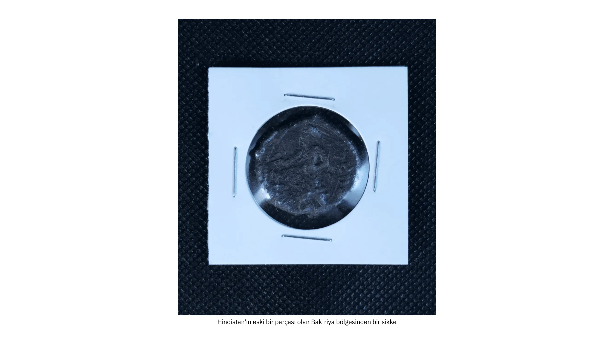

Bu dönemi görsel bir biçimde anlatmak için, yukarıda Hindistan'da, Hint yarımadasının batısında, Afganistan'a yakın bir bölge olan Baktriya bölgesinden bir sikke görülmektedir. Bu bölgede, muhtemelen Yunan sikkelerinden esinlenen ve kraliyet şahsiyetlerinden birinin yer aldığı sikkeler vardı.

## Lidyalılar ve Persler

<chapterId>eb802ab8-8ffd-5b25-907f-8944f120ed14</chapterId>

:::video id=f151eb42-5ff3-4ca1-9af1-1ae2a5e051c0:::

### İlk Lidya elektrum sikkeleri

Sikkelerin ortaya çıkışını Lidya ve Perslerden ayıramayacağımıza göre, dünyanın Yunanistan'ın doğusunda kalan ve bugün Türkiye'yi oluşturan kısmına geçelim. Batı'da ortaya çıkan ilk sikkeler yaklaşık olarak MÖ 7. yüzyılın ortalarına, günümüz Türkiye'sinde yer alan Lidya ve İyonya bölgelerine dayanmaktadır. Bu temel yeniliğin gün ışığına çıkması, Efes'teki Artemis tapınağında bulunan ve MÖ 600'lere tarihlenen ilk sikkeler gibi kayda değer arkeolojik keşiflerle MÖ 650 ila 600 yılları arasında gerçekleşmiştir. Bu ilkel sikkeler, kehribar yansımalı doğal bir altın ve gümüş alaşımı olan elektrumdan yapılmıştı ve genellikle kaba bir görünüme sahipti, sadece zımba veya ilkel motiflerle işaretlenmişti.

Aşağıda, önünde avıyla birlikte bir aslan bulunan en eski Lidya sikkelerinden birini görebilirsiniz. Arka tarafta, metalin saflığını test etmek ve sadece bir yüzey tabakası olmadığından emin olmak için kullanıldığına inanılan bir damga veya delik fark edebilirsiniz. Bu en eski örneklerden biri olsa da, bu parçanın bir kopya olduğunu belirtmek önemlidir. Tüm altın ve elektrum parçalarım, tüm birikimimi bu koleksiyona harcamamı önlemek için tasarlanmış kopyalar veya modern rekreasyonlardır.

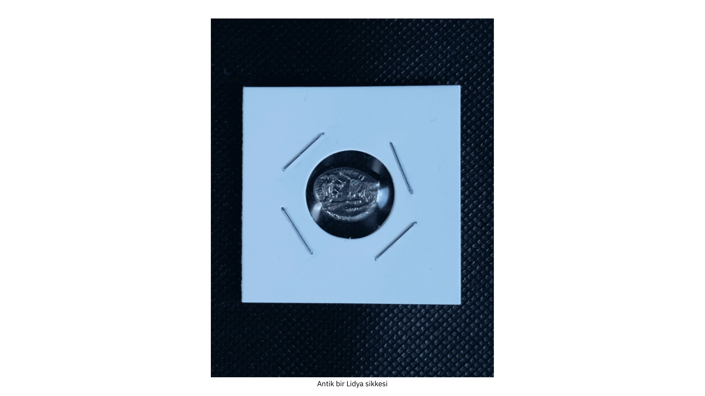

Ama birazdan göreceğimiz gerçek bir İran parçam da var. Bu ilk parçalar böyle görünüyordu. O zamanlar damgalanmış bir tür metal blobu (ya da İngilizcede topak) gibi.

Paranın günlük ticareti kolaylaştırmak ve takasın yerini almak için icat edildiğine dair yaygın inanışın aksine, ilk Lidya, Akamenid ve Yunan sikkelerinin başlangıçta küçük ölçekli ticaret için kullanılmadığı görülmektedir. Gerçekten de, para birimleri günlük kullanım için çok büyüktü. Dahası, dolaşımları üretildikleri yere yakın bölgelerle sınırlıydı.

Burada, antropolojik nitelikteki birçok eserde okumuş olmama rağmen, sikkelerin, daha önce de gösterdiğim gibi - ister elektrum olanlar ister çok kısa bir süre sonra döneceğim bu Pers sikkesi olsun - her gün ekmek almak için çok büyük olduğunu belirtmeyi önemli buluyorum. Bir köylünün ya da askerin bir günlük çalışmasına eşdeğer olduğunu düşünmemize neden olacak tahminler gördüm, bu yüzden çok büyük olurdu. Bu, yemeğiniz, kahvaltınız ya da öğle yemeğiniz için bir günlük ücret ödemeye çalışmak gibi bir şey. Bunun dışında, başka çalışmalarda bu damlaların daha küçük birimlerinin, yani daha küçük sikkelerin bulunduğunu gördüm, bu da bize günlük alışverişler için olası bir kullanım olduğunu düşündürebilir.

Dolayısıyla burada, günlük ticaret için kullanılmadığının antropolojik "kanıtı", çünkü kupür veya birim çok büyüktü, bence çok sağlam değil çünkü günlük alışverişlere uyarlanabilecek daha küçük sikke örnekleri bulduk.

### Devletin para yaratmadaki rolü

Sikkelerin gerçek kökeni devletlerin doğrudan eylemleriyle bağlantılı gibi görünmektedir. Bu konuda iki ana hipotez vardır: idealist olan birincisi, Yunanca 'nomisma' (para) ve 'nomos' (yasa) terimleri arasında bir paralellik kurarak, paranın yasaların kodlanmasıyla bağlantılı olduğunu ve şehirlerin otoritesini ve siyasi örgütlenmesini güçlendirdiğini öne sürer. Bugün yaygın olarak kabul gören ikinci ve daha gerçekçi hipotez ise paranın her şeyden önce devletlerin ekonomik ve sosyal kontrolü sağlamaları için bir araç olduğudur. Devletler, içerdikleri değerli metallerin ağırlığını ve değerini resmi olarak garanti ederek, bu sikkelerin dolaşımını ve değerini manipüle edebiliyor, yerel para birimlerine özgü güven ve likidite primleri yaratabiliyordu.

Bu konuda elimizde kanıtlar olduğunu bilmek gerçekten ilginç. Örneğin, elektrum sikkelerde, doğal elektrumun normalde %70 altın ve %30 gümüş civarında olduğunu bilmelisiniz. Bulduğumuz ve analiz ettiğimiz ilk sikkelerde, özellikle de erken Lidya sikkelerinde, altın içeriği %70 yerine %50 ila 55 civarında görünüyor. Bu da sikke basanların o dönemde bile, muhtemelen daha fazla sikke üretmek ve bunların damgasız bir doğal elektrum parçasıyla aynı değerde görünmesini sağlamak için daha değerli olan metalin payını azaltmaya çalıştıklarını göstermektedir. Ve burada, *Kroisos kadar zengin* olan bu ünlü Kroisos'un zamanında bunun mümkün olduğunu söylemek gerekir, çünkü onun zamanında altın ve gümüşü ayıracak teknolojiye sahiptik.

Lidya sikkeciliği, efsanevi zenginliğiyle tanınan ünlü kral Kroisos (MÖ 561-546) döneminde büyük bir evrim geçirmiştir. Bu dönemde Lidyalılar altın ve gümüşü elektrumdan ayırmak için metalürjiyi mükemmelleştirdiler ve böylece ilk bimetalik sikkeleri, yani ayrı altın ve gümüş sikkeleri ortaya çıkardılar.

### Pers yayılması ve Yunan adaptasyonu

MÖ 546'da Lidya'yı fethettiklerinde Ahameniş Persleri bu yeniliği hemen benimsediler. MÖ 500 civarında, I. Darius'un hükümdarlığı altında, Persler altın darik ve gümüş siglois ile kendi para sistemlerini kurdular ve genellikle savaşçı pozlarda kraliyet betimini taşıdılar. Bu kraliyet Pers sikkesi esas olarak Pers İmparatorluğu'nun Helenleşmiş bölgelerinde kullanıldı ve yavaş yavaş yayıldı, ancak kullanımı düzensiz kaldı, **Mısır gibi bazı bölgeler hala tartılmış metal (külçe) ile alışverişi tercih ediyordu.

Yukarıda, gerçek bir Pers sigloi'sini (veya siglos) görebilirsiniz. Küçük tasarımda bir kral yer almaktadır, ancak delik hafifçe aşınmıştır. Siglos, altından yapılan daric'in aksine gümüş bir sikkedir. Persler bu iki metali ayırt edebiliyorlardı ve elektrum sikkelerden uzaklaştılar. Böylece bimetalizmi uyguladılar, hem altın hem de gümüş kullanırken aynı zamanda değerli metallerden yapılmış sikke kavramını korudular, genellikle arkasında muhtemelen metal içeriğini kontrol etmek için bir delik vardı.

Yunanlıların sikkeleri hızla benimsemeleri, özellikle Küçük Asya'daki Yunan kolonileri aracılığıyla Lidyalılarla kurdukları yakın ilişkiler sayesinde gerçekleşmiş gibi görünmektedir. Sikke basan ilk Yunanlılar muhtemelen MÖ altıncı yüzyılın ortalarında Aegina'da yaşayanlardır ve ağırlığı bölgeden bölgeye değişen ve adı "bir avuç tahıl" ya da "bir avuç ok" anlamına gelen drahmiyi piyasaya sürmüşlerdir.

Yunan sikkelerinin başarısı, paralı askerlerin ödemeleri gibi önemli işlemlerde sağladığı kolaylık kadar, şehirlerin ekonomik ve siyasi genişlemesinden de kaynaklanıyordu. Para birimi hızla Yunan ve daha sonra Roma ekonomisinin merkezi bir unsuru haline gelirken, özellikle yasayla (nomos) olan ilişkisi aracılığıyla güçlü bir sembolik boyutu da korudu.

Son olarak, sikke basımının hızla yaygınlaşması, parasal değerlerin kodlanmasının devlet örgütlenmesiyle el ele gittiği antik toplumlarda derin bir dönüşüme tanıklık etmektedir. Bu evrim, Yunan demokrasilerinin, özellikle de paranın demokratik şehrin işleyişinde çok önemli bir rol oynadığı Atina'nın yükselişinin ekonomik ve siyasi temellerini atmıştır.

Bu bölümde hatırlanması gereken kilit nokta, genel olarak paradan değil, özel olarak **madeni paralardan** bahsettiğimizdir. Açıkça ortaya çıkan temel husus, madeni paraların teknik özellikleriyle (ağırlık, saflık, nominal değer) doğrudan bağlantılı olan **çıkaran otoriteye güven** konusudur. Devletin ya da parayı çıkaran otoritenin bu paraların değerini ve dolaşımını en başından itibaren bir dereceye kadar kontrol etmesini ve hatta manipüle etmesini sağlayan da tam olarak bu güvendir.

## Kurumsal müdahale ve ilk madeni paralar

<chapterId>3e1efd08-99e3-5a32-9908-3185fef0e640</chapterId>

:::video id=84847cf6-9e46-4a8c-9f35-25a27496cc4b:::

### Paranın ikili doğası

Basılı paranın ortaya çıkışı temel bir soruyu gündeme getirmektedir: para piyasanın kendiliğinden yarattığı bir şey midir yoksa otorite tarafından dayatılan bir kurum mudur? Bu kavramsal gerilim, birbirinden tamamen farklı iki vizyonu karşı karşıya getirmektedir.

Bir yandan Avusturya iktisat okulu, meta paranın - özellikle de altının - ekonomik aktörler tarafından dayanıklılık, taşınabilirlik, bölünebilirlik ve değiştirilebilirlik gibi içsel nitelikleri nedeniyle doğal olarak seçildiği fikrini savunmaktadır. Bu perspektiften bakıldığında, devlet daha sonra arzını kontrol etmek için bu kendiliğinden oluşan para birimine el koymuştur. Bu, siyasi güç tarafından ele geçirilmeden önce piyasa ihtiyaçlarından doğal olarak ortaya çıkan bir kurumdur.

Buna karşılık antropolojik ve kurumsal görüş, paranın gerçekten devlet sikkesi ile ortaya çıktığını savunur. Otorite, mührünü basarak bilinçli bir şekilde para birimini yaratır ve böylece metali gerçek bir parasal araca dönüştürür. Bu bakış açısı, en eski Lidya sikkelerinin esas olarak ordulara ödeme yapmak için kullanıldığını öne sürmektedir - bir stater kabaca bir askerin günlük ücretine karşılık gelmektedir.

### Devlet standardizasyonunun paradoksal avantajları

Bu teorik gerilime rağmen, Avusturyalı ekonomistler bile paraya devlet müdahalesinin bazı faydalarını kabul etmektedir. Para basma yoluyla standartlaştırma, bir dizi pratik ticaret sorununu çözmektedir.

Bir sertifikasyon otoritesi olmadan, ekonomik oyuncular sürekli risklerle karşı karşıya kalırlar: sahte madeni paralar, dosyalama sahtekarlığı ve ağırlık manipülasyonu. Bu uygulamalar, bazı madeni paralar kabul edilirken diğerleri reddedildiği için ekonomide sürtüşme yaratır. Teorik olarak, resmi damga ağırlık ve kaliteyi garanti ederek ticareti daha akıcı hale getirir.

Bu garantinin piyasada gözlemlenebilir bir fiyatı vardır: basılmış bir altın sikke, ham altın eşdeğerinden daha değerlidir. Bu prim sertifikasyonun değerini yansıtmaktadır - tüccarların artık metalin orijinalliğini kimyasal veya rezonans testleri yoluyla kendilerinin doğrulamasına gerek yoktur. Devlet müdahalesi, paradoksal bir şekilde, sürtüşmeleri ortadan kaldırır ve kurumsallaşmış güven yaratarak ticareti kolaylaştırır.

### Başından beri döviz manipülasyonu

İlk Lidya devletçiklerinin hikâyesi rahatsız edici bir ironiyi ortaya koymaktadır. Son analizler bu elektrum sikkelerin altın içeriğinin doğal elektrumdan sistematik olarak daha düşük olduğunu göstermektedir. Kaliteyi onaylayan otorite aynı zamanda bileşimi de manipüle ediyordu.

Bu uygulama madeni paranın ikili faydasını göstermektedir. Piyasa için mübadeleleri daha akıcı hale getirir ve standardizasyon garantisi sunar. Sikkeyi basan otorite içinse sulandırma yoluyla bir ekonomik kontrol aracı haline gelir. Nominal değeri korurken altın içeriğini azaltarak, devlet para arzını etkin bir şekilde artırır - aynı miktarda değerli metalden daha fazla parasal birim yaratır.

Ancak devletin kendisi bu manipülasyonla kısıtlı kalmıştır. Konstantin'in 4. yüzyılda bastırdığı altın solidus örneğinde görüldüğü gibi, Roma yönetimi, ödemelerin iyi sikkelerle yapılmasını talep ettiği için sikkelerin kalitesini titizlikle kontrol ediyordu. Otoritenin, vergi gelirlerinin değerini garanti altına almak için kendi sikkelerinin kalitesini korumakta hayati bir çıkarı vardı.

### Devalüasyonun ekonomik analizi

Para devalüasyonu üzerine yapılan çalışmalar tarih boyunca tutarlı modeller ortaya koymaktadır. Metal sikkeler için ekonomistler sikkelerin içerdiği değerli metal yüzdesini takip eder - azalan bir eğri giderek artan devalüasyonu gösterir. Modern kağıt paralar için ise bunun tam tersi geçerlidir: dolaşımdaki para arzı gözlemlenir ve bunun artışı devalüasyona işaret eder.

Her iki yöntem de aynı temel olguyu ölçmektedir: parasal değerin seyreltilmesi. İster değerli metal içeriğini azaltarak ister yeni banknotlar basarak olsun, mekanizma aynı kalır. Bir otorite aynı gerçek kaynaklardan ne kadar çok parasal birim yaratırsa, her birim o kadar değer kaybeder.

En eski Lidya sikkelerinden itibaren gözlemlenebilen bu manipülasyon, parasal kontrolün her zaman bir güç meselesi olduğunu göstermektedir. Bu nedenle basılan para, ekonomik kontrol aracı ile birlikte dikkate değer bir teknik yeniliği temsil eder - para tarihi boyunca günümüze kadar devam eden bir ikilik.

## Parça imalatı

<chapterId>b205f4f2-c293-5308-b812-a998de9ad45e</chapterId>

:::video id=47c612ec-d97e-4498-b50e-7e66518bd56d:::

### Delikli bloblardan basılmış madeni paralara

Sikkelerin ortaya çıkışıyla ilgili bir bölümden sonra, sikke üretiminin evrimiyle ilgili çok kısa bir bölüm sunmak istedim. Gördüğümüz gibi, her şey elektrum parçacıklarıyla başladı, altın ve gümüşle devam etti, her iki taraf da bir zımba ile işaretlendi, ya kralın yüzü ya da saflığı kontrol etmek için arkada bir delik vardı.

Daha sonraki bir bölümde inceleyeceğimiz gibi, Yunanlılar bu teknolojiyi geliştirerek her iki tarafı da dövülmüş yuvarlak sikkeler yarattılar. Pürüzsüz, düz bir değerli metal parçası alırlar, bir yüzüne istenen tasarımı kazırlar ve ardından elle çekiçleyerek bitmiş sikkeyi oluştururlardı.

Sikkeleri tek tek elle basma teknolojisi, üretimi arttırmak için sikkeler sık sık seyreltilmiş olsa da, muhtemelen o dönemde enflasyonu kontrol etmede rol oynamıştır. Bu durum özellikle Roma döneminde ve daha az ölçüde de Yunan dönemindeki bazı savaşlar sırasında belirgindi. Sikkelerin teker teker basılması otoritenin seri üretim kapasitesini sınırlasa da, meydana gelen önemli devalüasyonlara rağmen enflasyon kontrolüne etkili bir şekilde katkıda bulunmuştur. Böylece evrim, delinmiş bir metal bloğundan yuvarlak, dövülmüş bir sikkeye doğru ilerledi.

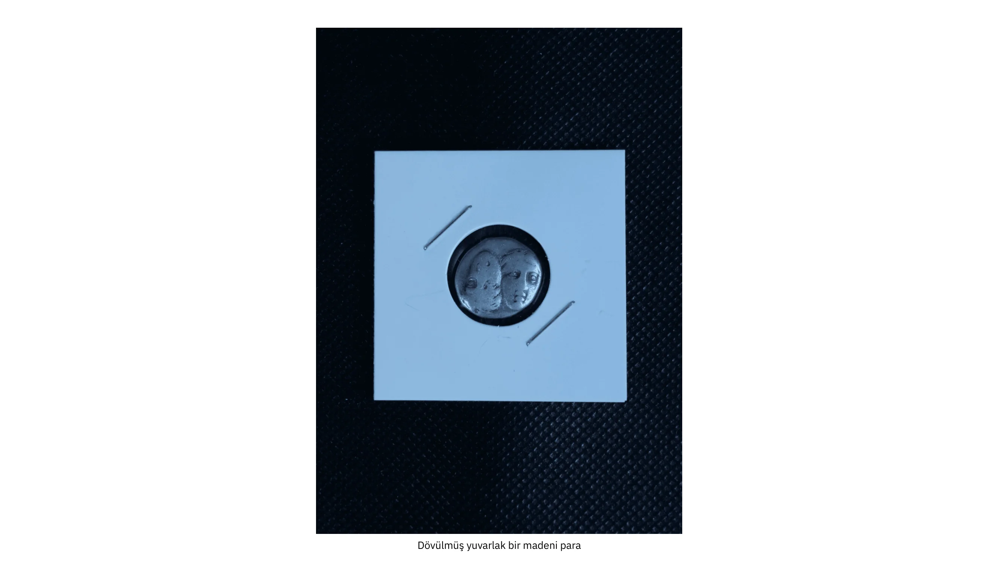

### Ortaçağ evrimi

Orta Çağ'da, sikkeleri daha geniş ve daha ince hale getirerek yayma eğilimi de vardı. Bunun bir nedeni, genellikle orijinalliğin bir göstergesi olarak kullanılan seslerini test etmenin daha kolay hale gelmesiydi. Gümüşün yayılmasıyla farklı bir frekans üretiliyor, böylece insanlar sadece dinleyerek sikkenin saflığını doğrulayabiliyordu. Bu uygulama "sağlam para" terimini doğurmuştur. Sağlam para bağlamında standart ağırlık, tartım için bir terazi veya "trebuchet" kullanılarak belirlendi. Böylece evrim küçük, yuvarlak sikkelerden biraz daha ince, daha geniş sikkelere doğru devam etti.

### Sarkaç vuruşu

Orta Çağ'ın sonunda, modern çağın başlangıcında ortaya çıkan son teknoloji, sarkaç vurma fikriydi. Bu, sikkeleri vurmak için sıkılan bir tür vidaydı ve böylece bu yeni vuruş biçimiyle sikkeler üretiliyordu. Bu gelişmenin en önemli özelliği, kırpma sorununu çözmek için madeni paranın yüzeyine bir desen kazıma yeteneğiydi. Kırpma, değerli gümüşü geri kazanmak için sikkenin bir kısmının çıkarılmasını içeriyordu; bu gümüş daha sonra başka sikkeler basmak için kullanılabilir ya da sadece bir kaynak olarak saklanabilirdi.

Yani bu sarkaç vuruşu kavramı kırpma fenomenine yardımcı oldu. Ve bu teknolojinin aslında Fransa'dan geldiğini belirtmek ilginçtir. Örneğin İngiltere'de, bu makinelerin nasıl yapılacağını göstermeleri için Fransız mühendisler tutmuşlardı. Bence komik olan, çekiçle para basmaya karşı çıkan ve bu teknolojinin uygulanmasını geciktiren destekçilerin olmasıydı. Her iyi teknolojide, her zaman ona karşı olan, eski teknolojiyi korumak isteyen insanlar vardır. Gerçekten üstün görünen bir teknolojide bile - daha fazla parça üretebiliyorsunuz, kopyalanması daha zor - hala ünlü çekiç yöntemine bağlı insanların olduğunu fark etmenin oldukça çılgınca olduğunu düşündüm. Bu ünlü sarkaç vuruşuyla yapılan parçaların üretimi ile çekiç vuruşuna geri dönüş arasında bir geçiş oldu. Ve nihayetinde, elbette, sarkaçlı vuruş en sonunda tutundu ve bize bu güzel modern parçaları verdi; burada kırpılmayı önlemek için etrafta küçük çizgiler, küçük çıkıntılar bulabilirsiniz, muhtemelen kırpma kelimesiyle ilgili, çıkıntılar ve bugün hala ya çıkıntıları ya da parçanın kenarına yazılmış metinleri veya çizimleri görebilirsiniz.

# Paranın ortaya çıkışına ilişkin farklı teoriler

<partId>72ac694f-9248-550d-90c1-91af3d234380</partId>

## Paranın ortaya çıkışına ilişkin teoriler ve çeşitli tanımları

<chapterId>7d699d4d-8c70-55b5-bf36-609f3fd90bcf</chapterId>

:::video id=523c873f-501b-4954-b79f-7e74c0f685a5:::

Paranın ortaya çıkışı ve çeşitli tanımları üzerine farklı teorilere adanmış bu bölüme hoş geldiniz. Bu bölümde inceleyeceğimiz iki ana teoriyi özetlediğini düşündüğüm *Aux origines de la monnaie* kitabından kısa bir alıntı.

> Bu kısa giriĢ, araĢtırmanın bağlamını vurgulamaktan baĢka bir amaca hizmet etmemektedir. Kavramsal düzeyde, K. Polanyi'nin tezini destekleyenler ile M. Weber'in tezini destekleyenler arasında açık bir tartışma vardır. Birinciler için hediye ve yeniden dağıtım merkezi bir rol oynamakta, piyasa mübadelesi ise özellikle uluslararası mübadelelerde sadece marjinal bir rol oynamaktadır. Diğerleri için ise tam tersine, piyasa mevcut tarihsel sürecin kalbinde yer almaktadır.

Örneğin Mezopotamya'da bir ortaya çıkış teorisi, tapınağın otorite olarak hesap birimini ya da para birimini yarattığını, bunu dayattığını ve ardından tüccarların ticaret için bunu benimsediğini öne sürer. Karşıt teori ise, hayır, bu para birimi ticareti kolaylaştırmak için piyasadan doğal olarak ortaya çıkmıştır. Mezopotamya'da bunun iyi kaynaklara dayanan örnekleri vardır.

Takas konusuna gelince, bazı teoriler bunun esas olarak uluslararası alışverişlerde, yani güvenmediğimiz insanlarla kullanıldığını öne sürüyor.

Bu bölümde yapacağımız şey de bu. Paranın ortaya çıkışına ilişkin farklı teorileri ve paranın ne olduğuna dair farklı tanımları sunmak için bir tür anket yapacağız. Hem klasik ekonomistlerin hem de antropologların tezlerini sunacak ve eleştireceğiz. Hatta bu çeşitli konularda Avusturyalı bir iktisatçının bakış açısını sunacak olan Ulrich Fromy de benimle birlikte olacak kadar şanslı.

## Klasik ekonomistler için paranın ortaya çıkışı

<chapterId>1d3776cd-0dfd-5297-af48-c6f41e257a7e</chapterId>

:::video id=873a16c1-17ac-448d-8941-df4feb7ab79d:::

Bu bölüm paranın ortaya çıkışına ilişkin farklı teorilere ayrılmıştır. Ele alınacak ilk konu, klasik iktisatçılara göre paranın ortaya çıkışıdır.

### Adam Smith'in klasik teorisi

Klasik ekonomi teorilerine, özellikle de Adam Smith'in savunduğu teoriye göre para, takasın sınırlılıklarına tepki olarak doğal bir şekilde ortaya çıkmıştır. Başlangıçta değiş tokuşlar doğrudan takas yoluyla yapılıyordu, ancak bu yöntem genellikle "isteklerin çifte çakışması" sorunu nedeniyle karmaşıktı: her kişi diğerinin istediği şeye tam olarak sahip olmak zorundaydı. Yavaş yavaş, belirli mallar (tuz, değerli metaller ve canlı hayvan gibi), yararlılıkları, dayanıklılıkları ve bölünebilirlikleri sayesinde herkes tarafından ara değişim aracı olarak kabul görmeye başladı. Böylece para, ekonomik alışverişleri kolaylaştırmak ve akışkanlaştırmak için kendiliğinden ortaya çıktı.

### Klasik teorinin eleştirisi

İşte benim bu teoriye yönelik eleştirim. Önceki bölümde gördüğümüz her şeyle birlikte, **madeni paraların** takasın bir evrimi olduğu fikrinin yanlış olduğunu söyleyebileceğimizi düşünüyorum çünkü basılan madeni para kesinlikle otoriteden kaynaklanır, çünkü otorite tarafından basılır. Bunun birkaç nedeni var, en önemlisi de otoritelerin ekonomiyi kontrol etme, paranın kontrolünü ele geçirme arzusu.

Öte yandan, eğer sikkelerden değil de bir kavram olarak paradan bahsediyorsak, o zaman durum daha az nettir çünkü ilk sikkeler olan Lidya staterlerinde işaretlenmemiş gümüş damlalar bulduk. Bunların dolaşımda olup olmadıkları henüz belli değil. Eğer dolaşımda idiyseler, bu da insanların bu varlığı başlangıçta yaygın olarak talep edilebilecek ve kolayca takas edilebilecek potansiyel bir para birimi olarak tanımlamış olabilecekleri anlamına gelir. Ve belki de yetkililer bu durumu ancak daha sonra fark etmiş ve belgelemek için üzerine bir damga vurarak kontrol altına almışlardır.

Bunu yapmanın pek çok avantajı var - kontrol etmeye, tartmaya falan gerek yok. Elbette bunun hakkında konuşacağız. Ancak bence madeni paralar devletler tarafından en başından beri kullanılan bir araç. Bununla birlikte, paranın ortaya çıkışı açısından, gerçekten onu dayatan bir otoriteden mi geldiğini yoksa ticaret veya ticari alışverişler yoluyla mı ortaya çıktığını bilmiyoruz. Bu bölümün ilerleyen kısımlarında meslektaşım Ulrich ile bu konu üzerine çok ilginç bir tartışma yapacağız.

İlk değerli metal sikkelerin, değerleri çok yüksek olduğu için günlük alışverişleri kolaylaştırmak için kullanılmadığını zaten biliyoruz. Ayrıca bunların çoğunlukla askeri ödemeler için kullanıldığını da biliyoruz. Bu, paranın mutlaka piyasadan çıkmadığı tezi için iyi bir argümandır. Hesap birimleri, yani ilk sikkelerin kupürleri muhtemelen ekmek almak ya da günlük alışveriş yapmak için çok büyüktü. Örneğin, bir günlük ücrete eşdeğer olabilir. O günlerde insanlara maaş ödenmesi gerekmiyordu, ancak bu size ölçek hakkında bir fikir vermek içindi. Yani bu sikkeler muhtemelen küçük ölçekli ticarette kullanılamayacak kadar fazla alım gücüne sahipti. Öte yandan, bu sikkelerin tüccar değiş tokuşu gibi daha büyük değiş tokuşlarda kullanılmayacağını söyleyecek bir şey yok. Ağırlıklı olarak askeri ödemeler için kullanıldıklarını biliyoruz. Bu, ilk sikkelerin ortaya çıkışını açıklayan en popüler teorilerden biridir. Unutmayın, burada sikkelerden bahsediyoruz, genel olarak paradan değil. Yani, ilk sikkelerin ilk rolü askeri ödemeler için, paralı askerler için ödeme yapmaktı.

Örneğin Büyük İskender, daha sonra göreceğimiz gibi, bunu çok iyi kullanmıştır.

Antik Çin kadar erken bir dönemde, börülce kabuklarının ekonomik mübadele (**emeğin ücretlendirilmesi, değerin ölçülmesi ve toprak satın alınması)** için kullanıldığını da gördük. Dahası, Mezopotamya ve Mısır'da işlevsel para sistemleri zaten mevcuttu ve ticaret, ücret ödemeleri ve vergi ödemeleri için kullanılıyordu. Burada önerdiğim şey, Batı anlayışındaki sikkelerin alışverişi daha akışkan hale getirme ihtiyacından doğduğunu düşünmenin kesinlikle yanlış olduğudur.

Madeni paralar bir otorite tarafından basıldığına göre, belki de en başından beri basan otoritelerle bağlantılı olduklarını varsayabiliriz. Bu mantıklıdır. Öte yandan, kendilerinden önce gelen para biçimlerinin ya da parasal sistemlerin, yani proto-sikkelerin nasıl ortaya çıktığını tam olarak bilmiyoruz. Bir yandan, bu parasal birimleri belirleyenin tapınaklar olduğunu ve daha sonra insanların bunları kullandığını öne süreceğiz. Öte yandan, hayır, bir değişim aracına, dış dünyayla ticaret yapmanın bir yoluna ihtiyaç duyanlar tüccarlardı ve örneğin dış dünyadan talep gördüğü için kullanılacak gümüş metalini belirleyenler de onlardı diyeceğiz. Mesele şu ki, gerçekten bilmiyoruz. Bu yüzden iki karşıt teorimiz var. Paranın, örneğin tüccarlar tarafından ticaret yapma ihtiyacından doğal olarak mı ortaya çıktığını yoksa otoriteden mi kaynaklandığını açıklayacak mükemmel bir kanıtımız yok.

### Madeni ve ilkel paralar arasında ayrım yapmak

Sonuç olarak, madeni paraların mutlaka otoriteden kaynaklandığını söyleyebiliriz, çünkü söz konusu otorite tarafından damgalanmışlardır. Öte yandan, paranın (madeni paradan önce gelen) değişimi kolaylaştırmak için ortaya çıkmış olamayacağını öne sürmenin yanlış olduğunu söyleyebileceğimizi sanmıyorum. Yukarıda gördüğümüz tüm örneklerde bu anlamda bolca örnek olduğunu düşünüyorum.

## Takas efsanesi

<chapterId>0fcd4964-ac36-5163-a8cf-1aacebc0d2c0</chapterId>

:::video id=0ede29ab-8acd-4d79-9282-bd5991b97076:::

### David Graeber'in incelemesi

Klasik iktisatçılara göre paranın ortaya çıkışını az önce ele aldık. Şimdi de takas efsanesi olarak bilinen bir kavramı ele alacağız.

Paranın ortaya çıkışına ilişkin bu klasik teoriye yöneltilen eleştirilerden biri, fikirlerini destekleyecek tarihsel kanıtların eksikliğidir.

Diğerlerinin yanı sıra antropolog David Graeber tarafından formüle edilen ve "takas miti" olarak bilinen eleştiri, paranın takastan doğal olarak ortaya çıktığı yönündeki klasik fikre meydan okumaktadır. Bu eleştiriye göre, paranın ortaya çıkışından önce toplumların takası sistematik olarak kullandığını gösteren hiçbir tarihsel ya da antropolojik kanıt yoktur. Aslında, eski toplumlar kredi, borç, sosyal yükümlülükler ve törensel değiş tokuşlar temelinde faaliyet göstermişlerdir. Dolayısıyla "takas efsanesi" klasik ekonomik görüşü haklı çıkarmak için tasarlanmış, gerçek bir ampirik temeli olmayan teorik bir kurgudur.

Bununla birlikte, bu teorinin, örneğin farklı kabileler arasındaki alışverişlerde takasın var olduğunu inkar etmediğini belirtmek gerekir. Sadece takasın bu sözde ilkel gruplar içinde yaygın olarak uygulanan bir faaliyet olduğunu ve paranın bu uygulamaların mantıksal bir evrimi olacağını reddetmektedir. Takasın bir kabile içinde yaygın olarak kullanıldığı ve paranın eninde sonunda takasları akışkanlaştırmak ve takasla ilgili zorlukları çözmek için ortaya çıktığı gerçeğini reddeder. Bunun yerine, bu teoriye göre, bu gruplar bir tür gayri resmi kredi ya da hediye karşılığı hediye uygulamışlardır.

### İlkel toplumlar büyük uygarlıklara karşı

**Bu teorinin geçmişteki ve hatta günümüzdeki ilkel (devletsiz) gruplar için kesinlikle geçerli olduğunu düşünüyorum (örneğin, 18. ve 19. yüzyıllarda kaşifler tarafından incelenen kabileler). Açıkçası, daha önce bahsettiğimiz nedenlerden dolayı (zayıf iş bölümü, geçimlik tarım) takas yerine daha önce bahsettiğim değişim biçimlerini kullanıyorlardı. Ancak bu teorinin Mezopotamya ve eski Mısır gibi geçmişin büyük medeniyetleri için geçerli olduğunu düşünmüyorum.

İşte *Aux origines de la monnaie* kitabından bu konuyla ilgili iki alıntı:

> M. Mauss'un ünlü "Armağan" adlı eserinde ana hatlarını çizdiği model, Mısırbilimciler tarafından oybirliği ve coşkuyla olduğu kadar anlayışsızlıkla da benimsenmiştir. Bu durum, burada değinmeyeceğimiz bir dizi kafa karışıklığına yol açmıştır. Sadece bu modelin sözde ilkel toplumlar için geçerli olduğunu ve Firavun Mısır'ında böyle bir durumun söz konusu olmadığını belirtmekle yetinelim.

> Dolayısıyla ekmekler, yani işlenmiş tahıllar, Eski Krallık'taki şât (y) gibi, çeşitlendirilmiş mallarda kredi açılmasını sağlayan hesap birimleriydi. Bu basit örnek, Firavun dönemi Mısır ekonomisinin bir yeniden dağıtım sistemiyle sınırlı olmadığını göstermektedir. Çok sayıda mübadeleyi içeren oldukça karmaşık bir sistemdi.

Dolayısıyla, daha önce Mısır ve hatta Mezopotamya ve Çin ile ilgili bölümde gördüğümüz gibi, bu eski ama ilkel olmayan uygarlıkların bile, bence bir devletin varlığı nedeniyle, para sistemleri kullandığını görebiliriz. Sanırım bu dersin ilk bölümünde bu yeterince gösterildi. Dolayısıyla, bu al-ver, ertelenmiş kredi kavramı bu büyük medeniyetler için geçerli değildir. Bu nedenle paranın ortaya çıkışının kesin nedenleri bir gizem olarak kalmaktadır. Tüccarların dış dünya ile ticaret yapma ihtiyacından mı kaynaklandığını yoksa bu eski dönemlerde tapınak tarafından mı dayatıldığını bilmiyoruz.

## Borç para yoluyla paranın ortaya çıkışı

<chapterId>4f508615-aa61-5d62-89d3-cecd02aeaa62</chapterId>

:::video id=a23f547f-3906-4f4a-8f72-5d78c649d0c4:::

### Senet Olarak Para

Bu bölümde borç para teorisini ele alacağız.

Özellikle ekonomist Alfred Mitchell-Innes tarafından geliştirilen ve daha sonra David Graeber tarafından genişletilen **borç para** teorisi, paranın takastan değil, en eski insan toplumlarından beri var olan borç ve kredi ilişkilerinden kaynaklandığını ileri sürer. Bu teoriye göre para, sosyal yükümlülükler (bireyler ya da gruplar arasındaki borçlar) nicelleştirilip aktarılabilir hale geldiğinde ortaya çıkar. Bu kavram, mübadelelerin ve transferlerin nicelleştirilmesi kavramını ortaya koymaktadır. Dolayısıyla para, yalnızca mübadelelerde aracı görevi gören bir metadan ziyade, her şeyden önce karşılıklı güvenle desteklenen ve genellikle siyasi veya dini otorite tarafından garanti edilen bir **borcun tanınması** olacaktır.

Bu teorinin daha da gelişmiş bir şekli, tüm paranın bir borç olduğudur. Dolayısıyla, paraya sahip olan birinin genel olarak toplum üzerinde bir hak iddiası, bu parayı kabul eden herkes üzerinde bir hak iddiası olacaktır. Ve para, **onların görüşüne göre, zorunlu bir şekilde kabul edilmesi gerektiğinden**, aksi takdirde para değildir, çünkü bu parayı reddedebilirseniz, sistemleri çalışmaz. Bir para birimi belirlemiş olan belirli bir grupta, bu para birimine sahip olan herkes, o para birimini kabul eden toplumun diğer tüm üyelerine borçlu gibidir ve para birimini kabul edenlerin de bu para birimine sahip olan kişiye bir tür borcu vardır. Bu aslında onların teorisidir.

### Zorunlu sisteme yönelik eleştiriler

**Bu teoriye yönelik eleştirim:**

Bu teoriye küçük bir eleştiri getirmeme izin verin. Paranın bir tür sosyal mutabakat olduğunu kabul ediyorum. Bu, her ne olursa olsun, bir grubun parasal bir "işarete" duyduğu güvendir. Dolayısıyla, daha sonra parasal prim kavramıyla tekrar ele alacağımız karşılıklı güven kavramına katılıyorum. İşin karmaşıklaştığı nokta, bu teorinin savunucularının bir yükümlülük kavramı eklemesi ve borç kavramında ısrar etmesidir. Onlara göre, bir kişi parasal bir token'e sahip olduğunda, bir bütün olarak topluluk üzerinde bir hak iddia eder ve bu nedenle topluluk, sahibine borçlu olur. Ayrıca, grup üyelerinin KİS-1'i kabul etmek zorunda olduğu bir uzlaşma yükümlülüğü de olacaktır; aksi takdirde, onların görüşüne göre, sistem çalışmayacaktır. Yukarıda antik Çin'de anlatılan sistemin bu teoriyi iyi temsil ettiğini düşünüyorum.

Kendi adıma, paranın sosyal bir mutabakat olduğu, seçilen token'ün resmi bir zorunluluk olmaksızın genel olarak bir ödeme aracı olarak kabul edildiği bir sistemi kolayca hayal edebiliyorum. İnsanlar kendi özgür iradeleriyle kabul ederlerse böyle bir sistemin çalıştığını görebiliyorum. İşe yarayabilir. Öte yandan, genellikle yükümlülükler, yasal ihale ve şiddetle birlikte gelir ki bunları daha sonra bir bölümde göreceğiz. Ancak teorik olarak, bu sistemin tam olarak işleyebileceği izlenimine sahip değilim. Bitcoin'nin buna bir örnek olduğunu düşünüyorum. Bitcoin'nin bir değeri var çünkü parasal bir primi var, çünkü parasal kullanıma, yani değer rezervlerine, belki de değişim araçlarına veya fiat sistemine karşı korumaya konması için talep var. Kimse bunu kabul etmek zorunda değildir ve bir ödeme aracı olarak ne kadar çok kabul görürse, bir değişim aracı olarak o kadar çok kullanılabilir. Zaten sorunsuz bir şekilde değer deposu olarak kullanabiliyoruz. Buna hiç şüphe yok. Demek istediğim, Bitcoin bana bir örnek gibi görünüyor, daha sonra bir miktar satın alırsak paramızı geri alabileceğimizi düşündüğümüz, satın alma gücümüzü korumak için daha sonra takas edebilmek için edindiğimiz bir tür sosyal uzlaşma para birimi.

Teorinin bu daha az kısıtlayıcı görüşü, iki farklı toplumun, söz konusu toplumlar arasında bir hak talebi veya borç yaratmadan, altın gibi parasal bir token ile nasıl ticaret yapabileceğini açıklamaya yardımcı olur. Toplumda kabul görmeye zorlamanın iki kabile arasındaki ticarette işe yaramadığını görüyorum çünkü diğer kabile otoriteye tabi değil. B kabilesi A kabilesinin otoritesine tabi değil. Ama yine de aynı parasal GW'yi, diyelim ki altını kabul ediyor. Şimdi insanlar bana "Evet ama bunun nedeni B şirketinin de altının kendi para birimi olduğuna karar vermiş olması" diyebilir. Evet, gerçekten de işe yarıyor, ancak bu noktada borç yaratımı söz konusu değil. Bu nihai bir işlem. Yani, A şirketi bir malı B şirketinde altınla değiştirdiğinde, borç yaratılmaz, işlem tamamlanır. Açıkça görüldüğü üzere, B şirketindeki kişi bu altın sikkeyi ya da külçeyi daha sonra A şirketindeki kişiler tarafından ödenmek üzere edinmemiştir. Bunu daha sonra, muhtemelen kendi kabilesi içinde takas edilmek üzere kabul etmektedir. Yani bu örnekte bir borç yaratımı söz konusu değildir, gizli bir hak talebi yoktur, sadece doğrudan bir takas, doğrudan bir ödeme söz konusudur. Borç para birimini savunanlar bize bunun takas olduğunu söyleyecektir. Ben buna katılmıyorum, çünkü takas doğrudan bir malın değiş tokuşudur. Doğrudan takas, bir malın başka bir malla, kullanım için değiş tokuş edilmesidir. Mallar kullanılmak üzere takas edilir, oysa bizim durumumuzda altın açıkça bir para birimi olarak kullanılmaktadır çünkü başka bir şey için kullanılmayacaktır; daha sonra bir ödeme aracı olarak kullanılacaktır. Dolayısıyla, bana göre takas kategorisine girmiyor.

Parasal bir token'e sahip olmak, topluluk üzerinde bir "hak iddia etmek" değil, daha ziyade token'in daha sonraki bir tarihte karşılaştırılabilir bir değerde kabul edileceğine dair bir umuttur.

## Paranın kendiliğinden ortaya çıkışı

<chapterId>e3ef86b1-73b9-5140-a61e-2ab6a5b0b2d4</chapterId>

:::video id=e543995f-d5e2-49d7-9133-e397b46e0833:::

Carl Menger tarafından başlatılan Avusturya iktisat okuluna göre para, isteklerin çifte tesadüfü sorunuyla karşı karşıya kalan bir takas ekonomisinden doğal olarak ortaya çıkar. Bu görüşe göre, bireyler değişimi kolaylaştıran ara mallarda kendiliğinden bir araya gelirler - doğrudan tüketilen mallar değil, geniş çapta talep edilme kapasiteleriyle tanınan metalar.

Bu parasal mallar Aristo'dan beri tanımlanan niteliklere sahip olmalıdır: bir değer deposu, bir değişim aracı ve bir hesap birimi olarak hizmet etmelidirler. Ekonomik aktörler bunları kademeli olarak tanımlar, biriktirir ve saklar, böylece para olarak ortaya çıkmalarını başlatır. Bu süreç tamamen kendiliğinden gelişir - para, bir otoritenin bilinçli müdahalesi olmaksızın, mübadeleleri koordine etme sorununa piyasanın verdiği doğal bir tepkiyi temsil eder.

### "Takas efsanesi" tartışması

David Graeber gibi antropologlar "takas efsanesi "ni öne sürerek bu görüşe karşı çıkmaktadır. Argümanları: yalnızca doğrudan takasa dayalı hiçbir karmaşık uygarlık belgelenmemiştir. Bunun yerine, incelenen ilkel toplumlar gayri resmi kredi ve karşılıklılık sistemlerini kullanmışlardır. Graeber, kredi ilişkilerini belgeleyen binlerce Mezopotamya tabletine atıfta bulunarak borcun takastan önce geldiğini ileri sürmektedir.

Ancak bu eleştiri, takasın kısıtlayıcı bir tanımına dayanmaktadır. Menger'in 1892'de işaret ettiği gibi, takas malın malla doğrudan değişiminin ötesine geçer. Aynı zamanda vadeli transferleri, ücret karşılığı hizmetleri ve Menger'in "bireyler arasında tek taraflı transferler" olarak adlandırdığı zamansal değişimleri de kapsar. Bu genişletilmiş takas biçimi, sınırlı güven çevrelerinde kredi sistemleriyle bir arada var olabilir.

Kanıtın yokluğu, yokluğun kanıtı değildir ve Avusturyalı ekonomistler, hiçbir karmaşık toplumun yalnızca doğrudan takas temelinde sürdürülebilir bir şekilde gelişemeyeceğini, dolayısıyla paranın ortaya çıkmasının gerekli olduğunu kabul etmektedir.

### Mezopotamya örneği: tüccarlar tapınaklara karşı

Tartışma Mezopotamya gümüş şekelinin kökeni etrafında kristalleşiyor. İki karşıt yorum vardır. Kurumsal görüş, gerçek ekonomik ve ruhani merkezler olan tapınakların ekonomiyi yapılandırmak için gümüşü bir para birimi olarak dayattığını savunur. Din adamları ve tüccar elitler arasında yoğunlaşan çivi yazılı tabletler bu merkezi kontrole tanıklık etmektedir.

Avusturyalıların yorumu bunun tam tersini öne sürmektedir: uzun mesafeli ticaret için parayı benimseyenler tüccarlardı. Anadolu'dan Basra Körfezi'ne kadar Mezopotamya sınırlarının ötesindeki yabancılarla ticaret yapmanın zorluğuyla karşı karşıya kalan tüccarlar, evrensel olarak tanınabilir, dayanıklı ve taşınabilir bir şeye ihtiyaç duydular. Gümüş, kendine özgü nitelikleri nedeniyle doğal bir seçimdi. Tapınaklar, ticari kullanımla zaten yerleşmiş olan bir uygulamayı basitçe onayladılar.

Bu tez, Anadolu'daki Kaneş ile Assur arasında tüccarların tekstil ürünlerini gümüş metalle -maddi faydası için değil, bir değer deposu olarak- takas ettikleri belgelenmiş alışverişlere dayanmaktadır. Bu işlemler salt takasın ötesine geçerek gerçek bir emtia para biriminin varlığını ortaya koymuştur.

### Esir kamplarının modern örneği

İkinci Dünya Savaşı sırasında Almanya'da esir olan ekonomist Richard Radford, paranın kendiliğinden ortaya çıkışına dair büyüleyici bir vakayı belgelemiştir. Kamplarda sigara doğal olarak değişim birimi haline geldi - bölünebilir, standartlaştırılmış, yaygın olarak kabul gören. Sigara içmeyenler bile evrensel değişim değerinin farkına vararak sigarayı benimsedi.

Bu mikrokozmos Avusturya prensibini göstermektedir: mübadeleleri koordine etme sorunuyla karşı karşıya kalan bireyler kendiliğinden en "satılabilir" mal üzerinde birleşirler. Hiçbir otorite sigara parasını dayatmamıştır; bu para, mübadelelerini optimize etmeye çalışan mahkumların günlük pratiklerinden ortaya çıkmıştır.

### Bireysel tercihlerin yakınsaması

Esasen para, bireysel tercihlerin kabul edilen ortak bir mala doğru yakınlaşmasını temsil eder. Mezopotamyalı tüccarlar, Radford'un mahkumları gibi, gelecekteki mübadelelerin belirsizliğini en aza indiren malı belirlemişlerdir. Bu seçim merkezi bir otoritenin iznini ya da dayatmasını beklemez - mübadelenin zorluklarıyla karşı karşıya kalan ekonomik aktörlerin pratik rasyonalitesinden ortaya çıkar.

Kendiliğinden ortaya çıkış ile bilinçli kurum arasındaki tartışma, tarihsel kanıtlar bölük pörçük olduğu için açık kalmaya devam etmektedir. Ancak Avusturya analizi tutarlı bir açıklama sunmaktadır: para, ticaretin pratik ihtiyaçlarından doğmuştur ve otoriteler yalnızca piyasa kullanımıyla zaten kurulmuş olan uygulamaları kurumsallaştırmıştır.

## Paranın ortaya çıkışına dair antropolojik görüş

<chapterId>ec48c5d8-47ed-530f-beb7-c44fd0b62880</chapterId>

:::video id=8c1f8764-75af-4fb6-a98b-55de3b7da02e:::

### Paranın ekonomik olmayan kökenleri

Bu bölümde, klasik ekonomi teorilerine derinden meydan okuyan zengin bir bakış açısı olan paranın ortaya çıkışına dair antropolojik görüşü inceleyeceğiz.

Paranın ekonomik alışverişi kolaylaştırmak için takastan doğal olarak ortaya çıktığı yönündeki geleneksel teorinin aksine, antropolojik araştırmalar paranın ortaya çıkışının büyük ölçüde ekonomik olmayan nedenlere dayandığını göstermektedir. Haraç ödemeleri, cinayet tazminatı (meşhur Wergeld) ve çeyiz (başlık parası) gibi sosyal mekanizmaların yanı sıra törensel, dini, siyasi ve sembolik uygulamalardan da kaynaklanmaktadır ve basit piyasa gerekliliklerinden çok daha fazladır.

İlkel toplumlarda para, paranın "değişim aracı" olarak klasik tanımının aksine, maddi malların günlük değişimi için nadiren kullanılırdı. Aslında bu toplumlar, geniş sosyal ve kişisel ilişki ağlarına gömülü vadeli ödemelerle krediyi yoğun bir şekilde kullanmışlardır. Her yerde bulunan bu kredi sistemleri mantıksal ve tarihsel olarak paranın ortaya çıkışından önce gelmiştir.

Vizyonlarını özetleyen şey bu. Bir önceki videodaki sohbetimizde Ulrich ile bunu tartışıyoruz. Ulrich'in bu yaklaşıma biraz meydan okuyan yorumlarının tadını çıkarmanıza izin vereceğim. Antropolojik vizyonda, paranın genellikle bir otoriteden ya da piyasa ihtiyaçlarından önce gelen sosyal bir kavramdan geldiği fikrine sahibiz.

### Yap taşları örneği

Aşağıda, Yap adasındaki anıtsal taşların çarpıcı bir örneğini görebilirsiniz. Bu taşlardan bazıları, hareketsiz kalmalarına ve hatta fiziksel olarak yok olmalarına rağmen, paranın esasen sosyal ve sembolik boyutunun altını çizen kolektif bir anlaşma sayesinde tamamen para olarak işlev görmeye devam etmiştir.

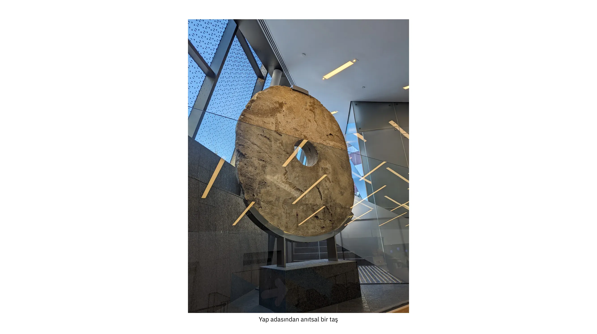

Bu, Yap taşlarının gerçekten ilginç bir analizi. Saifedean Ammous da "The Bitcoin Standard" adlı kitabında bu örnekten bahsetmektedir. Ona göre Yap Adası sistemi, herkesin başvurabileceği, kamuya açık, hesapları tutan ve eşyaların sahipliğini yöneten bir tür merkezi kayıt olan Bitcoin'ya en çok benzeyen sistemdir. Bu antropolojik bakış açısı, tüm bunların toplum içinde bir anlaşmayı veya sosyal mutabakatı temsil ettiğini göstermektedir ki bu da temelde doğrudur. Kayıp taşlardan bahsedilmesini de çok ilginç buluyorum. Küçük sallarla yüzlerce kilometre denize açılırlar ve taşları geri getirirlerdi. Bazen taş denizin dibine düşerdi ama bu taş yine de parasal sistemde kullanılırdı. Bir kişi "Evet, taşı filanca yerde düşürdük, bu benim, takas edebiliriz" diyebilirdi. Taşlar o kadar büyüktü ki genellikle tek bir yerde kaldıkları için değiş tokuşu kolaylaştırmak için fiziksel olarak sahip olmaya gerek yoktu. Bunun yerine, bu taşlarla işlemsel bir şekilde el değiştirmeye odaklanıldı ve taşlar gerçekten hareket etmeden sahipliğin değişmesine izin verildi. Bu, paraya dair ilginç bir antropolojik bakış açısını vurgulayan bir "mutabakat kanıtı" biçimiydi.

### Protokol para birimleri ve sosyal yükümlülükler

Dünyanın dört bir yanındaki etnograflar, kabuklar, kumaşlar, canlı hayvanlar, tuz ve taşlar gibi "proto-para birimleri" ya da "ilkel para birimleri" kullanan toplumları gözlemlemişlerdir; bunlar genellikle paraya atfedilen ödeme aracı ve değer saklama aracı gibi işlevleri yerine getirmiş, ancak günlük malların değişiminde düzenli olarak aracılık yapmamışlardır.

Yani burada, günlük alışverişler için kullanılması gerekmeyen para sistemlerini tanımlıyoruz.

Bunların hepsinin madeni paralar ortaya çıkmadan önceki para birimleri olduğunu hatırlatmak isterim ve para birimi demenin ne kadar yanlış bir isimlendirme olduğunu bilmiyorum. Ben para birimi demeyi tercih ediyorum. Literatürde sikkelerden önceki paraya atıfta bulunmak için sıklıkla proto-para birimlerinden bahsettiğimizi söyleyebilirim. Ancak ilk bölümde gördüğümüz gibi, **ben madeni paraların ortaya çıkmasından çok önce para sistemlerinin var olduğuna inanıyorum**.

Bu ilkel para birimleri esas olarak evlilik, çatışma tazminatı (Wergeld) veya şefler arasındaki hediyeler gibi bireylerle bağlantılı temel sosyal yükümlülükleri yönetmek için kullanılmıştır. Örneğin Pers İmparatorluğu'nda ilk sikkeler bir değişim aracı olmaktan ziyade özellikle askeri ödeme aracı olarak yaratılmıştır.

Bu nedenle ilkel paranın temel bir özelliği vardır: bir ödeme aracıdır, ancak çok nadiren doğrudan maddi mal alışverişi aracıdır. Burada kastettiğimiz, belirli sosyal yükümlülükler için, kabileler için, şefler arasındaki değiş tokuşlar için, ünlü wergeld, kan parası için bir ödeme aracı olduğudur. Adalet sistemlerinin ortaya çıkmasından önce, eğer birisi bir cinayet işlerse, sevdiklerinin öldürülmesinden dolayı acı çeken aile için bir tazminat söz konusuydu. Bunun için ödenmesi gereken bir bedel vardı, buna kan parası deniyordu ve bu bir ödeme biçimiydi. Bir de çeyiz vardı ki o da bir ödeme biçimiydi. Paranın bir ödeme biçimi olarak bu ilk kullanımlarında, günlük alışverişler için yapılan ödemelerden çok insani ve sosyal yükümlülüklerle ilgiliydi. Bu teoriye göre, daha yaygın olan bu günlük alışverişler daha çok kredi, vadeli kredi, hediyeye karşılık hediye ve tayınların yeniden dağıtımı ile ilgiliydi. Bu alışverişleri yönetmek için başka bir sosyal örgütlenme biçimi vardı. Herkesin kendi kendine yettiği, kendi çiftçiliğini yaptığı, uzmanlaşmanın olmadığı ve günlük alışverişler için parasal bir sisteme çok az ihtiyaç duyulduğu bir toplumda bunu hatırlamak da önemlidir. İşte bu yüzden paranın ilk biçimleri az önce tarif ettiğimiz çeyiz parası ve kan parasıydı, çünkü bunlar ticaret yapmaya, ekmeği günlük olarak parayla değiştirmeye ihtiyaç duymadan çok önce bir ödeme aracına ihtiyaç duyduğumuz ilk takaslardı, çünkü ilkel toplumlarda işler böyle yürümüyordu. Herkes kendi ihtiyaçlarını karşılıyordu ve henüz uzmanlaşma yoktu. Sanırım bu derste daha önceki tüm derslerde bu konuyu uzun uzun ele aldım.

Gelişmiş bir işbölümünün olmadığı bu toplumlarda, doğrudan alışverişler sınırlı kalmış, çoğunlukla kişisel dostluk ya da ittifak ilişkileri içinde gerçekleşmiştir. Yeterli uzmanlaşmanın olmaması modern anlamda parayı gerektirmiyordu.

Quiggin ve Einzig gibi antropologlar kredinin üstünlüğü konusunda ısrarcıdır: **İlkel ekonomik yaşam, devasa bir krediler ve kişisel borçlar ağına sıkışmıştır; burada para özellikle ödemelerin hemen yapılması gerektiği ve tazminatların kolayca ertelenemeyeceği durumlarda devreye girer.**

Yani, insanlar bir şeyler değiş tokuş eder, ertelenmiş kredi verebilir, ancak bazı durumlarda ödemeyi erteleyemezsiniz, bu nedenle para birimi veya proto-para birimleri bu noktada değiş tokuşa anında bir kesinlik kazandırmak için yararlı olabilir.

### Anonimlik yeniliği

Bu analiz daha derin bir düşünceye yol açmaktadır: parayı takasla karşıtlaştırmak yerine, ortaya çıkışını karmaşık kredi ve borç sistemlerinden bir evrim olarak anlamak daha uygundur. Para temel bir yenilik getirmektedir: **anonimlik**. İşte paranın ortaya çıkışına dair bu antropolojik teoriyi ilginç bulduğum nokta da bu. Eğer küçük bir grup insansanız ve birbirinize ertelenmiş kredi veriyorsanız, belli ki birbirinizi tanıyorsunuz. Bence bu sistemin işlemesi için insanların birbirlerini tanıması gerekiyor. Ve para ile yapılan bir ödeme anonimliğe izin verir. İnsanlar adınızı bile bilmeden, kim olduğunuzu bile bilmeden bir ödeme yapmanızı sağlar. Anında ve nihai ödeme için bir takas yapabilirler. Ve para tam da bunu mümkün kılar.

Her zaman nominatif olan kredinin aksine, para anonim, genelleştirilmiş ve anında özgürleştirici işlemlere olanak tanır. **Paranın bu eşsiz özgürleştirici gücü onun belirleyici üstünlüğüdür.**

Dolayısıyla para, ekonomik mübadeleyi kolaylaştıran mütevazı bir araç olmanın ötesinde, kişisel krediden** genelleştirilmiş, anonim bir ödeme sistemine** kadar insan kurumlarının ve uygulamalarının evrimiyle yakından bağlantılı büyük bir sosyal yeniliktir. Bu antropolojik evrim, paranın basit bir değişim aracı olmanın çok ötesinde, insan toplumlarını derinden şekillendiren güçlü bir sosyal kurumu temsil ettiğini ve modern toplumlarımızda ekonomik faaliyetin amacı haline geldiğini göstermektedir.

Burada, sonuçta modern toplumlarımızda ekonomik mübadelenin amacının paraya sahip olmak olduğunu, oysa eskiden durumun hiç de böyle olmadığını anlıyoruz. Ekonomik mübadelenin amacı tüketim için mal ya da metalara sahip olmaktı. Bugün ise, para yeniliğinin getirilmesiyle birlikte, ekonomik mübadelenin amacı bu parayı biriktirmektir, çünkü genel olarak kabul edildiği gibi bu parayı malla değiştirmemizi sağlar. İhtiyacımız olduğunda ihtiyacımız olan malla takas edebiliriz.

## Kayıt birleştirme

<chapterId>7664442a-91c1-5ce4-a8bd-53b7371a3e3d</chapterId>

:::video id=473fc284-5375-4e1b-b0cd-6b51ba0cc3b8:::

### Muhasebe kayıt teorisi

Şimdi bu iki parasal teorinin, yani borç-para yoluyla paranın ortaya çıkışı teorisi ile meta-paranın ortaya çıkışına ilişkin parasal teorinin birleştirilmesine yönelik çeşitli önerileri birlikte inceleyeceğiz. Lynn Alden'in ünlü kitabı "For Broken Money "deki birleştirme önerisinden bahsedeceğiz, ki Consensus tarafından yapılan çevirinin başlığı muhtemelen "Rupture monétaire" olacaktır.

*Lyn Alden'in Broken Money kitabından alıntı:*

> Temelde para bir muhasebe kaydıdır. Emtia parası doğa tarafından yönetilen bir kayıt defteridir. Banka parası ulus-devletler tarafından yönetilen bir defterdir. Açık kaynak para ise kullanıcıları tarafından yönetilen bir defterdir.

Lyn burada Bitcoin'ye atıfta bulunmaktadır.

### Stok-akış oranı ve kıtlık

> Rodyum gibi bazı nadir kimyasal elementler altından daha nadirdir, ancak endüstri tarafından çıkarıldıkları kadar çabuk tüketildikleri için düşük stok akış oranlarına sahiptirler. Bir rodyum madeni para veya külçe, özel bir koleksiyon ürünü veya değer deposu olarak satın alınabilir, ancak sosyal olarak kabul edilen bir para birimi olarak uygun değildir ve bu nedenle doğal olarak para olarak ortaya çıkmaz.

Saifedean "The Bitcoin Standard" adlı kitabında bu konudan uzun uzun bahsetmektedir. Stok-akış oranına aşina olmayanlar için, bu basitçe mevcut stoku, piyasada var olan rezervleri, yeni gelen stokla, yeni stok akışıyla karşılaştırdığınızda ortaya çıkar. Genellikle sezgiseldir, çünkü büyük miktarlarda sahip olduğunuz bir şeyin kıt olmadığını düşünebilirsiniz, ama aslında öyle değildir. Bu daha çok onu tedarik etmek için sahip olduğunuz kapasiteyle ilgili bir sorudur. Daha ziyade, bu modele göre bize bu nesnenin nadir olup olmadığı bilgisini veren yeni stok bulundurma kapasitemizdir. Bir şey stoklarımızda olmadığı için nadir değildir, sadece elimizde olmayabilir. Altını ele alırsak, bir değer deposu olarak kullanıldığı için çok sayıda altın stokumuz var ve yeni stok girişi, altın mining yoluyla gelen yeni altın stoklarının yılda %1 ila %3'ü gibi bir şey. Oysa burada söylediği şey, rodyumdan bahsediyorsak, altından daha nadirdir, ancak hiç stokumuz yok çünkü ilerledikçe tüketiliyor. Dolayısıyla mevcut stoğu ikiye katlamak için çok fazla yeni arz gerekmiyor. Oysa altın söz konusu olduğunda, stoku ikiye katlamak için yenilemek en az 50 yıl sürer. Tüketilen çoğu malın aksine, bu oldukça kolaydır ve mevcut stoğu ikiye katlamak için uzun yıllar süren bir üretim gerekmez, çünkü tüketildikçe tüketilir.

*"Altın, modern tarih boyunca 25x ile 100x arasında, genellikle 50x veya daha fazla, kısaca 19. yüzyılın ortalarındaki Altına Hücum sırasında bile hiçbir zaman 16x'in altına düşmeyen bir stok/akış oranını korumuştur. "*

Yani 25, stoku ikiye katlamak için 25 yıl, 100 ise stoku ikiye katlamak için 100 yıl anlamına gelir. Saifedean kitabında, altın üretimini iki katına çıkarsak bile, örneğin %1,5'ten %3'e, bunun fiyat üzerinde büyük bir etkisi olmayacağını söylüyor.

*"Gümüş genellikle 10 kat veya daha fazla stok-akış oranına sahiptir ve bu oran hala nispeten yüksektir. "*

*Diğer emtiaların çoğunun stok-akış oranı 1 veya 2'den azdır. Platin ve rodyum gibi en nadir elementler bile hızlı endüstriyel tüketimleri nedeniyle nispeten düşük stok-akış oranlarına sahiptir. "*

### Altın ve gümüşün üstünlüğü

*"Kısacası, ne zaman bir emtia para birimi kendini altın ve gümüşle rekabet halinde bulsa, sonunda her zaman altın ve gümüş zirveye çıkmıştır. Diğer emtialar sınırlı süreler için ya da belirli bölgelerde para birimi olarak kalabilir, ancak altın ve gümüş her zaman küresel olarak rekabetçi para birimleri olma ve rekabette üstün gelme yeteneklerini kanıtlamıştır. Çünkü uygarlıklar karşılaştığında, altın ve gümüş sahipleri her zaman diğer para birimlerinin değerini düşürecek teknolojik kapasiteye sahip olurken, deniz kabuğu, inci, canlı hayvan, tuz, kumaş veya daha düşük metal sahipleri altın ve gümüşün değerini asla düşürememiştir. "*

Saifedean'ın Afrika'da cam boncuk kullanan kabilelerden bahsettiği Bitcoin Standardında bu durum yine son derece iyi anlatılmaktadır. Venedikli tüccarlar cam boncuklarla dolu kargolarla geldiklerinde, çünkü o zamanlar bunları endüstriyel olarak üretebiliyorlardı, bunu yapabilecek teknolojik kapasiteye sahiptiler, bu halkların para sistemini tamamen istikrarsızlaştırdı ve kaynaklarını tam anlamıyla yağmalayabildiler. Saifedean'ın tezi budur.

### Hesap birimi ve alacak

*"Tarihsel olarak, kredi doğrudan bir değişim aracı olarak kullanıldığında bile, genellikle özellikleri nedeniyle doğal olarak seçilen parasal mal birimleri cinsinden ifade edilmiştir. "*

Bu çok ilginç bir nokta ve Ulrich ile tartıştığımız bir konu. Mezopotamya'daki tapınak bu kredi kavramını yönetebilecek bir tür otorite olsa bile, hesap birimi şekeldi. Şekelin tapınak tarafından otoriter bir şekilde belirlendiğini doğrulayacak hiçbir şey yok. Şekel, tüccarların çevredeki diğer halklarla ithalat ve ihracat yapma ihtiyacı nedeniyle doğal olarak ortaya çıkmış olabilir. Kaneş'teki bir tüccarın (1. Bölüm'de bundan bahsetmiştim) tam olarak bunu yaptığına, fiziksel emtia değeri için değil, değer deposu olarak kullanılan değerli metalleri ithal ettiğine dair kanıtımız var. Tek sorun, bu gümüş seçiminin, gümüş şekelin tüccarlar tarafından mı yoksa tapınak tarafından mı yapıldığını varsayabileceğimizi bilmememizdir. Ancak Ulrich'in, bunun muhtemelen tüccarlar tarafından yapıldığını düşünmemize yol açan çok iyi bir argümanı vardır.

*"Dolayısıyla, iki teorinin birleştirilmesi, her iki teoride de ortak olan temel mantığı tanımladığı için "paranın muhasebe teorisi" ("paranın defter teorisi") olarak tanımlanabilir. Hem esnek sosyal kredi hem de tahsil edilebilir proto-para birimlerinin geçmişi insanlığın şafağına kadar uzanmaktadır. Her iki durumda da, çeşitli büyüklükteki insan grupları, isteklerin çifte tesadüfünü karşılamak zorunda kalmamak, mübadelelerdeki sürtünmeyi azaltmak ve bir tür likit tasarruf olarak hizmet etmek için kendi aralarında bir muhasebe defteri tutarlar. Temel fark, defteri tutmakla görevlendirilen otoritede yatmaktadır. "*

Bir yandan doğa para arzının genişlemesini yönetiyor. Yani, altını ele alırsak, oldukça nadir olduğu için çıkarılması zordur. Çıkarılabilecek altın sikke sayısında bir tür sınır vardır. Yani kıtlık doğa tarafından yönetilir. Ve kayıt, sahiplik kavramı tarafından tutulmaktadır. Kayıt merkezi değildir. Sahiplik, bir altın sikkeye veya bir altın parçasına sahip olmanızla kanıtlanır. Kredi parası söz konusu olduğunda ise kıtlık, insanların kredi alma kabiliyetleri tarafından yönetilir. Ya da itibari para söz konusu olduğunda, kıtlık otorite tarafından yönetilir. Enflasyonist felaketlerden kaçınmak için daha fazla para basılıp basılmayacağına onlar karar verir. Dolayısıyla, bazı durumlarda, kağıt para söz konusu olduğunda, kayıt token'in sahibi tarafından da yönetilebilir. Bu yüzden kayıtlara tırnak içinde, kaydileştirilmiş olarak girilir. Şey, maddileştirilmiş, ama sanal. Bu ünlü token'e sahip ve bu da sahip olduğunu kanıtlıyor. Ve tıpkı kutsal parada olduğu gibi, gerçek bir kayıtta, bir bankada da olabilir; burada kayıtla ilgili olarak kimin neye sahip olduğunu yöneten gerçekten insan bankasıdır.

## Parasal prim yoluyla birleşme

<chapterId>093756e5-8908-55e5-bb76-376a3a3cc4d3</chapterId>

:::video id=eabc342a-ecbd-46ca-a347-e914917e7c4f:::

### Parasal prim kavramı

Paranın ortaya çıkışına ilişkin farklı teorilerin birleştirilmesine yönelik çeşitli önerilere ayrılmış olan bu bölümde, Lyn Alden'in teorisi olan kayıt teorisini önerdim. İki parasal teorinin birleştirilmesi için benim de kendi önerim var. Bu, parasal prim, parasal prim kavramı. Yani paranın değeri, ister kil tabletler, ister değerli metal sikkeler, banknotlar veya bitcoin şeklinde olsun, parasal talebinden kaynaklanan parasal prim ile açıklanabilir. Parasal prim basitçe, birisinin gelecekte bu para birimini benzer bir fiyatla takas edeceğine duyulan güvene dayanır.

Burada göstermeye çalıştığım şey, ister fiat, yani kullanım değeri olmayan banknotlar olsun, ister altın sikkeler veya herhangi bir metal, bir külçe altın parçası veya bir külçe olsun, **değerinin çoğunu oluşturan şeyin genellikle parasal prim olduğudur**. Bir altın parçasını ele alırsak, değerinin belirli bir kısmı kullanım değeriyle, sanayide veya mücevher yapımında kullanılmasıyla açıklanır. Mücevhere olan talebin genellikle parasal değerinden kaynaklandığını unutmayın. İnsanlar mücevherleri bir tür değer deposu olarak saklarlar, bu yüzden bunu parasal prime biraz dahil ediyorum çünkü genellikle parada bir rol oynamak için oldukça parasal bir taleptir.

Yani altın talebinin yaklaşık %10'unun sanayi için olduğunu söyleyebiliriz. Altının değerinde, bu endüstriyel taleple, altının tüketildiği bu altın kullanım talebiyle açıklanacak küçük bir kısma, diyelim ki %10'a sahip olacağız. Geri kalanı ise açıkça değer deposu olarak parasal kullanımına yönelik taleptir.

### Yetki ikramiyesi ve fiat

Bir altın parçasını bir altın sikke ile karşılaştırırsanız, başka bir katman daha vardır. Altın para bir otorite tarafından damgalanmıştır ve parçanın içerdiği altın da bir kullanım talebine, sanayide tüketilme talebine sahiptir. Ayrıca bir değer deposu olarak parasal bir prime de sahiptir. Dahası, benim otorite primi olarak adlandırdığım, sikkenin kullanımının daha basit olması nedeniyle sikke için altın parçasından daha yüksek bir fiyat, daha yüksek bir satın alma gücü olacağı bir katman vardır. Tartmaya gerek olmadığı için alışverişleri daha akıcı hale getirir. Otorite normalde saflığını garanti eder. Ve eğer bir altın parçasıyla karşılaştırırsanız, damgalı bir altın sikke genellikle basit bir altın parçasından daha değerlidir. Bu da normaldir, çünkü damgalamak için kaynak gerekir.

Fiat, yani kağıt para için de aynı prensip geçerlidir. Kağıt paranın, belki bir evi ısıtmak dışında, herhangi bir kullanım değeri yoktur ve bu da Weimar Cumhuriyeti döneminde olmuştur. Yani kullanım değeri için gerçek bir talep yoktur. Öte yandan, bence sadece otorite için bir prim var.

Bu bir tür parasal primdir, parasal primin üzerine bir eklentidir. Ancak parasal primi, yasal ödeme aracı olmasından ve yetkililerin sizi vergilerinizi ödemek için onu satın almaya zorlamasından kaynaklanmaktadır. Dolayısıyla, itibari paranın vergilendirilmiş olmasından ve en azından vergilerinizi ödemek için onu edinmek zorunda olmanızdan kaynaklanan bir tür parasal talebi vardır. Ve sonuç olarak, genel kabul gören bir ödeme aracı olmaya devam etmektedir. Dolayısıyla insanlar ihtiyaçlarını karşılamak için bunu elde etmek isterler.

### Parasal talep yoluyla birleşme

Peki bu parasal prim önerisi neden borç para ve emtia para teorilerinin birleşimi olarak nitelendiriliyor? Ben bir altın paranın değerinin mutlaka "içsel değerinden" kaynaklandığını düşünmüyorum. Hayır, aslında bu, itibari para için olduğu kadar bir güven kavramıdır. Bu bir parasal talep kavramıdır. Ve gerçekten de küçük bir endüstriyel kullanım yüzdesine, başka bir "faydaya" sahip olduğu için değil. Endüstriyel kullanımın değerinin %10'u olduğunu söylersek, buna ons başına 300 dolar değer biçebiliriz. Eğer altın piyasada onsu 3,000 dolardan satılıyorsa, 300 dolar ile 3,000 dolar arasındaki fark meşhur parasal primdir. İşte altına olan bu parasal talep bunu açıklamaktadır. Fiat'ın kullanım değerinin sıfır olması onun farklı olduğu anlamına gelmez. Benim için tamamen aynı şey. Dolayısıyla her iki tarafta da, borç para ya da emtia para teorisinde, altının minimum kullanım değerine sahip olması gibi ekstra bir niteliğin hiçbir şeyi değiştireceğini düşünmüyorum.

Öte yandan, **ortaya çıkış düzeyinde, Mises'in regresyon teoremine göre, bu kullanımın kaynağında bir talep yarattığını ve paraya dönüşen süreci başlattığını öne sürebiliriz.** Oysa borç para düzeyinde, bu daha çok bir otoritenin dayatmasıdır, dolayısıyla kaynak, ortaya çıkış başlangıcı ve kavramlar tamamen farklıdır. **Ancak değer düzeyinde, paranın değerini nasıl açıklayacağımızı, parasal primle, itibari paranın neden ona atfettiğimiz değere sahip olduğunu ve emtia parasının neden ona atfettiğimiz değere** sahip olduğunu kolayca açıklayabileceğimizi düşünüyorum. Benim için bu aynı süreç ve buna para primi deniyor.

#### Parasal prim

İşte bu kadar. Paranın değeri, ister kil tabletler, ister değerli metal sikkeler, banknotlar veya bitcoin şeklinde olsun, parasal talebinden kaynaklanan parasal prim ile açıklanabilir.

Parasal prim, birisinin bu parayı daha sonra benzer bir fiyatla takas edeceğine duyulan güvene dayanmaktadır.

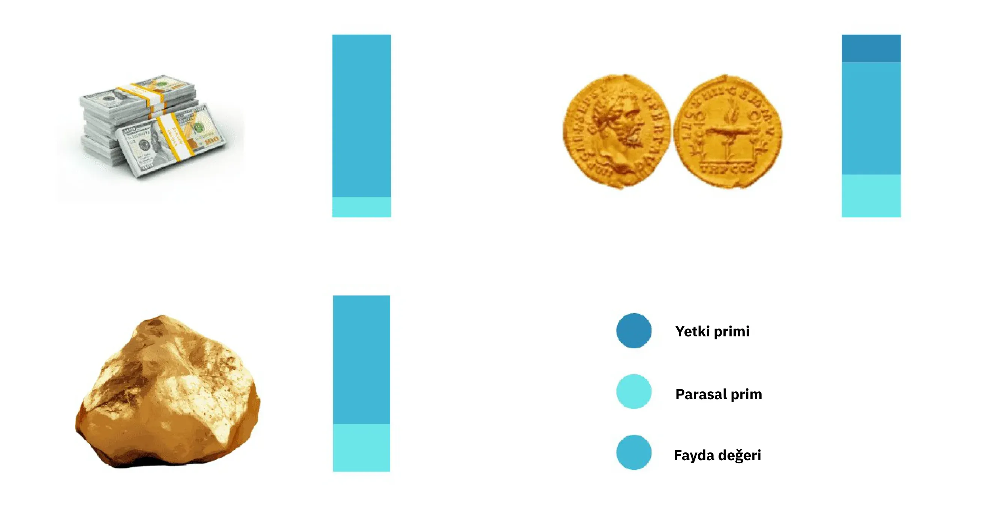

# Paranın farklı tanımları

<partId>77b7918a-8c3b-11f0-b688-6b2ab22378c9</partId>

## Para vs para birimi vs monnaie vs argent vs devise

<chapterId>bf8a6d21-df88-5d23-a0a5-e9a5c1300554</chapterId>

:::video id=d9c9e7df-9db3-4a9f-801e-10d3fc7dfc22:::

### Parasal terimlerin anlambilimi

Çeşitli para teorileri ve özellikle paranın tanımları üzerine olan bu bölümde, anlambilim konusuna kısa bir değinmek istiyorum. Parayla ilgili bazı kelimelerin tanımlarını biraz daha derinlemesine incelemek ve bunları İngilizce karşılıklarıyla karşılaştırmak istiyorum. Örneğin, para, para birimi, monnaie, argent ve devise ile karşılaştırıldığında. Şöyle bir şey var.

Biraz anlambilim:

"**Para**" (de la monnaie) dediğimizde, çoğu insan bir işlem karşılığında aldığımız küçük para üstünü kastettiğimizi düşünecektir. Ve eğer "**para birimi**" (la monnaie) dersek, insanlar muhtemelen bir devletin para biriminden bahsettiğimizi düşüneceklerdir. Kanada'nın para birimi Kanada dolarıdır. Bu doğru.

Peki ya para (de l'argent)? Bir hırsız asla "Bütün bozuk paralarını bana ver!" demez (Hırsız, neredeyse hiçbir değeri olmayan bozuk paraları alınca hayal kırıklığına uğrayabilir).

Hayır, hırsız bağıracak: "Bana **tüm paranı** ver". Ve eğer hırsız sokakta önünüzde duruyorsa, mutlaka cebinizdeki **banknotlardan** bahsediyordur.

Öte yandan, hırsız sizi daha sofistike bir şekilde dolandırmaya çalışırsa, tüm banka hesaplarınızı boşaltarak varlıklarınızı çalmaya çalışırsa, **tüm paranızı alacağını** söyleriz. Burada "para" kelimesi **bireyin servetini** ifade eder.

Dolayısıyla para kelimesinin iki tanımı vardır: nakit (banknotlar) ve servet.

### Para birimi vs monnaie vs devise

Bir para birimi (devise) mutlaka başka bir ülkenin para birimidir, aksi takdirde sadece para (monnaie) deriz. Eğer Fransızsanız şöyle dersiniz: "La livre sterling est la devise du Royaume-Uni et l'euro et la monnaie de l'Europe" (İngiliz sterlini Birleşik Krallık'ın para birimidir ve euro Avrupa'nın para birimidir).

Çoğu zaman, bu terimleri çevirirken bu anlamsal sorunlarla ilgilenmeyen insanlar, yazılı para birimi olduğunda para biriminden (devise) bahsetme eğiliminde olacaklardır, ancak hayır, para birimi ülkenizin para birimi olduğunda paradır (monnaie) ve diğer para birimlerinden bahsederken devise'dir. Burada sıklıkla gördüğüm sorun, İngilizcede iki kelime olması: bir kavram olan "money" ve bir ülkenin para birimi olan ve değiş tokuş yapmak için kullanılan "currency". Bu yüzden sadece para kavramı hakkında konuşabiliriz; bu kolaydır - bu *para* kelimesinin kavramıdır; genel olarak paradır. Ve *para birimini* bir ülkenin para birimiyle eşitlemek çok basittir. Fransızca'da ise ne yazık ki insanlar bitcoin hakkında konuşurken genellikle evet, "mais ce n'est pas une monnaie" diyeceklerdir çünkü bu bir ülkenin para birimi değildir, ancak çoğu zaman bunun yerine para birimi terimlerine atıfta bulunduklarını düşünüyorum. Bu bir yandan yanlış, çünkü El Salvador'dan bu yana bitcoin bir devletin para birimi oldu. Gerçek şu ki insanlar sık sık şöyle diyor: *ama hayır, bu bir devletin para birimi değil, para olamaz*. Ama aslında, daha geniş bir *para* kavramına atıfta bulunacak olursak, bence bitcoin bu tanıma mükemmel bir şekilde uyuyor. Sadece Fransızca'da bu iki kavramı birbirinden ayıracak iki kelimemiz yok. Argent kelimesinin para birimi anlamına geldiğini söyleyebiliriz, ancak ne yazık ki tam tanımı bu değil. *Argent* (para) servet ya da banknot anlamına gelir. Para* kelimesiyle gerçekten bir eşdeğerlik kuramazsınız. *Para* aslında para birimi (monnaie) kavramıdır.

## Saifedean Ammous'un tanımı

<chapterId>07c4ba50-168c-567a-8957-0b187ff75f97</chapterId>

:::video id=936d6d3b-6d45-468e-bc44-85fbce9b857a:::

#### Para nedir?

Para basitçe sahip olduğunuz ya da edindiğiniz bir şeydir; kendi başına kullanılmak ya da tüketilmek için değil, daha sonra ihtiyaç duyabileceğiniz başka mal ya da hizmetlerle takas edilmek üzere edinilir. (Saifedean)

Para, mal için parasal bir talep olduğunda, paranın bir veya daha fazla rolünü oynamak için parasal bir prim kazanır.

Parasal malın, parasal primin devam etmesi için (arzın parasal talebe uyum sağlamasını önlemek için) yeterince kıt olması gerekir.

### Parasal prim

Para biriminin farklı tanımlarına ilişkin bu bölümde, Saifedean'ın Bitcoin Standardı'nda yer alan ve her zaman büyük ilgimi çekmiş olan tanımından kısaca bahsetmek istiyorum. Okuduğumda bana oldukça basit gelmişti. Ayrıca bu tanıma parasal prim kavramını da ekleyeceğiz. Saifedean'ın kitabında bahsettiği gibi, mutlaka bir kıtlık kavramı vardır. Soru şu: Para nedir?

> Para basitçe sahip olduğunuz ya da edindiğiniz bir şeydir, kendisi için kullanılmak ya da tüketilmek üzere değil, daha sonra ihtiyaç duyabileceğiniz diğer mal ya da hizmetlerle takas edilmek üzere.

Saifedean'ın The Bitcoin Standard'da bahsettiği tanım budur. Bir para biriminin (la monnaie), para biriminin bir veya daha fazla rolünü oynamak için mala yönelik parasal bir talep olduğunda parasal bir prim kazandığını da ekleyebilirim. Dolayısıyla, değer saklama aracı olarak hizmet veren bir para biriminin, insanlar onu örneğin bir değer saklama aracı veya bir değişim aracı olarak edinmek istediklerinden, ona parasal bir prim veren parasal bir talebe sahip olacağını söyleyebilirsiniz.

### Kıtlık ve piyasa mekanizmaları

Buna, parasal primin varlığını sürdürebilmesi için parasal malın yeterince kıt olması gerektiğini kesinlikle eklememiz gerektiğini düşünüyorum. Bu çok önemlidir. **Eğer bir mal para olarak kullanılmak üzere ortaya çıkarsa ve fiyatının arttığını görürsek, normal olarak, eğer mal yeterince nadir değilse, insanlar fiyat arttığında bu değer artışından yararlanmak için ondan daha fazla üretmek isteyeceklerdir**. Bu nedenle piyasadaki çoğu malın nispeten sabit bir fiyatı vardır. Fiyat yükseldiğinde, üretim artma eğilimindedir. Fiyat düştüğünde, üretim de düşer. Bir tür piyasa ayarlaması vardır. **Altın gibi bir mal yeterince nadir olduğunda, piyasa mekanizması parasal kullanım için artan bu talebi telafi etmeyecektir. Yani değişen değişkendir, fiyattır. Bitcoin'de** olduğu gibi. Bitcoin fiyatı yükseldiğinde, daha fazla bitcoin üretmeyiz. Yani değişen şey fiyattır. İşte bu nedenle, yıllardır bitcoin talebi arttıkça bitcoin fiyatının da arttığını görüyoruz. Dünya üzerinde algoritmayı değiştirip "daha fazla talep var, fiyat artıyor, daha fazla üreteceğiz" diyebilecek kimse olmadığı için **Yeni bitcoinlerin arzı önceden programlanmıştır ve önceden bilinmektedir**. İşte benim söylediğim de buydu; parasal malın, parasal primin devam etmesi için yeterince nadir olması ve dolayısıyla arzın bu yeni parasal talebe uyum sağlamasını önlemek için piyasa mekanizmaları tarafından yakalanmaması gerekir.

## Ödeme araçları ve özgürleştirici değer

<chapterId>5d424039-e342-56f7-9d8b-bba9551831a9</chapterId>

:::video id=af4c0765-8111-4cb7-891b-3ee54d6e7054:::

### Ödeme araçları vs. değişim araçları

Paranın farklı tanımlarına adanmış bu bölümde, Alain Testart'ın bir ödeme aracı ve özgürleştirici bir değer olarak parayı konu alan "Aux origines de la monnaie" (Paranın Kökenleri) adlı kitabından bir alıntıya birlikte bakmamızı öneriyorum.

*Alain Testart, Aux origines de la monnaie adlı eserinde parayı bir ödeme aracı olarak tanımlar:*

> Ödeme araçlarının işlevi burada, karşılıksız ödemeler, hiçbir şey satın almayan ödemeler olduğu sürece, değişim araçlarının işlevinden farklı olarak düşünülür. Knies (1873:192 vd.), wergeld (kan parası ya da cinayet karşılığı ödenen para) ya da vergilerde olduğu gibi, mübadele eylemlerinden oluşmayan mal transferleri temasını uzun uzadıya geliştirir. Carl Menger, 1892 tarihli "Geld" adlı makalesinde bu dördüncü işleve saldırmıştır ve bu makale genellikle konuyla ilgili en belirleyici makalelerden biri olarak kabul edilir. Tamamen gözden düşmüş olmamakla birlikte, ödeme araçlarının işlevi fikri bugün ekonomik düşüncede unutulmuş ya da en azından değişim araçları lehine reddedilmiş gibi görünmektedir.
>

> Para ödeme yapmak için kullanılır: bu açıdan bakıldığında, bir ödeme aracının işlevini tüm genelliğiyle tanımlayan bir özgürleştirme aracıdır. Bu bağlamda, paranın "özgürleştirici gücü "nden söz edebiliriz. Le Petit Robert'e göre, özgürleştirici güç "(bir yükümlülükten, bir borçtan) özgürleştirme etkisine sahip olan şeydir". Büyük Larousse'a göre, özgürleştirici bir ödeme, "yasal koşullar altında, alacaklının borcun ortadan kalkmasına itiraz edemeyeceği şekilde yapılan herhangi bir ödemedir". Para bu mükemmel güce sahiptir; hatta yasal ihale statüsünü tanımlayan da budur, çünkü ister satıcı ister alacaklı olsun, hiç kimse para ile yapılan bir ödemeyi reddedemez. Para, ister bir tüccara ister vergi memuruna borçlu olunsun, borcun ödenmesinde reddedilemeyecek tek maldır. Tüm mallar arasında sadece para bu ayrıcalığa sahiptir. "İşte bu ayrıcalıktır," diye yazar Charles. Gide (1921 I: 443), yasal ihale dediğimiz şeyi oluşturur.
>

> Bir malın başka bir mal karşılığında veya karşılığında başka bir mal verilmesi koşuluyla devredilmesinden oluşan her mübadele, alıcının bu karşı tarafı sağlama yükümlülüğünü zorunlu olarak beraberinde getirir. Ödeme bu yükümlülüğün yerine getirilmesidir. Dolayısıyla tüm mübadeleler ödeme anlamına gelir, ancak tüm ödemeler mübadele anlamına gelmez. Karşı tarafı olmayan ödemeler, yani başka bir malın elde edilmesini sağlamayan ve bu amaçla yapılmayan ödemeler vardır. Vergiler buradaki en önemli örnektir; ayrıca kamu makamlarına ödenen her türlü para cezasını ve başkalarına zarar verenin bunu onarması gerektiği ilkesi uyarınca başkalarına borçlu olunan tazminatları da belirtmeliyiz.

### Karşı tarafsız ödemeler

Bu, yazarın tezinin açık bir örneğidir. Aslında yazar bu ikisini birbirinden ayırmaktadır. Ona göre mübadele hem bir mal transferi hem de bir ödemedir. Ödeme daha sonra gelir. Ve ödeme mübadele olmadan da gerçekleşebilir. Park cezası ya da para cezası ödemenin sadece bir ödeme olduğuna dair örnekler veriyor. Karşılığında gerçekten bir hizmet almazsınız. Bazıları Devletin karşılığında size bir hizmet sunduğunu, park cezası verdiğini iddia edebilir. Vergi ödemenin, bir hizmet almasanız bile vergi ödemenin gerekli olması anlamında, karşı tarafı olmayan bir ödeme olduğu konusunda oldukça nettir. Vergi ödemenin sadece bir ödeme olarak tanımlandığını, karşılığında hizmet alma zorunluluğu olmadığını söylüyor. Bu konuyu pek çok meslektaşımla tartıştım ve onlar da bu fikre pek katılmıyor. Ancak yazarın tezi bu. Para cezası, vergi ödemesi gibi örneklerle ödeme kavramını yerleştirmeye ve mübadeleden ayırmaya çalışıyor. Ayrıca, örneğin çeyiz, çeyizin bir ödeme olduğunu ifade ediyor; karşılığında mutlaka bir şey almanız gerekmiyor. Bu öneriyi eleştiren biri "Evet ama karşılığında bir eş alıyorsunuz" diyebilir Yani bu konudaki tartışma düzeyi bu.

Bir de wergeld ya da kan parası var. Yani telafi etmek için yapılan bir ödeme. Arkadaşım Ulrich derdi ki:

> Evet, ama karşılığında bu dosyayı kapattıracaksın.

Yani, bir suç işlediniz, örneğin bir cinayet. O sırada wergeld'i ödüyorsunuz ve ondan sonra bu durumdan kurtuluyorsunuz. Yani özgürleştirici bir güç var. Karşılığında bir şey alıyor musunuz?" Yazara göre hayır. Bazı meslektaşlarıma göre ise evet.

Bu tartışmada, wergeld'in bir ödemeyi tanımlamak için iyi örneklerden biri olduğunu görebileceğimizi düşünüyorum. Aslında karşılığında hiçbir şey almadığınız çok açık.

## Borç paraya karşı emtia para

<chapterId>4093677a-c8e8-5828-b994-15c01656186e</chapterId>

:::video id=f49cf5cc-288e-4daa-a1ff-b9de73506f4e:::

### Temel tartışma

Yine de farklı parasal tanımlar ve teoriler hakkındaki bu bölüm bağlamında, birbirine taban tabana zıt iki görüşü birlikte inceleyelim: "para her zaman borçtur" ya da "para her zaman bir metadır". Bir yanda borca dayalı para teorisinin savunucuları var: "Hayır, para her zaman borçtur! Diğer tarafta ise bizim ünlü altın avcıları tartışıyor: "Ama hayır, para her zaman bir metadır, her zaman altındır; diğer her şey, bonolar, senetler, bunlar sadece kredidir, para değil".

Gelin bu teorilerin net bir özetini birlikte inceleyelim.

### "Her zaman bir borç" teorisi

İşte **"borç para "** olarak bilinen ve paranın temelde bir borç biçimi olduğu para teorisinin bir özeti:

Özellikle Alfred Mitchell-Innes tarafından geliştirilen ve David Graeber tarafından daha da geliştirilen bu teoriye göre, para özünde bir borç kabulüdür ve tarihsel olarak doğrudan parasal mübadelelerden önce var olan kredi ilişkilerinden kaynaklanır. Para, takasla bağlantılı bir ihtiyaçtan doğmak yerine, bireyler veya gruplar arasındaki sosyal yükümlülüklerin veya borçların muhasebeleştirilmesi, aktarılması ve ödenmesinin bir yolu olarak ortaya çıkar.

Dolayısıyla, tüm para, bir kişi ya da kurumun diğerine borçlu olduğu ve geçerliliğini garanti eden güven ve sosyal ya da devlet otoritesi tarafından desteklenen bir borç olarak dolaşır. Dolayısıyla, onlara göre, paraya sahip olduğumuzda - daha önce de belirttiğim gibi - toplum üzerinde bir hak iddia etmiş oluruz ve toplum bize borçludur. Dolayısıyla para asla tarafsız ya da özerk değildir, her zaman temelde yatan bir borçtur: para sahibi olmak esasen toplum ya da ekonomik bir topluluk üzerinde hak iddia etmek anlamına gelir.

Bu akıl yürütme, paranın basit bir "ara meta" olduğu şeklindeki klasik düşünceyle çelişmekte ve bunun yerine paranın yaratılması ve yönetilmesinde sosyal ve siyasi ilişkilerin merkezi rolünü vurgulamaktadır.

**Benim yorumum:**

Bu teoride beni rahatsız eden şey, örneğin altın takası yapan iki farklı kabile arasında, işlemin kesin olarak sonuçlandığı ve gizli bir borcun kalmadığı takas örnekleri varken, paranın her zaman bir borç olduğunu iddia etmesidir. Bu teorinin savunucuları bize sık sık bu alışverişlerin parasal alışverişler değil, takas olduğunu söyleyecektir. Daha önce de belirtildiği gibi, ben buna katılmıyorum. Altın tüketilmeyeceği ve para olarak kullanılacağı için bu bir parasal mübadeledir.

### "Her zaman bir meta" teorisi

**Her zaman bir meta:**

İşte **"emtia para "** olarak bilinen para teorisinin açık bir özeti; para her zaman bir emtia olarak ortaya çıkar, özellikle de ticaret yapabilme ihtiyacından ortaya çıkan altın, genellikle yurtdışında kabul görecek ve ticaret amacıyla edinilen bir emtia.

Klasik iktisatçılar (Adam Smith, David Ricardo) tarafından geliştirilen ve Marx tarafından benimsenen bu teoriye göre, para doğal olarak diğerleri arasında bir meta olarak ortaya çıkar; bu meta genellikle parasal rolünden bağımsız bir içsel değere sahip olan altın ya da gümüş gibi değerli bir metaldir. Başlangıçta bu metalar, içsel nitelikleri (kıtlık, dayanıklılık, bölünebilirlik ve istikrar) sayesinde ticareti kolaylaştırmak için ekonomik aktörler tarafından kendiliğinden seçilir.

Meta para, fiziksel varlığı ve onu üretmek için toplumsal olarak gereken emek miktarı tarafından belirlenen bir değerle ayırt edilir (Marx'ta olduğu gibi). Örneğin toplum altını yalnızca takası kolaylaştırmak için değil, aynı zamanda bir hesap birimi, bir değer deposu ve evrensel bir değişim aracı olarak da kullanır.

Bu vizyonda para, somut bir metaya bağlı kaldığı için her zaman gerçek değerini korur. Paranın rolü soyut hale geldiğinde bile (basılmış madeni paralar, banknotlar ya da kutsal paralar), geçerliliği doğrudan ya da dolaylı olarak altın gibi temel bir metaya yapılan referanstan kaynaklanır. Dolayısıyla bu teori, parayı sadece bir gelenek ya da borç olarak gören teorilerin aksine, paranın maddi ve ekonomik kökeninde ısrar eder. Bu teoriye göre, paranın altınla itfa edilebilen bir senet gibi bir ikame ile temsil edilmesi kredi olacaktır.

**Benim yorumum:**

Bu görüşün emtia para teorisine benzediğini, ancak bir adım daha ileri gittiğini unutmayın. Paranın **her zaman** bir meta olması gerektiğini öne sürüyorlar. Ve biz onlara şöyle dediğimizde: "*Evet, ama bu grup için banknotun para olduğu konusunda anlaşabiliriz; altınla desteklenebilir, işe yarar ve banknot bu haliyle paradır*".

Buna karşılık olarak bize soyunma odası kuponu örneğini verecekler. Şöyle diyecekler: "Evet, ama hayır, giysiniz için bir soyunma odası kuponunuz olduğunda, kasa kuponuna bir giysi diyebilir miyiz?

Tabii ki hayır, bu bir onay, bir hak talebi gibi, özünde giysinizi geri almanızı sağlayacak. Bu paralellik geçerli değildir, çünkü soyunma odası kuponu genel kabul gören bir ödeme yöntemi değildir. **Para, giysi gibi belirli bir nesne üzerinde hak iddiası değildir; bir mod, bir değişim aracı, bir değişim aracı veya genel kabul görmüş bir ödeme aracıdır**.

Dolayısıyla soyunma odası kuponu ile itibari para arasında bir paralellik kuramazsınız, çünkü soyunma odası kuponu karşılığında belirli bir mal elde etmenizi sağlar, malınızı geri almanızı sağlayan bir token'tür. Oysa bir banknot, itibari para, herhangi bir mala erişmenizi sağlayan evrensel bir kupondur.

Ve bence, elbette, itibari para bile halk tarafından böyle kabul edilirse para olarak kabul edilebilir. Ve bence bunun para olamayacağı konusunda ısrar etmek anlamsal bir hatadır, çünkü bu gerçek para elde etmek için bir kupondur, en azından o zamanlar, altta yatan altındı.

Kasada saklanan altın sikkeyi ve bu altın sikkeyi temsil eden banknotu para birimi olarak görmekte bir sorun yaşamıyorum. Benim için semantik bir sorun yok, sadece iki tür para birimi var. Yanılmıyorsam Mises bu olguyu parasal ikamelerden bahsederek çok iyi açıklıyor.

Görüşleri, banka kasasındaki bir altın sikke ile onu temsil eden banknotun aynı anda para olarak kabul edilemeyeceği gerçeğine dayanıyor. Şahsen ben bunda bir sorun görmüyorum; durumda herhangi bir paradoks görmüyorum. Paranın her zaman bir meta olduğuna inananlar olayları benim gördüğüm gibi görmüyorlar.

**İşte *Aux origines de la monnaie* kitabından soyunma odası kuponu konseptinin bir incelemesi:**

*Not 14: "Rist'in (1938: 372, not 1) kağıt para ile çek-senet arasındaki karşılaştırmaya getirdiği mükemmel eleştiri - mükemmel çünkü tam da Knapp'ın kendisini yerleştirdiği zemine, hukuki zemine dayanıyor: Her iki durumda da bir tür hak talebinden söz edebiliyorsak, temel fark ilk durumda ve sadece ilkinde bunun belirli bir nesnesi olmayan bir hak talebi olmasıdır

Ayrıca, **iddia** konusunda, aynı yazar şunları belirtmektedir:

> Bastiat, toplumun tamamı için "muazzam bir çarşı" olarak sunulan bir kupon hayal etmekte oldukça özgürdür, ancak bu küçük ekleme, görünüşte zararsız olan bu uzantı, kredi ile para arasındaki tüm farktır. Para, belirli bir mağaza üzerinde hak iddia etmek değildir. Anonim bir hak talebi diye bir şey yoktur. Ancak parayı karakterize eden anonimlik ve dolayısıyla genelliği, onu bu kadar güçlü kılan şeydir. Para krediye benzemez, hatta hiçbir şekilde ona indirgenemez. **Para krediden çok daha fazlasıdır

**Bir paradoks: borç paraya karşı emtia parası**

Borç-para ve emtia-para teorileri arasındaki derin ikilemi en iyi şekilde ortaya koyan paradoks, altının günümüzde bir para birimi olup olmadığı sorusuyla ilgilidir.

Bir yandan, borç-para teorisi parayı her şeyden önce bir kamu otoritesi tarafından genel olarak kabul edilen, hatta dayatılan bir değişim aracı ya da ödeme aracı olarak tanımlar. Bu perspektiften bakıldığında, altın artık bir para birimi değildir, çünkü yaygın olarak kullanılmamakta veya ortak bir değişim aracı olarak kabul edilmemektedir.

Öte yandan, emtia para teorisi parayı, toplum tarafından içsel özellikleri (kıtlık, dayanıklılık, bölünebilirlik, vb.) nedeniyle kendiliğinden seçilen somut bir emtia olarak görür. Bu yaklaşıma göre, altın gerçek evrensel para birimi olmaya devam etmektedir ve günümüzde diğer tüm para biçimleri temelde güvene dayalı krediden başka bir şey değildir.

Bu paradoks, bu iki para anlayışı arasındaki uçurumu açıkça göstermektedir: birincisi için altın artık bir para birimi değildir; ikincisi için ise, tam tersine, var olan tek gerçek para birimi olmaya devam etmektedir.

## Modern Para Teorisi

<chapterId>8efc29af-3193-5d97-ad9f-e608b32924ff</chapterId>

:::video id=f8127cb7-46a1-468c-bbb5-97bf0a8b8837:::

### Modern para teorisinin ilkeleri

Çeşitli parasal teorilerle ilgili bu bölümü sonlandırmak için, merkez bankaları için çalışan birçok modern ekonomist tarafından takdir edilen ve genellikle MMT olarak bilinen modern para teorisi olarak adlandırılan parasal teorilerin çocuk dehası hakkında konuşalım.

**Modern Para Teorisi (MMT)**, kendi egemen para birimine sahip bir devletin (ABD, Kanada veya Japonya gibi) harcamalarını finanse etmek için her zaman daha fazla para basabileceği için parasının asla tükenmeyeceğini savunan ekonomik bir yaklaşımdır. Bu teoriye göre:

- Para sınırlı bir kaynak değil, Devletin yarattığı bir şeydir**

- Vergiler ve borçlanma doğrudan kamu harcamalarını finanse etmek için değil, enflasyonu düzenlemek, ekonomik davranışı etkilemek ve ulusal paraya olan talebi korumak için kullanılır.*

- Devlet harcamalarının gerçek sınırı bütçe açığı ya da kamu borcu değil enflasyondur.

- Yaratılan para, onu emebilecek sektörlere kanalize edilirse, enflasyon da olmayacaktır.

- Bu nedenle hükümet, aşırı enflasyondan kaçınmak için harcamalarını mevcut gerçek kaynaklara (insan gücü, sanayi kapasitesi, doğal kaynaklar) göre ayarlamalıdır.

### MMT'de vergilerin rolü

İşte burada, "Evet ama para basabiliyorsak neden vergi ödüyoruz?" diyenlere verilen meşhur cevabı bulacaksınız MMT'nin bu fikre doğru bir cevabı var. Fiat sisteminde, modern sistemde, teknik olarak, enflasyon dışında para yaratmayı sınırlayacak hiçbir şey olmadığı doğrudur. Ancak ilk olarak, enflasyonu sınırlamak için vergilendirmenin gerekli olduğunu, çünkü bunun ekonomiden parayı kaldıracağını öne sürecekler. Dolayısıyla, eğer bunu telafi edecek vergilerimiz yoksa, tüm bu para yaratımı eninde sonunda enflasyon yaratabilir. Vergilerin, enflasyonu sınırlandırmak için sistemden para çekmenin bir yolu olduğunu savunuyorlar.

Paranın, onu emebilecek sektörlere yatırılması konusunda, askeri sanayiye trilyonlarca dolar veren ABD örneğinden bahsedebiliriz; bu durum enflasyona neden olmamaktadır çünkü askeri sanayi, askeri-endüstriyel kompleks, bu trilyonlarca doları mükemmel bir şekilde emebilmektedir.

Öte yandan, daha fazla yol inşa etmek istiyorsanız ve bunları üretebilecek kaynakların ve müteahhitlerin bir sınırı varsa, yol bütçesini iki katına çıkarmak, bu yolları yapabilecek işgücü üzerinde zorunlu olarak bir kıtlık etkisi yaratacaktır. Dolayısıyla piyasa güçlerinin, arz ve talebin bir sonucu olarak fiyat yükselecektir. Her şeyi bilen liderlerimiz parayı nereye koyacaklarını biliyorlarsa, teknik olarak bunun enflasyona neden olmaması gerekir. Ben de pratikte bunun enflasyona neden olduğunun oldukça açık olduğunu söyleyebilirim.

Sonuç olarak, MMT'ye göre devlet para yaratma kapasitesini tam istihdamı sağlamak, sosyal ve ekolojik yatırımları finanse etmek ve uygun bir maliye politikasıyla enflasyonu kontrol etmek için kullanabilir. Bir diğer iktisadi düşünce ekolü olan Keynesyen iktisatçıların amacı da genellikle faiz oranlarını yöneterek işsizliği yönetmek ve uygun bir maliye politikasıyla enflasyonu kontrol ederken sosyal ve ekolojik yatırımları finanse etmektir.

### MMT incelemesi

Bu teori yalnızca gerçek parasal egemenliğe sahip olan, yani kendi para birimleriyle borçlanabilen bir avuç ülke için geçerlidir (bkz. Stephanie Kelton'un tweet'i). Bu teoriyi, para birimlerine uluslararası güveni sürdürmek zorunda olan ithalata bağımlı ekonomilere uygulamak zordur.

Peki gerçek parasal egemenlik nedir? Kendi para biriminizle borçlanabilmek demektir. Yeterli döviz rezervine, yeterli dövize sahip olmak için ticaret fazlası verebilmeniz gerekir ki mal ithal edebilmek için döviz cinsinden para toplamak zorunda kalmayasınız. Bu durum bir avuç ülkeyi ilgilendirmektedir.

Aşağıda, bu hareketin bir tür poster kadını olan Stephanie Kelton'un bir tweetini görebilirsiniz. Kendisi "The Deficit Myth" isimli bir kitap yazmıştır. Tweet'inde Amerika Birleşik Devletleri, Japonya, Kanada, Avustralya, Birleşik Krallık gibi farklı ülkelerin paralarının tükenmeyeceğini yazıyor.

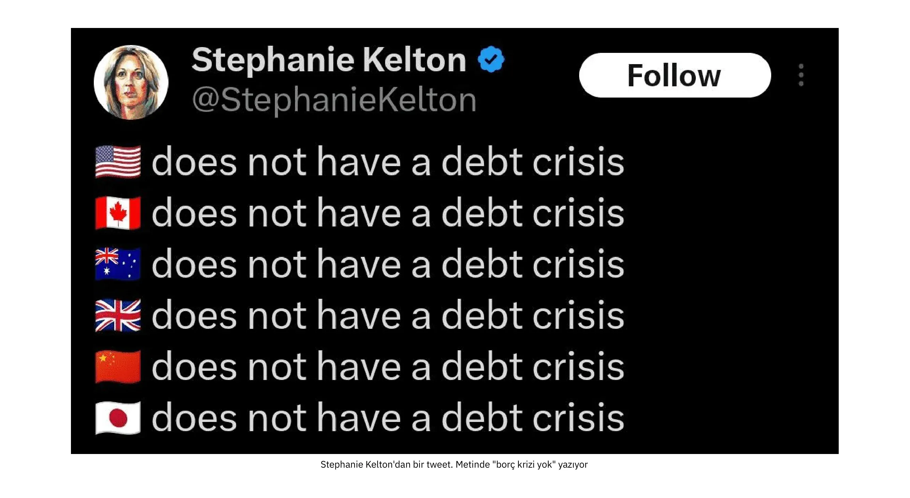

Garip bir şekilde, sadece altı ülke listeleniyor? Nedenmiş o? Çünkü onların gerçek parasal egemenliği var. Ancak dünya üzerinde yaklaşık 200 ülke var ve bunların hepsinin parasal egemenliği yok. Dolayısıyla, bu teoriye yönelik eleştirim, biraz tuhaf ve işlevsiz olmasının yanı sıra, sadece gerçek parasal egemenliğe sahip olan, kendi para birimlerinde hazine bonosu ihraç edebilen birkaç ülke için işe yaradığıdır. Bir dereceye kadar, dünyanın geri kalanının zararına oluyor. Bu para birimini yaratarak, ABD'nin onlarca yıldır fahiş ayrıcalıklarıyla yaptığına benzer bir şekilde, enflasyonlarını başka yerlere ihraç ediyor gibiler. Bu bir tür parasal sömürgeciliğe benziyor; para birimlerine küresel güven ve talep olan ülkeler, genellikle bu enflasyonu ihraç ettikleri için önemli bir enflasyona maruz kalmadan istedikleri kadar para basabiliyorlar.

Bu teorinin, para birimlerine olan uluslararası güveni sürdürmesi gereken ithalata bağımlı ekonomilere uygulanması zordur.

Bu teori aynı zamanda, özellikle reel kaynaklar (işçiler, hammaddeler, endüstriyel kapasite) üzerinde daha fazla kontrol sağlamak ve enflasyonu yönetmek için ekonominin belirli bir düzeyde merkezi olarak planlanmasını gerektirmektedir.

# Paranın düşüşü ve yeniden doğuşu

<partId>87a34ca9-782b-5ade-b51a-400f88ed7b0c</partId>

## Yunan sikkeleri

<chapterId>7714195f-74ce-5f8c-be5f-59302d39fff4</chapterId>

:::video id=8e5c3091-0910-471b-8d4b-0dc6e9afa656:::

### Arka plan ve bağlam

Başlamadan önce, işte tarihsel arka plan:

**Tarihsel arka plan:**

**Romalılar Yunanlılara "Graeci" ve Yunanistan'a "Graecia" diyorlardı.**

**Yunanlılar kendilerine "Hellenler" ve ülkelerine de "Hellas" diyorlardı.**

**Homer** (MÖ 8. yüzyıl civarında doğdu)

Efsanevi Yunan şairi, *İlyada* ve *Odysseia'nın* yazarı olduğu tahmin ediliyor.

MÖ 750 civarında: Sparta'nın efsanevi yasa koyucusu Lycurgus'un** askeri disiplin ve sadeliğe dayalı Sparta anayasasını kurduğu söylenir.

**Numa Pompilius** (MÖ 753-673)

Roma'ya ilk dini ve hukuki kurumları kazandırmasıyla ünlü Roma'nın ikinci kralı.

**Dracon**, Atinalı yasa koyucu (MÖ 7. yüzyıl), son derece sert yasalarıyla ünlüdür, "draconian" terimi buradan gelmektedir.

**MÖ 594: Solon** Atina'da yasa koyucu olur ve özellikle borç köleliğini kaldırarak Atina toplumunda köklü reformlar yapar.

**MÖ 776: Antik Olimpiyat Oyunları**

İlk düzenli spor oyunları her dört yılda bir Olympia'da düzenlenir ve Yunan şehirlerini bir araya getirirdi.

**Pythagoras** (yaklaşık MÖ 570-495)

Dik açılı üçgen teoremiyle ünlü Yunan filozof ve matematikçi.

**Kolophonlu Ksenophanes** (MÖ 570-478 civarı)

Geleneksel Yunan çok tanrıcılığına yönelik eleştirileriyle tanınan Sokrates öncesi filozof.

**MÖ 490: Marathon Savaşı**

Atinalıların Pers istilasını zaferle püskürtmesi Yunan uygarlığı için belirleyici bir dönüm noktası oldu.

*"Tarihin babası" lakaplı *Herodotus** (MÖ 484-425), MÖ 480'de Xerxes'e karşı kazanılan Yunan zaferi de dahil olmak üzere Pers Savaşlarını anlatan geniş bir eser yazmıştır.

**Sokrates** (MÖ 470-399)

Diyalektik yöntemi ve etik ve kendini tanıma konusundaki öğretileriyle ünlü Atinalı filozof.

**Aristophanes** (MÖ 446-386 civarı)

Atinalı oyun yazarı, *Kurbağalar* gibi hicivli komedileriyle ünlüdür.

**Sophokles** (MÖ 5. yüzyıl), *Antigone* adlı oyununda, tiran Kreon aracılığıyla ahlaki ve siyasi yozlaşmanın kaynağı olarak parayı eleştirir.

**Plato** (MÖ 428-348 civarı)

Yunan filozof, Sokrates'in öğrencisi, Akademi'nin kurucusu, *Cumhuriyet* kitabının yazarı.

**MÖ 431-404: Peloponez Savaşı**

Atina ve Sparta arasında Atina'nın yenilgisiyle sonuçlanan büyük çatışma.

**MÖ 431**: Atina, Peloponez Savaşı'nı, tedavüldeki miktarı artırmak için altın ve gümüş sikkelerini seyrelterek ve enflasyona neden olarak finanse eder.

**Xenophon** (MÖ 430-355 civarı)

Atinalı yazar, filozof ve general, Sokrates'in öğrencisi, *Anabasis* kitabının yazarı.

**MÖ 414**: Atina, Sicilya'ya yaptığı felaket bir seferin ardından Peloponez Savaşı'nı kaybetmeye başlar.

**M.Ö. 405: Aristophanes**, *Kurbağalar* adlı oyununda gümüş drahminin değerinin düşürülmesini ve Atina'da kalitesiz bronz sikkelerin ortaya çıkışını açıkça anlatarak bugün "Gresham Kanunu" olarak bilinen ilkeyi örneklendirir.

**MÖ 404**: Atina, Sparta tarafından uzun bir kuşatmanın ardından teslim olur.

**Aristoteles** (MÖ 384-322)

Büyük Yunan filozofu, Platon'un öğrencisi, Lyceum'un kurucusu, mantık, biyoloji ve siyaset felsefesi alanındaki çalışmalarıyla tanınır.

**MÖ 327**: Büyük İskender Persepolis'i ve Pers İmparatorluğu'nun doğu eyaletlerini fethederek imparatorluğunu önemli ölçüde genişletir.

**MÖ 323**: İskender Babil'de belli bir varis bırakmadan öldü ve imparatorluğu bölüşmek için generalleri (diadochi) arasında savaşlar başladı.

**Archimedes** (MÖ 287-212 civarı)

Geometri ve mekanik alanındaki keşifleriyle ünlü Yunan matematikçi, fizikçi ve mucit.

**MÖ 196: Rosetta Taşı** Firavun V. Ptolemy döneminde kazınarak Mısır hiyerogliflerinin daha sonra deşifre edilmesini sağladı.

**MÖ 192-188: Roma-Seleukos Savaşı**

Roma, Antiochos III liderliğindeki Seleukos İmparatorluğu'nu yenerek Yunanistan ve Küçük Asya'daki nüfuzunu pekiştirdi.

**MÖ 146: Korint Savaşı**

Romalılar Yunan şehri Korint'i yok ederek Yunan siyasi bağımsızlığının sonunu ve Yunanistan'ın kademeli olarak Roma dünyasına entegrasyonunu işaret ettiler.

Antik Çağ, Roma'nın çöküşü ve Orta Çağ ile ilgili bu bölümde, Yunan sikkeleri ile ilgili bir bölümle başlayacağız.

Antik Yunan'da sikkeciliğin tarihi, Yunan şehirlerinin Küçük Asya'daki Lidya'dan gelen bu yeniliği hızla benimseyerek başlangıçta elektrum ve daha sonra gümüş kullanmasıyla MÖ 600 civarında başlamıştır. İlk Yunan sikkeleri Aegina adasında basılmış ve üzerinde bir deniz ya da kara kaplumbağası yer almıştır, ancak MÖ 5. yüzyıldan itibaren Athena ve bir baykuşla süslenen Atina drahmisi mükemmel bir parasal sembol haline gelmiş ve o dönemde uluslararası ticarete büyük ölçüde hakim olmuştur.

Ve o döneme ait, arkasında o meşhur baykuş ve figür bulunan bir Yunan drahmisinin kopyasına sahip olacak kadar şanslıyım. Bu bir tetradrahma, yani basit bir drahmiden daha büyük.

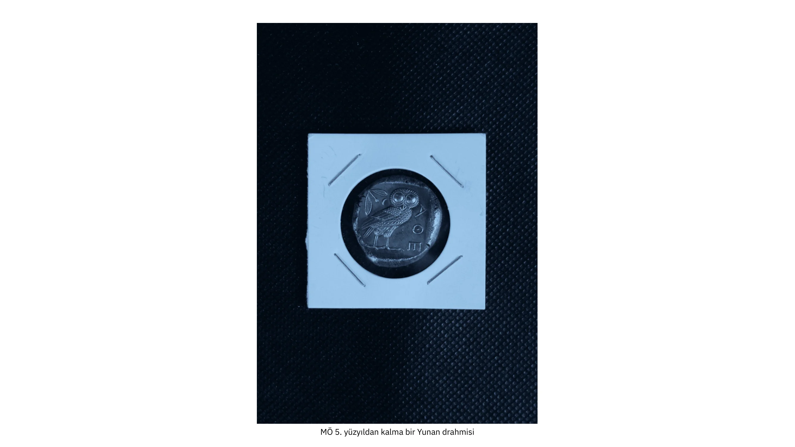

Her Yunan şehri para ile kendi ilişkisini geliştirdi. Atina'da para birimi siyasi ve ekonomik güçle derinden bağlantılıydı. MÖ 5. yüzyılın sonlarına ait ünlü Atina kararnamesi, müttefik bölgelerde sadece Atina para biriminin kullanılmasını dayatmış ve böylece ekonomik hegemonyasını pekiştirmiştir. Atina ayrıca acil durumlar için, belki de ekonomik ihtiyatlılığının bir sembolü olarak Akropolis'te tutulan büyük altın rezervleri biriktirdi. Buna karşılık, katı değerlere sahip askeri bir şehir olan Sparta, para kullanımını ciddi şekilde kısıtlamayı seçmiş, vatandaşlarının altın ya da gümüş sikkelere sahip olmasını yasaklamıştır. Sparta, dış ticareti caydırmak ve sosyal uyumu korumak için ağır demir çubuklar kullanmayı tercih etmiştir.

Savaşlar genellikle para manipülasyonuyla finanse edilirdi. Peloponez Savaşı (MÖ 431-404) sırasında Atina, askerlerine ödeme yapabilmek için sert devalüasyonlara başvurmuştur. MÖ 413'te Spartalıların Decelia'yı işgal etmesiyle gümüş madenlerine erişimden mahrum kalan Atina, MÖ 407/406'da aceleyle yeni sikkeler basmak için altın heykelleri eritmek zorunda kaldı. Ardından, MÖ 406/405'te gümüşle kaplanmış bronz sikkeler basarak, bugün Gresham Yasası olarak bilinen kötü paranın iyi parayı kovmasını çağrıştıran **Aristophanes** tarafından resmedilen bir para krizine neden oldu. Bu acil durum parası savaştan sonra Atina sikkelerine olan güveni yeniden tesis etmek için hızla paradan arındırıldı.

Klasik dönemin sonu, Makedonya'nın Philip II ve oğlu Büyük İskender yönetiminde yükselişiyle Yunan parasal dengesini derinden sarsmıştır. Pangea Dağı'nın geniş altın ve gümüş madenleri sayesinde, Philip II askeri ve siyasi seferlerini finanse etmek için bol miktarda para üretti ve basit ve pratik bir altın-gümüş standardı oluşturdu (10:1). Olimpiyat Oyunları'ndaki zaferini kutlamak için bastırdığı altın heykelcikler Batı Avrupa'ya kadar yayılmış, hatta İngiltere'ye kadar ulaşmıştır. İskender bu para politikasını sürdürdü ve Doğu'daki fetihleri sırasında **Attik** drahmisini Hindistan'a kadar yaygın bir şekilde tedavüle soktu. Bu büyük sikke dolaşımı, sikkeler üzerindeki tanrı imgelerinin yerini yavaş yavaş hükümdar imgelerinin aldığı Helenistik dönemin başlangıcını işaret ediyordu. Bu yenilik, Helenistik hükümdar nesillerinin kendilerini tanıtmalarını ve geleneksel tanrıları sikkelerinin arka yüzünde ikincil bir role indirgemelerini sağladı.

İskender'in MÖ 323'te ölümünden sonra generalleri onun muazzam imparatorluğunu paylaşarak Mısır'da (Ptolemaioslar), Suriye'de (Seleukoslar) ve başka yerlerde hanedanlıklar kurdular. Bu Helenistik krallıklar çeşitli para sistemleri benimsedi: Ptolemaioslar para dolaşımını kontrol etmek için kapalı bir para sistemi uyguladı ve değerli metalleri dış askeri harcamalar için saklamak üzere iç para birimi olarak tahıl kullanmayı tercih etti. Aynı zamanda Rodos, MÖ 167 yılında Delos'u serbest bir liman olarak kuran Romalılar tarafından ekonomik olarak zayıflatılmadan önce önemli bir ticaret merkezi haline gelmiştir.

Paralı askerlerin ücretlendirilmesinde para kullanımı merkezi bir öneme sahipti. İskender'in askerleri günlük olarak gümüş drahmi alıyordu.

İskender'in son derece uzmanlaşmış ordusunun seçkinleri olan süvariler günde ortalama iki drahmi, bir piyade bir drahmi ve sıradan bir paralı asker bir drahminin üçte ikisi, yani basit bir işçinin iki katı ücret alıyordu.

Peloponnesos Savaşı sırasında da askerlere hatırı sayılır meblağlar ödenmiştir: Samos isyanını bastırmak için 1.200 talentten fazla ve Potidea'yı kuşatmak için 2.000 talentten fazla.

Bu ordu Küçük Asya'da tamamen faaliyete geçtiğinde, toplam maliyet günde yaklaşık yirmi talent ya da yaklaşık yarım ton gümüş veya 120.000 drahmiydi.

Yunan sikkeleri kültürel açıdan da önemli bir rol oynamış, her şehir yerel ya da mitolojik sembollerle kendi sikkelerini basarak kimliğini ortaya koymaya çalışmıştır. Örneğin Herakleios, Herakles'i (Herkül) bir aslanla savaşırken tasvir ederken, Cyrene ünlü şifalı bitki silphium'u gösteriyordu.

Son olarak, çeşitliliklerine ve bölgesel dalgalanmalarına rağmen, Klasik Yunan ve Helenistik sikkeler Akdeniz dünyasının ekonomik ve kültürel tarihi üzerinde kalıcı bir iz bırakmış, kendi imparatorluk ekonomisini yapılandırmak için Yunan ekonomik kavramlarını kademeli olarak benimseyen ve geliştiren Roma'ya kadar daha sonraki para sistemlerini derinden etkilemiştir.

## Yunanistan'da para biriminin etkisi

<chapterId>3a5e6c7d-699c-5567-87cd-3374c49d55a9</chapterId>

:::video id=0c79a59c-e179-4893-a414-1b8de0930eb9:::

### Atina ve Sparta ile karşıtlık

Klasik Yunan döneminde Atina ve Sparta arasındaki muhalefet, birbirinden tamamen farklı iki siyasi ve ekonomik örgütlenme modelini ortaya koymaktadır. Sparta sivil güvene dayalı kendi kendine yeten bir sistem lehine metal parayı reddederken, Atina deniz imparatorluğunu inşa etmek ve sürdürmek için bu teknolojiyi tamamen benimsemiştir.

### Deniz gücünün parasal gerekliliği

Atina İmparatorluğu, görkemli adına rağmen coğrafi olarak mütevazı kalmıştır - esasen Atina ve Ege Denizi'ndeki şehirler. Gücü, Atina'nın hegemon olarak egemen olduğu bir askeri ittifak olan Delos Birliği'ne dayanıyordu. Bu imparatorluk yapısı birleşik bir ekonomik araç gerektiriyordu: Atina gümüş sikkesi.

Bu parasal zorunluluğun temelinde bir donanmanın idamesi yatıyordu. Tek bir Atinalı trireme bir ila iki talent gümüşe mal oluyordu ki bu hatırı sayılır bir meblağdı. Bakımı gereken yüzlerce gemisi olan Atina'nın etkili bir vergi sistemine ihtiyacı vardı. Para, vasal şehirlerden haraç toplamak ve imparatorluğun bütünlüğünü garanti altına alan donanma gücünü finanse etmek için vazgeçilmez bir araç haline geldi.

### Bir tahakküm aracı olarak parasal dayatma

Atina gümüş para birimini Delos Birliği'nin tüm üyelerine dayattı. Bu parasal standardizasyon birkaç stratejik amaca hizmet ediyordu. İlk olarak, ortak bir hesap birimi yaratarak haraçların toplanmasını kolaylaştırdı. İkinci olarak, vasal şehirlerin Atina'ya olan ekonomik bağımlılığını pekiştirdi. Son olarak da Atina'nın gücünü tüm deniz imparatorluğuna sembolik olarak yansıtıyordu.

Bu para politikası Sparta modeliyle keskin bir tezat oluşturmaktadır. Bir toprak gücü olan Sparta, geçimi için Peloponezli helotların (kölelerin) emeğine güvenebilirdi. Kapalı, şehir merkezli ekonomik sistemi sofistike parasal araçlar gerektirmiyordu. Yurttaş-askerler birlikte yaşıyor, ortak yemekler yiyor ve günlük alışverişler için paraya ihtiyaç duymuyorlardı.

### Deniz ticareti için bir araç olarak para birimi

Atina imparatorluğunun denizci doğası, ticarete açık olması gerektiği anlamına geliyordu. İçe dönük Sparta'nın aksine, Atina hayatta kalmak ve refahı için dış dünya ile ticaret yapmak zorundaydı. Para birimi Akdeniz ticaretinin vazgeçilmez aracı haline geldi.

Bu dışa yönelim erdemli bir döngü yarattı: ticaret gelir yarattı, bu gelirler donanmayı finanse etti, donanma ticaret yollarını korudu ve imparatorluğu ayakta tuttu ve imparatorluk ticareti kolaylaştıran Atina para birimini dayattı. Para birimi artık sadece bir değişim aracı değil, imparatorluk stratejisinin temel direği haline gelmişti.

### Parasal gücün sınırları

Bu ekonomik gelişmişliğe rağmen, Atina'nın parasal gücü Peloponez Savaşı sırasında sınırlarını gösterdi. Sparta kara kuvvetleri karşısında Atina'nın deniz ve mali üstünlüğü yeterli olmadı. Sicilya'daki felaket Siraküza seferi gibi pahalı seferler, kesin zafer getirmeden mali kaynakları tüketti.

Tarih, para biriminin gücü yansıtmak için güçlü bir araç olmasına rağmen askeri hakimiyetin garantisi olmadığını göstermektedir. Metalik para birimi olmayan ancak dikkate değer bir sosyal bütünlüğe sahip olan Sparta, nihayetinde Atina para imparatorluğuna galip gelmiştir.

### İki model, iki kader

Atina ve Sparta arasındaki karşıtlık, sosyal ve ekonomik örgütlenmeye yönelik iki temel yaklaşımı göstermektedir. Atina, modern deniz imparatorluklarının öncüsü olan açık, ticari, parasallaşmış modeli temsil eder. Sparta ise parasal araçlardan ziyade sivil güvene dayanan kapalı, otarşik modeli temsil eder.

Bu iki sistem, para biriminin benimsenmesinin seçilen siyasi ve ekonomik modelle yakından bağlantılı olduğunu göstermektedir. Atina gibi denizci ve ticari bir güç için para vazgeçilmez hale gelmiştir. Sparta gibi kapalı bir savaşçı toplum içinse sosyal düzene bir tehdit oluşturmaktadır. Bu antik ikilem, paranın toplumların örgütlenmesindeki rolüne ilişkin tartışmalara hâlâ ışık tutmaktadır.

## Roma Cumhuriyeti

<chapterId>0bc80983-33e1-5881-85bb-7c22f3144a9a</chapterId>

:::video id=dc05ca97-d29c-4679-bfeb-912c47d86ce2:::

### Roma Cumhuriyeti Tarihi

- mÖ 753 - 509: Roma Krallığı**
- mÖ 753: Roma'nın kuruluşu** (geleneksel olarak Romulus'a atfedilir).
- mÖ 509 - 27: Roma Cumhuriyeti**, Roma seçilmiş bir Senato ve konsüller tarafından yönetilen bir cumhuriyet haline gelir.
- mÖ 280 - 275: Pyrrhic Savaşı**. Epir Kralı Pyrrhus, güney İtalya'da Romalılarla savaşır ve pahalıya mal olan zaferler ("Pyrrhic zaferleri") kazanır.
- mÖ 264 - 146: Pön Savaşları**. Batı Akdeniz'in hâkimiyeti için Roma ile Kartaca'yı karşı karşıya getiren büyük çatışma.
- Hannibal (247 - MÖ 181 civarı)**. İkinci Pön Savaşı sırasında Roma'ya saldırmak için ordusu ve filleriyle Alpleri geçmesiyle ünlü efsanevi Kartacalı general.
- mÖ 146: Korint Savaşı**. Roma, Yunan şehri Korint'i yok eder ve Yunanistan anakarasına nihai hâkimiyetini dayatır.
- mÖ 91 - 87: Sosyal Savaş**. Roma'nın İtalyan müttefiklerinin Roma vatandaşlığı talebiyle başlattıkları ve sonunda vatandaşlıkla tam olarak bütünleşmelerine yol açan isyan.
- mÖ 64: Selevkos direnişinin sonu**. Roma, Suriye'deki Selevkos etkisini kesin olarak ortadan kaldırarak Doğu Akdeniz'deki hakimiyetini sağlamlaştırır.
- mÖ 55: Julius Caesar Orta ve Batı Avrupa'yı fetheder**. Jül Sezar Roma egemenliğini Galya (bugünkü Fransa) üzerinde genişletir ve Germanya ile Bretanya'ya girer.
- mÖ 43: İkinci Triumvirliğin** oluşumu. Octavian (daha sonra Augustus), Mark Antony ve Lepidus arasında Sezar'ın öldürülmesinden sonra Roma'yı istikrara kavuşturmak için kurulan siyasi ittifak.
- mÖ 27: Pax Romana'nın** başlangıcı. Augustus'un hükümdarlığı altında Roma İmparatorluğu'nun başlangıcına işaret eden bir siyasi istikrar ve refah dönemi.

### Roma'nın geç parasal başlangıçları

Antik Çağ'a ilişkin bu bölümde şimdi dikkatimizi Roma Cumhuriyeti'ne çeviriyoruz. Roma'nın parasal tarihi Yunanlılar ve Perslerinkinden çok daha sonra başlamıştır. MÖ 753 yılında kurulan Roma, sikkeyi tam anlamıyla benimsemeden önce neredeyse dört yüzyıl beklemiştir. Bu uzun dönem boyunca Romalılar, aes rude adı verilen düzensiz bronz parçalarıyla, her işlem için hassas tartım gerektiren ilkel bir değişim sistemi kullandılar. Roma ancak MÖ 4. yüzyılın sonunda, Yunan ve Etrüsk etkisi altında, özellikle Çin'de olduğu gibi bronz döküm aes grave adı verilen ve **İkinci Pön Savaşı'na** kadar Roma takaslarının karakteristiği olan ilk sikkelerini basmaya başladı.

### Yunan etkisi ve ilk gümüş sikkeler

Güney İtalya'da Yunanlılarla yaşanan belirleyici karşılaşma Romalıları gerçek anlamda gümüş sikke basımıyla tanıştırdı. MÖ 280 civarında Roma, Yunan didrahmilerini taklit ederek kendi gümüş sikkelerini üretmeye başladı. Roma'da ilk düzenli gümüş sikke basımı tam olarak M.Ö. 269 yılına dayanır ve üzerinde efsanevi ikizler Romulus ve Remus'un dişi kurt tarafından emzirilmesi simge haline gelmiştir.

Aslında, Cumhuriyet dönemine ait pek çok Roma sikkesinde kuruluş mitleri tasvir edilmiştir. Aşağıda benimkini görebilirsiniz: Kral Tatius'a ait mükemmel, gerçek bir sikke. Sabinlerden kadın kaçırma efsanesini tasvir ediyor. Tatius bu bölgenin kralıydı ve kuruluş efsanesi Romalıların yakınlarda yaşayan Sabinlerden nasıl kadın kaçırdıklarını anlatır. Daha sonra Kral Tatius, Roma'nın kurucularından Romulus ile ortak kral olmuştur.

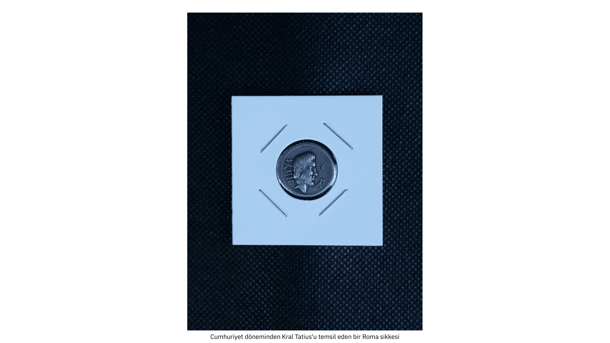

### "Sikke" kelimesinin kökeni ve Juno Moneta tapınağı

"Sikke" teriminin kökeni Roma'daki Juno Moneta tapınağına dayanmaktadır. Efsaneye göre, MÖ 390'da Galya istilası sırasında, Capitol'ün kutsal kazları Romalıları yaklaşan bir tehlikeye karşı uyarmıştır. Capitol'ün koruyucusu olan tanrıça Juno'ya teşekkür etmek için onun onuruna bir tapınak inşa edilmiş ve kısa süre sonra Roma sikkelerinin darphanesi haline gelmiştir.

### Pön Savaşları ve döviz krizleri

Askeri çatışmaların Roma'nın parasal gelişimi üzerinde önemli bir etkisi olmuştur. Kartaca'ya karşı yapılan İkinci Pön Savaşı (MÖ 218-201) sırasında Roma, Hannibal'ın istilası karşısında ciddi mali zorluklarla karşılaştı. Bu acil ihtiyaçları hafifletmek için Roma ilk kez istisnai bir altın sikke basımına ve başlangıçtaki %97 saflık oranından yaklaşık %89'a kadar gümüş sikkelerinde önemli bir devalüasyona başvurdu. Bronz sikkelerin (aes) ağırlığı da büyük ölçüde düşerek altı yıl içinde neredeyse %80 oranında değer kaybetti.

Burada, Yunanlıların ekonomik krizleri hafifletmeye yardımcı olmak için tapınaklarda saklanan değerli metalleri eritmesiyle ilgili daha önce tartıştığımız bir kavramı yeniden ele alabiliriz. Ve **Kartaca** hakkında konuşmak için, aşağıda koleksiyonumdan gerçek bir Kartaca sikkesine hayran olabilirsiniz. Bu Kartaca sikkelerinin bir yüzünde palmiye ağacı, diğer yüzünde ise bir at bulunur. Bu sikkede at pek tanınmıyor, çünkü çok yıpranmış.

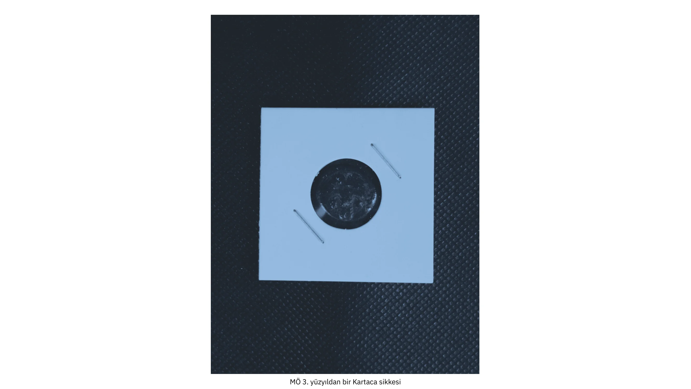

Sonuç olarak, aes olarak bilinen bronz sikkelerin ağırlığı da büyük ölçüde düştü ve altı yıl içinde neredeyse %80 oranında değer kaybetti. Dolayısıyla, değerli bir metal olmayan ve günlük ticarette kullanılan bu bronz sikkelerin ağırlığının çok düşmesi, bu savaşlar nedeniyle parasal devalüasyonun bir işaretiydi.

### Gümüş denarius ve parasal istikrar

Roma, MÖ 212 civarında ünlü gümüş denarius'u bu kritik zeminde tanıttı. Bu reform kayda değer bir parasal istikrar sağlamış ve denarius neredeyse 450 yıl boyunca hakim para birimi olarak kalmıştır. Roma bu istikrarı, MÖ 146'da büyük bir yeniden fiyatlandırmaya ve özellikle Pön, Sosyal (MÖ 91-87) ve Makedonya savaşları sırasında muazzam ordularını finanse etmek için önemli miktarda üretim yapmasına rağmen titiz yönetimine borçludur. Örnek olarak, tek bir Roma lejyonunun bakımının yılda yaklaşık 1,5 milyon denarii'ye mal olması parasal ihtiyaçların boyutunu göstermektedir.

Roma sınırlarının ötesinde, savaşlar Roma etkisi altındaki bölgelerde büyük devalüasyonlara yol açtı. Pön Kartaca'sının elektrumunun saflığı 4. yüzyılda %98 altın iken İkinci Pön Savaşı sırasında sadece %30'a düşmüş, gümüş sikkelerinin saflığı ise %18'e gerilemiştir.

### Parasal güdülerin evrimi

Roma'nın genişlemesiyle birlikte sikkelerin karakteri de değişti: başlangıçta anonim ve vatansever olan sikkeler, giderek madencilerin (sikkeleri basanların) güçlü ailelerini içeren kişiselleştirilmiş tasarımları benimsedi. Bu geçiş, geç Roma Cumhuriyeti'nin siyasi dönüşümlerini açıkça sembolize etmektedir.

Son olarak, Roma ekonomik olarak Akdeniz dünyasına hükmederken, ödeme araçlarında belirli bir basitliği korudu: vergi transferleri ve seçkinler için ayrılmış özel krediler dışında, doğrudan sikke değişimi dışında gerçek bir parasal transfer biçimi geliştirilmedi.

## Roma İmparatorluğu

<chapterId>2dc44e50-112a-5abf-97ae-8e0a9ecda989</chapterId>

:::video id=f8d6f3d6-9ee4-4504-888e-4f12b3f20489:::

**Tarihsel arka plan:**

**Principate**, Augustus'un MÖ 27'deki saltanatının başlangıcından MS 284'teki üçüncü yüzyıl krizinin sonuna kadar Roma İmparatorluğu'ndaki imparatorluk yönetim biçimiydi.

**MÖ 27: Pax Romana'nın Başlangıcı**

Roma İmparatorluğu'nun başlangıcına işaret eden, Augustus'un hükümdarlığı altındaki siyasi istikrar ve refah dönemi.

**Augustus (MÖ 30 - MS 14)** Roma para sisteminde köklü bir reform yaparak imparatorluk sikkeleri için kalıcı ve istikrarlı bir standart oluşturdu.

**Augustus aynı zamanda antik sikke ve fosillerin tanınmış ilk koleksiyoncularından** biriydi.

**54 REKLAM - 68 REKLAM: Nero**

Roma'nın yakılmasından sonra tiranlığı, zulümleri ve felaket yönetimiyle tanınan tartışmalı Roma imparatoru.

**MS 64: Büyük Roma Yangını**

Büyük bir yangın şehrin büyük bölümünü tahrip eder; Nero bundan sorumlu olmakla suçlanır.

**MS 69: Dört İmparator Yılı**

Arka arkaya dört imparatorun (Galba, Otho, Vitellius, Vespasian) görev yaptığı kaotik bir dönem.

**MS 79: Vezüv patlaması**

Pompeii ve Herculaneum şehirlerini yok eden ve kalıntılarını istisnai olarak küllerin altında koruyan yanardağ.

**165 REKLAM - 180 REKLAM: Antoninler vebası**

Marcus Aurelius ve Commodus yönetimindeki Roma İmparatorluğu'nu zayıflatan yıkıcı salgın.

**MS 200: Bölgesel zirve ve Pax Romana'nın kademeli olarak sona ermesi**

Roma maksimum genişlemesine ulaştı, ancak iç istikrarsızlık ve ekonomik zorluklardan muzdarip olmaya başladı.

**212 AD: Caracalla'nın vatandaşlık fermanı**

İmparator Caracalla, vergi tabanını genişletmek amacıyla imparatorluğun neredeyse tüm sakinlerine Roma vatandaşlığı verdi.

**MS 220: Büyük barbar istilalarının başlangıcı**

Cermen halklarının Roma sınırlarına ilk önemli akınları.

**235 MS - 285 MS: 3'üncü yüzyılın siyasi ve askeri krizi**

Kısa ömürlü imparatorlar, iç savaşlar, ekonomik krizler ve sürekli istilalar ile siyasi istikrarsızlığın damgasını vurduğu bir dönem.

**Aurelianus (MS 270-275), yüksek enflasyona rağmen nominal değerini eski haline getirmeye çalışarak Roma parasını** radikal bir şekilde yeniden değerlendirdi.

**MS 301: Diocletianus'un Fiyat Fermanı**

İmparator Diocletianus, imparatorluk genelinde sıkı fiyat ve ücret kontrolleri uygulayarak yaygın enflasyonu durdurmaya boşuna çalıştı.

**M.S. 312: Konstantin**

Konstantinopolis'in kurucusu olan ilk Hıristiyan imparator, büyük saflık ve istikrara sahip bir altın para olan "solidus "u tanıtarak para birimini istikrara kavuşturdu.

**M.S. 476: Batı Roma İmparatorluğu'nun çöküşü**

Roma, Batı Roma İmparatorluğu'nun resmi sonu olarak kabul edilen bir olayla çeşitli Germen halkları (Ostrogotlar dahil) tarafından ele geçirilir.

### Augustus'un parasal reformları

Antik Çağ'a ilişkin bu bölümde Roma İmparatorluğu'na gelmiş bulunuyoruz. Roma İmparatorluğu'nun parasal tarihi, başta altın, gümüş ve bronz olmak üzere metalik para birimlerinin yoğun kullanımının yanı sıra siyasi ve askeri huzursuzluklarla yakından bağlantılı çok sayıda para kriziyle de karakterize edilir. Cumhuriyetin sonunda, Julius Caesar yönetimindeki Roma, M.Ö. 46 yılında, Avrupa ve Akdeniz havzasında yaygın olarak kabul gören yaklaşık 8 gram ağırlığında bir sikke olan altın aureus'u tanıttı. Sezar bu altın sikkeleri standartlaştırdı ve yaşayan bir insanın portresini taşıyan ilk sikkeleri bastırdı, böylece anonim, kolektif sembolleri tercih eden eski bir cumhuriyet geleneğini tersine çevirdi. Bu gelişme, kişisel iktidarın yavaş yavaş cumhuriyetçi kurumların yerini aldığı büyük bir siyasi dönüşüm dönemine eşlik etti.

Sezar'ın MÖ 44 yılında öldürülmesinin ardından Octavian (Augustus) Roma'nın kontrolünü ele geçirerek MÖ 27 yılında İmparatorluğu kurdu. Onun döneminde para sisteminde tam bir reform yapıldı ve Roma ekonomisine kalıcı bir istikrar getirildi. Augustus zamanında bir altın aureus 25 gümüş denarii'ye eşdeğerdi ve kendisi de 4 bronz sestertii değerindeydi. Bu parasal istikrar, Roma için genellikle ekonomik bir altın çağ olarak tanımlanan MS birinci yüzyıl boyunca devam etti.

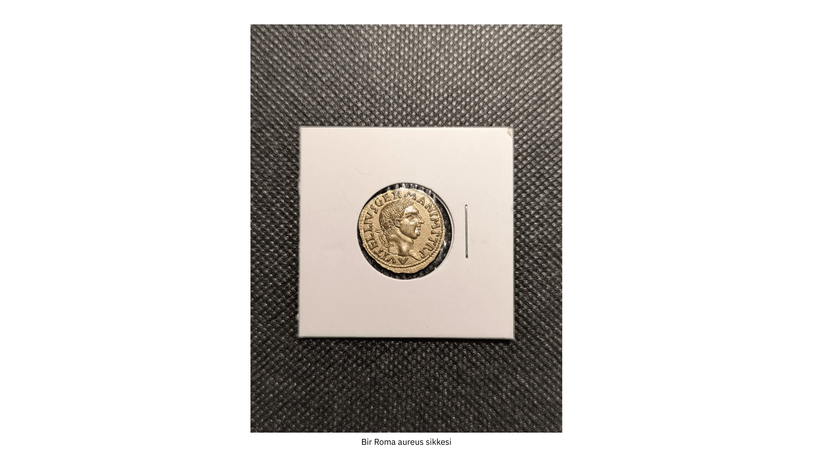

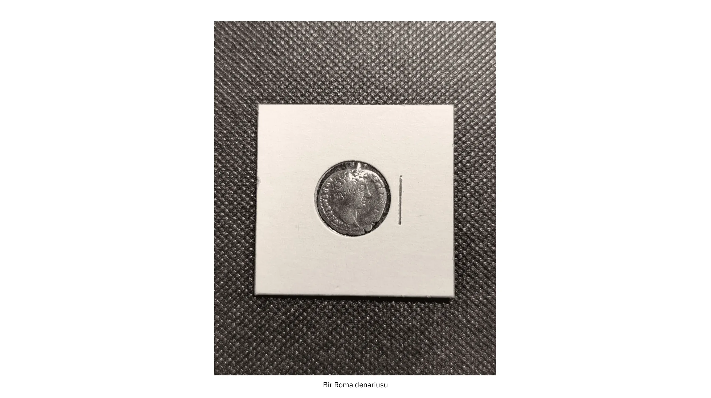

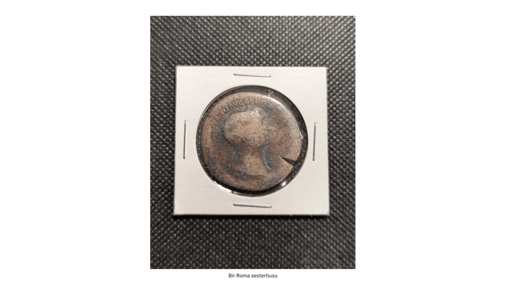

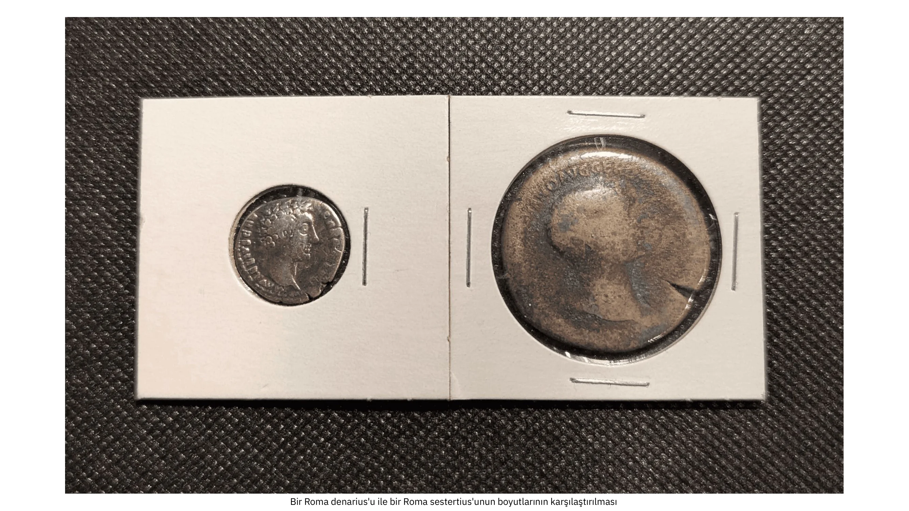

Ancak Nero'dan itibaren (MS 54-68) Roma, özellikle MS 64'teki büyük Roma yangınından sonra artan imparatorluk harcamalarını finanse etmek için sikkelerinin ağırlığını ve saflığını giderek azaltarak yavaş bir devalüasyon başlattı. Bu devalüasyonların kayda değer etkileri oldu: **Gresham yasası** uyarınca daha saf sikkeler istifleme veya ihracat yoluyla dolaşımdan çekilirken, değeri düşürülmüş sikkeler çoğaldı ve fiyatlarda kademeli bir artışa neden oldu.

Üçüncü yüzyıl, imparator Septimius Severus, Caracalla ve Gallienus dönemlerinde devalüasyonların olağanüstü bir ivme kazanmasıyla dramatik bir dönüm noktasına işaret eder. Ana gümüş sikke olan denarius ve ardından antoninianus'un gümüş içeriği sadece %2'ye düştü. Aynı zamanda aureus'un altın ağırlığı da yarı yarıya azaldı. Bu parasal krize eşi benzeri görülmemiş siyasi istikrarsızlık, barbar istilaları ve tekrarlayan iç savaşlar eşlik etti.

Bu bölüm, bu bölümdeki son parçayı tanıtmama izin veriyor: antoninianus. Bu sikkenin orijinal adı bilinmemektedir, ancak bugün onu antoninianus olarak adlandırıyoruz. Bir denariustan sadece 1,5 kat daha büyük olmasına rağmen iki denarii değerinde olma özelliğine sahiptir. Dahası, zaman içinde bu sikkeler sadece billon sikkeler haline geldi, yani saf gümüş yerine gümüş ve diğer metallerin alaşımından yapıldılar. Sikkeler genellikle sadece gümüşle kaplanmıştı ve parasal çürümenin dikkate değer bir örneğini teşkil ediyordu.

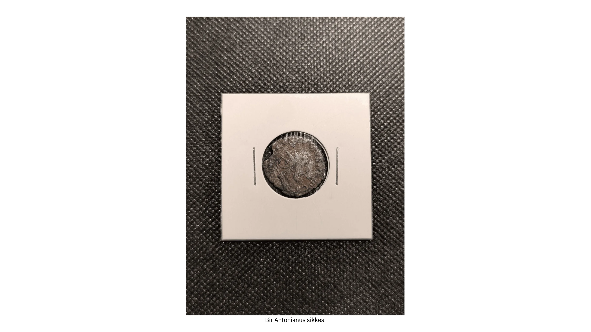

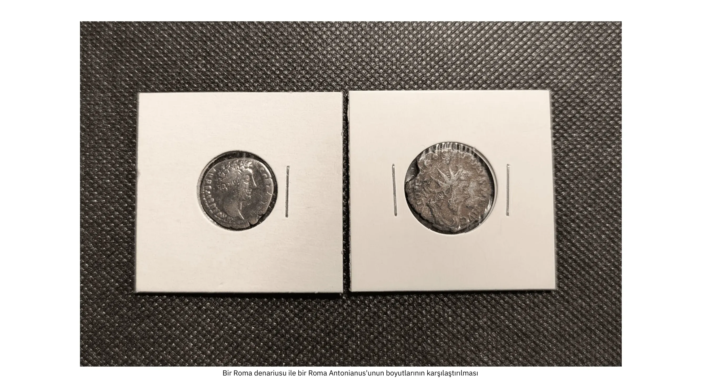

Bu durum karşısında İmparator Aurelianus (MS 270-275) para birimlerini nominal olarak yeniden değerleyerek sistemi istikrara kavuşturmaya çalışmış, ancak bu reform aslında mevcut para birimlerinin değerini yapay olarak daha yüksek bir seviyede sabitleyerek enflasyonist bir mekanizma ortaya çıkarmıştır.

Konuya bir giriş yapacağım. 3. yüzyıl boyunca enflasyon hızlı bir şekilde katlanarak arttı. Daha önceleri, sikkelerin değeri düşürülmüş olsa da, teker teker basılmaları şeklindeki el yapımı süreç enflasyon üzerinde bir miktar kontrol sağlıyordu. İstatistikler 300 yıllık devalüasyon döneminde enflasyonun yılda ortalama %4 civarında olduğunu göstermektedir. Aurelianus'un reformundan hemen önce enflasyon yıllık yaklaşık %3'tü.

Aurelianus, XXI işaretli sikkeye 20 kısım bronzdan 1 kısım gümüşe ya da %5 saflığa kadar bir bileşimi gösteren bir saflık ölçümü getirdi. Bu %5 gümüş sikkeleri pazarladı ve üzerlerine XXI işaretini damgaladı. Bununla birlikte, değeri daha düşük olan diğer tüm sikkeleri de geri çağırdı ve üzerlerine aynı XXI damgasını vurdu. Bu, tüm sikkelerin nominal değerini etkin bir şekilde yeniden değerlendirdi. Sonuç, bu teknik uygulanmadan önceki %3'lük oranı çok aşan, yılda %20'lik şaşırtıcı bir enflasyon oranı oldu.

Metalin kademeli olarak devalüe edilmesinden çok daha hızlı olan bu devalüasyon şeklini icat eden Aurelianus'tu, ki bu bizi hala tek tek sikke basmaya zorluyordu. Yaptığı şey, mevcut tüm sikkeleri almak, onları geri çağırmak ve nominal değerlerini değiştirmek için bir zımba ile damgalamaktı. Bu gerçek bir dönüm noktasıdır. İşte o zaman enflasyon katlanarak arttı.

Bu aşırı devalüasyonu görsel olarak açıklamak için, M.Ö. 40'tan 3. yüzyıla kadar 300 yılı aşkın bir süreyi kapsayan Mısır'daki tahıl fiyatlarına ilişkin bazı büyüleyici istatistikler buldum. Aşağıda, koleksiyonumdan bir Yunan tetradrahmasını görebilirsiniz. O dönemde, 3. yüzyılda Roma işgali altındaki Mısır'da bunun karşılığı Mısır tetradrahmasıydı. Drahmi mezhebi hala kullanımdaydı ve bir denariusa karşılık geliyordu.

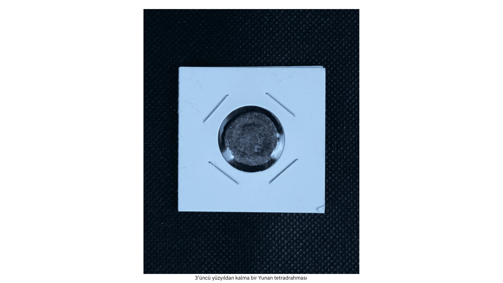

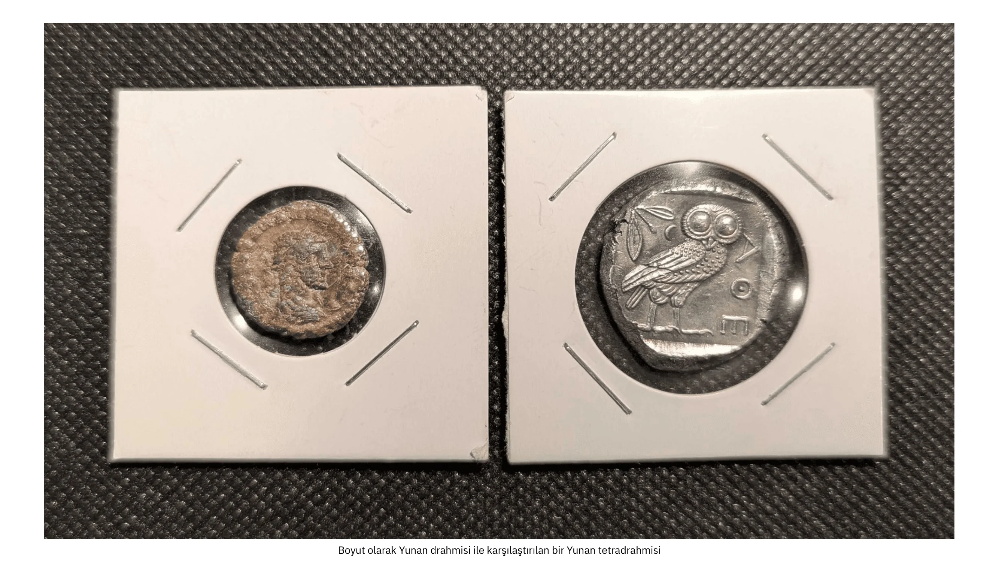

Yani elimdeki Mısır tetradrahmi bir denariusa eşdeğerdi. Sikkenin billondan (veya bronzdan) yapıldığını görebilirsiniz, yani herhangi bir değerli metal içermiyor. Bu 300 yıldaki fiziksel devalüasyonu görmek için orijinal Yunan tetradrahmi ile karşılaştırabilirsiniz. Mısır'da tahıl fiyatlarında milyon katlık bir artış söz konusu.

Aurelianus'un reformunun fiziksel ifadesidir. Çoğunluğun, bu 300 yıllık enflasyonun ortalamasının %4 civarında olduğunu belirtmek gerekir. Ancak sonlara doğru, Aurelian reformunu yaptığında, bu enflasyon oldukça üstel hale geldi ve 1 milyonluk bu ölçüye ulaştık. Fiyatlar 3. yüzyılın sonunda M.Ö. 1. yüzyıla göre bir milyon kat daha yüksekti.

Halefi **Diocletianus** (MS 284-305) daha da radikal reformlara girişti: yeni para birimleri çıkardı (özellikle daha saf ama miktarı çok sınırlı olan argenteus), ciddi fiyat kontrolleri getirdi (MS 301 Fiyat Fermanı) ve **ayni ödemelere dayalı bir vergi sistemi kurdu**. Bu çabalara rağmen, Diocletianus'un reformları yaygın enflasyonu engelleyemedi.

Değeri düşürülen para karşılığında mal ve hizmet tedarik etmeyi reddeden Diocletianus, köylüleri ve onların soyundan gelenleri topraklarına bağlamak için **kalıtsal bir kast sistemi** kurdu.

Burada gerçekten anlaşılması gereken şey, köylülerin devalüe edilmiş para birimi karşılığında ürünlerini teslim etmeyi reddetmeleriydi ve sevgili Diocletianus'un yanıtı, "siz, toprağınızı terk edemezsiniz, çocuklarınız topraklarını terk edemez, aynı şey askerler için de geçerli, siz askersiniz, benim para birimimle ödeme almayı kabul ediyorsunuz" diyerek **kalıtsal kastlar** yaratmak oldu. Geçici bir çözüm olarak, onlara ayni ödeme yapıldı (et, yiyecek, tahıl olarak) çünkü onlara para vermeyi reddetti. Böylece insanları ticaretlerine bağlı olmaya zorlamak için bu kalıtsal kast sistemini dayattı, böylece devalüe edilmiş para birimini kabul etmemeye çalışırlarsa kolayca iş değiştiremezlerdi.

Bu örneği açıklamak için elimde bir metin var, "*Monetary Regime and Inflation*" kitabından bir alıntı:

> İnsanlar, nominal değeri gerçek değerinden veya piyasa değerinden daha yüksek olan devalüe edilmiş bir para birimi karşılığında çalışmak ve mal teslim etmek istemedikleri için, ayni vergiler koyarak çalışmaya zorlanmak zorunda kaldılar. [Köylülerin kayıtlı evlerini terk etmeleri yasadışı hale geldi. Böylece çiftçi nüfus toprağa kalıtsal olarak bağlanmış oldu.
>

> Bu kalıtsal kast sistemi giderek yayıldı: Diocletianus askerlerin oğullarını orduda hizmet etmeye zorlarken, para atölyelerinde ve Diocletianus'un kurduğu dokuma ve boyama fabrikalarında çalışan işçiler kalıtsal hizmetle devlet kölesi oldular. Altın madencileri de daha sonra kalıtsal bir kast haline gelmiştir. Diğer kalıtsal sınıflar muhtemelen Diocletianus'un zamanında zaten mevcuttu; özellikle Roma'daki fırıncı ve kasap loncaları [...] ve Roma'ya tahıl ve diğer kamu yüklerini taşıyan gemi kaptanlarının piskoposluk loncaları.

Konstantin (MS 306-337), 312 yılında kalitesini ve ağırlığını kesin olarak garanti ettiği saf bir altın para olan solidus'u piyasaya sürerek para sistemini istikrara kavuşturmayı nihayet başardı. Solidus'un saflığını ve ağırlığını doğrulamak için bütün bir sistem vardı. **Ancak bu istikrar sadece varlıklı bir eliti ve imparatorluk yönetimini** etkilerken, **nüfusun çoğunluğu düşük kaliteli para biriminden ve sürekli enflasyondan** muzdarip olmaya devam etti. Solidus, Doğu İmparatorluğu'nda (Bizans) bin yıldan uzun bir süre istikrarlı kalırken, Batı'da sikke üretimi küçük, düşük değerli sikkelere bölündü ve MS 476'da kesin olarak çöken Roma İmparatorluğu'nun nihai ekonomik ve siyasi parçalanmasına eşlik etti.

Sonuç olarak, sizlerle *Paranın Tarihi* kitabından şu alıntıyı paylaşmak istiyorum: Glyn Davies'in yazdığı *A History of Money: From Ancient Times to the Present Day* adlı kitaptan, Roma'nın çöküşüne neden olan şeyi ustalıkla özetleyen şu alıntıyı paylaşmak istiyorum:

*"Vergiler sürekli olarak yetersizdi ve giderek yetersizleşen, geç ayarlanan ve oldukça görünür hale gelen bu vergilerle ilgili zorluklar Roma'yı kolay, acil ve gizli bir vergilendirme biçimine daha fazla güvenmeye itti: para devalüasyonu. Kısa ömürlü, geçici reformlar bu asırlık gerileme eğilimini tersine çeviremedi. Sikkelerin aşınması ve yıpranması, gemi enkazları, Doğu'dan lüks malların satın alınması nedeniyle para sızıntıları, Germen barbarlara sunulan hediyeler, kent nüfusunun artması, tarımsal üretimin azalması, en zengin madenlerin yavaş yavaş tükenmesi ve hepsinden önemlisi kent yaşamında asgari bir düzeni sürdürmek için gerekli görülen "ekmek ve sirk" politikalarının neden olduğu mali baskılar - tüm bu kümülatif baskılar Roma'yı, başarısızlığa mahkum ara sıra yapılan reformlarla serpiştirilmiş sürekli parasal devalüasyona yöneltti. "*

*Ücretsiz ya da ucuz ekmek ve şaraba ek olarak, özellikle Trajan (MS 98-117) ve daha da fazlası Hadrianus (MS 117-138) ve halefleri döneminde olmak üzere, zaman zaman parasal tahsisler şeklinde imparatorluk lütufları ("congiaria") dağıtılmıştır. İmparatorun ve vatandaşların başlangıçta istisnai bir ayrıcalık olarak gördükleri şey, 2. yüzyılın başlarında geleneksel bir beklenti haline gelmişti. Bu dağıtımlar "kamu hazinesi üzerinde ağır bir yük oluşturuyor ve kendi yollarıyla devletin iflasına katkıda bulunuyordu".*

## Parasal seyrelme ve enflasyon arasındaki bağlantılar: nedenlerden sonuçlara

<chapterId>38d5781c-e900-53f7-baa7-413655d71754</chapterId>

:::video id=3999256d-aafe-4502-9b72-dfa8491a2777:::

Bu bölüm, nedenlerinden sonuçlarına kadar parasal seyrelme ve enflasyon arasındaki bağlantıları incelemektedir. Parasal seyrelme, Roma para tarihindeki en önemli ekonomik olgulardan biridir ve enflasyon üzerinde doğrudan etkileri vardır. MS 1. yüzyıldan itibaren, Nero (MS 54-68) döneminden itibaren gümüş sikkenin (denarius) seyreltilmesinde başlangıçta yavaş bir aşama yaşanmış, özellikle Septimius Severus (193-211) ve Gallienus (253-268) dönemlerinde tekrarlanan askeri ve mali krizlerle hızlanmıştır.

Ayrıca aureus'un daha kademeli bir şekilde değer kaybettiğini görüyoruz. Devalüasyon oranındaki bu farklılık iki noktayı vurgulamaktadır:

1. Paranın devlet kontrolü için bimetalizmde hesap biriminin rolü. Bu örnekteki hesap birimi denariustur. Hesap biriminin değerini yönetmenin üç farklı yolunu belirledim: devalüasyon (metalin seyreltilmesi), yeniden değerleme (antoninianus) ve "XXI" (Aurelianus) işaretiyle bir nominal değerin dayatılması

2. Devletin, seçkinlerin daha az şanslı olanlar pahasına satın alma güçlerini korumalarını sağlayan değer rezervi olan aureus'un devalüasyonunu mümkün olduğunca uzun süre erteleme arzusu. Bu ilkeyi ders boyunca, özellikle de "Cantillon etkisi" olarak bilinen kavram ve İspanya'daki Maravedi'nin yeniden değerlenmesi ile bağlantılı olarak sık sık tekrarlayacağız.

Bu olgu oldukça ilginçtir ve tarih boyunca tekrarlanmıştır. Bir sonraki bölümde Maravedi ile tekrar ele alacağız. Bu model tüm rezerv para birimlerinde de görülmektedir; Roma'daki aureus gibi rezerv değer birimine dokunulmaz. Ancak, genel nüfus tarafından ticaret ve günlük işlemler için kullanılan hesap birimi genellikle değersizleştirilir. Sonuç olarak, parasal enflasyon sıradan insanları etkilerken, altın sikke alabilenler bundan büyük ölçüde etkilenmez.

Ve bu arada, **bugün para devalüasyonu ile yaratılan olgunun aynısı, finansal varlıkların değer kazanmasını sağlıyor** ve böylece para birimini kullanan insanlar, en yoksul insanlar, daha da yoksullaşıyor ve bu da para yaratma yoluyla, kendilerini devalüasyona karşı koruma imkanına sahip olanların varlıklarını zenginleştiriyor ve böylece sosyal eşitsizlikleri derinleştiriyor. Bu benim küçük siyasi atıp tutmam.

Az önce tarif ettiğim şeye Cantillon etkisi deniyor. Bu beyefendinin John Law zamanında yaşadığını göreceğiz, bu konuyu da bir sonraki bölümde ele alacağız.

Aurelianus'un hükümdarlığı sırasında başlatılan reform, enflasyonun yükselmesine izin verdi. Paranın nominal değerindeki enflasyon artık darphanelerin elle sikke üretme kabiliyetiyle sınırlı değildi. Zaten basılmış olan sikkeler artık kolayca işaretlenebiliyor ve para arzının nominal değeri daha hızlı artıyordu.

Aurelian ile ilgili olarak sizinle paylaşmak istediğim iki alıntı var. İlki *Paranın Tarihi* kitabından: Antik Çağlardan Günümüze* adlı kitaptan:

*"Roma ekonomisi söz konusu olduğunda, Aurelianus'un katkısı bir zaferden çok bir felaket olmuştur. Enflasyon oranının, sorumsuz Gallienus döneminde bile daha önce mümkün olanın çok ötesinde artabilmesi, büyük ölçüde onun "reformunun" doğasından kaynaklanıyordu. Aurelianus'tan sonraki iki yüzyıl boyunca enflasyon tüm Roma İmparatorluğu'nda endemik hale geldi. "*

İkincisi *Sikkelerden Gelen Antik Tarih* kitabından alınmıştır ve parasal sistemin altından ayrılmasıyla ilgilidir:

*"Aurelianus'un reformu altın para ile parasal sistemin geri kalanı arasındaki ilişkiyi değiştirdi. Bundan önce, diğer para türleri resmi oranlara göre **aureus** ile bağlantılıydı (bir aureus için 25 Mısır denarii ya da 25 tetradrahmi vs.) Reformdan sonra altın para, diğer metalar gibi **değerinde serbestçe dalgalanmaya** başlarken, para sisteminin geri kalanı **alaşımların** zayıflaması nedeniyle **değer kaybetti** ve artık **altınla** desteklenmiyordu. Hesap birimi teorik olarak gümüşe (denarius ya da Mısır'da drahmi) dayalı kaldığından, para birimi değer kaybettikçe fiyatlar da yükseldi. "*

Gördüğünüz gibi, hesap birimi olarak kullanılan para birimindeki bu devalüasyon daha az varlıklı olanları orantısız bir şekilde etkilerken, altın para ile olan bağın koparılması, değer deposu olan altına tasarruf edebilenlerin satın alma gücünü korumuştur.

Burada anlamanız gereken şey, denarius ile aureus arasında bir bağlantı varsa, denariusun değerini düşürseniz bile, denariusunuzu bu oranda (1 aureus için 25 denarius) aureus ile değiştirebiliyorsanız, denarius aşırı değerli ve aureus düşük değerli olacağı için insanlar kesinlikle denariuslarını sizin aureusunuzla değiştireceklerdir. Ancak bu reformda bu bağlantıyı kaldırdılar. Böylece insanlar artık denarius'larını altın karşısında değersizleşen gümüş metalle değiştiremez oldular. İşte o zaman altın sikkelere erişimi olanlar kendilerini gerçekten koruyabildiler, çünkü bundan sonra insanlar artık aşırı değerli gümüşü düşük değerli saf altınla değiştiremeyeceklerdi. Bu, para biriminin evriminde çok önemli bir andır.

Aurelianus'un bu reformunun etkilerinin çarpıcı bir örneği, *Monetary Regimes and Inflation* kitabından yapılan şu alıntılarla mükemmel bir şekilde gösterilmektedir:

*"İmparator Claudius (MS 41-54) ve Constantius (MS 337-361) dönemleri arasında, Mısır'da açık piyasada drahmi cinsinden ifade edilen buğday fiyatı **bir milyonun üzerinde** bir kat artış göstermiştir. Olağanüstü fiyat enflasyonu, MS 3. ve 4. yüzyılların temel ekonomik gerçeklerinden biridir" (Lendon 1990, s. 106). Ancak bu gelişme **göründüğünden daha az dramatiktir**, çünkü **ortalama yıllık %4.4'lük** bir enflasyon oranına karşılık gelmektedir. Ve Wassink'e göre (1991, s. 482), enflasyon aslında **sadece MS 238'de** başlamıştır. "*

*"Bu tarihten itibaren, **iyi para önce dolaşımdan çekildiği için** enflasyon yavaş yavaş hızlandı, böylece toplam para arzı ilk başta neredeyse hiç artmadı. Daha sonra, 250 ve 293** yılları arasında yıllık ortalama **%3,65'lik bir orana ulaştı ve 293 ve 301** yılları arasında **%22,28'e yükseldi (Wassink 1991, s. 466), yani İmparator Diocletianus'un** başarısız parasal reformlarına kadar. Bu olgu, metale dayalı bir para rejimindeki enflasyon için **özellikle etkileyicidir**. "*

Parasal seyreltmeye bağlı bu enflasyon olgusu başlangıçta Roma devletinin zaman zaman yaşadığı nakit krizlerine cevap vermiştir. Devlet, sikkelerin değerli metal içeriğini azaltırken nominal değerlerini koruyarak kaynaklarını geçici olarak arttırdı. Ancak fiyatlar hemen tepki vermedi: gerçekten de Roma sisteminin belirli bir yapışkanlığı vardı, bu da ücretlerin ve fiyatların birbirini izleyen devalüasyonlara yavaş adapte olduğu anlamına geliyordu. Yine de belli bir eşikten sonra fiyatlar keskin bir şekilde yükselerek piyasayı para birimlerinin gerçek değeriyle yeniden dengeye getiriyordu.

Yukarıda da belirtildiği gibi, bu olgu özellikle 3. yüzyılın ortalarından itibaren belirgindir. Zengin belgelere sahip bir bölge olan Mısır'da, Aurelianus döneminde (MS 274), başlangıçtaki istikrar girişimine rağmen, paranın resmi olarak yeniden değerlenmesinin ardından fiyatlar 10 katına çıkmıştır. Ardından Diocletianus (MS 301) döneminde fiyat fermanı, temel neden olan aşırı üretim ve parasal bozulma ile mücadele etmeden enflasyonu kontrol altına almak için sert kontroller uyguladı ve böylece öngörülebilir bir başarısızlığa neden oldu. Kalıcı enflasyon sonuçta ekonomiyi iki katmanlı bir sisteme doğru iter: **Altın rezervleriyle (Konstantin'in solidus'u** gibi) korunan seçkinler istikrarın tadını çıkarırken, nüfusun çoğunluğu kronik enflasyondan muzdarip olmaya devam eder ve **bugün Cantillon etkisi olarak bilinen şeyi gösterir.**

Roma'daki parasal genişleme ile enflasyon arasında açık bir bağlantı vardır ve bunun nedenleri esasen kronik mali açıklar, aralıksız askeri harcamalar ve kötü devlet ekonomi yönetimi ile bağlantılıdır.

## Roma İmparatorluğu'nun çöküşü

<chapterId>b6ec0914-227b-509c-8108-b09eec9bb904</chapterId>

:::video id=91d4fee5-59bb-4ab9-a90b-e1125c71decb:::

### Para biriminin devalüasyonu ve Roma'nın çöküşü

Avusturya iktisat okulu, özellikle Ludwig von Mises aracılığıyla, Roma'nın çöküşünün parasal bir yorumunu önermiştir. Bu görüşe göre, Roma para biriminin giderek değer kaybetmesi, 60 milyon nüfuslu bir imparatorluğu ayakta tutan karmaşık işbölümü sistemini parçalamıştır. Ekonomik koordinasyonun merkezi aracı olan para birimi bir kez bozulduğunda, tüm sosyal ve ekonomik yapının çöküşüne yol açmıştır.

Bu parasal bozulma sadece imparatorluğun iç bütünlüğünü yok etmekle kalmadı. Aynı zamanda komşu halklarla olan ticari bağları da kopardı. Roma ile ticaretin faydalarından mahrum kalan "barbarlar" barışçıl işbirliğinden yağmacılığa yöneldi. Dolayısıyla istilalar sadece askeri nitelikte değil, aynı zamanda temel bir ekonomik çöküşün sonucuydu.

### Emperyal devalüasyonun üç aşaması

Roma para tarihi üç farklı döneme ayrılabilir. İlki, Julio-Claudian'lardan Antonin'lere kadar (MÖ 27 - 2. yüzyılın sonu) göreceli bir istikrar sağlamıştır. Trajan döneminde imparatorluk zirveye ulaştı: 5 milyon km²'lik bir alanı kaplayan Roma, tarihteki ilk milyoner şehir oldu. Denarius'un gümüş saflığı %98 ila %80 arasındadır - ekonominin işlemesini sağlayan ılımlı bir devalüasyon.

İkinci dönem, 3. yüzyıl, askeri bir anarşi dönemiydi. Birkaç on yıl içinde yirmi altı imparator birbirinin yerine geçti. Para birimi çöktü: sözde iki denarii değerinde olan antoninianus sadece 1,5 metalik ağırlık içeriyordu - yasal ve gerçek değeri birbirinden ayırmaya yönelik ilk girişim. Bu manipülasyon Gresham Kanunu'nu tetikledi: kötü para iyi parayı kovar. Vatandaşlar iyi sikkeleri istifleyerek sadece değeri düşürülmüş olanları harcadılar.

Arkeologlar tarafından ortaya çıkarılan parasal hazineler bu ekonomik kaygıyı gözler önüne sermektedir. Gömülü amforalar, Romalıların önce en iyi sikkeleri nasıl biriktirdiklerini ve yavaş yavaş değer kaybedenleri nasıl eklediklerini tabakalaşma yoluyla göstermektedir. Bu antik "yığınlar" belirsizlik karşısında insan eylemine tanıklık ediyor - çürüyen bir dünyada değeri koruma çabası.

### Konstantin ve ikili sistem

Konstantin (310-337) radikal reformlarla imparatorluğu istikrara kavuşturmaya çalıştı. Yönetim tarafından sıkı bir şekilde kontrol edilen bir para birimi olan altın solidusu yarattı. Yetkililer ağırlığı ve saflığı sistematik olarak kontrol etti. Tedavül, savaş ganimetlerine bağlı olarak sınırlı kaldı. Bu para birimi iktidarın tek aracı haline geldi: vergiler solidus olarak ödeniyor ve lejyonlar maaşlarını altın olarak alıyordu.

Aynı zamanda halk, sürekli olarak değeri düşürülen bronz nummusu kullanıyordu. 445 yılında bir solidus 7.000 nummi değerindeydi; 498 yılında ise 16.800. Bu ikili sistem Cantillon etkisini kurumsallaştırdı: solidusa erişimi olanlar - yönetim, toprak sahipleri - enflasyondan korunuyordu. Nummus'a mahkum olan halk ise kaçınılmaz bir şekilde fakirleşti.

Bu parasal ayrışma, resmi döviz kuru olmayan iki paralel ekonomi yarattı. Solidus hesap birimi olarak kaldı ama çok az dolaşıma girdi. Nummus ise günlük alışverişlerde kullanılıyor ama sürekli değer kaybediyordu. Bu parasal mimari, gelişmekte olan feodal sistemin eşitsizliklerinin habercisiydi.

### İş bölümünün çöküşü

Para biriminin devalüasyonu ekonomik uzmanlaşmayı yavaş yavaş yok etti. Güvenilir bir hesap birimi olmadan Akdeniz ticareti çöktü. Roma'nın uzmanlaşmış zanaatkârları artık Mısır ya da Galya ile ticaret yapamıyordu. Eyaletler kendi para birimlerini benimseyerek ticari sürtüşmeleri çoğalttı.

Bu parçalanma karşısında kentli nüfus kırsala kaçtı - yüzyıllardır süren kentleşmeyi tersine çeviren bir kent göçü. Zanaatkârlar geçimlik tarım için zanaatlarını terk etti. Büyük mülkler (latifundia), ortaçağ senyörlüklerinin habercisi olarak kendi kendine yeten adalar haline geldi.

Diocletianus çaresizlik içinde, parasal başarısızlığın nihai kabulü olan ayni vergiler bile talep etti. En yüksek fermanı (301) fiyatları kontrol etmeye çalışarak takasa dönüşü hızlandırdı. Ekonomik karmaşıklık uygarlık öncesi biçimlere geriledi.

### Roma'dan Bizans'a altın sayesinde hayatta kalma

Paradoksal bir şekilde solidus Batı İmparatorluğu'nda hayatta kalmıştır. Bizans bunu 11. yüzyıla kadar sürdürerek bin yıl daha ekonomik istikrar sağlamıştır. Batı'da anısı devam etmektedir: Fransızca "sou" kelimesi solidustan türemiştir ve kayıp bir parasal ihtişamın dilsel bir kanıtıdır.

Servetlerini altın olarak koruyan toprak sahipleri feodal lordlara dönüştü. Hayatta kalan tek kurum olan kilise yapıları, paranın artık garanti edemediği sosyal bağları sağladı. Avrupa, her biri kendi geçimlik ekonomisine sahip otarşik alanlara bölündü.

Bu dönüşüm, karmaşık uygarlıkların kırılganlığını ortaya koymaktadır. Roma'nın bir milyon nüfusu beslemesini sağlayan iş bölümü tamamen parasal güvene bağlıydı. Bu güven bir kez kırıldığında, yapı çöktü ve Avrupa neredeyse bin yıl boyunca ilkel ekonomik biçimlere geri döndü.

## Karanlık Çağlar ve Orta Çağ

<chapterId>a5856873-6142-57be-8a73-1f9e3df83792</chapterId>

:::video id=86b8da9b-3831-443d-b170-58c2bea3ad54:::

Orta Çağ'da paranın tarihi ve ortaya çıkışı gerileme, yenilik ve ekonomik iyileşme dönemleriyle işaretlenmiştir.

Örneğin, Roma ordusu Britanya'yı terk ettiğinde, adaya artık Roma sikkesi girmemiştir. MS 435 civarında Britanya'da sikke kullanımı tamamen ortadan kalktı ki bu eski Roma eyaletlerinde eşi benzeri olmayan bir olguydu. Neredeyse iki yüzyıl boyunca, Merovenj ve kıta esintili sikkelerin yavaş yavaş yeniden ortaya çıktığı 7. yüzyıla kadar Britanya ekonomisi sikkesiz kaldı.

8. yüzyıldan itibaren Hıristiyan etkisi Kuzey Avrupa'da sikkenin yeniden kullanılmaya başlanmasına katkıda bulunmuştur. Bu dönemin kilit ismi, 752 yılında denarius'u tanıtan ve daha sonra oğlu Charlemagne tarafından benimsenen Frank Kralı Kısa Pepin'dir. Charlemagne gümüş denarius kullanımını yaygınlaştırarak birkaç yüzyıl boyunca Avrupa'nın para standardını oluşturmuştur.

İngiltere'de sikkecilik, Mercia Kralı Offa'nın 765 yılı civarında gümüş penny üretmesiyle önemli bir canlanma yaşadı. Bu para birimi o kadar önemli hale geldi ki 500 yıl boyunca neredeyse hiç değişmeden kaldı.

Bu döneme ait ilk eser olarak size o dönemden kalma bir İngiliz penisinin reprodüksiyonunu göstereyim.

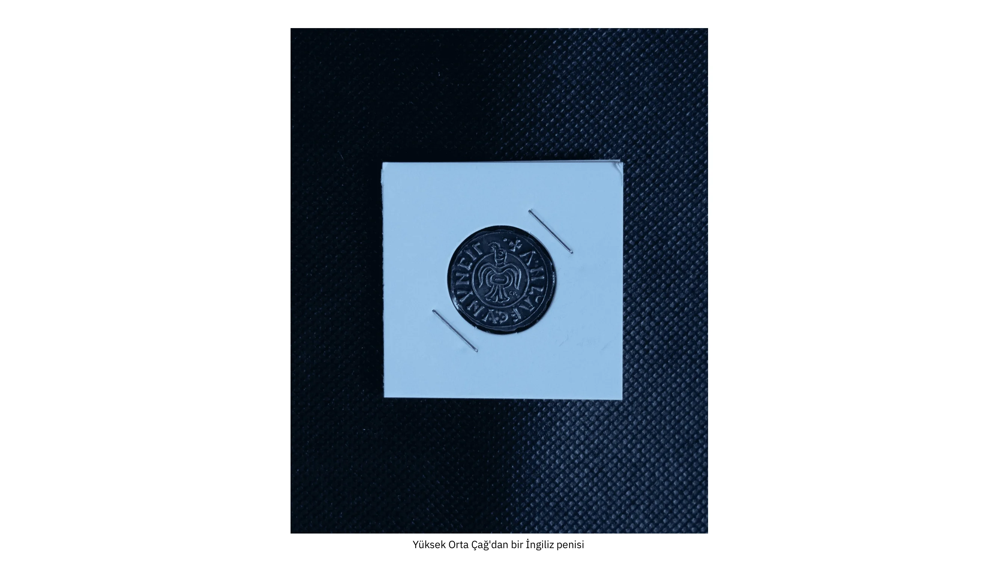

Yüksek Orta Çağ boyunca Avrupa, Roma para sisteminin çöküşünü takiben feodalizme düşmüştür. Nüfusun çoğunluğu düşük değerli bakır ya da bronz sikkeler kullanıyordu ve bu sikkeler genellikle para biriminin seyreltilmesine maruz kalıyordu, bu da uzun mesafeler arasında ticareti sınırlıyordu.

Madeni paranın bir ödeme aracı olarak geri dönüşü kademeli olarak gerçekleşmiş, 13. yüzyılda 1252'de Floransa'da altın florinin ve ardından Venedik'te altın ducatın ortaya çıkmasıyla doruğa ulaşmıştır. Bu altın sikkeler, ticaretin genişlemesi ve güvenilir, uluslararası kabul gören ödeme araçlarına duyulan ihtiyacın artması sayesinde yaygın olarak kullanıldı.

İngiltere'de para sistemi, 1066'dan sonra Fatih William tarafından uygulamaya konulan ve İngiliz Sterlini'nin kalitesini koruyan arazi vergisi gibi yenilikçi mali politikalarla seyrelmeye karşı korunmuştur. Burada anlaşılması gereken önemli nokta, o dönemde hükümdarların devleti finanse etmek için para biriminin değerini düşürebileceğidir ve **bu verginin getirilmesi, para birimini sabit tutmayı ve devleti vergilendirme yoluyla finanse etmeyi mümkün kılmıştır**

Ancak, parasal seyreltme yoluyla kâr elde etmenin cazibesi, sikke kalitesinin dramatik bir şekilde düştüğü 12. yüzyılda I. Henry döneminde olduğu gibi krizlere yol açtı. Bazen sikkecilere karşı şiddetli önlemlerin eşlik ettiği ciddi reformlar, para birimine olan güveni geçici olarak yeniden sağladı.

Orta Çağ aynı zamanda tefecilik yasağını delmek ve kredi vermek için İngiltere'de çetele çubuklarının kullanılması gibi sofistike finansal uygulamaların ortaya çıkışına da tanıklık etmiştir. Kilise faizli kredilere pek sıcak bakmıyordu, bu nedenle faiz yasağını delmek için çeşitli teknikler kullanıldı.

Bu yenilikler, kronik metal para sıkıntısına bir yanıt niteliğindeydi ve embriyonik bir finans piyasasının ortaya çıkmasını teşvik etti.

Bu arada Haçlı Seferleri Akdeniz ticaretini canlandırmış, özellikle Tapınak Şövalyeleri Tarikatı aracılığıyla uluslararası borsaların ve yeni bankacılık uygulamalarının gelişmesini teşvik etmiştir. Tapınak Şövalyeleri, Haçlıların evlerinden uzakta likidite elde etmelerini sağlayarak modern Avrupa bankacılık sisteminin habercisi olan önemli finansal aracılar haline geldi.

Tapınakçılar ile bağlantı kurmak için, aşağıda, ortasında güzel bir haçı fark edebileceğiniz bir Fransız ortaçağ sikkesini gözlemleyebilirsiniz. Bu dönemin sikkelerinde bu haçın bulunması oldukça yaygındı.

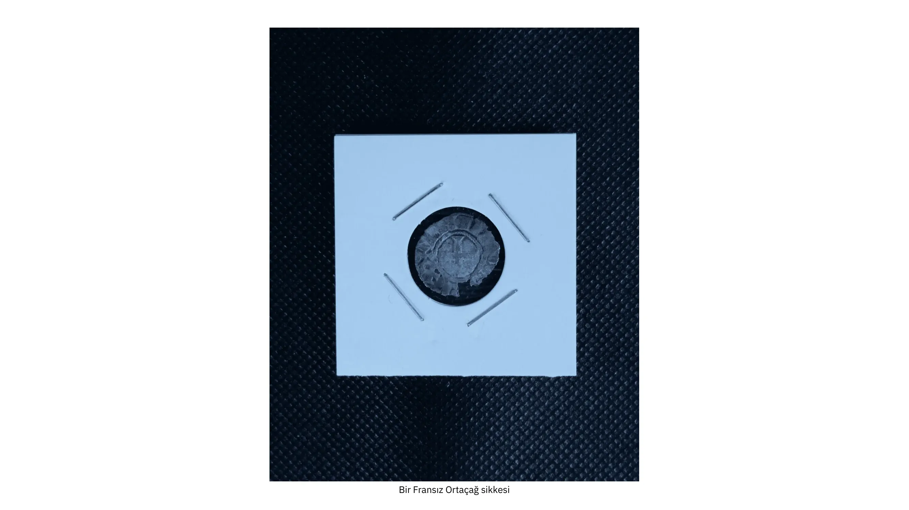

Son olarak, Kara Ölüm (1346-1353) gibi büyük krizler derin ekonomik dönüşümleri beraberinde getirdi. Nüfustaki keskin düşüş, hükümetin önceki ücret seviyelerini koruma girişimlerine meydan okuyarak ücretlerde keskin bir artışa yol açtı.

Aynı zamanda, Yüz Yıl Savaşları (1337-1453) devletleri ordularını finanse etmek için daha agresif mali politikalar benimsemeye zorlamış ve feodal sistemin zayıflamasına katkıda bulunmuştur.

Dolayısıyla Ortaçağ, ticaret için güvenilir paraya duyulan ihtiyaç ile yöneticilerin anlık kâr için parayı sulandırma isteği arasındaki sürekli gerilimin damgasını vurduğu bir dönem olmuştur. Bu çatışma Avrupa'nın parasal gelişimini derinden şekillendirmiş ve modern ekonomik sistemlerin temellerini atmıştır.

Bu bölümü sonlandırırken, o dönemde İngiltere'de yaşanan oldukça ilginç bir anekdotu da eklemek istiyorum. Bu anekdot Glyn Davies'in "History of Money" adlı kitabından alınmıştır.

İngiltere'de Parlamento'ya geçişin borç yükünü hükümdardan Parlamento'ya aktardığından ve bunun da kronik devlet borçluluğuna yol açtığından bahsediyor. Bundan önce borçlar hükümdarın omuzlarındaydı.

Parlamento bu para yaratma gücünün bir kısmını ele geçirdiğinde, kral tarafından değil halk tarafından karşılanan uzun vadeli borçların yaratılmasını sağladı. Önceden kral iflas ettiğinde ya da kral değiştiğinde borç da onunla birlikte ortadan kalkıyordu.

Borcun yaratılması Parlamento tarafından gerçekleştirildiği anda, zaman içinde potansiyel olarak sınırsız olduğu için egemen borç kavramı ortaya çıkar. Devlet var olduğu sürece, Parlamento var olduğu sürece bu borç da var olacak ve bunu yeniden finanse etmek ve zamana yaymak için her türlü yolu bulmak zorunda kalacaklardı. Bu büyük bir paradigma değişikliğidir; artık bu borçları garanti eden ya da yükünü taşıyan kral ya da kraliyet değildir; artık Parlamento ve dolayısıyla vatandaşlarıdır.

## Rönesans

<chapterId>1d1dfb05-70b4-5b7b-9708-373c2182950d</chapterId>

:::video id=4977b4f3-c7b2-41a5-ad7b-a96a8cca4092:::

Şimdi kursun Rönesans olarak bilinen döneminden bahsettiğimiz bölümüne geldik. Bu dönem, vebanın gemilere binen farelerdeki pireler tarafından hızla yayılmasıyla trajik bir kriz zemininde gerçekleşmiştir. Ancak bu trajedi bize yüksek ortaçağ döneminde ticaret ve seyahatin büyümesi hakkında bilgi verir. Bu dönemin başlarında, bu kadar çok insan bu kadar uzağa ve bu kadar hızlı hareket etmiyordu.

### Floransa Florini

Rönesans döneminde altın sikkenin Avrupa'ya dönüşü, para tarihinde temel bir dönüm noktasına işaret eder. **Her şey, Roma'nın çöküşünden bu yana Avrupa'da basılan ilk büyük altın sikke olan 1252 Floransa Florini ile başladı**. Son derece sabit ağırlığı ve saflığıyla (yaklaşık 3,5 gram saf altın) florin dört yüzyıl boyunca değişmeden kaldı ve hızla Avrupa çapında temel bir parasal referans haline geldi.

Aşağıda bir Florin reprodüksiyonunu görebilirsiniz: kalaydan yapılmış ve mükemmel parçalar yapan bir Fransız sanatçı tarafından elle oyulmuş ve damgalanmış altın bir Florin.

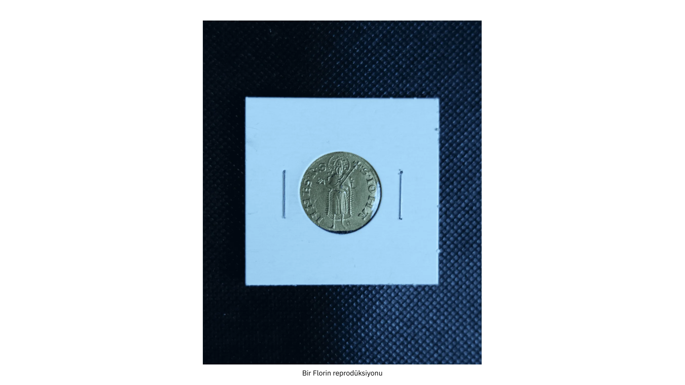

Altın sikkeye dönüş belirli bir bağlamdan kaynaklanıyordu: Bizans solidusunun çöküşü ve Moğol istilaları nedeniyle Müslüman dünyasının ekonomik gerilemesi uluslararası ticarette parasal bir boşluk yarattı.

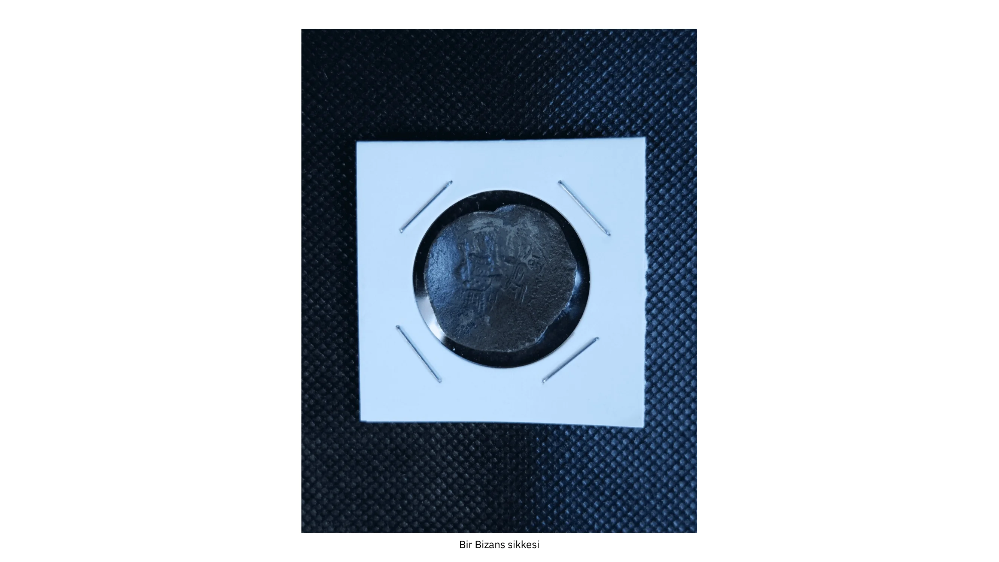

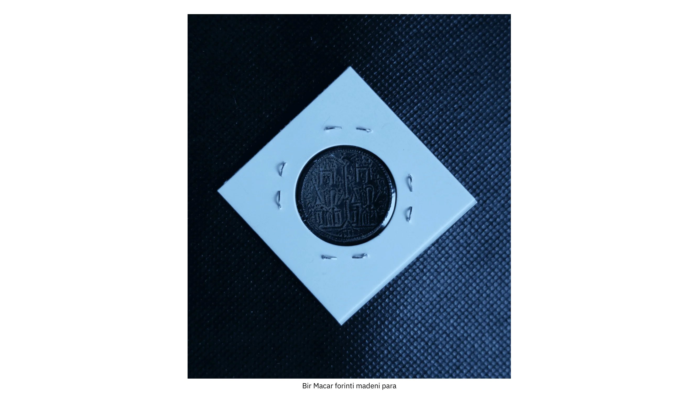

Yukarıdaki ilk resim oldukça ilginç bulduğum bir Bizans sikkesini gösteriyor. Aynı döneme ait Macaristan'dan bir sikke ile paralellik kuracağım (yukarıdaki ikinci resim). Macar sikkesi minyatür bir kase gibi fincan şeklindedir. İkonografide yan yana haç tutan krallar olarak tasvir edilen dini figürler yer almaktadır. Bu parça kase şeklindedir ve Macaristan'dan gelmektedir.

Diğer ülkelerin sikkelerini kopyalamak oldukça alışılmış bir durumdu. Bizans sikkeleri genel olarak kabul gördüğünden, diğer ülkeler de sık sık bunları kopyalardı. Yan yana karşılaştırdığınızda görebileceğiniz gibi: bu parçalar birbirine çok benzemektedir.

Başta Floransa, Venedik ve Cenova olmak üzere Kuzey İtalya bu ortamdan yararlanarak yeni sert para birimlerini, yani istikrarlı bir değerli metal içeriğine sahip sikkeleri piyasaya sürdü. Venedik, 1270 yılında florin ile neredeyse aynı olan ve Akdeniz ticaretinde yaygın olarak kullanılan bir para birimi olan ducat'ı basarak Floransa'nın örneğini takip etti.

Florin, 14. yüzyılın sonundan önce 150'den fazla Avrupa şehrinde kabul edilen ilk uluslararası rezerv para birimi oldu. Medici önderliğinde büyük ölçekli bir Floransa bankacılık ağının kurulmasıyla, para ve muhasebe yönetimi tamamen modernize edilmiş, hatta altının fiziksel olarak taşınması ihtiyacı azalmıştır.

Bu da gerçekten ilginç bir nokta. Bir zamanlar deniz yolculuklarında çok sayıda madeni para kayboluyordu. Bu teknolojik ilerleme - çift girişli defter tutma ile kayıtlar - kutsal paranın yaratılmasını sağladı. Bu sayede madeni para ödemelerinin sayısı azaltıldı ve bunun yerine yazılı kayıtlardan oluşan bir sistem kullanıldı ki bu da nakil sırasında para kaybetme riskini büyük ölçüde azalttı.

Parasal gelişmeye bankacılık yöntemlerinde de önemli bir evrim eşlik etmiştir. Kısmen Haçlı Seferleri'nin Müslüman bankacılık uygulamalarıyla temasından esinlenen Ortaçağ Avrupası, 13. yüzyılın başlarında Floransa, Venedik, Barselona ve Cenova'da ilkel bankacılık sistemlerinin ortaya çıkışına tanık oldu. Dini ve askeri bir tarikat olan Tapınak Şövalyeleri, Haçlıların servetlerini yanlarına almadan seyahat etmelerini sağlayan bir sistem geliştirmişti.

Ülkelerindeki bir Tapınakçı bürosuna para yatırırlar ve daha sonra bir mektupla seyahat ederek Haçlı Seferi'ne gidecekleri yere vardıklarında paraları toplarlardı.

Bu, değerli metal paraları yanımızda taşımak zorunda olmadığımız anlamına geliyordu.

Avrupa, Marco Polo'nun 13. yüzyıldaki seyahati sayesinde Çin'de kağıt paranın varlığından da bu dönemde haberdar oldu. Ancak, Avrupa önce metal sikke yöntemlerini mükemmelleştirmeyi tercih ettiğinden, banknotların geliştirilmesi birkaç yüzyıl bekleyecekti. Leonardo da Vinci, ünlü bir muhasebeci olan Luca Pacioli'nin yanında, para preslerinin geliştirilmesine aktif olarak katkıda bulunarak daha hızlı ve daha düzgün para üretimini teşvik etti.

Kursta daha önce bahsedilen sarkaçlı vuruş tekniğinden bahsediyoruz. Bu yöntem, çekiçle vurmaya kıyasla daha düzgün sikkeler üretilmesini sağlamış ve daha önce gösterdiğim gibi sikkenin kenarına yazı yazılmasına olanak tanımıştır. Aşağıdaki 1793 yılına ait bir Avrupa thaleridir ve kenarındaki yazılar açıkça görülmektedir.

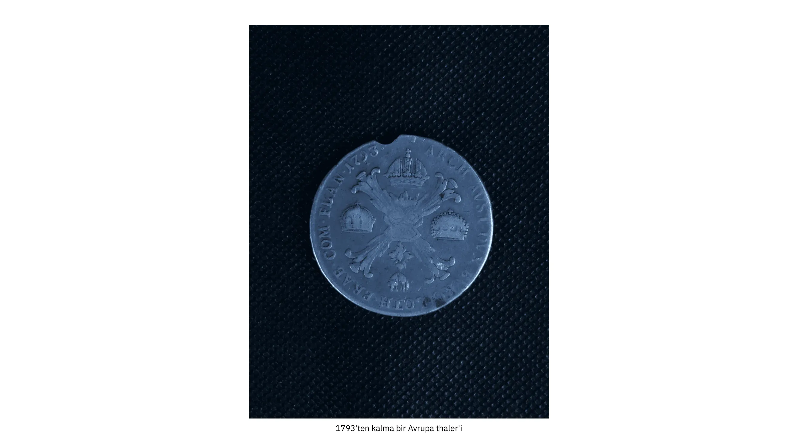

Ancak 15. yüzyılda Avrupa ciddi bir para krizi yaşadı ve Avrupa para birimlerinin gümüş içeriği genel olarak kötüleşerek 1450 civarında %5'in altına düştü.

16. yüzyıldan itibaren parasal ağırlık merkezi, Aragon ve Kastilya krallıklarının birleşmesi, Reconquista'nın sona ermesi ve Kristof Kolomb'un 1492'de yaptığı gibi büyük deniz keşiflerinin etkisiyle İspanya'ya kaydı. Amerikan madenlerinden gelen muazzam gümüş akını Avrupa ve küresel ekonomik dengeleri derinden sarsarak hem enflasyonu hem de yeni jeopolitik gerilimleri körükledi.

Rönesans aynı zamanda "dolar" teriminin kökeni olan thaler (Joachimsthaler) gibi sikkelerle sikke basımında da büyük bir sanatsal evrime işaret etmiştir. Bu büyük gümüş sikkeler, Kuzey Avrupa'dan gelen teknik yeniliklerin mümkün kıldığı yeni sanatsal ve mekanik basım tekniklerini yansıtmaktadır.

Son olarak, finansal Rönesans, bankacılık, kredi ve finansal piyasaların gelişmesi ve Amsterdam, Londra ve Stockholm gibi büyük ticari şehirlerde modern kapitalizmin ilk biçimlerinin ortaya çıkmasıyla ekonomik moderniteye geçişi başlatmış ve bugün bildiğimiz uluslararası finansal sistemin temellerini atmıştır. Bir sonraki videomuzun konusu da bu.

# Devlet tarafından paraya el konulması

<partId>17cfb1b4-5bc1-53e0-b035-05c7cf76be92</partId>

## Dünyanın rezerv para birimlerinin evrimi

<chapterId>d65cc352-e7ca-5f03-9b23-dd1fae5c0395</chapterId>

:::video id=82710062-8fff-426c-93af-923c08d82233:::

### Değerli metallerin tarihsel önemi

Rezerv para birimleri ve merkez bankalarının ortaya çıkışına ilişkin bu bölüme hoş geldiniz. Bu yeni bölümün ilk noktası olarak, küresel rezerv para birimlerinin evrimine odaklanacağız.

Değerli metaller, özellikle de altın ve gümüş, uzun zamandır imparatorluklarda zenginliğin ve gücün temeli olarak görülmüştür. Altına olan açlık her zaman baskın bir itici güç olmuştur ve Avrupa'daki parasal gelişmeler üzerinde en doğrudan ve belirgin etkiye sahip olan değerli metallerin akını olmuştur. Ortaçağ ve erken Rönesans dönemlerinde, altın ve gümüşe olan bu saplantı, diğer ticari malların değerini korumanın zorluğunun yanı sıra, özellikle Doğu ile ticarette yabancı güçlerden gelen güçlü talepten kaynaklanıyordu.

Yüzyıllar boyunca, çeşitli imparatorluklar küresel ekonomik merkezler olarak birbirlerinin yerini almıştır. Belirli bir dönemde dünya ticaretine hakim olan ülkeye genellikle rezerv para statüsü verilir. Bunlar arasında şunlar sayılabilir:

- İspanya ve Portekiz (15. ve 16. yüzyıllar)

- Birleşik Eyaletler (Hollanda) 17. yüzyılda

- Fransa ve Büyük Britanya'da 18. ve 19. yüzyıllar

- 20'nci yüzyılda Amerika Birleşik Devletleri

### Portekiz patlaması ve Real (1450-1530)

**Portekiz**, 15. yüzyılın ikinci yarısı ve 16. yüzyılın başlarında, nispeten eşit ağırlıkta bir gümüş para olan **Portekiz Reali** ile dünya ticaretine hakim oldu. Portekizliler, denizcilikteki ilerlemeleri sayesinde Afrika, Asya ve Yeni Dünya'ya giden yeni deniz yolları buldular. Afrika'dan Çin'e (Makao) kadar askeri kaleler ve ticaret merkezleri çoğaldı.

Avrupa'nın altın ve gümüş talebine karşılık olarak, "büyük keşiflerin değişmez motivasyonu ticari kâr, özellikle de altın ve gümüş arayışıydı." Ancak, aşırı genişleyen ve Hollandalı, İngiliz ve Fransızların rekabetiyle karşı karşıya kalan Portekiz İmparatorluğu gerilemeye başladı.

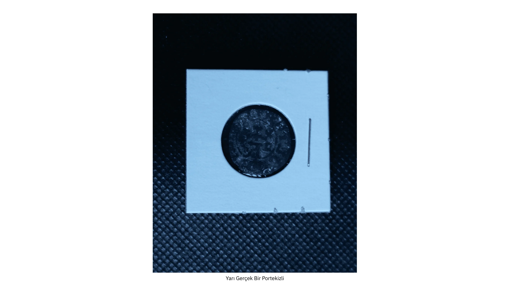

Yukarıda, bu Deniz fetihleri zamanından kalma bir Portekiz yarı gerçeğini görebilirsiniz.

### İspanyol zirvesi ve İspanyol Doları (1535-17. yüzyıl)

Yeni Dünya'nın fethiyle birlikte **İspanya** baskın oyuncu haline geldi. Devasa gümüş madenlerini (Bolivya'da Potosí, Meksika'da Zacatecas) kontrol eden hükümdar, saf gümüşten para basmayı başardı ve böylece kendi para birimi olan **İspanyol Realinin** değer kaybetmesini önledi

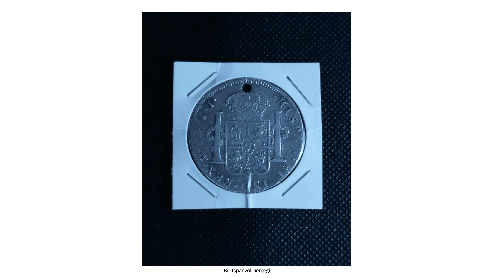

"Sekiz parçası" olarak da bilinen İspanyol realinin takma adı, daha küçük madeni paralar oluşturmak için genellikle sekizde bir oranında kesilmesinden gelmektedir. Aynı zamanda **İspanyol doları** olarak da bilinirdi. Yukarıda gördüğünüz sikke 1814 yılına aittir, yani biraz daha yeni bir örnektir. Bununla birlikte, ilk İspanyol doları sikkeleri bu kadar rafine değildi; çekiçle vurulmuşlardı ve genellikle daha az yuvarlak ve nettiler.

Özellikle ilginç olan, İspanyol dolarının o dönemde uluslararası rezerv para birimi olarak hizmet vermesidir. İspanyol yetkililer ayrıca kendi yerel para birimleri olan maravedi'yi de çıkarmış ve para arzını düzenli olarak geri çağırma yoluyla ayarlamışlardır. Örneğin, başlangıçta bir maravedi değerinde olan bakır veya bronz bir madeni para geri çağrılabilir ve üzerine "2", daha sonra "4" ve bu şekilde devam ederek potansiyel olarak "8 "e ulaşabilir Yüksek çözünürlüklü fotoğrafta madeni paranın üzerindeki "8" damgasını açıkça görebilirsiniz. Bu yöntem para arzını etkin bir şekilde genişletti... bu da kaçınılmaz olarak enflasyona yol açtı.

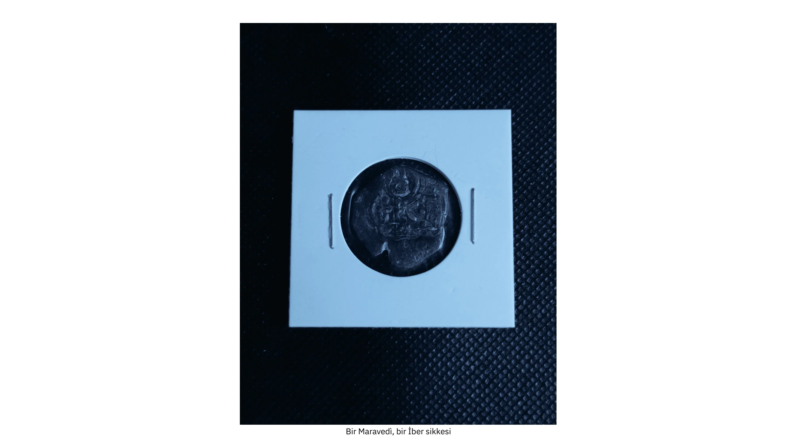

Rezerv para birimlerinin tarihine baktığımızda ilginç bir nokta ortaya çıkmaktadır: imparatorluklar rezerv para birimi statülerini korudukları sürece para birimlerini şişirmemişlerdir. **Sadece egemenliklerinin sonunda devalüasyona giderek bu ayrıcalıklarını kaybetmişler ve bu ayrıcalıklarını yeni bir imparatorluğa devretmişlerdir**.

İspanya'da İspanyol doları yaklaşık 200 yıl boyunca dünya ticaretine, özellikle de Çin ve Avrupa arasındaki ticarete hakim oldu. Bu paralar Çin limanlarında bile bulunabiliyordu. İşte bu noktada tarihten bir göz kırpıyoruz: Amerikan doları doğrudan bu para biriminden geliyor. Amerika Birleşik Devletleri 1792 yılında kurulduğunda, kendi para birimini basmak için bir yasa çıkardı ve ilk dolarları hem isim hem de madeni para boyutu olarak İspanyol doları model alınarak oluşturuldu.

Değeri hakkında bir fikir vermek gerekirse, bir Amerikan doları, bugün bildiğimiz kağıt para biriminin aksine, başlangıçta neredeyse bir ons ağırlığında veya bugünün parasıyla 30 ila 40 € arasında bir gümüş paraydı. İspanyol dolarına gelince, o kadar yaygın bir şekilde dolaşıma girmiştir ki ilk gerçek küresel para birimi olarak kabul edilir.

Ancak Amerika'dan gelen bu değerli metal akını Avrupa'da enflasyona neden oldu. Fiyat Devrimi sırasında (yaklaşık 1540-1640) İngiltere'de yaşam maliyeti yedi kat arttı. İspanya'da gümüş bolluğu, sağlam bankacılık kurumlarının gelişmesini engelleyen ters bir kaynak laneti etkisi yarattı.

Daha sonra İspanya çok sayıda askeri çatışmayla (Flandre, Hollanda, Otuz Yıl Savaşları) karşı karşıya kaldı ve mali durumu giderek çöktü. Birbirini izleyen yöneticiler, dünyaca ünlü gümüş sikkenin değerini düşürmek yerine, yerel halk tarafından kullanılan bakır sikkeyi (vellón) temerrüde düşürmeyi ya da değerini düşürmeyi seçtiler. Bu, daha önce Maravedis ile anlattığım şeydi.

### Hollandalıların yükselişi (17. yüzyıl)

İberya zirvesinin ardından, **Hollanda** 17. yüzyılda yeni bir ticari güç olarak ortaya çıktı. Deniz ticareti, VOC (Hollanda Doğu Hindistan Şirketi) ve **Amsterdam Borsası-15** (Antwerp'tekinden esinlenerek) bu tüccar cumhuriyetini bir merkez olarak kurdu.

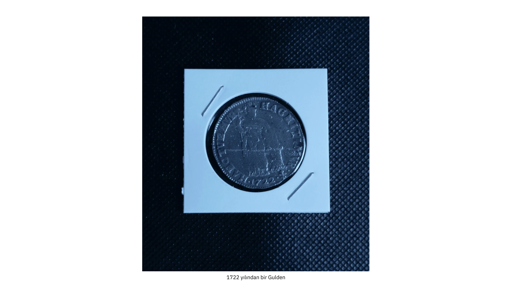

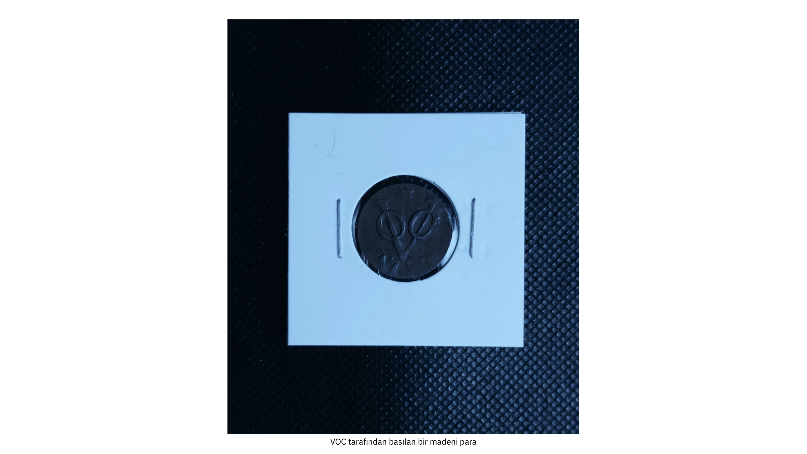

Yukarıdaki ilk fotoğrafta 1722'den kalma bir Gulden (güzel bir gümüş para), ikincisinde ise VOC tarafından basılmış bir sikke görüyorsunuz.

VOC zamanına göre son derece güçlü bir şirketti: kendi ordusu vardı ve kendi para birimini bile çıkarmıştı.

Hollandalılar, Yeni Dünya'ya yapılan seferler veya yeni ticaret yolları arayışı gibi riskli girişimlerde riski dağıtmanın bir aracı olarak başlayan modern kapitalizmi icat etti. Anonim şirketler birkaç yatırımcının paralarını bir havuzda toplamasına ve riski paylaşmasına olanak sağladı. Bu alışverişleri kolaylaştırmak için, bu menkul kıymetleri müzakere edebilecek ve takas edebilecek kurumlar oluşturmak gerekiyordu. Böylece 1602 yılında ilk anonim şirket ve borsa kuruldu.

Hollanda para birimi **Gulden**, gümüş saflığı ve ardından Amsterdam Bankası tarafından benimsenmesi (1609) sayesinde itibar kazandı ve mevduatlar Avrupa'da tercih edilen bir para şekli haline geldi. Bu, belirtilmesi gereken çok önemli bir noktadır. Evet, elbette madeni paralar vardı, ancak o günlerde gerçekten parayı oluşturan şey bir tür kutsal paraydı. Aslında dünya ticaretinin büyük bir kısmı Amsterdam Bankası'nın kayıtlarından geçiyordu. Bu gerçek bir bankacılık atılımıydı: uluslararası ticaret artık fiziksel paralarla değil, doğrudan bankanın muhasebe kayıtları üzerinden yapılıyordu.

Bu refah dönemine, özellikle enflasyon veya parasal kontrol uygulayan diğer ülkelerden gelen büyük miktarda altın ve gümüş akını damgasını vurdu. Bahsedilmesi gereken ilginç bir karakter var: **Thomas Gresham**. Bu dönemde Hollanda'da İngiliz kraliyeti için çalışmış ve iki ülke arasındaki para akışını yönetmiştir. Bize ünlü **"Gresham Kanunu "nu** bırakan da aynı Gresham'dır.

Bununla birlikte, Hollanda İmparatorluğu'nun da sonunda gücü tükendi. İngiltere ile yapılan savaşlar, çatışma dönemlerinde gulden'in değer kaybetmesi ve diğer güçlerin (Fransa ve İngiltere) rekabeti Hollanda hegemonyasının sonunu getirdi. Dördüncü İngiliz-Hollanda Savaşı'ndan (1780-84) sonra gulden'in rezerv para birimi olarak düşüşü geri döndürülemez bir hal aldı.

### Fransız gücü, hırsları ve başarısızlıkları (17.-18. yüzyıllar)

Louis döneminde **Fransa** Avrupa'nın en büyük kıtasal gücü haline geldi. Bununla birlikte, Fransız para birimi hiçbir zaman baskın bir referans statüsüne ulaşamadı: çok sayıda devalüasyon, ağır vergilendirme ve maliyetli savaşlar (Augsburg Ligi, İspanya Veraset Savaşı, vb.) para sisteminin istikrarını ağır bir şekilde etkiledi.

Kağıt para konusundaki ilk büyük deney John Law (1716-1720) tarafından gerçekleştirilmiştir. Banque Générale, devlet borcu vaatleriyle desteklenen bonolar çıkardı. Bu plan 1720'de spekülatif bir balona ve çöküşe (Mississippi Balonu) yol açtı. Bu felaket Fransa'da kağıt paraya karşı kalıcı bir güvensizlik yarattı. Richard Cantillon'un, günümüzde Cantillon etkisi olarak bilinen ve para basmanın matbaaya erişimi olanları zenginleştirdiği bu ilkeleri belirten sistem sayesinde zengin olmasına yol açan şey bu felaket deneyimiydi.

Bu güvensizlik nihayet ortadan kalktığında, bir başka Fransız kağıt fiyaskosu ortaya çıktı: devrimci **assignats**. 1790'dan itibaren din adamlarının mallarına el konulmasıyla ihraç edilen bu assignatlar dörtnala hiperenflasyona maruz kaldı ve resmi olarak tarihte aylık %50'yi aşan ilk hiperenflasyon oldu. 1795 yılında, nominal değerleri katlanmış olmasına rağmen, ilk değerlerinin sadece yüzde birkaçından işlem görüyorlardı.

Daha kısıtlayıcı yasalar assignat'ı dayatmaya çalıştı, ancak başarılı olamadı. Hükümet, bunu kabul etmeyenleri ölümle tehdit edecek ve esnafı açık kalmaya zorlayacak kadar ileri giderek bunu dayatmaya çalıştı. Ama tabii ki sonunda işe yaramadı.

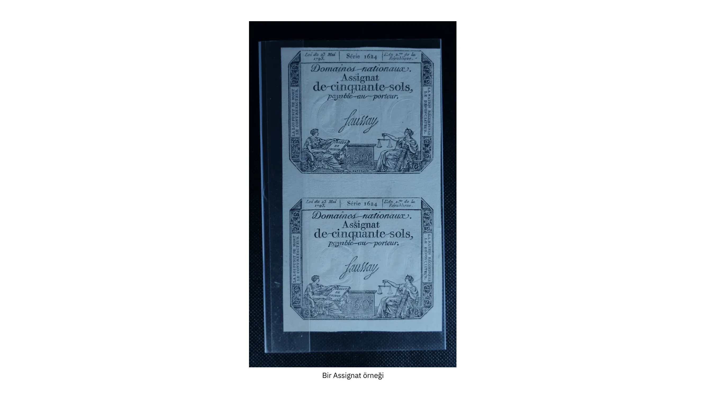

Bu kağıt para, ünlü Gresham Yasası'na uygun olarak tüm kaliteli değerli metal sikkelerin yerini alınca, sikke kıtlığı baş gösterdi. Yeni sikkeler basmak için din adamlarından ele geçirilen çan metalini kullandılar. Aşağıda, din adamlarından alınan sikkelerin eritilmesiyle elde edilen bakırdan yapılmış güzel bir çan metali parçasını görebilirsiniz.

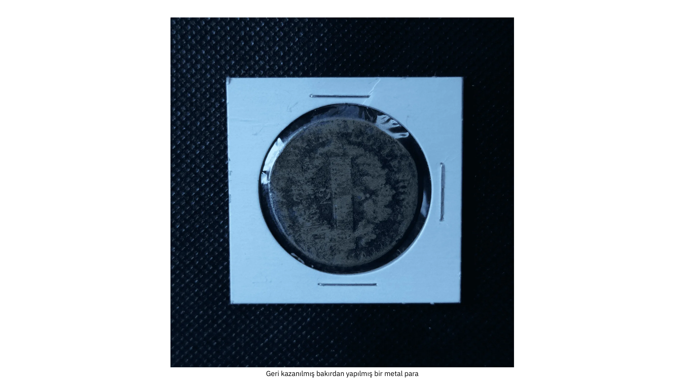

### İngiliz egemenliği (18. yüzyıl - 20. yüzyıl başları)

*hollanda'yı geride bırakan *İngiltere** 18. yüzyılda egemen güç haline geldi. İngiliz Sterlini halen kullanılmakta olan en eski para birimidir ve başlangıçta bir pound gümüşe bağlıydı. Parlamenter monarşi, güçlü vergi toplama kapasitesi ve 1694\'te İngiltere Merkez Bankası\'nın kurulması gibi mali ve finansal bir devrimle desteklenen statüsü yavaş yavaş güçlendi.

Fransa'ya karşı yapılan bir dizi savaşın ardından Birleşik Krallık 1815'te (Waterloo) zafer kazanarak üstünlüğünü teyit etti. 19. yüzyıl boyunca sterlin dünyanın rezerv para birimi olarak hareket etti. Dünya nüfusunun sadece %2,5'ine sahip olan İngiltere, zirvede olduğu dönemde küresel gelirin %20'sini üretiyor ve dünya yüzeyinin neredeyse dörtte birini kontrol ediyordu.

Sanayi Devrimi** ve bir **Altın Standardı**nın benimsenmesi (1717 veya 1718, Kraliyet Darphanesi'nde Isaac Newton'un gözetiminde) poundun güvenilirliğini pekiştirdi. İngiltere Merkez Bankası, altının onsu başına 4,25 poundluk bir altın standardı benimseyerek, banknot sahiplerinin banknotlarını altına çevirmelerine izin verdi.

Ancak Birinci Dünya Savaşı (1914-1918) bu sisteme son verdi. Birkaç hafta içinde, savaşan tüm büyük güçler altın konvertibilitesini askıya aldı. Britanya İmparatorluğu ve daha sonra pound, İkinci Dünya Savaşı'ndan zayıflamış bir şekilde çıktı ve 20. yüzyılda yerini Amerikan dolarına bıraktı.

Ve bir eser olarak, aşağıda bazı güzel ve ilginç parçaları görebilirsiniz. Bunlar parasal ağırlıklar. İlki sovereign: poundun en eski temsilleri. Elimde sadece bu paraları temsil eden para ağırlıkları var çünkü gerçek bir sovereign almaya gücüm yetmiyor. Bunları tartmak için terazi kullandık ve daha sonra diğer tarafa hükümdarın değerine eşdeğer parasal ağırlığı yerleştirdik.

Hükümdarlık bir para birimiydi - başlangıçta bir pound değerinde bir altın sikke.

Ünlü hükümdardan önce aynı prensiple çalışan gine vardı. Gine, adını Gine bölgesinden elde edilen değerli metallerden alıyordu.

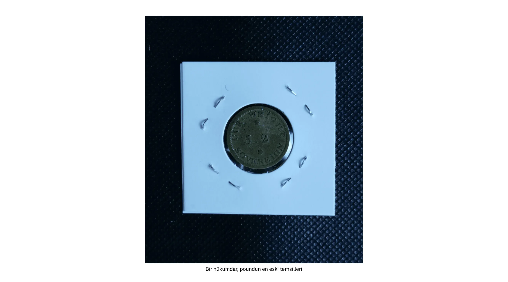

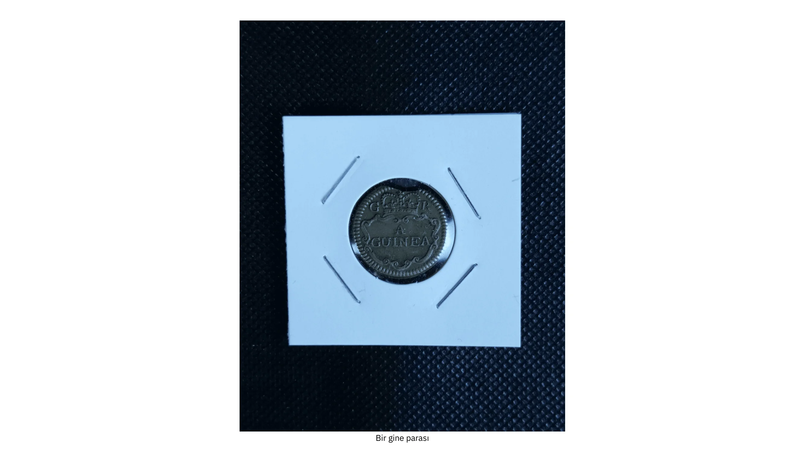

## Merkez bankalarının ortaya çıkışı

<chapterId>15777771-1e28-55f7-a400-69868a47079b</chapterId>

:::video id=7661b7b5-e00f-48f3-b69a-6fb2eb5ebba4:::

İlk rezerv para birimlerinin tarihi ve evrimi ile ilgili bu bölümün ardından, merkez bankalarının ortaya çıkışı ile ilgili bir bölüm geliyor. Rezerv para birimlerinin ortaya çıkışıyla hemen hemen aynı yolu izliyor, ancak zamanın bankacılık teknolojilerine biraz daha fazla odaklanıyor.

### Bankaların ve proto-bankaların başlangıcı

13. yüzyılın başlarında İtalyanlar (Floransa, Cenova, Venedik...) çift girişli muhasebe tekniklerini geliştirdiler. Daha sonra **Antwerp** (16. yy.) Kuzey Avrupa'nın önde gelen finans merkezi haline geldi ve bu rol, VOC hisselerinin işlem gördüğü Amsterdam Stock Exchange (1609) sayesinde daha sonra **Amsterdam** tarafından devralındı.

Antwerp, tüccarların borçlarını ödemek için sık sık bir araya geldiği ve yeni finansal araçların icat edilmesine yol açan tüccar fuarlarına ev sahipliği yaptı. Aşağıdaki 1761 tarihli ve daha yeni tarihli senet bir **promissory note**. El yazısıyla yazılmış detayların yanı sıra arka yüzündeki yazılar, onu o döneme ait muhteşem bir eser haline getirmektedir.

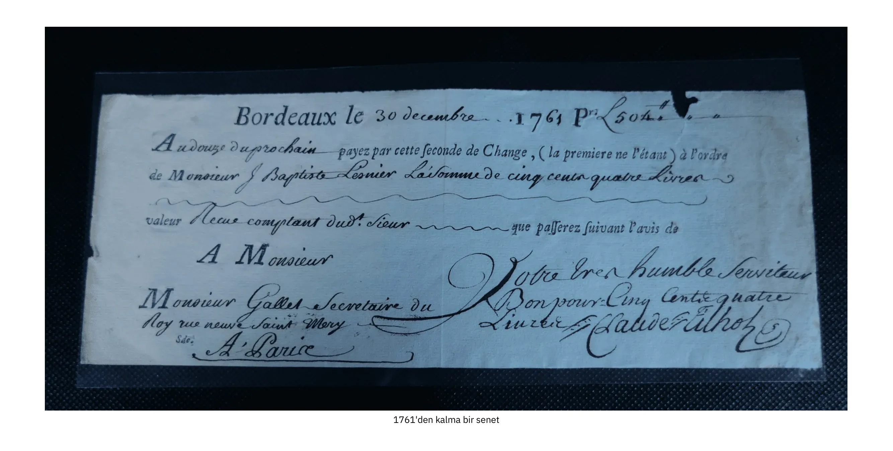

Bu coşku, daha sofistike bankacılık kurumlarının yaratılmasına yol açtı. **Lombard bankerleri** ve daha sonra Hollandalı tüccarlar kredi araçlarını (kambiyo senetleri, bonolar, vs.) mükemmelleştirdiler. Modern bankacılık sistemi bu fikre dayanmaktadır: para sadece metal değil, kredi de olabilir.

Gördüğünüz gibi, bu bizi paranın kökenine ilişkin asıl sorumuza geri götürüyor.

Para, mübadele ihtiyacından doğan bir metadan mı kaynaklanır, yoksa krediden mi doğar? Bunun izleri hala bu bölümde bulunabilir.

### İsveç örneği: Stockholms Banco ve Riksens Ständers Bank

İlk merkez bankasının kurulduğu İsveç'e geçelim.

**İsveç** merkez bankacılığında bir öncüydü: 1657'de Johan Palmstruch, metal rezervlerinden daha fazla borç verme yetkisine sahip **Stockholm Banco**'yu kurdu ve böylece kısmi rezerv bankacılığının doğuşuna işaret etti. Ancak aşırı banknot ihracı paniğe ve 1663'te bankaya hücuma yol açtı. Vay, vay...

1668 yılında Stockholm'de dünyanın ilk gerçek merkez bankası olan Riksens Ständers Bank kurulmuştur. Ancak o da, genellikle krallığın savaşlarını finanse etmek için banknotların kötüye kullanılmasıyla bağlantılı krizlerden (1709, 1715...) muzdarip oldu.

### John Law'ın başarısız darbesi

Sevgili John Law'ı bir kez daha bulacağımız Fransa'ya gidelim.

*bir İskoç olan *John Law**, Naibi (Orleans Dükü) altın, gümüş ve devlet borçları karşılığında kağıt ihraç etme yetkisine sahip özel bir banka olan Banque Générale'i (1716) kurmaya ikna etti. Bu banka Banque Royale'e (1718) dönüştü ve Mississippi Şirketi'nin hisselerinin yükselmesine yardımcı oldu.

Gerçeklik spekülasyonları yakaladığında, **altın bulundurmanın yasaklanması ve Law's notlarının kullanılmasının zorunlu kılınması** kararıyla panik daha da şiddetlendi. Vay, vay...

Sonunda balon 1720'de patladı ve Fransa'da kağıt paranın güvenilirliğini uzun süre mahveden bir çöküşe neden oldu.

### Amsterdam Bankası, öncü bir modelin yükselişi

Şimdi 1609 yılında Amsterdam'a gidiyoruz; burada **Bank of Amsterdam** (Wisselbank) Amsterdam'da madeni paraların saklanması ve konvertibilitesinin kontrolünü ele geçirdi. Özel banknotların dolaşımını yasakladı ve metal paraların kendi kasalarında saklanmasını zorunlu kıldı. Yavaş yavaş para biriminin kontrolünü ele geçirdiler. Sarrafların yanlarında madeni para bulundurmalarını yasakladılar. Sarraflar bütün gün çalışıyorlardı ve günün sonunda madeni paralarını Amsterdam Bankası'nın kasalarına yatırmak zorundaydılar. Daha önce de belirttiğim gibi, uluslararası ticarette kullanılanlar ille de metal paralar değildi. Bankanın kayıtlarında yer alan kutsal paraydı.

Hollandalı tüccarların gücü sayesinde banka, ilk fiili "merkez bankası" rolünü oynayarak dünya ticaretini istikrara kavuşturdu. Ancak zaman içinde VOC'ye teminatsız krediler verdi ve sonunda tahvillerini destekleyecek metali kalmadı. 1790 yılında VOC'ye büyük miktarlarda borç verdiği ortaya çıktı ve neredeyse iflasını ilan ederek gulden'in güvenilirliğini mahvetti. Vay, vay...

### İngiltere Merkez Bankası, modern bankacılığın kurucu yasası

17. yüzyıl İngiltere'sinde altın ve gümüş, makbuz kesen kuyumcular tarafından saklanıyordu. Bu kısmen merkezi olmayan organizasyon, Kraliyet Fransa'ya karşı savaş için büyük finansman ihtiyacı duyduğunda sınırlarını kanıtladı.

1694 yılında **Bank of England (BoE)** kuruldu. Böylece İngiltere Bankası, Londra iş dünyası ile savaş için fon bulma konusunda çaresiz olan hükümet arasındaki bir mantık evliliğinden doğdu.

Banka, İngiltere'de banknot ihracı tekelini elde etti (1708, 1742, vs.'de güçlendirildi). O andan itibaren, altın rezervleriyle desteklenen kağıt para madeni paralarla birlikte dolaşıma girdi. Bu, paranın devlet kurumları tarafından kademeli olarak ele geçirilmesini anlamak için önemli bir noktadır. İlk olarak, Amsterdam Bankası sarrafların sikke bulundurmasını engelledi ve onları bankaya iade etmeye zorladı. İngiltere'de özel bankaların kendi altınla ödenebilir banknotlarını çıkarması yasaklanmıştı.

Özel bankaların banknot çıkarmasına izin verdiler, ancak bunlar sadece İngiltere Merkez Bankası banknotlarıyla değiştirilebiliyordu.

İngiltere Merkez Bankası banknotları, sterlin, altınla ödenebilirdi. Bu, para birimine üçüncü bir katman ekledi. Yani en altta altın, sonra İngiltere Bankası bonoları ve en üstte de özel banka bonoları vardı. Bundan önce, özel bankalar altınla ödenebilir kendi bonolarını çıkarabiliyorlardı. Bu, para biriminin devlet kurumları tarafından kademeli olarak ele geçirilmesinde bir başka aşamadır.

Banka, devleti büyük kredilerle finanse etti ve ekonomik patlamayı finanse eden devasa kamu borcunu yapılandırdı.

Bu model 18. ve 19. yüzyıllar boyunca İngiltere Merkez Bankası'nın mührü ve altın standardı altında sterlinin dünyanın rezerv para birimi haline geldiği noktaya kadar pekiştirildi.

**Dünyanın rezerv para birimleri** yüzyıllar boyunca bir devletin ya da imparatorluğun ekonomik, ticari ve askeri gücüne bağlı olarak birbirini takip etmiştir: Portekiz, İspanya, Hollanda, ardından Büyük Britanya, 20. yüzyılda ABD'nin hakimiyetine geçmeden önce. Her örnekte benzer bir döngü görüyoruz: ekonomik genişleme, ticari başarı, para biriminin uluslararası kabulü, borçlanma, maliyetli savaşlar, para yaratma veya kredinin kötüye kullanımı ve son olarak düşüş.

**Merkez bankalarının** ortaya çıkışı aşamalı bir süreç olmuştur. Bu kurumlar genellikle maliyetli savaşlar bağlamında ortaya çıkmış ve devletin kendisini borç yoluyla finanse etmesini sağlamıştır. Altın standardı benimsendiğinde (İngiltere, 17.-19. yüzyıllar), 20. yüzyılın büyük dünya savaşları altının konvertibilitesinin kademeli olarak terk edilmesine yol açana kadar bir istikrar örtüsü sağladı. Böylece para basma yetkisi kraliyet tekelinden, önce özel (kuyumcular, bankerler), sonra da yarı kamusal (merkez bankaları) olmak üzere, parasal egemenliğin kurumsallaşmış, küreselleşmiş biçimlere doğru evrimini yansıtan daha karmaşık oluşumlara kaymıştır.

İşte daha önce anlattığım şey buydu. Devlet borçlarının yükünü genellikle doğrudan merkez bankalarına ya da Parlamento gibi yasal kurumların para yaratma iznine kaydırdık.

Ve buradaki en önemli gerçek, **egemenin iflasıyla ortadan kalkabilecek bir borçtan, esas olarak halkın omuzlarına yüklenen bir borca** geçmiş olmamızdır.

## Fiat sistemine giden yol

<chapterId>27a98545-d350-56ee-a200-92468e6b9b33</chapterId>

:::video id=e27a753e-aeee-4307-a65c-9506aab380a1:::

Paranın tarihiyle ilgili bu dersin sonuna geldik ve bu dersi sonlandırmak için iki konu önermek istiyorum. İlk konu, mevcut itibari para sistemimize yol açan çeşitli aşamalardır. Merkez bankalarının kuruluşu ile ilgili 5. bölümdeki gerçekleri tekrar gözden geçireceğiz ve nihayetinde mevcut rezerv para birimi olan ABD doları kavramını da ekleyeceğiz. Nasıl evrimleştiğine, doların nasıl ortaya çıktığına, nasıl geliştiğine, nasıl değiştiğine, fiat sistemine dönüşmek için hangi aşamalardan geçtiğine bir göz atacağız, çünkü doların kökeni gümüş bir madeni paradır.

Hemen ardından, refah devletine nasıl ulaştığımızı anlamanıza yardımcı olmak için size finans tarihi hakkında kısa bir bölüm vereceğim. Yani iki konuya bakacağız: fiat sistemine nasıl ulaştık ve hemen ardından finansın evrimi bizi refah devleti kavramına nasıl götürdü.

### Modern bankacılığın Avrupa'daki temelleri

Florin ile 13. yüzyıla geri dönelim. Fiat modeline nasıl ulaştığımızı anlamak için 13. yüzyıldan başlamamız gerekiyor. Florinin yanı sıra Medici'lerle aynı dönemde ortaya çıkan bir teknoloji de kambiyo senedi kavramıdır.

Ardından, iskonto ve senet kavramıyla Antwerp borsası geldi.

Daha sonra, gördüğümüz gibi, Amsterdam'daki ilk borsa olan VOC'yi kurduk. Bu, şirket hisseleri ve hisse değişimi ile kapitalizmin doğuşuna işaret ediyordu. Amsterdam bankası daha sonra kararname ile mevduat kullanımını dayattı. Bu, madeni paraların gün sonunda yatırılması gerektiği anlamına geliyordu. Artık para üstünü madeni para şeklinde tutamayanlar sarraflardı.

Ardından 17. yüzyılın sonunda savaşı finanse etmek için borç yaratma ihtiyacından İngiltere Merkez Bankası kuruldu. O dönemde özel bankalar paranın üçüncü katmanı haline geldi. Bu arada, florinden merkez bankası oluşturma kavramına kadar tüm bu bölüm, Nick Bhatia'nın birkaç meslektaşımla birlikte çevirme şansına sahip olduğum ünlü kitabı "Katmanlı Para "da son derece iyi özetlenmiştir. Her yerde Fransızca konuşanların bu öğretilerden faydalanabilmesi için kitabı çevirerek harika bir iş çıkardık.

Yani 17. yüzyılın sonundayız. İngiltere Bankası savaşı finanse etmek için kuruldu.

Özel bankalar para biriminin üçüncü katmanını devraldı. Aslında, özel banka bonoları artık altınla değiştirilemiyordu: altınla değiştirilebilenler İngiltere Merkez Bankası'nın bonolarıydı. Bu, değişim gücünün İngiltere Merkez Bankası adlı kurum tarafından ele geçirildiğini göstermektedir.

Sonra 1776 paniği geldi. Herkes para piramidine hücum etti. Bunun anlamı şudur: 1776'da bankalara hücum oldu ve böylece üçüncü katman kağıtları, yani özel banka bonoları olan tüm insanlar İngiltere Bankası bonoları almaya çalıştı ve sonra altın almaya çalıştı, ancak açıkçası kasalarda yeterince altın yoktu. Altın tahvillerini geri ödemekten kaçınmak için bir tür bankacılık tatili ilan ettiler ve bu da son çare borç veren kavramının ortaya çıkmasına neden oldu.

### ABD dolarının evrimi

Florin'den İngiltere Merkez Bankası'nın kuruluşuna geçtik. Elbette arada Birinci ve İkinci Dünya Savaşları vardı, ancak daha önce, 1796'da Atlantik'in diğer yakasında da gelişmeler yaşanıyordu. 1776'da Amerika hala bir İngiliz kolonisiydi ve koloniler bu kağıt para birimini kullanıyordu. Aşağıda 1776'dan kalma Connecticut iki şilinlik banknotu görülüyor.

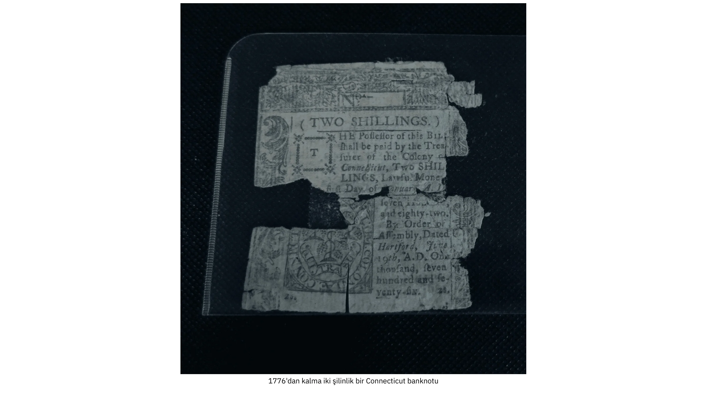

İngiltere'ye savaş ilan etmeden ve nihayetinde kendi para birimlerini çıkarmadan önce, koloniler nakit işlemlerinde İspanyol dolarının yanı sıra bu kağıt para birimini kullandılar. Aslında, "dolar" terimi Amerikan dolarını belirtmek için kullanılmaya devam etti.

Yanılmıyorsam 1792'de para basmalarına izin veren bir yasa çıkardılar. Örnek olarak, aşağıdaki modern döneme ait bir Amerikan dolarıdır.

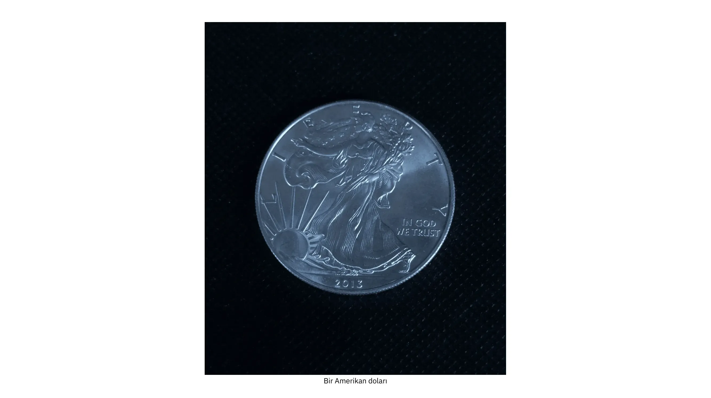

Açıkçası, nominal değeri sadece bir dolar değildir; bir ons gümüşü temsil ettiği için yaklaşık 30 veya 40 dolar değerindedir. Değeri gümüş fiyatına bağlı olarak dalgalanır, genellikle en az 30 ya da 40 ABD dolarıdır. Elbette bugün kağıt bir doların sadece bir dolarlık nominal değeri vardır, ancak o dönemde ABD doları bu gümüş değerine dayanıyordu.

Şimdi Amerika'daki İç Savaş hakkında konuşalım. Konfederasyonlar para basıyordu ve bu para hiper-enflasyona neden oluyordu. Bu olgu resmi Hanke-Krus listesine dahil edilmemiştir, çünkü %50'lik bir hiperenflasyon oranına ulaşmamıştır. Ancak, aylık %40'lık bir enflasyon oranı yaşanmıştır ki bu da savaş sırasında önemli miktarda para basıldığını göstermektedir.

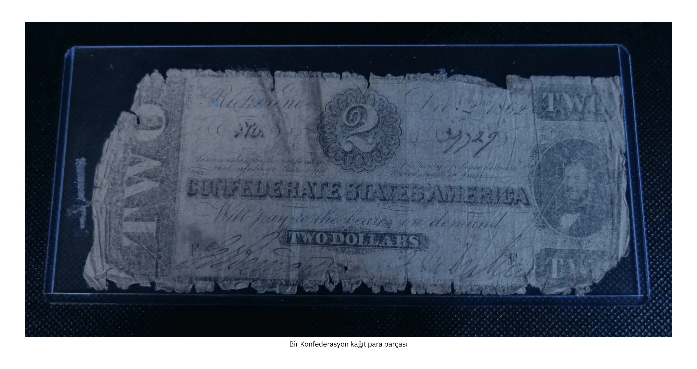

Kuzeydeki rakiplerinin de dolarları vardı. Hemen yukarıda Konfederasyon dolarlarını, aşağıda ise Kuzey dolarlarını görebilirsiniz. Arkası yeşil olduğu için bunlara "yeşil dolar" deniyordu.

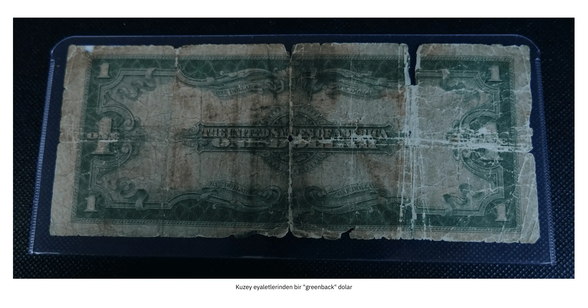

Ve sizi aradaki boyut farkını modern banknotlarla karşılaştırmaya davet ediyorum. O zamanlar banknotlar daha büyüktü.

Bildiğimiz gibi kuzey kazandı, böylece dolar yeniden birleşen Amerikan eyaletlerinin para birimi oldu. Ardından 1913'te FED'in kuruluşu ve Birinci Dünya Savaşı geldi.

Birinci Dünya Savaşı'nın ardından basılan banknotların son serisinde her zaman "talep üzerine altın olarak itfa edilebilir" ibaresi yer almıştır. Dolayısıyla, 1928'de altın fiyatı 20.67 dolar olduğu için 20 dolar neredeyse bir ons altın satın alıyordu. Aşağıdaki resimdeki banknot 1928 yılında bir ons altın satın alabiliyordu.

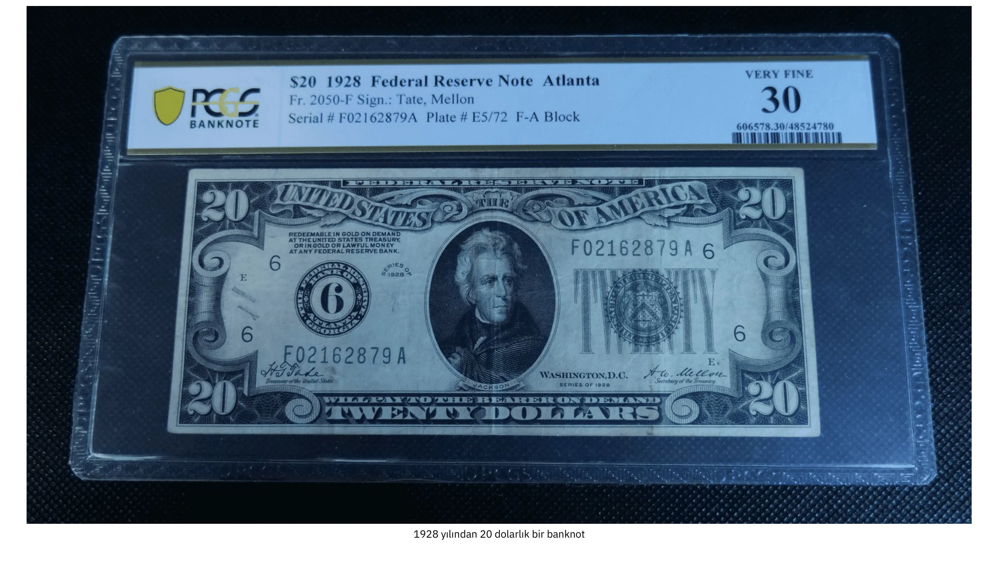

Bugün altının onsu 3.000 ABD doları değerinde. Yani devalüasyonun gücünü burada görebilirsiniz elbette. "Altın olarak itfa edilebilir" kelimelerini içeren son yasa tasarısıydı. Göreceğiz ki 6102 sayılı İcra Emri'nin hemen ardından tüm altınlara el koyacaklardı. Aslında hem altınlara hem de altın sertifikalarına el koyacaklardı.

Aşağıda 1928 yılına ait bir altın sertifikayı görebilirsiniz.

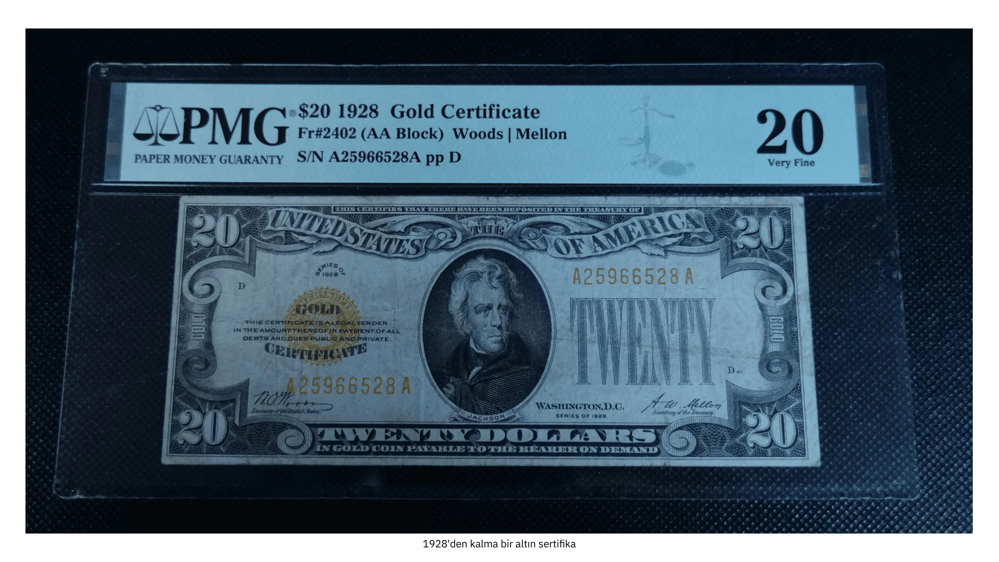

Sadece 1928 banknotu gibi "altınla ödenebilir" değil, aynı zamanda altın sikkelerle de ödenebilirdi: bu gerçekten bir "altın sertifikası". Executive Order 6102'den sonra hepsine el konuldu. 1964 yılına kadar bunlara sahip olmak bile yasadışıydı.

Bir tanesine sahip olduğum için çok mutluyum.

1964'ten itibaren, yanılmıyorsam 1974'e kadar altın sahibi olmak yasadışı hale geldi. 70'lerde, birazdan anlatacağımız Nixon şokundan sonra insanların altın biriktirmesine izin verdiler. 1933 yılında "Executive Order 6102" yayınlandığında altına el koydular ve altın bulundurmak yasadışı hale geldi. Altın bulundururken yakalanırsanız büyük bir hapis cezası alırdınız. O günlerde her ons altın, 1934'ten sonra aşağıdakine benzer bir banknotla değiştirildi.

Dediğimiz gibi, 1928'de bir doların üzerinde hala "altınla paraya çevrilebilir" yazısı vardı.

İcra Emri 6102'nin yayınlanmasından sonra, tüm altınlara el koydular ve her ons altın için 20.67 dolar bozdurdular. Daha sonra dolandırıcılık ortaya çıktı: 1934 yılında "bu banknot tüm borçlar için yasal ödeme aracıdır" yazılı yeni banknotlar çıkardılar.

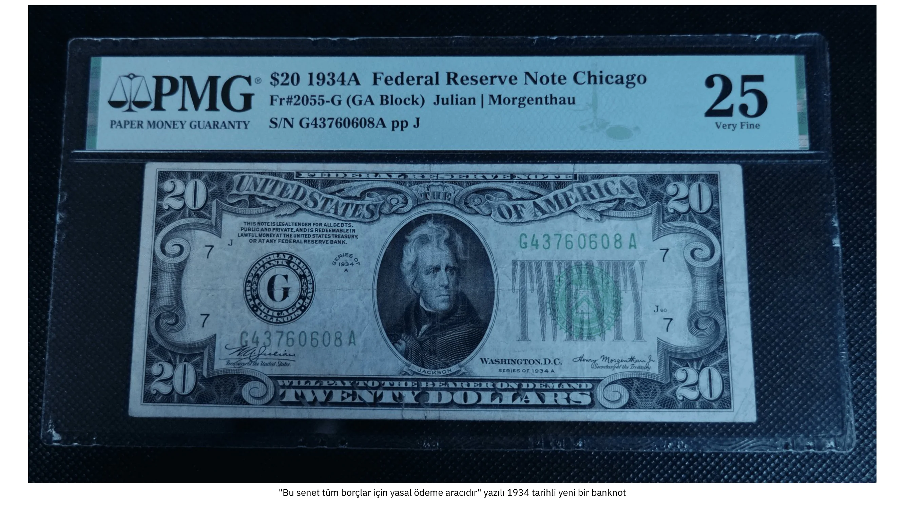

Yasal ihale kavramı burada ortaya çıkmakta ve "altın olarak itfa edilebilir" ifadesinin yerini almaktadır İki banknot sadece birkaç kelime değişikliğiyle aynı görünebilir, ancak aldatmaca doların bu dönemde devalüe edilmiş olmasında yatmaktadır; bir ons altının değeri 20.67 dolardan 1934'te ons başına 35 dolara düşmüştür. Bu yaklaşık %40'lık bir devalüasyonu temsil ediyordu!

Ardından İkinci Dünya Savaşı geldi. Savaşın ardından Bretton Woods Anlaşması dünyadaki altının büyük bir kısmını Amerika Birleşik Devletleri'nde merkezileştirdi. Amerikalılar bunun karşılığında banknotlar çıkardılar, ancak bu banknotlar artık halk tarafından altın karşılığında kullanılamıyordu. Bunun yerine, devlet düzeyinde altınla değiştirilebilir olarak kaldılar.

Sonunda Fransa ve Almanya gibi ülkeler, ABD kasalarında altından daha fazla dolar banknotu bulunduğundan şüphelenmeye başladı.

Bu yüzden altınlarını geri almak istediler. Onlar da "Tamam, yaparız ama biraz zaman alır" dediler 1971 yılında dostumuz Richard Nixon banknotlar ve altın arasındaki bağı kesin olarak kesti ve bu süreçte spekülatörleri suçladı.

Altının ons başına 35 dolar gibi, basılan para hacmine ya da gerçek piyasa değerine karşılık gelmeyen bir fiyatla değeri düşüktü. Sadece birkaç yıl içinde fiyat 34 dolardan 800 dolara yükseldi. Roma'da denarius ile solidus arasındaki bağın koparılması gibi tarihi örneklere benzer şekilde, altının dalgalanmasına izin verildi. Bu durum bir fiyat keşfi sürecine yol açarak altının dolar bazında çok daha yüksek bir değere sahip olmasına neden oldu.

### Modern itibari para sistemi ve sonuçları

Bu bölüm, gümüş ya da altına dayalı bir para sisteminden nasıl geçtiğimizi özetlemektedir. Yavaş yavaş, kurumlar para üzerinde giderek daha fazla güç kazandı. Nihayetinde, tek taraflı bir kararla değerli metaller ve para arasındaki bağ tamamen koparıldı ve aşırı emisyona gidildi.

Sonuç olarak, artık altın ile banknotlar ya da kutsal para arasında herhangi bir bağlantı kalmamıştır. Ve bu bir kısmi rezerv sistemi bile değildir - bu modası geçmiş bir kavramdır. Bunun yerine, özel bankalar banka kredisi yoluyla para basar ve yaratır. Para esas olarak bu şekilde yaratılır ve merkez bankası tarafından belirlenen temel faiz oranıyla ilişkilendirilir.

Gerçekten bir sınır yok. En azından Amerika ve Kanada'da artık zorunlu rezerv seviyeleri yok. Tek rezerv, bankaların likiditelerinin tükenmemesi için bankalar arası değiş tokuşlara cevap verebilecek şekilde düzenleme yapma ihtiyacıdır.

Sadece bu transferleri yapabileceklerinden emin olmaları gerekiyor, ancak %3, %1, %10 zorunlu rezerv yok. Kısmi rezerv kavramından gerçekten uzaklaştık. Artık merkez bankaları, mali açıklar yoluyla hükümetler, niceliksel genişleme (QE) yoluyla merkez bankaları ve banka kredileri yoluyla özel bankalar toplam para arzını artırabilir ve bence enflasyona neden olabilir.

Para ve enflasyon arasındaki bağlantıyı anlamak için Plan ₿ Academy'de bu konuya adanmış bir kursu tavsiye ederim. Hayatta gördüğümüz fiyat artışları ile enflasyon arasındaki farkı öğreneceksiniz. İkisi aynı şey değildir. Aslında, enflasyondan söz ettiğimizde, genellikle enflasyonun kendisinden değil, fiyat artışlarından söz ederiz. Enflasyon, para arzındaki artışla açıklanan oldukça kesin bir kavramdır.

https://planb.academy/courses/caa75343-ac90-4249-bcca-0e2e57c3a0f1

Fiat dünyasına ilişkin bu bölümü sonlandırırken, enflasyon gibi az önce açıkladığım olguları daha iyi anlamanıza yardımcı olacak bir kaynağa işaret etmek istiyorum.

İlginiz için teşekkür ederiz.

## Para balonlarının tarihi

<chapterId>b6451c46-917d-11f0-97de-6bc5081765fa</chapterId>

:::video id=5967d9a6-aae4-4b84-a283-71b1b735bca4:::

### Kağıt paranın icadı ve ilk büyük balon

Merkez bankalarının 18. yüzyılda kurulmasıyla birlikte gerçek bir devrim doğdu: banknot şeklindeki sihirli para. Fransa'daki en çarpıcı örnek John Law'a aittir. Paris'te sürgünde bulunan bu İskoçyalı, kral naibi Orléans Dükü'ne, kraliyet maliyesinin iflasına bir devlet bankası ve bir sömürge ticaret şirketi kurarak bir çözüm önerdi: ünlü **Banque Royale** ve **Compagnie du Mississippi**.

Law bu sistemle kağıt parayı şirket hisselerine bağlıyordu. Ne kadar çok banknot dolaşıma girerse, hisselerin değeri o kadar yükseliyor ve banka o kadar sağlam görünüyordu... ta ki spekülasyonlar gerçekliğin önüne geçene kadar. Balon 1720'de aniden patladı ve soyluları, burjuvaziyi ve rue Quincampoix'da spekülasyon yapmaya gelen Avrupa'nın çoğunu mahvetti. Sonuç: Fransa'da kağıt paraya karşı kalıcı bir güvensizlik ve Avrupa'nın spekülatif balonlarla ilgili ilk dersi.

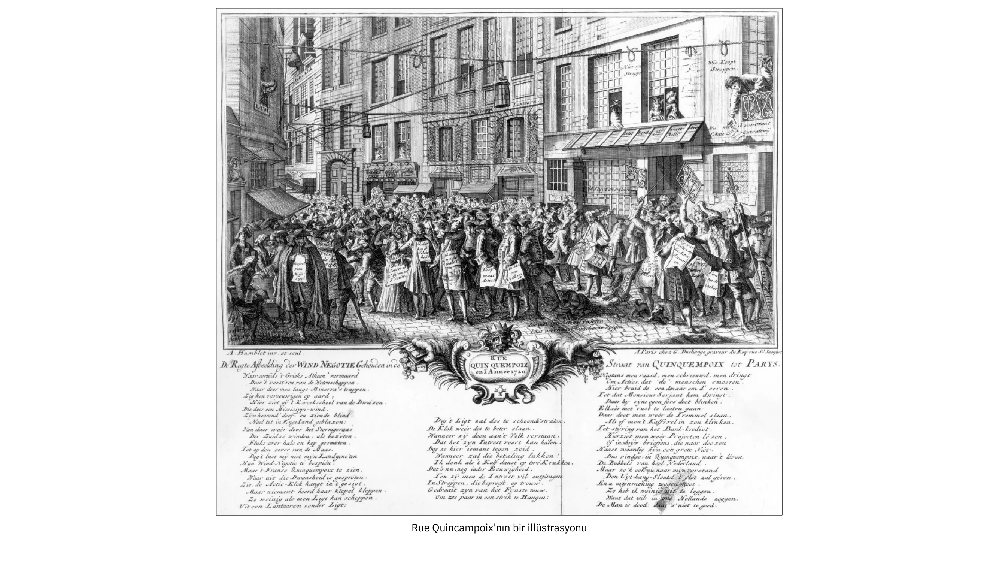

### Arazi "teminat" haline geldiğinde

Bir asır sonra Fransız Devrimi, el konulan Kilise mülkleriyle desteklenen bir para birimi olan **assignats** ile yeni bir çığır açtı. Kağıt üzerinde cazip bir fikir - toprağı parasal teminata dönüştürmek - ancak etkisiz: toprak ne likit ne de bölünebilir. Sonuç: hiperenflasyon, arazi kullanımında çoklu yasaklar, kontrolsüz enflasyon ve kıtlık.

Bu kaostan derinden etkilenen Napolyon, 1800 yılında Banque de France'ı kurarak altın ve gümüşü parasal temel olarak yeniden tesis etti ve böylece ordularının düzenli ödemelerini garanti altına aldı. Güveni yeniden kazanmanın pragmatik bir yolu: sabit para birimiyle ödeme yapmak.

### Kükreyen Yirmiler ve 1929 Büyük Buhranı

İki yüzyıl atlayalım. Birinci Dünya Savaşı'ndan sonra, hükümetler enflasyon ve altının askıya alınması yoluyla çabaları finanse etti. 1920'lerde Amerikan Merkez Bankası İngiliz sterlinini desteklemek için aşırı gevşek bir para politikası izledi. Sonuç: kolay kredi, Wall Street'te dizginlenemeyen spekülasyon, kredili hisse alımları ve bir emlak ve bankacılık balonunun ortaya çıkması.

Makine bozulduğunda, 1929 çöküşü kaçınılmazdı: büyük banka iflasları, rekor işsizlik ve aşevlerinde kuyruklar. Bu durum, **tüm deflasyonların kötü** olduğuna dair yanlış bir kanıya yol açmıştır; oysa büyüme yoluyla deflasyon (sağlıklı) ile borç yoluyla deflasyon (yıkıcı) arasında ayrım yapmamız gerekir.

### 90'larda Asya ve domino etkisi

1990'larda "Asya mucizesi" tüm dünyanın rüyalarını süslüyordu. Exchange kurları dolara sabitlenmişti, büyüme %8-10 seviyesindeydi ve Batı sermayesi akın ediyordu. Her şey yolundaydı... ta ki sular çekilene kadar. İflaslar artmaya başladı, para birimleri %80 oranında değer kaybetti ve yatırımcılar mahvoldu. IMF müdahale etmek zorunda kaldı ve acı verici reformlar dayattı. Her zamanki gibi aynı senaryo: bol sermaye, krediyle beslenen balonlar ve ardından çöküş.

### 2008 ve kalıcı balon dönemi

İnternet balonunu (2000) subprime emlak balonu takip etti. Menkul kıymetleştirme, banka kredilerini tüm dünyaya yayılan "triple-A" finansal ürünlere dönüştürdü. Vaat: riski seyrelterek ortadan kaldırmak. Gerçek: tüm riskler aslında birbiriyle ilişkiliydi. Gayrimenkul çöktüğünde, tüm küresel bankacılık sistemi de çöktü.

Sonuç: devasa kamu kurtarmaları, parasal genişleme ve sıfır faiz oranları. Ve bununla birlikte, baş döndürücü bir telaş: her kriz artık aşırılıkları temizlemeyecek, ancak daha fazla borç ve para basımı ile kapatılacaktır. Mevcut duruma yol açan da budur: *her şeyin - hisse senetleri, emlak, sanat, kripto, hatta Pokémon kartları - yapay olarak şişirildiği *"her şey balonu "**.

### Sihirli paranın ebedi dönüşü

Bir yüzyıldan diğerine değişmeyen bir şey ortaya çıkıyor: bir toplum gerçek mallar üretmek yerine parayla zenginlik yaratabileceğine inandığı anda balonlar ortaya çıkıyor. John Law'dan 2008'e, rue Quincampoix'den Wall Street'e kadar süreç kendini tekrarlar: coşku, kredi, patlama ve iflas.

Ve sonunda, her zaman, kimse artık kağıda güvenmediğinde, insanlar başka bir şey arar - altın, toprak, güvenli limanlar... ya da yeni para birimleri. Dün Napolyon metali dayattı, bugün bazıları Bitcoin'u halefi olarak görüyor.

Finans tarihi hiç bitmeyen bir döngüdür: bas, spekülasyon yap, çök. Bir sonraki balona kadar.

## Para ve şiddet

<chapterId>9486fe64-854f-5e17-86b3-8873baca39a8</chapterId>

:::video id=bd6d0807-2d8f-4637-a0f5-1e990e5c0d0f:::

Bu kısa bölümde, kurs boyunca daha önce gördüğümüz birçok olayı tekrar gözden geçirecek ve ilginç bulduğum birkaç anekdotu özetleyeceğim.

### Teknoloji ve şiddet

Burada muhtemelen kursta daha önce konuştuğumuz birkaç anekdot var. Bunlar, Theo ile B-Ondy'de verdiği ve teknolojik ilerlemelerin halk ile devlet arasındaki şiddet ilişkisini nasıl etkilediği konusunda çok ilginç bulduğum bir konferans hakkında yaptığım çok etkileyici bir tartışmayı tanıtmaya hizmet ediyor.

### Para ve devlet baskısı

Bu bölümü tanıtmak için size kısa ve kapsamlı olmayan bir liste vereceğim, sadece muhtemelen kursta zaten ele aldığımız olayları hatırlatmak için.

Para ve şiddet arasında şimdiden kurabildiğim bir bağlantı, sonsuza kadar basılabilen değersiz kağıt para söz konusu olduğunda, genellikle her türlü kural ve her türlü tehditle birlikte gelmesidir. Banknotların üzerinde kalpazanların ölümle tehdit edildiğinin yazılı olduğu assignatlardan zaten bahsedebiliriz. Dönemin hukuki metinlerinde bu ünlü kağıt parayı kabul etmeyenler için ölüm tehditleri bulmak çok kolay.

Fransa'da kalabilmek için, Devrim döneminden elde edebildiğim yasal metinlerden birinde, giyotinin taşınması ve çalıştırılması için "harcırahın" para birimiyle ilgili bölümlerde açıklandığını gördüm. Bunu oldukça tuhaf buldum.

Çin'de sikke basımının devlet tarafından denetlendiğinden de bahsetmiştik. Kursun başındaki bir bölümde, bazıları daha az güzel olan sikkeler atıldığında bunun yasal sonuçları olduğunu gördük.

İngiltere'de bir kralın, beklediği gibi davranmadıkları takdirde para basanların ellerini kestirdiğine dair bir anekdot da var.

Ayrıca Çin'de Budist manastırlarından bakıra el konulduğunu okumuştum. Bakırın değer kazandığı ve metalin değeriyle çok az ilgisi olan bir tür itibari paraya dayanan ekonomilerini istikrarsızlaştırdığı bir zamanda, zenginliğin olduğu bir yer bulmaya başvurdular ve manastırlardan bakıra el koydular.

Aynı durum İngiliz Reformu sırasında İngiltere'deki manastırlar için de geçerliydi. Ünlü kral, boşanma konusunda Papa ile tartıştığında, her şeyin arkasında başka bir neden vardı: bu dini organizasyonlarda bulunan serveti ele geçirmek için manastırların kaldırılmasından yararlandı.

Fransız Devrimi sırasında Kilise'nin tüm mal varlığına el koydular. Eritilen kilise çanlarından çok güzel paralar yapıldığını gördüler.

Daha da geriye gidersek, ekonomik şiddet ve özgürlüğün, özgürlükçü yasaların en açık kavramlarından biri **Diocletianus'un, köylülerin artık değersizleştirilmiş para birimini kabul etmek istememesiyle doğrudan bağlantılı olan kalıtsal kastıdır**. Köylüler işlerini bırakmak istediler ve Diocletianus onlara basitçe "toprağınızı terk edemezsiniz, çocuklarınız da edemez" diyerek tepki gösterdi. Aynı şey askerler için de geçerliydi.

Bence bu oldukça açık bir şiddet biçimi. Tapınak Şövalyeleri ya da bir Fransız kralı hakkında konuşarak sonuca varabilirim. Tapınak Şövalyeleri Fransa'ya yerleştiğinde, kralın Tapınak Şövalyeleri'nin servetini gördüğünü ve devletin finansman sorunları yaşadığını hayal ediyorum. Tapınak Şövalyeleri Tarikatı'na dava açtı ve bazıları hazinenin bir kısmıyla birlikte çekip gitmeyi başardı, bu da ABD veya Kanada'da çok ilginç bir şova yol açtı. Kimin hazırladığını bilmiyorum ama adı *The Mystery of Oak Island*. Kanada'da, Maritimes'de bir adada gömülü bir Tapınak hazinesi olduğunu düşünen insanlar hakkında ve bir tür kuyu açmak için yıllardır - belki de on yıldan fazla bir süredir - sondaj yapıyorlar. Çok sayıda galerisi olan bir kuyu buldular ve bu TV programının konusu olan bu adada Tapınak Şövalyeleri tarafından gömülmüş bir hazine arıyorlar. Bu dizinin büyük bir hayranı olan babamı selamlıyorum.

İşte bu kadar: bu kurs sırasında gördüğümüz ve bence şiddetle bağlantıyı artıran olguların çok hızlı bir listesi. Sizi bir sonraki bölümde Theo ile baş başa bırakıyorum, kendisi bize teknolojik değişim ve halk ile otoriteler arasındaki güç dengesi hakkında çok ilginç bir hikaye anlatacak.

Teşekkür ederim!

## Organize şiddetin ekonomik sonuçları

<chapterId>66bd4674-2159-5489-ad4b-ec5e3fb691af</chapterId>

:::video id=c8b063c6-aeb4-4a94-9027-b11d369e71a4:::

### Örgütlü şiddet ve devletin evrimi

Tarihçi Frederic C. Lane devrim niteliğinde bir tez öne sürüyor: Tarih boyunca devletin anatomisi, şiddeti yansıtmak için kullanılan teknolojiler tarafından şekillendirilmiştir. Lane, devletin meşru şiddet üzerinde tekel sahibi olduğuna dair Weberci ilkeden yola çıkarak, bu tekelin - paradoksal bir şekilde bu alandaki rekabetten daha verimli - saldırı maliyeti ile savunma maliyeti arasındaki ilişkiye göre geliştiğini gözlemler.

"The Sovereign Individual" (1997) kitabının yazarları tarafından ele alınan bu analiz, siyasi örgütlenmedeki tarihsel mutasyonları açıklamaktadır: Ortaçağ feodal sisteminden Rönesans'ın şehir devletlerine, ardından endüstriyel ulus devletlere ve son olarak modern refah devletlerine. Her geçiş, şiddetin uygulanmasında yaklaşık her 400-500 yılda bir meydana gelen büyük bir teknolojik atılıma karşılık gelmektedir.

### Ortaçağ dengesi

Orta Çağ'da tarım ekonomisi %90'ın üzerinde baskındı. Kelimenin tam anlamıyla toprağına bağlı olan köylü, lorddan ve şövalyelerinden kaçamazdı. Askeri teknoloji - elde dövülmüş zırhlar, yıllarca süren kılıç eğitimi - son derece pahalıydı. Bu asimetri büyük ölçüde saldırıyı savunmaya tercih ediyordu.

Hareketsiz tarım üreticisi, yerel şiddet tekelcisinin esiri haline gelir. Vergi alma kapasitesi yeni boyutlara ulaşır - her ne kadar paradoksal bir şekilde ortaçağ vergileri modern zamanlardaki %78'lik zorunlu vergiye kıyasla mütevazı kalsa da. Lord istediği gibi vergilendirebilir, çünkü köylü ne direnebilir ne de terk edebilir.

### Tüccar Rönesansı

Kuzeyde Hansa ticaretinin ve güneyde Akdeniz ticaretinin ortaya çıkması durumu değiştirdi. Katma değerin ana yaratıcıları olan tüccarlar mobil sermayeye, yani gemilerine sahipti. Denizleri denetlemek zor olduğu için sadece hafif deniz milislerine ihtiyaç duyuyorlardı. Hepsinden önemlisi, vergilendirme aşırı hale gelirse kolayca komşu bir limana göç edebilirlerdi.

Bu hareketlilik şehir devletleri arasında vergi rekabeti yarattı. Venedik, Cenova ve Brugge mümkün olan en liberal çerçeveyi sunmak zorundaydı: güvenilir sözleşmeler, kaliteli para birimi, sigorta, minimum vergilendirme. Prensler zorlamak yerine baştan çıkarmak zorundaydı. Simetri tersine döndü: savunma (kaçış yoluyla) saldırıdan daha kolay hale geldi.

### Endüstriyel dönem

Sanayi Devrimi, feodalizme benzer bir yapılanmayı da beraberinde getirmiştir. Fabrikalar, demiryolları ve montaj hatları devasa, hareketsiz yatırımları temsil etmektedir. Henry Ford, vergilendirme karşısında fabrikalarının yerini değiştiremedi. Sanayi kentlerinde yoğunlaşan işçiler, bireysel olarak göç etmek yerine toplu pazarlık yapmak için sendikalaştı.

"Refah devleti" ortaya çıktı: endüstriyel planlama (Japonya, Kore), altyapıların askeri olarak korunması, işgücü için asgari sosyal yardımlar. İkinci Dünya Savaşı bu kırılganlığı gösterdi: düşman fabrikalarını bombalamak baskın strateji haline geldi. Fiziksel sermayenin yoğunlaşması, refah devletini finanse etmek için büyük miktarda vergi alınmasını sağladı.

### Mikroişlemci devrimi

Üç teknolojik yenilik şimdi bu eski dengeleri altüst ediyor. Mikroişlemci savaşı dönüştürüyor: Nevada'daki bir operatör Afganistan'da bir insansız hava aracını cerrahi bir hassasiyetle uçuruyor. Körfez Savaşı (1991) bu atılımı gösterdi: dünyanın dördüncü büyük ordusu (Irak) 45 günde yok edildi ve koalisyon tarafında 200'den az kişi öldü. Teknolojik üstünlük cepheden saldırıyı imkansız hale getirdi.

İnternet ve asimetrik kriptografi değer yaratımında devrim yaratıyor. Bir geliştirici, bir MacBook ve Starlink ile her yerden çalışabilir, üretimini anında ve ücretsiz olarak ihraç edebilir. Dijital göçebeler coğrafi tutsaklıktan kaçarak devletleri Rönesans'tan bu yana görülmemiş bir şekilde karşı karşıya getiriyor.

Bitcoin bu mantığın doruk noktasını temsil etmektedir: Devletten bağımsız, dokunulmaz bir kriptografik kalkanla korunan bir para birimi. Servet her türlü fiziksel güce karşı savunulabilir hale gelir. Birey, devlet tekeline karşı kendini savunma yeteneğini yeniden kazanır.

### Vestfalya modelinin çöküşü

Sanayi çağı için tasarlanmış olan Batılı refah devletlerinin modası geçiyor. Değer yaratanlar - geliştiriciler, sanatçılar, finansörler - Singapur, Dubai veya El Salvador'a göç ediyor ve minimum vergilendirme karşılığında daha az kamu hizmetini tercih ediyor. Apple ve Tether gibi modern devlerin ne ofislere ne de fiziksel altyapıya ihtiyacı var.

Bu beyin göçü bir sarmal yaratır: daha az net katkı, bozulan kamu hizmetleri, kalanlardan alınan vergilerin artması ve hızlanan ayrılmalar. Devletler radikal bir şekilde küçülmeli ya da iflas etmelidir. Küçük, rekabetçi yetki alanlarına bölünme - yeni bir dijital şehir devletleri modeli - kaçınılmaz görünüyor.

Tarih bize bu geçişlerin nesiller aldığını öğretiyor. Ancak Bitcoin'in para birimi ve devleti birbirinden ayırması süreci hızlandırabilir. Bireyler artık ayaklarıyla ve kriptografik cüzdanlarıyla oy vererek, küresel güç haritasını henüz algılamaya başladığımız çizgiler boyunca yeniden çiziyor.

## Finansın çok kısa bir tarihi

<chapterId>1d37fff1-a091-5034-8e71-4af590b8ffce</chapterId>

:::video id=fdfabbc6-e4d8-463a-8522-19176f8fb460:::

Bizi fiat sistemine kadar götüren bu para tarihi anlatımının ardından, sonunda refah devletine yol açan finansın evrimini hızlı ve kısa bir şekilde açıklamak istiyorum. Başlangıçta, Roma döneminde, sikkelerimiz vardı.

Sikkeler imparatorluğun askerlere ödeme yapmasını, genişlemesini ve ticaret yapmasını sağlayan bir finansal teknolojiydi. Sonunda çok fazla devalüasyon olması dışında çok iyi çalışıyordu. Bir noktada genişlemeyi durdurduklarında ve savaşlarından ve toprak genişletmelerinden ganimet almayı bıraktıklarında, sistemleri çöktü.

### Finansal teknolojilerin evrimi

Ardından, istikrarlı bir para birimini geri getiren Florin'e ve "paranın zaman değeri" kavramının geliştirildiği İtalya ve Antwerp'teki bankacılık gelişmelerine kadar çok az evrimin olduğu Orta Çağ geldi - başka bir deyişle iskonto. İskontoyu, bir "senet", yani daha sonraki bir tarihte 100 $ artı bir faiz oranını geri alabileceğine dair bir sözün verildiği bir kağıt para biçimi yaratmak için geliştirdiler.

Bu sistem, sahibinin senedi vade bitiminden önce satmasına izin veren bir finansal teknoloji yarattı, bu nedenle 6 aylık bir vadenin 4 ayından sonra satarsanız, kişi kalan 2 ay için getiri kaybını telafi etmek için aslında bir prim ödeyecektir.

O zamanlar Antwerp ve Amsterdam'da geliştirilen bir finansal teknolojiydi. Daha sonra merkez bankalarının evrimine ve son çare mercii kavramına tanık olduk. Amsterdam Bankası döneminde, uluslararası ticarette madeni para kullanımının kutsal para lehine terk edildiği söylenebilir.

Daha sonra, 18. yüzyılda, finansal teknoloji açısından sigortadan bahsedebiliriz. Neil Ferguson'un "The Ascent of Money" adlı kitabında çok iyi anlatılan bir anekdot var. İlk doğan sigorta şirketinin adı **Scottish Widowss** idi ve esasen, bazen erken ölen, aniden ölen rahipler için sigorta geliştirmek isteyen din adamlarıydı. O dönemde din adamları eşlerine ve çocuklarına bir yıl boyunca İskoçya'da bakıyorlardı. Bu yüzden din adamları bu bir yıllık süreyi belki de biraz fazla kısa buldular. Sonuç olarak, erken ölen rahiplerin sayısına bağlı olarak, sistemin masraflarını karşılaması için gerekli olan katkıda bulunanların sayısını tam anlamıyla hesaplamak için **aktüeryal hesaplamalar** icat ettiler.

Aktüeryal hesaplamalar geliştirerek şöyle dediler: "Tamam, her rahip bize bu miktarı veriyor. Eğer rahip ölürse, sigorta eşinin ve çocuklarının kendi kendilerine yetebilecek duruma gelene kadar hayatta kalmalarını sağlayacak masrafları karşılayacaktır." Bu sistemi yaygınlaştıran ve uygulayan "Scottish Widows" adlı ilk sigorta şirketi oldu.

### Özel sigortadan refah devletine

Yani sigorta, finansal teknoloji tarihinin bir parçasıdır. Bu da beni refah devleti kavramına getiriyor, yani özel sigortacılığın eninde sonunda bir sorunla, optimizasyon kavramıyla karşı karşıya kalması... Kendi kendimize diyoruz ki, eğer sağlıklı insanlara sağlık sigortası sunarsak, primi ödemeye daha az ilgi duyabilirler çünkü kendilerine "Ben sağlıklıyım, hastalanmayacağım" diyorlar. Öte yandan, hasta olduklarını bilen insanlar kesinlikle abone olmak isteyeceklerdir.

Bu sistem, sağlık sigortası yaptıracak hasta insanların sayısı ile daha az sigorta yaptırabilecek sağlıklı insanların sayısı arasında bir dengesizlik yaratmaktadır. Yani bir tür dengesizlik var: rakamları hesaplarsanız, muhtemelen maliyetleri dengelemek için yeterince sağlıklı insanı sigortalayamayacağınız için dengelenmezler. Ekonomide bu **ahlaki tehlike** kavramıdır.

Ortaya atılan fikirlerden biri de sigortanın zorunlu hale getirilmesidir. Eğer herkes katkıda bulunmakla yükümlü olursa, tüm dengeler yeniden kurulur ve hem sağlıklı hem de sağlıksız insanlar katkıda bulunarak riskleri en büyük nüfusa dağıtır.

Bu yüzden dünyanın pek çok yerinde devlet "Biz bu işi hallederiz" demiştir. Bu konuda uzman olmamakla birlikte, aynı mantığın muhtemelen işsizlik sigortası gibi diğer tüm sigorta türlerine de uygulandığını görebiliyorum. Tek bir kurumun ilgilenmesi halinde her şeyin daha basit olacağı düşüncesine dayanan bir basitleştirme ve optimize etme arzusu var.

Bana göre bu durum, tüm bu sigorta kavramlarının merkezileşmesine ve nihayetinde refah devletinin doğuşuna yol açtı; başlangıçta özel girişimler olan tüm bu finansal kavramlar, riski nüfus arasında dağıtmak için bir sigorta piyasası ihtiyacını karşılamaya yönelik özel girişimler, ahlaki tehlike ve optimizasyon arzusu ile ilgili muhtemelen oldukça mantıklı nedenlerle devlet tarafından ele geçirildi.

### Devlet tekelleri üzerine alternatif modeller ve düşünceler

Nihayetinde, Kanada gibi bazı ülkelerde, devlet tekelinde olan çeşitli sigorta türlerine (sağlık sigortası, işsizlik sigortası) sahibiz.

Size bildiğim bir örnek verebilirim. İsviçre'de sistem biraz daha farklı. Özel karşılıklı sigorta şirketleri ve özel hastaneler var, bu nedenle karşılıklı sigorta şirketinizi seçebilir, karşılıklı sigorta şirketiniz içinde paketinizi seçebilirsiniz. Bu sistemin büyük bir kısmı özel olarak kalsa bile hala nispeten evrensel hizmetler alıyorsunuz.

Bu yüzden özel olarak işletilmesinin de mümkün olduğunu düşünüyorum. Ancak size anlatmak istediğim şey, aslında bir sistemin diğerinden daha iyi olup olmadığını ifade etmek değil, finansın tarihini okurken, Batı'da, özellikle Fransa'da, özellikle Kanada'da Devletin neden bu finansal ilkeleri kontrol altına almak istediğini fark ettiğimi size açıklamaktı.

Vurgulamak istediğim nokta, sigorta kavramının her şeyden önce finansın bir evrimi olduğu ve hükümetlerin bazen yapmakta çok iyi oldukları gibi, çeşitli nedenlerle parayı kontrol altına almaya çalıştıkları gibi bunu da kontrol altına almaya çalışacaklarıdır. Bu arada bir neden de son çare mercii kavramıdır.

Buradaki fikir, arkasında riski daha geniş bir şekilde dağıtan büyük bir kurumun olmasının çok daha iyi olduğudur. Son çare kredisi kavramının arkasındaki ilk girişim buydu; bu kurum aslında ayakta kalabilecek kadar güçlü olan kurumları seçebilir ve onlara borç vererek çökmelerini önleyebilirdi.

O zamanlar, bu kavram ilk kez ortaya çıktığında gerçek bir analiz vardı, ancak sonuçta herkesi kurtardık, "batmak için çok büyük", neredeyse tüm bankalar için geçerli çünkü merkezileşme var ve aynı zamanda tüm büyük şirketler için de geçerli. Sonunda, bunun hala Devlet tarafından "geniş çapta" uygulanan bir kavram olduğunu görüyoruz, az önce size anlattığım sigorta kavramına benzer şekilde.

Nihayetinde devlet her şeyle ilgileneceğine karar vererek İskoçya'da belirli bir sorunu çözmek için yaratılan bir finansal teknolojiyi bugün bildiğimiz geniş refah devletine dönüştürür. Devlet, ihtiyacı olan nüfusa hizmet sunmak için aktüeryal finans ilkelerini kullanıyor. Ancak, bu sistemden kaynaklanan tekellerin, şu anda Kanada ve Fransa gibi ülkelerde yaşadığımız her türlü sorunu yarattığı konusunda hemfikiriz. Neyse ki İsviçre'de olduğu gibi farklı modeller de mevcut.

Basitçe, bu refah devleti kavramının finanstan kaynaklandığını fark etmemiz gerekiyor. Bu farkındalık, meşhur devlet tekelleri dışındaki yolları keşfedebileceğimizi gösteriyor ve hatta bu mantığı son çare kreditörleri olarak merkez bankaları kavramına da uygulayabilirim - ancak bu başka bir zamanın konusu.

# Son bölüm

<partId>9bada469-7ef0-511a-9eaa-f8eb66d5906f</partId>

## Bu kursu değerlendirin

<chapterId>a9494e2b-8a4d-5811-8a7b-b4a91fb22778</chapterId>

<isCourseReview>true</isCourseReview>

## Sonuç

<chapterId>1094e793-b4c6-5782-aa4a-71cde00ce7c0</chapterId>

<isCourseConclusion>true</isCourseConclusion>