# Một hành trình xuyên suốt lịch sử tiền đúc

Khóa học hấp dẫn này sẽ đưa bạn khám phá quá trình tiến hóa kỳ thú của tiền tệ, từ những nền văn minh sơ khai đến hệ thống tiền tệ hiện tại. Chúng ta sẽ cùng nhau trải qua các thời đại, từ thời kỳ đồ đá mới đến thời hiện đại, khám phá cách tiền tệ đã và đang được định hình bởi các nền văn minh vĩ đại của nhân loại. Từ tiền nguyên thủy Lưỡng Hà đến tiền điện tử, tiền xu Lydia, đồng florin thời Phục Hưng, và sự ra đời của ngân hàng trung ương - khóa học này mang đến một góc nhìn toàn diện về một trong những trụ cột cơ bản của xã hội chúng ta.

+++
# Giới thiệu

<partId>59878a67-8a1d-5d6b-af41-5b847c14363c</partId>

## Giới thiệu về Lịch sử Tiền tệ

<chapterId>ca53597e-be9a-5261-a55f-11fac8504a68</chapterId>

:::video id=08ff35ca-8a40-4286-abaf-71283faf6e78:::

Chào mừng bạn đến với khóa học về lịch sử tiền tệ. Như tiêu đề đã gợi ý, chúng ta sẽ cùng nhau khám phá sự phát triển lịch sử của tiền xu. Từ thời kỳ đồ đá mới đến ngày nay, chúng ta sẽ tìm hiểu về các đế chế và nền văn minh lớn trong quá khứ.

Tuy nhiên, khóa học này không chỉ giới hạn ở việc trình bày niên đại đơn thuần về ngày tháng hay các sự kiện lịch sử. Mục tiêu thực sự của chúng tôi là cung cấp hiểu biết sâu sắc về các khái niệm cơ bản liên quan đến sự ra đời của tiền tệ, hay đúng hơn là tiền tệ.

### Các khái niệm cơ bản cần khám phá

Vì vậy, chúng ta đang nói về sự xuất hiện: sự xuất hiện của các loại tiền tệ, của hệ thống tiền tệ, của ngân hàng, của tiền giấy, của ngân hàng trung ương và cuối cùng là sự xuất hiện của hệ thống tiền tệ "fiat" hiện tại.

Chúng ta sẽ bắt đầu hành trình tìm hiểu về tiền tệ nguyên thủy với sự xuất hiện của tiền nợ và đơn vị kế toán ở Lưỡng Hà, cũng như các hệ thống khác như của hồi môn và tiền máu trong các xã hội nguyên thủy. Chúng ta cũng sẽ xem xét các hệ thống tiền tệ thực sự đã tồn tại ở Ai Cập cổ đại, từ rất lâu trước thời Trung Vương quốc.

Sau đó, chúng ta sẽ tìm hiểu sự xuất hiện của những đồng tiền đầu tiên ở Lydia, một thời điểm then chốt thường được coi là khởi đầu thực sự của tiền tệ theo sách giáo khoa kinh tế. Chúng ta sẽ xem xét cách những đồng tiền này lan rộng nhờ người Ba Tư, Alexander Đại đế, rồi đến La Mã, trước khi cuối cùng tự khẳng định mình, thống trị và sụp đổ.

Từ đó, với tất cả những kiến thức đã học, chúng ta sẽ dành thời gian cần thiết để cùng nhau suy ngẫm về chính định nghĩa của tiền tệ, vượt ra ngoài những quan niệm cố hữu như "tiền luôn là một khoản nợ" hay "tiền luôn là một hàng hóa". Trên thực tế, tiền tệ vừa là một hàng hóa tốt đẹp vừa là một quy ước xã hội. Cụ thể, chúng ta sẽ thảo luận về khái niệm "tiền thưởng" và cố gắng thống nhất các lý thuyết khác nhau giải thích sự xuất hiện của tiền tệ.

### Các giai đoạn quan trọng và đổi mới tiền tệ

Sau đó, chúng ta chuyển sang một giai đoạn khó khăn, được đánh dấu bằng sự bất ổn nhất định về mặt tiền tệ, tuy nhiên, vẫn chứng kiến sự xuất hiện của những cải tiến đáng chú ý như đồng xu Anh, được sử dụng để hối lộ quân xâm lược Đan Mạch, và đồng bảng Anh của Charlemagne, ký ức về đồng tiền này vẫn còn tồn tại cho đến ngày nay trên một số tờ tiền giấy hiện đại.

Chúng ta cũng sẽ xem xét sự xuất hiện của các hệ thống chuyển tiền từ xa đầu tiên trong thời kỳ Thập Tự Chinh. Sau đó, hãy xem xét tác động của đồng Florin, loại tiền tệ đi kèm với thời kỳ Phục Hưng, và sự du nhập của các kim loại quý từ châu Mỹ, vốn đã có tác động sâu sắc đến giá cả ở châu Âu.

Chúng ta sẽ xem xét chi tiết sự ra đời của tiền giấy và ngân hàng trung ương, đồng thời so sánh với lịch sử các cuộc khủng hoảng tài chính và hậu quả thường rất dữ dội của chúng.

Cuối cùng, chúng ta sẽ so sánh với hệ thống tiền tệ hiện đại, khám phá hậu quả của nó và theo dõi lịch sử tài chính để hiểu rõ hơn về cách chúng ta đi đến nhà nước phúc lợi ngày nay.

Và, như một phần thưởng, chúng ta cũng sẽ xem xét nhiều mối liên hệ từ nguyên hấp dẫn liên quan đến tiền bạc, những thứ vẫn tiếp tục ảnh hưởng đến cuộc sống hàng ngày của chúng ta ở nhiều ngôn ngữ khác nhau.

### Cấu trúc khóa học

Khóa học này được chia thành ba phần chính.

Phần I xem xét sự xuất hiện của tiền tệ, Phần II nói về sự phục hưng của tiền tệ và sự sụp đổ của nó, và Phần III cho thấy cách các thể chế nhà nước hoặc nhà nước dần dần kiểm soát tiền tệ, dẫn đến hệ thống tiền tệ hiện tại.

Cảm ơn và chúc bạn vui vẻ!

# Sự xuất hiện của các sàn giao dịch

<partId>da5e4981-9ea5-5208-beab-3b75c9043632</partId>

## Từ Australopithecus đến Người Hiện Đại

<chapterId>34a773aa-f2d3-5c26-8be4-f2cd79ed6fbc</chapterId>

:::video id=4f333013-4b2a-42ab-8761-593fafc971ca:::

### Tại sao bắt đầu ở thời kỳ đồ đá mới

Tại sao lại phải quay ngược về thời kỳ đồ đá mới để nói về tiền tệ? Câu trả lời rất đơn giản: chúng ta không thể hiểu đầy đủ sự xuất hiện của tiền tệ nếu không xem xét cả sự xuất hiện của chính các nền văn minh. Để hiểu tại sao các hệ thống tiền tệ đầu tiên ra đời, chúng ta cần hiểu điều gì đã thúc đẩy các nhóm săn bắt hái lượm du mục định cư.

Một bộ lạc không có sự phân công lao động, không có sự chuyên môn hóa, nơi mỗi cá nhân chịu trách nhiệm sản xuất những gì mình cần, thì đơn giản là không cần tiền. Tương tự như vậy, một cộng đồng nông nghiệp chỉ thực hành canh tác tự cung tự cấp, nơi mỗi người tự canh tác, vẫn chưa cảm thấy cần một trung gian trao đổi phổ quát.

### Sự ít vận động và hậu quả của nó

Đó là lý do tại sao tôi nghĩ việc bắt đầu khám phá thời kỳ đồ đá mới là điều thú vị. Chúng ta sẽ thấy quá trình định cư dần dần hình thành nên các làng mạc, rồi thành thị, và cuối cùng là các nền văn minh vĩ đại. Chính quá trình định cư này và việc sản xuất lương thực thặng dư đã tạo điều kiện cho sự chuyên môn hóa lao động, tạo ra nền tảng màu mỡ thiết yếu cho sự xuất hiện và phát triển của các khái niệm tiền tệ đầu tiên.

Cũng như tương tác giữa con người tạo ra ngôn ngữ, chúng ta có thể xem xét rằng tiền xuất hiện một cách tự nhiên, hoặc không (như với người Inca và người Sparta), trong quá trình hình thành và tổ chức các nền văn minh. Theo tôi, sự xuất hiện hay không xuất hiện của tiền hoàn toàn phụ thuộc vào hình thức tổ chức kinh tế và xã hội của mỗi xã hội.

### Niên đại tiến hóa của loài người

Nhưng trước tiên, hãy cùng xem xét bối cảnh lịch sử rộng hơn.

Như bất kỳ bài thuyết trình đầu tiên nào, tôi sẽ làm ngược lại hoàn toàn với những gì tôi đã nói trong phần giới thiệu khóa học và cung cấp cho bạn một danh sách các ngày tháng và sự kiện lịch sử nối tiếp nhau. Ý tưởng ở đây là đặt sự xuất hiện của tiền tệ trong bối cảnh lịch sử của nó, liên quan đến những tiến bộ khác của con người như nấu nướng, bánh xe, thuần hóa một số loại ngũ cốc và động vật, xây dựng kim tự tháp và thành lập các thành phố đầu tiên.

Vậy, chúng ta hãy cùng xem xét quá trình tiến hóa của loài người từ thời tiền sử trở đi.

Tổng quan về quá trình tiến hóa của loài người từ Australopithecus đến người hiện đại, theo sau những tiến bộ công nghệ và sự di chuyển dân số cho đến thời kỳ đồ đá mới.

### Bối cảnh lịch sử của nhân loại

- 3 triệu năm trước** - Xuất hiện *Australopithecus*.
- 2 triệu năm trước** - Người Hominin bắt đầu rời khỏi Châu Phi.
- 1,6 triệu năm trước** - Người Hominin di cư đến miền nam châu Âu và châu Á.
- 1 triệu năm trước** - Bằng chứng đầu tiên về việc nấu ăn bằng lửa trong nhà (xương cháy và tàn tích thực vật ở Hang Wonderwerk, Nam Phi).
- Khoảng 400.000 năm trước Công nguyên** - Người Neanderthal sống ở châu Âu và châu Á.
- Khoảng 300.000 năm trước Công nguyên** - Xuất hiện *Homo sapiens*.
- 80.000 năm trước** - *Homo sapiens* bắt đầu di cư đến khắp nơi trên thế giới.
- 73.000 năm trước** - Hang động Blombos ở Nam Phi (hình thức nghệ thuật lâu đời nhất được biết đến).
- 50.000 năm trước** - *Homo sapiens* đã đến châu Âu.
- 30.000 năm trước** - Tranh vẽ trong hang động Chauvet ở Pháp.
- 15.000 năm trước** - Tranh vẽ trong hang động Lascaux ở Pháp và nghệ thuật đá của Úc.
- Khoảng năm 9000 trước Công nguyên** - Thuần hóa lúa mạch ở Lưỡi liềm màu mỡ.
- Khoảng năm 9000 trước Công nguyên** - Trồng ngô ở Mexico.
- Khoảng năm 8000 trước Công nguyên** - Thuần hóa dê và cừu ở vùng Lưỡi liềm màu mỡ.
- Khoảng năm 7250 trước Công nguyên** - Ain Ghazal (Jordan) là một ngôi làng có vài trăm cư dân.
- Khoảng năm 7000 trước Công nguyên** - Çatalhöyük (Thổ Nhĩ Kỳ) có tới 8.000 cư dân.
- Khoảng năm 6500 trước Công nguyên** - Cuộc sống ít vận động bắt đầu ở Hy Lạp.
- 6000 năm trước** - Bắt đầu có hoạt động tưới tiêu bằng sông ở Ai Cập và Lưỡng Hà.
- Khoảng năm 5000 TCN** - Xuất hiện sự kết hợp nông nghiệp "ba chị em" (ngô, bí, đậu).
- Khoảng 4000 năm TCN** - Sự thuần hóa lạc đà ở Trung Á. (Họ lạc đà có nguồn gốc từ Bắc Mỹ vào thời kỳ Eocene cách đây 45 triệu năm. Những con lạc đà này sau đó di cư đến châu Á qua một dải đất hẹp nối liền hai lục địa vào thời điểm đó tại eo biển Bering. Một phần khác của họ lạc đà này đã di cư đến Nam Mỹ, nơi con cháu của chúng vẫn sinh sống cho đến ngày nay: lạc đà không bướu, lạc đà alpaca và lạc đà vicuña).
- Khoảng năm 3500-3000 trước Công nguyên** - Người Botai bắt đầu thuần hóa và nhân giống ngựa.
- Vào khoảng đầu thời đại đồ đồng** - Người Sumer đã phát minh ra bánh xe và thuyền buồm, đồng thời phát triển số học, thiên văn học và hình thức chữ viết đầu tiên.
- Khoảng năm 2800 trước Công nguyên** - Uruk ở thời kỳ đỉnh cao có dân số lên tới 80.000 người.
- 2600-2200 TCN** - Những dấu hiệu đầu tiên của sự phát triển đô thị ở thế giới Hy Lạp. Sự mở rộng các loại cây trồng Địa Trung Hải (lúa mì, nho, ô liu).
- 2560 TCN** - Xây dựng Kim tự tháp Giza vĩ đại.
- Khoảng năm 1500 trước Công nguyên** - Nền văn minh Minoan.
- Khoảng năm 1300 trước Công nguyên** - Nền văn minh Mycenaean.
- Khoảng năm 1250 đến 1150 trước Công nguyên** - Sự sụp đổ của nền văn minh thời đại đồ đồng.
- Thế kỷ thứ 1 sau Công nguyên** - Người Berber ở Bắc Phi thuần hóa lạc đà.

Vì vậy, đây là tổng quan về mặt lịch sử để cung cấp cho chúng ta góc nhìn về sự xuất hiện của một số công nghệ, quá trình thuần hóa một số loài động vật và các nền văn hóa, để đặt chúng trong bối cảnh sự xuất hiện của chữ viết và tiền tệ, đây sẽ là chủ đề của phần tiếp theo.

## Từ thợ săn hái lượm đến nông dân: Bình minh của nền văn minh

<chapterId>ea950b6e-9eb7-553d-8f04-0eb042bb1f5a</chapterId>

:::video id=4b49a376-f6f4-42a0-86fa-264997a079f0:::

### Quá trình chuyển đổi sang nông nghiệp và định cư

Trong chương này, chúng ta sẽ thảo luận về quá trình chuyển đổi từ săn bắt hái lượm sang nông nghiệp tự cung tự cấp, thủ công và thương mại. Tôi cảm thấy việc giải thích quá trình chuyển đổi này sang cuộc sống định cư và nông nghiệp là rất quan trọng, để hiểu cách những thành phố đầu tiên được xây dựng, điều cuối cùng dẫn đến sự hình thành và xuất hiện của một số hệ thống tiền tệ trong thời Cổ đại.

Phần này là một trích đoạn từ một khóa học có sẵn trên trang web The Great Courses có tên là Ancient Mesopotamia, Life in the Cradle of Civilization, do Giáo sư Amanda Podany của Đại học Bách khoa California, Ponoma giảng dạy.

### Những nghịch lý của việc áp dụng nông nghiệp

Nền nông nghiệp nguyên thủy xuất hiện khoảng 10.500 năm trước ở Cận Đông, xung quanh vùng tây bắc Syria và miền nam Thổ Nhĩ Kỳ. Ngày nay, các nhóm săn bắt hái lượm hiện đại không vội vàng áp dụng nông nghiệp, và điều tương tự có lẽ cũng đúng trong thời kỳ đồ đá mới.

**Những ngôi làng đầu tiên rõ ràng được xây dựng trước khi thuần hóa thực vật và động vật.** Con người không định cư vì nông nghiệp cho phép họ làm như vậy; ngược lại, họ định cư trước và phải rất lâu sau đó, khoảng 3.000 năm sau, họ mới bắt đầu canh tác.

Săn bắt và hái lượm đơn giản là rất hiệu quả, nên họ không cần phải gieo trồng hạt giống để sản xuất lương thực. Ngày nay, những người săn bắt hái lượm có nhiều thời gian rảnh hơn so với những người nông dân đầu tiên, những người sử dụng công nghệ rất thô sơ.

Vậy nên, điều chúng tôi muốn nói ở đây là những người săn bắt hái lượm nguyên thủy hiện đại có nhiều thời gian rảnh rỗi hơn những gì chúng ta biết từ những người nông dân đầu tiên của thời kỳ đồ đá mới, những người mà xét cho cùng, có công nghệ canh tác khá thô sơ. Những người này đã làm việc chăm chỉ hơn để sản xuất lương thực so với các bộ lạc nguyên thủy hiện đại của chúng ta, những người sống bằng nghề săn bắt hái lượm.

Các nghiên cứu về xương cũng cho thấy những người nông dân đầu tiên có vóc dáng nhỏ bé và yếu ớt hơn so với những người săn bắt hái lượm thời kỳ trước. Chế độ ăn uống của nông dân cũng hạn chế hơn so với những người săn bắt hái lượm. Họ ăn nhiều bánh mì hơn nhưng ít thịt hơn, và răng cũng kém chắc hơn do phải dùng đá vụn để sản xuất bột mì. Khi họ dùng đá để làm bột mì, bột sẽ bị vụn.

Những người theo chế độ ăn "keto" sẽ đồng ý: ăn nhiều bánh mì có lẽ không tốt bằng ăn thịt.

### Các lý thuyết về việc áp dụng nông nghiệp

Với tất cả những bất lợi này, ai sẽ chọn trở thành một người nông dân vào thời điểm đó? Vâng, một số lý thuyết phổ biến cho rằng con người buộc phải áp dụng nông nghiệp và đó không thực sự là một lựa chọn. Ngay cả với ngũ cốc hoang dã, vẫn có một vấn đề lớn. Số lượng lớn ngũ cốc không thể được vận chuyển dễ dàng. Chúng phải được lưu trữ ở đâu đó. Một khi ngũ cốc đã được lưu trữ, việc ở gần đó là hợp lý. Vì vậy, bạn trồng ngũ cốc hoang dã, điều này không nhất thiết là nông nghiệp, và khi bạn trồng nó với số lượng lớn, bạn phải lưu trữ ở đâu đó, khiến việc vận chuyển trở nên khó khăn. Điều này có thể đã góp phần vào giai đoạn đầu của quá trình định cư. Nó cũng có thể là lý do ban đầu tại sao mọi người định cư ở một nơi cụ thể. Nếu nơi này cung cấp thực phẩm quanh năm, thì không cần phải theo đàn hoặc di chuyển liên tục.

Trong văn hóa Natoufian, có tới hàng trăm người sống chung trong những ngôi làng được tạo thành từ những ngôi nhà tròn. Một giả thuyết phổ biến giải thích sự khởi đầu của nông nghiệp là sự thay đổi này được thúc đẩy bởi biến đổi khí hậu. Khoảng 11.000 năm trước, khí hậu ở Cận Đông trở nên lạnh hơn và khô hơn trước. Thực vật và động vật vốn phong phú trước đây trở nên khan hiếm hơn. Khi đó, các cộng đồng sẽ bắt đầu canh tác các loại cây trồng mà họ phụ thuộc vào, hoặc nuôi động vật non để nuôi và kiếm lợi nhuận từ chúng, chẳng hạn như cừu, dê và gia súc, những loài rất phù hợp với việc chăn nuôi này. Đây là một quá trình diễn ra rất chậm rãi. Vì vậy, không có một thời điểm chính xác nào mà tất cả họ đều trở thành nông dân thuần hóa động vật.

Một giả thuyết khác cho rằng chính các ngôi làng đã tạo ra vấn đề được giải quyết bằng thuần hóa. Săn bắt và hái lượm ồ ạt đã làm mất ổn định môi trường tự nhiên. Theo một giả thuyết, người Natoufian đã đạt được thành công về mặt nhân khẩu học đến mức họ trở nên quá đông so với môi trường xung quanh. Do đó, các đầm lầy và khu vực trồng trọt tự nhiên có thể không đủ năng suất cho dân số của làng. Môi trường xung quanh không thể đáp ứng nhu cầu của tất cả mọi người. Khi đó, họ sẽ bắt đầu canh tác trực tiếp tại chỗ và tăng nguồn cung cấp lương thực.

## Thương mại thời kỳ đồ đá mới

<chapterId>8e495224-6d55-58f6-a9dc-ac2814281cfa</chapterId>

:::video id=d04245af-e416-48b1-8157-d569207a32c4:::

### Sự chuyển đổi thời kỳ đồ đá cũ-đồ đá mới

Thời kỳ đồ đá mới đánh dấu một bước ngoặt căn bản trong lịch sử loài người, hoàn toàn trái ngược với các xã hội thời kỳ đồ đá cũ trước đó. Vào thời kỳ đồ đá cũ, dân số châu Âu cực kỳ phân tán: chỉ có 7.000 người sinh sống trên toàn bộ lục địa cách đây 20.000 năm, được tổ chức thành các nhóm du mục nhỏ từ 20 đến 50 cá nhân, theo chân các đàn di cư lớn trên những khoảng cách xa xôi.

Sự nóng lên toàn cầu vào cuối Kỷ Băng Hà đã biến đổi triệt để tổ chức xã hội này. Sự xuất hiện của rừng đã thay thế hệ động vật di cư bằng hệ động vật rừng định cư, cho phép các nhóm người trở thành bán định cư. Sự chuyển đổi này đi kèm với một sự bùng nổ dân số ngoạn mục: từ dân số châu Âu ước tính khoảng 10.000 đến 50.000 người vào cuối thời kỳ Đồ đá cũ, dân số thời kỳ Đồ đá giữa và Đồ đá mới cuối đã tăng lên từ 1 đến 5 triệu người.

### Sự phát minh ra công việc và tài sản

Sự định cư dần dần này đã dẫn đến những chuyển đổi xã hội sâu sắc. **Nông nghiệp thời kỳ đồ đá mới đã làm nảy sinh khái niệm lao động hiện đại**: gắn bó với một lãnh thổ cụ thể đồng nghĩa với việc chăm sóc tài sản, tích trữ thành quả lao động và lên kế hoạch cho mùa màng tương lai. Mối quan hệ mới này với thời gian - trì hoãn việc sử dụng hiện tại để hướng đến lợi ích tương lai - đã cách mạng hóa tổ chức xã hội.

Đồ gốm là minh chứng hoàn hảo cho sự tiến hóa này: ban đầu được phát triển để lưu trữ ngũ cốc và hạt giống, nó chứng minh khả năng dự đoán nhu cầu theo thời gian. Một số nhà tiền sử thậm chí còn cho rằng thời kỳ đồ đá mới sẽ không thể tồn tại nếu không có những hệ thống lưu trữ này.

**Sở hữu tư nhân nổi lên như một thể chế trung tâm** của những xã hội mới này. Mặc dù sở hữu cá nhân đã tồn tại từ thời kỳ Đồ đá cũ (súng săn cá nhân), nhưng đến thời kỳ Đồ đá mới, nó đã mang một tầm vóc lãnh thổ chưa từng có. Việc chiếm đoạt đất đai này đã tạo ra những xung đột giữa con người đầu tiên được ghi chép lại bằng khảo cổ học, đòi hỏi sự xuất hiện của chức năng an ninh lãnh thổ.

### Chuyên môn hóa và phân công lao động

Nông nghiệp giúp nuôi sống một bộ phận dân số lớn hơn, đồng thời giải phóng một số cá nhân khỏi các hoạt động sản xuất khác. Sự chuyên môn hóa mới nổi này - nông dân, thợ gốm, thợ thủ công, lính canh - đã đặt nền móng cho sự phân công lao động và hệ thống phân cấp xã hội.

Các di vật khảo cổ chứng minh sự phân tầng ngày càng tăng này: các ngôi mộ phát triển từ tập thể thành từng ngôi mộ riêng biệt, và nhà ở chuyển từ kiến trúc đồng nhất sang các công trình thể hiện địa vị xã hội riêng biệt. Các đồ vật tang lễ - đồ trang trí, công cụ chuyên dụng, đồ gốm - cho thấy sự xuất hiện của khái niệm về sự giàu có và uy tín xã hội.

### Sự xuất hiện của trao đổi từ xa

Phân tích khảo cổ học hé lộ những mạng lưới trao đổi đáng kinh ngạc vào thời đó. Các vật liệu như đá vỏ chai, đá xanh (dolerite, jadeite), vỏ sò và bitum được tìm thấy cách địa điểm khai thác hàng trăm km. Những chiếc rìu đá xanh được đánh bóng, thiết yếu cho việc phá rừng và xây dựng các ngôi làng sơ khai, được lưu hành khắp châu Âu thời kỳ đồ đá mới.

Những trao đổi này liên quan đến cả nguyên liệu thô và thành phẩm, thể hiện sự trân trọng đối với chuyên môn thủ công. Giá trị được ghi nhận bao gồm cả tính quý hiếm của vật liệu và kỹ năng kỹ thuật cần thiết để chế tác nó.

Việc tổ chức các cuộc trao đổi khác nhau tùy theo quy mô được xem xét. **Trong cộng đồng**, các nhà nhân chủng học ủng hộ giả thuyết về một nền kinh tế tặng quà và đổi quà, với các hệ thống tín dụng phi chính thức dựa trên niềm tin giữa các cá nhân. Trong các nhóm hạn chế này, "số Dunbar" (tối đa 150 người để duy trì mối quan hệ tin cậy trực tiếp) cho phép trao đổi trì hoãn mà không cần bất kỳ cơ chế thị trường nào.

Có một số loại hình trao đổi hàng hóa:

- **Trao đổi trực tiếp**: trao đổi ngay lập tức hàng hóa lấy hàng hóa
- **Sự trao đổi mở rộng**: trao đổi hàng hóa để lấy dịch vụ hoặc lời hứa
- **Hối đoái trả chậm**: nợ giữa các cá nhân với khoản trả nợ sau đó

**Giữa các cộng đồng khác nhau**, việc thiếu vắng các ràng buộc tín nhiệm cá nhân đã tạo điều kiện cho sự xuất hiện của các hình thức trao đổi chính thức hơn. Một số hàng hóa dần dần có được vị thế đặc biệt nhờ khả năng được các nhóm nước ngoài yêu cầu, báo trước sự ra đời của các hình thức tiền tệ sơ khai đầu tiên.

Trường phái kinh tế học Áo diễn giải sự tiến hóa này như sự xuất hiện tự phát của các loại hàng hóa trao đổi đặc quyền. Vỏ sò, được chứng thực về mặt khảo cổ học từ thời kỳ đồ đá giữa, minh họa cho hiện tượng này: được tìm thấy ở những nơi xa nguồn gốc địa lý của chúng (vỏ sò Địa Trung Hải ở miền tây nước Pháp, vỏ sò Bắc Âu ở các địa điểm khác), chúng chứng tỏ sự công nhận chung về giá trị trao đổi của chúng.

Những hàng hóa này được phân biệt bởi **khả năng được người khác yêu cầu**, một phẩm chất thiết yếu báo trước chức năng tiền tệ. Mặc dù chúng chưa đạt đến mức chuẩn hóa các loại tiền tệ lịch sử, nhưng chúng là những bước đầu tiên hướng tới các hệ thống trao đổi phi cá nhân hóa, một điều kiện tiên quyết cho sự phát triển của các xã hội phức tạp vượt ra ngoài khuôn khổ bộ lạc.

Do đó, thời kỳ đồ đá mới đã đặt nền móng cho nền kinh tế hiện đại: chuyên môn hóa lao động, sở hữu tư nhân, tích lũy của cải, phân cấp xã hội và sự xuất hiện của các hệ thống trao đổi tinh vi vượt ra ngoài mối quan hệ họ hàng và láng giềng trực tiếp.

## Sự hình thành các thành phố đầu tiên và sự xuất hiện của chữ viết

<chapterId>d6b799c2-8bf1-11f0-9c54-1b9f4f4c7011</chapterId>

:::video id=3ca18105-9856-4ceb-925c-c9e9215af21b:::

### Thủy lợi và sự ra đời của các thành phố lớn

Trong chương này, chúng ta sẽ thảo luận về sự hình thành của những thành phố lớn đầu tiên trong giai đoạn lịch sử này và lý do đằng sau sự xuất hiện của chữ viết ở Lưỡng Hà.

Khoảng 6.000 năm trước, tại các thung lũng màu mỡ của Ai Cập và Lưỡng Hà, các cộng đồng người đã bắt đầu khai thác sông ngòi bằng cách phát triển thủy lợi. Việc làm chủ nguồn nước này cho phép canh tác trù phú, tạo điều kiện cho sự xuất hiện của những thành phố lớn như thành phố Uruk nổi tiếng, ngày nay thuộc miền nam Iraq.

Khoảng năm 3500 TCN, Uruk trở thành thành phố lớn nhất thế giới, đạt đến đỉnh cao vào khoảng năm 2800 TCN, với dân số lên tới 80.000 người. Vào thời điểm này, hai cải cách quan trọng đã đánh dấu sâu sắc nền văn minh Sumer: sự xuất hiện của một chính quyền có cấu trúc, có khả năng quản lý một nhà nước thực sự, và sự phát minh mang tính cách mạng của chữ viết.

### Phát minh ra chữ viết hình nêm

Chữ viết ra đời tại thành phố này vào khoảng năm 3000 TCN, chủ yếu xuất phát từ nhu cầu kinh tế. Trước sự phức tạp ngày càng tăng của xã hội và các hoạt động trao đổi, các quan chức quản lý đền chùa và cung điện cần một công cụ đáng tin cậy để ghi chép chính xác các giao dịch kinh tế, chẳng hạn như việc giao nhận vật liệu, chuyển giao nội bộ và lượng hàng tồn kho.

Hệ thống được phát triển có tên là "chữ hình nêm", bắt nguồn từ tiếng Latin "cuneus" có nghĩa là "hình nêm", ám chỉ việc sử dụng bút stylus hình nêm để in các ký hiệu trên các tấm đất sét ẩm.

Dưới đây, bạn có thể chiêm ngưỡng bản sao của tôi về một tấm bảng chữ hình nêm. Để viết lên những tấm bảng này, tôi tin rằng họ đã sử dụng một loại bút stylus làm từ cây sậy, để vẽ lên đất sét ướt và tạo ra các hình dạng, tức là chữ hình nêm.

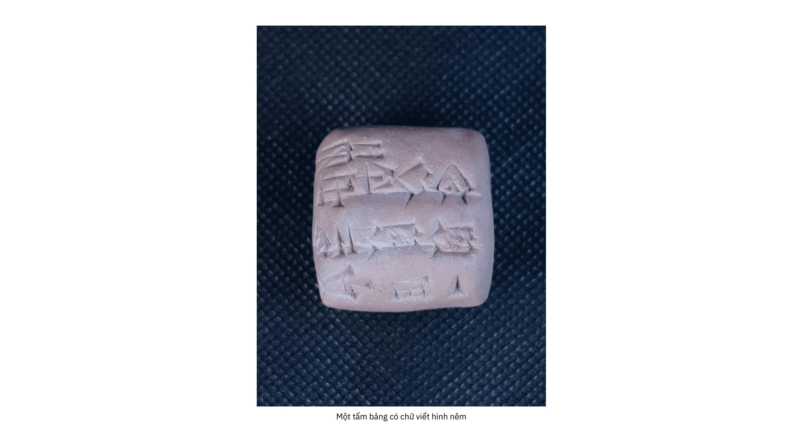

Tôi cũng có một thứ mà tôi tin là một tấm bia Sumer chính hiệu với một chữ viết hình nêm nhỏ ở giữa. Trên tấm bia này có những chữ ký được tạo ra bằng cách lăn một hình trụ, tôi sẽ cho bạn xem sau.

Những dấu hiệu có hình nhỏ đóng vai trò là chữ ký vào thời điểm mà hầu hết mọi người đều không biết viết, vì chỉ những người chép chữ lành nghề mới có khả năng đó.

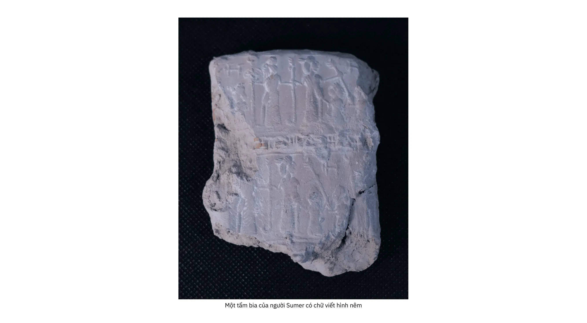

Bên dưới, bạn có thể thấy hình trụ được đề cập ở trên: một viên đá được khắc những hình dạng cụ thể. Người ta thường lăn hình trụ đặc trưng này, được gọi là con dấu trụ trong tiếng Anh, để ký tên. Đó là một cách để ghi rõ tên tác giả, hoặc để chỉ ra rằng chúng được sáng tác theo tên của họ.

Do đó, những người chép kinh thời đó đã sử dụng bút stylus hình nêm để in các ký hiệu trên những tấm bảng ướt.

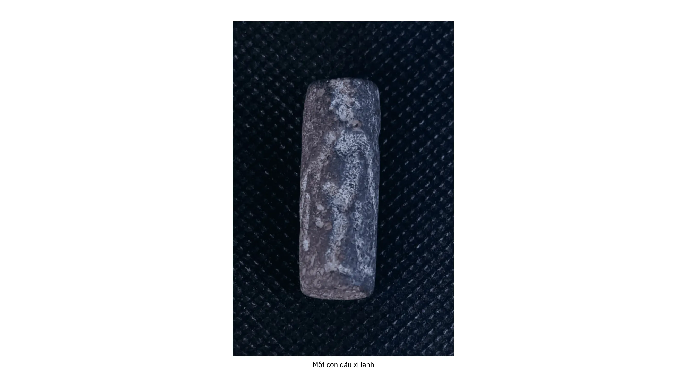

Chữ hình nêm không đại diện cho một ngôn ngữ, mà là một hệ thống chữ viết để ghi lại ngôn ngữ nói. Trong tiếng Anh, chúng ta thường nói "chữ viết là ngôn ngữ viết", rồi lại nói "chữ hình nêm là chữ viết, không phải ngôn ngữ". Vì vậy, trong tiếng Pháp, chúng ta thường nói rằng chữ hình nêm không phải là ngôn ngữ, mà là một cách mã hóa ngôn ngữ.

### Sự tiến hóa và ứng dụng của chữ viết

Trong những thế kỷ đầu tiên tồn tại, chữ viết này vẫn còn hạn chế, chủ yếu đóng vai trò là một hệ thống ghi nhớ để ghi lại số lượng, danh sách hàng hóa nông nghiệp và thiết bị. Chỉ dần dần, nó mới có khả năng **dịch đúng ngữ âm tên** và câu hoàn chỉnh.

Ban đầu, tên không thể được thể hiện bằng chữ hình nêm vì nó chủ yếu biểu thị các vật thể và yếu tố thực tế, chẳng hạn như con bò hoặc lúa mì, dưới dạng hình ảnh thu nhỏ. Theo thời gian, những hình ảnh này đã phát triển thành một dạng chữ viết hoàn thiện hơn, cho phép thể hiện tên và các khái niệm phức tạp.

Ví dụ, nếu tên người đó là Laura, chúng ta có thể lấy một từ, một từ viết tắt nghe giống như "water" (nước) và một từ thứ hai giống như "ras" (ra), rồi ghép lại thành tên Laura. Đó chính là cách hình thức chữ viết đầu tiên phát triển.

Để ghi chép lại, để thể hiện các chữ viết tắt ban đầu, nếu bạn muốn vẽ đầu một con bò, bạn có thể thấy hình dạng đầu của nó. Dần dần, các hình vẽ được đơn giản hóa thành một dạng đường thẳng. Các học giả tin rằng điều này xảy ra bởi vì người ta cầm tấm đất sét ướt bằng một tay, nên việc vẽ lại các chữ cái đầu bằng cách xoay chúng sẽ dễ dàng hơn. Người ta cũng cho rằng điều này là do cách các ký lục cầm tấm đất sét.

Bạn vẫn có thể thấy mối liên hệ với, chẳng hạn, lúa mì hoặc đầu bò trong các từ viết tắt chữ hình nêm, và chúng luôn nghiêng về một phía.

Trong suốt ba thiên niên kỷ sử dụng, chữ viết hình nêm chủ yếu được dùng để lưu giữ hồ sơ kinh tế và hành chính. Tuy nhiên, cư dân Lưỡng Hà sớm nảy sinh mong muốn sâu sắc là lưu giữ mọi thứ xứng đáng vượt qua thử thách của thời gian dưới dạng chữ viết. Do đó, những câu chuyện, truyền thuyết và bài hát, trước đây được truyền miệng bởi các nhạc sĩ lưu động, đã được lưu giữ dưới dạng chữ viết, thường được các học viên sao chép lại. Họ sao chép các văn bản đã tồn tại, chủ yếu là các truyền thuyết hoặc văn bản mang một giá trị văn hóa nhất định.

Một ví dụ quan trọng là **Sử thi Gilgamesh**, có thể là một **vị vua lịch sử của thành bang Uruk của người Sumer** vào khoảng năm 2900-2350 trước Công nguyên.

Hình thức chữ viết này, vừa là công cụ quản lý kinh tế vừa là phương tiện truyền bá văn hóa, tồn tại cho đến thế kỷ thứ nhất sau Công nguyên trước khi biến mất hoàn toàn, để lại bằng chứng quý giá về nền văn minh đã chứng kiến sự ra đời của nó.

## Vai trò của máy tính bảng Sumer

<chapterId>a396e6c5-56cc-5410-9e6b-0274401c5425</chapterId>

:::video id=a0729a35-01ec-4aa4-828f-d4ccc2eb168e:::

### Hệ thống tín dụng tiền tệ

Ở Lưỡng Hà cổ đại, tổ chức kinh tế dựa trên những cơ chế cực kỳ tinh vi đã tồn tại từ rất lâu trước khi tiền kim loại được phát minh. Ngay từ đầu, hệ thống tín dụng chính thức và phi chính thức đã là một hình thức tiền tệ thiết yếu, cho phép người dân địa phương thực hiện nhiều giao dịch kinh tế phức tạp.

Chính xác là để đáp ứng nhu cầu hành chính và kinh tế mà chữ viết hình nêm đã được phát minh. Những tấm bảng đất sét nổi tiếng của vùng Lưỡng Hà chủ yếu được sử dụng để ghi chép các loại hợp đồng khác nhau: vay vốn cá nhân, mua bán, cho thuê, thế chấp, và thậm chí cả hợp đồng hôn nhân. Việc viết những tấm bảng này đòi hỏi chuyên môn của những người ghi chép chuyên nghiệp, một công việc tốn kém về thời gian và công sức, **nhưng lại hợp lý khi liên quan đến lợi ích tài chính.** Thời đó, người ta không viết thư tình cho nhau, họ không nhờ người ghi chép để viết về những nỗi lo lắng của mình. Họ thuê người ghi chép để viết tài liệu, bất kể là vì lý do kết nối hay kinh tế.

Cũng đáng nói đến là một số tấm bảng này được lưu hành như trái phiếu vô danh, có thể chuyển nhượng tự do.

Ví dụ, có một dạng quả cầu đất sét có chứa những viên đá nhỏ bên trong.

Bên ngoài quả cầu đất sét, một con số được viết và ký tên, đại diện cho một số đơn vị. Bên trong, có những viên đá và một người muốn xác minh, để thực sự xác nhận rằng dụng cụ này thực sự đại diện cho X đơn vị.

Một ví dụ khác, một tấm bia được tìm thấy ở phía tây nam Baghdad ngày nay, quy định rằng một con nợ phải trả cho chủ nợ 330 đấu lúa mì vào ngày thu hoạch. Thậm chí còn thú vị hơn, một tấm bia khác ghi rõ rằng khoản nợ bốn đấu lúa mạch phải được trả trực tiếp cho người mang tấm bia, do đó **mở đầu cho khái niệm thanh toán cho người mang tấm bia, một khái niệm đặc biệt sáng tạo vào thời điểm đó**.

Từ năm 2000 TCN trở đi, có một đạo luật yêu cầu mọi giao dịch thương mại, dù là nhỏ nhất, đều phải được lập thành văn bản và ký kết trước sự chứng kiến của nhân chứng. Hãy tưởng tượng bộ máy quan liêu đồ sộ thời bấy giờ để ghi chép tất cả các giao dịch vào sổ sách, tôi xin nhắc lại, được các thư lại làm bằng đất sét. Sự nghiêm ngặt về mặt pháp lý này nhằm mục đích ngăn ngừa các tranh chấp trong tương lai về quyền sở hữu và quyền đối với hàng hóa trao đổi. Nhân chứng thường được triệu tập để làm chứng rằng hợp đồng đã thực sự được ký kết.

Trong lĩnh vực tư nhân, một số gia đình và cá nhân tham gia vào các hoạt động kinh tế phức tạp đến mức cần được quản lý chặt chẽ. Ngôi nhà của một thầy tu Anunitum tên là Ur-Utu đã được phát hiện tại thị trấn Sippar-Amnanu, phía bắc Babylon, chứa gần 2.000 tấm bia. Những tài liệu này bao gồm các hợp đồng vay tư nhân, văn bản mua bán và cho thuê, cũng như thư từ, văn bản tôn giáo và học thuật, minh chứng cho sự đa dạng và tầm quan trọng của kho lưu trữ tư nhân vào thời điểm đó.

Điều đáng chú ý là các bức thư do người chép sử viết hầu như chỉ liên quan đến lợi ích tài chính: phàn nàn về việc thiếu tiền trợ cấp, tiền hồi môn chưa trả hoặc các yêu cầu vật chất cấp bách khác. Vào thời đó, những bức thư cá nhân như thư tình không tồn tại, và thậm chí việc đề cập đến bệnh tật cũng rất hiếm.

Một ví dụ đau lòng về một bức thư như vậy minh họa cho thực tế kinh tế này: một người viết thư bày tỏ sự đau khổ của mình sau khi bị bỏ lại không có tiền bạc hay lương thực khi người bạn đời của anh ta rời đi, trong khi nạn đói nghiêm trọng đang hoành hành ở Assur. Anh ta mô tả nhu cầu cấp thiết phải mua ngũ cốc, và yêu cầu số tiền mặt tương đương với số hàng dệt may của anh ta được gửi đến nhanh chóng để đảm bảo nhu cầu sinh hoạt hàng ngày.

Bức thư này, gửi cho người bạn đời của bà, dường như ám chỉ rằng ông ta đã đi buôn bán ở nơi khác, bỏ lại bà trắng tay. Bà nhắc nhở ông ta rằng bà phải có tiền để mua ngũ cốc và đóng thuế đền thờ. Đây có lẽ là luận điểm gần nhất mà chúng ta có thể tìm thấy trong một bức thư thời bấy giờ. Thư từ hầu như luôn liên quan đến các giao dịch kinh tế, và chính bức thư này lại đề cập đến một tình hình kinh tế bấp bênh.

Do đó, các tài liệu Lưỡng Hà còn lưu lại đến ngày nay chủ yếu phản ánh các trao đổi kinh tế, vì chúng được lập ra chỉ để chuyển giao hàng hóa có giá trị được công nhận: tiền, ngũ cốc, hàng hóa đa dạng, bất động sản, và nộp thuế đền thờ. Những tài liệu lưu trữ này không chỉ cho thấy hiệu quả và tính chính xác về mặt hành chính của nền văn minh cổ đại này, mà còn cho thấy khả năng quản lý các trao đổi kinh tế phức tạp trong một thời gian rất dài.

## Kiểm soát tinh nhuệ trên các phiến đá của người Sumer

<chapterId>c6d3df0e-b1e1-58dc-ab35-9f76bbc39393</chapterId>

:::video id=04a95fb8-a701-4a48-9ce8-0e9b6ba256fd:::

### Viết, một công nghệ trên hết là tiết kiệm

Trái với quan niệm phổ biến, việc phát minh ra chữ viết ở Lưỡng Hà khoảng 4.000 năm trước ban đầu không phục vụ nhu cầu giao tiếp cá nhân hay văn học. **Chữ hình nêm trước hết và quan trọng nhất là một công nghệ kinh tế**, chỉ được coi là hợp lý khi có những lợi ích tài chính quan trọng bị đe dọa. Người Sumer không sử dụng chữ viết để trao đổi thư từ hay bày tỏ cảm xúc, mà chỉ để ghi chép các giao dịch thương mại và tài chính.

Sự chuyên môn hóa này có thể được giải thích bởi chi phí đáng kể của việc viết trên bảng. Khắc trên đất sét đòi hỏi chuyên môn kỹ thuật chuyên biệt, thời gian đáng kể và vật liệu đặc thù. Chỉ những giao dịch có giá trị kinh tế đủ lớn mới hợp lý hóa khoản đầu tư này, tạo ra một ngưỡng tự nhiên để tiếp cận công nghệ mang tính cách mạng này.

Những tấm bia hình nêm tiết lộ một hệ thống tài chính cực kỳ phức tạp so với thời đại của nó. Người Lưỡng Hà đã phát triển một kho vũ khí tài chính hiện đại hoàn chỉnh: **các khoản vay tư nhân có lãi suất, văn bản mua bán, hợp đồng cho thuê, thế chấp, và thậm chí cả hợp đồng hôn nhân kèm theo các điều khoản tài chính**. Sự tinh tế này minh chứng cho một nền kinh tế thị trường phát triển, khác xa với hình ảnh trao đổi hàng hóa thô sơ, đơn giản thường gắn liền với các nền văn minh cổ đại này.

Một số máy tính bảng hoạt động như chứng khoán vô danh chính hiệu, được lưu hành tự do từ tay người này sang tay người khác mà không cần xác minh danh tính người nắm giữ ban đầu. Sự đổi mới này tạo ra tính lưu động đáng kể trong trao đổi, báo trước các hệ thống tài chính hiện đại. Hơn nữa, luật pháp cụ thể thậm chí còn yêu cầu tất cả các giao dịch thương mại phải được chính thức hóa bằng văn bản, qua đó thể chế hóa việc sử dụng chữ viết trong lĩnh vực kinh tế.

### Sự độc quyền của tri thức và kiểm soát kinh tế

Vị trí trung tâm của chữ viết trong nền kinh tế đã mang lại quyền lực đáng kể cho những người nắm vững công nghệ này. **Các thư lại, thường gắn bó với các đền thờ và cơ quan cai trị, nắm quyền kiểm soát trên thực tế hệ thống tài chính**. Chuyên môn hiếm có và vô giá của họ đã biến họ thành người bảo vệ mọi giao dịch quan trọng.

Sự độc quyền về kiến thức này không phải là ngẫu nhiên. Chính quyền hoàn toàn quan tâm đến việc duy trì tính độc quyền này, vì việc dân chủ hóa chữ viết sẽ làm giảm khả năng kiểm soát nền kinh tế của họ và làm tăng nguy cơ làm giả. Sự hiện diện có hệ thống của các nhân chứng tại các buổi lễ ký kết cho thấy mối bận tâm thường trực này về tính xác thực của tài liệu.

Nghĩa vụ pháp lý ghi chép mọi giao dịch thương mại bằng văn bản phục vụ một số mục tiêu chiến lược: kiểm soát tài chính, giám sát kế toán chặt chẽ, và duy trì sự phụ thuộc của các chủ thể kinh tế vào bộ máy hành chính. **Do đó, nhà nước Lưỡng Hà đã nắm giữ khả năng quản lý nợ giữa các cá nhân** trên quy mô xã hội, qua đó biến chữ viết thành một công cụ quyền lực kinh tế.

### Sự cùng tồn tại của hai hệ thống tiền tệ

Phân tích các tấm bia cho thấy một thực tế kinh tế phức tạp hơn so với sự hiện diện phổ biến của chúng trong kho lưu trữ. Nhiều tấm bia đề cập đến **shekel bạc** như một đơn vị giá trị, qua đó chỉ ra sự tồn tại song song của một hệ thống tiền tệ dựa trên hàng hóa vật chất được tiêu chuẩn hóa.

Tính hai mặt này có thể được giải thích bằng sự phân tầng xã hội thời bấy giờ. **Hệ thống bảng chữ hình nêm được dành riêng cho một tầng lớp tinh hoa hạn chế**: giáo sĩ, thương gia giàu có và các quan chức có khả năng đọc, viết và diễn giải những văn bản phức tạp này. Để sử dụng bảng chữ hình nêm một cách hiệu quả, người ta không chỉ phải biết cách giải mã mà còn phải có khả năng xác minh tính xác thực và hiểu được ý nghĩa pháp lý của nó.

**Phần lớn dân số, bị loại khỏi hệ thống tinh hoa này, đã phát triển các cơ chế trao đổi riêng của mình**. Người dân thường sử dụng các hệ thống dễ tiếp cận hơn như các đơn vị đo lường ngũ cốc tiêu chuẩn, trọng lượng tiền tệ, và các hàng hóa dễ định lượng khác mà bất kỳ ai cũng có thể đánh giá mà không cần kỹ năng chuyên môn.

Nền kinh tế phổ biến này, mặc dù ít được ghi chép trong các kho lưu trữ chính thức, có lẽ năng động và linh hoạt hơn hệ thống bảng chữ cái. Nó cho phép trao đổi hàng ngày nhanh chóng mà không cần đến người chép sử, đáp ứng nhu cầu cấp thiết của thợ thủ công, nông dân và tiểu thương.

Đồng shekel bạc, thường được nhắc đến trong các tấm bia như một giá trị tham chiếu, có thể đóng vai trò là cầu nối giữa hai hệ thống kinh tế song song này, cho phép chuyển đổi giữa các khoản nợ bằng văn bản và các khoản thanh toán thực tế.

### Sự xuất hiện tự phát so với sự kiểm soát của thể chế

Sự cùng tồn tại này minh họa cho một cuộc tranh luận cơ bản trong lịch sử kinh tế: **sự đối lập giữa sự xuất hiện tự phát của các phương tiện trao đổi và sự chiếm đoạt tiền tệ mang tính thể chế**. Một mặt, các hàng hóa như tiền tệ xuất hiện một cách tự nhiên từ nhu cầu trao đổi của con người. Mặt khác, các thể chế đã chiếm đoạt và chính thức hóa các hoạt động này để kiểm soát dòng chảy của chúng.

Các đền thờ Sumer là điển hình cho sự căng thẳng này: họ sử dụng những cải tiến tiền tệ phổ biến (tham chiếu đến đồng shekel) đồng thời phát triển các công cụ kiểm soát riêng (bảng chữ hình nêm). Chiến lược này cho phép họ tận dụng lợi ích của cả hai hệ thống: tính hợp pháp phổ biến của tiền tệ truyền thống và sự kiểm soát hành chính đối với các khoản nợ chính thức.

Kinh nghiệm của người Lưỡng Hà thiết lập những tiền lệ lâu dài cho sự phát triển của các hệ thống tài chính. Nó chứng minh rằng **sự tinh vi về tài chính thường đi trước những đổi mới công nghệ hàng ngàn năm**, vốn thường gắn liền với nó. Các khái niệm về lãi suất, tín dụng, công cụ chuyển nhượng và tài sản thế chấp đã không chờ đến khi tiền kim loại được phát minh mới phát triển.

Giai đoạn quan trọng này cũng bộc lộ những vấn đề quyền lực vốn có trong bất kỳ đổi mới tiền tệ nào: ai kiểm soát công nghệ, ai đặt ra quy tắc, và cách thức các hệ thống chính thức và thông lệ phổ biến được thể hiện. Những câu hỏi cơ bản này đã tồn tại xuyên suốt lịch sử kinh tế, mở rộng sang các cuộc tranh luận đương đại về tiền kỹ thuật số và tiền điện tử.

# Kinh tế và tiền tệ trong nền văn minh cổ đại

<partId>a16bcf4c-8c3a-11f0-9e79-2bd363a484bd</partId>

## Các nền văn minh vĩ đại của thời đại đồ đồng

<chapterId>fab9334c-7385-5d7c-ad40-7d152beb22a1</chapterId>

:::video id=737e12e8-1033-4210-b1dd-b8a680f68b17:::

Trong phần này có tiêu đề "Những nền văn minh vĩ đại của thời đại đồ đồng", chúng ta sẽ bắt đầu với một đoạn trích từ cuốn sách *Lịch sử tiền tệ: Từ thời cổ đại đến ngày nay* của Glyn Davies, theo tôi đây là phần giới thiệu tuyệt vời cho phần này về những nền văn minh vĩ đại của thời cổ đại.

> Toynbee xác định khoảng hai mươi mốt "nền văn minh" khác nhau, nhưng vì mười lăm trong số này bắt nguồn trực tiếp hoặc gián tiếp từ các ví dụ trước đó, ông đã giảm số lượng các nền văn minh phát triển độc lập xuống còn sáu: Sumer, Ai Cập, Minoan, Trung Quốc, Maya và Andes. Trong số này, chỉ có người Inca ở dãy Andes mới đạt được trình độ văn minh cao mà không cần sử dụng tiền, mặc dù nghịch lý là họ có rất nhiều vật liệu thường được coi là tốt nhất để sử dụng làm tiền - vàng và bạc.

Người Inca không có hệ thống tiền tệ, nhưng họ lại có rất nhiều kim loại quý. Thật là một nghịch lý. Hãy tiếp tục với câu trích dẫn sau:

> Một xã hội càng phân tầng và hệ thống kế hoạch hóa càng hiệu quả thì việc sử dụng tiền tệ càng ít cần thiết đối với người dân. Điều này có thể giải thích tại sao những người chinh phục Tây Ban Nha phát hiện ra rằng người Mexico, với chính phủ tương đối tự do hơn, thường xuyên sử dụng bột vàng (được bảo quản trong các ống trong suốt) và hạt ca cao (được giữ để thanh toán số tiền lớn trong các túi 24.000 đơn vị) làm tiền tệ, trong khi ngược lại, người Inca, được tổ chức theo một hệ thống phân cấp chặt chẽ hơn nhiều, hoàn toàn không có tiền tệ: một ngoại lệ được xác nhận bởi một quy tắc nghiêm ngặt. Nguồn gốc của tiền tệ ở Trung Quốc hoàn toàn độc lập với các nền văn minh khác; tuy nhiên, sự gần gũi tương đối của các nền văn minh Sumer, Ai Cập và Minoan làm dấy lên nghi ngờ về mức độ thiếu hiểu biết của họ về các hoạt động tiền tệ, đặc biệt là khi xét đến hoạt động thương mại rộng lớn đã được thiết lập từ thời kỳ sơ khai.

Ở Trung Quốc, tiền xu được phát triển theo cách hoàn toàn khác với truyền thống phương Tây. Ngay từ đầu, đó là tiền pháp định. Chúng là tiền đúc.

Và ở đây, ông Davies đề cập đến thương mại. Quả thực đã có sự trao đổi giữa người Trung Quốc và các dân tộc khác vào một số thời điểm nhất định, nhưng phương tiện trao đổi cho thương mại quốc tế lại là lụa. Như chúng ta sẽ thấy sau, vàng cũng được sử dụng ở các vùng biên giới của Trung Quốc, nơi dân số Trung Quốc ít hơn. Và thậm chí không phải cho thương mại quốc tế; vì vậy, lụa là phương tiện trao đổi.

Vì vậy, tôi cho rằng có lẽ về hình dạng của đồng tiền, chúng có thể đã chịu ảnh hưởng từ các nền văn minh khác cùng thời đã phát triển công nghệ này.

Nhưng rõ ràng, bản chất của tiền tệ ở Trung Quốc hoàn toàn khác so với ở phương Tây. Chúng ta sẽ bàn luận chi tiết hơn về vấn đề này trong phần tiếp theo về Trung Quốc.

Liên quan đến những thành phố Sumer nổi tiếng này, tôi có một vài ghi chú ở đây. Chúng ta có thể nhắc đến Uruk, một thành phố rất sớm và có ảnh hưởng, nổi tiếng với quy mô đáng kể và nền văn hóa tiên tiến, đặc biệt là sự phát triển của chữ viết và quy hoạch đô thị.

Và tôi cũng muốn nhắc đến sử thi Gilgamesh nổi tiếng. Gilgamesh có lẽ là một vị vua lịch sử của thành phố Uruk của người Sumer vào khoảng năm 2900 TCN. Ông có lẽ là vua của thành bang Sumer này.

Chúng ta cũng có thể nói đến Sargon của Akkad, người trị vì từ năm 2334 đến năm 2279 trước Công nguyên.

Ông là vị vua đầu tiên của Đế chế Akkad, một nền văn minh khác xuất hiện ở Lưỡng Hà. Tôi nhắc đến Sargon vì ông là người đầu tiên thiết lập dịch vụ bưu chính cho những tấm bia đá nổi tiếng này ở đây, mà tôi đã giới thiệu với các bạn rồi.

Hãy tưởng tượng rằng thực sự có cả phong bì đất sét. Các tấm bia có thể được bọc trong phong bì đất sét với chữ ký của người viết ở bên ngoài để đảm bảo tính bảo mật. Vì vậy, mọi người sẽ mở phong bì để lấy tấm bia. Chúng ta nợ hệ thống bưu chính này cho Sargon xứ Akkad.

Rồi còn Babylon, thành phố vĩ đại đã trở thành thủ đô của Đế chế Babylon. Một nền văn minh khác, nổi tiếng với Ziggurat và cung điện nguy nga, cùng Bộ luật Hammurabi lừng danh, nổi tiếng nhất với bộ luật pháp cực kỳ tiên tiến.

Và hai thành phố để kết thúc phần này. Chúng ta có Ashur, thủ đô của Đế chế Assyria, một trung tâm tôn giáo quan trọng. Và chúng ta có Nineveh, sau này là thủ đô của Đế chế Assyria. Họ đã dời đô đến đó và nơi đây nổi tiếng với quân đội hùng mạnh, cung điện rộng lớn và thư viện. Và đây cũng là một trong những địa điểm có thể có Vườn Treo Babylon huyền thoại. Chúng ta thường nghe về kỳ quan nổi tiếng của thế giới cổ đại này.

Nhưng không có dấu vết nào của những khu vườn treo nổi tiếng này ở Babylon. Mặt khác, ở Nineveh, có bằng chứng khảo cổ về những khu vườn trên nhiều tầng. Có thể các sử gia Hy Lạp như Herodotus đã nhầm lẫn Nineveh với Babylon. Khi họ đến thăm các thành phố ở Lưỡng Hà, có lẽ họ đã gọi nơi này là Babylon. Dấu vết của những khu vườn treo nổi tiếng đã được tìm thấy ở Nineveh, và các học giả có thể tự hỏi liệu Nineveh có phải là địa điểm nổi tiếng nơi những khu vườn này tọa lạc, được gọi là Vườn Treo Babylon hay không.

## Tổ chức kinh tế ở Lưỡng Hà

<chapterId>6afb6fc8-cbb7-56a5-8427-484b4b7d7477</chapterId>

:::video id=aa6a2cbd-5916-4ae3-ad4f-65f0bd5643fa:::

### Cấu trúc kinh tế tiền tư bản và chế độ nô lệ

Chào mừng bạn đến với phần này về tổ chức kinh tế ở Lưỡng Hà. Nền kinh tế tiền tư bản trải qua ba giai đoạn chính: nguyên thủy, nô lệ và phong kiến.

Tất nhiên, chế độ phong kiến xuất hiện muộn hơn nhiều, rõ ràng là vào thời Trung Cổ, và chúng ta đã vượt qua giai đoạn nguyên thủy mà chúng ta đã mô tả trước đó với thời kỳ đồ đá cũ. Giờ đây, ở Lưỡng Hà, khi nói đến tổ chức kinh tế, chúng ta đang nói đến chế độ nô lệ.

Tuy nhiên, ở Lưỡng Hà, phần lớn công việc được thực hiện bởi một tầng lớp phụ thuộc giống như nô lệ, những người không phải là tài sản hợp pháp của chủ nhân nhưng bị tước đoạt thành quả lao động của mình thông qua sự cưỡng bức về thể chất hoặc tư tưởng.

### Vai trò của đền chùa và cung điện như những trung tâm kinh tế

Những vùng đất rộng lớn thống trị nền kinh tế. Địa chủ khai thác đất đai trực tiếp bằng cách thuê nhân công, hoặc cho thuê đất để lấy tiền thuê. Họ cũng tham gia vào các hoạt động tài chính, cho vay tiền với lãi suất cao, thường khoảng 20% đến 33,3% mỗi năm, trái ngược hẳn với các quy tắc nghiêm ngặt hơn của người Do Thái láng giềng.

Các khoản vay của nông dân không nhằm mục đích đầu tư sản xuất - ngoại trừ các công ty vận tải - mà nhằm đảm bảo sự tồn tại của họ cho đến vụ thu hoạch tiếp theo. Tình trạng này thường dẫn đến tình trạng nợ nần triền miên của nông dân.

Cho phép tôi so sánh với một giai đoạn gần đây hơn trong thời cổ đại (La Mã), nơi người dân sống nhờ vào tiền thuê đất nông nghiệp do nông dân và lao động tự do tạo ra, cũng như chiến lợi phẩm. **Những khoản thu nhập này được phân phối cho người dân, không phải để tăng thêm lợi nhuận, mà để nâng cao địa vị xã hội của họ.** Thương mại và thủ công mỹ nghệ thường được giao cho các nhóm ngoài tầng lớp tinh hoa xã hội. Tất cả những điều này trái ngược với nền kinh tế thời trung cổ vốn hướng đến lợi nhuận thông qua thương mại và thủ công mỹ nghệ.

Vậy nên điều chúng tôi muốn nói ở đây là tôi đang so sánh với thực tế là người ta sử dụng các công cụ cho vay tài chính không nhất thiết là để cải thiện phương tiện sản xuất, và sau này ở Rome, lợi nhuận không nhất thiết được tái đầu tư, mà được dùng để nâng cao uy tín của những người có thể hưởng lợi từ lợi nhuận đó. Chúng ta vẫn còn rất xa so với tinh thần tư bản xuất hiện sau này vào thời Trung Cổ, khi việc làm có thể được tạo ra để cải thiện phương tiện sản xuất, và thặng dư được thu thập và tạo ra để theo đuổi lợi nhuận. Vì vậy, chúng ta có thể thấy rằng tổ chức kinh tế vẫn chưa đạt đến giai đoạn thứ ba của các cuộc cách mạng kinh tế được liệt kê ở trên.

### Sự xuất hiện của hệ thống tín dụng và đơn vị tính toán

**Karl Polanyi phân biệt ba hình thức trao đổi kinh tế: có đi có lại giữa các nhóm đối xứng,** điều này sẽ xảy ra trong các bộ lạc nguyên thủy, nơi chúng ta không thực sự cần tiền vì chúng ta trao đổi tín dụng không chính thức và phân phối lại cho nhau. **Phân phối lại tập trung xung quanh các đền thờ và cung điện,** hình thức trao đổi này phù hợp với Lưỡng Hà, nơi các đền thờ là trung tâm của tổ chức kinh tế và có thể trả lại, phân phối của cải dưới dạng khẩu phần. Chỉ sau này, khái niệm tiền lương mới được đưa ra. Vì vậy, cho đến nay, chúng ta có hình thức nguyên thủy (1), phân phối lại tập trung (2) trong các đền thờ và cung điện, và sau đó cuối cùng chúng ta có thể nhường chỗ cho các trao đổi thị trường (3). Mặc dù thị trường như chúng ta hiểu ngày nay không tồn tại đầy đủ, nhưng sự hiện diện của các trao đổi thị trường ở Lưỡng Hà là không thể chối cãi, được chứng thực bằng sự tồn tại của các thuật ngữ cụ thể trong tiếng Akkad và bằng chứng khảo cổ học về giá cả, lợi nhuận, thua lỗ, biến động và tình trạng khan hiếm.

Các hộ gia đình Lưỡng Hà tự quản lý tất cả các giai đoạn sản xuất nông nghiệp, từ gieo trồng đến chế biến thành bánh mì và bia. Phụ nữ cũng sản xuất hàng dệt may cần thiết cho gia đình. Đối với những hàng hóa không sản xuất tại địa phương, các hộ gia đình tìm đến các thương gia chuyên doanh.

Quan hệ gia đình đặc biệt quan trọng trong thương mại. Trong thời kỳ Paleo-Assyria (khoảng 1910-1830 TCN), các thương gia từ thành phố Ashur đã thành lập một thuộc địa thương mại tại Kanesh ở Anatolia, nhập khẩu thiếc và hàng dệt may để đổi lấy vàng và bạc. Thương mại chủ yếu dựa trên các doanh nghiệp gia đình được liên kết chặt chẽ thông qua hôn nhân và quan hệ đối tác thương mại. Kanesh chỉ là một mắt xích trong mạng lưới thương mại quốc tế rộng lớn.

Trong những cuộc trao đổi này, có kim loại, và chúng là kim loại quý, chứ không nhất thiết phải là đồng, vốn rất hữu ích vào thời điểm đó, và chúng tôi cho rằng những kim loại này được trao đổi để lấy khái niệm về kho lưu trữ giá trị. Vì vậy, chúng ta không nhất thiết phải nói về trao đổi hàng đổi hàng, nơi hai hàng hóa được trao đổi vì tính hữu dụng của chúng, mà đúng hơn là một khái niệm thanh toán với nhận thức nhất định về việc tích trữ kim loại quý để sử dụng làm kho lưu trữ giá trị chứ không phải để sử dụng chúng như một loại hàng hóa, ví dụ như sử dụng đồng để chế tạo áo giáp.

Cống phẩm và thuế chủ yếu được nộp bằng hiện vật (lúa mạch hoặc bạc đã cân). Đền chùa và cung điện là những trung tâm kinh tế, hành chính, chính trị và tôn giáo chính, đồng thời cũng thực hiện các chức năng ngân hàng đầu tiên thông qua việc gửi tiền an toàn, đầu tiên là ngũ cốc, sau đó là các sản phẩm nông nghiệp khác và cuối cùng là kim loại quý. Theo cách này, các hoạt động tín dụng và cho vay đầu tiên đã được phát triển, rất lâu trước khi tiền xu xuất hiện.

Nền kinh tế Lưỡng Hà chủ yếu sử dụng lúa mạch và bạc làm chuẩn mực giá trị. Bạc được cân theo các đơn vị chuẩn, chẳng hạn như sìqlum (shekel) khoảng 8,33 gram. Ngay từ thời Babylon cổ đại (dưới thời Hammurabi), bạc đã được sử dụng làm phương tiện thanh toán phổ biến, với khái niệm ban đầu về giá trị danh nghĩa ("nūbum") trái ngược với trọng lượng thực ("šuqulum"), **dự đoán trước khái niệm tiền tệ pháp định hiện đại**.

Nhưng lúc đó nó vẫn chưa phải là tiền pháp định theo đúng nghĩa đen của từ này. Chưa có khái niệm về con dấu với hình ảnh đại diện, nhưng đã có khái niệm về một đơn vị tính toán danh nghĩa, trái ngược với khái niệm kim loại được cân đo. Có sự khác biệt trong ngôn ngữ giữa hai khái niệm này, và tôi nghĩ điều quan trọng là phải đề cập đến điều đó.

Quá trình chuyển đổi sang thị trường lao động trả lương là một quá trình khó khăn. Nó đòi hỏi hai đổi mới quan trọng về mặt khái niệm: tách biệt công việc của người lao động khỏi sản phẩm cuối cùng, và đưa "thời gian làm việc" vào như một đơn vị đo lường được. Để có được khái niệm về tiền lương và người lao động hưởng lương, trước tiên chúng ta phải trải qua hai đổi mới này. **Trong thiên niên kỷ III, lao động ban đầu được trả công theo khẩu phần cố định, trước khi dần dần phát triển thành hệ thống tiền lương vào đầu thiên niên kỷ II.**

Cuối cùng, từ thế kỷ 26 TCN trở đi, một khái niệm thực sự về giá trị tiền tệ đã bén rễ, mặc dù "tiền" của người Lưỡng Hà không phải là tiền xu, mà là một đơn vị đo lường ngũ cốc hoặc kim loại có trọng số. **Vì vậy, đối với các giao dịch quan trọng hoặc trong bối cảnh đòi hỏi phải bảo toàn giá trị, người ta thường thích quy đổi ngũ cốc thành bạc, vì bạc dễ bảo quản hơn.** Tương tự như trường hợp của Kanesh, nơi kim loại bạc được sử dụng để tích trữ.

Từ thế kỷ 21 trước Công nguyên trở đi, **với sự biến mất gần như hoàn toàn của các trao đổi bất đối xứng**, chúng ta thấy rằng trong các hợp đồng chuyển nhượng, động từ sa ám chỉ việc thanh toán giá cả. Khái niệm này, được gọi là "sa", xuất hiện trong các hợp đồng và ám chỉ việc thanh toán một mức giá, chứ không phải việc đo lường một loại hàng hóa cụ thể. "Sa" đơn giản chỉ một khoản thanh toán hoặc một mức giá. Một nhà nhân chủng học đã ghi nhận điều này và nói rằng đó thực sự là một bước đột phá; chúng ta thấy một sự phân đôi giữa trước và sau khi động từ "sa" được đưa vào hợp đồng.

Chúng ta không thể bỏ qua dữ liệu thực nghiệm có trong kho lưu trữ Cận Đông chứng minh sự tồn tại của **một số cơ chế thị trường**, bao gồm **các khái niệm về lợi nhuận** và **lỗ**, **biến động giá** và tình trạng **khan hiếm**. Nhưng khó khăn cơ bản nằm ở việc xác định tầm quan trọng tương đối của trao đổi dựa trên thị trường trong toàn bộ nền kinh tế Lưỡng Hà cổ đại.

Tôi nghĩ các chuyên gia trong lĩnh vực này đã thấy dấu vết của các khái niệm thị trường này, nhưng họ không thực sự có thể cho chúng ta biết nền kinh tế thời đó dựa trên khái niệm thị trường hiện đại hơn này hay các cơ chế khác bao nhiêu.

Chúng ta biết nó tồn tại, nhưng chúng ta không biết liệu đó có phải là cách chính để xác định giá cả hay giao dịch hay không.

Phần này về tổ chức kinh tế ở Lưỡng Hà kết thúc tại đây.

Ở các phần tiếp theo, chúng ta sẽ làm tương tự đối với Ai Cập và Trung Quốc.

## Tổ chức kinh tế và tiền tệ ở Ai Cập cổ đại

<chapterId>bffcc16c-7fbf-5992-a0fa-6a7726d7d287</chapterId>

:::video id=40c1c4e5-b190-4bb6-b8a0-810c9ce7698b:::

### Bối cảnh lịch sử và thời kỳ Ai Cập

Phần này dành riêng cho tổ chức kinh tế và tiền tệ của Ai Cập cổ đại. Để cung cấp cho bạn một chút thông tin cơ bản, sau đây là danh sách và mô tả ngắn gọn về các giai đoạn được đề cập.

- Vương quốc Cổ (khoảng 2575 - khoảng 2130 TCN)**. Một thời kỳ được đánh dấu bằng việc xây dựng các kim tự tháp vĩ đại, đáng chú ý là kim tự tháp Giza. Đây là thời kỳ hoàng kim của chế độ quân chủ tập quyền Ai Cập.
- Thời kỳ Trung Vương quốc (khoảng năm 1938 - khoảng năm 1630 trước Công nguyên)**. Sự phục hưng chính trị và văn hóa sau một thời kỳ bất ổn.
- Tân Vương quốc (khoảng 1539 - 1075 TCN)**. Một thời kỳ mở rộng lãnh thổ, phát triển sức mạnh quân sự và thương mại quốc tế. Thời kỳ này bao gồm triều đại của các pharaoh nổi tiếng như Tutankhamun và Ramses II.
- 1323 TCN - Tutankhamun qua đời**. Vị pharaoh trẻ tuổi này qua đời ở độ tuổi khoảng 18-19. Lăng mộ gần như nguyên vẹn của ông được phát hiện vào năm 1922, khiến nó trở thành một trong những khám phá khảo cổ nổi tiếng nhất.
- Ramses II - Trị vì 1279-1213 TCN**. Một trong những pharaoh hùng mạnh nhất của Vương quốc Mới. Nổi tiếng với các chiến dịch quân sự, các di tích vĩ đại, và có lẽ là người đã ký kết hiệp ước hòa bình đầu tiên được biết đến.
- 1275 TCN - Dân tộc Biển**. Các cuộc xâm lược hoặc di cư của các nhóm được gọi là "Dân tộc Biển" làm mất ổn định một số nền văn minh Địa Trung Hải, bao gồm cả Ai Cập.
- Trận Xoïs - 1178 TCN**. Cuộc xung đột giữa quân đội Ai Cập và quân xâm lược, có thể liên quan đến các dân tộc Biển. Một trong nhiều trận chiến vào cuối thời kỳ Tân Vương quốc.
- Thời kỳ Hậu kỳ** là giai đoạn lịch sử Ai Cập cổ đại từ khoảng năm 664 đến năm 332 trước Công nguyên.
- Cleopatra VII (69 - 30 TCN)**. Nữ hoàng cuối cùng của Ai Cập, nổi tiếng với trí tuệ, sức hút và mối quan hệ đồng minh với Julius Caesar và Marc Antony, và có lẽ cũng vì chiếc mũi của bà. Triều đại của bà đánh dấu sự kết thúc của Ai Cập thời Pharaon trước khi bị La Mã sáp nhập.

Đến thiên niên kỷ thứ 5 và thứ 4 trước Công nguyên, Ai Cập đã trải qua hoạt động thương mại sôi động trên quy mô lớn, nối liền Nubia, Palestine, Libya và các khu vực Biển Đỏ thông qua thương mại trên biển, trên sông và trên bộ (đặc biệt là bằng đoàn lữ hành bằng lừa).

### Hệ thống trao đổi ban đầu và tiền tệ cổ đại

Với sự xuất hiện của các tù trưởng đầu tiên của Ai Cập vào khoảng năm 3650-3400 trước Công nguyên, địa điểm Maadi, phía nam Cairo ngày nay, đã trở thành trung tâm lớn về công nghệ đồng và thương mại đường dài, đặc biệt là với Lưỡng Hà qua bờ biển Syria.

Mặc dù thương mại quy mô lớn chủ yếu dựa trên trao đổi hàng hóa, một hình thức tiền tệ nguyên thủy ("tiền tệ cổ"), được tạo thành từ các vật phẩm có giá trị như đá bán quý và vỏ sò hóa thạch, có lẽ đã tồn tại. Vàng có lẽ đã đóng một vai trò quan trọng trong những trao đổi này. Việc lần đầu tiên đề cập rõ ràng đến tiền xu trong các tài liệu Ai Cập vào giữa thiên niên kỷ thứ 3 trước Công nguyên phản ánh một sự phát triển lâu dài gắn liền với các hoạt động thương mại.

Trong xã hội cổ đại (ở đây chúng ta không nhất thiết nói về Ai Cập, mà là các xã hội cổ đại nói chung), việc thanh toán diễn ra thường xuyên, không phải để mua trực tiếp, mà để trả của hồi môn, các nghi lễ tôn giáo và các nghĩa vụ xã hội khác. Những giao dịch này đòi hỏi phải định giá và định giá chính xác. Nhiều xã hội nguyên thủy có các vật phẩm đặc quyền, được định giá bằng tiền (tức là có thể đếm được), mà giá trị của chúng được ước tính dựa trên đó. Nếu bạn trả của hồi môn, tất nhiên, bạn phải ghi lại một số lượng nhất định của một vật phẩm để trao đổi. Giá trị này về cơ bản là giá trị của con người.

Trong các xã hội cổ xưa, trước khi tiền tệ hoặc hệ thống tiền tệ ra đời, đã có các khoản thanh toán, nhưng chúng thường gắn liền với các nghĩa vụ xã hội và giá trị của chúng bắt nguồn từ giá trị của cá nhân, như trong việc thanh toán của hồi môn hoặc tiền máu.

Trở lại Ai Cập, trong thời kỳ đế chế cổ đại, "shât(y)", ban đầu là một đơn vị tiền tệ cụ thể (một đồng xu vàng hoặc bạc nhỏ nặng khoảng 7,6 gram), đã nhanh chóng chuyển từ chức năng thực sự là một loại tiền tệ cứng sang một **chức năng kế toán**, từ đó hình thành nên khái niệm giá trị. Chúng ta có thể nhận ra trong đó một loại đơn vị tính toán để thể hiện giá trị, ban đầu là một loại tiền xu, nhưng chúng ta không thể thực sự gọi nó là tiền xu vì nó không được đóng dấu, mà chỉ là một đơn vị đo lường kim loại. Chúng ta đang tiến gần hơn đến khái niệm đơn vị tính toán.

Khái niệm shât(y) này cuối cùng đã bị loại bỏ, có lẽ vì nguy cơ gian lận. Chúng ta sẽ thấy sau này rằng người Ai Cập chậm chấp nhận tiền xu có đóng dấu và thậm chí vẫn tiếp tục cân chúng, ngay cả sau khi chúng đã được các nước láng giềng chấp nhận.

Vào thời Trung Cổ, bạc hiếm khi được sử dụng trong các giao dịch hàng ngày, chủ yếu được thực hiện bằng các đơn vị đong ngũ cốc và bánh mì. Chính trong thời kỳ này, một loại tiền kinh thánh đã xuất hiện, trong đó các khoản thanh toán có thể được ghi lại bằng văn bản hoặc bằng chuyển khoản thực tế.

Vào thời Tân Vương quốc, hệ thống tiền tệ trở nên phức tạp hơn, tích hợp các loại tiền tệ hàng hóa khác nhau được định giá bằng kim loại (vàng, bạc, đồng), vải vóc, ngũ cốc và dầu mỏ được tiêu chuẩn hóa. Vải vóc được gọi là "đơn vị đo lường vải vóc". **Giá cả hàng hóa thường được tính bằng ngũ cốc hoặc đồng, trong khi các vật phẩm quý giá được định giá bằng vàng hoặc bạc. Bạc, vốn hiếm hơn vàng ở Ai Cập, lại trở nên đặc biệt được coi trọng.** Bạc được định giá quá cao so với vàng, vốn phổ biến hơn ở Ai Cập.

Đến thời Hậu kỳ (thiên niên kỷ thứ nhất trước Công nguyên), bạc đã trở thành kim loại trao đổi phổ biến khắp Cận Đông. Nó được lưu hành dưới dạng thỏi, tiền kim loại hoặc nhẫn, được cân và đánh dấu trong các đền thờ, đảm bảo trọng lượng và độ tinh khiết của chúng, mặc dù chúng không được đúc theo hình ảnh một vị vua. Điều này xuất hiện sau đó, và sẽ là chủ đề của một phần tiếp theo về người Lydia.

Cũng cần lưu ý rằng người Ai Cập cổ đại có thuật ngữ "hedj" để chỉ tiền, và nó được dùng chung để chỉ bất kỳ phương tiện thanh toán nào được dùng làm vật đối ứng trong giao dịch, dù là kim loại, ngũ cốc, vải vóc hay nhiều loại hàng hóa khác nhau (gỗ, động vật, dịch vụ, v.v.). Các ví dụ được ghi chép lại cho thấy người Ai Cập có thể thanh toán giao dịch bằng cách kết hợp nhiều sản phẩm có tổng giá trị được biểu thị bằng đơn vị đồng ("deben").

**Đền thờ đóng vai trò trung tâm trong nền kinh tế Ai Cập: họ thu thập và tích trữ một lượng lớn kho báu kim loại quý (vàng và bạc) nhằm tôn vinh các vị thần, đồng thời đóng vai trò là nguồn dự trữ tiền tệ có thể được tái sử dụng vào hoạt động kinh tế khi cần thiết**. Chúng ta sẽ thấy những ví dụ về việc các nền văn minh khác tích trữ các nguồn dự trữ quý giá trong đền thờ, chẳng hạn như tượng, để nấu chảy trong trường hợp chiến tranh, thiếu hụt tiền tệ hoặc khủng hoảng. Đây là một chủ đề thường xuyên xuyên suốt lịch sử.

Cũng đáng nói đến là việc trồng vải lanh là độc quyền của hoàng gia được trao cho các ngôi đền, và việc sản xuất các loại vải quý đã khẳng định tầm quan trọng về mặt kinh tế của chúng.

Người Ai Cập cổ đại đã phân biệt rõ ràng giữa khía cạnh tư tưởng của kim loại quý, liên quan đến thần thánh (vàng tượng trưng cho thịt của các vị thần, bạc tượng trưng cho xương của họ) và chức năng thực tế của chúng như một loại tiền tệ dùng làm tham chiếu cho tất cả các hình thức thanh toán khác.

Vì vậy, mặc dù Ai Cập cổ đại không phát triển được loại tiền tệ tương đương với hệ thống tiền tệ hiện đại cho đến thời kỳ cuối, nhưng nước này lại sở hữu một hệ thống tiền tệ tinh vi, dựa trên việc sử dụng kết hợp tiền kinh thánh, đơn vị tính toán chính xác, tiền hàng hóa và kim loại quý được định giá theo trọng lượng.

Bản thân những đồng xu đã được cân, dẫn đến hai khái niệm khác nhau: **"tiền xu" và "tiền"**. Tôi đã sử dụng hai thuật ngữ tiếng Anh. Thứ nhất, "tiền xu" dùng để chỉ tiền xu, một khái niệm xuất hiện sau này, và chúng ta cũng có khái niệm này về tiền. Chúng ta đã có thể định nghĩa một khái niệm nhất định về "tiền" bằng các đơn vị tính toán mà tôi vừa trình bày dưới dạng tiền, nhưng chúng vẫn chưa phải là tiền xu, vì vậy "tiền xu" xuất hiện muộn hơn một chút với người Lydian.

Và như vậy, tiền xu không phải là điều kiện tiên quyết để có tiền, **đến mức chúng ta có thể thừa nhận sự tồn tại của tiền tệ ngay từ thiên niên kỷ thứ 3,** trong mọi trường hợp và không còn nghi ngờ gì nữa là trong thiên niên kỷ thứ 2 và đặc biệt là dưới thời trị vì của Hammurabi.

Điều quan trọng cần nhớ ở đây, và cũng là điều mà tác giả đề cập trong cuốn sách "Nguồn gốc của tiền tệ", là không còn nghi ngờ gì nữa, khái niệm tiền tệ đã tồn tại vào thời điểm đó, trong các hệ thống tiền tệ này, và việc liên kết sự ra đời của khái niệm tiền tệ với sự xuất hiện của tiền xu là một sai lầm.

Cuối cùng, các khái niệm về sự tương hỗ và tái phân phối của Polanyi, thường được áp dụng cho Ai Cập cổ đại, cần được tinh tế hóa: tuy tồn tại, chúng không tạo thành một khuôn khổ độc quyền. Ai Cập thời Pharaon đã phát triển một nền kinh tế phức tạp, tích hợp đầy đủ các hoạt động thương mại tinh vi, khác biệt với các hoạt động tôn giáo và nghi lễ, thể hiện sự tự chủ thực sự của lĩnh vực kinh tế so với hệ tư tưởng.

Đặc điểm này có liên quan đến quan niệm cho rằng kim loại quý gắn liền với một vị thần nào đó, nhưng vẫn có khả năng phân biệt được.

Tôi nêu ra điều này vì Polanyi cho rằng việc sử dụng những kim loại quý này chủ yếu mang tính tôn giáo hoặc thần thánh. Tuy nhiên, chúng tôi cho rằng chúng cũng đã được tích hợp vào hệ thống kinh tế, và người Ai Cập đã có thể phân biệt được điều này.

Để kết luận, tôi xin trích dẫn từ cuốn sách "Nguồn gốc của tiền tệ", trong đó nêu rõ mục đích của phát minh này, tức là tiền đúc. Có nhiều điểm cần lưu ý, nhưng tôi chỉ muốn nhấn mạnh điểm số 5:

*phát triển khả năng kinh tế thông qua việc sử dụng các phương pháp như phá giá và tái định giá liên tiếp để giảm hoặc tăng xuất nhập khẩu với chi phí thấp hơn*

Vậy nên, ngay cả trong thời kỳ cổ xưa đó, tác giả cho rằng tiền xu đã được phát minh hoặc xuất hiện dưới sự kiểm soát của nhà nước và đã bị thao túng về số lượng kim loại quý và trọng lượng để quản lý nền kinh tế. Cho phép tôi tiết lộ một chút về phần tiếp theo. **Ngay cả trong những hình thức tiền xu sơ khai nhất, được làm bằng electrum, một hợp kim của vàng và bạc, chúng ta biết được từ việc phân tích hàm lượng kim loại quý trong những đồng tiền này rằng những người phát hành đầu tiên, chẳng hạn như Croesus, có ít vàng hơn so với electrum tự nhiên.**

Điều này có nghĩa là họ đã biết cách phân biệt vàng và bạc, và phát hành những đồng tiền chứa ít vàng hơn.

Tác giả cho rằng ngay từ những ngày đầu của tiền xu, ngoài việc chứng nhận trọng lượng và tạo điều kiện thuận lợi cho thương mại, quyền đúc tiền đã bị lạm dụng để tăng số lượng phát hành, có thể là một hình thức lập kế hoạch kinh tế.

## Ký hiệu tiền tệ và tổ chức kinh tế tiền tệ ở Trung Quốc cổ đại

<chapterId>e08d3be9-423c-5cf3-a606-6ad54e2261af</chapterId>

:::video id=ae7e6367-1725-455e-bfe6-359be1f443e5:::

Trong phần này, với tựa đề "Tiền ký hiệu và tổ chức kinh tế, tiền tệ của Trung Quốc cổ đại", chúng ta sẽ thấy rằng tiền tệ Trung Quốc cổ đại có những đặc điểm riêng biệt so với truyền thống phương Tây. Tiền tệ Trung Quốc ngay từ đầu đã là một loại "tiền ký hiệu". Thông tin trong phần này dựa trên những ghi chép của tôi sau khi đọc cuốn sách "Aux origines de la monnaie".

### Khái niệm về tiền tệ ký hiệu và các đặc điểm riêng biệt của nó

Theo tác giả, tiền ký hiệu tương đương với tiền pháp định ngày nay. Đó là một loại tiền tệ không có giá trị liên quan đến hàm lượng kim loại của nó. Ngay từ đầu, đó đã là một dạng thỏa thuận, một sự đồng thuận xã hội về giá trị của những đồng tiền này.

Tiền xu cổ của Trung Quốc có những đặc điểm khác biệt so với truyền thống phương Tây. Chúng chủ yếu được làm bằng kim loại, nhưng được đúc chứ không phải đúc thủ công, và không có hình ảnh một vị vua. Điều đáng ngạc nhiên là nhà nước Trung Quốc không độc quyền phát hành tiền tệ. Sự tự do rõ ràng này có thể được giải thích bởi việc không có bất kỳ nhu cầu kinh tế nào để độc quyền phát hành tiền tệ, nhờ nguồn thuế dồi dào được đánh vào một lượng lớn dân số chịu thuế.

Tiền tệ Trung Quốc cũng mang đặc điểm của tính tín nhiệm. Ngay từ thuở sơ khai, người ta đã sử dụng vỏ sò (vỏ ốc) làm tiền tệ bằng đồng, không liên quan trực tiếp đến giá trị nội tại của kim loại được sử dụng. Nếu ngược dòng lịch sử xa xưa, người Trung Quốc đã sử dụng vỏ sò làm tiền tệ. Cuối cùng, khi vỏ sò trở nên quá khan hiếm, họ đã chế tạo bản sao bằng đồng, và những bản sao này có giá trị tương đương với hàng thật.

Do đó, tiền tệ Trung Quốc không dựa trên giá trị của vật liệu hoặc độ hiếm tương đối của mặt hàng gốc (ví dụ như động vật có vỏ), mà dựa trên niềm tin tập thể vào việc sử dụng nó như một phương tiện trao đổi - nói cách khác, là một ký hiệu tiền tệ.

### Từ vỏ ốc xà cừ đến đồ giả kim loại

Đồng tiền vỏ ốc được sử dụng rộng rãi như một đơn vị tiền tệ nguyên thủy. Các văn bia cổ cho thấy, ngay từ thời nhà Thương và nhà Chu (triều đại đầu tiên của thiên niên kỷ thứ nhất và thứ hai trước Công nguyên), vỏ ốc không chỉ được sử dụng để thưởng cho các chiến công quân sự mà còn để **trả công lao động, đo lường giá trị và mua đất**.

Điều quan trọng cần nhớ ở đây là nó không phải là một công cụ bất kỳ được xã hội sử dụng cho những mục đích hạn chế. Nó được sử dụng để trao thưởng quân sự, trả công lao động và đo lường giá trị. Chúng ta tìm thấy dấu vết của điều này trong các ghi chép của các nhà khảo cổ học. Mặc dù chúng ta không biết liệu nó có được sử dụng để mua bánh mì hàng ngày hay không, nhưng chúng ta có bằng chứng cho thấy nó có thể đã được sử dụng cho các loại giao dịch được đề cập ở trên.

Theo thời gian, sự khan hiếm vỏ ốc tiền thật đã dẫn đến việc sản xuất các sản phẩm giả bằng đồng, xương, xà cừ hoặc đá, đặc biệt là để sử dụng trong tang lễ nhằm tránh làm mất giá trị thực trong lăng mộ. Sự thay đổi phương tiện này cũng liên quan đến ý tưởng về quyền kiểm soát tiền bạc của hoàng tử, một quyền kiểm soát càng dễ dàng hơn nếu hoàng tử kiếm được tiền.

Điều chúng ta cần hiểu ở đây là, bằng cách vượt qua giới hạn khan hiếm tự nhiên của vỏ sò, nếu hoàng tử có thể tự tạo ra tiền tệ, ông ta sẽ có khả năng kiểm soát tốt hơn đối với việc quản lý nền kinh tế.

Không giống như ở Lưỡng Hà, nơi tiền xu được gắn liền với trọng lượng của kim loại quý, thuật ngữ tiền tệ Trung Quốc bắt nguồn trực tiếp từ hình dạng ban đầu của các vật thể được sử dụng làm tiền tệ: tiền vỏ ốc (bei), dao (dao), bích (bu) và tiền xu tròn (quan hoặc qian). Do đó, chúng ta có thể thấy nguồn gốc của các từ liên quan đến tiền ở Trung Quốc bắt nguồn từ những vật thể này. Ngược lại, ở phương Tây, chúng ta có một số thuật ngữ tiền tệ bắt nguồn từ những khái niệm hoàn toàn khác biệt, liên quan nhiều hơn đến đặc điểm vật lý và trọng lượng của các vật thể tiền tệ. Những khác biệt về từ nguyên này cho thấy rõ sự chia rẽ giữa quan niệm về tiền tệ của phương Tây và Trung Quốc.

Ở Trung Quốc, giá trị tiền tệ hoàn toàn phụ thuộc vào sự ủy thác, dựa trên quy ước xã hội giữa Nhà nước, người sản xuất và thương gia.

### Quy định kinh tế và triết lý tiền tệ

Nhà nước Trung Quốc sử dụng tiền tệ như một công cụ điều tiết kinh tế: trong thời kỳ tiền tệ dư thừa, giá trị đồng tiền giảm, giúp người dân dễ dàng mua sắm hàng hóa hơn. Ngược lại, trong thời kỳ tiền tệ khan hiếm, giá trị đồng tiền tăng lên, củng cố sức mua của nhà nước cho các hoạt động tiếp theo.

Ở đây, có thể thấy mối liên hệ giữa lạm phát và giảm phát. Với nguồn cung tiền cố định, nếu năng suất của nền kinh tế tăng, giá trị của đồng tiền sẽ tăng. Ngược lại, nếu năng suất giảm, giá trị của đồng tiền sẽ giảm. Tuy nhiên, trong ví dụ này, điều ngược lại mới đúng. Có lẽ vì hoàng tử không hoàn toàn độc quyền sản xuất tiền, nhưng điều này vẫn cho thấy giá trị của đồng tiền gắn liền với các điều kiện kinh tế.

Nhà triết học Mặc Địch (thế kỷ thứ 5-4 trước Công nguyên) đã phân tích mối quan hệ giữa giá cả và giá trị: theo ông, sự thay đổi giá cả không phản ánh khái niệm thực sự về sự rẻ hay sự đắt tuyệt đối, mà là mối quan hệ dao động giữa hàng hóa và tiền tệ, không phụ thuộc vào giá trị danh nghĩa ổn định của ký hiệu tiền tệ.

Vì vậy, ở đây, thay vì nói rằng đồng tiền vàng sẽ có một số loại giá trị cơ bản như vậy, chẳng hạn như giá trị sử dụng hoặc giá trị nội tại, ông chỉ ra rằng giá trị của ký hiệu tiền tệ đến từ tình trạng của nền kinh tế.

Ở Trung Quốc, tiền xu không nhất thiết phải được đánh dấu hoặc bảo đảm chính thức. Việc chấp nhận tiền xu hoàn toàn phụ thuộc vào lòng tin tập thể, điều này giải thích tại sao tiền xu bằng đồng hoặc đồng thau không có chữ khắc cụ thể vẫn có thể lưu hành tự do trong một thời gian dài.

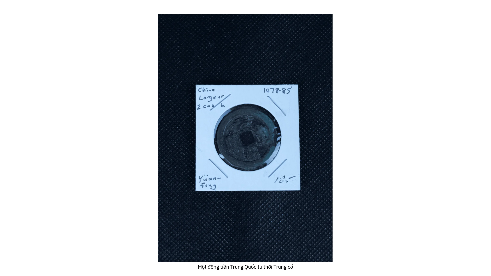

Hình trên là một đồng xu Trung Quốc thời Trung Cổ. Đây là một đồng xu đúc có một lỗ vuông ở giữa. Lỗ này được dùng để luồn dây thừng, cho phép xâu các đồng xu lại với nhau thành vòng tay hoặc vòng cổ. Tuy nhiên, chúng không chủ yếu để đeo; chúng chủ yếu được sử dụng cho mục đích kế toán. Chúng có thể được xâu lại với nhau để tạo thành các đơn vị tính toán dưới dạng những sợi dây lớn, với các mảnh được móc vào nhau. Không nhất thiết phải có dấu hiệu cụ thể nào, đôi khi chúng chỉ đơn giản là những vòng tròn bằng đồng.

Chế độ độc quyền tiền tệ của nhà nước, được thiết lập muộn bởi Hán Vũ Đế vào năm 113 trước Công nguyên, thường xuyên bị thách thức, cho phép nhiều cá nhân hoặc tổ chức địa phương phát hành loại tiền tệ riêng của họ, miễn là họ có đủ sự tin tưởng trong xã hội.

**Giá trị nội tại thấp của tiền tệ Trung Quốc đã ngăn chặn tình trạng tích trữ, đảm bảo sự lưu thông thông suốt của chúng**. Kim loại quý hiếm khi được sử dụng làm tiền tệ lưu thông để ngăn chặn tình trạng tích trữ. Vàng, vì quá đắt, thường được giữ lại thay vì chi tiêu. Thay vào đó, **chỉ có lụa mới đại diện cho một loại tiền tệ có giá trị thực sự cao trong thương mại quốc tế của Trung Quốc**. Người Trung Quốc giao dịch bằng lụa, không phải vàng.

Trong các cuộc khủng hoảng kinh tế hoặc tiền tệ, đặc biệt là khi giá đồng tăng cao, các giải pháp sáng tạo đã được áp dụng: ngay từ thế kỷ thứ 2 sau Công nguyên, tiền xu đang lưu hành đã được cắt thành các đơn vị nhỏ hơn, cho phép duy trì lưu thông trôi chảy với chi phí thấp hơn. Các thời đại khác, chẳng hạn như thời Vương Mãng (đầu thế kỷ thứ 1 sau Công nguyên), đã thử nghiệm các loại tiền tệ có tính tín nhiệm cao, với mệnh giá cao hơn nhiều so với hàm lượng kim loại thực tế, do đó tạo ra tiền giấy. Họ lấy một đồng xu và đóng dấu các giá trị như 50, 100 hoặc 200 lên đó để biểu thị số lượng lớn hơn, chẳng hạn như 200 đồng xu. Thực tế này có thể đã góp phần gây ra lạm phát đáng kể.

Như đã đề cập ở trên, hệ thống này dựa trên quy ước xã hội giữa Nhà nước, người sản xuất và thương gia, nhưng cũng dựa trên các quy tắc độc đoán và nghiêm ngặt đối với những người không chơi trò chơi, đặc biệt liên quan đến việc lựa chọn quân cờ (đẹp hay không) hoặc độ dài của vải (không theo tiêu chuẩn).

Theo ý kiến khiêm tốn của tôi, hệ thống này không thực sự vững chắc. Nó chủ yếu dựa vào các quy định nghiêm ngặt yêu cầu các quan chức và thương nhân phải chấp nhận tiền xu bị hư hỏng, nếu không sẽ bị trừng phạt.

### Những đổi mới về tiền tệ của Trung Quốc và tác động kinh tế của chúng

Trung Quốc cũng là quốc gia tiên phong trong việc phát hành các hình thức tiền giấy sơ khai, ban đầu được áp dụng để ứng phó với tình trạng thiếu hụt kim loại vào thế kỷ thứ 9 sau Công nguyên. Bất chấp những lợi thế ban đầu, những loại tiền giấy này thường dẫn đến lạm phát khi được phát hành quá mức, như đã thấy vào thời nhà Tống hoặc nhà Minh, khi việc phát hành quá mức dẫn đến các cuộc khủng hoảng tiền tệ nghiêm trọng, được minh họa bởi Marco Polo vào thế kỷ 13, người thậm chí còn lưu ý rằng việc làm giả loại tiền giấy này sẽ bị trừng phạt bằng cái chết. Tôi không thể không chỉ ra một hình thức bạo lực ở đây.

Do đó, kinh nghiệm của Trung Quốc được đặc trưng bởi quan niệm ủy thác sâu sắc về tiền tệ, tính linh hoạt đáng chú ý của hệ thống tiền tệ và việc sử dụng tiền giấy sớm, dựa trên sự tin tưởng giữa các bên tham gia kinh tế hơn là dựa trên giá trị nội tại của phương tiện được sử dụng.

## Tổ chức kinh tế và xã hội thời cổ đại

<chapterId>4023c3ce-7a47-5ac4-8f5f-c7ab699ab20f</chapterId>

:::video id=2761efe4-21cf-4f06-9bda-c03f9ff39012:::

### Cuộc tranh luận về ký sinh trùng đô thị

Mối quan hệ giữa các thành phố cổ đại và vùng đất xa xôi của chúng đặt ra một câu hỏi cơ bản: liệu những trung tâm đô thị này hoạt động như những ký sinh trùng chuyên canh của cải, hay là động lực của sự chuyên môn hóa kinh tế có lợi? Giả thuyết ký sinh cho rằng các thành phố thời kỳ đồ đồng, đặc biệt là ở Lưỡng Hà, **đã khai thác một cách có hệ thống nhiều giá trị hơn từ vùng nông thôn của chúng so với giá trị chúng mang lại**, chủ yếu sống dựa vào tiền thuê đất và thuế mà không tạo ra giá trị tương đương.

Viễn cảnh này được phản ánh trong sự sụp đổ của Đế chế La Mã: khi việc mở rộng lãnh thổ chấm dứt, dòng chảy của cải bên ngoài cạn kiệt, tiềm ẩn nguy cơ bộc lộ một nền kinh tế đô thị không thể tự tài trợ. Do đó, các thành phố sẽ sống "vượt quá khả năng của mình", phụ thuộc vào khai thác hơn là sản xuất.

### Chuyên môn hóa như một động lực tạo ra giá trị

Một cách hiểu kinh tế khác thách thức quan điểm ký sinh này. **Các thành phố cổ đại trước hết hoạt động như những trung tâm chuyên môn hóa và phân công lao động**. Vai trò của chúng vượt xa việc khai thác đơn thuần: chúng tập trung các ngành nghề thủ công chuyên môn hóa, tổ chức các mạng lưới thương mại và đóng vai trò là trung tâm trao đổi hàng hóa đường dài.

Sự chuyên môn hóa đô thị này đã tạo ra sự phụ thuộc lẫn nhau về mặt sản xuất với vùng sâu vùng xa. **Các thị trấn không thể tồn tại nếu không có nguồn cung nông nghiệp nông thôn, nhưng vùng sâu vùng xa lại được hưởng lợi từ các sản phẩm thủ công, đổi mới kỹ thuật và khả năng tiếp cận mạng lưới thương mại Địa Trung Hải**. Phân công lao động cho phép tăng năng suất lẫn nhau, ngay cả khi việc phân phối lợi ích có vẻ không cân bằng.

Tình trạng mất an ninh lương thực kinh niên thời bấy giờ phần nào giải thích cho sự bất cân xứng rõ ràng này. Nguy cơ nạn đói và mùa màng thất bát luôn là mối đe dọa thường trực đối với người dân nông thôn, trong khi các nghệ nhân thành thị, những người có liên hệ với mạng lưới thương mại quốc tế, lại được hưởng sự ổn định kinh tế tốt hơn.

### Sự tiến hóa lịch sử, từ thời cổ đại đến thời trung cổ

Sự tương phản giữa tổ chức thời cổ đại và thời trung cổ làm sáng tỏ vấn đề này. **Thời cổ đại ưa chuộng sự phân công lao động trên quy mô lớn, với các thành phố mở ra toàn bộ thế giới Địa Trung Hải**. Thương mại và chuyên môn hóa đạt đến trình độ tinh vi, tạo ra các mạng lưới kinh tế rộng lớn.

Sự sụp đổ của Đế chế La Mã dẫn đến sự phân mảnh triệt để: **Thời kỳ phong kiến đã thay thế tổ chức tập trung này bằng một hệ thống điền trang tự cung tự cấp phi tập trung**. Các biệt thự La Mã cổ đại (villa rusticae) trở thành nền tảng của các lãnh địa thời trung cổ, tạo nên một bức tranh khảm các hòn đảo kinh tế gần như tự cung tự cấp do giới tăng lữ hoặc quý tộc quản lý.

Sự phân quyền thời trung cổ này, mặc dù làm giảm hiệu quả thương mại, nhưng nghịch lý thay lại mang lại khả năng phục hồi tốt hơn trước những cú sốc bên ngoài. Các điền trang phong kiến đã phát triển mối quan hệ cân bằng hơn giữa các trung tâm quyền lực và dân cư nông thôn, ngay cả khi tổ chức này hạn chế mức tăng năng suất liên quan đến chuyên môn hóa.

### Sự xuất hiện của thị trường đô thị

Các khám phá khảo cổ học cho thấy sự tồn tại của **các cảng mua sắm và khu phố buôn bán tại các thành phố Lưỡng Hà từ thiên niên kỷ thứ hai**. Những cơ sở hạ tầng này chứng minh sự tồn tại của các khu chợ có tổ chức, mặc dù chức năng chính xác của chúng vẫn còn gây tranh cãi.

Karl Polanyi, ban đầu hoài nghi về sự tồn tại của các cơ chế thị trường đích thực trong thời cổ đại, đã khẳng định lập trường của mình bằng cách thừa nhận rằng ông có thể đã đánh giá thấp sự xuất hiện ban đầu của các sàn giao dịch thị trường. Sự phát triển về mặt trí tuệ này phản ánh sự phức tạp của việc diễn giải các hệ thống kinh tế cổ đại, nơi mà sự tái phân phối theo thể chế, trao đổi qua lại và các giao dịch thị trường mới ra đời cùng tồn tại.

### Sparta đấu với Athens

Sự so sánh giữa Sparta và Athens minh họa hoàn hảo mối quan hệ giữa hệ thống tiền tệ và tổ chức xã hội. **Sparta đại diện cho mô hình xã hội phân cấp cứng nhắc, cố tình từ chối sử dụng tiền**, trong khi Athens phát triển một nền kinh tế tiền tệ tinh vi để đi kèm với hệ thống dân chủ của mình.

Việc người Sparta từ chối tiền bạc không phải là tự phát, mà là **mang tính thể chế và ý thức hệ**. Các nhà lãnh đạo Sparta lo sợ rằng tiền bạc sẽ làm tha hóa các giá trị quân sự và công dân, nên họ ưa chuộng một hệ thống dựa trên sự tin tưởng trực tiếp giữa các công dân.

Để ngăn chặn việc sử dụng tiền, Sparta đã sử dụng **những thanh kim loại nặng, không thực tế**, một cách nghịch lý chứng minh sự hiểu biết trực quan về các đặc tính của tiền tệ (khả năng chia nhỏ, khả năng vận chuyển, độ bền) mà họ đang cố gắng vô hiệu hóa.

### Giới hạn của mô hình chống tiền tệ

Tổ chức Spartan minh họa những hạn chế của **con số Dunbar** áp dụng cho quy mô xã hội. **Bằng cách từ chối tiền tệ như một phương tiện trao đổi trung lập, Sparta đã tự buộc mình phải giới hạn xã hội công dân của mình trong một số lượng công dân hạn chế có khả năng duy trì mối quan hệ tin cậy trực tiếp**. Homoioi (công dân Sparta) chỉ chiếm 1% tổng dân số, được bao quanh bởi hàng ngàn hilotes (nô lệ).

Tổ chức này, ban đầu là nguồn gốc của sự gắn kết quân sự đặc biệt, đã tỏ ra mong manh về mặt cấu trúc. **Trận Leuctres (năm 371 TCN) đã chứng minh những hạn chế của hệ thống này**: tổn thất về sinh mạng đã phá vỡ không thể cứu vãn cấu trúc xã hội của người Sparta, dẫn đến sự sụp đổ của mô hình văn minh của họ.

Các thành phố cạnh tranh (Athens, Corinth, Thebes), với hệ thống tiền tệ phát triển, **duy trì nền kinh tế giàu có hơn, kiên cường hơn**, có khả năng bù đắp tổn thất về người thông qua tái thiết kinh tế và nhập cư.

### Niềm tin cá nhân so với niềm tin tổ chức

Kinh nghiệm Spartan cho thấy **những rủi ro vốn có trong một xã hội chỉ dựa trên niềm tin giữa các cá nhân** thay vì các cơ chế thể chế trung lập. Mặc dù tạo ra sự gắn kết xã hội mạnh mẽ, mô hình này lại khiến xã hội dễ bị tổn thương trước những cú sốc nhân khẩu học.

Bằng cách cho phép các giao dịch ẩn danh và phi cá nhân hóa, tiền tệ mang lại khả năng phục hồi hệ thống vượt trội. Nó cho phép mở rộng xã hội vượt ra ngoài giới hạn của niềm tin trực tiếp, tạo điều kiện thuận lợi cho giao dịch ngoại hối và tăng trưởng kinh tế.

### Nghịch lý Inca, Giàu có mà không cần tiền

Đế chế Inca cho thấy một nghịch lý thú vị: **một nền văn minh với khối tài sản vàng khổng lồ nhưng lại không có hệ thống tiền tệ**. Giống như Sparta, mô hình này dựa trên một tổ chức phân cấp cứng nhắc và kế hoạch hóa tập trung, nhưng lại tỏ ra yếu thế trước những kẻ chinh phạt với nền kinh tế tiền tệ linh hoạt.

Sự mong manh về mặt cấu trúc của các hệ thống chống tiền tệ này khi đối mặt với các xã hội tiền tệ là một mô hình lịch sử lặp lại, cho thấy rằng **việc từ chối tiền tệ của các tổ chức, thay vì củng cố sự gắn kết xã hội, có thể làm suy yếu các nền văn minh một cách nghịch lý** khi đối mặt với những thách thức bên ngoài và sự thay đổi lịch sử.

Phân tích các mô hình lịch sử này cho thấy rằng tiền, ngoài chức năng trao đổi, còn là dấu hiệu và phương tiện tạo nên sự phức tạp của xã hội, giúp các nền văn minh vượt qua những giới hạn do các mối quan hệ trực tiếp giữa các cá nhân áp đặt.

# Sự ra đời của tiền đúc

<partId>232e365a-8c3b-11f0-b276-b3ab70d1a5a1</partId>

## Sự xuất hiện của tiền xu

<chapterId>40ed3414-3066-57bd-bc1b-617ad0a354e0</chapterId>

:::video id=1d6834c4-98a3-43fe-ba80-04be51b0486e:::

Giờ chúng ta đã đi đến cốt lõi của vấn đề: sự xuất hiện của tiền xu. Tôi nhấn mạnh từ "tiền xu" ở đây vì chúng ta đã thấy trong các phần trước rằng tiền tệ hoặc hệ thống tiền tệ đã hiện diện rất nhiều trong các nền văn minh trước người Lydia, người Hy Lạp và người Ba Tư. Tôi nghĩ điều này khá rõ ràng, từ những gì chúng ta vừa thấy. Do đó, phần này dành riêng cho sự xuất hiện của tiền xu đúng nghĩa và có tiêu đề: *Sự xuất hiện của tiền xu*.

### Nguồn gốc tiền xu của người Lydian và Ionian

Để bắt đầu phần này, tôi muốn trích dẫn một đoạn trong cuốn sách Lịch sử tiền tệ của Glyn Davies ngay tại đây.

*Trích đoạn từ Lịch sử tiền tệ: Từ thời cổ đại đến ngày nay của Glyn Davies:*

> Từ nơi khai sinh là Lydia và Ionia, kiến thức và việc sử dụng tiền xu nhanh chóng lan rộng về phía đông vào đế chế Ba Tư và về phía tây qua phần còn lại của các đảo Ionia và Aegean đến lục địa Hy Lạp, rồi đến các thuộc địa phía tây, đặc biệt là Sicily. Nó cũng lan rộng về phía bắc đến Macedonia, Thrace và Biển Đen, nhưng chỉ được Ai Cập chấp nhận một cách miễn cưỡng và muộn màng.

Tôi thấy thú vị khi đề cập ở đây rằng ở Ai Cập, người ta vẫn tiếp tục cân tiền xu rất lâu sau khi công nghệ đúc tiền xu ra đời. Tôi nghĩ điều đó rất quan trọng cần lưu ý. Trích dẫn tiếp tục:

> Tương tự như vậy, lúc đầu, đất liền Ý cũng khá chậm trong việc chấp nhận những đổi mới tài chính của Hy Lạp, trái ngược với tốc độ mà Sicily áp dụng.

*Ngoài hai trường hợp ngoại lệ hạn chế này (lục địa Ý và Hạ Ai Cập), việc sử dụng tiền xu đã lan rộng nhanh chóng khắp các quốc gia giáp với Trung Địa Trung Hải và Đông Địa Trung Hải, cũng như trên khắp Đế chế Ba Tư rộng lớn và đang phát triển, từ Lưỡng Hà **đến Ấn Độ.** Vẫn chưa rõ liệu Ấn Độ đã tự phát triển một hệ thống tiền tệ phôi thai vào thời điểm này hay chưa, độc lập với sự phát triển của Trung Quốc hay Lydia. Bất kể Ấn Độ có tự phát triển tiền tệ riêng hay không, những tiếp xúc ngày càng tăng giữa Ấn Độ và Cận Đông đã dẫn đến việc tiền xu Ấn Độ là một sự tiếp thu trực tiếp từ phát minh của Lydia và Hy Lạp, đầu tiên là thông qua Đế chế Ba Tư và sau đó là Đế chế Macedonia* (với các cuộc chinh phạt của Alexander Đại đế và cha ông).

*Vì những lý do này, ảnh hưởng trực tiếp của bất kỳ phát minh tiền tệ nào của người bản địa Ấn Độ đều nhỏ bé, so với tầm quan trọng to lớn của các phát minh tiền tệ độc lập rõ ràng của Trung Quốc ở phía đông, và thậm chí còn lớn hơn nữa của các phát minh của người Lydia và Hy Lạp ở phía tây*

### Phân bố địa lý và sự thích nghi theo vùng

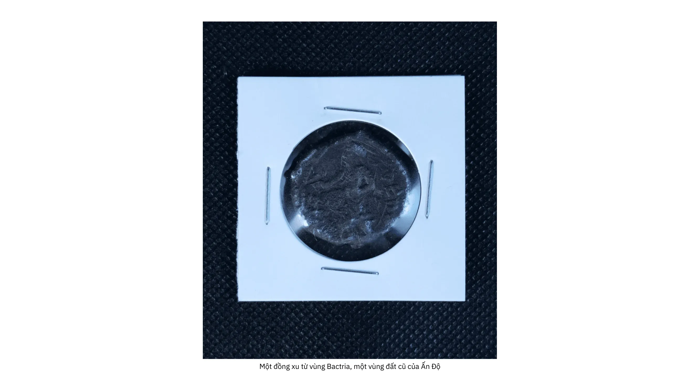

Để minh họa trực quan giai đoạn này, phía trên là một đồng xu từ một vùng ở Ấn Độ, vùng Bactria, nằm gần phía tây bán đảo Ấn Độ, gần Afghanistan. Ở khu vực này, có những đồng xu có lẽ được lấy cảm hứng từ đồng xu Hy Lạp khắc họa hình ảnh một trong những nhân vật hoàng gia của họ.

## Người Lydian và người Ba Tư

<chapterId>eb802ab8-8ffd-5b25-907f-8944f120ed14</chapterId>

:::video id=f151eb42-5ff3-4ca1-9af1-1ae2a5e051c0:::

### Những đồng tiền electrum Lydian đầu tiên

Vì chúng ta không thể tách biệt hình dáng của tiền xu với Lydia và Ba Tư, hãy cùng chuyển sang phần thế giới phía đông Hy Lạp, ngày nay là Thổ Nhĩ Kỳ. Những đồng tiền đầu tiên xuất hiện ở phương Tây có niên đại vào khoảng giữa thế kỷ thứ 7 trước Công nguyên, tại các vùng Lydia và Ionia, thuộc Thổ Nhĩ Kỳ ngày nay. Khoảng năm 650 đến 600 trước Công nguyên, sự đổi mới cơ bản này mới được ra đời, với những khám phá khảo cổ đáng chú ý như những đồng tiền đầu tiên được tìm thấy trong đền Artemis ở Ephesus, có niên đại khoảng năm 600 trước Công nguyên. Những đồng tiền thô sơ này được làm bằng electrum, một hợp kim tự nhiên của vàng và bạc với ánh hổ phách, và thường có vẻ ngoài thô sơ, chỉ được đánh dấu bằng các lỗ đục hoặc họa tiết thô sơ.

Bên dưới, bạn có thể thấy một trong những đồng tiền Lydian đầu tiên, với hình ảnh một con sư tử đang săn mồi ở phía trước. Bạn có thể thấy một con dấu hoặc lỗ ở mặt sau, mà một số người tin rằng được dùng để kiểm tra độ tinh khiết của kim loại và đảm bảo nó không chỉ là một lớp bề mặt. Mặc dù đây là một trong những ví dụ sớm nhất, nhưng điều quan trọng cần lưu ý là đồng tiền này là bản sao. Tất cả các đồng tiền vàng và đồng electrum của tôi đều là bản sao hoặc bản tái tạo hiện đại, được thiết kế để tôi không phải tiêu hết tiền tiết kiệm vào bộ sưu tập này.

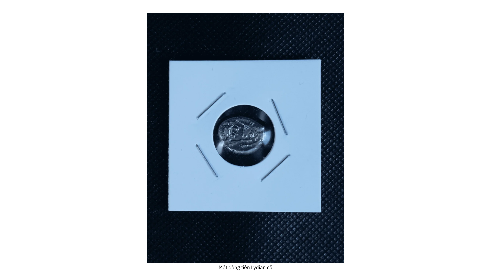

Nhưng tôi cũng có một món đồ Ba Tư thật mà chúng ta sắp được chiêm ngưỡng. Đây là hình dáng của những món đồ thời kỳ đầu này. Nó giống như một cục kim loại nhỏ (hay cục, theo tiếng Anh) được đóng dấu vào thời đó.

Trái ngược với niềm tin phổ biến rằng tiền tệ được phát minh để tạo điều kiện thuận lợi cho giao thương hàng ngày và thay thế cho hình thức trao đổi hàng hóa, dường như những đồng tiền đầu tiên của người Lydia, Achaemenid và Hy Lạp ban đầu không được sử dụng cho thương mại quy mô nhỏ. Thực tế, các đơn vị tiền tệ này quá lớn so với nhu cầu sử dụng hàng ngày. Hơn nữa, việc lưu hành của chúng chỉ giới hạn ở những khu vực gần nơi chúng được sản xuất.

Ở đây, tôi thấy điều quan trọng cần đề cập là, mặc dù tôi đã đọc trong một số tác phẩm mang tính chất nhân chủng học, những đồng xu, như tôi đã trình bày - dù là đồng electrum hay đồng xu Ba Tư này mà tôi sẽ quay lại sau - quá lớn để mua bánh mì, chẳng hạn, mỗi ngày. Tôi đã thấy những ước tính khiến chúng ta nghĩ rằng nó tương đương với một ngày làm việc của một nông dân hoặc một người lính, vì vậy nó sẽ quá lớn. Giống như cố gắng trả lương một ngày cho bữa ăn, bữa sáng hoặc bữa trưa của bạn. Ngoại trừ việc tôi đã thấy trong các tác phẩm khác rằng những đơn vị nhỏ hơn của những khối này đã được tìm thấy, vì vậy những đồng xu nhỏ hơn, điều này có thể khiến chúng ta nghĩ rằng có thể có một công dụng khả thi cho việc mua sắm hàng ngày.

Vì vậy, theo tôi, "bằng chứng" nhân học cho thấy đồng tiền này không được sử dụng cho mục đích giao dịch hàng ngày vì mệnh giá hoặc đơn vị quá lớn là không thực sự chắc chắn vì chúng ta đã tìm thấy những ví dụ về những đồng tiền nhỏ hơn có thể được sử dụng cho mục đích mua sắm hàng ngày.

### Vai trò của Nhà nước trong việc tạo ra tiền

Nguồn gốc thực sự của tiền xu dường như gắn liền với hành động trực tiếp của các quốc gia. Có hai giả thuyết chính về vấn đề này: giả thuyết thứ nhất, mang tính duy tâm, vạch ra sự tương đồng giữa thuật ngữ Hy Lạp "nomisma" (tiền) và "nomos" (luật pháp), cho rằng tiền tệ gắn liền với việc hệ thống hóa luật pháp, củng cố quyền lực và tổ chức chính trị của các thành phố. Giả thuyết thứ hai, thực tế hơn, được chấp nhận rộng rãi ngày nay, cho rằng tiền tệ trước hết và trên hết là phương tiện để các quốc gia thực hiện kiểm soát kinh tế và xã hội. Bằng cách chính thức đảm bảo trọng lượng và giá trị của các kim loại quý mà chúng chứa đựng, các quốc gia có thể thao túng lưu thông và giá trị của những đồng tiền này, tạo ra mức chênh lệch tín nhiệm và thanh khoản đặc trưng cho đồng nội tệ.

Thật thú vị khi biết rằng chúng ta có bằng chứng về điều này. Ví dụ, trong tiền xu electrum, bạn nên biết rằng electrum tự nhiên thường chứa khoảng 70% vàng và 30% bạc. Trong những đồng xu đầu tiên mà chúng tôi tìm thấy và phân tích, cụ thể là những đồng xu Lydian đầu tiên, hàm lượng vàng dường như chỉ khoảng 50 đến 55% thay vì 70%. Điều này cho thấy ngay cả vào thời điểm đó, các nhà phát hành tiền xu đã cố gắng giảm tỷ lệ kim loại quý hơn, có lẽ là để sản xuất nhiều tiền xu hơn và làm cho chúng có vẻ có giá trị tương đương với một cục electrum tự nhiên không được đánh dấu. Và ở đây, phải nói rằng thực sự là từ thời của Croesus nổi tiếng này, theo nghĩa *giàu như Croesus*, điều này mới khả thi bởi vì từ thời của ông, chúng ta đã có công nghệ để tách vàng và bạc.

Tiền đúc Lydian đã trải qua một cuộc cách mạng lớn dưới triều đại của vị vua nổi tiếng Croesus (561-546 TCN), người được biết đến với sự giàu có huyền thoại. Vào thời điểm này, người Lydian đã hoàn thiện kỹ thuật luyện kim để tách vàng và bạc khỏi electrum, từ đó giới thiệu những đồng tiền lưỡng kim đầu tiên, tức là tiền vàng và bạc riêng biệt.

### Sự bành trướng của Ba Tư và sự tiếp nhận của Hy Lạp

Khi chinh phục Lydia vào năm 546 TCN, người Ba Tư thuộc triều đại Achaemenid đã ngay lập tức áp dụng sáng kiến này. Khoảng năm 500 TCN, dưới triều đại của Darius I, người Ba Tư đã thiết lập hệ thống tiền tệ riêng với đồng daric vàng và đồng siglois bạc, thường mang hình ảnh hoàng gia trong tư thế chiến đấu. Đồng tiền hoàng gia Ba Tư này chủ yếu được sử dụng ở các vùng Hy Lạp hóa của Đế chế Ba Tư và dần dần lan rộng, mặc dù việc sử dụng không đồng đều, **một số khu vực, chẳng hạn như Ai Cập, vẫn ưa chuộng trao đổi bằng kim loại nặng (thỏi vàng).**.

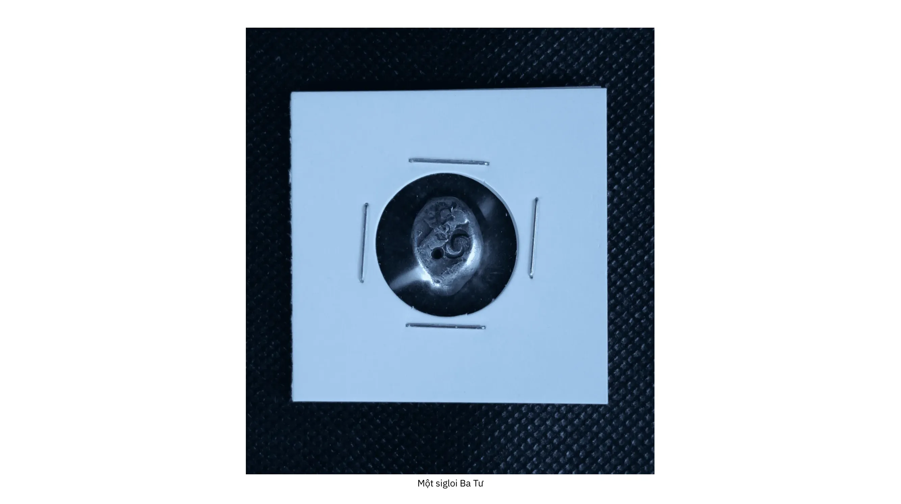

Phía trên, bạn có thể chiêm ngưỡng một đồng sigloi (hay siglos) Ba Tư chính hiệu. Thiết kế nhỏ nhắn có hình một vị vua, mặc dù lỗ đã bị mòn một chút. Đồng siglos là một đồng bạc, trái ngược với đồng daric, được làm bằng vàng. Người Ba Tư có thể phân biệt hai kim loại này, và họ đã từ bỏ đồng electrum. Vì vậy, họ áp dụng chế độ lưỡng kim, sử dụng cả vàng và bạc trong khi vẫn duy trì khái niệm tương tự về đồng xu làm từ kim loại quý, thường có một lỗ ở mặt sau, có lẽ để kiểm tra hàm lượng kim loại.

Việc người Hy Lạp nhanh chóng sử dụng tiền xu dường như được thúc đẩy bởi mối quan hệ gần gũi của họ với người Lydia, đặc biệt là thông qua các thuộc địa của Hy Lạp ở Tiểu Á. Những người Hy Lạp đầu tiên đúc tiền xu có lẽ là cư dân của Aegina vào giữa thế kỷ thứ sáu trước Công nguyên, những người đã giới thiệu đồng drachma, với trọng lượng thay đổi tùy theo vùng, và tên gọi của nó theo nghĩa đen có nghĩa là "một nắm ngũ cốc" hoặc "một nắm mũi tên".

Sự thành công của tiền đúc Hy Lạp phần lớn là nhờ sự tiện lợi của nó cho các giao dịch quan trọng, chẳng hạn như thanh toán cho lính đánh thuê, cũng như sự mở rộng kinh tế và chính trị của các thành phố. Tiền tệ nhanh chóng trở thành một yếu tố trung tâm của nền kinh tế Hy Lạp và sau này là La Mã, đồng thời vẫn giữ được tính biểu tượng mạnh mẽ, đặc biệt là thông qua mối liên hệ với luật pháp (nomos).

Cuối cùng, sự phát triển nhanh chóng của tiền đúc minh chứng cho một sự chuyển đổi sâu sắc của xã hội cổ đại, nơi việc mã hóa các giá trị tiền tệ song hành với tổ chức nhà nước. Sự phát triển này đã đặt nền móng kinh tế và chính trị cho sự trỗi dậy của các nền dân chủ Hy Lạp, đặc biệt là ở Athens, nơi tiền tệ đóng vai trò quan trọng trong hoạt động của một thành phố dân chủ.

Một điểm quan trọng cần nhớ trong phần này là chúng ta đang nói riêng về **tiền xu**, chứ không phải tiền tệ nói chung. Khía cạnh trung tâm nổi bật rõ ràng là **niềm tin vào cơ quan phát hành**, liên quan trực tiếp đến các đặc điểm kỹ thuật của tiền xu (trọng lượng, độ tinh khiết, mệnh giá). Chính niềm tin này cho phép nhà nước hoặc cơ quan phát hành thực hiện một mức độ kiểm soát nhất định, hoặc thậm chí thao túng giá trị và lưu thông của những đồng tiền này ngay từ đầu.

## Sự can thiệp của tổ chức và những đồng tiền đầu tiên

<chapterId>3e1efd08-99e3-5a32-9908-3185fef0e640</chapterId>

:::video id=84847cf6-9e46-4a8c-9f35-25a27496cc4b:::

### Bản chất kép của tiền

Sự xuất hiện của tiền đúc đặt ra một câu hỏi cơ bản: tiền tệ là sản phẩm tự phát của thị trường hay là một thể chế do chính quyền áp đặt? Sự căng thẳng về mặt khái niệm này đặt hai tầm nhìn hoàn toàn khác biệt vào nhau.

Một mặt, trường phái kinh tế Áo bảo vệ quan điểm cho rằng tiền hàng hóa - đặc biệt là vàng - được các tác nhân kinh tế lựa chọn một cách tự nhiên vì những đặc tính nội tại của nó: độ bền, tính di động, tính phân chia và tính thay thế. Từ góc độ này, nhà nước sau đó đã chiếm đoạt loại tiền tệ tự phát này để kiểm soát nguồn cung. Nó là một thể chế xuất hiện một cách tự nhiên từ nhu cầu thị trường trước khi bị quyền lực chính trị nắm giữ.

Ngược lại, quan điểm nhân chủng học và thể chế cho rằng tiền tệ thực sự ra đời cùng với tiền đúc của nhà nước. Chính quyền sẽ chủ động tạo ra tiền tệ bằng cách đóng dấu, qua đó biến kim loại thành một công cụ tiền tệ thực sự. Quan điểm này cho rằng những đồng tiền Lydia đầu tiên chủ yếu được dùng để trả lương cho quân đội - một đồng stater tương đương với tiền công hàng ngày của một người lính.

### Những lợi thế nghịch lý của việc chuẩn hóa nhà nước

Bất chấp sự căng thẳng về mặt lý thuyết này, ngay cả các nhà kinh tế học Áo cũng thừa nhận một số lợi ích nhất định của sự can thiệp của nhà nước vào tiền tệ. Việc chuẩn hóa bằng cách đúc tiền giải quyết một số vấn đề thương mại thực tế.

Nếu không có cơ quan chứng nhận, các bên tham gia kinh tế phải đối mặt với những rủi ro thường trực: tiền giả, gian lận hồ sơ và thao túng trọng lượng. Những hành vi này tạo ra sự bất ổn trong nền kinh tế, vì một số đồng tiền được chấp nhận trong khi số khác bị từ chối. Về lý thuyết, con dấu chính thức đảm bảo trọng lượng và chất lượng, giúp giao dịch trở nên linh hoạt hơn.

Sự đảm bảo này có một mức giá đáng chú ý trên thị trường: một đồng tiền vàng đúc có giá trị cao hơn vàng thô tương đương. Mức chênh lệch này phản ánh giá trị của chứng nhận - các thương nhân không còn cần phải tự mình xác minh tính xác thực của kim loại thông qua các thử nghiệm hóa học hoặc cộng hưởng. Ngược lại, sự can thiệp của nhà nước lại loại bỏ rào cản và tạo điều kiện thuận lợi cho thương mại bằng cách tạo ra niềm tin được thể chế hóa.

### Thao túng tiền tệ ngay từ đầu

Câu chuyện về những đồng stater Lydian đầu tiên cho thấy một sự trớ trêu đáng lo ngại. Các phân tích gần đây cho thấy hàm lượng vàng trong những đồng electrum này thấp hơn một cách có hệ thống so với electrum tự nhiên. Cơ quan chứng nhận chất lượng đồng thời cũng thao túng thành phần.

Thực tiễn này minh họa cho tính hữu ích kép của tiền đúc. Đối với thị trường, nó giúp giao dịch trở nên linh hoạt hơn và đảm bảo tính chuẩn hóa. Đối với cơ quan phát hành, nó trở thành một công cụ kiểm soát kinh tế thông qua việc pha loãng. Bằng cách giảm hàm lượng vàng trong khi vẫn duy trì giá trị danh nghĩa, nhà nước thực sự làm tăng cung tiền - tạo ra nhiều đơn vị tiền tệ hơn từ cùng một lượng kim loại quý.

Tuy nhiên, bản thân nhà nước vẫn bị ràng buộc bởi sự thao túng này. Như minh họa bằng ví dụ về đồng vàng solidus của Constantine vào thế kỷ thứ 4, chính quyền La Mã đã kiểm tra chất lượng tiền xu một cách nghiêm ngặt, vì họ yêu cầu phải trả bằng loại tiền tốt. Chính quyền này có lợi ích thiết yếu trong việc duy trì chất lượng tiền đúc của mình để đảm bảo giá trị nguồn thuế.

### Phân tích kinh tế về phá giá

Nghiên cứu về sự mất giá tiền tệ cho thấy những mô hình nhất quán trong suốt lịch sử. Đối với tiền kim loại, các nhà kinh tế theo dõi tỷ lệ kim loại quý chứa trong tiền - một đường cong giảm dần biểu thị sự mất giá dần dần. Đối với tiền giấy hiện đại, điều ngược lại xảy ra: cung tiền lưu thông được quan sát, và sự gia tăng của nó báo hiệu sự mất giá.

Cả hai phương pháp đều đo lường cùng một hiện tượng cơ bản: sự pha loãng giá trị tiền tệ. Dù bằng cách giảm hàm lượng kim loại quý hay in tiền mới, cơ chế vẫn như cũ. Một cơ quan càng tạo ra nhiều đơn vị tiền tệ từ cùng một nguồn lực thực tế, thì mỗi đơn vị càng mất giá trị.

Sự thao túng này, có thể quan sát được từ những đồng tiền Lydian đầu tiên, cho thấy việc kiểm soát tiền tệ luôn là vấn đề quyền lực. Do đó, tiền đúc đại diện cho một cải tiến kỹ thuật đáng chú ý kết hợp với một công cụ kiểm soát kinh tế - một tính chất hai mặt tồn tại xuyên suốt lịch sử tiền tệ, cho đến tận ngày nay.

## Sản xuất linh kiện

<chapterId>b205f4f2-c293-5308-b812-a998de9ad45e</chapterId>

:::video id=47c612ec-d97e-4498-b50e-7e66518bd56d:::

### Từ những cục máu đông đến những đồng tiền đúc

Sau phần về sự ra đời của tiền xu, tôi muốn giới thiệu một phần rất ngắn về quá trình phát triển của ngành sản xuất tiền xu. Như chúng ta đã thấy, tất cả bắt đầu với những cục electrum, sau đó là vàng và bạc, với cả hai mặt đều được đục lỗ, có thể là hình mặt vua, hoặc một lỗ ở mặt sau để kiểm tra độ tinh khiết.

Sau này, như chúng ta sẽ tìm hiểu trong phần tiếp theo, người Hy Lạp đã cải tiến công nghệ này bằng cách tạo ra những đồng xu tròn được đóng búa ở cả hai mặt. Họ lấy một miếng kim loại quý nhẵn, phẳng, khắc họa tiết mong muốn lên một mặt, rồi dùng búa đóng thủ công để tạo ra đồng xu hoàn chỉnh.

Công nghệ đúc tiền thủ công từng đồng xu có lẽ đã đóng một vai trò trong việc kiểm soát lạm phát vào thời điểm đó, mặc dù tiền xu thường được pha loãng để tăng sản lượng. Điều này đặc biệt rõ ràng trong thời kỳ La Mã và, ở mức độ thấp hơn, trong một số cuộc chiến tranh thời Hy Lạp. Mặc dù việc đúc tiền xu từng đồng một đã hạn chế năng lực sản xuất hàng loạt của chính quyền, nhưng nó đã góp phần hiệu quả vào việc kiểm soát lạm phát, bất chấp những đợt phá giá đáng kể đã xảy ra. Do đó, sự tiến hóa đã tiến triển từ một cục kim loại được đục lỗ thành một đồng xu tròn được đóng búa.

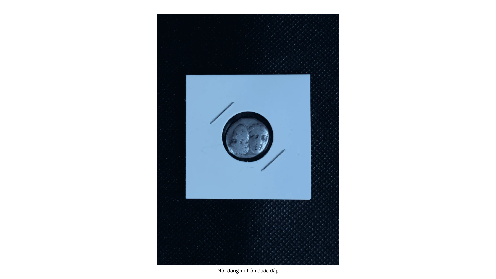

### Sự tiến hóa thời trung cổ

Vào thời Trung Cổ, cũng có xu hướng trải rộng đồng xu, làm cho chúng rộng hơn và mỏng hơn. Một lý do cho điều này là việc kiểm tra âm thanh của chúng trở nên dễ dàng hơn, thường được sử dụng như một chỉ số xác định tính xác thực. Bằng cách trải rộng bạc ra, một tần số riêng biệt được tạo ra, nhờ đó người ta có thể xác nhận độ tinh khiết của đồng xu chỉ bằng cách lắng nghe nó. Thực hành này đã khai sinh ra thuật ngữ "tiền âm thanh". Trong bối cảnh tiền âm thanh, trọng lượng tiêu chuẩn được xác định bằng cách sử dụng cân thăng bằng hoặc "trebuchet" để cân. Do đó, sự tiến hóa tiếp tục từ những đồng xu nhỏ, tròn đến những đồng xu mỏng hơn và rộng hơn một chút.

### Con lắc đập

Công nghệ cuối cùng xuất hiện vào cuối thời Trung Cổ, đầu thời hiện đại, là khái niệm đúc đồng hồ quả lắc. Đó là một loại vít được siết chặt để đúc tiền xu, từ đó tạo ra những đồng xu với hình thức đúc mới này. Điểm đáng chú ý của sự phát triển này là khả năng khắc họa tiết trên bề mặt đồng xu để giải quyết vấn đề cắt gọt. Cắt gọt bao gồm việc loại bỏ một phần đồng xu để thu hồi bạc quý, sau đó có thể được sử dụng để đúc các đồng xu khác hoặc đơn giản là giữ lại làm tài nguyên.

Vì vậy, khái niệm về con lắc đập này đã giúp giải quyết hiện tượng cắt. Và điều thú vị cần lưu ý là công nghệ này thực sự xuất phát từ Pháp. Ví dụ, ở Anh, họ đã thuê các kỹ sư người Pháp đến và chỉ cho họ cách chế tạo những chiếc máy này. Điều buồn cười, tôi nghĩ, là có những người ủng hộ đúc búa nhưng lại phản đối và trì hoãn việc áp dụng công nghệ này. Trong bất kỳ công nghệ tốt nào, luôn có những người phản đối, những người muốn giữ lại công nghệ cũ. Tôi nghĩ thật điên rồ khi nhận ra rằng ngay cả một công nghệ có vẻ thực sự vượt trội - bạn có thể tạo ra nhiều bộ phận hơn, chúng khó sao chép hơn - vẫn có những người gắn bó với phương pháp búa nổi tiếng. Có một sự thay đổi giữa việc sản xuất các bộ phận được chế tạo bằng phương pháp con lắc đập nổi tiếng này và sau đó quay trở lại phương pháp đập búa. Và cuối cùng, tất nhiên, chính con lắc đã phát triển và mang đến cho chúng ta những tác phẩm hiện đại tuyệt đẹp này, nơi bạn có thể tìm thấy những đường nét nhỏ, những gờ nhỏ xung quanh để tránh bị cắt, có lẽ liên quan đến từ cắt, gờ, và ngày nay bạn vẫn có thể thấy những gờ, chữ hoặc hình vẽ được khắc trên mép tác phẩm.

# Các lý thuyết khác nhau về sự xuất hiện của tiền

<partId>72ac694f-9248-550d-90c1-91af3d234380</partId>

## Các lý thuyết về sự xuất hiện của tiền tệ và các định nghĩa khác nhau của nó

<chapterId>7d699d4d-8c70-55b5-bf36-609f3fd90bcf</chapterId>

:::video id=523c873f-501b-4954-b79f-7e74c0f685a5:::

Chào mừng bạn đến với phần này, chuyên đề về các lý thuyết khác nhau về sự ra đời của tiền tệ và các định nghĩa khác nhau của nó. Dưới đây là một đoạn trích ngắn từ cuốn sách *Aux origines de la monnaie*, theo tôi, tóm tắt hai lý thuyết chính mà chúng ta sẽ xem xét trong phần này.

> Lời mở đầu ngắn gọn này không nhằm mục đích nào khác ngoài việc làm nổi bật bối cảnh của cuộc khảo sát. Ở cấp độ khái niệm, cuộc tranh luận đang diễn ra giữa những người ủng hộ luận án của K. Polanyi và những người ủng hộ M. Weber. Đối với những người ủng hộ, quà tặng và tái phân phối đóng vai trò trung tâm, còn trao đổi thị trường chỉ đóng vai trò thứ yếu, chủ yếu trong các giao dịch quốc tế. Ngược lại, đối với những người khác, thị trường là trung tâm của quá trình lịch sử hiện tại.

Ví dụ, ở Lưỡng Hà, một lý thuyết về sự xuất hiện cho rằng đền thờ, với tư cách là cơ quan có thẩm quyền, tạo ra đơn vị tính toán hoặc đơn vị tiền tệ, áp đặt nó, và sau đó các thương nhân áp dụng nó cho hoạt động thương mại. Lý thuyết ngược lại cho rằng, không, đơn vị tiền tệ này xuất hiện một cách tự nhiên từ thị trường để tạo điều kiện thuận lợi cho thương mại. Có nhiều ví dụ có nguồn gốc rõ ràng về điều này ở Lưỡng Hà.

Về việc trao đổi hàng hóa, một số giả thuyết cho rằng nó chủ yếu được sử dụng trong các cuộc trao đổi quốc tế, tức là với những người mà chúng ta không tin tưởng.

Vậy đó là những gì chúng ta sẽ làm trong phần này. Chúng ta sẽ tiến hành một cuộc khảo sát để trình bày các lý thuyết khác nhau về sự xuất hiện của tiền tệ và các định nghĩa khác nhau về tiền tệ. Chúng ta sẽ trình bày và phê bình các luận điểm của cả các nhà kinh tế học cổ điển và các nhà nhân chủng học. Tôi thậm chí còn may mắn được mời Ulrich Fromy, người sẽ trình bày quan điểm của một nhà kinh tế học người Áo về những chủ đề này.

## Sự xuất hiện của tiền tệ đối với các nhà kinh tế học cổ điển

<chapterId>1d3776cd-0dfd-5297-af48-c6f41e257a7e</chapterId>

:::video id=873a16c1-17ac-448d-8941-df4feb7ab79d:::

Phần này dành riêng cho các lý thuyết khác nhau về sự xuất hiện của tiền tệ. Chủ đề đầu tiên sẽ được đề cập là sự xuất hiện của tiền tệ theo quan điểm của các nhà kinh tế học cổ điển.

### Lý thuyết kinh điển của Adam Smith

Theo các lý thuyết kinh tế cổ điển, đặc biệt là lý thuyết do Adam Smith đề xướng, tiền tệ xuất hiện một cách tự nhiên từ hình thức trao đổi hàng hóa để khắc phục những hạn chế của nó. Ban đầu, trao đổi được thực hiện bằng hình thức trao đổi trực tiếp, nhưng phương pháp này thường gặp phải vấn đề "trùng hợp nhu cầu kép": mỗi người phải sở hữu chính xác những gì người kia muốn. Dần dần, một số hàng hóa nhất định (như muối, kim loại quý và gia súc) được mọi người chấp nhận làm phương tiện trao đổi trung gian, nhờ tính tiện dụng, độ bền và khả năng phân chia của chúng. Do đó, tiền tệ tự nhiên xuất hiện để tạo điều kiện thuận lợi và lưu thông các trao đổi kinh tế.

### Phê bình lý thuyết cổ điển

Đây là lời phê bình của tôi về lý thuyết này. Với tất cả những gì chúng ta đã thấy ở phần trước, tôi nghĩ chúng ta có thể khẳng định rằng quan niệm cho rằng **tiền xu** là một sự tiến hóa của trao đổi hàng hóa là sai lầm, đơn giản vì đồng tiền đúc chắc chắn xuất phát từ thẩm quyền, bởi vì nó được đúc bởi thẩm quyền. Có nhiều lý do cho điều này, trong đó có mong muốn kiểm soát nền kinh tế, kiểm soát tiền tệ của chính quyền.

Mặt khác, nếu chúng ta nói về tiền như một khái niệm, chứ không nhất thiết là tiền xu, thì điều này không rõ ràng lắm, bởi vì, với những đồng tiền đầu tiên, đồng Stater Lydian, chúng ta đã tìm thấy những cục bạc không được đánh dấu. Vẫn chưa rõ liệu chúng có được lưu hành hay không. Nếu chúng được lưu hành, điều này có nghĩa là ban đầu người ta có thể đã xác định tài sản này là một loại tiền tệ tiềm năng, có thể được nhu cầu rộng rãi và dễ dàng trao đổi. Và có lẽ chỉ sau đó, chính quyền mới nhận thấy tình trạng này và kiểm soát nó bằng cách đóng dấu để chứng nhận.

Có rất nhiều lợi thế khi làm điều này - không cần phải kiểm tra, cân đo, vân vân. Hiển nhiên, chúng ta sẽ bàn về điều đó. Nhưng theo tôi, tiền xu rõ ràng là một công cụ đã được các quốc gia sử dụng ngay từ đầu. Tuy nhiên, xét về sự xuất hiện của tiền tệ, chúng ta không biết liệu nó thực sự đến từ một cơ quan có thẩm quyền áp đặt nó hay nó xuất hiện thông qua thương mại hoặc trao đổi thương mại. Tôi sẽ có một cuộc thảo luận rất thú vị về chủ đề này với đồng nghiệp Ulrich ở phần sau của bài viết này.

Chúng ta đã biết rằng những đồng tiền kim loại quý đầu tiên không được sử dụng để tạo điều kiện thuận lợi cho các giao dịch hàng ngày vì giá trị của chúng quá cao. Chúng ta cũng biết rằng chúng chủ yếu được sử dụng cho các khoản thanh toán quân sự. Đây là một lập luận vững chắc cho luận điểm rằng tiền không nhất thiết phải xuất hiện từ thị trường. Các đơn vị tính toán, mệnh giá của những đồng tiền đầu tiên, có lẽ quá lớn để mua bánh mì hoặc mua sắm hàng ngày. Ví dụ, nó có thể tương đương với tiền lương một ngày. Không nhất thiết là mọi người được trả lương vào thời đó, nhưng điều đó cho bạn một ý tưởng về quy mô. Vì vậy, những đồng tiền này có lẽ có sức mua quá lớn để được sử dụng trong các giao dịch quy mô nhỏ. Mặt khác, không có gì đảm bảo rằng những đồng tiền này sẽ không được sử dụng để thực hiện các giao dịch lớn hơn, chẳng hạn như trao đổi thương mại. Chúng ta biết rằng chúng chủ yếu được sử dụng cho các khoản thanh toán quân sự. Đây là một trong những lý thuyết phổ biến nhất để giải thích sự xuất hiện của những đồng tiền đầu tiên. Hãy nhớ rằng, chúng ta đang nói về tiền xu ở đây, chứ không nhất thiết là về tiền nói chung. Vì vậy, những đồng tiền đầu tiên có chức năng đầu tiên là dùng để chi trả cho quân đội, cho lính đánh thuê.

Ví dụ, Alexander Đại đế đã sử dụng nó rất hiệu quả, như chúng ta sẽ thấy sau.

Chúng ta cũng đã thấy rằng ngay từ thời Trung Quốc cổ đại, vỏ ốc xà cừ đã được sử dụng cho các hoạt động trao đổi kinh tế (**trả công lao động, đo lường giá trị và mua đất)**. Hơn nữa, ở Lưỡng Hà và Ai Cập, các hệ thống tiền tệ chức năng đã tồn tại và được sử dụng cho thương mại, trả lương và nộp thuế. Điều tôi muốn nói ở đây là, việc cho rằng tiền xu theo quan niệm phương Tây xuất hiện từ nhu cầu làm cho các giao dịch trở nên linh hoạt hơn là hoàn toàn sai lầm.

Vì tiền xu được phát hành bởi một cơ quan có thẩm quyền, nên có lẽ chúng ta có thể giả định rằng, ngay từ đầu, chúng đã có liên hệ với các cơ quan phát hành. Điều đó có lý. Mặt khác, chúng ta không nhất thiết biết các hình thức tiền tệ hoặc các hình thức hệ thống tiền tệ, tức các tiền xu nguyên thủy, xuất hiện trước chúng như thế nào. Một mặt, chúng ta sẽ cho rằng chính các đền thờ đã xác định các đơn vị tiền tệ này và sau đó, mọi người đã sử dụng chúng. Mặt khác, chúng tôi xin nói với bạn rằng, không, chính các thương gia mới là những người cần một phương tiện trao đổi, một cách giao thương với thế giới bên ngoài, và chính họ là những người đã xác định, ví dụ, kim loại bạc, để sử dụng vì nó có nhu cầu từ thế giới bên ngoài. Vấn đề là, chúng ta không thực sự biết. Đó là lý do tại sao chúng ta có hai lý thuyết đối lập. Chúng ta không có bằng chứng hoàn hảo để giải thích liệu tiền tệ xuất hiện một cách tự nhiên từ nhu cầu giao thương, chẳng hạn như của các thương gia, hay liệu nó xuất phát từ thẩm quyền.

### Phân biệt tiền xu và tiền nguyên thủy

Tóm lại, tôi nghĩ chúng ta có thể nói rằng tiền xu nhất thiết phải xuất phát từ thẩm quyền, vì chúng được đóng dấu bởi thẩm quyền đó. Mặt khác, tôi không nghĩ chúng ta có thể nói rằng việc cho rằng tiền tệ (thứ xuất hiện trước tiền xu) không thể xuất hiện để tạo điều kiện thuận lợi cho việc trao đổi là sai. Tôi nghĩ rằng trong tất cả các ví dụ chúng ta đã thấy ở trên, những ví dụ theo nghĩa này rất nhiều.

## Huyền thoại về trao đổi hàng hóa

<chapterId>0fcd4964-ac36-5163-a8cf-1aacebc0d2c0</chapterId>

:::video id=0ede29ab-8acd-4d79-9282-bd5991b97076:::

### Đánh giá của David Graeber

Chúng ta vừa tìm hiểu về sự ra đời của tiền tệ theo quan điểm của các nhà kinh tế học cổ điển. Bây giờ, chúng ta sẽ tìm hiểu một khái niệm được gọi là huyền thoại trao đổi hàng hóa.

Một lời chỉ trích đối với lý thuyết cổ điển về sự xuất hiện của tiền tệ này là thiếu bằng chứng lịch sử để hỗ trợ cho ý tưởng của nó.

Bài phê bình được gọi là "huyền thoại đổi chác", do nhà nhân chủng học David Graeber cùng nhiều người khác đưa ra, đã thách thức quan niệm cổ điển cho rằng tiền tệ xuất hiện tự nhiên từ trao đổi hàng hóa. Theo bài phê bình này, không có bằng chứng lịch sử hay nhân chủng học nào cho thấy các xã hội đã sử dụng trao đổi hàng hóa một cách có hệ thống trước khi tiền tệ xuất hiện. Trên thực tế, các xã hội cổ đại đã hoạt động dựa trên tín dụng, nợ nần, nghĩa vụ xã hội và trao đổi nghi lễ. Do đó, "huyền thoại đổi chác hàng hóa" là một cấu trúc lý thuyết được thiết kế để biện minh cho quan điểm kinh tế cổ điển, mà không có cơ sở thực nghiệm thực sự.

Tuy nhiên, cần lưu ý rằng lý thuyết này không phủ nhận sự tồn tại của hoạt động đổi hàng, chẳng hạn như trong trao đổi giữa các bộ lạc khác nhau. Nó chỉ đơn giản phủ nhận rằng hoạt động đổi hàng là một hoạt động được thực hành rộng rãi trong những nhóm được gọi là nguyên thủy này, và tiền tệ sẽ là một sự phát triển hợp lý của những hoạt động này. Nó phủ nhận thực tế rằng hoạt động đổi hàng đã được sử dụng rộng rãi trong một bộ lạc, và tiền tệ cuối cùng đã xuất hiện để làm cho các giao dịch trở nên trôi chảy và giải quyết những khó khăn tồn tại trong hoạt động đổi hàng. Thay vào đó, theo lý thuyết này, các nhóm này thực hành một hình thức tín dụng phi chính thức hoặc tặng quà đổi quà.

### Xã hội nguyên thủy so với nền văn minh vĩ đại

**Dưới đây là một số giải thích liên quan đến các nền văn minh vĩ đại thời cổ đại.** Tôi nghĩ lý thuyết này chắc chắn đúng với các nhóm nguyên thủy (không quốc tịch) trong quá khứ và thậm chí cả ngày nay (ví dụ, các bộ lạc được các nhà thám hiểm nghiên cứu vào thế kỷ 18 và 19). Rõ ràng, họ không sử dụng hình thức trao đổi hàng đổi hàng, mà là các hình thức trao đổi mà tôi đã đề cập trước đó, vì những lý do chúng ta đã đề cập (phân công lao động yếu, canh tác tự cung tự cấp). Tuy nhiên, tôi không nghĩ lý thuyết này đúng với các nền văn minh vĩ đại trong quá khứ, chẳng hạn như Lưỡng Hà và Ai Cập cổ đại.

Đây là hai đoạn trích từ *Aux Origines de la monnaie* về chủ đề này:

> Mô hình do M. Mauss phác thảo trong tác phẩm nổi tiếng "Món Quà" đã được các nhà Ai Cập học áp dụng với sự nhất trí và nhiệt tình cũng như sự thiếu sáng suốt. Điều này đã dẫn đến một số nhầm lẫn mà chúng ta sẽ không đề cập ở đây. Chúng ta chỉ cần lưu ý rằng mô hình này áp dụng cho cái gọi là xã hội nguyên thủy, chứ không phải Ai Cập thời Pharaon.

> Do đó, bánh mì, tức là ngũ cốc chế biến, là đơn vị tính toán, giống như shât (y) của Vương quốc Cổ đại, cũng cho phép mở rộng tín dụng bằng nhiều loại hàng hóa khác nhau. Ví dụ đơn giản này cho thấy nền kinh tế của Ai Cập thời Pharaoh không chỉ giới hạn trong một hệ thống phân phối lại. Nó rất phức tạp, liên quan đến vô số hoạt động trao đổi.

Vậy nên, như chúng ta đã thấy trước đó trong phần về Ai Cập, thậm chí cả Lưỡng Hà và Trung Quốc, chúng ta có thể thấy rằng ngay cả những nền văn minh cổ đại, tuy không phải nguyên thủy, này, nhờ sự hiện diện của một nhà nước, theo tôi, cũng đã sử dụng hệ thống tiền tệ. Tôi nghĩ điều này đã được chứng minh đầy đủ trong phần đầu của khóa học này. Và vì vậy, khái niệm cho-và-nhận, hay tín dụng trả chậm, không áp dụng cho những nền văn minh vĩ đại này. Do đó, lý do chính xác cho sự xuất hiện của tiền tệ vẫn còn là một bí ẩn. Chúng ta không biết liệu nó xuất phát từ nhu cầu giao thương với thế giới bên ngoài của các thương nhân, hay nó được áp đặt bởi các đền thờ trong thời kỳ cổ đại này.

## Sự xuất hiện của tiền thông qua tiền nợ

<chapterId>4f508615-aa61-5d62-89d3-cecd02aeaa62</chapterId>

:::video id=a23f547f-3906-4f4a-8f72-5d78c649d0c4:::

### Tiền như một giấy nợ

Trong phần này, chúng ta sẽ tìm hiểu về lý thuyết tiền nợ.

Lý thuyết về tiền nợ, được phát triển đáng chú ý bởi nhà kinh tế học Alfred Mitchell-Innes và sau đó được David Graeber mở rộng, khẳng định rằng tiền tệ không bắt nguồn từ trao đổi hàng hóa, mà từ các mối quan hệ nợ nần và tín dụng có từ những xã hội loài người sơ khai. Theo lý thuyết này, tiền tệ xuất hiện khi các nghĩa vụ xã hội (nợ nần giữa các cá nhân hoặc nhóm) được lượng hóa và có thể chuyển nhượng. Khái niệm này giới thiệu khái niệm về lượng hóa các trao đổi và chuyển nhượng. Do đó, tiền tệ trước hết là một **sự công nhận nợ**, được đảm bảo bởi sự tin tưởng lẫn nhau và thường được bảo đảm bởi chính quyền chính trị hoặc tôn giáo, chứ không chỉ là một hàng hóa đóng vai trò trung gian trong trao đổi.

Một dạng thức thậm chí còn tiến bộ hơn của lý thuyết này là tất cả tiền bạc đều là một khoản nợ. Vì vậy, một người sở hữu tiền sẽ có quyền đối với xã hội nói chung, một quyền đối với tất cả những người chấp nhận số tiền đó. Và vì tiền, **theo quan điểm của họ, phải được chấp nhận một cách bắt buộc**, nếu không thì nó không phải là tiền, bởi vì nếu bạn có thể từ chối số tiền này, hệ thống của họ sẽ không hoạt động. Trong một nhóm nhất định đã xác định được một loại tiền tệ, tất cả những người sở hữu nó, thì như thể họ mắc nợ tất cả các thành viên khác trong xã hội đó, những người chấp nhận loại tiền đó, và những người chấp nhận loại tiền đó lại có một hình thức nợ nần đối với người sở hữu đơn vị tiền tệ đó. Về cơ bản, đây chính là lý thuyết của họ.

### Phê bình hệ thống bắt buộc

**Phê bình của tôi về lý thuyết này:**

Tôi xin có một lời phê bình nhỏ về lý thuyết này. Tôi chấp nhận rằng tiền tệ là một dạng đồng thuận xã hội. Nó là niềm tin mà một nhóm đặt vào một "tín hiệu" tiền tệ, bất kể nó là gì. Vì vậy, tôi tán thành khái niệm tin tưởng lẫn nhau, mà chúng ta sẽ thảo luận lại sau với khái niệm về khoản tiền thưởng. Vấn đề trở nên phức tạp khi những người ủng hộ lý thuyết này thêm vào khái niệm nghĩa vụ và khăng khăng nhấn mạnh vào khái niệm nợ. Đối với họ, khi ai đó sở hữu một token tiền tệ, họ nắm giữ quyền sở hữu đối với toàn thể cộng đồng, và do đó cộng đồng sẽ nợ người nắm giữ nó một khoản nợ. Cũng sẽ có một nghĩa vụ phải thanh toán, với các thành viên trong nhóm có nghĩa vụ chấp nhận token; nếu không, theo quan điểm của họ, hệ thống sẽ không hoạt động. Tôi nghĩ hệ thống được mô tả ở trên ở Trung Quốc cổ đại thể hiện rõ lý thuyết này.

Về phần mình, tôi có thể dễ dàng hình dung ra một hệ thống mà tiền tệ là sự đồng thuận xã hội, trong đó token được chọn được chấp nhận rộng rãi như một phương tiện thanh toán, không có nghĩa vụ chính thức nào. Tôi có thể thấy một hệ thống như vậy hoạt động nếu mọi người tự nguyện chấp nhận nó. Nó có thể hoạt động. Mặt khác, nó thường đi kèm với các nghĩa vụ, tiền tệ hợp pháp và bạo lực, mà chúng ta sẽ thấy sau trong một phần. Nhưng về mặt lý thuyết, tôi không có ấn tượng rằng hệ thống này có thể hoạt động hoàn toàn. Tôi nghĩ Bitcoin là một ví dụ. Bitcoin có giá trị vì nó có phí bảo hiểm tiền tệ, vì có nhu cầu sử dụng nó cho mục đích tiền tệ, tức là dự trữ giá trị, có lẽ cũng là phương tiện trao đổi hoặc bảo vệ chống lại hệ thống tiền tệ. Không ai có nghĩa vụ phải chấp nhận nó, và nó càng được chấp nhận như một phương tiện thanh toán thì nó càng có thể được sử dụng như một phương tiện trao đổi. Chúng ta đã có thể sử dụng nó như một kho lưu trữ giá trị mà không gặp vấn đề gì. Không còn nghi ngờ gì nữa. Ý tôi muốn nói là Bitcoin đối với tôi có vẻ là một ví dụ, một loại tiền tệ là một hình thức đồng thuận xã hội mà chúng ta nghĩ rằng chúng ta có thể lấy lại tiền nếu sau này chúng ta mua một ít, chúng ta có được nó để có thể trao đổi sau này, để bảo toàn sức mua của chúng ta.

Quan điểm ít hạn chế hơn về lý thuyết này giúp giải thích cách hai xã hội riêng biệt có thể giao dịch bằng một loại tiền tệ gọi là token như vàng, mà không tạo ra yêu sách hay nợ nần giữa các xã hội đó. Tôi thấy việc ép buộc sự chấp nhận trong xã hội không hiệu quả trong giao dịch giữa hai bộ lạc, bởi vì bộ lạc kia không chịu sự quản lý của chính quyền. Bộ lạc B không chịu sự quản lý của bộ lạc A. Tuy nhiên, họ vẫn chấp nhận cùng một loại tiền tệ gọi là token, chẳng hạn như vàng. Giờ đây, mọi người có thể nói với tôi: "Đúng vậy, nhưng đó là vì công ty B cũng đã quyết định vàng là tiền tệ của họ", nên điều đó đúng. Đúng vậy, đúng là như vậy, nhưng không có khoản nợ nào được tạo ra tại thời điểm đó. Đó là một giao dịch cuối cùng. Vì vậy, khi công ty A đổi một mặt hàng lấy vàng tại công ty B, không có khoản nợ nào được tạo ra, giao dịch đã hoàn tất. Và rõ ràng, người trong công ty B không mua đồng tiền vàng hoặc cục vàng này để sau này được trả bởi những người trong công ty A. Anh ta chấp nhận nó để đổi lấy vàng. Anh ta chấp nhận nó để đổi lấy vàng sau, có thể là trong chính bộ lạc của mình. Vậy, trong ví dụ này, không có việc tạo ra nợ, không có quyền đòi nợ tiềm ẩn, mà chỉ đơn giản là một sự trao đổi trực tiếp, một khoản thanh toán trực tiếp. Những người ủng hộ tiền tệ nợ sẽ nói với chúng ta rằng đây là hàng đổi hàng. Và tôi không đồng ý, bởi vì hàng đổi hàng là sự trao đổi một hàng hóa trực tiếp. Hàng đổi hàng trực tiếp là sự trao đổi một hàng hóa này lấy một hàng hóa khác, để sử dụng. Hàng hóa được trao đổi để sử dụng, trong khi trong trường hợp của chúng ta, vàng rõ ràng được sử dụng như một loại tiền tệ vì nó sẽ không được sử dụng cho bất kỳ mục đích nào khác; nó sẽ được sử dụng sau này như một phương tiện thanh toán. Vì vậy, theo tôi, nó không thuộc loại hàng đổi hàng.

Việc sở hữu một đồng token không phải là một "yêu sách" đối với cộng đồng, mà là hy vọng rằng đồng token sẽ được chấp nhận vào một thời điểm sau đó với giá trị tương đương.

## Sự xuất hiện tự phát của tiền

<chapterId>e3ef86b1-73b9-5140-a61e-2ab6a5b0b2d4</chapterId>

:::video id=e543995f-d5e2-49d7-9133-e397b46e0833:::

Đối với trường phái kinh tế Áo, do Carl Menger khởi xướng, tiền tệ xuất hiện một cách tự nhiên từ một nền kinh tế trao đổi hàng hóa, đối mặt với vấn đề trùng hợp kép về nhu cầu. Theo quan điểm này, các cá nhân tự động tập trung vào hàng hóa trung gian tạo điều kiện thuận lợi cho trao đổi - không phải hàng hóa được tiêu thụ trực tiếp, mà là hàng hóa được công nhận vì khả năng được nhu cầu rộng rãi.

Những hàng hóa tiền tệ này phải sở hữu những đặc tính đã được Aristotle xác định: chúng phải đóng vai trò là phương tiện lưu trữ giá trị, phương tiện trao đổi và đơn vị hạch toán. Các tác nhân kinh tế dần dần nhận dạng, tích lũy và lưu giữ chúng, từ đó khởi đầu sự xuất hiện của chúng dưới dạng tiền tệ. Quá trình này hoàn toàn tự phát - tiền tệ là phản ứng tự nhiên của thị trường đối với vấn đề điều phối trao đổi, mà không cần sự can thiệp có chủ ý của một cơ quan chức năng.

### Cuộc tranh luận về "huyền thoại trao đổi hàng hóa"

Các nhà nhân chủng học như David Graeber phản bác quan điểm này, viện dẫn "huyền thoại đổi chác". Lập luận của họ: chưa từng có nền văn minh phức tạp nào chỉ dựa trên trao đổi trực tiếp được ghi chép lại. Thay vào đó, các xã hội nguyên thủy được nghiên cứu đã sử dụng các hệ thống tín dụng phi chính thức và có đi có lại. Graeber khẳng định rằng nợ nần đã xuất hiện trước khi trao đổi hàng hóa, trích dẫn hàng ngàn tấm bia đá Lưỡng Hà ghi lại các mối quan hệ tín dụng.

Tuy nhiên, lời chỉ trích này dựa trên một định nghĩa hạn hẹp về hàng đổi hàng. Như Menger đã chỉ ra vào năm 1892, hàng đổi hàng không chỉ đơn thuần là trao đổi trực tiếp hàng hóa lấy hàng hóa. Nó còn bao gồm các khoản chuyển nhượng trả chậm, dịch vụ đổi lấy tiền công, và trao đổi có thời hạn - điều mà Menger gọi là "chuyển nhượng đơn phương giữa các cá nhân". Hình thức mở rộng này của hàng đổi hàng có thể cùng tồn tại với các hệ thống tín dụng trong các vòng tròn tín nhiệm hạn chế.

Việc không có bằng chứng không phải là bằng chứng của sự vắng mặt, và các nhà kinh tế học người Áo thừa nhận rằng không có xã hội phức tạp nào có thể phát triển bền vững chỉ dựa trên trao đổi trực tiếp - do đó cần phải có tiền.

### Trường hợp Lưỡng Hà: thương gia đấu với đền thờ

Cuộc tranh luận đang dần lắng xuống xung quanh nguồn gốc của đồng shekel bạc Lưỡng Hà. Có hai cách giải thích đối lập. Quan điểm thể chế cho rằng các đền thờ - những trung tâm kinh tế và tâm linh thực sự - đã áp đặt bạc làm tiền tệ để cấu trúc nền kinh tế. Các tấm bia hình nêm, tập trung trong giới tăng lữ và thương nhân thượng lưu, là minh chứng cho sự kiểm soát tập trung này.

Cách giải thích của người Áo lại cho thấy điều ngược lại: chính các thương gia đã sử dụng tiền tệ cho hoạt động thương mại đường dài. Đối mặt với thách thức giao thương với những người xa lạ bên ngoài biên giới Lưỡng Hà - từ Anatolia đến Vịnh Ba Tư - họ cần một thứ gì đó dễ nhận biết, bền và dễ vận chuyển. Bạc là một lựa chọn tự nhiên vì những đặc tính vốn có của nó. Các ngôi đền chỉ đơn giản là xác nhận một thông lệ đã được thiết lập trong hoạt động thương mại.

Luận án này dựa trên những trao đổi được ghi chép giữa Kanesh ở Anatolia và Assur, nơi các thương nhân trao đổi hàng dệt may lấy kim loại bạc - không phải vì giá trị vật chất của nó, mà là một phương tiện lưu trữ giá trị. Những giao dịch này vượt ra ngoài phạm vi trao đổi hàng hóa đơn thuần, cho thấy sự tồn tại của một loại tiền tệ hàng hóa thực sự.

### Ví dụ hiện đại về trại tù

Nhà kinh tế học Richard Radford, một tù nhân ở Đức trong Thế chiến thứ hai, đã ghi lại một trường hợp thú vị về sự xuất hiện tiền tệ tự phát. Trong các trại tập trung, thuốc lá tự nhiên trở thành đơn vị trao đổi - có thể chia nhỏ, được chuẩn hóa và được chấp nhận rộng rãi. Ngay cả những người không hút thuốc cũng chấp nhận chúng, nhận ra giá trị trao đổi phổ quát của chúng.

Tiểu vũ trụ này minh họa cho nguyên tắc của người Áo: khi đối mặt với vấn đề phối hợp trao đổi, các cá nhân tự động tập trung vào mặt hàng "dễ bán" nhất. Không có chính quyền nào áp đặt tiền thuốc lá; nó xuất hiện từ thói quen hàng ngày của tù nhân nhằm tối ưu hóa các giao dịch của họ.

### Sự hội tụ của các sở thích cá nhân

Về cơ bản, tiền tệ đại diện cho sự hội tụ của sở thích cá nhân hướng tới một lợi ích chung được chấp nhận. Các thương gia Lưỡng Hà, giống như các tù nhân của Radford, đã xác định được lợi ích giúp giảm thiểu sự bất định của các giao dịch trong tương lai. Sự lựa chọn này không chờ đợi sự cho phép hay áp đặt của một cơ quan trung ương - nó xuất phát từ tính hợp lý thực tiễn của các chủ thể kinh tế khi đối mặt với những thách thức của trao đổi.

Cuộc tranh luận giữa sự xuất hiện tự phát và thể chế có ý thức vẫn còn bỏ ngỏ, vì bằng chứng lịch sử còn rời rạc. Tuy nhiên, phân tích của Áo đưa ra một lời giải thích mạch lạc: tiền tệ ra đời từ nhu cầu thực tế của thương mại, với các cơ quan chức năng chỉ đơn thuần thể chế hóa các hoạt động đã được thiết lập bởi thông lệ thị trường.

## Tầm nhìn nhân học về sự xuất hiện của tiền tệ

<chapterId>ec48c5d8-47ed-530f-beb7-c44fd0b62880</chapterId>

:::video id=8c1f8764-75af-4fb6-a98b-55de3b7da02e:::

### Nguồn gốc phi kinh tế của tiền

Trong phần này, chúng ta sẽ khám phá quan điểm nhân học về sự xuất hiện của tiền tệ, một góc nhìn phong phú thách thức sâu sắc các lý thuyết kinh tế cổ điển.

Trái ngược với lý thuyết truyền thống cho rằng tiền tệ xuất hiện tự nhiên từ hoạt động trao đổi hàng hóa để tạo điều kiện thuận lợi cho trao đổi kinh tế, nghiên cứu nhân học cho thấy sự xuất hiện của tiền tệ phần lớn bắt nguồn từ các nguyên nhân phi kinh tế. Nó bắt nguồn từ các cơ chế xã hội như cống nạp, bồi thường cho tội giết người (vụ Wergeld nổi tiếng) và của hồi môn (tiền cô dâu), mà còn từ các hoạt động nghi lễ, tôn giáo, chính trị và biểu tượng, chứ không chỉ đơn thuần là từ những nhu cầu thị trường đơn thuần.

Trong các xã hội nguyên thủy, tiền hiếm khi được sử dụng để trao đổi hàng hóa vật chất hàng ngày, trái ngược với định nghĩa cổ điển về tiền là "phương tiện trao đổi". Trên thực tế, các xã hội này đã sử dụng tín dụng rất rộng rãi, với các khoản thanh toán trả chậm được gắn liền với các mạng lưới quan hệ xã hội và cá nhân rộng lớn. Những hệ thống tín dụng phổ biến này, về mặt logic và lịch sử, đã có trước sự xuất hiện của tiền.

Đó chính là những gì tóm tắt tầm nhìn của họ. Chúng ta đã thảo luận về điều này với Ulrich trong cuộc trò chuyện ở video trước. Tôi sẽ cho bạn thưởng thức những bình luận của Ulrich về chủ đề này, những bình luận này có phần thách thức cách tiếp cận này. Và vì vậy, trong tầm nhìn nhân học, chúng ta thường có quan niệm rằng tiền bạc đến từ một thẩm quyền hoặc một khái niệm xã hội có trước nhu cầu thị trường.

### Ví dụ về đá Yap

Dưới đây, bạn có thể chiêm ngưỡng một ví dụ nổi bật về những khối đá đồ sộ trên đảo Yap. Một số khối đá này, mặc dù bất động hoặc thậm chí biến mất, vẫn tiếp tục hoạt động như một loại tiền nhờ một thỏa thuận tập thể, nhấn mạnh chiều kích xã hội và biểu tượng cốt lõi của tiền bạc.

Đây là một phân tích thực sự thú vị về những viên đá Yap. Saifedean Ammous cũng đề cập đến ví dụ này trong cuốn sách "The Bitcoin Standard" của ông. Theo ông, hệ thống đảo Yap gần giống nhất với Bitcoin, một loại hồ sơ trung tâm mà mọi người đều có thể tham khảo, tức là công khai, lưu trữ tài khoản và quản lý quyền sở hữu mọi thứ. Quan điểm nhân học này minh họa rằng tất cả những điều này đại diện cho một thỏa thuận hoặc sự đồng thuận xã hội trong xã hội, về cơ bản là chính xác. Và tôi thấy việc đề cập đến những viên đá bị mất tích này rất thú vị. Họ sẽ đi hàng trăm km ra biển trên những chiếc bè nhỏ và mang những viên đá về. Đôi khi những viên đá rơi xuống đáy biển, nhưng những viên đá này vẫn được sử dụng trong hệ thống tiền tệ. Một người có thể nói "Vâng, chúng tôi đã thả viên đá ở một nơi như vậy; nó là của tôi, vì vậy chúng tôi có thể trao đổi nó". Không nhất thiết phải có sự sở hữu vật chất để tạo điều kiện cho việc trao đổi, vì những viên đá quá lớn nên chúng thường nằm yên một chỗ. Thay vào đó, trọng tâm là việc trao đổi những viên đá này theo cách giao dịch, cho phép quyền sở hữu được chuyển giao mà không cần phải di chuyển chúng. Đây là một hình thức "bằng chứng về sự đồng thuận", làm nổi bật quan điểm nhân học thú vị về tiền bạc.

### Tiền tệ và nghĩa vụ xã hội

Các nhà dân tộc học trên khắp thế giới đã quan sát các xã hội sử dụng "tiền tệ nguyên thủy" hoặc "tiền tệ sơ khai", chẳng hạn như vỏ sò, vải, gia súc, muối và đá, thực hiện các chức năng thường được gán cho tiền, chẳng hạn như phương tiện thanh toán và lưu trữ giá trị, tuy nhiên không thường xuyên đóng vai trò trung gian trong việc trao đổi hàng hóa hàng ngày.

Vì vậy, ở đây chúng tôi sẽ mô tả các hệ thống tiền tệ không nhất thiết được sử dụng cho mục đích trao đổi hàng ngày.

Và tôi muốn nhắc lại rằng tất cả những thứ này đều là tiền tệ trước khi tiền xu xuất hiện, và tôi không biết dùng từ "tiền tệ" có sai lầm đến mức nào. Tôi thích dùng từ "tiền tệ" hơn. Tôi có thể nói rằng trong tài liệu, chúng ta thường dùng từ "tiền tệ nguyên thủy" để chỉ tiền trước khi có tiền xu. Nhưng như chúng ta đã thấy trong phần đầu, **Tôi tin rằng đã có các hệ thống tiền tệ từ rất lâu trước khi tiền xu xuất hiện**.

Những loại tiền tệ thô sơ này chủ yếu được sử dụng để quản lý các nghĩa vụ xã hội cơ bản liên quan đến cá nhân, chẳng hạn như hôn nhân, bồi thường xung đột (Wergeld), hoặc quà tặng giữa các tù trưởng. Ví dụ, ở Đế chế Ba Tư, những đồng tiền đầu tiên được tạo ra với mục đích cụ thể là một phương tiện thanh toán quân sự hơn là một phương tiện trao đổi.

Do đó, tiền nguyên thủy có một đặc điểm thiết yếu: nó là một phương tiện thanh toán, nhưng rất hiếm khi là phương tiện trao đổi trực tiếp hàng hóa vật chất. Ý chúng tôi muốn nói ở đây là nó là phương tiện thanh toán cho một số nghĩa vụ xã hội nhất định, cho các bộ lạc, cho các cuộc trao đổi giữa các tù trưởng, hay còn gọi là wergeld, tức là tiền máu. Trước khi có hệ thống tư pháp, nếu ai đó phạm tội giết người, gia đình nạn nhân sẽ phải chịu sự bồi thường. Việc này phải trả giá, được gọi là tiền máu và là một hình thức thanh toán. Ngoài ra còn có của hồi môn, cũng là một hình thức thanh toán. Trong những lần sử dụng tiền ban đầu như một hình thức thanh toán, nó liên quan nhiều hơn đến các nghĩa vụ của con người và xã hội hơn là thanh toán cho các giao dịch mua sắm hàng ngày. Theo lý thuyết này, những trao đổi hàng ngày phổ biến hơn này liên quan nhiều hơn đến tín dụng, tín dụng trả chậm, quà tặng đổi quà tặng và việc phân phối lại khẩu phần. Có một hình thức tổ chức xã hội khác để quản lý những trao đổi này. Điều quan trọng cần nhớ là, trong một xã hội mà mọi người đều tự cung tự cấp, tự canh tác, không có sự chuyên môn hóa, và rất ít nhu cầu về một hệ thống tiền tệ cho các giao dịch hàng ngày. Và đó là lý do tại sao những hình thức tiền tệ đầu tiên là những gì chúng ta vừa mô tả, tiền hồi môn, tiền máu, đơn giản vì đây là những giao dịch đầu tiên mà chúng ta cần một phương tiện thanh toán, rất lâu trước khi chúng ta cần giao dịch, để đổi bánh mì lấy tiền hàng ngày, bởi vì trong các xã hội nguyên thủy, mọi thứ không diễn ra như vậy. Mọi người đều tự lo liệu cho nhu cầu của mình, và lúc đó chưa có sự chuyên môn hóa. Tôi nghĩ tôi đã đề cập chi tiết về điều này trong tất cả các bài giảng trước đây của khóa học này.

Trong những xã hội này, khi chưa có sự phân công lao động tiên tiến, việc trao đổi trực tiếp vẫn còn hạn chế, chủ yếu diễn ra trong các mối quan hệ cá nhân như tình bạn hoặc đồng minh. Việc thiếu sự chuyên môn hóa đầy đủ không đòi hỏi phải có tiền theo nghĩa hiện đại.

Các nhà nhân chủng học như Quiggin và Einzig nhấn mạnh vào sự vượt trội của tín dụng: **đời sống kinh tế nguyên thủy bị mắc kẹt trong một mạng lưới tín dụng và nợ cá nhân khổng lồ, nơi tiền bạc can thiệp đặc biệt là khi các khoản thanh toán phải được thực hiện ngay lập tức và việc bồi thường không thể dễ dàng bị trì hoãn.**

Vì vậy, mọi người trao đổi đồ vật, có thể thực hiện tín dụng trả chậm, nhưng trong một số trường hợp, bạn không thể trả chậm thanh toán, do đó, tiền tệ hoặc tiền tệ nguyên thủy có thể hữu ích vào thời điểm này để có thể hoàn tất việc trao đổi ngay lập tức.

### Sự đổi mới của tính ẩn danh

Phân tích này dẫn đến một suy ngẫm sâu sắc hơn: thay vì phản đối tiền tệ với trao đổi hàng hóa, thì việc hiểu sự xuất hiện của nó như một sự tiến hóa từ các hệ thống tín dụng và nợ phức tạp sẽ phù hợp hơn. Tiền tệ mang đến một sự đổi mới cơ bản: **ẩn danh**. Và đó là nơi tôi thấy lý thuyết nhân học về sự xuất hiện của tiền tệ này thú vị. Nếu bạn là một nhóm nhỏ người và bạn cho nhau tín dụng trả chậm, rõ ràng là bạn biết nhau. Tôi nghĩ rằng để hệ thống này hoạt động, rõ ràng là mọi người phải biết nhau. Và một khoản thanh toán được thực hiện bằng tiền cho phép ẩn danh. Nó cho phép bạn thực hiện một khoản thanh toán mà không ai biết tên bạn, thậm chí không ai biết bạn là ai. Họ có thể thực hiện một cuộc trao đổi để thanh toán ngay lập tức và cuối cùng. Và đó chính xác là những gì tiền bạc cho phép.

Không giống như tín dụng, vốn luôn mang tính danh nghĩa, tiền tệ cho phép các giao dịch ẩn danh, tổng quát và giải phóng tức thời. **Sức mạnh giải phóng độc đáo này của tiền tệ chính là ưu thế quyết định của nó.**

Vì vậy, tiền tệ, thay vì chỉ là một công cụ khiêm tốn để tạo điều kiện thuận lợi cho trao đổi kinh tế, lại là một cải tiến xã hội lớn, gắn liền chặt chẽ với sự tiến hóa của các thể chế và hoạt động của con người, từ tín dụng cá nhân **đến một hệ thống thanh toán ẩn danh, tổng quát**. Sự tiến hóa nhân học này cho thấy tiền tệ, không chỉ là một phương tiện trao đổi đơn thuần, còn đại diện cho một thể chế xã hội mạnh mẽ, định hình sâu sắc xã hội loài người, đến mức trở thành, trong xã hội hiện đại, chính là mục đích của hoạt động kinh tế.

Ở đây, chúng ta nhận ra rằng, xét cho cùng, trong xã hội hiện đại, mục đích thực sự của trao đổi kinh tế là sở hữu tiền, trong khi trước đây hoàn toàn không phải vậy. Mục đích thực sự của trao đổi kinh tế là sở hữu hàng hóa hoặc vật phẩm để tiêu dùng. Và ngày nay, với sự ra đời của tiền tệ, mục đích của trao đổi kinh tế là tích lũy tiền, bởi vì nó cho phép chúng ta trao đổi nó lấy hàng hóa, như thường được chấp nhận. Chúng ta có thể trao đổi nó lấy hàng hóa chúng ta cần khi cần.

## Đăng ký thống nhất

<chapterId>7664442a-91c1-5ce4-a8bd-53b7371a3e3d</chapterId>

:::video id=473fc284-5375-4e1b-b0cd-6b51ba0cc3b8:::

### Lý thuyết sổ đăng ký kế toán

Bây giờ chúng ta sẽ cùng nhau khám phá các đề xuất khác nhau về sự thống nhất của hai lý thuyết tiền tệ này, cụ thể là lý thuyết về sự xuất hiện của tiền thông qua nợ-tiền và lý thuyết tiền tệ về sự xuất hiện của hàng hóa-tiền. Chúng ta sẽ thảo luận về đề xuất thống nhất của Lynn Alden trong cuốn sách nổi tiếng "For Broken Money" (Vì Tiền Tan Vỡ), tựa đề bản dịch do Consensus thực hiện có thể sẽ là "Rupture monétaire" (Rạn Nứt Tiền Tệ).

*Trích đoạn từ Broken Money của Lyn Alden:*

> Về cơ bản, tiền tệ là một sổ kế toán. Tiền hàng hóa là một sổ do tự nhiên quản lý. Tiền ngân hàng là một sổ cái do các quốc gia quản lý. Tiền mã nguồn mở là một sổ cái do người dùng quản lý.

Ở đây, Lyn ám chỉ đến Bitcoin.

### Tỷ lệ dòng chảy cổ phiếu và sự khan hiếm

> Một số nguyên tố hóa học hiếm, chẳng hạn như rhodium, hiếm hơn vàng, nhưng có tỷ lệ dự trữ/dòng chảy thấp vì chúng được ngành công nghiệp tiêu thụ nhanh chóng ngay khi được khai thác. Một đồng xu hoặc thỏi rhodium có thể được mua như một vật sưu tầm chuyên dụng hoặc một phương tiện lưu trữ giá trị, nhưng không phù hợp để làm tiền tệ được xã hội chấp nhận, và do đó không tự nhiên xuất hiện dưới dạng tiền tệ.

Saifedean đã nói rất nhiều về điều này trong cuốn sách "The Bitcoin Standard" của ông. Với những ai chưa quen với tỷ lệ stock-to-flow, thì tỷ lệ này đơn giản là khi bạn so sánh stock-to-flow hiện có, tức là lượng dự trữ trên thị trường, với stock-to-flow mới, tức là dòng stock-to-flow mới. Điều này thường khá trái ngược với trực giác, bởi vì bạn có thể nghĩ rằng thứ gì đó bạn có với số lượng lớn thì không khan hiếm, nhưng thực tế không phải vậy. Vấn đề nằm ở khả năng bạn có thể cung cấp nó. Thay vào đó, chính khả năng chúng ta có stock-to-flow mới, theo mô hình này, cung cấp cho chúng ta thông tin về việc liệu vật thể này có hiếm hay không. Không phải vì chúng ta không có stock-to-flow nên nó hiếm, mà chỉ có thể là chúng ta không có nó. Vì vậy, nếu lấy vàng làm ví dụ, chúng ta có rất nhiều stock-to-flow vì nó được sử dụng làm kho lưu trữ giá trị, và dòng stock-to-flow mới vào khoảng 1% đến 3% mỗi năm so với lượng stock-to-flow mới đến từ gold mining. Trong khi đó, điều bà ấy đang nói ở đây, nếu chúng ta nói về rhodium, nó hiếm hơn vàng, nhưng chúng ta không có trữ lượng vì nó được tiêu thụ theo thời gian. Vì vậy, không cần nhiều nguồn cung mới để tăng gấp đôi trữ lượng hiện có. Trong khi với vàng, phải mất ít nhất 50 năm để tái tạo, để tăng gấp đôi trữ lượng. Không giống như hầu hết các hàng hóa được tiêu thụ, việc này khá dễ dàng và không mất nhiều năm sản xuất để tăng gấp đôi trữ lượng hiện có, vì nó được tiêu thụ theo thời gian.

*"Vàng luôn duy trì tỷ lệ dự trữ/lưu lượng từ 25x đến 100x trong suốt lịch sử hiện đại, thường là khoảng 50x trở lên, chưa bao giờ giảm xuống dưới 16x, ngay cả trong cơn sốt vàng vào giữa thế kỷ 19."*

Vậy, 25 nghĩa là mất 25 năm để tăng gấp đôi trữ lượng vàng, và 100 nghĩa là mất 100 năm để tăng gấp đôi trữ lượng vàng. Saifedean nói trong cuốn sách của mình rằng ngay cả khi chúng ta tăng gấp đôi sản lượng vàng, từ 1,5% lên 3%, thì điều đó cũng không nhất thiết có tác động lớn đến giá vàng.

*"Bạc thường có tỷ lệ lưu lượng dự trữ là 10 lần trở lên, vẫn tương đối cao.*

*Hầu hết các mặt hàng khác có tỷ lệ dự trữ/dòng chảy nhỏ hơn 1 hoặc 2. Ngay cả những nguyên tố hiếm nhất, chẳng hạn như bạch kim và rhodium, cũng có tỷ lệ dự trữ/dòng chảy tương đối thấp do chúng được tiêu thụ nhanh chóng trong công nghiệp.

### Sự vượt trội của vàng và bạc

*"Tóm lại, bất cứ khi nào một loại tiền tệ hàng hóa cạnh tranh với vàng và bạc, cuối cùng vàng và bạc luôn chiếm ưu thế. Các hàng hóa khác có thể vẫn là tiền tệ trong một thời gian giới hạn hoặc ở một số khu vực nhất định, nhưng vàng và bạc luôn chứng minh được khả năng trở thành những loại tiền tệ cạnh tranh toàn cầu và thống trị cuộc cạnh tranh. Điều này là do khi các nền văn minh gặp nhau, những người nắm giữ vàng và bạc luôn có khả năng công nghệ để phá giá các loại tiền tệ khác, trong khi những người nắm giữ vỏ sò, ngọc trai, gia súc, muối, vải vóc hoặc kim loại kém chất lượng không bao giờ có thể phá giá vàng hoặc bạc."*

Điều này một lần nữa được mô tả rất rõ trong The Bitcoin Standard, nơi Saifedean nói về các bộ lạc ở Châu Phi sử dụng hạt thủy tinh. Và khi các thương gia Venice đến với hàng hóa đầy hạt thủy tinh, bởi vì họ có thể sản xuất chúng theo phương pháp công nghiệp vào thời điểm đó, họ có đủ năng lực công nghệ để làm như vậy, điều này đã làm mất ổn định hoàn toàn hệ thống tiền tệ của những người này và họ có thể cướp bóc tài nguyên của họ theo đúng nghĩa đen. Đây chính là luận điểm của Saifedean.

### Đơn vị tính toán và tín dụng

*"Về mặt lịch sử, ngay cả khi tín dụng được sử dụng trực tiếp như một công cụ trao đổi, nó thường được tính bằng các đơn vị hàng hóa tiền tệ được lựa chọn một cách tự nhiên vì tính chất của chúng."*

Đó là một điểm rất thú vị, và là điểm mà Ulrich và tôi đã thảo luận. Ngay cả khi đền thờ ở Lưỡng Hà là một loại cơ quan có thẩm quyền có thể quản lý khái niệm tín dụng này, thì đơn vị tính toán vẫn là shekel. Không có gì xác nhận rằng shekel được thiết lập một cách có thẩm quyền bởi đền thờ. Shekel có thể xuất hiện một cách tự nhiên, thông qua nhu cầu của các thương nhân để xuất nhập khẩu với các dân tộc khác trong vùng lân cận. Chúng ta có bằng chứng về điều này, dưới hình thức một thương nhân ở Kanesh (tôi đã đề cập đến điều này trong Phần 1), người đã làm chính xác như vậy, nhập khẩu các kim loại quý không được sử dụng vì giá trị hàng hóa vật chất của chúng, mà là một phương tiện lưu trữ giá trị. Vấn đề duy nhất là chúng ta không biết liệu chúng ta có thể giả định rằng việc lựa chọn bạc này, tức là shekel bạc, là do các thương nhân thực hiện, hay là do đền thờ thực hiện. Nhưng Ulrich có một lập luận rất hay khiến chúng ta nghĩ rằng có lẽ việc này đã được thực hiện theo hướng có lợi cho các thương nhân.

*"Do đó, sự hợp nhất của hai lý thuyết này có thể được mô tả như một "lý thuyết kế toán về tiền tệ" ("lý thuyết sổ cái về tiền tệ") vì nó mô tả logic cơ bản chung cho cả hai lý thuyết. Cả tín dụng xã hội linh hoạt và tiền tệ nguyên thủy có thể sưu tầm đều có từ buổi bình minh của nhân loại. Trong cả hai trường hợp, các nhóm người với quy mô khác nhau đều lưu giữ một sổ cái kế toán với nhau để tránh phải thỏa mãn sự trùng hợp kép của các nhu cầu, giảm thiểu ma sát trong trao đổi và đóng vai trò như một hình thức tiết kiệm thanh khoản. Sự khác biệt cơ bản nằm ở thẩm quyền được giao phó để lưu giữ sổ cái."*

Một mặt, tự nhiên quản lý sự mở rộng cung tiền. Vì vậy, nếu chúng ta lấy vàng làm ví dụ, vì nó khá hiếm, nên rất khó khai thác. Có một loại giới hạn về số lượng tiền vàng có thể khai thác được. Vì vậy, sự khan hiếm được quản lý bởi tự nhiên. Và sổ đăng ký được nắm giữ bởi khái niệm sở hữu. Sổ đăng ký này được phân cấp. Quyền sở hữu được chứng minh bằng việc bạn sở hữu một đồng tiền vàng hoặc một miếng vàng. Và trong trường hợp tiền tín dụng, sự khan hiếm được quản lý bởi khả năng vay vốn của mọi người. Hoặc trong trường hợp tiền pháp định, sự khan hiếm được quản lý bởi thẩm quyền. Chính họ là người quyết định có nên in thêm hay không, để tránh thảm họa lạm phát. Vì vậy, trong một số trường hợp, sổ đăng ký cũng có thể được quản lý bởi chủ sở hữu của token, trong trường hợp tiền giấy. Đó là lý do tại sao nó được nhập vào sổ đăng ký, trong dấu ngoặc kép, phi vật chất hóa. Vâng, vật chất hóa, nhưng là ảo. Anh ta sở hữu chiếc token nổi tiếng này, và đó là điều chứng minh sự sở hữu. Và nó cũng có thể dễ dàng nằm trong một sổ đăng ký thực tế, giống như tiền theo kinh thánh, trong một ngân hàng, nơi mà thực sự là ngân hàng của con người quản lý việc ai sở hữu cái gì liên quan đến sổ đăng ký.

## Thống nhất thông qua tiền thưởng

<chapterId>093756e5-8908-55e5-bb76-376a3a3cc4d3</chapterId>

:::video id=eabc342a-ecbd-46ca-a347-e914917e7c4f:::

### Khái niệm phí bảo hiểm tiền tệ

Trong phần này dành riêng cho các đề xuất khác nhau nhằm thống nhất các lý thuyết khác nhau về sự xuất hiện của tiền tệ, tôi vừa đề xuất lý thuyết của Lyn Alden, lý thuyết sổ đăng ký. Tôi có đề xuất riêng của mình về việc thống nhất hai lý thuyết tiền tệ. Đó là khái niệm về phí bảo hiểm tiền tệ. Vì vậy, giá trị của tiền tệ có thể được giải thích bằng phí bảo hiểm tiền tệ phát sinh từ nhu cầu tiền tệ của nó, dù dưới dạng các tấm đất sét, tiền xu kim loại quý, tiền giấy hay bitcoin. Phí bảo hiểm tiền tệ đơn giản dựa trên niềm tin rằng ai đó sẽ đổi loại tiền này trong tương lai với mức giá tương đương.

Điều tôi muốn chứng minh ở đây khá đơn giản, rằng dù là tiền pháp định, tức là tiền giấy không có giá trị sử dụng, dù là tiền vàng hay bất kỳ kim loại nào, một miếng vàng miếng hay một thỏi vàng, **thường thì phần chênh lệch tiền tệ chiếm phần lớn giá trị của nó**. Nếu chúng ta lấy một miếng vàng, một phần giá trị nhất định của nó được giải thích bởi giá trị sử dụng, việc sử dụng nó trong công nghiệp hoặc làm đồ trang sức. Lưu ý rằng nhu cầu về đồ trang sức thường xuất phát từ giá trị tiền tệ của nó. Mọi người giữ đồ trang sức như một loại hình lưu trữ giá trị, vì vậy tôi đưa yếu tố này vào chênh lệch tiền tệ một chút vì thường là một nhu cầu khá lớn về tiền tệ để đóng một vai trò trong tiền tệ.

Vì vậy, có thể nói rằng khoảng 10% nhu cầu vàng là dành cho công nghiệp. Trong giá trị của vàng, chúng ta sẽ có một phần nhỏ, giả sử là 10%, được giải thích bởi nhu cầu công nghiệp này, nhu cầu sử dụng vàng, nơi vàng được tiêu thụ. Phần còn lại rõ ràng là nhu cầu sử dụng vàng như một phương tiện lưu trữ giá trị.

### Tiền thưởng và tiền pháp định của cơ quan

Và nếu bạn so sánh một miếng vàng với một đồng tiền vàng, thì còn một lớp nữa. Đồng tiền vàng được đóng dấu bởi một cơ quan có thẩm quyền, và vàng chứa trong đồng tiền cũng có nhu cầu sử dụng, nhu cầu được tiêu thụ trong công nghiệp. Nó cũng được hưởng một khoản phí bảo hiểm tiền tệ như một kho lưu trữ giá trị. Hơn nữa, có một lớp phủ mà tôi gọi là phí bảo hiểm thẩm quyền, trong đó thường sẽ có một mức giá, sức mua lớn hơn cho đồng tiền so với đồng vàng, vì đồng tiền dễ sử dụng hơn. Nó làm cho việc trao đổi trở nên trôi chảy hơn, vì không cần phải cân nó. Cơ quan có thẩm quyền thường đảm bảo độ tinh khiết của nó. Và nếu bạn so sánh nó với một miếng vàng, thì một đồng tiền vàng được đóng dấu thường có giá trị hơn một miếng vàng thông thường. Và điều đó cũng bình thường, vì cần có nguồn lực để đóng dấu nó.

Nguyên lý này cũng tương tự với tiền giấy. Tiền giấy thực sự không có giá trị sử dụng nào, ngoại trừ việc sưởi ấm nhà cửa, và điều đó đã xảy ra trong thời Cộng hòa Weimar. Vì vậy, không có nhu cầu thực sự về giá trị sử dụng của nó. Mặt khác, theo tôi, chỉ có một khoản phí bảo hiểm cho thẩm quyền.

Nó là một hình thức phí bảo hiểm tiền tệ, một lớp phủ lên phí bảo hiểm tiền tệ. Nhưng phí bảo hiểm tiền tệ của nó xuất phát từ việc nó là tiền tệ hợp pháp, và sau đó chính quyền buộc bạn phải mua nó để nộp thuế. Vì vậy, tiền pháp định tất yếu có một hình thức cầu tiền tệ phát sinh từ việc nó bị đánh thuế và bạn ít nhất phải sở hữu nó để nộp thuế. Và kết quả là, nó vẫn là một phương tiện thanh toán được chấp nhận rộng rãi. Vì vậy, mọi người muốn sở hữu nó để đáp ứng nhu cầu của mình.

### Sự thống nhất thông qua nhu cầu tiền tệ

Và tại sao đề xuất về khoản chênh lệch tiền tệ này lại được coi là sự hợp nhất của hai lý thuyết về tiền nợ và tiền hàng hóa? Tôi không cho rằng giá trị của một đồng tiền vàng nhất thiết đến từ "giá trị nội tại" của nó. Không, thực tế, nó cũng là một khái niệm về niềm tin như đối với tiền pháp định. Nó là một khái niệm về nhu cầu tiền tệ. Và không hẳn là vì nó có một tỷ lệ nhỏ được sử dụng trong công nghiệp, một "tiện ích" khác. Nếu chúng ta nói rằng giá trị sử dụng trong công nghiệp chiếm 10% giá trị của nó, chúng ta có thể định giá nó ở mức 300 đô la một ounce. Nếu vàng được bán trên thị trường với giá 3.000 đô la một ounce, thì chênh lệch giữa 300 đô la và 3.000 đô la chính là khoản chênh lệch tiền tệ nổi tiếng. Chính nhu cầu tiền tệ đối với vàng này đã giải thích điều đó. Việc tiền pháp định không có giá trị sử dụng không có nghĩa là nó khác biệt. Đối với tôi, chúng hoàn toàn giống nhau. Vì vậy, xét về cả hai mặt, lý thuyết về tiền nợ hay tiền hàng hóa, tôi không nghĩ rằng loại chất lượng bổ sung mà vàng có được khi có giá trị sử dụng tối thiểu sẽ thay đổi bất cứ điều gì.

Mặt khác, chắc chắn rằng **ở cấp độ xuất hiện, theo định lý hồi quy của Mises, chúng ta có thể đề xuất rằng việc sử dụng này tạo ra nhu cầu tại nguồn gốc và khởi đầu quá trình trở thành tiền.** Trong khi đó, ở cấp độ tiền nợ, nó giống như một sự áp đặt của một cơ quan có thẩm quyền hơn, do đó nguồn gốc, sự khởi đầu của sự xuất hiện và các khái niệm hoàn toàn khác nhau. **Nhưng tôi nghĩ rằng ở cấp độ giá trị, cách giải thích giá trị của tiền, với khoản phí bảo hiểm tiền tệ, chúng ta cũng có thể dễ dàng giải thích tại sao tiền pháp định có giá trị mà chúng ta gán cho nó và tại sao tiền hàng hóa có giá trị** mà chúng ta gán cho nó. Đối với tôi, đó là cùng một quá trình, và nó được gọi là phí bảo hiểm tiền tệ.

#### Tiền thưởng tiền tệ

Vậy thôi. Giá trị của tiền có thể được giải thích bằng khoản chênh lệch tiền tệ phát sinh từ nhu cầu tiền tệ của nó, dù ở dạng bảng đất sét, đồng xu kim loại quý, tiền giấy hay bitcoin.

Khoản tiền thưởng này chỉ đơn giản dựa trên sự tin tưởng rằng sau này sẽ có người đổi số tiền này với mức giá tương đương.

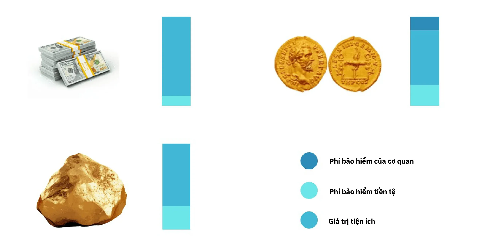

# Các định nghĩa khác nhau về tiền

<partId>77b7918a-8c3b-11f0-b688-6b2ab22378c9</partId>

## Tiền so với tiền tệ so với tiền vàng so với bạc so với thiết bị

<chapterId>bf8a6d21-df88-5d23-a0a5-e9a5c1300554</chapterId>

:::video id=d9c9e7df-9db3-4a9f-801e-10d3fc7dfc22:::

### Ngữ nghĩa của các thuật ngữ tiền tệ

Trong phần này về các lý thuyết tiền tệ khác nhau và đặc biệt là về định nghĩa của tiền, tôi muốn nói ngắn gọn về chủ đề ngữ nghĩa. Tôi muốn đào sâu hơn một chút về định nghĩa của một số từ liên quan đến tiền, và so sánh chúng với các từ tương đương trong tiếng Anh. Ví dụ, money, currency, so với monnaie, argent và devise. Vậy nên, nó như thế này.

Một chút về ngữ nghĩa:

Khi chúng ta nói "**tiền**" (de la monnaie), hầu hết mọi người sẽ nghĩ rằng chúng ta đang nói đến số tiền lẻ chúng ta nhận được sau một giao dịch. Còn nếu chúng ta nói "**tiền tệ**" (la monnaie), mọi người có thể sẽ nghĩ rằng chúng ta đang nói đến tiền tệ của một quốc gia. Tiền tệ của Canada là đô la Canada. Đúng vậy.

Nhưng còn tiền (de l'argent) thì sao? Kẻ trộm sẽ không bao giờ nói "Đưa hết tiền thừa cho tao!" (kẻ trộm có thể sẽ thất vọng khi nhận được những đồng xu gần như không có giá trị).

Không, tên trộm sẽ hét lên: "Đưa hết tiền cho tao". Và nếu tên trộm đứng trước mặt bạn trên phố, chắc chắn hắn đang ám chỉ đến những tờ tiền giấy trong túi bạn.

Mặt khác, nếu kẻ trộm cố gắng lừa đảo bạn theo cách tinh vi hơn, cố gắng đánh cắp tài sản của bạn bằng cách rút hết tiền trong tài khoản ngân hàng, chúng ta sẽ nói rằng **hắn ta sẽ lấy hết tiền của bạn**. Ở đây, từ "tiền" ám chỉ **tài sản của cá nhân**.

Vì vậy, có hai định nghĩa cho từ tiền: tiền mặt (tiền giấy) và của cải.

### Tiền tệ so với tiền xu so với thiết bị

Tiền tệ (devise) nhất thiết phải là tiền tệ của một quốc gia khác, nếu không thì chúng ta chỉ nói tiền (monnaie). Nếu bạn là người Pháp, bạn sẽ nói: "La livre sterling est la devise du Royaume-Uni et l'euro et la monnaie de l'Europe" (Bảng Anh là tiền tệ của Vương quốc Anh và euro là tiền tệ của Châu Âu).

Thông thường, những người chưa tìm hiểu sâu về các vấn đề ngữ nghĩa này, khi dịch các thuật ngữ này, thường có xu hướng nói về tiền tệ (devise) khi nó được viết là tiền tệ, nhưng không, tiền tệ là tiền (monnaie) khi nó là tiền tệ của quốc gia bạn, và nó là devise khi chúng ta nói về các loại tiền tệ khác. Và vì vậy, vấn đề ở đây mà tôi thường thấy là trong tiếng Anh, có hai từ: "tiền", là một khái niệm, và "tiền tệ", thực chất là đơn vị của một quốc gia được sử dụng để trao đổi. Vì vậy, chúng ta có thể chỉ nói về khái niệm tiền tệ; rất dễ - đó là khái niệm của từ *tiền*; đó là tiền nói chung. Và *tiền tệ* rất dễ để so sánh với tiền tệ của một quốc gia. Trong khi đó, thật không may, trong tiếng Pháp, mọi người thường nói "có", "mais ce n'est pas une monnaie" khi nói về bitcoin vì nó không phải là tiền tệ của một quốc gia, nhưng tôi nghĩ thường thì họ đang đề cập đến thuật ngữ tiền tệ. Điều này sai một mặt, bởi vì kể từ El Salvador, bitcoin đã là tiền tệ của một quốc gia. Thực tế là mọi người thường nói: *nhưng không, nó không phải là tiền tệ của một quốc gia, nó không thể là tiền*. Nhưng trên thực tế, nếu chúng ta đề cập đến khái niệm rộng hơn là *tiền*, thì theo tôi, bitcoin hoàn toàn phù hợp với định nghĩa này. Chỉ là trong tiếng Pháp, chúng ta không có hai từ để phân tách hai khái niệm này. Chúng ta có thể nói rằng từ argent dùng để chỉ tiền tệ, nhưng thật không may, đó không phải là định nghĩa chính xác của nó. *Argent* (tiền) dùng để chỉ sự giàu có hoặc tiền giấy. Bạn không thể thực sự tạo ra sự tương đương với từ *tiền*. *Tiền* thực sự là khái niệm về tiền tệ (monnaie).

## Định nghĩa của Saifedean Ammous

<chapterId>07c4ba50-168c-567a-8957-0b187ff75f97</chapterId>

:::video id=936d6d3b-6d45-468e-bc44-85fbce9b857a:::

#### Tiền là gì?

Tiền chỉ đơn giản là thứ bạn sở hữu hoặc có được không phải để sử dụng hoặc tiêu dùng vì mục đích riêng của nó, mà để sau này đổi lấy các hàng hóa hoặc dịch vụ khác mà bạn có thể cần. (Saifedean)

Tiền có được giá trị tiền tệ khi có nhu cầu về tiền tệ đối với hàng hóa, để đóng một hoặc nhiều vai trò của tiền tệ.

Hàng hóa tiền tệ phải đủ khan hiếm để duy trì mức chênh lệch tiền tệ (để ngăn chặn nguồn cung điều chỉnh theo nhu cầu tiền tệ).

### Tiền thưởng tiền tệ

Trong phần này về các định nghĩa khác nhau của tiền tệ, tôi muốn nói ngắn gọn về định nghĩa của Saifedean trong cuốn The Bitcoin Standard, một định nghĩa mà tôi luôn rất quan tâm. Tôi thấy nó khá đơn giản khi đọc nó. Và chúng ta cũng sẽ bổ sung khái niệm "tiền tệ" vào định nghĩa này. Như Saifedean đã đề cập trong cuốn sách của mình, chắc chắn phải có khái niệm về sự khan hiếm. Câu hỏi đặt ra là, tiền là gì?

> Tiền chỉ đơn giản là thứ bạn sở hữu hoặc có được, không phải để sử dụng hoặc tiêu dùng vì mục đích riêng của nó, mà để sau này đổi lấy các hàng hóa hoặc dịch vụ khác mà bạn có thể cần.

Vậy đó là định nghĩa mà Saifedean đề cập trong The Bitcoin Standard. Tôi xin bổ sung rằng một loại tiền tệ (la monnaie) sẽ có được mức chênh lệch tiền tệ khi có nhu cầu tiền tệ về hàng hóa, để đảm nhiệm một hoặc nhiều vai trò của loại tiền tệ đó. Vì vậy, bạn có thể nói rằng một loại tiền tệ đóng vai trò là phương tiện lưu trữ giá trị sẽ có nhu cầu tiền tệ, mang lại cho nó mức chênh lệch tiền tệ, vì mọi người muốn sở hữu nó, ví dụ như để lưu trữ giá trị hoặc làm phương tiện trao đổi.

### Sự khan hiếm và cơ chế thị trường

Về vấn đề này, tôi nghĩ chúng ta chắc chắn nên nói thêm rằng hàng hóa tiền tệ phải đủ khan hiếm để khoản chênh lệch tiền tệ có thể tồn tại. Điều này rất quan trọng. **Nếu một hàng hóa xuất hiện để được sử dụng làm tiền tệ và chúng ta thấy giá của nó tăng lên, thông thường, nếu hàng hóa đó không đủ hiếm, mọi người sẽ muốn sản xuất nhiều hơn để tận dụng mức tăng giá trị này khi giá tăng**. Đây là lý do tại sao hầu hết hàng hóa trên thị trường có giá tương đối cố định. Khi giá tăng, sản lượng có xu hướng tăng. Khi giá giảm, sản lượng giảm. Có một loại điều chỉnh thị trường. **Và khi một hàng hóa đủ hiếm, như vàng, cơ chế thị trường sẽ không bù đắp được nhu cầu sử dụng tiền tệ tăng lên này. Vì vậy, biến số thay đổi, đó là giá. Giống như bitcoin**. Khi giá bitcoin tăng, chúng ta không sản xuất thêm bitcoin. Vì vậy, thứ điều chỉnh là giá. Và đó là lý do tại sao, trong nhiều năm, chúng ta đã thấy giá bitcoin tăng khi nhu cầu về bitcoin tăng. Vì không ai trên Trái Đất này có thể thay đổi thuật toán và nói rằng "nhu cầu tăng, giá tăng, chúng ta sẽ sản xuất thêm." **Nguồn cung bitcoin mới được lập trình trước, và được biết trước**. Vậy nên, đó là điều tôi muốn nói, rằng hàng hóa tiền tệ phải đủ hiếm để mức chênh lệch tiền tệ duy trì, và do đó không bị ảnh hưởng bởi các cơ chế thị trường, nhằm ngăn nguồn cung điều chỉnh theo nhu cầu tiền tệ mới này.

## Phương tiện thanh toán và giá trị giải phóng

<chapterId>5d424039-e342-56f7-9d8b-bba9551831a9</chapterId>

:::video id=af4c0765-8111-4cb7-891b-3ee54d6e7054:::

### Phương tiện thanh toán so với phương tiện trao đổi

Trong phần này dành riêng cho các định nghĩa khác nhau về tiền, tôi đề nghị chúng ta cùng xem một đoạn trích từ cuốn sách "Aux origines de la monnaie" (Nguồn gốc của tiền), một văn bản của Alain Testart về chủ đề tiền tệ như một phương tiện thanh toán và một giá trị giải phóng.

*Từ Aux Origines de la monnaie, Alain Testart định nghĩa tiền là phương tiện thanh toán:*

> Chức năng của phương tiện thanh toán ở đây được hiểu là khác biệt với chức năng của phương tiện trao đổi, bởi vì có những khoản thanh toán không cần cân nhắc, những khoản thanh toán không mua được gì cả. Knies (1873:192 tr.) đã phát triển chi tiết chủ đề về việc chuyển giao hàng hóa không bao gồm các hành vi trao đổi, như trong trường hợp wergeld (tiền máu hoặc tiền bồi thường cho tội giết người) hoặc thuế. Carl Menger đã chỉ trích chức năng thứ tư này trong bài báo "Geld" năm 1892 của ông, thường được coi là một trong những bài báo mang tính quyết định nhất về chủ đề này. Tuy không hoàn toàn bị phủ nhận, nhưng ý tưởng về chức năng của phương tiện thanh toán dường như đã bị lãng quên trong tư duy kinh tế ngày nay, hoặc ít nhất là bị bác bỏ để ủng hộ ý tưởng về phương tiện trao đổi.
>

> Tiền được dùng để thanh toán: xét dưới góc độ này, nó là một công cụ giải phóng, mô tả một cách tổng quát chức năng của một phương tiện thanh toán. Về mặt này, chúng ta nói đến "quyền lực giải phóng" của tiền. Theo Le Petit Robert, quyền lực giải phóng là "thứ có tác dụng giải phóng (khỏi một nghĩa vụ, một món nợ)". Theo Grand Larousse, một khoản thanh toán giải phóng là bất kỳ "khoản thanh toán nào được thực hiện theo các điều kiện pháp lý sao cho chủ nợ không thể tranh cãi về việc xóa nợ". Tiền có quyền lực tuyệt đối này; nó thậm chí còn xác định địa vị pháp lý của nó, bởi vì không ai có thể từ chối một khoản thanh toán được thực hiện bằng tiền, dù là người bán hay chủ nợ. Tiền là hàng hóa duy nhất không thể bị từ chối khi thanh toán khoản nợ, bất kể khoản nợ đó là nợ một thương gia hay người thu thuế. Trong số tất cả các hàng hóa, chỉ có tiền mới nắm giữ đặc quyền này. "Chính đặc quyền này", Charles. Gide (1921 I: 443) viết, tạo nên cái mà chúng ta gọi là tiền tệ hợp pháp.
>

> Bất kỳ sự trao đổi nào bao gồm việc chuyển giao một hàng hóa này lấy một hàng hóa khác, hoặc với điều kiện là một hàng hóa khác được trao đổi, tất yếu hàm ý nghĩa vụ của bên nhận phải cung cấp cho bên đối tác này. Thanh toán là việc thực hiện nghĩa vụ này. Do đó, mọi trao đổi đều hàm ý thanh toán, nhưng không phải mọi thanh toán đều hàm ý trao đổi. Có những khoản thanh toán không có bên đối tác, tức là những khoản thanh toán không cho phép có được một hàng hóa khác, và không được thực hiện vì mục đích này. Thuế vẫn là ví dụ điển hình ở đây; chúng ta cũng nên đề cập đến các khoản tiền phạt các loại phải trả cho các cơ quan công quyền, và các khoản bồi thường phải trả cho người khác theo nguyên tắc rằng kẻ gây thiệt hại cho người khác phải sửa chữa.

### Thanh toán không có đối tác

Đây là một minh họa rõ ràng cho luận điểm của tác giả. Thực tế, ông phân biệt rõ ràng hai khái niệm này. Đối với ông, trao đổi vừa là chuyển giao hàng hóa vừa là thanh toán. Thanh toán là yếu tố tiếp theo. Và thanh toán có thể diễn ra mà không cần trao đổi. Ông đưa ra ví dụ về việc trả tiền phạt đỗ xe hay tiền phạt chỉ là một khoản thanh toán. Bạn không thực sự nhận được dịch vụ nào để đổi lại. Một số người có thể lập luận rằng Nhà nước đang cung cấp cho bạn một dịch vụ để đổi lại, một dịch vụ bằng cách đưa cho bạn vé đỗ xe. Ông khá rõ ràng về việc nộp thuế thực sự là một khoản thanh toán không có đối tác, theo nghĩa là việc nộp thuế là bắt buộc, ngay cả khi bạn không nhất thiết nhận được dịch vụ. Ông nói rằng việc nộp thuế thực sự được định nghĩa là một khoản thanh toán; không có nghĩa vụ phải nhận dịch vụ để đổi lại. Tôi đã thảo luận điều này với nhiều đồng nghiệp của mình, và họ không nhất thiết đồng ý với quan niệm này. Nhưng đó chính là luận điểm của tác giả. Ông cố gắng đặt khái niệm thanh toán và tách nó ra khỏi các trao đổi bằng những ví dụ này, ví dụ như tiền phạt, nộp thuế. Ngoài ra, ví dụ như tiền hồi môn, ông diễn đạt rằng tiền hồi môn là một khoản thanh toán; Bạn không nhất thiết phải nhận lại được gì đó. Người chỉ trích đề xuất này có thể nói "Đúng vậy, nhưng đổi lại bạn sẽ được một người vợ." Vậy đó là mức độ tranh luận về chủ đề này.

Còn có cả wergeld, hay tiền máu nữa. Vậy nên nó chỉ là một khoản bồi thường. Bạn tôi, Ulrich, sẽ nói:

> Có, nhưng đổi lại bạn sẽ phải đóng tập tin này.

Vậy là anh đã phạm tội, ví dụ như giết người. Lúc đó, anh phải trả giá, và sau đó, anh được giải thoát khỏi tình huống đó. Vậy là có một sức mạnh giải thoát. Anh có nhận lại được gì không?" Theo tác giả thì không. Theo một số đồng nghiệp của tôi thì có.

Tôi nghĩ rằng trong cuộc thảo luận này, chúng ta có thể thấy rằng "wergeld" là một trong những ví dụ điển hình để định nghĩa một khoản thanh toán. Thực tế, rõ ràng là bạn không nhận lại được gì cả.

## Tiền nợ so với tiền hàng hóa

<chapterId>4093677a-c8e8-5828-b994-15c01656186e</chapterId>

:::video id=f49cf5cc-288e-4daa-a1ff-b9de73506f4e:::

### Cuộc tranh luận cơ bản

Vẫn trong bối cảnh của phần này về các định nghĩa và lý thuyết tiền tệ khác nhau, chúng ta hãy cùng nhau khám phá hai quan điểm hoàn toàn trái ngược nhau: "tiền luôn là nợ" hoặc "tiền luôn là hàng hóa". Một mặt, có những người ủng hộ lý thuyết tiền tệ dựa trên nợ, họ khẳng định: "Không, tiền luôn là nợ!". Mặt khác, những người ủng hộ vàng nổi tiếng của chúng ta lại lập luận: "Nhưng không, bạn thấy đấy, tiền luôn là hàng hóa, nó luôn là vàng; mọi thứ khác, hóa đơn, giấy nợ, chỉ là tín dụng, không phải tiền".

Chúng ta hãy cùng nhau khám phá bản tóm tắt rõ ràng về những lý thuyết này.

### Thuyết "luôn là một khoản nợ"

Sau đây là tóm tắt về lý thuyết tiền tệ được gọi là **"tiền nợ"**, theo đó tiền về cơ bản là một hình thức nợ:

Theo lý thuyết này, được Alfred Mitchell-Innes phát triển và David Graeber tiếp tục phát triển, tiền tệ về bản chất là một sự thừa nhận nợ nần, bắt nguồn từ các mối quan hệ tín dụng vốn đã tồn tại từ trước khi có sự trao đổi tiền tệ trực tiếp. Thay vì xuất phát từ nhu cầu trao đổi hàng hóa, tiền tệ xuất hiện như một phương tiện để hạch toán, chuyển giao và giải quyết các nghĩa vụ xã hội hoặc nợ nần giữa các cá nhân hoặc nhóm.

Do đó, tất cả tiền tệ đều lưu thông như một khoản nợ mà một cá nhân hoặc tổ chức này nợ một cá nhân hoặc tổ chức khác, được bảo đảm bởi sự tín nhiệm và thẩm quyền xã hội hoặc nhà nước, đảm bảo tính hợp lệ của nó. Vì vậy, theo họ, khi chúng ta sở hữu - như tôi đã đề cập - khi chúng ta sở hữu tiền, chúng ta có quyền đòi hỏi đối với xã hội, và xã hội nợ chúng ta một khoản nợ. Do đó, tiền tệ không bao giờ trung lập hay tự chủ, mà luôn là một khoản nợ tiềm ẩn: nắm giữ tiền về cơ bản có nghĩa là sở hữu quyền đòi hỏi đối với xã hội hoặc một cộng đồng kinh tế.

Lý luận này mâu thuẫn với ý tưởng cổ điển cho rằng tiền tệ chỉ là một "hàng hóa trung gian" đơn giản, thay vào đó nhấn mạnh vai trò trung tâm của các mối quan hệ xã hội và chính trị trong việc tạo ra và quản lý tiền tệ.

**Đánh giá của tôi:**

Điều khiến tôi băn khoăn về lý thuyết này là nó khẳng định rằng tiền luôn là một khoản nợ, khi chúng ta có những ví dụ về việc trao đổi giữa hai bộ lạc khác nhau, chẳng hạn như trao đổi vàng, trong đó giao dịch chắc chắn là cuối cùng và không còn nợ tiềm ẩn nào. Những người ủng hộ lý thuyết này thường nói với chúng ta rằng những trao đổi này không phải là trao đổi tiền tệ, mà là trao đổi hàng đổi hàng. Như đã đề cập, tôi không đồng ý. Đó là một trao đổi tiền tệ, vì vàng không bị tiêu thụ; nó sẽ được sử dụng như tiền tệ.

### Lý thuyết "luôn là một hàng hóa"

**Luôn là một hàng hóa:**

Sau đây là bản tóm tắt rõ ràng về lý thuyết tiền tệ được gọi là **"tiền hàng hóa"**, trong đó tiền luôn xuất hiện như một loại hàng hóa, đặc biệt là vàng, xuất hiện do nhu cầu có thể giao dịch, một loại hàng hóa thường được chấp nhận ở nước ngoài và được mua lại cho mục đích giao dịch.

Theo lý thuyết này, được phát triển bởi các nhà kinh tế học cổ điển (Adam Smith, David Ricardo) và được Marx tiếp thu, tiền tệ tự nhiên xuất hiện như một loại hàng hóa, thường là một kim loại quý như vàng hoặc bạc, có giá trị nội tại độc lập với vai trò tiền tệ của nó. Ban đầu, những hàng hóa này được các chủ thể kinh tế tự nguyện lựa chọn để tạo điều kiện thuận lợi cho thương mại, nhờ những đặc tính nội tại của chúng (tính khan hiếm, độ bền, tính phân chia và tính ổn định).

Tiền hàng hóa được phân biệt bởi sự tồn tại vật chất và giá trị được xác định bởi lượng lao động xã hội cần thiết để sản xuất ra nó (như Marx đã nói). Ví dụ, xã hội sử dụng vàng không chỉ để đơn giản hóa việc trao đổi hàng hóa mà còn như một đơn vị tính toán, một phương tiện lưu trữ giá trị và một phương tiện trao đổi phổ biến.

Theo quan điểm này, tiền luôn giữ được giá trị thực, vì nó gắn liền với một hàng hóa hữu hình. Ngay cả khi vai trò của tiền trở nên trừu tượng (tiền xu đúc, tiền giấy, hay tiền kinh thánh), giá trị của nó vẫn bắt nguồn, trực tiếp hoặc gián tiếp, từ việc quy chiếu đến một hàng hóa cơ sở như vàng. Do đó, lý thuyết này nhấn mạnh vào nguồn gốc vật chất và kinh tế của tiền, trái ngược với các lý thuyết coi nó chỉ là một quy ước hay một khoản nợ. Theo lý thuyết này, bất kỳ hình thức biểu hiện tiền nào bằng một vật thay thế, chẳng hạn như một tờ tiền có thể quy đổi bằng vàng, đều được coi là tín dụng.

**Đánh giá của tôi:**

Lưu ý rằng quan điểm này tương tự như lý thuyết tiền tệ hàng hóa, nhưng tiến xa hơn một bước. Họ đề xuất rằng tiền tệ **luôn** phải là một hàng hóa. Và khi chúng ta nói với họ: "*Vâng, nhưng chúng ta có thể đồng ý rằng tiền giấy là tiền đối với nhóm này; nó có thể được bảo đảm bằng vàng, thì điều đó có hiệu quả, và tiền giấy tự nó là tiền*".

Đáp lại, họ sẽ đưa ra ví dụ về phiếu giảm giá phòng thay đồ. Họ sẽ nói: "Được, nhưng không, khi bạn có phiếu giảm giá phòng thay đồ cho quần áo của mình, chúng ta có thể gọi phiếu giảm giá máy tính tiền là quần áo được không?"

Tất nhiên là không, về bản chất, nó giống như một sự thừa nhận, một lời khẳng định, cho phép bạn lấy lại quần áo của mình. Sự so sánh này không đúng, bởi vì phiếu giảm giá phòng thay đồ không phải là phương thức thanh toán được chấp nhận rộng rãi. **Tiền không phải là một lời khẳng định đối với một vật thể cụ thể như quần áo; nó là một phương thức, một phương tiện trao đổi, một phương tiện trao đổi, hoặc một phương thức thanh toán được chấp nhận rộng rãi**.

Vậy nên, bạn không thể so sánh giữa phiếu mua hàng trong phòng thay đồ và tiền giấy, vì phiếu mua hàng trong phòng thay đồ cho phép bạn đổi lấy một món hàng cụ thể, còn tờ token cho phép bạn lấy lại món hàng đó. Trong khi đó, tiền giấy, tiền giấy, là một phiếu mua hàng phổ thông cho phép bạn tiếp cận bất kỳ món hàng nào.

Và theo tôi, tất nhiên, ngay cả tiền pháp định cũng có thể được coi là tiền nếu nó được người dân coi là như vậy. Và tôi nghĩ sẽ là một sai lầm về mặt ngữ nghĩa khi khẳng định rằng nó không thể là tiền, vì nó là một phiếu để lấy tiền thật, ít nhất là vào thời điểm đó, tức là vàng cơ sở.

Tôi không thấy có vấn đề gì khi xem xét đồng tiền vàng được cất giữ trong két sắt và tờ tiền tượng trưng cho đồng tiền vàng đó như một loại tiền tệ. Đối với tôi, không có vấn đề gì về mặt ngữ nghĩa, chỉ là hai loại tiền tệ. Nếu tôi không nhầm, Mises đã giải thích hiện tượng này rất hay bằng cách nói về các loại tiền tệ thay thế.

Quan điểm của họ tóm lại là bạn không thể coi một đồng tiền vàng trong két ngân hàng và tờ tiền giấy tượng trưng cho nó là tiền cùng một lúc. Cá nhân tôi không thấy có vấn đề gì với điều này; tôi không thấy có nghịch lý nào trong tình huống này. Những người tin rằng tiền luôn là một loại hàng hóa không nhìn nhận sự việc theo cách của tôi.

**Đây là bài đánh giá về khái niệm phiếu giảm giá phòng thay đồ từ cuốn sách *Aux origines de la monnaie*:**

*Chú thích 14: "Phê bình tuyệt vời - tuyệt vời vì nó nằm trên chính nền tảng mà Knapp đặt mình vào, nền tảng pháp lý - của Rist (1938: 372, chú thích 1) về sự so sánh giữa tiền giấy và tiền xu trong phòng séc: nếu chúng ta có thể nói về một loại yêu sách trong cả hai trường hợp, thì sự khác biệt cơ bản là trong trường hợp đầu tiên, và chỉ trong trường hợp đầu tiên, đó là một yêu sách không có đối tượng cụ thể

Ngoài ra, về chủ đề **khiếu nại**, tác giả cũng lưu ý như sau:

> Bastiat hoàn toàn tự do tưởng tượng một phiếu quà tặng cho toàn xã hội được trình bày như "một khu chợ khổng lồ", nhưng sự bổ sung nhỏ bé này, sự mở rộng tưởng chừng như vô hại này, lại chính là sự khác biệt hoàn toàn giữa tín dụng và tiền bạc. Tiền bạc không phải là một quyền sở hữu đối với một cửa hàng cụ thể. Không có cái gọi là quyền sở hữu ẩn danh. Nhưng tính ẩn danh đặc trưng của tiền bạc, và do đó là tính phổ quát của nó, mới là điều khiến nó trở nên mạnh mẽ. Tiền bạc không giống tín dụng, càng không thể quy giản về tín dụng theo bất kỳ cách nào. **Tiền bạc còn hơn cả tín dụng rất nhiều.**

**Một nghịch lý: tiền nợ so với tiền hàng hóa**

Nghịch lý minh họa rõ nhất cho sự phân đôi sâu sắc giữa lý thuyết nợ-tiền và lý thuyết hàng hóa-tiền liên quan đến câu hỏi liệu vàng có phải là một loại tiền tệ ngày nay hay không.

Một mặt, lý thuyết tiền nợ định nghĩa tiền tệ trước hết là một phương tiện trao đổi trung gian hoặc phương tiện thanh toán được chấp nhận rộng rãi, hoặc thậm chí được áp đặt, bởi một cơ quan công quyền. Theo quan điểm này, vàng không còn là một loại tiền tệ nữa, vì nó không được sử dụng rộng rãi hoặc được chấp nhận như một phương tiện trao đổi thông thường.

Mặt khác, lý thuyết tiền tệ hàng hóa xem tiền tệ là một loại hàng hóa hữu hình, được xã hội tự nguyện lựa chọn vì những đặc điểm nội tại của nó (tính khan hiếm, độ bền, khả năng phân chia, v.v.). Theo cách tiếp cận này, vàng vẫn là loại tiền tệ phổ biến thực sự, và tất cả các hình thức tiền tệ khác ngày nay, về cơ bản, không gì khác hơn là tín dụng dựa trên niềm tin.

Nghịch lý này cho thấy rõ khoảng cách giữa hai quan niệm về tiền tệ: với quan niệm trước, vàng không còn là tiền tệ nữa; ngược lại, với quan niệm sau, vàng vẫn là loại tiền tệ thực sự duy nhất hiện có.

## Lý thuyết tiền tệ hiện đại

<chapterId>8efc29af-3193-5d97-ad9f-e608b32924ff</chapterId>

:::video id=f8127cb7-46a1-468c-bbb5-97bf0a8b8837:::

### Nguyên tắc của lý thuyết tiền tệ hiện đại

Để kết thúc phần này về các lý thuyết tiền tệ khác nhau, chúng ta hãy nói về thần đồng của các lý thuyết tiền tệ, được nhiều nhà kinh tế hiện đại làm việc cho các ngân hàng trung ương ngưỡng mộ và được đặt tên là lý thuyết tiền tệ hiện đại, thường được gọi là MMT.

**Lý thuyết Tiền tệ Hiện đại (MMT)** là một phương pháp tiếp cận kinh tế cho rằng một quốc gia có đồng tiền riêng (như Hoa Kỳ, Canada hoặc Nhật Bản) sẽ không bao giờ cạn tiền, vì họ luôn có thể phát hành thêm tiền để tài trợ cho chi tiêu của mình. Theo lý thuyết này:

- Tiền là sản phẩm của Nhà nước, không phải là nguồn tài nguyên hữu hạn**

- Thuế và vay nợ không được sử dụng trực tiếp để tài trợ cho chi tiêu công mà để điều chỉnh lạm phát, tác động đến hành vi kinh tế và duy trì nhu cầu về đồng tiền quốc gia.*

- Giới hạn thực sự đối với chi tiêu của chính phủ là lạm phát, chứ không phải thâm hụt ngân sách hay nợ công.

- Nếu số tiền tạo ra được chuyển vào các lĩnh vực có khả năng hấp thụ thì sẽ không có lạm phát.

- Do đó, chính phủ phải điều chỉnh chi tiêu theo nguồn lực thực tế hiện có (nhân lực, năng lực công nghiệp, tài nguyên thiên nhiên) để tránh lạm phát quá mức.

### Vai trò của thuế trong MMT

Vậy thì đây chính là câu trả lời nổi tiếng cho những ai thắc mắc: "Ừ, nhưng nếu chúng ta có thể in tiền, tại sao lại phải đóng thuế?". MMT có câu trả lời đúng cho ý tưởng này. Đúng là trong hệ thống tiền tệ fiat, trong hệ thống hiện đại, về mặt kỹ thuật, không có gì hạn chế việc tạo ra tiền, ngoại trừ lạm phát. Nhưng họ sẽ cho rằng, trước hết, thuế là cần thiết để hạn chế lạm phát, vì nó sẽ rút tiền khỏi nền kinh tế. Vì vậy, nếu chúng ta không có thuế để bù đắp, tất cả việc tạo ra tiền này cuối cùng có thể tạo ra lạm phát. Họ lập luận rằng thuế thực chất là một cách rút tiền khỏi hệ thống để hạn chế lạm phát.

Về vấn đề tiền đầu tư vào các lĩnh vực có thể hấp thụ được, chúng ta có thể lấy ví dụ về Hoa Kỳ, nơi cung cấp hàng nghìn tỷ đô la cho ngành công nghiệp quân sự, điều này không gây ra lạm phát vì ngành công nghiệp quân sự, tổ hợp công nghiệp quân sự, hoàn toàn có khả năng hấp thụ hàng nghìn tỷ đô la này.

Mặt khác, nếu bạn muốn xây thêm đường, mà nguồn lực và nhà thầu có hạn, thì việc tăng gấp đôi ngân sách cho đường sá chắc chắn sẽ tạo ra hiệu ứng khan hiếm đối với lực lượng lao động có thể xây dựng những con đường này. Vì vậy, giá cả sẽ tăng do tác động của các lực lượng thị trường, cung và cầu. Nếu các nhà lãnh đạo toàn năng của chúng ta biết nên đầu tư vào đâu, về mặt kỹ thuật, nó sẽ không gây ra lạm phát. Và tôi xin trả lời rằng, trên thực tế, rõ ràng là nó gây ra lạm phát.

Tóm lại, theo MMT, nhà nước có thể sử dụng năng lực tạo tiền của mình để đạt được việc làm đầy đủ và tài trợ cho đầu tư xã hội và sinh thái, đồng thời kiểm soát lạm phát thông qua chính sách tài khóa phù hợp. Các nhà kinh tế học Keynes, một trường phái tư tưởng kinh tế khác, thường hướng đến mục tiêu quản lý thất nghiệp bằng cách quản lý lãi suất và tài trợ cho đầu tư xã hội và sinh thái, đồng thời kiểm soát lạm phát thông qua chính sách tài khóa phù hợp.

### Đánh giá MMT

Lý thuyết này chỉ áp dụng cho một số ít quốc gia (xem tweet của Stephanie Kelton) có chủ quyền tiền tệ thực sự, tức là họ có thể vay nợ bằng đồng tiền của mình. Lý thuyết này khó áp dụng cho các nền kinh tế phụ thuộc vào nhập khẩu, những nền kinh tế phải duy trì niềm tin quốc tế vào đồng tiền của mình.

Vậy chủ quyền tiền tệ thực sự là gì? Nó có nghĩa là khả năng huy động nợ bằng đồng tiền của mình. Bạn phải có khả năng tạo ra thặng dư thương mại để có đủ dự trữ ngoại hối, đủ ngoại tệ, để bạn không phải huy động tiền bằng ngoại tệ để nhập khẩu hàng hóa. Điều này liên quan đến một số ít quốc gia.

Dưới đây, bạn có thể thấy một dòng tweet của Stephanie Kelton, một người phụ nữ đại diện cho phong trào này. Bà đã viết một cuốn sách có tên "Huyền Thoại Thâm Hụt". Trong dòng tweet, bà viết rằng các quốc gia khác nhau như Hoa Kỳ, Nhật Bản, Canada, Úc, Vương quốc Anh, không thể nào cạn kiệt tiền bạc.

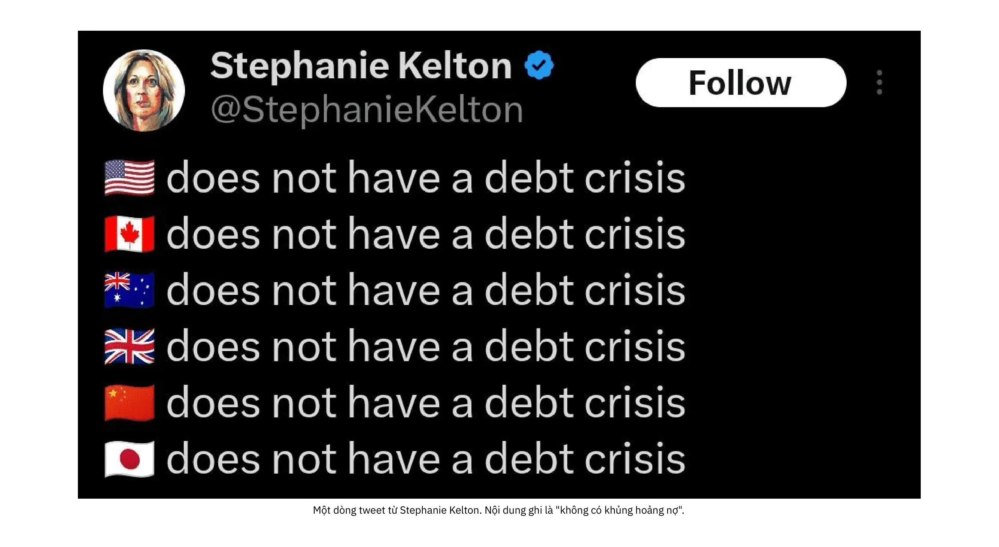

Kỳ lạ thay, nó chỉ liệt kê sáu quốc gia? Tại sao vậy? Bởi vì họ có chủ quyền tiền tệ thực sự. Nhưng có khoảng 200 quốc gia trên Trái đất, và không phải tất cả đều có chủ quyền tiền tệ. Vì vậy, lời chỉ trích của tôi đối với lý thuyết này, ngoài việc hơi kỳ lạ và không có chức năng, là nó chỉ có hiệu quả đối với một số ít quốc gia có chủ quyền tiền tệ thực sự, những quốc gia có thể phát hành trái phiếu kho bạc bằng đồng tiền của riêng họ. Ở một mức độ nào đó, nó gây bất lợi cho phần còn lại của thế giới. Bằng cách tạo ra loại tiền tệ này, giống như họ đang xuất khẩu lạm phát của mình ở nơi khác, giống như những gì Hoa Kỳ đã làm với đặc quyền quá đáng của mình trong nhiều thập kỷ. Điều này giống như một hình thức chủ nghĩa thực dân tiền tệ, nơi các quốc gia có niềm tin và nhu cầu toàn cầu đối với đồng tiền của họ có thể in bao nhiêu tiền tùy thích mà không phải chịu lạm phát đáng kể, thường là do họ xuất khẩu lạm phát đó.

Lý thuyết này khó áp dụng cho các nền kinh tế phụ thuộc vào nhập khẩu và cần duy trì niềm tin quốc tế vào đồng tiền của mình.

Lý thuyết này cũng kêu gọi một mức độ lập kế hoạch tập trung nhất định cho nền kinh tế, đặc biệt là để đảm bảo kiểm soát chặt chẽ hơn các nguồn tài nguyên thực (người lao động, nguyên liệu thô, năng lực công nghiệp) và quản lý lạm phát.

# Sự sụp đổ và tái sinh của tiền tệ

<partId>87a34ca9-782b-5ade-b51a-400f88ed7b0c</partId>

## Tiền xu Hy Lạp

<chapterId>7714195f-74ce-5f8c-be5f-59302d39fff4</chapterId>

:::video id=8e5c3091-0910-471b-8d4b-0dc6e9afa656:::

### Bối cảnh và bối cảnh

Trước khi bắt đầu, đây là bối cảnh lịch sử:

**Bối cảnh lịch sử:**

**Người La Mã gọi người Hy Lạp là "Graeci" và người Hy Lạp là "Graecia".**

**Người Hy Lạp tự gọi mình là "Hellenes" và đất nước của họ là "Hellas".**

**Homer** (sinh vào khoảng thế kỷ thứ 8 trước Công nguyên)

Nhà thơ huyền thoại người Hy Lạp, được cho là tác giả của *The Iliad* và *The Odyssey*.

Khoảng **750 TCN: Lycurgus**, nhà lập pháp huyền thoại của Sparta, được cho là đã thiết lập hiến pháp Sparta dựa trên kỷ luật quân sự và sự đơn giản.

**Numa Pompilius** (753-673 TCN)

Vị vua thứ hai của Rome, nổi tiếng vì đã xây dựng nên các thể chế tôn giáo và pháp lý đầu tiên của Rome.

**Dracon**, nhà lập pháp người Athens (thế kỷ thứ 7 trước Công nguyên), nổi tiếng với những luật lệ cực kỳ nghiêm khắc, do đó có thuật ngữ "hà khắc".

**594 TCN: Solon** trở thành nhà lập pháp ở Athens và cải cách triệt để xã hội Athens, đáng chú ý là bằng cách bãi bỏ chế độ nô lệ vì nợ.

**776 TCN: Thế vận hội Olympic cổ đại**

Các trò chơi thể thao thường kỳ đầu tiên được tổ chức tại Olympia bốn năm một lần, quy tụ các thành phố Hy Lạp.

**Pythagoras** (khoảng 570-495 TCN)

Nhà triết học và toán học người Hy Lạp, nổi tiếng với định lý về tam giác vuông.

**Xenophanes của Colophon** (khoảng 570-478 TCN)

Nhà triết học tiền Socrates nổi tiếng với những lời chỉ trích về thuyết đa thần truyền thống của Hy Lạp.

**490 TCN: Trận Marathon**

Người Athens đã đẩy lùi thành công cuộc xâm lược của Ba Tư, đánh dấu bước ngoặt quyết định cho nền văn minh Hy Lạp.

**Herodotus** (khoảng 484-425 TCN), được mệnh danh là "cha đẻ của lịch sử", đã viết một tác phẩm đồ sộ mô tả các cuộc chiến tranh Ba Tư, bao gồm chiến thắng của Hy Lạp trước Xerxes vào năm 480 TCN.

**Socrates** (470-399 TCN)

Nhà triết học người Athens nổi tiếng với phương pháp biện chứng và giáo lý về đạo đức và tự nhận thức.

**Aristophanes** (khoảng 446-386 TCN)

Nhà viết kịch người Athens, nổi tiếng với những vở hài kịch châm biếm như *The Frogs*.

**Sophocles** (thế kỷ thứ 5 trước Công nguyên), trong vở kịch *Antigone* của mình, đã chỉ trích tiền bạc là nguồn gốc của sự tha hóa về đạo đức và chính trị, thông qua bạo chúa Creon.

**Plato** (khoảng 428-348 TCN)

Nhà triết học Hy Lạp, học trò của Socrates, người sáng lập Học viện, tác giả của *Cộng hòa*.

**431-404 TCN: Chiến tranh Peloponnesian**

Xung đột lớn giữa Athens và Sparta, kết thúc bằng thất bại của Athens.

**431 TCN**: Athens tài trợ cho Chiến tranh Peloponnesian bằng cách pha loãng tiền vàng và bạc để tăng số lượng lưu hành, gây ra lạm phát.

**Xenophon** (khoảng 430-355 TCN)

Nhà văn, triết gia và tướng lĩnh người Athens, học trò của Socrates, tác giả của *Anabasis*.

**414 TCN**: Athens bắt đầu thua trong Chiến tranh Peloponnesian sau cuộc viễn chinh thảm khốc tới Sicily.

**405 TCN: Aristophanes**, trong vở kịch *The Frogs* của mình, đã mô tả rõ ràng sự mất giá của đồng drachma bạc và sự xuất hiện của những đồng tiền bằng đồng kém chất lượng ở Athens, minh họa cho nguyên tắc ngày nay được gọi là "Luật Gresham".

**404 TCN**: Athens đầu hàng sau một cuộc bao vây dài của Sparta.

**Aristotle** (384-322 TCN)

Nhà triết học Hy Lạp vĩ đại, học trò của Plato, người sáng lập trường Lyceum, nổi tiếng với các công trình về logic, sinh học và triết học chính trị.

**327 TCN**: Alexander Đại đế chinh phục Persepolis và các tỉnh phía đông của Đế chế Ba Tư, mở rộng đáng kể đế chế của mình.

**323 TCN**: Alexander qua đời ở Babylon mà không có người thừa kế rõ ràng, gây ra chiến tranh giữa các tướng lĩnh của ông (diadochi) để phân chia đế chế.

**Archimedes** (khoảng 287-212 TCN)

Nhà toán học, vật lý và nhà phát minh người Hy Lạp, nổi tiếng với những khám phá về hình học và cơ học.

**Năm 196 trước Công nguyên: Phiến đá Rosetta** được khắc dưới thời Pharaoh Ptolemy V, cho phép giải mã chữ tượng hình Ai Cập sau này.

**192-188 TCN: Chiến tranh La Mã-Seleucid**

Rome đã đánh bại đế chế Seleucid do Antiochos III lãnh đạo, củng cố ảnh hưởng của mình ở Hy Lạp và Tiểu Á.

**146 TCN: Trận Corinth**

Người La Mã đã phá hủy thành phố Corinth của Hy Lạp, đánh dấu sự kết thúc của nền độc lập chính trị của Hy Lạp và sự hòa nhập dần dần của Hy Lạp vào thế giới La Mã.

Trong phần này về thời Cổ đại, sự sụp đổ của La Mã và thời Trung cổ, chúng ta sẽ bắt đầu với phần về tiền xu Hy Lạp.

Lịch sử tiền xu ở Hy Lạp cổ đại bắt đầu vào khoảng năm 600 TCN, khi các thành phố Hy Lạp nhanh chóng tiếp thu sáng kiến từ Lydia ở Tiểu Á, ban đầu sử dụng electrum và sau đó là bạc. Những đồng tiền Hy Lạp đầu tiên được đúc trên đảo Aegina, với hình ảnh một con rùa biển hoặc rùa cạn, nhưng chính đồng drachma của Athens, được trang trí bằng hình ảnh Athena và một con cú, mới trở thành biểu tượng tiền tệ tiêu biểu từ thế kỷ thứ 5 TCN, thống trị phần lớn thương mại quốc tế vào thời điểm đó.

Và tôi thật may mắn khi có được một bản sao của đồng drachma Hy Lạp thời kỳ đó với hình con cú nổi tiếng và một bức tượng ở mặt sau. Đó là đồng tetradrachma, lớn hơn đồng drachma thông thường.

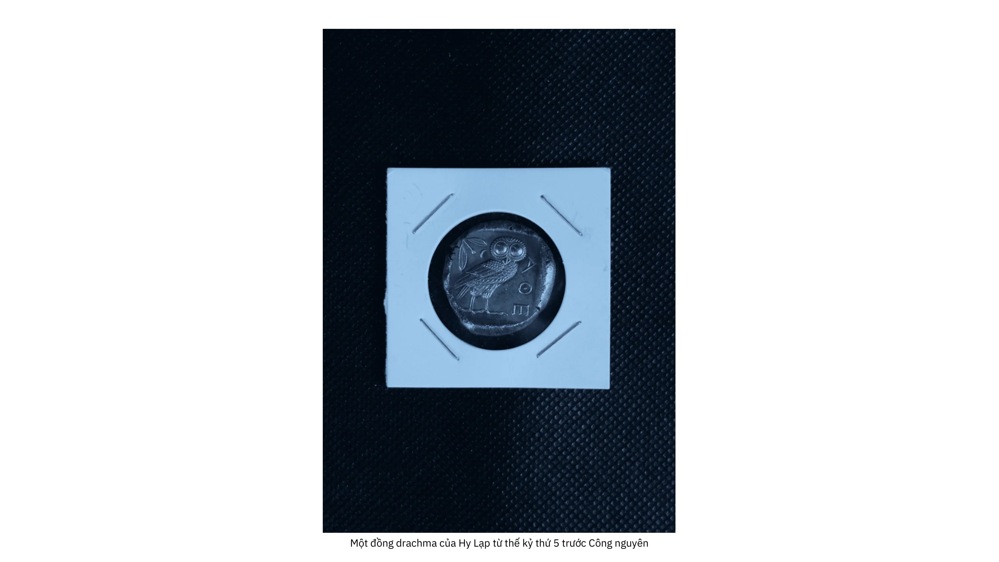

Mỗi thành phố Hy Lạp đều phát triển mối quan hệ riêng với tiền tệ. Ở Athens, tiền tệ gắn liền sâu sắc với quyền lực chính trị và kinh tế. Sắc lệnh nổi tiếng của Athens vào cuối thế kỷ thứ 5 trước Công nguyên đã áp đặt việc sử dụng độc quyền tiền tệ của Athens trên các lãnh thổ đồng minh, qua đó củng cố quyền bá chủ kinh tế của họ. Athens cũng tích trữ một lượng lớn vàng dự trữ cho các trường hợp khẩn cấp, được cất giữ tại Acropolis, có lẽ như một biểu tượng cho sự thận trọng trong kinh tế của họ. Ngược lại, Sparta, một thành phố quân sự với các giá trị khắt khe, đã chọn cách hạn chế nghiêm ngặt việc sử dụng tiền tệ, cấm công dân sở hữu tiền vàng hoặc bạc. Sparta thích sử dụng những thanh sắt nặng để ngăn cản thương mại nước ngoài và duy trì sự gắn kết xã hội.

Chiến tranh thường được tài trợ bằng thao túng tiền tệ. Trong Chiến tranh Peloponnesian (431-404 TCN), Athens đã phải dùng đến biện pháp phá giá mạnh để trả lương cho quân đội. Bị quân Sparta chiếm đóng Decelia vào năm 413 TCN, Athens đã phải nấu chảy các bức tượng vàng để đúc tiền mới một cách vội vã vào năm 407/406 TCN. Sau đó, vào năm 406/405 TCN, Athens đã tạo ra những đồng tiền bằng đồng mạ bạc, gây ra một cuộc khủng hoảng tiền tệ được minh họa bởi **Aristophanes**, người đã gợi lại cái mà ngày nay được gọi là Định luật Gresham: tiền xấu đẩy tiền tốt ra ngoài. Loại tiền tệ khẩn cấp này đã nhanh chóng bị hủy bỏ sau chiến tranh để khôi phục niềm tin vào tiền đúc của Athens.

Sự kết thúc của thời kỳ cổ điển được đánh dấu bằng sự trỗi dậy của Macedonia dưới thời Philip II và con trai ông là Alexander Đại đế, làm đảo lộn sâu sắc cán cân tiền tệ của Hy Lạp. Nhờ các mỏ vàng và bạc rộng lớn trên Núi Pangea, Philip II đã tạo ra một lượng tiền dồi dào để tài trợ cho các chiến dịch quân sự và chính trị của mình, thiết lập một tiêu chuẩn vàng-bạc đơn giản và thiết thực (10:1). Những đồng stater vàng của ông, để kỷ niệm chiến thắng của ông tại Thế vận hội Olympic, đã được lưu hành xa tới tận Tây Âu, thậm chí đến tận Anh. Alexander theo đuổi chính sách tiền tệ này, lưu hành rộng rãi đồng **Attic** drachma trong các cuộc chinh phạt của ông ở phương Đông cho đến tận Ấn Độ. Sự lưu hành tiền xu ồ ạt này đánh dấu sự khởi đầu của thời kỳ Hy Lạp hóa, khi hình ảnh của các vị vua dần thay thế hình ảnh các vị thần trên tiền xu. Sự đổi mới này cho phép nhiều thế hệ quốc vương Hy Lạp hóa tự quảng bá bản thân, đẩy các vị thần truyền thống xuống một vai trò thứ yếu ở mặt sau của đồng xu của họ.

Sau khi Alexander băng hà vào năm 323 TCN, các tướng lĩnh của ông đã phân chia đế chế rộng lớn của ông, thành lập các triều đại ở Ai Cập (giai đoạn Ptolemy), Syria (giai đoạn Seleukos) và nhiều nơi khác. Các vương quốc Hy Lạp hóa này đã áp dụng nhiều hệ thống tiền tệ khác nhau: nhà Ptolemy áp đặt một hệ thống tiền tệ khép kín để kiểm soát lưu thông tiền tệ, ưu tiên sử dụng ngũ cốc làm tiền tệ nội địa để tiết kiệm kim loại quý cho chi tiêu quân sự bên ngoài. Cùng lúc đó, Rhodes trở thành một trung tâm thương mại lớn trước khi bị người La Mã làm suy yếu về mặt kinh tế, khi họ thành lập Delos làm cảng tự do vào năm 167 TCN.

Việc sử dụng tiền bạc đóng vai trò trọng tâm trong việc trả công cho lính đánh thuê. Binh lính của Alexander được nhận đồng drachma bạc mỗi ngày.

Kỵ binh, lực lượng tinh nhuệ trong đội quân chuyên biệt của Alexander, nhận được trung bình hai drachma một ngày, một lính bộ binh một drachma, và một lính đánh thuê bình thường được trả hai phần ba drachma, gấp đôi tiền lương của một công nhân bình thường.

Trong Chiến tranh Peloponnesian, một số tiền lớn cũng được trả cho binh lính: hơn 1.200 nhân tài để dập tắt cuộc nổi loạn Samos và hơn 2.000 nhân tài để bao vây Potidea.

Khi đội quân này tham gia toàn diện vào Tiểu Á, tổng chi phí vào khoảng hai mươi ta-lâng một ngày, hay khoảng nửa tấn bạc, hay 120.000 drachma.

Tiền xu Hy Lạp cũng đóng một vai trò văn hóa quan trọng, vì mỗi thành phố đều tìm cách khẳng định bản sắc của mình bằng cách đúc tiền xu mang biểu tượng địa phương hoặc thần thoại. Ví dụ, Heraclius mô tả Heracles (Hercules) chiến đấu với sư tử, trong khi Cyrene khắc họa cây thuốc nổi tiếng silphium.

Cuối cùng, bất chấp sự đa dạng và biến động theo khu vực, tiền xu Hy Lạp cổ điển và Hy Lạp hóa đã để lại dấu ấn lâu dài trong lịch sử kinh tế và văn hóa của thế giới Địa Trung Hải, ảnh hưởng sâu sắc đến các hệ thống tiền tệ sau này cho đến tận La Mã, nơi dần dần áp dụng và phát triển các khái niệm kinh tế của Hy Lạp để xây dựng nên nền kinh tế đế quốc của riêng mình.

## Tác động của tiền tệ ở Hy Lạp

<chapterId>3a5e6c7d-699c-5567-87cd-3374c49d55a9</chapterId>

:::video id=0c79a59c-e179-4893-a414-1b8de0930eb9:::

### Athens và sự tương phản với Sparta

Sự đối đầu giữa Athens và Sparta trong thời kỳ Hy Lạp cổ đại cho thấy hai mô hình tổ chức chính trị và kinh tế hoàn toàn khác biệt. Trong khi Sparta từ chối tiền kim loại để ủng hộ một hệ thống tự cung tự cấp dựa trên niềm tin công dân, Athens lại hoàn toàn nắm bắt công nghệ này để xây dựng và duy trì đế chế hàng hải của mình.

### Sự cần thiết về mặt tiền tệ của sức mạnh hải quân

Đế chế Athens, mặc dù có tên gọi hoành tráng, vẫn khiêm tốn về mặt địa lý - chủ yếu bao gồm Athens và các thành phố ven biển Aegean. Quyền lực của nó nằm ở Liên minh Delos, một liên minh quân sự do Athens thống trị với tư cách là bá chủ. Cấu trúc đế quốc này đòi hỏi một công cụ kinh tế thống nhất: đồng bạc Athens.

Việc duy trì một hạm đội là cốt lõi của nhu cầu tiền tệ này. Một chiếc trireme của Athens có giá từ một đến hai talent bạc - một khoản tiền đáng kể. Với hàng trăm con tàu cần duy trì, Athens cần một hệ thống thuế hiệu quả. Tiền tệ trở thành công cụ không thể thiếu để thu cống phẩm từ các thành phố chư hầu và tài trợ cho lực lượng hải quân, đảm bảo sự gắn kết của đế chế.

### Áp đặt tiền tệ như một công cụ thống trị

Athens áp đặt đồng tiền bạc của mình lên tất cả các thành viên của Liên minh Delos. Việc chuẩn hóa tiền tệ này phục vụ một số mục tiêu chiến lược. Thứ nhất, nó tạo điều kiện thuận lợi cho việc thu cống phẩm bằng cách tạo ra một đơn vị hạch toán chung. Thứ hai, nó củng cố sự phụ thuộc kinh tế của các thành phố chư hầu vào Athens. Cuối cùng, nó thể hiện sức mạnh của Athens trên toàn bộ đế chế hàng hải.

Chính sách tiền tệ này trái ngược hoàn toàn với mô hình Sparta. Sparta, một cường quốc trên đất liền, có thể dựa vào sức lao động của những helot (nô lệ) Peloponnesian để sinh tồn. Hệ thống kinh tế khép kín, lấy thành phố làm trung tâm của nó không đòi hỏi các công cụ tiền tệ phức tạp. Dân-binh sống cùng nhau, cùng ăn chung, và không cần tiền để trao đổi hàng ngày.

### Tiền tệ như một phương tiện cho thương mại hàng hải

Bản chất hàng hải của đế chế Athens đồng nghĩa với việc họ phải mở cửa giao thương. Không giống như Sparta hướng nội, Athens phải giao thương với thế giới bên ngoài để tồn tại và thịnh vượng. Tiền tệ trở thành công cụ không thể thiếu trong giao thương Địa Trung Hải.

Định hướng hướng ngoại này đã tạo ra một vòng tròn tích cực: thương mại tạo ra doanh thu, doanh thu này tài trợ cho hạm đội, hạm đội bảo vệ các tuyến đường thương mại và duy trì đế chế, và đế chế áp đặt đồng tiền Athens, tạo điều kiện thuận lợi cho thương mại. Tiền tệ không còn đơn thuần là một phương tiện trao đổi, mà đã trở thành một trụ cột trong chiến lược của đế chế.

### Giới hạn của quyền lực tiền tệ

Bất chấp sự tinh vi về kinh tế này, sức mạnh tiền tệ của Athens đã bộc lộ những hạn chế trong Chiến tranh Peloponnesian. Trước lực lượng lục quân Sparta, ưu thế về hải quân và tài chính của Athens là không đủ. Những cuộc viễn chinh tốn kém, chẳng hạn như chiến dịch Syracuse thảm khốc ở Sicily, đã làm cạn kiệt nguồn lực tài chính mà không mang lại chiến thắng quyết định.

Lịch sử cho thấy tiền tệ, mặc dù là một công cụ mạnh mẽ để thể hiện quyền lực, không phải là sự đảm bảo cho sự thống trị quân sự. Sparta, không có tiền tệ kim loại nhưng có sự gắn kết xã hội đáng chú ý, cuối cùng đã thắng thế đế chế tiền tệ của Athens.

### Hai mô hình, hai số phận

Sự đối lập giữa Athens và Sparta minh họa hai cách tiếp cận cơ bản về tổ chức kinh tế và xã hội. Athens đại diện cho mô hình mở, thương mại, tiền tệ hóa - tiền thân của các đế chế hàng hải hiện đại. Sparta là hiện thân của mô hình khép kín, tự chủ, dựa trên niềm tin công dân hơn là các công cụ tiền tệ.

Hai hệ thống này cho thấy việc áp dụng tiền tệ gắn liền chặt chẽ với mô hình chính trị và kinh tế được lựa chọn. Đối với một cường quốc hàng hải và thương mại như Athens, tiền tệ trở nên không thể thiếu. Đối với một xã hội chiến binh khép kín như Sparta, nó đại diện cho mối đe dọa đối với trật tự xã hội. Sự phân đôi cổ xưa này vẫn còn ảnh hưởng đến các cuộc tranh luận về vai trò của tiền tệ trong việc tổ chức xã hội.

## Cộng hòa La Mã

<chapterId>0bc80983-33e1-5881-85bb-7c22f3144a9a</chapterId>

:::video id=dc05ca97-d29c-4679-bfeb-912c47d86ce2:::

### Lịch sử Cộng hòa La Mã

- 753 - 509 TCN: Vương quốc La Mã**
- 753 TCN: Thành lập Rome** (theo truyền thống được cho là của Romulus).
- 509 - 27 TCN: Cộng hòa La Mã**, Rome trở thành một nước cộng hòa do Thượng viện và các lãnh sự được bầu ra cai trị.
- 280 - 275 TCN: Chiến tranh Pyrrhic**. Pyrrhus, Vua xứ Epirus, giao chiến với quân La Mã ở miền nam nước Ý và giành được những chiến thắng đắt giá ("chiến thắng Pyrrhic").
- 264 - 146 TCN: Chiến tranh Punic**. Cuộc xung đột lớn giữa La Mã và Carthage để giành quyền thống trị phía tây Địa Trung Hải.
- Hannibal (247 - khoảng năm 181 trước Công nguyên)**. Vị tướng huyền thoại của người Carthage, nổi tiếng với việc vượt dãy Alps cùng quân đội và voi của mình để tấn công Rome trong Chiến tranh Punic lần thứ hai.
- 146 TCN: Trận Corinth**. La Mã phá hủy thành phố Corinth của Hy Lạp và áp đặt quyền thống trị cuối cùng lên lục địa Hy Lạp.
- 91 - 87 TCN: Chiến tranh xã hội**. Cuộc nổi dậy của các đồng minh người Ý của Rome đòi quyền công dân La Mã, cuối cùng dẫn đến việc họ được sáp nhập hoàn toàn vào quốc gia này.
- 64 TCN: Sự kháng cự của Seleucid kết thúc**. Rome chính thức xóa bỏ ảnh hưởng của Seleucid ở Syria, củng cố quyền kiểm soát của mình ở Đông Địa Trung Hải.
- Năm 55 TCN: Julius Caesar chinh phục Trung và Tây Âu**. Julius Caesar mở rộng sự thống trị của La Mã lên Gaul (nay là Pháp) và tiến vào Germania và Brittany.
- 43 TCN: Thành lập Bộ ba chính trị lần thứ hai**. Liên minh chính trị giữa Octavian (sau này là Augustus), Mark Antony và Lepidus, nhằm ổn định Rome sau vụ ám sát Caesar.
- Năm 27 TCN: Khởi đầu của Pax Romana**. Một thời kỳ ổn định chính trị và thịnh vượng dưới triều đại của Augustus, đánh dấu sự khởi đầu của Đế chế La Mã.

### Sự khởi đầu tiền tệ muộn của Rome

Trong phần này về Cổ đại, giờ chúng ta sẽ chuyển sự chú ý sang Cộng hòa La Mã. Lịch sử tiền tệ của La Mã bắt đầu muộn hơn nhiều so với Hy Lạp và Ba Tư. Được thành lập vào năm 753 TCN, La Mã đã phải chờ gần bốn thế kỷ trước khi thực sự áp dụng tiền đúc. Trong suốt thời kỳ dài này, người La Mã đã sử dụng một hệ thống trao đổi thô sơ với những miếng đồng không đều gọi là aes rude, đòi hỏi phải cân chính xác cho mỗi giao dịch. Chỉ đến cuối thế kỷ thứ 4 TCN, dưới ảnh hưởng của Hy Lạp và Etruscan, La Mã mới bắt đầu phát hành những đồng tiền đầu tiên, đáng chú ý là đồng đúc như ở Trung Quốc, aes grave, đặc trưng của các giao dịch trao đổi của La Mã cho đến **Chiến tranh Punic lần thứ hai**.

### Ảnh hưởng của Hy Lạp và những đồng tiền bạc đầu tiên

Cuộc chạm trán quyết định với người Hy Lạp ở miền Nam nước Ý thực sự đã giới thiệu cho người La Mã những đồng tiền bạc đúc sẵn. Khoảng năm 280 TCN, Rome bắt đầu sản xuất những đồng tiền bạc của riêng mình, mô phỏng theo những chiếc didrachm của Hy Lạp. Việc phát hành tiền bạc thường xuyên đầu tiên ở Rome có từ chính xác năm 269 TCN, với hình ảnh cặp song sinh huyền thoại Romulus và Remus bú sữa từ sói cái, một biểu tượng đã trở thành biểu tượng.

Trên thực tế, nhiều đồng tiền La Mã từ thời Cộng hòa đều khắc họa những huyền thoại về sự thành lập. Bạn có thể xem đồng tiền của tôi bên dưới: đó là một đồng tiền thật tuyệt đẹp của Vua Tatius. Nó minh họa cho huyền thoại về vụ bắt cóc phụ nữ từ người Sabine. Tatius là vua của vùng này, và huyền thoại về sự thành lập kể về việc người La Mã đã bắt cóc phụ nữ từ người Sabine, một dân tộc sống gần đó. Sau đó, Vua Tatius trở thành đồng vua với Romulus, một trong những người sáng lập Rome.

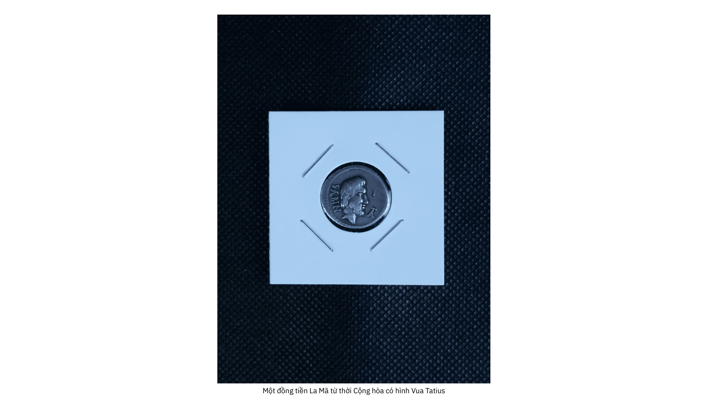

### Nguồn gốc của từ "đồng xu" và ngôi đền Juno Moneta

Thuật ngữ "tiền xu" bắt nguồn từ đền thờ Juno Moneta ở Rome. Truyền thuyết kể rằng, trong cuộc xâm lược của người Gallic vào năm 390 TCN, những con ngỗng linh thiêng của Điện Capitol đã cảnh báo người La Mã về một mối nguy hiểm sắp xảy ra. Để cảm tạ nữ thần Juno, người bảo vệ Điện Capitol, một ngôi đền đã được xây dựng để tôn vinh bà và chẳng bao lâu sau trở thành nơi đúc tiền xu La Mã.

### Chiến tranh Punic và khủng hoảng tiền tệ

Xung đột quân sự đã ảnh hưởng đáng kể đến sự phát triển tiền tệ của La Mã. Trong Chiến tranh Punic lần thứ hai (218-201 TCN) chống lại Carthage, Rome đã phải đối mặt với những khó khăn tài chính nghiêm trọng trước cuộc xâm lược của Hannibal. Để giải quyết những nhu cầu cấp thiết này, Rome lần đầu tiên phải dùng đến việc phát hành một lượng lớn tiền vàng, cũng như phá giá đáng kể tiền bạc, từ độ tinh khiết ban đầu là 97% xuống còn khoảng 89%. Trọng lượng của tiền đồng (aes) cũng giảm mạnh, mất gần 80% trong sáu năm.

Ở đây, chúng ta có thể xem lại một khái niệm đã thảo luận trước đây về việc người Hy Lạp nấu chảy kim loại quý được lưu trữ trong các đền thờ để giúp giảm bớt khủng hoảng kinh tế. Và để nói về **Carthage**, dưới đây bạn có thể chiêm ngưỡng một đồng xu Carthage thật từ bộ sưu tập của tôi. Những đồng xu Carthage này có hình cây cọ ở một mặt, và hình con ngựa ở mặt còn lại. Trên đồng xu này, hình con ngựa không dễ nhận biết lắm, vì nó đã rất cũ.

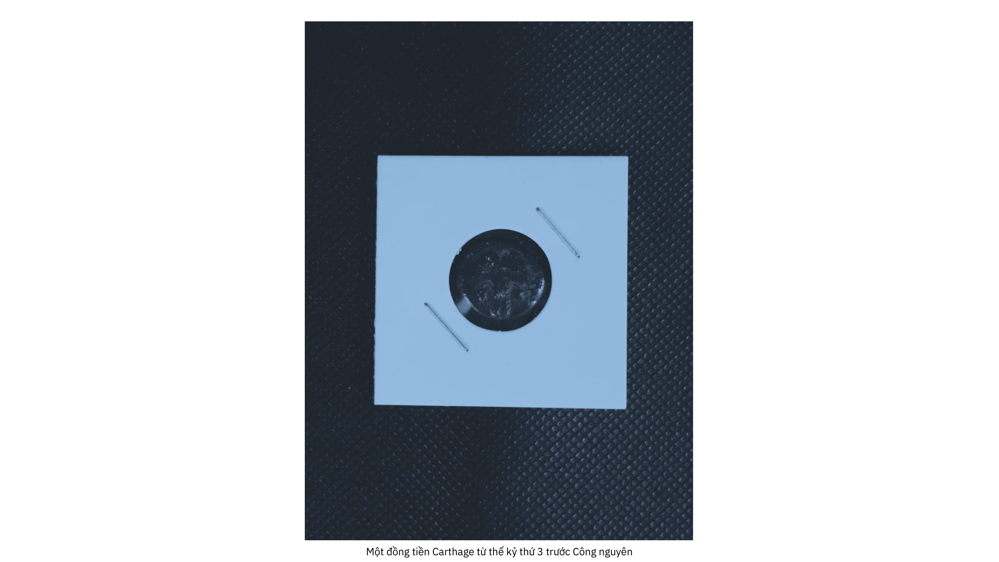

Kết quả là, trọng lượng của đồng xu, được gọi là aes, cũng giảm mạnh, mất gần 80% trong sáu năm. Vì vậy, trọng lượng của những đồng xu đồng này, vốn không phải là kim loại quý và được sử dụng trong giao dịch hàng ngày, đã giảm đáng kể, một dấu hiệu cho thấy tiền tệ bị mất giá do các cuộc chiến tranh này.

### Đồng denarius bạc và sự ổn định tiền tệ

Chính trong bối cảnh quan trọng này, La Mã đã giới thiệu đồng denarius bạc nổi tiếng vào khoảng năm 212 TCN. Cuộc cải cách này đã đảm bảo sự ổn định tiền tệ đáng kể, với đồng denarius vẫn là đồng tiền thống trị trong gần 450 năm. Sự ổn định này có được là nhờ vào công tác quản lý chặt chẽ, bất chấp việc định giá lại đáng kể vào năm 146 TCN và sản xuất đáng kể để tài trợ cho các đội quân hùng mạnh, đặc biệt là trong các cuộc chiến tranh Punic, Social (91-87 TCN) và Macedonia. Ví dụ, việc duy trì một quân đoàn La Mã tốn khoảng 1,5 triệu denarius mỗi năm, minh họa cho quy mô nhu cầu tiền tệ khổng lồ.

Vượt ra ngoài biên giới La Mã, chiến tranh đã dẫn đến sự mất giá nghiêm trọng ở các khu vực chịu ảnh hưởng của La Mã. Độ tinh khiết của đồng electrum ở Carthage thuộc Punic giảm mạnh, từ 98% vàng vào thế kỷ thứ 4 xuống chỉ còn 30% trong Chiến tranh Punic lần thứ hai, trong khi độ tinh khiết của đồng bạc giảm xuống còn 18%.

### Sự tiến hóa của động cơ tiền tệ

Cùng với sự mở rộng của Rome, bản chất của tiền xu cũng thay đổi: ban đầu mang tính ẩn danh và yêu nước, tiền xu dần dần được thiết kế mang tính cá nhân hóa, khắc họa hình ảnh các gia tộc quyền lực của những người đúc tiền (những người đúc tiền). Sự chuyển đổi này rõ ràng tượng trưng cho những biến đổi chính trị của thời kỳ Cộng hòa La Mã cuối thế kỷ 19.

Cuối cùng, trong khi Rome thống trị thế giới Địa Trung Hải về mặt kinh tế, họ vẫn duy trì một số phương thức thanh toán đơn giản: không có hình thức chuyển tiền thực sự nào khác ngoài việc trao đổi trực tiếp tiền xu, ngoại trừ chuyển thuế và tín dụng tư nhân dành riêng cho giới thượng lưu.

## Đế chế La Mã

<chapterId>2dc44e50-112a-5abf-97ae-8e0a9ecda989</chapterId>

:::video id=f8d6f3d6-9ee4-4504-888e-4f12b3f20489:::

**Bối cảnh lịch sử:**

**Chế độ Nguyên thủ** là hình thức chính quyền đế quốc ở Đế chế La Mã từ đầu triều đại Augustus vào năm 27 trước Công nguyên cho đến khi kết thúc cuộc khủng hoảng thế kỷ thứ ba vào năm 284 sau Công nguyên.

**Năm 27 trước Công nguyên: Khởi đầu của Pax Romana**

Thời kỳ ổn định chính trị và thịnh vượng dưới triều đại của Augustus, đánh dấu sự khởi đầu của Đế chế La Mã.

**Augustus (30 TCN đến 14 SCN)** đã cải cách triệt để hệ thống tiền tệ của La Mã, thiết lập một tiêu chuẩn lâu dài và ổn định cho tiền đúc của đế quốc.

**Augustus cũng là một trong những nhà sưu tập tiền xu và hóa thạch cổ đầu tiên được công nhận**.

**Năm 54 sau Công nguyên - 68 sau Công nguyên: Nero**

Hoàng đế La Mã gây nhiều tranh cãi, nổi tiếng với chế độ bạo ngược, đàn áp và quản lý thảm khốc sau khi thành Rome bị thiêu rụi.

**Năm 64 sau Công nguyên: Đại hỏa hoạn thành Rome**

Một trận hỏa hoạn lớn đã tàn phá phần lớn thành phố; Nero bị cáo buộc là người chịu trách nhiệm.

**Năm 69 sau Công nguyên: Năm của Tứ Hoàng**

Một thời kỳ hỗn loạn với bốn hoàng đế kế vị nhau (Galba, Otho, Vitellius, Vespasian).

**79 SCN: Núi lửa Vesuvius phun trào**

Núi lửa đã phá hủy thành phố Pompeii và Herculaneum, nhưng vẫn bảo tồn được tàn tích của chúng dưới lớp tro tàn.

**165 sau Công nguyên - 180 sau Công nguyên: Bệnh dịch Antonine**

Dịch bệnh tàn phá làm suy yếu Đế chế La Mã dưới thời Marcus Aurelius và Commodus.

**Năm 200 sau Công nguyên: Thời kỳ đỉnh cao của lãnh thổ và sự kết thúc dần dần của Pax Romana**

Rome đã đạt đến mức độ mở rộng tối đa nhưng bắt đầu phải chịu đựng tình trạng bất ổn nội bộ và khó khăn về kinh tế.

**Năm 212 sau Công nguyên: Sắc lệnh của Caracalla về quyền công dân**

Hoàng đế Caracalla đã cấp quyền công dân La Mã cho hầu hết cư dân của đế chế nhằm mở rộng cơ sở thuế.

**Năm 220 sau Công nguyên: Bắt đầu cuộc xâm lược lớn của người man rợ**

Cuộc xâm lược đáng kể đầu tiên của người Đức qua biên giới La Mã.

**235 SCN - 285 SCN: Khủng hoảng chính trị và quân sự của thế kỷ thứ 3**

Một thời kỳ bất ổn chính trị, với nhiều hoàng đế trị vì ngắn ngủi, nội chiến, khủng hoảng kinh tế và các cuộc xâm lược liên tục.

**Aurelian (270-275 SCN) đã định giá lại đồng tiền La Mã một cách triệt để**, cố gắng khôi phục giá trị danh nghĩa của nó bất chấp lạm phát cao.

**Năm 301 sau Công nguyên: Sắc lệnh Giá của Diocletian**

Hoàng đế Diocletian đã cố gắng vô ích để ngăn chặn tình trạng lạm phát tràn lan bằng cách áp đặt các biện pháp kiểm soát giá cả và tiền lương nghiêm ngặt trên toàn đế chế.

**312 SCN: Constantine**

Hoàng đế Cơ đốc giáo đầu tiên, người sáng lập ra Constantinople, đã ổn định tiền tệ bằng cách phát hành "solidus", một loại tiền vàng có độ tinh khiết và độ ổn định cao.

**Năm 476 sau Công nguyên: Sự sụp đổ của Đế chế La Mã phương Tây**

Rome bị nhiều dân tộc Đức (bao gồm cả người Ostrogoth) chiếm giữ, một sự kiện được coi là đánh dấu sự kết thúc chính thức của Đế chế La Mã phương Tây.

### Cải cách tiền tệ của Augustus

Trong phần này về Cổ đại, chúng ta đã đến Đế chế La Mã. Lịch sử tiền tệ của Đế chế La Mã được đặc trưng bởi việc sử dụng rộng rãi tiền tệ kim loại, đặc biệt là vàng, bạc và đồng, nhưng cũng bởi nhiều cuộc khủng hoảng tiền tệ, liên quan chặt chẽ đến bất ổn chính trị và quân sự. Vào cuối thời kỳ Cộng hòa, dưới thời Julius Caesar, Rome đã giới thiệu đồng vàng aureus vào năm 46 trước Công nguyên, một đồng xu nặng khoảng 8 gram được chấp nhận rộng rãi trên khắp châu Âu và lưu vực Địa Trung Hải. Caesar đã chuẩn hóa những đồng tiền vàng này và đúc những đồng tiền đầu tiên mang chân dung của một người đàn ông còn sống, do đó đảo ngược truyền thống cộng hòa cổ đại ưa chuộng các biểu tượng tập thể, ẩn danh. Sự phát triển này đi kèm với một giai đoạn chuyển đổi chính trị lớn, với quyền lực cá nhân dần thay thế các thể chế cộng hòa.

Sau khi Caesar bị ám sát vào năm 44 TCN, Octavian (Augustus) nắm quyền kiểm soát Rome, thành lập Đế chế vào năm 27 TCN. Triều đại của ông chứng kiến một cuộc cải cách toàn diện hệ thống tiền tệ, mang lại sự ổn định lâu dài cho nền kinh tế La Mã. Vào thời Augustus, một aureus vàng tương đương với 25 denarii bạc, tương đương với 4 sestertii đồng. Sự ổn định tiền tệ này tiếp tục trong suốt thế kỷ thứ nhất SCN, một thời kỳ thường được mô tả là thời kỳ hoàng kim kinh tế của Rome.

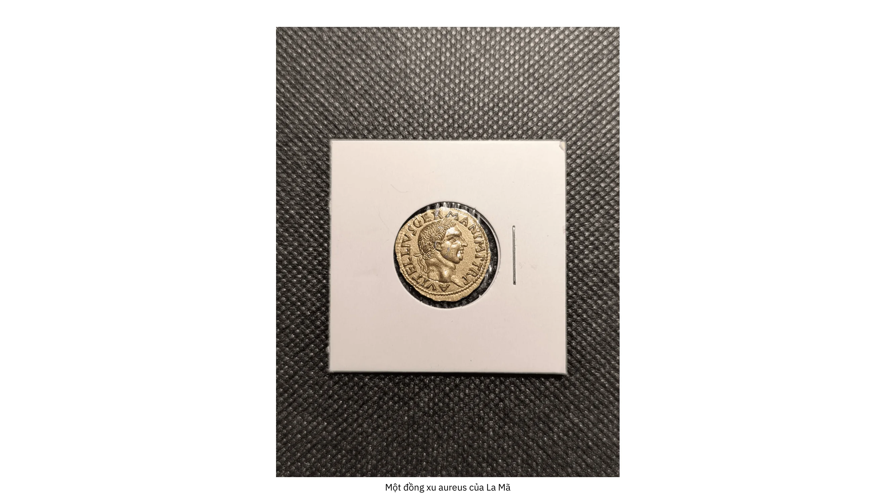

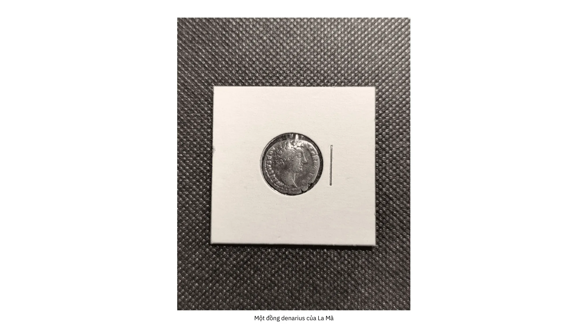

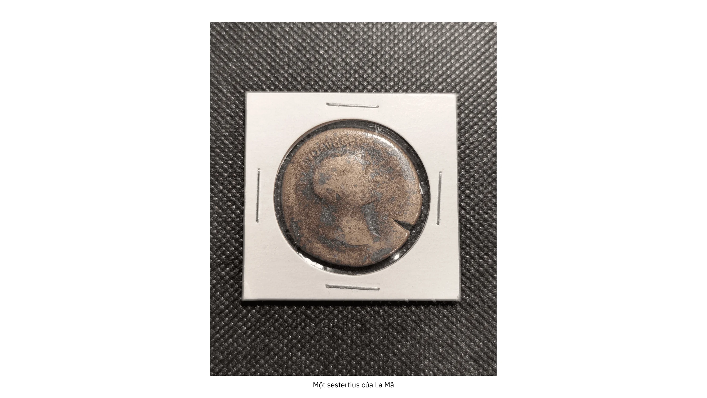

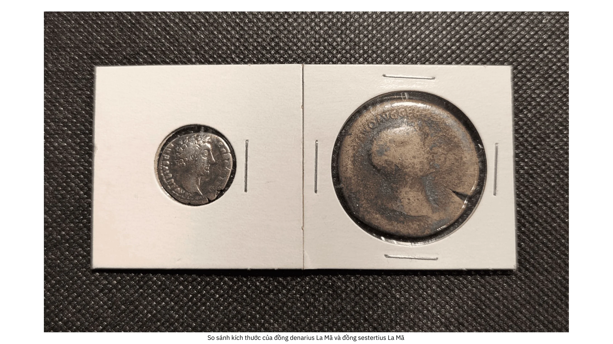

Tuy nhiên, từ thời Nero trở đi (năm 54-68 sau Công nguyên), Rome bắt đầu phá giá tiền xu một cách chậm rãi, dần dần giảm trọng lượng và độ tinh khiết của chúng để tài trợ cho chi tiêu ngày càng tăng của đế quốc, đặc biệt là sau trận hỏa hoạn lớn ở Rome vào năm 64 sau Công nguyên. Những lần phá giá này có những tác động đáng chú ý: những đồng tiền tinh khiết hơn đã bị rút khỏi lưu thông thông qua việc tích trữ hoặc xuất khẩu, theo **luật Gresham**, trong khi những đồng tiền mất giá lại gia tăng, khiến giá cả tăng dần.

Thế kỷ thứ ba đánh dấu một bước ngoặt đáng kể, với sự tăng tốc ngoạn mục của quá trình phá giá tiền tệ dưới thời các hoàng đế Septimius Severus, Caracalla và Gallienus. Đồng bạc chính, denarius và sau đó là antoninianus, chứng kiến hàm lượng bạc giảm xuống chỉ còn 2%. Đồng thời, trọng lượng vàng của aureus giảm một nửa. Cuộc khủng hoảng tiền tệ này đi kèm với sự bất ổn chính trị chưa từng có, các cuộc xâm lược của người man rợ và các cuộc nội chiến liên miên.

Phần này cho phép tôi giới thiệu phần cuối cùng trong mục này: đồng antoninianus. Tên gọi ban đầu của đồng tiền này không rõ, nhưng ngày nay chúng ta gọi nó là antoninianus. Đồng tiền này có giá trị bằng hai denarii, mặc dù chỉ lớn hơn đồng denarius 1,5 lần. Hơn nữa, theo thời gian, những đồng tiền này chỉ còn là đồng billon, nghĩa là chúng được làm từ hợp kim bạc và các kim loại khác thay vì bạc nguyên chất. Những đồng tiền này thường chỉ được phủ bạc, một ví dụ điển hình về sự suy thoái của tiền tệ.

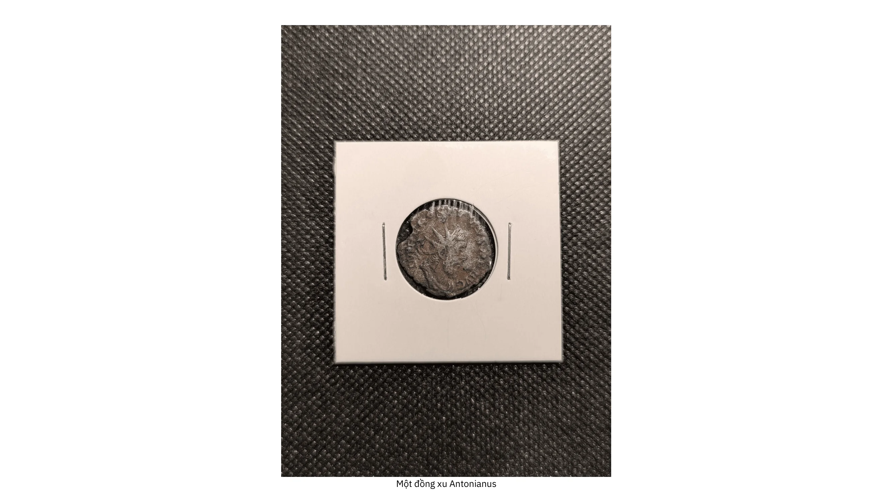

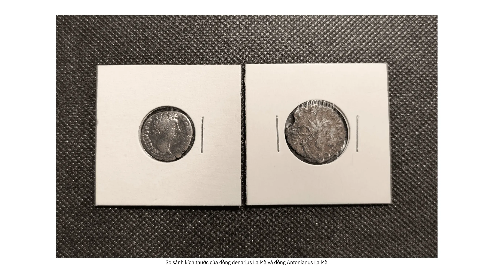

Trước tình hình này, Hoàng đế Aurelian (270-275 SCN) đã cố gắng ổn định hệ thống bằng cách định giá lại tiền tệ trên danh nghĩa, nhưng cuộc cải cách này thực chất lại tạo ra cơ chế lạm phát bằng cách cố định giá trị của các loại tiền tệ hiện có ở mức cao hơn một cách giả tạo.

Tôi xin nói thêm một chút về chủ đề này. Trong thế kỷ thứ 3, lạm phát đã tăng theo cấp số nhân nhanh chóng. Trước đây, mặc dù tiền xu bị phá giá, nhưng quy trình đúc thủ công từng đồng một đã giúp kiểm soát lạm phát phần nào. Thống kê cho thấy trong hơn 300 năm phá giá, lạm phát trung bình khoảng 4% mỗi năm. Ngay trước cuộc cải cách của Aurelian, lạm phát chỉ khoảng 3% mỗi năm.

Aurelian đã áp dụng phép đo độ tinh khiết trên đồng xu ký hiệu XXI, cho biết thành phần gồm 20 phần đồng và 1 phần bạc, tức là độ tinh khiết 5%. Ông đã tiếp thị những đồng xu 5% bạc này và đóng dấu XXI lên chúng. Tuy nhiên, ông cũng thu hồi tất cả các đồng xu khác bị mất giá nhiều hơn và đóng dấu XXI tương tự lên chúng. Điều này thực sự đã định giá lại mệnh giá của tất cả các đồng xu. Kết quả là tỷ lệ lạm phát đáng kinh ngạc lên đến 20% mỗi năm, vượt xa mức 3% trước khi kỹ thuật này được áp dụng.

Chính Aurelian đã phát minh ra hình thức phá giá này, nhanh hơn nhiều so với việc phá giá kim loại dần dần, vốn vẫn buộc chúng ta phải in tiền xu từng đồng một. Ông ấy đã thu thập tất cả các đồng xu hiện có, thu hồi chúng và đóng dấu để thay đổi mệnh giá. Đó là một bước ngoặt thực sự. Đó là lúc lạm phát trở nên cấp số nhân.

Để minh họa trực quan cho sự mất giá cực độ này, tôi đã tìm thấy một số thống kê thú vị về giá ngũ cốc ở Ai Cập từ năm 40 TCN đến thế kỷ thứ 3, kéo dài hơn 300 năm. Dưới đây, bạn có thể thấy một đồng tetradrachma của Hy Lạp trong bộ sưu tập của tôi. Vào thời điểm đó, ở Ai Cập dưới sự chiếm đóng của La Mã vào thế kỷ thứ 3, đồng tiền tương đương là một đồng tetradrachma của Ai Cập. Mệnh giá drachma vẫn còn được sử dụng, và nó tương đương với một denarius.

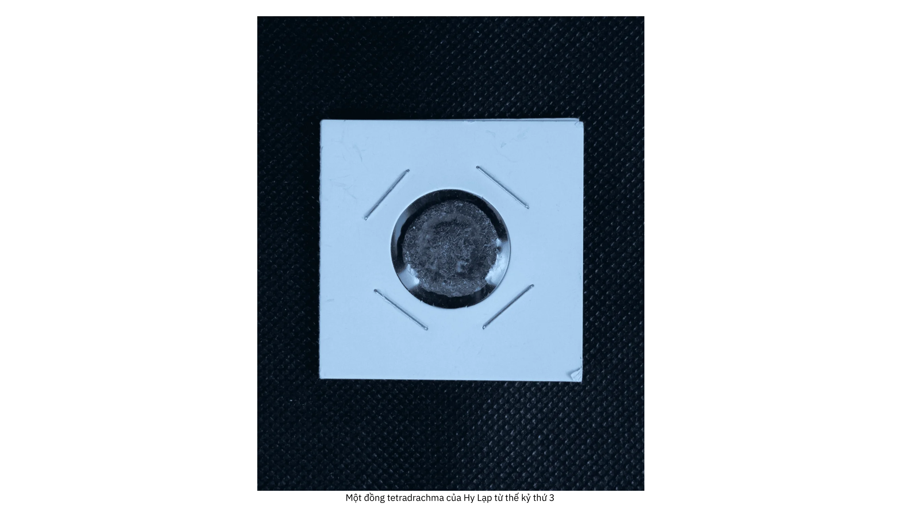

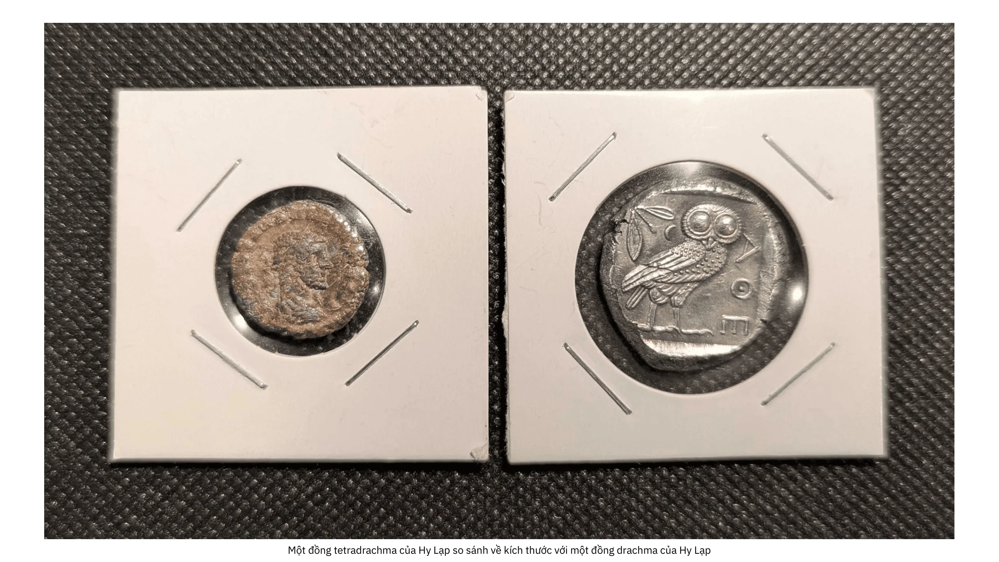

Vậy thì đồng tetradrachm Ai Cập mà tôi có có giá trị tương đương với một denarius. Bạn có thể thấy đồng xu này được làm bằng billon (hoặc đồng), nên nó không chứa bất kỳ kim loại quý nào. Bạn có thể so sánh nó với đồng tetradrachm Hy Lạp nguyên bản để thấy sự mất giá vật chất trong 300 năm qua. Giá ngũ cốc ở Ai Cập đã tăng gấp hàng triệu lần.

Đây chính là biểu hiện vật chất của cuộc cải cách của Aurelian. Cần lưu ý rằng phần lớn, tức mức lạm phát trung bình trong 300 năm qua, chỉ vào khoảng 4%. Chỉ đến cuối thời kỳ Aurelian thực hiện cải cách, mức lạm phát này mới tăng theo cấp số nhân và chúng ta mới đạt đến con số 1 triệu. Giá cả vào cuối thế kỷ thứ 3 cao gấp một triệu lần so với thế kỷ thứ 1 trước Công nguyên.

Người kế nhiệm ông, **Diocletian** (284-305 SCN), đã thực hiện những cải cách thậm chí còn triệt để hơn: ông phát hành tiền tệ mới (đáng chú ý là đồng argenteus, tinh khiết hơn nhưng số lượng lại quá hạn chế), áp đặt các biện pháp kiểm soát giá cả quyết liệt (Sắc lệnh Giá cả năm 301 SCN) và **thiết lập một hệ thống thuế dựa trên việc thanh toán bằng hiện vật**. Bất chấp những nỗ lực này, các cải cách của Diocletian đã không thể kiềm chế lạm phát tràn lan.

Đối mặt với sự từ chối cung cấp hàng hóa và dịch vụ để đổi lấy đồng tiền mất giá, Diocletian đã thiết lập **hệ thống đẳng cấp cha truyền con nối** để trói buộc nông dân và con cháu của họ vào đất đai của mình.

Điều thực sự cần hiểu ở đây là những gì đã xảy ra là nông dân đã từ chối giao sản phẩm của họ để đổi lấy đồng tiền mất giá, và phản ứng của Diocletian thân yêu của chúng ta là tạo ra **đẳng cấp cha truyền con nối** bằng cách nói rằng "các ngươi, các ngươi không thể rời bỏ đất đai của mình, con cái các ngươi cũng không thể rời bỏ đất đai của chúng, tương tự với binh lính, các ngươi là binh lính, các ngươi đồng ý được trả lương bằng tiền của ta". Như một giải pháp tạm thời, họ được trả lương bằng hiện vật (thịt, thực phẩm, ngũ cốc) vì ông ta từ chối cho họ tiền. Vì vậy, ông ta áp đặt hệ thống đẳng cấp cha truyền con nối này để buộc mọi người phải gắn bó với nghề nghiệp của mình, để họ không thể dễ dàng thay đổi công việc nếu họ không muốn chấp nhận đồng tiền mất giá.

Để minh họa cho ví dụ này, đây là một đoạn văn bản trích từ cuốn sách "*Chế độ tiền tệ và lạm phát*":

> Vì người dân không muốn làm việc và giao hàng bằng đồng tiền mất giá, với mệnh giá cao hơn giá trị thực hoặc giá trị thị trường, họ buộc phải làm việc bằng cách đánh thuế bằng hiện vật. [...] Nông dân bị cấm rời khỏi nơi cư trú đã đăng ký. Do đó, dân số nông nghiệp đã gắn bó với đất đai một cách di truyền.
>

> Hệ thống đẳng cấp cha truyền con nối này dần lan rộng: Diocletian buộc con trai của các chiến binh phải nhập ngũ, trong khi công nhân trong các xưởng đúc tiền, cũng như trong các nhà máy dệt và nhuộm mà Diocletian thành lập, trở thành nô lệ nhà nước, với chế độ cha truyền con nối. Thợ mỏ vàng sau này cũng trở thành một đẳng cấp cha truyền con nối. Các tầng lớp cha truyền con nối khác có lẽ đã tồn tại vào thời Diocletian, đáng chú ý là các phường hội thợ làm bánh và đồ tể [...] ở Rome, cũng như các phường hội giáo phận của các thuyền trưởng vận chuyển ngũ cốc và các hàng hóa công cộng khác đến Rome.

Chính Constantine (306-337 SCN) là người cuối cùng đã thành công trong việc ổn định hệ thống tiền tệ bằng cách giới thiệu đồng solidus vào năm 312, một đồng tiền vàng nguyên chất mà ông đảm bảo nghiêm ngặt về chất lượng và trọng lượng. Có cả một hệ thống để xác minh độ tinh khiết và trọng lượng của đồng solidus. **Tuy nhiên, sự ổn định này chỉ ảnh hưởng đến giới tinh hoa giàu có và chính quyền đế quốc**, trong khi **phần lớn dân số vẫn phải chịu đựng tiền tệ chất lượng thấp và lạm phát dai dẳng**. Đồng solidus vẫn ổn định ở Đế chế Đông La Mã (Byzantium), nơi nó tồn tại hơn một thiên niên kỷ, trong khi ở phương Tây, tiền đúc bị phân mảnh thành những đồng tiền nhỏ, có giá trị thấp, đi kèm với sự tan rã kinh tế và chính trị cuối cùng của Đế chế La Mã, sụp đổ hoàn toàn vào năm 476 SCN.

Để kết luận, tôi muốn chia sẻ với các bạn trích dẫn này từ *Lịch sử tiền tệ: Từ thời cổ đại đến ngày nay* của Glyn Davies, trong đó tóm tắt một cách tài tình những gì có lẽ đã dẫn đến sự sụp đổ của Rome:

*"Thuế luôn không đủ, và những khó khăn liên quan đến các loại thuế ngày càng thiếu, được điều chỉnh muộn màng và dễ thấy này đã khiến Rome phải dựa nhiều hơn vào một hình thức đánh thuế dễ dàng, tức thời và bí mật: phá giá tiền tệ. Những cải cách ngắn hạn, mang tính tạm thời đã không thể đảo ngược xu hướng suy thoái lâu đời này. Áp lực tài chính do tiền xu bị hao mòn, đắm tàu, rò rỉ tiền do mua hàng xa xỉ từ phương Đông, quà biếu tặng cho những người man rợ gốc Đức, sự gia tăng dân số đô thị, sự suy giảm sản xuất nông nghiệp, sự cạn kiệt dần dần của các mỏ giàu nhất, và trên hết là các chính sách "bánh mì và rạp xiếc" được cho là thiết yếu để duy trì trật tự tối thiểu trong đời sống đô thị - tất cả những áp lực tích tụ này đã khiến Rome liên tục phá giá tiền tệ, xen kẽ với những cải cách thỉnh thoảng thất bại."*

*Ngoài bánh mì và rượu miễn phí hoặc giá rẻ, các khoản phân bổ hào phóng của đế quốc ("congiaria") dưới hình thức tiền tệ cũng được phân phối theo thời gian, đặc biệt là dưới thời Trajan (98-117 SCN) và thậm chí còn nhiều hơn dưới thời Hadrian (117-138 SCN) và những người kế vị ông. Điều mà hoàng đế và người dân ban đầu coi là một đặc quyền đặc biệt, đến đầu thế kỷ thứ 2, đã trở thành một kỳ vọng thông thường. Những khoản phân phối này "tạo nên gánh nặng lớn cho ngân khố công cộng và góp phần vào sự phá sản của nhà nước".*

## Mối liên hệ giữa pha loãng tiền tệ và lạm phát: từ nguyên nhân đến hậu quả

<chapterId>38d5781c-e900-53f7-baa7-413655d71754</chapterId>

:::video id=3999256d-aafe-4502-9b72-dfa8491a2777:::

Phần này xem xét mối liên hệ giữa pha loãng tiền tệ và lạm phát, từ nguyên nhân đến hậu quả. Pha loãng tiền tệ là một trong những hiện tượng kinh tế quan trọng trong lịch sử tiền tệ La Mã, có tác động trực tiếp đến lạm phát. Từ thế kỷ 1 SCN, tiền bạc (denarius) bắt đầu có một giai đoạn pha loãng chậm rãi từ triều đại Nero (54-68 SCN), được thúc đẩy bởi các cuộc khủng hoảng quân sự và tài chính liên tiếp, đặc biệt là dưới thời Septimius Severus (193-211) và Gallienus (253-268).

Chúng tôi cũng nhận thấy đồng aureus mất giá dần dần hơn. Sự khác biệt về tốc độ mất giá này làm nổi bật hai điểm:

1. Vai trò của đơn vị kế toán trong chế độ lưỡng kim đối với việc kiểm soát tiền tệ của nhà nước. Đơn vị kế toán trong ví dụ này là denarius. Tôi đã xác định ba cách khác nhau để quản lý giá trị của đơn vị kế toán: phá giá (pha loãng kim loại), đổi mệnh giá (antoninianus) và áp đặt mệnh giá bằng cách đánh dấu "XXI" (Aurelian).

2. Nhà nước muốn trì hoãn càng lâu càng tốt việc phá giá đồng aureus, nguồn dự trữ giá trị cho phép giới tinh hoa duy trì sức mua của họ bằng cách bóc lột những người kém may mắn hơn. Chúng ta sẽ thường xuyên xem xét lại nguyên tắc này trong suốt khóa học, đặc biệt là liên quan đến khái niệm được gọi là "hiệu ứng Cantillon" và việc đổi tên đồng Maravedi ở Tây Ban Nha.

Hiện tượng này khá thú vị và đã lặp lại trong suốt chiều dài lịch sử. Chúng ta sẽ xem xét lại vấn đề này với đồng Maravedi trong phần sau. Mô hình này cũng thể hiện rõ ràng với tất cả các loại tiền tệ dự trữ; đơn vị dự trữ giá trị, chẳng hạn như đồng aureus ở Rome, vẫn được giữ nguyên. Tuy nhiên, đơn vị tính toán mà dân chúng sử dụng cho thương mại và các giao dịch hàng ngày thường bị mất giá. Kết quả là, lạm phát tiền tệ ảnh hưởng đến người dân thường, trong khi những người có khả năng mua tiền vàng hầu như không bị ảnh hưởng.

Và nhân tiện, **đó cũng chính là hiện tượng đang diễn ra ngày nay với việc phá giá tiền tệ, khiến tài sản tài chính tăng giá**, và do đó, những người sử dụng tiền tệ, những người nghèo nhất, lại càng nghèo hơn, và điều này lại làm giàu, thông qua việc tạo ra tiền, cho tài sản của những người có khả năng, những người có phương tiện để tự bảo vệ mình trước sự phá giá, và do đó làm gia tăng bất bình đẳng xã hội. Đó là lời phàn nàn chính trị nhỏ của tôi.

Điều tôi vừa mô tả được gọi là hiệu ứng Cantillon. Chúng ta sẽ thấy rằng quý ông này sống vào thời John Law, một chủ đề chúng ta cũng sẽ đề cập trong phần sau.

Cuộc cải cách được khởi xướng dưới triều đại Aurelian đã khiến lạm phát tăng vọt. Lạm phát theo mệnh giá tiền không còn bị giới hạn bởi khả năng sản xuất tiền thủ công của các xưởng đúc tiền nữa. Những đồng tiền đã được đúc giờ đây có thể được đánh dấu đơn giản, và giá trị danh nghĩa của nguồn cung tiền tăng nhanh hơn.

Tôi có hai câu trích dẫn muốn chia sẻ với bạn liên quan đến Aurelian. Câu đầu tiên trích từ *Lịch sử tiền tệ: Từ thời cổ đại đến nay*:

*"Xét về mặt kinh tế La Mã, đóng góp của Aurelian mang tính thảm họa hơn là chiến thắng. Phần lớn là do bản chất của "cuộc cải cách" của ông mà tỷ lệ lạm phát đã tăng vượt xa mức trước đây, ngay cả dưới thời Gallienus vô trách nhiệm. Trong hai thế kỷ sau Aurelian, lạm phát đã trở thành đại dịch trên khắp Đế chế La Mã"*

Phần thứ hai trích từ cuốn sách *Lịch sử cổ đại từ tiền xu* và đề cập đến sự tách rời của hệ thống tiền tệ khỏi vàng:

*"Cuộc cải cách của Aurelian đã thay đổi mối quan hệ giữa tiền vàng và phần còn lại của hệ thống tiền tệ. Trước đó, các loại tiền tệ khác được liên kết với **aureus** theo tỷ giá chính thức (25 denarii Ai Cập hoặc 25 tetradrachm đổi lấy một aureus, v.v.). Sau cuộc cải cách, tiền vàng bắt đầu **biến động tự do về giá trị**, giống như bất kỳ hàng hóa nào khác, trong khi phần còn lại của hệ thống tiền tệ **sụp đổ về giá trị** do **hợp kim suy yếu**, không còn **được hỗ trợ bởi vàng**. Vì đơn vị tính toán về mặt lý thuyết vẫn dựa trên bạc (denarius, hoặc drachma ở Ai Cập), giá cả tăng lên khi đồng tiền mất giá. "*

Như bạn có thể thấy, sự mất giá của đồng tiền vốn đóng vai trò là đơn vị tính toán đã ảnh hưởng không cân xứng đến những người kém may mắn hơn, trong khi việc tách khỏi mối liên hệ với tiền vàng đã bảo vệ sức mua của những người có khả năng tiết kiệm bằng vàng, phương tiện lưu trữ giá trị.

Điều bạn cần hiểu ở đây là nếu có mối liên hệ giữa denarius và aureus, ngay cả khi bạn phá giá denarius, nếu bạn vẫn có thể đổi denarius lấy aureus với tỷ giá này (25 denarius đổi 1 aureus), mọi người chắc chắn sẽ đổi denarius lấy aureus của bạn, vì denarius sẽ bị định giá quá cao còn aureus sẽ bị định giá quá thấp. Nhưng trong cuộc cải cách này, họ đã xóa bỏ mối liên hệ này. Vì vậy, mọi người không còn có thể đổi denarius lấy kim loại bạc bị phá giá so với vàng. Đó là lúc những người có tiền vàng thực sự có thể tự bảo vệ mình, bởi vì sau đó, mọi người không còn có thể đổi bạc bị định giá quá cao lấy vàng nguyên chất bị định giá quá thấp nữa. Đây là một thời điểm rất quan trọng trong quá trình phát triển của tiền tệ.

Một ví dụ nổi bật về tác động của cuộc cải cách này của Aurelian được minh họa hoàn hảo bằng những trích dẫn sau từ cuốn sách *Chế độ tiền tệ và lạm phát*:

*"Giữa triều đại của các hoàng đế Claudius (41-54 SCN) và Constantius (337-361 SCN), giá lúa mì trên thị trường mở ở Ai Cập, tính bằng drachma, **đã tăng hơn một triệu**. Lạm phát giá cả khủng khiếp là một trong những sự kiện kinh tế trọng tâm của thế kỷ 3 và 4 SCN" (Lendon 1990, tr. 106). Nhưng diễn biến này **không quá nghiêm trọng như vẻ bề ngoài**, vì nó tương ứng với **tỷ lệ lạm phát trung bình hàng năm là 4,4%**. Và theo Wassink (1991, tr. 482), lạm phát thực sự chỉ bắt đầu **vào năm 238 SCN**"*

*"Từ thời điểm này trở đi, lạm phát tăng tốc chậm chạp, khi **tiền tốt lần đầu tiên bị loại khỏi lưu thông**, do đó tổng cung tiền ban đầu hầu như không tăng chút nào. Sau đó, nó đạt mức tăng trưởng trung bình hàng năm là **3,65% trong khoảng từ năm 250 đến năm 293**, rồi tăng lên **22,28% trong khoảng từ năm 293 đến năm 301** (Wassink 1991, tr. 466), tức là cho đến **cuộc cải cách tiền tệ bị phá sản của Hoàng đế Diocletian**. Hiện tượng này **đặc biệt ấn tượng đối với lạm phát trong chế độ tiền tệ dựa trên kim loại**."*

Hiện tượng lạm phát liên quan đến pha loãng tiền tệ này ban đầu được cho là phản ứng với các cuộc khủng hoảng tiền mặt thỉnh thoảng xảy ra của nhà nước La Mã. Bằng cách giảm hàm lượng kim loại quý trong tiền xu nhưng vẫn giữ nguyên mệnh giá, nhà nước đã tạm thời tăng nguồn lực. Tuy nhiên, giá cả không phản ứng ngay lập tức: thực tế, hệ thống tiền tệ La Mã có tính cứng nhắc nhất định, đồng nghĩa với việc tiền lương và giá cả chậm thích ứng với các đợt phá giá liên tiếp. Tuy nhiên, sau một ngưỡng nhất định, giá cả sẽ tăng mạnh để đưa thị trường trở lại cân bằng với giá trị thực của tiền tệ.

Như đã đề cập ở trên, hiện tượng này đặc biệt rõ ràng từ giữa thế kỷ thứ 3 trở đi. Tại Ai Cập, một khu vực được ghi chép rất nhiều, giá cả đã tăng gấp 10 lần dưới thời Aurelian (năm 274 SCN) sau khi chính thức định giá lại đồng tiền, bất chấp nỗ lực ổn định ban đầu. Sau đó, dưới thời Diocletian (năm 301 SCN), sắc lệnh về giá đã áp đặt các biện pháp kiểm soát chặt chẽ để kiềm chế lạm phát mà không giải quyết được nguyên nhân gốc rễ - sản xuất thừa và suy thoái tiền tệ - do đó dẫn đến một thất bại có thể dự đoán trước. Lạm phát dai dẳng cuối cùng đẩy nền kinh tế đến một hệ thống hai tầng: **giới tinh hoa, được bảo vệ bởi dự trữ vàng (giống như solidus của Constantine**), được hưởng sự ổn định, trong khi phần lớn dân số tiếp tục chịu đựng lạm phát kinh niên, **minh họa cho cái mà ngày nay được gọi là hiệu ứng Cantillon**.

Có mối liên hệ rõ ràng giữa sự pha loãng tiền tệ của La Mã và lạm phát, nguyên nhân chủ yếu là do thâm hụt tài chính kinh niên, chi tiêu quân sự liên tục và quản lý kinh tế nhà nước kém.

## Sự sụp đổ của Đế chế La Mã

<chapterId>b6ec0914-227b-509c-8108-b09eec9bb904</chapterId>

:::video id=91d4fee5-59bb-4ab9-a90b-e1125c71decb:::

### Sự phá giá tiền tệ và sự sụp đổ của Rome

Trường phái kinh tế Áo, đặc biệt là qua Ludwig von Mises, đã đề xuất một cách diễn giải tiền tệ về sự sụp đổ của Rome. Theo quan điểm này, sự mất giá dần dần của đồng tiền La Mã đã phá vỡ hệ thống phân công lao động phức tạp vốn duy trì một đế chế 60 triệu dân. Tiền tệ, công cụ điều phối kinh tế trung tâm, một khi bị tha hóa, đã dẫn đến sự sụp đổ của toàn bộ cấu trúc kinh tế và xã hội.

Sự suy thoái tiền tệ này không chỉ phá hủy sự gắn kết nội bộ của đế chế mà còn cắt đứt các mối quan hệ thương mại với các dân tộc lân cận. Bị tước mất lợi ích từ thương mại với Rome, "bọn man di" đã chuyển từ hợp tác hòa bình sang săn mồi. Do đó, các cuộc xâm lược không chỉ mang tính chất quân sự mà còn là hậu quả của sự suy thoái kinh tế cơ bản.

### Ba giai đoạn phá giá của đế quốc

Lịch sử tiền tệ La Mã có thể được chia thành ba giai đoạn riêng biệt. Giai đoạn đầu tiên, từ triều đại Julio-Claudians đến triều đại Antonines (năm 27 TCN - cuối thế kỷ thứ 2), duy trì sự ổn định tương đối. Dưới thời Trajan, đế chế đạt đến đỉnh cao: diện tích 5 triệu km², Rome trở thành thành phố triệu phú đầu tiên trong lịch sử. Đồng denarius vẫn giữ được độ tinh khiết bạc từ 98% đến 80% - một mức mất giá vừa phải vẫn cho phép nền kinh tế hoạt động.

Giai đoạn thứ hai, thế kỷ thứ 3, là thời kỳ hỗn loạn quân sự. Hai mươi sáu vị hoàng đế kế vị nhau chỉ trong vài thập kỷ. Đồng tiền sụp đổ: đồng antoninianus, được cho là có giá trị bằng hai denarii, chỉ nặng 1,5 đơn vị kim loại - nỗ lực đầu tiên nhằm tách biệt giá trị pháp lý và giá trị thực. Sự thao túng này kích hoạt Định luật Gresham: tiền xấu đẩy tiền tốt ra ngoài. Người dân tích trữ tiền tốt, chỉ tiêu những đồng mất giá.

Những kho báu tiền tệ được các nhà khảo cổ khai quật cho thấy nỗi lo lắng về kinh tế này. Những chiếc vò hai quai bị chôn vùi cho thấy, bằng cách phân tầng, người La Mã đã gửi những đồng tiền tốt nhất trước, rồi dần dần thêm những đồng tiền mất giá. Những "đống" cổ xưa này là minh chứng cho hành động của con người trước những bất định - một nỗ lực nhằm bảo tồn giá trị trong một thế giới đang suy tàn.

### Constantine và hệ thống kép

Constantine (310-337) đã cố gắng ổn định đế chế thông qua cải cách triệt để. Ông tạo ra đồng vàng solidus, một loại tiền tệ do chính quyền kiểm soát chặt chẽ. Các quan chức kiểm tra trọng lượng và độ tinh khiết một cách có hệ thống. Việc phát hành vẫn bị hạn chế, gắn liền với chiến lợi phẩm. Đồng tiền này trở thành công cụ quyền lực độc quyền: thuế được nộp bằng đồng solidus, và quân đoàn được trả lương bằng vàng.

Đồng thời, người dân sử dụng đồng nummus bằng đồng, vốn liên tục bị mất giá. Năm 445, một solidus trị giá 7.000 nummus; năm 498, một solidus trị giá 16.800. Hệ thống kép này đã thể chế hóa hiệu ứng Cantillon: những người có quyền tiếp cận solidus - chính quyền, địa chủ - được bảo vệ khỏi lạm phát. Những người bình dân, bị giới hạn trong đồng nummus, trở nên nghèo đói không thể tránh khỏi.

Sự phân chia tiền tệ này đã tạo ra hai nền kinh tế song song không có tỷ giá hối đoái chính thức. Đồng solidus vẫn là đơn vị tính toán, nhưng lưu hành rất ít. Đồng nummus được sử dụng trong trao đổi hàng ngày, nhưng liên tục mất giá. Kiến trúc tiền tệ này báo trước sự bất bình đẳng của chế độ phong kiến mới nổi.

### Sự sụp đổ của sự phân công lao động

Sự phá giá tiền tệ dần dần phá hủy sự chuyên môn hóa kinh tế. Không có một đơn vị tính toán đáng tin cậy, thương mại Địa Trung Hải sụp đổ. Các thợ thủ công chuyên môn của Rome không còn có thể giao thương với Ai Cập hay Gaul. Các tỉnh áp dụng đồng tiền riêng, làm gia tăng căng thẳng thương mại.

Trước sự tan rã này, dân số thành thị đã bỏ chạy về nông thôn - một cuộc di cư đô thị đảo ngược quá trình đô thị hóa kéo dài hàng thế kỷ. Thợ thủ công từ bỏ nghề thủ công để chuyển sang canh tác tự cung tự cấp. Các điền trang rộng lớn (latifundia) trở thành những hòn đảo tự cung tự cấp, báo trước chế độ lãnh chúa thời trung cổ.

Trong cơn tuyệt vọng, Diocletian thậm chí còn yêu cầu đánh thuế bằng hiện vật - sự thừa nhận cuối cùng về thất bại tiền tệ. Sắc lệnh về mức thuế tối đa của ông (301) đã cố gắng kiểm soát giá cả, đẩy nhanh sự trở lại của hình thức trao đổi hàng hóa. Sự phức tạp kinh tế đã thoái lui về hình thái tiền văn minh.

### Sống sót nhờ vàng từ Rome đến Byzantium

Nghịch lý thay, đồng solidus vẫn tồn tại qua Đế chế Tây La Mã. Byzantium duy trì nó cho đến thế kỷ 11, đảm bảo sự ổn định kinh tế thêm một nghìn năm nữa. Ở phương Tây, ký ức về nó vẫn còn tồn tại: từ tiếng Pháp "sou" bắt nguồn từ solidus, một minh chứng ngôn ngữ cho sự thịnh vượng tiền tệ đã mất.

Những địa chủ cất giữ tài sản bằng vàng trở thành lãnh chúa phong kiến. Các cấu trúc tôn giáo, thể chế duy nhất còn sót lại, đã tạo nên những ràng buộc xã hội mà tiền bạc không còn có thể đảm bảo. Châu Âu bị chia cắt thành các lãnh địa tự cung tự cấp, mỗi lãnh địa có nền kinh tế tự cung tự cấp riêng.

Sự biến đổi này cho thấy sự mong manh của các nền văn minh phức tạp. Sự phân công lao động, vốn giúp Rome nuôi sống một triệu cư dân, hoàn toàn phụ thuộc vào niềm tin tiền tệ. Một khi niềm tin này bị phá vỡ, nền tảng sụp đổ, đưa châu Âu trở về hình thái kinh tế nguyên thủy trong gần một thiên niên kỷ.

## Thời kỳ đen tối và thời Trung cổ

<chapterId>a5856873-6142-57be-8a73-1f9e3df83792</chapterId>

:::video id=86b8da9b-3831-443d-b170-58c2bea3ad54:::

Lịch sử và sự xuất hiện của tiền tệ vào thời Trung cổ được đánh dấu bằng các giai đoạn thoái trào, đổi mới và phục hồi kinh tế.

Ví dụ, khi quân đội La Mã rời khỏi Anh, không còn đồng tiền La Mã nào tiến vào đảo. Khoảng năm 435 SCN, việc sử dụng tiền xu đã hoàn toàn biến mất ở Anh, một hiện tượng độc đáo chỉ có ở các tỉnh cũ của La Mã. Trong gần hai thế kỷ, nền kinh tế Anh không có tiền xu cho đến thế kỷ thứ 7, khi tiền xu lấy cảm hứng từ thời Merovingian và lục địa dần xuất hiện trở lại.

Từ thế kỷ thứ 8 trở đi, ảnh hưởng của Kitô giáo đã góp phần tái lập tiền đúc ở Bắc Âu. Nhân vật chủ chốt trong giai đoạn này là Pepin Lùn, Vua của người Frank, người đã giới thiệu đồng denarius vào năm 752, sau đó được con trai ông là Charlemagne áp dụng. Charlemagne đã mở rộng việc sử dụng đồng denarius bạc, tạo ra một chuẩn mực tiền tệ châu Âu trong nhiều thế kỷ.

Ở Anh, tiền đúc đã có sự hồi sinh đáng kể với việc sản xuất đồng xu bạc dưới thời Vua Offa xứ Mercia vào khoảng năm 765. Loại tiền tệ này trở nên quan trọng đến mức nó hầu như không thay đổi trong 500 năm.

Là hiện vật đầu tiên liên quan đến thời kỳ này, tôi xin giới thiệu cho bạn bản sao đồng xu một xu của Anh từ thời đó.

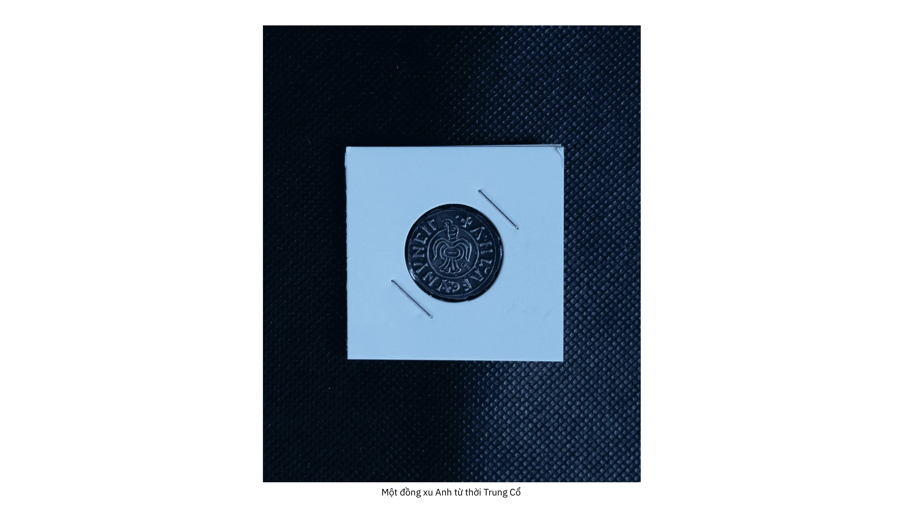

Vào thời Trung Cổ, châu Âu rơi vào chế độ phong kiến sau sự sụp đổ của hệ thống tiền tệ La Mã. Phần lớn dân số sử dụng tiền xu bằng đồng hoặc đồng thau có giá trị thấp, thường bị pha loãng tiền tệ, do đó hạn chế việc giao thương đường dài.

Tiền xu dần trở lại làm phương tiện thanh toán, đạt đến đỉnh điểm vào thế kỷ 13 với sự xuất hiện của đồng florin vàng ở Florence năm 1252, tiếp theo là đồng ducat vàng ở Venice. Những đồng tiền vàng này được sử dụng rộng rãi nhờ sự mở rộng thương mại và nhu cầu ngày càng tăng về một phương tiện thanh toán đáng tin cậy, được quốc tế chấp nhận.

Ở Anh, hệ thống tiền tệ được bảo vệ khỏi sự pha loãng nhờ các chính sách tài khóa sáng tạo, chẳng hạn như thuế đất do William the Conqueror ban hành sau năm 1066, giúp bảo toàn chất lượng của đồng penny sterling. Điều quan trọng cần hiểu ở đây là các quốc vương thời đó có thể phá giá tiền tệ để tài trợ cho nhà nước, và **việc áp dụng loại thuế này đã giúp duy trì sự ổn định của đồng tiền và tài trợ cho nhà nước thông qua thuế.**

Tuy nhiên, sự cám dỗ kiếm lời thông qua việc pha loãng tiền tệ đã dẫn đến khủng hoảng, như dưới triều đại của Henry I vào thế kỷ 12, khi chất lượng tiền đúc giảm sút nghiêm trọng. Những cải cách nghiêm ngặt, đôi khi đi kèm với các biện pháp mạnh tay đối với những người đúc tiền, đã tạm thời khôi phục niềm tin vào đồng tiền.

Thời Trung Cổ cũng chứng kiến sự xuất hiện của các hoạt động tài chính tinh vi, chẳng hạn như việc sử dụng gậy đếm ở Anh để lách lệnh cấm cho vay nặng lãi và mở rộng tín dụng. Giáo hội không mấy mặn mà với các khoản vay có lãi, vì vậy nhiều kỹ thuật khác nhau đã được sử dụng để lách lệnh cấm sử dụng lãi suất.

Những đổi mới này là giải pháp cho tình trạng thiếu hụt tiền kim loại dai dẳng và thúc đẩy sự xuất hiện của một thị trường tài chính đang trong giai đoạn phôi thai.

Trong khi đó, các cuộc Thập tự chinh đã thúc đẩy thương mại Địa Trung Hải, thúc đẩy sự phát triển của các giao dịch quốc tế và các hoạt động ngân hàng mới, đáng chú ý là thông qua Hội Hiệp sĩ Đền thờ. Hội Hiệp sĩ Đền thờ trở thành những trung gian tài chính quan trọng, giúp quân Thập tự chinh có được thanh khoản ở xa, báo trước hệ thống ngân hàng châu Âu hiện đại.

Để liên hệ với các Hiệp sĩ dòng Đền, bên dưới đây bạn có thể thấy một đồng xu thời trung cổ của Pháp, với hình cây thánh giá tuyệt đẹp ở giữa. Hình cây thánh giá này khá phổ biến trên các đồng xu thời đó.

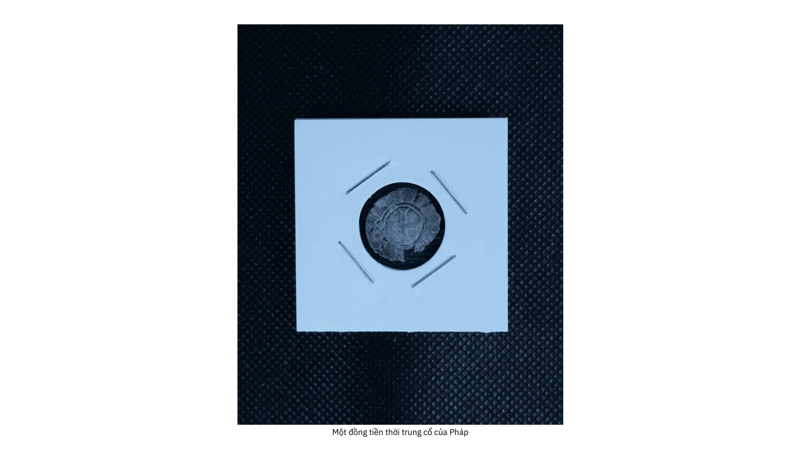

Cuối cùng, những cuộc khủng hoảng lớn như Cái Chết Đen (1346-1353) đã mang lại những chuyển đổi kinh tế sâu sắc. Sự sụt giảm dân số mạnh mẽ dẫn đến sự tăng vọt tiền lương, bất chấp những nỗ lực của chính phủ nhằm duy trì mức lương trước đó.

Cùng lúc đó, Chiến tranh Trăm năm (1337-1453) buộc các quốc gia phải áp dụng chính sách tài chính mạnh mẽ hơn để tài trợ cho quân đội của họ, góp phần làm suy yếu chế độ phong kiến.

Do đó, thời Trung Cổ được đánh dấu bằng sự căng thẳng liên tục giữa nhu cầu về tiền tệ đáng tin cậy cho thương mại và sự cám dỗ liên tục của những người cai trị muốn làm loãng tiền tệ để kiếm lợi nhuận trước mắt. Xung đột này đã định hình sâu sắc sự phát triển tiền tệ của châu Âu, đặt nền móng cho các hệ thống kinh tế hiện đại.

Để kết thúc phần này, tôi muốn kể thêm một giai thoại khá thú vị từ nước Anh vào thời điểm này. Giai thoại này được trích từ cuốn sách "Lịch sử Tiền tệ" của Glyn Davies.

Bài viết đề cập rằng ở Anh, việc chuyển giao quyền lực sang Quốc hội đã chuyển gánh nặng nợ nần từ quốc vương sang Quốc hội, dẫn đến tình trạng nợ công triền miên. Trước đó, gánh nặng nợ nần đè nặng lên vai quốc vương.

Một khi Quốc hội nắm được một phần quyền tạo ra tiền tệ này, họ đã cho phép tạo ra các khoản nợ dài hạn mà người dân phải gánh chịu, chứ không phải nhà vua. Trước đây, nếu nhà vua phá sản hoặc thay đổi vua, khoản nợ sẽ được xóa bỏ cùng với nhà vua.

Ngay khi Quốc hội tạo ra nợ, khái niệm nợ công xuất hiện, vì nó có khả năng không giới hạn theo thời gian. Chừng nào Nhà nước còn tồn tại, chừng nào Quốc hội còn tồn tại, thì khoản nợ này vẫn tồn tại, và họ phải tìm đủ mọi cách để tái cấp vốn và phân bổ nó theo thời gian. Đây là một sự thay đổi mô hình lớn, khi không còn là vua hay hoàng gia bảo lãnh hay gánh chịu gánh nặng nợ nần nữa; giờ đây là Quốc hội, và do đó là công dân của quốc gia đó.

## Thời kỳ phục hưng

<chapterId>1d1dfb05-70b4-5b7b-9708-373c2182950d</chapterId>

:::video id=4977b4f3-c7b2-41a5-ad7b-a96a8cca4092:::

Chúng ta đã đến phần của khóa học, nơi chúng ta nói về thời kỳ được gọi là Phục Hưng. Thời kỳ này diễn ra trong bối cảnh khủng hoảng bi thảm, với sự lây lan nhanh chóng của bệnh dịch hạch do bọ chét trên chuột xâm nhập vào tàu thuyền. Tuy nhiên, thảm kịch này cho chúng ta biết về sự phát triển của thương mại và du lịch trong thời kỳ Trung Cổ. Trước đó trong giai đoạn này, không có nhiều người di chuyển xa và nhanh như vậy.

### Florin của Florence

Sự trở lại của tiền vàng ở châu Âu trong thời kỳ Phục Hưng đánh dấu một bước ngoặt căn bản trong lịch sử tiền tệ. **Mọi chuyện bắt đầu với đồng Florin xứ Florence vào năm 1252, đồng tiền vàng lớn đầu tiên được đúc ở châu Âu kể từ sau sự sụp đổ của Rome**. Với trọng lượng và độ tinh khiết đáng kinh ngạc (khoảng 3,5 gram vàng nguyên chất), đồng florin không thay đổi trong bốn thế kỷ và nhanh chóng trở thành một tham chiếu tiền tệ thiết yếu trên toàn châu Âu.

Dưới đây bạn có thể thấy bản sao của đồng Florin: một đồng Florin vàng làm bằng thiếc và được đóng dấu bởi một nghệ nhân người Pháp, người làm ra những tác phẩm tuyệt đẹp, được khắc và đúc thủ công.

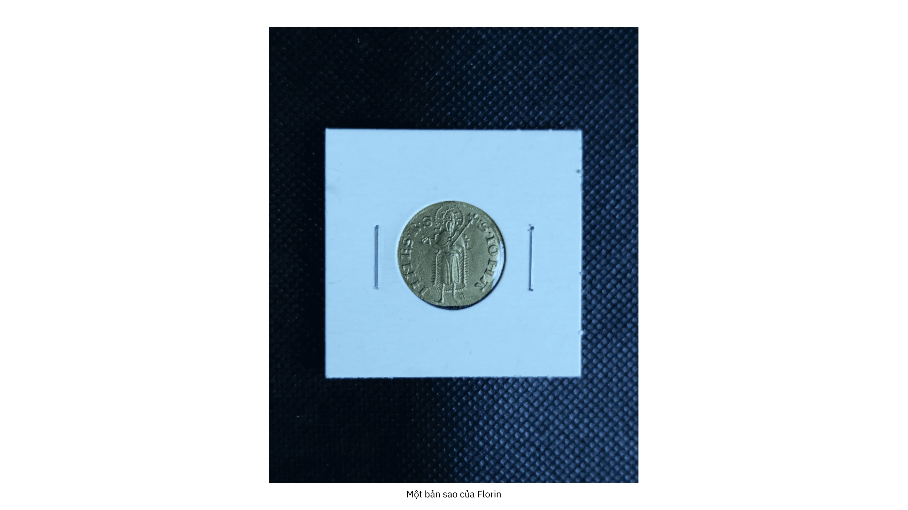

Sự trở lại của tiền vàng xuất phát từ một bối cảnh cụ thể: sự sụp đổ của đồng solidus Byzantine và sự suy thoái kinh tế của thế giới Hồi giáo do cuộc xâm lược của người Mông Cổ đã tạo ra một khoảng trống tiền tệ trong thương mại quốc tế.

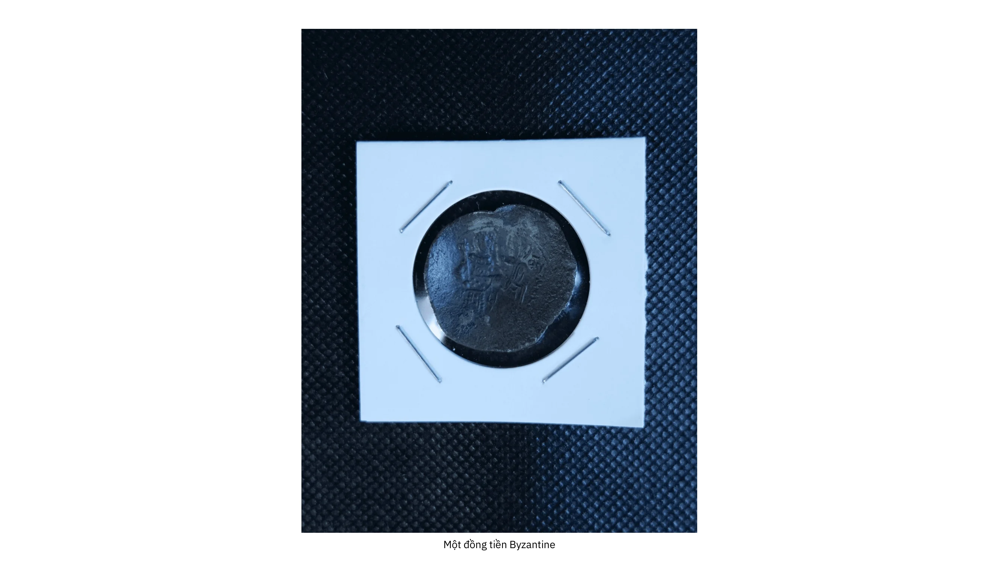

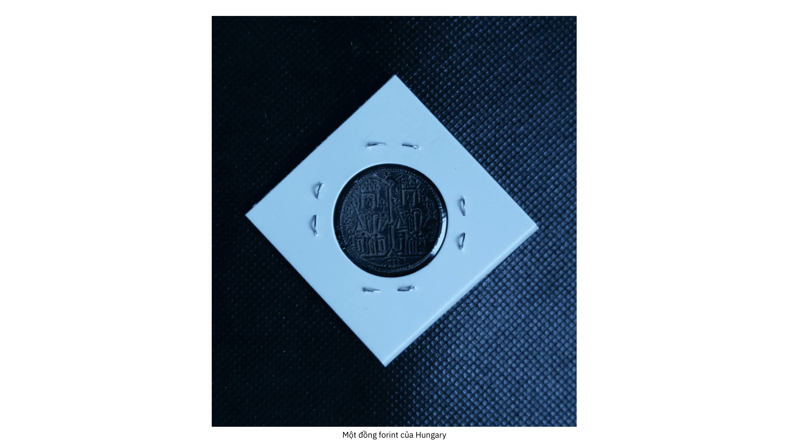

Hình ảnh đầu tiên ở trên cho thấy một đồng xu Byzantine mà tôi thấy khá thú vị. Tôi sẽ vẽ một sự tương đồng với một đồng xu cùng thời kỳ ở Hungary (hình ảnh thứ hai ở trên). Đồng xu Hungary có hình chén, giống như một chiếc bát thu nhỏ. Hình ảnh minh họa là các nhân vật tôn giáo được miêu tả là các vị vua đang cầm thánh giá cạnh nhau. Đồng xu này có hình chén và có nguồn gốc từ Hungary.

Việc sao chép tiền xu từ các quốc gia khác là khá phổ biến. Vì tiền xu Byzantine được chấp nhận rộng rãi, các quốc gia khác cũng thường sao chép chúng. Như bạn có thể thấy khi so sánh chúng cạnh nhau: những đồng tiền này rất giống nhau.

Miền Bắc nước Ý, đặc biệt là Florence, Venice và Genoa, đã tận dụng bối cảnh này để phát hành các loại tiền tệ cứng mới - những đồng tiền có hàm lượng kim loại quý ổn định. Venice đã noi gương Florence bằng cách đúc đồng ducat vào năm 1270, một loại tiền tệ gần giống với đồng florin và được sử dụng rộng rãi trong thương mại Địa Trung Hải.

Florin trở thành đồng tiền dự trữ quốc tế đầu tiên, được áp dụng tại hơn 150 thành phố châu Âu trước cuối thế kỷ 14. Với việc thành lập mạng lưới ngân hàng Florence quy mô lớn do gia tộc Medici lãnh đạo, hoạt động quản lý tiền tệ và kế toán đã được hiện đại hóa toàn diện, thậm chí còn giảm nhu cầu vận chuyển vàng thực tế.

Đây là một điểm thực sự thú vị khác. Đã có thời điểm rất nhiều lô hàng tiền xu bị thất lạc trên các chuyến hải trình. Tiến bộ công nghệ này - sổ đăng ký với hệ thống ghi sổ kép - đã cho phép tạo ra tiền kinh thánh. Điều này giúp giảm số lượng giao dịch tiền xu và thay vào đó sử dụng hệ thống ghi chép bằng văn bản, giúp giảm đáng kể nguy cơ thất lạc tiền trong quá trình vận chuyển.

Sự phát triển của tiền tệ cũng đi kèm với sự tiến hóa đáng kể trong các phương thức ngân hàng. Một phần lấy cảm hứng từ sự tiếp xúc giữa Thập tự chinh với các hoạt động ngân hàng Hồi giáo, châu Âu thời Trung cổ đã chứng kiến sự xuất hiện của các hệ thống ngân hàng thô sơ ở Florence, Venice, Barcelona và Genoa ngay từ thế kỷ 13. Hiệp sĩ dòng Đền, một tổ chức tôn giáo và quân sự, đã phát triển một hệ thống cho phép quân thập tự chinh di chuyển mà không cần mang theo của cải.

Họ sẽ gửi tiền tại văn phòng Templar ở quốc gia của họ và sau đó có thể mang theo một lá thư và nhận tiền khi đến đích trong cuộc thập tự chinh.

Điều này có nghĩa là chúng ta không phải mang theo những đồng tiền kim loại quý.

Cũng trong giai đoạn này, châu Âu mới biết đến sự tồn tại của tiền giấy ở Trung Quốc, nhờ chuyến đi của Marco Polo vào thế kỷ 13. Tuy nhiên, sự phát triển của tiền giấy phải chờ đợi vài thế kỷ, vì châu Âu muốn hoàn thiện phương pháp đúc tiền kim loại trước. Leonardo da Vinci, người thân cận với Luca Pacioli, một kế toán viên công chứng nổi tiếng, đã tích cực đóng góp vào việc cải tiến máy ép tiền, thúc đẩy sản xuất tiền xu nhanh hơn và đồng đều hơn.

Chúng ta đang nói đến kỹ thuật đúc đồng hồ quả lắc đã được đề cập trước đó trong khóa học. Phương pháp này cho phép sản xuất những đồng xu đồng đều hơn so với đúc bằng búa, và quan trọng là cho phép khắc chữ xung quanh mép đồng xu, như tôi đã trình bày trước đó. Đồng xu dưới đây là một đồng thaler châu Âu từ năm 1793, cho thấy rõ nét chữ viết trên mép đồng xu.

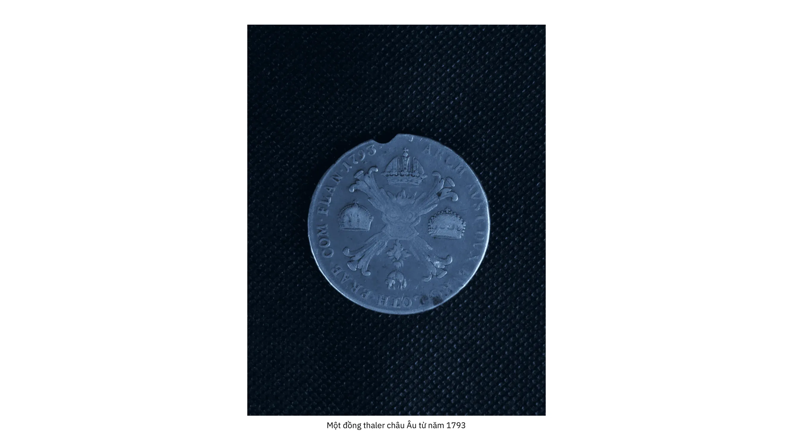

Tuy nhiên, vào thế kỷ 15, châu Âu đã trải qua một cuộc khủng hoảng tiền tệ nghiêm trọng, khi hàm lượng bạc trong các loại tiền tệ châu Âu suy giảm chung, giảm xuống dưới 5% vào khoảng năm 1450.

Từ thế kỷ 16 trở đi, trung tâm tiền tệ chuyển sang Tây Ban Nha, được thúc đẩy bởi sự hợp nhất của vương quốc Aragon và Castile, sự kết thúc của thời kỳ Reconquista và những khám phá hàng hải vĩ đại như của Christopher Columbus vào năm 1492. Dòng bạc ồ ạt đổ vào từ các mỏ ở Mỹ đã làm đảo lộn sâu sắc cán cân kinh tế của châu Âu và toàn cầu, gây ra cả lạm phát và căng thẳng địa chính trị mới.

Thời kỳ Phục Hưng cũng đánh dấu một bước tiến hóa nghệ thuật quan trọng trong lĩnh vực đúc tiền, với những đồng tiền như thaler (Joachimsthaler), nguồn gốc của thuật ngữ "đô la". Những đồng bạc lớn này phản ánh kỹ thuật đúc tiền cơ khí và nghệ thuật mới, được tạo nên nhờ sự đổi mới kỹ thuật từ Bắc Âu.

Cuối cùng, thời kỳ Phục hưng tài chính đã mở ra bước chuyển mình sang hiện đại hóa kinh tế, với sự phát triển của ngân hàng, tín dụng và thị trường tài chính, cùng sự xuất hiện của những hình thức đầu tiên của chủ nghĩa tư bản hiện đại tại các thành phố thương mại lớn như Amsterdam, London và Stockholm, đặt nền móng cho hệ thống tài chính quốc tế như chúng ta biết ngày nay. Và đó chính là chủ đề của video tiếp theo.

# Việc Nhà nước tịch thu tiền

<partId>17cfb1b4-5bc1-53e0-b035-05c7cf76be92</partId>

## Sự phát triển của các loại tiền tệ dự trữ trên thế giới

<chapterId>d65cc352-e7ca-5f03-9b23-dd1fae5c0395</chapterId>

:::video id=82710062-8fff-426c-93af-923c08d82233:::

### Tầm quan trọng lịch sử của kim loại quý

Chào mừng bạn đến với phần này về sự xuất hiện của các loại tiền tệ dự trữ và ngân hàng trung ương. Điểm đầu tiên của phần mới này là sự phát triển của các loại tiền tệ dự trữ toàn cầu.

Kim loại quý, đặc biệt là vàng và bạc, từ lâu đã được coi là nền tảng của sự giàu có và quyền lực trong các đế chế. Cơn khát vàng luôn là động lực chủ đạo, và chính dòng chảy kim loại quý này đã có tác động trực tiếp và rõ ràng nhất đến sự phát triển tiền tệ ở châu Âu. Vào thời Trung cổ và đầu thời Phục hưng, nỗi ám ảnh về vàng và bạc xuất phát từ việc khó giữ được giá trị trong các hình thức hàng hóa khác, cũng như nhu cầu mạnh mẽ từ các thế lực nước ngoài, đặc biệt là trong giao thương với phương Đông.

Qua nhiều thế kỷ, nhiều đế chế đã kế thừa nhau trở thành trung tâm kinh tế toàn cầu. Quốc gia thống trị thương mại thế giới trong một thời kỳ nhất định thường được trao quy chế tiền tệ dự trữ. Những quốc gia này bao gồm:

- Tây Ban Nha và Bồ Đào Nha (thế kỷ 15 và 16)

- Các tỉnh liên hiệp (Hà Lan) vào thế kỷ 17

- Pháp và Anh vào thế kỷ 18 và 19

- Hoa Kỳ trong thế kỷ 20

### Sự bùng nổ của Bồ Đào Nha và Real (1450-1530)

**Bồ Đào Nha** thống trị thương mại thế giới vào nửa sau thế kỷ 15 và đầu thế kỷ 16, với **đồng Real Bồ Đào Nha**, một đồng bạc có trọng lượng tương đối đồng đều. Nhờ những tiến bộ trong lĩnh vực hàng hải, người Bồ Đào Nha đã tìm ra những tuyến đường biển mới đến Châu Phi, Châu Á và Tân Thế giới. Các pháo đài quân sự và trạm giao thương mọc lên ngày càng nhiều từ Châu Phi đến Trung Quốc (Ma Cao).

Để đáp ứng nhu cầu vàng và bạc của châu Âu, "động lực liên tục cho những khám phá lớn là lợi nhuận thương mại, đặc biệt là việc theo đuổi vàng và bạc". Tuy nhiên, Đế chế Bồ Đào Nha, do mở rộng quá mức và phải đối mặt với sự cạnh tranh từ Hà Lan, Anh và Pháp, đã bắt đầu suy tàn.

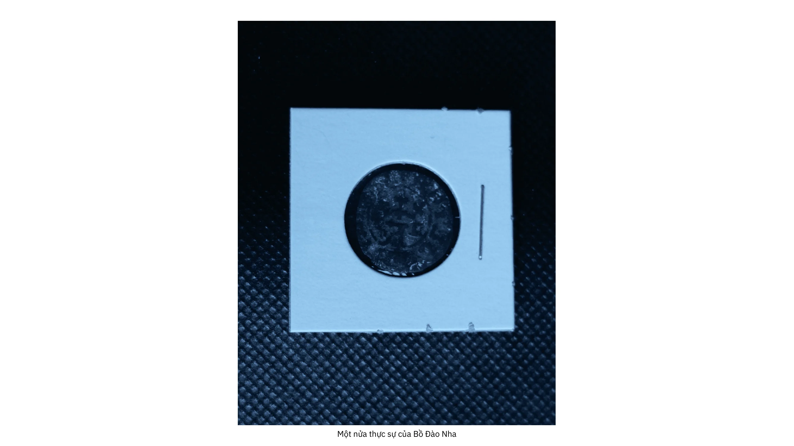

Phía trên đây bạn có thể thấy một nửa đồng Real của Bồ Đào Nha từ thời kỳ chinh phục hàng hải này.

### Thời kỳ đỉnh cao của Tây Ban Nha và đồng đô la Tây Ban Nha (1535-thế kỷ 17)

Với việc chinh phục Tân Thế giới, **Tây Ban Nha** đã trở thành thế lực thống trị. Quốc vương của họ, kiểm soát các mỏ bạc khổng lồ (Potosí ở Bolivia, Zacatecas ở Mexico), đã thành công trong việc đúc tiền bằng bạc nguyên chất, nhờ đó tránh được việc mất giá đồng tiền của chính mình: **Real Tây Ban Nha**.

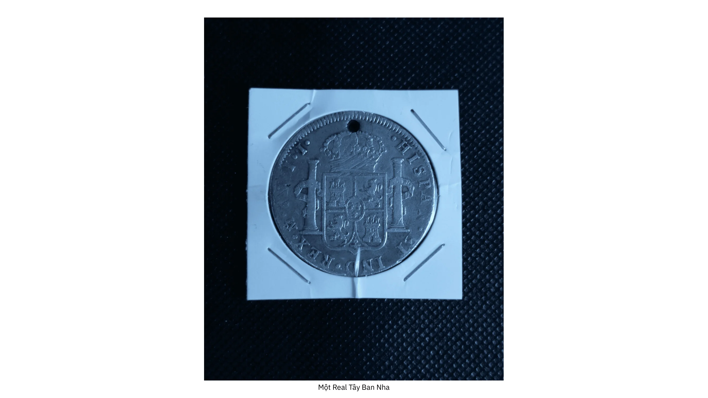

Đồng real Tây Ban Nha, còn được gọi là "đồng tám", có biệt danh này vì nó thường được cắt thành tám phần để tạo ra những đồng xu nhỏ hơn. Nó còn được gọi là **đô la Tây Ban Nha**. Đồng xu bạn thấy ở trên có niên đại từ năm 1814, khiến nó trở thành một ví dụ gần đây hơn một chút. Tuy nhiên, những đồng đô la Tây Ban Nha đầu tiên không được tinh xảo như vậy; chúng được đúc bằng búa và thường kém tròn trịa và sắc nét hơn.

Điều đặc biệt thú vị là đồng đô la Tây Ban Nha từng là đồng tiền dự trữ quốc tế vào thời điểm đó. Chính quyền Tây Ban Nha cũng phát hành đồng tiền địa phương của riêng mình, đồng maravedi, và thường xuyên điều chỉnh cung tiền thông qua việc thu hồi. Ví dụ, một đồng xu bằng đồng hoặc đồng thau ban đầu có giá trị một maravedi có thể bị thu hồi và đóng dấu "2", sau đó là "4", v.v., có khả năng đạt đến "8". Trong bức ảnh độ phân giải cao, bạn có thể thấy rõ số "8" được đóng dấu trên đồng xu. Phương pháp này thực sự đã làm tăng cung tiền... và tất yếu dẫn đến lạm phát.

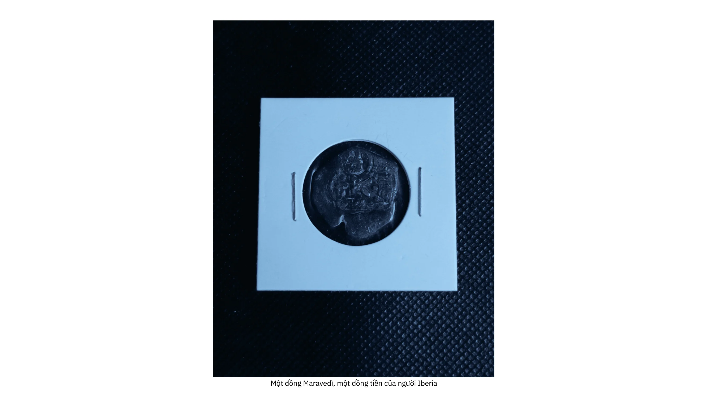

Nếu chúng ta nhìn vào lịch sử của các loại tiền tệ dự trữ, một điểm thú vị sẽ xuất hiện: các đế chế không lạm phát tiền tệ của họ miễn là họ vẫn duy trì được vị thế tiền tệ dự trữ. **Chỉ đến cuối thời kỳ thống trị, họ mới phá giá đồng tiền, đánh mất đặc quyền này, và đặc quyền này sau đó được chuyển giao cho một đế chế mới**.

Ở Tây Ban Nha, đồng đô la Tây Ban Nha thống trị thương mại thế giới trong gần 200 năm, đặc biệt là giữa Trung Quốc và châu Âu. Những đồng tiền này thậm chí còn được tìm thấy tại các cảng biển Trung Quốc. Và đó chính là nơi chúng ta được chứng kiến một phần lịch sử: đồng đô la Mỹ xuất phát trực tiếp từ đồng tiền này. Khi Hoa Kỳ được thành lập vào năm 1792, họ đã thông qua luật đúc tiền riêng, và những đồng đô la đầu tiên của họ được tạo ra theo mô hình đồng đô la Tây Ban Nha, cả về tên gọi lẫn kích thước.

Để bạn hình dung rõ hơn về giá trị của nó, đồng đô la Mỹ ban đầu là một đồng xu bạc nặng gần một ounce, hoặc khoảng từ 30 đến 40 euro theo giá trị tiền tệ ngày nay, không giống như tiền giấy mà chúng ta biết ngày nay. Về phần đồng đô la Tây Ban Nha, nó được lưu hành rộng rãi đến mức được coi là đồng tiền toàn cầu thực sự đầu tiên.

Tuy nhiên, dòng chảy kim loại quý từ châu Mỹ này đã gây ra lạm phát ở châu Âu. Trong cuộc Cách mạng Giá cả (khoảng 1540-1640), chi phí sinh hoạt ở Anh tăng gấp bảy lần. Ở Tây Ban Nha, sự dư thừa bạc đã tạo ra một lời nguyền tài nguyên tai hại, cản trở sự phát triển của các tổ chức ngân hàng vững mạnh.

Sau đó, Tây Ban Nha phải đối mặt với vô số cuộc xung đột quân sự (Flanders, Hà Lan, Chiến tranh Ba Mươi Năm), và nền tài chính của họ dần sụp đổ. Thay vì phá giá đồng bạc nổi tiếng thế giới, các nhà cai trị kế tiếp đã chọn cách vỡ nợ hoặc hạ giá đồng vellón mà người dân địa phương sử dụng. Đây chính là điều tôi đã mô tả trước đó với người Maravedi.

### Sự trỗi dậy của người Hà Lan (thế kỷ 17)

Sau thời kỳ đỉnh cao của Iberia, **Hà Lan** nổi lên như một cường quốc thương mại mới vào thế kỷ 17. Thương mại hàng hải, VOC (Công ty Đông Ấn Hà Lan) và việc thành lập **Amsterdam Stock Exchange** (lấy cảm hứng từ công ty ở Antwerp) đã đưa nước cộng hòa thương mại này trở thành một trung tâm.

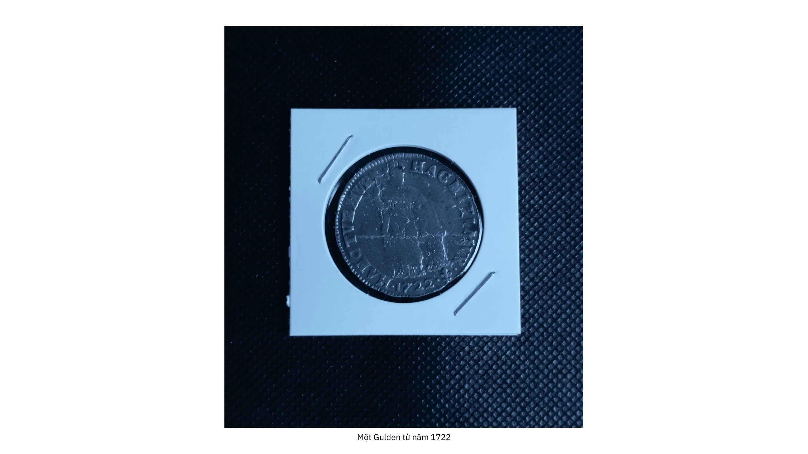

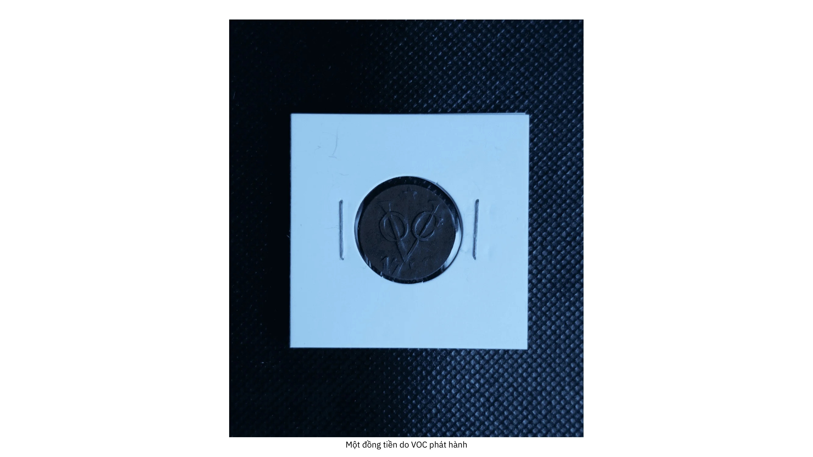

Trong bức ảnh đầu tiên ở trên, bạn có thể thấy một đồng Gulden từ năm 1722 (một đồng bạc đẹp), trong khi ở bức ảnh thứ hai, có một đồng tiền do VOC phát hành.

VOC là một công ty cực kỳ hùng mạnh vào thời điểm đó: công ty có quân đội riêng và thậm chí còn phát hành loại tiền tệ riêng.

Người Hà Lan đã phát minh ra chủ nghĩa tư bản hiện đại, khởi đầu là một phương tiện phân bổ rủi ro trong các dự án mạo hiểm như thám hiểm Tân Thế giới hoặc tìm kiếm các tuyến đường thương mại mới. Các công ty cổ phần cho phép nhiều nhà đầu tư góp vốn và chia sẻ rủi ro. Để tạo điều kiện thuận lợi cho các giao dịch này, cần phải thành lập các tổ chức có khả năng đàm phán và trao đổi các chứng khoán này. Vì vậy, vào năm 1602, công ty cổ phần và sàn giao dịch chứng khoán đầu tiên đã ra đời.

Tiền tệ Hà Lan, đồng **Gulden**, đã trở nên uy tín nhờ độ tinh khiết của bạc, và sau đó là việc Ngân hàng Amsterdam áp dụng nó (1609), nơi tiền gửi trở thành hình thức tiền được ưa chuộng ở châu Âu. Đây là một điểm rất quan trọng cần đề cập. Vâng, tất nhiên là đã có tiền xu, nhưng thứ thực sự cấu thành nên tiền tệ vào thời đó là một dạng tiền kinh thánh. Trên thực tế, phần lớn giao dịch thương mại trên thế giới đều được thực hiện thông qua sổ sách của Ngân hàng Amsterdam. Đây là một bước đột phá thực sự trong ngành ngân hàng: thương mại quốc tế không còn nhất thiết phải được thực hiện bằng tiền xu vật chất nữa, mà được thực hiện trực tiếp thông qua hồ sơ kế toán của ngân hàng.

Thời kỳ thịnh vượng này được đánh dấu bằng dòng chảy vàng bạc ồ ạt, đặc biệt là từ các quốc gia áp dụng chính sách lạm phát hoặc kiểm soát tiền tệ. Có một nhân vật thú vị đáng được nhắc đến: **Thomas Gresham**. Vào thời điểm này, ông làm việc cho hoàng gia Anh tại Hà Lan, quản lý dòng tiền giữa hai nước. Chính Gresham này đã để lại cho chúng ta bộ luật nổi tiếng **"Luật Gresham"**.

Tuy nhiên, Đế quốc Hà Lan cuối cùng cũng cạn kiệt sức mạnh. Chiến tranh với Anh, sự pha loãng đồng gulden trong thời kỳ xung đột, và sự cạnh tranh từ các cường quốc khác (Pháp và Anh) đã báo hiệu sự kết thúc của bá quyền Hà Lan. Sau Chiến tranh Anh-Hà Lan lần thứ tư (1780-1784), sự suy yếu của đồng gulden với tư cách là một loại tiền tệ dự trữ đã trở nên không thể đảo ngược.

### Quyền lực, tham vọng và thất bại của Pháp (thế kỷ 17-18)

Dưới thời Louis XIV, **Pháp** trở thành cường quốc lục địa lớn nhất châu Âu. Tuy nhiên, đồng tiền Pháp chưa bao giờ đạt được vị thế là đồng tiền tham chiếu thống trị: nhiều lần phá giá, thuế nặng nề và các cuộc chiến tranh tốn kém (Liên minh Augsburg, Chiến tranh Kế vị Tây Ban Nha, v.v.) đã ảnh hưởng nặng nề đến sự ổn định của hệ thống tiền tệ.

Thí nghiệm lớn đầu tiên về tiền giấy được thực hiện bởi John Law (1716-1720). Ngân hàng Trung ương (Banque Générale) phát hành các tờ tiền được đảm bảo bằng các cam kết về nợ chính phủ. Kế hoạch này đã dẫn đến một bong bóng đầu cơ và sụp đổ (Bong bóng Mississippi) vào năm 1720. Thảm họa này đã khiến nước Pháp mất lòng tin lâu dài vào tiền giấy. Chính trải nghiệm tai hại này đã giúp Richard Cantillon trở nên giàu có nhờ hệ thống các nguyên tắc phát biểu này, ngày nay được gọi là hiệu ứng Cantillon, trong đó việc in tiền làm giàu cho những người có quyền tiếp cận máy in.

Khi sự ngờ vực này cuối cùng cũng lắng xuống, một thảm họa giấy tờ khác của Pháp lại xảy ra: những tờ giấy assignat mang tính cách mạng. Được phát hành từ năm 1790 trở đi dựa trên việc tịch thu tài sản của giáo sĩ, những tờ assignat này đã trải qua siêu lạm phát phi mã, chính thức trở thành siêu lạm phát đầu tiên trong lịch sử vượt quá 50% mỗi tháng. Năm 1795, mặc dù mệnh giá của chúng đã tăng gấp bội, nhưng chúng chỉ được giao dịch ở mức vài phần trăm so với giá trị ban đầu.

Những luật lệ khắt khe hơn đã tìm cách áp đặt luật assignat, nhưng không thành công. Chính phủ đã cố gắng áp đặt nó, thậm chí còn đe dọa những người không chấp nhận bằng cái chết, và buộc các chủ cửa hàng phải mở cửa. Nhưng tất nhiên, cuối cùng, điều đó đã không hiệu quả.

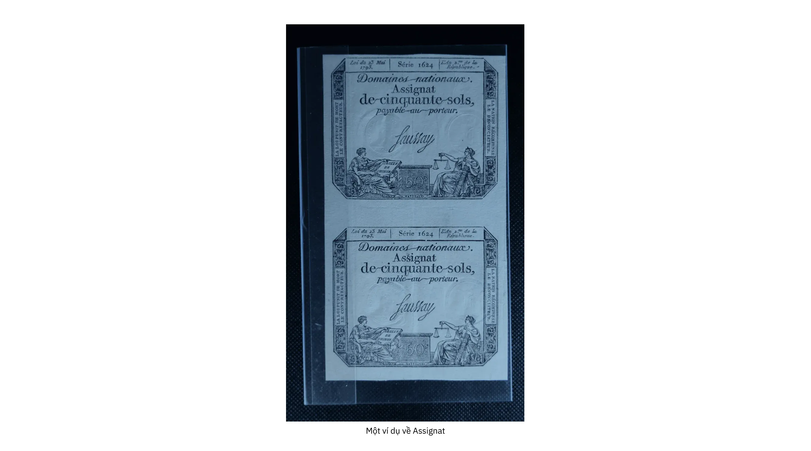

Khi loại tiền giấy này thay thế tất cả các loại tiền kim loại quý chất lượng cao, phù hợp với Luật Gresham nổi tiếng, tình trạng khan hiếm tiền xu đã xảy ra. Để đúc tiền xu mới, họ sử dụng kim loại hình chuông thu giữ từ giới tăng lữ. Dưới đây, bạn có thể thấy một mảnh kim loại hình chuông tuyệt đẹp, được chế tác từ đồng thu hồi bằng cách nấu chảy những đồng xu thu được từ giới tăng lữ.

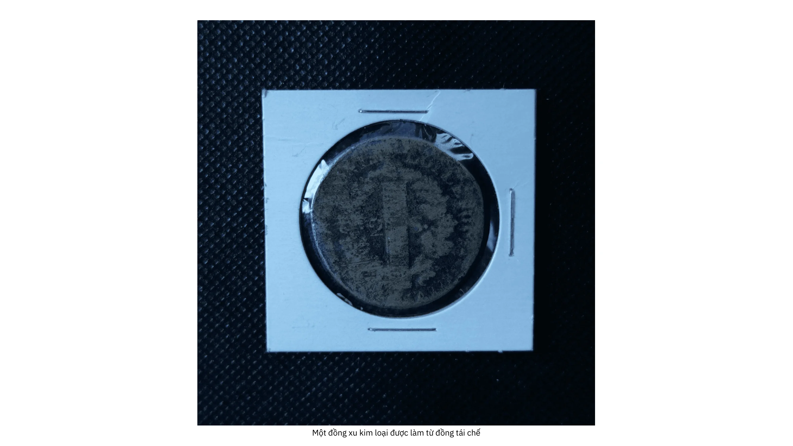

### Sự thống trị của Anh (thế kỷ 18 - đầu thế kỷ 20)

**Anh**, sau khi vượt qua Hà Lan, đã trở thành cường quốc thống trị vào thế kỷ 18. Đồng bảng Anh là đồng tiền lâu đời nhất vẫn còn được sử dụng, ban đầu được liên kết với một pound bạc. Dần dần, vị thế của nó ngày càng vững chắc hơn, được củng cố bởi một cuộc cách mạng tài chính và tài khóa: chế độ quân chủ nghị viện, khả năng tăng thuế mạnh mẽ, và sự ra đời của Ngân hàng Anh vào năm 1694.

Sau một loạt cuộc chiến tranh chống lại Pháp, Vương quốc Anh đã giành chiến thắng vào năm 1815 (trận Waterloo), khẳng định vị thế bá chủ của mình. Trong suốt thế kỷ 19, đồng bảng Anh đóng vai trò là đồng tiền dự trữ của thế giới. Vào thời kỳ đỉnh cao, chỉ với 2,5% dân số thế giới, Anh đã tạo ra 20% thu nhập toàn cầu và kiểm soát gần một phần tư bề mặt Trái Đất.

**Cách mạng Công nghiệp** và việc áp dụng **Bản vị Vàng** (năm 1717 hoặc 1718, dưới sự giám sát của Isaac Newton tại Xưởng đúc tiền Hoàng gia) đã củng cố uy tín của đồng bảng Anh. Ngân hàng Anh đã áp dụng bản vị vàng với tỷ giá 4,25 pound/ounce vàng, cho phép người sở hữu giấy bạc chuyển đổi giấy bạc sang vàng.

Tuy nhiên, Chiến tranh Thế giới thứ nhất (1914-1918) đã chấm dứt hệ thống này. Chỉ trong vài tuần, tất cả các cường quốc tham chiến đều đình chỉ việc chuyển đổi vàng. Đế quốc Anh, và sau đó là đồng bảng Anh, thoát khỏi Chiến tranh Thế giới thứ hai trong tình trạng suy yếu, nhường chỗ cho đồng đô la Mỹ vào thế kỷ 20.

Và như một hiện vật, bạn có thể thấy một số tác phẩm đẹp và thú vị bên dưới. Đây là những quả cân tiền tệ. Đầu tiên là đồng sovereign: biểu tượng sớm nhất của đồng bảng Anh. Tôi chỉ có quả cân tiền tệ để đại diện cho những đồng xu này vì tôi không đủ tiền mua một đồng sovereign thật. Để cân chúng, chúng tôi dùng cân và sau đó đặt khối lượng tiền tệ tương đương với giá trị của đồng sovereign lên mặt bên kia.

Đồng tiền vàng này là một loại tiền tệ - một đồng tiền vàng ban đầu có giá trị một bảng Anh.

Tiền thân của đồng tiền nổi tiếng này là đồng guinea, hoạt động theo cùng nguyên lý. Đồng guinea được đặt tên theo các kim loại quý chứa trong nó, có nguồn gốc từ vùng Guinea.

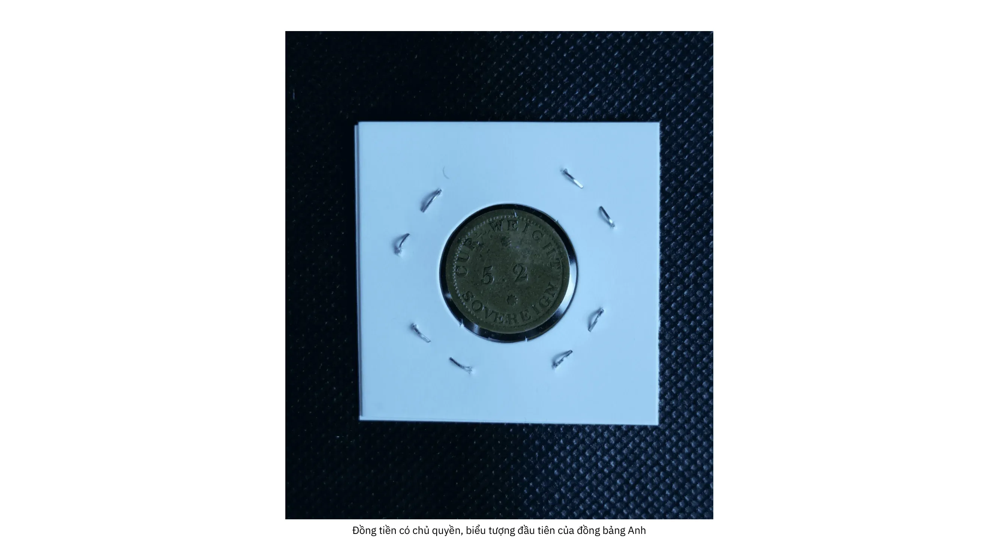

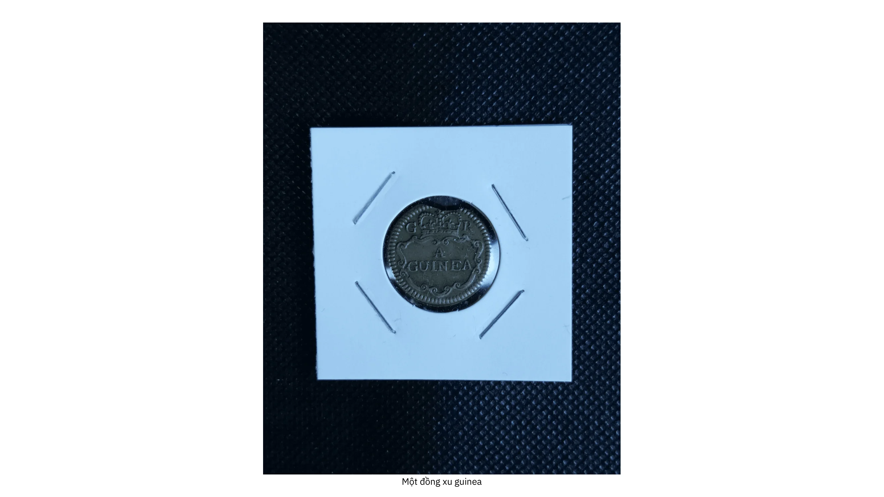

## Sự xuất hiện của các ngân hàng trung ương

<chapterId>15777771-1e28-55f7-a400-69868a47079b</chapterId>

:::video id=7661b7b5-e00f-48f3-b69a-6fb2eb5ebba4:::

Tiếp theo phần này về lịch sử của các loại tiền tệ dự trữ đầu tiên và sự phát triển của chúng, đây là một phần về sự xuất hiện của các ngân hàng trung ương. Phần này đi theo con đường tương tự như sự xuất hiện của các loại tiền tệ dự trữ, nhưng tập trung nhiều hơn một chút vào công nghệ ngân hàng thời bấy giờ.

### Sự khởi đầu của các ngân hàng và các ngân hàng nguyên thủy

Ngay từ thế kỷ 13, người Ý (Florence, Genoa, Venice...) đã phát triển kỹ thuật kế toán kép. Sau đó, Antwerp (thế kỷ 16) trở thành trung tâm tài chính hàng đầu Bắc Âu, một vai trò sau này được Amsterdam tiếp quản nhờ Sở Giao dịch Chứng khoán Amsterdam Exchange (1609), nơi cổ phiếu VOC được giao dịch.

Antwerp là nơi tổ chức các hội chợ thương mại, nơi các thương nhân thường xuyên tụ họp để thanh toán nợ nần, dẫn đến sự ra đời của các công cụ tài chính mới. Tờ tiền dưới đây, có niên đại từ năm 1761 trở về trước, là một **giấy nợ**. Nó có các chi tiết viết tay, cùng với dòng chữ khắc ở mặt sau, khiến nó trở thành một hiện vật tuyệt đẹp từ thời kỳ đó.

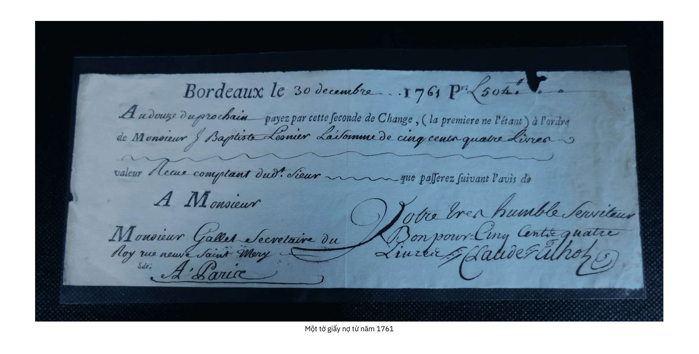

Sự sôi động này đã dẫn đến sự ra đời của các tổ chức ngân hàng tinh vi hơn. Các chủ ngân hàng Lombard và sau này là các thương gia Hà Lan đã hoàn thiện các công cụ tín dụng (hối phiếu, kỳ phiếu, v.v.). Hệ thống ngân hàng hiện đại dựa trên ý tưởng này: tiền có thể là tín dụng, không chỉ là kim loại.

Như bạn thấy, điều này đưa chúng ta trở lại câu hỏi ban đầu về nguồn gốc của tiền.

Tiền tệ xuất phát từ một loại hàng hóa xuất hiện do nhu cầu trao đổi, hay nó xuất hiện từ tín dụng? Dấu vết của điều này vẫn có thể được tìm thấy trong phần này.

### Ví dụ của Thụy Điển: Ngân hàng Stockholms Banco và Riksens Ständers

Chúng ta hãy chuyển sang Thụy Điển, nơi ngân hàng trung ương đầu tiên được thành lập.

**Thụy Điển** là quốc gia tiên phong trong lĩnh vực ngân hàng trung ương: năm 1657, Johan Palmstruch thành lập **Stockholm Banco**, được phép cho vay nhiều hơn dự trữ kim loại của mình, đánh dấu sự ra đời của hệ thống ngân hàng dự trữ một phần. Tuy nhiên, việc phát hành tiền giấy quá mức đã dẫn đến sự hoảng loạn và một cuộc rút tiền ồ ạt khỏi ngân hàng vào năm 1663. Chà, chà...

Năm 1668, Ngân hàng Riksens Ständers, ngân hàng trung ương thực sự đầu tiên trên thế giới, được thành lập tại Stockholm. Tuy nhiên, ngân hàng này cũng phải hứng chịu những cuộc khủng hoảng (1709, 1715...) liên quan đến việc lạm dụng tiền giấy, thường là để tài trợ cho các cuộc chiến tranh của vương quốc.

### Cuộc đảo chính thất bại của John Law

Chúng ta hãy đến Pháp, nơi chúng ta một lần nữa gặp lại John Law thân yêu của chúng ta.

**John Law**, một người Scotland, đã thuyết phục Nhiếp chính vương (Công tước xứ Orleans) thành lập một ngân hàng tư nhân, Banque Générale (1716), được phép phát hành giấy tờ có giá bằng vàng, bạc và các khoản nợ chính phủ. Ngân hàng này sau đó đổi tên thành Banque Royale (1718), và đã giúp cổ phiếu của Công ty Mississippi tăng vọt.

Khi thực tế bắt kịp suy đoán, **sự hoảng loạn càng trầm trọng hơn bởi quyết định cấm nắm giữ vàng và buộc phải sử dụng tiền giấy của Law**. Chà, chà...

Cuối cùng, bong bóng vỡ vào năm 1720, gây ra sự sụp đổ làm hỏng uy tín của tiền giấy ở Pháp trong một thời gian dài sau đó.

### Ngân hàng Amsterdam, sự trỗi dậy của một mô hình tiên phong

Giờ đây, chúng ta được đưa đến Amsterdam vào năm 1609, nơi **Ngân hàng Amsterdam** (Wisselbank) nắm quyền kiểm soát việc lưu giữ tiền xu và khả năng chuyển đổi tại Amsterdam. Ngân hàng này cấm lưu hành tiền giấy tư nhân và bắt buộc gửi tiền kim loại vào kho của mình. Dần dần, họ giành quyền kiểm soát tiền tệ. Họ cấm những người đổi tiền giữ tiền kim loại bên mình. Những người đổi tiền làm việc cả ngày và phải gửi tiền vào kho của Ngân hàng Amsterdam vào cuối ngày. Như tôi đã đề cập, không nhất thiết phải là tiền kim loại được sử dụng trong thương mại quốc tế. Đó là tiền kinh thánh trong sổ sách của ngân hàng.

Nhờ sức mạnh thương mại của Hà Lan, ngân hàng này đã đóng vai trò là "ngân hàng trung ương" đầu tiên trên thực tế, ổn định thương mại thế giới. Tuy nhiên, theo thời gian, ngân hàng này đã cấp các khoản vay không có bảo đảm cho Công ty Phát triển Công nghệ Hà Lan (VOC) và cuối cùng cạn kiệt kim loại để đảm bảo tiền giấy. Năm 1790, người ta phát hiện ra rằng ngân hàng này đã cho Công ty Phát triển Công nghệ Hà Lan (VOC) vay một khoản tiền lớn và gần như tuyên bố phá sản, làm mất uy tín của gulden. Chà, chà...

### Ngân hàng Anh, đạo luật sáng lập của ngành ngân hàng hiện đại

Ở Anh vào thế kỷ 17, vàng bạc được cất giữ bởi các thợ kim hoàn, những người này sẽ phát hành biên lai. Tổ chức phi tập trung một phần này đã bộc lộ những hạn chế của nó khi Hoàng gia Anh thấy mình cần nguồn tài chính khổng lồ cho cuộc chiến chống lại nước Pháp.

Năm 1694, **Ngân hàng Anh (BoE)** được thành lập. Ngân hàng Anh ra đời từ một cuộc hôn nhân vụ lợi giữa cộng đồng doanh nghiệp London và chính phủ, vốn đang rất cần tiền cho chiến tranh.

Ngân hàng đã giành được độc quyền phát hành tiền giấy ở Anh (được củng cố vào các năm 1708, 1742, v.v.). Kể từ đó, tiền giấy được bảo đảm bằng dự trữ vàng được lưu hành cùng với tiền xu. Đây là một điểm quan trọng để hiểu được quá trình tiếp quản tiền tệ dần dần của các tổ chức nhà nước. Đầu tiên, Ngân hàng Amsterdam đã ngăn cấm những người đổi tiền giữ tiền xu và buộc họ phải trả lại cho Ngân hàng. Tại Anh, các ngân hàng tư nhân bị cấm phát hành tiền giấy có thể quy đổi bằng vàng.

Họ cho phép các ngân hàng tư nhân phát hành tiền giấy, nhưng chúng chỉ có thể được đổi lấy tiền giấy của Ngân hàng Anh.

Tiền giấy của Ngân hàng Anh, tức bảng Anh, có thể quy đổi thành vàng. Điều này đã bổ sung thêm một lớp thứ ba cho đồng tiền. Vì vậy, chúng ta có vàng làm nền tảng, sau đó là tiền giấy của Ngân hàng Anh, và cuối cùng là tiền giấy của các ngân hàng tư nhân. Trước đó, các ngân hàng tư nhân có thể phát hành tiền giấy của riêng mình, có thể quy đổi thành vàng. Đây là một giai đoạn khác trong quá trình tiếp quản tiền tệ dần dần của các tổ chức nhà nước.

Ngân hàng đã tài trợ cho Nhà nước bằng những khoản vay khổng lồ và cấu trúc nên khoản nợ công khổng lồ để tài trợ cho sự bùng nổ kinh tế.

Mô hình này đã được củng cố trong suốt thế kỷ 18 và 19, đến mức đồng bảng Anh trở thành đồng tiền dự trữ của thế giới, dưới sự bảo hộ của Ngân hàng Anh và chế độ bản vị vàng.

**Các loại tiền tệ dự trữ của thế giới** đã thay đổi qua nhiều thế kỷ, được thúc đẩy bởi sức mạnh kinh tế, thương mại và quân sự của một quốc gia hoặc đế chế: Bồ Đào Nha, Tây Ban Nha, Hà Lan, rồi đến Vương quốc Anh, trước khi Hoa Kỳ thống trị vào thế kỷ 20. Trong mỗi trường hợp, chúng ta thấy một chu kỳ tương tự: tăng trưởng kinh tế, thành công thương mại, tiền tệ được quốc tế chấp nhận, nợ nần, chiến tranh tốn kém, lạm dụng việc tạo ra tiền hoặc tín dụng, và cuối cùng là suy thoái.

**Sự xuất hiện của các ngân hàng trung ương** là một quá trình dần dần. Các thể chế này thường xuất hiện trong bối cảnh chiến tranh tốn kém, cho phép nhà nước tự tài trợ thông qua nợ. Khi chế độ bản vị vàng được áp dụng (ở Anh, thế kỷ 17-19), nó mang lại vẻ ngoài ổn định, cho đến khi các cuộc chiến tranh thế giới lớn của thế kỷ 20 dẫn đến việc dần dần từ bỏ khả năng chuyển đổi vàng. Quyền đúc tiền do đó đã chuyển từ độc quyền của hoàng gia sang các thực thể phức tạp hơn, đầu tiên là tư nhân (thợ kim hoàn, chủ ngân hàng), sau đó là bán công (ngân hàng trung ương), phản ánh sự phát triển của chủ quyền tiền tệ theo hướng thể chế hóa và toàn cầu hóa.

Vậy, đây chính là điều tôi đã mô tả trước đó. Chúng ta thường chuyển gánh nặng nợ công trực tiếp sang các ngân hàng trung ương hoặc sự cho phép tạo ra tiền của các tổ chức pháp lý, chẳng hạn như Quốc hội.

Và sự thật quan trọng nhất ở đây là **chúng ta đã chuyển từ một khoản nợ có thể biến mất do quốc gia phá sản sang một khoản nợ chủ yếu đè lên vai người dân**.

## Con đường đến hệ thống tiền tệ fiat

<chapterId>27a98545-d350-56ee-a200-92468e6b9b33</chapterId>

:::video id=e27a753e-aeee-4307-a65c-9506aab380a1:::

Chúng ta đã kết thúc khóa học về lịch sử tiền tệ này, và để khép lại, tôi muốn đề xuất hai chủ đề. Chủ đề đầu tiên là các giai đoạn khác nhau dẫn đến hệ thống tiền tệ fiat hiện tại. Chúng ta sẽ xem lại các sự kiện từ phần 5 về sự ra đời của các ngân hàng trung ương, và chúng ta sẽ bổ sung khái niệm về đồng đô la Mỹ, về cơ bản là đồng tiền dự trữ hiện tại. Chúng ta sẽ xem xét quá trình phát triển của đồng đô la, sự ra đời của đồng đô la, quá trình phát triển, sự thay đổi của nó, và những giai đoạn nó trải qua để trở thành một hệ thống fiat, bởi vì nguồn gốc của đồng đô la là một đồng xu bạc.

Tiếp theo, ngay sau đó, tôi sẽ trình bày ngắn gọn về lịch sử tài chính, để giúp bạn hiểu cách chúng ta hình thành nhà nước phúc lợi. Chúng ta sẽ xem xét hai chủ đề: cách chúng ta hình thành hệ thống tiền tệ fiat, và ngay sau đó, cách sự phát triển của tài chính dẫn chúng ta đến khái niệm nhà nước phúc lợi.

### Nền tảng của ngân hàng hiện đại châu Âu

Hãy quay trở lại thế kỷ 13 với đồng florin. Để hiểu cách chúng ta hình thành mô hình tiền pháp định, chúng ta cần bắt đầu từ thế kỷ 13. Bên cạnh đồng florin, một công nghệ khác cũng xuất hiện cùng thời với triều đại Medici, đó là khái niệm hối phiếu.

Sau đó là sàn giao dịch chứng khoán Antwerp với khái niệm chiết khấu và kỳ phiếu.

Sau đó, như chúng ta đã thấy, chúng ta có VOC, thị trường chứng khoán đầu tiên ở Amsterdam. Sự kiện này đánh dấu sự ra đời của chủ nghĩa tư bản, với cổ phiếu công ty và việc trao đổi cổ phiếu. Ngân hàng Amsterdam sau đó áp dụng hình thức gửi tiền theo sắc lệnh. Điều này có nghĩa là tiền xu phải được gửi vào cuối ngày. Chính những người đổi tiền mới không còn được phép giữ tiền thừa dưới dạng tiền xu nữa.

Tiếp theo là sự ra đời của Ngân hàng Anh do nhu cầu tạo ra nợ để tài trợ cho chiến tranh vào cuối thế kỷ 17. Vào thời điểm đó, các ngân hàng tư nhân trở thành tầng tiền tệ thứ ba. Nhân tiện, toàn bộ phần này, từ đồng florin đến khái niệm thành lập ngân hàng trung ương, đã được tóm tắt rất hay trong cuốn sách nổi tiếng "Tiền tệ nhiều tầng" của Nick Bhatia, mà tôi đã may mắn được dịch cùng một vài đồng nghiệp. Chúng tôi đã dịch rất tốt để những người nói tiếng Pháp ở khắp mọi nơi có thể hưởng lợi từ những bài học này.

Vậy là chúng ta đang ở cuối thế kỷ 17. Ngân hàng Anh được thành lập để tài trợ cho chiến tranh.

Các ngân hàng tư nhân đã tiếp quản tầng thứ ba của tiền tệ. Trên thực tế, tiền giấy của các ngân hàng tư nhân không còn có thể quy đổi thành vàng nữa: chính tiền giấy của Ngân hàng Anh mới có thể quy đổi thành vàng. Điều này chứng tỏ sự nắm giữ quyền lực trao đổi của Ngân hàng Anh.

Rồi đến cơn hoảng loạn năm 1776. Mọi người đổ xô lên kim tự tháp tiền tệ. Điều này có nghĩa là vào năm 1776, đã xảy ra một cuộc rút tiền ồ ạt tại các ngân hàng, và tất cả những người có giấy tờ lớp thứ ba, tức là giấy bạc ngân hàng tư nhân, đều cố gắng mua giấy bạc Ngân hàng Anh, rồi sau đó cố gắng mua vàng, nhưng rõ ràng là không có đủ vàng trong kho. Họ tuyên bố một loại hình "nghỉ lễ ngân hàng" để tránh trả nợ các giấy bạc vàng, và điều này đã làm nảy sinh khái niệm người cho vay cuối cùng.

### Sự phát triển của đồng đô la Mỹ

Chúng ta đã chuyển từ đồng florin sang việc thành lập Ngân hàng Anh. Dĩ nhiên, trong giai đoạn chuyển tiếp này đã có Chiến tranh Thế giới thứ nhất và thứ hai, nhưng trước đó, vào năm 1796, những diễn biến cũng đã diễn ra ở bên kia Đại Tây Dương. Năm 1776, Mỹ vẫn là thuộc địa của Anh, và các thuộc địa sử dụng loại tiền giấy này. Dưới đây là tờ hai shilling của Connecticut từ năm 1776.

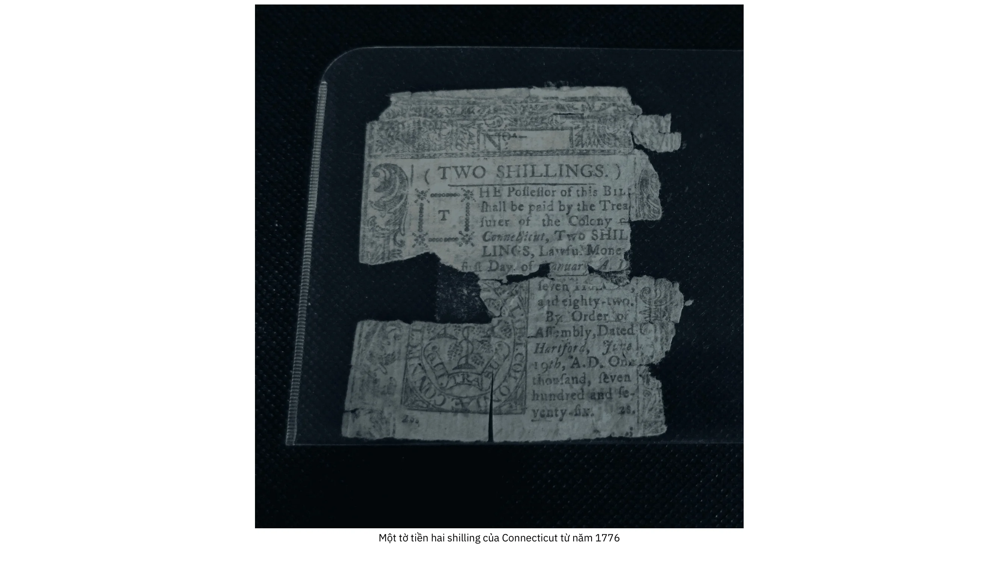

Trước khi tuyên chiến với Anh và cuối cùng phát hành tiền tệ riêng, các thuộc địa đã sử dụng loại tiền giấy này, cùng với đồng đô la Tây Ban Nha trong các giao dịch tiền mặt. Trên thực tế, thuật ngữ "đô la" vẫn được sử dụng để chỉ đồng đô la Mỹ.

Nếu tôi không nhầm thì vào năm 1792, họ đã thông qua một đạo luật cho phép đúc tiền. Ví dụ, hình bên dưới là đồng đô la Mỹ thời hiện đại.

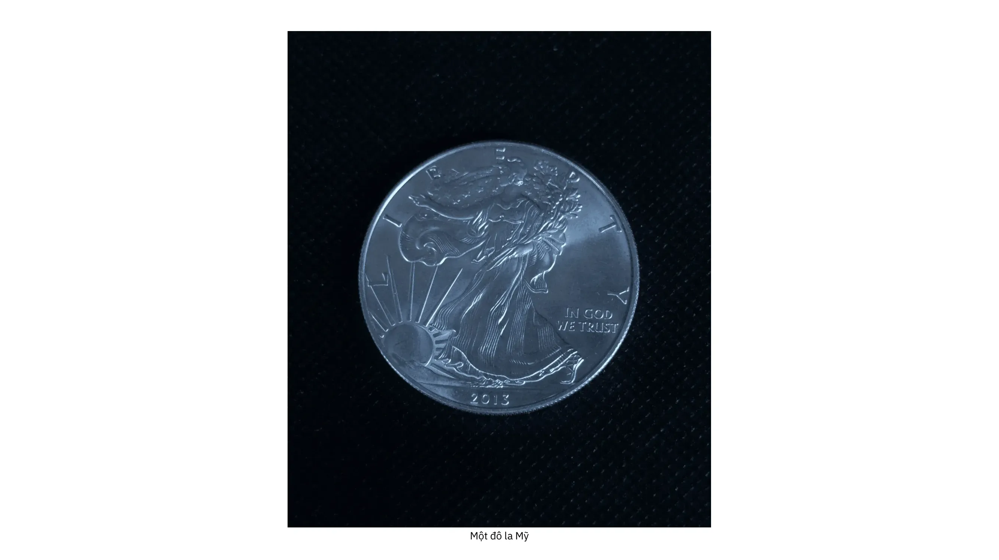

Vâng, rõ ràng là nó không chỉ có mệnh giá một đô la; nó có giá trị khoảng 30 hoặc 40 đô la, vì nó đại diện cho một ounce bạc. Giá trị của nó dao động dựa trên giá bạc, thường dao động ít nhất là 30 hoặc 40 đô la Mỹ. Ngày nay, tất nhiên, một tờ đô la giấy chỉ giữ nguyên mệnh giá một đô la, nhưng vào thời điểm đó, đồng đô la Mỹ bắt nguồn từ giá trị bạc này.

Bây giờ, hãy nói về Nội chiến Hoa Kỳ. Liên minh miền Nam đã in tiền, và tiền bị thổi phồng quá mức. Hiện tượng này không được đưa vào danh sách chính thức của Hanke-Krus, vì nó không đạt đến mức siêu lạm phát 50%. Tuy nhiên, nó đã trải qua mức lạm phát hàng tháng là 40%, cho thấy một lượng tiền đáng kể đã được in trong chiến tranh.

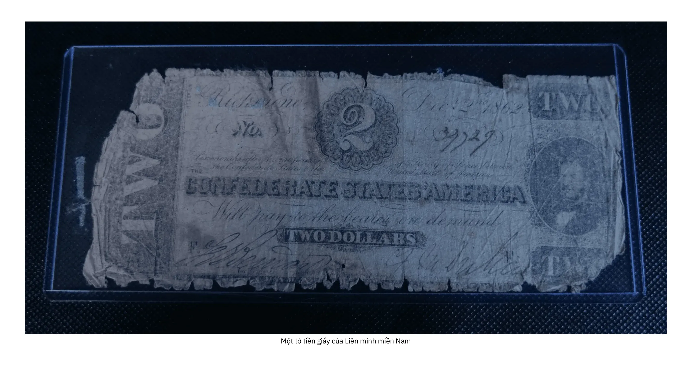

Phe đối lập ở phía bắc cũng có đô la. Ngay phía trên, bạn có thể thấy đô la Liên minh miền Nam, trong khi phía dưới bạn có thể thấy đô la miền Bắc. Chúng được gọi là "đồng bạc xanh" vì mặt sau có màu xanh lá cây.

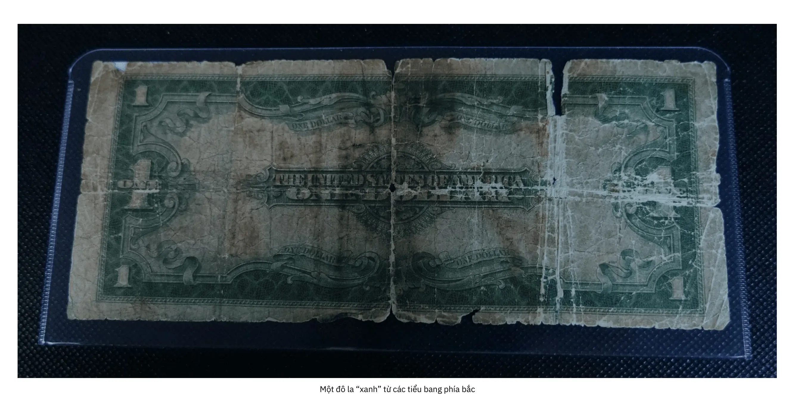

Và tôi mời bạn so sánh sự khác biệt về kích thước với tiền giấy hiện đại. Hồi đó, tiền giấy lớn hơn.

Như chúng ta đã biết, miền Bắc đã thắng, nên đồng bạc xanh trở thành tiền tệ của các tiểu bang thống nhất của Hoa Kỳ. Sau đó là sự thành lập của Cục Dự trữ Liên bang (FED) vào năm 1913 và Chiến tranh Thế giới thứ nhất nổ ra.

Sau Thế chiến thứ nhất, loạt tiền giấy in cuối cùng luôn có dòng chữ "có thể đổi thành vàng theo yêu cầu". Vì vậy, vào năm 1928, 20 đô la đã mua được gần một ounce vàng, vì giá vàng lúc đó là 20,67 đô la. Tờ tiền trong hình dưới đây có thể mua được một ounce vàng vào năm 1928.

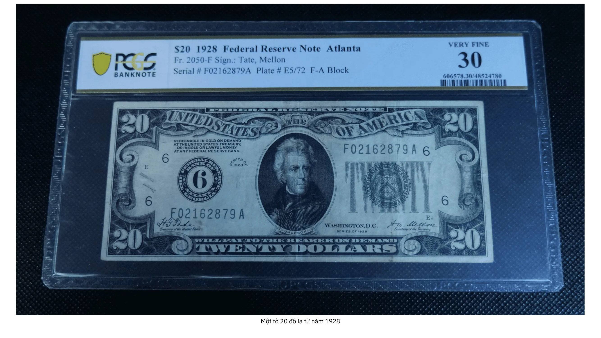

Ngày nay, một ounce vàng trị giá 3.000 đô la Mỹ. Vậy nên, bạn có thể thấy rõ sức mạnh của việc phá giá ở đây. Đó là tờ tiền cuối cùng có dòng chữ "có thể quy đổi thành vàng". Chúng ta sẽ thấy rằng ngay sau Sắc lệnh Hành pháp 6102, họ sẽ tịch thu toàn bộ vàng. Thực tế, họ sẽ tịch thu cả vàng và chứng chỉ vàng.

Bên dưới bạn có thể thấy chứng chỉ vàng từ năm 1928.

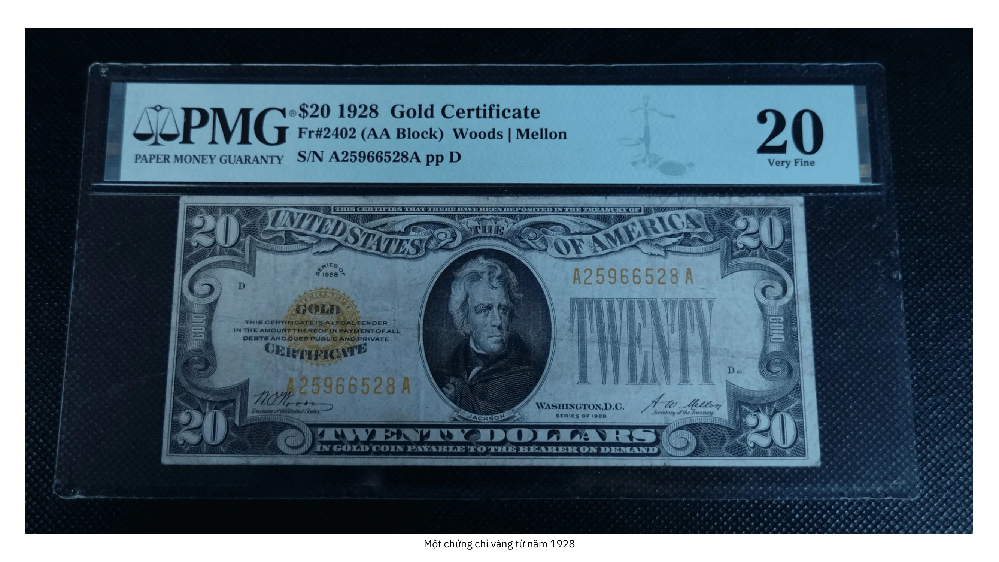

Nó không chỉ "có thể quy đổi thành vàng" như tờ tiền năm 1928, mà còn có thể quy đổi thành tiền vàng: nó thực sự là một "chứng chỉ vàng". Tất cả chúng đều đã bị tịch thu sau Sắc lệnh Hành pháp 6102. Cho đến tận năm 1964, việc sở hữu chúng thậm chí còn là bất hợp pháp.

Tôi rất vui khi có được một cái.

Bắt đầu từ năm 1964, việc sở hữu vàng trở thành bất hợp pháp, cho đến năm 1974, nếu tôi không nhầm. Vào những năm 70, họ cho phép mọi người tích trữ vàng sau cú sốc Nixon, mà chúng tôi sẽ mô tả ngắn gọn. Năm 1933, khi họ ban hành "Sắc lệnh Hành pháp 6102", họ tịch thu vàng và việc sở hữu nó trở thành bất hợp pháp. Bạn sẽ phải chịu một án tù nặng nếu bị bắt quả tang giữ vàng. Vào thời điểm đó, mỗi ounce vàng được đổi lấy một tờ tiền tương tự như tờ tiền bên dưới, sau năm 1934.

Như đã nói, vào năm 1928, một đồng đô la vẫn còn dòng chữ "có thể quy đổi thành vàng".

Sau khi Sắc lệnh Hành pháp 6102 được ban hành, họ đã tịch thu toàn bộ số vàng và đổi 20,67 đô la cho mỗi ounce vàng. Sau đó, vụ lừa đảo bị phát hiện: họ phát hành tờ tiền mới vào năm 1934 với dòng chữ in "tờ tiền này là tiền tệ hợp pháp cho tất cả các khoản nợ".

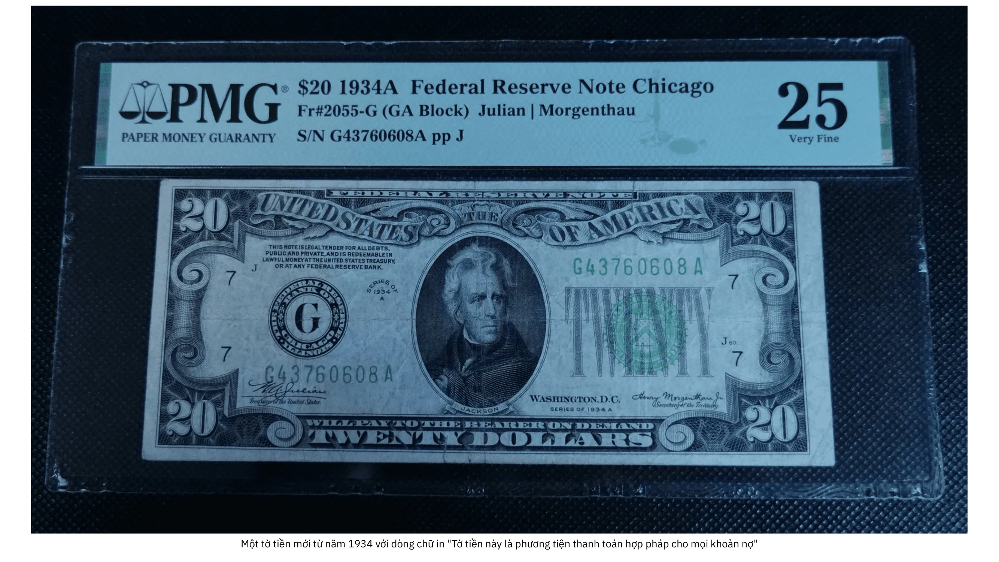

Khái niệm tiền tệ hợp pháp xuất hiện ở đây, thay thế cho cụm từ "có thể quy đổi thành vàng". Hai tờ tiền có thể trông giống hệt nhau, chỉ khác một vài từ, nhưng sự lừa đảo nằm ở chỗ đồng đô la đã bị phá giá trong giai đoạn này; giá trị của một ounce vàng đã giảm từ 20,67 đô la xuống còn 35 đô la một ounce vào năm 1934. Con số này thể hiện mức phá giá khoảng 40%!

Sau đó là Chiến tranh Thế giới thứ hai. Sau chiến tranh, Hiệp định Bretton Woods đã tập trung phần lớn vàng của thế giới vào Hoa Kỳ. Để đổi lấy vàng, người Mỹ đã phát hành tiền giấy, mặc dù những tờ tiền này không còn có thể quy đổi thành vàng bởi công chúng nữa. Thay vào đó, chúng vẫn có thể được quy đổi thành vàng ở cấp tiểu bang.

Cuối cùng, các quốc gia như Pháp và Đức bắt đầu nghi ngờ rằng có lẽ có nhiều tiền đô la đang lưu hành hơn là vàng trong kho tiền của Hoa Kỳ.

Vậy nên họ yêu cầu hồi hương vàng. Họ nói: "Được thôi, chúng tôi sẽ làm, nhưng sẽ mất một chút thời gian." Năm 1971, người bạn Richard Nixon của chúng ta đã cắt đứt mối liên hệ giữa tiền giấy và vàng, đổ lỗi cho giới đầu cơ trong quá trình này.

Vàng bị định giá thấp ở mức 35 đô la một ounce, một mức giá không tương ứng với khối lượng tiền đã được in hoặc giá trị thị trường thực sự của nó. Chỉ trong vài năm, giá đã tăng vọt từ 34 đô la lên 800 đô la. Tương tự như các ví dụ lịch sử, chẳng hạn như ở Rome, nơi mối liên hệ giữa đồng denarius và đồng solidus bị cắt đứt, vàng được phép thả nổi. Thực tế này dẫn đến một quá trình khám phá giá, khiến vàng sau đó được định giá cao hơn nhiều tính theo đô la.

### Hệ thống tiền tệ fiat hiện đại và những tác động của nó

Phần này tóm tắt quá trình chúng ta chuyển đổi từ hệ thống tiền tệ dựa trên bạc hoặc vàng. Dần dần, các thể chế ngày càng nắm giữ nhiều quyền lực hơn đối với tiền tệ. Cuối cùng, một quyết định đơn phương đã cắt đứt hoàn toàn mối liên hệ giữa kim loại quý và tiền tệ, sau một đợt phát hành quá mức.

Kết quả là, không còn bất kỳ mối liên hệ nào giữa vàng và tiền giấy hay tiền thánh kinh. Và nó thậm chí còn không phải là hệ thống dự trữ một phần - đó là một khái niệm lỗi thời. Thay vào đó, các ngân hàng tư nhân phát hành và tạo ra tiền thông qua tín dụng ngân hàng. Tiền chủ yếu được tạo ra theo cách này và tương quan với lãi suất chủ chốt do ngân hàng trung ương đặt ra.

Thực sự không có giới hạn nào cả. Không còn quy định về mức dự trữ bắt buộc nữa, ít nhất là ở Mỹ và Canada. Mức dự trữ duy nhất là nhu cầu các ngân hàng phải sắp xếp để có thể phản hồi các giao dịch liên ngân hàng nhằm tránh tình trạng thiếu thanh khoản.

Họ chỉ cần đảm bảo rằng họ có thể thực hiện những khoản chuyển tiền này, nhưng không có dự trữ bắt buộc 3%, 1%, hay 10%. Chúng ta đã thực sự thoát khỏi khái niệm dự trữ một phần. Giờ đây, chính các ngân hàng trung ương, chính phủ thông qua thâm hụt ngân sách, các ngân hàng trung ương thông qua nới lỏng định lượng (QE), và các ngân hàng tư nhân thông qua việc tạo ra các khoản vay ngân hàng mới có thể làm tăng tổng cung tiền và, theo tôi, gây ra lạm phát.

Để hiểu mối liên hệ giữa tiền tệ và lạm phát, tôi xin giới thiệu một khóa học tôi đang theo học về Plan ₿ Academy chuyên sâu về chủ đề này. Bạn sẽ học được sự khác biệt giữa tăng giá, điều chúng ta thường thấy trong cuộc sống, và lạm phát. Chúng không phải là một. Thực tế, khi nói đến lạm phát, chúng ta thường nói đến tăng giá, chứ không phải bản thân lạm phát. Lạm phát là một khái niệm khá chính xác, được giải thích bằng sự gia tăng cung tiền.

https://planb.academy/courses/caa75343-ac90-4249-bcca-0e2e57c3a0f1

Để kết thúc phần này về thế giới tiền tệ, tôi muốn chỉ ra một nguồn tài liệu giúp bạn hiểu rõ hơn về hiện tượng tôi vừa giải thích, chẳng hạn như lạm phát.

Cảm ơn sự chú ý của bạn.

## Lịch sử của bong bóng tiền tệ

<chapterId>b6451c46-917d-11f0-97de-6bc5081765fa</chapterId>

:::video id=5967d9a6-aae4-4b84-a283-71b1b735bca4:::

### Sự phát minh ra tiền giấy và bong bóng lớn đầu tiên

Với sự ra đời của các ngân hàng trung ương vào thế kỷ 18, một cuộc cách mạng thực sự đã ra đời: tiền ma thuật dưới dạng tiền giấy. Ví dụ nổi bật nhất ở Pháp là trường hợp của John Law. Người Scotland này, lưu vong ở Paris, đã đề xuất với nhiếp chính, Công tước xứ Orléans, một giải pháp cho tình trạng phá sản của nền tài chính hoàng gia bằng cách thành lập một ngân hàng nhà nước và một công ty thương mại thuộc địa: **Banque Royale** nổi tiếng và **Compagnie du Mississippi**.

Với hệ thống này, Law đã liên kết tiền giấy với cổ phiếu của công ty mình. Càng nhiều tiền giấy được lưu hành, giá trị cổ phiếu càng cao, và ngân hàng dường như càng vững chắc... cho đến khi đầu cơ lấn át thực tế. Bong bóng vỡ đột ngột vào năm 1720, hủy hoại giới quý tộc, giai cấp tư sản, và phần lớn châu Âu, những người đã đầu cơ trên phố Quincampoix. Kết quả: sự mất lòng tin lâu dài vào tiền giấy ở Pháp, và bài học đầu tiên của châu Âu về bong bóng đầu cơ.

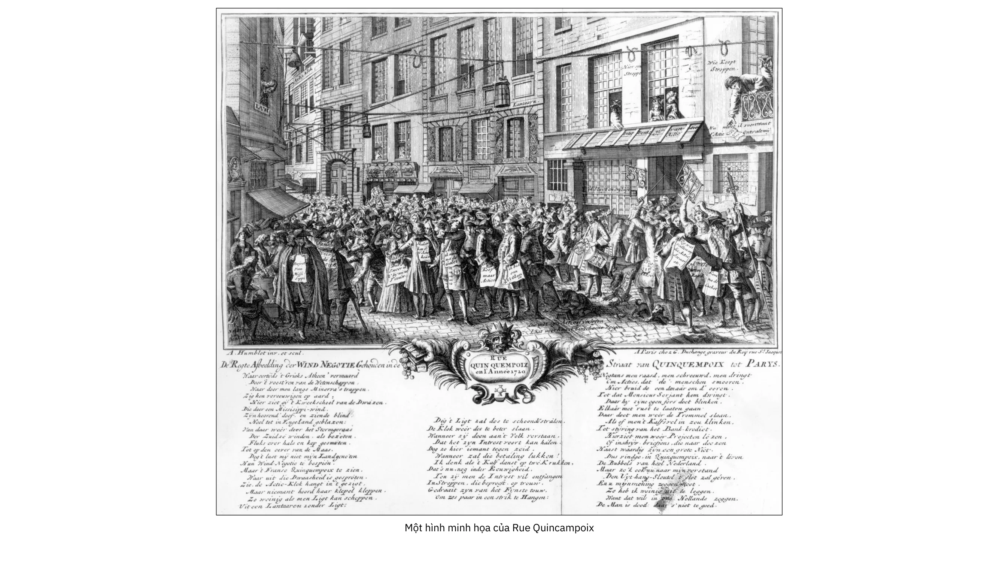

### Khi đất đai trở thành "vật thế chấp"

Một thế kỷ sau, Cách mạng Pháp đã tạo ra một bước đột phá mới với đồng tiền **assignats**, một loại tiền tệ được bảo đảm bằng tài sản của Giáo hội bị tịch thu. Một ý tưởng hấp dẫn trên lý thuyết - biến đất đai thành tài sản thế chấp - nhưng không hiệu quả: đất đai không có tính thanh khoản cũng không thể chia nhỏ. Kết quả là: siêu lạm phát, nhiều lệnh cấm sử dụng đất, lạm phát không kiểm soát được và tình trạng thiếu hụt.

Napoleon, bị ảnh hưởng sâu sắc bởi sự hỗn loạn này, đã tái lập vàng và bạc làm cơ sở tiền tệ vào năm 1800 với việc thành lập Ngân hàng Pháp, qua đó đảm bảo việc trả lương đều đặn cho quân đội của mình. Một cách thực tế để lấy lại niềm tin: trả lương bằng ngoại tệ mạnh.

### Những năm 20 sôi động và cuộc Đại suy thoái năm 1929

Hãy bỏ qua hai thế kỷ. Sau Thế chiến thứ nhất, các chính phủ đã tài trợ cho nỗ lực này thông qua lạm phát và việc đình chỉ vàng. Vào những năm 1920, Cục Dự trữ Liên bang Mỹ (Fed) đã theo đuổi chính sách tiền tệ quá mức để hỗ trợ đồng bảng Anh. Kết quả là: tín dụng dễ dàng, đầu cơ không kiểm soát trên Phố Wall, mua cổ phiếu trả góp, và sự xuất hiện của bong bóng bất động sản và ngân hàng.

Khi cỗ máy này gặp trục trặc, cuộc khủng hoảng năm 1929 là điều không thể tránh khỏi: hàng loạt ngân hàng phá sản, tỷ lệ thất nghiệp kỷ lục, và hàng dài người xếp hàng tại các bếp ăn từ thiện. Điều này đã dẫn đến quan niệm sai lầm dai dẳng rằng **tất cả giảm phát đều xấu**, trong khi chúng ta cần phân biệt giữa giảm phát thông qua tăng trưởng (lành mạnh) và giảm phát thông qua nợ (tàn khốc).

### Châu Á những năm 90 và hiệu ứng domino

Vào những năm 1990, "phép màu châu Á" đã khiến cả thế giới mơ mộng. Lãi suất Exchange được neo vào đồng đô la, tăng trưởng ở mức 8-10%, và vốn phương Tây đổ vào. Mọi thứ đều ổn... cho đến khi thủy triều rút. Các vụ phá sản liên tiếp xảy ra, tiền tệ mất giá 80%, và các nhà đầu tư bị phá sản. IMF phải can thiệp, áp đặt những cải cách đau đớn. Kịch bản vẫn như mọi khi: vốn dồi dào, bong bóng tín dụng, rồi sụp đổ.

### Năm 2008 và kỷ nguyên bong bóng vĩnh viễn

Bong bóng Internet (2000) được tiếp nối bởi bong bóng bất động sản dưới chuẩn. Chứng khoán hóa đã biến các khoản vay ngân hàng thành các sản phẩm tài chính "ba chữ A", lan rộng khắp thế giới. Lời hứa: loại bỏ rủi ro bằng cách pha loãng nó. Thực tế: tất cả các rủi ro thực tế đều có mối tương quan. Khi bất động sản sụp đổ, toàn bộ hệ thống ngân hàng toàn cầu cũng sụp đổ theo.

Kết quả: các gói cứu trợ công khổng lồ, nới lỏng định lượng và lãi suất bằng không. Và cùng với đó là một cuộc chạy đua ồ ạt: mỗi cuộc khủng hoảng sẽ không còn thanh lọc những thứ dư thừa, mà sẽ được bù đắp bằng nợ nần và in tiền ngày càng nhiều. Đây chính là nguyên nhân dẫn đến tình trạng hiện tại: **bong bóng "mọi thứ"**, nơi mọi thứ - cổ phiếu, bất động sản, nghệ thuật, tiền điện tử, thậm chí cả thẻ Pokémon - đều bị thổi phồng một cách giả tạo.

### Sự trở lại vĩnh cửu của đồng tiền ma thuật

Từ thế kỷ này sang thế kỷ khác, một hằng số luôn xuất hiện: ngay khi một xã hội tin rằng họ có thể tạo ra của cải bằng tiền thay vì sản xuất hàng hóa thực sự, bong bóng sẽ xuất hiện. Từ John Law đến năm 2008, từ phố Quincampoix đến Phố Wall, quá trình này lặp lại: hưng phấn, tín dụng, bùng nổ và phá sản.

Và cuối cùng, khi không còn ai tin vào giấy tờ nữa, người ta sẽ tìm kiếm thứ khác - vàng, đất đai, nơi trú ẩn an toàn... hoặc tiền tệ mới. Hôm qua Napoleon áp đặt kim loại, hôm nay một số người coi Bitcoin là người kế nhiệm.

Lịch sử tài chính là một chu kỳ bất tận: in tiền, đầu cơ, sụp đổ. Cho đến khi bong bóng tiếp theo xuất hiện.

## Tiền bạc và bạo lực

<chapterId>9486fe64-854f-5e17-86b3-8873baca39a8</chapterId>

:::video id=bd6d0807-2d8f-4637-a0f5-1e990e5c0d0f:::

Phần ngắn này sẽ xem lại nhiều sự kiện mà chúng ta đã thấy trong suốt khóa học, tóm tắt một số giai thoại mà tôi thấy thú vị.

### Công nghệ và bạo lực

Sau đây là một vài giai thoại mà có lẽ chúng ta đã thảo luận trong khóa học. Chúng mở đầu cho một cuộc thảo luận rất thú vị giữa tôi và Theo về bài giảng của anh ấy tại B-Ondy, mà tôi thấy rất thú vị về cách những tiến bộ công nghệ ảnh hưởng đến mối quan hệ bạo lực giữa người dân và Nhà nước.

### Tiền bạc và sự ép buộc của nhà nước

Để giới thiệu phần này, tôi sẽ cung cấp cho bạn một danh sách ngắn gọn và không đầy đủ, chỉ để nhắc bạn về những sự kiện mà chúng ta có thể đã đề cập trong khóa học.

Một mối liên hệ tôi có thể thấy rõ giữa tiền bạc và bạo lực là khi nói đến những tờ tiền giấy vô giá trị có thể được in vô tận, chúng thường đi kèm với đủ loại quy tắc và đủ loại đe dọa. Chúng ta có thể nói về tờ assignat, nơi mà trên các tờ tiền giấy có ghi rõ rằng những kẻ làm giả sẽ bị đe dọa tử hình. Thật dễ dàng để tìm thấy trong các văn bản pháp lý thời bấy giờ những lời đe dọa tử hình dành cho những ai không chấp nhận loại tiền giấy nổi tiếng này.

Để được ở lại Pháp, trong một trong những văn bản pháp lý tôi có được từ thời Cách mạng, tôi thấy có ghi rõ "tiền công" cho việc vận chuyển và vận hành máy chém trong phần liên quan đến tiền tệ. Tôi thấy điều này khá kỳ quặc.

Chúng ta cũng đã nói về tiền xu ở Trung Quốc, với việc nhà nước giám sát việc đúc tiền. Chúng ta đã thấy trong một phần ở đầu khóa học rằng khi những đồng tiền xu, một số trong đó kém đẹp hơn, bị loại bỏ, sẽ có những hậu quả pháp lý.

Ngoài ra còn có một giai thoại về một vị vua ở Anh đã ra lệnh chặt tay những người đúc tiền nếu họ không cư xử theo đúng mong đợi của ông.

Ngoài ra, ở Trung Quốc, tôi đã đọc về việc tịch thu đồng từ các tu viện Phật giáo. Vào thời điểm đồng tăng giá và gây bất ổn cho nền kinh tế của họ - vốn dựa trên một hình thức tiền tệ không liên quan gì đến giá trị của kim loại - họ đã tìm đến những nơi giàu có và tịch thu đồng từ các tu viện.

Điều tương tự cũng xảy ra với các tu viện ở Anh trong thời kỳ Cải cách Anh. Khi vị vua nổi tiếng này cãi nhau với Giáo hoàng về vụ ly hôn, có một lý do khác đằng sau tất cả: ông ta đã lợi dụng việc bãi bỏ các tu viện để chiếm đoạt tài sản trong các tổ chức tôn giáo này.

Trong cuộc Cách mạng Pháp, họ đã tịch thu toàn bộ tài sản của Giáo hội. Họ nhìn thấy những đồng tiền tuyệt đẹp được đúc từ những chiếc chuông nhà thờ bị nấu chảy.

Nếu chúng ta quay ngược thời gian xa hơn nữa, một trong những quan niệm rõ ràng nhất về bạo lực kinh tế và tự do, về luật lệ giết chết tự do, chính là **Dioletian với đẳng cấp cha truyền con nối của ông, điều này liên quan trực tiếp đến việc nông dân không còn muốn chấp nhận đồng tiền mất giá**. Họ muốn từ bỏ công việc nông dân, và Diocletian phản ứng đơn giản bằng cách nói với họ, "các người không thể rời bỏ đất đai của mình, và con cái các người cũng vậy". Điều tương tự cũng áp dụng cho binh lính.

Tôi nghĩ đó là một hình thức bạo lực khá rõ ràng. Tôi có thể kết luận bằng cách nói về Hiệp sĩ dòng Đền hoặc một vị vua Pháp. Khi Hiệp sĩ dòng Đền định cư ở Pháp, tôi tưởng tượng ông đã nhìn thấy nguồn tài sản của Hiệp sĩ dòng Đền và gặp vấn đề về tài chính nhà nước. Ông đã kiện Hội Hiệp sĩ dòng Đền, và một số người trong số họ đã có thể ra đi với một phần kho báu, điều này đã làm nảy sinh một chương trình rất thú vị ở Hoa Kỳ hoặc Canada. Tôi không biết ai đã sản xuất chương trình này, nhưng nó có tên là *Bí ẩn của Đảo Oak*. Nó kể về những người nghĩ rằng có một kho báu của Hiệp sĩ dòng Đền được chôn cất trên một hòn đảo ở Canada, ở vùng Maritimes, và họ đã khoan trong nhiều năm - thậm chí có thể hơn một thập kỷ - để tạo ra một cái giếng nào đó. Họ đã tìm thấy một cái giếng có nhiều đường hầm, và họ đang tìm kiếm một kho báu được Hiệp sĩ dòng Đền chôn cất trên hòn đảo này, đó là chủ đề của chương trình truyền hình này. Tôi kính trọng cha tôi, một người hâm mộ lớn của chương trình này.

Vậy đó: một danh sách rất ngắn gọn những sự kiện chúng ta đã thấy trong khóa học này, mà tôi nghĩ, gợi lên mối liên hệ với bạo lực. Tôi sẽ để lại phần tiếp theo của Theo, người sẽ kể cho chúng ta một câu chuyện rất thú vị về sự thay đổi công nghệ và sự cân bằng quyền lực giữa thường dân và chính quyền.

Cảm ơn!

## Hậu quả kinh tế của bạo lực có tổ chức

<chapterId>66bd4674-2159-5489-ad4b-ec5e3fb691af</chapterId>

:::video id=c8b063c6-aeb4-4a94-9027-b11d369e71a4:::

### Bạo lực có tổ chức và sự phát triển của nhà nước

Sử gia Frederic C. Lane đề xuất một luận điểm mang tính cách mạng: cấu trúc nhà nước trong suốt lịch sử được định hình bởi các công nghệ được sử dụng để gây bạo lực. Xuất phát từ nguyên lý Weber rằng nhà nước nắm giữ độc quyền về bạo lực hợp pháp, Lane nhận thấy rằng sự độc quyền này - nghịch lý thay lại hiệu quả hơn cạnh tranh trong lĩnh vực này - phát triển theo mối quan hệ giữa chi phí tấn công và chi phí phòng thủ.

Phân tích này, được các tác giả của "The Sovereign Individual" (1997) tiếp thu, giải thích những biến đổi lịch sử trong tổ chức chính trị: từ chế độ phong kiến thời trung cổ đến các thành bang thời Phục Hưng, rồi đến các quốc gia dân tộc công nghiệp và cuối cùng là các nhà nước phúc lợi hiện đại. Mỗi quá trình chuyển đổi tương ứng với một bước đột phá công nghệ lớn trong việc thực thi bạo lực, xảy ra khoảng 400-500 năm một lần.

### Sự cân bằng thời trung cổ

Vào thời Trung Cổ, nền kinh tế nông nghiệp chiếm ưu thế hơn 90%. Nông dân, bám chặt vào đất đai, không thể chạy trốn khỏi lãnh chúa và các hiệp sĩ của ông ta. Công nghệ quân sự - áo giáp rèn thủ công, nhiều năm luyện kiếm - cực kỳ tốn kém. Sự bất đối xứng này đã đẩy mạnh tấn công hơn phòng thủ.

Người nông dân bất động trở thành tù nhân của kẻ độc quyền bạo lực địa phương. Khả năng bóc lột thuế của họ đạt đến một tầm cao mới - mặc dù, nghịch lý thay, thuế thời trung cổ vẫn còn khiêm tốn so với 78% thuế bắt buộc thời hiện đại. Lãnh chúa có thể đánh thuế tùy ý, bởi vì nông dân không thể chống cự hay bỏ đi.

### Thời kỳ Phục hưng của Thương gia

Sự xuất hiện của thương mại Hanseatic ở phía Bắc và thương mại Địa Trung Hải ở phía Nam đã thay đổi tình hình. Các thương nhân, những người tạo ra giá trị gia tăng chính, sở hữu vốn lưu động - tàu thuyền của họ. Họ chỉ cần lực lượng dân quân biển hạng nhẹ, vì biển cả rất khó kiểm soát. Trên hết, họ có thể dễ dàng di chuyển đến một cảng lân cận nếu thuế má trở nên quá cao.

Sự di chuyển này đã tạo ra sự cạnh tranh về thuế giữa các thành bang. Venice, Genoa và Bruges phải đưa ra khuôn khổ tự do nhất có thể: hợp đồng đáng tin cậy, tiền tệ chất lượng, bảo hiểm, thuế suất tối thiểu. Các hoàng tử phải quyến rũ thay vì ép buộc. Sự đối xứng đảo ngược: phòng thủ (bằng cách bỏ chạy) trở nên dễ dàng hơn tấn công.

### Thời đại công nghiệp

Cách mạng Công nghiệp mang theo một cấu trúc tương tự như chế độ phong kiến. Nhà máy, đường sắt và dây chuyền lắp ráp là những khoản đầu tư khổng lồ, bất động. Henry Ford không thể di dời nhà máy của mình trước áp lực thuế. Công nhân, tập trung tại các thành phố công nghiệp, đã thành lập công đoàn để đàm phán tập thể thay vì di cư riêng lẻ.

"Nhà nước phúc lợi" xuất hiện: quy hoạch công nghiệp (Nhật Bản, Hàn Quốc), quân sự hóa cơ sở hạ tầng, phúc lợi xã hội tối thiểu cho lực lượng lao động. Chiến tranh Thế giới thứ hai đã minh chứng cho điểm yếu này: ném bom các nhà máy của kẻ thù trở thành chiến lược chủ đạo. Sự tập trung vốn vật chất cho phép khai thác thuế ồ ạt để tài trợ cho nhà nước phúc lợi.

### Cuộc cách mạng vi xử lý

Ba cải tiến công nghệ hiện đang làm đảo lộn những thế cân bằng lâu đời này. Bộ vi xử lý đang biến đổi chiến tranh: một nhân viên vận hành ở Nevada điều khiển một máy bay không người lái ở Afghanistan với độ chính xác tuyệt đối. Chiến tranh vùng Vịnh (1991) đã chứng minh bước đột phá này: quân đội lớn thứ tư thế giới (Iraq) đã bị xóa sổ trong 45 ngày, với chưa đến 200 người tử trận ở phía liên quân. Sự vượt trội về công nghệ khiến việc tấn công trực diện trở nên bất khả thi.

Internet và mật mã bất đối xứng đang cách mạng hóa việc tạo ra giá trị. Một nhà phát triển có thể làm việc từ bất cứ đâu với MacBook và Starlink, xuất bản sản phẩm của họ ngay lập tức và miễn phí. Những người du mục kỹ thuật số thoát khỏi sự giam cầm về địa lý, gây chia rẽ các quốc gia theo cách chưa từng thấy kể từ thời Phục Hưng.

Bitcoin đại diện cho đỉnh cao của logic này: một loại tiền tệ được giải phóng khỏi Nhà nước, được bảo vệ bởi một lá chắn mật mã bất khả xâm phạm. Tài sản trở nên có thể chống lại bất kỳ thế lực vật chất nào. Cá nhân lấy lại được khả năng tự vệ trước sự độc quyền của nhà nước.

### Sự sụp đổ của mô hình Westphalian

Các nhà nước phúc lợi phương Tây, được thiết kế cho thời đại công nghiệp, đang dần trở nên lỗi thời. Những người tạo ra giá trị - nhà phát triển, nghệ sĩ, nhà tài chính - đang di cư đến Singapore, Dubai hoặc El Salvador, ưa chuộng ít dịch vụ công hơn để đổi lấy mức thuế tối thiểu. Những gã khổng lồ hiện đại như Apple và Tether không cần văn phòng hay cơ sở hạ tầng vật chất.

Sự chảy máu chất xám này tạo ra một vòng xoáy: ít người đóng góp ròng hơn, dịch vụ công bị suy giảm, thuế suất tăng đối với những người ở lại và tốc độ rời đi nhanh chóng. Các quốc gia phải thu hẹp quy mô đáng kể hoặc phá sản. Sự phân mảnh thành các khu vực pháp lý nhỏ, cạnh tranh - một mô hình mới của các thành phố-nhà nước kỹ thuật số - dường như là điều không thể tránh khỏi.

Lịch sử cho chúng ta thấy rằng những quá trình chuyển đổi này cần nhiều thế hệ. Nhưng việc tách biệt tiền tệ và nhà nước trong Bitcoin có thể đẩy nhanh quá trình này. Giờ đây, mọi người bỏ phiếu bằng chân và ví tiền mã hóa của mình, vẽ lại bản đồ quyền lực toàn cầu theo những đường hướng mà chúng ta mới chỉ bắt đầu nhận thức được.

## Một lịch sử rất ngắn về tài chính

<chapterId>1d37fff1-a091-5034-8e71-4af590b8ffce</chapterId>

:::video id=fdfabbc6-e4d8-463a-8522-19176f8fb460:::

Tiếp theo phần trình bày về lịch sử tiền tệ, đưa chúng ta đến hệ thống tiền tệ fiat, tôi muốn giải thích một cách nhanh chóng và ngắn gọn về sự phát triển của tài chính, cuối cùng đã dẫn đến nhà nước phúc lợi. Ban đầu, vào thời La Mã, chúng ta đã có tiền xu.

Tiền xu là một công nghệ tài chính cho phép đế chế trả lương cho binh lính, mở rộng và giao thương. Nó hoạt động rất tốt, ngoại trừ việc cuối cùng có quá nhiều lần phá giá. Đến một lúc nào đó, khi đế chế ngừng bành trướng và không còn thu được chiến lợi phẩm từ các cuộc chiến tranh và mở rộng lãnh thổ, hệ thống của họ sụp đổ.

### Sự phát triển của công nghệ tài chính

Rồi đến thời Trung Cổ, khi mà gần như không có sự tiến hóa nào cho đến khi đồng Florin ra đời, mang lại một loại tiền tệ ổn định, và sự phát triển của ngành ngân hàng ở Ý và Antwerp, nơi khái niệm "giá trị thời gian của tiền tệ" được phát triển - nói cách khác là chiết khấu. Họ đã phát triển chiết khấu để tạo ra một hình thức tiền giấy trong đó một "lệnh phiếu" được phát hành, tức là một lời hứa rằng sau này người ta có thể thu hồi được 100 đô la cộng với lãi suất.

Hệ thống này đã tạo ra một công nghệ tài chính cho phép người nắm giữ bán trái phiếu trước khi kết thúc kỳ hạn, vì vậy nếu bạn bán trái phiếu sau 4 tháng trong kỳ hạn 6 tháng, người đó thực sự sẽ phải trả phí bảo hiểm để bù đắp cho khoản lợi nhuận bị mất trong 2 tháng còn lại.

Vào thời điểm đó, công nghệ tài chính này được phát triển ở Antwerp và Amsterdam. Sau đó, chúng ta chứng kiến sự phát triển của các ngân hàng trung ương và khái niệm người cho vay cuối cùng. Có thể lập luận rằng trong thời kỳ Ngân hàng Amsterdam, việc sử dụng tiền xu trong thương mại quốc tế đã bị loại bỏ để chuyển sang sử dụng tiền kinh thánh.

Sau này, vào thế kỷ 18, xét về công nghệ tài chính, chúng ta có thể nói về bảo hiểm. Có một giai thoại được kể lại rất hay trong cuốn sách "The Ascent of Money" của Neil Ferguson. Công ty bảo hiểm đầu tiên ra đời có tên là **Scottish Widowss**, và về cơ bản, chính các giáo sĩ muốn phát triển bảo hiểm cho những linh mục đôi khi qua đời sớm hơn, đột ngột qua đời. Vào thời điểm đó, các giáo sĩ phải chăm sóc vợ con ở Scotland trong một năm. Và vì vậy, các giáo sĩ thấy khoảng thời gian một năm này có lẽ hơi ngắn. Kết quả là, **họ đã phát minh ra các phép tính bảo hiểm** để tính toán số lượng người đóng góp cần thiết cho hệ thống nhằm trang trải chi phí, tùy thuộc vào số lượng linh mục qua đời sớm.

Họ đã phát triển các phép tính toán bảo hiểm để nói rằng "Được rồi, mỗi linh mục sẽ đưa cho chúng tôi số tiền này. Sau đó, nếu linh mục qua đời, bảo hiểm sẽ chi trả các chi phí để đảm bảo sự sống còn của vợ và con cái ông ấy cho đến khi họ tự lập được." Vì vậy, công ty bảo hiểm đầu tiên có tên là "Scottish Widows" đã phổ biến hệ thống này và triển khai nó ở đâu.

### Từ bảo hiểm tư nhân đến nhà nước phúc lợi

Vậy nên bảo hiểm là một phần của lịch sử công nghệ tài chính. Và điều này đưa tôi đến khái niệm nhà nước phúc lợi, tức là bảo hiểm tư nhân cuối cùng đã gặp phải một vấn đề, một khái niệm về tối ưu hóa, khi chúng ta tự nhủ, nếu chúng ta cung cấp bảo hiểm y tế cho những người khỏe mạnh, họ có thể sẽ ít quan tâm đến việc đóng phí bảo hiểm hơn vì họ tự nhủ, "Tôi khỏe mạnh, tôi sẽ không bị bệnh". Mặt khác, những người biết mình bị bệnh chắc chắn sẽ muốn đăng ký.

Hệ thống này tạo ra sự mất cân bằng giữa số người bệnh sẽ tham gia bảo hiểm y tế, so với số người khỏe mạnh có thể tham gia ít hơn. Vì vậy, có một sự mất cân bằng: nếu bạn tính toán các con số, chúng sẽ không cân bằng vì có lẽ bạn sẽ không thể bảo hiểm đủ cho người khỏe mạnh để bù đắp chi phí. Trong kinh tế học, đây là khái niệm về **rủi ro đạo đức**.

Một trong những ý tưởng được đưa ra là bắt buộc mọi người phải tham gia bảo hiểm. Nếu tất cả mọi người đều có nghĩa vụ đóng góp, điều này sẽ cân bằng lại toàn bộ hệ thống, và cả người khỏe mạnh lẫn người bệnh đều sẽ đóng góp, phân bổ rủi ro cho số đông dân số.

Và vì vậy, ở nhiều nơi trên thế giới, nhà nước đã nói: "Được thôi, chúng tôi sẽ lo việc đó". Mặc dù tôi không phải là chuyên gia về vấn đề này, nhưng tôi thấy lập luận này có lẽ cũng đúng với tất cả các loại hình bảo hiểm khác, chẳng hạn như bảo hiểm thất nghiệp. Người ta mong muốn đơn giản hóa và tối ưu hóa, dựa trên ý tưởng rằng sẽ đơn giản hơn nếu chỉ có một tổ chức lo liệu.

Theo tôi, điều này dẫn đến sự tập trung hóa tất cả các khái niệm bảo hiểm này và cuối cùng dẫn đến sự ra đời của nhà nước phúc lợi, nơi tất cả các khái niệm tài chính ban đầu là các doanh nghiệp tư nhân, các sáng kiến tư nhân nhằm đáp ứng nhu cầu của thị trường bảo hiểm nhằm phân bổ rủi ro trong dân chúng, đã bị nhà nước nắm bắt vì những lý do có lẽ khá hợp lý liên quan đến rủi ro đạo đức và mong muốn tối ưu hóa.

### Các mô hình thay thế và phản ánh về độc quyền nhà nước

Cuối cùng, ở một số quốc gia như Canada, chúng ta có nhiều loại bảo hiểm - bảo hiểm y tế, bảo hiểm thất nghiệp - là những loại bảo hiểm độc quyền của nhà nước.

Tôi có thể cho bạn một ví dụ mà tôi biết. Ở Thụy Sĩ, hệ thống hơi khác một chút. Có các công ty bảo hiểm tương hỗ tư nhân và bệnh viện tư nhân, vì vậy bạn có thể tự chọn công ty bảo hiểm tương hỗ của mình, bạn có thể chọn gói dịch vụ trong công ty bảo hiểm tương hỗ của mình. Bạn vẫn được hưởng các dịch vụ tương đối phổ cập, ngay cả khi phần lớn hệ thống này vẫn thuộc về tư nhân.

Vậy nên tôi nghĩ có khả năng nó cũng được vận hành tư nhân. Nhưng thực ra, tất cả những gì tôi muốn mô tả với bạn không phải là một tuyên bố để khẳng định hệ thống nào tốt hơn hệ thống nào, mà là để giải thích rằng khi đọc về lịch sử tài chính, tôi nhận ra tại sao ở phương Tây, đặc biệt là ở Pháp, và đặc biệt là ở Canada, Nhà nước lại muốn kiểm soát các nguyên tắc tài chính này.

Điều tôi muốn nói là khái niệm bảo hiểm trước hết là một sự phát triển của tài chính, và vì đôi khi các chính phủ rất giỏi trong việc này, họ sẽ cố gắng kiểm soát nó, giống như họ đã cố gắng kiểm soát tiền tệ, vì nhiều lý do. Một lý do, tình cờ thay, là khái niệm người cho vay cuối cùng.

Ý tưởng ở đây là sẽ tốt hơn nhiều nếu có một tổ chức lớn đứng sau để phân bổ rủi ro rộng rãi hơn. Đó là sáng kiến ban đầu đằng sau khái niệm người cho vay cuối cùng, theo đó tổ chức này thực sự có thể lựa chọn những tổ chức đủ mạnh để tồn tại và ngăn chặn chúng sụp đổ bằng cách cho chúng vay tiền.

Vào thời điểm đó, đã có một phân tích thực sự khi khái niệm này cuối cùng xuất hiện lần đầu tiên, nhưng điều cuối cùng xảy ra là chúng ta cứu tất cả mọi người, "quá lớn để sụp đổ", điều này áp dụng cho hầu hết các ngân hàng vì có sự tập trung hóa, và cũng áp dụng cho tất cả các công ty lớn. Cuối cùng, chúng ta thấy rằng nó vẫn là một khái niệm được Nhà nước áp dụng "toàn diện", tương tự như khái niệm bảo hiểm mà tôi vừa mô tả với bạn.

Cuối cùng, nhà nước quyết định sẽ lo liệu mọi việc, biến một công nghệ tài chính được tạo ra ở Scotland để giải quyết một vấn đề cụ thể thành một nhà nước phúc lợi rộng lớn mà chúng ta biết ngày nay. Nhà nước sử dụng các nguyên tắc tài chính bảo hiểm để cung cấp dịch vụ cho những người dân đang cần. Tuy nhiên, chúng ta có thể đồng ý rằng tình trạng độc quyền phát sinh từ hệ thống này tạo ra đủ loại vấn đề, mà chúng ta hiện đang gặp phải ở các quốc gia như Canada và Pháp. May mắn thay, có nhiều mô hình khác nhau, chẳng hạn như mô hình ở Thụy Sĩ.

Chúng ta chỉ cần nhận ra rằng khái niệm nhà nước phúc lợi này bắt nguồn từ tài chính. Nhận thức này cho thấy chúng ta có thể khám phá những hướng đi khác ngoài các tập đoàn độc quyền nhà nước khét tiếng, và tôi thậm chí còn áp dụng lý luận này vào khái niệm ngân hàng trung ương với tư cách là người cho vay cuối cùng - nhưng đó là chủ đề của một dịp khác.

# Phần cuối

<partId>9bada469-7ef0-511a-9eaa-f8eb66d5906f</partId>

## Đánh giá khóa học này

<chapterId>a9494e2b-8a4d-5811-8a7b-b4a91fb22778</chapterId>

<isCourseReview>true</isCourseReview>

## Phần kết luận

<chapterId>1094e793-b4c6-5782-aa4a-71cde00ce7c0</chapterId>

<isCourseConclusion>true</isCourseConclusion>