# 钱币历史之旅

这门引人入胜的课程将带您探索从最早的文明到我们现在的货币体系的迷人演变过程。我们将跨越从新石器时代到现代的各个时代，探索货币如何塑造了伟大的人类文明，又如何被这些文明所塑造。从美索不达米亚的原始货币到加密货币、吕底亚钱币、文艺复兴时期的弗罗林币，再到中央银行的出现--本课程从一个全面的视角来探讨我们社会的基本支柱之一。

+++
# 导言

<partId>59878a67-8a1d-5d6b-af41-5b847c14363c</partId>

## 货币史简介

<chapterId>ca53597e-be9a-5261-a55f-11fac8504a68</chapterId>

:::video id=08ff35ca-8a40-4286-abaf-71283faf6e78:::

欢迎来到货币历史课程。正如标题所示，我们将一起探索钱币的历史演变。从新石器时代到今天，我们将了解过去的主要帝国和文明。

然而，本课程并不局限于简单的日期或历史事件年表。相反，我们的真正目的是深入了解货币（或者说货币）出现的基本概念。

### 需要探索的基本概念

因此，我们谈论的是货币的出现：货币本身的出现、货币体系的出现、银行的出现、纸币的出现、中央银行的出现，最后是当前 "法定 "货币体系的出现。

我们将从美索不达米亚出现的债务货币和记账单位，以及原始社会的嫁妆和血钱等其他制度开始我们的原初货币之旅。我们还将看到，早在中王国时期之前，古埃及就已经有了真正的货币体系。

接着，我们将讨论第一枚硬币在吕底亚的出现，根据经济学教科书，这一关键时刻通常被视为货币的真正开端。我们将研究这些钱币是如何在波斯人、亚历山大大帝和罗马的帮助下传播开来，并最终强加于人、占据统治地位并最终崩溃的。

从这里开始，带着我们所学到的一切，我们将用所需的时间共同思考金钱的定义，超越 "金钱总是债务 "或 "金钱总是商品 "等先入为主的观念。实际上，金钱既是一种物品，也是一种社会习俗。我们将特别讨论货币溢价的概念，并尝试统一解释货币出现的各种理论。

### 关键时期和货币创新

随后，我们进入了一个动荡的时期，这一时期的特点是货币方面的某种不稳定性，但还是出现了一些引人注目的创新，如用于贿赂丹麦入侵者的英国便士，以及查理曼大帝的英镑。

我们还将了解十字军东征如何见证了首个远程汇款系统的出现。然后，我们再来看看伴随文艺复兴的货币弗罗林的影响，以及对欧洲物价产生深远影响的美洲贵金属的到来。

我们将详细了解纸币和中央银行的出现，并将其与金融危机的历史及其往往带来的剧烈影响相提并论。

最后，我们将与当代的货币体系进行对比，探讨其后果，并追溯金融史，以更好地理解我们是如何形成今天的福利国家的。

此外，作为额外的收获，我们还将了解与金钱有关的许多引人入胜的词源联系，这些联系在不同的语言中继续影响着我们的日常生活。

### 课程结构

本课程分为三个主要部分。

第一部分介绍了货币的出现，第二部分介绍了货币的复兴及其衰落，第三部分介绍了国家机构或国家如何逐渐控制货币，最终形成了现在的法定货币体系。

谢谢，请慢用！

# 交易所的出现

<partId>da5e4981-9ea5-5208-beab-3b75c9043632</partId>

## 从南方古猿到现代人

<chapterId>34a773aa-f2d3-5c26-8be4-f2cd79ed6fbc</chapterId>

:::video id=4f333013-4b2a-42ab-8761-593fafc971ca:::

### 为什么要从新石器时代开始

为什么要追溯到新石器时代来谈论货币？答案很简单：如果不研究文明本身的出现，我们就无法完全理解货币的出现。要了解第一套货币体系产生的原因，我们需要了解是什么导致游牧狩猎采集群体定居下来。

一个没有分工、没有专业化的部落，每个人只负责生产自己需要的东西，根本不需要货币。同样，一个只从事自给自足的农业社区，每个人都为自己耕种，也不需要普遍的交换中介。

### 久坐及其后果

这就是为什么我认为从新石器时代开始我们的探索是有趣的。我们将看到定居化是如何逐步形成村庄，然后是城市，最后是伟大的文明。正是这种定居化和剩余粮食的生产使得劳动力专业化成为可能，为最初货币概念的出现和演变创造了肥沃的土壤。

正如人与人之间的互动产生了语言，我们可以认为，在文明的形成和组织过程中，货币会自然出现或不出现（如印加人和斯巴达人）。在我看来，货币的出现与否与每个社会的社会和经济组织形式息息相关。

### 人类进化年表

但首先，让我们看看更广阔的历史背景。

就像任何第一次演讲一样，我将做的与我在课程介绍中所说的恰恰相反，给大家列出一个日期和历史事件的清单，这些日期和事件是相继发生的。这样做的目的是将货币的出现置于历史背景中，与人类的其他进步联系起来，如食物的烹饪、车轮、某些谷物和动物的驯化、金字塔的建造以及第一批城市的建立。

那么，让我们来看看人类从史前时代开始的进化史吧。

概述从澳洲原始人到现代人的人类进化史，介绍直至新石器时代的技术进步和人口迁移。

### 人类的历史背景

- 300 万年前**--*澳大利亚始祖鸟*出现。
- 200万年前**--类人猿开始离开非洲。
- 1.600 万年前**--类人猿到达南欧和亚洲。
- 100 万年前** - 首次发现家庭用火烹饪的证据（南非 Wonderwerk 洞穴中烧焦的骨头和植物残骸）。
- 约公元前 40 万年** - 尼安德特人生活在欧洲和亚洲。
- 约公元前 30 万年** - 智人*出现。
- 8 万年前** - *智人*开始向世界各地迁徙。
- 7.3 万年前** - 南非布隆博斯洞穴（已知最古老的艺术形式）。
- 5 万年前** - *智人*到达欧洲。
- 3 万年前** - 来自法国 Chauvet 洞穴的洞穴壁画。
- 1.5 万年前** - 法国拉斯科洞穴壁画和澳大利亚岩石艺术。
- 约公元前 9000 年** - 新月沃地的大麦驯化。
- 约公元前 9000 年** - 墨西哥种植玉米。
- 约公元前 8000 年** - 新月沃地山羊和绵羊的驯化。
- 大约公元前 7250 年** - Ain Ghazal（约旦）发现了一个只有几百名居民的村庄。
- 公元前 7000 年左右** - 恰塔霍裕克（土耳其）的居民多达 8000 人。
- 约公元前 6500 年** - 定居生活在希腊开始。
- 6000 年前** - 埃及和美索不达米亚开始河流灌溉。
- 约公元前 5000 年** - 出现 "三姐妹 "农业组合（玉米、南瓜和豆类）。
- 约公元前 4000 年** - 骆驼在中亚驯化。(骆驼科起源于 4500 万年前始新世时期的北美洲。然后，这些骆驼通过白令海峡连接当时两大洲的一条细长陆地迁徙到亚洲。该家族的另一部分骆驼则前往南美洲，其后裔至今仍生活在那里：骆马、羊驼和马驼）。
- 约公元前 3500-3000 年** - 博泰人开始驯养和繁殖马匹。
- 大约在青铜时代初期** - 苏美尔人已经发明了轮子和帆船，并发展了算术、天文学和最初形式的文字。
- 约公元前 2800 年** - 乌鲁克在鼎盛时期人口多达 8 万。
- 公元前 2600-2200 年** - 希腊世界城市发展的最初迹象。地中海作物（小麦、葡萄、橄榄）的扩展。
- 公元前 2560 年** - 吉萨大金字塔建成。
- 公元前 1500 年左右** - 米诺斯文明。
- 约公元前 1300 年** - 迈锡尼文明。
- 约公元前 1250 年至公元前 1150 年** - 青铜时代文明的崩溃。
- 公元 1 世纪** - 北非柏柏尔人驯化骆驼。

因此，这里的历史概述为我们提供了一个视角，让我们了解某些技术、某些动物的驯化和文化的出现，并将其与文字和货币的出现联系起来，这将是我们下一节的主题。

## 从狩猎采集者到农民：文明的曙光

<chapterId>ea950b6e-9eb7-553d-8f04-0eb042bb1f5a</chapterId>

:::video id=4b49a376-f6f4-42a0-86fa-264997a079f0:::

### 向农业和定居过渡

在本章中，我们将讨论从狩猎和采集到自给农业、手工业和贸易的过渡。我认为有必要解释这种向定居生活和农业的过渡，以了解第一批城市是如何建立起来的，这最终导致了古代某些货币体系的产生和出现。

本节摘自《伟大课程》网站上的一门课程，名为 "古代美索不达米亚，文明摇篮中的生活"，由加州州立理工大学波诺玛分校的阿曼达-波达尼教授主讲。

### 采用农业的悖论

原始农业大约出现在 1.05 万年前的近东，叙利亚西北部和土耳其南部一带。今天，现代狩猎采集群体并不急于采用农业，新石器时代可能也是如此。

**第一批村庄显然是在动植物驯化之前建造的。**人们并不是因为农业允许他们定居下来才定居下来的；相反，他们是先定居下来，大约 3000 年后才开始耕作的。

狩猎和采集非常有效，因此他们不需要播种来生产食物。今天，狩猎采集者的空闲时间比使用非常原始的技术的第一代农民要多得多。

因此，我们在这里要说的是，现代原始狩猎采集民族的空闲时间比我们从新石器时代的第一批农民那里了解到的要多，毕竟他们拥有相当原始的耕作技术。与以狩猎和采集为生的现代原始部落相比，这些人更努力地生产食物。

骨骼研究还表明，最早的农民比他们之前的狩猎采集者体型更小，更不健壮。与狩猎采集者相比，农民的饮食受到更多限制。他们吃的面包多得多，但肉类却少得多，而且由于在制作面粉时使用了石屑，他们的牙齿也比较差。当他们用石头制作面粉时，会产生碎屑。

遵循 "酮 "饮食的人会同意：吃大量面包可能不如吃肉好。

### 采用农业理论

既然有这么多不利因素，当时谁会选择当农民呢？一些流行的理论认为，人类是被迫从事农业的，这并不是真正的选择。即使是野生谷物，也存在一个大问题。大量谷物不容易运输。它们必须储存在某个地方。一旦谷物被储存起来，就必须留在附近。因此，人们种植了野生谷物，但这并不一定是农业，而且当人们大量种植谷物时，就必须把谷物储存在某个地方，这样就很难运输。这很可能促成了最初阶段的定居。这很可能是人们在某地定居的最初原因。如果这个地方一年四季都能提供食物，那么人们就没有必要跟随畜群或不断旅行。

在纳图菲亚文化中，多达上百人居住在由圆形房屋组成的村落中。一种解释农业起源的流行理论认为，这一变化是由气候变化引起的。大约 11000 年前，近东的气候变得比以前更寒冷、更干燥。以前盛产的植物和动物变得越来越少。于是，社区开始种植他们赖以生存的植物，或饲养幼小的动物并从中获利，如绵羊、山羊和牛，这些动物非常适合繁殖。这将是一个循序渐进的过程。因此，他们并不是在某一时刻才成为驯养动物的农民的。

另一种理论认为，驯化所解决的问题是村庄自己造成的。密集的狩猎和采集会破坏自然环境的稳定。有一种假设认为，纳图菲亚人在人口上取得了巨大的成功，以至于他们的数量已经超出了他们周围环境的承受能力。因此，沼泽地和种植天然作物的地区可能无法满足村落人口的需求。附近的环境无法养活所有人。于是，他们开始直接就地耕种，增加食物供应。

## 新石器时代的贸易

<chapterId>8e495224-6d55-58f6-a9dc-ac2814281cfa</chapterId>

:::video id=d04245af-e416-48b1-8157-d569207a32c4:::

### 旧石器时代向新石器时代的过渡

新石器时代标志着人类历史的根本性突破，与之前的旧石器时代社会形成了鲜明对比。在旧石器时代，欧洲人口极为分散：两万年前，整个欧洲大陆仅有 7000 人，他们组成 20 到 50 人的小型游牧群体，跟随大迁徙的牛群长途跋涉。

冰河时代结束时的全球变暖彻底改变了这种社会组织。森林的出现以更加定居的森林动物群取代了迁徙动物群，使人类群体成为半定居动物群。伴随着这一转变的是惊人的人口激增：旧石器时代末期，欧洲人口估计在 1 万到 5 万之间，而新石器时代中期和末期，欧洲人口增加到 100 万到 500 万之间。

### 工作与财产的发明

这种逐步定居化的过程导致了深刻的社会变革。 **新石器时代的农业产生了现代的工作概念**：依附于特定的领地意味着要照顾自己的财产、储存自己的劳动成果并计划未来的收成。这种与时间的新关系--为了未来的利益而推迟现在的使用--彻底改变了社会组织。

陶器是这一演变的最佳例证：陶器最初是用来储存谷物和种子的，它见证了这种随着时间推移预测需求的新能力。一些史前学家甚至认为，如果没有这些储存系统，就不可能有新石器时代。

**私有财产成为这些新社会的核心制度**。虽然个人财产在旧石器时代就已经存在（个人的狩猎长矛），但在新石器时代，个人财产具有了前所未有的领土层面。这种对土地的占有引发了第一批有考古记载的人类间冲突，从而使领土安全功能应运而生。

### 专业化和劳动分工

农业使养活更多的人口成为可能，同时也使一些人从其他生产活动中解放出来。这种新兴的专业化--农民、陶工、工匠、卫兵--为劳动分工和社会等级奠定了基础。

考古遗存见证了这一日益增长的分层现象：墓葬从集体墓穴演变为有区别的个人墓穴，住房从统一的建筑风格转变为彰显不同社会地位的建筑。随葬品--装饰品、专用工具、陶器--表明了财富和社会声望观念的出现。

### 远程交流的出现

考古分析揭示了当时令人惊讶的交换网络。黑曜石、绿岩（辉绿岩、翡翠）、贝壳和沥青等材料在距开采地数百公里的地方被发现。打磨过的绿岩斧是砍伐森林和建造早期村庄的必需品，在整个新石器时代的欧洲都有流通。

这些交流既涉及原材料，也涉及成品，显示出对手工专业化的赞赏。所赋予的价值既包括材料的稀有性，也包括改造材料所需的技术。

交换的组织形式因考虑的规模而异。 **在社区**内，人类学家倾向于礼物和反礼物经济的假设，非正式的信贷系统建立在人与人之间信任的基础上。在这些受限制的群体中，"邓巴人数"（最多 150 人，以维持直接的信任关系）使延期交换成为可能，而不需要任何市场机制。

易货贸易有几种类型：

- 直接以物易物**：立即以物易物
- 扩展的以物易物**：用货物交换服务或承诺
- 延期易货**：先还后还的人际债务

**在不同族群**之间，个人信任纽带的缺失有利于更正规化交换的出现。某些商品由于能够被外国群体索取而逐渐获得了特殊地位，这就是最初形式的原始货币的雏形。

[奥地利经济学派](https://planb.academy/resources/glossary/austrian-school)将这种演变解释为特权交换商品的自发出现。早在中石器时代就有考古证据的贝壳就说明了这一现象：在远离原产地的地方（法国西部的地中海贝壳和其他遗址的北欧贝壳）发现的贝壳证明了人们对其交换价值的共同认可。

这些物品的与众不同之处在于它们**能够被他人索要**，这是货币功能的基本特征。虽然它们没有实现历史上货币的标准化，但它们迈出了非人格化交换系统的第一步，而这是超越部落框架发展复杂社会的先决条件。

因此，新石器时代奠定了现代经济的基础：劳动专业化、私有财产、财富积累、社会等级化，以及超越亲缘关系和直接邻里关系的复杂交换体系的出现。

## 第一批城市的形成和文字的出现

<chapterId>d6b799c2-8bf1-11f0-9c54-1b9f4f4c7011</chapterId>

:::video id=3ca18105-9856-4ceb-925c-c9e9215af21b:::

### 灌溉与大城市的诞生

在本章中，我们将讨论这段历史上最早的大城市是如何形成的，我们显然还会讨论美索不达米亚出现文字背后的原因。

大约 6000 年前，在埃及和美索不达米亚的肥沃山谷中，人类开始利用河流发展灌溉。这种对水的掌握使得耕作得以丰富，有利于大城市的出现，如位于今天伊拉克南部的著名城市乌鲁克。

公元前 3500 年左右，乌鲁克成为世界上最大的城市，公元前 2800 年左右达到顶峰，人口多达 8 万。在这一时期，苏美尔文明出现了两大创新：一个是能够管理真正国家的有组织的政府，另一个是革命性的文字发明。

### 楔形文字的发明

公元前 3000 年左右，文字在这座城市诞生，其主要动机是经济需求。面对日益复杂的社会及其交流，神庙和宫殿的管理者需要一种可靠的工具来准确记录经济交易，如材料交付、内部转账和可用库存。

所开发的系统被称为 "楔形文字"，源于拉丁语 "cuneus"，意为 "楔子"，指的是用楔形笔在潮湿的泥板上打印符号。

下面是我复制的楔形文字石板。我相信，为了在这些石板上写字，他们使用了一种用芦苇制成的触笔，在湿粘土上描画出形状，这就是楔形文字。

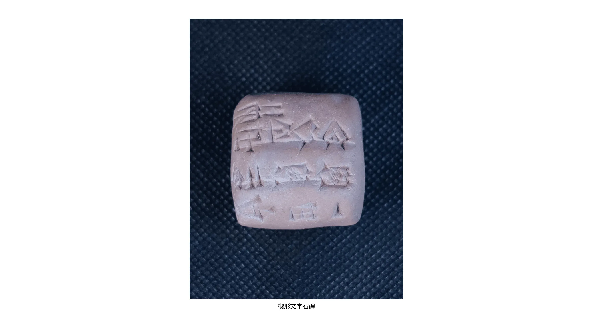

我还有一块我认为是真正的苏美尔石碑，中间有一个小的楔形文字。在这块石碑上，有通过滚动圆柱体制作的签名，我随后会向你们展示。

在大多数人都不会写字的时代，只有熟练的抄写员才有能力书写，所以这些小数字的标记就成了签名。

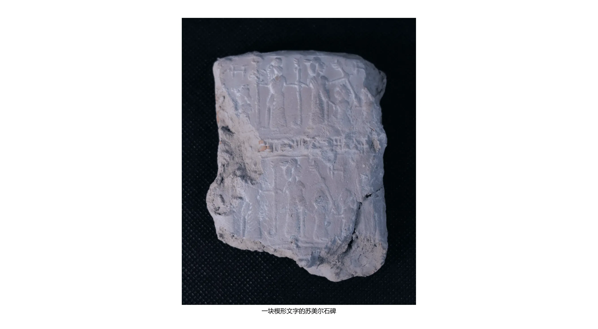

下面，您可以看到上面提到的圆筒：一块刻有特定形状的石头。人们过去常常滚动这种签名圆筒（英语称为圆筒印章）来签署信件。这是一种明示作者姓名的方式，也可以表明这些信件是以作者的名义撰写的。

因此，当时的抄写员使用楔形触笔在湿石板上打印符号。

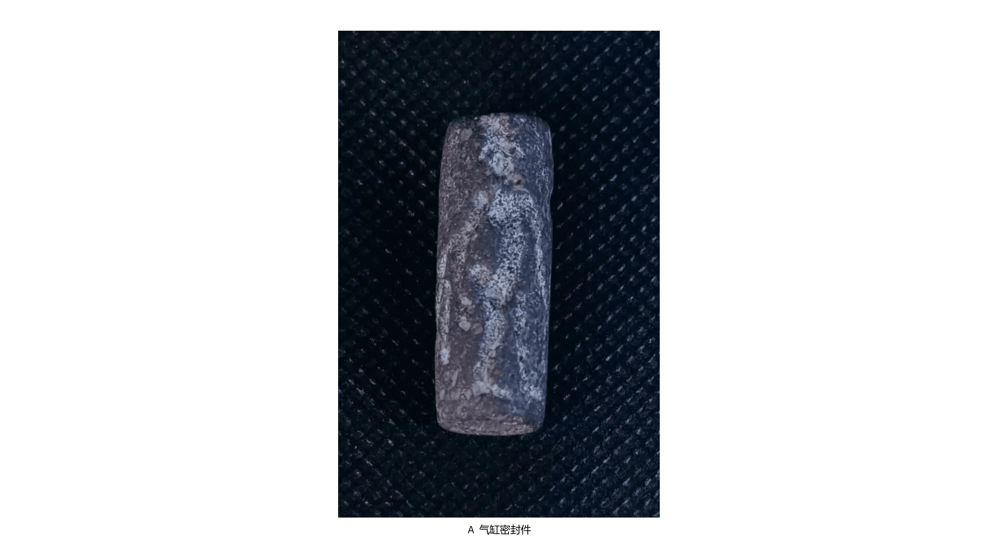

楔形文字并不代表一种语言，而是一种记录口语的书写系统。在英语中，我们会说 "写作是一种书面语言"，然后我们会说 "楔形文字是一种文字，而不是一种语言"。因此，在法语中，我们会说楔形文字不是一种语言，而是一种编纂语言的方式。

### 文字的演变和用途

在最初的几个世纪里，这种文字的功能仍然有限，主要是作为一种记录数量、农产品清单和设备的记忆系统。直到后来，它才逐渐能够**音译人名**和完整的句子。

最初，楔形文字无法表达名称，因为它主要代表物体和现实元素，如牛或小麦，以小图像的形式描绘。随着时间的推移，这些图像演变成了一种更发达的文字形式，可以表达名称和复杂的概念。

比如，如果这个人的名字叫劳拉，我们就可以用一个词，一个听起来像 "水 "的缩写词，再加上一个像 "拉斯 "的缩写词，组成劳拉这个名字。这就是第一种书面语言的发展过程。

需要说明的是，最初表示缩略语时，如果要画牛头，可以看到牛头的形状。渐渐地，这些图画被简化为只表示一种线条。学者们认为，出现这种情况的原因是人们用一只手拿着湿泥板，这样翻转泥板就更容易重新绘制首字母缩写。还有人认为这与抄写员拿石板的方式有关。

在楔形文字的首字母缩略词中，你仍然可以看到与小麦或牛头的联系，而且它们总是偏向一边。

在三千年的使用过程中，楔形文字主要用于保存经济和行政记录。然而，美索不达米亚的居民很快就产生了一种根深蒂固的愿望，那就是用书面形式保存一切值得经受时间考验的东西。因此，迄今为止由流动音乐家口头流传的故事、传说和歌曲都被写成了不朽的文字，通常由受过训练的抄写员抄写。他们抄写已经存在的文本，主要是具有一定文化价值的传说或文本。

一个重要的例子是**吉尔伽美什史诗**，他可能是公元前 2900-2350 年左右苏美尔城邦乌鲁克**的**位历史上的国王。

这种既是经济管理工具又是文化载体的书写形式一直持续到公元 1 世纪才永久消失，为见证其诞生的文明留下了珍贵的见证。

## 苏美尔石碑的作用

<chapterId>a396e6c5-56cc-5410-9e6b-0274401c5425</chapterId>

:::video id=a0729a35-01ec-4aa4-828f-d4ccc2eb168e:::

### 前货币信用体系

在古代美索不达米亚，经济组织建立在非常复杂的机制之上，这些机制早在金属钱币发明之前就已存在。从一开始，正式和非正式的信贷系统就已经是一种重要的货币形式，使当地居民能够进行许多复杂的经济交易。

楔形文字正是为了满足行政和经济需要而发明的。著名的美索不达米亚泥板主要用于记录各种类型的合同：私人贷款、销售、租赁、抵押，甚至婚姻协议。书写这些石板需要专门的抄写员，这项工作耗费大量的时间和精力，但在涉及经济利益时**是合理的。不管是出于人际关系还是经济原因，他们都会雇佣抄写员来撰写文件。

值得一提的是，其中一些石板作为不记名债券流通，可以自由转手。

例如，有一种泥球，里面装有小石头。

在粘土球的外面，写着一个数字并签了名，代表若干单位。里面有这些石头，还有人想验证一下，真正确认这个仪器确实代表了 X 个单位。

另一个例子是在今巴格达西南发现的一块石碑，其中规定债务人承诺在收获日偿还债权人 330 斤谷物。更吸引人的是，另一块石碑明确规定，欠债人必须直接向石碑持有人偿还 4 吨大麦，从而**了向持有人付款的概念，这在当时是一个特别新颖的概念**。

从公元前 2000 年起，就有法律规定，所有商业交易，即使是最小的交易，都必须以书面形式确定下来，并在证人在场的情况下签字。试想一下，在那个时代，要将所有交易记录在登记簿上是多么庞大的官僚机构，我提醒你，登记簿是由抄写员用泥土制作的。这种法律上的严谨性是为了防止日后对所交换物品的所有权和权利产生争议。证人经常被传唤来证明合同确实已经签署。

在私人领域，某些家庭和个人也从事复杂到需要严格管理的经济活动。在北巴比伦的锡帕尔-阿姆纳努镇发现了一个名叫乌尔-乌图的阿努尼图姆祭司的房子，里面有近 2000 块石板。这些文件包括私人贷款合同、销售和租赁契约，以及信件、宗教和学术文本，证明了当时私人档案的多样性和重要性。

值得注意的是，文士们写的信几乎都与经济利益有关：抱怨津贴不足、嫁妆未付或其他紧急的物质要求。在那个时代，情书之类的私人信件是不存在的，甚至连疾病也很少提及。

此类信件中的一个令人痛心的例子说明了这一经济现实：在阿苏尔发生严重饥荒时，一位来信者表达了他在伴侣离开后没有钱或给养的苦恼。他描述了自己急需购买粮食的情况，并请求尽快寄给他相当于纺织品的现金，以确保他的日常生计。

这封信是写给她的伴侣的，似乎表明她的伴侣到别处做买卖去了，留下身无分文的她。她提醒他，为了购买谷物和缴纳寺庙税款，她必须有足够的钱。这也许是我们能找到的最接近当时书信中的论据的文字了。书信几乎总是与经济交易有关，而这封信正是与岌岌可危的经济状况有关。

因此，流传下来的美索不达米亚文书主要反映的是经济交流，因为这些文书是专门为转移具有公认价值的物品而起草的：货币、谷物、各种商品、不动产、神庙税款。这些档案不仅揭示了这一古代文明的效率和行政管理的精确性，还揭示了它在很长一段时间内管理复杂的经济交流的能力。

## 苏美尔石碑上的精英控制

<chapterId>c6d3df0e-b1e1-58dc-ab35-9f76bbc39393</chapterId>

:::video id=04a95fb8-a701-4a48-9ce8-0e9b6ba256fd:::

### 写作，一种最经济的技术

与人们普遍的看法相反，约 4000 年前在美索不达米亚发明的文字最初并不是为了满足个人或文学交流的需要。 **楔形文字首先是一种经济技术**，只有在涉及重大经济利益时才有理由使用。苏美尔人使用文字并不是为了相互通信或表达感情，而只是为了记录他们的商业和金融交易。

这种专业化可以从书写碑文的高昂成本中得到解释。粘土雕刻需要专业的技术知识、大量的时间和特定的材料。只有具有足够经济价值的交易才能证明这种投资的合理性，这就为获得这种革命性技术创造了一个天然的门槛。

楔形文字碑揭示了一个在当时非常复杂的金融体系。美索不达米亚人已经开发出一整套现代金融工具： **有利息的私人贷款、买卖契约、租赁合同、抵押贷款，甚至是带有金融条款的婚姻合同**。这种复杂性证明了市场经济的发达，与人们通常将这些古代文明与原始易货贸易联系在一起的简单印象相去甚远。

一些石板具有真正的不记名证券的功能，可以在人与人之间自由流通，无需识别原始持有人的身份。这种创新使交易变得非常流畅，预示着现代金融体系的到来。此外，专门的立法甚至要求所有商业交易都必须以书面形式正式确定下来，从而使书面形式在经济领域的使用制度化。

### 知识垄断与经济控制

文字在经济中的中心地位赋予了掌握这一技术的人相当大的权力。 **一般隶属于寺庙和统治机构的书写者事实上控制着金融体系**。他们稀有而宝贵的专业知识使他们成为所有重要交易的守护者。

这种知识垄断并非偶然。当局完全有兴趣保持这种独占性，因为书写民主化会削弱他们对经济的控制，增加伪造的风险。见证人系统性地出现在签字仪式上，揭示了对文件真实性的持续关注。

以书面形式记录所有商业交易的法律义务有几个战略目标：财政控制、严格的会计监督以及保持经济参与者对行政机构的依赖。 **这样，美索不达米亚国家就在社会范围内掌握了管理人际债务**的能力，从而将文字转化为经济权力的工具。

### 两种货币体系并存

对这些石碑的分析揭示出的经济现实要比档案中无处不在的石碑所显示的更加微妙。许多碑文都提到**舍客勒银**是一种价值单位，这表明同时存在一种基于标准化实物的货币体系。

这种双重性可以用当时的社会分层来解释。 **楔形文字碑系统是专为少数精英**准备的：神职人员、繁荣的商人和有能力阅读、书写和解释这些复杂文件的行政人员。要有效地使用无记名碑，不仅要知道如何破译，还要能够验证其真伪并理解其法律含义。

**被排除在这一精英制度之外的广大民众发展出了自己的交换机制**。普通人使用更方便的系统，如谷物的标准化度量、货币的重量以及其他易于量化的商品，任何人都可以对其进行评估，而无需专门技能。

这种大众经济虽然在官方档案中记载较少，但可能比石板制度更具活力和灵活性。它无需借助抄写员就能实现快速的日常交流，满足工匠、农民和小商贩的即时需求。

石板中经常提到的作为价值参考的银谢克尔，很可能是这两种平行经济体系之间的桥梁，可以在书面债务和实物支付之间进行转换。

### 自发兴起与机构控制

这种共存现象说明了经济史上的一场基本辩论： ***交换手段的自发出现与货币的制度性占有之间的对立**。一方面，货币等商品是从人们的交换需求中自然产生的。另一方面，机构占有这些做法并使之正规化，以控制其流动。

苏美尔神庙是这种紧张关系的缩影：他们在使用流行的货币创新（对谢克尔的引用）的同时，还开发了自己的控制工具（楔形文字片）。这种策略使他们能够同时获得两种制度的好处：传统货币的大众合法性和正式债务的行政控制。

美索不达米亚的经验为金融体系的演变开创了持久的先例。它表明，**金融的成熟往往比通常与之相关的技术创新早几千年**。利息、信贷、可转让票据和抵押担保的概念并不是等到金属货币发明后才发展起来的。

这一开创性时期还揭示了任何货币创新所固有的权力问题：谁控制着技术，谁定义着规则，以及正式制度和流行做法如何衔接。这些基本问题贯穿了整个经济史，并延伸至当代关于数字货币和[加密货币](https://planb.academy/resources/glossary/cryptocurrency)的争论。

# 古代文明中的经济和货币

<partId>a16bcf4c-8c3a-11f0-9e79-2bd363a484bd</partId>

## 青铜时代的伟大文明

<chapterId>fab9334c-7385-5d7c-ad40-7d152beb22a1</chapterId>

:::video id=737e12e8-1033-4210-b1dd-b8a680f68b17:::

在题为 "青铜时代的伟大文明 "的这一部分中，我们将从格林-戴维斯（Glyn Davies）所著的《货币史》（*A History of Money：格林-戴维斯（Glyn Davies）所著的《货币史：从古至今》*一书中摘录的内容，我认为这是对 "古代伟大文明 "这一部分的极好介绍。

> 汤因比指出了大约 21 种不同的 "文明"，但由于其中 15 种直接或间接地源自更早的文明，他将独立发展的文明减少到了 6 种：苏美尔文明、埃及文明、米诺斯文明、中国文明、玛雅文明和安第斯文明。在这些文明中，只有安第斯山脉的印加人在不使用货币的情况下实现了高度文明，尽管矛盾的是，他们拥有大量通常被认为最适合用作货币的材料--金和银。

印加人没有货币体系，但他们拥有丰富的贵金属。这真是一个悖论。让我们继续引用这句话：

> 一个社会的阶层越分明，其规划系统的效率越高，人们使用货币的必要性就越小。这也许可以解释为什么西班牙征服者发现，政府相对更自由的墨西哥人经常使用金粉（保存在透明的管子里）和可可豆（保存在装有 24 000 个单位的袋子里，用于大额支付）作为货币，而相反，按照更严格的等级制度组织起来的印加人却根本没有货币：严格的规则证实了例外。货币在中国的起源完全独立于其他文明；然而，苏美尔文明、埃及文明和米诺斯文明的相对邻近，使人怀疑它们各自对货币习俗的无知程度，特别是考虑到早在远古时代就已建立的广泛贸易。

在中国，钱币的发展与西方传统完全不同。它从一开始就是[法定货币](https://planb.academy/resources/glossary/fiat)。它们是铸币。

在这里，戴维斯先生提到了贸易。在某些时期，中国人确实与其他民族进行过交流，但对外贸易的交换媒介是丝绸。我们稍后会看到，在中国人口较少的边疆地区也使用黄金。甚至国际贸易也不使用黄金，而是使用丝绸。

因此，我猜想，就钱币的格式而言，它们可能是受到了同一时代开发这种技术的其他文明的影响。

但显然，中国的货币本质与西方完全不同。在接下来有关中国的章节中，我们将详细讨论这个问题。

关于这些著名的苏美尔城市，我这里有一些说明。我们可以提到乌鲁克，它是一个非常早期的、有影响力的城市，以其相当大的规模和先进的文化而闻名，特别是在文字和城市规划方面。

我还想提到著名的吉尔伽美什史诗。吉尔伽美什可能是公元前 2900 年左右苏美尔城市乌鲁克的历史国王。他可能是这个苏美尔城邦的国王。

我们还可以谈谈阿卡德的萨尔贡，他于公元前 2334 年至公元前 2279 年在位。

他是阿卡德帝国的第一位统治者，阿卡德帝国是美索不达米亚出现的另一种文明。我提到萨尔贡是因为他是第一个为这些著名的石碑建立邮政服务的人，我已经向你们介绍过了。

想象一下，真的有泥封吗？石碑可以包在泥封里，外面有当事人的签名，以确保保密性。这样，人们就可以拆开信封取回石碑。这种邮政系统要归功于阿卡德的萨尔贡。

还有巴比伦，这座伟大的城市后来成为巴比伦帝国的首都。巴比伦是另一种文明，以其雄伟的金字形神塔和宫殿以及著名的《汉谟拉比法典》而闻名于世。

本节最后还有两个城市。阿舒尔是亚述帝国的首都，也是一个重要的宗教中心。尼尼微后来成为亚述帝国的首都。他们迁都于此，以强大的军队、巨大的宫殿和图书馆而闻名。这里也是传说中巴比伦悬空花园的可能所在地之一。我们经常听说这个著名的古代世界奇观。

但在巴比伦却找不到这些著名悬空花园的踪迹。而在尼尼微，有考古证据表明花园有好几层。希罗多德等希腊历史学家可能把尼尼微和巴比伦搞混了。当他们访问美索不达米亚的城市时，可能将其称为巴比伦。在尼尼微发现了著名的悬空花园的痕迹，学者们可能会怀疑尼尼微是否就是这些花园所在的著名地方，即巴比伦悬空花园。

## 美索不达米亚的经济组织

<chapterId>6afb6fc8-cbb7-56a5-8427-484b4b7d7477</chapterId>

:::video id=aa6a2cbd-5916-4ae3-ad4f-65f0bd5643fa:::

### 前资本主义经济结构和奴隶制

欢迎阅读有关美索不达米亚经济组织的章节。前资本主义经济经历了三个主要阶段：原始、奴隶和封建。

当然，封建社会要晚得多，显然是在中世纪，而我们已经度过了我们之前描述的旧石器时代的原始阶段。现在，在美索不达米亚，当我们谈论经济组织时，我们谈论的是奴隶制。

然而，在美索不达米亚，大部分工作是由一个类似奴隶的依附阶层承担的，他们在法律上并不是主人的财产，而是通过肉体或意识形态上的胁迫被剥夺了劳动成果。

### 寺庙和宫殿作为经济中心的作用

大块土地在经济中占主导地位。地主通过雇佣工人直接开发土地，或将土地出租以换取租金。他们还从事金融活动，以高利率放贷，年利率一般在 20% 到 33.3% 左右，这种做法与邻近的希伯来人更为严格的规定形成了鲜明对比。

农民贷款的目的不是用于生产性投资（船运公司除外），而是为了确保他们在下一次收获前的生存。这种情况经常导致农民长期负债。

请允许我将其与较近的古代时期（罗马）相提并论，在罗马，公民依靠农民和非自由劳动力生产的农业地租以及战争的战利品生活。 **这些收入在公民之间分配，不是为了 generate 更多的利润，而是为了提高他们的社会地位**。所有这些都与中世纪通过贸易和手工业获取利润的经济形成鲜明对比。

因此，我们在这里想说的是，我把人们使用金融借贷工具并不一定是为了改善生产资料，以及后来在罗马，利润并不一定是再投资，而是用来提高能从这些利润中获益的人的声望的事实相提并论。我们距离中世纪后期出现的资本主义精神还有很长的路要走，那时可以创造就业机会来改进生产资料，为了追求利润而获取和创造剩余。因此，我们可以看到，经济组织尚未达到上述经济演变的第三阶段。

### 信贷系统和记账单位的出现

**卡尔-波兰尼（Karl Polanyi）将经济交换分为三种形式：对称群体之间的互惠，**这是在原始部落中，在那里我们并不真正需要金钱，因为我们互相给予非正式的信贷、交换和再分配。 **以神庙和宫殿为中心的再分配**，这种交换形式与美索不达米亚相吻合，在美索不达米亚，神庙是经济组织的中心，曾一度以口粮的形式回馈和分配财富。后来才有了工资的概念。因此，直到现在，我们才有了原始形式（1）、神庙和宫殿的集中式再分配（2），然后才有了市场交换（3）。尽管我们今天所理解的市场并不完全存在，但市场交换在美索不达米亚的存在是无可争议的，阿卡德语中存在的特定术语以及考古学中关于价格、利润、损失、波动和稀缺情况的证据都证明了这一点。

美索不达米亚家庭独立管理农业生产的各个阶段，从播种到最后加工成面包和啤酒。妇女还生产家属所需的纺织品。对于当地不生产的商品，家庭则求助于专门的商人。

家族关系在贸易中尤为重要。在古亚述时期（约公元前 1910-1830 年），来自阿舒尔城的商人在安纳托利亚的卡内什建立了贸易殖民地，进口锡和纺织品以换取金银。贸易以家族企业为基础，通过婚姻和商业伙伴关系紧密联系在一起。卡内什只是庞大国际贸易网络中的一个环节。

在这些交换中，有金属，而且是贵金属，而不一定是铜，例如，铜在当时确实很有用，我们认为这些金属是为了价值储存的概念而交换的。因此，我们不一定可以说是以物易物，即用两种物品交换它们的用处，而是一种支付的概念，有一定的囤积贵金属作为价值储存的意识，而不是把它们作为商品，例如用青铜来制作盔甲。

贡品和税收主要以实物（大麦或称重的白银）支付。寺庙和宫殿是主要的经济、行政、政治和宗教中心，同时也通过安全存放货物（首先是谷物，然后是其他农产品，最后是贵金属）来履行最初的银行职能。这样，早在钱币出现之前，最早的信贷和贷款业务就已经发展起来了。

美索不达米亚经济主要使用大麦和白银作为价值标准。白银以标准化单位称重，例如锡克尔（sìqlum）约为 8.33 克。早在古巴比伦时期（汉谟拉比统治时期），白银就被用作常用的支付手段，早期的名义价值（"nūbum"）概念与实际重量（"šuqulum"）相对，**了现代法定货币的概念。

但它还不是严格意义上的法定货币。当时还没有印章的概念，但有名义记账单位的概念，而不是称重金属的概念。这两个概念在语言上是有区别的，我认为有必要提及这一点。

向雇佣劳动市场的过渡是艰难的。这需要两项重大的概念创新：将个人工作与最终产品分离，以及引入 "工作时间 "作为可衡量的单位。要有这种工薪雇员的概念，我们首先要经历这两次革新。 **在 IIIᵉ 世纪，工作最初是通过固定口粮获得报酬的，然后在 IIᵉ 世纪初逐渐演变为工资制度。

最后，从公元前 26 世纪开始，尽管美索不达米亚的 "货币 "不是硬币，而是谷物或金属的加权计量单位，但真正的货币价值概念已经扎根。 **因此，在进行重要交易或需要保值的情况下，人们往往倾向于将谷物兑换成更容易保存的白银**。

从公元前 21 世纪起，**随着不对称交换的实际消失**，我们注意到在转让合同中，动词 "sa "指的是价格的支付。这个被称为 "sa "的概念出现在合同中，指的是价格的支付，而不是某种商品的计量。"Sa "只是指支付或价格。一位人类学家注意到了这一点，并提到这确实是一个突破；我们看到了在合同中引入动词 "sa "前后的一种二分法。

我们不能忽视近东档案中的经验数据，这些数据证明了***某些市场机制的存在，包括***利润***和***损失***的概念、***价格波动***和***稀缺**的情况。但根本的困难在于确定市场交换在整个古代美索不达米亚经济中的相对重要性。

我想这个领域的专家们已经看到了这些市场概念的痕迹，但他们并不能真正告诉我们当时的经济有多少是基于这种更现代的市场概念或其他机制。

我们知道它的存在，但不知道它是否是决定价格或交易的主要方式。

本节关于美索不达米亚经济组织的内容到此结束。

在接下来的章节中，我们将对埃及和中国进行同样的分析。

## 古埃及的经济和货币组织

<chapterId>bffcc16c-7fbf-5992-a0fa-6a7726d7d287</chapterId>

:::video id=40c1c4e5-b190-4bb6-b8a0-810c9ce7698b:::

### 历史背景和埃及时期

本节专门介绍古埃及的经济和货币组织。为了给您提供一些背景资料，这里列出了相关时期的清单和简要说明。

- 古王国（约公元前 2575 年-约公元前 2130 年）**。以建造大金字塔（尤其是吉萨金字塔）为标志的时期。这是埃及君主集权的黄金时代。
- 中王国（约公元前 1938 年-约公元前 1630 年）**。经过一段不稳定时期后的政治和文化复兴。
- 新王国（约公元前 1539 年至公元前 1075 年）**。领土扩张、军事力量和国际贸易的时期。其中包括图坦卡门和拉美西斯二世等著名法老的统治时期。
- 公元前 1323 年。 - 图坦卡蒙之死**。这位年轻的法老死于 18-19 岁左右。他几乎完好无损的陵墓于 1922 年被发现，成为最著名的考古发现之一。
- 拉美西斯二世--公元前 1279-1213 年在位**。新王国最强大的法老之一。因其军事行动、伟大的纪念碑而闻名，并可能缔结了第一个已知的和平条约。
- 公元前 1275 年--海洋民族**。被称为 "海洋民族 "的群体的入侵或迁徙破坏了包括埃及在内的多个地中海文明的稳定。
- 索伊斯战役--公元前 1178 年**。埃及军队与入侵者之间的冲突，入侵者可能与海洋民族有关。这是新王国末期的众多战役之一。
- 晚期**是指公元前 664 年至公元前 332 年左右的古埃及历史时期。
- 克里奥帕特拉七世（公元前 69 - 30 年）**。埃及最后一位女王，因其智慧、魅力以及与凯撒大帝和马克-安东尼的联盟而闻名，可能也因她的鼻子而闻名。她的统治标志着法老埃及在被罗马吞并之前的终结。

公元前 5 世纪和公元前 4 世纪，埃及已经开始了大规模的商业活动，通过海上、河流和陆地贸易（特别是驴队贸易），将努比亚、巴勒斯坦、利比亚和红海地区连接起来。

### 早期的交换系统和古货币

公元前 3650-3400 年左右，随着第一批埃及酋长领地的出现，位于今开罗南部的马阿迪遗址成为铜技术和远距离贸易的主要中心，特别是通过叙利亚海岸与美索不达米亚进行贸易。

虽然大规模的贸易主要是以物易物，但可能存在一种原始的货币形式（"古货币"），由半宝石和贝壳化石等有声望的物品组成。黄金可能已经在这些交换中发挥了重要作用。公元前第三个千年中期，埃及文献中首次明确提到钱币，这反映了与商业行为相关的长期发展。

在古代社会（这里我们不一定指埃及，而是指一般的古代社会），支付是很频繁的，不是为了直接购买，而是为了支付嫁妆、宗教仪式和其他社会义务。这些交易需要精确的定价和估价。许多原始社会都有特权、货币形式（即可计数）的物品，并以此来估算价值。当然，如果你要支付嫁妆，你必须记下一定数量的物品来交换以支付嫁妆。这种价值基本上就是人的价值。

在货币或货币体系出现之前的古代社会中，也有支付，但支付往往与社会义务相关，其价值来自于个人的价值，如支付嫁妆或血钱。

回到埃及，在古埃及帝国时期，"shât(y) "原本是一种具体的货币单位（重约 7.6 克的小金币或小银币），但它很快就从硬通货的实际功能转变为**会计功能，并产生了价值概念。我们可以认识到，它是一种表示价值的记账单位，最初是一种硬币，但我们不能真正称它为硬币，因为它没有印花，只是一种金属量具。我们越来越接近记账单位的概念。

也许是因为存在欺诈的风险，"shât(y) "的概念最终被抛弃了。我们稍后会看到，埃及人迟迟没有采用带印章的钱币，甚至在邻国采用后仍继续称重。

在中世纪，白银很少用于日常交易，主要用于谷物计量和面包数量。正是在这一时期，出现了一种经文货币，可以用书面或实际转账的方式记录付款。

到了新王国，货币体系变得更加复杂，整合了以金属（金、银、铜）、标准化织物、谷物和石油计价的不同商品货币。织物被称为 "度量布"。 **日常用品的价格通常以谷物或铜为单位，贵重物品则以金或银为单位。在埃及，银比金更稀有，因此特别珍贵。

到晚期（公元前一千年），银已成为整个近东地区通用的交换金属。它以银锭、金属硬币或银环的形式流通，在神庙中进行称量和标记，以保证其重量和纯度，尽管它们并不是以君主的肖像铸造的。这是后话，将在以后关于吕底亚人的章节中介绍。

还应该指出的是，古埃及人有一个货币术语 "hedj"，泛指交易中作为对价的任何支付手段，无论是金属、谷物、布匹还是各种物品（木材、动物、服务等）。有文献记载的例子表明，埃及人可以将总价值以铜单位（"deben"）表示的各种产品组合在一起进行交易。

**神庙在埃及经济中扮演着核心角色：神庙收集并囤积了大量贵金属（金银），用于祭祀神灵，同时也作为货币储备，在需要时可以重新投入到经济活动中**。我们会看到其他文明在神庙中积累雕像等贵重储备的例子，以便在发生战争、货币短缺或危机时熔化。这是历史上反复出现的主题。

值得一提的是，亚麻布的种植是皇室授予寺庙的垄断权，珍贵织物的制造也证实了其经济重要性。

古埃及人将贵金属的意识形态方面与神性（金代表神的肉体，银代表神的骨骼）及其作为货币的实用功能明确区分开来，作为所有其他支付形式的参考。

因此，尽管古埃及直到晚期才发展出一种可与现代货币体系相媲美的铸币，但它确实拥有一套复杂的货币体系，其基础是经文货币、精确记账单位、商品货币和按重量计价的贵金属的综合运用。

钱币本身被称重，从而产生了两个不同的概念： **硬币 "和 "货币 "**。我在英语中使用了两个术语。首先，"coinage "指的是钱币，这是后一个概念，我们还有 "money "这个概念。我们已经可以通过我刚才用货币表示的记账单位来定义某种 "货币 "的概念，但这些单位还不是硬币，所以 "铸币 "是在吕底亚人之后才出现的。

因此，钱币并不是货币的先决条件，**以至于我们可以承认货币早在第三个千年**就存在了，无论如何，毫无疑问，在第二个千年，尤其是汉谟拉比统治时期，货币就已经存在了。

这里需要记住的是，毫无疑问，在这些货币体系中，货币的概念在当时就已经存在，而把货币概念的诞生与硬币的出现联系起来是错误的。

最后，波兰尼的互惠和再分配概念经常被应用于古埃及，但这两个概念需要加以细化：它们虽然存在，但并不构成一个排他性的框架。法老时期的埃及已经发展出一种复杂的经济，充分融合了复杂的商业交流，有别于宗教和祭祀活动，显示出经济领域真正独立于意识形态领域。

这种特殊性与贵金属与某种神性相关，但仍能与众不同的观念有关。

我之所以提出这一点，是因为波兰尼认为使用这些贵金属主要是一种宗教或神的观念。然而，我们提出，这些贵金属也融入了经济体系，埃及人已经能够做出这样的区分。

最后，我想引用《货币的起源》一书中的话，书中列举了铸币这一发明的目的。有几个要点，但我只想强调第 5 点：

*通过使用贬值和连续重估等方法，以较低的成本减少或增加进出口，发展经济游戏的可能性*。

因此，作者认为，即使在那个古老的时代，钱币也已经在国家的控制下被发明或出现，并且已经在贵金属的数量和重量方面被操纵，以管理经济。请允许我就后面的部分给大家透露一点小道消息。 **即使是最早的钱币，也是由金银合金制成的，我们通过分析这些钱币中贵金属的含量可以知道，最早的发行者，例如克罗埃索斯，所使用的黄金比天然金银合金中的要少。

这意味着他们已经知道如何分离金银，并发行了含金量较低的硬币。

作者认为，从钱币出现的初期开始，除了简单地证明重量和促进贸易外，铸币权就已经被滥用来增加发行量，这可能是一种经济计划。

## 中国古代的标志货币与经济和货币组织

<chapterId>e08d3be9-423c-5cf3-a606-6ad54e2261af</chapterId>

:::video id=ae7e6367-1725-455e-bfe6-359be1f443e5:::

在题为 "符号货币与中国古代的经济和货币组织 "的这一部分中，我们将看到中国古代货币具有与西方传统截然不同的特征。中国货币从一开始就已经是一种 "符号货币"。本节信息基于我阅读《货币的起源》一书后所做的笔记。

### 符号货币的概念及其特点

作者认为，符号货币相当于今天的法定货币。这种货币的价值与其金属含量无关。从一开始，它就是一种协议，一种关于这些硬币价值的社会共识。

中国古代钱币具有不同于西方传统的特点。它主要是金属货币，但不是铸造的，也没有君主的肖像。令人惊讶的是，中国国家并没有垄断货币发行。这种表面上的自由主义可以解释为，由于向大量纳税人口征收的税收资源丰富，在经济上没有任何垄断货币发行的需要。

中国货币的另一个特点是它的信托性。从一开始，人们就用青铜仿制的贝壳作为货币，与所用金属的内在价值没有直接关系。追溯历史，中国人曾用贝壳作为货币。最后，当贝壳变得太稀缺时，他们就用铜制作复制品，这些复制品的价值与实物相同。

因此，中国货币不是基于材料的价值或原始物品（如贝类）的相对稀有性，而是基于对其作为交换媒介的集体信心，换言之，是一种货币符号。

### 从贝壳到金属仿制品

牛贝壳被广泛用作原始货币单位。古代铭文显示，早在商周时期（公元前一千年和公元前两千年的第一个朝代），人们不仅用牛贝壳来奖励军功，还用来**劳动报酬、衡量价值和购买土地**。

在这里，重要的是要记住，它并不是社会用于限制性目的的普通工具。它被用于军事奖励、工作报酬和价值衡量。我们在考古学家的著作中发现了这方面的痕迹。虽然我们不知道它是否每天都被用来购买面包，但我们确实有证据表明它可能被用于上述类型的交易。

随着时间的推移，真正的贝壳越来越少，人们开始用青铜、骨头、珍珠母或石头制作仿制品，特别是在墓葬中使用，以避免墓葬中的真正价值无法固定。这种媒介的变化也与王子控制金钱的理念有关，如果王子能制造金钱，那么控制金钱就更加容易了。

在这里，我们需要明白的是，如果王子能够超越贝壳自然稀缺的限制，自己创造货币，那么他就能对经济管理拥有更大的控制权。

在美索不达米亚，钱币与贵金属的重量有关，而中国的钱币术语则直接来源于作为货币的物品的最初形状：牛（bei）、刀（dao）、铲（bu）和圆钱（quan 或 qian）。因此，我们可以看到，在中国，与货币有关的词汇的起源就是指这些物品。与此相反，在西方，我们有许多货币术语的来源与这些概念截然不同，更多的是与货币物品的物理特征和重量有关。这些词源上的差异清楚地表明了中西方货币观之间的分裂。

在中国，货币价值完全是一种信托价值，基于国家、生产者和商人之间的社会约定。

### 经济监管和货币哲学

中国国家将货币作为经济调控的工具：在货币充裕的时候，货币的价值降低，使人们更容易购买商品。反之，在货币匮乏的时候，货币的价值就会增加，从而加强国家的购买力，以利于国家的后续行动。

这里可以把[通货膨胀](https://planb.academy/resources/glossary/inflation)和通货紧缩联系起来。在货币供应量固定的情况下，如果经济的生产率提高，货币的价值就会上升。反之，如果生产率下降，货币价值就会下降。然而，在这个例子中，情况恰恰相反。这可能是因为王子并没有完全垄断货币的生产，但它仍然表明货币的价值与经济状况有关。

哲学家墨翟（公元前 5-4 世纪）已经分析了价格与价值之间的关系：他认为，价格变化并不反映真正的便宜或绝对的昂贵，而是商品与货币之间的波动关系，与货币符号的稳定名义价值无关。

因此，在这里，他没有说金币本身具有某种基本价值，如使用价值或内在价值，而是指出货币符号的价值来自经济状况。

在中国，钱币并不一定需要官方标记或保证。钱币是否被接受完全取决于集体的信任，这也解释了为什么没有特定铭文的青铜或铜币能够长期自由流通。

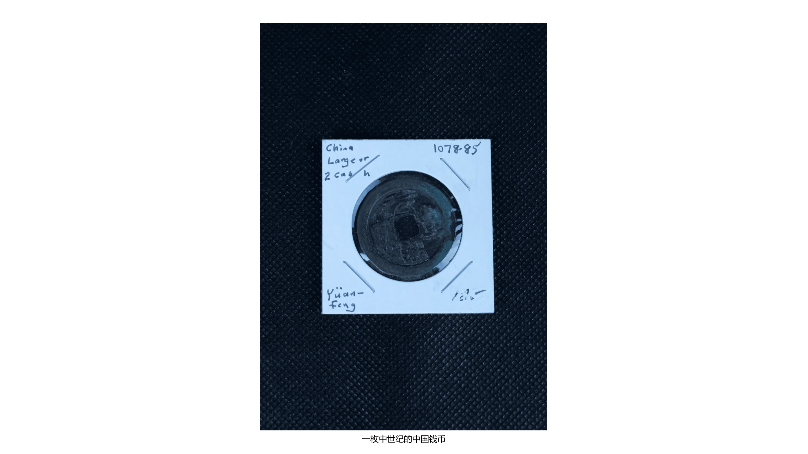

上图是一枚中世纪的中国硬币。这是一枚铸币，中间有一个方孔。这个孔是用来穿绳子的，这样就可以把钱币串起来做成手链或项链。不过，这些硬币主要不是用来佩戴的，而是用于记账。这些钱币可以串在一起，形成大串的记账单位，钱币之间环环相扣。它们不一定有特定的标记，有时只是简单的青铜圆圈。

汉武帝在公元前 113 年姗姗来迟地确立了国家的货币垄断地位，但这一地位经常受到挑战，各种私人或地方机构只要得到足够的社会信任，就可以发行自己的货币。

**贵金属很少被用作流通货币，以防止囤积。黄金过于昂贵，通常被搁置而非消费。相反，在中国的国际贸易中，***只有丝绸才是真正的高价值货币。中国人使用丝绸而非黄金进行贸易。

在经济或货币危机期间，尤其是铜价上涨时，人们会采用创新的解决方案：因此，早在公元 2 世纪，流通中的钱币就被切割成较小的单位，从而以较低的成本维持流通。其他时代，如王莽时代（公元 1 世纪初），则尝试使用高度信托货币，面值远远高于实际金属含量，这就是纸币的雏形。他们在一枚硬币上印上 50、100 或 200 等数值，以表示较大的金额，如 200 枚硬币。这种做法很可能导致了严重的通货膨胀。

如上所述，这种制度的基础是国家、生产者和商人之间的社会约定，但也有针对不玩游戏者的专制和严厉的规则，特别是在选择棋子（无论是否漂亮）或布料长度（不符合标准）方面。

依我之见，这不是一个非常可靠的系统。它主要依赖于严格的规则，要求官员和交易商接受损坏的硬币，并以制裁相威胁。

### 中国的货币创新及其对经济的影响

中国也是发行早期纸币的先驱，最初是为了应对公元 9 世纪的金属短缺。尽管这些纸币最初具有优势，但一旦发行过量，就会经常导致通货膨胀，宋朝或明朝时期就出现过这种情况，过度发行导致了严重的货币危机，13 世纪的马可-波罗就是例证，他甚至指出，伪造这种纸币会被处以死刑。我不能不指出这里的一种暴力形式。

因此，中国经验的特点是：对货币有深刻的信托概念，货币体系具有显著的灵活性，纸币使用较早，其基础是经济参与者之间的信任，而不是所使用媒介的内在价值。

## 古代的社会和经济组织

<chapterId>4023c3ce-7a47-5ac4-8f5f-c7ab699ab20f</chapterId>

:::video id=2761efe4-21cf-4f06-9bda-c03f9ff39012:::

### 城市寄生虫辩论

古代城市与其腹地之间的关系提出了一个基本问题：这些城市中心是作为攫取财富的寄生虫，还是作为有益的经济专业化的引擎？寄生虫假说认为，青铜时代的城市，尤其是美索不达米亚的城市，**系统地从其农村领土上榨取的价值超过了其回报**，基本上是靠租金和税收生活，而没有创造等值的价值。

这一观点在罗马帝国的崩溃中得到了印证：当领土扩张停止时，外部财富的流动也随之枯竭，这可能会暴露出城市经济无法自我融资的问题。因此，城市将 "入不敷出"，依赖于开采而非生产。

### 专业化是价值创造的驱动力

另一种经济学解读对这种寄生性观点提出了挑战。 **古代城市首先是专业化和分工**的中心。它们的作用不仅仅是简单的采掘：它们集中了专门的手工业，组织了贸易网络，并成为远距离交流的枢纽。

这种城市专业化与腹地形成了生产上的相互依存关系。 **没有农村的农产品供应，城镇就无法生存，但腹地则从手工艺产品、技术创新和进入地中海贸易网络**中获益。尽管利益分配似乎并不平衡，但分工使双方的生产力都得到了提高。

当时长期的粮食不安全在一定程度上解释了这种明显的不对称。饥荒和农作物被毁的风险对农村人口来说是一种持续的威胁，而与国际贸易网络相连的城市工匠则享有更大的经济稳定性。

### 历史演变，从古代到中世纪

古代与中世纪组织结构的对比揭示了这一问题。 **古代有利于大规模分工，城市向整个地中海世界开放**。贸易和专业化达到了复杂的程度，形成了广泛的经济网络。

罗马帝国的崩溃导致了彻底的分裂： **封建时代以分散的自给自足的庄园体系取代了中央集权的组织**。古罗马的乡村别墅成为中世纪庄园的母体，形成了一个个由神职人员或贵族管理的、几乎自给自足的经济岛屿。

中世纪的这种权力下放虽然降低了商业效率，但却自相矛盾地增强了抵御外部冲击的能力。封建庄园在权力中心和农村人口之间建立了更加平衡的关系，尽管这种组织限制了与专业化相关的生产力增长。

### 城市市场的兴起

考古发现显示，早在第二个千年**，美索不达米亚城市中就存在**购物港和贸易区。这些基础设施证明了有组织市场的存在，尽管其具体功能仍存在争议。

卡尔-波兰尼起初对古代是否存在真正的市场机制持怀疑态度，后来他承认自己可能低估了市场交换的早期出现，从而修正了自己的立场。这种思想演变反映了解释古代经济制度的复杂性，在古代经济制度中，制度性再分配、互惠交换和新生的市场交易并存。

### 斯巴达对雅典

斯巴达与雅典的比较完美地说明了货币制度与社会组织之间的关系。 **斯巴达是等级森严的社会典范，刻意拒绝使用货币**，而雅典则发展了成熟的货币经济来配合其民主制度。

斯巴达人对金钱的排斥不是自发的，而是**制度和意识形态的**。斯巴达领导人担心金钱会腐蚀军事和公民价值观，他们更倾向于建立一种基于公民之间直接的人际信任的制度。

为了阻止使用货币，斯巴达使用了**沉重、不实用的金属条**，自相矛盾地表明了他们对货币特性（可分割性、可运输性、耐用性）的直观理解，他们正在努力消除这些特性。

### 反货币模式的局限性

斯巴达的组织说明了**邓巴数字**对社会规模的限制。 **斯巴达拒绝将货币作为中立的交换媒介，这就注定了其公民社会只能局限于少数能够维持直接信任关系的公民**。homoioi（斯巴达公民）仅占总人口的 1%，周围还有成千上万的 hilotes（奴隶）。

这种组织最初具有非凡的军事凝聚力，但事实证明其结构非常脆弱。 **莱克特斯战役（公元前 371 年）证明了这一制度的局限性**：生命的损失无可挽回地打破了斯巴达的社会结构，导致其文明模式的崩溃。

相互竞争的城市（雅典、科林斯、底比斯）拥有发达的货币体系，**保持着更富裕、更有弹性的经济**，能够通过经济重建和移民来弥补人类的损失。

### 个人信任与机构信任

斯巴达的经验揭示了一个完全基于人际信任**而非中立的制度机制的社会所固有的**风险。这种模式在创造强大社会凝聚力的同时，也使社会容易受到人口冲击的影响。

通过实现匿名和非人格化交易，货币提供了卓越的系统复原力。它使社会扩展超越了直接信任的限制，促进了对外交流和经济增长。

### 印加悖论，没有金钱的财富

印加帝国呈现了一个迷人的悖论：**一个拥有巨大黄金财富却没有货币体系的文明**。与斯巴达一样，这种模式建立在严格的等级组织和中央集权计划的基础上，但在拥有灵活货币经济的征服者面前却显得不堪一击。

反货币制度在货币社会面前的这种结构脆弱性是一种反复出现的历史模式，表明**制度上对货币的排斥非但不会增强社会凝聚力，反而会在面对外部挑战和历史变革时自相矛盾地削弱文明**。

对这些历史模式的分析表明，货币除了其交换功能外，还是社会复杂性的标志和促进因素，使文明能够超越直接人际关系所带来的限制。

# 铸币的诞生

<partId>232e365a-8c3b-11f0-b276-b3ab70d1a5a1</partId>

## 硬币的出现

<chapterId>40ed3414-3066-57bd-bc1b-617ad0a354e0</chapterId>

:::video id=1d6834c4-98a3-43fe-ba80-04be51b0486e:::

现在我们来到了问题的关键：钱币的出现。我在这里强调 "钱币 "这个词，是因为我们在前面的章节中已经看到，在吕底亚人、希腊人和波斯人之前的文明中，货币或货币体系就已经存在了。我想，从我们刚才看到的内容中，这一点已经非常清楚了。因此，本节专门讨论钱币的出现，标题为：钱币的出现*： *钱币的出现

### 吕底亚和爱奥尼亚钱币的起源

作为本节的开场白，我想为您摘录一段 Glyn Davies 的著作《货币史》（A History of Money）。

*摘自《货币史》：格林-戴维斯（Glyn Davies）所著的《货币史：从古至今》摘录：*

> 从吕底亚和爱奥尼亚的发源地开始，钱币的知识和使用迅速向东传播到波斯帝国，向西通过爱奥尼亚和爱琴海群岛的其他地方传播到希腊本土，然后传播到西部殖民地，特别是西西里岛。它还向北传播到马其顿、色雷斯和黑海，但在埃及只是部分、勉强和姗姗来迟地被接受。

在这里我发现一个有趣的现象，那就是在埃及，铸币技术出现后很长时间，他们仍在继续称量硬币的重量。我认为这一点很重要。引文继续说道

> 同样，意大利本土起初在接受希腊金融创新方面也相当缓慢，与之形成鲜明对比的是，西西里岛采用这些创新的速度很快。

*除了这两个有限的例外情况（意大利大陆和下埃及），硬币的使用迅速蔓延到地中海中部和东部沿岸国家，以及从美索不达米亚**到印度的庞大且不断发展的波斯帝国。不管印度是否已经独立发展了自己的货币，印度与近东日益密切的接触导致印度钱币直接借鉴了吕底亚人和希腊人的发明，首先是通过波斯帝国，然后是马其顿帝国*（亚历山大大帝及其父亲的征服）。

*由于这些原因，与东边中国明显独立的货币发明以及西边吕底亚和希腊的发展相比，任何印度本土货币发明的直接影响都是微不足道的*。

### 地理分布和地区适应性

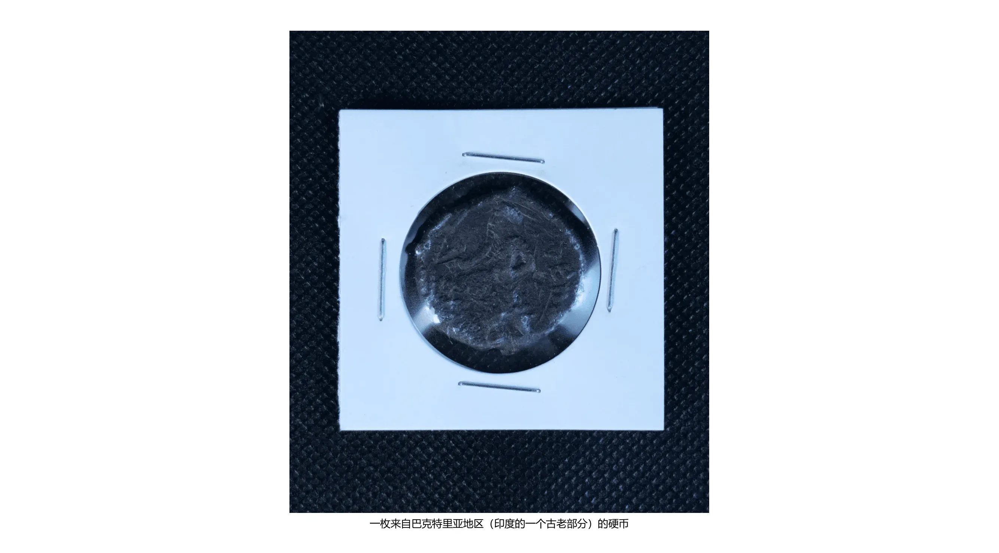

为了形象地说明这一时期的情况，上面是一枚来自印度巴克特里亚地区的钱币，该地区靠近印度半岛西部，靠近阿富汗。该地区的钱币很可能受到希腊钱币的启发，上面刻有他们的一位王室成员。

## 吕底亚人和波斯人

<chapterId>eb802ab8-8ffd-5b25-907f-8944f120ed14</chapterId>

:::video id=f151eb42-5ff3-4ca1-9af1-1ae2a5e051c0:::

### 最早的吕底亚金属硬币

既然我们无法将钱币的出现与吕底亚和波斯人区分开来，那么我们就来看看希腊以东的地区，也就是今天的土耳其。最早出现在西方的钱币大约可以追溯到公元前 7 世纪中叶，出现在位于今天土耳其境内的吕底亚和爱奥尼亚地区。大约在公元前 650 到 600 年间，这一根本性的创新才得以重见天日。考古发现了一些著名的钱币，如在以弗所阿耳忒弥斯神庙中发现的第一批钱币，其年代约为公元前 600 年。这些原始钱币由琥珀色反光的天然金银合金 "电子币"（electrum）制成，外观通常很粗糙，只是简单地打上印记或简单的图案。

下图是最早的吕底亚钱币之一，正面是一头狮子和它的猎物。您可能会注意到背面有一个印章或孔，有人认为这是用来测试金属纯度的，以确保它不只是表面层。虽然这是最早的例子之一，但必须注意的是，这件作品是仿制品。我的所有黄金和铂金作品都是复制品或现代复制品，目的是防止我把所有积蓄都花在这个收藏上。

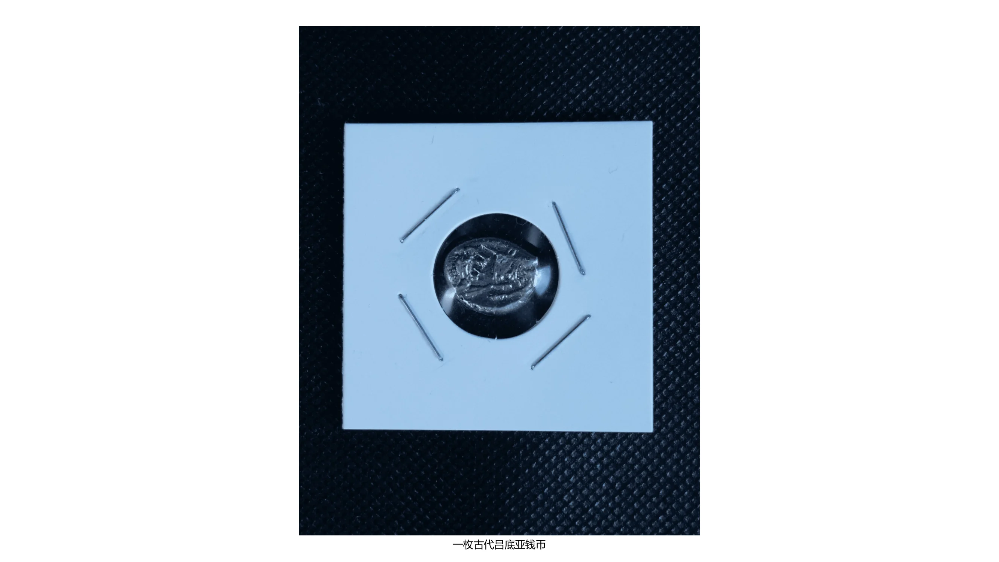

但我也有一件真正的波斯作品，我们马上就能看到。这就是这些早期作品的样子。它就像一个当时冲压而成的金属球（或者说金属块）。

与人们普遍认为货币的发明是为了方便日常贸易和取代易货贸易相反，最早的吕底亚钱币、阿契美尼德钱币和希腊钱币最初似乎并不是用于小规模贸易的。事实上，这些货币单位太大，不适合日常使用。此外，它们的流通范围也仅限于靠近其生产地的地区。

在这里，我觉得有必要提及的是，尽管我在几本人类学著作中读到过，但正如我已经展示过的那样，这些钱币--不管是电子币还是我很快就会再讲到的这枚波斯钱币--都太大了，比如说，每天都买不到面包。我看到过一些估算，让我们觉得它相当于一个农民或士兵一天的工作量，所以它太大了。这就好比要为你的一餐、早餐或午餐支付一天的工资。不过，我在其他作品中看到，这些圆球的单位被缩小了，所以钱币也变小了，这可能会让我们认为，也许有可能用于日常采购。

因此，在我看来，人类学 "证明 "它没有被用于日常交易，因为面额或单位太大的说法并不可靠，因为我们已经发现了一些更小的硬币，它们可以被用于日常购买。

### 国家在货币创造中的作用

钱币的真正起源似乎与国家的直接行为有关。关于这个问题有两种主要的假说：第一种是理想主义的，将希腊语中的 "nomisma"（货币）与 "nomos"（法律）相提并论，认为货币与法律的编纂有关，加强了城市的权威和政治组织。第二种更为现实的假设如今已被广泛接受，即货币首先是国家实施经济和社会控制的一种手段。通过官方保证其所含贵金属的重量和价值，国家能够操纵这些钱币的流通和价值，从而产生信心和国内货币特有的流动性溢价。

有趣的是，我们有这方面的证据。举例来说，你应该知道，天然金银币通常含有 70% 的金和 30% 的银。在我们发现和分析的第一批钱币中，特别是早期的吕底亚钱币，含金量似乎在 50% 到 55% 之间，而不是 70%。这表明，即使在当时，钱币发行者也在努力减少贵金属的比例，这可能是为了生产更多的钱币，并使它们看起来与无标记的天然金属块价值相同。在这里，不得不说的是，从这位著名的克罗埃索斯（Croesus）时代开始，这才成为可能，因为从他的时代开始，我们就拥有了分离金银的技术。

吕底亚钱币在著名国王克罗埃索斯（公元前 561-546 年）统治时期经历了一次重大演变，克罗埃索斯因其传奇般的财富而闻名于世。在这一时期，吕底亚人完善了冶金技术，将金银从金属中分离出来，从而首次出现了双金属钱币，即金银分离的钱币。

### 波斯人的扩张和希腊人的采纳

公元前 546 年征服吕底亚后，阿契美尼德波斯人立即采用了这一创新。公元前 500 年左右，在大流士一世统治时期，波斯人建立了自己的货币体系，使用金达利克（darics）和银西格洛伊（siglois），上面通常印有王室的战争肖像。这种皇家波斯钱币主要在波斯帝国的希腊化地区使用，并逐渐传播开来，但其使用情况仍不均衡，**有些地区，如埃及，仍倾向于使用称重金属（金块）进行交换。

在上面，您可以欣赏到一个真正的波斯西格洛（或西格洛）。这个小图案上有一个国王，不过孔已经略有磨损。siglos 是一种银币，与之形成鲜明对比的是由黄金制成的 daric。波斯人能够分辨出这两种金属，因此他们不再使用电银币。因此，他们实行了双金属制，同时使用金和银，但仍保留了贵金属钱币的概念，钱币背面通常有一个孔，大概是用来检查金属含量的。

希腊人迅速采用硬币似乎是因为他们与吕底亚人的密切接触，特别是通过希腊在小亚细亚的殖民地。最早铸造硬币的希腊人可能是公元前六世纪中叶的埃吉纳居民，他们引入了德拉克马，其重量因地区而异，其名称的字面意思是 "一把谷物 "或 "一把箭"。

希腊钱币的成功既得益于其对重要交易（如支付雇佣军）的便利，也得益于城市的经济和政治扩张。货币迅速成为希腊经济的核心要素，后来又成为罗马经济的核心要素，同时保留了很强的象征意义，特别是通过与法律（nomos）的联系。

最后，钱币的迅速扩张见证了古代社会的深刻变革，货币价值的编纂与国家组织同步进行。这种演变为希腊民主政体的兴起奠定了经济和政治基础，特别是在雅典，货币在民主城市的运作中发挥了至关重要的作用。

本节要记住的一个要点是，我们讨论的是**币，而不是一般的货币。其中最重要的一点是对发行机构的**信任，这与硬币的技术特征（重量、纯度、面值）直接相关。正是这种信任使国家或发行机构能够从一开始就对这些硬币的价值和流通进行一定程度的控制甚至操纵。

## 机构干预和第一枚硬币

<chapterId>3e1efd08-99e3-5a32-9908-3185fef0e640</chapterId>

:::video id=84847cf6-9e46-4a8c-9f35-25a27496cc4b:::

### 货币的双重性质

铸币的出现提出了一个根本性的问题：货币是市场的自发创造，还是权威强加的制度？这种概念上的张力将两种截然不同的观点对立起来。

一方面，奥地利经济学派辩护说，商品货币（尤其是黄金）因其内在特质（耐用性、便携性、可分割性和可替代性）而被经济行为者自然选择。从这一角度来看，国家随后占有了这种自发的货币，以控制其供应。这是一种在被政治权力俘获之前，从市场需求中自然产生的制度。

与此相反，人类学和制度学的观点则认为，货币是通过国家铸币而真正产生的。当局会有意识地通过加盖印章来创造货币，从而将金属转化为真正的货币工具。这种观点认为，最早的吕底亚钱币主要用于支付军队--一斯塔特大致相当于一名士兵的日薪。

### 国家标准化的矛盾优势

尽管存在这种理论上的矛盾，但即使是奥地利经济学家也承认国家干预货币的某些好处。铸币标准化解决了许多实际的贸易问题。

如果没有认证机构，经济参与者将面临持续的风险：假币、申报欺诈和重量操纵。这些行为造成了经济摩擦，因为有些硬币被接受，而另一些则被拒绝。从理论上讲，官方印章可以保证重量和质量，使贸易更加顺畅。

这种保证在市场上有一个可观察到的价格：一枚铸成的金币比等价的原金更值钱。这种溢价反映了认证的价值--商人不再需要通过化学或共振测试来验证金属的真伪。矛盾的是，国家干预通过建立制度化的信任消除了摩擦，促进了贸易。

### 从一开始就操纵货币

第一枚吕底亚金币的故事揭示了一个令人不安的讽刺。最近的分析表明，这些金银币的含金量系统地低于天然金银币的含金量。质量认证机构同时也在操纵成分。

这种做法说明了硬币的双重作用。对市场而言，它使交易更加顺畅，并为标准化提供了保障。对于发行机构来说，它通过稀释成为了一种经济控制工具。通过减少含金量并保持名义价值，国家有效地增加了货币供应量--用相同数量的贵金属创造出更多的货币单位。

然而，国家本身仍然受制于这种操纵。正如公元 4 世纪君士坦丁金币的例子所示，罗马政府严格检查钱币的质量，因为它要求以优质钱币支付。为了保证税收的价值，当局在保持自身钱币质量方面有着重要的利益。

### 贬值的经济分析

对货币贬值的研究揭示了历史上的一贯模式。对于金属硬币，经济学家追踪硬币中所含贵金属的百分比--一条下降的曲线表明货币在逐渐贬值。对于现代纸币，情况则恰恰相反：观察流通货币供应量，其增加预示着货币贬值。

这两种方法衡量的是同一个基本现象：货币价值的稀释。无论是减少贵金属含量还是印制新钞，其机制都是一样的。当局从相同的实际资源中创造的货币单位越多，每个单位的价值损失就越大。

从最早的吕底亚钱币就可以观察到的这种操纵行为表明，货币控制始终是一个权力问题。因此，铸币代表了一种非凡的技术创新，同时也是一种经济控制工具--这种双重性贯穿了整个货币史，直至今日。

## 部件制造

<chapterId>b205f4f2-c293-5308-b812-a998de9ad45e</chapterId>

:::video id=47c612ec-d97e-4498-b50e-7e66518bd56d:::

### 从打孔球到铸币

在介绍了钱币的出现之后，我想用很短的篇幅介绍一下钱币制造的演变。正如我们所看到的那样，一切都始于一团电石，然后是金和银，正反两面都用打孔机打上标记，要么打上国王的脸，要么在背面打孔以检查纯度。

后来，正如我们将在后面的章节中探讨的那样，希腊人改进了这一技术，创造出了双面锤击的圆形硬币。他们用一块光滑、平整的贵金属，在一面刻上所需的图案，然后用手锤打成硬币成品。

在那个时期，手工单独铸造钱币的技术很可能在控制通货膨胀方面发挥了作用，尽管为了提高产量，钱币经常被稀释。这种情况在罗马时期尤为明显，在希腊时期的某些战争中也有一定程度的体现。虽然一次一枚的铸币限制了当局大规模生产的能力，但它有效地促进了通货膨胀的控制，尽管出现了大幅贬值。因此，钱币从打孔的一团金属演变成了圆形的锤打钱币。

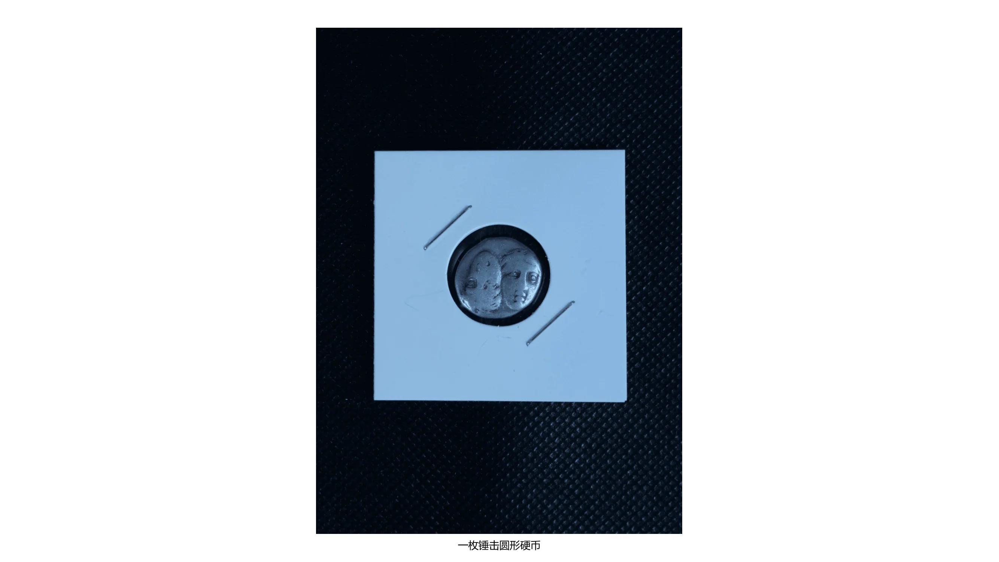

### 中世纪的演变

在中世纪，还有一种趋势是将钱币摊开，使其变宽变薄。这样做的原因之一是可以更容易地测试钱币的声音，而声音通常被用作鉴别真伪的指标。将银币摊开后，会产生一种独特的频率，因此人们只需听一听，就能验证钱币的纯度。这种做法催生了 "健全货币 "一词。在健全货币的背景下，标准重量是通过使用天平秤或 "trebuchet "进行称量来确定的。因此，钱币不断演变，从小而圆的钱币到稍薄而宽的钱币。

### 摆锤敲击

中世纪末期，也就是近代初期出现的最后一项技术是钟摆击打技术。这是一种通过拧紧螺丝来敲击钱币的技术，通过这种新的敲击方式来制造钱币。这一发展的特别之处在于能够在硬币表面雕刻图案，以解决剪切问题。剪切是指去除硬币的一部分以回收贵重的银，这些银可以用来铸造其他硬币，也可以作为一种资源保留下来。

因此，钟摆敲击的概念有助于剪切现象的产生。有趣的是，这项技术实际上来自法国。例如，在英国，他们聘请了法国工程师来教他们如何制造这些机器。我认为有趣的是，当时有一些支持锤式铸币法的人反对这项技术，并拖延了这项技术的应用。任何好的技术都会有人反对，希望保留旧技术。我觉得这很疯狂，因为我意识到，即使是一项看起来非常优越的技术--你可以制造更多的零件，它们也更难被复制--仍然有人对著名的锤式铸造法情有独钟。在使用这种著名的钟摆敲击法生产零件和重新使用锤子敲击法生产零件之间出现了转变。最后，当然是摆锤敲击法最终占据了主导地位，并为我们带来了这些精美的现代作品，在这些作品上，你可以发现一些小线条、小棱线，以避免剪切，这可能与剪切一词有关，棱线，今天你仍然可以看到棱线或刻画在作品边缘的文字或图画。

# 关于货币出现的不同理论

<partId>72ac694f-9248-550d-90c1-91af3d234380</partId>

## 关于货币的产生及其各种定义的理论

<chapterId>7d699d4d-8c70-55b5-bf36-609f3fd90bcf</chapterId>

:::video id=523c873f-501b-4954-b79f-7e74c0f685a5:::

欢迎来到本部分，本部分将专门讨论关于货币出现的不同理论及其各种定义。下面是《货币的起源》一书中的一小段摘录，我认为它总结了我们在本节中要探讨的两种主要理论。

> 这篇简短的序言除了强调调查的背景之外，别无他意。在概念层面，波兰尼（K. Polanyi）理论的支持者与韦伯（M. Weber）理论的支持者之间的争论尚未结束。对前者来说，赠与和再分配起着核心作用，市场交换只起边缘作用，主要是在国际交换中。相反，对其他人来说，市场是当前历史进程的核心。

例如，在美索不达米亚，一种出现理论认为，神庙作为权威机构，创造了记账单位或货币单位，并将其强加于人，然后商人采用它进行贸易。相反的理论则认为，不，这种货币单位是从市场中自然产生的，以促进贸易。在美索不达米亚就有这样的例子。

至于以物易物，一些理论认为，它主要用于国际交换，即与我们根本不信任的人交换。

这就是我们本节要做的。我们将进行一项调查，介绍关于货币出现的不同理论，以及关于货币的不同定义。我们将介绍并批评古典经济学家和人类学家的论点。我甚至有幸请到了乌尔里希（Ulrich），他将从奥地利经济学家的角度来阐述这些不同的主题。

## 古典经济学家眼中货币的出现

<chapterId>1d3776cd-0dfd-5297-af48-c6f41e257a7e</chapterId>

:::video id=873a16c1-17ac-448d-8941-df4feb7ab79d:::

本部分专门讨论关于货币产生的不同理论。首先要讨论的话题是古典经济学家认为的货币的产生。

### 亚当-斯密的经典理论

根据古典经济理论，特别是亚当-斯密所倡导的理论，货币是在易货贸易的局限性下自然产生的。最初，交换是通过直接易货贸易进行的，但这种方法往往因 "双重需求重合 "问题而变得复杂：每个人都必须拥有对方想要的东西。渐渐地，某些商品（如盐、贵金属和牲畜）因其实用性、耐用性和可分割性，被所有人接受为交换的中间手段。于是，货币自发地出现了，以促进和简化经济交换。

### 对经典理论的批评

以下是我对这一理论的批评。根据我们在上一节中所看到的一切，我认为我们已经可以说，这种认为**币**是易货贸易进化而来的观点是错误的，原因很简单，铸币肯定是由权威机构铸造的，因为它是由权威机构铸造的。这其中有几个原因，其中最重要的是当局想要控制经济，控制货币。

另一方面，如果我们谈论的是货币这一概念，而不一定是钱币，那么情况就不那么明朗了，因为在第一批钱币，即吕底亚金币中，我们发现了没有标记的银块。它们是否在市场上流通还有待观察。如果它们在流通，这就意味着人们最初可能已经将这种资产认定为一种潜在的货币，可以被广泛需求和方便交换。也许只是在此之后，当局才注意到这一情况，并通过加盖印章对其进行认证，从而对其加以控制。

这样做有很多好处--不需要检查、称重等等。显然，我们会讨论这个问题。但在我看来，硬币显然是从一开始就被国家使用的工具。然而，就货币的出现而言，我们不知道它是否真的来自于一个强加它的权威机构，还是通过贸易或商业交换而出现的。本节稍后，我将与我的同事乌尔里希就这一话题展开非常有趣的讨论。

我们已经知道，最早的贵金属硬币并不是用来促进日常交换的，因为它们的价值太高。我们还知道，它们主要用于军事支付。这就很好地论证了货币不一定是从市场中产生的这一论点。对于购买面包或日常购物来说，最初硬币的记账单位（面值）可能太大了。例如，它可能相当于一天的工资。这并不是说当时的人一定有工资，但这只是为了让你了解其规模。因此，这些硬币的购买力可能太大，无法用于小规模贸易。另一方面，也不能说这些钱币不会被用来进行更大规模的交换，比如商人交换。我们知道，它们主要用于军事支付。这是解释第一批硬币出现的最流行的理论之一。请记住，我们在这里谈论的是硬币，而不一定是一般的货币。因此，第一批硬币的第一个作用就是支付军事费用和雇佣兵的费用。

例如，亚历山大大帝就很好地利用了这一点，我们稍后会看到。

我们还看到，早在中国古代，牛粪壳就被用于经济交换（**劳动报酬、衡量价值和购买土地）**。此外，在美索不达米亚和埃及，功能性货币体系已经存在，并被用于贸易、工资支付和纳税。我在这里想说的是，认为西方概念中的硬币是为了使交换更流畅而出现的，这绝对是错误的。

既然硬币是由权威机构发行的，我们或许可以认为，它们从一开始就与发行机构相关联。这是有道理的。另一方面，我们并不一定知道在它们之前的货币形式或货币体系形式，即原初钱币，是如何出现的。一方面，我们认为是寺庙确定了这些货币单位 之后，人们才使用它们。而另一方面，我们会告诉你，不，是商人们需要一种交换手段，一种与外部世界进行交易的方式，是他们确定了例如金属银的使用，因为外部世界需要金属银。关键是，我们并不真正了解。这就是为什么我们有两种截然相反的理论。我们没有完美的证据来解释，货币究竟是由商人等贸易需求自然产生的，还是由权威产生的。

### 区分硬币和原始货币

总之，我认为我们可以说，硬币必然来自权威，因为它们是由权威印制的。另一方面，我认为我们也不能说，货币（硬币之前的货币）不可能是为了促进交换而出现的，这是错误的。我认为，在我们上面看到的所有例子中，这种意义上的例子比比皆是。

## 易货贸易的神话

<chapterId>0fcd4964-ac36-5163-a8cf-1aacebc0d2c0</chapterId>

:::video id=0ede29ab-8acd-4d79-9282-bd5991b97076:::

### 大卫-格雷贝尔的评论

我们刚刚介绍了古典经济学家所说的货币的出现。现在我们要讨论一个被称为易货神话的概念。

对货币出现的这一经典理论的批评之一是缺乏支持其观点的历史证据。

人类学家戴维-格雷伯（David Graeber）等人提出了被称为 "易货神话 "的批判，对 "货币是从易货贸易中自然产生的 "这一经典观点提出了质疑。根据这一批判，没有任何历史或人类学证据表明，在货币出现之前，社会曾系统地使用易货贸易。事实上，古代社会是在信用、债务、社会义务和礼仪交换的基础上运行的。因此，"易货神话 "是一种理论建构，旨在为古典经济学观点辩护，并没有真正的经验基础。

不过，应该指出的是，这一理论并不否认以物易物的存在，例如不同部落之间的交换。它只是否认以物易物是这些所谓的原始群落中广泛存在的活动，而货币则是这些活动的合乎逻辑的演变。它否认了以物易物在部落内部被广泛使用的事实，也否认了货币的出现最终是为了使交换更加顺畅，并解决以物易物存在的困难。相反，根据这种理论，这些群体实行的是一种非正式的信贷或以礼易礼。

### 原始社会与伟大文明

**我认为这一理论绝对适用于过去甚至今天的原始（无国家）群体（例如，18、19 世纪探险家研究过的部落）。显然，由于我们已经提到的原因（弱分工、自给农作），他们并不使用易货贸易，而是使用我前面提到的交换形式。不过，我不认为这一理论适用于过去的伟大文明，如美索不达米亚和古埃及。

以下是*Aux origines de la monnaie*中关于这一主题的两段摘录：

> 毛斯先生在其著名的《礼物》一书中所概述的模式被埃及学家们所采用，他们对这一模式既有一致的热情，又缺乏辨别力。这导致了许多混淆，我们在此不再赘述。我们只需指出，这种模式适用于所谓的原始社会，而法老埃及并非如此。

> 因此，面包（即谷物加工品）是记账单位，它与古王国的 shât （y）一样，也可以开立多样化商品的信贷。这个简单的例子表明，法老时代埃及的经济并不局限于再分配制度。它非常复杂，涉及多种交换。

因此，正如我们在前面关于埃及，甚至美索不达米亚和中国的章节中所看到的，我们可以看到，在我看来，即使是这些古老但并不原始的文明，由于国家的存在，也使用货币制度。我认为，这一点在本课程的第一部分已经得到了充分证明。因此，这种互惠互利、延迟信用的概念并不适用于这些伟大的文明。因此，货币出现的确切原因仍然是个谜。我们不知道它是源于商人与外界贸易的需要，还是由这些古代时期的神庙强加的。

## 通过债务货币出现货币

<chapterId>4f508615-aa61-5d62-89d3-cecd02aeaa62</chapterId>

:::video id=a23f547f-3906-4f4a-8f72-5d78c649d0c4:::

### 作为欠条的货币

在本节中，我们将介绍债务货币理论。

由经济学家阿尔弗雷德-米切尔-因斯（Alfred Mitchell-Innes）提出、后由戴维-格雷伯（David Graeber）扩展的**债务货币**理论认为，货币并非源于易货贸易，而是源于最早的人类社会就存在的债务和信贷关系。根据这一理论，当社会义务（个人或团体之间的债务）被量化并可转让时，货币就出现了。这一概念引入了交换和转移的量化概念。因此，货币首先是对债务的***承认，以相互信任为后盾，通常由政治或宗教权威担保，而不是仅仅作为交换中介的商品。

这一理论的一个更高级的形式是，所有的钱都是债务。因此，拥有金钱的人对整个社会都有债权，对所有接受金钱的人都有债权。在他们看来，货币必须被强制接受，否则就不是货币，因为如果你可以拒绝这种货币，他们的制度就行不通了。在确定了一种货币的特定群体中，所有拥有这种货币的人，就好像欠了社会中其他所有接受这种货币的人的债，而那些接受这种货币的人，也欠了拥有这种货币单位的人的债。这基本上就是他们的理论。

### 对义务制的批评

**我对这一理论的批评：**

请允许我对这一理论提出一点批评。我承认货币是一种社会共识。它是一个群体对货币 "符号 "的信任，不管它是什么。因此，我赞同相互信任的概念，我们稍后将再次讨论货币溢价的概念。当这一理论的支持者加入义务的概念并坚持债务的概念时，情况就变得复杂了。对他们来说，当某人拥有货币token时，他就对整个社会拥有了债权，因此社会欠持有人一笔债务。此外，还有一种结算义务，即群体成员有义务接受 token；否则，在他们看来，这种制度就行不通了。我认为上述中国古代的制度很好地体现了这一理论。

就我而言，我可以很容易地想象这样一种制度：货币是一种社会共识，人们普遍接受所选择的 token 作为支付手段，而没有正式的义务。如果人们自愿接受，我认为这样的系统是可行的。它可以奏效。另一方面，它往往伴随着义务、法定货币和暴力，我们将在后面的章节中看到。但从理论上讲，我并不觉得这种制度能完全行得通。我认为 Bitcoin 就是一个例子。Bitcoin之所以有价值，是因为它有货币溢价，因为有将其用于货币用途的需求，即价值储备，或许也是交换手段或对法定系统的保护。没有人有义务接受它，它作为支付手段被接受得越多，就越能被用作交换手段。我们已经可以毫无问题地将其用作价值储存手段。这一点毋庸置疑。我想说的是，在我看来，Bitcoin 就是一个例子，它是一种社会共识形式的货币，我们认为，如果我们以后买了一些，就能把钱拿回来，我们购买它是为了以后能够交换，以保持我们的购买力。

这种对理论限制较少的观点有助于解释两个不同的社会如何能够使用货币 token （如黄金）进行贸易，而不会在这些社会之间产生债权或债务。我发现，在两个部落之间的贸易中，强迫社会接受是行不通的，因为另一个部落不受权威约束。B 部落不受 A 部落的管辖。但是，它接受同样的货币token，比方说，黄金。现在，人们可能会对我说："是的，但那是因为 B 公司也决定黄金是他们的货币。是的，确实可行，但此时并没有产生债务。这是最终交易。因此，当 A 公司在 B 公司用商品交换黄金时，并没有产生债务，交易已经完成。很明显，B 公司的人并不是为了以后得到 A 公司的付款而购买这枚金币或金块。他接受金币是为了日后进行交换，很可能是在他自己的部落里进行交换。因此，在这个例子中，不存在债务的产生，也不存在潜在的债权，它只是一种直接的交换，一种直接的支付。债务货币的支持者会告诉我们，这是以物易物。我不同意，因为易货贸易是直接商品的交换。直接易货贸易是一种物品与另一种物品的交换，是为了使用。商品交换是为了使用，而在我们的例子中，黄金显然是作为货币使用的，因为它不会被用来做其他事情；它将在以后被用作支付手段。因此，在我看来，它不属于以物易物的范畴。

拥有含金量高的 token 并不是对社区的 "要求"，而是希望日后能以相当的价值接受 token。

## 货币的自发产生

<chapterId>e3ef86b1-73b9-5140-a61e-2ab6a5b0b2d4</chapterId>

:::video id=e543995f-d5e2-49d7-9133-e397b46e0833:::

由卡尔-门格尔（Carl Menger）开创的奥地利经济学派认为，货币是在易货贸易经济中自然产生的，易货贸易经济面临着需求双重重合的问题。在这一观点中，个人自发地趋向于有利于交换的中间产品--不是直接消费的产品，而是因其被广泛需求的能力而被认可的商品。

这些货币商品必须具备自亚里士多德以来所确定的品质：它们必须充当价值储藏、交换手段和记账单位。经济行为主体逐渐识别、积累和保存这些物品，从而使它们成为货币。这一过程完全是自发的--货币是市场对协调交换问题的自然反应，没有权威机构的有意识干预。

### 易货神话 "辩论

大卫-格雷伯（David Graeber）等人类学家提出了 "易货神话"，对这一观点表示质疑。他们的论点是：没有任何一种复杂的文明仅仅建立在直接易货贸易的基础上。相反，所研究的原始社会都使用非正式的信用和互惠系统。格雷伯援引数千块记录信贷关系的美索不达米亚石碑，断言债务先于易货贸易。

然而，这种批评是基于对易货贸易的限制性定义。正如门格尔早在 1892 年就指出的，易货贸易不仅仅是简单的直接物物交换。它还包括延期转让、以服务换取工资，以及具有时间性的交换--门格尔称之为 "个人之间的单边转让"。这种扩展形式的易货贸易可以在有限的信任圈内与信贷系统共存。

没有证据并不证明没有，奥地利经济学家认识到，任何复杂的社会都不可能仅靠直接易货贸易就能持续发展，因此货币的出现是必要的。

### 美索不达米亚案例：商人与神庙

围绕美索不达米亚银谢克尔的起源，争论日趋激烈。有两种截然相反的解释。制度说认为，神庙--真正的经济和精神中心--将白银作为货币强加于经济结构。集中在神职人员和商人精英中的楔形文字碑见证了这种集中控制。

奥地利的解释则恰恰相反：是商人们将货币用于远距离贸易。面对与美索不达米亚边境以外（从安纳托利亚到波斯湾）的陌生人进行贸易的挑战，他们需要一种普遍可识别、经久耐用且便于运输的货币。白银因其固有的品质自然成为首选。神庙只是确认了商业使用中已经形成的惯例。

本论文以安纳托利亚的卡内什与阿苏尔之间的交易记录为基础，在这些交易中，商人们用纺织品交换金属银--不是为了其物质用途，而是作为一种价值储存。这些交易超越了单纯的易货贸易，揭示了真正的商品货币的存在。

### 战俘营的现代范例

经济学家理查德-拉德福德（Richard Radford）是第二次世界大战期间德国的一名囚犯，他记录了一个引人入胜的自发货币出现的案例。在集中营里，香烟自然而然地成为了交换单位--可分割、标准化、被广泛接受。即使不吸烟的人也采用香烟，因为他们认识到香烟的普遍交换价值。

这个缩影说明了奥地利的原则：面对协调交换的问题，个人会自发地向最 "好卖 "的商品靠拢。没有任何权威机构强加香烟钱；它产生于囚犯寻求优化交换的日常实践。

### 个人偏好的趋同

从本质上讲，货币代表了个人偏好向公认的共同利益的趋同。美索不达米亚的商人们，就像拉德福德的囚犯们一样，确定了将未来交换的不确定性降到最低的物品。这种选择并不依赖于中央权力机构的授权或强加--它产生于面临交换挑战的经济行为者的实践理性。

自发产生与有意识的制度之间的争论仍未结束，因为历史证据并不完整。但奥地利的分析提供了一个连贯的解释：货币诞生于商业的实际需要，当局只是将市场使用中已经形成的惯例制度化。

## 从人类学角度看货币的出现

<chapterId>ec48c5d8-47ed-530f-beb7-c44fd0b62880</chapterId>

:::video id=8c1f8764-75af-4fb6-a98b-55de3b7da02e:::

### 货币的非经济起源

在本节中，我们将探讨货币出现的人类学观点，这一丰富的观点对经典经济学理论提出了深刻的挑战。

传统理论认为，货币是从易货贸易中自然产生以促进经济交换的，与此相反，人类学研究表明，货币的产生在很大程度上源于非经济原因。它源于社会机制，如进贡、谋杀赔偿（著名的 Wergeld）和嫁妆（聘金），也源于礼仪、宗教、政治和象征性习俗，远远多于简单的市场需要。

在原始社会，货币很少用于日常的物质产品交换，这与货币作为 "交换媒介 "的经典定义背道而驰。事实上，这些社会大量使用信贷，将延期付款嵌入庞大的社会和个人关系网络中。这些无处不在的信用体系在逻辑上和历史上都先于货币的出现。

这就是他们的愿景。在上一段视频的聊天中，我们与乌尔里希讨论了这个问题。我会让你们欣赏乌尔里希对这个问题的评论，他的评论对这种方法提出了一点挑战。因此，在人类学的视野中，我们经常会有这样的概念：金钱来自于一种先于市场需求的权威或社会观念。

### 雅浦石的例子

下面是雅浦岛纪念石的一个突出例子。其中一些石头尽管无法移动，甚至已经消失，但由于集体协议的签订，它们仍能充分发挥货币的作用，这凸显了货币本质上的社会性和象征性。

这是对雅浦石的一个非常有趣的分析。Saifedean Ammous 在他的《Bitcoin 标准》一书中也提到了这个例子。根据他的说法，雅浦岛的系统与 Bitcoin 最为相似，是一种每个人都可以查阅的中央记录，它是公开的，用于维护账目和管理事物的所有权。这种人类学的视角说明，所有这些都代表了社会内部的一种协议或社会共识，从根本上说是准确的。我觉得提到失落的石头非常有趣。他们会乘坐小木筏出海数百公里，把石头带回来。有时，石头掉进了海底，但这块石头仍然会被用于货币体系。人们可以说："是的，这块石头是我们掉在这个地方的，它是我的，所以我们可以交换。交换并不一定需要实物，因为这些石头非常大，经常会留在一个地方。取而代之的是，重点是以交易方式将这些石头转手，让所有权在石头没有实际移动的情况下发生转移。这是一种 "共识证明 "的形式，凸显了人类学对货币的有趣看法。

### 原货币和社会义务

世界各地的人种学家都观察到一些社会使用贝壳、布匹、牲畜、盐和石头等 "原货币 "或 "原始货币"，这些货币满足了通常赋予货币的功能，如支付手段和价值储存，但并不经常充当日常商品交换的中介。

因此，在这里我们描述的货币系统并不一定用于日常交换。

我想提醒大家，这些都是硬币出现之前的货币，我不知道说货币有多么名不副实。我更喜欢说货币。我可以提一下，在文献中，我们常说的原货币指的是硬币出现之前的货币。但正如我们在第一节中看到的，***我相信，在硬币出现***之前，货币体系早已存在。

这些原始货币主要用于管理与个人相关的基本社会义务，如婚姻、冲突补偿（Wergeld）或酋长之间的馈赠。例如，在波斯帝国，第一批钱币是专门作为军事支付手段而不是交换手段创造出来的。

因此，原始货币有一个基本特征：它是一种支付手段，但很少是直接交换物质财富的手段。在这里，我们的意思是，它是履行某些社会义务的支付手段，是部落、酋长之间的交换手段，也就是著名的 "血钱"（wergeld）。在司法制度出现之前，如果有人犯下谋杀罪，就会对因亲人被杀而遭受痛苦的家庭进行赔偿。为此需要付出一定的代价，这就是所谓的 "血钱"，也是一种支付方式。嫁妆也是一种支付方式。在这些货币作为支付形式的早期使用中，它更多地与人类和社会义务相关，而不是与日常购物支付相关。根据这一理论，这些更常见的日常交换更多地与信贷、延期信贷、礼尚往来和口粮再分配有关。管理这些交换的是另一种形式的社会组织。同样重要的是要记住，在一个人人自给自足、各自耕作的社会里，不存在专业化分工，也就很少需要货币体系来进行日常交换。这就是为什么最早的货币形式就是我们刚才所描述的嫁妆、血钱，仅仅是因为这些是我们需要支付手段的第一次交换，远早于我们需要交易，需要每天用面包换钱，因为在原始社会，并不是这样的。因为在原始社会，情况不是这样的，每个人都要满足自己的需求，还没有专业化。我想我在本课程之前的所有讲座中都详细介绍过这一点。

在这些没有先进分工的社会中，直接交换仍然有限，主要发生在友谊或联盟的个人关系中。由于缺乏足够的专业化，现代意义上的货币并不存在。

人类学家 Quiggin 和 Einzig 等人坚持认为，信贷是最重要的： **原始的经济生活陷入了一个巨大的信贷和个人债务网络，尤其是在必须立即支付而补偿又不能轻易推迟的情况下，货币才会介入**。

因此，人们在交换东西时，可以延期支付，但在某些情况下，你无法延期支付，所以货币或原生货币在这一点上是有用的，可以让交换立即具有终结性。

### 匿名创新

这一分析引发了更深层次的思考：与其将货币与易货贸易对立起来，不如将货币的出现理解为从复杂的信贷和债务体系演变而来。货币引入了一项基本创新： **匿名性**。这就是我发现货币出现的人类学理论的有趣之处。如果你们是一小群人，并且互相给予延后的信用，那么你们显然认识对方。我认为这个系统要发挥作用 人们显然必须互相认识用钱付款可以匿名。它让你在付款时，别人甚至不知道你的名字，甚至不知道你是谁。他们可以立即进行最终结算。这正是金钱的作用。

与总是有名无实的信贷不同，货币可以实现匿名、普遍和即时的自由交易。 **货币这种独特的解放力量是其决定性的优越性**。

因此，货币绝非促进经济交换的简单工具，而是一项重大的社会创新，与人类制度和习俗的演变密切相关，从个人信用**到普遍的匿名支付系统**。这种人类学的演变表明，货币远不止是一种简单的交换手段，它代表着一种强大的社会制度，深刻地塑造着人类社会，以至于在我们现代社会中成为经济活动的根本目的。

在这里，我们认识到，归根结底，在我们的现代社会中，经济交换的根本目的是拥有金钱，而在过去，情况完全不是这样。经济交换的根本目的是为了拥有商品或消费品。而今天，通过引入货币这一创新，经济交换的目的是积累货币，因为它使我们能够用货币来交换物品，这一点已被普遍接受。我们可以在需要的时候用它来交换我们需要的物品。

## 统一注册

<chapterId>7664442a-91c1-5ce4-a8bd-53b7371a3e3d</chapterId>

:::video id=473fc284-5375-4e1b-b0cd-6b51ba0cc3b8:::

### 会计登记理论

现在，我们将共同探讨统一这两种货币理论的各种建议，即通过债务货币出现货币的理论和商品货币出现的货币理论。我们将讨论林恩-奥尔登（Lynn Alden）在其名著《为了破碎的货币》（For Broken Money）中提出的统一建议。

*林-奥尔登所著《破碎的金钱》节选：*

> 从根本上说，货币是一种会计登记簿。商品货币是由自然界管理的登记簿。银行货币是由民族国家管理的账簿。开源货币是由用户管理的账簿。

在这里，Lyn 指的是 Bitcoin。

### 存量-流量比率和稀缺性

> 一些稀有化学元素，如铑，比黄金更稀有，但其库存流动比率却很低，因为工业消耗它们的速度与开采它们的速度一样快。铑币或铑锭可以作为专门的收藏品或价值储存品购买，但不适合作为社会认可的货币，因此不会自然而然地成为货币。

赛费丹在《Bitcoin 标准》一书中对此有详细论述。对于那些不熟悉存货流量比的人来说，简单地说，就是将现有存货，即市场上存在的储备，与新进入的存货，即新存货的流入量进行比较。这通常有悖于直觉，因为你可能会认为你拥有大量的东西并不稀缺，但事实上并非如此。这更多的是供应能力的问题。相反，根据这个模型，正是我们拥有新存货的能力为我们提供了这个物品是否稀缺的信息。并不是因为我们没有存货，它就稀有，只是可能我们没有存货。因此，如果我们以黄金为例，我们有大量的黄金库存，因为它被用作价值储存，而新库存的流入量大约是每年通过黄金mining流入的新黄金库存的1%到3%。而她在这里所说的，如果我们谈论的是铑，它比黄金更稀有，但我们没有任何库存，因为铑在使用过程中会被消耗掉。因此，不需要大量的新供应就能使现有存量翻番。而黄金至少需要 50 年才能更新，才能使存量翻倍。这与大多数消耗品不同，消耗品很容易，不需要很多年的生产就能使现有存量翻番，因为它是随用随消耗的。

*"在整个现代史上，黄金的存量与流量比率一直保持在 25 倍至 100 倍之间，通常在 50 倍左右或更高，即使在 19 世纪中期的淘金热期间，也从未低于 16 倍。"*

因此，25 年意味着 25 年后存量翻一番，100 年意味着 100 年后存量翻一番。赛福鼎在书中说，即使我们将黄金产量翻一番，比如从 1.5% 提高到 3%，也不一定会对黄金价格产生很大影响。

*"白银的股票流动比率一般为 10 倍或更高，这仍然相对较高。

*大多数其他商品的库存流动比率低于 1 或 2。即使是最稀有的元素，如铂和铑，由于其快速的工业消耗，其库存流动比率也相对较低 "*。

### 金银的优越性

*"简而言之，每当一种商品货币与黄金和白银竞争时，后者总是最终胜出。其他商品可能会在有限的时期或特定的地区保持货币地位，但黄金和白银始终证明了自己有能力成为具有全球竞争力的货币，并在竞争中占据主导地位。这是因为当文明相遇时，黄金和白银的持有者总是拥有使其他形式货币贬值的技术能力，而贝壳、珍珠、牲畜、盐、布匹或劣质金属的持有者则永远无法使黄金或白银贬值 "*。

在《Bitcoin 标准》中，赛义夫丹再次对非洲使用玻璃珠的部落进行了详尽的描述。当威尼斯商人带着满载玻璃珠的货物来到这里时，因为他们当时能够工业化生产玻璃珠，他们拥有这样做的技术能力，这完全颠覆了这些民族的货币体系，他们能够从字面上掠夺他们的资源。这就是赛费丹的论点。

### 记账和贷记单位

*"从历史上看，即使信贷被直接用作交换工具，它通常也是以因其特性而自然选择的货币商品单位计价的 "*。

这是一个非常有趣的问题，也是乌尔里希和我一直在讨论的问题。即使美索不达米亚的神庙是一个可以管理这种信用概念的权威机构，但它的记账单位是谢克尔。没有任何证据可以证明该单位是由神庙权威性地确定的。谢克尔可能是通过商人与附近其他民族进出口的需要而自然产生的。我们有证据证明这一点，卡涅什的一个商人（我在第一部分中提到过）正是这样做的，他进口贵金属，而这些贵金属并不是为了商品的实际价值，而是作为一种价值储存。唯一的问题是，我们不知道我们是否可以认为这种银、银谢克尔的选择是由商人做出的，还是由圣殿做出的。但乌尔里希提出了一个很好的论据，让我们认为可能是由商人决定的。

*"因此，这两种理论的统一可以被描述为 "货币会计理论"（"货币分类账理论"），因为它描述了两种理论共同的基本逻辑。灵活的社会信用和可收回的原生货币都可以追溯到人类诞生之初。在这两种情况下，大大小小的人类群体都会在彼此之间记账，以避免满足双重巧合的需求，减少交换中的摩擦，并作为一种流动储蓄。本质区别在于受托保管登记簿的机构 "*。

一方面，自然会控制货币供应量的扩张。所以，如果我们拿黄金来说，由于它相当稀有，很难开采。可以开采的金币数量是有限的。因此，稀缺性是由大自然管理的。而登记册是由占有的概念来管理的。注册是分散的。拥有的证明就是你拥有一枚金币或一块黄金。而在信用货币中，稀缺性是由人们获得信贷的能力来管理的。或者说，在法定货币的情况下，稀缺性是由权威来管理的。是他们决定是否印刷更多的货币，以避免通货膨胀的灾难。因此，在某些情况下，登记册也可以由token的所有者管理，就纸币而言。这就是为什么在登记册上，用引号标明，非物质化。好吧，非物质化，但也是虚拟的。他拥有这枚著名的GW -11 这就是拥有的证明就像圣经中的钱一样，它也可以很容易地存在于真实的登记簿中，存在于银行中，在银行中，是人类银行管理着谁拥有登记簿上的东西。

## 通过货币溢价实现统一

<chapterId>093756e5-8908-55e5-bb76-376a3a3cc4d3</chapterId>

:::video id=eabc342a-ecbd-46ca-a347-e914917e7c4f:::

### 货币溢价概念

在本节专门讨论统一货币产生的不同理论的各种建议中，我刚刚提出了林-奥尔登的理论--登记簿理论。我对统一两种货币理论也有自己的建议。这就是货币溢价，货币溢价的概念。因此，货币的价值可以用货币需求产生的货币溢价来解释，无论是泥板、贵金属硬币、纸币还是比特币。货币溢价只是基于这样一种信心，即有人会在未来以相当的价格兑换这种货币。

我在这里想说明的很简单，无论是没有使用价值的法币，即纸币，还是金币或任何金属、金块或金锭，***构成其大部分价值的往往是货币溢价。如果我们拿一块黄金来说，它的价值有一部分是由其使用价值、工业用途或制作首饰的价值所决定的。请注意，对珠宝的需求往往来自其货币价值。人们将珠宝作为一种价值储藏，因此我将其纳入货币溢价的一部分，因为它在货币中扮演的角色往往是一种相当货币化的需求。

因此可以说，大约 10%的黄金需求是用于工业。在黄金的价值中，我们会有一小部分，比方说 10%，是由这种工业需求、这种使用黄金的需求、黄金的消耗来解释的。其余部分显然是作为价值储存的货币用途需求。

### 权力奖金和法定货币

如果将一块黄金与一枚金币相比，还有另一层含义。金币上盖有权威机构的印章，其中所含的黄金也有使用需求，即工业消费需求。作为一种价值储存手段，它还享有货币溢价。此外，还有一种我称之为 "权威溢价 "的叠加效应，在这种效应下，金币的价格往往会高于金块，因为金币的使用更为简单。由于无需称重，它使交易更加流畅。当局通常会保证其纯度。如果将其与一块黄金相比，加盖印章的金币通常比简单的黄金更值钱。这也是正常的，因为盖章需要资源。

纸币和法定货币的原理是一样的。纸币并没有真正的使用价值 除了用来给房子取暖 这在魏玛共和国时期就发生过所以对纸币的使用价值没有真正的需求。另一方面，在我看来，只有权威才有溢价。

这是一种货币溢价形式，是货币溢价的叠加。但它的货币溢价来自于它是法定货币的事实，然后当局强迫你购买它来交税。因此，法定货币必然有一种货币需求，这种需求来自于它被征税的事实，你至少必须购买它来交税。因此，它仍然是一种普遍接受的支付手段。因此，人们希望获得它来满足自己的需求。

### 通过货币需求实现统一

那么，为什么这个货币溢价的提议可以说是债务货币和商品货币两种理论的统一呢？我不认为金币的价值一定来自其 "内在价值"。不，事实上，它和法币一样，都是一种信心的概念。这是一个货币需求的概念。这并不是真的因为它在工业中的使用比例很小，这是另一种 "效用"。如果我们说工业用途占其价值的 10%，那么我们可以将其估价为每盎司 300 美元。如果黄金在市场上的售价是每盎司 3000 美元，那么 300 美元和 3000 美元之间的差价就是著名的货币溢价。正是这种货币对黄金的需求解释了这一点。虽然法定货币的使用价值为零，但这并不意味着它有任何不同。对我来说，这完全是一回事。所以无论是债务货币理论还是商品货币理论 我都不认为黄金所具有的使用价值极低的特质 会改变什么

另一方面，可以肯定的是，**在出现的层面上，根据米塞斯的回归定理，我们可以提出这种使用在源头上创造了需求，并启动了成为货币的过程。**而在债务货币的层面上，它更多的是由权威机构强加的，因此来源、出现的启动和概念是完全不同的。 **但我认为，在价值层面上，如何解释货币的价值，以及货币溢价，我们可以很容易地解释为什么法定货币具有我们赋予它的价值，以及为什么商品货币具有我们赋予它的价值**。对我来说，这是同样的过程，这就是所谓的货币溢价。

#### 货币溢价

就是这样。货币的价值可以用货币需求产生的货币溢价来解释，无论是泥板、贵金属硬币、纸币还是比特币。

货币溢价只是基于这样一种信心，即以后会有人用这笔钱换取可比价格。

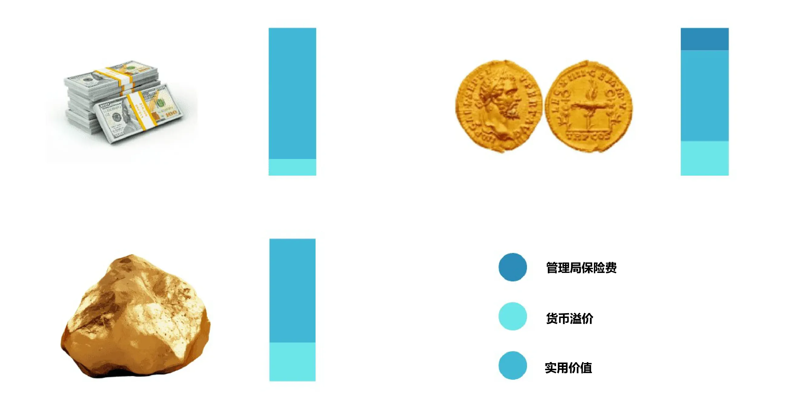

# 货币的不同定义

<partId>77b7918a-8c3b-11f0-b688-6b2ab22378c9</partId>

## 货币 vs 货币 vs monnaie vs argent vs devise

<chapterId>bf8a6d21-df88-5d23-a0a5-e9a5c1300554</chapterId>

:::video id=d9c9e7df-9db3-4a9f-801e-10d3fc7dfc22:::

### 货币术语的语义

在有关各种货币理论，特别是有关货币定义的这一部分，我想简单地谈谈语义学。我想深入探讨一下与货币有关的几个词的定义，并将它们与英语中的对应词进行比较。例如，"钱"、"货币 "与 "monnaie"、"argent "和 "devise "相比。是这样的

一个小小的语义学问题：

当我们说 "**货币**"（de la monnaie）时，大多数人会认为我们指的是交易后收到的小额零钱。而如果我们说 "**货币**"（la monnaie），人们可能会认为我们指的是一个国家的货币。加拿大的货币是加元。没错，就是加元。

那么钱（de l'argent）呢？小偷绝不会说 "把零钱都给我！"。(小偷很可能会因为收到的只是几乎不值钱的硬币而失望）。

不，小偷会大喊"把你的钱都给我***"。如果小偷站在你面前，他指的一定是你口袋里的钞票。

另一方面，如果小偷试图以一种更复杂的方式诈骗你，试图通过清空你所有的银行账户来窃取你的财产，我们会说**他会拿走你所有的钱**。这里的 "钱 "指的是**个人的财富**。

因此，钱有两个定义：现金（钞票）和财富。

### 货币 vs 单币 vs 设计

货币 (devise) 必然是另一个国家的货币，否则我们就只说货币 (monnaie)。如果你是法国人，你会说"La livre sterling est la devise du Royaume-Uni et l'euro et la monnaie de l'Europe"（英镑是英国的货币，欧元是欧洲的货币）。

通常，没有深入研究过这些语义问题的人在翻译这些术语时，往往会倾向于在书面货币（currency）时使用货币（devise），但不对，在本国货币（currency）时使用的是货币（monnaie），而在我们谈论其他货币时使用的是devise。因此，我经常看到的问题是，在英语中有两个词："money "和 "currency"。"money "是一个概念，而 "currency "实际上是一个国家用于交换的单位。因此，我们可以只谈 "钱 "的概念；这很简单--就是 "货币*"这个词的概念；它是一般意义上的钱。而 "货币 "则很容易等同于一个国家的货币。不幸的是，在法语中，人们在谈论比特币时经常会说："mais ce n'est pas une monnaie"，因为比特币不是一个国家的货币。这一方面是错误的，因为从萨尔瓦多开始，比特币就是一个国家的货币。事实上，人们经常会说 *但不，它不是国家货币，它不可能是货币*。但事实上，在我看来，如果我们参照广义的 "货币 "概念，比特币完全符合这个定义。只是在法语中，我们没有两个词来区分这两个概念。我们可以说 argent 这个词指的是货币，但不幸的是，这并不是它的准确定义。 *Argent*（货币）指的是财富或钞票。你无法将其与*money*一词等同起来。 *Money*实际上是货币（monnaie）的概念。

## Saifedean Ammous 的定义

<chapterId>07c4ba50-168c-567a-8957-0b187ff75f97</chapterId>

:::video id=936d6d3b-6d45-468e-bc44-85fbce9b857a:::

#### 钱是什么？

货币只是你拥有或获得的东西，不是为了使用或消费它本身，而是为了日后换取你可能需要的其他商品或服务。（赛义夫）

当商品存在货币需求时，货币就会获得货币溢价，从而发挥货币的一种或多种作用。

货币商品必须足够稀缺，货币溢价才能持续存在（以防止供给根据货币需求进行调整）。

### 货币溢价

在关于货币的不同定义的这一部分，我想简单谈谈赛义夫在《Bitcoin 标准》中的定义，我一直对这个定义很感兴趣。当我读到它时，我觉得它非常简单。我们还要在这个定义中加入货币溢价的概念。正如赛福鼎在书中提到的，必然存在稀缺性的概念。问题是，货币是什么？

> 货币只是你拥有或获得的东西，不是为了使用或消费而使用或消费，而是为了日后换取你可能需要的其他商品或服务。

这就是赛义夫在《Bitcoin标准》中提到的定义。我想补充的是，当一种货币（la monnaie）有货币需求时，它就会获得货币溢价，以发挥货币的一种或多种作用。因此可以说，作为价值储藏的货币会有货币需求，使其获得货币溢价，因为人们想要获得它，例如作为价值储藏或交换媒介。

### 稀缺性和市场机制

除此之外，我认为我们还必须补充一点，即货币商品必须足够稀缺，货币溢价才能存在。这一点非常重要。 **如果出现了一种可以作为货币使用的商品，而且我们看到它的价格正在上涨，那么通常情况下，如果这种商品不够稀缺，人们就会想要生产更多的商品，以便在价格上涨时利用这种增值**。这就是为什么市场上大多数商品都有一个相对固定的价格。价格上涨时，产量往往会增加。价格下降时，产量也会下降。这就是一种市场调节。 **而当一种商品足够稀有时，比如黄金，市场机制就无法弥补货币使用需求的增加。所以变化的是变量，是价格。就像比特币**一样。当比特币价格上涨时，我们不会生产更多的比特币。所以调整的是价格这就是为什么，多年来，我们看到比特币的价格随着比特币需求的增加而上涨。因为地球上没人能改变算法 说 "需求增加了，价格上涨了，我们要生产更多" **新比特币的供应量是提前设定好的 而且是提前知道的**所以，这就是我所说的，货币商品必须足够稀有，货币溢价才能持续存在，从而不被市场机制所追赶，以防止供应量根据这种新的货币需求进行调整。

## 支付手段和解放价值

<chapterId>5d424039-e342-56f7-9d8b-bba9551831a9</chapterId>

:::video id=af4c0765-8111-4cb7-891b-3ee54d6e7054:::

### 支付手段与交换手段

在本节讨论货币的不同定义时，我建议我们一起看看阿兰-特斯塔（Alain Testart）在《货币的起源》（Aux origines de la monnaie）一书中的一段引文，该书以货币作为支付手段和解放价值为主题。

*阿兰-特斯塔在《货币的起源》中将货币定义为支付手段：*

> 在这里，支付手段的功能被视为有别于交换手段的功能，因为支付是无偿的，支付是不买任何东西的。克尼斯（Knies）（1873:192 ff.）详细论述了这一主题，即不包含交换行为的商品转让，例如血钱（wergeld）（血钱或谋杀的成分）或税收。卡尔-门格尔（Carl Menger）在其 1892 年的文章 "Geld "中对第四种功能进行了抨击，这篇文章被认为是关于这一主题的最具决定性的文章之一。尽管支付手段的功能并没有被完全否定，但在当今的经济思想中，支付手段的功能似乎已被遗忘，或至少已被摒弃，而代之以交换手段的功能。
>

> 货币是用来支付的：从这个角度看，货币是一种解放工具，它概括地描述了支付手段的功能。因此，我们称之为货币的 "解放力量"。根据 Le Petit Robert 的解释，"解放力 "是 "具有解除（义务、债务）效果的力量"。根据《大拉鲁斯》（Grand Larousse），自由支付是指任何 "在法律条件下进行的支付，使债权人无法对债务的消灭提出异议"。货币具有这种卓越的能力；它甚至决定了货币的法定货币地位，因为无论是卖方还是债权人，都无法拒绝以货币支付的款项。货币是唯一不能拒绝支付欠款的物品，无论欠款人是商人还是税官。在所有物品中，只有金钱拥有这种特权。"正是这种特权，"查尔斯.纪德（1921 I: 443）写道，"正是这种特权构成了我们所说的法定货币。
>

> 任何以一种物品换取另一种物品，或以换取另一种物品为条件的交换，都必然意味着接受方有义务向对方提供这种物品。付款就是履行这一义务。因此，所有交换都意味着支付，但并非所有支付都意味着交换。有一些支付是没有对应物的，即支付并不能使人获得另一种物品，也不是为此目的而支付。在这里，税收仍然是一个典型的例子；我们还应该提到向公共当局支付的各种罚款，以及根据 "造成他人损害者必须予以赔偿 "的原则向他人支付的赔偿金。

### 无对应方付款

这清楚地说明了作者的论点。事实上，他将两者区分开来。在他看来，交换既是货物的转移，也是支付。其次才是支付。支付可以在没有交换的情况下发生。他举例说，支付停车罚单或罚款只是一种支付。你并没有真正交换到服务。有些人可能会说，作为交换，国家为你提供了一种服务，一种给你开罚单的服务。他非常清楚，纳税实际上是一种没有交易对手的支付，从这个意义上说，纳税是必须的，即使你不一定得到服务。他说，真正的定义是，纳税只是一种支付，没有义务换取服务。我和很多同事讨论过这个问题，他们不一定同意这个观点。但这正是作者的论点。他试图用罚款、纳税等例子来说明支付的概念，并将其从交换中剥离出来。另外，例如嫁妆，他表示嫁妆是一种支付；你不一定能换取什么。批评这一提议的人可能会说："是的，但你换来了一个妻子"。这就是关于这个问题的辩论程度。

另外还有 wergeld，即血钱。所以这只是一笔补偿金我的朋友乌尔里希会说：

> 是的，但作为交换，你可以关闭这个文件。

你犯了罪，比如谋杀。当时，你支付了罚金，之后，你就被释放了。这就是解放的力量。你能得到什么回报吗？作者认为没有。我的一些同事则认为有。

我认为，在这次讨论中，我们可以看到 wergeld 是定义付款的一个很好的例子。事实上，你显然没有得到任何回报。

## 债务货币与商品货币

<chapterId>4093677a-c8e8-5828-b994-15c01656186e</chapterId>

:::video id=f49cf5cc-288e-4daa-a1ff-b9de73506f4e:::

### 基本辩论

还是在本节关于不同货币定义和理论的背景下，让我们一起来探讨两种截然相反的观点："货币总是债务 "或 "货币总是商品"。一方面，以债务为基础的货币理论支持者断言："不，货币总是债务！另一方面，我们著名的金虫们则争辩道："但不对，你看，货币永远是商品，永远是黄金；其他一切，票据、欠条，都只是信贷，而不是货币"。

让我们一起来探讨这些理论的清晰总结。

### 永远是债务 "理论

以下是被称为**"债务货币 "**的货币理论的摘要，根据这一理论，货币从根本上说是一种债务形式：

根据由阿尔弗雷德-米切尔-因斯（Alfred Mitchell-Innes）提出并由大卫-格雷伯（David Graeber）进一步发展的这一理论，货币本质上是对债务的承认，源于历史上直接货币交换之前的信用关系。与其说货币产生于以物易物的需要，不如说它是个人或群体之间核算、转移和清偿社会义务或债务的一种方式。

因此，所有货币的流通都是一个人或机构欠另一个人或机构的债务，以信任和社会或国家权威为后盾，保证其有效性。因此，根据他们的观点，当我们拥有--正如我已经提到过的--当我们拥有金钱时，我们就对社会有了要求权，社会就欠了我们的债。因此，货币从来都不是中立的或自主的，而总是一种潜在的债务：持有货币本质上意味着拥有对社会或经济共同体的债权。

这一推理与将货币视为简单的 "中间商品 "的经典观点相矛盾，而是强调了社会和政治关系在货币的创造和管理中的核心作用。

**我的评论：**

这种理论让我感到不安的是，它断言货币永远是一种债务，而我们有两个不同部落之间进行交换的例子，例如，他们交换黄金，在这种情况下，交易是确定无疑的，不存在潜在的债务。这一理论的支持者通常会告诉我们，这些交换不是货币交换，而是以物易物。如前所述，我不同意这种说法。这是一种货币交换，因为黄金不会被消耗掉，而是会被用作货币。

### 永远是商品 "理论

**始终是商品：**

这里是对被称为**"商品货币 "**的货币理论的清晰总结，货币总是作为一种商品出现，特别是黄金，它的出现源于能够交易的需要，是一种在国外普遍被接受的商品，是为了交易目的而获得的。

根据这一由古典经济学家（亚当-斯密、大卫-李嘉图）提出并被马克思采纳的理论，货币是作为其他商品中的一种商品自然出现的，通常是金银等贵金属，其内在价值与其货币作用无关。最初，这些商品因其固有的特性（稀缺性、持久性、可分割性和稳定性）而被经济参与者自发地选择用于促进贸易。

商品货币的区别在于它的物理存在以及由生产它所需的社会劳动量决定的价值（如马克思所说）。例如，社会使用黄金不仅是为了简化易货贸易，也是一种记账单位、价值储藏手段和通用交换媒介。

在这一理念中，货币始终保持着真实的价值，因为它与有形商品息息相关。即使货币的角色变得抽象（铸币、纸币或经文货币），其有效性仍然直接或间接地来自于对黄金等基础商品的参照。因此，这一理论坚持货币的物质和经济起源，而不是将其视为单纯的惯例或债务。根据这一理论，货币的任何替代物，例如可兑换黄金的纸币，都是信用。

**我的评论：**

请注意，这种观点与商品货币理论相似，但更进一步。他们提出，货币应该***永远是商品。当我们对他们说"*是的，但我们可以同意，对于这个群体来说，纸币就是货币；它可以用黄金来支持，它可以起作用，纸币本身就是货币*"。

对此，他们会举出更衣室优惠券的例子。他们会说："是的，但不行，当你的服装有更衣室优惠券时，我们能把收银机优惠券称为服装吗？

当然不是，从本质上讲，这就像是一份确认书，一份索赔，可以让你拿回衣服。这种并列关系并不成立，因为更衣室优惠券并不是一种普遍接受的付款方式。 **货币不是对像衣服这样的特定物品的要求权；它是一种模式、一种交换手段、一种交换媒介或一种普遍接受的支付方式**。

因此，你不能把更衣室优惠券和法定货币钞票相提并论，因为更衣室优惠券允许你换取特定的商品，它是一种允许你取回商品的token。而纸币，也就是法定货币，是一种通用券，可以让你获得任何物品。

当然，在我看来，即使是法定货币，如果民众认为它是货币，它也可以被视为货币。我认为，坚持认为它不能成为货币是一个语义错误，因为它是一种获得真正货币的优惠券，至少在当时是这样，它的基础是黄金。

我认为把放在保险柜里的金币和代表金币的钞票视为货币没有问题。对我来说，这不存在语义问题，只是两种货币而已。如果我没记错的话，米塞斯在谈到货币替代品时很好地解释了这一现象。

他们的观点归根结底就是，你不能把银行金库里的金币和代表金币的纸币同时视为货币。就我个人而言，我不认为这有任何问题；我不认为这种情况存在任何悖论。那些认为货币永远是商品的人并不像我这样看问题。

**以下是*Aux origines de la monnaie*一书中对更衣室优惠券概念的评论：**

*注 14："里斯特（1938：372，注 1）对纸币和支票室代币之间的比较进行了出色的批判--出色的原因在于它正是建立在克纳普自己的基础之上，即法律基础之上：如果我们可以在这两种情况下谈论一种债权，那么根本的区别在于，在第一种情况下，而且仅仅在第一种情况下，它是一种没有特定对象的债权。

此外，关于***索赔**，同一作者还指出了以下几点：

> 巴斯蒂亚可以随心所欲地把整个社会的凭证想象成 "一个巨大的集市"，但这个小小的补充，这个看似无害的延伸，正是信贷与货币的全部区别。货币不是对某一特定商店的债权。不存在匿名债权。但货币的匿名性，也就是它的普遍性，正是它的强大之处。货币与信贷不同，更不能还原为信贷。 **货币远不止是信贷**。

**悖论：债务货币与商品货币**

最能说明债务货币理论与商品货币理论之间深刻对立的悖论涉及黄金是否是当今货币的问题。

一方面，债务货币理论将货币首先定义为一种交换中介或支付手段，它被公共权力机构普遍接受，甚至强加于人。从这个角度看，黄金不再是一种货币，因为它没有被广泛使用或接受为通用的交换媒介。

另一方面，商品货币理论认为货币是一种有形商品，因其固有特征（稀缺性、持久性、可分割性等）而被社会自发选择。根据这种观点，黄金仍然是真正的通用货币，而当今所有其他形式的货币从根本上说都不过是基于信任的信贷。

这一悖论清楚地表明了这两种货币观念之间的差距：对前者而言，黄金不再是一种货币；相反，对后者而言，黄金仍然是唯一真正存在的货币。

## 现代货币理论

<chapterId>8efc29af-3193-5d97-ad9f-e608b32924ff</chapterId>

:::video id=f8127cb7-46a1-468c-bbb5-97bf0a8b8837:::

### 现代货币理论的原则

在本节有关各种货币理论的最后，让我们来谈谈货币理论中的神童，他受到许多在中央银行工作的现代经济学家的推崇，被命名为现代货币理论，通常被称为 MMT。

**现代货币理论（MMT）**是一种经济学方法，认为一个拥有自己主权货币的国家（如美国、加拿大或日本）永远不会缺钱，因为它总是可以发行更多的货币来为其支出提供资金。根据这一理论

- 货币是国家的创造物，而不是有限的资源**

- 税收和借贷并不直接用于为公共开支提供资金，而是用于调节通货膨胀、影响经济行为和维持对本国货币的需求*。

- 真正限制政府支出的是通货膨胀，而不是预算赤字或公共债务。

- 如果所创造的货币被输送到能够吸收这些货币的部门，也就不会出现通货膨胀。

- 因此，政府必须根据实际可用资源（人力、工业能力、自然资源）调整支出，以避免过度通货膨胀。

### 税收在计量经济学中的作用

所以在这里你会找到一个著名的答案 所有那些说 "是的，但如果我们可以印钞票 为什么我们还要纳税？"的人都会得到的答案嗯，MMT对这一观点给出了正确的答案。的确，在法定货币体系中 在现代体系中，从技术上讲 除了通货膨胀，没有任何东西可以限制货币的创造但他们会建议 首先 税收是限制通货膨胀的必要条件 因为它会从经济中抽走货币所以，如果我们没有税收作为补偿 所有这些货币创造最终都会造成通货膨胀他们认为，税收实际上是从系统中抽走货币以限制通货膨胀的一种方式。

关于将资金投入到能够吸收资金的部门的问题，我们可以提一下美国的例子，美国向军事工业提供了数万亿美元，这并没有引起通货膨胀，因为军事工业，即军事工业综合体，完全有能力吸收这数万亿美元。

另一方面，如果你想修建更多的道路，而能够修建这些道路的资源和承包商是有限的，那么将道路预算增加一倍必然会对能够修建这些道路的劳动力产生稀缺效应。因此，在市场力量和供求关系的作用下，价格将会上涨。如果我们全知全能的领导人知道该把钱用在哪里，那么从技术上讲，这不应该引起通货膨胀。而我要回答的是，在实践中，这显然会导致通货膨胀。

总之，根据 MMT 的观点，国家可以利用其创造货币的能力实现充分就业，为社会和生态投资提供资金，同时通过适当的财政政策控制通货膨胀。凯恩斯主义经济学家（另一个经济思想流派）的目标通常也是通过管理利率来控制失业，并在通过适当的财政政策控制通货膨胀的同时为社会和生态投资提供资金。

### MMT 审查

这一理论只适用于少数享有真正货币主权的国家（见 Stephanie Kelton 的推文），即这些国家可以用本国货币举债。这一理论很难适用于依赖进口的经济体，因为它们必须维持国际社会对其货币的信心。

什么是真正的货币主权？就是能够用自己的货币举债。你必须能够保持贸易顺差，拥有足够的货币储备，足够的外汇，这样你就不需要用外汇来筹集资金以进口商品。这涉及到少数几个国家。

下面是斯蒂芬妮-凯尔顿（Stephanie Kelton）发的一条推特，她是这场运动的海报女郎。她写了一本名为《赤字神话》的书。她在推文中写道，美国、日本、加拿大、澳大利亚、英国等不同国家的钱都花不完。

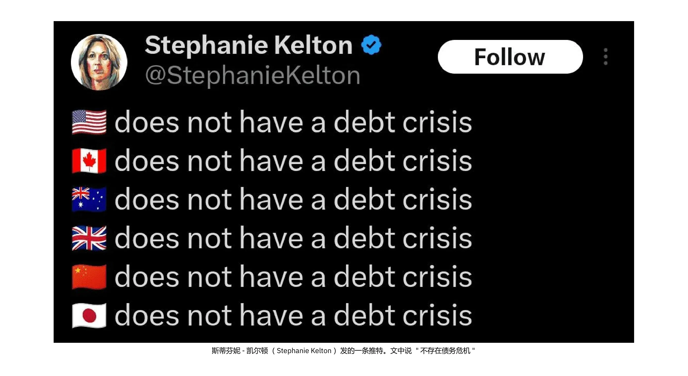

奇怪的是，它只列出了六个国家？这是为什么呢？因为它们拥有真正的货币主权。但地球上大约有 200 个国家，并非所有国家都拥有货币主权。因此，我对这一理论的批评除了有点奇怪和不实用之外，还在于它只对少数几个享有真正货币主权的国家有效，即那些可以用本国货币发行国库券的国家。在某种程度上，它损害了世界其他国家的利益。通过创造这种货币，他们就像是在向其他地方输出自己的通货膨胀，就像美国几十年来一直在做的那样，拥有过高的特权。这类似于一种货币殖民主义，在这种情况下，那些对其货币拥有全球信心和需求的国家可以随心所欲地印制大量钞票，而不会引发严重的通货膨胀，这往往是因为他们输出了通货膨胀。

这一理论很难适用于依赖进口的经济体，因为它们需要维持国际社会对其货币的信心。

这一理论还要求对经济进行一定程度的集中规划，主要是为了确保对实际资源（工人、原材料、工业能力）的更大控制，并管理通货膨胀。

# 货币的衰落与重生

<partId>87a34ca9-782b-5ade-b51a-400f88ed7b0c</partId>

## 希腊硬币

<chapterId>7714195f-74ce-5f8c-be5f-59302d39fff4</chapterId>

:::video id=8e5c3091-0910-471b-8d4b-0dc6e9afa656:::

### 背景与环境

在我们开始之前，先介绍一下历史背景：

**历史背景：**

**罗马人称希腊人为 "Graeci"，称希腊为 "Graecia"。

**希腊人称自己为 "希腊人"，称他们的国家为 "希腊"。

**荷马**（约生于公元前 8 世纪）

希腊传奇诗人，被认为是《伊利亚特》和《奥德赛》的作者。

约公元前**750 年：斯巴达神话中的立法者莱库格斯**据说制定了以军事纪律和简朴为基础的斯巴达宪法。

**努马-庞皮留斯**（公元前 753-673 年）

罗马第二任国王，因赋予罗马最初的宗教和法律机构而闻名。

**德拉贡**，雅典立法者（公元前 7 世纪），以制定极其严厉的法律而闻名，因此被称为 "德拉贡"。

**公元前 594 年：梭伦**成为雅典立法者，对雅典社会进行了彻底改革，特别是废除了债务奴隶制。

**公元前 776 年古代奥运会**

第一届定期运动会每四年在奥林匹亚举行一次，汇集了希腊的各个城市。

**毕达哥拉斯**（约公元前 570-495 年）

希腊哲学家和数学家，以直角三角形定理而闻名。

**科洛芬的色诺芬**（约公元前 570-478 年）

前苏格拉底时期的哲学家，因批评希腊传统的多神论而闻名。

**公元前490年：马拉松战役**

雅典人胜利击退了波斯人的入侵，成为希腊文明的决定性转折点。

**希罗多德**（约公元前 484-425 年）被称为 "历史之父"，他写了一部描述波斯战争的巨著，其中包括公元前 480 年希腊战胜薛西斯的故事。

**苏格拉底**（公元前470-399年）

雅典哲学家，因其辩证法以及关于伦理和自我认识的学说而闻名。

**克里斯托弗尼**（约公元前 446-386 年）

雅典剧作家，以讽刺喜剧（如《蛙》）而闻名。

**索福克勒斯**（公元前 5 世纪）在他的戏剧《安提戈涅》中，通过暴君克里昂批判了金钱是道德和政治腐败的根源。

**柏拉图**（约公元前 428-348 年）

希腊哲学家，苏格拉底的学生，学院创始人，著有《共和国》*。

**公元前431-404年伯罗奔尼撒战争**

雅典与斯巴达之间的重大冲突，以雅典的失败告终。

*公元前*431年**：雅典为伯罗奔尼撒战争提供资金，稀释金银币以增加流通量，造成通货膨胀。

**色诺芬**（约公元前 430-355 年）

雅典作家、哲学家和将军，苏格拉底的弟子，《安纳波利斯纪事》（*Anabasis*）的作者。

*公元前*414年**：雅典在西西里岛的一次灾难性远征后，开始输掉伯罗奔尼撒战争。

**公元前 405 年：阿里斯托芬**在他的戏剧《蛙》*中明确描述了银德拉克马的贬值和劣质铜币在雅典的出现，说明了今天被称为 "格雷沙姆法则 "的原理。

*公元前*404年**：雅典在斯巴达的长期围攻下投降。

**亚里士多德**（公元前 384-322 年）

希腊主要哲学家，柏拉图的学生，莱西姆学派的创始人，以逻辑学、生物学和政治哲学著称。

**公元前 327 年**：亚历山大大帝征服波斯波利斯和波斯帝国东部省份，大大扩展了他的帝国版图。

*公元前 *323 年**：亚历山大在巴比伦去世，没有明确的继承人，引发了他的将军们（diadochi）之间瓜分帝国的战争。

**阿基米德**（约公元前 287-212 年）

希腊数学家、物理学家和发明家，因其在几何学和力学方面的发现而闻名。

**公元前 196 年：罗塞塔石碑**是在法老托勒密五世统治时期雕刻的，使后来的埃及象形文字得以破译。

**公元前 192-188 年罗马-塞琉古战争**

罗马击败了安提阿哥斯三世领导的塞琉古帝国，巩固了其在希腊和小亚细亚的影响力。

*公元前*146年：科林斯战役**

罗马人摧毁了希腊城市科林斯，标志着希腊政治独立的终结，希腊逐渐融入罗马世界。

在有关古代、罗马衰落和中世纪的这一部分，我们将从希腊钱币开始。

古希腊的钱币史始于公元前 600 年左右，当时希腊城市迅速采用了小亚细亚吕底亚的创新技术，最初使用的是电子币，后来使用的是银币。希腊最早的硬币是在埃吉纳岛铸造的，上面有海龟或陆龟图案，但从公元前 5 世纪开始，装饰有雅典娜和猫头鹰图案的雅典德拉克马成为最杰出的货币符号，在当时的国际贸易中占据了主导地位。

我很幸运地拥有一个那个时期希腊德拉克马的复制品，背面印有著名的猫头鹰和人物。这是一个四德拉克马，比普通的德拉克马大。

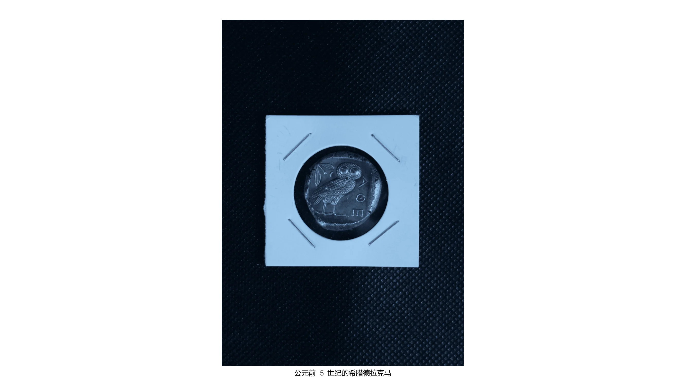

每个希腊城市都与货币建立了自己的关系。在雅典，货币与政治和经济实力紧密相连。公元前 5 世纪末，雅典颁布了著名的法令，规定在雅典的盟国领土上只能使用雅典货币，从而巩固了雅典的经济霸权。雅典还积累了大量黄金储备以备不时之需，这些黄金被存放在雅典卫城，或许是雅典经济谨慎的象征。相比之下，斯巴达作为一个军事城市，价值观严谨，选择严格限制货币的使用，禁止公民拥有金币或银币。斯巴达更倾向于使用沉重的铁条，以阻止对外贸易并保持社会凝聚力。

战争通常通过操纵货币来筹资。在伯罗奔尼撒战争（公元前 431-404 年）期间，雅典为了支付军队的军饷，不惜大幅贬值货币。公元前 413 年，斯巴达占领了德克里亚，雅典无法开采银矿，不得不在公元前 407/406 年匆忙熔化金像铸造新币。然后，在公元前 406/405 年，雅典制造了镀银铜币，引发了一场货币危机，**阿里斯托芳斯**对此进行了说明，他已经唤起了今天所谓的格雷沙姆法则：劣币驱逐良币。这种应急货币在战后很快被非货币化，以恢复人们对雅典钱币的信心。

古典时期结束时，马其顿在腓力二世及其子亚历山大大帝的统治下崛起，极大地破坏了希腊的货币平衡。得益于潘加山巨大的金矿和银矿，腓力二世生产了大量的货币来资助他的军事和政治活动，并建立了简单实用的金银本位制（10:1）。他为庆祝奥林匹克运动会的胜利而发行的金质纪念币远销西欧，甚至到达了英国。亚历山大奉行这一货币政策，在征服东方的过程中广泛流通**阿提**德拉克马，甚至远至印度。钱币的大规模流通标志着希腊化时代的开始，君主的形象逐渐取代了钱币上的神像。这一创新使希腊历代君主得以提升自己的地位，而传统的神灵在他们的钱币背面则退居次要地位。

亚历山大于公元前 323 年去世后，他的将军们瓜分了他的庞大帝国，在埃及（托勒密王朝）、叙利亚（塞琉齐王朝）和其他地方建立了王朝。这些希腊化王国采用了不同的货币制度：托勒密王朝实行封闭的货币制度，控制货币流通，倾向于使用谷物作为国内货币，将贵金属留作对外军事开支。与此同时，罗得岛成为了一个主要的贸易中心，后来被罗马人削弱了经济实力，罗马人在公元前 167 年将德洛斯岛建成了自由港。

货币的使用是雇佣军报酬的核心。亚历山大的士兵每天都能收到银币。

骑兵是亚历山大高度专业化军队中的精锐，平均每天获得两个德拉克马，步兵一个德拉克马，普通雇佣兵三分之二个德拉克马，是普通工人工资的两倍。

在伯罗奔尼撒战争期间，也向士兵支付了相当可观的费用：为镇压萨摩斯起义支付了 1200 多塔勒，为围攻波蒂迪亚支付了 2000 多塔勒。

当这支军队在小亚细亚全面开战时，每天的总费用约为 20 英镑，约合半吨白银，或 120 000 德拉克马。

希腊钱币在文化方面也发挥着重要作用，因为每个城市都试图通过铸造带有当地或神话象征的钱币来彰显自己的身份。例如，赫拉克留斯（Heraclius）描绘了赫拉克勒斯（Hercules）与狮子搏斗的场景，而塞雷尼亚（Cyrene）则展示了著名的药用植物硅藻土。

最后，尽管希腊古典钱币和希腊化钱币种类繁多，且存在地区性波动，但它们在地中海世界的经济和文化史上留下了永恒的印记，深刻影响了后来的货币体系，直至罗马，罗马逐渐采用并发展了希腊的经济理念来构建自己的帝国经济。

## 希腊货币的影响

<chapterId>3a5e6c7d-699c-5567-87cd-3374c49d55a9</chapterId>

:::video id=0c79a59c-e179-4893-a414-1b8de0930eb9:::

### 雅典与斯巴达的对比

古典希腊时期雅典和斯巴达之间的对立揭示了两种截然不同的政治和经济组织模式。斯巴达摒弃了金属货币，转而采用以公民信任为基础的自给自足制度，而雅典则完全接受了这一技术，以建立和维持其海洋帝国。

### 海军力量的货币必要性

尽管雅典帝国的名字冠冕堂皇，但它的地理版图并不辽阔--主要是雅典和爱琴海沿岸的城市。它的权力依赖于德洛斯联盟，这是一个由雅典作为霸主主导的军事联盟。这种帝国结构需要一种统一的经济工具：雅典银币。

维持一支舰队是货币需求的核心。一艘雅典三体战船的造价在一到两两白银之间，这是一笔不小的数目。雅典需要维护数百艘船只，因此需要一个高效的税收系统。货币成为向附庸城市征收贡品和为海军提供资金的不可或缺的工具，而海军是帝国凝聚力的保证。

### 货币强加是一种统治工具

雅典将其白银货币强加于德洛斯联盟的所有成员。这种货币标准化有几个战略目的。首先，它通过创建一个共同的记账单位，方便了贡品的征收。其次，它加强了附庸城市对雅典的经济依赖。最后，它象征性地将雅典的力量投射到整个海洋帝国。

这种货币政策与斯巴达模式形成了鲜明的对比。斯巴达是一个陆地强国，可以依靠伯罗奔尼撒的无业游民（奴隶）的劳动来维持生计。其封闭的、以城市为中心的经济体系不需要复杂的货币工具。公民-士兵生活在一起，同吃同住，日常交流不需要货币。

### 货币作为海上贸易的工具

雅典帝国的航海性质意味着它必须开放贸易。与内向型的斯巴达不同，雅典必须与外部世界进行贸易，以求生存和繁荣。货币成为地中海贸易不可或缺的工具。

这种对外导向创造了一个良性循环：贸易带来收入，这些收入为舰队提供资金，舰队保护贸易路线并维护帝国，帝国强制推行雅典货币，从而促进了贸易。货币不再只是一种交换手段，而是成为帝国战略的支柱。

### 货币权力的极限

尽管雅典经济发达，但在伯罗奔尼撒战争中，雅典的货币力量显示出了其局限性。面对斯巴达的陆军，雅典的海军和财政优势并不足够。昂贵的远征，如西西里岛灾难性的锡拉库扎战役，耗尽了财力，却没有带来决定性的胜利。

历史表明，货币虽然是投射力量的有力工具，但并不能保证军事统治。斯巴达没有金属货币，但社会凝聚力非凡，最终战胜了雅典货币帝国。

### 两种模式，两种命运

雅典和斯巴达的对立说明了社会和经济组织的两种基本方式。雅典代表了开放的、商业的、货币化的模式--现代海洋帝国的先驱。斯巴达则体现了封闭、自给自足的模式，其基础是公民信任而非货币工具。

这两种制度表明，货币的采用与所选择的政治和经济模式密切相关。对于像雅典这样的海洋和商业强国来说，货币变得不可或缺。而对于斯巴达这样一个封闭的武士社会来说，货币则是对社会秩序的威胁。这种古老的对立至今仍在影响着关于货币在社会组织中的作用的辩论。

## 罗马共和国

<chapterId>0bc80983-33e1-5881-85bb-7c22f3144a9a</chapterId>

:::video id=dc05ca97-d29c-4679-bfeb-912c47d86ce2:::

### 罗马共和国史

- 公元前 753 - 509 年：罗马王国**
- 公元前 753 年：罗马建城**（传统上认为是罗穆卢斯所建）。
- 公元前 509 年至公元前 27 年：罗马共和国**，罗马成为由选举产生的元老院和执政官统治的共和国。
- 公元前 280-275 年：皮罗斯战争**。伊庇鲁斯国王皮罗斯在意大利南部与罗马人作战，取得了代价惨重的胜利（"皮罗斯胜利"）。
- 公元前 264 - 146 年：布匿战争**。罗马与迦太基争夺西地中海统治权的重大冲突。
- 汉尼拔（Hannibal，247 年-约公元前 181 年）**。迦太基传奇将领，因在第二次布匿战争中率领军队和大象越过阿尔卑斯山进攻罗马而闻名。
- 公元前 146 年：科林斯战役**。罗马摧毁了希腊城市科林斯，并对希腊大陆实施了最终统治。
- 公元前 91-87 年：社会战争**。罗马的意大利盟友起义，要求获得罗马公民身份，最终导致他们完全融入罗马公民行列。
- 公元前 64 年：塞琉古抵抗**结束。罗马最终消除了塞琉古在叙利亚的影响，巩固了对东地中海的控制。
- 公元前 55 年：凯撒征服中欧和西欧**。凯撒扩大了罗马对高卢（今法国）的统治，并进入日耳曼和布列塔尼。
- 公元前 43 年：第二三巨头**的形成。屋大维（后来的奥古斯都）、马克-安东尼和莱比德斯之间的政治联盟，目的是在凯撒遇刺后稳定罗马局势。
- 公元前 27 年：大同**开始。奥古斯都统治时期的政治稳定和繁荣，标志着罗马帝国的开端。

### 罗马晚期的货币起源

在关于古代的这一部分，我们现在将目光转向罗马共和国。罗马的货币史要比希腊和波斯的货币史晚得多。罗马建于公元前 753 年，在真正采用硬币之前，罗马等待了近四个世纪。在这段漫长的时间里，罗马人使用的是一种原始的交换系统，使用的是不规则的青铜块，称为 aes rude，每次交易都需要精确称重。直到公元前 4 世纪末，在希腊和伊特鲁里亚人的影响下，罗马才开始发行第一批钱币，特别是像中国一样用青铜铸造的 "aees grave"。

### 希腊的影响和第一批银币

与意大利南部希腊人的决定性交锋使罗马人真正开始铸造银币。大约在公元前 280 年，罗马开始仿照希腊迪德拉克姆制造自己的银币。罗马首次定期发行的银币可以准确地追溯到公元前 269 年，其图案是传说中母狼吮吸罗穆卢斯和雷莫斯的双胞胎，这已成为罗马的标志性符号。

事实上，共和国时期的许多罗马硬币都描绘了开国神话。您可以在下面看到我的硬币：这是一枚来自塔提乌斯国王的极品真币。它描绘的是萨宾人诱拐妇女的神话。塔提乌斯是这一地区的国王，开国神话讲述的是罗马人如何从居住在附近的萨宾人（Sabines）那里诱拐妇女。后来，塔提乌斯国王与罗马的创始人之一罗穆卢斯共同成为国王。

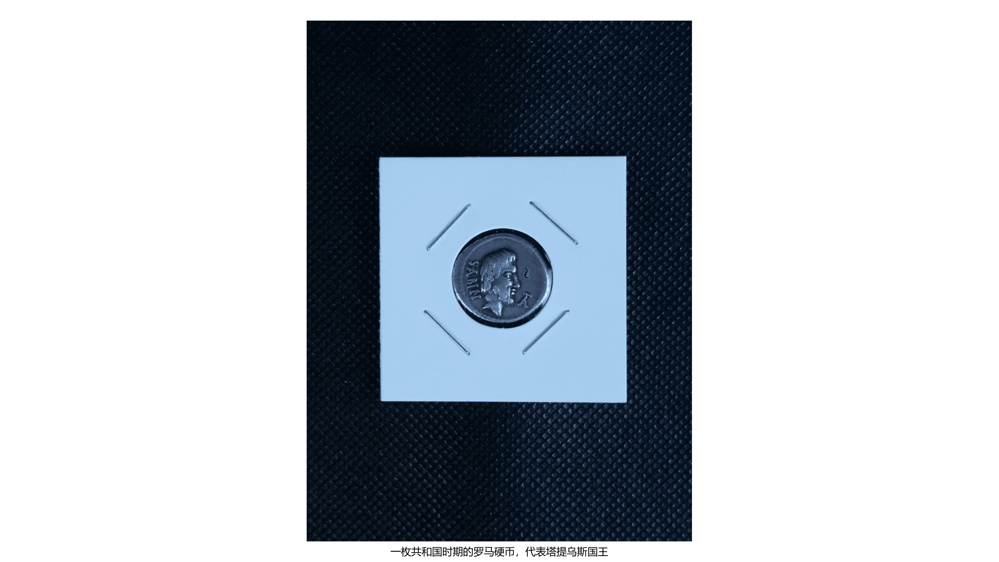

### 硬币 "一词的起源和朱诺-莫内塔神庙

硬币 "一词起源于罗马的朱诺-莫内塔神庙。传说在公元前 390 年高卢人入侵时，都城的神鹅提醒罗马人危险迫在眉睫。为了感谢都城的保护神--朱诺女神，人们为她建立了一座神庙，并很快成为罗马钱币的铸币厂。

### 布匿战争和货币危机

军事冲突对罗马的货币发展产生了相当大的影响。在对迦太基的第二次布匿战争（公元前 218-201 年）期间，面对汉尼拔的入侵，罗马面临着严重的财政困难。为缓解燃眉之急，罗马首次破例发行金币，并大幅贬值银币，纯度从最初的 97% 降至约 89%。铜币（aes）的重量也急剧下降，六年内减少了近 80%。

在这里，我们可以重温我们之前讨论过的一个概念，即希腊人熔化神庙中储存的贵金属，以帮助缓解经济危机。说到**迦太基**，下面你可以欣赏到我收藏的一枚真正的迦太基硬币。这些迦太基硬币的一面是一棵棕榈树，另一面是一匹马。在这枚硬币上，马不是很好辨认，因为它已经磨损得很厉害了。

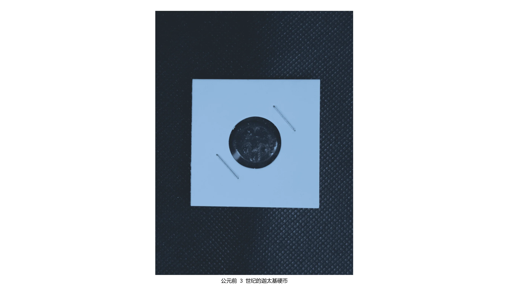

因此，被称为 "aees "的青铜钱币的重量也急剧下降，在六年内几乎减少了 80%。因此，这些并非贵重金属、用于日常贸易的青铜硬币的重量大幅下降，这是战争导致货币贬值的标志。

### 银元与货币稳定

正是在这一关键背景下，罗马于公元前 212 年引入了著名的银本位制。这一改革确保了货币的显著稳定性，在将近 450 年的时间里，本位货币一直是最主要的货币。尽管公元前 146 年进行了一次重大的重新定价，并且为资助其庞大的军队进行了大量生产，特别是在布匿战争、社会战争（公元前 91-87 年）和马其顿战争期间，但罗马仍将这种稳定性归功于严格的管理。举例来说，维持一个罗马军团每年需要花费大约 150 万第纳尔，这说明了货币需求的规模。

在罗马边境之外，战争导致罗马影响下的地区货币大幅贬值。布匿迦太基的电子币纯度急剧下降，从 4 世纪的 98% 黄金降至第二次布匿战争期间的 30%，而银币的纯度则降至 18%。

### 货币动机的演变

随着罗马的扩张，钱币的特征也发生了变化：最初是匿名的爱国钱币，后来逐渐采用了个性化的设计，以矿工（铸造钱币的人）的权贵家族为特征。这一转变清楚地象征着罗马共和国晚期的政治变革。

最后，虽然罗马在经济上主宰了地中海世界，但在支付手段上却保持了一定的简单性：除了直接交换钱币外，没有发展出真正的货币转账形式，只有为精英阶层保留的税收转账和私人信贷。

## 罗马帝国

<chapterId>2dc44e50-112a-5abf-97ae-8e0a9ecda989</chapterId>

:::video id=f8d6f3d6-9ee4-4504-888e-4f12b3f20489:::

**历史背景：**

**公国**是罗马帝国从公元前 27 年奥古斯都统治之初到公元 284 年三世纪危机结束期间的帝国政府形式。

**公元前 27 年：大同世界开始**

奥古斯都统治时期的政治稳定和繁荣时期，标志着罗马帝国的开端。

**奥古斯都（公元前 30 年至公元 14 年）**对罗马货币制度进行了彻底改革，为帝国钱币建立了持久稳定的标准。

**奥古斯都也是最早被公认的古钱币和化石收藏者**之一。

**公元 54 年至 68 年：尼禄**

有争议的罗马皇帝，以暴政、迫害和罗马被焚后的灾难性管理而闻名。

*公元*64年罗马大火**

一场大火肆虐了城市的大部分地区；尼禄被指控应对此负责。

*公元 *69 年：四帝之年**

这是一个混乱的时期，接连出现了四位皇帝（加尔巴（Galba）、奥索（Otho）、维特里乌斯（Vitellius）、维斯帕先（Vespasian））。

**79 AD：维苏威火山爆发**

火山摧毁了庞贝和赫库兰尼姆两座城市，并在灰烬中例外地保存了它们的遗迹。

**165 AD - 180 AD：安东尼鼠疫**

马库斯-奥勒留（Marcus Aurelius）和康莫德斯（Commodus）统治下的罗马帝国受到毁灭性流行病的侵袭。

**公元 200 年：领土达到顶峰，大同世界逐渐结束**

罗马达到了最大的扩展，但开始遭受内部不稳定和经济困难的影响。

**212 AD：卡拉卡拉关于公民权的敕令**

卡拉卡拉皇帝为了扩大税收基础，几乎给予帝国所有居民罗马公民身份。

**公元 220 年：蛮族大入侵开始**

日耳曼人首次大规模越过罗马边境。

**公元 235 年 - 公元 285 年：3 世纪的政治和军事危机**

这一时期政治不稳定，出现了许多短命的皇帝、内战、经济危机和不断的入侵。

**奥勒良（公元 270-275 年）对罗马货币**进行了彻底的重估，试图在高通货膨胀的情况下恢复其名义价值。

**公元 301 年：戴克里先的价格敕令**

戴克里先皇帝曾试图通过在全帝国实行严格的价格和工资管制来制止猖獗的通货膨胀，但徒劳无功。

**312 AD：君士坦丁**

第一位基督教皇帝，君士坦丁堡的创建者，通过引入 "solidus"（一种纯度极高且稳定的金币）稳定了货币。

**公元476年：西罗马帝国灭亡**

罗马被日耳曼人（包括奥斯特罗哥特人）占领，这一事件被认为标志着西罗马帝国的正式灭亡。

### 奥古斯都的货币改革

在关于古代的这一部分中，我们已经讲到了罗马帝国。罗马帝国货币史的特点是大量使用金属货币，特别是黄金、白银和青铜，但也有多次货币危机，这些危机与政治和军事动荡密切相关。共和国末期，在凯撒大帝的统治下，罗马于公元前 46 年推出了金奥勒斯金币，这种重约 8 克的硬币在欧洲和地中海盆地广为接受。凯撒将这些金币标准化，并铸造了第一枚带有活人肖像的金币，从而推翻了古代共和政体偏爱匿名、集体符号的传统。这一发展伴随着一个重大的政治变革时期，个人权力逐渐取代了共和制度。

公元前 44 年，凯撒遇刺身亡，屋大维（奥古斯都）控制了罗马，并于公元前 27 年建立了罗马帝国。他在位期间对货币体系进行了全面改革，为罗马经济带来了持久的稳定。在奥古斯都时期，1 金奥勒苏相当于 25 银第纳尔，本身价值 4 青铜第纳尔。这种货币稳定性一直持续到公元一世纪，这一时期通常被描述为罗马的经济黄金时代。

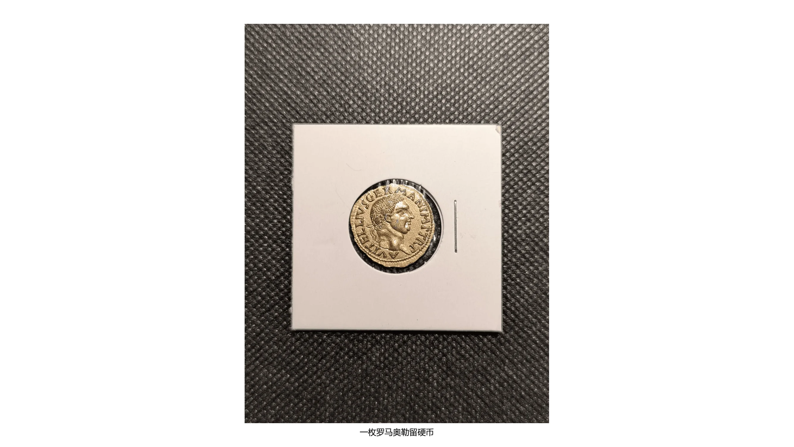

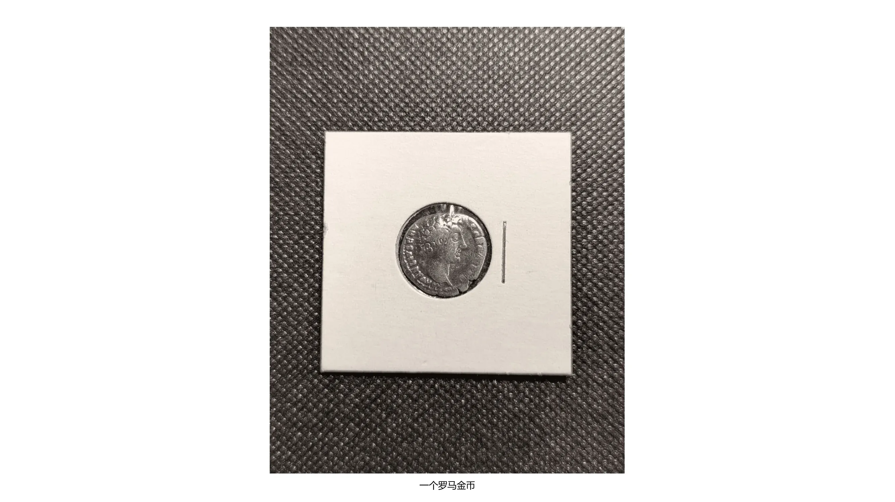

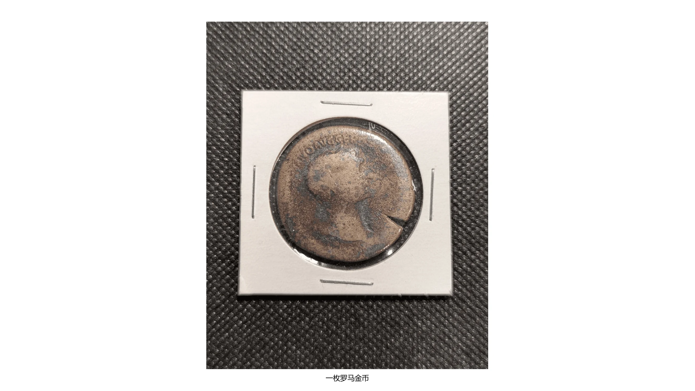

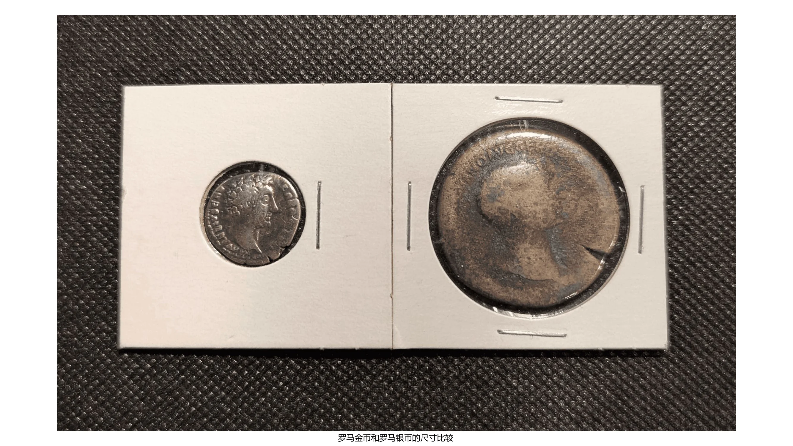

然而，从尼禄开始（公元 54-68 年），罗马开始缓慢贬值其钱币，逐步减少其重量和纯度，以资助日益增长的帝国开支，尤其是在公元 64 年罗马大火之后。这些贬值产生了显著的影响：根据**格雷沙姆法则**，纯度较高的钱币通过囤积或出口退出流通，而贬值的钱币则大量涌现，导致价格逐渐上涨。

三世纪是一个戏剧性的转折点，在塞普蒂米乌斯-塞维鲁（Septimius Severus）、卡拉卡拉（Caracalla）和加里安努斯（Gallienus）三位皇帝的统治下，银币的贬值速度明显加快。主要的银币--半两银币（denarius）和安东尼银币（antoninianus）的含银量下降到只有 2%。与此同时，奥金币的含金量也下降了一半。伴随着这场货币危机的是前所未有的政治动荡、蛮族入侵和内战频发。

通过这一部分，我可以介绍本节的最后一枚硬币：安托尼尼安硬币（antoninianus）。这种钱币的原名不详，但我们今天称其为安托尼尼钱币。它的价值是两个第纳尔，尽管它只比第纳尔大 1.5 倍。此外，随着时间的推移，这些硬币变成了纯银硬币，这意味着它们是由银和其他金属的合金制成的，而不是纯银。这些硬币通常只是涂上一层银，是货币衰落的一个显著例子。

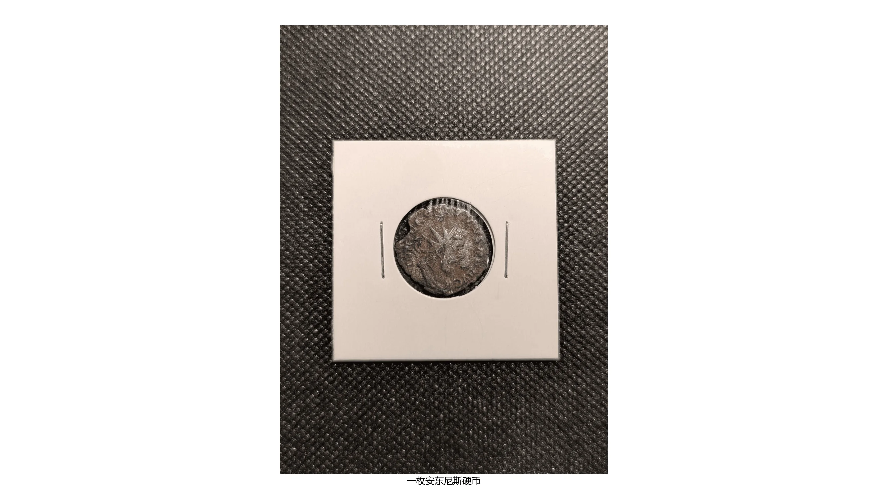

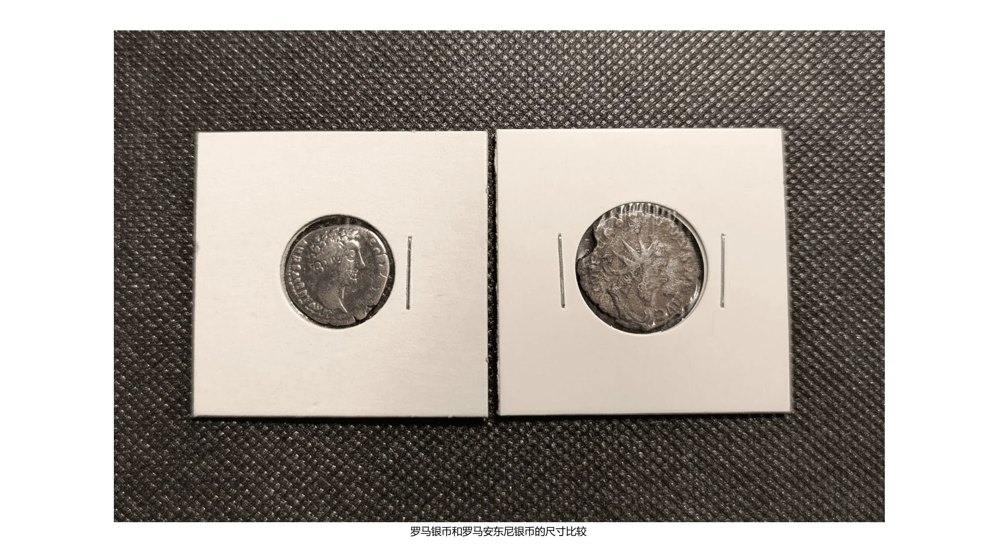

面对这种情况，奥勒良皇帝（公元 270-275 年）试图通过名义上的货币升值来稳定货币体系，但这种改革实际上引入了通货膨胀机制，人为地将现有货币的价值固定在一个较高的水平上。

下面，我将就这一主题作一个离题介绍。公元 3 世纪，通货膨胀呈指数级快速增长。在此之前，尽管钱币贬值，但手工逐枚铸造钱币的过程在一定程度上控制了通货膨胀。据统计，在货币贬值的 300 多年里，通货膨胀率平均每年约为 4%。就在奥勒良改革之前，通货膨胀率约为每年 3%。

奥勒良在 XXI 标志钱币上引入了纯度测量方法，即 20 份青铜与 1 份银的比例，或 5%的纯度。他在市场上销售这些纯度为 5%的银币，并在上面加盖了 XXI 标志。不过，他也回收了其他所有贬值更严重的硬币，并在上面盖上同样的 XXI 标志。这实际上重估了所有硬币的面值。结果，每年的通货膨胀率达到了惊人的 20%，远远超过了实施这一技术之前的 3%。

实际上，是奥勒良发明了这种贬值方式，它比金属的逐渐贬值要快得多，因为金属的逐渐贬值仍然迫使我们一枚一枚地印制钱币。他所做的就是把所有现有的钱币召回来，然后用冲压的方式来改变它们的面值。这是一个真正的转折点。就在那时，通货膨胀成了指数级增长。

为了直观地说明这种极端贬值，我找到了一些关于公元前 40 年到公元 3 世纪，跨越 300 多年的埃及谷物价格的精彩统计数据。下图是我收藏的一枚希腊四分金币。当时，在 3 世纪罗马占领下的埃及，等价物是埃及的四德拉克马。当时仍在使用德拉克马的面额，它相当于一个第纳尔。

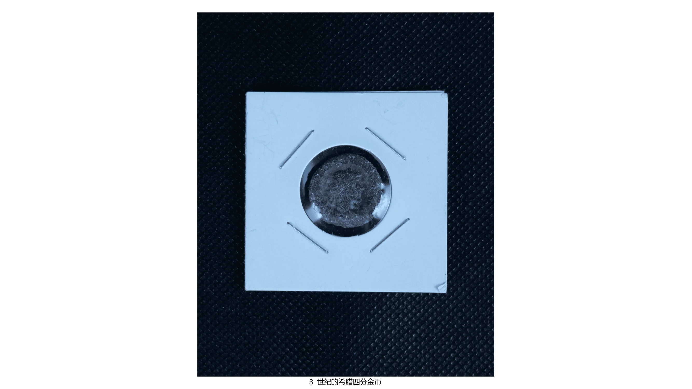

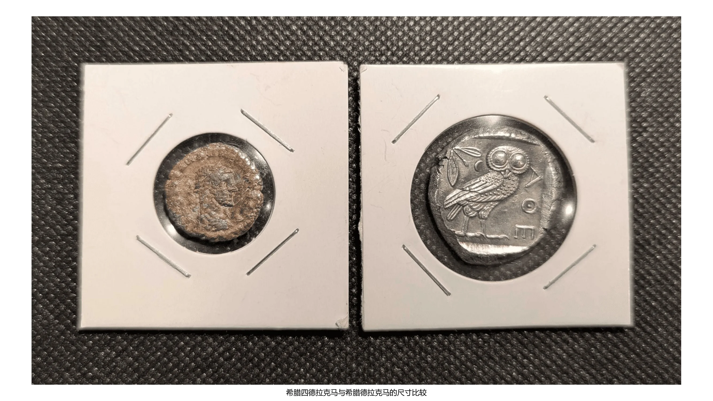

因此，我手上的这枚埃及四分金币相当于一角银币。您可以看到，这枚硬币是用 "钞票"（或青铜）制成的，因此不含任何贵金属。你可以将它与最初的希腊四分金币进行比较，看看这 300 年间的实际贬值情况。埃及的谷物价格上涨了一百万倍。

这是奥勒良改革的具体体现。应该指出的是，在这 300 年的通货膨胀中，大多数情况下，平均通货膨胀率约为 4%。只是到了最后，奥勒良进行改革时，通货膨胀才变成了指数级，我们才得出了 100 万这个数字。3 世纪末的物价是公元前 1 世纪的一百万倍。

他的继任者***戴克里先（公元 284-305 年）试图进行更激进的改革：他发行了新货币（特别是亚金塞斯，虽然更纯净，但数量太少），实行了严厉的价格控制（公元 301 年的价格敕令），并***建立了以实物支付为基础的税收制度。尽管做出了这些努力，戴克里先的改革仍未能遏制猖獗的通货膨胀。

面对拒绝提供商品和服务以换取货币贬值的情况，戴克里先建立了**世袭种姓制度，**将农民及其后代与他们的土地捆绑在一起。

这里真正需要理解的是，当时的情况是，农民拒绝提供他们的产品以换取贬值的货币，而我们亲爱的戴克里先的反应是建立**世袭种姓**，他说："你，你不能离开你的土地，你的孩子不能离开他们的土地，士兵也一样，你是士兵，你同意用我的货币支付报酬"。作为过渡解决办法，他们得到了实物报酬（肉、食物、粮食），因为他拒绝给他们钱。因此，他强加了这种世袭种姓制度，迫使人们依附于自己的行业，这样，如果他们试图不接受贬值的货币，就不能简单地更换工作。

为了说明这个例子，我这里有一篇文章，摘自《*货币制度与通货膨胀*》一书：

> 由于货币贬值，面值高于其内在价值或市场价值，人们不愿意工作，也不愿意运送货物，因此不得不通过征收实物税来强迫他们工作。[......]农民离开自己登记的家园成为非法行为。因此，农业人口成为土地的世袭继承人。
>

> 这种世袭的种姓制度逐渐蔓延开来：戴克里先强迫士兵的儿子在军队服役，而货币作坊以及戴克里先创建的纺织厂和印染厂的工人则成为国家奴隶，世袭服役。采金工人后来也成为世袭阶级。戴克里先时期可能已经存在其他世袭阶级，特别是罗马的面包师和屠夫行会[......]，以及将谷物和其他公共货物运往罗马的船长教区行会。

最终，君士坦丁（公元 306-337 年）在 312 年引入了纯金币，成功地稳定了货币体系，他严格保证了纯金币的质量和重量。他建立了一整套系统来验证纯金币的纯度和重量。 **然而，这种稳定只影响到富裕的精英阶层和帝国行政部门**，而**大多数人则继续遭受劣质货币和持续通货膨胀的困扰**。实心银币在东方帝国（拜占庭）保持稳定，并持续了一千多年，而在西方，伴随着罗马帝国最终在经济和政治上的解体，钱币分裂成小面额、低价值的硬币，罗马帝国于公元 476 年最终灭亡。

最后，我想与大家分享格林-戴维斯（Glyn Davies）所著《货币史》（*A History of Money：从远古时代到今天*》中的一段话，这段话精辟地总结了导致罗马灭亡的原因：

*"税收一直不足，而与这些日益不足、调整姗姗来迟和高度可见的税收相关的困难，促使罗马更多地依赖于一种简单、直接和隐蔽的税收形式：货币贬值。昙花一现的临时改革未能扭转这一由来已久的衰落趋势。钱币磨损造成的财政压力、沉船事故、从东方购买奢侈品造成的货币流失、赠送给日耳曼蛮族的礼物、城市人口的增长、农业生产的衰退、最富饶的矿山逐渐枯竭，以及最重要的是，为了维持城市生活的最低秩序而必须采取的 "面包和马戏团 "政策--所有这些累积起来的压力导致罗马货币不断贬值，间或进行的改革注定要失败 "*。

*除了免费或廉价的面包和葡萄酒外，帝国还时不时地以货币拨款的形式发放优待（"congiaria"），特别是在特拉扬（公元 98-117 年）时期，在哈德良（公元 117-138 年）及其继任者时期更是如此。皇帝和公民最初认为是一种特殊的特权，但到了 2 世纪初，这种特权已成为一种习惯性的期望。这些分配 "对国库构成了沉重的负担，并以自己的方式导致了国家的破产 "*。

## 货币稀释与通货膨胀之间的联系：从原因到后果

<chapterId>38d5781c-e900-53f7-baa7-413655d71754</chapterId>

:::video id=3999256d-aafe-4502-9b72-dfa8491a2777:::

本节探讨货币稀释与通货膨胀之间从原因到后果的联系。货币稀释是罗马货币史上的主要经济现象之一，对通货膨胀有直接影响。从公元 1 世纪开始，从尼禄统治时期（公元 54-68 年）起，银币（第纳利乌斯）的稀释经历了一个缓慢的初始阶段，而反复的军事和金融危机，特别是塞维鲁（Septimius Severus，193-211 年）和加里安努斯（Gallienus，253-268 年）时期的军事和金融危机则加速了银币的稀释。

我们还注意到，金黄色葡萄球菌的贬值更为渐进。这种贬值速度上的差异突出了两点：

1.双货币制中的记账单位对国家控制货币的作用。本例中的记账单位是第纳里。我确定了三种不同的管理记账单位价值的方法：贬值（金属稀释）、重币化（安托尼尼昂）和通过标记 "XXI "强加面值（奥勒良）。

2.国家希望尽可能推迟金衡制货币贬值的时间，因为金衡制货币是一种价值储备，它使精英阶层能够以牺牲弱势群体的利益为代价来维持自己的购买力。在整个课程中，我们会经常重温这一原则，尤其是与被称为 "坎蒂永效应 "的概念和西班牙马拉维迪货币的重定币值有关的内容。

这一现象非常有趣，在历史上反复出现。我们将在随后的章节中通过马拉维迪货币再次探讨这一问题。这种模式在所有储备货币中都很明显；储备货币的价值单位，如罗马的金罗马金币，保持不变。然而，普通民众在贸易和日常交易中使用的记账单位却经常贬值。因此，货币通胀影响到普通民众，而那些买得起金币的人则基本不受影响。

顺便说一句，***今天的货币贬值也是同样的现象，货币贬值使金融资产升值***，因此使用货币的人，也就是最贫穷的人变得更穷，这反过来又通过创造货币，使那些有能力、有办法保护自己免受货币贬值影响的人的资产变得更加丰富，因此这加深了社会不平等。这就是我小小的政治咆哮。

我刚才描述的就是所谓的 "康泰隆效应"。我们将看到，这位先生生活在约翰-劳的时代，我们将在后续章节中讨论这个话题。

奥勒良统治时期开始的改革使得通货膨胀率急剧上升。货币面值的膨胀不再受制于造币厂手工制造硬币的能力。已经铸造好的钱币现在可以简单地做上标记，货币供应的面值增加得更快。

关于奥勒良，我有两句话要与大家分享。第一段出自《货币史》：从古至今*：

*"就罗马经济而言，奥勒良的贡献与其说是胜利，不如说是灾难。主要是由于他 "改革 "的性质，通货膨胀率的增长远远超出了以前的水平，即使在不负责任的加里安努斯统治时期也是如此。在奥勒良之后的两个世纪里，通货膨胀成为整个罗马帝国的地方病 "*。

第二个问题来自《从钱币看古代历史》一书，涉及货币体系脱离黄金的问题：

*"奥勒良的改革改变了金货币与货币体系其他部分之间的关系。在此之前，其他类型的货币根据官方汇率（25 埃及第纳尔或 25 四金币兑换 1 奥勒留）与**奥勒留**挂钩。改革之后，黄金货币开始像其他商品一样**价值自由波动，而货币体系的其他部分则由于**合金的**减弱而**价值崩溃，不再由黄金**支持。由于记账单位理论上仍以白银为基础（第纳里乌斯，或埃及的德拉克马），价格随着货币贬值而上涨。"*

正如您所看到的，作为记账单位的货币贬值对不太富裕的人造成了极大的影响，而脱离与黄金货币的联系则保护了那些有能力储蓄在黄金这一价值储藏中的人的购买力。

在这里你必须明白的是，如果本金币和金金币之间存在联系，那么即使本金币贬值，如果你仍然能够按照这个汇率（25 本金币兑换 1 金金币）用本金币兑换金金币，那么人们肯定会用本金币兑换你的金金币，因为本金币会被高估，而金金币会被低估。但在这次改革中，他们取消了这种联系。因此，人们不能再用银币兑换对黄金贬值的银币了。这时，那些有金币的人才能真正保护自己，因为之后人们就不能再用高估的贬值白银兑换低估的纯金了。这是货币演变过程中一个非常重要的时刻。

货币制度与通货膨胀*》一书中的这些引文完美地说明了奥勒良的这一改革所产生的影响：

*"在克劳狄乌斯（公元 41-54 年）和康斯坦提乌斯（公元 337-361 年）两位皇帝统治期间，埃及公开市场上以德拉克马为单位的小麦价格***上涨了 100 多万倍。惊人的价格膨胀是公元 3 世纪和 4 世纪的主要经济事实之一"（Lendon，1990 年，第 106 页）。但这一发展**并没有想象中那么戏剧性**，因为它相当于**年平均 4.4% 的通货膨胀率**。而根据瓦辛克（1991 年，第 482 页）的说法，通货膨胀实际上**始于公元 238 年**"**。

*"从这一天起，通货膨胀慢慢加快，因为**好的货币首先被赶出流通**，所以货币供应总量起初几乎没有增加。随后，在 250 年至 293 年**间，年均通货膨胀率达到**3.65%，在 293 年至 301 年**间上升到**22.28%（Wassink，1991 年，第 466 页），也就是说，直到戴克里先皇帝***的货币改革失败为止。对于以金属为基础的货币制度中的通货膨胀而言，这一现象**特别令人印象深刻。"*

这种与货币稀释相关的通货膨胀现象最初是为了应对罗马国家偶尔出现的现金危机。通过减少钱币的贵金属含量，同时保持其面值，国家暂时增加了资源。但价格并没有立即做出反应：事实上，罗马的制度具有一定的粘性，这意味着工资和价格对连续贬值的适应是缓慢的。尽管如此，在达到某个临界点后，价格会急剧上涨，使市场与货币的实际价值恢复平衡。

如上所述，这种现象在 3 世纪中叶以后尤为明显。在埃及这个文献记载丰富的地区，尽管最初试图稳定物价，但在奥勒良统治时期（公元 274 年），官方对货币进行重新估价后，物价上涨了 10 倍。随后，戴克里先（公元 301 年）颁布价格法令，实施严厉的控制措施来抑制通货膨胀，却没有从根本上解决问题--生产过剩和货币贬值--从而导致了可预见的失败。持续的通货膨胀最终将经济推向两级体系： **精英阶层受到黄金储备（如君士坦丁的圣盾**）的保护，享受稳定的生活，而大多数人则继续遭受长期通货膨胀，**体现了今天所谓的康泰隆效应**。

罗马的货币稀释与通货膨胀之间存在着明显的联系，而通货膨胀的原因主要与长期的财政赤字、不断的军费开支以及糟糕的国家经济管理有关。

## 罗马帝国的衰落

<chapterId>b6ec0914-227b-509c-8108-b09eec9bb904</chapterId>

:::video id=91d4fee5-59bb-4ab9-a90b-e1125c71decb:::

### 货币贬值与罗马崩溃

奥地利经济学派，特别是路德维希-冯-米塞斯，提出了对罗马衰落的货币解释。在这一观点中，罗马货币的逐步贬值打破了维持一个拥有 6000 万居民的帝国的复杂的分工体系。货币作为经济协调的核心工具，一旦腐化，就会导致整个社会和经济结构的崩溃。

货币状况的恶化不仅破坏了帝国的内部凝聚力。它还切断了与周边民族的贸易联系。失去了与罗马贸易的利益，"蛮族 "从和平合作转为掠夺。因此，入侵不仅是军事性质的，也是根本性经济崩溃的结果。

### 帝国贬值的三个阶段

罗马货币史可分为三个不同时期。第一个时期，从朱利奥-克劳德王朝到安东尼王朝（公元前 27 年至 2 世纪末），保持了相对稳定。在特拉扬时期，帝国达到了顶峰：罗马占地 500 万平方公里，成为历史上第一个百万富翁城市。银币的纯度保持在 98% 到 80% 之间--适度贬值仍能使经济正常运转。

第二个时期，即 3 世纪，是军事上的无政府状态。在几十年的时间里，有 26 位皇帝相继继位。货币崩溃了：本应价值两个第纳尔的安托尼尼(antoninianus)只有 1.5 的金属重量--这是第一次尝试将法定价值和实际价值割裂开来。这种操纵引发了格雷沙姆法则：劣币驱逐良币。市民们囤积良币，只花贬值的钱币。

考古学家发现的货币宝藏揭示了这种经济焦虑。埋藏在地下的双耳瓶通过分层显示了罗马人如何先存放最好的硬币，然后再逐渐添加贬值的硬币。这些古老的 "堆栈 "见证了人类面对不确定性所采取的行动--试图在一个衰败的世界中保存价值。

### 君士坦丁和双轨制

君士坦丁（310-337 年）试图通过大刀阔斧的改革来稳定帝国。他创造了一种由行政部门严格控制的货币--金盾。官员们系统地检查重量和纯度。发行量仍然有限，与战利品挂钩。这种货币成为唯一的权力工具：税收以苏图斯支付，军团以黄金领取军饷。

与此同时，人们使用不断贬值的青铜钱币。445 年，一个铜币价值 7,000 努米；498 年，价值 16,800 努米。这种双轨制使康提翁效应制度化：那些有机会获得实心货币的人--行政部门、地主--受到保护，免受通货膨胀的影响。而平民则被限制在努米的范围内，不可避免地变得越来越穷。

这种货币分离造成了两个没有官方汇率的平行经济体。坚金币仍然是记账单位，但流通量很小。努穆斯用于日常交换，但不断贬值。这种货币结构预示着新兴封建制度的不平等。

### 分工的崩溃

货币贬值逐渐摧毁了经济专业化。没有了可靠的记账单位，地中海贸易崩溃了。罗马的专业工匠无法再与埃及或高卢进行贸易。各省采用自己的货币，使贸易摩擦成倍增加。

面对这种分崩离析的局面，城市人口纷纷逃往农村--城市人口的外流扭转了几个世纪以来的城市化进程。手工业者放弃了自己的行业，转而从事自给自足的农业。大型庄园（latifundia）成为自给自足的孤岛，预示着中世纪世袭制的到来。

无奈之下，戴克里先甚至要求征收实物税--最终承认了货币的失败。他的最高敕令（301 年）试图控制物价，加速了易货贸易的回归。经济的复杂性倒退到了文明以前的形式。

### 从罗马到拜占庭，靠黄金生存

令人啼笑皆非的是，固元在西方帝国得以延续。拜占庭一直将其保留到 11 世纪，从而确保了长达千年的经济稳定。在西方，人们对它的记忆依然存在：法语中的 "sou "一词就来源于solidus，这在语言上证明了货币辉煌的消失。

以黄金保存财富的地主变成了封建领主。教会结构作为唯一幸存的机构，提供了金钱无法再保证的社会纽带。欧洲分裂为自给自足的领地，每个领地都有自己的自给自足经济。

这种转变揭示了复杂文明的脆弱性。使罗马能够养活百万居民的分工完全依赖于货币信任。一旦这种信任被打破，这座大厦便轰然倒塌，使欧洲在近千年的时间里回到了原始的经济形态。

## 黑暗时代和中世纪

<chapterId>a5856873-6142-57be-8a73-1f9e3df83792</chapterId>

:::video id=86b8da9b-3831-443d-b170-58c2bea3ad54:::

中世纪货币的历史和出现经历了倒退、创新和经济复苏时期。

例如，当罗马军队离开不列颠后，再也没有罗马硬币进入该岛。公元 435 年左右，硬币的使用在不列颠完全消失，这在前罗马帝国的行省中是绝无仅有的。在将近两个世纪的时间里，英国经济一直没有硬币，直到 7 世纪，墨洛温王朝和大陆风格的硬币才逐渐重新出现。

从 8 世纪起，基督教的影响促使北欧重新引入硬币。这一时期的关键人物是法兰克国王短腿佩平（Pepin the Short），他于 752 年引入了银币，后来被他的儿子查理曼大帝（Charlemagne）采用。查理曼大帝广泛推广了银元的使用，使欧洲的货币标准持续了几个世纪。

在英格兰，随着麦西亚国王奥法（Offa）在 765 年左右制造出银便士，钱币出现了重大复兴。这种货币变得如此重要，以至于 500 年来几乎没有变化。

作为与这一时期有关的第一件文物，请允许我向您展示当时一枚英国便士的复制品。

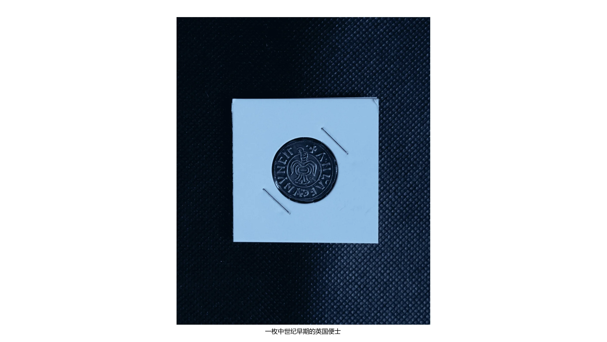

中世纪后期，罗马货币体系崩溃后，欧洲陷入封建社会。大多数人使用低价值的铜币或青铜币，货币往往被稀释，从而限制了远距离贸易。

硬币作为支付手段的回归是逐渐发生的，在 13 世纪达到顶峰，1252 年佛罗伦萨出现了弗罗林金币，随后威尼斯也出现了杜卡金币。这些金币的广泛使用得益于贸易的扩张以及对可靠的、国际通用的支付手段的需求日益增长。

在英格兰，创新的财政政策保护了货币体系不被稀释，例如征服者威廉在1066年后引入的土地税，它保持了英镑便士的质量。这里需要了解的是，当时的君主可以通过货币贬值来为国家提供资金，而**这种税收的引入使货币保持稳定并通过税收为国家提供资金成为可能。

然而，通过稀释货币获利的诱惑导致了危机，例如在 12 世纪亨利一世统治时期，硬币的质量急剧下降。严厉的改革（有时伴随着针对铸币者的暴力措施）暂时恢复了人们对货币的信心。

中世纪还出现了复杂的金融实践，如英国使用理货棒规避高利贷禁令，扩大信贷。教会并不热衷于有息贷款，因此人们使用各种技术来规避使用利息的禁令。

这些创新是对金属货币长期短缺的回应，鼓励了金融市场雏形的出现。

与此同时，十字军东征刺激了地中海贸易，促进了国际交流和新银行业务的发展，特别是通过圣殿骑士团。圣殿骑士团成为重要的金融中介，使十字军能够在远离家乡的地方获得流动资金，预示着现代欧洲银行体系的到来。

为了与圣殿骑士联系起来，您可以在下面观察一枚法国中世纪硬币，您可以在硬币中央看到一个漂亮的十字架。在这个时代，带有这个十字架的硬币非常常见。

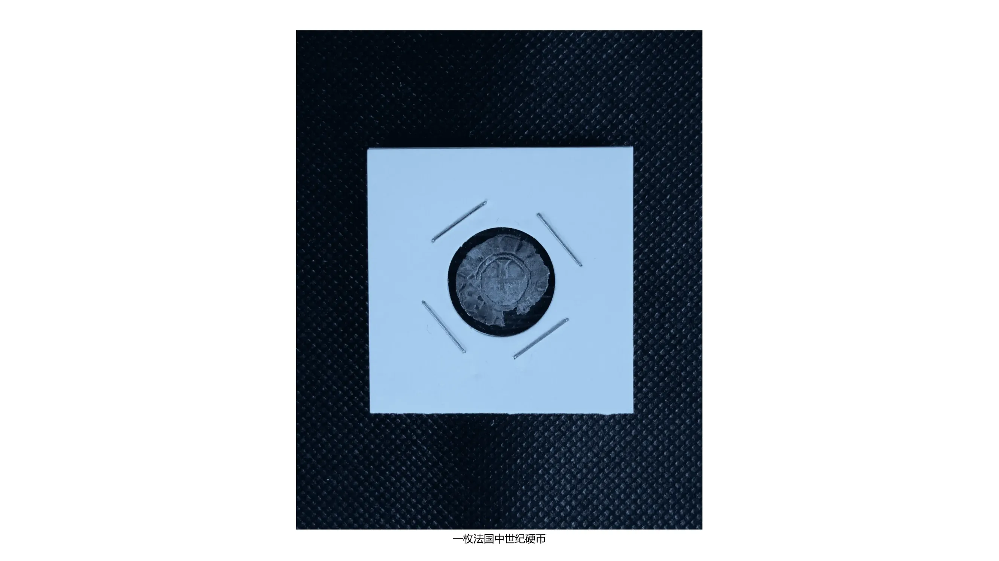

最后，黑死病（1346-1353 年）等重大危机带来了深刻的经济变革。人口的急剧下降导致工资的大幅上涨，政府试图维持以往的薪酬水平的努力遭到了抵制。

与此同时，百年战争（1337-1453 年）迫使各国采取更积极的财政政策为军队提供资金，从而削弱了封建制度。

因此，中世纪的特点是，贸易需要可靠的货币，而统治者则不断受到诱惑，为了眼前利益而稀释货币，两者之间的矛盾始终存在。这种矛盾深刻地影响了欧洲的货币发展，为现代经济体系奠定了基础。

在本节的最后，我想补充一个大约在这个时期发生在英国的有趣轶事。这则轶事摘自格林-戴维斯（Glyn Davies）所著的《货币史》一书。

报告提到，在英格兰，向议会的转变将债务负担从君主转移到议会，导致国家长期负债。而在此之前，债务都是由君主承担的。

一旦议会能够攫取部分货币创造权，就能创造由人民而非国王承担的长期债务。在此之前，如果国王破产或国王更迭，债务也会随之消失。

在议会创造债务的那一刻，主权债务的概念就出现了，因为它在时间上可能是无限的。只要国家存在，只要议会存在，债务就会存在，他们必须找到各种方法为债务再融资，并将其长期分摊。这是一个重大的模式转变，不再是国王或皇室为这些债务提供担保或承担债务负担；现在是议会，因此也是其公民。

## 文艺复兴

<chapterId>1d1dfb05-70b4-5b7b-9708-373c2182950d</chapterId>

:::video id=4977b4f3-c7b2-41a5-ad7b-a96a8cca4092:::

现在，我们已经到了讲述文艺复兴时期的课程部分。文艺复兴时期是在悲剧性危机的背景下发生的，鼠疫通过船上的跳蚤迅速传播。然而，这场悲剧却让我们了解到中世纪早期贸易和旅行的发展。在这一时期的早期，并没有这么多人走得这么远、这么快。

### 佛罗伦萨的弗洛林

文艺复兴时期欧洲金币的回归标志着货币史上的一个重要转折点。 **这一切始于 1252 年佛罗伦萨的弗罗林金币，它是罗马衰落后欧洲铸造的第一枚大金币**。弗罗林金币的重量和纯度非常稳定（约 3.5 克纯金），在四个世纪中保持不变，并迅速成为泛欧货币的重要参考。

下面您可以看到一个弗罗林的复制品：一个由法国艺术家手工雕刻和冲压而成的锡制金弗罗林。

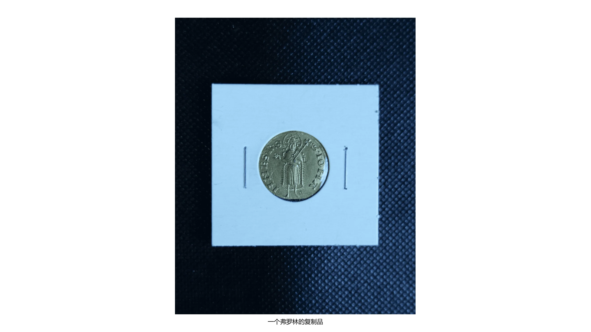

金币的回归有其特定的背景：拜占庭坚金币的崩溃和蒙古入侵导致的穆斯林世界经济衰退造成了国际贸易中的货币真空。

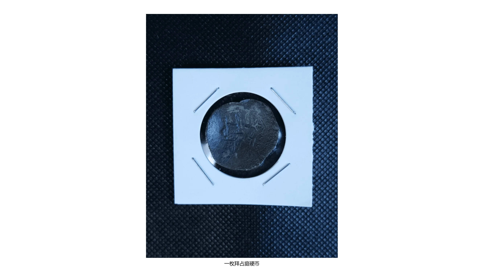

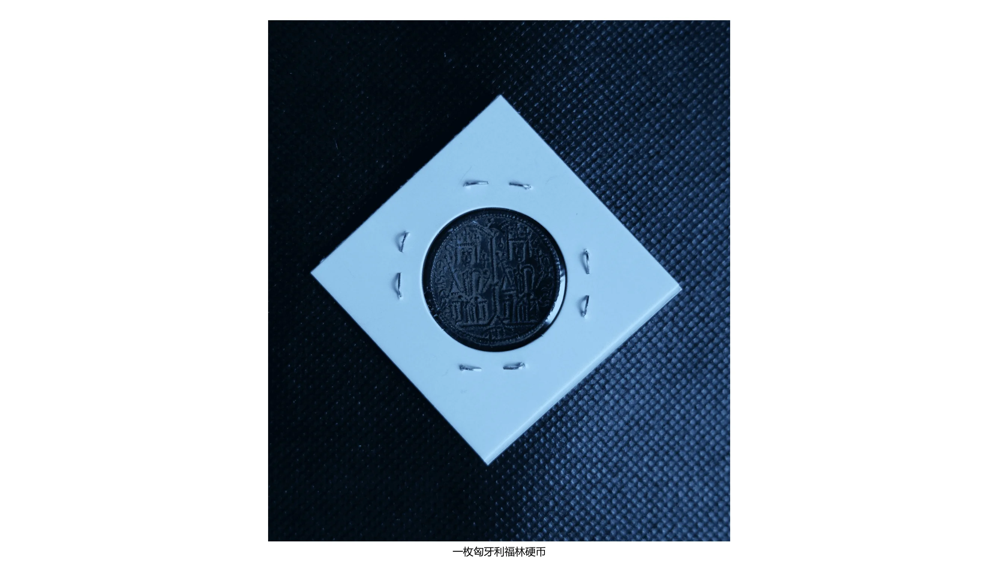

上图第一张是一枚拜占庭硬币，我觉得非常有趣。我想把它与匈牙利同一时期的一枚硬币（上图第二幅）进行比较。匈牙利硬币呈杯状，就像一个微型碗。钱币上的圣像是并排手持十字架的国王。这枚硬币呈碗状，产自匈牙利。

仿制其他国家的钱币是一种相当普遍的习俗。由于拜占庭钱币被普遍接受，其他国家也经常仿造。并排比较后您会发现：这些钱币非常相似。

意大利北部，特别是佛罗伦萨、威尼斯和热那亚，利用这一背景推出了新的硬通货--贵金属含量稳定的硬币。威尼斯效仿佛罗伦萨，于 1270 年铸造了杜卡特，这种货币与弗罗林几乎完全相同，在地中海贸易中被广泛使用。

14 世纪末，弗罗林成为第一种国际储备货币，被 150 多个欧洲城市采用。随着以美第奇家族为首的佛罗伦萨大型银行网络的建立，货币和会计管理彻底实现了现代化，甚至减少了对黄金实物运输的需求。

这是另一个非常有趣的问题。曾经有一段时间，很多硬币在海上运输中丢失。这项技术的进步--采用复式簿记的登记簿--使得经文货币得以产生。这样就可以减少硬币结算的次数，转而使用书面记账系统，从而大大降低了在运输途中丢失钱币的风险。

在货币发展的同时，银行业务的发展也发生了重大变化。早在 13 世纪，佛罗伦萨、威尼斯、巴塞罗那和热那亚就出现了初级银行系统。圣殿骑士团是一个宗教和军事组织，他们已经开发了一套系统，使十字军能够在旅行时不带走他们的财富。

他们将资金存入所在国的圣殿骑士办事处，然后带着一封信旅行，到达十字军目的地后领取硬币。

这意味着我们不必随身携带贵金属硬币。

也是在这一时期，由于马可-波罗在 13 世纪的旅行，欧洲开始了解到中国纸币的存在。然而，由于欧洲更倾向于先完善其金属铸币方法，纸币的发展还要等上几个世纪。达芬奇与著名的特许会计师卢卡-帕乔利（Luca Pacioli）关系密切，积极推动了压钞机的改进，促进了更快、更均匀的硬币生产。

我们指的是课程前面提到的钟摆击打技术。与锤击法相比，这种方法能制造出更均匀的钱币，更重要的是，正如我之前演示的那样，这种方法允许在钱币边缘刻字。下图是一枚 1793 年的欧洲塔勒，边缘上清晰地显示着文字。

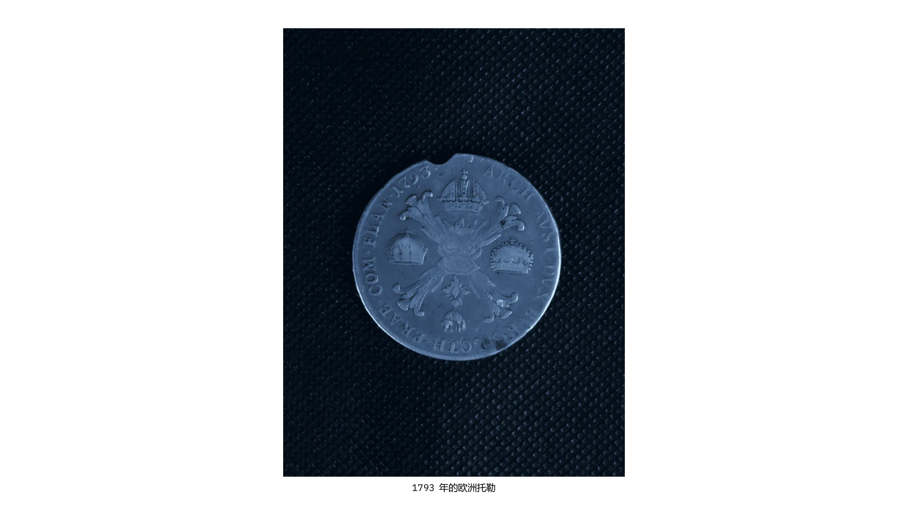

然而，在 15 世纪，欧洲经历了一场严重的货币危机，欧洲货币的含银量普遍下降，在 1450 年左右降至 5%以下。

从 16 世纪起，受阿拉贡王国和卡斯蒂利亚王国合并、罗马征服结束以及 1492 年克里斯托弗-哥伦布等海上大发现的刺激，货币重心转移到了西班牙。大量白银从美洲矿山涌入，严重破坏了欧洲和全球的经济平衡，加剧了通货膨胀和新的地缘政治紧张局势。

文艺复兴还标志着钱币艺术的重大发展，出现了 Thaler（Joachimsthaler）等钱币，这也是 "美元 "一词的由来。这些大型银币反映了北欧技术革新带来的新的艺术和机械铸造技术。

最后，随着银行业、信贷和金融市场的发展，以及阿姆斯特丹、伦敦和斯德哥尔摩等商业大城市现代资本主义雏形的出现，金融文艺复兴迎来了向经济现代化的过渡，为我们今天所熟知的国际金融体系奠定了基础。这就是我们下一个视频的主题。

# 国家扣押金钱

<partId>17cfb1b4-5bc1-53e0-b035-05c7cf76be92</partId>

## 世界储备货币的演变

<chapterId>d65cc352-e7ca-5f03-9b23-dd1fae5c0395</chapterId>

:::video id=82710062-8fff-426c-93af-923c08d82233:::

### 贵金属的历史重要性

欢迎来到有关储备货币和中央银行的出现的这一部分。作为这一新部分的第一点，我们将重点讨论全球储备货币的演变。

长期以来，贵金属，尤其是黄金和白银，一直被认为是帝国财富和权力的基础。对黄金的渴求一直是一种主导性的驱动力，正是贵金属的涌入对欧洲的货币发展产生了最直接、最明显的影响。在中世纪和文艺复兴早期，这种对金银的痴迷是由于其他形式的商品难以保值，以及外国列强的强烈需求，尤其是在与东方的贸易中。

几个世纪以来，多个帝国相继成为全球经济中心。在特定时期主导世界贸易的国家通常会被授予储备货币地位。这些国家包括

- 西班牙和葡萄牙（15 和 16 世纪）

- 17 世纪的联省（荷兰

- 18 和 19 世纪的法国和英国

- 20 世纪的美国

### 葡萄牙的繁荣与雷亚尔（1450-1530 年）

**葡萄牙**凭借**葡萄牙雷亚尔**这种重量相对统一的银币，在 15 世纪下半叶和 16 世纪初主导了世界贸易。由于航海技术的进步，葡萄牙人找到了通往非洲、亚洲和新大陆的新航线。从非洲到中国（澳门），军事要塞和贸易站成倍增加。

为了满足欧洲对黄金和白银的需求，"商业利润，尤其是对黄金和白银的追求，是大发现的永恒动力"。然而，葡萄牙帝国由于过度扩张，又面临荷兰、英国和法国的竞争，开始走向衰落。

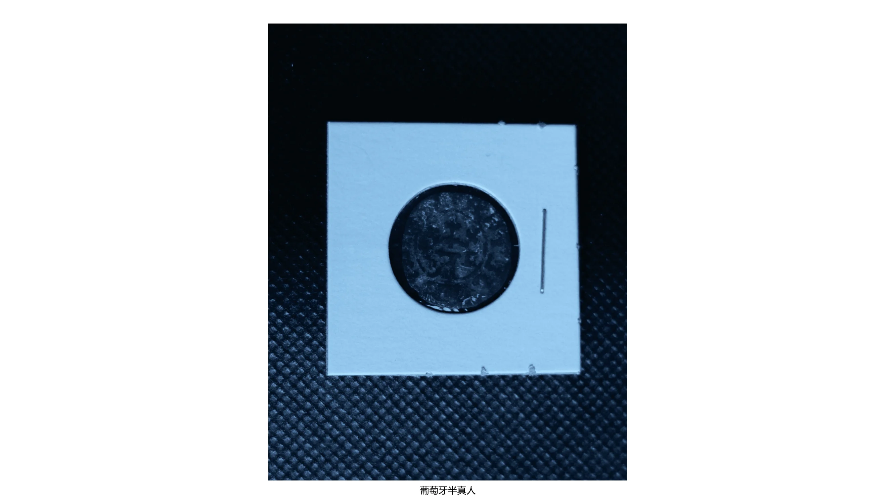

在上面，您可以看到这些海上征服时期的葡萄牙半真人雕像。

### 西班牙远地点和西班牙元（1535-17 世纪）

随着对新大陆的征服，西班牙***成为了主导者。西班牙君主控制着巨大的银矿（玻利维亚的波托西、墨西哥的萨卡特卡斯），成功地铸造了纯银货币，从而避免了本国货币：**西班牙雷亚尔**的贬值。

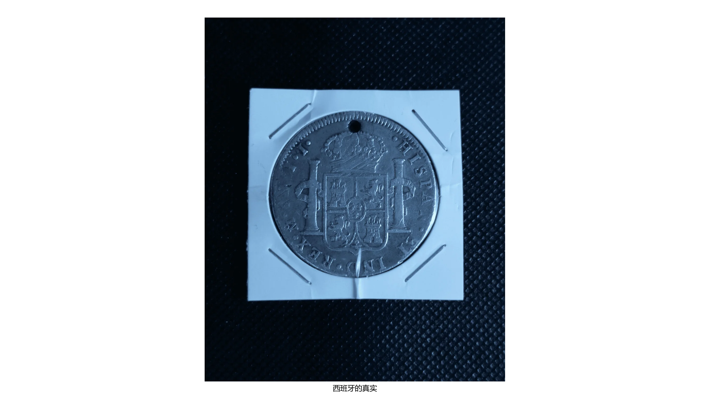

西班牙雷亚尔也被称为 "八分之一"，其绰号的由来是因为它经常被切成八分之一来制作更小的硬币。它也被称为**西班牙元**。您上面看到的这枚硬币是 1814 年制造的，因此是一枚较新的硬币。不过，最早的西班牙一元硬币并不那么精致；它们是用锤子敲打的，通常不够圆润和清晰。

特别有趣的是，西班牙元当时是国际储备货币。西班牙当局还发行了自己的当地货币马拉维迪，并通过回收定期调整货币供应量。例如，一枚最初价值 1 马拉维第的铜币或铜币可能会被回收并盖上 "2 "的印章，然后再盖上 "4 "的印章，以此类推，有可能达到 "8 "的印章。在高分辨率照片中，您可以清楚地看到硬币上印有 "8"。这种方法有效地扩大了货币供应量......这不可避免地导致了通货膨胀。

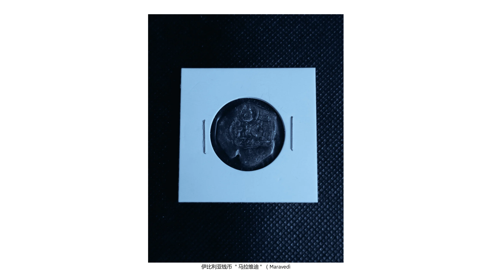

如果我们回顾一下储备货币的历史，就会发现一个有趣的现象：只要帝国还保留着储备货币的地位，它们就不会让自己的货币膨胀。 **只有在其统治结束时，他们才会让货币贬值，失去这一特权，然后将这一特权传给新的帝国**。

在西班牙，西班牙元主导世界贸易近 200 年，尤其是中国和欧洲之间的贸易。这些钱币甚至可以在中国港口找到。这就是我们从历史中得到的启示：美元直接来源于这种货币。1792 年美国成立时，通过了一项铸造自己货币的法律，美国的第一批美元在名称和硬币大小上都是以西班牙美元为蓝本。

为了让您对其价值有所了解，一美元最初是一枚银币，重达近一盎司，或按今天的货币计算在 30 至 40 欧元之间，与我们今天所知的纸币不同。至于西班牙元，它的流通范围如此之广，以至于被认为是第一种真正的全球货币。

然而，美洲贵金属的大量涌入导致了欧洲的通货膨胀。在价格革命期间（约 1540-1640 年），英国的生活费用增加了七倍。在西班牙，丰富的白银产生了反常的资源诅咒效应，阻碍了稳固的银行机构的发展。

随后，西班牙面临多次军事冲突（佛兰德斯战争、尼德兰战争、三十年战争），财政逐渐崩溃。历代统治者没有让举世闻名的银币贬值，而是选择拖欠或贬值当地人使用的铜币（维尔龙）。这就是我之前描述的马拉维迪斯。

### 荷兰的崛起（17 世纪）

在伊比利亚达到顶峰之后，荷兰***在 17 世纪崛起为新的商业强国。海上贸易、VOC（荷兰东印度公司）以及**阿姆斯特丹股票交易所-15**（受安特卫普股票交易所的启发）的成立，使这个商人共和国成为一个枢纽。

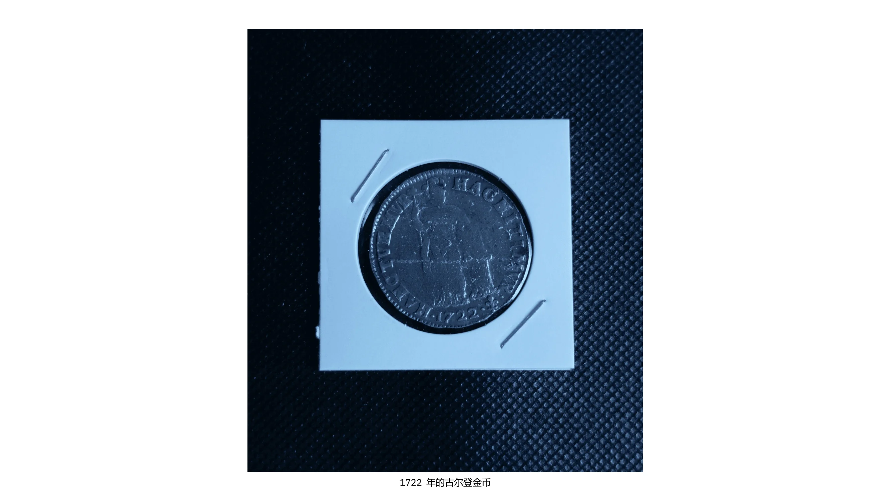

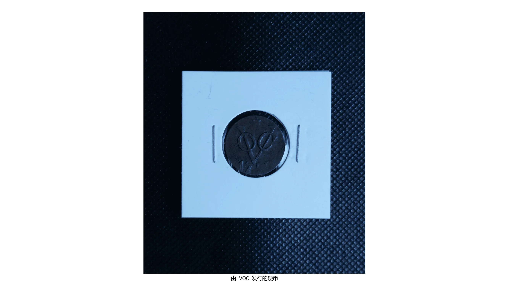

在上面的第一张照片中，您可以看到一枚 1722 年的古尔登（一枚漂亮的银币），而在第二张照片中，则是一枚由 VOC 发行的硬币。

在当时，王国政府是一家极为强大的公司：它拥有自己的军队，甚至发行自己的货币。

荷兰人发明了现代资本主义，它最初是作为一种风险投资的风险分配手段，如远征新大陆或寻找新的贸易路线。股份公司使多个投资者能够集中资金，分担风险。为了促进这些交换，当时有必要建立能够谈判和交换这些证券的机构。于是，1602 年，第一家股份公司和证券交易所诞生了。

荷兰货币 "古尔登"（**Gulden**）因其白银纯度而获得信誉，随后被阿姆斯特丹银行采用（1609 年），存款成为欧洲首选的货币形式。这一点非常重要。是的，当然有硬币，但在当时真正构成货币的是一种经文货币。事实上，世界上大部分贸易都是通过阿姆斯特丹银行的账簿进行的。这是银行业的一次真正突破：国际贸易不再必须使用实物硬币，而是直接通过银行的会计记录进行。

在这一繁荣时期，大量黄金和白银涌入，特别是来自其他实行通货膨胀或货币控制的国家。这里要提到一个有趣的人物： **托马斯-格雷沙姆**。此时，他在荷兰为英国皇室工作，管理两国之间的货币流通。正是这位格雷沙姆为我们留下了著名的**"格雷沙姆定律 "**。

然而，荷兰帝国也最终耗尽了力量。与英国的战争、冲突时期古尔登的稀释以及来自其他强国（法国和英国）的竞争，都预示着荷兰霸权的终结。第四次英荷战争（1780-1784 年）之后，古尔登作为储备货币的衰落变得不可逆转。

### 法国的权力、野心和失败（17-18 世纪）

路易十四时期，法国***成为欧洲大陆上最强大的国家。然而，法国货币从未取得过主导参考地位：多次贬值、重税和代价高昂的战争（奥格斯堡同盟、西班牙王位继承战争等）严重影响了货币体系的稳定。

约翰-劳（John Law，1716-1720 年）首次对纸币进行了大规模试验。银行发行了由政府债务承诺支持的纸币。这一计划导致了 1720 年的投机泡沫和崩溃（密西西比泡沫）。这场灾难给法国留下了对纸币的长期不信任。正是这次灾难性的经历，让理查德-康泰隆（Richard Cantillon）成为了富翁，这要归功于这种陈述原则的制度。

当这种不信任最终消失时，另一种法国纸张惨败了：革命性的************************************。从1790年起，这些以没收教士财产为基础发行的瓦朗谢纳特经历了狂飙突进的恶性通货膨胀，成为历史上第一个月通货膨胀率超过50%的正式恶性通货膨胀。1795 年，虽然面值翻了几番，但其交易价格仅为其初始价值的几分之一。

更多的限制性法律试图强制推行 "转让"，但都没有成功。政府试图强制执行，甚至以死亡威胁那些不接受转让的人，并强迫店主继续营业。当然，最终还是没有成功。

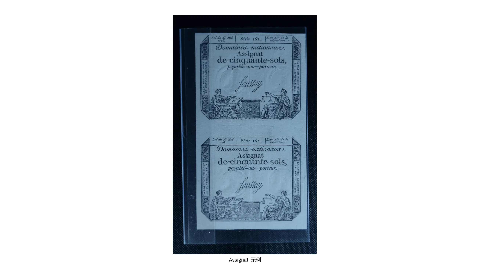

由于纸币取代了所有优质的贵金属硬币，与著名的格雷沙姆法则相一致，硬币短缺随之而来。为了铸造新硬币，他们使用了从神职人员那里缴获的铃铛金属。下面您可以看到一块精美的钟形金属，它是用从神职人员手中夺取的硬币熔化后回收的铜制成的。

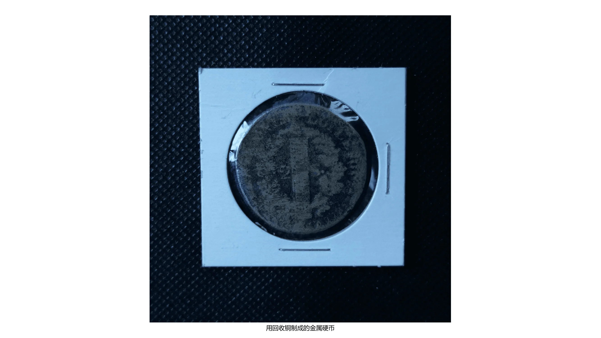

### 英国统治（18 世纪至 20 世纪初）

**英国**在 18 世纪超越荷兰，成为霸主。英镑是至今仍在使用的最古老的货币，最初与一磅白银挂钩。在金融和财政革命的支撑下，英镑的地位逐渐稳固：议会君主制、强大的征税能力以及 1694 年英格兰银行的成立。

经过一系列对法战争，英国在 1815 年（滑铁卢）取得胜利，确立了其霸主地位。在整个 19 世纪，英镑一直是世界储备货币。在其鼎盛时期，英国人口仅占世界人口的 2.5%，却创造了全球 20% 的收入，并控制了地球近四分之一的面积。

**工业革命**和**金本位制**的采用（1717 年或 1718 年，由艾萨克-牛顿在皇家铸币厂监督）加强了英镑的信誉。英格兰银行采用了每盎司黄金兑换 4.25 英镑的金本位制，允许纸币持有者将纸币兑换成黄金。

然而，第一次世界大战（1914-1918 年）结束了这一体系。在数周内，所有主要参战国都暂停了黄金兑换。大英帝国以及后来的英镑在第二次世界大战中处于衰弱状态，在 20 世纪让位于美元。

作为工艺品，您可以在下面看到一些美丽而有趣的作品。这些都是货币砝码。第一个是主权：英镑最早的代表。我只有货币砝码来代表这些硬币，因为我买不起真正的主权。为了称重，我们使用了天平，然后将相当于主权价值的货币砝码放在另一侧。

主权金币是一种货币--最初价值一英镑的金币。

在著名的主权货币之前是基尼币，其运作原理与主权货币相同。基尼因含有几内亚地区的贵金属而得名。

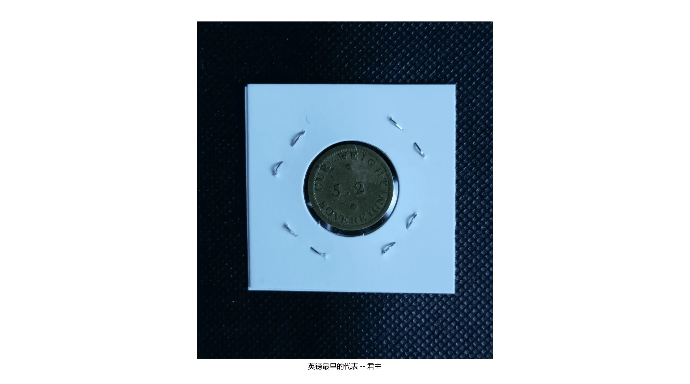

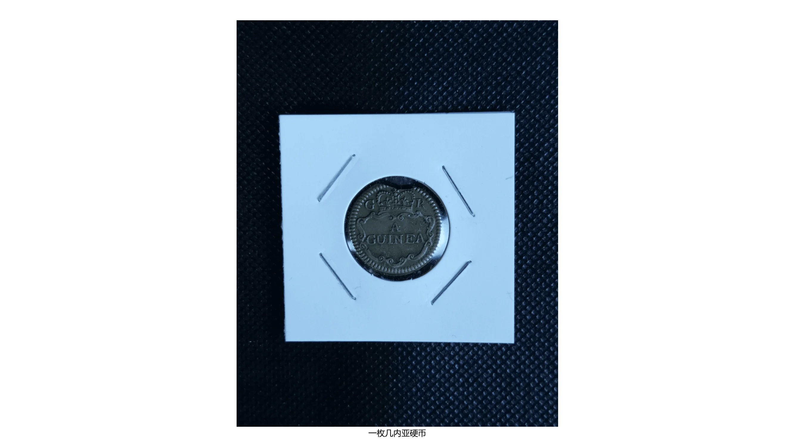

## 中央银行的出现

<chapterId>15777771-1e28-55f7-a400-69868a47079b</chapterId>

:::video id=7661b7b5-e00f-48f3-b69a-6fb2eb5ebba4:::

继第一批储备货币的历史及其演变这一部分之后，下面将介绍中央银行的出现。这部分内容与储备货币的出现大致相同，但更侧重于当时的银行技术。

### 银行和原始银行的起源

早在 13 世纪，意大利人（佛罗伦萨、热那亚、威尼斯......）就发明了复式记账法。后来，**安特卫普**（16 世纪）成为北欧的主要金融中心，后来由于阿姆斯特丹股票交易所（1609 年）的建立，这一角色被**阿姆斯特丹**取代，因为阿姆斯特丹股票交易所 16 年来一直在交易英国皇家海军的股票。

安特卫普是商人集市的举办地，商人们经常聚集在这里清偿债务，从而发明了新的金融工具。下面这张票据的日期为 1761 年，是一张**本票。它的特点是背面有手写的细节和铭文，是那个时期的一件珍贵文物。

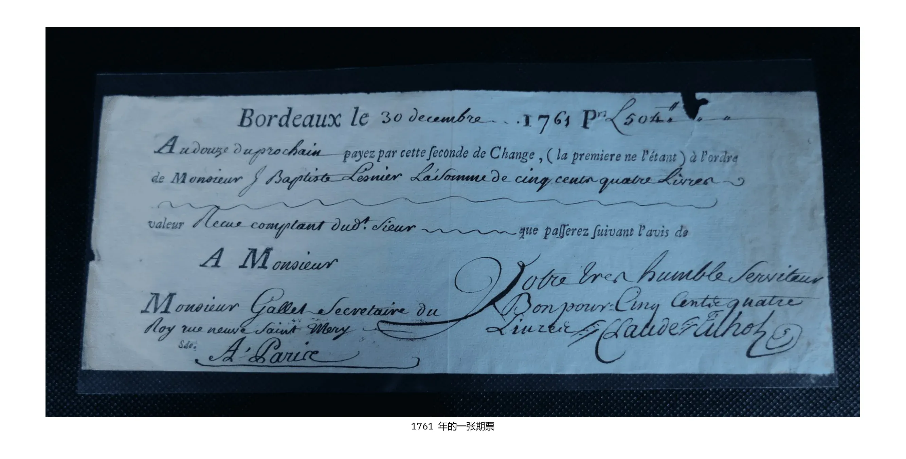

这股热潮催生了更为先进的银行机构。 **伦巴第银行家**和后来的荷兰商人完善了信用工具（汇票、本票等）。现代银行体系正是基于这一理念：货币可以是信用，而不仅仅是金属。

如您所见，这又回到了我们最初关于货币起源的问题。

货币是产生于交换需要的商品，还是产生于信用？在本节中仍然可以找到这方面的蛛丝马迹。

### 瑞典的例子：斯德哥尔摩银行和 Riksens Ständers 银行

我们再来看看瑞典，第一家中央银行就是在这里创建的。

**瑞典**是中央银行的先驱：1657 年，约翰-帕姆斯特鲁赫（Johan Palmstruch）创建了**斯德哥尔摩**银行，授权其放贷额超过其金属储备，从而标志着[部分准备金银行](https://planb.academy/resources/glossary/fractional-reserves)的诞生。但过度的纸币发行导致了恐慌，1663 年银行遭到挤兑。好吧，好吧......

1668 年，世界上第一家真正意义上的中央银行 Riksens Ständers 银行在斯德哥尔摩成立。然而，该银行也遭遇了危机（1709 年、1715 年......），危机与滥用纸币有关，滥用纸币往往是为了资助王国的战争。

### 约翰-劳的失败政变

让我们向法国进发，在那里我们再次找到了我们心爱的约翰-劳。

**苏格兰人约翰-劳**说服摄政王（奥尔良公爵）创建了一家私人银行--皇家银行（Banque Générale，1716 年），该银行有权发行纸币以抵消黄金、白银和政府债务。该银行后来成为皇家银行（1718 年），帮助密西西比公司股价飙升。

当现实与投机并存时，**决定禁止持有黄金并强制使用劳氏纸币**，加剧了恐慌。好吧，好吧......

最后，泡沫在 1720 年破灭，造成了纸币的崩溃，纸币在法国的信誉在很长一段时间内都毁于一旦。

### 阿姆斯特丹银行，先锋模式的崛起

我们现在来到 1609 年的阿姆斯特丹，阿姆斯特丹**银行（Wisselbank）控制了阿姆斯特丹的硬币保管和兑换。它禁止私人纸币流通，并强制要求将金属硬币存放在其保险库中。他们一点一点地夺取了货币的控制权。他们禁止货币兑换商将硬币存放在他们那里。货币兑换商整天工作，下班后必须将硬币存入阿姆斯特丹银行的金库。正如我所提到的，国际贸易中使用的不一定是金属硬币。而是银行账簿上的经文货币。

凭借荷兰商人的力量，该银行扮演了第一个事实上的 "中央银行 "的角色，稳定了世界贸易。然而，随着时间的推移，该银行向荷兰皇家银行发放了无担保贷款，并最终耗尽了支持其票据的金属。1790 年，它被发现借出大笔资金给英国皇家海军，并几乎宣布破产，毁掉了古尔登的信誉。好吧，好吧......

### 英格兰银行，现代银行业的奠基者

在 17 世纪的英格兰，金银由金匠储存并开具收据。当英国王室发现自己在对法国的战争中需要大量资金时，这种部分分散的组织方式证明了它的局限性。

1694 年，**英格兰银行（BoE）**成立。因此，英格兰银行诞生于伦敦商界与急于为战争寻找资金的政府之间的一次姻缘。

银行获得了在英格兰发行纸币的垄断权（1708 年、1742 年等得到加强）。从此，由黄金储备支持的纸币与硬币一起流通。这是理解国家机构逐渐接管货币的重要一点。首先，阿姆斯特丹银行阻止货币兑换商保存硬币，并强迫他们将硬币归还银行。在英国，私人银行被禁止发行可兑换黄金的票据。

他们确实允许私人银行发行纸币，但这些纸币只能兑换英格兰银行的钞票。

英格兰银行的英镑钞票可以用黄金兑换。这为货币增加了第三层。因此，我们有黄金作为基础，然后是英格兰银行票据，最后是私人银行票据。在此之前，私人银行可以发行自己的可兑换黄金的票据。这是国家机构逐步接管货币的另一个阶段。

银行为国家提供了大量贷款，并为经济繁荣所需的巨额公共债务提供了结构性资金。

这种模式在 18 世纪和 19 世纪得到巩固，英镑在英格兰银行和金本位制的封印下成为世界储备货币。

**几个世纪以来，在一个国家或帝国的经济、商业和军事实力的推动下，世界储备货币**相继出现：葡萄牙、西班牙、荷兰，然后是英国，直到 20 世纪美国成为霸主。在每种情况下，我们都能看到类似的循环：经济扩张、商业成功、在国际上采用货币、负债、代价高昂的战争、滥用货币创造或信贷，最后衰落。

**中央银行**的出现是一个渐进的过程。这些机构往往出现在代价高昂的战争背景下，使国家能够通过举债为自己融资。当金本位制被采用时（英国，17-19 世纪），它提供了一层稳定的外衣，直到 20 世纪的大战导致黄金可兑换性逐渐被放弃。铸币权由此从王室垄断转移到更复杂的实体，先是私人实体（金匠、银行家），然后是半公共实体（中央银行），反映了货币主权向制度化、全球化形式的演变。

因此，这就是我先前所描述的。我们经常把主权债务的负担直接转嫁给中央银行，或者由议会等法律机构来允许创造货币。

而这里最重要的事实是，**我们已经从一个可以通过主权国家破产而消失的债务，变成了一个主要由民众承担的债务**。

## 通往法定货币体系之路

<chapterId>27a98545-d350-56ee-a200-92468e6b9b33</chapterId>

:::video id=e27a753e-aeee-4307-a65c-9506aab380a1:::

我们的货币史课程到此结束，为了给课程画上句号，我想提出两个话题。第一个主题是导致我们当前法定货币体系的各个阶段。我们将重温第 5 节中关于中央银行创立的事实，并将加入美元的概念，它最终成为当前的储备货币。我们将看看它是如何演变的，美元是如何产生的，它是如何演变的，它是如何变化的，它经历了哪些阶段才成为法定货币体系，因为美元的起源是一枚银币。

紧接着，我会给大家讲一小段金融史，帮助大家了解我们是如何形成福利国家的。因此，我们将探讨两个主题：我们是如何形成法币体系的，紧接着，金融的演变又是如何将我们引向福利国家的概念的。

### 现代银行业的欧洲基础

让我们回到 13 世纪的弗罗林。要了解我们是如何形成法币模式的，我们需要从 13 世纪说起。除了弗罗林，与美第奇家族同时出现的还有一种技术，即汇票的概念。

后来，安特卫普证券交易所出现了贴现和期票的概念。

然后，正如我们所看到的，我们有了阿姆斯特丹的第一个股票市场 VOC。这标志着资本主义的诞生，出现了公司股票和股票交易。随后，阿姆斯特丹银行颁布法令，强制使用存款。这意味着硬币必须在一天结束时存入银行。货币兑换商不能再以硬币形式保存零钱。

之后，由于需要创造债务为 17 世纪末的战争提供资金，英格兰银行应运而生。那时，私人银行成为第三层货币。顺便说一句，尼克-巴蒂亚（Nick Bhatia）的名著《分层货币》（Layered Money）对从弗罗林到中央银行概念的整个部分进行了非常好的总结，我有幸和几位同事一起翻译了这本书。我们做了大量的翻译工作，使世界各地讲法语的人都能从这些教诲中受益。

现在是17世纪末英格兰银行的成立是为了战争融资

私人银行接管了第三层货币。事实上，私人银行的票据不再能用黄金兑换：只有英格兰银行的票据才能用黄金兑换。这表明英格兰银行这一机构夺取了兑换权。

然后是1776年的恐慌。所有人都冲上了货币金字塔这意味着在1776年，银行发生了挤兑 所有拥有第三层纸币，即私人银行票据的人 都试图获得英格兰银行的票据他们宣布了一种银行假日 以避免偿还黄金票据 这就产生了最后贷款人的概念

### 美元的演变

我们从弗罗林过渡到英格兰银行的建立。当然，在此期间发生了第一次和第二次世界大战，但在更早的1796年，大西洋的另一端也发生了变化。1776 年，美国还是英国的殖民地，殖民地使用这种纸币。下面是一张 1776 年康涅狄格州的两先令纸币。

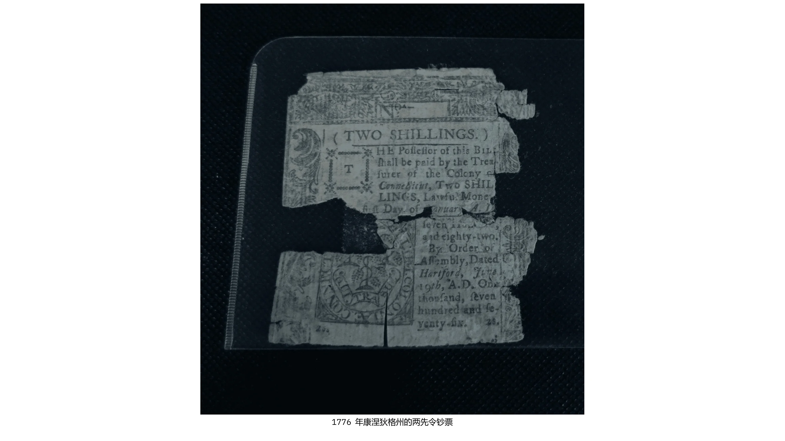

在向英国宣战并最终发行自己的货币之前，殖民地使用这种纸币和西班牙的美元进行现金交易。事实上，"美元 "一词一直用来表示美钞。

如果我没记错的话，1792 年他们通过了一项法律，允许他们铸造货币。举例来说，下面这张就是现代的美钞。

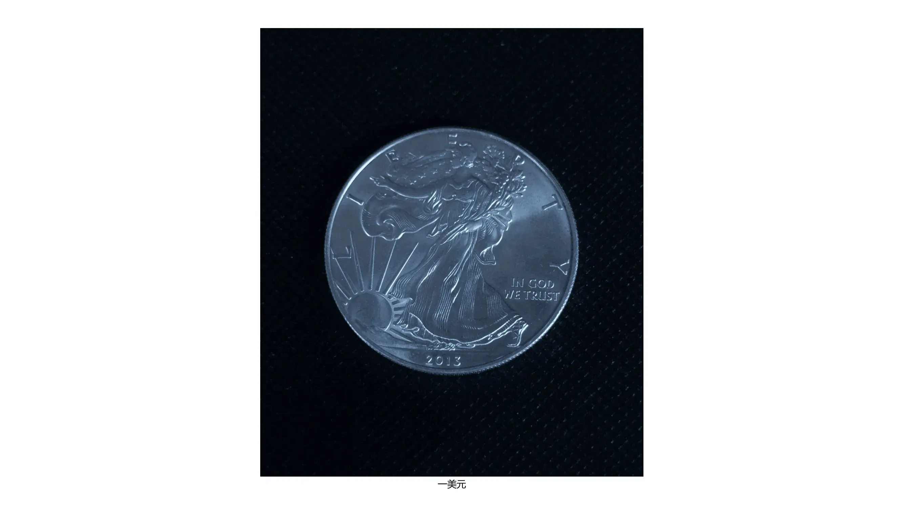

很明显，它的面值并不只有一美元；它的价值约为 30 或 40 美元，因为它代表了一盎司白银。它的价值随银价波动，通常至少在 30 或 40 美元左右。当然，今天的纸币只保留了一美元的面值，但在当时，美元是以这种白银价值为基础的。

让我们现在来谈谈美国的南北战争。南军印钞票，造成了恶性通货膨胀。这种现象并没有被列入汉克-克鲁斯的官方清单，因为它的恶性通货膨胀率没有达到 50%。不过，它的月通货膨胀率确实达到了 40%，这表明战争期间印制了大量货币。

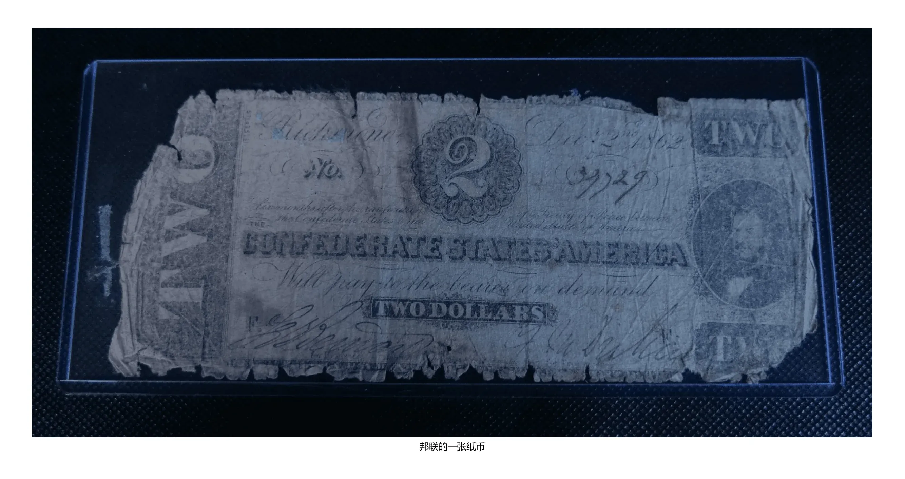

他们的北方对手也有美元。上面可以看到邦联的美元，下面可以看到北方的美元。它们被称为 "绿背"，因为背面是绿色的。

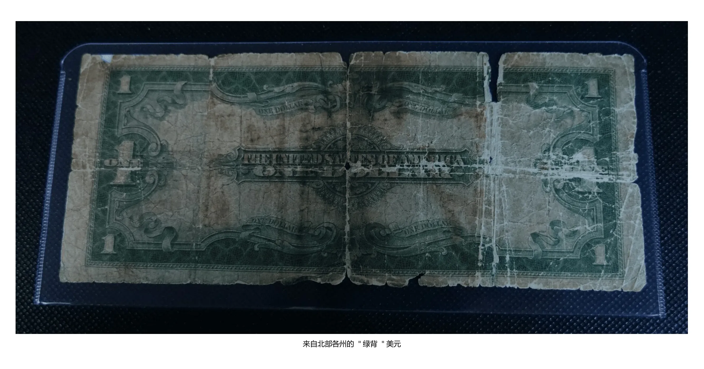

请大家比较一下与现代纸币在尺寸上的差异。那时的纸币更大。

众所周知，北方获胜，因此绿钞成为统一后美国各州的货币。随后，1913年美国联邦储备委员会（FED）成立，第一次世界大战爆发。

第一次世界大战结束后，最后一系列印制的纸币上都印有 "可按需兑换黄金 "的字样。因此，在 1928 年，20 美元几乎可以买到一盎司黄金，因为当时的金价是 20.67 美元。下图中的纸币在 1928 年可以购买一盎司黄金。

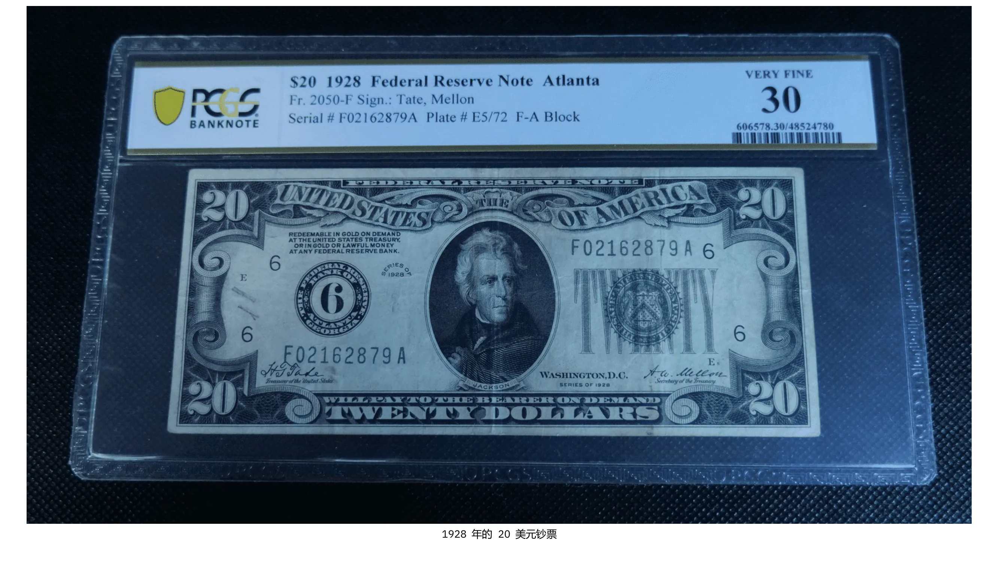

如今，一盎司黄金价值 3000 美元。由此可见，贬值的威力当然不言而喻。这是最后一项含有 "可兑换黄金 "字样的法案。我们将看到，就在第6102号行政命令颁布后，他们将没收所有黄金。事实上，他们会同时没收黄金和黄金证书。

下面是一张 1928 年的黄金证书。

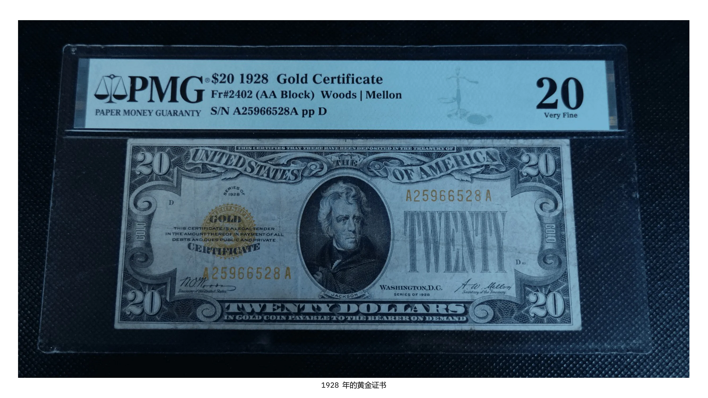

它不仅可以像 1928 年的钞票一样 "兑换成黄金"，还可以兑换成金币：它确实是一张 "黄金证书"。在第 6102 号行政命令颁布后，它们都被没收了。直到 1964 年，拥有它们甚至都是非法的。

我很高兴能有一个。

如果我没记错的话，从 1964 年开始，拥有黄金一直到 1974 年都是非法的。上世纪 70 年代，在尼克松冲击之后，他们允许人们积累黄金，这一点我们很快就会描述。1933 年，当他们发布 "第 6102 号行政命令 "时，他们没收了黄金，拥有黄金成为非法行为。如果你被抓到私藏黄金，就会被判处重刑。在那些日子里，每盎司黄金在 1934 年后都会被兑换成类似下面这张的钞票。

正如我们所说，在 1928 年，一美元上还有 "可兑换黄金 "的字样。

第 6102 号行政命令发布后，他们没收了所有黄金，每盎司黄金兑换 20.67 美元。之后，骗局被揭穿：他们于 1934 年发行了新钞，上面印有 "本钞是所有债务的法定货币 "的字样。

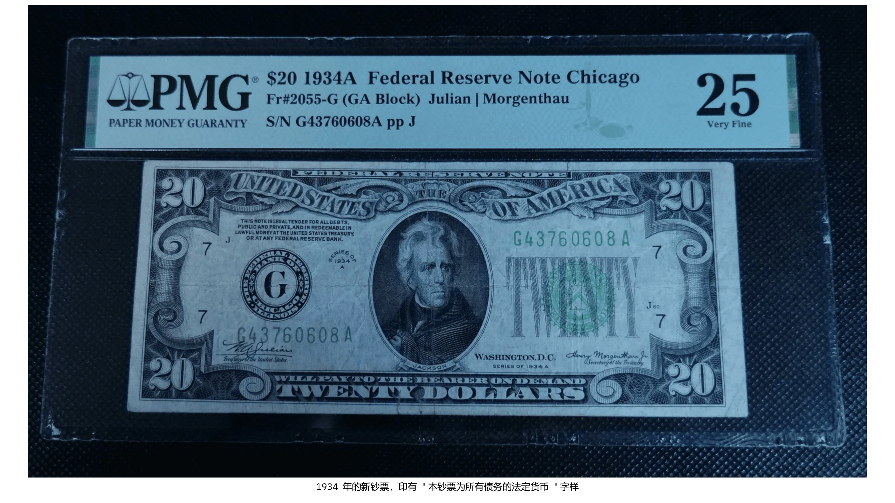

这里出现了法定货币的概念，取代了 "可兑换黄金 "的说法。这两张纸币看起来完全相同，只有几个字发生了变化，但其中的骗局在于美元在这一时期贬值了；美元从每盎司黄金 20.67 美元贬值到 1934 年的每盎司 35 美元。这意味着贬值了约 40%！

第二次世界大战爆发了。战后，《布雷顿森林协定》将世界上的大部分黄金集中到美国。美国人发行钞票作为交换，但这些钞票不再能被普通大众兑换成黄金。相反，它们仍可在州一级兑换黄金。

最终，法国和德国等国开始怀疑，流通中的美元钞票可能比美国金库中的黄金还要多。

所以他们要求把黄金运回国内他们说："好吧，我们会做的 但需要一点时间"1971年，我们的朋友理查德-尼克松 彻底切断了纸币和黄金之间的联系 并在此过程中指责投机者

每盎司 35 美元的黄金价格被低估了，这个价格既不符合印钞量，也不符合黄金的真实市场价值。短短几年间，价格从 34 美元飙升至 800 美元。与历史上的例子类似，例如在罗马，第纳里乌斯和第斯多德之间的联系被切断，黄金被允许浮动。这一事实导致了一个价格发现的过程，使黄金以美元计价的价值大大提高。

### 现代法定货币体系及其影响

这部分总结了我们是如何从以白银或黄金为基础的货币体系转变而来的。渐渐地，机构对货币的权力越来越大。最终，在过度发行之后，一个单方面的决定彻底切断了贵金属与货币之间的联系。

因此，黄金与纸币或圣经货币之间不再有任何联系。它甚至不是部分准备金制度--那是一个过时的概念。相反，私人银行通过银行信贷发行和创造货币。货币主要通过这种方式创造，并与中央银行设定的关键利率相关联。

真的没有限制。至少在美国和加拿大，不再有强制性的准备金水平。唯一的准备金是银行需要安排能够对银行间的交易做出反应，以免流动性枯竭。

他们只需要确保能够进行这些转账，但没有 3%、1%、10% 的强制准备金。我们已经真正摆脱了部分准备金的概念。现在，是中央银行、政府通过财政赤字、中央银行通过量化宽松（QE）、私人银行通过创造银行贷款来增加货币供应总量，在我看来，这将导致通货膨胀。

要想了解货币与通货膨胀之间的联系，我向您推荐我在 Plan ₿ Academy 上专门为这一主题开设的一门课程。您将了解到我们在生活中看到的物价上涨与通货膨胀之间的区别。它们不是一回事。事实上，当我们提到通货膨胀时，我们通常说的是物价上涨，而不是通货膨胀本身。通货膨胀是一个相当精确的概念，由货币供应量的增加来解释。

https://planb.academy/courses/caa75343-ac90-4249-bcca-0e2e57c3a0f1

最后，我想指出一个资源，帮助你更好地理解我刚才解释的通货膨胀等现象。

感谢您的关注。

## 货币泡沫的历史

<chapterId>b6451c46-917d-11f0-97de-6bc5081765fa</chapterId>

:::video id=5967d9a6-aae4-4b84-a283-71b1b735bca4:::

### 纸币的发明和第一次大泡沫

随着 18 世纪中央银行的建立，一场真正的革命诞生了：以纸币为形式的神奇货币。在法国，最突出的例子就是约翰-劳。这位流亡到巴黎的苏格兰人向摄政王奥尔良公爵提出了一个解决王室财政破产的方案，即创建一家国家银行和一家殖民贸易公司：著名的**皇家银行**和**密西西比公司**。

通过这个系统，罗将纸币与公司股票联系起来。纸币流通得越多，股份的价值就越高，银行似乎也就越稳固......直到投机超过了现实。1720 年，泡沫突然破灭，贵族、资产阶级以及在昆坎波瓦街投机的大部分欧洲人都被毁掉了。其结果是：法国人对纸币产生了持久的不信任感，欧洲人上了投机泡沫的第一课。

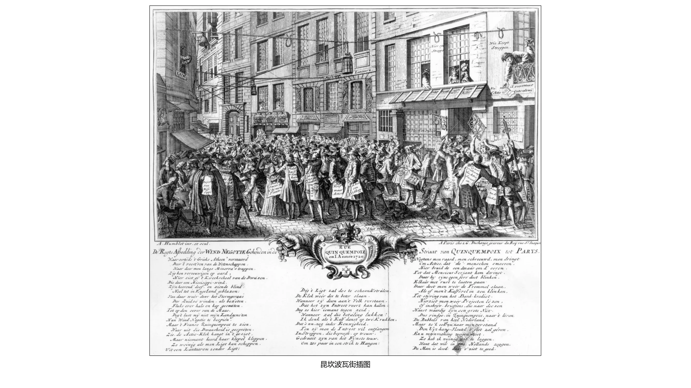

### 当土地成为 "抵押品 "时

一个世纪后，法国大革命开创了以没收的教会财产为抵押的货币****。这在纸面上是一个诱人的想法--将土地转化为货币抵押品--但效果不佳：土地既不能流动，也不能分割。结果是：恶性通货膨胀、对土地使用的多重禁止、无节制的通货膨胀和短缺。

拿破仑深受这场混乱的影响，于 1800 年成立法兰西银行，重新将金银作为货币基础，从而保证了军队的正常军饷。重拾信心的务实方法：用硬通货支付。

### 咆哮的二十年代和 1929 年的大萧条

让我们跳过两个世纪。第一次世界大战后，各国政府通过通货膨胀和黄金停售为战争提供资金。20 世纪 20 年代，美国联邦储备委员会推行过度宽松的货币政策，以支持英镑。结果是：信贷宽松，华尔街投机肆无忌惮，股票赊购，房地产和银行业泡沫出现。

当这台机器发生故障时，1929 年的经济崩溃就不可避免了：大量银行倒闭，失业率创下历史新高，救济站前排起了长队。这导致了一种顽固的误解，即**所有的通货紧缩都是不好的**，而我们需要区分通过增长（健康的）通货紧缩和通过债务（破坏性的）通货紧缩。

### 90 年代的亚洲和多米诺骨牌效应

20 世纪 90 年代，"亚洲奇迹 "令全世界魂牵梦绕。全球 18 个国家的汇率与美元挂钩，增长率达到 8-10%，西方资本纷纷涌入。一切都很顺利......直到潮水退去。破产接踵而至，货币贬值 80%，投资者身败名裂。国际货币基金组织不得不进行干预，实施痛苦的改革。情况一如既往：资本充裕，信贷助长泡沫，然后崩溃。

### 2008 年与永久泡沫时代

互联网泡沫（2000 年）之后，又出现了次贷房地产泡沫。证券化将银行贷款转化为 "三A "级金融产品，并在世界各地传播。承诺：通过稀释风险来消除风险。现实是：所有风险实际上都是相关的。当房地产崩溃时，整个全球银行系统也随之崩溃。

结果是：大规模公共救助、量化宽松和零利率。随之而来的是一哄而上：每一次危机都不会再清除过剩的资金，而是用越来越多的债务和印钞机来弥补。这就是导致当前局面的原因： **一切泡沫 "**，一切事物--股票、房地产、艺术品、加密货币，甚至神奇宝贝卡--都在人为膨胀。

### 魔法货币的永恒回归

从一个世纪到另一个世纪，有一个不变的现象出现了：只要一个社会相信它可以用货币而不是生产实际产品来创造财富，泡沫就会出现。从约翰-劳到 2008 年，从 Quincampoix 街到华尔街，这个过程不断重演：兴奋、信贷、繁荣和萧条。

最后，当没有人再相信纸张时，人们总会寻找其他东西--黄金、土地、避风港......或者新货币。昨天拿破仑将金属强加于人，今天有人将 Bitcoin 视为继承者。

金融史是一个永无止境的循环：印刷、投机、崩溃。直到下一个泡沫。

## 金钱与暴力

<chapterId>9486fe64-854f-5e17-86b3-8873baca39a8</chapterId>

:::video id=bd6d0807-2d8f-4637-a0f5-1e990e5c0d0f:::

这一小部分将重温我们在整个课程中已经看到的许多事件，总结一些我认为有趣的轶事。

### 技术与暴力

这里有几件我们在课程中可能已经谈论过的趣闻轶事。我与西奥就他在 B-Ondy 的一次演讲进行了精彩的讨论，我认为这次演讲在技术进步如何影响民众与国家之间的暴力关系方面非常有趣。

### 金钱和国家胁迫

在介绍这一部分时，我将给大家列出一个简短而不详尽的清单，只是为了提醒大家我们在课程中可能已经介绍过的事件。

我已经可以把金钱和暴力联系起来，那就是当涉及到可以无限印制的不值钱的纸币时，往往会伴随着各种规则和各种威胁。我们可以谈谈阿萨德时期，当时的钞票上写着，造假者将受到死亡威胁。在当时的法律条文中，不接受这种著名纸币的人很容易受到死亡威胁。

为了继续留在法国，在我能够获得的大革命时期的一份法律文本中，我看到在与货币有关的章节中描述了运输和操作断头台的 "每日津贴"。我觉得这很奇怪。

我们还谈到了中国的钱币铸造，由国家监督铸造。我们在课程开始的一节中看到，当一些不太美观的钱币被丢弃时，会产生法律后果。

还有一则轶事，说的是英国的一位国王，如果铸币者的行为不符合他的期望，他就会砍掉他们的手。

此外，在中国，我曾读到过关于没收佛教寺院铜钱的报道。当时，铜在不断升值，破坏了他们的经济稳定--而他们的经济是建立在一种与金属价值没有多大关系的法币基础之上的--他们只好找到一个有财富的地方，从寺院里收缴铜。

英国宗教改革期间，英格兰的修道院也是如此。当大名鼎鼎的国王因离婚问题与教皇争吵时，背后还有另一个原因：他利用废除修道院的机会，攫取了这些教会组织所蕴藏的财富。

法国大革命期间，他们没收了教会的所有资产。他们看到了用熔化的教堂钟制造的精美硬币。

如果我们再往前追溯，关于经济暴力和自由、自由主义法律的最明确的概念之一是***戴克里先的世袭种姓制度，这与农民不再愿意接受贬值的货币***这一事实直接相关。他们想离开农民的工作，而戴克里先的反应很简单，他告诉他们："你们不能离开你们的土地，你们的孩子也不能离开"。同样的道理也适用于士兵。

我认为这是一种非常明确的暴力形式。最后，我可以谈谈圣殿骑士团或法国国王。当圣殿骑士团在法国定居时，我猜想他看到了圣殿骑士团的财富甘露，并遇到了国家资金问题。他起诉了圣殿骑士团，其中一些人得以带走部分财宝，这在美国或加拿大产生了一个非常有趣的节目。我不知道是谁制作的，但它叫做《橡树岛之谜》。讲述的是有人认为在加拿大Maritimes的一个岛上埋藏着圣殿骑士团的宝藏，他们已经钻了好几年--甚至可能超过十年--来打一口井。他们发现了一口有很多长廊的井，他们正在这座岛上寻找圣殿骑士团埋藏的宝藏，这就是这部电视剧的主题。我向我的父亲致敬，他是这部电视剧的忠实粉丝。

这就是我们在本课程中看到的、我认为与暴力有关的事实的快速清单。接下来，西奥将为我们讲述一个关于技术变革以及平民与当局之间权力平衡的有趣故事。

谢谢！

## 有组织暴力的经济后果

<chapterId>66bd4674-2159-5489-ad4b-ec5e3fb691af</chapterId>

:::video id=c8b063c6-aeb4-4a94-9027-b11d369e71a4:::

### 有组织的暴力和国家的演变

历史学家弗雷德里克-C-莱恩（Frederic C. Lane）提出了一个革命性的论点：历史上的国家结构是由用于投射暴力的技术塑造的。从韦伯关于国家垄断合法暴力的原则出发，莱恩观察到，这种垄断--自相矛盾的是，在这一领域比竞争更有效率--是根据攻击成本和防御成本之间的关系演变而来的。

主权个人》（1997 年）一书的作者采用了这一分析方法，解释了政治组织的历史变迁：从中世纪封建制度到文艺复兴时期的城邦，再到工业化民族国家，最后到现代福利国家。每一次转变都与暴力行使方面的重大技术突破相对应，大约每 400-500 年发生一次。

### 中世纪的平衡

在中世纪，农业经济占 90% 以上的主导地位。农民扎根于自己的土地，无法逃离领主和他的骑士。军事技术--手工锻造的盔甲、多年的剑术训练--极其昂贵。这种不对称大大有利于进攻而非防御。

流动的农业生产者成为当地暴力垄断者的俘虏。他的征税能力达到了新的高度--尽管矛盾的是，与现代 78% 的强制征税相比，中世纪的税收仍然很低。领主可以随意征税，因为农民既不能反抗，也不能离开。

### 商人的文艺复兴

北方汉萨贸易和南方地中海贸易的出现改变了局面。商人是附加值的主要创造者，他们拥有流动资本--船只。他们只需要轻型海上民兵，因为海上很难维持治安。最重要的是，如果税收过重，他们可以很容易地迁移到邻近的港口。

这种流动性造成了城邦之间的税收竞争。威尼斯、热那亚和布鲁日必须尽可能提供最自由的框架：可靠的合同、优质的货币、保险、最低的税收。王公们必须引诱而不是强迫。对称性发生了逆转：防御（通过逃亡）变得比进攻更容易。

### 工业时代

工业革命带来了类似封建主义的格局。工厂、铁路和流水线代表着大规模、不可移动的投资。面对税收，亨利-福特无法搬迁工厂。集中在工业城市的工人们成立了工会，进行集体谈判，而不是单独迁移。

福利国家 "应运而生：工业规划（日本、韩国）、对基础设施的军事保护、为劳动力提供最低社会福利。第二次世界大战说明了这种脆弱性：轰炸敌方工厂成为主要战略。物质资本的集中使得大量税收成为福利国家的资金来源。

### 微处理器革命

现在，三项技术创新正在打破这些古老的平衡。微处理器正在改变战争：内华达州的一名操作员在阿富汗以外科手术般的精确度驾驶着一架无人机。海湾战争（1991 年）证明了这一突破：世界第四大军队（伊拉克）在 45 天内被歼灭，联军一方的死亡人数不到 200 人。技术优势使正面攻击成为不可能。

互联网和非对称加密技术正在彻底改变价值创造方式。开发人员可以在任何地方使用 MacBook 和 "星际链路"（Starlink）工作，即时免费地输出他们的产品。数字游牧民族摆脱了地理上的束缚，以文艺复兴以来从未有过的方式使国家之间相互对立。

Bitcoin 代表了这一逻辑的顶峰：一种从国家中解放出来的货币，受到不可侵犯的加密盾牌的保护。财富变得可以抵御任何物理力量。个人重新获得了抵御国家垄断的能力。

### 威斯特伐利亚模式的崩溃

为工业时代设计的西方福利国家正在过时。价值创造者--开发者、艺术家、金融家--正在向新加坡、迪拜或萨尔瓦多迁移，他们宁愿选择较少的公共服务来换取最低的税收。苹果和 Tether 等现代巨头既不需要办公室，也不需要实体基础设施。

这种人才流失造成了一种螺旋式上升：净贡献者减少，公共服务退化，留下的人税收增加，离开的人加速。国家必须从根本上缩小规模，否则就会破产。分裂成小的、有竞争力的管辖区--数字城邦的新模式--似乎不可避免。

历史告诉我们，这些转变需要几代人的努力。但 Bitcoin 的货币与国家分离可能会加速这一进程。个人现在可以用脚和他们的加密钱包投票，沿着我们刚刚开始认识到的路线重新绘制全球权力版图。

## 金融简史

<chapterId>1d37fff1-a091-5034-8e71-4af590b8ffce</chapterId>

:::video id=fdfabbc6-e4d8-463a-8522-19176f8fb460:::

在介绍了货币的历史之后，我想简明扼要地解释一下金融的演变，这种演变最终导致了福利国家的产生。最初，在罗马时代，我们有硬币。

硬币是一种金融技术，使帝国能够支付士兵、进行扩张和贸易。它运行得很好，只是最终贬值太多。当他们停止扩张，不再从战争和领土扩张中获得战利品时，他们的系统就崩溃了。

### 金融技术的演变

然后是中世纪，当时几乎没有什么变化，直到弗罗林币的出现，才重新带来了稳定的货币，意大利和安特卫普的银行业也有了发展，在那里提出了 "货币时间价值 "的概念--换句话说，就是贴现。意大利和安特卫普银行业的发展提出了 "货币时间价值 "的概念，也就是贴现。他们发展贴现是为了创造一种纸币形式，即发行一种 "期票"，即承诺在以后的某一天可以收回 100 美元和利息。

该系统创造了一种金融技术，允许持票人在票据期限结束前出售票据，因此，如果你在 6 个月期限中的 4 个月后出售票据，持票人实际上将支付一笔溢价，以补偿剩余 2 个月的收益损失。

这是当时在安特卫普和阿姆斯特丹发展起来的一种金融技术。后来，我们看到了中央银行和最后贷款人概念的演变。可以说，在阿姆斯特丹银行时期，国际贸易中放弃使用硬币，转而使用文字货币。

后来，到了18世纪，在金融技术方面，我们可以谈谈保险。尼尔-弗格森的《货币的崛起》一书中有一则轶事，讲得非常精彩。第一家诞生的保险公司名为 "苏格兰寡妇保险公司"（**Scottish Widowss**），从本质上说，是神职人员希望为那些有时早逝、突然去世的牧师开发保险。当时，神职人员要在苏格兰照顾他们的妻子和后代一年。因此，神职人员们觉得这一年的时间可能有点太短了。于是，他们发明了精算**，根据过早去世的牧师人数，计算出该制度支付成本所需的缴费人数。

他们通过精算得出："好吧，每个牧师给我们这个数目。"那么，如果牧师去世了，保险将承担费用，以确保他的妻子和孩子的生存，直到他们自给自足。"因此，第一家名为 "苏格兰寡妇 "的保险公司 推广了这一制度，并将其投入使用。

### 从私人保险到福利国家

因此，保险是金融技术发展史的一部分。这让我想到了福利国家的概念，即私人保险最终会遇到一个问题，一个优化的概念，我们对自己说，如果我们向健康的人提供医疗保险，他们可能会对支付保费不那么感兴趣，因为他们对自己说，"我很健康，我不会生病"。另一方面，知道自己有病的人肯定会愿意购买。

这种制度造成了投保医疗保险的病人数量与投保较少的健康人数量之间的不平衡。这就是一种不平衡：如果你计算一下这些数字，它们是不会平衡的，因为你可能无法为足够多的健康人投保来抵消成本。在经济学中，这就是**道德风险**的概念。

人们提出的一个想法是强制保险。如果每个人都有义务缴纳保险费，那么整个保险就会重新平衡，健康和不健康的人都会缴纳保险费，从而将风险分配给最多的人群。

因此，在世界许多地方，国家都会说："好吧，我们来解决这个问题"。虽然我不是这方面的专家，但我可以看出，同样的道理可能也适用于各种其他形式的保险，比如失业保险。有一种简化和优化的愿望，基于这样一种想法，即如果只有一个组织来处理，就会更简单。

在我看来，这导致了所有这些保险概念的集中化，并最终导致了福利国家的诞生。在福利国家，所有这些金融概念原本都是私营企业，是为了满足保险市场在人口中分散风险的需求而采取的私人举措，但出于道德风险和优化愿望等可能非常合乎逻辑的原因，这些概念被国家抓住了。

### 国家垄断的替代模式和思考

归根结底，在加拿大等一些国家，我们的几种保险--医疗保险、失业保险--都是由国家垄断的。

我可以举一个我知道的例子。瑞士的制度有些不同。瑞士有私人互助保险公司和私人医院，因此你可以选择你的互助保险公司，也可以选择你的互助保险公司内的套餐。尽管这个系统的很大一部分仍然是私营的，但你仍然可以获得相对普遍的服务。

因此，我认为它也有可能是私人经营的。但我想向你们描述的一切，其实并不是要表达一种制度是否比另一种制度更好，而是想向你们解释，在阅读金融史的过程中，我意识到为什么在西方，尤其是在法国，特别是在加拿大，国家想要控制这些金融原则。

我想说的是，保险的概念首先是金融的演变，而政府有时非常善于这样做，他们会试图控制保险，就像他们试图控制货币一样，原因有几个。其中一个原因就是最后贷款人的概念。

我们的想法是，如果有一个大机构在背后支持，将风险更广泛地分配，情况会好得多。这就是 "最后贷款人 "概念背后的最初倡议，即该机构实际上可以选择那些有足够实力生存下去的机构，并通过借钱给它们来防止它们倒闭。

当时，当这一概念最终首次出现时，人们进行了真正的分析，但最终的情况是，我们拯救了所有人，"大而不能倒"，它适用于几乎所有的银行，因为有中央集权，也适用于所有的大公司。最后，我们看到，这仍然是一个由国家 "普遍 "应用的概念，类似于我刚才向你们描述的保险概念。

最终，国家决定由它来照顾一切，将苏格兰为解决特定问题而创造的金融技术转变为我们今天所知的庞大福利国家。它利用精算金融原理为有需要的民众提供服务。然而，我们都同意，这种制度所产生的垄断会带来各种问题，我们目前在加拿大和法国等国就遇到了这些问题。幸运的是，存在着不同的模式，例如瑞士的模式。

我们只需认识到，福利国家的概念源自金融。这种认识表明，除了著名的国家垄断之外，我们还可以探索其他途径，我甚至想把这种推理应用到中央银行作为最后贷款人的概念上--但这是另一个话题了。

# 最后一节

<partId>9bada469-7ef0-511a-9eaa-f8eb66d5906f</partId>

## 评估本课程

<chapterId>a9494e2b-8a4d-5811-8a7b-b4a91fb22778</chapterId>

<isCourseReview>true</isCourseReview>

## 结论

<chapterId>1094e793-b4c6-5782-aa4a-71cde00ce7c0</chapterId>

<isCourseConclusion>true</isCourseConclusion>