# 錢幣歷史之旅

這門引人入勝的課程將帶領您探索從最早期的文明到現在的貨幣體系的迷人演變過程。我們將從新石器時代到現代，跨越時空，探索貨幣如何塑造了偉大的人類文明，又如何被這些文明所塑造。從美索不達米亞的原初貨幣到加密貨幣、吕底亞錢幣、文藝復興時期的弗羅林幣，以及中央銀行的出現 - 本課程提供了一個全面的角度來看待我們社會的基本支柱之一。

+++
# 簡介

<partId>59878a67-8a1d-5d6b-af41-5b847c14363c</partId>

## 貨幣歷史簡介

<chapterId>ca53597e-be9a-5261-a55f-11fac8504a68</chapterId>

:::video id=08ff35ca-8a40-4286-abaf-71283faf6e78:::

歡迎來到這個關於錢幣歷史的課程。正如標題所示，我們將一齊探索錢幣的歷史演變。從新石器時代到現今，我們將探討過去的主要帝國和文明。

然而，本課程並不局限於日期或歷史事件的簡單年表。相反，我們真正的目的是深入瞭解貨幣，或者說貨幣的出現所涉及的基本概念。

### 探索的基本概念

因此，我們談的是出現：貨幣本身的出現、貨幣體系的出現、銀行的出現、紙幣的出現、中央銀行的出現，以及最後現在的「法定」貨幣體系的出現。

我們從美索不達米亞出現的債務貨幣和記帳單位，以及原始社會的嫁妝和血錢等其他系統，開始我們的原初貨幣之旅。我們也會看到真正的貨幣系統如何在遠早於中古王國的古埃及已經存在。

接下來，我們將探討第一枚錢幣在呂底亞（Lydia）的出現，根據經濟學教科書，這個關鍵時刻通常被視為貨幣的真正開始。我們將探討這些錢幣如何在波斯人、亞歷山大大帝以及羅馬的幫助下得以傳播，最後強奪王位、統治世界並走向崩潰。

從那時開始，我們將以所學到的一切為武器，花時間一起反思金錢的定義，超越「金錢永遠是債務」或「金錢永遠是商品」等先入為主的想法。實際上，金錢既是一種物品，也是一種社會習俗。我們將特別討論貨幣溢價的概念，並嘗試統一各種解釋貨幣出現的理論。

### 關鍵時期與貨幣創新

接下來是一段動盪不安的時期，這段時期在貨幣方面有一定的不穩定性，但也出現了一些引人注目的創新，例如用來賄賂丹麥侵略者的英國便士，以及查理曼大帝的英鎊，今天在一些現代紙幣上仍保留著對它的記憶。

我們還會看看十字軍東征如何見證了第一套遠程貨幣轉移系統的出現。接下來該看看與文藝復興相伴而生的貨幣 Florin 的影響，以及來自美洲的貴金屬對歐洲物價的深遠影響。

我們將詳細研究紙幣和中央銀行的出現，並將其與金融危機的歷史及其通常的暴力反響相提並論。

最後，我們將與當代的貨幣體系做比較，探討其後果，並追蹤金融的歷史，以更好地瞭解我們是如何達到今日的福利國家。

此外，作為額外的獎勵，我們還會看看與金錢有關的許多迷人的字源連結，這些連結繼續以不同的語言影響著我們的日常生活。

### 課程結構

本課程分為三大部分。

第一部分探討貨幣的出現，第二部分探討貨幣的復興及其衰落，第三部分展示國家機構或國家如何逐漸控制貨幣，從而導致目前的法定貨幣制度。

謝謝，祝您玩得愉快！

# 交易所的出現

<partId>da5e4981-9ea5-5208-beab-3b75c9043632</partId>

## 從南猿到現代人

<chapterId>34a773aa-f2d3-5c26-8be4-f2cd79ed6fbc</chapterId>

:::video id=4f333013-4b2a-42ab-8761-593fafc971ca:::

### 為什麼要從新石器時代開始

為什麼要追溯到新石器時代來談論金錢呢？答案很簡單：如果不研究文明本身的出現，我們就無法完全理解貨幣的出現。要瞭解第一套貨幣系統出現的原因，我們需要瞭解是什麼導致游牧狩獵-採集族群定居下來。

一個沒有分工、沒有專業化的部落，每個人只負責生產自己所需的東西，根本不需要金錢。同樣地，一個只從事自給自足農業的農業社群，每個人都為自己耕作，也不覺得需要一個通用的交換中介。

### 久坐及其後果

這就是為什麼我認為從新石器時代開始探索是很有趣的。我們將看見定居化如何逐漸衍生出村落，然後是城市，最後是偉大的文明。正是這種定居化和糧食盈餘的生產使得勞動專門化成為可能，為第一批貨幣概念的出現和演變創造了不可或缺的沃土。

就像人與人之間的互動產生了語言一樣，我們可以認為在文明的形成和組織過程中，金錢會自然地出現或不出現（就像印加人和斯巴達人一樣）。在我看來，金錢的出現與否與每個社會的社會和經濟組織形式有關。

### 人類進化年表

但首先，讓我們來看看更廣闊的歷史背景。

就像任何第一個簡報一樣，我將做的與我在課程介紹中所說的剛好相反，我會給您一張日期和歷史事件的清單，這些日期和事件是相繼發生的。這裡的想法是將錢幣的出現放在其歷史背景中，與其他人類進步相關，例如食物的烹飪、車輪、某些穀物和動物的馴化、金字塔的建造以及第一批城市的建立。

因此，讓我們來看看人類從史前時代開始的演變。

概述從澳洲原始人到現代人的人類進化史，跟隨科技進步和人口遷移直至新石器時代。

### 人類的歷史背景

- 300 萬年前** - 出現*澳洲人*。
- 200 萬年前** - 古人類開始離開非洲。
- 1.600 萬年前** - 人類到達歐洲南部和亞洲。
- 100 萬年前** - 家庭用火烹調的第一個證據（南非 Wonderwerk 洞穴中燒焦的骨頭和植物殘骸）。
- 約公元前 400,000 年** - 尼安德特人生活在歐洲和亞洲。
- 約公元前 30 萬年** - 出現*智人*。
- 80,000 年前** - *Homo sapiens* 開始移居到世界各地。
- 73,000 年前** - 南非的 Blombos 洞穴（已知最古老的藝術形式）。
- 5 萬年前** - *智人*抵達歐洲。
- 30,000 年前** - 來自法國 Chauvet 洞穴的壁畫。
- 15,000 年前** - 法國的 Lascaux 洞穴壁畫和澳洲的岩畫。
- 約公元前 9000 年** - 新月沃地的大麥馴化。
- 約公元前 9000 年** - 墨西哥種植玉米。
- 約公元前 8000 年** - 新月沃地山羊和绵羊的馴化。
- 約公元前 7250 年** - Ain Ghazal（約旦）揭示了一個只有數百居民的村莊。
- 約公元前 7000 年** - Çatalhöyük (土耳其) 的居民多達 8,000 人。
- 約公元前 6500 年** - 希臘開始定居生活。
- 6000 年前** - 埃及和美索不達米亞開始河川灌溉。
- 約公元前 5000 年** - 出現「三姐妹」農業組合（玉米、南瓜、豆類）。
- 約公元前 4000 年** - 駱駝在中亞馴化。(駱駝科起源於四千五百萬年前始新世的北美洲。然後，這些駱駝會經由白令海峽連接兩大洲的一條薄薄的陸地遷移至亞洲。駱駝家族的另一部分則前往南美洲，其後代至今仍生活在那裡：美洲駱駝、羊駝和駱駝。）
- 約公元前 3500-3000 年** - 博泰人開始馴養和繁殖馬匹。
- 大約在青銅時代初期** - 蘇美爾人已經發明了輪子和帆船，並發展了算術、天文學和第一種文字。
- 約公元前 2800 年** - 烏魯克在鼎盛時期，人口高達 80,000 人。
- 公元前 2600-2200 年** - 希臘世界出現城市發展的最初跡象。地中海作物（小麥、葡萄、橄欖）的擴展。
- 公元前 2560 年** - 建造吉薩大金字塔。
- 約公元前 1500 年** - 米諾文明。
- 約公元前 1300 年** - 邁錫尼文明。
- 約公元前 1250 年至公元前 1150 年** - 青銅時代文明的崩潰。
- 公元 1 世紀** - 北非柏柏爾人馴養駱駝。

因此，這裡的歷史概述讓我們對某些科技、某些動物的馴化和文化的出現有了一個看法，並將其與文字和金錢的出現放在一起，這將是我們下一節的主題。

## 從狩獵-採集者到農民：文明的曙光

<chapterId>ea950b6e-9eb7-553d-8f04-0eb042bb1f5a</chapterId>

:::video id=4b49a376-f6f4-42a0-86fa-264997a079f0:::

### 向農業和定居的過渡

在本章中，我們將談到從狩獵和採集到自給自足的農業、手工藝和貿易的過渡。我覺得有必要解釋這種向定居生活和農業的過渡，以瞭解第一批城市是如何建立起來的，這最終導致了古代某些貨幣系統的產生和出現。

本節摘錄自 The Great Courses 網站上的一門課程，名為「古代美索不達米亞，文明搖籃中的生活」，由加州州立理工大學波諾瑪分校的 Amanda Podany 教授主講。

### 採用農業的悖論

原始農業大約出現在 10,500 年前的近東地區，敘利亞西北部和土耳其南部一帶。今天，現代的狩獵-採集族群並不急於採用農業，在新石器時代可能也是如此。

***最早的村落顯然是在動植物馴化之前建立的。**人類不是因為農業允許他們定居，相反地，他們先定居，大約三千年後，才開始耕作。

狩獵和採集的效果非常好，所以他們不需要種植種子來生產食物。今天，狩獵-採集者比最早的農民有更多的空閒時間，他們使用非常原始的技術。

所以，我們在這裡所說的是，現代原始狩獵-採集民族的空閒時間比我們從新石器時代的第一批農民所瞭解的還要多，畢竟他們擁有相當原始的耕作技術。這些人比我們以狩獵和採集為生的現代原始部落更努力地生產食物。

骨頭研究也顯示，最早的農民比之前的狩獵-採集者更小、更不結實。農民的飲食比狩獵-採集者更受限制。他們吃更多的麵包，但吃更少的肉，而且由於製麵粉時使用石屑，他們的牙齒也較差。他們用石頭製麵粉時，會產生石屑。

遵循「酮」飲食習慣的人會同意：吃大量麵包可能不如吃肉好。

### 採用農業的理論

既然有這麼多的缺點，當時有誰會選擇當農夫呢？有些流行的理論認為，人類是被迫從事農業的，這並不是真正的選擇。即使是野生穀物，也有一個很大的問題。大量的穀物不容易運輸。它們必須存放在某個地方。一旦穀物被儲藏起來，就必須留在附近。因此，人們種植野生穀物，但這不一定是農業，當您大量種植時，您必須把穀物儲存在某個地方，使其難以運輸。這很可能促成了第一階段的定居化。這也可能是人們在某個地方定居的最初原因。如果這個地方一年四季都能提供食物，人們就沒有必要跟隨畜群或不斷旅行。

在納圖菲亞文化中，多達一百人共同居住在由圓屋組成的村落中。一種解釋農業起源的流行理論認為，這種變化是受到氣候變化的刺激。大約在 11,000 年前，近東的氣候變得比以前寒冷乾燥。以前豐富的植物和動物變得稀少。於是社區開始栽培他們賴以為生的植物，或飼養年幼的動物，例如绵羊、山羊和牛，以賺取利潤，這些動物都很適合進行繁殖。這將會是一個非常循序漸進的過程。因此，他們並沒有一個精確的時刻成為馴養動物的農民。

另一個理論是，村落本身創造了馴化所解決的問題。密集的狩獵與採集會破壞自然環境的穩定。有一種假設認為，納圖菲人在人口上取得了巨大的成功，以至於他們的人數對於他們的周邊環境來說已經太多了。因此，沼澤和種植天然作物的地區的產量可能不足以滿足村落人口的需求。眼前的環境無法供養所有人。於是他們開始直接在原地耕種，增加食物供應。

## 新石器時代的貿易

<chapterId>8e495224-6d55-58f6-a9dc-ac2814281cfa</chapterId>

:::video id=d04245af-e416-48b1-8157-d569207a32c4:::

### 舊石器時代到新石器時代的過渡

新石器時代標誌著人類歷史的根本性突破，與之前的舊石器社會形成強烈對比。在舊石器時代，歐洲的人口極為分散：兩萬年前，整個歐洲大陸僅有 7,000 人居住，他們組織成 20 到 50 人的小型游牧群體，追隨大遷徙的牛群跋涉遙遠的距離。

冰河時期末期的全球暖化徹底改變了這種社會組織。森林的出現以較為定居的森林動物取代了遷徙動物，使人類族群變成半定居動物。與此同時出現的是驚人的人口激增：舊石器時代末期，歐洲人口估計在 10,000 到 50,000 之間，而到了新石器時代中期和末期，人口則增加到 100 萬到 500 萬之間。

### 工作與財產的發明

這種漸進的定居化導致了深刻的社會變革。 **新石器時代的農業誕生了現代的工作概念**：依附於特定的領土，意味著照顧自己的財產、儲存自己的勞動成果以及規劃未來的收成。這種與時間的新關係 - 為了未來的利益而延遲現在的使用 - 徹底改變了社會組織。

陶器是這種進化的最佳例證：最初是為了儲存穀物和種子而開發的，它見證了這種隨時間推算需求的新能力。有些史前學家甚至認為，如果沒有這些儲存系統，新石器時代是不可能出現的。

**私有財產成為這些新社會的核心制度**。雖然個人財產在舊石器時代已經存在（個人狩獵用的長矛），但到了新石器時代，個人財產卻有了前所未有的地域性。這種土地佔用產生了第一批有考古記載的人與人之間的衝突，使領土安全功能的出現成為必要。

### 專業化與分工

農業使養活更多的人口成為可能，同時使一些人從其他生產活動中解放出來。這種新興的專業化 - 農夫、陶工、工匠、護衛 - 為勞動分工和社會階級奠定了基礎。

考古遺跡見證了這一層次的增長：墓葬從集體墓穴演變為有區別的個人墓穴，住房從統一的建築轉變為顯示不同社會地位的建築。喪葬物品 - 飾品、專用工具、陶器 - 顯示出財富與社會聲望概念的出現。

### 遠距離交換的出現

考古分析揭示了當時令人驚訝的交換網絡。黑曜石、綠岩（閃長石、翡翠）、貝殼和瀝青等材料，在距離開採地點數百公里的地方被發現。拋光的綠岩斧是砍伐森林和建造早期村落的必需品，在整個新石器時代的歐洲都有流通。

這些交流既涉及原材料，也涉及成品，揭示了對手工藝專業化的欣賞。所賦予的價值結合了材料的稀有性與轉換材料所需的技術。

交換的組織依據考慮的規模而有所不同。 **在社區**內，人類學家傾向於假設一種禮物與反禮物的經濟，以及以人與人之間的信任為基礎的非正式信貸系統。在這些受限制的群體中，「Dunbar人數」（最多150人，以維持直接的信任關係）使得延遲的交換不需要任何市場機制。

易貨有幾種類型：

- **直接易貨**：立即以物易物
- 擴展的易貨**：以貨物換取服務或承諾
- **延遲以物易物**：人際債務隨後償還

**在不同族群**之間，由於缺乏個人信任的紐帶，更多正式的交換便出現了。某些商品因為可以被外國群體索取而逐漸獲得特殊地位，這也是原始貨幣的雛形。

[奧地利經濟學派](https://planb.academy/resources/glossary/austrian-school)將這種演變解釋為特權交換物品的自發出現。早在中石器時代考古發現的貝殼就說明了這一現象：貝殼的發現地遠離其地理原產地（地中海貝殼在法國西部，北歐貝殼在其他地點），它們證明了人們對其交換價值的共同認可。

這些商品的特點在於它們**能被他人索取**，這是貨幣功能的基本特質。儘管它們沒有達到歷史貨幣的標準化，但卻是邁向非個人化交換系統的第一步，也是超越部落架構、發展複雜社會的先決條件。

因此，新石器時代奠定了現代經濟的基礎：勞動專業化、私有財產、財富累積、社會階級化，以及超越親屬關係和直接鄰里關係的複雜交換系統的出現。

## 第一批城市的形成和文字的出現

<chapterId>d6b799c2-8bf1-11f0-9c54-1b9f4f4c7011</chapterId>

:::video id=3ca18105-9856-4ceb-925c-c9e9215af21b:::

### 灌溉與大城市的誕生

在本章中，我們將討論這段歷史中最早的大城市是如何形成的，顯然也會討論文字在美索不達米亞出現背後的原因。

大約 6000 年前，在埃及和美索不達米亞的肥沃山谷中，人類族群開始利用河流發展灌溉。對水的掌握使耕作得以豐富，有利於大城市的出現，例如位於今天伊拉克南部的著名城市烏魯克。

約公元前 3500 年，烏魯克成為世界上最大的城市，約公元前 2800 年達到高峰，人口多達 80,000 人。在這個時期，蘇美爾文明有兩項重大的創新：一是出現了能夠管理真正國家的結構化政府，二是革命性地發明了文字。

### 楔形文字的發明

大約在公元前 3000 年，文字誕生於這個城市，其主要動機是經濟需求。面對日益複雜的社會及其交流，神廟和宮殿的管理者需要一個可靠的工具來準確記錄經濟交易，如材料的交付、內部轉移和可用的庫存。

所開發的系統稱為 「楔形文字」，源自拉丁文 "cuneus「，意思是 」楔子"，指的是使用楔形的觸筆在潮濕的泥板上印上記號。

在下面，您可以欣賞到我複製的楔形文字石板。為了在這些石板上書寫，我相信他們使用了一種用蘆葦製成的觸筆，在濕黏土上描繪出形狀，也就是楔形文字。

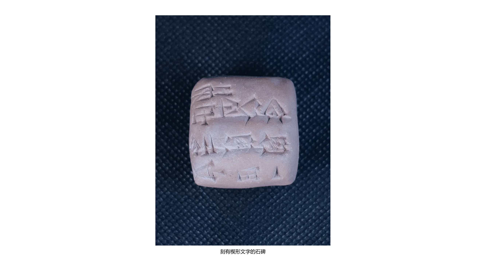

我還有一個我認為是真的蘇美爾石碑，中央有一個小的楔形文字。在這塊石碑上，有滾動圓筒做成的簽名，之後我會向您展示。

在大多數人都不會寫字的年代，只有熟練的抄寫員才有這種能力。

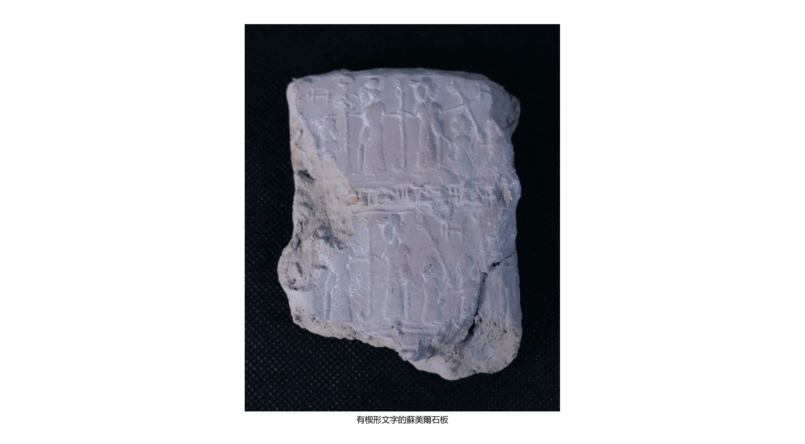

下面，您可以看到上面提到的圓筒：一塊刻有特定形狀的石頭。人們習慣滾動這個簽名圓筒（英文稱為 cylinder seal）來簽署信件。這是一種明示作者姓名的方式，或表示這些信件是以作者的名義寫成的。

因此，當時的抄寫員使用楔形手寫筆在濕潤的石板上印上記號。

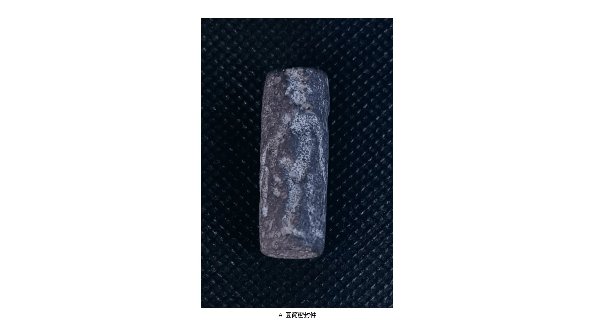

楔形文字並不代表一種語言，而是記錄口語的書寫系統。在英語中，我們會說「書寫是一種書面語言」，然後我們會說「楔形文字是一種文字，而不是一種語言」。因此，在法語中，我們會說楔形文字不是一種語言，而是一種編碼語言的方式。

### 書寫的演進與用途

在其存在的最初幾個世紀中，這種文字仍然是有限的，主要用作記錄數量、農產品清單和設備的記憶體系統。直到漸漸地，它才有能力**音譯人名**和完整的句子。

最初，名字無法用楔形文字來表達，因為它主要代表物件和現實中的元素，如牛或小麥，以小圖像來描繪。隨著時間的推移，這些圖像演變成了更發達的文字形式，允許表達名字和複雜的概念。

舉例來說，如果這個人的名字是 Laura，我們就可以取一個詞，一個聽起來像 "water 「的縮寫，再加上一個像 」ras "的縮寫，然後用它組成 Laura 這個名字。這就是第一種書寫語言的發展形式。

為了記錄在案，最初要表示縮寫，如果要畫牛頭，就可以看到牛頭的形狀。漸漸地，繪圖被簡化為只表示一種線條。學者認為，出現這種情況的原因是人們用一隻手拿著濕泥板，因此轉動泥板更容易重繪首字母。這也被認為是由於抄寫員拿石板的方式造成的。

在楔形文字的首字母縮寫中，你仍然可以看到與小麥或牛頭的聯繫，而且它們總是向一邊傾斜。

在三千年的使用過程中，楔形文字主要用於保存經濟和行政記錄。然而，美索不達米亞的居民很快就產生了一種根深蒂固的慾望，那就是將所有值得用文字形式來保存的東西都保存下來。因此，迄今為止由巡迴音樂家口耳相傳的故事、傳說和歌曲，都以書寫的形式永垂不朽，通常由受過訓練的抄寫員抄寫。他們抄襲現有的文字，主要是具有一定文化價值的傳說或文字。

一個重要的例子是**吉爾伽美什史詩**，可能是公元前 2900-2350 年左右蘇美爾城邦烏魯克**的**歷史國王。

這種既是經濟管理工具又是文化載體的書寫形式，一直持續到公元 1 世紀才永久消失，為見證其誕生的文明留下了珍貴的見證。

## 蘇美爾石碑的作用

<chapterId>a396e6c5-56cc-5410-9e6b-0274401c5425</chapterId>

:::video id=a0729a35-01ec-4aa4-828f-d4ccc2eb168e:::

### 前貨幣信用制度

在古代美索不達米亞，經濟組織是以高度複雜的機制為基礎，這些機制早在金屬錢幣發明之前就已存在。從一開始，正式和非正式的信貸系統就已經是一種重要的貨幣形式，使當地居民能夠進行許多複雜的經濟交易。

正是為了滿足行政和經濟上的需要，楔形文字才被發明出來。著名的美索不達米亞泥板主要用來記錄各種合約：私人貸款、銷售、租賃、抵押，甚至婚姻協議。撰寫這些碑文需要專門的抄寫員，這項工作耗費大量的時間和精力，**但在涉及經濟利益時卻是合理的。**那時人們不會寫情書給對方，也不會用抄寫員來寫他們的焦慮。無論是有關聯還是經濟原因，他們都會聘請抄寫員來撰寫文件。

值得一提的還有，有些碑文是以不記名債券的形式流通，可以自由轉手。

例如，有一種黏土球，裡面有小石頭。

在黏土球的外面，寫著一個數字並簽名，代表一個單位的數量。裡面有這些石頭，有人想要驗證，真正驗證這個工具真的代表 X 個單位。

另一個例子是在現今巴格達西南方發現的一塊石碑，規定債務人承諾在收穫日償還債權人 330 量穀物。更引人入勝的是，另一塊石碑明確規定，欠下四份大麥的債務必須直接償還給石碑的持有人，因此**引入了向持有人付款的概念，這在當時是一個特別創新的概念**。

從公元前 2000 年開始，就有法律規定所有的商業交易，即使是最小的交易，都必須以書面形式正式記錄，並在見證人面前簽署。試想一下，在那個時代，要把所有交易記錄在由抄寫員用黏土製成的登記冊上，是何等龐大的官僚架構。這種法律上的嚴謹性是為了防止日後對於交換物品的所有權和權利產生爭議。證人通常會被傳召來證明契約確實已經簽訂。

在私人領域中，某些家庭和個人所從事的經濟活動也相當複雜，需要嚴格的管理。在北巴比倫城鎮 Sippar-Amnanu 發現了一位名叫 Ur-Utu 的 Anunitum 牧師的房子，裡面有將近 2,000 塊石板。這些文件包括私人貸款合約、銷售契約和租約，以及書信、宗教和學術文本，證明了當時私人檔案的多樣性和重要性。

值得注意的是，文士所寫的書信幾乎都與經濟利益有關：抱怨津貼不足、嫁妝款項未付或其他緊急的物質要求。在那個時代，情書等個人寫作是不存在的，甚至連提及疾病也很少見。

這類信件的一個令人感同身受的例子說明了這種經濟現實：當阿蘇爾發生嚴重飢荒時，一位來信者表達了他的苦惱，因為他的伴侶離開後，他沒有錢也沒有糧食。他描述了自己購買穀物的迫切需要，並請求快速寄送相當於紡織品的現金給他，以確保他的日常給養。

這封信是寫給她的搭檔的，似乎表示他到別處做貿易去了，讓她身無分文。她提醒他，她必須有錢才能買穀物和繳交廟稅。這或許是我們最接近當時寫在信中的爭論。信件幾乎總是與經濟交易有關，而這封信正是與岌岌可危的經濟狀況有關。

因此，流傳下來的美索不達米亞文件主要反映的是經濟往來，因為這些文件是專門為具有認可價值的物品轉讓而擬訂：金錢、穀物、各種商品、不動產、神殿稅金的繳納。這些檔案不僅揭示了這一古代文明的效率和行政管理的精確性，也揭示了它在很長一段時間內管理複雜的經濟交易的能力。

## 蘇美爾石板上的精銳控制

<chapterId>c6d3df0e-b1e1-58dc-ab35-9f76bbc39393</chapterId>

:::video id=04a95fb8-a701-4a48-9ce8-0e9b6ba256fd:::

### 寫作，一種最經濟的技術

與一般人的想法相反，約 4,000 年前在美索不達米亞發明的文字，最初並不是為了滿足個人或文學溝通的需求。 **楔形文字首先是一種經濟技術**，只有在重要的經濟利益受到威脅時才有理由使用。蘇美爾人不是用文字來互相通信或表達感情，而是專門用來記錄他們的商業和金融交易。

碑文書寫的成本相當高，可以解釋這種專門化。黏土雕刻需要專業的技術知識、大量的時間和特定的材料。只有具有足夠價值的交易，才有經濟上的理由進行這項投資，這就形成了使用這項革命性技術的天然門檻。

楔形文字碑揭示了一個在當時非常複雜的金融體系。美索不達米人已經發展出一套完整的現代金融工具： **私人有息貸款、買賣契約、租賃合約、按揭，甚至包含金融條款的婚姻契約**。這種複雜性證明了市場經濟的發達，遠遠脫離了通常與這些古代文明相關的原始易貨交易的簡單形象。

有些碑版可作為真正的不記名證券，在手與手之間自由流通，無需鑑定原始持有人的身份。這種創新使交易變得非常流暢，是現代金融體系的先驅。此外，特定的法律甚至要求所有的商業交易都必須以書寫的方式正式進行，從而使經濟領域中書寫的使用制度化。

### 知識壟斷與經濟控制

文字在經濟中的核心地位賦予掌握這項技術的人相當大的權力。 **通常隸屬於寺廟和統治機構的書記們，實際上控制著金融體系**。他們稀有且無價的專業知識使他們成為所有重要交易的守護者。

這種知識壟斷並非偶然。當權者對於維持這種專有權有著絕對的興趣，因為書寫的民主化會削弱他們對經濟的控制，並增加偽造的風險。見證人有系統地出現在簽署儀式上，揭示了這種對文件真偽的持續關注。

以書面記 錄所有商業交易的法律義務達到了幾個戰略目標：財政控制、嚴格的會計監督，以及維持經濟參與者對行政機器的依賴。 **美索不達米亞國家因此在社會層面管理人際債務**的能力，從而將書寫轉化為經濟權力的工具。

### 兩種貨幣體系並存

分析這些碑文所揭示的經濟現實，比檔案中無處不在的碑文所顯示的更為細微。許多碑文都提到以**謝克爾銀**作為價值單位，因此顯示出基於標準化實物的貨幣系統是並行存在的。

這種二元性可以用當時的社會分層來解釋。 **楔形文字碑系統是專為受限制的精英**所保留的：神職人員、富裕的商人，以及有能力閱讀、書寫和詮釋這些複雜文件的行政人員。要有效地使用碑文，不僅要知道如何破譯，還要能夠確認其真偽，並瞭解其法律含義。

**被排除在這個精英制度之外的大眾，發展了自己的交換機制**。普通人使用更容易獲得的系統，例如標準化的穀物度量衡、貨幣重量，以及其他不需要專業技能任何人都可以評估的易量化商品。

這種民間經濟雖然較少記錄在官方檔案中，但可能比石板系統更有活力和彈性。它可以快速進行日常交流，無需借助抄寫員，滿足了工匠、農民和小商販的即時需求。

碑文中經常提到的銀幣（silver shekel）是一種價值參考，它可能是這兩種平行經濟體系之間的橋梁，可以在書面債務和實質付款之間進行轉換。

### 自發崛起與制度控制

這種共存說明了經濟史上的一個基本爭論： ***自發出現的交換手段與制度性的貨幣攤分**之間的對立。一方面，貨幣等商品是從人們的交換需求中自然產生的。另一方面，機構佔有這些實務，並將其正式化，以控制它們的流動。

蘇美爾神殿是這種緊張關係的縮影：他們使用流行的貨幣創新 (對 Shekel 的引用)，同時發展自己的控制工具 (楔形文字碑)。這種策略讓他們同時獲得兩種系統的好處：傳統貨幣的民眾合法性和正式化債務的行政控制。

美索不達米亞的經驗為金融體系的演進建立了持久的先例。它證明了**金融的成熟往往比通常與之相關的技術創新要早幾千年**。利息、信貸、可轉讓票據和抵押擔保的概念並不是等到金屬貨幣的發明才發展起來的。

這段開創性時期也揭示了任何貨幣創新所固有的權力問題：誰控制技術、誰定義規則，以及正式系統和流行做法如何銜接。這些基本問題一直存在於整個經濟史中，並延伸至當代有關數位貨幣和[加密貨幣](https://planb.academy/resources/glossary/cryptocurrency)的爭論。

# 古代文明中的經濟與貨幣

<partId>a16bcf4c-8c3a-11f0-9e79-2bd363a484bd</partId>

## 青銅時代的偉大文明

<chapterId>fab9334c-7385-5d7c-ad40-7d152beb22a1</chapterId>

:::video id=737e12e8-1033-4210-b1dd-b8a680f68b17:::

在題為 「青銅時代的偉大文明 」的這一部分中，我們將從 Glyn Davies 所著的《貨幣史》（*A History of Money：From Ancient Times to Present Day* 一書的摘錄，我認為這本書是這一部分有關古代偉大文明的極佳引言。

> Toynbee 鑑定了約 21 種不同的「文明」，但由於其中 15 種直接或間接衍生自早期的例子，因此他將獨立發展的文明減少到六種：蘇美爾文明、埃及文明、米諾安文明、中國文明、瑪雅文明和安地斯文明。在這些文明中，只有安地斯山脈的印加人成功地在不使用金錢的情況下實現了高度文明，但矛盾的是，他們擁有大量一般被認為最適合用作金錢的材料 - 金和銀。

印加人沒有貨幣系統，但他們擁有豐富的貴重金屬。這真是一個悖論。讓我們繼續引述：

> 一個社會的階層越分明，其規劃系統的效率越高，其人民就越不需要使用金錢。這也許可以解釋為什麼西班牙征服者發現，政府相對更自由的墨西哥人經常使用金粉（保存在透明的管子裡）和可可豆（保存在24,000單位的袋子裡，用於大額支付）作為貨幣，而相反，根據更嚴格的等級制度組織起來的印加人卻完全沒有貨幣：一個由嚴格規則確認的例外。貨幣在中國的起源完全獨立於其他文明；然而，蘇美爾文明、埃及文明和米諾亞文明的相對接近，使人懷疑它們各自對貨幣實踐的無知程度，尤其是考慮到早在最早期就已建立的廣泛貿易。

在中國，錢幣的發展與西方傳統完全不同。它從一開始就是[法定貨幣](https://planb.academy/resources/glossary/fiat)。它們是鑄造的錢幣。

在此，Davies 先生提到了貿易。在某些時期，中國人與其他人口之間確實有交流，但對外貿易的交換媒介相當於絲綢。正如我們稍後看到的，黃金也被用於中國人口較少的邊疆地區。甚至不是用於國際貿易；用於國際貿易的是絲綢。

因此，我猜想也許在錢幣的格式上，他們可能是受到同一時代其他發展這種技術的文明的影響。

但是很明顯，錢的本質在中國和在西方是完全不同的。我們會在接下來關於中國的章節中詳細討論這一點。

關於這些著名的蘇美爾城市，我在此有一些筆記。我們可以提到烏魯克 (Uruk)，它是一個非常早期且具影響力的城市，以其相當大的規模和先進的文化而聞名，特別是在文字發展和城市規劃方面。

我還想提一下著名的吉爾伽美什史詩。吉爾伽美什可能是公元前 2900 年左右蘇美爾城市烏魯克的歷史國王。他可能是這個蘇美爾城邦的國王。

我們也可以談談阿卡德的薩爾貢（Sargon of Akkad），他在公元前 2334 年至 2279 年間在位。

他是阿卡德帝國的第一位統治者，阿卡德帝國是另一個在美索不達米亞出現的文明。我之所以提到薩爾貢，是因為他是第一個為這些著名的石板建立郵政服務的人，我已經向大家介紹過了。

想像一下，甚至真的有黏土信封。石碑可以包在黏土信封裡，外面有個人的簽名，以確保機密性。這樣人們就可以打開信封取回石碑。這個郵政系統是阿卡德的薩爾貢（Sargon of Akkad）所發明的。

然後是巴比倫，這座偉大的城市成為巴比倫帝國的首都。另一個文明，以其壯觀的金字形神塔（Ziggurat）和宮殿，以及著名的《漢莫拉比法典》（Code of Hammurabi）而聞名，最著名的是其高度先進的法典。

最後以兩個城市結束本節。我們有亞述（Ashur），它是亞述帝國的首都，一個重要的宗教中心。尼尼微，後來成為亞述帝國的首都。他們把首都遷到那裡，以強大的軍隊、龐大的宮殿和圖書館而著稱。它也是傳說中的巴比倫懸崖花園的可能地點之一。我們經常聽到這個著名的古代世界奇觀。

但在巴比倫卻找不到這些著名的懸掛花園的踪跡。另一方面，在尼尼微，有考古證據顯示有幾層樓高的花園。希羅多德（Herodotus）等希臘歷史學家可能把尼尼微和巴比倫搞混了。當他們造訪美索不達米亞的城市時，或許他們稱之為巴比倫。在尼尼微發現了著名的懸掛花園的痕跡，學者可能會懷疑尼尼微是否就是這些花園所在的著名地方，被稱為巴比倫懸掛花園。

## 美索不達米亞的經濟組織

<chapterId>6afb6fc8-cbb7-56a5-8427-484b4b7d7477</chapterId>

:::video id=aa6a2cbd-5916-4ae3-ad4f-65f0bd5643fa:::

### 前資本主義經濟結構與奴隸制

歡迎來到美索不達米亞的經濟組織這一節。前資本主義經濟經歷了三個主要階段：原始、奴隸和封建。

封建，當然要晚得多，很明顯是在中世紀，我們已經經過了我們之前描述的舊石器時代的原始階段。現在，在美索不達米亞，當我們談論經濟組織時，我們談論的是奴隸制。

然而，在美索不達米亞，大部分的工作是由類似奴隸的依附階級來完成，他們在法律上並不是主人的財產，而是透過肉體或意識形態的強迫，剝奪他們的勞動成果。

### 寺廟和宮殿作為經濟中心的角色

大地主支配著經濟。地主透過僱用工人直接剝削土地，或出租土地以換取租金。他們也從事金融活動，以高利率放款，年利率一般在 20% 到 33.3% 左右，這些做法與鄰近的希伯來人更嚴格的規定形成強烈對比。

農民貸款並不是為了生產性投資 (船運公司除外)，而是為了確保他們在下一次收成前的生存。這種情況經常導致農民長期負債。

請允許我與古代較近的時期（羅馬）作一比較，當時的公民靠農民和非自由勞動生產的農業地租，以及戰利品過活。 **這些收入在公民之間分配，不是為了generate更多的利潤，而是為了提高他們的社會地位**。這一切都與中世紀的經濟形成了對比，中世紀的經濟是透過貿易與工藝來獲取利潤。

所以我們在這裏想說的是，我把人們使用金融借貸工具不一定是為了改善生產手段，後來在羅馬，利潤不一定是再投資，而是用來提高能從這些利潤中獲益的人的聲望，這兩者做了一個比較。我們距離中世紀後期出現的資本主義精神還有一段距離，那時候可以創造工作機會來改善生產手段，並且為了追求利潤而攫取和創造盈餘。所以我們可以看到，當時的經濟組織還沒有達到上述經濟演進的第三階段。

### 信用系統和會計單位的出現

**Karl Polanyi區分了三種經濟交換形式：對稱群體之間的互惠，**那是在原始部落，我們並不需要金錢，因為我們彼此給予非正式的信用和交換，以及再分配。 **重新分配集中在廟宇和宮殿周圍，**這種交換形式與美索不達米亞相容，在美索不達米亞，廟宇是經濟組織的中心，曾一度可以回饋、以口糧的形式分配財富。後來才引入工資的概念。所以，直到現在，我們有原始的形式 (1)、神廟和宮苑中的集中式再分配 (2)，最後才可以讓位給市場交換 (3)。雖然我們今天所理解的市場並未完全存在，但美索不達米亞市場交換的存在已是不爭的事實，阿卡德語（Akkadian）中特定術語的存在，以及價格、利潤、虧損、波動和稀缺情況的考古證據，都證明了這一點。

美索不達米亞家庭獨立管理所有階段的農業生產，從播種到最後加工成麵包和啤酒。婦女也生產她們的家屬所需的紡織品。對於當地無法生產的商品，家庭會求助專門的商人。

家庭關係在貿易中特別重要。在古亞述時期 (約公元前 1910-1830 年)，來自阿舒爾城的商人在安那托利亞的卡內什 (Kanesh) 建立了貿易殖民地，進口錫和紡織品以交換金銀。當時的貿易以家族企業為基礎，透過婚姻和商業夥伴關係緊密聯繫。卡奈什只是龐大國際貿易網絡中的一環。

在這些交換中，有金屬，而且是貴重金屬，而不一定是例如銅，銅在當時是非常有用的，我們認為這些金屬是用來交換儲值的概念。因此，我們不一定可以說是以物易物，即兩種貨物因其有用性而進行交換，而是一種付款的概念，有一定的囤積貴金屬作為價值儲存的意識，而不是將其用作商品，例如使用青銅製作盔甲。

貢稅主要以實物（大麥或稱重的銀）支付。廟宇和宮殿是主要的經濟、行政、政治和宗教中心，也是最早的銀行功能，透過安全的貨物存放，首先是穀物，然後是其他農產品，最後是貴金屬。這樣，遠在硬幣出現之前，第一批信貸和貸款業務就已經發展起來了。

美索不達米亞經濟主要使用大麥和銀作為價值標準。白銀以標準單位稱重，例如約 8.33 克的 sìqlum（謝克爾）。早在古巴比伦时期（汉谟拉比统治时期），白银就被用作常用的支付手段，早期的名义价值（"nūbum「）概念与实际重量（」šuqulum"）相对，**了现代法定货币的概念。

但嚴格意義上來說，這還不是法定貨幣。沒有印章的概念與權威的形象，但有一個名義上的計量單位的概念，有別於稱重的金屬的概念。這兩個概念在語言上是有區別的，我認為有必要提及這一點。

向工資勞動市場的過渡是艱難的。它需要兩項重大的概念創新：將個人的工作與最終產品分開，以及引入「工作時間」作為可衡量的單位。要有這個工資和受薪僱員的概念，我們首先要經過這兩個創新。 **在IIIᵉ世紀，工作最初是以固定的口糧作為報酬，然後在IIᵉ世紀初逐步演變成工資制度。

最後，從公元前 26 世紀開始，真正的貨幣價值觀念開始扎根，儘管美索不達米亞的 「錢 」不是硬幣，而是穀物或金屬的加權量度。 ***因此，在重要交易或需要保存價值的情況下，人們通常會選擇將穀物轉換成銀，因為銀更容易保存。**有點像卡內什（Kanesh）的例子，銀金屬是收來囤積的。

從公元前 21 世紀開始，**隨著不對稱交換的實際消失**，我們注意到在轉讓契約中，動詞 sa，指的是價格的支付。這個被稱為 "sa "的概念出現在合約中，指的是價格的支付，而非特定商品的量度。"sa "只是指支付或價格。這是一位人類學家注意到這一點，並提到這真的是一個突破；我們看到在合約中引入這個動詞「sa」的前後有一種二分法。

我們不能忽視近東檔案中的經驗資料，這些資料證明了***一些市場機制的存在，包括***利潤和***損失的概念、***價格波動和***稀缺的情況。但最根本的困難在於如何判斷市場交換在整個古代美索不達米亞經濟中的相對重要性。

我認為這個領域的專家已經看到這些市場概念的痕跡，但他們其實無法告訴我們當時的經濟有多少是以這種較現代的市場概念或其他機制為基礎。

我們知道它存在，但不知道它是否是決定價格或交易的主要方式。

美索不達米亞的經濟組織到此為止。

在接下來的章節中，我們將對埃及和中國進行同樣的分析。

## 古埃及的經濟和貨幣組織

<chapterId>bffcc16c-7fbf-5992-a0fa-6a7726d7d287</chapterId>

:::video id=40c1c4e5-b190-4bb6-b8a0-810c9ce7698b:::

### 歷史背景與埃及時期

本節專門介紹古埃及的經濟和貨幣組織。為了提供您一些背景資料，以下是相關時期的清單和簡要說明。

- 舊王國（約公元前 2575 年 - 約公元前 2130 年）**。以建造大金字塔，特別是吉薩金字塔為標誌的時期。這是埃及君主集權的黃金時代。
- 中土王國 (約西元前 1938 年 - 約西元前 1630 年)**。經過一段不穩定時期後的政治和文化復興。
- 新王國 (約公元前 1539 - 1075 年)**。一個領土擴張、軍事力量和國際貿易的時期。包括著名法老如圖坦卡蒙 (Tutankhamen) 和拉美西斯二世 (Ramses II) 的統治時期。
- 公元前 1323 年。 - 圖坦卡蒙之死**。這位年輕的法老死時約 18-19 歲。他幾乎完好無損的墳墓於 1922 年被發現，成為最著名的考古發現之一。
- 拉美西斯二世 - 公元前 1279-1213 年在位**。新王國最強大的法老之一。以他的軍事行動、偉大的紀念碑，以及可能簽訂了第一個已知的和平條約而聞名。
- 公元前 1275 年 - 海上民族**。被稱為「海洋民族」的族群入侵或遷徙，破壞了數個地中海文明的穩定，包括埃及。
- Xoïs 戰役 - 公元前 1178 年**。埃及軍隊與入侵者之間的衝突，可能與海洋民族有關。這是新王國末期眾多戰役之一。
- 晚期**是指從公元前 664 年到公元前 332 年左右的古埃及歷史時期。
- 克莉奧佩特拉七世（公元前 69 - 30 年）**。埃及最後一位王后，以她的智慧、魅力以及與凱撒和馬克安東尼的結盟而聞名，也可能因為她的鼻子。她的統治標誌著法老時代埃及在被羅馬吞併之前的終結。

到了公元前 5、4 世紀，埃及已經開始了大規模的商業活動，通過海上、河上和陸上貿易（主要是驢隊），將努比亞、巴勒斯坦、利比亞和紅海地區連接起來。

### 早期的交換系統和古貨幣

隨著公元前 3650-3400 年左右第一批埃及酋長國的出現，位於現今開羅南部的馬阿迪 (Maadi) 地區成為銅技術和遠距離貿易的主要中心，尤其是透過敘利亞海岸與美索不達米亞 (Mesopotamia) 進行貿易。

儘管大規模的貿易主要是以物易物，但可能存在一種原始形式的貨幣（「古貨幣」），由半寶石和貝殼化石等有聲望的物品組成。黃金可能已經在這些交換中扮演了重要的角色。公元前三千年中葉的埃及文獻首次明確提到硬幣，反映了與商業實踐相關的長期發展。

在古代社會（在此我們不一定是指埃及，而是一般的古代社會），付款是很頻繁的，不是直接用來購買，而是用來支付嫁妝、宗教儀式和其他社會義務。這些交易需要精確的定價和估價。許多原始社會都有專屬的貨幣形式 (即可計數) 物件，以估算其價值。如果你要付嫁妝，你當然要記下要交換的物品的數量來付嫁妝。這個價值基本上就是人的價值。

在古老的社會中，在金錢或貨幣系統出現之前，也有付款，但這些付款通常與社會義務有關，其價值來自於個人的價值，就像嫁妝或血錢的支付。

回到埃及，在古埃及帝國時期，"shât(y) "原本是一種具體的貨幣單位（重約 7.6 克的小型金幣或銀幣），但很快就從硬通貨的實際功能轉變為**會計功能，從而產生了價值觀念。我們可以在其中認識到一種表達價值的計量單位，它原本是一種硬幣，但我們不能真的稱它為硬幣，因為它沒有鑄印，只是一種金屬的量度。我們越來越接近記帳單位的概念。

這種 shât(y) 的概念最後被放棄了，也許是因為有詐騙的風險。我們稍後還會看到，埃及人採用印花錢幣的速度很慢，甚至在鄰國採用印花錢幣之後，埃及人還繼續稱量錢幣的重量。

在中世紀，銀很少用於日常交易，主要是用穀物的度量和麵包的數量來進行交易。正是在這個時期，出現了一種經文錢的形式，付款可以書面記錄，也可以實際轉帳。

在新王國，貨幣體系變得更加複雜，整合了以金屬（金、銀、銅）、標準布料、穀物和石油計價的不同商品貨幣。布料被稱為 「布量」。 **日常用品的價格通常以穀物或銅為單位，貴重物品則以金或銀為單位。白銀在埃及比黃金稀有，因此特別受到珍視。**白銀的價值比黃金高，因為黃金在埃及比較豐富。

到了晚期（公元前一千年），銀已經成為整個近東國家通用的交換金屬。它以銀錠、金屬錢幣或戒指的形式流通，在神廟中被稱量和標記，以保證其重量和純度，儘管它們並沒有以君主的肖像鑄造。那是後來的事，將會是接下來有關呂底亞 (Lydians) 一節的主題。

還應該注意的是，古埃及人對於金錢有一個專有名詞「hedj」，泛指交易中作為對價的任何支付手段，無論是金屬、穀物、布匹還是各種商品（木材、動物、服務等）。有文件記錄的例子顯示，埃及人可以結算交易，方法是結合各種產品，而這些產品的總價值是以銅為單位 ("deben")。

**神廟在埃及經濟中扮演著核心角色：它們收集並囤積了相當多的貴金屬（金銀）寶藏，用來敬奉神明，同時也作為貨幣儲備，在需要時可以重新投入經濟圈**。我們會看到其他文明在寺廟中累積珍貴儲備的例子，例如雕像，以便在發生戰爭、貨幣短缺或危機時熔化。這是歷史上經常出現的主題。

值得一提的是，亞麻的種植是皇室賜予廟宇的專利，而珍貴布料的製造也證明了廟宇在經濟上的重要性。

古埃及人將貴金屬的意識形態與神性（金代表神的肉體，銀代表神的骨）明確區分開來，並將其作為貨幣的實際功能作為所有其他支付形式的參考。

因此，雖然古埃及直到晚期才發展出可媲美現代貨幣系統的鑄造貨幣，但它確實擁有一套複雜的貨幣系統，其基礎是結合使用經文錢、精確的記帳單位、商品貨幣和以重量計價的貴金屬。

硬幣本身是經過稱重的，因此產生了兩個不同的概念： **「硬幣 」和 「貨幣 」**。我在英文中使用了兩個詞彙。首先，「coinage」是指硬幣，這是後來才有的概念，而我們也有這個「money」的概念。我們已經可以用我剛才所表達的記帳單位來定義某種「貨幣」的概念，但那時還沒有硬幣，所以「coinage」是稍後才有的，是在利底人身上出現的。

因此，硬幣並不是貨幣的先決條件，**以至於我們可以承認早在第三個千年**就有貨幣的存在，無論如何，在第二個千年時期，尤其是在漢謨拉比統治時期，是毫無疑問的。

在此需要記住的是，這也是作者在《貨幣的起源》一書中提到的，毫無疑問，貨幣的概念在當時已經存在於這些貨幣體系中，將貨幣作為一種概念的誕生與硬幣的出現相聯繫是錯誤的。

最後，Polanyi 的互惠與再分配概念常被應用於古埃及，但這兩個概念需要細微的區分：雖然它們存在，但並不形成一個排他的框架。法老時期的埃及已發展出複雜的經濟，完全整合了複雜的商業交流，有別於宗教和儀式的實踐，顯示出經濟領域真正獨立於意識形態。

這種特殊性與貴重金屬與某種神性相關，但仍能與眾不同的觀念有關。

我提出這一點，是因為 Polanyi 提到這些貴金屬的使用主要是宗教或神的觀念。然而，我們提出這些貴金屬也融入了經濟體系，而且埃及人已經能夠做出這樣的區分。

最後，我想引用《貨幣的起源》一書中的一句話，它列出了鑄造貨幣這項發明的目的。有幾點，但我只想強調第五點：

*透過使用貶值和連續重估等方法，以較低的成本減少或增加進出口，發展經濟博弈的可能性*

因此，即使是在那個古老的時代，作者也提出錢幣已經在國家的控制下被發明或出現，並且已經在貴重金屬的數量和重量上被操控，以管理經濟。請允許我就接下來的部分為您提供一些小道消息。 **即使是最早的硬幣，也是由金銀合金製成的，我們從分析這些硬幣中貴金屬的含量得知，最早的發行者，例如克羅埃索斯，所使用的黃金比天然硬幣中的黃金還要少。

這表示他們已經知道如何分開金銀，並發行含金量較少的錢幣。

作者認為，從錢幣出現的最早期開始，除了證明重量和促進貿易之外，鑄幣的權力已經被濫用來增加發行量，這可能是一種經濟規劃的形式。

## 古代中國的貨幣和經濟貨幣組織的標誌

<chapterId>e08d3be9-423c-5cf3-a606-6ad54e2261af</chapterId>

:::video id=ae7e6367-1725-455e-bfe6-359be1f443e5:::

在這一節中，標題為 「符號貨幣與中國古代的經濟和貨幣組織」，我們將看見中國古代貨幣具有與西方傳統截然不同的特點。中國貨幣從一開始就已經是一種 「符號貨幣」。本節中的資訊是我在閱讀《Aux origines de la monnaie》一書後所做的筆記。

### 標誌貨幣的概念及其特色

根據作者的說法，簽名貨幣等同於今天的法定貨幣。它是一種沒有價值與金屬含量相關聯的貨幣。從一開始，它就是一種協議，一種對這些錢幣價值的社會共識。

中國古代錢幣具有不同於西方傳統的特點。錢幣以金屬為主，但都是鑄造而非鑄造的，而且沒有君主的肖像。令人驚訝的是，中國並沒有壟斷貨幣發行。這種明顯的自由主義可以解釋為，由於向大量應納稅人口徵收的稅收資源充裕，因此沒有任何壟斷貨幣發行的經濟需要。

中國貨幣的特點還包括其信託性。從一開始，青銅仿琉璃（海貝）就被用作貨幣，與所用金屬的內在價值沒有直接關係。如果我們追溯到很遠的歷史，中國人曾使用貝殼作為貨幣。最後，當貝殼變得太稀少時，他們就用銅製作複製品，而這些複製品的價值與真品相同。

因此，中國貨幣並非基於材料的價值或原始物品（如貝類）的相對稀有性，而是基於集體對其作為交換媒介的信心 - 換句話說，是一種貨幣符號。

### 從貝殼到金屬仿制品

貝殼被廣泛用作原始的貨幣單位。古代銘文顯示，早在商周時代（公元前一千年和公元前二千年的第一個朝代），牛螺不僅被用來獎勵軍功，還被用來**工作報酬、衡量價值和購買土地**。

在此需要記住的是，它並不是社會上用於限制用途的任何工具。它被用於軍事獎勵、工作報酬和價值測量。我們可以在考古學家的著作中找到這方面的蛛絲馬跡。雖然我們不知道它是否每天都被用來買麵包，但我們確實有證據顯示它可能被用來進行上述類型的交易。

隨著時間的推移，由於真正的貝殼數量稀少，人們開始用青銅、骨頭、珍珠母或石頭製作仿製品，特別是用於葬禮中，以避免墓葬中真正的價值無法固定。這種媒介的改變也與王子控制金錢的想法有關，如果王子能製造金錢，控制金錢就更容易了。

在此我們需要了解的是，跳脫了貝殼天然稀少的限制，如果王子能夠自己創造貨幣，就能讓他對經濟管理有更大的控制權。

在美索不達米亞，錢幣與貴金屬的重量有關，與此不同的是，中國的錢幣術語直接源自作為貨幣使用的物品的最初形狀：貝（bei）、刀（dao）、鏟（bu）和圓錢（quan 或 qian）。因此，我們可以看到，在中國，與貨幣相關的詞彙的起源就是指這些物品。相反地，在西方，我們有許多貨幣詞彙的概念與這些詞彙大相逕庭，它們更多地與貨幣物品的物理特性和重量有關。這些詞源上的差異清楚地顯示了中西方對貨幣觀念的分裂。

在中國，貨幣價值是完全受託的，是基於國家、生產者和商人之間的社會慣例。

### 經濟調控與貨幣哲學

中國國家使用貨幣作為經濟調節的工具：在貨幣充裕的時候，貨幣的價值降低，使人民更容易購買商品。相反，在貨幣稀缺的時候，貨幣的價值就會增加，從而增強國家的購買力，以利後續的運作。

在此可以將[通貨膨脹](https://planb.academy/resources/glossary/inflation)和通貨緊縮聯繫起來。在固定貨幣供應的情況下，如果經濟的生產力提高，貨幣的價值就會上升。相反，如果生產力下降，貨幣的價值就會降低。然而，在這個例子中，情況恰恰相反。可能是因為王子並沒有完全壟斷貨幣的生產，然而它仍然表明貨幣的價值是與經濟狀況相聯繫的。

哲學家墨翟（公元前 5-4 世紀）已經分析過價格與價值之間的這種關係：根據他的說法，價格的變化並不反映真正的便宜或絕對的匱乏的概念，而是商品與貨幣之間的波動關係，獨立於貨幣符號的穩定名義價值。

因此，在這裡，他沒有說金幣本身會有某種基本價值，例如使用價值或內在價值，而是指出貨幣符號的價值反而來自經濟狀況。

在中國，錢幣不一定需要官方標記或保證。錢幣是否被接受完全取決於集體的信任，這也解釋了為什麼沒有特定銘文的銅錢或銅幣能夠長期自由流通。

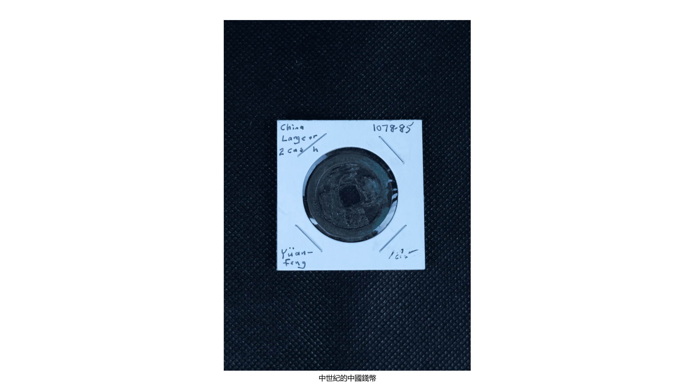

上面這枚是中世紀的中國錢幣。它是一枚鑄造的錢幣，中心有一個方形的孔。這個孔是用來穿繩子的，可以將錢幣串在一起，製成手鐲或項鏈。然而，這些錢幣並非主要用於佩戴，而是主要用於會計用途。這些錢幣可以串在一起，形成大串的會計單位，枚枚相扣。它們不一定有任何特定的標記，有時只是簡單的青銅圈。

漢武帝在公元前 113 年遲遲才確立的國家貨幣壟斷權，經常受到挑戰，允許各種私人或地方參與者發行自己的貨幣，只要他們獲得足夠的社會信任。

**貴金屬很少被用作流通貨幣，以防止囤積。貴金屬很少被用作流通貨幣，以防止囤積，黃金因為太昂貴，通常被放在一旁而不是花掉。相反，在中國的國際貿易中，只有絲綢才是真正的高價值貨幣**。中國人使用絲綢而不是黃金進行貿易。

在經濟或貨幣危機期間，尤其是銅價上漲時，就會採用創新的解決方案：因此，早在公元 2 世紀，流通中的錢幣就被切割成較小的單位，以較低的成本維持流動流通。其他時代，例如王莽時期（公元 1 世紀早期），則試驗使用高度信用的貨幣，其面值遠高於實際的金屬含量，因此是紙幣的雛型。他們在一枚硬幣上印上 50、100 或 200 等價值，以表示較大的金額，例如 200 枚硬幣。這種做法很可能造成嚴重的通貨膨脹。

如上文所述，這個制度是建基於國家、生產者和商人之間的社會慣例，但對於不玩這個遊戲的人，也有專制和嚴厲的規定，特別是關於棋子的選擇（無論美觀與否）或布料的長度（不符合標準）。

以我的愚見，這不是一個非常穩固的系統。它主要依賴於嚴格的規則，要求官員和交易員接受損壞的硬幣，並以此作為制裁的威脅。

### 中國貨幣創新及其對經濟的影響

中國也是發行早期紙幣的先驅，最初是為了應對公元 9 世紀的金屬短缺。儘管這些紙幣最初具有優勢，但一旦過量發行，就會定期導致通貨膨脹，正如宋朝或明朝時期所見，過量發行導致了嚴重的貨幣危機，13 世紀的馬可-波羅（Marco Polo）就說明了這一情況，他甚至指出，偽造這種紙幣會被處以死刑。在此我不禁要指出一種暴力形式。

因此，中國經驗的特點是對貨幣有深刻的信託概念、貨幣體系有顯著的彈性，以及很早就使用紙幣，其基礎是經濟參與者之間的信任，而非所使用媒介的內在價值。

## 古代的社會和經濟組織

<chapterId>4023c3ce-7a47-5ac4-8f5f-c7ab699ab20f</chapterId>

:::video id=2761efe4-21cf-4f06-9bda-c03f9ff39012:::

### 城市寄生爭論

古代城市與其腹地的關係帶出了一個基本問題：這些城市中心究竟是作為攫取財富的寄生蟲，還是有益的經濟專業化引擎？寄生假說認為，青銅時代的城市，尤其是美索不達米亞的城市，**有系統地從農村領土攫取的價值多於其回報**，基本上靠租金和稅收過活，卻沒有創造等值的價值。

羅馬帝國的崩潰也反映了這種願景：當領土擴張停止時，外部財富的流動就會枯竭，這可能會導致城市經濟無法自我融資。城市因此會「入不敷支」，依賴攫取而非生產。

### 專業化是價值創造的動力

另一種經濟學的解讀挑戰了這種寄生性的觀點。 **古代城市的功能首先是專業化與分工的中心**。它們的角色不只是簡單的採掘：它們集中了專門的工藝、組織了貿易網絡，並成為遠距離交流的樞紐。

這種都市專業化與腹地形成了生產上的相互依存關係。 **如果沒有農村的農產品供應，城鎮就無法生存，但腹地卻可以從手工藝產品、技術創新以及進入地中海貿易網路**中獲益。儘管利益分配看似不平衡，但勞動分工允許相互提高生產力。

當時長期的糧食不安全在一定程度上解釋了這種明顯的不對稱性。饑荒和農作物被摧毀的風險一直威脅著農村人口，而與國際貿易網絡相連的城市工匠則享有較大的經濟穩定性。

### 歷史演進，從古代到中世紀

古代與中世紀組織的對比揭示了這個問題。 **古代傾向於大規模的分工，城市對整個地中海世界**開放。貿易和專業化達到了複雜的程度，形成了廣泛的經濟網絡。

羅馬帝國的瓦解導致了徹底的分裂： **封建時代以分散的自給自足的莊園系統**取代了這種中央集权的組織。古羅馬的鄉村別墅 (villas rusticae) 成為中世紀繼承地 (seigneuries) 的母體，形成了由神職人員或貴族管理、幾乎自給自足的經濟島嶼。

這種中世紀的分權，雖然降低了商業效率，但卻提供了更大的抵禦外來衝擊的能力。封建產業在權力中心與農村人口之間建立了更平衡的關係，儘管這種組織限制了與專業化相關的生產力增益。

### 都市市場的興起

考古發現顯示，早在第二個千年**，美索不達米亞城市就有**購物港和貿易區。這些基礎設施證明了有組織市場的存在，儘管其確實的功能仍有爭議。

卡爾‧波拉尼 (Karl Polanyi) 一開始對古代是否存在真正的市場機制持懷疑態度，但後來他承認自己可能低估了市場交換的早期萌芽，因而修正了自己的立場。這種思想演進反映出解釋古代經濟體系的複雜性，在古代經濟體系中，制度性的再分配、互惠交換與新生的市場交易並存。

### 斯巴達對雅典

斯巴達與雅典的比較完美地說明了貨幣制度與社會組織之間的關係。 **斯巴達代表了刻意拒絕使用貨幣的僵化等級制社會的典範**，而雅典則發展了成熟的貨幣經濟來配合其民主制度。

斯巴達人對金錢的拒絕不是自發的，而是**制度和意識形態上的**。斯巴達領導人擔心金錢會腐化軍事和公民價值觀，他們更喜歡以公民之間直接的人際信任為基礎的制度。

為了不鼓勵使用貨幣，斯巴達使用了**重、不實用的金屬條**，自相矛盾地展現了他們對貨幣特質（可分割性、可運輸性、耐用性）的直觀理解。

### 反貨幣模式的限制

斯巴達的組織說明了**鄧巴的數字**在社會規模上的限制。 **斯巴達拒絕以金錢作為中性的交換媒介，這就注定了斯巴達的公民社會只限於有能力維持直接信任關係的有限數目的公民**。homoioi（斯巴達公民）只佔總人口的 1%，周圍是成千上萬的 hilotes（奴隸）。

這個組織最初是特殊軍事凝聚力的來源，但事實證明它在結構上是脆弱的。 **公元前371年的萊克特雷戰役（Battle of Leuctres）證明了這個系統的極限**：生命的損失不可彌補地破壞了斯巴達的社會結構，導致其文明模式的崩潰。

競爭城市（雅典、科林斯、底比斯）擁有發達的貨幣體系，**維持了更富裕、更有彈性的經濟**，能夠透過經濟重建和移民來彌補人類的損失。

### 個人與機構信任

斯巴達的經驗揭示了一個完全基於人與人之間的信任**而非中立的制度機制的社會所固有的**風險。這種模式在創造強烈社會凝聚力的同時，也讓社會容易受到人口衝擊的影響。

透過匿名和非個人化的交易，貨幣提供了卓越的系統彈性。它允許超越直接信任限制的社會擴張，促進對外交流和經濟成長。

### 印加悖論，沒有金錢的財富

印加帝國呈現了一個迷人的悖論：**一個擁有巨大黃金財富卻沒有貨幣系統的文明**。就像斯巴達一樣，這種模式建基於僵化的階級組織和中央集权規劃，但在擁有靈活貨幣經濟的征服者面前卻顯得不堪一擊。

反貨幣制度在面對貨幣社會時的這種結構性脆弱，是一種反覆出現的歷史模式，顯示**制度上對貨幣的拒絕，非但無法強化社會凝聚力，反而會在面對外來挑戰與歷史變遷時，自相矛盾地削弱**文明。

對這些歷史模式的分析顯示，貨幣除了其交換功能之外，也是社會複雜性的標記與促進器，讓文明得以超越直接人際關係所造成的限制。

# 鑄幣的誕生

<partId>232e365a-8c3b-11f0-b276-b3ab70d1a5a1</partId>

## 硬幣的出現

<chapterId>40ed3414-3066-57bd-bc1b-617ad0a354e0</chapterId>

:::video id=1d6834c4-98a3-43fe-ba80-04be51b0486e:::

我們現在來到問題的關鍵：錢幣的出現。我在這裡強調「硬幣」一詞，是因為我們在前面的章節中已經看到，在呂底亞民族、希臘人和波斯人之前的文明中，錢幣或貨幣系統已經非常存在。我想，從我們剛才所看到的，這是非常清楚的。因此，本節專門討論硬幣的出現，標題為：硬幣的出現*： *錢幣的出現*。

### 錢幣的呂底亞和愛奧尼亞起源

作為本節的開頭，我想為您提供 Glyn Davies 的著作《貨幣史》的摘錄，就在這裡。

*摘錄自《貨幣史》：Glyn Davies 所著的《從遠古時代到現在》：*

> 錢幣的知識和使用從其誕生地吕底亞和愛奧尼亞迅速向東傳播到波斯帝國，向西經過愛奧尼亞和愛琴群島的其他地方傳播到希臘本土，然後傳播到其西部殖民地，特別是西西里。它還向北擴散到馬其頓、色雷斯和黑海，但在埃及只是部分、勉強和遲遲才被接受。

我覺得有趣的是，在埃及，在鑄造硬幣技術出現之後很長一段時間，他們仍繼續稱量硬幣。我認為這一點很重要。引文繼續說：

> 同樣地，義大利大陸一開始接受希臘的金融創新也相當緩慢，與西西里採用這些創新的速度形成對比。

*除了這兩個有限的例外（大陸的意大利和下埃及），硬幣的使用迅速擴散到地中海中部和東部的周邊國家，以及龐大且不斷發展的波斯帝國，從美索不達米亞**到印度。無論印度是否已經獨立發展了自己的貨幣，印度與近東之間日益增加的接觸導致印度的錢幣直接改良了呂底亞和希臘的發明，首先是通過波斯帝國，然後是馬其頓帝國*（亞歷山大大帝及其父親的征服）。

*由於這些原因，任何印度本土的貨幣發明的直接影響都是微不足道的，相比之下，東面中國明顯獨立的貨幣發明，以及西面呂底亞和希臘的發展，就顯得更加重要*。

### 地理分佈和區域適應性

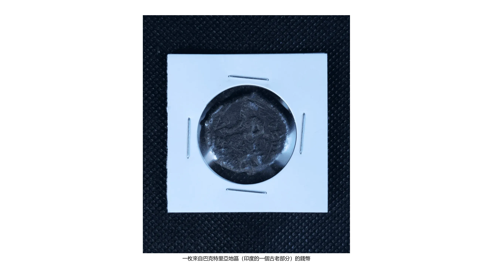

為了直觀地說明這段時期，上面這枚錢幣來自印度的一個地區，即巴克特里亞地區，該地區靠近印度半島西部，靠近阿富汗。在這個地區，有一些錢幣可能是受到希臘錢幣的啟發，以他們的一位皇室人物為主題。

## 吕底亚人和波斯人

<chapterId>eb802ab8-8ffd-5b25-907f-8944f120ed14</chapterId>

:::video id=f151eb42-5ff3-4ca1-9af1-1ae2a5e051c0:::

### 第一枚呂底亞電幣

既然我們無法區分錢幣的出現是來自呂底亞和波斯人，那我們就來看看希臘以東的那部分世界，也就是今天的土耳其。西方最早出現的錢幣大約可以追溯到公元前 7 世紀中葉，位於今天土耳其的呂底亞和愛奧尼亞地區。大約在公元前 650 到 600 年間，這項基本的創新才得以見到曙光，考古學上的重大發現，例如在以弗所的阿耳忒弥斯神廟發現的第一批錢幣，年代大約在公元前 600 年。這些原始的錢幣是由金銀合金製成，具有琥珀色的反光，外觀通常很粗糙，只是簡單地打上印記或簡陋的圖案。

下面，您可以看到最早的呂底亞錢幣之一，其特色是一頭獅子與前面的獵物。您可能會注意到背面有一個印章或孔洞，有些人認為這是用來測試金屬的純度，確保它不只是表面層。雖然這是最早的例子之一，但必須注意的是，這件作品是複製品。我所有的黃金和金幣都是複製品或現代再現品，目的是防止我把所有的積蓄都花在這個收藏上。

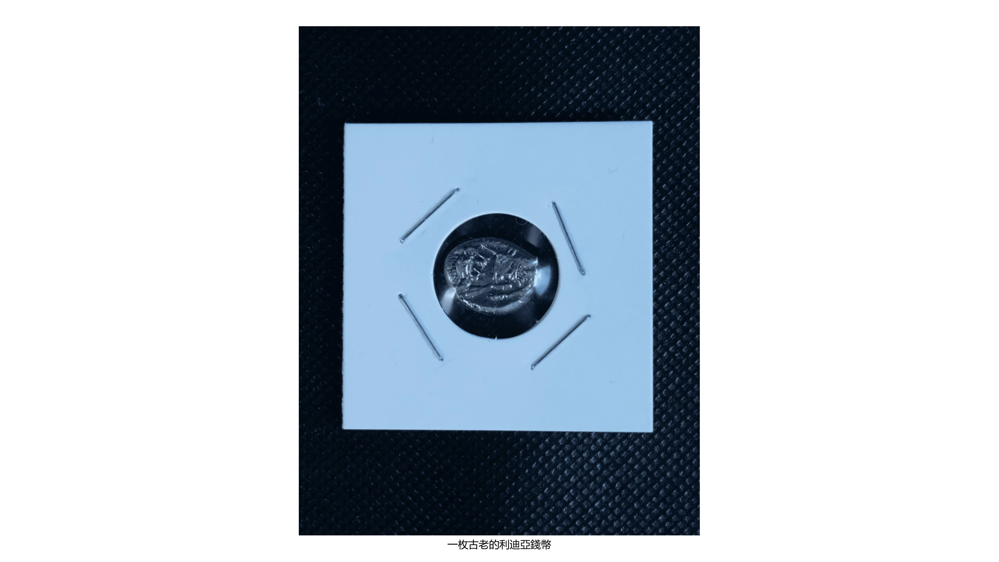

但我也有一件真正的波斯作品，我們即將看到。早期的作品就是這個樣子。它就像是一種金屬圓球（或英語稱為塊狀物），是當時壓印上去的。

人們普遍認為發明貨幣是為了方便日常貿易並取代以物易物，與此相反，最早的吕底亞、阿契美尼德和希臘錢幣最初似乎並非用於小規模貿易。事實上，這些貨幣單位太大，不適合日常使用。更重要的是，它們的流通範圍僅限於製造地附近的地區。

在此，我認為有必要一提的是，雖然我曾在幾本人類學性質的著作中讀到，這些錢幣，正如我已經證明的那樣--無論是電子幣還是這枚波斯錢幣（我很快就會回到這枚波斯錢幣）--都太大了，比方說，每天都買不來麵包。我看過一些估算，讓我們覺得這相當於農民或士兵一天的工作量，所以這太大了。這就好像要為你的一餐、早餐或午餐支付一天的工資一樣。只是我在其他作品中看到，有發現這些圓球的較小單位，所以是較小的錢幣，這可能會讓我們覺得也許有可能用於日常購物。

所以在這裡，人類學的 「證明 」說它不是用於日常貿易，因為面額或單位太大，在我看來並不是很可靠，因為我們已經發現了更小的錢幣例子，這些錢幣可以用於日常購買。

### 國家在貨幣創造中的角色

錢幣的真正起源似乎與國家的直接行動有關。關於這一主題有兩種主要的假說：第一種是理想主義的，將希臘語中的 "nomisma「（錢）和 」nomos"（法律）相提並論，認為錢幣與法律的編纂有關，加強了城市的權威和政治組織。第二個更現實的假設是，貨幣首先是國家行使經濟和社會控制的一種手段。通過官方保證錢幣所含貴重金屬的重量和價值，國家能夠操縱這些錢幣的流通和價值，創造信心和國內貨幣特有的流動性溢價。

我們有證據證明這一點，這真的很有趣。舉例來說，在金銀幣中，你應該知道天然金銀幣通常含有約 70% 的金和 30% 的銀。在我們發現和分析的第一批錢幣中，特別是早期的 Lydian 錢幣，含金量似乎在 50% 到 55% 之間，而不是 70%。這說明即使在當時，錢幣發行者也在試圖減少貴金屬的比例，可能是為了生產更多的錢幣，並使它們看起來與一塊沒有標記的天然電子幣價值相同。在此，必須指出的是，這確實是從這位著名的克羅埃蘇斯 (Croesus) 時期開始的，因為從他的時代開始，我們就擁有了分離金銀的技術。

在著名國王克羅埃索斯 (Croesus) (公元前 561-546 年) 統治期間，呂底亞的錢幣經歷了一次重大的演變，克羅埃索斯以其傳奇性的財富而聞名。在此時期，吕底亞人完善了冶金技術，將金和銀從電子幣中分離出來，因此首次推出了雙金屬錢幣，即金銀分離的錢幣。

### 波斯人的擴張和希臘人的採用

公元前 546 年，阿契美尼德波斯人征服了呂底亞，隨即採用了這種創新技術。大約在公元前 500 年，在大流士一世 (Darius I) 統治下，波斯人建立了自己的貨幣體系，使用金幣 darics 和銀幣 siglois，通常印有王室的戰鬥肖像。這種皇家波斯錢幣主要在波斯帝國的希臘化地區使用，並逐漸擴散，但其使用仍不均衡，**有些地區，如埃及，仍偏好使用稱重的金屬（金條）進行兌換。

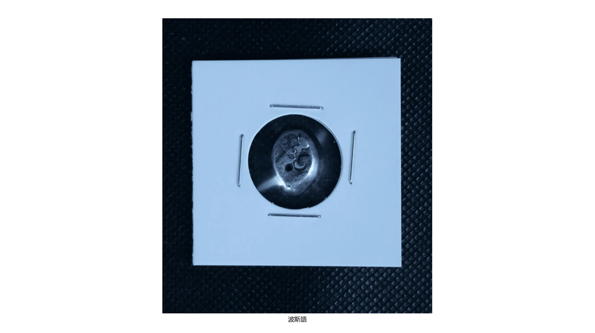

在上面，您可以欣賞到一件真正的波斯西格羅（或西格羅）。這個小圖案的主角是一位國王，不過孔已被稍微磨去。siglos 是銀幣，與金幣 daric 形成對比。波斯人可以分辨出這兩種金屬，因此他們摒棄了電子幣。因此，他們實行了雙金屬主義，同時使用金和銀，同時保持貴金屬製成的錢幣的概念，通常在背面有一個孔，大概是用來檢查金屬含量的。

希臘人迅速採用硬幣似乎是受到他們與吕底亞人密切接觸的刺激，特別是透過希臘在小亞細亞的殖民地。第一批鑄造硬幣的希臘人可能是公元前 6 世紀中葉的埃吉納 (Aegina) 居民，他們引入了德拉克馬 (drachma)，其重量因地區而異，其名稱的字面意思是「一把穀物」或「一把箭」。

希臘硬幣的成功，既是因為它方便了重要的交易，如支付傭兵，也是因為城市的經濟和政治擴張。貨幣迅速成為希臘以及後來羅馬經濟的核心要素，同時保留了強烈的象徵意義，特別是透過其與法律 (nomos) 的聯繫。

最後，硬幣的迅速擴張見證了古代社會的深刻轉變，在古代社會中，貨幣價值的編纂與國家組織是同步進行的。這種演變為希臘民主政體的興起奠定了經濟和政治基礎，特別是在雅典，貨幣在民主城市的運作中扮演了關鍵的角色。

本節要記住的關鍵點是，我們討論的是**硬幣**，而非一般貨幣。其中最重要的一環是對發行機構的**信任，這與硬幣的技術特性（重量、純度、面值）直接相關。恰恰是這種信任使得國家或發行機構能夠從一開始就對這些錢幣的價值和流通進行一定程度的控制，甚至操控。

## 機構介入和第一枚硬幣

<chapterId>3e1efd08-99e3-5a32-9908-3185fef0e640</chapterId>

:::video id=84847cf6-9e46-4a8c-9f35-25a27496cc4b:::

### 金錢的雙重性

鑄造貨幣的出現提出了一個根本性的問題：貨幣是市場自發的創造，還是權威強加的制度？這種概念上的張力讓兩種截然不同的觀點互相對立。

一方面，奧地利經濟學派捍衛商品貨幣--尤其是黃金--因其固有的特質：耐用性、便攜性、可分割性和可替代性而被經濟活動者自然地選中的觀點。從這個觀點來看，國家隨後便撥用這種自發的貨幣來控制其供應。在被政治權力俘虜之前，這是一種從市場需求中自然產生的制度。

相反地，人類學及制度的觀點則認為，貨幣真正的出現是在國家製造硬幣的時候。當局會有意識地創造貨幣，加蓋印章，從而將金屬轉變為真正的貨幣工具。這種觀點認為最早的吕底亞硬幣主要用於支付軍隊--一斯塔特大致相等於一名士兵的日薪。

### 國家標準化的矛盾優點

儘管存在這種理論上的張力，甚至奧地利經濟學家也承認了國家干預貨幣的某些好處。鑄幣的標準化解決了許多實際的貿易問題。

在沒有認證機構的情況下，經濟參與者會不斷面臨風險：偽造硬幣、申報欺詐和重量操控。這些行為會造成經濟摩擦，因為有些硬幣會被接受，有些則會被拒絕。理論上，官方印章可保證重量和品質，使貿易更加流暢。

這種保證在市場上有可觀察的價格：鑄造的金幣比等同的原金價值更高。這種溢價反映了認證的價值 - 商人不再需要通過化學或共振測試來自行驗證金屬的真偽。自相矛盾的是，國家干預消除了摩擦，並通過建立制度化的信任促進了貿易。

### 從一開始就操控貨幣

第一批 Lydian staters 的故事揭示了一個令人不安的諷刺。最近的分析顯示，這些金幣的含金量有系統地低於天然金幣。認證品質的機構同時也在篡改成分。

這種做法說明了硬幣的雙重效用。對市場而言，它使交換更加流暢，並提供了標準化的保證。對於發行機構而言，它通過稀釋成為了經濟控制的工具。在維持名義價值的同時減少含金量，國家有效地增加了貨幣供應 - 用相同數量的貴金屬創造出更多的貨幣單位。

然而，國家本身仍然受制於這種操縱。正如四世紀君士坦丁的金幣例子所示，羅馬政府嚴格檢查硬幣的質量，因為它要求以良好的硬幣支付。為了保證稅收的價值，羅馬政府在維持其硬幣質量方面有著重大的利益。

### 貶值的經濟分析

對貨幣貶值的研究揭示了歷史上一貫的模式。對於金屬錢幣，經濟學家會追蹤錢幣中所含貴金屬的百分比 - 下降的曲線表示逐漸貶值。對於現代紙幣，情況則剛好相反：觀察的是流通貨幣的供應量，其增加表示貶值。

這兩種方法衡量的是相同的基本現象：貨幣價值的稀釋。無論是降低貴金屬含量還是印刷新鈔票，其機制都是一樣的。當局從相同的實際資源中創造出的貨幣單位越多，每個單位失去的價值就越多。

這種從最早期的吕底亞錢幣就可以觀察到的操縱表明，貨幣控制一直是一個權力問題。因此，鑄造貨幣代表了一種非凡的技術創新，同時也是一種經濟控制的工具 - 這種雙重性貫穿了整個貨幣史，直到今天。

## 零件製造

<chapterId>b205f4f2-c293-5308-b812-a998de9ad45e</chapterId>

:::video id=47c612ec-d97e-4498-b50e-7e66518bd56d:::

### 從打孔圓球到鑄造硬幣

在介紹了錢幣的出現之後，我想簡短地介紹一下錢幣製造的演變。正如我們所看到的，一切都從圓塊狀的電子幣開始，接著是金幣和銀幣，兩面都有打孔標記，可以是國王的臉，或是在背面打孔以檢查純度。

之後，正如我們將在接下來的章節中探討的，希臘人改進了這項技術，製造出了雙面都經過錘擊的圓形錢幣。他們會使用一塊光滑、平整的貴金屬，在其中一面刻上所需的圖案，然後用手鎚擊，製造出完成的錢幣。

個別手工鑄造硬幣的技術很可能在那段時期起到了控制通貨膨脹的作用，儘管硬幣經常被稀釋以增加產量。這在羅馬時期尤其明顯，其次是在希臘時期的某些戰爭中。儘管一次鑄造一枚錢幣限制了當局的大量生產能力，但它有效地幫助控制了通貨膨脹，儘管出現了重大的貶值。因此，錢幣的演變從一團被打孔的金屬圓球發展到圓形的錘鑄錢幣。

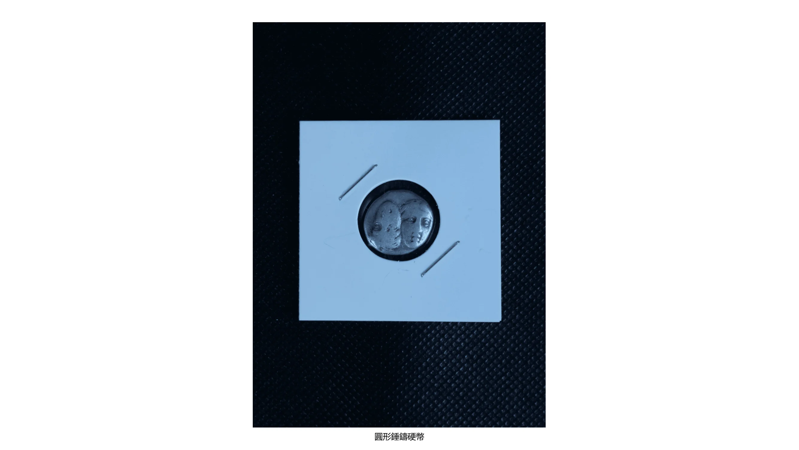

### 中世紀演變

在中世紀，錢幣也有分散的趨勢，使它們變得更寬更薄。這樣做的原因之一是因為可以更容易地測試它們的聲音，而聲音通常被用作真偽的指標。將銀幣攤開後，會產生一個獨特的頻率，因此人們只需聽一聽就能確定錢幣的純度。這種做法誕生了 「健全貨幣 」一詞。在健全貨幣的背景下，標準重量是通過使用天平秤或 "trebuchet "進行稱量來確定的。因此，小而圓的錢幣繼續向稍薄而寬的錢幣演變。

### 擺錘敲擊

在中世紀末期，也就是近代初期，最後一項技術是擺錘鑄造的概念。它是一種擰緊的螺絲，用來擊打錢幣，從而以這種新的擊打形式產生錢幣。這項發展的特別之處在於能夠在錢幣表面雕刻圖案，以解決剝落的問題。鑄造過程中，銀幣的一部分會被移除，以回收貴重的銀，這些銀可以用來鑄造其他錢幣，也可以作為一種資源保留下來。

因此，擺錘敲擊的概念有助於剪切現象。有趣的是，這項技術其實是來自法國。例如，在英國，他們僱用了法國工程師來教他們如何製造這些機器。我認為有趣的是，有一些支持錘式鑄幣的人反對它，他們延遲了這項技術的應用。任何好的技術，總會有人反對，希望保留舊技術。我覺得這是非常瘋狂的，因為我意識到即使是一項看起來非常優越的技術 - 你可以製造更多的零件，它們也更難被複製 - 仍然有人對著名的鎚鑄法情有獨鍾。在用著名的鐘擺敲擊法生產零件和回到錘子敲擊法之間，出現了轉變。最後，當然是擺錘敲擊法最終站穩了腳步，為我們帶來了這些美麗的現代作品，在這些作品上，你可以找到一些小線條、小稜線，以避免剪切，可能與剪切這個詞有關，稜線，今天你仍然可以看到稜線，或者刻在作品邊緣的文字或圖畫。

# 貨幣出現的不同理論

<partId>72ac694f-9248-550d-90c1-91af3d234380</partId>

## 有關貨幣的出現及其各種定義的理論

<chapterId>7d699d4d-8c70-55b5-bf36-609f3fd90bcf</chapterId>

:::video id=523c873f-501b-4954-b79f-7e74c0f685a5:::

歡迎來到這個專門討論貨幣出現的不同理論及其各種定義的環節。以下是*Aux origines de la monnaie*這本書的一小段摘錄，我認為它總結了我們在這一節要探討的兩個主要理論。

> 這篇簡短的序言除了強調調查的背景之外，別無他意。在概念層面上，K. Polanyi 論述的支持者與 M. Weber 論述的支持者之間的辯論是公開的。對前者而言，贈與與再分配扮演著核心的角色，市場交換只扮演邊緣的角色，主要是在國際交換上。相反，對其他人來說，市場是當前歷史進程的核心。

舉例來說，在美索不達米亞，有一種出現理論認為，神廟作為權威，創造了會計單位或貨幣單位，並將其強加於人，然後商人就採用它進行貿易。相反的理論則認為，不對，這種貨幣單位是從市場中自然產生，以促進貿易。在美索不達米亞就有來源充分的例子。

至於以物易物，有些理論認為它主要用於國際交易，也就是與我們根本不信任的人交易。

這就是我們在這一節要做的。我們將進行一項調查，以介紹關於貨幣出現的不同理論，以及對貨幣的不同定義。我們將介紹和批評古典經濟學家和人類學家的論點。我甚至很幸運地請到了 Ulrich Fromy，他將從奧地利經濟學家的角度來探討這些不同的議題。

## 對古典經濟學家而言，貨幣的出現

<chapterId>1d3776cd-0dfd-5297-af48-c6f41e257a7e</chapterId>

:::video id=873a16c1-17ac-448d-8941-df4feb7ab79d:::

本節專門討論貨幣出現的不同理論。要涵蓋的第一個主題是古典經濟學家認為的貨幣的出現。

### 亞當史密斯的經典理論

根據古典經濟理論，特別是亞當-斯密所提倡的理論，貨幣是在易貨交易的限制下自然產生的。一開始，交換是透過直接以物易物的方式進行，但這種方法往往因為「雙重需求重疊」的問題而變得複雜：每個人都必須準確地擁有對方想要的東西。漸漸地，某些商品（如鹽、貴金屬和牲畜）因其實用性、耐用性和可分割性而被所有人接受為中間交換工具。因此，貨幣自發地出現，以促進和流暢經濟交流。

### 古典理論的批判

以下是我對這個理論的批判。有了上一節我們所看到的一切，我認為我們已經可以說，這種認為***硬幣是易貨的演變的觀念是錯誤的，原因很簡單，因為鑄造的硬幣肯定是從權威中產生的，因為它是由權威鑄造的。這有好幾個原因，其中最重要的是權威想要控制經濟、控制貨幣。

另一方面，如果我們談論的是貨幣的概念，而不一定是錢幣，那麼情況就沒有那麼明確了，因為在第一批錢幣中，我們發現了沒有標記的銀圓塊。它們是否流通仍有待觀察。如果它們在流通，這就意味著人們最初可能已將這種資產視為一種潛在的貨幣，可以被廣泛需求，也很容易進行交換。也許當局只是在事後才注意到這種情況，並加以控制，在上面蓋上印章以作證明。

這樣做有很多好處 - 不需要檢查、稱重等等。顯然，我們會談到這一點。但在我看來，硬幣顯然是一種從一開始就被國家使用的工具。然而，就貨幣這種東西的出現而言，我們不知道它是否真的來自一個強加於它的權威，還是通過貿易或商業交換而出現的。在本節的稍後部分，我將與我的同事 Ulrich 就這個主題進行非常有趣的討論。

我們已經知道，最早的貴金屬硬幣並不是用來促進日常交易的，因為它們的價值太高了。我們也知道它們主要用於軍事支付。這是一個很好的論據，證明貨幣不一定是從市場中產生的。對於購買麵包或日常購物來說，第一批錢幣的記帳單位、面額可能太大了。例如，它可能相當於一天的工資。在那個時代，人們不一定有工資，但這只是給你一個規模的概念。因此，這些硬幣可能具有太高的購買力，無法用於小規模的貿易。另一方面，也不能說這些錢幣就不會被用來進行更大規模的交易，例如商人交易。我們知道它們主要用於軍事支付。這是解釋第一批錢幣出現最流行的理論之一。請記住，我們在這裡討論的是硬幣，而不一定是一般的貨幣。所以，最早的硬幣有其最初的作用，那就是用於支付軍費和傭兵。

例如，亞歷山大大帝就充分利用了這一點，我們稍後就會看到。

我們也看到，早在古代中國，貝殼就被用於經濟交換（**報酬勞動力、衡量價值和購買土地）**。更重要的是，在美索不達米亞和埃及，功能性的貨幣系統已經存在，並用於貿易、工資支付和繳稅。我在這裡的意思是，認為西方概念中的硬幣是因為需要讓交換更流暢而出現的，這絕對是錯誤的。

既然硬幣是由權威機構發行，我們或許可以假設，從一開始，硬幣就與發行機構有關係。這是有道理的。另一方面，我們不一定知道在此之前的貨幣形式或貨幣系統形式，即原初的硬幣，是如何出現的。一方面，我們會認為是寺廟確定了這些貨幣單位 之後，人們使用它們。而另一方面，我們會告訴你，不，是商人需要一種交換手段，一種與外界交易的方式，是他們確定了，例如，金屬銀，要使用金屬銀，因為外界對它有需求。問題的關鍵是，我們真的不知道。這就是為什麼我們有兩種相反的理論。我們沒有完美的證據來解釋貨幣是從貿易的需求中自然產生的，例如商人，還是從權威中產生的。

### 硬幣與原始貨幣的區別

總的來說，我認為我們可以說硬幣必然是來自於權威，因為它們是由權威蓋印的。另一方面，我不認為我們可以說，貨幣（錢幣之前的貨幣）不可能是為了促進交換而出現的，這是錯誤的。我認為在我們上面看到的所有例子中，這種意義上的例子比比皆是。

## 以物易物的神話

<chapterId>0fcd4964-ac36-5163-a8cf-1aacebc0d2c0</chapterId>

:::video id=0ede29ab-8acd-4d79-9282-bd5991b97076:::

### David Graeber 的評論

我們剛剛介紹了古典經濟學家所說的貨幣的出現。現在我們要討論一個稱為以物易物神話的概念。

對於這個關於貨幣出現的經典理論，有一個批評就是缺乏歷史證據來支持它的觀點。

人類學家 David Graeber 等人提出了被稱為 「物物交換神話 」的批判，挑戰了貨幣是從物物交換中自然產生的經典觀點。根據這一批判，沒有任何歷史或人類學證據顯示，在貨幣出現之前，社會系統性地使用易貨交易。事實上，古代社會應該是在信用、債務、社會義務和儀式交換的基礎上運作的。因此，「易貨神話」是一種理論建構，目的是為了證明古典經濟觀念的合理性，並沒有真正的經驗基礎。

然而，應該注意的是，這個理論並不否認以物易物的存在，例如不同部落之間的交換。它只是否認在這些所謂的原始群體中，以物易物是一種廣泛實行的活動，而貨幣是這些實踐的邏輯演變。它否定了以物易物在部落中被廣泛使用的事實，也否定了貨幣最終是為了使交換流暢並解決以物易物所存在的困難而出現的。相反，根據這個理論，這些族群實行的是一種非正式的信貸或禮物換禮物。

### 原始社會與偉大文明

***我認為這個理論絕對適用於過去甚至今天的原始（無國家）族群（例如探險家在18、19世紀研究過的部落）。很明顯，他們不使用以物易物，而是使用我前面提到的交換形式，原因我們已經提過了（弱分工、自給農業）。不過，我不認為這個理論適用於過去的偉大文明，例如美索不達米亞和古埃及。

以下是 *Aux origines de la monnaie* 中關於此主題的兩段摘錄：

> M. Mauss 在其著名的《禮物》一書中所概述的模式，已被埃及學家們一致熱烈地採用，就像缺乏辨別力一樣。這導致了許多混亂，我們在此就不多說了。讓我們簡單地指出，這個模式適用於所謂的原始社會，而法老時期的埃及並非如此。

> 因此，麵包，也就是經加工的穀物，就像古王國的 shât (y)一樣，是可以開立多元商品信用額度的記帳單位。這個簡單的例子說明，法老時代埃及的經濟並不局限於再分配系統。它是非常複雜的，涉及多種交換。

因此，正如我們之前在關於埃及，甚至美索不達米亞和中國的章節中所看到的，我們可以看到，即使是這些古老但並不原始的文明，由於國家的存在，在我看來，也使用了貨幣系統。我認為這一點已在本課程的第一節中充分展現。因此，這種予取予求、延後信用的觀念，並不適用於這些偉大的文明。因此，貨幣出現的確切原因仍然是一個謎。我們不知道它是否源於商人與外界貿易的需要，還是這些古代時期的神廟所強加的。

## 透過債務貨幣出現貨幣

<chapterId>4f508615-aa61-5d62-89d3-cecd02aeaa62</chapterId>

:::video id=a23f547f-3906-4f4a-8f72-5d78c649d0c4:::

### 貨幣作為借據

在本節中，我們將介紹債務貨幣理論。

由經濟學家 Alfred Mitchell-Innes 提出、後來由 David Graeber 擴展的**債務貨幣**理論宣稱，貨幣並非源自易貨交易，而是源自最早的人類社會就存在的債務和信貸關係。根據這個理論，當社會義務（個人或團體之間的債務）變得量化且可轉移時，貨幣就出現了。這個概念引入了交換和轉移量化的概念。因此，貨幣首先是一種**對債務的認可**，以相互信任為後盾，並經常由政治或宗教權威所擔保，而非僅作為交換中介的商品。

這個理論的一個更高級的形式是 所有的錢都是債務所以擁有金錢的人對整個社會都有索求權 對所有接受金錢的人都有索求權因為在他們的觀點裡 錢必須被強制接受 否則它就不是錢 因為如果你可以拒絕這筆錢 他們的系統就無法運作了在一個特定的團體中，如果已經確定了一種貨幣，所有擁有這種貨幣的人，就好像他們對社會中其他所有接受這種貨幣的人有一種債務，而那些接受這種貨幣的人對擁有這種貨幣單位的人有一種債務。這基本上就是他們的理論。

### 對強制性制度的批評

**我對這個理論的批判：**

讓我對這個理論做一個小小的批評。我同意金錢是一種社會共識。它是一個團體對貨幣 「符號 」的信任，無論它是什麼。所以我認同相互信任的概念，稍後我們會再討論貨幣溢價的概念。當這個理論的支持者加入義務的概念並堅持債務的概念時，情況就變得複雜了。對他們來說，當某人擁有一個貨幣token時，他們對整個社會持有一個索賠權，因此社會欠持有人一個債務。同時也會有結算的義務，團體成員有義務接受 token；否則，在他們看來，這個系統就無法運作。我認為上述古代中國的制度很好地代表了這個理論。

就我而言，我可以輕鬆想像一個系統，在這個系統中，金錢是一種社會共識，人們普遍接受所選的 token 作為一種付款方式，而沒有正式的義務。如果人們是自願接受的話，我認為這樣的系統是可行的。它可以運作。另一方面，它通常會帶來義務、法定貨幣和暴力，我們稍後會在一節中看到。但理論上，我的印象是這個系統不太能行得通。我認為 Bitcoin 就是一個例子。Bitcoin之所以有價值，是因為它有貨幣溢價，因為有人需要把它用於貨幣用途，也就是儲備價值，也許也是交換或保護法幣系統的手段。沒有人有義務接受它，而且越多人接受它作為支付手段，它就越能被用作交換手段。我們已經可以毫無問題地使用它作為價值儲存。這是毋庸置疑的。我想說的是，在我看來，Bitcoin 似乎是一個例子，是一種社會共識的貨幣，我們認為如果我們以後再買一些，我們就可以拿回我們的錢，我們取得它是為了以後能夠交換，以保存我們的購買力。

這種較寬鬆的理論觀點有助於解釋兩個不同的社會如何可以使用黃金等貨幣 token 進行貿易，而不會在兩個社會之間產生索賠或債務。在社會中強制接受，我發現在兩個部落之間的貿易中是行不通的，因為另一個部落不受權威的約束。部落 B 不受部落 A 的權威所限。但是，它接受相同的貨幣token，比方說，黃金。現在，人們可能會對我說："是的，但那是因為 B 公司也決定黃金是他們的貨幣。是的，這確實是可行的，但在這一點上並沒有創造債務。這是最後的交易。因此，當 A 公司在 B 公司用商品交換黃金時，並沒有產生債務，交易已經完成。很明顯，B 公司的人購買這枚金幣或金塊，並不是為了日後由 A 公司的人付款。他接受金塊是為了日後交換，很可能是在他自己的部落裡。所以，在這個例子中，沒有債務的產生，也沒有潛在的索賠，它只是一個直接的交換，一個直接的支付。債務貨幣的支持者會告訴我們這是以物易物。我不同意，因為易貨是直接物品的交換。直接以物易物是一種物品與另一種物品的交換，是為了使用。貨物交換是為了使用，而在我們的案例中，黃金明顯是作為貨幣使用的，因為它不會被用來做其他事情；它將來會被用來作為支付手段。所以，在我看來，它不屬於以物易物的類別。

擁有含金量高的 token 並不是對社區的「索求」，而是希望日後能以相近的價值接受 token。

## 貨幣的自發出現

<chapterId>e3ef86b1-73b9-5140-a61e-2ab6a5b0b2d4</chapterId>

:::video id=e543995f-d5e2-49d7-9133-e397b46e0833:::

對於Carl Menger發起的奧地利經濟學派來說，貨幣是在面臨需求雙重重合問題的易貨經濟中自然產生的。在這種觀點下，個人會自發地聚集在有助於交換的中間商品上 - 不是直接消費的商品，而是因其被廣泛需求的能力而被認可的商品。

這些貨幣商品必須具備自亞里斯多德以來所認定的特質：它們必須作為價值的儲存、交換的手段和會計單位。經濟活動者逐漸發現、累積和儲存這些貨幣，從而使它們成為貨幣。這個過程是完全自發的 - 貨幣代表了市場對於協調交換問題的自然反應，而不需要權威的有意識干預。

### 易貨神話」辯論

David Graeber 等人類學家反駁這個觀點，提出「易貨神話」。他們的論點是：從來沒有任何複雜的文明只基於直接易貨交易的記錄。相反，所研究的原始社會都使用非正式的信用和互惠制度。Graeber 斷言債務在易物之前，他引用了數以千計的美索不達米亞石碑來記錄信貸關係。

然而，這種批評是基於易貨的限制性定義。正如 Menger 早在 1892 年就指出的，易物不僅僅是簡單的貨物與貨物之間的直接交換。它還包括延遲轉移、以服務換取工資，以及具有時間性的交換 - 門格稱之為「個人之間的單邊轉移」。這種擴展形式的易貨可以在有限的信任圈中與信用系統共存。

沒有證據並不能證明沒有，奧地利經濟學家承認，沒有一個複雜的社會可以單靠直接易貨交易而持續發展，因此貨幣的出現是必要的。

### 美索不達米亞案例：商人與寺廟

圍繞著美索不達米亞銀幣 Shekel 的起源，爭論逐漸明朗化。有兩種截然相反的解釋。制度性的觀點認為，神廟 - 真正的經濟和精神中心 - 強行以銀作為貨幣，以構建經濟。集中在神職人員和商人菁英中的楔形文字碑，見證了這種集中式的控制。

奧地利的解釋則與此相反：是商人採用貨幣來進行遠程貿易。面對與美索不達米亞邊境以外的陌生人（從安納托利亞到波斯灣）進行貿易的挑戰，他們需要一種普遍可識別、耐用且易於運輸的貨幣。由於銀的固有特質，銀器自然是最佳選擇。神廟只是確認了商業上已經習以為常的做法。

這篇論文是根據安納托利亞的卡內什 (Kanesh) 與阿蘇爾 (Assur) 之間的交易記錄而撰寫的，在這些交易中，商人用紡織品交換金屬銀 - 不是為了其物質效用，而是作為一種價值儲存。這些交易超越了純粹的易貨交易，揭示了真正商品貨幣的存在。

### 監獄營地的現代例子

經濟學家 Richard Radford 是第二次世界大戰期間德國的一名囚犯，他記錄了一個自發出現貨幣的精彩案例。在集中營裡，香煙自然而然地成為了交換單位 - 可分割、標準化、廣為人接受。即使是不吸煙的人也採用香煙，因為他們認識到香煙的普遍交換價值。

這個縮影說明了奧地利原則：面對協調交換的問題，個人會自發地向最 「好賣 」的物品靠攏。沒有任何權威強加香煙錢；它是從囚犯尋求最佳化交換的日常實踐中出現的。

### 個人偏好的收斂

本質上，貨幣代表了個人偏好向一個被接受的共同利益的聚合。美索不達米亞的商人，就像拉德福德的囚犯一樣，找出了可以將未來交換的不確定性降到最低的物品。這種選擇不需要等待中央權威的授權或強加，而是來自於面臨交換挑戰的經濟行動者的實踐理性。

自發產生與有意識的制度之間的爭論仍未結束，因為歷史證據是零碎的。但奧地利的分析提供了一個連貫的解釋：貨幣誕生於商業的實際需求，而當局只是將市場使用已經建立的做法制度化。

## 金錢出現的人類學視野

<chapterId>ec48c5d8-47ed-530f-beb7-c44fd0b62880</chapterId>

:::video id=8c1f8764-75af-4fb6-a98b-55de3b7da02e:::

### 金錢的非經濟起源

在本節中，我們將探討關於貨幣出現的人類學觀點，這個豐富的觀點深刻地挑戰了經典的經濟理論。

傳統的理論認為，貨幣是從以物易物的方式自然產生，以促進經濟交換，與此相反，人類學的研究顯示，貨幣的出現主要植根於非經濟原因。它源於社會機制，如貢獻支付、謀殺賠償（著名的 Wergeld）和嫁妝（聘金），也源於儀式、宗教、政治和象徵性的實踐，遠遠多於簡單的市場需要。

在原始社會中，貨幣很少用於日常的物質物品交換，這與貨幣作為「交換媒介」的經典定義相反。事實上，這些社會大量使用信用，並將延遲付款嵌入到龐大的社會和個人關係網絡中。這些無處不在的信貸系統在邏輯上和歷史上都先於貨幣的出現。

這就是他們願景的總結。我們在上一段影片的聊天中與 Ulrich 討論過這個問題。我會讓你欣賞 Ulrich 對這個主題的評論，他的評論稍微挑戰了這個方法。因此，在人類學的視野裡，我們經常有這樣的觀念：金錢來自於權威或社會觀念，先於市場需求。

### 雅浦石的例子

下面，您可以欣賞到雅浦島上不朽石頭的矚目例子。其中一些石頭，儘管不能移動，甚至實際上已經消失，但由於集體協議，仍能繼續充分發揮貨幣的功能，突顯出貨幣在本質上的社會性和象徵性。

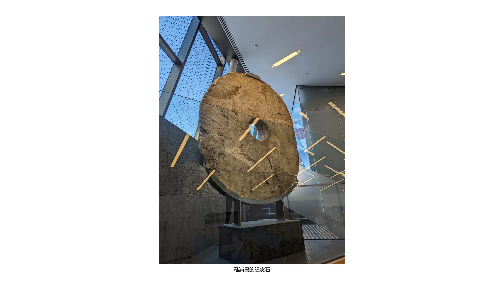

這是一個非常有趣的 Yap 寶石分析。Saifedean Ammous 在他的著作「Bitcoin 標準」中也提到這個例子。根據他的說法，雅浦島的系統最像 Bitcoin，是一種每個人都可以查閱的中央記錄，它是公開的，可以維護帳目和管理事物的所有權。這種人類學的觀點說明，這一切代表了社會內部的協議或社會共識，這在根本上是正確的。我覺得提到遺失的石頭非常有趣。他們會乘坐小木筏出海數百公里，然後把石頭帶回來。有時石頭會掉到海底，但這塊石頭仍會用在貨幣系統中。人們可以說：「是的，我們把石頭掉在這樣的地方；它是我的，所以我們可以交換」。由於石頭體積龐大，通常會停留在一個地方，因此不一定需要實體的擁有來促進交換。反之，重點在於以交易方式交換這些寶石，允許所有權在寶石實際不移動的情況下轉移。這是一種「共識證明」的形式，突顯出人類學對金錢的有趣觀點。

### 原生貨幣與社會責任

世界各地的人種學家都觀察過使用「原生貨幣」或「原始貨幣」的社會，例如貝殼、布匹、牲畜、鹽和石頭，這些貨幣滿足了通常賦予貨幣的功能，例如支付手段和價值儲存，但卻沒有在日常物品交換中定期扮演中介角色。

因此，我們在這裡描述的貨幣系統，不一定是用來進行日常交換的。

我想提醒大家，這些都是硬幣出現之前的貨幣，我不知道說貨幣有多名不副實。我比較喜歡說貨幣。我可以提一下，在文獻中，我們常說的原生貨幣指的是硬幣之前的貨幣。但正如我們在第一節所看到的，***我相信早在硬幣出現之前***就有貨幣系統了。

這些原始貨幣主要用於管理與個人相關的基本社會義務，例如婚姻、衝突補償 (Wergeld) 或酋長間的禮物。舉例來說，在波斯帝國，第一批錢幣是特別為了支付軍費而創造的，而非交換的工具。

因此，原始貨幣有一個基本特徵：它是一種支付手段，但很少是物質物品的直接交換手段。我們在這裡的意思是，它是某些社會義務的支付手段，用於部落、酋長之間的交換，也就是著名的wergeld，血錢。在司法制度出現之前，如果有人犯下謀殺罪，就會對因親人被謀殺而受苦的家庭進行賠償。這需要付出代價，它被稱為血錢，是一種付款方式。還有嫁妝，也是一種付款方式。在這些早期使用金錢作為付款的形式中，它更多的是與人類和社會義務有關，而不是日常購物的付款。根據這個理論，這些更常見的日常交換更多地與信用、延遲信用、禮物換禮物以及口糧的再分配有關。有另一種形式的社會組織來管理這些交換。同樣重要的是要記住，在一個社會裡，每個人都自給自足，自己耕種，沒有專門化，也就很少需要貨幣系統來進行日常交換。這就是為什麼最早的貨幣形式就是我們剛才所描述的嫁妝、血錢，僅僅因為這些是我們最早需要支付手段的交換，遠遠早於我們需要交易，需要每天用麵包換錢，因為在原始社會，它不是這樣運作的。每個人都提供自己的需求，還沒有專門化。我想我在這門課程之前的所有課堂上已經詳細講過了。

在這些沒有先進分工的社會中，直接交換仍然有限，主要發生在友誼或結盟的個人關係中。缺乏足夠的專業化並不需要現代意義上的金錢。

Quiggin 和 Einzig 等人類學家堅持信貸的重要性： **原始的經濟生活夾在一個巨大的信貸和個人債務網中，當付款必須立即進行，而補償又不能輕易延遲時，金錢就會介入**。

因此，人們交換東西時，可以延遲賒帳，但在某些情況下，你無法延遲付款，所以貨幣或原生貨幣在此時可以派上用場，讓交換有即時的終局性。

### 匿名的創新

這個分析引發了更深層次的思考：與其將貨幣與易貨對立起來，不如將貨幣的出現理解為從複雜的信貸和債務系統演變出來的。貨幣引入了一個基本的創新： **匿名性**。這也是我發現這個關於貨幣出現的人類學理論有趣的地方。如果你是一小群人 你們互相給予延遲的信用 你們顯然認識對方我認為這個系統要運作起來 人們顯然必須認識彼此而以金錢付款則允許匿名。它允許你在人們甚至不知道你的名字，甚至不知道你是誰的情況下進行付款。他們可以交換即時和最終的結算。而這正是金錢所能做到的。

貨幣與信用不同，信用總是有名無實，而貨幣則可以進行匿名、普遍且立即解放的交易。 **貨幣這種獨特的解放力量是其決定性的優勢。

因此，貨幣不僅僅是一種促進經濟交換的簡單工具，它更是一種重大的社會創新，與人類制度和實踐的演變密切相關，從個人信用**到普遍化的匿名支付系統**。這種人類學上的演進顯示，金錢遠遠不只是一種簡單的交換工具，而是一種強大的社會制度，深刻地塑造了人類社會，甚至在現代社會中，成為經濟活動的根本目的。

在此，我們瞭解到，在現代社會中，經濟交換的最終目的是為了擁有金錢，而在過去，情況卻完全不是這樣。經濟交換的根本目的是為了擁有商品或消費品。而今天，透過引入金錢這項創新，經濟交換的目的就是要累積這些金錢，因為金錢讓我們可以用它來交換物品，這是大家普遍接受的。當我們需要的時候，我們可以用它來交換我們所需要的物品。

## 註冊統一

<chapterId>7664442a-91c1-5ce4-a8bd-53b7371a3e3d</chapterId>

:::video id=473fc284-5375-4e1b-b0cd-6b51ba0cc3b8:::

### 會計登錄理論

我們現在要一起探討統一這兩種貨幣理論的各種建議，也就是透過債務貨幣而出現貨幣的理論，以及商品貨幣出現的貨幣理論。我們要談的是 Lynn Alden 在她的名著《For Broken Money》中提出的統一建議，Consensus 所翻譯的書名可能會叫做《Rupture monétaire》。

*摘錄自 Lyn Alden 所著的《破錢》：*

> 基本上，貨幣是一種會計登記。商品貨幣是由大自然管理的登記冊。銀行貨幣是由民族國家管理的帳簿。開放源碼貨幣是由其使用者管理的帳簿。

在此，Lyn 指的是 Bitcoin。

### 庫存流量比率與稀缺性

> 某些稀有化學元素 (例如銠) 比黃金還要稀有，但存量流動比率卻很低，因為工業消耗它們的速度與開採的速度一樣快。銠硬幣或銠錠可作為專門的收藏品或儲值物品購買，但不適合作為社會認可的貨幣，因此不會自然地以貨幣的形式出現。

Saifedean 在他的書 "The Bitcoin Standard" 中詳細談論了這一點。對於那些不熟悉庫存流量比的人來說，簡單來說，就是比較現有庫存（即市場上存在的儲備）和新進庫存（即新庫存的流入）。這通常與直覺相反，因為您可能認為擁有大量存貨的東西並不稀缺，但事實上並非如此。這更多的是您供應的能力問題。相反地，根據這個模型，是我們擁有新存貨的能力，讓我們知道這個物品是否稀少。並不是因為我們沒有存貨，它才是稀有的，只是可能我們沒有存貨而已。所以，如果我們拿黃金來說，我們有很多黃金存量，因為它被用作儲值工具，而新存量的流入大約是每年通過黃金mining流入的新黃金存量的1%到3%。而她在這裡所說的，如果我們談論的是銠，它比黃金更稀有，但我們沒有任何存量，因為它會隨著時間消耗。因此不需要大量的新供應就能讓現有存量翻倍。而黃金至少需要 50 年才能更新，才能使存量翻一番。不像大多數被消耗的商品，因為它是隨消耗而消耗的，所以不需要很多年的生產，就可以將現有存量翻一番。

*"在整個現代歷史中，黃金的存量與流量比率一直維持在 25 倍到 100 倍之間，通常在 50 倍左右或更高，即使在 19 世紀中期的淘金熱期間，也從未低於 16 倍。"*

因此，25 就意味著 25 年才能使存量翻一番，而 100 就意味著 100 年才能使存量翻一番。Saifedean 在他的書中說，即使我們將黃金產量提高一倍，例如從 1.5% 提高到 3%，也不一定會對黃金價格有很大的影響。

*"一般而言，白銀的庫存流量比率為 10 倍或以上，這仍然相對較高。

*大多數其他商品的庫存流量比率都低於 1 或 2。即使是最稀有的元素，例如白金和銠，由於其快速的工業消耗，存貨流量比率也相對較低。

### 金銀的優越性

*"簡而言之，每當一種商品貨幣發現自己與黃金和白銀競爭時，後者總是最後出局。其他商品可能會在有限的時期或特定的地區保持貨幣地位，但黃金和白銀總能證明它們有能力成為具有全球競爭力的貨幣，並在競爭中佔據優勢。這是因為當各種文明相遇時，黃金和白銀的持有者總有技術能力讓其他形式的貨幣貶值，而貝殼、珍珠、牲畜、鹽、布匹或劣質金屬的持有者則永遠無法讓黃金或白銀貶值。

在《Bitcoin 標準》（The Bitcoin Standard）一書中，Saifedean 談到非洲使用玻璃珠的部落。當威尼斯商人帶著滿載玻璃珠的貨物抵達時，因為他們當時有能力以工業化的方式生產玻璃珠，他們有這樣做的技術能力，這完全動搖了這些民族的貨幣體系，他們能夠從字面上掠奪他們的資源。這是賽費丹的論點。

### 記帳單位和貸方

*「從歷史上看，即使信貸被直接用作交換工具，它通常也是以因其特性而自然選擇的貨幣商品單位來計價 」*。

這是非常有趣的一點，也是 Ulrich 和我一直在討論的一點。即使美索不達米亞的神殿是一種可以管理這種信用概念的權威機構，但它的記帳單位是謝克爾。沒有任何資料可以證實該單位是由神殿權威性地建立的。謝克爾可能是透過商人與附近其他民族進出口的需要而自然產生的。我們有證據證明這一點，在卡涅什（Kanesh）有一個商人（我在第一部分提到過）就是這樣做的，他進口貴金屬，但這些貴金屬不是用來作為實體商品的價值，而是用來儲存價值。唯一的問題是，我們不知道是否可以假設這種銀的選擇、銀 Shekel 的選擇是由商人所做的，或是由聖殿所做的。但 Ulrich 有一個很好的論據，讓我們認為這可能是商人的選擇。

*「因此，這兩種理論的統一可以被描述為 」貨幣的會計理論"（「貨幣的帳簿理論」），因為它描述了這兩種理論共同的基本邏輯。靈活的社會信用和可收藏的原生貨幣都可以追溯到人類的曙光。在這兩種情況下，不同規模的人類群體之間都會保留一本會計帳簿，以避免滿足雙重巧合的需求、減少交換時的摩擦，並作為一種流動儲蓄的形式。兩者的基本差異在於受託保管帳簿的機構。

一方面，大自然管理著貨幣供應的擴張。所以，如果我們拿黃金來說，因為它相當稀有，所以很難開採。可以開採的金幣數量有一種限制。所以稀缺性是由大自然管理的。而登記冊是由擁有的概念所持有。登記冊是分散的。擁有權的證明是你擁有一枚金幣或一塊黃金。而在信用貨幣的情況下，稀缺性是由人們獲得信用的能力來管理的。或者在法定貨幣的情況下，稀缺性是由權威管理的。是他們決定是否印刷更多的貨幣 以避免通貨膨脹的災難所以，在某些情況下，登記冊也可以由token的所有者管理，在紙幣的情況下。這就是為什麼它會被記入登記冊，用引號，非物質化.好吧，物質化，但是虛擬的。他擁有這張著名的GW -11 這就是擁有的證明它可以很容易地在真實的登記冊中，就像經文錢一樣，在銀行中，真正管理誰擁有什麼與登記冊有關的是人類銀行。

## 透過貨幣溢價實現統一

<chapterId>093756e5-8908-55e5-bb76-376a3a3cc4d3</chapterId>

:::video id=eabc342a-ecbd-46ca-a347-e914917e7c4f:::

### 貨幣溢價概念

在這一節中，我專門討論了有關統一貨幣出現的不同理論的各種建議，我剛才提出了Lyn Alden的理論，也就是寄存器理論。我有我自己的建議來統一這兩種貨幣理論。那就是貨幣溢價，貨幣溢價的概念。所以，貨幣的價值可以用它的貨幣需求所產生的貨幣溢價來解釋，無論是泥板，貴金屬錢幣，紙幣，還是比特幣的形式。貨幣溢價只是基於對未來有人會以可比價格交換這種貨幣的信心。

我在這裡想要證明的很簡單，無論是法幣，也就是沒有使用價值的紙幣，無論是金幣或任何金屬、一塊金塊或一塊金錠，***組成其大部分價值的往往是貨幣溢價。如果我們拿一塊黃金來說，其價值的某一部分是由其使用價值、工業用途或製作首飾來解釋的。請注意，對珠寶的需求通常來自其貨幣價值。人們把首飾當作一種儲值工具來保存，所以我把這一點包含在貨幣溢價中，因為它通常是一種相當貨幣化的需求，在貨幣中扮演一個角色。

因此可以說，約有 10% 的黃金需求是用於工業。在黃金價值中，我們會有一小部分（比方說 10%）是由工業需求、黃金使用需求（黃金被消耗）所解釋的。其餘的顯然是黃金作為儲值工具的貨幣需求。

### 權限紅利和法定

如果將一塊黃金與一枚金幣相比，還有另一層意義。金幣是由權威機構加蓋印章的，其中所含的黃金也享有使用需求，即在工業中被消耗的需求。作為一種價值儲存，它也享有貨幣溢價。更重要的是，還有一種我稱之為權威溢價的附加價值，在這種情況下，硬幣通常會有一個價格，比黃金更高的購買力，因為硬幣使用起來更簡單。它使交換更加流暢，因為不需要稱重。權威機構通常會保證其純度。如果將其與一塊黃金相比，加蓋印章的金幣通常比一塊簡單的黃金更有價值。這也很正常，因為加蓋印章需要資源。

對於法定貨幣紙幣也是一樣的原理紙幣沒有真正的使用價值 除了可能用來給房子取暖 在魏瑪共和國的時候就發生過了所以它的使用價值沒有真正的需求另一方面，在我看來，只有權威才有溢價。

它是貨幣溢價的一種形式，是貨幣溢價的一種覆蓋。但它的貨幣溢價來自於它是法定貨幣的事實，然後當局強迫你購買它來繳稅。所以，法定貨幣必然有一種形式的貨幣需求來自於它被徵稅的事實，你必須至少購買它來繳稅。因此，它仍然是一種普遍接受的支付手段。所以人們想要獲得它來滿足他們的需求。

### 透過貨幣需求實現統一

為什麼這個貨幣溢價的提議可以統一債務貨幣和商品貨幣這兩個理論呢？我不覺得金幣的價值一定來自於它的 「內在價值」。不，事實上，它和法定貨幣一樣是信心的概念。這是一個貨幣需求的概念。而不是真的因為它有一小部分的工業用途，另一種 「效用」。如果我們說工業用途是其價值的10%，我們可以將其價值定為每盎司300美元。如果黃金在市場上賣到每盎司 3000 美元，300 美元和 3000 美元之間的差額就是著名的貨幣溢價。正是這種對黃金的貨幣需求說明了這一點。雖然法定貨幣的使用價值為零，但這並不意味著它有任何不同。對我來說，這完全是一回事。所以無論是債務貨幣理論還是商品貨幣理論 我都不認為黃金的使用價值為零 這種額外的特質會改變什麼

另一方面，可以肯定的是，**在出現的層面上，根據米塞斯的迴歸定理，我們可以提出，這種使用在起源時創造了需求，並啟動了成為貨幣的過程。**而在債務貨幣的層面上，它更多的是由權威強加的，所以來源、出現的啟動和概念是完全不同的。 **但我認為在價值的層面上，如何解釋貨幣的價值，與貨幣溢價，我們可以同樣容易地解釋為什麼法定貨幣有我們賦予它的價值，以及為什麼商品貨幣有我們賦予它的價值**。對我來說，這是相同的過程，它被稱為貨幣溢價。

#### 貨幣溢價

就是這樣。貨幣的價值可以用它的貨幣需求所產生的貨幣溢價來解釋，無論是以泥板、貴金屬幣、紙幣或比特幣的形式。

貨幣溢價只是基於相信稍後有人會以相近的價格交換這筆錢。

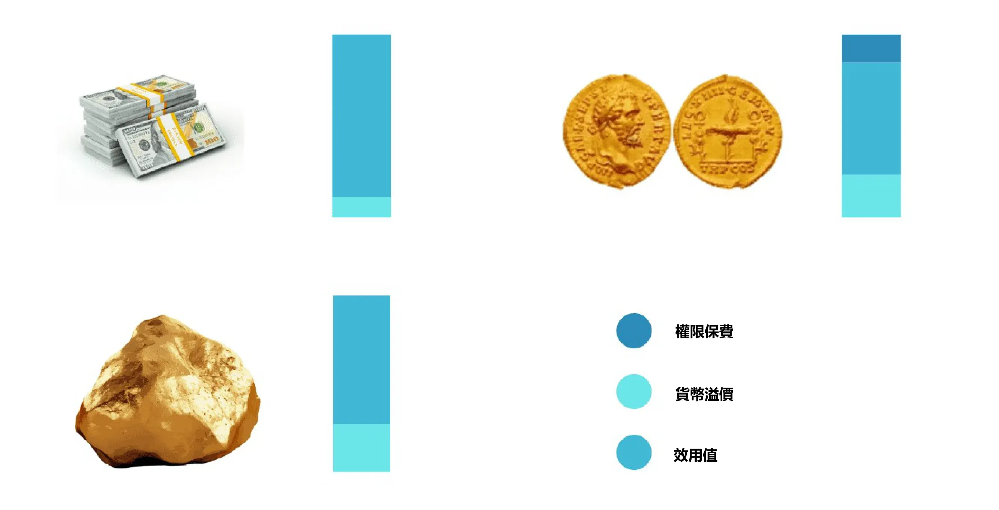

# 金錢的不同定義

<partId>77b7918a-8c3b-11f0-b688-6b2ab22378c9</partId>

## 貨幣 vs 貨幣 vs Monnaie vs argent vs devise

<chapterId>bf8a6d21-df88-5d23-a0a5-e9a5c1300554</chapterId>

:::video id=d9c9e7df-9db3-4a9f-801e-10d3fc7dfc22:::

### 貨幣術語的語義

在這個關於各種貨幣理論，特別是貨幣定義的部分，我想就語義學這個主題做一個簡短的旁述。我想深入探討幾個與貨幣相關的詞彙的定義，並與它們的英文對應詞進行比較。例如，money、currency 與 monnaie、argent 和 devise 相比。所以，是這樣的

一點點語義學：

當我們說 「**貨幣**」（de la monnaie）時，大多數人會認為我們指的是交易後收到的小零錢。而如果我們說 「**貨幣**」(la monnaie)，人們可能會認為我們指的是一個國家的貨幣。加拿大的貨幣是加元。沒錯。

但是錢（de l'argent）呢？小偷永遠不會說 「把您的零錢都給我吧！」。(小偷很可能會因為只收到幾乎沒有價值的硬幣而失望）。

不，小偷會大喊「把你所有的錢都給我***」。而如果小偷站在您面前的街道上，他所指的必然是您口袋裡的***鈔票。

另一方面，如果小偷嘗試以更複雜的方式詐騙您，嘗試透過清空您所有的銀行帳戶來竊取您的資產，我們會說**他會拿走您所有的錢**。這裡的 「錢 」指的是**個人的財富**。

所以錢這個字有兩個定義：現金（鈔票）和財富。

### 貨幣 vs 貨幣 vs 裝備

貨幣 (devise) 必然是另一個國家的貨幣，否則我們只會說錢 (monnaie)。如果你是法國人，你會說："La livre sterling est la devise du Royaume-Uni et l'euro et la monnaie de l'Europe（英鎊是英國的貨幣，歐元是歐洲的貨幣）。

通常，沒有深入研究過這些語義問題的人，在翻譯這些詞彙時，往往會傾向於在書面貨幣時說到貨幣 (devise)，但不對，當你的國家使用貨幣時，貨幣就是錢 (monnaie)，而當我們談論其他貨幣時，貨幣就是devise。因此，我經常在這裡看到的問題是，在英文中，有兩個詞語：一個是「money」，這是一個概念；另一個是「currency」，它其實是一個國家用來進行交換的單位。所以我們可以只談錢的概念；這很容易 - 就是*貨幣*這個詞的概念；它是一般的錢。而*currency*則很容易等同於一個國家的貨幣。而在法語中，不幸的是，當談到比特幣時，人們往往會說是的，"mais ce n'est pas une monnaie"，因為它不是一個國家的貨幣，但很多時候，我覺得他們指的是貨幣這個詞。這一方面是錯的，因為從薩爾瓦多開始，比特幣就已經是一個國家的貨幣了。事實上，人們經常會說 *但是不，它不是一個國家的貨幣，它不可能是錢*.但事實上，如果我們參考*貨幣*這個更廣泛的概念，在我看來，比特幣完全符合這個定義。只是在法語中，我們沒有兩個詞來區分這兩個概念。我們可以說 argent 一詞指的是貨幣，但不幸的是，這並不是它的精確定義。 *Argent*（錢）指的是財富或鈔票。您真的無法將其與*money*（錢）一詞等同起來。 *Money* 其實就是貨幣 (monnaie) 的概念。

## Saifedean Ammous 的定義

<chapterId>07c4ba50-168c-567a-8957-0b187ff75f97</chapterId>

:::video id=936d6d3b-6d45-468e-bc44-85fbce9b857a:::

#### 錢是什麼？

錢只是你擁有或取得的東西，不是為了使用或消費本身，而是為了日後換取你可能需要的其他商品或服務。(Saifedean)

當貨品存在貨幣需求時，貨幣就會獲得貨幣溢價，以扮演貨幣的一個或多個角色。

貨幣物品必須夠稀少，貨幣溢價才會持續存在（以防止供應調整至貨幣需求）。

### 貨幣溢價

在這個關於貨幣的不同定義的部分，我想簡短地談談賽義德在《Bitcoin 標準》中的定義，我對這個定義一直很感興趣。當我讀到它時，我覺得它非常簡單。而我們也要在這個定義中加入貨幣溢價的概念。正如賽費丹在他的書中提到的，必然有一個稀缺性的概念。問題是，錢是什麼？

> 錢只是您擁有或取得的東西，不是為了使用或消費本身，而是為了日後換取您可能需要的其他商品或服務。

這就是 Saifedean 在 The Bitcoin Standard 中提到的定義。我要補充的是，當貨幣有貨幣需求時，貨幣（la monnaie）就會獲得貨幣溢價，以發揮貨幣的一個或多個作用。因此，你可以說，一種貨幣若能充當儲值工具，就會有貨幣需求，讓它獲得貨幣溢價，因為人們想要取得它，例如作為儲值工具或交換媒介。

### 稀缺性與市場機制

對於這一點，我認為我們絕對應該補充，貨幣商品必須夠稀缺，貨幣溢價才會存在。這是非常重要的。 **如果一種貨品出現可以當作貨幣使用，而且我們看到它的價格正在上漲，通常來說，如果這種貨品不夠稀少，人們就會想要生產更多的貨品，以便在價格上漲時**利用這種價值上的收益。這就是為什麼市場上大多數商品都有相對固定的價格。當價格上升時，生產就會增加。當價格下跌時，生產就會減少。這是一種市場調節。 **而當某種商品夠稀有時，比如黃金，市場機制就無法補償這種貨幣使用需求的增加。所以改變的是變數，是價格。就像比特幣**一樣當比特幣價格上升時, 我們不會生產更多的比特幣.所以調整的是價格.这就是为什么多年来，我们看到比特币的价格随着比特币需求的增加而上涨.因为地球上没有人可以改变算法 然后说 「需求增加了，价格上涨了，我们要生产更多」 **新的比特币的供应是事先编程好的，而且是事先知道的**.所以這就是我剛才說的，貨幣物品必須夠稀有，貨幣溢價才會持續，因此不會被市場機制追上，以防止供應量因應這新的貨幣需求而調整。

## 付款方式與解放價值

<chapterId>5d424039-e342-56f7-9d8b-bba9551831a9</chapterId>

:::video id=af4c0765-8111-4cb7-891b-3ee54d6e7054:::

### 支付手段 vs. 交換手段

在這個關於貨幣的不同定義的部分，我建議我們一起看看《Aux origines de la monnaie》（貨幣的起源）一書中的一段引文，這本書是由 Alain Testart 撰寫的，主題是貨幣作為一種支付手段和一種解放價值。

*Alain Testart 在《Aux origines de la monnaie》一書中，將貨幣定義為一種支付手段：*

> 支付手段的功能在此被視為有別於交換手段的功能，因為有無對價的支付，即什麼也不買的支付。Knies(1873:192ff.)詳細論述了這個不包含交換行為的貨物轉移主題，例如wergeld(血錢或謀殺成分)或稅金。Carl Menger 在他 1892 年的文章「Geld」中抨擊了第四種功能，這篇文章被認為是在這個主題上最有決定性的文章之一。在今天的經濟思想中，支付手段功能的觀念似乎已被遺忘，或至少被摒棄，而傾向於交換手段的觀念。
>

> 金錢是用來支付的：從這個角度來看，金錢是一種解放的工具，它概括地描述了支付手段的功能。在這方面，我們談到金錢的「解放力量」。根據 Le Petit Robert 的說法，解放力量是「具有解除（義務、債務）效果的力量」。根據《Grand Larousse》，自由支付是指任何「在法律條件下支付的款項，使債權人無法對債務的消滅提出異議」。貨幣具有這種卓越的能力；它甚至界定了貨幣的法定貨幣地位，因為無論是賣方或債權人，都無法拒絕以貨幣支付。貨幣是唯一不能拒絕償還欠款的物品，不論欠款人是商人還是稅務官。在所有物品中，只有金錢擁有這項特權。"Charles.吉德 (1921 I: 443) 寫道，「正是這種特權，構成了我們所說的法定貨幣。
>

> 任何由一種貨物轉換另一種貨物組成的交換，或以提供另一種貨物作為交換條件的交換，必然意味著接受方有義務提供此對手方。付款就是履行這項義務。因此，所有的交換都意味著付款，但並非所有的付款都意味著交換。有一些付款是沒有對手的，也就是說，付款並不能使人獲得另一種物品，也不是為了這個目的而付款。在此，稅收仍然是一個基準的例子；我們還應該提到支付給公共機關的各種罰款，以及基於 「對他人造成損害的人必須予以補償 」的原則而欠他人的賠償。

### 無交易對手的付款

這清楚說明了作者的論點。事實上，他將兩者區分開來。對他來說，交換既是貨物的轉移，也是付款。其次才是付款。而支付可以在沒有交換的情況下發生。他舉例說，支付停車罰單或罰款只是一種付款。你並沒有真正交換到服務。有些人可能會說，國家是在為你提供一種交換的服務，一種給你停車罰單的服務。他很清楚繳稅其實是一種沒有對手的付款，在這個意義上，繳稅是必要的，即使你不一定得到服務。他說，納稅只是一種付款，沒有義務獲得服務作為交換，這才是真正的定義。我和很多同事討論過這個問題，他們不一定同意這個觀念。但這就是作者的論點。他試著將付款的概念，從交換中抽離出來，舉例來說，罰款、繳稅。另外，例如嫁妝，他表示嫁妝是一種付款；你不一定會得到交換的東西。批評這個提案的人可能會說：「是的，但你換來了一個妻子。這就是這個主題的爭論程度。

還有wergeld，也就是血錢。所以這只是補償的錢。我的朋友Ulrich會說：

> 是的，但你可以用關閉這個檔案作為交換。

所以，你犯了罪，例如謀殺。在那之後，你就會從那種情況中釋放出來。所以有一種解放的力量。你有得到任何回報嗎？根據作者的說法，沒有。根據我的一些同事的說法，是的。

我認為在這次討論中，我們可以看到 wergeld 是定義付款的好例子之一。事實上，很明顯，您並沒有收到任何回報。

## 債務貨幣與商品貨幣

<chapterId>4093677a-c8e8-5828-b994-15c01656186e</chapterId>

:::video id=f49cf5cc-288e-4daa-a1ff-b9de73506f4e:::

### 基本辯論

在本節有關不同貨幣定義和理論的背景下，讓我們一起探討兩個截然相反的觀點："錢永遠是債務」或「錢永遠是商品」。一方面，以債務為基礎的貨幣理論支持者斷言：「不，貨幣永遠是債務！另一方面，我們著名的金蛀蟲辯稱："但不對，你看，錢永遠是商品，它永遠是黃金；其他的一切，票據、借據，它只是信用，而不是錢。

讓我們一起探索這些理論的明確摘要。

### 永遠是債務」理論

以下是被稱為 **「債務貨幣」** 的貨幣理論摘要，根據這個理論，貨幣根本上是債務的一種形式：

根據這套由 Alfred Mitchell-Innes 提出，並由 David Graeber 進一步發展的理論，貨幣本質上是一種對債務的確認，源自於歷史上先於直接貨幣交換而存在的信貸關係。與其說貨幣是因為需要以物易物，不如說貨幣是一種個人或團體之間的社會義務或債務的計算、轉移和清算方式。

因此，所有貨幣的流通都是一個人或機構欠另一個人或機構的債務，由信任和社會或國家權威保證其有效性。因此，根據他們的說法，當我們擁有 - 正如我已經提到的 - 當我們擁有金錢時，我們就對社會有了要求權，而社會欠我們一筆債務。因此，金錢從來都不是中性或自主的，而永遠是一種潛在的債務：持有金錢基本上意味著擁有對社會或經濟團體的索賠權。

這個推論與貨幣是簡單的「中間商品」這個經典觀念相矛盾，反而強調了社會與政治關係在貨幣的創造與管理上所扮演的核心角色。

**我的評論：**

這個理論讓我感到困擾的地方在於，它斷言貨幣永遠是一種債務，而我們有兩個不同部落之間進行交換的例子，例如，他們交換黃金，在這種情況下，交易是確定的最終交易，沒有潛在的債務存在。這個理論的支持者通常會告訴我們，這些交換不是貨幣交換，而是以物易物。如前所述，我不同意。這是一種貨幣交換，因為黃金不會被消耗，而是會被用作貨幣。

### 永遠是商品」理論

**Always a commodity:**

以下是被稱為**「商品貨幣」**的貨幣理論的明確總結，貨幣總是以商品的形式出現，尤其是黃金，它的出現是因為能夠進行交易的需要，這種商品一般會在國外被接受，而且是為了交易目的而購買的。

根據這個由古典經濟學家（亞當‧斯密、大衛‧李嘉圖）所發展，並由馬克思所接納的理論，貨幣是作為其他商品中的一種商品而自然出現的，通常是一種貴金屬，例如黃金或白銀，其內在價值與貨幣角色無關。一開始，這些商品因其固有的特質（稀缺性、持久性、可分割性和穩定性）而被經濟參與者自發地選擇用來促進貿易。

商品貨幣的區別在於它的實體存在，以及由社會生產它所需的勞動量所決定的價值（如馬克思）。舉例來說，社會使用黃金不僅是為了簡化以物易物的過程，同時也是一種記帳單位、價值儲存工具以及通用的交換媒介。

在這個願景中，貨幣始終維持著真正的價值，因為它仍然與有形的商品相關聯。即使貨幣的角色變得抽象(鑄造的硬幣、紙幣或經典貨幣)，其有效性仍然直接或間接地來自於對黃金等基本商品的參考。因此，這個理論堅持貨幣的物質與經濟起源，與那些將貨幣僅視為一種習俗或債務的理論相反。根據這個理論，任何以替代物來代表貨幣，例如以黃金兌換的票據，都是信用。

**我的評論：**

請注意，這個願景與商品貨幣理論相似，但更進一步。他們建議貨幣應該**永遠**是一種商品。當我們對他們說：「*是的，但我們可以同意，對這個團體來說，紙幣就是貨幣；它可以由黃金支持，它可以運作，紙幣本身就是貨幣*」。

對此，他們會舉出更衣室優惠券的例子。他們會說："是的，但是不行，當你的衣服有更衣室優惠券時，我們能把收銀機優惠券稱為衣服嗎？

當然不是，它就像是一種確認，一種索賠，在本質上，可以讓你取回你的衣服。這個平行關係並不成立，因為更衣室優惠券並不是一種普遍接受的付款方式。 **錢並不是對某個特定物件的索賠，例如衣服；它是一種模式、一種交換手段、一種交換媒介，或是一種普遍接受的付款方式**。

所以你不能把更衣室優惠券和法定貨幣紙幣相提並論，因為更衣室優惠券允許你換取特定的物品，它是一種 token，允許你取回你的物品。而鈔票、法定貨幣是一種通用的優惠券，可以讓你獲得任何物品。

當然，在我看來，即使是法定貨幣也可以被認為是貨幣，如果它被人們認為是貨幣的話。我認為堅持它不能成為貨幣是一個語義上的錯誤，因為它是一種獲得真正貨幣的代金券，至少在當時，它的基礎是黃金。

我沒有問題把放在保險箱中的金幣和代表金幣的鈔票視為貨幣。對我來說，這並不存在語義上的問題，這只是兩種貨幣而已。如果我沒弄錯的話，米塞斯通過談論貨幣替代品很好地解釋了這個現象。

他們的觀點歸結為一個事實，就是你不能把銀行金庫裡的金幣和代表金幣的紙幣同時視為貨幣。就我個人而言，我不認為這有任何問題；我不認為這種情況有任何悖論。那些相信錢永遠是商品的人，他們的看法和我不一樣。

**以下是*Aux origines de la monnaie*一書中對更衣室優惠券概念的評論：**

*註 14：「Rist（1938：372，註 1）對紙幣與支票室代用幣之間的比較，提出了極佳的批判--極佳的批判是因為它是建立在 Knapp 自己的基礎上，也就是法律的基礎上：如果我們可以在這兩種情況下都談到一種索賠權，那麼根本的差異是，在第一種情況下，而且僅在第一種情況下，它是一種沒有特定對象的索賠權。

此外，關於 ** 聲稱** 的主題，同一作者指出以下幾點：

> 巴斯蒂亞可以很隨意地想像整個社會的憑證是呈現為「一個巨大的市集」，但是這個小小的附加物，這個看似無傷大雅的延伸，就是信貸與貨幣之間的全部差異。金錢不是對特定商店的要求。沒有匿名索賠這回事。但是匿名性是貨幣的特點，因此也是它的一般性，這也是它如此強大的原因。貨幣不像信用，更不能還原為信用。 **貨幣遠遠超過信用。

**悖論：債務貨幣與商品貨幣**

最能說明債務貨幣理論與商品貨幣理論之間深刻對立的悖論，是關於黃金在今天是否是一種貨幣的問題。

一方面，債務貨幣理論首先將貨幣定義為一種被公共機構普遍接受，甚至強加的交換中介或支付手段。從這個角度來看，黃金不再是一種貨幣，因為它沒有被廣泛使用或接受為常見的交換媒介。

另一方面，商品貨幣理論認為貨幣是一種有形商品，由於其本質特性（稀缺性、持久性、可分割性等）而被社會自發地選擇。根據這種方法，黃金仍然是真正的通用貨幣，而今天所有其他形式的貨幣，從根本上來說，都不過是基於信任的信貸。

這個悖論清楚地顯示了這兩種貨幣觀念之間的差距：對前者而言，黃金不再是一種貨幣；相反地，對後者而言，黃金仍然是唯一存在的真正貨幣。

## 現代貨幣理論

<chapterId>8efc29af-3193-5d97-ad9f-e608b32924ff</chapterId>

:::video id=f8127cb7-46a1-468c-bbb5-97bf0a8b8837:::

### 現代貨幣理論的原則

在本節關於各種貨幣理論的結尾，讓我們來談談貨幣理論中的神童，他受到許多在中央銀行工作的現代經濟學家的推崇，並被命名為現代貨幣理論，也就是常說的 MMT。

**Modern Monetary Theory (MMT)** 是一種經濟學方法，它認為一個擁有自己主權貨幣的國家 (例如美國、加拿大或日本) 永遠不會用光錢，因為它總是可以發行更多的錢來為其支出提供資金。根據這個理論

- 貨幣是國家的創造物，而非有限資源**

- 稅收與借貸並非直接用來為公共支出提供資金，而是用來調節通貨膨脹、影響經濟行為、維持國民幣需求*。

- 政府支出的真正限制是通貨膨脹，而不是預算赤字或公共債務。

- 如果所創造的資金被導入能夠吸收這些資金的部門，也就不會出現通貨膨脹。

- 因此，政府必須根據實際可用的資源 (人力、工業能力、天然資源) 來調整支出，以避免過度通貨膨脹。

### 稅收在 MMT 中的角色

所以在這裡你會找到著名的答案 所有那些說 「是的，但是如果我們可以印錢 為什麼我們還要交稅？」的人的答案嗯，MMT對這個想法有正確的回答在法定貨幣體系中 在現代體系中 從技術上講 除了通貨膨脹之外 確實沒有什麼可以限制貨幣的創造但他們會建議 首先 稅收是限制通貨膨脹的必要條件 因為它會從經濟中移除貨幣所以，如果我們沒有稅收的補償 所有這些貨幣的創造最終都會造成通貨膨脹他們爭辯說 稅收從字面上來說 是一種從體系中移除金錢 以限制通貨膨脹的方法

關於把錢投資到能夠吸收的部門，我們可以提一下美國的例子，美國給軍事工業提供了數萬億美元，這並沒有引起通貨膨脹，因為軍事工業、軍事工業綜合體完全有能力吸收這數萬億美元。

另一方面，如果您想要興建更多道路，而能生產這些道路的資源和承包商又有限，那麼將道路預算增加一倍，必然會對能建造這些道路的勞動力造成稀缺效應。因此價格會因為市場力量、供需關係而上升。如果我們全知全能的領導人知道該把錢放在哪裡，技術上來說，應該不會造成通貨膨脹。而我的回答是，實際上，很明顯它確實會導致通貨膨脹。

總括而言，根據 MMT 的觀點，國家可以運用其創造貨幣的能力來達成充分就業，並為社會與生態投資提供資金，同時透過適當的財政政策來控制通貨膨脹。通常也是凱恩斯經濟學派（另一個經濟思想流派）的目標，透過管理利率來管理失業，並在透過適當的財政政策控制通貨膨脹的同時，為社會與生態投資提供資金。

### MMT 檢討

這個理論只適用於少數享有真正貨幣主權的國家 (請參閱 Stephanie Kelton 的推文)，也就是他們可以用自己的貨幣舉債。此理論很難適用於依賴進口的經濟體，因為這些經濟體必須維持國際對其貨幣的信心。

什麼是真正的貨幣主權？就是能夠以自己的貨幣舉債。你必須要有貿易盈餘，才能有足夠的貨幣儲備、足夠的外幣，這樣你就不必為了進口商品而用外幣籌資。這與少數國家有關。

以下是 Stephanie Kelton 的推文，她是這場運動的海報女郎。她寫了一本名為《赤字迷思》的書。她在推文中寫道，美國、日本、加拿大、澳大利亞、英國等不同國家的錢都花不完。

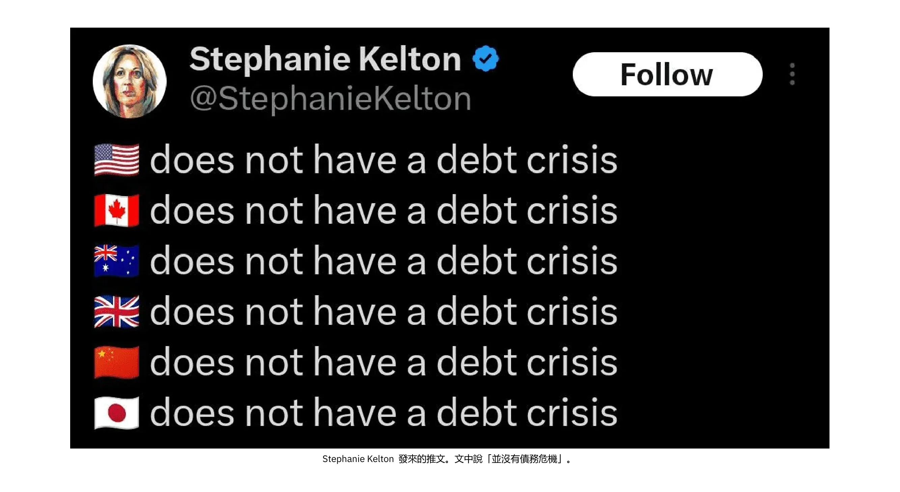

奇怪的是，它只列出了六個國家？為什麼呢？因為它們擁有真正的貨幣主權。但地球上大約有 200 個國家，並非所有國家都擁有貨幣主權。所以，我對這個理論的批評，除了有點奇怪和無法運作之外，就是它只對少數享有真正貨幣主權的國家有效，也就是那些可以用自己的貨幣發行國庫券的國家。在某種程度上，它對世界其他國家不利。透過創造這種貨幣，他們就像是將他們的通貨膨脹輸出到其他地方，就像美國數十年來一直在使用其過高的特權一樣。這類似於一種貨幣殖民主義，對其貨幣擁有全球信心與需求的國家，可以隨意印制大量的鈔票，而不會產生顯著的通貨膨脹，這往往是因為他們輸出了這種通貨膨脹。

此理論難以適用於需要維持國際對其貨幣信心的進口依賴型經濟體。

這套理論也要求對經濟進行某種程度的集中規劃，主要是為了確保對實際資源 (工人、原物料、工業能力) 的更大控制，以及管理通貨膨脹。

# 金錢的墜落與重生

<partId>87a34ca9-782b-5ade-b51a-400f88ed7b0c</partId>

## 希臘錢幣

<chapterId>7714195f-74ce-5f8c-be5f-59302d39fff4</chapterId>

:::video id=8e5c3091-0910-471b-8d4b-0dc6e9afa656:::

### 背景與脈絡

在我們開始之前，先介紹一下歷史背景：

**歷史背景：**

**羅馬人稱希臘人為 "Graeci「，稱希臘為 」Graecia"。

**希臘人自稱為「Hellenes」，他們的國家稱為「Hellas」。

**荷馬**（約出生于公元前 8 世紀）

傳說中的希臘詩人，推測是《伊麗亞德》（*The Iliad）和《奧德賽》（*The Odyssey）的作者。

約公元前**750 年：斯巴達神話中的立法者 Lycurgus** 據說建立了以軍事紀律和簡單為基礎的斯巴達憲法。

**Numa Pompilius**（公元前 753-673 年）

羅馬的第二位國王，以賦予羅馬最早的宗教和法律制度而聞名。

**Dracon**，雅典立法者（公元前 7 世紀），以制定極其嚴厲的法律而聞名，因此被稱為 "draconian"。

**公元前 594 年：梭羅**成為雅典的立法者，徹底改革雅典社會，特別是廢除債務奴隸制。

**776 BC：古代奧林匹克運動會**

第一屆定期運動會每四年在奧林匹亞舉行一次，讓希臘各城市齊聚一堂。

**Pythagoras** (ca. 570-495 BC)

希臘哲學家和數學家，以直角三角形定理聞名。

**Xenophanes of Colophon**（約公元前 570-478 年）

前蘇格拉底哲學家，以批判傳統希臘多神論聞名。

**公元前 490 年：馬拉松戰役**

雅典人勝利地擊退了波斯人的入侵，標誌著希臘文明的一個決定性轉折點。

**Herodotus** (約公元前 484-425 年)，绰號「歷史之父」，他寫了一部描述波斯戰爭的巨著，包括希臘人在公元前 480 年戰勝薛西斯。

**Socrates** (470-399 BC)

雅典哲學家，以其辯證法以及倫理和自我認識的教學而聞名。

**Aristophanes** (約公元前 446-386 年)

雅典劇作家，以諷刺喜劇 (如 *《蛙》*) 著稱。

**Sophocles** (公元前 5 世紀) 在他的劇作 *Antigone* 中，透過暴君克瑞翁批判金錢是道德與政治腐敗的根源。

**柏拉圖**（約公元前 428-348 年）

希臘哲學家，蘇格拉底的學生，學院的創始人，*《共和國》*的作者。

**431-404 BC：伯羅奔尼撒戰爭**

雅典與斯巴達之間的重大衝突，以雅典敗北告終。

*公元前*431年**：雅典為伯羅奔尼撒戰爭提供資金，稀釋金銀幣以增加流通量，造成通貨膨脹。

**色諾芬**（約公元前 430-355 年）

雅典作家、哲學家和將軍，蘇格拉底的門徒，*Anabasis*的作者。

*公元前*414年**：雅典在慘敗遠征西西里後，開始輸掉伯羅奔尼撒戰爭。

**公元前 405 年：阿里斯托芬（Aristophanes）**在他的戲劇《青蛙》（The Frogs）**中明確描述了銀德拉克馬的貶值以及雅典出現劣質青銅錢幣的情況，說明了今天被稱為 「格雷沙姆法則 」的原則。

*公元前*404年**：雅典被斯巴達長期圍攻後投降。

**Aristotle** (公元前 384-322 年)

希臘主要哲學家，柏拉圖的學生，Lyceum 的創始人，以其在邏輯、生物學和政治哲學方面的研究著稱。

*公元前 *327 年**：亞歷山大大帝 (Alexander the Great) 征服波斯波利斯 (Persepolis) 和波斯帝國的東部省份，大大擴張了他的帝國。

**323 BC**：亞歷山大在巴比倫去世，沒有明確的繼承人，引發了他的將領（diadochi）之間為瓜分帝國而發動的戰爭。

**阿基米德**（約公元前 287-212 年）

希臘數學家、物理學家和發明家，以幾何學和機械學的發現而聞名。

**公元前 196 年：羅塞塔石碑**是在法老托勒密五世 (Ptolemy V) 統治期間雕刻而成，使後人得以破譯埃及象形文字。

**192-188 BC：羅馬-塞琉古戰爭**

羅馬擊敗了安條克三世領導的塞琉古帝國，鞏固了其在希臘和小亞細亞的影響力。

**公元前 146 年：科林斯戰役**

羅馬人摧毀了希臘城市科林斯，標誌著希臘政治獨立的結束，希臘逐漸融入羅馬世界。

關於古代、羅馬的滅亡和中世紀這一節，我們先從希臘錢幣開始。

古希臘的硬幣歷史大約開始於公元前 600 年，當時希臘城市迅速採用了來自小亞細亞的吕底亞的創新技術，最初使用電子幣，後來使用銀幣。第一批希臘錢幣是在愛琴島（Aegina）鑄造的，以海龜或陸龜為圖案，但從公元前 5 世紀開始，以雅典娜（Athena）和貓頭鷹為裝飾的雅典德拉克馬（Athenian drachma）成為最優秀的貨幣象徵，在很大程度上支配了當時的國際貿易。

我很幸運有一個那個時期的希臘德拉克馬的複製品，背面有著名的貓頭鷹和一個人物。這是一個四拉克瑪，比一個簡單的德拉克瑪大。

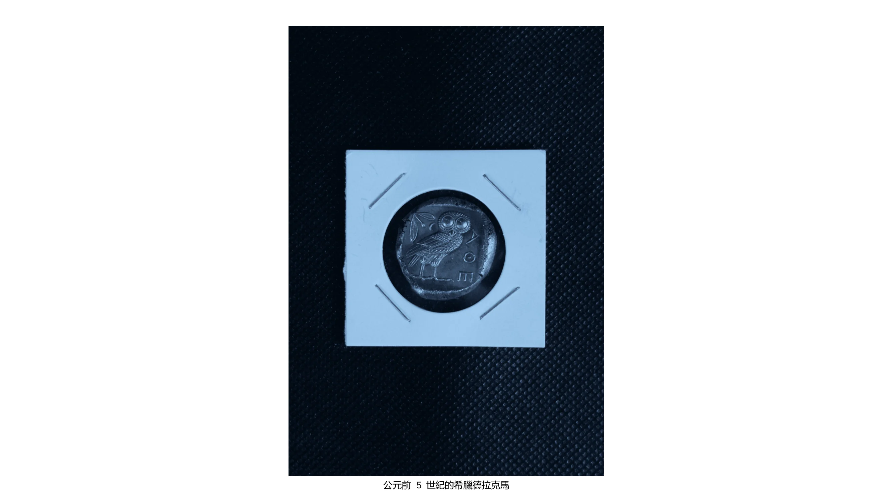

每個希臘城市都與貨幣建立了自己的關係。在雅典，貨幣與政治和經濟力量有著密切的關係。公元前 5 世紀末期著名的雅典法令規定在其同盟領土上只能使用雅典貨幣，從而鞏固了雅典的經濟霸權。雅典也累積了大量黃金儲備以備不時之需，這些黃金儲備被存放在雅典卫城，也許是雅典謹慎經濟的象徵。相比之下，斯巴達是一個擁有嚴謹價值觀的軍事城市，它選擇嚴格限制貨幣的使用，禁止公民擁有金幣或銀幣。斯巴達寧願使用沉重的鐵條來阻止對外貿易，並維持社會的凝聚力。

戰爭的資金往往來自貨幣操控。在伯羅奔尼撒戰爭 (公元前 431-404 年) 期間，雅典為了支付軍費而大幅貶值貨幣。公元前 413 年，斯巴達佔領德克利亞，奪去了雅典的銀礦，雅典不得不在公元前 407/406 年熔化金像，匆忙鑄造新幣。然後，在公元前 406/405 年，她製造了鍍銀的青銅錢幣，造成了**阿里斯托芬斯**所描述的貨幣危機，他已經喚起了今天所謂的格雷沙姆定律：劣幣驅逐良幣。這種緊急貨幣在戰後迅速被非貨幣化，以恢復人們對雅典錢幣的信心。

古典時期結束時，馬其頓在腓力二世及其兒子亞歷山大大帝的統治下崛起，深刻地破壞了希臘的貨幣平衡。由於潘加山（Mount Pangea）擁有龐大的金銀礦，腓力二世製造了大量的金錢來資助他的軍事和政治活動，並建立了簡單實用的金銀本位制（10:1）。他為了慶祝奧林匹克運動會的勝利而發行的金幣流通到西歐，甚至到達英國。亞歷山大奉行這種貨幣政策，在東征期間廣泛流通**阿提**德拉克馬，遠至印度。錢幣的大規模流通標誌著希臘時代的開始，君主的形象逐漸取代了錢幣上的神像。這項創新讓希臘時代的君王得以自我宣傳，而傳統的神祇在錢幣的背面只扮演次要的角色。

亞歷山大於公元前 323 年去世後，他的將領瓜分了他龐大的帝國，在埃及（托勒密王朝）、敘利亞（塞琉西王朝）和其他地方建立王朝。這些希臘王國採用了各種不同的貨幣制度：托勒密王朝實施封閉的貨幣制度以控制貨幣流通，傾向於使用穀物作為國內貨幣，以儲存貴金屬作為對外的軍事開支。與此同時，羅德斯成為主要的貿易中心，之後在經濟上被羅馬人削弱，羅馬人在公元前 167 年將德洛斯島 (Delos) 設為自由港。

金錢的使用是傭兵報酬的核心。亞歷山大的士兵每天都會收到銀幣。

騎兵是亞歷山大高度專業化軍隊中的精銳，平均每天領取兩個德拉克馬，步兵為一個德拉克馬，普通僱傭兵為三分之二個德拉克馬，是普通工人工資的兩倍。

在伯羅奔尼撒戰爭期間，也支付了相當可觀的金額給士兵：為了平定薩摩斯起義，支付了超過 1,200 塔蘭特；為了圍攻波提達，支付了超過 2,000 塔蘭特。

當這支軍隊在小亞細亞完全投入戰鬥時，每天的總成本約為二十英鎊，或約半噸銀，或 120,000 德拉克馬。

希臘錢幣也扮演著重要的文化角色，每個城市都試圖以當地或神話的象徵來鑄造自己的錢幣，以宣示其身份。例如，赫拉克琉斯（Heraclius）描繪了赫拉克勒斯（Hercules）與獅子戰鬥的場景，而塞雷尼（Cyrene）則展示了著名的藥用植物絲蘭（silphium）。

最後，儘管古希臘和希臘時代的錢幣種類繁多，且有地區性的波動，但它們在地中海世界的經濟和文化史上留下了持久的印記，深刻地影響了後來的貨幣制度，一直到羅馬，羅馬逐漸採用並發展了希臘的經濟概念，以構建自己的帝國經濟。

## 希臘貨幣的影響

<chapterId>3a5e6c7d-699c-5567-87cd-3374c49d55a9</chapterId>

:::video id=0c79a59c-e179-4893-a414-1b8de0930eb9:::

### 雅典與斯巴達的對比

古典希臘時期雅典和斯巴達之間的對立揭示了兩種截然不同的政治和經濟組織模式。斯巴達拒絕金屬貨幣，轉而採用基於公民信任的自給自足制度，而雅典則完全接受這項技術，以建立並維持其海上帝國。

### 海軍實力在金錢上的必要性

儘管雅典帝國的名字冠冕堂皇，但其地理版圖卻十分狹小 - 主要是雅典和愛琴海沿岸的城市。它的權力依賴於德洛斯聯盟（League of Delos），這是一個以雅典為霸主的軍事聯盟。這種帝國結構需要統一的經濟工具：雅典銀幣。

維持一支艦隊是這種金錢需求的核心。一艘雅典三體船的造價在一到兩兩銀子之間，是一個相當可觀的數目。雅典需要維護數百艘船隻，因此需要一個有效率的稅收系統。貨幣成為向附庸城市徵收貢獻和資助海軍以確保帝國凝聚力的不可或缺的工具。

### 強加貨幣作為統治工具

雅典將其銀幣強加於德洛斯聯盟的所有成員。這種貨幣標準化達到了幾個戰略目標。首先，它創造了一個共同的計算單位，方便了貢獻的收取。其次，它強化了附庸城市對雅典的經濟依賴。最後，它象徵著雅典在整個海洋帝國的權力。

這種貨幣政策與斯巴達模式形成強烈對比。斯巴達是一個陸上強國，可以依賴伯羅奔尼撒的勞動者（奴隸）來維持生計。其封閉的、以城市為中心的經濟體系不需要複雜的貨幣工具。公民與士兵住在一起，共用膳食，日常交易不需要金錢。

### 貨幣作為海上貿易的工具

雅典帝國的航海特性意味著它必須開放貿易。與內向的斯巴達不同，雅典為了生存和繁榮，必須與外部世界進行貿易。貨幣成為地中海貿易不可或缺的工具。

這種對外的取向創造了一個良性循環：貿易帶來收入，這些收入為艦隊提供資金，艦隊保護貿易路線並維護帝國，帝國強制雅典貨幣以促進貿易。貨幣不再只是一種交換工具，而是成為帝國策略的支柱。

### 貨幣權力的極限

儘管經濟發達，雅典的貨幣力量在伯羅奔尼撒戰爭中顯露了其極限。面對斯巴達的陸上軍隊，雅典的海軍和財政優勢並不足夠。昂貴的遠征，例如在西西里慘敗的敘拉古戰役，耗盡了財政資源，卻沒有帶來決定性的勝利。

歷史顯示，貨幣雖然是投射力量的強大工具，但並不能保證軍事統治。斯巴達沒有金屬貨幣，但社會凝聚力非凡，最終戰勝了雅典的貨幣帝國。

### 兩種模式，兩種命運

雅典和斯巴達之間的對立說明了社會和經濟組織的兩種基本方式。雅典代表開放、商業、貨幣化的模式 - 現代海洋帝國的先驅。斯巴達體現的是封閉、獨立的模式，其基礎是公民信任而非貨幣工具。

這兩種制度顯示，貨幣的採用與所選擇的政治和經濟模式息息相關。對於像雅典這樣的海洋和商業強國，貨幣變得不可或缺。對於像斯巴達這樣封閉的戰士社會，它代表著對社會秩序的威脅。這種古老的二分法至今仍為關於貨幣在社會組織中的作用的辯論提供著依據。

## 羅馬共和國

<chapterId>0bc80983-33e1-5881-85bb-7c22f3144a9a</chapterId>

:::video id=dc05ca97-d29c-4679-bfeb-912c47d86ce2:::

### 羅馬共和國史

- 公元前 753 - 509 年：羅馬王國**
- 公元前 753 年：羅馬建國**（傳統上歸功於羅穆盧斯）。
- 公元前 509 - 27 年：羅馬共和國**，羅馬成為共和國，由選舉產生的元老院和執政官統治。
- 公元前 280 - 275 年：皮爾路斯戰爭**。伊庇魯斯國王皮洛斯 (Pyrrhus) 在意大利南部與羅馬人戰鬥，贏得了代價高昂的勝利（"Pyrrhic Victories"）。
- 公元前 264 - 146 年：布匿戰爭**。羅馬與迦太基爭奪地中海西部霸權的主要衝突。
- 漢尼拔（Hannibal，247 年 - 約公元前 181 年）**。傳說中的迦太基將領，在第二次布匿戰爭期間，以率領軍隊和大象穿越阿爾卑斯山攻擊羅馬而聞名。
- 公元前 146 年：科林斯戰役**。羅馬摧毀希臘城市科林斯，並對希臘本土實施最後的統治。
- 公元前 91 - 87 年：社會戰爭**。羅馬的義大利盟友要求羅馬公民權的起義，最終導致他們完全融入公民行列。
- 公元前 64 年：塞琉西抵抗**結束。羅馬最終消除塞琉古在敘利亞的影響，鞏固其在東地中海的控制。
- 公元前 55 年：凱撒征服中歐和西歐**。凱撒擴大羅馬對高盧（今法國）的統治，並進入日耳曼和布列塔尼。
- 公元前 43 年：組成第二三合會**。屋大维（后来的奥古斯都）、马克-安东尼（Mark Antony）和雷比达（Lepidus）之间的政治联盟，目的是在凯撒被刺杀后稳定罗马局势。
- 公元前 27 年：大同**開始。奧古斯都（Augustus）統治下的政治穩定與繁榮時期，標誌著羅馬帝國的開始。

### 羅馬晚期的貨幣起源

在這個關於古代的部分，我們現在將注意力轉移到羅馬共和國。羅馬的貨幣歷史比希臘人和波斯人晚得多。羅馬建國於公元前 753 年，等了將近四個世紀才真正採用硬幣。在這段漫長的時間裡，羅馬人使用一種原始的交換系統，使用稱為 aes rude 的不規則青銅片，每次交易都需要精確的稱量。直到公元前 4 世紀末，在希臘和伊特魯里亚的影響下，羅馬才開始發行第一批錢幣，特別是像中國一樣用青銅鑄造的 aes grave。

### 希臘的影響和第一批銀幣

與意大利南部希臘人的決戰讓羅馬人真正開始使用銀幣。大約在公元前 280 年，羅馬開始模仿希臘的鑄幣法製造自己的銀幣。羅馬第一次定期發行的銀幣可追溯到公元前 269 年，上面刻有傳說中由母狼吸吮的雙胞胎羅穆盧斯和雷繆斯，這個圖案已成為羅馬的標誌。

事實上，共和國時期的許多羅馬錢幣都描繪了建國神話。您可以在下面這裏看到我的錢幣：這是一枚來自 Tatius 國王的極品真幣。它描繪了誘拐薩賓人婦女的神話。Tatius 是這個地區的國王，而這個開國神話講述羅馬人如何從薩賓人那裡擄走女人，薩賓人就住在附近。其後，Tatius 國王與羅穆盧斯（羅馬的創始人之一）成為共王。

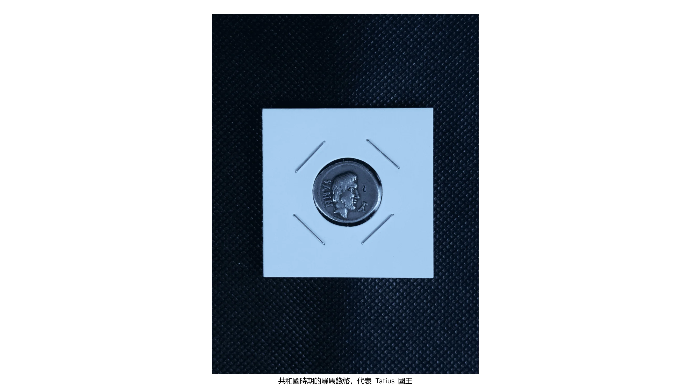

### 硬幣」一詞的起源與朱諾-莫內塔神廟

硬幣」一詞起源於羅馬的朱諾-莫內塔神殿。傳說在公元前 390 年高盧人入侵時，都城的神鵝提醒羅馬人危險即將來臨。為了感謝都城的保護神朱諾，人們為她建立了一座神廟，並很快成為羅馬錢幣的鑄幣廠。

### 布匿戰爭和貨幣危機

軍事衝突對羅馬的貨幣發展有相當大的影響。在對抗迦太基的第二次布匿戰爭（公元前 218-201 年）期間，羅馬面對漢尼拔的入侵，面臨嚴重的財政困難。為了紓解燃眉之急，羅馬首次破例發行了金幣，並大幅貶值銀幣，純度從最初的 97% 降至 89% 左右。青銅錢幣 (aes) 的重量也大幅下降，六年間減少了近 80%。

在此，我們可以重溫之前討論過的一個概念，希臘人熔化儲存在神廟中的貴金屬，以幫助緩解經濟危機。說到**迦太基**，下面您可以欣賞到我收藏的一枚真正的迦太基錢幣。這些迦太基硬幣的一面是一棵棕櫚樹，另一面是一匹馬。在這枚硬幣上，這匹馬不是很好辨認，因為它已經非常殘舊了。

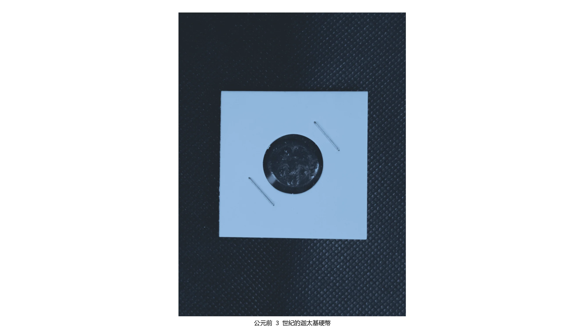

因此，被稱為 aes 的青銅錢幣的重量也急劇下降，六年間幾乎減少了 80%。因此，這些並非貴金屬、用於日常貿易的青銅錢幣的重量下降了很多，這是這些戰爭導致貨幣貶值的一個跡象。

### 銀幣與貨幣穩定

正是在這種嚴峻的背景下，羅馬在公元前 212 年左右推出了著名的銀硬幣。這項改革確保了貨幣的顯著穩定性，使銀幣在近 450 年間一直是主要貨幣。羅馬的這種穩定性歸功於嚴格的管理，儘管在公元前 146 年進行了一次重大的重新定價，以及為其龐大軍隊提供資金的大量生產，特別是在布匿戰爭、社會戰爭（公元前 91-87 年）和馬其頓戰爭期間。舉例來說，維護一個羅馬軍團每年大約需要 150 萬第納利，這說明了貨幣需求的規模。

在羅馬邊境以外，戰爭導致羅馬影響下的地區幣值大幅貶值。布匿迦太基的電子幣純度大幅下降，從 4 世紀的 98% 金幣降至第二次布匿戰爭時的 30%，而銀幣的純度則降至 18%。

### 貨幣動機的演變

隨著羅馬的擴張，錢幣的特色也在演變：最初是匿名的愛國錢幣，後來逐漸採用個人化的設計，以鑄幣師（鑄幣者）的權貴家族為特色。這種轉變清楚地象徵了羅馬共和國晚期的政治轉型。

最後，儘管羅馬在經濟上主宰了地中海世界，但在支付手段上卻保留了某種簡單性：除了直接交換硬幣之外，並沒有發展出真正的貨幣轉移形式，只有稅收轉移和專為精英保留的私人信貸除外。

## 羅馬帝國

<chapterId>2dc44e50-112a-5abf-97ae-8e0a9ecda989</chapterId>

:::video id=f8d6f3d6-9ee4-4504-888e-4f12b3f20489:::

**歷史背景：**

**Principate** 是羅馬帝國從公元前 27 年奧古斯都開始統治到公元 284 年第三世紀危機結束時的帝國政府形式。

**公元前 27 年：大同世界開始**

奧古斯都（Augustus）統治下的政治穩定和繁榮時期，標誌著羅馬帝國的開始。

**奧古斯都（公元前 30 年至公元 14 年）**徹底改革了羅馬的貨幣制度，為帝國錢幣建立了持久而穩定的標準。

**Augustus 也是最早被認可的古錢幣和化石收藏家**之一。

**54 AD - 68 AD：尼祿**

具爭議性的羅馬皇帝，以暴政、迫害及羅馬被焚後的災難性管理而聞名。

**64 AD：羅馬大火**

一場大火燒毀了城市的大部分區域；尼祿被指控是罪魁禍首。

**公元 69 年：四帝之年**

一個混亂的時期，接連出現四位皇帝（Galba、Otho、Vitellius、Vespasian）。

**79 AD：維蘇威火山爆發**

火山摧毀了龐貝 (Pompeii) 和赫庫蘭尼姆 (Herculaneum) 兩座城市，並在灰燼中例外地保存了它們的遺跡。

**165 AD - 180 AD：安東尼瘟疫**

毀滅性的流行病，削弱了 Marcus Aurelius 和 Commodus 治下的羅馬帝國。

**公元 200 年：疆域達頂點，大同世界逐漸結束**

羅馬達到了最大的擴展，但開始受到內部不穩定和經濟困難的影響。

**212 AD：卡拉卡拉公民敕令**

卡拉卡拉皇帝(Emperor Caracalla)賦予幾乎所有帝國居民羅馬公民權，以擴大稅基。

**公元 220 年：野蠻人大入侵的開始**

日耳曼民族首次大規模入侵羅馬邊境。

**235 AD - 285 AD：3 世紀的政治和軍事危機**

政治不穩定的時期，有許多短命的皇帝、內戰、經濟危機和不斷的侵略。

**Aurelian (公元 270-275 年) 徹底重估羅馬貨幣**，儘管通貨膨脹高企，仍嘗試恢復其名義價值。

**301 AD：戴克里先的價格敕令**

戴克里先皇帝 (Emperor Diocletian) 試圖在整個帝國實施嚴格的價格和工資管制，以阻止肆虐的通貨膨脹，但徒勞無功。

**312 AD：君士坦丁**

第一位基督教皇帝，君士坦丁堡的創始者，引入了 "solidus"，一種非常純淨和穩定的金幣，從而穩定了貨幣。

**476 AD：西羅馬帝國的覆滅**

羅馬被多個日耳曼民族（包括 Ostrogoths）攻佔，此事件被認為標誌著西羅馬帝國的正式終結。

### 奧古斯都的貨幣改革

在這個關於古代的章節中，我們已經到達羅馬帝國。羅馬帝國貨幣史的特點是大量使用金屬貨幣，特別是金、銀和青銅，但也有多次貨幣危機，與政治和軍事動亂密切相關。在共和國末期，在凱撒的統治下，羅馬於公元前 46 年引入了金幣 aureus，這種重約 8 克的硬幣在整個歐洲和地中海盆地被廣泛接受。凱撒將這些金幣標準化，並鑄造了第一枚印有活人肖像的硬幣，從而推翻了古代共和國喜歡匿名、集體符號的傳統。這種發展伴隨著一個重大的政治轉型時期，個人權力逐漸取代共和制度。

凱撒於公元前 44 年遇刺身亡後，屋大维（奧古斯特）控制了羅馬，並於公元前 27 年建立帝國。他在位時對貨幣制度進行了全面改革，為羅馬經濟帶來了持久的穩定。在奧古斯都時期，1 個金 aureus 相當於 25 個銀 denarii，本身價值 4 個青銅 sestertii。這種貨幣的穩定性持續了整個公元一世紀，這段時期經常被描述為羅馬的經濟黃金時期。

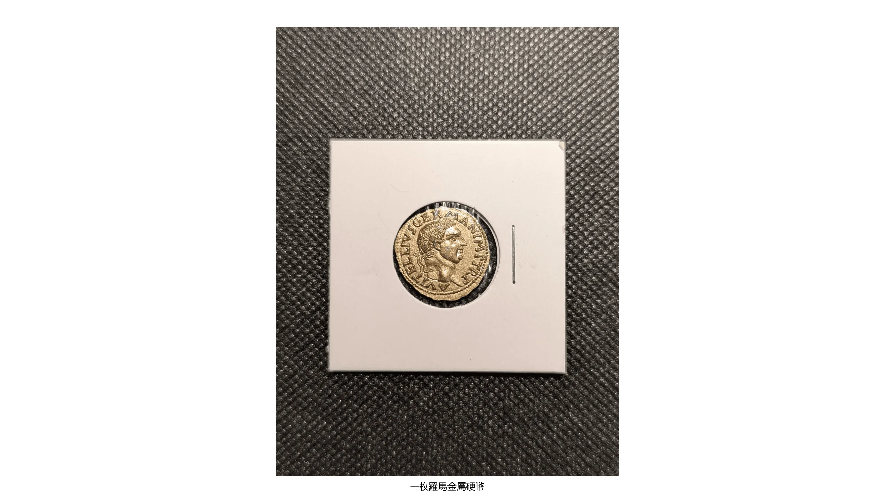

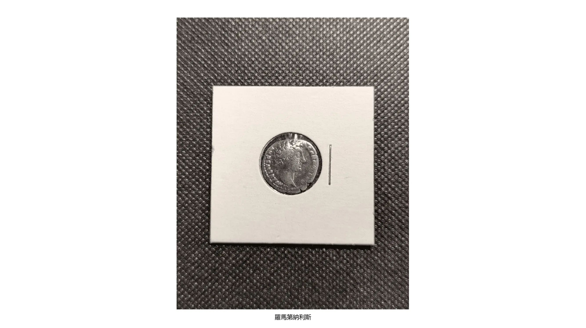

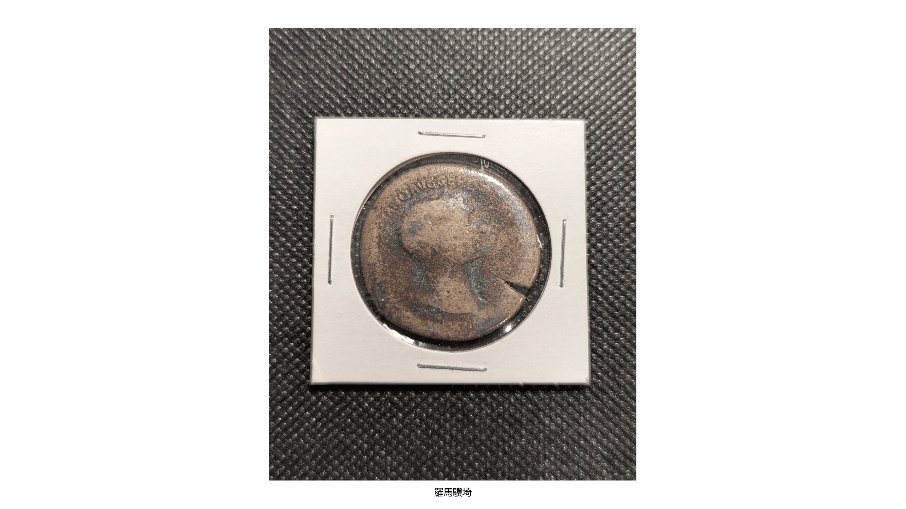

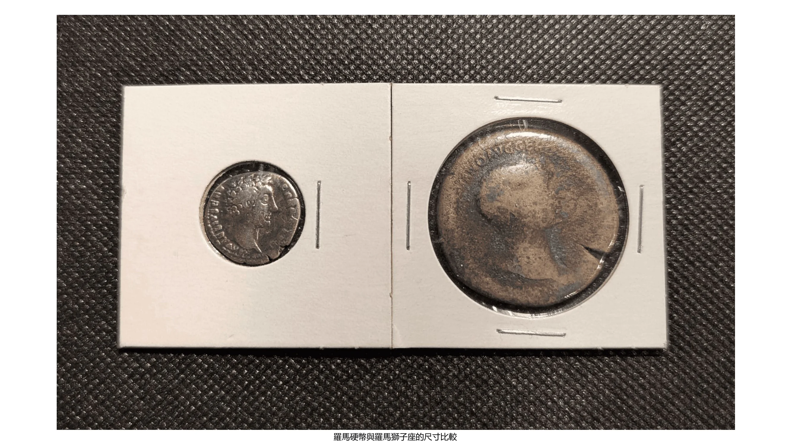

然而，從尼祿開始（公元 54-68 年），羅馬開始了緩慢的硬幣貶值，逐步降低硬幣的重量和純度，以應付日益增長的帝國開支，尤其是在公元 64 年羅馬大火之後。這些貶值產生了顯著的效果：根據**格雷沙姆定律**，較純淨的錢幣因囤積或出口而退出流通，而貶值的錢幣則大量增加，導致價格逐漸上升。

第三世紀是一個戲劇性的轉折點，在塞普蒂米厄斯-塞維魯斯 (Septimius Severus)、卡拉卡拉 (Caracalla) 和加里安努斯 (Gallienus) 皇帝的統治下，銀幣貶值的速度急劇加快。主要的銀幣 denarius 和 antoninianus 的含銀量下降到僅 2%。與此同時，金幣 aureus 的含金量也下降了一半。與這場貨幣危機相伴的是前所未有的政治動盪、蠻族入侵和頻繁的內戰。

這部分讓我介紹本節的最後一件作品：antoninianus。這枚錢幣的原名不詳，但我們今天稱它為 antoninianus。儘管它只比一個第納里大 1.5 倍，但其價值卻高達兩個第納里。此外，隨著時間的推移，這些錢幣變成了純銀錢幣，這意味著它們是由銀和其他金屬的合金製成，而不是純銀。這些錢幣通常只是塗上銀，成為貨幣腐敗的一個顯著例子。

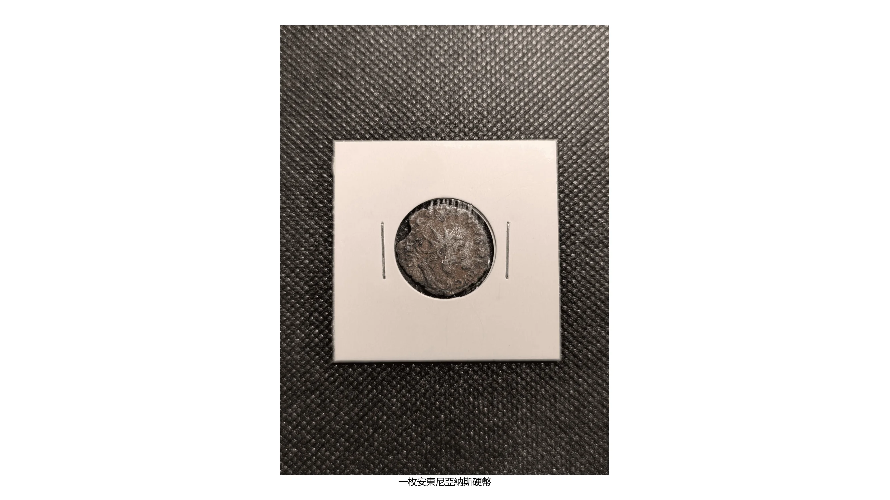

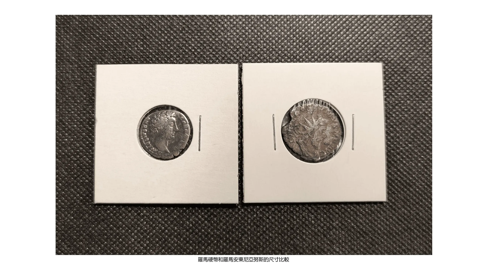

面對這種情況，奧里安皇帝（Emperor Aurelian，公元 270-275 年）試圖通過名義上的貨幣升值來穩定系統，但這種改革實際上引入了通貨膨脹機制，人為地將現有貨幣的價值固定在一個較高的水平上。

我將介紹一個關於這個主題的題外話。在 3 世紀，通貨膨脹經歷了快速的指數級增長。在此之前，儘管錢幣貶值，但手工製作的一枚枚鑄造過程在一定程度上控制了通貨膨脹。統計表明，在 300 年的貶值過程中，平均每年的通貨膨脹率約為 4%。就在奧勒良改革之前，每年的通貨膨脹率約為 3%。

Aurelian 在 XXI 標誌錢幣上引入了純度測量，表示成分為 20 份青銅比 1 份銀，或純度為 5%。他銷售這些純度為 5%的銀幣，並在上面蓋上 XXI 標誌。然而，他也回收了所有其他更貶值的錢幣，並在上面蓋上同樣的 XXI 標誌。這實際上重估了所有硬幣的面值。其結果是每年 20% 的驚人通脹率，遠遠超過實施此技術之前 3% 的通脹率。

真正發明這種貶值方式的是奧勒良，它比金屬的逐漸貶值要快得多，因為金屬的貶值仍然迫使我們一枚一枚地印錢幣。他所做的是把所有現存的錢幣召回來，然後用打孔機蓋上印章，以改變它們的面值。這是一個真正的轉折點。也就是從那時開始，通貨膨脹變成了指數級的。

為了直觀地說明這種極端貶值的情況，我找到了從公元前 40 年到公元 3 世紀，橫跨 300 多年的埃及穀物價格的一些引人入勝的統計數據。下面，您可以看到我收藏的希臘四進制鈔票。當時，在 3 世紀羅馬佔領下的埃及，相當於埃及的四德拉克馬。德拉克馬的面額仍在使用，它相當於一個第納利斯（denarius）。

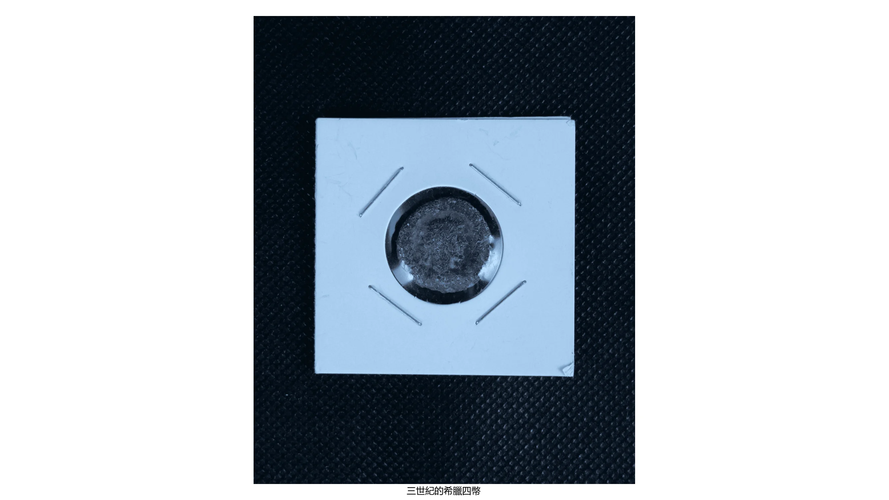

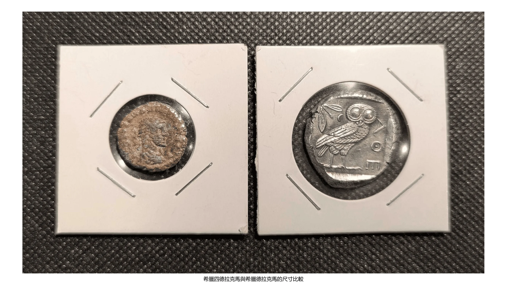

因此，我手上的這枚埃及四分錢幣相當於一塊硬幣。您可以看到這枚硬幣是由銅幣（或青銅）製成的，因此不含任何貴金屬。您可以將它與原始的希臘四分錢幣比較，看看這 300 年來實質上的貶值。這是埃及穀物價格的百萬倍增長。

這是奧里安改革的體現。應該注意的是，在這 300 年的通貨膨脹中，大多數的平均值約為 4%。只是到了最後，當 Aurelian 進行改革時，通貨膨脹才變得相當指數化，並達到 100 萬的標準。3 世紀末的物價比公元前 1 世紀高出 100 萬倍。

他的繼任者戴克里先**（公元 284 年至 305 年）試圖進行更激進的改革：他發行新貨幣（尤其是銀元，雖然更純淨，但數量太少）、實施嚴格的價格管制（公元 301 年的價格敕令），並**建立以實物支付為基礎的稅制。儘管如此，戴克里先的改革仍無法遏止肆虐的通貨膨脹。

面對拒絕提供貨物和服務以換取貶值貨幣的情況，戴克里先制定了**世襲的種姓制度**，將農民及其後代與他們的土地綁在一起。

這裡真正需要理解的是，發生的事情是農民拒絕提供他們的產品以換取貶值的貨幣，而我們親愛的戴克里先的反應是創造**世襲種姓**，他說：「你，你不能離開你的土地，你的孩子不能離開他們的土地，士兵也一樣，你是士兵，你同意用我的貨幣支付。作為一個過渡性的解決方案，他們以實物（肉、食物、穀物）支付，因為他拒絕給付他們金錢。所以他強加了這個世襲的種姓制度，強迫人們依附於他們的行業，所以如果他們試圖不接受貶值的貨幣，他們就不能簡單地轉換工作。

為了說明這個例子，我這裡有一段文字，是「*貨幣制度與通貨膨脹*」一書的摘錄：

> 由 於 人 們 不 願 意 用 貶 值 的 貨 幣 工 作 和 交 付 貨 物 ， 而 貨 幣 的 面 值 高 於 其 內 在 價 值 或 市 場 價 值 ， 因 此 必 須 徵 收 實 物 稅 來 迫 使 他 們 工 作 。[......]農民離開登記的家園是非法的。農民因此成為土地的世襲依附者。
>

> 這種世襲的種姓制度逐漸蔓延：戴克里先強迫士兵的兒子在軍隊服役，而錢幣工場以及戴克里先創建的織染廠的工人則成為國家奴隸，世襲服役。金礦工人後來也成為世襲階級。其他世襲階級可能在戴克里先時代已經存在，特別是羅馬的麵包師和屠夫行會，以及將穀物和其他公共貨物運到羅馬的船長教區行會。

君士坦丁（Constantine，公元 306-337 年）最終成功地穩定了貨幣體系，他在 312 年引入了純金幣（solidus），這種純金幣的質量和重量都得到了嚴格的保證。有一整套系統可以驗證純金的純度和重量。 **然而，這種穩定性僅影響了富裕的精英階層和帝國政府**，而大多數人仍在遭受低質貨幣和持續通貨膨脹的**。硬幣在東方帝國（拜占庭）保持穩定，持續了超過一千年，而在西方，硬幣分裂成小額、低幣值的錢幣，伴隨著羅馬帝國最後的經濟和政治瓦解，於公元 476 年正式滅亡。

最後，我想與您分享這段引述自 Glyn Davies 所著的《貨幣史》：Glyn Davies 所著的《貨幣史：從遠古時代到現在》*中的一段話，精闢地總結了可能導致羅馬滅亡的原因：

*"稅收一直不足，而與這些日益不足、調整遲緩、高度可見的稅收相關的困難，促使羅馬更多地依賴一種簡單、直接和隱蔽的稅收形式：貨幣貶值。曇花一現的臨時改革未能扭轉這個古老的衰落趨勢。由於硬幣的磨損、沉船、從東方購買奢侈品造成的貨幣洩漏、提供給日耳曼野蠻人的禮物、城市人口的增長、農業生產的衰退、最富裕礦山的逐漸枯竭，以及最重要的「麵包與馬戲團」政策，這些都被視為維持城市生活最低限度秩序的必要因素，所有這些累積的壓力導致羅馬不斷進行貨幣貶值，間中穿插的偶爾改革注定失敗。

*除了免費或廉價的麵包和葡萄酒之外，帝國還不時以金錢分配的形式發放優惠（"congiaria"），特別是在特拉揚（Trajan，公元 98-117 年）時期，在哈德良（Hadrian，公元 117-138 年）及其繼任者時期更是如此。皇帝和公民最初視為特殊的特權，到了 2 世紀初，已經成為一種習慣性的期望。這些分配「對國庫構成沉重的負擔，並以自己的方式造成國家的破產」。

## 貨幣稀釋與通貨膨脹之間的關係：從原因到後果

<chapterId>38d5781c-e900-53f7-baa7-413655d71754</chapterId>

:::video id=3999256d-aafe-4502-9b72-dfa8491a2777:::

本節探討貨幣稀釋與通貨膨脹之間的關係，從原因到後果。貨幣稀釋是羅馬貨幣史上的主要經濟現象之一，對通貨膨脹有直接影響。從公元 1 世紀開始，從尼祿 (Nero) 統治時期 (公元 54-68 年) 起，銀幣 (denarius) 有一個最初的緩慢稀釋階段，後來因為多次的軍事和金融危機而加速，特別是在 Septimius Severus (193-211 年) 和 Gallienus (253-268 年) 統治時期。

我們也注意到金銀幣的貶值速度較為緩慢。這種貶值速度上的差異突顯了兩點：

1.在國家控制貨幣的雙幣主義中記帳單位的作用。本範例中的記帳單位是硬幣。我已經識別出三種管理計量單位價值的不同方式：貶值（稀釋金屬）、重幣化（antoninianus）和通過標記 "XXI "強加面值（Aurelian）。

2.國家希望盡可能延遲金銀幣的貶值，金銀幣是一種價值儲備，它使精英階層能夠以犧牲較不幸者的利益為代價，維持他們的購買力。在整個課程中，我們會經常重溫這個原則，特別是與被稱為「Cantillon 效應」的概念以及西班牙的 Maravedi 重幣化有關的部分。

這個現象相當有趣，而且在歷史上一再出現。我們將在接下來的章節中，以 Maravedi 為例，重新討論這個問題。這種模式在所有的儲備貨幣上也很明顯；儲備的價值單位，例如羅馬的金銀幣，仍然保持不變。然而，一般人在貿易和日常交易中使用的計價單位卻經常貶值。因此，貨幣通貨膨脹會影響到一般民眾，而那些有能力購買金幣的人則基本上不受影響。

順便說一下，***今天的貨幣貶值也是同樣的現象，它讓金融資產升值***，因此使用貨幣的人，也就是最貧窮的人，變得更貧窮，這反過來又透過貨幣的創造，讓那些有能力、有辦法保護自己免於貶值的人的資產更豐厚，因此它加深了社會的不平等。這就是我小小的政治咆哮。

我剛才所描述的稱為康泰隆效應。我們會發現這位紳士生活在約翰羅（John Law）的時代，我們也會在接下來的章節中介紹這位紳士。

奧里昂在位時期開始的改革使得通貨膨脹飆升。貨幣面值的膨脹不再受限於鑄幣廠手工生產硬幣的能力。已經被鑄造的硬幣現在可以被簡單地標記，貨幣供應的名義價值增加得更快。

關於 Aurelian，我有兩句話要與您分享。第一段來自*貨幣史：從古代到現代*：

*"就羅馬經濟而言，奧勒良的貢獻是災難多於勝利。主要是由於他的 「改革 」的性質，使得通貨膨脹率的增長遠遠超過了之前的可能，即使是在不負責任的加里安努斯（Gallienus）統治下也是如此。奧勒良之後的兩個世紀，通貨膨脹成為整個羅馬帝國的地方病 "*。

第二種來自 *Anncient History from Coins* 一書，內容關於貨幣系統與黃金的脫離：

*"奧里昂的改革改變了金幣與其他貨幣體系之間的關係。在此之前，其他類型的貨幣是根據官方匯率（25 埃及第納里或 25 四拉克幣兌 1 金幣等）與 **aureus 掛鈎的。改革之後，黃金貨幣開始像其他商品一樣**價值自由波動，而貨幣系統的其他部分則因為**合金**的削弱而**價值崩潰，不再**黃金的支持。由於理論上記帳單位仍以白銀（第納里，或埃及的德拉克馬）為基礎，價格隨著貨幣貶值而上升。"*

正如您所看到的，這種作為記帳單位的貨幣貶值對經濟條件較差的人造成了不成比例的影響，而與黃金貨幣脫節的做法則保護了那些有能力儲蓄黃金這種儲值工具的人的購買力。

您必須瞭解的是，如果硬幣和金屬鈔票之間存在聯繫，即使硬幣貶值，如果您仍能以這個比率（25 硬幣換 1 金屬鈔）用硬幣兌換金屬鈔票，人們肯定會用硬幣兌換您的金屬鈔票，因為硬幣的價值會被高估，而金屬鈔票的價值則會被低估。但在這次改革中，他們取消了這一聯繫。所以人們不能再用銀幣兌換對黃金貶值的金屬。這時，那些有機會獲得金幣的人就能真正保護自己，因為之後，人們就不能再用價值高估的貶值白銀交換價值低估的純金了。這是貨幣演變過程中非常重要的時刻。

Aurelian 這項改革所帶來的效果，可以從《貨幣體制與通貨膨脹》*一書中的這些引文得到完美的說明：

*"在克勞狄斯（Claudius，公元 41-54 年）和康斯坦提斯（Constantius，公元 337-361 年）兩位皇帝的統治期間，埃及公開市場上的小麥價格（以德拉克馬表示）***增加了超過一百萬倍。驚人的價格膨脹是公元三、四世紀的主要經濟事實之一」（Lendon 1990, p.106）。但這個發展**沒有看起來那麼戲劇性**，因為它相對應於**平均每年 4.4% 的通貨膨脹率**。而根據 Wassink (1991, p. 482)，通貨膨脹實際上**僅開始於公元 238 年**"*。

*"從這一天開始，通貨膨脹慢慢加速，因為**好的貨幣首先被趕出流通**，所以貨幣供應總量一開始幾乎沒有增加。其後，在 250 年至 293 年間，通貨膨脹率平均每年達到**3.65%，在 293 年至 301 年間，則上升到**22.28%** (Wassink 1991, p. 466)，也就是到戴克里先皇帝**流產的貨幣改革**為止。這個現象對於以金屬為基礎的貨幣制度中的通貨膨脹來說，**特別令人印象深刻。"*

這種與貨幣稀釋有關的通貨膨脹現象最初是為了應對羅馬國家偶爾出現的現金危機。通過減少硬幣的貴金屬含量，同時保持其面值，國家暫時增加了其資源。但價格並沒有立即做出反應：事實上，羅馬制度有一定的粘性，這意味著工資和價格對連續貶值的適應速度很慢。儘管如此，在某個臨界點之後，價格會急劇上升，使市場與貨幣的實際價值恢復平衡。

如上所述，這種現象在 3 世紀中葉以後尤其明顯。在埃及這個有豐富文獻記載的地區，儘管當初曾試圖穩定物價，但在奧雷利安 (Aurelian) (公元 274 年) 統治下，官方對貨幣進行重新估值後，物價翻了 10 倍。之後，在戴克里先 (Diocletian) (公元 301 年) 的統治下，價格法令實施了劇烈的管制來抑制通貨膨脹，卻沒有從根本原因著手 - 生產過剩和貨幣貶值，因此造成了可以預見的失敗。持續的通貨膨脹最終將經濟推向兩級制： **精英階層受到黃金儲備（如君士坦丁的solidus**）的保護，享有穩定的生活，而大多數人則持續遭受長期的通貨膨脹，**說明了今日所謂的康泰隆效應。

羅馬的貨幣稀釋與通貨膨脹之間有明顯的關聯，而造成通貨膨脹的原因基本上與長期的財政赤字、不斷的軍事開支以及不佳的國家經濟管理有關。

## 羅馬帝國的衰亡

<chapterId>b6ec0914-227b-509c-8108-b09eec9bb904</chapterId>

:::video id=91d4fee5-59bb-4ab9-a90b-e1125c71decb:::

### 貨幣貶值與羅馬崩潰

奧地利經濟學派，特別是透過路德維希‧馮‧米塞斯 (Ludwig von Mises) 提出了對羅馬滅亡的貨幣詮釋。在這個願景中，羅馬貨幣的逐步貶值打破了維持一個擁有 6000 萬居民的帝國的複雜的分工系統。貨幣作為經濟協調的核心工具，一旦腐敗，就會導致整個社會和經濟結構的崩潰。

這種金融衰退不僅破壞了帝國內部的凝聚力。它也斷絕了與鄰近民族的貿易聯繫。喪失了與羅馬貿易的利益，「野蠻人」從和平合作轉為掠奪。因此，入侵不僅是軍事性的，也是基本經濟崩潰的結果。

### 帝國貶值的三個階段

羅馬貨幣史可分為三個不同時期。第一個時期，從朱利歐-克勞德王朝到安東尼王朝（公元前 27 年 - 公元 2 世紀末），維持了相對的穩定。在特拉真時期，帝國達到了頂峰：羅馬佔地 5 百萬平方公里，成為歷史上第一個百萬富翁城市。該硬幣保留了 98% 至 80% 的銀純度 - 溫和的貶值仍能讓經濟正常運作。

第二個時期，即 3 世紀，是一個軍事無政府的時期。在短短的幾十年間，有 26 位皇帝相繼繼位。貨幣崩潰：本應值兩第納尼的安托尼納斯（antoninianus）只包含 1.5 的金屬重量 - 首次嘗試將法定價值和實際價值分割開來。這種操控觸發了格雷沙姆定律：劣幣驅逐良幣。公民囤積好幣，只花貶值的錢幣。

考古學家發現的貨幣寶藏揭示了這種經濟焦慮。埋藏在地下的圓筒形錢幣分層顯示了羅馬人是如何先存放最好的錢幣，然後再逐漸加入貶值的錢幣。這些古老的「堆疊」見證了人類在面對不確定性時所採取的行動 - 嘗試在腐朽的世界中保護價值。

### 君士坦丁與二元系統

君士坦丁（Constantine，310-337 年）試圖通過大刀闊斧的改革來穩定帝國。他創造了一種由政府嚴格控制的貨幣--黃金盾。官員有系統地檢查重量和純度。發行量仍然有限，與戰利品相關。這種貨幣成為專屬的權力工具：稅款以實心金支付，軍團以黃金領薪。

與此同時，人們使用不斷貶值的青銅nummus。在 445 年，一個銅幣值 7,000 盧比；在 498 年，值 16,800 盧比。這種雙重制度使康提榮效應制度化：那些有機會獲得實心銀幣的人 - 行政人員、地主 - 受到保護，免受通貨膨脹的影響。庶民則僅有努米，無可奈何地變得越來越窮。

這種貨幣分離造成了兩個沒有官方匯率的平行經濟體。solidus 仍是記帳單位，但流通量很少。nummus 用於日常交換，但會不斷貶值。這種貨幣結構預示了新興封建制度的不平等。

### 分工的瓦解

貨幣貶值逐漸摧毀了經濟的專業化。沒有了可靠的計價單位，地中海的貿易崩潰了。羅馬的專業工匠無法再與埃及或高盧進行貿易。各省採用自己的貨幣，使貿易摩擦倍增。

面對這種分崩離析，城市人口逃往鄉下 - 這場城市大逃亡扭轉了數個世紀以來的城市化進程。工匠們放棄了他們的行業，轉而從事自給自足的農業。大型莊園 (latifundia) 成為自給自足的島嶼，預示著中世紀的seigneuries。

在絕望中，戴克里先甚至要求實物稅 - 最終承認貨幣失效。他的最高敕令（301年）試圖控制價格，加速了以物易物的回歸。經濟的複雜性倒退到文明以前的形式。

### 從羅馬到拜占庭的黃金生存之道

自相矛盾的是，Solidus 在西方帝國一直存在。拜占庭一直沿用至 11 世紀，確保了長達千年的經濟穩定。在西方，人們對它的記憶依然存在：法文中的 "sou "一詞就源自於 solidus，從語言學上見證了逝去的輝煌金融時代。

以黃金保存財富的地主變成了封建領主。教會結構是僅存的機構，它提供了金錢無法再保證的社會聯繫。歐洲分裂為各個自給自足的經濟領域。

這種轉變揭示了複雜文明的脆弱性。羅馬能夠養活一百萬居民的分工，完全取決於貨幣上的信任。一旦這種信任被打破，這座大樓就會倒塌，使歐洲在幾千年內回到原始的經濟形式。

## 黑暗時代與中世紀

<chapterId>a5856873-6142-57be-8a73-1f9e3df83792</chapterId>

:::video id=86b8da9b-3831-443d-b170-58c2bea3ad54:::

貨幣在中世紀的歷史和出現，有倒退期、創新期和經濟復甦期。

例如，當羅馬軍隊離開不列顛時，再沒有羅馬硬幣進入該島。公元 435 年左右，硬幣的使用在不列顛徹底消失，這是前羅馬行省獨有的現象。將近兩個世紀以來，英國經濟一直沒有使用硬幣，直到 7 世紀，梅洛溫王朝和大陸風格的硬幣才逐漸重新出現。

從 8 世紀開始，基督教的影響促使北歐重新引入硬幣。這段時期的關鍵人物是法蘭克國王短頭人佩平 (Pepin the Short)，他在 752 年引入了硬幣，後來被他的兒子查理曼大帝 (Charlemagne) 所採用。查理曼大帝廣泛地擴展了銀幣的使用，在幾個世紀內建立了歐洲的貨幣標準。

在英格蘭，765 年左右麥西亞國王奧法 (King Offa of Mercia) 製造出銀便士後，硬幣製造業得到了顯著的復興。這種貨幣變得如此重要，以至於 500 年來幾乎沒有改變過。

作為與這個時期有關的第一件藝術品，讓我向您展示當時英國便士的複製品。

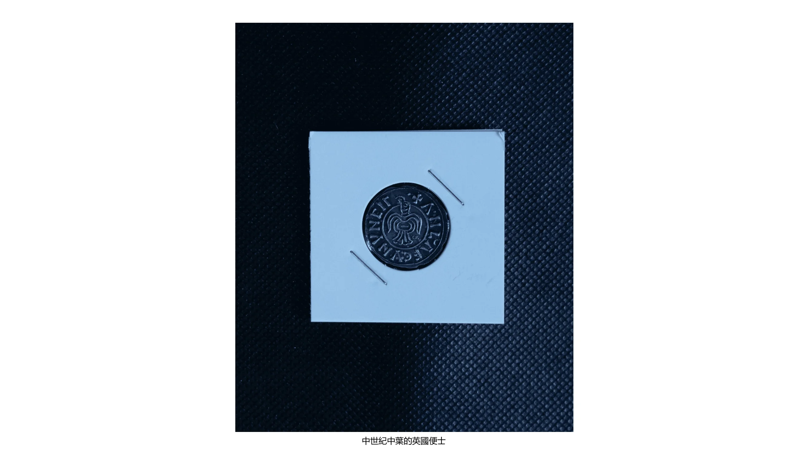

在中世紀中葉，羅馬貨幣制度崩潰後，歐洲陷入封建制度。大多數人使用低價值的銅幣或青銅幣，通常會受到貨幣稀釋的影響，因此限制了長距離的貿易。

硬幣作為支付手段的回歸是逐漸發生的，到了 13 世紀，佛羅倫薩於 1252 年出現了弗羅林金幣，隨後威尼斯也出現了杜卡金幣。由於貿易的擴張以及對可靠的、國際認可的支付手段的需求日益增長，這些金幣被廣泛使用。

在英格蘭，創新的財政政策保護了貨幣體系不被稀釋，例如征服者威廉（William the Conqueror）在1066年後引入的土地稅，保持了英鎊便士的質量。在此需要了解的是，當時的主權國可以貶值貨幣來為國家提供資金，而**這種稅收的引入使得保持貨幣穩定和通過稅收為國家提供資金成為可能。

然而，通過稀釋貨幣來獲利的誘惑導致了危機，例如在 12 世紀亨利一世統治時，硬幣的質量急劇下降。嚴厲的改革，有時還伴隨著針對鑄幣商的暴力措施，暫時恢復了人們對貨幣的信心。

中世紀也出現了複雜的金融實務，例如在英國使用理數棒來規避高利貸禁令並擴大信貸。教會對有息貸款並不熱衷，因此人們使用各種技巧來規避使用利息的禁令。

這些創新是對金屬貨幣長期短缺的回應，並鼓勵了萌芽中的金融市場的出現。

與此同時，十字軍東征刺激了地中海貿易，促進了國際交流和新銀行業務的發展，特別是通過聖殿騎士團。聖殿騎士團成為重要的金融中介，使十字軍遠離家鄉獲得流動資金，預示了現代歐洲的銀行體系。

為了與聖殿騎士團（Templars）聯繫起來，您可以在下面觀察一枚法國中世紀硬幣，您可以在硬幣中央看到一個美麗的十字架。這個時代的錢幣上有這個十字架是很常見的。

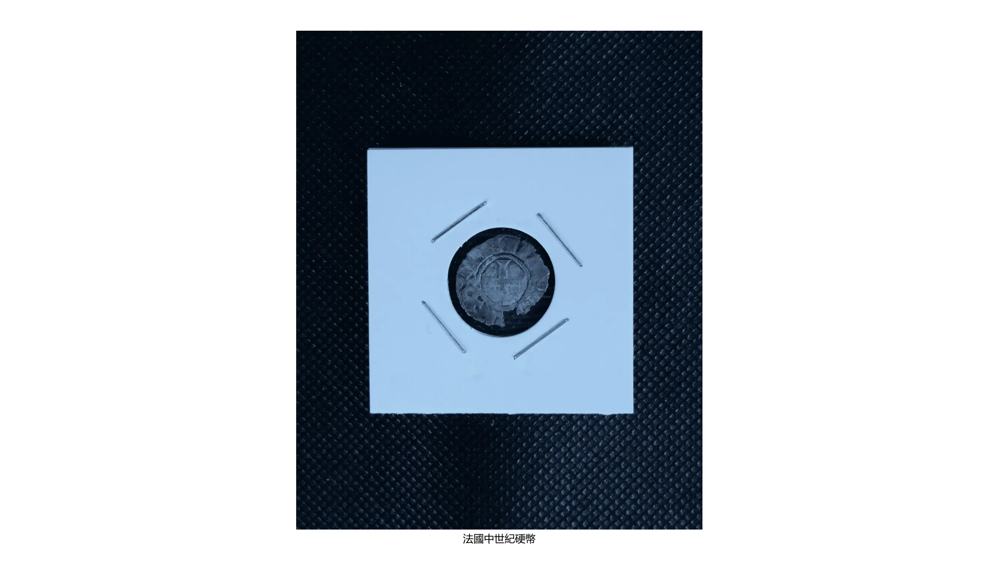

最後，黑死病 (1346-1353) 等重大危機帶來了深刻的經濟轉型。人口的急劇下降導致工資的急劇上升，這與政府試圖維持以前的薪酬水平背道而馳。

與此同時，百年戰爭 (1337-1453) 迫使各國採取更進取的財政政策來資助軍隊，促使封建制度被削弱。

因此，中世紀的特點是，一方面貿易需要可靠的貨幣，另一方面統治者又不斷受到誘惑，為了眼前的利益而稀釋貨幣。這種衝突深刻地塑造了歐洲的貨幣發展，奠定了現代經濟體系的基礎。

為了結束這一部分，我想在此補充一則相當有趣的軼事，它來自英格蘭。這則軼事摘自 Glyn Davies 所著的《貨幣史》一書。

它提到，在英國，向國會的轉移將債務的負擔從君主轉移到國會，導致國家長期負債。在此之前，債務是由君主承擔的。

一旦國會能夠奪取部分貨幣創造權，它就能夠創造由人民而不是國王承擔的長期債務。在此之前，如果國王破產或更換國王，債務就會隨著他的破產而消失。

由國會進行債務創造的那一刻，主權債務的概念就出現了，因為它在時間上有潛在的無限性。只要國家存在，只要國會存在，這筆債務就存在，他們必須找到各種方法為這筆債務再融資，並在時間上加以分散。這是一個重大的模式轉變，不再是國王或皇室擔保或承擔這些債務；現在是國會，因此也是國會的公民。

## 文藝復興

<chapterId>1d1dfb05-70b4-5b7b-9708-373c2182950d</chapterId>

:::video id=4977b4f3-c7b2-41a5-ad7b-a96a8cca4092:::

現在我們已經到了講述文藝復興時期的課程部分。這段時期是在悲劇性危機的背景下發生的，瘟疫因老鼠身上的跳蚤登船而迅速傳播。然而，這場悲劇讓我們了解到中世紀時期貿易與旅行的成長。在這個時期的早期，並沒有這麼多人走得這麼遠、這麼快。

### 佛羅倫斯的弗羅林

文藝復興時期，歐洲重現金幣，標誌著貨幣史上一個根本性的轉捩點。 **這一切始於 1252 年佛羅倫斯的弗羅林，這是羅馬滅亡後歐洲鑄造的第一枚主要金幣**。由於其重量和純度非常穩定（約 3.5 克純金），弗羅林在四個世紀中保持不變，並迅速成為泛歐重要的貨幣參考。

下面您可以看到 Florin 的複製品：由一位法國藝術家以錫製成的黃金 Florin，以手工雕刻和擊印的方式製作出品質極佳的作品。

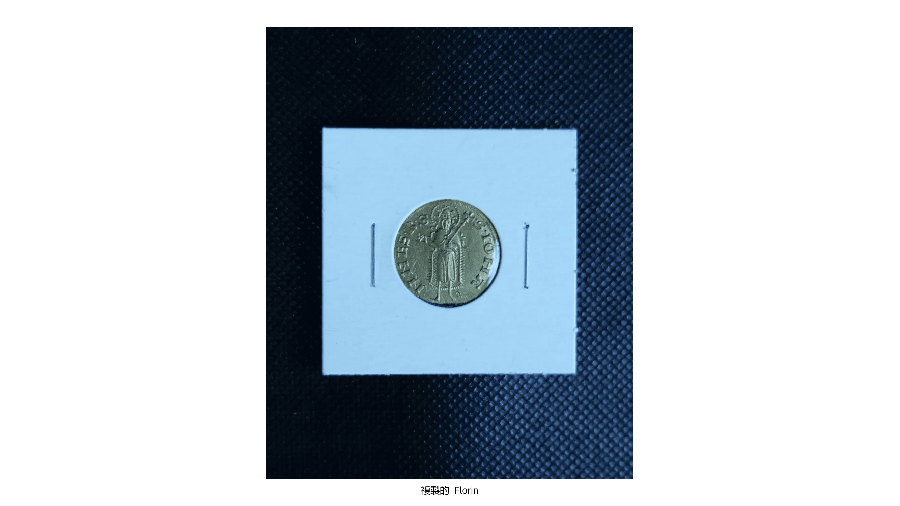

這種金幣的回歸是由特定背景所推動的：拜占庭銅盾的崩潰以及蒙古入侵導致的穆斯林世界的經濟衰退，在國際貿易中造成了貨幣真空。

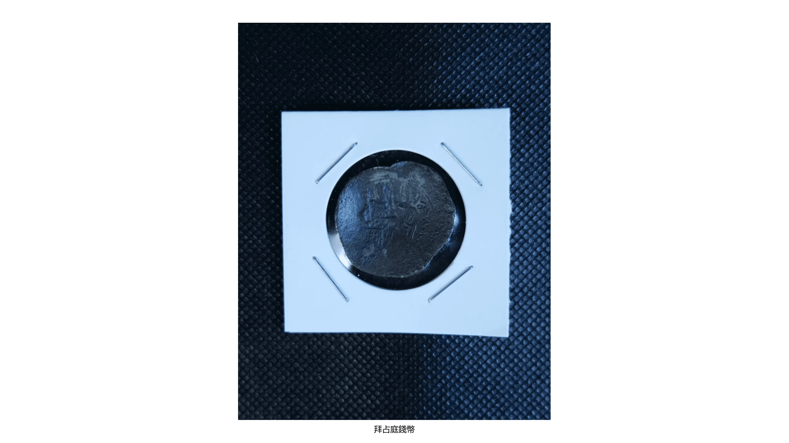

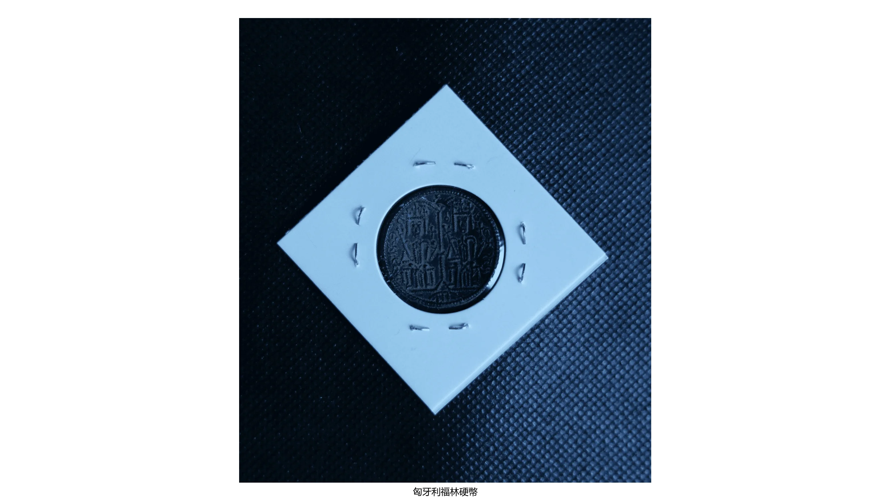

上面第一張圖是一枚拜占庭錢幣，我覺得這枚錢幣相當有趣。我將其與匈牙利同一時期的一枚錢幣（上圖第二幅）作一比較。匈牙利錢幣呈杯狀，就像一個迷你碗。圖案上的宗教人物被描繪成並排手持十字架的國王。這枚錢幣呈碗狀，源自匈牙利。

複製其他國家的錢幣是相當習慣的做法。由於拜占庭錢幣被普遍接受，其他國家也經常仿造它們。當您將它們並排比較時，您可以看到：這些錢幣非常相似。

意大利北部，特別是佛羅倫斯、威尼斯和熱那亞，利用這個背景推出了新的硬通貨幣 - 含有穩定貴金屬成分的錢幣。威尼斯效仿佛羅倫斯，於 1270 年鑄造了杜卡（ducat），這種幾乎與弗羅林（florin）相同的貨幣在地中海貿易中被廣泛使用。

弗羅林成為第一種國際儲備貨幣，在 14 世紀末之前就被 150 多個歐洲城市所採用。隨著由美第奇家族領導的佛羅倫薩大型銀行網絡的建立，貨幣和會計管理徹底現代化，甚至減少了實際運輸黃金的需要。

這是另一個非常有趣的觀點。曾經有一段時間，許多錢幣在海上航行時遺失了。這種技術上的進步 - 帶有複式記帳的登記冊 - 使得經文錢的產生成為可能。這使得減少硬幣結算的數量成為可能，取而代之的是使用書面記帳的系統，這大大降低了運送過程中丟失金錢的風險。

貨幣的發展也伴隨著銀行方法的重大演變。部分受到十字軍東征與穆斯林銀行習慣接觸的啟發，早在 13 世紀，歐洲的佛羅倫斯、威尼斯、巴塞羅那、熱那亞就出現了基本的銀行系統。聖殿騎士團 (Knights Templar) 是一個宗教和軍事組織，他們已經發展出一套系統，讓十字軍旅行時無須帶著財富。

他們會將資金存入所在國家的聖殿騎士團辦事處，然後可以用書信的形式旅行，並在抵達十字軍目的地後領取硬幣。

這意味著我們不必隨身攜帶貴金屬硬幣。

也是在這個時期，由於馬可-波羅在 13 世紀的旅行，歐洲才知道中國有紙幣的存在。然而，紙幣的發展還要等上幾個世紀，因為歐洲傾向於先完善其金屬硬幣製造方法。達芬奇與著名的特許會計師盧卡-帕西奧利（Luca Pacioli）走得很近，積極地為改進壓鈔機做出了貢獻，促進了更快、更統一的硬幣生產。

我們指的是課程前面提到的鐘擺鑄造技術。與錘擊法相比，這種方法能夠製造出更均勻的錢幣，而且重要的是，它允許在錢幣邊緣進行刻字，正如我之前演示的那樣。下面這枚是 1793 年的歐洲 thaler，它清楚地顯示了邊緣上的文字。

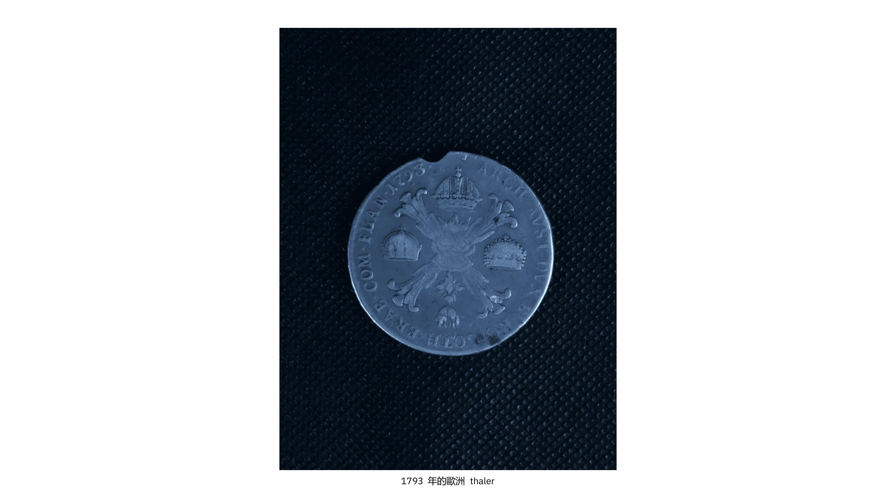

然而在 15 世紀，歐洲經歷了嚴重的貨幣危機，歐洲貨幣的含銀量普遍惡化，在 1450 年左右降至 5%以下。

從 16 世紀開始，在阿拉貢和卡斯提爾王國的聯合、復興戰的結束以及哥倫布在 1492 年的海上大發現等因素的刺激下，貨幣重心轉移到了西班牙。大量白銀從美洲礦山湧入，嚴重破壞了歐洲和全球的經濟平衡，助長了通貨膨脹和新的地緣政治緊張局勢。

文藝復興也標誌著錢幣藝術的重大演變，錢幣如 thaler (Joachimsthaler) 就是「美元」一詞的起源。這些大型銀幣反映了來自北歐的技術創新所帶來的新的藝術和機械鑄造技術。

最後，金融文藝復興帶來了向經濟現代化的轉變，銀行、信貸和金融市場得到發展，阿姆斯特丹、倫敦和斯德哥爾摩等大商業城市出現了現代資本主義的雛形，為我們今天所知的國際金融體系奠定了基礎。這就是我們下一個影片的主題。

# 國家扣押金錢

<partId>17cfb1b4-5bc1-53e0-b035-05c7cf76be92</partId>

## 世界儲備貨幣的演變

<chapterId>d65cc352-e7ca-5f03-9b23-dd1fae5c0395</chapterId>

:::video id=82710062-8fff-426c-93af-923c08d82233:::

### 貴金屬的歷史重要性

歡迎來到儲備貨幣和中央銀行的出現這一節。作為這個新部分的第一點，我們將關注全球儲備貨幣的演變。

貴金屬，尤其是黃金和白銀，長久以來一直被認為是帝國財富和權力的基礎。對黃金的渴求一直是一種主導性的動力，正是貴金屬的湧入對歐洲的貨幣發展產生了最直接、最明顯的影響。在中世紀和早期文藝復興時代，這種對金銀的迷戀是由於其他形式的商品難以保值，以及外國列強的強烈需求，尤其是在與東方的貿易中。

幾世紀以來，幾個帝國互相繼承，成為全球經濟中心。在特定時期主導世界貿易的國家通常會被授予儲備貨幣的地位。這些國家包括

- 西班牙和葡萄牙（15 和 16 世紀）

- 17 世紀的聯省（荷蘭

- 18 和 19 世紀的法國和英國

- 二十世紀的美國

### 葡萄牙的繁榮與雷亞爾（1450-1530 年）

**葡萄牙**在 15 世紀下半葉和 16 世紀早期主宰了世界貿易，其**葡萄牙雷亞爾**是一種重量相對統一的銀幣。由於航海技術的進步，葡萄牙人找到了通往非洲、亞洲和新世界的新航路。從非洲到中國（澳門）的軍事要塞和貿易站成倍增加。

為了滿足歐洲對金銀的需求，「大發現的永恆動力是商業利益，尤其是對金銀的追求」。然而，葡萄牙帝國因經濟過度擴張，又面臨荷蘭、英國和法國的競爭，開始走向衰落。

在這上面，您可以看到這些海上征服時期的葡萄牙半真人。

### 西班牙遠景與西班牙元（1535-17 世紀）

隨著對新大陸的征服，西班牙**成為了主導者。西班牙君主控制了巨大的銀礦（玻利維亞的波托西，墨西哥的薩卡特卡斯），成功地用純銀鑄造了貨幣，從而避免了自己的貨幣：**西班牙雷亞爾**的貶值。

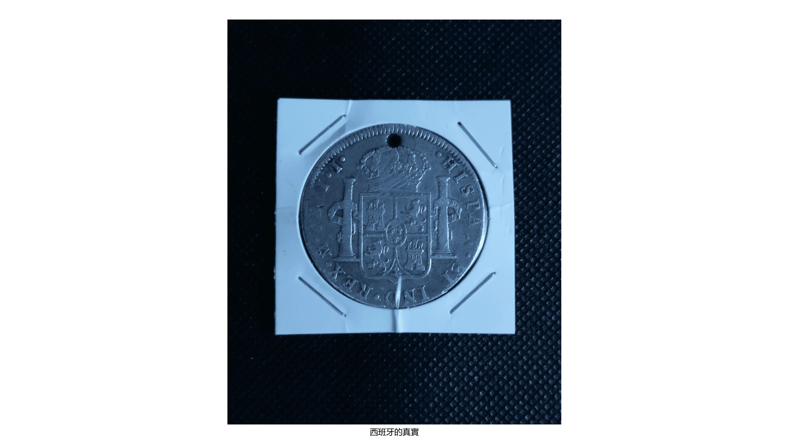

西班牙雷亞爾又稱為 「八分之一」，其昵稱的由來是因為它經常被切成八分之一來製造更小的錢幣。它也被稱為**西班牙元**。您在上面看到的硬幣是 1814 年製造的，因此是比較近期的例子。然而，最早的西班牙一元硬幣並沒有那麼精緻；它們是用錘子敲擊而成的，通常沒有那麼圓潤和清晰。

特別有趣的是，西班牙元當時是國際儲備貨幣。西班牙當局還發行了自己的當地貨幣 maravedi，並通過回收定期調整貨幣供應。例如，一枚最初價值 1 maravedi 的銅幣或銅幣可能會被回收，並蓋上 "2 「的印章，之後再蓋上 」4 「的印章，如此類推，可能會達到 」8 "的印章。在高解析度照片中，您可以清楚地看到硬幣上印有「8」字樣。這種方法有效地擴大了貨幣供應......這不可避免地導致了通貨膨脹。

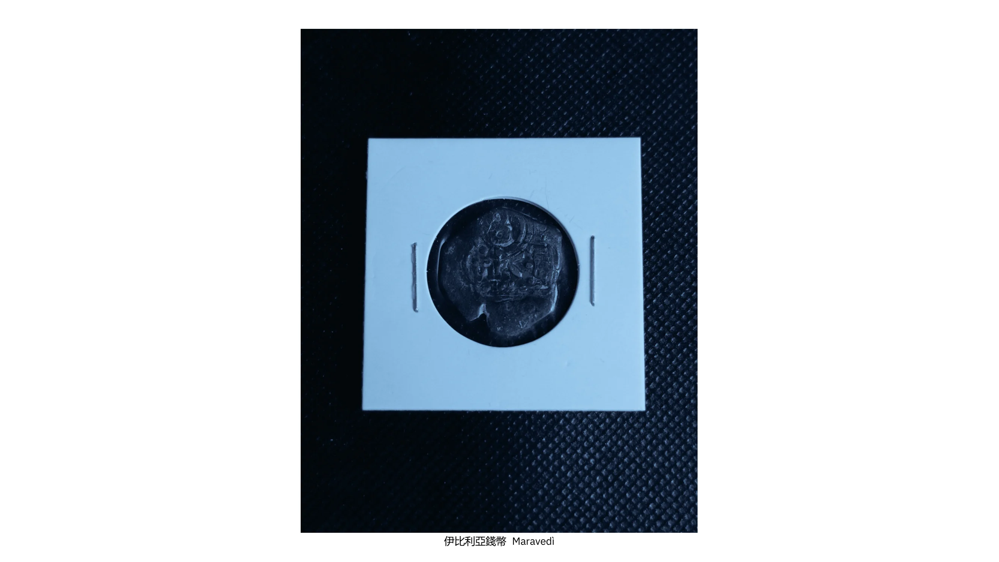

如果我們看看儲備貨幣的歷史，就會發現一個有趣的現象：帝國只要能保住儲備貨幣的地位，就不會讓貨幣膨脹。 **只有在統治結束時，他們才會讓貨幣貶值，失去這個特權，然後再把特權傳給新的帝國**。

在西班牙，西班牙元主導了近 200 年的世界貿易，尤其是中國和歐洲之間的貿易。這些錢幣甚至可以在中國港口找到。這就是我們從歷史中得到的啟示：美國元直接來自這種貨幣。當美國在 1792 年成立時，它通過了一項法律來鑄造自己的貨幣，而它的第一批美元無論在名稱上還是錢幣大小上都是以西班牙美元為藍本鑄造的。

為了讓您了解其價值，一美元最初是一盎司重的銀幣，或今天的貨幣 30 歐元至 40 歐元之間，與我們今天所知的紙幣不同。至於西班牙元，它的流通範圍非常廣泛，因此被認為是第一種真正的全球貨幣。

然而，美洲貴金屬的湧入引起了歐洲的通貨膨脹。在價格革命期間（約 1540-1640 年），英國的生活費用增加了七倍。在西班牙，豐富的白銀產生了反常的資源詛咒效應，妨礙了穩固的銀行機構的發展。

隨後，西班牙面臨多次軍事衝突（佛蘭德、尼德蘭、三十年戰爭），財政逐漸崩潰。繼任的統治者並沒有讓舉世聞名的銀幣貶值，而是選擇拖欠或貶值當地人民使用的銅幣 (vellón)。這就是我之前描述的 Maravedis。

### 荷蘭崛起（17 世紀）

在伊比利亞盛世之後，***荷蘭在 17 世紀成為新的商業強國。海上貿易、VOC（荷蘭東印度公司），以及**阿姆斯特丹股票Exchange**（受安特衛普股票Exchange**的啟發）的成立，使這個商人共和國成為一個樞紐。

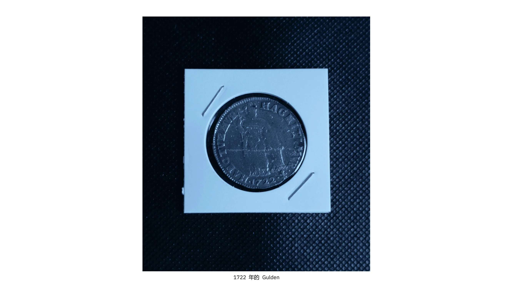

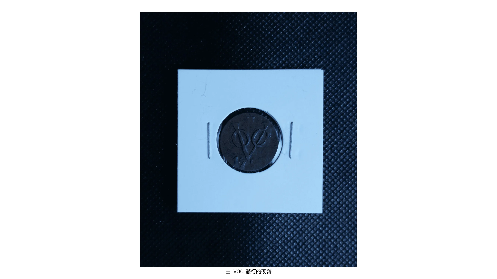

在上面的第一張照片中，您可以看到一枚 1722 年的 Gulden（一枚美麗的銀幣），而在第二張照片中，則有一枚由 VOC 發行的硬幣。

在當時，VOC 是一家極為強大的公司：它擁有自己的軍隊，甚至發行自己的貨幣。

荷蘭人發明了現代資本主義，一開始是用來分攤高風險企業的風險，例如遠征新世界或尋找新的貿易路線。股份公司使多個投資者能夠匯集資金並分擔風險。為了促進這些交換，當時有必要建立能夠談判和交換這些證券的機構。因此，在 1602 年創建了第一家股份公司和證券交易所。

荷蘭貨幣 **Gulden** 因其純銀而獲得公信力，隨後被阿姆斯特丹銀行採用 (1609)，存款成為歐洲首選的貨幣形式。這是非常重要的一點。是的，當然有硬幣，但在那個時代真正構成貨幣的是一種經文錢。事實上，世界上大部分的貿易都是通過阿姆斯特丹銀行的賬本進行的。這是一個真正的銀行業突破：國際貿易不再需要使用實體硬幣，而是直接通過銀行的會計記錄進行。

在這段繁榮時期，黃金和白銀大量流入，特別是來自其他實行通貨膨脹或貨幣控制的國家。有一個有趣的人物值得一提 **托馬斯-格雷沙姆**。在這個時期，他在荷蘭為英國皇室工作，管理兩國之間的貨幣流通。正是這位格雷沙姆為我們留下了著名的**「格雷沙姆法則」**。

然而，荷蘭帝國最終也耗盡了力量。與英國的戰爭、古蘭盾在衝突時期的貶值，以及來自其他列強（法國和英國）的競爭，都標誌著荷蘭霸權的結束。第四次英荷戰爭 (1780-84) 之後，古登作為儲備貨幣的衰落已不可逆轉。

### 法國的權力、野心和失敗（17-18 世紀）

在路易十四統治下，***法國成為歐洲最大的大陸強國。然而，法國貨幣從來沒有達到主導參考的地位：無數的貶值、沉重的稅收和昂貴的戰爭（奧格斯堡聯盟、西班牙王位繼承戰爭等等）對貨幣體系的穩定性造成了沉重的負擔。

John Law（1716-1720）進行了紙幣的第一次重大實驗。Banque Générale 發行由政府債務承諾支持的紙幣。這個計劃在 1720 年導致了投機泡沫和崩潰（密西西比泡沫）。這場災難給法國留下了對紙幣的持久不信任。正是這次災難性的經歷，使理查德-康泰隆因為這種列明原則的系統而變得富有，現在被稱為康泰隆效應，即印鈔會使那些有機會使用印刷機的人變得富有。

當這種不信任終於消失時，另一種法國紙幣慘敗：革命性的**assignats**。從 1790 年起，這些以沒收神職人員財產為基礎發行的assignats經歷了瘋狂的惡性通貨膨脹，正式成為歷史上第一個每月超過 50%的惡性通貨膨脹。1795 年，儘管面值已翻了幾番，但交易價格僅為最初價值的幾個百分點。

更多的限制性法律試圖強制執行 "assocat"，但沒有成功。政府試圖強制執行，甚至以死亡威脅那些不接受的人，並強迫店主繼續營業。當然，最終還是沒有成功。

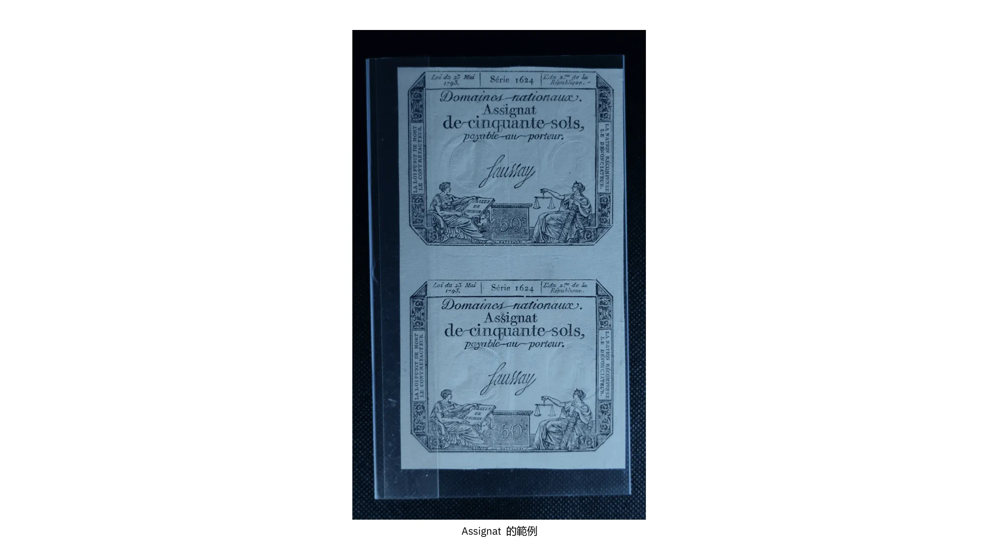

由於紙幣取代了所有優質的貴金屬硬幣，與著名的格雷沙姆定律一致，硬幣短缺隨之而來。為了鑄造新的硬幣，他們使用了從神職人員那裡攫取的鐘形金屬。下面您可以看到一塊美麗的鐘形金屬，它是用從神職人員手中搶來的錢幣熔化後回收的銅製成的。

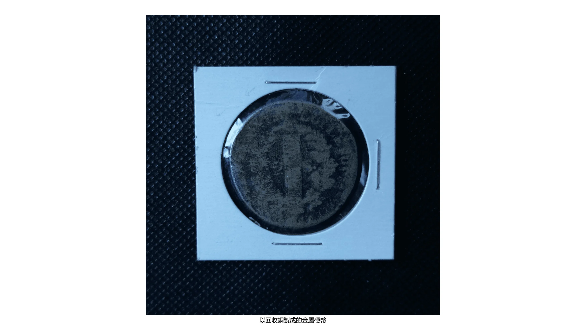

### 英國統治（18 世紀 - 20 世紀初）

**英格蘭**在 18 世紀超越荷蘭，成為霸主。英鎊是目前仍在使用的最古老貨幣，最初與一磅白銀掛鉤。在金融和財政革命的支持下，英鎊的地位逐漸鞏固：議會君主制、強大的徵稅能力，以及 1694 年英格蘭銀行的成立。

經過一系列對法戰爭，英國在 1815 年（滑鐵盧）取得勝利，確立了其霸主地位。在整個 19 世紀，英鎊一直是世界的儲備貨幣。在其巔峰時期，英國僅佔世界人口的 2.5%，卻創造了全球 20% 的收入，並控制了幾乎四分之一的地球表面。

**工業革命**和**金本位**的採用（1717 或 1718 年，在皇家鑄幣廠 Isaac Newton 的監督下）加強了英鎊的可信度。英格蘭銀行採用每盎司黃金 4.25 英鎊的金本位制，允許紙幣持有者將紙幣兌換成黃金。

然而，第一次世界大戰（1914-1918）終結了這個體系。在幾個星期之內，所有主要的交戰國都暫停了黃金兌換。大英帝國以及後來的英鎊，在第二次世界大戰中處於衰弱狀態，並在 20 世紀讓位給美元。

而作為藝術品，您可以在下面看到一些美麗而有趣的作品。這些都是貨幣砝碼。第一個是君主幣：英鎊最早的代表。我只有貨幣砝碼來代表這些錢幣，因為我買不起真正的主權幣。為了稱量它們，我們使用天平，然後將等同於主權價值的貨幣砝碼放在另一面。

君主幣是一種貨幣 - 原值一磅的金幣。

在著名的主權幣之前是基尼幣，其運作原理與主權幣相同。基尼因其所含的貴金屬而得名，這些貴金屬來自幾內亞地區。

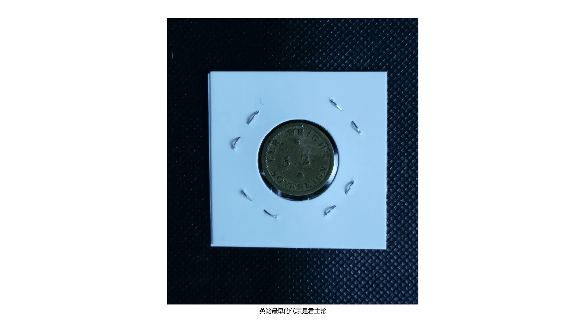

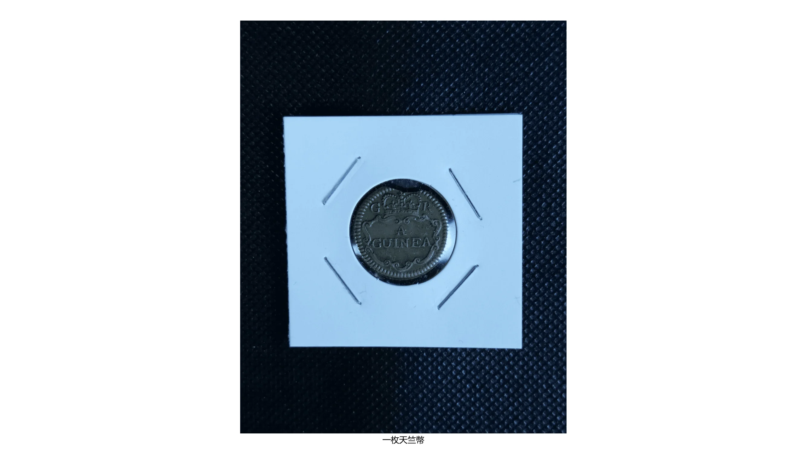

## 中央銀行的出現

<chapterId>15777771-1e28-55f7-a400-69868a47079b</chapterId>

:::video id=7661b7b5-e00f-48f3-b69a-6fb2eb5ebba4:::

接下來是關於第一批儲備貨幣的歷史及其演變的部分，下面是關於中央銀行出現的部分。這一部分與儲備貨幣的出現大致相同，但更著重於當時的銀行技術。

### 銀行和原始銀行的起源

早在 13 世紀，意大利人（佛羅倫斯、熱那亞、威尼斯......）就發展了複式記帳技術。後來，**安特衛普**（16 世紀）成為北歐的主要金融中心，後來由於阿姆斯特丹股票 Exchange (1609)，VOC 股票在此交易，**阿姆斯特丹**取代了安特衛普**的地位。

安特衛普 (Antwerp) 是商人集會的主辦地，商人經常聚集在此清償債務，從而發明了新的金融工具。下面這張日期為 1761 年且較新的票據是一張**期票**。它的特色是手寫的細節，以及背面的銘文，使其成為該時期的一件傑出藝術品。

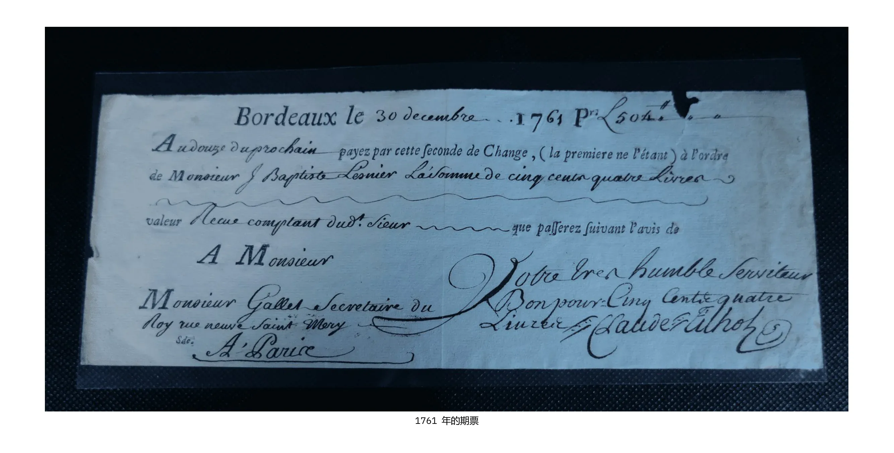

這種流動性導致了更複雜的銀行機構的建立。 **倫巴底銀行家**及後來的荷蘭商人完善了信用工具（匯票、本票等）。現代銀行體系就是基於這個理念：貨幣可以是信用，而不僅僅是金屬。

正如您所看到的，這讓我們回到了最初關於錢幣起源的問題。

貨幣是源自於交換需求而產生的商品，還是源自於信用？在本節中仍然可以找到蛛絲馬跡。

### 瑞典的例子：Stockholms Banco 和 Riksens Ständers Bank

讓我們來看看瑞典，第一家中央銀行就是在瑞典創立的。

**瑞典**是中央銀行的先驅：1657 年，Johan Palmstruch 創立了**Stockholm Banco**，授權其貸款超過其金屬儲備，從而標誌著[部分儲備金制度](https://planb.academy/resources/glossary/fractional-reserves)的誕生。但是過度的紙幣發行導致了恐慌和 1663 年的擠提。好吧，好吧...

1668 年，世界上第一家真正的中央銀行 Riksens Ständers Bank 在斯德哥爾摩成立。然而，它也遭受了與濫用紙幣有關的危機（1709 年、1715 年......），濫用紙幣往往是為了資助王國的戰爭。

### 羅約翰的失敗政變

讓我們前往法國，在那裡我們再次找到我們心愛的 John Law。

**蘇格蘭人約翰-羅**說服攝政王（奧爾良公爵）創立了一家私人銀行，即總銀行（1716 年），獲准發行紙幣以抵償金銀和政府債務。這家銀行後來變成了皇家銀行（Banque Royale，1718 年），幫助密西西比公司的股價飆升。

當現實追上投機，**決定禁止持有黃金並強制使用羅氏紙幣**，恐慌更加劇烈。好吧，好吧...

最後，泡沫在 1720 年爆破，導致崩盤，在未來很長一段時間內，紙幣在法國的可信度都毀於一旦。

### 阿姆斯特丹銀行，先驅模式的崛起

我們現在被帶到 1609 年的阿姆斯特丹，阿姆斯特丹**銀行 (Wisselbank) 奪取了阿姆斯特丹硬幣保管和兌換的控制權。它禁止私人紙幣流通，並強制將金屬硬幣存放在其保險庫裡。他們逐漸奪取了貨幣的控制權。他們禁止貨幣兌換商存放硬幣。貨幣兌換商整天工作，下班後必須將硬幣存入阿姆斯特丹銀行的金庫。正如我所提到的，在國際貿易中使用的不一定是金屬硬幣。它是銀行帳簿上的經文錢。

由於荷蘭商人的力量，該銀行扮演了第一個實際上「中央銀行」的角色，穩定了世界貿易。然而，隨著時間的推移，它向 VOC 提供了無抵押貸款，最終耗盡了支持其鈔票的金屬。1790 年，它出現了借出大筆款項給 VOC 的情況，幾乎宣佈破產，破壞了古登的信譽。好吧，好吧...

### 英格蘭銀行，現代銀行業的創始者

在 17 世紀的英格蘭，金銀由金匠儲存，並由他們發出收據。當英國王室發現自己在對法戰爭中需要大量資金時，這種部分分散的組織方式就證明了它的局限性。

1694 年，**英格蘭銀行 (BoE)** 成立。英格蘭銀行就這樣誕生了，它是倫敦商界與急於為戰爭尋找資金的政府之間的便利婚姻。

銀行取得了在英國發行紙幣的壟斷權（在 1708 年、1742 年等得到加強）。從那時起，由黃金儲備支持的紙幣與硬幣一起流通。這是理解國家機構逐步接管貨幣的重要一點。首先，阿姆斯特丹銀行阻止貨幣兌換商保存硬幣，並迫使他們將硬幣歸還給銀行。在英格蘭，私人銀行被禁止發行自己的可贖回黃金的票據。

他們允許私人銀行發行紙幣，但這些紙幣只能兌換英格蘭銀行的鈔票。

英格蘭銀行的英鎊鈔票可以用黃金贖回。這為貨幣增加了第三層。所以我們有黃金作為基礎，然後是英格蘭銀行的票據，再上面是私人銀行的票據。在此之前，私人銀行可以發行自己的可兌換黃金的票據。這是國家機構逐步接管貨幣的另一個階段。

該銀行以大量貸款資助國家，並結構了龐大的公共債務，為經濟繁榮提供資金。

這種模式在 18 世紀和 19 世紀得到了鞏固，以至於英鎊在英格蘭銀行和金本位制的封印下成為了世界儲備貨幣。

**世界上的儲備貨幣**在過去的幾個世紀裡，在一個國家或帝國的經濟、商業和軍事力量的推動下，彼此相繼出現：葡萄牙、西班牙、荷蘭，然後是英國，最後才是美國在 20 世紀的主導地位。在每個案例中，我們都看到類似的循環：經濟擴張、商業成功、國際採用貨幣、負債、昂貴的戰爭、濫用貨幣創造或信貸，最後是衰落。

**** 中央銀行的出現是一個循序漸進的過程。這些機構通常出現在代價高昂的戰爭背景下，使國家能夠通過債務來為自己融資。當金本位制被採用時（英國，17-19世紀），它提供了穩定的外衣，直到20世紀的大世界戰爭導致黃金兌換逐漸被放棄。鑄幣權因此從皇室壟斷轉移到更複雜的實體，先是私人（金匠、銀行家），然後是半公開（中央銀行），反映出貨幣主權朝向制度化、全球化形式的演進。

所以，這就是我之前所描述的。我們經常將主權債務的負擔直接轉嫁給中央銀行，或是由法律機構（如國會）允許創造貨幣。

而這裏最重要的事實是，***我們已經從一個可以透過主權破產而消失的債務，變成了一個主要由民眾承擔的債務。

## 通往法定系統之路

<chapterId>27a98545-d350-56ee-a200-92468e6b9b33</chapterId>

:::video id=e27a753e-aeee-4307-a65c-9506aab380a1:::

我們現在已經到了這個關於貨幣歷史的課程的尾聲，為了給這個課程畫上一個句號，我想提出兩個主題。第一個主題是導致我們目前法定貨幣系統的各個階段。我們將重溫第 5 節中有關中央銀行創建的事實，並加入美元的概念，美元最終成為當前的儲備貨幣。我們會看看它是如何演變的，美元是如何產生的，它是如何演變的，它是如何改變的，它經歷了哪些階段才成為法定貨幣體系，因為美元的起源是銀幣。

緊接著，我會給大家介紹一小段金融史，幫助大家瞭解我們是如何達到福利國家的。因此，我們將看兩個主題：我們如何達到法幣系統，然後緊接著，金融的演變如何引領我們達到福利國家的概念。

### 歐洲現代銀行業的基礎

讓我們回到 13 世紀的弗羅林。要了解我們如何達到法幣模式，我們需要從 13 世紀開始。除了弗羅林，與美第奇家族同時出現的還有一種技術，那就是匯票的概念。

之後，安特衛普的證券交易所出現了貼現和期票的概念。

之後，正如我們所見，我們有了 VOC，即阿姆斯特丹的第一個股票市場。這標誌著資本主義的誕生，有了公司股票和股票交換。阿姆斯特丹銀行隨後頒布法令，強制使用存款。這意味著硬幣必須在一天結束時存入銀行。貨幣兌換商不能再以硬幣形式保存零錢。

接著是英格蘭銀行的創立 出於17世紀末創造債務為戰爭融資的需要在那個時候，私人銀行成為了貨幣的第三層。順便說一下，這整個部分，從弗羅林到中央銀行創建的概念，在 Nick Bhatia 的名著 "Layered Money "中有非常好的總結，我有幸和幾個同事一起翻譯了這本書。我們做了很好的翻譯工作，讓各地講法語的人都能從這些教導中獲益。

所以我們在17世紀末英格蘭銀行的建立是為了資助戰爭

私人銀行接管了第三層貨幣。事實上，私人銀行的票據不再可以黃金兌換：英格蘭銀行的票據才可以黃金兌換。這表明英格蘭銀行這個機構奪取了兌換權。

然後就是1776年的恐慌每個人都衝向金字塔的頂端這意味著在1776年，銀行出現了擠提 所有擁有第三層紙幣的人，也就是私人銀行的票據 試圖得到英格蘭銀行的票據，然後試圖得到黃金 但顯然金庫裡沒有足夠的黃金他們宣佈了一種銀行假日 以避免償還黃金票據 這就產生了最後貸款人的概念

### 美元的演變

我們從弗羅林過渡到英格蘭銀行的建立。當然，其間發生了第一次和第二次世界大戰，但在更早的1796年，大西洋的另一邊也發生了一些發展。1776 年，美國仍然是英國的殖民地，殖民地使用這種紙幣。下面是 1776 年康涅狄格州的兩先令紙幣。

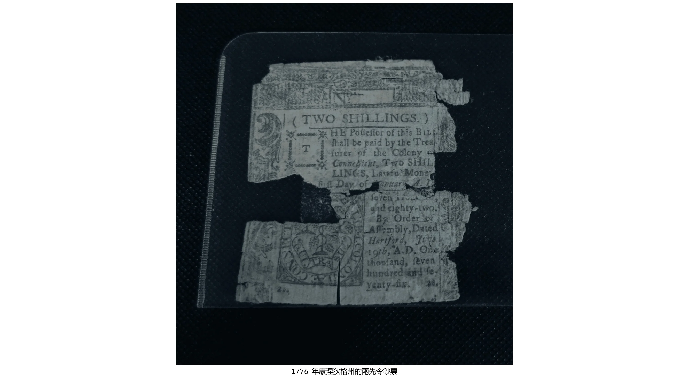

在向英格蘭宣戰並最終發行自己的貨幣之前，殖民地使用這種紙幣與西班牙的美元一起進行現金交易。事實上，「美元 」一詞一直用來表示美國美元。

如果我沒弄錯的話，在1792年，他們通過了一項法律，允許他們鑄造貨幣。舉例來說，下面這張是現代的美國美元。

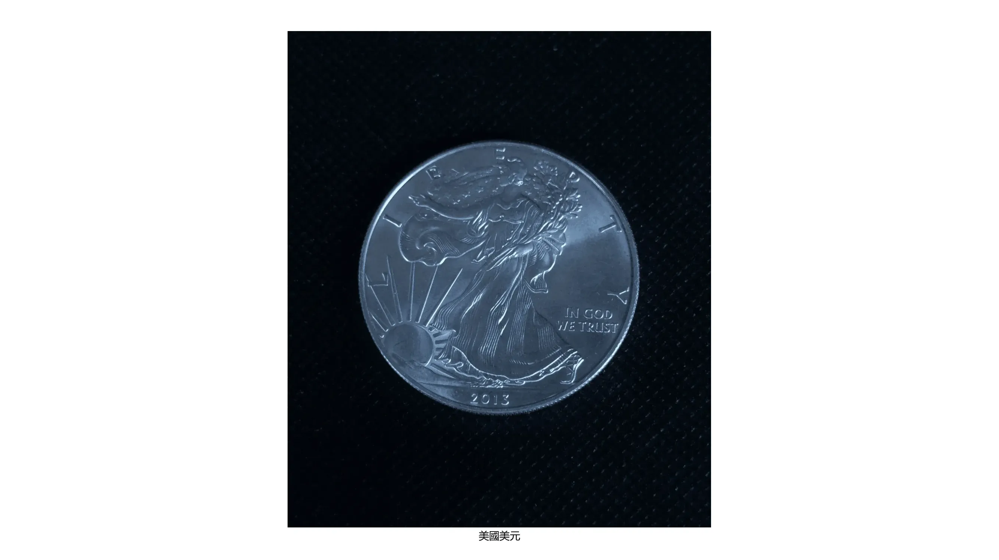

很明顯，它的面值並非只有一美元；它的價值約為 30 或 40 美元，因為它代表一盎司白銀。它的價值會根據銀價浮動，通常至少在 30 或 40 美元左右。當然，今天的紙幣只保留了一美元的面值，但在當時，美元是以這種銀價值為基礎的。

現在讓我們來談談美國的南北戰爭。邦聯印鈔，出現了超級膨脹。這種現象並沒有被列入官方的 Hanke-Krus 名單中，因為它並沒有達到 50% 的超級膨脹率。然而，它的月通貨膨脹率確實達到了 40%，這表明在戰爭期間印刷了大量的貨幣。

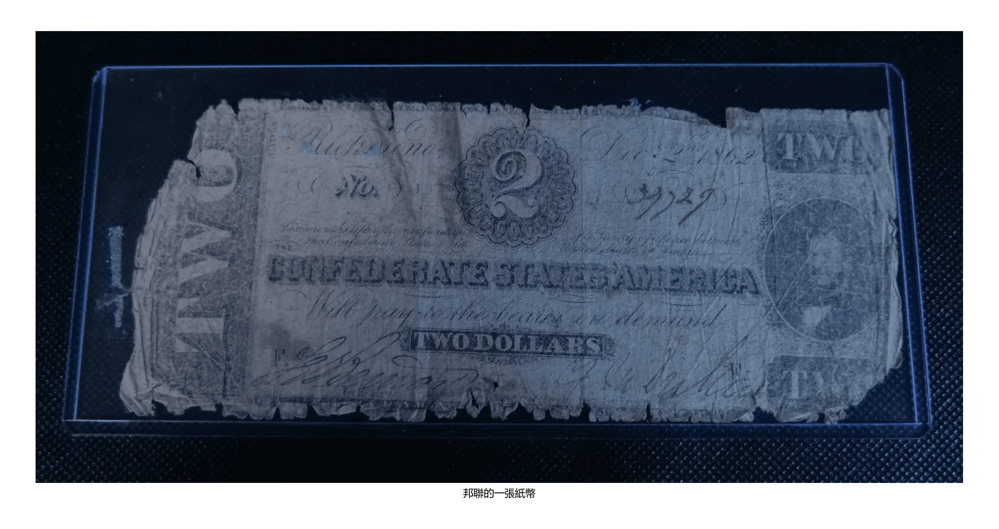

他們的北方對手也有美元。就在上面，您可以看到邦聯的美元，而在下面，您可以觀察到北方的美元。它們被稱為 「綠幣」，因為背面是綠色的。

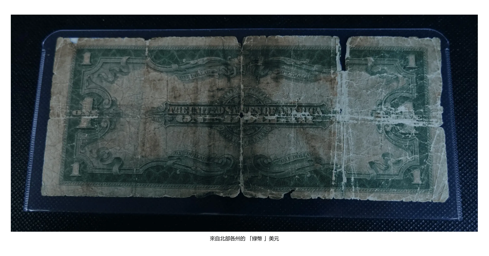

我請您比較一下與現代鈔票在尺寸上的差異。當時的鈔票比較大。

正如我們所知，北方贏了，所以綠幣成為了統一後的美國各州的貨幣。接著是1913年FED的成立，以及第一次世界大戰。

在第一次世界大戰之後，最後一系列印刷的鈔票上總是有 「可按要求兌換黃金 」的字樣。因此，在 1928 年，20 美元幾乎可以買到一盎司黃金，因為當時的黃金價格是 20.67 美元。下圖中的鈔票在 1928 年可以購買一盎司黃金。

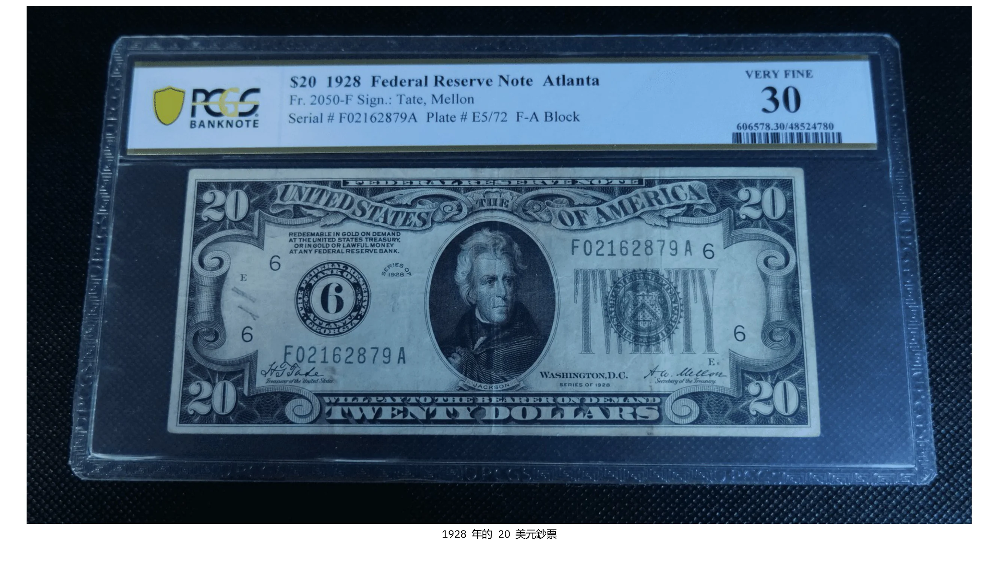

今天，一盎司黃金價值 3000 美元。當然，您可以在此看到貶值的力量。這是最後一份包含 「可兌換黃金 」字樣的法案。我們會看到就在6102號行政命令之後，他們會沒收所有的黃金。事實上，他們會沒收黃金和黃金證書。

下面您可以看到 1928 年的黃金證書。

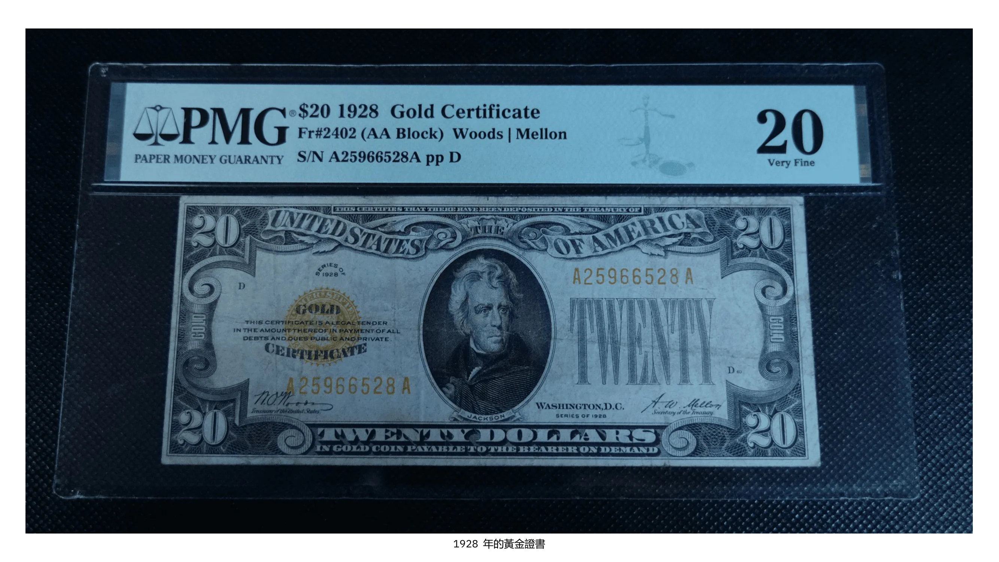

它不僅可以像 1928 年的鈔票一樣「以黃金兌換」，還可以用金幣兌換：它真的是「黃金證書」。在 6102 號行政命令之後，它們都被沒收了。直到 1964 年，擁有它們甚至是非法的。

我很高興能擁有一個。

從 1964 年開始，擁有黃金成為非法行為，直到 1974 年，如果我沒弄錯的話。在 70 年代，他們允許人們在尼克松震盪之後積累黃金，我們稍後會描述這一點。在 1933 年，當他們頒布「第 6102 號行政命令」時，他們查封了黃金，擁有黃金成為非法行為。如果你被抓到持有黃金，你會被判入獄。在那些日子裡，每盎司黃金在1934年後都會被兌換成與下面相似的鈔票。

正如我們所說，在 1928 年，一美元上仍然印有「可兌換黃金」的字樣。

在第 6102 號行政命令頒佈後，他們查封了所有黃金，並以 20.67 美元兌換每盎司黃金。之後，騙局曝光了：他們在 1934 年發行了新的鈔票，上面印有「本鈔票是所有債務的法定貨幣」。

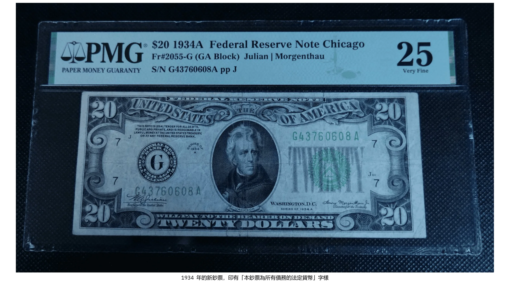

這裏出現了法定貨幣的概念，取代了「可兌換黃金」一詞。這兩張鈔票看起來一模一樣，只有幾個字有所改變，但騙局就在於美元在這段期間貶值；美元從每盎司黃金 20.67 美元降至 1934 年的每盎司 35 美元。這代表了大約 40% 的貶值！

隨後，第二次世界大戰爆發。戰後，《布雷頓森林協定》將世界上的大部分黃金集中到美國。美國人發行紙幣作為交換，但這些紙幣不再能被一般公眾兌換為黃金。相反，它們仍然可以在州的層面上兌換黃金。

最終，法國和德國等國家開始懷疑，美國金庫中流通的美元鈔票可能比黃金還多。

所以他們要求遣返他們的黃金他們說：「好吧，我們會做的，但需要一點時間」1971年，我們的朋友理查德-尼克松一勞永逸地 切斷了紙幣和黃金之間的聯繫 在這個過程中他把責任歸咎於投機者

黃金價格被低估為每盎司 35 美元，這個價格並不符合印製的貨幣數量或其真正的市場價值。在短短幾年間，價格從 34 美元飆升到 800 美元。與歷史上的例子類似，例如在羅馬，當 denarius 與 solidus 之間的聯繫被切斷時，黃金被允許浮動。這導致了黃金價格的發現過程，從此以美元計價的黃金價格大幅提高。

### 現代法定貨幣系統及其影響

這部分總結了我們是如何從以白銀或黃金為基礎的貨幣體系轉移過來的。一點一滴地，機構在貨幣上獲得了越來越多的權力。最終，在超額發行之後，一個單方面的決定完全切斷了貴金屬和貨幣之間的聯繫。

因此，黃金與紙幣或經文錢之間不再有任何關聯。它甚至不是部分儲備金制度 - 那是個過時的概念。取而代之的是，私人銀行通過銀行信貸發行和創造貨幣。貨幣主要是這樣被創造出來的，並且與中央銀行設定的關鍵利率相關。

真的沒有限制。至少在美國和加拿大，不再有強制性的儲備水平。唯一的儲備是銀行需要安排能夠回應銀行間的交換，以免流動資金耗盡。

他們只需要確保能夠進行這些轉移，但沒有 3%、1%、10% 的強制性儲備金。我們已經真正擺脫了部分儲備金的概念。現在，是中央銀行、政府透過財政赤字、中央銀行透過量化寬鬆政策（QE），以及私人銀行透過創造銀行貸款，可以增加貨幣供應總量，在我看來，造成通貨膨脹。

要瞭解貨幣與通貨膨脹之間的關係，我推薦您學習我在 Plan ₿ Academy 上專門針對這個主題的課程。您將學習到物價上漲與通貨膨脹之間的區別，物價上漲是我們在生活中看到的，而通貨膨脹則是我們在生活中看到的。它們不是一回事。事實上，當我們提到通貨膨脹時，我們通常說的是價格上漲，而不是通貨膨脹本身。通貨膨脹是一個相當精確的概念，以貨幣供應的增加來解釋。

https://planb.academy/courses/caa75343-ac90-4249-bcca-0e2e57c3a0f1

在結束本節關於法定貨幣世界的內容之前，我想指出一項資源，以協助您更好地理解我剛才所解釋的現象，例如通貨膨脹。

感謝您的關注。

## 資金泡沫的歷史

<chapterId>b6451c46-917d-11f0-97de-6bc5081765fa</chapterId>

:::video id=5967d9a6-aae4-4b84-a283-71b1b735bca4:::

### 紙幣的發明和第一次大泡沫

隨著 18 世紀中央銀行的建立，一場真正的革命誕生了：以紙幣形式出現的魔術錢。法國最引人注目的例子是約翰羅。這位流亡巴黎的蘇格蘭人向攝政王奧爾良公爵提出了一個解決王室財政破產的方案，即創建一家國家銀行和一家殖民地貿易公司：著名的**皇家銀行**和**密西西比公司**。

有了這個系統，羅把紙幣和他公司的股票聯繫起來。流通的紙幣越多，股份的價值就越高，銀行看起來就越穩固......直到投機超過了現實。泡沫在 1720 年突然爆破，摧毀了貴族、資產階級，以及在 Quincampoix 街投機的大部分歐洲人。其結果是：法國人對紙幣的長期不信任，以及歐洲對投機泡沫的第一次教訓。

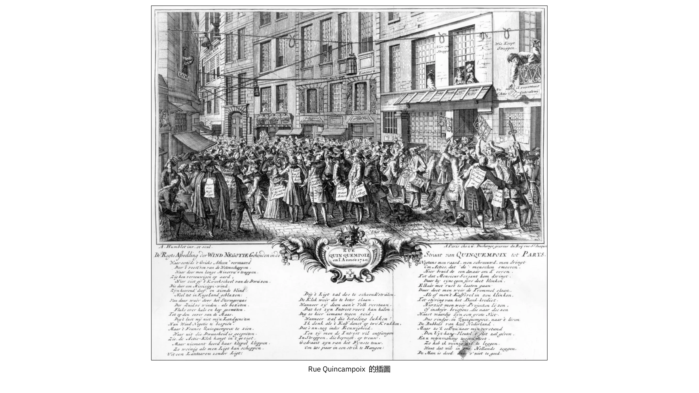

### 當土地成為「抵押品」時

一個世紀之後，法國大革命以**assignats**開創了新局面，這是一種以攫取的教會財產為擔保的貨幣。紙上談兵的想法很吸引人 - 將土地轉變為貨幣抵押品 - 但效果不彰：土地既不能流動也不能分割。結果是：惡性通貨膨脹、多種土地使用禁令、無法控制的通貨膨脹和短缺。

拿破崙深受這場混亂的影響，於 1800 年成立了法國銀行，重新確立了金銀作為貨幣基礎，從而保證了他的軍隊的正常支付。重拾信心的務實方法：以硬通貨支付。

### 咆哮的二十年代和 1929 年的大蕭條

讓我們跳過兩個世紀。第一次世界大戰之後，各國政府通過通貨膨脹和懸浮黃金為戰爭提供資金。在二十世紀二十年代，美國聯儲局奉行過度寬鬆的貨幣政策，以支持英鎊。結果是：輕鬆的信貸、華爾街肆無忌憚的投機、賒購股票，以及房地產和銀行泡沫的出現。

當這台機器失靈時，1929 年的崩盤就不可避免：大量銀行倒閉、失業率創新高、施粥處大排長龍。這導致人們一直誤以為**所有的通貨緊縮都是壞的**，而我們需要區分透過成長（健康的）產生的通貨緊縮和透過債務（破壞性的）產生的通貨緊縮。

### 90 年代的亞洲與骨牌效應

20 世紀 90 年代，「亞洲奇蹟」讓全世界都在做夢。Exchange 匯率與美元掛鉤，成長率達到 8-10%，西方資金紛紛湧入。一切都很美好......直到潮水退去。破產一浪接一浪，貨幣貶值 80%，投資者身敗名裂。國際貨幣基金組織（IMF）不得不介入，實施痛苦的改革。一如往常的情形：資金充裕、信貸帶來泡沫，然後崩潰。

### 2008 年與永久泡沫時代

網際網路泡沫（2000 年）之後是次級房地產泡沫。證券化將銀行貸款轉變為「三A」級的金融產品，散佈在世界各地。承諾：透過稀釋風險來消除風險。現實是：所有風險其實都是相關的。當房地產崩潰時，整個全球銀行體系也崩潰了。

結果是：大規模的公共救助、量化寬鬆政策和零利率。隨之而來的是一哄而上：每一次危機都不再會清除過度的行為，而是以越來越多的債務和印鈔機來掩蓋。這就是導致目前情況的原因： **一切泡沫 "**，一切事物 - 股票、房地產、藝術品、加密貨幣，甚至 Pokémon 卡 - 都在人為地膨脹。

### 魔術金錢的永恆回歸

從一個世紀到下一個世紀，有一個永恆不變的現象：只要社會相信可以用金錢而不是生產實物來創造財富，泡沫就會出現。從約翰‧羅到 2008 年，從 Quincampoix 街到華爾街，這個過程不斷重演：興奮、信貸、繁榮、衰退。

到最後，當沒有人再相信紙張時，人們總會尋找其他東西--黃金、土地、避風港......或新貨幣。昨天拿破侖強加金屬，今天有些人將 Bitcoin 視為繼任者。

金融史是一個永無止境的循環：印刷、投機、崩潰。直到下一個泡沫。

## 金錢與暴力

<chapterId>9486fe64-854f-5e17-86b3-8873baca39a8</chapterId>

:::video id=bd6d0807-2d8f-4637-a0f5-1e990e5c0d0f:::

這一小節將重溫我們在整個課程中已見過的許多事件，總結一些我認為有趣的軼事。

### 技術與暴力

以下是一些我們在課程中可能已經談過的趣聞軼事。我和 Theo 就他在 B-Ondy 所做的一次演講進行了非常精彩的討論，我覺得就科技進步如何影響人民與國家之間的暴力關係而言，這次演講非常有趣。

### 金錢與國家強制

為了介紹這一節，我會給您一個簡短且不詳盡的清單，只想提醒您我們可能已經在課程中涵蓋過的事件。

我已經可以把金錢和暴力聯繫起來，那就是當涉及到可以無限次印刷的不值錢的紙幣時，往往會附帶各種規則和各種威脅。我們已經可以談到 "assignats"，在那裡，鈔票上真的寫著偽造者會受到死亡的威脅。我們很容易在當時的法律文本中找到對那些不接受這種著名紙幣的人的死亡威脅。

為了繼續留在法國，在我能夠得到的一份大革命時期的法律文本中，我看到與貨幣相關的部分描述了運送和操作斷頭台的 「日薪」。我覺得這頗為古怪。

我們也談過中國的錢幣，由國家監督鑄造。我們在課程開始時的一個小節中看到，當一些不太美觀的錢幣被丟棄時，會產生法律後果。

還有一則關於英國國王的軼事：如果鑄造鈔票的人的行為不符合他的期望，他就會砍掉他們的手。

此外，在中國，我曾讀過有關佛教寺院銅被搶劫的報導。當時銅價不斷漲高，使他們的經濟不穩定 - 他們的經濟是建立在一種與金屬價值無多大關係的法幣上 - 他們只好找一個有財富的地方，從寺院中搶奪銅。

英國宗教改革時期，英國的修道院也是如此。當著名的國王因離婚問題與教宗爭吵時，背後還有另一個原因：他利用廢除修道院的機會，攫取這些教會組織所包含的財富。

法國大革命期間，他們查封了教會的所有資產。他們看到用熔化的教堂鐘聲製造出美麗的錢幣。

如果我們再往前追溯，其中一個最明顯的經濟暴力與自由、自由殺手法律的概念，就是***戴克里先（Diocletian）的世襲種性，這與農民不再願意接受貶值貨幣***的事實直接相關。他們想離開自己的農業，而戴克里先的反應只是告訴他們：「你不能離開你的土地，你的孩子也不能離開」。士兵也是一樣。

我認為這是一種相當明確的暴力形式。我可以以聖殿騎士團或法國國王做為結論。當聖殿騎士團在法國定居時，我想像他看到了聖殿騎士團的財富甘露，並遇到了國家資金的問題。他控告了聖殿騎士團，其中一些人得以帶著部分寶藏離開，因此在美國或加拿大產生了一個非常有趣的節目。我不知道誰製作了這個節目，但它叫做「橡樹島之謎」（*The Mystery of Oak Island*）。它講述的是有人認為在加拿大Maritimes的一個島上埋藏著聖殿騎士團的寶藏，他們已經鑽了很多年--甚至可能超過十年--打了某種井。他們發現了一口有很多長廊的井，他們正在尋找聖殿騎士團埋藏在這個島上的寶藏，也就是這部電視劇的主題。我向我的父親致敬，他是這部電視劇的忠實觀眾。

就是這樣：我們在這個課程中看到的一些事實，我認為這些事實提高了與暴力的聯繫。接下來，Theo 會告訴我們一個非常有趣的故事，關於科技變遷以及平民與權貴之間的權力平衡。

謝謝！

## 有組織暴力的經濟後果

<chapterId>66bd4674-2159-5489-ad4b-ec5e3fb691af</chapterId>

:::video id=c8b063c6-aeb4-4a94-9027-b11d369e71a4:::

### 有組織的暴力和國家的演變

歷史學家 Frederic C. Lane 提出了一個革命性的論點：歷史上的國家解剖是由用來投射暴力的技術所塑造的。從國家壟斷合法暴力的 Weberian 原則出發，Lane 觀察到這種壟斷--自相矛盾的是，在這個領域中比競爭更有效率--是根據攻擊成本與防禦成本之間的關係而演變的。

主權個體」(1997) 一書的作者接手了這項分析，解釋了政治組織的歷史變遷：從中世紀的封建制度到文藝復興時期的城邦，再到工業民族國家，最後到現代福利國家。每次轉變都與行使暴力的重大技術突破相對應，大約每 400-500 年發生一次。

### 中世紀平衡

在中世紀，農業經濟佔了 90% 以上的主導地位。農民扎根在自己的土地上，無法逃離領主和他的騎士。軍事技術 - 手工鍛造的盔甲、長年累月的劍術訓練 - 極為昂貴。這種不對稱的情況大大有利於攻擊而非防守。

無法移動的農業生產者成為當地暴力壟斷者的俘虜。他榨取稅金的能力達到了新的高度 - 儘管矛盾的是，與現代 78% 的強制性徵稅相比，中世紀的稅收仍然不高。領主可以隨意徵稅，因為農民既無法反抗，也無法離開。

### 商人文藝復興

北方漢薩貿易和南方地中海貿易的出現改變了局面。商人是附加價值的主要創造者，他們擁有流動資本 - 船舶。他們只需要輕裝的海上民兵，因為海上的警衛很難維持。最重要的是，如果稅收過重，他們可以很容易地遷移到鄰近的港口。

這種流動性造成城邦間的稅務競爭。威尼斯、熱那亞和布魯日必須盡可能提供最自由的架構：可靠的合約、優質的貨幣、保險、最低的稅收。王公必須引誘而非強迫。對稱反轉：防禦（通過逃亡）變得比攻擊容易。

### 工業時代

工業革命帶來了類似封建主義的配置。工廠、鐵路和流水線代表著大量固定的投資。亨利福特（Henry Ford）在面對稅收時無法將工廠遷移。工人集中在工業城市，他們組織工會進行集體談判，而非個別遷移。

福利國家」出現了：工業規劃（日本、韓國）、基礎設施的軍事保護、勞動人口的最低社會福利。第二次世界大戰說明了這種弱點：轟炸敵人工廠成為主導戰略。實體資本的集中使得大量的稅收被榨取，為福利國家提供資金。

### 微處理器革命

現在有三項技術創新正在打破這些古老的平衡。微處理器正在改變戰爭：內華達州的一名操作員在阿富汗駕駛一架無人機，外科手術般的精確。海灣戰爭（1991 年）證明了這一突破：世界第四大軍隊（伊拉克）在 45 天內被殲滅，聯軍一方的死亡人數不到 200 人。技術優勢使得正面攻擊變得不可能。

網際網路和非對稱加密技術正在徹底改變價值的創造。開發人員可以在任何地方使用 MacBook 和 Starlink 工作，即時免費輸出他們的產品。數位游牧民族擺脫了地理上的囚禁，讓國家與國家之間產生了自文藝復興以來從未見過的對抗。

Bitcoin 代表了這種邏輯的最高境界：一種從國家中解放出來的貨幣，受到不可侵犯的加密盾牌的保護。財富可以抵禦任何實體力量。個人重新獲得保護自己免受國家壟斷的能力。

### 威斯特伐利亞模式的瓦解

為工業時代所設計的西方福利國家正在過時。價值創造者 - 開發商、藝術家、金融家 - 正在遷移到新加坡、杜拜或薩爾瓦多，他們寧願選擇較少的公共服務，以換取最低的稅收。Apple 和 Tether 等現代巨頭既不需要辦公室，也不需要實體基礎設施。

這種人才外流會造成螺旋式上升：淨貢獻者減少、公共服務退化、留任者稅收增加，以及加速離任。國家必須徹底縮小規模，否則就會破產。分裂成小規模、具競爭力的司法管轄區 - 數位城邦的新模式 - 似乎無可避免。

歷史告訴我們，這些轉變需要幾代人的時間。但 Bitcoin 的貨幣與國家分離可能會加速這個過程。個人現在可以用腳和他們的加密錢包投票，重新繪製全球權力地圖，而我們才剛剛開始察覺到這一點。

## 金融簡史

<chapterId>1d37fff1-a091-5034-8e71-4af590b8ffce</chapterId>

:::video id=fdfabbc6-e4d8-463a-8522-19176f8fb460:::

隨著這段貨幣歷史的介紹，我想快速而簡潔地解釋一下金融的演變，它最終導致了福利國家。最初，在羅馬時代，我們有硬幣。

硬幣是一種金融技術，讓帝國可以支付士兵、擴張和貿易。它運作得非常好，只是最終出現了太多的貶值。在某個時候，當他們停止擴張，不再從戰爭和領土擴張中得到戰利品時，他們的系統就崩潰了。

### 金融科技的演進

然後到了中世紀，當時的演變非常少，直到弗羅林（Florin）的出現，才重新帶來了穩定的貨幣，而義大利和安特衛普的銀行業發展，則發展出了「貨幣時間價值」的概念 - 換句話說，就是貼現。他們發展了貼現，創造了一種紙幣形式，其中發行了一種 「期票」，即承諾在稍後的某個日期，人們將能夠收回 100 美元加上利息。

這個系統創造了一種金融技術，允許持有者在期限結束前出售票據，因此如果您在 6 個月期限中的 4 個月後出售票據，此人實際上會支付溢價，以補償餘下 2 個月的收益損失。

這是當時在安特衛普和阿姆斯特丹開發的金融技術。後來，我們看到了中央銀行的演變和最後貸款人的概念。可以說，在阿姆斯特丹銀行時期 ，國際貿易中錢幣的使用被放棄了，轉而使用經文錢。

後來，在18世紀，在金融技術方面，我們可以談談保險。所以在Neil Ferguson的書 "The Ascent of Money "中有一個非常精彩的軼事。第一家誕生的保險公司叫做**蘇格蘭寡婦**，基本上，是神職人員希望為有時早逝、猝死的神父發展保險。神職人員當時要在蘇格蘭照顧他們的妻子和後代一年。因此，神職人員發現這一年的時間也許太短了一點。因此，***他們發明了精算***，根據早逝牧師的人數，從字面上計算出這個制度所需的供款人數，以支付其成本。

他們發展了精算的方法，說「好吧，每個牧師給我們這個數額。那麼，如果牧師去世了，保險公司會支付他的妻子和孩子的生存費用，直到他們自給自足為止。所以是第一家叫做「蘇格蘭寡婦」的保險公司普及了這個系統，也是它被部署的地方。

### 從私人保險到福利國家

所以保險是金融科技歷史的一部分。這讓我想到福利國家的概念，也就是私人保險最終會遇到一個問題，一個最佳化的概念，我們對自己說，如果我們提供健康保險給那些健康的人，他們可能對支付保費的興趣會降低，因為他們對自己說：「我很健康，我不會生病」。另一方面，知道自己生病的人當然會想要投保。

這個制度造成生病的人會投保健康保險，而健康的人則可能投保較少，兩者之間產生不平衡。因此就有一種不平衡：如果你計算這些數字，它們就不會平衡，因為你可能無法為足夠的健康人投保，以抵銷成本。在經濟學中，這是**道德風險**的概念。

其中一個被提出來的想法是強制保險。如果每個人都有義務供款，就能重新平衡整件事，健康與不健康的人都會供款，將風險分攤給最多人。

因此，在世界許多地方，國家會說：「好吧，我們會處理這個問題」。雖然我不是這方面的專家，但我可以看出，同樣的道理也可能適用於各種其他形式的保險，例如失業保險。有一種簡化和最佳化的願望，是基於這樣的想法：如果只有一個組織來處理，就會更簡單。

在我看來，這導致了所有這些保險概念的集中化，並最終促成了福利國家的誕生，所有這些原本屬於私人企業的金融概念、為滿足保險市場在人口中分散風險的需求而提出的私人倡議，都被國家抓住不放，其原因可能與道德風險和優化的慾望有關，而這些慾望是相當合乎邏輯的。

### 國家壟斷的替代模式與反思

最後，在某些國家，例如加拿大，我們有幾種保險 - 健康保險、失業保險 - 是由國家壟斷的。

我可以舉一個我知道的例子。在瑞士，制度有點不同。瑞士有私人互惠保險公司和私人醫院，因此您可以選擇您的互惠保險公司，您可以選擇您的互惠保險公司內的套餐。您仍然可以獲得相對普及的服務，儘管這個系統的很大一部分仍然是私營的。

所以我覺得也有可能是私人經營的。但我想向大家描述的一切，其實不是表達一種制度是否比另一種好，而是想向大家解釋，在閱讀金融歷史的過程中，我意識到為什麼在西方，特別是在法國，特別是在加拿大，國家想控制這些金融原則。

我想說的是，保險的概念首先是金融的演變，而政府有時候很擅長這樣做，他們會試圖控制保險，就像他們試圖控制金錢一樣，原因有幾個。順帶一提，其中一個原因就是最後貸款人的概念。

這個想法是，如果背後有一個大機構，可以更廣泛地分散風險，那就會好得多。這就是最後貸款人概念背後的最初倡議，這個機構實際上可以選擇那些足以生存的機構，並通過借錢給它們來防止它們倒閉。

當時，當這個概念終於第一次出現時，確實有一個分析，但最後的結果是，我們拯救了所有人，「大到不能倒」，它適用於幾乎所有的銀行，因為有中央集权，也適用於所有的大公司。最後，我們看到它仍然是一個由國家「廣泛」應用的概念，類似於我剛才向大家描述的保險概念。

最後，國家決定由它來照顧一切，把蘇格蘭為解決特定問題而創造的金融技術，變成我們今天所知的龐大福利國家。它使用精算財務原則來為有需要的人口提供服務。然而，我們可以同意，這個系統所產生的壟斷會造成各種問題，而我們目前在加拿大和法國等國家正經歷這些問題。幸運的是，有不同的模式存在，例如瑞士的模式。

我們只需認識到，福利國家的概念源自金融。這種意識表明，除了著名的國家壟斷之外，我們還可以探索其他的途徑，我甚至會將這種推理應用到中央銀行作為最後貸款人的概念上 - 但這是另一個話題了。

# 最後部分

<partId>9bada469-7ef0-511a-9eaa-f8eb66d5906f</partId>

## 評估本課程

<chapterId>a9494e2b-8a4d-5811-8a7b-b4a91fb22778</chapterId>

<isCourseReview>true</isCourseReview>

## 總結

<chapterId>1094e793-b4c6-5782-aa4a-71cde00ce7c0</chapterId>

<isCourseConclusion>true</isCourseConclusion>