# Perjalanan ke Lapisan Kedua Bitcoin 

Memahami inti dari Lightning Network (Jaringan Lightning), sebuah sistem penting untuk masa depan transaksi Bitcoin. LNP201 adalah kursus teoretis tentang cara kerja teknis Lightning. Kursus ini menjelaskan fondasi dan mekanisme dari jaringan lapisan kedua ini, yang dirancang untuk membuat pembayaran Bitcoin cepat, ekonomis, dan dapat digunakan oleh banyak pengguna secara bersamaan.

Berkat jaringan saluran pembayarannya, Lightning memungkinkan transaksi cepat dan aman tanpa mencatat setiap pertukaran di blockchain Bitcoin. Sepanjang bab, Anda akan belajar bagaimana pembukaan, pengelolaan, dan penutupan saluran bekerja, bagaimana pembayaran dirutekan melalui node perantara secara aman dengan meminimalkan kebutuhan akan kepercayaan, serta bagaimana mengelola likuiditas. Anda akan memahami apa itu transaksi komitmen, _HTLC_, _revocation key_ (kunci pembatalan), mekanisme hukuman, _onion routing_, dan _invoice_ (permintaan pembayaran).

Entah Anda pemula dalam Bitcoin ataupun sudah berpengalaman, kursus ini akan memberikan informasi berharga untuk memahami dan menggunakan Lightning Network (Jaringan Lightning). Meskipun kami akan membahas beberapa dasar cara kerja Bitcoin di bagian awal, sangat penting untuk menguasai dasar-dasar penemuan Satoshi sebelum membahas lebih dalam LNP201.

Nikmati penemuan Anda!

+++

# Pendahuluan
<partId>9da7290a-3895-49a2-93ea-2a6272ca4af4</partId>

## Gambaran Umum Kursus
<chapterId>f2e71062-5121-4114-a7f8-27df69884ce8</chapterId>

Selamat datang di kursus LNP201!

Pelatihan ini bertujuan untuk memberikan pemahaman mendalam tentang teknis Lightning Network (Jaringan Lightning), sebuah jaringan lapisan tambahan yang dirancang untuk memfasilitasi transaksi bitcoin dengan cepat dan seringkali dengan biaya lebih rendah. Anda akan secara bertahap memahami konsep mendasar yang mengatur Jaringan Lightning ini, mulai dari membuka saluran pembayaran hingga teknik routing dan manajemen likuiditas.

**Bagian 1: Dasar-Dasar**  
Kita akan mulai dengan pengenalan umum tentang Lightning Network (Jaringan Lightning), untuk memahami dasar-dasar penting terkait Bitcoin, Address, UTXO, dan cara kerja transaksi. Hal-hal dasar ini sangat penting untuk memahami bagaimana Lightning Network (Jaringan Lightning) bergantung pada mekanisme blockchain yang melandasinya agar dapat beroperasi dengan aman.

**Bagian 2: Pembukaan dan Penutupan Saluran**  
Pada bagian ini, kita akan membahas proses pembukaan saluran, yang merupakan landasan dari Lightning Network (Jaringan Lightning). Anda akan mempelajari bagaimana transaksi komitmen dibuat, peran revocation key (kunci pembatalan) dalam menjaga keamanan, serta bagaimana saluran dapat ditutup secara kolaboratif maupun sepihak. Setiap langkah akan dijelaskan secara rinci dan teknis agar Anda dapat memahami semua seluk beluknya dengan baik.

**Bagian 3: Jaringan Likuiditas**  
Lightning Network (Jaringan Lightning) tidak terbatas pada saluran pembayaran antar individu, ini adalah jaringan pembayaran nyata yang dapat digunakan secara luas. Kita akan melihat bagaimana transaksi dapat dirutekan melalui node perantara menggunakan HTLC. Bagian ini juga akan menjelaskan tantangan likuiditas masuk (_inbound_) dan keluar (_outbound_).

**Bagian 4: Alat-Alat Jaringan Lightning**  
Bagian ini memperkenalkan berbagai fitur praktis dalam Lightning Network (Jaringan Lightning), seperti *Invoice*, *LNURL*, dan *Keysend*. Anda juga akan mempelajari cara mengelola likuiditas saluran Anda, aspek penting untuk memastikan kelancaran pembayaran dan memaksimalkan efisiensi transaksi di Lightning.

**Bagian 5: Melangkah Lebih Jauh**  
Sebagai penutup pelatihan ini, kita akan merangkum kembali konsep-konsep yang telah dibahas serta memberikan pengantar untuk topik-topik lanjutan bagi Anda yang ingin memiliki pemahaman mendalam tentang Lightning Network (Jaringan Lightning).

Siap untuk mengungkap mekanisme teknis di balik Lightning Network (Jaringan Lightning)? Ayo kita mulai!

---

*Berikut beberapa istilah yang akan Anda temui dalam diagram kursus berbahasa Inggris, beserta terjemahannya untuk membantu Anda memahaminya dengan lebih baik dalam bahasa Anda:*

| Inggris            | Terjemahan - penjelasan       |
| ------------------ | ----------------------------- |
| *timelock*         | Kunci waktu                   |
| *Revocation Key*   | Kunci pencabutan              |
| *invoice*          | Faktur / permintaan pembayaran|
| *sig* (signature)  | Tanda tangan                  |
| *secret*           | Rahasia                       |
| *amount*           | Jumlah                        |
| *scan QR code*     | Pindai kode QR                |
| *Show QR code*     | Tampilkan kode QR             |
| *Asks the invoice* | Meminta faktur                |
| *Give the invoice* | Memberikan faktur             |
| *Payment*          | Pembayaran                    |
| *Preimage*         | Pra-gambar                    |

# Dasar-Dasar

<partId>32647d62-102b-509f-a3ba-ad1d6a4345f1</partId>

## Memahami Lightning Network

<chapterId>df6230ae-ff35-56ea-8651-8e65580730a8</chapterId>
:::video id=4315a277-12fe-4946-bb49-a807e60c09a7:::


Lightning Network (Jaringan Lightning) adalah jaringan saluran pembayaran yang dibangun di atas protokol Bitcoin, agar memungkinkan transaksi yang cepat dan dengan biaya rendah. Jaringan ini memungkinkan pembuatan saluran pembayaran antar peserta, di mana transaksi dapat dilakukan hampir secara instan dan dengan biaya minimal, tanpa perlu mencatat setiap transaksi secara individu di blockchain. Dengan demikian, Lightning Network (Jaringan Lightning) berupaya untuk meningkatkan skalabilitas Bitcoin dan membuatnya dapat digunakan untuk pembayaran bernilai kecil.

Sebelum membahas terkait "jaringan", penting untuk memahami konsep **saluran pembayaran** di Lightning, bagaimana cara kerjanya, dan spesifikasinya. Ini adalah fokus pembahasan pada bab pertama ini.

### Konsep Saluran Pembayaran

Saluran pembayaran memungkinkan dua pihak, sebagai contoh **Alice** dan **Bob**, untuk bertukar dana melalui Lightning Network (Jaringan Lightning). Setiap dari mereka memiliki sebuah node, yang dilambangkan dengan lingkaran, dan saluran di antara mereka dilambangkan dengan sebuah garis.


Dalam contoh ini, Alice memiliki 100.000 satoshi, dan Bob memiliki 30.000, dengan total 130.000 satoshi, yang akan menjadi **kapasitas saluran**.

**Tapi apa itu satoshi?**

**Satoshi** (atau "sat") adalah satuan nilai terkecil dari Bitcoin. Mirip dengan sen dalam euro, satoshi hanyalah pecahan dari Bitcoin. Satu satoshi sama dengan **0,00000001 Bitcoin**, atau satu per seratus juta dari satu Bitcoin. Penggunaan satoshi menjadi semakin praktis seiring dengan naiknya nilai Bitcoin.

### Alokasi Dana dalam Saluran

Mari kembali ke pembahasan tentang saluran pembayaran. Hal penting yang perlu dipahami di sini adalah "**sisi dari saluran**". Setiap peserta memiliki dana di sisi saluran mereka: Alice 100.000 satoshi dan Bob 30.000. Seperti yang sudah dijelaskan, jumlah dana ini mewakili kapasitas total dari saluran, yang ditetapkan ketika awal saluran dibuka.


Mari kita ambil contoh transaksi Lightning. Jika Alice ingin mengirim 40.000 satoshi ke Bob, hal ini dapat dilakukan karena Alice memiliki dana yang cukup (100.000 satoshi). Setelah transaksi ini, Alice akan memiliki 60.000 satoshi di sisinya dan Bob 70.000.


**Kapasitas saluran**, sebesar 130.000 satoshi, akan tetap sama. Yang berubah hanyalah penempatan dana antara Bob dan Alice. Sistem ini tidak mengizinkan seseorang mengirim dana melebihi saldo yang dimilikinya. Misalnya, jika Bob ingin mengirim kembali 80.000 satoshi ke Alice, hal tersebut tidak bisa dilakukan karena saldo Bob hanya 70.000 satoshi.

Cara lain untuk membayangkan alokasi dana adalah membayangkan sebuah **kursor** yang menunjukkan di mana dana berada di dalam saluran. Awalnya, dengan 100.000 satoshi untuk Alice dan 30.000 untuk Bob, kursor lebih condong ke sisi Bob karena Alice memiliki dana jauh lebih banyak. Setelah transaksi 40.000 satoshi, kursor akan sedikit bergeser ke arah Alice, yang sekarang memiliki 60.000 satoshi.


Gambar ini dapat membantu untuk membayangkan jumlah dana dalam saluran tersebut.

### Aturan Dasar dari Saluran Pembayaran

Hal penting yang harus diingat adalah bahwa **kapasitas saluran** bersifat tetap. Hal ini bisa dianalogikan seperti diameter sebuah pipa: yang menentukan jumlah maksimum dana yang dapat dikirimkan sekaligus melalui saluran tersebut.
Mari kita ambil contoh: jika Alice memiliki 130.000 satoshi, Alice hanya dapat mengirim maksimum 130.000 satoshi ke Bob dalam satu transaksi. Namun, Bob kemudian dapat mengirim dana ini kembali ke Alice, baik sebagian atau seluruhnya.

Yang penting untuk dipahami adalah bahwa kapasitas saluran yang tetap ini membatasi jumlah maksimum dalam satu transaksi, tetapi tidak membatasi jumlah total transaksi yang bisa dilakukan, maupun volume dana yang dikirimkan dalam saluran tersebut.

**Apa yang bisa Anda dapatkan dari bab ini?**

- Kapasitas sebuah saluran bersifat tetap dan menjadi penentu jumlah maksimum yang dapat dikirim dalam satu transaksi.
- Dana dalam saluran didistribusikan antara dua pihak, dan masing-masing hanya dapat mengirimkan dana kepada pihak lain sesuai dengan jumlah yang mereka miliki di sisi mereka.
- Lightning Network (Jaringan Lightning) memungkinkan pertukaran dana yang cepat dan efisien, dengan batasan yang ditetapkan oleh kapasitas saluran.

Inilah akhir dari bab pertama ini, di mana kita telah memahami dasar dari Lightning Network (Jaringan Lightning). Pada bab berikutnya, kita akan membahas cara membuka channel (saluran) dan menggali lebih dalam konsep yang sudah dibahas di bab ini.

## Bitcoin, Address, UTXO, dan Transaksi

<chapterId>0cfb7e6b-96f0-508b-9210-90bc1e28649d</chapterId>
:::video id=75323eef-ea03-45ac-9a6e-46d73ca255de:::

Bab ini cukup istimewa karena tidak secara langsung didedikasikan untuk Lightning, melainkan untuk Bitcoin. Memang, Lightning Network (Jaringan Lightning) adalah lapisan di atasnya Bitcoin. Oleh karena itu, sangat penting untuk memahami beberapa konsep dasar Bitcoin agar bisa mengerti cara kerja Lightning di bab-bab selanjutnya. Dalam bab ini, kita akan mengulas dasar-dasar receiving address (alamat penerima) Bitcoin, UTXOs, serta cara kerja transaksi Bitcoin.

### Bitcoin Address, Kunci Privat, dan Kunci Publik

Address (alamat) Bitcoin adalah serangkaian karakter yang berasal dari **public key (kunci publik)**, yang dihasilkan dari perhitungan **private key (kunci privat)**. Seperti yang Anda tahu, address (alamat) digunakan untuk mengunci bitcoin, yang artinya saat seseorang mengirim bitcoin ke address (alamat) kita, maka bitcoin tersebut terasosiasi dengan alamat dompet kita.

Private key (kunci privat) adalah elemen rahasia yang **tidak boleh dibagikan**, sementara public key (kunci publik) dan address (alamat) dapat dibagikan tanpa risiko keamanan (namun membagikan public key (kunci publik) dan address (alamat) tetap dapat membahayakan data pribadi Anda). Berikut adalah gambar yang akan kita gunakan sepanjang pelatihan ini:

- **Private key (kunci privat)** akan digambarkan **secara vertikal**.
- **Public key (kunci publik)** akan digambarkan **secara horizontal**.
- Warna yang digunakan akan menunjukkan siapa yang memilikinya (Alice warna oranye dan Bob warna hitam...).

### Transaksi Bitcoin: Mengirim Dana dan Skrip

Di Bitcoin, sebuah transaksi melibatkan pengiriman dana dari satu alamat ke alamat lain. Sebagai contoh Alice mengirim 0.002 Bitcoin ke Bob. Alice menggunakan private key (kunci privat) alamatnya (address) untuk **menandatangani** transaksi, sehingga membuktikan bahwa dia memang dapat menggunakan dana tersebut. Tapi apa sebenarnya yang terjadi di balik transaksi ini? Dana pada address (alamat) Bitcoin dikunci oleh **skrip**, semacam program kecil yang menetapkan kondisi tertentu untuk menggunakan dana tersebut.

Skrip yang paling umum memerlukan tanda tangan dengan private key (kunci privat) yang dimiliki oleh address (alamat) tersebut. Ketika Alice menandatangani transaksi dengan private key (kunci privat) miliknya, Alice **membuka skrip** yang mengunci dana tersebut, sehingga dana tersebut dapat ditransfer. Transfer dana tersebut melibatkan penambahan skrip baru pada dana ini, sehingga untuk menggunakan dana ini, tanda tangan private key (kunci privat) **Bob** yang akan diperlukan.


### UTXOs: Unspent Transaction Outputs

Di Bitcoin, apa yang sebenarnya kita tukarkan bukanlah bitcoin secara langsung, melainkan **[UTXO](https://planb.academy/resources/glossary/utxo)s** (_Unspent Transaction Outputs_), yang berarti "output transaksi yang belum digunakan".

UTXO adalah sepotong bitcoin yang bisa bernilai berapa saja, misalnya, **2.000 bitcoin**, **8 bitcoin**, atau bahkan **8.000 sats**. Setiap UTXO dikunci oleh skrip, dan untuk menggunakan UTXO tersebut, harus memenuhi kondisi skrip, biasanya berupa sebuah tanda tangan dengan private key (kunci privat) yang sesuai dengan address (alamat) penerima UTXO tersebut.

UTXO tidak dapat dibagi. UTXO selalu digunakan secara keseluruhan sesuai dengan jumlah bitcoin yang ada di UTXO tersebut. Ini mirip seperti uang kertas: jika Anda memiliki uang kertas €10 dan Anda berhutang kepada tukang roti €5, Anda tidak bisa membayarnya dengan cara memotong uang kertas tersebut menjadi dua. Anda harus memberikan seluruh uang kertas €10, lalu tukang roti akan memberi Anda €5 sebagai kembali. Prinsip yang sama berlaku untuk UTXO di Bitcoin! Misalnya, ketika Alice membuka skrip dengan private key (kunci privat), Alice membuka seluruh UTXO. Jika Alice ingin mengirim hanya sebagian dari dana yang diwakili oleh UTXO ini ke Bob, Alice dapat "memecah"nya menjadi beberapa yang lebih kecil. Alice kemudian akan mengirim 0.0015 BTC ke Bob dan mengirim sisanya, 0.0005 BTC, ke **change address (alamat kembalian)**.

Berikut adalah contoh transaksi dengan 2 output:

- UTXO sebesar 0,0015 BTC untuk Bob, dikunci oleh skrip yang memerlukan tanda tangan private key (kunci privat) Bob.
- UTXO sebesar 0,0005 BTC untuk Alice, dikunci oleh skrip yang memerlukan tanda tangan private key (kunci privat) Alice.

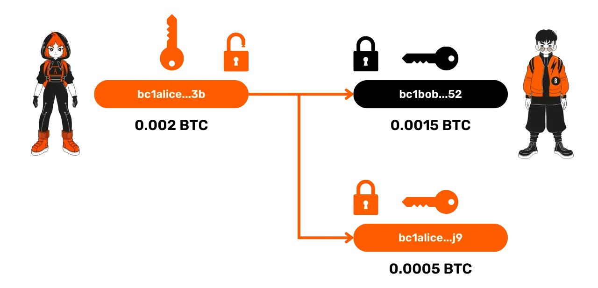

### Multi-signature Addresses

Selain address (alamat) sederhana yang dibuat dari satu public key (kunci publik), dengan beberapa public key (kunci publik) juga bisa untuk membuat **multi-signature addresses (_alamat multi-tanda tangan_)**. Salah satu kasus yang sangat menarik untuk Lightning Network (Jaringan Lightning) adalah **2/2 multi-signature address (alamat multi-tanda tangan 2/2)**, yang dihasilkan dari dua public key (kunci publik):


Untuk menggunakan dana yang dikunci dengan 2/2 multi-signature address (alamat multi-tanda tangan 2/2) ini, diperlukan tanda tangan dari dua private key (kunci privat) yang terhubung dengan public key (kunci publik).

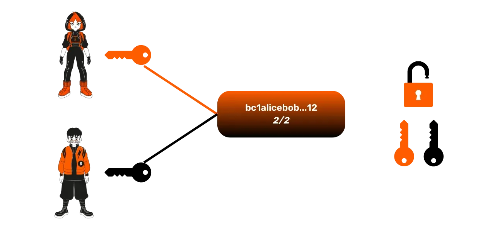

Tipe alamat ini secara tepat merupakan representasi di blockchain Bitcoin dari saluran pembayaran pada Lightning Network (Jaringan Lightning).

**Apa yang bisa Anda dapatkan dari bab ini?**

- **Bitcoin address (alamat)** berasal dari public key (kunci publik), yang asalnya dari private key (kunci privat).
- Dana pada Bitcoin dikunci oleh **skrip**, dan untuk bisa menggunakan dana tersebut, maka harus memenuhi kondisi skrip, yang umumnya memerlukan tanda tangan dengan private key (kunci privat) yang sesuai.
- **UTXOs** adalah bagian-bagian bitcoin yang dikunci oleh skrip, dan setiap transaksi Bitcoin terdiri dari membuka kunci UTXO dan kemudian menciptakan satu atau lebih UTXO baru yang juga terkunci sebagai gantinya.
- **2/2 multi-signature address (alamat multi-tanda tangan 2/2)** memerlukan dua tanda tangan dari private key (kunci privat) untuk bisa menggunakan dana di dalamnya. Address (alamat) spesifik ini digunakan dalam konteks Lightning untuk membuat [payment channel](https://planb.academy/resources/glossary/payment-channel) (saluran pembayaran).

Bab tentang Bitcoin ini mempersiapkan kita agar dapat memahami beberapa konsep penting untuk pembahasan berikutnya. Dalam bab selanjutnya, kita akan secara khusus membahas bagaimana cara pembukaan channel (saluran) pada Lightning Network (Jaringan Lightning).

# Membuka dan Menutup Saluran

<partId>900b5b6b-ccd0-5b2f-9424-4b191d0e935d</partId>

## Membuka Channel (Saluran)

<chapterId>96243eb0-f6b5-5b68-af1f-fffa0cc16bfe</chapterId>
:::video id=6098fee1-735e-4d8d-9f57-0faf5fef6d76:::


Dalam bab ini, kita akan membahas lebih rinci bagaimana cara membuka payment channel (saluran pembayaran) pada Lightning Network (Jaringan Lightning) dan memahami kaitannya dengan sistem Bitcoin yang mendasarinya.

### Lightning Channel (Saluran Lightning)

Seperti yang kita lihat di bab pertama, **payment channel (saluran pembayaran)** pada Lightning dapat digambarkan seperti "pipa" untuk bertukar dana antara dua pihak (**Alice** dan **Bob** dalam contoh kita). Kapasitas dari saluran ini sesuai dengan jumlah dana yang tersedia di setiap sisi. Dalam contoh kita, Alice memiliki **100.000 satoshi** dan Bob memiliki **30.000 satoshi**, menjadikan **kapasitas total** sebesar **130.000 satoshi**.


### Tingkatan Pertukaran Informasi

Sangat penting untuk membedakan dengan jelas berbagai tingkatan pertukaran pada Lightning Network (Jaringan Lightning):

- **Komunikasi peer-to-peer (protokol Lightning)**: Ini adalah pesan yang dikirimkan node-node Lightning satu sama lain untuk berkomunikasi. Kita akan menggambarkan pesan-pesan untuk komunikasi peer-to-peer ini dengan garis putus-putus hitam di dalam diagram.
- **Payment channels (saluran pembayaran) (protokol Lightning)**: Ini adalah jalur untuk bertukar dana pada Lightning, yang akan kita gambarkan dengan garis hitam.
- **Transaksi Bitcoin (protokol Bitcoin)**: Ini adalah transaksi yang dilakukan onchain (di jaringan utama), yang akan kita gambarkan dengan garis oranye.


Penting untuk dicatat bahwa sebuah node Lightning dapat berkomunikasi melalui protokol P2P tanpa membuka saluran, tetapi untuk bertukar dana, sebuah saluran diperlukan.

### Langkah-langkah Membuka Lightning Channel (Saluran Lightning)

- **Pertukaran pesan**: Alice ingin membuka saluran dengan Bob. Alice mengirimi Bob pesan yang berisi jumlah yang ingin dia setorkan ke dalam saluran (130.000 sats) dan public key (kunci publik) miliknya. Bob merespon dengan membagikan public key (kunci publik) milik Bob.


- **Pembuatan [multisignature](https://planb.academy/resources/glossary/multisig) address (alamat multi-tandatangan)**: Dengan kedua public key (kunci publik) ini, Alice membuat **2/2 multi-signature address (alamat multi-tanda tangan 2/2)**, yang berarti dana yang nantinya akan disetorkan pada address (alamat) ini akan memerlukan kedua tanda tangan (Alice dan Bob) untuk dapat digunakan.


- **Deposit transaction (transaksi setoran - awal pembukaan saluran)**: Alice menyiapkan transaksi Bitcoin untuk menyetorkan dana pada multisignature address (alamat multi-tandatangan) ini. Sebagai contoh, Alice bisa saja memutuskan untuk mengirim **130.000 satoshi** ke multisignature address (alamat multi-tandatangan) ini. Transaksi ini **dibuat tetapi belum dipublikasikan** di blockchain.

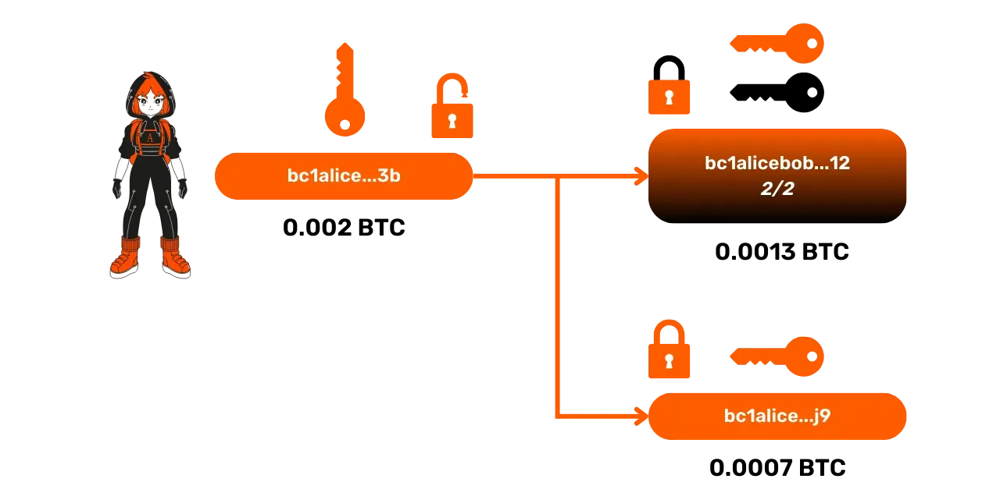

- **Withdrawal transaction (transaksi penarikan)**: Sebelum mempublikasikan deposit transaction (transaksi setoran), Alice terlebih dahulu membuat withdrawal transaction (transaksi penarikan) sehingga Alice bisa mengambil kembali dananya jika terjadi masalah dengan Bob. Hal ini penting, karena begitu Alice mempublikasikan transaksi setoran, satoshinya akan terkunci di multisignature address (alamat multi-tandatangan) yang membutuhkan kedua tanda tangan (Alice dan Bob) untuk bisa digunakan. Alice melindungi diri dari risiko kehilangan dana, Alice membuat transaksi penarikan yang memungkinkan Alice untuk mengambil kembali dananya jika diperlukan.

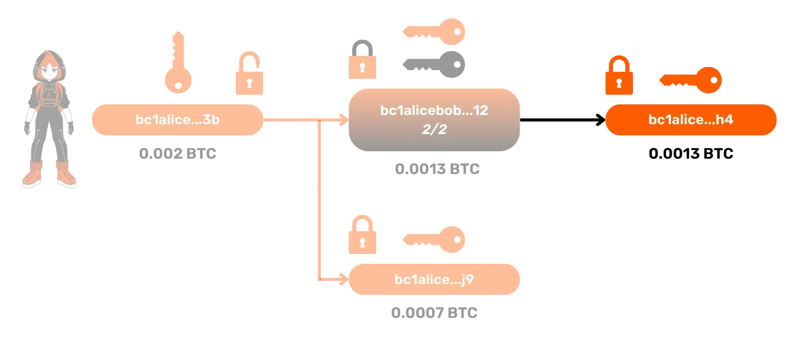

- **Tanda tangan Bob**: Alice mengirim deposit transaction (transaksi setoran) kepada Bob sebagai bukti dan memintanya untuk menandatangani withdrawal transaction (transaksi penarikan). Setelah tanda tangan Bob diperoleh pada withdrawal transaction (transaksi penarikan), Alice merasa yakin bahwa dia dapat memulihkan dananya kapan saja, karena hanya tanda tangan Alice sendiri yang sekarang diperlukan untuk membuka multisignature.


- **Publikasi deposit transaction (transaksi setoran)**: Setelah tanda tangan Bob diperoleh, Alice dapat mempublikasikan transaksi setoran di blockchain Bitcoin, dengan demikian secara resmi membuka channel (saluran) Lightning antara kedua pengguna.

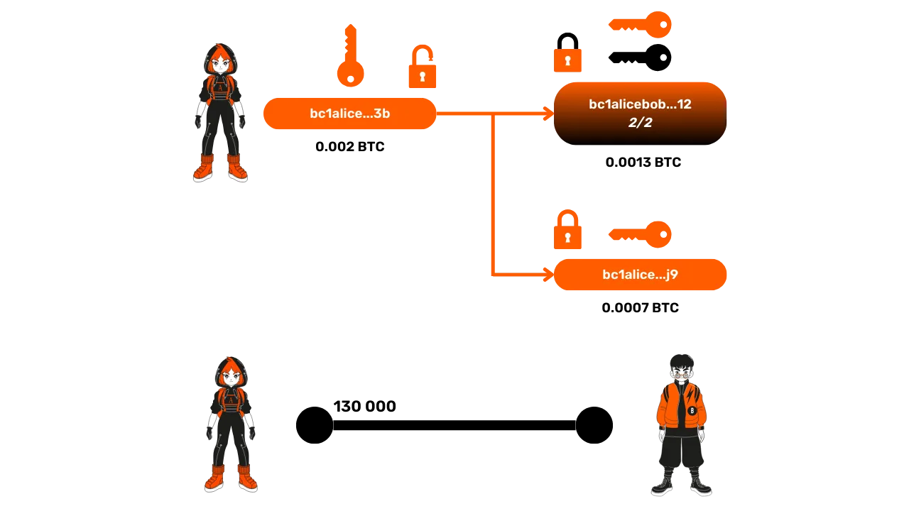

### Kapan saluran dianggap sudah aktif?

Saluran dianggap sudah dibuka setelah deposit transaction (transaksi setoran) dimasukkan ke dalam blok Bitcoin dan telah mencapai sejumlah konfirmasi tertentu (jumlah blok berikutnya).

**Apa yang perlu Anda ingat dari bab ini?**

- Membuka saluran dimulai dengan pertukaran **pesan** antara kedua pihak (pertukaran jumlah dan public key/ kunci publik).
- Saluran dibentuk dengan membuat **2/2 multi-signature address (alamat multi-tanda tangan 2/2)** dan menyetorkan dana ke dalamnya melalui transaksi Bitcoin.
  
Pada bab selanjutnya, kita akan membahas cara kerja teknis transaksi Lightning dalam sebuah channel (saluran).

## Transaksi Komitmen

<chapterId>7d3fd135-129d-5c5a-b306-d5f2f1e63340</chapterId>
:::video id=c17454f3-14c5-47a0-8c9c-42ee12932bd3:::


Dalam bab ini, kita akan membahas fungsi teknis dari sebuah transaksi dalam channel (saluran) di Lightning Network (Jaringan Lightning), yaitu ketika dana dipindahkan dari satu sisi channel (saluran) ke sisi lainnya.

### Ringkasan terkait Siklus Hidup Saluran

Seperti yang telah dijelaskan sebelumnya, sebuah saluran Lightning dimulai dengan **pembukaan** melalui transaksi Bitcoin. Saluran tersebut dapat **ditutup** kapan saja, juga melalui transaksi Bitcoin. Di antara pembukaan dan penutupan tersebut, dalam jumlah yang tak terbatas transaksi dapat dilakukan di dalam saluran tersebut, tanpa harus melalui blockchain Bitcoin. Mari kita lihat apa yang terjadi selama transaksi di dalam saluran.


### Kondisi Awal Channel (Saluran)

Pada saat membuka saluran, Alice menyetorkan **130.000 satoshi** pada multisignature address (alamat multi tanda tangan). Sehingga, pada kondisi awal, semua dana berada di sisi Alice. Sebelum pembukaan saluran, Alice juga membuat Bob menandatangani sebuah **withdrawal transaction (transaksi penarikan)**, yang memungkinkan Alice untuk mengambil kembali dananya jika Alice ingin menutup saluran tersebut.

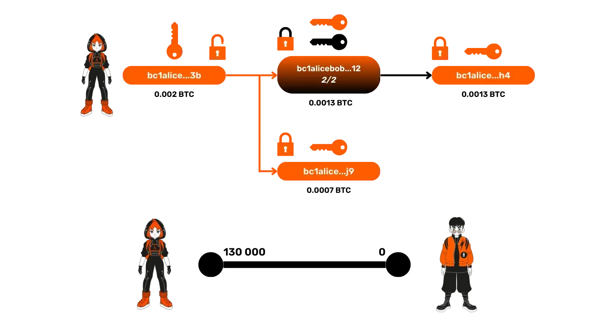

### Transaksi yang Tidak Dipublikasikan: Transaksi Komitmen

Ketika Alice melakukan transaksi dalam saluran untuk mengirim dana ke Bob, sebuah transaksi baru Bitcoin dibuat untuk mencerminkan perubahan ini dalam distribusi dana. Transaksi ini, yang disebut **transaksi komitmen**, tidak dipublikasikan di blockchain tetapi mewakili kondisi baru saluran setelah transaksi di dalam saluran Lightning ini.

Mari kita ambil contoh dengan Alice mengirim 30.000 satoshi ke Bob:

- **Awalnya**: Alice memiliki 130.000 satoshi.
- **Setelah transaksi**: Alice memiliki 100.000 satoshi, dan Bob 30.000 satoshi.
  Untuk memvalidasi transfer ini, Alice dan Bob membuat **transaksi Bitcoin baru yang tidak dipublikasikan** yang akan mengirim **100.000 satoshi ke Alice** dan **30.000 satoshi ke Bob** dari multisignature address (alamat multi tanda tangan). Kedua pihak membangun transaksi ini secara independen, tetapi dengan data yang sama (jumlah dan address/ alamat). Setelah dibangun, masing-masing menandatangani transaksi dan bertukar tanda tangan dengan yang lain. Ini memungkinkan salah satu pihak untuk mempublikasikan transaksi kapan saja jika diperlukan untuk memulihkan bagian mereka dari saluran di blockchain Bitcoin utama.
  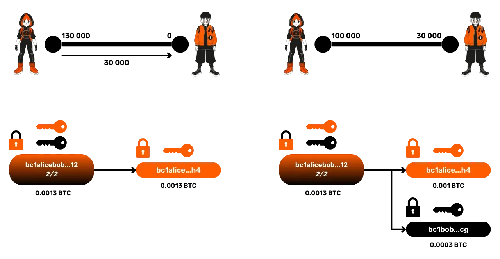

### Proses Transfer: Invoice (Permintaan Pembayaran)

Ketika Bob ingin menerima dana, dia mengirim Alice sebuah **invoice** untuk 30.000 satoshi. Alice kemudian melanjutkan untuk membayar invoice ini dengan melakukan transfer di dalam saluran tersebut. Seperti yang telah kita lihat, proses ini bergantung pada pembuatan dan penandatanganan **transaksi komitmen** baru.

Setiap transaksi komitmen mewakili distribusi dana terbaru dalam saluran setelah transfer dilakukan. Dalam contoh ini, setelah transaksi, Bob memiliki 30.000 satoshi dan Alice memiliki 100.000 satoshi. Jika salah satu dari dua peserta memutuskan untuk mempublikasikan transaksi komitmen ini di blockchain, itu akan mengakibatkan penutupan saluran dan dana akan didistribusikan sesuai dengan distribusi terakhir ini.

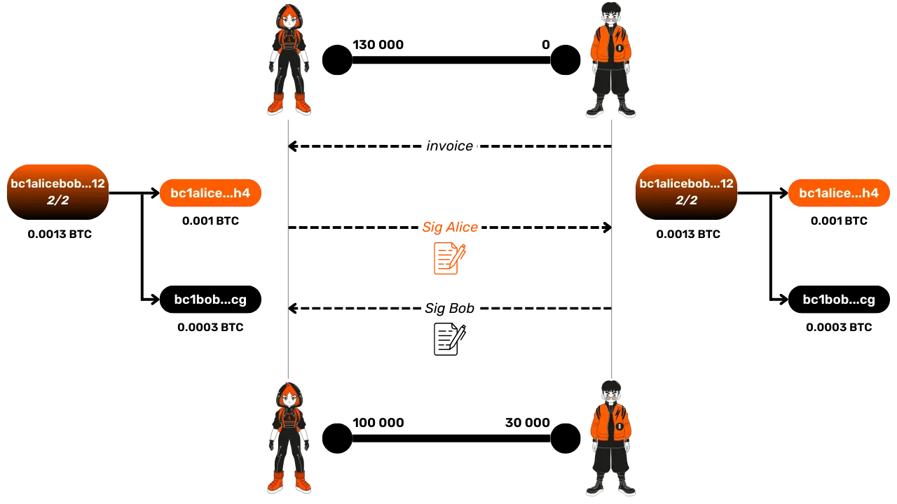

### Kondisi Baru Setelah Transaksi Kedua

Mari kita ambil contoh lain: setelah transaksi pertama di mana Alice mengirim 30.000 satoshi ke Bob, Bob memutuskan untuk mengirim **10.000 satoshi kembali ke Alice**. Ini menciptakan kondisi baru saluran. **Transaksi komitmen** baru akan mewakili distribusi yang diperbarui ini:

- **Alice** sekarang memiliki **110.000 satoshi**.
- **Bob** memiliki **20.000 satoshi**.

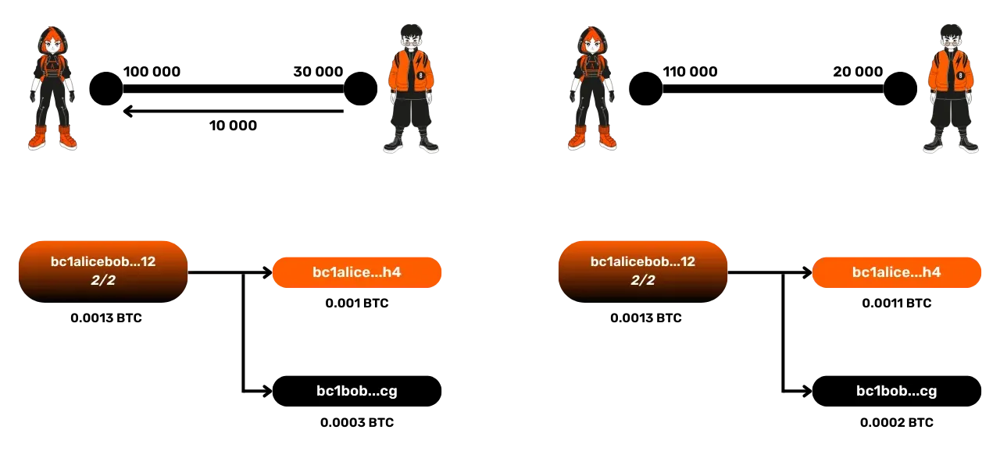

Sekali lagi, transaksi ini tidak dipublikasikan di blockchain tetapi dapat dipublikasikan kapan saja jika saluran ditutup.

Kesimpulannya, ketika dana ditransfer dalam saluran Lightning:

- Alice dan Bob membuat **transaksi komitmen** baru, yang mencerminkan distribusi dana yang baru.
- Transaksi Bitcoin ini **ditandatangani** oleh kedua belah pihak, namun **tidak dipublikasikan** di blockchain Bitcoin selama saluran masih dibuka.
- Transaksi komitmen memastikan bahwa setiap peserta dapat memulihkan dana mereka kapan saja di blockchain Bitcoin dengan mempublikasikan transaksi terakhir yang ditandatangani.

Namun, sistem ini memiliki kelemahan, yang akan kita bahas di bab berikutnya. Kita akan melihat bagaimana setiap pihak dapat melindungi diri mereka dari upaya curang pihak lainnya.

## Revocation Key (Kunci Pembatalan)

<chapterId>f2f61e5b-badb-5947-9a81-7aa530b44e59</chapterId>
:::video id=1d850f23-eff1-4725-b284-ce12456a2c26:::

### Ringkasan terkait Transaksi Komitmen

Seperti yang telah dijelaskan sebelumnya, transaksi di Lightning bergantung pada **transaksi komitmen** yang tidak dipublikasikan. Transaksi ini mencerminkan distribusi dana terkini di channel (saluran). Ketika ada transaksi Lightning yang baru dilakukan, maka transaksi komitmen baru juga dibuat dan ditandatangani oleh kedua belah pihak untuk mencerminkan keadaan terbaru di saluran tersebut.

Mari kita ambil contoh sederhana:

- **Keadaan awal**: Alice memiliki **100.000 satoshi**, Bob **30.000 satoshi**.
- Setelah transaksi di mana Alice mengirim **40.000 satoshi** ke Bob, transaksi komitmen baru mendistribusikan dana sebagai berikut:
  - Alice: **60.000 satoshi**
  - Bob: **70.000 satoshi**


Kapan saja, kedua belah pihak dapat mempublikasikan **transaksi komitmen terakhir** yang ditandatangani untuk menutup saluran dan memulihkan dana mereka.

### Kekurangan: Kecurangan dengan Mempublikasikan Transaksi Lama

Masalah dapat muncul jika salah satu pihak memutuskan untuk **berbuat curang** dengan mempublikasikan transaksi komitmen lama. Misalnya, Alice mempublikasikan transaksi komitmen yang lebih lama di mana Alice masih memiliki **100.000 satoshi**, meskipun kenyataannya sekarang Alice hanya memiliki **60.000**. Ini akan memungkinkan Alice untuk mencuri **40.000 satoshi** dari Bob.

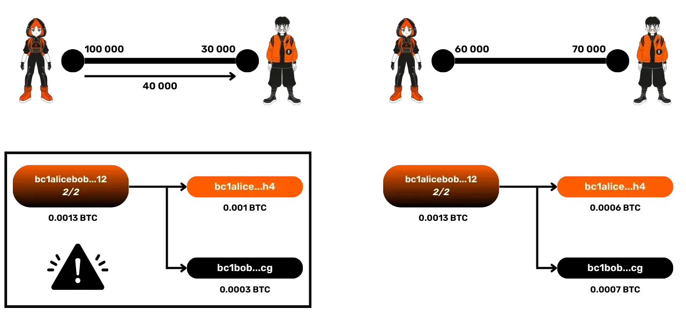

Lebih buruk lagi, Alice dapat mempublikasikan withdrawal transaction (transaksi penarikan) pertama, sebelum saluran dibuka, di mana Alice memiliki **130.000 satoshi**, dan mencuri seluruh dana saluran tersebut.

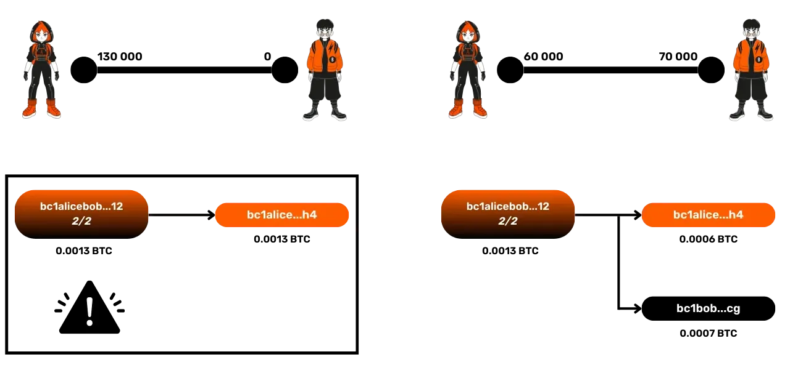

### Solusi: Revocation Key (Kunci Pembatalan) dan Timelock (Penguncian Waktu)

Untuk mencegah kecurangan seperti yang dilakukan oleh Alice, di Lightning Network (Jaringan Lightning), **mekanisme keamanan** ditambahkan ke transaksi komitmen:

- **Timelock (penguncian waktu)**: Setiap transaksi komitmen harus disertai timelock (penguncian waktu) untuk dana milik Alice. Timelock (penguncian waktu) adalah aturan dalam kontrak pintar yang menunda pencairan dana hingga waktu tertentu, agar transaksi bisa dimasukkan ke dalam blok di blockchain. Ini berarti bahwa Alice tidak bisa langsung mengambil dananya sampai sejumlah blok telah berlalu semenjak Alice mempublikasikan salah satu transaksi komitmen tersebut. Timelock (penguncian waktu) ini mulai berlaku sejak transaksi komitmen dikonfirmasi di blockchain. Durasi timelock (penguncian waktu) ini umumnya berdasarkan besar dana di saluran, namun juga bisa diatur secara manual.
- **Revocation Key (Kunci Pembatalan)**: Dana milik Alice juga bisa diambil oleh Bob jika Bob memiliki **revocation key (kunci pembatalan)**. Kunci ini terdiri dari rahasia yang dipegang oleh Alice dan juga Bob. Rahasia ini berbeda untuk setiap transaksi komitmen. 

Berkat dua mekanisme ini, Bob memiliki waktu untuk mendeteksi kecurangan Alice, dan menghukum Alice dengan mengambil kembali semua dana dari saluran tersebut menggunakan revocation key (kunci pembatalan). Transaksi komitmen baru kita sekarang akan terlihat seperti ini:
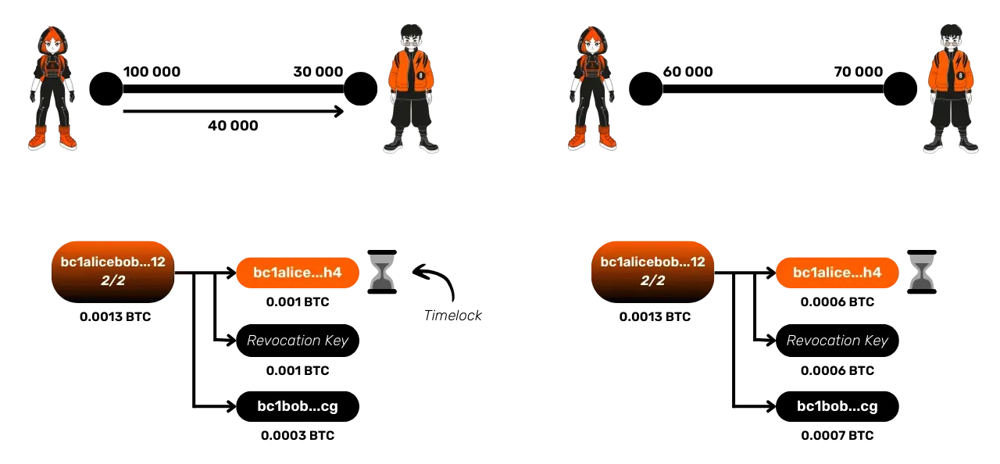

Mari kita rinci bersama fungsi mekanisme ini.

### Proses Pembaruan Transaksi

Ketika Alice dan Bob memperbarui status saluran dengan transaksi Lightning terbaru, mereka bertukar **rahasia** terlebih dahulu untuk transaksi komitmen sebelumnya (yang akan menjadi kadaluarsa dan memungkinkan disalahgunakan untuk menipu). Ini berarti bahwa, dalam status saluran yang baru:

- Alice dan Bob memiliki transaksi komitmen baru yang mewakili distribusi dana terkini setelah transaksi Lightning.
- Masing-masing memiliki rahasia satu sama lain dari transaksi sebelumnya, yang memungkinkan mereka untuk menggunakan revocation key (kunci pembatalan) hanya jika salah satu dari mereka mencoba berbuat curang dengan mempublikasikan transaksi versi lama di mempool/ memory pool (tempat penyimpanan sementara transaksi-transaksi Bitcoin yang sudah valid, tapi belum masuk ke dalam blok di blockchain) node-node Bitcoin. Memang, untuk menghukum pihak lain, diperlukan untuk memegang kedua rahasia dan transaksi komitmen pihak lain, yang mencakup input yang ditandatangani. Tanpa transaksi ini, hanya revocation key (kunci pembatalan) saja tidak akan berguna. Satu-satunya cara untuk mendapatkan transaksi ini adalah dengan mengambilnya dari mempool (dalam transaksi yang menunggu konfirmasi) atau dalam transaksi yang sudah dikonfirmasi di blockchain selama timelock (penguncian waktu), yang membuktikan bahwa pihak lain mencoba curang, baik sengaja maupun tidak.

Mari kita ambil contoh untuk memahami proses ini dengan baik:

- **Keadaan Awal**: Alice memiliki **100.000 satoshi**, Bob **30.000 satoshi**.

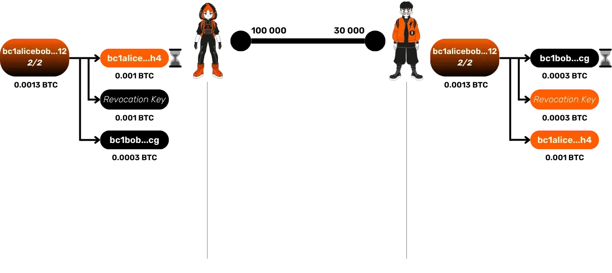

- Bob ingin menerima 40.000 satoshi dari Alice melalui saluran Lightning mereka. Untuk melakukan ini:
   - Bob mengirimkan invoice (permintaan pembayaran) kepada Alice bersama dengan rahasia Bob untuk revocation key (kunci pembatalan) transaksi komitmen sebelumnya.
   - Sebagai tanggapan, Alice memberikan tanda tangannya untuk transaksi komitmen baru Bob, serta rahasia Alice untuk revocation key (kunci pembatalan) transaksi sebelumnya.
   - Akhirnya, Bob mengirimkan tanda tangannya untuk transaksi komitmen baru Alice.
   - Pertukaran ini memungkinkan Alice untuk mengirim **40.000 satoshi** kepada Bob di Lightning melalui saluran mereka, dan transaksi komitmen baru sekarang mencerminkan distribusi dana terbaru ini.

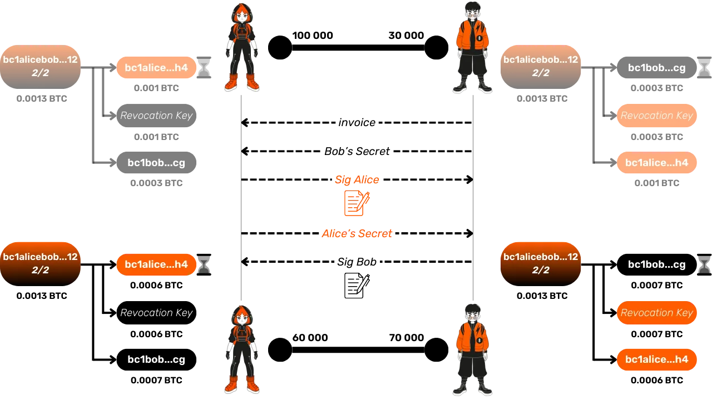

- Jika Alice mencoba mempublikasikan transaksi komitmen lama di mana Alice masih memiliki **100.000 satoshi**, maka Bob setelah mendapatkan revocation key (kunci pembatalan), dapat segera memulihkan dana menggunakan kunci ini, sementara Alice diblokir oleh timelock (penguncian waktu).

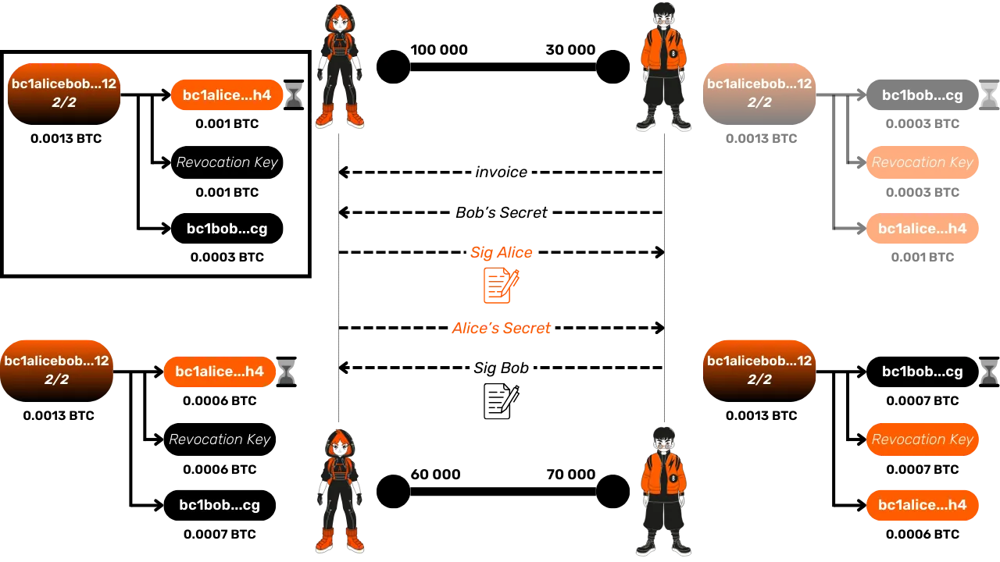

Meskipun, dalam kasus ini, Bob tidak memiliki kepentingan ekonomi untuk melakukan percobaan kecurangan, jika Bob melakukan kecurangan, Alice juga mendapat manfaat dari perlindungan ini yang memberinya jaminan yang sama.

**Apa yang bisa Anda dapatkan dari bab ini?**

**Transaksi komitmen** di Lightning Network (Jaringan Lightning) mencakup mekanisme keamanan yang dapat mengurangi risiko kecurangan maupun insentif untuk melakukannya. Sebelum menandatangani transaksi komitmen baru, Alice dan Bob bertukar **rahasia** masing-masing untuk transaksi komitmen sebelumnya. Jika Alice mencoba mempublikasikan transaksi komitmen lama, Bob dapat menggunakan **revocation key (kunci pembatalan)** untuk mengambil alih semua dana sebelum Alice mengambilnya (karena Alice diblokir oleh timelock), yang menghukum Alice karena mencoba curang.

Sistem keamanan ini memastikan bahwa semua pihak mematuhi aturan Lightning Network, dan mereka tidak dapat memperoleh keuntungan dari mempublikasikan transaksi komitmen lama.

Anda sekarang sudah mengetahui bagaimana saluran Lightning dibuka dan bagaimana transaksi dalam saluran ini bekerja. Pada bab selanjutnya, kita akan membahas berbagai cara untuk menutup saluran dan memulihkan bitcoin Anda di blockchain utama.

## Menutup Saluran

<chapterId>29a72223-2249-5400-96f0-3756b1629bc2</chapterId>
:::video id=4d8ad4e6-32ff-46d3-bd17-343929aa863b:::

Dalam bab ini, kita akan membahas **penutupan saluran** di Lightning Network (Jaringan Lightning), yang dilakukan melalui transaksi Bitcoin, sama seperti membuka saluran. Setelah melihat bagaimana transaksi dalam saluran bekerja, sekarang saatnya untuk melihat cara menutup saluran dan memulihkan dana di blockchain Bitcoin.

### Ringkasan terkait Siklus Hidup Saluran

**Siklus hidup saluran** dimulai dengan **pembukaannya**, melalui transaksi Bitcoin, kemudian transaksi Lightning dilakukan di dalamnya, dan akhirnya, ketika para pihak ingin mengambil kembali dana mereka, saluran **ditutup** melalui transaksi Bitcoin kedua. Transaksi perantara yang dibuat di Lightning diwakili oleh **transaksi komitmen** yang tidak dipublikasikan.


### Tiga jenis penutupan saluran

Ada tiga cara untuk menutup saluran, yang disebut **yang baik, yang kasar, dan yang curang** (terinspirasi oleh Andreas Antonopoulos dalam _Mastering the Lightning Network_):

- **Yang Baik**: **penutupan kooperatif**, di mana Alice dan Bob setuju untuk menutup saluran.
- **Yang Kasar**: **penutupan paksa**, di mana salah satu pihak memutuskan untuk menutup saluran dengan jujur, tetapi tanpa persetujuan pihak lain.
- **Yang Buruk**: **penutupan dengan kecurangan**, di mana salah satu pihak mencoba mencuri dana dengan mempublikasikan transaksi komitmen lama (transaksi komitmen manapun selain yang terakhir yang mencerminkan distribusi dana yang sebenarnya dan adil).

Mari kita ambil contoh:

- Alice memiliki **100.000 satoshi** dan Bob **30.000 satoshi**.
- Distribusi ini tercermin dalam **2 transaksi komitmen** (masing-masing satu untuk setiap pengguna) yang tidak dipublikasikan, tetapi dapat dipublikasikan jika menutup saluran.

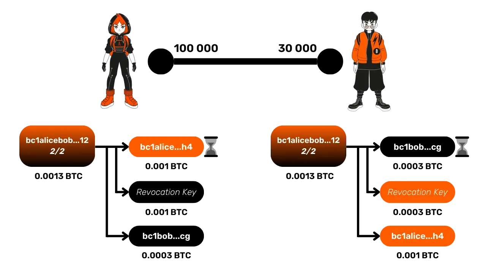

### Yang Baik: Penutupan Kooperatif

Dalam **penutupan kooperatif**, Alice dan Bob setuju untuk menutup saluran. Begini caranya:

- Alice mengirim pesan ke Bob melalui protokol komunikasi Lightning untuk mengusulkan penutupan saluran.
- Bob setuju, dan kedua pihak tidak melakukan transaksi lebih lanjut di saluran tersebut.


- Alice dan Bob berdiskusi bersama mengenai biaya dari **transaksi penutupan**. Biaya ini umumnya dihitung berdasarkan pasar biaya Bitcoin pada saat penutupan. Penting untuk dicatat bahwa **selalu orang yang membuka saluran** (Alice dalam contoh kita) yang membayar biaya penutupan.
- Mereka membuat **transaksi penutupan** baru. Transaksi ini menyerupai transaksi komitmen, tetapi tanpa timelock (penguncian waktu) atau mekanisme revocation (pembatalan), karena kedua pihak bekerja sama dan tidak ada risiko kecurangan. Transaksi penutupan kooperatif ini oleh karena itu berbeda dari transaksi komitmen.

Misalnya, jika Alice memiliki **100.000 satoshi** dan Bob **30.000 satoshi**, transaksi penutupan akan mengirim **100.000 satoshi** ke alamat Alice dan **30.000 satoshi** ke alamat Bob, tanpa batasan timelock (penguncian waktu). Setelah transaksi ini ditandatangani oleh kedua belah pihak, Alice akan mempublikasikannya. Setelah transaksi dikonfirmasi di blockchain Bitcoin, saluran Lightning akan resmi ditutup.
   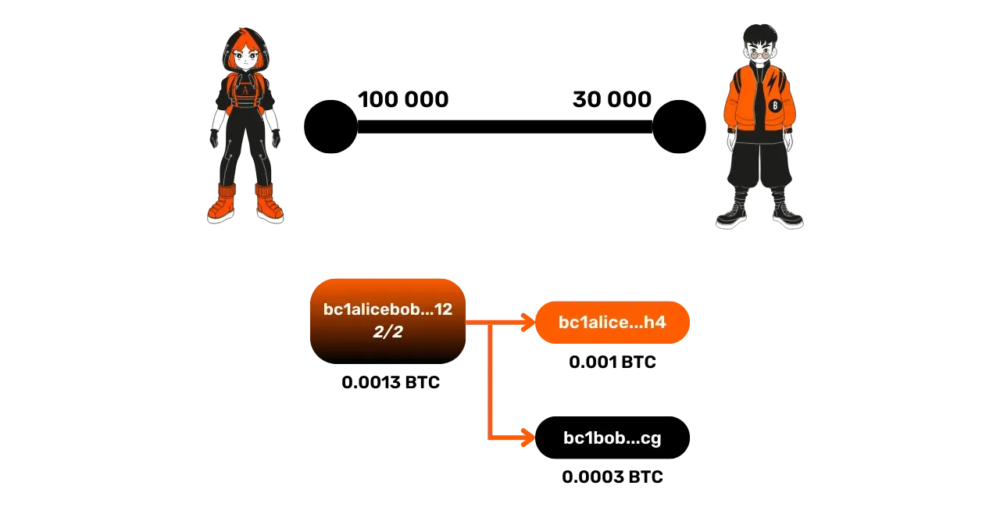

**Penutupan kooperatif** adalah metode penutupan yang disukai karena cepat (tanpa timelock) dan biaya transaksi disesuaikan menurut kondisi pasar Bitcoin saat ini. Ini menghindari pembayaran yang terlalu sedikit, yang bisa berisiko memblokir transaksi di mempool, atau membayar terlalu banyak secara tidak perlu, yang mengakibatkan kerugian finansial yang tidak perlu bagi para peserta.

### Yang Kasar: Penutupan Paksa

Ketika node Alice mengirim pesan ke Bob meminta penutupan kooperatif, jika Bob tidak merespon (misalnya, karena gangguan internet atau masalah teknis), Alice dapat melanjutkan dengan **penutupan paksa** dengan mempublikasikan **transaksi komitmen terakhir yang ditandatangani**. Dalam kasus ini, Alice akan mempublikasikan transaksi komitmen terakhir, yang mencerminkan keadaan saluran pada saat transaksi Lightning terakhir terjadi dengan distribusi dana yang benar.

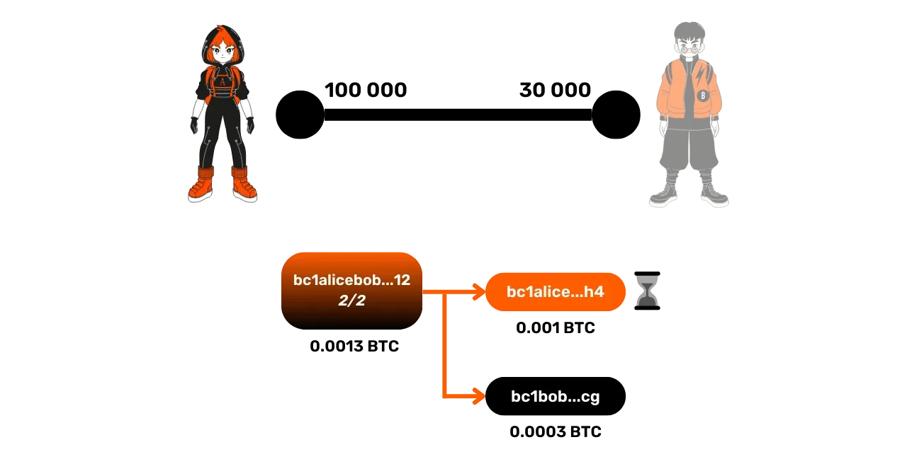

Transaksi ini mencakup **timelock (penguncian waktu)** untuk dana Alice, membuat penutupan menjadi lebih lambat.

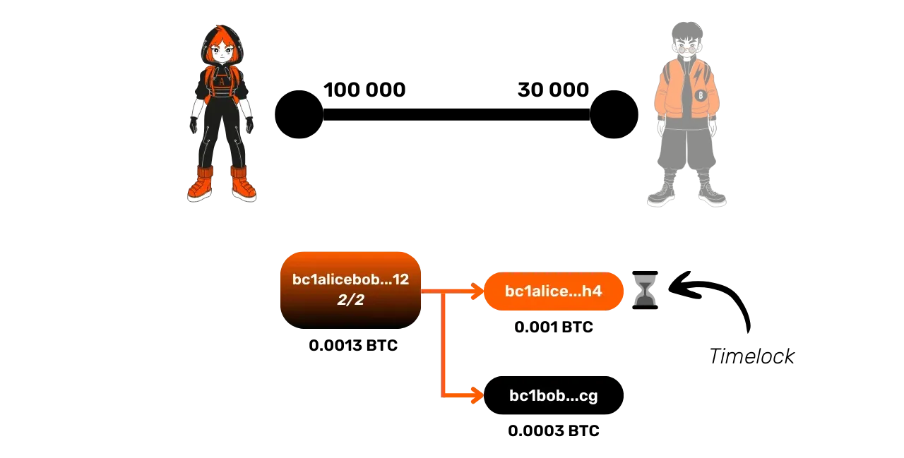

Juga, biaya dari transaksi komitmen mungkin tidak sesuai pada saat penutupan, karena ditetapkan ketika transaksi dibuat, terkadang beberapa bulan sebelumnya. Umumnya, klien Lightning memperkirakan biaya lebih tinggi untuk menghindari masalah di masa depan, tetapi ini dapat menyebabkan biaya yang berlebihan, atau sebaliknya terlalu rendah.

Secara singkat, **penutupan paksa** adalah opsi terakhir ketika rekan di saluran tidak lagi merespon. Ini lebih lambat dan kurang ekonomis daripada penutupan kooperatif. Oleh karena itu, sebisa mungkin harus dihindari.

### Yang Buruk: Dengan Kecurangan

Yang terakhir, penutupan dengan **kecurangan** terjadi ketika salah satu pihak mencoba mempublikasikan transaksi komitmen lama, seringkali di mana mereka memiliki lebih banyak dana daripada yang seharusnya. Misalnya, Alice mungkin mempublikasikan transaksi lama di mana dia memiliki **120.000 satoshi**, sementara Alice sebenarnya hanya memiliki **100.000** sekarang.

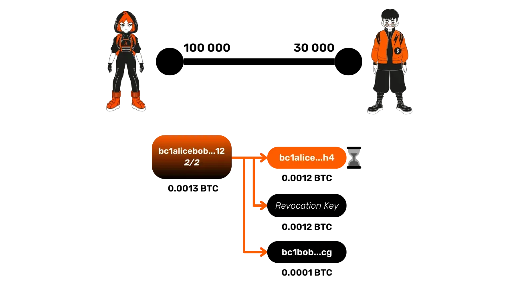

Bob, untuk mencegah kecurangan ini, memantau mempool dan blockchain Bitcoin untuk memastikan Alice tidak mempublikasikan transaksi lama. Jika Bob mendeteksi upaya kecurangan, dia dapat menggunakan **kunci pembatalan** untuk mengambil dana Alice dan menghukumnya dengan mengambil seluruh dana saluran. Karena Alice diblokir oleh timelock (penguncian waktu) pada outputnya (dana yang dimiliki Alice), Bob memiliki waktu untuk menggunakan dana tanpa timelock (penguncian waktu) di sisinya untuk mengambil seluruh dana yang ada di address (alamat) Bob.

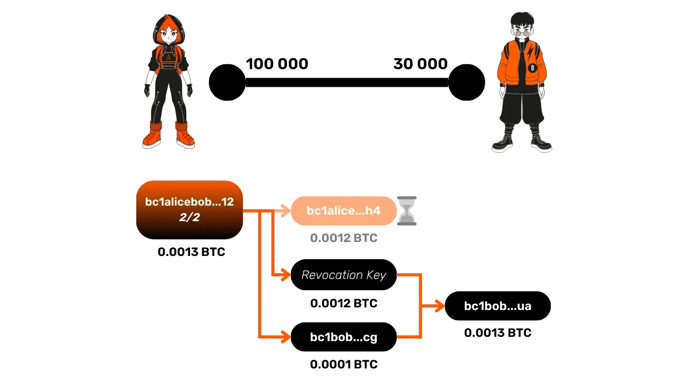

Jelas bahwa kecurangan Alice berpotensi berhasil jika Bob tidak bertindak dalam waktu yang ditetapkan oleh timelock (penguncian waktu) pada output milik Alice. Dalam kasus ini, output Alice akan terbuka (unlocked), sehingga Alice dapat menggunakannya untuk membuat output baru ke address (alamat) yang dia miliki.

**Apa yang bisa Anda dapatkan dari bab ini?**

Ada tiga cara untuk menutup saluran:

- **Penutupan Kooperatif**: Cepat dan lebih terjangkau, di mana kedua belah pihak setuju untuk menutup saluran dan mempublikasikan transaksi penutupan yang disesuaikan.
- **Penutupan Paksa**: Kurang diinginkan, karena bergantung pada penerbitan transaksi komitmen, dengan biaya yang mungkin tidak sesuai dan timelock (penguncian waktu), yang memperlambat penutupan.
- **Penutupan dengan Kecurangan**: Jika salah satu pihak mencoba mencuri dana dengan mempublikasikan transaksi lama, pihak lain dapat menggunakan revocation key (kunci pembatalan) untuk menghukum kecurangan tersebut.
   Dalam bab-bab berikutnya, kita akan meembahas Lightning Network (Jaringan Lightning) dari perspektif yang lebih luas, berfokus pada bagaimana jaringannya beroperasi.

# Jaringan Likuiditas

<partId>a873f1cb-751f-5f4a-9ed7-25092bfdef11</partId>

## Lightning Network

<chapterId>45a7252c-fa4f-554b-b8bb-47449532918e</chapterId>
:::video id=38419c23-5592-4573-b0a7-84824a5bfb77:::


Dalam bab ini, kita akan membahas bagaimana pembayaran di Lightning Network (Jaringan Lightning) dapat mencapai penerima meskipun mereka tidak terhubung langsung melalui saluran pembayaran (payment channel). Lightning memang merupakan **jaringan dari saluran-saluran pembayaran (network of payment channels)**, yang memungkinkan dana dikirim ke node yang jauh melalui saluran (atau channel) milik peserta lain. Kita akan membahas bagaimana pembayaran dirutekan melalui jaringan, bagaimana likuiditas bergerak antar saluran, dan bagaimana biaya transaksi dihitung.

### Jaringan Saluran Pembayaran

Di Lightning Network (Jaringan Lightning), sebuah transaksi merupakan pemindahan dana antara dua node. Seperti yang telah dibahas di bab-bab sebelumnya, untuk dapat melakukan transaksi di Lightning, diperlukan pembukaan saluran dengan seseorang terlebih dahulu. Saluran ini memungkinkan transaksi dalam jumlah hampir tak terbatas di off-chain (transaksi yang terjadi di luar jaringan utama blockchain) sebelum menutupnya untuk mengklaim kembali saldo on-chain (transaksi yang dicatat langsung di jaringan utama blockchain). Namun, metode ini memiliki kelemahan yang memerlukan saluran langsung dengan orang lain untuk menerima atau mengirim dana, yang berarti diperlukan transaksi pembukaan dan penutupan untuk setiap saluran. Jika saya berencana untuk melakukan sejumlah besar pembayaran dengan orang ini, membuka dan menutup saluran menjadi lebih hemat. Sebaliknya, jika saya hanya perlu melakukan beberapa transaksi Lightning, membuka saluran menjadi tidak menguntungkan, karena saya harus membayar 2 transaksi on-chain hanya untuk sejumlah kecil transaksi off-chain yang terbatas. Kasus ini mungkin terjadi, misalnya, ketika ingin membayar dengan Lightning di pedagang tanpa berencana untuk membeli lagi.

Untuk menyelesaikan masalah ini, Jaringan Lightning memungkinkan untuk mengalihkan pembayaran melalui beberapa saluran dan node perantara, sehingga memungkinkan transaksi tanpa saluran langsung dengan orang lain.

Misalnya, bayangkan bahwa:

- **Alice** (oranye) memiliki saluran dengan **Suzie** (abu-abu) dengan **100.000 satoshi** di sisinya dan **30.000 satoshi** di sisi Suzie.
- **Suzie** memiliki saluran dengan **Bob** di mana Suzie memiliki **250.000 satoshi** dan Bob tidak memiliki satoshi.


Jika Alice ingin mengirim dana ke Bob tanpa membuka saluran langsung dengan Bob, Alice harus melalui Suzie, dan setiap saluran perlu menyesuaikan likuiditas di setiap sisi. **Satoshi yang dikirim tetap dalam saluran masing-masing**; mereka sebenarnya tidak "berpindah" saluran, tetapi transfer dilakukan melalui penyesuaian likuiditas internal di setiap saluran.

Misalkan Alice ingin mengirim **50.000 satoshi** ke Bob:

- **Alice** mengirim 50.000 satoshi ke **Suzie** di saluran mereka.
- **Suzie** mereplikasi transfer ini dengan mengirim 50.000 satoshi ke **Bob** di saluran mereka.

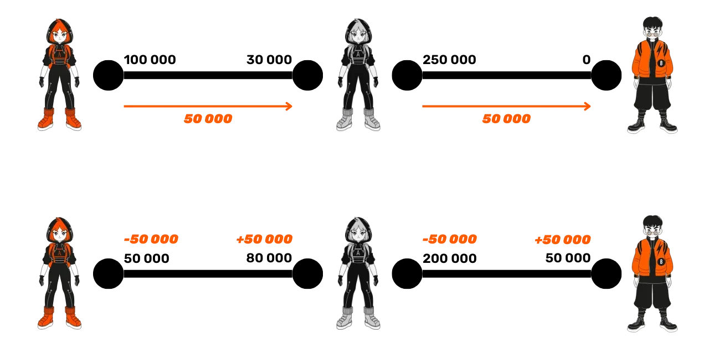
Dengan demikian, pembayaran dirutekan ke Bob melalui pergerakan likuiditas di setiap saluran. Di akhir transaksi, Alice berakhir dengan 50.000 satoshi. Alice telah mentransfer 50.000 satoshi, yang awalnya Alice memiliki 100.000. Bob, di sisinya, berakhir dengan tambahan 50.000 satoshi. Untuk Suzie (node perantara), transaksi ini netral: awalnya, dia memiliki 30.000 satoshi di salurannya dengan Alice dan 250.000 satoshi di salurannya dengan Bob, total 280.000 satoshi. Setelah operasi, dia memegang 80.000 satoshi di salurannya dengan Alice dan 200.000 satoshi di salurannya dengan Bob, sehingga total jumlahnya sama seperti di awal.

Sehingga transfer ini dibatasi oleh **likuiditas yang tersedia** dalam arah transfer.

### Perhitungan Rute dan Batas Likuiditas

Mari kita ambil contoh teoretis dari jaringan lain dengan:

- **130.000 satoshi** di sisi Alice (oranye) di salurannya dengan **Suzie** (abu-abu).
- **90.000 satoshi** di sisi **Suzie** dan **200.000 satoshi** di sisi **Carol** (merah muda).
- **150.000 satoshi** di sisi **Carol** dan **100.000 satoshi** di sisi **Bob**.

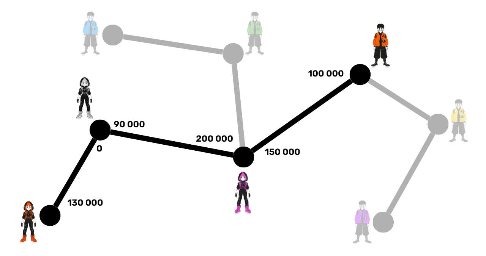

Jumlah maksimum yang dapat Alice kirim ke Bob adalah **90.000 satoshi**, karena Alice dibatasi oleh likuiditas terkecil yang tersedia di saluran dari **Suzie ke Carol**. Dalam arah sebaliknya (dari Bob ke Alice), tidak ada pembayaran yang mungkin karena sisi **Suzie** di saluran dengan **Alice** tidak memliki satoshi. Oleh karena itu, tidak ada **rute** yang dapat digunakan untuk transfer dari arah Bob ke Alice ini.
Alice mengirim **40.000 satoshi** ke Bob melalui saluran:

- Alice mentransfer 40.000 satoshi ke salurannya dengan Suzie.
- Suzie mentransfer 40.000 satoshi ke Carol di saluran bersama mereka.
- Carol akhirnya mentransfer 40.000 satoshi ke Bob.


**Satoshi yang dikirim** di setiap saluran **tetap di saluran**, jadi satoshi yang dikirim oleh Carol ke Bob bukanlah satochi yang sama dengan yang dikirim oleh Alice ke Suzie. Transfer dilakukan hanya dengan menyesuaikan likuiditas di dalam setiap saluran. Selain itu, kapasitas total saluran tetap tidak berubah.

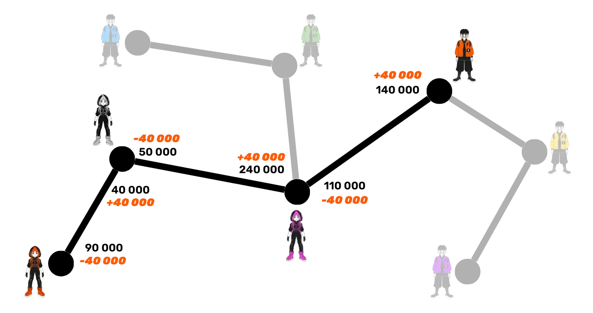

Seperti dalam contoh sebelumnya, setelah transaksi, node sumber (Alice) memiliki 40.000 satoshi lebih sedikit. Node perantara (Suzie dan Carol) mempertahankan jumlah total yang sama, membuat transaksi ini netral bagi mereka. Akhirnya, node tujuan (Bob) menerima tambahan 40.000 satoshi.

Peran node perantara sangat penting dalam fungsi Lightning Network. Mereka memfasilitasi transfer dengan menawarkan beberapa jalur untuk pembayaran. Untuk mendorong node ini menyediakan likuiditas mereka dan berpartisipasi dalam mengalihkan pembayaran, **biaya routing** dibayarkan kepada mereka.

### Biaya Routing

Node perantara menerapkan biaya untuk memungkinkan pembayaran melewati saluran mereka. Biaya ini ditetapkan oleh **setiap node untuk setiap saluran**. Biaya terdiri dari 2 elemen:

- "**Biaya Dasar**": jumlah tetap per saluran, sering kali **1 sat**, tetapi dapat disesuaikan.
- "**Biaya variabel**": persentase dari jumlah yang ditransfer, dihitung dalam **parts per milliion (ppm) atau per sejuta**. Biasanya, biayanya adalah **1 ppm** (1 satoshi per 1 juta satoshi yang ditransfer), tetapi biaya ini juga dapat disesuaikan.
   Biaya juga berbeda tergantung pada arah transfer. Misalnya, untuk transfer dari Alice ke Suzie, biaya Alice yang berlaku. Sebaliknya, dari Suzie ke Alice, biaya Suzie yang digunakan.

Sebagai contoh, untuk sebuah saluran antara Alice dan Suzie :

- **Alice**: biaya dasar 1 sat dan 1 ppm untuk biaya variabel.
- **Suzie**: biaya dasar 0.5 sat dan 10 ppm untuk biaya variabel.

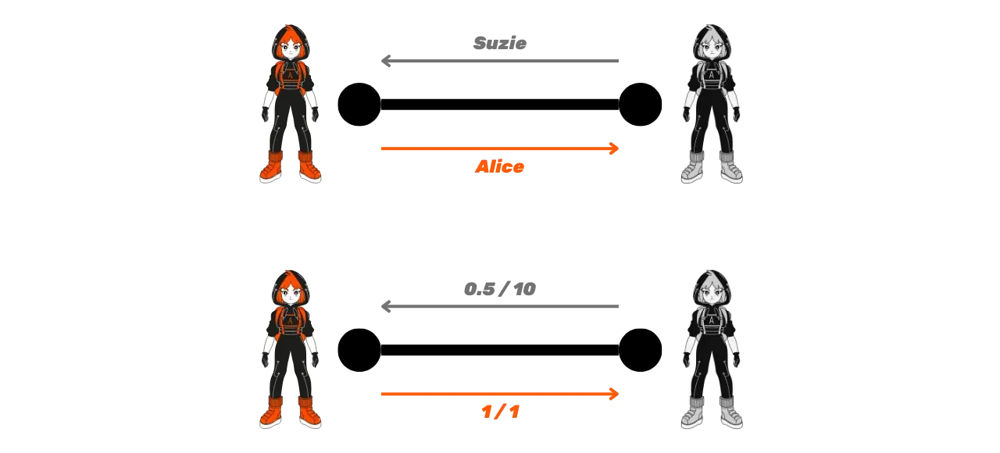

Untuk lebih memahami bagaimana biaya bekerja, mari kita pelajari Lightning Network (Jaringan Lightning) yang sama seperti sebelumnya, tetapi sekarang dengan biaya routing berikut:

- Saluran **Alice - Suzie**: biaya dasar 1 satoshi dan 1 ppm untuk Alice.
- Saluran **Suzie - Carol**: biaya dasar 0 satoshi dan 200 ppm untuk Suzie.
- Saluran **Carol - Bob**: biaya dasar 1 satoshi dan 1 ppm untuk Suzie 2.
  

Untuk pembayaran yang sama sebesar **40,000 satoshi** ke Bob, Alice harus mengirim sedikit lebih banyak, karena setiap node perantara akan mengurangi biayanya:

- **Carol** mengurangi 1.04 satoshi di saluran dengan Bob:
$$ f_{\text{Carol-Bob}} = \text{biaya dasar} + \left(\frac{\text{ppm} \times \text{jumlah}}{10^6}\right) $$
$$ f_{\text{Carol-Bob}} = 1 + \frac{1 \times 40000}{10^6} = 1 + 0.04 = 1.04 \text{ sats} $$

- **Suzie** mengurangi 8 satoshi untuk biaya di saluran dengan Carol:
$$ f_{\text{Suzie-Carol}} = \text{biaya dasar} + \left(\frac{\text{ppm} \times \text{jumlah}}{10^6}\right) $$
$$ f_{\text{Suzie-Carol}} = 0 + \frac{200 \times 40001.04}{10^6} = 0 + 8.0002 \approx 8 \text{ sats} $$

Total biaya untuk pembayaran di jalur ini adalah **9.04 satoshi**. Dengan demikian, Alice harus mengirim **40,009.04 satoshi** agar Bob menerima tepat **40,000 satoshi**.

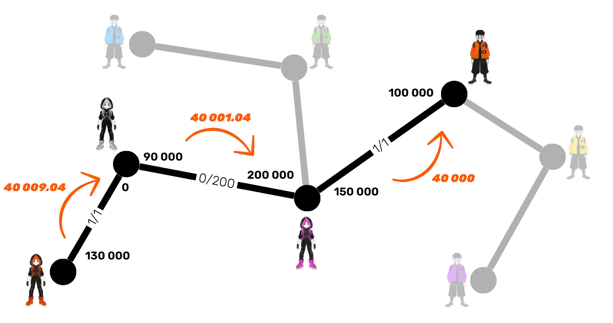

Likuiditas pun diperbarui:

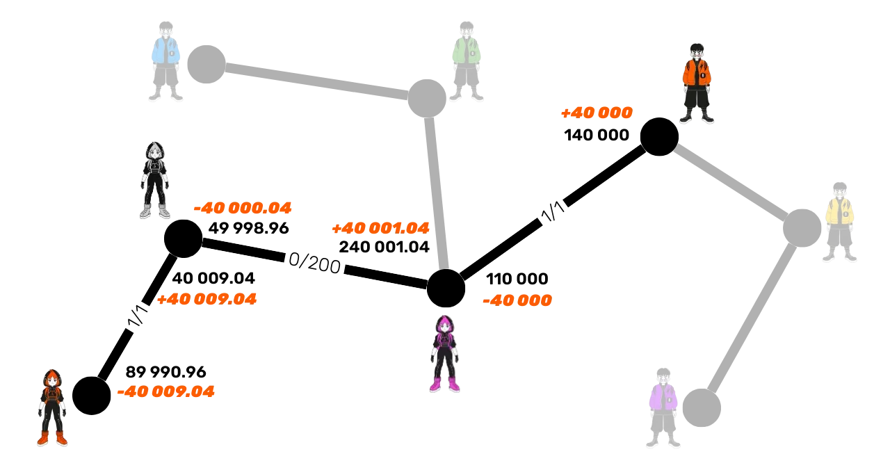

### Onion Routing

Untuk merutekan pembayaran dari pengirim ke penerima, Lightning Network menggunakan metode yang disebut "**onion routing**". Tidak seperti merutekan data klasik, di mana setiap alur menentukan arah data berdasarkan tujuan mereka, onion routing bekerja secara berbeda:

- **Node pengirim menghitung seluruh rute**: Alice, misalnya, menentukan bahwa pembayarannya harus melewati Suzie dan Carol sebelum mencapai Bob.
- **Setiap node perantara hanya mengetahui tetangga terdekatnya**: Suzie hanya tahu bahwa dia menerima dana dari Alice dan dia harus mentransfernya ke Carol. Namun, Suzie tidak tahu apakah Alice adalah node sumber atau node perantara, dan dia juga tidak tahu apakah Carol adalah node penerima atau hanya node perantara lainnya. Prinsip ini juga berlaku untuk Carol dan semua node lain di jalur tersebut. Onion routing menjaga kerahasiaan transaksi dengan menyembunyikan identitas pengirim dan penerima akhir. Untuk memastikan node pengirim dapat menghitung rute lengkap ke penerima dalam onion routing, node tersebut harus memelihara **grafik jaringan** untuk mengetahui topologinya dan menentukan rute yang memungkinkan.

  **Apa yang bisa Anda dapatkan dari bab ini?**

- Di Lightning, pembayaran dapat dirutekan antar node yang tidak terhubung langsung melalui saluran perantara. Setiap node perantara ini memfasilitasi relay likuiditas (dari satu node ke node lainnya).
- Node perantara menerima komisi untuk layanannya, yang terdiri dari biaya tetap dan variabel.
- Onion routing memungkinkan node pengirim untuk menghitung rute lengkap tanpa node perantara mengetahui pengirim atau penerima akhir.

Dalam bab ini, kita telah membahas perutean pembayaran di Jaringan Lightning. Namun, muncul sebuah pertanyaan: apa yang bisa mencegah node perantara dari tidak meneruskan ke node berikutnya yang bertujuan untuk menghambat transaksi tersebut? Inilah peran HTLC yang akan kita pelajari di bab berikutnya.

## HTLC – Hashed Time Locked Contract

<chapterId>4369b85a-1365-55d8-99e1-509088210116</chapterId>
:::video id=6f204b92-55a5-4939-9440-7c5b96a297bf:::


Dalam bab ini, kita akan membahas bagaimana Lightning memungkinkan pembayaran untuk transit melalui node perantara tanpa perlu mempercayai mereka, berkat **[HTLC](https://planb.academy/resources/glossary/htlc)** (_Hashed Time-Locked Contracts_). Kontrak pintar ini memastikan bahwa setiap node perantara hanya akan menerima dana dari salurannya jika ia meneruskan pembayaran ke penerima akhir, jika tidak, pembayaran tidak akan divalidasi.

Masalah yang muncul untuk routing pembayaran adalah perlunya kepercayaan pada node perantara, dan kepercayaan di antara node perantara itu sendiri. Untuk menggambarkannya, mari kita kembali ke contoh Lightning Network (Jaringan Lightning) yang disederhanakan dengan 3 node dan 2 saluran:

- Alice memiliki saluran dengan Suzie.
- Suzie memiliki saluran dengan Bob.

Alice ingin mengirim 40.000 sats ke Bob tetapi Alice tidak memiliki saluran langsung dengan Bob dan tidak ingin membuka saluran baru. Alice mencari route (rute) dan memutuskan untuk melalui node Suzie.

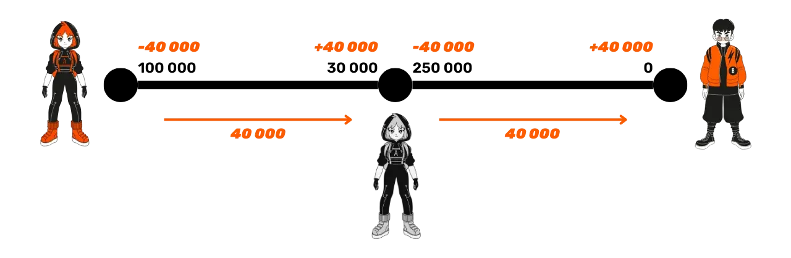

Jika Alice secara naif mengirim 40.000 satoshi ke Suzie dengan harapan Suzie akan mentransfer jumlah tersebut ke Bob, Suzie bisa saja menyimpan dana tersebut untuk dirinya sendiri dan tidak mengirimkan apa pun ke Bob.

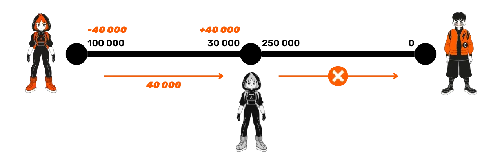
Untuk menghindari situasi ini, di Lightning, kita menggunakan HTLCs (Hashed Time-Locked Contracts), yang membuat pembayaran ke node perantara bersyarat, artinya Suzie harus memenuhi kondisi tertentu untuk mengakses dana Alice dan mentransfernya ke Bob.

### Bagaimana HTLC Bekerja

HTLC adalah kontrak khusus yang didasarkan pada dua prinsip:

- **Kondisi akses**: Penerima harus mengungkapkan rahasia untuk membuka pembayaran yang jatuh tempo kepada mereka.
- **Kedaluwarsa**: Jika pembayaran tidak sepenuhnya selesai dalam periode yang ditentukan, pembayaran dibatalkan, dan dana kembali ke pengirim.

Berikut cara kerja proses ini dalam contoh kita dengan Alice, Suzie, dan Bob:


**Membuat Rahasia**: Bob menghasilkan sebuah rahasia acak yang dinotasikan sebagai _s_ (preimage), dan menghitung hash-nya yang dinotasikan sebagai _r_ dengan fungsi hash yang dinotasikan sebagai _h_. Kita memiliki:

$$
r = h(s)
$$

Menggunakan fungsi hash membuatnya tidak mungkin untuk menemukan _s_ hanya dengan _h(s)_, tetapi jika _s_ disediakan, mudah untuk memverifikasi bahwa itu sesuai dengan _h(s)_.


**Mengirim Permintaan Pembayaran**: Bob mengirimkan sebuah **invoice** kepada Alice meminta pembayaran. Invoice ini secara khusus mencakup hash _r_.


**Mengirim Pembayaran Bersyarat**: Alice mengirimkan HTLC sebesar 40.000 satoshi kepada Suzie. Syarat agar Suzie menerima dana ini adalah dia harus memberikan Alice sebuah rahasia _s'_ yang memenuhi persamaan berikut:

$$
h(s') = r
$$


**Mentransfer HTLC ke Penerima Akhir**: Suzie, untuk mendapatkan 40.000 satoshi dari Alice, harus mentransfer HTLC serupa sebesar 40.000 satoshi kepada Bob, yang memiliki syarat yang sama, yaitu dia harus memberikan Suzie sebuah rahasia _s'_ yang memenuhi persamaan:

$$
h(s') = r
$$


**Validasi oleh Rahasia _s_**: Bob memberikan _s_ kepada Suzie untuk menerima 40.000 satoshi yang dijanjikan dalam HTLC. Dengan rahasia ini, Suzie kemudian dapat membuka HTLC Alice dan mendapatkan 40.000 satoshi dari Alice. Pembayaran tersebut kemudian dirutekan dengan benar kepada Bob.

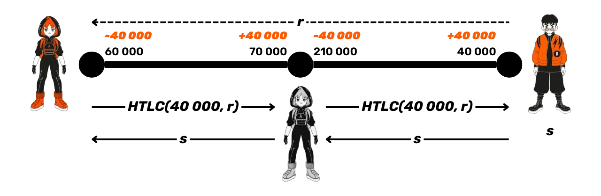
Proses ini mencegah Suzie menyimpan dana Alice tanpa menyelesaikan transfer ke Bob, karena Suzie harus mengirim pembayaran ke Bob untuk mendapatkan rahasia _s_ dan dengan demikian membuka HTLC Alice. Operasi tetap sama bahkan jika rute mencakup beberapa node perantara: ini hanya masalah mengulangi langkah-langkah Suzie untuk setiap node perantara. Setiap node dilindungi oleh kondisi HTLC, karena membuka HTLC terakhir oleh penerima secara otomatis memicu pembukaan semua HTLC lainnya secara beruntun.

### Kedaluwarsa dan Pengelolaan HTLC ketika terjadi Masalah

Jika selama proses pembayaran, salah satu node perantara, atau node penerima, berhenti merespon, terutama dalam kasus gangguan internet atau listrik, maka pembayaran tidak dapat diselesaikan, karena rahasia yang diperlukan untuk membuka HTLC tidak terkirim. Mengambil contoh kita dengan Alice, Suzie, dan Bob, masalah ini terjadi, misalnya, jika Bob tidak mengirimkan rahasia _s_ kepada Suzie. Dalam kasus ini, semua HTLC di jalur awal diblokir, dan dana yang mereka amankan juga demikian.


Untuk menghindari ini, HTLC di Lightning memiliki waktu kedaluwarsa yang memungkinkan penghapusan HTLC jika tidak diselesaikan dalam waktu tertentu. Kedaluwarsa mengikuti urutan tertentu karena dimulai terlebih dahulu dengan HTLC yang paling dekat dengan penerima, dan kemudian secara bertahap bergerak ke atas ke pengirim transaksi. Dalam contoh kita, jika Bob tidak pernah memberikan rahasia _s_ kepada Suzie, pertama-tama akan menyebabkan HTLC Suzie ke Bob kedaluwarsa.


Kemudian HTLC dari Alice ke Suzie.

Jika urutan kedaluwarsa dibalik, Alice bisa mendapatkan kembali uanganya sebelum Suzie bisa melindungi dirinya dari potensi kecurangan. Memang, jika Bob kembali untuk mengklaim HTLC-nya sementara Alice telah menghapus miliknya, Suzie akan berada dalam posisi yang tidak menguntungkan. Urutan kedaluwarsa HTLC yang berurutan ini memastikan bahwa tidak ada node perantara yang menderita kerugian yang tidak adil.

### Gambaran HTLC dalam transaksi komitmen

Transaksi komitmen menggambarkan HTLC sedemikian rupa sehingga kondisi yang mereka terapkan pada Lightning dapat ditransfer ke Bitcoin dalam kejadian penutupan saluran paksa selama masa hidup HTLC. Sebagai pengingat, transaksi komitmen menggambarkan keadaan saat ini dari saluran antara dua pengguna dan memungkinkan penutupan paksa sepihak ketika terjadi masalah. Dengan setiap keadaan baru dari saluran, 2 transaksi komitmen dibuat: satu untuk setiap pihak. Mari kita kembali ke contoh Alice, Suzie, dan Bob, serta melihat lebih jelas apa yang terjadi di tingkat saluran antara Alice dan Suzie ketika HTLC dibuat.


Sebelum dimulainya pembayaran 40.000 sats antara Alice dan Bob, Alice memiliki 100.000 sats di salurannya dengan Suzie, sementara Suzie memiliki 30.000. Transaksi komitmen mereka adalah sebagai berikut:

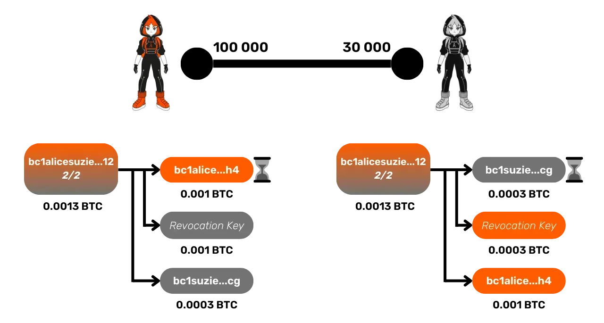

Alice baru saja menerima invoice (permintaan pembayaran) Bob, yang berisi _r_, hash rahasia. Sehingga, Alice dapat membangun HTLC sebesar 40.000 satoshi dengan Suzie. HTLC ini digambarkan dalam transaksi komitmen terbaru sebagai output yang disebut "**_HTLC Out_**" di sisi Alice, karena dana keluar, dan "**_HTLC In_**" di sisi Suzie, karena dana masuk.

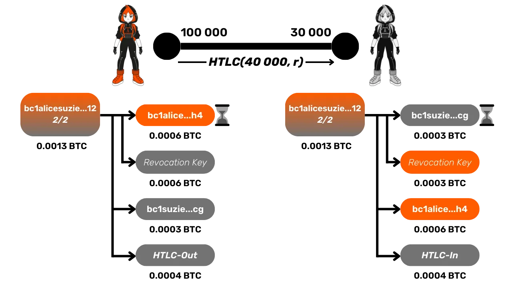

Output yang terkait dengan HTLC ini memiliki kondisi yang sama persis, yaitu:

- Jika Suzie mampu menyediakan rahasia _s_, Suzie dapat membuka output ini segera dan mentransfernya ke alamat yang dia kontrol.
- Jika Suzie tidak memiliki rahasia _s_, Suzie tidak dapat membuka output ini, dan Alice akan dapat membukanya setelah timelock untuk mengirimkannya ke alamat yang dia kontrol. Timelock dengan demikian memberikan Suzie periode untuk bereaksi jika dia memperoleh _s_.

Kondisi ini hanya berlaku jika saluran ditutup (yaitu, transaksi komitmen dipublikasikan on-chain) sementara HTLC masih aktif di Lightning, yang berarti pembayaran antara Alice dan Bob belum diselesaikan, dan HTLC belum kedaluwarsa. Berkat kondisi ini, Suzie dapat memulihkan 40.000 satoshi HTLC yang berhutang kepadanya dengan menyediakan _s_. Jika tidak, Alice memulihkan dana setelah kedaluwarsa timelock, karena jika Suzie tidak tahu _s_, itu berarti Suzie belum mentransfer 40.000 satoshi ke Bob, dan oleh karena itu, dana Alice tidak masuk ke Suzie.

Selanjutnya, jika saluran ditutup ketika beberapa HTLC masih tertunda, akan ada banyak output tambahan sebanyak HTLC yang sedang berlangsung.
Jika saluran tidak ditutup, maka setelah kedaluwarsa atau keberhasilan pembayaran Lightning, transaksi komitmen baru dibuat untuk mencerminkan keadaan baru, sekarang stabil, dari saluran, yaitu, tanpa HTLC yang tertunda. Output yang terkait dengan HTLC dapat dihapus dari transaksi komitmen.
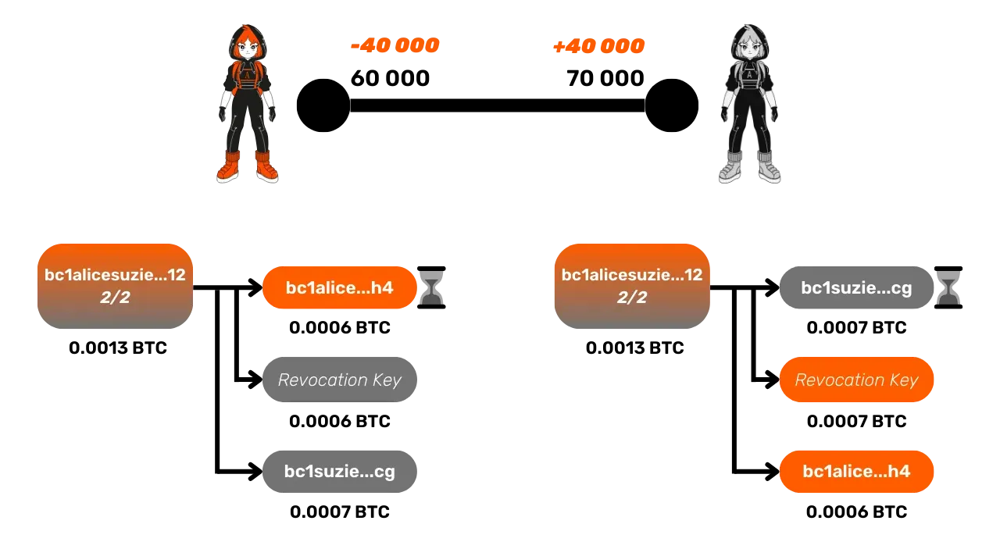
Akhirnya, dalam kasus *penutupan kooperatif* sementara masih ada HTLC aktif, Alice dan Suzie berhenti menerima pembayaran baru dan menunggu resolusi atau kedaluwarsa dari HTLC yang sedang berlangsung. Ini memungkinkan mereka untuk menerbitkan transaksi penutupan yang lebih ringan, tanpa output yang terkait dengan HTLC, sehingga mengurangi biaya dan menghindari menunggu kemungkinan timelock.

**Apa yang bisa Anda dapatkan dari bab ini?**

HTLC memungkinkan routing (perutean) pembayaran Lightning melalui beberapa node tanpa harus mempercayai mereka. Berikut adalah poin-poin kunci untuk diingat:

- HTLC memastikan keamanan pembayaran melalui preimage (rahasia) dan waktu kedaluwarsa.
- Resolusi atau kedaluwarsa dari HTLC mengikuti urutan tertentu: dimulai dari tujuan (penerima) menuju sumber (pengirim), untuk melindungi setiap node.
- Selama HTLC tidak diselesaikan atau kedaluwarsa, HTLC dipertahankan sebagai output dalam transaksi komitmen terbaru.

Di bab selanjutnya, kita akan membahas bagaimana sebuah node yang mengeluarkan transaksi Lightning menemukan dan memilih rute untuk pembayarannya mencapai node penerima.

## Menemukan Jalan Anda

<chapterId>7e2ae959-c2a1-512e-b5d6-8fd962e819da</chapterId>
:::video id=e5baa834-111d-46f5-a28b-3538bed2bbb0:::


Dalam bab-bab sebelumnya, kita melihat bagaimana menggunakan saluran node lain untuk merutekan pembayaran dan mencapai node tanpa harus terhubung langsung melalui saluran. Kita juga membahas bagaimana memastikan keamanan transfer tanpa mempercayai node perantara. Dalam bab ini, kita akan fokus pada menemukan rute terbaik untuk mencapai node target.

### Masalah Perutean di Lightning

Seperti yang telah kita lihat, dalam Lightning, node pengirim pembayaran yang harus menghitung rute lengkap ke penerima, karena kita menggunakan sistem onion routing (perutean onion). Node perantara tidak mengetahui baik titik asal maupun tujuan akhir. Mereka hanya tahu dari mana pembayaran datang dan ke node mana mereka harus mentransfer selanjutnya. Ini berarti bahwa node pengirim harus memelihara topologi lokal dinamis dari jaringan, dengan node Lightning yang ada dan di antara masing-masing saluran, dengan mempertimbangkan pembukaan, penutupan, dan pembaruan status.


Bahkan dengan topologi Jaringan Lightning ini, ada informasi penting untuk perutean yang tetap tidak dapat diakses oleh node pengirim, yaitu distribusi likuiditas yang tepat di saluran pada setiap saat tertentu. Memang, setiap saluran hanya menampilkan **kapasitas total**nya, tetapi distribusi dana internal hanya diketahui oleh dua node yang berpartisipasi. Ini menimbulkan tantangan untuk perutean yang efisien, karena keberhasilan pembayaran tergantung terutama pada apakah jumlahnya kurang dari likuiditas terendah di rute yang dipilih. Namun, tidak semua likuiditas terlihat oleh node pengirim.


### Pembaruan Peta Jaringan

Untuk menjaga peta jaringan mereka tetap aktual, node secara teratur bertukar pesan melalui algoritma yang disebut "**_gossip_**". Ini adalah algoritma terdistribusi yang digunakan untuk menyebarkan informasi secara epidemi ke semua node dalam jaringan, yang memungkinkan pertukaran dan sinkronisasi dari keadaan menyeluruh saluran dalam beberapa siklus komunikasi. Setiap node menyebarkan informasi ke satu atau lebih tetangga yang dipilih secara acak atau tidak, mereka, pada gilirannya, menyebarkan informasi ke tetangga lain dan seterusnya sampai keadaan yang disinkronkan secara menyeluruh tercapai.

2 pesan utama yang ditukar antara node Lightning adalah sebagai berikut:

- "**Pengumuman Saluran**": pesan yang menandakan pembukaan saluran baru.
- "**Pembaruan Saluran**": pesan pembaruan tentang status sebuah saluran, khususnya tentang perubahan biaya (tetapi tidak tentang distribusi likuiditas).
  Node Lightning juga memantau blockchain Bitcoin untuk mendeteksi transaksi penutupan saluran. Saluran yang ditutup kemudian dihapus dari peta karena tidak lagi dapat digunakan untuk merutekan pembayaran kita.

### Merutekan Pembayaran

Mari kita ambil contoh sebuah jaringan Lightning kecil dengan 7 node: Alice, Bob, 1, 2, 3, 4, dan 5. Bayangkan Alice ingin mengirim pembayaran ke Bob tetapi harus melalui node perantara.


Berikut adalah distribusi dana aktual di saluran-saluran ini:

- **Saluran antara Alice dan 1**: 250.000 sats di sisi Alice, 80.000 di sisi 1 (kapasitas total 330.000 sats).
- **Saluran antara 1 dan 2**: 300.000 sats di sisi 1, 200.000 di sisi 2 (kapasitas total 500.000 sats).
- **Saluran antara 2 dan 3**: 50.000 sats di sisi 2, 60.000 di sisi 3 (kapasitas total 110.000 sats).
- **Saluran antara 2 dan 5**: 90.000 sats di sisi 2, 160.000 di sisi 5 (kapasitas total 250.000 sats).
- **Saluran antara 2 dan 4**: 180.000 sats di sisi 2, 110.000 di sisi 4 (kapasitas total 290.000 sats).
- **Saluran antara 4 dan 5**: 200.000 sats di sisi 4, 10.000 di sisi 5 (kapasitas total 210.000 sats).
- **Saluran antara 3 dan Bob**: 50.000 sats di sisi 3, 250.000 di sisi Bob (kapasitas total 300.000 sats).
- **Saluran antara 5 dan Bob**: 260.000 sats di sisi 5, 100.000 di sisi Bob (kapasitas total 360.000 sats).


Untuk melakukan pembayaran 100.000 sats dari Alice ke Bob, opsi rute terbatas oleh likuiditas yang tersedia di setiap saluran. Rute optimal untuk Alice, berdasarkan distribusi likuiditas yang diketahui, bisa jadi urutan `Alice → 1 → 2 → 4 → 5 → Bob`:


Namun, karena Alice tidak mengetahui secara pasti distribusi dana di setiap saluran, dia harus memperkirakan rute optimal secara probabilitas, dengan mempertimbangkan kriteria berikut:

- **Probabilitas keberhasilan**: sebuah saluran dengan kapasitas total yang lebih tinggi kemungkinan besar mengandung likuiditas yang cukup. Misalnya, saluran antara node 2 dan node 3 memiliki kapasitas total 110.000 sats, jadi kemungkinan kecil untuk menemukan 100.000 sats atau lebih di sisi node 2, meskipun tetap mungkin.
- **Biaya transaksi**: dalam memilih rute terbaik, node pengirim juga mempertimbangkan biaya yang diterapkan oleh setiap node perantara dan berusaha meminimalkan total biaya rute.
- **Kadaluwarsa HTLCs**: untuk menghindari pembayaran yang terblokir, waktu kadaluwarsa HTLCs juga merupakan parameter yang harus dipertimbangkan.
- **Jumlah node perantara**: akhirnya, secara lebih luas, node pengirim akan berusaha menemukan rute dengan jumlah node serendah mungkin untuk mengurangi risiko kegagalan dan membatasi biaya transaksi Lightning.
  Dengan menganalisis kriteria ini, node pengirim dapat menguji rute yang paling mungkin dan mencoba mengoptimalkannya. Dalam contoh kita, Alice dapat merangking rute terbaik sebagai berikut:

- `Alice → 1 → 2 → 5 → Bob`, karena ini adalah rute terpendek dengan kapasitas tertinggi.
- `Alice → 1 → 2 → 4 → 5 → Bob`, karena rute ini menawarkan kapasitas yang baik, meskipun lebih panjang dari yang pertama.
- `Alice → 1 → 2 → 3 → Bob`, karena rute ini termasuk saluran `2 → 3`, yang memiliki kapasitas sangat terbatas, tetapi tetap berpotensi dapat digunakan.

### Eksekusi Pembayaran

Alice memutuskan untuk menguji rute pertamanya (`Alice → 1 → 2 → 5 → Bob`). Oleh karena itu, Alice mengirimkan HTLC sebesar 100.000 sats ke node 1. Node ini memeriksa bahwa ia memiliki likuiditas yang cukup dengan node 2, dan melanjutkan transmisi. Node 2 kemudian menerima HTLC dari node 1, tetapi menyadari bahwa node 2 tidak memiliki cukup likuiditas di salurannya dengan node 5 untuk merutekan pembayaran sebesar 100.000 sats. Kemudian, node 2 mengirimkan pesan kesalahan (error message) kembali ke node 1, yang meneruskannya ke Alice. Rute ini telah gagal.

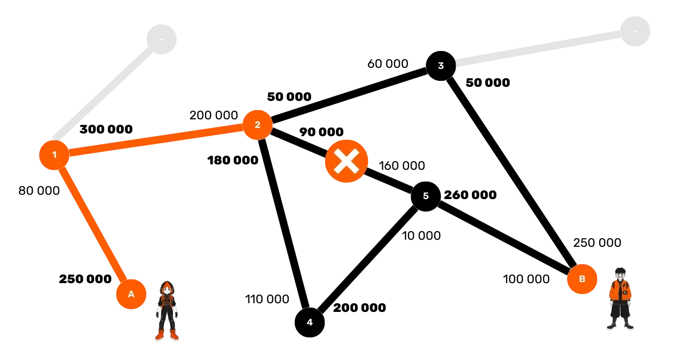

Alice kemudian mencoba merutekan pembayarannya menggunakan rute keduanya (`Alice → 1 → 2 → 4 → 5 → Bob`). Alice mengirimkan HTLC sebesar 100.000 sats ke node 1, yang meneruskannya ke node 2, lalu ke node 4, ke node 5, dan akhirnya ke Bob. Kali ini, likuiditasnya cukup, dan rute berfungsi. Setiap node membuka kunci HTLC-nya secara bertahap menggunakan preimage yang disediakan oleh Bob (rahasia _s_), yang memungkinkan pembayaran Alice ke Bob berhasil diselesaikan.


Pencarian rute dilakukan sebagai berikut: node pengirim mulai dengan mengidentifikasi rute terbaik yang mungkin, kemudian mencoba pembayaran secara bertahap sampai rute yang berfungsi ditemukan.

Penting untuk dicatat bahwa Bob dapat memberikan informasi kepada Alice dalam **invoice** untuk memfasilitasi perutean. Misalnya, dia dapat menunjukkan saluran terdekat dengan likuiditas yang cukup atau mengungkapkan keberadaan saluran privat. Indikasi ini memungkinkan Alice menghindari rute dengan peluang keberhasilan yang kecil dan terlebih dahulu mencoba jalur yang direkomendasikan oleh Bob.

**Apa yang bisa Anda dapatkan dari bab ini?**

- Node mempertahankan peta topologi jaringan melalui pengumuman dan dengan memantau penutupan saluran di blockchain Bitcoin.
- Pencarian rute optimal untuk pembayaran tetap probabilistik (dengan kemungkinan) dan bergantung pada banyak kriteria.
- Bob dapat memberikan indikasi dalam **invoice** untuk memandu perutean Alice dan menyelamatkannya dari menguji rute yang tidak mungkin.

Dalam bab berikutnya, kita akan secara khusus mempelajari fungsi invoice, juga beberapa alat lain yang digunakan di Lightning Network (Jaringan Lightning).

# Alat-alat Jaringan Lightning

<partId>74d6c334-ec5d-55d9-8598-f05694703bf6</partId>

## Invoice, LNURL, dan Keysend

<chapterId>e34c7ecd-2327-52e3-b61e-c837d9e5e8b0</chapterId>
:::video id=309c3412-506e-4189-ad46-5e5088c55008:::

Dalam bab ini, kita akan membahas cara kerja **invoice** Lightning, yaitu permintaan pembayaran yang dikirim oleh node penerima ke node pengirim. Tujuannya adalah untuk memahami cara membayar dan menerima pembayaran di Lightning. Kita juga akan membahas 2 alternatif untuk invoice klasik: LNURL dan Keysend.


### Struktur Invoice Lightning

Seperti yang dijelaskan dalam bab tentang HTLCs, setiap pembayaran dimulai dengan pembuatan **invoice** oleh penerima. Invoice ini kemudian dikirimkan ke pembayar (melalui kode QR atau dengan menyalin dan menempel) untuk memulai pembayaran. Invoice terdiri dari dua bagian utama:

- **Bagian yang Dapat Dibaca Manusia**: bagian ini berisi metadata yang jelas terlihat untuk meningkatkan pengalaman pengguna.
- **Payload**: bagian ini mencakup informasi yang ditujukan untuk mesin dalam memproses pembayaran.

Struktur umum dari sebuah invoice dimulai dengan `ln` untuk "Lightning", diikuti oleh `bc` untuk Bitcoin, kemudian total dari invoice. Sebuah pemisah `1` membedakan bagian yang dapat dibaca manusia dari bagian data (payload).

Mari kita ambil invoice berikut sebagai contoh:

```invoice
lnbc100u1p0x7x7dpp5l7r9y50wrzz0lwnsqgxdks50lxtwkl0mhd9lslr4rcgdtt2n6lssp5l3pkhdx0cmc9gfsqvw5xjhph84my2frzjqxqyz5vq9qsp5k4mkzv5jd8u5n89d2yc50x7ptkl0zprx0dfjh3km7g0x98g70hsqq7sqqqgqqyqqqqlgqqvnv2k5ehwnylq3rhpd9g2y0sq9ujyxsqqypjqqyqqqqqqqqqqqsqqqqq9qsq3vql5f6e45xztgj7y6xw6ghrcz3vmh8msrz8myvhsarxg42ce9yyn53lgnryx0m6qqld8fql
```

Kita sudah bisa membaginya menjadi 2 bagian. Pertama, ada Bagian yang Dapat Dibaca Manusia:

```invoice
lnbc100u
```

Kemudian bagian yang dimaksudkan untuk payload:

```invoice

p0x7x7dpp5l7r9y50wrzz0lwnsqgxdks50lxtwkl0mhd9lslr4rcgdtt2n6lssp5l3pkhdx0cmc9gfsqvw5xjhph84my2frzjqxqyz5vq9qsp5k4mkzv5jd8u5n89d2yc50x7ptkl0zprx0dfjh3km7g0x98g70hsqq7sqqqgqqyqqqqlgqqvnv2k5ehwnylq3rhpd9g2y0sq9ujyxsqqypjqqyqqqqqqqqqqqsqqqqq9qsq3vql5f6e45xztgj7y6xw6ghrcz3vmh8msrz8myvhsarxg42ce9yyn53lgnryx0m6qqld8fql
```

Dua bagian tersebut dipisahkan oleh `1`. Pemisah ini dipilih alih-alih karakter khusus untuk memudahkan menyalin seluruh faktur dengan mengklik dua kali.

Pada bagian pertama, kita dapat melihat bahwa:

- `ln` menunjukkan bahwa ini adalah transaksi Lightning.
- `bc` menunjukkan bahwa jaringan Lightning berada di blockchain Bitcoin (dan bukan di testnet atau di Litecoin).
- `100u` menunjukkan jumlah faktur, dinyatakan dalam **mikrobitcoins** (`u` berarti "mikro"), yang di sini sama dengan 10.000 sats.

Untuk menunjukkan jumlah pembayaran, ini dinyatakan dalam sub-unit bitcoin. Berikut adalah unit yang digunakan:

- **Millibitcoin (ditandai `m`):** Mewakili seperseribu (1/1.000) dari satu bitcoin.

  $$
  1 \, \text{mBTC} = 10^{-3} \, \text{BTC} = 10^5 \, \text{satoshis}
  $$

- **Microbitcoin (ditandai `u`):** Juga terkadang disebut "bit", mewakili sepersejuta (1/1.000.000) dari satu bitcoin.

  $$
  1 \, \mu\text{BTC} = 10^{-6} \, \text{BTC} = 100 \, \text{satoshis}
  $$

- **Nanobitcoin (ditandai `n`):** Mewakili sepermiliar (1/1.000.000.000) dari satu bitcoin.

  $$
  1 \, \text{nBTC} = 10^{-9} \, \text{BTC} = 0.1 \, \text{satoshis}
  $$

- **Picobitcoin (ditandai `p`):** Mewakili sepertriliun (1/1.000.000.000.000) dari satu bitcoin.
  $$
  1 \, \text{pBTC} = 10^{-12} \, \text{BTC} = 0.0001 \, \text{satoshis}
  $$

### Muatan Invoice

Muatan invoice mencakup beberapa informasi yang diperlukan untuk memproses pembayaran:

- **Timestamp:** Waktu pembuatan invoice, dinyatakan dalam Unix Timestamp (jumlah detik yang telah berlalu sejak 1 Januari 1970).
- **Hashing the Secret (Rahasia)**: Seperti yang dibahas dalam bagian tentang HTLCs, node penerima harus memberikan node pengirim hash preimage (rahasia). Ini digunakan dalam HTLCs untuk mengamankan transaksi. Kita menyebutnya sebagai "_r_".
- **Payment Secret (Rahasia Pembayaran)**: Rahasia lain dihasilkan oleh penerima, tetapi kali ini dikirimkan ke node pengirim. Ini digunakan dalam onion routing untuk mencegah node-node perantara menebak apakah node berikutnya adalah penerima akhir atau bukan. Sehingga menjaga kerahasiaan bagi penerima sebagai node perantara terakhir di rute tersebut.
- **Kunci Publik Penerima**: Menunjukkan kepada pihak pembayar identitas orang yang akan menerima pembayaran.
- **Durasi Kedaluwarsa**: Waktu maksimum untuk invoice dibayar (selama 1 jam).
- **Petunjuk Rute**: Informasi tambahan yang diberikan oleh penerima untuk membantu pengirim mengoptimalkan rute pembayaran.
- **Tanda Tangan**: Menjamin integritas invoice dengan mengautentikasi semua informasi yang tercantum di dalamnya.

Invoice kemudian dikodekan dalam **bech32**, format yang sama seperti untuk alamat Bitcoin SegWit (format dimulai dengan `bc1`).

### Penarikan LNURL

Dalam transaksi tradisional, seperti pembelian di toko, invoice dihasilkan untuk jumlah total yang harus dibayar. Setelah invoice diberikan (dalam bentuk kode QR atau rangkaian karakter), pelanggan dapat memindainya dan menyelesaikan transaksi. Pembayaran kemudian mengikuti proses tradisional yang telah kita pelajari di bagian sebelumnya. Namun, proses ini terkadang bisa sangat merepotkan untuk pengalaman pengguna, karena memerlukan penerima untuk mengirim informasi ke pengirim melalui invoice.

Dalam situasi tertentu, seperti menarik bitcoin dari layanan online, proses tradisional terlalu merepotkan. Dalam kasus seperti itu, solusi penarikan **LNURL** menyederhanakan proses ini dengan menampilkan kode QR yang dipindai oleh dompet penerima untuk secara otomatis membuat invoice. Layanan kemudian membayar invoice, dan pengguna dapat langsung melakukan penarikan instan.


LNURL adalah protokol komunikasi yang menentukan serangkaian fungsi yang dirancang untuk menyederhanakan interaksi antara node Lightning dan klien, serta aplikasi pihak ketiga. Penarikan LNURL, seperti yang baru saja kita lihat, hanyalah salah satu contoh di antara fungsi lainnya.
Protokol ini berbasis HTTP dan memungkinkan pembuatan tautan untuk berbagai operasi, seperti permintaan pembayaran, permintaan penarikan, atau fungsi lain yang meningkatkan pengalaman pengguna. Setiap LNURL adalah URL yang dikodekan bech32 dengan awalan lnurl, yang, setelah dipindai, memicu serangkaian tindakan otomatis pada dompet Lightning.
Misalnya, fitur LNURL-withdraw (LUD-03) memungkinkan penarikan dana dari layanan dengan memindai kode QR, tanpa perlu menghasilkan invoice secara manual. Sama halnya dengan LNURL-auth (LUD-04) yang memungkinkan masuk ke layanan online menggunakan kunci pribadi di dompet Lightning seseorang alih-alih kata sandi.

### Mengirim Pembayaran Lightning Tanpa Invoice: Keysend

Kasus menarik lainnya adalah transfer dana tanpa menerima invoice terlebih dahulu, yang dikenal sebagai "**Keysend**". Protokol ini memungkinkan pengiriman dana dengan menambahkan preimage (rahasia) dalam data pembayaran terenkripsi, yang hanya dapat diakses oleh penerima. Preimage (rahasia) ini memungkinkan penerima untuk membuka HTLC, sehingga mengambil dana tanpa harus menghasilkan invoice terlebih dahulu.

Untuk menyederhanakan, dalam protokol ini, pengirim yang menghasilkan rahasia yang digunakan dalam HTLC, bukan penerima. Secara praktis, ini memungkinkan pengirim untuk melakukan pembayaran tanpa harus berinteraksi dengan penerima terlebih dahulu.


**Apa yang bisa Anda dapatkan dari bab ini?**

- **Lightning Invoice** adalah permintaan pembayaran yang terdiri dari bagian yang dapat dibaca manusia dan bagian data mesin.
- Faktur dikodekan dalam **bech32**, dengan pemisah `1` untuk memudahkan penyalinan dan bagian data yang berisi semua informasi yang diperlukan untuk memproses pembayaran.
- Proses pembayaran lainnya berada di Lightning, terutama **LNURL-Withdraw** untuk memudahkan penarikan, dan **Keysend** untuk transfer langsung tanpa invoice.

Di bab berikutnya, kita akan melihat bagaimana operator node dapat mengelola likuiditas di saluran mereka, agar tidak pernah diblokir dan selalu dapat mengirim dan menerima pembayaran di Lightning Network (Jaringan Lightning).

## Mengelola Likuiditas Anda

<chapterId>cc76d0c4-d958-57f5-84bf-177e21393f48</chapterId>
:::video id=96096aef-e4ce-4c44-a022-57e27082232a:::


Dalam bab ini, kita akan membahas strategi untuk mengelola likuiditas secara efektif di Lightning Network (Jaringan Lightning). Pengelolaan likuiditas ada bermacam-macam tergantung pada jenis pengguna dan konteks. Kita akan melihat prinsip utama dan teknik yang ada untuk lebih memahami cara mengoptimalkan pengelolaan ini.

### Kebutuhan Likuiditas

Ada tiga profil pengguna utama di Lightning, masing-masing dengan kebutuhan likuiditas spesifik:

- **Pembayar**: Ini adalah orang yang melakukan pembayaran. Mereka membutuhkan outgoing liquidity (likuiditas keluar) untuk dapat mentransfer dana ke pengguna lain. Sebagai contoh, ini bisa jadi seorang konsumen.
- **Penjual (atau Penerima Pembayaran)**: Ini adalah orang yang menerima pembayaran. Mereka membutuhkan incoming liquidity (likuiditas masuk) untuk dapat menerima pembayaran ke node mereka. Sebagai contoh, ini bisa jadi sebuah bisnis atau toko online.
- **Router**: Sebuah node perantara, sering kali dikhususkan dalam merutekan pembayaran, yang harus mengoptimalkan likuiditas di setiap saluran untuk merutekan sebanyak mungkin pembayaran dan mendapatkan biaya.

Profil setiap pengguna tidak bersifat permanen; seorang pengguna dapat beralih antara pembayar dan penerima pembayaran tergantung pada transaksi. Sebagai contoh, Bob bisa menerima gajinya di Lightning dari pemberi kerjanya, menempatkannya dalam posisi "penjual" yang memerlukan likuiditas masuk. Selanjutnya, jika dia ingin menggunakan gajinya untuk membeli makanan, dia menjadi "pembayar" dan harus memiliki likuiditas keluar.

Untuk lebih memahami, mari kita ambil contoh jaringan sederhana yang terdiri dari tiga node: pembeli (Alice), router (Suzie), dan penjual (Bob).


Bayangkan bahwa pembeli ingin mengirim 30.000 satoshi ke penjual dan pembayaran tersebut melewati node perantara. Setiap pihak kemudian harus memiliki jumlah likuiditas minimum dalam arah pembayaran:

- Pembayar harus memiliki setidaknya 30.000 satoshi di sisi mereka dari saluran dengan perantara.
- Penjual harus memiliki saluran di mana 30.000 satoshi berada di sisi berlawanan untuk dapat menerimanya.
- Perantara harus memiliki 30.000 satoshi di sisi pembayar dalam saluran mereka, dan juga 30.000 satoshi di sisi mereka dalam saluran dengan penjual, untuk dapat merutekan/ mengirimkan pembayaran.


### Strategi Manajemen Likuiditas

Pembayar harus memastikan untuk memelihara likuiditas yang cukup di sisi saluran mereka untuk menjamin likuiditas keluar. Ini cukup sederhana, karena hanya dengan membuka saluran Lightning baru untuk memiliki likuiditas ini. Memang, dana awal yang terkunci dalam multisig on-chain sepenuhnya berada di sisi pembayar dalam saluran Lightning pada awalnya. Kapasitas pembayaran dengan demikian dijamin selama saluran dibuka dengan dana yang cukup. Ketika likuiditas keluar habis, cukup dengan membuka saluran baru.
Di sisi lain, untuk penjual, tugasnya lebih kompleks. Untuk dapat menerima pembayaran, mereka harus memiliki likuiditas di sisi berlawanan dari saluran mereka. Oleh karena itu, membuka saluran saja tidak cukup: mereka juga harus melakukan pembayaran dalam saluran ini untuk memindahkan likuiditas ke sisi lain sebelum mereka dapat menerima pembayaran sendiri. Untuk beberapa profil pengguna Lightning, seperti pedagang, ada ketidakseimbangan yang jelas antara apa yang dikirim node mereka dan apa yang diterima, karena tujuan bisnis terutama adalah untuk mengumpulkan lebih banyak daripada yang dibelanjakan, untuk menghasilkan keuntungan. Untungnya, bagi pengguna ini dengan kebutuhan likuiditas masuk spesifik, ada beberapa solusi:

- **Membuat pihak lain tertarik untuk membuka saluran**: Pedagang mendapat keuntungan karena volume pembayaran masuk yang diharapkan pada node mereka. Dengan mempertimbangkan hal ini, pedagang dapat mencoba menarik node perantara yang mencari pendapatan dari biaya transaksi dan yang mungkin membuka saluran ke arah mereka, berharap untuk merutekan pembayaran mereka dan mengumpulkan biaya terkait.
- **Pergerakan Likuiditas**: Penjual juga dapat membuka sebuah saluran dan mentransfer sebagian dana ke sisi yang berlawanan dengan membuat pembayaran fiktif ke node lain, yang akan mengembalikan uang tersebut dengan cara lain. Kita akan melihat di bagian selanjutnya bagaimana melaksanakan cara ini.
- **Pembukaan Segitiga**: Platform tersedia bagi node yang ingin membuka saluran secara kolaboratif, memungkinkan masing-masing untuk mendapatkan keuntungan dari likuiditas masuk dan keluar secara langsung. Sebagai contoh, [LightningNetwork+](https://lightningnetwork.plus/) menawarkan layanan ini. Jika Alice, Bob, dan Suzie ingin membuka saluran dengan 100.000 sats, mereka dapat sepakat di platform ini agar Alice membuka saluran ke arah Bob, Bob ke arah Suzie, dan Suzie ke arah Alice. Dengan cara ini, masing-masing memiliki 100.000 sats likuiditas keluar dan 100.000 sats likuiditas masuk, dengan hanya mengunci 100.000 sats.


- **Membeli Saluran**: Layanan untuk menyewa saluran Lightning juga ada untuk mendapatkan likuiditas masuk, seperti [Bitrefill Thor](https://www.bitrefill.com/thor-lightning-network-channels/) atau [Lightning Labs Pool](https://lightning.engineering/pool/). Sebagai contoh, Alice dapat membeli saluran satu juta satoshi ke arah nodenya agar dia dapat menerima pembayaran.

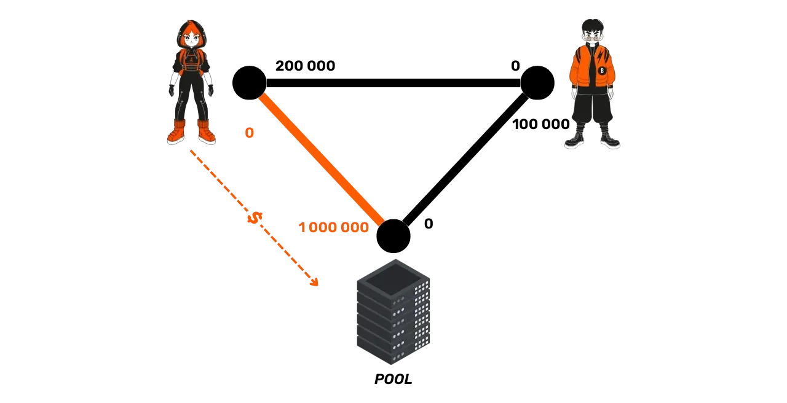

Akhirnya, bagi perantara, yang tujuannya adalah untuk memaksimalkan jumlah pembayaran yang diproses dan biaya yang dikumpulkan, mereka harus:

- Membuka saluran yang dibiayai dengan baik dengan node strategis.
- Secara rutin menyesuaikan distribusi dana di saluran sesuai dengan kebutuhan jaringan.

### Layanan Loop Out

Layanan [Loop Out](https://lightning.engineering/loop/), yang ditawarkan oleh Lightning Labs, memungkinkan untuk memindahkan likuiditas ke sisi yang berlawanan dari saluran sambil mengklaim kembali dana tersebut di blockchain Bitcoin. Sebagai contoh, Alice mengirim 1 juta satoshi melalui Lightning ke node loop, yang kemudian mengembalikan dana tersebut kepadanya di bitcoin on-chain. Ini menyeimbangkan salurannya dengan 1 juta satoshi di setiap sisi, mengoptimalkan kapasitas Alice untuk menerima pembayaran.


Oleh karena itu, layanan ini memungkinkan likuiditas masuk sambil mengklaim kembali bitcoin seseorang di Bitcoin on-chain, yang membantu untuk membatasi imobilisasi kas yang diperlukan untuk menerima pembayaran dengan Lightning.

**Apa yang bisa Anda dapatkan dari bab ini?**

- Untuk mengirim pembayaran di Lightning, Anda harus memiliki cukup likuiditas di sisi Anda dalam saluran Anda. Untuk meningkatkan kapasitas pengiriman ini, cukup dengan membuka saluran baru.
- Untuk menerima pembayaran, Anda perlu memiliki likuiditas di sisi yang berlawanan dalam saluran Anda. Meningkatkan kapasitas penerimaan ini lebih kompleks, karena memerlukan orang lain untuk membuka saluran ke arah Anda, atau untuk membuat pembayaran (fiktif atau nyata) untuk memindahkan likuiditas ke sisi lain.
- Memelihara likuiditas sesuai keinginan bisa menjadi lebih menantang tergantung pada penggunaan saluran. Itulah mengapa alat dan layanan ada untuk membantu menyeimbangkan saluran sesuai keinginan.

Di bab selanjutnya, saya mengusulkan untuk meninjau konsep-konsep paling penting dari pelatihan ini.

# Lanjutkan Lebih Jauh

<partId>6bbf107d-a224-5916-9f0c-2b4d30dd0b17</partId>

## Ringkasan Pelatihan


<chapterId>a65a571c-561b-5e1c-87bf-494644653c22</chapterId>
:::video id=5f4f4344-ef27-4765-8f09-8262e6833bde:::

Dalam bab terakhir ini yang menandai akhir dari pelatihan LNP201, saya mengusulkan untuk mengunjungi kembali konsep-konsep penting yang telah kita bahas bersama. 

Tujuan dari pelatihan ini adalah untuk memberikan Anda pemahaman yang komprehensif dan teknis tentang Lightning Network. Kita telah membahas bagaimana Lightning Network mengandalkan blockchain Bitcoin untuk melakukan transaksi off-chain, dengan tetap mempertahankan karakteristik fundamental dari Bitcoin, terutama ketiadaan kebutuhan untuk mempercayai node lain.

### Saluran Pembayaran

Dalam bab awal, kita membahas bagaimana dua pihak, dengan membuka saluran pembayaran, dapat melakukan transaksi di luar blockchain Bitcoin. Berikut adalah langkah-langkah yang dibahas:

- **Pembukaan Saluran**: Pembuatan saluran dilakukan melalui transaksi Bitcoin yang mengunci dana dalam 2/2 multi-signature address (alamat multi-tanda tangan 2/2). Deposit ini mewakili saluran Lightning di blockchain.

 
2. **Transaksi dalam Saluran**: Di saluran ini, kemudian dimungkinkan untuk melakukan banyak transaksi tanpa harus mempublikasikannya di blockchain. Setiap transaksi Lightning menciptakan keadaan baru dari saluran tersebut yang tercermin dalam transaksi komitmen.


- **Pengamanan dan Penutupan**: Peserta berkomitmen pada keadaan baru saluran dengan bertukar kunci pembatalan untuk mengamankan dana dan mencegah kecurangan. Kedua belah pihak dapat menutup saluran secara kooperatif dengan membuat transaksi baru di blockchain Bitcoin, atau sebagai pilihan terakhir melalui penutupan paksa. Opsi terakhir ini, meskipun kurang efisien karena lebih lama dan terkadang dinilai buruk dalam hal biaya, masih memungkinkan untuk pemulihan dana. Dalam kasus kecurangan, korban dapat menghukum penipu dengan memulihkan semua dana dari saluran di blockchain.

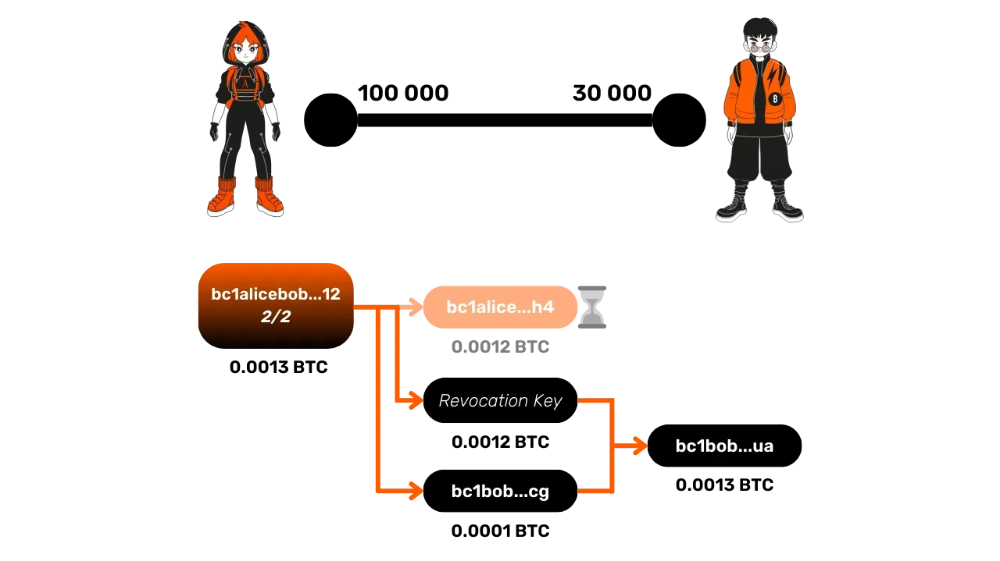

### Jaringan Saluran

Setelah mempelajari saluran terisolasi, kita memperluas analisis kita ke jaringan saluran:

- **Routing**: Ketika dua pihak tidak langsung terhubung oleh sebuah saluran, jaringan memungkinkan routing melalui node perantara. Pembayaran kemudian transit dari satu node ke node lain.


- **HTLCs**: Pembayaran yang transit melalui node perantara diamankan oleh "_Hash Time-Locked Contracts_" (HTLC), yang memungkinkan dana untuk dikunci sampai pembayaran selesai dari ujung ke ujung.


- **Onion Routing**: Untuk memastikan kerahasiaan pembayaran, onion routing menyembunyikan tujuan akhir dari node perantara. Node pengirim oleh karena itu harus menghitung seluruh rute, tetapi tanpa informasi lengkap tentang likuiditas saluran, prosesnya dilakukan melalui percobaan bertahap untuk merutekan pembayaran.


### Manajemen Likuiditas

Kita telah melihat bahwa manajemen likuiditas adalah tantangan di Lightning untuk memastikan aliran pembayaran yang lancar. Mengirim pembayaran cenderung sederhana: hanya memerlukan pembukaan saluran. Namun, menerima pembayaran memerlukan likuiditas di sisi berlawanan dari saluran seseorang. Berikut adalah beberapa strategi yang dibahas:

- **Membuat Pihak Lain Tertarik untuk Membuka Saluran**: Dengan mendorong node lain untuk membuka saluran ke arah diri sendiri, pengguna memperoleh likuiditas masuk.

- **Memindahkan Likuiditas**: Dengan mengirim pembayaran ke saluran lain, likuiditas berpindah ke sisi berlawanan.


- **Menggunakan Layanan seperti Loop dan Pool**: Layanan ini memungkinkan untuk menyeimbangkan kembali atau membeli saluran dengan likuiditas di sisi berlawanan.
  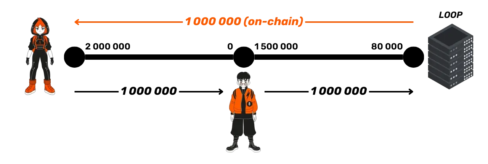
- **Pembukaan Kolaboratif**: Ada juga platform yang memungkinkan untuk melakukan pembukaan segitiga dan memiliki likuiditas masuk.


# Bagian Akhir

<partId>b8715c1c-7ae2-49b7-94c7-35bf85346ad3</partId>

## Ulasan & Penilaian

<chapterId>38814c99-eb7b-5772-af49-4386ee2ce9b0</chapterId>
<isCourseReview>true</isCourseReview>

## Ujian akhir

<chapterId>7ed33400-aef7-5f3e-bfb1-7867e445d708</chapterId>
<isCourseExam>true</isCourseExam>

## Kesimpulan

<chapterId>afc0d72b-4fbc-5893-90b2-e27fb519ad02</chapterId>
<isCourseConclusion>true</isCourseConclusion>