# लाइटनिंग पर स्वायत्तता की ओर आपका पहला कदम


आपने अपना पहला sats हासिल कर लिया है, अपने स्व-संरक्षण कोष सुरक्षित कर लिए हैं और on-chain के उपयोग में संप्रभुता प्राप्त करने के लिए एक Bitcoin नोड तैनात कर लिया है। अगला कदम लाइटनिंग पर भी यही स्वायत्तता हासिल करना है: यही इस पाठ्यक्रम का उद्देश्य है।


LNP202 मध्यम स्तर के उपयोगकर्ताओं के लिए है, और यह आपको उन्नत तकनीकी कौशल के बिना, अपने पहले लाइटनिंग नोड की तैनाती के माध्यम से चरण-दर-चरण मार्गदर्शन करता है।


आप सीखेंगे कि Umbrel पर LND कैसे स्थापित करें, अपने चैनल कैसे खोलें और प्रबंधित करें, अपने नोड की निगरानी कैसे करें और एक मोबाइल wallet को कैसे कनेक्ट करें, ताकि आप अपने फंड पर पूर्ण नियंत्रण बनाए रखते हुए एक कस्टोडियल wallet के समान अनुभव का आनंद ले सकें।


+++


# परिचय


<partId>5e77c17a-0853-4f36-a988-1b4a956f49e4</partId>


## पाठ्यक्रम अवलोकन


<chapterId>e0871abf-af6d-4221-9389-1a996aea9b79</chapterId>


LNP202 एक प्रैक्टिकल कोर्स है जिसे लाइटनिंग नेटवर्क पर अपना खुद का नोड संचालित करके आपको आत्मनिर्भर बनाने के लिए डिज़ाइन किया गया है। इसका उद्देश्य सरल है: पहले से स्थापित Bitcoin नोड से शुरुआत करें, Umbrel पर LND को डिप्लॉय करें, इसे ठीक से सुरक्षित करें, अपने पहले चैनल खोलें और प्रबंधित करें, और फिर मोबाइल wallet से अपने नोड का दैनिक आधार पर उपयोग करें। यह कोर्स मानता है कि आपने पहले ही BTC 202 कोर्स पूरा कर लिया है, क्योंकि मैं मान रहा हूं कि Umbrel पर आपका Bitcoin नोड स्थापित और सिंक्रोनाइज़्ड है। हम यहां Bitcoin नोड को सेटअप करने के तरीके पर दोबारा चर्चा नहीं करेंगे।


https://planb.academy/courses/3cd9cb94-82e8-417a-9c5a-02afc2589426

लाइटनिंग की आंतरिक कार्यप्रणाली को बेहतर ढंग से समझने के लिए, LNP 201 पाठ्यक्रम की भी अत्यधिक अनुशंसा की जाती है, हालांकि यह इस पाठ्यक्रम के लिए एक पूर्व शर्त नहीं है:


https://planb.academy/courses/34bd43ef-6683-4a5c-b239-7cb1e40a4aeb

इस LNP202 कोर्स के पहले भाग में, हम जानेंगे कि लाइटनिंग नोड वास्तव में क्या है, यह एक साधारण wallet से कैसे भिन्न है, और व्यक्तिगत नोड का संचालन ही लाइटनिंग का उपयोग करने का एकमात्र तरीका क्यों है, ताकि आपको अपने sats को किसी विश्वसनीय तृतीय पक्ष को सौंपने की आवश्यकता न पड़े। यह खंड एक रणनीतिक विकल्प के साथ समाप्त होता है: आपके लिए कौन सा समाधान सही है, सबसे सरल तरीकों से लेकर क्लासिक लाइटनिंग नोड तक, जिसे हम इस कोर्स में लागू करेंगे।


कोर्स के दूसरे भाग में, आप Umbrel पर LND इंस्टॉल करेंगे, फिर उन तत्वों को लागू करेंगे जो सबसे महंगी गलतियों को रोकते हैं: एक व्यावहारिक बैकअप रणनीति और वॉचटावर के माध्यम से धोखाधड़ी से सुरक्षा। एक बार ये बुनियादी चीज़ें लागू हो जाने पर, आप अपना पहला चैनल खोलेंगे, ताकि आप अपने खुद के इंफ्रास्ट्रक्चर के साथ लाइटनिंग पर भुगतान करना शुरू कर सकें।


तो जैसा कि आप देख सकते हैं: इस LNP202 कोर्स में, हम लाइटनिंग नोड को प्लग-एंड-प्ले मोड में Umbrel के माध्यम से सेटअप करेंगे, न कि पारंपरिक कमांड-लाइन तरीके से, ताकि यह मध्यम स्तर के उपयोगकर्ताओं के लिए उपयुक्त हो। यदि आप कमांड-लाइन इंस्टॉलेशन पसंद करते हैं, तो मैं आपको नीचे दिए गए ट्यूटोरियल का पालन करने की सलाह देता हूं। अन्य, अधिक उन्नत, कमांड-लाइन आधारित लाइटनिंग कोर्स भी तैयार किए जा रहे हैं।


https://planb.academy/tutorials/node/lightning-network/lightning-network-daemon-linux-59d777e9-72c8-4b32-8c50-e86cdae8f2f9

भाग 3 आपको एक कार्यशील नोड से एक ऐसे नोड तक ले जाएगा जिसे आप नियंत्रित करना जानते हैं। आप सबसे पहले अपने लाइटनिंग नोड ऑपरेटर प्रोफ़ाइल (उपभोक्ता, व्यापारी या राउटर) का निर्धारण करेंगे, फिर अपने चैनलों को ट्रैक करने और अपनी टोपोलॉजी पर सुचारू रूप से कार्य करने के लिए एक संपूर्ण प्रबंधन सॉफ़्टवेयर पैकेज को समझेंगे। अंत में, आप लाइटनिंग के एक बहुत ही महत्वपूर्ण बिंदु पर ध्यान देंगे: भुगतान या सहयोगात्मक समाधानों के माध्यम से इनबाउंड लिक्विडिटी कैसे प्राप्त करें।


भाग 4 में दैनिक उपयोग पर ध्यान केंद्रित किया जाएगा। आप अपने नोड और मोबाइल ग्राहक के बीच कनेक्शन स्थापित करेंगे, ताकि आप स्व-संरक्षण छोड़े बिना अपने स्मार्टफोन से आसानी से भुगतान और प्राप्ति कर सकें। हम पहले *Tailscale* के माध्यम से नेटवर्क दृष्टिकोण और फिर *Nostr Wallet कनेक्ट* के माध्यम से प्रोटोकॉल दृष्टिकोण पर विचार करेंगे, साथ ही उनके संबंधित लाभ और कमियों को भी समझेंगे। पाठ्यक्रम का समापन एक अंतिम अध्याय के साथ होगा जो आपको संचालन और शिक्षण दोनों ही दृष्टि से स्व-संरक्षण को बनाए रखने के लिए सही आदतें प्रदान करेगा।


यदि आप इस LNP202 कोर्स को सही क्रम में पूरा करते हैं, तो इसके अंत तक आपके पास अपने लाइटनिंग नोड के लिए एक पूर्ण कॉन्फ़िगरेशन होगा, जो रोजमर्रा के उपयोग के लिए कार्यात्मक होगा और सबसे महत्वपूर्ण बात, आपके नियंत्रण में होगा।


## लाइटनिंग नोड्स को समझना


<chapterId>8275dfd8-7a72-48cc-bf7f-bc2a46063003</chapterId>


अपना नोड लॉन्च करने से पहले, यह अध्याय Lightning Network के मूल सिद्धांत की संक्षिप्त समीक्षा प्रस्तुत करता है। इसमें शामिल तंत्रों को समझना वास्तव में महत्वपूर्ण है, क्योंकि इससे आप जोखिमों की पहचान कर सकेंगे और उन्हें सीमित करने के लिए उचित उपाय अपना सकेंगे। हालाँकि, मैं यहाँ विस्तार से चर्चा नहीं करूँगा, क्योंकि यह इस पाठ्यक्रम का मुख्य उद्देश्य नहीं है। यदि आप इस विषय में और गहराई से जानना चाहते हैं, तो मैं आपको फैनिस मिखालकिस के LNP 201 पाठ्यक्रम को पढ़ने की पुरजोर सलाह देता हूँ, जो इस क्षेत्र में एक संदर्भ ग्रंथ है।


https://planb.academy/courses/34bd43ef-6683-4a5c-b239-7cb1e40a4aeb

### लाइटनिंग नोड क्या है?


चलिए मूल बातों पर वापस आते हैं: नोड क्या है, यह परिभाषित करने से पहले, हमें यह समझना होगा कि Lightning Network क्या है। यह Bitcoin के ऊपर निर्मित एक शीर्ष-स्तरीय प्रोटोकॉल है, जिसे तेज़ (लगभग तुरंत अंतिम रूप देने वाले) और आम तौर पर कम खर्चीले ऑफचेन BTC लेनदेन को सक्षम करने के लिए डिज़ाइन किया गया है। "ऑफचेन" का अर्थ है कि लाइटनिंग पर किए गए लेनदेन मुख्य Bitcoin ब्लॉकचेन पर प्रदर्शित नहीं होते हैं। लाइटनिंग, Bitcoin के बढ़ते उपयोग और ऑनचेन भीड़भाड़ का भी आंशिक समाधान है, जिससे सिस्टम की स्केलेबिलिटी को लेकर चिंताएं बढ़ रही हैं।


लाइटनिंग के संचालन के लिए, प्रतिभागियों के बीच भुगतान चैनल खोले जाते हैं, जिनके माध्यम से लेनदेन लगभग तुरंत, अक्सर न्यूनतम शुल्क के साथ, Bitcoin ब्लॉकचेन पर उन्हें एक-एक करके पंजीकृत करने की आवश्यकता के बिना किया जा सकता है। ये चैनल बहुत लंबे समय तक खुले रह सकते हैं, और इन्हें खोलने और बंद करने के समय ही ऑनचेन लेनदेन की आवश्यकता होती है।


लाइटनिंग नोड, लाइटनिंग नेटवर्क का एक भागीदार है, जो अन्य नोड्स के साथ चैनल खोलता है और भुगतान करता है। सरल शब्दों में, लाइटनिंग नोड एक कंप्यूटर पर चलने वाला सॉफ्टवेयर है जो Lightning Network प्रोटोकॉल को लागू करता है। इसके उदाहरणों में LND, कोर लाइटनिंग या एक्लेयर शामिल हैं। इस सॉफ्टवेयर की मुख्य भूमिका निम्नलिखित है:


- मुख्य ब्लॉकचेन से जानकारी प्राप्त करने के लिए Bitcoin नोड से कनेक्ट करें;
- अन्य नोड्स के साथ द्विदिशात्मक भुगतान चैनल बनाएं और प्रबंधित करें;
- संपूर्ण लाइटनिंग नेटवर्क के साथ संदेशों का आदान-प्रदान करें।


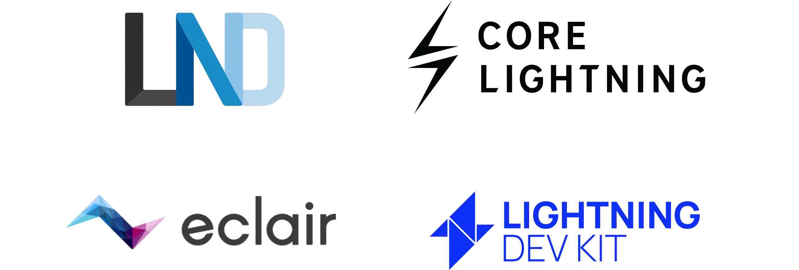


### नोड बनाम लाइटनिंग Wallet: एक महत्वपूर्ण अंतर


Bitcoin (ऑनचेन) पर, "*wallet*" उस सॉफ़्टवेयर को संदर्भित करता है जो आपकी निजी कुंजियों का प्रबंधन करता है, आपके UTXO से आपके बैलेंस की गणना करता है और आपके लेन-देन का निर्माण करता है। यह wallet आपके अपने Bitcoin नोड पर आधारित हो सकता है या किसी और के नोड पर, लेकिन आज, नोड और ऑनचेन wallet की भूमिका स्पष्ट रूप से भिन्न है।


लाइटनिंग पर, भ्रम पैदा किए बिना इस तरह की शब्दावली का पुन: उपयोग करना अधिक कठिन है। "लाइटनिंग wallet" शब्द काफी अस्पष्ट है, क्योंकि वास्तव में कोई भी ऐसा लाइटनिंग wallet नहीं है जो पूरी तरह से स्व-नियंत्रित हो, जब तक कि वह किसी नोड पर आधारित न हो। इसलिए केवल दो स्थितियाँ ही संभव हैं:


- एक वास्तविक लाइटनिंग नोड (यानी, गैर-कस्टोडियल) होने के लिए: आप जिस सॉफ़्टवेयर का उपयोग कर रहे हैं (उदाहरण के लिए, Phoenix जैसा मोबाइल ऐप या Umbrel पर LND इंस्टेंस) वास्तव में एक नोड चला रहा है, और आपके पास वास्तव में अपने बिटकॉइन प्राप्त करने की कुंजी है। इस मामले में, आपका "*लाइटनिंग wallet*" वास्तव में एक लाइटनिंग नोड के ऊपर एक उपयोगकर्ता इंटरफ़ेस है, चाहे वह एम्बेडेड हो या रिमोट।


- कस्टोडियल सेवा का उपयोग करने के लिए: आप एक एप्लिकेशन का उपयोग करते हैं जो आपको लाइटनिंग पर sats में बैलेंस दिखाता है, लेकिन पृष्ठभूमि में, धनराशि प्रदाता के नोड (जैसे Wallet of Satoshi) पर होती है। आपके पास न तो कुंजी होती है और न ही चैनलों पर आपका नियंत्रण। आपका बैलेंस कंपनी के डेटाबेस में केवल एक लेखा प्रविष्टि है। यह आपके बिटकॉइन को एक्सचेंज प्लेटफॉर्म पर छोड़ने के समान है, जिसमें सभी संबंधित जोखिम शामिल हैं। इस मामले में, आपका "*लाइटनिंग wallet*" केवल एक ऑपरेटर द्वारा प्रबंधित खाते तक पहुंच है, जो बदले में एक वास्तविक लाइटनिंग नोड चलाता है।


इसलिए लाइटनिंग में कोई बीच का रास्ता नहीं है: या तो आपके पास एक नोड (भले ही वह एम्बेडेड हो) है, जिससे आप स्वयं के नियंत्रण में रहते हैं, या फिर आपके पास नोड नहीं है, जिससे आपकी sats कंपनी के स्वामित्व में आ जाती है। लेकिन जैसा कि हम अगले अध्यायों में देखेंगे, इन दोनों उपयोगों में अंतर करना कभी-कभी मुश्किल हो सकता है। उदाहरण के लिए, Phoenix एक मोबाइल एप्लिकेशन है जिसमें एक वास्तविक लाइटनिंग नोड एम्बेडेड होता है, लेकिन उपयोगकर्ता को इसकी जानकारी नहीं होती, क्योंकि इसके संचालन की पूरी जटिलता लगभग छिपी रहती है।


### Lightning Network कैसे काम करता है, इसका एक संक्षिप्त विवरण


इस भाग में, मैं आपको लाइटनिंग के काम करने के तरीके का संक्षिप्त विवरण दूंगा। एक बार फिर, यदि आप सैद्धांतिक अवधारणाओं की अधिक गहन जानकारी चाहते हैं, तो मैं आपको समर्पित LNP 201 पाठ्यक्रम देखने के लिए आमंत्रित करता हूं।


#### भुगतान चैनल: खोलें, अपडेट करें और बंद करें


लाइटनिंग नेटवर्क का मूल आधार द्विदिशात्मक भुगतान चैनल हैं। एक चैनल खोला (यानी बनाया) जा सकता है, लाइटनिंग लेनदेन होने पर उसे अपडेट किया जा सकता है, और फिर अंत में बंद किया जा सकता है। ऑनचेन दृष्टिकोण से, एक चैनल 2/2 मल्टीसिग्नेचर आउटपुट से अधिक कुछ नहीं है।


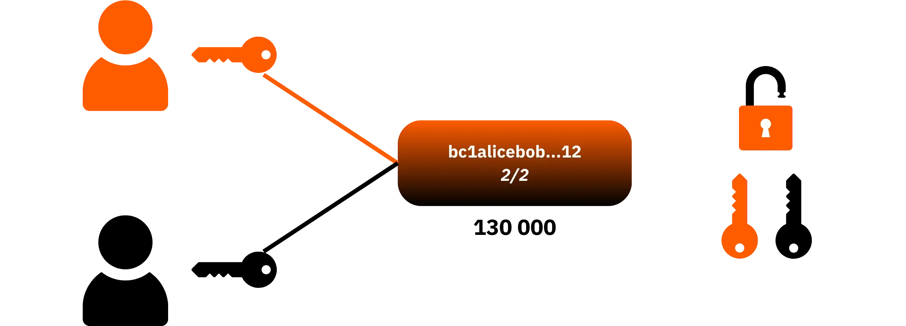


लाइटनिंग के दृष्टिकोण से, यह एक भुगतान चैनल है जिसमें तरलता दोनों प्रतिभागियों के बीच विभाजित होती है।


- चैनल खोलना:**


दो नोड्स एक चैनल खोलने का निर्णय लेते हैं। उनमें से एक नोड *फंडिंग ट्रांजैक्शन* नामक ऑनचेन लेनदेन में बिटकॉइन जमा करता है। यह लेनदेन 2-में-से-2 मल्टीसिग्नेचर स्क्रिप्ट पर आधारित आउटपुट तैयार करता है, जिसका अर्थ है कि Bitcoin पर इन फंडों को खर्च करने के लिए चैनल में मौजूद दोनों नोड्स के हस्ताक्षर आवश्यक हैं। इस लेनदेन को जारी करने से पहले, फंड प्रदान करने वाला पक्ष दूसरे पक्ष से *निकासी लेनदेन* पर हस्ताक्षर करने का अनुरोध करता है, जो ऑनचेन जारी नहीं किया जाता है, लेकिन समस्या की स्थिति में फंड वापस प्राप्त करने में सक्षम बनाता है।


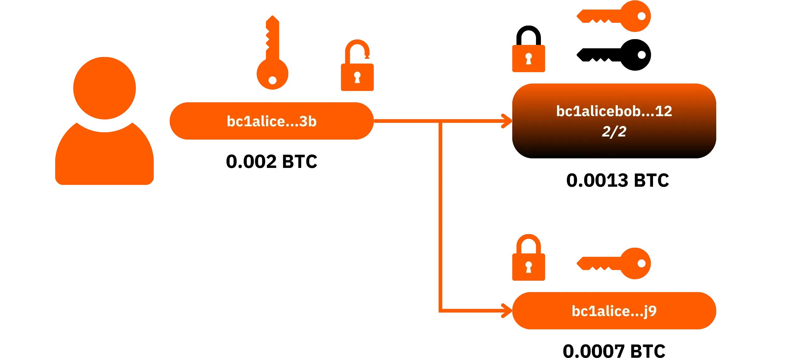


- Commitment लेनदेन:**


चैनल की स्थिति (अर्थात् A और B के बीच sats का वितरण) को *commitment transaction* द्वारा दर्शाया जाता है, जो दोनों नोड्स को ज्ञात होता है लेकिन ब्लॉकचेन पर तुरंत प्रसारित नहीं होता है। यह लेनदेन बताता है कि लाइटनिंग पर किए गए भुगतानों के अनुसार चैनल फंड को ब्लॉकचेन पर कैसे पुनर्वितरित किया जाए।


प्रत्येक लाइटनिंग भुगतान के साथ, दोनों नोड एक नई स्थिति पर हस्ताक्षर करते हैं जो पिछली स्थिति को प्रतिस्थापित कर देती है। निरस्तीकरण कुंजी तंत्र के माध्यम से पुरानी स्थिति रद्द कर दी जाती है: यदि कोई भी प्रतिभागी पुरानी स्थिति को प्रसारित करने का प्रयास करता है, तो दूसरा प्रतिभागी दंड के रूप में पूरी धनराशि वापस ले सकता है।


यहां महत्वपूर्ण विचार यह है कि हमेशा एक हस्ताक्षरित Bitcoin लेनदेन होता है, जो ऑनचेन पर प्रसारित नहीं होता है, नोड्स द्वारा रखा जाता है, और जो Lightning Network पर किए गए भुगतानों के अनुसार एक दूसरे के sats के पुनर्वितरण को सक्षम बनाता है।


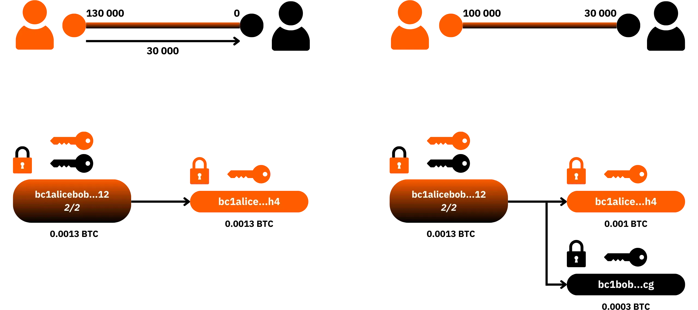


- चैनल बंद:**


चैनल को सहयोगात्मक समापन के माध्यम से सुचारू रूप से बंद किया जा सकता है, जब दोनों पक्ष चैनल की अंतिम स्थिति पर सहमत हों, या एकतरफा (जबरन समापन) यदि कोई एक प्रतिभागी सहयोग करना बंद कर दे या संपर्क से बाहर हो जाए। सभी मामलों में, समापन एक ऑनचेन लेनदेन के रूप में होता है जो 2/2 आउटपुट खर्च करता है और चैनल की अंतिम वैध स्थिति के अनुसार प्रतिभागियों के बीच धनराशि वितरित करता है।


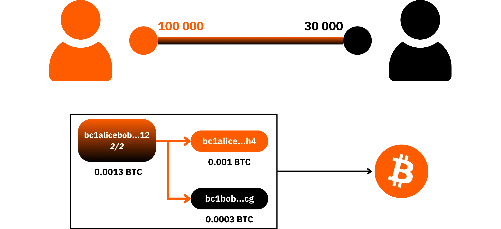


इस प्रकार लाइटनिंग, Bitcoin पर आधारित एक द्वितीयक परत के रूप में कार्य करती है: केवल कुछ निश्चित घटनाएँ (चैनलों का खुलना और बंद होना) मुख्य ब्लॉकचेन पर दिखाई देती हैं। मध्यवर्ती भुगतान ऑफचेन ही रहते हैं।


आगे बढ़ने से पहले, लाइटनिंग चैनल को प्रबंधित करने के तरीके को समझने के लिए यहां दो आवश्यक अवधारणाएं दी गई हैं:


- Liquidity*: चैनल के एक तरफ उपलब्ध sats की मात्रा;
- क्षमता: यह 2/2 मल्टीसिग आउटपुट में लॉक की गई कुल राशि है, यानी चैनल के दोनों तरफ तरलता का योग।


#### चैनलों और तरलता का एक नेटवर्क


चैनल केवल दो नोड्स के बीच भुगतान के लिए ही नहीं है: यह परस्पर जुड़े चैनलों के वैश्विक नेटवर्क का हिस्सा है। आपका नोड अपने चैनलों के माध्यम से अन्य उपयोगकर्ताओं के लिए भुगतान रूट कर सकता है, और आप sats को ऐसे लाइटनिंग नोड पर भेज सकते हैं जिसके साथ आपका कोई सीधा चैनल नहीं है, बशर्ते आपके दोनों नोड्स के बीच एक वैध पथ मिल सके।


प्रत्येक नोड को गॉसिप प्रोटोकॉल के माध्यम से इस नेटवर्क का मानचित्र पता होता है: कौन से चैनल मौजूद हैं, कौन से नोड द्विदिशात्मक चैनल से जुड़े हैं, और कौन सी क्षमताएँ प्रकाशित हैं। सीधे चैनल के बिना किसी प्राप्तकर्ता को भुगतान भेजने के लिए, आपका नोड कई चरणों वाला एक मार्ग निर्धारित करता है: आपका नोड → नोड X → नोड Y → प्राप्तकर्ता नोड। प्रत्येक चरण में, भुगतान एक ऐसे चैनल से होकर गुजरता है जिसमें भुगतान की दिशा में पर्याप्त तरलता होनी चाहिए।


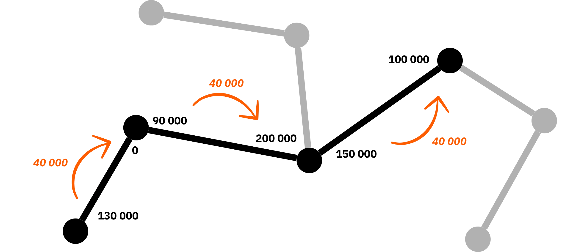


इसलिए किसी चैनल की तरलता सममित नहीं होती: एक तरफ भारी मात्रा में डेटा हो सकता है, जबकि दूसरी तरफ लगभग खाली हो सकती है। इस तरलता का प्रबंधन करना, यानी यह जानना कि sats कहाँ हैं और वे किस दिशा में प्रवाहित हो सकते हैं, लाइटनिंग नोड के संचालन का एक महत्वपूर्ण पहलू है। हम आने वाले व्यावहारिक अध्यायों में इस पर और अधिक विस्तार से चर्चा करेंगे।


#### HTLC: बिना लूटे भुगतान का परिवहन करना


भुगतान को बिना किसी भरोसे की आवश्यकता के मध्यवर्ती नोड्स के माध्यम से पारित करने में सक्षम बनाने के लिए, लाइटनिंग *HTLC* (*Hashed टाइम-लॉक्ड Contracts*) नामक स्मार्ट अनुबंधों का उपयोग करता है। सरल शब्दों में, एक HTLC धन हस्तांतरण को एक गुप्त जानकारी के प्रकटीकरण पर निर्भर करता है, और लेनदेन विफल होने की स्थिति में प्रेषक की सुरक्षा के लिए एक समय सीमा निर्धारित करता है। इसलिए प्रत्येक भुगतान एक पूर्व-छवि (एक गुप्त जानकारी जिसका हैश एक सहमत मूल्य से मेल खाता है) प्रस्तुत करने के अधीन है। यदि अंतिम प्राप्तकर्ता यह पूर्व-छवि प्रदान करता है, तो वह धन का दावा कर सकता है, जिससे प्रत्येक मध्यवर्ती नोड अपने स्वयं के धन की वसूली कर सकता है।


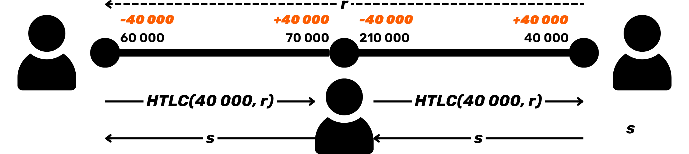


मैं आपको HTLC के काम करने के तकनीकी विवरणों से बचाऊंगा, क्योंकि वे इस पाठ्यक्रम के लिए आवश्यक नहीं हैं। आपको LNP 201 सिद्धांत पाठ्यक्रम में इसका विस्तृत विवरण मिलेगा। बस इतना याद रखें कि HTLC परमाणु आदान-प्रदान को सक्षम बनाता है: या तो स्थानांतरण पूरा हो जाता है और इस प्रक्रिया में किसी को कोई नुकसान नहीं होता, या यह विफल हो जाता है और प्रत्येक प्रतिभागी को उसकी प्रारंभिक धनराशि वापस मिल जाती है। इसके बीच कोई मध्य मार्ग नहीं है।


### मुख्य लाइटनिंग नोड कार्यान्वयन


Bitcoin की तरह ही, लाइटनिंग प्रोटोकॉल के भी कई कार्यान्वयन मौजूद हैं। कई स्वतंत्र टीमें अपने-अपने संस्करण विकसित कर रही हैं, जो सभी परस्पर क्रियाशील हैं क्योंकि वे समान विशिष्टताओं (BOLTs) का पालन करते हैं। आज उपयोग में आने वाले मुख्य कार्यान्वयन इस प्रकार हैं।


#### जीडब्ल्यू-71 (*जीडब्ल्यू-70*)


LND लाइटनिंग प्रोटोकॉल का एक पूर्ण कार्यान्वयन है, जिसे गो भाषा में लिखा गया है और लाइटनिंग लैब्स द्वारा विकसित किया गया है।


#### कोर लाइटनिंग (*CLN*)


कोर लाइटनिंग (पूर्व में *सी-लाइटनिंग*) ब्लॉकस्ट्रीम द्वारा विकसित कार्यान्वयन है। यह सी भाषा में लिखा गया है, जिसमें कुछ घटक Rust में शामिल हैं।


#### Eclair


एक्लेयर एक स्काला भाषा में लिखा गया सॉफ्टवेयर है जिसे फ्रांसीसी कंपनी एसीआईएनक्यू द्वारा विकसित किया गया है। एसीआईएनक्यू लाइटनिंग नेटवर्क में सबसे महत्वपूर्ण रूटिंग नोड्स में से एक का संचालन एक्लेयर के साथ करती है, और इस सॉफ्टवेयर का उपयोग अपने उत्पादों, जैसे कि जीडब्ल्यू-75 एप्लिकेशन के लिए आधार के रूप में करती है।


#### एलडीके (*लाइटनिंग डेवलपमेंट किट*)


LDK (*लाइटनिंग डेवलपमेंट किट*) एक Rust डेवलपमेंट किट है, जिसका रखरखाव Spiral (Block, पूर्व-Square) द्वारा किया जाता है। यह LND या CLN की तरह उपयोग के लिए तैयार daemon नहीं है, बल्कि उन डेवलपर्स के लिए एक लाइब्रेरी है जो लाइटनिंग को सीधे अपने अनुप्रयोगों में एकीकृत करना चाहते हैं।


इस LNP202 पाठ्यक्रम में, हम मुख्य रूप से LND पर ध्यान केंद्रित करेंगे: यह वह कार्यान्वयन है जो निजी ग्राहकों के लिए टर्नकी समाधानों में सबसे अधिक उपयोग किया जाता है, जैसे कि Umbrel।


लाइटनिंग कैसे काम करता है, इस संक्षिप्त जानकारी के लिए बस इतना ही। एक बार फिर, यदि कोई अवधारणा आपको समझ में नहीं आई है, या यदि आप उन्हें व्यवहार में लाने से पहले थोड़ा और गहराई से समझना चाहते हैं, तो फैनिस मिखालकिस का कोर्स इस विषय पर आवश्यक संदर्भ है:


https://planb.academy/courses/34bd43ef-6683-4a5c-b239-7cb1e40a4aeb


## आप अपना खुद का लाइटनिंग नोड क्यों चलाना चाहेंगे?


<chapterId>421db24e-511c-41ed-ad68-69b0662042ea</chapterId>


इस सवाल का जवाब देना काफी सरल है, क्योंकि यह एक अलंकारिक प्रश्न है: अपने खुद के नोड के बिना, आप वास्तव में लाइटनिंग का उपयोग नहीं कर रहे हैं, बल्कि कंपनी के बुनियादी ढांचे में लाइटनिंग के भ्रम का ही उपयोग कर रहे हैं।


लाइटनिंग कस्टोडियल wallet का उपयोग करने का मतलब है कि बिटकॉइन तकनीकी रूप से नोड संचालित करने वाली कंपनी के स्वामित्व में हैं। आपके पास निजी कुंजी नहीं होती और न ही आप चैनलों को नियंत्रित करते हैं। आपका wallet बैलेंस सेवा प्रदाता के डेटाबेस में केवल एक लाइन है। यह स्थिति निश्चित रूप से शुरुआती लोगों के लिए बहुत सुविधाजनक है और उपयोगकर्ता अनुभव अक्सर सहज होता है, लेकिन मूल प्रश्न यह है: यदि आप अंततः उन पहलुओं को ही छोड़ देते हैं जो Bitcoin और लाइटनिंग को पारंपरिक मुद्राओं और बैंकों से अलग करते हैं, तो इनका उपयोग करने का क्या लाभ है?


Bitcoin के दो मुख्य लाभ हैं मौद्रिक संप्रभुता (मुद्रा जारी करने और रखने के लिए किसी केंद्रीय प्राधिकरण पर निर्भरता नहीं) और सेंसरशिप प्रतिरोध (किसी तीसरे पक्ष द्वारा भुगतान को रोकना या फ़िल्टर करना असंभव)। लाइटनिंग पर एक अभिरक्षण प्रणाली इन दोनों उद्देश्यों के बिल्कुल विपरीत है: आप प्लेटफ़ॉर्म की आंतरिक मुद्रा आपूर्ति की जाँच नहीं कर सकते, और परिभाषा के अनुसार, एक ऑपरेटर जो सभी निधियों और सभी चैनलों को नियंत्रित करता है, आपके भुगतानों को सेंसर कर सकता है, विलंबित कर सकता है, प्राथमिकता दे सकता है या अवरुद्ध कर सकता है। इन परिस्थितियों में, हम स्वयं से यह प्रश्न पूछ सकते हैं, **यदि बिटकॉइन को लाइटनिंग के माध्यम से उपयोग करने से पारंपरिक राज्य मुद्रा प्रणालियों के समान ही विश्वास और निर्भरता के पैटर्न उत्पन्न होंगे, तो इसका क्या अर्थ है?**


> हमें एक ऐसी इलेक्ट्रॉनिक भुगतान प्रणाली की आवश्यकता है जो विश्वास के बजाय क्रिप्टोग्राफिक प्रमाण पर आधारित हो, जिससे कोई भी दो इच्छुक पक्ष किसी विश्वसनीय तीसरे पक्ष की आवश्यकता के बिना सीधे एक दूसरे के साथ लेनदेन कर सकें।
*Satoshi Nakamoto, Bitcoin श्वेत पत्र


सैद्धांतिक पहलुओं को छोड़ दें तो, आपके लिए कुछ ठोस नुकसान इस प्रकार हैं। सबसे पहले, आपके पास यह सत्यापित करने का कोई तरीका नहीं है कि कंपनी के पास वास्तव में प्रदर्शित राशि के अनुरूप बिटकॉइन मौजूद हैं या नहीं। हो सकता है कि कंपनी आंशिक भंडार पर काम कर रही हो, हैक हो गई हो, दिवालिया हो गई हो या गायब ही हो गई हो। इस स्थिति में, आप केवल एक और लेनदार होंगे, और आपको अपना पैसा वापस मिलने की कोई वास्तविक गारंटी नहीं होगी।


दूसरे, कंपनी को नियामकीय जोखिमों का सामना करना पड़ता है: निषेधाज्ञा, निधियों को फ्रीज करना, उपयोगकर्ताओं या लेनदेन को ब्लॉक करने के अनुरोध, कड़ी निगरानी, ​​या कुछ अधिकार क्षेत्रों में गतिविधि पर पूर्ण प्रतिबंध भी। सेवा प्रदाता पर पड़ने वाला हर प्रतिबंध स्वतः ही आप पर भी प्रभाव डालता है।


गोपनीयता के मामले में भी स्थिति बेहतर नहीं है। एक कस्टोडियल ऑपरेटर आपके सभी लेन-देन देखता है: राशि, आवृत्ति, प्राप्तकर्ता, शेष राशि, खर्च करने की आदतें। एप्लिकेशन द्वारा प्रदान की गई जानकारी और संभवतः Bitcoin पर किए गए अंतर्निहित चेन विश्लेषण के साथ मिलकर, यह जानकारी आपकी वित्तीय गतिविधि का एक बहुत सटीक विवरण प्रदान कर सकती है। एक बार फिर, यह वित्तीय निगरानी को कम करने के Bitcoin के उद्देश्य से बहुत दूर है।


अच्छी खबर यह है कि आज, अपना खुद का लाइटनिंग नोड चलाना अब केवल तकनीकी विशेषज्ञों का काम नहीं रह गया है, जैसा कि 2010 के दशक के उत्तरार्ध में हुआ करता था। घरेलू उपयोगकर्ताओं के लिए अपेक्षाकृत सरल समाधान उपलब्ध हैं, जिन्हें हम अगले अध्याय में विस्तार से समझाएंगे।


## काम के लिए सही समाधान चुनना


<chapterId>615870e3-741d-4ec1-875d-a483e70f39d4</chapterId>


आज, आप स्वयं के नियंत्रण में रहते हुए भी लाइटनिंग कस्टोडियल wallet के समान उपयोगकर्ता अनुभव प्राप्त कर सकते हैं। इस अध्याय का उद्देश्य आपको अपनी प्रोफ़ाइल के लिए सबसे उपयुक्त मार्ग चुनने में मदद करना है।


### विकल्प 1: लाइटनिंग का सीधे उपयोग न करें


पहला समाधान यह है कि लाइटनिंग का सीधे उपयोग न किया जाए, बल्कि Bitcoin, Liquid या wallet जैसे किसी ऐसे एप्लिकेशन का उपयोग किया जाए जिसमें एटॉमिक स्वैप की सुविधा हो। उदाहरण के लिए, Aqua या Bull Bitcoin Wallet एप्लिकेशन इसी विधि का उपयोग करते हैं, जिससे आप स्वयं लाइटनिंग नोड संचालित किए बिना ही लाइटनिंग बिलों का भुगतान कर सकते हैं और नियंत्रण अपने हाथ में रख सकते हैं।


इसका सिद्धांत सीधा-सादा है: आपका फंड Bitcoin, on-chain या Liquid में रहता है, और आप इसे wallet के माध्यम से एक्सेस करते हैं, जहां आपके पास पारंपरिक तरीके से चाबियां होती हैं। जब आप लाइटनिंग इनवॉइस को स्कैन करते हैं, तो आपका wallet एक एटॉमिक स्वैप सेवा को लेनदेन (on-chain या Liquid) शुरू करता है। यह सेवा फिर आपके द्वारा on-chain या Liquid के माध्यम से प्रदान किए गए बिटकॉइन का उपयोग करके अपने नोड के माध्यम से लाइटनिंग भुगतान का प्रबंधन करती है। परिणामस्वरूप, आपको स्वयं किसी भी लाइटनिंग चैनल को संभालने की आवश्यकता नहीं है, फिर भी आप लाइटनिंग इनवॉइस का निपटान आसानी से कर सकते हैं।


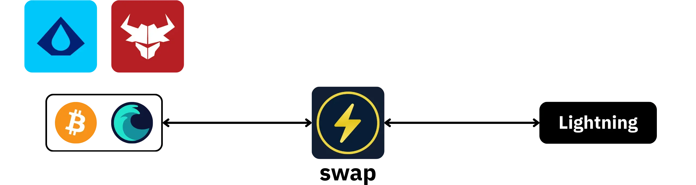


पारंपरिक लाइटनिंग कस्टोडियल wallet की तुलना में इस दृष्टिकोण का प्रमुख लाभ यह है कि आपके फंड पर आपका पूर्ण स्वामित्व हर समय बना रहता है। बिटकॉइन आपके ऑनचेन या Liquid wallet में आपके अपने मेमोनिक वाक्यांश के साथ सुरक्षित रहते हैं। स्वैप के दौरान भी, आपके फंड पर आपका स्वामित्व बना रहता है, क्योंकि स्वैप एटॉमिक होता है। यह एक क्रिप्टोग्राफिक तंत्र पर आधारित है जो यह सुनिश्चित करता है कि केवल दो ही संभावित परिणाम हों: या तो स्वैप पूरी तरह सफल हो, या यह विफल हो जाए और सेवा आपके फंड को जब्त न कर सके।


इस प्रकार की कार्यक्षमता प्रदान करने वाले अधिकांश पोर्टफोलियो स्वैप के तकनीकी भाग के लिए [Boltz](https://boltz.exchange/) पर निर्भर करते हैं।


गोपनीयता के लिहाज से भी यह समाधान कई दिलचस्प फायदे प्रदान करता है, खासकर जब इसे Liquid के साथ इस्तेमाल किया जाए। शुरुआती लोगों के लिए इसे सेट अप करना और सेव करना भी बहुत आसान है: एक सरल स्मरणीय वाक्य, कोई चैनल नहीं, बैलेंस करने के लिए कोई लिक्विडिटी नहीं...


दूसरी ओर, इस दृष्टिकोण की अपनी सीमाएँ हैं। सबसे पहले, यह पूरी तरह से दोषरहित नहीं है: आप स्वैप सेवा की उपलब्धता और सद्भावना पर निर्भर करते हैं। यदि वह आपके खाते को संसाधित करना बंद कर देती है, या सेवा देना बंद कर देती है, तो आप उसके माध्यम से लाइटनिंग बिलों का भुगतान नहीं कर पाएंगे। इसके अलावा, इसमें भारी शुल्क भी शामिल हैं: आपको ऑनचेन या Liquid लेनदेन शुल्क और स्वैप सेवा कमीशन दोनों का भुगतान करना होगा। साथ ही, यदि ऑनचेन शुल्क में अचानक वृद्धि होती है, तो लाइटनिंग का उपयोग करना बहुत महंगा हो सकता है।


इसलिए कभी-कभार उपयोग के लिए यह अभी भी स्वीकार्य है, लेकिन एक बहुत ही सक्रिय लाइटनिंग उपयोगकर्ता के लिए, वास्तविक लाइटनिंग नोड के साथ चीजों को सही ढंग से करना बेहतर है।


### विकल्प 2: ऑन-बोर्ड लाइटनिंग नोड्स


समाधानों की दूसरी श्रेणी मोबाइल एप्लिकेशन में सीधे एम्बेडेड लाइटनिंग नोड्स पर आधारित है। Phoenix और Wallet ने इस मॉडल का आविष्कार किया और यह आज भी एक मानक बना हुआ है। आज, अन्य परियोजनाएं भी इसी तरह के दृष्टिकोण पेश करती हैं, जैसे कि ज़्यूस (एम्बेडेड मोड में) या बिटकिट।


मूल विचार सरल है: एप्लिकेशन वास्तव में एक लाइटनिंग नोड चलाता है, लेकिन सभी जटिल ऑपरेशन पृष्ठभूमि में स्वचालित रूप से संचालित होते हैं। आपके पास बैकअप के लिए एक स्मरणीय वाक्यांश के साथ "*लाइटनिंग wallet*" इंटरफ़ेस है, आप बैलेंस देख सकते हैं और बिलों का भुगतान कर सकते हैं, लेकिन आप चैनल, लिक्विडिटी या अधिकांश पैरामीटर प्रबंधित नहीं करते हैं।


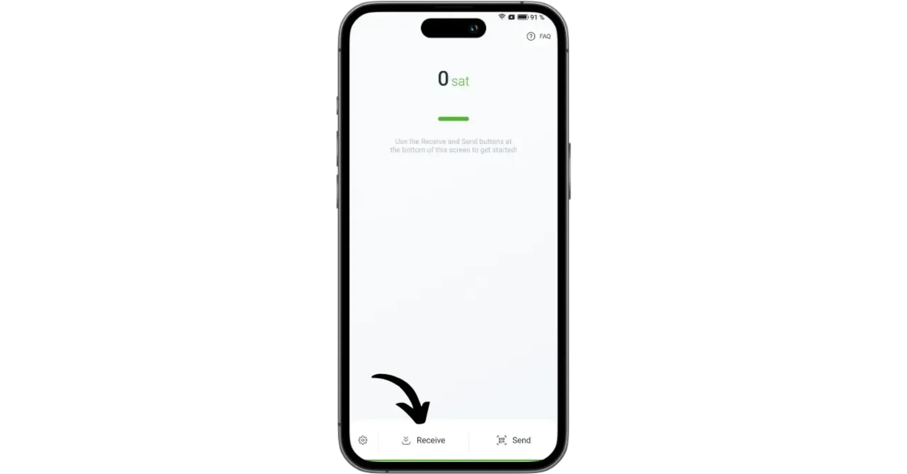


ये समाधान हमेशा स्व-संरक्षित होते हैं। धनराशि को नियंत्रित करने वाली कुंजी generated होती है और आपके फ़ोन में संग्रहीत होती है, और बैकअप seed या समकक्ष तंत्र के माध्यम से होता है। आप केवल किसी सेवा प्रदाता के साथ खाता नहीं रखते, बल्कि वास्तव में आपके स्वामित्व वाले चैनलों में सुरक्षित बिटकॉइन होते हैं जिन्हें चुराया नहीं जा सकता।


LN के ऑन-बोर्ड नोड्स के अनेक फायदे हैं:


- स्थापित करना और उपयोग करना बेहद आसान है;
- उपयोगकर्ता अनुभव एक कस्टोडियल लाइटनिंग wallet के समान होगा, लेकिन स्व-निरक्षण के साथ;
- चैनलों या तरलता का कोई मैनुअल प्रबंधन नहीं;
- अपेक्षाकृत सरल बैकअप।


लेकिन इन एम्बेडेड wallet में कुछ महत्वपूर्ण कमियां भी हैं। पहली बात, गोपनीयता के मामले में, सेवा संचालक (जैसे Phoenix के मामले में ACINQ) को आपके नोड से गुजरने वाले प्रवाहों की काफी विस्तृत जानकारी होती है: मात्रा, आवृत्ति, प्राप्तकर्ता, हालांकि *ट्रैम्पोलिन नोड्स* के धीरे-धीरे अपनाने से इसमें सुधार होने की संभावना है। दूसरी बात, आप अपने मुख्य लाइटनिंग पीयर के रूप में इस संचालक पर बहुत अधिक निर्भर हैं। यदि ACINQ नोड अनुपलब्ध हो जाता है (Phoenix के मामले में), यदि कंपनी पर नियामक दबाव पड़ता है या वह अपना व्यावसायिक मॉडल बदलती है, तो आपका उपयोगकर्ता अनुभव बुरी तरह प्रभावित हो सकता है, या यहां तक ​​कि खतरे में भी पड़ सकता है।


अंततः, इस सरलता की एक कीमत चुकानी पड़ती है। एम्बेडेड LN नोड सेवाएं आमतौर पर जमा, निकासी या कुछ चैनल प्रबंधन कार्यों पर विशिष्ट शुल्क लेती हैं। मेरे विचार में, दी जाने वाली सेवा के लिहाज से यह मॉडल उचित है, लेकिन गहन उपयोग के लिए यह एक सुव्यवस्थित पारंपरिक लाइटनिंग नोड की तुलना में कहीं अधिक महंगा साबित हो सकता है।


### विकल्प 3: क्लासिक लाइटनिंग नोड


तीसरा समाधान, जिसकी हम इस LNP202 पाठ्यक्रम में अधिक गहराई से जांच करेंगे, एक समर्पित सर्वर या डिवाइस पर एक पारंपरिक लाइटनिंग नोड को संचालित करना है।


"क्लासिक" से मेरा तात्पर्य है कि आप अपने स्वयं के Bitcoin नोड के ऊपर एक लाइटनिंग कार्यान्वयन (जैसे LND) को स्वयं स्थापित और कॉन्फ़िगर करते हैं। आप अपने पीयर्स का चयन करते हैं, अपने चैनल खोलते हैं, अपनी इनबाउंड और आउटबाउंड लिक्विडिटी का प्रबंधन करते हैं और अपनी रूटिंग शुल्क नीतियां निर्धारित करते हैं।


संप्रभुता के लिहाज़ से, यह सबसे अच्छा समाधान है। अब आप अपने चैनलों या भुगतानों के लिए किसी विशिष्ट कंपनी पर निर्भर नहीं हैं: यदि कोई सहकर्मी आपको प्रतिबंधित करता है या चैनल बंद कर देता है, तो आप किसी दूसरे नोड के साथ दूसरा चैनल खोल सकते हैं। यदि कोई सेवा बंद हो जाती है, तो आपके sats आपके नियंत्रण वाले चैनलों में बने रहते हैं, और आप उन्हें ऑनचेन पर वापस ला सकते हैं। आप अपने दीर्घकालिक खर्चों को भी अनुकूलित कर सकते हैं: एक बार जब आपके चैनल सही आकार और प्रबंधन के साथ तैयार हो जाते हैं, तो भुगतानों की कुल लागत बहुत कम हो सकती है।


गोपनीयता के संदर्भ में, आप स्पष्ट रूप से लाइटनिंग के अपने मॉडल की सीमाओं के अधीन हैं, लेकिन आप अपना पूरा व्यवसाय किसी एक ऑपरेटर को नहीं सौंप रहे हैं।


इसके विपरीत, एक क्लासिक लाइटनिंग नोड स्थापित करना स्पष्ट रूप से अधिक जटिल है: आपको इसे इंस्टॉल करना, कॉन्फ़िगर करना, रखरखाव करना, अपडेट की निगरानी करना, चैनलों और चार्ज नीतियों के तर्क को समझना, चैनलों और कैश फ्लो का प्रबंधन करना आदि करना होता है। गलत कॉन्फ़िगरेशन, लापरवाही से बैकअप लेना या लापरवाहीपूर्ण प्रबंधन से sats के नष्ट होने की संभावना अधिक होती है। नोड को निरंतर चालू रहना भी आवश्यक है।


इस पाठ्यक्रम में मैं आपको ठीक यही मार्ग अपनाने का सुझाव देता हूं, जोखिमों को सीमित करने और आपके दृष्टिकोण को व्यवस्थित करने के लिए हर कदम पर आपका साथ दूंगा।


### किस उपयोगकर्ता प्रोफ़ाइल के लिए कौन सा समाधान?


अपने लाइटनिंग उपयोगकर्ता प्रोफ़ाइल के लिए सही समाधान चुनने के लिए, आपको दो कारकों पर विचार करने की आवश्यकता है: आप लाइटनिंग का कितनी बार उपयोग करते हैं, और तकनीकी प्रबंधन के लिए आपकी रुचि।


यदि आप कभी-कभार ही लाइटनिंग भुगतान करते हैं, लेकिन फिर भी समय-समय पर अपने फ़ोन से LN बिलों का भुगतान करना चाहते हैं, और अपने खाते पर स्वामित्व का अधिकार नहीं छोड़ना चाहते हैं, तो स्वैप सुविधा वाला Bitcoin या Liquid wallet आपके लिए सबसे अच्छा विकल्प हो सकता है। इससे आपके पास अपने फंड का स्वामित्व बना रहता है, आपको किसी नोड को प्रबंधित करने की आवश्यकता नहीं होती है, और सरलता के बदले आपको थोड़ी अधिक फीस देनी पड़ती है।


https://planb.academy/tutorials/wallet/mobile/bull-bitcoin-2c72127c-a228-4f50-b833-c6183d56aaf6

https://planb.academy/tutorials/wallet/mobile/aqua-8e6d7dd3-8c03-45cc-90dd-fe3899a7d125

यदि आप लाइटनिंग का नियमित रूप से उपयोग करते हैं और एक वास्तविक नोड के लाभ चाहते हैं, लेकिन चैनल, शुल्क या बुनियादी ढांचे के प्रबंधन में समय नहीं लगाना चाहते हैं, तो एक मोबाइल एम्बेडेड लाइटनिंग नोड एक अच्छा समाधान है। आपके फंड आपके नियंत्रण में रहते हैं, उपयोगकर्ता अनुभव बेहद सहज रहता है, और सारी जटिलता छिपी रहती है, हालांकि इसके बदले आपको ऑपरेटर पर काफी हद तक निर्भर रहना पड़ता है।


https://planb.academy/tutorials/wallet/mobile/phoenix-0f681345-abff-4bdc-819c-4ae800129cdf

https://planb.academy/tutorials/wallet/mobile/bitkit-a7224674-85c4-4045-9baf-37018d89550c

https://planb.academy/tutorials/wallet/mobile/zeus-embedded-c67fa8bb-9ff5-430d-beee-80919cac96b9

यदि आप एक मध्यम या उन्नत स्तर के उपयोगकर्ता हैं, जो अपने बुनियादी ढांचे को समझने और प्रबंधित करने में समय लगाने के इच्छुक हैं, और अपने चैनलों, तरलता और लागतों पर अधिकतम नियंत्रण चाहते हैं: तो एक क्लासिक सर्वर-आधारित लाइटनिंग नोड सबसे उपयुक्त विकल्प है। यह सबसे अधिक मांग वाला समाधान है, लेकिन Bitcoin के संप्रभुता के विचार के साथ सबसे अधिक सुसंगत भी है।


# अपना पहला लाइटनिंग नोड बनाना


<partId>b6db225e-61ab-437a-bccb-33d07503da15</partId>


## Umbrel के साथ LND को इंस्टॉल करना


<chapterId>a0014bf3-1bd3-4311-b15b-5ef2354ec744</chapterId>


लाइटनिंग की बुनियादी बातों और उपलब्ध समाधानों की समीक्षा करने के बाद, अब मुख्य विषय पर आते हैं। इस कोर्स को करने के लिए, आपको Umbrel के साथ सिंक्रोनाइज़्ड Bitcoin नोड की आवश्यकता होगी। यह LNP202 प्रशिक्षण कोर्स BTC 202 का अगला भाग है; यदि आपके पास अभी तक Bitcoin नोड नहीं है, तो मैं आपको सलाह देता हूं कि अपने नोड के सिंक्रोनाइज़ होने के बाद यहां वापस आने से पहले आप वह दूसरा प्रशिक्षण कोर्स कर लें। मैं आपको दृढ़ता से सलाह देता हूं कि आप उसे देखें, क्योंकि मैं इसके संचालन, कॉन्फ़िगरेशन और सुरक्षा उपायों के बारे में विस्तार से नहीं बताऊंगा।


https://planb.academy/courses/3cd9cb94-82e8-417a-9c5a-02afc2589426

इस पहले अध्याय में, हम देखेंगे कि अपने Umbrel पर LND कैसे स्थापित करें। Umbrel की कार्यप्रणाली इसे बहुत सरल बनाती है, क्योंकि आपको केवल एक एप्लिकेशन इंस्टॉल करना होता है।


होम पेज से, इंटरफ़ेस के निचले भाग में स्थित `ऐप स्टोर` खोलें।


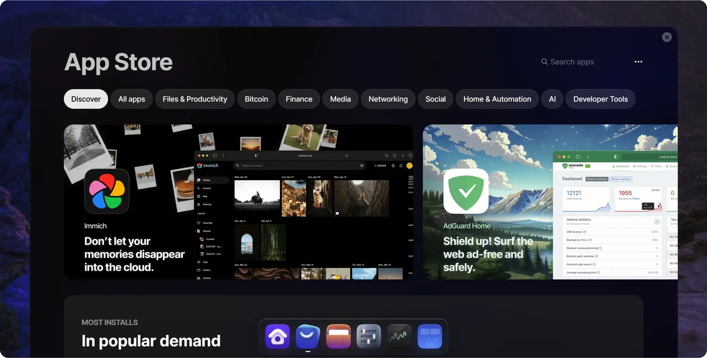


सर्च बार में `Lightning Node` टाइप करें, फिर एप्लिकेशन पर क्लिक करें।


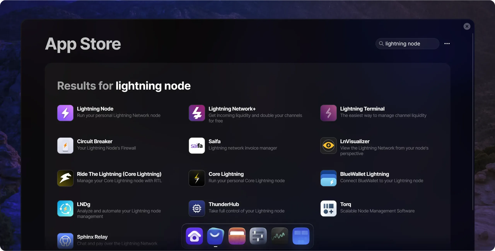


फिर इंस्टॉलेशन शुरू करने के लिए `इंस्टॉल` बटन पर क्लिक करें।


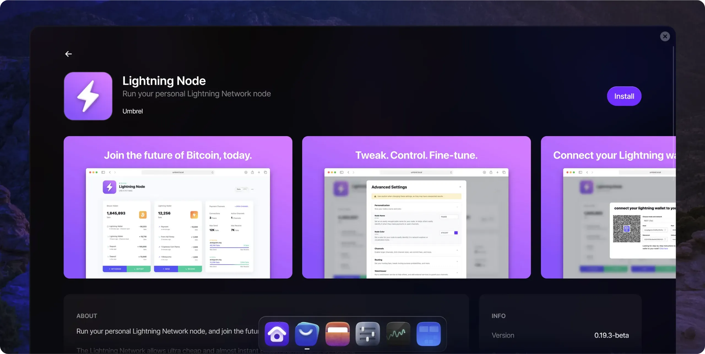


होम पेज से, एप्लिकेशन खोलने के लिए उस पर क्लिक करें, फिर `नया नोड सेटअप करें` चुनें।


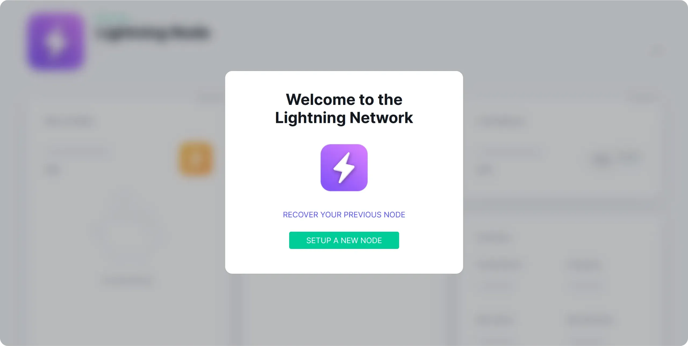


आपको 24 शब्दों का एक स्मरणीय वाक्यांश दिया गया है। इसे सुरक्षित स्थान पर रखें। अगले अध्याय में हम लाइटनिंग नोड तक पुनः पहुँच प्राप्त करने के तरीके पर विस्तार से चर्चा करेंगे (यह एक साधारण Bitcoin और wallet की तुलना में कहीं अधिक जटिल प्रक्रिया है), लेकिन अभी के लिए याद रखें कि यह वाक्यांश एक महत्वपूर्ण भूमिका निभाता है और इसे अत्यंत सावधानी से सहेज कर रखना आवश्यक है।


https://planb.academy/tutorials/wallet/backup/backup-mnemonic-22c0ddfa-fb9f-4e3a-96f9-46e2a7954270

इस वाक्यांश को उसी तरह सहेजें जैसे किसी पारंपरिक स्मरणीय वाक्यांश को सहेजा जाता है: किसी भौतिक माध्यम (कागज या धातु) पर, जिसे सुरक्षित स्थान पर रखा गया हो, फिर `अगला` बटन पर क्लिक करें।


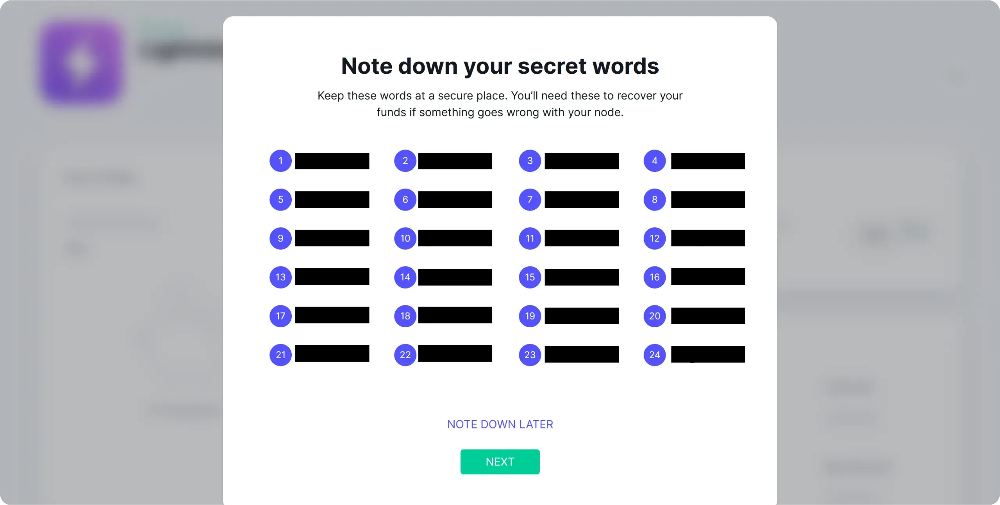


फिर अपने वाक्य के शब्दों को लिखकर जांच लें कि आपने उन्हें सही ढंग से लिखा है या नहीं।


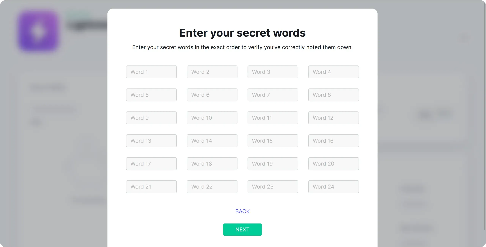


एक चेतावनी संदेश आपको याद दिलाएगा कि एप्लिकेशन बीटा संस्करण में है और Lightning Network अभी भी एक प्रायोगिक तकनीक है। स्पष्ट रूप से, अपने लाइटनिंग नोड पर कभी भी उतनी राशि का कमिटमेंट न करें जिसे आप खोने के लिए तैयार न हों।


इसके बाद आप अपने लाइटनिंग नोड के मुख्य इंटरफ़ेस पर पहुँच जाएँगे। बाईं ओर, आपको अपने नोड पर होस्ट किया गया Bitcoin ऑनचेन wallet मिलेगा। यह वही generated है जो आपने अभी-अभी सहेजे गए 24 शब्दों के वाक्यांश में पाया था।


केंद्र में, आपको अपना लाइटनिंग wallet मिलेगा। यह वास्तव में आपकी आउटगोइंग नकदी को दर्शाता है, यानी आपके लाइटनिंग चैनलों के भीतर आपके स्वामित्व वाले बिटकॉइन।


दाईं ओर, आपको अपने नोड के बारे में कई महत्वपूर्ण जानकारियाँ दिखाई देंगी:


- कनेक्शनों और खुले चैनलों की संख्या;
- आपका कुल बहिर्वाह नकदी प्रवाह, अर्थात् सैद्धांतिक रूप से आप लाइटनिंग पर कितना खर्च कर सकते हैं;
- आपकी कुल आवक तरलता, यानी सैद्धांतिक रूप से आप लाइटनिंग के माध्यम से क्या प्राप्त कर सकते हैं।


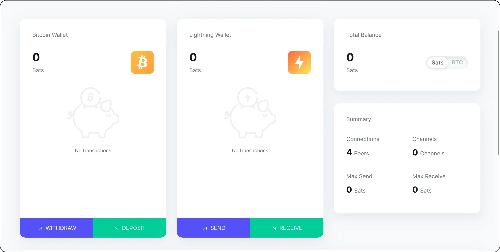


चलिए, सबसे पहले अपने नोड को कस्टमाइज़ करना शुरू करते हैं। इंटरफ़ेस के ऊपरी दाएं कोने में मौजूद तीन छोटे बिंदुओं पर क्लिक करें, फिर 'एडवांस्ड सेटिंग्स' पर क्लिक करें। 'पर्सनलाइज़ेशन' सबमेनू में, आप अपने नोड के लिए एक सार्वजनिक नाम निर्धारित कर सकते हैं (अपना असली नाम इस्तेमाल करने से बचें) और उसका रंग चुन सकते हैं।


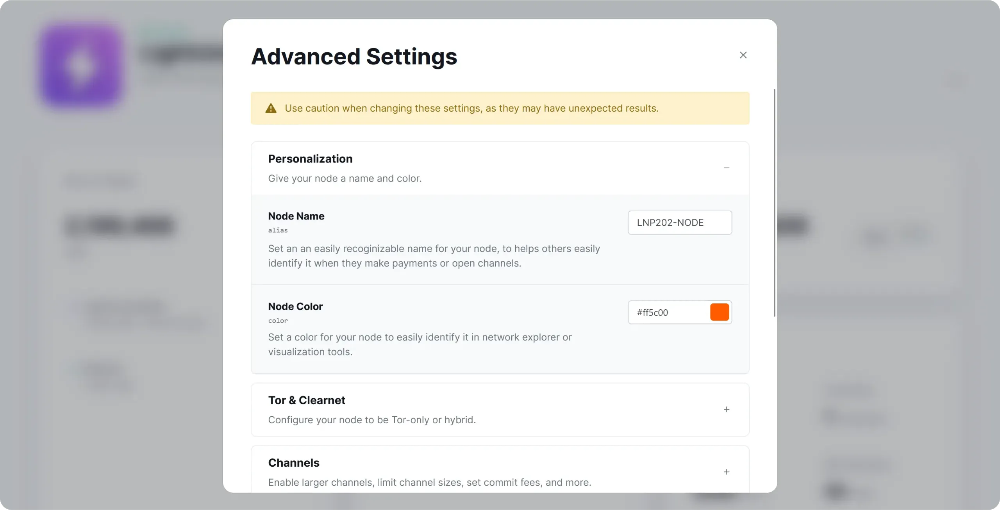


फिर अपने नोड को रीस्टार्ट करने और इन परिवर्तनों को लागू करने के लिए हरे रंग के `सेव एंड रीस्टार्ट` बटन पर क्लिक करें।


आपका लाइटनिंग नोड अब भुगतान करने के लिए अपने पहले चैनल खोलने के लिए तैयार है। लेकिन पहले, आइए देखें कि आप अपने sats को कैसे सुरक्षित रख सकते हैं!


## अपने लाइटनिंग नोड को सहेजना


<chapterId>638fa75d-62af-4bf3-ab4a-b7d10ea75815</chapterId>


अपने नोड पर पहला sats भेजने से पहले, यह समझना ज़रूरी है कि इसका बैकअप कैसे काम करता है और इससे जुड़े जोखिम क्या हैं। एक साधारण Bitcoin ऑनचेन पोर्टफोलियो के विपरीत, लाइटनिंग नोड का बैकअप लेना काफी जटिल है: गलत रणनीति अपनाने से आपके फंड का स्थायी नुकसान हो सकता है। इस अध्याय में, हम देखेंगे कि वास्तव में किसका बैकअप लेना ज़रूरी है और Umbrel, LND के साथ मिलकर इस प्रक्रिया को कैसे संभालता है।


इस कोर्स में हम LND (*Lightning Network Daemon*) कार्यान्वयन का उपयोग करेंगे। हालांकि अन्य कार्यान्वयनों में सिद्धांत समान हैं, लेकिन जिन रिकवरी फाइलों और प्रक्रियाओं के बारे में मैं बात करने जा रहा हूं, वे LND के लिए विशिष्ट हैं।


### मुझे लाइटनिंग नोड पर कितनी बचत करनी चाहिए?


लाइटनिंग नोड पर, केवल seed को बचाना और यह उम्मीद करना कि सब कुछ सामान्य हो जाएगा, पर्याप्त नहीं है। कई तत्व अलग-अलग भूमिका निभाते हैं, इसलिए उनके बीच अंतर करना महत्वपूर्ण है।


#### जीडब्ल्यू-147 (*aezeed*)


जब आप LND को प्रारंभ करते हैं, तो आपको 24 शब्दों वाला seed प्राप्त होता है। यह LND का विशिष्ट प्रारूप है जिसे "*aezeed*" कहा जाता है। यह क्लासिक seed BIP39 नहीं है, हालांकि यह काफी हद तक उसी जैसा दिखता है। इस seed से, LND आपके ऑनचेन wallet की निजी कुंजी प्राप्त करता है जो लाइटनिंग नोड से जुड़ी होती है, अर्थात् वे पते जिनमें आप चैनल बंद होने के बाद बिटकॉइन प्राप्त कर सकते हैं या वापस भेज सकते हैं।


इसलिए, इस seed का उपयोग आपके नोड से जुड़े ऑनचेन wallet को पुनः उत्पन्न करने और उन निधियों को पुनः प्राप्त करने के लिए किया जा सकता है जिन्हें पहले ही ऑनचेन पर वापस भेज दिया गया है (उदाहरण के लिए, चैनल बंद होने के बाद)। दूसरी ओर, केवल seed ही आपके उन लाइटनिंग चैनलों को पुनर्स्थापित करने के लिए पर्याप्त नहीं है जो अभी भी खुले हैं, क्योंकि इसमें आपके चैनलों की स्थिति के बारे में आवश्यक जानकारी नहीं होती है।


#### चैनल डेटाबेस (`channel.db`)


LND आपके चैनलों की विस्तृत स्थिति को `channel.db` नामक डेटाबेस में संग्रहीत करता है। इस डेटाबेस में निम्नलिखित शामिल हैं:


- आपके खुले चैनलों की सूची;
- आपके सहकर्मी और उनकी पहचान;
- प्रत्येक चैनल के लिए अंतिम commitment transaction (वे क्रमिक अवस्थाएँ जो परिभाषित करती हैं कि चैनल में किसका क्या स्वामित्व है और किसी समस्या की स्थिति में ऑनचेन फंड को पुनर्प्राप्त करने में सक्षम बनाती हैं);
- किसी सहकर्मी को पुरानी रिपोर्ट प्रसारित करने का प्रयास करने पर दंडित करने के लिए आवश्यक जानकारी।


इस डेटाबेस की समस्या यह है कि यह लगातार बदलता रहता है: हर भुगतान, हर रूटिंग, हर चैनल के खुलने या बंद होने से इसकी सामग्री बदल जाती है। यही कारण है कि एक पारंपरिक बैकअप (जैसे कि आपके `channel.db` की आवधिक प्रतिलिपि) खतरनाक है। यदि आप `channel.db` का बहुत पुराना संस्करण पुनर्स्थापित करते हैं और इस अप्रचलित स्थिति के साथ नोड को पुनः स्थापित करते हैं, तो आपके साथी यह मान सकते हैं कि आप चैनल की पुरानी स्थिति प्रसारित कर रहे हैं। इस स्थिति में, प्रोटोकॉल में दंड का प्रावधान है: आपका साथी चैनल की पूरी धनराशि वसूल कर सकता है, मानो आपने धोखाधड़ी करने का प्रयास किया हो।


व्यवहार में, `channel.db` एक बैकअप माध्यम नहीं है। यह आपके नोड की वर्तमान स्थिति है। इसका उपयोग नोड को पुनर्स्थापित करने के लिए तभी किया जा सकता है जब आप इस डेटाबेस को किसी ऐसी मशीन से सीधे पुनर्प्राप्त करें जो हाल ही में विफल हुई हो (उदाहरण के लिए, एक ऐसी डिस्क जो अभी भी पठनीय है)। इस स्थिति में, आप नवीनतम स्थिति को पुनर्प्राप्त करते हैं और इस डेटाबेस के आधार पर LND को किसी अन्य मशीन पर पुनः आरंभ कर सकते हैं, यह जानते हुए कि यह स्थिति यथासंभव अद्यतन है, क्योंकि पुरानी मशीन अब नहीं चल रही है। एक अन्य स्थिति जहां यह विधि एक प्रासंगिक बैकअप के रूप में काम कर सकती है, वह दो-डिस्क कॉन्फ़िगरेशन है, जिसमें एक डिस्क से दूसरी डिस्क में गतिशील, स्थायी प्रतिलिपि होती है। हालांकि, इस प्रकार की व्यवस्था को लागू करना अधिक जटिल है।


लेकिन `channel.db` की आवधिक प्रतियां बनाना और उन्हें बाद में पुनर्स्थापित करने के लिए बैकअप के रूप में संग्रहीत करना एक बहुत बुरा विचार है: जिस दिन आप उनका उपयोग करते हैं, आप खुद को दंडित करने और अपने सभी sats को खोने का जोखिम उठाते हैं।


#### स्टेटिक चैनल बैकअप (एससीबी)


आपदा से उबरने को संभव बनाने के लिए, LND ने *स्टैटिक चैनल बैकअप* (SCB) तंत्र पेश किया है। यह एक विशेष फ़ाइल है, जिसे अक्सर `channel.backup` कहा जाता है, जिसमें आपके चैनलों के बारे में स्थिर जानकारी होती है: आपके पीयर कौन हैं, उनसे संपर्क कैसे करें और आपके चैनल क्या हैं।


इस फ़ाइल में चैनल की विस्तृत स्थिति या अपडेट इतिहास शामिल नहीं है। यह आपको चैनलों को उनकी पिछली स्थिति में दोबारा खोलने या इस लाइटनिंग नोड को चालू रखने की अनुमति नहीं देता है। बल्कि, इसका काम एक एंकर पॉइंट के रूप में काम करना है, जिसके ज़रिए आप अपने साथियों से अपने सभी चैनलों को सुचारू रूप से बंद करने में मदद मांग सकते हैं, और इस प्रकार seed की मदद से प्राप्त की जा सकने वाली कुंजियों पर अपना sats ऑनचेन प्राप्त कर सकते हैं। इसलिए, `channel.db` फ़ाइल के विपरीत, जिसे प्रत्येक भुगतान या रूटिंग के साथ संशोधित किया जाता है, SCB फ़ाइल केवल तभी अपडेट होती है जब कोई चैनल खोला या बंद किया जाता है।


एससीबी के माध्यम से रिकवरी करते समय, प्रक्रिया इस प्रकार है:


- आप अपने seed (*aezeed*) को पुनर्स्थापित करते हैं, जो लाइटनिंग नोड से जुड़े आपके ऑनचेन wallet को पुनः बनाता है;
- आप LND को अपना नवीनतम SCB प्रदान करें;
- LND आपके साथियों की सूची और उनके साथ आपके मौजूद चैनलों का पता लगाने के लिए SCB का उपयोग करता है;
- यह प्रत्येक पीयर से संपर्क करता है, उन्हें बताता है कि आपको डेटा हानि हुई है और उनसे आपके साथ अपने चैनल को "फोर्स-क्लोज" करने के लिए कहता है, ताकि आप अपना ऑनचेन शेयर पुनः प्राप्त कर सकें।


इसका सिद्धांत यह है कि जब आपके साथी यह देखेंगे कि आप डेटा हानि की रिपोर्ट कर रहे हैं, तो वे अपना अंतिम commitment transaction प्रसारित करेंगे और फ़ोर्स चैनल को बंद कर देंगे। इन लेन-देन की पुष्टि हो जाने के बाद, आपकी धनराशि आपके ऑनचेन पोर्टफोलियो (seed से जुड़ा हुआ) में पुनः दिखाई देगी।


हालांकि, यह रिकवरी तंत्र पूरी तरह से कारगर नहीं है। सबसे पहले, यह वास्तव में आपके लाइटनिंग नोड को पुनर्स्थापित नहीं करता है, क्योंकि सभी चैनल बंद हो जाएंगे। ऐसे में आपको शुरू से एक नया लाइटनिंग नोड बनाना होगा। दूसरे, यह 100% रिकवरी की गारंटी नहीं देता है, हालांकि समस्या होने पर आपके ऑनचेन बैलेंस को रिकवर करने की संभावना काफी बढ़ जाती है। दरअसल, यह रिकवरी प्रोटोकॉल आपके पीयर्स के सहयोग और उपलब्धता पर निर्भर करता है: यदि उनमें से कोई एक ऑफ़लाइन है, अपना डेटा खो चुका है या सहयोग करने से इनकार करता है, तो आपका फंड ब्लॉक रह सकता है, या स्थायी रूप से खो भी सकता है। इसलिए, यह महत्वपूर्ण है कि आप अपने लाइटनिंग नोड पर उन पीयर्स के साथ चैनल लंबे समय तक खुले न रखें जो पहुंच से बाहर हैं। यदि उस समय डेटा लॉस होता है और पीयर पहुंच से बाहर रहता है, तो SCB के माध्यम से रिकवरी असंभव हो जाएगी, और आपका फंड तब तक खोया रहेगा जब तक कि वह पीयर वापस ऑनलाइन नहीं आ जाता (शायद हमेशा के लिए)।


संक्षेप में कहें तो, LND पर एक अच्छी लाइटनिंग बैकअप रणनीति तीन स्तंभों पर टिकी है:


- ऑनचेन लेयर के लिए आपका seed (*aezeed*);
- विश्वसनीय स्वचालित एससीबी बैकअप;
- विश्वसनीय समकक्षों का चयन करके और अक्सर पहुंच से बाहर रहने वाले समकक्षों को पहले से ही बंद करके बेहतर चैनल प्रबंधन करना।


### Umbrel आपके LND नोड का बैकअप कैसे प्रबंधित करता है?


Umbrel, LND नोड के लिए एक सरलीकृत बैकअप तंत्र प्रदान करता है, जो पूरी तरह से SCB पर आधारित है। इसका उद्देश्य आपको इस फ़ाइल को स्वयं संभालने, इसका बैकअप बनाने और प्रक्रिया को यथासंभव स्वचालित करने की परेशानी से बचाना है।


जब आप Umbrel पर अपना नोड बनाते हैं, तो आपको seed प्राप्त होता है जो दोहरी भूमिका निभाता है:


- यह आपके लाइटनिंग नोड से जुड़े आपके ऑनचेन Bitcoin और wallet को प्राप्त करता है;
- इसका उपयोग रिमोट एससीबी बैकअप के लिए उपयोग किए जाने वाले बैकअप पहचानकर्ता और एन्क्रिप्शन कुंजी को प्राप्त करने के लिए किया जाता है।


इस तंत्र की बदौलत, Umbrel स्वचालित रूप से आपके SCB का एन्क्रिप्टेड बैकअप बनाता है और इसे Tor के माध्यम से अपने सर्वरों पर संग्रहीत करता है। SCB को आपके seed से प्राप्त कुंजी का उपयोग करके एन्क्रिप्टेड रूप में संग्रहीत किया जाता है। इसलिए, डेटा हानि की स्थिति में, आपको बस Umbrel पर उसी या किसी अन्य मशीन पर एक Bitcoin और लाइटनिंग नोड को पुनः बनाना होगा, फिर अपना seed दर्ज करना होगा। इसके बाद आप Umbrel सर्वरों से नवीनतम SCB स्थिति प्राप्त कर सकेंगे, इसे डिक्रिप्ट कर सकेंगे और अपने धन की पुनर्प्राप्ति की प्रक्रिया शुरू कर सकेंगे।


ये बैकअप भेजने से पहले आपके नोड द्वारा स्थानीय रूप से एन्क्रिप्ट किए जाते हैं, जो आपके डेटा की गोपनीयता की गारंटी देता है: Umbrel SCB की सामग्री को नहीं पढ़ सकता। ट्रांसमिशन Tor के माध्यम से होता है, जिससे आपका IP पता लीक होने से बचता है। इसके अलावा, आपका Umbrel ट्रैफ़िक में शोर (यादृच्छिक पैडिंग और अनियमित अंतराल पर भेजे गए झूठे बैकअप) जोड़ता है ताकि सर्वर को यह सटीक रूप से पता न चल सके कि आपने चैनल कब खोला या बंद किया।


इस विधि का मुख्य लाभ यह है कि यह आपके लाइटनिंग नोड के बैकअप को काफी सरल बना देता है: आपको नोड आरंभीकरण के दौरान केवल एक बार अपने seed का बैकअप लेना होता है। हालांकि, इसमें कुछ जोखिम जरूर है, क्योंकि यह केवल SCB का बैकअप है, लेकिन उचित मात्रा के लिए यह एक स्वीकार्य समझौता है।


### हानि के जोखिम को सीमित करने के लिए सर्वोत्तम उपाय


Umbrel बैकअप होने के बावजूद, कुछ सरल अच्छी प्रथाओं का पालन करके sats के खोने के जोखिम को काफी हद तक कम किया जा सकता है:


- अपने साथियों की उपलब्धता पर नज़र रखें:


यदि कोई महत्वपूर्ण चैनल अक्सर किसी ऐसे पीयर से जुड़ा होता है जो पहुंच से बाहर या अस्थिर है, तो बेहतर है कि जब आपका नोड काम कर रहा हो, तब उसे सुरक्षित रूप से बंद कर दिया जाए। निवारक सहयोगात्मक या जबरन बंद करने से एससीबी रिकवरी की स्थिति में संभावित परेशानी का एक स्रोत समाप्त हो जाता है।


- अज्ञात समकक्षों पर अत्यधिक तरलता केंद्रित करने से बचें:


आपके साथ सहकर्मी का चैनल जितना बड़ा होगा, विश्वसनीयता उतनी ही महत्वपूर्ण होगी। गंभीर, अच्छी तरह से जुड़े और सक्रिय नोड्स चुनें, ताकि एससीबी के माध्यम से भविष्य में कोई भी रिकवरी सुचारू रूप से हो सके।


- स्थानीय बैकअप के साथ Umbrel को पूरक करें:


Umbrel के स्वचालित बैकअप के अलावा, आप अपनी SCB फ़ाइल (`channel.backup`) की एक एन्क्रिप्टेड कॉपी बाहरी मीडिया पर भी रख सकते हैं और इसे समय-समय पर अपडेट कर सकते हैं। आदर्श रूप से, आपको हर बार चैनल खोलने या बंद करने पर इसे अपडेट करना चाहिए। इससे आपको एक बैकअप समाधान मिलता है, यदि किसी कारणवश Umbrel की स्वचालित बैकअप सेवा अनुपलब्ध हो जाती है।


- अपने seed को सही तरीके से प्रबंधित करना


आपका seed Umbrel न केवल आपके ऑनचेन wallet को पुनर्स्थापित करता है, बल्कि बैकअप के लिए एन्क्रिप्शन कुंजी भी प्राप्त करता है। इस तक पहुंच रखने वाला हमलावर आपके नोड तक भौतिक पहुंच के बिना भी रिकवरी शुरू कर सकता है और आपके फंड को अपने wallet में स्थानांतरित कर सकता है।


इसलिए, यदि आपको अपने नोड को पुनर्स्थापित करने की आवश्यकता है लेकिन आपके पास seed नहीं है, तो आप कुछ भी पुनर्प्राप्त नहीं कर पाएंगे: आपका सारा sats डेटा नष्ट हो जाएगा। इसलिए, अपने seed को अत्यंत सावधानी से, केवल भौतिक माध्यम (कागज या धातु) पर सहेज कर रखना और उसे सुरक्षित स्थान पर रखना बहुत महत्वपूर्ण है। seed के प्रबंधन के बारे में अधिक जानकारी के लिए, कृपया इस ट्यूटोरियल को देखें:


https://planb.academy/tutorials/wallet/backup/backup-mnemonic-22c0ddfa-fb9f-4e3a-96f9-46e2a7954270

### मैं Umbrel पर अपने लाइटनिंग नोड को कैसे सेव करूं?


अब जब आप समझ गए हैं कि सिद्धांत कैसे काम करता है, तो चलिए इसके बारीक पहलुओं पर आते हैं। अपने लाइटनिंग नोड एप्लिकेशन (जो वास्तव में LND है) से, ऊपरी दाएं कोने में मौजूद तीन छोटे बिंदुओं पर क्लिक करें।


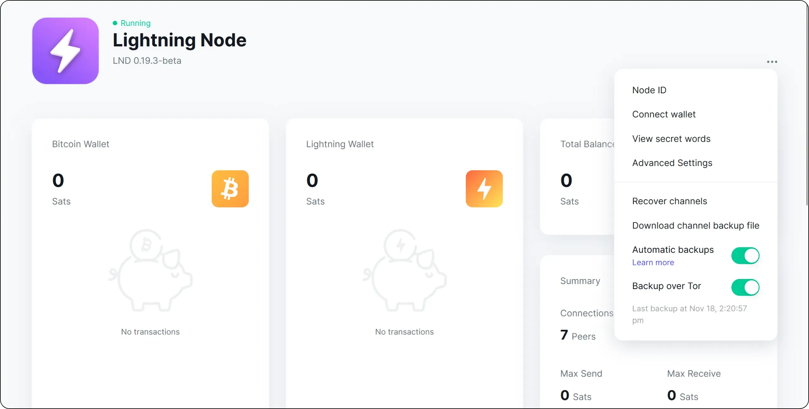


बैकअप के लिए यहां तीन महत्वपूर्ण तत्व हैं:


- सुनिश्चित करें कि `स्वचालित बैकअप` विकल्प सक्षम है। इससे आपकी एन्क्रिप्टेड एससीबी फ़ाइल स्वचालित रूप से Umbrel के सर्वरों पर भेज दी जाएगी।
- इसके बाद आप `Backup over Tor` विकल्प का उपयोग करके Tor या क्लियरनेट के माध्यम से भेजने का विकल्प चुन सकते हैं। जैसा कि पिछले अनुभागों में बताया गया है, मैं आपकी गोपनीयता बनाए रखने के लिए Tor का उपयोग करने की पुरजोर सलाह देता हूं।
- अंत में, एक 'चैनल बैकअप फ़ाइल डाउनलोड करें' बटन है, जो आपको 'चैनल.बैकअप' फ़ाइल डाउनलोड करने की सुविधा देता है, यानी आपके SCB का एक एन्क्रिप्टेड स्नैपशॉट, जिसे आप अपने कंप्यूटर पर सेव कर सकते हैं। इससे आप समय-समय पर अतिरिक्त स्थानीय बैकअप बना सकते हैं, जो स्वचालित रूप से Umbrel सर्वरों पर भेजे जाने वाले बैकअप के अतिरिक्त होंगे।


अब आप जान गए हैं कि अपने लाइटनिंग नोड के sats को डेटा हानि से कैसे सुरक्षित रखें। अगले अध्याय में, हम जानेंगे कि अपने नोड को धोखाधड़ी के प्रयासों से कैसे सुरक्षित करें।


## Watchtower: भूमिका और संरचना


<chapterId>e6c654dd-26c5-4e4d-8d11-a215bac37812</chapterId>


लाइटनिंग में, प्रत्येक चैनल क्रमिक अवस्थाओं के एक क्रम पर आधारित होता है, जिसे अप्रकाशित commitment transaction द्वारा दर्शाया जाता है। प्रत्येक लाइटनिंग भुगतान या रूटिंग के साथ, चैनल में शामिल दोनों भागीदार commitment transaction का ​​एक नया जोड़ा बनाते हैं, जो चैनल में धनराशि के वर्तमान वितरण को दर्शाता है। पुराने commitment transaction अप्रचलित हो जाते हैं।


यदि कोई भी पक्ष पुरानी जानकारी प्रकाशित करता है, तो दूसरे पक्ष को उस पर प्रतिबंध लगाने और चैनल की पूरी धनराशि वसूल करने का अधिकार है। इस अध्याय में, हम संक्षेप में देखेंगे कि यह तंत्र कैसे काम करता है, और फिर यह समझाएंगे कि संभावित धोखाधड़ी के प्रयासों से अपने लाइटनिंग नोड की सुरक्षा के लिए एक ***वॉचटावर*** कैसे स्थापित करें।


### निगरानी मीनारों की कार्यप्रणाली को समझना


किसी भी समय, चैनल में मौजूद प्रत्येक पक्ष के पास एक commitment transaction होता है, जिसे प्रकाशित करने पर वे चैनल को बंद कर सकते हैं और धनराशि में अपना हिस्सा वापस प्राप्त कर सकते हैं। इस प्रक्रिया को *जबरन बंद करना* कहा जाता है। लेकिन यदि वे चैनल की पिछली स्थिति से संबंधित किसी पुराने commitment transaction को प्रकाशित करने का प्रयास करते हैं, जिसमें अधिक sats मौजूद थे, तो इस लेन-देन को धोखाधड़ी का प्रयास माना जाएगा। इस स्थिति में, प्रतिपक्ष उस पुरानी स्थिति से जुड़ी निरस्तीकरण कुंजी का उपयोग करके चैनल में मौजूद धनराशि की पूरी राशि वापस प्राप्त कर सकता है, जबकि धोखाधड़ी करने वाले को अस्थायी रूप से टाइमलॉक द्वारा अवरुद्ध कर दिया जाता है।


इस प्रणाली का अर्थ है कि पुरानी स्थिति को प्रकाशित करना, यानी धोखाधड़ी का प्रयास करना, बहुत जोखिम भरा है: यदि दूसरा पक्ष टाइमलॉक की समय सीमा समाप्त होने से पहले मेमोरी पूल या ब्लॉकचेन पर इस लेनदेन को देख लेता है, तो वे निरस्तीकरण कुंजी का उपयोग करके सभी धनराशि वापस प्राप्त कर सकते हैं। **इसलिए, आपके लाइटनिंग चैनल की सुरक्षा टाइमलॉक द्वारा निर्धारित समय सीमा के भीतर धोखाधड़ी के प्रयास का पता लगाने की आपकी क्षमता पर निर्भर करती है।**


#### निगरानी मीनारें क्यों आवश्यक हैं?


दंड व्यवस्था तभी कारगर होती है जब पीड़ित पक्ष निम्नलिखित में से किसी एक स्थिति में हो:


- प्रत्येक नए Bitcoin ब्लॉक की निगरानी करें यह देखने के लिए कि क्या कोई चैनल commitment transaction प्रकाशित किया गया है;
- यह निर्धारित करें कि यह लेनदेन अंतिम वैध स्थिति से मेल खाता है या निरस्त स्थिति से;
- यदि स्थिति रद्द कर दी जाती है, तो समय पर कानूनी लेनदेन को प्रसारित करने के लिए, समय सीमा समाप्त होने से पहले सभी धनराशि को पुनः प्राप्त करने के लिए निरस्तीकरण कुंजी का उपयोग करें।


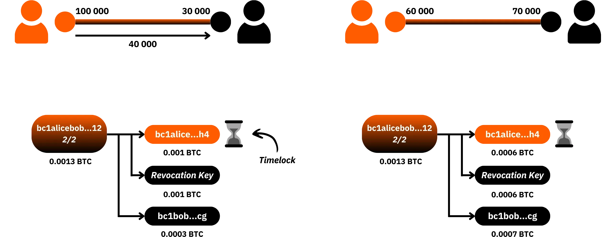


आदर्श स्थिति में, आपका लाइटनिंग नोड 24/7 ऑनलाइन रहता है, सिंक्रोनाइज़्ड होता है और लगातार ब्लॉकचेन की निगरानी करता रहता है। इसी कारण, यह अकेले ही धोखाधड़ी के प्रयास का पता लगा सकता है और तुरंत कार्रवाई कर सकता है। हालांकि, व्यवहार में, एक व्यक्तिगत लाइटनिंग नोड बंद हो सकता है, खासकर लंबे समय तक बिजली कटौती या इंटरनेट कनेक्शन फेल होने की स्थिति में।


ठीक इसी निष्क्रियता की अवधि के दौरान खतरा वास्तविक हो जाता है: यदि कोई बेईमान सहकर्मी आपके नोड के ऑफ़लाइन होने पर कोई पुरानी स्थिति प्रकाशित कर देता है, और आपकी ओर से कोई प्रतिक्रिया दिए बिना समय सीमा समाप्त हो जाती है, तो धोखाधड़ी प्रभावी हो जाती है। आप चैनल में मौजूद अपनी कुछ या पूरी धनराशि खो देते हैं।


इस जोखिम को कम करने के लिए Watchtower पेश किए गए थे। वॉचटावर एक बाहरी सेवा है जो आपकी ओर से ब्लॉकचेन की निगरानी करती है, आपके किसी चैनल पर पुरानी स्थिति के प्रकाशन की संभावना का पता लगाती है, और यदि आवश्यक हो, तो आपकी ओर से दंडात्मक लेनदेन को स्वचालित रूप से प्रसारित करती है। इसलिए, भले ही आपका लाइटनिंग नोड लंबे समय तक ऑफ़लाइन रहे, जब तक आप जिस वॉचटावर का उपयोग कर रहे हैं वह चालू है, वह किसी भी धोखाधड़ी के प्रयास की निगरानी करके और जैसे ही उसे पता चलता है, संबंधित दंड लागू करके आपके फंड की सुरक्षा करने में सक्षम होगा।


#### एक निगरानी मीनार कैसे काम करती है


एक वॉचटावर को इस तरह से डिजाइन किया जाता है कि वह आपके चैनलों के बारे में प्राप्त होने वाली जानकारी को कम से कम कर सके, साथ ही समस्या होने की स्थिति में कार्रवाई करने के साधन भी प्रदान करे:


- किसी पीयर के साथ प्रत्येक नए चैनल संबंध के लिए, आपका नोड पहले से ही संभावित दंड लेनदेन तैयार करता है। पीयर द्वारा धोखाधड़ी की स्थिति में, यह लेनदेन आपको चैनल में मौजूद सभी धनराशि को पुनः प्राप्त करने की अनुमति देगा;
- आपका नोड फिर संबंधित commitment transaction के TXID का उपयोग करके इस दंडात्मक लेनदेन को एन्क्रिप्ट करता है (वही TXID जिसका उपयोग धोखाधड़ी करने वाले द्वारा धोखाधड़ी का प्रयास करने पर किया जाएगा)। जब तक कोई क्लोजर नहीं होता, वॉचटावर इस लेनदेन को डिक्रिप्ट नहीं कर सकता, क्योंकि उसे धोखाधड़ी वाले लेनदेन का TXID पूरी तरह से पता नहीं होता है;
- आपका नोड वॉचटावर को एक पैकेट भेजता है जिसमें एन्क्रिप्टेड पेनल्टी ट्रांजैक्शन और संभावित धोखाधड़ी वाले ट्रांजैक्शन के TXID का आधा हिस्सा होता है।


वॉचटावर को भेजा गया TXID अधूरा होने के कारण, यह न्याय लेनदेन को डिक्रिप्ट नहीं कर सकता। हालांकि, यह ब्लॉकचेन पर अपने स्वामित्व वाले हिस्से से मेल खाने वाले TXID की निगरानी कर सकता है। यदि इसे ऐसा कोई लेनदेन मिलता है, तो यह उस लेनदेन के पूर्ण TXID का उपयोग करके आपके दंड लेनदेन को डिक्रिप्ट करने का प्रयास करता है। यदि डिक्रिप्शन सफल हो जाता है, तो इसे पता चल जाता है कि यह धोखाधड़ी का प्रयास है और यह तुरंत आपके लिए दंड लेनदेन प्रकाशित कर देता है।


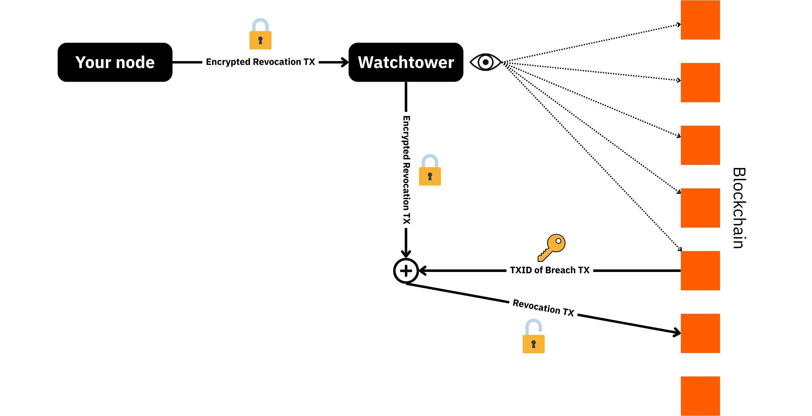


इसलिए वॉचटावर को आपके चैनलों की कोई जानकारी नहीं होती: न तो आपके साथियों की पहचान, न ही बैलेंस, और न ही लेन-देन की संरचना। यह केवल एन्क्रिप्टेड पैकेट ही देख पाता है। यह केवल इतना ही पता लगा सकता है कि आपके चैनल किस दर से अपडेट हो रहे हैं, क्योंकि इसे प्रत्येक नई स्थिति के लिए एक पैकेट प्राप्त होता है, लेकिन इसकी सामग्री का पता नहीं लगा सकता। धोखाधड़ी की स्थिति में, यह निश्चित रूप से जुर्माने वाले लेन-देन को डिक्रिप्ट करके चैनल की जानकारी प्राप्त कर लेगा, लेकिन कम से कम आपका sats बच जाएगा।


यह व्यवस्था एक समझौते पर आधारित है: आप पूर्व-हस्ताक्षरित दंडात्मक लेनदेन को प्रकाशित करने की क्षमता वॉचटावर को सौंप देते हैं, लेकिन जब तक कोई धोखाधड़ी नहीं होती, यह लेनदेन वॉचटावर के लिए पूरी तरह से अपारदर्शी रहता है। वॉचटावर न तो प्राप्तकर्ताओं को संशोधित कर सकता है और न ही धनराशि को डायवर्ट कर सकता है, क्योंकि उसके पास केवल एक हस्ताक्षरित लेनदेन होता है, जिसके परिणाम आपके पक्ष में स्थिर रखे गए होते हैं। वैध रूप से जबरन या सहयोगात्मक रूप से बंद किए गए किसी चैनल के विवरण की जानकारी भी वॉचटावर को नहीं मिल सकती, क्योंकि TXID मेल नहीं खाते। दूसरी ओर, वॉचटावर एक न्यूनतम विश्वसनीय तृतीय पक्ष बना रहता है: आपको आवश्यकता पड़ने पर इसके ऑनलाइन रहने और आपके न्यायोचित लेनदेन को सही ढंग से प्रसारित करने पर निर्भर रहना पड़ता है।


#### एक निगरानी मीनार बनना


सैद्धांतिक रूप से, कोई भी लाइटनिंग नोड अन्य नोड्स के लिए वॉचटावर के रूप में कार्य कर सकता है (यदि वे समान कार्यान्वयन का उपयोग करते हैं, उदाहरण के लिए LND), जबकि स्वयं अन्य नोड्स द्वारा इस भूमिका को निभाते हुए सुरक्षित रहता है। अगले व्यावहारिक अनुभागों में, मैं आपको दिखाऊंगा कि Umbrel के अंतर्गत अपने LND पर इस सरल तंत्र को कैसे स्थापित करें।


परिणामस्वरूप, एक दिलचस्प रणनीति यह हो सकती है कि आप अपने भरोसेमंद बिटकॉइन उपयोगकर्ता मित्रों के साथ एक-दूसरे के निगरानीकर्ता के रूप में कार्य करने पर सहमत हों। आप उनके चैनलों की निगरानी करें, और वे आपके चैनलों की निगरानी करें।


### एक परोपकारी निगरानी केंद्र खोजें


यदि आपके आस-पास कोई ऐसा व्यक्ति नहीं है जो वॉचटावर सेवा प्रदान कर सके, तो कई परोपकारी सार्वजनिक वॉचटावर हैं जिनसे आप जुड़ सकते हैं। उदाहरण के लिए, इस LNP202 पाठ्यक्रम में, मैं आपको LN+ और वोल्टेज द्वारा संयुक्त रूप से प्रदान की जाने वाली वॉचटावर सेवा से जुड़ने का सुझाव देता हूँ, जो LND के लिए एक वॉचटावर है।


यहां आपके लॉगिन विवरण दिए गए हैं:


- टोर के माध्यम से:


```txt
023bad37e5795654cecc69b43599da8bd5789ac633c098253f60494bde602b60bf@iiu4epqzm6cydqhezueenccjlyzrqeruntlzbx47mlmdgfwgtrll66qd.onion:9911
```


- क्लियरनेट के माध्यम से:


```txt
023bad37e5795654cecc69b43599da8bd5789ac633c098253f60494bde602b60bf@34.216.52.158:9911
```

इस निःशुल्क वॉचटावर सेवा प्रदान करने के लिए उन्हें धन्यवाद देने हेतु, [आप लाइटनिंग के माध्यम से दान कर सकते हैं](https://lightningnetwork.plus/donation)।


अब जबकि हम एक परोपकारी वॉचटावर सेवा का उपयोग कर रहे हैं, आइए देखें कि इसे Umbrel के अंतर्गत हमारे LND नोड पर कैसे कॉन्फ़िगर किया जाए।


### एक निगरानी मीनार स्थापित करना


`लाइटनिंग नोड` एप्लिकेशन से, इंटरफ़ेस के ऊपरी दाएं कोने में स्थित तीन बिंदुओं पर क्लिक करें, फिर `उन्नत सेटिंग्स` चुनें।


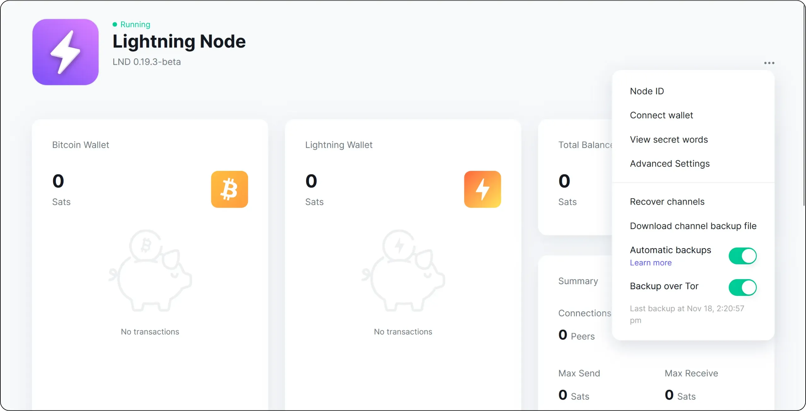


फिर `Watchtower` मेनू पर जाएं।


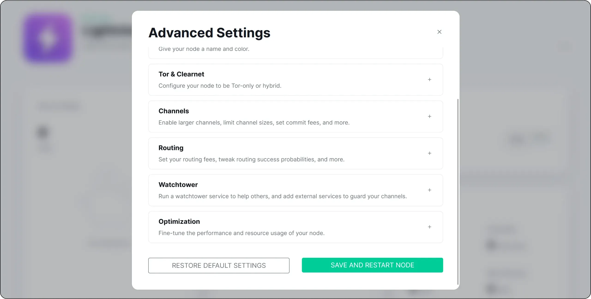


`Watchtower क्लाइंट` विकल्प को सक्रिय करें, फिर `सेव एंड रीस्टार्ट नोड` बटन पर क्लिक करें। LND के रीस्टार्ट होने का इंतजार करें।


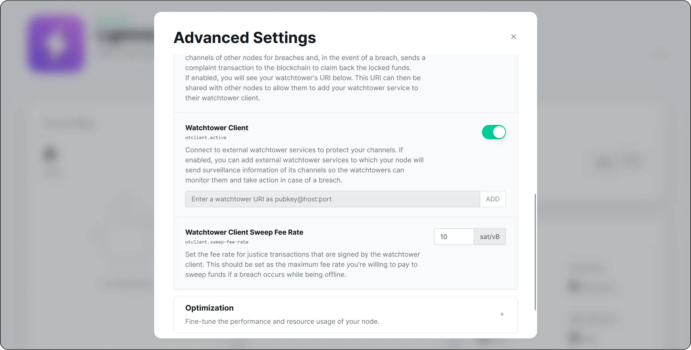


रीस्टार्ट पूरा होने के बाद, उसी मेनू पर वापस जाएं और दिए गए फ़ील्ड में अपनी पसंद के परोपकारी वॉचटावर की आईडी दर्ज करें। फिर पुष्टि करने के लिए `जोड़ें` बटन पर क्लिक करें। आप `Watchtower क्लाइंट स्वीप शुल्क दर` पैरामीटर को भी समायोजित कर सकते हैं: यह वह शुल्क दर है जो आप वॉचटावर द्वारा प्रसारित संभावित न्याय लेनदेन के लिए भुगतान करने को तैयार हैं। बहुत अधिक दर चुनने की आवश्यकता नहीं है, लेकिन बहुत कम दर से भी बचें, अन्यथा कानूनी लेनदेन समय पर पुष्टि नहीं हो पाएगा।


इन परिवर्तनों को लागू करने के लिए `सेव एंड रीस्टार्ट नोड` बटन का उपयोग करके अपने नोड को रीस्टार्ट करें।


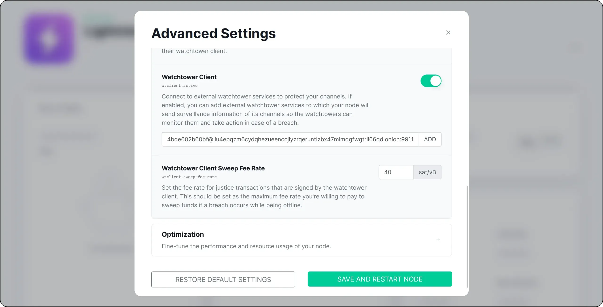


यदि आप इसी मेनू पर वापस आते हैं, तो आप देखेंगे कि आपका लाइटनिंग नोड अब आपके द्वारा अभी-अभी जोड़े गए वॉचटावर द्वारा सुरक्षित है।


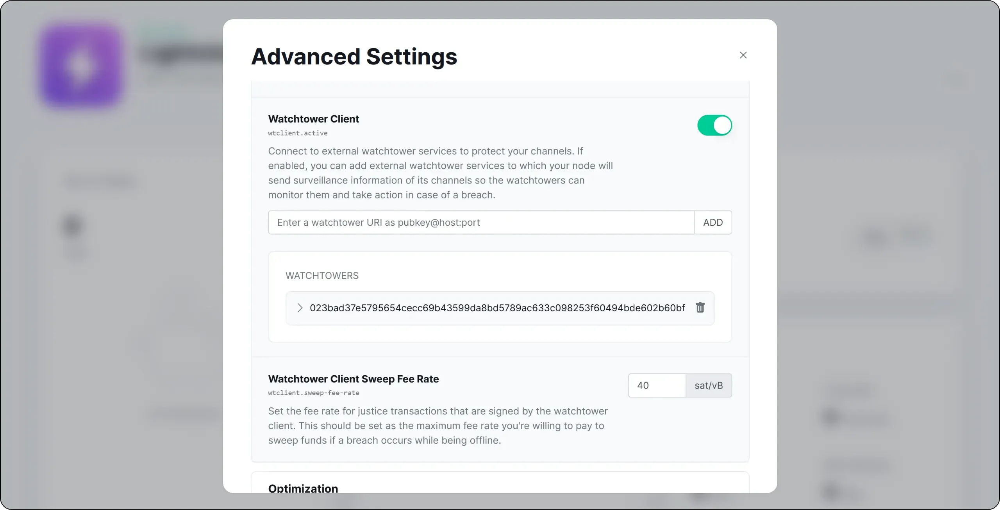


एक परोपकारी निगरानी चौकी आमतौर पर पर्याप्त होती है, खासकर यदि आप अपने लाइटनिंग नोड पर बड़ी मात्रा में धन निवेश नहीं करते हैं और अपने नोड का अच्छी तरह से प्रबंधन करते हैं (इसे लंबे समय तक बंद न रखें)। और भी अधिक सुरक्षा के लिए, आप इसी प्रक्रिया को दोहराकर कई निगरानी चौकियाँ जोड़ सकते हैं।


## अपना पहला लाइटनिंग चैनल खोलें


<chapterId>00642af7-8f3d-4a25-96d7-34e85de7bd5d</chapterId>


यदि आप यहाँ तक पहुँच चुके हैं, तो आप जानते ही होंगे कि चैनल के बिना लाइटनिंग नोड एक खाली wallet की तरह है: यह मौजूद तो है, लेकिन किसी काम का नहीं। भुगतान भेजने या प्राप्त करने के लिए, आपके नोड को लाइटनिंग नेटवर्क में कम से कम एक अन्य नोड से चैनल के माध्यम से जुड़ा होना चाहिए। भविष्य में, हम लचीलेपन और रूटिंग दक्षता के लिए कई चैनल खोलने की पुरजोर सलाह देते हैं। अगले अध्यायों में, हम यह भी देखेंगे कि आप अपनी लिक्विड एसेट्स को कैसे प्रबंधित करें, अपने चैनल टोपोलॉजी को कैसे ऑप्टिमाइज़ करें और Umbrel पर बेसिक LND इंटरफ़ेस की तुलना में अधिक उन्नत टूल का उपयोग कैसे करें।


लेकिन इस परिचयात्मक अध्याय में, उद्देश्य केवल यह समझना है कि एक अच्छा लाइटनिंग पीयर कैसे चुनें, अपने पीयर्स का चयन करने के लिए आवश्यक जानकारी कहाँ से प्राप्त करें, और अंत में बुनियादी LND इंटरफ़ेस के माध्यम से अपना पहला चैनल कैसे खोलें।


### एक अच्छे लाइटनिंग पीयर का चुनाव कैसे करें?


चैनल खोलते समय, आपको एक पीयर चुनना होगा: एक अन्य लाइटनिंग नोड जिससे आपका नोड चैनल के माध्यम से सीधे कनेक्ट होगा। पीयर का यह चुनाव महत्वपूर्ण है, क्योंकि इसका सीधा प्रभाव इन पर पड़ेगा:


- आपके भुगतानों का आसानी से हो पाना;
- समय के साथ आपके चैनलों की विश्वसनीयता;
- आपके रूटिंग खर्च।


हर किसी के लिए एक आदर्श मेल जैसी कोई चीज नहीं होती, लेकिन अच्छे उम्मीदवारों की पहचान करने के लिए कई विश्वसनीय मापदंड हैं।


#### 1. नोड कनेक्टिविटी


एक अच्छा पीयर वह नोड होता है जो लाइटनिंग नेटवर्क से अच्छी तरह से जुड़ा होता है। इसका मतलब सिर्फ बड़ी संख्या में चैनल होना ही नहीं है (हालांकि यह एक संकेतक हो सकता है), बल्कि सबसे महत्वपूर्ण बात यह है कि वह अन्य विश्वसनीय नोड्स से जुड़ा हो और नेटवर्क ग्राफ में पर्याप्त रूप से केंद्रीय स्थान रखता हो।


अच्छी तरह से जुड़े हुए नोड से अधिकांश भुगतान स्थलों तक कुशल मार्ग खोजने की संभावना बढ़ जाती है। इससे आवश्यक मध्यवर्ती नोड्स की संख्या भी कम हो जाती है, जिससे लागत कम रहती है।


इसके विपरीत, किसी पृथक या कमजोर रूप से जुड़े नोड के लिए अपना पहला चैनल खोलना आपकी संभावनाओं को सीमित कर सकता है: आप इस पीयर को भुगतान करने में सक्षम होंगे, लेकिन नेटवर्क के बाकी हिस्सों को भुगतान करना बहुत कठिन होगा।


#### 2. पूंजीकरण और चैनल क्षमता


एक अच्छा पीयर नोड पर्याप्त पूंजी वाला नोड भी होता है। यह इसकी कुल चैनल क्षमता (इसके सभी चैनलों के लिए निर्धारित sats का योग) और इसकी औसत चैनल क्षमता से प्रदर्शित होता है (अक्सर कई छोटे चैनलों की तुलना में कुछ अच्छी तरह से पूंजीकृत चैनल होना बेहतर होता है)।


एक ऐसा नोड जिसकी क्षमता बहुत कम है, या जिसके सभी चैनल बहुत छोटे हैं, वह बड़ी रकम के भुगतान को रूट करने में सक्षम नहीं होगा, जिसके परिणामस्वरूप आपके लिए रूटिंग में विफलताएँ आएंगी।


#### 3. व्यय नीतियां


प्रत्येक नोड अपनी रूटिंग फीस (बेस फीस और फीस रेट) खुद तय करता है। एक अच्छा पीयर रणनीतिक चैनलों के लिए अत्यधिक फीस नहीं लेगा। पहले चैनल के लिए, बेहतर होगा कि आप ऐसे नोड को चुनें जिसकी फीस सामान्य हो, ताकि आपके अपने भुगतान में कोई बाधा न आए।


याद रखें कि आपकी अपनी रूटिंग फीस भी इस बात को प्रभावित करती है कि दूसरे आपको एक सहकर्मी के रूप में कैसे देखते हैं: एक नोड जो लगातार अपनी फीस बदलता रहता है या बेतुके शुल्क लगाता है, उसकी शायद ही कभी सराहना की जाती है।


#### 4. स्थिरता और वरिष्ठता


पीयर स्थिरता एक बहुत महत्वपूर्ण मानदंड है। एक अच्छे नोड का अपटाइम उच्च होता है (यह बहुत कम ही ऑफलाइन होता है), यह अपने चैनलों को लंबे समय तक खुला रखता है और यह बिना किसी कारण के लगातार चैनल खोलता/बंद नहीं करता है।


पुराने और अभी भी सक्रिय चैनल एक अच्छा संकेत हैं: वे बताते हैं कि यह संबंध साथी के लिए लाभदायक है, कि नोड अपनी पूंजी का प्रबंधन करना जानता है और यह किसी भी समय बंद नहीं होता है, इसलिए आपको बंद करने और फिर से खोलने के लिए ऑनचेन शुल्क का भुगतान करते रहने की आवश्यकता नहीं है।


इसके विपरीत, एक ऐसा सहकर्मी जो अक्सर ऑफ़लाइन रहता है, या जो जल्दी से चैनल बंद कर देता है, वह आपके लिए समस्याओं का स्रोत हो सकता है, और नए चैनल खोलने के लिए अतिरिक्त लागत का कारण भी बन सकता है।


इन मानदंडों के बावजूद भी, आप पहली बार में सही चुनाव नहीं कर पाएंगे। यह स्वाभाविक है: किसी भी समकक्ष की वास्तविक गुणवत्ता उसके उपयोग से ही पता चलती है। इसलिए यह महत्वपूर्ण है कि:


- चैनल गतिविधि की निगरानी करें (राउटेड वॉल्यूम, उपलब्धता आदि);
- उन चैनलों को बंद करें जिनका कोई उद्देश्य नहीं है या जिनके साथी अक्सर ऑफ़लाइन रहते हैं;
- समय के साथ अपनी पूंजी को बेहतर समकक्षों में पुनर्वितरित करें।


इसका उद्देश्य चैनलों को हर दिन खोलना और बंद करना नहीं है (जो ऑनचेन लागतों के लिहाज से महंगा होगा), बल्कि धीरे-धीरे अपनी टोपोलॉजी को विकसित करना है ताकि आपकी आवश्यकताओं के अनुरूप विश्वसनीय, अच्छी तरह से जुड़े हुए साथियों के एक समूह पर अभिसरण हो सके।


### मुझे कोई सहकर्मी कैसे मिलेगा?


इन मानदंडों को लागू करने के लिए, आपको ऐसे उपकरणों की आवश्यकता होगी जो लाइटनिंग नेटवर्क की दृश्यता प्रदान करते हों। इसके लिए कई एक्सप्लोरर और सेवाएं उपलब्ध हैं। सबसे प्रसिद्ध लाइटनिंग एक्सप्लोरर में [1ML](https://1ml.com/) और [Amboss](https://amboss.space/) शामिल हैं।


https://planb.academy/tutorials/node/lightning-network/amboss-37044cad-0f85-41eb-af18-491384af1017

https://planb.academy/tutorials/node/lightning-network/1ml-37ada2ab-7a24-4473-87fd-007cb7640e7b

हालांकि, यहां मैं आपको लाइटनिंग लैब्स के लाइटनिंग टर्मिनल टूल का उपयोग करने का सुझाव देता हूं (https://terminal.lightning.engineering/), जो चैनल खोलने के लिए सबसे प्रासंगिक माने जाने वाले लाइटनिंग नोड्स की रैंकिंग प्रदान करता है (हालांकि यह रैंकिंग आंशिक रूप से व्यक्तिपरक मानदंडों पर आधारित है)।


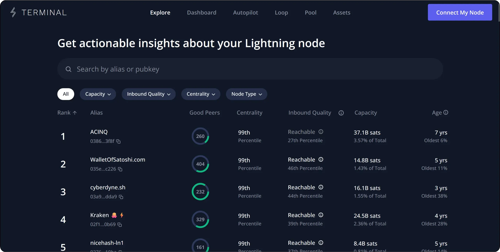


इस रैंकिंग में शीर्ष पर मौजूद बहुत बड़े लाइटनिंग नोड्स के साथ समस्या यह है कि उनमें से अधिकांश बहुत अधिक राशि से कम के चैनल खोलने की अनुमति नहीं देते हैं। कई नोड्स सख्त पीयर मैनेजमेंट नीतियां भी लागू करते हैं, जिसके कारण आपका चैनल बंद हो सकता है। दूसरी ओर, कनेक्शनों की संख्या को देखते हुए, इन नोड्स को आमतौर पर आने वाली लिक्विडिटी की आवश्यकता नहीं होती है।


इसलिए मैं आपको सलाह दूंगा कि आप रैंकिंग में नीचे की ओर बढ़ते हुए एक ऐसा नोड खोजें जो अच्छी तरह से जुड़ा हुआ हो, विश्वसनीय हो और नेटवर्क ग्राफ में पर्याप्त रूप से केंद्रीय स्थान पर हो, लेकिन उसका आकार बहुत बड़ा न हो। उदाहरण के लिए, मैंने यहां stacker.news पर लाइटनिंग नोड की पहचान की है, जो बहुत अच्छी तरह से जुड़ा हुआ है, उच्च क्षमता वाला है और नेटवर्क ग्राफ में केंद्रीय स्थान पर स्थित है।


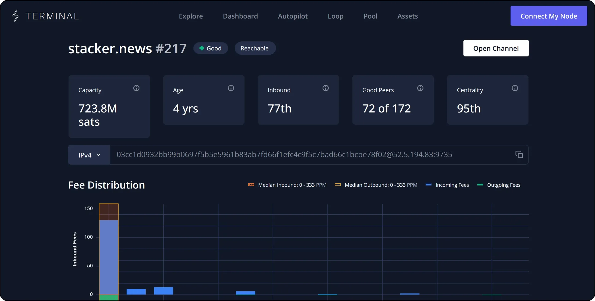


एक अन्य दिलचस्प तरीका यह है कि किसी ऐसे नोड से संपर्क स्थापित किया जाए जिसे तरलता की आवश्यकता हो, जैसे कि कोई परिचित व्यापारी, कोई संगठन या कोई समुदाय। इस रणनीति के तीन फायदे हैं:


- चूंकि चयनित इकाई को तरलता की आवश्यकता होती है, इसलिए तार्किक रूप से उसके पास बिना किसी कारण के आपके चैनल को बंद करने का कम प्रोत्साहन होगा;
- इसकी आर्थिक गतिविधि इस चैनल पर रूटिंग की संभावनाओं को बढ़ाती है, और इसलिए कुछ शुल्क वसूलने की संभावना भी बढ़ जाती है;
- आप इकोसिस्टम को फायदा पहुंचा रहे हैं और अन्य बिटकॉइन उपयोगकर्ताओं के लिए एक मूल्यवान योगदान दे रहे हैं।


एक बार जब आप प्रासंगिक नोड की पहचान कर लेते हैं, तो आप उसका नोड आईडी प्राप्त कर सकते हैं। यह नोड की सार्वजनिक कुंजी, एक `@` विभाजक, उसका आईपी या टोर पता और उपयोग किए गए पोर्ट का संयोजन है। यह आईडी किसी भी लाइटनिंग एक्सप्लोरर पर नोड की प्रोफ़ाइल से आसानी से प्राप्त की जा सकती है।


### LND के माध्यम से अपना पहला चैनल खोलें


अब जबकि हमने उस नोड की पहचान कर ली है जिसके साथ हमें अपना पहला चैनल खोलना है, हमें sats को उसमें लॉक करने की आवश्यकता है। ऐसा करने के लिए, आपको अपने LND से जुड़े ऑनचेन wallet को Bitcoin में फीड करना होगा।


मुख्य LND इंटरफ़ेस से, अपना `Bitcoin Wallet` ढूंढें, फिर `डिपॉजिट` बटन पर क्लिक करें। ऑनचेन प्राप्तकर्ता पता generated है: इस पर sats भेजें। आपको जितनी राशि स्थानांतरित करनी है, वह आपके पहले चैनल के लिए आवंटित की जाने वाली क्षमता पर निर्भर करती है, लेकिन ध्यान रखें कि आपको लक्षित क्षमता से थोड़ा अधिक भेजना होगा। उदाहरण के लिए, यदि आप 500,000 sats का चैनल खोलना चाहते हैं, तो ठीक 500,000 sats न भेजें, बल्कि उससे अधिक राशि भेजें।


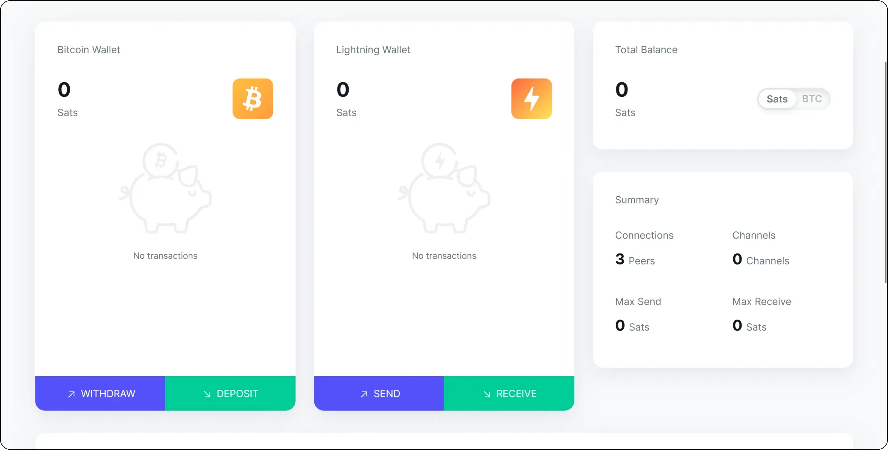


लेन-देन प्रसारित होने के बाद, यह इंटरफ़ेस में दिखाई देगा। चैनल खोलने से पहले पुष्टि की प्रतीक्षा करें। पुष्टि होने पर आपको इसके बगल में एक हरा तीर दिखाई देगा।


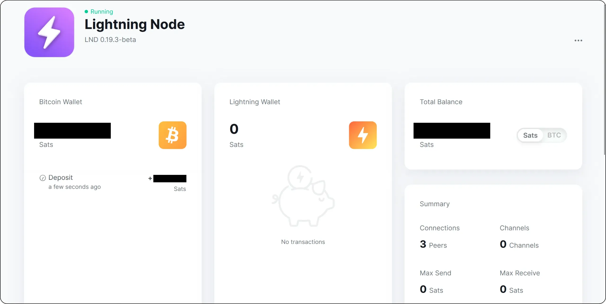


मुख्य इंटरफ़ेस तक स्क्रॉल करें, फिर `+ ओपन चैनल` पर क्लिक करें।


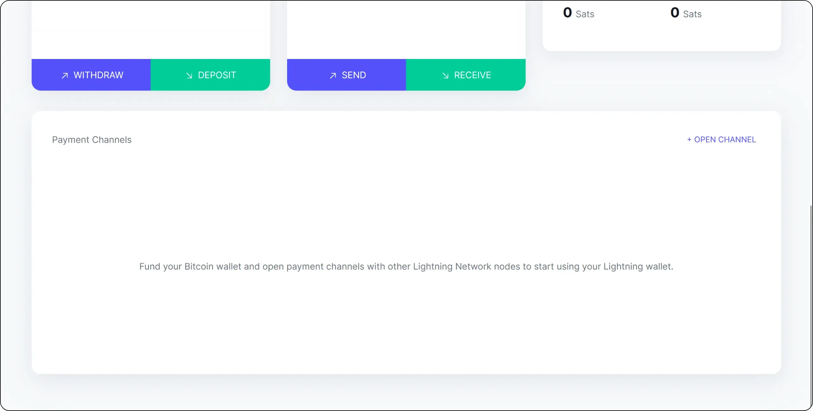


जिस नोड के साथ आप चैनल खोलना चाहते हैं, उसका `नोड आईडी` दर्ज करें, लॉक-इन की जाने वाली राशि बताएं, और फिर ऑनचेन शुल्क बाजार की स्थिति के अनुसार शुरुआती लेनदेन शुल्क को समायोजित करें। बेशक, पहले से ही सुनिश्चित कर लें कि आपके LND ऑनचेन पोर्टफोलियो में पर्याप्त धनराशि मौजूद है।


सभी पैरामीटर सेट हो जाने के बाद, `ओपन चैनल` बटन पर क्लिक करें।


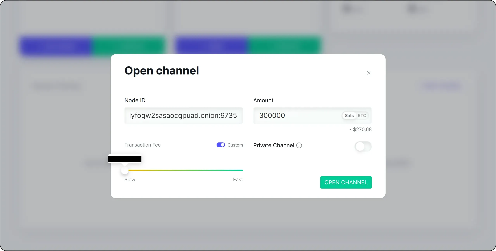


ओपनिंग ट्रांजैक्शन के ऑनचेन पर कन्फर्म होने का इंतजार करें। आपका पहला चैनल अब आधिकारिक तौर पर चालू हो गया है: बधाई हो!


आप देख सकते हैं कि फिलहाल चैनल की 100% लिक्विडिटी मेरे पास है: यह स्वाभाविक है, क्योंकि चैनल मैंने ही खोला है। जैसे-जैसे भुगतान और रूटिंग में बदलाव आएगा, यह वितरण भी बदलेगा, लेकिन चैनल की कुल क्षमता हमेशा समान रहेगी।


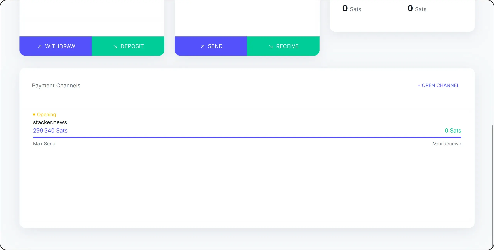


अब जब आपके पास चैनल है, तो आप अपना पहला लाइटनिंग भुगतान कर सकते हैं, बशर्ते चुना गया नोड नेटवर्क से ठीक से जुड़ा हो। बेशक, आगे के अध्यायों में हम देखेंगे कि मोबाइल से लाइटनिंग बिलों का भुगतान करने का अधिक सुविधाजनक तरीका कैसे सेट करें। लेकिन अभी के लिए, आइए LND से Umbrel को सीधे पहला भुगतान करने का प्रयास करें।


ऐसा करने के लिए, `Lightning Wallet` सेक्शन में, `SEND` बटन पर क्लिक करें, फिर सेट किए जाने वाले इनवॉइस को पेस्ट करें।


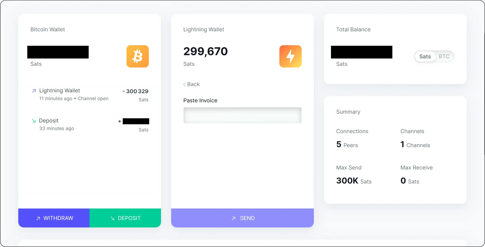


बिल की राशि प्रदर्शित हो रही है। `भेजें` बटन पर क्लिक करके भुगतान की पुष्टि करें।


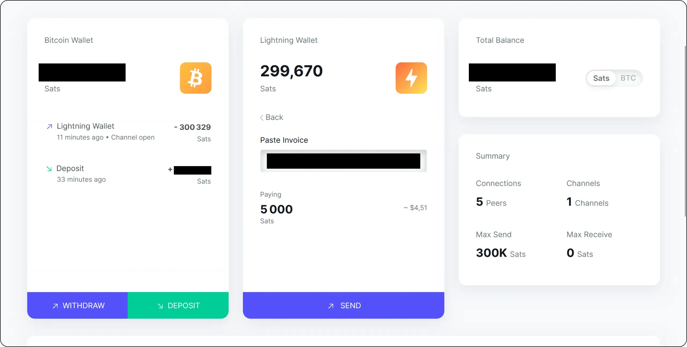


यदि कोई वैध मार्ग मिल जाता है, तो आपका पहला लाइटनिंग भुगतान सफल होना चाहिए।


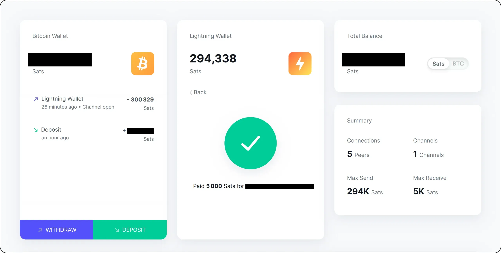


यदि हम चैनल में तरलता के वितरण को देखें, तो हम पाते हैं कि मेरे साथी के पास अब 5,002 sats हैं। यह मेरे द्वारा किए गए 5,000 sats के भुगतान के बराबर है, जिसे उसने प्राप्तकर्ता के नोड तक पहुंचाया। अतिरिक्त 2 sats मेरे द्वारा भुगतान किए गए रूटिंग शुल्क को दर्शाते हैं, क्योंकि प्राप्तकर्ता को ठीक 5,000 sats प्राप्त हुए।


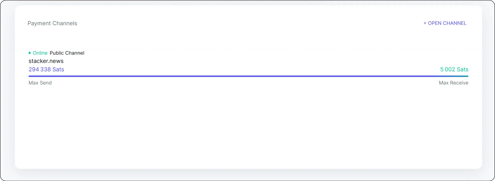


भुगतान की विश्वसनीयता बढ़ाने के लिए, ज़ाहिर है, अन्य माध्यमों को खोलना आवश्यक होगा। अपने उद्देश्यों के आधार पर, हमें तरलता उपलब्ध कराने का भी एक तरीका खोजना होगा ताकि हम लाइटनिंग के माध्यम से भुगतान प्राप्त कर सकें। यह अगले भाग का विषय होगा।


# अपने लाइटनिंग नोड का प्रबंधन करना


<partId>e27c3e1e-487b-4414-ad6b-d67bdb91c7c5</partId>


## अपने नोड ऑपरेटर प्रोफ़ाइल को परिभाषित करें


<chapterId>d3b2e163-50f6-4d1d-a5fc-8fd177dfac76</chapterId>


अब जबकि आपका लाइटनिंग नोड चालू हो चुका है, अगला चरण है अपना ट्रेडर प्रोफाइल परिभाषित करना। यह एक महत्वपूर्ण निर्णय है, क्योंकि यह आपकी चैनल खोलने की रणनीति, आपके पसंदीदा पीयर्स के प्रकार और तरलता प्रबंधन के तरीके को निर्धारित करता है।


लाइटनिंग नेटवर्क पर, इसके काम करने के लिए, आपको सही दिशा में लिक्विडिटी की आवश्यकता होती है। आउटगोइंग लिक्विडिटी आपकी भुगतान क्षमता (चैनल के आपके पक्ष में उपलब्ध sats) को दर्शाती है। इनकमिंग लिक्विडिटी आपकी प्राप्ति क्षमता (आपके पीयर्स के पक्ष में उपलब्ध sats) को दर्शाती है। दूसरे शब्दों में, आपकी प्रोफ़ाइल एक सरल प्रश्न पर आधारित है: क्या आपका sats अधिकांश समय आपके नोड से बाहर जा रहा है, या उसमें प्रवेश कर रहा है?


### उपभोक्ता


अधिकांश उपयोगकर्ताओं की यही स्थिति है। आप अपने नोड का उपयोग लाइटनिंग भुगतान करने के लिए करते हैं: सामान और सेवाएं खरीदने, बिलों का भुगतान करने, टिप्स भेजने के लिए - संक्षेप में, लाइटनिंग को भुगतान के एक त्वरित माध्यम के रूप में उपयोग करने के लिए। दूसरी ओर, आपको लाइटनिंग से बहुत कम या नगण्य राशि प्राप्त होती है, उदाहरण के लिए कुछ दान, दोस्तों के बीच रिफंड या कुछ छोटे-मोटे भुगतान।


इस प्रोफ़ाइल को प्रबंधित करना सबसे आसान है, क्योंकि आपकी मुख्य आवश्यकता भुगतान करने की क्षमता है। व्यावहारिक रूप से, इसका मतलब है कि आपको आउटगोइंग लिक्विडिटी की आवश्यकता है। एक बार जब आप स्थिर, अच्छी तरह से जुड़े नोड्स के लिए एक या अधिक उपयुक्त आकार के चैनल खोल लेते हैं, तो आपके आउटगोइंग भुगतान स्वचालित रूप से आपके चैनलों के दूसरी तरफ लिक्विडिटी का प्रवाह करेंगे। यही प्रवाह स्वाभाविक रूप से पर्याप्त मात्रा में इनकमिंग लिक्विडिटी उत्पन्न करता है। परिणामस्वरूप, भले ही आप नियमित रूप से भुगतान प्राप्त करने की योजना न बना रहे हों, फिर भी आप बिना किसी जटिल रणनीति को लागू किए समय-समय पर भुगतान प्राप्त कर सकेंगे। इसलिए आपको अपनी इनकमिंग लिक्विडिटी के बारे में चिंता करने की आवश्यकता नहीं है।


इस LNP202 कोर्स में, हम इस "उपभोक्ता" नोड ऑपरेटर प्रोफाइल पर ध्यान केंद्रित करने जा रहे हैं, क्योंकि यह वह प्रोफाइल है जो लाइटनिंग पर लगभग सभी Bitcoin उपयोगकर्ताओं से मेल खाती है।


### खुदरा विक्रेता


व्यापारी एक तरह से उपभोक्ता के बिल्कुल विपरीत होता है। यहाँ मुख्य उद्देश्य भुगतान करना नहीं, बल्कि भुगतान प्राप्त करना होता है। कोई भी व्यवसाय, सेवा प्रदाता, ऑनलाइन स्टोर या बिक्री केंद्र जो लाइटनिंग भुगतान स्वीकार करता है, उसे इस नोड से कई भुगतान प्राप्त होंगे और वह अपेक्षाकृत कम भुगतान करेगा।


यह प्रोफ़ाइल अधिक चुनौतीपूर्ण है, क्योंकि लाइटनिंग के माध्यम से भुगतान अस्वीकृत होने से बिक्री का नुकसान हो सकता है। इसलिए, आवक तरलता को प्राथमिकता दी जाती है। यदि आपके नोड में पर्याप्त आवक तरलता नहीं है, तो आपके ग्राहकों के भुगतान विफल हो जाएंगे, भले ही उनके पास धनराशि हो, क्योंकि तरलता को सही दिशा में आप तक पहुंचाने का कोई मार्ग नहीं है।


व्यापारियों के लिए सबसे बड़ी चुनौती चैनलों के स्वाभाविक विकास से भी उत्पन्न होती है। यदि आप केवल आय प्राप्त करते हैं, तो आपके चैनल धीरे-धीरे भरते चले जाएंगे। इसलिए आपको अपनी आवक तरलता को बनाए रखने और नवीनीकृत करने के लिए तंत्र की आवश्यकता है।


हालांकि, एक सरल मामला भी है: मिश्रित उपभोक्ता/व्यापारी प्रोफ़ाइल। यदि आप लाइटनिंग के माध्यम से भुगतान प्राप्त करते हैं, लेकिन साथ ही भुगतान भी करते हैं (व्यापारिक खर्च, आपूर्तिकर्ताओं को भुगतान, या यहां तक ​​कि व्यक्तिगत खर्च), तो आपके आउटगोइंग भुगतान स्वाभाविक रूप से इनबाउंड को पुनः उत्पन्न करते हैं। प्रबंधन आसान हो जाता है, क्योंकि प्रवाह एक दूसरे को संतुलित करते हैं, और आपको केवल इनबाउंड लिक्विडिटी को पुनः प्राप्त करने के लिए डिज़ाइन किए गए कृत्रिम तंत्रों का सहारा लेने की कम आवश्यकता होती है।


### राउटर


यह राउटर एक विशिष्ट प्रोफ़ाइल है। यह अपने लाइटनिंग नोड का उपयोग भुगतान या संग्रह के लिए नहीं करता, बल्कि अन्य लोगों के भुगतानों को रूट करने और शुल्क एकत्र करने के लिए करता है। इसका उद्देश्य लाइटनिंग ग्राफ़ के भीतर एक उपयोगी, विश्वसनीय और आर्थिक रूप से प्रतिस्पर्धी रूट बनना है।


सच कहूँ तो, लाइटनिंग पर राउटर बनना जितना दिखता है उससे कहीं ज़्यादा जटिल काम है, और मुनाफ़ा कमाना मुश्किल है। सबसे पहले, चैनल खोलना और बंद करना ऑनचेन लागतों के लिहाज़ से महंगा पड़ता है। कुशलतापूर्वक रूटिंग करने के लिए, आपको अक्सर अपनी टोपोलॉजी को समायोजित करना, परीक्षण करना, कम प्रदर्शन करने वाले चैनलों को बंद करना, नए चैनल खोलना और नियमित रूप से अपनी लिक्विडिटी को संतुलित करना पड़ता है। दूसरे, प्रतिस्पर्धा बहुत कड़ी है: बड़े, स्थापित नोड्स स्वाभाविक रूप से ट्रैफ़िक का एक बड़ा हिस्सा हासिल कर लेते हैं, और अच्छी तरह से विकसित चैनलों में पर्याप्त पूंजी लगाए बिना अपनी पकड़ बनाना मुश्किल है।


इसमें संचालन संबंधी आवश्यकताएँ भी बहुत अधिक होती हैं। एक राउटिंग नोड अत्यंत स्थिर, निगरानीयुक्त, उचित बैकअप युक्त और कड़ाई से प्रबंधित होना चाहिए। आपको चैनल के प्रदर्शन की निगरानी करनी होगी, अपनी शुल्क नीति को अनुकूलित करना होगा, संतुलित तरलता बनाए रखनी होगी, पीयर्स का प्रबंधन करना होगा और तकनीकी समस्याओं का शीघ्र समाधान करना होगा। इस स्तर की भागीदारी एक तकनीकी शौक के रूप में या बुनियादी ढांचे में योगदान के रूप में रोचक हो सकती है, लेकिन यदि आपका लक्ष्य केवल स्वतंत्र रूप से लाइटनिंग का उपयोग करना है, तो पैसा कमाने के लिए राउटिंग में आना शायद ही प्रासंगिक हो। यही कारण है कि LNP202 पाठ्यक्रम इस प्रोफ़ाइल को गहराई से कवर नहीं करता है।


### आगे बढ़ने से पहले अपनी स्थिति स्पष्ट कर लें।


यदि आप उपभोक्ता वर्ग में आते हैं, तो आपकी प्राथमिकता सरल प्रबंधन के साथ विश्वसनीय भुगतान करने की क्षमता होगी। यदि आप व्यापारी हैं, तो आपकी प्राथमिकता निर्बाध रूप से नकद प्राप्त करना होगी, जिसका अर्थ है एक सहज नकदी प्राप्ति रणनीति। यदि आप रूटिंग पर विचार कर रहे हैं, तो इसे एक चुनौतीपूर्ण, आर्थिक रूप से अनिश्चित और समय लेने वाली गतिविधि के रूप में समझना आवश्यक है।


इस प्रोफाइल को अभी परिभाषित करने से आपको एक आम गलती से बचने में मदद मिलेगी: जब आप केवल एक भुगतान करने वाले उपयोगकर्ता हैं, तो किसी व्यापारी या राउटर के लिए डिज़ाइन की गई चैनल रणनीति को लागू करना।


## लाइटनिंग नोड मैनेजर का उपयोग करना


<chapterId>02eb4c09-d14b-4ff0-8b04-b90de3307d34</chapterId>


इस LNP202 प्रशिक्षण पाठ्यक्रम के पिछले भाग में, हमने Umbrel पर 'लाइटनिंग नोड' एप्लिकेशन के बुनियादी इंटरफ़ेस का उपयोग किया था। यह इंटरफ़ेस आवश्यक कार्यों (शेष राशि की जाँच करना, नकदी वितरण देखना, चैनल खोलना और बंद करना) के लिए पर्याप्त है, लेकिन इसे जानबूझकर बहुत सरल बनाया गया है। इस सरलता के कारण उपलब्ध विकल्प सीमित हो जाते हैं और आपके LND नोड की कई उन्नत सुविधाओं तक पहुँच नहीं मिलती है। इसलिए, अब हम एक अन्य, अधिक व्यापक लाइटनिंग नोड प्रबंधन सॉफ़्टवेयर का उपयोग करेंगे।


यह अतिरिक्त सॉफ़्टवेयर आपके नोड के लिए एक पूरक प्रबंधन इंटरफ़ेस के रूप में कार्य करेगा। इसका अर्थ है कि आप समानांतर रूप से `Lightning Node` इंटरफ़ेस का उपयोग जारी रख सकते हैं, और चाहें तो कई अलग-अलग इंटरफ़ेस का भी उपयोग कर सकते हैं। ये एक ही Lightning नोड के साथ इंटरैक्ट करने के अलग-अलग तरीके हैं।


सबसे प्रसिद्ध सॉफ्टवेयर प्रोग्रामों में से कुछ इस प्रकार हैं:


- [जीडब्ल्यू-245](https://albyhub.com/);
- [राइड द लाइटनिंग](https://www.ridethelightning.info/);
- [ThunderHub](https://thunderhub.io/).


ये तीनों ही अच्छे समाधान हैं। अगर आप चाहें, तो अपने नोड पर तीनों को आज़माकर देख सकते हैं और फिर अपने लिए सबसे उपयुक्त विकल्प चुन सकते हैं। व्यक्तिगत रूप से, मैं आदत के कारण और अन्य विकल्पों की तुलना में अधिक संपूर्ण होने के कारण ThunderHub का उपयोग करता हूँ। इस प्रशिक्षण पाठ्यक्रम में मैं इसी टूल को प्रस्तुत करूँगा, लेकिन आप अन्य दो विकल्पों में से भी कोई एक चुन सकते हैं। Plan ₿ Academy पर इन तीनों प्रोग्रामों के लिए अलग-अलग ट्यूटोरियल उपलब्ध हैं।


https://planb.academy/tutorials/node/lightning-network/thunderhub-16909a39-2484-408e-a118-4e34e249bb9a

https://planb.academy/tutorials/node/lightning-network/ride-the-lightning-ca007688-0653-490c-8349-81d330d744b5

https://planb.academy/tutorials/node/lightning-network/alby-hub-62e6356c-6a6d-4134-8f22-c3b6afb9882a

### ThunderHub स्थापित करें


इन सभी प्रोग्रामों को Umbrel ऐप स्टोर से बहुत आसानी से इंस्टॉल किया जा सकता है। जैसा कि मैंने बताया, हम यहां ThunderHub का उपयोग करेंगे, लेकिन यदि आप बाद में किसी अन्य प्रोग्राम का परीक्षण करना चाहें, तो प्रक्रिया लगभग समान होगी।


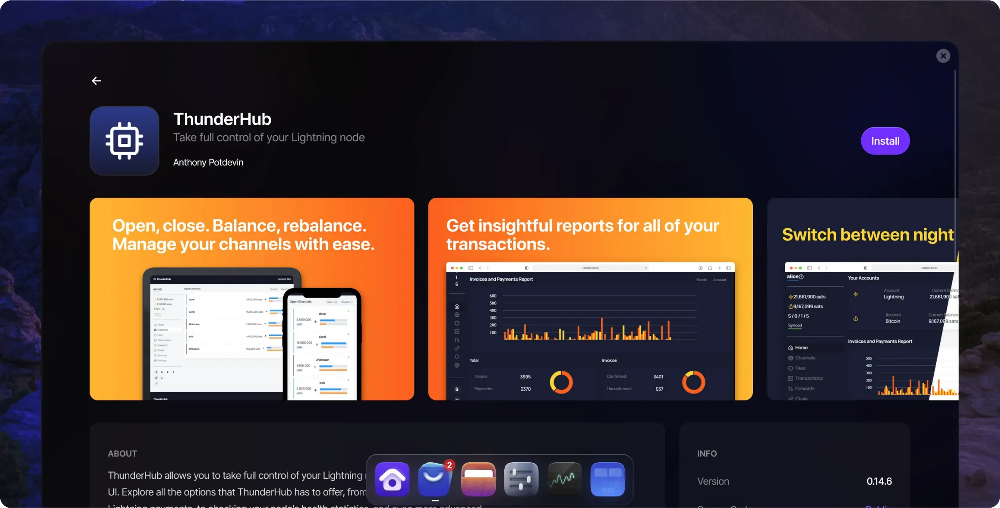


Umbrel आपको ThunderHub तक पहुँचने के लिए एक डिफ़ॉल्ट पासवर्ड प्रदान करता है। इसे कॉपी कर लें: आपको इसकी तुरंत आवश्यकता होगी। इसे अपने पासवर्ड मैनेजर में भी सहेज लें, क्योंकि सॉफ़्टवेयर खोलने पर हर बार आपसे यह पासवर्ड माँगा जाएगा।


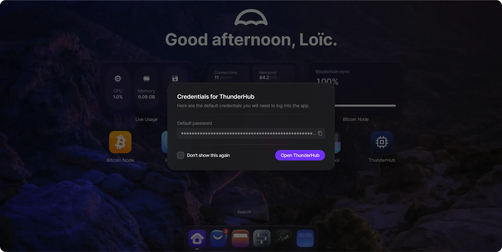


`लॉगिन` पर क्लिक करें, फिर लॉग इन करने के लिए Umbrel द्वारा दिए गए पासवर्ड को पेस्ट करें।


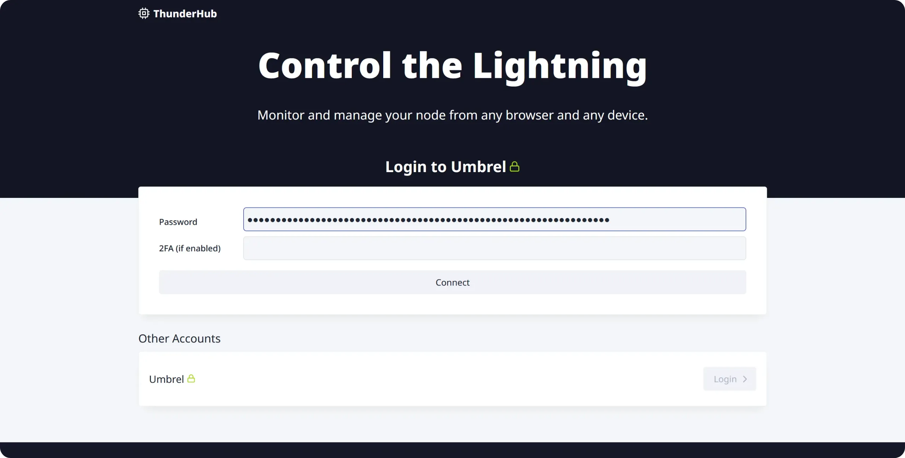


इसके बाद आपको ThunderHub के होम पेज पर ले जाया जाएगा, जहां आपके लाइटनिंग नोड के बारे में मुख्य जानकारी प्रदर्शित होगी।


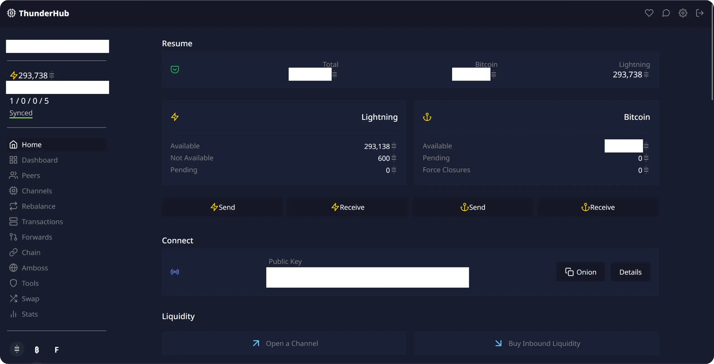


सबसे पहले, मैं आपको दो-कारक प्रमाणीकरण (2FA) सक्रिय करने की सलाह देता हूँ। सेटिंग्स में, `Enable 2FA` के आगे `Enable` पर क्लिक करें, फिर सामान्य प्रक्रिया का पालन करें।


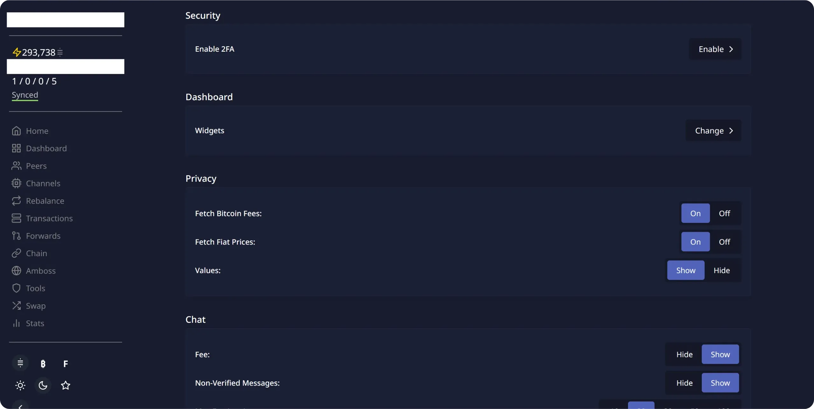


### ThunderHub का उपयोग करें


ThunderHub को सीखना अपेक्षाकृत आसान है। इंटरफ़ेस के बाईं ओर स्थित कॉलम से सभी मेनू सुलभ हैं। संक्षेप में, प्रत्येक मेनू का कार्य इस प्रकार है:


- होम: नोड अवलोकन, बैलेंस और त्वरित कार्रवाई;
- डैशबोर्ड: विजेट और मेट्रिक्स के साथ अनुकूलन योग्य डैशबोर्ड;
- पीयर्स: अन्य लाइटनिंग नोड्स से कनेक्शन देखें और प्रबंधित करें;
- चैनल: संपूर्ण चैनल प्रबंधन (तरलता, शुल्क, बंद करना आदि);
- "रीबैलेंस": चक्रीय भुगतान के माध्यम से चैनलों को रीबैलेंस करने का एक उपकरण;
- लेन-देन: भेजे और प्राप्त किए गए लाइटनिंग भुगतानों का इतिहास;
- फॉरवर्ड`: आपके नोड द्वारा generated रूटिंग सांख्यिकी और लागत;
- `चेन`: Bitcoin ऑनचेन पोर्टफोलियो (UTXO और लेनदेन);
- निगरानी और बैकअप के लिए gW-201 का एकीकरण;
- `टूल्स`: उन्नत उपकरण (बैकअप, रिपोर्ट, मैकरून, हस्ताक्षर आदि);
- स्वैप: Boltz के माध्यम से लाइटनिंग/ऑनचेन स्वैप;
- `स्टेट्स`: आपके लाइटनिंग नोड के समग्र आँकड़े और प्रदर्शन।


इन फ़ंक्शंस के साथ, आपके पास अपने लाइटनिंग नोड को कुशलतापूर्वक प्रबंधित करने के लिए सभी आवश्यक उपकरण मौजूद हैं। हर विकल्प को तुरंत विस्तार से समझना ज़रूरी नहीं है: हम इस कोर्स के दौरान धीरे-धीरे इन विकल्पों का अध्ययन करेंगे। हालाँकि, यदि आप सॉफ़्टवेयर को और गहराई से समझना चाहते हैं, तो हमारे ThunderHub ट्यूटोरियल को देखें:


https://planb.academy/tutorials/node/lightning-network/thunderhub-16909a39-2484-408e-a118-4e34e249bb9a

यहां जिस मेनू में हमारी सबसे अधिक रुचि है, वह है 'चैनल'। यह आपके नोड में मौजूद सभी चैनलों का विस्तृत विवरण और उनकी लिक्विडिटी वितरण दिखाता है। विशेष रूप से, आप 'ओपन' सेक्शन में देख सकते हैं कि कौन से चैनल खुले हैं, 'पेंडिंग' सेक्शन में कौन से चैनल खुलने या बंद होने की प्रतीक्षा कर रहे हैं, और 'क्लोज्ड' सेक्शन में कौन से चैनल पहले ही बंद हो चुके हैं।


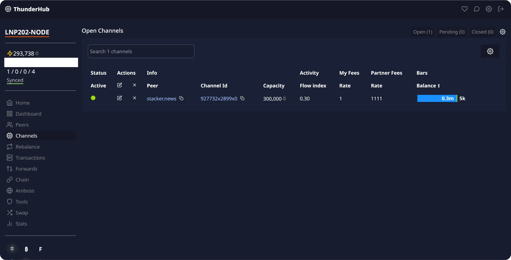


किसी दिए गए चैनल के लिए, आप पीयर के नाम या चैनल आईडी पर क्लिक करके उसका Amboss पेज खोल सकते हैं और अधिक जानकारी प्राप्त कर सकते हैं। आप पेंसिल आइकन पर क्लिक करके चैनल के पैरामीटर भी बदल सकते हैं, जिसमें उस चैनल पर लागू शुल्क नीति भी शामिल है, यदि आपका नोड आपके पीयर के नोड को भुगतान रूट करता है।


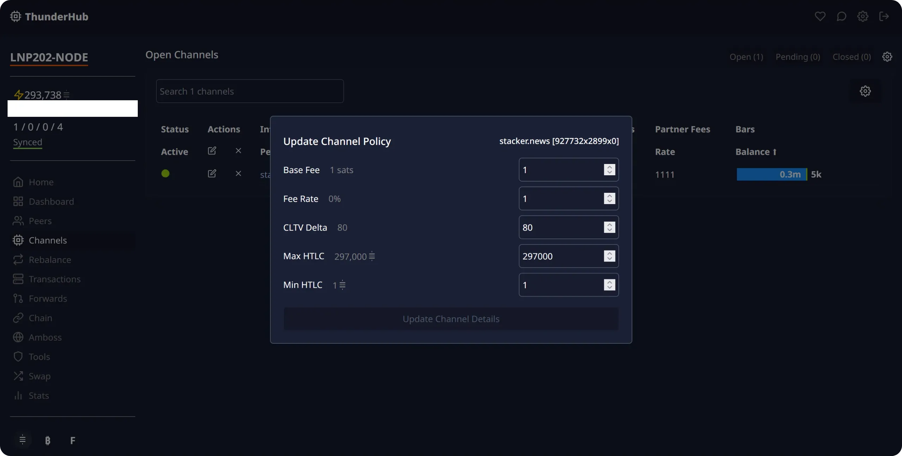


यदि आप अपने लाइटनिंग नोड का उपयोग मुख्य रूप से "उपभोक्ता" के रूप में कर रहे हैं, तो आपको इन शुल्कों को बदलने की आवश्यकता नहीं है: आप डिफ़ॉल्ट मानों को बनाए रख सकते हैं। दूसरी ओर, यदि आप लाइटनिंग पर रूटिंग शुल्क कैसे काम करते हैं, इसे बेहतर ढंग से समझना चाहते हैं, तो मैं LNP 201 प्रशिक्षण, और विशेष रूप से अध्याय 4.1 की अनुशंसा करता हूँ।


https://planb.academy/courses/34bd43ef-6683-4a5c-b239-7cb1e40a4aeb

किसी पीयर के बगल में मौजूद छोटे क्रॉस पर क्लिक करके आप चैनल को बंद करने की प्रक्रिया शुरू कर सकते हैं। उदाहरण के लिए, यदि आप देखते हैं कि कोई पीयर नियमित रूप से निष्क्रिय है, तो इस चैनल को बंद करना उचित हो सकता है ताकि आप अपनी पूंजी को किसी अधिक विश्वसनीय पीयर में स्थानांतरित कर सकें।


आपके पास दो विकल्प हैं। पहला, और हमेशा बेहतर विकल्प, सहयोगात्मक समापन है। इस कार्रवाई की पुष्टि करके, आपका नोड अपने साथी नोड से चैनल को संयुक्त रूप से बंद करने का अनुरोध करता है। यदि वह स्वीकार करता है, तो आप ऑनचेन समापन लेनदेन को प्रसारित कर सकते हैं और धनराशि में अपना हिस्सा प्राप्त कर सकते हैं। इस विधि के लाभ यह हैं कि आप लेनदेन के लिए ऑनचेन शुल्क स्वयं तय करते हैं, जिससे अनावश्यक लागतों से बचा जा सकता है, और धनराशि बिना किसी समय सीमा के अधिक तेज़ी से प्राप्त हो जाती है।


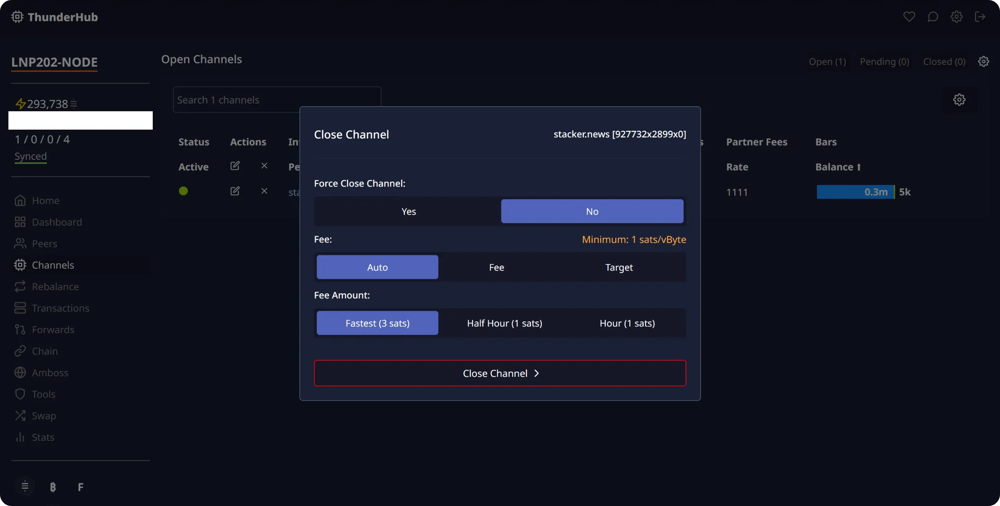


दूसरा विकल्प है जबरन क्लोजर। इस स्थिति में, आप पीयर की सहमति नहीं लेते और सीधे अपने पास मौजूद आखिरी commitment transaction को ब्रॉडकास्ट कर देते हैं। मैं इस तरीके की सलाह तभी दूंगा जब यह अंतिम उपाय हो, उदाहरण के लिए यदि पीयर लगातार सहयोगात्मक क्लोजर को अस्वीकार कर रहा हो या जवाब देना बंद कर दे। जबरन क्लोजर के दो मुख्य नुकसान हैं: शुल्क अक्सर बहुत अधिक होते हैं, क्योंकि इन्हें ऑनचेन शुल्क में वृद्धि की आशंका को ध्यान में रखते हुए पहले से ही निर्धारित किया जाता है, और धनराशि की वसूली में देरी होती है, क्योंकि इसे टाइमलॉक द्वारा ब्लॉक कर दिया जाता है। यह टाइमलॉक आपके पीयर को धोखाधड़ी के प्रयास की स्थिति में प्रतिक्रिया करने का समय देता है (जो स्पष्ट रूप से यहां नहीं है, लेकिन फिर भी आपको इंतजार करना होगा)।


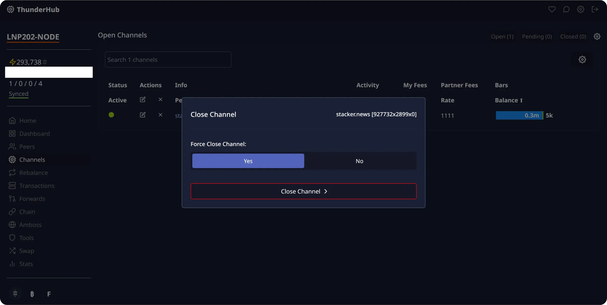


अंत में, नया चैनल खोलने के लिए, `होम` मेनू पर जाएं और `Liquidity` सेक्शन में `चैनल खोलें` पर क्लिक करें। फिर आप चुने हुए नोड की आईडी, चैनल की क्षमता, वांछित लाइटनिंग रूटिंग शुल्क और चैनल खोलने के लेनदेन के लिए ऑनचेन शुल्क दर्ज कर सकेंगे।


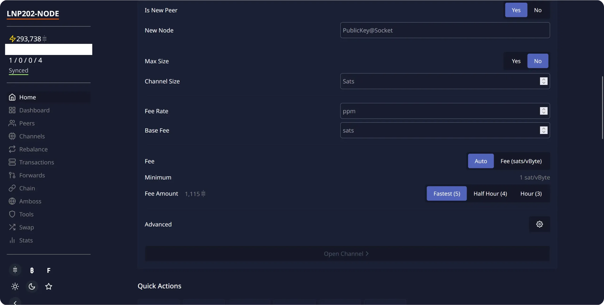


ThunderHub पर आपको मुख्य रूप से ये कार्य करने होंगे। LNP202 कोर्स में आगे बढ़ते हुए हम अन्य विशेषताओं के बारे में भी जानेंगे।


## आवक तरलता प्राप्त करना


<chapterId>b740c656-a897-4d95-af4b-116b718447cd</chapterId>


जैसा कि आप देख सकते हैं, लाइटनिंग नेटवर्क पर भुगतान करने के लिए आउटगोइंग लिक्विडिटी रखना कोई जटिल प्रक्रिया नहीं है। बस अपनी पहल पर अन्य नोड्स के साथ चैनल खोलें और sats भेजना शुरू करें। दूसरी ओर, लाइटनिंग नेटवर्क पर भुगतान प्राप्त करने के लिए इनकमिंग लिक्विडिटी रखना अधिक जटिल है, क्योंकि इसके लिए या तो अन्य नोड्स को आपके साथ चैनल खोलने की आवश्यकता होती है, या आपको स्वयं भुगतान करके लिक्विडिटी को स्थानांतरित करना होता है।


यदि आप "उपभोक्ता" प्रोफ़ाइल अपनाते हैं, तो आमतौर पर आपको नकदी प्रवाह की चिंता करने की आवश्यकता नहीं होती है। लाइटनिंग नोड का आपका उपयोग मुख्य रूप से भुगतान-उन्मुख होगा, न कि नकद जमा करने के लिए। कुछ लाइटनिंग भुगतान करके, आप समय के साथ स्वाभाविक रूप से नकदी प्रवाह उत्पन्न कर लेंगे।


दूसरी ओर, यदि आपके पास "व्यापारी" प्रोफ़ाइल है, तो स्थिति उलट जाती है: आप मुख्य रूप से भुगतान एकत्र करेंगे और भुगतान बहुत कम करेंगे। इसलिए आप तरलता के लिए पूरी तरह से अपने स्वयं के भुगतानों पर निर्भर नहीं रह सकते। अतः अन्य लाइटनिंग नोड्स के लिए आपके चैनल खोलना आवश्यक हो जाता है। लेकिन यह कैसे संभव है? आप अन्य ऑपरेटरों को अपने लिए पूंजी लगाने के लिए कैसे राजी कर सकते हैं? इस अध्याय में हम इसी पर विस्तार से चर्चा करेंगे।


### आवक तरलता खरीदना


जैसा कि आप उम्मीद करेंगे, किसी को काम करने के लिए प्रेरित करने का सबसे प्रभावी तरीका उन्हें भुगतान करना है। आपके लाइटनिंग नोड में आने वाली तरलता के लिए भी यही सिद्धांत लागू होता है। अपने नोड तक चैनल प्राप्त करने का सबसे सरल तरीका सेवा और उसमें शामिल पूंजी के लिए भुगतान करना है।


यदि आप कोई व्यवसाय या खुदरा विक्रेता हैं, तो इस दृष्टिकोण का अर्थ है कि आप बिना किसी बाधा के अपने ग्राहकों से भुगतान एकत्र करने के लिए विश्वसनीय चैनल शीघ्रता से प्राप्त कर सकते हैं।


इनबाउंड लिक्विडिटी खरीदने के कई तरीके हैं। मैं व्यक्तिगत रूप से Amboss के [Magma](https://magma.amboss.tech/) प्लेटफॉर्म का उपयोग करता हूँ और इसकी अनुशंसा करता हूँ। इसका उपयोग करना बहुत आसान है, चैनल खोलना त्वरित है और दरें आमतौर पर उचित होती हैं। Magma एक मार्केटप्लेस की तरह काम करता है जिसमें निर्माता और खरीदार होते हैं, लेकिन संस्करण 2 ने अनुभव को बहुत सरल बना दिया है: बस एक अनुरोध बनाएं, लाइटनिंग के माध्यम से कीमत का भुगतान करें, और Magma स्वचालित रूप से इसे उपलब्ध सर्वोत्तम ऑफ़र से मिला देगा। छह ऑनचेन पुष्टिकरणों के बाद, इनकमिंग लिक्विडिटी वाला आपका चैनल चालू हो जाता है। यह इस प्रकार काम करता है:


मैग्मा वेबसाइट पर जाएं (https://magma.amboss.tech/buy), और वहां 'खरीद चैनल' अनुभाग देखें।


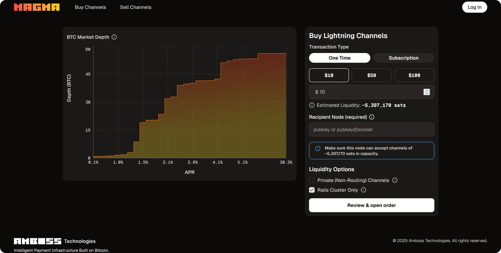


यदि आप चाहें, तो आप अपनी खरीदारी को ट्रैक करने के लिए एक खाता बना सकते हैं, लेकिन यह अनिवार्य नहीं है। यदि आप खाता नहीं बनाते हैं, तो मैग्मा आपको केवल एक सेशन आईडी प्रदान करेगा, जिससे आप बाद में अपनी खरीदारी को पुनः प्राप्त कर सकेंगे।


साइट पर पहुँचने के बाद, लिक्विडिटी खरीदने के लिए आवश्यक जानकारी भरें। एक बार की खरीदारी के लिए 'वन टाइम' चुनें, फिर आने वाली लिक्विडिटी के लिए आप जो राशि देने को तैयार हैं, उसे दर्ज करें। भुगतान की गई राशि जितनी अधिक होगी, आपके नोड के लिए खुलने वाले चैनल की क्षमता उतनी ही अधिक होगी। चैनल की क्षमता का अनुमान नीचे दिया गया है: यह एक अनुमानित राशि है, क्योंकि अंतिम राशि मैग्मा द्वारा खोजे गए सर्वोत्तम प्रस्ताव पर निर्भर करेगी, जो कभी अधिक तो कभी कम हो सकती है।


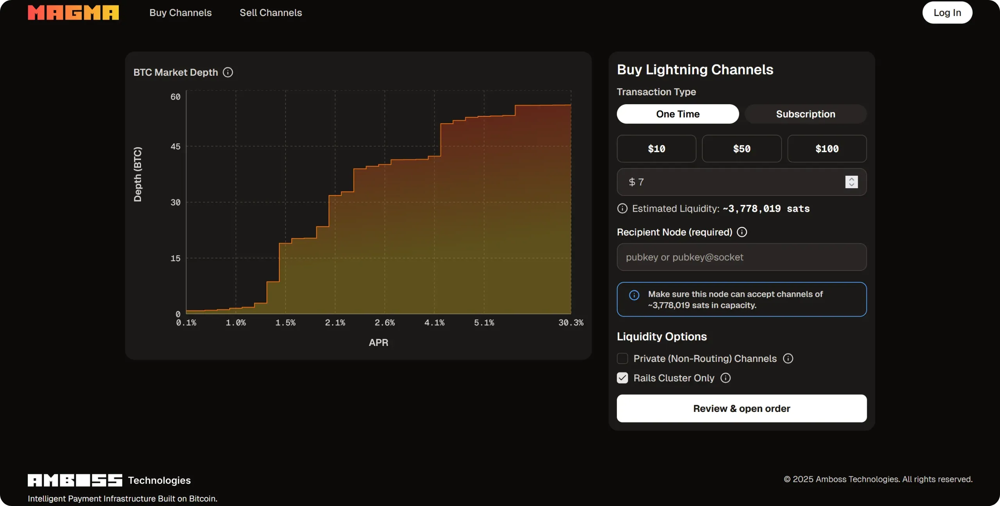


फिर अपना नोड आईडी दर्ज करें। उदाहरण के लिए, आप इसे Umbrel पर मौजूद `Lightning Node` एप्लिकेशन के `Node ID` मेनू में पा सकते हैं।


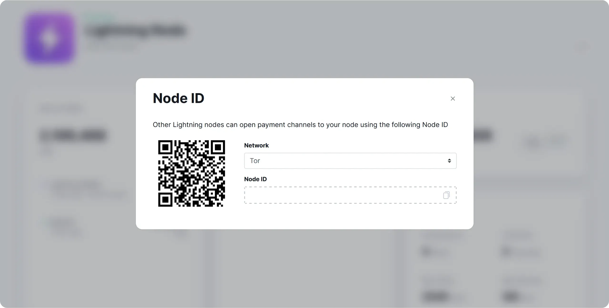


सभी जानकारी पूरी हो जाने के बाद, 'समीक्षा करें और ऑर्डर खोलें' बटन पर क्लिक करें।


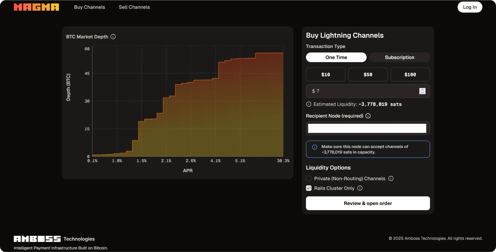


यदि आपने खाता नहीं बनाया है, तो मैग्मा आपको एक सेशन कुंजी और एक बैकअप फ़ाइल प्रदान करेगा। इन दोनों को सुरक्षित स्थान पर रखें, क्योंकि ये आपको बाद में ऑर्डर को पुनः प्राप्त करने या किसी समस्या की स्थिति में उसकी स्थिति का पता लगाने में सक्षम बनाएंगी। फ़ाइल सहेजने के बाद, 'पे विद लाइटनिंग' बटन पर क्लिक करें।


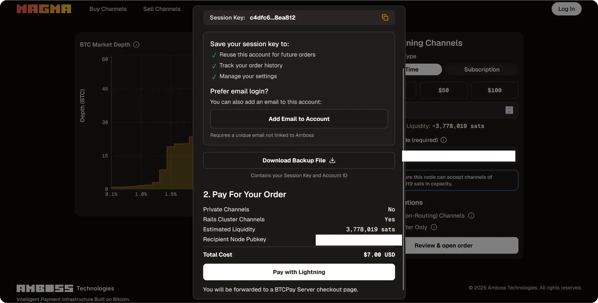


मैग्मा फिर आपके द्वारा चुनी गई राशि के लिए लाइटनिंग इनवॉइस को generate के माध्यम से भेजता है। आपको इसका भुगतान करना होगा। यदि आपके लाइटनिंग नोड पर पहले से ही चैनल हैं, तो आप सीधे उससे भुगतान कर सकते हैं, या किसी अन्य बाहरी लाइटनिंग wallet का उपयोग कर सकते हैं।


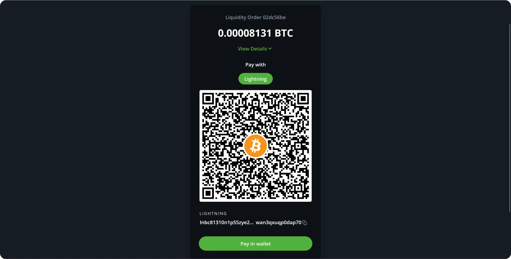


भुगतान हो जाने के बाद, मैग्मा इंटरफेस में लेनदेन संसाधित होने के रूप में दिखाई देता है।


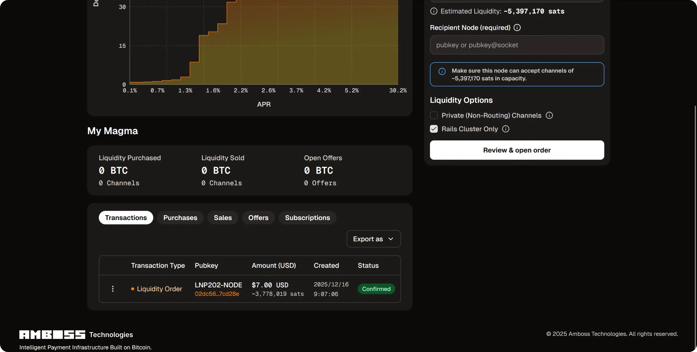


कुछ मिनटों के बाद, अनुरोध संसाधित हो जाता है: आपके लाइटनिंग नोड के लिए sats वाला एक चैनल खोला जा रहा है। एक बार ऑनचेन पर लेन-देन की पुष्टि हो जाने के बाद, आपको संबंधित आने वाली लिक्विडिटी तक पहुंच प्राप्त हो जाएगी।


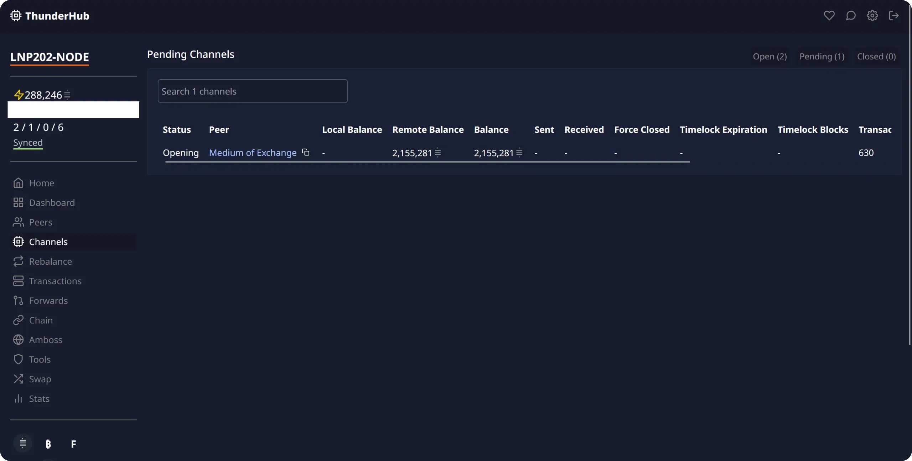


मैग्मा को ThunderHub में सीधे एकीकृत किया गया है। `होम` टैब में, नीचे स्क्रॉल करके `Liquidity` सेक्शन पर जाएं और `इनबाउंड Liquidity खरीदें` पर क्लिक करें। आपको बस वांछित राशि दर्ज करनी है और पुष्टि करनी है। आपको मैन्युअल रूप से कोई बिल भुगतान करने की आवश्यकता नहीं है, क्योंकि ThunderHub आपके नोड से भुगतान स्वचालित रूप से कर लेता है।


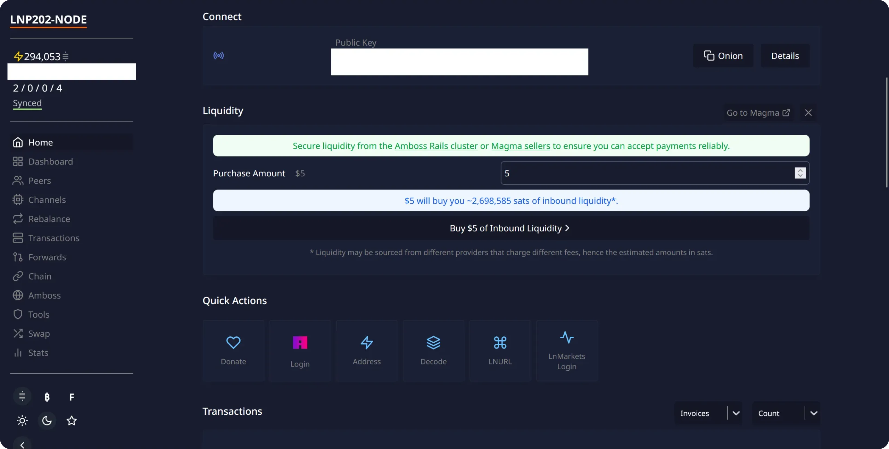


यदि आप व्यापारी हैं, तो इस प्रकार की सेवा विशेष रूप से उपयुक्त है, क्योंकि यह आपको विश्वसनीय स्रोतों से बड़ी मात्रा में तरलता प्राप्त करने में सक्षम बनाती है, जिससे यह सुनिश्चित होता है कि आपके ग्राहक बिना किसी कठिनाई के आपको भुगतान कर सकेंगे। दूसरी ओर, यदि आप एक निजी व्यक्ति हैं, या यदि आप तरलता के लिए भुगतान नहीं करना चाहते हैं, तो निःशुल्क समाधान भी उपलब्ध हैं। आइए देखें।


### सहकारी आवक तरलता


यदि आप ट्रेडर नहीं हैं, लेकिन फिर भी आपको कुछ लिक्विडिटी की आवश्यकता है (उदाहरण के लिए, नोड को शुरू करने के लिए, जब तक कि आपको भुगतान न मिल जाए), तो इसके लिए आपको भुगतान करने की आवश्यकता नहीं है। मेरा पसंदीदा समाधान यह है कि आप अन्य नोड ऑपरेटरों के साथ सहयोग करें जिन्हें लिक्विडिटी की आवश्यकता है, और एक-दूसरे के लिए लाइटनिंग चैनल खोलें। इस तरह, चैनल खोलने से आपको आउटगोइंग लिक्विडिटी मिलती है, और साथ ही आपको इनकमिंग लिक्विडिटी भी मुफ्त में मिलती है (चैनल खोलने के लिए ऑनचेन शुल्क को छोड़कर)।


आप बेशक इसे अन्य बिटकॉइन उपयोगकर्ताओं के साथ सीधे आयोजित कर सकते हैं। हालाँकि, इस प्रकार के चक्रीय ओपनिंग के लिए एक समर्पित प्लेटफ़ॉर्म है: [Lightning Network +](https://lightningnetwork.plus/)। इसका सिद्धांत एक ही व्यक्ति के बीच दो चैनल खोलना नहीं है, बल्कि कम से कम तीन या उससे अधिक प्रतिभागियों को शामिल करते हुए चक्रीय ओपनिंग स्थापित करना है।


आइए एक उदाहरण से समझते हैं कि Lightning Network+ कैसे काम करता है:


- एक नोड ऑपरेटर, जिसका नाम 'ए' है, एक घोषणा प्रकाशित करता है जिसमें कहा गया है कि वह दो अन्य लोगों के साथ 1 मिलियन sats चैनल खोलना चाहता है;
- विज्ञापन तब तक सक्रिय रहता है जब तक कि और प्रतिभागी नहीं जुड़ जाते;
- बाद में, दो ऑपरेटर, 'बी' और 'सी', 'ए' नोड की घोषणा में शामिल हो जाते हैं। अब त्रिभुज पूरा हो गया है, और उद्घाटन चरण शुरू हो सकता है।
- नोड `A` नोड `B` से एक चैनल खोलता है;
- नोड `बी` नोड `सी` से एक चैनल खोलता है;
- नोड `C` नोड `A` से एक चैनल खोलता है।


ऑपरेशन के अंत में, प्रत्येक नोड के पास 1 मिलियन sats की आउटगोइंग लिक्विडिटी और 1 मिलियन sats की इनकमिंग लिक्विडिटी होती है। इस योजना को चार या पांच प्रतिभागियों तक बढ़ाया जा सकता है।


बेशक, ऐसा कोई तकनीकी तंत्र नहीं है जो यह गारंटी दे सके कि प्रतिभागी वास्तव में उस चैनल को खोलेगा जिसे बनाने का उसने वादा किया है। इसीलिए प्लेटफ़ॉर्म ने एक प्रतिष्ठा प्रणाली स्थापित की है, जो ऑपरेटरों द्वारा अपने वादों को पूरा करने पर सकारात्मक समीक्षाओं पर आधारित है। और सबसे खराब स्थिति में, यदि आपको कोई ऐसा व्यक्ति मिलता है जो सहयोग नहीं करता है, तो आपको कोई नुकसान नहीं होगा: आप बस आय के एक अवसर से चूक जाएंगे।


यह समाधान विशेष रूप से "उपभोक्ता" वर्ग के लिए उपयुक्त है, क्योंकि यह आपको बिना किसी शुल्क के तरलता प्राप्त करने की सुविधा देता है, साथ ही आपके नोड को अन्य छोटे ऑपरेटरों से जोड़ता है। दूसरी ओर, यदि आप व्यापारी हैं, तो यह दृष्टिकोण आमतौर पर प्रासंगिक नहीं है: तरलता के प्रत्येक प्रवाह के लिए बहिर्वाह तरलता के एक प्रवाह को अवरुद्ध करना आवश्यक होता है, और तरलता की आपकी बड़ी आवश्यकता के कारण बहुत अधिक पूंजी अवरुद्ध हो जाएगी।


Lightning Network+ का उपयोग करने के लिए आपके पास दो विकल्प हैं: या तो Umbrel में एकीकृत एप्लिकेशन का उपयोग करें, या क्लासिक वेबसाइट का उपयोग करें और अपने नोड से लॉग इन करके एक खाता बनाएं। मैं बाद वाले विकल्प की अनुशंसा करता हूं, क्योंकि एकीकृत एप्लिकेशन सभी उपलब्ध कार्यों की पूर्ण श्रृंखला प्रदान नहीं करता है।


[Lightning Network +](https://lightningnetwork.plus/) वेबसाइट पर जाएं और इंटरफ़ेस के ऊपरी दाएं कोने में स्थित `लॉगिन` बटन पर क्लिक करें।


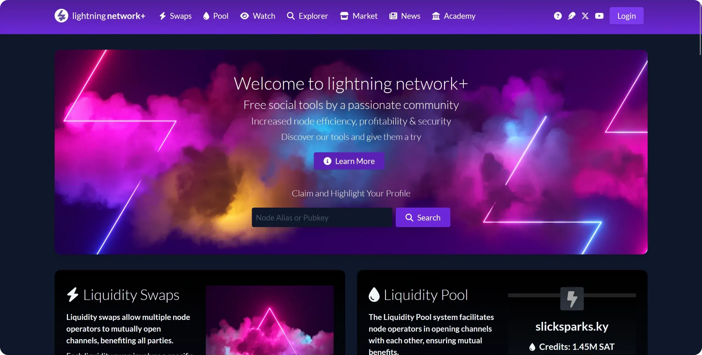


अपनी प्रमाणीकरण क्षमता को प्रमाणित करने के लिए, आपको अपने लाइटनिंग नोड की निजी कुंजी का उपयोग करके दिए गए संदेश पर हस्ताक्षर करने होंगे। ThunderHub के साथ, यह प्रक्रिया बहुत सरल है। LN+ द्वारा प्रदर्शित संदेश को कॉपी करके प्रारंभ करें।


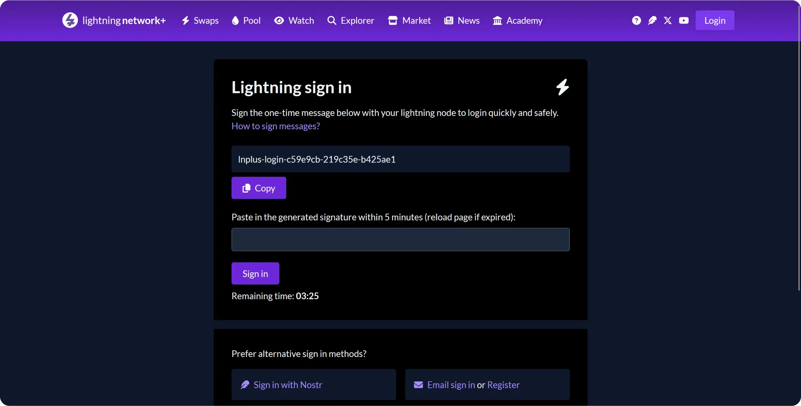


ThunderHub में, `टूल्स` टैब पर जाएं, फिर `मैसेजेस` सेक्शन में `साइन` बटन पर क्लिक करें।


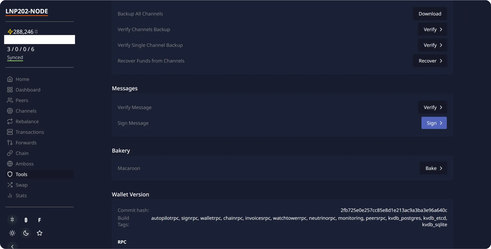


LN+ द्वारा प्रदान किए गए प्रमाणीकरण संदेश को पेस्ट करें, फिर `हस्ताक्षर करें` पर क्लिक करें।


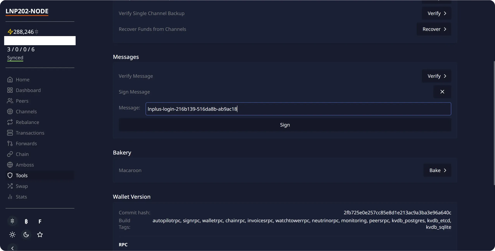


इसके बाद ThunderHub आपके नोड की निजी कुंजी का उपयोग करके इस संदेश पर हस्ताक्षर करता है। generated हस्ताक्षर की प्रतिलिपि बनाएँ।


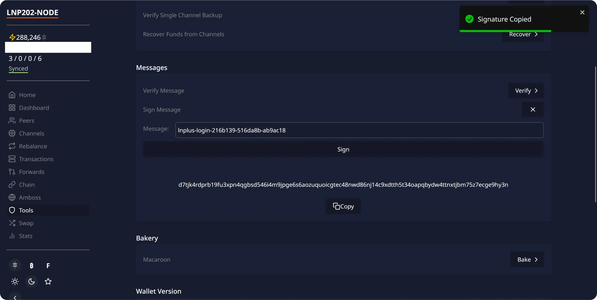


इस हस्ताक्षर को LN+ साइट पर संबंधित फ़ील्ड में पेस्ट करें, फिर `साइन इन` पर क्लिक करें।


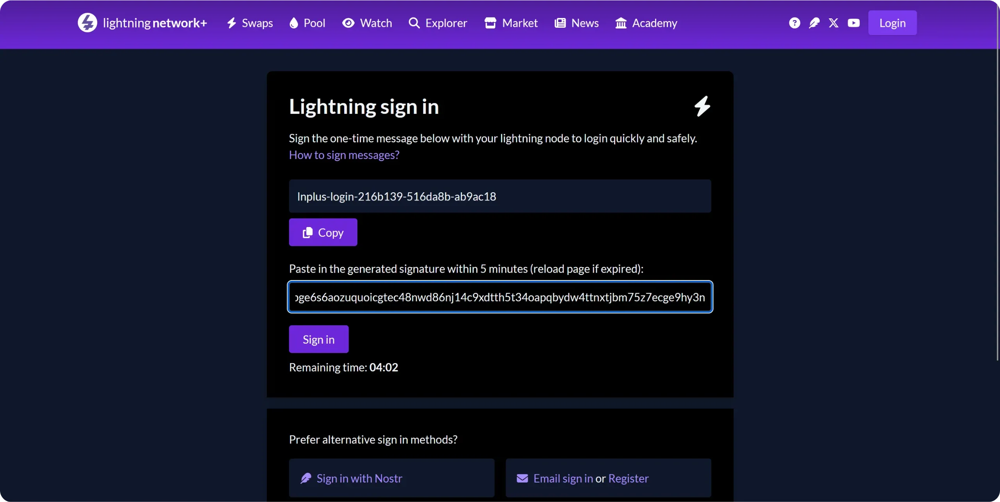


अब आप अपने लाइटनिंग नोड के साथ LN+ से जुड़ गए हैं। इस प्रक्रिया से LN+ यह सत्यापित कर सकता है कि आप उनके प्लेटफ़ॉर्म पर दावा किए जा रहे नोड के सही मालिक हैं।


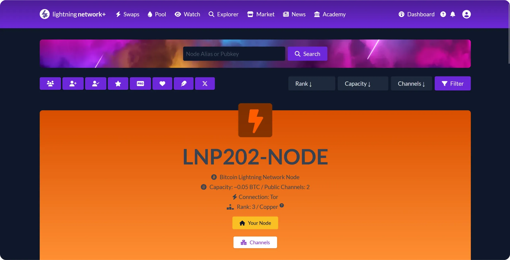


यदि आप चाहें, तो आप अपनी LN+ प्रोफ़ाइल को वैयक्तिकृत कर सकते हैं, उदाहरण के लिए एक संक्षिप्त जीवनी जोड़कर।


अपने पहले सर्कुलर चैनल ओपनिंग में भाग लेने के लिए, इंटरफ़ेस के शीर्ष पर स्थित `स्वैप्स` मेनू पर जाएं। यहां आपको अपने नोड की विशेषताओं के आधार पर वर्तमान में उपलब्ध सभी स्वैप्स मिलेंगे।


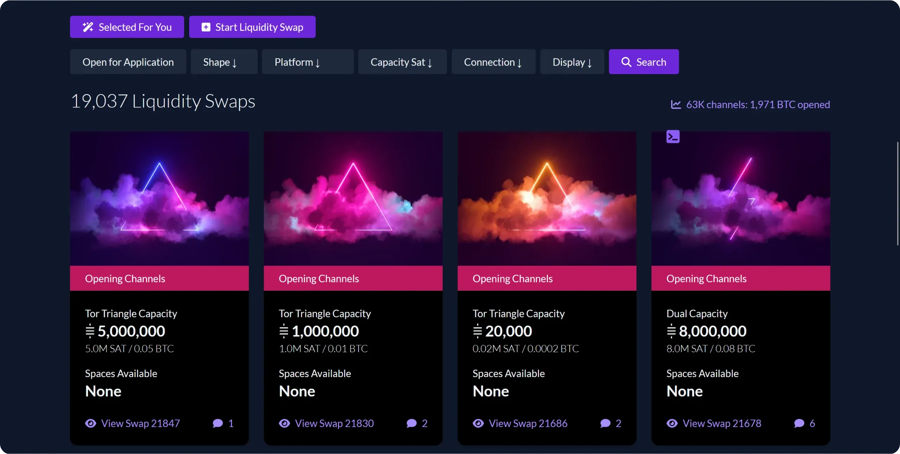


किसी मौजूदा स्वैप ऑफर में शामिल होने के लिए, बस उस पर क्लिक करें और रजिस्टर करें। हालांकि, LN+ पर, स्वैप बनाने वाला व्यक्ति प्रतिभागियों पर कुछ शर्तें लगा सकता है, जैसे कि चैनलों की न्यूनतम संख्या या नोड की कुल न्यूनतम क्षमता। इसलिए, खासकर शुरुआती दिनों में, हो सकता है कि आपके नोड के लिए कुछ ही ऑफर उपलब्ध हों। मेरे मामले में, कुछ चैनल पहले से खुले होने के बावजूद, मेरे नोड के लिए कोई ऑफर उपलब्ध नहीं था। इसलिए मैंने अपना खुद का स्वैप बनाया, और यदि आप भी ऐसी ही स्थिति में हैं तो आप भी ऐसा कर सकते हैं।


`Start Liquidity Swap` पर क्लिक करें, फिर अपने प्रस्ताव के पैरामीटर दर्ज करें:


- प्रतिभागियों की कुल संख्या चुनें (3, 4 या 5);
- खोले जाने वाले चैनलों की संख्या बताएं (सुनिश्चित करें कि आपके ऑनचेन wallet में कम से कम इतनी संख्या में चैनल मौजूद हों);
- चैनल के खुले रहने का समय निर्धारित करें; यह वह अवधि है जिसके दौरान प्रतिभागी चैनल को बंद न करने पर सहमत होते हैं।
- दाईं ओर, आप प्रतिभागियों के लिए प्रतिबंध निर्धारित कर सकते हैं: चैनलों की न्यूनतम संख्या, न्यूनतम कुल क्षमता और स्वीकार किए जाने वाले कनेक्शन का प्रकार।


सभी पैरामीटर सेट हो जाने के बाद, `स्टार्ट Liquidity स्वैप` बटन पर क्लिक करें।


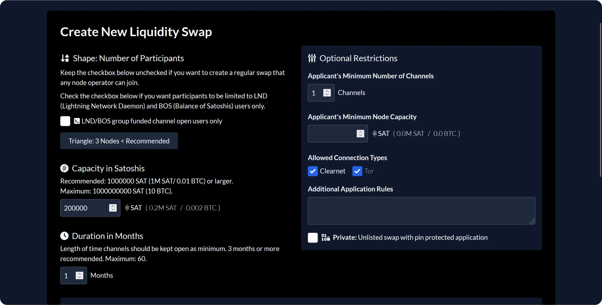


आपका स्वैप ऑफर तैयार हो चुका है। अब आपको बस अन्य नोड ऑपरेटरों के साइन अप करने का इंतजार करना है। यदि आपकी शर्तें बहुत सख्त नहीं हैं, तो इसमें ज्यादा समय नहीं लगना चाहिए। आने वाले घंटों या दिनों में अपने स्वैप की स्थिति पर नजर रखना न भूलें।


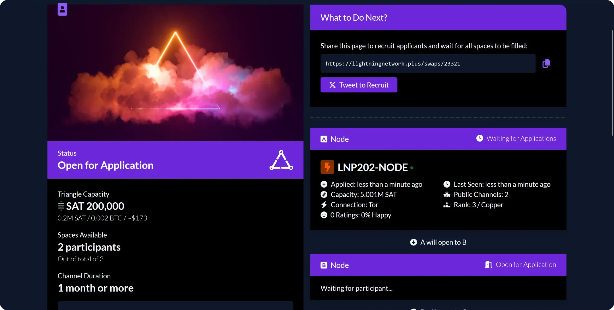


सभी स्वैप स्थान भर चुके हैं: अब हम चैनल खोलने के चरण में आगे बढ़ते हैं। प्रत्येक प्रतिभागी अपने LN+ इंटरफ़ेस से देख सकता है कि उसे किस नोड पर लाइटनिंग चैनल खोलना है।


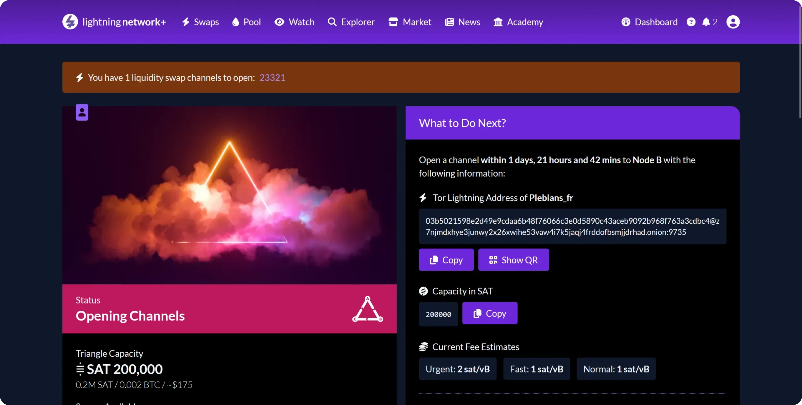


अपनी ओर से, LN+ द्वारा प्रदान की गई नोड आईडी का उपयोग करके और निर्दिष्ट राशि का पालन करते हुए चैनल खोलें। जैसा कि हमने पिछले अध्यायों में देखा है, आप इसे ThunderHub के माध्यम से, किसी अन्य लाइटनिंग नोड मैनेजर के साथ, या सीधे बेसिक लाइटनिंग नोड एप्लिकेशन इंटरफ़ेस से कर सकते हैं।


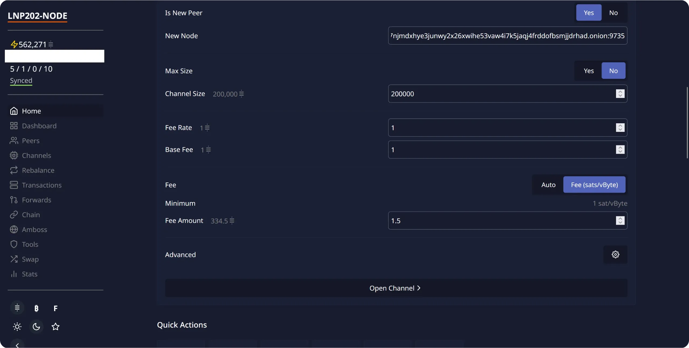


एक बार लॉन्च हो जाने के बाद, आप इसे वेटिंग चैनल सेक्शन में देख सकते हैं। मेरे मामले में, यह `Plebian_fr` नोड वाला चैनल है।


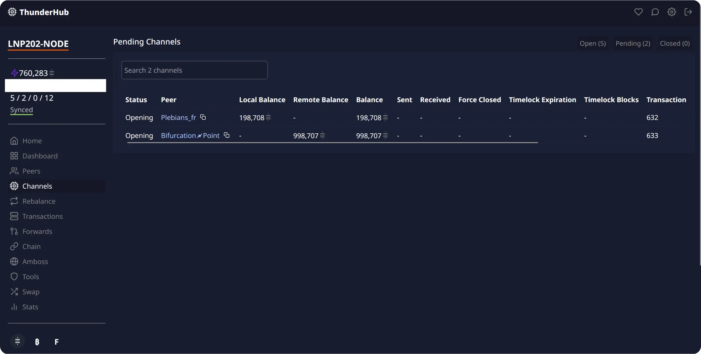


इसके बाद आप LN+ पर वापस जाकर चैनल खोलने की प्रक्रिया शुरू होने की पुष्टि कर सकते हैं। बस 'चैनल खोलना शुरू हो गया' बटन पर क्लिक करें।


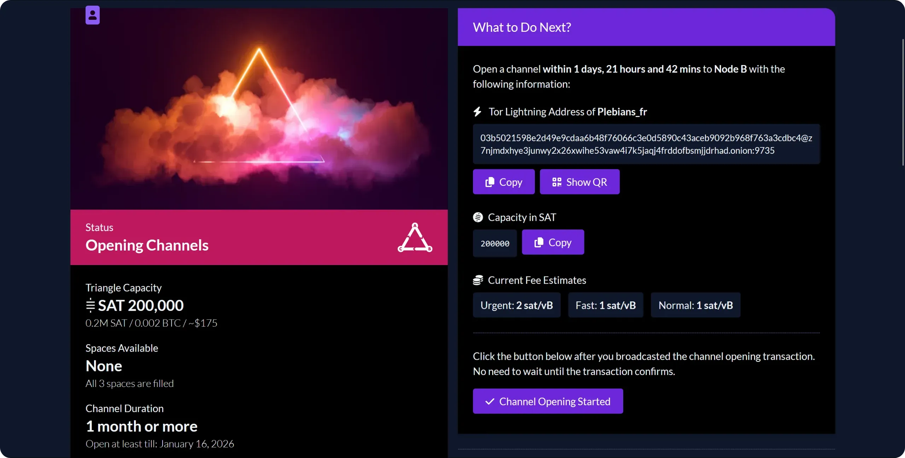


जब अन्य सभी प्रतिभागी भी उस चैनल को खोल दें जिसके लिए उन्होंने प्रतिबद्धता जताई है, तो उन्हें एक सकारात्मक समीक्षा देना न भूलें।


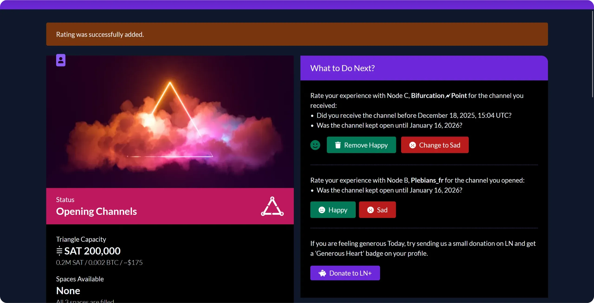


किसी भी कठिनाई या देरी की स्थिति में, आप पृष्ठ के निचले भाग में स्थित टिप्पणी अनुभाग के माध्यम से सीधे अपने साथियों से संपर्क कर सकते हैं।


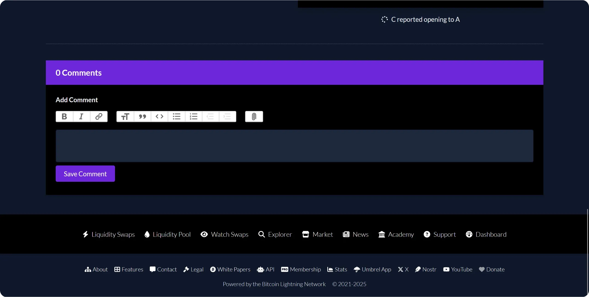


कुछ प्रतिभागी शुरुआत से ही अपने आप को भुगतान करके चक्रीय चैनलों को संतुलित करना चाह सकते हैं। इससे प्रत्येक चैनल में नकदी का संतुलित वितरण सुनिश्चित होता है। यदि आप "उपभोक्ता" प्रोफ़ाइल में हैं, तो यह आवश्यक नहीं है, लेकिन आप चाहें तो यह संतुलन स्वयं कर सकते हैं, या अस्थायी रूप से अपने चैनल शुल्क को शून्य पर सेट कर सकते हैं ताकि ऐसा करने वाले साथी के लिए यह आसान हो जाए। कभी-कभी कोई भी ऐसा नहीं करना चाहता।


# अपने लाइटनिंग नोड की पूरी क्षमता का उपयोग करें


<partId>8dcc24b1-6eb9-4a5f-a56b-8a823e5ac0fd</partId>


## मोबाइल wallet को Tailscale के माध्यम से कनेक्ट करें


<chapterId>5fefb222-3f50-4f9d-a170-2ea628be4437</chapterId>


बस इतना ही, अब आपके पास एक सुव्यवस्थित लाइटनिंग नोड है, जिसमें आने-जाने दोनों तरह की लिक्विडिटी मौजूद है। तो अब आप अपने लाइटनिंग नोड को असल ज़िंदगी में इस्तेमाल करने के लिए पूरी तरह तैयार हैं। अब तक हम Umbrel पर सीधे इंटरफेस का इस्तेमाल करते आए हैं, या तो `लाइटनिंग नोड` एप्लिकेशन या `ThunderHub` इंटरफेस। ये टूल पेमेंट भेजने और प्राप्त करने के लिए काम करते हैं, लेकिन रोज़मर्रा के लाइटनिंग पेमेंट के लिए स्पष्ट रूप से अनुकूलित नहीं हैं। यह इंटरफेस कंप्यूटर पर इस्तेमाल के लिए डिज़ाइन किया गया है, स्मार्टफोन पर अव्यवहारिक है, और ठीक से काम करने के लिए इसे एक ही नेटवर्क से कनेक्ट होना ज़रूरी है (हालांकि तकनीकी रूप से टोर के ज़रिए दूर से कनेक्ट करना संभव है)।


व्यवहार में, बिटकॉइन उपयोगकर्ताओं के रूप में हम जो चाहते हैं वह स्मार्टफोन पर एक क्लासिक लाइटनिंग wallet इंटरफ़ेस है: QR कोड के माध्यम से इनवॉइस स्कैन करने की क्षमता, और sats के माध्यम से भुगतान और निकासी के लिए एक सरल इंटरफ़ेस। यही हम इस अध्याय और अगले अध्याय में लागू करेंगे। मूल विचार यह है कि आपके स्मार्टफोन पर एक मोबाइल लाइटनिंग wallet एप्लिकेशन हो, जिसका उपयोग कहीं से भी किया जा सके (केवल आपके स्थानीय नेटवर्क से ही नहीं), लेकिन जो पृष्ठभूमि में भुगतान भेजने और प्राप्त करने के लिए आपके स्वयं के लाइटनिंग नोड पर निर्भर करता हो।


### मोबाइल ग्राहक से संपर्क स्थापित करने के क्या समाधान हैं?


आज, मोबाइल एप्लिकेशन और आपके नोड तथा इस एप्लिकेशन के बीच कनेक्शन के प्रकार, दोनों ही संदर्भों में इसे करने के कई तरीके हैं। कनेक्शन के तीन मुख्य तरीके हैं:


- टोर के माध्यम से;
- वीपीएन के माध्यम से ***Tailscale***;
- ***Nostr Wallet कनेक्ट*** के माध्यम से।


कुछ साल पहले मैं Tor के ज़रिए कनेक्ट करता था, लेकिन मैंने जल्दी ही इसे बंद कर दिया: विफलताओं की संख्या और संचार में देरी बहुत ज़्यादा थी। सैद्धांतिक रूप से यह ठीक है, लेकिन व्यवहार में उपयोगकर्ता अनुभव बेहद खराब था। इसलिए मैं इस तरीके का इस्तेमाल न करने की सलाह दूंगा।


इसके बाद मैंने मोबाइल एप्लिकेशन और नोड के बीच संचार सुनिश्चित करने के लिए ***Tailscale*** वीपीएन का उपयोग करने का विकल्प अपनाया। यह समाधान बहुत कारगर है: कम थ्रूपुट वाले मोबाइल नेटवर्क पर भी, मेरे भुगतान बिना किसी परेशानी के सफलतापूर्वक हो जाते हैं। इस अध्याय में, मैं सबसे पहले इसी विधि को ज़्यूस एप्लिकेशन के साथ प्रस्तुत करने जा रहा हूँ।


अगले अध्याय में, हम एक और हालिया समाधान देखेंगे, जो बहुत अच्छी तरह से काम करता है: ***Nostr Wallet कनेक्ट***। इस बार, हम आपको एक विकल्प प्रस्तुत करने के लिए Alby Go एप्लिकेशन का उपयोग करेंगे, हालांकि यदि आप चाहें तो Zeus भी NWC के साथ संगत है।


### Tailscale को इंस्टॉल और कॉन्फ़िगर करना


इस पहले तरीके के लिए हमें Tailscale की आवश्यकता होगी। यह WireGuard पर आधारित एक VPN समाधान है, जो आपको इंटरनेट पर फैले उपकरणों को सुरक्षित रूप से जोड़ने की सुविधा देता है, साथ ही एन्क्रिप्शन, प्रमाणीकरण और NAT ट्रैवर्सल को स्वचालित रूप से प्रबंधित करता है। सरल शब्दों में कहें तो, यह ऐसा है मानो आपके सभी उपकरण आपके राउटर के समान LAN से जुड़े हों, भले ही वे इंटरनेट पर कहीं भी स्थित हों।


इसका उपयोग करने के लिए, सबसे पहले एक खाता बनाएं। Tailscale वेबसाइट पर जाएं, फिर `Get Started` बटन पर क्लिक करें।


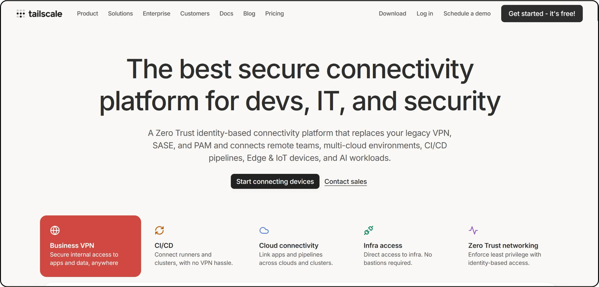


फिर अपने Tailscale खाते के लिए एक पहचान प्रदाता चुनें। व्यक्तिगत रूप से, मैंने लॉग इन करने के लिए अपने GitHub खातों में से एक का उपयोग किया।


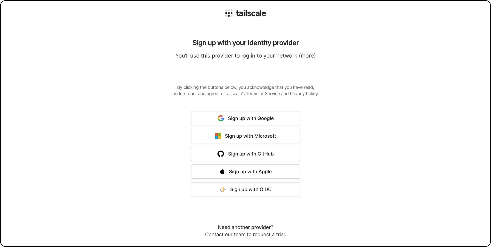


लॉग इन करने के बाद, आपसे आपके उपयोग के बारे में कुछ प्रश्न पूछे जाएंगे। आगे बढ़ने के लिए उनका संक्षिप्त उत्तर दें।


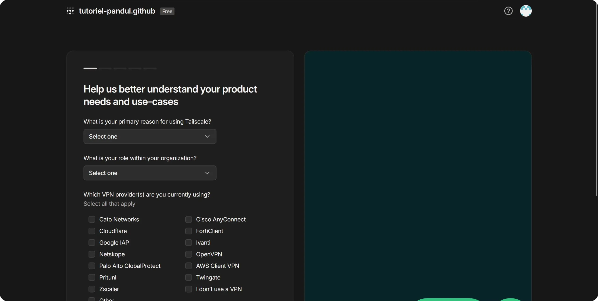


इसके बाद Tailscale आपके कंप्यूटर पर एक क्लाइंट इंस्टॉल करने का विकल्प देता है। फिलहाल, हमें इसमें रुचि नहीं है: सीधे Umbrel पर जाएं और ऐप स्टोर से Tailscale एप्लिकेशन इंस्टॉल करें।


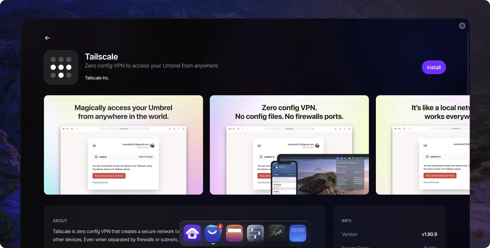


जब एप्लिकेशन खुल जाए, तो `लॉग इन` पर क्लिक करें, फिर प्रमाणीकरण प्रक्रिया का पालन करें, उसी विधि का उपयोग करके जैसा आपने अपना खाता बनाते समय किया था।


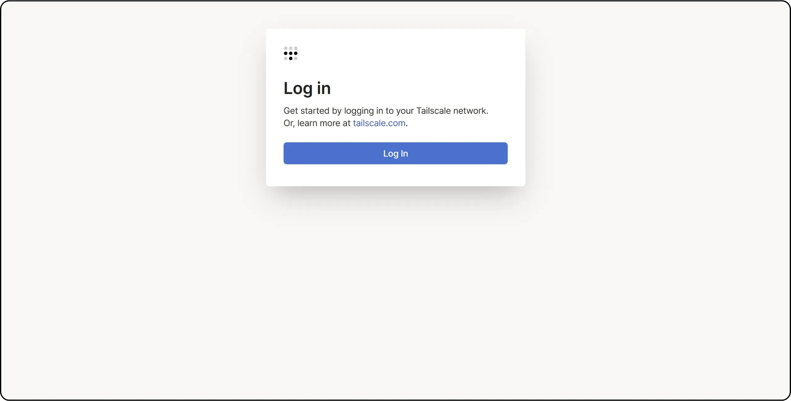


पुष्टि करने के लिए `कनेक्ट` पर क्लिक करें। आपका Umbrel अब आपके VPN नेटवर्क से कनेक्ट हो गया है।


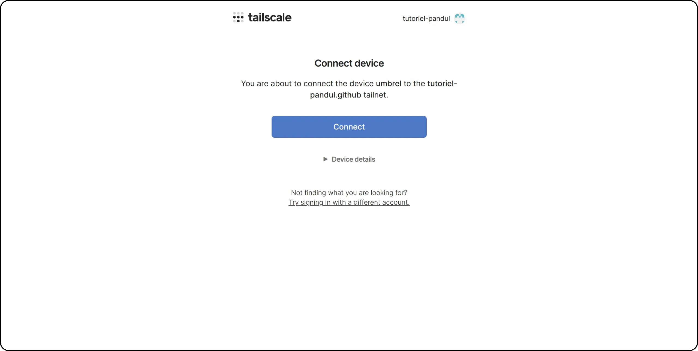


फिर अपने स्मार्टफोन पर Tailscale एप्लिकेशन डाउनलोड करें और उसी खाते से लॉग इन करें। कृपया ध्यान दें: एंड्रॉइड पर एक साथ दो VPN का उपयोग करना संभव नहीं है। Tailscale के काम करने के लिए, आपको किसी भी अन्य सक्रिय VPN को निष्क्रिय करना होगा। इसके अलावा, जब भी आप Zeus के माध्यम से अपने Lightning नोड का उपयोग करना चाहें, आपको Tailscale VPN को सक्रिय करना होगा, अन्यथा कनेक्शन स्थापित नहीं होगा।


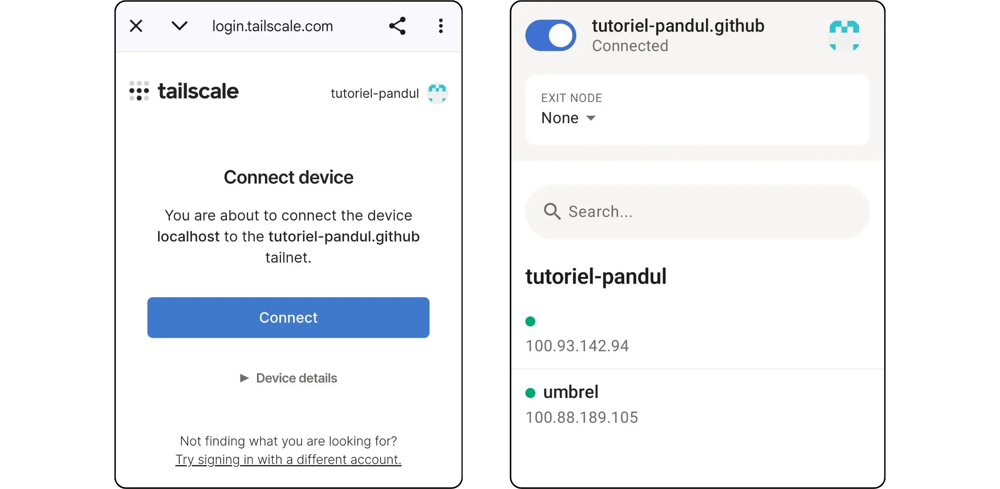


Tailscale साइट पर, अब जब कम से कम दो क्लाइंट कनेक्ट हो चुके हैं, तो आप एडमिनिस्ट्रेशन कंसोल तक पहुंच सकते हैं जिसमें नेटवर्क से जुड़े आपके सभी डिवाइसों की सूची और उनके Tailscale आईपी पते दिए गए हैं।


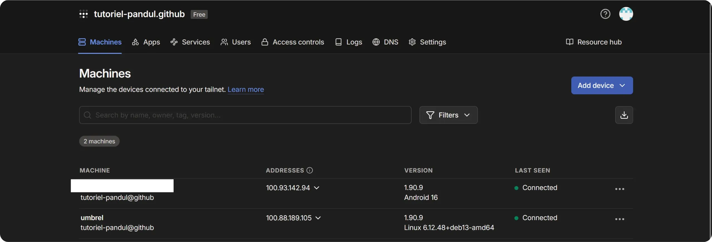


### ज़ीउस से जुड़ें


अपने फोन में ज़्यूस एप्लिकेशन इंस्टॉल करें। जब यह खुल जाए, तो `एडवांस्ड सेटअप` चुनें, फिर `wallet बनाएं या कनेक्ट करें` चुनें।


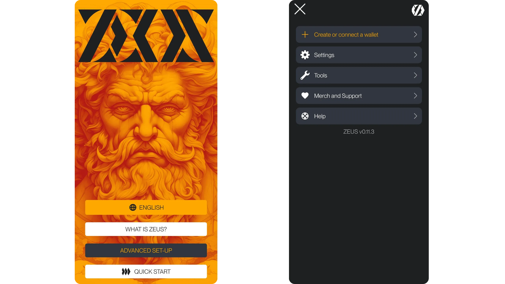


`Wallet इंटरफ़ेस` सेक्शन में, `LND (REST)` चुनें। फिर अपने Umbrel का Tailscale एड्रेस डालें, जो आपको अपने Tailscale डैशबोर्ड से या सीधे Umbrel पर Tailscale एप्लिकेशन में मिल जाएगा। पोर्ट के लिए, `8080` डालें।


इसके बाद ज़्यूस आपसे एक 'मैकरून' उपलब्ध कराने के लिए कहता है। यह एक प्राधिकरण token है जो आपको किसी एप्लिकेशन (इस मामले में ज़्यूस) को आपके लाइटनिंग नोड के साथ इंटरैक्ट करने के लिए दिए गए अधिकारों को सटीक रूप से परिभाषित करने की अनुमति देता है। ThunderHub में 'टूल्स' मेनू के 'बेकरी' सब-मेनू से मैकरून प्राप्त करना संभव है, लेकिन इसके लिए सबसे आसान तरीका इसे सीधे 'लाइटनिंग नोड' एप्लिकेशन से प्राप्त करना है।


इंटरफ़ेस के ऊपरी दाएं कोने में मौजूद तीन छोटे बिंदुओं पर क्लिक करें, फिर `Connect Wallet` पर क्लिक करें। `REST (लोकल नेटवर्क)` चुनें। इसके बाद आप उचित अधिकारों के साथ एक मैकरून की कॉपी बना सकेंगे।


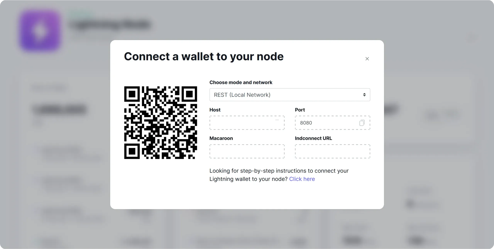


इसे ज़्यूस में संबंधित फ़ील्ड में पेस्ट करें, फिर `सेव वॉलेट कॉन्फ़िग` बटन पर क्लिक करें।


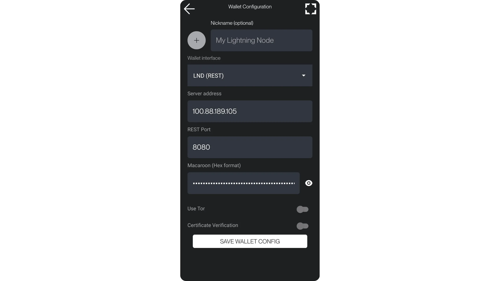


अब आप ज़्यूस ऐप से अपने लाइटनिंग नोड तक पहुंच सकते हैं। इसका मतलब है कि आप अपने स्मार्टफोन से सीधे अपने लाइटनिंग नोड पर भुगतान प्राप्त करने के लिए generate इनवॉइस भेज सकते हैं, और आप जहां भी हों, लाइटनिंग इनवॉइस का भुगतान भी कर सकते हैं।


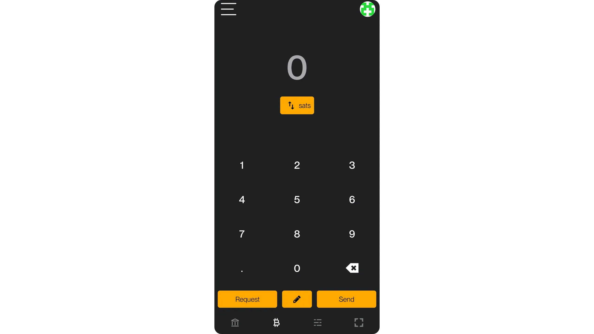


टिप: Tailscale का उपयोग केवल लाइटनिंग नोड को दूरस्थ रूप से करने तक सीमित नहीं है। यह आपको अन्य सॉफ़्टवेयर से भी, दूरस्थ रूप से, अपने Umbrel के सभी टूल तक पहुँचने की सुविधा देता है। उदाहरण के लिए, आप अपने Umbrel के Tailscale IP पते का उपयोग करके अपने Bitcoin नोड (Electrs या फुलक्रम के माध्यम से) को Sparrow और Wallet से Tor के बिना कनेक्ट कर सकते हैं। इससे Tor की धीमी गति से भी छुटकारा मिलता है। बस अपने कंप्यूटर पर Tailscale क्लाइंट इंस्टॉल करें और इसे अपने नेटवर्क से कनेक्ट करें।


https://planb.academy/tutorials/computer-security/communication/tailscale-9acbd7de-04d9-40f6-ab80-35f0dfedb632

अगले अध्याय में, हम मोबाइल क्लाइंट को आपके लाइटनिंग नोड से जोड़ने के एक और, समान रूप से प्रभावी तरीके पर नज़र डालेंगे: Nostr Wallet कनेक्ट। हम ज़्यूस से अलग एक एप्लिकेशन का उपयोग करेंगे (हालाँकि ज़्यूस भी NWC के साथ संगत है), अर्थात् Alby Go।


## NWC के माध्यम से मोबाइल wallet को कनेक्ट करें


<chapterId>f5c97e43-e66e-4ba3-bcc9-fee1a04fc7f4</chapterId>


यदि आप Tailscale कनेक्शन से संतुष्ट नहीं हैं, या यदि दोहरे वीपीएन का प्रबंधन करना बहुत झंझट भरा लगता है, तो यह अध्याय आपके लाइटनिंग नोड के माध्यम से sats के लिए भुगतान करने और प्राप्त करने के लिए रिमोट मोबाइल क्लाइंट का उपयोग करने का एक और तरीका सुझाता है: ***Nostr Wallet कनेक्ट***।


इस उदाहरण के लिए, हम Alby Go मोबाइल एप्लिकेशन का उपयोग करेंगे, जो बहुत अच्छी तरह से डिज़ाइन किया गया है और सीखने में विशेष रूप से आसान है। हालांकि, आप Zeus या कोई अन्य NWC-संगत मोबाइल एप्लिकेशन भी उपयोग कर सकते हैं। संगत एप्लिकेशन की सूची आपको [`awesome-nwc` GitHub रिपॉजिटरी](https://github.com/getAlby/awesome-nwc) पर मिल जाएगी।


### Nostr और Wallet कनेक्ट कैसे काम करते हैं?


Nostr Wallet कनेक्ट एक मानकीकृत प्रोटोकॉल है जो किसी एप्लिकेशन या वेबसाइट को किसी दूरस्थ लाइटनिंग नोड पर क्रियाएं शुरू करने की अनुमति देता है, बिना उस नोड से सीधा नेटवर्क कनेक्शन स्थापित किए (कोई API LND एक्सपोज़्ड नहीं, कोई VPN नहीं, कोई `.onion` सेवा नहीं...)। NWC परिभाषित करता है कि कोई एप्लिकेशन आशय (जैसे `pay_intece`) कैसे तैयार करता है और परिणाम प्राप्त करता है।


यह बहुत ही सरल तरीके से काम करता है। आप एक क्यूआर कोड स्कैन करके या डीपलिंक `nostr+walletconnect:` के माध्यम से एक सेशन शुरू करते हैं। इस स्ट्रिंग में सेशन पैरामीटर और एक ऑथराइजेशन सीक्रेट होता है। फिर, जब एप्लिकेशन भुगतान करना चाहता है, तो वह अनुरोध को सीरियलाइज़ करता है, उसे एन्क्रिप्ट करता है और Nostr रिले पर एक इवेंट के रूप में प्रकाशित करता है। नोड रिले पर इवेंट को पढ़ता है, उसे डिक्रिप्ट करता है, यह जांचता है कि लेखक इस सेशन के लिए अधिकृत है या नहीं, भुगतान करता है और फिर एक एन्क्रिप्टेड प्रतिक्रिया (प्रीइमेज के साथ सफलता, या त्रुटि) लौटाता है। रिले केवल एक ट्रांसपोर्ट मध्यस्थ के रूप में कार्य करता है: यह सामग्री को पढ़ नहीं सकता है, लेकिन यह अनुरोधों के समय और आवृत्ति का अवलोकन कर सकता है।


Tailscale या Tor के ज़रिए कनेक्शन की तुलना में, NWC का मुख्य लाभ यह है कि आपका नोड बाहर से सीधे तौर पर पहुंच योग्य नहीं होता है। इससे मोबाइल उपयोग बहुत आसान हो जाता है: आपके नोड को आने वाले कनेक्शन स्वीकार करने की आवश्यकता नहीं होती है, उसे केवल एक रिले के साथ संचार करने में सक्षम होना चाहिए। दूसरी ओर, आप Nostr रिले पर कार्यात्मक निर्भरता पैदा करते हैं: यदि वे अनुपलब्ध हैं, तो अनुभव खराब हो जाता है। साथ ही, भले ही संदेश एन्क्रिप्टेड हों, रिले गतिविधि मेटाडेटा के एक निश्चित स्तर का अवलोकन कर सकता है।


सुरक्षा मॉडल में अंतर भी महत्वपूर्ण है। Tailscale या Tor के साथ, आप अपने नोड तक सीधी पहुँच (API या LND के माध्यम से) उपलब्ध कराते हैं, जो अत्यंत संवेदनशील गुप्त जानकारियों द्वारा सुरक्षित होती है। यह शक्तिशाली है, क्योंकि आप सब कुछ नियंत्रित कर सकते हैं, लेकिन यह हमले के लिए एक कमजोर सतह भी है। NWC के साथ, पहुँच अधिक व्यावहारिक है: आप एक सत्र token को अधिकृत करते हैं जो केवल कुछ विशिष्ट कार्यों को ही अनुमति देता है।


### अपने लाइटनिंग नोड पर Alby Hub इंस्टॉल करें


पहले Umbrel ऐप स्टोर में NWC कनेक्शन के लिए एक विशेष एप्लिकेशन उपलब्ध था, लेकिन दुर्भाग्यवश अब यह उपलब्ध नहीं है। अब आपको इस प्रकार का कनेक्शन स्थापित करने के लिए Alby Hub का उपयोग करना होगा। इसके लिए, सबसे पहले स्टोर से सीधे Alby Hub एप्लिकेशन इंस्टॉल करें।


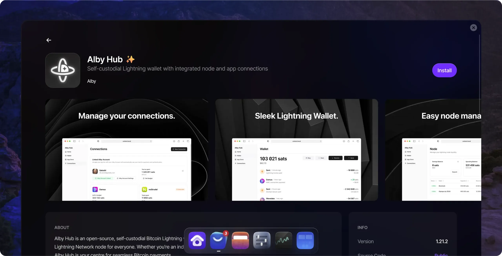


खोलने पर, परिचयात्मक स्क्रीन को छोड़ दें, फिर `Get Started (LND)` बटन पर क्लिक करें। यह जांचना महत्वपूर्ण है कि कोष्ठक में `LND` लिखा हो, न कि `LDK`। यदि `LND` दिखाई देता है, तो इसका अर्थ है कि Alby Hub ने आपके मौजूदा लाइटनिंग नोड का सही पता लगा लिया है और यह स्वयं को इसके इंटरफ़ेस के रूप में कॉन्फ़िगर करेगा। दूसरी ओर, यदि `LDK` प्रदर्शित होता है, तो इसका मतलब है कि Alby Hub ने आपके नोड का पता नहीं लगाया है और एक नया नोड बनाने वाला है, जो हमारा उद्देश्य नहीं है।


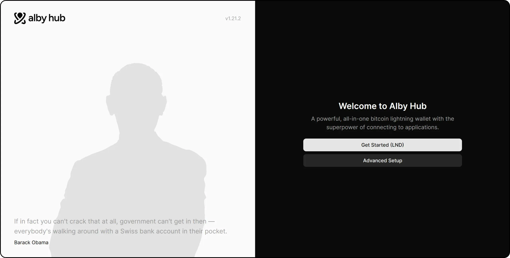


इसके बाद आपसे Alby खाता बनाने के लिए कहा जाएगा। NWC तक सीमित उपयोग के लिए यह आवश्यक नहीं है, लेकिन यदि आप Alby की विशिष्ट सेवाओं का लाभ उठाना चाहते हैं तो आप ऐसा कर सकते हैं। यदि नहीं, तो जारी रखने के लिए 'शायद बाद में' पर क्लिक करें।


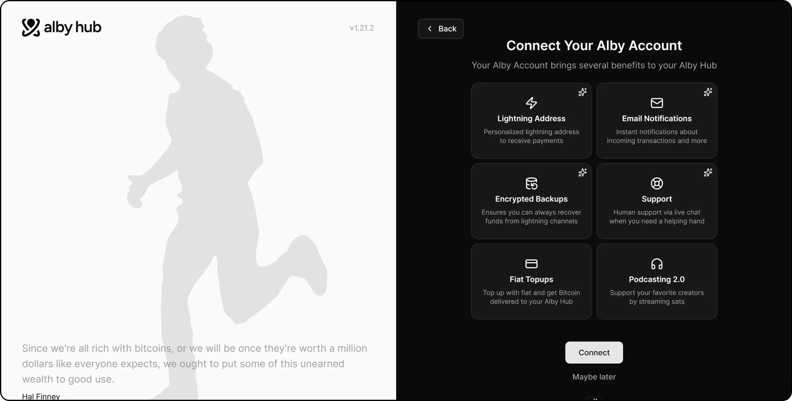


फिर एक मज़बूत और अद्वितीय पासवर्ड चुनें। यह आपके नोड पर Alby Hub तक पहुंच को सुरक्षित रखेगा। इसे अपने पासवर्ड मैनेजर में सहेजना न भूलें।


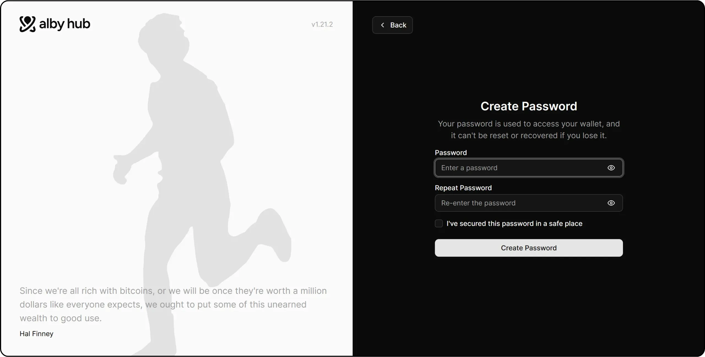


यह आपको Alby Hub इंटरफ़ेस पर ले जाता है। आपको पूरी कॉन्फ़िगरेशन प्रक्रिया से गुजरने की आवश्यकता नहीं है, जब तक कि आप इसे अपने लाइटनिंग नोड के मुख्य प्रबंधक के रूप में उपयोग नहीं करना चाहते। जैसा कि हमने पहले देखा, Alby Hub वास्तव में आपके नोड के प्रशासन के लिए ThunderHub के उपयोग को प्रतिस्थापित कर सकता है। यदि आप Alby Hub के विकल्पों के बारे में अधिक जानना चाहते हैं, तो हमारे समर्पित ट्यूटोरियल को देखें:


https://planb.academy/tutorials/node/lightning-network/alby-hub-62e6356c-6a6d-4134-8f22-c3b6afb9882a

`कनेक्शन` मेनू पर जाएं।


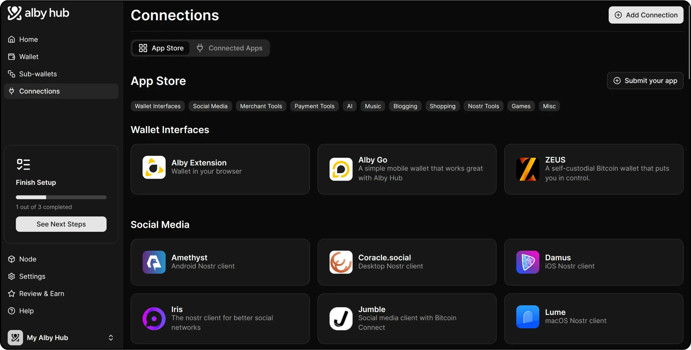


यहां आप उन सभी एप्लिकेशन को देख सकते हैं जो NWC के माध्यम से आपके लाइटनिंग नोड से कनेक्ट हो सकते हैं। इनमें ज़्यूस भी शामिल है, जिसका उल्लेख पिछले अध्याय में किया जा चुका है। यहां हम Alby Go का उपयोग करेंगे। कनेक्शन प्रक्रिया शुरू करने के लिए Alby Go पर क्लिक करें, फिर `Connect to Alby Go` बटन पर क्लिक करें।


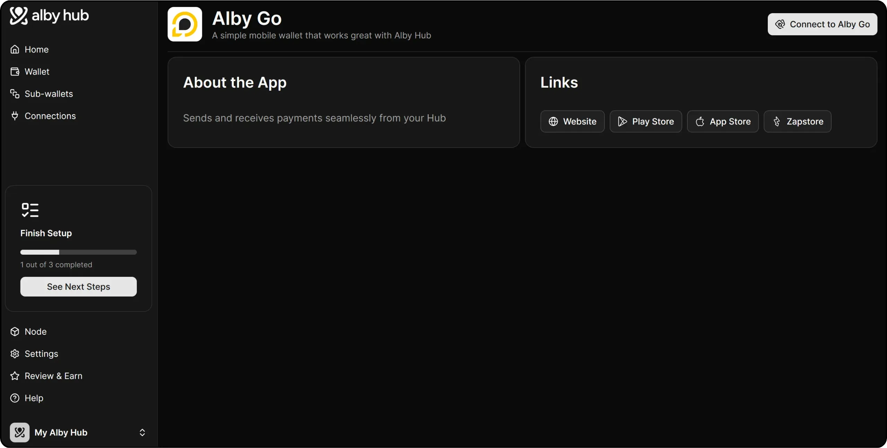


### Alby Go को स्थापित करना और कनेक्ट करना


अपने स्मार्टफोन पर Alby Go एप्लिकेशन इंस्टॉल करें:


- [गूगल प्ले स्टोर](https://play.google.com/store/apps/details?id=com.getalby.mobile);
- [एप्पल ऐप स्टोर](https://apps.apple.com/us/app/alby-go/id6471335774);
- [ज़ैपस्टोर](https://zapstore.dev/apps/naddr1qvzqqqr7pvpzq3jhml5fvklgnq9fxpete767txn9zfzqdkc0sxfptmnchfrexje7qqfxxmmd9enk2arpd338jtndda3xjmr9pzj5tk).


Alby Hub में, अपने लाइटनिंग नोड पर Alby Go एप्लिकेशन को आप जो अधिकार देना चाहते हैं, उन्हें कॉन्फ़िगर करें। उदाहरण के लिए, आप प्रति अवधि खर्च की सीमा निर्धारित कर सकते हैं, NWC लिंक के लिए समाप्ति तिथि तय कर सकते हैं, या पूर्ण नियंत्रण छोड़ सकते हैं। पैरामीटर सेट करने के बाद, 'अगला' बटन पर क्लिक करें।


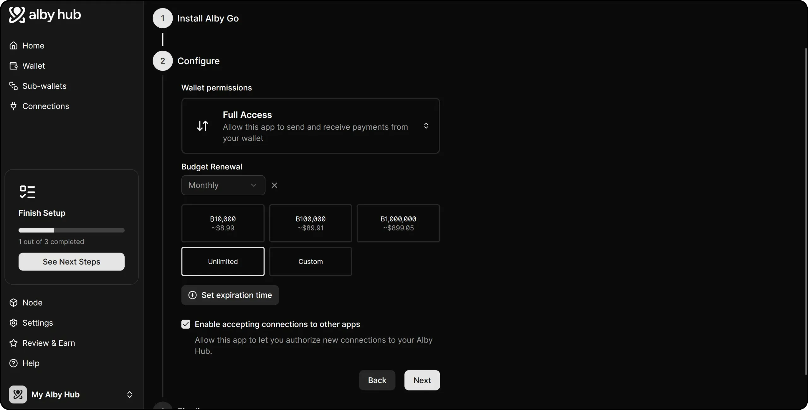


Alby Hub फिर generates एक QR कोड है जो आपके लाइटनिंग नोड और Alby Go के बीच NWC कनेक्शन स्थापित करने के लिए है।


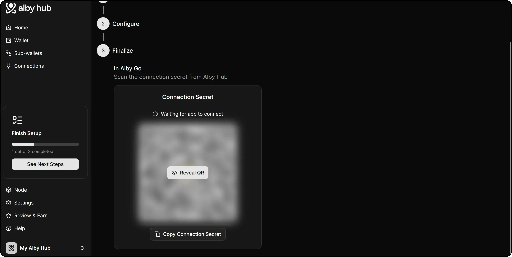


Alby Go एप्लिकेशन को पहली बार खोलने पर, `Connect Wallet` पर क्लिक करें, फिर Alby Hub द्वारा प्रदान किए गए QR कोड को स्कैन करें।


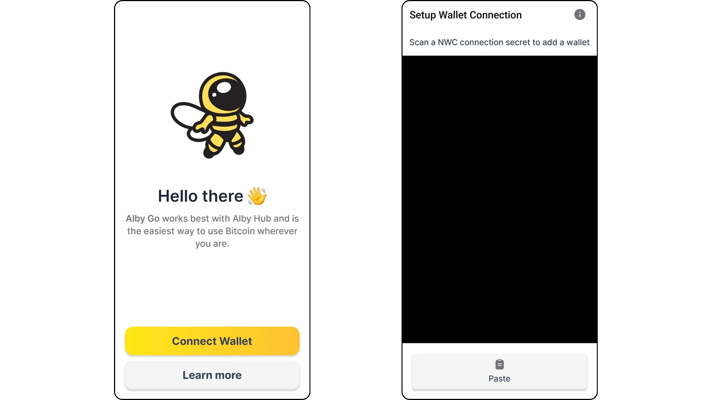


इस wallet को पहचानने के लिए एक नाम चुनें। अब आप Alby Go के माध्यम से अपने लाइटनिंग नोड तक रिमोट एक्सेस प्राप्त कर सकते हैं। आप अपने नोड पर sats प्राप्त करने के लिए generate इनवॉइस भेज सकते हैं, या सीधे इसके साथ लाइटनिंग इनवॉइस सेट कर सकते हैं।


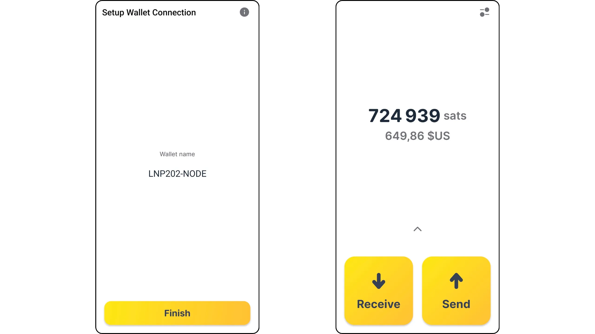


उदाहरण के लिए, मैंने Alby Go इंटरफ़ेस से 1543 sats भेजा।


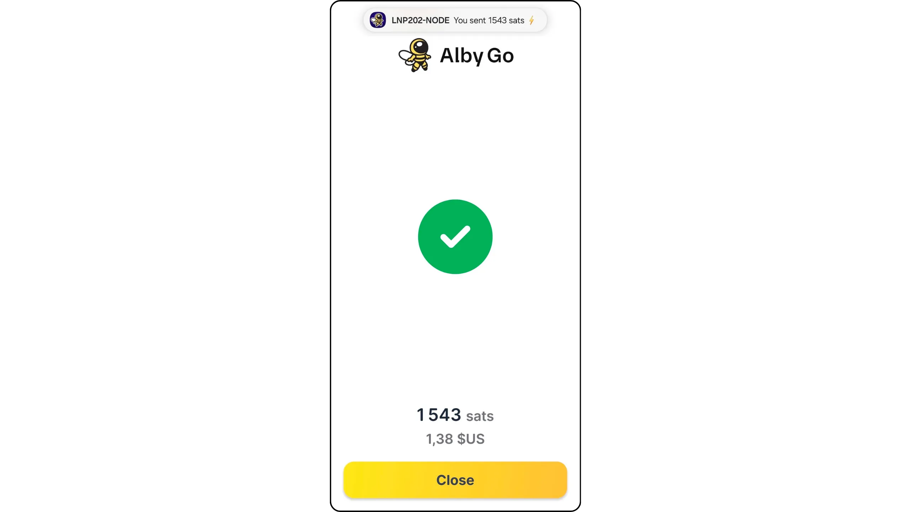


अगर मैं Umbrel पर अपने लाइटनिंग नोड के बेसिक इंटरफेस पर जाता हूं, तो मैं देख सकता हूं कि यह भुगतान वास्तव में मेरे नोड द्वारा किया गया है।


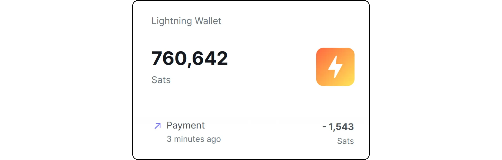


अब आप जानते हैं कि आप कहीं से भी आसानी से अपने लाइटनिंग नोड का उपयोग कैसे कर सकते हैं।


## लाइटनिंग पर दीर्घकालिक स्वायत्तता


<chapterId>691a0942-b46d-482a-8fbc-fe19b3814992</chapterId>


अब हम LNP202 के इस व्यावहारिक पाठ्यक्रम के समापन पर पहुँच चुके हैं। अब आपके पास Lightning Network का स्वतंत्र रूप से उपयोग करने के लिए आवश्यक बुनियादी ज्ञान है: आप नोड की वास्तविक भूमिका, विभिन्न दृष्टिकोणों के लाभ-हानि को समझते हैं, और आपने Umbrel पर एक सुसंगत बैकअप और सुरक्षा रणनीति के साथ LND इंस्टेंस स्थापित कर लिया है। आपने अपने पहले चैनल भी खोल लिए हैं, तरलता प्रबंधन करना सीख लिया है, ताकि आप दैनिक आधार पर अपने भुगतानों को विश्वसनीय बना सकें।


परिचालन की दृष्टि से, अब आपके नोड को रखरखाव की प्रक्रिया में प्रवेश करना चाहिए। मुख्य बात यह है कि इसकी निगरानी करते रहें (अपटाइम, सिंक्रोनाइज़ेशन, चैनल की स्थिति, भुगतान विफलताएँ आदि), स्थिर संस्करण उपलब्ध होने पर Umbrel द्वारा दिए गए अपडेट लागू करें, और समय-समय पर यह जांचते रहें कि आपके बैकअप और वॉचटावर कॉन्फ़िगरेशन अभी भी सक्रिय हैं।


जब चैनलों की बात आती है, तो एक व्यावहारिक दृष्टिकोण अपनाएं: जो चैनल आपके लिए उपयोगी हैं उन्हें रखें, जो चैनल स्थायी रूप से निष्क्रिय हैं या अस्थिर साथियों से जुड़े हैं उन्हें बंद कर दें, और धीरे-धीरे अपनी पूंजी को अधिक मजबूत संरचना की ओर पुनर्गठित करें।


इस चरण में सबसे आम गलतियों में से एक है लाइटनिंग नोड में बहुत अधिक पूंजी लगाना। ध्यान रखें कि आपका लाइटनिंग नोड हार्डवेयर wallet की तुलना में बहुत कम सुरक्षित है, और आपके चैनलों में लगाई गई धनराशि की उपलब्धता अपूर्ण बैकअप तंत्रों पर निर्भर करती है। इसलिए, उचित मात्रा में ही पूंजी लगाना बहुत महत्वपूर्ण है, जिसे आप किसी समस्या की स्थिति में खोने का जोखिम उठा सकते हैं, और हमेशा अपने sats का अधिकांश हिस्सा ऑनचेन हार्डवेयर wallet पर रखें।


उपकरणों की बात करें तो, मैं आपको सलाह देता हूं कि आप जिज्ञासु रहें और नए विकासों पर ध्यान दें। इस प्रशिक्षण सत्र में, हमने कई उपकरणों के बारे में जाना, चाहे वे आपके नोड को प्रबंधित करने, उसकी कनेक्टिविटी को बनाए रखने या भुगतान करने के लिए दूरस्थ उपयोग से संबंधित हों। हालांकि, लाइटनिंग एक बेहद गतिशील क्षेत्र है। हर साल नए और उपयोगी उपकरण सामने आते हैं, और Umbrel पर भी कई नए एप्लिकेशन दिखाई देते हैं। इन नए विकासों से अवगत रहने से आपको इस पाठ्यक्रम में प्रस्तुत समाधानों की तुलना में अधिक शक्तिशाली या अधिक व्यावहारिक समाधान खोजने में मदद मिल सकती है।


शैक्षिक दृष्टि से, यदि आपने अभी तक ऐसा नहीं किया है, तो मैं आपको फैनिस मिखालकिस द्वारा Lightning Network के संचालन के लिए समर्पित LNP 201 सैद्धांतिक पाठ्यक्रम लेने की पुरजोर सलाह देता हूँ। यह आपको LNP202 पाठ्यक्रम में किए गए कार्यों को बेहतर ढंग से समझने में मदद करेगा और आपके नोड के दैनिक प्रबंधन में आपका आत्मविश्वास बढ़ाएगा।


https://planb.academy/courses/34bd43ef-6683-4a5c-b239-7cb1e40a4aeb

एक अलग विषय पर, लेकिन बिटकॉइन के क्षेत्र में आपकी यात्रा के लिए उतना ही आवश्यक, मैं लुडोविक लार्स के Bitcoin के निर्माण के इतिहास पर उत्कृष्ट पाठ्यक्रम की भी अनुशंसा करता हूं।


https://planb.academy/courses/a51c7ceb-e079-4ac3-bf69-6700b985a082

लेकिन आगे बढ़ने से पहले, आप इस LNP202 पाठ्यक्रम की समीक्षा लिख ​​सकते हैं और, निश्चित रूप से, यह पुष्टि करने के लिए डिप्लोमा प्राप्त कर सकते हैं कि आपने इसकी सभी सामग्री को समझ लिया है।


# अंतिम भाग


<partId>683c998f-ba0a-4ffb-a7e8-4cd8369cb9b3</partId>


## समीक्षाएँ और रेटिंग


<chapterId>aec048c7-7130-425d-8eca-9cd7f90c27f3</chapterId>


<isCourseReview>true</isCourseReview>

## अंतिम परीक्षा


<chapterId>3951ccbb-14a3-4322-b81b-8dd2a6da19cb</chapterId>


<isCourseExam>true</isCourseExam>

## निष्कर्ष


<chapterId>30cd6309-5139-40d9-8927-92de0f76414a</chapterId>


<isCourseConclusion>true</isCourseConclusion>