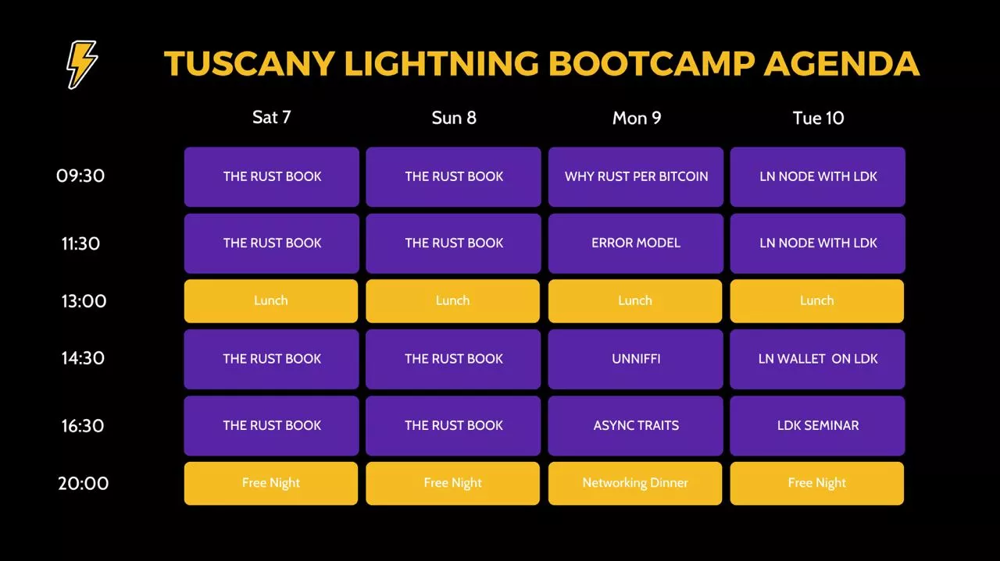
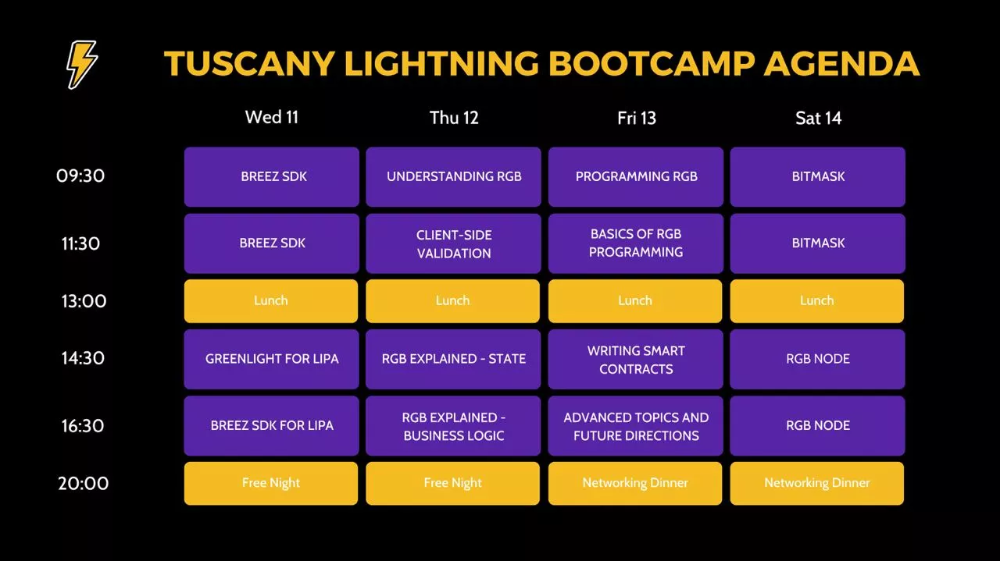

# پیشرفت در مهارت‌های توسعه LN خود

به سفر LN خود با SDK خوش آمدید.

در این دوره، شما با اصول اولیه کتاب Rust آشنا خواهید شد، سپس با استفاده از SDKها به برنامه‌نویسی LN می‌پردازید و در نهایت با انجام تمرینات عملی دوره را به پایان می‌رسانید. معلمان ما با پیشینه‌های مختلف شما را به سمت مهارت‌های عملی هدایت کرده و چالش‌های مختلفی که مهندسان LN امروزی با آن مواجه هستند را توضیح خواهند داد.

این دوره در طول یک سمینار زنده که توسط Fulgur'Ventures در رویداد LN توسکانی در اکتبر 2023 سازماندهی شده بود، فیلم‌برداری شد.

از دوره لذت ببرید!

+++

# مقدمه

<partId>594ab43f-7216-5326-ab41-f92b85be4581</partId>

## بررسی کلی دوره

<chapterId>36526df2-66a2-58df-8f38-378fb553f08c</chapterId>

**مقدمه**

به دوره پیشرفته برنامه‌نویسی در مورد SDKها خوش آمدید. در این آموزش، شما با اصول اولیه Rust آشنا خواهید شد، سپس بر روی BTC و Rust تمرکز خواهید کرد و در نهایت با انجام تمرینات عملی با استفاده از SDKها دوره را به پایان خواهید رساند.

این آموزش فعلاً فقط به زبان انگلیسی در دسترس خواهد بود و بخشی از یک سمینار زنده است که اکتبر گذشته در توسکانی توسط Fulgure Venture سازماندهی شد. برنامه رویداد زنده را می‌توانید در زیر پیدا کنید و این آموزش فقط بر هفته اول تمرکز خواهد داشت. نیمه دوم به RGB هدف‌گذاری شده بود و می‌توانید آن را در دوره RGB پیدا کنید.

**معلمان**

با تشکر فراوان از معلمانی که بخشی از این برنامه بوده‌اند:

- Alekos : "سلام، من یک برنامه‌نویس و هکر ایتالیایی هستم. روی پروژه‌های مختلفی مانند bitcoindevkit، magicalbitcoin و h4ckbs کار کرده‌ام."
- آندری : "کارشناس رعد و برق در LIPA"
- گابریل: "من کد می‌نویسم و کارهایی انجام می‌دهم."
- جسی دی ویت: "Lightning Network علاقه‌مند | توسعه‌دهنده | Breez"

**برنامه سمینار**

هفته 1 رویداد LN توسکانی

پس از اتمام این دوره، اگر به آموزش پیگیری علاقه‌مند هستید، در اینجا بخش دوم برنامه آمده است:

این آموزش به شما فرصت می‌دهد تا مهارت‌های برنامه‌نویسی خود را بر روی Lightning Network با استفاده از Rust و SDKهای مختلف توسعه دهید. این دوره برای توسعه‌دهندگانی با پیش‌زمینه قوی برنامه‌نویسی طراحی شده است که می‌خواهند به توسعه خاص Lightning Network بپردازند. شما اصول اولیه Rust، دلیل مناسب بودن آن برای توسعه Bitcoin را یاد خواهید گرفت و سپس به پیاده‌سازی عملی با استفاده از SDKهای تخصصی خواهید پرداخت.

**بخش ۲: یادگیری کدنویسی با Rust**

در این بخش، اصول اولیه Rust را از طریق مجموعه‌ای از فصل‌های پیشرفته کشف خواهید کرد. شما یاد خواهید گرفت که کد Rust بنویسید، ویژگی‌های خاص آن را درک کنید و ویژگی‌های اساسی آن را در هفت بخش دقیق بیاموزید. این ماژول برای درک اینکه چرا Rust یک زبان محبوب برای توسعه Bitcoin است، ضروری است.

**بخش ۳: Rust و Bitcoin**

در اینجا، ما به طور عمیق بررسی خواهیم کرد که چرا Rust یک انتخاب مرتبط برای توسعه Bitcoin است. شما درباره مدل خطای آن، ابزار UniFFI و ویژگی‌های ناهمگام یاد خواهید گرفت - همه این‌ها کلیدهای Elements در ساخت نرم‌افزارهای قوی و امن هستند.

**بخش ۴: توسعه LNP/BP با SDKها**

شما یاد خواهید گرفت که چگونه گره‌های LN را با استفاده از SDKهای مختلف مانند Breez SDK و Greenlight برای Lipa توسعه دهید. شما خواهید دید که چگونه برنامه‌های Lightning Network را با استفاده از کتابخانه‌هایی که برای ساده‌سازی توسعه Bitcoin و Lightning طراحی شده‌اند، پیاده‌سازی کنید.

آماده‌اید مهارت‌های Lightning Network خود را با Rust ارتقا دهید؟ بزن بریم!

# یاد بگیرید چگونه با کتاب Rust کدنویسی کنید

<partId>152b58c9-fb33-5d3b-9c15-64919869aa34</partId>

## مقدمه‌ای بر Rust (1/7)

<chapterId>af7108eb-4974-5ac2-9784-d2a5c0d77a45</chapterId>

<professorId>e7e63d59-ea19-4960-9446-61bd4dcc98f0</professorId>

:::video id=12a518cf-64be-43f1-b6d4-f6592a1324ea:::

## معرفی Rust (2/7)

<chapterId>918ca359-c123-5414-af01-253016670f3a</chapterId>

:::video id=8ed76bae-7c30-4aac-9f28-bb4cbb9180e4:::

## معرفی Rust (3/7)

<chapterId>0278ed13-68b6-59e1-97c5-f8dde505549b</chapterId>

:::video id=c78a543f-1462-43a1-9845-889d310d31a4:::

## معرفی به Rust (4/7)

<chapterId>915e523a-8fbd-5789-ab42-99b56a2a16c3</chapterId>

:::video id=0f2f6f68-52ca-474f-a64f-ba61cdc92821:::

## مقدمه‌ای بر Rust (5/7)

<chapterId>96d54999-cdbc-5601-acac-1bc7acbe2eb7</chapterId>

:::video id=5514da77-5b71-4763-96b8-49eb21291c2b:::

## مقدمه‌ای بر Rust (6/7)

<chapterId>a66c63ed-9514-51d1-b3a0-c8edb57603bb</chapterId>

:::video id=44c681d1-d154-4240-b3e8-15590cbfcbd2:::

## مقدمه‌ای بر Rust (7/7)

<chapterId>21cf8dab-239a-580a-85cd-34326aeb1b26</chapterId>

:::video id=5e96914d-df02-4781-ae54-b06008952301:::

# Rust و BTC

<partId>0f4f2ff0-7f41-5ce3-8f64-9ecff69c5355</partId>

## چرا Rust به جای Bitcoin

<chapterId>92f13f36-70bd-5b00-8c6c-fcd1a1bd1531</chapterId>

:::video id=f59c4951-e109-4c70-b7da-41721e50ab04:::

## مدل خطا

<chapterId>1a648363-0aff-54dd-a79d-ead75231e5d6</chapterId>

:::video id=9fac0184-8443-4c36-8afd-8acb21fb43c3:::

## متناسب نیست

<chapterId>fe1be3e3-2288-5a10-b64b-9ba72fb985d1</chapterId>

:::video id=b1a0f5f6-fc29-4b83-9c09-0b24711654e2:::

## ویژگی‌های Async

<chapterId>e1610abe-574c-5995-abe4-a92b0dca4c93</chapterId>

:::video id=8926dd48-3613-43b6-a509-60ba26ec337f:::

# توسعه LNP/BP با SDK

<partId>42e8e0f8-1c07-5c71-8378-c57afb38e25d</partId>

## گره LN بر روی SDK

<chapterId>643e4670-bb1f-581f-a102-f84e8e5d2a02</chapterId>

:::video id=94b9bee6-154e-4b9c-a8ce-5e2d9e9656a2:::

## کیت توسعه نرم‌افزار Breez

<chapterId>52f20a4d-7d81-58e4-be00-9d39334352af</chapterId>

:::video id=68d1f253-6210-4eab-8329-b676e5772eac:::

## چراغ سبز برای لیپا

<chapterId>7ba30435-d26e-5e6f-a973-94080d44bf27</chapterId>

:::video id=c3dec3df-1416-4761-b7c8-e1d66d27e390:::

## Breez SDK برای لیپا

<chapterId>93d87d63-dd7b-5e05-ad2e-dda12915ea32</chapterId>

:::video id=f2770a37-a22f-43d7-9334-8de60eaacff8:::

# بخش نهایی

<partId>aff1e861-e6a3-58ad-af6a-33ceaedbda99</partId>

## بررسی‌ها و رتبه‌بندی‌ها

<chapterId>9331e519-9e5c-5639-9d0d-055587d8ba4c</chapterId>

<isCourseReview>true</isCourseReview>

## نتیجه‌گیری

<chapterId>d47b792e-d269-595b-9290-4788aba6e298</chapterId>

<isCourseConclusion>true</isCourseConclusion>
