# Bitcoin mining의 기본 사항 알아보기


proof of work를 이해하려면 Bitcoin의 작동 방식을 이해해야 합니다. 이 발명과 독창적인 사용법이 없었다면 Bitcoin은 존재할 수 없었을 것입니다. 이 강좌는 비트코인 여정에 필요한 모든 mining 이론을 제공합니다.


MIN 101은 모든 개념을 처음부터 정확하게 설명하기 때문에 주로 초보자를 대상으로 합니다. 그러나 이미 중급 수준의 지식을 가지고 있다면 이 과정을 통해 이해를 강화하고, 대략적인 직관을 수정하고, 주류 설명에서 종종 누락된 세부 사항을 살펴볼 수 있습니다.


이 과정을 마치면 proof-of-work이 어떻게 작동하는지 간단하고 엄격하게 설명할 수 있습니다. 또한 MIN 101은 이론이든 실습이든 Plan ₿ Academy에서 Bitcoin mining에 관한 다른 모든 고급 과정을 소개하는 데 이상적입니다.


+++


# 소개


<partId>041ff0fa-53c3-4d55-9888-d7840de283e9</partId>


## 코스 개요


<chapterId>a82d49dc-d68a-4e3f-985e-bcef6643677e</chapterId>


mining과 Proof-of-Work의 기본 이론적 개념을 Bitcoin 시스템 내에서 배울 수 있는 MIN 101 강좌에 오신 것을 환영합니다. 이 과정은 mining의 작동 방식을 이해하는 비트코이너 여정의 첫 번째 단계입니다. 이 과정을 마치면 고급 이론 과정으로 넘어가거나 직접 실습을 통해 비트코인 채굴자가 될 수 있습니다!


이번 MIN 101 강좌에서는 Bitcoin의 기본 개념은 다시 다루지 않고 바로 핵심을 다루겠습니다: mining입니다. Bitcoin에 대해 들어본 적이 없거나 그 기본 개념이 아직 명확하지 않다면 입문 과정인 BTC 101 강좌부터 시작하는 것을 강력히 추천합니다. 이러한 기본 사항을 익히고 나면 자신감을 가지고 MIN 101에 도전할 수 있을 것입니다:


https://planb.academy/courses/2b7dc507-81e3-4b70-88e6-41ed44239966


### 1부 - 소개


이 강좌의 첫 번째 장에서는 기술적 메커니즘에 들어가기 전에 명확한 이해를 돕기 위해 mining에 대해 매우 간단하게 설명해 드리겠습니다.


여기서는 모든 기술적 세부 사항을 설명하는 것이 목적이 아니라(나중에 강의 후반부에 설명할 예정임) 큰 틀을 제시하는 것이 목표입니다. 이 프레임워크가 마련되면 이후 소개되는 고급 개념은 이 구조에 자연스럽게 들어맞게 됩니다.


### 2부 - proof of work의 작동 원리


소개에 이어 2부에서는 교육 프로그램의 기술적 기초를 다룹니다. 이 파트의 목표는 Bitcoin이 유효한 블록을 생성하는 방법을 단계별로 설명하는 것입니다. 먼저 블록의 구조에 대해 알아본 다음, 타겟의 역할, 논스 및 해시 함수와 같은 proof-of-work 메커니즘을 살펴볼 것입니다. 마지막으로 난이도 조정 메커니즘을 통해 Bitcoin이 어떻게 해시 파워의 변화에도 불구하고 안정적인 블록 생성 속도를 유지할 수 있는지 살펴보겠습니다. 이 섹션이 끝나면 proof-of-work의 기본 원리를 완전히 이해하게 될 것입니다.


### 3부 - Bitcoin mining 인센티브 시스템


세 번째 파트에서는 채굴자들이 mining에 정직하게 참여하도록 권장하는 이유를 살펴보겠습니다. 블록 보상의 원리, 구성 및 계산 방법, 반감기를 통한 시간 경과에 따른 진화, 코인베이스 거래의 구체적인 역할에 대해 자세히 설명해드리겠습니다.


### 4부 - Bitcoin mining 산업


네 번째 파트에서는 mining의 운영 현실을 다시 살펴봅니다. 현재의 하드웨어 제약을 이해하기 위해 Bitcoin의 시작부터 최신 ASIC에 이르기까지 mining 기계의 진화를 추적합니다. 또한 채굴자들이 어떻게 수입의 편차를 줄일 수 있는지 이해하기 위해 mining 풀의 기본 사항을 살펴봅니다.


### 5부 - 마지막 섹션


과정의 마지막 부분에서는 졸업장을 받아 mining에 대한 지식을 테스트할 수 있습니다.


따라서 이 MIN 101 과정의 목표는 기술적으로나 경제적으로 Bitcoin mining에 대해 명확하고 체계적이며 지속적으로 이해할 수 있도록 하는 것입니다.


Bitcoin mining을 알아볼 준비가 되셨나요? 시작해보세요!


## 간편한 Bitcoin mining


<chapterId>278577a6-98bb-4659-86c7-f6c4f6d5fa3e</chapterId>


Bitcoin [mining](https://planb.academy/resources/glossary/mining)에 대한 자세한 기술적 설명으로 넘어가기 전에 의도적으로 간단하고 개략적인 원리에 대한 개요를 알려드리고자 합니다. 이미 기본적인 지식이 있다면 퀴즈 문제에 답한 후 다음 장에서 바로 핵심으로 넘어갈 수 있습니다. 이 장은 주로 초보자가 쉽게 시작할 수 있도록 초보자를 대상으로 합니다.


누가 누구에게 비트코인을 보냈는지 기록하는 대형 공개 노트북을 모두가 공유하는 Bitcoin이라고 상상해 보세요. 이 노트북을 [블록체인](https://planb.academy/resources/glossary/blockchain)이라고 합니다. 블록체인은 한 사람만 보유할 수 없으므로 신뢰할 수 있어야 합니다. 대신 Bitcoin은 수천 대의 컴퓨터가 이 노트북의 동일한 버전을 확인하고 유지하는 공동 작업을 수행합니다.


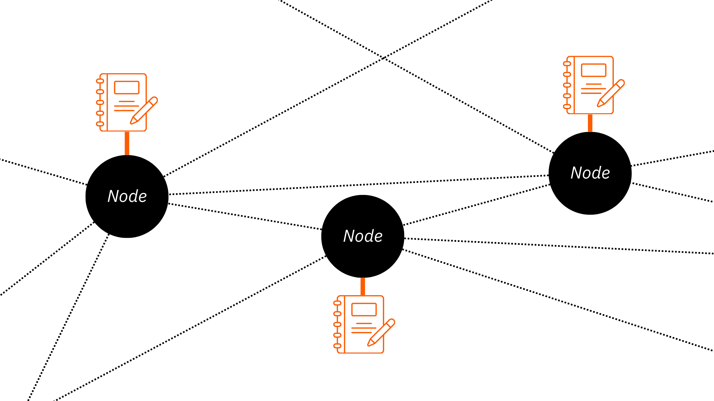


Bitcoin에서는 결제를 하면 [거래](https://planb.academy/resources/glossary/transaction-tx)가 생성됩니다. 이 트랜잭션은 노트북에 즉시 추가되지 않습니다. 먼저 네트워크에 전송된 다음 다음 트랜잭션 패킷에 통합될 때까지 기다립니다. 이 패킷을 [블록](https://planb.academy/resources/glossary/block)이라고 합니다.


블록은 간단히 말해 트랜잭션을 그룹으로 묶은 집합입니다. 블록이 준비되면 이를 게시하는 것만으로는 충분하지 않습니다. 해당 블록이 풀에 추가될 가치가 있다는 것을 네트워크에 증명해야 합니다. 이것이 바로 mining이 필요한 이유입니다.


Mining는 에너지를 소비하여 블록을 검증하는 작업입니다. [채굴자](https://planb.academy/resources/glossary/miner)라고 불리는 행위자는 특수 컴퓨터를 사용합니다. 이러한 기계는 네트워크가 허용하는 증명을 찾을 때까지 매우 많은 수의 테스트를 반복적으로 수행하기 위해 전력을 소비합니다. 채굴자가 이 증명을 찾으면 해당 블록은 유효한 것으로 간주됩니다.


블록의 유효성이 확인되면 네트워크에 브로드캐스트됩니다. 다른 [노드](https://planb.academy/resources/glossary/node)는 이 블록이 규칙을 준수하는지 신속하게 확인한 다음 이전 블록의 시퀀스에 추가합니다. 새로운 블록이 순차적으로 다른 블록에 추가되고 이 체인이 조금씩 성장하는 것을 '블록체인'이라고 부르는 이유입니다.


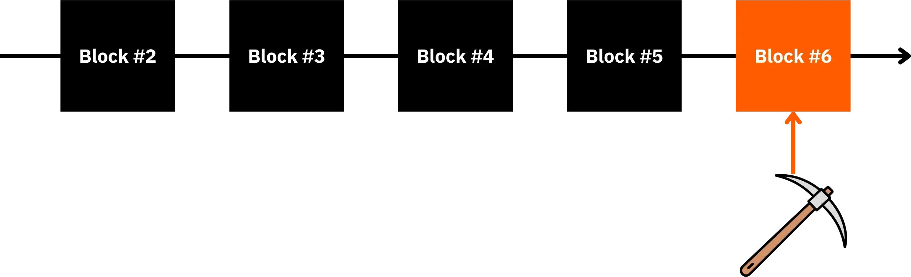


요약하자면, 트랜잭션이 먼저 생성됩니다. 그런 다음 트랜잭션은 블록으로 그룹화됩니다. 그런 다음 채굴자가 전력을 소비하여 이 블록의 유효성을 검사합니다. 마지막으로 이 블록이 블록체인에 추가되고 블록에 포함된 트랜잭션이 [확정](https://planb.academy/resources/glossary/confirmation)됩니다.


채굴자들이 전기를 소비하는 것은 자원 봉사자이기 때문이 아닙니다. 그들은 보상이 있기 때문에 그렇게 합니다. 채굴자가 블록을 검증하면 두 가지 유형의 수입을 얻게 됩니다. 한편으로는 새로 생성된 비트코인을 받습니다. 다른 한편으로는 블록에 포함된 트랜잭션에 대해 사용자가 지불한 [수수료](https://planb.academy/resources/glossary/transaction-fees)를 받습니다. 즉, 채굴자는 프로그래밍된 화폐 발행과 시장에서 결정되는 거래 수수료를 통해 보상을 받습니다.


이 단계에서는 의도적으로 mining에 대한 매우 간단한 보기만 제공됩니다. 블록이 어떻게 구성되는지, 채굴자들이 찾고 있는 증명 채굴이 정확히 어떻게 작동하는지, Bitcoin이 어떻게 일정한 속도를 유지하는지, 보상이 어떻게 정확하게 계산되는지, 어떻게 청구되는지에 대해서는 아직 설명하지 않습니다. 괜찮습니다. 이 MIN 101 과정의 나머지 부분에서는 이 정도만 살펴보도록 하겠습니다!


이 장의 목적은 단순히 트랜잭션 → 블록 → mining → 블록체인 → 보상이라는 명확한 사고 구조를 제시하는 것이었습니다. 이 일련의 아이디어를 염두에 두시기 바랍니다. 나머지 과정에서는 각 장에서 이러한 요소 중 하나에 대한 기술적 세부 사항을 추가하여, 무슨 일이 일어나고 있는지뿐만 아니라 신뢰 없이도 대규모로 안정적으로 작동하는 방법과 이유를 이해할 때까지 설명할 것입니다.


# proof of work 작동 방식


<partId>e917e8e3-37f2-46fb-91b2-6a5ce6f0f5c3</partId>


## Bitcoin 트랜잭션 경로


<chapterId>3b7a3502-4814-4554-8de1-86ac961a2958</chapterId>


Bitcoin mining이 무엇인지 이해하려면 먼저 일반적인 Bitcoin 트랜잭션의 경로를 따라야 합니다. 이를 통해 블록이 정확히 어디에서 작동하는지, 왜 시스템의 핵심에 있는지 알 수 있습니다. 이것이 바로 이 첫 번째 장에서 여러분이 발견했으면 하는 것입니다.


Bitcoin에서 트랜잭션은 비트코인의 소유권을 한 사용자에서 다른 사용자로 이전하는 데이터 구조입니다. 구체적으로 말하면, 과거 거래(소위 [UTXO](https://planb.academy/resources/glossary/utxo))의 '[출력](https://planb.academy/resources/glossary/output)'을 '[입력](https://planb.academy/resources/glossary/input)'이라고 하여 소비한 다음, 이 비트코인이 현재 누구의 소유이고 나중에 어떤 조건에서 사용할 수 있는지를 정의하는 새로운 '출력'을 생성합니다.


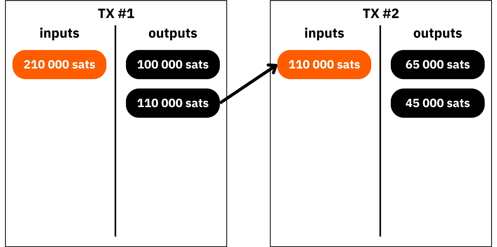


Bitcoin의 중요한 점은 지출 권한입니다. Bitcoin은 은행에 있는 돈처럼 계좌에 있는 것이 아니라 지출 조건에 따라 잠겨 있습니다. [wallet](https://planb.academy/resources/glossary/wallet)이 UTXO를 입력으로 사용하려면 잠금을 해제할 권한이 있다는 암호학적 증명을 제공해야 합니다. 이 증명은 종종 [개인 키](https://planb.academy/resources/glossary/private-key)의 [디지털 서명](https://planb.academy/resources/glossary/digital-signature) generated의 형태를 취합니다. 그렇기 때문에 비트코인 사용자들은 개인 키의 보안을 고집합니다. 개인 키를 통해 비트코인에 대한 액세스를 잠금 해제하고 결과적으로 비트코인을 사용할 수 있기 때문입니다.


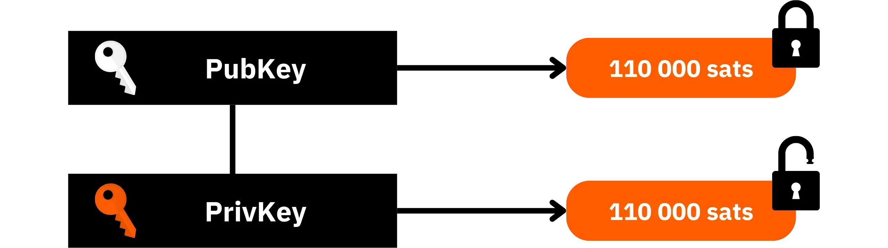


Bitcoin의 디지털 서명은 두 가지 중요한 역할을 합니다:


- 지출 승인: 사용자가 UTXO 지출 조건에서 예상하는 개인 키를 보유하고 있음을 증명합니다;
- 무결성 보호: 승인을 거래의 정확한 세부 정보(수신자, 금액, 수수료 등)에 연결합니다. 나중에 누군가 거래를 변경하면 서명은 더 이상 유효하지 않습니다.


트랜잭션이 올바르게 구성되고 사용자의 Bitcoin wallet에 의해 서명된 후에는 Bitcoin 네트워크에서 브로드캐스트되어야 합니다.


### 배포에서 Bitcoin 노드의 역할


Bitcoin은 [P2P](https://planb.academy/resources/glossary/peertopeer-p2p) 네트워크이므로 모든 트랜잭션을 수신하고 처리하는 중앙 서버가 없습니다. 이 역할은 노드들이 공동으로 수행합니다. Bitcoin 노드는 Bitcoin 네트워크의 다른 노드에 연결된 소프트웨어(예: [Bitcoin 코어](https://planb.academy/resources/glossary/bitcoin-core))로, 트랜잭션과 블록을 검증, 저장, 중계하는 것이 주요 임무입니다.


wallet에서 트랜잭션을 전송하면 wallet는 이를 노드(본인 또는 서비스 노드)로 전달합니다. 이 노드는 먼저 트랜잭션이 다음과 같은 다양한 규칙을 준수하는지 확인합니다:


- 서명이 유효합니다;
- 입력은 기존 UTXO(즉, 현존하는 비트코인)을 참조합니다;
- 이 UTXO은 이미 다른 곳에 사용되지 않았습니다;
- 출력의 양이 입력의 양보다 적거나 같습니다(비트코인은 무에서 유를 창조하지 않습니다);
- 등


트랜잭션이 이 모든 검사를 통과하면 노드는 연결된 네트워크의 다른 노드에 트랜잭션을 전파합니다. 다른 노드들은 차례로 이를 확인하고 중계하는 방식으로 트랜잭션을 전달합니다. 몇 초 만에 트랜잭션이 전파되어 Bitcoin 네트워크 전체 또는 적어도 상당 부분의 노드에 알려지게 됩니다.


### 멤풀: 트랜잭션 대기실


트랜잭션이 브로드캐스트되는 순간부터 블록에서 확정되는 순간까지 트랜잭션은 대기해야 합니다. 이 대기 공간을 [멤풀](https://planb.academy/resources/glossary/mempool)(`메모리`와 `풀`의 합성어)이라고 합니다. 따라서 멤풀은 유효하지만 아직 확인되지 않은 트랜잭션을 위한 임시 저장 공간입니다.


중요한 점은 단일 멤풀은 존재하지 않고 멤풀만 존재한다는 것입니다. 각 노드는 고유한 로컬 제약 조건과 함께 자체 멤풀을 유지합니다. 즉, 특정 순간에 두 노드는 수신한 내용, 거부한 내용, 삭제한 내용에 따라 멤풀의 내용이 조금씩 다를 수 있습니다.


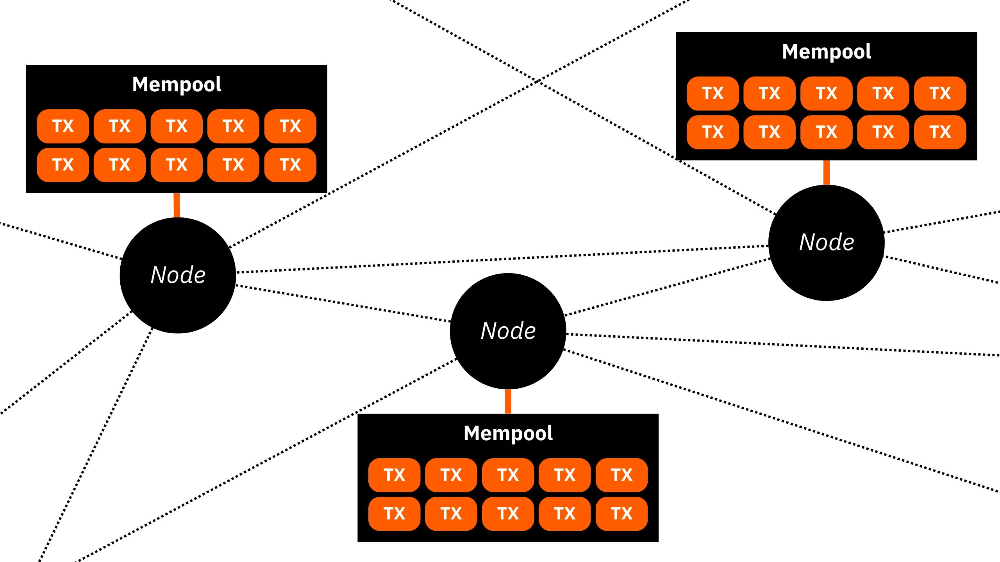


이 단계에서 네트워크는 트랜잭션에 대해 알고 있고, 트랜잭션을 확인했으며, 확인될 때까지 메모리에 보관하고 있습니다. 그러나 이 트랜잭션의 확인은 채굴자가 트랜잭션을 블록에 삽입하고 이 블록이 네트워크에 의해 승인될 때만 이루어집니다.


### Blockchain: 공개 타임스탬프 등록기


비트코인은 무형 화폐이므로 중앙 기관 없이 [이중 지출](https://planb.academy/resources/glossary/double-spending-attack)을 방지하는 한 가지 문제를 해결해야 합니다. 두 트랜잭션이 동일한 UTXO를 사용하려고 시도하는 경우, 모든 사람이 하나의 일관된 상태로 수렴할 수 있어야 합니다. Satoshi Nakamoto는 이 문제를 이 유명한 문장으로 요약합니다:


> 거래가 없음을 확인하는 유일한 방법은 모든 거래를 파악하는 것입니다.

즉, 비트코인이 아직 사용되지 않았는지 확인하려면 과거 지출에 대한 공통된 기록이 필요합니다.


이것이 바로 블록체인의 역할, 즉 거래 내역을 담은 공공 장부입니다. 하지만 Bitcoin은 각 트랜잭션이 발생할 때마다 기록하는 것이 아니라 블록으로 그룹화합니다. 각 블록은 기록 페이지 역할을 하며, 따라서 시스템은 타임스탬프 서버처럼 작동하여 검증 가능한 방식으로 시간 경과에 따른 트랜잭션을 정렬합니다.


각 블록에는 이전 블록의 암호화 지문([해시](https://planb.academy/resources/glossary/hash-function))이 포함되어 있다는 간단한 원칙 덕분에 이 레지스터는 다시 쓸 수 없습니다. 따라서 블록은 서로 연결되어 있습니다. 과거 블록을 수정하면 해시가 변경되어 다음 블록과의 연결이 끊어지고, 그 이후 블록과의 연결이 끊어지는 등의 방식으로 블록이 연결됩니다. 이러한 의존성의 사슬이 바로 "*블록체인*"이라는 이름을 붙인 것입니다.


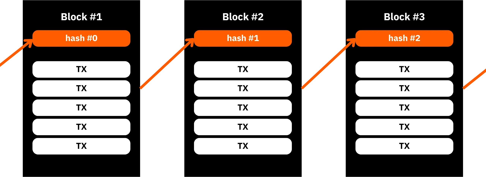


Bitcoin의 기본 원리를 이해했다면, 보류 중인 트랜잭션을 새겨 기존 체인을 확장하는 새로운 블록을 생성한 다음 이를 유효하게 만드는 마이너의 목표를 좀 더 구체적으로 설명할 수 있습니다(이는 이후 장에서 살펴볼 유명한 "[proof of work](https://planb.academy/resources/glossary/proof-of-work)"입니다). 하지만 먼저 다음 장에서 후보 블록이 어떻게 구성되는지 함께 알아봅시다.


## Bitcoin 블록 구축


<chapterId>2b5cd04b-d400-4865-b0a0-e70fa7e67c17</chapterId>


이제 Bitcoin 트랜잭션의 작동 방식과 블록체인의 역할에 대해 이해하셨습니다. 그러나 proof-of-work의 작동 방식을 자세히 살펴보기 전에 채굴자가 반드시 수행해야 하는 필수 단계인 [후보 블록](https://planb.academy/resources/glossary/candidate-block)의 구성이 남아 있습니다. 유효한 증명을 찾기 시작하기 전에 후보 블록이 무엇이며 채굴자가 이를 어떻게 구성하는지 함께 알아봅시다.


### 후보 블록


Miner는 채굴을 시도하기 전에 블록을 직접 만들어야 합니다. 각 마이너는 자신의 멤풀에 대기 중인 트랜잭션에서 후보 블록으로 알려진 것을 차례로 구성합니다. 따라서 후보 블록을 구축하는 과정은 다음과 같이 구성됩니다:


- 포함할 트랜잭션을 선택합니다;
- gW-83 규칙과 호환되는 방식으로 이러한 트랜잭션을 구성합니다;
- 는 [헤더](https://planb.academy/resources/glossary/block-header)에 저장된 블록의 메타데이터를 생성합니다.


거래 선택은 간단한 경제 논리를 따릅니다. 블록은 Bitcoin 프로토콜에 의해 용량이 제한되어 있으므로 채굴자는 이 공간에서 얻는 수익을 극대화하려고 합니다. 채굴자는 블록에서 차지하는 공간에 비해 가장 높은 수수료를 제공하는 거래를 우선적으로 선택합니다(이를 "수수료율"이라고 하며, sats/vB로 표시됨). 수수료에 대한 자세한 내용은 나중에 다루겠지만, 공간 효율성을 기준으로 정렬한다는 개념만 기억하세요.


따라서 Bitcoin 블록은 크게 두 부분으로 구성됩니다:


- 거래 목록입니다;
- 블록 헤더는 블록의 신분증과 같은 역할을 합니다.


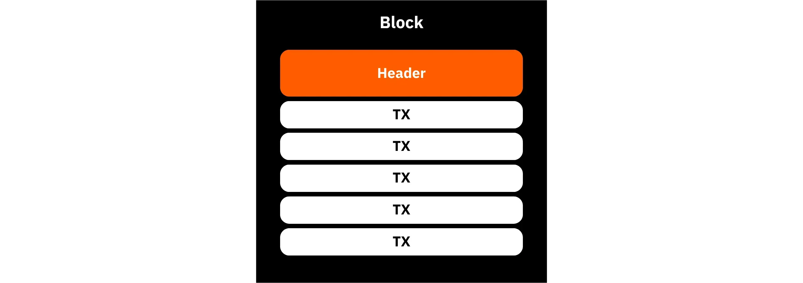


헤더는 proof-of-work의 기초로 사용되기 때문에 필수적입니다. Bitcoin에서는 전체 블록을 직접 채굴하지 않고, 블록을 체인에 연결하고 그 내용을 커밋하는 데 필요한 정보를 요약한 블록의 헤더만 채굴합니다. 헤더가 모든 트랜잭션을 나타낼 수 있도록 Bitcoin은 암호화 도구인 [머클 트리](https://planb.academy/resources/glossary/merkle-tree)를 사용합니다.


### 머클 트리: 대규모 트랜잭션 세트 요약하기


헤더에 모든 트랜잭션을 나열하는 것은 불가능합니다. 블록에는 수천 개의 트랜잭션이 포함될 수 있지만 헤더의 크기는 고정된 크기(80바이트)를 가집니다. 따라서 해결책은 블록의 모든 트랜잭션에 따라 달라지는 고유 해시를 계산하는 것인데, 이것이 바로 [머클 루트](https://planb.academy/resources/glossary/merkle-root)입니다.


원칙은 다음과 같습니다:


- 를 입력하면 각 트랜잭션의 암호화 지문(해시)이 계산됩니다;
- 이 해시는 쌍을 이루고 연결된 다음 다시 해시되어 새로운 해시 레이어를 형성합니다;
- 이 과정은 하나의 최종 해시인 머클 루트를 얻을 때까지 반복됩니다.


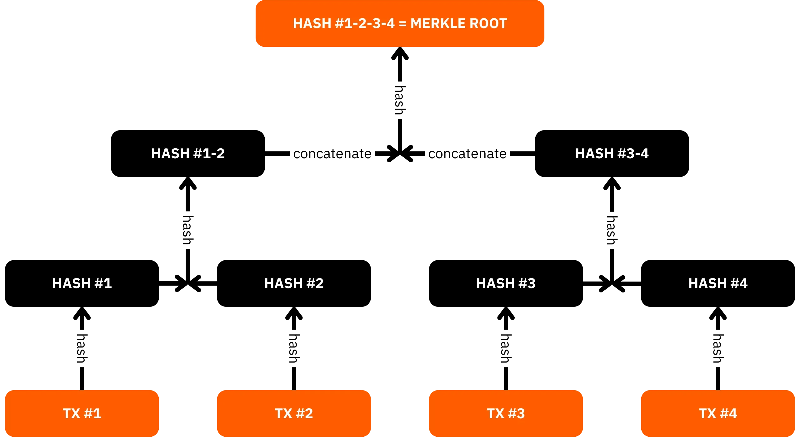


따라서 단일 트랜잭션이 단 1비트라도 변경되면 그 결과 머클 루트로 전파되는 지문이 수정됩니다. 이 루트는 블록 헤더에 포함됩니다. 따라서 과거 트랜잭션을 수정한다는 것은 해당 트랜잭션이 포함된 블록 헤더와 블록 풋프린트, 그리고 후속 블록과의 링크를 수정하는 것을 의미합니다.


[SegWit](https://planb.academy/resources/glossary/segwit)부터는 시그니처를 나머지와 분리했습니다. 따라서 실제로는 각 블록 내에 2개의 머클 트리가 중첩되어 있습니다. 이러한 분리는 블록의 크기를 계산하는 방식과 특정 암호화 커밋에 영향을 미치지만, 헤더가 블록의 모든 내용을 간결하게 커밋해야 한다는 기본 아이디어는 동일하게 유지됩니다.


### 블록 헤더


블록 헤더의 길이는 80바이트이며 정확히 6개의 필드를 포함합니다. proof of work을 검색할 때 해시되는 것은 바로 이 6가지 요소입니다(다음 장 참조):


- 버전(`버전`): 블록이 준수하는 규칙 또는 업데이트 신호를 나타냅니다. 프로토콜 호환성과 진화를 유지하기 위한 메커니즘 역할을 합니다.


- 이전 블록 해시(`previousblockhash`): 이전 블록 헤더의 해시입니다. 이것이 블록을 서로 연결하는 역할을 합니다. 이 필드가 없으면 독립적인 블록이 존재하게 됩니다. 이전 블록의 헤더 해시를 포함함으로써 각각의 새 블록이 이전 블록을 기반으로 구축되는 체인을 얻게 됩니다.


- 머클 루트(`merkleroot`): 머클 트리를 통해 블록에 있는 모든 트랜잭션의 지문입니다. 이는 헤더를 콘텐츠에 연결합니다. 채굴자가 트랜잭션의 선택 또는 순서를 수정하면 루트가 변경됩니다.


- [타임스탬프](https://planb.academy/resources/glossary/timestamp): 타임스탬프: 채굴자가 선택한 타임스탬프(유효성 제약 조건이 있는 유닉스 시간)로, 블록이 채굴된 시점을 나타내야 합니다. 초 단위까지 완벽하게 정확할 필요는 없지만 네트워크에서 허용 가능한 상태를 유지하려면 특정 조건을 충족해야 합니다.


- 인코딩된 [난이도 목표](https://planb.academy/resources/glossary/difficulty-target)(`n비트`): 이 필드는 현재 난이도 목표를 인코딩합니다. 난이도에 대한 장에서 더 자세히 설명하겠지만 이 매개변수는 헤더의 일부라는 점을 기억하세요.


- [Nonce](https://planb.academy/resources/glossary/nonce) (`없음`): 채굴자가 자유롭게 수정할 수 있는 값입니다. proof-of-work 동안 조정 가능한 변수 역할을 합니다. 다음 장에서 논스의 역할에 대해 더 자세히 설명하겠지만, 논스는 블록 헤더의 일부이며 연속적인 시도를 허용하도록 설계되었다는 점을 이해하는 것이 중요합니다.


이를 보다 쉽게 시각화하기 위해 16진수 형식(80바이트)의 블록 헤더를 예로 들어 설명합니다:


```text
00e0ff3f5ffe3b0d9247dc437e18edc19252e4517cee941752d501000000000000000000206b
de3a10826e2acb2f28fba70463601c789293d0c9c4348d7a0d06711e97c0bcb13a64b2e00517
43f09a40
```


다음은 분야별 분석입니다:


```text
version: 00e0ff3f
previousblockhash: 5ffe3b0d9247dc437e18edc19252e4517cee941752d501000000000000000000
merkleroot: 206bde3a10826e2acb2f28fba70463601c789293d0c9c4348d7a0d06711e97c0
time: bcb13a64
nbits: b2e00517
nonce: 43f09a40
```


마이너가 구성한 이 후보 블록 헤더는 작업의 기초를 형성합니다. 유효한 proof-of-work을 검색할 때 루프에서 직접 해시되는 것은 전체 트랜잭션 목록이 아니라 이 80바이트 블록으로, 블록을 과거와 연결하고 그 내용을 커밋하는 데 필요한 모든 것을 포함하며, 다음 장에서 살펴볼 mining 메커니즘에 필요한 파라미터도 포함하고 있습니다.


## 해시, 대상 및 논스


<chapterId>d054323b-16bd-4556-bac5-4878654e59a3</chapterId>


이전 장에서는 Bitcoin 트랜잭션의 경로를 따라 wallet이 생성하고 서명하며, 노드에 의해 릴레이되고, 멤풀에 저장된 다음, 채굴자가 네트워크에서 승인된 블록에 이를 포함할 때 확인되는 과정을 살펴보았습니다. 그러나 채굴자가 자신의 블록을 블록체인에 추가하는 방법은 아직 밝혀지지 않았습니다. mining의 프로세스는 어떻게 진행되나요?


mining 프로세스를 이해하는 것은 매우 간단합니다. 해시 함수, 목표 값, 채굴자가 수정할 수 있는 변수라는 세 가지 개념으로 요약할 수 있습니다. 이 모든 것이 어떻게 작동하는지 살펴보겠습니다.


### 해시 함수


해시 함수는 메시지를 입력으로 받아 "*지문*" 또는 "*해시*"라고 하는 고정된 크기의 출력을 생성하는 도구입니다.


해시 함수는 특정 속성을 가지고 있기 때문에 컴퓨터 시스템에서 흥미롭습니다:


- 입력의 한 비트를 변경하면 결과 출력 해시는 완전히 예측할 수 없을 정도로 변경됩니다;


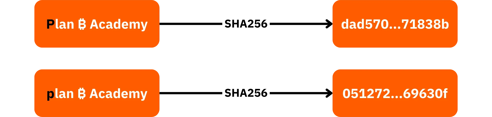


- 출력에서 입력으로 이동하는 것은 불가능합니다. 이 기능은 되돌릴 수 없습니다;


- 정확히 동일한 해시를 제공하는 서로 다른 두 개의 메시지를 찾는 것은 불가능합니다.


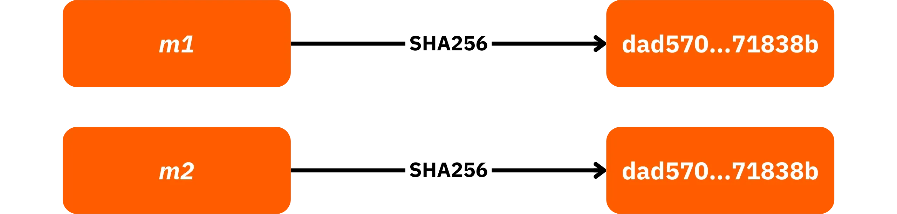


Bitcoin에서 mining에 사용된 해시 함수는 `SHA256`로, 두 번 연속으로 적용됩니다. 이를 더블 [SHA256](https://planb.academy/resources/glossary/sha256) 또는 `SHA256d`라고 합니다. 블록의 지문을 생성하는 것이 바로 이 이중 해싱입니다.


```text
hash = SHA256(SHA256(message))
```


우리의 경우 '메시지'는 실제로 이전 장에서 보았던 블록 헤더에 해당합니다. 헤더는 블록의 모든 내용을 요약하는 작은 구조입니다.


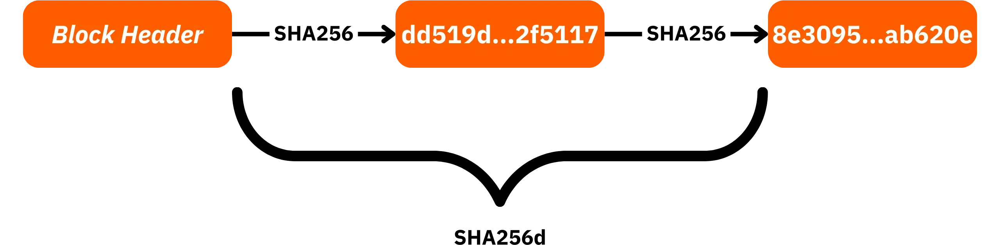


### 작업 증명: 목표보다 작은 해시 찾기


Proof-of-Work는 종종 복잡한 문제를 해결하는 것으로 묘사됩니다. 실제로는 시행착오를 거치며 검색하는 것만큼 문제가 되지 않습니다. 채굴자는 (`SHA256d` 해시 함수를 통과한 후) 해시가 특정 목표보다 작아야 한다는 간단한 조건을 준수하는 헤더 버전을 찾아야 합니다.


이 조건은 다음과 같이 공식화됩니다:


- 로 설정하면 블록 헤더의 해시는 해시 함수를 사용하여 계산됩니다;
- 이 해시를 숫자로 해석합니다;
- 블록이 유효하려면 이 숫자가 "*난이도 목표*"라는 값보다 작거나 같아야 합니다.


즉, 블록은 다음과 같은 경우에 유효합니다:


```text
SHA256d(block_header) <= target
```


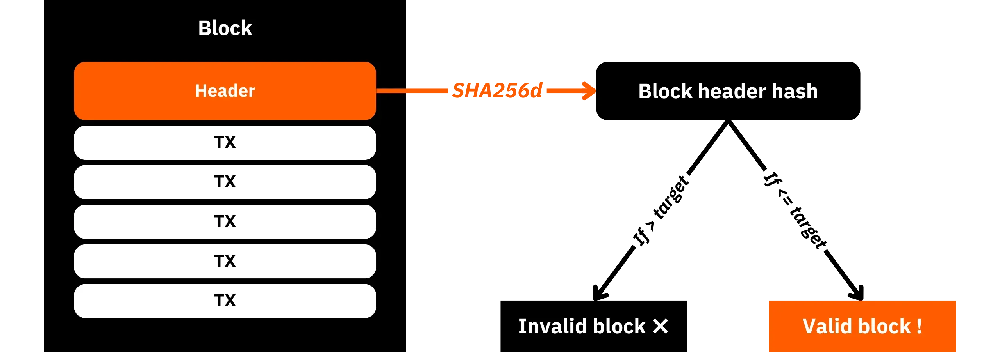


대상은 256비트 숫자입니다. SHA256d`가 생성하는 해시 역시 256비트이므로 두 개의 숫자로 비교할 수 있습니다. 목표가 낮을수록 이 임계값 이하로 나올 수 있는 결과가 적기 때문에 조건이 더 어려워집니다. 반대로 목표가 높을수록 조건을 충족하기 쉬우며, 블록을 채굴하기가 더 쉬워집니다. 이후 장에서 이 목표가 어떻게 결정되는지 자세히 살펴보도록 하겠습니다.


이 시스템에서 해시 함수는 흥미롭습니다. 입력에서 출력을 계산하는 것은 쉽지만, 함수의 출력만 알면 입력값을 찾는 것은 불가능하다는 점을 기억하세요. mining에서 채굴자는 정확한 해시를 찾아야 하는 것이 아니라 목표 값보다 낮은 해시를 찾아야 합니다. 이를 달성하는 유일한 방법은 후보 블록의 특정 헤더가 해시될 때 이 목표보다 작은 해시를 생성할 때까지 매우 많은 수의 시도를 하는 것입니다.


목표가 충분히 낮아지면 이 과정은 비용이 많이 듭니다. 채굴자는 후보 블록 헤더의 해시를 계산하고 결과를 확인한 후 조건이 충족되지 않으면 헤더를 수정하고 계산을 반복합니다. 이 루프는 유효한 헤더가 발견될 때까지 반복됩니다. 헤더의 해시가 최종적으로 조건을 충족하면 proof of work이 설정되고 블록은 유효한 것으로 간주되며 노드가 블록체인에 추가할 수 있도록 Bitcoin 네트워크에 브로드캐스트될 수 있습니다. 그러면 승리한 채굴자는 관련 보상을 받게 되며(자세한 구성은 나중에 설명하겠습니다), 모든 채굴자는 즉시 다음 블록을 위한 새롭고 유효한 헤더를 찾기 위해 출발하게 됩니다.


이 메커니즘의 근본적인 장점은 비대칭성에 있습니다. 채굴자에게는 많은 수의 해시 계산이 필요하기 때문에 proof of work을 생성하는 데 많은 비용이 듭니다. 반면 검증자, 즉 네트워크 노드의 경우 검증은 매우 간단합니다. 채굴자가 제공한 블록 헤더를 해시하고 그 결과 해시가 실제로 목표보다 낮은지 확인하기만 하면 됩니다. 따라서 증명을 찾는 데는 많은 작업과 자원이 필요한 반면, 유효성을 검증하는 것은 빠르고 저렴합니다. 바로 이 특성이 효율적인 proof-of-work 시스템을 정의합니다.


### 논스


채굴자가 생성한 후보 블록의 헤더가 유효한 해시를 제공하지 않는다면, 채굴자는 어떻게 다시 시도할 수 있을까요? 다른 해시를 얻기 위해 헤더의 무언가를 수정해야 합니다. 이것이 바로 논스의 역할입니다.


해시 함수의 첫 번째 속성을 기억하세요. 입력 비트 하나만 변경해도 완전히 다른 예측 불가능한 출력 해시를 생성할 수 있습니다. 따라서 각 해시 계산은 무작위 추첨과 비슷합니다.


채굴자는 후보 블록의 전체 헤더를 수정할 필요 없이, 비트 하나만 변경해도 완전히 새로운 해시가 생성되며, 목표보다 작을 경우 유효할 수 있기 때문에 일부만 변경하면 됩니다.


이것이 바로 블록 헤더에 논스가 포함된 이유입니다. 논스는 32비트 값으로, 한 번 사용된 후 교체됩니다. 실제로 동일한 후보 블록에 대해 채굴자는 약 42억 9천만 개의 가능한 값(`0`에서 `2^32 - 1`까지)을 테스트할 수 있습니다. 논스의 각 변형은 블록 헤더를 수정하고, 결과적으로 `SHA256d` 해시 함수를 적용한 후 생성된 해시를 완전히 변경합니다.


mining 프로세스는 매우 간단합니다:


- 채굴자는 후보 블록(트랜잭션 + 헤더)을 생성합니다;
- 를 입력하면 `SHA256d(헤더)`의 해시를 계산합니다;
- 결과가 목표보다 크면 논스를 변경합니다;
- 다시 시작됩니다;
- 등


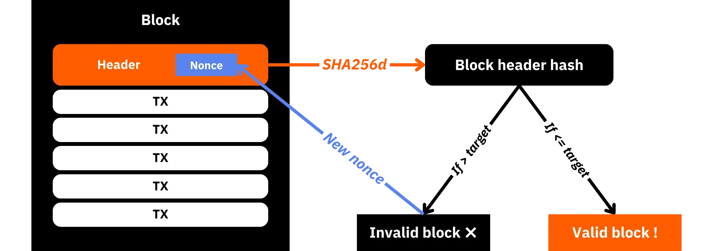


사실 논스만이 수정할 수 있는 유일한 필드는 아닙니다. 블록의 트랜잭션 내에서 수정하면 머클 트리의 루트가 변경되고, 따라서 해당 블록의 헤더도 수정됩니다. 최신 컴퓨팅 성능으로 42억 9천만 개의 가능한 논스 값을 비교적 빠르게 처리할 수 있습니다. 그렇기 때문에 일반적으로 "*[추가 논스](https://planb.academy/resources/glossary/extra-nonce)*"라고 불리는 또 다른 필드가 존재하며, 이는 헤더 변형의 가능성을 더욱 배가시킵니다. 이 메커니즘에 대해서는 다음 장에서 더 자세히 살펴보겠습니다.


### proof of work의 요점은 무엇인가요?


블록이 생성되면 모든 노드는 헤더의 암호화 해시가 실제로 필요한 목표보다 낮은지 순식간에 확인할 수 있기 때문에 이를 "증명"이라고 부릅니다. 이 해시를 달성하려면 수많은 시도가 필요하므로 계산과 에너지 측면에서 실제 비용이 들기 때문에 이를 "작업"이라고 부릅니다.


Bitcoin [백서](https://planb.academy/resources/glossary/white-paper)에서는 Satoshi Nakamoto에서 proof-of-work 시스템을 사용할 경우 두 가지 이점을 제시하고 있습니다:


- Seal 경제 역사 살펴보기:**


계산 부하가 소비되면 블록은 잠기며, 이를 수정하려면 해당 블록의 proof of work을 다시 실행해야 합니다. 또한 블록이 서로 연결되어 있기 때문에 이전 블록을 변경하면 모든 후속 블록을 다시 계산해야 하고, 정직한 체인의 진행 중인 작업을 따라잡거나 능가해야 합니다.


즉, proof-of-work은 타임스탬핑 시스템의 중추 역할을 하며, 블록이 쌓일수록 과거를 위조하는 데 점점 더 많은 비용이 들게 됩니다. 새로운 블록이 채굴되면 proof of work이 제공하는 보안이 기존의 모든 UTXO에 동시에 균일하게 적용됩니다. 따라서 각 블록이 추가될 때마다 각 UTXO는 Proof-of-Work의 보안을 추가로 축적하게 됩니다.


- 다수결([합의](https://planb.academy/resources/glossary/consensus))을 정의하고 시빌을 무력화하기:**


또한 Proof-of-Work을 사용하면 Bitcoin는 ID(IP, 노드, 키 등)의 대량 생성으로 쉽게 변조될 수 있는 "하나의 ID = 하나의 투표" 투표 규칙에 의존하지 않고 합의에 도달할 수 있습니다.


Bitcoin에서 "*다수*"는 참여자 수가 가장 많은 것이 아니라 가장 많은 작업을 누적한 **체인**을 의미합니다. Satoshi에서 말했듯이, 이는 "1 CPU = 1 투표" 원칙, 즉 유효한 블록을 생성하는 데 사용된 실제 컴퓨팅 파워에 가중치를 부여하는 투표입니다. 따라서 수천 개의 노드를 배치해도 그 자체로는 Bitcoin에 비해 이점이 없습니다. 추가 컴퓨팅 파워가 없으면 작업 증명이 더 이상 축적되지 않으며, [시빌 공격](https://planb.academy/resources/glossary/sybil-attack)은 쓸모가 없어지는 반면, 결정 규칙은 객관적으로 유지되고 참여자의 신원을 확인할 필요가 없습니다.


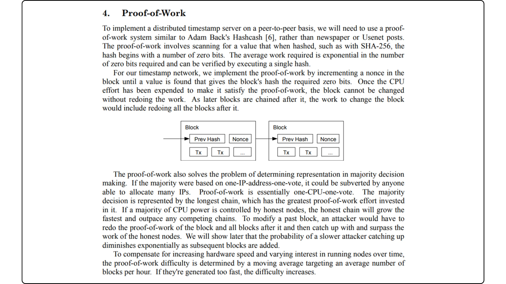


[나카모토, S. (2008). *Bitcoin: 피어투피어 전자 현금 시스템*](https://bitcoin.org/bitcoin.pdf)


미성년자의 유용성과 권한에 관한 원칙은 매우 복잡한 주제이므로 이 과정에서는 자세히 다루지 않겠습니다. 하지만 향후 MIN 201 교육 과정에서 이 주제에 대해 자세히 다룰 예정입니다.


현재 mining의 작동 방식을 요약하면, 채굴자는 멤풀에 대기 중인 트랜잭션으로 후보 블록을 생성한 다음, 목표보다 작거나 같은 헤더의 해시를 (`SHA256d`를 통해) 찾습니다. 이들은 시행착오를 통해 논스를 테스트함으로써 이를 달성합니다.


다음 장에서는 proof-of-work 원칙에 대한 간략한 역사적 배경을 살펴보고, 시스템에서 난이도 목표가 어떻게 결정되는지 살펴보겠습니다.


## proof of work의 역사


<chapterId>919d9f3e-8b3b-41d9-b45a-54df4f3c31a3</chapterId>


작업 증명은 Bitcoin을 위해 발명된 것이 아닙니다. [Satoshi Nakamoto](https://planb.academy/resources/glossary/nakamoto-satoshi)는 이미 다른 맥락에서 탐구된 몇 가지 오래된 아이디어를 채택하고 조합했습니다.


### Hashcash


1990년대 후반, 이메일 스팸 문제가 심각해졌습니다. 실제로 이메일 전송 비용이 거의 들지 않는다면 스팸 발송자는 수백만 개의 메시지를 보낼 수 있습니다. 그러나 각 메시지에 약간의 계산 작업이 필요한 경우 일반 사용자에게는 합법적인 메시지 한 개를 보내는 것이 쉬운 반면, 수백만 개의 메시지를 보내는 것은 매우 비용이 많이 듭니다.


이것이 바로 proof-of-work 원리의 발명으로 간주되는 1997년 Adam Back이 제안한 [Hashcash](https://planb.academy/resources/glossary/hashcash)의 목표입니다. Hashcash 원리는 mining과 매우 유사합니다: 조건(해시 시작 부분에 특정 수의 0이 포함됨)을 준수하는 해시를 생성합니다. 그러면 메시지와 함께 증명이 첨부되어 수신자가 매우 빠르게 확인할 수 있습니다. 이 증명이 포함되지 않은 이메일이 수신되면 즉시 스팸으로 간주하여 필터링할 수 있습니다. 그러면 스패머는 수백만 개의 메시지를 보내기 위해 상당한 에너지를 소비해야 하므로 마케팅이든 사기이든 이러한 유형의 작업의 수익성이 크게 감소(또는 완전히 무효화)됩니다.


요즘에는 이메일에 Hashcash를 사용하지 않습니다. 스팸 필터링은 이제 대부분 중앙 집중식 시스템을 기반으로 합니다. Hashcash는 중앙 집중식 필터링이 필요하지 않고 누구나 자신의 기준에 따라 매개변수를 조정할 수 있다는 점에서 기존 솔루션에 비해 장점이 있습니다. 또한 익명으로 해시 검색을 수행할 수 있기 때문에 신원 확인이 필요하지 않습니다. 무엇보다도 주관적인 형태의 필터링을 도입하는 경향이 있는 평판 시스템에 의존하지 않습니다.


Hashcash는 수익을 창출하는 것이 목적이 아니었습니다. 쉽게 자동화할 수 있는 디지털 작업에 한계 비용을 부과하고자 했습니다.


### 비트 골드


1990년대 말과 2000년대 초, 닉 자보는 proof of work을 기반으로 디지털 희소성에 대한 아이디어를 탐구했습니다. 비트 골드라고 불리는 그의 개념 프로젝트는 값비싼 proof of work을 풀고 이 증명을 등록부에 기록하여 소유권의 형태를 확립함으로써 가치 단위를 창출하는 것을 구상했습니다.


비트골드는 Bitcoin와 같은 시스템을 구축하지는 못했지만, 계산이 희소성을 만들어낼 수 있다는 아이디어와 시간이 지남에 따라 타임스탬프를 찍어 다시 쓰기 어려운 기록을 만든다는 아이디어 등 몇 가지 중요한 통찰을 담고 있습니다.


### RPOW


2004년에 Hal Finney는 재사용 가능한 작업 증명(*재사용 가능한 작업 증명*)을 제안했습니다. 이 아이디어는 단순히 소비되는 것이 아니라 교환할 수 있는 작업 증명을 생성하자는 것이었습니다. RPOW는 proof of work을 기반으로 디지털 token을 생성하고, 이러한 token을 복제하지 않고 검증 및 전송할 수 있는 시스템을 목표로 했습니다. RPOW 역시 나중에 Bitcoin처럼 완전히 탈중앙화된 레지스트리의 문제를 만족스럽게 해결하지는 못했지만, Bitcoin의 위대한 선구자 중 하나로 남아 있습니다.


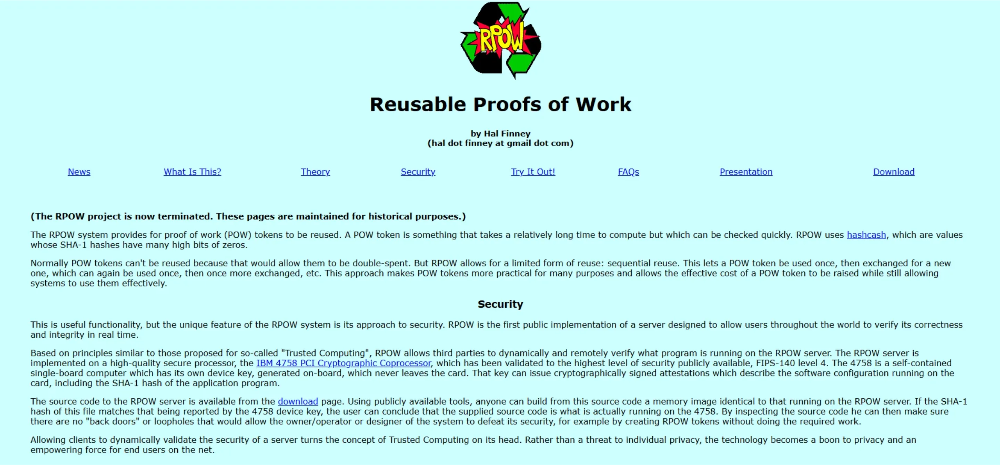


Hash캐시, 비트골드, RPOW는 proof-of-work을 사용해 비용을 부과하고 일종의 희소성을 창출합니다. Bitcoin은 이 메커니즘을 사용하지만, 중앙적이고 집단적인 역할을 부여합니다: proof-of-work은 무언가를 생성하는 데 사용될 뿐만 아니라, 장부의 다음 페이지(다음 블록)를 작성할 권리를 가진 사람을 결정하고 이 장부를 위조하는 데 비용이 많이 들도록 만드는 데도 사용됩니다.


## 난이도 목표 조정하기


<chapterId>528bcaa8-351e-4eae-887a-426a78a223e3</chapterId>


이전 장에서 마이너는 후보 블록의 헤더를 `SHA256d`로 해시하고, 결과 해시가 목표라는 기준값보다 작거나 같은 경우에만 해당 블록이 유효한 것으로 간주된다는 proof-of-work의 핵심을 살펴보았습니다. 그렇다면 이 목표값의 출처는 어디이며, 시스템이 시간이 지나도 일관성을 유지하도록 어떻게 보장할 수 있을까요?


Bitcoin는 10분에 한 블록씩 발견되는 평균 속도를 목표로 하고 있습니다. 물론 이 속도가 매초마다 보장되는 것은 아닙니다. 실제로 어떤 블록은 이전 블록이 발견된 지 몇 초 후에 발견되는 반면, 어떤 블록은 한 시간 이상 지난 후에 발견되기도 합니다. 여기서 중요한 것은 충분히 긴 기간 동안의 평균입니다.


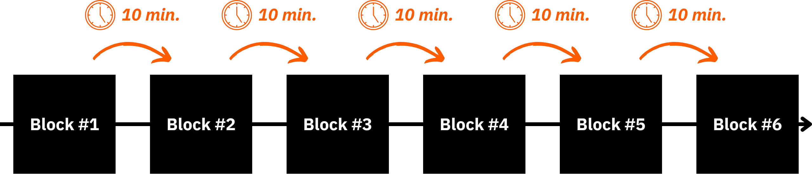


이러한 변동성은 mining의 확률적 특성에서 비롯됩니다. 각 해시는 독립적인 시도이며, 목표보다 낮은 결과를 생성할 확률은 일정합니다(목표가 변하지 않는다고 가정할 때). 따라서 채굴자가 초당 더 많은 해시를 생성할수록 유효한 블록이 나타나기까지 예상되는 지연 시간은 짧아지지만, 한 번의 추첨에서 다음 추첨까지 무작위성이 제거되지는 않습니다.


### 블록 사이 10분을 목표로 하는 이유는 무엇인가요?


이에 대한 증거는 없지만, Satoshi Nakamoto는 효율성과 보안 사이의 실질적인 절충안으로 10분을 선택한 것이 확실합니다. 간격을 더 짧게 설정하면 더 자주 확인할 수 있지만 일시적인 네트워크 분할이 더 많이 발생할 수 있습니다. 이 점을 이해하려면 블록이 전파되는 방식으로 돌아가야 합니다.


채굴자는 유효한 블록을 발견하면 즉시 동료들에게 이를 배포합니다. 이를 받은 노드는 블록의 유효성(트랜잭션, proof of work, 합의 규칙 등)을 확인한 다음 차례로 이를 전달합니다. 이 전파에는 인터넷 지연 시간, 대역폭, 각 노드의 블록 검증 능력에 따라 일정 시간이 소요됩니다.


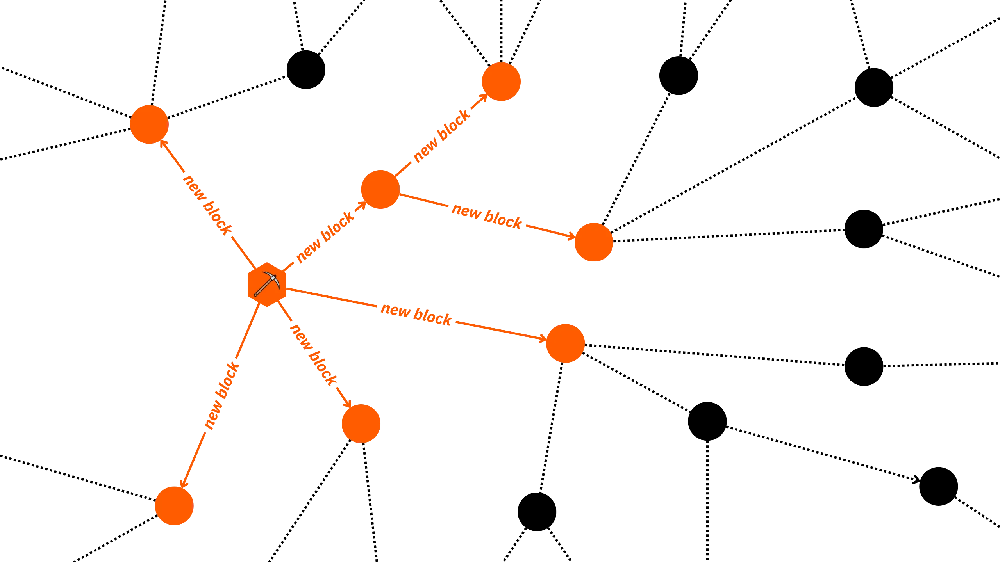


이러한 확산 지연 중에 다른 채굴자가 같은 높이에서 유효한 블록을 발견하면, 노드와 채굴자 중 한 쪽은 블록 A에 의존하고 다른 쪽은 블록 B에 의존하는 식으로 네트워크가 일시적으로 분할될 수 있습니다.


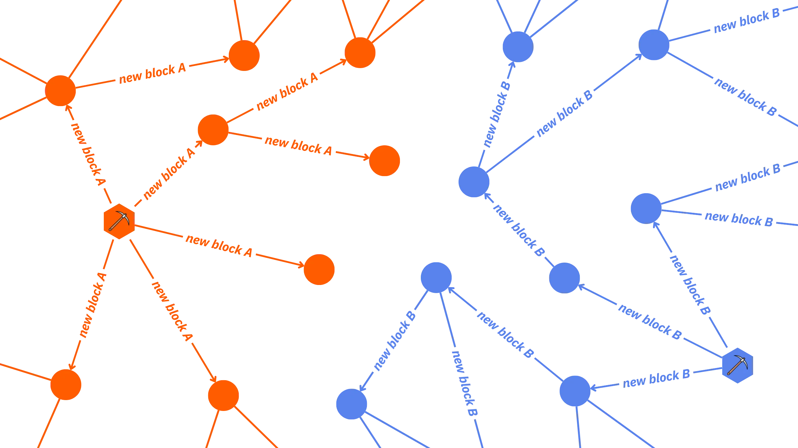


이러한 분열은 파국적이지 않습니다. 나카모토 합의는 장기적으로 가장 많은 작업을 축적하는 하나의 지점만이 우세할 것이라고 예측합니다. 예를 들어, 블록 A 위에 새로운 블록이 채굴되면 전체 네트워크는 이 브랜치에서 재동기화되고 블록 B를 버리게 되며, 이는 "*[부실 블록](https://planb.academy/resources/glossary/stale-block)*"(일상 언어로 "*고아 블록*"이라고 잘못 부르기도 함)이 됩니다.


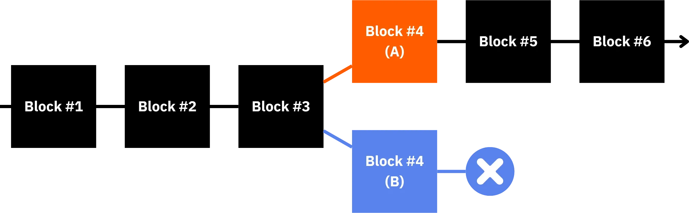


반면에 비용이 발생합니다. 몇 분 동안 채굴자 중 일부가 버려질 브랜치에서 작업합니다. 이 작업은 최종 체인에 기여하지 않았기 때문에 전체 보안의 관점에서 낭비됩니다. 각 블록 사이의 간격이 빠를수록 전파 시간이 각 블록 사이의 시간에서 더 큰 비율을 차지하기 때문에 이러한 분할이 발생할 확률이 높아집니다.


일반적으로 10분 간격은 같은 높이의 경쟁 블록이 발견되기 전에 승리한 블록이 널리 전파될 수 있는 충분한 시간을 허용합니다. 이는 분할을 제한하고 컴퓨팅 파워 낭비를 줄이며 네트워크가 글로벌 규모로 동기화 상태를 유지하는 데 도움이 되는 절충안입니다.


### hashrate 이해


*"[Hashrate](https://planb.academy/resources/glossary/hashrate)*"은 단일 채굴자, 채굴자 그룹 또는 Bitcoin의 모든 채굴자가 초당 생성하는 해시 연산량을 의미합니다. 이는 `H/s`(초당 해시 수)로 표시되며, `TH/s`(초당 테라 해시) 또는 `EH/s`(초당 엑사 해시)와 같은 배수로 표시됩니다. 이는 채굴자가 목표보다 낮은 해시를 얻기 위해 초당 시도할 수 있는 횟수를 나타냅니다.


타겟이 고정된 상태로 유지되면


- 각 시도에는 고정된 성공 확률이 있습니다;
- 초당 더 많은 시도를 하면 승리 시도가 빨리 나타날 확률이 높아집니다


즉, 내일의 Bitcoin 네트워크가 두 배의 mining 머신을 연결하여 컴퓨팅 성능을 두 배로 늘린다면, 수정 메커니즘이 없다면 블록을 평균 두 배 더 빨리 찾을 수 있습니다. 따라서 hashrate의 변화를 보정하기 위해 목표를 조정해야 합니다.


### 난이도 목표 조정하기


Bitcoin는 주기적인 목표 조정 메커니즘으로 이 문제를 해결하여 mining의 [난이도](https://planb.academy/resources/glossary/difficulty-adjustment)를 조정합니다. 원리는 다음과 같습니다: 2016블록마다(약 2주마다) 각 노드는 이 2016블록을 생성하는 데 실제로 얼마나 많은 시간이 필요했는지 관찰하여 난이도 목표를 다시 계산합니다.


이 메커니즘의 목표는 기계의 연결이 끊기거나 반대로 새로운 기계가 추가되어 네트워크의 전체 hashrate가 지속적으로 변경되는 동안 블록의 평균 생산 시간을 약 10분으로 줄이는 것입니다.


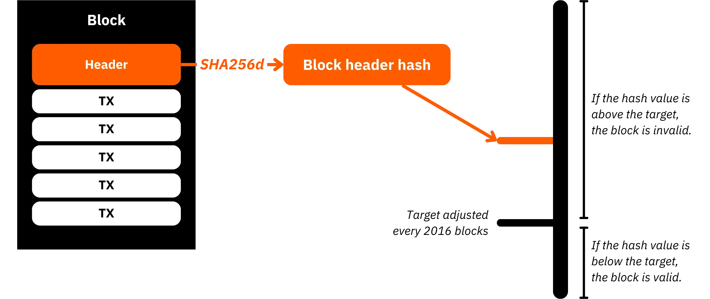


계산은 경과된 기간 동안 관찰된 시간을 기준으로 합니다:


- 지난 2016년 블록이 너무 빨리 발견되었다면, 이는 이 기간 동안 hashrate가 증가했음을 의미하며, Bitcoin은 다음 기간의 목표를 낮추어 조건을 더 어렵게 만듭니다;
- 2016년 블록이 너무 느리게 발견되었다면 이는 hashrate이 감소했음을 의미하며, Bitcoin은 목표를 증가시킴으로써 조건을 완화합니다.


공식은 다음과 같습니다:


```txt
Tn = To * (Ta / Tt)
```


With:


- tn`: 새 대상
- to`: 이전 대상
- ta`: 지난 2016년 블록의 실시간 경과 시간
- `Tt`: 목표 시간(초)


목표 시간은 2주, 즉 `Tt = 1,209,600`초입니다:


```txt
Tn = To * (Ta / 1 209 600)
```


Bitcoin mining의 난이도를 조정하는 방법을 이해하기 위해 가상의 값을 사용한 예를 들어 보겠습니다:


```txt
Tn = To * (Ta / 1 209 600)
Tn = 18 045 755 102 * (1 000 000 / 1 209 600)
Tn = 14 918 779 020
```


With:


- `**To = 18,045,755,102**`: 이전 목표, 즉 조정 전 기준값입니다.
- `**TA = 1,000,000초**`: 지난 2016년 블록을 생성하는 데 실제로 소요된 시간입니다. 이 시간이 목표 시간보다 짧으므로 네트워크가 너무 빨리 채굴되었습니다.
- 1,209,600초**`: 2016년 블록의 블록당 10분에 해당하는 목표 시간으로, 조정을 위한 기준으로 사용됩니다.
- `**tn = 14,918,779,020**`: 난이도 조정 후 새로운 목표가 계산되었습니다.


여기서 새 목표는 이전 목표보다 낮기 때문에 다음 기간에 블록 생산 속도를 늦추기 위해 mining이 더 어려워집니다.


*이 예제의 목표 값은 교육 목적으로 단순화 및 스케일링된 것이며, Bitcoin에서 사용되는 실제 목표는 완전히 다른 크기의 256비트 정수입니다*


이 계산은 블록에 입력된 타임스탬프를 기반으로 각 노드에서 로컬로 수행됩니다. 모든 노드가 동일한 규칙을 적용하므로 동일한 결과에 도달하고, 새로운 목표가 다음 2016 블록의 공통 기준이 됩니다.


이 조정에 대해 주목해야 할 중요한 세부 사항이 있습니다: **제한적이라는 점입니다. Bitcoin은 너무 갑작스러운 변화를 피하기 위해 기간별 난이도 변화를 제한합니다. 실제로 고려되는 실제 시간은 4배수(최소 이전 목표의 1/4, 최대 이전 목표의 4배)에 해당하는 범위 내에서 유지되도록 제한됩니다. 이렇게 하면 타임스탬프가 매우 비정형적이거나 조작된 경우 극단적인 리타겟팅을 방지할 수 있습니다.


### 대상 표현


블록 헤더에서 타겟은 너무 많은 공간을 차지하므로 전체 256비트 형식으로 표시되지 않습니다. 대신 32비트 `nBits` 필드는 기본 256 과학 표기법과 유사한 압축 형식인 지수(1바이트)와 계수(3바이트)로 타깃을 인코딩합니다. 그런 다음 전체 타겟은 이 두 값에서 재구성됩니다. 이 주제는 비교적 복잡하고 mining의 이해에 도움이 되지 않으므로 여기서는 자세히 설명하지 않겠습니다. 타겟은 블록 헤더에 원시 형태로 저장되지 않고 압축된 형태로 저장된다는 점만 기억하세요.


제1부의 마지막 장에서는 채굴자가 멤풀에서 트랜잭션을 선택하여 후보 블록을 생성하고, 후보 블록 헤더를 계산하여 해시를 생성하고, 결과 해시를 기간 목표와 비교한 다음, 유효한 해시를 얻을 때까지 논스를 수정하여 다시 시작하는 proof-of-work의 작동 방식을 살펴보았습니다. 마지막으로, 네트워크는 2016블록마다 새로운 목표를 다시 계산하여 hashrate의 지속적인 변화에도 불구하고 블록당 평균 약 10분의 시간을 유지합니다.


# Bitcoin mining 인센티브 시스템


<partId>27fb10c1-d53b-4dc2-90fa-3cb0309b74c1</partId>


## Block reward


<chapterId>b316fb89-9c18-417e-917b-ab98f1722646</chapterId>


상상할 수 있듯이 Bitcoin mining은 이타적인 활동이 아닙니다. Miner는 mining 컴퓨터를 작동하기 위한 전기, 특수 장비 구입, 유지보수 비용, 때로는 건물 및 냉각 시스템 등 실제 비용이 발생합니다. Bitcoin 시스템이 작동하려면 채굴자의 사적 이익이 네트워크의 집단적 이익과 일치해야 합니다. 이것이 바로 mining 보상의 역할입니다. 이는 채굴자들이 proof of work에 투자하고, 유효한 거래를 포함하며, 프로토콜을 손상시키려 하기보다는 프로토콜의 규칙을 존중하도록 장려합니다.


이 논리는 게임 이론에 기반한 것으로, 프로토콜은 정직성을 합리적으로 만듭니다. 채굴자는 노드가 승인하는 유효한 블록을 생성할 때 수익을 얻습니다. 반대로 속임수를 쓰면 노드에 의해 블록이 거부되어 아무것도 얻지 못합니다. 블록을 생성하는 데는 비용이 들기 때문에 거부된 블록은 직접적인 손실을 의미합니다. 따라서 수천 명의 플레이어가 동시에 유효한 블록을 찾는 경쟁 환경에서 가장 수익성이 높은 전략은 대부분 규칙을 엄격하게 따르고 정직하게 수익을 극대화하는 것입니다.


이를 위해 Bitcoin 프로토콜은 유효한 블록을 발견한 채굴자가 특정 트랜잭션을 포함할 권리를 획득하고, 채굴자에게 일정 금액의 BTC을 지급하도록 규정하고 있습니다. 이를 **[블록 보상](https://planb.academy/resources/glossary/block-reward)**이라고 합니다. 이 섹션의 첫 장에서는 블록 보상이 무엇으로 구성되고 어떻게 결정되는지 이해하는 것이 목표입니다. 이후에는 시간이 지남에 따라 (반감기를 통해) 화폐 생성 부분이 어떻게 진화하는지, 그리고 기술적으로 (코인베이스 트랜잭션을 통해) 실제로 어떻게 수집되는지 살펴보겠습니다.


### 블록 보상은 무엇으로 구성되나요?


이전 장에서는 마이너가 어떻게 유효한 블록을 찾는지 살펴보았습니다. 채굴자가 목표보다 작은 해시를 가진 헤더를 발견하면 후보 블록은 유효한 것으로 간주됩니다. 그러면 채굴자는 이를 전체 Bitcoin 네트워크에 배포할 수 있습니다. 이 블록은 나머지 블록체인에 추가되어 블록에 포함된 트랜잭션을 확인합니다.


이 이벤트(블록체인에 블록을 실제로 추가하는 것)가 바로 승리한 채굴자에게 보상을 지급하는 트리거가 됩니다. 이 보상은 두 가지 요소가 합산되어 구성됩니다:


- [보조금 차단](https://planb.academy/resources/glossary/block-subsidy)**;
- 거래 수수료**.


보상의 이 두 부분이 무엇에 해당하는지 살펴보겠습니다.


### 보조금 차단


블록 보조금은 보상의 금전적 생성 부분에 해당합니다. 채굴자가 유효한 블록을 생성하면 프로토콜은 특정 수의 새로운 비트코인을 생성하고 이를 보상으로 자신에게 할당할 수 있는 권한을 부여합니다. 이러한 비트코인은 무에서 유를 창조합니다. 이전에는 존재하지 않았던 것입니다.


그러나 새로 생성되는 비트코인의 양은 결코 임의적인 것이 아닙니다. 이는 Bitcoin 프로토콜 규칙에 의해 엄격하게 정의되며 모든 마이너에게 동일하게 적용됩니다. 보조금은 무한정 고정된 값이 아니라 정확한 일정에 따라 주기적으로 분할되기 때문에 다음 장에서 이 메커니즘에 대해 자세히 살펴보겠습니다. 지금은 이 점만 기억해 두시기 바랍니다:


- 블록 보조금은 블록 보상의 두 가지 구성 요소 중 하나입니다;
- 채굴자가 아닌 프로토콜에 의해 한도가 정해지고 결정됩니다(채굴자가 기술적으로 최대 금액보다 적은 금액을 요청할 수 있음에도 불구하고);
- 무에서 비트코인을 생성합니다.


이 보조금은 Bitcoin 프로토콜 내에서 두 가지 주요 역할을 합니다. 첫 번째는 플레이어가 mining에 참여하도록 장려하는 것입니다. Bitcoin 초창기(그리고 지금도 마찬가지입니다)에는 거래 수수료가 매우 낮았습니다. 따라서 보조금은 채굴자를 유치하고 시스템의 보안 수준을 유지하기에 충분한 보상을 보장했습니다.


두 번째 역할은 통화 분배와 관련이 있습니다. 모든 새로운 통화는 화폐 단위를 인구에게 공정하게 분배하는 방법에 대한 문제에 직면합니다. 블록 보조금은 이 문제에 대한 해답을 제공합니다. mining을 통해 비트코인을 생성하면 사전 승인이나 신원 확인 없이도 mining에 참여하면 누구나 비트코인을 얻을 수 있는 개방적이고 중립적인 방식으로 초기 배포가 가능합니다.


반면에 비트코인은 무에서 유를 창조하는 것이기 때문에 그 가치가 근거가 없는 것은 아닙니다. 보조금은 유통되는 화폐의 양을 늘림으로써 기존 비트코인의 가치를 기계적으로 희석시킵니다. 따라서 일종의 화폐 인플레이션이 발생하게 됩니다. 그러나 다음 장에서 이 보조금은 점차 사라질 운명이며, 인플레이션은 결국 멈출 것이라는 점을 살펴보겠습니다.


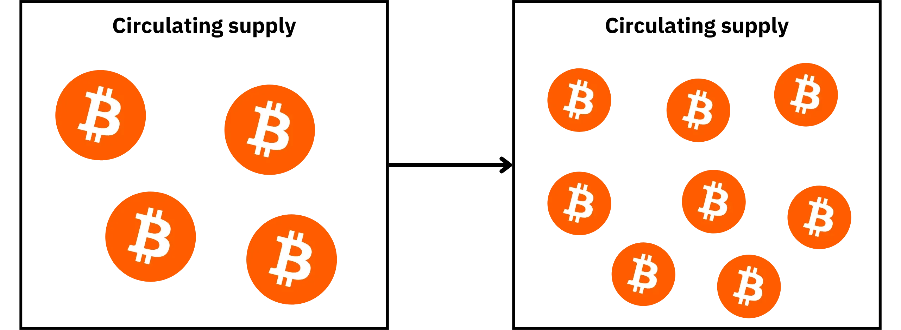


### 거래 수수료


블록 보상의 두 번째 구성 요소는 시스템 사용량과 관련이 있습니다. 사용자가 트랜잭션을 게시할 때 트랜잭션이 확인되기를 원합니다. 그러나 블록 공간은 제한되어 있으며 블록은 평균 10분 정도에 한 번씩만 나타납니다. 따라서 블록 공간은 희소성이 있는 자원입니다. 수요가 공급을 초과하면 가격이 상승하는 것이 바로 트랜잭션 수수료 시장입니다. 유효한 블록을 생성하는 각 채굴자는 자신의 계정에 대해 자신이 블록에 포함한 모든 거래와 관련된 전체 거래 수수료를 받을 권리를 얻게 됩니다.


경매 시스템이라고 생각하시면 됩니다. 각 거래는 수수료 금액을 제안하고, 채굴자는 공간 제약 조건에서 자신의 수입을 극대화하는 거래에 우선순위를 부여합니다. 이 메커니즘은 자연스럽게 이해관계를 조정합니다:


- 서두르는 사용자들은 빨리 포함되기 위해 더 많은 비용을 지불합니다;
- 채굴자는 블록 공간에 가장 높은 수수료를 지불하는 트랜잭션을 포함하도록 권장합니다.
- 트랜잭션을 게시하는 데는 비용이 들기 때문에 네트워크는 스팸을 피합니다.


#### 거래 수수료는 어떻게 계산되나요?


일반적인 생각과는 달리, Bitcoin 거래에서 수수료는 산출물이 아닙니다. 실제로 트랜잭션은 인풋을 소비하고 아웃풋을 생성합니다. 입력은 사용된 비트코인의 출처를 나타내며, 출력은 결제의 목적지를 나타냅니다. 트랜잭션 수수료는 간단히 말해 **총 입력과 총 출력의 차이**입니다.


즉, 사용자의 비트코인 입력은 사용자에게 속한 수신자를 위한 출력을 생성하지만, 입력에 의해 소비된 전체 금액을 재생산하지는 않습니다. 이 둘의 차이는 채굴자가 받을 수 있는 거래 수수료를 나타냅니다.


예를 들어 보겠습니다. 트랜잭션은 `100,000 sats`과 `150,000 sats`의 두 개의 인풋을 소비하고 `35,000 sats`, `42,000 sats`, `170,000 sats`의 세 개의 아웃풋을 생성하는 트랜잭션입니다.


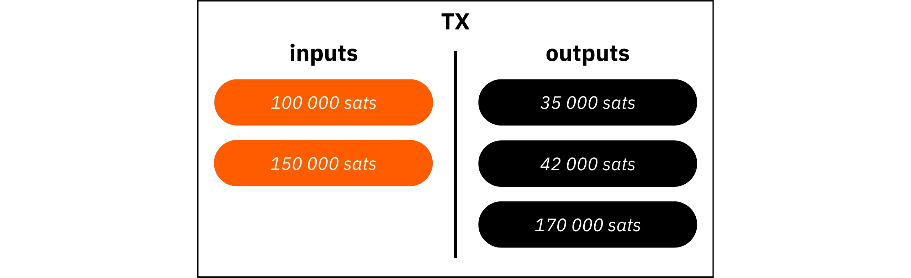


따라서 입력의 합계는 '250,000 sats'이고 출력의 합계는 '247,000 sats'입니다. 이는 `3,000 sats`가 출력으로 재창조되지 않고 입력에서 소비되었음을 의미하며, 이 금액은 이 거래에서 제안한 수수료에 해당합니다.


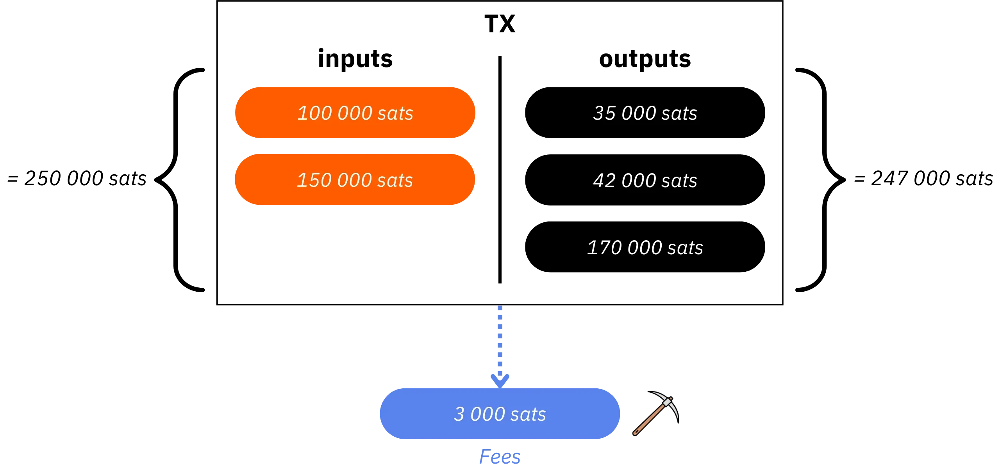


채굴자가 이 트랜잭션을 유효한 블록에 포함하면, 블록에 포함된 다른 모든 트랜잭션의 수수료에 더해 이 '3,000 sats'을 회수할 수 있습니다. 그러나 수수료를 지불하는 트랜잭션과 채굴자가 실제로 수령한 sats 사이에는 직접적인 on-chain 링크가 없습니다. 기술적으로 '3,000 sats'의 수수료는 소멸되며, 그 대가로 채굴자는 동일한 금액을 스스로 다시 생성할 권리를 얻게 됩니다.


#### 수수료 비율


블록은 트랜잭션의 수가 아니라 총 용량(오늘날에는 실제로 블록의 무게)에 의해 제한됩니다. 입력과 출력이 많은 트랜잭션은 입력이 하나이고 출력이 둘인 단순한 트랜잭션보다 더 많은 공간을 차지합니다. 사용되는 스크립트도 크기에 영향을 미칩니다.


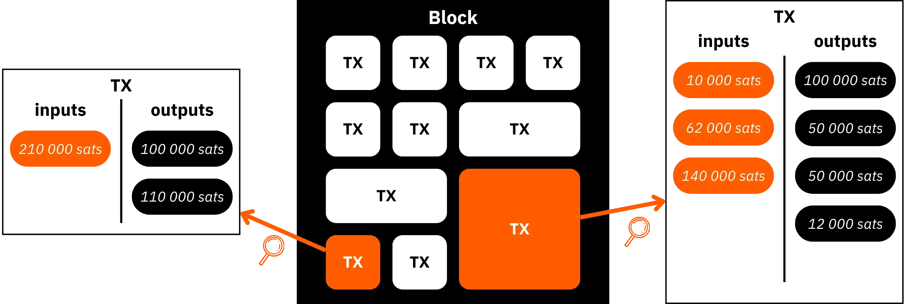


따라서 두 트랜잭션은 절대적인 수수료는 같을 수 있지만, 채굴자의 입장에서는 경제적으로 동등하지 않을 수 있습니다. 하나가 두 배 크면 블록에서 두 배의 공간이 필요하기 때문입니다. 공간은 희소하기 때문에 채굴자는 단위 공간당 수익을 극대화하려고 합니다.


그렇기 때문에 실제로는 트랜잭션의 경쟁력을 수수료 비율로 표현하는데, 보통 'sats/vB'(가상 바이트당 [satoshi](https://planb.academy/resources/glossary/satoshi-sat)초)로 표시합니다. 이 비율을 계산하는 방법은 간단합니다:


```text
fee rate = fee / weight (in vB)
```


예를 들어 무게가 `141vB`이고 수수료로 `1,974sats`가 할당된 거래가 있다면 수수료율은 `14sats/vB`가 됩니다.


```text
1 974 / 141 ≈ 14 sats/vB
```


이 비율은 채굴자의 경제적 선택을 설명합니다. 고정 용량에서 고율 거래를 포함하면 블록의 총 수수료가 최대화되고, 따라서 채굴자의 보상이 최대화됩니다. 또한 저비용 트랜잭션이 멤풀에 오랫동안 대기열에 남아 있는 이유도 설명할 수 있는데, 이는 단위 공간당 더 많은 수수료를 지불하는 다른 트랜잭션과 경쟁하기 때문입니다.


### 스팸으로부터 네트워크 보호


수수료는 트랜잭션의 증가에 따른 비용을 도입하는 운영상의 보안 목적도 있습니다. 트랜잭션 게시가 무료라면 쓸모없는 트랜잭션이 네트워크에 넘쳐나 멤풀을 포화시켜 노드의 부하를 증가시키기 쉬울 것입니다.


실제로 노드는 로컬 릴레이 정책(멤풀 규칙)을 적용하며, 트랜잭션을 릴레이하지 않는 최소 수수료 임계값을 설정하는 경우가 많습니다(기본적으로 Bitcoin 코어의 경우 `minRelayTxFee`를 통해 `0.1 sat/vB`). 트랜잭션이 합의 규칙의 엄격한 의미에서는 유효할 수 있지만 수수료가 너무 낮으면 대부분의 노드에서 릴레이되지 않습니다. 결과적으로 트랜잭션은 유통되지 않고 채굴자에게 도달하지 않으며 확인될 가능성이 거의 없습니다.


이 시점에서 블록 보상의 요점을 이해하셨을 것입니다. 블록 보상은 승리한 채굴자에 대한 보상에 해당하며, 두 가지 요소로 구성됩니다. 한편으로는 프로토콜 규칙에 의해 정의된 블록 보조금으로, 새로운 비트코인을 무상으로 생성합니다. 다른 한편으로는 채굴된 블록에 포함된 트랜잭션의 수수료입니다.


다음 장에서는 블록 보조금에 대해 더 자세히 살펴보고, 블록 보조금이 어떻게 계산되는지, 그리고 Bitcoin 프로토콜의 규칙에 따라 시간이 지남에 따라 어떻게 진화하는지를 정확히 이해해 보겠습니다.


## Halving


<chapterId>7cdca211-7300-48f8-a1e4-53e5c2678cd8</chapterId>


이전 장에서는 유효한 블록을 생성한 마이너는 블록에 포함된 트랜잭션에 대한 수수료와 블록 보조금으로 구성된 보상을 받는다는 것을 살펴보았습니다. 그러나 이 보조금이 어떻게 결정되는지는 아직 설명하지 않았습니다. 이 값을 설정하고 발전시키는 메커니즘을 ***[반감기](https://planb.academy/resources/glossary/halving)***라고 합니다.


### 반감기란 무엇인가요?


Halving는 블록 보조금, 즉 승리한 채굴자가 각 블록에서 생성할 수 있는 최대 신규 비트코인의 양을 절반으로 줄이는 Bitcoin 프로토콜에 프로그래밍된 이벤트입니다. 거래 수수료에는 영향을 미치지 않으며 수수료는 독립적으로 존재하며 사용자 활동과 블록 공간에 대한 경쟁에 따라 결정됩니다.


2009년 Bitcoin가 출시되었을 때, 블록 보조금은 채굴된 블록당 50 BTC으로 설정되었습니다. 그 이후로 이 보조금은 매 반감기마다 여러 차례 절반으로 줄었습니다.


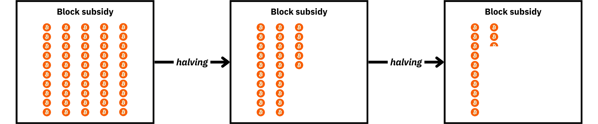


Halving은 날짜가 아니라 블록 높이에 따라 트리거됩니다. 21만 블록마다 **실행됩니다**. Bitcoin은 블록당 평균 약 10분의 간격을 목표로 하므로, 21만 블록은 약 4년에 해당합니다.


```cpp
CAmount GetBlockSubsidy(int nHeight, const Consensus::Params& consensusParams)
{
int halvings = nHeight / consensusParams.nSubsidyHalvingInterval;
// Force block reward to zero when right shift is undefined.
if (halvings >= 64)
return 0;

CAmount nSubsidy = 50 * COIN;
// Subsidy is cut in half every 210,000 blocks which will occur approximately every 4 years.
nSubsidy >>= halvings;
return nSubsidy;
}
```


따라서 이미 발생한 반감기 수를 'n'으로 표시하면 BTC의 블록 보조금은 다음과 같이 계산할 수 있습니다:


```text
subsidy(n) = 50 / 2^n
```


### 과거 반감기


다음은 이미 발생한 반감기에 대한 요약 표이며, 해당 블록 높이, 날짜, 이벤트 이후 적용되는 새로운 블록 보조금이 포함되어 있습니다:


| Event               |   Height  | Date                        | Subsidy    |
| ------------------- | --------: | --------------------------- | ---------: |
| Halving 1           |   210 000 | 28 novembre 2012            |     25 BTC |
| Halving 2           |   420 000 | 9 july 2016                 |   12,5 BTC |
| Halving 3           |   630 000 | 11 may 2020                 |   6,25 BTC |
| Halving 4           |   840 000 | 20 april 2024               |  3,125 BTC |
| Halving 5 (upcoming) | 1 050 000 | Spring   2028 (estimation) | 1,5625 BTC |

### 보조금은 언제 어떻게 종료되나요?


보조금을 시스템의 최소 단위로 표현할 수 있는 한 Halving이 반복됩니다: satoshi.


```text
1 BTC = 100 000 000 sats
```


보조금이 절반으로 줄어들면 결국 1비트코인이 1satoshi보다 작아지는 지점에 도달하게 됩니다. 이 시점에서는 더 이상 satoshi의 절반 단위를 생성할 수 없습니다. 블록 보조금을 통한 화폐 창출은 중단되고 채굴자는 거래 수수료로만 보상을 받게 됩니다. 이 시점부터 모든 비트코인이 유통되며 더 이상 새로운 비트코인을 생산할 수 없게 됩니다.


블록 보조금의 최종 종료 시점은 블록 레벨 6,930,000, 즉 33번째이자 마지막 반감기가 될 것입니다. 이 이벤트는 2140년경에 진행될 것으로 예상되지만, 정확한 날짜는 지금부터 그때까지 블록이 발견되는 실제 속도에 따라 달라질 수 있기 때문에 정확한 날짜를 제시할 수는 없습니다.


블록 보조금은 매 반감기마다 1/2의 비율로 기하학적 순서를 따르기 때문에, Bitcoin의 초기에는 화폐 생성량이 매우 높았다가 매우 빠르게 감소합니다. 7번째 반감기가 되면 99% 이상의 비트코인이 이미 유통될 것입니다. 99% 임계값은 2032년에서 2036년 사이에 넘을 것으로 예상됩니다. 이는 마지막 남은 1%의 비트코인을 채굴하는 데 100년이 넘게 걸린다는 뜻입니다. Bitcoin이 출시될 당시에는 화폐 인플레이션이 매우 높았지만, 지금은 매우 낮아져 더 이상 유통 공급을 늘릴 수 없는 진정한 경화 수준에 도달할 때까지 계속 하락할 것입니다.


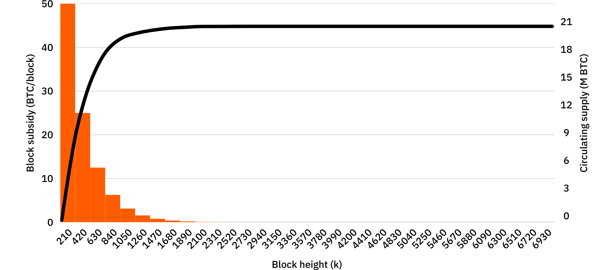


### 왜 2,100만 개의 BTC가 존재하지 않을까요?


Bitcoin의 최대 통화 공급량은 종종 2100만 BTC으로 표시됩니다. 이는 통화 정책을 이해하기에 좋은 근사치이지만, 엄밀한 기술적 관점에서 볼 때 총 공급량은 실제로 정확히 21,000,000비트코인에 도달하지 않을 것입니다.


주된 이유는 기계적인 이유입니다. 연속적인 반감기를 통해 블록 보조금은 결국 정확한 이론적 총계에 도달하기 전에 발행을 종료하는 최소값인 1 sat 아래로 떨어집니다. 이러한 최소 단위와 반올림 규칙으로 인해 보조금으로 생성된 총 비트코인의 수는 2,100만 개에 약간 못 미칩니다.


또한, 프로토콜과 관련된 한계 편차도 이러한 문제를 가중시킬 수 있습니다. 예를 들어, 드물지만 일부 채굴자가 전체 보조금을 청구하지 않아 실제로 발행되는 비트코인의 양이 결정적으로 감소할 수 있습니다. 또한 2009년 1월 3일 Satoshi에 의해 생성된 [제네시스 블록](https://planb.academy/resources/glossary/genesis-block)에서 생성된 비트코인은 [UTXO set](https://planb.academy/resources/glossary/utxo-set)의 일부가 아니며, 중복된 코인베이스 거래 식별자와 같은 버그와 관련된 특정 역사적 사건도 언급할 수 있습니다.


마지막으로, 소멸되거나 차단된 모든 비트코인을 고려해야 합니다:


- 풀 수 없는 스크립트에 갇힌 비트코인이 있습니다;
- gW-219` 스크립트에 의해 고의적으로 파괴된 것들입니다;
- 또는 애플리케이션 수준에서 개인 키를 분실했습니다.


따라서 이론적으로 Bitcoin의 공급량은 2100만 개로 제한됩니다. 그러나 실제로는 2,100만 비트코인이 실제로 유통되는 일은 없을 것입니다.


## 코인베이스 거래


<chapterId>69476700-3616-4aab-b006-367aba059de9</chapterId>


이전 장에서 두 가지 중요한 점을 설명했습니다. 첫째, 유효한 블록을 생성하고 배포하는 데 성공한 마이너는 보상을 받습니다. 한편, 이 보상은 두 가지 요소로 구성된다는 것을 확인했습니다:


- 블록 보조금(프로토콜에 의해 최대 금액이 설정되고 반감기를 통해 점진적으로 감소하는 무에서 생성된 비트코인);
- 트랜잭션이 블록에 포함된 사용자가 지불한 모든 트랜잭션 수수료입니다.


하지만 한 가지 의문이 남습니다. 채굴자는 어떤 메커니즘을 통해 Bitcoin에서 이 보상을 받을 수 있을까요? 이것이 바로 "코인베이스"라고 불리는 특정 트랜잭션의 역할입니다.


### 코인베이스 트랜잭션의 작동 방식


강좌의 첫 번째 부분에서 살펴본 것처럼, 각 Bitcoin 블록에는 확인해야 할 보류 중인 트랜잭션 목록이 포함되어 있습니다. 이 중 첫 번째는 항상 [코인베이스 트랜잭션](https://planb.academy/resources/glossary/coinbase-transaction)입니다. 이것이 바로 승리한 채굴자가 보상을 받을 수 있게 해주는 것입니다.


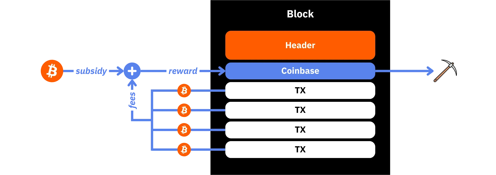


언뜻 보기에는 [TXID](https://planb.academy/resources/glossary/txid-transaction-identifier)와 출력을 가지고 있으며 블록의 머클 트리에 포함되는 등 전형적인 Bitcoin 트랜잭션처럼 보입니다. 그러나 한 가지 중요한 점에서 다릅니다. 기존 UTXO를 사용하지 않는다는 점입니다.


기존 Bitcoin 트랜잭션에서 '입력'은 입력값을 제공하는 이전의 미사용 출력(UTXO)을 참조합니다. 그런 다음 출력은 새로운 지출 조건으로 이 값을 새로운 UTXO에 재분배합니다. 즉, 비트코인을 보내려면 이미 비트코인을 소유하고 있어야 합니다. 반면에 코인베이스 트랜잭션은 입력에서 비트코인을 소비하지 않고 처음부터 직접 출력에서 비트코인을 생성합니다.


블록 보조금을 통해 새로운 비트코인이 유통될 수 있게 하고, 블록에 포함된 거래와 관련된 수수료를 채굴자에게 지급하는 것이 바로 이 메커니즘입니다. 코인베이스 거래는 가치의 일부(보조금)를 생성하고 이전 거래에서 받지 않고 다른 일부(수수료)를 회수하는 역할을 하기 때문에 실제 존재하는 UTXO을 참조할 수 없습니다(실제로는 가상의 UTXO을 참조함). 전체 시스템이 일관성을 유지하려면 수수료에 해당하는 부분이 입력에서 소비되었지만 블록의 다른 거래에서 출력으로 다시 생성되지 않은 비트코인의 합계와 정확히 같아야 합니다.


이 트랜잭션은 선택 사항이 아닙니다. 코인베이스 트랜잭션이 포함되지 않은 블록은 유효하지 않으며 네트워크 노드에 의해 체계적으로 거부됩니다.


⚠️ 참고: "*coinbase*"라는 용어는 같은 이름의 거래소 플랫폼과 관련이 없습니다. Bitcoin에서 "*코인베이스*"는 역사적으로 블록 보상을 생성하는 트랜잭션을 의미합니다. 회사는 단순히 회사 이름에 이 용어를 채택했을 뿐입니다.


코인베이스 트랜잭션은 실제로 여러 역할을 동시에 수행합니다:


- 첫 번째는 방금 설명한 것과 같이 채굴자에게 유효한 블록을 생성한 것에 대한 보상을 할당하는 것입니다.
- 두 번째, 보다 기술적인 역할은 블록에 포함된 SegWit 트랜잭션의 증인(서명)에 암호학적 약속을 고정하는 것입니다.
- 세 번째 역할은 이번에는 프로토콜과 직접 관련이 없지만 mining의 현대 산업화와 관련된 것으로, 코인베이스가 이제 임의의 기술 데이터를 고정하는 데 자주 사용된다는 것입니다. 이 데이터는 일반적으로 mining 풀의 운영 및 내부 조직과 연결됩니다.


이러한 다양한 용도에 대한 이해를 돕기 위해 이제 코인베이스 트랜잭션의 구조를 자세히 살펴보겠습니다.


### 코인베이스 트랜잭션의 기본 구조


코인베이스 트랜잭션은 정확히 하나의 입력을 포함해야 합니다. 간단하게 설명하기 위해 입력이 없다고 말하기도 하는데, 이는 이 입력이 실제 UTXO을 사용하지 않기 때문입니다. 실제로는 참조 소스가 있는 입력이 있지만, 의도적으로 존재하지 않는 UTXO을 가리키고 있습니다.


이미 살펴본 바와 같이 모든 Bitcoin 트랜잭션은 유효한 출력을 생성하기 위해 UTXO을 입력으로 소비해야 합니다. Bitcoin 트랜잭션에서 이 소비는 기존 UTXO을 입력으로 참조하는 형태를 취합니다. 이 참조는 이전 트랜잭션(UTXO이 생성된 트랜잭션)의 식별자와 이 트랜잭션의 출력 중 해당 인덱스를 표시하는 것으로 간단히 이루어집니다. 구체적으로 말하자면, UTXO은 해시(이전 TXID)와 인덱스로 정의됩니다.


그러나 코인베이스 트랜잭션의 경우, 실제 존재하는 UTXO를 참조하는 대신 입력값이 반드시 이 특정 가짜 UTXO를 가리켜야 하며, 실제 TXID와 일치하지 않는 0으로 가득 찬 TXID를 사용해야 합니다:


```text
0000000000000000000000000000000000000000000000000000000000000000
```


바로 뒤에 잘못된 인덱스가 나옵니다:


```text
0xffffffff
```


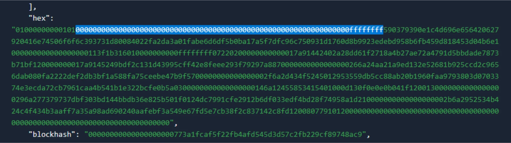


Satoshi Nakamoto에 설명된 대로 기본 Bitcoin 프로토콜에서는 이 잘못된 입력이 코인베이스 트랜잭션에 부과되는 유일한 제약 조건입니다.


트랜잭션의 입력에서 참조된 다른 UTXO과 마찬가지로 `scriptSig` 필드와 연결됩니다. 기존 트랜잭션에서 이 `scriptSig` 필드에는 `scriptPubKey`를 충족하여 사용된 UTXO의 잠금을 해제하는 데 필요한 요소가 포함되어 있습니다. 그러나 코인베이스의 경우 참조된 UTXO이 의도적으로 가상이므로 `scriptSig` 필드는 완전히 무료입니다. 따라서 Miner은 원하는 모든 데이터를 입력할 수 있습니다. 이 자유도가 어떻게 사용되는지 나중에 살펴보겠습니다.


이 잘못된 입력 외에도 채굴자가 Bitcoin 주소 중 하나에서 보상으로 비트코인을 수령할 수 있는 하나 이상의 완벽한 표준 출력이 있습니다. 이러한 출력은 '스크립트Pub키'(예: 채굴자 또는 풀이 제어하는 주소를 가리키는 스크립트)로 잠긴 UTXO입니다. 여기서 유일한 특이한 점은 코인베이스 출력의 총합이 블록 수수료가 추가된 최대 허용 보조금을 초과해서는 안 된다는 가치 계산 규칙에 있습니다.


역사적으로 코인베이스 트랜잭션은 존재하지 않는 UTXO를 참조하는 가짜 입력과 승리한 채굴자에게 블록 보상을 분배하도록 설계된 하나 이상의 출력이라는 간단한 체계로 요약됩니다. 그러나 오늘날 코인베이스는 더 이상 이러한 분배 역할에만 국한되지 않습니다. 블록에서 코인베이스의 특별한 위치와 구조의 뛰어난 유연성으로 인해 프로토콜 자체와 mining 풀 관리 메커니즘 모두에서 새로운 용도로 사용되었습니다.


### 기타 코인베이스 용도


시간이 지남에 따라 코인베이스 트랜잭션은 mining과 블록 구조 자체에 유용한 다양한 정보를 통합하는 데 특히 편리한 삽입 지점이 되었습니다. 전반적인 코인베이스 조직을 더 잘 이해하기 위해 이를 살펴보도록 하겠습니다.


#### BIP-34


[BIP-34](https://planb.academy/resources/glossary/bip0034)는 2013년 3월에 배포된 fork 소프트이며, 227,930 블록부터 시작하여 Bitcoin 블록의 버전 2를 도입했습니다. 이 새 버전에서는 각 블록이 코인베이스 트랜잭션의 '스크립트 서명'에 생성되는 블록의 높이를 포함해야 합니다.


한편으로, 이러한 진화는 네트워크가 블록 구조와 합의 규칙을 발전시키는 데 동의하는 방식을 명확히 합니다. 둘째, 각 블록과 코인베이스 트랜잭션의 고유성을 보장합니다.


따라서 코인베이스의 '스크립트 서명'은 완전히 자유롭지 않습니다. BIP-34의 활성화 이후, 이 코인베이스 트랜잭션이 포함된 블록의 높이부터 시작하도록 제한되어 있습니다.


#### 엑스트라 논스


이 과정의 첫 장에서 살펴본 것처럼, 마이너는 블록 헤더에 32비트 논스 필드를 가지고 있으며, 시행착오를 통해 목표보다 작거나 같은 해시를 찾기 위해 수정합니다. 이 32비트 공간은 이미 매우 많은 수의 조합을 탐색할 수 있지만, mining 난이도가 높으면 이 범위가 비교적 짧은 시간에 완전히 소진될 수 있으므로 유효한 해시를 생성하는 조합이 나오지 않을 수 있습니다. 만약 `nonce`의 모든 가능한 값을 성공적으로 테스트하지 못했다면, 채굴자는 다른 요소를 수정하여 블록 헤더를 변경하고 새로운 일련의 시도를 시작해야 합니다.


코인베이스 트랜잭션은 입력의 `스크립트시그`를 통해 자유 필드를 제공하므로, 논스의 공간을 확장하는 데 사용되는 솔루션은 이 `스크립트시그`의 일부를 활용하는 것입니다. 이를 일반적으로 엑스트라 논스라고 합니다. 채굴자는 여분의 논스를 수정함으로써 코인베이스의 `스크립트 서명`, 즉 트랜잭션 식별자를 수정한 다음, 블록의 머클 루트를 수정하고, 마지막으로 블록 헤더 자체를 수정합니다. 이러한 방식으로 후보 블록의 다른 구성 요소를 수정할 필요 없이 탐색할 해시의 새로운 검색 공간을 얻게 됩니다.


#### 풀과 채굴자 식별


오늘날 전 세계 hashrate의 매우 많은 부분이 mining 풀로 구성되어 있습니다. 이러한 구조는 개별 채굴자들을 한데 모아 작업을 결합하고 수입의 편차를 줄입니다.


운영상의 이유로 mining 풀은 코인베이스 입력의 '스크립트시그'의 자유 필드를 활용하여 다양한 정보를 삽입하기도 합니다. 이는 풀마다, 네트워크 프로토콜마다 다르지만 일반적으로 풀 내에서 작업 중복을 피하기 위해 각 채굴자에게 할당된 고유 식별자(종종 여러 하위 부분으로 구성된 추가 논스)가 포함됩니다. 일반적으로 풀 식별 태그가 추가되며, 발견된 블록의 공개 속성, mining 통계 및 기타 추적 목적으로 사용됩니다.


#### SegWit의 약속


2017년에 소프트 fork이 활성화된 이후, 특히 Bitcoin 트랜잭션의 [가변성 문제](https://planb.academy/resources/glossary/malleability-transaction)를 해결하기 위해 트랜잭션 마스터 데이터에서 증인 데이터(일반적으로 서명)가 분리되었습니다. 따라서 이러한 분리는 블록에 커밋할 새로운 요소를 도입합니다.


이를 위해 증인은 다른 전용 머클 트리에서 함께 그룹화되며, 루트는 `OP_RETURN` 출력을 통해 코인베이스 트랜잭션에 커밋됩니다.


이 글의 범위를 벗어나기 때문에 이 메커니즘에 대해 더 자세히 설명하지는 않겠지만, SegWit이 도입된 이후 코인베이스 트랜잭션은 모든 SegWit 증인을 요약하는 지문을 블록에 고정하는 수단으로 사용되었다는 점만 기억해두시기 바랍니다. 증인은 독립적인 머클 트리에 배치되고, 이 트리의 루트는 코인베이스 트랜잭션의 출력에 기록되며, 이 코인베이스 트랜잭션은 블록 헤더에 루트가 나타나는 다른 모든 트랜잭션과 함께 메인 머클 트리에 포함됩니다. 이렇게 메인 트랜잭션 데이터와 별도로 저장된 증인이 여전히 블록 헤더에 커밋되는 방식입니다.


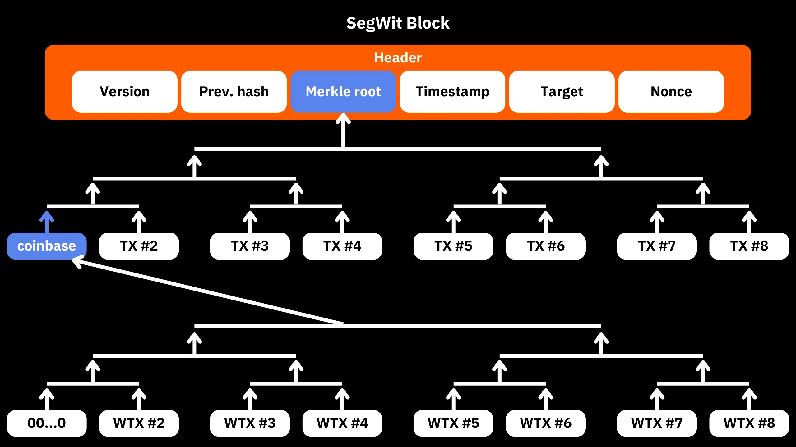


#### 임의의 메시지


스크립트시그는 채굴자가 선택한 임의의 정보를 자유롭게 삽입할 수 있기 때문에, 일부는 기술적인 메시지보다는 개인적인 메시지를 추가하는 기회를 이용하기도 했습니다. 가장 유명한 사례는 물론 지금은 상징적인 메시지가 된 Satoshi Nakamoto입니다:


> The Times 03/01/2009 은행에 대한 두 번째 구제금융 위기에 처한 영국 총리

Genesis 블록(Bitcoin의 첫 번째 블록)에 있는 이 메시지는 실제로 코인베이스 트랜잭션의 '스크립트시그'에 16진수로 인코딩되어 있습니다:


```text
5468652054696d65732030332f4a616e2f32303039204368616e63656c6c6f72206f6e206272696e6b206f66207365636f6e64206261696c6f757420666f722062616e6b73
```


### 만기 기간


블록이 채굴되고 배포되면 코인베이스 거래는 다른 거래와 마찬가지로 블록체인에 나타납니다. 이 거래는 승리한 채굴자에게 UTXO를 생성하여 보상을 수령할 수 있게 합니다. 그러나 이 UTXO는 즉시 사용할 수 있는 것이 아니라 [만기 기간](https://planb.academy/resources/glossary/maturity-period)이 적용됩니다. 이 만기는 코인베이스가 포함된 블록 이후 100블록으로 설정됩니다. 따라서 코인베이스 트랜잭션은 총 101개의 확인을 받아야만 승리한 채굴자가 산출물을 사용할 수 있게 됩니다.


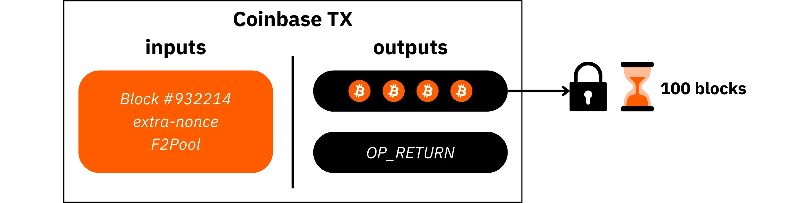


이 규칙의 목적은 체인 재편이 경제에 미치는 영향을 제한하는 것입니다. 이전 장에서 살펴본 것처럼, 동일한 높이에서 서로 다른 마이너가 두 개의 유효한 블록을 거의 동시에 발견하는 경우가 발생할 수 있습니다. 잠시 동안 네트워크가 분할될 수 있는데, 일부 노드는 블록 A를 먼저 수신하고 다른 노드는 블록 B를 먼저 보게 됩니다. 그런 다음 후속 블록이 생성되는 동안 두 지점 중 하나가 더 많은 작업을 축적하여 기준 지점이 됩니다. 다른 브랜치는 버려지고 해당 블록은 쓸모없게 됩니다. 그러면 이론적으로 해당 브랜치에 포함된 트랜잭션은 멤풀로 돌아가 확인을 기다릴 수 있습니다.


수수료 시장에서는 거의 동일한 거래가 두 개의 경쟁 블록에 같은 높이로 나타나는 경우가 많기 때문에 실제로는 이런 일이 거의 발생하지 않습니다. 이것이 6번의 확인을 거치면 Bitcoin 트랜잭션이 불변으로 간주되는 이유 중 하나입니다. 6번 이상의 블록을 재구성할 가능성이 매우 낮기 때문에 불가능하다고 간주할 수 있습니다.


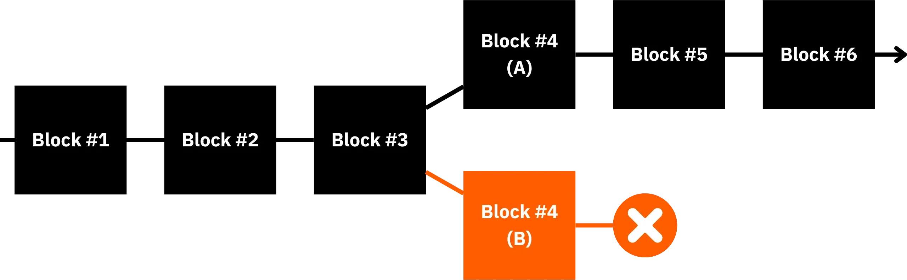


코인베이스 거래의 경우 이러한 개편의 문제점은 일반적인 거래가 아니라는 것입니다. 이는 새로운 비트코인을 유통에 도입하는 것입니다. 블록 보상을 즉시 사용할 수 있다면 문제가 되는 캐스케이드 상황이 발생할 수 있습니다:


- 채굴자는 코인베이스에서 비트코인을 사용합니다,
- 이 비트코인은 경제에서 유통됩니다,
- 이후 개편 과정에서 원래 블록이 최종적으로 폐기되었습니다.


그러면 유통 중인 비트코인은 최종 체인에 존재하지 않았을 것이고, 발행 당시에는 유효했던 일련의 거래는 사후적으로 무효가 될 것입니다.


만기 기간은 이 시나리오를 비현실적으로 만들 정도로 긴 기간을 부과합니다. 101개 블록의 재편은 실제로는 불가능한 것으로 간주됩니다(무한한 확률이 남아 있더라도). Satoshi가 왜 이렇게 높은 만기 값을 선택했는지는 정확히 알 수 없지만, 네트워크에 중대한 오작동이 발생하더라도 메커니즘이 계속 작동할 수 있도록 선택했을 가능성이 높습니다.


이 규칙은 새로 생성된 블록 보상금이 대량의 누적 작업량 아래에 안전하게 묻힌 블록보다 먼저 유통되기 시작하는 것을 방지합니다.


---

이제 Bitcoin mining의 작동 방식에 대한 설명이 끝났습니다. 이제 기본 메커니즘에 대해 명확하게 이해하셨을 것입니다.


이 강좌의 마지막 부분에서는 보다 구체적인 측면으로 돌아가 Bitcoin mining가 실제 세계에서 어떻게 실현되는지, 즉 산업화, 사용되는 기계, 플레이어 그룹화 등을 보여드리겠습니다. 목표는 방금 살펴본 이론적 및 프로토콜 측면과 실제 및 운영 측면 모두에서 Bitcoin mining에 대한 전반적인 관점을 제공하는 것입니다.


# Bitcoin mining 산업


<partId>906a6e18-4718-4a1f-85f5-18854cebdf7c</partId>


## mining 머신의 진화


<chapterId>2d2f9055-75fd-4630-b493-a577d708a39f</chapterId>


Bitcoin 초기에 mining는 산업적 활동이 아니었습니다. Bitcoin 소프트웨어의 일부로 개인용 컴퓨터에서 시작되었으며, 때로는 호기심에서, 때로는 네트워크를 지원하기 위해, 때로는 당시 시장 가치가 거의 없던 비트코인을 얻기 위해 사용되었습니다.


수년에 걸쳐 이 활동은 기계가 바뀌고 난이도가 폭발적으로 증가했으며 mining은 그 자체로 하나의 산업으로 자리 잡는 등 변화를 겪었습니다. Bitcoin mining의 운영 측면을 살펴 보겠습니다.


### 시작하기: CPU가 포함된 mining


2009년과 초기에 mining은 주로 기존 컴퓨터의 CPU를 사용하여 수행되었습니다. 당시 Bitcoin는 wallet, 노드, 채굴기 역할을 하는 단순한 소프트웨어에 불과했습니다. 개인 컴퓨터에서 Satoshi Nakamoto의 소프트웨어를 실행하는 것만으로도 mining 프로세스에 참여할 수 있었고, 많은 경우 블록을 찾을 수 있었습니다.


CPU는 모든 것을 할 수 있지만 모든 것에 최적화되어 있지는 않습니다. 복잡한 로직으로 매우 일반적인 명령을 실행합니다. 블록 헤더의 반복적인 해싱과 같은 작업에는 이상적인 도구는 아니지만, 네트워크 시작 시에는 난이도가 매우 낮아 블록을 찾는 데 충분합니다.


이 기간은 중요한 점을 상기시켜주기 때문에 중요합니다: proof of work는 특정 범주의 장비에 의존하지 않습니다. 중요한 것은 주어진 비용으로 다른 장비보다 더 빠르게 해시를 계산할 수 있는 능력입니다. 기술적 이점이 나타나자마자 자동으로 경제적 이점으로 전환됩니다. 그러나 절대적인 측면에서 볼 때, 오늘날에도 기존 CPU를 사용하여 Bitcoin 블록을 찾는 것은 여전히 가능합니다. 예를 들어 NerdMiner 프로젝트에서 채택한 접근 방식입니다. 블록을 찾을 확률은 사실상 제로에 가깝지만, 여전히 무한히 작은 확률은 존재합니다.


https://planb.academy/tutorials/mining/hardware/nerdminer-c9826fd9-c2b4-4d1e-8c78-809122de1654

### GPU로 전환


얼마 지나지 않아 채굴자들은 병목 현상이 전력이 아니라 수많은 유사한 작업을 병렬로 수행하는 능력에 있다는 사실을 깨달았습니다. 이것이 바로 그래픽 처리 장치(GPU)가 할 수 있는 일이었습니다. 원래 GPU는 대량의 데이터에 대해 동일한 연산을 수행하도록 설계되었습니다. 이 아키텍처는 반복적인 해싱과 같은 작업에 완벽하게 적합했습니다. 다재다능한 몇 개의 코어 대신 동일한 명령을 동시에 실행할 수 있는 수백, 수천 개의 유닛이 있기 때문입니다.


비슷한 전력 소비로 GPU는 CPU보다 초당 훨씬 더 많은 해시를 생성할 수 있습니다. 동시에 비트코인은 달러 대비 환율이 상승하고 그 가치가 상승했으며 거래소 플랫폼이 등장했습니다. 그때부터 mining의 성격이 바뀌기 시작했습니다. 더 이상 단순한 참여가 아니라 돈을 벌기 위한 것이었습니다. 여러 개의 그래픽 카드를 중심으로 구축된, 때로는 화면이 없는, 최소한의 시스템과 특수 소프트웨어를 갖춘, 오직 채굴만을 목적으로 하는 전용 구성이 등장했습니다.


이 시점에서 mining의 난이도가 폭발적으로 증가하기 시작했습니다. 2010년 중반에서 2011년 중반 사이에는 난이도가 1,000배나 증가하기도 했습니다. 기계적으로는 초기 산업화 형태와 마찬가지로 전문화가 시작되었고, 개인용 컴퓨터에서 Bitcoin 소프트웨어를 실행하는 데 만족하는 일반 사용자는 이제 유효한 블록을 찾을 확률이 매우 낮아졌습니다.


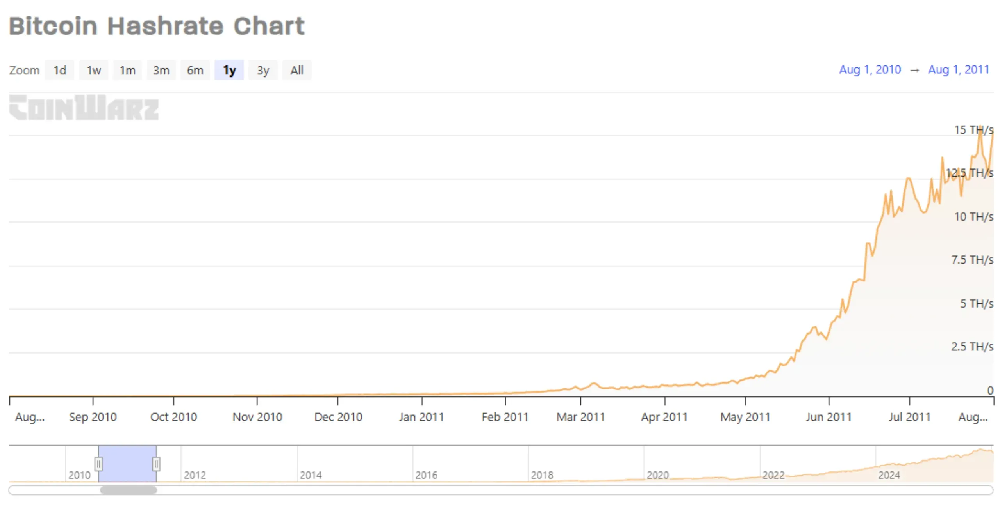


*출처: [CoinWarz.com](https://www.coinwarz.com/mining/bitcoin/hashrate-chart)*


GPU 시대와 현대의 [ASIC](https://planb.academy/resources/glossary/asic) 시대 사이에는 중간 단계인 FPGA의 사용이 있었습니다. FPGA는 재프로그래밍이 가능한 구성 요소로, 특정 계산 전용 논리 회로(이 경우 'SHA256d')를 직접 구현하도록 구성할 수 있습니다. 이 아이디어는 에너지 효율성을 높이기 위해 범용 하드웨어(CPU/GPU)에서 더 멀리 이동하는 것이었습니다. 그러나 곧 FPGA에서 가상으로 이루어진 개선 사항이 칩 자체에 물리적으로 적용될 예정이었는데, 이것이 바로 ASIC의 등장입니다.


### ASIC의 출시


mining 하드웨어 전문화의 마지막 단계는 ASIC(*응용 분야별 집적 회로*)의 등장이었습니다. ASIC은 단일 작업을 위해 설계된 칩입니다. Bitcoin mining의 경우, 이 작업은 바로 'SHA256d'를 최대 속도로 최적의 에너지 효율로 실행하는 것입니다. GPU와 달리 ASIC은 게임, 3D 렌더링 또는 AI를 실행하는 데 사용되지 않습니다. 해싱을 위한 것뿐입니다.


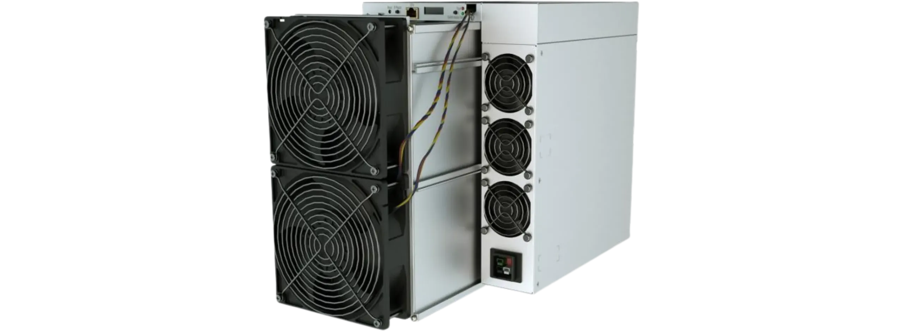


*Bitmain*에서 제조한 ASIC S21 XP


이러한 전문화에는 크게 두 가지 결과가 있습니다:


- 첫 번째는 성능과 효율성의 비약적인 향상입니다. 비슷한 세대의 장치에서 ASIC는 GPU보다 훨씬 더 많은 초당 해시를 생성하는 동시에 전력 소비는 더 적습니다. GPU가 장착된 Mining은 기술적으로는 작동했지만 대부분의 상황에서 전기료가 예상 수익보다 훨씬 더 많이 들기 때문에 빠르게 경쟁력이 떨어졌습니다;
- 두 번째는 모델의 변화로, 투자가 주로 산업용 하드웨어로 전환되었습니다. 이제 Mining은 이러한 목적으로 설계된 기계를 구입하고, 지속적으로 전력을 공급하고, 냉각하고, 유지보수하고, 노후화를 흡수하는 과정을 포함합니다. ASIC은 경제적으로 영원하지 않기 때문에 더 효율적인 새로운 세대가 시장에 출시되면 구형 기계는 기능을 유지하더라도 점차 수익성이 떨어집니다.


이 시점부터 우리는 더 이상 단순한 취미에 대해 이야기하는 것이 아닙니다. 우리는 경쟁력이 방정식에 따라 좌우되는 분야에 대해 이야기하고 있습니다:


- 전기 요금;
- 장비 비용 및 감가상각비;
- 대규모로 냉각 및 운영할 수 있습니다;
- 머신 가용성 및 안정성
- 커뮤니케이션 속도;
- 등


### Mining 농장


고립된 머신으로도 채굴이 가능하지만 수백, 수천 대의 ASIC을 단일 위치에 그룹화하여 고정 비용을 공유하고 물류를 최적화하며 전문 데이터센터 모델에 더 가까이 다가갈 수 있습니다.


가장 단순한 형태의 [mining 팜](https://planb.academy/resources/glossary/mining-farm)은 24시간 연중무휴로 가동되는 ASIC로 채워진 건물(또는 컨테이너 세트)입니다. 이제 과제는 안정적인 운영 조건을 유지하는 것입니다:


- 저렴하고 안정적인 대량의 전력을 공급합니다;
- 에너지 밀도가 상당하므로 스로틀링을 방지하기 위해 열을 관리합니다;
- 먼지를 걸러내고, 습도를 조절하고, 청소하세요;
- 머신 성능의 실시간 모니터링(온도, 하드웨어 오류, hashrate 드롭 등).


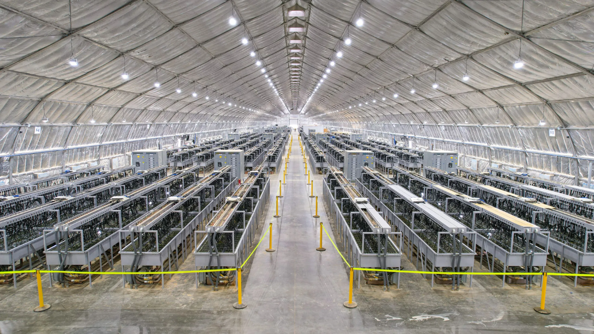


*텍사스 오스틴 인근의 라이엇 플랫폼의 락데일 현장에 있는 Bitcoin mining 전용 건물 7개 중 하나입니다. 이 건물은 특히 몰입형 mining* 전용입니다


Mining는 현재 증권거래소에 상장되어 대규모 농장을 건설하고 운영하는 산업 플레이어들이 주도하고 있습니다. 여기에는 마라 홀딩스(나스닥: `MARA`)와 라이엇 플랫폼(나스닥: `RIOT`)이 포함됩니다.


수익성 모델에 대해 자세히 설명하지 않더라도 mining이 이러한 형태를 취한 이유를 이해하는 것이 중요합니다. 작업 증명은 경쟁 메커니즘입니다. 블록을 찾을 확률, 즉 수익을 창출할 확률은 배포하는 hashrate의 점유율에 비례합니다. 따라서 컴퓨팅 파워를 높이고, 연산 단위당 비용을 줄이며, 손실을 제한해야 한다는 압박이 끊임없이 존재합니다. 그 결과 저렴한 전기, 냉각에 유리한 기후, 풍부한 에너지 인프라를 제공하는 환경이 자연스럽게 더 매력적으로 다가오게 됩니다.


따라서 Mining Bitcoin는 초창기 누구나 접근할 수 있는 활동에서 전문 장비와 전문적인 운영이 지배하는 활동으로 발전했습니다. 그렇다고 해서 프로토콜의 규칙이 바뀌지는 않았습니다. 이론적으로는 누구나 어떤 기계로든 채굴할 수 있습니다. 그러나 실제로는 ASIC의 난이도와 효율성으로 인해 대부분의 상황에서 국내 mining는 경쟁력이 거의 없습니다.


물론, 매우 저렴한 전기의 혜택을 받거나 겨울철에 채굴자의 열 generated를 사용하여 집을 난방하는 경우와 같이 가정용 mining이 관심을 가질 수 있는 상황도 여전히 있습니다. 하지만 어떤 경우든 ASIC 칩이 장착된 기계를 구입해야 합니다. 또한, mining 전력은 Bitcoin 네트워크에 비해 매우 적은 양을 유지하므로 수입의 편차를 줄일 수 있는 방법을 찾아야 하는데, 이것이 바로 다음 장에서 논의할 mining 풀의 역할입니다.


열회수 기능을 갖춘 가정용 mining 솔루션을 살펴보고 싶다면 바로 사용 가능한 도구와 DIY 도구에 대한 튜토리얼이 준비되어 있습니다:


https://planb.academy/tutorials/mining/hardware/canaan-avalon-mini-f2185435-10a3-4d7b-b88f-f1a489babab7

https://planb.academy/tutorials/mining/hardware/canaan-avalon-nano-3f6ac96e-ea8a-4dee-9b9b-13875824c9a6

https://planb.academy/tutorials/mining/hardware/attakai-0d177e6b-e167-4b25-8e38-4ec74213d1fb

## mining 풀로 그룹화


<chapterId>c871bece-eebe-4ef4-9789-d47251f16c8b</chapterId>


Mining Bitcoin에는 지속적이고 피할 수 없는 비용이 포함되며, 그 중 가장 중요한 것은 기계 전력 소비입니다. 이러한 비용은 mining의 수익이 본질적으로 드물고 무작위적이지만, 결과와는 무관하게 발생합니다. 블록의 발견은 전적으로 채굴자의 hashrate 지분에만 의존하기 때문에 그 지분이 작을수록 수익은 더욱 예측할 수 없습니다. 바로 이러한 현실적인 문제 때문에 [mining 풀](https://planb.academy/resources/glossary/pool-mining)이 빠르게 널리 사용되기 시작했습니다. 이번 MIN 101 과정의 마지막 장에서는 Bitcoin에서 mining 풀의 원리와 작동에 대해 소개합니다.


### mining 풀이란 무엇인가요?


mining 풀은 그룹이 블록을 찾는 빈도를 높이기 위해 많은 독립적인 마이너의 컴퓨팅 파워를 모으는 조직(주로 온라인 서비스)입니다. 풀에서 블록을 찾으면 블록 보상은 내부 풀 규칙에 따라 참여자들에게 재분배됩니다(이 규칙은 MIN 101에서는 너무 복잡하기 때문에 MIN 201 과정에서 다룰 예정입니다).


mining 풀의 참여자는 더 이상 모든 mining 작업을 수행하지 않고 풀에서 전송된 데이터를 단순히 해시하기 때문에 '채굴자'가 아닌 '[해시자](https://planb.academy/resources/glossary/hasher)'로 불립니다.


mining 풀과 mining 팜을 혼동하지 않도록 주의하세요. 이 둘은 서로 다른 개념입니다. 이전 장에서 살펴본 것처럼 팜은 단일 기업이 여러 대의 mining 머신을 운영하는 물리적 장소입니다. 반면 풀은 무엇보다도 가상의 그룹으로, 지리적으로 분산되어 있는 수천 대의 머신이 공통의 조정 하에 작동합니다. 그러나 하나의 팜이 풀에 참여할 수 있으며, 실제로도 종종 참여합니다.


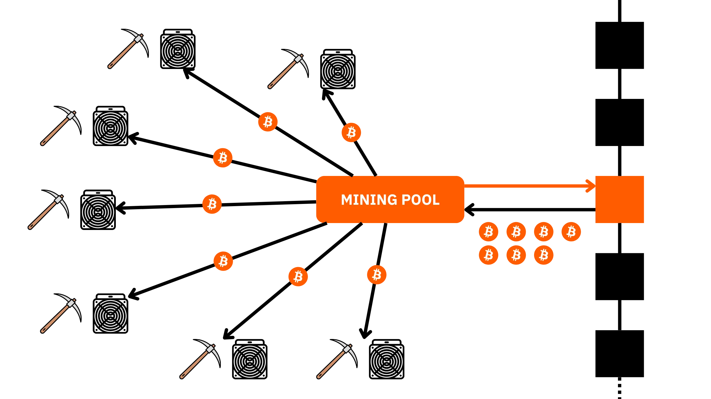


### 소득 편차 감소


그렇다면 왜 풀에 참여해야 할까요? mining 활동의 결과는 확률적이기 때문입니다. 해시를 시도할 때마다 난이도 목표를 충족하여 유효한 블록을 생성할 확률은 매우 낮습니다.


매우 장기적으로, 평균 수익은 전체 hashrate의 지분에 비례해야 합니다. 이 원칙은 확률의 법칙에 직접적으로 따르는데, 각 해시 계산은 독립적인 무작위 추첨으로 구성되며, 큰 수의 법칙에 따라 블록을 발견하는 빈도는 수학적으로 네트워크의 전체 hashrate에서 여러분이 차지하는 비율로 수렴합니다. 그러나 단기 및 중기적으로는 실제 수익이 매우 불규칙할 수 있습니다. 이러한 이론적 평균과 무작위적인 현실 사이의 불일치를 수학에서는 **편차**라고 부릅니다.


다음은 원리를 설명하기 위한 간단한 예시입니다:


- Bitcoin 네트워크는 하루 평균 144개의 블록을 생성합니다(약 10분에 한 블록씩);
- 전체 hashrate의 `0.0001%`를 보유하고 있다면, `144 × 0.000001` 또는 `0.000144` 블록/일을 예상할 수 있습니다;
- 즉, 평균 `1 / 0.000144`일마다, 즉 6,944일마다, 즉 약 19년마다 블록을 찾아야 합니다.


그러나 이 값은 수학적 기대치일 뿐이며, 발견 시간의 분포는 무작위 법칙을 따르기 때문에 실제로는 아주 오랜 기간 동안 단 한 개의 블록도 발견하지 못할 수도 있습니다. 운이 나쁘면 아주 오랜 기간 동안 아무것도 찾지 못하고 반복되는 비용(전기, 유지보수, 장비 감가상각 등)을 지불할 수도 있습니다.


mining 풀은 이 문제의 성격을 바꿉니다. hashrate를 결합함으로써 풀은 블록을 더 자주 찾습니다. 각 참여자는 발견된 블록의 일부만 받기로 동의하지만, 훨씬 더 자주 받기로 동의합니다. 이는 보상을 공유하고 서비스 수수료를 지불하는 대가로 변동성이 크고 간극이 큰 수입에서 보다 규칙적인 수입으로 전환하는 것입니다.


### 함께 그룹화하면 분산이 감소하는 이유는 무엇인가요?


컴퓨팅 성능이 높을수록 발견되는 블록의 예상 빈도가 높아집니다. 더 중요한 것은 이벤트가 더 자주 발생할수록 관찰된 결과가 주어진 기간 동안의 통계적 평균에 더 가까워진다는 것입니다.


소규모 채굴자는 단독으로 몇 년 동안 블록 하나 없이 지내다가 어느 날 큰 보상을 받은 후 아무것도 얻지 못할 수도 있습니다. 풀에서는 동일한 확률적 현실이 여전히 적용되지만, 풀이 블록을 더 자주 발견하고 재분배를 통해 이러한 이벤트를 각 참여자에게 더 규칙적인 지급으로 전환하는 등 집단적 규모에서 평준화됩니다. **따라서 mining 풀은 mining 활동에 대한 예측 가능성을 판매합니다**.


### 역사적인 랜드마크


이전 장에서 살펴본 것처럼 처음에는 난이도가 매우 낮았기 때문에 mining은 일반 컴퓨터로 혼자서도 할 수 있었습니다. 그러나 전 세계적으로 hashrate이 폭발적으로 증가하면서(GPU, 그다음에는 ASIC), 대부분의 참가자에게 솔로 mining은 매우 많은 시간이 소요되는 도박이 되었습니다.


첫 번째 풀은 이러한 새로운 현실에 정확하게 대응하기 위해 만들어졌습니다. Braiins Pool(이전의 Slush Pool/Bitcoin.cz)은 최초의 Bitcoin mining 풀로, 2010년 12월 16일에 첫 번째 블록을 채굴했습니다. 이 첫 번째 mining 풀은 단 며칠 만에 전 세계 hashrate의 거의 3.5%를 차지할 정도로 빠르게 성공했습니다.


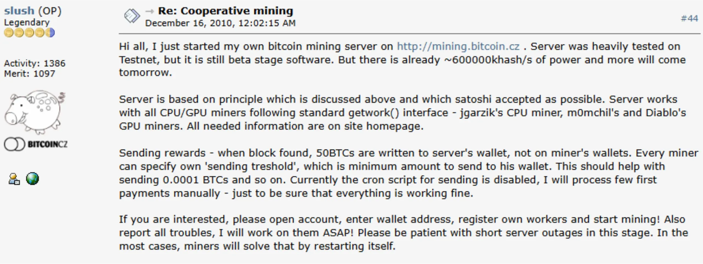


기술적 측면에서 풀은 분산 작업을 효율적으로 조율하기 위해 풀과 채굴자 간의 특수 통신 프로토콜(예: [스트라텀](https://planb.academy/resources/glossary/stratum), 이후 스트라텀 V2)을 중심으로 구조화되었습니다. 이러한 개념은 MIN 201 교육 과정에서 자세히 살펴보도록 하겠습니다.


### 현대의 상황


이 글을 쓰는 시점(2026년 초)의 글로벌 Bitcoin hashrate는 초당 제타 해시 수(= 1,000 EH/s = 초당 1,000,000,000,000,000 해시)에 도달했으며, 발견된 거의 모든 블록은 mining 풀에서 나옵니다.


다음은 현재까지 주요 mining 풀의 순위와 hashrate의 각 점유율입니다. 이 강좌를 읽으실 때쯤이면 순위가 바뀔 수 있습니다. 최신 데이터는 [mempool.space](https://mempool.space/graphs/mining/pools)를 참조하세요.


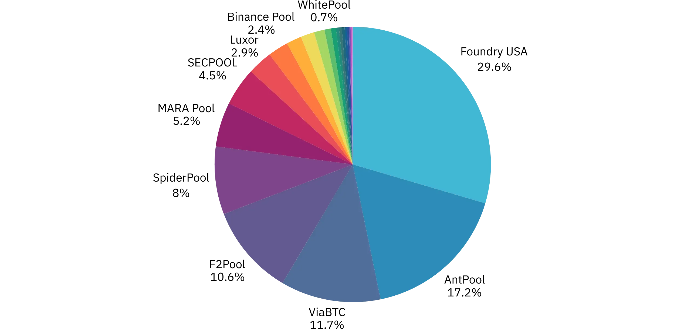


| Ranking    | Pool           | Blocks found  | Hashrate share   |
| ---------: | -------------- | ------------: | ---------------: |
|          1 | Foundry USA    |          1297 |           29.57% |
|          2 | AntPool        |           755 |           17.21% |
|          3 | ViaBTC         |           514 |           11.72% |
|          4 | F2Pool         |           467 |           10.65% |
|          5 | SpiderPool     |           349 |            7.96% |
|          6 | MARA Pool      |           229 |            5.22% |
|          7 | SECPOOL        |           197 |            4.49% |
|          8 | Luxor          |           128 |            2.92% |
|          9 | Binance Pool   |           105 |            2.39% |
|         10 | OCEAN          |            78 |            1.78% |
|         11 | SBI Crypto     |            70 |            1.60% |
|         12 | Braiins Pool   |            54 |            1.23% |
|         13 | WhitePool      |            33 |            0.75% |
|         14 | Mining Squared |            26 |            0.59% |
|         15 | BTC.com        |            16 |            0.36% |
|         16 | Poolin         |            14 |            0.32% |
|         17 | ULTIMUSPOOL    |            14 |            0.32% |
|         18 | GDPool         |            12 |            0.27% |
|         19 | Innopolis Tech |            11 |            0.25% |
|         20 | NiceHash       |             8 |            0.18% |
|         21 | RedRock Pool   |             8 |            0.18% |
|         22 | Unknown        |             2 |            0.05% |
|         23 | Public Pool    |             1 |            0.02% |

*출처: [mempool.space](https://mempool.space/graphs/mining/pools), 1개월 데이터, 2025년 12월 16일부터 2025년 1월 16일까지*


고급 과정에서는 풀의 내부 작동(지분, 네트워크 프로토콜, 결제 방법 등)에 대해 더 자세히 살펴볼 텐데요, 이는 채굴자의 수익성과 Bitcoin의 잠재적 영향을 결정하는 세부 사항이 모두 여기에서 결정되기 때문입니다.


---

이제 MIN 101이 끝났습니다. 끝까지 강의를 따라주셔서 감사합니다. 이 과정을 통해 습득한 기술을 평가하고 싶으시다면 다음 섹션에서 기말고사가 기다리고 있습니다.


방금 습득한 기본 지식을 바탕으로 이제 Plan ₿ Academy에서 mining에 대한 심화 과정을 수강할 수 있으며, 이 과정과 같은 이론 과정이나 더 많은 실습 과정을 통해 Bitcoin mining에 참여할 수 있습니다!


# 마지막 부분


<partId>eced8ca1-971d-4a22-9254-dbf8bce15d1b</partId>


## 리뷰 및 평가


<chapterId>dc005a96-f4b4-42be-ab72-d4624c110716</chapterId>


<isCourseReview>true</isCourseReview>

## 최종 시험


<chapterId>959f06cf-fd66-4f29-b7ee-665bfedfea0d</chapterId>


<isCourseExam>true</isCourseExam>

## 결론


<chapterId>f16a4e42-c16e-466b-ad16-f42b5360f510</chapterId>


<isCourseConclusion>true</isCourseConclusion>