# Intambwe zawe za mbere muri Mining!

Muri iri huriro, tuzokwinjira cane mu bijanye n’ubuhinga bwa Mining kugira ngo dushire ahabona iyo nkuru igoye! Amahugurwa arashikira umuntu wese kandi ntaco asaba ngo umuntu akoreshe amahera y’intango.

Igice ca mbere kizoba ari ic’ivyiyumviro, aho jewe na Ajelex tuzogira ikiganiro cimbitse ku bintu bitandukanye bijanye na Mining. Ivyo bizodufasha gutahura neza iyo nganda n’ibibazo vy’ubutunzi n’ivy’ubutaka bifitaniye isano nayo.

Mu gice ca kabiri, tuzokwihweza ikintu gishoboka. Nkako, tuzomenya ingene twohindura S9 Miner yakoreshejwe ngo ibe ubuhinga bwo gushusha mu nzu! Biciye mu nyandiko z’uburongozi n’amasanamu, tuzokwereka no kubasigurira intambwe zose zo gushika kuri ivyo i muhira iwanyu :)

Biciye muri iri shure, twizigiye kukwereka ko inganda ya Mining igoye kuruta uko isa, kandi kuyiga birafasha gutuma habaho impaka zijanye n’ibidukikije zifitaniye isano na yo!

Niba ukeneye gufashwa mu gutegura, hariho umugwi wa Telegram w’abanyeshure, kandi ibice vyose bikenewe biraboneka ku rubuga rwacu rw’ubudandaji!

+++

# Imenyekanisha

<partId>a99dc130-3650-563f-8d42-a0b5160af0ab</partId>

## Incamake y'amashure

<chapterId>7ad1abeb-a190-5c85-8bff-44df71331e4d</chapterId>

Ikaze mu nyigisho ya MIN201: Intangamarara ya Mining. Ajelex, Jim & Rogzy baranezerewe no kukuyobora mu ntambwe zawe za mbere muri iyi nganda. Twizeye ko muzonezerwa n’ivyo vyigwa kandi muzotangura urugendo rwo muhira Mining!

Iryo huriro rigutwara mu mutima w’inganda ya Bitcoin Mining, riguha ubumenyi bw’ivyiyumviro n’ubumenyi bw’ibikorwa. Waba uri uwutangura canke umaze kumenya neza iyo nsiguro, iri shure rizogufasha gutahura ubutunzi n’ubuhinga bwa Mining, mu gihe uriko uraheza umugambi ngirakamaro wo gusubira gukoresha ASIC mu gushusha inzu.

**Igice ca 2: Ivyerekeye Mining vyose**

Muri iki gice, tuzotanga ugutahura gutomoye kw’ivya Bitcoin Mining. Tuzovuga ku mikorere y’ubuhinga ya Mining, uruhara rwayo mu masezerano ya Bitcoin, n’ingaruka zayo ku bukungu no ku butaka. Uzokwihweza kandi isano rikomeye riri hagati y’igiciro ca Bitcoin na Hashrate, hamwe n’ibibazo bijanye n’ubusegaba n’amategeko mu gisata.

**Igice ca 3: Mining yo mu nzu n'ugusubira gukoresha ubushuhe**

Inyuma y’aho, tuzokwinjira mu gukoresha mu buryo bubereye n’iciyumviro ca Attakai, kigamije guhindura demokarasi yo mu nzu Mining mu guhindura abacukuzi ba S9 bakoreshejwe mu bikoresho vyo gushusha mu nzu. Uzomenya ingene wogura no guhindura ASIC ikoreshwa, mu gihe uriko urategura ibikoresho bikenewe vyo guhindura ibikoresho.

**Igice ca 4: Attakai - Guhindura porogaramu ya Antminer S9**

Aha, uzomenya ingene wotunganya Antminer S9 yawe kugira ngo uyikoreshe muhira. Tuzokuyobora mu gushinga ikiraro ca Wi-Fi/Ethernet, gusubiramwo igikoresho cawe, gushiramwo BraiinsOS+, no kugitunganya neza ku Mining.

**Igice ca 5: Attakai - Impinduka z'abafana**

Kugira ngo ukoreshe neza Antminer S9 yawe kugira ngo ikoreshe nk’igikoresho co gushushanya, iki gice kizokwigisha ingene wosubirira ama ventilateur y’ububasha Supply n’ama ventilateur nyamukuru. Ivyo bihinduka ni ngirakamaro kugira ngo urusaku rugabanuke kandi kugira ngo ico gikoresho gikore neza ubushuhe.

**Igice ca 6: Attakai - Itunganywa**

Ubwa nyuma, uzomenya ingene wokwifatanya na Mining pool no gutuma Antminer S9 yawe ikora neza. Uzobona ingene woshika ku gukoresha neza inguvu no gucukura neza ama satoshis yawe ya mbere.

Ni mwiteguye kuvumbura isi ya Bitcoin Mining no gufata ingorane ngirakamaro za Attakai? Reka dutangure!

# Ivyo ukeneye kumenya vyose ku bijanye na Mining

<partId>aa99ef2c-da29-5317-a533-2ffa4f66f674</partId>

## Insobanuro ya Mining

<chapterId>36a82de7-87ee-5e7a-b69e-48fc30030447</chapterId>

### Mining yasiguye: ikigereranyo c’uruzitiro

Kugira ngo umuntu asigure iciyumviro ca Mining mu buryo bworoshe, arashobora gukoresha ikigereranyo gibereye: ic’uruzitiro. Nka kurya kw’igiharuro, Mining ni igikorwa kigoye gukora ariko kikaba coroshe kugenzura iyo kirangiye. Mu bijanye na Bitcoin Mining, abacukuzi b’amabuye y’agaciro baragerageza gutorera umuti ningoga uruzitiro rw’ivy’ubuhinga bwa none. Miner ya mbere ishobora gutorera umuti iyo nzitizi yerekana umuti wayo ku rubuga rwose, rushobora rero kugenzura bitagoranye ko ari ukuri. Ukwo kugenzura kuroraniwe gutuma Miner yemeza igice gishasha maze akagishira ku gice ca Bitcoin Timechain. Mu kwemera igikorwa cabo, kikaba gisaba amahera menshi, Miner irahezagirwa n’umubare kanaka w’ama bitcoins. Iryo shimwe rikora nk’inkomezi z’amahera ku bacukuzi b’amabuye y’agaciro kugira ngo babandanye igikorwa cabo co kwemeza amafaranga no gucungera uruja n’uruza rwa Bitcoin.

Mu ntango mu rubuga rwa Bitcoin, impembo yahabwa yari ama bitcoins 50 buri minota cumi, bihuye n’ukuvumbura igice c’ibarabara buri minota cumi ku rugero rwa mwayeni n’abacukuzi b’amabuye y’agaciro. Iyi mpembo igira Halving inyuma y’amabarabara 210.000, hafi inyuma y’imyaka ine. Iryo shirahamwe rikora nk’inkomezi zikomeye zo guhimiriza abacukuzi kugira uruhara mu gikorwa ca Mining naho nyene gitwara inguvu. Hatariho impembo, iyo Mining ikoresha amashanyarazi menshi yohevye, ivyo bikaba bizotuma umutekano n’ugushikama kw’uruzitiro rwose rwa Bitcoin bihungabana.

Ingororano ya Mining iriho ubu ni incuro zibiri. Ku ruhande rumwe, harimwo no kurema ama bitcoins mashasha, yagabanutse kuva ku ma bitcoins 50 buri minota cumi mu ntango gushika ku ma bitcoins 6,25 uno musi (2023). Ku rundi ruhande, harimwo amahera y’ibikorwa, canke amahera ya Mining, avuye mu bikorwa Miner ihitamwo gushiramwo mu gice cabo. Iyo umuntu akoresheje Bitcoin, amahera y’ugukoresha arahembwa. Ivyo bihembo bikora nk’ubwoko bw’icamunara aho abakoresha berekana ingene biteguye kuriha kugira ngo ivy’ugucuruza vyabo bishirwe mu gice gikurikira. Kugira ngo abacukuzi b’amabuye y’agaciro bashobore kuronka impembo nyinshi, bakora mu nyungu zabo bwite, barahitamwo ibikorwa vy’ubudandaji bishobora gutuma baronka inyungu nyinshi kuruta ibindi vyose kugira ngo babishire mu gice cabo, bariko barazirikana umwanya mutoyi uriho. Gutyo, impembo ya Mining igizwe n’uguhingura ama bitcoins mashasha be n’amahera yo gukoresha, bikaba bituma abacukuzi b’amabuye y’agaciro baguma batera intege kandi bikaba bituma urubuga rwa Bitcoin rumara igihe kirekire kandi rukagira umutekano.

### Abacukuzi b’amabuye y’agaciro n’ibikoresho vyabo: Mining

Ivyo bikoresho vya Mining birimwo kurondera Hash ibereye yemerwa n’urubuga rwa Bitcoin. Iyo imaze kubarwa ikaboneka, iyo Hash ntishobora gusubira inyuma, isa n’ibirayi bihinduwe ibirayi bishaje. Igenzura igikorwa kinaka ata bushobozi bwo gusubira inyuma. Abacukuzi, mu mahiganwa, bakoresha imashini kugira ngo babare izo hashes. Naho mu vy’impwemu bishoboka ko umuntu aronka iyo Hash n’amaboko, ukuntu iyo nzira igoye cane bituma iyo nzira idashoboka. Ni co gituma hakoreshwa orodinateri, zishobora gukora ivyo biharuro vyihuse, zigakoresha umuyagankuba mwinshi cane.

Mu ntango, igihe ca CPU ni co cari gihambaye, aho abacukuzi bakoresha mudasobwa zabo bwite kugira ngo bakore Bitcoin Mining. Kuvumbura ivyiza vy’ama GPU (amakarata y’ibishushanyo) ku bw’ico gikorwa vyatumye habaho ihinduka rikomeye, vyatumye Hashrate yongera cane kandi igabanya n’inguvu zikoreshwa. Ivyo ntivyahagaze aho, hanyuma haciye hashirwaho ama FPGA (amarembo ashobora gutegurwa mu murima). FPGAs zakoreshejwe nk’urubuga rwo gutegura ASICs (imirongo y’ibikorwa vy’ubuhinga).

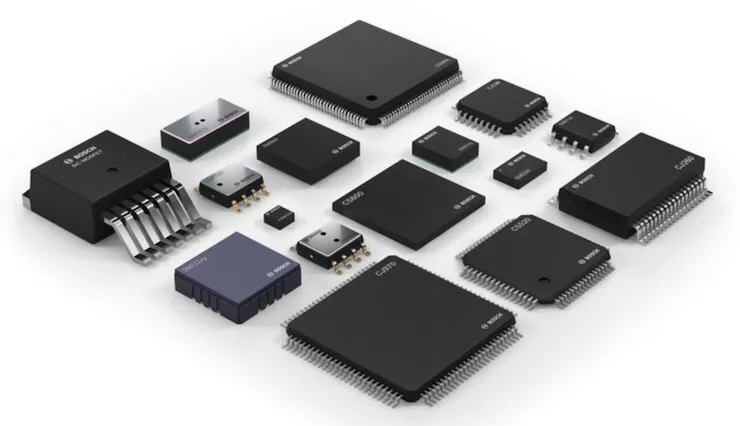

ASICs ni ibice, bigereranywa n’igice ca CPU, ariko rero, vyateguwe kugira ngo bikore ubwoko bumwe gusa bw’uguharura mu buryo bwiza cane. Mu yandi majambo, CPU irashobora gukora ubwoko bwinshi bw’imibare itandukanye ataco ihinduye cane ku bwoko bumwe bw’imibare canke ubundi, mu gihe ASIC izoshobora gukora ubwoko bumwe gusa bw’imibare, ariko ikaba ikora neza cane. Ku bijanye n’ama ASIC ya Bitcoin, yagenewe kubara ubuhinga bwa SHA256.

Muri iki gihe, abacukuzi b’amabuye y’agaciro bakoresha gusa ASICs zigenewe ico gikorwa, zitunganijwe neza kugira ngo zigerageze umubare munini w’ibintu bihuriweko bikoresheje inguvu nkeyi cane kandi vyihuse uko bishoboka kwose. Izo mudasobwa, zidashobora gukora ibindi bikorwa atari Bitcoin Mining, ni ikimenyamenya gifatika c’ugutera imbere n’ugutera imbere kw’ubuhinga bwa Bitcoin Mining. Ukwo guhinduka guhoraho kwerekana ubushobozi bwo mu mutima bwa Bitcoin, aho uguhindura ingorane bituma habaho uguhingura igice c’ibarabara buri minota cumi naho ubushobozi bwa Mining bwongerekana cane.

Kugira ngo tubone uburemere bw’ivyo bikorwa, rimbura Miner isanzwe ishobora gushika ku TeraHash 14 ku segonda, canke ibigeragezo 14 trillion buri segonda kugira ngo uronke Hash ibereye. Ku rugero rw'urubuga rwa Bitcoin, ubu turashika ku 300 ExaHash ku segonda, bigaragaza ububasha rusangi bukoreshwa muri Bitcoin Mining.

### Guhindura ingorane

Guhindura ingorane ni uburyo buhambaye cane mu gukora kw’uruja n’uruza rwa Bitcoin, kugira ngo amabuye acukurwa mu mwanya w’iminota 10 yose. Ico gihe ni ica mwayeni kubera ko igikorwa ca Mining mu vy’ukuri ari urukino rw’ibishoboka, rusa n’ugutera amadayimoni mu cizigiro co kuronka umubare uri hasi y’umubare usobanurwa n’ingorane. Buri mabuye yo mu 2016, iyo nzira irahindura ingorane ya Mining ishingiye ku gihe gisanzwe gikenewe kugira ngo umuntu ashobore gucukura amabuye ya kera. Iyo igihe gisanzwe kirenze iminota 10, ingorane iragabanywa, kandi ibihushanye n’ivyo, iyo igihe gisanzwe kiri hasi, ingorane iragwira. Ubwo buryo bwo guhindura butuma igihe ca Mining c’amabuye mashasha kiguma ari kimwe uko igihe kigenda kirarenga, ata kuraba umubare w’abacukuzi canke ububasha bwose bwo gukoresha ubuhinga bw’ibarabara. Ni co gituma Bitcoin Blockchain yitwa kandi Igikoresho c’Igihe.

- Akarorero kavuye mu Bushinwa:

Ivyabaye mu Bushinwa birerekana neza ubwo buryo bwo guhindura ingorane. Kubera inguvu nyinshi kandi zidahenda, Ubushinwa ni bwo bwari ikibanza nyamukuru c’indege za Bitcoin Mining kw’isi yose. Mu mwaka w’2021, igihugu carabujije bukwi na bukwi Bitcoin Mining ku butaka bwaco, bituma Hashrate y’urubuga rwa Bitcoin kw’isi yose igabanuka cane, hafi 50%. Ukwo kugabanya vyihuta kw’ububasha bwa Mining kwari gushobora guhungabanya cane uruja n’uruza rwa Bitcoin mu kwongera igihe c’ibarabara rya Mining. Ariko rero, uburyo bwo guhindura ingorane bwarateye imbere, bugabanya ingorane za Mining kugira ngo incuro z’ibarabara rya Mining zigume ku minota 10. Ico kibazo kirerekana ubushobozi n’ukwihangana kw’uburyo bwo guhindura ingorane bwa Bitcoin, butuma uruja n’uruza ruguma rudahungabana kandi rukamenyekana, mbere no mu gihe habaye amahinduka atunguranye kandi akomeye mu bijanye n’ubuhinga bwa Mining kw’isi yose.

### Ugutera imbere kw'amamashini Bitcoin Mining

Ku bijanye n’iterambere ry’amamashini Bitcoin Mining, birahambaye kumenya ko ikibanza kijanye n’ubuhinga bwa kera bwo gukora ubudandaji. Abacukuzi b’amabuye y’agaciro baronka inyungu zabo mu kwemeza amabuye, igikorwa gifise amahirwe make cane yo kuroranirwa. Iyi modoka ikoreshwa ubu, Antminer S9, naho ari iyo kera yatangujwe nko mu 2016, iracariko irakoreshwa mw’isoko ry’ibikoresho vya kera, igurishwa ku mahera agera ku €100 gushika ku €200. Ariko rero, igiciro c’amamashini Mining kirahindagurika bivanye n’agaciro ka Bitcoin, kandi ikindi gishasha, Antminer S19, ubu kigereranywa n’amayero 3000.

Kubera ko ubuhinga buhora butera imbere mu bijanye n’ubuhinga bwa Mining, abahinga bategerezwa kwishingira intahe. Inganda za Mining ziguma zigira ibintu bishasha, nk’uko vyerekanwa n’ugusohoka kwa vuba kwa J version ya S19 be n’ugusohoka kw’itegeko kwa S19 XP, itanga ubushobozi bwinshi cane bwa Mining. Ikindi kandi, ivyo gutera imbere ntibijanye gusa n’ingene amamashini akora neza. Nk’akarorero, iyo modoka nshasha yitwa S19 XP ikoresha ubuhinga bwo gukonjesha Liquid, ubuhinga buhinduwe butuma habaho iterambere rikomeye mu bijanye n’ugukoresha neza inguvu. Naho ubuhinga bushasha buguma ari ikintu kidahinduka, inyungu z’ubushobozi zo muri kazoza zizoba ntoyi ugereranije n’izo twabonye gushika ubu, bivuye ku gushika ku rugero runaka rw’ubuhinga bushasha.

Mu gusozera, inganda ya Bitcoin Mining irabandanya kwimenyereza no gutera imbere, kandi abayikora bategerezwa kwitega inyungu zizogabanuka mu gihe kizoza maze bagahindura ingamba zabo bivanye n’ivyo. Iterambere ry’ubuhinga ryo muri kazoza, naho nyene rikiriho, rirashobora kuba ku rugero rutoyi, ivyo bikaba vyerekana ko urwo rwego ruriko rurakura.

## Inganda ya Mining

<chapterId>0896dfc1-c97e-5bec-9bf1-8c20b3388a2c</chapterId>

### Mining ibidengeri

Ubu, Bitcoin Mining yarateye imbere iba inganda ikomeye kandi ikomeye, n’abakinyi benshi ubu bazwi ku mugaragaro kandi umubare w’abacukuzi b’amabuye y’agaciro bahambaye uriko uragwira. Iryo hinduka ryatumye Mining hafi idashobora gushikirwa n’abakinyi batobato kubera amahera menshi ajanye no kuronka imashini nshasha za Mining. Ivyo bivyura ikibazo c’ugusangira Hashrate mu bantu batandukanye bafise uruhara mw’isoko. Ivyo biragoye kuko ni ngombwa gusuzuma ukuntu Hashrate igabanywa mu masosiyete atandukanye no mu bidengeri bitandukanye vya Mining.

Mining pool ni umugwi w'abacukuzi bafatanya ubuhinga bwabo bwo gukoresha ubuhinga bwa none kugira ngo bongere amahirwe yabo yo kuronka Mining. Ukwo gukorana ni ngombwa kubera ko imashini ntoyi Mining iri ukwayo iriko irahiganwa n’ibigo bikomeye vy’inganda, ivyo bikaba bigabanya amahirwe yayo yo kuroranirwa gushika ku rugero rudahambaye. Mining ikora ku ngingo ngenderwako y'amatora, kandi amahirwe yo gutsinda igice (kandi rero impembo ya Bitcoin) buri minota cumi ni make cane ku muntu mutoyi Miner. Mu gukoranya, abacukuzi barashobora gukoranya ububasha bwabo bwo gukoresha ubuhinga bwa none, bagatora amabuye kenshi, hanyuma bagatanga impembo zijanye n’intererano ya Miner imwe imwe muri iyo nzira.

Nk’akarorero, iyo pool ironse block maze igatsinda 6,25 bitcoins, Miner itanga 1% y’ububasha bwose bwo gukoresha ubuhinga bwa pool yoronka 1% y’ama bitcoins 6,25 yaronse. Ariko rero, birakenewe kumenya ko ama pools ya Mining muri rusangi afata komisiyo ntoyi (kenshi hafi 2%) kugira ngo ashobore kwishura amafaranga y’ibikorwa vy’ishirahamwe.

### Porogaramu ikoreshwa n'inganda

Mu bijanye na Bitcoin Mining, uruhara rwa porogarama ni rwo ruhambaye nk’urw’ibikoresho. Akarorero k’ivyo karerekanwa n’uruhara rwa Bitmain, umuhinguzi w’ibintu vyinshi yakoze Antminer S9. Uretse ibikoresho vya Mining, iyo nganda yizigira cane ibikoresho vya Mining bikorana, nka Brainspool, igenzura hafi 5% vy’ibikoresho vya Hashrate vyo kw’isi yose vy’urubuga rwa Bitcoin.

Abakora muri iyo nganda bama barondera kwongerera ubushobozi biciye ku bikoresho vy’ubuhinga bwa none. Nk’akarorero, porogarama izwi cane ikoreshwa muri ivyo ni BrainsOS Plus. Iyo porogarama isubirira uburyo bwo gukoresha bwa kera bw’imashini Mining, ivyo bikaba bituma ivyo bikorwa nyene bishobora gukorwa neza kuruta. Hakoreshejwe iyo porogarama, Miner irashobora kwongera ubushobozi bw’imashini yabo ku rugero rwa 25%. Ivyo bisigura ko ku muyagankuba ungana n’uwo, iyo mashini ishobora gutanga 25% vy’inyongera vya Hashrate, gutyo bikongera ingororano Miner ironka. Ukwo gutuma porogarama zigenda neza ni ikintu gihambaye mu bijanye n’uguhiganwa muri Bitcoin Mining, kigaragaza akamaro k’uburyo buhurikiyemwo buhuza ugutegura neza porogarama n’ibindi bikoresho kugira ngo bikore neza kandi bibone inyungu nyinshi.

### Amategeko n'amafaranga y'umuyagankuba

Nk’uko vyabonetse mu Bushinwa n’ahandi, amategeko aragira ico akoze cane kuri Mining. Naho mu Bufaransa ata bacukuzi b’amabuye y’agaciro bahambaye bariho, amategeko n’amafaranga menshi y’amashanyarazi mu Buraya ni intambamyi zikomeye. Abacukuzi b’amabuye y’agaciro baguma barondera amashanyarazi atari menshi kugira ngo bashobore kuronka inyungu nyinshi. Ni co gituma amashanyarazi agura cane mu Buraya no mu Bufaransa adakwegera abacukuzi b’amabuye y’agaciro muri izo ntara.

Abacukuzi b’amabuye y’agaciro bakunda gukwegera mu turere dufise amafaranga make y’amashanyarazi, kenshi mu bihugu bikiri mu nzira y’amajambere canke mu bihugu bifise ingufu zirengeye. Nk’akarorero, igice kinini c’indege y’isi yose yitwa Hashrate iri i Texas muri Leta Zunze Ubumwe za Amerika. Texas ifise uruzitiro rw’amashanyarazi rwigenga rudasangira ubutunzi bwayo n’izindi leta. Ukwo kudasanzwe akenshi gutuma Texas itanga amashanyarazi menshi kuruta ayo akenewe kugira ngo ntihagire ubukene, ivyo bikaba bituma habaho amashanyarazi menshi. Abacukuzi b’amabuye y’agaciro ba Bitcoin baravyungukirako muri ivyo bihimba vy’umubiri birenze urugero mu gushinga ibikorwa muri Texas, aho bashobora gucukura amabuye y’agaciro yitwa bitcoins ku giciro gito cane c’amashanyarazi mu bihe vy’inguvu zirengeje urugero. Ivyo vyerekana ingaruka zikomeye amategeko n’amafaranga y’amashanyarazi bigira kuri Bitcoin Mining, bikaba vyerekana akamaro k’ivyo bintu mu gufata ingingo abacukuzi bafata ku bijanye n’aho bakorera Mining.

### Abacukuzi baja hehe n’ugucungera inguvu?

Mu kugaragaza ingaruka z’abacukuzi b’amabuye y’agaciro ba Bitcoin mw’isi y’inguvu, inzira iratomoye: abo bakozi baguma barondera amasoko y’amashanyarazi atari menshi, akenshi ayo akoreshwa ubusa canke atakoreshwa. Ico kintu kigaragara mu turere dufise ibikorwa remezo bishasha vy’amashanyarazi, nk’utwo dufise ibidengeri vy’amashanyarazi biherutse gushirwaho.

Reka dufate akarorero. Mu gihugu kiri mu nzira yo kwubaka urugomero, kenshi amashanyarazi aratangura imbere y’uko imirongo y’ugutanga amashanyarazi itangura gukora neza. Ico gihe gishobora gutuma habaho amahera menshi kandi kigatuma abantu badashobora gushiramwo amahera muri iyo migambi y’ibikorwa remezo. Ariko rero, abacukuzi b'amabuye y'agaciro ba Bitcoin barashobora gukora nk'isoko y'ivyo basaba, biteguriye gukoresha ayo muyagankuba "impfuvyi", gutyo bagafasha gukuraho amafaranga y'ibikorwa remezo. Ico bisobanura aha ni uko ibikoresho bishasha bishobora guca bizana inyungu, bikaba bitera imbere mu kurema amasoko mashasha y’amashanyarazi. Iryo hame rirakora no ku rugero rutoyi. Yaba umuntu akoresha umuyagankuba w’amazi ku ruzi rutoyi canke urugo rufise amatara y’izuba, umuyagankuba urenze ushobora gukoreshwa mu gutanga umuyagankuba ku bikorwa vya Bitcoin Mining.

Nk’akarorero, mu Bufaransa, amashanyarazi asigaye ava mu bikoresho vy’izuba arasubirwamwo mu ruzitiro maze abayakora bagahembwa n’inguzanyo y’ugukoresha ivuye muri EDF. Na we nyene, umuntu arashobora kwiyumvira Miner ikoresha ayo muyagankuba asigaye, igahagarara iyo ubusabe bwo mu karere bungana na Supply. Naho ivyo vyoshobora gusa n’ubwikunzi, gushira imbere uguhingura Bitcoin kuruta gushigikira uruja n’uruza rw’amashanyarazi rwo mu karere, birerekana uwundi murongo: guhagarika uruja n’uruza rw’amashanyarazi. Uburyo butoroshe bwo gucunga amashanyarazi asigaye, rimwe na rimwe mbere n’amahera ajanye n’ugukuraho amashanyarazi, birashobora kworoha cane. Abacukuzi b’amabuye y’agaciro ba Bitcoin barashobora gufata ivyo birengeye, bagakora nk’ikintu gishobora guhinduka, bagahindura ivyo basaba aho gukoresha Supply. Mu isi aho amashanyarazi akomoka ku bikoresho bishobora gusubirwamwo (atashobora kugenzurwa) aguma yiyongera, abacukuzi barashobora kugira uruhara runini mu gutuma amashanyarazi yacu agira uburinganire, mu gihe bungukirwa n’amashanyarazi atari menshi canke arengeye kugira ngo bashobore gukoresha ibikorwa vyabo vya Mining.

### Mining gushira hamwe

Gushira hamwe Mining birafatwa nk’ingorane ikomeye. Abakinyi bakuru, nka Foundry, ni bo baganzwa n’isoko, ivyo bishobora gutuma habaho ugucengera amafaranga. Ukwo gushiramwo ibintu vyose bishobora kandi gutuma urubuga rushobora guterwa n’ibitero, harimwo n’igitero ca 51%, aho umukinyi canke umugwi ugenzura ububasha burenga 50% bw’urubuga rwo gukora hashing, bikaba bituma bashobora kugenzura no gukoresha urubuga.

Ivyago vyo gutegeka Birashimikwako ko iyo igihugu nka Leta Zunze Ubumwe za Amerika gifata ingingo yo gutegeka canke kubuza amafaranga amwamwe ya Bitcoin, vyoshobora kugira ingaruka zikomeye ku rubuga, cane cane iyo igice kinini c’ububasha bwo gukora hashing kiri muri ico gihugu.

Kugira ngo barwanye iyo nzira yo gushiramwo ibintu vyose hamwe, haraganirwako ingamba zitandukanye:

- Inzu Mining: Iciyumviro c’Ingoro Mining gishingiye ku kwegereza igikorwa ca Mining. Iraremesha abantu ku giti cabo kugira uruhara muri Mining bari mu mihana yabo, gutyo bagakwiragiza Hashrate cane.
- Igice ca V2: Itegeko ry’Igice ca V2 ritanga ubundi buryo. Udakunze iyo yari imbere yayo, Stratum V2 iremesha abacukuzi guhitamwo amafaranga boshira mu mabuye bacukura. Ubwo bushobozi burakomeza ubushobozi bwo kurwanya ugucengera kandi bukagabanya ubushobozi bw’ibidengeri binini vya Mining bwo kuganza urubuga. Mu guha ububasha bwinshi abacukuzi b’amabuye y’agaciro ku giti cabo, umurongo wa Stratum V2 urashobora kugira uruhara runini mu kurwanya ugushira hamwe Hashrate.

Gufungura-Isoko Mining Porogaramu

- Porogarama y’ubuhinga bwa none yitwa Mining: Iyi ni indi nzira ishobora gukora neza. Mu gutuma porogarama ya Mining ishobora gushikirwa na bose, abacukuzi batobato boronka amahirwe nk’ay’amashirahamwe manini manini ya Mining yo kugira uruhara no gutanga umusanzu mu bijanye n’urubuga rwa Blockchain. Ubwo buryo bwotuma Hashrate ikwiragizwa cane, gutyo bigatuma habaho ugukwiragiza urubuga.
- Uguhindura Abakinyi n’Igihugu: Guhimiriza abakinyi batandukanye bava mu turere dutandukanye kugira uruhara mu mafaranga y’ibanga Mining na vyo nyene birashobora kwerekana ko ari vyiza. Mu guhindura Hashrate mu buryo butandukanye mu karere, biragora cane ko umukinyi umwe canke igihugu kimwe gishobora kugenzura canke kugira ico gikoze ku rubuga mu buryo budahuye. Ubwo buryo burashobora gufasha gukingira urubuga ibitero bishobora guterwa no gukomeza ukwegereza ubutegetsi bwarwo.

Umwanzuro rusangi ni uko kwegereza ubutegetsi abaturage ari ngirakamaro ku mutekano n’ugukomera kw’urubuga rwa Bitcoin. Naho gushiramwo ibintu vyose bishobora gutanga inyungu z’ubushobozi, bituma urubuga rushikirwa n’ingorane zikomeye, harimwo no gucengera n’ibitero 51%. Ingamba nka Takai no kwemera amategeko mashasha nka Stratum V2 ni intambwe zihambaye mu bijanye no kwegereza ubutegetsi abaturage no kurinda urubuga rwa Bitcoin ivyo bitero.

## Ivyiza vy'inganda ya Mining

<chapterId>7b9ee427-316a-54e3-a2d4-4ea97839a31b</chapterId>

### Ingingo ngenderwako ya Attakai .

Mu gihe ca none, Bitcoin Mining n’ikigereranyo ca S9 yoshobora gusa n’iyigoye, ariko gusuzuma bimwe bikomeye bifungura urugi rw’ubundi buryo bushasha. Ingingo ya Attakai ishingiye ku kwihweza ikoreshwa ry’ibikoresho vya Mining mu nyubakwa z’ubwoko butandukanye, nk’amashure canke ibitaro. Iciyumviro nyamukuru ni ugushira amashini makeyi ya Mining ahantu hatandukanye, gutyo bagasubira gukoresha ubushuhe buva muri ayo mashini kugira ngo bashushe ibibanza. Mu guhitamwo uburyo bwiza cane nka S19, vyoshoboka gukwiragiza igikorwa ca Mining, gutyo bigatuma ibikorwa vyose bigenda neza mu gihe kandi bitanga umusanzu w’ingirakamaro ku kibano. Iryo shirahamwe rigamije guhangana n’ibikorwa binini binini vya Mining bihurikiye hamwe mu gukoresha ubushuhe buva ku mashini za Mining mu buryo bufise akamaro kandi bukora neza.

Ico gikorwa ca Attakai kiva ku ngeragezo y’umuntu ku giti ciwe yo mu rugo-Mining yakozwe n’abagenzi babiri bafise umutima ukunze wo kugira uruhara n’umwete mu nzira ya Bitcoin. Bashikiwe n’intambamyi zikomeye, nk’urusaku rwinshi rw’ibikoresho vya Mining, vyari vyagenewe gukoreshwa mu nganda aho gukoreshwa mu rugo. Ku Address iki kibazo, harahinduwe ibikoresho vy’amamashini ya Mining. Ivyuma vy’umuyaga bikora neza kandi bitekanye vyasubiriye ibikoresho vy’intango, bituma Mining yo mu nzu ishobora gushikwako kandi ntiyigera ihungabanya. Vyongeye, gushiramwo adapteur ya Wi-Fi vyatumye hatagira ivy’ugukoresha Ethernet ikoresheje amashanyarazi, ivyo bikaba vyatumye igikorwa co gukoresha home-Mining kirushiriza kworoha. Mu rushana, abo bacukuzi b’amabuye y’agaciro bahinduwe barakoreshwa nk’isoko y’ubushuhe, bagahindura ikintu kibabaza kikaba inyungu.

Amaze gushikiriza umugambi wabo umuryango wa Bitcoin no kubona inyungu yawuteye, abahinguzi ba Attakai baciye bafata ingingo yo gusohora ubuyobozi burambuye ku rubuga rwa Découvre Bitcoin, kugira ngo umuntu wese ashobore kwisubirako ubumenyi bwiwe bwo muhira-GW-111. Ubu barategura kwagura ico ciyumviro kikarenga ivyo mu rugo. Intumbero ni iyo kwerekana ingene Miner yahinduwe ishobora guhindurwa ikaba igikoresho co gushushanya c’inyongera gikoreshwa mu gihe c’imbeho, kigatuma umuntu ashobora guhindukira neza mu gice ca kabiri c’amahugurwa, kikaba kijanye n’ugushirwa mu ngiro kw’ivyo bihinduwe, ivyo bikaba vyerekanywe n’amavidewo asigura. Ariko rero, ikibazo kiguma ari uko iyo ngingo yoshobora kwagurwa ku rugero runini, igatanga ubundi buryo bushoboka kandi buramba bwo gusubirira imibumbe ya Mining iriho ubu.

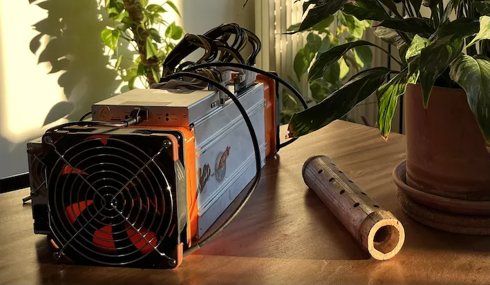

### Mbega iyo nzira yo kwegereza ubutegetsi ikihe?

Naho iciyumviro co kwegereza Mining biciye mu gukoresha neza ubushuhe buva mu bikorwa bisa n’ibitanga umuhango, birafise aho bigarukira kandi ibibazo biracariho. Ivyumba bikoresha inguvu nyinshi nk’ibibanza vyo gusukuramwo n’ibidengeri vyoshobora kwungukira kuri ico ciyumviro mu gukoresha ubushuhe buva ku bacukuzi kugira ngo bashushe amazi yo mu bibanza vyabo. Ivyo bikorwa biramaze gushirwa mu ngiro na bamwe mu bagize umuryango wa Bitcoin, bariko bararondera uburyo butandukanye bwo gukoresha neza ubushuhe buva ku bikoresho vya Mining. Nk’akarorero, inzu y’inzimano yoshobora mu vy’impwemu gushushwa n’abacukuzi batatu canke bane ba S19, umwe wese akakoresha amawatt 3000 kandi akazana ubushuhe bungana n’ubwo.

Ariko rero, birakenewe kumenya ko ugukoresha inguvu n’ugutanga ubushuhe bingana, haba inguvu zikoreshwa n’igikoresho co gushushanya c’umuyagankuba canke Miner. Ku kilowati yose y’umuyagankuba ikoreshwa, ubushuhe buzovamwo buzoba bumwe muri ivyo bihe vyose bibiri. Itandukaniro riri mu kuba Miner idatanga ubushuhe gusa ariko kandi itanga impembo ya Bitcoin, gutyo igatanga insiguro y’ubutunzi yo gukoresha Miner aho gukoresha igikoresho gisanzwe c’umuyagankuba. Iryo mpera ry’inyongera ryoshobora gufasha kugabanya amaganya yerekeye ukuntu abacukuzi bakoresha inguvu nyinshi.

Ikibazo c’ubushobozi bw’igihe kirekire n’ubushobozi bwo gukoresha amacukuzi y’amabuye y’agaciro Bitcoin mu gushushanya, kiracari kigurutse. Ivyiza bikomeza gukorwa mu bikoresho vya Mining be n’ubuhinga bwo gushusha bishobora gutuma habaho uburyo bushasha bwo gukoresha neza ubushuhe buva muri Mining, gutyo bikaba bizotuma iyo nzira ishobora gukoreshwa muri kazoza.

### Ni kuki bafise impembo za BTC?

Ikibazo co guhemba mu Bitcoin aho guhemba mu yandi mafaranga ni ngirakamaro mu buryo bwategekanijwe na Satoshi Nakamoto. Iremwa rya Bitcoin rirangwa n’igipimo gihoraho c’ibice miliyoni 21. Intumbero yari iyo kurondera uburyo bubereye bwo gutanga izo nzira nshasha zaremwe. Abacukuzi b’amabuye y’agaciro, mu gutanga ububasha bwabo bwo gukoresha ubuhinga bwa none kugira ngo bakingire urubuga no gutuma igitero ico ari co cose kirushiriza gutwara amahera menshi, barakingira neza urubuga rwa Bitcoin. Mu gusubiza iyo ntererano ihambaye, barahembwa n’ibiceri bishasha vyaremwe, bikaba vyorohereza ugukwiragiza ibiceri mu bidukikije.

Ni uburyo bwo gutsinda. Abacukuzi b’amabuye y’agaciro barahembwa kubera ko bacungera urubuga no kwemeza amafaranga. Ivyo bice bishasha vyakozwe bitangwa nk’inkomezi zo gukomeza umutekano, kandi amafaranga y’ugucuruza ni inyungu y’inyongera yo kwemeza ugucuruza. Ivyo bibiri Elements vyose hamwe bikora impembo yose ya Mining. Ikibazo c'akazoza ka Mining kivyuka bivuye ku kugabanya impembo za Mining, Halving buri myaka ine, ikintu citwa "Halving". Mu mwaka w’2032, Block reward izoba iri munsi ya Bitcoin imwe, kandi mu mwaka w’2140, nta bitcoins nshasha zizoremwa. Muri iki gihe, abacukuzi bazokwizigira gusa amahera y’ugucuruza kugira ngo baronke indishi. Iryo shirahamwe rya Bitcoin rizokenera gushigikira ibikorwa vyinshi, n’amahera ahagije, kugira ngo Mining ibone inyungu.

Iterambere rya Lightning Network, rituma habaho ibikorwa vyihuta kandi bihenda hanze y'uruhererekane rwa Bitcoin, bivyura ibibazo ku bijanye n'akazoza ka Mining. Lightning Network irafise ubushobozi bwo kugabanya cane amafaranga y’ugucuruza, ivyo bikaba bigira ingaruka ku mahera abacukuzi baronka. Ariko ivyo bizovana n’ukwemera no gukoresha Lightning Network ugereranyije n’urubuga nyamukuru rwa Bitcoin. Mu gihe abacukuzi boshobora kubona ko ari vyiza gucukura naho boba bacitse intege iyo bamaze gukuraho amahera bakoresheje kandi bakaronka amashanyarazi atari menshi. Mu gihe c’ivyizigiro, amafaranga y’ugucuruza ku rubuga nyamukuru rwa Bitcoin yoshobora kuguma ari menshi bihagije kugira ngo Mining igumye ifise inyungu.

### Ni igiki gikwiye gushirwa mu gitabu ca Bitcoin?

Ku bijanye n’ikibazo c’ivyo bikwiye gushirwa mu gice ca Bitcoin, birahambaye cane ko twihweza ukuntu ibice bitandukanye vy’uruzitiro rwa Bitcoin vyuzuzanya. Naho Lightning Network ishobora gutuma amafaranga yihuta kandi atari menshi, iracari yizigiye Layer y’ishimikiro ya Bitcoin, akenshi yitwa "Layer yo gusubiza," mu gufungura no gufunga imihora yo kwishura.

Kubera iterambere ryitezwe rya Lightning Network be n’ukwiyongera kw’ugufungura n’ugufunga imigende, ikibanza mu mabarabara ya Bitcoin kizorushiriza kugira agaciro. Umuryango wa Bitcoin uramaze guha agaciro ukuzigama iki kibanza, ukemera ko gifise aho kigarukira. Ukwo kumenya kwatumye haba ibiganiro ku bijanye n'ugukoresha mu buryo bubereye umwanya w'amabuye, n'ivyiyumviro ku bijanye n'"ubutumwa butari bwo" kuri Blockchain buva ku bikorwa vy'ubudandaji bibonwa ko bitari ngombwa.

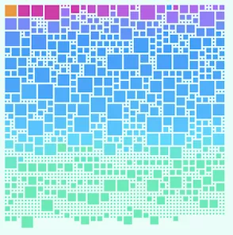

Ivyiyumviro bikikuje ikoreshwa ry’ikibanza c’amabuye muri kazoza, ariko muri rusangi vyemerwa ko ari ubutunzi buke bukwiye gukoreshwa neza. Naho hari icipfuzo co kuwuzuza, ni ngombwa ko uwuzigama kugira ngo uruja n’uruza rwa Bitcoin rubeho igihe kirekire, umuntu yiteze ko mu gihe kizoza hazoba hariho ukwiyongera kw’abashaka umwanya wo gukora amabuye. Nk’uko biri mw’isoko ryose ry’uburenganzira, Supply n’ugusaba bizotegeka ikoreshwa ry’ahantu h’amabuye. Kubera ko Supply ifise aho igarukira, abafatanyabikorwa bazokenera guhitamwo neza ivyerekeye gukoresha iki kibanza c’agaciro kugira ngo urubuga rwa Bitcoin rukore neza kandi rutekanye mu kiringo kirekire.

## Bitcoin Mining mu masezerano ya Bitcoin

<chapterId>879a66b0-c20a-56b5-aad0-8a21be61e338</chapterId>

Uruhara rw’abacukuzi b’amabuye y’agaciro mu rubuga rwa Bitcoin rwabaye ikintu c’impaka nyinshi mu gihe c’intambara z’ubunini bw’amabuye. Naho ari ngirakamaro ku bijanye n’umutekano n’imikorere y’urubuga, abacukuzi ntibafise ububasha bwo hejuru mu bidukikije vya Bitcoin. Uburinganire hagati y’abacukuzi, ama node, n’abakoresha ba nyuma buratuma habaho ubutungane n’ugukwiragira kw’urubuga.

### Intambara z'ubunini bw'amabuye

Mu gihe c’intambara z’ubunini bw’amabuye, abacukuzi benshi bari barwanya ibintu bimwebimwe vyariko biraba muri iyo nzira, ivyo bikaba vyerekana ko hariho ukutumvikana hagati y’abafatanyabikorwa batandukanye mu bijanye n’ibidukikije. Ikibazo kiguma ari ingene tworinganiza ububasha hagati y'abacukuzi, ama node, n'abakoresha kugira ngo umutekano w'igihe kirekire wa Bitcoin.

Ingorane y’umutekano wa Bitcoin ishingiye ku buringanire bugoye. Naho abacukuzi bafise uruhara runini mu kwemeza no kurema amabuye, amanode arabungabunga ubutungane mu kugenzura no kwemeza ibikorwa n’amabuye. Igipande kitari co canke c’ubuhendanyi kizokwangwa n’ibihimba, gutyo bigacengera Miner kandi bikazigama umutekano w’urubuga. Inguvu na zo nyene zifatwa n’ibihimba n’abakoresha urubuga rwa Bitcoin. Nodes zifise ububasha bwo kugenzura no kwemeza, mu gihe abakoresha bafise ububasha bwo guhitamwo Blockchain bakoresha. Ukwo gusangira ububasha gutuma urusobe rwa Bitcoin rusangira n’ubutungane.

Intambara z’ubunini bw’amabuye zarerekanye ukudakeka n’uguhagarika umutima biri mu gucunga uruja n’uruza rwa Bitcoin. Naho ubu Bitcoin core ari yo nzira ihambaye, impaka ku bijanye n’uburongozi n’uburongozi bw’urubuga zirabandanya.

Mu mpera, inshingano zisangizwa n’abakozi bose bo mu mugwi wa Bitcoin. Kugabanya igitigiri c’abakoresha, ama node canke abacukura amabuye y’agaciro vyoshobora gutuma urubuga rugoyagoya, bikongera ingorane zo gushiramwo ibintu vyose hamwe no guterwa n’ibitero. Buri mukinyi wese aragira ico aterereye mu gukomera no mu mutekano w’urubuga, ivyo bikaba bikomeza akamaro ko kuguma dufise uburinganire hagati y’ububasha n’inshingano.

### Ububasha bw'abacukuzi

Ivyiyumviro vy’umukino w’agaciro vya Satoshi Nakamoto vyashizeho ikintu aho umukinyi wese wo mu mugwi wa Bitcoin atera intege gukora neza kugira ngo akingire inyungu ziwe bwite n’iz’abandi bari muri iyo nama. Ivyo bituma haba uburinganire aho inyifato mbi ishobora guhanwa, gutyo bikaba bituma umutekano n’ugushikama kw’urutonde rwose bikomera. Naho iyo nzira y’uburinganire iriho, ibihugu biracari ikintu gishobora gutera ubwoba. Nk’uko vyerekanwa mu kiganiro ca Surfing Bitcoin 2022, Leta zirashobora kugerageza gutera inganda za Mining, zigatuma urubuga rwa Bitcoin rugira ingorane zo gushiramwo ibintu vyose hamwe no guterwa. Ivyiyumviro nk’igitero c’ingabo kigatera ibikorwa vy’ubuhinga bwa Mining birerekana akamaro ko guhinduranya ahantu n’inganda kugira ngo uruja n’uruza rwa Bitcoin rushobore gukomera.

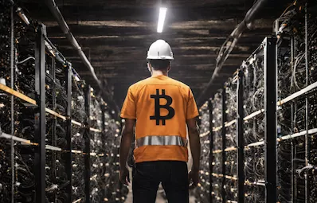

Gushira hamwe ibikorwa vyo gukora ibikoresho vya Mining mu Bushinwa biratera ikindi kibazo. Kwanka kwohereza hanze imashini za Mining canke kwirundanira Hashrate kubera igitero gishobora guterwa n’Ubushinwa ku rugero rwa 51%, birerekana ko bikenewe ko habaho ubuhinga butandukanye bwo gukora ibikoresho vya Mining. Mu kwishura kuri ivyo bibazo, umuryango wa Bitcoin uriko urarondera n’umwete inyishu. Amashirahamwe nka Intel ariko ariyumvira gukora ibikoresho vya Mining muri Amerika, bikaba bifasha mu gukwiragiza ivyo bakora. Ibindi bikorwa, nk'Igikoresho co Gutegura Mining (MDK) ca Block, kigamije kugabanya uburenganzira bwo guhingura no gukora ibikoresho vya Mining, bikaba vyemeza ko Hashrate ishobora gukwiragizwa cane. Mu mutima w’ivyo biganiro harimwo ubutumwa nyamukuru bwa Bitcoin: kuba urubuga rw’agaciro rwa Exchange rushobora guhangana n’ugucengera. Umuryango wa Bitcoin uguma wihatira gukomeza ugukwiragiza, kurwanya ugucengera, no kurwanya ubugoyagoye bw’urubuga, ukanka ivyiyumviro nk’uguhindukira ukaja ku kimenyamenya c’uruhara, bidahuye n’izo ngingo ngenderwako z’ishimikiro.

### Ihuriro ry'umubiri rya Proof of Work n'Ikimenyamenya c'Igiti

Proof of Work (PoW) ni nkenerwa kuko igereranya ubucuti buri hagati y'isi nyakuri na Bitcoin. Naho ama bitcoins ataboneka, kuyahingura bisaba inguvu ziboneka, gutyo bikaba bishinga ubucuti butaziguye n’isi y’umubiri n’iy’ukuri. Iryo huriro rituma uguhingura no kwemeza bitcoins n’amabuye bifise igiciro nyaco c’inguvu, gutyo bigatuma urubuga rwa Bitcoin rushinga intahe mu vy’ukuri vy’umubiri kandi bikabuza kuganzwa n’ibigo bikomeye. PoW ikora nk’igihome co kurwanya ugushira hamwe, igatuma kugira uruhara mu rubuga no kwemeza ibikorwa bisaba ishoramari mu bintu bifatika. Ivyo bibuza ko urubuga rudakoreshwa n’ibigo vyari gushobora gufata ububasha ata nzitizi ikomeye yo kwinjira, gutyo bikaba bituma ububasha n’ububasha bigabanywa mu buryo bubereye mu rubuga rwa Bitcoin.

### Imipaka y'Ikimenyamenya c'Igiti

Ku rundi ruhande, Proof of Stake (PoS), naho yemerera abantu kugira uruhara mu rugero rutoyi, ntiyitanga uburinzi bungana ku bijanye n’ugushira hamwe. Mu rubuga rwa PoS, abasanzwe bafise amafaranga menshi barafise ububasha budahuye, ivyo bikaba vyerekana ubusumbasumbane bw’ububasha buriho mu kibano muri rusangi. Ivyo bishobora gutuma ubutegetsi buguma bushirwa hamwe no kwibanda mu minwe y’abantu bake, bikaba bitandukanye n’intumbero nyamukuru z’ugusangira ubutegetsi z’urubuga rwa Bitcoin. Iciyumviro c’uko umuntu wese ashobora kugira uruhara muri PoS, mbere no ku rugero rutoyi, mu kwifatanya n’ibidengeri, si ngombwa ngo kibe gikomeye. Mu rubuga rwa PoW, mbere n’umuterankunga mutoyi, afise ibikoresho bikeyi, arashobora kugira uruhara n’umwete no gutanga umusanzu mu gucungera no gukwiragiza urwo rubuga.

### Gusubiramwo

Mu gusubiramwo, abacukuzi barakomeza uruja n’uruza rwa Bitcoin ku bijanye n’ugucengera mu gukoresha amashanyarazi kugira ngo babare Proof of Work ya Bitcoin, kandi bagahembwa n’amahera mashasha y’ibice bita bitcoins n’amahera yo gukoresha. Iyo iyo nganda ihindutse ubuhinga, abakinyi batandukanye baraza, bafise uruhara rutandukanye, kuva ku kurema ama chip gushika ku gucunga amatongo ya Mining. Ikindi, ivy’amahera na vyo nyene biragira uruhara, bikagenzura mu gufata ingingo y’uwurokoka mu bihe bitandukanye vy’isoko. Ikibazo co gushiramwo ibintu vyose hamwe kiracariho, aho ibigo bitunze kuruta ibindi vyose bishobora kuganza isoko. Ariko rero, hariho ubundi buryo bwo kubikora buriko burategurwa ku rwego rw’ibikoresho n’urw’amaporogarama. Ni umuntu wese akwiye gukora no gutanga umusanzu mu gukwiragiza urubuga. Bitcoin igereranya akaryo kadasanzwe atari mu bijanye n’umwidegemvyo gusa ariko no mu bijanye n’ukwigenga mu bijanye n’inguvu. Naho hariho impaka zikikuje ukuntu ikoresha amashanyarazi, Bitcoin itanga insiguro y’ubutunzi yo guhindura ikoreshwa ry’inguvu mu buryo bubereye kandi bwinshi, igashitsa ivyo mbere vyari vyiza ku bidukikije.

## Bitcoin Igiciro na Hashrate, ni isano?

<chapterId>e6676214-007c-5181-968e-c27536231bd6</chapterId>

### Hashrate, igiciro, n’inyungu

Igiciro ca Hash kiriho ubu, naho igiciro ca Bitcoin kiri ku madolari 30.000 ugereranyije n’igiciro caco c’imbere c’amadolari 69.000, kirerekana isano riboneka hagati ya Mining n’isi nyakuri. Igihe c’isoko ry’ibimasa bituma habaho ugushaka kwinshi kwa Bitcoin Mining n’ukwiyongera kw’amategeko y’imashini ava ku bahinga nka Avalon na Bitmain. Ariko rero, uguhingura n’ugushikana ntibishika ubwo nyene, ivyo bikaba bituma habaho ukudahuza hagati y’ukwiyongera kw’abasaba n’ukuronka mu nyuma. Ivyo bishobora gutuma imashini zasabwe mu gihe c’isoko ry’ibimasa zishikirizwa mw’isoko ry’idubu, bikaba bigaragaza ukudahukana gukomeye hagati y’igiciro gito n’igipimo kinini ca Hash.

Ivyo bintu vyerekana kandi ukuntu Bitcoin ishobora guhangana n’ingorane, akenshi igasuzumwa bivanye n’igiciro cayo. Ariko rero, gusuzuma bimwe bikomeye ubuzima bwa Bitcoin bisaba gusuzuma igipimo cayo ca Hash, kikaba ari co gipima imibare ku segonda iri mu rubuga rwa Bitcoin. Naho igiciro ca Bitcoin gihinduka, igiciro caco, gifitaniye isano n’amashanyarazi akenewe kugira ngo imashini za Mining zikore, kiracari gihambaye kugira ngo umuntu atahure ingene isoko rigenda. Mu kwibanda ku giciro aho kwibanda ku giciro, umuntu araronka iciyumviro gihuye cane ku bijanye n’ugushikama kwa Bitcoin be n’ukuntu ishobora kubaho mu kiringo kirekire. Muri rusangi, igiciro ca Bitcoin kijanye n’igiciro cayo, bikaba bituma umuntu atahura neza ukuntu igiciro gihinduka be n’ivyo azobona muri kazoza.

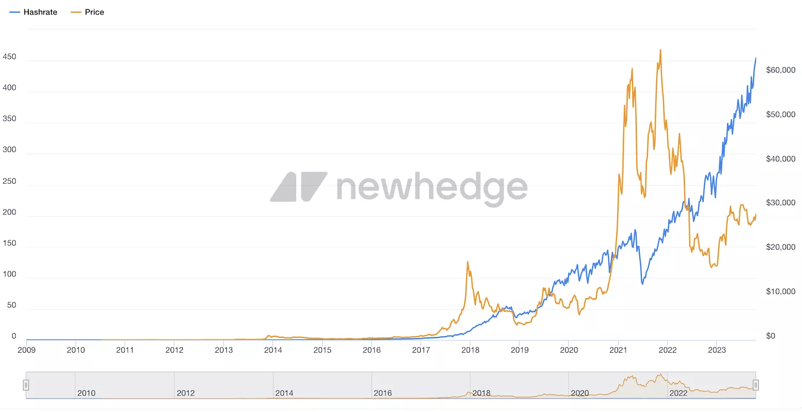

### Hash igipimo n'impera

Mining ishobora gushinga igiciro co hasi ca Bitcoin, munsi y’ico abacukuzi bogurisha bafise igihombo. Igiciro ca Mining kiragira ico gikoze cane ku giciro, nk’uko vyerekanwa n’ukubuza Mining mu Bushinwa, aho igiciro n’igiciro ca Hash vyagabanutse cane ariko bica bisubirana ningoga. Kwibanda ku giciro gusa birashobora kuzimiza. Kwiga igiciro, biciye ku biharuro vy’inyungu, biratanga uburyo bwo kubona ibintu mu buryo buri ku rugero. Ariko rero, isoko rishobora kwigenza mu buryo butagira ishingiro, abacukuzi bashobora guhatirwa kugurisha ku gihombo, bishobora gutuma igiciro kigabanuka munsi y’igiciro ca Mining. Kugira ngo umuntu asuzume ubuzima bwa Bitcoin n’uko ishobora gushirwa ahantu hamwe, hashobora gutegurwa ingano irimwo ibintu bitandukanye, nk’umubare w’ibihimba vy’umubiri n’igiciro. Ubwo buryo bwoshobora gutanga isesengura ry’ibintu vyinshi ku bijanye na Bitcoin ugereranyije n’ibiganiro bishingiye gusa ku giciro.

### Mining kubera inyungu canke kubera urubuga?

Ikibazo ni kinini kandi gikubiyemwo ibice vyinshi vya Bitcoin Mining. Uburinganire hagati yo kurondera inyungu no gutanga umusanzu mu gucungera no gukwiragiza uruja n’uruza rwa Bitcoin ni ikibazo gihoraho ku bacukuzi b’amabuye y’agaciro. Ivyo biganiro birabandanya mu muryango wa Bitcoin, hariho imvo zikomeye ku ruhande rumwe rumwe.

- Mining kugira ngo ubone inyungu:

- Kuko: Abacukuzi b'amabuye y'agaciro barakwegwakwegwa n'amahera bashobora kuronka muri Bitcoin Mining. Gushiramwo amahera mu bikoresho bizimvye vya Mining birashobora gukurwaho n’impera za Mining be n’amahera yo gucuruza, cane cane iyo igiciro ca Bitcoin kiri hejuru.
- Kurwanya: Gukurikirana inyungu birashobora gutuma ububasha bwo gukora hashing bushirwa hamwe iyo amashirahamwe manini manini makeyi gusa ashobora gushiramwo amahera mu bikoresho vy’agaciro kanini vya Mining. Ikindi, Mining kugira ngo umuntu aronke inyungu irashobora kugira ingaruka zikomeye ku bidukikije.

- Mining ku rubuga:

- Kuko: Mining gutanga umusanzu mu mutekano no mu kwegereza ubutegetsi urubuga rwa Bitcoin ni igikorwa ciza cane. Bifasha gukomeza ubushobozi bw’urubuga no kunanira ugucengera n’ibitero.
- Kurwanya: Iyo ata nkunga ihagije y’amahera, bishobora kugora abacukuzi kubandanya bashigikira iyo nzira, cane cane iyo bakora bafise igihombo.

Ico gikorwa ca Attakai kigaragaza akamaro ko gutanga umusanzu mu bijanye n’urubuga mu gihe gitanga inyishu zo gutuma Mining ishobora gushikirwa n’abantu benshi kandi ntiyigire ingaruka mbi. Ubushobozi bwa Mining muhira, n'ibikoresho bihendutse n'imiti yo kugabanya urusaku, birashobora gufasha gutuma Bitcoin Mining igira demokarasi. Iremesha abakunda Bitcoin kudashiramwo no gufata ama bitcoins gusa ariko kandi no kugira uruhara n’umwete mu gucungera urubuga. Mu gutanga ibikoresho vyageragejwe n’uburongozi bwo gukoranya no gushiramwo, Attakai ituma vyoroha kwinjira mw’isi ya Bitcoin Mining. Iremesha kandi gukora ibintu bishasha no gukomeza gutera imbere, itumira abarundi gutanga no gusangira ivyiyumviro vyabo n’ubumenyi bwabo kugira ngo batere imbere mu rugo Mining. Ico kigereranyo ca Attakai ni inyishu y’ikibazo ca Mining ku bw’inyungu canke ku bw’uruja n’uruza. Si ugushaka inyungu gusa, ariko kandi ni ugukomeza ugukwiragiza n’umutekano w’urubuga rwa Bitcoin, mu gihe abantu benshi bashobora kugira uruhara muri Mining, kwiga, no gutahura iyo nganda ihambaye cane. Ingorane y’uko Mining ishobora kubuzwa mu Buraya iracari ikibazo kigaragara. Ivyo bituma habaho ivyiyumviro ku bijanye n’akazoza ka Bitcoin Mining mu karere be n’uko hakenewe amategeko aringaniye yemera akamaro ka Mining ku mutekano n’ubuzima bw’uruja n’uruza rwa Bitcoin mu gihe hariko haratorera umuti ibibazo bijanye n’ibidukikije. Attakai n’izindi nzira zisa n’izo zirashobora kugira uruhara runini muri iyo mpari, zikerekana ko bishoboka gucukura mu buryo buramba kandi bufise inshingano, mu gihe nyene zitanga umusanzu mwiza ku rubuga rwa Bitcoin.

## Ubusegaba n'amategeko

<chapterId>9d9a5908-2acc-501e-906b-a6fce9ecfebd</chapterId>

### Ubusegaba imbere y’inyungu?

Ku Address ikibazo gihambaye c’ubutunzi biciye muri Mining, birahambaye ko turimbura uburyo butandukanye bwo kubona ibintu n’uburyo bwo kubikora. Ibibazo vyerekeye inyungu ya Mining birasanzwe, hariho ibibazo vyerekeye ugugura imigabane mu masosiyete nka Riot canke gukodesha imashini za Mining mu bihugu bifise amafaranga make y’inguvu nka Islande canke Uburusiya. Imbere yo kwinjira muri Mining, ikintu nyamukuru cokwiyumvira ni ukugereranya inyungu ya Mining n'ugugura Bitcoin ataco uhinduye. Iyo igiciro ca Mining a Bitcoin kirenze igiciro co kuyigura ataco uhinduye, muri rusangi ni vyiza kugura Bitcoin ataco uhinduye. Ivyo bituma umuntu yirinda ingorane nyinshi be n’amahera menshi ajanye n’igikorwa ca Mining.

Ariko rero, Mining itanga uburyo budasanzwe bwo kwinjira mu bidukikije vya Bitcoin. Nk’akarorero, Mining Bitcoin mu rushana ishobora kuba uburyo bw’ubwenge bwo gushusha inzu yawe mu gihe ushobora kuronka amahera Bitcoin. Iyindi nzira ni ugushiramwo amahera mu masosiyete agurisha ibikoresho vya Mining no kubika no gucunga izo mashini mu bibanza bifise amafaranga make y’inguvu, gutyo bikaba bituma umuntu ashobora kuronka amashanyarazi ku giciro ciza ata ngorane zo gucunga ivyo bikoresho.

Naho hariho izo nzira, Mining iratanga ingorane zikomeye. Iryo jambo rizwi cane mw'isi y'amafaranga y'amahera, "Si imfunguruzo zawe, si Bitcoins zawe," ribona ijwi nk'iryo mw'isi ya Mining: "Si Hashrate yawe, si impembo yawe." Inkuru z’uguhemuka n’amamashini ataco akora ni ibisanzwe, abakinyi benshi basezerana ibisubizo bidasanzwe ariko ntibashikeko. Ibibazo vy’amashanyarazi Supply n’ugusenyuka kw’imashini birashobora gutuma abashoramari batagira ububasha, bafise ibikoresho bizimvye batagenzura. Muri ivyo, ukwiyubara no gutahura cane urwego rwa Mining ni ngirakamaro cane imbere y’uko umuntu arugiramwo uruhara. Naho hariho uturyo two kuronka inyungu, ingorane zishobora gushikako ni nyinshi cane, kandi uburyo bushingiye ku makuru kandi bwiyumviriye ni ngombwa kugira ngo umuntu ashobore kugendera muri uwo muce ugoye kandi akenshi udashobora kumenyekana. Ni ngombwa rero gukora ubushakashatsi bwimbitse no gupima neza ivyiza n’ibibi imbere y’uko ukora Bitcoin Mining.

### Bitcoins z'isugi

Icipfuzo co kugira Hashrate yawe bwite kigaragara nk'inzira nziza mw'isi ya Mining. Ariko rero, kugira ngo umuntu ashobore kugendera muri ivyo bidukikije bikomeye bisaba ko umuntu yiyubara. Igisata c’igicu Mining kirangwa n’ubuhendanyi bwinshi, buterwa n’ukutamenya Mining ku bashoramari benshi. Ivyo gutanga bikwegera, bishizwe mu buryo butandukanye, birashobora kuzimiza bitagoranye abatazi amakuru ahagije. Ku rundi ruhande, kugira ibikoresho vyawe bwite vya Mining biratanga inyungu nyinshi. Uretse ukunyurwa kw'umuntu ku giti ciwe mu gutanga umusanzu mu mutekano w'urubuga rwa Bitcoin no kubona ingororano zigwa muri Wallet yawe, hariho umuce uryoshe w'"ibice vy'isugi." Ivyo ni amafaranga y’ama bitcoins aherutse gucukurwa, atarigeze akoreshwa kandi ata mateka afise. Izo bitcoins akenshi zibonwa ko zifise agaciro kanini kubera ko zitigeze "zihumanya," zitanga icemezo kinaka co kwangwa n'abagenzuzi canke ama platforms akomeye ya Exchange.

Ubushobozi bwa Mining bitcoins z’isugi mu gihe wirinda uburyo bwo kumenya umukiriya wawe (KYC) ni ikindi kintu congereweko agaciro. Ivyumba vyinshi vya Mining ntibisaba akaranga k’abacukuzi, gutyo bikaba bituma umuntu ashobora kuronka ama bitcoins ataco akora kugira ngo asuzume akaranga kiwe. Bitcoins z'isugi zibonwa ko "zisukuye," zitagira amateka ya kera canke ishirahamwe. Bironderwa cane cane n’abakinyi bakuru b’inzego bashobora kwemeza ko itunga ryabo ry’ubuhinga bwa none ryemewe imbere y’inzego zijejwe gucungera. Ariko naho hari ivyo vyiza, birahambaye cane kwemera ko inganda za Mining ziguma zifise amahiganwa menshi cane kandi zigahinduka, kandi ibintu bitateguwe bishobora guhungabanya ibikorwa vya Mining.

Muri ivyo, guhitamwo uburyo bwo kwigenga kandi bwigishijwe bwo gukora Mining bisa n’ivy’ubwenge. Kuronka Hashrate y’umuntu bwite no gushiramwo amahera mu bikoresho vy’umuntu ku giti ciwe Mining, mu gihe aguma azi ingorane n’ingorane, birashobora gutanga inzira itekanye kandi ihaza cane yo kuronka bitcoins z’isugi, gutyo bikongera ubusegaba bw’ivy’ubutunzi bw’umuntu ku giti ciwe mu gihe ashigikira ecosystem a who11.

### Mbega Mining irabujijwe mu Buraya?

Kubera ikibazo c’uko Mining yoshobora kubuzwa mu Buraya, ibiganiro ku bijanye n’amategeko biriko birarushiriza kugira akamaro. Ivyo bihimba vy’amategeko bihinduka birashobora vy’ukuri kugira ico bikoze cane ku bijanye n’ubuhinga bwa Bitcoin Mining. Ivyo gukumira Mining mu Buraya ni ikintu umuntu yokwiyumvira, cane cane turavye ivyo vyabaye mu Bushinwa. Naho ibikorwa vya Mining bibandanya mu Bushinwa naho vyabujijwe, Uburayi bwoshobora gukurikira inzira nk’iyo. Gukwirakwiza cane Hashrate mu turere dutandukanye vyoshobora gufasha gukomeza umuryango wa Mining mu Buraya, bikabashoboza guhangana n’ukutumvikana n’ivyiyumviro bitari vyo ku bijanye na Mining, ingaruka zayo ku bidukikije, n’ikirenge cayo ku ruzitiro rw’amashanyarazi.

Kubera ko hariho amasekeza nk’aya Greenpeace be n’imibare akenshi izimiza iva mu nyigisho zimwezimwe, intwaro nziza kuruta izindi zose iguma ari amakuru y’ukuri. Ni ngombwa kumenyesha abantu bose muri rusangi n’abafata ingingo ivyerekeye ukuri kwa Mining, ukuntu igoye, n’ibintu bitari vyo, aho kubareka bizigira ivyiyumviro bitari vyo n’amakuru atari yo. Uko abantu barushiriza kumenyeshwa no kumenya ico Mining ari co vy’ukuri, ni ko iyo nganda ishobora kwikingira neza amategeko ashobora kubabuza.

Mu gusozera, naho hariho ingorane zijanye n’amategeko be n’ubushobozi bwo kubuza Mining mu Buraya, intwaro ikomeye kuruta izindi zose iguma ari inyigisho n’amakuru. Gutahura neza kandi neza Mining, ingene ikora, n’ingaruka zayo birashobora gufasha gukuraho amabanga y’ivyo bikorwa no kurwanya amakuru atari yo, gutyo bikaba bishobora gutuma umuntu ashobora kurwanya neza amategeko ashobora kwonona. Intambwe yo gutoza no kumenyesha abantu ivyerekeye Mining, nk’uko iki kiganiro gikora, ni intambwe nziza kugira ngo Mining ikomeze kandi itere imbere mu Buraya, no kw’isi yose. Utwigoro dukomeza two kwigisha no kumenyesha ni ngombwa kugira ngo inganda za Bitcoin Mining zigire kazoza keza kandi gateye imbere.

# Inzu Mining n'ubushuhe bwo gusubira gukoresha

<partId>78d22d06-2c4a-573f-86bb-1027115dad3a</partId>

## Attakai - Gutuma Inzu Mining Ishoboka kandi Ishikira!

<chapterId>1f5d1b74-2f99-5f31-a088-a73d36491ebf</chapterId>

Attakai, bisobanura "ubushuhe bwiza" mu kiyapani, ni izina ry'umugambi ugamije kuvumbura Bitcoin Mining biciye mu gusubira gukoresha ubushuhe bwatangujwe na @ajelexBTC na @jimzap21 na Découvre Bitcoin.

Iyi nkuru yo gusubiramwo ASIC izokora nk’ishimikiro ryo kwiga vyinshi ku bijanye na Mining, ingene ikora, n’ubutunzi bushingiyeko mu kwerekana ubushobozi bwo guhindura Bitcoin Miner kugira ngo ikoreshwe nk’ibikoresho vy’ugukura umuriro mu ngo. Ivyo bituma umuntu agira umunezero mwinshi kandi akazigama, bikaba bituma abaje mu nama bashobora kuronka amahera atari KYC BTC ku mafaranga yabo yo gushushanya amashanyarazi.

Bitcoin ihita ihindura ingorane za Mining kandi igahemba abacukuzi b’amabuye y’agaciro kubera uruhara rwabo. Ariko rero, ukwiyongera kwa Hashrate birashobora gutera ingorane ku kutagira aho bahengamiye kw’urubuga. Gukoresha ubushobozi bwo gukoresha ubuhinga bwa Bitcoin mu gutorera umuti ibibazo vy’ugushushanya birafasha ata guca ku ruhande urubuga ubwarwo mu kwongerera ubushobozi bwo gukoresha ubuhinga bwo gukoresha ubuhinga bwa none.

### Ni kuki wosubira gukoresha ubushuhe buva ku ASIC?

Ni ngombwa gutahura isano riri hagati y’inguvu n’ubushuhe buva mu nzira y’umuyagankuba.

Ku bijanye n’ishoramari ry’inguvu z’umuyagankuba 1 kW, radiator y’umuyagankuba itanga ubushuhe 1 kW, nta burengeye, nta buke. Amaradiyeri mashasha ntakora neza kuruta amaradiyeri ya kera. Inyungu zavyo ziri mu bushobozi bwazo bwo gukomeza gutanga ubushuhe mu cumba mu buryo buringaniye, bikaba bituma umuntu agira umunezero mwinshi ugereranije n’ibikoresho vya kera vy’ugushushanya bihinduka hagati y’ububasha bwinshi bwo gushushanya n’ukutagira ubushuhe, gutyo bikaba bituma ubushuhe buhora buhinduka be n’ukudatekana.

Ordinateri canke mu buryo bwagutse urubaho rw’ubuhinga bwa none, ntikoresha inguvu kugira ngo ikore imibare, ikeneye gusa inguvu kugira ngo igende mu bihimba vyayo kugira ngo ikore. Inguvu zikoreshwa ziterwa n’ubushobozi bw’umuyagankuba bw’ibihimba, ivyo bikaba bituma habaho uguhomba kandi bikazana ubushuhe, ivyo bikaba bizwi kw’izina rya Joule effect.

Amashirahamwe amwe amwe yaraje n’iciyumviro co gufatanya ivy’ubuhinga bwo gukoresha ubuhinga bwa none n’ivy’ugushushanya biciye ku ma radiator/servers. Iciyumviro ni ugusangira ama server y’ishirahamwe mu bice bitobito vyoshobora gushirwa mu ngo canke mu biro. Ariko rero, ico ciyumviro kirafise ingorane zitari nke. Ivy’ugukenera amaserver ntibijanye n’ugukenera gushusha, kandi amashirahamwe ntashobora gukoresha ubushobozi bwo gukoresha ubuhinga bwa none bw’amaserver yabo mu buryo bubereye. Hariho kandi n’imipaka y’uburebure bw’uruja n’uruza umuntu ashobora kugira. Ivyo vyose bibuza iyo sosiyete gutuma ivyo bikoresho bizimvye bitanga inyungu canke gutanga umurongo ushikamye wo kuri internet ata bibanza vy’amakuru bishobora gufata igihe ubushuhe butakenewe.

> Ubushuhe buva kuri mudasobwa yawe ntibupfa ubusa iyo ukeneye gushusha inzu yawe. Iyo ukoresheje ubushuhe bw’umuyagankuba aho uba, rero ubushuhe buva kuri mudasobwa yawe ntibupfa ubusa. Bigura kimwe kuri generate ubu bushuhe ukoresheje mudasobwa yawe. Niba ufise uburyo bwo gushusha buzimvye kuruta uburyo bwo gushusha bukoresheje umuyagankuba, rero imyanda iri gusa mu ntandukaniro y’ibiciro. Iyo ari mu ci ukoresha ivyuma bikoresha umuyaga, rero ni imyanda incuro zibiri. Bitcoin Mining ikwiye kuba aho bihendutse. Kumbure hazoba aho ikirere kiri Cold n’aho ubushuhe bukoreshwa n’amashanyarazi, aho Mining izoba ari ubuntu.
>

> Satoshi Nakamoto - 8 Myandagaro 2010

Bitcoin na Proof of Work yayo biratandukanye kubera ko bihindura ubwavyo ingorane ya Mining bishingiye ku rugero rw’ibara rikorwa n’urubuga rwose. Ico kigereranyo citwa Hashrate kandi kigaragazwa mu bice vy’umubiri (hashes) ku segonda. Ubu bigereranywa ko ari 380 exahashes ku segonda, ni ukuvuga hashes miliyaridi 380 ku segonda. Iyi Hashrate igereranya igikorwa rero n’ingero y’inguvu zikoreshwa. Uko Hashrate iba nini niko n’ingorane zigenda zirushiriza kuba nyinshi, n’ibihushanye n’ivyo. Gutyo, Bitcoin Miner irashobora gukora canke guhagarara igihe cose ataco ikoze ku rubuga, bitandukanye n’ama radiator/server akeneye kuguma ahagaze neza kugira ngo atange igikorwa cayo. Miner irahembwa kubera uruhara rwabo, ugereranije n’abandi, naho yoba ari nto gute.

Mu ncamake, radiator y’umuyagankuba n’iyitwa Bitcoin Miner vyose bitanga ubushuhe bwa kW 1 ku kW 1 y’umuyagankuba ukoreshwa. Ariko rero, Miner na yo nyene iraronka ama bitcoins nk’impera. Utitaye ku giciro c’umuyagankuba, igiciro ca Bitcoin, canke uguhiganwa mu gikorwa ca Bitcoin Mining ku rubuga, birarushiriza kuba vyiza mu vy’ubutunzi gushushanya ukoresheje Miner aho gukoresha radiator y’umuyagankuba.

### Agaciro kongerewe kuri Bitcoin

Igihambaye gutahura ni ingene Mining igira ico ikoze mu kwegereza ubutegetsi Bitcoin.

Ivyuma vyinshi vyariho vyarahujwe mu buryo bw’ubuhinga kugira ngo ivyo Nakamoto yemeranyako bibeho. Iryo sezerano rihemba mu vy’ubutunzi abaje mu nama b’inzirabugunge kubera uruhara bagize mu gukora kw’urubuga rwa Bitcoin, mu gihe rica intege abaje mu nama b’inzirabugunge. Ivyo ni bimwe mu bintu nyamukuru bituma iyo nzira ibaho mu buryo buramba.

Abakinyi b’inzirabugunge, abacukura hakurikijwe amategeko, bose bariko barahiganwa kugira ngo baronke umugabane munini ushoboka w’impera yo guhingura amabuye mashasha. Ivyo bitera intege ubutunzi mu bisanzwe bijana mu buryo bwo gushiramwo ibintu vyose hamwe uko amashirahamwe ahitamwo kwihariza muri ico gikorwa gitanga inyungu mu kugabanya ibiciro vyayo biciye mu bukungu bw’urugero. Abo bakozi b’inganda barafise ikibanza ciza co kugura no gucungera imashini, hamwe no guhanahana ibiciro vy’amashanyarazi y’ingero.

> Mu ntango, benshi mu bakoresha bokoresha ama node y’urubuga, ariko uko urubuga rugenda rurakura rukarenga urugero runaka, rwoba rwasigaye rwinshi ku bahinga bafise amatongo y’abakozi b’ibikoresho vy’ubuhinga bwihariye. Itongo ry’abakozi ryokenera gusa kugira node imwe ku rubuga maze LAN isigaye ihuze n’iyo node.
>

> Satoshi Nakamoto - Ugushyingo 2, 2008

Hari ibigo bifise igice kinini c’ijanisha ry’ama Hashrate yose mu matongo manini manini ya Mining. Turashobora kwihweza umupfunda wa Cold uherutse kuba muri Leta Zunze Ubumwe za Amerika aho igice kinini c’umuyaga wa Hashrate cakuwe hanze y’umurongo kugira ngo ihindure inguvu zijane mu miryango ikeneye amashanyarazi bidasanzwe. Mu misi myinshi, abacukuzi b’amabuye y’agaciro bararemeshwa mu vy’ubutunzi kugira ngo bafunge amatongo yabo, kandi ico gihe c’ikirere kidasanzwe kirashobora kubonwa ku nzira y’umurongo wa Bitcoin Hashrate.

Ico kibazo coshobora kuba ingorane kandi kigatera ingorane nyinshi ku kutagira aho twehamiye kw’urubuga. Umukinyi afise ibice birenga 51% vy’amahera ya Hashrate yari gushobora gucengera amafaranga y’ubudandaji mu buryo bworoshe iyo abishaka. Ni co gituma bihambaye ko Hashrate igabanwa mu bantu benshi aho gukwiragiza inzego zihurikiye hamwe zishobora gufatwa mu buryo bworoshe na leta, nk’akarorero.

**Iyo abacukuzi b’amabuye y’agaciro bagabanijwe mu miryango ibihumbi, canke mbere amamiliyoni kw’isi yose, biragora cane ko Leta ibafata.**

Iyo isohotse mu ruganda, Miner ntibereye gukoreshwa nk’igikoresho co gushusha mu nzu, kubera ingorane zibiri nyamukuru: urusaku rwinshi n’ukudashobora guhindura. Ariko rero, izo ngorane zirashobora gutorwa umuti bitagoranye biciye ku guhindura ibikoresho n’ubuhinga, ivyo bikaba bituma habaho igikoresho citwa Miner gishobora gutunganirizwa kandi kigakora nk’ibikoresho vy’umuyagankuba vyo muri iki gihe.

**Attakaï ni umugambi w'inyigisho wigisha ingene wosubiramwo Antminer S9 mu buryo butazimvye.**

Iryo ni akaryo keza ko kwiga mu kwimenyereza mu gihe uriko urahezagirwa kubera uruhara rwawe n’amasatoshi atagira KYC.

## Inyigisho yo kugura ASIC yakoreshejwe

<chapterId>3b0b3bf0-859b-57f2-b92f-843ac70b7e68</chapterId>

Muri iki gice, tuzovuga ku buryo bwiza bwo kugura Bitmain Antminer S9 ikoreshwa, imashini iyi nyigisho yo gusubiramwo radiator izoshingirako. Iyi nkuru irakora no ku bindi bigereranyo vya ASIC kuko ari nkuru rusangi yo kugura ibikoresho vya Mining vyakoreshejwe.

Antminer S9 ni igikoresho gitangwa na Bitmain kuva muri Gitugutu 2016. Gikoresha amashanyarazi 1400W kandi gitanga 13.5 TH/s. Naho ibonwa ko ari iya kera, iguma ari uburyo bwiza cane bwo gutangura Mining. Kubera ko yakozwe mu bwinshi, biroroshe kuronka ibihimba vy’inyuma vyinshi mu turere twinshi two kw’isi. Muri rusangi ishobora kuronswa n’abandi ku mbuga nka eBay canke LeBonCoin, kuko abagurisha b’abahinga batagiyitanga kubera ko idashobora guhangana n’ibindi bikoresho bishasha. Ni nto cane kuruta ASICs nka Antminer S19, zitangwa kuva muri Ntwarante 2020, ariko ivyo bituma iba hardware ikoreshwa ishoboka kandi ibereye cane ivyo tuzohindura.

Antminer S9 iza mu mice myinshi (i, j) ihindura utuntu dutoduto ku bikoresho vy’uruvyaro rwa mbere. Ntitwemera ko ivyo bikwiye kugira ico bikoze ku ngingo ufata yo kugura, kandi iyi nsiguro ikora kuri ivyo bihinduka vyose.

Igiciro ca ASICs kirahindagurika bivanye n’ibintu vyinshi nk’igiciro ca Bitcoin, ingorane z’uruja n’uruza, ubushobozi bw’imashini, n’igiciro c’amashanyarazi. Ni co gituma bigoye gutanga ingereranyo y’ukuri y’ugugura imashini ikoreshwa. Muri Ruhuhuma 2023, igiciro citezwe mu Bufaransa muri rusangi kiva ku €100 gushika ku €200, ariko ivyo biciro birashobora guhinduka ningoga.

Antminer S9 igizwe n’ibice bikurikira:

- 3 hashboards zirimwo ama chips atanga ubushobozi bwo gukora hashing.

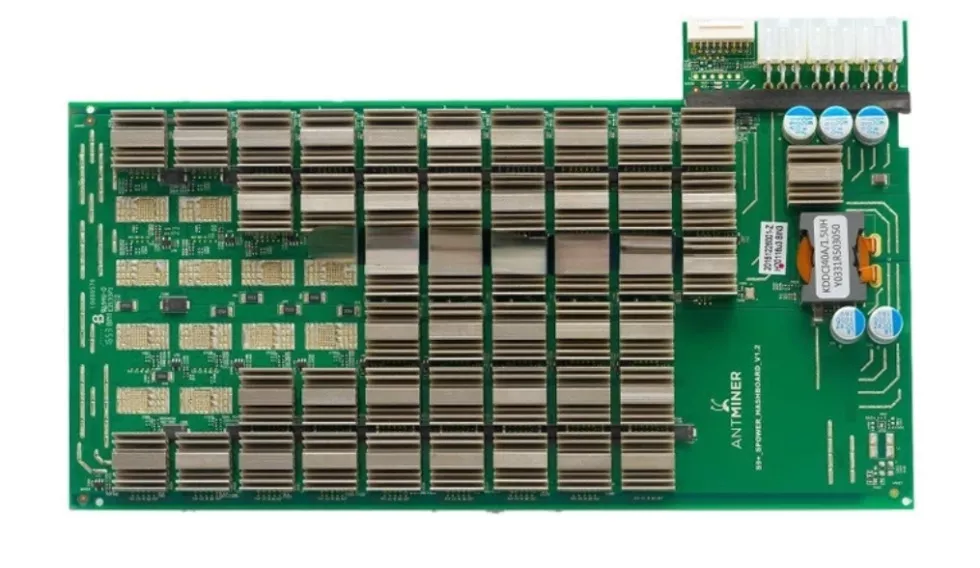

- Igipande co kugenzura kirimwo ahantu ho gushiramwo ikarita SD, icuma ca Ethernet, n’ibifatanya hashboards n’abafana. Ubu ni ubwonko bwa ASIC yawe.

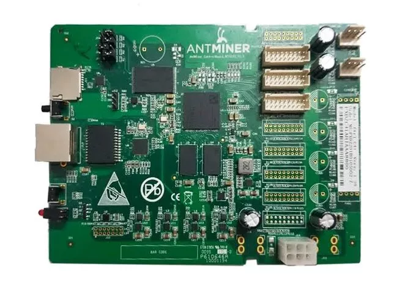

- 3 intsinga z’amakuru zihuza ama hashboards n’ibarabara ry’ubugenzuzi.

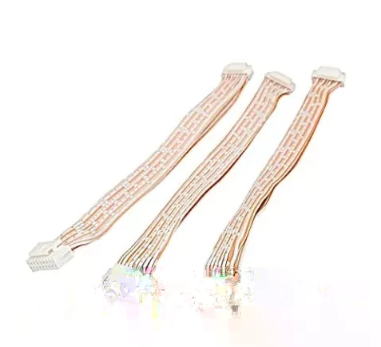

- Inguvu Supply, ikoresha 220V kandi ishobora guterwa nk’igikoresho co mu nzu gisanzwe.

- 2 Abafana ba 120mm.

- Umugozi w’igitsina gabo C13.

Igihe ugura imashini ikoreshwa, birahambaye ko usuzuma ko ibihimba vyose birimwo kandi ko bikora. Mu gihe ca Exchange, ukwiye gusaba uwugurisha ngo afungure iyo mashini kugira ngo asuzume ko ikora neza. Ni ngombwa kugenzura ko igikoresho gifunguye neza, hanyuma ugasuzuma ko interineti ikora mu gushiramwo umugozi wa Ethernet no gushika ku nzira yo kwinjira muri Bitmain Interface biciye ku mucukumbuzi w’urubuga kuri iyo nzira nyene yo mu karere. Ushobora kuronka iyo IP Address mu kwifatanya na router yawe ya internet Interface ukarondera ibikoresho bihuye. Iyi Address ikwiye kuba ifise uburyo bukurikira: 192.168.x.x .

Kandi, suzuma ko ivyemezo vy’imbere bikora (izina ry’ukoresha: umuzi, ijambobanga: umuzi). Nimba ivyemezo vy’imbere bitakora, uzokenera gusubiramwo imashini.

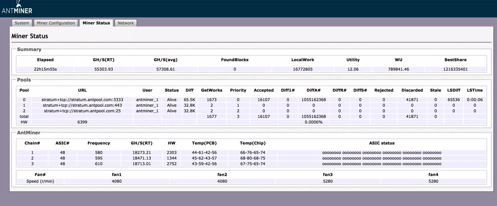

Iyo umaze guhuzwa, ushobora kubona uko hashboard yose iri ku dashboard. Niba Miner ifatanye n’ikidengeri, ushobora kubona ama hashboards yose akora. Ni vyiza kumenya ko abacukuzi b’amabuye y’agaciro batera urusaku rwinshi, ivyo bikaba ari ibisanzwe. Kandi, urabe neza ko abafana bakora neza.

Ushobora rero gukuraho Mining pool ya nyen’iyo mbere kugira ngo ushireho iyawe mu nyuma. Niba ubishaka, urashobora kandi gusuzuma ama hashboards mu gusenyura iyo mashini. Ariko rero, iyo ntambwe irarushiriza kuba igoye kandi isaba umwanya mwinshi be n’ibikoresho bimwebimwe. Niba ushaka gukomeza n’ivyo gusenyura, urashobora kuraba igice gikurikira c’iyi nyigisho kidondora neza ingene wobikora. Ni vyiza kumenya ko abacukuzi b’amabuye y’agaciro bakorakoranya Dust nyinshi kandi basaba gutunganywa ubudasiba. Ushobora kwihweza iyo Dust yirundanirije be n’uburyo bwo kuyibungabunga mu gusenyura iyo mashini.

Uhejeje gusubiramwo izo ngingo zose, urashobora kugura imashini yawe wizigiye cane. Niba ufise amakenga, nubaze abantu bo mu kibano.

Mu guca irya n'ino iyi nsiguro mu nteruro imwe: **"Ntukizere, suzuma."**

[Ushobora kandi gusaba abahinga mu bijanye no gusubira gusanura imashini za Mining, nk’umufatanyabikorwa wacu 21energy. Batanga amashini ya S9 yageragejwe, yasukuwe kandi afise porogarama ya BraiiinOS+ isanzwe ishizwemwo. Ukoresheje kode y'abafatanyabikorwa "decouvre," uzoronka igiciro c'ibice 10 kw'ijana ku kugura S9 mu gihe ushigikira umugambi wa Attakai.

## Inyigisho yo kugura ibikoresho bihindurwa vya S9.

<chapterId>fa5f5eca-bcbf-5a83-9b03-98ecbadbabd6</chapterId>

Nyir’indege yitwa Antminer S9, birashoboka ko uzi ingene ivyo bikoresho bishobora gutera ijwi rirenga kandi bikaba vyinshi. Ariko rero, birashoboka ko umuntu ayihindura igikoresho co gushushanya kicereje kandi gifatanye n’ibindi, akurikije intambwe nkeyi zoroshe. Muri iki gice, tuzoshikiriza ibikoresho bikenewe kugira ngo umuntu ashobore guhindura ivyo bintu.

Nimba uri umuhinga mu vyo gukora amaboko kandi uriko urarondera guhindura Miner ngo ibe igikoresho co gushushanya, iyi nyigisho ni iyawe. Turashaka kubaburira yuko ivyo umuntu ahinduye ku gikoresho co mu buhinga bwa none bishobora gutuma haba ingorane z’umuyagankuba. Ni ngombwa rero gufata ingingo zose zikenewe kugira ngo ntihagire ico yonona canke ngo umuntu akomereke.

1. Subiriza abafana

Abafana b’umwimerere ba Antminer S9 baratera urusaku cane ku buryo udashobora gukoresha Antminer yawe nk’igikoresho co gushusha. Umuti ni ukubasubirira abafana bacereje. Ishirahamwe ryacu ryagerageje ibikoresho vyinshi biva ku kimenyetso ca Noctua kandi ryahisemwo Noctua NF-A14 iPPC-2000 PWM nk’iyindi nzira nziza yo gusenyera ku mugozi umwe. Raba neza ko uhisemwo version ya 12V y’abafana. Iyi fan y’iminota 140 ishobora gutanga ubushuhe bushika kuri 1200W mu gihe iguma ifise urusaku rw’ivyiyumviro rwa 31 dB. Kugira ngo ushiremwo izo fans za 140mm, uzokenera gukoresha adapteur ya 140mm gushika kuri 120mm, iyo ushobora kuyisanga ku iduka rya DécouvreBitcoin. Tuzokwongerako kandi n’ibipande vy’uburinzi vy’iminota 140.

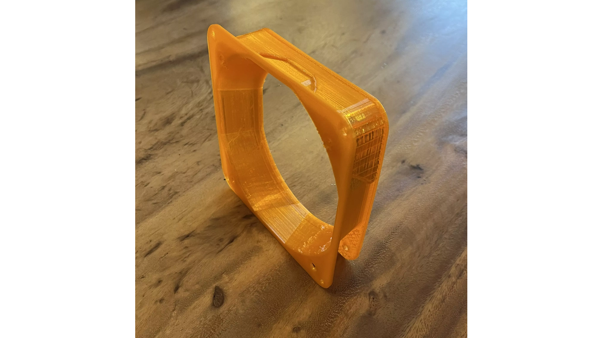

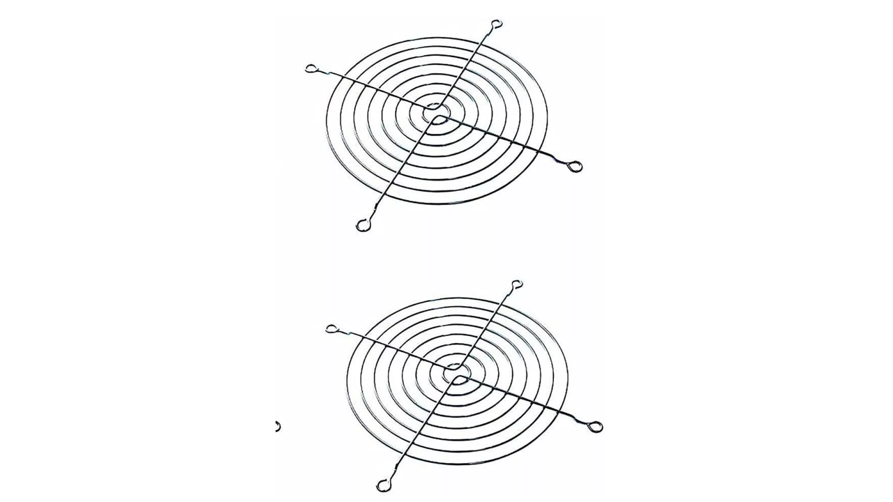

Igikoresho co gukoresha umuyagankuba Supply na co nyene kiratera urusaku cane kandi gikeneye gusubirwamwo. Turabagira inama yo gukoresha ubuhinga bwa Noctua NF-A6x25. Zirikana ko ama connecteurs y’aba fans ba Noctua atari kimwe n’ay’intango, rero uzokenera adapteur y’ama connecteurs kugira ngo uyahuze. Ibiri bizoba bihagije. Na none, urabe ko uhisemwo 12V version y’umuyaga.

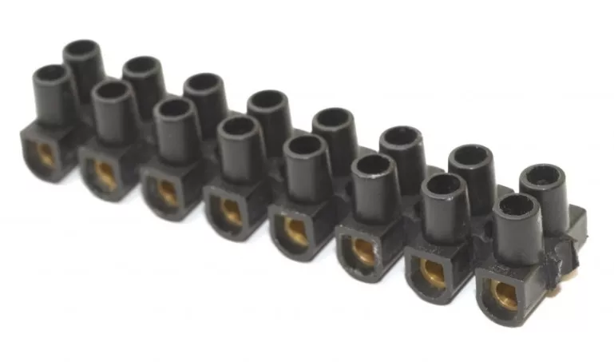

2. Wongereko ikiraro ca WIFI/Ethernet

Aho gukoresha umugozi wa Ethernet, urashobora gufatanya Antminer yawe biciye kuri WIFI mu kwongerako ikiraro ca WIFI/Ethernet. Twahisemwo vonets vap11g-300 kuko ishobora kugufasha gukura ikimenyetso ca WIFI mu gasandugu kawe ka Internet ukagirungikira Antminer yawe biciye kuri Ethernet ata subnet ukoze. Niba ufise ubuhinga bwo gukoresha amashanyarazi, urashobora kuyikoresha ataco ukoresheje amashanyarazi ya Antminer Supply ataco ukeneye kwongerako chargeur ya USB. Ku bw’ivyo, uzokenera igikoresho c’igitsina gore c’uburebure bwa 5.5mmx2.1mm.

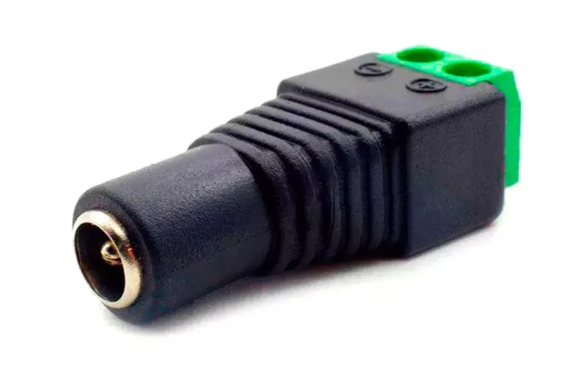

3. Uguhitamwo: wongereko umuriro w'ubwenge

Niba ushaka gufungura/kuzimya Antminer yawe ukoresheje telefone yawe ngendanwa no kugenzura uko ikoresha amashanyarazi, urashobora kwongerako umuriro w’ubwenge. Twaragerageje umuriro wa ANTELA muri verisiyo ya 16A, uhuye n’iporogarama ya smartlife. Iyi smart plug iragufasha kubona amashanyarazi ukoresha ku musi no ku kwezi kandi igahuza n’umurongo wawe wa internet biciye kuri WiFi.

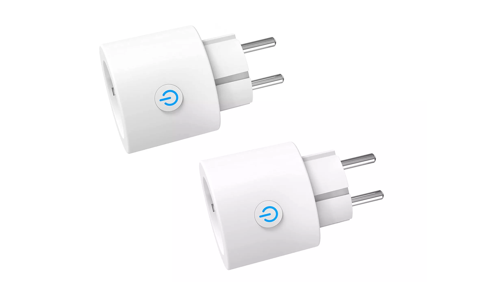

Urutonde rw'ibikoresho n'amahuza

- 2X 3D igice c'umuhinduzi 140mm kugeza kuri 120mm

- [2X NF-A14 iPPC-2000 PWM]

- [Ibipande vy'umuyaga 2X 140 mm] (imbuga ngurukanabumenyi)
- [Igikoresho co gupfuka umwuka-Marron/dp/B00VXTANZ4)

- [Isukari y'umuyagankuba 2,5 mm2]
- [Vonets vap11g-300] (ikiraro-gihindura-Ethernet/dp/B014SK2H6W)
- [Igikoresho c'ubwenge ca ANTELA co guhitamwo](imbuga ngurukanabumenyi)

# Attakai - Guhindura porogaramu y'ikinyabiziga S9.

<partId>afc9c29a-84aa-5f1d-82e2-5fd9ff2e1805</partId>

## Gushinga ikiraro ca WIFI/Ethernet ca Vonet

<chapterId>3cf487a4-21ef-5b24-83d5-789b811f740f</chapterId>

Kugira ngo uhuze ASIC yawe ukoresheje WIFI, uzokenera igikoresho citwa bridge. Ico gikoresho kigufasha gukura ikimenyetso ca WIFI kuri router yawe ukagirungika ku kindi gikoresho biciye kuri Ethernet.

Ivyuma vyinshi birashobora gukora iyo nzira, ariko turabahimiriza ko mukoresha ikiraro/Isubiramwo rya WiFi VONETS kubera ko bimeze neza.

Inguvu z’ikiraro mu kugifatanya biciye kuri USB.

Uvuye kuri mudasobwa yawe, ushire ku rubuga rwa WIFI rwa VONETS_**\*\*** ukoresheje ijambobanga 12345678.

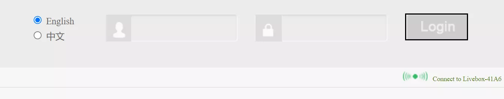

Injira n'izina ry'ukoresha "admin" n'ijambobanga "admin".

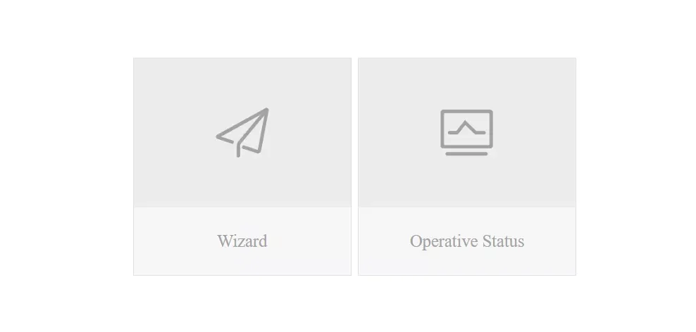

Hitamwo Umupfumu.

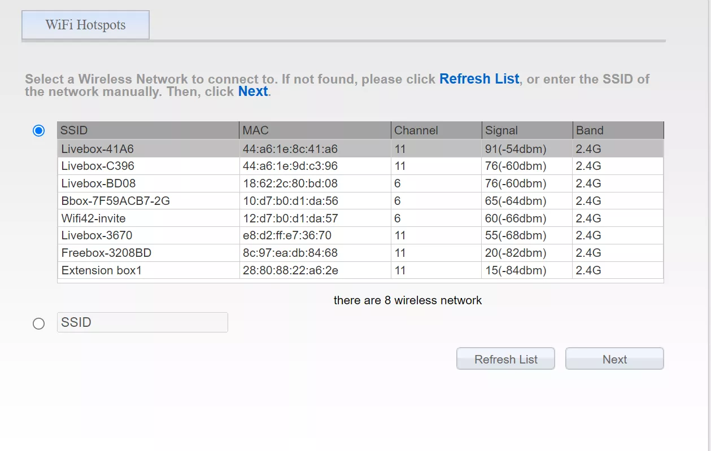

Hitamwo urubuga rwa WIFI ushaka gufatanya na Miner yawe, hanyuma ukande kuri Next.

ICIBUKIRO: Ikiraro ca Vonet gikora gusa ku nzira ya 2.4GHz. Muri iki gihe, ama router akenshi atanga ama WIFI abiri, imwe iri kuri 2.4GHz iyindi iri kuri 5GHz.

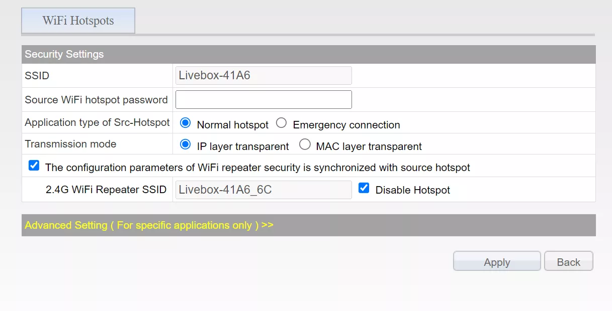

Injira ijambobanga ry'urubuga rwawe rwa WIFI mu kibanza "Ijambobanga ry'isoko rya WIFI hotspot". Niba udashaka gukoresha ikiraro cawe ca Vonet kugira ngo wongere urubuga rwawe rwa WIFI, reba akazu kavuga ngo "Disable Hotspot". Ahandi ho, n’ubireke bitagenzuwe.

Ushobora rero gukanda Apply.

Ubwa nyuma, fyonda ku reboot kugira ngo wongere utangure ikiraro. Bizofata iminota mikeyi kugira ngo usubire gutangura.

Ikiraro gikwiye gufatanya n'umurongo wawe kandi kikaboneka munsi y'izina "[VONETS.COM](http://vonets.com/)". Niba n’ubu nyene itahuye inyuma y’iminota mikeyi, ushobora gukenera gukuraho/gusubiramwo ikiraro.

Ico kiraro kimaze gufatanya, ushire umugozi wa Ethernet uva ku kiraro kuri ASIC yawe, hanyuma ushire ASIC mu gitereko c’amashanyarazi. Ushobora rero gushika kuri ASIC Interface mu buryo bumwe nk’aho yoba ihuye ata guca ku ruhande na router yawe biciye kuri Ethernet.

## Gusubiramwo umucukuzi w'ibimonyo S9.

<chapterId>b518b6bd-9dae-5136-ae3c-1fafb1cb2592</chapterId>

Imbere yo gushiramwo BraiinOS+, bishobora kuba ngombwa ko usubiramwo S9 yawe ku mirongo yayo y’uruganda.

Ubwo buryo burashobora gukoreshwa hagati y’iminota 2 n’iminota 10 umaze gutangura Miner.

Iminota 2 inyuma yo gufungura Miner, usabwe gukanda buto ya "Reset" mu masegonda 5, hanyuma ukayirekura. Miner izosubira ku mirongo y’uruganda mu minota 4 kandi izosubira gukora ubwayo (nta nkeka ko uyizimya).

## Gushiramwo BraiinsOS+ ku gikoresho co gucukura ibinyoma S9.

<chapterId>38e8b1a8-8b1d-51ed-8b92-59d4ddb15184</chapterId>

Porogarama y’intango yashizweho na Antminer ku mashini zabo Mining irafise aho igarukira mu bijanye n’imikorere. Ni co gituma muri iyi nkuru, tuzoshiramwo uwundi murongo witwa BraiinsOS+. Ni porogarama y’uwundi muntu yakozwe na Bitcoin Mining pool ya mbere cane ifise ibintu vyinshi kandi ishobora, nk’akarorero, guhindura ubushobozi bw’iyo mashini.

Hari uburyo bwinshi bwo gushiramwo Braiins OS+ kuri ASIC. Ushobora kuraba iyi nkuru hamwe n’[inyandiko zizwi za Braiins](https://academy.braiins.com/ru/braiins-os/about/).

Aha, turabona ingene woshiramwo Braiins OS+ mu buryo bworoshe ataco uhinduye ku buhinga bwa Antminer yawe ukoresheje porogarama ya BOS toolbox, ugasubirira uburyo bwo gukoresha bwa mbere, biciye mu ntambwe zitomoye zikurikira.

1. Ushire umuriro kuri Antminer yawe maze uyihuze n’agasanduku kawe ka internet.

2. Gukuraho ibikoresho vya BOS ku Windows / Linux.

3. Ufungure dosiye wavuyeko maze ufungure dosiye bos-toolbox.bat. Hitamwo ururimi, haciye akanya gato, uzobona iri dirisha:

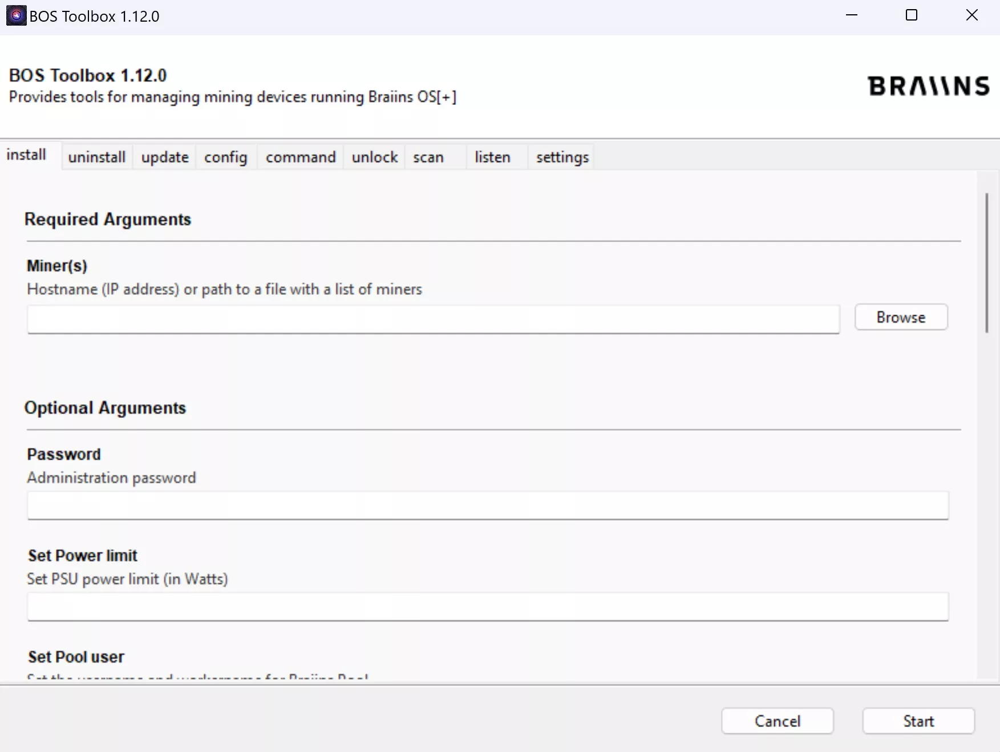

4. Bos igikoresho kizotuma ushobora kuronka IP Address ya Antminer yawe mu buryo bworoshe maze ugashiramwo BraiinsOS+. Niba usanzwe uzi IP Address y’imashini yawe, urashobora guca ku ntambwe ya 8. Ahandi ho, genda ku rubuga rwo gucapura.

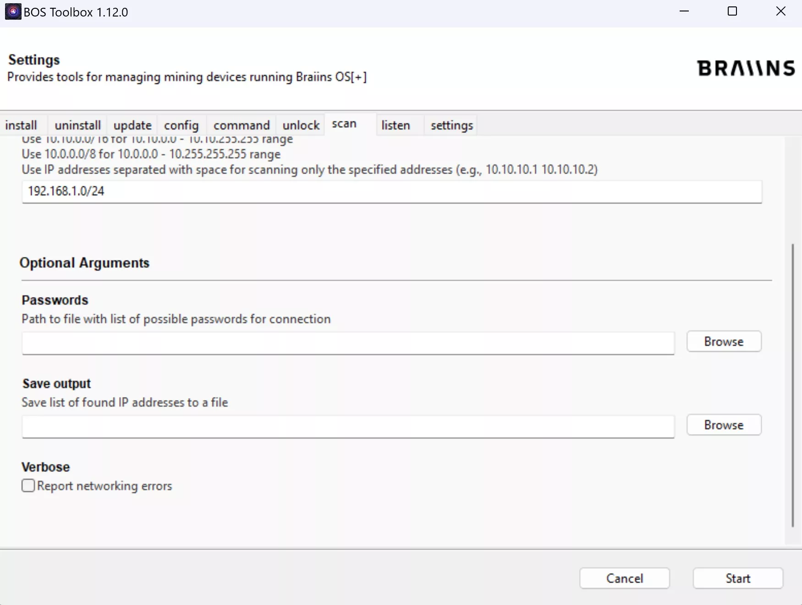

5. Kenshi, ku nzira zo muhira, urutonde rwa IP Address ruri hagati ya 192.168.1.1 na 192.168.1.255, rero shiramwo "192.168.1.0/24" mu kibanza c'urutonde rwa IP. Nimba urubuga rwawe rutandukanye, usabwe guhindura izo aderesi bivanye n’ivyo. Hanyuma ukande kuri "Start".

6. Iyumvire, iyo Antminer ifise ijambo banga, iyo detection ntizokora. Niba ari uko bimeze, umuti woroshe ni ugukora reset.

7. Ushobora kubona aba Antminers bose bari ku rubuga rwawe baboneka hano, kandi IP Address ni 192.168.1.37.

8. Fyonda kuri "Back" hanyuma ukande kuri "Install", winjize IP Address wabonye mbere, hanyuma ukande kuri "Start".

> Iyo installation idakora, bishobora kuba ngombwa ko ukora reset maze ugasubira kugerageza (raba igice c’imbere).

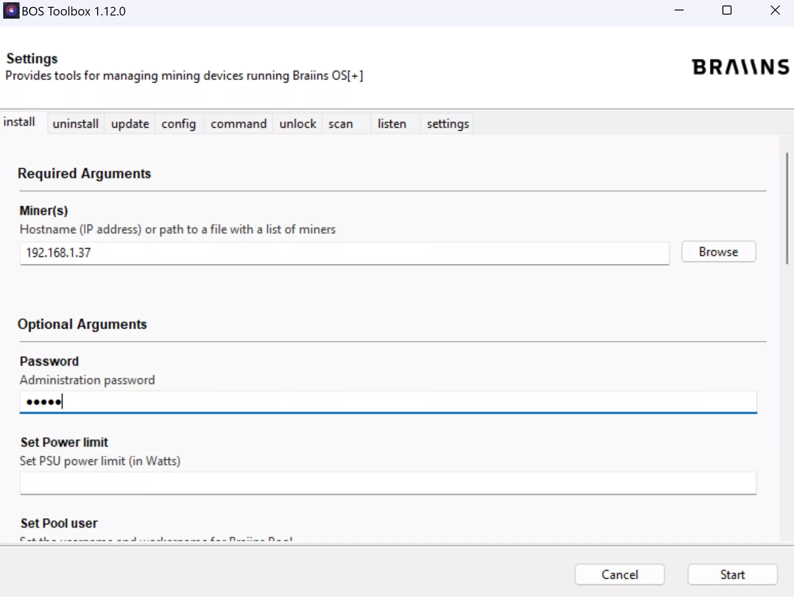

9. Haciye igihe gito, Antminer yawe izosubira gukora maze uzoshobora gushika kuri Braiins OS+ Interface kuri IP Address yatanzwe, hano 192.168.1.37, ataco uhinduye mu murongo wa Address w’umucukumbuzi wawe. Izina ry'ukoresha ry'imbere ni "umuzi" kandi nta jambobanga ry'imbere.

## Gutunganya BraiinsOS+

<chapterId>36e432f2-85bc-52d0-a62a-009fc4c69338</chapterId>

Uzokenera kwifatanya na ASIC yawe ukoresheje IP yo mu karere Address y’igikoresho cawe kiri ku rubuga rwawe biciye ku mucukumbuzi.

Ushobora kuronka IP Address y’imashini yawe ukoresheje igikoresho ca BOS toolbox canke ukayironka kuri paji y’urubuga rwa router yawe.

Ivyemezo vy'imbere ni bimwe n'ivy'intango.

- izina ry'ukoresha: umuzi
- ijambobanga: (nta n'imwe)

Uzoca uramutswa n’Igikoresho ca Brains OS+.

### Urubaho

Kuri iyi paji ya mbere, urashobora kwihweza ingene imashini yawe ikora mu gihe nyaco.

- Ivyerekana bitatu vy’igihe nyaco vyerekana ubushuhe, Hashrate, n’ingene imashini yawe imeze muri rusangi.
- Iburyo, Hashrate nyayo, ubushuhe bwa chip, ubushobozi bugereranywa mu W/THs, n’inguvu zikoreshwa.
- Hasi, umuvuduko w’umuyaga nk’ijanisha ry’umuvuduko munini cane n’umubare w’ibizunguruka ku munota.

- Mu nyuma, uzosanga hariho ivyerekanwa vy’ido n’ido ku hashboard imwe imwe. Ubushuhe buringaniye bw’urubaho n’ibice birimwo, hamwe n’inguvu z’umuriro n’incuro.
- Ivyerekeye ibidengeri vya Mining bikora biri mu Bidengeri.
- Igihugu c'ugutunganya mu Kibanza c'Itunganya.
- Iburyo, amakuru arambuye yerekeye amakuru yoherezwa mu kidengeri.

### Gutunganya

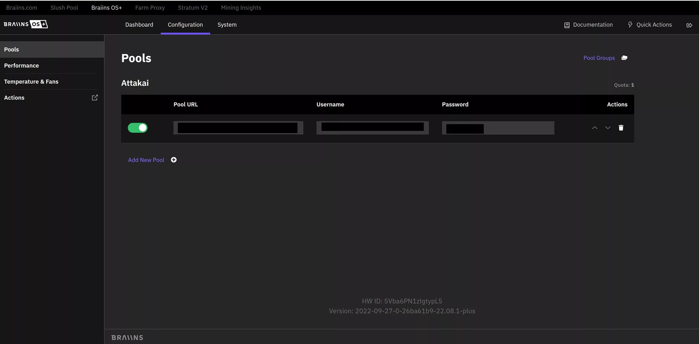

### Ubugyo

### Ibikorwa vyihuta

# Attakai - Guhindura umufana

<partId>98266a8f-3745-58a0-9f6b-26a9734e1427</partId>

## Subirizaho umuvuduko w'amashanyarazi Supply

<chapterId>0c6befa7-f3ef-5bcf-ae8d-0ad5e5d41d70</chapterId>

> IMBURIZO: Ni ngombwa ko uba warashizeho Braiins OS+ kuri Miner yawe, canke iyindi porogarama yose ishobora kugabanya ubushobozi bw’imashini yawe. Ico gipimo ni ikintu gihambaye cane kuko kugira ngo tugabanye urusaku, tuzoshiraho ama ventilateur atagira ubushobozi bwinshi ashobora gukuraho ubushuhe buke.

### Ibikoresho bisabwa

- 1 Noctua NF-A6x25 umuyaga
- 2.5mm2 isukari y'umukozi w'umuyagankuba

> IMBURIZO: Mbere na mbere, imbere y’uko utangura, urabe neza ko ukuye umuyagankuba wawe Miner kugira ngo wirinde ingorane iyo ari yo yose yo gukubitwa n’umuyagankuba.

Ubwa mbere, ukureho izo nkoko 6 ziri ku ruhande rw’ico kigega ziyigumya. Ivyo bipfukisho bimaze gukurwaho, fungura neza igikapu kugira ngo ukureho uburinzi bw’ipulasitike bupfutse ivyo bihimba.

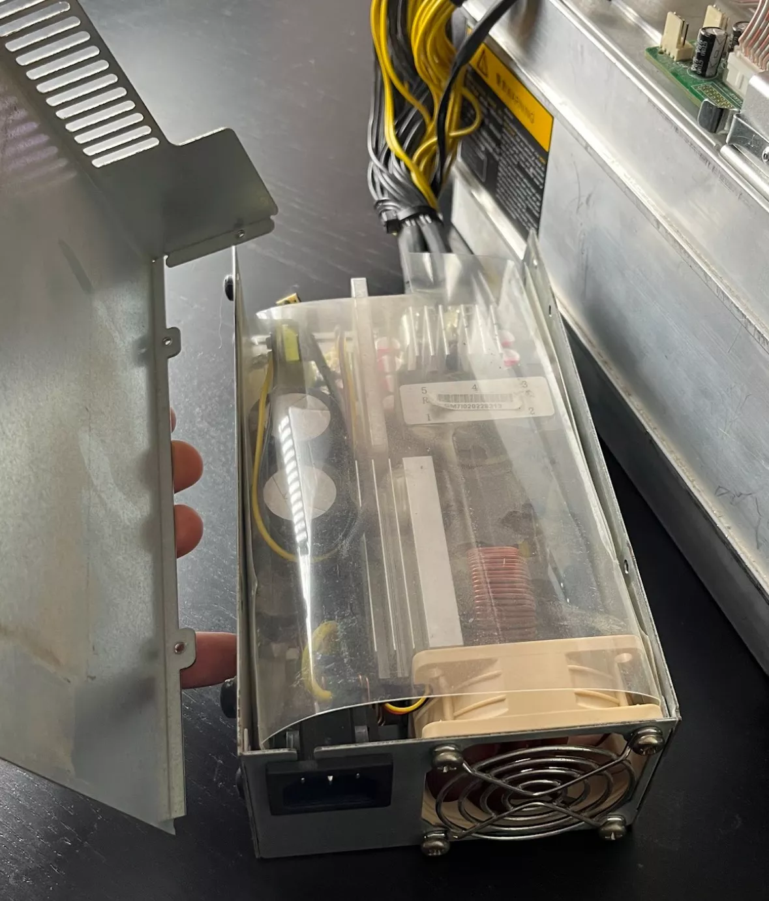

Igikurikira, ni igihe co gukuraho umuyaga w’intango, ukitwararika kugira ngo ntuhonye ibindi bihimba. Kugira ngo ubikore, nukureho ibipfukisho biyifata mu kibanza cayo maze ukureho buhoro buhoro iyo glue yera ikikuje iyo nkoko. Ni vyiza gukomeza witonze kugira ngo ntuhonye amawaya canke ibifatanya.

Iyo ventilateur y’intango ikuweho, uzobona ko ama connecteurs y’i ventilateur nshasha ya Noctua adahuye n’ay’i ventilateur y’intango. Nkako, iyo ventilateur nshasha ifise intsinga 3, harimwo n’intsinga y’umuhondo ituma umuntu ashobora kugenzura umuvuduko. Ariko rero, iyo nsinga ntizokoreshwa muri iki gihe kidasanzwe. Kugira ngo umuntu ashobore gufatanya iyo ventilateur nshasha, ni vyiza rero ko akoresha adapteur idasanzwe. Ariko rero, birahambaye kumenya yuko rimwe na rimwe iyo adapteur ishobora kugora kuronka.

Nimba udafise iyo adapteur, urashobora gukomeza gufatanya iyo ventilateur nshasha ukoresheje isukari y’umuhinga mu vy’amashanyarazi. Kugira ngo ubikore, uzokenera guca intsinga z’umuyaga wa kera n’uwa kera.

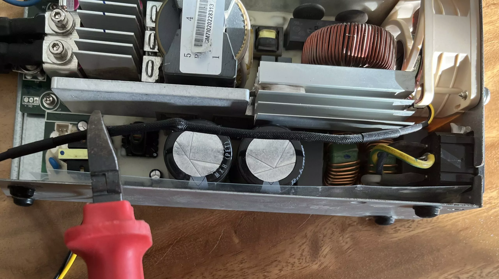

Ku gikoresho gishasha co gucapura, ukoreshe igikoresho co gucapura maze uce witonze imirongo y’igipfukisho nyamukuru ku cm 1 utacitse ibipfukisho vy’imirongo iri musi.

Hanyuma, mu gukurura igipfukisho nyamukuru kija hasi, uce igipfukisho c’imirongo y’umutuku n’iy’umwirabura nk’uko vyari kera. Kandi ukate umugozi w’umuhondo.

Ku gikoresho ca kera c’umuyaga, birarushiriza kuba vyiza guca igipfukisho nyamukuru ataco wononekaye igipfukisho c’intsinga zitukura n’iz’umwirabura. Kugira ngo ivyo bishoboke, twakoresha urushinge rwadushira hagati y’igipfukisho nyamukuru n’intsinga zitukura n’iz’umwirabura.

Intsinga zitukura n’iz’umwirabura zimaze kugaragara, uce ukata neza izo nkoko kugira ngo ntuhonye intsinga z’umuyagankuba.

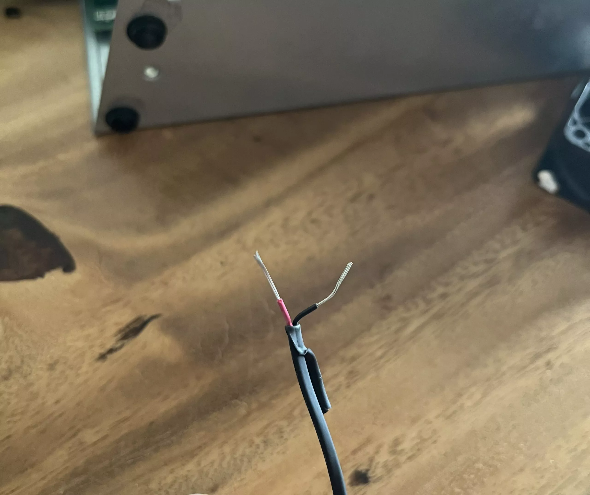

Hanyuma, ushire intsinga n’isukari, umurongo w’umwirabura n’umwirabura, umurongo w’umutuku n’umutuku. Ushobora kandi kwongerako umugozi w’umuyagankuba.

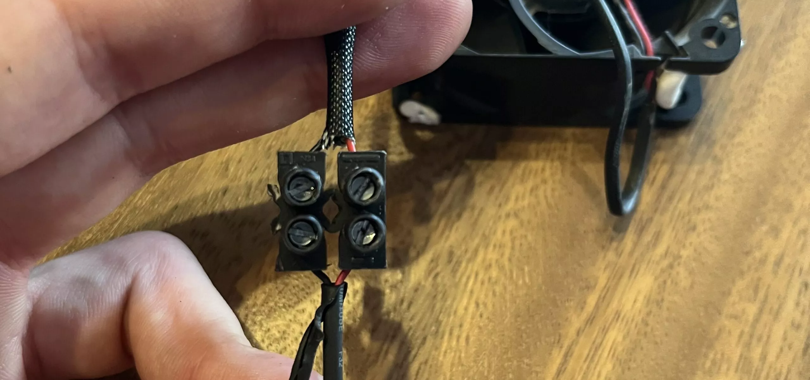

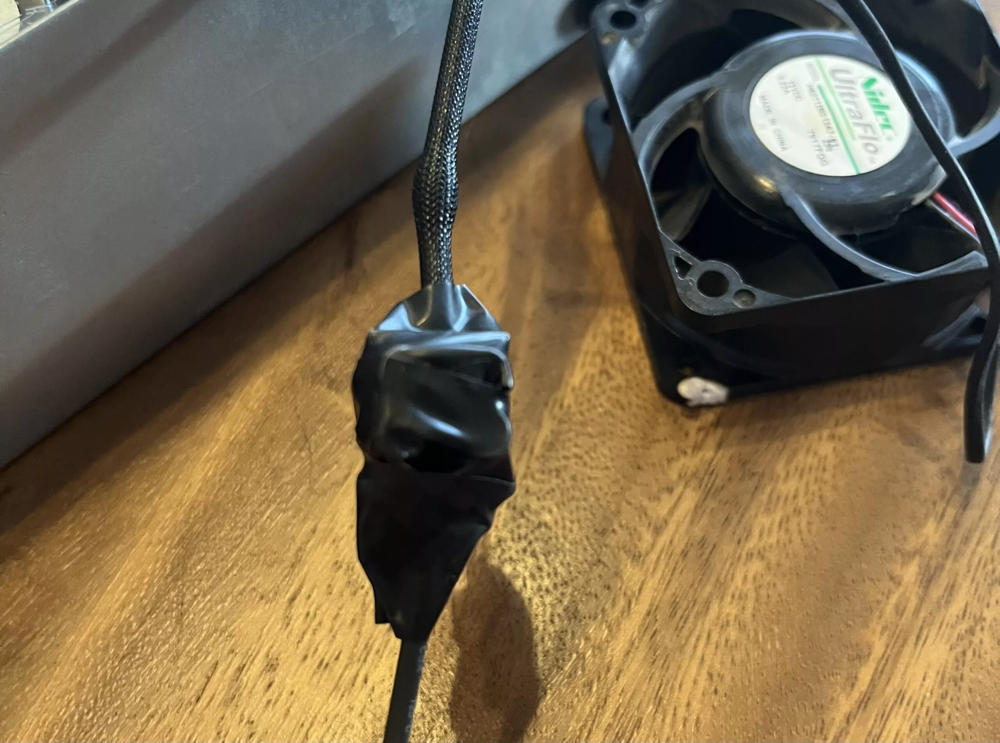

Iyo connection imaze gukorwa, ni igihe co gushiramwo ventilateur nshasha ya Noctua irimwo grille n’ibikoresho vya kera. Ivyo bikoresho bishasha biri muri ako gasandugu bizosubira gukoreshwa mu nyuma. Raba neza ko uyishira mu kibanza kibereye. Uzobona umwampi ku ruhande rumwe rw’ico gikoresho, werekana iyo umuyaga uja. Ni vyiza gushiramwo umuyaga kugira ngo uwo mwampi werekane imbere mu gitereko. Hanyuma wongere ushiremwo umuyaga.

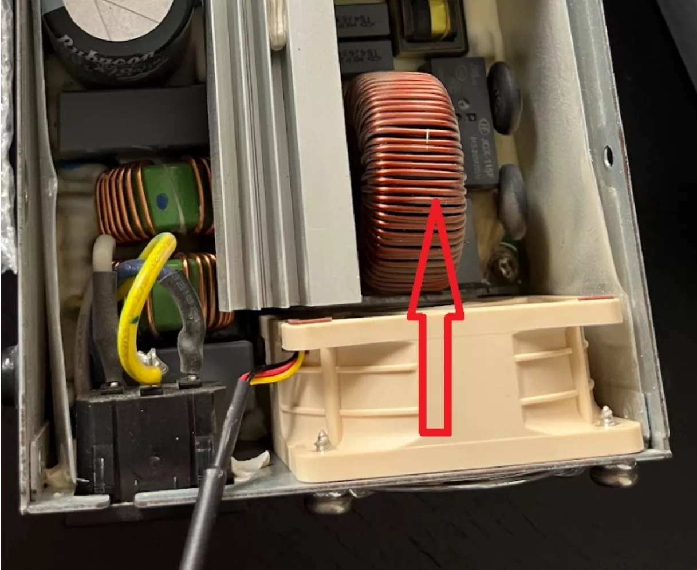

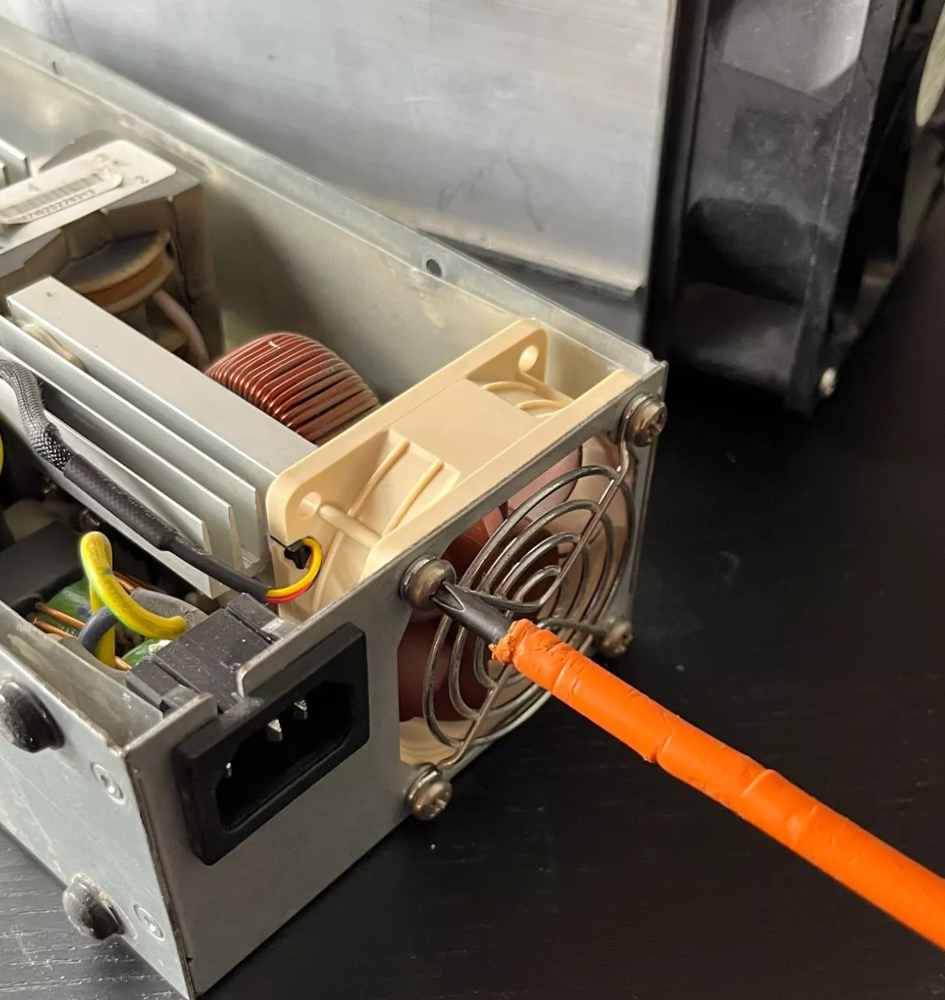

> Ivyo ushobora guhitamwo: Niba ufise ubumenyi mu vy’amashanyarazi, urashobora kwongerako ataco uhinduye umuyagankuba w’umugore w’iminota 5,5 ku nzira y’umuyagankuba wa 12V, ivyo bikaba bizotanga umuyagankuba ku kiraro ca Vonet Wi-Fi. Ariko rero, nimba utazi neza ubuhinga bwawe bwo gukoresha umuyagankuba, ni vyiza gukoresha iyo nzira ya USB ifise igikoresho co gucapura nk’ico kuri telefone ngendanwa kugira ngo wirinde ingorane iyo ari yo yose yo gutuma umuyagankuba ugenda mugufi canke ngo umuyagankuba wononekare.

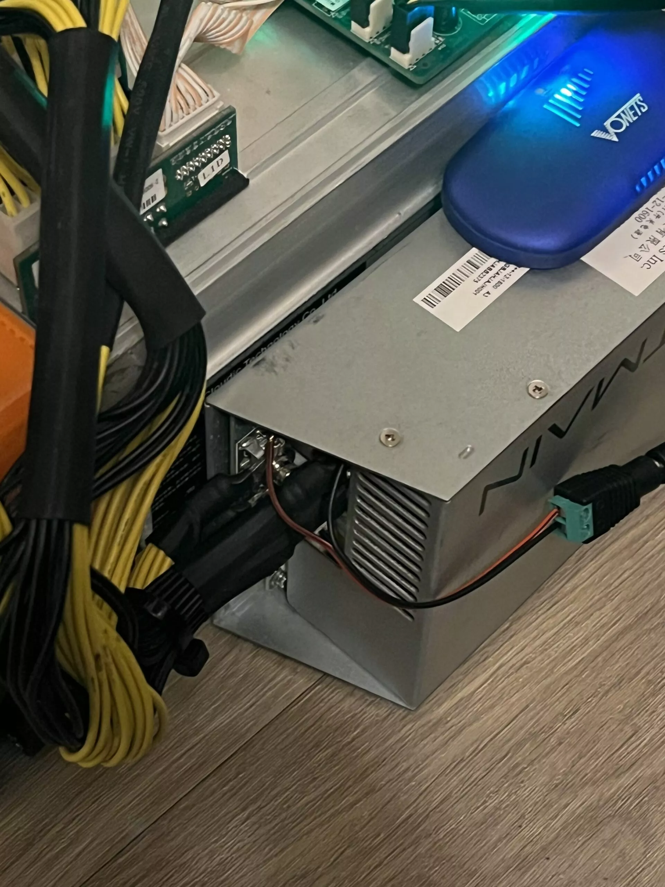

Amahuza amaze gukorwa, ushire igipfukisho c’ipulasitike hejuru y’ipulasitike y’igisandugu atari imbere.

Ubwa nyuma, usubize igipfukisho c’ikibazo mu kibanza caco maze ushireko izo nkoko 6 ku mpande kugira ngo vyose bigume mu kibanza cavyo. Kandi aho urafise, igikapu cawe c’ububasha Supply ubu gifise umuyaga mushasha.

## Gusubirira abafana bakuru

<chapterId>a29f60f1-3fa3-57fc-a630-9c97cec30e56</chapterId>

> IMBURIZO: Ni ngombwa ko uba warashizeho Braiins OS+ kuri Miner yawe, canke uwundi murongo wose ushobora kugabanya ubushobozi bw’imashini yawe. Ico gipimo ni ikintu gihambaye cane kuko kugira ngo tugabanye urusaku, tuzoshiraho ama ventilateur atagira ubushobozi bwinshi, ivyo bikaba bizotuma ubushuhe buke bugenda.

### Ibikoresho bisabwa

- 2 ibice 3D adapteur 140mm kugeza kuri 120mm
- 2 Noctua NF-A14 iPPC-2000 abafana ba PWM
- 2 140mm amabara y'umuyaga

> IMBURIZO: Mbere na mbere, imbere ya vyose, urabe ko ucitse Miner yawe kugira ngo wirinde ingorane iyo ari yo yose yo gukubitwa n’umuyagankuba.

1. Ubwa mbere, ushire ama ventilateur maze uyafungure.

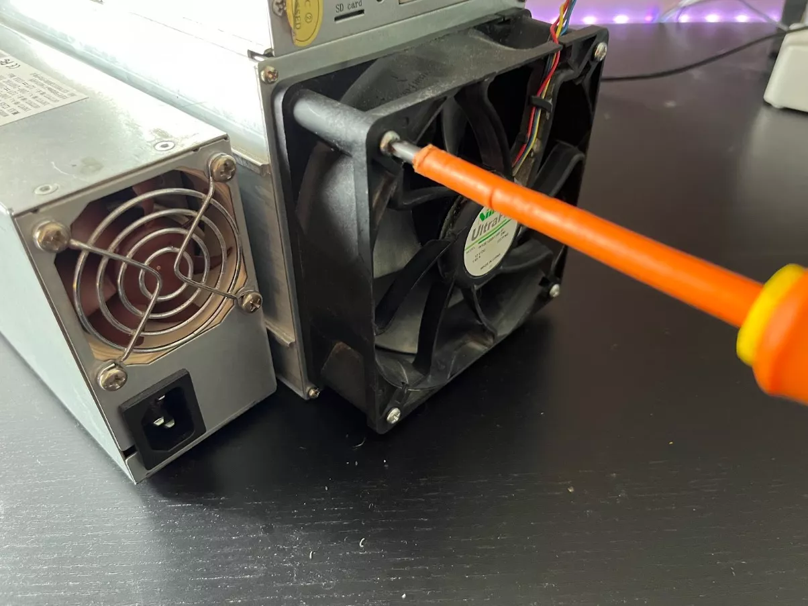

2. Ivyo gufatanya ama fans mashasha ya Noctua ntibihuye n’ivyo mu ntango, ariko ntimuhagarike umutima! Kura igikoresho cawe co gucapura maze uce neza utugingo ngengabuzima dutoduto tw’ipulasitike kugira ngo ivyo bifatanya bibe neza kuri Miner yawe.

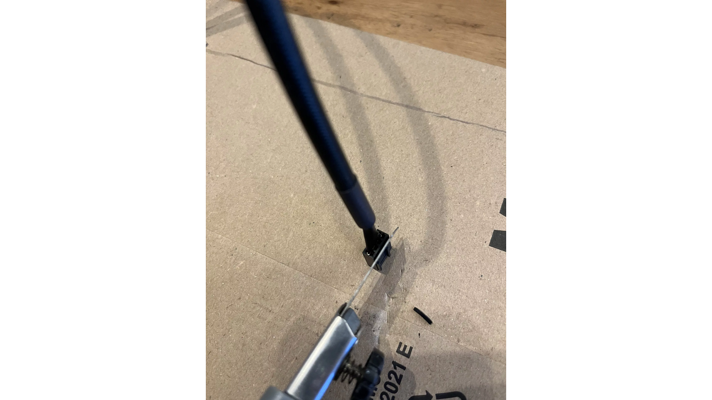

3. Igihe co gushiramwo ibice vya 3D kirageze!

Bishire ku mpande zompi za Miner ukoresheje amavide wakuye mu bipfunsi. Bishiremwo gushika umutwe w’igipfukisho ushitse ku rugero rumwe n’igice ca 3D kandi kikaba kiri mu kibanza caco. Urabe neza ko udakomeza cane, kuko woshobora gutuma ico gice gihinduka kandi kimwe mu bipfukisho coshobora gukora ku gikoresho co gufatanya umuriro!

4. None rero reka tugende ku bafana.

Bishire ku bihimba vy’ubuhinga bwa 3D ukoresheje amavidewo ari mu gasandugu. Witwararike iyo umuyaga unyura, imyampi iri ku mpande z’ibipfunsi izokwerekana iyo ukwiye gukurikira. Va ku ruhande rw’icuma ca Ethernet uja ku rundi ruhande. Raba ifoto iri musi.

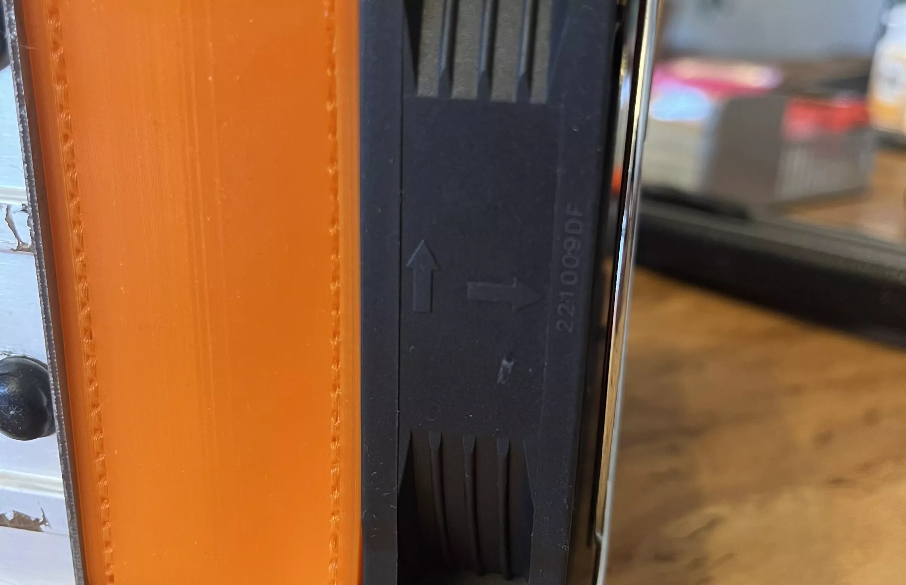

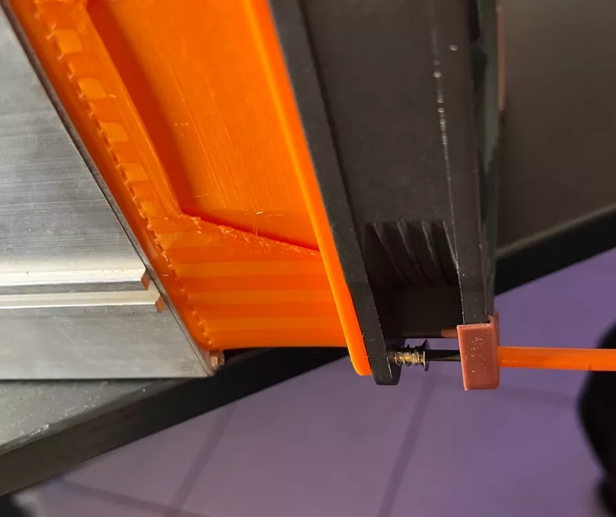

5. Intambwe ya nyuma: ushiremwo ama ventilateur maze ushireko ama grilles hejuru n’ibikoresho bitakoreshejwe mu gasandugu k’ama ventilateur y’ububasha Supply. Ufise 4 gusa, ariko 2 ku grille mu mfuruka zitandukanye zizoba zihagije. Ushobora kandi kurondera amavi nk’ayo mu iduka ry’ibikoresho vy’ubuhinga nimba bikenewe.

Mu gihe urindiriye gushobora gutanga igipfukisho giteye igomwe kuruta c’igikoresho cawe gishasha co gushushanya, urashobora gufatanya igipfukisho n’ububasha Supply n’imirongo y’amashanyarazi.

Kandi ku bijanye n'uguheza, huza ikiraro ca Vonet n'icuma ca Ethernet n'ububasha bwaco Supply.

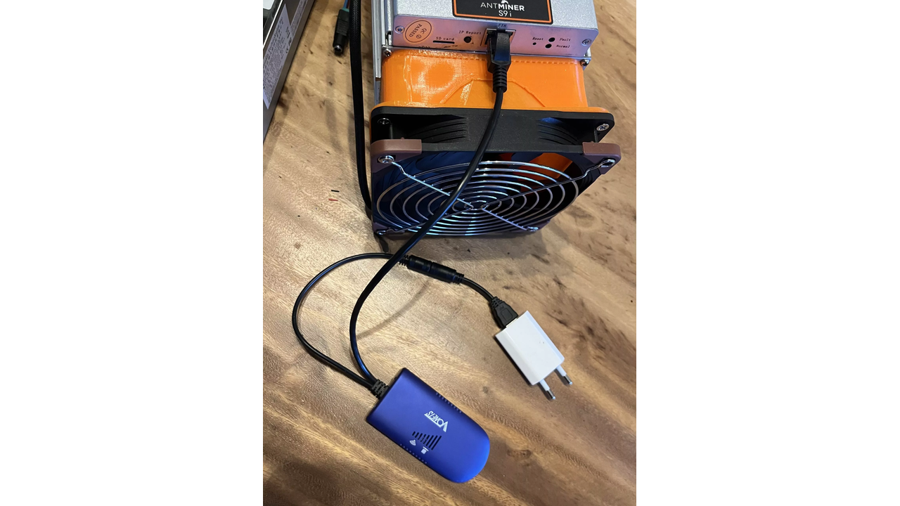

Kandi aho niho ufise, urakoze! Ubu nyene warasubirije igice cose c'ubuhinga bwa Miner yawe. Ubu rero ukwiye kwumva urusaku ruto cane.

# Attakai - Itunganywa

<partId>9c3918a8-d9a3-5a1f-bb9a-70314f7ac175</partId>

## Kwifatanya na Mining pool

<chapterId>b57a6105-0a53-5fe9-bad1-d6d9daf97c0d</chapterId>

Umuntu arashobora kwiyumvira Mining pool nk’ishirahamwe ry’uburimyi. Abarimyi bafatanya umusaruro wabo kugira ngo bagabanye itandukaniro rya Supply n’ivyo basaba gutyo baronke inyungu idahinduka y’ibikorwa vyabo. Mining pool ikora muri ubwo buryo nyene, n’umutungo usangiwe ari hashes. Nkako, kuvumbura Hash imwe ifise akamaro bituma umuntu ashobora kurema igice c’ibarabara no gutsinda coinbase canke impembo, ubu ni 6.25 BTC hamwe n’amahera y’ugucuruza ari muri ico gice.

Iyo wimba wenyene, uzohezagirwa gusa iyo ubonye block. Kubera ko uri mu mahiganwa n’abandi bacukuzi bose bo kw’isi, woba ufise amahirwe make cane yo gutsinda iyo loteri kandi woba ugikeneye kwishura amahera ajanye no gukoresha Miner yawe ata n’ikimenyamenya co kuroranirwa. Mining ikoranya Address iki kibazo mu gukoranya ubushobozi bwo gukoresha ubuhinga bwa none bw’abacukuzi benshi (ibihumbi) no gusangira ingororano zabo bishingiye ku ijanisha ry’abagira uruhara muri Hashrate y’ico kigo iyo habonetse ububiko. Kugira ngo ubone mu ciyumviro amahirwe yawe ya Mining a block yonyene, urashobora gukoresha iki gikoresho. Mu kwinjiza amakuru y’indege ya Antminer S9, turashobora kubona ko amahirwe yo kuronka Hash ishobora gutuma umuntu ashobora kurema igice c’ibarabara ari 1 kuri 24.777.849 ku gice kimwekimwe cose canke 1 kuri 172.068 ku musi. Mu mpande zose (n’i Hashrate idahinduka n’ingorane), vyofata n’imiburiburi imyaka 471 kugira ngo umuntu aronke ibuye (uko ingorane zigenda zirushiriza).

Ariko rero, kubera ko vyose biri muri Bitcoin bishingiye ku bishoboka, rimwe na rimwe birashika ko abacukuzi b’amabuye y’agaciro bonyene bahembwa kubera ko bafashe iyo ngorane: Solo Bitcoin Miner Itorera umuti Ikibazo N’Igipimo ca Hash c’10 TH/s gusa, Itsinda Ibibazo Bidashoboka Cane Depc –

Niba ukunda gukina urusimbi, urashobora kugerageza, ariko umurongozi wacu ntazokwibanda kuri iyo nzira. Ahubwo tuzokwibanda ku Mining pool ihuye cane n’ivyo dukeneye mu guhingura uburyo bwo gushusha.

Ivyo umuntu akwiye kwitwararika igihe ahitamwo Mining pool ni ingene ingororano z’ikidengeri zikora, zishobora guhinduka, hamwe n’amahera makeyi imbere y’uko umuntu ashobora gukura ingororano kuri Address. Nk’akarorero, Braiins, itanga porogarama turiko turavuga ngaha, na yo nyene itanga ikidengeri. Ico kidengeri gifise uburyo bwo gutanga impembo bwitwa "Score" butera intege abacukuzi gucukura igihe kirekire. Ukwifatanya birimwo igihe co gukora kigaragazwa nk'"ugutanga amanota Hashrate". Ku bijanye natwe, aho dushaka uburyo bwo gushushanya bushobora gufungurwa iminota mikeyi gusa, iyo si yo nzira nziza yo gutanga impembo. Turahitamwo uburyo bwo gutanga impembo buduha impembo ingana ku bijanye n’uruhara rwose. Ikindi, amafaranga makeyi yo gukura muri Braiins Pool ni 100.000 Sats na On-Chain. Rero turatakaza Sats zimwe zimwe mu mahera y’ugucuruza kandi igice c’impera yacu gishobora gukingirwa iyo tutacukuye bihagije mu gihe c’imbeho.

Icogereranyo c'impera kidushimisha ni PPS, kikaba gisobanura "kwishura ku mugabane". Ivyo bisigura ko Miner izoronka impembo ku mugabane wose ufise akamaro. Hariho kandi uburyo butandukanye bw’iyi nzira, FPPS (Full Pay Per Share), butagabanya gusa impembo y’amahera, ariko kandi n’amahera y’ugucuruza ari muri iyo nzira. Ivyo bidengeri vya Mining dusaba ko vyo gufatanya Mining yawe/ugushushanya ni ibidengeri vya Linecoin (FPPS) na Nicehash (PPS).

- Nicehash: Ivyiza vya Nicehash ni uko gukura amahera bishobora gukorwa hakoreshejwe Lightning n’amahera makeyi. Ikindi, amahera makeyi yo gukura ni 2000 Sats. Ikibi ni uko Nicehash ikoresha Hashrate yayo ku Blockchain itanga inyungu nyinshi, ata vy’ukuri itanga ububasha ku wuyikoresha, rero bishobora kutaba ngombwa ko itanga umusanzu kuri Bitcoin Hashrate.

- Linecoin: Inyungu ya Linecoin ni umubare w’ibintu bitangwa, nk’urutonde rw’ibintu vy’ido n’ido, ubushobozi bwo gukura amahera ukoresheje Paynym (BIP 47) kugira ngo umuntu akingire neza ubuzima bwiwe bwite, n’ugushiramwo Telegram bot hamwe n’ubuhinga bwo kwikoresha bushobora guhindurwa ataco buvuze mu gikoresho co gukoresha telefone ngendanwa. Ico kidengeri gicukura gusa amabuye y’agaciro yitwa Bitcoin, ariko amahera makeyi yo gukuramwo aguma ari menshi cane, ni 100.000 Sats. Tuzosuzuma Interface ya kimwe muri ivyo bidengeri mu buryo burambuye mu kiganiro kizoza.

Kugira ngo utunganye ikidengeri muri Braiins OS+, uzokenera gukora konti muri kimwe mu bidengeri uhisemwo. Aha tuzofata akarorero ka Linecoin:

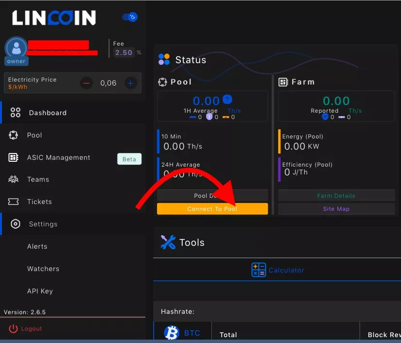

Konti yawe imaze kuremwa, kanda kuri Connect To Pool .

Hanyuma ukope Stratum Address n'izina ryawe:

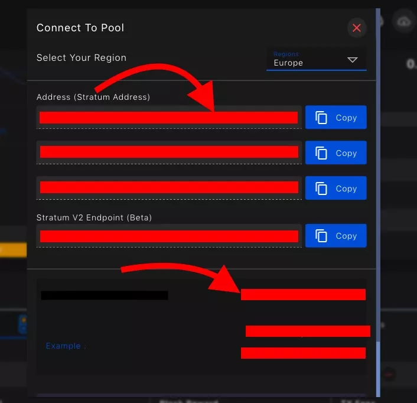

Ubu ushobora gusubira kuri Braiins OS+ Interface kugira ngo winjize ivyo bimenyetso. Ku bijanye n'ijambobanga, ushobora gusiga umwanya uri ubusa.

## Gutuma Antminer yawe S9 ikora neza.

<chapterId>25380972-31c7-540d-80d8-17a06b171ca0</chapterId>

Ivyo bibiri, overclocking n’autotuning, birimwo guhindura incuro ku bipande vy’amajwi kugira ngo ASIC ikore neza. Itandukaniro hagati y’ivyo bibiri riri mu kuntu ivyo bimenyetso vy’incuro bikomeye.

Overclocking ni uguhindura vyoroshe birimwo kwongera incuro ku bipande vy’ivyuma kugira ngo wongere igipimo ca Hash c’imashini. Ku rundi ruhande, gukoresha isaha iri munsi y’igihe, birimwo kugabanya incuro z’isaha y’umurongo w’uruzitiro rwuzuye munsi y’incuro zayo z’izina. Mu kugabanya incuro isaha y’iyi ASIC biciye mu gukoresha isaha y’inyuma, ubushuhe buva ku bikoresho na bwo buragabanywa. Ivyo bituma umuvuduko w’ibikoresho bikoreshwa mu gukonjesha ASIC ugabanuka, kuko bidategerezwa gukora nka Hard kugira ngo bigumye bifise ubushuhe bukwiye. Mu kugabanya umuvuduko w’umuyaga, urusaku ruterwa na ASIC na rwo nyene ruragabanywa. Ivyo bishobora kuba ngirakamaro cane cane ku bakoresha bakoresha ASICs mu rugo kandi bariko barondera kugabanya urusaku ruterwa n’ibikoresho vya Mining.

Braiins OS+ ifasha gukoresha igihe kirenze, gukoresha igihe gito c’ama ASIC, no guhindura igihe c’ama ASIC. Ituma abakoresha bashobora guhindura incuro isaha y’ibikoresho vyabo mu buryo bubereye kugira ngo bashobore gukora neza canke bazigame inguvu bivanye n’ivyo bakunda.

### Gutuma Antminer S9 yawe ikora neza n'ugutunganya

Imbere y’umwaka wa 2018, abacukuzi bari bafise uburyo bubiri bwo kuronka inyungu mu gikorwa cabo: kuronka amashanyarazi ku giciro gisanzwe no kugura ibikoresho bikora neza kuruta. Ariko mu mwaka w’2018, harabonetse iterambere rishasha mu bijanye n’ubuhinga bwa none n’ubuhinga bwa none bwa Mining, bwitwa AsicBoost. Ubwo buryo buratuma abacukuzi bagabanya amahera bakoresha hafi 13% mu guhindura porogarama zikoreshwa ku bikoresho vyabo.

Ubu, hariho iterambere rishasha mu bijanye n’ubuhinga bwa none n’ubuhinga bwa none Mining ryitwa autotuning, ritanga akamaro kanini kuruta AsicBoost. ASICs zigizwe n’utugingo ngengabuzima dutoduto twinshi twa mudasobwa dukora hashing. Ivyo bice bikozwe muri silikoni, kikaba ari co kintu nyene gikoreshwa cane mu bikoresho bikoreshwa n’umuyagankuba be n’ibindi bikoresho bikoreshwa n’umuyagankuba. Ico dutahura aha ni uko ibice vyose vya silikoni bitasa, kimwe cose gishobora gutandukanywa gatoyi mu bijanye n’umuyagankuba waco. Abahinguzi b’ibikoresho vy’ubuhinga bwa none barabizi kandi baratangaza ivyerekeye ubushobozi bw’amamashini yabo Mining bishingiye ku rugero rwo hasi rw’ivyo bashobora kwihanganira. Mu yandi majambo, abahinguzi barazi incuro ikora neza ku bice vy’umubiri kandi bakoresha iyo nkuru mu buryo bumwe ku bice vyose biri mu mashini.

Ivyo bishira umupaka wo hejuru ku rugero rwa Hash imashini ishobora kugira. Autotuning ni uburyo aho ubuhinga busuzuma incuro nziza zo gukora hashing y’ibice ku bice, aho gufata imashini yose nk’ikintu kimwe. Ivyo bisigura ko igice c’agaciro kanini gishobora gukora ama hashes menshi ku segonda kizoronka incuro nyinshi, igice c’agaciro gatoyi gishobora gukora ama hashes make cane kizoronka incuro nke cane. Chip-level autotuning ni uburyo bwo gutuma ASIC ikora neza biciye ku maporogarama n’amaporogarama akoreshwa kuri yo.

Iherezo ry’ivyo ni igipimo kinini cane ca Hash ku watt y’umuyagankuba, ivyo bikaba bisobanura ko abacukuzi bashobora kuronka inyungu nyinshi. Impamvu imashini zidakwiragizwa n’ubwo bwoko bwa porogarama ni uko uguhinduka kw’imashini kudakwiriye, kuko abakiriya bashaka kumenya neza ivyo bariko bararonka, rero ni iciyumviro kibi ku bahinga bagurisha igicuruzwa kidafise ubushobozi buhoraho kandi bushobora gutegekanirwa kuva ku mashini imwe gushika ku yindi. Ikindi, autotuning ku rugero rwa chip bisaba uburyo bwinshi bwo guteza imbere, kuko biragoye gushirwa mu ngiro. Abahinguzi baramaze gukoresha amahera menshi mu guhingura ama firmware yabo. Hariho ubuhinga bwo gutorera umuti ibibazo bishobora gutuma umuntu ashobora guhindura ibintu, nka Braiins OS+. Uretse no gutuma ASIC ikora neza gushika ku bice 20%.

# Igice ca nyuma

<partId>fa42ec0b-b1fd-47f6-8268-6eab684c1d2b</partId>

## Amasuzuma n'Ibipimo

<chapterId>6af13742-df68-5cf4-b7aa-93dc0c2eaae9</chapterId>

<isCourseReview>true</isCourseReview>

## Ikibazo canyuma

<chapterId>f51a7c88-3b7e-48df-b45f-22bb10fe619f</chapterId>

<isCourseExam>true</isCourseExam>

## Iciyumviro

<chapterId>2941f29a-d6ce-4a3c-b61b-6e399f5395b1</chapterId>

<isCourseConclusion>true</isCourseConclusion>