# สร้างเครื่องทำความร้อนบิตคอยน์ DIY เครื่องแรกของคุณ

หลักสูตรนี้สร้างขึ้นรอบ ๆ Attakai ซึ่งเป็นโครงการ DIY เชิงปฏิบัติที่เปลี่ยนเครื่องขุด S9 มือสองให้กลายเป็นเครื่องทำความร้อนบิตคอยน์สำหรับบ้าน

คุณจะเริ่มต้นด้วยภาพรวมโดยย่อของการขุด Bitcoin และความเป็นจริงของอุตสาหกรรมการขุด จากนั้นจะเข้าสู่การสร้างโดยตรง: การหาฮาร์ดแวร์ที่เหมาะสม การติดตั้งและกำหนดค่า BraiinsOS+ การตั้งค่าเครือข่าย การเปลี่ยนพัดลม การเข้าร่วมกลุ่มขุด และการเพิ่มประสิทธิภาพสำหรับความร้อน เสียงรบกวน และประสิทธิภาพ

คู่มือทีละขั้นตอนจะแนะนำคุณผ่านกระบวนการทั้งหมด เพื่อให้คุณสามารถสร้าง Attakai ที่บ้านและขุดแซทส์แรกของคุณในขณะที่ทำให้พื้นที่ของคุณอบอุ่น

+++

# บทนำ

<partId>a99dc130-3650-563f-8d42-a0b5160af0ab</partId>

## ภาพรวมของหลักสูตร

<chapterId>7ad1abeb-a190-5c85-8bff-44df71331e4d</chapterId>

ยินดีต้อนรับสู่ MIN 304 หลักสูตรเกี่ยวกับโครงการ Attakai Ajelex, Jim และ Rogzy จะแนะนำคุณผ่านองค์ประกอบที่จำเป็นของการขุด Bitcoin จากนั้นจะพาคุณไปทีละขั้นตอนในการสร้าง Attakai ของคุณ ซึ่งเป็นระบบทำความร้อนในบ้านแบบ DIY ที่ทำจาก S9 มือสอง เราหวังว่าคุณจะสนุกกับหลักสูตรและเริ่มต้นการผจญภัยการขุดที่บ้าน!

การฝึกอบรมนี้จะพาคุณเข้าสู่ใจกลางของอุตสาหกรรม Bitcoin mining โดยให้ความรู้ทั้งทางทฤษฎีและปฏิบัติ ไม่ว่าคุณจะเป็นมือใหม่หรือคุ้นเคยกับหัวข้อนี้อยู่แล้ว หลักสูตรนี้จะช่วยให้คุณเข้าใจด้านเศรษฐกิจและเทคนิคของ mining พร้อมทั้งทำโครงการปฏิบัติในการปรับใช้ ASIC สำหรับการทำความร้อนในบ้าน

**ส่วนที่ 2: การขุด การทำงาน อุตสาหกรรม และความท้าทาย**

ในส่วนนี้ เราจะให้ความเข้าใจอย่างครอบคลุมเกี่ยวกับ Bitcoin mining เราจะครอบคลุมถึงการทำงานทางเทคนิคของ mining บทบาทของมันในโปรโตคอล Bitcoin และผลกระทบทางเศรษฐกิจและภูมิรัฐศาสตร์ คุณจะได้สำรวจความสัมพันธ์ที่ซับซ้อนระหว่างราคาบิทคอยน์และ hashrate รวมถึงประเด็นที่เกี่ยวข้องกับอธิปไตยและการกำกับดูแลในอุตสาหกรรม

**ส่วนที่ 3: โฮม Mining และการนำความร้อนกลับมาใช้ใหม่**

ต่อไป เราจะสำรวจการประยุกต์ใช้แนวคิด Attakai ในทางปฏิบัติ ซึ่งมีเป้าหมายเพื่อทำให้ mining สำหรับบ้านเป็นประชาธิปไตยโดยการแปลงเครื่องขุด S9 ที่ใช้แล้วให้เป็นอุปกรณ์ทำความร้อนในบ้าน คุณจะได้เรียนรู้วิธีการซื้อและดัดแปลง ASIC ที่ใช้แล้ว รวมถึงการเตรียมอุปกรณ์ที่จำเป็นสำหรับการดัดแปลงฮาร์ดแวร์

**ส่วนที่ 4: การแก้ไขซอฟต์แวร์ของ Antminer S9**

ที่นี่ คุณจะได้เรียนรู้วิธีการตั้งค่า Antminer S9 ของคุณสำหรับการใช้งานที่บ้าน เราจะแนะนำคุณผ่านการตั้งค่าสะพาน Wi-Fi/Ethernet การรีเซ็ตอุปกรณ์ของคุณ การติดตั้ง BraiinsOS+ และการปรับแต่งเพื่อประสิทธิภาพ mining ที่ดีที่สุด

**ส่วนที่ 5: การแก้ไขพัดลม**

ในการเพิ่มประสิทธิภาพ Antminer S9 ของคุณให้ใช้เป็นเครื่องทำความร้อนเสริม ส่วนนี้จะแนะนำคุณในการเปลี่ยนพัดลมของแหล่งจ่ายไฟและพัดลมหลัก การปรับเปลี่ยนเหล่านี้มีความสำคัญในการลดเสียงรบกวนและปรับปรุงประสิทธิภาพการระบายความร้อนของอุปกรณ์

**ส่วนที่ 6: การตั้งค่าระบบทำความร้อน DIY**

ในที่สุด คุณจะได้เรียนรู้วิธีเข้าร่วมกลุ่ม mining และเพิ่มประสิทธิภาพการทำงานของ Antminer S9 ของคุณ คุณจะค้นพบวิธีการบรรลุประสิทธิภาพการใช้พลังงานที่เหมาะสมและขุด satoshis แรกของคุณอย่างมีประสิทธิภาพ

พร้อมที่จะค้นพบโลกของ Bitcoin mining และเผชิญกับความท้าทายที่เป็นรูปธรรมของ Attakai แล้วหรือยัง? มาเริ่มกันเลย!

# การขุด การทำงาน อุตสาหกรรม และความท้าทาย

<partId>aa99ef2c-da29-5317-a533-2ffa4f66f674</partId>

## คำอธิบายของ Mining

<chapterId>36a82de7-87ee-5e7a-b69e-48fc30030447</chapterId>

### Mining อธิบาย: อุปมาอุปไมยของปริศนา

เพื่ออธิบายแนวคิดของ [mining](https://planb.academy/resources/glossary/mining) ในแบบที่เข้าใจง่าย สามารถใช้การเปรียบเทียบที่เกี่ยวข้องได้: นั่นคือการเปรียบเทียบกับจิ๊กซอว์ เช่นเดียวกับจิ๊กซอว์ mining เป็นงานที่ซับซ้อนในการดำเนินการ แต่สามารถตรวจสอบได้ง่ายเมื่อเสร็จสิ้น ในบริบทของ Bitcoin mining [นักขุด](https://planb.academy/resources/glossary/miner)พยายามแก้ปริศนาดิจิทัลที่ซับซ้อนให้เร็วที่สุด นักขุดคนแรกที่แก้ปริศนาได้จะนำเสนอวิธีแก้ปัญหาของตนต่อเครือข่ายทั้งหมด ซึ่งสามารถตรวจสอบความถูกต้องได้อย่างง่ายดาย การตรวจสอบที่สำเร็จนี้ทำให้นักขุดสามารถยืนยัน[บล็อก](https://planb.academy/resources/glossary/block)ใหม่และเพิ่มลงใน Bitcoin Timechain เพื่อเป็นการยอมรับงานของพวกเขาซึ่งมีค่าใช้จ่ายสูง นักขุดจะได้รับ[รางวัล](https://planb.academy/resources/glossary/block-reward)เป็นจำนวนบิตคอยน์ รางวัลนี้ทำหน้าที่เป็นแรงจูงใจทางการเงินให้นักขุดทำงานต่อไปในการยืนยัน[ธุรกรรม](https://planb.academy/resources/glossary/transaction-tx)และรักษาความปลอดภัยให้กับเครือข่าย Bitcoin

ในเครือข่าย Bitcoin เริ่มแรก รางวัลที่ได้รับคือ 50 บิตคอยน์ทุก ๆ สิบนาที ซึ่งสอดคล้องกับการค้นพบบล็อกทุก ๆ สิบนาทีโดยเฉลี่ยโดยนักขุด รางวัลนี้จะลดลงครึ่งหนึ่งทุก ๆ 210,000 บล็อก หรือประมาณทุก ๆ สี่ปี การตอบแทนนี้ทำหน้าที่เป็นแรงจูงใจที่ทรงพลังเพื่อกระตุ้นให้นักขุดเข้าร่วมในกระบวนการ mining แม้จะมีค่าใช้จ่ายด้านพลังงานที่เกี่ยวข้องก็ตาม หากไม่มีรางวัล กระบวนการ mining ที่ใช้ไฟฟ้าอย่างเข้มข้นจะถูกละทิ้ง ซึ่งจะส่งผลกระทบต่อความปลอดภัยและเสถียรภาพของเครือข่าย Bitcoin ทั้งหมด

รางวัล mining ปัจจุบันมีสองส่วน ในด้านหนึ่งคือการสร้างบิตคอยน์ใหม่ ซึ่งลดลงจาก 50 บิตคอยน์ทุกสิบนาทีในตอนแรกเหลือ 6.25 บิตคอยน์ในวันนี้ (2023) ในอีกด้านหนึ่งคือ[ค่าธรรมเนียมการทำธุรกรรม](https://planb.academy/resources/glossary/transaction-fees) หรือที่เรียกว่าค่าธรรมเนียม mining จากธุรกรรมที่นักขุดเลือกที่จะรวมไว้ในบล็อกของพวกเขา เมื่อมีการทำธุรกรรม Bitcoin จะมีการจ่ายค่าธรรมเนียมการทำธุรกรรม ค่าธรรมเนียมเหล่านี้ทำหน้าที่เป็นการประมูลที่ผู้ใช้ระบุว่าพวกเขายินดีจ่ายเท่าใดเพื่อให้ธุรกรรมของพวกเขารวมอยู่ในบล็อกถัดไป เพื่อเพิ่มรางวัลให้สูงสุด นักขุดซึ่งทำหน้าที่ในผลประโยชน์ของตนเองจะเลือกธุรกรรมที่ทำกำไรได้มากที่สุดเพื่อรวมไว้ในบล็อกของพวกเขา โดยคำนึงถึงพื้นที่ที่มีอยู่อย่างจำกัด ดังนั้น รางวัล mining ประกอบด้วยทั้งการสร้างบิตคอยน์ใหม่และค่าธรรมเนียมการทำธุรกรรม เพื่อให้แน่ใจว่ามีแรงจูงใจอย่างต่อเนื่องสำหรับนักขุดและเพื่อให้มั่นใจถึงความยืนยาวและความปลอดภัยของเครือข่าย Bitcoin

### คนงานเหมืองและเครื่องมือของพวกเขา: mining

กระบวนการ mining เกี่ยวข้องกับการค้นหาแฮชที่ถูกต้องซึ่งเป็นที่ยอมรับของเครือข่าย Bitcoin เมื่อคำนวณและพบแล้ว แฮชนี้จะไม่สามารถย้อนกลับได้ คล้ายกับมันฝรั่งที่ถูกเปลี่ยนเป็นมันบด มันยืนยันฟังก์ชันเฉพาะโดยไม่มีความเป็นไปได้ในการย้อนกลับ นักขุดในการแข่งขันใช้เครื่องจักรในการคำนวณแฮชเหล่านี้ แม้ว่าจะเป็นไปได้ในทางทฤษฎีที่จะค้นหาแฮชนี้ด้วยตนเอง แต่ความซับซ้อนของการดำเนินการทำให้ตัวเลือกนี้ไม่สามารถทำได้ ดังนั้นจึงใช้คอมพิวเตอร์ที่สามารถทำการคำนวณเหล่านี้ได้อย่างรวดเร็ว ซึ่งใช้ไฟฟ้าจำนวนมาก

ในช่วงแรก ยุคของ CPU ครอบงำ ซึ่งนักขุดใช้คอมพิวเตอร์ส่วนบุคคลของพวกเขาสำหรับ Bitcoin mining การค้นพบข้อดีของ GPUs (การ์ดจอ) สำหรับงานนี้ถือเป็นจุดเปลี่ยนที่สำคัญ ทำให้ [hashrate](https://planb.academy/resources/glossary/hashrate) เพิ่มขึ้นอย่างมากและลดการใช้พลังงาน ความก้าวหน้าไม่ได้หยุดเพียงแค่นั้น โดยมีการแนะนำ FPGAs (field-programmable gate arrays) ในเวลาต่อมา FPGAs ทำหน้าที่เป็นแพลตฟอร์มสำหรับการพัฒนาวงจรรวมเฉพาะงาน ([ASICs](https://planb.academy/resources/glossary/asic))

ASICs เป็นชิปที่เปรียบได้กับชิป CPU; อย่างไรก็ตาม พวกมันถูกพัฒนาให้ทำการคำนวณเพียงประเภทเดียวในวิธีที่มีประสิทธิภาพที่สุด กล่าวอีกนัยหนึ่ง CPU สามารถทำการคำนวณได้หลากหลายประเภทโดยไม่ได้ถูกปรับให้เหมาะสมกับประเภทใดประเภทหนึ่งโดยเฉพาะ ในขณะที่ ASIC ถูกออกแบบมาให้ทำการคำนวณเพียงประเภทเดียว แต่ทำได้อย่างมีประสิทธิภาพมาก ในกรณีของ Bitcoin ASICs พวกมันถูกออกแบบมาโดยเฉพาะสำหรับการคำนวณอัลกอริทึม [SHA-256](https://planb.academy/resources/glossary/sha256)

ทุกวันนี้ นักขุดใช้ ASICs ที่ออกแบบมาเฉพาะสำหรับการดำเนินการนี้ ซึ่งได้รับการปรับให้เหมาะสมเพื่อทดสอบจำนวนการรวมกันสูงสุดด้วยการใช้พลังงานให้น้อยที่สุดและรวดเร็วที่สุดเท่าที่จะเป็นไปได้ คอมพิวเตอร์เหล่านี้ซึ่งออกแบบมาโดยเฉพาะสำหรับ Bitcoin mining ทำหน้าที่เป็นพยานที่จับต้องได้ถึงการพัฒนาอย่างต่อเนื่องและความเชี่ยวชาญที่เพิ่มขึ้นของอุตสาหกรรม Bitcoin mining การพัฒนาอย่างต่อเนื่องนี้สะท้อนถึงพลวัตภายในของ Bitcoin ซึ่ง[การปรับความยาก](https://planb.academy/resources/glossary/difficulty-adjustment)จะช่วยให้มั่นใจได้ว่าการผลิตบล็อกทุก ๆ สิบนาทีแม้ว่าความสามารถของ mining จะเพิ่มขึ้นอย่างทวีคูณก็ตาม

เพื่อแสดงให้เห็นถึงความเข้มข้นของกระบวนการนี้ ลองพิจารณานักขุดทั่วไปที่สามารถทำได้ 14 เทราแฮชต่อวินาที หรือ 14 ล้านล้านครั้งต่อวินาทีในการหาค่าแฮชที่ถูกต้อง ในระดับของเครือข่าย Bitcoin ขณะนี้เรามีประมาณ 300 เอกซะแฮชต่อวินาที ซึ่งเน้นย้ำถึงพลังรวมที่ถูกระดมใน Bitcoin mining

### การปรับความยาก

การปรับความยากเป็นกลไกที่สำคัญในการดำเนินงานของเครือข่าย Bitcoin เพื่อให้แน่ใจว่าบล็อกถูกขุดในอัตราเฉลี่ยทุกๆ 10 นาที ระยะเวลานี้เป็นค่าเฉลี่ยเพราะกระบวนการ mining เป็นเกมของความน่าจะเป็น คล้ายกับการทอยลูกเต๋าโดยหวังว่าจะได้ตัวเลขที่ต่ำกว่าตัวเลขที่กำหนดโดยความยาก ทุกๆ 2016 บล็อก เครือข่ายจะปรับความยากของ mining ตามเวลาเฉลี่ยที่ใช้ในการขุดบล็อกก่อนหน้า หากเวลาเฉลี่ยมากกว่า 10 นาที ความยากจะลดลง และในทางกลับกัน หากเวลาเฉลี่ยน้อยกว่า ความยากจะเพิ่มขึ้น กลไกการปรับนี้ทำให้แน่ใจว่าเวลาของ mining สำหรับบล็อกใหม่ยังคงคงที่ตลอดเวลา ไม่ว่าจะมีจำนวนผู้ขุดหรือพลังการคำนวณโดยรวมของเครือข่ายมากน้อยเพียงใด นี่คือเหตุผลที่ Bitcoin [Blockchain](https://planb.academy/resources/glossary/blockchain) ถูกเรียกอีกอย่างว่า Timechain

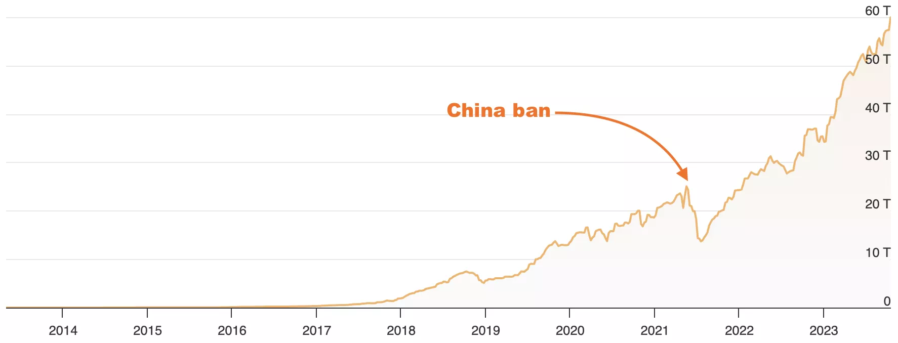

- ตัวอย่างจากประเทศจีน:

กรณีของจีนแสดงให้เห็นถึงความยากลำบากในการปรับกลไกได้อย่างชัดเจน ด้วยพลังงานที่มีอยู่มากและราคาถูก จีนกลายเป็นศูนย์กลางหลักของโลกสำหรับ Bitcoin mining ในปี 2021 ประเทศนี้ได้สั่งห้าม Bitcoin mining ในดินแดนของตนอย่างกะทันหัน ส่งผลให้เกิดการลดลงอย่างมากใน hashrate ของเครือข่าย Bitcoin ทั่วโลก ประมาณ 50% การลดลงอย่างรวดเร็วในพลังของ mining นี้อาจทำให้เครือข่าย Bitcoin เกิดความเสียหายอย่างรุนแรงโดยการเพิ่มเวลาเฉลี่ยของบล็อกสำหรับ mining อย่างไรก็ตาม กลไกการปรับความยากได้เริ่มทำงาน ลดความยากของ mining เพื่อให้แน่ใจว่าความถี่ของบล็อก mining ยังคงอยู่ที่ค่าเฉลี่ย 10 นาที กรณีนี้แสดงให้เห็นถึงประสิทธิภาพและความยืดหยุ่นของกลไกการปรับความยากของ Bitcoin ซึ่งช่วยให้เครือข่ายมีความเสถียรและคาดการณ์ได้ แม้จะเผชิญกับการเปลี่ยนแปลงอย่างกะทันหันและสำคัญในภูมิทัศน์ mining ทั่วโลก

### วิวัฒนาการของเครื่องจักร Bitcoin mining

เกี่ยวกับวิวัฒนาการของเครื่อง Bitcoin mining สิ่งสำคัญที่ควรทราบคือบริบทมีแนวโน้มไปทางรูปแบบธุรกิจแบบดั้งเดิม นักขุดได้รับรายได้จากการตรวจสอบบล็อก ซึ่งเป็นงานที่มีอัตราความสำเร็จค่อนข้างต่ำ รุ่นปัจจุบันที่ใช้อยู่คือ Antminer S9 แม้จะเป็นรุ่นเก่าที่เปิดตัวประมาณปี 2016 แต่ยังคงมีการหมุนเวียนในตลาดมือสอง โดยมีการซื้อขายอยู่ที่ประมาณ €100 ถึง €200 อย่างไรก็ตาม ราคาของเครื่อง mining จะแตกต่างกันไปตามมูลค่าของ Bitcoin และรุ่นใหม่กว่าอย่าง Antminer S19 ปัจจุบันมีการประเมินราคาอยู่ที่ประมาณ €3,000

เมื่อต้องเผชิญกับความก้าวหน้าทางเทคโนโลยีอย่างต่อเนื่องในสาขา mining ผู้เชี่ยวชาญต้องวางตำแหน่งตนเองอย่างมีกลยุทธ์ อุตสาหกรรม mining มีการนวัตกรรมอย่างต่อเนื่อง ดังที่แสดงให้เห็นโดยการเปิดตัวรุ่น J ของ S19 และการคาดการณ์การเปิดตัว S19 XP ซึ่งมีความสามารถ mining สูงขึ้นอย่างมาก นอกจากนี้ การปรับปรุงไม่ได้เกี่ยวข้องเฉพาะกับประสิทธิภาพดิบของเครื่องจักรเท่านั้น ตัวอย่างเช่น รุ่นใหม่ S19 XP มีระบบระบายความร้อนด้วยของเหลว ซึ่งเป็นการปรับเปลี่ยนทางเทคนิคที่ช่วยให้ประสิทธิภาพการใช้พลังงานดีขึ้นอย่างมาก แม้ว่านวัตกรรมจะยังคงเป็นสิ่งที่เกิดขึ้นอย่างต่อเนื่อง แต่การเพิ่มประสิทธิภาพในอนาคตอาจจะน้อยลงเมื่อเทียบกับที่สังเกตได้จนถึงปัจจุบัน เนื่องจากถึงจุดหนึ่งของนวัตกรรมทางเทคโนโลยี

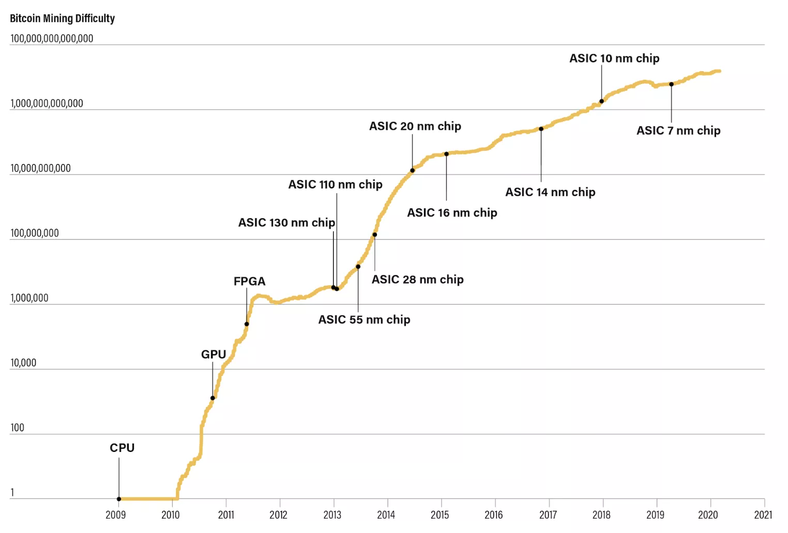

โดยสรุปแล้ว อุตสาหกรรม Bitcoin mining ยังคงปรับตัวและพัฒนาอย่างต่อเนื่อง ผู้เล่นในอุตสาหกรรมต้องคาดการณ์ถึงการลดลงของประสิทธิภาพในอนาคตและปรับกลยุทธ์ของตนให้เหมาะสม ความก้าวหน้าทางเทคโนโลยีในอนาคต แม้ว่าจะยังคงมีอยู่ แต่มีแนวโน้มที่จะเกิดขึ้นในขนาดที่เล็กลง สะท้อนถึงความเติบโตของความเป็นผู้ใหญ่ในภาคส่วนนี้

## อุตสาหกรรม mining

<chapterId>0896dfc1-c97e-5bec-9bf1-8c20b3388a2c</chapterId>

### Mining pools

ปัจจุบัน Bitcoin mining ได้พัฒนาเป็นอุตสาหกรรมที่จริงจังและมีขนาดใหญ่ โดยมีผู้เล่นหลายรายที่เป็นที่รู้จักในที่สาธารณะและมีนักขุดที่สำคัญเพิ่มขึ้นเรื่อยๆ การพัฒนานี้ทำให้ mining เกือบจะไม่สามารถเข้าถึงได้สำหรับผู้เล่นรายเล็กเนื่องจากต้นทุนสูงที่เกี่ยวข้องกับการซื้อเครื่อง mining ใหม่ สิ่งนี้ทำให้เกิดคำถามเกี่ยวกับการกระจาย hashrate ในหมู่ผู้เล่นตลาดต่างๆ สถานการณ์นี้ซับซ้อนเพราะจำเป็นต้องตรวจสอบทั้งการกระจาย hashrate ในหมู่บริษัทต่างๆ และในหมู่[กลุ่ม mining](https://planb.academy/resources/glossary/pool-mining) ต่างๆ

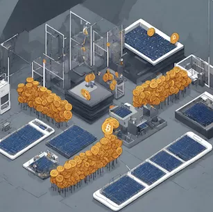

กลุ่ม mining คือกลุ่มของนักขุดที่รวมทรัพยากรการคำนวณของพวกเขาเพื่อเพิ่มโอกาสในการ mining ความร่วมมือนี้เป็นสิ่งจำเป็นเพราะเครื่อง mining ขนาดเล็กที่ทำงานแยกกันกำลังแข่งขันกับยักษ์ใหญ่ในอุตสาหกรรม ซึ่งลดโอกาสในการประสบความสำเร็จอย่างมาก Mining ทำงานบนหลักการลอตเตอรี่ และโอกาสในการชนะบล็อก (และดังนั้นรางวัล Bitcoin) ทุก ๆ สิบนาทีมีน้อยมากสำหรับนักขุดขนาดเล็กแต่ละคน โดยการรวมพลังการคำนวณของพวกเขา นักขุดสามารถรวมทรัพยากรของพวกเขา ค้นหาบล็อกได้บ่อยขึ้น และจากนั้นแจกจ่ายรางวัลตามสัดส่วนการมีส่วนร่วมของนักขุดแต่ละคนในกลุ่ม

ตัวอย่างเช่น หากพูลค้นพบบล็อกและชนะ 6.25 บิตคอยน์ นักขุดที่มีส่วนร่วม 1% ของพลังการประมวลผลทั้งหมดของพูลจะได้รับ 0.0625 บิตคอยน์ หรือ 1% ของ 6.25 บิตคอยน์ที่ได้รับ อย่างไรก็ตาม ควรสังเกตว่าพูล mining มักจะเรียกเก็บค่าคอมมิชชั่นเล็กน้อย (โดยปกติประมาณ 2%) เพื่อครอบคลุมค่าใช้จ่ายในการดำเนินงานของสหกรณ์

### ซอฟต์แวร์ที่ใช้ในอุตสาหกรรม

ในบริบทของ Bitcoin mining บทบาทของซอฟต์แวร์มีความสำคัญพอๆ กับฮาร์ดแวร์ ตัวอย่างหนึ่งที่แสดงให้เห็นคือบทบาทของ Bitmain ผู้ผลิตที่มีชื่อเสียงซึ่งพัฒนา Antminer S9 นอกเหนือจากฮาร์ดแวร์ mining แล้ว อุตสาหกรรมยังพึ่งพา mining pools ที่ทำงานร่วมกันอย่างมาก เช่น Braiinspool ซึ่งควบคุมประมาณ 5% ของ hashrate ทั่วโลกของเครือข่าย Bitcoin

นักแสดงในอุตสาหกรรมนี้กำลังมองหาวิธีเพิ่มประสิทธิภาพอย่างต่อเนื่องผ่านการใช้ฮาร์ดแวร์และซอฟต์แวร์ ตัวอย่างเช่น ซอฟต์แวร์ยอดนิยมที่ใช้ในบริบทนี้คือ BraiinsOS Plus ซอฟต์แวร์นี้แทนที่ระบบปฏิบัติการดั้งเดิมของเครื่อง mining ทำให้สามารถดำเนินการเดียวกันได้อย่างมีประสิทธิภาพมากขึ้น ด้วยซอฟต์แวร์นี้ นักขุดสามารถเพิ่มประสิทธิภาพของเครื่องได้ถึง 25% ซึ่งหมายความว่าสำหรับปริมาณไฟฟ้าที่เท่ากัน เครื่องสามารถผลิต hashrate เพิ่มขึ้นอีก 25% จึงเพิ่มรางวัลที่นักขุดได้รับ การเพิ่มประสิทธิภาพซอฟต์แวร์นี้เป็นองค์ประกอบสำคัญของการแข่งขันใน Bitcoin mining เน้นย้ำถึงความสำคัญของแนวทางบูรณาการที่รวมการปรับปรุงทั้งฮาร์ดแวร์และซอฟต์แวร์เพื่อเพิ่มประสิทธิภาพและผลตอบแทนสูงสุด

### กฎระเบียบและอัตราค่าไฟฟ้า

ตามที่สังเกตในประเทศจีนและที่อื่น ๆ กฎระเบียบมีอิทธิพลอย่างมากต่อ mining แม้ว่าจะไม่มีการดำเนินงาน mining ที่สำคัญในฝรั่งเศส แต่กฎระเบียบและอัตราค่าไฟฟ้าที่สูงในยุโรปเป็นอุปสรรคสำคัญ นักขุดมักจะค้นหาไฟฟ้าราคาถูกเพื่อเพิ่มผลกำไรของพวกเขา ดังนั้นค่าไฟฟ้าที่สูงในยุโรปและฝรั่งเศสจึงไม่ดึงดูดนักขุดมายังภูมิภาคเหล่านี้

นักขุดมักจะมุ่งหน้าไปยังภูมิภาคที่มีอัตราค่าไฟฟ้าต่ำ ซึ่งมักจะอยู่ในประเทศเกิดใหม่หรือประเทศที่มีพลังงานส่วนเกิน ตัวอย่างเช่น ส่วนใหญ่ของ hashrate ทั่วโลกตั้งอยู่ในรัฐเท็กซัส สหรัฐอเมริกา เท็กซัสมีโครงข่ายไฟฟ้าอิสระที่ไม่แบ่งปันทรัพยากรพลังงานกับรัฐอื่น ความเป็นเอกลักษณ์นี้มักทำให้เท็กซัสผลิตไฟฟ้ามากเกินความจำเป็นเพื่อหลีกเลี่ยงการขาดแคลน สร้างส่วนเกิน นักขุด Bitcoin ใช้ประโยชน์จากการผลิตเกินนี้โดยการตั้งฐานปฏิบัติการในเท็กซัส ซึ่งพวกเขาสามารถขุดบิตคอยน์ได้ในอัตราค่าไฟฟ้าที่ต่ำมากในช่วงที่มีพลังงานส่วนเกิน สถานการณ์นี้แสดงให้เห็นถึงผลกระทบที่สำคัญของกฎระเบียบและอัตราค่าไฟฟ้าต่อ Bitcoin mining เน้นย้ำถึงความสำคัญของปัจจัยเหล่านี้ในการตัดสินใจของนักขุดเกี่ยวกับที่ตั้งของการดำเนินงาน mining ของพวกเขา

### คนงานเหมืองไปที่ไหนและการจัดการพลังงาน?

โดยการเน้นย้ำถึงผลกระทบของนักขุด Bitcoin ต่อภูมิทัศน์พลังงานโลก เส้นทางนั้นชัดเจน: ผู้เล่นเหล่านี้มักจะมองหาแหล่งไฟฟ้าราคาถูก ซึ่งมักจะเป็นแหล่งที่ถูกทิ้งหรือยังไม่ได้ใช้ ปรากฏการณ์นี้เห็นได้ชัดในภูมิภาคที่มีโครงสร้างพื้นฐานไฟฟ้าใหม่ เช่น พื้นที่ที่มีเขื่อนพลังน้ำที่เพิ่งสร้างขึ้น

ลองพิจารณาตัวอย่าง ในประเทศที่กำลังสร้างเขื่อน การผลิตไฟฟ้ามักจะเริ่มก่อนที่สายส่งจะพร้อมใช้งานเต็มที่ ช่องว่างของเวลานี้อาจส่งผลให้เกิดค่าใช้จ่ายที่สำคัญและทำให้การลงทุนในโครงการโครงสร้างพื้นฐานดังกล่าวลดลง อย่างไรก็ตาม นักขุดบิตคอยน์สามารถทำหน้าที่เป็นแหล่งความต้องการที่ยืดหยุ่น พร้อมที่จะใช้ไฟฟ้า "กำพร้า" นี้ ซึ่งช่วยชดเชยค่าใช้จ่ายด้านโครงสร้างพื้นฐาน ผลกระทบที่เกิดขึ้นคือการติดตั้งใหม่สามารถทำกำไรได้ทันที ส่งเสริมการสร้างแหล่งพลังงานไฟฟ้าใหม่ หลักการนี้ยังใช้ได้ในขนาดที่เล็กลง ไม่ว่าจะเป็นบุคคลที่ใช้เครื่องกำเนิดไฟฟ้าพลังน้ำในแม่น้ำสายเล็ก หรือครัวเรือนที่ติดตั้งแผงโซลาร์เซลล์ ไฟฟ้าส่วนเกินที่ผลิตได้สามารถนำมาใช้เพื่อขับเคลื่อนการดำเนินงานของบิตคอยน์ mining

ในฝรั่งเศส ตัวอย่างเช่น ไฟฟ้าส่วนเกินจากแผงโซลาร์เซลล์จะถูกฉีดกลับเข้าสู่โครงข่ายไฟฟ้าและผู้ผลิตจะได้รับการชดเชยด้วยเครดิตการบริโภคจาก EDF ในทำนองเดียวกัน สามารถจินตนาการถึงนักขุดที่ดำเนินการบนไฟฟ้าส่วนเกินนี้ โดยปิดตัวลงเมื่อความต้องการในท้องถิ่นเท่ากับอุปทาน แม้ว่าสิ่งนี้อาจดูเห็นแก่ตัว การให้ความสำคัญกับการผลิตบิตคอยน์มากกว่าการสนับสนุนโครงข่ายไฟฟ้าท้องถิ่นนำเสนออีกมุมมองหนึ่ง: การรักษาเสถียรภาพของโครงข่ายไฟฟ้า การจัดการไฟฟ้าส่วนเกินที่ซับซ้อน ซึ่งบางครั้งมีค่าใช้จ่ายในการกำจัดที่เกี่ยวข้อง สามารถทำให้ง่ายขึ้นอย่างมาก นักขุด Bitcoin สามารถดูดซับส่วนเกินเหล่านี้ ทำหน้าที่เป็นบัฟเฟอร์ที่ยืดหยุ่น ปรับความต้องการแทนที่จะเป็นอุปทาน ในโลกที่การผลิตไฟฟ้าจากแหล่งพลังงานหมุนเวียน (ที่ไม่สามารถควบคุมได้) เพิ่มขึ้นอย่างต่อเนื่อง นักขุดสามารถมีบทบาทสำคัญในการรักษาสมดุลของโครงข่ายไฟฟ้าของเรา ในขณะที่ได้รับประโยชน์จากไฟฟ้าราคาถูกหรือส่วนเกินเพื่อขับเคลื่อนการดำเนินงาน mining ของพวกเขา

### Mining การรวมศูนย์

Mining การรวมศูนย์ถูกกล่าวถึงว่าเป็นความท้าทายที่สำคัญ ผู้เล่นรายใหญ่ เช่น Foundry ครองตลาด ซึ่งอาจนำไปสู่การเซ็นเซอร์ธุรกรรม การรวมศูนย์นี้ยังสามารถทำให้เครือข่ายเสี่ยงต่อการถูกโจมตี รวมถึง[การโจมตี 51%](https://planb.academy/resources/glossary/51-percent-attack) ซึ่งเป็นสถานการณ์ที่ผู้กระทำหรือกลุ่มควบคุมพลังการแฮชของเครือข่ายมากกว่า 50% ทำให้พวกเขาสามารถควบคุมและจัดการเครือข่ายได้

ความเสี่ยงด้านกฎระเบียบ: มีการเน้นย้ำว่าหากประเทศอย่างสหรัฐอเมริกาตัดสินใจที่จะควบคุมหรือห้ามการทำธุรกรรม Bitcoin บางประเภท อาจส่งผลกระทบอย่างมากต่อเครือข่าย โดยเฉพาะอย่างยิ่งหากพลังการแฮชส่วนใหญ่ถูกกระจุกตัวอยู่ในประเทศนั้น

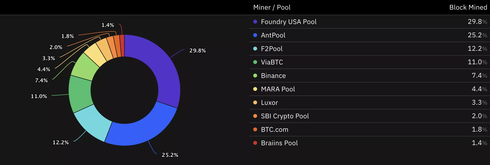

เพื่อแก้ไขปัญหาการรวมศูนย์นี้ มีการพูดคุยเกี่ยวกับกลยุทธ์ต่างๆ:

- Home Mining: แนวคิดของ Home Mining มีพื้นฐานมาจากการกระจายอำนาจของกิจกรรม mining มันส่งเสริมให้บุคคลมีส่วนร่วมใน mining จากที่บ้านของพวกเขา ซึ่งจะช่วยกระจาย hashrate ให้กว้างขวางยิ่งขึ้น
- [Stratum V2](https://planb.academy/resources/glossary/stratum-v2): โปรโตคอล Stratum V2 นำเสนอวิธีการอีกแบบหนึ่ง ซึ่งแตกต่างจากรุ่นก่อนหน้า Stratum V2 อนุญาตให้คนขุดเลือกธุรกรรมที่จะรวมในบล็อกที่พวกเขาขุด ความสามารถนี้ช่วยเพิ่มความต้านทานต่อการเซ็นเซอร์และลดอิทธิพลของพูล mining ขนาดใหญ่บนเครือข่าย โดยการให้พลังมากขึ้นแก่คนขุดแต่ละคน โปรโตคอล Stratum V2 สามารถมีบทบาทสำคัญในการต่อสู้กับการรวมศูนย์ hashrate

การเปิดซอร์สซอฟต์แวร์ Mining

- การเปิดซอร์สซอฟต์แวร์ mining: นี่เป็นอีกกลยุทธ์หนึ่งที่อาจมีประสิทธิภาพ โดยการทำให้ซอฟต์แวร์ mining เข้าถึงได้สำหรับทุกคน นักขุดรายย่อยจะมีโอกาสเช่นเดียวกับบริษัท mining ขนาดใหญ่ในการเข้าร่วมและมีส่วนร่วมในเครือข่ายบล็อกเชน วิธีการนี้จะส่งเสริมการกระจายตัวของ hashrate ในวงกว้างขึ้น ซึ่งจะช่วยสนับสนุนการกระจายอำนาจของเครือข่าย
- การกระจายความหลากหลายของนักแสดงและภูมิศาสตร์: การส่งเสริมการมีส่วนร่วมของนักแสดงที่หลากหลายจากภูมิภาคทางภูมิศาสตร์ที่แตกต่างกันในสกุลเงินดิจิทัล mining ก็สามารถพิสูจน์ได้ว่ามีประสิทธิภาพเช่นกัน โดยการกระจาย hashrate ทางภูมิศาสตร์ จะทำให้ยากขึ้นสำหรับนักแสดงหรือประเทศใดประเทศหนึ่งที่จะใช้อำนาจหรืออิทธิพลที่ไม่สมส่วนกับเครือข่าย วิธีการนี้สามารถช่วยปกป้องเครือข่ายจากการโจมตีที่อาจเกิดขึ้นและเสริมสร้างการกระจายอำนาจของเครือข่าย

ข้อสรุปทั่วไปคือการกระจายอำนาจมีความสำคัญต่อความปลอดภัยและความยืดหยุ่นของเครือข่าย Bitcoin แม้ว่าการรวมศูนย์จะสามารถให้ประโยชน์ด้านประสิทธิภาพได้ แต่ก็ทำให้เครือข่ายเสี่ยงต่อภัยคุกคามที่สำคัญ เช่น การเซ็นเซอร์และการโจมตี 51% โครงการริเริ่มอย่าง Takai และการนำโปรโตคอลใหม่ ๆ มาใช้ เช่น Stratum V2 เป็นขั้นตอนสำคัญสู่การกระจายอำนาจและการปกป้องเครือข่าย Bitcoin จากภัยคุกคามเหล่านี้

## ความละเอียดอ่อนของอุตสาหกรรม Mining

<chapterId>7b9ee427-316a-54e3-a2d4-4ea97839a31b</chapterId>

### หลักการของ Attakai

ในบริบทปัจจุบัน Bitcoin mining กับรุ่น S9 อาจดูซับซ้อน แต่การวิเคราะห์เชิงลึกเปิดประตูสู่นวัตกรรมทางเลือก หลักการ Attakai ขึ้นอยู่กับการพิจารณาการใช้การติดตั้ง mining ในอาคารประเภทต่างๆ เช่น โรงเรียนหรือโรงพยาบาล แนวคิดหลักคือการวางเครื่อง mining สองสามเครื่องในสถานที่ต่างๆ เพื่อใช้ความร้อนที่ปล่อยออกมาจากเครื่องเหล่านี้ในการทำความร้อนให้กับสถานประกอบการ ด้วยการเลือกใช้รุ่นที่มีประสิทธิภาพมากขึ้น เช่น S19 จะสามารถกระจายกิจกรรมของ mining ได้ ซึ่งจะช่วยเพิ่มประสิทธิภาพโดยรวมและยังมีส่วนช่วยที่เป็นประโยชน์ต่อสังคมอีกด้วย โครงการนี้มีเป้าหมายที่จะแข่งขันกับการดำเนินงาน mining ขนาดใหญ่ที่มีการรวมศูนย์ โดยใช้ความร้อนที่เกิดจากเครื่อง mining อย่างมีประสิทธิภาพและเป็นประโยชน์

โครงการ Attakai มีจุดเริ่มต้นจากการทดลองที่บ้าน mining ซึ่งดำเนินการโดยเพื่อนสองคนที่ต้องการมีส่วนร่วมอย่างแข็งขันในเครือข่าย Bitcoin พวกเขาเผชิญกับอุปสรรคสำคัญ เช่น ระดับเสียงรบกวนสูงของอุปกรณ์ mining ซึ่งออกแบบมาสำหรับการใช้งานในอุตสาหกรรมมากกว่าการใช้งานในบ้าน เพื่อแก้ไขปัญหานี้ ได้มีการปรับเปลี่ยนฮาร์ดแวร์ของเครื่อง mining โดยเปลี่ยนพัดลมที่มีประสิทธิภาพและเสียงเงียบกว่าแทนอุปกรณ์เดิม ทำให้ mining ที่บ้านสามารถเข้าถึงได้ง่ายขึ้นและรบกวนน้อยลง นอกจากนี้ การรวมอะแดปเตอร์ Wi-Fi ยังช่วยขจัดความจำเป็นในการเชื่อมต่อ Ethernet แบบมีสาย ทำให้กระบวนการ mining ที่บ้านง่ายขึ้นอีก ในฤดูหนาว เครื่องขุดที่ได้รับการปรับปรุงเหล่านี้ถูกใช้เป็นแหล่งความร้อน เปลี่ยนความรำคาญให้กลายเป็นประโยชน์

หลังจากนำเสนอโครงการของพวกเขาต่อชุมชน Bitcoin และเห็นความสนใจที่เกิดขึ้น ผู้ประดิษฐ์ Attakai ตัดสินใจเผยแพร่คู่มือรายละเอียดบนแพลตฟอร์ม Découvre Bitcoin เพื่อให้ใครก็ตามสามารถทำซ้ำประสบการณ์ home-mining ได้ ตอนนี้พวกเขาวางแผนที่จะขยายแนวคิดนี้ออกไปนอกเหนือจากการตั้งค่าภายในบ้าน เป้าหมายคือการแสดงให้เห็นว่าการปรับเปลี่ยนเครื่องขุดสามารถเปลี่ยนเป็นเครื่องทำความร้อนเสริมที่เงียบสงบซึ่งสามารถใช้งานได้ในช่วงฤดูหนาว โดยให้การเปลี่ยนแปลงที่ราบรื่นไปยังส่วนที่สองของการฝึกอบรม ซึ่งมุ่งเน้นไปที่การปฏิบัติจริงของการปรับเปลี่ยนเหล่านี้ โดยมีวิดีโออธิบายประกอบ อย่างไรก็ตาม คำถามยังคงอยู่ว่าโครงการนี้สามารถขยายในระดับที่ใหญ่ขึ้นได้หรือไม่ เพื่อเสนอทางเลือกที่สมจริงและยั่งยืนต่อโครงสร้าง mining แบบรวมศูนย์ในปัจจุบัน

### ขีดจำกัดของการกระจายอำนาจนี้?

แม้ว่าความคิดในการกระจาย mining ผ่านการใช้ประโยชน์จากความร้อนที่เกิดขึ้นจะดูมีแนวโน้ม แต่ก็มีข้อจำกัดและคำถามที่ยังไม่ได้รับคำตอบ สถานประกอบการที่ใช้พลังงานสูง เช่น ซาวน่าและสระว่ายน้ำ อาจได้รับประโยชน์จากแนวคิดนี้โดยการใช้ความร้อนที่ผลิตโดยเครื่องขุดเพื่อทำให้น้ำในสถานที่ของพวกเขาอุ่นขึ้น การปฏิบัตินี้กำลังถูกนำไปใช้โดยสมาชิกบางคนของชุมชน Bitcoin ที่กำลังสำรวจวิธีการต่างๆ เพื่อใช้ประโยชน์จากความร้อนที่เกิดจากอุปกรณ์ mining อย่างมีประสิทธิภาพ ตัวอย่างเช่น ห้องจัดเลี้ยงสามารถถูกทำให้อุ่นได้โดยเครื่องขุด S19 สามหรือสี่เครื่อง ซึ่งแต่ละเครื่องใช้พลังงาน 3000 วัตต์และผลิตความร้อนในปริมาณที่เท่ากัน

อย่างไรก็ตาม ควรสังเกตว่าการใช้พลังงานและการผลิตความร้อนนั้นเทียบเท่ากัน ไม่ว่าจะเป็นพลังงานที่ใช้โดยเครื่องทำความร้อนไฟฟ้าหรือเครื่องขุดบิทคอยน์ สำหรับทุกกิโลวัตต์ของไฟฟ้าที่ใช้ ปริมาณความร้อนที่ผลิตจะเท่ากันในทั้งสองกรณี ความแตกต่างอยู่ที่ข้อเท็จจริงที่ว่าเครื่องขุดไม่เพียงแต่ให้ความร้อนแต่ยังให้รางวัลบิทคอยน์ด้วย ซึ่งเป็นแรงจูงใจทางเศรษฐกิจในการใช้เครื่องขุดแทนเครื่องทำความร้อนไฟฟ้าแบบธรรมดา รางวัลเพิ่มเติมนี้อาจช่วยบรรเทาความกังวลเกี่ยวกับการใช้พลังงานสูงของเครื่องขุดได้

คำถามเกี่ยวกับประสิทธิภาพและความเป็นไปได้ในระยะยาวของการใช้เครื่องขุดบิทคอยน์เพื่อทำความร้อนยังคงเปิดกว้างอยู่ นวัตกรรมที่กำลังดำเนินอยู่ในฮาร์ดแวร์ mining และเทคโนโลยีการทำความร้อนอาจเปิดโอกาสใหม่ ๆ สำหรับการใช้ความร้อนที่เกิดจาก mining อย่างมีประสิทธิภาพมากขึ้น ซึ่งจะช่วยสนับสนุนความเป็นไปได้ของวิธีการนี้ในอนาคต

### ทำไมถึงมีรางวัล BTC?

คำถามเกี่ยวกับการให้รางวัลเป็นบิตคอยน์แทนที่จะเป็นสกุลเงินอื่นนั้นมีความสำคัญในระบบที่ [Satoshi Nakamoto](https://planb.academy/resources/glossary/nakamoto-satoshi) วางแผนไว้ การสร้าง Bitcoin มีลักษณะเด่นคือมีขีดจำกัดคงที่ที่ 21 ล้านหน่วย เป้าหมายคือการหาวิธีที่ยุติธรรมในการแจกจ่ายหน่วยที่สร้างขึ้นใหม่เหล่านี้ นักขุดโดยการให้พลังการคำนวณของพวกเขาเพื่อรักษาความปลอดภัยของเครือข่ายและทำให้การโจมตีมีค่าใช้จ่ายสูงขึ้นเรื่อย ๆ จะปกป้องเครือข่าย Bitcoin อย่างมีประสิทธิภาพ เพื่อเป็นการตอบแทนสำหรับการมีส่วนร่วมที่สำคัญนี้ พวกเขาจะได้รับรางวัลเป็นบิตคอยน์ที่สร้างขึ้นใหม่ ซึ่งช่วยอำนวยความสะดวกในการแจกจ่ายเหรียญภายในระบบนิเวศ

มันเป็นระบบที่ทุกฝ่ายได้ประโยชน์ นักขุดได้รับรางวัลทั้งจากการรักษาความปลอดภัยของเครือข่ายและการอนุมัติธุรกรรม บิตคอยน์ที่สร้างขึ้นใหม่จะถูกมอบเป็นแรงจูงใจเพื่อเสริมสร้างความปลอดภัย และค่าธรรมเนียมการทำธุรกรรมเป็นรายได้เพิ่มเติมสำหรับการอนุมัติธุรกรรม องค์ประกอบทั้งสองนี้รวมกันเป็นรางวัลทั้งหมดสำหรับ mining คำถามเกี่ยวกับอนาคตของ mining เกิดขึ้นเนื่องจากการลดรางวัลของ mining ที่ถูกตั้งโปรแกรมไว้ ซึ่งจะลดลงครึ่งหนึ่งทุกสี่ปี — ปรากฏการณ์ที่เรียกว่า "การลดลงครึ่งหนึ่ง" ภายในปี 2032 รางวัลบล็อกจะน้อยกว่าหนึ่งบิตคอยน์ และภายในปี 2140 จะไม่มีบิตคอยน์ใหม่ถูกสร้างขึ้น ณ จุดนี้ นักขุดจะพึ่งพาค่าธรรมเนียมการทำธุรกรรมเพียงอย่างเดียวสำหรับการชดเชย เครือข่าย Bitcoin จะต้องรองรับจำนวนธุรกรรมที่มาก ด้วยค่าธรรมเนียมที่สูงพอสมควร เพื่อให้แน่ใจว่า mining จะมีกำไร

การเพิ่มขึ้นของ [Lightning Network](https://planb.academy/resources/glossary/lightning-network) ซึ่งช่วยให้การทำธุรกรรมรวดเร็วและมีต้นทุนต่ำภายนอกเครือข่ายหลัก Bitcoin ทำให้เกิดคำถามเกี่ยวกับอนาคตของ mining Lightning Network มีศักยภาพในการลดค่าธรรมเนียมการทำธุรกรรมอย่างมีนัยสำคัญ ซึ่งจะส่งผลกระทบต่อรายได้ของนักขุด อย่างไรก็ตาม สิ่งนี้จะขึ้นอยู่กับการยอมรับและการใช้ Lightning Network เมื่อเทียบกับเครือข่ายหลัก Bitcoin ในสถานการณ์ที่มองในแง่ร้าย นักขุดอาจพบว่าการขุดยังคงมีกำไรแม้จะขาดทุนหากพวกเขาได้หักค่าใช้จ่ายและมีไฟฟ้าราคาถูก ในสถานการณ์ที่มองในแง่ดี ค่าธรรมเนียมการทำธุรกรรมบนเครือข่ายหลัก Bitcoin อาจยังคงสูงพอที่จะรักษาความสามารถในการทำกำไรของ mining

### สิ่งที่ควรรวมอยู่ในบล็อก Bitcoin คืออะไร?

เกี่ยวกับคำถามที่ว่าควรรวมอะไรไว้ในบล็อก Bitcoin สิ่งสำคัญคือต้องพิจารณาลักษณะที่เสริมกันของชั้นต่างๆ ของเครือข่าย Bitcoin แม้ว่า Lightning Network จะสามารถทำให้การทำธุรกรรมเร็วขึ้นและถูกลงได้ แต่ก็ยังคงพึ่งพาชั้นฐานของ Bitcoin ซึ่งมักเรียกกันว่า "ชั้นการชำระบัญชี" สำหรับการเปิดและปิด[ช่องทางการชำระเงิน](https://planb.academy/resources/glossary/payment-channel)

ด้วยการเติบโตที่คาดการณ์ของ Lightning Network และการเพิ่มขึ้นของการเปิดและปิดช่องทาง พื้นที่ในบล็อก Bitcoin จะมีค่ามากขึ้นเรื่อยๆ ชุมชน Bitcoin มีแนวโน้มที่จะให้ความสำคัญกับการอนุรักษ์พื้นที่นี้ โดยตระหนักถึงข้อจำกัดที่แท้จริง การตระหนักรู้นี้ได้นำไปสู่การอภิปรายเกี่ยวกับการใช้พื้นที่บล็อกอย่างถูกต้อง โดยมีความกังวลเกี่ยวกับ "สแปม" บนบล็อกเชนจากธุรกรรมที่ถือว่าไม่จำเป็น

มีการคาดเดาเกี่ยวกับการใช้พื้นที่บล็อกในอนาคต แต่โดยทั่วไปยอมรับว่ามันเป็นทรัพยากรที่หายากซึ่งควรใช้อย่างชาญฉลาด แม้ว่าจะมีความต้องการที่จะเติมเต็มมัน แต่ก็จำเป็นที่จะต้องรักษามันไว้เพื่อให้แน่ใจถึงความยั่งยืนในระยะยาวของเครือข่าย Bitcoin โดยคาดการณ์ถึงการเพิ่มขึ้นของความต้องการพื้นที่บล็อกในอนาคต เช่นเดียวกับในตลาดเสรีใด ๆ อุปสงค์และอุปทานจะควบคุมการใช้พื้นที่บล็อก ด้วยอุปทานที่จำกัด ผู้มีส่วนได้ส่วนเสียจะต้องตัดสินใจอย่างมีข้อมูลเกี่ยวกับการใช้ทรัพยากรที่มีค่านี้เพื่อให้แน่ใจถึงประสิทธิภาพและความปลอดภัยในระยะยาวของเครือข่าย Bitcoin

## Bitcoin Mining ในโปรโตคอล Bitcoin

<chapterId>879a66b0-c20a-56b5-aad0-8a21be61e338</chapterId>

บทบาทของนักขุดในเครือข่าย Bitcoin เป็นหัวข้อที่มีการถกเถียงกันอย่างเข้มข้นในช่วงสงครามขนาดบล็อก แม้ว่าจะมีความสำคัญต่อความปลอดภัยและการทำงานของเครือข่าย แต่นักขุดไม่ได้ถืออำนาจสูงสุดในระบบนิเวศ Bitcoin เสมอไป ความสมดุลระหว่างนักขุด, [โหนด](https://planb.academy/resources/glossary/node), และผู้ใช้ปลายทางช่วยให้มั่นใจในความสมบูรณ์และการกระจายของเครือข่าย

### สงครามขนาดบล็อก

ในช่วงสงครามขนาดบล็อก นักขุดหลายคนคัดค้านการพัฒนาบางอย่างในเครือข่าย ซึ่งเน้นให้เห็นถึงความตึงเครียดระหว่างผู้มีส่วนได้ส่วนเสียต่าง ๆ ภายในระบบนิเวศ คำถามยังคงอยู่ที่ว่าจะสร้างสมดุลอำนาจระหว่างนักขุด โหนด และผู้ใช้อย่างไรเพื่อให้มั่นใจในความปลอดภัยระยะยาวของ Bitcoin

ภาวะกลืนไม่เข้าคายไม่ออกด้านความปลอดภัยของ Bitcoin ขึ้นอยู่กับความสมดุลที่ละเอียดอ่อน ในขณะที่นักขุดมีบทบาทสำคัญในการตรวจสอบและสร้างบล็อก โหนดจะรักษาความสมบูรณ์โดยการตรวจสอบและยืนยันธุรกรรมและบล็อก บล็อกที่ไม่ถูกต้องหรือฉ้อโกงจะถูกปฏิเสธโดยโหนด ซึ่งจะเป็นการเซ็นเซอร์นักขุดและรักษาความปลอดภัยของเครือข่าย อำนาจยังอยู่ในมือของโหนดและผู้ใช้เครือข่าย Bitcoin โหนดมีอำนาจในการตรวจสอบและยืนยัน ในขณะที่ผู้ใช้มีอำนาจในการเลือกว่าจะใช้บล็อกเชนใด การกระจายอำนาจนี้ทำให้มั่นใจได้ถึงการกระจายและความสมบูรณ์ของเครือข่าย Bitcoin

สงครามขนาดบล็อกเผยให้เห็นถึงความไม่แน่นอนและความตึงเครียดที่มีอยู่ในการจัดการเครือข่าย Bitcoin แม้ว่า [Bitcoin Core](https://planb.academy/resources/glossary/bitcoin-core) จะเป็นเชนที่โดดเด่นในปัจจุบัน แต่การถกเถียงเกี่ยวกับการปกครองและการจัดการเครือข่ายยังคงดำเนินต่อไป

ในที่สุด ความรับผิดชอบจะถูกแบ่งปันระหว่างผู้มีส่วนร่วมทั้งหมดในเครือข่าย Bitcoin การลดลงของจำนวนผู้ใช้ โหนด หรือผู้ขุดอาจทำให้เครือข่ายอ่อนแอลง เพิ่มความเสี่ยงของการรวมศูนย์และความเปราะบางต่อการโจมตี ผู้มีส่วนร่วมแต่ละคนมีส่วนช่วยในการเสริมสร้างความแข็งแกร่งและความปลอดภัยของเครือข่าย ซึ่งเน้นย้ำถึงความสำคัญของการรักษาสมดุลของอำนาจและความรับผิดชอบ

### พลังของนักขุด

Satoshi ทฤษฎีเกมที่งดงามของ Nakamoto ได้สร้างสถานการณ์ที่แต่ละผู้เล่นในเครือข่าย Bitcoin มีแรงจูงใจให้ปฏิบัติอย่างถูกต้อง ซึ่งจะปกป้องทั้งผลประโยชน์ของตนเองและของผู้เข้าร่วมคนอื่น ๆ สิ่งนี้สร้างความสมดุลที่พฤติกรรมที่ไม่ดีสามารถถูกตำหนิได้ จึงเพิ่มความปลอดภัยและเสถียรภาพของระบบทั้งหมด แม้จะมีความสมดุลนี้ รัฐยังคงเป็นภัยคุกคามที่อาจเกิดขึ้นได้ ดังที่ระบุไว้ในงานนำเสนอที่ Surfing Bitcoin 2022 รัฐสามารถพยายามโจมตีอุตสาหกรรม mining ซึ่งทำให้เครือข่าย Bitcoin เผชิญกับความเสี่ยงของการรวมศูนย์และการโจมตี สถานการณ์สมมุติเช่นการโจมตีทางทหารที่มุ่งเป้าไปที่โรงงานผลิตฮาร์ดแวร์ mining เน้นย้ำถึงความสำคัญของการกระจายทางภูมิศาสตร์และอุตสาหกรรมเพื่อความยืดหยุ่นของเครือข่าย Bitcoin

การรวมศูนย์การผลิตฮาร์ดแวร์ mining ในประเทศจีนก่อให้เกิดความเสี่ยงอีกประการหนึ่ง การปฏิเสธที่จะส่งออกเครื่อง mining หรือการสะสม hashrate เพื่อการโจมตี 51% ที่อาจเกิดขึ้นโดยจีนเน้นย้ำถึงความจำเป็นในการกระจายการผลิตฮาร์ดแวร์ mining เพื่อตอบสนองต่อความเสี่ยงเหล่านี้ ชุมชน Bitcoin กำลังสำรวจวิธีแก้ปัญหาอย่างแข็งขัน บริษัทต่างๆ เช่น Intel กำลังพิจารณาผลิตอุปกรณ์ mining ในสหรัฐอเมริกา ซึ่งมีส่วนช่วยในการกระจายการผลิต โครงการริเริ่มอื่นๆ เช่น ชุดพัฒนา Mining แบบโอเพ่นซอร์สของ Block (MDK) มุ่งลดการผูกขาดการออกแบบและการผลิตฮาร์ดแวร์ mining ทำให้สามารถกระจาย hashrate ได้กว้างขึ้น ที่ใจกลางของการอภิปรายเหล่านี้คือภารกิจพื้นฐานของ Bitcoin: เพื่อเป็นเครือข่ายแลกเปลี่ยนมูลค่าที่ต้านทานการเซ็นเซอร์ ชุมชน Bitcoin มุ่งมั่นที่จะเสริมสร้างการกระจาย การต้านทานการเซ็นเซอร์ และความยืดหยุ่นของเครือข่าย โดยปฏิเสธข้อเสนอเช่นการเปลี่ยนไปใช้การพิสูจน์การถือหุ้น ซึ่งไม่สอดคล้องกับหลักการพื้นฐานเหล่านี้

### ลิงก์ทางกายภาพของ Proof of Work เทียบกับ Proof of Stake

[Proof of Work](https://planb.academy/resources/glossary/proof-of-work) (PoW) มีความสำคัญเพราะมันเป็นตัวแทนของการเชื่อมต่อทางกายภาพระหว่างโลกจริงและเครือข่าย Bitcoin แม้ว่า bitcoins จะไม่มีตัวตน แต่การผลิตของมันต้องการพลังงานที่จับต้องได้ ซึ่งสร้างการเชื่อมต่อโดยตรงกับโลกกายภาพและโลกจริง การเชื่อมต่อนี้ทำให้มั่นใจได้ว่าการผลิตและการตรวจสอบความถูกต้องของ bitcoins และบล็อกมีต้นทุนพลังงานที่แท้จริง จึงยึดเครือข่าย Bitcoin ไว้ในความเป็นจริงทางกายภาพและป้องกันการครอบงำอย่างสมบูรณ์โดยหน่วยงานที่มีอำนาจ PoW ทำหน้าที่เป็นปราการต่อต้านการรวมศูนย์ ทำให้มั่นใจได้ว่าการมีส่วนร่วมในเครือข่ายและการตรวจสอบความถูกต้องของธุรกรรมต้องการการลงทุนในทรัพยากรที่จับต้องได้ สิ่งนี้ป้องกันการผูกขาดเครือข่ายโดยหน่วยงานที่อาจเข้าควบคุมได้โดยไม่มีอุปสรรคในการเข้าที่สำคัญใด ๆ จึงทำให้การกระจายอำนาจและอิทธิพลภายในเครือข่าย Bitcoin มีความเท่าเทียมกันมากขึ้น

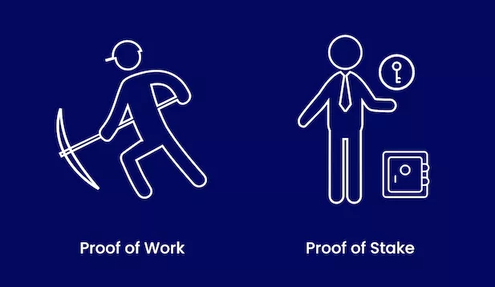

### ข้อจำกัดของ Proof of Stake

ในทางกลับกัน Proof of Stake (PoS) อนุญาตให้มีการมีส่วนร่วมในระดับเล็ก แต่ไม่ได้รับประกันการป้องกันที่เทียบเท่ากับการรวมศูนย์ ในเครือข่าย PoS ผู้ที่ถือครองสกุลเงินจำนวนมากอยู่แล้วจะมีอำนาจที่ไม่สมส่วน ซึ่งสะท้อนถึงความไม่เท่าเทียมกันของอำนาจที่มีอยู่ในสังคมโดยรวม พลวัตนี้อาจส่งเสริมการรวมศูนย์และการกระจุกตัวของอำนาจในมือของคนไม่กี่คน ซึ่งขัดแย้งกับวัตถุประสงค์การกระจายพื้นฐานของเครือข่าย Bitcoin ข้อโต้แย้งที่ว่าทุกคนสามารถเข้าร่วมใน PoS ได้ แม้ในระดับเล็ก โดยการเข้าร่วมพูล ไม่จำเป็นต้องแข็งแกร่ง ในเครือข่าย PoW แม้แต่ผู้มีส่วนร่วมรายย่อยที่มีอุปกรณ์พอประมาณก็สามารถมีส่วนร่วมและมีส่วนช่วยในการรักษาความปลอดภัยและการกระจายของเครือข่ายได้

### สรุป

เพื่อสรุป, นักขุดเสริมความแข็งแกร่งให้กับเครือข่าย Bitcoin ต่อต้านการเซ็นเซอร์โดยใช้ไฟฟ้าในการคำนวณ proof of work ของ Bitcoin และได้รับรางวัลเป็นบิตคอยน์ใหม่และค่าธรรมเนียมการทำธุรกรรม ด้วยการเป็นมืออาชีพของอุตสาหกรรม ผู้เล่นต่างๆ ได้ปรากฏตัวขึ้น ทำหน้าที่ต่างๆ ตั้งแต่การสร้างชิปไปจนถึงการจัดการ[ฟาร์ม mining](https://planb.academy/resources/glossary/mining-farm) นอกจากนี้ การเงินยังมีบทบาทในการควบคุมโดยการตัดสินใจว่าใครจะอยู่รอดในช่วงตลาดต่างๆ ปัญหาการรวมศูนย์ยังคงมีอยู่ โดยที่หน่วยงานที่ร่ำรวยที่สุดอาจครอบงำตลาด อย่างไรก็ตาม มีการพัฒนาทางเลือกทั้งในระดับฮาร์ดแวร์และซอฟต์แวร์ ขึ้นอยู่กับแต่ละบุคคลที่จะดำเนินการและมีส่วนร่วมในการกระจายเครือข่าย Bitcoin แสดงถึงโอกาสที่ยอดเยี่ยมไม่เพียงแต่ในแง่ของเสรีภาพแต่ยังในแง่ของความเป็นอิสระด้านพลังงาน แม้จะมีข้อโต้แย้งเกี่ยวกับการใช้ไฟฟ้า Bitcoin เสนอแรงจูงใจทางเศรษฐกิจสำหรับการเปลี่ยนแปลงไปสู่การใช้พลังงานที่มีเหตุผลและอุดมสมบูรณ์มากขึ้น ทำให้เป็นจริงซึ่งอุดมคติทางนิเวศวิทยาที่เคยมีมาก่อน

## Bitcoin ราคาและ Hashrate, ความสัมพันธ์กันหรือไม่?

<chapterId>e6676214-007c-5181-968e-c27536231bd6</chapterId>

### Hashrate, ราคา และความสามารถในการทำกำไร

อัตราแฮชในปัจจุบัน แม้ว่าราคา Bitcoin จะอยู่ที่ $30,000 เมื่อเทียบกับจุดสูงสุดก่อนหน้านี้ที่ $69,000 แสดงให้เห็นถึงความเชื่อมโยงที่ชัดเจนระหว่าง mining กับโลกแห่งความเป็นจริง ช่วงตลาดกระทิงนำไปสู่ความต้องการสูงสำหรับ Bitcoin mining และการเพิ่มขึ้นของคำสั่งซื้อเครื่องจักรจากผู้ผลิตเช่น Avalon และ Bitmain อย่างไรก็ตาม การผลิตและการส่งมอบไม่ได้เกิดขึ้นทันที ทำให้เกิดความไม่สอดคล้องกันระหว่างความต้องการที่เพิ่มขึ้นและความพร้อมใช้งานในภายหลัง สิ่งนี้อาจนำไปสู่การที่เครื่องจักรที่สั่งซื้อในช่วงตลาดกระทิงถูกส่งมอบในตลาดหมี ซึ่งเน้นให้เห็นถึงความไม่สมมาตรที่น่าสังเกตระหว่างราคาต่ำและอัตราแฮชสูง

สถานการณ์นี้ยังเน้นถึงความยืดหยุ่นของ Bitcoin ซึ่งมักถูกประเมินจากราคาของมัน อย่างไรก็ตาม การวิเคราะห์สุขภาพของ Bitcoin อย่างลึกซึ้งต้องพิจารณาอัตราแฮช ซึ่งวัดการคำนวณต่อวินาทีในเครือข่าย Bitcoin แม้ว่าราคา Bitcoin จะผันผวน แต่ต้นทุนของมันซึ่งเชื่อมโยงกับไฟฟ้าที่จำเป็นในการใช้งานเครื่อง mining ยังคงเป็นปัจจัยสำคัญในการทำความเข้าใจพลวัตของตลาด โดยการมุ่งเน้นที่ต้นทุนแทนที่จะเป็นราคา จะได้รับมุมมองที่สม่ำเสมอมากขึ้นเกี่ยวกับความมั่นคงและความมีชีวิตยาวนานของ Bitcoin โดยทั่วไปแล้ว ต้นทุนของ Bitcoin จะเป็นสัดส่วนกับราคาของมัน ทำให้เข้าใจการผันผวนของราคาและแนวโน้มในอนาคตได้ดีขึ้น

### Hash อัตราและรางวัล

Mining อาจกำหนดราคาพื้นสำหรับ Bitcoin ซึ่งต่ำกว่าราคานี้นักขุดจะขายในขาดทุน ต้นทุนของ mining มีอิทธิพลอย่างมากต่อราคา ดังที่แสดงโดยการห้าม mining ในประเทศจีน ซึ่งทำให้อัตราแฮชและราคาลดลงอย่างมากแต่ฟื้นตัวอย่างรวดเร็ว การมุ่งเน้นเฉพาะที่ราคาอาจทำให้เข้าใจผิดได้ การศึกษาต้นทุนผ่านเครื่องคิดเลขความสามารถในการทำกำไรให้มุมมองที่สมดุลมากขึ้น อย่างไรก็ตาม ตลาดสามารถมีพฤติกรรมที่ไม่สมเหตุสมผล โดยนักขุดอาจถูกบังคับให้ขายในขาดทุน ซึ่งอาจทำให้ราคาต่ำกว่าต้นทุนของ mining ในการประเมินสุขภาพของ Bitcoin และการกระจายอำนาจ อาจพัฒนาสมการที่รวมปัจจัยต่างๆ เช่น จำนวนโหนดและราคา วิธีการนี้อาจให้การวิเคราะห์ที่ละเอียดอ่อนมากขึ้นของ Bitcoin เมื่อเทียบกับการอภิปรายที่อิงเฉพาะราคา

### Mining เพื่อผลกำไรหรือเพื่อเครือข่าย?

คำถามนี้ลึกซึ้งและครอบคลุมหลายมิติของ Bitcoin mining ความสมดุลระหว่างการแสวงหากำไรและการมีส่วนร่วมในความปลอดภัยและการกระจายของเครือข่าย Bitcoin เป็นปัญหาที่ขัดแย้งกันอย่างต่อเนื่องสำหรับนักขุด การอภิปรายภายในชุมชน Bitcoin ยังคงดำเนินต่อไป โดยมีข้อโต้แย้งที่แข็งแกร่งทั้งสองฝ่าย

- Mining สำหรับผลกำไร:

**สำหรับ:** นักขุดมักจะถูกดึงดูดโดยธรรมชาติจากรายได้ที่อาจเกิดขึ้นจาก Bitcoin mining การลงทุนในอุปกรณ์ mining ที่มีราคาแพงสามารถชดเชยได้ด้วยรางวัล mining และค่าธรรมเนียมการทำธุรกรรม โดยเฉพาะอย่างยิ่งเมื่อราคาของ Bitcoin สูง

**ต่อต้าน:** การแสวงหากำไรอาจนำไปสู่การรวมศูนย์ของพลังการแฮชหากมีเพียงไม่กี่บริษัทใหญ่ที่สามารถลงทุนในอุปกรณ์ mining ระดับสูงได้ นอกจากนี้ mining เพื่อผลกำไรอาจมีผลกระทบต่อสิ่งแวดล้อมอย่างมีนัยสำคัญ

- Mining สำหรับเครือข่าย:

**สำหรับ:** Mining ที่จะมีส่วนร่วมในการรักษาความปลอดภัยและการกระจายอำนาจของเครือข่าย Bitcoin เป็นความคิดริเริ่มที่น่ายกย่อง มันช่วยเสริมสร้างความแข็งแกร่งของเครือข่ายและต้านทานการเซ็นเซอร์และการโจมตี

**คัดค้าน:** หากไม่มีแรงจูงใจทางการเงินที่เพียงพอ อาจเป็นเรื่องยากสำหรับนักขุดที่จะสนับสนุนเครือข่ายต่อไป โดยเฉพาะอย่างยิ่งหากพวกเขาดำเนินการขาดทุน

โครงการ Attakai เน้นย้ำถึงความสำคัญของการมีส่วนร่วมในเครือข่ายพร้อมกับการให้โซลูชันเพื่อทำให้ mining เข้าถึงได้ง่ายขึ้นและเป็นมิตรกับสิ่งแวดล้อมมากขึ้น ความเป็นไปได้ของ mining Bitcoin ที่บ้าน ด้วยอุปกรณ์ที่มีราคาย่อมเยาและโซลูชันเพื่อลดมลพิษทางเสียง สามารถช่วยทำให้กระบวนการนี้เป็นประชาธิปไตยมากขึ้น มันกระตุ้นให้ผู้ที่สนใจใน Bitcoin ไม่เพียงแต่ลงทุนและถือบิตคอยน์ แต่ยังมีส่วนร่วมอย่างแข็งขันในการรักษาความปลอดภัยของเครือข่าย โดยการจัดหาอุปกรณ์ที่ผ่านการทดสอบและคู่มือสำหรับการประกอบและติดตั้ง Attakai ทำให้การเข้าสู่โลกของ Bitcoin mining ง่ายขึ้น นอกจากนี้ยังส่งเสริมนวัตกรรมและการปรับปรุงอย่างต่อเนื่อง โดยเชิญชวนให้ชุมชนมีส่วนร่วมและแบ่งปันแนวคิดและประสบการณ์ของพวกเขาเพื่อปรับปรุง mining ที่บ้าน โมเดลของ Attakai เป็นคำตอบสำหรับคำถามของ mining เพื่อผลกำไรหรือเพื่อเครือข่าย มันไม่ใช่แค่เรื่องของการทำกำไร แต่ยังเกี่ยวกับการเสริมสร้างการกระจายและความปลอดภัยของเครือข่าย Bitcoin ในขณะที่ทำให้ผู้คนมีส่วนร่วมใน mining มากขึ้น เรียนรู้ และเข้าใจอุตสาหกรรมที่สำคัญนี้ ความท้าทายของการห้าม mining ที่อาจเกิดขึ้นในยุโรปยังคงเป็นคำถามที่เปิดกว้าง สิ่งนี้ทำให้เกิดความกังวลเกี่ยวกับอนาคตของ Bitcoin mining ในภูมิภาคและเน้นย้ำถึงความจำเป็นในการกำกับดูแลที่สมดุลซึ่งยอมรับถึงความสำคัญของ mining สำหรับความปลอดภัยและความมีชีวิตของเครือข่าย Bitcoin ในขณะเดียวกันก็จัดการกับข้อกังวลด้านสิ่งแวดล้อม Attakai และโครงการริเริ่มที่คล้ายกันอื่น ๆ สามารถมีบทบาทสำคัญในการอภิปรายนี้ โดยแสดงให้เห็นว่ามันเป็นไปได้ที่จะทำเหมืองในลักษณะที่ยั่งยืนและมีความรับผิดชอบมากขึ้น ในขณะที่มีส่วนร่วมในเชิงบวกต่อเครือข่าย Bitcoin

## อธิปไตยและการกำกับดูแล

<chapterId>9d9a5908-2acc-501e-906b-a6fce9ecfebd</chapterId>

### อธิปไตยก่อนกำไร?

ในการแก้ไขปัญหาสำคัญเกี่ยวกับความมั่งคั่งผ่าน mining สิ่งสำคัญคือต้องพิจารณามุมมองและวิธีการต่างๆ คำถามเกี่ยวกับความสามารถในการทำกำไรของ mining เป็นเรื่องปกติ โดยมีการสอบถามเกี่ยวกับการซื้อหุ้นในบริษัทต่างๆ เช่น Riot หรือการเช่าเครื่อง mining ในประเทศที่มีต้นทุนพลังงานต่ำ เช่น ไอซ์แลนด์หรือรัสเซีย ก่อนที่จะเข้าสู่ mining สิ่งสำคัญคือต้องเปรียบเทียบความสามารถในการทำกำไรของ mining กับการซื้อ Bitcoin โดยตรง หากต้นทุนของ mining และ Bitcoin สูงกว่าการซื้อโดยตรง โดยทั่วไปแล้วจะฉลาดกว่าที่จะซื้อ Bitcoin โดยตรง ซึ่งจะหลีกเลี่ยงความท้าทายและต้นทุนหลายประการที่เกี่ยวข้องกับกระบวนการ mining

อย่างไรก็ตาม mining มอบโอกาสพิเศษในการเข้าร่วมในระบบนิเวศ Bitcoin ตัวอย่างเช่น mining Bitcoin ในฤดูหนาวอาจเป็นวิธีที่ชาญฉลาดในการ generate Bitcoin รายได้ในขณะที่ยังคงรักษาความอบอุ่นในบ้านของคุณ อีกทางเลือกหนึ่งคือการลงทุนในบริษัทที่ขายอุปกรณ์ mining และจัดเก็บและจัดการเครื่องจักรในสถานที่ที่มีต้นทุนพลังงานต่ำ จึงทำให้สามารถเข้าถึงอัตราค่าไฟฟ้าที่ดีโดยไม่ต้องยุ่งยากในการจัดการอุปกรณ์

แม้จะมีตัวเลือกเหล่านี้ แต่ mining ก็ยังคงมีความท้าทายที่สำคัญ คำกล่าวที่รู้จักกันดีในโลกของสกุลเงินดิจิทัล "ไม่ใช่กุญแจของคุณ ไม่ใช่บิทคอยน์ของคุณ" ก็มีความหมายคล้ายกันในโลกของ mining: "ไม่ใช่ hashrate ของคุณ ไม่ใช่รางวัลของคุณ" เรื่องราวของความผิดหวังและเครื่องที่ไม่เชื่อมต่อเป็นเรื่องปกติ โดยมีผู้เล่นหลายคนที่สัญญาว่าจะให้ผลลัพธ์ที่ยอดเยี่ยมแต่กลับไม่สามารถทำได้ ปัญหาเกี่ยวกับการจ่ายไฟฟ้าและการเสียของเครื่องจักรสามารถทำให้นักลงทุนไร้อำนาจ โดยมีอุปกรณ์ราคาแพงที่พวกเขาไม่สามารถควบคุมได้ ในบริบทนี้ ความระมัดระวังและความเข้าใจลึกซึ้งในภาคส่วน mining เป็นสิ่งสำคัญก่อนที่จะก้าวเข้าสู่มัน แม้ว่าจะมีโอกาสในการทำกำไร แต่ความเสี่ยงก็มีมาก และการเข้าถึงข้อมูลและการคิดอย่างรอบคอบเป็นสิ่งจำเป็นสำหรับการนำทางในสนามที่ซับซ้อนและมักจะคาดเดาไม่ได้นี้ ดังนั้นจึงเป็นสิ่งสำคัญที่จะต้องทำการวิจัยอย่างละเอียดและพิจารณาข้อดีและข้อเสียอย่างรอบคอบก่อนที่จะมีส่วนร่วมใน Bitcoin mining

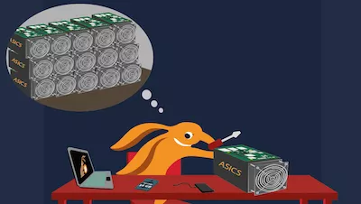

### บิทคอยน์บริสุทธิ์

ความปรารถนาที่จะเป็นเจ้าของ hashrate ของตนเองดูเหมือนจะเป็นเส้นทางที่มีแนวโน้มในโลกของ mining อย่างไรก็ตาม การนำทางในระบบนิเวศที่ซับซ้อนนี้ต้องการวิธีการที่ระมัดระวัง สาขาของคลาวด์ mining มีลักษณะเฉพาะด้วยจำนวนการหลอกลวงที่สูง ส่วนใหญ่เกิดจากการขาดความเข้าใจใน mining ในหมู่นักลงทุนหลายคน ข้อเสนอที่น่าสนใจซึ่งบรรจุในรูปแบบต่างๆ สามารถหลอกลวงผู้ที่ไม่ได้รับข้อมูลเพียงพอได้อย่างง่ายดาย ในทางกลับกัน การเป็นเจ้าของอุปกรณ์ mining ของคุณเองมีข้อได้เปรียบอย่างมาก นอกจากความพึงพอใจส่วนตัวในการมีส่วนร่วมอย่างแข็งขันต่อความปลอดภัยของเครือข่าย Bitcoin และเห็นรางวัลตกลงใน wallet ของคุณแล้ว ยังมีแง่มุมที่น่าสนใจของ "บิตคอยน์บริสุทธิ์" เหล่านี้คือบิตคอยน์ที่ขุดใหม่ซึ่งไม่เคยถูกใช้จ่ายและไม่มีประวัติที่เกี่ยวข้อง บิตคอยน์เหล่านี้มักจะถือว่ามีค่ามากกว่าเพราะไม่เคยถูก "ปนเปื้อน" ให้การรับประกันบางอย่างต่อการปฏิเสธโดยหน่วยงานกำกับดูแลหรือแพลตฟอร์มแลกเปลี่ยนหลัก

ความเป็นไปได้ของ mining บิทคอยน์บริสุทธิ์ในขณะที่หลีกเลี่ยงกระบวนการรู้จักลูกค้าของคุณ ([KYC](https://planb.academy/resources/glossary/kyc-know-your-customer)) เป็นมูลค่าเพิ่มอีกประการหนึ่ง สระ mining หลายแห่งไม่ต้องการข้อมูลประจำตัวของนักขุด จึงอนุญาตให้ได้มาซึ่งบิทคอยน์โดยไม่ต้องผ่านการตรวจสอบประจำตัวที่น่าเบื่อหน่าย บิทคอยน์บริสุทธิ์ถูกมองว่าเป็น "สะอาด" ไม่มีประวัติหรือการเชื่อมโยงในอดีต พวกเขาเป็นที่ต้องการโดยเฉพาะอย่างยิ่งจากผู้เล่นสถาบันขนาดใหญ่ที่สามารถรับประกันความถูกต้องตามกฎหมายของสินทรัพย์ดิจิทัลของพวกเขาต่อหน้าหน่วยงานกำกับดูแล อย่างไรก็ตาม แม้จะมีข้อดีเหล่านี้ สิ่งสำคัญคือต้องยอมรับว่าอุตสาหกรรม mining ยังคงมีการแข่งขันสูงและผันผวน โดยมีเหตุการณ์ที่ไม่คาดคิดที่สามารถขัดขวางการดำเนินงานของ mining ได้

ในบริบทนี้ การนำแนวทางที่เป็นอิสระและมีข้อมูลเกี่ยวกับ mining มาใช้ดูเหมือนจะเป็นการตัดสินใจที่รอบคอบ การได้มาซึ่ง hashrate ของตนเองและการลงทุนในอุปกรณ์ mining ส่วนบุคคล ในขณะที่ยังคงตระหนักถึงความเสี่ยงและความท้าทาย อาจเสนอเส้นทางที่ปลอดภัยและน่าพึงพอใจมากขึ้นในการได้มาซึ่งบิตคอยน์บริสุทธิ์ ซึ่งจะช่วยเสริมสร้างอธิปไตยทางการเงินของบุคคลในขณะที่สนับสนุนระบบนิเวศ Bitcoin โดยรวม

### mining ถูกแบนในยุโรปหรือไม่?

ด้วยประเด็นการห้ามใช้ mining ในยุโรปที่อาจเกิดขึ้น การอภิปรายเกี่ยวกับกฎระเบียบจึงมีความเกี่ยวข้องมากขึ้น ภูมิทัศน์ด้านกฎระเบียบที่ผันผวนสามารถส่งผลกระทบอย่างมากต่ออุตสาหกรรม Bitcoin mining การห้ามใช้ mining ในยุโรปเป็นสถานการณ์ที่เป็นไปได้ โดยเฉพาะเมื่อพิจารณาจากแบบอย่างในจีน แม้ว่าการดำเนินงานของ mining จะยังคงดำเนินต่อไปในจีนแม้จะมีการห้าม แต่ยุโรปอาจเดินตามเส้นทางที่คล้ายคลึงกัน การกระจาย hashrate ในภูมิภาคต่างๆ อย่างกว้างขวางสามารถช่วยเสริมสร้างชุมชน mining ในยุโรป ทำให้พวกเขาสามารถตอบโต้ความเข้าใจผิดและความเข้าใจผิดเกี่ยวกับ mining ผลกระทบต่อสิ่งแวดล้อม และรอยเท้าของมันบนโครงข่ายไฟฟ้าได้อย่างมีประสิทธิภาพ

เมื่อต้องเผชิญกับแคมเปญต่างๆ เช่น ของ Greenpeace และตัวเลขที่มักจะทำให้เข้าใจผิดจากการศึกษาบางแห่ง อาวุธที่ดีที่สุดยังคงเป็นข้อมูลที่เป็นความจริง การแจ้งให้ประชาชนทั่วไปและผู้มีอำนาจตัดสินใจทราบเกี่ยวกับความเป็นจริงของ mining ความซับซ้อน และความละเอียดอ่อนของมันเป็นสิ่งสำคัญ แทนที่จะพึ่งพาแบบแผนและข้อมูลที่ไม่ถูกต้อง ยิ่งผู้คนได้รับข้อมูลและตระหนักถึงสิ่งที่ mining เป็นจริงมากเท่าใด อุตสาหกรรมก็จะสามารถปกป้องตนเองจากกฎระเบียบที่อาจจำกัดได้ดีขึ้นเท่านั้น

โดยสรุป แม้จะมีความเสี่ยงด้านกฎระเบียบและความเป็นไปได้ที่จะมีการแบน mining ในยุโรป การศึกษาและข้อมูลยังคงเป็นเครื่องมือที่ทรงพลังที่สุด ความเข้าใจที่ชัดเจนและแม่นยำเกี่ยวกับ mining วิธีการทำงาน และผลกระทบของมันสามารถช่วยขจัดความลึกลับในอุตสาหกรรมและต่อสู้กับข้อมูลที่ผิดพลาด ซึ่งจะช่วยให้มีการต่อต้านกฎระเบียบที่อาจเป็นอันตรายได้ดียิ่งขึ้น ความริเริ่มในการฝึกอบรมและให้ข้อมูลแก่ผู้คนเกี่ยวกับ mining ดังที่การสนทนานี้ทำ เป็นก้าวที่ถูกต้องในการรับรองความยั่งยืนและการเติบโตของ mining ในยุโรปและทั่วโลก ความพยายามอย่างต่อเนื่องในการให้การศึกษาและข้อมูลเป็นสิ่งจำเป็นเพื่อรับรองอนาคตที่ปลอดภัยและเจริญรุ่งเรืองสำหรับอุตสาหกรรม Bitcoin mining

# บ้าน Mining และการนำความร้อนกลับมาใช้ใหม่

<partId>78d22d06-2c4a-573f-86bb-1027115dad3a</partId>

## Attakai - ทำให้บ้าน Mining เป็นไปได้และเข้าถึงได้!

<chapterId>1f5d1b74-2f99-5f31-a088-a73d36491ebf</chapterId>

Attakai ซึ่งหมายถึง "อุณหภูมิที่เหมาะสม" ในภาษาญี่ปุ่น เป็นชื่อของโครงการที่มุ่งเน้นการค้นพบ bitcoin mining ผ่านการนำความร้อนกลับมาใช้ใหม่ ซึ่งเปิดตัวโดย @ajelexBTC และ @jimzap21 กับ Découvre Bitcoin

คู่มือการปรับปรุง ASIC นี้จะเป็นพื้นฐานสำหรับการเรียนรู้เพิ่มเติมเกี่ยวกับ mining การทำงาน และเศรษฐกิจพื้นฐาน โดยการแสดงความเป็นไปได้ในการปรับเปลี่ยนเครื่องขุด Bitcoin เพื่อใช้เป็นหม้อน้ำในบ้าน ซึ่งจะมอบความสะดวกสบายและการประหยัดมากขึ้น ทำให้ผู้เข้าร่วมได้รับเงินคืน BTC แบบไม่ต้องยืนยันตัวตนจากบิลค่าไฟฟ้าสำหรับการทำความร้อนด้วยไฟฟ้า

Bitcoin ปรับความยากของ mining และให้รางวัลแก่ผู้ขุดสำหรับการมีส่วนร่วมของพวกเขาโดยอัตโนมัติ อย่างไรก็ตาม ความเข้มข้นของ hashrate อาจก่อให้เกิดความเสี่ยงต่อความเป็นกลางของเครือข่าย การใช้พลังการประมวลผลของ Bitcoin สำหรับโซลูชันการทำความร้อนจะเป็นประโยชน์โดยตรงต่อเครือข่ายเองโดยการเพิ่มการกระจายของพลังการประมวลผล

### ทำไมต้องนำความร้อนจาก ASIC กลับมาใช้ใหม่?

สิ่งสำคัญคือต้องเข้าใจความสัมพันธ์ระหว่างพลังงานและการผลิตความร้อนในระบบไฟฟ้า

สำหรับการลงทุนพลังงานไฟฟ้า 1 กิโลวัตต์ หม้อน้ำไฟฟ้าผลิตความร้อน 1 กิโลวัตต์ ไม่มากไปกว่านี้และไม่น้อยไปกว่านี้ หม้อน้ำรุ่นใหม่ไม่ได้มีประสิทธิภาพมากกว่าหม้อน้ำแบบดั้งเดิม ข้อได้เปรียบของพวกมันอยู่ที่ความสามารถในการกระจายความร้อนอย่างต่อเนื่องและสม่ำเสมอทั่วทั้งห้อง ทำให้เกิดความสะดวกสบายมากขึ้นเมื่อเทียบกับหม้อน้ำแบบดั้งเดิมที่สลับระหว่างพลังงานความร้อนสูงและไม่มีความร้อน ซึ่งทำให้เกิดการเปลี่ยนแปลงอุณหภูมิเป็นประจำและความไม่สะดวกสบาย

คอมพิวเตอร์ หรือในวงกว้างกว่านั้น แผงวงจรอิเล็กทรอนิกส์ ไม่ได้ใช้พลังงานในการคำนวณ; มันเพียงแค่ต้องการพลังงานไหลผ่านส่วนประกอบเพื่อทำงาน การใช้พลังงานเกิดจากความต้านทานไฟฟ้าของส่วนประกอบ ซึ่งทำให้เกิดการสูญเสียและสร้างความร้อน ซึ่งรู้จักกันในชื่อเอฟเฟกต์จูล

บริษัทบางแห่งได้พัฒนาแนวคิดในการรวมความต้องการพลังการประมวลผลกับความต้องการความร้อนผ่านหม้อน้ำ/เซิร์ฟเวอร์ แนวคิดนี้คือการกระจายเซิร์ฟเวอร์ของบริษัทไปยังหน่วยเล็ก ๆ ที่สามารถวางไว้ในบ้านหรือสำนักงานได้ อย่างไรก็ตาม แนวคิดนี้เผชิญกับปัญหาหลายประการ ความต้องการเซิร์ฟเวอร์ไม่ได้เกี่ยวข้องกับความต้องการความร้อน และบริษัทไม่สามารถใช้ความสามารถในการประมวลผลของเซิร์ฟเวอร์ได้อย่างยืดหยุ่น นอกจากนี้ยังมีข้อจำกัดเกี่ยวกับแบนด์วิดท์ที่บุคคลสามารถมีได้ ข้อจำกัดทั้งหมดเหล่านี้ทำให้บริษัทไม่สามารถทำให้การติดตั้งที่มีราคาแพงเหล่านี้มีกำไรหรือให้บริการเซิร์ฟเวอร์ออนไลน์ที่เสถียรได้โดยไม่มีศูนย์ข้อมูลที่สามารถเข้ามาแทนที่เมื่อไม่ต้องการความร้อน

> ความร้อนที่เกิดจากคอมพิวเตอร์ของคุณจะไม่สูญเปล่าหากคุณต้องการทำให้บ้านของคุณอบอุ่น หากคุณใช้เครื่องทำความร้อนไฟฟ้าที่ที่คุณอาศัยอยู่ ความร้อนจากคอมพิวเตอร์ของคุณจะไม่สูญเปล่า ค่าใช้จ่ายในการ generate ความร้อนนี้ด้วยคอมพิวเตอร์ของคุณจะเท่ากัน หากคุณมีระบบทำความร้อนที่ถูกกว่าเครื่องทำความร้อนไฟฟ้า การสูญเปล่าจะอยู่ที่ความแตกต่างของค่าใช้จ่ายเท่านั้น หากเป็นฤดูร้อนและคุณใช้เครื่องปรับอากาศ การสูญเปล่าจะเพิ่มเป็นสองเท่า Bitcoin mining ควรเกิดขึ้นในที่ที่มีความคุ้มค่ามากกว่า อาจจะเป็นสถานที่ที่มีสภาพอากาศหนาวเย็น ที่ซึ่งการทำความร้อนใช้ไฟฟ้า และที่ซึ่ง mining จะไม่มีค่าใช้จ่าย
>

> Satoshi นากาโมโตะ - 8 สิงหาคม 2010

Bitcoin และระบบ proof-of-work โดดเด่นเพราะพวกมันปรับความยากของ mining โดยอัตโนมัติตามปริมาณการคำนวณที่ดำเนินการโดยเครือข่ายทั้งหมด ปริมาณนี้เรียกว่า "hashrate" และแสดงเป็นแฮชต่อวินาที ปัจจุบันคาดว่าจะอยู่ที่ 380 เอกซะแฮชต่อวินาที ซึ่งเทียบเท่ากับ 380 พันล้านพันล้านแฮชต่อวินาที hashrate นี้แสดงถึงงานและดังนั้นจึงเป็นปริมาณพลังงานที่ใช้ ยิ่ง hashrate สูง ความยากก็ยิ่งสูงขึ้น และในทางกลับกัน ดังนั้น นักขุด Bitcoin สามารถเปิดหรือปิดได้ตลอดเวลาโดยไม่ส่งผลกระทบต่อเครือข่าย ซึ่งแตกต่างจากหม้อน้ำ/เซิร์ฟเวอร์ที่ต้องคงที่เพื่อให้บริการ นักขุดจะได้รับรางวัลสำหรับการมีส่วนร่วมของพวกเขาเมื่อเทียบกับผู้อื่น ไม่ว่าจะเล็กน้อยเพียงใดก็ตาม

โดยสรุปแล้ว ทั้งหม้อน้ำไฟฟ้าและเครื่องขุด Bitcoin ผลิตความร้อน 1 กิโลวัตต์สำหรับทุกๆ 1 กิโลวัตต์ของไฟฟ้าที่ใช้ อย่างไรก็ตาม เครื่องขุดยังได้รับบิตคอยน์เป็นรางวัลอีกด้วย ไม่ว่าจะเป็นราคาของไฟฟ้า ราคาของบิตคอยน์ หรือการแข่งขันในกิจกรรม Bitcoin mining บนเครือข่าย การใช้เครื่องขุดเพื่อทำความร้อนนั้นมีความได้เปรียบทางเศรษฐกิจมากกว่าการใช้หม้อน้ำไฟฟ้า

### มูลค่าเพิ่มสำหรับ Bitcoin

สิ่งที่สำคัญในการทำความเข้าใจคือวิธีที่ mining มีส่วนช่วยในการกระจายอำนาจของเครือข่าย Bitcoin

เทคโนโลยีหลายอย่างที่มีอยู่แล้วได้ถูกผสมผสานอย่างชาญฉลาดเพื่อนำฉันทามติของ Nakamoto มาสู่ชีวิต ฉันทามตินี้ให้รางวัลทางเศรษฐกิจแก่ผู้เข้าร่วมที่ซื่อสัตย์สำหรับการมีส่วนร่วมในการดำเนินงานของเครือข่าย Bitcoin ในขณะที่กีดกันผู้เข้าร่วมที่ไม่ซื่อสัตย์ นี่เป็นหนึ่งในจุดสำคัญที่ทำให้เครือข่ายสามารถดำรงอยู่ได้อย่างยั่งยืน

นักแสดงที่ซื่อสัตย์ ผู้ที่ขุดตามกฎ กำลังแข่งขันกันเพื่อให้ได้ส่วนแบ่งรางวัลมากที่สุดเท่าที่จะเป็นไปได้สำหรับการผลิตบล็อกใหม่ แรงจูงใจทางเศรษฐกิจนี้นำไปสู่รูปแบบของการรวมศูนย์โดยธรรมชาติ เนื่องจากบริษัทต่างๆ เลือกที่จะเชี่ยวชาญในกิจกรรมที่มีกำไรนี้โดยลดต้นทุนผ่านเศรษฐกิจขนาดใหญ่ นักแสดงอุตสาหกรรมเหล่านี้มีตำแหน่งที่ได้เปรียบในการซื้อและบำรุงรักษาเครื่องจักร รวมถึงการเจรจาอัตราค่าไฟฟ้าขายส่ง

> ในตอนแรก ผู้ใช้ส่วนใหญ่จะรันโหนดเครือข่าย แต่เมื่อเครือข่ายเติบโตเกินจุดหนึ่ง มันจะถูกปล่อยให้เป็นหน้าที่ของผู้เชี่ยวชาญที่มีฟาร์มเซิร์ฟเวอร์ที่มีฮาร์ดแวร์เฉพาะทางมากขึ้น ฟาร์มเซิร์ฟเวอร์จะต้องมีเพียงโหนดเดียวบนเครือข่าย และส่วนที่เหลือของ LAN จะเชื่อมต่อกับโหนดนั้น
>

> Satoshi นากาโมโตะ - 2 พฤศจิกายน 2008

หน่วยงานบางแห่งถือครองเปอร์เซ็นต์ที่มากของ hashrate ทั้งหมดในฟาร์ม mining ขนาดใหญ่ เราสามารถสังเกตเห็นคลื่นความเย็นล่าสุดในสหรัฐอเมริกา ซึ่งส่วนสำคัญของ hashrate ถูกปิดการใช้งานเพื่อเปลี่ยนทิศทางพลังงานไปยังครัวเรือนที่มีความต้องการไฟฟ้าเป็นพิเศษ เป็นเวลาหลายวัน นักขุดได้รับแรงจูงใจทางเศรษฐกิจให้ปิดฟาร์มของพวกเขา และสภาพอากาศที่ไม่ปกตินี้สะท้อนให้เห็นในเส้นโค้ง Bitcoin hashrate

ปัญหานี้อาจกลายเป็นปัญหาและก่อให้เกิดความเสี่ยงอย่างมากต่อความเป็นกลางของเครือข่าย ผู้ที่มีมากกว่า 51% ของ hashrate อาจเซ็นเซอร์ธุรกรรมได้ง่ายขึ้นหากต้องการ นั่นคือเหตุผลที่สำคัญในการกระจาย hashrate ไปยังผู้มีส่วนร่วมหลายรายแทนที่จะเป็นหน่วยงานที่รวมศูนย์ซึ่งอาจถูกยึดได้ง่ายกว่าโดยรัฐบาล ตัวอย่างเช่น

**หากนักขุดถูกกระจายไปในหลายพัน หรือแม้กระทั่งหลายล้านครัวเรือนทั่วโลก มันจะกลายเป็นเรื่องยากมากสำหรับรัฐที่จะควบคุมพวกเขาได้**

เมื่อออกจากโรงงาน เครื่องขุดไม่เหมาะสำหรับใช้เป็นเครื่องทำความร้อนในบ้าน เนื่องจากมีปัญหาหลักสองประการ: เสียงดังเกินไปและขาดการปรับแต่ง อย่างไรก็ตาม ปัญหาเหล่านี้สามารถแก้ไขได้ง่ายผ่านการปรับแต่งฮาร์ดแวร์และซอฟต์แวร์ ทำให้เครื่องขุดเงียบลงอย่างมากและสามารถตั้งค่าและทำงานอัตโนมัติได้ คล้ายกับเครื่องทำความร้อนไฟฟ้าสมัยใหม่

**Attakaï เป็นโครงการการศึกษาที่สอนวิธีการปรับปรุง Antminer S9 ให้มีประสิทธิภาพสูงสุดในวิธีที่คุ้มค่าที่สุด**

นี่เป็นโอกาสที่ดีในการเรียนรู้ผ่านการฝึกฝนพร้อมรับรางวัลสำหรับการเข้าร่วมของคุณด้วย satoshis ที่ไม่ต้องใช้ KYC

## คู่มือการซื้อ ASIC มือสอง

<chapterId>3b0b3bf0-859b-57f2-b92f-843ac70b7e68</chapterId>

ในส่วนนี้ เราจะพูดถึงแนวทางปฏิบัติที่ดีที่สุดในการซื้อ Bitmain Antminer S9 มือสอง ซึ่งเป็นเครื่องที่บทแนะนำการติดตั้งหม้อน้ำนี้จะอ้างอิงถึง คู่มือนี้ยังสามารถใช้กับรุ่นอื่นๆ ของ ASIC ได้ เนื่องจากเป็นคู่มือการซื้อทั่วไปสำหรับฮาร์ดแวร์ mining มือสอง

Antminer S9 เป็นอุปกรณ์ที่ Bitmain นำเสนอมาตั้งแต่เดือนพฤษภาคม 2016 มันใช้ไฟฟ้า 1400W และผลิต 13.5 TH/s แม้ว่าจะถือว่าล้าสมัยแล้ว แต่ยังคงเป็นตัวเลือกที่ยอดเยี่ยมสำหรับการเริ่มต้นปฏิบัติการ mining เนื่องจากมีการผลิตในปริมาณมาก อะไหล่จึงมีจำหน่ายอย่างแพร่หลายในหลายภูมิภาคของโลก โดยทั่วไปสามารถหาซื้อได้แบบ peer-to-peer บนเว็บไซต์เช่น eBay หรือ LeBonCoin เนื่องจากผู้ขายมืออาชีพไม่ได้นำเสนออีกต่อไปเนื่องจากมีความสามารถในการแข่งขันที่ต่ำกว่าเมื่อเทียบกับเครื่องใหม่ มันมีประสิทธิภาพน้อยกว่า ASICs อย่าง Antminer S19 ซึ่งมีการนำเสนอมาตั้งแต่เดือนมีนาคม 2020 แต่ทำให้มันเป็นฮาร์ดแวร์มือสองที่มีราคาย่อมเยาและเหมาะสมกว่าสำหรับการดัดแปลงที่เราจะทำ

Antminer S9 มีหลายรุ่นย่อย (i, j) ที่มีการปรับเปลี่ยนเล็กน้อยจากฮาร์ดแวร์รุ่นแรก เราไม่เชื่อว่าสิ่งนี้ควรมีผลต่อการตัดสินใจซื้อของคุณ และคู่มือนี้สามารถใช้ได้กับทุกรุ่นย่อยเหล่านี้

ราคาของ ASICs แตกต่างกันไปตามหลายปัจจัย รวมถึงราคาของบิตคอยน์ ความยากของเครือข่าย ประสิทธิภาพของเครื่องจักร และค่าไฟฟ้า ดังนั้นจึงยากที่จะให้การประมาณการที่แม่นยำสำหรับการซื้อเครื่องจักรที่ใช้แล้ว ในเดือนกุมภาพันธ์ 2023 ราคาที่คาดไว้ในฝรั่งเศสโดยทั่วไปอยู่ในช่วงตั้งแต่ €100 ถึง €200 แต่ราคานี้อาจมีการเปลี่ยนแปลงอย่างรวดเร็ว

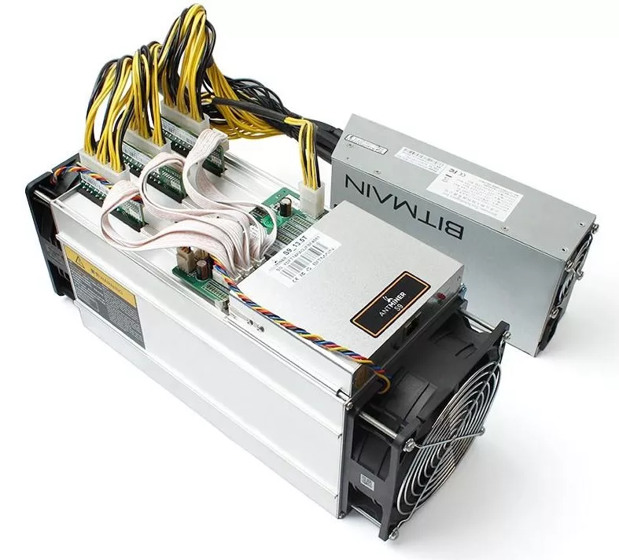

Antminer S9 ประกอบด้วยส่วนประกอบดังต่อไปนี้:

- 3 แฮชบอร์ดที่มีชิปที่ผลิตพลังแฮช

- แผงควบคุมที่มีช่องสำหรับการ์ด SD, พอร์ต Ethernet, และตัวเชื่อมต่อสำหรับแฮชบอร์ดและพัดลม นี่คือสมองของ ASIC ของคุณ

- สายเคเบิลข้อมูล 3 เส้นที่เชื่อมต่อแฮชบอร์ดกับบอร์ดควบคุม

- แหล่งจ่ายไฟซึ่งทำงานที่ 220V และสามารถเสียบปลั๊กได้เหมือนเครื่องใช้ไฟฟ้าภายในบ้านทั่วไป

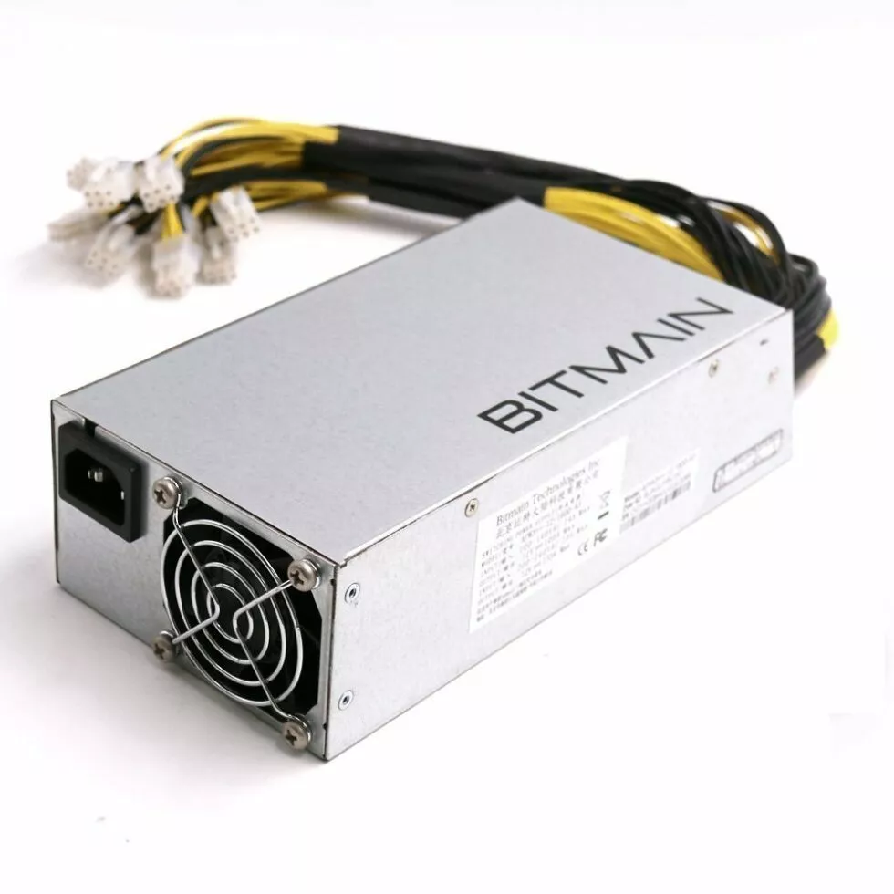

- พัดลมขนาด 120 มม. จำนวน 2 ตัว

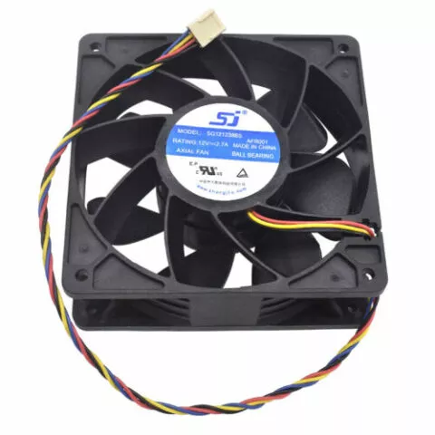

- สายเคเบิล C13 ชาย

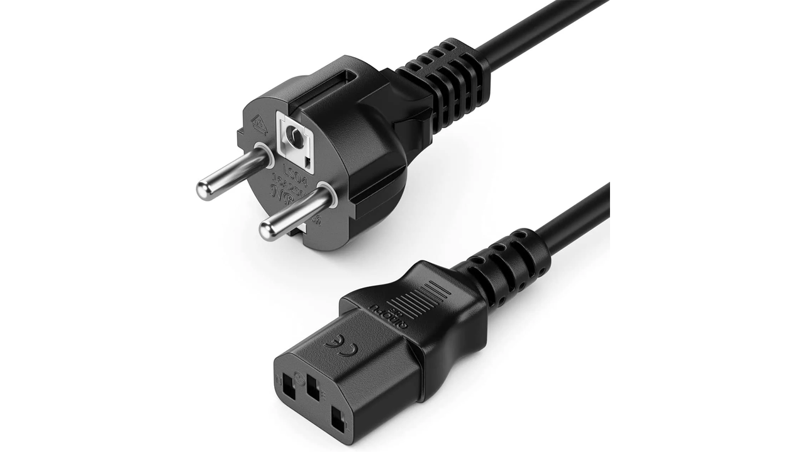

เมื่อซื้อเครื่องมือมือสอง สิ่งสำคัญคือต้องตรวจสอบว่ามีชิ้นส่วนที่จำเป็นทั้งหมดและอยู่ในสภาพการทำงานที่ดี ในระหว่างการแลกเปลี่ยน คุณควรขอให้ผู้ขายเปิดเครื่องเพื่อทดสอบการทำงานที่ถูกต้อง สิ่งสำคัญคือต้องตรวจสอบว่าอุปกรณ์เปิดทำงานได้อย่างถูกต้อง จากนั้นตรวจสอบการเชื่อมต่ออินเทอร์เน็ตโดยการเสียบสาย Ethernet และเข้าถึงอินเทอร์เฟซการเข้าสู่ระบบ Bitmain ผ่านเว็บเบราว์เซอร์บนเครือข่ายท้องถิ่นเดียวกัน คุณสามารถค้นหาที่อยู่ IP นี้ได้โดยการเชื่อมต่อกับอินเทอร์เฟซเราเตอร์อินเทอร์เน็ตของคุณและมองหาอุปกรณ์ที่เชื่อมต่ออยู่ ที่อยู่นี้ควรมีรูปแบบดังนี้: 192.168.x.x

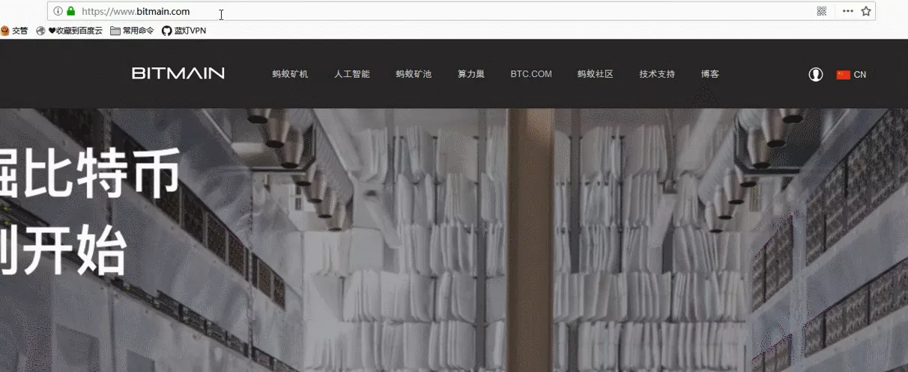

นอกจากนี้ ให้ตรวจสอบว่าข้อมูลรับรองเริ่มต้นใช้งานได้หรือไม่ (ชื่อผู้ใช้: root, รหัสผ่าน: root) หากข้อมูลรับรองเริ่มต้นใช้งานไม่ได้ คุณจะต้องรีเซ็ตเครื่อง

เมื่อเชื่อมต่อแล้ว คุณควรจะสามารถเห็นสถานะของแต่ละแฮชบอร์ดบนแดชบอร์ดได้ หากเครื่องขุดเชื่อมต่อกับพูล คุณควรจะเห็นแฮชบอร์ดทั้งหมดทำงาน สิ่งสำคัญคือต้องทราบว่าเครื่องขุด generate มีเสียงดังมาก ซึ่งเป็นเรื่องปกติ นอกจากนี้ ควรตรวจสอบให้แน่ใจว่าพัดลมทำงานอย่างถูกต้อง

คุณสามารถลบสระว่ายน้ำ mining ของเจ้าของเดิมเพื่อเตรียมตั้งค่าของคุณเองในภายหลังได้ หากคุณต้องการ คุณยังสามารถตรวจสอบแฮชบอร์ดโดยการถอดเครื่องออก อย่างไรก็ตาม ขั้นตอนนี้ซับซ้อนกว่าและต้องใช้เวลาและเครื่องมือบางอย่าง หากคุณต้องการดำเนินการถอดชิ้นส่วนนี้ โปรดดูที่ส่วนถัดไปของบทแนะนำนี้ ซึ่งมีรายละเอียดขั้นตอนที่เกี่ยวข้อง สิ่งสำคัญคือต้องทราบว่าเครื่องขุด generate มีฝุ่นจำนวนมากและต้องการการบำรุงรักษาเป็นประจำ คุณสามารถสังเกตการสะสมของฝุ่นนี้และคุณภาพของการบำรุงรักษาโดยการถอดเครื่องออก

หลังจากตรวจสอบประเด็นทั้งหมดนี้แล้ว คุณสามารถซื้อเครื่องของคุณด้วยความมั่นใจสูง หากมีข้อสงสัย ให้ปรึกษาชุมชน

เพื่อสรุปคำแนะนำนี้ในประโยคเดียว: **"อย่าเชื่อ, ตรวจสอบ."**

[คุณยังสามารถหันไปหาผู้เชี่ยวชาญในการปรับสภาพเครื่อง mining เช่น พันธมิตรของเรา 21energy พวกเขาเสนอเครื่อง S9 ที่ผ่านการทดสอบ ทำความสะอาด และติดตั้งซอฟต์แวร์ BraiiinOS+ ล่วงหน้า ด้วยรหัสพันธมิตร "decouvre" คุณจะได้รับส่วนลด 10% ในการซื้อ S9 พร้อมสนับสนุนโครงการ Attakai](https://21energy.io/en/produkt/bitmain-antminer-s9-bundle/)

## คู่มือการซื้อการดัดแปลงฮาร์ดแวร์สำหรับ S9

<chapterId>fa5f5eca-bcbf-5a83-9b03-98ecbadbabd6</chapterId>

ในฐานะเจ้าของ Antminer S9 คุณน่าจะทราบถึงลักษณะที่เสียงดังและเทอะทะของอุปกรณ์นี้ อย่างไรก็ตาม คุณสามารถเปลี่ยนมันให้กลายเป็นเครื่องทำความร้อนที่เงียบและเชื่อมต่อได้โดยทำตามขั้นตอนง่ายๆ ไม่กี่ขั้นตอน ในส่วนนี้ เราจะสรุปอุปกรณ์ที่จำเป็นสำหรับการดัดแปลง

หากคุณเป็นช่างฝีมือที่มีทักษะและกำลังมองหาวิธีเปลี่ยนเครื่องขุดให้เป็นเครื่องทำความร้อน บทแนะนำนี้เหมาะสำหรับคุณ เราต้องการเตือนคุณว่าการดัดแปลงอุปกรณ์อิเล็กทรอนิกส์อาจมีความเสี่ยงทางไฟฟ้า ดังนั้นจึงจำเป็นต้องใช้ความระมัดระวังทุกประการเพื่อหลีกเลี่ยงความเสียหายหรือการบาดเจ็บใดๆ

1. เปลี่ยนพัดลม

พัดลมดั้งเดิมของ Antminer S9 มีเสียงดังเกินไปที่จะใช้ Antminer ของคุณเป็นเครื่องทำความร้อน วิธีแก้ไขคือการเปลี่ยนพัดลมเหล่านั้นด้วยพัดลมที่เงียบกว่า ทีมงานของเราได้ทดสอบหลายรุ่นจากแบรนด์ Noctua และได้เลือก Noctua NF-A14 iPPC-2000 PWM เป็นทางเลือกที่ดีที่สุด อย่าลืมเลือกพัดลมรุ่น 12V พัดลมขนาด 140 มม. นี้สามารถผลิตความร้อนได้ถึง 1200W ในขณะที่รักษาระดับเสียงตามทฤษฎีไว้ที่ 31 dB ในการติดตั้งพัดลมขนาด 140 มม. เหล่านี้ คุณจะต้องใช้ตัวแปลงจาก 140 มม. เป็น 120 มม. ซึ่งสามารถพบได้ในร้าน DécouvreBitcoin เราจะเพิ่มตะแกรงป้องกันขนาด 140 มม. ด้วย

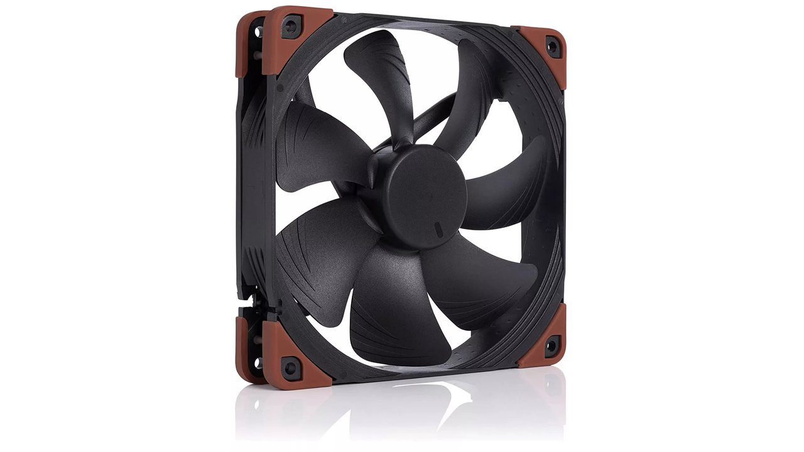

พัดลมของแหล่งจ่ายไฟมีเสียงดังมากและจำเป็นต้องเปลี่ยน เราแนะนำ Noctua NF-A6x25 PWM โปรดทราบว่าขั้วต่อบนพัดลม Noctua แตกต่างจากของเดิม ดังนั้นคุณจะต้องมีอะแดปเตอร์ขั้วต่อเพื่อเชื่อมต่อพัดลม สองตัวก็เพียงพอแล้ว อีกครั้ง ตรวจสอบให้แน่ใจว่าคุณเลือกพัดลมรุ่น 12V

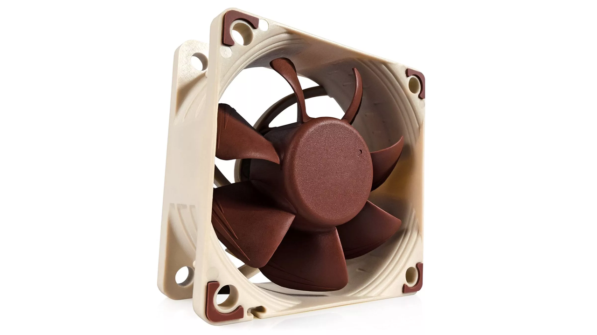

2. เพิ่มสะพาน WIFI/Ethernet

แทนที่จะใช้สาย Ethernet คุณสามารถเชื่อมต่อ Antminer ของคุณผ่าน WIFI โดยการเพิ่ม WIFI/Ethernet bridge เราได้เลือก Vonets VAP11G-300 เพราะมันช่วยให้คุณดึงสัญญาณ WIFI จากกล่องอินเทอร์เน็ตของคุณและส่งต่อไปยัง Antminer ผ่าน Ethernet ได้อย่างง่ายดายโดยไม่ต้องสร้างซับเน็ต หากคุณมีทักษะทางไฟฟ้า คุณสามารถจ่ายไฟให้มันโดยตรงด้วยแหล่งจ่ายไฟของ Antminer โดยไม่จำเป็นต้องเพิ่มที่ชาร์จ USB สำหรับสิ่งนี้คุณจะต้องมีแจ็คขนาด 5.5 มม. x 2.1 มม. แบบตัวเมีย

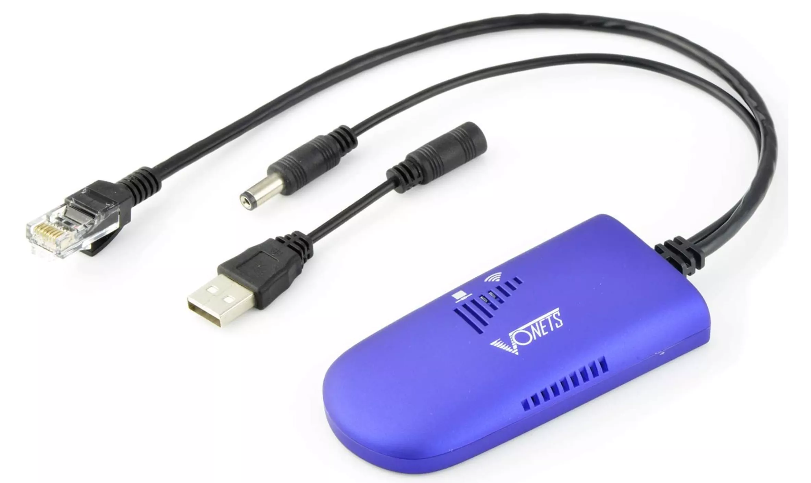

3. ตัวเลือก: เพิ่มปลั๊กอัจฉริยะ

หากคุณต้องการเปิดหรือปิด Antminer ของคุณจากสมาร์ทโฟนและตรวจสอบการใช้พลังงาน ให้พิจารณาเพิ่มปลั๊กอัจฉริยะ เราได้ทดสอบปลั๊ก ANTELA ในรุ่น 16A ซึ่งเข้ากันได้กับแอป SmartLife ปลั๊กอัจฉริยะนี้ช่วยให้คุณดูการใช้พลังงานรายวันและรายเดือน และเชื่อมต่อโดยตรงกับเราเตอร์อินเทอร์เน็ตของคุณผ่าน WiFi

รายการอุปกรณ์และลิงก์

- 2X 3D adapter piece 140mm to 120mm

- [2X NF-A14 iPPC-2000 PWM](https://www.amazon.fr/Noctua-nf-polarized-A14-industrialppc-PWM-2000/dp/B00KESSUDW)

- [2X 140 mm fan grilles](https://www.amazon.fr/dp/B06XD4FTSQ)
- [Noctua NF-A6x25 PWM](https://www.amazon.fr/Noctua-nf-a6-25-PWM-Ventilateur-Marron/dp/B00VXTANZ4)

- [น้ำตาลของช่างไฟฟ้า 2.5 มม.²](https://www.amazon.fr/Legrand-LEG98433-Borne-raccordement-Nylbloc/dp/B00BBHXLYS)
- [Vonets vap11g-300](https://www.amazon.fr/Vonets-VAP11G-300-Bridge-convertit-Ethernet/dp/B014SK2H6W)
- [ปลั๊กอัจฉริยะ ANTELA (ตัวเลือก)](https://www.amazon.fr/dp/B09YYMVXJZ)

# การแก้ไขซอฟต์แวร์ของ Antminer S9

<partId>afc9c29a-84aa-5f1d-82e2-5fd9ff2e1805</partId>

## การตั้งค่าสะพานเชื่อม WIFI/Ethernet ของ Vonet

<chapterId>3cf487a4-21ef-5b24-83d5-789b811f740f</chapterId>

ในการเชื่อมต่อ ASIC ของคุณผ่าน WIFI คุณจะต้องมีอุปกรณ์ที่เรียกว่า bridge อุปกรณ์นี้ช่วยให้คุณรับสัญญาณ WIFI จากเราเตอร์ของคุณและส่งต่อไปยังอุปกรณ์อื่นผ่าน Ethernet

อุปกรณ์หลายชนิดสามารถทำหน้าที่นี้ได้ แต่เราขอแนะนำ VONETS WiFi Bridge/Repeater เนื่องจากความสะดวกสบายของมัน

เชื่อมต่อสะพานด้วยสาย USB เพื่อจ่ายไฟ

จากคอมพิวเตอร์ของคุณ เชื่อมต่อกับเครือข่าย WIFI VONETS\_**\*\*** ด้วยรหัสผ่าน 12345678.

เข้าสู่ระบบด้วยชื่อผู้ใช้ "admin" และรหัสผ่าน "admin"

เลือกพ่อมด

เลือกเครือข่าย WIFI ที่คุณต้องการเชื่อมต่อกับเครื่องขุดของคุณ จากนั้นคลิก ถัดไป

หมายเหตุ: สะพาน Vonet ใช้งานได้เฉพาะบนความถี่ 2.4GHz ปัจจุบัน เราเตอร์มักจะมีเครือข่าย Wi-Fi สองเครือข่าย หนึ่งทำงานบน 2.4 GHz และอีกหนึ่งบน 5 GHz

ป้อนรหัสผ่านสำหรับเครือข่าย WIFI ของคุณในช่อง "รหัสผ่านฮอตสปอต WIFI ต้นทาง" หากคุณไม่ต้องการใช้สะพาน Vonet ของคุณเพื่อขยายเครือข่าย WIFI ของคุณ ให้ทำเครื่องหมายที่ช่อง "ปิดใช้งานฮอตสปอต" มิฉะนั้น ให้ปล่อยไว้โดยไม่ทำเครื่องหมาย

จากนั้นคุณสามารถคลิก ใช้

สุดท้ายนี้ คลิกที่รีบูตเพื่อเริ่มต้นสะพานใหม่ จะใช้เวลาสักครู่ในการรีบูต

สะพานควรเชื่อมต่อกับเราเตอร์ของคุณและปรากฏภายใต้ชื่อ "[VONETS.COM](http://vonets.com/)" หรือชื่อที่คล้ายกัน หากยังไม่เชื่อมต่อหลังจากผ่านไปไม่กี่นาที คุณอาจจำเป็นต้องถอดปลั๊ก/เสียบปลั๊กสะพานใหม่

เมื่อเชื่อมต่อสะพานแล้ว ให้เชื่อมต่อสาย Ethernet จากสะพานไปยัง ASIC ของคุณ จากนั้นเสียบ ASIC เข้ากับเต้ารับไฟฟ้า คุณสามารถเข้าถึงอินเทอร์เฟซของ ASIC ได้ในลักษณะเดียวกับที่เชื่อมต่อโดยตรงกับเราเตอร์ของคุณผ่านสาย Ethernet

## รีเซ็ต Antminer S9

<chapterId>b518b6bd-9dae-5136-ae3c-1fafb1cb2592</chapterId>

ก่อนติดตั้ง BraiinOS+ อาจจำเป็นต้องรีเซ็ต S9 ของคุณกลับไปที่การตั้งค่าจากโรงงาน

วิธีนี้สามารถใช้ได้ระหว่าง 2 นาทีถึง 10 นาทีหลังจากที่เครื่องขุดเริ่มทำงาน

2 นาทีหลังจากเปิดเครื่องขุด กรุณากดปุ่ม "รีเซ็ต" ค้างไว้ 5 วินาที แล้วปล่อย เครื่องขุดจะถูกคืนค่าเป็นการตั้งค่าจากโรงงานภายใน 4 นาทีและจะรีสตาร์ทโดยอัตโนมัติ (ไม่จำเป็นต้องปิดเครื่อง)

## การติดตั้ง BraiinsOS+ บน Antminer S9

<chapterId>38e8b1a8-8b1d-51ed-8b92-59d4ddb15184</chapterId>

ซอฟต์แวร์ดั้งเดิมที่ติดตั้งบนเครื่อง Antminer รุ่น mining มีข้อจำกัดในด้านการใช้งาน นั่นคือเหตุผลที่ในคู่มือนี้ เราจะติดตั้งซอฟต์แวร์อื่นที่เรียกว่า BraiinsOS+ ซึ่งเป็นซอฟต์แวร์จากบุคคลที่สามที่พัฒนาโดยกลุ่มแรกของ Bitcoin mining โดยมีฟีเจอร์เพิ่มเติมและอนุญาตให้ทำการปรับเปลี่ยนพลังงานของเครื่องได้เป็นต้น

มีหลายวิธีในการติดตั้ง Braiins OS+ บน ASIC คุณสามารถอ้างอิงจากคู่มือนี้รวมถึง [เอกสารอย่างเป็นทางการของ Braiins](https://academy.braiins.com/en/braiins-os/about/)

ที่นี่ เราจะแนะนำคุณผ่านกระบวนการติดตั้ง Braiins OS+ ลงในหน่วยความจำของ Antminer ของคุณอย่างง่ายดายโดยใช้ซอฟต์แวร์ BOS toolbox แทนที่ระบบปฏิบัติการเดิม พร้อมขั้นตอนที่อธิบายอย่างละเอียดด้านล่าง

1. เปิดเครื่อง Antminer ของคุณและเชื่อมต่อกับกล่องอินเทอร์เน็ตของคุณ

2. ดาวน์โหลด BOS toolbox สำหรับ Windows / Linux.

3. แตกไฟล์ที่ดาวน์โหลดมาและเปิดไฟล์ bos-toolbox.bat เลือกภาษา และหลังจากนั้นไม่กี่อึดใจ คุณจะเห็นหน้าต่างนี้:

4. กล่องเครื่องมือ Bos จะช่วยให้คุณค้นหาที่อยู่ IP ของ Antminer ของคุณได้อย่างง่ายดายและติดตั้ง BraiinsOS+ หากคุณทราบที่อยู่ IP ของเครื่องของคุณแล้ว คุณสามารถข้ามไปที่ขั้นตอนที่ 8 ได้ มิฉะนั้น ให้ไปที่แท็บสแกน

5. โดยปกติแล้ว ในเครือข่ายภายในบ้าน ช่วงของที่อยู่ IP จะอยู่ระหว่าง 192.168.1.1 ถึง 192.168.1.255 ดังนั้นให้ใส่ "192.168.1.0/24" ในช่องช่วง IP หากเครือข่ายของคุณแตกต่างออกไป กรุณาเปลี่ยนที่อยู่เหล่านี้ตามความเหมาะสม จากนั้นคลิกที่ "Start"

6. ข้อควรระวัง: หาก Antminer มีรหัสผ่าน การตรวจจับจะไม่ทำงาน หากเป็นกรณีนี้ วิธีแก้ปัญหาที่ง่ายที่สุดคือการรีเซ็ต

7. คุณควรเห็น Antminers ทั้งหมดบนเครือข่ายของคุณปรากฏที่นี่ และที่อยู่ IP คือ 192.168.1.37.

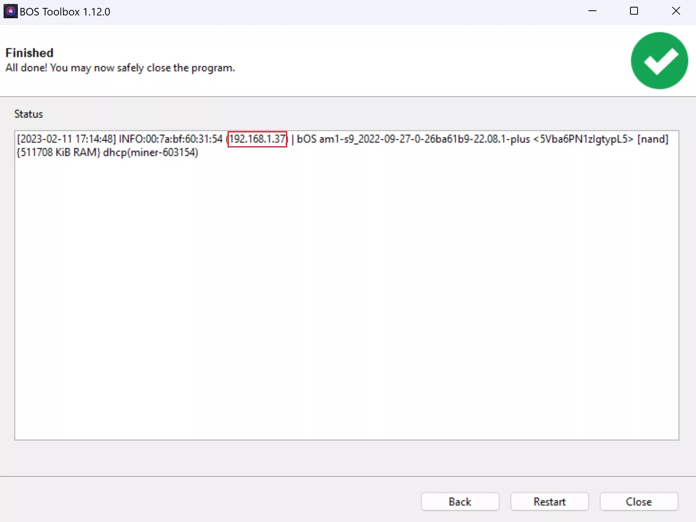

8. คลิกที่ "Back" จากนั้นไปที่แท็บ "Install" ป้อนที่อยู่ IP ที่พบก่อนหน้านี้ แล้วคลิกที่ "Start"

> หากการติดตั้งไม่ทำงาน อาจจำเป็นต้องทำการรีเซ็ตและลองอีกครั้ง (ดูส่วนก่อนหน้า)

9. หลังจากผ่านไปไม่กี่อึดใจ Antminer ของคุณจะรีสตาร์ท และคุณจะสามารถเข้าถึงอินเทอร์เฟซ Braiins OS+ ได้ที่ที่อยู่ IP ที่ระบุไว้ ที่นี่คือ 192.168.1.37 โดยตรงในแถบที่อยู่ของเบราว์เซอร์ของคุณ ชื่อผู้ใช้เริ่มต้นคือ "root" และไม่มีรหัสผ่านเริ่มต้น

## กำหนดค่า BraiinsOS+

<chapterId>36e432f2-85bc-52d0-a62a-009fc4c69338</chapterId>

คุณจะต้องเชื่อมต่อกับ ASIC ของคุณโดยใช้ที่อยู่ IP ภายในของอุปกรณ์บนเครือข่ายของคุณผ่านเบราว์เซอร์

คุณสามารถค้นหาที่อยู่ IP ของเครื่องของคุณโดยใช้เครื่องมือ BOS toolbox หรือโดยการเข้าถึงหน้าเว็บของเราเตอร์ของคุณโดยตรง

ข้อมูลประจำตัวเริ่มต้นเหมือนกับระบบปฏิบัติการดั้งเดิม

- ชื่อผู้ใช้: root
- รหัสผ่าน: (ไม่มี)

จากนั้นคุณจะพบกับแดชบอร์ด Brains OS+

### แดชบอร์ด

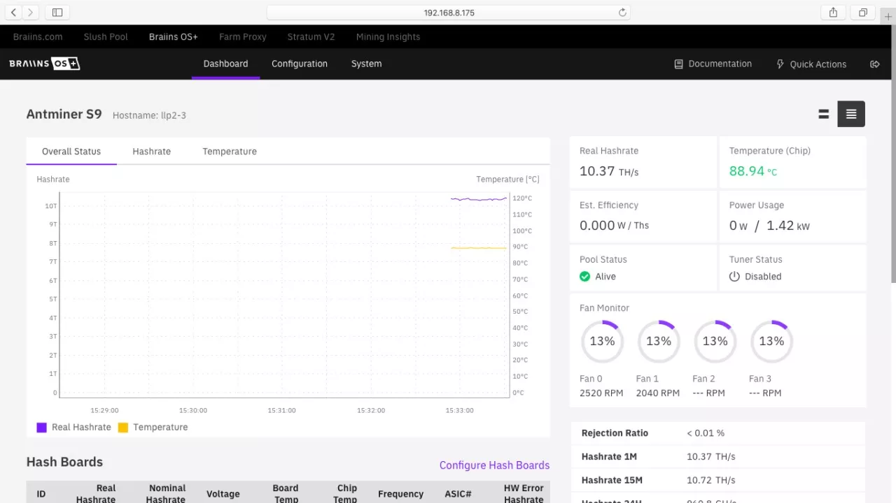

ในหน้านี้ คุณสามารถสังเกตการทำงานแบบเรียลไทม์ของเครื่องของคุณได้

- กราฟแบบเรียลไทม์สามรายการที่แสดงอุณหภูมิ, hashrate, และสถานะโดยรวมของเครื่องของคุณ
- ทางด้านขวา hashrate จริง, อุณหภูมิเฉลี่ยของชิป, ประสิทธิภาพที่ประมาณการใน W/THs, และการใช้พลังงาน
- ด้านล่าง ความเร็วพัดลมเป็นเปอร์เซ็นต์ของความเร็วสูงสุดและจำนวนรอบต่อนาที

- ด้านล่างนี้ คุณจะพบกับมุมมองรายละเอียดของแต่ละแฮชบอร์ด อุณหภูมิเฉลี่ยของบอร์ดและชิปที่มีอยู่ รวมถึงแรงดันไฟฟ้าและความถี่
- รายละเอียดเกี่ยวกับสระ mining ที่ใช้งานอยู่ใน Pools.
- สถานะของการปรับจูนอัตโนมัติในสถานะของเครื่องปรับจูน
- ทางด้านขวา รายละเอียดเกี่ยวกับข้อมูลที่ส่งไปยังพูล

### การกำหนดค่า

### ระบบ

### การดำเนินการด่วน

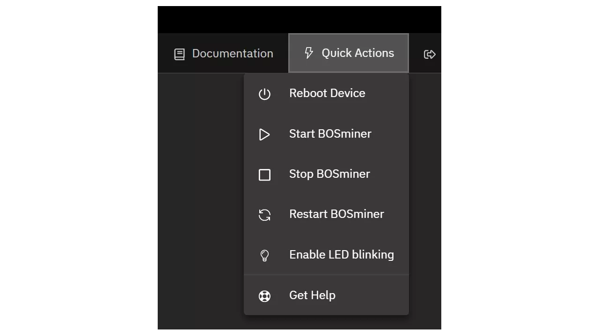

# การแก้ไขพัดลม

<partId>98266a8f-3745-58a0-9f6b-26a9734e1427</partId>

## เปลี่ยนพัดลม Power Supply

<chapterId>0c6befa7-f3ef-5bcf-ae8d-0ad5e5d41d70</chapterId>

**คำเตือน:** จำเป็นต้องติดตั้ง Braiins OS+ บนเครื่องขุดของคุณล่วงหน้า หรือซอฟต์แวร์อื่นใดที่สามารถลดประสิทธิภาพของเครื่องของคุณได้ มาตรการนี้มีความสำคัญเนื่องจากเพื่อที่จะลดเสียงรบกวน เราจะติดตั้งพัดลมที่มีกำลังน้อยลงซึ่งสามารถกระจายความร้อนได้ลดลง

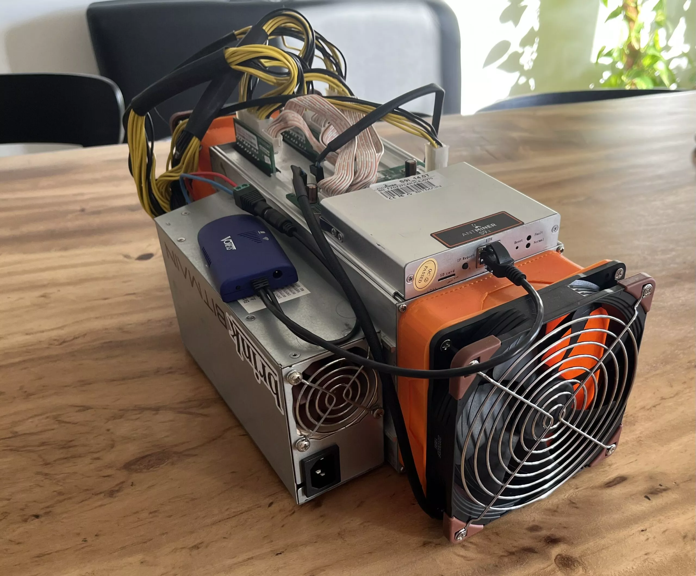

### วัสดุที่จำเป็น

- 1 พัดลม Noctua NF-A6x25 PWM
- น้ำตาลช่างไฟฟ้า 2.5mm2

**คำเตือน:** ก่อนอื่น ก่อนเริ่มต้น ให้แน่ใจว่าคุณได้ถอดปลั๊กเครื่องขุดของคุณออกแล้วเพื่อหลีกเลี่ยงความเสี่ยงจากการถูกไฟฟ้าดูด

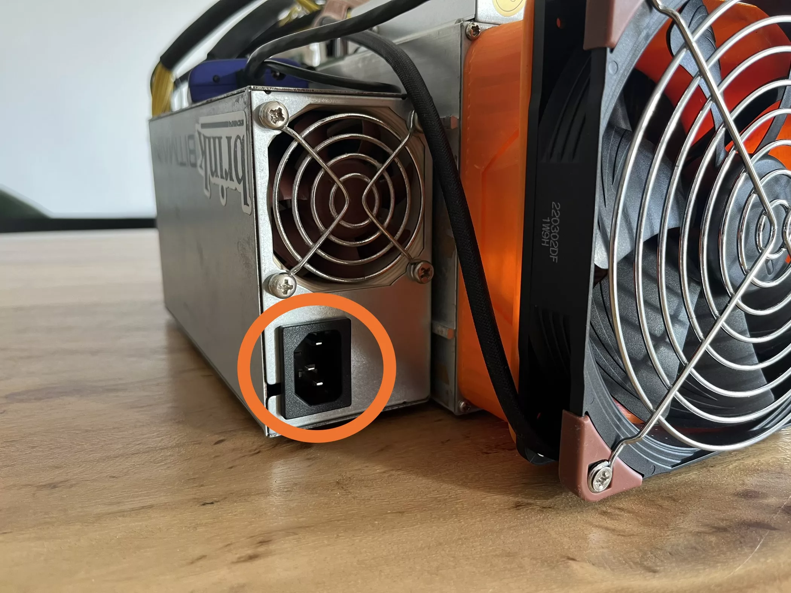

ก่อนอื่น ให้ถอดสกรู 6 ตัวที่ด้านข้างของเคสที่ยึดไว้ เมื่อถอดสกรูออกแล้ว ให้เปิดเคสอย่างระมัดระวังเพื่อถอดพลาสติกป้องกันที่ครอบคลุมส่วนประกอบออก

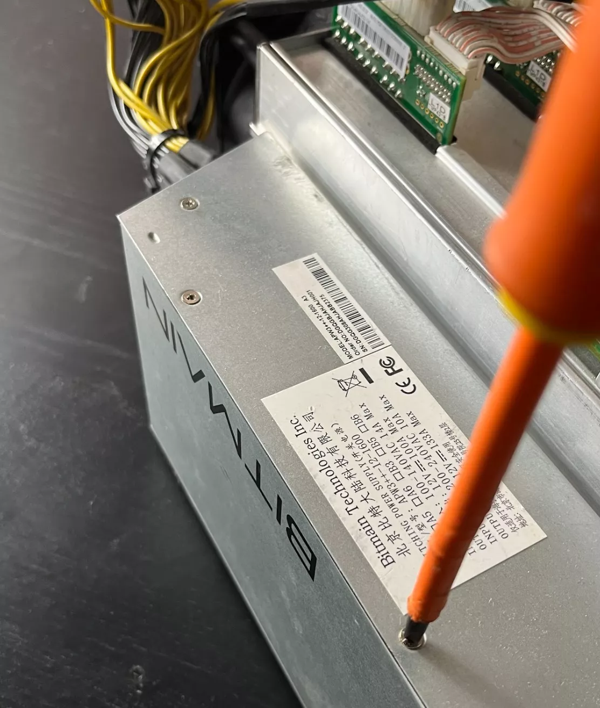

ต่อไป ถึงเวลาถอดพัดลมตัวเดิมออก โดยระวังไม่ให้ส่วนประกอบอื่นเสียหาย ในการทำเช่นนี้ ให้ถอดสกรูที่ยึดพัดลมไว้ออก และค่อยๆ ลอกกาวสีขาวที่ล้อมรอบตัวเชื่อมต่อออก ควรดำเนินการด้วยความระมัดระวังเพื่อหลีกเลี่ยงการทำลายสายไฟหรือตัวเชื่อมต่อ

เมื่อถอดพัดลมเดิมออกแล้ว คุณจะสังเกตเห็นว่าตัวเชื่อมต่อของพัดลม Noctua ใหม่ไม่ตรงกับของพัดลมเดิม จริงๆ แล้วพัดลมใหม่มีสาย 3 เส้น รวมถึงสายสีเหลืองที่ใช้ควบคุมความเร็ว อย่างไรก็ตาม สายนี้จะไม่ถูกใช้ในกรณีเฉพาะนี้ ดังนั้นเพื่อเชื่อมต่อพัดลมใหม่ จึงแนะนำให้ใช้ตัวแปลงพิเศษ อย่างไรก็ตาม จำเป็นต้องทราบว่าตัวแปลงนี้บางครั้งอาจหายาก

หากคุณไม่มีอะแดปเตอร์นี้ คุณยังสามารถดำเนินการเชื่อมต่อพัดลมใหม่โดยใช้ชูการ์ของช่างไฟฟ้าได้ ในการทำเช่นนี้ คุณจะต้องตัดสายเคเบิลของพัดลมเก่าและใหม่

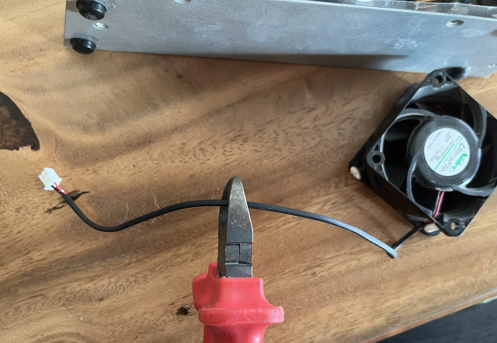

สำหรับพัดลมใหม่ ใช้คัตเตอร์ตัดตามแนวของปลอกหลักอย่างระมัดระวังที่ 1 ซม. โดยไม่ตัดปลอกของสายเคเบิลที่อยู่ข้างใต้

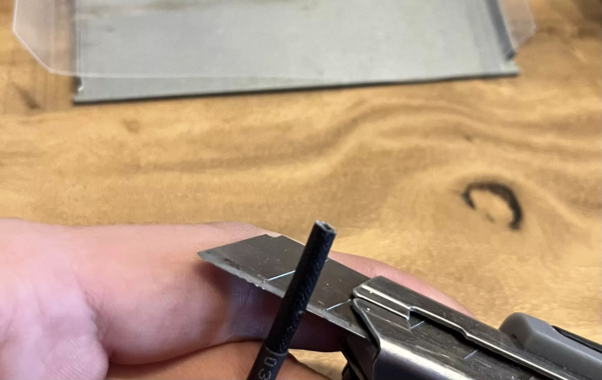

จากนั้น โดยการดึงปลอกหลักลง ให้ตัดปลอกของสายสีแดงและสีดำในลักษณะเดียวกับก่อนหน้านี้ และตัดสายสีเหลืองให้เสมอกัน

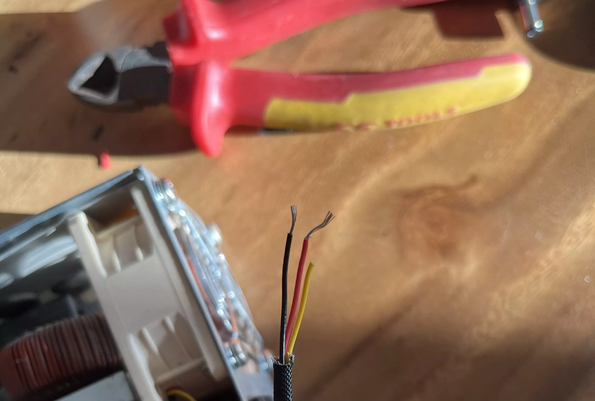

บนพัดลมเก่า การตัดปลอกหลักโดยไม่ทำลายปลอกของสายไฟสีแดงและสีดำเป็นเรื่องที่ละเอียดอ่อนมากขึ้น สำหรับสิ่งนี้ เราใช้เข็มที่สอดระหว่างปลอกหลักและสายไฟสีแดงและสีดำ

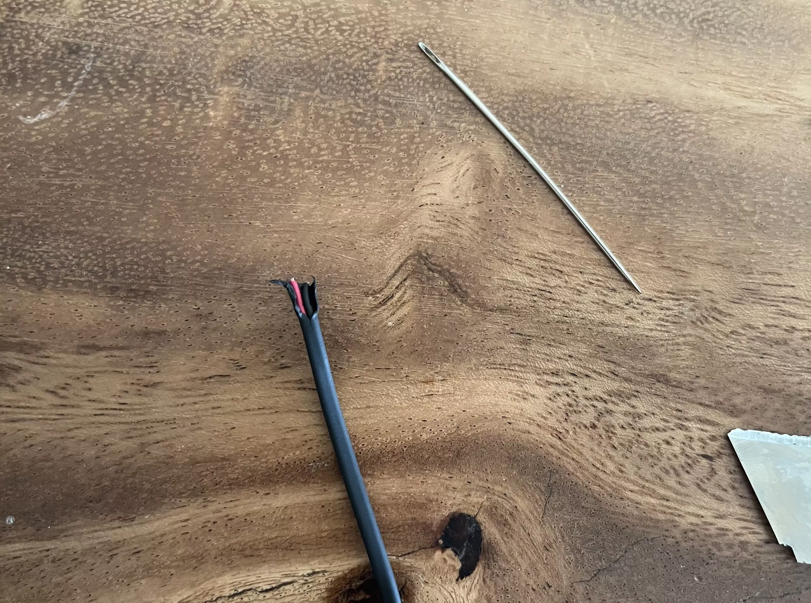

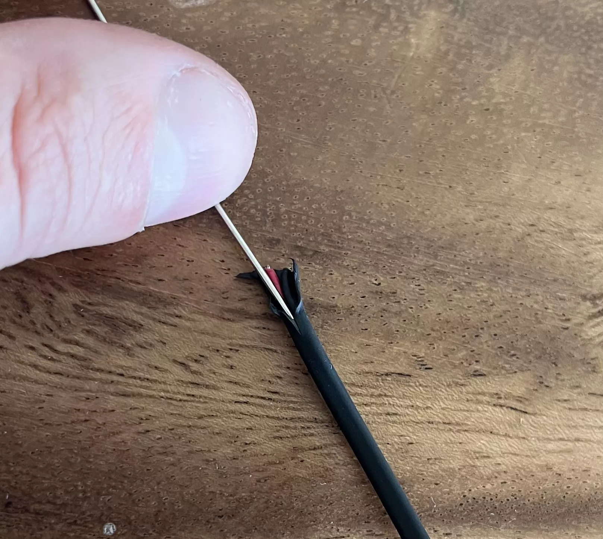

เมื่อลวดสีแดงและสีดำถูกเปิดออก ให้ตัดปลอกอย่างระมัดระวังเพื่อหลีกเลี่ยงการทำลายสายไฟฟ้า

จากนั้น เชื่อมสายเคเบิลด้วยชูการ์ สายสีดำกับสีดำ และสายสีแดงกับสีแดง คุณยังสามารถเพิ่มเทปพันสายไฟได้อีกด้วย

เมื่อเชื่อมต่อเสร็จแล้ว ก็ถึงเวลาติดตั้งพัดลม Noctua ใหม่พร้อมกับตะแกรงและสกรูเก่า สกรูใหม่ในกล่องจะถูกนำมาใช้ใหม่ในภายหลัง ตรวจสอบให้แน่ใจว่าติดตั้งในทิศทางที่ถูกต้อง คุณจะสังเกตเห็นลูกศรด้านหนึ่งของพัดลมที่บ่งบอกทิศทางการไหลของอากาศ สิ่งสำคัญคือต้องวางพัดลมให้ลูกศรนี้ชี้ไปทางด้านในของเคส จากนั้นเชื่อมต่อพัดลมใหม่

ทางเลือก: หากคุณมีความรู้เกี่ยวกับไฟฟ้า คุณสามารถเพิ่มตัวเชื่อมต่อแจ็คขนาด 5.5 มม. แบบตัวเมียเข้ากับเอาต์พุตไฟฟ้า 12V ได้โดยตรง ซึ่งจะจ่ายไฟให้กับสะพาน Wi-Fi ของ Vonet โดยตรง อย่างไรก็ตาม หากคุณไม่มั่นใจในทักษะด้านไฟฟ้าของคุณ ควรใช้ตัวเชื่อมต่อ USB กับที่ชาร์จประเภทสมาร์ทโฟนเพื่อหลีกเลี่ยงความเสี่ยงของการลัดวงจรหรือความเสียหายทางไฟฟ้า

เมื่อเชื่อมต่อเสร็จแล้ว ให้วางฝาพลาสติกไว้เหนือเคสพลาสติกและไม่ใช่ด้านใน

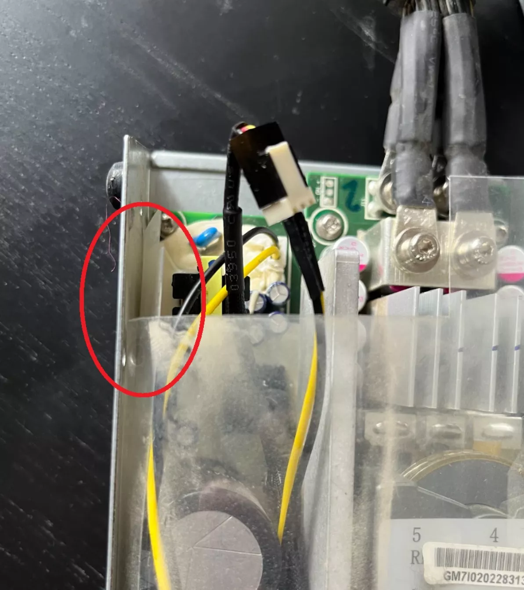

สุดท้าย ใส่ฝาครอบเคสกลับเข้าที่และขันสกรู 6 ตัวที่ด้านข้างเพื่อยึดทุกอย่างให้อยู่ในตำแหน่ง และนั่นคือทั้งหมด ตอนนี้เคสพาวเวอร์ซัพพลายของคุณติดตั้งพัดลมใหม่เรียบร้อยแล้ว

## การเปลี่ยนพัดลมหลัก

<chapterId>a29f60f1-3fa3-57fc-a630-9c97cec30e56</chapterId>

**คำเตือน:** จำเป็นต้องติดตั้ง Braiins OS+ บนเครื่องขุดของคุณล่วงหน้า หรือซอฟต์แวร์อื่นใดที่อาจลดประสิทธิภาพของเครื่องของคุณ มาตรการนี้มีความสำคัญเนื่องจากเพื่อที่จะลดเสียงรบกวน เราจะติดตั้งพัดลมที่มีกำลังน้อยลง ซึ่งจะระบายความร้อนได้น้อยลง

### วัสดุที่จำเป็น

- 2 ชิ้น อะแดปเตอร์ 3D 140mm ถึง 120mm
- 2 พัดลม Noctua NF-A14 iPPC-2000 PWM
- ตะแกรงพัดลม 140 มม. 2 ชิ้น

**คำเตือน:** ก่อนเริ่มต้น ให้ถอดปลั๊กเครื่องขุดของคุณก่อนเพื่อหลีกเลี่ยงความเสี่ยงจากการถูกไฟฟ้าดูด

1. ก่อนอื่น ให้ถอดพัดลมออกและไขสกรูออก

2. ขั้วต่อของพัดลม Noctua ใหม่ไม่ตรงกับของเดิม แต่อย่ากังวล! นำคัตเตอร์ออกมาและตัดแท็บพลาสติกเล็กๆ อย่างระมัดระวังเพื่อให้ขั้วต่อเข้ากับเครื่องขุดของคุณได้อย่างสมบูรณ์แบบ

3. ถึงเวลาติดตั้งชิ้นส่วน 3D แล้ว!

ยึดพวกมันไว้ทั้งสองด้านของเครื่องขุดโดยใช้สกรูที่คุณถอดออกจากพัดลม ขันสกรูจนกว่าหัวสกรูจะเสมอกับชิ้นส่วน 3D และยึดไว้อย่างแน่นหนา ระวังอย่าขันแน่นเกินไป เพราะอาจทำให้ชิ้นส่วนบิดเบี้ยวและทำให้สกรูตัวใดตัวหนึ่งสัมผัสกับตัวเก็บประจุได้

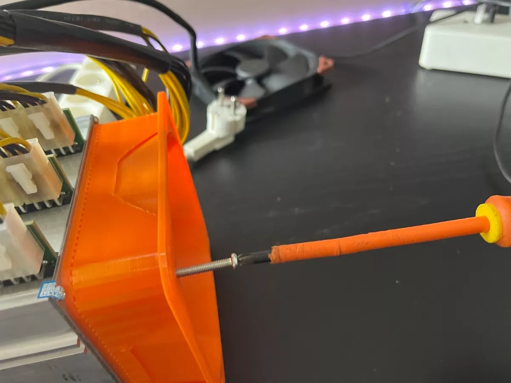

4. ตอนนี้ไปที่แฟนๆ กันเถอะ

ยึดพวกมันเข้ากับชิ้นส่วน 3D โดยใช้สกรูที่ให้มาในกล่อง ให้ความสำคัญกับทิศทางการไหลของอากาศ; ลูกศรที่ด้านข้างของพัดลมจะแสดงทิศทางที่ต้องปฏิบัติตาม เริ่มจากด้านพอร์ต Ethernet ไปยังอีกด้านหนึ่ง ดูรูปภาพด้านล่าง

5. ขั้นตอนสุดท้าย: เชื่อมต่อพัดลมและติดตั้งตะแกรงด้านบนด้วยสกรูที่ไม่ได้ใช้ในกล่องพัดลมของแหล่งจ่ายไฟ คุณมีเพียง 4 ตัว แต่ใช้ 2 ตัวต่อตะแกรงในมุมตรงข้ามก็เพียงพอแล้ว คุณยังสามารถหาสกรูที่คล้ายกันได้ที่ร้านขายอุปกรณ์ฮาร์ดแวร์หากจำเป็น

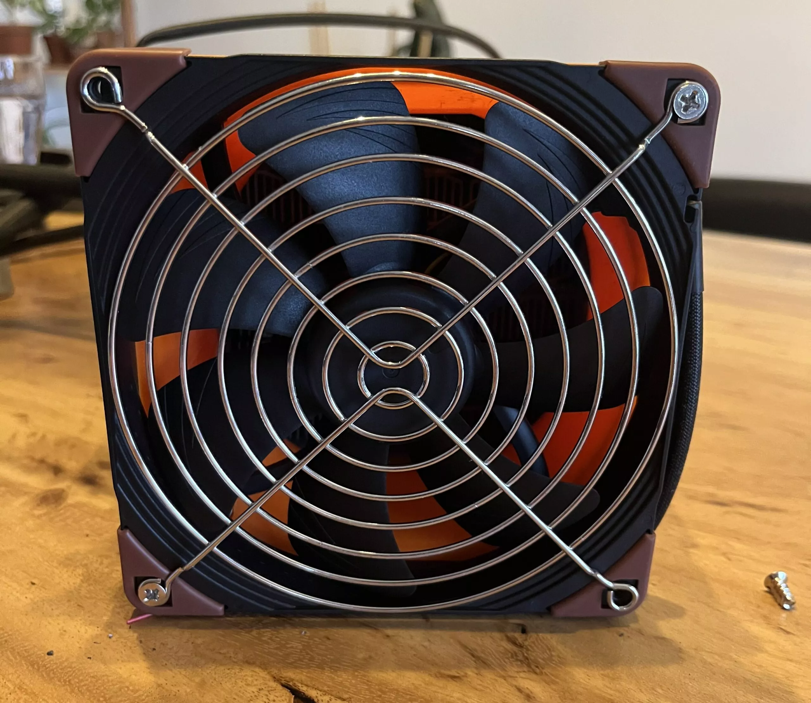

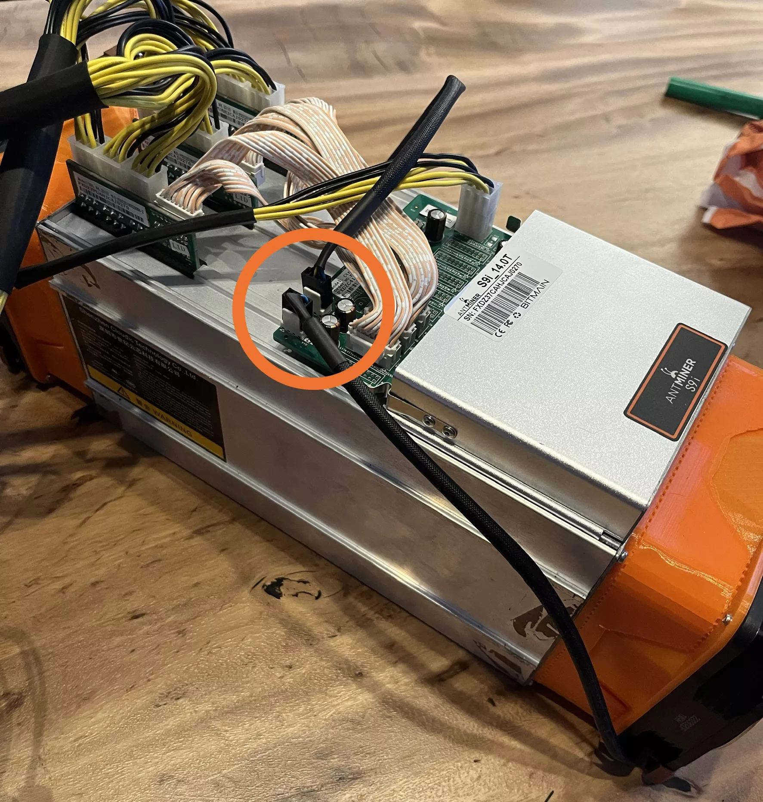

ในขณะที่รอเพื่อเสนอปลอกที่มีสไตล์มากขึ้นสำหรับเครื่องทำความร้อนใหม่ของคุณ คุณสามารถยึดปลอกและแหล่งจ่ายไฟด้วยสายรัดสายไฟของช่างไฟฟ้าได้

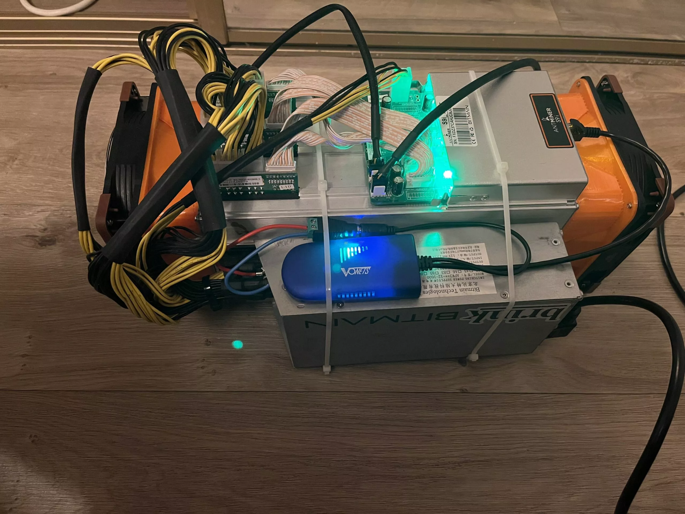

และสำหรับขั้นตอนสุดท้าย ให้เชื่อมต่อสะพาน Vonet เข้ากับพอร์ต Ethernet และแหล่งจ่ายไฟของมัน

และนั่นคือทั้งหมด ยินดีด้วย! คุณเพิ่งเปลี่ยนชิ้นส่วนกลไกทั้งหมดของเครื่องขุดของคุณ ตอนนี้คุณควรได้ยินเสียงรบกวนน้อยลงมากแล้ว

# การกำหนดค่าเครื่องทำความร้อน DIY

<partId>9c3918a8-d9a3-5a1f-bb9a-70314f7ac175</partId>

## เข้าร่วม Mining Pool

<chapterId>b57a6105-0a53-5fe9-bad1-d6d9daf97c0d</chapterId>

สามารถจินตนาการถึงกลุ่ม mining เหมือนกับสหกรณ์การเกษตร เกษตรกรรวมการผลิตของพวกเขาเข้าด้วยกันเพื่อลดความแปรปรวนระหว่างอุปทานและอุปสงค์ ทำให้ได้รับรายได้ที่มั่นคงมากขึ้นสำหรับการดำเนินงานของพวกเขา กลุ่ม mining ดำเนินการในลักษณะคล้ายกัน โดยทรัพยากรที่ใช้ร่วมกันคือแฮช อันที่จริง การค้นพบแฮชที่ถูกต้องเพียงหนึ่งเดียวสามารถสร้างบล็อกและรับรางวัล [coinbase](https://planb.academy/resources/glossary/coinbase-transaction) ซึ่งปัจจุบันคือ 6.25 BTC บวกกับค่าธรรมเนียมการทำธุรกรรมที่รวมอยู่ในบล็อก

หากคุณขุดคนเดียว คุณจะได้รับรางวัลก็ต่อเมื่อคุณพบบล็อกเท่านั้น การแข่งขันกับนักขุดคนอื่นๆ ทั่วโลก คุณจะมีโอกาสน้อยมากที่จะชนะลอตเตอรีนี้ และคุณยังต้องจ่ายค่าธรรมเนียมที่เกี่ยวข้องกับการใช้เครื่องขุดของคุณโดยไม่มีการรับประกันความสำเร็จ Mining pools แก้ไขปัญหานี้โดยการรวมพลังการคำนวณของนักขุดหลายคน (หลายพันคน) และแบ่งปันรางวัลตามเปอร์เซ็นต์ของการมีส่วนร่วมใน hashrate ของพูลเมื่อพบบล็อก เพื่อให้เห็นภาพโอกาสของคุณในการ mining บล็อกคนเดียว คุณสามารถใช้เครื่องมือนี้ได้ โดยการป้อนข้อมูลสำหรับ Antminer S9 เราจะเห็นว่าโอกาสในการหาฮัชที่อนุญาตให้สร้างบล็อกคือ 1 ใน 24,777,849 ต่อบล็อก หรือ 1 ใน 172,068 ต่อวัน โดยเฉลี่ยแล้ว (ด้วย hashrate และความยากคงที่) จะใช้เวลาอย่างน้อย 471 ปีในการหาบล็อก (เมื่อความยากเพิ่มขึ้น)

อย่างไรก็ตาม เนื่องจากทุกอย่างใน Bitcoin ขึ้นอยู่กับความน่าจะเป็น บางครั้งก็เกิดขึ้นที่นักขุดเดี่ยวได้รับรางวัลสำหรับการรับความเสี่ยงนี้: นักขุดเดี่ยว Bitcoin Miner แก้บล็อกด้วยอัตรา Hash เพียง 10 TH/s เอาชนะโอกาสที่ไม่น่าจะเป็นไปได้อย่างมาก – Decrypt

หากคุณชอบเล่นการพนัน คุณสามารถลองได้ แต่คู่มือของเราจะไม่เน้นไปในทิศทางนั้น แต่เราจะมุ่งเน้นไปที่สระ mining ที่เหมาะสมที่สุดสำหรับความต้องการของเราในการสร้างระบบทำความร้อน

ข้อควรพิจารณาเมื่อเลือกสระ mining รวมถึงระบบรางวัลของสระซึ่งอาจแตกต่างกันไป รวมถึงจำนวนขั้นต่ำที่ต้องการในการถอนรางวัลไปยังที่อยู่ ตัวอย่างเช่น Braiins ซึ่งเสนอซอฟต์แวร์ที่เรากำลังพูดถึงที่นี่ ยังมีสระให้บริการอีกด้วย สระนี้มีระบบรางวัลที่เรียกว่า "Score" ที่กระตุ้นให้คนขุดเหมืองทำการขุดเป็นเวลานาน การเข้าร่วมรวมถึงปัจจัยการทำงานที่แสดงเป็น "scoring hashrate" ในกรณีของเรา ที่เราต้องการระบบทำความร้อนที่สามารถเปิดได้เพียงไม่กี่นาที นี่ไม่ใช่ระบบรางวัลที่เหมาะสม เราต้องการระบบรางวัลที่ให้รางวัลเท่ากันสำหรับการเข้าร่วมแต่ละครั้ง นอกจากนี้ จำนวนการถอนขั้นต่ำสำหรับ Braiins Pool คือ 100,000 sats และมันคือ on-chain ดังนั้นเราจึงสูญเสียบางส่วนของ sats ในค่าธรรมเนียมการทำธุรกรรม และส่วนหนึ่งของรางวัลของเราอาจถูกล็อคหากเราไม่ขุดเพียงพอในช่วงฤดูหนาว

โมเดลรางวัลที่เราสนใจคือ PPS ซึ่งย่อมาจาก "pay-per-share" ซึ่งหมายความว่านักขุดจะได้รับรางวัลสำหรับแต่ละหุ้นที่ถูกต้อง นอกจากนี้ยังมีรูปแบบของระบบนี้คือ FPPS (Full Pay Per Share) ซึ่งไม่เพียงแต่แบ่งรางวัล coinbase แต่ยังรวมถึงค่าธรรมเนียมการทำธุรกรรมที่รวมอยู่ในบล็อกด้วย กลุ่ม mining ที่เราแนะนำสำหรับการเชื่อมต่อ mining/การทำความร้อนของคุณคือ Linecoin Pool (FPPS) และ Nicehash (PPS)

- Nicehash: ข้อดีของ Nicehash คือการถอนสามารถทำได้โดยใช้ Lightning ด้วยค่าธรรมเนียมที่น้อยที่สุด นอกจากนี้ จำนวนการถอนขั้นต่ำคือ 2000 sats ข้อเสียคือ Nicehash ใช้ hashrate ของตัวเองสำหรับบล็อกเชนที่ทำกำไรได้มากที่สุด โดยไม่ให้การควบคุมแก่ผู้ใช้จริง ๆ ดังนั้นอาจจะไม่จำเป็นต้องมีส่วนร่วมกับ Bitcoin hashrate

- Linecoin: ข้อดีของ Linecoin คือจำนวนฟีเจอร์ที่มีให้ เช่น แดชบอร์ดที่ละเอียด ความสามารถในการถอนเงินด้วย [Paynym](https://planb.academy/resources/glossary/paynym) (BIP 47) เพื่อการปกป้องความเป็นส่วนตัวที่ดียิ่งขึ้น และการรวมบอท Telegram รวมถึงการตั้งค่าอัตโนมัติโดยตรงในแอปพลิเคชันมือถือ กลุ่มนี้จะขุดเฉพาะบล็อก Bitcoin แต่จำนวนขั้นต่ำในการถอนยังคงสูงอยู่ที่ 100,000 sats เราจะตรวจสอบอินเทอร์เฟซของหนึ่งในกลุ่มเหล่านี้อย่างละเอียดในบทความถัดไป

ในการกำหนดค่าพูลใน Braiins OS+ คุณจะต้องสร้างบัญชีในหนึ่งในพูลที่คุณเลือก ที่นี่เราจะยกตัวอย่างของ Linecoin:

เมื่อสร้างบัญชีของคุณแล้ว ให้คลิกที่ เชื่อมต่อกับพูล

จากนั้นคัดลอกที่อยู่ [Stratum](https://planb.academy/resources/glossary/stratum) และชื่อผู้ใช้ของคุณ:

คุณสามารถกลับไปที่อินเทอร์เฟซ Braiins OS+ เพื่อป้อนข้อมูลประจำตัวเหล่านี้ได้แล้ว สำหรับรหัสผ่าน คุณสามารถเว้นช่องว่างไว้ได้

## การเพิ่มประสิทธิภาพการทำงานของ Antminer S9 ของคุณ

<chapterId>25380972-31c7-540d-80d8-17a06b171ca0</chapterId>

ทั้งการโอเวอร์คล็อกและการปรับแต่งอัตโนมัติเกี่ยวข้องกับการปรับความถี่บนบอร์ดแฮชเพื่อปรับปรุงประสิทธิภาพของ ASIC ความแตกต่างระหว่างสองสิ่งนี้อยู่ที่ความซับซ้อนของการตั้งค่าความถี่เหล่านี้

การโอเวอร์คล็อกเป็นการปรับแต่งง่าย ๆ ที่เกี่ยวข้องกับการเพิ่มความถี่บนบอร์ดแฮชเพื่อเพิ่มอัตราแฮชของเครื่อง ในทางกลับกัน การอันเดอร์คล็อกเกี่ยวข้องกับการลดความถี่นาฬิกาของวงจรรวมให้ต่ำกว่าความถี่ที่กำหนดไว้ โดยการลดความถี่นาฬิกาของ ASIC ผ่านการอันเดอร์คล็อก ความร้อนที่เกิดจากฮาร์ดแวร์ก็จะลดลงด้วย ซึ่งช่วยให้สามารถลดความเร็วของพัดลมที่จำเป็นในการระบายความร้อน ASIC ได้ เนื่องจากพัดลมไม่ต้องทำงานหนักเพื่อรักษาอุณหภูมิที่เหมาะสม โดยการลดความเร็วของพัดลม เสียงที่เกิดจาก ASIC ก็จะลดลงด้วย ซึ่งเป็นประโยชน์อย่างยิ่งสำหรับผู้ใช้ที่ใช้ ASICs ที่บ้านและต้องการลดเสียงรบกวนที่เกิดจากอุปกรณ์ mining

Braiins OS+ รองรับการโอเวอร์คล็อก การอันเดอร์คล็อกของ ASICs และการปรับจูนอัตโนมัติ ช่วยให้ผู้ใช้สามารถปรับความถี่นาฬิกาของฮาร์ดแวร์ได้อย่างยืดหยุ่น เพื่อเพิ่มประสิทธิภาพสูงสุดหรือประหยัดพลังงานตามความต้องการของพวกเขา

### การเพิ่มประสิทธิภาพของ Antminer S9 ของคุณด้วยการปรับแต่งอัตโนมัติ

ก่อนปี 2018 นักขุดมีสองวิธีในการได้เปรียบในกิจกรรมของพวกเขา: การหาไฟฟ้าในราคาที่เหมาะสมและการซื้อฮาร์ดแวร์ที่มีประสิทธิภาพมากขึ้น อย่างไรก็ตาม ในปี 2018 มีการค้นพบความก้าวหน้าใหม่ในด้านซอฟต์แวร์และเฟิร์มแวร์ mining ที่เรียกว่า AsicBoost เทคนิคนี้ช่วยให้นักขุดลดต้นทุนได้ประมาณ 13% โดยการปรับเปลี่ยนเฟิร์มแวร์ที่ทำงานบนอุปกรณ์ของพวกเขา

วันนี้ มีความก้าวหน้าใหม่ในภาคซอฟต์แวร์และเฟิร์มแวร์ mining ที่เรียกว่า autotuning ซึ่งให้ข้อได้เปรียบที่ยิ่งใหญ่กว่า AsicBoost อีกด้วย ASICs ประกอบด้วยชิปคอมพิวเตอร์ขนาดเล็กหลายตัวที่ทำการแฮช ชิปเหล่านี้ทำจากซิลิคอน ซึ่งเป็นธาตุเดียวกันที่ใช้กันอย่างแพร่หลายในเซมิคอนดักเตอร์และส่วนประกอบไมโครอิเล็กทรอนิกส์อื่น ๆ ความเข้าใจที่สำคัญคือไม่ใช่ชิปซิลิคอนทั้งหมดจะเหมือนกัน แต่ละชิปอาจมีความแตกต่างเล็กน้อยในคุณสมบัติทางไฟฟ้า ผู้ผลิตฮาร์ดแวร์ทราบเรื่องนี้และเผยแพร่ข้อกำหนดประสิทธิภาพของเครื่อง mining ของพวกเขาตามขีดจำกัดล่างของความทนทาน กล่าวอีกนัยหนึ่งคือ ผู้ผลิตรู้ความถี่ที่ทำงานได้ดีที่สุดสำหรับชิปเฉลี่ย และพวกเขาใช้ความถี่นี้อย่างสม่ำเสมอสำหรับชิปทั้งหมดในเครื่อง

สิ่งนี้กำหนดขีดจำกัดสูงสุดของอัตราแฮชที่เครื่องสามารถมีได้ การปรับจูนอัตโนมัติเป็นกระบวนการที่อัลกอริทึมประเมินความถี่ที่เหมาะสมสำหรับการแฮชแบบชิปต่อชิป แทนที่จะปฏิบัติต่อเครื่องทั้งหมดเป็นหน่วยเดียว ซึ่งหมายความว่าชิปคุณภาพสูงที่สามารถทำแฮชได้มากขึ้นต่อวินาทีจะมีความถี่สูงกว่า ในขณะที่ชิปคุณภาพต่ำกว่าที่สามารถทำแฮชได้น้อยกว่าจะมีความถี่ต่ำกว่า การปรับจูนอัตโนมัติระดับชิปเป็นวิธีการเพิ่มประสิทธิภาพของ ASIC โดยการปรับซอฟต์แวร์และเฟิร์มแวร์ที่ทำงานบนเครื่องนั้น

ผลลัพธ์ที่ได้คืออัตราแฮชที่สูงขึ้นต่อวัตต์ของไฟฟ้า ซึ่งหมายถึงอัตรากำไรที่มากขึ้นสำหรับนักขุด เหตุผลที่เครื่องจักรไม่ได้แจกจ่ายพร้อมซอฟต์แวร์ประเภทนี้คือความแปรปรวนของเครื่องจักรเป็นสิ่งที่ไม่พึงประสงค์ เนื่องจากลูกค้าต้องการทราบอย่างแน่ชัดว่าพวกเขากำลังได้รับอะไร ดังนั้นจึงเป็นความคิดที่ไม่ดีสำหรับผู้ผลิตที่จะขายผลิตภัณฑ์ที่ไม่สามารถให้ประสิทธิภาพที่สม่ำเสมอและคาดการณ์ได้ในเครื่องจักรต่างๆ นอกจากนี้ การปรับจูนอัตโนมัติในระดับชิปต้องใช้ทรัพยากรการพัฒนาจำนวนมาก เนื่องจากเป็นการดำเนินการที่ซับซ้อน ผู้ผลิตได้ใช้ทรัพยากรจำนวนมากในการพัฒนาเฟิร์มแวร์ของตนเองแล้ว มีโซลูชันซอฟต์แวร์ที่อนุญาตให้ปรับจูนอัตโนมัติ เช่น Braiins OS+ นอกเหนือจากการปรับปรุงประสิทธิภาพ ASIC ได้ถึง 20%

# ส่วนสุดท้าย

<partId>fa42ec0b-b1fd-47f6-8268-6eab684c1d2b</partId>

## รีวิวและการให้คะแนน

<chapterId>6af13742-df68-5cf4-b7aa-93dc0c2eaae9</chapterId>

<isCourseReview>true</isCourseReview>

## การสอบปลายภาค

<chapterId>f51a7c88-3b7e-48df-b45f-22bb10fe619f</chapterId>

<isCourseExam>true</isCourseExam>

## บทสรุป

<chapterId>2941f29a-d6ce-4a3c-b61b-6e399f5395b1</chapterId>

<isCourseConclusion>true</isCourseConclusion>